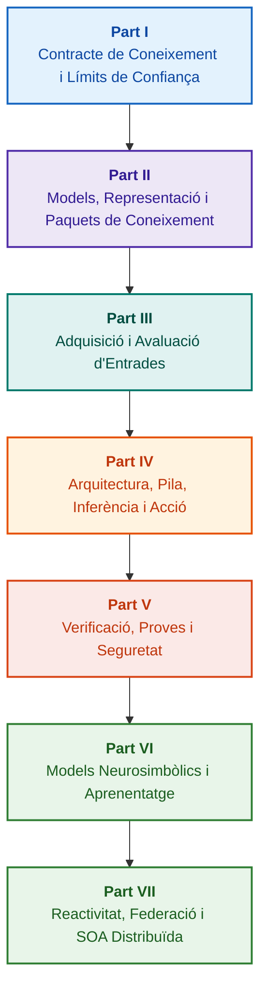

# Arquitectura de sistemes experts basats en evidències: d'ontologies formals a IA neurosimbòlica

**Monografia d'enginyeria i manual complet sobre el disseny, models matemàtics, arquitectura i verificació formal de sistemes intel·ligents d'alta fiabilitat (Safety-Critical & Evidence-Grounded AI)**

**Autor:** [Mykola Fedchyk (Микола Федчик)](../en/about-the-author.md) · [LinkedIn](https://www.linkedin.com/in/nickfedchik/)  
**Format:** Monografia d'Enginyeria / Manual de l'Arquitecte d'IA  
**Any:** 2026  

---

## Sobre el llibre

Aquest llibre és una recerca monogràfica fonamental i una guia pràctica d'enginyeria dedicada a superar la crisi central de la intel·ligència artificial contemporània: la bretxa epistèmica entre la versemblança probabilística dels models neuronals i la veritat determinista de les demostracions matemàtiques formals. Al cor de la recerca hi ha una pregunta d'enginyeria rigorosa: **com dissenyar un sistema expert on cada conclusió sigui irrefutable, completament traçable fins a les fonts primàries d'evidència i apta per a la certificació en dominis crítics de seguretat (ISO 26262, IEC 61508, DO-178C, ISO/SAE 21434)?**

L'autor fonamenta i estableix un nou paradigma: **IA Neurosimbòlica Basada en Evidències (Evidence-Grounded Neuro-Symbolic AI)**. En aquesta arquitectura, els models estadístics (LLM/SLM) exerceixen una funció consultiva de generació d'hipòtesis de consultes i renderització de projeccions; mentre que un nucli simbòlic determinista garanteix invariablement la consistència lògica, l'ancoratge de fets a nivell de bytes, el control de límits d'autoritat i la transició segura a l'acció.

### De l'artefacte d'enginyeria a la decisió verificable

Els requisits del sistema, el codi font, els registres de proves, els estàndards normatius i les decisions d'enginyeria ja són presents als entorns de producció moderns, però sovint funcionen com a artefactes aïllats sense semàntica formalitzada, sense límits estrictes de validesa i sense traçabilitat recíproca. Un informe de proves amb èxit pot fer referència a una revisió de maquinari obsoleta; una citació d'un estàndard de seguretat funcional es pot treure de context; i una reversió d'emergència de configuració pot reactivar indegudament un component revocat.

Aquesta monografia ofereix una canalització d'enginyeria completa: des de la formalització d'artefactes d'enginyeria com a dades tipades i paquets de coneixement signats criptogràficament — fins a la inferència simbòlica, la descomposició pas a pas de plans, explicacions contrafactuals i l'auditoria de límits de competència. L'exposició pràctica s'acompanya d'implementacions de grau industrial en llenguatge Go amb bancs de proves complets ([Capítol 1](../en/ch01-introduction-to-expert-systems.md)), contractes matemàtics estrictes ([Part II](../en/part-02-knowledge-models.md)) i protocols d'aprenentatge continu sense regressions de coneixement ([Capítol 25](../en/ch25-how-expert-systems-learn.md)).

### A qui s'adreça la monografia

La publicació s'adreça a arquitectes de sistemes, enginyers principals de fiabilitat i seguretat funcional, desenvolupadors de motors d'inferència lògica i enginyers de coneixement. Per a la comprensió inicial dels conceptes és suficient un coneixement bàsic de lògica de predicats de primer ordre, gestió de versions de programari i cicle de vida dels sistemes; per al desplegament dels exemples pràctics calen les eines estàndard de Go. Els capítols especialitzats dedicats a la síntesi formal d'arguments de seguretat Goal Structuring Notation (GSN), la sinergètica de sistemes complexos, acceleradors neuromòrfics i navegació autònoma sense GNSS mostren les fronteres més avançades de la IA basada en evidències a les indústries d'alta tecnologia (aeroespacial, transport autònom, infraestructura energètica crítica).

---

## Context científic i posicionament de la monografia en la recerca global

La monografia no considera els sistemes experts com un vestigi arcaic dels sistemes basats en regles dels anys 80 (com CLIPS o MYCIN), sinó com l'avantguarda de la **IA Neurosimbòlica Basada en Evidències de Tercera Onada (Third-Wave Evidence-Grounded Neuro-Symbolic AI)**. El treball es recolza en els fonaments teòrics de les principals escoles científiques globals, alhora que supera la distància entre models matemàtics abstractes i l'enginyeria de sistemes d'alt rendiment:

| Àmbit Científic | Obres Globals Clau i Autors | Pont Conceptual al Llibre |
|---|---|---|
| **IA Neurosimbòlica de Tercera Onada (NeSy)** | Artur d'Avila Garcez, Luis C. Lamb (*Neurosymbolic AI: The 3rd Wave*, 2023; *Neural-Symbolic Cognitive Reasoning*, Springer, 2009); Henry Kautz (*The Third AI Summer*, AAAI 2022) | Separació de responsabilitats: els models estadístics (SLM/LLM) generen hipòtesis de consultes, mentre que el nucli simbòlic determinista verifica i aprova formalment els fets ([Capítol 29](../en/ch29-neuro-symbolic-architecture.md)). |
| **Restriccions Semàntiques i Aprenentatge Segur** | Guy Van den Broeck et al. (*A Semantic Loss Function for Deep Learning with Symbolic Knowledge*, ICML 2018); Luc De Raedt et al. (*DeepProbLog*, IJCAI 2020) | Passarel·les de control d'admissió i sortida, filtratge semàntic determinista de propostes de la xarxa neuronal d'acord amb esquemes formals ([Capítols 28](../en/ch28-dual-mode-expert-systems.md), [33](../en/ch33-inter-system-knowledge-exchange-and-model-teaching.md)). |
| **Raonament Derrotable i Teoria de l'Argumentació** | John L. Pollock (*Defeasible Reasoning*, 1987; *Cognitive Carpentry*, MIT Press, 1995); Phan Minh Dung (*Abstract Argumentation Frameworks*, AIJ 1995); Douglas Walton (*Argumentation Schemes*, Cambridge, 2008) | Descomposició del coneixement en asseveracions, orígens i elements refutadors (*rebutting* i *undercutting defeaters*); resolució de conflictes en bases normatives mitjançant marcs d'argumentació Dung ([Capítols 2](../en/ch02-epistemology-of-machine-knowledge.md), [27](../en/ch27-safety-case-gsn-synthesis.md)). |
| **Mineria Autònoma de Regles d'Associació (KBC)** | Luis Galárraga, Fabian M. Suchanek et al. (*AMIE: Association Rule Mining under Incomplete Evidence*, WWW 2013, VLDBJ 2015); Stephen Muggleton (*Inductive Logic Programming*, 1994) | Inducció automàtica de regles a partir de bases de coneixement sota l'assumpció de completesa parcial (PCA) sense falsos contraexemples del món obert ([Capítol 34](../en/ch34-deterministic-relational-analysis-abduction-and-socratic-dialogue.md)). |
| **Escuts de Seguretat Formals i Certificació (Safe AI)** | Bettina Könighofer, Roderick Bloem et al. (*Shield Synthesis*, 2017); Tim Kelly, Rob Weaver (*Goal Structuring Notation*, York, 2004); André Platzer (*Logical Foundations of CPS*, Springer, 2018) | Síntesi de casos de seguretat en notació GSN per als estàndards ISO 26262/21434; escuts formals i envolupants de validesa numèrica per a actuadors perifèrics ([Capítols 27](../en/ch27-safety-case-gsn-synthesis.md), [30](../en/ch30-safety-cybersecurity-co-engineering.md), [33](../en/ch33-inter-system-knowledge-exchange-and-model-teaching.md)). |
| **Lògica Epistèmica i Semiótica del Coneixement** | John F. Sowa (*Knowledge Representation: Logical, Philosophical, and Computational Foundations*, 2000); Frank van Harmelen et al. (*Handbook of Knowledge Representation*, Elsevier, 2008) | Tríada epistèmica de Charles Sanders Peirce (Concepte → Judici → Conclusió); inferència abductiva d'hipòtesis sota control deductiu estricte ([Capítols 6](../en/ch06-applied-mathematics-for-expert-systems.md), [34](../en/ch34-deterministic-relational-analysis-abduction-and-socratic-dialogue.md)). |
| **Cibernètica i Sinergètica de Sistemes Complexos** | Norbert Wiener (*Cybernetics*, 1948); W. Ross Ashby (*An Introduction to Cybernetics*, 1956); Hermann Haken (*Synergetics: An Introduction*, 1977; *Advanced Synergetics*, 1983); Ilya Prigogine (*Order out of Chaos*, 1984) | Llei de la varietat necessària d'Ashby, bucles de control tancats L0–L4, reducció de l'espai d'estats a paràmetres d'ordre pel principi de subordinació d'Haken, predicció de transicions de fase per desacceleració crítica (*Critical Slowing Down*, CSD) i estabilització dissipativa de bases de coneixement ([Capítols 6](../en/ch06-applied-mathematics-for-expert-systems.md), [22](../en/ch22-cybernetics-edge-to-backend.md), [35](../en/ch35-self-organizing-expert-systems-synergetics-and-npu-runtime.md)). |
| **Proves de Coneixement, Invariància Lingüística i Calibratge Lipschitz** | Kent Beck (*TDD*, 2002); Martin Fowler (*Refactoring*, 2018); Clark Barrett, Leonardo de Moura (*Z3 SMT Solver*, 2008); Chuan Guo et al. (*On Calibration of Modern Neural Networks*, ICML 2017); Marco Tulio Ribeiro et al. (*CheckList*, ACL 2020); John L. Pollock (*Defeasible Reasoning*, 1987) | Piràmide de Proves de Coneixement de quatre nivells (KTP): proves unitàries de regles aïllades (KUT) amb simulació de premisses (`PremiseMock`), bloqueig del parany de la veritat vàcua, BVA espectral de 6 punts, xarxes de regles i derrotadors (KIT), mètrica d'invariància semàntica ($\text{SIS} \ge 0.98$) en variacions lingüístiques, continuïtat Lipschitz ($L_{\mathcal{K}} \le L_{\max}$) contra oscil·lacions de relé, i acumulació estigmèrgica de llacunes de coneixement ([Capítol 36](../en/ch36-knowledge-testing-pyramid-and-variational-calibration.md)). |

---

## Models teòrics, recerca científica i innovacions d'enginyeria de l'autor

Aquesta monografia sintetitza resultats fonamentals de recerca i l'experiència pràctica d'enginyeria de l'autor en el disseny de sistemes d'alta fiabilitat, arquitectures encastades i IA basada en evidències. A diferència d'estudis purament descriptius, el llibre desenvolupa una sèrie de teories formals originals, protocols i solucions d'arquitectura que eleven la interacció neurosimbòlica a un nivell de confiança demostrable matemàticament:

### 1. Desenvolupaments teòrics fonamentals i formalismes matemàtics

1. **Invariant d'Ancoratge d'Evidències (Evidence-Grounded Invariant, EGI) i Passarel·la de Validació de Fets ([Capítols 2](../en/ch02-epistemology-of-machine-knowledge.md), [19](../en/ch19-from-question-to-evidence.md), [28](../en/ch28-dual-mode-expert-systems.md), [29](../en/ch29-neuro-symbolic-architecture.md)):**
   * *Concepte Teòric:* L'autor formula i formalitza matemàticament l'invariant de completesa d'ancoratge $\mathrm{Comp}(C) = 1.00$, que estableix que en un sistema basat en evidències cap asseveració pot obtenir l'estatus de fet sense una projecció determinista sobre les fonts primàries de coneixement. Cada element de la base de fets s'acompanya d'una tupla criptogràfica: coordenades immutables de bytes `[byte_start, byte_end]`, hash del fragment canònic `quote_sha256` i identificador del certificat de procedència PROV-O.
   * *Importància d'Enginyeria:* El mecanisme de passarel·la de control a nivell de bytes a nivell de maquinari i programari impossibilita per complet la penetració d'al·lucinacions de xarxes neuronals a la base de coneixement versionada, garantint tolerància zero a dades no verificades ($ZHR = 1.00$).
2. **Piràmide de Proves de Coneixement de Quatre Nivells (KTP) i Estabilitat Lipschitz de l'Espai d'Inferència ([Capítol 36](../en/ch36-knowledge-testing-pyramid-and-variational-calibration.md)):**
   * *Concepte Teòric:* L'autor proposa per primera vegada una Piràmide sistemàtica de Proves de Coneixement (KTP), anàloga a la piràmide de proves de programari de Martin Fowler: proves unitàries de regles aïllades (`PremiseMock`) (KUT), proves d'integració d'interacció de regles i derrotadors (KIT), i calibratge variacional sobre varietats de formulació (KVT).
   * *Aparell Matemàtic:* Invariant estricte per bloquejar el parany de la veritat vàcua ($P \to Q$ quan $P \equiv \text{False}$), mètrica d'invariància semàntica ($\mathrm{SIS} \ge 0.98$) sota pertorbacions lingüístiques, i restricció de continuïtat Lipschitz de l'espai d'inferència ($L_{\mathcal{K}} \le L_{\max}$), que elimina matemàticament l'oscil·lació catastròfica de conclusions davant petites fluctuacions d'entrada.
3. **Teoria de Falsació Popperiana de Normes Deòntiques i Auditor de Compliment Actiu ([Capítol 39](../en/ch39-active-compliance-auditor-and-popperian-testing.md)):**
   * *Concepte Teòric:* Transició del model clàssic d'"oracle passiu" (que només respon consultes) al paradigma d'un auditor actiu de coneixement que aplica el principi de falsació de Karl Popper. El sistema explora autònomament l'espai de requisits (ASPICE 4.0, ISO 26262, ISO/SAE 21434), sintetitza contraexemples, identifica especificacions incompletes i dissenya un programa exhaustiu de proves de producte.
   * *Valor Pràctic:* Combinació de generació creativa d'escenaris límit per la xarxa neuronal (Sistema 1) i verificació deòntica determinista pel nucli simbòlic (Sistema 2) amb protecció garantida de l'ésser humà al bucle de control (Human-in-the-Loop) davant la fatiga d'aprovacions.
4. **Reducció Sinergètica de Dimensionalitat de la Base de Coneixement i Diagnòstic Pre-Bifurcació CSD ([Capítols 6](../en/ch06-applied-mathematics-for-expert-systems.md), [22](../en/ch22-cybernetics-edge-to-backend.md), [35](../en/ch35-self-organizing-expert-systems-synergetics-and-npu-runtime.md)):**
   * *Concepte Teòric:* Aplicació de l'aparell matemàtic de la sinergètica d'Hermann Haken (paràmetres d'ordre i principi de subordinació) i de la teoria d'estructures dissipatives d'Ilya Prigogine a l'evolució de bases de coneixement complexes.
   * *Resultat Científic:* Desenvolupament d'un mètode per reduir l'espai d'estats multidimensional de telemetria a paràmetres d'ordre i integració d'un detector de desacceleració crítica (*Critical Slowing Down*, CSD) basat en autocorrelació i dispersió, que permet preveure el col·lapse dinàmic del sistema molt abans que s'activin els sensors de llindar d'emergència.
5. **Model de Nivells d'Autonomia d'Acció (A0–A4), Passarel·la d'Autorització i Sagues Idempotents ([Capítol 21](../en/ch21-from-recommendation-to-action.md)):**
   * *Concepte Teòric:* Escala discreta d'autoritat d'acció del sistema (A0: anàlisi passiva, A1: preparació d'esborrany, A2: acció sota signatura humana, A3: autonomia supervisada, A4: desconnexió protectora d'emergència) assignada a la tupla "acció, entorn, nivell de risc".
   * *Aparell Matemàtic:* Invariant algebraic d'idempotència $f(f(x, k), k) \equiv f(x, k)$ basat en la clau criptogràfica $k$, execució pas a pas en bucle tancat, i protocol de sagues de compensació distribuïdes amb estat `OutcomeUnknown` i verificació independent de postcondicions.
6. **Coenginyeria Formal de Seguretat Funcional i Ciberseguretat en Notació GSN ([Capítols 27](../en/ch27-safety-case-gsn-synthesis.md), [30](../en/ch30-safety-cybersecurity-co-engineering.md)):**
   * *Concepte Teòric:* Model de síntesi coordinada d'arbres d'argumentació GSN (Goal Structuring Notation) que compleixen simultàniament els requisits dels estàndards ISO 26262 (seguretat funcional) i ISO/SAE 21434 (ciberseguretat).
   * *Avanç d'Enginyeria:* Formalització d'arbitratge matemàtic entre objectius en conflicte (pressupost de temps de resposta d'emergència enfront de profunditat d'atestació criptogràfica) i protocol de revelació selectiva de proves a auditors externs mitjançant arbres de Merkle amb sal.
7. **Protocol de Verificació de Fidelitat i Consistència Semàntica d'Explicacions ([Capítol 20](../en/ch20-explanation-engine.md)):**
   * *Concepte Teòric:* L'explicació es tracta no pas com un text lliure d'un model generatiu, sinó com un artefacte determinista autònom derivat exclusivament del graf de prova, la versió de regles i la foto fixa de fets acreditada.
   * *Aparell Matemàtic:* Passarel·la mètrica d'avaluació de fidelitat ($C_{\text{facts}} = 1.00, H_{\text{free}} = 1.00$) amb reversió automàtica fail-safe a plantilla rígida davant la més mínima divergència entre la inferència simbòlica i la verbalització per a l'operador.

---

### 2. Recerca Empírica, Bancs d'Assaig de l'Autor i Enginyeria de Sistemes

1. **Paquets de Coneixement Binaris Immutables amb `mmap` i Deserialització Zero ([Capítol 32](../en/ch32-high-performance-knowledge-packs-mmap-and-harvesting.md)):**
   * *Innovació de l'Autor:* Arquitectura en dues capes per als paquets (capa canònica de fonts primàries + capa materialitzada derivada d'índexs).
   * *Resultat Empíric:* Mapeig directe de l'índex a l'espai d'adreces virtuals mitjançant la crida de sistema `mmap`, eliminació de sobrecostos d'assignació dinàmica de memòria (zero-allocation), i arrencada del motor en temps sublineal independentment del volum en gigabytes de l'ontologia.
2. **Polígon de Calibratge Empíric sobre Corpus Estàndard IETF RFC-1000 i W3C-150 ([Capítols 2](../en/ch02-epistemology-of-machine-knowledge.md), [4](../en/ch04-evolution-from-bayes-to-evidence-ai.md), [14](../en/ch14-requirements-detection-and-formalization.md), [25](../en/ch25-how-expert-systems-learn.md)):**
   * *Experiment de l'Autor:* Desplegament d'un banc de recerca a gran escala sobre 1.000 especificacions vàlides IETF RFC (distribuïdes en 5 èpoques històriques del desenvolupament d'Internet) i 150 consultes diagnòstiques complexes del corpus W3C (incloent-hi la inducció artificial de conflictes lògics i confabulacions).
   * *Resultat Pràctic:* Construcció de matrius d'examen objectives de coneixement, detecció de contradiccions normatives i protecció provada matemàticament contra regressions a la base de coneixement durant les actualitzacions.
3. **Anàlisi Relacional en Diversos Passos, Abducció Simbòlica i Diàleg Socràtic ([Capítol 34](../en/ch34-deterministic-relational-analysis-abduction-and-socratic-dialogue.md)):**
   * *Desenvolupament de l'Autor:* Algorisme de cerca en amplada limitada bidireccional (Bidirectional Bounded BFS, $k \le 6$) amb protecció contra cicles i formació de cadenes d'evidència compostes a nivell de bytes per a entitats relacionades.
   * *Avantatge d'Enginyeria:* Implementació de l'abducció simbòlica de Peirce sota estricte control deductiu i marcs de clarificació socràtics tipats (*Clarification Frames*), que situen el sistema en mode de diàleg productiu amb l'humà en comptes d'un rebuig cec sota l'assumpció de món tancat (CWA).
4. **Escuts Formals i Envolupants de Validesa Numèrica per a Sistemes de Control Perifèrics ([Capítol 33](../en/ch33-inter-system-knowledge-exchange-and-model-teaching.md), [Apèndixs B](../en/appendix-b-robotics-and-cyber-physical-systems.md), [C](../en/appendix-c-autonomous-navigation-and-geosearch.md), [E](../en/appendix-e-mixed-signal-neuromorphic-expert-systems.md)):**
   * *Innovació de l'Autor:* Metodologia per traduir invariants lògics discrets en corredors de seguretat numèrics continus per a processadors de senyals digitals (DSP) i sistemes de navegació autònoma sense GNSS (TRN/DSMAC/VIO).
   * *Fiabilitat Operativa:* Intercanvi de regles signades basat en criptografia Ed25519, quarantena segura de candidats de coneixement i tall d'ordres de control perilloses a nivell de maquinari.
5. **Protecció Contra Fuites d'Informació Confidencial Mitjançant Explicacions i Auditoria Diferencial ([Capítol 20](../en/ch20-explanation-engine.md)):**
   * *Desenvolupament de l'Autor:* Protocol de reducció de representació intermèdia d'explicacions ($\mathrm{EIR}_{\text{redacted}}$) amb verificació ACL per a cada node i aresta del graf de demostració, blocant atacs de canal lateral per reconstruir models mitjançant sèries de consultes contrastives WHY NOT.

---

## Principi d'agrupament i classificació

Les parts del llibre es defineixen per la tasca principal d'enginyeria, i no per l'any d'escriptura del capítol o el nom d'una tecnologia en concret. Cada capítol pertany a una part principal; els mètodes associats expliquen com resoldre la seva pregunta central. Els números de capítol i els noms de fitxers romanen com a identificadors fixos, per la qual cosa l'ordre temàtic de lectura pot diferir de l'ordre numèric.

Els títols de les subseccions dins dels capítols formen classes clares i s'han de llegir com una seqüència contínua d'arguments, no pas com una llista de tecnologies equivalents:

| Classe de Subsecció | Pregunta del Lector | Funció al Capítol |
|---|---|---|
| Problema i Límit de la Tasca | Què cal resoldre exactament? | Defineix la pregunta principal i l'àmbit d'aplicació |
| Objecte i Model | Quines dades, coneixements o estats s'examinen? | Harmonitza conceptes, tipus i assumpcions |
| Mètode i Procediment | Com s'obté el resultat? | Explica la inferència, transformació o control |
| Implementació i Eina | Amb quina eina s'executa el procediment? | Mostra la materialització en programari o maquinari del mètode |
| Verificació i Cas de Control | Com es detecta un error? | Compara el resultat amb un criteri independent |
| Conclusió i Límits del Resultat | Què s'ha provat i què roman obert? | Respon a la pregunta principal sense promeses desmesurades |

Un país, una indústria o un producte comercial constitueixen un context d'aplicació, no un nivell independent d'aquesta taxonomia. El glossari, les abreviatures, les fonts i la navegació són eines de referència auxiliars, no pas temes independents de capítol.

El mapa complet de revisió editorial conté una avaluació del tema principal de cada capítol, els límits entre discussions adjacents i observacions sobre la composició i conclusions. Una nova nota comentada no implica que tots els riscos de contingut dins dels capítols ja s'hagin eliminat per complet.

---

## Itineraris de lectura recomanats

**Primera Verificació de Programari:** [1](../en/ch01-introduction-to-expert-systems.md) → [7](../en/ch07-knowledge-base-typology.md) → [8](../en/ch08-engineering-artifacts-as-data.md) → [17](../en/ch17-implementation-stack.md) → [23](../en/ch23-knowledge-base-verification.md) → [25](../en/ch25-how-expert-systems-learn.md). Objectiu: Veredicte reproduïble amb base d'evidència, proves negatives i canvi controlat de coneixement. No cal un model lingüístic.

**Enginyeria del Coneixement:** [Part II](../en/part-02-knowledge-models.md) → [Part III](../en/part-03-knowledge-engineering-nlp.md) → [19](../en/ch19-from-question-to-evidence.md) → [20](../en/ch20-explanation-engine.md) → [26](../en/ch26-continual-learning.md). Objectiu: Alinear semàntica, procedència, adquisició de coneixement i validació de nous candidats. La Part II conserva el programa d'assaig científic per als capítols 7–11.

**Arquitectura de la Solució:** [16](../en/ch16-expert-systems-architecture.md) → [19](../en/ch19-from-question-to-evidence.md) → [31](../en/ch31-syllogistic-reasoning-and-relation-lattices.md) → [20](../en/ch20-explanation-engine.md) → [21](../en/ch21-from-recommendation-to-action.md). Objectiu: Separació estricta entre verificació d'evidències, aplicació de la norma, explicació i autoritat per a l'acció.

**Verificació i Seguretat:** [23](../en/ch23-knowledge-base-verification.md) → [36](../en/ch36-knowledge-testing-pyramid-and-variational-calibration.md) → [25](../en/ch25-how-expert-systems-learn.md) → [26](../en/ch26-continual-learning.md) → [27](../en/ch27-safety-case-gsn-synthesis.md) → [30](../en/ch30-safety-cybersecurity-co-engineering.md). El diagnòstic d'un objecte extern es gestiona de manera dedicada mitjançant el [Capítol 24](../en/ch24-system-diagnosis.md).

**Respostes Híbrides i Operació:** [Part VI](../en/part-06-frontiers-neuro-symbolic.md) → [Part VII](../en/part-07-runtime-and-knowledge-exchange.md) → [40](../en/ch40-distributed-epistemic-architectures-soa-and-cluster-scaling.md) i apèndixs pertinents. Objectiu: Integrar el model lingüístic, gestionar llacunes de coneixement, construir una arquitectura de serveis de coneixement distribuïda i verificar l'intercanvi entre sistemes. Els capítols [2](../en/ch02-epistemology-of-machine-knowledge.md), [4](../en/ch04-evolution-from-bayes-to-evidence-ai.md) i [6](../en/ch06-applied-mathematics-for-expert-systems.md) es poden llegir com a contracte, història i manual matemàtic segons calgui.

---

## Límits dels compromisos d'enginyeria

Aquest llibre és un material educatiu i de recerca, i no pas un procediment de certificació ni una prova oficial de conformitat d'un producte amb un estàndard. L'execució determinista no demostra per si sola la correcció dels fets; un hash i una signatura digital no proven la veritat absoluta; i un graf d'arguments no substitueix l'avaluació d'un especialista humà. Els requisits de fiabilitat d'un producte sencer no s'han d'equiparar amb la taxa d'error d'un model lingüístic ni atribuir-se a tots els components de programari.

L'anàlisi automatitzada redueix l'entrada manual de dades, però no elimina el modelatge de domini, la revisió per parells i la responsabilitat dels propietaris del coneixement. Protégé, la revisió manual i la collita automàtica poden col·laborar eficaçment. Les garanties matemàtiques s'apliquen únicament a un perfil de llenguatge i assumpcions específiques; les velocitats mesurades corresponen a la consulta, el corpus i l'entorn provat concrets. Les dades d'arxiu de l'autor estan estrictament separades d'entorns d'aprenentatge oberts i de recerques futures pendents de realització.

Les decisions sobre llançament de producte, acceptació de riscos i compliment de requisits normatius de la indústria romanen sota la responsabilitat d'especialistes humans autoritzats. El sistema expert prepara material verificable i fa complir una política acordada, però no adquireix per si mateix autoritat reguladora ni legal.

---

## Estructura del llibre

El llibre consta de set parts temàtiques, 40 capítols i cinc apèndixs. Cada capítol pertany a una part principal. El capítol anterior i el següent en la navegació segueixen l'ordre temàtic indicat a continuació; els números de capítol i els noms de fitxers es mantenen invariables.

---

### [Part I. Fonaments conceptuals i epistèmics](../en/part-01-foundations.md)

*Quan cal un sistema expert, què es pot considerar coneixement i com preservar els fonaments de les decisions organitzatives.*

* [Capítol 1. Introducció als sistemes experts: Del caos al coneixement gestionat](../en/ch01-introduction-to-expert-systems.md)
* [Capítol 2. Filosofia per a l'enginyer: Què té dret a anomenar coneixement una màquina](../en/ch02-epistemology-of-machine-knowledge.md)
* [Capítol 3. Què diferencia un sistema expert d'un sistema d'informació i referència](../en/ch03-beyond-reference-information-systems.md)
* [Capítol 4. Evolució dels sistemes experts: Del teorema de Bayes a solucions d'IA basades en evidències](../en/ch04-evolution-from-bayes-to-evidence-ai.md)
* [Capítol 5. Tríada de la confiança: Sistema expert, recomanació basada en evidències i memòria corporativa](../en/ch05-triad-of-trust-and-corporate-memory.md)

---

### [Part II. Models matemàtics, representació i emmagatzematge del coneixement](../en/part-02-knowledge-models.md)

*Elecció d'operacions matemàtiques i representacions, artefactes tipats, graf de traçabilitat i paquet de coneixement immutable.*

* [Capítol 6. Matemàtiques aplicades per a sistemes experts: Regles, probabilitats, grafs i causalitat](../en/ch06-applied-mathematics-for-expert-systems.md)
* [Capítol 7. Tipologia de bases de coneixement: Regles, ontologies, precedents i vectors](../en/ch07-knowledge-base-typology.md)
* [Capítol 8. Artefactes d'enginyeria com a dades d'un sistema expert](../en/ch08-engineering-artifacts-as-data.md)
* [Capítol 9. Graf de coneixement d'enginyeria: Traçabilitat de requisits a maquinari](../en/ch09-engineering-knowledge-graph-traceability.md)
* [Capítol 32. Paquets de coneixement immutables: Validació a nivell de bytes, índexs i mapatge de memòria](../en/ch32-high-performance-knowledge-packs-mmap-and-harvesting.md)

---

### [Part III. Adquisició de coneixement, anàlisi lingüística i avaluació d'entrades](../en/part-03-knowledge-engineering-nlp.md)

*Documents, experiència d'especialistes i observacions: extracció de candidats, anàlisi lingüística, formalització i avaluació d'evidències.*

* [Capítol 10. Sistemes d'adquisició de coneixement: Fonts, admissió i cicle de vida](../en/ch10-knowledge-acquisition-systems.md)
* [Capítol 11. Extracció de coneixement a partir d'experts: Entrevistes, mapes cognitius i formalització de l'experiència](../en/ch11-knowledge-elicitation-from-experts.md)
* [Capítol 12. Anàlisi lingüística i models locals: Preservació de sentit i fonts](../en/ch12-linguistic-analysis-and-local-models.md)
* [Capítol 13. Variabilitat del llenguatge natural enfront del determinisme: Compilació del sentit de la consulta](../en/ch13-language-variability-vs-determinism.md)
* [Capítol 14. Detecció de requisits i modalitats: Del text normatiu als invariants](../en/ch14-requirements-detection-and-formalization.md)
* [Capítol 15. Extracció de coneixement i construcció de la base de coneixement: Fets, gramàtiques i autòmats](../en/ch15-knowledge-extraction-and-kb-construction.md)
* [Capítol 37. Avaluació de la informació d'entrada: Fonts, evidències i incertesa](../en/ch37-input-information-assessment-and-algorithmic-skepticism.md)

---

### [Part IV. Arquitectura, pila tecnològica, inferència i acció](../en/part-04-architecture-and-inference.md)

*Contractes d'arquitectura, pila tecnològica, execució en maquinari, verificació d'asseveracions, inferència basada en normes, explicació i bucle de control cibernètic.*

* [Capítol 16. Arquitectura d'un sistema expert: Del coneixement formal a la decisió basada en evidències](../en/ch16-expert-systems-architecture.md)
* [Capítol 17. Pila tecnològica: Criteris per a la selecció d'eines, llenguatges de programació i motors de regles](../en/ch17-implementation-stack.md)
* [Capítol 18. Infraestructura d'execució: Models locals, acceleradors de maquinari, Edge i On-Premise](../en/ch18-execution-infrastructure.md)
* [Capítol 19. De la consulta a l'evidència: Cerca, ancoratge i verificació d'asseveracions](../en/ch19-from-question-to-evidence.md)
* [Capítol 31. Inferència basada en normes: Jerarquies de predicats, excepcions i validesa](../en/ch31-syllogistic-reasoning-and-relation-lattices.md)
* [Capítol 20. Motor d'explicacions: Decisió, rebuig i límits de competència](../en/ch20-explanation-engine.md)
* [Capítol 21. De la recomanació a l'acció: Control d'autoritat i execució segura en l'entorn de producció](../en/ch21-from-recommendation-to-action.md)
* [Capítol 22. Bucle de control cibernètic: Sensors, perifèrics i retroalimentació](../en/ch22-cybernetics-edge-to-backend.md)

---

### [Part V. Verificació, proves, diagnòstic i cas de seguretat](../en/part-05-verification-and-learning.md)

*Verificació formal de regles, piràmide de proves de coneixement, falsació popperiana, diagnòstic tècnic i arguments de seguretat funcional i ciberseguretat.*

* [Capítol 23. Verificació de la base de coneixement: Com comprovar la consistència, completesa i fiabilitat de regles](../en/ch23-knowledge-base-verification.md)
* [Capítol 36. Piràmide de proves de coneixement: Regles, interaccions i estabilitat de respostes](../en/ch36-knowledge-testing-pyramid-and-variational-calibration.md)
* [Capítol 39. Auditor de compliment actiu: Falsació popperiana, compliment normatiu (ASPICE/ISO 26262/ISO 21434) i disseny autònom de proves](../en/ch39-active-compliance-auditor-and-popperian-testing.md)
* [Capítol 24. Diagnòstic tècnic: Com no confondre símptoma amb causa arrel sota incomplets de dades](../en/ch24-system-diagnosis.md)
* [Capítol 27. Cas de seguretat: Síntesi i verificació d'arguments](../en/ch27-safety-case-gsn-synthesis.md)
* [Capítol 30. Coenginyeria de seguretat funcional i ciberseguretat](../en/ch30-safety-cybersecurity-co-engineering.md)

---

### [Part VI. Models neurosimbòlics, fronteres cognitives i aprenentatge continu](../en/part-06-frontiers-neuro-symbolic.md)

*Inferència estricta i hipòtesi consultiva, integració de models lingüístics, llacunes de coneixement, control de respostes no confirmades, matrius d'examen i aprenentatge continu a partir de l'experiència.*

* [Capítol 28. Sistemes experts de mode dual: Inferència estricta i hipòtesi consultiva](../en/ch28-dual-mode-expert-systems.md)
* [Capítol 29. Arquitectura neurosimbòlica: Models lingüístics i verificació de fonaments d'evidència](../en/ch29-neuro-symbolic-architecture.md)
* [Capítol 34. Llacunes de coneixement: Cerca relacional, abducció i diàleg de clarificació](../en/ch34-deterministic-relational-analysis-abduction-and-socratic-dialogue.md)
* [Capítol 38. Al·lucinacions de màquines i dèficits de coneixement: Control de respostes basat en evidències](../en/ch38-curing-machine-hallucinations-and-knowledge-deficits.md)
* [Capítol 25. Com entrenar un sistema expert: Matrius d'examen, auditoria de coneixement i control de regressions](../en/ch25-how-expert-systems-learn.md)
* [Capítol 26. Aprenentatge continu (Continual Learning) a partir de l'experiència i superació de la deriva de registres de sistema](../en/ch26-continual-learning.md)

---

### [Part VII. Execució reactiva, intercanvi de coneixement entre sistemes i SOA distribuïda](../en/part-07-runtime-and-knowledge-exchange.md)

*Execució reactiva de regles, sinergètica i transicions de fase del coneixement, intercanvi entre sistemes i arquitectura epistèmica distribuïda a escala empresarial.*

* [Capítol 35. Sistema expert reactiu: Esdeveniments, revocació i adaptació del coneixement](../en/ch35-self-organizing-expert-systems-synergetics-and-npu-runtime.md)
* [Capítol 33. Intercanvi de coneixement entre sistemes: Provisió de regles a sistemes externs, entrenament de models i retroalimentació segura](../en/ch33-inter-system-knowledge-exchange-and-model-teaching.md)
* [Capítol 40. Arquitectura distribuïda de sistemes experts basats en evidències: SOA epistèmica, encaminament semàntic, jerarquia de memòria i arbitratge derrotable multifurnidor](../en/ch40-distributed-epistemic-architectures-soa-and-cluster-scaling.md)

---

### Apèndixs

* [Apèndix A. Marc pràctic per a la recerca basada en evidències en projectes d'enginyeria complexos](../en/appendix-a-evidence-governed-framework.md)
* [Apèndix B. Sistemes experts basats en evidències en robòtica autònoma i complexos ciberfísics](../en/appendix-b-robotics-and-cyber-physical-systems.md)
* [Apèndix C. Navegació autònoma sense GNSS: Coincidència geoespacial (TRN/DSMAC), odometria visual (VIO) i arbitratge expert de fusió de sensors](../en/appendix-c-autonomous-navigation-and-geosearch.md)
* [Apèndix D. Sistemes experts analògics, computació neuromòrfica i inferència lògica en maquinari](../en/appendix-d-analog-expert-systems-and-neuromorphic-computing.md)
* [Apèndix E. Sistemes experts de senyal mixt analògic-digital: Computació neuromòrfica, analògica i no convencional sota control basat en evidències](../en/appendix-e-mixed-signal-neuromorphic-expert-systems.md)
* [Sobre l'autor: Mykola Fedchyk (Nick Fedchik)](../en/about-the-author.md)

---

## Línies de recerca futures

Les línies de treball futur no són promeses tancades: construcció reproduïble de paquets de coneixement; verificació de representació formal limitada; governança d'agents mitjançant autoritats explícites; verificació confidencial d'asseveracions formals específiques; revocació controlada i recerca sobre desaprenentatge automàtic (machine unlearning). La demostració d'una propietat d'un model no confirma automàticament la conformitat del producte físic, i l'eliminació d'una regla no equival a eliminar completament la influència de les dades del model entrenat.

Per a acceleradors de maquinari i computadors no convencionals, es mesuren en primer lloc la taxa d'error, la latència, el consum energètic i el comportament davant fallades. Aquestes qüestions es tracten al [Capítol 29](../en/ch29-neuro-symbolic-architecture.md), al [Capítol 32](../en/ch32-high-performance-knowledge-packs-mmap-and-harvesting.md) i als [Apèndixs D](../en/appendix-d-analog-expert-systems-and-neuromorphic-computing.md) i [E](../en/appendix-e-mixed-signal-neuromorphic-expert-systems.md). El programa de recerca pràctica per als capítols 7–11 es presenta a la [Part II](../en/part-02-knowledge-models.md): cada proposta disposa d'una hipòtesi, una comparació de control i una condició de falsació.
