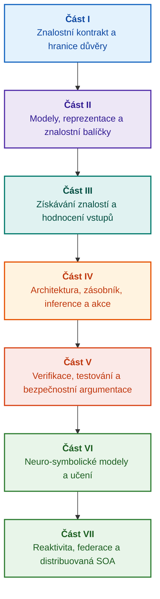

# Architektura důkazně řízených expertních systémů: Od formálních ontologií k neuro-symbolické AI

**Inženýrská monografie a referenční příručka pro návrh, matematické základy, architekturu a verifikaci vysoce spolehlivých inteligentních systémů (Safety-Critical & Evidence-Grounded AI)**

**Autor:** [Mykola Fedchyk](../en/about-the-author.md) · [LinkedIn](https://www.linkedin.com/in/nickfedchik/)  
**Formát:** Inženýrská monografie / Referenční příručka architekta AI  
**Rok:** 2026  

---

## O knize

Tato monografie představuje fundamentální výzkumné zkoumání a inženýrskou příručku věnovanou překonání prvořadé krize moderní umělé inteligence: epistemické propasti mezi pravděpodobnostní věrohodností generování neuronových sítí a deterministickou pravdivostí formálních matematických důkazů. V jádru tohoto výzkumu leží nekompromisní otázka: **jak navrhnout expertní systém, jehož každý závěr je nevyvratitelný, plně trasovatelný k primárním důkazním zdrojům a způsobilý k certifikaci v bezpečnostně kritických inženýrských doménách (ISO 26262, IEC 61508, DO-178C, ISO/SAE 21434)?**

Autor zdůvodňuje a zavádí nové paradigma: **důkazně ukotvenou neuro-symbolickou AI (Evidence-Grounded Neuro-Symbolic AI)**, v níž statistické modely (LLM/SLM) plní poradní funkci generování hypotéz a vizualizace projekcí, zatímco deterministické symbolické jádro neměnně garantuje invarianty logické bezrozpornosti, bajtového ukotvení faktů, vymáhání autoritních mezí a bezpečného přechodu k provedení akcí.

### Od artefaktu k ověřitelnému rozhodnutí

Systémové požadavky, zdrojový kód, protokoly o spuštění testů, normativní standardy a inženýrská rozhodnutí dnes prostupují moderní produkční prostředí. Převážně však fungují jako nesouvislé artefakty bez formalizované sémantiky, explicitních hranic platnosti a obousměrné trasovatelnosti. Úspěšný kvalifikační test může odkazovat na zastaralou hardwarovou revizi; citace z normy funkční bezpečnosti může být vytržena z kontextu; automatický nouzový návrat konfigurace může nevědomky aktivovat odvolanou komponentu.

Tato monografie buduje ucelený inženýrský konvejer: od formalizace inženýrských artefaktů jako typovaných dat a kryptograficky podepsaných znalostních balíčků až po symbolickou inferenci, dekompozici plánů krok za krokem, kontrafaktuální vysvětlení a audit kompetenčních mezí. Praktický výklad je podložen produkčními implementacemi v jazyce Go s vyčerpávajícími testovacími sadami ([Kapitola 1](../en/ch01-introduction-to-expert-systems.md)), rigorózními matematickými kontrakty ([Část II](../en/part-02-knowledge-models.md)) a protokoly kontinuálního učení s prokazatelným vyloučením regresí ([Kapitola 25](../en/ch25-how-expert-systems-learn.md)).

### Cílová skupina

Kniha je určena systémovým architektům, vedoucím inženýrům spolehlivosti a funkční bezpečnosti, vývojářům inferenčních strojů a znalostním inženýrům. Výchozí osvojení klíčových konceptů vyžaduje pouze základní znalost predikátové logiky prvního řádu, verzování softwaru a řízení životního cyklu; replikace praktických příkladů využívá standardní nástroje ekosystému Go. Specializované kapitoly věnované formální syntéze Goal Structuring Notation (GSN), synergetice komplexních systémů, neuromorfním akcelerátorům a autonomní navigaci v prostředí bez GNSS otevírají špičkové hranice důkazně řízené AI v letectví, autonomních vozidlech a kritické infrastruktuře.

---

## Vědecký kontext a globální zařazení monografie

Tato monografie nepřistupuje k expertním systémům jako k archaickému dědictví pravidlových systémů z 80. let (např. CLIPS nebo MYCIN), nýbrž jako k avantgardě **třetí vlny důkazně řízené neuro-symbolické AI (Third-Wave Evidence-Grounded Neuro-Symbolic AI)**. Metodologie propojuje teoretické základy předních světových vědeckých škol s vysoce výkonným systémovým inženýrstvím:

| Vědecká disciplína | Klíčová světová díla a autoři | Koncepční most v této monografii |
|---|---|---|
| **Neuro-symbolická AI třetí vlny (NeSy)** | Artur d'Avila Garcez, Luis C. Lamb (*Neurosymbolic AI: The 3rd Wave*, 2023; *Neural-Symbolic Cognitive Reasoning*, Springer, 2009); Henry Kautz (*The Third AI Summer*, AAAI 2022) | Oddělení zodpovědností: statistické modely (SLM/LLM) generují hypotézy dotazů, zatímco deterministické symbolické jádro formálně verifikuje a schvaluje fakta ([Kapitola 29](../en/ch29-neuro-symbolic-architecture.md)). |
| **Sémantická omezení a bezpečné učení** | Guy Van den Broeck et al. (*A Semantic Loss Function for Deep Learning with Symbolic Knowledge*, ICML 2018); Luc De Raedt et al. (*DeepProbLog*, IJCAI 2020) | Vstupní a výstupní brány, deterministická sémantická filtrace kandidátních tvrzení neuronových sítí vůči formálním schématům ([Kapitoly 28](../en/ch28-dual-mode-expert-systems.md), [33](../en/ch33-inter-system-knowledge-exchange-and-model-teaching.md)). |
| **Vyvratitelné usuzování a teorie argumentace** | John L. Pollock (*Defeasible Reasoning*, 1987; *Cognitive Carpentry*, MIT Press, 1995); Phan Minh Dung (*Abstract Argumentation Frameworks*, AIJ 1995); Douglas Walton (*Argumentation Schemes*, Cambridge, 2008) | Dekompozice znalostí na tvrzení, provenienci a vyvracející okolnosti (*defeaters*: *rebutting* a *undercutting*); řešení konfliktů v normativních bázích pravidel pomocí Dungových argumentačních rámců ([Kapitoly 2](../en/ch02-epistemology-of-machine-knowledge.md), [27](../en/ch27-safety-case-gsn-synthesis.md)). |
| **Automatizované dolování asociačních pravidel (KBC)** | Luis Galárraga, Fabian M. Suchanek et al. (*AMIE: Association Rule Mining under Incomplete Evidence*, WWW 2013, VLDBJ 2015); Stephen Muggleton (*Inductive Logic Programming*, 1994) | Autonomní indukce pravidel ze znalostních bází za předpokladu částečné úplnosti (PCA), eliminující falešné protipříklady v otevřeném světě ([Kapitola 34](../en/ch34-deterministic-relational-analysis-abduction-and-socratic-dialogue.md)). |
| **Formální bezpečnostní štíty a certifikace (Safe AI)** | Bettina Könighofer, Roderick Bloem et al. (*Shield Synthesis*, 2017); Tim Kelly, Rob Weaver (*Goal Structuring Notation*, York, 2004); André Platzer (*Logical Foundations of CPS*, Springer, 2018) | Syntéza strukturovaných bezpečnostních argumentací v notaci GSN pro standardy ISO 26262/21434; formální štíty a numerické obálky platnosti pro akční členy na periferii ([Kapitoly 27](../en/ch27-safety-case-gsn-synthesis.md), [30](../en/ch30-safety-cybersecurity-co-engineering.md), [33](../en/ch33-inter-system-knowledge-exchange-and-model-teaching.md)). |
| **Epistemická logika a sémiotika znalostí** | John F. Sowa (*Knowledge Representation: Logical, Philosophical, and Computational Foundations*, 2000); Frank van Harmelen et al. (*Handbook of Knowledge Representation*, Elsevier, 2008) | Epistemická triáda Charlese Sanderse Peirce (Pojem → Soud → Úsudek); abduktivní generování pracovních hypotéz pod striktním deduktivním dohledem ([Kapitoly 6](../en/ch06-applied-mathematics-for-expert-systems.md), [34](../en/ch34-deterministic-relational-analysis-abduction-and-socratic-dialogue.md)). |
| **Kybernetika a synergetika komplexních systémů** | Norbert Wiener (*Cybernetics*, 1948); W. Ross Ashby (*An Introduction to Cybernetics*, 1956); Hermann Haken (*Synergetics: An Introduction*, 1977; *Advanced Synergetics*, 1983); Ilya Prigogine (*Order out of Chaos*, 1984) | Ashbyho zákon nezbytné relativity, uzavřené řídicí smyčky L0–L4, redukce fázového prostoru na parametry řádu pomocí Hakenova principu zotročení, včasná detekce fázových přechodů skrze kritické zpomalení (Critical Slowing Down, CSD) a disipativní stabilizace vyvíjejících se znalostních bází ([Kapitoly 6](../en/ch06-applied-mathematics-for-expert-systems.md), [22](../en/ch22-cybernetics-edge-to-backend.md), [35](../en/ch35-self-organizing-expert-systems-synergetics-and-npu-runtime.md)). |
| **Testování znalostí, invariance a lipschitzovská kalibrace** | Kent Beck (*TDD*, 2002); Martin Fowler (*Refactoring*, 2018); Clark Barrett, Leonardo de Moura (*Z3 SMT Solver*, 2008); Chuan Guo et al. (*On Calibration of Modern Neural Networks*, ICML 2017); Marco Tulio Ribeiro et al. (*CheckList*, ACL 2020); John L. Pollock (*Defeasible Reasoning*, 1987) | Čtyřúrovňová pyramida testování znalostí (KTP): izolované jednotkové testování atomických pravidel (KUT) s mockováním premis (`PremiseMock`), eliminace pasti vakuové pravdivosti, šestibodová spektrální analýza mezních hodnot (BVA), mřížky pravidel a defeatery (KIT), skóre sémantické invariance ($\text{SIS} \ge 0.98$) při lingvistických mutacích dotazů, lipschitzovské meze spojitosti ($L_{\mathcal{K}} \le L_{\max}$) bránící kmitání relé a stigmergický záchyt znalostních mezer ([Kapitola 36](../en/ch36-knowledge-testing-pyramid-and-variational-calibration.md)). |

---

## Autorské teoretické modely, vědecký výzkum a inženýrské inovace

Tato monografie syntetizuje autorův fundamentální výzkum a systémově-inženýrský přínos v oblasti kritického softwaru, vestavěných architektur a důkazně řízené AI. Na rozdíl od ryze přehledové literatury kniha přináší soubor původních formálních teorií, protokolů a architektonických vzorů, které posouvají neuro-symbolické interakce na matematicky verifikovanou úroveň důvěry:

### 1. Fundamentální teoretické modely a matematické formalismy

1. **Důkazně ukotvený invariant (EGI) a brána pro ukotvení faktů ([Kapitoly 2](../en/ch02-epistemology-of-machine-knowledge.md), [19](../en/ch19-from-question-to-evidence.md), [28](../en/ch28-dual-mode-expert-systems.md), [29](../en/ch29-neuro-symbolic-architecture.md)):**
   * *Teoretická formulace:* Autor formalizuje Invariant úplnosti ukotvení $\mathrm{Comp}(C) = 1.00$, který stanoví, že v důkazně řízené architektuře nesmí být žádné tvrzení povýšeno na uznaný fakt bez deterministické projekce do autoritativních primárních zdrojů. Každý schválený faktový n-tice je ukotven neměnnými bajtovými posuny `[byte_start, byte_end]`, kryptografickým kanonickým hashem fragmentu `quote_sha256` a identifikátorem proveničního certifikátu PROV-O.
   * *Inženýrský dopad:* Hardwarově-softwarová vstupní brána na úrovni bajtů znemožňuje halucinacím neuronových sítí proniknout do verzované báze znalostí a garantuje nulovou toleranci k neukotveným tvrzením ($ZHR = 1.00$).
2. **Čtyřúrovňová pyramida testování znalostí (KTP) a lipschitzovská spojitost logického prostoru ([Kapitola 36](../en/ch36-knowledge-testing-pyramid-and-variational-calibration.md)):**
   * *Teoretická formulace:* Autor zavádí Pyramidu testování znalostí (KTP), která přenáší disciplínu Fowlerovy testovací pyramidy do znalostních systémů: izolované jednotkové testování pravidel (KUT) s využitím napodobených podmínek předpokladů (`PremiseMock`), integrační testování interakcí pravidel a vyvracejících okolností (KIT) a variační kalibraci napříč varietami dotazů (KVT).
   * *Matematický aparát:* Formalizace invariantu bránícího vakuové pravdivosti ($P \to Q$, kde $P \equiv \text{False}$), skóre sémantické invariance ($\mathrm{SIS} \ge 0.98$) při lingvistických perturbacích a lipschitzovské omezení spojitosti na inferenční varietě ($L_{\mathcal{K}} \le L_{\max}$), které matematicky eliminuje katastrofické kmitání relé při drobných odchylkách vstupů.
3. **Popperovská falzifikace deontických norem a aktivní audit shody ([Kapitola 39](../en/ch39-active-compliance-auditor-and-popperian-testing.md)):**
   * *Teoretická formulace:* Posun paradigmatu od pasivního orákula (které pouze odpovídá na dotazy) k aktivnímu auditoru shody implementujícímu falzifikační princip Karla Poppera. Systém autonomně zkoumá prostor specifikací (ASPICE 4.0, ISO 26262, ISO/SAE 21434), syntetizuje protipříklady, identifikuje nedostatečně specifikované okrajové podmínky a navrhuje vyčerpávající verifikační kampaně.
   * *Praktická hodnota:* Propojení neuronového generování hraničních případů (Systém 1) s deterministickou deontickou verifikací symbolickým jádrem (Systém 2), přičemž člověk v řídicí smyčce (Human-in-the-Loop) je chráněn před únavou ze schvalování.
4. **Synergetická redukce dimenzionality bází znalostí a diagnostika CSD před bifurkací ([Kapitoly 6](../en/ch06-applied-mathematics-for-expert-systems.md), [22](../en/ch22-cybernetics-edge-to-backend.md), [35](../en/ch35-self-organizing-expert-systems-synergetics-and-npu-runtime.md)):**
   * *Teoretická formulace:* Aplikace synergetiky Hermanna Hakena (parametry řádu a princip zotročení) a disipativních struktur Ilyi Prigogina na vývoj komplexních znalostních repozitářů.
   * *Vědecký přínos:* Vysokorozměrné fázové prostory telemetrie jsou redukovány na parametry řádu a doplňují se o detektor kritického zpomalení (CSD) před bifurkací založený na autokorelaci a rozptylu. To umožňuje detekovat hrozící kyberneticko-fyzikální nestabilitu dlouho před aktivací prahových hlídačů mezí.
5. **Model úrovní autonomie akcí (A0–A4), schvalovací brány a idempotentní ságy ([Kapitola 21](../en/ch21-from-recommendation-to-action.md)):**
   * *Teoretická formulace:* Granulární rámec autority pro automatizované provádění akcí (A0: pasivní analýza, A1: návrh akce, A2: člověkem podepsané provedení, A3: dohlížená ohraničená autonomie, A4: nouzové odstavení fail-closed). Oprávnění nejsou vázána na systém jako celek, nýbrž na trojici $\langle\text{akce}, \text{prostředí}, \text{úroveň rizika}\rangle$.
   * *Matematický aparát:* Algebraický invariant idempotence $f(f(x, k), k) \equiv f(x, k)$ klíčovaný kryptografickým tokenem $k$, provádění krok za krokem v uzavřené smyčce a distribuovaný protokol kompenzačních ság řešící stavy `OutcomeUnknown` prostřednictvím mimopásmové verifikace post-podmínek.
6. **Formální společné inženýrství funkční bezpečnosti a kybernetické bezpečnosti v GSN ([Kapitoly 27](../en/ch27-safety-case-gsn-synthesis.md), [30](../en/ch30-safety-cybersecurity-co-engineering.md)):**
   * *Teoretická formulace:* Jednotná metodologie syntézy v Goal Structuring Notation (GSN), která harmonizuje současná omezení norem ISO 26262 (bezpečnost) a ISO/SAE 21434 (zabezpečení).
   * *Inženýrský průlom:* Matematická arbitráž mezi protichůdnými cíli (meze latence nouzové reakce vs. hloubka kryptografické atestace), spojená s protokolem selektivního zpřístupňování důkazů externím auditorům pomocí solených Merkleových stromů.
7. **Protokol věrnosti vysvětlení a ověřování sémantické konzistence ([Kapitola 20](../en/ch20-explanation-engine.md)):**
   * *Teoretická formulace:* Vysvětlení nejsou chápána jako volně generovaný text, nýbrž jako deterministické artefakty první kategorie odvozené striktně z grafu důkazu, verzovacích značek pravidel a zmrazených snímků faktů.
   * *Matematický aparát:* Formální metrické hradlování věrnosti vysvětlení ($C_{\text{facts}} = 1.00, H_{\text{free}} = 1.00$) podpořené automatickým záchranným přepnutím na pevné šablony při sebemenším rozporu mezi symbolickou dedukcí a přirozeným jazykem pro operátora.

---

### 2. Empirický výzkum, autorské experimentální platformy a systémové inženýrství

1. **Neměnné binární znalostní balíčky s `mmap` a deserializací s nulovou alokací ([Kapitola 32](../en/ch32-high-performance-knowledge-packs-mmap-and-harvesting.md)):**
   * *Autorská inovace:* Dvouúrovňová architektura balíčků oddělující kanonické archivy primárních zdrojů od odvozených materializovaných indexových segmentů.
   * *Empirický výsledek:* Přímé mapování do virtuálního adresního prostoru pomocí `mmap` eliminuje alokace na haldě za běhu (zero-allocation) a dosahuje sublineární latence spuštění inferenčního stroje bez ohledu na vícejazyčný a vícegigabajtový rozsah ontologií.
2. **Empirická kalibrační testovací platforma na regulatorních korpusech IETF RFC-1000 a W3C-150 ([Kapitoly 2](../en/ch02-epistemology-of-machine-knowledge.md), [4](../en/ch04-evolution-from-bayes-to-evidence-ai.md), [14](../en/ch14-requirements-detection-and-formalization.md), [25](../en/ch25-how-expert-systems-learn.md)):**
   * *Autorská zkušební platforma:* Nasazení rozsáhlého evaluačního rámce napříč 1 000 aktivními specifikacemi IETF RFC (zahrnujícími 5 chronologických epoch internetu) a 150 komplexními diagnostickými dotazy nad korpusem W3C (včetně indukovaných logických konfliktů a konfabulací).
   * *Praktický poznatek:* Konstrukce objektivních matic znalostních zkoušek, empirická identifikace normativních rozporů a matematicky validovaná obrana proti regresím báze znalostí při kontinuálních aktualizacích.
3. **Vícekroková relační analýza, symbolická abdukce a sokratovský dialog ([Kapitola 34](../en/ch34-deterministic-relational-analysis-abduction-and-socratic-dialogue.md)):**
   * *Autorská inovace:* Algoritmus obousměrného ohraničeného prohledávání do šířky (Bounded BFS, $k \le 6$) s potlačením cyklů a syntézou kompozitního řetězce bajtových důkazů napříč libovolnými vzájemně propojenými entitami.
   * *Inženýrská výhoda:* Realizace Peirceovy symbolické abdukce pod striktními deduktivními mantinely spojená s typovanými sokratovskými vyjasňujícími rámci (Clarification Frames), které vedou systém k produktivnímu dialogu s uživatelem místo slepého odmítnutí podle předpokladu uzavřeného světa (CWA).
4. **Formální bezpečnostní štíty a numerické obálky platnosti pro řízení na periferii ([Kapitola 33](../en/ch33-inter-system-knowledge-exchange-and-model-teaching.md), [Přílohy B](../en/appendix-b-robotics-and-cyber-physical-systems.md), [C](../en/appendix-c-autonomous-navigation-and-geosearch.md), [E](../en/appendix-e-mixed-signal-neuromorphic-expert-systems.md)):**
   * *Autorská inovace:* Metodologie převodu diskrétních logických invariantů do spojitých numerických bezpečnostních koridorů pro digitální signálové procesory (DSP) a navigaci bez GNSS (TRN/DSMAC/VIO).
   * *Provozní spolehlivost:* Kryptograficky podepsaná výměna pravidel pomocí Ed25519, izolovaná karanténa kandidátních pravidel a hardwarové zachycení neplatných trajektorií akčních členů.
5. **Obrana proti úniku důvěrných informací prostřednictvím vysvětlení a diferenciální audit ([Kapitola 20](../en/ch20-explanation-engine.md)):**
   * *Autorská inovace:* Redukční protokol mezilehlé reprezentace vysvětlení ($\mathrm{EIR}_{\text{redacted}}$) vymáhající přístupová práva (ACL) na každém uzlu a hraně grafu důkazu, který neutralizuje útoky postranními kanály na rekonstrukci modelu vedené skrze kontrastní dotazy typu PROČ NE (WHY NOT).

---

## Princip strukturování

Jednotlivé části této monografie jsou strukturovány kolem prvořadých inženýrských cílů, nikoli podle chronologických dat publikací či pomíjivých marketingových názvů technologií. Každá kapitola náleží do jedné primární části; související techniky ilustrují metody řešení její ústřední teze. Čísla kapitol a identifikátory souborů zůstávají trvalými klíči, což umožňuje, aby se tematické trasy čtení lišily od číselného pořadí.

Strukturní třídy oddílů uvnitř kapitol tvoří logicky provázanou argumentaci namísto pouhého výčtu rovnocenných technologií:

| Třída oddílu | Otázka čtenáře | Architektonická funkce v kapitole |
|---|---|---|
| Problém a meze | Jaký konkrétní problém je třeba vyřešit? | Definice jádra zkoumání a rozsahu platnosti |
| Objekt a model | Jaká data, znalosti či stavy se vyhodnocují? | Formalizace pojmů, typů a provozních předpokladů |
| Metoda a postup | Jak je odvozeno řešení? | Podrobný popis algoritmů dedukce, transformace a řízení |
| Implementace a nástroje | Jaký software či hardware postup provádí? | Konkrétní implementační výpisy kódu a architektonické kontrakty |
| Verifikace a benchmark | Jak jsou systematicky odhalovány chybové stavy? | Měření výkonu a správnosti vůči nezávislým kritériím |
| Závěr a omezení | Co bylo prokázáno a co zůstává otevřené? | Odpověď na ústřední tezi bez nepodložených tvrzení |

Geografie, specifická průmyslová odvětví a komerční platformy slouží jako aplikační kontexty, nikoli jako samostatné vrstvy této taxonomie. Glosáře, seznamy zkratek, bibliografie a rejstříková navigace představují referenční aparát, nikoli samostatná témata kapitol.

Úplná redakční recenze struktury nabízí zhodnocení ústředního tématu každé kapitoly, hranic mezi sousedními tématy a kompozičních poznámek. Aktualizace abstraktu neznamená, že byla vyřešena všechna vnitřní kompoziční rizika uvnitř kapitol.

## Trasy čtení

**První verifikace softwaru:** [1](../en/ch01-introduction-to-expert-systems.md) → [7](../en/ch07-knowledge-base-typology.md) → [8](../en/ch08-engineering-artifacts-as-data.md) → [17](../en/ch17-implementation-stack.md) → [23](../en/ch23-knowledge-base-verification.md) → [25](../en/ch25-how-expert-systems-learn.md). Cíl: Vytvořit reprodukovatelný, důkazně ukotvený verdikt s negativními testy a řízenou mutací znalostí. Jazykový model je volitelný.

**Znalostní inženýrství:** [Část II](../en/part-02-knowledge-models.md) → [Část III](../en/part-03-knowledge-engineering-nlp.md) → [19](../en/ch19-from-question-to-evidence.md) → [20](../en/ch20-explanation-engine.md) → [26](../en/ch26-continual-learning.md). Cíl: Sloučit formální sémantiku, provenienci, extrakci kandidátů a validaci. Část II uchovává mezioborový empirický výzkumný program pro kapitoly 7–11.

**Architektura řešení:** [16](../en/ch16-expert-systems-architecture.md) → [19](../en/ch19-from-question-to-evidence.md) → [31](../en/ch31-syllogistic-reasoning-and-relation-lattices.md) → [20](../en/ch20-explanation-engine.md) → [21](../en/ch21-from-recommendation-to-action.md). Cíl: Oddělit důkazní verifikaci, aplikaci normativních pravidel, generování vysvětlení a operační autoritu pro akce.

**Verifikace a bezpečnost:** [23](../en/ch23-knowledge-base-verification.md) → [36](../en/ch36-knowledge-testing-pyramid-and-variational-calibration.md) → [25](../en/ch25-how-expert-systems-learn.md) → [26](../en/ch26-continual-learning.md) → [27](../en/ch27-safety-case-gsn-synthesis.md) → [30](../en/ch30-safety-cybersecurity-co-engineering.md). Externí fyzická diagnostika je řešena v [Kapitole 24](../en/ch24-system-diagnosis.md).

**Hybridní odezvy a provozní nasazení:** [Část VI](../en/part-06-frontiers-neuro-symbolic.md) → [Část VII](../en/part-07-runtime-and-knowledge-exchange.md) → [40](../en/ch40-distributed-epistemic-architectures-soa-and-cluster-scaling.md) a příslušné přílohy. Cíl: Integrovat neuronové jazykové modely, řídit epistemické propasti, navrhnout distribuované klastry znalostních služeb a verifikovat mezisystémové federace. Kapitoly [2](../en/ch02-epistemology-of-machine-knowledge.md), [4](../en/ch04-evolution-from-bayes-to-evidence-ai.md) a [6](../en/ch06-applied-mathematics-for-expert-systems.md) slouží podle potřeby jako kontrakty, historická evoluce a matematické základy.

---

## Rozsah tvrzení a inženýrské meze

Tato monografie představuje fundamentální vzdělávací a výzkumný materiál; nejedná se o certifikovaný postup posuzování shody ani o samostatný důkaz shody zařízení s normami. Deterministické provádění nezaručuje věcnou správnost předpokladů; hashe a digitální podpisy prokazují integritu, nikoli empirickou pravdivost; argumentační grafy nenahrazují certifikovaný lidský úsudek. Požadavky na spolehlivost na úrovni systému nelze ztotožňovat s chybovostí tokenů jazykového modelu ani je univerzálně extrapolovat na všechny softwarové moduly.

Automatizovaná analýza a extrakce snižují manuální přesun dat, avšak neodstraňují nutnost formálního modelování, vzájemného přezkumu (peer review) a jmenování odpovědných správců znalostí (knowledge custodians). Ontologie v nástroji Protégé, manuální audity a automatické extraktory fungují ve vzájemné součinnosti. Matematické záruky jsou vymezeny explicitními profily formálních jazyků a provozními předpoklady; naměřené propustnostní benchmarky odrážejí konkrétní zátěžové profily dotazů, korpusy a výpočetní prostředí. Historické metriky z předchozích autorových produkčních nasazení jsou striktně odděleny od otevřených výzkumných platforem a aktivních vědeckých zkoumání.

Konečná rozhodnutí týkající se uvolnění do produkce, akceptace rizik a regulatorní shody náleží výhradně oprávněným inženýrům. Důkazně řízený expertní systém připravuje ověřitelné auditní stopy a vymáhá dohodnuté bezpečnostní politiky; nepřebírá však regulatorní suverenitu.

---

## Struktura knihy

Monografie je uspořádána do sedmi tematických částí, které zahrnují 40 kapitol a pět příloh. Každá kapitola náleží do jedné primární části. Navigační sekvence sledují tematickou trasu níže; čísla kapitol a cesty k souborům zůstávají neměnné.

---

### [Část I. Koncepční a epistemologické základy](../en/part-01-foundations.md)

*Kdy je expertní systém nezbytný, co tvoří strojové znalosti a jak je zachováno organizační zdůvodnění.*

* [Kapitola 1. Úvod do expertních systémů: Od chaosu k řízeným znalostem](../en/ch01-introduction-to-expert-systems.md)
* [Kapitola 2. Filosofie pro systémového inženýra: Co mají stroje právo nazývat znalostmi](../en/ch02-epistemology-of-machine-knowledge.md)
* [Kapitola 3. Vymezení expertních systémů vůči referenčním informačním systémům](../en/ch03-beyond-reference-information-systems.md)
* [Kapitola 4. Evoluce expertních systémů: Od Bayesova teorému k důkazně řízené AI](../en/ch04-evolution-from-bayes-to-evidence-ai.md)
* [Kapitola 5. Triáda důvěry: Expertní systém, ověřitelné doporučení a korporátní paměť](../en/ch05-triad-of-trust-and-corporate-memory.md)

---

### [Část II. Matematické modely, reprezentace a ukládání znalostí](../en/part-02-knowledge-models.md)

*Volba matematických formalismů, typované artefakty, inženýrské grafy trasovatelnosti a neměnné znalostní balíčky.*

* [Kapitola 6. Aplikovaná matematika pro expertní systémy: Pravidla, pravděpodobnosti, grafy a kauzalita](../en/ch06-applied-mathematics-for-expert-systems.md)
* [Kapitola 7. Typologie bází znalostí: Pravidla, ontologie, případy a vektorové reprezentace](../en/ch07-knowledge-base-typology.md)
* [Kapitola 8. Inženýrské artefakty jako data expertního systému](../en/ch08-engineering-artifacts-as-data.md)
* [Kapitola 9. Inženýrský graf znalostí: End-to-end trasovatelnost od požadavků k křemíku](../en/ch09-engineering-knowledge-graph-traceability.md)
* [Kapitola 32. Neměnné znalostní balíčky: Bajtové schvalování, indexy a mapování paměti](../en/ch32-high-performance-knowledge-packs-mmap-and-harvesting.md)

---

### [Část III. Získávání znalostí, lingvistická analýza a hodnocení vstupů](../en/part-03-knowledge-engineering-nlp.md)

*Dokumenty, lidská expertíza a senzorická pozorování: extrakce kandidátů, lingvistická analýza, formalizace a hodnocení důkazů.*

* [Kapitola 10. Systémy získávání znalostí: Zdroje, schvalovací brány a životní cykly](../en/ch10-knowledge-acquisition-systems.md)
* [Kapitola 11. Získávání znalostí od doménových expertů: Rozhovory, kognitivní mapy a formalizace praxe](../en/ch11-knowledge-elicitation-from-experts.md)
* [Kapitola 12. Lingvistická analýza a lokální modely: Zachování sémantiky a atribuce zdrojů](../en/ch12-linguistic-analysis-and-local-models.md)
* [Kapitola 13. Variabilita přirozeného jazyka vs. determinismus: Kompilace sémantiky dotazů](../en/ch13-language-variability-vs-determinism.md)
* [Kapitola 14. Extrakce požadavků a modalit: Od normativního textu k formálním invariantům](../en/ch14-requirements-detection-and-formalization.md)
* [Kapitola 15. Extrakce znalostí a konstrukce báze znalostí: Fakta, gramatiky a automaty](../en/ch15-knowledge-extraction-and-kb-construction.md)
* [Kapitola 37. Hodnocení vstupních informací: Zdroje, důkazy a algoritmický skepticismus](../en/ch37-input-information-assessment-and-algorithmic-skepticism.md)

---

### [Část IV. Architektura, technologický zásobník, inference a akce](../en/part-04-architecture-and-inference.md)

*Architektonické kontrakty, běhový zásobník, hardwarová akcelerace, verifikace tvrzení, normativní inference, vysvětlovací stroje a kybernetické řídicí smyčky.*

* [Kapitola 16. Architektura expertních systémů: Od formalizovaných znalostí k důkazně řízené akci](../en/ch16-expert-systems-architecture.md)
* [Kapitola 17. Technologický zásobník: Výběr nástrojů, programovací jazyky a pravidlové stroje](../en/ch17-implementation-stack.md)
* [Kapitola 18. Prováděcí infrastruktura: Lokální SLM, hardwarové akcelerátory, edge a on-premise](../en/ch18-execution-infrastructure.md)
* [Kapitola 19. Od otázky k důkazu: Vyhledávání, ukotvení a verifikace tvrzení](../en/ch19-from-question-to-evidence.md)
* [Kapitola 31. Normativní inference: Predikátové hierarchie, výjimky a časová platnost](../en/ch31-syllogistic-reasoning-and-relation-lattices.md)
* [Kapitola 20. Vysvětlovací stroj: Rozhodnutí, odůvodněné odmítnutí a kompetenční meze](../en/ch20-explanation-engine.md)
* [Kapitola 21. Od doporučení k akci: Řízení autority a bezpečné provádění v produkci](../en/ch21-from-recommendation-to-action.md)
* [Kapitola 22. Kybernetická řídicí smyčka: Senzory, akční členy a zpětná vazba](../en/ch22-cybernetics-edge-to-backend.md)

---

### [Část V. Verifikace, testování, diagnostika a bezpečnostní argumentace](../en/part-05-verification-and-learning.md)

*Formální verifikace pravidel, pyramidy testování znalostí, popperovská falzifikace, technická diagnostika a bezpečnostní případy pro funkční a kybernetickou bezpečnost.*

* [Kapitola 23. Verifikace báze znalostí: Konzistence, úplnost a správnost pravidel](../en/ch23-knowledge-base-verification.md)
* [Kapitola 36. Pyramida testování znalostí: Pravidla, interakce a variační stabilita](../en/ch36-knowledge-testing-pyramid-and-variational-calibration.md)
* [Kapitola 39. Aktivní auditor shody: Popperovská falzifikace, shoda s normami (ASPICE/ISO 26262/ISO 21434) a autonomní generování testů](../en/ch39-active-compliance-auditor-and-popperian-testing.md)
* [Kapitola 24. Technická diagnostika: Oddělení symptomů od kořenových příčin při neúplných informacích](../en/ch24-system-diagnosis.md)
* [Kapitola 27. Inženýrství bezpečnostních argumentací: Formální syntéza a verifikace argumentů v GSN](../en/ch27-safety-case-gsn-synthesis.md)
* [Kapitola 30. Společné inženýrství funkční bezpečnosti a kybernetické bezpečnosti](../en/ch30-safety-cybersecurity-co-engineering.md)

---

### [Část VI. Neuro-symbolické modely, kognitivní hranice a kontinuální učení](../en/part-06-frontiers-neuro-symbolic.md)

*Striktní dedukce vs. poradní hypotézy, integrace jazykových modelů, znalostní mezery, eliminace halucinací, zkušební matice a učení ze zkušeností.*

* [Kapitola 28. Dvourežimové expertní systémy: Striktní dedukce a poradní hypotézy](../en/ch28-dual-mode-expert-systems.md)
* [Kapitola 29. Neuro-symbolická architektura: Jazykové modely a důkazně řízená verifikace](../en/ch29-neuro-symbolic-architecture.md)
* [Kapitola 34. Znalostní mezery: Relační vyhledávání, abdukce a sokratovské vyjasnění](../en/ch34-deterministic-relational-analysis-abduction-and-socratic-dialogue.md)
* [Kapitola 38. Léčba strojových halucinací a znalostních deficitů: Důkazně ukotvená kontrola výstupů](../en/ch38-curing-machine-hallucinations-and-knowledge-deficits.md)
* [Kapitola 25. Jak se expertní systémy učí: Zkušební matice, znalostní audity a kontrola regresí](../en/ch25-how-expert-systems-learn.md)
* [Kapitola 26. Kontinuální učení ze zkušeností a mitigace driftu systémových protokolů](../en/ch26-continual-learning.md)

---

### [Část VII. Reaktivní běhové prostředí, mezisystémová výměna znalostí a distribuovaná SOA](../en/part-07-runtime-and-knowledge-exchange.md)

*Reaktivní provádění pravidel, synergetika a fázové přechody znalostí, mezisystémová federace a distribuované podnikové epistemické architektury.*

* [Kapitola 35. Reaktivní expertní systémy: Události, odvolávání pravidel a samoorganizace znalostí](../en/ch35-self-organizing-expert-systems-synergetics-and-npu-runtime.md)
* [Kapitola 33. Mezisystémová výměna znalostí: Distribuce pravidel, výuka modelů a zabezpečená zpětná vazba](../en/ch33-inter-system-knowledge-exchange-and-model-teaching.md)
* [Kapitola 40. Distribuovaná epistemická architektura: Znalostní SOA, sémantické směrování, paměťové hierarchie a vícedrojová vyvratitelná arbitráž](../en/ch40-distributed-epistemic-architectures-soa-and-cluster-scaling.md)

---

### Přílohy

* [Příloha A. Praktický rámec důkazně řízeného výzkumu pro komplexní inženýrské projekty](../en/appendix-a-evidence-governed-framework.md)
* [Příloha B. Důkazně řízené expertní systémy v autonomní robotice a kyberneticko-fyzikálních systémech](../en/appendix-b-robotics-and-cyber-physical-systems.md)
* [Příloha C. Autonomní navigace bez GNSS: Geoprostorové porovnávání (TRN/DSMAC), vizuálně-inerciální odometrie (VIO) a expertní senzorická fúze](../en/appendix-c-autonomous-navigation-and-geosearch.md)
* [Příloha D. Analogové expertní systémy, neuromorfní výpočty a hardwarová inference](../en/appendix-d-analog-expert-systems-and-neuromorphic-computing.md)
* [Příloha E. Smíšené analogově-digitální expertní systémy: Neuromorfní, analogové a ne-von-Neumannovské procesory pod důkazním řízením](../en/appendix-e-mixed-signal-neuromorphic-expert-systems.md)
* [O autorovi: Mykola Fedchyk (Nick Fedchik)](../en/about-the-author.md)

---

## Směry výzkumu

Budoucí směry výzkumu formulované v této práci představují otevřené inženýrské výzvy, nikoli hotová komerční řešení: reprodukovatelná distribuce znalostních balíčků s nulovou alokací; verifikace ohraničených formálních fragmentů; řízení agentů pomocí explicitních pronájmů autority (authority leases); zero-knowledge verifikace důvěrných formálních tvrzení; a řízené odvolávání pravidel a odnaučování modelů (machine unlearning). Prokázání teoretické vlastnosti na modelu automaticky nezaručuje bezpečnost fyzického systému a odvolání pravidla není totéž co vymazání vlivu trénovacích dat z neuronového modelu.

U hardwarových akcelerátorů a nekonvenčních procesorů musí být před nasazením empiricky změřena chybovost, meze latence, energetická disipace a bezporuchové chování při selhání (fail-silent). Relevantní architektonické strategie jsou zkoumány v [Kapitole 29](../en/ch29-neuro-symbolic-architecture.md), [Kapitole 32](../en/ch32-high-performance-knowledge-packs-mmap-and-harvesting.md) a [Přílohách D](../en/appendix-d-analog-expert-systems-and-neuromorphic-computing.md) a [E](../en/appendix-e-mixed-signal-neuromorphic-expert-systems.md). Empirický výzkumný plán pro kapitoly 7–11 je podrobně rozveden v [Části II](../en/part-02-knowledge-models.md): každé navržené zkoumání je spárováno s testovatelnou hypotézou, výchozím benchmarkem a formálním falzifikačním kritériem.
