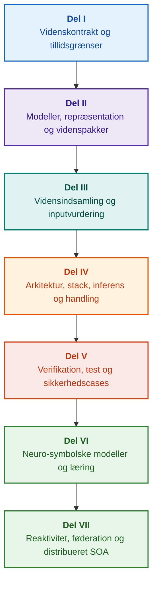

# Arkitektur for evidensstyrede ekspertsystemer: Fra formelle ontologier til neuro-symbolsk AI

**Ingeniørmonografi og referencehåndbog om design, matematiske fundamenter, arkitektur og verifikation af højintegritets intelligente systemer (Safety-Critical & Evidence-Grounded AI)**

**Forfatter:** [Mykola Fedchyk](../../about-the-author.md) · [LinkedIn](https://www.linkedin.com/in/nickfedchik/)  
**Format:** Ingeniørmonografi / Håndbog for AI-arkitekter  
**År:** 2026  

---

## Om bogen

Denne monografi udgør en fundamental forskningsundersøgelse og ingeniørvejledning dedikeret til at overvinde den moderne kunstige intelligens' mest afgørende krise: det epistemiske gab mellem den probabilistiske sandsynlighed i neurale netværksgenereringer og den deterministiske sandhed i formelle matematiske beviser. I hjertet af denne forskning ligger et kompromisløst spørgsmål: **hvordan designer vi et ekspertsystem, hvor enhver konklusion er uigendrivelig, fuldt ud sporbar til primære evidenskilder og egnet til certificering inden for sikkerhedskritiske ingeniørdomæner (ISO 26262, IEC 61508, DO-178C, ISO/SAE 21434)?**

Forfatteren begrunder og introducerer et nyt paradigme: **Evidensforankret neuro-symbolsk AI (Evidence-Grounded Neuro-Symbolic AI)**, hvori statistiske modeller (LLM/SLM) udfører en rådgivende funktion for hypoteseopstilling og projektionsgengivelse, mens en deterministisk symbolsk kerne uforanderligt garanterer invarianterne for logisk konsistens, byte-niveau forankring af fakta, håndhævelse af autoritetsgrænser og sikker overgang til eksekvering.

### Fra artefakt til verificerbar beslutning

Systemkrav, kildekode, logs fra testkørsler, regulatoriske standarder og ingeniørbeslutninger gennemsyrer i dag moderne produktionsmiljøer. De fungerer imidlertid overvejende som adskilte artefakter uden formaliseret semantik, eksplicitte gyldighedsgrænser og tovejs sporbarhed. En godkendt kvalifikationstestrapport kan henvise til en forældet hardwarerevision; et citat fra en funktionel sikkerhedsstandard kan være revet ud af kontekst; en automatiseret nødreversering af en konfiguration kan utilsigtet genaktivere en tilbagekaldt komponent.

Denne monografi etablerer en sammenhængende ingeniørpipeline: fra formalisering af ingeniørgjenstande som typede data og kryptografisk signerede videnspakker til symbolsk inferens, trinvis plandekomponering, kontrafaktiske forklaringer og auditering af kompetencegrænser. Den praktiske fremstilling er forankret i produktionsklare Go-implementationer med udtømmende testsuiter ([Kapitel 1](../../ch01-introduction-to-expert-systems.md)), stringente matematiske kontrakter ([Del II](../../part-02-knowledge-models.md)) og kontinuerlige læringsprotokoller, der beviseligt eliminerer regressioner ([Kapitel 25](../../ch25-how-expert-systems-learn.md)).

### Målgruppe

Bogen henvender sig til systemarkitekter, ledende ingeniører inden for pålidelighed og funktionel sikkerhed, udviklere af inferensmotorer og vidensingeniører. Den indledende tilegnelse af kernekoncepterne kræver blot en grundlæggende forståelse af førsteordens prædikatlogik, softwareversionering og livscyklusstyring; reproduktion af de praktiske eksempler kræver standard Go-værktøjer. Specialiserede kapitler, der dækker formel Goal Structuring Notation (GSN)-syntese, komplekse reformers synergetik, neuromorfe acceleratorer og autonom navigation uden GNSS, behandler de mest avancerede grænser for evidensstyret AI inden for rumfart, autonome køretøjer og kritisk infrastruktur.

---

## Videnskabelig kontekst og monografiens globale placering

Monografien tilgår ikke ekspertsystemer som en arkaisk arv fra 1980'ernes regelbaserede systemer (som CLIPS eller MYCIN), men som spydspidsen for **Tredje bølge af evidensforankret neuro-symbolsk AI (Third-Wave Evidence-Grounded Neuro-Symbolic AI)**. Metodologien forbinder de teoretiske fundamenter fra førende globale videnskabelige miljøer med højtydende systemteknik:

| Videnskabelig disciplin | Væsentlige globale værker og forfattere | Konceptuel bro i denne monografi |
|---|---|---|
| **Tredje bølge neuro-symbolsk AI (NeSy)** | Artur d'Avila Garcez, Luis C. Lamb (*Neurosymbolic AI: The 3rd Wave*, 2023; *Neural-Symbolic Cognitive Reasoning*, Springer, 2009); Henry Kautz (*The Third AI Summer*, AAAI 2022) | Adskillelse af ansvarsområder: statistiske modeller (SLM/LLM) genererer forespørgselshypoteser, mens en deterministisk symbolsk kerne formelt verificerer og godkender fakta ([Kapitel 29](../../ch29-neuro-symbolic-architecture.md)). |
| **Semantiske restriktioner og sikker læring** | Guy Van den Broeck et al. (*A Semantic Loss Function for Deep Learning with Symbolic Knowledge*, ICML 2018); Luc De Raedt et al. (*DeepProbLog*, IJCAI 2020) | Adgangs- og udgangsporte, deterministisk semantisk filtrering af neurale netværks kandidatudsagn mod formelle skemaer ([Kapitlerne 28](../../ch28-dual-mode-expert-systems.md), [33](../../ch33-inter-system-knowledge-exchange-and-model-teaching.md)). |
| **Omstødelig ræsonnering og argumentationsteori** | John L. Pollock (*Defeasible Reasoning*, 1987; *Cognitive Carpentry*, MIT Press, 1995); Phan Minh Dung (*Abstract Argumentation Frameworks*, AIJ 1995); Douglas Walton (*Argumentation Schemes*, Cambridge, 2008) | Dekomponering af viden i påstande, oprindelse og omstødere (*defeaters*: *rebutting* og *undercutting*); konfliktløsning i normative regelbaser via Dungs argumentationsrammer ([Kapitlerne 2](../../ch02-epistemology-of-machine-knowledge.md), [27](../../ch27-safety-case-gsn-synthesis.md)). |
| **Automatiseret udvinding af associationsregler (KBC)** | Luis Galárraga, Fabian M. Suchanek et al. (*AMIE: Association Rule Mining under Incomplete Evidence*, WWW 2013, VLDBJ 2015); Stephen Muggleton (*Inductive Logic Programming*, 1994) | Autonom regelinduktion fra vidensbaser under forudsætningen om delvis fuldstændighed (PCA), som forhindrer falske modeksempler i en åben verden ([Kapitel 34](../../ch34-deterministic-relational-analysis-abduction-and-socratic-dialogue.md)). |
| **Formelle sikkerhedsskjolde og certificering (Safe AI)** | Bettina Könighofer, Roderick Bloem et al. (*Shield Synthesis*, 2017); Tim Kelly, Rob Weaver (*Goal Structuring Notation*, York, 2004); André Platzer (*Logical Foundations of CPS*, Springer, 2018) | Syntese af strukturerede sikkerhedscases i GSN-notation for ISO 26262/21434-standarder; formelle skjolde og numeriske gyldighedskonvolutter for aktuatorer i kanten ([Kapitlerne 27](../../ch27-safety-case-gsn-synthesis.md), [30](../../ch30-safety-cybersecurity-co-engineering.md), [33](../../ch33-inter-system-knowledge-exchange-and-model-teaching.md)). |
| **Epistemisk logik og videnssemiotik** | John F. Sowa (*Knowledge Representation: Logical, Philosophical, and Computational Foundations*, 2000); Frank van Harmelen et al. (*Handbook of Knowledge Representation*, Elsevier, 2008) | Charles Sanders Peirces epistemiske triade (Begreb → Dom → Slutning); abduktiv generering af arbejdshypoteser under streng deduktiv kontrol ([Kapitlerne 6](../../ch06-applied-mathematics-for-expert-systems.md), [34](../../ch34-deterministic-relational-analysis-abduction-and-socratic-dialogue.md)). |
| **Kybernetik og synergetik for komplekse systemer** | Norbert Wiener (*Cybernetics*, 1948); W. Ross Ashby (*An Introduction to Cybernetics*, 1956); Hermann Haken (*Synergetics: An Introduction*, 1977; *Advanced Synergetics*, 1983); Ilya Prigogine (*Order out of Chaos*, 1984) | Ashbys lov om nødvendig variation, lukkede kontrolsløjfer L0–L4, faserumsreduktion til ordensparametre via Hakens slaveprincip, tidlig advarsel om faseovergange via kritisk deceleration (CSD) og dissipativ stabilisering af vidensbaser ([Kapitlerne 6](../../ch06-applied-mathematics-for-expert-systems.md), [22](../../ch22-cybernetics-edge-to-backend.md), [35](../../ch35-self-organizing-expert-systems-synergetics-and-npu-runtime.md)). |
| **Videnstestning, invarians og Lipschitz-kalibrering** | Kent Beck (*TDD*, 2002); Martin Fowler (*Refactoring*, 2018); Clark Barrett, Leonardo de Moura (*Z3 SMT Solver*, 2008); Chuan Guo et al. (*On Calibration of Modern Neural Networks*, ICML 2017); Marco Tulio Ribeiro et al. (*CheckList*, ACL 2020); John L. Pollock (*Defeasible Reasoning*, 1987) | Fire-niveaus videnstestpyramide (KTP): isoleret enhedstestning af atomare regler (KUT) med simulerede præmisser (`PremiseMock`), eliminering af fælden med tom sandhed, 6-punkts spektral grænseværdianalyse (BVA), regelgitre og omstødere (KIT), score for semantisk invarians ($\text{SIS} \ge 0.98$) ved sproglige forespørgselsmutationer, Lipschitz-kontinuitetsgrænser ($L_{\mathcal{K}} \le L_{\max}$) til forebyggelse af relæ-klapren samt stigmergisk opsamling af videnshuller ([Kapitel 36](../../ch36-knowledge-testing-pyramid-and-variational-calibration.md)). |

---

## Forfatterens teoretiske modeller, videnskabelige forskning og ingeniørinnovationer

Denne monografi sammenfatter forfatterens grundforskning og systemtekniske bidrag inden for sikkerhedskritisk software, indlejrede arkitekturer og evidensstyret AI. I modsætning til rent oversigtspræget litteratur introducerer bogen en række originale formelle teorier, protokoller og arkitektoniske mønstre, der løfter neuro-symbolske interaktioner til et matematisk verificeret tillidsniveau:

### 1. Fundamentale teoretiske modeller og matematiske formalismer

1. **Evidensforankret invariant (EGI) og port for faktavalidering ([Kapitlerne 2](../../ch02-epistemology-of-machine-knowledge.md), [19](../../ch19-from-question-to-evidence.md), [28](../../ch28-dual-mode-expert-systems.md), [29](../../ch29-neuro-symbolic-architecture.md)):**
   * *Teoretisk formulering:* Forfatteren formaliserer Forankringsfuldstændighedsinvarianten $\mathrm{Comp}(C) = 1.00$, som fastslår, at i en evidensstyret arkitektur kan intet udsagn ophøjes til anerkendt faktum uden en deterministisk projektion på autoritative primærkilder. Hver godkendt faktatuppel forankres med uforanderlige byte-forskydninger `[byte_start, byte_end]`, en kanonisk kryptografisk fragmenthash `quote_sha256` og en PROV-O oprindelsescertifikatidentifikator.
   * *Ingeniørmæssig effekt:* Hardware-/softwareporten på byte-niveau forhindrer neurale netværkshallucinationer i at trænge ind i den versionerede vidensbase og garanterer en nul-tolerance over for uunderbyggede påstande ($ZHR = 1.00$).
2. **Fire-niveaus videnstestpyramide (KTP) og Lipschitz-kontinuitet i det logiske rum ([Kapitel 36](../../ch36-knowledge-testing-pyramid-and-variational-calibration.md)):**
   * *Teoretisk formulering:* Forfatteren introducerer Videnstestpyramiden (KTP), der overfører disciplinen fra Fowlers testpyramide til videnssystemer: isoleret enhedstestning af regler (KUT) ved hjælp af simulerede præmisforhold (`PremiseMock`), integrationstestning af regelinteraktioner og omstødere (KIT) samt variationel kalibrering over forespørgselsmangler (KVT).
   * *Matematisk apparat:* Formalisering af en invariant, der forhindrer tom sandhed ($P \to Q$, hvor $P \equiv \text{False}$), en semantisk invariansscore ($\mathrm{SIS} \ge 0.98$) ved sproglige forstyrrelser og en Lipschitz-kontinuitetsbegrænsning på inferensmangfoldigheden ($L_{\mathcal{K}} \le L_{\max}$), som matematisk eliminerer katastrofal relæ-klapren ved små inputvariationer.
3. **Popperiansk falsifikation af deontiske normer og aktiv overensstemmelsesrevision ([Kapitel 39](../../ch39-active-compliance-auditor-and-popperian-testing.md)):**
   * *Teoretisk formulering:* Et paradigmeskifte fra et passivt orakel (der blot besvarer spørgsmål) til en aktiv overensstemmelsesrevisor, der implementerer Karl Poppers falsificerbarhedsprincip. Systemet sonderer autonomt specifikationsrummet (ASPICE 4.0, ISO 26262, ISO/SAE 21434), syntetiserer modeksempler, identificerer underdefinerede randbetingelser og designer udtømmende verifikationskampagner.
   * *Praktisk værdi:* Sammenkobling af neural generering af grænsetilfælde (System 1) med deterministisk deontisk verifikation via den symbolske kerne (System 2), hvilket skåner mennesket i kontrolsløjfen (Human-in-the-Loop) for godkendelsestræthed.
4. **Synergetisk dimensionsreduktion af vidensbaser og CSD-diagnostik før bifurkation ([Kapitlerne 6](../../ch06-applied-mathematics-for-expert-systems.md), [22](../../ch22-cybernetics-edge-to-backend.md), [35](../../ch35-self-organizing-expert-systems-synergetics-and-npu-runtime.md)):**
   * *Teoretisk formulering:* Anvendelse af Hermann Hakens synergetik (ordensparametre og slaveprincip) og Ilya Prigogines dissipative strukturer på udviklingen af komplekse vidensdepoter.
   * *Videnskabeligt bidrag:* Højdimensionelle telemetrifaserum reduceres til ordensparametre, integreret med en detektor for kritisk deceleration (CSD) før bifurkation baseret på autokorrelations- og variansmetrikker. Dette opdager forestående cyberfysisk ustabilitet længe før konventionelle tærskelovervågere slår alarm.
5. **Model for handlingsautonominiveauer (A0–A4), godkendelsesporte og idempotente sagaer ([Kapitel 21](../../ch21-from-recommendation-to-action.md)):**
   * *Teoretisk formulering:* En granulær autoritetsramme for automatiseret eksekvering (A0: passiv analyse, A1: udkastgenerering, A2: menneskesigneret udførelse, A3: overvåget afgrænset autonomi, A4: nødstop fail-closed). Tilladelser er ikke bundet til systemet som en monolit, men til tripletten $\langle\text{handling}, \text{miljø}, \text{risikoniveau}\rangle$.
   * *Matematisk apparat:* En algebraisk idempotensinvariant $f(f(x, k), k) \equiv f(x, k)$ nøglet med en kryptografisk token $k$, trinvis lukket sløjfeudførelse og en distribueret kompenserende sagaprotokol, der håndterer `OutcomeUnknown`-tilstande via out-of-band-verifikation af post-betingelser.
6. **Formel samprojektering af funktionel sikkerhed og cybersikkerhed i GSN ([Kapitlerne 27](../../ch27-safety-case-gsn-synthesis.md), [30](../../ch30-safety-cybersecurity-co-engineering.md)):**
   * *Teoretisk formulering:* En ensartet Goal Structuring Notation (GSN)-syntesemetodologi, der harmoniserer samtidige begrænsninger fra ISO 26262 (funktionel sikkerhed) og ISO/SAE 21434 (cybersikkerhed).
   * *Ingeniørmæssigt gennembrud:* Matematisk voldgift mellem modstridende mål (forsinkelsesgrænser for nødrespons kontra kryptografisk attesteringsdybde), kombineret med en protokol for selektiv bevisafsløring over for eksterne revisorer via saltede Merkle-træer.
7. **Protokol for forklaringsfidelitet og verifikation af semantisk konsistens ([Kapitel 20](../../ch20-explanation-engine.md)):**
   * *Teoretisk formulering:* Forklaringer behandles ikke som frit genereret tekst, men som førsteklasses deterministiske artefakter udledt strengt fra bevisgrafen, reglernes versionstags og frosne faktamomentbilleder.
   * *Matematisk apparat:* Formel metrisk validering af forklaringsfidelitet ($C_{\text{facts}} = 1.00, H_{\text{free}} = 1.00$) understøttet af automatisk fejlsikker tilbagevenden til rigide skabeloner ved den mindste uoverensstemmelse mellem symbolsk deduktion og operatørvendt naturligt sprog.

---

### 2. Empirisk forskning, forfatterens eksperimentelle testbænke og systemteknik

1. **Uforanderlige binære videnspakker med `mmap` og nul-allokeringsdeserialisering ([Kapitel 32](../../ch32-high-performance-knowledge-packs-mmap-and-harvesting.md)):**
   * *Forfatterens innovation:* En to-niveaus pakkearkitektur, der adskiller kanoniske primærkildearkiver fra afledte materialiserede indekssegmenter.
   * *Empirisk resultat:* Direkte hukommelsesmappning via `mmap` i det virtuelle adresserum eliminerer heap-allokeringer under kørsel (zero-allocation) og opnår sublineær motorstartforsinkelse uafhængigt af ontologiernes flergigabyte-størrelse.
2. **Empirisk kalibreringstestbænk på IETF RFC-1000 og W3C-150 regulatoriske korpusser ([Kapitlerne 2](../../ch02-epistemology-of-machine-knowledge.md), [4](../../ch04-evolution-from-bayes-to-evidence-ai.md), [14](../../ch14-requirements-detection-and-formalization.md), [25](../../ch25-how-expert-systems-learn.md)):**
   * *Forfatterens testbænk:* Udrulning af en storskala evalueringsramme over 1.000 aktive IETF RFC-specifikationer (der dækker 5 kronologiske internetepoker) og 150 komplekse diagnostiske forespørgsler mod W3C-korpuset (inklusive inducerede logiske konflikter og konfabulationer).
   * *Praktisk fund:* Opbygning af objektive videnseksaminationsmatricer, empirisk identifikation af normative modsigelser og matematisk valideret forsvar mod vidensbaseregressioner ved kontinuerlige opdateringer.
3. **Flertrins relationsanalyse, symbolsk abduktion og sokratisk dialog ([Kapitel 34](../../ch34-deterministic-relational-analysis-abduction-and-socratic-dialogue.md)):**
   * *Forfatterens innovation:* Tovejs afgrænset bredde-først-søgealgoritme (Bounded BFS, $k \le 6$) med cyklusundertrykkelse og sammensat beviskædesyntese på byte-niveau over indbyrdes forbundne entiteter.
   * *Ingeniørmæssig fordel:* Realisering af Peirces symbolske abduktion under stringente deduktive rammer, parret med typede sokratiske afklaringsrammer (Clarification Frames), der leder systemet ind i en produktiv brugerdialog i stedet for blind afvisning under forudsætningen om en lukket verden (CWA).
4. **Formelle sikkerhedsskjolde og numeriske gyldighedskonvolutter for kantstyring ([Kapitel 33](../../ch33-inter-system-knowledge-exchange-and-model-teaching.md), [Tillæg B](../../appendix-b-robotics-and-cyber-physical-systems.md), [C](../../appendix-c-autonomous-navigation-and-geosearch.md), [E](../../appendix-e-mixed-signal-neuromorphic-expert-systems.md)):**
   * *Forfatterens innovation:* Metodologi til oversættelse af diskrete logiske invarianter til kontinuerlige numeriske sikkerhedskorridorer for digitale signalprocessorer (DSP) og navigation uden GNSS (TRN/DSMAC/VIO).
   * *Driftssikkerhed:* Kryptografisk signeret regeludveksling via Ed25519, isoleret karantæne af kandidatregler og hardwareopsnapning af ugyldige aktuatorbaner.
5. **Forsvar mod lækage af fortrolige oplysninger via forklaringer og differentiel revision ([Kapitel 20](../../ch20-explanation-engine.md)):**
   * *Forfatterens innovation:* Reduktionsprotokol for mellemliggende forklaringsrepræsentation ($\mathrm{EIR}_{\text{redacted}}$), der håndhæver adgangskontrollister (ACL) ved hver knude og kant i bevisgrafen og neutraliserer sidekanalsangreb til modelrekonstruktion via kontrastive HVORFOR IKKE-forespørgsler (WHY NOT).

---

## Struktureringsprincip

Delene i denne monografi er struktureret omkring primære ingeniørmæssige mål snarere end kronologiske udgivelsesdatoer eller forbigående teknologinavne. Hvert kapitel tilhører en enkelt primærdel; relaterede teknikker illustrerer metoder til at adressere dens centrale tese. Kapitelnumre og filidentifikatorer forbliver permanente nøgler, hvilket tillader tematiske læsesekvenser at afvige fra den numeriske rækkefølge.

Afsnitsklasser i kapitlerne opbygger en logisk sammenhængende argumentation frem for et simpelt katalog over ækvivalente teknologier:

| Afsnitsklasse | Læserens spørgsmål | Arkitektonisk funktion i kapitlet |
|---|---|---|
| Problem og grænser | Hvilken præcis udfordring skal løses? | Definerer undersøgelsens kerne og gyldighedsområde |
| Objekt og model | Hvilke data, viden eller tilstande evalueres? | Formaliserer begreber, typer og driftsmæssige antagelser |
| Metode og procedure | Hvordan udledes løsningen? | Detaljerer algoritmer for deduktion, transformation og kontrol |
| Implementation og værktøjer | Hvilken software eller hardware udfører proceduren? | Giver konkrete kodelister og arkitekturkontrakter |
| Verifikation og benchmark | Hvordan afsløres fejlmoder systematisk? | Måler ydeevne og korrekthed mod uafhængige kriterier |
| Konklusion og begrænsninger | Hvad er bevist, og hvad forbliver åbent? | Besvarer den centrale tese uden ubegrundede påstande |

Geografi, specifikke industrisektorer og kommercielle platforme fungerer som anvendelseskontekster og ikke som separate niveauer i denne taksonomi. Ordlister, forkortelser, bibliografier og indeksnavigation udgør referenceapparatet, ikke selvstændige kapitteltemaer.

Den fuldstændige redaktionelle strukturelle gennemgang giver en vurdering af hvert kapitels kernetema, grænser mellem tilstødende emner og kompositionsnoter. Opdatering af et abstract indebærer ikke, at alle interne kompositionsmæssige risici i kapitlerne er løst.

## Læseruter

**Første softwareverifikation:** [1](../../ch01-introduction-to-expert-systems.md) → [7](../../ch07-knowledge-base-typology.md) → [8](../../ch08-engineering-artifacts-as-data.md) → [17](../../ch17-implementation-stack.md) → [23](../../ch23-knowledge-base-verification.md) → [25](../../ch25-how-expert-systems-learn.md). Mål: At frembringe en reproducerbar, evidensforankret kendelse med negative test og kontrolleret vidensmutation. Sprogmodel er valgfri.

**Vidensingeniørkunst:** [Del II](../../part-02-knowledge-models.md) → [Del III](../../part-03-knowledge-engineering-nlp.md) → [19](../../ch19-from-question-to-evidence.md) → [20](../../ch20-explanation-engine.md) → [26](../../ch26-continual-learning.md). Mål: At forene formel semantik, oprindelse, kandidatindsamling og validering. Del II bevarer det tværgående empiriske forskningsprogram for kapitlerne 7–11.

**Løsningsarkitektur:** [16](../../ch16-expert-systems-architecture.md) → [19](../../ch19-from-question-to-evidence.md) → [31](../../ch31-syllogistic-reasoning-and-relation-lattices.md) → [20](../../ch20-explanation-engine.md) → [21](../../ch21-from-recommendation-to-action.md). Mål: At afkoble bevisverifikation, anvendelse af normative regler, forklaringsgenerering og operativ handlingsautoritet.

**Verifikation og sikkerhed:** [23](../../ch23-knowledge-base-verification.md) → [36](../../ch36-knowledge-testing-pyramid-and-variational-calibration.md) → [25](../../ch25-how-expert-systems-learn.md) → [26](../../ch26-continual-learning.md) → [27](../../ch27-safety-case-gsn-synthesis.md) → [30](../../ch30-safety-cybersecurity-co-engineering.md). Ekstern fysisk diagnostik behandles i [Kapitel 24](../../ch24-system-diagnosis.md).

**Hybride svar og operationel udrulning:** [Del VI](../../part-06-frontiers-neuro-symbolic.md) → [Del VII](../../part-07-runtime-and-knowledge-exchange.md) → [40](../../ch40-distributed-epistemic-architectures-soa-and-cluster-scaling.md) og relevante tillæg. Mål: At integrere neurale sprogmodeller, håndtere epistemiske kløfter, designe distribuerede videnstjenesteklynger og verificere forbund mellem systemer. Kapitlerne [2](../../ch02-epistemology-of-machine-knowledge.md), [4](../../ch04-evolution-from-bayes-to-evidence-ai.md) og [6](../../ch06-applied-mathematics-for-expert-systems.md) kan konsulteres efter behov som kontrakter, historisk udvikling og matematiske fundamenter.

---

## Påstandenes omfang og ingeniørmæssige grænser

Denne monografi udgør grundlæggende uddannelses- og forskningsmateriale; den er ikke en certificeret overensstemmelsesprocedure eller et selvstændigt bevis på udstyrs overensstemmelse med standarder. Deterministisk eksekvering garanterer ikke præmissernes faktiske korrekthed; hashes og digitale signaturer beviser integritet, ikke empirisk sandhed; argumentgrafer erstatter ikke certificeret menneskelig dømmekraft. Pålidelighedskrav på systemniveau kan ikke sidestilles med sprogmodellens tokenfejlrate eller universelt overføres til alle softwaremoduler.

Automatiseret parsing og udtrækning reducerer manuel databevægelse, men fjerner ikke nødvendigheden af formel modellering, peer review og udpegede vidensvogtere (knowledge custodians). Protégé-ontologier, manuelle audits og automatiserede opsamlere arbejder i forening. Matematiske garantier afgrænses af eksplicitte formelle sprogprofiler og driftsantagelser; målte gennemstrømningsbenchmarks afspejler specifikke forespørgselsbelastninger, korpusser og eksekveringsmiljøer. Historiske metrikker fra forfatterens tidligere produktionsudrulninger adskilles strengt fra åbne uddannelsestestbænke og aktive forskningsundersøgelser.

Endelige beslutninger om produktionsgodkendelse, risikoaccept og overholdelse af lovgivning tilkommer udelukkende autoriserede ingeniører. Et evidensstyret ekspertsystem forbereder verificerbare revisionsspor og håndhæver aftalte sikkerhedspolitikker; det overtager ikke regulatorisk suverænitet.

---

## Bogens struktur

Monografien er organiseret i syv tematiske dele, der omfatter 40 kapitler og fem tillæg. Hvert kapitel tilhører en enkelt primærdel. Navigationssekvenser følger køreplanen nedenfor; kapitelnumre og filstier forbliver uforanderlige.

---

### [Del I. Konceptuelle og epistemiske fundamenter](../../part-01-foundations.md)

*Hvornår et ekspertsystem er påkrævet, hvad der udgør maskinviden, og hvordan organisatorisk begrundelse bevares.*

* [Kapitel 1. Introduktion til ekspertsystemer: Fra kaos til styret viden](../../ch01-introduction-to-expert-systems.md)
* [Kapitel 2. Filosofi for systemingeniøren: Hvad maskiner har ret til at kalde viden](../../ch02-epistemology-of-machine-knowledge.md)
* [Kapitel 3. Adskillelse af ekspertsystemer fra referenceinformationssystemer](../../ch03-beyond-reference-information-systems.md)
* [Kapitel 4. Ekspertsystemernes udvikling: Fra Bayes' teorem til evidensforankret AI](../../ch04-evolution-from-bayes-to-evidence-ai.md)
* [Kapitel 5. Tillidens triade: Ekspertsystem, verificerbar anbefaling og virksomhedshukommelse](../../ch05-triad-of-trust-and-corporate-memory.md)

---

### [Del II. Matematiske modeller, vidensrepræsentation og lagring](../../part-02-knowledge-models.md)

*Valg af matematiske formalismer, typede artefakter, ingeniørmæssige sporbarhedsgrafer og uforanderlige videnspakker.*

* [Kapitel 6. Anvendt matematik for ekspertsystemer: Regler, sandsynligheder, grafer og kausalitet](../../ch06-applied-mathematics-for-expert-systems.md)
* [Kapitel 7. Typologi for vidensbaser: Regler, ontologier, cases og vektorindlejringer](../../ch07-knowledge-base-typology.md)
* [Kapitel 8. Ingeniørgjenstande som data for ekspertsystemet](../../ch08-engineering-artifacts-as-data.md)
* [Kapitel 9. Ingeniørmæssig vidensgraf: Fuld sporbarhed fra krav til silicium](../../ch09-engineering-knowledge-graph-traceability.md)
* [Kapitel 32. Uforanderlige videnspakker: Byte-validering, indekser og hukommelsesmappning](../../ch32-high-performance-knowledge-packs-mmap-and-harvesting.md)

---

### [Del III. Vidensindsamling, sproglig analyse og inputvurdering](../../part-03-knowledge-engineering-nlp.md)

*Dokumenter, menneskelig ekspertise og sensoriske observationer: kandidatindsamling, sproglig analyse, formalisering og evidensvurdering.*

* [Kapitel 10. Systemer til vidensindsamling: Kilder, adgangsporte og livscyklusser](../../ch10-knowledge-acquisition-systems.md)
* [Kapitel 11. Indhentning af viden fra domæneeksperter: Interviews, kognitive kort og formalisering af praksis](../../ch11-knowledge-elicitation-from-experts.md)
* [Kapitel 12. Sproglig analyse og lokale modeller: Bevarelse af semantik og kildeangivelse](../../ch12-linguistic-analysis-and-local-models.md)
* [Kapitel 13. Naturlig sprogvariabilitet vs. determinisme: Kompilering af forespørgselssemantik](../../ch13-language-variability-vs-determinism.md)
* [Kapitel 14. Udtrækning af krav og modaliteter: Fra normativ tekst til formelle invarianter](../../ch14-requirements-detection-and-formalization.md)
* [Kapitel 15. Vidensudvinding og opbygning af vidensbase: Fakta, grammatikker og automater](../../ch15-knowledge-extraction-and-kb-construction.md)
* [Kapitel 37. Vurdering af inputoplysninger: Kilder, evidens og algoritmisk skepticisme](../../ch37-input-information-assessment-and-algorithmic-skepticism.md)

---

### [Del IV. Arkitektur, teknologistack, inferens og handling](../../part-04-architecture-and-inference.md)

*Arkitektoniske kontrakter, eksekveringsstak, hardwareacceleration, påstandsverifikation, normativ inferens, forklaringsmotorer og kybernetiske kontrolsløjfer.*

* [Kapitel 16. Ekspertsystemarkitektur: Fra formaliseret viden til evidensstyret handling](../../ch16-expert-systems-architecture.md)
* [Kapitel 17. Teknologistacken: Værktøjsvalg, programmeringssprog og regelmotorer](../../ch17-implementation-stack.md)
* [Kapitel 18. Eksekveringsinfrastruktur: Lokale SLM'er, hardwareacceleratorer, edge og on-premise](../../ch18-execution-infrastructure.md)
* [Kapitel 19. Fra spørgsmål til evidens: Søgning, forankring og påstandsverifikation](../../ch19-from-question-to-evidence.md)
* [Kapitel 31. Normativ inferens: Prædikathierarkier, undtagelser og tidsmæssig gyldighed](../../ch31-syllogistic-reasoning-and-relation-lattices.md)
* [Kapitel 20. Forklaringsmotor: Beslutninger, begrundet afslag og kompetencegrænser](../../ch20-explanation-engine.md)
* [Kapitel 21. Fra anbefaling til handling: Autoritetskontrol og sikker eksekvering i produktion](../../ch21-from-recommendation-to-action.md)
* [Kapitel 22. Den kybernetiske kontrolsløjfe: Sensorer, aktuatorer og feedback](../../ch22-cybernetics-edge-to-backend.md)

---

### [Del V. Verifikation, test, diagnostik og sikkerhedscases](../../part-05-verification-and-learning.md)

*Formel regelverifikation, videnstestpyramider, popperiansk falsifikation, teknisk diagnostik og funktionelle/cybersikkerhedscases.*

* [Kapitel 23. Verifikation af vidensbaser: Konsistens, fuldstændighed og regelkorrekthed](../../ch23-knowledge-base-verification.md)
* [Kapitel 36. Videnstestpyramiden: Regler, interaktioner og variationel stabilitet](../../ch36-knowledge-testing-pyramid-and-variational-calibration.md)
* [Kapitel 39. Den aktive overensstemmelsesrevisor: Popperiansk falsifikation, standardoverensstemmelse (ASPICE/ISO 26262/ISO 21434) og autonom testgenerering](../../ch39-active-compliance-auditor-and-popperian-testing.md)
* [Kapitel 24. Teknisk diagnostik: Adskillelse af symptomer fra grundlæggende årsager under ufuldstændig information](../../ch24-system-diagnosis.md)
* [Kapitel 27. Sikkerhedscase-teknik: Formel syntese og verifikation af GSN-argumenter](../../ch27-safety-case-gsn-synthesis.md)
* [Kapitel 30. Samprojektering af funktionel sikkerhed og cybersikkerhed](../../ch30-safety-cybersecurity-co-engineering.md)

---

### [Del VI. Neuro-symbolske modeller, kognitive frontlinjer og kontinuerlig læring](../../part-06-frontiers-neuro-symbolic.md)

*Streng deduktion vs. rådgivende hypoteser, integration af sprogmodeller, videnshuller, eliminering af hallucinationer, eksamensmatricer og erfaringsbaseret læring.*

* [Kapitel 28. Dobbelt-tilstands ekspertsystemer: Streng deduktion og rådgivende hypoteser](../../ch28-dual-mode-expert-systems.md)
* [Kapitel 29. Neuro-symbolsk arkitektur: Sprogmodeller og evidensstyret verifikation](../../ch29-neuro-symbolic-architecture.md)
* [Kapitel 34. Videnshuller: Relationssøgning, abduktion og sokratisk afklaring](../../ch34-deterministic-relational-analysis-abduction-and-socratic-dialogue.md)
* [Kapitel 38. Behandling af maskinhallucinationer og vidensunderskud: Evidensforankret outputkontrol](../../ch38-curing-machine-hallucinations-and-knowledge-deficits.md)
* [Kapitel 25. Hvordan ekspertsystemer lærer: Eksamensmatricer, vidensaudits og kontrol med regressioner](../../ch25-how-expert-systems-learn.md)
* [Kapitel 26. Kontinuerlig læring fra erfaring og afbødning af drift i systemlogs](../../ch26-continual-learning.md)

---

### [Del VII. Reaktivt køretidsmiljø, vidensudveksling mellem systemer og distribueret SOA](../../part-07-runtime-and-knowledge-exchange.md)

*Reaktiv regelafvikling, synergetik og vidensfaseovergange, føderation mellem systemer og distribuerede virksomhedsepistemiske arkitekturer.*

* [Kapitel 35. Reaktive ekspertsystemer: Hændelser, tilbagekaldelse af regler og selvorganisering af viden](../../ch35-self-organizing-expert-systems-synergetics-and-npu-runtime.md)
* [Kapitel 33. Vidensudveksling mellem systemer: Regeltilvejebringelse, modelundervisning og sikker feedback](../../ch33-inter-system-knowledge-exchange-and-model-teaching.md)
* [Kapitel 40. Distribueret epistemisk arkitektur: Videns-SOA, semantisk routing, hukommelseshierarkier og omstødelig voldgift fra flere kilder](../../ch40-distributed-epistemic-architectures-soa-and-cluster-scaling.md)

---

### Tillæg

* [Tillæg A. Praktisk evidensstyret forskningsramme for komplekse ingeniørprojekter](../../appendix-a-evidence-governed-framework.md)
* [Tillæg B. Evidensstyrede ekspertsystemer i autonom robotik og cyberfysiske systemer](../../appendix-b-robotics-and-cyber-physical-systems.md)
* [Tillæg C. Autonom navigation uden GNSS: Geospatial matching (TRN/DSMAC), visuel-inertial odometri (VIO) og ekspertsensorfusionsmægling](../../appendix-c-autonomous-navigation-and-geosearch.md)
* [Tillæg D. Analoge ekspertsystemer, neuromorfe beregninger og hardwareinferens](../../appendix-d-analog-expert-systems-and-neuromorphic-computing.md)
* [Tillæg E. Ekspertsystemer med blandede analog-digitale signaler: Neuromorfe, analoge og ikke-von-Neumann-processorer under evidensstyring](../../appendix-e-mixed-signal-neuromorphic-expert-systems.md)
* [Om forfatteren: Mykola Fedchyk (Nick Fedchik)](../../about-the-author.md)

---

## Forskningsretninger

Fremtidige forskningsretninger formuleret i dette værk repræsenterer åbne ingeniørmæssige udfordringer snarere end garanterede hyldevareresultater: reproducerbar pakning af videnspakker med nul-allokering; verifikation af afgrænsede formelle fragmenter; agentstyring via eksplicitte autoritetsaftaler (authority leases); nul-vidensverifikation (zero-knowledge) af fortrolige formelle udsagn; samt kontrolleret tilbagekaldelse af regler og maskinaflæring af modeller (machine unlearning). At bevise en teoretisk egenskab på en model validerer ikke automatisk det fysiske systems sikkerhed, og at trække en regel tilbage er ikke ensbetydende med at fjerne dataindflydelsen fra en trænet neural model.

For hardwareacceleratorer og utraditionelle processorer skal empiriske fejlfrekvenser, latenstidsgrænser, energidissipation og fail-silent-adfærd karakteriseres grundigt før implementering. Relevante arkitektoniske strategier undersøges i [Kapitel 29](../../ch29-neuro-symbolic-architecture.md), [Kapitel 32](../../ch32-high-performance-knowledge-packs-mmap-and-harvesting.md) samt [Tillæggene D](../../appendix-d-analog-expert-systems-and-neuromorphic-computing.md) og [E](../../appendix-e-mixed-signal-neuromorphic-expert-systems.md). Det empiriske forskningsprogram for kapitlerne 7–11 er detaljeret beskrevet i [Del II](../../part-02-knowledge-models.md): hver foreslået undersøgelse er parret med en testbar hypotese, et udgangsbenchmark og et formelt falsifikationskriterium.
