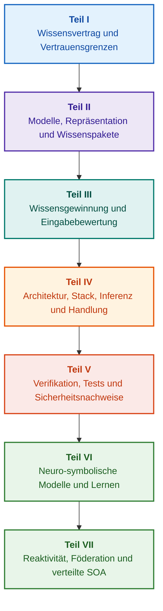

# Architektur evidenzbasierter Expertensysteme: Von formalen Ontologien zu neuro-symbolischer KI

**Technisches Handbuch und Monographie über Entwurf, mathematische Modelle, Architektur und Verifikation hochzuverlässiger intelligenter Systeme (Safety-Critical & Evidence-Grounded AI)**

**Autor:** [Mykola Fedchyk](about-the-author.md) · [LinkedIn](https://www.linkedin.com/in/nickfedchik/)  
**Format:** Technische Monographie / Handbuch für KI-Systemarchitekten  
**Jahr:** 2026  

---

## Über das Buch

Diese Monographie ist eine grundlegende Forschungsuntersuchung und ein ingenieurwissenschaftlicher Leitfaden zur Überwindung der zentralen Krise moderner künstlicher Intelligenz: der epistemischen Lücke zwischen der statistischen Plausibilität neuronaler Sprachmodelle und der deterministischen Wahrheit formaler Beweise. Im Zentrum steht die fundamentale Frage: **Wie entwirft man ein Expertensystem, dessen jede Schlussfolgerung unanfechtbar, lückenlos auf Primärquellen zurückführbar und für den Einsatz in sicherheitskritischen Bereichen (ISO 26262, IEC 61508, DO-178C, ISO/SAE 21434) zertifizierbar ist?**

Der Autor begründet ein neues Paradigma: **beweisgestützte neuro-symbolische KI (Evidence-Grounded Neuro-Symbolic AI)**. Statistische Modelle (LLM/SLM) übernehmen hierbei die beratende Funktion der Hypothesengenerierung und Projektion, während ein deterministischer symbolischer Kern unumstößlich die Invarianten logischer Konsistenz, byteweiser Faktenverankerung, Autorisierungskontrolle und sicheren Ausführungsübergänge garantiert.

### Vom Artefakt zur überprüfbaren Entscheidung

Anforderungen, Quellcode, Testprotokolle, Normen und Konstruktionsentscheidungen existieren in jeder industriellen Entwicklungsumgebung. Meist fungieren sie jedoch als isolierte Artefakte ohne formalisierte Semantik, explizite Gültigkeitsgrenzen und wechselseitige Rückverfolgbarkeit. Ein erfolgreicher Prüfbericht kann sich auf eine veraltete Hardware-Revision beziehen; ein Standardzitat kann aus dem Kontext gerissen sein; ein automatisierter Konfigurations-Rollback kann versehentlich eine zurückgezogene Komponente aktivieren.

Die Monographie etabliert einen durchgängigen Entwicklungspfad: von der Formalisierung technischer Artefakte als Daten und kryptographisch signierte Wissenspakete über symbolische Inferenz, schrittweise Plandekompensation und kontrafaktische Erklärungen bis hin zum Audit von Kompetenzgrenzen. Die Darstellung wird durch produktionsreife Go-Implementierungen mit vollständigen Testsuiten ([Kapitel 1](ch01-introduction-to-expert-systems.md)), mathematische Verträge ([Teil II](part-02-knowledge-models.md)) und regreßfreie kontinuierliche Lernprotokolle ([Kapitel 25](ch25-how-expert-systems-learn.md)) untermauert.

### Zielgruppe

Das Werk richtet sich an Systemarchitekten, leitende Ingenieure für Zuverlässigkeit und funktionale Sicherheit, Entwickler von Inferenzmaschinen und Wissensingenieure. Für das grundlegende Verständnis genügen Kenntnisse der Prädikatenlogik, Versionierung und Software-Lebenszyklen; zur Ausführung der Implementierungen dient standardmäßiges Go-Tooling. Spezialisierte Kapitel zu Goal Structuring Notation (GSN), System-Synergetik, neuromorphen Beschleunigern und GNSS-freier autonomer Navigation erschließen den Einsatz beweisgestützter KI in Hochtechnologiebereichen (Luft- und Raumfahrt, autonomes Fahren, Energiesysteme).

---

## Wissenschaftlicher Kontext und globale Einordnung der Monographie

Die Monographie betrachtet Expertensysteme nicht als überholtes Relikt der Regelsysteme der 1980er Jahre (wie CLIPS oder MYCIN), sondern als Avantgarde der **beweisgestützten neuro-symbolischen KI der dritten Welle (Third-Wave NeSy)**. Die Methodik verbindet führende internationale Theorien mit hochperformantem Systems Engineering:

| Wissenschaftliche Disziplin | Bedeutende Werke und Autoren | Konzeptionelle Brücke im Buch |
|---|---|---|
| **Neuro-symbolische KI der 3. Welle (NeSy)** | Artur d'Avila Garcez, Luis C. Lamb (*Neurosymbolic AI: The 3rd Wave*, 2023; *Neural-Symbolic Cognitive Reasoning*, Springer, 2009); Henry Kautz (*The Third AI Summer*, AAAI 2022) | Aufgabentrennung: Statistische Modelle (SLM/LLM) generieren Abfragehypothesen, während ein deterministischer symbolischer Kern Fakten verifiziert und autorisiert ([Kapitel 29](ch29-neuro-symbolic-architecture.md)). |
| **Semantische Schranken und sicheres Lernen** | Guy Van den Broeck et al. (*A Semantic Loss Function for Deep Learning with Symbolic Knowledge*, ICML 2018); Luc De Raedt et al. (*DeepProbLog*, IJCAI 2020) | Eingangs- und Ausgangsgateways, deterministische semantische Filterung neuronaler Vorschläge gegen formale Schemata ([Kapitel 28](ch28-dual-mode-expert-systems.md), [33](ch33-inter-system-knowledge-exchange-and-model-teaching.md)). |
| **Anfechtbares Schließen & Argumentationstheorie** | John L. Pollock (*Defeasible Reasoning*, 1987; *Cognitive Carpentry*, MIT Press, 1995); Phan Minh Dung (*Abstract Argumentation Frameworks*, AIJ 1995); Douglas Walton (*Argumentation Schemes*, Cambridge, 2008) | Zerlegung von Wissen in Behauptungen, Herkunft und Entkräftungsfaktoren (*rebutting* und *undercutting defeaters*); Konfliktlösung in Normenbasen über Dung-Frameworks ([Kapitel 2](ch02-epistemology-of-machine-knowledge.md), [27](ch27-safety-case-gsn-synthesis.md)). |
| **Automatisches Mining von Assoziationsregeln (KBC)** | Luis Galárraga, Fabian M. Suchanek et al. (*AMIE: Association Rule Mining under Incomplete Evidence*, WWW 2013, VLDBJ 2015); Stephen Muggleton (*Inductive Logic Programming*, 1994) | Automatische Regelinduktion in Wissensbasen unter der Partial Completeness Assumption (PCA) ohne falsche Open-World-Gegenbeispiele ([Kapitel 34](ch34-deterministic-relational-analysis-abduction-and-socratic-dialogue.md)). |
| **Formale Sicherheitsschilde & Zertifizierung (Safe AI)** | Bettina Könighofer, Roderick Bloem et al. (*Shield Synthesis*, 2017); Tim Kelly, Rob Weaver (*Goal Structuring Notation*, York, 2004); André Platzer (*Logical Foundations of CPS*, Springer, 2018) | Synthese strukturierter Sicherheitsnachweise in GSN-Notation für ISO 26262/21434; formale Schilde und numerische Gültigkeitskorridore für Randaktoren ([Kapitel 27](ch27-safety-case-gsn-synthesis.md), [30](ch30-safety-cybersecurity-co-engineering.md), [33](ch33-inter-system-knowledge-exchange-and-model-teaching.md)). |
| **Epistemische Logik & Wissenssemiotik** | John F. Sowa (*Knowledge Representation: Logical, Philosophical, and Computational Foundations*, 2000); Frank van Harmelen et al. (*Handbook of Knowledge Representation*, Elsevier, 2008) | Peirce'sche epistemische Triade (Begriff → Urteil → Schluss); abduktive Hypothesengenerierung unter strikter deduktiver Kontrolle ([Kapitel 6](ch06-applied-mathematics-for-expert-systems.md), [34](ch34-deterministic-relational-analysis-abduction-and-socratic-dialogue.md)). |
| **Kybernetik & Synergetik komplexer Systeme** | Norbert Wiener (*Cybernetics*, 1948); W. Ross Ashby (*An Introduction to Cybernetics*, 1956); Hermann Haken (*Synergetics: An Introduction*, 1977; *Advanced Synergetics*, 1983); Ilya Prigogine (*Order out of Chaos*, 1984) | Ashbys Gesetz der erforderlichen Varietät, geschlossene L0–L4-Regelkreise, Phasenraumreduktion auf Ordnungsparameter über Hakens Versklavungsprinzip, CSD-Frühwarnung vor Phasenübergängen und dissipative Stabilisierung ([Kapitel 6](ch06-applied-mathematics-for-expert-systems.md), [22](ch22-cybernetics-edge-to-backend.md), [35](ch35-self-organizing-expert-systems-synergetics-and-npu-runtime.md)). |
| **Wissenstests, Invarianz & Lipschitz-Kalibrierung** | Kent Beck (*TDD*, 2002); Martin Fowler (*Refactoring*, 2018); Clark Barrett, Leonardo de Moura (*Z3 SMT Solver*, 2008); Chuan Guo et al. (*On Calibration of Modern Neural Networks*, ICML 2017); Marco Tulio Ribeiro et al. (*CheckList*, ACL 2020); John L. Pollock (*Defeasible Reasoning*, 1987) | Vierstufige Wissenstestpyramide (KTP): isolierte Regeltests (KUT) mit Prämissen-Mocks (`PremiseMock`), Blockierung von Vacuous Truth, spektrale Grenzwertanalyse, Regelverbände (KIT), semantische Invarianz ($\text{SIS} \ge 0{,}98$) und Lipschitz-Stetigkeit ($L_{\mathcal{K}} \le L_{\max}$) gegen Relaisflattern ([Kapitel 36](ch36-knowledge-testing-pyramid-and-variational-calibration.md)). |

---

## Eigene theoretische Modelle, wissenschaftliche Forschung und ingenieurtechnische Innovationen

Die Monographie bündelt die Forschungs- und Entwicklungsleistungen des Autors in den Bereichen Hochzuverlässigkeitssysteme, eingebettete Architekturen und beweisgestützte KI. Über reine Übersichtsanalysen hinaus präsentiert das Werk eine Reihe originärer formaler Theorien und Protokolle:

### 1. Grundlegende theoretische Entwicklungen und mathematische Formalismen

1. **Invariante byteweiser Beweisbarkeit (EGI) und Faktenverankerungs-Gateway ([Kapitel 2](ch02-epistemology-of-machine-knowledge.md), [19](ch19-from-question-to-evidence.md), [28](ch28-dual-mode-expert-systems.md), [29](ch29-neuro-symbolic-architecture.md)):**
   * *Theoretisches Konzept:* Der Autor formalisiert die Verankerungsvollständigkeits-Invariante $\mathrm{Comp}(C) = 1{,}00$: Keine Aussage erlangt Faktenstatus ohne deterministische Projektion auf Primärquellen. Jedes Faktum ist durch ein kryptographisches Tupel geschützt: unveränderliche Byte-Koordinaten `[byte_start, byte_end]`, Fragment-Hash `quote_sha256` und PROV-O-Herkunftszertifikat.
   * *Ingenieurtechnische Wirkung:* Das byteweise Zulassungsgateway verhindert das Eindringen neuronaler Halluzinationen in die versionierte Wissensbasis ($ZHR = 1{,}00$).
2. **Vierstufige Wissenstestpyramide (KTP) und Lipschitz-Stetigkeit des Logikraums ([Kapitel 36](ch36-knowledge-testing-pyramid-and-variational-calibration.md)):**
   * *Theoretisches Konzept:* Übertragung der Software-Testpyramide auf Wissenssysteme: isolierte Regel-Modultests (KUT) mit Antezedenz-Mocks (`PremiseMock`), Integrationstests von Regelinteraktionen (KIT) und variationsanalytische Kalibrierung (KVT).
   * *Mathematischer Apparat:* Invariante gegen triviale Wahrheit ($P \to Q$ bei $P \equiv \text{False}$), semantischer Invarianzwert ($\mathrm{SIS} \ge 0{,}98$) und Lipschitz-Schranke ($L_{\mathcal{K}} \le L_{\max}$) zur Eliminierung von Relaisflattern bei Eingangsfluktuationen.
3. **Poppersche Falsifikation deontischer Normen und aktiver Compliance-Auditor ([Kapitel 39](ch39-active-compliance-auditor-and-popperian-testing.md)):**
   * *Theoretisches Konzept:* Übergang vom passiven Orakel zum aktiven Compliance-Auditor nach Karl Poppers Falsifikationsprinzip. Das System sondiert Normenräume (ASPICE 4.0, ISO 26262, ISO/SAE 21434), synthetisiert Gegenbeispiele und entwirft Testkampagnen.
   * *Praktischer Nutzen:* Verbindung neuronaler Grenzwertgenerierung (System 1) mit deterministischer deontischer Verifikation (System 2) unter Schutz des Menschen vor Genehmigungsermüdung.
4. **Synergetische Dimensionsreduktion der Wissensbasis und CSD-Vor-Bifurkationsdiagnose ([Kapitel 6](ch06-applied-mathematics-for-expert-systems.md), [22](ch22-cybernetics-edge-to-backend.md), [35](ch35-self-organizing-expert-systems-synergetics-and-npu-runtime.md)):**
   * *Theoretisches Konzept:* Anwendung von Hakens Synergetik (Ordnungsparameter und Versklavungsprinzip) und Prigogines dissipativen Strukturen auf Wissenskorpora.
   * *Ergebnis:* Reduktion hochdimensionaler Telemetrieräume auf Ordnungsparameter und Erkennung kritischer Verlangsamung (*Critical Slowing Down*, CSD) weit vor dem Ansprechen von Notfallschwellen.
5. **Aktionsautonomie-Stufenmodell (A0–A4), Zulassungsgateway und idempotente Sagas ([Kapitel 21](ch21-from-recommendation-to-action.md)):**
   * *Theoretisches Konzept:* Granulare Autorisierungsskala (A0: passive Analyse bis A4: Notabschaltung), gebunden an das Tupel $\langle\text{Aktion}, \text{Umgebung}, \text{Risiko}\rangle$.
   * *Mathematischer Apparat:* Idempotenz-Invariante $f(f(x, k), k) \equiv f(x, k)$ mit Token $k$ und kompensierende Sagas mit Out-of-Band-Nachbedingungsprüfung.
6. **Formale Co-Entwicklung von funktionaler Sicherheit und Cybersecurity in GSN ([Kapitel 27](ch27-safety-case-gsn-synthesis.md), [30](ch30-safety-cybersecurity-co-engineering.md)):**
   * *Theoretisches Konzept:* Integrierte Goal Structuring Notation (GSN) zur gleichzeitigen Erfüllung von ISO 26262 (Safety) und ISO/SAE 21434 (Security).
   * *Durchbruch:* Mathematischer Ausgleich widerstreitender Ziele (Reaktionszeit vs. kryptographische Tiefe) und selektive Beweisoffenlegung über gesalzene Merkle-Bäume.
7. **Verifikationsprotokoll für Erklärungstreue und semantische Konsistenz ([Kapitel 20](ch20-explanation-engine.md)):**
   * *Theoretisches Konzept:* Erklärungen als eigenständige deterministische Artefakte aus Beweisgraph, Regelstand und Faktenstand.
   * *Mathematischer Apparat:* Metrisches Gateway ($C_{\text{facts}} = 1{,}00, H_{\text{free}} = 1{,}00$) mit automatischem Fallback auf Schablonen bei geringster Diskrepanz.

---

### 2. Empirische Forschung, eigene Versuchsstände und Systems Engineering

1. **Unveränderliche binäre Wissenspakete mit `mmap` und Zero-Allocation ([Kapitel 32](ch32-high-performance-knowledge-packs-mmap-and-harvesting.md)):**
   * *Architektur:* Trennung von kanonischen Primärquellen und materialisierten Indexschichten.
   * *Empirisches Ergebnis:* Direktes Speicher-Mapping (`mmap`), Zero-Allocation und sublinearer Start unabhängig von Gigabyte-Ontologien.
2. **Empirischer Kalibrierungsprüfstand auf IETF RFC-1000 und W3C-150 ([Kapitel 2](ch02-epistemology-of-machine-knowledge.md), [4](ch04-evolution-from-bayes-to-evidence-ai.md), [14](ch14-requirements-detection-and-formalization.md), [25](ch25-how-expert-systems-learn.md)):**
   * *Versuchsstand:* Evaluierung an 1.000 IETF-RFC-Spezifikationen und 150 W3C-Diagnosefällen (inklusive induzierter Widersprüche).
   * *Praktisches Ergebnis:* Objektive Prüfungsmatrizen, Normenwiderspruchserkennung und Schutz vor Wissensregressionen.
3. **Multi-Hop-Relationsanalyse, symbolische Abduktion und sokratischer Dialog ([Kapitel 34](ch34-deterministic-relational-analysis-abduction-and-socratic-dialogue.md)):**
   * *Entwicklung:* Bidirektionale beschränkte Breitensuche (BFS, $k \le 6$) mit Zyklenschutz und Synthese von Beweisketten.
   * *Vorteil:* Peirce'sche symbolische Abduktion unter deduktiver Kontrolle und sokratische Klärungsrahmen (*Clarification Frames*).
4. **Formale Sicherheitsschilde für Edge-Steuerungssysteme ([Kapitel 33](ch33-inter-system-knowledge-exchange-and-model-teaching.md), [Anhänge B](appendix-b-robotics-and-cyber-physical-systems.md), [C](appendix-c-autonomous-navigation-and-geosearch.md), [E](appendix-e-mixed-signal-neuromorphic-expert-systems.md)):**
   * *Innovation:* Übersetzung diskreter Invarianten in kontinuierliche Sicherheitskorridore für Signalprozessoren (DSPs) und GNSS-freie Navigation.
   * *Zuverlässigkeit:* Ed25519-signierter Regelaustausch und hardwarenahes Abfangen unzulässiger Steuerbefehle.
5. **Schutz vor Informationsabfluss über Erklärungen und differentielles Audit ([Kapitel 20](ch20-explanation-engine.md)):**
   * *Entwicklung:* Protokoll zur Reduktion der Erklärungsrepräsentation ($\mathrm{EIR}_{\text{redacted}}$) mit ACL-Prüfung an Knoten und Kanten des Beweisgraphen.

---

## Gliederungsprinzip

Die Teile des Werkes sind nach ingenieurtechnischen Aufgaben strukturiert, nicht nach Chronologie oder Technologiebezeichnungen. Jedes Kapitel gehört zu einem Hauptteil. Kapitelnummern und Dateinamen bleiben stabile Bezeichner.

| Abschnittsklasse | Frage des Lesers | Funktion im Kapitel |
|---|---|---|
| Problem & Aufgabengrenze | Was genau soll gelöst werden? | Kernfrage und Gültigkeitsbereich definieren |
| Objekt & Modell | Welche Daten, Zustände oder Regeln werden betrachtet? | Begriffe, Typen und Annahmen formalisieren |
| Methode & Verfahren | Wie wird das Ergebnis hergeleitet? | Deduktion, Transformation oder Steuerung darlegen |
| Implementierung & Werkzeug | Womit wird das Verfahren ausgeführt? | Konkrete Code- und Hardwarelösungen zeigen |
| Prüfung & Benchmark | Wie werden Fehler systematisch aufgedeckt? | Ergebnis gegen unabhängige Kriterien messen |
| Fazit & Grenzen | Was ist bewiesen und was bleibt offen? | Kernfrage ohne Übertreibungen beantworten |

Der redaktionelle Prüfbericht ([editorial-structure-review.md](editorial-structure-review.md)) enthält die thematische Bewertung aller Kapitel.

## Lesepfade

**Erste Softwareverifikation:** [1](ch01-introduction-to-expert-systems.md) → [7](ch07-knowledge-base-typology.md) → [8](ch08-engineering-artifacts-as-data.md) → [17](ch17-implementation-stack.md) → [23](ch23-knowledge-base-verification.md) → [25](ch25-how-expert-systems-learn.md). Ziel: Reproduzierbares, evidenzbasiertes Urteil mit Negativtests und kontrollierter Wissensänderung.

**Wissensingenieurwesen:** [Teil II](part-02-knowledge-models.md) → [Teil III](part-03-knowledge-engineering-nlp.md) → [19](ch19-from-question-to-evidence.md) → [20](ch20-explanation-engine.md) → [26](ch26-continual-learning.md). Ziel: Semantik, Provenienz, Wissensgewinnung und Kandidatenprüfung abgleichen.

**Lösungsarchitektur:** [16](ch16-expert-systems-architecture.md) → [19](ch19-from-question-to-evidence.md) → [31](ch31-syllogistic-reasoning-and-relation-lattices.md) → [20](ch20-explanation-engine.md) → [21](ch21-from-recommendation-to-action.md). Ziel: Trennung von Beweisprüfung, Normenanwendung, Erklärung und Ausführungsautorisierung.

**Verifikation und Sicherheit:** [23](ch23-knowledge-base-verification.md) → [36](ch36-knowledge-testing-pyramid-and-variational-calibration.md) → [25](ch25-how-expert-systems-learn.md) → [26](ch26-continual-learning.md) → [27](ch27-safety-case-gsn-synthesis.md) → [30](ch30-safety-cybersecurity-co-engineering.md). Externe Anlagendiagnose über [Kapitel 24](ch24-system-diagnosis.md).

**Hybride Systeme und Betrieb:** [Teil VI](part-06-frontiers-neuro-symbolic.md) → [Teil VII](part-07-runtime-and-knowledge-exchange.md) → [40](ch40-distributed-epistemic-architectures-soa-and-cluster-scaling.md) und Anhänge. Ziel: Sprachmodelle integrieren, verteilte Wissens-SOAs skalieren und Systemföderationen absichern.

---

## Grenzen der Zusicherungen

Das Buch stellt Lehr- und Forschungsmaterial dar, kein zertifiziertes Konformitätsverfahren. Deterministische Ausführung beweist nicht die Richtigkeit von Prämissen; Hashes und Signaturen belegen Integrität, nicht empirische Wahrheit; Argumentationsgraphen ersetzen kein Expertenurteil. Gesamtsystemanforderungen dürfen nicht mit Fehlerraten von Sprachmodellen gleichgesetzt werden.

Automatisierte Extraktion ersetzt weder Modellierung noch Begutachtung. Mathematische Garantien gelten innerhalb definierter Annahmen; Durchsatzmessungen beziehen sich auf spezifische Testumgebungen. Freigaben, Risikoakzeptanz und regulatorische Konformität verbleiben bei autorisierten Ingenieuren.

---

## Struktur des Buches

Das Werk umfasst sieben Themenblöcke, 40 Kapitel und fünf Anhänge:

---

### [Teil I. Konzeptionelle und epistemische Grundlagen](part-01-foundations.md)

*Wann ein Expertensystem erforderlich ist, was als Wissen gilt und wie Begründungen bewahrt werden.*

* [Kapitel 1. Einführung in Expertensysteme: Vom Chaos zu kontrolliertem Wissen](ch01-introduction-to-expert-systems.md)
* [Kapitel 2. Philosophie für Ingenieure: Was Maschinen als Wissen bezeichnen dürfen](ch02-epistemology-of-machine-knowledge.md)
* [Kapitel 3. Abgrenzung von Expertensystemen gegenüber Referenz-Informationssystemen](ch03-beyond-reference-information-systems.md)
* [Kapitel 4. Evolution der Expertensysteme: Vom Satz von Bayes zur beweisgestützten KI](ch04-evolution-from-bayes-to-evidence-ai.md)
* [Kapitel 5. Die Triade des Vertrauens: Expertensystem, evidenzbasierte Empfehlung und Unternehmensgedächtnis](ch05-triad-of-trust-and-corporate-memory.md)

---

### [Teil II. Mathematische Modelle, Repräsentation und Wissensspeicherung](part-02-knowledge-models.md)

*Mathematische Formalismen, typisierte Artefakte, Rückverfolgbarkeitsgraphen und Wissenspakete.*

* [Kapitel 6. Angewandte Mathematik für Expertensysteme: Regeln, Wahrscheinlichkeiten, Graphen und Kausalität](ch06-applied-mathematics-for-expert-systems.md)
* [Kapitel 7. Typologie von Wissensbasen: Regeln, Ontologien, Fallbasen und Vektoren](ch07-knowledge-base-typology.md)
* [Kapitel 8. Technische Artefakte als Daten des Expertensystems](ch08-engineering-artifacts-as-data.md)
* [Kapitel 9. Technischer Wissensgraph: Durchgängige Rückverfolgbarkeit von Anforderungen bis zur Hardware](ch09-engineering-knowledge-graph-traceability.md)
* [Kapitel 32. Unveränderliche Wissenspakete: Byteweise Zulassung, Indizes und Memory-Mapping](ch32-high-performance-knowledge-packs-mmap-and-harvesting.md)

---

### [Teil III. Wissensgewinnung, Sprachanalyse und Eingabebewertung](part-03-knowledge-engineering-nlp.md)

*Dokumente, Expertenwissen und Beobachtungen: Kandidatenextraktion, Parsing und Evidenzbewertung.*

* [Kapitel 10. Systeme zur Wissensakquise: Quellen, Zulassungsgateways und Lebenszyklen](ch10-knowledge-acquisition-systems.md)
* [Kapitel 11. Wissensextraktion von Fachexperten: Interviews, kognitive Karten und Praxisformalisierung](ch11-knowledge-elicitation-from-experts.md)
* [Kapitel 12. Linguistische Analyse und lokale Modelle: Wahrung von Semantik und Quellenbezug](ch12-linguistic-analysis-and-local-models.md)
* [Kapitel 13. Natürliche Sprachvariabilität versus Determinismus: Kompilierung des Abfragesinns](ch13-language-variability-vs-determinism.md)
* [Kapitel 14. Erkennung von Anforderungen und Modalitäten: Vom Normentext zu formalen Invarianten](ch14-requirements-detection-and-formalization.md)
* [Kapitel 15. Wissensextraktion und Aufbau der Wissensbasis: Fakten, Grammatiken und Automaten](ch15-knowledge-extraction-and-kb-construction.md)
* [Kapitel 37. Bewertung von Eingabedaten: Quellen, Evidenz und algorithmische Skepsis](ch37-input-information-assessment-and-algorithmic-skepticism.md)

---

### [Teil IV. Architektur, Technologie-Stack, Inferenz und Handlung](part-04-architecture-and-inference.md)

*Architekturverträge, Laufzeit-Stack, Hardwarebeschleunigung, Normeninferenz, Erklärung und Regelkreise.*

* [Kapitel 16. Architektur von Expertensystemen: Vom formalen Wissen zur beweisgestützten Entscheidung](ch16-expert-systems-architecture.md)
* [Kapitel 17. Der Technologie-Stack: Auswahlkriterien für Werkzeuge, Programmiersprachen und Regel-Engines](ch17-implementation-stack.md)
* [Kapitel 18. Ausführungsinfrastruktur: Lokale SLMs, Hardwarebeschleuniger, Edge und On-Premise](ch18-execution-infrastructure.md)
* [Kapitel 19. Von der Frage zum Beweis: Suche, Bindung und Prüfung von Behauptungen](ch19-from-question-to-evidence.md)
* [Kapitel 31. Normeninferenz: Prädikatenhierarchien, Ausnahmen und zeitliche Gültigkeit](ch31-syllogistic-reasoning-and-relation-lattices.md)
* [Kapitel 20. Erklärungs-Engine: Entscheidungen, begründete Ablehnung und Kompetenzgrenzen](ch20-explanation-engine.md)
* [Kapitel 21. Von der Empfehlung zur Handlung: Autorisierungskontrolle und sichere Ausführung](ch21-from-recommendation-to-action.md)
* [Kapitel 22. Der kybernetische Regelkreis: Sensoren, Peripherie und Rückkopplung](ch22-cybernetics-edge-to-backend.md)

---

### [Teil V. Verifikation, Prüfung, Diagnose und Sicherheitsnachweise](part-05-verification-and-learning.md)

*Formale Regelprüfung, Wissenstestpyramide, Poppersche Falsifikation, Fehlerdiagnose und GSN-Sicherheitsnachweise.*

* [Kapitel 23. Verifikation der Wissensbasis: Widerspruchsfreiheit, Vollständigkeit und Robustheit](ch23-knowledge-base-verification.md)
* [Kapitel 36. Die Wissenstestpyramide: Regeln, Interaktionen und Antwortstabilität](ch36-knowledge-testing-pyramid-and-variational-calibration.md)
* [Kapitel 39. Der aktive Compliance-Auditor: Poppersche Falsifikation, Normenkonformität und Testentwurf](ch39-active-compliance-auditor-and-popperian-testing.md)
* [Kapitel 24. Technische Diagnose: Trennung von Symptom und Ursache unter unvollständiger Information](ch24-system-diagnosis.md)
* [Kapitel 27. Sicherheitsnachweise: Formale Synthese und Prüfung von GSN-Argumenten](ch27-safety-case-gsn-synthesis.md)
* [Kapitel 30. Integrierte Entwicklung von funktionaler Sicherheit und Cybersecurity](ch30-safety-cybersecurity-co-engineering.md)

---

### [Teil VI. Neuro-symbolische Modelle, kognitive Grenzen und kontinuierliches Lernen](part-06-frontiers-neuro-symbolic.md)

*Strikte Deduktion vs. Hypothesen, Sprachmodell-Integration, Halluzinationskontrolle und Erfahrungslernen.*

* [Kapitel 28. Dual-Mode-Expertensysteme: Strikte Deduktion und beratende Hypothese](ch28-dual-mode-expert-systems.md)
* [Kapitel 29. Neuro-symbolische Architektur: Sprachmodelle und beweisgestützte Verifikation](ch29-neuro-symbolic-architecture.md)
* [Kapitel 34. Wissenslücken: Relationale Suche, Abduktion und Klärungsdialog](ch34-deterministic-relational-analysis-abduction-and-socratic-dialogue.md)
* [Kapitel 38. Beseitigung maschineller Halluzinationen und Wissensdefizite: Evidenzbasierte Kontrolle](ch38-curing-machine-hallucinations-and-knowledge-deficits.md)
* [Kapitel 25. Wie Expertensysteme lernen: Prüfungsmatrizen, Wissensaudits und Regressionskontrolle](ch25-how-expert-systems-learn.md)
* [Kapitel 26. Kontinuierliches Lernen (Continual Learning) aus Erfahrung und Beherrschung von Protokolldrift](ch26-continual-learning.md)

---

### [Teil VII. Reaktive Ausführung, Wissensaustausch und verteilte SOA](part-07-runtime-and-knowledge-exchange.md)

*Reaktive Regelausführung, Synergetik, Systemföderation und verteilte epistemische Unternehmensarchitekturen.*

* [Kapitel 35. Reaktive Expertensysteme: Ereignisse, Widerruf und Wissensselbstorganisation](ch35-self-organizing-expert-systems-synergetics-and-npu-runtime.md)
* [Kapitel 33. Intersystemarer Wissensaustausch: Regelbereitstellung, Modellunterrichtung und sichere Rückkopplung](ch33-inter-system-knowledge-exchange-and-model-teaching.md)
* [Kapitel 40. Verteilte epistemische Architektur: Wissens-SOA, semantisches Routing und Multi-Quellen-Schiedsgericht](ch40-distributed-epistemic-architectures-soa-and-cluster-scaling.md)

---

### Anhänge

* [Anhang A. Praktischer beweisgestützter Forschungsrahmen für komplexe Ingenieurprojekte](appendix-a-evidence-governed-framework.md)
* [Anhang B. Evidenzbasierte Expertensysteme in autonomer Robotik und cyber-physischen Systemen](appendix-b-robotics-and-cyber-physical-systems.md)
* [Anhang C. GNSS-freie autonome Navigation: Georäumlicher Abgleich (TRN/DSMAC), visuelle Odometrie (VIO) und Sensorfusion](appendix-c-autonomous-navigation-and-geosearch.md)
* [Anhang D. Analoge Expertensysteme, neuromorphe Berechnungen und Hardware-Inferenz](appendix-d-analog-expert-systems-and-neuromorphic-computing.md)
* [Anhang E. Gemischt analog-digitale Expertensysteme unter beweisgestützter Kontrolle](appendix-e-mixed-signal-neuromorphic-expert-systems.md)
* [Über den Autor: Mykola Fedchyk (Nick Fedchik)](about-the-author.md)

---

## Forschungsrichtungen

Zukünftige Forschungsrichtungen umfassen: reproduzierbare Zero-Allocation-Wissenspakete; Verifikation beschränkter formaler Fragmente; Agentensteuerung über explizite Autorisierungsverträge; Zero-Knowledge-Prüfungen vertraulicher Anforderungen; sowie kontrollierter Widerruf und Machine Unlearning. Der Beweis einer Modelleigenschaft validiert nicht automatisch das physische Produkt.

Für Hardwarebeschleuniger und unkonventionelle Rechner sind Fehler, Latenz, Energie und Ausfallverhalten vorab zu vermessen ([Kapitel 29](ch29-neuro-symbolic-architecture.md), [32](ch32-high-performance-knowledge-packs-mmap-and-harvesting.md), [Anhänge D](appendix-d-analog-expert-systems-and-neuromorphic-computing.md) und [E](appendix-e-mixed-signal-neuromorphic-expert-systems.md)). Das empirische Forschungsprogramm für Kapitel 7–11 ist in [Teil II](part-02-knowledge-models.md) detailliert.
