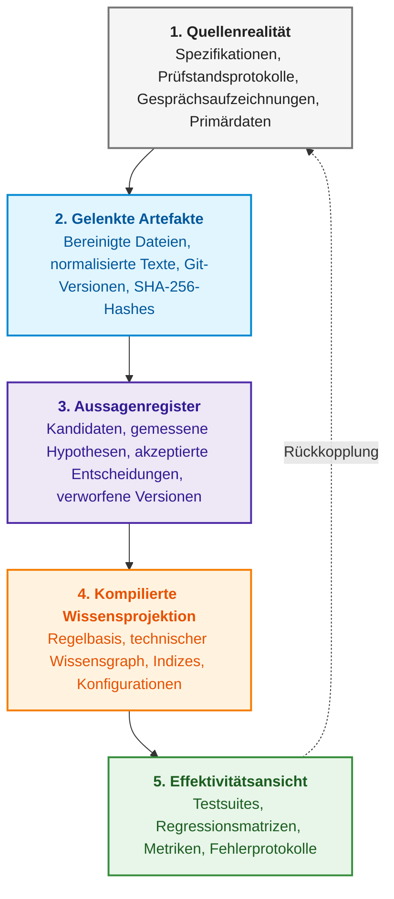

# Anhang A. Praktisches Framework für evidenzbasierte Forschung in komplexen Ingenieurprojekten

> **Buch:** [Architektur evidenzbasierter Expertensysteme](README.md) · Anhänge  
> **Inhaltsverzeichnis:** [README.md](README.md)  
> **Autor:** [Mykola Fedchyk](about-the-author.md)  
> **Niveau:** Mittelstufe und Fortgeschritten: F&E-Leiter, Systemarchitekten, leitende Forscher, Wissensingenieure  
> **Lernziele:** Praktischer Leitfaden zur Organisation des Forschungsgedächtnisses, Registrierung von Aussagen, Isolation von Testdatensätzen und Konstruktion einer durchgängigen Kette von Rohdatenquellen bis zur Produktionsentscheidung unter hoher Unsicherheit.

---

## Abstract

In geschäftskritischen Forschungs- und Entwicklungsprojekten (NIST AI Risk Management Framework, Entwicklung sicherheitskritischer Software, Verteidigungs- und Luft- und Raumfahrtsysteme) führt das Fehlen einer disziplinierten Pflege des Forschungsgedächtnisses unweigerlich zum sogenannten «Trial-and-Error-Drift» (*trial-and-error drift*). Reagiert ein Ingenieurteam auf isolierte Fehlfunktionen mit erratischen Prompt-Anpassungen, undokumentierten Architekturänderungen oder verdecktem Training auf Validierungsstichproben, entsteht die trügerische Illusion eines Fortschritts bei vollständigem Verlust der Reproduzierbarkeit. Ein solches Projekt bindet über Monate hinweg erhebliche Entwicklungsbudgets, bleibt Zertifizierungsstellen oder Auftraggebern gegenüber jedoch die Antwort schuldig, was genau mathematisch bewiesen, welche Annahmen falsifiziert und welche Befunde lediglich stochastische Koinzidenzen auf dem Signalrauschen darstellen.

Dieser Anhang stellt ein praxiserprobtes Framework für evidenzbasierte Forschung vor, welches unstrukturierte experimentelle Abläufe in ein rigoroses Forschungsgedächtnis (*research memory*) überführt. Vorgestellt werden die Architektur von fünf Wissensschichten (von unveränderlichen Rohdaten über gelenkte Artefakte mit SHA-256-Hashes bis hin zum Aussagenregister und zur Effektivitätsbewertung), typisierte Statuswerte wissenschaftlicher Aussagen (`Kandidat`, `gemessen`, `akzeptiert`, `verworfen`, `abgelöst`), strikte Protokolle zur Isolation von Validierungsdaten sowie eine lückenlose Rückverfolgbarkeit (*End-to-End Traceability*) vom Primärexperiment bis zum industriellen Produktivcode.

---

## 1. Das Regressionsproblem und «Trial-and-Error-Drift» in der Ingenieurforschung

An einem Montag lokalisiert das Team einen Defekt: Ein kompaktes Expertensystem für eine spezifische Fachdomäne beantwortet eine elementare Abfrage nicht, obwohl die gesuchte Information in den hinterlegten Dokumenten zweifelsfrei vorliegt. Am Dienstag modifiziert das Team den Suchalgorithmus. Am Mittwoch wird die Segmentierungsstrategie des Textes überarbeitet. Am Donnerstag passt man die Systemanweisung des Sprachmodells an. Am Freitag schließlich besteht die modifizierte Systemversion das Kontrollbeispiel.

Am darauffolgenden Montag wird dieselbe Fachfrage geringfügig anders formuliert – und das Expertensystem scheitert erneut.

Das Team war die gesamte Arbeitswoche ausgelastet. Es liegen Programmcode, Berichte, Ausführungsprotokolle, neue Testdatensätze und sogar eine augenscheinlich exzellente Genauigkeitsmetrik vor. Dennoch vermag kein Beteiligter präzise darzulegen:

- welche übergeordnete Problemstellung das Team methodisch untersucht hat;
- welcher Sachverhalt formal und empirisch bewiesen wurde;
- welches Teilergebnis lediglich explorativen Charakter trug;
- welche Beispiele das Expertensystem während der Entwicklungsphase bereits verarbeitet hat;
- wie viele unabhängige Kontrollprüfungen noch ausstehen;
- unter welcher definierten Bedingung die Forschungsphase als erfolgreich abgeschlossen gilt.

Hierbei handelt es sich keineswegs um ein isoliertes Phänomen stochastischer künstlicher Intelligenz. Das gleiche Muster tritt bei Compilern, Suchmaschinen, Wissensmanagementsystemen, statischen Code-Analysatoren, Robotikplattformen und Hardwareprototypen zutage. Je höher der inhärente Unsicherheitsgrad eines Vorhabens ist, desto schneller verwechseln Projektbeteiligte den bloßen Arbeitsaufwand mit tatsächlichem Erkenntnisgewinn.

Aus einer langen Kette derartiger Beobachtungen heraus konsolidierte sich im Team des Autors ein praktisches Forschungs-Framework (*research framework*). Dieses versteht sich nicht als Ersatz für die wissenschaftliche Methode, Scrum, Systems Engineering oder den Lebenszyklus von Modellen des maschinellen Lernens (*Machine Learning Operations*, MLOps). Es ersetzt ebenso wenig etablierte Risikomanagement-Standards wie das AI Risk Management Framework des National Institute of Standards and Technology (NIST), welches Governanz-, Kartierungs-, Mess- und Managementfunktionen für Risiken formalisiert [[1]](#src-1). Vielmehr führt das Framework die wesentlichen Kernkomponenten dieser Disziplinen in einem einheitlichen Forschungsgedächtnis zusammen: von der Rohdatenquelle zur Aussage, von der Aussage zur Architekturentscheidung, von der Entscheidung zur Produktänderung und von der Produktänderung zum unabhängigen Validierungstest.

## 2. Die Forschungsaussage als zentrales Wissensartefakt

In klassischen Softwareprojekten lässt sich das Produkt eindeutig benennen: eine Binärdatei, eine Bibliothek, ein Dienst. In Forschung und Vorentwicklung ist das Lieferergebnis weitaus schwerer greifbar. Ein Skript stellt für sich genommen keinen Erkenntnisgewinn dar. Eine Ansammlung heruntergeladener Spezifikationen ist kein Resultat. Auch eine tabellarische Metrikenübersicht besitzt ohne explizite Fragestellung, Grundgesamtheit und Entscheidungsregel keinerlei Aussagekraft.

Als tragfähige Grundeinheit erwies sich die **Forschungsaussage** (*research claim*):

> Unter spezifizierten Randbedingungen weist Methode A gegenüber Methode B folgende Eigenschaft auf; dies wird durch jene Beobachtungen gestützt, unterliegt diesen dokumentierten Einschränkungen und entspricht jenem Verifikationsgrad.

Jede Aussage besitzt einen stabilen Bezeichner, einen Gültigkeitsbereich, einen typisierten Status, explizite Evidenznachweise sowie dokumentierte Randbedingungen. Der Lebenszyklusstatus nimmt exakt einen der folgenden Werte an:

- **Kandidat**: Eine Hypothese oder ein externer Befund, der noch keiner methodischen Verifikation unterzogen wurde;
- **gemessen**: Es liegen reproduzierbare empirische Beobachtungen innerhalb des definierten Gültigkeitsbereichs vor;
- **akzeptiert**: Eine verbindliche methodische oder architektonische Entscheidung;
- **verworfen**: Die experimentelle Überprüfung verfehlte das vorab definierte Akzeptanzkriterium;
- **abgelöst**: Die historische Schlussfolgerung bleibt dokumentiert, wurde jedoch durch eine neuere Erkenntnis ersetzt.

Typisierte Statuswerte erzwingen eine präzise Fachsprache. «Wir haben implementiert» bedeutet keineswegs «wir haben unabhängig verifiziert». «Der Test ist erfolgreich durchgelaufen» impliziert nicht «die Hypothese ist bestätigt». «Das Modell antwortete korrekt» ist kein Beleg dafür, dass «das Modell die korrekte Evidenzkette herangezogen hat».

## 3. Die fünf Schichten des Forschungsgedächtnisses

Das **Forschungsgedächtnis** (*research memory*) bildet ein geordnetes, auditierbares Repository für sämtliche Erkenntnisse, Versuche und Entscheidungen des Projekts. Das folgende Diagramm veranschaulicht dessen fünf Schichten.



Ein Verzeichnis mit Markdown-Dateien allein löst das Konsistenzproblem nicht. Entscheidend ist die strikte funktionale Trennung der Schichten, die im Entwicklungsalltag allzu oft unreflektiert vermengt werden.

### 3.1. Quellenrealität

Die Quellenrealität (*source reality*) umfasst unmodifizierte Rohdokumente, Messreihen, Code-Commits, Binärdateien, Modellgewichte und manuelle Expertenbewertungen. Diese Objekte müssen innerhalb eines Snapshots unveränderlich sein und eine eindeutige Identität besitzen: einen kryptografischen Hash, ein Versions-Tag oder einen global eindeutigen Bezeichner.

Wird in einer Untersuchung eine technische Spezifikation zitiert, genügt es nicht, deren Titel festzuhalten. Erforderlich sind die exakte Versionierung, der Hash der Rohbytes, die Seitenzahl oder der Byte-Offset sowie das genaue Parsing- und Transformationsverfahren.

### 3.2. Gelenkte Artefakte

Gelenkte Artefakte (*governed artifacts*) umfassen Versuchsprotokolle, Datenmanifeste, normalisierte Daten, Ausführungsprotokolle, Einzelfallergebnisse, aggregierte Metriken und dokumentierte Architekturentscheidungen. Artefakte legen rechenschaftspflichtig dar, wie das Team die Quellenrealität transformiert hat.

Hierbei erweist sich das W3C-PROV-Datenmodell als wertvolles Instrument: Provenienz wird über Entitäten, Aktivitäten und verantwortliche Akteure abgebildet, die an der Entstehung eines Ergebnisses mitgewirkt haben [[2]](#src-2). Die Implementierung des gesamten semantischen W3C-Web-Stacks ist hierfür nicht zwingend. Wesentlich ist das Architekturprinzip: Ein Befund muss nicht nur ausweisen, *was* berechnet wurde, sondern ebenso, *woraus*, *durch wen* und *über welche deterministische Operation* dies erfolgte.

### 3.3. Aussagenregister

Ein ausführlicher Bericht dokumentiert zwar die Projekthistorie, eignet sich jedoch denkbar schlecht zur Beantwortung der Frage: «Welche Erkenntnisse betrachtet das Team zum jetzigen Zeitpunkt als verbindlich?». Hierfür bedarf es eines kompakten, maschinenlesbaren Aussagenregisters (*claims registry*). Jede Aussage referenziert verifizierbare Evidenzdateien anstelle des Gedächtnisses einzelner Autoren.

Ändert sich eine Schlussfolgerung infolge neuer Daten, wird der historische Eintrag nicht rückwirkend manipuliert: Ein neuer Eintrag löst den alten Datensatz explizit ab. Auf diese Weise gehen negative Ergebnisse, Falsifikationen und aufgedeckte Irrtümer nicht in der Projekthistorie verloren.

### 3.4. Kompilierte Wissensprojektion

Umfasst das Korpus hunderte oder tausende Artefakte, wird eine rein sequentielle Sichtung unmöglich. An dieser Stelle erweist sich die Überlegung von Andrej Karpathy über ein persistentes, vernetztes Markdown-Wiki als instruktiv, welches durch ein Sprachmodell kontinuierlich gepflegt wird und die Synthese von Primärquellen aggregiert, anstatt für jede Abfrage eine vollständige Rohdatensuche zu wiederholen [[3]](#src-3). Dieser Vorschlag stellt einen konzeptionellen Entwurf dar, keine empirisch validierte Methodologie.

In einem ingenieurtechnischen Forschungsprojekt muss dieser Mechanismus jedoch strikt eingegrenzt werden. Ein Sprachmodell darf die Aktualisierung von Syntheseseiten zu Begriffen, Komponenten, Messungen und offenen Fragestellungen unterstützen; das resultierende Wiki fungiert jedoch ausschließlich als abgeleitete Projektion. Primärquellen, Messprotokolle, Rohdaten und freigegebene Architekturentscheidungen besitzen stets normative Überordnung. Andernfalls weicht das Chaos unstrukturierter Dokumentenordner lediglich einer eloquent formulierten, jedoch unvalidierten Enzyklopädie.

### 3.5. Effektivitätsansicht

Dateiformate und der aktuelle operative Fokus des Teams sind zwei unterschiedliche Dimensionen. Hierfür bewährt sich eine pragmatische Adaption der PARA-Methode von Tiago Forte (*Projects, Areas, Resources, Archives*) [[4]](#src-4):

- **Projekte**: Zeitlich befristete, fokussierte Arbeitspakete mit definiertem Abschlusskriterium;
- **Verantwortungsbereiche** (*Areas*): Dauerhafte Prozesse wie Datenprovenienz, Sicherheit oder Korpus-Kuratierung;
- **Ressourcen**: Wiederverwendbare Datenquellen, Methoden und Werkzeuge;
- **Archiv**: Abgeschlossene, pausierte, fehlerhafte oder abgelöste Vorgänge.

Das Entwicklerteam baut hierfür nicht die physische Verzeichnisstruktur des Repositories um: PARA spannt lediglich eine operative Sicht über die kanonische Architektur auf. Eine archivierte negative Beobachtung verliert dadurch keineswegs ihren Evidenzwert, und eine nützliche Arbeitsressource wird nicht vorschnell als geprüfte Wahrheit deklariert.

### 3.6. Zuordnung der Schichten des Forschungsgedächtnisses zur Bucharchitektur

Das fünfschichtige Framework stellt kein externes Regelwerk dar, sondern bildet den Arbeitsablauf für Entwurf, Verifikation und Wartung eben jener Expertensysteme ab, die in den 40 Kapiteln dieser Monographie behandelt werden.

| Schicht des Forschungsgedächtnisses | Inhalt und ingenieurtechnische Zweckbestimmung | Relevante Teile und Kapitel des Buches |
| :--- | :--- | :--- |
| **1. Quellenrealität** | Roh-PDFs, Normen (DO-178C, ISO 26262), Prüfstandstelemetrie, Bus-Dumps, Git-Commits, Fehlerprotokolle | [Teil II (Kapitel 7–9)](part-02-knowledge-models.md): Ingenieurartefakte als Daten, Rückverfolgbarkeit im technischen Wissensgraphen, Quellenfixierung |
| **2. Gelenkte Artefakte** | Deterministische Parser, JSON- und Zustandsautomaten-Strukturen, extrahierte normative SHALL/MUST-Prädikate, Signalmasken, SHA-256-Hashes | [Teil III (Kapitel 10–15)](part-03-knowledge-engineering-nlp.md): Wissensextraktion aus unstrukturiertem Text, Beherrschung linguistischen Rauschens |
| **3. Aussagenregister** | Peirce'sche Triade, Hypothesen, Regelkandidaten, formaler Evidenz- und Provenienzstatus | [Teil I (Kapitel 1–6)](part-01-foundations.md) und [Teil V (Kapitel 23, 24, 27, 30, 36, 39)](part-05-verification-and-learning.md): Epistemologie maschinellen Wissens, Vertrauenstriade, Regelverifikation |
| **4. Kompilierte Projektion** | Datalog-Engines, Horn-Klauseln, Berechnung des kleinsten Fixpunkts, Aktionsverträge, Edge-Inferenz, GSN-Bäume | [Teil IV (Kapitel 16–22, 31)](part-04-architecture-and-inference.md) und [Teil VII (Kapitel 33, 35, 40)](part-07-runtime-and-knowledge-exchange.md): Inferenzarchitektur, reaktive Laufzeit, semantisches Routing und verteilte SOA |
| **5. Effektivitätsansicht** | Regressions-Benchmark-Suites, Verifikationsmatrizen, neuro-symbolische Validierung, Quantifizierung von Wissenslücken | [Teil V (Kapitel 23, 24)](part-05-verification-and-learning.md) und [Teil VI (Kapitel 25, 26, 28, 29, 34, 38)](part-06-frontiers-neuro-symbolic.md): Audit, neuro-symbolische Architekturen, Verifikation von Gewichten und Regeln |

Die Übersicht verdeutlicht: Jede Schicht des Forschungsgedächtnisses korrespondiert mit spezifischen ingenieurtechnischen Methoden des Buches. Die nachfolgenden Abschnitte formulieren die Regeln, welche eine Vermischung dieser Schichten im Entwicklungsalltag verhindern.

## 4. Zulassungskriterien für Hypothesen und Disziplin der Eingangswarteschlange

Jede neue Publikation, jede neu veröffentlichte Bibliothek und jede spontane Eingebung verleitet Entwickler dazu, unverzüglich «etwas auszuprobieren». Nach wenigen Wochen verbleibt ein Projekt mit Dutzenden angefangener Pfade, ohne dass eine einzige fundamentale Fragestellung abschließend geklärt wurde.

Aus diesem Grund durchlaufen neue Impulse zunächst eine definierte Forschungseingangswarteschlange (*research intake queue*). Im Zuge der Triage wird jedem Element genau eine Bestimmung zugewiesen:

- es unterstützt ein laufendes Projekt;
- es wird zu einer permanenten Arbeitsregel oder Verantwortung;
- es wird als Referenzressource katalogisiert;
- es wird unmittelbar archiviert;
- es wird verworfen, sofern es keinerlei Relevanz für spätere Audits aufweist.

Um in ein formales Experiment überführt zu werden, muss eine Hypothese eine explizite Wissenslücke schließen oder einen gemessenen Defekt adressieren. Zwingend erforderlich sind: Fragestellung, Versuchsprotokoll, Eingabedaten, Zielmetrik und eine eindeutige Entscheidungsregel. Die bloße Existenz einer interessanten Technologie rechtfertigt kein Experiment.

## 5. Endliche Forschungs-Roadmap und Abbruchkriterien

Ein verlässliches Indiz für eine mangelhafte Forschungsführung ist die Antwort «nur noch ein weiteres Experiment» auf jede Frage nach dem Projektfortschritt. Auf diese Weise lässt sich Entwicklung ins Endlose dehnen.

Eine belastbare Roadmap stützt sich auf vorab fixierte Meilensteine, beispielsweise:

1. Bereitstellung des Datenkorpus und Festlegung der Provenienz;
2. Einfrieren des Benchmark-Datensatzes;
3. Vergleichende Evaluation von Wissensrepräsentationen;
4. Vergleichende Evaluation von Retrieval-Methoden;
5. Überprüfung des domänenübergreifenden Transfers;
6. Quantifizierung der Inferenzkosten und Latenzen;
7. Durchführung des abschließenden Compliance-Audits.

Ein zusätzliches Arbeitspaket darf nur explizit aufgenommen werden: Die Roadmap wird formal angepasst, das neue Paket an eine verifizierbare Hypothese gekoppelt und begründet, welche Architekturentscheidung ohne diese Untersuchung unzulässig wäre. Die Floskel «Lassen Sie uns das noch kurz testen» stellt keine valide Entscheidungsgrundlage dar.

Jedes Arbeitspaket muss logisch in sich geschlossen sein. Es ist weder erforderlich, starr vier Meilensteine abzuarbeiten, noch genau einen Versuch pro Arbeitssitzung durchzuführen. Ein Paket gilt genau dann als abgeschlossen, wenn es eine Entscheidung liefert: Versuchsprotokoll, Durchführung, Analyse, verifizierte Artefakte und eine aktualisierte Wissenskarte.

## 6. Protokoll zur Vorabregistrierung von Experimenten und Planabweichungen

Die offene Wissenschaft (*Open Science*) nutzt seit Langem das Prinzip der Vorabregistrierung (*Preregistration*): Forscher dokumentieren Hypothese, Methodik und Auswertungskriterien verbindlich vor der Einsichtnahme in die experimentellen Daten. Das Center for Open Science bringt das Wesen der Vorabregistrierung auf den Punkt: «Ein Plan, kein Gefängnis» [[5]](#src-5). Die Vorabregistrierung untersagt keineswegs kreatives Denken nach Versuchsbeginn; sie ermöglicht dem Begutachter jedoch die scharfe Differenzierung zwischen a priori postulierten Effekten und retrospektiven Rationalisierungen (*HARKing*).

Für ein ingenieurtechnisches Experiment genügt ein lokales, kryptografisch gehashtes Protokoll. Vor der Durchführung sind zwingend festzuhalten:

- Fragestellung und Gültigkeitsbereich;
- Grundgesamtheit, Stichprobenziehung und Ausschlusskriterien;
- Baseline- und Kandidatenversion;
- Primär- und Diagnosemetriken;
- Kriterien für Annahme, Ablehnung und Ungültigkeitserklärung (*Invalidation*);
- Abbruchbedingungen;
- Format der Einzelfallprotokollierung;
- Unveränderliche Identifikatoren von Code, Modell, Konfiguration und Daten.

Nach Abschluss der Auswertung steht es dem Team frei, weiterführende explorative Tests anzuschließen. Diese müssen jedoch explizit als explorativ deklariert werden und dürfen keinesfalls nachträglich in die konfirmatorische Testsuite aufgenommen werden, nachdem das Team die Antworten bereits analysiert hat.

## 7. Validierungsstufen und Isolation von Testdatensätzen

In komplexen Systemen resultiert ein Großteil methodischer Fehler aus der Vermengung von Tests unterschiedlicher Validierungsstufen.

### 7.1. Bekannte Entwicklertests

Unit-, Vertrags-, Negativ- und Regressionstests operieren auf dem Team bereits bekannten Beispielen. Derartige Prüfungen beweisen, dass die Implementierung den spezifizierten Vertrag erfüllt und bekannte Regressionsdefekte nicht erneut auftreten. Eine Verallgemeinerungsfähigkeit beweisen sie nicht.

### 7.2. Unabhängiger verdeckter Datensatz

Der verdeckte Datensatz (*hidden test set*, Holdout) wird erst nach dem vollständigen Einfrieren der Binärdateien, Modelle, Konfigurationen und Datenbestände aktiviert. Das Expertensystem erhält die Testabfragen, nicht jedoch die erwarteten Referenzantworten. Der Prüfer vergleicht das Systemergebnis mit dem geschlossenen Referenzstandard (*Ground Truth*).

Sobald ein verdeckter Testfall offengelegt oder zur Fehleranalyse herangezogen wurde, verliert er seinen Holdout-Status. In nachfolgenden Iterationen geht er als bekannter Regressionstest in die Entwickler-Suite über.

### 7.3. Konfirmatorischer wissenschaftlicher Datensatz

Der konfirmatorische Datensatz dient der fundierten Entscheidung über die zugrunde liegende Hypothese. Weist das Korrektheitskriterium eine semantische Dimension auf, sind unabhängige Expertenbewertungen, die Bestimmung der Inter-Rater-Reliabilität (*Fleiss' Kappa* oder *Cohen's Kappa*) sowie ein formaler Abgleich von Diskrepanzen zwingend erforderlich. Ein Sprachmodell kann hierbei als Hilfsinstrument fungieren, keinesfalls jedoch als unabhängiger Referenzstandard für ein Expertensystem, dessen Teilkomponente es selbst darstellt.

### 7.4. Abnahmeprüfungen durch den Kunden

Die Kundenabnahme (*User Acceptance Testing*) evaluiert den praktischen Nutzen, die Mensch-Maschine-Interaktion und die Erfüllung betrieblicher Erwartungen. Sie ersetzt die drei vorangegangenen Validierungsstufen nicht. Ein Anwender kann von einer ansprechenden Systemdemonstration überzeugt sein, die auf einem stochastischen Einzelfall beruht und keinerlei methodisch reproduzierbare Evidenzbasis besitzt.

## 8. Die Gefahr isolierter Positivbeispiele und Overfitting auf Testdaten

Weshalb ist ein einzelnes erfolgreiches Testbeispiel für den Forscher bisweilen eine trügerische Nachricht? Angenommen, ein Expertensystem soll eine physikalische Größe mit Maßeinheit zurückgeben. Nach mehreren Eingriffen in die Prompt-Konstruktion liefert die Testabfrage stabil `8 Bytes`. Der Entwickler präsentiert die korrekte Evidenz, Koordinaten und ein wörtliches Zitat.

Dies stellt ein valides Regressionsergebnis dar. Wiederholt ein externer Prüfer jedoch exakt dieselbe Abfrage, erhält das Team keine unabhängige Bestätigung, sondern lediglich das Duplikat eines bekannten Testfalls.

Das nachfolgende unabhängige Testpaket muss andere Dokumente heranziehen und zwei orthogonale Achsen kreuzen:

- Wertformate: Zahl mit Einheit, Präfix, Bezeichner, exakte Phrase, mehrzeiliger Text, lange Konstante;
- Abfrageformen: Direkte Frage, Aufforderung, Bitte um Evidenznachweis, Bestätigungsgesuch.

Führen drei semantisch äquivalente Formulierungen desselben Sachverhalts zu divergierenden Systemausgaben, liegt kein «Zwei von drei ist fast gut» vor, sondern ein systematischer Gruppenfehler. Ein dialogfähiges Expertensystem muss semantische Invarianz gegenüber Paraphrasierungen wahren.

## 9. Lokalisierung fehlerhafter Schichten und Diagnose von Rückverfolgbarkeitsbrüchen

Eine fehlerhafte Endausgabe offenbart nur selten, welche Systemschicht die Ursache des Defekts birgt. Eine effektive Diagnose lokalisiert die exakte Verarbeitungsstufe, auf welcher der korrekte Zustand verloren ging:

1. Abfrageanalyse (*Query Parsing*);
2. Informationsretrieval (*Retrieval*);
3. Selektion relevanter Evidenzfragmente;
4. Identifikation der Zielaussage;
5. Extraktion von Aussagekomponenten;
6. Bindung an die Primärquelle;
7. Semantische Konsistenzprüfung;
8. Textgenerierung;
9. Zitat- und Evidenzverifikation;
10. Finale Freigabeentscheidung (*Gating*).

Konnte das Retrieval keine relevante Evidenz auffinden, darf nicht das Generierungsmodul modifiziert werden. Liegt die korrekte Evidenz vor, verliert der Zahlenwert jedoch während der finalen Textsynthese seine Maßeinheit, erfordert dies keine Reindizierung des Vektorindex. Eine analoge feingranulare Schichtendiagnose für RAG-Systeme (*Retrieval-Augmented Generation*) verfolgt das RAGChecker-Framework, welches Retrieval und Generierung separat quantifiziert [[6]](#src-6).

Gibt das System eine inhaltlich korrekte Antwort aus, die angegebene Quelle stützt die Aussage jedoch nicht, liegt ebenfalls ein schwerwiegender Fehler vor: Die Antwort könnte auf unzulässigen statistischen Korrelationen beruhen. Die methodisch getrennte Evaluation von Antwortkorrektheit und Zitatvalidität fordern auch die Autoren des ALCE-Benchmarks zur Überprüfung zitatgestützter Textgenerierung [[7]](#src-7).

An diesem Punkt tritt die fundamentale Differenz zwischen einem Forschungsprotokoll und einem Demonstrationslog zutage. Ein Demonstrationslog dokumentiert die letzte erfolgreiche Ausgabe. Ein Forschungslog konserviert den Zustand jeder einzelnen Verarbeitungsstufe, einschließlich sicherer Systemverweigerungen (*Safe Failures*).

## 10. Erfassung negativer Ergebnisse und Aufbewahrung von Gegenbeispielen

Im industriellen Forschungsbetrieb treten mindestens drei distinkte Fehlerszenarien auf.

**Produktiver Fehler (*Product Failure*):** Das Expertensystem hat die Inferenzoperation vollständig durchlaufen und ein inkorrektes Ergebnis erzeugt oder eine unberechtigte Verweigerung ausgesprochen.

**Infrastrukturell ungültiger Durchlauf (*Infra-invalid Run*):** Ein Timeout beim Laden von Modellgewichten trat auf, ein Cache-Zugriff schlug fehl, eine Binärdatei wies eine inkonsistente Version auf oder das Testskript übermittelte ein fehlerhaftes Schema. Ein solcher Lauf liefert wertvolle Telemetriedaten über den Prüfstand, besitzt jedoch keinerlei Aussagekraft bezüglich der semantischen Qualität des Systems.

**Methodisch invalidiertes Experiment (*Invalidated Experiment*):** Nach dem Testlauf wurde eine Kontamination (*Data Leakage*) zwischen Trainings- und Testdaten festgestellt, ein Protokollfehler aufgedeckt oder eine ungeeignete Grundgesamtheit herangezogen. Die Artefakte eines solchen Experiments dürfen keinesfalls zur Hypothesenbewertung herangezogen werden; sie müssen jedoch mit Kennzeichnung des Invalidierungsgrundes archiviert werden.

Werden fehlerhafte Läufe undiskutiert gelöscht, wiederholt das Team unweigerlich dieselben methodischen Fehler. Werden hingegen alle Fehlschläge unreflektiert in einer aggregierten Metrik zusammengefasst, verliert die Leistungsbewertung jede ingenieurtechnische Aussagekraft.

## 11. Datenpass-Erstellung und Ergebnisprovenienz (Data Provenance)

Die FAIR-Prinzipien (*Findable, Accessible, Interoperable, Reusable*) fordern, dass digitale Forschungsdaten auffindbar, zugänglich, interoperabel und wiederverwendbar sein müssen [[8]](#src-8). Für ein praktisches Ingenieurprojekt erfordern die FAIR-Prinzipien stabile Bezeichner, strukturierte Metadaten, standardisierte Formate und klare Nutzungsbedingungen, die sowohl von Menschen als auch von automatisierten Werkzeugen verarbeitet werden können.

Das Konzept der Datenblätter für Datensätze (*Datasheets for Datasets*) schärft den Blick für kritische Fragen: Zu welchem Zweck wurde der Datensatz erhoben, woraus setzt er sich zusammen, welche Subpopulationen fehlen, wie erfolgte die Erhebung, für welche Aufgaben ist er geeignet und welche Risiken birgt sein Einsatz [[9]](#src-9).

Zugänglichkeit ist jedoch nicht mit unbeschränkter Freigabe gleichzusetzen. Ein Dokument kann öffentlich herunterladbar sein, jedoch strengen Weiterverbreitungsbeschränkungen unterliegen. Aus diesem Grund müssen Zugriffsberechtigung, lokale Forschungsnutzung, abgeleitete Indizierung, Modelltraining und die Veröffentlichung von Volltexten als getrennte Richtlinienentscheidungen (*Policy Decisions*) verwaltet werden.

## 12. Rollentrennung zwischen Sprachmodellen und Primärwissensquellen

Moderne Sprachmodelle zeichnen sich durch hohe Kompetenz beim Abgleich von Paraphrasierungen, bei der Zuweisung semantischer Rollen, der Zusammenfassung von Ergebnissen und der Erläuterung technischer Zusammenhänge aus. Auf diese Fähigkeiten zu verzichten, wäre unökonomisch.

Ebenso verfehlt wäre es jedoch, einem stochastischen Sprachmodell Aufgaben zu übertragen, die ein deterministisches Programm mit mathematischer Sicherheit bewältigt:

- Byte-genaue Textvergleiche;
- Dokumentenidentität und Versionierung;
- Quellkoordinaten und Byte-Offsets;
- Kryptografische Hash-Signaturen;
- Berechtigungs- und Zugriffskontrolle;
- Syntaktische Konfigurationsvalidierung;
- Finale Freigabeentscheidung (*Gating*) bei unbestätigten Aussagen.

Die arbeitsteilige Architektur gestaltet sich wie folgt: Das Sprachmodell schlägt semantische Konzepte und wörtliche Evidenzsegmente vor; das deterministische Programm lokalisiert diese Segmente in der unveränderlichen Primärquelle, prüft deren Eindeutigkeit, konstruiert verifizierbare Koordinaten und autorisiert die Systemausgabe erst nach formaler Bestätigung der Gesamtaussage. Ein analoges Paradigma nutzt die FActScore-Metrik: Sie zerlegt generierten Fließtext in atomare Fakten und quantifiziert den Anteil jener Fakten, die durch eine verlässliche Wissensbasis gestützt werden [[10]](#src-10).

Dieselbe Funktionstrennung gilt für das Forschungsprojekt selbst. Ein Sprachmodell darf die kompilierte Wissensprojektion pflegen und Entwürfe für Berichte erstellen. Es darf jedoch niemals die eigene Paraphrase als neuen Primärnachweis deklarieren.

## 13. Minimales technisches Bereitstellungspaket des Frameworks

Das Framework erfordert keine kostspielige SaaS-Plattform. Für den operativen Start genügt ein strukturierter Satz von Markdown- und JSON-Dateien:

```text
RESEARCH-GOAL.md       Zweck und Zielsetzung der Forschung
RESEARCH-MAP.md        Aktueller Stand und verbleibende Meilensteine
HYPOTHESES.md          Aussagen und deren Prüfkriterien
experiments/           Eingefrorene Versuchsprotokolle
datasets/              Manifeste, Referenzdatensätze und Datenpässe
claims.jsonl           Aktuelle Aussagen und deren Nachweise
knowledge/             Thematische abgeleitete Projektion
BACKLOG.md             Arbeitspakete und Abhängigkeiten
TRACEABILITY.md        Verknüpfung von Frage, Experiment, Ergebnis und Entscheidung
```

Dieses Grundgerüst wird durch ein automatisiertes Integritäts-Prüfskript (`lint`) ergänzt, welches fehlerhafte Links, duplizierte IDs, fehlende Evidenzdateien, zyklische Ablösungen und veraltete Statusangaben in der zentralen README aufdeckt. Da Governanz-Dokumente die Schnittstelle des Forschungsvorhabens bilden, müssen sie derselben Testdisziplin unterliegen wie der Produktivcode.

## 14. Metriken und Effizienzkriterien des Forschungs-Frameworks

In einem methodisch gesunden Forschungsprojekt ist das Team in der Lage, binnen weniger Minuten präzise Auskunft zu geben:

- Was ist die fundamentale Fragestellung?
- Welchen aktuellen Status besitzt jede einzelne Hypothese?
- Welche Befunde besitzen rein explorativen Charakter?
- Wo lagern die Rohmesswerte und Eingangsdaten?
- Welche Binärversion, welches Modell und welche Konfiguration haben das Ergebnis erzeugt?
- Welche Testfälle sind den Entwicklern bekannt, und welche verbleiben verdeckt?
- Auf welcher Verarbeitungsstufe ist ein fehlgeschlagener Testfall kollabiert?
- Welche spezifische Defektklasse wird gegenwärtig behoben?
- Wie viele Meilensteine verbleiben bis zum Projektabschluss?
- Unter welcher verifizierbaren Bedingung wird der nächste Meilenstein freigegeben?

Und was noch entscheidender ist: Das Team kann ohne Zögern bekennen: «Wir wissen es gegenwärtig nicht» – ohne der Versuchung zu erliegen, epistemische Lücken durch eloquent formulierte Vermutungen zu kaschieren.

## 15. Anwendungsbereiche und Grenzen des Ansatzes

Keine Dateistruktur der Welt vermag aus einer methodisch schwachen Hypothese eine tragfähige Theorie zu formen. Ein kryptografischer Hash garantiert keine semantische Korrektheit, sondern sichert lediglich die Identität der Daten. Ein Provenienzgraph macht eine fehlerhafte Quelle nicht autoritativ. Eine Vorabregistrierung heilt kein mangelhaftes Versuchsdesign. Ein verdeckter Testdatensatz kann Verzerrungen aufweisen. Unabhängige menschliche Begutachter können denselben kognitiven Fehlschlüssen unterliegen.

Das Ziel des Frameworks liegt nicht in der Eliminierung von Ungewissheit. Das Framework macht Ungewissheit sichtbar und verhindert, dass vorläufige Annahmen unbemerkt zu gesicherten Erkenntnissen deklariert werden.

## Fazit

Komplexe Ingenieurforschung verläuft nicht linear, sondern gleicht einem dichten Geflecht aus Hypothesen, Quellen, Implementierungen und Fehlversuchen. Agilität ist hierbei unabdingbar: Ein Ingenieur muss den Kurs korrigieren, sobald die Evidenz den ursprünglichen Entwurf falsifiziert. Doch Agilität ohne Gedächtnis verkommt zur erratischen Irrfahrt.

Das vorgestellte Forschungs-Framework führt zwei Eigenschaften zusammen, die fälschlicherweise oft als Gegensätze begriffen werden. Es friert jene Parameter unveränderlich ein, die nach Einsichtnahme in die Ergebnisse nicht mehr manipuliert werden dürfen; und es hält jene Bereiche flexibel, die infolge neuer Erkenntnisse adaptiert werden müssen. Es trennt die Primärquelle von der Interpretation, die Entwicklung vom unabhängigen Test, die Suche vom Beweis, das fehlerhafte Produkt vom unzureichenden Prüfstand und das aktive operative Vorhaben vom archivierten Erfahrungsschatz.

Der entscheidende Wandel vollzieht sich nicht im Dateisystem, sondern in der Denkweise des Teams: Die Frage lautet nicht länger: «Welches Experiment führen wir als Nächstes durch?», sondern: «Welche ungelöste Aussage blockiert gegenwärtig unsere Systementscheidung, und was ist der kleinste unabhängige Test, der diese Entscheidung determinieren kann?».

In exakt diesem Moment beginnt Forschung, echtes Wissen zu akkumulieren – anstelle bloßer Artefakte.

## Glossar

| Deutscher Begriff | Englische Entsprechung | Kurzbeschreibung |
|---|---|---|
| Forschungsaussage | *research claim* | Aussage über die Eigenschaft einer Methode unter definierten Bedingungen inklusive Nachweisen, Status und Grenzen |
| Forschungsgedächtnis | *research memory* | Geordnetes Repository von Quellen, Artefakten, Aussagen und Entscheidungen der Forschung |
| Quellenrealität | *source reality* | Unveränderliche Rohdokumente, Messungen, Code und Bewertungen mit eindeutiger Identität |
| Gelenktes Artefakt | *governed artifact* | Protokoll, Manifest, Log oder Metrik zur Dokumentation der Arbeit mit Primärquellen |
| Aussagenregister | *claims registry* | Maschinenlesbares Verzeichnis gültiger und abgelöster Aussagen mit Verweisen auf Evidenzen |
| Kompilierte Wissensprojektion | *compiled knowledge projection* | Abgeleitete Wissenssynthese, die Primärquellen und Beschlüssen strikt untergeordnet ist |
| Effektivitätsansicht | *effectiveness view* | Operative Gruppierung von Projektmaterialien nach dem aktuellen Fokus des Teams |
| Vorabregistrierung | *preregistration* | Verbindliche Dokumentation von Hypothese, Methodik und Kriterien vor der Auswertung |
| Verdeckter Testdatensatz | *hidden test set* | Prüffälle, deren Antworten den Entwicklern während der Implementierung vorenthalten wurden |
| Konfirmatorischer Datensatz | *confirmatory set* | Datensatz zur methodischen Hypothesenentscheidung anhand eines unabhängigen Referenzstandards |
| Invalidiertes Experiment | *invalidated experiment* | Versuch mit methodischem Mangel, dessen Ergebnisse nicht zur Hypothesenbewertung herangezogen werden |
| Datenprovenienz | *provenance* | Nachweis über Entitäten, Aktivitäten und Akteure, die ein Ergebnis hervorgebracht haben |
| Datenblatt für Datensätze | *datasheet for datasets* | Dokumentation zu Zweck, Zusammensetzung, Erhebung und Limitationen eines Datensatzes |
| Erste fehlerhafte Verarbeitungsstufe | *first failing stage* | Erste Verarbeitungsphase in der Kette, in welcher der korrekte Zustand verloren ging |

## Abkürzungen

| Abkürzung | Vollständige Bezeichnung | Bedeutung |
|---|---|---|
| AI RMF | Artificial Intelligence Risk Management Framework | NIST-Rahmenwerk für das Risikomanagement künstlicher Intelligenz |
| DO-178C | Software Considerations in Airborne Systems and Equipment Certification | Luftfahrtstandard für die Entwicklung flugkritischer Bordsoftware |
| FAIR | Findable, Accessible, Interoperable, Reusable | Prinzipien für auffindbare, zugängliche, interoperable und wiederverwendbare Daten |
| GSN | Goal Structuring Notation | Grafische Notation zur Strukturierung von Sicherheitsnachweisen (*Safety Cases*) |
| JSON | JavaScript Object Notation | Textbasiertes Datenformat für strukturierte Daten |
| MLOps | Machine Learning Operations | Methoden und Werkzeuge für den Lebenszyklus von Modellen des maschinellen Lernens |
| NIST | National Institute of Standards and Technology | US-amerikanische Bundesbehörde für Standards und Technologie |
| PARA | Projects, Areas, Resources, Archives | Organisationsmethode nach Projekten, Bereichen, Ressourcen und Archiven |
| PDF | Portable Document Format | Plattformunabhängiges Dateiformat für Dokumente |
| PROV | Provenance | W3C-Standardfamilie für Herkunfts- und Abstammungsmodelle |
| RAG | Retrieval-Augmented Generation | Retrieval-gestützte Text- und Wissensgenerierung |
| SHA-256 | Secure Hash Algorithm, 256 bits | Kryptografische Hashfunktion mit 256 Bit Ausgabelänge |
| W3C | World Wide Web Consortium | Standardisierungsgremium für das World Wide Web |

## Quellen

1. <a id="src-1"></a>Elham Tabassi. [*Artificial Intelligence Risk Management Framework (AI RMF 1.0)*](https://doi.org/10.6028/NIST.AI.100-1). NIST AI 100-1, 2023.
2. <a id="src-2"></a>Paul Groth, Luc Moreau (Hrsg.). [*PROV-Overview: An Overview of the PROV Family of Documents*](https://www.w3.org/TR/prov-overview/). W3C Working Group Note, 30. April 2013; Einführung in das Modell: Yolanda Gil, Simon Miles (Hrsg.). [*PROV Model Primer*](https://www.w3.org/TR/prov-primer/). W3C Working Group Note, 2013.
3. <a id="src-3"></a>Andrej Karpathy. [*llm-wiki*](https://gist.github.com/karpathy/442a6bf555914893e9891c11519de94f). GitHub Gist, 2026. Konzeptionelle Notiz über ein persistentes, LLM-gestütztes Markdown-Wiki.
4. <a id="src-4"></a>Tiago Forte. [*The PARA Method: The Simple System for Organizing Your Digital Life in Seconds*](https://fortelabs.com/blog/para/). Forte Labs; Praxisbeispiel: Daniel Mackay. [*Organising Notes with PARA*](https://www.dandoescode.com/blog/organising-notes-with-para). Dan Does Code, 2025.
5. <a id="src-5"></a>Center for Open Science. [*Preregistration: A Plan, Not a Prison*](https://www.cos.io/blog/preregistration-plan-not-prison). Blog des Center for Open Science.
6. <a id="src-6"></a>Dongyu Ru, Lin Qiu, Xiangkun Hu et al. [*RAGChecker: A Fine-grained Framework for Diagnosing Retrieval-Augmented Generation*](https://arxiv.org/abs/2408.08067). arXiv:2408.08067, 2024.
7. <a id="src-7"></a>Tianyu Gao, Howard Yen, Jiatong Yu, Danqi Chen. [*Enabling Large Language Models to Generate Text with Citations*](https://aclanthology.org/2023.emnlp-main.398/). *Proceedings of EMNLP 2023*.
8. <a id="src-8"></a>Mark D. Wilkinson, Michel Dumontier, IJsbrand Jan Aalbersberg, Gabrielle Appleton et al. [*The FAIR Guiding Principles for Scientific Data Management and Stewardship*](https://doi.org/10.1038/sdata.2016.18). *Scientific Data*, 3, 160018, 2016.
9. <a id="src-9"></a>Timnit Gebru, Jamie Morgenstern, Briana Vecchione, Jennifer Wortman Vaughan et al. [*Datasheets for Datasets*](https://doi.org/10.1145/3458723). *Communications of the ACM*, 64(12), 86–92, 2021.
10. <a id="src-10"></a>Sewon Min, Kalpesh Krishna, Xinxi Lyu, Mike Lewis et al. [*FActScore: Fine-grained Atomic Evaluation of Factual Precision in Long Form Text Generation*](https://aclanthology.org/2023.emnlp-main.741/). *Proceedings of EMNLP 2023*.

---

[← Kapitel 40](ch40-distributed-epistemic-architectures-soa-and-cluster-scaling.md) | [Teil VII](part-07-runtime-and-knowledge-exchange.md) | [Inhaltsverzeichnis](README.md) | [Anhang B →](appendix-b-robotics-and-cyber-physical-systems.md)
