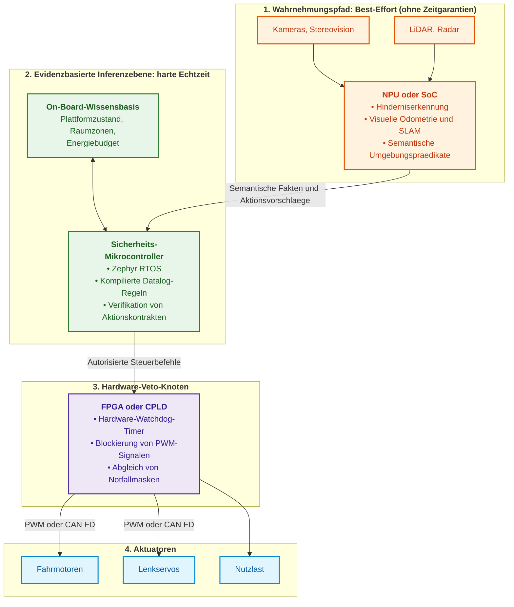
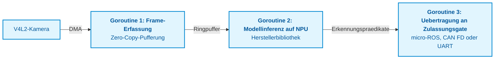
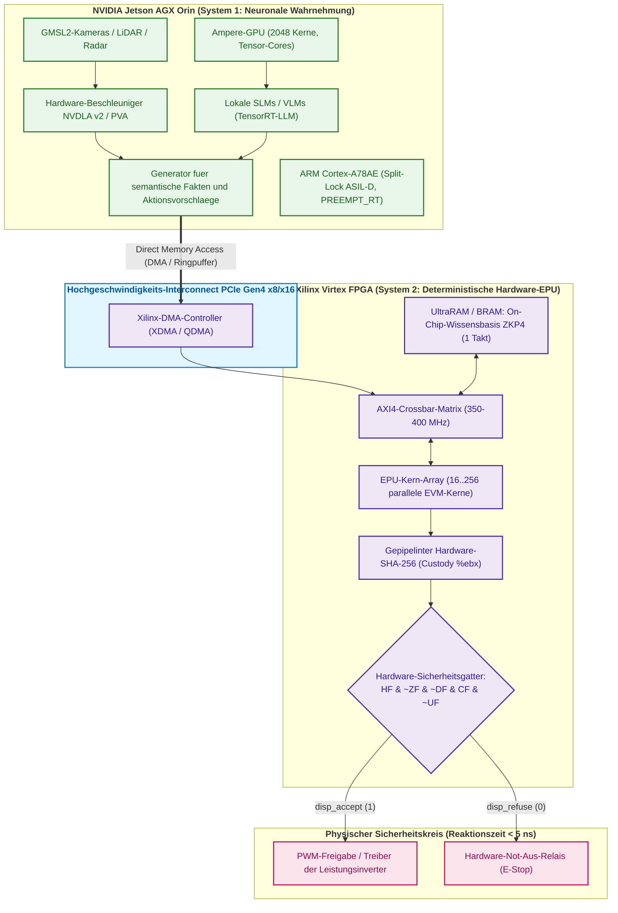
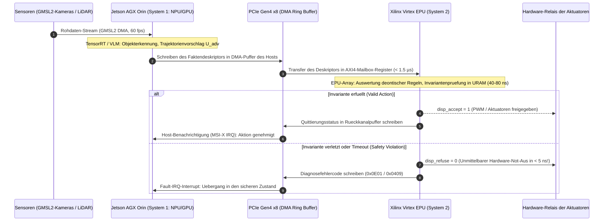
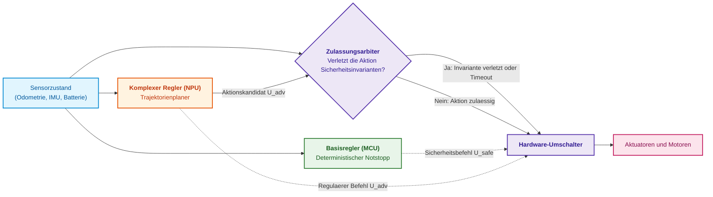
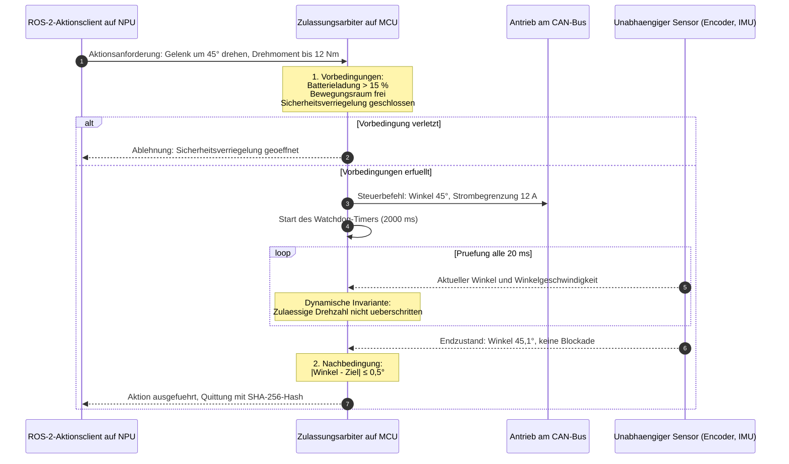
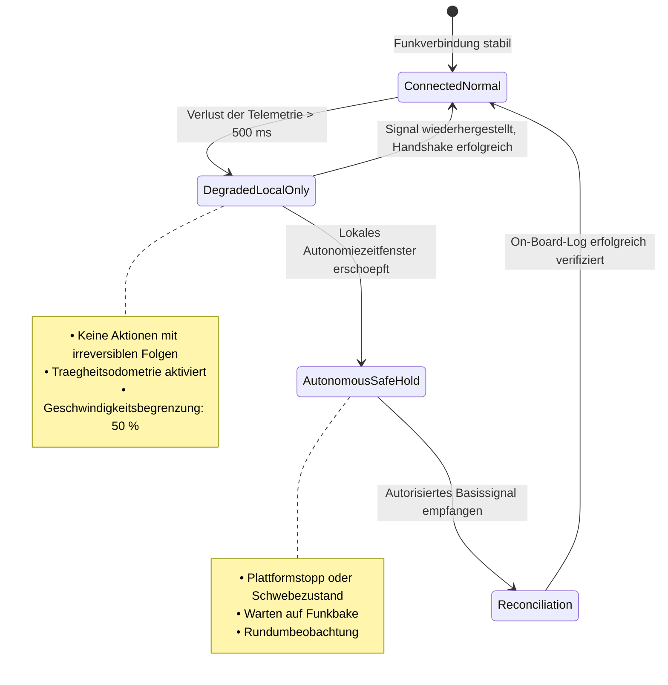
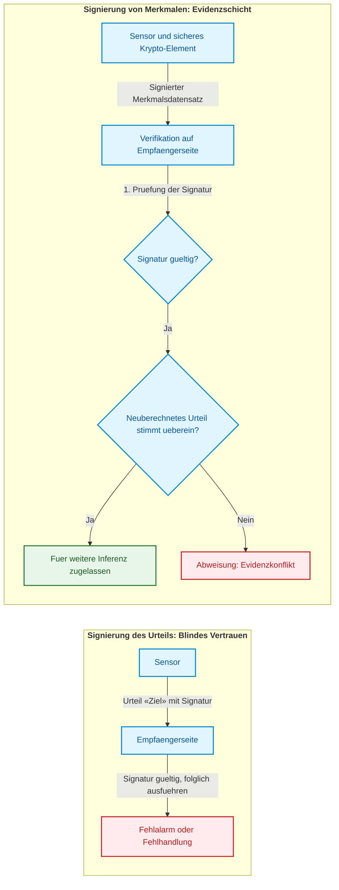
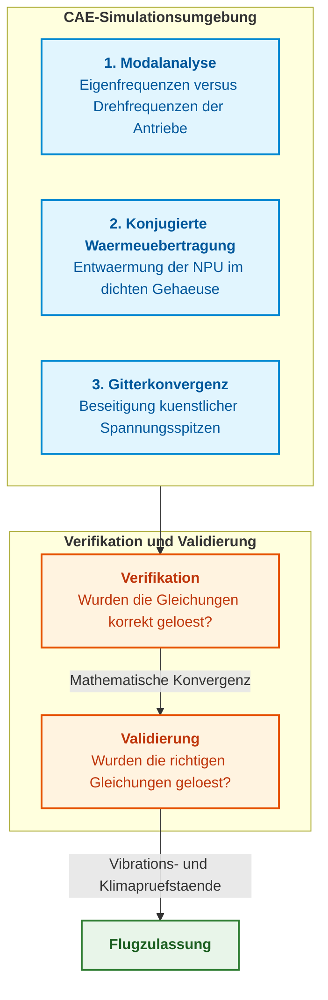

# Anhang B. Evidenzbasierte Expertensysteme in der autonomen Robotik und in cyber-physischen Komplexen

> **Buch:** [Architektur evidenzbasierter Expertensysteme](README.md) · Anhänge  
> **Inhaltsverzeichnis:** [README.md](README.md)  
> **Autor:** [Mykola Fedchyk](about-the-author.md)  
> **Niveau:** Architekten autonomer Plattformen, Embedded-Systems-Ingenieure, Robotik-Spezialisten (ROS 2, Zephyr RTOS), Entwickler geschäftskritischer Echtzeitsysteme  
> **Lernziele:** Strikte Trennung probabilistischer Wahrnehmung von deterministischer Aktionszulassung; Aufbau einer On-Board-Wissensbasis ohne dynamischen Speicher; Modellierung physischer Aktionen als formale Kontrakte mit Vor- und Nachbedingungsprüfung; Validierung von Subsystemschnittstellen und physikalischen Modellen vor Feldtests auf dem Testgelände.

---

## Abstract

In geschäftskritischen autonomen Systemen und in der mobilen Robotik (ISO 26262 ASIL D, IEC 61508 SIL 3, DO-178C DAL A) führt die direkte Kopplung neuronaler Wahrnehmungsmodelle oder multimodaler KI an ausführende Aktuatoren unweigerlich zu katastrophalen Havarien. Physische Konsequenzen robotischer Aktionen (Notbremsung, Lastabwurf, abrupter Rudereinschlag) sind irreversibel und verbrauchen reale kinetische Energie. Bei einer Regelfrequenz von $f = 50\ \text{Hz}$ garantiert bereits eine marginale Klassifikations- oder Erkennungsfehlerrate von $p = 10^{-3}$ einen gefährlichen Steuerbefehl im statistischen Mittel bereits nach $`T_{\text{err}} = 1/(p \cdot f) = 20\ \text{Sekunden}`$ Flug- oder Fahrzeit.

Dieser Anhang löst dieses Problem durch die Einführung eines fundamentalen Prinzips der cyber-physischen Sicherheit: der strikten Trennung probabilistischer Sensorintelligenz von deterministischer Aktionszulassung. Der Autor schlägt eine heterogene dreistufige On-Board-Architektur vor und analysiert diese im Detail: ein SoC/NPU für Computer Vision, ein fehlertoleranter Sicherheits-Mikrocontroller unter Zephyr RTOS mit vorkompilierten Datalog-Regeln im statischen Speicher (ohne dynamische Allokation über `malloc`) sowie ein Hardware-Veto-Arbiter auf einem FPGA mit einer Abschaltlatenz von $< 100\ \text{ns}$. Ergänzt wird die Architektur durch formale Aktionskontrakte mit Verifikation von Vor- und Nachbedingungen sowie durch Methoden zur Erkennung von Schnittstellendefekten vor den eigentlichen Feldversuchen auf dem Testgelände.

---

## 1. Physische Irreversibilität und kybernetische Grenzen: Der fundamentale Unterschied zwischen cyber-physischen Systemen und generativer KI

Der Versuch, Architekturmuster der verbraucherorientierten generativen künstlichen Intelligenz unmittelbar auf die autonome Robotik und cyber-physische Systeme (*cyber-physical systems*, CPS) zu übertragen, stellt einen der verhängnisvollsten ingenieurtechnischen Irrtümer der Gegenwart dar. Die in populären Publikationen verbreitete, stark vereinfachte Metapher eines autonomen Roboters als «Sprachmodell auf Rädern» oder das Konzept der durchgängigen End-to-End-Regelung (*End-to-End Vision-Language-Action, VLA*), bei dem ein stochastisches neuronales Netz Motorströme direkt aus Kamerapixeln synthetisiert, führt in sicherheitskritischen Anwendungen garantiert zu Unfällen.

Der Grund hierfür liegt in der prinzipiellen ontologischen Diskrepanz zwischen dem virtuellen Raum der Textgenerierung und der materiellen Realität. In diesem einleitenden Abschnitt werden die fundamentalen physikalischen und kybernetischen Gesetzmäßigkeiten dargelegt, die einen grundlegend anderen Ansatz für den Entwurf von On-Board-Intelligenz erzwingen und als methodische Präambel für alle nachfolgenden Abschnitte dieses Anhangs dienen.

### 1.1. Thermodynamische und materielle Irreversibilität physischer Aktionen

In herkömmlichen Softwareprodukten (Suchmaschinen, generative Chatbots, Empfehlungsdienste) birgt ein Modellfehler oder eine Halluzination keine unmittelbare physische Bedrohung: Die Folge ist lediglich eine fehlerhafte Textzeile auf dem Bildschirm, eine erneute Benutzeranfrage oder das Neuladen einer Webseite. Selbst in Finanz- oder relationalen Datenbanken greift bei logischen Inkonsistenzen der Mechanismus des transaktionalen Rollbacks (`ROLLBACK`), welcher das System deterministisch in den Ausgangszustand zurückversetzt.

In cyber-physischen Komplexen transformiert der Programmcode rechnerische Urteile in eine Umverteilung realer physikalischer Energie:
* Er moduliert elektrische Spannungen und Pulsweiten an den Gates der Leistungstransistoren in den Invertern von Traktionsmotoren;
* er steuert Druckventile in Hydraulikleitungen und Bremszylindern;
* er verändert die Anstellwinkel aerodynamischer Steuerflächen oder den Schub von UAV-Triebwerken;
* er beaufschlagt die pyrotechnischen Auslöser von Nutzlastabwurfsystemen mit Strom.

Jede ausgeführte physische Aktion – wie etwa `EmergencyBraking()`, `DropPayload()` oder ein abrupter Servoausschlag um $90^\circ$ bei einer Geschwindigkeit von 80 km/h – setzt kinetische oder thermische Energie frei und verändert den Zustand der physischen Umgebung unwiderruflich.

In der materiellen Welt existiert kein Undo-Operator: Eine plastische Verformung von Metallstrukturen nach einer Kollision, abgescherte Getriebezähne, durchgebrannte Leistungshalbleiter im Inverter oder der aerodynamische Strömungsabriss eines Fluggeräts lassen sich nicht durch einen «neuen Prompt» korrigieren. Die Entropiezunahme ist irreversibel. Folglich muss jede Aktion, welche die Grenzen des sicheren Zustandsraums der Plattform verlässt, *vor* ihrer physikalischen Aktivierung zuverlässig blockiert werden – anstatt erst postmortal nach Eintritt der Havarie korrigiert zu werden.

### 1.2. Kybernetische Akkumulation der Ausfallwahrscheinlichkeit im hochfrequenten Regelkreis

Während ein Benutzer mit einem Chatbot im Takt von etwa einer Anfrage pro Minute interagiert ($f \approx 0{,}016\ \text{Hz}$), operiert der bordseitige Regelkreis einer robotischen Plattform mit Frequenzen von mehreren Dutzend bis zu Tausenden Hertz: $f = 50\ \text{Hz}$ für die globale Trajektorienplanung, $f = 200\ \text{Hz}$ für die Lageregelung und Winkelorientierung sowie $f \ge 1000\ \text{Hz}$ für die unterlagerten Stromregelkreise der Leistungsantriebe.

Bei einer derart hohen Abtastrate führt selbst eine nach Maßstäben des maschinellen Lernens verschwindend geringe Fehlerrate bei der Klassifikation oder Lokalisierung unvermeidlich zu einem raschen Systemausfall. Die mittlere Betriebsdauer bis zum Auftreten des ersten kritischen Fehlers ($`T_{\text{err}}`$) wird durch folgende Relation bestimmt:

```math
T_{\text{err}} = \frac{1}{p\,f}.
```

Hierbei bezeichnen:
- $`T_{\text{err}}`$ die mittlere Betriebsdauer bis zum ersten gravierenden Wahrnehmungs- oder Planungsfehler in Sekunden;
- $p$ die Fehlerwahrscheinlichkeit des neuronalen Modells in einem diskreten Zeitschritt (dimensionslose Größe im Intervall $[0, 1]$);
- $f$ die Regelfrequenz bzw. Ausführungsrate des Regelkreises in Hertz (Hz).

Da das System pro Sekunde $f$ Zeitschritte durchläuft, entspricht der Erwartungswert der generierten Fehler pro Zeiteinheit dem Produkt $p\,f$. Dementsprechend ist das mittlere Warteintervall bis zur ersten gefährlichen Steueranweisung der Kehrwert $1/(p\,f)$.

```math
\begin{aligned}
\text{Bei } p = 10^{-3}\ (99{,}9\%\ \text{Genauigkeit}),\ f = 50\ \text{Hz} &\implies T_{\text{err}} = \frac{1}{10^{-3} \cdot 50} = 20\ \text{Sekunden}; \\
\text{Bei } p = 10^{-3}\ (99{,}9\%\ \text{Genauigkeit}),\ f = 200\ \text{Hz} &\implies T_{\text{err}} = \frac{1}{10^{-3} \cdot 200} = 5\ \text{Sekunden}; \\
\text{Bei } p = 10^{-4}\ (99{,}99\%\ \text{Genauigkeit}),\ f = 50\ \text{Hz} &\implies T_{\text{err}} = \frac{1}{10^{-4} \cdot 50} = 200\ \text{Sekunden}\ (3{,}3\ \text{Minuten}).
\end{aligned}
```

Unter realen Einsatzbedingungen ist die Annahme statistisch unabhängiger Fehler aufeinanderfolgender Zeitschritte zudem nicht haltbar: Optische Blendung durch direkte Sonneneinstrahlung, Staubwolken, Regentropfen auf der Linse oder Mehrwegeechos beim LiDAR erzeugen korrelierte Fehlerbündel (*burst errors*), bei denen eine fehlerhafte Perzeption über Dutzende Zyklen hinweg anhält. Dies verkürzt die reale Zeitspanne bis zur physischen Havarie auf Sekundenbruchteile.

### 1.3. Die Unüberwindbarkeit des Long-Tail-Bereichs von Verteilungen (Out-of-Distribution-Halluzinationen)

Der verbreitete ingenieurtechnische Versuch, das Zuverlässigkeitsproblem durch das Sammeln noch größerer Datensätze, Feinabstimmung (*fine-tuning*) oder bestärkendes Lernen (*RLHF/RLAIF*) zu lösen, scheitert an einer fundamentalen mathematischen Schranke: Ein künstliches neuronales Netz ist ein statistischer Interpolator in einem hochdimensionalen Merkmalsraum.

Die physische Einsatzumgebung autonomer Systeme weist eine unendliche Varianz auf («langer Schwanz» der Verteilung, *long-tail distribution*). Ein Roboter wird unweigerlich mit Kombinationen von Sensorsignalen konfrontiert, die im Trainingsdatensatz nicht enthalten waren (Out-of-Distribution-Szenarien): seltene Lichtreflexionen, irreguläre Hindernisse, strukturelle Beschädigungen am Chassis oder veränderliche Bodenmechanik. In solchen Zuständen signalisiert das stochastische Modell keineswegs eine epistemische Unsicherheit, sondern generiert zufällige und häufig extrem gefährliche Steuerungsvektoren mit trügerisch hoher interner Konfidenz (*overconfident hallucinations*).

Die Normen der funktionalen Sicherheit höchster Integritätsstufen (ISO 26262 ASIL D, IEC 61508 SIL 3, DO-178C DAL A) fordern eine strikte Obergrenze für die zulässige Ausfallrate katastrophaler Ereignisse:

```math
\Lambda_{\text{catastrophic}} < 10^{-9}\ \text{Ausfälle pro Betriebsstunde}\ (1\ \text{FIT} = 10^{-9}\ \text{h}^{-1}).
```

Kein gegenwärtiges neuronales Netz ist in der Lage, einen mathematischen Beweis für die Einhaltung dieses Kriteriums zu erbringen. Ein empirischer Testbetrieb über $10^9$ Stunden (über 114.000 Jahre kontinuierlicher Betrieb) ohne einen einzigen sicherheitskritischen Ausfall für jede modifizierte Modellgewichtsmatrix ist physisch und ökonomisch unmöglich.

### 1.4. Architektonische Roadmap: Das deterministische Zulassungsgate

Aus diesen Gegebenheiten folgt eine fundamentale ingenieurtechnische Schlussfolgerung, die das Fundament für das gesamte theoretische und praktische Modell dieses Werks bildet:

> [!IMPORTANT]
> **Fundamentales Prinzip evidenzbasierter cyber-physischer Sicherheit:**
> Kein probabilistisches neuronales Modell (sei es für Computer Vision, SLAM oder Vision-Language-Action) darf direkten Zugriff auf die Steuerbusse physischer Aktuatoren besitzen. Zwischen stochastischer Intelligenz und der materiellen Realität muss zwingend ein deterministisches **Zulassungsgate** (*admission gate*) geschaltet sein: ein evidenzbasiertes Expertensystem, welches die vorgeschlagene Aktion in harter Echtzeit gegen strikte physikalische und normative Invarianten verifiziert.

Dieser Anhang ist als strukturierter Leitfaden für den Entwurf und die Implementierung eines solchen Zulassungsgates konzipiert. Jeder nachfolgende Abschnitt behandelt eine spezifische Schutzschicht:

1. **Heterogener On-Board-Rechner und Forschungsteststände:** Partitionierung der Aufgaben auf physikalisch isolierte Rechnerebenen – eine hochperformante NPU für probabilistische Vision-Aufgaben (NVIDIA Jetson AGX Orin) und ein verlässlicher, deterministischer Verifikator (Xilinx Virtex UltraScale+ FPGA / Zephyr RTOS Lockstep-MCU) mit PCIe-DMA-Bus und einer Hardware-Abschaltzeit fehlerhafter Befehle von $< 5\ \text{ns}$.
2. **Die Simplex-Architektur:** Ein mathematisch rigoroser Mechanismus zur dynamischen Aufsicht, bei dem ein Zulassungsarbiter auf Basis von Kontrollbarrierefunktionen (*Control Barrier Functions*) die Plattform bei drohender Invariantenverletzung verzögerungsfrei von einer komplexen neuronalen Trajektorie auf einen formal verifizierten Basis-Sicherheitsregler umschaltet.
3. **On-Board-Wissensbasis ohne dynamischen Speicher:** Entwurf einer Datalog-Inferenzmaschine, die vollständig im statischen Speicher operiert, ohne den System-Heap (`malloc`) zu beanspruchen, wodurch Speicherfragmentierung ausgeschlossen und deterministische Inferenzzeiten garantiert werden.
4. **Aktion als Kontrakt (Vorbedingungen, Nachbedingungen, Invarianten):** Strukturierung physischer Aktionen als verteilte Transaktions-Sagas mit Prüfung der Vorbedingungen, deterministischer Laufzeitüberwachung und Bereitstellung unbedingter Kompensationsaktionen bei Kontraktbruch.
5. **Pre-Deployment-Verifikation von Schnittstellen und physikalischen Modellen:** Methodik zur mathematischen Verifikation des Zusammenspiels aller Subsysteme (MIL/SIL/HIL), welche es gestattet, kinematische Defekte, Buslatenzen und Schnittstellenkollisionen in der Simulation aufzudecken, bevor die Plattform reale Tests auf dem Übungsgelände absolviert.

## 2. Heterogener On-Board-Rechner

Mobile Roboter, Drohnen und autonome Feldplattformen unterliegen strengen Restriktionen hinsichtlich Bauraum, Gewicht, Leistungsaufnahme und Kosten (*size, weight, power and cost*, SWaP-C). Ein schwerer universeller Hochleistungsrechner an Bord entlädt die Batterie vorzeitig, neigt zur thermischen Überhitzung und reduziert die nutzbare Nutzlast. Daher wird die On-Board-Architektur – wie in [Kapitel 18](ch18-execution-infrastructure.md) detailliert dargelegt – in mehrere Rechnerknoten mit klar abgegrenzten Rollen unterteilt.



Dieses Diagramm ist hierarchisch von oben nach unten zu interpretieren: Der Wahrnehmungspfad formuliert lediglich Vorschläge, der Sicherheits-Mikrocontroller fällt die Zulassungsentscheidung, und die programmierbare Logik kann die Ansteuerung der Aktuatoren zu jedem Zeitpunkt hardwareseitig sperren. Die Rollen der Rechnerknoten gliedern sich wie folgt:

1. **Neuronaler Prozessor (*neural processing unit*, NPU) oder System-on-Chip (SoC).** Typische Vertreter sind NVIDIA Jetson Orin Module, Rockchip RK3588 Prozessoren oder Hailo-Beschleuniger für Single-Board-Computer. Software-Stack: Embedded Linux mit dem Robot Operating System Framework ROS 2 [[1]](#src-1) oder kompilierte Binärdateien in Go bzw. C++. Aufgabe: Verarbeitung roher Sensorströme, Objekterkennung, Punktwolkenfusion. Zuverlässigkeitsstatus: komplexer, nicht formal verifizierter Controller; er darf neu starten oder fehlerhafte Hypothesen generieren, ohne dass die elementare Lagestabilisierung der Plattform zusammenbricht.
2. **Sicherheits-Mikrocontroller.** Exemplarisch hierfür stehen Mehrkern-Mikrocontroller mit Hardware-Redundanz, deren Kerne im Lockstep-Modus betrieben werden. Das Echtzeitbetriebssystem Zephyr RTOS [[2]](#src-2) bietet ein deterministisches, präemptives Thread-Scheduling und gestattet den vollständigen Verzicht auf dynamische Speicherverwaltung. Aufgabe: Verwaltung der lokalen Faktenbasis, Ausführung vorkompilierter Inferenzregeln, Prüfung von Vor- und Nachbedingungen für Aktionen. Die erforderliche Integritätsstufe wird durch eine Gefahren- und Risikoanalyse festgelegt; typische Zielvorgaben sind ASIL D nach ISO 26262 [[3]](#src-3) oder SIL 3 nach IEC 61508 [[4]](#src-4).
3. **Hardware-Arbiter auf programmierbarer Logik (FPGA oder CPLD).** Aufgabe: Überwachung der Versorgungsbusse, Prüfung elektrischer Stromgrenzen, unmittelbare Hardware-Abschaltung der Motortreiber bei Überschreitung kritischer Neigungswinkel oder beim Verlassen freigegebener Einsatzkorridore (*geofencing*). Die programmierbare Logik reagiert softwareunabhängig; ihre Reaktionszeit wird allein durch Gatterlaufzeiten bestimmt und nicht durch das Scheduling eines Betriebssystems.

### 2.1. Computer-Vision-Pipeline mit Go und NPU

Für die bordseitige Hinderniserkennung ist es essenziell, überflüssige interpretierte Laufzeitschichten zu eliminieren, da diese unvorhersehbare Latenzen verursachen. Das vom Autor für Prototypen empfohlene Entwurfsmuster kombiniert einen Single-Board-Computer, einen über PCIe angebundenen neuronalen Prozessor und eine einzelne, statisch kompilierte Binärdatei in Go:



Dieses Entwurfsmuster zeichnet sich durch drei Merkmale aus: Videoframes werden über den V4L2-Treiber direkt in DMA-Puffer ohne Speicherkopien (*zero-copy*) eingelesen. Das neuronale Netz wird auf der NPU über herstellerspezifische Bibliotheken ausgeführt, die direkt aus Go via Cgo aufgerufen werden. Die Goroutinen kommunizieren über gepufferte Channels mit einer Drop-Oldest-Strategie, sodass sich bei Lastspitzen keine Verarbeitungsrückstände in der Warteschlange akkumulieren. Latenzprofile und CPU-Auslastung werden direkt unter realer Last auf der Zielhardware ermittelt, anstatt synthetische Werte aus Datenblättern zu übernehmen.

## 3. Experimentelle Hardware-Plattformen: Prüfstände auf Basis von NVIDIA Jetson AGX Orin und Xilinx Virtex FPGA

Zur empirischen Validierung der theoretischen Modelle dieser Monografie hat der Autor zwei komplementäre industrielle Hardware-Prüfstände aufgebaut, welche statistische Perzeption und deterministische Verifikation physisch trennen.



---

### 3.1. Forschungsprogramm für NVIDIA Jetson AGX Orin (Wahrnehmungs- und Vorschlagspfad – System 1)

Als Basishardware für Untersuchungen des Wahrnehmungspfads dient der industrielle autonome Rechner **Seeed Studio reServer Industrial J501**, basierend auf dem Modul **NVIDIA Jetson AGX Orin** (bis zu 275 TOPS Tensor-Rechenleistung, 2048-Kern-Ampere-GPU mit 64 Tensor-Cores, zwei NVDLA v2 Deep-Learning-Engines, programmierbarer Vision-Beschleuniger PVA v2, 12-Kern ARM Cortex-A78AE CPU-Cluster und bis zu 64 GB einheitlicher LPDDR5-Arbeitsspeicher mit einer Bandbreite von 204,8 GB/s in einem lüfterlosen Industriegehäuse für den Temperaturbereich von -20 °C bis +60 °C).

Der Software-Stack basiert auf **NVIDIA JetPack 6.2** (Linux-Kernel 5.15 mit PREEMPT_RT-Patch, CUDA 12.6, cuDNN 9, TensorRT 10, Ubuntu 22.04 LTS `aarch64`) und der integrierten lokalen Inferenzumgebung **Ollama / TensorRT-LLM**.

Dieser Wahrnehmungspfad besitzt keinen direkten Zugriff auf die Aktorik und agiert als stochastischer Hypothesengenerator: Er überführt unstrukturierte Sensorströme in formalisierte Zustandspädikate und formuliert Aktionskandidaten $`U_{\text{adv}}`$. Auf diesem Prüfstand werden folgende Kernfragestellungen untersucht:

1. **Transformation von Sensorströmen in typisierte symbolische Prädikate (Perception-to-Symbolic Translation):**
   * Untersuchung struktureller Quantisierungsmethoden (FP8, INT4 AWQ) lokaler Open-Source-Modelle (Qwen2.5, Phi-4, Gemma-2) sowie von Computer-Vision-Modellen unter TensorRT-LLM und NVDLA zur robusten Extraktion raumzeitlicher Fakten.
   * Nutzung der Vorzüge der Unified Memory Architecture (UMA): Vollständige Platzierung von Modellen der Größenordnung 14B bis 32B Parametern im Videospeicher ohne Interprozessor-Transferlatenzen.
   * Messung der Latenzquantile P50/P90/P99 bei der Umwandlung roher Sensorsignale in typisierte Faktenstrukturen in einer vollständig isolierten (air-gapped) Umgebung ohne Internetverbindung.
2. **Synthese von Aktionskandidaten und Serialisierung von Kontraktdeskriptoren:**
   * Automatische Generierung von Aktionshypothesen $`U_{\text{adv}}`$ (Sollbeschleunigungsvektoren, Trajektorien, angeforderte Betriebsmittel) inklusive der zugehörigen, formal zu prüfenden Vorbedingungen.
   * Kompakte Serialisierung von Fakten und Aktionsparametern in 64-Byte-ausgerichtete Binärdeskriptoren zur direkten Übergabe an das Hardware-Zulassungsgate über den Systembus.
3. **Evaluierung des Zeitverhaltens unter dem Linux-Kernel mit PREEMPT_RT-Patch:**
   * Messung von Latenz-Jitter (*latency jitter*) und maximaler Ausführungszeit (*Worst-Case Execution Time*, WCET) bei der Faktengenerierung auf den ARM Cortex-A78AE-Kernen.
   * Untersuchung von Buskonflikten bei Zugriffen auf den LPDDR5-Speicher zwischen GPU/DLA und Echtzeit-CPU-Threads; Verifikation des Zeitbudgets $`T_{\text{infer}}`$ innerhalb des fehlertoleranten Zeitintervalls (FTTI).
   * Evaluierung der ARM Cortex-A78AE-Kerne im hardwarebasierten **Split-Lock-Modus** zur Erfüllung der Anforderungen von ISO 26262 ASIL D.
4. **Latenzarme Datenübertragung über den PCIe-DMA-Interconnect:**
   * Implementierung von Ringpuffern (*ring buffers*) im fixierten (*pinned*) Shared Memory des Hosts, der über BAR-Register in den PCIe-Adressraum gemappt ist.
   * Direkter Transfer von Faktendeskriptoren an den Hardware-Verifikator ohne intervenierende Kernel-Syscalls und ohne Overhead externer Protokollstapel.
   * Rohdatenerfassung über GMSL2-Kameraschnittstellen und LiDAR unter Nutzung von DMA-Ringpuffern (V4L2 / NVMM), wodurch die Latenz bis zum Inferenzbeginn auf $< 2\ \text{ms}$ minimiert wird.

> [!NOTE]
> **Theoretische und ingenieurtechnische Grundlagen des Wahrnehmungspfads in weiteren Kapiteln:**
> - [Kapitel 12. Linguistische Analyse und lokale Modelle](ch12-linguistic-analysis-and-local-models.md) – Lokale Inferenz von Sprachmodellen, Faktenextraktion und linguistische Muster für geschlossene Regelkreise.
> - [Kapitel 18. Ausführungsinfrastruktur](ch18-execution-infrastructure.md) – Analyse erreichbarer Rechenleistungen nach dem Roofline-Modell, numerische Drift, Latenzbudgetierung und Konfiguration des Linux-Kernels mit PREEMPT_RT.
> - [Kapitel 28. Dual-Mode-Expertensysteme: Rigorose Inferenz und beratende Hypothese](ch28-dual-mode-expert-systems.md) sowie [Kapitel 29. Neuro-symbolische Architektur](ch29-neuro-symbolic-architecture.md) – Formale Rollenteilung zwischen probabilistischem Hypothesengenerator (System 1) und deterministischem Verifikator.

---

### 3.2. Forschungsprogramm für Xilinx Virtex FPGA (Deterministische evidenzbasierte Kontrollebene – System 2)

Für die Realisierung des Hardware-Zulassungsgates ist die Auswahl einer programmierbaren Logikfamilie entscheidend, die deterministische Logikoperationen mit fester Nanosekunden-Latenz, absolute Freiheit von dynamischer Allokation und hardwarebasierte Fehlertoleranz sicherstellt.

#### 3.2.1. Begründung der Auswahl und Ressourcenadäquanz des FPGA

Auf dem Versuchsstand kommt die moderne Bausteinfamilie **AMD / Xilinx UltraScale+ (16-nm-FinFET-Prozess)** zum Einsatz – primär die Matrizen **Virtex UltraScale+ (VU9P, VU13P)** oder **Kintex UltraScale+ (KU11P, KU15P)**, verfügbar als PCIe-Beschleunigerkarten der Klasse **AMD Alveo (U50, U200)**.

Die Entscheidung für diese Halbleiterfamilie basiert auf strengen Kriterien:

1. **Ausschluss veralteter Architekturen (Virtex-7):**  
   Die Virtex-7-Familie (28 nm) ist technologisch überholt und für harte Echtzeitanforderungen ungeeignet: Sie unterstützt lediglich PCIe Gen3 (was an der PCIe-Gen4-Schnittstelle des Jetson Orin einen Flaschenhals bildet), verfügt über keinerlei UltraRAM (URAM) und erzwingt Zugriffe auf externen DDR3/DDR4-Speicher, was stochastischen Jitter verursacht.
2. **Logikkapazität (LUTs und Flip-Flops):**  
   * Ein deterministischer symbolischer Inferenzkern (Datalog-Unifikations-Engine / deontischer Invariantenprüfer) belegt durchschnittlich **2.500 bis 4.500 LUTs** und **3.000 bis 5.000 Flip-Flops (FF)**.
   * Ein Versuchs-Array aus 16 bis 64 parallelen Kernen zur simultanen Verifikation von Beweisbäumen erfordert **80.000 bis 280.000 LUTs**.
   * On-Chip-Systeminfrastruktur: Der integrierte PCIe Gen4 DMA-Controller (XDMA/QDMA-Subsystem) benötigt ~25.000 LUTs; die AXI4-Crossbar-Matrix ~15.000 bis 20.000 LUTs; ein 64-stufiger, voll gepipelinter SHA-256-Hash-Verifikator ~12.000 bis 15.000 LUTs nebst DSP48E2-Blöcken; das kombinatorische Sicherheitsgatter (*Safety Gate*) samt Hardware-Watchdog ~2.000 LUTs.
   * Der Gesamtresourcenbedarf liegt bei **150.000 bis 350.000 LUTs**.
   * Der Einsatz von Bausteinen wie Kintex UltraScale+ (KU15P: 523.000 LUTs) oder Virtex UltraScale+ (VU9P: 1.182.000 LUTs; VU13P: 1.728.000 LUTs) ist somit **notwendig und hinreichend**: Er gewährleistet einen Auslastungsgrad (*logic utilization*) von 30 bis 55 %. Dies verhindert Routing-Engpässe (*routing congestion*), sichert das Timing-Closure bei einer Zielfrequenz von **300 bis 400 MHz** ($`T_{\text{clk}} = 2{,}5\text{ bis }3{,}3\ \text{ns}`$) und belässt Reserven für Forschungsmodifikationen.
3. **Interne Speicherarchitektur (UltraRAM und BRAM versus externes DRAM):**  
   * Die Nutzung von externem dynamischem Arbeitsspeicher (DDR4/DDR5) zur Verifikation von Sicherheitsinvarianten in harter Echtzeit ist unzulässig: Zugriffslatenzen von 50 bis 100 ns, periodische Refresh-Zyklen ($`t_{\text{RFC}}`$) und Buskonflikte erzeugen stochastischen Jitter.
   * UltraScale+-Matrizen verfügen über **UltraRAM (URAM)** – synchrone Dual-Port-SRAM-Blöcke mit einer Kapazität von je 288 kbit (Organisation 4K × 72 Bit), die sich kaskadieren lassen. Der VU9P-Baustein stellt beispielsweise 36 MB (270 Mbit) URAM sowie 75,9 Mbit Block-RAM (BRAM 36K) bereit.
   * Diese Speicherkapazität reicht aus, um **die gesamte kompilierte Wissensbasis, ontologische Verbände, Defeater-Tabellen und Aktionsinvarianten direkt im On-Chip-Speicher des FPGA vorzuhalten**. Jeder Regelabruf und jeder Termabgleich erfolgt in **1 bis 2 Taktzyklen ($2{,}5\text{ bis }5{,}7\ \text{ns}$)** mit absolut deterministischer Zugriffszeit (*Zero Wait-States*) ohne Cache-Misses.

#### 3.2.2. Angewandte Forschungsaufgaben für System 2 auf dem FPGA

1. **Systolisches Array paralleler Wissenskerne (Multi-Core Symbolic Inference Array):**
   * Synthese eines deterministischen Mehrkern-Inferenzprozessors (16 bis 64 Kerne), der Datalog-Regeln und deontische Verbote (`MUST_NOT`) parallel verarbeitet.
   * Implementierung eines Hardware-Task-Dispatchers, welcher die Prüfung von Aktionsvorbedingungen parallelisiert und Beweisbäume mit einem Durchsatz von $> 10^7$ Normprüfungen pro Sekunde bei einer P99-Latenz von $< 100\ \text{ns}$ evaluiert.
2. **On-Chip-Wissensspeicherung (UltraRAM Zero-Jitter Store):**
   * Laden des binären Wissenspakets in den statischen Adressraum des UltraRAM.
   * Untersuchung konfliktfreier Multi-Port-Zugriffe: Jeder Kern greift innerhalb eines einzigen Takts ($2{,}5\text{ bis }3{,}3\ \text{ns}$) auf Normen, Prädikate oder Defeater zu, ohne externe Speicherchips zu kontaktieren.
3. **Gepipelinte kryptografische Quellen-Custody (%ebx Hardware SHA-256 Custody):**
   * Synthese eines 64-stufigen, voll gepipelinten SHA-256-Koprozessors auf Basis von Logikressourcen und DSP48E2-Slices. Dieser verifiziert die Authentizität normativer Texte (Quell-Hash-Prüfung) byteweise in exakt 64 Takten ($< 180\ \text{ns}$ bei 350 MHz) parallel zur Regelauswertung.
   * Hardware-Schutz gegen Single Event Upsets (SEU): Einsatz integrierter Error-Correcting-Codes (ECC) in BRAM/URAM-Blöcken zur Absicherung der Wissensintegrität gegen elektromagnetische Störimpulse.
4. **Diskretes Hardware-Zulassungsgate und physisches Veto (Hardware Safety Interlock):**
   * Erzeugung diskreter Steuersignale `disp_accept` und `disp_refuse`, die direkt auf GPIO-Pins (LVCMOS) des FPGA geroutet sind.
   * Die Abschaltlogik ist rein kombinatorisch mit einer Latenz von $< 5\ \text{ns}$ realisiert; sie steuert optoisolierte Gatetreiber der Inverter an oder unterbricht den Haltestromkreis eines Sicherheitsrelais (E-Stop).
   * Vollständige Entkopplung von der Software: Bei Verletzung einer Sicherheitsinvariante wird die Aktorik auf Siliziumebene hardwareseitig stromlos geschaltet, ohne Beteiligung des Betriebssystems.

> [!NOTE]
> **Theoretische und ingenieurtechnische Grundlagen der Hardware-Inferenz in weiteren Kapiteln:**
> - [Kapitel 16. Architektur von Expertensystemen](ch16-expert-systems-architecture.md) und [Kapitel 17. Technologie-Stack](ch17-implementation-stack.md) – Aufbau der Inferenzmaschine, Registerorganisation und formale Trennung von Regeln und variablen Fakten.
> - [Kapitel 18. Ausführungsinfrastruktur](ch18-execution-infrastructure.md) (Abschnitt «Hardwarebasis und physikalische Grenzen der Peripherie») – Begründung des FPGA-Einsatzes für deterministische Pipelines mit Mikro- und Nanosekunden-Latenzen.
> - [Kapitel 21. Von der Empfehlung zur Aktion: Befugniskontrolle und sichere Ausführung in Produktionsumgebungen](ch21-from-recommendation-to-action.md) – Hardware-Zulassungsgates, Trennung von Leistungspfaden und deterministische Blockierung gefährlicher Aktionen.
> - [Kapitel 31. Normative Inferenz: Prädikatenhierarchien, Ausnahmen und Geltung](ch31-syllogistic-reasoning-and-relation-lattices.md) – Deontische Normen von Pflichten, Rechten und Verboten (`MUST`, `PROHIBITED`), übersetzt in Mikroinstruktionen des Inferenzkerns.
> - [Kapitel 32. Hochleistungs-Wissenspakete: Zero-Copy-Memory-Mapping (mmap) und Harvesting-Pipeline](ch32-high-performance-knowledge-packs-mmap-and-harvesting.md) – Organisation binärer Wissenscontainer, 64-Byte-Alignment und Zero-Copy-Zugriffe im On-Chip-UltraRAM.
> - [Anhang D. Analoge Expertensysteme, neuromorphe Datenverarbeitung und Hardware-Inferenz](appendix-d-analog-expert-systems-and-neuromorphic-computing.md) – Energetische Kosten von Speicherzugriffen und Logikoperationen in Silizium.

---

### 3.3. Untersuchung des heterogenen Tandems «Jetson AGX Orin + Xilinx Virtex PCIe»

Von besonderem wissenschaftlichem Interesse ist die Kopplung beider Plattformen: Das Trägerboard des **NVIDIA Jetson AGX Orin** verfügt über einen standardisierten **PCIe Gen4 x16 Steckplatz (mit 8 aktiven Lanes)**, wodurch sich die **Xilinx Virtex UltraScale+** Beschleunigerkarte als PCIe-Endpoint direkt integrieren lässt.



#### 3.3.1. Gemeinsames Messprotokoll und Poppersches Falsifikationskriterium

1. **Zero-Copy-Austausch über DMA-Ringpuffer (Low-Latency Mailbox):**
   * Ablage der Faktendeskriptoren im fixierten Host-Speicher des Orin. Der XDMA-Controller auf dem FPGA liest den Deskriptor innerhalb von $`T_{\text{dma}} < 1{,}0\text{ bis }1{,}5\ \mu\text{s}`$ direkt in interne AXI4-Register ein.
   * Rückkanal: Zurückschreiben des Verifikationsstatus in den Host-Speicher mit Generierung eines MSI-X-Interrupts (oder extrem aufwandsarmem Polling eines Statusflags).
2. **Hardware-Sicherheits-Watchdog (Hardware Safety Watchdog):**
   * Der FPGA-Arbiter enthält einen unabhängigen Zähler mit der Periode $`T_{\text{wdg}}`$ (z. B. 10 bis 20 ms).
   * Reagiert System 1 (NPU/GPU/Linux) nicht rechtzeitig, blockiert es durch Speicher-Jitter oder liefert es unvollständige Daten, löst der Hardware-Watchdog aus: Er setzt das Signal `disp_accept = 0` zurück und schaltet die Aktuatoren stromlos – vollkommen unabhängig vom Zustand des Betriebssystems.
3. **End-to-End-Latenz des Zulassungszyklus ($`T_{\text{loop}}`$):**  
   Gemessen wird die Gesamtzeit von der Erfassung eines Sensorframes bis zur Ausgabe des physikalischen Signals `disp_accept` an den FPGA-Pins:
   $$T_{\text{loop}} = T_{\text{infer}} + T_{\text{dma}} + T_{\text{fpga}}$$
   wobei:
   * $`T_{\text{infer}}`$ die Zeit für Prädikatsextraktion und Aktionsgenerierung auf der NPU/GPU darstellt ($10\text{ bis }30\ \text{ms}$);
   * $`T_{\text{dma}}`$ die Latenz des DMA-Transfers über PCIe Gen4 repräsentiert ($1{,}0\text{ bis }1{,}5\ \mu\text{s}$);
   * $`T_{\text{fpga}}`$ die Verifikationsdauer im FPGA-Kern-Array beziffert ($40\text{ bis }100\ \text{ns}$).
4. **Falsifikationskriterium der Sicherheitshypothese (Falsification Gate):**  
   Gemäß den Anforderungen an funktionale Sicherheit (ISO 26262 ASIL D, IEC 61508 SIL 3) gilt die Hypothese über die funktionale Sicherheit und Praxistauglichkeit der heterogenen Architektur als **falsifiziert** (verworfen), wenn:
   $$\max(T_{\text{loop}}) > T_{\text{FTTI}}$$
   wobei $`T_{\text{FTTI}}`$ das für die geregelte Plattform spezifizierte fehlertolerante Zeitintervall (*Fault Tolerant Time Interval*) bezeichnet,  
   oder wenn die Wahrscheinlichkeit eines Verifikationsausfalls innerhalb des Watchdog-Intervalls $`P(T_{\text{loop}} > T_{\text{wdg}}) > 10^{-9}\ \text{pro Betriebsstunde}`$ beträgt,  
   oder wenn ein einziger Fall registriert wird, in dem `disp_accept = 1` signalisiert wurde, obwohl ein aktiver Defeater vorlag oder eine formale Sicherheitsinvariante verletzt war.

> [!NOTE]
> **Theoretische und ingenieurtechnische Grundlagen des Tandems in weiteren Kapiteln:**
> - [Kapitel 18. Ausführungsinfrastruktur](ch18-execution-infrastructure.md) – Latenzbudgetierung für plattformübergreifenden Datenaustausch über PCIe DMA und Vermeidung von Pufferüberläufen.
> - [Kapitel 21. Von der Empfehlung zur Aktion: Befugniskontrolle und sichere Ausführung in Produktionsumgebungen](ch21-from-recommendation-to-action.md) – Hardware-Zulassungsgates, Not-Aus-Relais und direkte Ansteuerung von Stellgliedern.
> - [Kapitel 27. Safety-Case-Synthese und GSN-Argumentation](ch27-safety-case-gsn-synthesis.md) sowie [Kapitel 30. Co-Engineering von funktionaler Sicherheit und Cybersecurity](ch30-safety-cybersecurity-co-engineering.md) – Aufbau strukturierter Sicherheitsargumentationsbäume nach dem GSN-Standard (Goal Structuring Notation) für ISO 26262 ASIL D.
> - [Kapitel 39. Aktiver Prüfexperte: Poppersche Falsifikation, regulatorische Compliance (ASPICE/ISO 26262/ISO 21434) und autonomer Testentwurf](ch39-active-compliance-auditor-and-popperian-testing.md) – Formaler Apparat zur Popperschen Falsifikation von Sicherheitshypothesen und automatisierte Rückverfolgbarkeit des ASPICE-V-Modells.

Dieses heterogene Tandem löst den fundamentalen Widerspruch zwischen der hohen Rechenleistung stochastischer Netze und den strikten Anforderungen funktionaler Sicherheit auf und transformiert probabilistische KI in ein beherrschbares Werkzeug cyber-physischer Steuerung.

---

## 4. Die Simplex-Architektur: Komplexer Regler unter der Aufsicht eines einfachen Reglers

Um hochperformante, jedoch mathematisch nicht verifizierbare Regelungsalgorithmen mit kompromissloser Sicherheit zu vereinen, wird die **Simplex-Architektur** (*Simplex architecture*) eingesetzt. Lui Sha formulierte deren Grundprinzip prägnant: Einfachheit nutzen, um Komplexität zu kontrollieren – ein einfacher, formal verifizierter Regler sichert einen komplexen Regler ab [[5]](#src-5). Die Architektur gliedert sich in drei Kernkomponenten:

1. **Der komplexe Regler (*advanced controller*)** läuft auf der NPU (beispielsweise innerhalb des Nav2-Navigationsstacks unter ROS 2 [[6]](#src-6)) und nutzt neuronale Netze sowie aufwendige Trajektorienplanungsalgorithmen.
2. **Der Basisregler (*baseline safety controller*)** operiert auf dem Sicherheits-Mikrocontroller und implementiert einfache, mathematisch beweisbar sichere Steuerungsgesetze: Abbremsen, Positionshalten oder kontrollierte Notlandung.
3. **Der Zulassungsarbiter (*admission arbiter*)** ist eine symbolische Regel-Engine, die in harter Echtzeit prüft, ob die vom komplexen Regler vorgeschlagene Steueraktion mit dem physikalischen Zustandsmodell des Roboters vereinbar ist.



### 4.1. Formalisierung der Sicherheitsinvariante

Der Zustand des Roboters zum Zeitpunkt $t$ sei durch den Vektor $X(t)$ beschrieben: Raumkoordinaten, Translationsgeschwindigkeit $v$, Winkelgeschwindigkeit $\omega$ und der Abstand zum nächstgelegenen Hindernis $`d_{\mathrm{obs}}`$. Der neuronale Planer schlägt einen Steuervektor $`U_{\mathrm{adv}}=(a,\alpha)`$ vor, wobei $a$ die lineare Beschleunigung und $\alpha$ die Winkelbeschleunigung darstellt. Der Arbiter genehmigt $`U_{\mathrm{adv}}`$ genau dann, wenn folgende Bedingung erfüllt ist:

```math
d_{\mathrm{obs}}-S_{\mathrm{stop}}(v,a_{\mathrm{max}})\ge D_{\mathrm{margin}}+v\,\tau_{\mathrm{reaction}}.
```

Bedeutung der Parameter in der Ungleichung:

- $`d_{\mathrm{obs}}`$ ist der aktuelle Abstand des Roboters zum Hindernis in Metern;
- $`S_{\mathrm{stop}}(v,a_{\mathrm{max}})`$ ist der Anhalteweg, d. h. die Wegstrecke, die der Roboter bis zum vollständigen Stillstand aus der Geschwindigkeit $v$ bei maximaler Bremsverzögerung $`a_{\mathrm{max}}`$ zurücklegt; für eine gleichförmig verzögerte Bewegung gilt $`S_{\mathrm{stop}}=v^{2}/(2a_{\mathrm{max}})`$;
- $v$ ist die Translationsgeschwindigkeit des Roboters in Metern pro Sekunde;
- $`a_{\mathrm{max}}`$ ist die maximale Bremsverzögerung, die das Fahrwerk auf dem gegebenen Untergrund garantiert aufbringen kann, in Metern pro Sekunde zum Quadrat;
- $`D_{\mathrm{margin}}`$ ist der geforderte Sicherheitsabstand zwischen dem angehaltenen Roboter und dem Hindernis (z. B. 0,5 m);
- $`\tau_{\mathrm{reaction}}`$ ist die maximale Reaktionszeit des Hardwaresystems vom Erkennen der Gefahr bis zum Einsetzen der Bremswirkung in Sekunden; sie wird auf der realen Hardware experimentell bestimmt;
- $`v\,\tau_{\mathrm{reaction}}`$ ist die Wegstrecke, die der Roboter während der Reaktionszeit ungebremst zurücklegt.

Die Bedingung besagt: Der um den Bremsweg reduzierte Abstand zum Hindernis muss mindestens die Summe aus Sicherheitsmarge und Reaktionsweg abdecken. Betragen beispielsweise $v=3$ m/s, $`a_{\mathrm{max}}=2`$ m/s² und $`\tau_{\mathrm{reaction}}=0{,}02`$ s, so ergibt sich $`S_{\mathrm{stop}}=3^{2}/(2\cdot2)=2{,}25`$ m und $`v\,\tau_{\mathrm{reaction}}=0{,}06`$ m. Der Arbiter genehmigt die Fortsetzung der Fahrt nur, wenn das Hindernis weiter als $2{,}25+0{,}5+0{,}06=2{,}81$ m entfernt ist. Verletzt $`U_{\mathrm{adv}}`$ diese Relation oder bleibt ein Folgekommando der NPU innerhalb des Watchdog-Fensters (z. B. 50 ms) aus, sperrt der Arbiter die Steuerlinie $`U_{\mathrm{adv}}`$ und übergibt die Kontrolle an den Basisregler, welcher eine Bremsung mit $`-a_{\mathrm{max}}`$ initiiert.

## 5. On-Board-Wissensbasis: Kompiliertes Datalog ohne dynamischen Speicher

Eingebettete Steuergeräte verfügen über RAM-Kapazitäten von wenigen Hundert Kilobyte bis zu einigen Megabyte. Prolog-Interpreter oder Regelsysteme mit dynamischer Speicherallokation (`malloc`, `new`) sind in sicherheitskritischen Regelkreisen unzulässig: Speicherfragmentierung und nichtdeterministische Pausen verletzen harte Echtzeitgarantien. Folglich werden die Regeln der Wissensbasis bereits zur Build-Zeit in kompakte C-Datenstrukturen, Bitmasken und statische Übergangstabellen transformiert.

Als Regelsprache empfiehlt sich Datalog: eine funktionalsymbolfreie Teilmenge der Prädikatenlogik, deren Inferenzprozess nachweislich stets terminiert [[7]](#src-7). Nachfolgend ist ein Regelfragment zur Missionsüberwachung eines unbemannten Fluggeräts dargestellt:

```prolog
% Bordseitige Flugsicherheitsregeln
hazard(critical_battery) :-
    telemetry(battery_voltage, V), V < 21.0.

hazard(geofence_breach) :-
    position(_Alt, Dist), Dist > 5000.

hazard(sensor_blindness) :-
    sensor_health(lidar, failed),
    sensor_health(optical_flow, degraded).

% Uebergang in den Notfallmodus
action(emergency_landing) :-
    hazard(critical_battery).

action(return_to_home) :-
    hazard(geofence_breach),
    not hazard(critical_battery).

action(hold_position) :-
    hazard(sensor_blindness),
    not hazard(critical_battery).
```

### 5.1. Codegenerierung für Zephyr RTOS

Ein Wissenscompiler transformiert diese Datalog-Regeln in eine C-Funktion ohne dynamische Speicherverwaltung. Das folgende Listing verdeutlicht das Generierungsresultat; für eine Ausführung außerhalb von Zephyr genügt das Entfernen des Headers `zephyr/kernel.h`.

<details>
<summary>C-Listing: Generierte Funktion bordseitiger Sicherheitsregeln für Zephyr RTOS</summary>

```c
/* Generiert vom Wissenscompiler fuer Zephyr RTOS */
#include <zephyr/kernel.h>
#include <stdint.h>
#include <stdbool.h>

typedef struct {
    float battery_voltage;
    float distance_from_home;
    float altitude;
    uint8_t lidar_status;       /* 0 = OK, 1 = Degraded, 2 = Failed */
    uint8_t opt_flow_status;
} RobotTelemetry_t;

typedef enum {
    ACTION_CONTINUE = 0,
    ACTION_HOLD_POSITION,
    ACTION_RETURN_TO_HOME,
    ACTION_EMERGENCY_LANDING
} SafetyVerdict_t;

SafetyVerdict_t evaluate_safety_rules(const RobotTelemetry_t *const telem) {
    const bool critical_battery = (telem->battery_voltage < 21.0f);
    if (critical_battery) {
        return ACTION_EMERGENCY_LANDING; /* Hoechste Prioritaet */
    }

    const bool geofence_breach = (telem->distance_from_home > 5000.0f);
    if (geofence_breach) {
        return ACTION_RETURN_TO_HOME;
    }

    const bool sensor_blind = (telem->lidar_status == 2) &&
                              (telem->opt_flow_status >= 1);
    if (sensor_blind) {
        return ACTION_HOLD_POSITION;
    }

    return ACTION_CONTINUE;
}
```

</details>

Der Vergleich zwischen Datalog-Regeln und generiertem C-Code verdeutlicht zwei zentrale Aspekte: Erstens allokiert die Funktion keinerlei Speicher, enthält weder Schleifen noch Rekursion und besitzt somit eine deterministisch beschränkte Ausführungszeit, deren obere Schranke durch WCET-Analyse (*Worst-Case Execution Time*) oder Messungen auf der Ziel-MCU bestimmt werden kann. Zweitens wählt der generierte Code bei simultanem Feuern mehrerer Regeln eine eindeutige Aktion anhand expliziter Prioritäten aus: Bei gleichzeitigem Verlassen des Einsatzgebiets und Sensorausfall erhält die Rückkehr zur Basis Vorrang vor dem Positionshalten. Eine solche Priorisierung ist integraler Bestandteil der Wissensbasis und muss formal modelliert sein, anstatt zufällig aus der Reihenfolge der Quellcodezeilen zu resultieren.

## 6. Aktionskontrakte und Transaktionen in der physischen Welt

Wie in [Kapitel 21](ch21-from-recommendation-to-action.md) ausgeführt, erfordert die Ausführung von Steuerbefehlen in der physikalischen Realität zwingend eine kontinuierliche Rückkopplung: Ein Roboter kann nicht einfach Datenbytes auf den CAN-Bus senden und die Aktion als erfolgreich verbuchen. Komplexe Aktionen werden daher als formale Kontrakte mit Vorbedingungen, Ausführungsüberwachung, Nachbedingungen und Kompensationslogik modelliert. Dieser Ansatz adaptiert das Saga-Muster aus verteilten Datenbanken, bei dem eine langlebige Transaktion in Teilschritte untergliedert ist, für die jeweils kompensierende Aktionen definiert sind [[8]](#src-8).



### 6.1. Struktur des Aktionskontrakts in C

<details>
<summary>C-Listing: Struktur eines Aktionskontrakts</summary>

```c
struct ActionContract {
    uint32_t action_id;
    uint32_t timeout_ms;

    /* Vorbedingungen: liefert true, wenn die Hardware bereit ist */
    bool (*check_preconditions)(void);

    /* Ausfuehrung: Register- oder CAN-Bus-Schreibzugriff */
    int (*execute_command)(void *params);

    /* Nachbedingungen: unabhaengige sensorische Bestaetigung */
    bool (*verify_postconditions)(void *params);

    /* Kompensation: sichere Aktion bei Kontraktbruch */
    void (*compensate_failure)(void);
};
```

</details>

Registriert beispielsweise während einer Rotationsbewegung der Stromsensor eine Überlast von $> 15\ \text{A}$, während der Positions-Encoder keinerlei Winkeländerung meldet (mechanische Blockade des Getriebes), schlägt der Kontrakt fehl: Die Funktion `compensate_failure()` schaltet die Motorwicklungen stromlos, aktiviert die mechanische Haltebremse und meldet einen Fehlerstatus an die übergeordnete Steuerungsebene. Sowohl die Ausführungsquittung als auch der Bericht über den Kontraktbruch werden unveränderlich im On-Board-Evidenzprotokoll archiviert.

## 7. Autonomie bei Verbindungsverlust und unter Bedingungen der elektronischen Kampfführung

In der feldtauglichen Robotik und bei militärischen Einsätzen ([Militärische Expertensysteme](../MilTech/Military-Expert-Systems-UAS-AD-ELINT-EW-UA.md)) kann die Funkverbindung zur Kontrollstation gezielt gestört, manipuliert oder vollständig unterbrochen werden. Das On-Board-System implementiert daher einen Zustandsautomaten zur schrittweisen Betriebsdegradation, der mit den Konzepten aus [Kapitel 22](ch22-cybernetics-edge-to-backend.md) harmonisiert ist.



Dieser Automat umfasst vier diskrete Zustände, wobei jeder nachfolgende Zustand den Handlungsspielraum der Plattform weiter einschränkt. Die Schwellenwerte von 500 ms und eine Drosselung auf 50 % dienen hierbei als illustrative Beispiele, die für jedes konkrete System im Rahmen der Sicherheitsanalyse festzulegen sind.

### 7.1. Verhaltensregeln bei Ausfall verlässlicher GNSS-Signale

In Zonen mit aktiven Störsendern oder GNSS-Spoofing (*Global Navigation Satellite System*) überwacht das bordseitige Expertensystem kontinuierlich die Konsistenz zwischen unabhängigen Navigationsquellen. Psiaki und Humphreys analysieren GNSS-Spoofing-Methoden und Abwehrmechanismen, insbesondere Konsistenzprüfungen mit Trägheitsmessungen [[9]](#src-9).

**Invariante der Odometrie-Konsistenz.** Das On-Board-Expertensystem prüft, ob die Diskrepanz zwischen zwei Geschwindigkeitsvektoren einen definierten Schwellenwert überschreitet:

```math
\left\lVert\mathbf{v}_{\mathrm{GNSS}}-\mathbf{v}_{\mathrm{Wheel}/\mathrm{IMU}}\right\rVert_2>\Delta V_{\mathrm{threshold}}.
```

Hierbei bezeichnen:

- $`\mathbf{v}_{\mathrm{GNSS}}`$ den vom GNSS-Empfänger ausgegebenen Geschwindigkeitsvektor in Metern pro Sekunde;
- $`\mathbf{v}_{\mathrm{Wheel}/\mathrm{IMU}}`$ den Geschwindigkeitsvektor, der durch Fusion von Radencodern und einer inertiellen Messeinheit (*inertial measurement unit*, IMU) ermittelt wurde;
- $`\lVert\cdot\rVert_2`$ die euklidische Norm, welche die Differenz zwischen den beiden Vektoren quantifiziert;
- $`\Delta V_{\mathrm{threshold}}`$ den Schwellenwert für zulässige Abweichungen; er wird oberhalb des kombinierten Sensorrauschens dimensioniert, um Fehlalarme zu vermeiden.

Meldet der GNSS-Empfänger beispielsweise eine Geschwindigkeit von 80 km/h, während die fusionierten Daten von Raddrehzahlsensoren und Beschleunigungsmessern auf 10 km/h hinweisen, wird der Satellitenkanal als kompromittiert markiert (`Status = SPOOFED`).

**Reaktion.** Die GNSS-Koordinaten werden aus dem Kalman-Filter entfernt [[10]](#src-10), und die Plattform schaltet auf optisch-inertielle Odometrie um, während der letzte verifizierte Basispunkt im nichtflüchtigen Speicher gesichert wird. Detaillierte Verfahren zur satellitenunabhängigen Navigation werden in [Anhang C](appendix-c-autonomous-navigation-and-geosearch.md) behandelt.

## 8. Evidenzschicht für Sensormessungen: Signierung von Merkmalen statt Urteilen

In verteilten Sensornetzen (akustische Peiler, HF-Scanner, seismische Sensoren) existiert eine häufig unterschätzte Sicherheitslücke: **Eine digital signierte Nachricht belegt die Authentizität des Absenders, jedoch keineswegs die Richtigkeit seines inhaltlichen Urteils**. Petro Sidliarchuk bringt dies im Projekt *witness-integrity* auf den Punkt: Die Signatur beweist die Urheberschaft, nicht die Wahrheit [[11]](#src-11).

Daraus erwachsen zwei fundamentale Risiken: Sendet ein kompromittierter oder physisch beschädigter Sensor den signierten Status «Ziel erkannt», kann die Empfängerseite diesen Befund lediglich annehmen oder ablehnen, jedoch nicht nachvollziehen, worauf er basiert. Täuscht sich ein intakter Sensor aufgrund physikalischer Umgebungseinflüsse, ist die Signatur dennoch kryptografisch einwandfrei. Die Autoren des Repositoriums schildern Feldtests, bei denen ein akustischer Detektor einen Grundton von 84 Hz samt Harmonischen detektierte und fälschlich ein Ziel meldete, obwohl die Signalquelle eine nahegelegene Hochspannungsleitung war [[11]](#src-11).



Die Architektur im Repository *witness-integrity* definiert einen Kontrakt für evidenzbasierte Sensoren über vier Regeln [[11]](#src-11):

1. **Der Sensor signiert Rohmerkmale, nicht das Endergebnis.** Der Datensatz liegt in einer kanonischen Binärstruktur mit fester Feldreihenfolge und ausschließlich ganzzahligen Werten vor: Gleitkommadarstellungen weichen zwischen Architekturen voneinander ab, was kryptografische Signaturen unbrauchbar machen würde.
2. **Der private Schlüssel verlässt niemals das Silizium.** Die Signaturerzeugung erfolgt in einem dedizierten Krypto-Coprozessor (z. B. ATECC608B), in dem der private Schlüssel manipulationssicher hinterlegt ist.
3. **Physikalisch unmögliche Datensätze werden nicht signiert.** Konsistenzprüfungen erfolgen vor dem Signiervorgang: Ein Datensatz, in dem die Anzahl bestätigter Frames die Gesamtanzahl der Messzyklen übersteigt, ist physikalisch unmöglich; die Signierung wird hardwareseitig verweigert.
4. **Die Empfängerseite berechnet das Urteil unabhängig neu.** Der Empfänger validiert die Signatur und vollzieht die Inferenz anhand identischer Regeln nach. Eine Diskrepanz zwischen übermitteltem und neuberechnetem Urteil wird als Evidenzkonflikt gewertet und führt zum Vertrauensentzug.

Für ein On-Board-Expertensystem bedeutet dieses Muster, dass Messfakten externer Sensoren nur dann in die Faktenbasis übernommen werden, wenn sie mit signierten Merkmalen und einem positiven Neuberechnungsbefund verknüpft sind. Weiterführende Aspekte des hardwarebasierten Vertrauensankers werden in der Arbeit [Hardware-Root-of-Trust und Anti-Spoofing](../MilTech/Hardware-Root-Of-Trust-And-Anti-Spoofing-Military-IoT-UA.md) analysiert.

## 9. Nicht-funktionale Schnittstellen und Grenzen von Annahmen vor der Integration

In komplexen cyber-physischen Systemen tritt häufig ein bekanntes Phänomen auf: Zwei vollkommen intakte Subsysteme bilden zusammen ein fehlerhaftes Gesamtsystem. Komponente A (z. B. eine Wärmebildkamera oder ein Funkmodul) und Komponente B (z. B. ein GNSS-Empfänger oder der Flugregler) erfüllen isoliert alle Spezifikationen und bestehen Modultests, versagen jedoch im Verbund auf der Plattform. Das Systems Engineering Handbook der NASA behandelt das Schnittstellenmanagement daher als eigenständigen Kernprozess des Systemlebenszyklus [[12]](#src-12).

Die Ursache liegt meist in verdeckten nicht-funktionalen Kopplungen:

- **Gemeinsame Stromversorgung und Masseschleifen (*ground loops*):** Stromspitzen der Antriebsmotoren erzeugen Spannungseinbrüche auf den Versorgungsleitungen der digitalen Sensorschnittstellen;
- **Elektromagnetische und hochfrequente Interferenzen (EMI/RFI):** Taktfrequente Abstrahlungen schneller Kameraschnittstellen stören den Empfang der unmittelbar benachbarten GNSS-Antenne;
- **Thermomechanische Kopplung und Vibration:** Die Abwärme von Leistungstreibern induziert Temperaturdrifts in den Gyroskopen der Trägheitsplattform.

### 9.1. Vier Schritte zur Überprüfung von Ingenieurannahmen

Vor kostenintensiven Feldversuchen verlangt das Entwicklungssystem die Verifikation einer Annahmenmatrix an jeder Systemnahtstelle:


Besondere Aufmerksamkeit gilt hierbei Grauzonen partieller Degradation. Das System wird nicht nur gegen Totalausfälle (wie Kabelbrüche) getestet, sondern gezielt auf schleichende Kalibrierungsdrifts nach thermischen Zyklen, sporadische Busüberlastungen und Taktdrifts untersucht.

## 10. Physikalisches Modellieren: Vibration, Thermik und Gitterkonvergenz

Fehlerfreie Software ist nutzlos, wenn der Bordrechner im hermetischen Gehäuse thermisch kollabiert oder Resonanzschwingungen der Antriebe die IMU sättigen. Daher muss die On-Board-Hardware durch rechnergestützte Ingenieursimulation (*computer-aided engineering*, CAE) und Prüfstandstests abgesichert werden. Oberkampf und Roy differenzieren dabei präzise: Verifikation prüft, ob die mathematischen Gleichungen numerisch korrekt gelöst wurden; Validierung prüft, ob die gewählten Gleichungen die reale Physik zutreffend abbilden [[13]](#src-13).



**Modalanalyse.** Die Rotoren einer Drohne regen Schwingungen mit der Blattfolgefrequenz an:

```math
f=\frac{\text{RPM}\cdot N_{\text{blades}}}{60}.
```

Hierbei bezeichnen:

- $f$ die Blattfolgefrequenz in Hertz, d. h. die Frequenz der periodischen Kraftanregung auf den Rahmen;
- $\text{RPM}$ (*revolutions per minute*) die Propellerdrehzahl in Umdrehungen pro Minute;
- $`N_{\text{blades}}`$ die Anzahl der Rotorblätter;
- der Faktor 60 die Umrechnung von Minuten in Sekunden.

Ein Antrieb mit 6000 U/min und einem Zweiblattpropeller erzeugt beispielsweise eine Grundanregung von $f=6000\cdot2/60=200\ \text{Hz}$ sowie Harmonische bei 400 und 600 Hz. Koinzidiert eine Eigenfrequenz des Rahmens oder der Rechnerhalterung mit diesen Frequenzen, entsteht Resonanz. Die Schwingungen koppeln in die Sensoren ein, sodass der Kalman-Filter Pseudobeschleunigungen als reale Manöver fehlinterpretiert. Mechanische Ermüdung führt zudem zu Mikrorissen in BGA-Lötstellen und lockert Steckverbinder. Durch Modalanalyse werden Versteifungen und Dämpfungselemente so ausgelegt, dass die erste Struktur-Eigenfrequenz oberhalb des Betriebsbereichs liegt.

**Konjugierte Wärmeübertragung** (*conjugate heat transfer*, CHT). In einem gekapselten Gehäuse ohne Zwangskühlung erfolgt die Entwärmung der NPU über Wärmeleitung via Thermal Interface Materials auf das Chassis und von dort über Konvektion an die Außenströmung. Die abzuführende Verlustleistung wird experimentell unter Maximallast ermittelt. Thermomechanische Spannungen infolge unterschiedlicher Wärmeausdehnungskoeffizienten zwischen Leiterplatte und Gehäuse müssen bei extremen Temperaturgradienten (z. B. von $+40\ ^\circ\text{C}$ am Boden auf $-20\ ^\circ\text{C}$ in Reiseflughöhe) beherrscht werden. Die Simulation muss nachweisen, dass die Sperrschichttemperatur der NPU unterhalb der thermischen Drosselungsgrenze (*thermal throttling*) bleibt.

**Gitterkonvergenz.** Resultate der Finite-Elemente-Analyse (FEA) sind ohne Konvergenzstudie wertlos. An scharfen Kanten von Halterungen erzeugen FE-Modelle Singularitäten: Bei Netzverfeinerung steigen die Spannungen scheinbar unbegrenzt an – ein numerisches Artefakt ohne physikalische Relevanz. Roache formalisierte Richtlinien für Gitterverfeinerungsstudien und den Grid Convergence Index (GCI) [[14]](#src-14). Konvergenzkriterien werden vor Beginn der Berechnung verbindlich definiert, und lokale Spannungsspitzen werden unter Berücksichtigung elastoplastischer Materialeigenschaften bewertet.

## 11. Schrittweise Bereitstellung des Prototyps

Ein funktionsfähiger Minimalprüfstand für das bordseitige Expertensystem lässt sich in vier Schritten realisieren.

### 11.1. Schritt 1: Entwicklungsumgebung

Richten Sie die Zephyr-Cross-Compile-Umgebung gemäß der offiziellen Dokumentation ein [[2]](#src-2). Unter Linux lautet die grundlegende Befehlsfolge:

```bash
python3 -m venv ~/zephyrproject/.venv
source ~/zephyrproject/.venv/bin/activate
pip install west
west init ~/zephyrproject
cd ~/zephyrproject && west update
west zephyr-export
```

Anschließend werden die Python-Abhängigkeiten und das Zephyr SDK installiert, wie in der Dokumentation der jeweils verwendeten Zephyr-Version vorgegeben.

### 11.2. Schritt 2: Sicherheitsregeln

Erstellen Sie die Regeldatei `safety_rules.dl` im Projektverzeichnis:

```prolog
% Eingangspraedikate: distance(SensorID, Centimeters)
unsafe_zone(SensorID) :- distance(SensorID, D), D < 30.
emergency_stop :- unsafe_zone(_).
```

### 11.3. Schritt 3: Supervisor-Thread auf Zephyr RTOS

Implementieren Sie einen Überwachungsthread mit einer festen Periode von 10 ms. Das nachfolgende Listing setzt voraus, dass im Device Tree des Boards ein Knoten `motor_switch` deklariert ist und die Funktion `read_sonar_distance()` vom Distanzsensortreiber bereitgestellt wird.

<details>
<summary>C-Listing: Supervisor-Thread unter Zephyr RTOS</summary>

```c
#include <zephyr/kernel.h>
#include <zephyr/drivers/gpio.h>

#define SUPERVISOR_PERIOD_MS 10

static const struct gpio_dt_spec motor_en =
    GPIO_DT_SPEC_GET(DT_NODELABEL(motor_switch), gpios);

uint16_t read_sonar_distance(void); /* Bereitgestellt durch Sensortreiber */

void safety_supervisor_thread(void *arg1, void *arg2, void *arg3) {
    gpio_pin_configure_dt(&motor_en, GPIO_OUTPUT_ACTIVE);

    while (1) {
        uint16_t front_distance = read_sonar_distance();

        if (front_distance < 30) {
            gpio_pin_set_dt(&motor_en, 0); /* Motorstromkreis trennen */
            printk("SAFETY INTERLOCK: obstacle at %d cm, motors disabled\n",
                   front_distance);
        } else {
            gpio_pin_set_dt(&motor_en, 1);
        }

        k_msleep(SUPERVISOR_PERIOD_MS);
    }
}

K_THREAD_DEFINE(safety_thread_id, 1024, safety_supervisor_thread,
                NULL, NULL, NULL, 1, 0, 0);
```

</details>

Der Thread liest in jedem Zyklus die Distanz aus und prüft dieselbe Invariante wie die Regel `unsafe_zone`: Unterschreitet der Abstand 30 cm, wird die Versorgungsspannung der Antriebe hardwarenah getrennt. Da `k_msleep` die Zykluszeit nur näherungsweise einhält, werden für harte Zeitanforderungen Kernel-Timer eingesetzt und deren Jitter messtechnisch verifiziert.

### 11.4. Schritt 4: Hardware-in-the-Loop-Simulation (HIL)

Vor dem Flashen auf den realen Controller wird das System einem Hardware-in-the-Loop-Test (*hardware-in-the-loop*, HIL) unterzogen:

1. Starten der Simulationsumgebung (z. B. Gazebo Sim oder Isaac Sim) auf der Workstation.
2. Verbinden des Mikrocontrollers über einen USB-CAN-Adapter mit dem virtuellen Bus `vcan0`.
3. Verifikation, dass der Controller bei künstlich injiziertem Rauschen oder Störsignalen auf dem Topic `/cmd_vel` die Kontrolle innerhalb des geforderten Reaktionszeitfensters übernimmt.

## 12. Pre-Deployment-Checkliste vor dem Feldeinsatz

Vor Beginn praktischer Feldtests mit der cyber-physischen Plattform ist folgende Sicherheits-Checkliste abzuarbeiten:

| Nr. | Sicherheitsprüfung | Kontrollmechanismus | Status |
| :-: | :--- | :--- | :-: |
| 1 | **Physische Trennung der Aktorik** | Ein Hardware-Notschalter trennt den Lastkreis der Batterie unabhängig von der Firmware des Mikrocontrollers | [ ] |
| 2 | **Hardware-Watchdog-Timer** | Der unabhängige Hardware-Watchdog der MCU ist aktiv mit einem durch die Sicherheitsanalyse definierten Timeout | [ ] |
| 3 | **Keine dynamische Speicherallokation** | Im Überwachungscode existieren keinerlei Aufrufe von `malloc()`, `free()`, dynamischen Listen oder Rekursionen | [ ] |
| 4 | **Geschwindigkeitskorridore** | Maximale Drehzahlen und Winkelgeschwindigkeiten sind durch Sättigungsparameter im Motortreiber hardwarenah begrenzt | [ ] |
| 5 | **Rückkopplungsprüfung** | Jeder Bewegungsbefehl besitzt einen Timeout für Nachbedingungen, der unabhängige Encoder oder Stromsensoren abfragt | [ ] |
| 6 | **Schutz vor Sensorblendung** | Ausfall von Kameras oder LiDAR versetzt die Plattform deterministisch in den Zustand `AutonomousSafeHold` | [ ] |
| 7 | **Schnittstellengate zwischen NPU und MCU** | Der Datenaustausch zwischen Planer (Linux) und Sicherheits-MCU erfolgt über typisierte Datenpakete mit CRC32-Prüfsumme | [ ] |
| 8 | **GNSS-Spoofing-Schutz** | Plausible Plausibilitätsprüfungen verwerfen sprunghafte Satellitenkoordinaten, die Trägheitsdaten widersprechen | [ ] |
| 9 | **Signierte Konfiguration** | Regelbasis und Geofencing-Grenzen sind mit der digitalen Signatur des Herstellers versehen ([Kapitel 22](ch22-cybernetics-edge-to-backend.md)) | [ ] |
| 10 | **Manipulationssicherer Datenlogger** | Die letzten 10 Minuten Telemetrie, Zustandswechsel und Aktionen werden in nichtflüchtigem Speicher forensisch gesichert | [ ] |

Jeder Prüfpunkt korrespondiert mit einem der zuvor hergeleiteten Sicherheitsmechanismen. Die vollständig abgezeichnete Checkliste bildet einen integralen Bestandteil des Sicherheitsnachweises (*Safety Case*).

## Fazit

Dieser Anhang widmete sich der Fragestellung, wie ein bordseitiges Expertensystem konstruiert werden muss, das ausschließlich verifizierbare und sichere Aktionen zur physikalischen Ausführung zulässt. Die Antwort liegt in einer mehrstufigen Verteidigungslinie (*Defense-in-Depth*). Die probabilistische Wahrnehmung auf der NPU formuliert unverbindliche Aktionshypothesen; der sicherheitskritische Mikrocontroller prüft diese gegen vorkompilierte Datalog-Regeln im statischen Speicher ohne dynamische Heap-Nutzung; und die programmierbare Logik kann Stellglieder im Gefahrenfall auf Siliziumebene hardwareseitig stilllegen. Die Simplex-Architektur garantiert dabei die unterbrechungsfreie Übergabe an einen beweisbar sicheren Basisregler, sobald eine Sicherheitsinvariante verletzt wird. Physische Aktionen sind als fehlertolerante Kontrakte mit Vorbedingungen, Laufzeitüberwachung und Kompensationspfaden modelliert, während Sensordaten nur bei Vorliegen kryptografisch signierter Rohmerkmale akzeptiert werden.

Die Grenzen des Ansatzes sind klar umrissen: Zahlenwerte in den Beispielen (Schwellen, Latenzen, Sicherheitsabstände) sind illustrative Richtwerte, die im Rahmen projektspezifischer Sicherheitsanalysen exakt zu dimensionieren sind. Die angestrebten Integritätslevel (ASIL D, SIL 3) werden letztlich durch formale Zertifizierungsverfahren nachgewiesen und nicht allein durch ein Architekturdiagramm. Schnittstellen und physikalische Modelle bedürfen stets einer gesonderten Verifikation, da fehlerfreie Komponenten im Verbund unerwartete Kopplungen aufweisen können. Verfahren zur Navigation ohne GNSS werden in [Anhang C](appendix-c-autonomous-navigation-and-geosearch.md) vertieft, während die Befugniskontrolle autonomer Aktionen Gegenstand von [Kapitel 21](ch21-from-recommendation-to-action.md) ist.

## Glossar

| Begriff (DE) | Englische Entsprechung | Definition / Erklärung |
|---|---|---|
| Cyber-physisches System | *cyber-physical system* | System, in dem informationstechnische Berechnungen physische Prozesse unmittelbar steuern |
| Zulassungsgate | *admission gate* | Deterministische Komponente, welche die Ausführung vorgeschlagener Aktionen autorisiert oder blockiert |
| Simplex-Architektur | *Simplex architecture* | Fehlertolerante Struktur, bei der ein einfacher, verifizierter Regler einen komplexen Regler überwacht |
| Sicherheitsinvariante | *safety invariant* | Mathematische Bedingung, die in jedem zulässigen Systemzustand zwingend erfüllt sein muss |
| Watchdog-Timer | *watchdog timer* | Hardware-Zeitgeber, der bei ausbleibendem periodischem Rücksetzen eine Notfallreaktion auslöst |
| Lockstep-Betrieb | *lockstep* | Betriebsmodus, bei dem redundante Prozessorkerne denselben Code synchron ausführen und Abweichungen detektieren |
| Aktionskontrakt | *action contract* | Formale Aktionsspezifikation mit Vorbedingungen, Ausführungsmandat, Nachbedingungen und Kompensation |
| Saga | *saga* | Sequenz von Einzelschritten mit zugeordneten Kompensationsaktionen zur Abwicklung langlebiger Transaktionen |
| Kompensierende Aktion | *compensating action* | Steuermaßnahme, die das System nach dem Scheitern eines Teilschritts in einen sicheren Zustand überführt |
| GNSS-Spoofing | *GNSS spoofing* | Gezielte Täuschung eines Satellitennavigationsempfängers durch gefälschte Hochfrequenzsignale |
| Merkmalssignierung | *feature signing* | Kryptografisches Signieren der Rohmerkmale anstelle des fertig abgeleiteten Urteils |
| Nicht-funktionale Schnittstelle | *non-functional interface* | Unbeabsichtigte physikalische Kopplung zwischen Subsystemen über Strompfade, EMV, Wärme oder Vibration |
| Gitterkonvergenz | *mesh convergence* | Stabilität numerischer Simulationsergebnisse gegenüber einer fortlaufenden Verfeinerung des Berechnungsnetzes |
| Hardware-in-the-Loop | *hardware-in-the-loop* | Testverfahren, bei dem reale Steuergeräte an simulierte physikalische Umgebungsmodelle gekoppelt werden |

## Abkürzungen

| Abkürzung | Vollständige Bezeichnung | Bedeutung / Kontext |
|---|---|---|
| ASIL | Automotive Safety Integrity Level | Sicherheitsanforderungsstufe für Straßenfahrzeuge nach ISO 26262 |
| BGA | Ball Grid Array | Gehäuseform integrierter Schaltkreise mit kugelförmigen Lötanschlüssen |
| CAE | Computer-Aided Engineering | Rechnerunterstützte Ingenieur- und Simulationsverfahren |
| CAN FD | Controller Area Network Flexible Data-Rate | CAN-Busprotokoll mit erweiterter Nutzdatenlänge und höherer Datenrate |
| CHT | Conjugate Heat Transfer | Gekoppelte Wärmeübertragung zwischen Festkörpern und Fluiden |
| CPLD | Complex Programmable Logic Device | Komplexer programmierbarer Logikbaustein |
| CPS | Cyber-Physical System | Cyber-physisches System |
| CRC32 | Cyclic Redundancy Check, 32 bits | 32-Bit-Prüfsummenverfahren zur Fehlererkennung |
| DLA | Deep Learning Accelerator | Hardwarebeschleuniger für neuronale Netze (z. B. NVDLA) |
| DMA | Direct Memory Access | Direkter Speicherzugriff ohne Prozessorbeteiligung |
| EPU | Epistemic Processing Unit | Hardware-Inferenzprozessor für deterministische Regel- und Normenauswertung |
| FPGA | Field-Programmable Gate Array | Im Feld programmierbare Logikgatter-Anordnung |
| GMSL | Gigabit Multimedia Serial Link | Hochgeschwindigkeits-Serialschnittstelle für Fahrzeugkameras |
| GNSS | Global Navigation Satellite System | Globales Navigationssatellitensystem (z. B. GPS, Galileo) |
| HIL | Hardware-in-the-Loop | Testverfahren mit realer Hardware im geschlossenen Simulationskreis |
| IMU | Inertial Measurement Unit | Inertiale Messeinheit (Drehraten- und Beschleunigungssensoren) |
| MCU | Microcontroller Unit | Mikrocontroller |
| NPU | Neural Processing Unit | Neuronaler Netzwerkprozessor |
| RPM | Revolutions Per Minute | Umdrehungen pro Minute |
| RTOS | Real-Time Operating System | Echtzeitbetriebssystem |
| SIL | Safety Integrity Level | Sicherheitsintegritätslevel nach IEC 61508 |
| SLAM | Simultaneous Localization and Mapping | Simultane Positionsbestimmung und Kartierung |
| SoC | System on Chip | System auf einem Einchip-Halbleiter |
| SWaP-C | Size, Weight, Power and Cost | Bauraum, Gewicht, Leistungsaufnahme und Herstellkosten |
| URAM | UltraRAM | Hochdichter synchroner On-Chip-SRAM in Xilinx UltraScale+ FPGAs mit 1 Takt Latenz |
| WCET | Worst-Case Execution Time | Maximal anzunehmende Ausführungszeit eines Softwarepfads |
| PWM | Pulsweitenmodulation | Modulationsverfahren zur elektrischen Leistungs- und Motoransteuerung |

## Quellen

1. <a id="src-1"></a>ROS 2. [*The Robot Operating System*](https://github.com/ros2/ros2). GitHub-Repository.
2. <a id="src-2"></a>Zephyr Project. [*Getting Started Guide*](https://docs.zephyrproject.org/latest/develop/getting_started/index.html). Zephyr Project Documentation.
3. <a id="src-3"></a>ISO. [*ISO 26262-1:2018. Road vehicles: Functional safety: Part 1: Vocabulary*](https://www.iso.org/standard/68383.html). 2018.
4. <a id="src-4"></a>IEC. [*IEC 61508-1:2010. Functional safety of electrical/electronic/programmable electronic safety-related systems: Part 1: General requirements*](https://webstore.iec.ch/en/publication/5515). 2010.
5. <a id="src-5"></a>Lui Sha. [*Using Simplicity to Control Complexity*](https://doi.org/10.1109/MS.2001.936213). *IEEE Software*, 18(4), 20–28, 2001.
6. <a id="src-6"></a>ROS Navigation. [*Navigation2: ROS 2 Navigation Framework and System*](https://github.com/ros-navigation/navigation2). GitHub-Repository.
7. <a id="src-7"></a>S. Ceri, G. Gottlob, L. Tanca. [*What You Always Wanted to Know About Datalog (and Never Dared to Ask)*](https://doi.org/10.1109/69.43410). *IEEE Transactions on Knowledge and Data Engineering*, 1(1), 146–166, 1989.
8. <a id="src-8"></a>Hector Garcia-Molina, Kenneth Salem. [*Sagas*](https://doi.org/10.1145/38713.38742). *Proceedings of the 1987 ACM SIGMOD International Conference on Management of Data*, 249–259, 1987.
9. <a id="src-9"></a>Mark L. Psiaki, Todd E. Humphreys. [*GNSS Spoofing and Detection*](https://doi.org/10.1109/JPROC.2016.2526658). *Proceedings of the IEEE*, 104(6), 1258–1270, 2016.
10. <a id="src-10"></a>R. E. Kalman. [*A New Approach to Linear Filtering and Prediction Problems*](https://doi.org/10.1115/1.3662552). *Journal of Basic Engineering*, 82(1), 35–45, 1960.
11. <a id="src-11"></a>Petro Sidliarchuk. [*Witness Integrity for Measurement Devices*](https://github.com/sidliarchukpetro/witness-integrity). GitHub-Repository, Projekt InfraVeritas.
12. <a id="src-12"></a>NASA. [*NASA Systems Engineering Handbook*](https://www.nasa.gov/reference/systems-engineering-handbook/). NASA SP-2016-6105 Rev2.
13. <a id="src-13"></a>William L. Oberkampf, Christopher J. Roy. [*Verification and Validation in Scientific Computing*](https://doi.org/10.1017/CBO9780511760396). Cambridge University Press, 2010.
14. <a id="src-14"></a>P. J. Roache. [*Perspective: A Method for Uniform Reporting of Grid Refinement Studies*](https://doi.org/10.1115/1.2910291). *Journal of Fluids Engineering*, 116(3), 405–413, 1994.

---

[← Anhang A](appendix-a-evidence-governed-framework.md) | [Inhaltsverzeichnis](README.md) | [Anhang C →](appendix-c-autonomous-navigation-and-geosearch.md)
