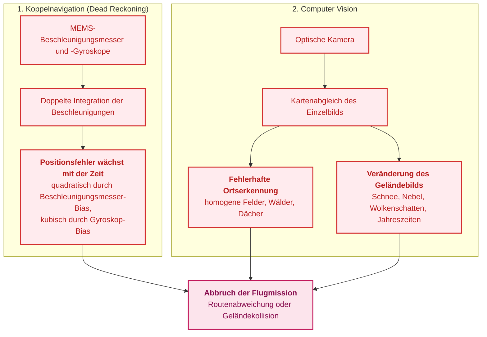
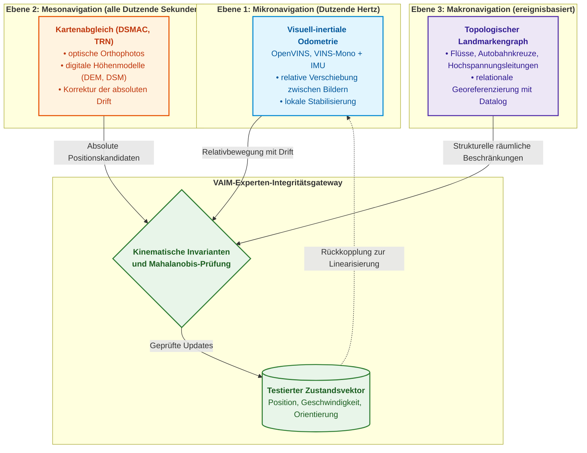
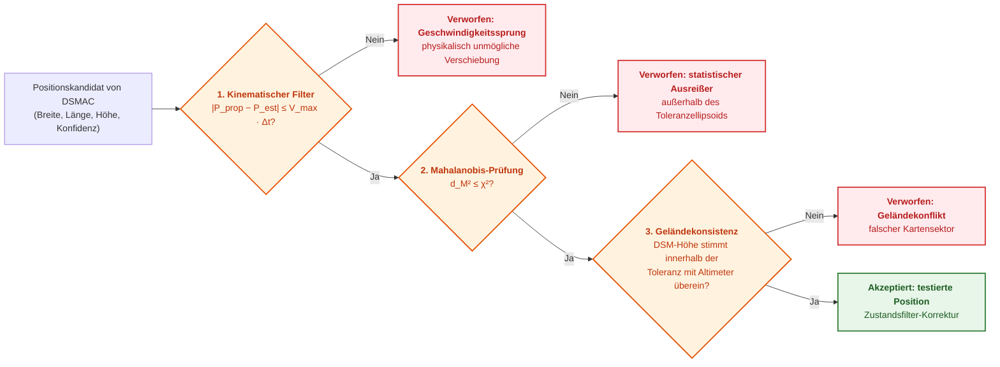
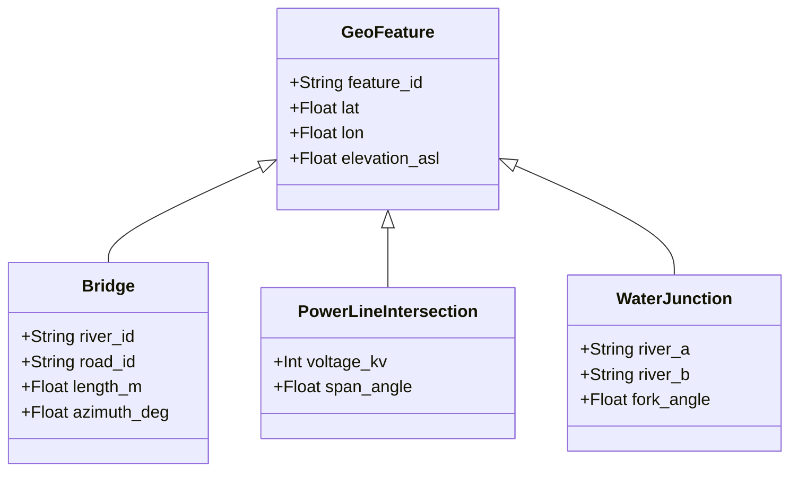
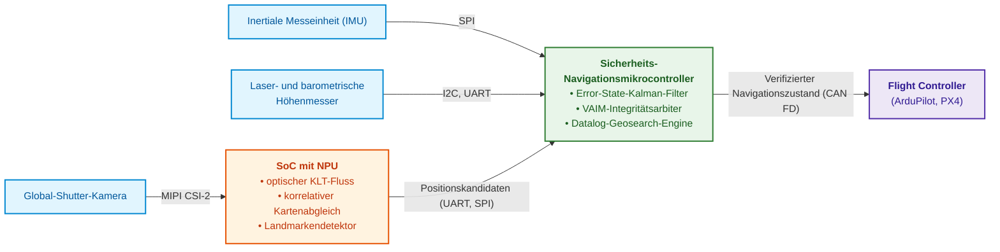
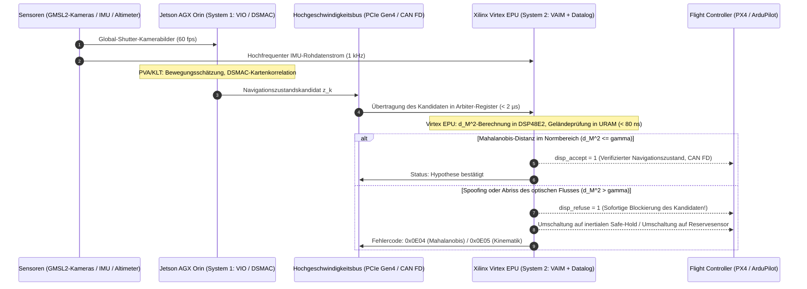

# Anhang C. GNSS-freie autonome Navigation: Geländereferenzierung (TRN/DSMAC), visuelle Odometrie (VIO) und Experten-Arbitrage der Sensorfusion

> **Buch:** [Architektur evidenzbasierter Expertensysteme](README.md) · Anhänge  
> **Inhaltsverzeichnis:** [README.md](README.md)  
> **Autor:** [Mykola Fedchyk](about-the-author.md)  
> **Niveau:** Architekten autonomer unbemannter Systeme, Embedded-Systems-Ingenieure, Spezialisten für Computer Vision und Inertialnavigation  
> **Lernziele:** Erklären, warum Inertialnavigation und Computer Vision isoliert ohne GNSS keine verlässliche Position liefern; Aufbau eines dreistufigen Navigationsstacks; Verifikation von Positionskandidaten anhand kinematischer, statistischer und geländebasierter Invarianten; saubere Trennung navigatorischer Integrität von Entscheidungen, die dem Menschen vorbehalten sind.

---

## Abstract

Unter Gefechtsbedingungen und in Zonen aktiver elektronischer Kampfführung (EloKa / EW) unterliegen Signale globaler Navigationssatellitensysteme (GNSS: GPS, Galileo) einer totalen Funkstörung (*Jamming*) oder gezielten Positionsmanipulation (*Spoofing*). Ein autonomes unbemanntes Luftfahrzeug (UAV), das im Funkstille-Modus ohne externe Korrekturen durch einen Operator operieren muss, ist vollständig auf seine bordeigene Sensorik angewiesen. Ein isoliertes Trägheitsnavigationssystem (INS) akkumuliert jedoch aufgrund der Gyroskopdrift Positionsfehler nach dem kubischen Gesetz $\Delta\mathbf{p}(t) \propto t^3$ (eine Abweichung von über 7 km bereits nach 20 Flugminuten), während Computer-Vision-Verfahren (TRN, DSMAC, VIO) in monotonem Gelände (gleichförmige Agrarflächen, Waldstreifen, saisonale Vegetationswechsel) fehlerhafte Zuordnungen (*perceptual aliasing*) aufweisen, was zum Missionsabbruch oder zu einer Bodenkollision führt.

Dieser Anhang löst dieses Problem durch den Entwurf einer evidenzbasierten Experten-Arbitrage der Sensorfusion. Der Autor konzipiert einen dreistufigen Navigationsstack: eine hochfrequente Zustandsschätzung auf Basis von INS/VIO, einen periodischen räumlichen Abgleich optischer Landmarken mit digitalen Geländemodellen (TRN/DSMAC) sowie ein deterministisches Arbitrage-Gateway, welches vorgeschlagene Koordinaten anhand kinematischer Invarianten, der statistischen Mahalanobis-Distanz und Höhengrenzen verifiziert und so die autonome Plattform zuverlässig vor katastrophaler Drift und Sensoranomalien schützt.

---

## 1. Mechanismen der Degradation autonomer Orientierung bei Ausfall von GNSS-Signalen

Analysieren wir zunächst, warum ein unbemanntes System ohne GNSS die Orientierung verliert. Globale Navigationssatellitensysteme (*Global Navigation Satellite System*, GNSS) wie GPS oder Galileo garantieren unter Bedingungen der elektronischen Kampfführung keine zuverlässige Positionsbestimmung mehr. Da GNSS-Signale extrem schwach sind, lassen sie sich leicht durch Störsender überlagern oder manipulieren: Beim Spoofing werden gefälschte Satellitensignale ausgestrahlt, sodass der Empfänger inkorrekte Koordinaten und Zeitstempel berechnet [[1]](#src-1). Zugleich verhindert das Gebot der Funkstille, dass der Operator Flugbahnen über Funk korrigiert. In dieser Isolation verbleiben dem unbemannten Luftfahrzeug (UAV) ausschließlich bordeigene Sensoren.



Das Diagramm verdeutlicht zwei voneinander unabhängige Mechanismen, von denen jeder für sich zum Scheitern der Mission führt. Betrachten wir beide im Detail.

**Drift des Trägheitsnavigationssystems.** Kostengünstige Sensoren auf Basis mikroelektromechanischer Systeme (MEMS) weisen Nullpunktabweichungen (*Sensor Bias*) auf. Ein konstanter Restbias des Beschleunigungsmessers $\mathbf{b}_a$ führt nach doppelter Integration zu einem quadratisch anwachsenden Positionsfehler. Ein Gyroskop-Bias $\mathbf{b}_g$ erzeugt zunächst einen linear anwachsenden Neigungswinkelfehler, durch den die Projektion des Erdschwerevektors $\mathbf{g}$ eine scheinbare Horizontalbeschleunigung induziert; nach doppelter Integration wächst der resultierende Positionsfehler kubisch an:

```math
\Delta\mathbf{p}(t)\approx\frac{1}{2}\,\mathbf{b}_a\,t^{2}+\frac{1}{6}\,(\mathbf{b}_g\times\mathbf{g})\,t^{3}.
```

Hierbei bezeichnen:

- $\Delta\mathbf{p}(t)$ den Positionsfehlervektor zum Zeitpunkt $t$ in Metern;
- $t$ die verstrichene Zeit seit der letzten absoluten Positionskorrektur (z. B. seit dem letzten gültigen GNSS-Signal) in Sekunden;
- $\mathbf{b}_a$ den verbleibenden Nullpunktfehler (Bias) des Beschleunigungsmessers, d. h. eine scheinbare Beschleunigung, die der Sensor selbst im Ruhezustand ausgibt, in m/s²;
- $\mathbf{b}_g$ den verbleibenden Nullpunktfehler (Bias) des Gyroskops, d. h. eine fehlerhafte Winkelgeschwindigkeit, in rad/s;
- $\mathbf{g}$ den Erdbeschleunigungsvektor mit einem Betrag von ca. $9{,}81$ m/s², nach unten gerichtet;
- $\times$ das Vektorprodukt; der Term $\mathbf{b}_g\times\mathbf{g}$ liefert die scheinbare Horizontalbeschleunigung, die entsteht, wenn der Neigungswinkelfehler den Erdschwerevektor anteilig in die Horizontalebene projiziert;
- die Faktoren $\tfrac12$ und $\tfrac16$ das Resultat der doppelten Zeitintegration: Eine konstante Größe $b$ ergibt nach zweifacher Integration $`b\,t^{2}/2`$, während eine linear anwachsende Scheinbeschleunigung $`c\,t`$ nach zweifacher Integration $`c\,t^{3}/6`$ ergibt.

Diese Beziehung beschreibt die ungestützte Koppelnavigation bei konstanten Driftwerten und kleinen Winkeln. Ein realer Navigationsfilter schätzt diese Bias-Werte und kompensiert sie partiell; die Gleichung verdeutlicht daher die theoretische Fehlerwachstumsrate ohne externe Stützung und stellt keine deterministische Prognose für eine spezifische Flugbahn dar.

Bei einem hypothetischen Restbias des Beschleunigungsmessers von 1 mg (ca. $0{,}0098$ m/s²) führt allein der erste Term nach 20 Minuten ($t=1200$ s) zu einem Fehler von $\tfrac12\cdot0{,}0098\cdot1200^{2}\approx7$ km. Der absolute Betrag skaliert mit der Sensorqualität, die quadratische Zeitabhängigkeit bleibt jedoch ein unverrückbares physikalisches Gesetz.

**Fehlerhafte Ortserkennung (Perceptual Aliasing).** Der Versuch, die Trägheitsdrift ausschließlich durch probabilistischen Abgleich des aktuellen Kamerabilds mit einer Satellitenkarte zu kompensieren, scheitert häufig an strukturarmen oder monotonen Landschaften. Der Übersichtsartikel zur visuellen Ortserkennung von Lowry et al. beschreibt zwei eng gekoppelte Phänomene: Unterschiedliche Orte sehen sich täuschend ähnlich (*perceptual aliasing*), während derselbe Ort unter variierenden Beleuchtungsverhältnissen, Witterungsbedingungen oder Jahreszeiten drastisch anders erscheint [[2]](#src-2). Ein neuronales Zuordnungsmodell kann somit mit hoher statistischer Konfidenz (z. B. $> 0{,}95$) einen Waldstreifen oder eine Weggabelung «wiedererkennen», die in Wahrheit kilometerweit von der tatsächlichen Plattformposition entfernt liegt.

> [!IMPORTANT]
> **Grundsatz der evidenzbasierten Navigation in diesem Anhang:**
> Kein isolierter optischer oder höhenbasierter Kartenabgleich gilt als valide Position, solange er nicht den **visuellen autonomen Integritätsmonitor** (*Visual Autonomous Integrity Monitor*, VAIM) durchlaufen hat. Das VAIM-System ist ein deterministisches regelbasiertes Expertensystem, welches kinematische, statistische und geländespezifische Invarianten jedes Positionskandidaten verifiziert.

Daraus resultiert die zentrale Fragestellung dieses Anhangs: **Wie kann ein bordseitiges Expertensystem eine vertrauenswürdige Position synthetisieren, wenn GNSS nicht verfügbar ist und jede verfügbare Sensorquelle spezifischen systematischen Fehlern unterliegt?** Die Antwort gliedert sich in drei Schritte: Zerlegung des Navigationsprozesses in Schichten unterschiedlicher Zeitskalen, rigorose Invariantenprüfung jedes Kandidaten und strikte funktionale Begrenzung der Entscheidungsbefugnisse des Navigationssystems.

## 2. Dreistufige Architektur des Navigationsstacks

Der bordseitige Bordrechner unterteilt den Navigationsprozess in drei hierarchische Schichten, die sich in Zeit und Raum komplementär ergänzen.



Das Schema liest sich von unten nach oben entlang der zeitlichen Auflösung: Die Mikroebene liefert hochfrequente relative Schätzungen, die Mesoebene erzeugt niederfrequentere absolute Kandidaten, und die Makroebene greift nur bei diskreten Ereignissen ein. Alle drei Ebenen speisen ihre Daten in das Integritäts-Gateway ein – und nicht direkt in den Zustandsschätzer.

### 2.1. Mikroebene: Visuell-inertiale Odometrie

Die **visuell-inertiale Odometrie** (*visual-inertial odometry*, VIO) schätzt Geschwindigkeit und relative Translation $\Delta\mathbf{x}_{k-1\to k}$ zwischen aufeinanderfolgenden Kamerabildern. Sie verfolgt markante Bildecken (*Features*), berechnet den pyramidalen optischen Fluss nach Lucas-Kanade und optimiert den Zustand in einem gleitenden Zeitfenster (*sliding-window optimization*) unter Fusion mit den integrierten Messwerten der inertialen Messeinheit (*inertial measurement unit*, IMU). Die Übersichtsarbeit von Guoquan Huang systematisiert die Methoden der visuell-inertialen Navigation [[3]](#src-3), während quelloffene Referenzimplementierungen wie OpenVINS [[4]](#src-4) und VINS-Mono [[5]](#src-5) praxiserprobte Codebasen bereitstellen. VIO arbeitet mit minimaler Latenz und der vollen Bildwiederholrate der Kamera. Allerdings akkumuliert auch die VIO über die zurückgelegte Distanz hinweg eine langsame Drift, welche für die jeweilige Sensorplattform auf Referenztrajektorien empirisch kalibriert werden muss.

### 2.2. Mesoebene: Kartenabgleich

Die Mesoebene eliminiert die akkumulierte VIO-Drift periodisch, indem sie absolute Koordinaten auf einer digitalen Referenzkarte ermittelt. Das **korrelative Szenenabgleichsverfahren** (*digital scene matching area correlator*, DSMAC) vergleicht das aktuelle Luftbild über normalisierte Kreuzkorrelation oder Kanten- und Konturdeskriptoren mit einem georeferenzierten Orthophotomosaik. Die **geländereferenzierte Navigation** (*terrain-referenced navigation*, TRN) gleicht das von einem barometrischen oder Laser-Altimeter erfasste Höhenprofil mit einem digitalen Geländemodell (*digital elevation model*, DEM) oder Oberflächenmodell (*digital surface model*, DSM) ab. Diese Abgleiche erfolgen typischerweise beim Überflug topografisch markanter Gebiete, beispielsweise im Abstand einiger Dutzend Sekunden.

### 2.3. Makroebene: Topologische Landmarken

Die Makroebene dient der globalen Relokalisierung nach einem vollständigen Verlust der Trajektorie, etwa nach einem längeren Flug durch geschlossene Wolkendecken. Der Mechanismus analysiert die topologische Raumkonfiguration von Hauptverkehrsachsen, Gewässern, Eisenbahnlinien und Küstenverläufen mittels stratifizierter Datalog-Abfragen über einer räumlichen Faktenbasis [[6]](#src-6). Der nachfolgende Abschnitt zur topologischen Geosearch illustriert eine solche regelbasierte Inferenz.

## 3. Expertensystem als Integritätsfilter

In der Luftfahrt nutzen GNSS-Empfänger seit Jahrzehnten das Prinzip der bordautonomen Integritätsüberwachung (*receiver autonomous integrity monitoring*, RAIM): Der Empfänger prüft die Konsistenz redundanter Satellitenmessungen und isoliert fehlerhafte Messungen; Brown wies die mathematische Äquivalenz der drei fundamentalen RAIM-Verfahren nach [[7]](#src-7). Das VAIM-Konzept überträgt diesen Sicherheitsansatz auf die optische Navigation und wird als deterministisches regelbasiertes Expertensystem realisiert.



Die drei Prüfstufen des Schemas sind nach steigendem Rechenaufwand gestaffelt: Das kinematische Filter eliminiert physikalisch unmögliche Geschwindigkeitssprünge, die Mahalanobis-Prüfung filtert statistische Ausreißer aus, und der Geländetest verwirft topografisch unplausible Kartensektoren, welche die beiden Vorstufen passiert haben.

### 3.1. Mahalanobis-Distanz als statistisches Gating

Es bezeichne $\hat{\mathbf{x}}_k$ die Zustandsschätzung der Plattform zum Zeitpunkt $t_k$, wie sie vom visuell-inertialen Filter bereitgestellt wird, und $\mathbf{P}_k$ die zugehörige Kovarianzmatrix. Das Subsystem für den Kartenabgleich schlägt eine Positionsmessung $\mathbf{z}_k$ mit einer eigenen Messkovarianz $\mathbf{R}_k$ vor. Das Gateway berechnet die Innovation $\mathbf{y}_k=\mathbf{z}_k-\mathbf{H}\hat{\mathbf{x}}_k$, wobei die Messmatrix $\mathbf{H}$ die beobachtbaren Komponenten aus dem Zustandsvektor extrahiert, sowie das Quadrat der Mahalanobis-Distanz:

```math
d_M^{2}=\mathbf{y}_k^{\top}\left(\mathbf{H}\mathbf{P}_k\mathbf{H}^{\top}+\mathbf{R}_k\right)^{-1}\mathbf{y}_k .
```

Hierbei bezeichnen:

- $d_M^{2}$ das Quadrat der Mahalanobis-Distanz, eine dimensionslose, nicht-negative Zahl: Je größer dieser Wert ist, desto schlechter stimmt die beobachtete Innovation mit der modellierten Systemunsicherheit überein;
- $\mathbf{y}_k$ den Innovationsvektor, d. h. die Differenz zwischen dem Ergebnis des Kartenabgleichs und dem prädizierten Zustand des Filters; für die horizontale Position ist dies ein zweidimensionaler Vektor (Nord- und Ostkomponente) in Metern;
- $\mathbf{y}_k^{\top}$ den transponierten Vektor (Zeilen- statt Spaltenvektor), wodurch das Matrix-Vektor-Produkt einen skalaren Wert ergibt;
- $\mathbf{P}_k$ die Kovarianzmatrix der Zustandsschätzung: Die Hauptdiagonale enthält die Varianzen (Quadrate der Standardabweichungen) der einzelnen Zustandskomponenten, die Nebendiagonalelemente erfassen die Kreuzkorrelationen;
- $\mathbf{R}_k$ die Messfehler-Kovarianzmatrix, welche das Kartenabgleichs-Subsystem für sein Beobachtungsergebnis deklariert;
- $\mathbf{H}$ die Messmatrix, welche diejenigen Komponenten aus dem Zustandsvektor selektiert, die durch das Abgleichsverfahren gemessen werden (beispielsweise ausschließlich die horizontalen Koordinaten);
- $\mathbf{H}\mathbf{P}_k\mathbf{H}^{\top}+\mathbf{R}_k$ die Innovationskovarianz: Sie summiert die in den Messraum transformierte Filterunsicherheit und die Eigenunsicherheit der Messung;
- $(\cdot)^{-1}$ die Matrixinversion; die Multiplikation mit der Inversen skaliert die metrische Abweichung anhand der statistischen Unsicherheitsmaße.

Die praktische Tragweite dieser Formulierung ist fundamental: Eine Diskrepanz in Metern wird nicht isoliert bewertet, sondern stets relativ zu den deklarierten Unsicherheiten von Filter und Sensorik beurteilt. Sei beispielsweise eine Innovation $`\mathbf{y}_k=(12;\,5)`$ m gegeben und die Innovationskovarianz betrage $`\mathrm{diag}(25;\,25)`$ m², was einer Standardabweichung von 5 m pro Achse entspricht. Daraus folgt $d_M^{2}=12^{2}/25+5^{2}/25=6{,}76$. Wird die Messunsicherheit hingegen fälschlich mit nur $`\mathrm{diag}(4;\,4)`$ m² angegeben, ergibt sich $d_M^{2}=(144+25)/4=42{,}25$. Die geometrische Distanz ist in beiden Szenarien mit 13 m identisch, doch im ersten Fall ist die Abweichung statistisch konsistent, während sie im zweiten Fall als Ausreißer verworfen wird. (Zahlenwerte dienen der Anschauung).

Sofern das Fehlermodell korrekt kalibriert ist, folgt $d_M^{2}$ einer Chi-Quadrat-Verteilung ($\chi^2$), deren Freiheitsgrad der Dimension des Messvektors entspricht. Der Zulässigkeitsschwellenwert (*Gating Threshold*) wird daher als Quantil dieser Verteilung gewählt; dieses statistische Gating beschreiben Bar-Shalom, Li und Kirubarajan im Detail [[8]](#src-8). Für eine zweidimensionale Horizontalposition ($m=2$) beträgt der Schwellenwert bei einem Konfidenzniveau von 99 % $`\chi^{2}_{2;0{,}99}\approx9{,}21`$, für eine dreidimensionale Position ($m=3$) entsprechend $`\chi^{2}_{3;0{,}99}\approx11{,}34`$. Im obigen Rechenbeispiel passiert der erste Fall das Filter ($6{,}76 \le 9{,}21$), während der zweite Fall blockiert wird ($42{,}25 > 9{,}21$). Ein Messkandidat wird somit genau dann akzeptiert, wenn folgende Bedingung erfüllt ist:

```math
\text{ValidMeasurement}(\mathbf{z}_k)\iff d_M^{2}\le\chi^{2}_{m;1-\alpha}\ \land\ \left|h_{\text{baro}}-h_{\text{DEM}}(\mathbf{z}_k)-h_{\text{range}}\right|\le\epsilon_{\text{alt}}.
```

Hierbei bezeichnen:

- $\text{ValidMeasurement}(\mathbf{z}_k)$ ein Prädikat: «wahr», wenn der Kandidat $\mathbf{z}_k$ akzeptiert wird, und «falsch», wenn er verworfen wird;
- $\iff$ die logische Äquivalenz («genau dann, wenn»);
- $\land$ die logische Konjunktion («und»): Der Kandidat wird nur übernommen, wenn sowohl das statistische als auch das höhenbasierte Kriterium erfüllt sind;
- $d_M^{2}$ das Quadrat der Mahalanobis-Distanz aus der vorhergehenden Gleichung;
- $\chi^{2}_{m;1-\alpha}$ das Quantil der Chi-Quadrat-Verteilung mit $m$ Freiheitsgraden für das Konfidenzniveau $1-\alpha$, d. h. der Schwellenwert, den eine korrekte Messung nur mit der Irrtumswahrscheinlichkeit $\alpha$ überschreitet;
- $m$ die Dimension des Messvektors (2 für die Horizontalebene, 3 für 3D-Koordinaten);
- $\alpha$ das Signifikanzniveau, also der zulässige Anteil valider Messungen, die fälschlicherweise verworfen werden (Fehler 1. Art; für 99 % Konfidenz gilt $\alpha=0{,}01$);
- $`h_{\text{baro}}`$ die barometrische Höhe der Plattform über Normalnull (ASL) in Metern;
- $`h_{\text{DEM}}(\mathbf{z}_k)`$ die Geländehöhe an der Position des Kandidaten $\mathbf{z}_k$ laut digitalem Geländemodell (DEM) in Metern;
- $`h_{\text{range}}`$ die vom Laser- oder Radaraltimeter gemessene Distanz über Grund (AGL) in Metern;
- $\epsilon_{\text{alt}}$ die zulässige Höhentoleranz in Metern, parametriert anhand der summierten Varianzen von Barometer, Altimeter und DEM;
- $\lvert\cdot\rvert$ den Absolutbetrag.

Die Höhenbedingung korreliert drei unabhängige Messquellen: Barometer, Altimeter und Geländemodell. Befindet sich die Plattform tatsächlich über dem vorgeschlagenen Koordinatenpunkt, muss die Differenz zwischen barometrischer Höhe und Geländehöhe exakt dem Abstand über Grund entsprechen. Beide Höhenangaben müssen auf dasselbe vertikale Referenzdatum (z. B. EGM96 oder WGS84-Ellipsoid) bezogen sein. Betrage beispielsweise $h_{\text{baro}}=620$ m und das Altimeter melde 212 m. Liegt das Gelände unter dem Kandidaten laut DEM auf 410 m, ergibt sich $\lvert620-410-212\rvert=2$ m, was bei einer Toleranz von 10 m zur Annahme führt. Weist ein fehlerhafter Kandidat an einem Berghang laut Karte eine Höhe von 470 m auf, resultiert eine Diskrepanz von $\lvert620-470-212\rvert=62$ m – der Kandidat wird unmittelbar verworfen, selbst wenn die rein horizontale Mahalanobis-Prüfung keinen Fehler anzeigte. (Werte dienen der Illustration). Ein verifizierter Kandidat wird anschließend zur Zustandskorrektur genutzt, etwa über ein Error-State-Kalman-Filter (*error-state Kalman filter*, ESKF) [[9]](#src-9) oder eine Faktorgraphen-Optimierung [[10]](#src-10).

## 4. Topologische Geosearch auf Basis von stratifiziertem Datalog

Tritt das unbemannte Fluggerät nach einem ausgedehnten Blindflug durch dichte Wolken wieder in Sichtbedingungen ein, ist die Positionskovarianz $\mathbf{P}_k$ häufig zu stark angewachsen, als dass ein lokaler korrelativer Kartenabgleich deterministisch konvergieren könnte. In diesem Szenario wird die topologische Geosearch aktiviert. Die bordseitige Wissensbasis hält hierzu einen relationalen Graphen markanter Landmarken des Operationsgebiets vor.



Das Klassendiagramm spezifiziert Landmarkentypen und Attribute, über welche Beobachtungen mit der Wissensbasis abgeglichen werden: Koordinaten, absolute Geländehöhe, Schnittwinkel und geometrische Ausdehnung. Angenommen, das Computer-Vision-Subsystem detektiert im Kamerabild die Kreuzung eines Flusses mit einer Fernstraße unter einem Winkel von ca. $60^\circ$ bei einer Oberflächenhöhe von ca. 135 m über Normalnull. Die obigen Inferenzregeln sind in Datalog mit arithmetischen Prädikaten formuliert:

```prolog
% Kandidat: Brücke aus der Wissensbasis, die mit der Beobachtung übereinstimmt
candidate_bridge(ID, Lat, Lon) :-
    detected_bridge(VisAngle, VisLen),
    kb_bridge(ID, Lat, Lon, TrueAngle, TrueLen, Elev),
    abs(VisAngle - TrueAngle) < 10,
    abs(VisLen - TrueLen) < 15,
    estimated_position(EstLat, EstLon, MaxRadius),
    geo_distance(EstLat, EstLon, Lat, Lon, Dist),
    Dist < MaxRadius,
    surface_elevation_asl(SurfAlt),
    abs(SurfAlt - Elev) < 25.

% Mehrdeutigkeit: Im Suchradius existiert ein weiterer Kandidat
ambiguous_candidate(ID) :-
    candidate_bridge(ID, _, _),
    candidate_bridge(Other, _, _),
    Other != ID.

% Die Position wird nur bei eindeutigem Kandidaten bestätigt
verified_relocalization(Lat, Lon) :-
    candidate_bridge(ID, Lat, Lon),
    not ambiguous_candidate(ID).
```

Die Regel `verified_relocalization` hängt über Negation von `ambiguous_candidate` ab, während `ambiguous_candidate` ohne Negation auf `candidate_bridge` aufbaut. Das Datalog-Programm ist somit stratifiziert und besitzt ein eindeutiges Minimalmodell. Der Mechanismus unterdrückt Verwechslungen bei struktureller Symmetrie: Werden im Unsicherheitskreis zwei strukturell ähnliche Brückenbauwerke gefunden, wird keine Relokalisierung freigegeben, und das System setzt die Suche fort.

## 5. Grenzen des navigatorischen Expertensystems

Das navigatorische Expertensystem beantwortet präzise zwei Fragen: Wo befindet sich die Plattform und wie verlässlich ist diese Zustandsschätzung? Autonome Entscheidungen über den Waffeneinsatz oder kinetische Wirkungen liegen außerhalb seines Zuständigkeitsbereichs. Die sechs Grundsätze für den verantwortungsvollen Einsatz künstlicher Intelligenz in der Verteidigung, die von den NATO-Alliierten verabschiedet wurden, fordern Rechtmäßigkeit, Verantwortlichkeit und Rechenschaftspflicht, Erklärbarkeit und Rückverfolgbarkeit, Zuverlässigkeit, Steuerbarkeit sowie die Minimierung von Verzerrungen [[11]](#src-11). Die britische Verteidigungsnorm JSP 936 schreibt vor, dass KI-gestützte Fähigkeiten ein angemessenes Maß an menschlicher Kontrolle und Aufsicht gewährleisten müssen [[12]](#src-12).

Für den Entwurf des Navigationsstacks leiten sich hieraus drei verbindliche Architekturregeln ab. Erstens: Das VAIM-Gateway übermittelt an nachgelagerte Teilsysteme nicht nur Koordinaten, sondern stets den Integritätsstatus und den Kovarianz-Tensor, damit der menschliche Entscheider die Grenzen der Schätzung jederzeit quantifizieren kann. Zweitens: Bei einem Verlust der Navigationsintegrität geht die Plattform ausschließlich in vorab definierte und verifizierte Sicherheitsmodi über – wie etwa Positionshalten (*Safe Hold*), Rückflug entlang der gesicherten Anflugroute (*Return-to-Base*) oder Landung in einer ausgewiesenen Sicherheitszone; ein solcher Zustandsautomat wird in [Anhang B](appendix-b-robotics-and-cyber-physical-systems.md) detailliert beschrieben. Drittens: Sämtliche Aktionen mit irreversiblen physischen Folgen unterliegen den in [Kapitel 21](ch21-from-recommendation-to-action.md) formalisierten Autorisierungs-Gateways sowie einer völkerrechtlichen Konformitätsprüfung, die den Gegenstand dieses Werks übersteigt.

## 6. Hardware-Implementierung des bordseitigen Navigationsknotens

Ein industrieller Navigationsknoten verteilt die Berechnungen auf spezialisierte heterogene Hardware-Einheiten.



Der neuronale Beschleuniger (*neural processing unit*, NPU) führt die rechenintensiven, stochastischen Bildverarbeitungsalgorithmen aus, während der sicherheitsgerichtete Mikrocontroller deterministische Invariantenprüfungen vollzieht und das Zustandsfilter führt. Der Flight Controller empfängt ausschließlich formal verifizierte Navigationszustände anstelle ungeprüfter Sensorkandidaten.

---

### 6.1. Forschungsprogramm für den optisch-navigatorischen Knoten auf Basis von NVIDIA Jetson AGX Orin (Visueller Wahrnehmungstrakt — System 1)

Als primäre Hardware-Plattform für die Erforschung der GNSS-freien optischen Navigation dient der Industrie-PC **Seeed Studio reServer Industrial J501** auf Basis des Moduls **NVIDIA Jetson AGX Orin 64GB** (bis zu 275 TOPS, 2048-Kern-Ampere-GPU, zwei NVDLA v2-Engines, PVA v2 Vision-Beschleuniger, 12 ARM Cortex-A78AE-Kerne, LPDDR5-Speicher mit 204,8 GB/s in einem gehärteten Gehäuse).

Der Hard- und Softwarestack integriert **NVIDIA JetPack 6.2** (Linux-Kernel 5.15 PREEMPT_RT, CUDA 12.6, TensorRT 10) sowie spezialisierte Pipelines zur Verarbeitung der Kameraströme:

1. **Hardware-beschleunigter optischer KLT-Fluss und visuelle Odometrie (VIO):**
   * Auslagerung der Lucas-Kanade-Pyramidenberechnung (KLT) auf den programmierbaren Vision-Beschleuniger **PVA v2** (*Programmable Vision Accelerator*), was die GPU- und Tensor-Cores vollständig entlastet.
   * Erfassung unkomprimierter Rohbilder von zwei Kameras mit globalem Verschluss (*global shutter*) über eine **GMSL2 / MIPI CSI-2**-Schnittstelle in DMA-Ringpuffer mit einer garantierten Latenz von $< 1{,}5\ \text{ms}$.
2. **Korrelativer Abgleich mit einer Karten-Kachelungspyramide (DSMAC / TRN):**
   * Beschleunigung der räumlichen 2D-Kreuzkorrelation von Kanten- und Konturkarten mit COG-Höhenkacheln über die **TensorRT 10**-Engine im Format FP8/INT8.
   * Nutzung von 64 GB Unified Memory zur Zwischenspeicherung multispektraler digitaler Geländemodelle (DEM/DTM) für Gebiete von bis zu $10^4\ \text{km}^2$ ohne Latenzen langsamer NVMe-Speicherzugriffe.
3. **Detektion topologischer Landmarken und lokales SLM-Triage:**
   * Ausführung lokaler quantisierter Vision-Language-Modelle (VLM) über eine lokale **Ollama**-Laufzeitumgebung zur semantischen Klassifikation komplexer Orientierungspunkte (Brücken, Flussverzweigungen, Autobahnkreuze, Hochbauten).
4. **Ausgabe von Navigationszustandskandidaten über CAN FD:**
   * Übertragung der generierten Zustandshypothesen über einen galvanisch isolierten **CAN FD**-Port mit 50–100 Hz in einem Binärformat mit CRC32-Prüfsummensicherung.

> [!NOTE]
> **Theoretische und ingenieurtechnische Grundlagen des navigatorischen Wahrnehmungstrakts in den Kapiteln des Buches:**
> - [Kapitel 12. Linguistische Analyse und lokale Modelle](ch12-linguistic-analysis-and-local-models.md) — Lokale SLM/VLM zur Extraktion semantischer Landmarken aus visuellen Daten.
> - [Kapitel 18. Ausführungsinfrastruktur](ch18-execution-infrastructure.md) — Latenzbudgetierung der Sensorverarbeitung nach dem Roofline-Modell, Linux PREEMPT_RT-Konfiguration und Jitter-Minimierung.
> - [Kapitel 22. Kybernetischer Regelkreis: Sensoren, Peripherie und Rückkopplung](ch22-cybernetics-edge-to-backend.md) — Streaming-Sensordatenerfassung via GMSL2, CAN FD-Bus und Echtzeit-Rückkopplungsschleifen.
> - [Kapitel 37. Bewertung der Zuverlässigkeit von Eingangsinformationen: Algorithmische Skepsis und Sensorfusion](ch37-input-information-assessment-and-algorithmic-skepticism.md) — VAIM-Integritätsfilter, algorithmische Skepsis gegenüber Sensoranomalien und statistisches Mahalanobis-Gating.

---

### 6.2. Forschungsprogramm für den Hardware-Integritätsarbiter auf FPGA-Basis (Xilinx Virtex — System 2)

FPGA-Bausteine der Serie **AMD / Xilinx Virtex** (Virtex UltraScale+ / UltraScale) realisieren ein deterministisches Sicherheits- und Integritäts-Gateway mit Reaktionszeiten im Nanosekundenbereich:

1. **Hardware-Rechenwerk für Mahalanobis-Distanzen auf DSP48E2-Blöcken:**
   * Synthese eines voll pipelinierten Matrixmultiplizierers:
     $$d_M^2 = (\mathbf{z} - \hat{\mathbf{z}})^\top \mathbf{S}^{-1} (\mathbf{z} - \hat{\mathbf{z}})$$
     mit einer festen Berechnungslatenz von **24 Taktzyklen ($< 60\ \text{ns}$ @ 400 MHz)**.
   * Direkter Hardware-Vergleich gegen den Schwellenwert $\gamma = 9{,}21$ ohne Ausführung sequenzieller Prozessorinstruktionen.
2. **Hardware-Suchmaschine über topologischen Graphen (UltraRAM Zero-Copy):**
   * Speicherung der Vektorbasis von Landmarken und stratifizierten Datalog-Regeln direkt in internen UltraRAM-Blöcken mit einer Kapazität von bis zu 36 MB.
   * Auswertung räumlicher Prädikate (`visible_landmark`, `corridor_bound`, `prohibited_zone`) innerhalb von 1–3 Taktzyklen.
3. **Hardware-Sicherheitsverriegelung (Fail-Closed Safety Veto):**
   * Direkte Hardware-Vetoleitungen (`disp_accept`, `disp_refuse`), gekoppelt an optoentkoppelte Interrupteingänge des Flight Controllers (Pixhawk / PX4). Überschreitet die Messinnovation den Schwellenwert oder widerspricht die VIO der Fahrzeugkinematik, aktiviert das `disp_refuse`-Signal in $< 5\ \text{ns}$ verzögerungsfrei den Safe-Hold-Modus.

> [!NOTE]
> **Theoretische und ingenieurtechnische Grundlagen des Hardware-Navigationsarbiters in den Kapiteln des Buches:**
> - [Kapitel 16. Architektur von Expertensystemen](ch16-expert-systems-architecture.md) — Symbolische Arbitrage, deterministischer Speicher und strikte Trennung von Fakten und Regeln.
> - [Kapitel 21. Von der Empfehlung zur Handlung: Rechtekontrolle und sichere Ausführung in Produktionsumgebungen](ch21-from-recommendation-to-action.md) — Hardware-Zulassungsgateways und physische Rechtekontrolle bordseitiger Subsysteme.
> - [Kapitel 31. Normatives Schließen: Prädikatenhierarchien, Ausnahmen und Geltung](ch31-syllogistic-reasoning-and-relation-lattices.md) — Räumliche Prädikate und Flugkorridor-Restriktionen in der deontischen Logik.
> - [Kapitel 39. Aktiver Prüfexperte: Poppersche Falsifikation, normative Compliance und autonomes Testdesign](ch39-active-compliance-auditor-and-popperian-testing.md) — Poppersche Falsifikation sicherheitskritischer Navigationshypothesen.

---

### 6.3. Untersuchung des Tandems «Jetson AGX Orin + Xilinx Virtex» im Funkstille-Modus

Der integrierte Prüfstand evaluiert die Robustheit der Navigation bei vollständigem Ausfall oder bösartigem Spoofing von GNSS-Signalen:



**Kriterium der Popperschen Sicherheitsfalsifikation des autonomen Fluges:**
Eine Navigationshypothese gilt als falsifiziert (und damit als unzulässig für den autonomen Einsatz), wenn unter Einbringung künstlicher Störungen in die Bilddaten (Simulation von Rauch, extremen Lichtwechseln oder Texturartefakten) oder bei simulierten GNSS-Positionssprüngen:

1. Die maximale Latenz der Entscheidungsschleife das Echtzeitlimit überschreitet:
   $$T_{\text{loop}} = T_{\text{infer}} + T_{\text{comm}} + T_{\text{arbiter}} > 20\ \text{ms}\quad (\text{für einen 50-Hz-Regelkreis});$$
2. Das System auch nur eine einzige fehlerhafte Messung ($d_M^2 > \gamma$) akzeptiert, welche eine räumliche Trajektorienabweichung von mehr als 5 Metern verursacht ($P(\text{uncontained error}) > 10^{-6}\ \text{pro Flugstunde}$).

---

### 6.4. Format bordseitiger Geodaten

Damit Geodaten in den Flash-Speicher des bordseitigen Einplatinenrechners passen, werden sie gezielt optimiert:

- **Pyramidenförmige Kachelung im Format Cloud Optimized GeoTIFF** (COG), standardisiert durch das Open Geospatial Consortium (*Open Geospatial Consortium*, OGC) [[13]](#src-13): Ein grober Basischirurgielayer für die Gesamtroute und hochauflösende Detailkacheln für Zonen, die einen präzisen Abgleich erfordern.
- **Gradienten- und Konturkarten der Helligkeitswechsel** anstelle von RGB-Vollbildern: Solche Kantenkarten erfordern drastisch weniger Speicherplatz und sind invariant gegenüber variierenden Beleuchtungsverhältnissen; die Speicherersparnis wird für das jeweilige Einsatzgebiet messtechnisch ermittelt.
- **Vektorielle Landmarkenschichten** in FlatBuffers- oder SQLite/SpatiaLite-Formaten für latenzfreien Zugriff auf räumliche Geometrieobjekte.

## 7. Ausführbarer Code des Navigationsarbiters in Go

Der nachfolgende Programmcode implementiert den Kern des VAIM-Systems: Konfidenzprüfung, kinematische Invariante, Geländekonsistenz und Mahalanobis-Distanz für zweidimensionale Horizontalpositionen. Die vertikale Achse wird durch die Geländeinvariante überwacht, sodass das statistische Gating mit zwei Freiheitsgraden und einem Schwellenwert von 9,21 operiert. Das Paket stützt sich ausschließlich auf die Go-Standardbibliothek.

<details>
<summary>Beispiel in Go: VAIM-Navigationsarbiter</summary>

```go
package navigation

import (
	"errors"
	"fmt"
	"math"
)

// Position3D definiert einen Punkt im lokalen NED-System (North, East, Down) in Metern.
type Position3D struct {
	North, East, Down float64
}

// NavState repräsentiert die aktuelle Zustandsschätzung des Navigationsfilters.
type NavState struct {
	Pos        Position3D
	Covariance [2][2]float64 // Kovarianz der horizontalen Position (N, E), m²
	Timestamp  float64       // Sekunden seit Systemstart
}

// VisualFixProposal ist ein Positionskandidat aus dem Kartenabgleich.
type VisualFixProposal struct {
	Pos         Position3D
	MeasureCov  [2][2]float64 // Messkovarianz (N, E), m²
	Confidence  float64       // Konfidenz des Matching-Modells, Wertebereich 0 bis 1
	DemAltitude float64       // Geländehöhe unter dem Kandidaten laut DEM, m
	Timestamp   float64
}

// VAIMConfig definiert Schwellenwerte für das Integritäts-Gateway.
type VAIMConfig struct {
	MaxSpeed          float64 // Maximale physikalische Geschwindigkeit der Plattform, m/s
	Chi2Limit         float64 // χ²-Quantil für 2 Freiheitsgrade, 9,21 für p = 0,01
	MaxAltDiscrepancy float64 // Zulässige Höhendiskrepanz, m
	MinConfidence     float64 // Minimale Konfidenz des Matching-Modells
}

// Verdict dokumentiert die Entscheidung des Integritäts-Gateways.
type Verdict struct {
	Accepted bool
	Code     string
	Detail   string
}

var ErrSingularCovariance = errors.New("singular innovation covariance")

// ValidateVisualFix prüft den Positionskandidaten gegen vier Invarianten.
func ValidateVisualFix(cfg VAIMConfig, cur NavState, p VisualFixProposal, rangeAlt float64) (Verdict, error) {
	if p.Confidence < cfg.MinConfidence {
		return Verdict{false, "REJECT_LOW_CONFIDENCE",
			fmt.Sprintf("confidence %.2f < %.2f", p.Confidence, cfg.MinConfidence)}, nil
	}
	dt := p.Timestamp - cur.Timestamp
	if dt <= 0 {
		return Verdict{false, "REJECT_INVALID_TIMESTAMP", fmt.Sprintf("dt = %.3f s", dt)}, nil
	}
	dN, dE := p.Pos.North-cur.Pos.North, p.Pos.East-cur.Pos.East
	if speed := math.Hypot(dN, dE) / dt; speed > cfg.MaxSpeed {
		return Verdict{false, "REJECT_KINEMATIC_VIOLATION",
			fmt.Sprintf("implied speed %.1f m/s > %.1f m/s", speed, cfg.MaxSpeed)}, nil
	}
	// Die barometrische Höhe muss der Geländehöhe unter dem Kandidaten plus Altimeter-Messung entsprechen.
	if diff := math.Abs(-cur.Pos.Down - (p.DemAltitude + rangeAlt)); diff > cfg.MaxAltDiscrepancy {
		return Verdict{false, "REJECT_TERRAIN_CONFLICT",
			fmt.Sprintf("altitude discrepancy %.1f m > %.1f m", diff, cfg.MaxAltDiscrepancy)}, nil
	}
	d2, err := mahalanobis2(dN, dE, cur.Covariance, p.MeasureCov)
	if err != nil {
		return Verdict{false, "REJECT_MATH_ERROR", err.Error()}, err
	}
	if d2 > cfg.Chi2Limit {
		return Verdict{false, "REJECT_MAHALANOBIS_OUTLIER",
			fmt.Sprintf("d² = %.2f > %.2f", d2, cfg.Chi2Limit)}, nil
	}
	return Verdict{true, "ACCEPT_VERIFIED_FIX", fmt.Sprintf("d² = %.2f", d2)}, nil
}

// mahalanobis2 berechnet d² = yᵀ(P+R)⁻¹y für die horizontale Innovation y = (dN, dE).
func mahalanobis2(dN, dE float64, P, R [2][2]float64) (float64, error) {
	s00, s01 := P[0][0]+R[0][0], P[0][1]+R[0][1]
	s10, s11 := P[1][0]+R[1][0], P[1][1]+R[1][1]
	det := s00*s11 - s01*s10
	if math.Abs(det) < 1e-9 {
		return 0, ErrSingularCovariance
	}
	return (dN*(s11*dN-s01*dE) + dE*(s00*dE-s10*dN)) / det, nil
}
```

</details>

Um den Arbiter zu validieren, ergänzen wir das Paket um ein Ausführungsbeispiel in der Datei `example_test.go`. Der Test speist vier Szenarien ein: einen konsistenten Kandidaten, einen unphysikalischen Sprung um 5 km in 10 s, einen Geländekonflikt sowie einen statistischen Ausreißer. Der Befehl `go test -run Example -v` führt den Test aus und gleicht die Standardausgabe mit dem Kommentar `// Output:` ab.

<details>
<summary>Beispiel in Go: Validierung des Arbiters anhand von vier Positionskandidaten</summary>

```go
package navigation

import "fmt"

func ExampleValidateVisualFix() {
	cfg := VAIMConfig{MaxSpeed: 60, Chi2Limit: 9.21, MaxAltDiscrepancy: 25, MinConfidence: 0.6}
	cur := NavState{
		Pos:        Position3D{North: 1000, East: 2000, Down: -450},
		Covariance: [2][2]float64{{900, 0}, {0, 900}},
		Timestamp:  100,
	}
	fix := func(north, east, dem float64) VisualFixProposal {
		return VisualFixProposal{
			Pos:         Position3D{North: north, East: east},
			MeasureCov:  [2][2]float64{{400, 0}, {0, 400}},
			Confidence:  0.9,
			DemAltitude: dem,
			Timestamp:   110,
		}
	}
	for _, p := range []VisualFixProposal{
		fix(1040, 1970, 130), // konsistenter Kandidat
		fix(6000, 2000, 130), // Sprung um 5 km in 10 s
		fix(1040, 1970, 180), // Geländehöhe unter Kandidat weicht von Altimeter ab
		fix(1150, 2000, 130), // statistischer Ausreißer
	} {
		v, _ := ValidateVisualFix(cfg, cur, p, 320)
		fmt.Println(v.Code, v.Detail)
	}
	// Output:
	// ACCEPT_VERIFIED_FIX d² = 1.92
	// REJECT_KINEMATIC_VIOLATION implied speed 500.0 m/s > 60.0 m/s
	// REJECT_TERRAIN_CONFLICT altitude discrepancy 50.0 m > 25.0 m
	// REJECT_MAHALANOBIS_OUTLIER d² = 17.31 > 9.21
}
```

</details>

Der Test läuft fehlerfrei durch (verifiziert mit Go 1.27). Die numerischen Werte lassen sich analytisch nachvollziehen: Der konsistente Kandidat ist um 40 m nach Norden und 30 m nach Westen versetzt; bei einer summierten Varianz von $900+400=1300$ m² pro Achse ergibt sich $d_M^{2}=(40^{2}+30^{2})/1300\approx1{,}92$. Der Kandidat mit 150 m Verschiebung liefert $d_M^{2}=150^{2}/1300\approx17{,}31$, was die Schwelle von 9,21 signifikant überschreitet, obgleich eine Translation von 150 m in 10 s kinematisch durchaus plausibel wäre. Dies belegt, warum kinematischer und statistischer Filter zwingend im Verbund agieren müssen: Die Kinematik verwirft das Unmögliche, die Statistik sondert das Unwahrscheinliche aus.

## 8. Checkliste vor dem Flug im Funkstille-Modus

Vor dem Laden des Missionsplans verifiziert das Ingenieurteam die Einsatzbereitschaft des Navigationssystems:

| Nr. | Integritätsprüfung | Kontrollmechanismus | Status |
| :-: | :--- | :--- | :-: |
| 1 | **Kartenabdeckung** | Flugroute ist vollständig durch Orthophotos mit missionsspezifischem lateralen Sicherheitsstreifen abgedeckt | [ ] |
| 2 | **Aktualität des Höhenmodells** | Geländemodell (DEM) ist gegen geodätische Referenzpunkte kalibriert | [ ] |
| 3 | **Kamerakalibrierung** | Intrinsische Parameter, Verzeichnung und Hebelarm (Extrinsik) relativ zur IMU sind vermessen und eingefroren | [ ] |
| 4 | **Global Shutter** | Kamera nutzt Global Shutter zur Vermeidung vibrationsbedingter Rolling-Shutter-Verzerrungen | [ ] |
| 5 | **Schwellenwerte des Gateways** | $\chi^2$-Schwelle entspricht der Messdimension: 9,21 für 2D-Positionen, 11,34 für 3D-Positionen ($p=0{,}01$) | [ ] |
| 6 | **Sicherheitsmanöver bei Integritätsverlust** | Automatische Übergänge in Safe Hold, Return-to-Base oder Notlandung sind konfiguriert und erprobt | [ ] |
| 7 | **Flugkorridorbegrenzung** | Geofence-Grenzen des zulässigen Luftraums sind kryptografisch signiert geladen | [ ] |
| 8 | **Robustheit gegen Sensorverdeckung** | Koppelnavigation bei vollständiger temporärer Objektivabdeckung ist für das definierte Zeitintervall getestet | [ ] |
| 9 | **Signatur des Navigationsmanifests** | Missionsplan, Geländekacheln und Regelschwellen sind mit dem Herstellerschlüssel (Ed25519) signiert | [ ] |

Jede Zeile dieser Checkliste korrespondiert mit einem spezifischen Schutzmechanismus dieses Anhangs, sodass die ausgefüllte Tabelle integraler Bestandteil des formalen Sicherheitsnachweises (*Safety Case*) der Plattform ist.

## Fazit

Dieser Anhang ging von der Fragestellung aus, wie eine autonome Plattform ohne GNSS eine vertrauenswürdige Eigenposition bestimmen kann, wenn jede einzelne Sensorquelle fehlerbehaftet ist. Die Lösung liegt in einer geschichteten Architektur: Koppelnavigation liefert eine kontinuierliche, jedoch driftende Trajektorie, deren Fehler quadratisch und kubisch anwächst. Computer Vision erzeugt absolute Positionskandidaten, leidet jedoch unter Mehrdeutigkeiten in homogenem Terrain. Ein dreistufiger Navigationsstack vereint beide Prinzipien mit topologischen Landmarken, während das Experten-Gateway VAIM Messkandidaten erst nach Bestehen kinematischer, statistischer und geländebasierter Invariantenprüfungen in das Zustandsfilter einspeist. Die Implementierung in Go verdeutlicht, dass kinematische und statistische Filter unterschiedliche Fehlerklassen isolieren und sich zwingend ergänzen müssen.

Ebenso wurden die Systemgrenzen aufgezeigt: Die Schwellenwerte der Rechenbeispiele dienen der methodischen Demonstration und müssen für den realen Einsatzträger empirisch kalibriert werden. Das statistische Gating ist nur dann mathematisch valide, wenn die zugrunde liegenden stochastischen Fehlermodelle zutreffen; Filter- und Messkovarianzen bedürfen daher der rigorosen experimentellen Validierung. Das navigatorische Expertensystem garantiert die Integrität der Raumkoordinaten, trifft jedoch niemals eigenmächtige Entscheidungen, die der menschlichen Befehlsgewalt vorbehalten sind. Die schaltungstechnischen Grundlagen bordseitiger Berechnungen vertieft [Anhang D](appendix-d-analog-expert-systems-and-neuromorphic-computing.md).

## Glossar

| Fachbegriff | Englisches Äquivalent | Kurzbeschreibung |
|---|---|---|
| Koppelnavigation | *dead reckoning* | Positionsbestimmung durch zeitliche Integration von Beschleunigungen und Drehraten |
| Sensor-Bias | *sensor bias* | Systematischer Nullpunktfehler eines Beschleunigungsmessers oder Gyroskops |
| Fehlerhafte Ortserkennung | *perceptual aliasing* | Phänomen, bei dem verschiedene Orte für ein Bildverarbeitungssystem identisch erscheinen |
| Visuell-inertiale Odometrie | *visual-inertial odometry* | Schätzung der Relativbewegung durch gemeinsame Auswertung von Kamera und IMU |
| Szenenkorrelation | *scene matching area correlation* | Bestimmung der Bildposition auf einem Orthofoto durch Kreuzkorrelation |
| Geländereferenzierte Navigation | *terrain-referenced navigation* | Positionsbestimmung durch Abgleich eines gemessenen Höhenprofils mit einem DEM |
| Integritätsüberwachung | *integrity monitoring* | Erkennung fehlerhafter Messungen durch Konsistenzprüfung redundanter Daten |
| Innovation | *innovation* | Differenz zwischen tatsächlicher Messung und dem modellierten Erwartungswert |
| Mahalanobis-Gating | *Mahalanobis gating* | Akzeptanz einer Messung nur dann, wenn die Mahalanobis-Distanz das $\chi^2$-Quantil nicht überschreitet |
| Error-State-Kalman-Filter | *error-state Kalman filter* | Kalman-Filter-Variante, welche die Abweichungen (Fehlerzustände) vom Nominalzustand schätzt |
| Faktorgraph | *factor graph* | Bipartiter Graph aus Zustandsvariablen und Faktoren zur Optimierung der Zustandsschätzung |
| Stratifiziertes Programm | *stratified program* | Logikprogramm, in dem Negationen keine zyklischen Abhängigkeiten zwischen Regeln bilden |
| Global Shutter | *global shutter* | Kameramodus, bei dem alle Sensorpixel zeitgleich belichtet werden |

## Abkürzungen

| Abkürzung | Vollständige Bezeichnung | Bedeutung |
|---|---|---|
| UAV | Unmanned Aerial Vehicle | Unbemanntes Luftfahrzeug (Drohne) |
| CAN FD | Controller Area Network Flexible Data-Rate | CAN-Bus mit erweiterter Datenlänge und höherer Datenrate |
| COG | Cloud Optimized GeoTIFF | GeoTIFF-Format, optimiert für partielles streamingbasiertes Lesen |
| DEM | Digital Elevation Model | Digitales Geländemodell (Höhenmodell des nackten Geländes) |
| DSM | Digital Surface Model | Digitales Oberflächenmodell (inkl. Bewuchs und Bebauung) |
| DSMAC | Digital Scene Matching Area Correlator | Digitaler Korrelator für den optischen Szenenabgleich mit Karten |
| GNSS | Global Navigation Satellite System | Globales Navigationssatellitensystem |
| IMU | Inertial Measurement Unit | Inertiale Messeinheit (Drehraten- und Beschleunigungssensoren) |
| KLT | Kanade–Lucas–Tomasi | Feature-Tracking-Verfahren auf Basis des optischen Flusses |
| MEMS | Micro-Electro-Mechanical Systems | Mikroelektromechanische Systeme |
| MIPI CSI-2 | Mobile Industry Processor Interface Camera Serial Interface 2 | Serielles Kameraschnittstellen-Protokoll |
| NPU | Neural Processing Unit | Neuronaler Koprozessor für Tensoroperationen |
| OGC | Open Geospatial Consortium | Offenes Geospatial-Konsortium für Geodaten-Standards |
| RAIM | Receiver Autonomous Integrity Monitoring | Empfängerinterne autonome Integritätsüberwachung bei GNSS |
| SoC | System on Chip | Ein-Chip-System (hochintegrierter Hauptprozessor) |
| TRN | Terrain-Referenced Navigation | Geländereferenzierte Navigation anhand von Höhenprofilen |
| VAIM | Visual Autonomous Integrity Monitor | Visueller autonomer Integritätsmonitor |
| VIO | Visual-Inertial Odometry | Visuell-inertiale Odometrie |

## Quellen

1. <a id="src-1"></a>Mark L. Psiaki, Todd E. Humphreys. [*GNSS Spoofing and Detection*](https://doi.org/10.1109/JPROC.2016.2526658). *Proceedings of the IEEE*, 104(6), 1258–1270, 2016.
2. <a id="src-2"></a>Stephanie Lowry, Niko Sünderhauf, Paul Newman, John J. Leonard et al. [*Visual Place Recognition: A Survey*](https://doi.org/10.1109/TRO.2015.2496823). *IEEE Transactions on Robotics*, 32(1), 1–19, 2016.
3. <a id="src-3"></a>Guoquan Huang. [*Visual-Inertial Navigation: A Concise Review*](https://doi.org/10.1109/ICRA.2019.8793604). *2019 International Conference on Robotics and Automation (ICRA)*, 9572–9582, 2019.
4. <a id="src-4"></a>Patrick Geneva, Kevin Eckenhoff, Woosik Lee, Yulin Yang et al. [*OpenVINS: A Research Platform for Visual-Inertial Estimation*](https://doi.org/10.1109/ICRA40945.2020.9196524). *2020 IEEE International Conference on Robotics and Automation (ICRA)*, 4666–4672, 2020.
5. <a id="src-5"></a>Tong Qin, Peiliang Li, Shaojie Shen. [*VINS-Mono: A Robust and Versatile Monocular Visual-Inertial State Estimator*](https://doi.org/10.1109/TRO.2018.2853729). *IEEE Transactions on Robotics*, 34(4), 1004–1020, 2018.
6. <a id="src-6"></a>S. Ceri, G. Gottlob, L. Tanca. [*What You Always Wanted to Know About Datalog (and Never Dared to Ask)*](https://doi.org/10.1109/69.43410). *IEEE Transactions on Knowledge and Data Engineering*, 1(1), 146–166, 1989.
7. <a id="src-7"></a>R. Grover Brown. [*A Baseline GPS RAIM Scheme and a Note on the Equivalence of Three RAIM Methods*](https://doi.org/10.1002/j.2161-4296.1992.tb02278.x). *Navigation*, 39(3), 301–316, 1992.
8. <a id="src-8"></a>Yaakov Bar-Shalom, X.-Rong Li, Thiagalingam Kirubarajan. [*Estimation with Applications to Tracking and Navigation*](https://doi.org/10.1002/0471221279). Wiley, 2001.
9. <a id="src-9"></a>Joan Solà. [*Quaternion Kinematics for the Error-State Kalman Filter*](https://arxiv.org/abs/1711.02508). arXiv:1711.02508, 2017.
10. <a id="src-10"></a>Frank Dellaert, Michael Kaess. [*Factor Graphs for Robot Perception*](https://doi.org/10.1561/2300000043). *Foundations and Trends in Robotics*, 6(1–2), 1–139, 2017.
11. <a id="src-11"></a>NATO. [*Summary of NATO's Revised Artificial Intelligence (AI) Strategy*](https://www.nato.int/en/about-us/official-texts-and-resources/official-texts/2024/07/10/summary-of-natos-revised-artificial-intelligence-ai-strategy). 10. Juli 2024.
12. <a id="src-12"></a>UK Ministry of Defence. [*JSP 936: Dependable Artificial Intelligence (AI) in Defence, Part 1: Directive*](https://www.gov.uk/government/publications/jsp-936-dependable-artificial-intelligence-ai-in-defence-part-1-directive). 13. November 2024.
13. <a id="src-13"></a>Open Geospatial Consortium. [*OGC Cloud Optimized GeoTIFF Standard*](https://docs.ogc.org/is/21-026/21-026.html). OGC 21-026.

---

[← Anhang B](appendix-b-robotics-and-cyber-physical-systems.md) | [Inhaltsverzeichnis](README.md) | [Anhang D →](appendix-d-analog-expert-systems-and-neuromorphic-computing.md)
