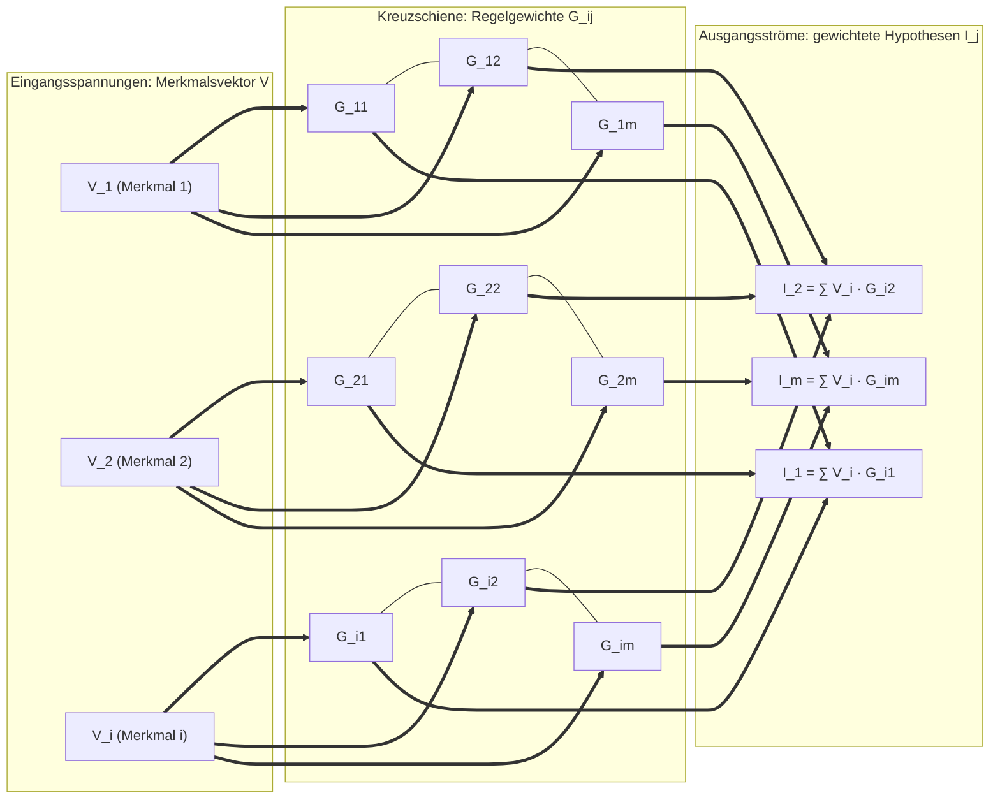
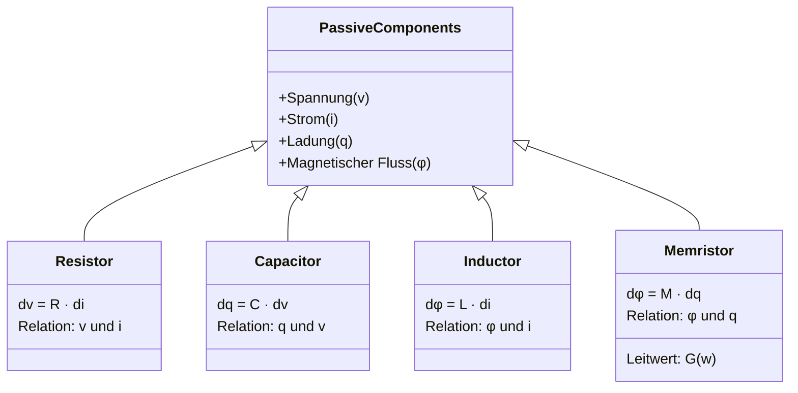
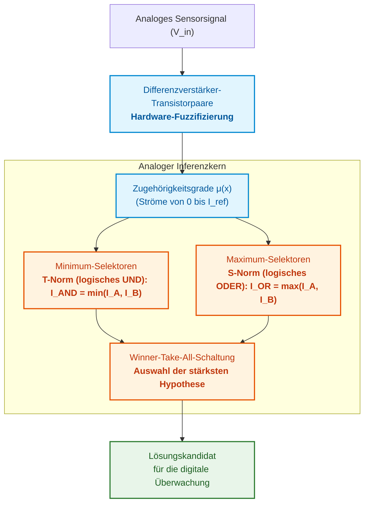
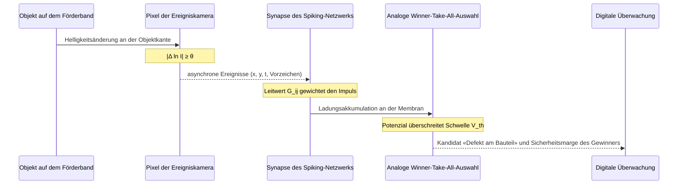
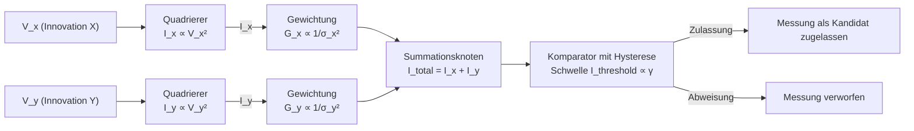
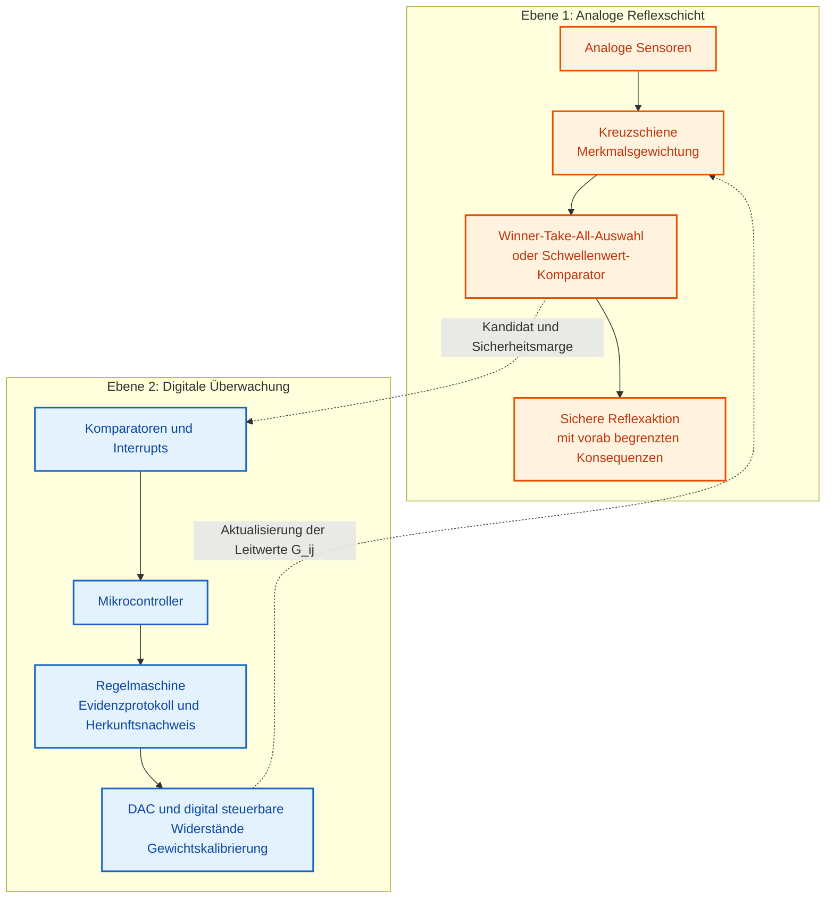
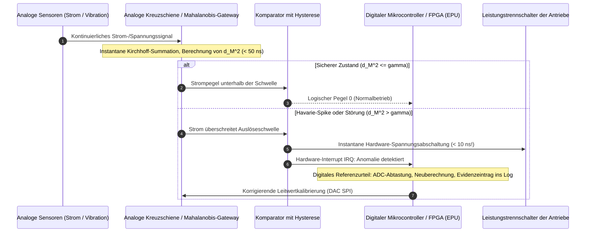

# Anhang D. Analoge Expertensysteme, neuromorphe Rechnerarchitekturen und hardwarebasiertes logisches Schließen

> **Buch:** [Architektur evidenzbasierter Expertensysteme](README.md) · Anhänge  
> **Inhaltsverzeichnis:** [README.md](README.md)  
> **Autor:** [Mykola Fedchyk](about-the-author.md)  
> **Niveau:** Vertiefte Ingenieurpraxis: Systemarchitekten, Entwickler analoger und gemischtsignaliger Schaltungen, Spezialisten für neuromorphe Rechnerarchitekturen, Embedded-Systems-Ingenieure  
> **Lernziele:** Erklären, welche Inferenzoperationen eine analoge Schaltung direkt über physikalische Gesetze ausführt; Abschätzen der Kosten analoger Berechnungen: Präzision, Bauteiltoleranzen, Drift und Kalibrierung; Unterscheidung fundierter Forschungsergebnisse von überzogenen Versprechungen; Verstehen, warum der analoge Teil eines Expertensystems zwingend unter digitaler Aufsicht operieren muss.

---

## Abstract

In ressourcenbeschränkten autonomen Überwachungssystemen und peripheren Sensorknoten (SWaP-C, Batteriebetrieb, Anforderung an mehrjährigen Dauerbetrieb) stößt die klassische digitale Von-Neumann-Architektur auf die sogenannte «Speicherwand» (*memory wall*): Das Auslesen von Regelgewichten aus dem externen dynamischen Direktzugriffsspeicher (DRAM) erfordert ein Hundertfaches an Energie gegenüber der eigentlichen arithmetischen Multiplikation. Versuche, die Inferenz direkt in ein analoges Hardware-Medium zu verlagern (In-Memory-Computing auf Basis resistiver Kreuzschienen gemäß den Gesetzen von Ohm und Kirchhoff), sehen sich jedoch einer anderen kritischen Bedrohung gegenüber: Bauteiltoleranzen der Komponenten, Temperaturdrift und Materialalterung verfälschen die Gewichtung von Fakten unkontrolliert und führen zum Übersehen kritischer Havariesignaturen.

Dieser Anhang untersucht die physikalischen Grundlagen der analogen und neuromorphen Inferenz. Der Autor analysiert detailliert, welche Operationen (Matrix-Vektor-Multiplikation, Fuzzy-T-Normen/T-Conormen, *Winner-Take-All*-Maximumselektion, Signalintegration) unmittelbar durch fundamentale Gesetze der Physik ohne Taktungs-Energieaufwand ausgeführt werden, quantifiziert die ingenieurtechnischen Kosten der analogen Approximation und begründet die Alternativlosigkeit einer heterogenen Architektur, in der analoge Schaltungen ausschließlich als schnelle, extrem energiesparende Schicht primärer Reflexe unter strikter Überwachungskontrolle eines digitalen Evidenzsystems agieren.

---

Ein digitales Expertensystem speichert Regeln und Fakten im Speicher und führt sie auf dem Prozessor aus. Jede Gewichtung von Merkmalen oder Auswertung einer Regel erfordert den Transfer von Zahlen aus dem Speicher in das Rechenwerk und zurück. Eine analoge Schaltung eröffnet einen alternativen Pfad: die Berechnung direkt am Speicherort der Gewichte auszuführen und physikalische Gesetze als Rechenoperationen zu nutzen. Dieser Anhang erläutert die physikalischen Mechanismen dieses Ansatzes, während [Anhang E](appendix-e-mixed-signal-neuromorphic-expert-systems.md) aufzeigt, wie die analoge Subsystemkomponente in ein evidenzbasiertes Expertensystem integriert wird.

Die zentrale Fragestellung dieses Anhangs lautet: **Welche Inferenzoperationen führt eine analoge Schaltung inhärent physikalisch aus und zu welchem Preis?** Die Leit-These: Eine analoge Schaltung berechnet gewichtete Summen, Minimum und Maximum, die Selektion des stärksten Signals, zeitliche Integration und die Relaxation in ein Energieminimum unmittelbar auf physikalischer Ebene; dies wird jedoch mit begrenzter Präzision, Fertigungstoleranzen und Drift der Elemente, zwingendem Kalibrierbedarf sowie Signalwandlungen an der Schnittstelle zur digitalen Domäne erkauft. Folglich eignet sich der analoge Schaltungsteil hervorragend als schnelle Schicht für Lösungskandidaten und Vorreflexe unter digitaler Aufsicht, nicht jedoch als persistenter Träger der formalen Wissensbasis.

## 1. Energetische Rahmenbedingungen der Renaissance analoger und neuromorpher Berechnungen in Expertensystemen

Untersuchen wir zunächst, warum analoge Berechnungen für moderne Expertensysteme erneut hochrelevant werden. Die erste Frage ist pragmatischer Natur: An welcher Stelle verbraucht ein digitales Expertensystem die meiste Energie? Mark Horowitz quantifizierte in seinem richtungsweisenden Vortrag über das Energieproblem der Rechnerarchitektur die Energiebilanzen für einen 45-nm-Halbleiterprozess: Eine 32-Bit-Gleitkommamultiplikation erfordert rund 3,7 pJ, während das Auslesen von 64 Bit aus einem dynamischen Direktzugriffsspeicher (*dynamic random-access memory*, DRAM) zwischen 1,3 und 2,6 nJ beansprucht [[1]](#src-1). Der Zugriff auf externen Speicher ist somit um mehrere hundert Male energieintensiver als die arithmetische Operation selbst. Für eine Inferenzregel, die bei jedem Messzyklus Hunderte von Merkmalen gewichtet, wird der Energieverbrauch folglich primär durch den Datentransfer der Gewichte und nicht durch die Multiplikation determiniert.

Das Konzept des Rechnens im Speicher (*In-Memory Computing*) eliminiert diesen Datentransfer vollständig: Die Rechenoperation wird exakt an der physikalischen Speicherstelle der Gewichte vollzogen [[2]](#src-2). Carver Mead begründete in seiner bahnbrechenden Arbeit über neuromorphe elektronische Systeme die herausragende Effizienz biologischer Nervensysteme damit, dass diese elementare physikalische Phänomene als Rechenprimitive einsetzen und Informationen über relative Amplituden analoger Signale kodieren [[3]](#src-3). Zugleich benannte Mead den unvermeidbaren Preis: Ein analoges System muss sich kontinuierlich an die Parameterstreuung seiner Komponenten anpassen [[3]](#src-3). Dieses Spannungsfeld – physikalisches Rechenprimitiv versus Kalibrierungsnotwendigkeit – durchzieht die gesamte Argumentation dieses Anhangs.

Als praxisnahes Anschauungsbeispiel diene der Pumpenlager-Überwachungsknoten aus [Anhang E](appendix-e-mixed-signal-neuromorphic-expert-systems.md). Dieser Sensorknoten wird autark über eine Batterie gespeist und muss in jedem Messfenster eine Defektrisiko-Bewertung – formal eine gewichtete Summe von Schwingungsmerkmalen – ermitteln. Die folgenden Abschnitte demonstrieren, mit welchen physikalischen Mechanismen eine analoge Schaltung eine solche Berechnung durchführen kann und welche Abstriche dabei in Kauf genommen werden müssen.

## 2. Physikalische Gesetze von Ohm und Kirchhoff als Basis der Matrix-Vektor-Multiplikation im Speicher

Die fundamentale Operation zur Gewichtung von Fakten und zur Bestimmung von Fallähnlichkeiten im Case-Based Reasoning ist die Matrix-Vektor-Multiplikation. In einem digitalen Prozessor erfordert die Multiplikation eines Merkmalsvektors der Länge $N$ mit einer Gewichtsmatrix der Dimension $N \times M$ genau $N \cdot M$ Multiplikations-Akkumulations-Operationen (MAC), die entweder sequenziell oder über parallele Rechenwerke abgearbeitet werden. In einer analogen **Kreuzschiene** (*crossbar*), also einer Matrix aus Leitwertelementen an den Kreuzungspunkten von Zeilen und Spalten, wird dieselbe mathematische Operation unmittelbar durch das Ohmsche Gesetz und die Kirchhoffschen Regeln realisiert.



Die Schaltung erschließt sich von links nach rechts. Gemäß dem Ohmschen Gesetz ist der Strom durch ein Leitwertelement am Schnittpunkt der $i$-ten Zeile und der $j$-ten Spalte gleich dem Produkt aus der Eingangsspannung $`V_i`$ und dem Leitwert des Elements $`G_{ij}=1/R_{ij}`$:

```math
I_{ij}=G_{ij}\,V_i .
```

Hierbei bedeuten:

- $`I_{ij}`$ ist der elektrische Strom durch das Element am Schnittpunkt der $i$-ten Zeile und der $j$-ten Spalte, in Ampere;
- $`G_{ij}`$ ist der elektrische Leitwert dieses Elements, in Siemens; er stellt den Kehrwert des ohmschen Widerstands $`R_{ij}`$ dar und fungiert als Verbindungsgewicht, das vom Bauteil physikalisch gespeichert wird;
- $`V_i`$ ist das elektrische Potenzial (die Spannung) an der $i$-ten Zeile, in Volt; sie kodiert die Eingangsvariable, beispielsweise ein normiertes Sensorsignal.

Folglich führt jedes einzelne Element der Kreuzschiene die Multiplikation «Eingangswert mal Gewicht» autonom aus – ohne Prozessortakt, Befehlsdekodierung oder Schleifenkonstrukt.

Gemäß dem ersten Kirchhoffschen Gesetz (Knotensatz) addieren sich alle Ströme, die an einer Spaltenleitung zusammentreffen. Der resultierende Ausgangsstrom der Spalte $j$ beträgt somit:

```math
I_j=\sum_{i=1}^{N}G_{ij}\,V_i .
```

Hierbei bedeuten:

- $`I_j`$ ist der Ausgangsstrom der Spalte $j$, in Ampere;
- $\sum_{i=1}^{N}$ ist die Summe über alle Zeilen von der ersten bis zur $N$-ten, die unmittelbar durch die Kirchhoffsche Stromaddition im Schaltungsknoten vollzogen wird;
- $N$ ist die Anzahl der Zeilen der Kreuzschiene, was der Dimension des Merkmalsvektors entspricht;
- $i$ ist der Zeilenindex;
- $`G_{ij}\,V_i`$ ist der Strombeitrag der Zeile $i$ zum Gesamtausgangsstrom der Spalte $j$.

Eine Spalte berechnet damit die gewichtete Summe der Eingänge, formal das Skalarprodukt des Spannungsvektors mit dem Leitwertsvektor, während die gesamte Kreuzschiene die vollständige Matrix-Vektor-Multiplikation in einem einzigen physikalischen Schritt ausführt. Werden beispielsweise an drei Zeilen die Eingangsspannungen $0{,}5$, $0{,}2$ und $0{,}8$ V angelegt und weisen die Elemente der Spalte Leitwerte von $2$, $1$ und $0{,}5$ $\mu\text{S}$ auf, so resultiert ein Spaltenstrom von $I_j=0{,}5\cdot 2 + 0{,}2\cdot 1 + 0{,}8\cdot 0{,}5 = 1{,}6\ \mu\text{A}$ (exemplarische Zahlenwerte).

Sämtliche Teilprodukte und Summen der gesamten Matrix stellen sich zeitgleich ein. Dies impliziert jedoch keineswegs eine unendlich hohe Rechengeschwindigkeit: Die physische Schrittdauer wird durch die Einschwingvorgänge der RC-Leitungsnetzwerke sowie durch die Latenzen der Digital-Analog-Wandler (DAC) an den Eingängen und der Analog-Digital-Wandler (ADC) an den Ausgängen begrenzt. Es ist daher präzise, von einem vollständig parallelen Rechenschritt für die gesamte Matrix zu sprechen, wobei der effektive Durchsatz realer Chips stets unter Einbeziehung der Wandlerstufen bilanziert werden muss. Die Programmierung von Kreuzschienen zur Beschleunigung von Matrix-Vektor-Multiplikationen wurde von Hu et al. detailliert beschrieben [[4]](#src-4), während der Übersichtsartikel von Ielmini und Wong das In-Memory-Computing auf Basis resistiver Schaltelemente umfassend systematisiert [[5]](#src-5). Die Wandlungskosten und deren systemische Beherrschung werden in [Anhang E](appendix-e-mixed-signal-neuromorphic-expert-systems.md) vertieft.

Da elektrische Leitwerte physikalisch stets nicht-negativ sind ($G \ge 0$), Inferenzgewichte in Expertensystemen jedoch häufig negative Werte (hemmende Evidenz) annehmen müssen, wird das Regelgewicht $`w_{ij}`$ in der Praxis als Differenz der Leitwerte zweier Schaltungselemente kodiert:

```math
w_{ij}\propto G_{ij}^{+}-G_{ij}^{-}.
```

Hierbei bedeuten:

- $`w_{ij}`$ ist das Verbindungsgewicht zwischen Eingang $i$ und Hypothese $j$; das Gewicht kann positiv sein, wenn das Merkmal die Hypothese stützt, oder negativ, wenn es sie falsifiziert;
- $\propto$ bezeichnet das Proportionalitätsverhältnis;
- $`G_{ij}^{+}`$ ist der Leitwert des Elements, dessen Strombeitrag die Hypothese stützt (erregender Pfad);
- $`G_{ij}^{-}`$ ist der Leitwert des Elements, dessen Strombeitrag die Hypothese schwächt (hemmender Pfad).

Ein Leitwertpaar mit $G^{+}=5\ \mu\text{S}$ und $G^{-}=2\ \mu\text{S}$ repräsentiert beispielsweise ein effektives Gewicht proportional zu $+3\ \mu\text{S}$, während das Wertepaar $2$ und $5\ \mu\text{S}$ ein negatives Gewicht von $-3\ \mu\text{S}$ abbildet. Diese differenzielle Kodierung kompensiert Gleichtakt-Driften, die beide Elemente gleichermaßen betreffen, eliminiert jedoch keine asymmetrischen Alterungs- oder Fluktuationsprozesse zwischen den beiden Komponenten.

## 3. Analoger Operationsverstärker-Integrator

Die zweite fundamentale analoge Rechenoperation ist die zeitkontinuierliche Integration. Für einen idealen Operationsverstärker mit einem Eingangswiderstand $R$ und einer Rückkopplungskapazität $C$ berechnet sich die Ausgangsspannung wie folgt:

```math
V_{\text{out}}(t)=-\frac{1}{RC}\int_{0}^{t}V_{\text{in}}(\tau)\,d\tau+V_{\text{out}}(0).
```

Hierbei bedeuten:

- $`V_{\text{out}}(t)`$ ist die Ausgangsspannung des Integrators zum Zeitpunkt $t$, in Volt;
- $`V_{\text{in}}(\tau)`$ ist die Eingangsspannung zum Zeitpunkt $\tau$, in Volt;
- $\tau$ ist die Integrationsvariable (die kontinuierliche Zeit zwischen $0$ und $t$);
- $R$ ist der ohmsche Widerstand des Eingangswiderstands, in Ohm;
- $C$ ist die Kapazität des Rückkopplungskondensators, in Farad;
- $RC$ ist die Zeitkonstante des Integrators, in Sekunden: Je größer dieser Wert ist, desto langsamer wächst die Ausgangsspannung bei konstantem Eingangssignal an;
- $`\int_{0}^{t}\ldots\,d\tau`$ bezeichnet das bestimmte Zeitintegral, das der akkumulierten Fläche unter dem Verlauf der Eingangsspannung im Intervall von $0$ bis $t$ entspricht;
- $`V_{\text{out}}(0)`$ ist die Anfangsspannung am Integratorausgang, von der die kontinuierliche Akkumulation ausgeht;
- das negative Vorzeichen resultiert aus der invertierenden Beschaltung des Operationsverstärkers.

Bei einer konstanten Eingangsspannung von $1$ V, $R=100\ \text{k}\Omega$ und $C=1\ \mu\text{F}$ beträgt die Integrationszeitkonstante beispielsweise $RC=0{,}1$ s. Ausgehend von $`V_{\text{out}}(0)=0`$ V ändert sich die Ausgangsspannung nach $0{,}05$ s exakt um $-(1/0{,}1)\cdot 1\cdot 0{,}05 = -0{,}5$ V.

Die Schaltung integriert ohne jede zeitliche Diskretisierung; ein numerischer Integrationsschritt (wie beim Euler- oder Runge-Kutta-Verfahren) entfällt vollständig. Reale Operationsverstärker weisen jedoch unvermeidliche Eingangs-Offsetspannungen und Biasströme auf. Diese parasitären Größen werden mitintegriert und führen zu einer schleichenden Drift des Ausgangssignals, bis die Schaltung an die Grenzen der Versorgungsspannung stößt (Sättigung). Ein analoger Integrator – beispielsweise zur Beschleunigungsintegration in einem Trägheitssensorknoten – bedarf daher zwingend periodischer Rücksetzimpulse (*Reset*) und kontinuierlicher Kalibrierzyklen. Auch hier zeigt sich das unverrückbare Prinzip: physikalisches Rechenprimitiv gepaart mit zwingender digitaler Überwachung.

## 4. Memristor-Kreuzschienen und nichtflüchtiger analoger Speicher

Damit eine Kreuzschiene die Regelgewichte ohne kontinuierliche Energiezufuhr behält, müssen ihre Schaltungselemente über einen nichtflüchtigen Leitwertspeicher verfügen. Leon Chua postulierte 1971 rein theoretisch den **Memristor** als viertes grundlegendes passives Zweipol-Schaltungselement, welches die elektrische Ladung mit dem magnetischen Fluss verknüpft [[6]](#src-6). Forscher der HP Labs wiesen 2008 ein physikalisches Dünnschichtbauelement nach, das dieses memristive Verhalten aufwies [[7]](#src-7).



Das Diagramm verdeutlicht, dass jedes der vier Grundelemente ein spezifisches Größenpaar verbindet: Der Memristor verknüpft die Ladung $q$ mit dem magnetischen Fluss $\varphi$. Folglich hängt der momentane Widerstand des Memristors von der Ladungsmenge ab, die das Bauelement in seiner Vorgeschichte durchflossen hat:

```math
V(t)=M\bigl(q(t)\bigr)\,I(t),\qquad M(q)=\frac{d\varphi(q)}{dq}.
```

Hierbei bedeuten:

- $V(t)$ ist die elektrische Momentanspannung über dem Memristor, in Volt;
- $I(t)$ ist der Momentanstrom durch das Bauelement, in Ampere;
- $q(t)$ ist die elektrische Ladung, die den Memristor seit dem Referenzzeitpunkt durchquert hat, in Coulomb (das zeitliche Integral des Stroms);
- $M(q)$ ist die Memristanz, also der ladungsabhängige ohmsche Widerstand, in Ohm;
- $\varphi(q)$ ist der mit der Ladung verknüpfte magnetische Fluss, in Weber;
- $d\varphi/dq$ ist die infinitesimale Änderungsrate des Flusses bezüglich der Ladung, welche die Memristanz $M(q)$ mathematisch definiert.

In der schaltungstechnischen Praxis bedeutet dies: Der Memristor «erinnert» sich an die Stromhistorie. Ein hochenergetischer Schreibimpuls verändert die atomare Leitfähigkeit (den Widerstand), während eine Lesespannung geringer Amplitude den Zustand nicht beeinflusst. Dadurch lässt sich ein Inferenzgewicht dauerhaft einschreiben und anschließend als analoger Leitwert abfragen.

Im breiteren ingenieurtechnischen Sprachgebrauch umfasst der Begriff *Memristor* heute verschiedene nichtflüchtige analoge Speichertechnologien, deren Leitwert kontinuierlich programmiert werden kann. Resistive Direktzugriffsspeicher (*resistive random-access memory*, RRAM) modulieren den Leitwert durch die Bildung und thermische Unterbrechung mikroskopischer metallischer oder sauerstoffarmer Leitfilamente in einer dünnen dielektrischen Oxidschicht [[5]](#src-5). Phasenwechselspeicher (*phase-change memory*, PCM) nutzen den thermisch induzierten Phasenübergang eines Chalkogenid-Materials zwischen einem amorphen Zustand mit hohem Widerstand und einem kristallinen Zustand mit hoher Leitfähigkeit [[8]](#src-8). Die Übersichtsarbeit von Sebastian et al. analysiert diese und verwandte Speicherarchitekturen – einschließlich ferroelektrischer Feldeffekttransistoren (FeFET) – im Hinblick auf ihre Eignung für das In-Memory-Computing [[2]](#src-2).

Labor- und Pilotfertigungen demonstrieren eindrucksvoll die Skalierbarkeit dieser Konzepte. Prezioso et al. realisierten und trainierten ein integriertes neuromorphes Netzwerk auf Basis von Metalloxid-Memristoren [[9]](#src-9), während Yao et al. ein vollständiges Faltungsnetzwerk (CNN) direkt in einer Memristor-Hardware implementierten [[10]](#src-10). Für Regelbasen in Expertensystemen ist ein weiterer Befund wegweisend: Joshi et al. speicherten jedes Netzwerkgewicht in einem PCM-Elementpaar in differenzieller Konfiguration ($G^{+}-G^{-}$) und hielten die Inferenzgenauigkeit über mehr als 24 Stunden stabil, indem sie hardwarebewusstes Training mit driftkompensierenden Algorithmen kombinierten [[11]](#src-11). Der Leitwert von PCM-Zellen unterliegt einer physikalisch bedingten Relaxation (Widerstandsdrift); das mathematische Modell dieser Drift [[8]](#src-8) und deren Konsequenzen für die formale Evidenzkette werden in [Anhang E](appendix-e-mixed-signal-neuromorphic-expert-systems.md) analysiert.

Betrachten wir eine typische Expertenregel mit Konfidenzgewicht:

```math
\text{IF } X_1 \land X_2 \text{ THEN } Y \text{ WITH CONFIDENCE } w
```

Hierbei bedeuten:

- $X_1$ und $X_2$ sind Prämissen (Fakten), die simultan erfüllt sein müssen (beispielsweise «Vibration ist hoch»);
- $\land$ repräsentiert das logische Konjunktions-Prädikat (UND);
- $Y$ ist die Konklusion der Regel (beispielsweise die Diagnosehypothese «Defekt am Bauteil»);
- $w$ ist das Konfidenzgewicht der Regel, ein reeller Wert, der den Grad der Verlässlichkeit dieser Schlussfolgerung quantifiziert.

In einer analogen Kreuzschiene transformiert sich eine solche Regel in ein differenzielles Leitwertpaar: Die Prämissen $X_1$ und $X_2$ werden als Eingangsspannungen an korrespondierende Zeilen angelegt, die Konklusion $Y$ entspricht einer Spaltenleitung, und das Gewicht $w$ wird durch die Leitwertdifferenz zweier Speicherzellen kodiert. Das Einspielen einer Regelaktualisierung mutiert damit von einem trivialen Text-Update in ein physikalisches Neuprogrammieren mit obligatorischer Read-Verify-Schleife. Da eine solche Gewichtsänderung nicht mehr als Quelltext-Commit in einem Versionskontrollsystem nachvollziehbar ist, müssen der formale Regelstand der Wissensbasis und die physischen Leitwerte der Hardware kontinuierlich abgeglichen werden.

## 5. Hardware-Fuzzy-Logik und Winner-Take-All-Schaltungen (WTA)

Zahlreiche Echtzeit-Expertensysteme stützen sich auf die von Lotfi Zadeh begründete Fuzzy-Logik: Die Zugehörigkeit eines Werts zu einer linguistischen Menge wird nicht binär (0 oder 1), sondern durch einen kontinuierlichen Zugehörigkeitsgrad im Intervall von 0 bis 1 beschrieben [[12]](#src-12). Fuzzy-Inferenzoperationen lassen sich auf verblüffend elegante Weise direkt auf analoge Transistorschaltungen abbilden. Takeshi Yamakawa konstruierte analoge Fuzzy-Inferenzmaschinen im nichtlinearen Schaltungsbetrieb und demonstrierte deren dynamische Regelgüte unter anderem durch das Balancieren eines gefüllten Weinglases auf einem invertierten Pendel [[13]](#src-13).



Das Flussdiagramm bildet die Phasen der analogen Fuzzy-Inferenz ab: Zunächst wandelt eine Transistorstufe die Eingangsspannung in kontinuierliche Zugehörigkeitswerte um, woraufhin Minimum- und Maximum-Operatoren die logischen UND- und ODER-Verknüpfungen evaluieren. Eine Winner-Take-All-Schaltung selektiert schließlich die dominierende Hypothese. Das Ausgangssignal fungiert als vorläufiger Lösungskandidat, der anschließend der digitalen Verifikation zugeführt wird.

Die Zugehörigkeitsfunktionen werden direkt durch die Strom-Spannungs-Kennlinien von Transistoren geformt. Im Subthreshold-Bereich (Unterschwellenbetrieb) hängt der Drainstrom eines Metall-Oxid-Halbleiter-Feldeffekttransistors (MOSFET) exponentiell von der Gate-Source-Spannung ab:

```math
I_d\approx I_0\exp\!\left(\frac{\kappa\,(V_{gs}-V_{th})}{U_T}\right)\left(1-\exp\!\left(-\frac{V_{ds}}{U_T}\right)\right).
```

Hierbei bedeuten:

- $I_d$ ist der Drainstrom des MOSFETs, in Ampere;
- $I_0$ ist der prozesstechnologie- und geometrieabhängige Skalierungsstrom, in Ampere;
- $\exp$ ist die Exponentialfunktion $e^{x}$;
- $`V_{gs}`$ ist die Gate-Source-Spannung, in Volt;
- $`V_{th}`$ ist die Schwellenspannung (Threshold-Spannung) des Transistors, in Volt;
- $`V_{ds}`$ ist die Drain-Source-Spannung, in Volt;
- $`U_T=kT/q`$ ist die Temperaturspannung, wobei $k$ die Boltzmann-Konstante, $T$ die absolute Temperatur in Kelvin und $q$ die Elementarladung bezeichnen; bei Raumtemperatur beträgt $`U_T`$ rund 25 mV;
- $\kappa$ ist der kapazitive Kopplungsfaktor zwischen Gate und Kanal, ein dimensionsloser Wert kleiner als eins.

Für den Schaltungsentwurf ist folgender Aspekt essenziell: Unterschreitet $`V_{gs}`$ die Schwellenspannung, schaltet der Transistor nicht abrupt ab, sondern reduziert seinen Leitungsstrom exponentiell: Eine Erhöhung von $`V_{gs}`$ um rund $60/\kappa$ mV steigert den Strom bei Raumtemperatur exakt um eine Zehnerpotenz. Sobald $`V_{ds}`$ wenige $`U_T`$ übersteigt, nähert sich der Klammerausdruck $(1 - \exp(-V_{ds}/U_T))$ dem Wert eins an, sodass der Drainstrom nahezu unabhängig von der Drain-Spannung wird (Stromquellencharakteristik). Der Subthreshold-Betrieb und darauf basierende analoge Schaltungsfamilien werden im Grundlagenwerk von Carver Mead über analoge VLSI- und neuronale Systeme detailliert erörtert [[14]](#src-14). Ein Differenzverstärker-Transistorpaar in diesem Bereich erzeugt eine sigmoide Übertragungskennlinie; durch gezielte Verschiebung der Referenzspannungen lässt sich exakt kalibrieren, bei welchem physikalischen Messwert das linguistische Prädikat «hohe Vibration» stufenlos von 0 auf 1 übergeht.

Konkurrieren in einem regelbasierten System mehrere Hypothesen, muss das System die ranghöchste auswählen. Ein digitaler Algorithmus ermittelt das Maximum über sequenzielle Vergleiche mit einer Zeitkomplexität von $\mathcal{O}(K)$, proportional zur Anzahl der Kandidaten $K$. Die analoge Winner-Take-All-Schaltung (*winner-take-all*, WTA) von Lazzaro et al. benötigt pro Eingangskanal lediglich zwei Transistoren und eine gemeinsame Kopplungsleitung, wodurch die Verbindungskomplexität strikt linear mit der Kanalanzahl skaliert [[15]](#src-15). Eine nichtlineare Rückkopplung über die gemeinsame Knotenleitung verstärkt den Kanal mit dem stärksten Eingangsstrom massiv, während alle schwächeren Kanäle vollständig unterdrückt werden:

```math
I_{\text{out},k}\approx\begin{cases}
I_{\text{bias}}, & k=\arg\max_j I_{\text{in},j},\\
0, & \text{sonst.}
\end{cases}
```

Hierbei bedeuten:

- $`I_{\text{out},k}`$ ist der Ausgangsstrom des Kanals $k$, in Ampere;
- $`I_{\text{in},j}`$ ist der Eingangsstrom des Kanals $j$, welcher die Evidenzstärke für die $j$-te Hypothese repräsentiert, in Ampere;
- $`I_{\text{bias}}`$ ist der Gesamt-Ruhestrom der Schaltung, der exklusiv dem siegreichen Kanal zugewiesen wird, in Ampere;
- $k$ ist der Index des betrachteten Ausgangskanals, während $j$ über alle Eingangskanäle iteriert;
- $\arg\max_j I_{\text{in},j}$ bezeichnet den Index des Kanals mit dem maximalen Eingangsstrom;
- die Fallunterscheidung verdeutlicht die harte Selektion: Der Sieger erhält den vollen Strom $`I_{\text{bias}}`$, alle übrigen Ausgänge führen idealerweise Strom null.

Betragen die Ströme dreier konkurrierender Hypothesen beispielsweise $4$, $9$ und $7$ nA, leitet der zweite Kanal den gesamten Strom $`I_{\text{bias}}`$, während Kanal 1 und 3 abgeschaltet werden (Ausgangsstrom $0$).

Die Selektionsschärfe dieser Schaltung wird jedoch fundamental durch Fertigungstoleranzen (Mismatch) der Transistoren begrenzt: Liegen zwei Eingangsströme extrem nah beieinander, entscheidet nicht die stärkere Regelpräferenz, sondern eine zufällige Bauteilasymmetrie über den Ausgang. Aus diesem Grund muss die übergeordnete digitale Ebene stets die Sicherheitsmarge zwischen dem Sieger und dem Zweitplatzierten evaluieren – analog zum Sicherheitsmargen-Gateway, das in [Anhang E](appendix-e-mixed-signal-neuromorphic-expert-systems.md) zur Schwellenwertabsicherung formalisiert ist.

## 6. Spiking Neural Networks und ereignisbasierte Sensoren

Spiking Neural Networks (*spiking neural networks*, SNN) kodieren und übertragen Informationen über zeitliche Impulsfolgen (Spikes); Wolfgang Maass bezeichnete diese Architektur als die dritte Generation künstlicher neuronaler Netzwerkmodelle [[16]](#src-16). Das kanonische Berechnungsmodell eines biologisch inspirierten Neurons, der Leaky-Integrate-and-Fire-Mechanismus (LIF), beschreibt die Dynamik des Membranpotenzials $u(t)$ über folgende Differentialgleichung:

```math
\tau_m\frac{du(t)}{dt}=-\bigl(u(t)-u_{\text{rest}}\bigr)+R_m\,I_{\text{syn}}(t).
```

Die Parameter der Gleichung [[17]](#src-17):

- $u(t)$ ist das elektrische Membranpotenzial des Neurons zum Zeitpunkt $t$, in Volt;
- $du/dt$ ist die zeitliche Ableitung dieses Potenzials, in Volt pro Sekunde;
- $\tau_m$ ist die Membranzeitkonstante, in Sekunden: Je kleiner dieser Wert ist, desto schneller relaxiert das Potenzial in den Ruhezustand;
- $`u_{\text{rest}}`$ ist das Ruhepotenzial, auf welches sich die Membran ohne externen Stromeintrag einstellt, in Volt;
- $R_m$ ist der ohmsche Membranwiderstand, in Ohm;
- $`I_{\text{syn}}(t)`$ ist der synaptische Eingangsstrom, in Ampere.

Erreicht das Membranpotenzial die Zündschwelle $`V_{\text{th}}`$, generiert das Neuron einen Spannungsimpuls (Spike) und setzt sein Potenzial schlagartig auf den Wert $`u_{\text{reset}}`$ zurück. Die physikalische Interpretation der Differentialgleichung: Der Term $-(u-u_{\text{rest}})$ modelliert den kontinuierlichen Ladungsverlust (Leakage), der das Neuron in den Ruhezustand zieht, während der Term $`R_m\,I_{\text{syn}}`$ die Membrankapazität auflädt. Bei einem konstanten Eingangsstrom konvergiert das Potenzial asymptotisch gegen den Grenzwert $`u_{\text{rest}}+R_m\,I_{\text{syn}}`$. Spikes entstehen somit ausschließlich dann, wenn dieser Gleichgewichtswert die Schwellenspannung $`V_{\text{th}}`$ übersteigt: Subschwellige Signale erzeugen keinerlei Aktivität, während stärkere Ströme die Zündfrequenz proportional erhöhen. In einer analogen Schaltung wird die Membran durch einen realen Kondensator und die Schwellwertprüfung durch einen Komparator realisiert. Da Informationen über den exakten Zeitpunkt und die Frequenz von Spikes transportiert werden, verbraucht die Schaltung dynamische Energie ausschließlich beim Auftreten realer Ereignisse; lediglich der minimale statische Ruhestrom bleibt permanent bestehen.

Ein ideales sensorisches Pendant zu diesem Berechnungsmodell ist die ereignisbasierte Kamera (*event camera* bzw. Dynamic Vision Sensor, DVS). Jedes Pixel eines solchen Sensors reagiert vollkommen autonom auf zeitliche Änderungen des Helligkeits-Logarithmus:

```math
\bigl|\ln I(x,y,t)-\ln I(x,y,t-\Delta t)\bigr|\ge\theta .
```

Hierbei bedeuten:

- $I(x,y,t)$ ist die optische Beleuchtungsstärke am Pixel mit den Koordinaten $(x,y)$ zum Zeitpunkt $t$;
- $\ln$ ist der natürliche Logarithmus; durch die logarithmische Kompression spricht das Pixel auf relative Kontraständerungen an, sodass eine identische prozentuale Helligkeitsänderung sowohl in dunklen als auch in hellen Bildbereichen zuverlässig triggert, was den herausragenden Dynamikbereich des Sensors begründet;
- $\Delta t$ ist das Zeitintervall zwischen zwei Vergleichszeitpunkten;
- $\theta$ ist die Kontrastschwelle, also die minimale logarithmische Intensitätsänderung, die ein Ereignis auslöst; ein Schwellenwert von $\theta=0{,}15$ entspricht einer Helligkeitsänderung von rund 16 %;
- $\lvert\cdot\rvert$ bezeichnet den Absolutbetrag: Sowohl Helligkeitsanstiege (ON-Events) als auch Helligkeitsabfälle (OFF-Events) generieren Signale, wobei das Vorzeichen die Richtung der Intensitätsänderung signalisiert.

Sobald ein Pixel die Bedingung erfüllt, emittiert es asynchron ein Datenpaket bestehend aus Koordinaten, Mikrosekunden-Zeitstempel und Vorzeichenbit. Der erste praxistaugliche DVS-Sensor von Lichtsteiner, Posch und Delbruck wies 128 × 128 Pixel, einen Dynamikbereich von 120 dB und eine Latenz von 15 $\mu\text{s}$ auf [[18]](#src-18). Die umfassende Übersicht von Gallego et al. quantifiziert für moderne ereignisbasierte Bildsensoren zeitliche Auflösungen im Mikrosekundenbereich, Dynamikbereiche von bis zu 140 dB (gegenüber 60 dB bei Standardkameras) sowie eine drastisch reduzierte Leistungsaufnahme [[19]](#src-19).



Das Sequenzdiagramm illustriert den durchgängig rahmenlosen (*frame-free*) Verarbeitungspfad: Ereignisse entstehen ausschließlich an den Orten transienter Helligkeitswechsel, das Spiking-Netzwerk akkumuliert die Ladungsträger, und die Winner-Take-All-Schaltung übergibt den selektierten Hypothesenkandidaten mitsamt der detektierten Sicherheitsmarge an das digitale Überwachungssystem, welches final über die Validität des Befunds entscheidet.

Für derartige Ereignisströme existieren spezialisierte gemischt-analoge/digitale neuromorphe Prozessoren. Der DYNAP-SE2-Chip integriert analoge Schaltungen für die kontinuierliche neuronale Dynamik mit einer asynchronen digitalen Paket-Routing-Architektur für Spikes und stellt dedizierte Schnittstellen für ereignisbasierte und kontinuierliche Sensoren bereit [[20]](#src-20). Im direkten Vergleich dazu integriert der rein digitale IBM TrueNorth-Chip eine Million programmierbare Spiking-Neuronen und 256 Millionen Synapsen bei einer Leistungsaufnahme von lediglich 63 mW für einen Videostrom von 400 × 240 Pixeln bei 30 Bildern pro Sekunde [[21]](#src-21), während der digitale Intel Loihi-Prozessor zusätzlich On-Chip-Lernverfahren unterstützt [[22]](#src-22). Diese Gegenüberstellung verdeutlicht: Das Paradigma der ereignisbasierten Spiking-Berechnungen ist nicht exklusiv an analoge Schaltungen gebunden. Die Wahl zwischen analoger und digitaler Implementierung bleibt stets ein ingenieurtechnischer Kompromiss zwischen minimaler Leistungsaufnahme, Rechenpräzision und deterministischer Reproduzierbarkeit.

## 7. Hopfield-Assoziativnetze: Energierelaxation und Funktionalminimierung

Ein bedeutsamer Teil der Aufgabenstellungen in Expertensystemen lässt sich als kombinatorische Optimierung unter Nebenbedingungen formulieren: die optimale Zuweisung von Wartungsteams auf Schadensstellen, die energieeffiziente Pfadplanung oder der Abgleich verrauschter Sensordaten mit bekannten Modellen. John Hopfield bewies mathematisch, dass ein rekurrentes neuronales Netzwerk mit kontinuierlicher Aktivierungsfunktion eine skalare Energiefunktion besitzt, die über die Zeit monoton fällt [[23]](#src-23). Gemeinsam mit David Tank wandte Hopfield diese Netzwerktopologie erfolgreich auf anspruchsvolle Optimierungsprobleme wie das Problem des Handlungsreisenden (Traveling Salesperson Problem, TSP) an [[24]](#src-24).

Betrachten wir eine analoge Schaltungsanordnung aus $N$ Verstärkern, die über eine Leitwertmatrix $`T_{ij}`$ gekoppelt sind:

```math
C_i\frac{dU_i}{dt}=-\frac{U_i}{R_i}+\sum_{j=1}^{N}T_{ij}V_j+I_i .
```

Hierbei bedeuten:

- $C_i$ ist die Eingangskapazität des $i$-ten Verstärkers, in Farad;
- $U_i$ ist die Eingangsspannung am $i$-ten Verstärker, in Volt;
- $R_i$ ist der Eingangswiderstand (Ableitwiderstand) dieses Knotens gegen Masse, in Ohm;
- $`V_j=g(U_j)`$ ist die Ausgangsspannung des $j$-ten Verstärkers, wobei $g$ eine monoton wachsende, sigmoide Übertragungsfunktion darstellt;
- $`T_{ij}`$ ist der Koppelleitwert zwischen dem Ausgang des $j$-ten und dem Eingang des $i$-ten Verstärkers; die Matrix $`T_{ij}`$ kodiert die Problem-Nebenbedingungen und das Gütekriterium, wobei $`T_{ij}=T_{ji}`$ (Symmetrie) und $`T_{ii}=0`$ gilt;
- $I_i$ ist ein externer Strom, der die Eingangsbedingungen (Fakten) repräsentiert, in Ampere;
- $N$ ist die Gesamtanzahl der Verstärkerstufen;
- $`\sum_{j=1}^{N}T_{ij}V_j`$ ist der akkumulierte Summenstrom, den alle Verstärker an den Eingang des $i$-ten Knotens einspeisen.

In der Praxis summiert jeder Verstärker die gewichteten Ausgangssignale aller anderen Einheiten, während der Kondensator $C_i$ die Differenz zwischen dem zufließenden Summenstrom und dem Leckstrom $U_i/R_i$ integriert. Die Spannungszustände im Netzwerk «fließen» somit kontinuierlich entlang eines Gradienten abwärts, bis ein stabiler Ruhezustand erreicht ist, der einen Lösungskandidaten für das gegebene Problem darstellt. Die Lyapunov-Energiefunktion für ein solches System lautet:

```math
E=-\frac{1}{2}\sum_{i=1}^{N}\sum_{j=1}^{N}T_{ij}V_iV_j-\sum_{i=1}^{N}I_iV_i+\sum_{i=1}^{N}\frac{1}{R_i}\int_{0}^{V_i}g^{-1}(V)\,dV .
```

Hierbei bedeuten:

- $E$ ist die Gesamtenergie (Lyapunov-Funktion) des Netzwerks, ein skalarer Wert, der vom Zustand sämtlicher Verstärkerausgänge abhängt und während des Schaltungsbetriebs niemals ansteigt;
- der erste Term $-\tfrac12\sum\sum T_{ij}V_iV_j$ beschreibt die paarweise Wechselwirkungsenergie der Ausgangsspannungen über die Koppelgewichte $`T_{ij}`$;
- der zweite Term $-\sum I_iV_i$ quantifiziert den Einfluss der externen Eingangsströme (der Randbedingungen);
- der dritte Integralterm berücksichtigt die ohmschen Verluste und die Krümmung der Übertragungsfunktion $g$; bei einer sehr steilen Aktivierungskennlinie ist sein numerischer Beitrag vernachlässigbar klein [[23]](#src-23);
- $g^{-1}$ ist die Umkehrfunktion der Übertragungsfunktion $g$, und $V$ ist die Integrationsvariable;
- $\sum_{i=1}^{N}$ und $\sum_{j=1}^{N}$ repräsentieren die Summen über alle Schaltungsknoten.

Man kann sich diese Energielandschaft anschaulich als topografisches Relief vorstellen: Der Systemzustand rollt schwerkraftartig talwärts und stabilisiert sich im Boden einer Senke, wobei jedes Tal einem konkreten Lösungskandidaten entspricht.

Da $`\partial E/\partial V_i=-\left(\sum_j T_{ij}V_j+I_i-U_i/R_i\right)=-C_i\,dU_i/dt`$ gilt, berechnet sich die zeitliche Ableitung der Energie zu:

```math
\frac{dE}{dt}=\sum_{i=1}^{N}\frac{\partial E}{\partial V_i}\frac{dV_i}{dt}=-\sum_{i=1}^{N}C_i\,g'(U_i)\left(\frac{dU_i}{dt}\right)^{2}\le 0.
```

Hierbei bedeuten:

- $dE/dt$ ist die zeitliche Änderungsrate der Energie;
- $`\partial E/\partial V_i`$ ist die partielle Ableitung der Energie nach der Ausgangsspannung des $i$-ten Knotens;
- $`dV_i/dt`$ und $`dU_i/dt`$ sind die zeitlichen Ableitungen der Ausgangs- bzw. Eingangsspannungen;
- $`g'(U_i)`$ ist die Steigung der Verstärkerkennlinie im Arbeitspunkt $U_i$.

Da die Kapazitäten $C_i$ positiv sind, die Ableitung $`g'(U_i)`$ für jede streng monoton wachsende Kennlinie stets positiv ist und der quadratische Term $(dU_i/dt)^{2}$ per Definition nicht-negativ ist, ist die gesamte rechte Seite der Gleichung stets kleiner oder gleich null ($\le 0$). Die Systemenergie nimmt folglich kontinuierlich ab, bis die Schaltung in einem stationären Fixpunkt mit $dU_i/dt=0$ zur Ruhe kommt.

Dieser mathematische Beweis garantiert die Konvergenz der Schaltung, trifft jedoch keinerlei Aussage über die globale Güte der gefundenen Lösung: Das System verharrt häufig in einem lokalen Minimum, welches signifikant vom globalen Optimum abweichen kann. Zudem hängt die Qualität stark davon ab, wie präzise die Randbedingungen in die Matrix $`T_{ij}`$ übersetzt wurden. Die Einschwingzeit wird primär durch die RC-Zeitkonstanten der Schaltung bestimmt. Für ein Expertensystem liefert ein Hopfield-Netzwerk daher stets nur einen vorläufigen Hypothesenkandidaten: Die digitale Überwachungsebene muss zwingend sämtliche harten Systemrandbedingungen des gefundenen Zustands formal prüfen, bevor dieser als valider Fakt in die Wissensbasis übernommen wird. Moderne Weiterentwicklungen dieses Prinzips – wie analoge Ising-Maschinen und probabilistische Bits (p-Bits) – werden in [Anhang E](appendix-e-mixed-signal-neuromorphic-expert-systems.md) vertieft.

## 8. Ingenieurbeispiel: Hardwarebasiertes analoges Mahalanobis-Gateway

### 8.1. Problemstellung

In [Kapitel 6](ch06-applied-mathematics-for-expert-systems.md) und [Anhang C](appendix-c-autonomous-navigation-and-geosearch.md) wird dargelegt, dass ein Sensorsignal nur dann zur Zustandsschätzung zugelassen werden darf, wenn die quadratische Mahalanobis-Distanz zwischen Messung und Modellprädiktion einen kritischen Schwellenwert nicht überschreitet:

```math
d_M^{2}=(\mathbf{z}-\hat{\mathbf{z}})^{\top}\mathbf{S}^{-1}(\mathbf{z}-\hat{\mathbf{z}})\le\gamma .
```

Hierbei bedeuten:

- $`d_M^{2}`$ ist das Quadrat der Mahalanobis-Distanz, ein dimensionsloser statistischer Wert, der den geometrischen Abstand zwischen Messung und Erwartungswert normiert auf die Kovarianz der Unsicherheit quantifiziert;
- $\mathbf{z}$ ist der reale Messvektor (beispielsweise Koordinaten eines optischen Sensors);
- $\hat{\mathbf{z}}$ ist der prädizierte Messvektor aus dem kinematischen Modell; der Zirkumflex («Hut») kennzeichnet den Schätzwert;
- $\mathbf{z}-\hat{\mathbf{z}}$ ist der Innovationsvektor (das Residuum zwischen Realität und Modell);
- $\top$ kennzeichnet die Transposition des Vektors;
- $\mathbf{S}$ ist die Kovarianzmatrix der Innovation, deren Hauptdiagonale die Varianzen und deren Nebendiagonalelemente die Kreuzkorrelationen abbilden;
- $\mathbf{S}^{-1}$ ist die inverse Kovarianzmatrix (die Präzisionsmatrix); die Multiplikation entspricht der Gewichtung des Residuums mit der Messgenauigkeit;
- $\gamma$ ist die Zulassungsschwelle, die als Quantil der Chi-Quadrat-Verteilung für ein vorgegebenes Konfidenzniveau gewählt wird (siehe [Anhang C](appendix-c-autonomous-navigation-and-geosearch.md)).

Ein Standard-Mikrocontroller benötigt zur Berechnung dieser quadratischen Form Dutzende bis Hunderte von Taktzyklen. Es stellt sich die ingenieurtechnische Frage: Lässt sich dieses Zulassungstor als ultra-schnelle analoge Schaltung realisieren und welche Verifikationsschritte sind dafür unabdingbar?

### 8.2. Schaltung für unkorrelierte Messungen

Liegt der zweidimensionale Innovationsvektor als Paar differentieller Spannungen $V_x = z_x - \hat{z}_x$ und $V_y = z_y - \hat{z}_y$ vor und sind die Messfehler unkorreliert, reduziert sich die Kovarianzmatrix auf Diagonalform: $\mathbf{S}=\mathrm{diag}(\sigma_x^{2},\sigma_y^{2})$. Die Bedingung vereinfacht sich zu:

```math
d_M^{2}=\frac{V_x^{2}}{\sigma_x^{2}}+\frac{V_y^{2}}{\sigma_y^{2}}\le\gamma .
```

Hierbei bedeuten:

- $V_x$ und $V_y$ sind die Spannungskomponenten des Innovationsresiduums entlang der Achsen $x$ und $y$;
- $\sigma_x$ und $\sigma_y$ sind die Standardabweichungen (Messunsicherheiten) der Sensorkanäle in denselben Skalierungseinheiten wie $V_x$ und $V_y$;
- $\sigma_x^{2}$ und $\sigma_y^{2}$ sind die korrespondierenden Varianzen;
- $\gamma$ ist die Schwellenwertkonstante für die statistische Zulassung.

Jede Fehlerkomponente wird durch ihre individuelle Varianz geteilt, sodass der präzisere Kanal ein signifikant höheres Gewicht erhält. Betragen die Spannungen nach Skalierung beispielsweise $V_x=12$ und $V_y=5$ Skaleneinheiten bei $\sigma_x=\sigma_y=5$ Einheiten, und liegt der Chi-Quadrat-Schwellenwert für zwei Freiheitsgrade und 99 % Konfidenz bei $9{,}21$ (wie in [Anhang C](appendix-c-autonomous-navigation-and-geosearch.md) hergeleitet), so errechnet sich $d_M^{2}=144/25+25/25=6{,}76$. Da dieser Wert kleiner als die Schwelle $9{,}21$ ist, wird die Messung zugelassen (exemplarische Zahlenwerte).



Die analoge Implementierung gliedert sich in drei kaskadierte Funktionsstufen:

**Quadrierer:** Kann über die quadratische Abhängigkeit des Drainstroms eines MOSFETs im Sättigungsbereich, $I\propto(V_{gs}-V_{th})^{2}$, oder über eine analoge Gilbert-Multipliziererzelle realisiert werden.

**Gewichtung:** Wird über Leitwerte $G_x=k_0/\sigma_x^{2}$ und $G_y=k_0/\sigma_y^{2}$ definiert, wobei $k_0$ einen Skalierungsfaktor darstellt; diese Leitwerte werden durch kalibrierte Festwiderstände, digital steuerbare Potenziometer oder programmierbare Memristoren eingestellt.

**Komparator:** Vergleicht den aufsummierten Summenstrom mit einem Referenzstrom proportional zu $\gamma$. Eine gezielte Hysterese verhindert hochfrequentes Schwingen des Schaltausgangs, wenn $`d_M^{2}`$ in unmittelbarer Nähe der Schaltschwelle liegt.

### 8.3. Kriterien der ingenieurtechnischen Verifikation

Latenz und Energieaufnahme einer solchen Schaltung werden im Wesentlichen durch die Quadrierer und den Komparator bestimmt. Für ein konkretes Schaltungslayout müssen diese Kenngrößen über SPICE-Simulationen über alle Ecken des Fertigungsprozesses (Process Corners) sowie durch Messungen an realen Silizium-Mustern ermittelt werden – Datenblatt-Schätzwerte einzelner Standardkomponenten reichen hierfür nicht aus. Da sich die Kovarianzmatrix $\mathbf{S}$ in realen Szenarien mit den Umgebungsbedingungen und dem Sensorzustand ändert, müssen die Leitwerte $G_x$ und $G_y$ durch die digitale Überwachungsebene dynamisch nachgeführt werden; jedes dieser Updates stellt eine versionierte Kalibrierung dar. Befindet sich der berechnete Wert $`d_M^{2}`$ schließlich in einem engen Toleranzband um $\gamma$, schaltet die analoge Hardware aufgrund von Rauschen stochastisch; Grenzfälle müssen daher zwingend durch eine digitale Neuberechnung abgesichert werden. Das analoge Gateway entlastet den Hauptprozessor massiv von eindeutigen Messwerten, entbindet das digitale System jedoch keinesfalls von der Verantwortung für Grenzwertentscheidungen.

## 9. Vergleichende Analyse digitaler und analoger Rechenwerke

Die vorangegangenen Abschnitte haben die physikalischen Berechnungsprimitive detailliert analysiert. Die folgende Tabelle fasst ihre Charakteristika vergleichend im Hinblick auf ihre Relevanz für Expertensysteme zusammen:

| Eigenschaft | Digitaler Prozessor | Analoge Kreuzschiene | Konsequenz für das Expertensystem |
|---|---|---|---|
| Energieaufwand für Gewichtszugriff | DRAM-Zugriff Hunderte Male teurer als Multiplikation [[1]](#src-1) | Gewichte werden nicht transferiert [[2]](#src-2) | Enormer Effizienzgewinn primär bei dominanter Multiplikation mit statischen Matrizen |
| Rechenpräzision | Exakt durch Zahlenformat definiert | Durch Rauschen und Drift limitiert; Laborchips erreichen Äquivalenz zu 4-Bit-Gewichten [[25]](#src-25) bzw. 8-Bit-I/O [[26]](#src-26) | Exakte Prüfungen von Versionen, Schwellen und Systemgrenzen verbleiben zwingend digital |
| Reproduzierbarkeit | Bit-für-Bit deterministisch reproduzierbar | Statistisch, abhängig von Temperatur und Zeit | Fehler- und Driftmodelle sowie Canary-Berechnungen obligatorisch ([Anhang E](appendix-e-mixed-signal-neuromorphic-expert-systems.md)) |
| Wissensaktualisierung | Triviales Laden neuer Versionen | Physikalisches Umprogrammieren der Leitwerte mit Verifikation | Jede Regeländerung wird zum hardwaretechnischen Kalibrierprozess |
| Anfälligkeit für Strahlungseffekte (SEU) | Geladene Teilchen können Bits in Flipflops oder SRAM kippen | Stark designabhängig; einige Architekturen zeigen inhärente Robustheit [[27]](#src-27) | Strahlungstoleranz muss experimentell nachgewiesen und darf nicht blind postuliert werden |

Aus der Gegenüberstellung geht kein pauschaler Sieger hervor. Die analoge Kreuzschiene deklassiert digitale Prozessoren hinsichtlich der Energieeffizienz bei hochfrequenten Matrixoperationen, unterliegt jedoch bei Präzision und deterministischer Reproduzierbarkeit. Daraus resultiert zwingend der heterogene Architekturansatz des folgenden Abschnitts.

## 10. Heterogene Architektur: Synthese aus analogem Reflex und digitaler Evidenzüberwachung

Eine rein analoge Schaltung kann niemals als alleiniger Träger einer formalen Wissensbasis fungieren. Sie ist unfähig, komplexe symbolische Datenstrukturen mit Herkunftsnachweisen (Lineage) und Versionshistorien abzubilden, bietet nur begrenzte Rechenschärfe und unterliegt unvermeidlicher Drift. Demgegenüber vermag sie spezialisierte Rechenkerne mit unübertroffener Geschwindigkeit und minimalem Energiebedarf auszuführen: Merkmalsgewichtungen, Winner-Take-All-Entscheidungen und Schwellwertprüfungen. Ein praxistaugliches Expertensystem mit analogen Funktionsblöcken ist daher zwingend zweistufig aufgebaut:



Die analoge Ebene besitzt ausschließlich die Autorität, autonome Aktionen mit vorab strikt begrenztem Schadenspotenzial unmittelbar auszulösen: eine Notabschaltung bei katastrophaler Schwingungsüberschreitung, eine Hardware-Strombegrenzung oder das Wake-up-Signal für den ruhenden digitalen Prozessor. Sämtliche weitergehenden Entscheidungen übergibt die analoge Stufe als hypothetische Kandidaten mitsamt quantifizierter Sicherheitsmarge an die digitale Ebene. Diese verifiziert die Kandidaten anhand formaler Regeln, trägt sie in das manipulationssichere Evidenzprotokoll ein und kalibriert die analogen Leitwerte kontinuierlich nach. Die formalen Autorisierungsgrenzen automatisierter Aktionen werden in [Kapitel 21](ch21-from-recommendation-to-action.md) behandelt; das vollständige Evidenzkontrakt-Design mit Fehlermodellen, Canary-Stimuli, Sicherheitsmargen-Gateways und Lücken-Audits wird in [Anhang E](appendix-e-mixed-signal-neuromorphic-expert-systems.md) dargelegt.

## 11. Entwicklung der analogen Informationsverarbeitung in der ukrainischen Forschungsschule und offene Mikroelektronik

Die Erforschung hardwarenaher und fehlertoleranter Wissensrepräsentationen blickt in der ukrainischen Wissenschaft auf eine fundierte Tradition zurück. Dmitri Rachkovskij und Ernst Kussul vom W.-M.-Gluschkow-Institut für Kybernetik in Kyjiw entwickelten bahnbrechende Verfahren zur Bindung und Normalisierung binärer dünnbesetzter verteilter Repräsentationen (*binary sparse distributed representations*) [[28]](#src-28). Diese Repräsentationen zeichnen sich durch eine außergewöhnliche Robustheit gegenüber Signalrauschen aus, wodurch sich ihre modernen Nachfolger – hyperdimensionale Vektor-Berechnungen (Hyperdimensional Computing, HDC) – ideal auf analoge Speicher- und Memristor-Arrays abbilden lassen; diese Zusammenhänge werden in [Anhang E](appendix-e-mixed-signal-neuromorphic-expert-systems.md) vertieft.

Für das Prototyping analoger und gemischtsignaliger Schaltungen ist heute keine eigene Halbleiterfabrik mehr erforderlich. Google initiierte gemeinsam mit SkyWater die Veröffentlichung eines quelloffenen Technologie-Entwicklungskits (*Process Design Kit*, PDK) für den 130-nm-Halbleiterprozess [[29]](#src-29). Das IHP stellte ein Open-Source-PDK für einen 130-nm-BiCMOS-Prozess bereit, der Bipolar- und CMOS-Transistoren für analoge, gemischtsignalige und Hochfrequenz-Schaltungen kombiniert [[30]](#src-30). Schaltungslayouts können im freien Editor KLayout entworfen und validiert werden [[31]](#src-31), während Initiativen wie Tiny Tapeout einen schnellen, unkomplizierten und kostengünstigen Weg zur Fertigung eigener ASICs auf Multi-Project-Wafern eröffnen [[32]](#src-32). Offene PDKs senken die Einstiegshürde für Schaltungsentwurf, Ausbildung und Prototyping von WTA-Stufen, Fuzzy-Komparatoren und kompakten Kreuzschienen dramatisch. Gleichwohl entbinden sie Entwickler keineswegs von der Pflicht zur physikalischen Parametermessung gefertigter Silizium-Muster und zur strikten Qualifikation für geschäftskritische Einsatzbereiche.

In verteidigungsrelevanten Systemen betrifft derselbe Ansatz energieautarke Aufklärungs- und Diagnoseknoten unter strenger Funkstille. Die analoge Signalverarbeitung gewährleistet hierbei minimale Leistungsaufnahme und verzögerungsfreie Vorfilterung, während folgenschwere Entscheidungen zwingend der digitalen Kontrollinstanz und dem menschlichen Bediener vorbehalten bleiben, wie in [Kapitel 21](ch21-from-recommendation-to-action.md) unmissverständlich gefordert.

---

## 12. Forschungsprogramm für analoge und gemischtsignalige Expertensysteme

### 12.1. Erforschung rekonfigurierbarer analoger Matrizen und offener PDKs (SkyWater 130nm / Tiny Tapeout / Infineon PSoC™)

Die experimentelle Basis zur Untersuchung extrem energiesparender analoger Rechenwerke stützt sich auf frei verfügbare Technologie-Entwicklungskits (PDK) sowie rekonfigurierbare Mixed-Signal-System-on-Chips:

1. **Entwurf und Tapeout von Silizium-Prototypen über Tiny Tapeout / SkyWater 130nm:**
   * Schaltungstechnische Realisierung analoger Winner-Take-All-Stufen (*Winner-Take-All*, WTA) auf Basis von MOSFET-Differenzpaaren zur Signal- und Merkmalsklassifikation innerhalb einer kontinuierlichen Einschwingzeit ($< 50\ \text{ns}$).
   * Experimentelle Evaluierung von ASIC-Schaltungen für das analoge Mahalanobis-Gateway auf Basis von Quadrierern im Subthreshold-Betrieb (*subthreshold region*) mit einer Leistungsaufnahme von $< 50\ \mu\text{W}$, was einen mehrjährigen autarken Sensorbetrieb aus einer Knopfzellenbatterie ermöglicht.
   * Vermessung der Strom-Spannungs-Kennlinien und Arbeitspunktverschiebungen an realen Silizium-Dies im erweiterten Temperaturbereich von $-40^\circ\text{C}$ bis $+105^\circ\text{C}$ zur Quantifizierung der realen thermischen Drift.
2. **Prototyping auf rekonfigurierbaren Mixed-Signal-Controllern (Infineon PSoC™):**
   * Nutzung der programmierbaren analogen Schaltungsblöcke (Continuous Time Blocks, SC/CTB) der PSoC™ 4/6-Familie zur Implementierung hybrider Schnittstellen: analoges Vorfilter zur Rauschunterdrückung und Komparator mit konfigurierbarer Hysterese monolithisch integriert auf einem Chip mit einem ARM Cortex-M4-Prozessorkern.

> [!NOTE]
> **Theoretische und ingenieurtechnische Fundierung analoger Primitive in den Buchkapiteln:**
> - [Kapitel 6. Angewandte Mathematik für Expertensysteme](ch06-applied-mathematics-for-expert-systems.md) — Mathematischer Formalismus der Matrix-Vektor-Multiplikation über die Kirchhoffschen Regeln, Mahalanobis-Distanz und Schwellwertquantil-Kalkulation.
> - [Kapitel 18. Ausführungsinfrastruktur](ch18-execution-infrastructure.md) (Abschnitt «Hardwarebasis und physikalische Beschränkungen der Peripherie») — Energiebilanzen von Rechenoperationen (Joule/FLOP) und Bandbreitenbeschränkungen analoger Signalpfade.
> - [Kapitel 22. Der kybernetische Regelkreis: Sensoren, Peripherie und Rückkopplung](ch22-cybernetics-edge-to-backend.md) — Analoge Sensorik, Signalaufbereitung und die Schnittstelle zur digitalen Domäne.

---

### 12.2. Erforschung des digitalen Überwachungs- und Kalibrierzyklus (System 2 Supervisory Loop)

Zur Vermeidung von Integritäts- und Evidenzverlusten operiert die analoge Reflexschicht unter kontinuierlicher digitaler Aufsicht:

1. **Dynamische Kalibrierung der Leitwertkoeffizienten ($G_{ij}$):**
   * Periodisches Überschreiben der Leitwerte digitaler Potenziometer oder Memristor-Arrays synchron zur aktuellen Innovations-Kovarianzmatrix $\mathbf{S}^{-1}$, die kontinuierlich durch ein digitales Kalman-Filter berechnet wird.
   * Protokollierung jedes Kalibriervorgangs in einem manipulationssicheren Prüfregister unter Speicherung des kryptografischen Hashes der Konfigurationsparameter.
2. **Canary-Stimuli und Erkennung von Bauteilalterung:**
   * Periodische Einspeisung (beispielsweise im 1-Hz-Takt) eines definierten Testimpulses in den Eingang des analogen Signalpfads zur Verifikation der Komparatorschwelle. Weicht die Antwort des Canary-Tests um mehr als $3\sigma$ vom zertifizierten Kalibrierwert ab, sperrt der digitale Kern das analoge Gateway sofort und schaltet auf deterministische Software-Inferenz um.

> [!NOTE]
> **Theoretische und ingenieurtechnische Fundierung der digitalen Überwachung in den Buchkapiteln:**
> - [Kapitel 16. Architektur von Expertensystemen](ch16-expert-systems-architecture.md) und [Kapitel 17. Implementierungs-Stack](ch17-implementation-stack.md) — Saubere architektonische Trennung deklarativer Regeln von physikalischen Messgrößen.
> - [Kapitel 21. Von der Empfehlung zur Aktion: Autorisierungskontrolle und sichere Ausführung in Produktionsumgebungen](ch21-from-recommendation-to-action.md) — Hardware-basierte Zulassungstore, Not-Aus-Lasttrennschalter und garantierte Verriegelung gefahrbringender Aktionen.
> - [Kapitel 28. Dual-Mode-Expertensysteme: Strenge Inferenz und beratende Hypothesen](ch28-dual-mode-expert-systems.md) — Das Tandem-Prinzip: die analoge Schaltung als ultraschneller Hypothesengenerator, der digitale Kern als formale Verifikationsinstanz.
> - [Kapitel 35. Synergetik der Selbstorganisation von Expertensystemen und die NPU-Laufzeitumgebung](ch35-self-organizing-expert-systems-synergetics-and-npu-runtime.md) — Nichtlineare Dynamik und Minimierung von Energiepotenzialen in neuromorphen Medien.
> - [Anhang E. Gemischtsignalige neuromorphe Expertensysteme](appendix-e-mixed-signal-neuromorphic-expert-systems.md) — Der formale Evidenzkontrakt der analogen Domäne: Fehlermodelle, Canary-Berechnungen und Sicherheitsmargen-Gateways.

---

### 12.3. Tandem «Analoger Reflex + Digitaler Supervisor» und Poppersche Falsifikation

Das Zusammenspiel der analogen und digitalen Funktionsebenen wird durch das folgende Zeitablaufdiagramm formalisiert:



**Poppersches Falsifikationskriterium für das analoge Gateway (Popperian Falsification):**  
Die Hypothese über die funktionale Sicherheit und Zuverlässigkeit des analogen Schaltungsgateways gilt als wissenschaftlich falsifiziert, wenn bei standardisierten Klimaprüfungen (Temperaturwechseltests von $-40^\circ\text{C}..+105^\circ\text{C}$ und Betriebsspannungsschwankungen von $\pm 10\%$):
1. Die Rate nicht erkannter Havariesignale (False Negatives) strikt größer als null ist:
   $$P(\text{missed emergency}) > 0;$$
2. Die thermisch und alterungsbedingte Schwellwertdrift die vorgegebene Sicherheitsmarge $\Delta \gamma / \gamma > 5\%$ überschreitet, ohne dass der integrierte Canary-Test diesen Zustand rechtzeitig diagnostiziert und abfängt.

---

## Fazit

Dieser Anhang widmete sich der grundlegenden Fragestellung, welche logischen Inferenzoperationen eine analoge Schaltung inhärent physikalisch ausführen kann und welcher Preis dafür entrichtet werden muss. Die ingenieurtechnische Bilanz ist eindeutig: Das Ohmsche Gesetz und die Kirchhoffschen Regeln vollziehen gewichtete Summierungen in einem einzigen, vollständig parallelen Rechenschritt für die gesamte Matrix. Nichtlineare Transistorkennlinien realisieren Minimum-, Maximum- und Winner-Take-All-Funktionen, der Operationsverstärker integriert kontinuierlich über die Zeit, Spiking-Neuronen reagieren ereignisgesteuert, und Hopfield-Netzwerke relaxieren physikalisch in lokale Energieminima. Memristive Speicherbausteine konservieren Regelgewichte nichtflüchtig ohne permanente Leistungsaufnahme.

Der Preis ist gleichermaßen exakt beziffert: Die erreichbare Rechengenauigkeit wird durch Rauschen und Materialdrift limitiert, Resultate sind nur statistisch reproduzierbar, jeder Übergang zur Digitaldomäne erfordert verlustbehaftete Wandlerstufen, und Hopfield-Netzwerke garantieren zwar dynamische Konvergenz, nicht jedoch die mathematisch optimale Lösung. Anstelle haltloser Heilsversprechen von «Berechnungen in Nullzeit» hat dieser Anhang die physikalischen Gesetzmäßigkeiten offengelegt, auf denen fundierte Forschungsergebnisse fußen, und deren harte Einsatzgrenzen aufgezeigt.

Daraus folgt das zentrale architektonische Leitprinzip: Der analoge Schaltungsteil dient als hochgradig energieeffiziente, reaktionsschnelle Schicht für Vorreflexe und Lösungskandidaten mit vorab begrenztem Schadensausmaß; die digitale Ebene hingegen verwaltet die autoritative Wissensbasis, verifiziert alle vorgeschlagenen Kandidaten formal und steuert die regelmäßige Kalibrierung der analogen Gewichte. Wie diese funktionale Aufgabenteilung in einen lückenlos prüfbaren, formellen Evidenzkontrakt überführt wird, erläutert [Anhang E](appendix-e-mixed-signal-neuromorphic-expert-systems.md).

## Glossar

| Begriff (Fachsprache) | Englische Entsprechung | Kurzbeschreibung |
|---|---|---|
| Kreuzschiene | *crossbar* | Matrix aus Leitwertelementen an den Schnittpunkten von Zeilen und Spalten zur Ausführung von Matrix-Vektor-Multiplikationen |
| In-Memory-Computing | *in-memory computing* | Ausführung von Rechenoperationen direkt am physikalischen Speicherort der Daten |
| Elektrischer Leitwert | *conductance* | Kehrwert des elektrischen Widerstands; fungiert in der Kreuzschiene als Verbindungsgewicht |
| Memristor | *memristor* | Zweipoliges Schaltungselement, dessen Widerstand von der durchgeflossenen elektrischen Ladung abhängt |
| Leitwertdrift | *conductance drift* | Schleichende zeitliche Veränderung des Leitwerts programmierter Speicherzellen nach dem Schreibvorgang |
| Differenzielle Gewichtskodierung | *differential weight encoding* | Abbildung reellwertiger (auch negativer) Gewichte über die Leitwertdifferenz zweier Schaltungselemente |
| Fuzzy-Menge | *fuzzy set* | Unscharfe Menge, deren Elemente über kontinuierliche Zugehörigkeitsgrade im Intervall von 0 bis 1 beschrieben werden |
| Zugehörigkeitsfunktion | *membership function* | Mathematische Funktion, die den Zugehörigkeitsgrad in Abhängigkeit vom Ausprägungswert eines Merkmals abbildet |
| T-Norm, S-Norm | *t-norm, s-norm* | Mathematische Verallgemeinerungen der logischen UND- und ODER-Operatoren in der Fuzzy-Logik (z. B. Minimum und Maximum) |
| Winner-Take-All-Schaltung | *winner-take-all circuit* | Nichtlineare Schaltung, die das stärkste Eingangssignal verstärkt und alle schwächeren Signale vollständig unterdrückt |
| Subthreshold-Bereich | *subthreshold operation* | Unterschwellen-Betriebsbereich eines MOSFETs mit exponentieller Strom-Spannungs-Kennlinie |
| Spiking Neural Network | *spiking neural network* | Künstliches neuronales Netz, dessen Einheiten Informationen über diskrete zeitliche Spannungsimpulse (Spikes) austauschen |
| LIF-Modell | *leaky integrate-and-fire* | Kanonisches Neuronenmodell, das Eingangssignale mit Leckverlust integriert und bei Erreichen einer Schwelle Spikes emittiert |
| Ereignisbasierte Kamera | *event camera* | Bildsensor, dessen Pixel asynchron und autonom auf relative zeitliche Helligkeitsänderungen reagieren |
| Hopfield-Netzwerk | *Hopfield network* | Rekurrentes neuronales Netz mit symmetrischen Gewichten und monoton fallender Energiefunktion |
| Lyapunov-Funktion | *Lyapunov function* | Skalare Zustandsfunktion, die entlang der Systemtrajektorien nicht zunimmt und die dynamische Konvergenz beweist |
| Mahalanobis-Distanz | *Mahalanobis distance* | Statistisches Abstandsmaß, das Varianzen und Kreuzkorrelationen von Messfehlern berücksichtigt |
| Kalibrierung | *calibration* | Messung und schaltungstechnische Kompensation von Bauteilabweichungen gegenüber dem nominellen Entwurfsverhalten |

## Abkürzungen

| Abkürzung | Vollständige Bezeichnung | Bedeutung / Funktion |
|---|---|---|
| ADC | Analog-to-Digital Converter (Analog-Digital-Wandler) | Wandelt kontinuierliche analoge Signale in diskrete Digitalwerte |
| DAC | Digital-to-Analog Converter (Digital-Analog-Wandler) | Wandelt diskrete Zahlenwerte in kontinuierliche analoge Signale |
| MOSFET | Metal-Oxide-Semiconductor Field-Effect Transistor | Metall-Oxid-Halbleiter-Feldeffekttransistor; Standard-Halbleiterbauelement |
| BiCMOS | Bipolar CMOS | Technologie, die Bipolar- und komplementäre MOS-Transistoren auf einem Chip vereint |
| DRAM | Dynamic Random-Access Memory | Dynamischer flüchtiger Halbleiterspeicher mit wahlfreiem Zugriff |
| GNSS | Global Navigation Satellite System | Globales Navigationssatellitensystem (z. B. GPS, Galileo) |
| LIF | Leaky Integrate-and-Fire | Neuronenmodell mit Leckstrom-Integration und Schwellenwert-Spikegenerierung |
| PCM | Phase-Change Memory | Phasenwechselspeicher auf Basis reversibler Phasenübergänge |
| PDK | Process Design Kit | Technologie-Entwicklungskit zur Auslegung und Verifikation integrierter Schaltungen |
| RRAM | Resistive Random-Access Memory | Resistiver Direktzugriffsspeicher auf Basis schaltbarer dielektrischer Filamente |
| SNN | Spiking Neural Network | Gepulstes (spikendes) künstliches neuronales Netzwerk |
| SPICE | Simulation Program with Integrated Circuit Emphasis | Industriestandard-Simulationssoftware für elektronische Schaltungen |
| WTA | Winner-Take-All | Schaltungskonzept zur Selektion des maximalen Signals («Der Sieger bekommt alles») |

## Quellen

1. <a id="src-1"></a>Mark Horowitz. [*Computing's Energy Problem (and What We Can Do About It)*](https://doi.org/10.1109/ISSCC.2014.6757323). *2014 IEEE International Solid-State Circuits Conference Digest of Technical Papers (ISSCC)*, 10–14, 2014.
2. <a id="src-2"></a>Abu Sebastian, Manuel Le Gallo, Riduan Khaddam-Aljameh, Evangelos Eleftheriou. [*Memory Devices and Applications for In-Memory Computing*](https://doi.org/10.1038/s41565-020-0655-z). *Nature Nanotechnology*, 15(7), 529–544, 2020.
3. <a id="src-3"></a>Carver Mead. [*Neuromorphic Electronic Systems*](https://doi.org/10.1109/5.58356). *Proceedings of the IEEE*, 78(10), 1629–1636, 1990.
4. <a id="src-4"></a>Miao Hu, John Paul Strachan, Zhiyong Li, Emmanuelle M. Grafals et al. [*Dot-Product Engine for Neuromorphic Computing: Programming 1T1M Crossbar to Accelerate Matrix-Vector Multiplication*](https://doi.org/10.1145/2897937.2898010). *Proceedings of the 53rd Annual Design Automation Conference (DAC)*, 1–6, 2016.
5. <a id="src-5"></a>Daniele Ielmini, H.-S. Philip Wong. [*In-Memory Computing with Resistive Switching Devices*](https://doi.org/10.1038/s41928-018-0092-2). *Nature Electronics*, 1(6), 333–343, 2018.
6. <a id="src-6"></a>Leon O. Chua. [*Memristor: The Missing Circuit Element*](https://doi.org/10.1109/TCT.1971.1083337). *IEEE Transactions on Circuit Theory*, 18(5), 507–519, 1971.
7. <a id="src-7"></a>Dmitri B. Strukov, Gregory S. Snider, Duncan R. Stewart, R. Stanley Williams. [*The Missing Memristor Found*](https://doi.org/10.1038/nature06932). *Nature*, 453(7191), 80–83, 2008.
8. <a id="src-8"></a>Manuel Le Gallo, Abu Sebastian. [*An Overview of Phase-Change Memory Device Physics*](https://doi.org/10.1088/1361-6463/ab7794). *Journal of Physics D: Applied Physics*, 53(21), 213002, 2020.
9. <a id="src-9"></a>M. Prezioso, F. Merrikh-Bayat, B. D. Hoskins, G. C. Adam et al. [*Training and Operation of an Integrated Neuromorphic Network Based on Metal-Oxide Memristors*](https://doi.org/10.1038/nature14441). *Nature*, 521(7550), 61–64, 2015.
10. <a id="src-10"></a>Peng Yao, Huaqiang Wu, Bin Gao, Jianshi Tang et al. [*Fully Hardware-Implemented Memristor Convolutional Neural Network*](https://doi.org/10.1038/s41586-020-1942-4). *Nature*, 577(7792), 641–646, 2020.
11. <a id="src-11"></a>Vinay Joshi, Manuel Le Gallo, Simon Haefeli, Irem Boybat et al. [*Accurate Deep Neural Network Inference Using Computational Phase-Change Memory*](https://doi.org/10.1038/s41467-020-16108-9). *Nature Communications*, 11, 2473, 2020.
12. <a id="src-12"></a>L. A. Zadeh. [*Fuzzy Sets*](https://doi.org/10.1016/S0019-9958(65)90241-X). *Information and Control*, 8(3), 338–353, 1965.
13. <a id="src-13"></a>T. Yamakawa. [*A Fuzzy Inference Engine in Nonlinear Analog Mode and Its Application to a Fuzzy Logic Control*](https://doi.org/10.1109/72.217192). *IEEE Transactions on Neural Networks*, 4(3), 496–522, 1993.
14. <a id="src-14"></a>Carver Mead. [*Analog VLSI and Neural Systems*](https://openlibrary.org/works/OL4625990W). Addison-Wesley, 1989.
15. <a id="src-15"></a>J. Lazzaro, S. Ryckebusch, M. A. Mahowald, C. A. Mead. [*Winner-Take-All Networks of O(N) Complexity*](https://doi.org/10.21236/ADA451466). *Advances in Neural Information Processing Systems 1* (NIPS 1988), 1989; Technischer Bericht DTIC ADA451466.
16. <a id="src-16"></a>Wolfgang Maass. [*Networks of Spiking Neurons: The Third Generation of Neural Network Models*](https://doi.org/10.1016/S0893-6080(97)00011-7). *Neural Networks*, 10(9), 1659–1671, 1997.
17. <a id="src-17"></a>Wulfram Gerstner, Werner M. Kistler. [*Spiking Neuron Models: Single Neurons, Populations, Plasticity*](https://doi.org/10.1017/CBO9780511815706). Cambridge University Press, 2002.
18. <a id="src-18"></a>Patrick Lichtsteiner, Christoph Posch, Tobi Delbruck. [*A 128×128 120 dB 15 μs Latency Asynchronous Temporal Contrast Vision Sensor*](https://doi.org/10.1109/JSSC.2007.914337). *IEEE Journal of Solid-State Circuits*, 43(2), 566–576, 2008.
19. <a id="src-19"></a>Guillermo Gallego, Tobi Delbruck, Garrick Orchard, Chiara Bartolozzi et al. [*Event-Based Vision: A Survey*](https://doi.org/10.1109/TPAMI.2020.3008413). *IEEE Transactions on Pattern Analysis and Machine Intelligence*, 44(1), 154–180, 2022.
20. <a id="src-20"></a>Ole Richter, Chenxi Wu, Adrian M. Whatley, German Köstinger et al. [*DYNAP-SE2: A Scalable Multi-Core Dynamic Neuromorphic Asynchronous Spiking Neural Network Processor*](https://doi.org/10.1088/2634-4386/ad1cd7). *Neuromorphic Computing and Engineering*, 4(1), 014003, 2024.
21. <a id="src-21"></a>Paul A. Merolla, John V. Arthur, Rodrigo Alvarez-Icaza, Andrew S. Cassidy et al. [*A Million Spiking-Neuron Integrated Circuit with a Scalable Communication Network and Interface*](https://doi.org/10.1126/science.1254642). *Science*, 345(6197), 668–673, 2014.
22. <a id="src-22"></a>Mike Davies, Narayan Srinivasa, Tsung-Han Lin, Gautham Chinya et al. [*Loihi: A Neuromorphic Manycore Processor with On-Chip Learning*](https://doi.org/10.1109/MM.2018.112130359). *IEEE Micro*, 38(1), 82–99, 2018.
23. <a id="src-23"></a>J. J. Hopfield. [*Neurons with Graded Response Have Collective Computational Properties like Those of Two-State Neurons*](https://doi.org/10.1073/pnas.81.10.3088). *Proceedings of the National Academy of Sciences*, 81(10), 3088–3092, 1984.
24. <a id="src-24"></a>J. J. Hopfield, D. W. Tank. [*"Neural" Computation of Decisions in Optimization Problems*](https://doi.org/10.1007/BF00339943). *Biological Cybernetics*, 52(3), 141–152, 1985.
25. <a id="src-25"></a>Weier Wan, Rajkumar Kubendran, Clemens Schaefer, Sukru Burc Eryilmaz et al. [*A Compute-in-Memory Chip Based on Resistive Random-Access Memory*](https://doi.org/10.1038/s41586-022-04992-8). *Nature*, 608(7923), 504–512, 2022.
26. <a id="src-26"></a>Manuel Le Gallo, Riduan Khaddam-Aljameh, Milos Stanisavljevic, Athanasios Vasilopoulos et al. [*A 64-Core Mixed-Signal In-Memory Compute Chip Based on Phase-Change Memory for Deep Neural Network Inference*](https://doi.org/10.1038/s41928-023-01010-1). *Nature Electronics*, 6(9), 680–693, 2023.
27. <a id="src-27"></a>Kamel-Eddine Harabi, Tifenn Hirtzlin, Clément Turck, Elisa Vianello et al. [*A Memristor-Based Bayesian Machine*](https://doi.org/10.1038/s41928-022-00886-9). *Nature Electronics*, Online-Veröffentlichung vom 19. Dezember 2022; Preprint [arXiv:2112.10547](https://arxiv.org/abs/2112.10547).
28. <a id="src-28"></a>Dmitri A. Rachkovskij, Ernst M. Kussul. [*Binding and Normalization of Binary Sparse Distributed Representations by Context-Dependent Thinning*](https://doi.org/10.1162/089976601300014592). *Neural Computation*, 13(2), 411–452, 2001.
29. <a id="src-29"></a>Google, SkyWater Technology. [*SkyWater SKY130 Open Source PDK*](https://github.com/google/skywater-pdk). GitHub-Repository.
30. <a id="src-30"></a>IHP. [*IHP Open PDK: 130nm BiCMOS Open Source PDK for Analog, Mixed Signal and RF Design*](https://github.com/IHP-GmbH/IHP-Open-PDK). GitHub-Repository.
31. <a id="src-31"></a>KLayout. [*KLayout: Layout Viewer and Editor*](https://www.klayout.de/). Offizielle Website.
32. <a id="src-32"></a>Tiny Tapeout. [*Tiny Tapeout*](https://tinytapeout.com/). Offizielle Website des Programms.

---

[← Anhang C. GNSS-freie autonome Navigation](appendix-c-autonomous-navigation-and-geosearch.md) | [Inhaltsverzeichnis](README.md) | [Anhang E. Gemischtsignalige neuromorphe Expertensysteme →](appendix-e-mixed-signal-neuromorphic-expert-systems.md)
