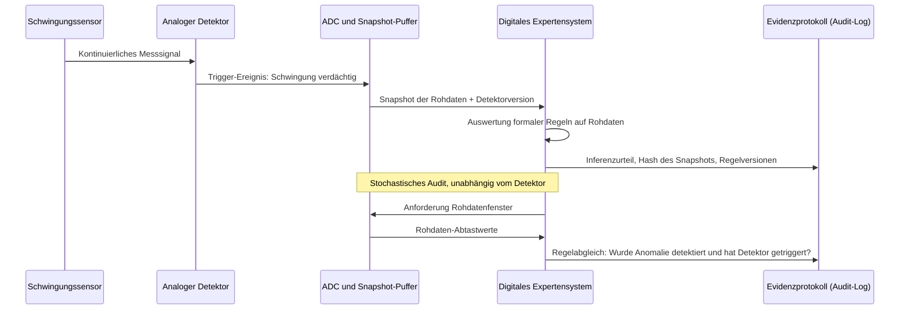
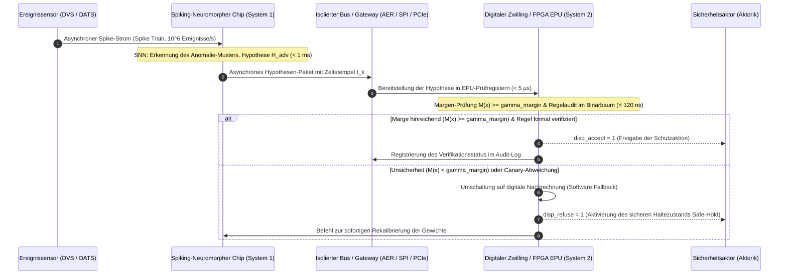

# Anhang E. Gemischt analog-digitale Expertensysteme: Neuromorphe, analoge und unkonventionelle Rechenwerke unter evidenzbasierter Kontrolle

> **Buch:** [Architektur evidenzbasierter Expertensysteme](README.md) · Anhänge  
> **Inhaltsverzeichnis:** [README.md](README.md)  
> **Autor:** [Mykola Fedchyk](about-the-author.md)  
> **Niveau:** Vertiefte Ingenieurpraxis: Systemarchitekten, Entwickler von Embedded- und gemischt analog-digitalen Systemen (Mixed-Signal), Wissensingenieure  
> **Lernziele:** Unterscheidung zweier Integrationspfade analoger und digitaler Berechnungen in Expertensystemen; fundierte Bewertung, welche Inferenzoperationen vorteilhaft auf analoge, neuromorphe oder unkonventionelle Rechenwerke ausgelagert werden können; Konstruktion eines formalen Evidenzkontrakts für approximative Berechnungsergebnisse: Fehlermodell, Kalibrierung, Margen-Gateway, digitaler Nachrechnungs-Fallback und probabilistisches Miss-Audit.

---

## Abstract

In industriellen Schwingungsüberwachungs-, Gasprüf- und autonomen Infrastrukturkontrollsystemen erschöpft der permanente Betrieb des digitalen Erfassungsstrangs (Analog-Digital-Wandler + Mikrocontroller) rasch die Batteriereserven und schließt einen mehrjährigen wartungsfreien Feldeinsatz aus. Der Einsatz extrem energiesparender analoger oder neuromorpher Detektoren als asynchrone Aufwach-Trigger (*wake-up trigger*) birgt jedoch eine gravierende, oft unterschätzte Gefahr: Infolge von Rauschen, Nichtlinearitäten und Bauteilstreuung kann die analoge Schaltung die beginnende Degradation eines Wälzlagers oder eine Gasleckage lautlos übersehen. Das digitale Expertensystem erfährt von dieser Katastrophe nichts, da die bitgenaue Reproduzierbarkeit der Evidenzkette abreißt.

Dieser Anhang etabliert eine methodische Lösung zur lückenlosen Wahrung der Verifizierbarkeit und Zuverlässigkeit in gemischt analog-digitalen Architekturen. Der Autor untersucht zwei komplementäre Integrationspfade (Analog → Digital sowie Digital → Analog) und formalisiert den **Evidenzkontrakt gemischtsignaliger Berechnungen**: ein mathematisches Modell von Berechnungsfehlern und Temperaturdrift, ein formales Margen-Gateway ($`M(\mathbf{x}) \ge \gamma_{\text{margin}}`$), eine deterministische Nachrechnungspolice im Unsicherheitsbereich sowie ein statistisches Miss-Audit (Doppelmessungs-Protokoll), das die Einhaltung höchster Sicherheits-Integritätslevel bei drastischer Reduktion der Leistungsaufnahme garantiert.

---

[Anhang D](appendix-d-analog-expert-systems-and-neuromorphic-computing.md) behandelt die physikalischen Grundlagen analoger Berechnungen: wie das Ohmsche Gesetz und die Kirchhoffschen Regeln eine Matrix-Vektor-Multiplikation realisieren, wie Transistorschaltungen Fuzzy-Inferenz ausführen und wie Winner-Take-All-Netze das dominanteste Signal selektieren. Dieser Anhang widmet sich der unmittelbar anschließenden ingenieurtechnischen Kernfrage: Wie lassen sich analoge und neuromorphe Rechenwerke derart in ein evidenzbasiertes Expertensystem einbetten, dass das abgeleitete Urteil mathematisch und forensisch verifizierbar bleibt? Die Antwort wird zunächst anhand eines durchgängigen Praxisbeispiels hergeleitet; abschließend wird dargelegt, welche Gesetzmäßigkeiten auf andere Domänen übertragbar sind und wo die physikalischen Grenzen des Ansatzes liegen.

## 1. Rechnerarchitektonische Dichotomie: Vergleich des digitalen und des analogen Paradigmas

In der Ingenieurpraxis treffen oft dieselbe funktionale Anforderung und zwei grundlegend verschiedene Rechenwelten aufeinander. Betrachten wir den Sensor-Überwachungsknoten eines industriellen Pumpenlagers. Die Sensoreinheit ist direkt am Pumpengehäuse montiert, wird aus einer Batterie gespeist und muss ein volles Betriebsjahr autark ohne Wartungseingriff überstehen. Der Schwingungssensor liefert ein kontinuierliches analoges Signal. Das übergeordnete Expertensystem, das die Messdaten verarbeitet, muss verbindlich beantworten: Zeigt das Wälzlager Anzeichen beginnender Defekte, und falls ja, auf welchen konkreten Messwerten, Regeln und Ableitungsketten beruht dieser Befund?

Der klassische digitale Lösungsansatz liegt auf der Hand: Ein Analog-Digital-Wandler (ADW / ADC) tastet das Schwingungssignal kontinuierlich ab, ein digitaler Mikrocontroller berechnet das Frequenzspektrum sowie abgeleitete Merkmale, und eine Inferenzmaschine gleicht die Merkmale mit definierten Schwellenwerten ab. Erlaubt das energetische Budget des Sensorknotens jedoch keinen dauerhaften Aktivbetrieb von ADC und Mikrocontroller, stehen zwei architektonische Alternativen zur Debatte. Der erste Entwurf schaltet dem ADC einen extrem stromsparenden analogen oder neuromorphen Detektor vor, der das Schwingungssignal im Hintergrund überwacht und den digitalen Rechenkern erst dann aufweckt, wenn die Schwingung signifikant anomal wird. Der zweite Entwurf lagert die Berechnung des Defektrisikos – mithin die gewichtete Summe der Merkmale – direkt in eine analoge Speichermatrix aus, in der die Regelgewichte als physikalische elektrische Leitwerte abgelegt sind.

Beide Entwürfe versprechen erhebliche Energieeinsparungen, verändern jedoch das Wesen des formalen Beweises grundlegend. Während digitale Berechnungen bitgenau und deterministisch wiederholbar sind, liefert die analoge Domäne stets ein approximatives Ergebnis, das thermischem Rauschen, Temperatureinflüssen und Materialalterung unterworfen ist. Zudem kann der neuromorphe Aufwachdetektor ein kritisches Schwingungsereignis fälschlicherweise verwerfen – ein Fehler, von dem das schlafende digitale Teilsystem mangels Aufwachimpuls niemals Kenntnis erlangt.

Daraus resultiert die zentrale Forschungsfrage dieses Anhangs: **Unter welchen formalen Bedingungen lässt sich ein Teil der Inferenzoperationen eines Expertensystems auf analoge, neuromorphe oder unkonventionelle Rechenwerke übertragen, ohne dass der energetische und latenzbezogene Gewinn die Verifizierbarkeit des Endurteils zerstört?** Die fundamentale These lautet: Ein gemischt analog-digitales Expertensystem ist exakt dort gerechtfertigt, wo das unkonventionelle Rechenwerk ein approximatives Kandidatenergebnis mit einem quantifizierten Fehlermodell liefert, während das digitale Teilsystem die uneingeschränkte Hoheit über Regelwerke, Provenienz, Kalibrierung sowie die Entscheidung behält, das analoge Ergebnis zu akzeptieren, digital nachzurechnen oder die Antwort als unentscheidbar abzulehnen. Die Domänengrenze – mithin ADC und Digital-Analog-Wandler (DAC) – bildet den physischen Durchsetzungspunkt dieses Evidenzkontrakts.

## 2. Konzept und Architektur eines gemischt analog-digitalen Expertensystems

Um die Funktionsweise eines gemischt analog-digitalen Expertensystems zu präzisieren, bedarf es zunächst einer exakten Begriffsbestimmung. Ein **analoges Signal** variiert kontinuierlich in Zeit und Wert, wie die Ausgangsspannung eines piezoelektrischen Schwingungsaufnehmers. Ein **digitales Signal** nimmt diskrete Werte zu diskreten Zeitpunkten an. Ein ADC (*analog-to-digital converter*) wandelt das kontinuierliche analoge Signal in eine Folge digitaler Zahlenwerte um, während ein DAC (*digital-to-analog converter*) die inverse Wandlung vornimmt. Schaltungen, die analoge und digitale Funktionsblöcke monolithisch auf einem Halbleiterchip oder einer Leiterplatte kombinieren, werden als **gemischtsignalig** (*mixed-signal*) bezeichnet.

Als **neuromorph** wird ein Rechenwerk klassifiziert, dessen Architektur sich an den Funktionsprinzipien biologischer Nervensysteme orientiert. Carver Mead verdeutlichte in seiner grundlegenden Arbeit «Neuromorphic Electronic Systems» die Überlegenheit biologischer Architekturen dadurch, dass diese fundamentale physikalische Gesetzmäßigkeiten direkt als Rechenprimitive nutzen und Informationen in relativen Signalpegeln analoger Größen anstelle absoluter Binärwerte kodieren [[1]](#src-1). Zugleich benannte Mead den unvermeidbaren Preis: Analoge Systeme erfordern kontinuierliche adaptive Kompensationsmechanismen, um Bauteiltoleranzen und Fertigungsstreuungen der Transistoren auszugleichen [[1]](#src-1). Genau dieser Kompensationsaufwand bildet den methodischen Schwerpunkt der vorliegenden Untersuchung.

Das Paradigma des **Rechnens im Speicher** (*In-Memory Computing*, IMC) führt arithmetische Operationen direkt am physischen Speicherort der Daten aus, anstatt Operanden über Busse zum Prozessor zu transferieren [[2]](#src-2). Ein kanonisches Beispiel bilden Kreuzschienen (*Crossbars*): Die Gewichte einer Inferenzregel werden als elektrische Leitwerte nichtflüchtiger Speicherelemente an den Kreuzungspunkten von Zeilen und Spalten programmiert. Eingangsspannungen an den Zeilen repräsentieren den Eingangsvektor, und die resultierenden Ströme auf den Spaltenleitungen bilden nach dem Ohmschen und Kirchhoffschen Gesetz unmittelbar das Matrix-Vektor-Produkt. Die physikalische Modellierung dieses Prozesses wurde in [Anhang D](appendix-d-analog-expert-systems-and-neuromorphic-computing.md) detailliert analysiert.

Der Begriff «neuromorph» impliziert keineswegs zwingend «analog». So basiert der neuromorphe Forschungsprozessor Intel Loihi vollständig auf synchronen/asynchronen digitalen Logikschaltungen [[3]](#src-3), und die Architektur IBM NorthPole verzahnt digitale Rechenwerke eng mit On-Chip-SRAM ohne externen Hauptspeicher [[4]](#src-4). Echte gemischtsignalige Architekturen repräsentieren hingegen Systeme wie BrainScaleS-2, bei dem ein analoger Rechenkern Spiking-Neuronen physikalisch emuliert, flankiert von digitalen Hilfsprozessoren und einem digitalen ereignisbasierten Routingnetz [[5]](#src-5), oder DYNAP-SE2, dessen analoge Teilschaltungen die biologische Membrandynamik nachbilden, während asynchrone digitale Schaltungen das Spike-Routing steuern [[6]](#src-6). Dieser Anhang fokussiert primär auf gemischtsignalige Rechenwerke und nutzt rein digitale neuromorphe Prozessoren als Referenzmaßstab.

Unter einem **gemischt analog-digitalen Expertensystem** verstehen wir im Folgenden ein System, in dem dedizierte Teiloperationen der Inferenz oder der Faktenextraktion von analogen bzw. neuromorphen Hardwarekomponenten ausgeführt werden, während die übergeordnete Regelinterpretation, Evidenzkontrolle und Zertifizierung beim digitalen Subsystem verbleiben. Diese Kopplung erfolgt entlang zweier Richtungsachsen, wie im folgenden Architekturdiagramm dargestellt.

```mermaid
flowchart LR
    accTitle: Zwei Richtungsachsen des gemischt analog-digitalen Expertensystems
    accDescr: Der analoge Detektor übermittelt Ereignisse an das digitale Expertensystem, während das digitale Expertensystem den Rechenkern an einen analogen Beschleuniger delegiert; beide Pfade durchlaufen ADC und DAC.

    subgraph AD["Pfad Analog → Digital"]
        S["Sensor<br/>kontinuierliches Signal"] --> DET["Analoger oder<br/>neuromorpher Detektor"]
        DET -->|"Ereignis + Rohdaten-Snapshot"| ADC1["ADC"]
    end

    subgraph DIG["Digitales Expertensystem"]
        RULES["Regeln, Fakten,<br/>Provenienz"]
        GATE["Evidenzkontrakt:<br/>Fehlermodell, Gateway,<br/>Nachrechnung, Audit"]
        RULES --> GATE
    end

    subgraph DA["Pfad Digital → Analog"]
        DAC["DAC"] --> XBAR["Analoger In-Memory-<br/>Beschleuniger"]
        XBAR --> ADC2["ADC"]
    end

    ADC1 --> RULES
    GATE -->|"Eingangsvektor"| DAC
    ADC2 -->|"Approximatives Ergebnis"| GATE
```



Im Pfad **Analog → Digital** ist eine analoge oder neuromorphe Vorstufe unmittelbar am Sensor platziert und entscheidet autonom, wann und welche Rohdaten an das digitale System weitergeleitet werden. Im Pfad **Digital → Analog** delegiert das digitale Expertensystem einen rechenintensiven Kern – etwa die Gewichtung von Merkmalsvektoren oder die Assoziativsuche im Fallbestand – an einen analogen Beschleuniger und empfängt das approximative Ergebnis über einen ADC zurück. Auf beiden Pfaden obliegt die Durchsetzung des Evidenzkontrakts ausnahmslos dem digitalen Teilsystem, da ausschließlich dieses Versionierungsstände verwalten, Berechnungen formal wiederholen und die forensische Provenienz des Schließungsvorgangs auditierbar protokollieren kann. Die übergeordnete Partitionierung von Berechnungen zwischen Sensorik und Backend-Servern wird in [Kapitel 22](ch22-cybernetics-edge-to-backend.md) vertieft, während die neuro-symbolische Kooperation Gegenstand von [Kapitel 29](ch29-neuro-symbolic-architecture.md) ist.

## 3. Dekomposition und Auslagerung von Inferenzoperationen auf die analoge Ebene

Analysieren wir präzise, welche logischen Operationen eines Expertensystems sinnvoll auf die analoge Domäne ausgelagert werden können. Die bloße Koexistenz analoger und digitaler Bausteine bietet per se keinen Systemvorteil. Eine Inferenzmaschine mit strikter Versionierung, feingranularer Ableitungsprotokollierung und symbolischen Erklärungsbäumen lässt sich nicht in analoger Hardware realisieren. Allerdings besitzen mehrere mathematische Kernoperationen, auf denen das logische Schließen fußt, direkte physikalische Entsprechungen.

### 3.1. Merkmalsskalierung und fallbasierte Ähnlichkeitssuche (Case-Based Reasoning)

Die Risikobewertung im Lagermonitoring korrespondiert mathematisch mit dem Skalarprodukt aus einem Merkmalsvektor und einem Gewichtungsvektor; die Suche nach Referenzfällen in der Wissensbasis entspricht der Multiplikation eines Anfragevektors mit einer Matrix gespeicherter Prototypvektoren. Exakt diese Operation optimieren Chips für analoges In-Memory-Computing (*analog in-memory computing*, AIMC). Der 14-nm-Forschungschip von IBM auf Basis von Phasenwechselspeichern (*phase-change memory*, PCM) integriert 64 Rechenkerne der Dimension $256 \times 256$ nebst digitaler Aktivierungsfunktions-Hardware; bei 8-Bit-Eingängen und 8-Bit-Ausgängen erzielt das System einen Durchsatz von bis zu 63,1 Tera-Operationen pro Sekunde (*tera-operations per second*, TOPS) bei einer Energieeffizienz von 9,76 TOPS/W [[7]](#src-7). Ein weiterer IBM-Chip mit 35 Millionen PCM-Zellen in 34 Kachel-Einheiten erreicht bis zu 12,4 TOPS/W; auf fünf gekoppelten Chips wurden über 45 Millionen Gewichte eines Spracherkennungsmodells abgebildet und eine nahezu softwareäquivalente Genauigkeit demonstriert [[8]](#src-8). Der NeuRRAM-Chip auf Basis resistiver Speicher (*resistive random-access memory*, RRAM) zeigte eine Inferenzgenauigkeit, die mit softwarebasierten 4-Bit-Quantisierungsmodellen vergleichbar ist [[9]](#src-9).

Für sicherheitskritische Expertensysteme sind an diesen Ergebnissen nicht primär die Spitzenwerte relevant, sondern zwei architektonische Erkenntnisse: Erstens agiert keiner dieser Bausteine rein analog. Die Autoren des 64-Kern-PCM-Chips betonen explizit, dass für einen tatsächlichen Latenz- und Energiegewinn im Gesamtsystem analoge Rechenkerne zwingend mit digitalen On-Chip-Operationen und digitaler Kommunikation gekoppelt werden müssen [[7]](#src-7). Zweitens wird die Genauigkeit stets als «nahezu softwareäquivalent» deklariert; das Resultat ist somit prinzipiell approximativ. Die Fehlertoleranzgrenze muss folglich für jede Inferenzaufgabe empirisch vermessen und kontraktlich fixiert werden, anstatt ungeprüft aus allgemeinen Benchmarks übernommen zu werden.

### 3.2. Schwellenwertbasierte Produktionsregeln und Entscheidungsbäume

Eine klassische Produktionsregel der Form «WENN die Schwingungsamplitude bei der charakteristischen Außenring-Schadensfrequenz zwischen 0,8 g und 1,5 g liegt UND die Gehäusetemperatur 70 °C übersteigt, DANN liegt Verdacht auf Lagerschaden vor» prüft, ob die erfassten Merkmale in definierte Intervalle fallen. Ein analoger Assoziativspeicher (*content-addressable memory*, CAM) auf Memristorbasis speichert Referenzmuster in programmierbaren Leitwerten, akzeptiert analoge oder digitale Suchvektoren und vergleicht das Eingangssignal mit sämtlichen Zeilen hochgradig parallel [[10]](#src-10). Pedretti et al. bildeten jeden Pfad von der Wurzel bis zum Blatt eines Entscheidungsbaums in einer separaten Zeile eines solchen memristiven CAM ab, sodass jede Zeile einen Satz von Intervallgrenzen repräsentiert; sie wiesen eine Steigerung des Durchsatzes um etwa den Faktor 1.000 gegenüber konventionellen Prozessoren nach [[11]](#src-11).

Für eine regelbasierte Inferenzmaschine stellt dies das unmittelbarste Hardware-Äquivalent dar: Eine Zeile des analogen CAM fungiert als Produktionsregel mit Intervallprädikaten, und ein Treffersignal (*match*) signalisiert das Feuern der Regel. Formal matcht eine Zeile $r$ mit einem Eingangsvektor $\mathbf{x}$, wenn jedes Merkmal $x_j$ innerhalb seiner definierten Grenzen liegt:

```math
\text{match}_r(\mathbf{x})=\bigwedge_{j=1}^{d}\left(l_{rj}\le x_j\le u_{rj}\right).
```

Hierbei bezeichnen:

- $\text{match}_r(\mathbf{x})$ den booleschen Wahrheitswert: «wahr», wenn Zeile $r$ mit dem Eingangsvektor übereinstimmt, andernfalls «falsch»;
- $r$ den Zeilenindex des analogen CAM, entsprechend einer spezifischen Regelbedingung;
- $\mathbf{x}$ den Merkmalsvektor des Eingangssignals, beispielsweise Schwingungsamplitude und Gehäusetemperatur;
- $x_j$ den Messwert des $j$-ten Merkmals;
- $d$ die Gesamtzahl der Merkmale;
- $`l_{rj}`$ und $`u_{rj}`$ die untere bzw. obere Intervallgrenze des $j$-ten Merkmals in Regelzeile $r$;
- $\bigwedge_{j=1}^{d}$ die logische Konjunktion (UND-Verknüpfung) über alle $d$ Merkmale: Die Regel feuert ausschließlich dann, wenn sämtliche Teilbedingungen simultan erfüllt sind.

Für die vorstehende Lagerregel gilt $d=2$: Für die Schwingungsamplitude ist $`l_{r1}=0{,}8\ \text{g}`$ und $`u_{r1}=1{,}5\ \text{g}`$; für die Gehäusetemperatur ist $`l_{r2}=70\ ^\circ\text{C}`$, während $`u_{r2}`$ dem Maximalwert des Sensors entspricht. Da diese Schwellen als physikalische Leitwerte einprogrammiert sind, verschiebt die Leitwertdrift die Intervallgrenzen im Laufe der Zeit. Das digitale Subsystem muss daher in periodischen Abständen verifizieren, ob die physikalischen Schwellenwerte noch mit den autorisierten Werten der Wissensbasis übereinstimmen; andernfalls divergiert die physische Inferenz unbemerkt vom versionierten Git-Repository der Regeln.

### 3.3. Bayessche Inferenz

Bayessche Netze und probabilistische Graphmodelle bilden eine fundamentale Schicht moderner Expertensysteme, wie in [Kapitel 6](ch06-applied-mathematics-for-expert-systems.md) dargelegt. Harabi et al. entwickelten ein hybrides System aus Memristoren und komplementären Metall-Oxid-Halbleiter-Transistoren (*complementary metal-oxide-semiconductor*, CMOS), das Bayessche Inferenz direkt in Hardware ausführt: Das Bayessche Theorem wurde so formuliert, dass Berechnungen ausschließlich lokalen Speicher und stochastische Berechnungsprinzipien nutzen [[12]](#src-12). Ein gefertigter Demonstrator integriert 2.048 Memristoren und 30.080 Transistoren; eine skalierte Ausführung erkennt Gesten mit einem um den Faktor 5.000 geringeren Energieaufwand als ein Standard-Mikrocontroller [[12]](#src-12). Die Autoren heben insbesondere die formale Erklärbarkeit des Bayesschen Urteils hervor – eine Eigenschaft, die für evidenzbasierte Expertensysteme von ebenso hohem Wert ist wie die Energieersparnis.

Bereits zuvor zeigten Loeliger et al., dass der Summen-Produkt-Algorithmus (*Sum-Product Algorithm*), also die exakte Wahrscheinlichkeits-Propagation, direkt auf analoge Transistorschaltungen abbildbar ist, und konstruierten darauf basierende analoge Decoder für fehlerkorrigierende Codes [[13]](#src-13). Für Expertensysteme ist dieses Resultat von zentraler Tragweite, da Pearls Belief-Propagation-Algorithmus für Bayessche Netze einen Spezialfall des Summen-Produkt-Algorithmus auf Faktorgraphen darstellt [[14]](#src-14). Folglich sind analoge Wahrscheinlichkeitsnetzwerke prinzipielle Kandidaten für hochgradig energieeffiziente probabilistische Inferenzkerne, wenngleich bisherige Hardware-Demonstratoren vornehmlich für nachrichtentechnische Decoder evaluiert wurden.

### 3.4. Verarbeitung temporaler Ereignisströme (Event-Driven Processing)

Für kontinuierliche Ereignisströme aus der Peripherie stellen Spiking Neural Networks (SNN) das natürliche Rechenmodell dar: Ein künstliches biologisch inspiriertes Neuron integriert eingehende Spannungsimpulse (Spikes) über die Zeit und generiert selbst erst nach Erreichen eines Schwellenpotenzials einen Ausgangs-Spike. Die gemischtsignaligen Prozessoren BrainScaleS-2 und DYNAP-SE2 implementieren diese Membrandynamik über analoge Schaltungskreise [[5]](#src-5), [[6]](#src-6), wobei DYNAP-SE2 über native asynchrone Schnittstellen für neuromorphe Ereignissensoren verfügt [[6]](#src-6). Eine umfassende Analyse des digitalen Forschungsprozessors Intel Loihi liefert eine ernüchternde, präzise Differenzierung: Konventionelle dichte Feedforward-Netze erzielen auf neuromorphen Architekturen nur minimale bis gar keine Effizienzgewinne. Weisen Netze jedoch Rekurrenz, präzises Spike-Timing, synaptische Plastizität, Stochastik und hohe zeitliche Sparse-Aktivität auf, lassen sich Latenz und Energieverbrauch gegenüber Standardprozessoren um Größenordnungen senken [[3]](#src-3). Ein neuromorpher Inferenzbeschleuniger nutzt einem Expertensystem somit exakt dort, wo die Problemstellung genuin zeitbehaftet und dünnbesetzt ist – wie bei der Detektion transienter Schwingungsanomalien –, und nicht dort, wo lediglich ein statisches dichtes neuronales Netz beschleunigt werden soll.

### 3.5. Symbolische Wissensstrukturen in hyperdimensionalen Vektoren

Hyperdimensionales Rechnen (*Hyperdimensional Computing*, HDC), im Schrifttum auch als vektor-symbolische Architekturen (*Vector Symbolic Architectures*, VSA) bekannt, bildet diskrete Symbole und deren semantische Relationen auf hochdimensionale Pseudo-Zufallsvektoren (typischerweise $D \ge 10.000$ Dimensionen) ab und manipuliert diese über algebraische Operationen wie Bindung (*binding*) und Bündelung (*bundling*) [[15]](#src-15), [[16]](#src-16). Für ein Expertensystem schlägt dieser Ansatz eine mathematische Brücke zwischen diskreter Symbolik und analoger Physik: Der Fakt «Lager $\to$ Betriebszustand $\to$ Außenringschaden» lässt sich in einem einzigen Vektor kodieren, und die Ähnlichkeitsabfrage reduziert sich auf den Vektor-Kosinusabstand. Karunaratne et al. realisierten ein vollständiges HDC-System auf zwei memristiven PCM-Kreuzschienen mit digitalen CMOS-Peripherieschaltungen unter Einsatz von 760.000 PCM-Zellen und erreichten softwareäquivalente Genauigkeit; sie führen diesen Erfolg auf die inhärente mathematische Fehlertoleranz hyperdimensionaler Repräsentationen gegenüber physikalischen Bauelementedefekten zurück [[17]](#src-17).

Dieser Forschungszweig weist bemerkenswerte ukrainische Wurzeln auf: Dmitri Rachkovskij vom Kybernetik-Zentrum V. M. Gluschkow in Kyjiw entwickelte gemeinsam mit Ernst Kussul fundamentale Verfahren zur Bindung und Normalisierung binärer dünnbesetzter distributed Repräsentationen (*Context-Dependent Thinning*) [[18]](#src-18). Eine spätere systematische Übersichtsarbeit von Kleyko, Rachkovskij, Osipov und Rahimi konsolidiert sämtliche mathematischen VSA-Modelle und deren Vektortransformationen [[16]](#src-16).

### 3.6. Zusammenfassung: Effizienzgrenzen der analogen Auslagerung

Die folgende Übersichtstabelle fasst die analysierten Rechenkerne systematisch zusammen. Für jeden Baustein werden die dominante Fehlerquelle sowie die zwingend erforderliche digitale Verifikationsprüfung ausgewiesen.

| Inferenzoperation im Expertensystem | Analoger / neuromorpher Primitivbaustein | Systemvorteil | Primäre physikalische Fehlerquelle | Verifikationsprüfung des digitalen Subsystems |
|---|---|---|---|---|
| Merkmalsskalierung, Ähnlichkeitssuche (CBR) | Matrix-Vektor-Multiplikation im Speicher (AIMC) | Paralleles Rechnen ohne Gewichts-Datentransfer | Ausleserauschen, Leitwertdrift, ADC-Quantisierung | Margen-Gateway, digitale Nachrechnung im Zweifel |
| Schwellenwertregeln, Entscheidungsbäume | Analoger CAM mit Intervallzeilen | Simultane Evaluierung des gesamten Regelwerks | Schwellenverschiebung durch Leitwertdrift | Periodischer Abgleich der physikalischen Schwellen mit der Wissensbasis |
| Bayessche Inferenz | Memristive Bayes-Maschine, analoge Belief-Propagation | Lokale Berechnung von A-posteriori-Wahrscheinlichkeiten | Thermisches/stochastisches Rauschen, reduzierte Präzision | Referenzprüfung gegen digitalen Goldstandard auf Kontrollvektoren |
| Detektion transienter Zeitereignisse | Spiking Neural Network (SNN) auf Mixed-Signal-Prozessor | Null-Energie bei Inaktivität, Reaktion nur auf Spikes | Streuung der Membranzeitkonstanten, Ereignisauslassungen | Statistisches Miss-Audit auf periodisch aufgezeichneten Rohdaten |
| Symbolische Relationen und Assoziativsuche | Hyperdimensionale Vektoren im PCM-Speicher | Hohe Robustheit gegen einzelne Zellendefekte | Rauschakkumulation bei tiefen Vektoralgebren | Re-Validierung des extrahierten Fakts gegen die Wissensbasis |
| Kombinatorische Optimierung | Ising-Maschinen, probabilistische Bits (p-Bits) | Extrem schnelle Konvergenz in Quasi-Optima | Lokale Minima, stochastische Fehltritte | Vollständige digitale Prüfung aller Randbedingungen (Constraints) |

Die letzte Spalte dieser Tabelle ist für die Systemsicherheit entscheidender als die erste: Jeder analoge Primitivbaustein bringt eine spezifische physikalische Fehlercharakteristik mit sich. Das digitale Subsystem muss für jede dieser Klassen eine dedizierte Überwachungslogik vorhalten. Um eine solche Verifikation mathematisch abzusichern, müssen die physikalischen Rausch- und Driftprozesse an der Schnittstelle exakt modelliert werden.

## 4. Physikalische Fehlerquellen an der Domänengrenze und die energetischen Kosten der Präzision

Untersuchen wir die physikalischen Mechanismen, die an der Schnittstelle zwischen analoger und digitaler Domäne Fehler induzieren, sowie den energetischen Mehraufwand für gesteigerte Konvertierungsgenauigkeit. Analoge In-Memory-Berechnungen approximieren die Matrix-Vektor-Multiplikation lediglich, da analoge Nichtidealitäten typischerweise nichtdeterministischer oder nichtlinearer Natur sind [[19]](#src-19). Rasch et al. wiesen bei hardware-bewusstem Training (*Hardware-Aware Training*) einen grundlegenden Sachverhalt nach: Den stärksten Einfluss auf den Genauigkeitsverlust übt das additive Rauschen an den Eingängen und Ausgängen der Kreuzschiene aus – nicht das Rauschen innerhalb der Leitwertgewichte selbst [[19]](#src-19). Da Eingänge und Ausgänge zwingend DACs und ADCs durchlaufen müssen, stellt die Domänenschnittstelle nicht etwa ein vernachlässigbares Randdetail dar, sondern den primären Entstehungsort von Berechnungsfehlern.

Die erste fundamentale Fehlerquelle an der Schnittstelle ist die Quantisierung. Ein Analog-Digital-Wandler mit einer Auflösung von $b$ Bits und einem Arbeitsbereich von $[-R, R)$ weist eine Quantisierungsstufe $q$ sowie eine standardmäßige Quantisierungsrauschvarianz $`\sigma_q`$ auf:

```math
q=\frac{2R}{2^{b}},\qquad \sigma_q=\frac{q}{\sqrt{12}}.
```

Hierbei bezeichnen:

- $q$ die Quantisierungsintervallbreite (LSB), mithin die kleinste auflösbare Spannungsdifferenz des ADC in Einheiten der Messgröße;
- $R$ den halben Aussteuerungsbereich des Wandlers, der Werte im Intervall von $-R$ bis $R$ erfasst;
- $b$ die Auflösung des ADC in Bit;
- $2^{b}$ die Gesamtzahl der diskreten Quantisierungsstufen;
- $`\sigma_q`$ die Standardabweichung des Quantisierungsfehlers unter der Standardannahme einer Gleichverteilung des Fehlers innerhalb eines LSB-Intervalls;
- $\sqrt{12}$ den Nenner aus der Varianz einer stetigen Gleichverteilung über ein Intervall der Länge $q$, gegeben durch $q^{2}/12$.

Für $R=12$ und $b=6$ Bit beträgt die Schrittweite $q=0{,}375$, was einer Standardabweichung von $`\sigma_q\approx0{,}108`$ Einheiten der Risikobewertung entspricht. Diese Werte fließen in das nachfolgende quantitative Implementierungsbeispiel ein.

Vordergründig ließe sich der Quantisierungsfehler durch einfache Erhöhung der Bitbreite minimieren. In der physikalischen Schaltungsrealität ist jedoch jedes zusätzliche Bit extrem teuer. Die Abtastspannung auf der Sampling-Kapazität eines ADC unterliegt unvermeidbarem thermischen Rauschen (Johnson-Nyquist-Rauschen) mit einer Varianz von:

```math
\overline{v_n^{2}}=\frac{k_B T}{C}.
```

Hierbei bezeichnen:

- $`\overline{v_n^{2}}`$ das mittlere Spannungsrauschquadrat (Rauschvarianz) am Kondensator in $\text{V}^{2}$;
- $`k_B`$ die Boltzmann-Konstante mit ca. $1{,}38\cdot10^{-23}\ \text{J/K}$;
- $T$ die absolute Temperatur in Kelvin ($\text{K}$);
- $C$ die Kapazität des Sampling-Kondensators im ADC in Farad ($\text{F}$).

Bei einer Raumtemperatur von $T=300\ \text{K}$ und einer Kapazität von $C=1\ \text{pF}$ beträgt die effektive Rauschspannung $\sqrt{k_B T/C}\approx64\ \mu\text{V}$. Je kleiner die Kapazität gewählt wird, desto dominanter wird das thermische Rauschen; eine Rauschunterdrückung erzwingt folglich größere Kapazitätswerte. Um die Auflösung um genau 1 Bit zu steigern, muss das Quantisierungsintervall $q$ halbiert werden, was eine Halbierung der zulässigen Rauschspannung und somit eine Reduktion der Rauschvarianz um den Faktor 4 erfordert. Hierfür muss die Kapazität $C$ vervierfacht werden – wodurch sich auch die Umladeenergie $C V^{2}$, die zum Laden des Kondensators auf die Betriebsspannung $V$ nötig ist, exakt vervierfacht. In einem rauschbegrenzten Regime (*thermal noise limited regime*) kostet jedes zusätzliche Bit Auflösung somit näherungsweise das Vierfache an dynamischer Schaltenergie; diese Gesetzmäßigkeit bildet das Fundament gängiger ADC-Gütefaktoren (Figure of Merit, FoM), deren historische Entwicklung in Boris Murmanns Übersichtsanalysen dokumentiert ist [[20]](#src-20). Ergänzend wies bereits Waldens klassische ADC-Studie nach, dass bei Abtastraten unterhalb von ca. 2 MSamples/s die Wandlerauflösung durch thermisches Rauschen limitiert wird, während oberhalb dieser Schwelle bis etwa 4 GSamples/s der Jitter der Abtastflanken zu einem Verlust von ca. 1 Bit Auflösung pro Frequenzverdopplung führt [[21]](#src-21).

Für analoge In-Memory-Computing-Architekturen resultiert hieraus eine folgenschwere Konsequenz: Der Energieaufwand der Datenkonvertierung an den Rändern der Matrix kann den physikalischen Effizienzgewinn der analogen Multiplikation vollständig aufzehren. Die Entwickler des ISAAC-Beschleunigers wiesen nachdrücklich darauf hin, dass sie gänzlich neuartige Datenkodierungs- und Wandlungsstrategien entwerfen mussten, um die massiven energetischen Overheads der ADC-Stufen zu beherrschen [[22]](#src-22). Die Wahl der ADC-Auflösung ist daher keineswegs ein nebensächlicher Schaltungsparameter, sondern eine strategische architektonische Entscheidung über den Preis der Genauigkeit, die synchron mit den Fehlertoleranzen der Inferenzregeln harmonisiert werden muss.

Die zweite primäre Fehlerquelle liegt im physikalischen Speichermedium selbst. Der Leitwert programmierter Phasenwechselspeicher (PCM) relaxiert nach dem Programmiervorgang zeitlich kontinuierlich zu niedrigeren Werten; diese Leitwertdrift folgt empirisch einem Potenzgesetz (*Conductance Drift Model*):

```math
G(t)=G(t_0)\left(\frac{t}{t_0}\right)^{-\nu}.
```

Die Parameter des Driftmodells [[23]](#src-23):

- $G(t)$ der elektrische Leitwert der PCM-Zelle zum Zeitpunkt $t$ in Siemens ($\text{S}$);
- $t$ die verstrichene Zeit seit dem Programmierpuls;
- $`t_0`$ der Referenzzeitpunkt nach der Programmierung, an dem der initiale Leitwert $`G(t_0)`$ vermessen wurde;
- $\nu$ der materialspezifische Driftkoeffizient: Je höher $\nu$, desto rapider sinkt der Leitwert;
- der Exponent $-\nu$ repräsentiert einen Potenzabfall: Der Leitwert relaxiert unmittelbar nach dem Schreiben sehr rasch und flacht mit zunehmender Betriebsdauer logarithmisch ab.

Beträgt der Driftkoeffizient beispielsweise $\nu=0{,}05$, sinkt der Leitwert nach einer Zeitspanne von $100\cdot t_0$ auf $100^{-0{,}05}\approx0{,}79$ des Ursprungswerts ab. Joshi et al. wiesen nach, dass durch hardware-bewusstes Training und adaptive Driftkompensation über Batch-Normalisierungsparameter die Klassifikationsgenauigkeit eines ResNet-32 auf CIFAR-10 über 24 Stunden oberhalb von 93,5 % stabil gehalten werden kann, obgleich jedes Gewicht differentiell in nur zwei PCM-Zellen abgelegt war [[24]](#src-24). Dieses Resultat ist ingenieurtechnisch beachtlich, offenbart jedoch ein Skalierungsproblem bezüglich der Zeitbasis: Ein Test über 24 Stunden liefert keinen formalen Nachweis für die Inferenzstabilität über ein ganzes Betriebsjahr eines autonomen Sensorknotens.

Carver Mead antizipierte diese Problematik bereits 1990: Ein analoges System muss sich kontinuierlich an die Parameterstreuung seiner Komponenten anpassen [[1]](#src-1). Für ein evidenzbasiertes Expertensystem leitet sich daraus ein unverhandelbares Architekturprinzip ab: **Der Kalibrierungszustand des analogen Rechenwerks ist ein ebenso strikt versioniertes Artefakt wie der Quellcode einer Regel oder eine Anforderungsspezifikation.** Stützt sich ein finales Inferenzurteil auf ein analoges Teilergebnis, muss das Evidenzpaket zwingend die Kalibrierungsversion, den Zeitstempel seit der letzten Gewichts-Neuprogrammierung und die Umgebungstemperatur enthalten – exakt analog zu den Rückverfolgbarkeitsanforderungen an Wissensgraphen in [Kapitel 9](ch09-engineering-knowledge-graph-traceability.md).

| Fehlerquelle | Phänomenologische Ausprägung | Mess- und Schätzmethode | Pflichteintrag im Evidenzpaket |
|---|---|---|---|
| ADC-Quantisierung | Stufenförmiger Rundungsfehler bis $\pm q/2$ | Aus Auflösung $b$ und Spannungsbereich $R$ | Bitbreite $b$, Messbereich $R$, LSB-Stufe $q$ |
| Ausleserauschen (Read Noise) | Streuung identisch wiederholter Messungen | Periodische Ausführung von Kontrollvektoren (Canaries) | Schätzwert $\hat\sigma$, Anzahl Teststimuli, Zeitstempel |
| Leitwertdrift (Conductance Drift) | Monotone zeitliche Verschiebung des Skalarprodukts | Canary-Prüfungen in definierten Zeitintervallen | Betriebszeit seit Programmierung, Driftmodellparameter $\nu$ |
| Temperaturabhängigkeit | Skalierungsdrift und Anstieg des thermischen Rauschens | Kalibrierkurven über den spezifizierten Temperaturbereich | Sensortemperatur zum Zeitpunkt der Inferenz |
| Wafer-Fertigungsstreuung | Systematische Kennlinienabweichung zwischen Chips | Individuelle Werkskalibrierung jedes Siliziumdies | Eindeutige Chip-ID, Hash des Kalibrierungsdatensatzes |

Wie die Tabelle verdeutlicht, lässt sich die Mehrzahl dieser physikalischen Fehler über sogenannte **Canary-Berechnungen** (*canary computations*) quantifizieren – mithin Kontrollberechnungen auf bekannten Eingangsvektoren mit mathematisch exakt berechnetem digitalem Sollwert. Der folgende Abschnitt überführt diese Messungen in ein formales Zulassungs-Gating für analoge Inferenzresultate.

## 5. Evidenzkontrakt zur Verifikation analoger Inferenzresultate

Kehren wir zum Berechnungsbeispiel des Defektrisikos im Pumpenlager zurück. Ein digitaler Goldstandard würde den exakten Skalarproduktwert $s=\mathbf{w}^{\top}\mathbf{x}$ ermitteln, wobei $\mathbf{w}$ den autorisierten Gewichtungsvektor aus der Wissensbasis und $\mathbf{x}$ den Vektor normierter Schwingungsmerkmale darstellt. Der analoge Beschleuniger liefert einen fehlerbehafteten Schätzwert $\tilde s=s+\varepsilon$, wobei $\varepsilon$ die physikalische Fehlerabweichung bezeichnet. Die Inferenzregel triggert einen Alarm, wenn $s\ge\theta$ gilt, wobei $\theta$ den normativen Entscheidungsschwellenwert markiert. Unter der Annahme, dass der aggregierte Berechnungsfehler $\varepsilon$ näherungsweise normalverteilt mit dem Erwartungswert Null und der Standardabweichung $\sigma$ ist, akzeptiert das digitale Subsystem das analoge Ergebnis ausschließlich dann, wenn ein hinreichender Sicherheitsabstand zur Entscheidungsschwelle gewahrt bleibt:

```math
\left|\tilde s-\theta\right|\ge k\sigma.
```

Hierbei bezeichnen:

- $\tilde s$ den vom analogen Beschleuniger zurückgemeldeten Messwert (Approximationswert der Risikobewertung inklusive Fehlerterm);
- $\theta$ den Schwellenwert der Inferenzregel;
- $`\lvert\tilde s-\theta\rvert`$ den absoluten Abstand des analogen Werts zur Schaltschwelle, mithin den Sicherheitsabstand (*Margin*);
- $\sigma$ die Standardabweichung des analogen Berechnungsfehlers in denselben Einheiten wie $s$;
- $k$ den Sicherheitskoeffizienten in Einheiten von Standardabweichungen: Je größer $k$ gewählt wird, desto geringer ist das Risiko einer Falschentscheidung, desto häufiger muss jedoch digital nachgerechnet werden.

Betragen beispielsweise $\tilde s=6{,}41$, $\theta=5{,}0$ und $\sigma=0{,}272$, ergibt sich ein Sicherheitsabstand von $1{,}41$. Bei $k=3$ liegt die Schranke bei $k\sigma=3\cdot0{,}272=0{,}816$. Da $1{,}41 \ge 0{,}816$ erfüllt ist, akzeptiert das System die analoge Klassifikation unmittelbar ohne Software-Nachrechnung. Diese Sicherheitsprüfung wird im Folgenden als **Margen-Gateway** (*Margin Gate*) bezeichnet.

Die mathematische Begründung des Gateways erschließt sich aus einer elementaren Betrachtung. Angenommen, der wahre Zustand liegt oberhalb der Schwelle ($s\ge\theta$), das Gateway entscheidet jedoch fälschlicherweise auf «unterhalb der Schwelle». Diese fehlerhafte Akzeptanz setzt voraus, dass $\tilde s\le\theta-k\sigma$ gilt; folglich muss der physikalische Fehler die Bedingung $\varepsilon=\tilde s-s\le-k\sigma$ erfüllen. Für den inversen Fall ($s < \theta$) verhält sich die Argumentation exakt symmetrisch. Für jeden beliebigen wahren Zustand $s$ gilt daher:

```math
P\left(\text{Gateway traf Fehlentscheidung}\right)\le P\left(\varepsilon\le-k\sigma\right)=\Phi(-k).
```

Hierbei bezeichnen:

- $P(\cdot)$ die Wahrscheinlichkeit des in Klammern definierten Ereignisses;
- $\varepsilon$ den analogen Approximationsfehler mit $\varepsilon=\tilde s-s$;
- $\Phi$ die kumulierte Verteilungsfunktion der Standardnormalverteilung $\mathcal{N}(0, 1)$;
- $\Phi(-k)$ die Wahrscheinlichkeit, dass eine standardnormalverteilte Zufallsvariable einen Wert kleiner als $-k$ annimmt.

Für einen Sicherheitskoeffizienten von $k=3$ resultiert eine theoretische Fehlerobergrenze von $\Phi(-3)\approx1{,}35\cdot10^{-3}$; für Messwerte, die weit von der Schwelle entfernt liegen, ist die reale Fehlerwahrscheinlichkeit drastisch geringer. Unterschreitet der Abstand jedoch das Sicherheitsband ($`\lvert\tilde s-\theta\rvert < k\sigma`$), verweigert das Expertensystem die Übernahme des analogen Urteils: Es erzwingt eine präzise digitale Nachrechnung auf dem Mikrocontroller, veranlasst eine Wiederholungsmessung oder gibt den Status «Inferenz unentscheidbar / Datenbasis unzureichend» aus.

Die obere Schranke $\Phi(-k)$ setzt eine verlässlich bekannte Standardabweichung $\sigma$ voraus. Da $\sigma$ infolge von Alterung und Temperatur fluktuiert, darf dieser Wert niemals als statische Konstante im Code hinterlegt werden. Stattdessen wird $\sigma$ im laufenden Betrieb über **Canary-Berechnungen** kontinuierlich geschätzt: Der analoge Beschleuniger verarbeitet in regelmäßigen Zyklen $m$ vordefinierte Kontrollvektoren, deren mathematisch exakte Sollwerte dem digitalen Subsystem bekannt sind. Die Inferenz-Engine berechnet daraus die empirische Streuung:

```math
\hat\sigma=\sqrt{\frac{1}{m}\sum_{i=1}^{m}\left(\tilde s_i-s_i\right)^{2}}.
```

Hierbei bezeichnen:

- $\hat\sigma$ den Schätzwert der Standardabweichung des Approximationsfehlers aus den Kontrollmessungen;
- $m$ die Stichprobengröße der Canary-Stimuli;
- $`\tilde s_i`$ das analoge Rechenergebnis für den $i$-ten Kontrollvektor;
- $`s_i`$ den exakten digitalen Referenzwert für denselben Vektor;
- $\sum_{i=1}^{m}$ die Summationsvorschrift über alle $m$ Testvektoren.

Diese Formel entspricht dem quadratischen Mittelwert des Fehlers (Root Mean Square Error, RMSE). Weisen beispielsweise $m=4$ Testvektoren die Differenzen $`\tilde s_i-s_i`$ von $0{,}2$, $-0{,}3$, $0{,}1$ und $-0{,}4$ auf, so berechnet sich $\hat\sigma=\sqrt{(0{,}04+0{,}09+0{,}01+0{,}16)/4}=\sqrt{0{,}075}\approx0{,}27$. In realen Systemen werden typischerweise $m=512$ Testvektoren herangezogen, um eine statistisch hochgradig belastbare Schätzung zu garantieren.

Die Metapher geht historisch auf die Kanarienvögel im Bergbau zurück, die Bergleute als Frühwarnindikatoren vor Grubengasen schützten: Die Canary-Berechnung schlägt als Erste Alarm, wenn die physikalische Hardware ihre Kalibrierungsgrenzen verlässt.

Um die Wirksamkeit des Margen-Gateways sowie die Konsequenzen veralteter Kalibrierungen quantitativ zu demonstrieren, modellieren wir die analoge Skalarproduktbildung programmatisch. Das Modell bildet das Ausleserauschen proportional zur Vollaussteuerung der Gewichte sowie die Quantisierung eines 6-Bit-ADC ab. Statische Programmierfehler, Nichtlinearitäten und IR-Spannungsabfälle auf den Zuleitungen bleiben zur Fokussierung abstrahiert. Der Merkmalsvektor umfasst $n=64$ Dimensionen mit Werten im Bereich $[-1, 1)$, und die Schwelle $\theta=5{,}0$ modelliert ein seltenes Schadensereignis. Die theoretische Fehlervarianz beträgt näherungsweise:

```math
\sigma^{2}\approx\sigma_w^{2}\sum_{j=1}^{n}x_j^{2}+\sigma_q^{2}\approx0{,}05^{2}\cdot\frac{64}{3}+0{,}108^{2}.
```

Hierbei bezeichnen:

- $\sigma^{2}$ die Gesamtvarianz des analogen Skalarproduktfehlers;
- $`\sigma_w`$ die Standardabweichung des Leitwertrauschens bezogen auf den Vollbereich des Gewichts ($`\sigma_w=0{,}05`$);
- $x_j$ das $j$-te Merkmal des Eingangsvektors;
- $n=64$ die Dimension des Merkmalsraums;
- $\sum_{j=1}^{n}x_j^{2}$ die Summe der quadrierten Merkmalskomponenten: Je größer die Vektornorm, desto höher das akkumulierte Rauschen; für gleichverteilte Merkmale in $[-1, 1]$ beträgt der Erwartungswert $`\mathbb{E}[x_j^{2}]=1/3`$, die Summe somit ca. $64/3$;
- $`\sigma_q`$ die Standardabweichung des ADC-Quantisierungsfehlers aus der vorherigen Formel ($0{,}108$).

Hieraus folgt ein theoretisches Rauschen von $\sigma\approx0{,}26$ für einen frisch kalibrierten Chip. Das folgende Go-Programm simuliert fünf Szenarien mit jeweils einer Million Testvektoren. Es nutzt ausschließlich die Standardbibliothek und lässt sich direkt mittels `go run main.go` ausführen.

<details>
<summary>Go-Implementierung: Modell des analogen Skalarprodukts und des Margen-Gateways</summary>

```go
package main

import (
	"fmt"
	"math"
	"math/rand"
)

const (
	n      = 64      // Dimension des Merkmalsvektors
	theta  = 5.0     // Schwellenwert der Regel «Defekt wahrscheinlich»
	adcMax = 12.0    // Messbereich des ADC: [-adcMax, adcMax)
	bits   = 6       // Auflösung des ADC in Bit
	k      = 3.0     // Sicherheitsmarge in Standardabweichungen
	trials = 1000000 // Anzahl evaluierter Testvektoren pro Szenario
)

// crossbar modelliert das analoge Skalarprodukt: Leitwert-Ausleserauschen plus ADC-Quantisierung.
type crossbar struct {
	w     []float64 // Exakte Gewichte aus der digitalen Wissensbasis
	sigma float64   // Leitwertrauschen als Anteil des Vollbereichs
	rng   *rand.Rand
}

func (c *crossbar) dot(x []float64) float64 {
	s := 0.0
	for i, xi := range x {
		s += (c.w[i] + c.rng.NormFloat64()*c.sigma) * xi
	}
	return quantize(s)
}

func quantize(s float64) float64 {
	step := 2 * adcMax / math.Pow(2, bits)
	s = math.Max(-adcMax, math.Min(adcMax-step, s))
	return (math.Floor(s/step) + 0.5) * step
}

func exact(w, x []float64) float64 {
	s := 0.0
	for i := range w {
		s += w[i] * x[i]
	}
	return s
}

// randomVec erzeugt normierte Merkmalsabweichungen im Intervall [-1, 1).
func randomVec(rng *rand.Rand) []float64 {
	x := make([]float64, n)
	for i := range x {
		x[i] = rng.Float64()*2 - 1
	}
	return x
}

// estimateSigma führt Canary-Vektoren aus, deren digitales Soll-Ergebnis bekannt ist.
func estimateSigma(c *crossbar, rng *rand.Rand, m int) float64 {
	sum2 := 0.0
	for i := 0; i < m; i++ {
		x := randomVec(rng)
		d := c.dot(x) - exact(c.w, x)
		sum2 += d * d
	}
	return math.Sqrt(sum2 / float64(m))
}

// run gibt die Anzahl an Fehlentscheidungen und digital nachgerechneten Fällen zurück.
// gateSigma = 0 bedeutet, dass das analoge Ergebnis ungeprüft ohne Gateway übernommen wird.
func run(c *crossbar, gateSigma float64, rng *rand.Rand) (errors, recomputed int) {
	for t := 0; t < trials; t++ {
		x := randomVec(rng)
		truth := exact(c.w, x) >= theta
		a := c.dot(x)
		decision := a >= theta
		if gateSigma > 0 && math.Abs(a-theta) < k*gateSigma {
			decision = truth // Digitale Nachrechnung liefert das exakte Ergebnis
			recomputed++
		}
		if decision != truth {
			errors++
		}
	}
	return errors, recomputed
}

func main() {
	rng := rand.New(rand.NewSource(7))
	w := make([]float64, n)
	for i := range w {
		w[i] = rng.Float64()*2 - 1
	}
	fresh := &crossbar{w: w, sigma: 0.05, rng: rng}
	drifted := &crossbar{w: w, sigma: 0.10, rng: rng}

	calibrated := estimateSigma(fresh, rng, 512)
	recalibrated := estimateSigma(drifted, rng, 512)

	scenarios := []struct {
		name string
		c    *crossbar
		gate float64
	}{
		{"Frischer Chip, ohne Gateway", fresh, 0},
		{"Frischer Chip, Gateway nach Kalibrierung", fresh, calibrated},
		{"Gedrifteter Chip, ohne Gateway", drifted, 0},
		{"Gedriftet, Gateway mit alter Kalibrierung", drifted, calibrated},
		{"Gedriftet, Gateway nach Rekalibrierung", drifted, recalibrated},
	}
	fmt.Printf("%-42s %8s %8s %12s\n", "Szenario", "σ Gateway", "Fehler", "Digital, %")
	for _, s := range scenarios {
		e, r := run(s.c, s.gate, rng)
		fmt.Printf("%-42s %8.3f %8d %12.1f\n", s.name, s.gate, e, 100*float64(r)/trials)
	}
}
```

</details>

Die Simulation generiert folgende quantitative Ergebnisse (Go 1.27, deterministischer Seed):

```text
Szenario                                    σ Gateway   Fehler    Digital, %
Frischer Chip, ohne Gateway                     0.000     6718          0.0
Frischer Chip, Gateway nach Kalibrierung        0.272        1          5.4
Gedrifteter Chip, ohne Gateway                  0.000    11960          0.0
Gedriftet, Gateway mit alter Kalibrierung       0.272      235          5.5
Gedriftet, Gateway nach Rekalibrierung          0.467       25          8.1
```

Ohne Gateway unterlaufen dem rein analogen Pfad 6.718 Fehlentscheidungen pro Million Zyklen. Das Gateway mit frischer Kalibrierung, für das 512 Canary-Stimuli einen Schätzwert von $\hat\sigma\approx0{,}272$ ergaben, senkt die Fehlerrate auf genau eine einzige Fehlentscheidung pro Million – bei einem moderaten Nachrechnungsaufwand von lediglich 5,4 % aller Fälle, die in die kritische Schwellennähe fallen. Für die Erkennung seltener Ereignisse ist dieser Overhead hochgradig wirtschaftlich: 94,6 % der Daten werden vollständig im energiesparenden analogen Pfad verarbeitet.

Wird im nächsten Schritt eine Leitwertdrift durch Verdopplung des Rauschens simuliert, explodiert die Fehlerzahl im ungefilterten Pfad auf 11.960. Wird das Gateway mit den veralteten Kalibrierdaten weiterbetrieben, verbleiben 235 Fehler pro Million: Das Gateway greift zwar, bricht jedoch die geforderte statistische Garantie, da die Schranke $\Phi(-3)$ von der wahren Standardabweichung abhängt, die nunmehr doppelt so hoch ist. Erst die Rekalibrierung über frische Canary-Vektoren ($\hat\sigma\approx0{,}467$) stellt die Sicherheit wieder her und reduziert die Fehlerzahl auf 25 pro Million – bei einem Nachrechnungsanteil von 8,1 %.

Die verbleibenden 25 Fehler resultieren daraus, dass das Rauschen über den Term $\sum x_j^{2}$ von der individuellen Vektornorm abhängt, während das Gateway mit einem skalaren Mittelwert $\hat\sigma$ operiert. Für Vektoren mit extremer Norm greift die statische Schranke zu kurz. Ein adaptives Gateway modelliert $`\sigma(\mathbf{x})`$ dynamisch als Funktion des Eingangsvektors. Die zentrale Erkenntnis lautet: **Die formale Sicherheitsgarantie des Gateways gilt exakt so lange, wie die Kalibrierdaten gültig sind; Canary-Prüfungen sind daher ein integraler Bestandteil des Inferenzprozesses und keine bloße Offline-Wartungsaufgabe.**

Das Margen-Gateway repräsentiert einen Spezialfall des Prinzips gemischter Genauigkeit (*Mixed-Precision Computing*). Le Gallo et al. demonstrierten In-Memory-Computing mit gemischter Genauigkeit: Eine analoge PCM-Kreuzschiene berechnet die Hauptlast, während ein digitaler Standardprozessor die Lösung iterativ verfeinert; auf diese Weise lösten die Autoren ein lineares Gleichungssystem mit 5.000 Variablen exakt unter Einsatz von 998.752 PCM-Zellen [[25]](#src-25). Das Margen-Gateway überträgt diese Arbeitsteilung auf symbolische Inferenzentscheidungen: Das analoge Rechenwerk verarbeitet die überwältigende Masse der Standardfälle, während der Digitalprozessor ausschließlich in Grenzfällen interveniert, in denen die analoge Approximation das Entscheidungsergebnis verfälschen könnte.

Diese Sicherheitsarchitektur verursacht Kosten, weshalb der energetische Systemgewinn zwingend inklusive aller Overheads bilanziert werden muss. Die gemischtsignalige Inferenz ist energetisch vorteilhaft, sofern folgende Ungleichung erfüllt ist:

```math
(1+c)\,E_{\text{an}}+r\,E_{\text{dig}}<E_{\text{dig}}.
```

Hierbei bezeichnen:

- $`E_{\text{an}}`$ den Gesamtenergieaufwand einer analogen Inferenz inklusive DAC- und ADC-Wandlung in Joule;
- $`E_{\text{dig}}`$ den Energieaufwand einer vollständig digitalen Inferenz auf demselben Eingangsvektor in Joule;
- $r$ den Anteil der Entscheidungen, die vom Gateway zur digitalen Nachrechnung eskaliert werden ($r \in [0, 1]$);
- $c$ das Verhältnis von Canary-Testzyklen zu Nutzzyklen (z. B. $c=0{,}01$, wenn auf 100 Nutzinferenzen eine Kontrollmessung entfällt);
- die linke Seite den mittleren Energieverbrauch des gemischtsignaligen Pfads pro Entscheidung; die rechte Seite den Energieverbrauch der rein digitalen Referenzarchitektur.

Im Drift-Szenario mit $r=0{,}081$ muss die analoge Ausführung folglich mindestens um 8,1 % sparsamer sein als die digitale Variante – selbst ohne Canary-Overheads; unter Einbeziehung von $c$ steigt diese Anforderung entsprechend. Dieselbe rigorose Messdisziplin wendet [Kapitel 10](ch10-knowledge-acquisition-systems.md#розподіл-навантаження-між-cpu-gpu-і-npu) auf digitale neuronale Prozessoren (NPU) an: Dort wird der Beschleunigervorteil über Boot-Zeiten und Datendurchsatz quantifiziert; bei analogen Beschleunigern treten der Nachrechnungsanteil $r$ und die Canary-Kosten $c$ als entscheidende Parameter hinzu.

Damit ein analog abgeleitetes Urteil revisionssicher auditiert werden kann, muss das digitale Evidenzpaket des Expertensystems um die in der folgenden Tabelle spezifizierten Metadatenfelder erweitert werden.

| Feld im Evidenzpaket | Beispielwert | Revisionszweck und forensische Bedeutung |
|---|---|---|
| Chip-ID und Firmwarestand | `xbar-07`, `fw 2.3.1` | Eindeutige Rückverfolgbarkeit auf das physische Halbleiterexemplar |
| Kalibrierungsversion und Timestamp der letzten Canaries | `cal-2026-09-30T08:00Z` | Verifikation der Gültigkeit des zugrunde gelegten Fehlermodells |
| Rauschschätzung $\hat\sigma$ und Stichprobengröße $m$ | 0,272; 512 | Mathematische Rekonstruktion der Schranken des Margen-Gateways |
| Analoger Messwert, Schwelle, Marge und Koeffizient $k$ | 6,41; 5,0; 1,41; 3 | Formaler Nachweis, warum das Urteil ohne Software-Fallback akzeptiert wurde |
| Inferenzpfad | «Analog akzeptiert», «Digital nachgerechnet» oder «Daten unzureichend» | Eindeutige Unterscheidung zwischen approximativer und exakter Inferenz |
| Alterungsdauer seit Programmierung und Temperatur | 41 Tage; 38 °C | Nachträgliche Plausibilitätsprüfung von Drift- und Temperatureinflüssen |
| Version des digitalen Goldstandards und der Regel | `rule-bearing-outer-race v4` | Semantische Bindung des Hardwareresultats an die versionierte Wissensbasis |

Ohne diese Metadaten ist ein analog generiertes Ergebnis von einer nicht nachvollziehbaren Zufallszahl forensisch nicht zu unterscheiden. Mit diesen Feldern kann ein Gutachter oder Sicherheitsauditor jederzeit mathematisch nachweisen, dass der Evidenzkontrakt zum Entscheidungszeitpunkt strikt eingehalten wurde.

## 6. Asynchroner Ereignispfad: Analoge Anomalieerkennung zum Aufwecken des digitalen Rechenkerns

Betrachten wir nun den komplementären Interaktionspfad: Ein analoger Anomaliedetektor entscheidet autonom, zu welchem Zeitpunkt das digitale System den Sensordatenstrom analysieren muss. Im einleitenden Überwachungsszenario weckt ein analoger oder neuromorpher Detektor den digitalen Rechenkern ausschließlich bei auffälligen Schwingungsmustern auf. Die funktionale Rolle dieses Detektors unterscheidet sich fundamental von einem Inferenzbeschleuniger: Er berechnet keine Merkmale für eine Inferenzregel, sondern fungiert als selektiver Gatekeeper dafür, welche Umgebungsdaten das Expertensystem überhaupt zu Gesicht bekommt. Hierbei treten zwei Fehlertypen auf. Ein Fehlalarm (*False Alarm*) ist wirtschaftlich unkritisch: Das digitale System wacht auf, analysiert die Rohdaten, stellt die Harmlosigkeit fest und legt den Fall im Audit-Log ab. Eine Auslassung (*False Negative* / Miss) ist hingegen fatal: Das digitale System schläft weiter, das Schadensereignis wird nicht erfasst, und das Protokoll schweigt über die drohende Havarie.

Daraus resultieren zwei zwingende Architekturregeln. Erste Regel: Bei jedem Aufweckimpuls übermittelt der Detektor nicht bloß ein binäres Triggersignal, sondern einen vollständigen **Rohdaten-Snapshot** (*pre-/post-trigger window*) an den ADC. Das digitale Expertensystem wendet seine formalen Regeln autark auf diese Rohdaten an; der analoge Detektor liefert lediglich die räumlich-zeitliche Aufmerksamkeitshypothese. Der kryptografische Hash des Snapshots wird unmittelbar im Evidenzpaket signiert. Zweite Regel: Die reale Auslassungswahrscheinlichkeit muss über ein unabhängiges **statistisches Miss-Audit** kontinuierlich überwacht werden. In stochastischen Zeitabständen – völlig unabhängig vom analogen Detektor – wacht das digitale System autonom auf, zeichnet ein Rohdatenfenster auf und analysiert dieses mit den digitalen Referenzregeln. Detektieren die digitalen Regeln eine Anomalie, die der analoge Detektor nicht signalisiert hat, protokolliert das System eine sicherheitskritische Auslassung.

Der erforderliche Stichprobenumfang für dieses Audit folgt einer fundierten statistischen Gesetzmäßigkeit. Werden in einer Serie von $n$ durch das Audit identifizierten relevanten Ereignissen null Auslassungen durch den Detektor registriert, bestimmt sich die obere Grenze des 95%-Konfidenzintervalls für die Auslassungswahrscheinlichkeit $p$ aus der Bedingung:

```math
(1-p)^{n}=0{,}05\;\Rightarrow\;p=1-0{,}05^{1/n}\approx\frac{3}{n}.
```

Hierbei bezeichnen:

- $p$ die Wahrscheinlichkeit, dass der analoge Detektor ein physikalisches Ereignis übersieht, das das digitale Audit aufdeckt (gesucht ist die obere Konfidenzschranke);
- $n$ die Anzahl der im statistischen Audit erfassten realen Ereignisse, bei denen der Detektor fehlerfrei getriggert hat;
- $(1-p)^{n}$ die Wahrscheinlichkeit, dass der Detektor alle $n$ unabhängigen Ereignisse lückenlos erkennt;
- $0{,}05$ das Signifikanzniveau entsprechend einem statistischen Konfidenzniveau von 95 %;
- $\Rightarrow$ die logische Folgerung («daraus folgt»);
- $3/n$ die Standardnäherung nach Hanley und Lippman-Hand für Nullzähler in Bernoulli-Prozessen [[26]](#src-26), basierend auf $\ln(0{,}05)\approx-2{,}996\approx-3$.

Um mit 95 % statistischer Sicherheit nachweisen zu können, dass die Auslassungsrate unter 1 % ($p < 0{,}01$) liegt, müssen somit mindestens $n=300$ aufeinanderfolgende Audit-Ereignisse ohne einen einzigen Detektorausfall beobachtet werden. Da seltene Lagerschäden im Feldeinsatz nur sporadisch auftreten, muss das Feld-Audit zwingend durch automatisierte HIL-Prüfstände (*Hardware-in-the-Loop*) mit synthetisch eingespeisten Schadensmustern ergänzt werden.

Dasselbe Prinzip gilt für neuromorphe Ereigniskameras (*Event Cameras* / Dynamic Vision Sensors, DVS). Eine Ereigniskamera misst asynchron Helligkeitsänderungen auf Pixelebene und emittiert einen kontinuierlichen Spike-Strom mit Zeitstempel, Pixelkoordinaten und Polarität. Gallego et al. quantifizieren in ihrer Übersichtsarbeit eine zeitliche Auflösung im Mikrosekundenbereich, eine Dynamik von 140 dB (gegenüber 60 dB bei Standardkameras) sowie eine minimale Leistungsaufnahme [[27]](#src-27). Der analoge Helligkeitsschwellenwert im Pixel fungiert hierbei als elementarer Detektor: Eine Intensitätsänderung unterhalb der Schwelle existiert für nachgelagerte Schichten nicht. Folglich gehören die internen Schwellenwerte der DVS-Pixel sowie die Parameter nachgeschalteter SNN-Netze zu den versionierten Wissensartefakten des Expertensystems.



Das Sequenzdiagramm verdeutlicht, dass das stochastische Audit den Detektor gezielt umgeht und dadurch exakt jene Ereignisse sichtbar macht, die durch eine Drift der Detektorschwelle verloren gegangen wären. Dasselbe Schutzkonzept greift bei energieautarken militärischen Überwachungs- und Aufklärungssensoren; die formalen Aktionsgrenzen autonomer Systeme werden in [Kapitel 21](ch21-from-recommendation-to-action.md) eingehend behandelt.

## 7. Alternative physikalische Rechenwerke: Probabilistische Bits, Ising-Maschinen und thermodynamisches Rechnen

Neben klassischen elektronischen Schaltungen und neuromorphen Architekturen werden neuartige physikalische Rechenparadigmen erforscht. Für jedes dieser Systeme gelten dieselben zwei Kardinalfragen: Welche Inferenzoperation kann das Rechenwerk physikalisch abbilden, und wie verifiziert das digitale Subsystem das Ergebnis?

**Photonische Rechenwerke.** Shastri et al. analysieren integrierte photonische Schaltungen als Basis für neuromorphe Systeme und KI-Inferenz [[28]](#src-28), während Feldmann et al. einen integrierten photonischen Tensorkern für parallele Faltungsoperationen demonstrierten [[29]](#src-29). Für ein Expertensystem agiert ein photonischer Prozessor primär als extrem schneller Ausführer von Matrix-Vektor-Multiplikationen; für ihn gilt folglich exakt dasselbe fehlertolerante Margen-Gateway mit Canary-Kalibrierung.

**Stochastisches Rechnen (Stochastic Computing).** Zahlen werden hierbei als Wahrscheinlichkeiten in pseudozufälligen Bitströmen kodiert. Das Konzept stammt aus den 1960er-Jahren und zeichnet sich durch extrem einfache arithmetische Gatter (Multiplikation via UND-Gatter) sowie hohe inhärente Fehlertoleranz aus, erkauft dies jedoch durch exponentiell wachsende Bitstromlängen bei steigender Präzision [[30]](#src-30). In Expertensystemen eignet sich stochastisches Rechnen zur approximativen Verknüpfung von Wahrscheinlichkeiten in Sensorknoten mit minimaler Energieversorgung, wobei die Präzision durch die zulässige Latenz limitiert wird.

**Probabilistische Bits (p-Bits) und Ising-Maschinen.** Ein p-Bit fluktuiert thermisch zwischen 0 und 1. Camsari et al. wiesen nach, dass Netzwerke aus p-Bits «rückwärts» betrieben werden können, wodurch ein Multiplizierer unmittelbar als Primfaktorzerleger agiert [[31]](#src-31). Aadit et al. demonstrierten massiv-paralleles probabilistisches Rechnen auf dünnbesetzten Ising-Maschinen [[32]](#src-32), und Mohseni, McMahon und Byrnes analysieren Ising-Maschinen als dedizierte Hardware-Solver für NP-schwere kombinatorische Optimierungsprobleme [[33]](#src-33). Für Expertensysteme eröffnen solche Architekturen neue Perspektiven bei der Ressourcen- und Einsatzplanung unter Nebenbedingungen (z. B. dynamische Flottenwartung). Die Verifikation ist hierbei asymmetrisch einfach: Das digitale Subsystem prüft deterministisch, ob der gefundene Einsatzplan alle harten Nebenbedingungen (*Constraints*) erfüllt. Eine globale Optimalität wird physikalisch nicht garantiert; das System deklariert das Ergebnis daher formal als «zulässige Lösung» anstelle von «optimaler Lösung».

**Thermodynamisches Rechnen (Thermodynamic Computing).** Aifer et al. verknüpften das Lösen linearer Gleichungssysteme, Matrixinversionen und Determinantenberechnungen mit dem thermodynamischen Gleichgewichtszustand gekoppelter harmonischer Oszillatoren und wiesen unter plausiblen Annahmen eine asymptotische Beschleunigung nach, die linear mit der Matrixdimension skaliert [[34]](#src-34). Für Expertensysteme ist dies ein prädestinierter Kandidat zur Inversion großer Kovarianzmatrizen, wie sie bei der Berechnung von Mahalanobis-Distanzen in [Kapitel 6](ch06-applied-mathematics-for-expert-systems.md) benötigt werden. Die digitale Verifikation ist erneut um Größenordnungen günstiger als die Berechnung: Das digitale System prüft lediglich das Residuum $\lVert A\mathbf{x}-\mathbf{b}\rVert$ für den vorgeschlagenen Lösungsvektor $\mathbf{x}$.

**Physikalisches Reservoir Computing (Physical Reservoir Computing).** Ein physikalisches Reservoir projiziert Eingangssignale nichtlinear in einen hochdimensionalen Phasenraum, während ausschließlich eine lineare Ausleseschicht digital trainiert wird; da das Reservoir unverändert bleibt, kann es auf beliebigen nichtlinearen physikalischen Medien realisiert werden [[35]](#src-35). Im Expertensystem extrahiert das Reservoir komplexe zeitliche Merkmale aus Sensorsignalen, während die Ausleseschicht digital, verifizierbar und versionierbar bleibt.

| Unkonventionelles Rechenwerk | Inferenzoperation im Expertensystem | Günstige digitale Verifikationsprüfung | Forschungsstand nach Primärquellen |
|---|---|---|---|
| Photonischer Prozessor | Matrix-Vektor-Multiplikation | Margen-Gateway mit Canary-Kalibrierung | Experimenteller integrierter Tensorkern [[29]](#src-29) |
| Stochastisches Rechnen | Approximative Wahrscheinlichkeitsverknüpfung | Digitale Nachrechnung im Schwellenbereich | Etabliert seit den 1960ern; präzisions- und durchsatzlimitiert [[30]](#src-30) |
| p-Bits, Ising-Maschinen | Kombinatorische Planung unter Randbedingungen | Vollständige Verifikation aller Nebenbedingungen | Theoretische und experimentelle Demonstratoren, Reviews [[31]](#src-31), [[32]](#src-32), [[33]](#src-33) |
| Thermodynamischer Rechner | Lineare Gleichungssysteme, Matrixinversion | Residuenprüfung des Lösungsvektors | Algorithmen mit asymptotischen Komplexitätsbeweisen [[34]](#src-34) |
| Physikalisches Reservoir | Extraktion dynamischer Zeitserien-Merkmale | Digitaler linearer Ausleselayer mit Canary-Audit | Realisierungen auf diversen physikalischen Substraten [[35]](#src-35) |

Diese Tabelle illustriert ein fundamentales Architekturprinzip: **Für fast alle unkonventionellen physikalischen Rechenwerke ist die Verifikation eines Lösungskandidaten rechnerisch drastisch günstiger als dessen Auffindung.** Auf dieser Asymmetrie beruht die gesamte gemischtsignalige Systemarchitektur: Die aufwendige heuristische Suche übernimmt das physikalische Medium, während die exakte, beweisbare Validierung beim digitalen Teilsystem verbleibt.

## 8. Softwarespezifikation und Reproduzierbarkeit gemischtsignaliger Modelle

Ein evidenzbasiertes Expertensystem verlangt die lückenlose Reproduzierbarkeit jedes Inferenzurteils. In gemischtsignaligen Architekturen ist dies anspruchsvoll, da identisch konfigurierte Spiking-Netze auf unterschiedlicher Hardware abweichende Dynamiken zeigen können. Das Neuromorphic Intermediate Representation (NIR) standardisiert rechnerische Primitive als hybride Systeme, die kontinuierliche Zeitdynamik mit diskreten Ereignissen formal verknüpfen; Pedersen et al. demonstrierten die plattformübergreifende Reproduzierbarkeit dreier Spiking-Netze über 7 Simulatoren und 4 digitale Hardwareplattformen hinweg [[36]](#src-36). Für ein Expertensystem repräsentiert die NIR-Spezifikation den auditierbaren Quellcode des neuromorphen Teilsystems, dessen Hash synchron mit den Regelversionen im Repository versioniert wird.

Das quelloffene Framework Lava dient der standardisierten Entwicklung neuromorpher Applikationen [[37]](#src-37). Für analoge Kreuzschienen stellte IBM das Open-Source-Toolkit *Analog Hardware Acceleration Kit* (AIHWKIT) bereit, das analoge Speichermatrizen in PyTorch über das Konzept des «Analog Tile» modelliert, Bauteilvariationen, Gewichts- und Ausgangsrauschen abbildet und auf PCM-Hardware kalibrierte Programmier- und Driftmodelle integriert [[38]](#src-38). Hardware-bewusstes Training auf Basis solch realistischer Modelle ermöglicht es tiefen neuronalen Netzen, dieselbe Inferenzgenauigkeit wie mit 32-Bit-Gleitkomma-Arithmetik zu erreichen [[19]](#src-19).

Aus diesen Werkzeugen leitet sich eine verbindliche Architekturregel ab: Jeder analoge oder neuromorphe Rechenkern erfordert zwingend einen **digitalen Goldstandard** (*Digital Reference Model* / Digital Twin) – eine reine Software-Implementierung mit identischen Gewichten und identischer Semantik. Dieser digitale Zwilling erfüllt vier Kernfunktionen:

1. Er berechnet die mathematischen Sollwerte für die periodischen Canary-Prüfungen.
2. Er dient als automatisierte Referenz im differentiellen Testen.
3. Er übernimmt die deterministische Nachrechnung bei Triggerung des Margen-Gateways.
4. Er speist die Erklärungsmaschine (*Explanation Engine*, siehe [Kapitel 20](ch20-explanation-engine.md)), da Erklärungsbäume auf symbolischen Fakten und nicht auf physikalischen Leitwerten operieren.

Ein Release eines gemischtsignaligen Expertensystems umfasst folglich nicht nur die symbolische Wissensbasis, sondern auch die exakten Gewichtsmatrizen, Kalibrierungsprofile, Detektorschwellen sowie den validierten Stand des digitalen Goldstandards.

## 9. Testmethodik und Forschungsprogramm für gemischtsignalige Systeme

Die Validierung eines gemischtsignaligen Expertensystems unterscheidet sich grundlegend vom rein digitalen Softwaretest, da derselbe physikalische Eingangsreiz infolge von Rauschen stochastisch variierende Ausgänge erzeugt. Das Testverfahren gliedert sich in eine fünfstufige Verifikationskaskade:

1. **Differentielles Testen (Differential Testing):** Identische Testvektorsätze werden simultan über den analogen Hardwarepfad und den digitalen Goldstandard geleitet. Die Differenzenverteilung liefert das empirische Fehlermodell: Erwartungswert, Standardabweichung, Verteilungsschiefe (*heavy tails*) und die Abhängigkeit von der Eingangsnorm.
2. **Grenz- und Umweltprüfungen (Corner Cases):** Das Fehlermodell wird unter extremen Temperaturbedingungen, Versorgungsspannungsschwankungen und variierenden Alterungszuständen vermessen, da die Leitwertdrift zeitabhängig ist [[23]](#src-23). Das Resultat ist kein statischer Skalar $\sigma$, sondern eine mehrdimensionale Kennlinie $`\sigma(T, V_{\text{dd}}, t_{\text{age}})`$.
3. **Fehlerinjektion (Fault Injection):** In Hardware-Prüfständen werden gezielt defekte Speicherzellen (*stuck-at faults*), ADC-Nichtlinearitäten und thermisches Rauschen injiziert. Das System muss beweisen, dass die Canary-Überwachung den Fehlerzustand zuverlässig detektiert und den Fail-Safe-Fallback auf den digitalen Pfad erzwingt, anstelle fehlerhafte Urteile zu emittieren.
4. **Statistische Konformitätsprüfung:** Falschakzeptanzraten und Detektorauslassungen werden mit statistischen Konfidenzgrenzen belegt; bei Nullfehlern kommt das «Rule of Three»-Kriterium zur Anwendung [[26]](#src-26).
5. **Gewaltenteilung und Sicherheitskontrakte:** Ein analoges oder neuromorphes Teilergebnis darf unter keinen Umständen unmittelbar eine irreversible physische Schutzaktion auslösen, ohne die digitale Verifikationsschleife passiert zu haben. Formale Aktionskontrakte werden in [Kapitel 21](ch21-from-recommendation-to-action.md) spezifiziert; [Kapitel 27](ch27-safety-case-gsn-synthesis.md) beschreibt die Integration von Fehlermodellen und Kalibrierzertifikaten in Safety Cases nach der GSN-Notation (*Goal Structuring Notation*).

Dieser letzte Schritt integriert die gemischtsignalige Hardware nahtlos in die Gesamtsystemarchitektur: Das Fehlermodell wird zu einem überprüfbaren, anfechtbaren und versionierbaren Evidenzbaustein im formalen Sicherheitsnachweis.

---

### 9.1. Forschungsprogramm für den gemischt neuromorph-symbolischen Prüfstand (BrainScaleS-2 / Loihi / Dynap-SE / FPGA EPU)

Die experimentelle Erforschung unkonventioneller Rechenwerke als ultraschnelle Hypothesengeneratoren (System 1) stützt sich auf moderne Labor- und Serienplattformen:

1. **Spiking-Neuromorphe Matrizen und Ereignissensoren (DVS / Event-Based Sensing):**
   * Direkte Anbindung einer Ereigniskamera (*Dynamic Vision Sensor*, DVS) über die asynchrone AER-Schnittstelle (*Address-Event Representation*) an einen Spiking-Prozessor (BrainScaleS-2, Dynap-SE oder eine FPGA-basierte SNN-Emulation).
   * Erforschung der Detektion transienter physikalischer Anomalien (Kontaktabbrand, Flammenabriss, hochfrequente Wälzlagerschwingungen) in unter **$1\ \text{ms}$** bei einer Leistungsaufnahme im einstelligen Milliwattbereich.
2. **Memristive Kreuzschienen für analoges In-Memory-Computing (RRAM/PCM):**
   * Quantifizierung der Energiebilanz der Matrix-Vektor-Multiplikation im Vergleich zu klassischen Von-Neumann-Architekturen unter Nutzung des IBM Analog Hardware Acceleration Kits.
   * Analyse der Genauigkeitsdegradation durch Ausleserauschen (*read noise*), Random Telegraph Noise (RTN) und strukturelle Leitwertdrift über der Zeit ($`G(t) \propto t^{-\nu}`$).

> [!NOTE]
> **Theoretische und ingenieurtechnische Fundierung neuromorpher Rechenkerne im Buch:**
> - [Kapitel 18. Ausführungsinfrastruktur](ch18-execution-infrastructure.md) — Energiebilanz von Operationen (FLOPs vs. J/Op), Von-Neumann-Flaschenhals und Roofline-Modellierung für unkonventionelle Rechenwerke.
> - [Kapitel 29. Neuro-symbolische Architektur](ch29-neuro-symbolic-architecture.md) — Kognitives Tandem aus probabilistischem neuromorphem Vorprozessor und deterministischem symbolischem Verifizierer.
> - [Kapitel 35. Synergetik der Selbstorganisation von Expertensystemen und NPU-Laufzeitumgebung](ch35-self-organizing-expert-systems-synergetics-and-npu-runtime.md) — Selbstorganisation, Minimierung freier Energie und synergetische Attraktoren in dynamischen analogen Netzwerken.

---

### 9.2. Forschungsprogramm zur Verifikation des Evidenzkontrakts (Evidence-Governed Neuromorphic Contract)

Die Verlagerung von Berechnungen auf unkonventionelle Hardwarekerne erfordert zwingend die Aufrechterhaltung formaler mathematischer Sicherheitsbeweise:

1. **Differentieller Prüfstand mit digitalem Zwilling (Digital Twin Runtime):**
   * Parallele Ausführung von Millionen Testvektoren auf dem physischen neuromorphen Chip und dem digitalen Goldstandard (FP64/FP32).
   * Konstruktion der empirischen Fehlerdichtefunktion $f(\epsilon)$, Identifikation von Verteilungsenden mit schweren Ausläufern (*heavy tails*) und Bestimmung der kritischen Sicherheitsschranke:
     $$M(\mathbf{x}) \ge \gamma_{\text{margin}}.$$
2. **Hardwarebasierter Canary-Generator und periodisches Miss-Audit:**
   * Automatisierte Injektion kalibrierter Teststimuli in den Datenstrom in Intervallen von jeweils 50 Betriebszyklen. Versagt das analoge Rechenwerk bei einem Canary-Stimulus, trennt eine digitale Schutzverriegelung (*Safety Interlock*) den analogen Pfad verzögerungsfrei ab und übergibt die Kontrolle an eine deterministische Regelmaschine auf Basis eines FPGA/MCU.

> [!NOTE]
> **Theoretische und ingenieurtechnische Fundierung des Evidenzkontrakts im Buch:**
> - [Kapitel 20. Erklärungsmaschine](ch20-explanation-engine.md) — Überführung bestätigter Inferenzschritte in strukturierte, menschenlesbare Argumentationsbäume auf Basis des digitalen Zwillings.
> - [Kapitel 23. Verifikation der Wissensbasis](ch23-knowledge-base-verification.md) — Vollständigkeits- und Konsistenzanalyse von Regeln bei Verknüpfung mit unscharfen analogen Schwellenwerten.
> - [Kapitel 27. Sicherheitsnachweiserbringung: Synthese und Prüfung von Sicherheitsargumenten](ch27-safety-case-gsn-synthesis.md) — Abbildung von Fehlermodellen, Kalibrierprotokollen und Canary-Logs als formale Sicherheitsnachweise gemäß GSN-Notation.
> - [Kapitel 36. Wissens-Testpyramide und variationsbasierte Kalibrierung](ch36-knowledge-testing-pyramid-and-variational-calibration.md) — Variationsbasierte Schwellenwertkalibrierung und Stresstests unter Rausch- und Alterungsbedingungen.
> - [Kapitel 39. Aktiver Prüfexperte: Poppersche Falsifikation, regulatorische Compliance und autonomes Testdesign](ch39-active-compliance-auditor-and-popperian-testing.md) — Poppersche Falsifikationsprotokolle für hybride Hardware-Software-Systeme.

---

### 9.3. Tandem «Neuromorpher Vorprozessor + Symbolischer Verifizierer (EPU)» und Poppersche Falsifikation

Das Interaktionsprotokoll zwischen dem neuromorphen Ultra-Niedriglatenzpfad und dem deterministischen digitalen Schiedsrichter:



**Kriterium der Popperschen Sicherheitsfalsifikation für gemischtsignalige Systeme:**
Die wissenschaftlich-technische Hypothese über die Zulässigkeit des Einsatzes eines gemischt neuromorph-symbolischen Systems in sicherheitskritischen Anwendungen (ISO 26262 ASIL-D / IEC 61508 SIL-3) gilt als falsifiziert, wenn:
1. die Wahrscheinlichkeit eines unentdeckten Fehlers des analogen Rechenkerns infolge von Rauschüberlagerung und Temperaturdrift die normative Ausfallgrenze übersteigt:
   $$P(\text{undetected error}) > 10^{-9}\ \text{pro Stunde Dauerbetrieb};$$
2. die Latenzzeit zur Erkennung einer Genauigkeitsdegradation oder eines Fehlschlags des Canary-Tests das garantierte fehlerfreie Sicherheitszeitintervall (Fault Tolerant Time Interval, FTTI) überschreitet:
   $$T_{\text{detect}} > \tau_{\text{FTTI}}.$$

---

## 10. Grenzen des gemischtsignaligen Ansatzes

Die erste fundamentale Grenze betrifft energetische Pauschalaussagen. Reine Chip-Benchmarkwerte in TOPS/W spiegeln nicht den realen Gesamtenergieaufwand einer Inferenzentscheidung wider, da jede Inferenz Signalwandlungen, digitale Nachrechnungen, Canary-Tests und Kalibrierzyklen umfasst. Der Effizienzvorteil einer Bayes-Maschine um den Faktor 5.000 gegenüber einem Mikrocontroller gilt spezifisch für die untersuchte Gestenerkennungsaufgabe [[12]](#src-12) und lässt sich nicht unbesehen auf beliebige symbolische Inferenzaufgaben extrapolieren.

Die zweite Grenze betrifft die industrielle Verfügbarkeit. Nahezu alle zitierten Halbleiterchips – darunter die PCM-Chips von IBM [[7]](#src-7), [[8]](#src-8), NeuRRAM [[9]](#src-9) und BrainScaleS-2 [[5]](#src-5) – repräsentieren universitäre oder industrielle Forschungsprototypen und keine kommerziell verfügbaren Standardbauteile. Für reale Industrieprojekte müssen Bauteilverfügbarkeit, Toolchain-Support und langfristige Liefergarantien gesondert evaluiert werden.

Die dritte Grenze liegt in der Natur der Inferenzaufgaben selbst. Wo ein Schließungsschritt exakte diskrete Präzision erfordert – etwa die Verifikation kryptografischer Hashes, Zugriffsrechteprüfungen, das Fristendatum von Rechtsnormen oder buchhalterische Summenprüfungen –, bietet die analoge Domäne keinerlei Mehrwert. Solche Prüfungen verbleiben ausnahmslos im deterministischen digitalen Bereich, wie in [Anhang A](appendix-a-evidence-governed-framework.md) begründet. Von den fünf im Buch untersuchten Domänen weist die juristische Domäne nahezu keine Anwendungsfälle auf, die von gemischtsignaliger Hardware profitieren könnten.

Die vierte Grenze betrifft den Stand der Standardisierung. In den einschlägigen Sicherheitsnormen existiert bislang kein etabliertes Format zur formalen Zertifizierung analoger Berechnungen in Sicherheitsnachweisen. Das in diesem Anhang vorgestellte methodische Gerüst – Fehlermodell, Canary-Stimuli, Margen-Gateway und statistisches Miss-Audit – ist ein ingenieurtechnischer Vorschlag dieses Werks und muss in jedem konkreten Zertifizierungsprojekt domänenspezifisch mit den Zulassungsbehörden abgestimmt werden.

## Fazit

Dieser Anhang ging von der Frage aus, unter welchen Bedingungen Inferenzoperationen eines Expertensystems ohne Verlust der Verifizierbarkeit auf analoge, neuromorphe oder unkonventionelle Rechenwerke übertragen werden können. Die Antwort umfasst fünf konstitutive Säulen:
1. Das unkonventionelle Rechenwerk führt arithmetische Kerne aus, deren Resultat vom digitalen Subsystem mit geringem Aufwand verifiziert werden kann.
2. Für den Approximationsfehler existiert ein quantitativ vermessenes mathematisches Fehlermodell, dessen Gültigkeit durch periodische Canary-Berechnungen überwacht wird.
3. Ein formales Margen-Gateway entscheidet deterministisch, ob ein analoges Teilergebnis akzeptiert, digital nachgerechnet oder als unentscheidbar verworfen wird.
4. Für Ereignisdetektoren im Pfad «Analog → Digital» begrenzt ein stochastisches Miss-Audit das Risiko unbemerkter Ereignisauslassungen.
5. Das digitale Evidenzpaket archiviert den exakten physikalischen Hardwarezustand synchron mit den versionierten Regeln der Wissensbasis.

Das quantitative Go-Simulationsmodell belegte diese Zusammenhänge: Das Gateway reduzierte die Fehlerrate von 6.718 auf genau einen Fehler pro Million Zyklen bei einem digitalen Nachrechnungsanteil von lediglich 5,4 %; eine veraltete Kalibrierung ließ die Fehlerzahl auf 235 ansteigen, während eine Neukalibrierung über Canary-Tests die Fehlerrate bei 8,1 % Nachrechnungen wieder auf 25 pro Million drückte. Die Analyse des Schrifttums belegt, dass gemischtsignalige Architekturen bei In-Memory- und neuromorphen Systemen bereits den Stand der Technik darstellen und dass die Signalwandlung an der Domänenschnittstelle die dominante Fehlerquelle bildet.

Die physikalischen Grundlagen analoger Schaltungsprimitive sind in [Anhang D](appendix-d-analog-expert-systems-and-neuromorphic-computing.md) dargelegt, die Verteilung von Rechenlasten zwischen Sensorknoten und Servern wird in [Kapitel 22](ch22-cybernetics-edge-to-backend.md) analysiert, und die formale Strukturierung von Sicherheitsnachweisen erfolgt in [Kapitel 27](ch27-safety-case-gsn-synthesis.md).

## Glossar

| Fachbegriff | Englisches Äquivalent | Kurzbeschreibung |
|---|---|---|
| Analoges Signal | *analog signal* | Zeit- und wertkontinuierliches Signal |
| Gemischtsignalige Schaltung | *mixed-signal circuit* | Schaltung, die analoge und digitale Funktionsblöcke kombiniert |
| Gemischt analog-digitales Expertensystem | *mixed-signal expert system* | Expertensystem, dessen Inferenzschritte partiell auf analogen/neuromorphen Kernen ausgeführt werden |
| Neuromorphes Rechenwerk | *neuromorphic processor* | An biologischen Nervensystemen orientierter Prozessor (analog, digital oder gemischtsignalig) |
| Rechnen im Speicher | *in-memory computing* | Ausführung von Rechenoperationen direkt am physikalischen Speicherort der Daten |
| Kreuzschiene | *crossbar* | Matrix aus Leitwertelementen an Zeilen- und Spaltenkreuzungen zur Matrix-Vektor-Multiplikation |
| Leitwertdrift | *conductance drift* | Zeitliche Relaxation des elektrischen Leitwerts nichtflüchtiger Speicherzellen nach der Programmierung |
| Canary-Berechnung | *canary computation* | Regelmäßige Testberechnung auf Kontrollvektoren mit bekanntem digitalem Sollwert zur Fehlerüberwachung |
| Margen-Gateway | *margin gate* | Schwellenwertprüfung, die ein analoges Inferenzurteil nur bei hinreichendem Sicherheitsabstand akzeptiert |
| Digitaler Goldstandard | *digital reference model* | Bitgenaue Software-Referenzimplementierung des analogen Kerns mit identischer Semantik und Gewichten |
| Gemischte Genauigkeit | *mixed-precision computing* | Rechenparadigma, bei dem ein approximativer Beschleuniger die Hauptlast trägt und ein Digitalprozessor verfeinert |
| Miss-Audit | *miss audit* | Unabhängige stochastische Stichprobenprüfung zur quantitativen Erfassung übersehener Detektorereignisse |
| Analoger Assoziativspeicher | *analog content-addressable memory* | CAM, der einen Eingangsvektor parallel mit gespeicherten Intervallgrenzen aller Zeilen vergleicht |
| Spiking Neural Network | *spiking neural network* | Künstliches neuronales Netz, dessen Einheiten über diskrete zeitliche Impulse (Spikes) kommunizieren |
| Hyperdimensionales Rechnen | *hyperdimensional computing* | Rechnen mit hochdimensionalen Pseudo-Zufallsvektoren zur Repräsentation von Symbolen und Relationen |
| Probabilistisches Bit | *p-bit* | Logikelement, das thermisch getrieben stochastisch zwischen 0 und 1 fluktuiert |
| Ising-Maschine | *Ising machine* | Physikalisches System zur Auffindung von Grundzuständen des Ising-Modells für Optimierungsprobleme |
| Stochastisches Rechnen | *stochastic computing* | Arithmetische Verarbeitung von Zahlen, die als Wahrscheinlichkeiten in Bitströmen kodiert sind |
| Reservoir Computing | *reservoir computing* | Rechenarchitektur mit festem nichtlinearem dynamischem Reservoir und trainierbarer linearer Ausleseschicht |
| Ereigniskamera | *event camera* | Neuromorpher Sensor, der ausschließlich pixelweise Helligkeitsänderungen asynchron emittiert |
| Rule of Three | *rule of three* | Statistische 95%-Konfidenzobergrenze von $3/n$ für die Ausfallwahrscheinlichkeit bei null Fehlern in $n$ Versuchen |

## Abkürzungen

| Abkürzung | Vollständige Bezeichnung | Bedeutung / Kontext |
|---|---|---|
| ADC | Analog-to-Digital Converter | Analog-Digital-Wandler (ADW) |
| AIMC | Analog In-Memory Computing | Analoges Rechnen im Speicher |
| CAM | Content-Addressable Memory | Assoziativspeicher |
| CMOS | Complementary Metal-Oxide-Semiconductor | Komplementäre Metall-Oxid-Halbleiter-Technologie |
| DAC | Digital-to-Analog Converter | Digital-Analog-Wandler (DAW) |
| DVS | Dynamic Vision Sensor | Dynamischer Sichtsensor / Ereigniskamera |
| EPU | Expert Processing Unit | Dedizierter digitaler Koprozessor für Wissensbasen und Inferenz |
| FTTI | Fault Tolerant Time Interval | Fehlertoleranzzeitintervall in Sicherheitsnormen |
| GSN | Goal Structuring Notation | Grafische Argumentationsnotation für Sicherheitsnachweise |
| HDC | Hyperdimensional Computing | Hyperdimensionales Rechnen mit hochdimensionalen Vektoren |
| NIR | Neuromorphic Intermediate Representation | Standardisiertes neuromorphes Zwischenformat |
| NPU | Neural Processing Unit | Digitaler Prozessor für neuronale Netze |
| PCM | Phase-Change Memory | Phasenwechselspeicher |
| RRAM | Resistive Random-Access Memory | Resistiver Direktzugriffsspeicher (Memristor) |
| SNN | Spiking Neural Network | Spikendes neuronales Netzwerk |
| TOPS | Tera-Operations Per Second | Billionen Operationen pro Sekunde |
| VMM | Vector-Matrix Multiplication | Vektor-Matrix-Multiplikation |
| VSA | Vector Symbolic Architectures | Vektor-symbolische Architekturen |

## Quellen

Die Quellen dokumentieren Forschungsprototypen, Methoden und Schaltungsentwürfe. Die quantitativen Daten des Go-Simulationsmodells entstammen dem vereinfachten didaktischen Modell dieses Anhangs und stellen keine Messwerte der zitierten Primärquellen dar.

1. <a id="src-1"></a>Carver Mead. [*Neuromorphic Electronic Systems*](https://doi.org/10.1109/5.58356). *Proceedings of the IEEE*, 78(10), 1629–1636, 1990.
2. <a id="src-2"></a>Abu Sebastian, Manuel Le Gallo, Riduan Khaddam-Aljameh, Evangelos Eleftheriou. [*Memory Devices and Applications for In-Memory Computing*](https://doi.org/10.1038/s41565-020-0655-z). *Nature Nanotechnology*, 15(7), 529–544, 2020.
3. <a id="src-3"></a>Mike Davies, Andreas Wild, Garrick Orchard, Yulia Sandamirskaya et al. [*Advancing Neuromorphic Computing With Loihi: A Survey of Results and Outlook*](https://doi.org/10.1109/JPROC.2021.3067593). *Proceedings of the IEEE*, 109(5), 911–934, 2021.
4. <a id="src-4"></a>Dharmendra S. Modha, Filipp Akopyan, Alexander Andreopoulos, Rathinakumar Appuswamy et al. [*Neural Inference at the Frontier of Energy, Space, and Time*](https://doi.org/10.1126/science.adh1174). *Science*, 382(6668), 329–335, 2023.
5. <a id="src-5"></a>Christian Pehle, Sebastian Billaudelle, Benjamin Cramer, Jakob Kaiser et al. [*The BrainScaleS-2 Accelerated Neuromorphic System With Hybrid Plasticity*](https://doi.org/10.3389/fnins.2022.795876). *Frontiers in Neuroscience*, 16, 795876, 2022.
6. <a id="src-6"></a>Ole Richter, Chenxi Wu, Adrian M. Whatley, German Köstinger et al. [*DYNAP-SE2: A Scalable Multi-Core Dynamic Neuromorphic Asynchronous Spiking Neural Network Processor*](https://doi.org/10.1088/2634-4386/ad1cd7). *Neuromorphic Computing and Engineering*, 4(1), 014003, 2024.
7. <a id="src-7"></a>Manuel Le Gallo, Riduan Khaddam-Aljameh, Milos Stanisavljevic, Athanasios Vasilopoulos et al. [*A 64-Core Mixed-Signal In-Memory Compute Chip Based on Phase-Change Memory for Deep Neural Network Inference*](https://doi.org/10.1038/s41928-023-01010-1). *Nature Electronics*, 6(9), 680–693, 2023. Kennwerte zitiert nach Abstract des Preprints [arXiv:2212.02872](https://arxiv.org/abs/2212.02872).
8. <a id="src-8"></a>S. Ambrogio, P. Narayanan, A. Okazaki, A. Fasoli et al. [*An Analog-AI Chip for Energy-Efficient Speech Recognition and Transcription*](https://doi.org/10.1038/s41586-023-06337-5). *Nature*, 620(7975), 768–775, 2023.
9. <a id="src-9"></a>Weier Wan, Rajkumar Kubendran, Clemens Schaefer, Sukru Burc Eryilmaz et al. [*A Compute-in-Memory Chip Based on Resistive Random-Access Memory*](https://doi.org/10.1038/s41586-022-04992-8). *Nature*, 608(7923), 504–512, 2022.
10. <a id="src-10"></a>Can Li, Catherine E. Graves, Xia Sheng, Darrin Miller et al. [*Analog Content-Addressable Memories with Memristors*](https://doi.org/10.1038/s41467-020-15254-4). *Nature Communications*, 11, 1638, 2020.
11. <a id="src-11"></a>Giacomo Pedretti, Catherine E. Graves, Sergey Serebryakov, Ruibin Mao et al. [*Tree-Based Machine Learning Performed In-Memory with Memristive Analog CAM*](https://doi.org/10.1038/s41467-021-25873-0). *Nature Communications*, 12, 5806, 2021.
12. <a id="src-12"></a>Kamel-Eddine Harabi, Tifenn Hirtzlin, Clément Turck, Elisa Vianello et al. [*A Memristor-Based Bayesian Machine*](https://doi.org/10.1038/s41928-022-00886-9). *Nature Electronics*, Online-Veröffentlichung vom 19. Dezember 2022. Kennwerte zitiert nach Abstract des Preprints [arXiv:2112.10547](https://arxiv.org/abs/2112.10547).
13. <a id="src-13"></a>H.-A. Loeliger, F. Lustenberger, M. Helfenstein, F. Tarköy. [*Probability Propagation and Decoding in Analog VLSI*](https://doi.org/10.1109/18.910594). *IEEE Transactions on Information Theory*, 47(2), 837–843, 2001.
14. <a id="src-14"></a>F. R. Kschischang, B. J. Frey, H.-A. Loeliger. [*Factor Graphs and the Sum-Product Algorithm*](https://doi.org/10.1109/18.910572). *IEEE Transactions on Information Theory*, 47(2), 498–519, 2001.
15. <a id="src-15"></a>Pentti Kanerva. [*Hyperdimensional Computing: An Introduction to Computing in Distributed Representation with High-Dimensional Random Vectors*](https://doi.org/10.1007/s12559-009-9009-8). *Cognitive Computation*, 1(2), 139–159, 2009.
16. <a id="src-16"></a>Denis Kleyko, Dmitri A. Rachkovskij, Evgeny Osipov, Abbas Rahimi. [*A Survey on Hyperdimensional Computing aka Vector Symbolic Architectures, Part I: Models and Data Transformations*](https://doi.org/10.1145/3538531). *ACM Computing Surveys*, 55(6), 1–40, 2022.
17. <a id="src-17"></a>Geethan Karunaratne, Manuel Le Gallo, Giovanni Cherubini, Luca Benini et al. [*In-Memory Hyperdimensional Computing*](https://doi.org/10.1038/s41928-020-0410-3). *Nature Electronics*, 3(6), 327–337, 2020.
18. <a id="src-18"></a>Dmitri A. Rachkovskij, Ernst M. Kussul. [*Binding and Normalization of Binary Sparse Distributed Representations by Context-Dependent Thinning*](https://doi.org/10.1162/089976601300014592). *Neural Computation*, 13(2), 411–452, 2001.
19. <a id="src-19"></a>Malte J. Rasch, Charles Mackin, Manuel Le Gallo, An Chen et al. [*Hardware-Aware Training for Large-Scale and Diverse Deep Learning Inference Workloads Using In-Memory Computing-Based Accelerators*](https://doi.org/10.1038/s41467-023-40770-4). *Nature Communications*, 14, 5282, 2023.
20. <a id="src-20"></a>Boris Murmann. [*The Race for the Extra Decibel: A Brief Review of Current ADC Performance Trajectories*](https://doi.org/10.1109/MSSC.2015.2442393). *IEEE Solid-State Circuits Magazine*, 7(3), 58–66, 2015. Laufend aktualisierte Datenbank: [ADC Performance Survey](https://github.com/bmurmann/ADC-survey).
21. <a id="src-21"></a>R. H. Walden. [*Analog-to-Digital Converter Survey and Analysis*](https://doi.org/10.1109/49.761034). *IEEE Journal on Selected Areas in Communications*, 17(4), 539–550, 1999.
22. <a id="src-22"></a>Ali Shafiee, Anirban Nag, Naveen Muralimanohar, Rajeev Balasubramonian et al. [*ISAAC: A Convolutional Neural Network Accelerator with In-Situ Analog Arithmetic in Crossbars*](https://doi.org/10.1109/ISCA.2016.12). *2016 ACM/IEEE 43rd Annual International Symposium on Computer Architecture (ISCA)*, 14–26, 2016.
23. <a id="src-23"></a>Manuel Le Gallo, Abu Sebastian. [*An Overview of Phase-Change Memory Device Physics*](https://doi.org/10.1088/1361-6463/ab7794). *Journal of Physics D: Applied Physics*, 53(21), 213002, 2020.
24. <a id="src-24"></a>Vinay Joshi, Manuel Le Gallo, Simon Haefeli, Irem Boybat et al. [*Accurate Deep Neural Network Inference Using Computational Phase-Change Memory*](https://doi.org/10.1038/s41467-020-16108-9). *Nature Communications*, 11, 2473, 2020.
25. <a id="src-25"></a>Manuel Le Gallo et al. [*Mixed-Precision In-Memory Computing*](https://doi.org/10.1038/s41928-018-0054-8). *Nature Electronics*, 1, 246–253, 2018.
26. <a id="src-26"></a>James A. Hanley, Abby Lippman-Hand. [*If Nothing Goes Wrong, Is Everything All Right? Interpreting Zero Numerators*](https://doi.org/10.1001/jama.1983.03330370053031). *JAMA*, 249(13), 1983.
27. <a id="src-27"></a>Guillermo Gallego, Tobi Delbruck, Garrick Orchard, Chiara Bartolozzi et al. [*Event-Based Vision: A Survey*](https://doi.org/10.1109/TPAMI.2020.3008413). *IEEE Transactions on Pattern Analysis and Machine Intelligence*, 44(1), 154–180, 2022.
28. <a id="src-28"></a>Bhavin J. Shastri, Alexander N. Tait, T. Ferreira de Lima, Wolfram H. P. Pernice et al. [*Photonics for Artificial Intelligence and Neuromorphic Computing*](https://doi.org/10.1038/s41566-020-00754-y). *Nature Photonics*, 15(2), 102–114, 2021.
29. <a id="src-29"></a>J. Feldmann, N. Youngblood, M. Karpov, H. Gehring et al. [*Parallel Convolutional Processing Using an Integrated Photonic Tensor Core*](https://doi.org/10.1038/s41586-020-03070-1). *Nature*, 589(7840), 52–58, 2021.
30. <a id="src-30"></a>Armin Alaghi, John P. Hayes. [*Survey of Stochastic Computing*](https://doi.org/10.1145/2465787.2465794). *ACM Transactions on Embedded Computing Systems*, 12(2s), 1–19, 2013.
31. <a id="src-31"></a>Kerem Yunus Camsari, Rafatul Faria, Brian M. Sutton, Supriyo Datta. [*Stochastic p-Bits for Invertible Logic*](https://doi.org/10.1103/PhysRevX.7.031014). *Physical Review X*, 7(3), 031014, 2017.
32. <a id="src-32"></a>Navid Anjum Aadit, Andrea Grimaldi, Mario Carpentieri, Luke Theogarajan et al. [*Massively Parallel Probabilistic Computing with Sparse Ising Machines*](https://doi.org/10.1038/s41928-022-00774-2). *Nature Electronics*, 5(7), 460–468, 2022.
33. <a id="src-33"></a>Naeimeh Mohseni, Peter L. McMahon, Tim Byrnes. [*Ising Machines as Hardware Solvers of Combinatorial Optimization Problems*](https://doi.org/10.1038/s42254-022-00440-8). *Nature Reviews Physics*, 4(6), 363–379, 2022.
34. <a id="src-34"></a>Maxwell Aifer, Kaelan Donatella, Max Hunter Gordon, Samuel Duffield et al. [*Thermodynamic Linear Algebra*](https://doi.org/10.1038/s44335-024-00014-0). *npj Unconventional Computing*, 1, 13, 2024.
35. <a id="src-35"></a>Gouhei Tanaka, Toshiyuki Yamane, Jean Benoit Héroux, Ryosho Nakane et al. [*Recent Advances in Physical Reservoir Computing: A Review*](https://doi.org/10.1016/j.neunet.2019.03.005). *Neural Networks*, 115, 100–123, 2019.
36. <a id="src-36"></a>Jens E. Pedersen, Steven Abreu, Matthias Jobst, Gregor Lenz et al. [*Neuromorphic Intermediate Representation: A Unified Instruction Set for Interoperable Brain-Inspired Computing*](https://doi.org/10.1038/s41467-024-52259-9). *Nature Communications*, 15, 8122, 2024. Spezifikation: [neuroir.org](https://neuroir.org/).
37. <a id="src-37"></a>Lava. [*Lava: A Software Framework for Neuromorphic Computing*](https://github.com/lava-nc/lava). GitHub-Repository.
38. <a id="src-38"></a>Malte J. Rasch, Diego Moreda, Tayfun Gokmen, Manuel Le Gallo et al. [*A Flexible and Fast PyTorch Toolkit for Simulating Training and Inference on Analog Crossbar Arrays*](https://doi.org/10.1109/AICAS51828.2021.9458494). *2021 IEEE 3rd International Conference on Artificial Intelligence Circuits and Systems (AICAS)*, 1–4, 2021. Quellcode: [IBM/aihwkit](https://github.com/IBM/aihwkit).

---

[← Anhang D. Analoge Expertensysteme](appendix-d-analog-expert-systems-and-neuromorphic-computing.md) | [Inhaltsverzeichnis](README.md) | [Über den Autor →](about-the-author.md)
