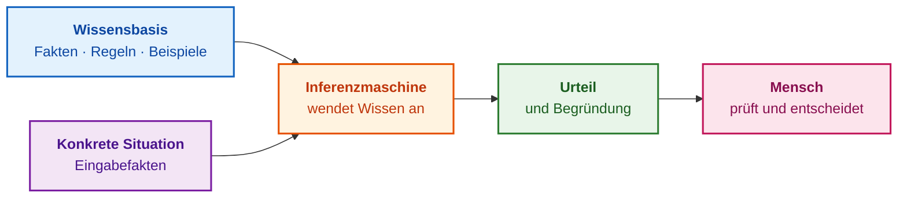
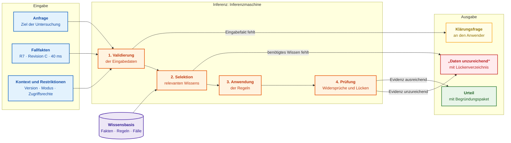
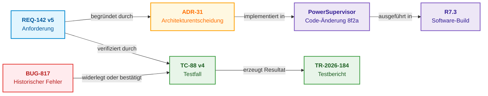
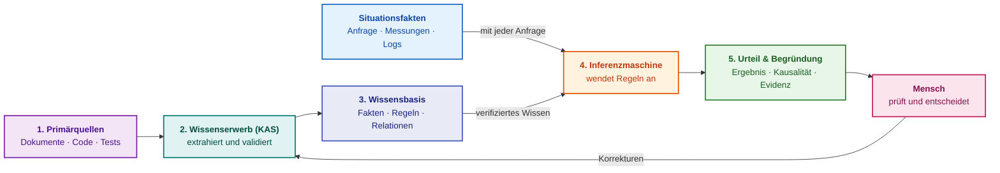

# Kapitel 1. Einführung in Expertensysteme: Vom Chaos zu kontrolliertem Wissen

> **Buch:** [Architektur evidenzbasierter Expertensysteme](README.md) · [Teil I: Konzeptionelle und epistemische Grundlagen](part-01-foundations.md)  
> **Vorheriges Kapitel:** [Teil I. Konzeptionelle und epistemische Grundlagen](part-01-foundations.md)  
> **Nächstes Kapitel:** [Kapitel 2. Philosophie für Ingenieure: Was eine Maschine rechtmäßig Wissen nennen darf](ch02-epistemology-of-machine-knowledge.md)  
> **Inhaltsverzeichnis:** [README.md](README.md)  
> **Autor:** [Mykola Fedchyk](about-the-author.md)  
> **Niveau:** Grundlegendes Ingenieurniveau  
> **Lernziele:** Verifizierbare Expertenantworten von Suchergebnissen und Chatbot-Antworten unterscheiden; Kernkomponenten eines Expertensystems und die Grenzen seiner Verantwortlichkeit kennen; beurteilen, ob der Aufbau eines Expertensystems für die Aufgabenstellung des eigenen Teams wirtschaftlich und technisch sinnvoll ist; den passenden Lesepfad für das Buch wählen.

## Abstract

Expertensysteme gehören zu den ersten praxisorientierten Zweigen der künstlichen Intelligenz. In den 1960er- und 1970er-Jahren bestimmte das Programm DENDRAL die Molekularstruktur chemischer Verbindungen anhand massenspektrometrischer Messdaten [[1]](#src-1), während MYCIN Medizinern Therapieschemata zur Behandlung bakterieller Infektionen vorschlug und seinen Argumentationspfad lückenlos darlegte [[2]](#src-2). Diese Pionierprojekte wiesen nach, dass Fachwissen in Form expliziter Fakten und Regeln formalisiert werden kann und Software in der Lage ist, dieses kodifizierte Wissen deterministisch auf neuartige Fallkonstellationen anzuwenden. Edward Feigenbaum prägte für diese Disziplin den Begriff des Knowledge Engineering (*Wissens-Engineering*) [[3]](#src-3).

Gegenwärtig erlebt die künstliche Intelligenz eine fundamentale Renaissance. Große Sprachmodelle (LLMs) erfassen, verdichten und generieren unstrukturierte Texte mit hoher Gewandtheit, wodurch Organisationen erstmals riesige Korpora historischer Artefakte maschinell erschließen können: Industriestandards, Architekturspezifikationen, Testprotokolle und Post-Mortem-Berichte. Mit diesem Technologiesprung verschärft sich jedoch ein klassisches ingenieurtechnisches Problem: Wie lässt sich mathematisch und prozessual garantieren, dass eine maschinelle Schlussfolgerung auf verifizierten, aktuell gültigen Primärquellen fußt und nicht lediglich sprachlich souverän halluziniert ist? In der Auflösung dieses Widerspruchs liegt die Daseinsberechtigung moderner Expertensysteme: Statistische Sprachmodelle unterstützen das Auffinden und Parsen von Information, während das symbolische Expertensystem verifiziertes Wissen über deterministische Inferenzregeln ausführt und die formalen Beweisgrundlagen offenlegt. Wir beginnen mit einem konkreten Praxisbeispiel, das den fundamentalen Unterschied zwischen plausiblen und verifizierbaren Antworten verdeutlicht.

## 1. Vergleichende Analyse der Paradigmen zur Wissensgewinnung: Suche, generative KI und evidenzbasierte Systeme <a id="одне-запитання-три-відповіді"></a>

Die Wahl des Architekturparadigmas für das Wissensmanagement entscheidet unmittelbar darüber, ob ein Entwickler ein formal verifizierbares Urteil erhält oder einer unkontrollierten Kompetenzillusion aufsitzt. Ein Softwareentwickler entdeckt im Modul `PowerSupervisor` die Konstante `40` und beabsichtigt, den Kaltstart-Timeout auf 60 Millisekunden zu erhöhen. Die Frage ist scheinbar trivial: Ist das zulässig? Die Antwort ist fragmentiert über eine Systemanforderung, einen Quellcode-Kommentar, Testberichte, ein altes Bug-Ticket und die Erinnerung eines Ingenieurs, der das Team vor einem Jahr verlassen hat. Diese Konstellation ist jedem vertraut, der ein Industrieprodukt über mehr als einen Release-Zyklus hinweg gewartet hat.

Vergleichen wir, was der Entwickler von drei grundlegend unterschiedlichen Werkzeugklassen erhält:

| Werkzeug | Gelieferte Antwort | Nächster Handlungsschritt des Entwicklers |
|---|---|---|
| Dokumentationssuche | Anforderung `REQ-142`, Fehlerticket `BUG-817`, Code-Kommentar und 40 Seiten Spezifikation | Alle Fundstellen eigenständig sichten und ermitteln, was davon aktuell gültig ist |
| Chatbot auf Sprachmodellbasis | „Ja, 60 ms sind sicher: Die Anforderungen definieren ein Minimum von 50 ms“ | Herkunft der Zahl 50 ermitteln; in diesem Szenario entstammt der Wert einer veralteten, ungültigen Anforderungsrevision |
| Expertensystem | „40 ms verletzen die Regel für Hardwarerevision C beim Kaltstart. 60 ms erfüllen das Minimum von 55 ms, die Änderung erfordert jedoch einen erneuten Test `TC-88`. Quellen: `REQ-142` v5, `ADR-31` v3. Entscheidung obliegt dem zuständigen Freigabeingenieur nach Testabschluss“ | Jeden Beweisschritt anhand der referenzierten Primärquellen verifizieren und Test ausführen |

Keine der drei Antworten garantiert a priori absolute Wahrheit. Der entscheidende Unterschied liegt an anderer Stelle: Ausschließlich die dritte Antwort lässt sich Schritt für Schritt verifizieren, ohne die gesamte Recherche manuell zu wiederholen. Eine Suchmaschine überlässt die Inferenz vollständig dem Menschen. Ein Chatbot schlussfolgert zwar, legt jedoch nicht offen, auf welchen aktuell gültigen Fakten sein Urteil ruht. Ein evidenzbasiertes Expertensystem liefert die Fakten, die angewandte Regel, versionierte Primärquellen, die Gültigkeitsgrenzen des Urteils sowie die verantwortliche Person, welche die formale Freigabeentscheidung zu treffen hat.

Dieses Buch widmet sich Softwarearchitekturen des dritten Typs: wie man sie entwirft, verifiziert und kontinuierlich wartet, sodass ihre Überprüfbarkeit selbst bei exponentiellem Anwachsen der Wissensbasis mathematisch und betrieblich stabil bleibt. Kapitel 1 erläutert das Wesen moderner Expertensysteme, die ingenieurtechnischen Ursachen ihrer Renaissance und die unverhandelbaren Systemgrenzen dieses Ansatzes.

## 2. Ingenieurtechnische und regulatorische Voraussetzungen für die Renaissance der Expertensysteme

Expertensysteme werden in der Informatik oft als historisches Kapitel der KI-Forschung der 1980er-Jahre abgetan. Drei fundamentale industrielle und regulatorische Verschiebungen der letzten Jahre verleihen ihnen jedoch erneut höchste praktische Relevanz:

**Plausibler Text ist zur Massenware geworden, formale Verifikation nicht.** Ein großes Sprachmodell generiert innerhalb von Sekundenbruchteilen eine sprachlich kohärente Antwort auf komplexe technische Anfragen. Für den Ingenieur, der die produkthaftungsrechtliche Verantwortung für eine Systemänderung trägt, bringt dies keine Entlastung: Er muss mühsam nachweisen, ob die generierte Aussage auf einer gültigen Anforderungsspezifikation, der zutreffenden Hardwarerevision und realen Prüfstandsmessungen beruht. Lässt die Antwort den formalen Nachweispfad zu den Primärquellen vermissen, verursacht die Verifikation nahezu denselben Arbeitsaufwand wie eine manuelle Neurecherche. Der eigentliche Flaschenhals moderner Entwicklungsprozesse ist nicht mehr die Informationsgenerierung, sondern deren formale Validierung.

**Regulierungsstandards fordern lückenlos rückverfolgbare Entscheidungen.** Die Verordnung (EU) 2024/1689 (KI-Verordnung / *EU AI Act*) schreibt für Hochrisiko-KI-Systeme automatisierte Ereignisprotokollierung, vollständige Transparenz für Betreiberorganisationen sowie verbindliche menschliche Aufsicht (*Human-in-the-Loop*) gesetzlich vor (Artikel 12–14) [[4]](#src-4). Die US-amerikanische Food and Drug Administration (FDA) fordert in ihren Richtlinien für klinische Entscheidungsunterstützungssoftware (*Clinical Decision Support Software*), dass medizinisches Fachpersonal die epistemischen Grundlagen jeder Empfehlung eigenständig nachvollziehen können muss [[5]](#src-5). Die Norm für funktionale Sicherheit im Automobilbereich, ISO 26262, verlangt eine durchgängige bidirektionale Rückverfolgbarkeit (*Traceability*) aller Sicherheitsanforderungen [[6]](#src-6). Eine Aussage ohne belegbare Herkunft besitzt in sicherheitskritischen Zulassungsverfahren keinerlei Beweiskraft.

**Erfahrungswissen erodiert in Teams schneller als die Lebenszyklen der Systeme.** Steuergeräte im Automobil, Avionikkomponenten oder industrielle speicherprogrammierbare Steuerungen (SPS) verbleiben über Jahrzehnte im Feldeinsatz. Die Entwicklungsteams, die diese Systeme konzipiert haben, unterliegen hingegen einer ständigen Fluktuation. Die wahren Hintergründe früherer Entwurfsentscheidungen verbleiben oft im Gedächtnis Einzelner, in archivierten E-Mail-Verläufen oder verstreuten Protokollen. Geht der Kontext einer Architekturentscheidung verloren, erfordert jede künftige Modifikation eine aufwendige forensische Rekonstruktion.

Daraus resultiert die zentrale Leitthese dieses Buches: **Ein modernes Expertensystem ist kein historisches Relikt der 1980er-Jahre, sondern die deterministische Schicht, welche plausible Textvorschläge in formal verifizierbare ingenieurtechnische Urteile transformiert.** Das Sprachmodell fungiert im Gesamtsystem als Werkzeug zur syntaktischen Textverarbeitung; das tragfähige Urteil wird jedoch ausschließlich durch explizite Fakten, formale Inferenzregeln und auditierbare Primärquellen konstituiert, die dem menschlichen Experten zur Prüfung vorliegen.

Für Ingenieure in hochbelasteten Krisendomänen existiert eine weitere Motivation: In Verteidigungstechnologien, der kritischen Energieinfrastruktur und der Notfallmedizin werden Entscheidungen unter extremem Zeitdruck, bei asymmetrischen oder unvollständigen Datenlagen und mit fatalen Fehlerkosten getroffen. Gerade dort sind Systeme unverzichtbar, die ihre eigenen Entscheidungsgrundlagen transparent darlegen und bei unzureichender Informationslage deterministisch die Aussage verweigern, anstatt plausibel zu spekulieren. Konkrete Implementierungen für autonome Robotik und GNSS-freie Navigation werden in [Anhang B](appendix-b-robotics-and-cyber-physical-systems.md) und [Anhang C](appendix-c-autonomous-navigation-and-geosearch.md) vertieft.

## 3. Historische Grenzen der Systeme der ersten Generation und Lehren aus dem „KI-Winter“

Eine weit verbreitete Skepsis lautet: Sind Expertensysteme nicht bereits in der Krise der 1980er-Jahre endgültig gescheitert? Diese Skepsis beruht auf realen historischen Fakten. Die Pioniersysteme bewiesen zweifellos ihren praktischen Nutzen: DENDRAL identifizierte Molekülstrukturen anhand massenspektrometrischer Daten, MYCIN unterstützte Ärzte bei der Selektion antimikrobieller Therapien, und XCON (R1) konfigurierte hochkomplexe VAX-Rechnersysteme für DEC [[7]](#src-7). Nach dem kommerziellen Hype der 1980er-Jahre folgte jedoch eine drastische Ernüchterung, die als „KI-Winter“ in die Geschichte einging.

Die Ursachen dieses Einbruchs waren handfeste ingenieurtechnische und ökonomische Hürden:

- **Der Wissenserwerb war extrem langsam und kostenintensiv:** Jede einzelne Regel musste in langwierigen Interviews mit Fachexperten manuell extrahiert und formuliert werden – ein Problem, das als Wissenserwerbs-Flaschenhals (*knowledge acquisition bottleneck*) klassifiziert wurde;
- **Systeme der ersten Generation waren an den Domänengrenzen extrem brüchig (*brittleness*):** Trat eine Fallkonstellation auf, die von den Regelautoren nicht antizipiert worden war, erzeugte das System fehlerhafte, absurde oder nicht nachvollziehbare Schlüsse;
- **Umfangreiche Regelbasen erwiesen sich als unwartbar:** Tausende interdependenter Produktionsregeln ohne semantische Versionierung, automatisierte Regressionstests oder klare Eigentümerstrukturen führten zu unkontrollierbaren Nebeneffekten;
- **Spezialisierte Hardwarearchitekturen unterlagen Standardprozessoren:** Extrem teure LISP-Maschinen verloren ihre ökonomische Existenzberechtigung, als universelle Workstations und PCs durch exponentielle Takt- und Architektursteigerungen die Führung übernahmen.

Heute stellt sich die technologische Ausgangslage grundlegend anders dar. Moderne Sprachmodelle und Parsing-Pipelines ermöglichen es, aus tausenden heterogenen Dokumenten valide Wissenskandidaten automatisiert zu extrahieren – auch wenn die formale Autorisierung weiterhin strengen Validierungsregeln und menschlicher Prüfung unterliegt. Versionskontrollsysteme (Git), Graphdatenbanken und Continuous-Integration-Pipelines erlauben es, Wissen nach dem Paradigma *Knowledge-as-Code* zu verwalten: mit strikter Versionierung, deterministischen Testsuiten und lückenloser Commit-Historie. Berechnungen, die früher dedizierte Spezialhardware erforderten, laufen heute performant auf Standard-Notebooks oder eingebetteten Mikrocontrollern.

Das fundamentale Architekturprinzip bleibt jedoch unberührt: Jedes Wissensobjekt bedarf eines designierten Eigentümers, auditierbarer Quellen, formaler Validierung und präzise definierter Geltungsbereiche. Das Ziel dieses Buches ist keineswegs die naive Wiederbelebung der Expertensysteme der 1980er-Jahre, sondern die organische Synthese ihrer größten Stärke – der expliziten, formal nachvollziehbaren Inferenz – mit modernen statistischen Verfahren der Text- und Datenverarbeitung. Die Evolution der Inferenzmethoden vom Satz von Bayes bis zu modernen Ansätzen behandelt [Kapitel 4](ch04-evolution-from-bayes-to-evidence-ai.md); die Integration von Sprachmodellen mit deterministischer Inferenz wird in [Kapitel 29](ch29-neuro-symbolic-architecture.md) vertieft, während Strategien gegen maschinelle Halluzinationen und epistemische Defizite Gegenstand von [Kapitel 38](ch38-curing-machine-hallucinations-and-knowledge-deficits.md) sind.

## 4. Ontologie des Expertenwissens: Formalisierung impliziter Erfahrung und ingenieurtechnischer Entscheidungen <a id="хто-такий-експерт-і-що-з-його-знань-можна-передати-програмі"></a>

Der Entwurf eines evidenzbasierten Systems beginnt mit der Formalisierung von Expertenwissen: Es gilt, eine scharfe Demarkationslinie zwischen menschlicher impliziter Intuition und strukturierbaren, maschinenlesbaren Regeln zu ziehen. Als **Experten** definieren wir in diesem Buch eine Person, die über profundes theoretisches Fachwissen und langjährige, verifizierte Praxiserfahrung in einer klar abgegrenzten Domäne verfügt, atypische Problemstellungen zielsicher löst und die kausalen Grundlagen ihrer Urteile lückenlos begründen kann.

Ein Ingenieur kann beispielsweise anerkannter Experte für die Spannungsversorgungsarchitektur einer bestimmten Fahrzeugplattform sein. Ein solcher Experte kennt nicht nur die schriftlichen Spezifikationen, sondern auch typische Fehlermodi, Grenzwerte von Messaufbauten, Randbedingungen von Bauteiltoleranzen und die systemischen Seiteneffekte von Parameteranpassungen. Gleichzeitig wird dieser Leistungselektronik-Experte dadurch nicht automatisch zum Experten für medizinische Geräte oder Patentrecht.

In der Praxis zeichnet sich ein Experte durch fünf unverzichtbare Merkmale aus:

1. **Fachwissen:** Beherrscht Fakten, Konzepte, formale Regeln und Analysemethoden seiner Domäne.
2. **Erfahrung:** Hat eine signifikante Anzahl realer Systemzustände analysiert, insbesondere Fehlerszenarien und Grenzwertverletzungen.
3. **Schlussfolgerungskompetenz:** Kann ausgehend von den beobachteten Fakten einer konkreten Situation zielsicher auf das zugrundeliegende Phänomen schließen.
4. **Erklärungsfähigkeit:** Kann transparent darlegen, warum eine bestimmte Schlussfolgerung gewählt und alternative Hypothesen verworfen wurden.
5. **Grenzenbewusstsein:** Erkennt präzise, wann die verfügbaren Daten für ein valides Urteil unzureichend sind oder wann die Einbeziehung einer anderen Fachdisziplin erforderlich ist.

Weder ein formaler Titel noch ein Zertifikat oder ein autoritäres Auftreten machen jemanden zum echten Experten. Ebenso wenig sind eine Volltextsuchmaschine, ein statisches Dokumentenarchiv oder ein generatives Sprachmodell Experten: Sie speichern oder paraphrasieren Information, besitzen jedoch weder praktische Erfahrung noch tragen sie die rechtliche Verantwortung für getroffene Entscheidungen. Zudem ist strikt zwischen **Fachkompetenz** (*expertise*) und formaler **Zeichnungsbefugnis** (*authority*) zu unterscheiden: Der Experte formuliert eine fundierte Empfehlung; die rechtsverbindliche Entscheidung über einen Serienanlauf, eine medizinische Therapie oder die Auslegung einer Rechtsnorm trifft ausschließlich die hierzu autorisierte Person.

Nicht jedes Expertenwissen lässt sich digitalisieren. Das ingenieurtechnische Bauchgefühl für latente Risiken oder das intuitive Erkennen subtiler Anomalien verbleiben häufig als implizites Wissen (*tacit knowledge*). Ein Expertensystem verarbeitet ausschließlich jenen Anteil, der explizit formalisiert werden konnte: Fakten, Relationen, Inferenzregeln und dokumentierte Präzedenzfälle. Systematische Methoden zur Extraktion solchen Wissens aus Fachexperten werden in [Kapitel 11](ch11-knowledge-elicitation-from-experts.md) behandelt.

## 5. Architekturkomponenten eines evidenzbasierten Expertensystems

Um Determinismus und Erklärbarkeit von Entscheidungen mathematisch zu garantieren, basiert die Architektur eines Expertensystems auf der strikten Entkopplung des gespeicherten Wissens von der Rechenmaschinerie seiner Ausführung. In der ingenieurtechnischen Praxis evidenzbasierter Systeme etablieren wir folgende operative Definition:

> Als **Expertensystem** bezeichnen wir ein Softwaresystem, das einen formalisierten Ausschnitt des Fachwissens menschlicher Experten einer spezifischen Domäne persistent speichert, dieses Wissen deterministisch auf eine konkrete Fallsituation anwendet und den formalen Begründungspfad der Schlussfolgerung transparent darlegt.

Ein Expertensystem verwandelt einen Computer nicht in einen menschlichen Allround-Experten. Das Programm besitzt weder eigene Lebenserfahrung noch Berufsethik oder Intuition. Stattdessen wendet es das explizit kodifizierte Fachwissen mit unbestechlicher Reproduzierbarkeit an. Die Anwendungsdomäne ist stets scharf begrenzt: Diagnose eines Steuergeräts, Konformitätsprüfung eines Software-Releases, Auswahl von Instandsetzungsverfahren oder Normenprüfung. Der ingenieurtechnische Nutzen des Expertensystems resultiert gerade aus dieser Disziplin innerhalb definierter Systemgrenzen.

Ein echtes Expertensystem lässt sich anhand folgender Merkmale identifizieren:

| Merkmal | Praktische Bedeutung für den Anwender |
|---|---|
| Definierte Anwendungsdomäne | Das System deklariert explizit, welche Problemklassen es beherrscht und welche außerhalb seines Scopes liegen |
| Separierte Wissensbasis | Fakten und Regeln sind isoliert gespeichert und können unabhängig geprüft, auditiert und versioniert werden |
| Inferenz über konkrete Fallkonstellationen | Das identische Regelwerk wird deterministisch auf neu eintreffende Beobachtungsdaten angewendet |
| Formal erklärbares Urteil | Sämtliche genutzten Fakten, Inferenzregeln und Primärquellen sind im Begründungspfad offengelegt |
| Robuster Umgang mit Unvollständigkeit | Das System verweigert bei fehlenden Daten deterministisch die Aussage („Daten unzureichend“), statt plausibel zu raten |
| Kontrollierte Wissensaktualisierung | Neue Erkenntnisse werden als versionierte Datensätze integriert, ohne den Programmcode neu zu kompilieren |
| Klare Befugnisgrenzen | Die Grenze zwischen der systemischen Empfehlung und der formalen Freigabeentscheidung des Menschen bleibt gewahrt |

Das wichtigste technische Charakteristikum: Das Domänenwissen ist vollständig von dem Algorithmus getrennt, der dieses Wissen anwendet. Ein elementares Expertensystem besteht aus zwei primären Subsystemen:

1. Die **Wissensbasis** (*Knowledge Base*) speichert das strukturierte Wissen über die Domäne.
2. Die **Inferenzmaschine** (*Inference Engine*) wendet die Regeln der Wissensbasis auf die Fakten einer konkreten Fallsituation an.

Das Ergebnis wird dem menschlichen Experten zusammen mit der lückenlosen Begründung präsentiert:



### 5.1. Wissensbasis: Formale Repräsentation von Fakten, Regeln und Ontologien <a id="що-таке-база-знань"></a>

Die **Wissensbasis** ist kein simples Verzeichnis unstrukturierter Textdokumente und nicht zwingend eine einzelne relationale Datenbank. Sie stellt eine formal strukturierte Repräsentation dessen dar, worauf das Expertensystem im Inferenzprozess legitim zurückgreifen darf:

- Fakten: „Die Hardwarekomponente besitzt Revision C“;
- Regeln: „Für Revision C muss der Timeout beim Kaltstart mindestens 55 Millisekunden betragen“;
- Relationen: „Anforderung `REQ-142` wird durch Testfall `TC-88` verifiziert“;
- Dokumentierte Fälle: „Ein identischer Spannungsabfall trat bereits in Release R6 auf“;
- Primärquellen und Geltungsbereiche: Wer hat die Aussage autorisiert, für welche Produktkonfiguration und bis zu welchem Zeitpunkt ist sie gültig?

Dokumente dienen als Primärquellen für die Wissensbasis, bilden diese jedoch nicht unmittelbar ab. Ein Expertensystem muss zu jedem Wissenselement zwingend den Informationstyp, die Versionsnummer und die semantischen Relationen zu anderen Entitäten kennen.

### 5.2. Inferenzmaschine: Deterministische Resolver und Stoppregeln

Die **Inferenzmaschine** ist die Softwarekomponente, welche die Fakten einer konkreten Situation entgegennimmt, anwendbare Regeln aus der Wissensbasis selektiert und deterministisch neue Schlussfolgerungen ableitet. Die Inferenzmaschine ist keineswegs ein neuronales Netz oder ein statistisches Sprachmodell.

Ein elementares Beispiel einer Produktionsregel:

```text
WENN Hardwarerevision = C
UND Startmodus = Kaltstart
UND Timeout < 55 ms,
DANN Timeout-Anpassung erforderlich und erneuter Testdurchlauf zwingend.
```

Werden dem Expertensystem Revision C, Kaltstart und ein konfigurierter Timeout von 40 ms als Eingabefakten übergeben, gleicht die Inferenzmaschine diese Belegungen mit den Prämissen der Regel ab. Das resultierende Urteil lautet nicht vage „60 ms wirken plausibler“, sondern deterministisch: „Die Regel feuert aufgrund von drei expliziten Fakten; vor einer Freigabe ist Test `TC-88` zwingend zu wiederholen“.

Reale Inferenzmaschinen beschränken sich nicht auf triviale WENN-DANN-Ketten. Sie nutzen Prädikatenlogik erster Stufe, Wahrscheinlichkeitsnetze, Constraint-Satisfaction-Algorithmen, Wissensgraphen und Case-Based Reasoning (CBR). Das Grundprinzip bleibt stets identisch: Das Domänenwissen ist strikt von der Berechnungslogik getrennt, die dieses Wissen anwendet.

### 5.3. Praktische Implementierung: Prüfstand zur Validierung von Schnittstellenänderungen in Go

Für ein gewöhnliches Softwareentwicklungsteam kann eine Expertenaufgabe überschaubar beginnen: Liegen hinreichende Nachweise vor, um eine API-Schnittstellenänderung vor dem Serien-Release zur Begutachtung freizugeben? Unsere beispielhafte Release-Richtlinie verlangt einen erfolgreich durchlaufenen und formal genehmigten Test `TEST-API` für Release 3.2 mit einer Latenz von maximal 100 ms. (Zahlenwerte und Bezeichner dienen der Illustration). Eine dokumentierte Ausnahme darf eine höhere Latenz ausschließlich für eine explizit benannte Richtlinie, ein spezifisches Release und einen eindeutigen Testbericht autorisieren; sie heilt weder einen fehlgeschlagenen Test noch das Fehlen eines Nachweisberichts.

Der nachfolgende Go-Code trennt die Deklaration der Richtlinie strikt vom Testbericht und der Bewertungslogik. Er führt weder Volltextsuchen durch noch generiert er unkontrollierten Text. Zur Ausführung ist eine Standard-Go-Installation erforderlich; Programm und Testsuite werden in einem Verzeichnis abgelegt und mittels `go run release.go` sowie `go test -v release.go release_test.go` ausgeführt. Das vollständige Codebeispiel ist in einem einklappbaren Block hinterlegt:

<details>
<summary>Minimale Verifikation in Go: Programmcode und Grenztest-Suite</summary>

Programm `release.go`:

```go
package main

import "fmt"

type Policy struct {
	Version, RequiredTest string
	MaxLatencyMS          int
}

type Report struct {
	ID, Release, TestID       string
	LatencyMS                 int
	Passed, Approved, Revoked bool
}

type Exception struct {
	PolicyVersion, Release, ReportID string
	MaxLatencyMS                     int
	Approved, Revoked                bool
}

func Assess(policy Policy, release string, reports []Report, exception *Exception) (string, []string) {
	if policy.Version == "" || policy.RequiredTest == "" || policy.MaxLatencyMS <= 0 || release == "" {
		return "UNKNOWN", []string{"incomplete policy or release"}
	}
	basis := []string{"policy:" + policy.Version}
	var applicable []Report
	for _, report := range reports {
		if report.ID != "" && report.Release == release && report.TestID == policy.RequiredTest && report.Approved && !report.Revoked {
			applicable = append(applicable, report)
		}
	}
	if len(applicable) == 0 {
		return "UNKNOWN", append(basis, "no admissible report for this release")
	}
	if len(applicable) > 1 {
		return "CONFLICT", append(basis, "multiple reports require an explicit selection policy")
	}
	report := applicable[0]
	basis = append(basis, "report:"+report.ID)
	if report.LatencyMS < 0 {
		return "UNKNOWN", append(basis, "invalid measurement")
	}
	if !report.Passed {
		return "BLOCKED", append(basis, "required test failed")
	}
	if report.LatencyMS <= policy.MaxLatencyMS {
		return "READY_FOR_REVIEW", basis
	}
	if exception != nil && exception.Approved && !exception.Revoked &&
		exception.PolicyVersion == policy.Version && exception.Release == release &&
		exception.ReportID == report.ID && report.LatencyMS <= exception.MaxLatencyMS {
		return "REVIEW_EXCEPTION", append(basis, "approved scoped latency exception")
	}
	return "BLOCKED", append(basis, "latency exceeds the project limit")
}

func main() {
	policy := Policy{Version: "P1", RequiredTest: "TEST-API", MaxLatencyMS: 100}
	report := Report{ID: "RUN-32-1", Release: "3.2", TestID: "TEST-API", LatencyMS: 90, Passed: true, Approved: true}
	status, basis := Assess(policy, "3.2", []Report{report}, nil)
	fmt.Printf("%s: %v\n", status, basis)
}
```

Testdatei `release_test.go`:

```go
package main

import "testing"

func TestAssessmentBoundaries(t *testing.T) {
	policy := Policy{Version: "P1", RequiredTest: "TEST-API", MaxLatencyMS: 100}
	base := Report{ID: "RUN-32-1", Release: "3.2", TestID: "TEST-API", LatencyMS: 100, Passed: true, Approved: true}
	for _, testCase := range []struct {
		name     string
		mutate   func(*Report)
		expected string
	}{
		{"boundary", func(report *Report) {}, "READY_FOR_REVIEW"},
		{"over limit", func(report *Report) { report.LatencyMS = 101 }, "BLOCKED"},
		{"negative measurement", func(report *Report) { report.LatencyMS = -1 }, "UNKNOWN"},
		{"other release", func(report *Report) { report.Release = "3.1" }, "UNKNOWN"},
		{"revoked", func(report *Report) { report.Revoked = true }, "UNKNOWN"},
		{"unapproved", func(report *Report) { report.Approved = false }, "UNKNOWN"},
		{"test failed", func(report *Report) { report.Passed = false }, "BLOCKED"},
	} {
		t.Run(testCase.name, func(t *testing.T) {
			report := base
			testCase.mutate(&report)
			status, basis := Assess(policy, "3.2", []Report{report}, nil)
			if status != testCase.expected || len(basis) == 0 {
				t.Fatalf("got %s %v, want %s", status, basis, testCase.expected)
			}
		})
	}
	for _, reports := range [][]Report{nil, {base, base}} {
		status, _ := Assess(policy, "3.2", reports, nil)
		if status == "READY_FOR_REVIEW" {
			t.Fatal("missing or competing evidence must not pass")
		}
	}
	base.LatencyMS = 110
	exception := Exception{PolicyVersion: "P1", Release: "3.2", ReportID: base.ID, MaxLatencyMS: 120, Approved: true}
	if status, _ := Assess(policy, "3.2", []Report{base}, &exception); status != "REVIEW_EXCEPTION" {
		t.Fatal("scoped approved exception not recognized")
	}
	exception.PolicyVersion = "P0"
	if status, _ := Assess(policy, "3.2", []Report{base}, &exception); status != "BLOCKED" {
		t.Fatal("exception from another policy applied")
	}
	exception.PolicyVersion = "P1"
	exception.Revoked = true
	if status, _ := Assess(policy, "3.2", []Report{base}, &exception); status != "BLOCKED" {
		t.Fatal("revoked exception applied")
	}
}
```

</details>

Das Programm gibt `READY_FOR_REVIEW: [policy:P1 report:RUN-32-1]` aus. Dieses Urteil bedeutet ausschließlich die formale Erfüllung der Kriterien dieser spezifischen Richtlinie, keineswegs eine pauschale Freigabe des Gesamtprodukts. Die Testsuite demonstriert die weiteren Systemzustände: Ein fehlender oder widerrufener Bericht liefert `UNKNOWN`, ein Testfehlschlag oder eine Schwellwertüberschreitung resultiert in `BLOCKED`, und konkurrierende Berichte erzeugen den Zustand `CONFLICT`. Eine Ausnahme führt zu `REVIEW_EXCEPTION` und erzwingt eine gesonderte manuelle Begutachtung statt eines automatisierten Durchwinkens.

Architektonische Grenzen dieses Minimalbeispiels: Die Flags für Freigabe und Widerruf werden als externe Fakten übergeben. Der Code prüft keine kryptografischen Signaturen, bindet kein Berechtigungsregister an, beweist nicht die hinreichende Testabdeckung und verifiziert die Gültigkeit der Richtlinie nicht eigenständig. Derartige Kontrollmechanismen werden modular ergänzt; der Einsatz eines Sprachmodells oder eines Graphservers ist für diese Basisaufgabe weder erforderlich noch zielführend. [Kapitel 17](ch17-implementation-stack.md) erläutert, ab welcher Systemkomplexität dieser Minimalansatz skaliert werden muss, während [Kapitel 25](ch25-how-expert-systems-learn.md) die zeitliche Evolution und den Widerruf von Wissen behandelt.

### 5.4. Klassifikation von Systemen nach Inferenzarchitektur und Betriebsmodi

Frederick Hayes-Roth, Donald Waterman und Douglas Lenat definierten in ihrem Standardwerk *Building Expert Systems* (1983) zehn klassische Aufgabenklassen für Expertensysteme [[8]](#src-8):

1. **Interpretation:** Analyse von Sensordaten oder Messreihen zur Zustandsbeschreibung. DENDRAL bestimmte beispielsweise Molekülstrukturen aus massenspektrometrischen Rohdaten.
2. **Vorhersage (*Prediction*):** Ableitung wahrscheinlicher Konsequenzen aus einem gegebenen Systemzustand, etwa die Prognose des Bauteilversagens bei fortschreitendem Verschleiß.
3. **Diagnose:** Identifikation von Fehlern und Ursachen anhand beobachtbarer Symptome. Die Differenzierung zwischen Symptom und Root-Cause behandelt [Kapitel 24](ch24-system-diagnosis.md).
4. **Entwurf (*Design*):** Synthese von Zielkonfigurationen unter Einhaltung technischer Randbedingungen. XCON konfigurierte nach diesem Prinzip modulare DEC-Rechnersysteme.
5. **Planung:** Generierung zielgerichteter Aktionssequenzen unter Berücksichtigung von Ressourcen und Zeitbudgets.
6. **Überwachung (*Monitoring*):** Kontinuierlicher Soll-Ist-Abgleich von Systemparametern zur frühzeitigen Warnung vor sicherheitskritischen Grenzwertverletzungen.
7. **Fehlerbehebung (*Debugging*):** Ausarbeitung von Abhilfemaßnahmen für einen diagnostizierten Systemfehler.
8. **Reparatur (*Repair*):** Schrittweise Ausführung oder geführte Anleitung zur Behebung eines Schadens.
9. **Unterweisung (*Instruction*):** Erkennung von Wissenslücken des Lernenden und Bereitstellung zielgerichteter didaktischer Korrekturen.
10. **Steuerung und Regelung (*Control*):** Ganzheitliche Integration von Interpretation, Vorhersage, Überwachung und Reparatur zur Führung komplexer Systeme innerhalb spezifizierter Parametergrenzen.

In der industriellen Praxis kombinieren Expertensysteme typischerweise mehrere dieser Aufgabenklassen, beispielsweise Diagnose, Fehlerbehebung und Reparaturanleitung. Moderne Systeme differenzieren sich darüber hinaus nach ihrem Wissensmodell (Produktionsregeln, Frames, Wissensgraphen, Fallbasen), Echtzeitanforderungen, dem mathematischen Umgang mit Unsicherheit sowie der Bereitstellungsplattform – vom Rechenzentrum bis zum eingebetteten Mikrocontroller. Wissensmodelle vergleicht [Kapitel 7](ch07-knowledge-base-typology.md). Die mathematische Behandlung von Unsicherheit ist Gegenstand von [Kapitel 4](ch04-evolution-from-bayes-to-evidence-ai.md) und [Kapitel 6](ch06-applied-mathematics-for-expert-systems.md). Architekturen für Edge- und Backend-Deployments behandeln [Kapitel 18](ch18-execution-infrastructure.md) und [Kapitel 22](ch22-cybernetics-edge-to-backend.md).

## 6. Anfrageverarbeitungszyklus: Transformationsphasen von Eingabefakten zum Urteil <a id="вхід-міркування-і-вихід"></a>

Für den Anwender verhält sich ein Expertensystem oberflächlich wie eine Standard-Softwarekomponente: Eingabedaten werden übergeben, die Inferenzmaschine prozessiert sie, und ein Ergebnis wird zurückgegeben. Der fundamentale Unterschied zu herkömmlicher Software besteht darin, dass ein valides Systemergebnis nicht nur in einer positiven Entscheidung bestehen kann, sondern ebenso in einer präzisen Klärungsfrage oder einer formal begründeten Aussageverweigerung. Das nachfolgende Diagramm veranschaulicht diesen dreistufigen Zyklus:



Das Diagramm erschließt sich von links nach rechts: Blau kennzeichnet die vom Anwender bereitgestellten Eingabedaten, Orange die Rechenschritte der Inferenzmaschine, Violett die persistente Wissensbasis, die vom Anwender nicht ad hoc eingegeben wird. Die drei Ausgänge auf der rechten Seite spiegeln drei distinkte Systementscheidungen wider: Gelb signalisiert das Fehlen eines Eingabefakts seitens des Nutzers, Rot die unzureichende Wissens- oder Beweisbasis im System, und Grün die erfolgreiche Verifikation bei vollständiger Evidenzkette.

### 6.1. Phase der Validierung des Eingangskontexts und Faktenextraktion

Bevor logische Inferenzmechanismen initiiert werden, muss das Expertensystem eingehende Beobachtungsdaten validieren und eine unstrukturierte Anfrage in typisierte Prädikate transformieren. Die Eingabe umfasst vier distinkte Kategorien:

- **Anfrage oder Zielsetzung (*Goal*):** Was soll formal ermittelt oder bewiesen werden?
- **Fallbezogene Fakten (*Case Facts*):** Welche Parameter sind über das konkrete Bauteil, den Patienten, das Dokument oder das Ereignis bekannt?
- **Kontext (*Context*):** Systemversion, Zeitstempel, Betriebsmodus, rechtliche Jurisdiktion;
- **Restriktionen (*Constraints*):** Welche Datenquellen sind zugelassen und welche Sicherheitsfreigabe besitzt der Anfragende?

Für das vorangegangene Timeout-Szenario strukturiert sich der Eingabevektor wie folgt:

```text
Anfrage: Ist eine Erhöhung des Timeouts von 40 auf 60 ms zulässig?
Produkt: R7
Hardwarerevision: C
Betriebsmodus: Kaltstart
Gültige Anforderung: REQ-142, Version 5
```

Die Wissensbasis wird vom Anwender nicht bei jeder Abfrage neu übermittelt: Verifizierte Regeln, Relationen und historische Fälle sind persistent im Expertensystem hinterlegt. Die Eingabe spezifiziert ausschließlich die Parameter des singulären Anwendungsfalls.

### 6.2. Phase der deterministischen logischen Inferenz und Suche nach Entkräftungsgründen (Defeatern)

Nach Übernahme verifizierter Eingabefakten vollzieht die Inferenzmaschine die deterministische Auswertung des domänenspezifischen Regelwerks bei simultaner Prüfung auf anfechtbare Bedingungen (*Defeater*). Der Inferenzprozess gliedert sich in vier sequentielle Phasen:

1. **Validierung der Eingabedaten:** Die Inferenzmaschine prüft, ob die Zielsetzung semantisch wohlgeformt ist und die erforderlichen Mindestfakten vorliegen. Fehlt beispielsweise die Angabe der Hardwarerevision, kann die Timeout-Regel nicht instanziiert werden; die Maschine stoppt an dieser Stelle und initiiert einen Klärungsdialog.
2. **Selektion relevanten Wissens:** Aus der Wissensbasis werden ausschließlich die für den aktuellen Kontext zutreffenden Entitäten geladen: die Regel für Revision C im Kaltstartmodus, die Spezifikation `REQ-142` v5 sowie der Testfall `TC-88`.
3. **Regelausführung (*Rule Firing*):** Die Inferenzmaschine gleicht die Fakten mit den Prämissen der selektierten Regeln ab. Für einen Timeout von 40 ms feuert die Regel: „Für Revision C im Kaltstart muss der Timeout $\ge 55\,\text{ms}$ betragen“.
4. **Konsistenzprüfung und Lückendetektion:** Das System verifiziert, ob kollidierende Regeln, veraltete Quellversionen oder fehlende Zwischenbeweise vorliegen. Existiert beispielsweise für `REQ-142` bereits eine freigegebene Revision 6, muss das Urteil zwingend auf der neueren Version aufbauen.

Jeder Teilschritt hinterlässt einen unveränderlichen Audit-Trail: welche Fakten geprüft, welches Wissen geladen, welche Regel getriggert und welche Inkonsistenzen aufgedeckt wurden. Aus diesem Trail konstituiert sich die formale Begründung des Urteils.

### 6.3. Phase der Synthese des Begründungspakets und Registrierung des Audit-Trails

Der Abschluss der Inferenz erfordert die Generierung eines kryptografisch verifizierbaren Audit-Trails, der jede angewandte Regel protokolliert und das resultierende Begründungspaket schnürt. Das System mündet in genau einen von drei determinierten Zuständen:

- **Urteil mit Begründungspaket (*Proof Bundle*):** Die Evidenzkette ist lückenlos geschlossen. Für das Timeout-Szenario lautet das Ergebnis: „40 ms verletzen die Regel für Revision C; 60 ms sind nach erfolgreichem Testdurchlauf von `TC-88` zulässig“.
- **Klärungsfrage an den Anwender:** Ein essenzieller Eingabefakt fehlt, der durch den Anwender bereitgestellt werden kann (z. B.: „In welchem Betriebsmodus erfolgt das Hochfahren des Systems?“).
- **Aussageverweigerung „Daten unzureichend“ mit Lückenverzeichnis:** Relevantes Domänenwissen oder erforderliche Testnachweise fehlen in der Wissensbasis. Wurde für eine neue Hardwarerevision D beispielsweise noch kein minimaler Kaltstart-Timeout spezifiziert, deklariert das System die fehlende Regel explizit, anstatt unzulässig die Regel von Revision C auf Revision D zu extrapolieren.

Alle drei Ausgänge repräsentieren ein korrektes, normenkonformes Systemverhalten. Ein kritischer Systemfehler wäre hingegen ein vierter Ausgang: eine selbstbewusst formulierte Antwort ohne tragfähige Beweisbasis. Eine halluzinierte Aussage gewinnt keine Validität dadurch, dass sie sprachlich überzeugend artikuliert wird. Wie eine strikte Verweigerung mit beratenden Arbeitshypothesen kombiniert wird, die das System explizit als Annahmen kennzeichnet, zeigt [Kapitel 28](ch28-dual-mode-expert-systems.md). Den genauen Aufbau des Begründungspakets analysiert der nachfolgende Abschnitt.

## 7. Struktur des evidenzbasierten Begründungspakets (Proof Bundle)

Der fundamentale Unterschied zwischen einem evidenzbasierten System und einem generativen Chatbot besteht in der obligatorischen Bereitstellung eines Begründungspakets (*Proof Bundle*) – eines in sich geschlossenen, auditierbaren Artefakts, das den gesamten logischen Pfad zum Ergebnis formal dokumentiert.

> Als **Expertenantwort** definieren wir ein fallbezogenes Urteil zusammen mit einem hinreichenden Begründungsnachweis: welche Fakten berücksichtigt wurden, welches Domänenwissen angewendet wurde, auf welchen Primärquellen das Urteil basiert, welche Aspekte dem System unbekannt sind und welche operativen Folgemaßnahmen erforderlich sind.

Die Bezeichnung „Expertenantwort“ garantiert keine absolute Unfehlbarkeit. Eine Expertenantwort kann fehlerhaft sein, wenn Eingabedaten verfälscht oder Wissensregeln unzureichend validiert waren. Ihr entscheidender Vorteil liegt in der vollkommenen Transparenz: Der Argumentationspfad liegt offen, wodurch Fehler unmittelbar isoliert, diskutiert und im Regelwerk korrigiert werden können.

Die vollständige Fassung der Antwort aus dem einleitenden Szenario strukturiert sich wie folgt:

```text
Urteil: Der Wert 40 ms verletzt die Regel für Revision C im Kaltstartmodus.
Der Wert 60 ms erfüllt das Minimum von 55 ms, die Modifikation erfordert jedoch
einen erneuten Testdurchlauf.

Berücksichtigte Fakten: Produkt R7; Revision C; Kaltstart; Ist-Wert 40 ms.
Angewandte Regel: Für Revision C im Kaltstart muss der Timeout ≥ 55 ms betragen.
Primärquellen: REQ-142 v5; ADR-31 v3; Testspezifikation TC-88 v4.
Nicht verifiziert: Verhalten in alternativen Betriebsmodi sowie Rückwirkungen auf Nachbarsysteme.
Nächster Schritt: Konfiguration von 60 ms im Test-Build und Re-Execution von TC-88.
Letztentscheidung: Zuständiger Freigabeingenieur nach Vorliegen des Testberichts.
```

Diesen Informationsverbund bezeichnen wir als **Begründungspaket** (*Proof Packet* bzw. *Proof Bundle*). Es enthält das formale Urteil, die konstituierenden Fakten und Regeln, versionierte Primärquellen, erkannte Lücken oder Restriktionen sowie die zur Zeichnung autorisierte Person. Ein Sprachmodell kann dieses Begründungspaket in flüssige natürliche Sprache überführen; die Quellenzitate, der Ausführungspfad der Regeln und die Befugnishierarchie werden jedoch deterministisch durch dedizierte Systemkomponenten erzeugt und nicht aus dem statistischen Gedächtnis eines neuronalen Netzes generiert. Wie ein Expertensystem Erklärungen und Ablehnungen konstruiert, behandelt [Kapitel 20](ch20-explanation-engine.md).

Die Qualität einer Expertenantwort bemisst sich weder an ihrer Textlänge noch an akademischem Fachjargon oder souveränem Tonfall. Sie bemisst sich ausschließlich an der lückenlosen Verifizierbarkeit des Pfades von den Eingangsdaten über das kodifizierte Wissen bis zum finalen Urteil.

## 8. Graph der durchgängigen Rückverfolgbarkeit: Verknüpfung von Konfigurationsparametern mit Ingenieurartefakten

Kehren wir zum Modul `PowerSupervisor` und der Kernfrage zurück: Warum ist der Wert eines einzelnen Timeouts untrennbar mit sechs heterogenen Projektartefakten verknüpft? Eine Volltextsuche lieferte die Anforderung `REQ-142`, das alte Fehlerticket `BUG-817`, einen Quellcode-Kommentar und 40 Seiten Spezifikation. Um eine belastbare Ingenieursentscheidung zu treffen, müssen sechs Relationen formal bewiesen werden:

1. Welche Revision von `REQ-142` ist für das Produkt `R7` aktuell verbindlich freigegeben?
2. Welches Architecture Decision Record (ADR) begründet den ursprünglichen Latenzwert?
3. Wurde dem Ticket `BUG-817` tatsächlich dieselbe physikalische Ursache zugrunde gelegt?
4. Welche Testsuiten verifizieren die Einhaltung der Anforderung auf der aktuellen Zielhardware?
5. Erfordert die Parameteränderung ein Sicherheitsgutachten hinsichtlich funktionaler Sicherheit (ISO 26262) oder Cybersecurity (ISO/SAE 21434)?
6. Welche Person besitzt die formale Befugnis, die Änderung zu genehmigen und eine Ausnahme zu autorisieren?



Ein solcher Rückverfolgbarkeitsgraph bietet einen weitaus höheren Informationsgehalt als eine lose Dokumentenablage, da er typisierte Kausalrelationen abbildet. Doch auch eine Relation kann fehlerhaft oder veraltet sein. Daher besitzt jeder Knoten und jede Kante im Graphen eine Primärquelle, einen Erstellungsautor oder -prozess, einen Zeitstempel, einen definierten Geltungsbereich, eine Versionsnummer sowie einen formalen Prüfstatus. Wie ein solcher Wissensgraph unternehmensweit aufgebaut und verifiziert wird, beschreibt [Kapitel 9](ch09-engineering-knowledge-graph-traceability.md). Wie Anforderungen aus Spezifikationstexten automatisiert extrahiert und in formale Regeln überführt werden, erläutert [Kapitel 14](ch14-requirements-detection-and-formalization.md).

## 9. Semantische Differenzierung: Übergang von Rohdokumenten zu strukturierten Wissensobjekten <a id="документ-не-дорівнює-знанню"></a>

Der Rückverfolgbarkeitsgraph des vorangegangenen Abschnitts verknüpft vollständige Dokumente: Anforderungen, Architekturentscheidungen, Testspezifikationen und Prüfberichte. Für eine automatisierte Inferenzentscheidung über den Timeout reicht dies jedoch nicht aus: Die Inferenzmaschine verarbeitet keine monolithischen Dokumente, sondern atomare Fakten und diskrete Regeln. Innerhalb eines einzelnen Dokuments sind präzise Messwerte unweigerlich mit subjektiven Vermutungen, unvollständigen Zitaten und informellen Vorschlägen vermengt. Betrachten wir den realen Testbericht `TR-2026-184`, der das Ergebnis von Testfall `TC-88` auf Hardware `R7` dokumentiert:

```text
Testbericht TR-2026-184
Test: TC-88 v4, Kaltstart des Moduls PowerSupervisor
Prüfling: R7, Hardwarerevision C, Software-Build R7.3
Datum: 18.07.2026
Ergebnis: Fehlgeschlagen

Beim Kaltstart führte das Steuergerät einen unplanmäßigen Reset aus.
Laut Oszilloskop-Aufzeichnung scope-441 stabilisierte sich die Versorgungsspannung
erst 52 ms nach dem Einschalten; der PowerSupervisor-Timeout (40 ms) sprach vorzeitig an.

Schlussfolgerung: Der Timeout von 40 ms ist für Revision C zu gering dimensioniert.
Gemäß REQ-142 v5 muss der Timeout für Revision C im Kaltstart mindestens 55 ms betragen.
Vorschlag: Erhöhung auf 60 ms und Re-Execution von TC-88 nach Sicherheitsbegutachtung.

Anhang: scope-441.csv
```

Ein Ingenieur erkennt beim Lesen sofort die Trennung zwischen empirischem Messwert, daraus abgeleiteter Hypothese, dem Ursprung des Werts 55 ms und dem Handlungsvorschlag. Ein Suchmaschinenindex, der das Dokument als monolithischen Volltext parst, nimmt diese Differenzierung nicht vor. Wird der Text unstrukturiert in eine Wissensbasis überführt, verarbeitet die Inferenzmaschine die Vermutung des Autors mit demselben Gewicht wie eine physikalische Messung. Zudem verbleibt ein fehlerhaftes Zitat von `REQ-142` selbst dann als Faktenruine im System, wenn die eigentliche Spezifikation längst überarbeitet wurde. Ähnlich diffus sind Informationen in Bug-Trackern, Meeting-Protokollen oder Mail-Threads strukturiert.

Aus diesem Grund müssen Dokumente vor der Einspeisung in die Wissensbasis in atomare Informationseinheiten zerlegt werden. Jede Informationseinheit wird als eigenständiger Datensatz mit zugewiesener Primärquelle, Geltungsbereich und Verifikationsstatus gespeichert. Einen solchen Datensatz bezeichnen wir als **Wissensobjekt** (*Knowledge Object*). Ein technisches Expertensystem muss mindestens fünf fundamentale Wissensobjekttypen unterscheiden. Die nachfolgende Tabelle illustriert die Dekonstruktion des Berichts `TR-2026-184`:

| Wissensobjekttyp | Textfragment aus `TR-2026-184` | Obligatorische Metadaten des Wissensobjekts |
|---|---|---|
| **Beobachtung** (*observation*): Empirischer Messwert oder Sensorereignis | „Versorgungsspannung stabilisierte sich nach 52 ms; Timeout 40 ms sprach vorzeitig an; Reset ausgelöst“ | Messendes Subjekt/Prüfmittel, Zeitstempel, Prüfbedingungen (Produkt, Revision, Modus), physikalische Einheit und Messtoleranz |
| **Behauptung** (*claim*): Schlussfolgerung eines Menschen oder Algorithmus | „Timeout von 40 ms ist für Revision C zu gering dimensioniert“ | Autor, formaler Geltungsbereich (*Scope*), Verifikationsstatus, zeitliche Gültigkeitsdauer |
| **Evidenzquelle** (*evidence*): Persistente Datei des Messnachweises | Testberichtsdatei `TR-2026-184` und Oszilloskop-Rohdaten `scope-441.csv` | Persistenter URI, Dokumentenversion, kryptografischer Datei-Hash (SHA-256), Zugriffskontrollrichtlinie |
| **Regel** (*rule*): Allgemeine Implikation „WENN … DANN …“ | „Für Revision C im Kaltstart muss der Timeout mindestens 55 ms betragen“ (Paraphrase von `REQ-142` v5) | Prämissen, Konklusion, Ausnahmebedingungen, versionierte Primärquelle, verantwortlicher Regel-Owner, automatisierte Testfälle |
| **Empfehlung oder Entscheidung** (*recommendation*, *decision*): Handlungsvorschlag oder autorisierter Beschluss | „Erhöhung auf 60 ms und Re-Execution von `TC-88` nach Sicherheitsbegutachtung“ | Fundierende Fakten und Regeln, verworfene Handlungsalternativen, zeichnende Person, Status der operativen Umsetzung |

Diese semantische Differenzierung dient nicht akademischer Ordnungsliebe, sondern verhindert logische Fehlallokationen in der Inferenzmaschine. Jede Typisierung schützt vor einer spezifischen Fehlerklasse:

- **Eine Beobachtung beschreibt ein singuläres Ereignis.** Der Oszilloskop-Trace gilt ausschließlich für einen konkreten Prüfablauf auf einem spezifischen Hardware-Muster. Ob andere Muster der Revision C ein identisches Einschwingverhalten zeigen, ist aus der Einzelbeobachtung mathematisch nicht ableitbar.
- **Eine Behauptung generalisiert über den Einzelfall hinaus.** Der Testautor maß ein einzelnes Gerät, formulierte sein Urteil jedoch pauschal „für Revision C“. Der Verifikationsstatus dokumentiert, ob diese Generalisierung bereits durch statistische Messreihen abgesichert wurde oder lediglich eine Einzelhypothese darstellt. Eine Behauptung wird nicht dadurch wahr, dass ein erfahrener Ingenieur sie niedergeschrieben hat.
- **Eine Evidenzquelle belegt ausschließlich ihren eigenen Inhalt.** Der Bericht `TR-2026-184` beweist das Verhalten von `TC-88` v4 unter Software-Build R7.3. Für eine veränderte Testfall-Revision oder einen neuen Build ist ein gesonderter Nachweisbericht erforderlich. Ein kryptografischer Hash stellt sicher, dass nachträgliche Modifikationen am Dokument sofort erkannt werden.
- **Regeln dürfen nur aus Primärquellen abgeleitet werden, niemals aus Paraphrasen.** Der Bericht zitiert die Anforderung `REQ-142` v5 lediglich. Wird die Spezifikation auf Revision 6 aktualisiert, veraltet das Zitat im Bericht; die Inferenzregel in der Wissensbasis muss synchron mit der Spezifikation evolvieren. Eine Regel ohne expliziten Owner und Regressionstests verwaist und driftet unweigerlich von der Realität ab.
- **Eine Empfehlung ist kein Beschluss.** Der Vorschlag „Erhöhung auf 60 ms“ entstammt der Feder des Testers. Zum rechtsverbindlichen Beschluss erstarkt er erst, wenn die zuständige Instanz nach Sicherheitsanalyse die Freigabe erteilt.

Im Abschnitt [„Wissensbasis: Formale Repräsentation von Fakten, Regeln und Ontologien“](#що-таке-база-знань) wurden die Bestandteile einer Wissensbasis definiert: Fakten, Regeln, Relationen, historische Fälle, Primärquellen und Geltungsbereiche. Die fünf Wissensobjekttypen zeigen, wie diese Bestandteile methodisch aus Rohdokumenten gewonnen werden. Eine verifizierte Beobachtung oder Behauptung wird zum Faktum in der Wissensbasis. Eine Anforderung wird zur formalen Inferenzregel transformiert. Ein dokumentierter Fall verknüpft Beobachtungen, validierte Ursachen und getroffene Entscheidungen eines historischen Vorfalls. Primärquellen werden als Evidenzobjekte persistent vorgehalten. Geltungsbereiche und Gültigkeitszeiträume bilden strukturierte Attribute jedes Wissensobjekts, während semantische Kanten die Objekte im Wissensgraphen verknüpfen.

### 9.1. Kanonische Struktur eines minimalen Wissensobjekts

Damit ein Expertensystem heterogene Wissensobjekte uniform speichern, indizieren und auditieren kann, folgen alle Einträge einem kanonischen Schema. Für das erste Pilotprojekt einer Entwicklungsmannschaft ist keine monolithische Universalontologie erforderlich. Es genügt, dass jedes Wissensobjekt folgende Kernattribute instanziiert:

- Eindeutige Kennung (*ID*) und Wissensobjekttyp (*Type*);
- Atomare Kernaussage in genau einem Satz (z. B. „Ein Timeout von 40 ms ist für Hardwarerevision C im Kaltstart zu gering dimensioniert“);
- Subjekt und Geltungsbereich (*Subject* und *Scope*): Welches Bauteil betrifft die Aussage und für welche Produkte, Hardwarerevisionen und Betriebsmodi besitzt sie Gültigkeit?
- Autor und Primärquelle mit Revisionsstand: Wer hat die Aussage generiert und aus welchem Ursprungsdokument stammt sie?
- Bidirektionale Referenzen auf zugehörige Evidenzquellen;
- Verifikationsstatus (*Status*);
- Gültigkeitsintervall (*Valid-From* / *Valid-To*);
- Verantwortlicher Wissensobjekteigentümer (*Owner*), der für die fachliche Aktualität bürgt;
- Zugriffskontrollrichtlinie (*Access Policy*): Welche Benutzergruppen besitzen Leserechte?

Jedes dieser Attribute adressiert eine der zuvor hergeleiteten Fehlerklassen. Der Geltungsbereich verhindert die unzulässige Übertragung einer Regel von Revision C auf Revision D. Die versionierte Primärquelle markiert jene Wissensobjekte, die bei einer Dokumentenaktualisierung neu bewertet werden müssen. Das Owner-Attribut weist die Verantwortung für diesen Revisionsprozess einer namentlich benannten Gruppe zu.

<details>
<summary>Optionales technisches Implementierungsbeispiel im JSON-Format</summary>

Die **JavaScript Object Notation (JSON)** eignet sich als standardisiertes Austauschformat zwischen Teilsystemen. Nachfolgend ist die Beispielbehauptung aus der Tabelle als typisiertes Wissensobjekt serialisiert:

```json
{
  "id": "claim:power-timeout:r7-rev-c-cold-start",
  "type": "claim",
  "statement": "A 40 ms timeout is too short for hardware revision C during cold start",
  "subject": "component:PowerSupervisor",
  "scope": {
    "product": "R7",
    "hardware_revision": "C",
    "mode": "cold_start"
  },
  "author": "team:power-validation",
  "source": "test-report:TR-2026-184@v1",
  "evidence": [
    "observation:TR-2026-184:power-settling-52ms",
    "trace:scope-441@v1"
  ],
  "status": "candidate",
  "valid_from": "2026-07-18T00:00:00Z",
  "valid_to": null,
  "owner": "team:power-safety",
  "access_policy": "project:R7/safety-engineering",
  "schema_version": "knowledge-object@1.0"
}
```

Das Attribut `status=candidate` deklariert, dass die Aussage bislang lediglich durch einen singulären Testdurchlauf gestützt wird. Nach systematischer Verifikation an weiteren Prüfmustern kann das zuständige Freigabeteam `power-safety` den Status auf `verified_for_scope` heraufstufen. Auch im Status `verified_for_scope` beschränkt sich die Gültigkeit strikt auf Revision C im Kaltstart und trifft keinerlei Aussage über Revision D. `valid_to=null` indiziert, dass noch kein Enddatum der Gültigkeit festgelegt wurde – keineswegs aber eine ewige Gültigkeit. Das Feld `evidence` referenziert atomare Beobachtungsobjekte und Rohdaten-Traces, wodurch jede Aussage mathematisch zu den Messungen rückverfolgbar bleibt.

`access_policy` regelt granulare Zugriffsrechte. Dieselbe Richtlinie muss zwingend für alle aus dem Wissensobjekt abgeleiteten Artefakte gelten: Volltextindizes, Vektor-Embeddings für die semantische Suche, Inferenz-Caches und generierte Antworten. Andernfalls fließen vertrauliche Informationen über Sprachmodell-Paraphrasen an unautorisierte Stellen ab. `schema_version` sichert die Abwärtskompatibilität der Datenstrukturen bei künftigen Schema-Evolutionen.

</details>

Das Wissensobjekt definiert präzise, *was* in der Wissensbasis abgelegt wird. Wie Dokumente in solche Objekte zerlegt werden, wer deren Verifikation überwacht und wie sie in die Inferenzmaschine gelangen, veranschaulicht der folgende Abschnitt.

## 10. Wissens-Engineering-Pipeline: Von der Primärquellengewinnung bis zur Verifikation durch den Menschen

Wissensbasis und Inferenzmaschine bilden den algorithmischen Kern eines Expertensystems, bedürfen im Produktiveinsatz jedoch dreier flankierender Teilsysteme: Das **Wissenserwerbssystem** (*Knowledge Acquisition System*, KAS) überführt geprüfte Informationen aus Primärdokumenten, Messdaten und Expertenwissen in die Wissensbasis. Das **Erklärungssubsystem** legt Fakten, Regeln und Beweisquellen offen. Die **Benutzerschnittstelle** (Web-UI, CLI, API oder strukturierter Dialog) nimmt Anfragen entgegen und visualisiert Resultate. Zur Inferenzmaschine führen zwei getrennte Datenpfade: Domänenwissen wird über die Wissenserwerbspipeline akquiriert und persistent gespeichert, während fallbezogene Fakten dynamisch mit der jeweiligen Abfrage übergeben werden.



1. **Primärquellen:** Spezifikationen, Quellcode, Testprotokolle, ADRs, Fehlertickets, Normen und Experteninterviews. Jede Primärquelle muss zwingend versioniert sein; andernfalls führt derselbe Verweis in Zukunft zu verändertem Text.
2. **Wissenserwerbssystem (*Knowledge Acquisition System*, KAS):** Ein KAS aggregiert Primärquellen nicht wahllos. Es prüft Zugriffsberechtigungen, sichert die Datenherkunft (*Provenance*), extrahiert typisierte Wissensobjekte samt Relationen und übergibt Kandidatenobjekte an automatisierte Linter oder Fachexperten zur Autorisierung. [Kapitel 10](ch10-knowledge-acquisition-systems.md) analysiert KAS-Architekturen im Detail.
3. **Wissensbasis:** Speichert autorisierte Fakten, Regeln, Relationen und Präzedenzfälle mit unveränderlichem Link auf die Primärquelle. Wird ein Dokument revidiert oder zurückgezogen, identifiziert das System unmittelbar alle zu revalidierenden Aussagen.
4. **Inferenzmaschine:** Führt zwei Datenströme zusammen: das persistente Wissen der Wissensbasis und die dynamischen Situationsfakten der aktuellen Anfrage. Sie selektiert einschlägige Regeln, prüft Prämissen anhand der Situationsfakten und deduziert das Urteil. Ein Dokument fungiert hierbei nicht als fertige Antwort, sondern als verifizierter Baustein im Inferenzprozess.
5. **Urteil und Begründung:** Werden dem Anwender als geschlossenes Begründungspaket übermittelt. Feedback und Korrekturen des menschlichen Experten fließen als neue Lernimpulse zurück in das Wissenserwerbssystem.

**Situationsfakten** erreichen die Inferenzmaschine auf einem gänzlich anderen Pfad als statisches Domänenwissen und unterscheiden sich fundamental in ihrer Lebensdauer. Die Wissensbasis enthält generalisierte, langlebige Regeln, die über viele Instanzen hinweg gelten: Die Regel für Revision C gilt universell für jedes Gerät dieser Baureihe. Situationsfakten hingegen beschreiben eine singuläre Fallkonstellation und verfallen nach Beantwortung der Anfrage: Gerät R7, Revision C, Kaltstart, gemessene 40 ms. Situationsfakten werden vom Anwender übergeben oder automatisiert aus Telemetriedaten, Logs und Prüfberichten extrahiert.

Auch Situationsfakten unterliegen strenger Validierung: Woher stammt der Messwert, für welche Hardwarevariante gilt er, in welcher physikalischen Einheit liegt er vor und ist er noch zeitlich valide? Ein fehlerhafter Situationsfakt korrumpiert das Urteil ebenso verheerend wie eine falsche Inferenzregel. Wird in der Abfrage irrtümlich Revision D statt C angegeben, findet die Inferenzmaschine keine Regel für Revision D und verweigert die Aussage („Daten unzureichend“), obwohl für die tatsächliche Hardware C ein eindeutiges Urteil existiert. Welche Faktenklassen einfließen und wie die Inferenzmaschine bei Informationsdefiziten reagiert, beschreibt der Abschnitt [„Anfrageverarbeitungszyklus: Transformationsphasen von Eingabefakten zum Urteil“](#вхід-міркування-і-вихід).

Situationsfakten werden keineswegs automatisch zu persistentem Wissen. Erst wenn ein neuer Fall analysiert, gelöst und durch den Fachexperten autorisiert wurde, kann er als validierter Präzedenzfall oder als Anlass für eine Regelschärfung in das Wissenserwerbssystem überführt werden. Diesen Rückkopplungspfad symbolisiert der Pfeil „Korrekturen“ vom Menschen zum KAS.

Komplexe semantische Suchvektoren, verteilte Graphdatenbanken oder Multi-Agenten-Systeme sind für ein erstes Basissystem meist überdimensioniert. Die Gesamtarchitektur eines industriellen Expertensystems wird in [Kapitel 16](ch16-expert-systems-architecture.md) entfaltet; den durchgängigen Pfad von der Fragestellung zum Evidenzbeweis dokumentiert [Kapitel 19](ch19-from-question-to-evidence.md).

## 11. Vergleichende Architekturanalyse: Suchmaschinen, RAG-Pipelines und evidenzbasierte Expertensysteme

Zur methodisch fundierten Auswahl des passenden Technologie-Stacks müssen evidenzbasierte Expertensysteme präzise gegen verwandte Architekturparadigmen abgegrenzt werden – von der klassischen Volltextsuche bis zu modernen RAG-Architekturen. Zur begrifflichen Schärfung definieren wir zunächst die Kerntechnologien:

- Ein **Chatbot** führt freie Konversationen in natürlicher Sprache;
- **Volltextsuche** findet exakte Zeichenketten und Termkombinationen;
- **Semantische Suche (Vektorsuche)** identifiziert konzeptuell ähnliche Textfragmente über Distanzmetriken in Einbettungsräumen, selbst bei disjunkter Terminologie;
- **Retrieval-Augmented Generation (RAG)** ruft Dokumentfragmente über Suchverfahren ab und übergibt diese als Kontext an ein Sprachmodell zur Generierung einer Fließtextantwort [[9]](#src-9);
- Ein **Wissensgraph** modelliert Domänenentitäten und deren typisierte Beziehungen als Netzwerk;
- Eine **Regelmaschine (*Rule Engine*)** evaluiert explizit kodifizierte Produktionsregeln deterministisch über gegebenen Fakten.

| Werkzeugklasse | Primäre Stärke | Systemimmanente Grenze |
|---|---|---|
| Chatbot | Formuliert Anfragen und Antworten in flüssiger, verständlicher natürlicher Sprache | Garantiert nicht, dass Aussagen auf aktuell gültigen Fakten beruhen |
| Volltextsuche | Findet Bauteilbezeichnungen, Anforderungs-IDs, Fehlercodes oder exakte Phrasen | Zieht keine kausalen Schlüsse für den Anwender |
| Semantische Suche | Identifiziert verwandte Textpassagen trotz variierender Formulierung | Beweist nicht, dass das gefundene Fragment sachlich korrekt und gültig ist |
| RAG | Kombiniert Dokumentenabruf mit flüssiger Textgenerierung | Garantiert weder Vollständigkeit der Quellen noch logische Korrektheit der Inferenz |
| Wissensgraph | Visualisiert und traversiert Entitäten, Versionen und Relationen | Trifft keine eigenständige Entscheidung über anzuwendende Inferenzregeln |
| Regelmaschine | Führt formale Regeln deterministisch und reproduzierbar über Fakten aus | Korrigiert fehlerhafte oder unvollständige Regeln nicht eigenständig |
| Expertensystem | Integriert Wissen, formale Inferenz, Erklärbarkeit und Befugnisgrenzen | Erfordert kontinuierliche Verifikation und Pflege der Wissensbasis |

RAG fungiert als komfortables Werkzeug zur explorativen Dokumentenerschließung, Wissensgraphen visualisieren strukturelle Vernetzungen, und Sprachmodelle erleichtern das Sprachverständnis und die Ergebnispräsentation. Zu einem echten Expertensystem erstarkt eine Softwarearchitektur jedoch erst dann, wenn sie über versioniertes, kontrolliertes Wissen, einen formal definierten Inferenzmechanismus und ein mathematisch verifizierbares Begründungspaket verfügt. Einen detaillierten Architekturvergleich zwischen Suchsystemen, relationalen Datenbanken, Sprachmodellen und Expertensystemen liefert [Kapitel 3](ch03-beyond-reference-information-systems.md).

### 11.1. Rolle statistischer Modelle und Merkmalsextraktion im Evidenzpfad

Angesichts dieses Vergleichs drängt sich eine zentrale Frage auf: Wenn das Urteil eines Expertensystems auf expliziten, deterministischen Regeln beruht, welche Daseinsberechtigung besitzen maschinelles Lernen und Sprachmodelle im Gesamtsystem? Die Antwort verdeutlicht das einleitende Timeout-Szenario: Die Regel „Für Revision C muss der Timeout $\ge 55\,\text{ms}$ betragen“ lässt sich trivial formalisieren. Doch damit diese Regel überhaupt in die Wissensbasis gelangt, musste ein Ingenieur den einschlägigen Absatz in einer 40-seitigen Spezifikation identifizieren, erkennen, dass `PowerSupervisor` im Quellcode und „Spannungsüberwachungsmodul“ in der Anforderung dieselbe Entität bezeichnen, und rekonstruieren, dass ein analoges Phänomen bereits im Ticket `BUG-817` dokumentiert wurde. Derartige Aufgaben lassen sich nur schwer in starre Regeln fassen – genau hier entfalten statistische Methoden ihr Potenzial.

**Maschinelles Lernen (*Machine Learning*, ML)** unterstützt die Klassifikation von Dokumenten, Named Entity Recognition (NER) von Bauteilen, die Generierung hochdimensionaler Einbettungen für die semantische Ähnlichkeitssuche, das Clustering ähnlicher historischer Störfälle und die Erkennung von Telemetrie-Anomalien. **Kleine Sprachmodelle (*Small Language Models*, SLMs)** und **große Sprachmodelle (*Large Language Models*, LLMs)** strukturieren heterogene Texte vor, erstellen Entwürfe für Wissensobjekte und übersetzen formal generierte Begründungspakete in adressatengerechte natürliche Sprache.

Das Sprachmodell fungiert in dieser Architektur strikt als Hypothesengenerator, niemals als Entscheidungsträger. Liest das Modell historische Dokumente und postuliert: „`REQ-142` verlangt mindestens 50 ms“, erhält diese Aussage zwingend den Status eines unbestätigten *Kandidaten*, niemals eines verifizierten Faktums. Das Expertensystem gleicht den Kandidaten deterministisch mit dem Text der aktuell gültigen `REQ-142` v5 ab, identifiziert den Schwellwert von 55 ms und verwirft den Kandidaten – genau jene Kontrollprüfung, die dem Chatbot zu Beginn des Kapitels fehlte. Ebenso wird jeder vom Modell generierte Quellenverweis byteweise validiert: Er muss auf ein reales Dokument und ein exaktes Textoffset verweisen, statt auf ein frei halluziniertes Scheinzitat. Auch das Ergebnis einer semantischen Suche stellt lediglich einen Hinweis dar und besitzt für sich genommen keinerlei Beweiskraft.

Aus diesem Leitprinzip resultieren weitere fundamentale Architekturrestriktionen: Ein Sprachmodell darf ausschließlich Zugriff auf Dokumente erhalten, für die der jeweilige Anwender autorisiert ist; es kann seine Rechte nicht eigenmächtig erweitern. Das statistische Konfidenzmaß eines Modells ersetzt keine formalen Beweise: Fehlen verifizierte Nachweise, deklariert das Expertensystem deterministisch „Daten unzureichend“, initiiert Klärungsfragen oder eskaliert an den Fachexperten – selbst wenn das Modell eine Antwort mit maximaler Wahrscheinlichkeit generieren könnte. Schließlich werden Modell-Updates, Prompt-Templates und Inferenz-Hyperparameter unter strikter Versionskontrolle wie Code verwaltet. Andernfalls würde dieselbe Eingabe nach einem Modell-Update divergierende Urteile erzeugen, ohne dass der Kausalpfad nachvollziehbar bliebe.

In [Kapitel 8](ch08-engineering-artifacts-as-data.md) beschreibt der Autor ein empirisches Benchmark-Experiment auf einem Korpus von nahezu 10.000 technischen Spezifikationen. In der evaluierten Konfiguration übertraf die strukturierte Suche über atomare Wissensobjekte die Volltextsuche über Rohdokumente signifikant; als Kontext für ein Sprachmodell geliefert, erzeugten dieselben Wissensobjekte bei drastisch reduziertem Token-Budget präzisere Antworten. Dieses Ergebnis gilt für das spezifische Testkorpus und die gewählte Architektur; Organisationen müssen diese Evaluation auf ihren eigenen Datenbeständen und Fragestellungen replizieren.

## 12. Anwendungsdomänen evidenzbasierter Systeme mit hohen Fehlerkosten

Evidenzbasierte Expertensysteme entfalten ihren größten Nutzen in Domänen mit extrem hohen Fehlerkosten (*mission-critical domains*), in denen gesetzliche Vorgaben oder Gefahren für Leib und Leben den Einsatz unzuverlässiger statistischer Heuristiken kategorisch verbieten. Die Monografie fokussiert sich durchgängig auf fünf strategische Kernbranchen. Die prinzipielle Architektur des Expertensystems ist universell anwendbar, doch Wissensstrukturen, Risikotoleranzen und Freigabebefugnisse variieren fundamental: Eine Reparaturregel aus dem Automobilbau lässt sich nicht in die Luftfahrt übertragen, und eine medizinische Leitlinie gehorcht gänzlich anderen Kriterien als eine Rechtsnorm.

| Domäne | Typische Aufgabenstellung | Eingangsdaten | Systemausgabe | Entscheidungsträger |
|---|---|---|---|---|
| Automobilbau (*Automotive*) | Root-Cause-Analyse oder Bewertung von Änderungsauswirkungen | Fahrzeugarchitektur, DTC-Fehlercodes, Spezifikationen, Bauteilversionen, Prüfstandsdaten | Wahrscheinliche Ursachen, betroffene Sicherheitsanforderungen, erforderliche Prüfungen, fehlende Nachweise | Entwicklungs-, Diagnose- oder Sicherheitsingenieur |
| Luftfahrt (*Aviation*) | Unterstützung bei Wartung, Instandhaltung und Incident-Analysen | Luftfahrzeugkonfiguration, Fehlermeldungen, Bordbuch, autorisierte Wartungshandbücher (AMM) | Formal begründete Prüfreihenfolge, plausible Ursachen, Identifikation von Informationslücken | Autorisierter Prüfer / Luftfahrttechniker |
| Medizin (*Medicine*) | Differenzialdiagnostische Unterstützung oder Interaktionsprüfung | Symptome, Laborparameter, Medikation, Patientenanamnese, klinische Behandlungsleitlinien | Differenzialdiagnosen, Kontraindikationswarnungen, evidenzbasierte Empfehlungen | Approbierter Arzt im Rahmen seiner Heilbehandlung |
| Verteidigung und Sicherheit (*Military/Defence*) | Lagebeurteilung, Zustandsbewertung von Waffensystemen, Logistikplanung | Sensordaten, Meldeberichte, Wartungszustand, Bestände, Einsatzdoktrinen und Einsatzregeln | Widersprüche in Meldungen, Zustandsbewertung, Handlungsoptionen | Kommandeur oder autorisierter militärischer Entscheidungsträger |
| Rechtswesen (*Legislation*) | Ermittlung der einschlägigen Rechtsnorm für einen konkreten Sachverhalt | Sachverhaltsdarstellung, Stichtag, Jurisdiktion, amtliche Gesetzestexte und historische Fassungen | Relevante Gesetzesnormen, Fundstellen, Normenkollisionen, Auslegungsspielräume | Jurist, Richter, Regulierungsbehörde |

Allen fünf Domänen ist gemein: Das Expertensystem ruft Dokumente nicht bloß ab, sondern wendet formalisiertes Wissen deterministisch auf einen Einzelfall an und legt den Beweispfad offen. Das System maßt sich hierbei zu keinem Zeitpunkt die professionelle oder hoheitliche Entscheidungskompetenz des Menschen an.

**Automobilbau:** Das Expertensystem aggregiert und verifiziert Nachweisketten für funktionale Sicherheit (FuSa), Cybersecurity und Entwicklungsprozesse, besitzt jedoch keine Vollmacht, ein Produkt eigenständig als normenkonform zu zertifizieren. Maßgebliche Referenzen sind ISO 26262:2018 [[6]](#src-6), ISO/SAE 21434:2021 [[10]](#src-10) sowie Automotive SPICE 4.0 [[11]](#src-11); die herangezogene Normenrevision ist zwingend zu dokumentieren. Ein klassisches industrielles Einsatzfeld stellt die Werkstattdiagnose dar: Das System korreliert Diagnostic Trouble Codes (DTCs), Fahrzeugmodell, Softwarestände, Messwerte und historische Reparaturfälle und leitet den Mechaniker durch eine geführte Prüfsequenz.

**Luftfahrt:** Die Roadmap für KI-Sicherheitsnachweise der Federal Aviation Administration (FAA) [[12]](#src-12) und die Leitfäden der European Union Aviation Safety Agency (EASA) [[13]](#src-13) fordern eine schrittweise Einführung und separate Sicherheitsnachweise. Der praxisgerechte Einstieg erfolgt daher nicht in der Flugsteuerung, sondern im Konfigurationsmanagement, der Wartung und der Ereignisanalyse. Ein historisches Vorbild aus der Raumfahrt ist das modellbasierte Diagnosesystem **Livingstone 2** der NASA, das im Rahmen eines On-Board-Experiments auf dem Satelliten Earth Observing One den Systemzustand autonom überwachte und Bordfehler erfolgreich diagnostizierte [[14]](#src-14). Eine unkritische Übertragung solcher Ergebnisse auf die zivile Luftfahrt ohne dedizierte Zulassungsverfahren ist unzulässig.

**Medizin:** Die Leitlinie der FDA zu Clinical Decision Support Software (finale Fassung, Januar 2026) [[5]](#src-5) unterstreicht, dass die werbliche Bezeichnung als „Assistenzsystem“ rechtlich irrelevant ist: Entscheidend sind Zweckbestimmung, Anwenderkreis, Ein- und Ausgabedaten sowie die reale Möglichkeit für den Arzt, die Begründungsgrundlagen der Empfehlung eigenständig nachzuprüfen. Das historische System **MYCIN** war ein einflussreiches Forschungsprojekt, behandelte jedoch niemals eigenständig reale Patienten. Es dient bis heute als herausragendes Lehrbeispiel für explizite Inferenzregeln, Konfidenzfaktoren (*Certainty Factors*) und transparente Erklärungsketten.

**Verteidigung und Sicherheit:** Die überarbeitete KI-Strategie der NATO (2024) [[15]](#src-15) sowie der britische Standard JSP 936 (*Dependable AI in Defence*) [[16]](#src-16) fordern uneingeschränkte Verantwortlichkeit, Erklärbarkeit, Zuverlässigkeit, Beherrschbarkeit und rigorose Verifikation. Das Buch fokussiert daher auf evidenzbasierte Entscheidungsunterstützung, materielle Einsatzbereitschaft, Instandsetzungslogistik und Sensor-Diagnose. Das historische wissensbasierte System **DART** (*Dynamic Analysis and Replanning Tool*) revolutionierte die militärische Transport- und Nachschubplanung [[17]](#src-17), traf jedoch keine autonomen Gefechtsentscheidungen. Die Verteilung von Rechenlasten zwischen Sensoren, Robotikplattformen und Backends behandelt [Kapitel 22](ch22-cybernetics-edge-to-backend.md). [Kapitel 37](ch37-input-information-assessment-and-algorithmic-skepticism.md) erläutert, wie eingehende Lagemeldungen auf Plausibilität auditiert, Duplikate von unabhängigen Bestätigungen separiert und unzureichend belegte Urteile deterministisch im Zustand der Ungewissheit belassen werden.

**Rechtswesen:** Reine Textähnlichkeit und ein Publikationsdatum greifen im juristischen Kontext fundamental zu kurz. Es gilt zwingend zu differenzieren zwischen Gesetzesbeschluss, Inkrafttreten, zeitlicher Anwendbarkeit auf den Sachverhalt, konsolidierter Fassung, Übergangsbestimmungen, räumlicher Jurisdiktion, dem Vorrang von Spezialgesetzen (*Lex specialis derogat legi generali*) und dem Vorrang jüngerer Gesetze (*Lex posterior derogat legi priori*). Der **European Legislation Identifier** (ELI) stellt persistente Web-Identifier und strukturierte Metadaten für Rechtsakte bereit [[18]](#src-18), während Standards wie **LegalRuleML** die formale Modellierung von Gesetzesnormen ermöglichen [[19]](#src-19), wenngleich sie hermeneutische Auslegungsspielräume nicht eliminieren. Ein Expertensystem kann präzise aufzeigen, welche Gesetzesfassung zum Tatzeitpunkt galt, wo Normenkollisionen drohen und auf welchen Primärquellen das Gutachten fußt; es darf jedoch niemals eine generierte Rechtsmeinung als letztverbindliches Urteil ausgeben. Pioniersysteme wie **TAXMAN** (Unternehmenssteuerrecht bei Umstrukturierungen) [[20]](#src-20) und **HYPO** (fallbasiertes Schließen im Wettbewerbsrecht) [[21]](#src-21) demonstrierten formale juristische Wissensrepräsentation, ohne die richterliche Würdigung zu substituieren.

Jenseits dieser Kernbranchen sind Expertensysteme überall dort unverzichtbar, wo komplexe Fragestellungen hochfrequent wiederkehren und das Domänenwissen formalisierbar ist: DENDRAL in der Chemie, PROSPECTOR in der geologischen Lagerstättenerkundung [[22]](#src-22), XCON in der Hardwarekonfiguration sowie Netzwartensteuerungen, industrielle Qualitätskontrolle, Finanz-Compliance, Präzisionslandwirtschaft und technischer Support.

Die nachfolgenden Kapitel nutzen diese fünf Branchen als Prüfstein: Jede Methode, jedes Wissensmodell und jeder Inferenzmechanismus wird an den Randbedingungen aller fünf Domänen gespiegelt, ohne zu unterstellen, dass deren Risikotoleranzen identisch wären.

## 13. Anwendungsgrenzen: Aufgaben, die für eine symbolische Formalisierung ungeeignet sind

Ein tiefes Verständnis der methodischen und architektonischen Grenzen symbolischer Systeme schützt Entwicklungsteams vor der Konstruktion instabiler oder wirtschaftlich unrentabler Architekturen. Ein Expertensystem ist ungeeignet oder ökonomisch nicht zu rechtfertigen, wenn die Aufgabenstellung kein klar umrissenes Ziel besitzt, das Wissen empirisch nicht verifizierbar ist, sich Rahmenbedingungen schneller ändern, als das Regelwerk aktualisiert werden kann, oder niemand die formale Verantwortung für das Ergebnis übernimmt. In solchen Szenarien erzeugt vordergründig souveräner Text lediglich eine gefährliche Scheinsicherheit.

Selbst in geeigneten Anwendungsdomänen existieren drei unverrückbare Systemgrenzen:

**Zugriffskontrollrichtlinien müssen sich auf alle abgeleiteten Datenartefakte vererben.** Ein schwerwiegender Architekturfehler besteht darin, ein Quellendokument strikt abzusichern, dessen Text-Chunks, Vektor-Embeddings, gecachte Inferenzschritte oder Wissensgraphen-Kanten jedoch ungeschützt offenzulegen. Die Access Control List (ACL) der Primärquelle muss sich zwingend auf jedes abgeleitete Datenobjekt übertragen; unberechtigte Zugriffsversuche müssen in automatisierten Sicherheitstests ebenso strikt verifiziert werden wie berechtigte Zugriffe. Ein lokales Deployment reduziert zwar den externen Datenabfluss, garantiert für sich allein jedoch weder das Least-Privilege-Prinzip noch lückenloses Auditing oder Schutz vor Innentätern. Das epistemische Rechtemodell analysiert [Kapitel 2](ch02-epistemology-of-machine-knowledge.md); Klassifikation und Anonymisierung von Unternehmensdaten behandelt [Kapitel 10](ch10-knowledge-acquisition-systems.md).

**Wissensobjekte erfordern designierte Eigentümer.** Eine tragfähige Systemarchitektur verlangt mindestens vier getrennte Verantwortungsrollen: Der Domäneneigentümer verantwortet die semantische Bedeutung von Aussagen und die Grenzen von Inferenzregeln; der Quelleneigentümer garantiert die Aktualität der Primärdokumente; der Plattformarchitekt sichert Ingestion-Pipelines, Indizierung, Ausführungsumgebungen und Auditing; der Verifikationsleiter definiert Qualitätsmetriken, Release-Gates und Incident-Response-Prozesse. In einem initialen Pilotprojekt können Rollen in Personalunion besetzt sein; das System muss jedoch persistent protokollieren, in welcher Funktion eine Freigabe erteilt wurde. Der Plattformbetreiber wird nicht per se zum Medizin-, Rechts- oder Sicherheitsgutachter. Jedes Wissensobjekt durchläuft einen definierten Lebenszyklus vom Entwurf über die Freigabe bis zur Deprekation oder zum Widerruf ([Kapitel 25](ch25-how-expert-systems-learn.md)). Wie Systeme kontinuierlich aus dem Feldeinsatz lernen, ohne validierte Wissensbestände zu korrumpieren, erläutert [Kapitel 26](ch26-continual-learning.md).

**Hohe statistische Treffsicherheit legitimiert keine autonome Aktionsausführung.** Eine formale Empfehlung und die Ausführung einer physischen Aktion unterliegen grundverschiedenen Verträgen. Der Übergang von einer Expertenempfehlung zum Stellbefehl an Aktoren oder Steuergeräte erfordert gesonderte Autorisierung, menschliche Bestätigung und fehlertolerante Schutzverriegelungen. Diese Trennlinie zieht [Kapitel 21](ch21-from-recommendation-to-action.md).

Typische fatale Abkürzungen in Entwicklungsprojekten:

| Verfehlte Abkürzung | Systemischer Schadenseffekt | Minimale ingenieurtechnische Gegenmaßnahme |
|---|---|---|
| „Wir binden das Sprachmodell an alle Unternehmensdokumente an“ | Veraltete oder vertrauliche Daten fließen ab, Prompt-Injections greifen um sich, Versionsstände bleiben unklar | Kuratierte Quellenliste, strikte ACL-Vererbung, Snapshot-Versionierung und eng abgegrenztes Pilotprojekt |
| „Der oberste Treffer der Suche ist die Lösung“ | Semantische Ähnlichkeit substituiert formalen Beweis | Trennung von Informationstypen, Widerspruchsprüfung und Begründungspaket |
| „Der Wissensgraph baut die Domäne vollautomatisch auf“ | Fehlerhafte Entitäten und Relationen erzeugen eine trügerische Exaktheit | Kanonisches Schema, Provenance-Tracking und verpflichtende menschliche Verifikation |
| „Alles läuft lokal, folglich ist das System sicher“ | Fehlendes Least-Privilege-Prinzip, unzureichendes Logging, verwaiste Updates und mangelnde Isolation | Formale Bedrohungsmodellierung und Sicherheitskontrollen unabhängig vom Deployment-Ort |
| „Der Fachexperte hat es bestätigt, also ist es absolute Wahrheit“ | Kompetenzen haben Grenzen; Experten irren sich oder widersprechen einander | Befugnisgrenzen, Primärevidenz, Dokumentation von Dissens, Verfallsdaten und Peer-Review bei hohem Risiko |
| „Das Expertensystem beweist die Normenkonformität“ | Ein Werkzeugergebnis ersetzt keine unabhängige Begutachtung oder Zertifizierung | Evidenzbasierte Dokumentationsunterstützung mit explizit deklarierten Haftungsgrenzen |

## 14. Verifikationsmetriken und ingenieurtechnische Kriterien für den Systemnutzen <a id="як-довести-що-експертна-система-корисна"></a>

Die Bewertung der Effektivität eines evidenzbasierten Systems erfordert den Übergang von subjektiven Benutzerbefragungen zu quantifizierbaren, mathematischen Metriken der Vollständigkeit, Evidenztreue und Domänenabdeckung. Angenommen, ein Pilot-Expertensystem hat ein Entwicklungsteam einen Monat lang bei der Anforderungsanalyse unterstützt. Die Entwickler loben die Arbeitserleichterung; der Entwicklungsleiter muss nun entscheiden, ob das System auf weitere Baureihen ausgerollt wird. Die Aussage „Das Feedback der Entwickler ist hervorragend“ ist für eine Architekturentscheidung unbrauchbar, da sie drei fundamentale Fragen unbeantwortet lässt:

1. Erfasst das System alle Kausalrelationen, die für ein belastbares Urteil zwingend erforderlich sind?
2. Basiert jede gegebene Antwort auf formal nachgewiesenen Primärquellen?
3. Erkauft sich das System eine scheinbar niedrige Fehlerrate dadurch, dass es bei komplexen, unbequemen Anfragen selektiv die Antwort verweigert?

Um den Systemzustand vor und nach der Einführung objektiv zu vergleichen, wird jede dieser Fragen in eine mathematische Kennzahl überführt und über einem festen Satz realer Testanfragen gemessen: einmal vor Beginn des Pilotbetriebs und einmal danach. Nachfolgend definieren wir drei fundamentale Kennzahlen:

### 14.1. Abdeckungsgrad des Anforderungs-Traceability-Graphen (Traceability Coverage)

Im Timeout-Szenario hing die Freigabeentscheidung an der Kausalkette „Anforderung → Architekturentscheidung → Testfall“. Fehlt auch nur eine dieser Kanten in der Wissensbasis, kann das System keine vollständige Begründungskette vorlegen; der Ingenieur wird wieder zur manuellen Dokumentensuche gezwungen. Die erste Metrik misst den Anteil der formal validierten Relationen im System:

```math
C_{\mathrm{trace}}=\frac{L_{\mathrm{validated}}}{L_{\mathrm{required}}},
\qquad L_{\mathrm{required}}>0.
```

Bezeichnungen der Traceability-Metrik:

- $L_{\mathrm{required}}$ ist die Gesamtzahl der Relationen, die vom Entwicklungsprozess normativ gefordert werden (beispielsweise muss jede Sicherheitsanforderung auf eine Architekturentscheidung und einen Verifikationstest verweisen);
- $L_{\mathrm{validated}}$ ist die Anzahl derjenigen Relationen, die in der Wissensbasis instanziiert und formal verifiziert sind;
- Die Bedingung $L_{\mathrm{required}}>0$ stellt sicher, dass mindestens eine normative Relation existiert.

Müssen für zehn Sicherheitsanforderungen je zwei Verknüpfungen (Architektur und Test) nachgewiesen werden, beträgt $L_{\mathrm{required}}=20$. Sind davon fünfzehn Kanten validiert, ergibt sich $C_{\mathrm{trace}}=15/20=0{,}75$: Für ein Viertel der Nachweiskette kann das System keine Begründung liefern. Das Team erkennt präzise, welche Relationen nachgepflegt werden müssen, bevor dem System vertraut werden darf. Wichtig: Selbst $C_{\mathrm{trace}}=1{,}0$ beweist nicht die inhaltliche Richtigkeit der Anforderungen, sondern belegt ausschließlich die strukturelle Vollständigkeit des Rückverfolgbarkeitsgraphen.

### 14.2. Anteil unbegründeter Antworten (Unsupported Answer Ratio)

Das Kardinalrisiko unkritischer KI-Systeme ist eine sprachlich souveräne Antwort, der jede Beweisgrundlage fehlt. Die zweite Metrik quantifiziert, wie häufig dieser Defekt unter den substanziellen Antworten des Systems auftritt:

```math
R_{\mathrm{unsupported}}=\frac{A_{\mathrm{unsupported}}}{A_{\mathrm{answered}}},
\qquad A_{\mathrm{answered}}>0.
```

Variablendefinition der Fehlerrate:

- $A_{\mathrm{answered}}$ ist die Gesamtzahl substanzieller Antworten (alle Systemantworten mit Ausnahme expliziter Aussageverweigerungen wie „Daten unzureichend“);
- $A_{\mathrm{unsupported}}$ ist die Anzahl substanzieller Antworten, für die der prüfende Gutachter im Begründungspaket keine hinreichende Primärevidenz vorfindet;
- Die Bedingung $A_{\mathrm{answered}}>0$ fordert mindestens eine substanzielle Antwort zur Berechnung der Quote.

Bleiben von 80 gegebenen Antworten 4 ohne ausreichenden Nachweis, beträgt $R_{\mathrm{unsupported}}=4/80=0{,}05$: Jede zwanzigste Antwort erfordert eine vollständige manuelle Neurecherche. Der Wertebereich liegt im Intervall $[0, 1]$. Je näher der Wert bei null liegt, desto robuster ist die Evidenztreue des Systems.

### 14.3. Domänenabdeckung und selektive Verweigerung (Answer Coverage)

Die Metrik $R_{\mathrm{unsupported}}$ lässt sich trivial manipulieren: Beantwortet ein System ausschließlich triviale Anfragen und verweigert bei allen komplexen Grenzfällen mit „Daten unzureichend“ die Aussage, sinkt $R_{\mathrm{unsupported}}$ auf null – der praktische Systemnutzen sinkt jedoch ebenfalls auf null. Daher muss komplementär gemessen werden, welchen Anteil zulässiger Domänenanfragen das System überhaupt beantwortet:

```math
C_{\mathrm{answer}}=\frac{A_{\mathrm{answered}}}{Q_{\mathrm{eligible}}},
\qquad Q_{\mathrm{eligible}}>0.
```

Bestandteile der Abdeckungsformel:

- $A_{\mathrm{answered}}$ ist die Anzahl der Anfragen mit substanzieller Antwort;
- $Q_{\mathrm{eligible}}$ ist die Gesamtzahl aller Anfragen, die in die deklarierte Domäne des Expertensystems fallen;
- Die Bedingung $Q_{\mathrm{eligible}}>0$ verlangt mindestens eine zulässige Testanfrage.

Werden von 100 domänenspezifischen Anfragen 80 beantwortet, beträgt $C_{\mathrm{answer}}=0{,}8$. Die beiden letzten Metriken müssen zwingend gemeinsam interpretiert werden: Das Expertensystem beantwortete 80 % der relevanten Anfragen, und 95 % dieser Antworten waren formal belegt ($R_{\mathrm{unsupported}}=0{,}05$). Verbessert sich eine Kennzahl ausschließlich auf Kosten der anderen, liegt kein echter Qualitätsgewinn vor.

Die verbleibenden 20 Verweigerungen werden einer Differenzialanalyse unterzogen: Eine Verweigerung ist *korrekt*, wenn die Faktenlage in der Wissensbasis tatsächlich unvollständig war. Sie ist ein *Fehlversäumnis (*False Negative*)*, wenn das erforderliche Wissen vorhanden war, die Inferenzmaschine es jedoch nicht auffinden oder verknüpfen konnte. Solche Fälle markieren Schwachstellen in der Such- oder Inferenzlogik.

### 14.4. Zusätzliche Ingenieurmetriken: Latenz, Adressierungsgenauigkeit und Wissensdrift

Die drei Basisverhältnisse messen Vollständigkeit und Evidenztreue. Vor der Serienentscheidung über den Plattform-Rollout werden typischerweise ergänzende ingenieurtechnische Metriken erhoben:

- Median und 95. Perzentil der Zeitspanne bis zum Auffinden der Evidenzkette: Quantifiziert die reale Zeitersparnis für den Entwickler;
- Zitatgenauigkeit auf Abschnitts- und Byte-Ebene: Führt der generierte Link exakt auf die fundierende Textstelle der Primärquelle?
- Veraltungsquote von Relationen: Hält die Wissensbasis mit der Revisionsgeschwindigkeit der Quellendokumente Schritt?
- Unberechtigte Zugriffsversuche: Werden Zugriffsbarrieren verlässlich durchgesetzt oder fließen geschützte Daten durch Aggregation ab?
- Zeitaufwand des Fachexperten zur Validierung eines Kandidaten-Wissensobjekts: Bestimmt die Total Cost of Ownership (TCO) der Wissenspflege.

Jede Metrik wird disaggregiert nach Risikoklassen und Aufgabentypen analysiert. Ein globaler Mittelwert verschleiert häufig, dass ein System bei unkritischen Supportfragen exzellent abschneidet, bei sicherheitsrelevanten Nachweisen jedoch versagt. Wie diese Kennzahlen als automatisierte Qualitätsprüfung in CI/CD-Pipelines für die Wissensbasis integriert werden, erläutert [Kapitel 25](ch25-how-expert-systems-learn.md).

## 15. Roadmap für die Pilot-Einführung eines evidenzbasierten Systems im Entwicklungsteam <a id="з-чого-почати-в-команді"></a>

Der Übergang vom theoretischen Entwurf zur praktischen Bewährung in einer realen Produktionsumgebung erfordert eine strukturierte ingenieurtechnische Roadmap. Für ein erstes Pilotprojekt (*Proof of Concept*, PoC) bedarf es keines unternehmensweiten Plattform-Rollouts:

1. Wählen Sie eine konkrete, kostenintensive und hochfrequente Problemstellung, beispielsweise die Auswirkungsanalyse bei Änderungen von Sicherheitsanforderungen.
2. Definieren Sie einen repräsentativen Korpus von 30 bis 100 realen Anfragen samt validierten Nachweisketten, Soll-Urteilen und Grenzfällen, in denen die korrekte Antwort „Daten unzureichend“ lautet.
3. Binden Sie zunächst lediglich zwei bis drei klar versionierte Primärquellen an, statt die gesamte Dokumentenlandschaft des Unternehmens unkontrolliert einzulesen.
4. Starten Sie mit deterministischer Suche und dem kanonischen Minimal-Schema für Wissensobjekte; semantische Suche, Wissensgraphen und Sprachmodelle werden erst integriert, wenn quantitative Metriken deren Notwendigkeit belegen.
5. Verifizieren Sie Zugriffsrechte und Sicherheitsgrenzen – insbesondere die Abweisung unberechtigter Anfragen – bereits vor der ersten Systemdemonstration.
6. Erzwingen Sie die Ausgabe eines geschlossenen Begründungspakets anstelle von reinem Fließtext und messen Sie die Performance anhand von Fehlerquote, Zeiteinsparung und Restrisiko im Vorher-Nachher-Vergleich.

Eine Skalierung der Quellenbasis und funktionale Erweiterungen sollten erst nach formalem Review der Pilot-Metriken erfolgen. Eine detaillierte methodische Anleitung für evidenzbasierte Pilotprojekte stellt [Anhang A](appendix-a-evidence-governed-framework.md) bereit.

## 16. Navigationskarte der Monografie und empfohlene Lesepfade

Das Werk gliedert sich in sieben thematische Teile, 40 Kapitel und fünf Anhänge. Die Kapitelnummern fungieren als permanente Referenz-Identifier; Inhaltsverzeichnis und thematische Navigationspfade strukturieren den Leseablauf:

- **[Teil I](part-01-foundations.md)** definiert, wann ein Expertensystem erforderlich ist, was eine Maschine legitim Wissen nennen darf und wie Begründungen organisatorischer Entscheidungen persistent gesichert werden.
- **[Teil II](part-02-knowledge-models.md)** behandelt mathematische Grundlagen, Wissensmodelle, typisierte Artefakte, Rückverfolgbarkeitsgraphen und unveränderliche Binärpakete mit Zero-Deserialization.
- **[Teil III](part-03-knowledge-engineering-nlp.md)** widmet sich Primärquellen, Expertenwissen und Beobachtungen: linguistische Textanalyse, Anforderungsformalisierung, Evidenzbewertung und algorithmischer Skeptizismus.
- **[Teil IV](part-04-architecture-and-inference.md)** integriert Systemarchitektur, Technologie-Stacks, Hardwarebeschleunigung, Behauptungsverifikation, normenkonforme Inferenz, Erklärungssubsysteme und kybernetische Regelkreise mit Feedback.
- **[Teil V](part-05-verification-and-learning.md)** fokussiert den vollständigen Verifikations- und Validierungszyklus (V&V): formale Regelverifikation, Knowledge Testing Pyramid (KTP), popperianische Falsifikation, Systemdiagnose und Sicherheitsnachweisführung (Safety Cases / GSN).
- **[Teil VI](part-06-frontiers-neuro-symbolic.md)** erforscht neuro-symbolische Architekturen, Dual-Mode-Inferenz, die Behebung epistemischer Defizite und Halluzinationen, Prüfmatrizen sowie kontinuierliches Lernen (*Continual Learning*).
- **[Teil VII](part-07-runtime-and-knowledge-exchange.md)** behandelt reaktive Regelausführung, Synergetik und NPU-Laufzeitumgebungen, gesicherten organisationsübergreifenden Wissensaustausch und verteilte epistemische Enterprise-Architekturen (SOA).
- **Die Anhänge A–E** bieten einen praxisorientierten Leitfaden für evidenzbasierte Forschung ([Anhang A](appendix-a-evidence-governed-framework.md)) sowie Fallstudien aus der Robotik ([Anhang B](appendix-b-robotics-and-cyber-physical-systems.md)), der autonomen Navigation ([Anhang C](appendix-c-autonomous-navigation-and-geosearch.md)), dem Analog Computing ([Anhang D](appendix-d-analog-expert-systems-and-neuromorphic-computing.md)) und gemischt analog-digitalen neuro-symbolischen Komplexen ([Anhang E](appendix-e-mixed-signal-neuromorphic-expert-systems.md)).

Ein lineares Durcharbeiten von Kapitel 1 bis 40 ist nicht zwingend erforderlich. Je nach fachlichem Schwerpunkt empfehlen sich zielgerichtete Lesepfade:

| Ihre Rolle | Empfohlener Einstieg | Ihr Erkenntnisgewinn |
|---|---|---|
| Software-Architekt und Systemingenieur | Kapitel [7](ch07-knowledge-base-typology.md), [8](ch08-engineering-artifacts-as-data.md), [16](ch16-expert-systems-architecture.md), [17](ch17-implementation-stack.md), [32](ch32-high-performance-knowledge-packs-mmap-and-harvesting.md), [40](ch40-distributed-epistemic-architectures-soa-and-cluster-scaling.md) | Strukturierung von Wissensbasen, Entwurf von Regelmaschinen, Implementierung unveränderlicher Binärpakete mit `mmap`, Runtime-Architektur und Skalierung in verteilte Wissenscluster |
| ML-Ingenieur und Entwickler neuro-symbolischer Systeme | Kapitel [12](ch12-linguistic-analysis-and-local-models.md), [13](ch13-language-variability-vs-determinism.md), [19](ch19-from-question-to-evidence.md), [28](ch28-dual-mode-expert-systems.md), [29](ch29-neuro-symbolic-architecture.md), [38](ch38-curing-machine-hallucinations-and-knowledge-deficits.md) | Abgrenzung statistischer Hypothesengenerierung von deterministischer Verifikation, Beherrschung linguistischer Varianz und Unterdrückung von Halluzinationen durch Evidenzverankerung |
| Ingenieur für funktionale Sicherheit, Auditor oder QA-Lead | Kapitel [2](ch02-epistemology-of-machine-knowledge.md), [9](ch09-engineering-knowledge-graph-traceability.md), [23](ch23-knowledge-base-verification.md), [27](ch27-safety-case-gsn-synthesis.md), [30](ch30-safety-cybersecurity-co-engineering.md), [36](ch36-knowledge-testing-pyramid-and-variational-calibration.md), [39](ch39-active-compliance-auditor-and-popperian-testing.md) | Aufbau der Knowledge Testing Pyramid (KTP), Co-Engineering von Safety (ISO 26262) und Security (ISO/SAE 21434) in GSN-Notation und aktive popperianische Falsifikation |
| Wissensarchitekt oder Ontologe | Kapitel [6](ch06-applied-mathematics-for-expert-systems.md), [7](ch07-knowledge-base-typology.md), [10](ch10-knowledge-acquisition-systems.md), [14](ch14-requirements-detection-and-formalization.md), [15](ch15-knowledge-extraction-and-kb-construction.md), [31](ch31-syllogistic-reasoning-and-relation-lattices.md), [34](ch34-deterministic-relational-analysis-abduction-and-socratic-dialogue.md) | Formalisierung von Ontologien, Verwaltung von Relationsverbänden, Regelextraktion aus Normentexten, Wissenslückenauflösung durch Abduktion und sokratischer Klärungsdialog |
| Forschungsleiter oder technischer Produktverantwortlicher | Kapitel [3](ch03-beyond-reference-information-systems.md), [4](ch04-evolution-from-bayes-to-evidence-ai.md), [5](ch05-triad-of-trust-and-corporate-memory.md), [21](ch21-from-recommendation-to-action.md), [25](ch25-how-expert-systems-learn.md) | Kriterien der Wirtschaftlichkeit, Sicherung des institutionellen Gedächtnisses, Governance beim Übergang von der Empfehlung zur Aktion und regressionsfreies Systemlernen |

Die vollständige Navigationsmatrix findet sich im [Inhaltsverzeichnis des Buches](README.md).

## Fazit

Welchen greifbaren Mehrwert bietet ein Expertensystem einem Ingenieur, dem bereits Suchmaschinen und generative Sprachmodelle zur Verfügung stehen? Ein Expertensystem liefert ein formal verifizierbares Urteil: gestützt auf explizite Fakten, deterministische Regeln, versionierte Primärquellen, definierte Gültigkeitsgrenzen und benannte Entscheidungsträger. Eine Suchmaschine überlässt die Schlussfolgerung dem Menschen; ein Sprachmodell verschleiert die wahren Kausalursachen seiner Textgenerierung; ein evidenzbasiertes Expertensystem macht den gesamten Argumentationspfad auditierbar.

Dieses Kapitel hat dargelegt, warum der Bedarf an Expertensystemen mit neuer Dringlichkeit erwachsen ist: Plausibler Text ist zur Massenware geworden, Regulierungsstandards fordern lückenlose Nachvollziehbarkeit, und Erfahrungswissen erodiert in Entwicklungsteams schneller als die Lebenszyklen technischer Produkte. Die Ursachen des KI-Winters der 1980er-Jahre lagen in handfesten ingenieurtechnischen Hürden, die durch moderne Software-Pipelines und Rechnerleistungen entschärft werden konnten – wenngleich Wissen nach wie vor eines designierten Eigentümers, auditierbarer Quellen und formaler Verifikation bedarf. Das architektonische Fundament bilden Wissensbasis und Inferenzmaschine; das operative Resultat ist das geschlossene Begründungspaket.

Die Grenzen müssen ebenso unmissverständlich benannt werden: Ein Expertensystem garantiert keine metaphysische Wahrheit – die Güte des Urteils kann die Güte des kodifizierten Wissens nicht übersteigen. Ein Expertensystem maßt sich niemals menschliche Zeichnungsbefugnisse an, ersetzt keine behördliche Zertifizierung und versagt dort, wo Wissen prinzipiell nicht formal verifizierbar ist.

Damit schließt sich der Kreis zur Leitfrage des folgenden Kapitels: Was genau darf eine Maschine legitim als Wissen deklarieren – und was ist lediglich Text, der Wissen imitiert? [Kapitel 2](ch02-epistemology-of-machine-knowledge.md) beantwortet diese Frage aus dem Blickwinkel des Ingenieurs.

## Selbsttest-Fragen

1. In welchen Subsystemen Ihres aktuellen Entwicklungsprojekts ist eine Sprachmodell-Antwort ohne exakte Primärquellenzitate aufgrund regulatorischer Auflagen oder funktionaler Sicherheitsrisiken absolut unzulässig?
2. Wie unterscheidet Ihre Organisation in der täglichen Praxis zwischen rein informatorischer Auskunft (Suche) und einem rechtsverbindlichen Expertenurteil mit vollständigem Begründungspaket?
3. Welches deterministische Verhalten muss Ihr System aufweisen, wenn für eine neuartige Fallkonstellation keine passende Inferenzregel in der Wissensbasis existiert: stillschweigende Approximation, heuristische Extrapolation oder formal typisierte Aussageverweigerung unter Registrierung der Wissenslücke?
4. Wer fungiert in Ihrer Organisation als autorisierter „Wissenseigentümer“ mit der formalen Befugnis, technische Invarianten freizugeben und fehlerhafte Inferenzregeln zu korrigieren?
5. Welchen wirtschaftlichen und betrieblichen Preis zahlt ein Ingenieurteam, wenn kritisches Erfahrungswissen implizit in den Köpfen ausscheidender Spezialisten verbleibt, statt als verifizierbare Artefakte formalisiert zu werden?

## Glossar

| Deutscher Begriff | Englisches Äquivalent | Kurzbeschreibung |
|---|---|---|
| Experte | *expert* | Person mit profundem Fachwissen und verifizierter Praxiserfahrung in einer klar definierten Domäne |
| Anwendungsdomäne | *domain* | Abgegrenzter Bereich von Objekten, Konzepten, Regeln und Problemstellungen |
| Fachkompetenz | *expertise* | Spezialwissen und Fähigkeit zur fundierten Lösung domänenspezifischer Aufgaben |
| Zeichnungsbefugnis | *authority* | Formale Legitimation zur Autorisierung oder Freigabe einer Entscheidung |
| Expertensystem | *expert system* | Softwaresystem, das gespeichertes Fachwissen deterministisch auf Einzelfälle anwendet und sein Urteil begründet |
| Wissensbasis | *knowledge base* | Strukturierte Sammlung verifizierter Fakten, Regeln, Relationen und Fälle für die maschinelle Inferenz |
| Wissensobjekt | *knowledge object* | Atomarer Datensatz der Wissensbasis (Beobachtung, Behauptung, Evidenz, Regel, Empfehlung/Entscheidung) samt Quelle, Scope, Status und Owner |
| Beobachtung | *observation* | Dokumentierter empirischer Messwert oder Sensorereignis unter definierten Randbedingungen |
| Behauptung | *claim* | Schlussfolgerung eines Menschen oder Algorithmus, gültig ausschließlich innerhalb ihres Scopes und Verifikationsstatus |
| Evidenzquelle | *evidence* | Versionierte Datei oder Aufzeichnung, welche eine Beobachtung oder Behauptung physisch dokumentiert |
| Ontologie | *ontology* | Formale Repräsentation von Domänenkonzepten und deren typisierten semantischen Beziehungen |
| Inferenzmaschine | *inference engine* | Rechenmechanismus, der Regeln der Wissensbasis deterministisch auf Fakten einer konkreten Situation anwendet |
| Wissenserwerbssystem | *Knowledge Acquisition System* | Subsystem zur Extraktion, Provenance-Prüfung und Überführung von Wissen aus Quellen in die Wissensbasis |
| Informationsabruf | *information retrieval* | Auffinden von Dokumenten oder Textfragmenten zu einer Abfrage |
| Vektor-Embedding | *embedding* | Numerischer Vektor, der die semantische Bedeutung eines Objekts für Ähnlichkeitsvergleiche kodiert |
| Wissensgraph | *knowledge graph* | Netzwerkförmige Repräsentation von Entitäten und deren typisierten Relationen |
| Begründungspaket | *proof packet* | Geschlossenes Urteil samt fundierender Fakten, Regeln, Primärquellen, Versionsständen und Restriktionen |
| Datenherkunft | *provenance* | Lückenlose Dokumentation von Quelle, Urheber, Transformationspfad und Zeitstempel von Daten |
| Machbarkeitsnachweis | *Proof of Concept* | Minimale Pilotimplementierung zur empirischen Messung des praktischen Nutzens eines Ansatzes |

## Abkürzungen

| Abkürzung | Vollständige Bezeichnung | Bedeutung |
|---|---|---|
| ACL | Access Control List | Zugriffskontrollliste |
| EASA | European Union Aviation Safety Agency | Agentur der Europäischen Union für Flugsicherheit |
| ELI | European Legislation Identifier | Europäischer Gesetzgebungs-Identifier |
| FAA | Federal Aviation Administration | US-amerikanische Bundesluftfahrtbehörde |
| FDA | Food and Drug Administration | US-amerikanische Behörde für Lebens- und Arzneimittel |
| GNSS | Global Navigation Satellite System | Globales Navigationssatellitensystem |
| JSON | JavaScript Object Notation | Standardisiertes textbasiertes Datenaustauschformat |
| JSP | Joint Service Publication | Normatives Vorschriftenwerk des britischen Verteidigungsministeriums |
| KAS | Knowledge Acquisition System | Wissenserwerbssystem |
| LLM | Large Language Model | Großes Sprachmodell |
| ML | Machine Learning | Maschinelles Lernen |
| PoC | Proof of Concept | Machbarkeitsnachweis / Pilotprojekt |
| RAG | Retrieval-Augmented Generation | Suchunterstützte Textgenerierung |
| SLM | Small Language Model | Kleines Sprachmodell |

## Literaturhinweise

1. <a id="src-1"></a>Robert K. Lindsay, Bruce G. Buchanan, Edward A. Feigenbaum, Joshua Lederberg. [*DENDRAL: A Case Study of the First Expert System for Scientific Hypothesis Formation*](https://doi.org/10.1016/0004-3702(93)90068-M). *Artificial Intelligence*, 61(2), 209–261, 1993.
2. <a id="src-2"></a>Bruce G. Buchanan, Edward H. Shortliffe (Hrsg.). [*Rule-Based Expert Systems: The MYCIN Experiments of the Stanford Heuristic Programming Project*](https://www.shortliffe.net/Buchanan-Shortliffe-1984/MYCIN%20Book.htm). Addison-Wesley, 1984. Die Kapitel des Standardwerks sind auf der Website von Edward Shortliffe frei zugänglich.
3. <a id="src-3"></a>Edward A. Feigenbaum. [*The Art of Artificial Intelligence: Themes and Case Studies of Knowledge Engineering*](https://doi.org/10.21236/ADA046289). Stanford University, 1977; ebenfalls in *Proceedings of the 5th International Joint Conference on Artificial Intelligence (IJCAI-77)*. Primärquelle zur Wissensakquisition, -repräsentation und -inferenz in wissensbasierten Systemen.
4. <a id="src-4"></a>Europäische Union. [*Verordnung (EU) 2024/1689 (KI-Verordnung / Artificial Intelligence Act)*](https://eur-lex.europa.eu/eli/reg/2024/1689/oj). *Amtsblatt der Europäischen Union*, 2024. Die Artikel 12–14 regeln Aufzeichnungspflichten, Transparenz und menschliche Aufsicht.
5. <a id="src-5"></a>FDA. [*Clinical Decision Support Software: Guidance for Industry and Food and Drug Administration Staff*](https://www.fda.gov/regulatory-information/search-fda-guidance-documents/clinical-decision-support-software). Finale Fassung, Januar 2026.
6. <a id="src-6"></a>ISO. [*ISO 26262-8:2018. Road vehicles: Functional safety: Part 8: Supporting processes*](https://www.iso.org/standard/68390.html). Teil 8 der Norm ISO 26262:2018 umfasst unterstützende Prozesse, insbesondere das Sicherheitsanforderungsmanagement. Seit dem 8. Juli 2024 befindet sich dieser Teil im Revisionsstatus ISO 90.92.
7. <a id="src-7"></a>John McDermott. [*R1: A Rule-Based Configurer of Computer Systems*](https://doi.org/10.1016/0004-3702(82)90021-2). *Artificial Intelligence*, 19(1), 39–88, 1982. Primärquelle zu dem System, das später unter dem Namen XCON weltweite Bekanntheit erlangte.
8. <a id="src-8"></a>Frederick Hayes-Roth, Donald A. Waterman, Douglas B. Lenat (Hrsg.). [*Building Expert Systems*](https://openlibrary.org/works/OL16444441W). Addison-Wesley, 1983. Klassifikation industrieller Aufgabenstellungen für Expertensysteme.
9. <a id="src-9"></a>Patrick Lewis et al. [*Retrieval-Augmented Generation for Knowledge-Intensive NLP Tasks*](https://arxiv.org/abs/2005.11401). *Advances in Neural Information Processing Systems 33* (NeurIPS 2020).
10. <a id="src-10"></a>ISO, SAE International. [*ISO/SAE 21434:2021. Road vehicles: Cybersecurity engineering*](https://www.iso.org/standard/70918.html). Die Norm durchläuft gegenwärtig eine systematische Überarbeitung (Status ISO 90.20).
11. <a id="src-11"></a>VDA QMC. [*Automotive SPICE Process Assessment / Reference Model 4.0*](https://vda-qmc.de/wp-content/uploads/2023/12/Automotive-SPICE-PAM-v40.pdf). 2023.
12. <a id="src-12"></a>FAA. [*Roadmap for Artificial Intelligence Safety Assurance, Version I*](https://www.faa.gov/aircraft/air_cert/step/roadmap_for_AI_safety_assurance). 2024.
13. <a id="src-13"></a>EASA. [*Artificial Intelligence and Aviation*](https://www.easa.europa.eu/en/light/topics/artificial-intelligence-and-aviation-0). Übersichtsportal mit Referenzen zur EASA Artificial Intelligence Roadmap 2.0 (Mai 2023), Concept Papers und dem MLEAP-Forschungsprojekt.
14. <a id="src-14"></a>Sandra C. Hayden, Adam J. Sweet, Scott E. Christa. [*Livingstone Model-Based Diagnosis of Earth Observing One Infusion Experiment*](https://ntrs.nasa.gov/citations/20050019523). NASA, 2004. Abschlussbericht über den Bordeinsatz des modellbasierten Diagnosesystems Livingstone 2 auf dem Satelliten Earth Observing One.
15. <a id="src-15"></a>NATO. [*Summary of NATO's Revised Artificial Intelligence (AI) Strategy*](https://www.nato.int/en/about-us/official-texts-and-resources/official-texts/2024/07/10/summary-of-natos-revised-artificial-intelligence-ai-strategy). 10. Juli 2024.
16. <a id="src-16"></a>UK Ministry of Defence. [*JSP 936: Dependable Artificial Intelligence (AI) in Defence, Part 1: Directive*](https://www.gov.uk/government/publications/jsp-936-dependable-artificial-intelligence-ai-in-defence-part-1-directive). 13. November 2024.
17. <a id="src-17"></a>S. R. Hedberg. [*DART: Revolutionizing Logistics Planning*](https://doi.org/10.1109/MIS.2002.1005635). *IEEE Intelligent Systems*, 17(3), 81–83, 2002.
18. <a id="src-18"></a>Amt für Veröffentlichungen der Europäischen Union. [*European Legislation Identifier (ELI)*](https://op.europa.eu/en/web/eu-vocabularies/eli). Standardisierte Identifier, Metadaten und maschinenlesbarer Austausch von Rechtsnormen.
19. <a id="src-19"></a>OASIS. [*LegalRuleML Core Specification Version 1.0*](https://docs.oasis-open.org/legalruleml/legalruleml-core-spec/v1.0/os/legalruleml-core-spec-v1.0-os.html). OASIS-Standard, 2021.
20. <a id="src-20"></a>L. Thorne McCarty. [*Reflections on "Taxman": An Experiment in Artificial Intelligence and Legal Reasoning*](https://doi.org/10.2307/1340132). *Harvard Law Review*, 90(5), 1977.
21. <a id="src-21"></a>Kevin D. Ashley. [*Modeling Legal Argument: Reasoning with Cases and Hypotheticals*](https://openlibrary.org/works/OL4793441W). MIT Press, 1990. Detaillierte Monografie zum System HYPO.
22. <a id="src-22"></a>John Gaschnig. [*An Application of the Prospector System to DOE's National Uranium Resource Evaluation*](https://cdn.aaai.org/AAAI/1980/AAAI80-084.pdf). *Proceedings of the First National Conference on Artificial Intelligence (AAAI-80)*, 1980.

---

[← Zurück zu Teil I](part-01-foundations.md) | [Inhaltsverzeichnis](README.md) | [Teil I](part-01-foundations.md) | [Zu Kapitel 2 →](ch02-epistemology-of-machine-knowledge.md)
