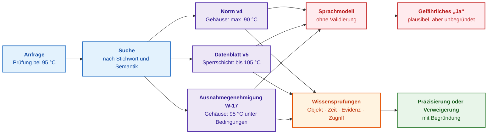
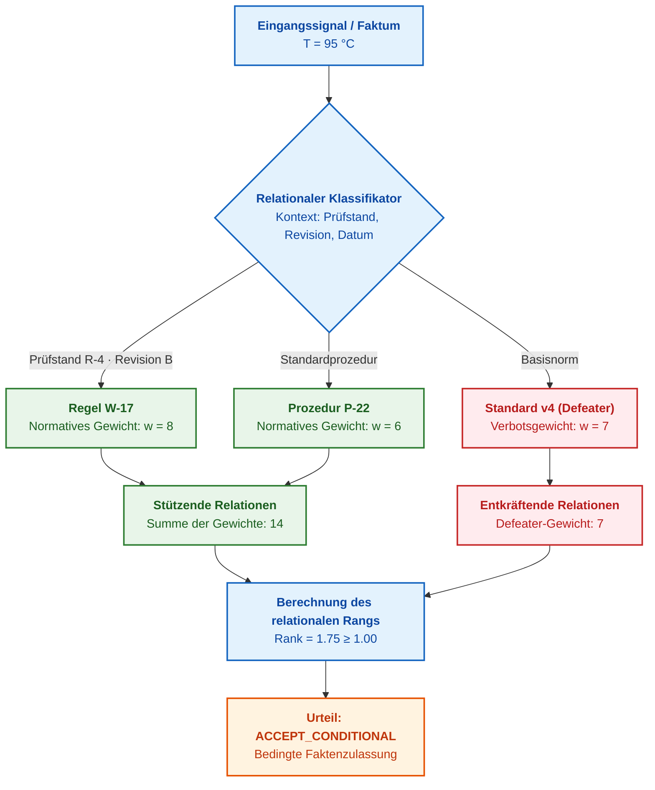
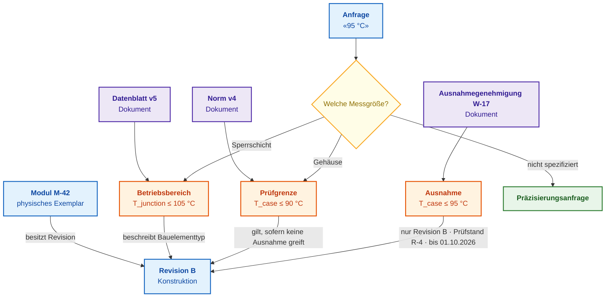
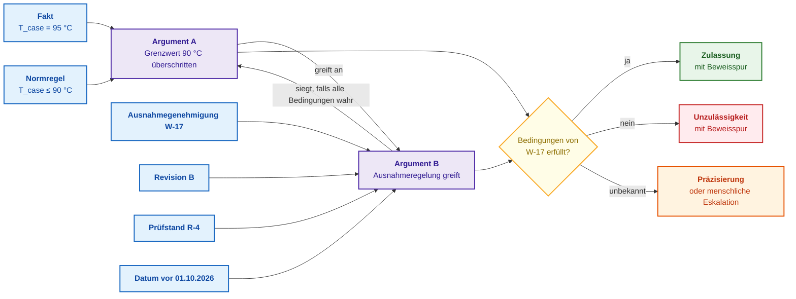
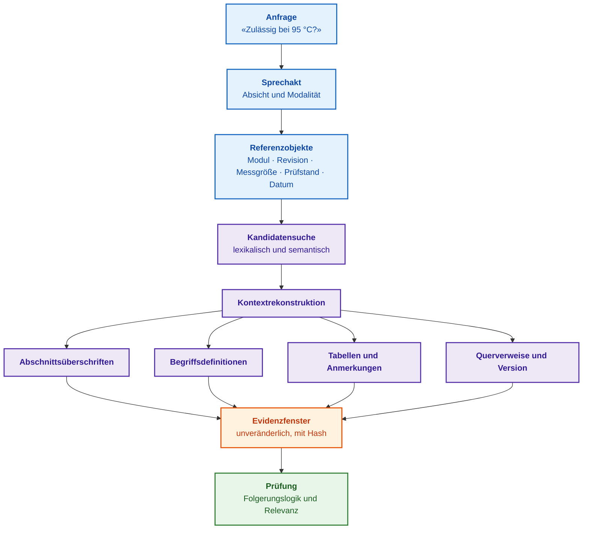
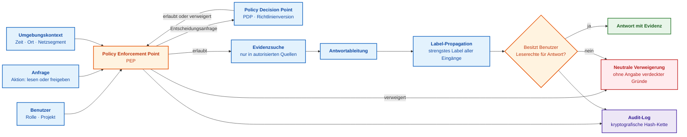
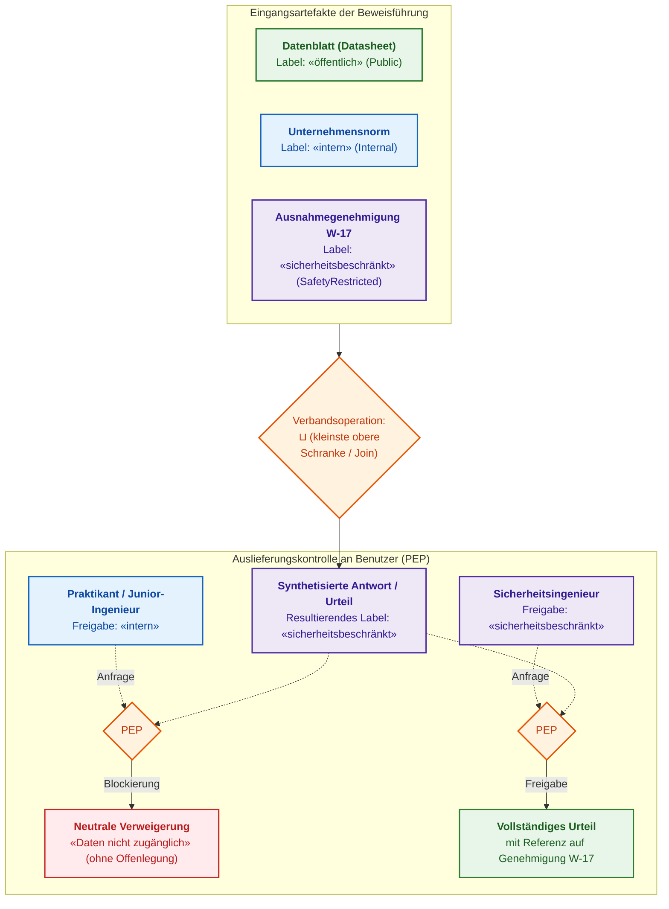
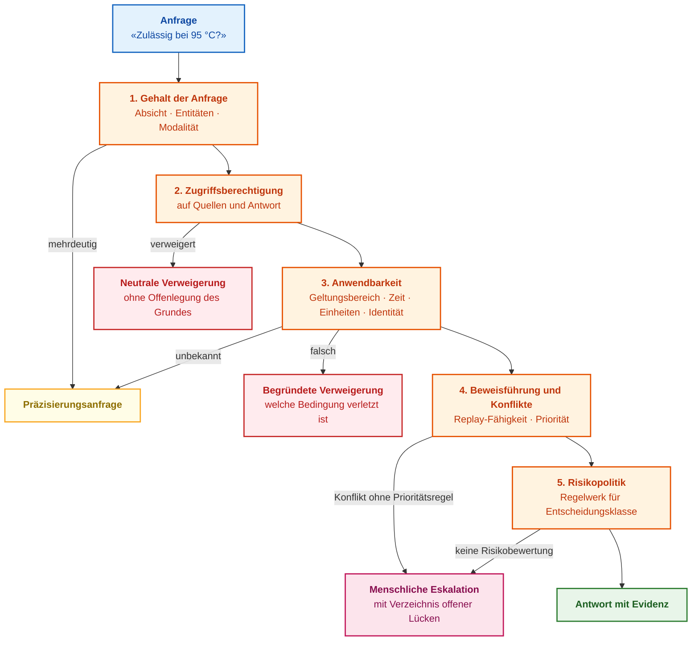

# Kapitel 2. Philosophie für Ingenieure: Was eine Maschine rechtmäßig Wissen nennen darf

> **Buch:** [Architektur evidenzbasierter Expertensysteme](README.md) · [Teil I: Konzeptionelle und epistemische Grundlagen](part-01-foundations.md)  
> **Vorheriges Kapitel:** [Kapitel 1. Einführung in Expertensysteme: Vom Chaos zu kontrolliertem Wissen](ch01-introduction-to-expert-systems.md)  
> **Nächstes Kapitel:** [Kapitel 3. Wie sich ein Expertensystem von einem Informations- und Auskunftssystem unterscheidet](ch03-beyond-reference-information-systems.md)  
> **Inhaltsverzeichnis:** [README.md](README.md)  
> **Autor:** [Mykola Fedchyk](about-the-author.md)  
> **Niveau:** Grundlegendes Ingenieurniveau; Codebeispiele in einklappbaren Blöcken, formale Einträge mit dem Vermerk „Formal“ gekennzeichnet  
> **Lernziele:** Erklären, warum eine plausible Antwort noch kein Wissen darstellt; eine ingenieurtechnische Anfrage in sieben Prüfungen zerlegen (Rechtsgrundlage/Begründung, Objektidentität, Inferenzmethode, semantischer Gehalt der Anfrage, hermeneutischer Kontext des Zitats, empirische Verifikationsmethode, Zugriffsberechtigung); die formale Bedingung formulieren, unter der ein Expertensystem antwortet, Präzisierungen einfordert, die Entscheidung an den Menschen eskaliert oder die Aussage verweigert.

## Abstract

In diesem Kapitel wird das epistemische Fundament für die Architektur von Expertensystemen gelegt: Es formalisiert die Kriterien, anhand derer ein symbolischer Kern verifiziertes Wissen von statistisch plausiblen, jedoch faktisch unbegründeten Texten trennt. Eingehend analysiert wird die epistemische Kluft zwischen stochastischen Sprachmodellen und deterministischen logischen Inferenzregeln, deren Überbrückung unverzichtbar ist, um katastrophale Ausfälle in missionskritischen Anwendungen (ISO 26262, IEC 61508, DO-178C) auszuschließen. Es wird demonstriert, wie sich fundamentale Kategorien der Erkenntnistheorie, Ontologie, mathematischen Logik, Hermeneutik und Informationssicherheit in sieben verbindliche Prüfungen eines Zulassungsgateways für Fakten übersetzen lassen. Formuliert werden eine prozedurale Definition von Maschinenwissen, die relationale Natur von Fakten auf Basis von Friedrich Hayeks „Sensorischer Ordnung“, ein mathematisches Anwendbarkeitsprädikat in der dreiwertigen Logik nach Kleene, ein Modell zur bitemporalen Erfassung der Faktengültigkeit sowie ein algebraisches Kriterium für das Recht auf Behauptung (*Entitlement to Assert*). Ein durchgängiger ingenieurtechnischer Beispielfall – die thermische Prüfung eines Leistungsmoduls bei 95 °C – veranschaulicht die Funktionsweise einer reproduzierbaren Beweisspur und deterministischer Fail-Closed-Mechanismen.

## 1. Der Ingenieurvertrag einer evidenzbasierten Antwort: Sieben epistemische Kriterien

Die Integration eines Expertensystems in ingenieurtechnische Entscheidungsprozesse erfordert einen strikten Zulassungskontrakt für Fakten: Kein Urteil darf an den Benutzer ausgegeben oder an nachgelagerte Aktoren übermittelt werden, ohne ein mehrstufiges Validierungsaudit durchlaufen zu haben. Im Gegensatz zu generativen Sprachmodellen oder klassischen Information-Retrieval-Systemen, die unüberprüfte Antworten auf der Basis korrelativer Plausibilität erzeugen, betrachtet ein evidenzbasiertes Expertensystem jede ausgegebene Aussage als technisch und rechtlich bindenden Akt. Wird dieser Kontrakt missachtet, führt bereits die erste semantische Kollision in der Entwicklungsdokumentation zu gefährlicher Desinformation oder fatalen Havarien im Feld. Der ingenieurtechnische Evidenzkontrakt etabliert sieben verbindliche epistemische Prüfungen: die Begründung der Aussage, die ontologische Identität des Zielobjekts, die deterministische Ableitungsmethode, den modalen Gehalt der Anfrage, den hermeneutischen Kontext der Primärquelle, die empirische Verifikationsmethode und die Zugriffsberechtigung. Ein unbekannter Parameter erzwingt eine Präzisierungsanfrage; unzureichende Begründungen lösen eine sichere Verweigerung (*Fail-Closed*) aus; fehlende Zugriffsrechte blockieren die unautorisierte Offenlegung sensitiver Daten.

Für den ersten Lesedurchgang empfiehlt sich das Durcharbeiten des Temperaturbeispiels, der [Arbeitsdefinition](#робоче-визначення-знання-експертної-системи) sowie der abschließenden Prüfmatrix. Die Abschnitte zu Platon, Gettier und der Sprachphilosophie legen das theoretische Fundament offen, das die Architektur vor versteckten logischen Fallstricken schützt. Das lauffähige Codebeispiel aus [Kapitel 1](ch01-introduction-to-expert-systems.md) demonstriert bereits die praktische Anwendung eines vereinfachten Kontrakts für die Freigabe von Bordsoftware.

## 2. Praktischer Anwendungsfall: Semantische Kollision dreier Primärquellen bei der Prüfung eines Leistungsmoduls

Die Komplexität der Ingenieurpraxis rührt daher, dass normative Artefakte niemals als vollkommen konsistente, harmonisierte Wissensbasis vorliegen: Übergreifende Industriestandards, technische Datenblätter der Komponentenhersteller und temporäre Prüfrichtlinien geraten unvermeidlich in semantische Konflikte. Um zu verdeutlichen, wie ein naives Informationssystem an Stellen scheitert, an denen ein Expertensystem Mehrdeutigkeiten deterministisch auflöst, betrachten wir die Zertifizierungsprüfung eines Hardwaremoduls. Ein Versuchsingenieur stellt an das Expertensystem folgende Anfrage: „Darf die Prüfstandsmessung des Leistungsmoduls bei einer Temperatur von 95 °C durchgeführt werden?“ Die Suchkomponente identifiziert drei relevante Dokumente. Jedes bezieht sich auf die Problemstellung, keines liefert eine vorgefertigte Antwort, und in jedem Dokument bezeichnet das Wort „Temperatur“ eine grundlegend andere physikalische Größe.

Das dritte gefundene Dokument ist eine **Ausnahmegenehmigung** (*Waiver*): ein formal freigegebenes Dokument, das unter streng begrenzten Bedingungen und für ein definiertes Zeitfenster das Abweichen von einer Normvorgabe gestattet. Die folgende Tabelle stellt gegenüber, was die einzelnen Dokumente explizit aussagen und worüber sie schweigen.

| Dokument | Explizite Aussage | Bezeichnete Temperatur | Was das Dokument verschweigt |
|---|---|---|---|
| Unternehmensprüfnorm, Version 4 | Während der Prüfung maximal 90 °C | Gehäusetemperatur des Moduls | Ob Ausnahmen zulässig sind |
| Technisches Datenblatt (*Datasheet*) des Herstellers, Version 5, jünger als die Norm | Bauelement arbeitet bis zu 105 °C | Sperrschichttemperatur (*Junction*), d. h. die Halbleiterstruktur im Inneren des Gehäuses | Ob Prüfungen bei dieser Temperatur zulässig sind |
| Ausnahmegenehmigung W-17 | Prüfung bei 95 °C zulässig | Gehäusetemperatur des Moduls | Ob die Genehmigung außerhalb ihrer Auflagen gilt: Sie ist strikt beschränkt auf Prototypen der Revision B, auf Prüfstand R-4, befristet bis zum 1. Oktober 2026 und an eine Zusatzprüfung gebunden |

Hinzu kommt eine vierte Temperatur, über die alle Dokumente schweigen: die Lufttemperatur in der thermischen Prüfkammer. Versuchsingenieure sprechen im Laboralltag häufig von „95 Grad“ und meinen damit schlicht die Sollwerteinstellung der Klimakammer. In der gestellten Anfrage wird keine der vier Temperaturen explizit benannt.

Wird ein großes Sprachmodell mit diesen drei Textfragmenten gefüttert, konstruiert es mühelos ein überzeugendes „Ja“: 95 ist kleiner als 105, und die Ausnahmegenehmigung scheint die Überschreitung zu legitimieren. Eine solche Antwort klingt vordergründig plausibel und ist grammatikalisch einwandfrei, jedoch aus drei Gründen hochgradig gefährlich:

1. Das Datenblatt spezifiziert die rein physikalische Belastbarkeit der Sperrschicht, nicht jedoch die Freigabe für einen standardkonformen Prüfablauf.
2. Die Ausnahmegenehmigung gilt möglicherweise gar nicht für das konkrete Modul, den Prüfstand oder das Datum der Anfrage – und der anfragende Ingenieur besitzt womöglich keine Berechtigung zur Einsichtnahme in dieses Dokument.
3. Der Wert 95 °C ohne Angabe der Messgröße lässt sich mit keinem Grenzwert seriös vergleichen: 95 °C Kammertemperatur, Gehäusetemperatur und Sperrschichttemperatur repräsentieren drei völlig unterschiedliche thermische Betriebszustände.

Ein nach den Grundsätzen dieses Kapitels konstruiertes Expertensystem reagiert gänzlich anders:

> Eine Freigabe der Prüfung auf Basis der vorliegenden Anfrage ist nicht möglich. Für Prototypen der Revision B existiert eine potenziell anwendbare Ausnahmegenehmigung. Vorab muss jedoch präzisiert werden, welche Temperaturgröße gemeint ist, auf welchem Prüfstand und zu welchem Datum die Prüfung stattfindet und ob der Anwender über die erforderliche Entscheidungsbefugnis verfügt. Bis zu dieser Klärung verbleibt als verbindliche Grenze die Unternehmensprüfnorm: 90 °C Gehäusetemperatur.

Besitzt der Benutzer keine Leserechte für die Ausnahmegenehmigung W-17, darf das System nicht einmal auf die Existenz einer solchen Sonderregelung hinweisen, da bereits das Bekanntwerden eines vertraulichen Dokuments ein Sicherheitsrisiko darstellt:

> Die verfügbare Evidenzbasis reicht für eine Freigabe der Prüfung nicht aus. Bitte eskalieren Sie die Anfrage an den zuständigen Sicherheits- und Freigabeingenieur.

Beide Systemantworten sind knapper und im ersten Moment unkomfortabler als ein simples „Ja“, jedoch sind beide fachlich und prozessual korrekt. Eine sichere Verweigerung (*Fail-Closed*) ist hier das Gütesiegel eines robusten Expertensystems und kein Versagen der Informationssuche. Das folgende Diagramm stellt die beiden Pfade von den Rohdokumenten zur Entscheidung gegenüber.



Das Diagramm liest sich von links nach rechts. Blau markiert die Anfrage und die Suchkomponente, violett die drei gefundenen Dokumente. Der rote Pfad kennzeichnet das Sprachmodell, das die Texte ohne epistemische Vorfilterung verarbeitet und ein ungesichertes „Ja“ synthetisiert. Der orangefarbene Block symbolisiert die formalen Wissensprüfungen des Expertensystems: Um welches physikalische Messobjekt geht es, ist das Dokument zum Prüfzeitpunkt gültig, stützt die Quelle die Schlussfolgerung tatsächlich und besitzt der Anwender die nötige Sicherheitsfreigabe? Der grüne Block repräsentiert das deterministische Ergebnis: eine gezielte Präzisierungsanfrage oder eine begründete Verweigerung.

Bereits der Abschnitt [„Eine Frage, drei Antworten“](ch01-introduction-to-expert-systems.md#одне-запитання-три-відповіді) in Kapitel 1 verglich Suche, Chatbot und Expertensystem am Beispiel eines Software-Timeouts. Der vorliegende Temperatur-Anwendungsfall ist ungleich vielschichtiger: Vier gleichnamige Messgrößen, ein Datenblatt, das eine physikalische Eignung anstelle einer Prüffreigabe beschreibt, eine konditionierte Ausnahmeregelung und restriktive Zugriffskontrollen greifen ineinander. Jede dieser Hürden korrespondiert mit einer klassischen philosophischen Fragestellung, weshalb dieser Beispielfall als roter Faden durch das gesamte Kapitel dient.

Das bloße Auffinden von Textstellen ist unzureichend. Ein Expertensystem muss exakt erfassen, was jedes Dokument behauptet, über welches Objekt, auf welcher Evidenzbasis, zu welchem Zeitpunkt und für welche Zielgruppe. Um diese Bedingungen algorithmisch zu prüfen, müssen wir zunächst formalisieren, was ein Expertensystem überhaupt als Wissen anerkennen darf.

## 3. Evolution des Wissensbegriffs: Von der gerechtfertigten wahren Überzeugung (JTB) zum Gettier-Problem

Das Kernproblem intelligenter Systeme besteht darin, dass eine formal korrekte Ausgabe noch keinerlei Rückschluss auf vorhandenes Wissen oder Systemverständnis erlaubt. Ein Sprachmodell, das die normative Schwelle von 90 °C im Zuge stochastischer Next-Token-Prediction zufällig korrekt rät, und ein Ingenieur, der denselben Grenzwert deterministisch aus einem verifizierten Paragrafen der gültigen Norm ableitet, erzeugen identische Zeichenketten. Dennoch verfügt der Ingenieur über epistemisch begründetes Wissen, während der stochastische Generator lediglich eine Kompetenzillusion hervorruft. Die Erkenntnistheorie untersucht diese Differenzierung seit über zweitausend Jahren – ihre Einsichten sind direkte architektonische Leitplanken für die Verifikationslogik von Expertensystemen.

Bereits in der Antike wurde Wissen trennscharf vom glücklichen Raten abgegrenzt. In Platons Dialog *Theaitetos* zeigt Sokrates, dass eine wahre Meinung allein nicht genügt: Ein geschickter Redner kann die Richter von einem Sachverhalt überzeugen, der sich zufällig als wahr herausstellt – die Richter wissen jedoch dennoch nicht aus erster Hand, was sich tatsächlich ereignete [[1]](#src-1). Aus dieser Reflexion entstand die klassische dreiteilige Wissensdefinition: Ein Subjekt weiß eine Proposition $P$ genau dann, wenn $P$ wahr ist, das Subjekt von $P$ überzeugt ist und diese Überzeugung wohlbegründet (*gerechtfertigt*) ist. Diese Formel wird in der Fachliteratur als JTB (*Justified True Belief*) bezeichnet. Obwohl sie oft als kanonisch bezeichnet wird, weisen Wissenschaftshistoriker darauf hin, dass sie in dieser expliziten Schärfe erst im 20. Jahrhundert formuliert wurde – vornehmlich von Autoren, die ihre Unzulänglichkeit aufzeigen wollten [[1]](#src-1).

Im Jahr 1963 publizierte Edmund Gettier einen knapp dreiseitigen Aufsatz, in dem er anhand zweier prägnanter Kontrafaktizitäten nachwies, dass alle drei Bedingungen erfüllt sein können, ohne dass echtes Wissen vorliegt [[2]](#src-2). In Gettiers Beispielen zieht eine Person einen logisch korrekten Schluss aus einer falschen, jedoch wohlinformierten und gerechtfertigten Prämisse – und das Resultat erweist sich rein zufällig als wahr. Ähnliche Paradoxa waren bereits früher bekannt. Der indische Philosoph Dharmottara beschrieb im 8. Jahrhundert einen Wüstenreisenden, der eine Fata Morgana für Wasser hält, dorthin eilt und zufällig unter einem Stein tatsächlich Wasser findet. Bertrand Russell illustrierte das Phänomen anhand einer Person, die auf eine stehengebliebene Uhr blickt – exakt in jener Sekunde, in der die Uhr die korrekte Uhrzeit anzeigt [[1]](#src-1). In all diesen Szenarien ist die Überzeugung wahr und begründet, aber die Begründung und die Wahrheit hängen nur durch reinen Zufall zusammen. Man spricht hierbei von **Gettier-Fällen**.

Im Ingenieurwesen begegnen uns Gettier-Fälle tagtäglich: Ein Temperatursensor in der Klimakammer friert bei 94 °C ein. Zufällig beträgt die reale Kammertemperatur im selben Moment exakt 94 °C. Der Messprotokolleintrag ist faktisch wahr und stützt sich auf ein kalibriertes Messinstrument – die Gültigkeit ist jedoch rein akzidentiell: Zehn Minuten später herrschen in der Kammer 97 °C, während das Protokoll weiterhin statische 94 °C ausweist.

Exakt dieses Phänomen tritt bei Sprachmodellen auf, die Antworten aus abgerufenen Dokumentenfragmenten generieren. Das Modell antwortet, die Temperaturgrenze liege bei 90 °C, und zitiert als Beleg das Datenblatt des Bauelements. Die Zahl 90 °C ist zwar normativ korrekt, das Datenblatt enthält diesen Wert jedoch gar nicht: Die Zahl stammt aus der Prüfnorm, deren Text das Modell im Prompt-Kontext ebenfalls überflogen hat. Ein naiver Benchmark, der lediglich den finalen Ausgabewert gegen einen Sollwert abgleicht, wertet dies als Treffer – obwohl die referenzierte Quelle die getroffene Aussage in keiner Weise stützt.

Für die Architektur eines Expertensystems folgt aus dem Gettier-Problem ein unverhandelbares Gebot: Validiert werden darf niemals nur die isolierte Antwort, sondern zwingend die formale Kausalkette zwischen Antwort und Primärevidenz. Stützt das referenzierte Textfragment exakt diese Proposition? War das Sensorinstrument zum Messzeitpunkt verifiziert und funktionsfähig? Der folgende Abschnitt überführt diese Anforderung in eine operative Definition.

## 4. Kanonische ingenieurtechnische Definition von Maschinenwissen <a id="робоче-визначення-знання-експертної-системи"></a>

Während das Wesen der Erkenntnis in der theoretischen Philosophie Gegenstand offener Debatten bleibt, führt das Fehlen einer formalen Wissensspezifikation in der Systemtechnik unmittelbar zur Unbrauchbarkeit des logischen Kerns. Ein industrielles Expertensystem kann nicht auf intuitiven oder subjektiven Konzepten aufbauen: Jede Aussage, die in den Arbeitsspeicher geladen wird oder an einer Resolutionsinferenz teilnimmt, muss eindeutig typisiert sein und strenge Zulassungskriterien erfüllen. Gettiers Aufsatz löste Dutzende epistemologische Modifikationen der JTB-Triade aus [[1]](#src-1); für ein robustes Softwaresystem bedarf es jedoch einer endlichen, algorithmisch verifizierbaren Regel.

Dieses Buch postuliert folgendes Architekturprinzip:

> Als **Wissen eines Expertensystems** gilt ausschließlich eine Aussage, die versioniert ist, auf einer verifizierbaren Primärevidenz ruht, einen formal definierten Geltungsbereich sowie eine explizite Gültigkeitszeit besitzt, deren Ableitungsmethode deterministisch bekannt ist und die alle für diesen Aussagentyp vorgeschriebenen Prüfungen und Freigaben erfolgreich durchlaufen hat.

Diese Definition ist bewusst prozedural konstruiert. Sie beansprucht nicht, das ontologische Wesen menschlichen Wissens zu erklären, sondern spezifiziert operational, welche Metadaten und Nachweise für eine Aussage vorliegen müssen, damit das Expertensystem berechtigt ist, sie in Inferenzschritten zu verwenden. Eine solche Definition ist eine ingenieurtechnische Entwurfsentscheidung, die sich unmittelbar in Unittests abbilden lässt: Für jede Aussage kann deterministisch evaluiert werden, ob alle Bedingungen erfüllt sind. Sie schließt Kategorien kategorisch aus, die im KI-Hype fälschlich mit Wissen verwechselt werden: Wahrscheinlichkeitsverteilungen nächster Token, Kosinus-Ähnlichkeiten von Vektor-Embeddings, die hierarchische Position des Dokumentenautors oder der rhetorisch überzeugende Tonfall eines generierten Textes.

Diese Begriffsbestimmung ergänzt Kapitel 1. Im Abschnitt [„Dokument ist nicht gleich Wissen“](ch01-introduction-to-expert-systems.md#документ-не-дорівнює-знанню) werden Dokumente in fünf elementare Wissensobjekte zerlegt: Beobachtungen, Aussagen, Evidenzquellen, Regeln sowie Empfehlungen/Beschlüsse. Die obige Definition beantwortet die weiterführende Frage: Ab welchem Verifikationsgrad erlangt ein Wissensobjekt vom Typ „Aussage“ das Recht, als Prämisse in eine Schlussfolgerung einzufließen?

Die Gesamtheit dieser Kriterien bezeichnen wir als **epistemischen Kontrakt** (abgeleitet vom griechischen *epistēmē*, Wissen). Der Begriff des Kontrakts ist an Bertrand Meyers Paradigma des „Design by Contract“ angelehnt, bei dem Softwarekomponenten verbindliche Vor- und Nachbedingungen für Funktionsaufrufe deklarieren [[3]](#src-3). Der epistemische Kontrakt fungiert analog – jedoch nicht für Funktionen, sondern für Wissensaussagen.

Die Bedingungen des Kontrakts lassen sich zweckmäßig entlang von sieben philosophischen Kerndisziplinen strukturieren. Jede Disziplin richtet eine fundamentale Frage an die Aussage, und jede Frage korrespondiert mit einer handfesten ingenieurtechnischen Implementierung:

| Disziplin | Prüffrage an die Wissensaussage | Was das Expertensystem speichert | Typischer Fehler im 95-°C-Beispiel |
|---|---|---|---|
| Erkenntnistheorie (Epistemologie) | Auf welcher Evidenzbasis ist die Aussage zugelassen? | Beweisnachweis, Provenienz, Entkräftungsgründe (*Defeater*) | Korrekte Temperaturangabe mit falschem Quellenbeleg |
| Ontologie (Lehre vom Seienden) | Welches Objekt, welche Messgröße und welche Revision sind adressiert? | Eindeutige IDs, Messgrößen, SI-Einheiten, Geltungsbereich | Sperrschichttemperatur fälschlich als Prüfgrenze übernommen |
| Logik | Wie genau wurde das Urteil abgeleitet? | Inferenzmethode, Beweisspur (*Proof Trace*), Widerspruchsstatus | Eine bloße Arbeitshypothese als bewiesenes Faktum ausgegeben |
| Sprachphilosophie | Was bedeutet die Anfrage im konkreten Kontext? | Absicht (*Intent*), Entitäten, normative Modalität | Die Frage nach physikalischer Machbarkeit mit rechtlicher Freigabe verwechselt |
| Hermeneutik (Auslegungslehre) | Welcher Gesamtkontext verleiht dem Zitat normative Gültigkeit? | Kapitelhierarchie, Begriffsdefinitionen, Fußnoten, Dokumentversion | Ausnahme isoliert zitiert, einschränkende Fußnote „nur Revision B“ ignoriert |
| Wissenschaftstheorie | Wie lässt sich die Aussage empirisch prüfen oder falsifizieren? | Messmethode, Messunsicherheit, Prüfprotokoll, Akzeptanzkriterien | Eine Modellprognose fälschlich als reale Messung deklariert |
| Soziale Erkenntnistheorie | Wer darf die Aussage einsehen, anfechten oder autorisieren? | Rollen, Zugriffsgitter, Peer-Review, Eskalationspfade | Autorität mit Wahrheit gleichgesetzt; Einsicht in vertrauliche Ausnahme gewährt |

Diese Tabelle fungiert als thematischer Leitfaden für das vorliegende Kapitel. Die nachfolgenden Abschnitte folgen exakt dieser Gliederung: Für jede Disziplin wird zunächst die Fehlerquelle am 95-°C-Szenario analysiert, anschließend die ingenieurtechnische Lösung des Expertensystems dargelegt und abschließend ein architektonisches Fazit gezogen.

## 5. Epistemologische Basis: Aussagen, Evidenzen und Provenienz von Fakten (Provenance)

Im Wissens-Engineering stellt die Ablage von Dokumenten als monolithische, unstrukturierte Textdateien eine fundamentale Fehlerquelle für die Nachvollziehbarkeit dar: Drei von einer Suchmaschine gefundene Dokumente bilden noch lange keine verifizierte Faktenbasis. Eine Prüfnorm spezifiziert Dutzende physikalische Parameter, ein Herstellerdatenblatt listet hunderte Kenngrößen auf – für die Begründung einer spezifischen Prüfstandszulassung sind jedoch lediglich zwei oder drei atomare Aussagen mit exakten Koordinaten erforderlich. Behandelt ein System Dokumente oder mehrseitige Textauszüge als unteilbare Einheiten, verliert die symbolische Inferenzmaschine die Fähigkeit, formal nachzuweisen, welcher Textabschnitt das Urteil stützt und ob dieser Abschnitt zum Entscheidungszeitpunkt überhaupt normative Kraft besaß. In solchen intransparenten Architekturen entstehen technisch bedingte Gettier-Fälle: Eine formale Referenz auf einen Standard existiert, der materielle Inhalt des Urteils wird davon jedoch nicht gedeckt.

Die fundamentale Wissenseinheit eines Expertensystems ist daher weder ein Gesamtdokument noch ein unstrukturierter Absatz, sondern die atomare Aussage (*Claim*). Für die Ausnahmegenehmigung W-17 umfasst eine solche Aussage folgende strukturierte Attribute:

| Komponenten der Aussage | Konkrete Belegung für Ausnahmegenehmigung W-17 |
|---|---|
| Gegenstand | Prüfstandsmessung des Moduls |
| Behauptungsinhalt | Maximale Gehäusetemperatur von 95 °C ist zulässig |
| Geltungsbereich (*Scope*) | Prototyp Revision B, Prüfstand R-4, Prüfverfahren P-22 |
| Gültigkeitszeit $I_v$ | Vom 1. Juli 2026 bis 1. Oktober 2026 (Enddatum exklusiv) |
| Systemerfassungszeit $I_s$ | Ab 2. Juli 2026, 09:15 Uhr koordinierte Weltzeit (UTC) |
| Aussagetyp | Normative Ausnahmeregelung (*Waiver*) |
| Version | Zweite Revision des Dokuments W-17 |

Die beiden Zeitdimensionen $I_v$ und $I_s$ werden im nachfolgenden Abschnitt zur bitemporalen Modellierung formal definiert.

Die **Evidenz** (*Evidence*) existiert im Datenmodell als eigenständige Entität, getrennt von der Aussage. Als Evidenz fungiert ein unveränderliches Fragment der Primärquelle (ein Textzitat mit kryptografischem Hashwert und Byte-Offsets in einer spezifischen Dokumentversion), ein kalibriertes Messprotokoll, eine kryptografisch signierte Freigabe oder eine formale Beweisspur. Die **Provenienz** (*Provenance*) beantwortet lückenlos die Frage nach der Herkunft: Welcher Akteur hat welches Artefakt über welchen Prozessschritt generiert? Der PROV-O-Standard des World Wide Web Consortiums (W3C) definiert für die Provenienzmodellierung universelle Kernkonzepte: Entität (*Entity*), Aktivität (*Activity*), Akteur (*Agent*) sowie die Ableitungsrelation *wasDerivedFrom* [[4]](#src-4). Eine lückenlose Provenienz ist jedoch kein automatischer Wahrheitsbeweis: Auch die detaillierteste Historie eines fehlerhaften Dokuments bleibt die Historie eines Fehlers.

Ein drittes Objekt, das ein Expertensystem zwingend separat vorhalten muss, sind **Entkräftungsgründe** (*Defeater*). Als Defeater wird jeder Umstand definiert, der die Begründung einer Aussage aufhebt oder schwächt. Das Konzept geht maßgeblich auf John Pollocks Arbeiten zum nicht-monotonen, anfechtbaren Schließen (*defeasible reasoning*) zurück, wobei Pollock zwei fundamentale Klassen unterscheidet [[5]](#src-5):
- Ein **widerlegender Entkräftungsgrund** (*rebutting defeater*) stützt direkt eine gegenteilige Konklusion: Die Ausnahmegenehmigung W-17 entkräftet das allgemeine Verbot von Gehäusetemperaturen über 90 °C – allerdings strikt beschränkt auf Revision B und Prüfstand R-4.
- Ein **untergrabender Entkräftungsgrund** (*undercutting defeater*) zerstört die logische Verbindung zwischen Prämisse und Konklusion, ohne zwingend das Gegenteil zu beweisen: Stellt sich heraus, dass der Temperatursensor in der Klimakammer fehlerhaft kalibriert war, verliert das Messprotokoll seine Stützkraft für die Temperaturbehauptung – ohne dass damit bewiesen wäre, dass die Temperatur in der Realität abwich.

Das folgende Diagramm visualisiert die Verknüpfung dieser Entitäten im 95-°C-Szenario.

```mermaid
flowchart LR
    accTitle: Graph der Unterstützung und Entkräftung von Behauptungen über 95 °C
    accDescr: Die Norm stützt über ein unveränderliches Zitat das allgemeine Verbot. Die Ausnahmegenehmigung W-17 stützt die Ausnahmeregelung. Das allgemeine Verbot und die Ausnahme greifen einander an; das Expertensystem hält beide Aussagen bis zur Beschlussfassung vor.

    STD["<b>Norm v4</b><br/>Dokument"] -->|"enthält"| SP["<b>Zitat aus Abs. 5.3</b><br/>unveränderliches Textsegment"]
    OWN["<b>Normverantwortlicher</b>"] -->|"freigegeben durch"| STD
    SP -->|"stützt"| C1["<b>Aussage C1</b><br/>Gehäuse über 90 °C unzulässig"]
    W["<b>Ausnahmegenehmigung W-17</b><br/>Dokument"] -->|"stützt"| C2["<b>Aussage C2</b><br/>95 °C für Revision B zulässig"]
    SAF["<b>Sicherheitsingenieur</b>"] -->|"freigegeben durch"| W
    C2 -->|"greift an im Rahmen von Revision B"| C1
    C1 -->|"greift an außerhalb der Bedingungen von W-17"| C2
    C1 & C2 --> G["<b>Argumentationsgraph</b><br/>beide Aussagen persistiert"]
    G --> O["<b>Entscheidung</b><br/>nach Bedingungsprüfung"]

    classDef doc fill:#e8eaf6,stroke:#3f51b5,stroke-width:2px,color:#1a237e;
    classDef claim fill:#e1f5fe,stroke:#0288d1,stroke-width:2px,color:#01579b;
    classDef actor fill:#fce4ec,stroke:#c2185b,stroke-width:2px,color:#880e4f;
    classDef grf fill:#fff3e0,stroke:#e65100,stroke-width:2px,color:#bf360c;
    classDef out fill:#e8f5e9,stroke:#2e7d32,stroke-width:2px,color:#1b5e20;

    class STD,SP,W doc;
    class OWN,SAF actor;
    class C1,C2 claim;
    class G grf;
    class O out;
```



Blau-violett visualisiert Dokumente und Textsegmente, rosa die autorisierenden Personen, hellblau die Aussagen, orange den Argumentationsgraphen und grün die finale Entscheidung. Die Norm stützt über das unveränderliche Zitat aus Abschnitt 5.3 die Aussage C1 (allgemeines Verbot). Die Genehmigung W-17 stützt Aussage C2 (Ausnahmeregelung). Beide Aussagen greifen einander an (*Attack-Relation*): C2 dominiert C1 im Kontext der Revision B, während C1 außerhalb der W-17-Auflagen die Oberhand behält. Das Expertensystem löscht keines der beiden Postulate, sondern persistiert beide im Argumentationsgraphen, bis der konkrete Anfragekontext eine deterministische Resolution erlaubt.

In der industriellen Praxis speichert ein Expertensystem für jede Aussage mindestens:

- eine unveränderliche UUID und die kanonische Proposition;
- den epistemischen Status: zitiert, beobachtet, deduziert, hypothetisch angenommen oder normativ dekretiert;
- das Quellenzitat mit kryptografischem Hash (SHA-256) und Byte-Offsets in der Dokumentversion;
- den Generator: Parser-Pipeline, Extraktionsmodell, Inferenzregel oder Reviewer;
- den Geltungsbereich (*Scope*), physikalische Einheiten, Gültigkeitszeit und Erfassungszeit;
- stützende und entkräftende Evidenzen (*Defeaters*);
- die Inferenzmethode samt formaler Beweisspur;
- das Sicherheitslabel (*Clearance Label*) und den Review-Status;
- den Lebenszyklusstatus: gültig, obsolet, widerrufen, angefochten oder unbestimmt.

Ein vollständiges Schema im JSON-Format wird im Abschnitt [„Entitlement to Assert“](#робоче-визначення-знання-експертної-системи) vorgestellt; der Lebenszyklus einer Aussage von der Kandidatengenerierung bis zum Widerruf wird in [Kapitel 25](ch25-how-expert-systems-learn.md) vertieft.

Ein einzelnes Gleitkommafeld wie `confidence = 0.93` ist als Ersatz für dieses Metadatenmodell völlig ungeeignet. Ein Wahrscheinlichkeitswert sagt nichts darüber aus, was genau zu 93 % wahrscheinlich ist, auf welchem Datensatz dieser Wert kalibriert wurde und ob der anfragende Nutzer überhaupt berechtigt ist, diese Information einzusehen.

Die erkenntnistheoretische Kernregel für Ingenieure lautet: Aussage, Evidenz, Provenienz und Entkräftungsgründe müssen als getrennte, relationale Entitäten modelliert werden. Nur so lassen sich Gettier-Fallen systematisch eliminieren. Doch selbst eine exzellent belegte Aussage führt in die Irre, wenn sie auf ein falsches Zielobjekt angewendet wird.

### 5.1. Relationale Natur des Maschinenwissens: Friedrich Hayeks „Sensorische Ordnung“ gegen naiven Positivismus

Die relationale Natur des Maschinenwissens fungiert als fundamentale Barriere gegen einen naiven Positivismus, der Wissen fälschlicherweise mit isolierten atomaren Fakten oder statischen Datensätzen in flachen relationalen Tabellen gleichsetzt. Im sicherheitskritischen System-Engineering trägt ein identisches physikalisches Signal oder eine normative Aussage (beispielsweise eine gemessene Spannung von $`3{,}3\,\text{V}`$ oder eine Temperatur von $`95\,^\circ\text{C}`$) isoliert betrachtet keinerlei normative Handlungsbedeutung; ihr Status als „zulässige Toleranz“, „Überlastgefahr“ oder „Notabschaltbedingung“ entsteht ausschließlich durch ihre topologische Einbettung in ein relationales Klassifikationsnetzwerk. Wird diese relationale Topologie missachtet, verliert das System jede Kontextsensitivität, was zu katastrophalen Fehlentscheidungen führt, wenn routinemäßige Prüfstandsmodi mit anlagenweiten Notabschaltungen verwechselt oder temporäre Ausnahmegenehmigungen stillschweigend ignoriert werden.

Dieses ingenieurwissenschaftliche Prinzip stützt sich direkt auf die erkenntnistheoretische Konzeption der „Sensorischen Ordnung“ (*The Sensory Order*, 1952) des Nobelpreisträgers Friedrich A. Hayek [[32]](#src-32). Hayek wies nach, dass Wahrnehmung und Kognition niemals passive, mechanische Abbilder einer externen physikalischen Realität sind, sondern einen dynamischen Prozess mehrstufiger Klassifikation darstellen: Jeder neue Impuls erlangt operative Bedeutung erst dadurch, dass er relativ zu einem vorbestehenden Beziehungsnetzwerk und systemischen Erwartungen klassifiziert wird. In einem evidenzbasierten Expertensystem wird die Zulassung eines Kandidatenfakts $`f`$ zur Inferenzmaschine nicht durch eine isolierte Behauptung seiner „Wahrheit“ legitimiert, sondern durch seine formale Einbettung in einen deontischen Verband von Axiomen und das nachgewiesene Fehlen blockierender Entkräftungen (Defeater).



Zur mathematischen Formalisierung von Hayeks Klassifikationsprozess definieren wir den Operator des relationalen Rangs eines Fakts $`f`$ innerhalb einer Wissensbasis $`\mathcal{K} = \langle \mathcal{F}, \mathcal{R}, \mathcal{D} \rangle`$:

$$
\mathrm{Rank}_{\mathrm{rel}}(f, \mathcal{K}) = \frac{\sum_{r \in \mathcal{R}} \mathbb{I}(f \in \mathrm{Prem}(r)) \cdot w(r)}{1 + \sum_{d \in \mathcal{D}} \mathbb{I}(d \text{ defeats } f) \cdot w(d)}
$$

wobei:
- $`f \in \mathcal{F}`$ die atomare Proposition darstellt;
- $`\mathcal{R}`$ die Menge gültiger normativer Regeln mit ganzzahligen Gewichten $`w(r) \in [1, 10]`$ bezeichnet;
- $`\mathcal{D}`$ die Menge aktiver Defeater (Entkräftungsgründe) mit Gewichten $`w(d) \in [1, 10]`$ ist;
- $`\mathbb{I}(\cdot) \in \{0, 1\}`$ eine Indikatorfunktion für Prämisseneinschluss oder Defeater-Wirkung darstellt;
- $`\mathrm{Rank}_{\mathrm{rel}} \in [0, +\infty)`$ der dimensionslose relationale Stärkekoeffizient des Fakts im Klassifikationsverband ist.

Das Paradigma des geschlossenen Regelkreises (Actionable Closed Loop) erzwingt verbindliche Systemübergänge:

1. **Laufzeitsteuerung und Inferenzentscheidungen (Control Flow & Runtime Decisions):**
   Gilt $`\mathrm{Rank}_{\mathrm{rel}}(f, \mathcal{K}) = 0`$ (das Faktum ist vollkommen isoliert und unbegründet), markiert der symbolische Kern die Proposition umgehend mit dem Status `UNGROUNDED_ATOM` und schließt sie unter Ausgabe eines `REFUSAL` von der Zertifizierung ab. Gilt $`\mathrm{Rank}_{\mathrm{rel}}(f, \mathcal{K}) \ge \tau_{\mathrm{rel}} = 1{,}00`$ ohne unüberwindbare Defeater, wird das Faktum automatisch zur Unifikation im Beweisbaum zugelassen. Bei $`0 < \mathrm{Rank}_{\mathrm{rel}} < 1{,}00`$ wird eine Eskalation an einen Experten erzwungen (`QUALIFIED`).

2. **Hardwaredimensionierung und Speicherbeschränkungen (Hardware Dimensioning):**
   Die Auswertung des relationalen Rangs erfordert einen schnellen Graphdurchlauf. Für eine Wissensbasis mit $`\lvert \mathcal{F} \rvert = 50\,000`$ Fakten und $`\lvert \mathcal{R} \rvert = 12\,000`$ Regeln benötigt eine komprimierte Adjazenzmatrix CSR (*Compressed Sparse Row*) $`M_{\mathrm{CSR}} = (2 \cdot \lvert \mathcal{E} \rvert + \lvert \mathcal{F} \rvert) \cdot 8\,\text{Byte} \approx 3{,}2\,\text{MB}`$. Dieser Speicherbereich passt vollständig in den L3-Cache des Prozessors oder den BRAM-Block eines dedizierten Inferenzbeschleunigers und garantiert eine Evaluierungszeit von $`T_{\mathrm{rank}} \le 180\,\text{ns}`$ ohne externe DRAM-Latenzen.

3. **Praktisches numerisches Rechenbeispiel (Worked Numerical Example):**
   Betrachten wir die Gehäusetemperaturmessung $`T_{\mathrm{case}} = 95\,^\circ\text{C}`$ für den Prototyp Revision B auf Prüfstand R-4. Das Faktum wird gestützt durch die Ausnahmeregel W-17 ($`w(r_1) = 8`$) und die Standardprozedur $`P\text{-}22`$ ($`w(r_2) = 6`$). Gleichzeitig fungiert die allgemeine Prüfnorm v4 als intervenierender Defeater ($`w(d_1) = 7`$), der Temperaturen über 90 °C untersagt:

$$
\mathrm{Rank}_{\mathrm{rel}}(f, \mathcal{K}) = \frac{8 \cdot 1 + 6 \cdot 1}{1 + 7 \cdot 1} = \frac{14}{8} = 1{,}75 \ge 1{,}00
$$

   Da $`1{,}75 \ge 1{,}00`$, übersteigt die relationale Bindungskraft der Ausnahme W-17 im definierten Kontext (Revision B, Prüfstand R-4) das allgemeine Verbot. Das System erteilt die bedingte Zulassung `ACCEPT_CONDITIONAL`. Bei einem Wechsel auf den unzertifizierten Prüfstand R-2 entfällt die Gültigkeit von W-17 ($`w(r_1) = 0`$), was zu $`\mathrm{Rank}_{\mathrm{rel}} = \frac{6}{8} = 0{,}75 < 1{,}00`$ und einer sofortigen Schutzverweigerung `REFUSAL` führt.

## 6. Ontologische Identifikation: Überwindung semantischer Homonymie und Kontextbeschränkungen

In den drei Dokumenten unseres Szenarios taucht das Wort „Temperatur“ dreimal und das Wort „Modul“ zweimal auf – hinter den identischen Begriffen verbergen sich jedoch grundlegend verschiedene physikalische Entitäten. Die Ontologie – die philosophische Disziplin vom Seienden und der Identität von Dingen – übersetzt sich im System-Engineering in eine existenzielle Frage: Adressieren zwei Datensätze exakt dasselbe physische oder konzeptionelle Objekt? In der Informatik bezeichnet man als Ontologie zudem die formale Repräsentation von Begriffen und Relationen einer Domäne (vgl. Glossar in [Kapitel 1](ch01-introduction-to-expert-systems.md)). Ontologische Fehler im Code äußern sich selten als abstrakte Debatten: Sie manifestieren sich als fehlerhafte Datenbank-Joins über Bauteilnamen, falsche Einheitenumrechnungen oder fehlerhaft gesetzte `owl:sameAs`-Relationen zwischen ähnlichen, aber nicht identischen Entitäten im OWL-Standard (Web Ontology Language) des W3C [[6]](#src-6).

Um die Anfrage zu 95 °C fundiert zu beantworten, muss das System ontologisch differenzieren zwischen:

- dem physischen Exemplar M-42, dem Bauteiltyp und der Konstruktionsrevision B;
- dem Datenblatt als Textdokument und den spezifizierten Betriebsbedingungen, die es beschreibt;
- der Normgrenze als übergeordneter normativer Restriktion;
- der Ausnahmegenehmigung W-17 als temporärer Ausnahmeregelung, nicht als neuer Allgemeinnorm;
- den physikalischen Messgrößen: Gehäusetemperatur $T_{\mathrm{case}}$, Sperrschichttemperatur $T_{\mathrm{junction}}$ und Umgebungstemperatur der Klimakammer $T_{\mathrm{chamber}}$;
- dem Prüfablauf, dem Prüfplan, dem Prüfstand, dessen Kalibrierstatus und den resultierenden Messreihen.

Die **Messgröße** (*Measurand*) definiert unmissverständlich, was gemessen wird: Nicht abstrakt „Temperatur“, sondern die Temperatur eines spezifischen Messpunkts an einem definierten Objekt unter festgelegten Umgebungsbedingungen.

Zur Objekttrennung gilt der eiserne Grundsatz: Namen sind für Menschen da, Identifikatoren für Maschinen. Objekt-IDs müssen global eindeutig und unveränderlich sein. Synonyme, Übersetzungen und historische Artikelnummern werden als Attribute oder explizite Mapping-Aussagen mit eigener Provenienz modelliert. Das Verschmelzen zweier Identifikatoren ist eine versionierte, auditierbare Transaktion, die im Fehlerfall widerrufen werden kann, und kein irreversibles Überschreiben der Wissensbasis. Das folgende Diagramm zeigt die Ontologie hinter den Begriffen der Anfrage.



Blau repräsentiert physische Artefakte und die Eingabe, violett die Quellendokumente, orange die Grenzwerte. Das Datenblatt regelt die Sperrschicht, Norm und Waiver betreffen das Gehäuse. Die gelbe Verzweigung verdeutlicht die Typdisjunktion: Fehlt die Spezifikation der Messgröße in der Anfrage, wählt das System nicht erratisch einen Wert, sondern generiert deterministisch eine Präzisierungsanfrage (grüner Block).

Die wirksamste Methode, um den unzulässigen Vergleich einer Kammertemperatur mit einem Gehäusegrenzwert im Quellcode zu unterbinden, ist das Kapseln des Zahlenwerts mit seiner Messgröße in einem starken Typen. Vergleiche zwischen inkompatiblen Größen werden dadurch bereits auf Typsystemebene als Typfehler abgewiesen, wie folgendes Go-Listing demonstriert.

<details>
<summary>Go-Implementierung: Typisierte Messgrößen und semantische Schwellenwertprüfung</summary>

Das Programm ist vollständig und kann mittels `go run main.go` ausgeführt werden. Der Typ `Temperature` kapselt den Messwert zusammen mit der Messgröße (*Measurand*), während die Methode `NotAbove` Vergleiche strikt auf identische Messgrößen beschränkt.

```go
package main

import (
	"errors"
	"fmt"
)

// Measurand bezeichnet die physikalisch gemessene Größe, nicht nur die Maßeinheit.
type Measurand string

const (
	CaseTemp     Measurand = "T_case"
	JunctionTemp Measurand = "T_junction"
	ChamberTemp  Measurand = "T_chamber"
)

type Temperature struct {
	What   Measurand
	Kelvin float64
}

func Celsius(what Measurand, c float64) Temperature {
	return Temperature{What: what, Kelvin: c + 273.15}
}

var ErrDifferentMeasurands = errors.New("verschiedene Messgrößen")

func (t Temperature) NotAbove(limit Temperature) (bool, error) {
	if t.What != limit.What {
		return false, fmt.Errorf("%w: %s und %s", ErrDifferentMeasurands, t.What, limit.What)
	}
	return t.Kelvin <= limit.Kelvin, nil
}

func main() {
	standardLimit := Celsius(CaseTemp, 90)

	request := Celsius(ChamberTemp, 95)
	if _, err := request.NotAbove(standardLimit); err != nil {
		fmt.Println("Vergleich unzulässig:", err)
	}

	measured := Celsius(CaseTemp, 94.6)
	ok, _ := measured.NotAbove(standardLimit)
	fmt.Println("Gehäuse 94,6 °C innerhalb 90 °C:", ok)
}
```

Die Programmausgabe lautet:

```text
Vergleich unzulässig: verschiedene Messgrößen: T_chamber und T_case
Gehäuse 94,6 °C innerhalb 90 °C: false
```

Die erste Zeile zeigt, dass der Vergleich der Kammertemperatur mit der Gehäusegrenze abgewiesen wird: Die Methode liefert einen Fehler statt eines booleschen `false`, da „unvergleichbar“ und „Grenzwert überschritten“ zwei grundverschiedene semantische Zustände sind. Die zweite Zeile demonstriert den regulären Vergleich kompatibler Größen: 94,6 °C Gehäusetemperatur verletzen die 90-°C-Grenze. Alle Werte werden intern in Kelvin normalisiert (der SI-Basiseinheit), wodurch Umrechnungsfehler ausgeschlossen werden.

</details>

Dieselbe Strenge gilt für physikalische Maßeinheiten: 1024 Kilobyte (kB) entsprechen 1.024.000 Byte, während 1.048.576 Byte exakt 1024 Kibibyte (KiB) darstellen. Eine scheinbar vernachlässigbare Abweichung von 2,4 % bleibt im Logfile oft unbemerkt, führt bei Speicherallokationsprüfungen in sicherheitskritischen eingebetteten Systemen jedoch zu fatalen Pufferüberläufen.

Das ontologische Fazit für Ingenieure lautet: Vergleiche sind ausschließlich zwischen identischen Messgrößen und eindeutig identifizierten Objekten statthaft. Die beiden folgenden Abschnitte widmen sich zwei weiteren unabdingbaren Dimensionen: der Zeit und dem Geltungsbereich.

### 6.1. Zweidimensionale Temporalität: Bitemporale Erfassung der Gültigkeit von Fakten (Valid Time vs. Transaction Time)

Einen Monat nach Abschluss einer Versuchsreihe fordert ein Sicherheitsauditor Rechenschaft: Warum hat das Expertensystem am 22. September einen Test bei 95 °C freigegeben, wenn die Ausnahmegenehmigung W-17 bereits am 20. September widerrufen wurde? Ein simples Datenbankfeld `updated_at` liefert hierauf keine Antwort: Es dokumentiert lediglich, wann der Datensatz zuletzt modifiziert wurde, gibt jedoch keinerlei Auskunft darüber, welchen Informationsstand das System am 22. September besaß.

Moderne, revisionssichere Datenbanken unterscheiden zwei orthogonale Zeitdimensionen. Diese Begriffsbildung wurde maßgeblich von Richard Snodgrass und Ilsoo Ahn geprägt [[7]](#src-7):

- **Gültigkeitszeit** (*Valid Time*, $t_v$): Der Zeitraum, in dem eine Aussage in der physikalischen oder normativen Realität wahr ist. Für W-17 ist dies das Intervall vom 1. Juli bis 1. Oktober 2026.
- **Transaktionszeit** (*Transaction Time*, $t_s$): Das Zeitintervall, in dem der Fakt im Datenbestand des Expertensystems als aktuell erfasst war. Für W-17 beginnt dieser Zeitraum mit dem Commit am 2. Juli 2026.

Nehmen wir an, W-17 wurde in der Realität am 20. September widerrufen, dieser Widerruf wurde jedoch erst am 25. September in die Wissensbasis eingepflegt. Die Frage „Was wusste das System am 22. September über den Gültigkeitsstatus am 22. September?“ ergibt deterministisch: „W-17 ist aktiv“. Die Frage „Was wissen wir heute rückblickend über den Status am 22. September?“ lautet hingegen: „W-17 war in der Realität bereits ungültig“. Beide Antworten sind wahr und unverzichtbar: Die erste erklärt das Verhalten des Systems zum historischen Entscheidungszeitpunkt, die zweite rekonstruiert den tatsächlichen Sachverhalt für die forensische Analyse. Ohne Bitemporalität kann ein Auditor einen Softwarefehler nicht von einer verspäteten Datenerfassung unterscheiden.

**Ingenieurtechnische Aufgabenstellung und messbares Resultat des bitemporalen Schnitts:**
Bei der Durchführung von Konformitätsaudits (z. B. nach ISO 26262-8, Kapitel 10 „Qualifikation von Software-Werkzeugen“) oder bei der forensischen Unfallanalyse muss der historische Wissenszustand des Systems zu einem beliebigen Stichtag exakt rekonstruierbar sein. Das mathematische Resultat ist die diskrete Aussagenmenge $K(t_v, t_s)$, die simultan zwei Zeitkoordinaten im bitemporalen Raum $\mathbb{T} \times \mathbb{T}$ erfüllt (wobei $\mathbb{T}$ die stetige oder sekundengenaue UTC-Zeitachse bezeichnet):

```math
K(t_v,t_s)=\{\,c \in \mathcal{KB} \mid t_v\in I_v(c)\ \wedge\ t_s\in I_s(c)\,\}
```

Parameter und Wertebereiche:
- $c \in \mathcal{KB}$ — versionierte atomare Aussage aus dem Wissensraum $\mathcal{KB}$;
- $t_v \in \mathbb{T}$ — Gültigkeitszeitpunkt in der Anwendungsdomäne (z. B. das geplante Testdatum);
- $t_s \in \mathbb{T}$ — Transaktionsstichtag der Systemhistorie (Commit-Timestamp im Repository);
- $I_v(c) = [t_{v,\text{start}}, t_{v,\text{end}}) \subset \mathbb{T}$ — normatives Gültigkeitsintervall der Aussage $c$;
- $I_s(c) = [t_{s,\text{commit}}, t_{s,\text{retire}}) \subset \mathbb{T}$ — Erfassungsintervall im unveränderlichen Audit-Log (bis zur Ablösung durch eine Nachfolgeversion oder Widerruf);
- $\mid$ trennt Prädikatbedingungen von den Elementen, $\wedge$ bezeichnet die logische Konjunktion der Intervallzugehörigkeiten.

Praktische Anwendung und ingenieurtechnische Konsequenzen:
Die Auswertung von $K(t_v, t_s)$ wird bei jeder Inferenz sowie bei jedem Audit-Query ausgeführt. Anhand der Mächtigkeit $|K(t_v, t_s)|$ trifft das Zulassungsgateway folgende deterministische Entscheidungen:
1. **$K(t_v, t_s) = \emptyset$ (Leere Menge):** Zum Systemzeitpunkt $t_s$ war für das Zieldatum $t_v$ keine normative Regelung erfasst. Das System schaltet in den Zustand der sicheren Verweigerung (*Fail-Closed Abstention*), blockiert die Aktion und meldet fehlende normative Abdeckung.
2. **$|K(t_v, t_s)| = 1$:** Genau eine eindeutige, widerspruchsfreie Regelung ist aktiv. Der Fakt wird an die Anwendbarkeitsprüfung übergeben.
3. **$|K(t_v, t_s)| > 1$:** Mehrere normative Festlegungen überschneiden sich (z. B. eine allgemeine Norm und eine spezifische Ausnahmegenehmigung). Das System markiert eine potenzielle Kollision und leitet die Aussagen an die parakonsistente Schlichtung weiter.

Angenommen, für W-17 existieren zwei Versionen. Version 1: $I_v=[\text{01.07.},\ \text{01.10.})$, $I_s=[\text{02.07.},\ \text{25.09.})$. Version 2 (nach Erfassung des Widerrufs): $I_v=[\text{01.07.},\ \text{20.09.})$, $I_s=[\text{25.09.},\ \infty)$. Für $t_v=\text{22.09.}$ und $t_s=\text{22.09.}$ enthält $K$ die Version 1 – die Genehmigung galt systemintern als aktiv. Für $t_v=\text{22.09.}$ und $t_s=\text{30.09.}$ ist $K$ leer: Version 1 ist historisch überholt ($t_s \ge 25.09.$), und Version 2 endete materiell am 20. September.

Die Diskrepanz zwischen beiden Abfragen dokumentiert transparent: Das System handelte auf Basis von Daten, die nachträglich korrigiert wurden, und legt sekundengenau offen, wann diese Korrektur erfolgte. Zur formalen Modellierung bietet W3C OWL-Time ein standardisiertes Vokabular für Zeitintervalle [[8]](#src-8). Wie Ingestion-Pipelines beide Zeitachsen automatisiert extrahieren, behandelt [Kapitel 10](ch10-knowledge-acquisition-systems.md).

### 6.2. Verifikation der Anwendbarkeit: Bewertung des Geltungsbereichs einer Aussage <a id="чи-застосовне-твердження-до-запиту"></a>

Die Ausnahmegenehmigung W-17 existiert, ist bitemporal gültig und inhaltlich wahr – ihr Geltungsbereich ist jedoch eng limitiert: Revision B, Prüfstand R-4 und ein festes Zeitfenster. Die Anfrage „Zulässig bei 95 °C?“ nennt weder Revision noch Prüfstand oder Datum. Das System muss evaluieren, ob W-17 anwendbar ist, und darf fehlende Parameter keinesfalls heuristisch erraten.

Für eine solche Bewertung genügt die klassische zweiwertige Logik (Wahr/Falsch) nicht: Es bedarf eines dritten Zustands, **Unbekannt** ($\mathbf{U}$), der ein Informationsdefizit explizit modelliert. Die mathematischen Gesetzmäßigkeiten hierfür liefert die starke dreiwertige Logik von Stephen Cole Kleene $\mathbb{K}_3$ [[9]](#src-9) (vertieft in [Kapitel 6](ch06-applied-mathematics-for-expert-systems.md)). Für die Konjunktion ($\wedge$) gilt: Ist eine Bedingung falsch, ist das Gesamtergebnis falsch ($\mathbf{F} \wedge \mathbf{U} = \mathbf{F}$); sind alle Bedingungen wahr, ist das Ergebnis wahr; in allen anderen Fällen bleibt das Resultat unbestimmt ($\mathbf{T} \wedge \mathbf{U} = \mathbf{U}$).

**Ingenieurtechnische Aufgabenstellung und messbares Resultat der Anwendbarkeitsprüfung:**
Um zu verhindern, dass Parameter inkompatibler Baugruppen unzulässig vermengt werden, muss die Verträglichkeit einer Aussage mit dem Kontext der Anfrage formal geprüft werden. Das messbare Ergebnis ist der Wahrheitswert des Prädikats $\mathrm{Applicable} \in \{\mathbf{T}, \mathbf{F}, \mathbf{U}\}$ in Kleenes Logik $\mathbb{K}_3$:

```math
\begin{aligned}
\mathrm{Applicable}(c,q,t_v,t_s)={}&\mathrm{Scope}(c,q)\wedge \mathrm{Valid}(c,t_v)\wedge \mathrm{Known}(c,t_s)\\
&\wedge \mathrm{Units}(c,q)\wedge \mathrm{Identity}(c,q)
\end{aligned}
```

Parameter und Wertebereiche:
- $c \in \mathcal{KB}$ — Kandidatenaussage, $q \in \mathcal{Q}$ — strukturierte Nutzeranfrage, $t_v, t_s \in \mathbb{T}$ — zeitliche Koordinaten;
- $\mathrm{Scope}(c,q) \in \{\mathbf{T}, \mathbf{F}, \mathbf{U}\}$ — Übereinstimmung der Randbedingungen (Revision, Prüfstand, Prüfvorschrift);
- $\mathrm{Valid}(c,t_v) \in \{\mathbf{T}, \mathbf{F}\}$ — Prüfung der materiellen Gültigkeit $t_v \in I_v(c)$;
- $\mathrm{Known}(c,t_s) \in \{\mathbf{T}, \mathbf{F}\}$ — Existenzprüfung im Datenbestand zum Systemzeitpunkt $t_s \in I_s(c)$;
- $\mathrm{Units}(c,q) \in \{\mathbf{T}, \mathbf{F}\}$ — Kompatibilität der Messgrößen und physikalischen Einheiten ($T_{\mathrm{case}} \equiv T_{\mathrm{case}}$ sowie SI-Konvertierbarkeit);
- $\mathrm{Identity}(c,q) \in \{\mathbf{T}, \mathbf{F}, \mathbf{U}\}$ — Eindeutigkeit der Bauteilidentifikation über globale UUIDs/URIs;
- $\wedge$ — starker Kleene-Konjunktionsoperator.

Praktische Anwendung und ingenieurtechnische Konsequenzen:
Das Prädikat wird vor dem Aufbau des Beweisbaums evaluiert. Abhängig vom Resultat initiiert das Inferenzsystem einen von drei deterministischen Kontrollflüssen:
- **$\mathrm{Applicable} = \mathbf{T}$:** Die Aussage ist uneingeschränkt anwendbar und wird als aktive Prämisse in den Resolutionsprozess eingespeist.
- **$\mathrm{Applicable} = \mathbf{F}$:** Die Aussage wird verworfen. Das System erzeugt einen Audit-Eintrag mit Angabe des verletzten Konjunkts (z. B.: *„Abgewiesen wegen Scope-Fehlschlag: Modulrevision C ist inkompatibel mit Revision B gemäß Genehmigung W-17“*).
- **$\mathrm{Applicable} = \mathbf{U}$:** Das System stoppt die automatische Inferenz und generiert eine strukturierte Präzisierungsanfrage (`ClarificationRequest`). Diese spezifiziert exakt die fehlenden Parameter (*„Bitte geben Sie die Modulrevision und die Prüfstandsnummer an“*). Jede unzulässige probabilistische Extrapolation wird blockiert.

<details>
<summary>Go-Implementierung: Dreiwertige Auswertung der Anwendbarkeit von W-17</summary>

Das nachfolgende Programm demonstriert die dreiwertige Evaluation in Go. Der Nullwert des Typs `Truth` ist bewusst als `Unknown` definiert, um uninitialisierte Zustände sicher abzufangen.

```go
package main

import "fmt"

// Truth ist ein dreiwertiger Wahrheitswert; der Nullwert ist bewusst Unknown.
type Truth int8

const (
	Unknown Truth = iota
	False
	True
)

func (t Truth) String() string {
	return [...]string{"unbekannt", "falsch", "wahr"}[t]
}

// And berechnet die Konjunktion nach den starken Kleene-Tabellen.
func And(values ...Truth) Truth {
	result := True
	for _, v := range values {
		switch v {
		case False:
			return False
		case Unknown:
			result = Unknown
		}
	}
	return result
}

type Query struct {
	Revision string // leerer String: Benutzer hat die Revision nicht spezifiziert
	Rig      string
	Date     string // JJJJ-MM-TT
}

func matches(requested, allowed string) Truth {
	switch {
	case requested == "":
		return Unknown
	case requested == allowed:
		return True
	default:
		return False
	}
}

func within(date, from, toExclusive string) Truth {
	switch {
	case date == "":
		return Unknown
	case date >= from && date < toExclusive:
		return True
	default:
		return False
	}
}

func waiverW17Applies(q Query) Truth {
	return And(
		matches(q.Revision, "B"),
		matches(q.Rig, "R-4"),
		within(q.Date, "2026-07-01", "2026-10-01"),
	)
}

func main() {
	fmt.Println(waiverW17Applies(Query{Rig: "R-4", Date: "2026-09-15"}))
	fmt.Println(waiverW17Applies(Query{Revision: "B", Rig: "R-4", Date: "2026-09-15"}))
	fmt.Println(waiverW17Applies(Query{Revision: "B", Rig: "R-4", Date: "2026-10-15"}))
}
```

Die Programmausgabe lautet:

```text
unbekannt
wahr
falsch
```

Die erste Anfrage verschweigt die Revision – das Resultat ist `unbekannt`, was das System zur Nachfrage zwingt. Die zweite Anfrage belegt alle Parameter konsistent – das Ergebnis ist `wahr`. Die dritte Anfrage liegt zeitlich nach dem 1. Oktober – die Genehmigung greift nicht (`falsch`).

</details>

Auf Ebene der Wissensbasis werden solche semantischen Restriktionen über standardisierte W3C-Technologien validiert: OWL 2 formalisiert Klassen und logische Relationen [[6]](#src-6), während SHACL (*Shapes Constraint Language*) strukturelle Datenformen erzwingt und detaillierte Konformitätsreports liefert [[10]](#src-10). Beide Mechanismen ergänzen einander: SHACL prüft die Datenvollständigkeit (z. B. das Vorhandensein eines Zeitstempels), während OWL logische Widerspruchsfreiheit sichert (siehe [Kapitel 23](ch23-knowledge-base-verification.md)).

## 7. Logischer Resolver: Explikation von Inferenzmethoden und Beweisregeln

Ein boolesches Attribut `inferred = true` im Ausgabedatensatz verschleiert mehr, als es erklärt. Das Urteil „Grenzwert 90 °C überschritten“ und die Hypothese „Modulneustart wurde durch Chiptemperaturüberhöhung verursacht“ sind beide abgeleitet, besitzen jedoch fundamentale epistemische Qualitätsunterschiede. Ein Anwender, der lediglich ein pauschales `inferred`-Flag sieht, kann eine mathematisch zwingende Deduktion nicht von einer spekulativen Vermutung unterscheiden.

Die Logik differenziert präzise zwischen verschiedenen Schlussfolgerungsmodi:

- **Deduktion**: Sind Prämissen und Regeln wahr, folgt die Konklusion mit absoluter Notwendigkeit. Beispiel: „Gehäusetemperatur beträgt 95 °C; die Norm limitiert Gehäuse auf maximal 90 °C; folglich ist der Grenzwert überschritten“.
- **Induktion**: Eine Serie empirischer Beobachtungen stützt eine Verallgemeinerung mit statistischer Unsicherheit. Beispiel: „Zwanzig Module der Revision B haben den Test bei 95 °C fehlerfrei absolviert; folglich tolerieren Module der Revision B mit hoher Wahrscheinlichkeit 95 °C“.
- **Abduktion**: Der Schluss auf die plausibelste Erklärung gegebener Beobachtungen; das Resultat bleibt stets eine überprüfungsbedürftige Hypothese [[11]](#src-11). Beispiel: „Das Modul hat unerwartet neu gestartet; die beste Erklärung hierfür ist eine thermische Notabschaltung der Halbleiterstruktur“.
- **Anfechtbares Schließen** (*Defeasible Reasoning*): Das Urteil behält Gültigkeit, solange kein Entkräftungsgrund (*Defeater*) eintritt. Beispiel: „Die 90-°C-Grenze ist verbindlich, sofern keine gültige Ausnahmegenehmigung greift“.

Die Triade von Charles Sanders Peirce (Deduktion, Induktion, Abduktion) wird in [Kapitel 6](ch06-applied-mathematics-for-expert-systems.md) mathematisch formalisiert; wie ein System strikte Beweise von explorativen Hypothesen trennt, erläutert [Kapitel 28](ch28-dual-mode-expert-systems.md).

Um dem Ingenieur vollständige Transparenz zu gewährleisten, muss jede Antwort eine formale **Beweisspur** (*Proof Trace*) enthalten: Verwendete Prämissen- und Regel-IDs, deren exakte Versionsstände sowie sämtliche Zwischenschritte. Ein Proof Trace muss deterministisch **reproduzierbar** (*replayable*) sein: Eine erneute Auswertung auf denselben Schnappschüssen (*Snapshots*) von Wissensbasis und Regelwerk muss bitgenau dasselbe Ergebnis liefern. Hängt eine Inferenz von einem externen Sprachmodell, variablen Prompts oder flüchtigen Tags wie `latest` ab, ist die Replay-Fähigkeit zerstört. [Kapitel 20](ch20-explanation-engine.md) beschreibt, wie aus diesen Beweisspuren automatisierte Erklärungen generiert werden.

### 7.1. Semantik der offenen und geschlossenen Welt: Determination des Zustands „nicht gefunden“

Ein Expertensystem durchsucht das Register der Ausnahmegenehmigungen nach Modul M-42 und erhält eine leere Ergebnismenge. Was bedeutet dieses Resultat? Dass eine Ausnahme verboten ist, dass keine existiert oder dass das System schlicht keine Leserechte für den entsprechenden Tabellenbereich besitzt?

Relationale Datenbanken operieren standardmäßig unter der **Closed-World Assumption** (CWA, geschlossene Welt): Was nicht in der Datenbank gespeichert ist, gilt als falsch [[12]](#src-12). Ontologiesprachen wie OWL 2 nutzen hingegen die **Open-World Assumption** (OWA, offene Welt): Ein fehlender Fakt gilt als unbekannt [[6]](#src-6). Ein industrielles Expertensystem benötigt beide Paradigmen, muss diese jedoch für jeden Wissenstyp explizit deklarieren:

- Das Register freigegebener Ausnahmegenehmigungen darf nur dann als CWA interpretiert werden, wenn der Datenbestand nachweislich vollständig, synchronisiert und die Abfrage voll berechtigt war.
- Das Wissen über physikalische Fehlermodi ist prinzipiell OWA: Das Fehlen eines Eintrags über eine Modulüberhitzung beweist keineswegs, dass eine solche physikalisch unmöglich ist.
- Sicherheitsrichtlinien nach dem Prinzip *Deny-by-Default* („Alles ist verboten, was nicht explizit erlaubt ist“) regeln Zugriffsrechte, implizieren jedoch keine Aussage über den Wahrheitsgehalt in der physikalischen Welt.

Folglich sind „nicht gefunden“, „falsch“, „Zugriff verweigert“ und „nicht anwendbar“ vier grundverschiedene Systemzustände. Werden diese auf ein banales `null` kollabiert, entstehen gravierende Sicherheitslücken. Wird beispielsweise die Zugriffsverweigerung auf W-17 als Nichtexistenz interpretiert, verhängt das System fälschlich ein Prüfverbot für einen autorisierten Testlauf.

### 7.2. Parakonsistente Logik: Lokalisierung von Widersprüchen und Vermeidung des Explosionsprinzips

In unserem Fallbeispiel stützt die Norm die Aussage „Prüfung bei 95 °C Gehäusetemperatur ist verboten“, während Genehmigung W-17 für einen eng umrissenen Bereich das Gegenteil dekretiert. In der klassischen Logik führt ein Paar widersprüchlicher Aussagen zum sofortigen Zusammenbruch des Systems: Nach dem Explosionsprinzip (*Ex Falso Quodlibet*) lässt sich aus einem logischen Widerspruch jede beliebige Aussage herleiten. Für eine reale Ingenieurwissensbasis, in der normative Widersprüche unvermeidlich sind, ist die klassische Logik fatal.

Einen mathematisch tragfähigen Ausweg bietet Nuel Belnaps vierwertige Logik $\mathcal{B}_4$ [[13]](#src-13). Anstelle eines skalaren Wahrheitswertes modelliert das System zwei unabhängige Evidenz-Dimensionen: Liegen verifizierte Argumente *für* die Aussage vor und liegen Argumente *dagegen* vor? Daraus resultieren vier Zustände: „Nur Wahr“, „Nur Falsch“, „Widerspruch“ (beide) und „Unbekannt“ (keines).

**Ingenieurtechnische Aufgabenstellung und messbares Resultat parakonsistenter Modellierung:**
Widersprüche zwischen verschiedenen Dokumenten (z. B. globale Norm vs. lokaler Waiver) sind im industriellen Alltag der Regelfall. Die parakonsistente Erfassung isoliert den Widerspruch lokal und verhindert die Entropie-Explosion des Resolvers. Das messbare Ergebnis ist der binäre Evidenzvektor $V(c) \in \{0, 1\}^2$ im Belnap-Raum $\mathcal{B}_4$:

```math
V(c)=\bigl(P(c),\,N(c)\bigr)\in\{(1,0),\ (0,1),\ (1,1),\ (0,0)\}
```

Parameter und Wertebereiche:
- $c \in \mathcal{KB}$ — ingenieurtechnische Zielaussage;
- $P(c) \in \{0, 1\}$ — positives Evidenzsignal ($P(c) = 1$, falls mindestens eine anwendbare Regel oder Messung $c$ stützt, sonst 0);
- $N(c) \in \{0, 1\}$ — negatives Evidenzsignal ($N(c) = 1$, falls mindestens ein Defeater oder Verbot gegen $c$ vorliegt, sonst 0);
- $\in$ — Zugehörigkeit zur diskreten Menge der vier Belnap-Zustände.

Praktische Anwendung und ingenieurtechnische Konsequenzen:
Der Vektor $V(c)$ wird vor der Urteilssynthese berechnet. Das System steuert den Inferenzprozess entlang von vier Aktionspfaden:
1. **$V(c) = (1, 0)$ [Zustand $\mathbf{T}$ - Wahr]:** Einstimmige Unterstützung. Die Aussage wird als bewiesenes Faktum akzeptiert.
2. **$V(c) = (0, 1)$ [Zustand $\mathbf{F}$ - Falsch]:** Eindeutige Widerlegung. Das System generiert eine begründete Verweigerung unter Nennung der Verbotsnorm.
3. **$V(c) = (1, 1)$ [Zustand $\mathbf{B}$ - Both / Widerspruch]:** Lokalisierter Normenkonflikt. Das System kollabiert nicht, sondern aktiviert ein Dung-Argumentationsframework [[14]](#src-14). Greift eine definierte Prioritätsregel (z. B. *Lex Specialis Derogat Legi Generali* – die spezifischere Ausnahmegenehmigung bricht die allgemeine Norm), wird der Konflikt deterministisch aufgelöst. Fehlt eine solche Regel, eskaliert das System an den Menschen (*Human-in-the-Loop*) und legt die kollidierenden Argumentationsstränge offen.
4. **$V(c) = (0, 0)$ [Zustand $\mathbf{N}$ - None / Unbekannt]:** Epistemisches Vakuum. Das System geht in die sichere Enthaltung über (*Abstention*).

Das folgende Diagramm illustriert das Zusammenspiel der Argumente.



Blau kennzeichnet die Prämissen, violett die formierten Argumente. Argument A attackiert B, doch B setzt sich durch, wenn alle drei W-17-Bedingungen erfüllt sind. Die Verzweigung führt je nach Sachlage zur Freigabe (grün), zum Verbot (rot) oder zur Präzisierung/Eskalation (orange).

Zur Strukturierung einzelner Argumente dient das Modell von Stephen Toulmin [[15]](#src-15), dessen sechs Komponenten sich direkt im Expertensystem spiegeln:

| Toulmin-Komponente | Bedeutung | Äquivalent im Expertensystem | Beispiel im 95-°C-Fall |
|---|---|---|---|
| Anspruch (*Claim*) | Die aufgestellte Behauptung | Finale Konklusion | „Prüfung bei 95 °C zulässig“ |
| Daten (*Data*) | Empirische Tatsachenbasis | Verifizierte Fakten | Gehäusetemperatur 95 °C, Revision B, Prüfstand R-4 |
| Schlussregel (*Warrant*) | Logische Brücke von Daten zu Anspruch | Versionierte Inferenzregel | „Waiver W-17 erlaubt Ausnahme für Revision B auf Stand R-4“ |
| Stützung (*Backing*) | Begründung der Schlussregel | Primärquelle der Regel | Dokument W-17, gezeichnet vom Sicherheitsingenieur |
| Modaloperator (*Qualifier*) | Gültigkeitsstärke oder Vorbehalt | Randbedingungen des Urteils | „Befristet bis 01.10.2026 und nach erfolgreicher Vorprüfung“ |
| Ausnahmebedingung (*Rebuttal*) | Umstände, die den Schluss aufheben | Entkräftungsgrund (*Defeater*) | „Widerruf von W-17 vor dem Testdatum“ |

Prioritätsregeln dürfen niemals implizit im Code versteckt sein. Ob eine neuere Norm eine ältere bricht oder eine Spezialrichtlinie vorgeht, ist eine organisatorische Festlegung, die versioniert, getestet und im Proof Trace dokumentiert werden muss. [Kapitel 27](ch27-safety-case-gsn-synthesis.md) vertieft die Aggregation solcher Strukturen in formale Sicherheitsnachweise (Goal Structuring Notation, GSN).

## 8. Sprachphilosophie: Formalisierung des semantischen Kerns einer Ingenieuranfrage

Die Frage „Darf die Prüfung bei 95 °C durchgeführt werden?“ wirkt vordergründig simpel – das Wort „darf“ bzw. „kann“ birgt jedoch gravierende Mehrdeutigkeiten. Wählt das System stillschweigend eine Interpretation, beantwortet es womöglich präzise eine Frage, die niemand gestellt hat.

| Bedeutungsebene | Typische Formulierung | Was das Expertensystem prüft |
|---|---|---|
| Physikalische Eignung | „Hält das Modul 95 °C aus?“ | Bauteildatenblatt, thermische Belastungsgrenzen |
| Normative Zulässigkeit | „Erlaubt die Prüfnorm 95 °C?“ | Prüfstandards, Ausnahmegenehmigungen, Geltungsbereich |
| Praktische Machbarkeit | „Kann Prüfstand R-4 95 °C stabil halten?“ | Prüfstandskalibrierung, thermische Spezifikation |
| Formale Freigabeanforderung | „Genehmigen Sie bitte den Test bei 95 °C“ | Benutzerrollen, Freigabeprozesse, Signaturrechte |

Diese Differenzierung ist keineswegs akademische Pedanterie. Die Direktiven von ISO und IEC schreiben für Normungstexte strikt vor, dass zwischen zwingenden Anforderungen (*shall*), Empfehlungen (*should*), Erlaubnissen (*may*) und physikalischen Möglichkeiten (*can*) trennscharf unterschieden werden muss [[16]](#src-16). Im Deutschen verschwimmen diese Ebenen umgangssprachlich häufig in Verben wie „können“ oder „dürfen“.

Die Sprachphilosophie liefert das Rüstzeug zur Auflösung dieser Unschärfen. John L. Austin wies nach, dass Sprechen immer auch Handeln ist: Wer fragt „Kann das freigegeben werden?“, vollzieht unter Umständen bereits einen administrativen Antrag [[17]](#src-17). John Searle systematisierte diese **Sprechakte** (*Speech Acts*) [[18]](#src-18). Paul Grice definierte das Konzept der **Implikatur**: Bedeutungsinhalte, die der Sprecher transportiert, ohne sie explizit auszusprechen, im Vertrauen darauf, dass der Hörer den Kontext teilt [[19]](#src-19). Sagt der Prüfingenieur „95 Grad“, setzt er im Laboralltag voraus, dass jeder Kollege die Gehäusetemperatur assoziiert. Ein Computerprogramm darf sich auf solche impliziten Annahmen niemals unüberprüft verlassen.

Daraus folgt: Vor jeder Evidenzsuche muss die Freitexteingabe in eine typisierte Repräsentation überführt werden:
- Absicht (*Intent*): Auskunft einholen, formale Genehmigung beantragen oder Parameter verifizieren;
- Entitäten: Zielbaugruppe, Revision, Prüfstand, Messgröße, Testdatum;
- Modalität: Physikalische Machbarkeit versus normative Konformität;
- Autorisierungskontext: Wer stellt die Anfrage in welcher Rolle?

Bleiben Modalität oder Entitäten unterdefiniert, darf das System nicht spekulieren. Es muss entweder eine klärende Rückfrage generieren oder die Antwort explizit auf die identifizierten Interpretationsvarianten aufspalten. Die linguistische Vorverarbeitung mittels lokaler Modelle wird in [Kapitel 12](ch12-linguistic-analysis-and-local-models.md) und [Kapitel 13](ch13-language-variability-vs-determinism.md) detailliert behandelt.

## 9. Hermeneutische Analyse: Integrität des normativen Kontexts versus atomares Zitieren

Eine Standardsuche im Textkorpus isoliert im Dokument W-17 den Satz: „Eine Temperatur von 95 °C ist zulässig“. Isoliert betrachtet, scheint dieses Fragment jede Anfrage bedingungslos zu bejahen. Die tatsächliche Gültigkeit hängt jedoch existenziell von der Kapitelüberschrift, der Definition von $T_{\mathrm{case}}$ in Abschnitt 1, dem einschränkenden Vermerk „nur für Prototypen der Revision B“ sowie Querverweisen auf Prüfvorschrift P-22 ab. Naives Chunking – das Zerschneiden von Texten in starre Token-Blöcke – zerstört diesen Kontext systematisch.

Die Hermeneutik – die Lehre vom Verstehen und Auslegen von Texten – beschreibt dies als **hermeneutischen Zirkel**: Das Einzelne lässt sich nur aus dem Ganzen verstehen, und das Ganze erschließt sich nur über seine Teile [[20]](#src-20). Im System-Engineering bedeutet dies: Ein isoliertes Textfragment darf niemals alleinige Entscheidungsgrundlage sein.

Als Evidenz dient daher niemals ein nacktes Textsegment, sondern ein deterministisch konstruiertes **Evidenzfenster** (*Evidence Window*). Das System reichert das gefundene Zitat deterministisch um all jene Kontextbausteine an, die für eine fehlerfreie Interpretation erforderlich sind: Übergeordnete Kapitelüberschriften, anwendbare Begriffsdefinitionen, Tabellenköpfe, Fußnoten sowie referenzierte Dokumente. Jeder Baustein wird mit Hashwerten versehen und geht in den Prüfpfad ein.

**Ingenieurtechnische Aufgabenstellung und messbares Resultat der Kontextualisierung:**
Die Nutzung isolierter Textfragmente birgt das Risiko, normative Einschränkungen aus Überschriften oder Definitionen zu verlieren. Das messbare Ergebnis ist die diskrete Menge von Textblöcken $W(e)$, berechnet relativ zum atomaren Zitat $e$:

```math
W(e)=e\ \cup\ \mathrm{Headings}_d(e)\ \cup\ \mathrm{Definitions}(e)\ \cup\ \mathrm{TableContext}(e)\ \cup\ \mathrm{Refs}_k(e)
```

Parameter und Wertebereiche:
- $e$ — isoliertes Zitat mit festen Byte-Offsets $[b_{\text{start}}, b_{\text{end}}]$ im kanonischen Dokument;
- $\mathrm{Headings}_d(e)$ — Menge übergeordneter Überschriften bis zu einer Pfadtiefe $d \in [1, d_{\max}]$ (Standard: $d_{\max} = 5$ für ISO/IEC-Normen);
- $\mathrm{Definitions}(e)$ — normative Begriffsdefinitionen für im Zitat enthaltene Schlüsselbegriffe;
- $\mathrm{TableContext}(e)$ — strukturelles Tabellenumfeld (Tabellentitel, Spaltenköpfe, Fußnoten), falls $e$ einer Tabelle entstammt;
- $\mathrm{Refs}_k(e)$ — Menge normativ verknüpfter Dokumentstellen entlang des Zitationsgraphen bis zur Tiefe $k \in [0, k_{\max}]$ ($k_{\max} = 2$ verhindert kombinatorische Explosion);
- $\cup$ — mengentheoretische Vereinigung der Fragmente.

Praktische Anwendung und ingenieurtechnische Konsequenzen:
Die Konstruktion von $W(e)$ erfolgt beim Ingestion-Parsing. Fehlt eine Begriffsdefinition oder ist ein Querverweis tot ($\mathrm{Refs}_k(e) = \emptyset$ trotz Verweis), stuft das System das Vertrauensniveau herab und markiert die Regel als „bedingt definiert“, was eine automatische Nutzung für ASIL-D-Entscheidungen blockiert. Der kryptografische Hashwert $\mathrm{SHA\text{-}256}(W(e))$ wird im Zertifikat der Entscheidung registriert.

Das folgende Diagramm zeigt den Weg von der Anfrage zum Evidenzfenster.



Blau steht für das Verstehen der Anfrage, violett für die Kandidatensuche und Kontextanreicherung, orange für das versiegelte Evidenzfenster und grün für die Verifikation der logischen Ableitung.

Zudem definiert der Kontext die normative Verbindlichkeit: ISO- und IEC-Regelwerke unterscheiden streng zwischen normativen Abschnitten (verbindliche Vorgaben) und informativen Anhängen (reine Verständnishilfen) [[16]](#src-16). Ein scheinbar imperativer Satz in einem informativen Rechenbeispiel entfaltet keinerlei regulatorische Bindungswirkung. Ein Expertensystem muss diese Metadaten abbilden und darf normative Inferenzschritte ausschließlich auf normative Abschnitte stützen (siehe [Kapitel 19](ch19-from-question-to-evidence.md)).

## 10. Wissenschaftstheorie: Abgrenzung empirischer Messungen, Prognosen und normativer Vorgaben

In einer realen technischen Wissensbasis existieren physikalische Messwerte, Simulationsergebnisse, Vorhersagen neuronaler Netze, Kausalhypothesen und normative Standards nebeneinander. Werden all diese Einträge nivellierend als „Fakten“ deklariert, verliert das System die Fähigkeit zur epistemischen Differenzierung. Die Wissenschaftstheorie untersucht präzise, wie sich diese Wissenskategorien in ihrer Begründung und Falsifizierbarkeit unterscheiden.

Ein valider Messeintrag muss Messgröße, Zahlenwert, Einheit, Messmethode, Sensor-ID, Kalibrierstatus, Umgebungsbedingungen, Proben-ID, Zeitstempel und die **Messunsicherheit** erfassen. Die Unsicherheit ist entscheidend, wenn Messwerte nahe an Toleranzgrenzen liegen: Die Angabe „$`T_{\mathrm{case}}=94{,}6`$ °C, $U=1{,}2$ °C, $k=2$“ deklariert eine erweiterte Messunsicherheit $U$ mit Erweiterungsfaktor $k=2$. Bei Normalverteilung bedeutet dies, dass der wahre Wert mit ca. 95 % Wahrscheinlichkeit im Intervall $[93{,}4; 95{,}8]$ °C liegt [[21]](#src-21). Da die Ausnahmegrenze von 95 °C innerhalb dieses Intervalls liegt, lässt sich anhand der Messung allein keine eindeutige Konformitätsaussage treffen.

Entscheidungsregeln müssen daher a priori festgelegt werden. Der Leitfaden JCGM 106 definiert hierfür standardisierte Verfahren [[22]](#src-22) – beispielsweise die strikte Akzeptanzregel, nach der ein Grenzwert erst dann als eingehalten gilt, wenn das gesamte Unsicherheitsintervall unterhalb der Schwelle liegt. Unter dieser Regel bestätigt der Wert 94,6 ± 1,2 °C die Einhaltung der 95-°C-Grenze nicht.

Eine Modellprognose erfordert einen völlig anderen epistemischen Kontrakt: Hashwert der Modelldatei, Feature-Schema, Trainingsdatensatz-Snapshot, Inferenzparameter, Prüfung auf Verteilungsdrift (*Out-of-Distribution*) und eine empirisch kalibrierte Unsicherheit auf repräsentativen Testdaten. Auch die beste Prognose bleibt eine Schätzung und wird niemals zu einer empirischen Messung (siehe [Kapitel 4](ch04-evolution-from-bayes-to-evidence-ai.md)).

Eine Hypothese gewinnt ingenieurtechnischen Wert erst dann, wenn präzise definiert ist, wie sie falsifiziert werden kann: Protokoll, Versuchsbedingungen, Akzeptanzmetriken und Verantwortlichkeiten. Karl Popper erhob die **Falsifizierbarkeit** zum zentralen Abgrenzungskriterium wissenschaftlicher Aussagen [[23]](#src-23). Dies verhindert nachträgliche Schutzbehauptungen. Gleichwohl ist Falsifizierbarkeit kein universelles Kriterium für jede Wissensart: Eine normative Prüffreigabe wird nicht durch ein physikalisches Experiment falsifiziert, sondern durch einen administrativen Rechtsakt widerrufen.

Kausale Aussagen erfordern mehr als statistische Korrelation. Zeigen Module, die länger bei 95 °C betrieben wurden, höhere Ausfallraten, beweist dies nicht, dass die Temperatur die Ursache war – womöglich stammten diese Module aus einer fehlerhaften Produktionscharge. Judea Pearls Kausalkalkül unterscheidet formal zwischen passivem Beobachten ($P(Y \mid X)$) und aktiver experimenteller Intervention ($P(Y \mid \mathrm{do}(X))$) [[24]](#src-24). Valide Kausalschlüsse bedingen entweder kontrollierte Experimente oder explizit formalisierte Kausalmodelle (DAGs).

Ein professionelles Expertensystem deklariert die Herkunft jedes Faktums präzise:
- „gemessen nach Verfahren P-22“;
- „prognostiziert durch thermisches Modell TH-3 v2“;
- „deduziert über Regel RULE-12 der Prüfnorm v4“;
- „als beste Erklärung hypothetisch angenommen“;
- „normativ genehmigt gemäß Waiver W-17“,

anstatt die Differenzierung hinter der Phrase „Die KI hat festgestellt“ zu verwischen.

## 11. Soziale Erkenntnistheorie: Autoritätshierarchie, Sicherheitsverbände und unveränderliche Auditierung

Wissensbasen sind soziotechnische Systeme. Eine Norm wird vom Standardisierungskomitee beschlossen, Waiver W-17 vom Sicherheitsbeauftragten unterzeichnet, ein Messwert vom Laboranten erfasst. Jede Person besitzt eine spezifische institutionelle Autorität, und jedes Dokument unterliegt Vertraulichkeitsstufen. Diese Attribute dürfen keinesfalls mit dem Wahrheitsgehalt verwechselt werden: Die Unterschrift eines Direktors macht eine falsche physikalische Behauptung nicht wahr, und die Relevanz eines geheimen Dokuments verleiht dem Benutzer nicht automatisch das Recht auf Einsichtnahme.

Die soziale Erkenntnistheorie untersucht, wie Wissen in Institutionen durch Zeugenschaft (*Testimony*), Vertrauen, Dissens und Verfahrensordnungen konstituiert wird [[25]](#src-25). Für ein Expertensystem ergeben sich daraus drei orthogonale Dimensionen:

1. **Normative Bindungswirkung der Quelle**: Rangordnung im Geltungsbereich (z. B. internationale Norm vs. Werksnorm vs. Datenblatt).
2. **Review- und Freigabebefugnis**: Wer ist autorisiert, eine Aussage einzupflegen, anzufechten oder zu widerrufen?
3. **Zugriffsberechtigung**: Wer darf das Artefakt oder daraus abgeleitete Schlüsse einsehen?

Keine dieser Dimensionen verbürgt absolute Wahrheit. Die Freigabe des Sicherheitsingenieurs macht einen Waiver rechtsgültig, setzt jedoch die Gesetze der Thermodynamik nicht außer Kraft. Umgekehrt kann der Hinweis eines Nachwuchsingenieurs physikalisch zutreffen, weshalb das System formale Anfechtungspfade vorhalten muss.

Zugriffsrechte werden über Richtlinien durchgesetzt. **Attribute-Based Access Control** (ABAC) evaluiert Rechte dynamisch anhand von Attributen des Subjekts, Objekts, der Aktion und der Umgebung [[26]](#src-26). NIST-Richtlinien trennen hierbei strikt zwischen dem **Policy Decision Point** (PDP, trifft die Entscheidung) und dem **Policy Enforcement Point** (PEP, setzt die Entscheidung an der Schnittstelle durch) [[26]](#src-26). Zur maschinenlesbaren Formulierung von Rechten und Pflichten eignet sich der ODRL-Standard (Open Digital Rights Language) des W3C [[27]](#src-27).



Blau visualisiert die Eingangsgrößen, orange die Kontrollpunkte (PEP/PDP), grün die autorisierte Ausgabe, rot die neutrale Verweigerung und violett das Audit-Log.

Eine generierte Antwort ist ein abgeleitetes Dokument und erbt zwingend ein Sicherheitslabel. Die konservative Grundregel lautet: Das Label der Antwort entspricht dem Maximum aller herangezogenen Eingangsartefakte – einschließlich verdeckter Regeln und Zwischenlemmata. Die mathematische Grundlage hierfür bildet das Verbandsmodell sicheren Informationsflusses von Dorothy Denning [[28]](#src-28).

**Formal: Ingenieurtechnische Bewertung der Sicherheitslabel-Propagation im Denning-Verband.**
Wird ein Urteil auf Basis einer öffentlichen Norm und eines geheimen Fehlerprotokolls synthetisiert, droht bei der Ausgabe an einen nicht autorisierten Benutzer ein gravierender Informationsabfluss (*Information Flow Leakage*). Ziel der Berechnung ist die deterministische Bestimmung des resultierenden Schutzlabels $\ell(o)$ in einem partiell geordneten Sicherheitsverband $(L, \sqsubseteq, \sqcup)$ zur Garantie des Bell-LaPadula-Prinzips (*No Read Up, No Write Down*):

```math
\ell(o)=\bigsqcup_{a\,\in\,\mathrm{In}(o)}\ell(a)
```

- $o \in \mathcal{O}$ — synthetisiertes Antwortartefakt des Expertensystems;
- $\mathrm{In}(o) \subset \mathcal{A}$ — Menge aller Eingangsartefakte und Kontexte (Dokumentfragmente, Systemregeln, Zwischenannahmen);
- $a \in \mathrm{In}(o)$ — atomares Eingangsartefakt;
- $\ell: \mathcal{A} \cup \mathcal{O} \to L$ — Kennzeichnungsfunktion, die Entitäten auf Elemente des Verbands $L$ abbildet;
- $\bigsqcup$ — kleinste obere Schranke (*Least Upper Bound / Join*) im Verband $(L, \sqsubseteq)$.

Praktische Anwendung und ingenieurtechnische Konsequenzen:
1. Die Evaluation erfolgt synchron durch den PEP unmittelbar vor der Bereitstellung des Antwortpakets.
2. In einer linear geordneten Sicherheitskaskade $L = \{\text{Public} \sqsubset \text{Internal} \sqsubset \text{Confidential} \sqsubset \text{SafetyRestricted}\}$ entspricht $\bigsqcup$ dem Maximum: $\ell(o) = \max_{a \in \mathrm{In}(o)} \ell(a)$. Fließen ein öffentliches Datenblatt ($\text{Public}$), eine Werksnorm ($\text{Internal}$) und Waiver W-17 ($\text{SafetyRestricted}$) ein, erhält die Konklusion deterministisch das Label $\text{SafetyRestricted}$.
3. Gilt $\ell(o) \sqsubseteq \mathrm{Clearance}(u)$, wird die Antwort samt Beweisführung freigegeben.
4. Gilt $\ell(o) \not\sqsubseteq \mathrm{Clearance}(u)$, blockiert das System (*Fail-Closed*) und liefert eine standardisierte, neutrale Verweigerung ohne Angabe geschützter Metadaten. Eine Deklassifizierung darf niemals durch ein Sprachmodell erfolgen, sondern erfordert eine kryptografisch signierte Autorisierung durch den Sicherheitsverantwortlichen.



<details>
<summary>Go-Implementierung: Verbandskennzeichnung und Label-Propagation</summary>

Das folgende Programm demonstriert die lineare Label-Propagation in Go (erfordert Go 1.21+ wegen `max`).

```go
package main

import "fmt"

// Level stellt eine vereinfachte lineare Ordnung von Kennzeichnungen dar; reale Sicherheitsverbände können partiell geordnet sein.
type Level int

const (
	Public Level = iota
	Internal
	ProjectConfidential
	SafetyRestricted
)

func (l Level) String() string {
	return [...]string{"öffentlich", "intern", "vertraulich (Projekt)", "sicherheitsbeschränkt"}[l]
}

// OutputLabel liefert das strengste Sicherheitslabel aller Eingaben einschließlich des verdeckten Kontexts.
func OutputLabel(inputs ...Level) Level {
	out := Public
	for _, l := range inputs {
		out = max(out, l)
	}
	return out
}

func CanRead(clearance, label Level) bool {
	return clearance >= label
}

func main() {
	standard := Internal
	datasheet := Public
	waiverW17 := SafetyRestricted

	label := OutputLabel(standard, datasheet, waiverW17)
	fmt.Println("Label der Antwort:", label)
	fmt.Println("Projektingenieur darf lesen:", CanRead(ProjectConfidential, label))
	fmt.Println("Sicherheitsingenieur darf lesen:", CanRead(SafetyRestricted, label))
}
```

Die Programmausgabe lautet:

```text
Label der Antwort: sicherheitsbeschränkt
Projektingenieur darf lesen: false
Sicherheitsingenieur darf lesen: true
```

Die Antwort erbt das strikteste Label (`sicherheitsbeschränkt`) aus Genehmigung W-17. Der Projektingenieur erhält eine neutrale Verweigerung; der Sicherheitsingenieur sieht die vollständige Begründung.

</details>

Revisionssicherheit bedingt ein manipulationssicheres Audit-Log. Jeder Eintrag umfasst Akteur, Zweck, Richtlinienversion, Snapshot-Hash, genutzte Evidenzen, Urteil und Sicherheitslabel. Zur Verhinderung nachträglicher Manipulationen werden Logeinträge über eine kryptografische Hash-Kette verkettet [[29]](#src-29).

**Formal: Ingenieurmodell einer kryptografischen Hash-Kette für das Audit-Log.**
In sicherheitskritischen Bereichen (ISO 26262-8, DO-178C) muss jedes Systemurteil unanfechtbar rückverfolgbar sein (*Non-Repudiation*). Eine Hash-Kette $h_i \in \{0, 1\}^{256}$ garantiert, dass jede Manipulation historischer Einträge die Integrität aller Folgeblöcke bricht:

```math
h_i=H\bigl(h_{i-1}\ \Vert\ \mathrm{canon}(e_i)\bigr),\qquad i=1,2,3,\dots
```

- $e_i \in \mathcal{E}$ — $i$-tes Audit-Ereignis (Sitzungs-ID, Snapshot-Hash, Query-Hash, Inferenzprädikate, PEP-Status);
- $\mathrm{canon}: \mathcal{E} \to \{0,1\}^*$ — deterministische Kanonisierungsfunktion (z. B. RFC 8785 Canonical JSON);
- $\Vert$ — Byte-Konkatenation;
- $H: \{0,1\}^* \to \{0,1\}^{256}$ — kollisionsresistente kryptografische Hash-Funktion (SHA-256);
- $h_0 \in \{0,1\}^{256}$ — statischer Initialisierungsvektor (Genesis-Hash);
- $h_{i-1}, h_i$ — kumulierte Hashwerte.

Praktische Anwendung und ingenieurtechnische Konsequenzen:
1. Das Logging erfolgt synchron innerhalb der Transaktionsgrenzen der Anfragebearbeitung. Der Commit ist erst nach erfolgreichem Write auf WORM-Medien (*Write Once, Read Many*) vollzogen.
2. Im Audit-Verfahren wird die Kette $h_i \stackrel{?}{=} H(h_{i-1} \parallel \mathrm{canon}(e_i))$ für alle $i = 1, \dots, N$ validiert.
3. Bei Diskrepanzen löst das System einen Integritätsalarm aus und geht in den Fail-Safe-Zustand.
4. Grenze des Modells: Die Kette detektiert Modifikationen, schützt jedoch nicht vor der Kompromittierung des schreibenden Prozesses selbst. Daher empfiehlt der Autor den Einsatz von Hardware-Sicherheitsmodulen (HSM/TPM) und das periodische externe Timestamping (RFC 3161) [[29]](#src-29).

## 12. Formales Kriterium des Rechts auf Behauptung (Entitlement to Assert)

Die vorangegangenen Abschnitte haben sieben Prüffelder etabliert. Der Anwender benötigt jedoch eine eindeutige Antwort anstelle von sieben Einzelberichten. Das System erfordert eine geschlossene Entscheidungslogik, die festlegt, wann geantwortet, präzisiert, eskaliert oder verweigert wird.

Ein Expertensystem besitzt das Recht zur Ausgabe einer Aussage genau dann, wenn sechs Bedingungen simultan erfüllt sind:

1. Die syntaktische Struktur der Aussage ist schema-valide;
2. Die Aussage ist auf die Anfrage anwendbar (Übereinstimmung von Geltungsbereich, Zeit, Messgrößen, Einheiten und Objektidentität);
3. Die Beweisspur ist auf fixierten Snapshots deterministisch reproduzierbar;
4. Normative Widersprüche sind über dokumentierte Prioritätsregeln aufgelöst;
5. Der Benutzer verfügt über die nötige Freigabe für die Aussage und sämtliche genutzten Prämissen;
6. Die Vorgaben der Risikopolitik für die jeweilige Kritikalitätsklasse sind erfüllt.

Verletzungen dieser Bedingungen führen zu vier distinkten Systemzuständen:
- Alle Bedingungen wahr: Antwort mit vollständigem Beweisnachweis.
- Materielle Bedingung falsch: Begründete Verweigerung unter Nennung der verletzten Regel.
- Information unvollständig oder Widerspruch ungelöst: Gezielte Präzisierungsanfrage oder Eskalation an den Menschen (*Human-in-the-Loop*).
- Zugriff verweigert: Neutrale Verweigerung ohne Nennung vertraulicher Metadaten.



**Formal: Ingenieurtechnisches Zulassungskriterium zur Veröffentlichung eines Urteils (Entitlement to Assert).**
Um unautorisierte oder ungesicherte Aussagen in sicherheitskritischen Umgebungen auszuschließen, bedarf es eines deterministischen booleschen Prädikats $\mathrm{Answerable} \in \{\mathbf{True}, \mathbf{False}\}$:

```math
\begin{aligned}
\mathrm{Answerable}(g,u,q,t_v,t_s)={}&\mathrm{Schema}(g)\wedge \mathrm{Applicable}(g,q,t_v,t_s)\wedge \mathrm{Replay}(g)\\
&\wedge \mathrm{Resolved}(g)\wedge \mathrm{Authorized}(u,g)\wedge \mathrm{Risk}(g,q)
\end{aligned}
```

- $g \in \mathcal{G}$ — vom Inferenzkern generierte Antwortkandidat-Aussage;
- $u \in \mathcal{U}$ — anfragender Benutzer mit Autorisierungsprofil $\mathrm{Clearance}(u)$;
- $q \in \mathcal{Q}$ — strukturierte Anfrage;
- $t_v, t_s \in \mathbb{T}$ — Gültigkeits- und Transaktionszeitstempel;
- $\mathrm{Schema}(g) \in \{\mathbf{True}, \mathbf{False}\}$ — strukturelle Validität (JSON-Schema, SHACL);
- $\mathrm{Applicable}(g,q,t_v,t_s) \in \{\mathbf{True}, \mathbf{False}, \mathbf{Unknown}\}$ — dreiwertige Prüfung von Kontext, Zeit, Einheiten und Identität;
- $\mathrm{Replay}(g) \in \{\mathbf{True}, \mathbf{False}\}$ — Verifikation der deterministischen Reproduzierbarkeit auf fixierten Datenbeständen;
- $\mathrm{Resolved}(g) \in \{\mathbf{True}, \mathbf{False}\}$ — Abwesenheit offener Konflikte im Dung-Argumentationsgraphen bzw. deren deterministische Auflösung;
- $\mathrm{Authorized}(u,g) \in \{\mathbf{True}, \mathbf{False}\}$ — Prüfung der Zugriffsberechtigung gegen das Verbandslabel $\ell(g)$;
- $\mathrm{Risk}(g,q) \in \{\mathbf{True}, \mathbf{False}\}$ — Konformität mit der Sicherheits- und Risikopolitik der Kritikalitätsstufe (ASIL A–D, SIL 1–4).

Praktische Anwendung und ingenieurtechnische Konsequenzen:
1. Das Kriterium fungiert als finaler Fail-Closed-Gatekeeper: Ein Urteil wird nur dann publiziert, wenn ausnahmslos alle Konjunkte $\mathbf{True}$ ergeben.
2. Bei $\mathrm{Answerable} = \mathbf{True}$ liefert das System die Antwort zusammen mit dem verifizierten Proof Trace und Quellenhashes aus.
3. Bei $\mathrm{Authorized} = \mathbf{False}$ erfolgt sofort eine neutrale Verweigerung (`DENY_ACCESS`) ohne Metadatenleckage.
4. Bei $\mathrm{Applicable} = \mathbf{Unknown}$ oder $\mathrm{Resolved} = \mathbf{False}$ generiert das System eine strukturierte Präzisierungsanfrage (`CLARIFICATION_REQUIRED`) oder eskaliert an einen menschlichen Fachexperten.
5. Bei Verletzung von $\mathrm{Schema}$, $\mathrm{Replay}$ oder $\mathrm{Risk}$ wird die Aussage verworfen, eine fundierte Fehlermeldung protokolliert und ein Security-Audit-Ereignis ausgelöst. Heuristische Zuversicht eines neuronalen Netzes kann diese Kriterien niemals kompensieren.

Die folgende Tabelle illustriert die Auswertung für vier typische Varianten der 95-°C-Anfrage:

| Anfragevariante | Resultat der Prüfungen | Antwort des Expertensystems |
|---|---|---|
| Messgröße, Revision und Prüfstand nicht spezifiziert | Anwendbarkeit von W-17 ist `unbekannt` | Präzisierungsanfrage bezüglich Messgröße, Revision, Prüfstand und Prüfdatum |
| $T_{\mathrm{case}}$, Revision B, Stand R-4, Datum 15.09.2026, Nutzer hat W-17-Freigabe | Alle Bedingungen wahr; Normkonflikt zugunsten der Spezialausnahme gelöst | Zulassung gemäß W-17 unter Vorbehalt der vorgeschriebenen Zusatzprüfung, inklusive vollständigem Proof Trace |
| Wie oben, jedoch Testdatum 15.10.2026 | Gültigkeitszeit von W-17 abgelaufen; Anwendbarkeit ist `falsch` | Abgewiesen: W-17 erlosch am 01.10.2026; verbindlich gilt Normgrenze von 90 °C |
| Wie in Zeile 2, Nutzer besitzt jedoch keine Leserechte für W-17 | Autorisierungsprüfung schlägt fehl (`falsch`) | Neutrale Verweigerung mit Empfehlung zur Konsultation des Sicherheitsverantwortlichen |

<details>
<summary>JSON-Struktur: Serialisierte Repräsentation einer Aussage aus W-17</summary>

Das folgende JSON-Dokument illustriert die Datenstruktur einer Aussage vor der formalen Expertenfreigabe.

```json
{
  "claim_id": "claim:W17:max-case-temperature",
  "proposition": {
    "subject": "test-run:pending",
    "predicate": "permittedMaxCaseTemperature",
    "object": {"value": 95, "unit": "°C", "measurand": "T_case"}
  },
  "epistemic_status": "normative-exception",
  "scope": {
    "component_revision": "B",
    "rig": "R-4",
    "procedure": "P-22"
  },
  "valid_time": {"from": "2026-07-01", "to_exclusive": "2026-10-01"},
  "transaction_time": {
    "recorded_from": "2026-07-02T09:15:00Z",
    "recorded_to_exclusive": null
  },
  "evidence": [
    {"span_id": "doc:W17@r2#section-3", "relation": "supports"}
  ],
  "inference": {
    "kind": "defeasible-deduction",
    "rule_set": "test-policy@4.2",
    "proof_id": "proof:7f3a"
  },
  "truth_status": "supported-only",
  "admission_state": "candidate",
  "defeaters": ["missing:component_identity", "missing:test_date"],
  "uncertainty": {"kind": "not-applicable"},
  "policy": {"label": "safety-restricted", "decision_id": "pdp:81ab"},
  "review": {"state": "pending", "owner_role": "safety-reviewer"}
}
```

Das Feld `truth_status` mit dem Wert `supported-only` korrespondiert mit dem Zustand „Nur Wahr“; der `admission_state` steht auf `candidate`. Das Subjekt `test-run:pending` zeigt an, dass die Aussage noch nicht an einen konkreten Testlauf gebunden ist. `defeaters` listet fehlende Pflichtangaben auf, `uncertainty` ist für Normausnahmen nicht anwendbar, und `policy.label` definiert das Verbandslabel für die Auslieferungskontrolle.

</details>

Die Verantwortung für diese Prüfungen verteilt sich modular über das Gesamtsystem:

| Bedingung | Prüfende Systemkomponente |
|---|---|
| Datensatzstruktur | JSON-Schema / SHACL-Validator |
| Einheiten, Temporalität, Identität | Domänenspezifische Validatoren |
| Beweisreproduktion und Konfliktlösung | Symbolische Inferenzmaschine |
| Zugriffsberechtigung | Policy Enforcement / Decision Point (PEP/PDP) |
| Nicht-automatisierbare Ausnahmen | Menschlicher Fachexperte / Reviewer |

Der epistemische Kontrakt darf keinesfalls als bloßer Prompt für ein Sprachmodell implementiert werden: LLMs können Instruktionen stochastisch ignorieren. Die Auswertung erfolgt strikt über deterministische Softwarekomponenten vor und nach jeglicher Textgenerierung (vgl. [Kapitel 16](ch16-expert-systems-architecture.md) und [Kapitel 29](ch29-neuro-symbolic-architecture.md)).

## 13. Fehlertaxonomie und Methodik des Schnell-Audits eines Expertensystems

Ein epistemischer Kontrakt ist auf dem Papier schnell formuliert – im Produktivbetrieb jedoch ebenso schnell versehentlich ausgehebelt: Eine unbedachte Codeänderung in der Retrieval-Pipeline oder ein modifiziertes Prompt-Template kann Validierungsschritte lautlos deaktivieren. Es bedarf automatisierter Testverfahren, um Kontraktverletzungen zuverlässig abzufangen.

Drei Testmethoden sind hierbei unverzichtbar:
- **Eigenschaftsbasiertes Testen** (*Property-Based Testing*): Prüft Invarianten über tausende automatisch generierte Grenzwertkonstellationen.
- **Mutationstests** (*Mutation Testing*): Injiziert gezielt syntaktische oder logische Fehler in Regeln und Wissensbasis, um zu prüfen, ob die Testsuite verlässlich anschlägt.
- **Canary-Artefakte**: Zufallsgenerierte Dummy-Schlüsselwörter in vertraulichen Dokumenten; taucht ein solches Token in einer öffentlichen Antwort auf, ist ein Datenleck mathematisch bewiesen.

| Fehlerklasse | Minimale Abhilfemaßnahme | Verifizierender Test |
|---|---|---|
| Zitat enthält Zielwert, stützt die Aussage jedoch inhaltlich nicht | Logische Folgerungsprüfung auf Aussageebene und Zitations-Hash | Zitat durch irrelevantes Textsegment ersetzen; Test muss Verweigerung erzwingen |
| Historische und aktuelle Dokumentversionen vermischt | Unveränderliche Versionierung und explizite Nachfolgerelationen | Historische Stichtagsabfrage muss frühere Antwort bitgenau reproduzieren |
| Gehäusetemperatur mit Chiptemperatur verwechselt | Typisierte Messgrößen im Typsystem | Property-Based Test weist Vergleich inkompatibler Typen ab |
| Fehlender Datenbankeintrag als Verbot oder Freigabe gewertet | Explizite CWA/OWA-Deklaration je Wissenstyp | Löschen eines Fakts muss im OWA-Modus deterministisch `unbekannt` liefern |
| Normenwiderspruch durch Ranking-Heuristiken verschleiert | Argumentationsgraph mit vierwertiger Belnap-Logik | Gleichzeitige Pro- und Contra-Argumente müssen Zustand `both` auslösen |
| Ausnahmegenehmigung außerhalb von Frist oder Scope angewendet | Formales Anwendbarkeitsprädikat | Grenzwerttests auf Ablaufdatum und inkompatible Revisionen |
| Vertrauliches Dokument leckt in öffentliche Antwort | PEP/PDP-Filterung vor Suche und Ausgabe; Label-Propagation | Canary-Token darf weder wörtlich noch paraphrasiert in der Antwort auftauchen |
| Hoher Retrieval-Score fälschlich als Risikosicherheit gewertet | Strikte Typentrennung von Ähnlichkeitsscore und Risikometrik | Schema validiert, dass Ähnlichkeitswerte nicht als Risikofreigabe akzeptiert werden |
| Sprachmodell halluziniert neue Inferenzregel | Replay-Validierung gegen geschlossene Whitelist von Regel-IDs | Mutationstest entfernt Regel; Inferenz muss blockieren |
| Reviewer befindet sich im Interessenkonflikt | Vier-Augen-Prinzip und Rollentrennung | Zugriffskontrolle verweigert die Freigabe eigener Anträge |
| Audit-Log wurde nachträglich manipuliert | Kryptografische Hash-Kette mit externem Timestamping | Modifikation eines historischen Eintrags bricht die Kettenvalidierung |

Für das Ad-hoc-Audit einer verdächtigen Antwort genügen zwanzig Minuten und zwölf Kernfragen:

1. Lassen sich alle Kernaussagen der Antwort atomar isolieren?
2. Besitzt jede Aussage einen Beleg, der sie materiell stützt (statt nur thematisch ähnlich zu sein)?
3. Lässt sich die Provenienz der Evidenz bis zu einer fixierten Dokumentversion zurückverfolgen?
4. Sind Messgröße, Einheit, Geltungsbereich und Gültigkeitszeitraum explizit deklariert?
5. Werden Deduktion, Induktion, Abduktion und Expertenfreigaben transparent differenziert?
6. Werden Gegenargumente und Entkräftungsgründe (*Defeaters*) im System vorgehalten?
7. Unterscheidet das System sauber zwischen „Falsch“, „Unbekannt“, „Widerspruch“ und „Zugriff verweigert“?
8. Lässt sich der Proof Trace auf identischen Snapshots reproduzieren?
9. Wurden die Zugriffsrechte vor der Suche und vor der Ausgabe validiert?
10. Offenbart eine Verweigerung die Existenz geschützter Quellen?
11. Weisen Prognosen Modellversionen und Messungen Unsicherheitsintervalle aus?
12. Sind Reviewer, Einspruchswege und Audit-Ereignisse eindeutig identifizierbar?

Lautet die Antwort auf drei dieser Fragen in Folge „Das weiß das Sprachmodell“, existiert eine verdeckte, unkontrollierte Abhängigkeit, die durch deterministische Prüfungen ersetzt werden muss.

Quantitative Metriken für Gesamtsysteme umfassen den Anteil unbegründeter Antworten (*Unsupported Answer Ratio*) sowie die selektive Antwortabdeckung (siehe Abschnitt [„Wie sich der Nutzen eines Expertensystems belegen lässt“](ch01-introduction-to-expert-systems.md#як-довести-що-експертна-система-корисна) in Kapitel 1). Hinzu treten der Anteil von Antworten, die auf veralteten oder unanwendbaren Belegen beruhen, die Replay-Erfolgsquote formaler Beweise sowie Canary-Leckageraten. Für Datenabflüsse gilt für jeden neuen Release-Stand eine strikte Null-Toleranz-Vorgabe – da eine Nullquote auf kleinen Stichproben jedoch keine Leckagefreiheit beweist, sind automatisierte Adversarial-Tests mit multiplen Rollenkonstellationen unverzichtbar. Wie sich diese Messungen in ein kontinuierliches Prüfungsregime für jede Version der Wissensbasis überführen lassen, beschreibt [Kapitel 25](ch25-how-expert-systems-learn.md).

Die schrittweise Einführung des Kontrakts sollte zweckmäßig mit einer eng umgrenzten Entscheidungsklasse beginnen – etwa der Freigabe von Prüfstandsläufen – anstatt mit einer universellen All-Enterprise-Ontologie. Einen konkreten Stufenplan für das erste Pilotprojekt liefern der Abschnitt [„Wo im Team beginnen“](ch01-introduction-to-expert-systems.md#з-чого-почати-в-команді) in Kapitel 1 sowie [Anhang A](appendix-a-evidence-governed-framework.md). Das NIST-Profil für generative künstliche Intelligenz empfiehlt ausdrücklich das Risikomanagement über den gesamten Lebenszyklus, statt sich auf isolierte Modellevaluationen zu verlassen [[31]](#src-31). Abnahmekriterien, Monitoring und Post-Mortem-Analysen sind daher elementare Bestandteile des Systems und keine nachgelagerte Pflichtübung.

Jede Bedingung des Kontrakts korrespondiert mit einem spezifischen Testverfahren, das Verletzungen deterministisch aufdeckt, und jedes Einzelurteil lässt sich anhand der zwölf Kernfragen auditieren. Ohne diese Verifikationsbatterie verbleibt der epistemische Kontrakt eine bloße Absichtserklärung.

### 13.1. Triade ingenieurtechnischer Evidenzinvarianten: Von der Philosophie zu ausführbarem Code

Theoretische Vorgaben der Erkenntnistheorie entfalten in der Ingenieurpraxis erst dann Wirkung, wenn sie in unverletzliche Invarianten der Softwarearchitektur gegossen werden. Kann ein System unbegründete Aussagen nicht automatisiert stoppen, bleibt die Philosophie wirkungslos. In einer industriellen Implementierung ruht der epistemische Kontrakt auf drei fundamentalen Pfeilern:

1. **Bytegenaue Evidenzinvariante (Evidence-Grounded Invariant):**  
   Jede affirmative Aussage des Systems muss eine bitgenaue Verankerung in der Primärquelle über unveränderliche Byte-Offsets (`[byte_start, byte_end]`) und kryptografische Zitat-Hashes (`quote_sha256`) aufweisen. Bevor eine Antwort den Benutzer erreicht, verifiziert ein isoliertes Gateway die physische Präsenz des Zitats im Dokumententext. Schlägt dieser Abgleich fehl, wird die Ausgabe blockiert. Dies garantiert eine Null-Halluzinations-Rate hinsichtlich der Faktenbasis ($\text{ZHR} = 1{,}00$, *Zero-Hallucination Rate*).

2. **Fail-Closed-Schleuse (Fail-Closed Gate Invariant):**  
   Fehlt ein erforderlicher Fakt in der Wissensbasis, überschreitet die Anfrage den Geltungsbereich oder kollidieren unauflösbare Aussagen, schaltet das System in die sichere Verweigerung (*Fail-Closed*). Anstelle stochastischer Extrapolationen generiert es eine typisierte Rückweisung (`refusal`, `clarification` oder `abstention`). Es trennt Nichtwissen trennscharf von Falschheit und erzielt maximale Präzision bei der Verweigerung ungesicherter Antworten ($\text{FCP} = 100\%$, *Fail-Closed Precision*).

3. **Regelbasierte Inferenzinvariante (Rule-Based Reasoning Invariant):**  
   Die Beschlussfassung erfolgt ausschließlich über transparente Regeln der Prädikatenlogik und formale Syllogismen im symbolischen Kern. Sprachmodelle agieren rein assistiv – zur Absichtsklassifikation, Textnormalisierung oder Entitätsextraktion –, besitzen jedoch keinerlei Autonomie, Hypothesen eigenmächtig zu Fakten zu erheben oder Entscheidungen am logischen Resolver vorbei zu treffen.

Diese Invarianten sind empirisch falsifizierbar. Zu ihrer Validierung nutzt man normative Ingenieurkorpora – etwa W3C-Spezifikationen (HTML5, DOM) oder IETF-RFCs. Diese Dokumente eignen sich ideal: Sie nutzen eine strikte modale Semantik (RFC 2119), verfügen über transparente Versionierung (*Obsoletes*, *Updates*) und verzeihen keine erfundenen Parameter. Im Gegensatz zu reinen RAG-Pipelines verankert ein evidenzbasiertes System jede Behauptung unlösbar in den Primärdaten.

Die detaillierte Methodik von Wissensprüfungsmatrizen, Stresstests an realen Spezifikationen und die Mathematik der ZHR- und FCP-Metriken werden in [Kapitel 23](ch23-knowledge-base-verification.md) und [Kapitel 25](ch25-how-expert-systems-learn.md) vertieft. Hardwarebeschleunigung, speichereffizientes Mapping via `mmap` und Mikrosekundenlatenzen ohne Deserialisierung behandelt [Kapitel 32](ch32-high-performance-knowledge-packs-mmap-and-harvesting.md); Strategien zur Beseitigung von Maschinenhalluzinationen analysiert [Kapitel 38](ch38-curing-machine-hallucinations-and-knowledge-deficits.md).

## Fazit

Dieses Kapitel widmete sich der Leitfrage, was eine Maschine rechtmäßig als Wissen bezeichnen darf. Die Antwort dieses Buches ist prozedural: Wissen eines Expertensystems ist eine Aussage, die auf einer verifizierbaren Evidenzbasis ruht, deren Zielobjekt, Geltungsbereich und Gültigkeitszeitraum formal definiert sind, deren Ableitung deterministisch bekannt ist, deren Widersprüche aufgelöst sind, deren Zugriff autorisiert ist und die alle vorgeschriebenen Freigaben durchlaufen hat. Ein plausibler Text, dichte Vektorkorrelationen oder institutionelle Autorität begründen diesen Status nicht.

Am Beispielfall der 95-°C-Prüfung und der Triade der Evidenzinvarianten wurde gezeigt, wie sieben philosophische Disziplinen in ingenieurtechnische Kontrollmechanismen überführt werden:
- Die **Erkenntnistheorie** trennt Aussage, Evidenz, Provenienz und Entkräftungsgründe.
- Die **Ontologie** verhindert die Verwechslung von Namen mit realer Objektidentität und Messgrößen.
- Die **Logik** expliziert die Ableitungsmethode und isoliert Widersprüche.
- Die **Sprachphilosophie** unterbindet das unüberprüfte Raten von Absichten und Modalitäten.
- Die **Hermeneutik** sichert die Reproduzierbarkeit des vollständigen Evidenzfensters.
- Die **Wissenschaftstheorie** trennt empirische Messung, Prognose, Hypothese und Norm.
- Die **Soziale Erkenntnistheorie** entkoppelt Autorität, Befugnis und Zugriffskontrolle.

Gemeinsam bilden diese Prüfungen ein Schwellenwertkriterium mit vier deterministischen Ausgängen: Antwort mit Beweisführung, Präzisierungsanfrage, Eskalation an den Menschen oder Verweigerung. Im Praxisszenario hat das Expertensystem nicht zufällig ein Dokument gewählt, sondern Messgröße und Modul präzisiert, gültige Aussagen identifiziert, Widersprüche modelliert, Fristen sowie Zugriffsrechte evaluiert und auf dieser Basis fundiert entschieden.

Grenzen des Ansatzes müssen klar benannt werden: Eine prozedurale Definition garantiert keine absolute Wahrheit. Ist die Primärquelle fehlerhaft, wendet das System diesen Fehler regelkonform an – dokumentiert die Provenienz jedoch lückenlos. Prioritätsregeln und Zugriffsgitter sind menschliche Entwurfsentscheidungen und können fehlerhaft sein. Der epistemische Kontrakt minimiert Risiken und macht Fehler auditierbar, ersetzt jedoch niemals den verantwortlichen Menschen im Regelkreis (*Human-in-the-Loop*).

Das folgende [Kapitel 3](ch03-beyond-reference-information-systems.md) grenzt Expertensysteme systematisch von reinen Auskunftssystemen (Suchmaschinen, Datenbanken, Sprachmodellen) ab und legt dar, welche Bausteine des epistemischen Kontrakts diesen Systemklassen prinzipbedingt fehlen. Wie linguistische Analysen und lokale Modelle Anfragen strukturieren, ohne eigenmächtig Hypothesen zu Fakten zu erheben, erörtert [Kapitel 12](ch12-linguistic-analysis-and-local-models.md).

## Fragen zur Selbstüberprüfung

1. Welche schwerwiegenden Zwischenfälle traten in Ihren Softwaresystemen auf, weil die Zustände „Unbekannt“, „Falsch“ und „Zugriff verweigert“ auf einen gemeinsamen Nullwert kollabiert wurden?
2. An welcher exakten Stelle Ihrer Abfrage-Pipeline endet der statistische Retrieval-Score und beginnt die formale Evidenzführung?
3. Sind Sie in der Lage, eine sechs Monate alte Systemantwort mitsamt den damals aktiven Regeln, Sicherheitsrichtlinien, Evidenzen und Modellversionen bitgenau zu reproduzieren?
4. Welche typisierte Verweigerung böte Ihren Anwendern den höchsten Sicherheitsgewinn: Mehrdeutigkeit der Anfrage, ungelöster Normenkonflikt, abgelaufene Evidenz oder fehlende Zugriffsberechtigung?

## Glossar

| Begriff (deutsch) | Englisches Äquivalent | Kurzbeschreibung |
|---|---|---|
| Erkenntnistheorie (Epistemologie) | *epistemology* | Philosophische Disziplin über Wesen, Voraussetzungen und Grenzen von Wissen |
| Gerechtfertigte wahre Überzeugung | *justified true belief*, JTB | Klassische Dreiteilung des Wissensbegriffs: Wahrheit, Glaube/Überzeugung, Rechtfertigung |
| Gettier-Fall | *Gettier case* | Eine gerechtfertigte wahre Überzeugung, deren Richtigkeit lediglich auf Zufall beruht |
| Wissen eines Expertensystems | *expert system knowledge* | In diesem Buch: Eine Aussage, die den epistemischen Kontrakt vollständig erfüllt |
| Epistemischer Kontrakt | *epistemic contract* | Gesamtheit formaler Prüfungen, die eine Aussage zur Inferenzzulassung bestehen muss |
| Ausnahmegenehmigung | *waiver* | Formales Dokument, das befristet und unter Auflagen das Abweichen von einer Norm erlaubt |
| Technisches Datenblatt | *datasheet* | Herstellerdokument mit Spezifikationen und physikalischen Grenzbetriebsdaten |
| Messgröße | *measurand* | Die spezifische physikalische Größe, die Gegenstand einer Messung ist (z. B. $T_{\mathrm{case}}$ vs. $T_{\mathrm{junction}}$) |
| Entkräftungsgrund | *defeater* | Umstand, der die Rechtfertigung einer Aussage schwächt (*undercutting*) oder widerlegt (*rebutting*) |
| Identität | *identity* | Formal verifizierte Tatsache, dass zwei Datensätze dasselbe reale Objekt referenzieren |
| Gültigkeitszeit | *valid time* | Zeitraum, in dem eine Aussage in der Realität bzw. Domänenwelt wahr ist |
| Transaktionszeit | *transaction time* | Zeitspanne, in der eine Aussage im Datenbestand des Systems als aktuell galt |
| Wissensbasis-Snapshot | *snapshot* | Unveränderlicher, versionierter Zustand der Wissensbasis zu einem fixen Zeitpunkt |
| Dreiwertige Logik | *three-valued logic* | Logikkalkül mit den Wahrheitswerten Wahr, Falsch und Unbekannt |
| Abduktion | *abduction* | Schluss auf die plausibelste Erklärung gegebener Fakten; Resultat bleibt hypothetisch |
| Anfechtbares Schließen | *defeasible reasoning* | Schlussfolgerung, deren Gültigkeit durch das Auftreten von Defeatern widerrufen werden kann |
| Beweisspur | *proof trace* | Lückenlose Kette aller genutzten Prämissen, Regeln, Versionen und Zwischenschritte |
| Closed-World Assumption | *closed-world assumption*, CWA | Annahme der geschlossenen Welt: Nicht erfasste Fakten gelten als falsch |
| Open-World Assumption | *open-world assumption*, OWA | Annahme der offenen Welt: Nicht erfasste Fakten gelten als unbekannt |
| Argumentationsframework | *argumentation framework* | Formale Menge von Argumenten und deren wechselseitigen Angriffsrelationen |
| Sprechakt | *speech act* | Sprachliche Äußerung als funktionale Handlung: Frage, Aufforderung, Freigabe |
| Implikatur | *implicature* | Vom Sprecher transportierter Sinn, der über die wörtliche Bedeutung hinausgeht |
| Bytegenaue Evidenzinvariante | *evidence-grounded invariant* | Architekturvorgabe: Jede Aussage muss an exakte Byte-Offsets und Zitat-Hashes gebunden sein |
| Modaler Gehalt der Anfrage | *modality* | Differenzierung der Anfragesemantik nach physikalischem Können, Erlaubnis oder Antrag |
| Hermeneutischer Zirkel | *hermeneutic circle* | Auslegungsgrundsatz: Das Einzelne erschließt sich aus dem Ganzen und umgekehrt |
| Evidenzfenster | *evidence window* | Textzitat angereichert um den für eine fehlerfreie Interpretation nötigen Kontext |
| Erweiterte Messunsicherheit | *expanded uncertainty* | Statistische Intervallgrenze um das Messergebnis bei definiertem Überdeckungsfaktor |
| Falsifizierbarkeit | *falsifiability* | Eigenschaft einer Aussage, durch empirische Beobachtungen widerlegt werden zu können |
| Sicherheitslabel | *security label* | Attribut zur Einstufung der Vertraulichkeits- und Freigabestufe eines Datenobjekts |
| Label-Propagation | *label propagation* | Regel, nach der ein abgeleitetes Urteil das strengste Sicherheitslabel der Eingangsdaten erbt |
| Antwortenthaltung | *abstention* | Typisierte Verweigerung einer Aussage bei unzureichender Evidenzbasis (*Fail-Closed*) |
| Fail-Closed-Schleuse | *fail-closed gate* | Architekturmechanismus: Typisierte Verweigerung statt heuristischer Extrapolation bei Defiziten |

## Abkürzungen

| Abkürzung | Vollständige Bezeichnung | Deutsche Bedeutung |
|---|---|---|
| ABAC | Attribute-Based Access Control | Attributbasierte Zugriffskontrolle |
| CWA | Closed-World Assumption | Annahme der geschlossenen Welt |
| FCP | Fail-Closed Precision | Präzision der sicheren Verweigerung (Anteil korrekter Verweigerungen) |
| IEC | International Electrotechnical Commission | Internationale Elektrotechnische Kommission |
| IETF | Internet Engineering Task Force | Standardisierungsorganisation für Internetprotokolle |
| ISO | International Organization for Standardization | Internationale Organisation für Normung |
| JCGM | Joint Committee for Guides in Metrology | Gemeinsames Komitee für Leitfäden in der Metrologie |
| JSON | JavaScript Object Notation | Standardisiertes textbasiertes Datenaustauschformat |
| JTB | Justified True Belief | Gerechtfertigte wahre Überzeugung |
| NIST | National Institute of Standards and Technology | US-Bundesbehörde für Standards und Technologie |
| ODRL | Open Digital Rights Language | Offene digitale Rechtesprache (W3C-Standard) |
| OWA | Open-World Assumption | Annahme der offenen Welt |
| OWL | Web Ontology Language | Web-Ontologie-Sprache des W3C |
| PDP | Policy Decision Point | Komponente zur Evaluierung von Autorisierungsrichtlinien |
| PEP | Policy Enforcement Point | Komponente zur Durchsetzung von Autorisierungsrichtlinien |
| PROV-O | PROV Ontology | W3C-Standard zur Erfassung von Provenienzdaten |
| RBAC | Role-Based Access Control | Rollenbasierte Zugriffskontrolle |
| RFC | Request for Comments | Standardisierungsdokumente der IETF |
| SHA-256 | Secure Hash Algorithm, 256 bits | Kryptografische Hash-Funktion mit 256 Bit Ausgabelänge |
| SHACL | Shapes Constraint Language | Sprache zur Definition von Validierungsformen für RDF-Graphen |
| SI | Système international d'unités | Internationales Einheitensystem |
| UTC | Coordinated Universal Time | Koordinierte Weltzeit |
| W3C | World Wide Web Consortium | Standardisierungsgremium für das World Wide Web |
| ZHR | Zero-Hallucination Rate | Null-Halluzinations-Quote (Anteil beweisbar fundierter Antworten) |

## Literaturverzeichnis

1. <a id="src-1"></a>Jonathan Ichikawa, Matthias Steup. [*The Analysis of Knowledge*](https://plato.stanford.edu/entries/knowledge-analysis/). *Stanford Encyclopedia of Philosophy*, Erstpublikation 2001, Revision 2026. Dreiteilige Wissensanalyse, Theaitetos-Beispiel, Dharmottara- und Russell-Gedankenexperimente.
2. <a id="src-2"></a>Edmund L. Gettier. [*Is Justified True Belief Knowledge?*](https://doi.org/10.1093/analys/23.6.121). *Analysis*, 23(6), 121–123, 1963.
3. <a id="src-3"></a>Bertrand Meyer. [*Applying "Design by Contract"*](https://doi.org/10.1109/2.161279). *Computer*, 25(10), 40–51, 1992.
4. <a id="src-4"></a>Timothy Lebo, Satya Sahoo, Deborah McGuinness (Hrsg.). [*PROV-O: The PROV Ontology*](https://www.w3.org/TR/prov-o/). W3C Recommendation, 2013.
5. <a id="src-5"></a>John L. Pollock. [*Defeasible Reasoning*](https://doi.org/10.1207/s15516709cog1104_4). *Cognitive Science*, 11(4), 481–518, 1987.
6. <a id="src-6"></a>W3C OWL Working Group. [*OWL 2 Web Ontology Language: Primer (Second Edition)*](https://www.w3.org/TR/owl2-primer/). W3C Recommendation, 2012.
7. <a id="src-7"></a>Richard Snodgrass, Ilsoo Ahn. [*A Taxonomy of Time in Databases*](https://doi.org/10.1145/318898.318921). *Proceedings of the 1985 ACM SIGMOD International Conference on Management of Data*, 236–246, 1985.
8. <a id="src-8"></a>Simon Cox, Chris Little (Hrsg.). [*Time Ontology in OWL*](https://www.w3.org/TR/owl-time/). W3C Candidate Recommendation Draft, 15. November 2022; Vorversion von 2017 als W3C Recommendation.
9. <a id="src-9"></a>Stephen Cole Kleene. [*Introduction to Metamathematics*](https://openlibrary.org/works/OL5959470W). Amsterdam: North-Holland, 1952. Starke Tabellen der dreiwertigen Logik.
10. <a id="src-10"></a>Holger Knublauch, Dimitris Kontokostas (Hrsg.). [*Shapes Constraint Language (SHACL)*](https://www.w3.org/TR/shacl/). W3C Recommendation, 2017.
11. <a id="src-11"></a>Igor Douven. [*Abduction*](https://plato.stanford.edu/entries/abduction/). *Stanford Encyclopedia of Philosophy*, Erstpublikation 2011, Revision 2025.
12. <a id="src-12"></a>Raymond Reiter. [*On Closed World Data Bases*](https://doi.org/10.1007/978-1-4684-3384-5_3). In H. Gallaire, J. Minker (Hrsg.), *Logic and Data Bases*, 55–76. New York: Plenum Press, 1978.
13. <a id="src-13"></a>Nuel D. Belnap. [*A Useful Four-Valued Logic*](https://doi.org/10.1007/978-94-010-1161-7_2). In J. M. Dunn, G. Epstein (Hrsg.), *Modern Uses of Multiple-Valued Logic*, 5–37. Dordrecht: Reidel, 1977.
14. <a id="src-14"></a>Phan Minh Dung. [*On the Acceptability of Arguments and its Fundamental Role in Nonmonotonic Reasoning, Logic Programming and n-Person Games*](https://doi.org/10.1016/0004-3702(94)00041-X). *Artificial Intelligence*, 77(2), 321–357, 1995.
15. <a id="src-15"></a>Stephen E. Toulmin. [*The Uses of Argument*](https://doi.org/10.1017/CBO9780511840005). Cambridge University Press, aktualisierte Ausgabe 2003; Erstausgabe 1958.
16. <a id="src-16"></a>ISO, IEC. [*ISO/IEC Directives, Part 2: Principles and rules for the structure and drafting of ISO and IEC documents*](https://www.iso.org/sites/directives/current/part2/index.xhtml). 9. Ausgabe, 2021. Normative und informative Elemente (Abs. 3.2), Verbformen für Anforderungen, Empfehlungen, Erlaubnisse und Möglichkeiten (Abschnitt 7).
17. <a id="src-17"></a>J. L. Austin. [*How to Do Things with Words*](https://openlibrary.org/works/OL6408872W). Oxford: Clarendon Press, 1962.
18. <a id="src-18"></a>John R. Searle. [*Speech Acts: An Essay in the Philosophy of Language*](https://doi.org/10.1017/CBO9781139173438). Cambridge University Press, 1969.
19. <a id="src-19"></a>H. Paul Grice. [*Logic and Conversation*](https://doi.org/10.1163/9789004368811_003). In P. Cole, J. L. Morgan (Hrsg.), *Syntax and Semantics 3: Speech Acts*, 41–58. New York: Academic Press, 1975.
20. <a id="src-20"></a>Theodore George. [*Hermeneutics*](https://plato.stanford.edu/entries/hermeneutics/). *Stanford Encyclopedia of Philosophy*, Erstpublikation 2020, Revision 2025.
21. <a id="src-21"></a>JCGM. [*Evaluation of Measurement Data: Guide to the Expression of Uncertainty in Measurement*](https://doi.org/10.59161/JCGM100-2008E). JCGM 100:2008 (GUM).
22. <a id="src-22"></a>JCGM. [*Evaluation of Measurement Data: The Role of Measurement Uncertainty in Conformity Assessment*](https://doi.org/10.59161/JCGM106-2012). JCGM 106:2012.
23. <a id="src-23"></a>Karl Popper. [*The Logic of Scientific Discovery*](https://www.routledge.com/The-Logic-of-Scientific-Discovery/Popper/p/book/9780415278447). Erste englische Ausgabe: London: Hutchinson, 1959; deutsche Erstausgabe *Logik der Forschung*, Wien: Springer, 1934.
24. <a id="src-24"></a>Judea Pearl. [*A Causal Calculus for Statistical Research*](https://proceedings.mlr.press/r0/pearl95a.html). *Pre-proceedings of the Fifth International Workshop on Artificial Intelligence and Statistics*, PMLR R0, 430–449, 1995.
25. <a id="src-25"></a>Cailin O'Connor, Sanford Goldberg, Alvin Goldman. [*Social Epistemology*](https://plato.stanford.edu/entries/epistemology-social/). *Stanford Encyclopedia of Philosophy*, Erstpublikation 2001, Revision 2024.
26. <a id="src-26"></a>Vincent C. Hu et al. [*Guide to Attribute Based Access Control (ABAC) Definition and Considerations*](https://doi.org/10.6028/NIST.SP.800-162). NIST SP 800-162, 2014, Revision 2019.
27. <a id="src-27"></a>Renato Iannella, Serena Villata (Hrsg.). [*ODRL Information Model 2.2*](https://www.w3.org/TR/odrl-model/). W3C Recommendation, 2018.
28. <a id="src-28"></a>Dorothy E. Denning. [*A Lattice Model of Secure Information Flow*](https://doi.org/10.1145/360051.360056). *Communications of the ACM*, 19(5), 236–243, 1976.
29. <a id="src-29"></a>Bruce Schneier, John Kelsey. [*Secure Audit Logs to Support Computer Forensics*](https://doi.org/10.1145/317087.317089). *ACM Transactions on Information and System Security*, 2(2), 159–176, 1999.
30. <a id="src-30"></a>Yonatan Geifman, Ran El-Yaniv. [*Selective Classification for Deep Neural Networks*](https://papers.nips.cc/paper_files/paper/2017/hash/4a8423d5e91fda00bb7e46540e2b0cf1-Abstract.html). NeurIPS, 2017.
31. <a id="src-31"></a>NIST. [*Artificial Intelligence Risk Management Framework: Generative Artificial Intelligence Profile*](https://doi.org/10.6028/NIST.AI.600-1). NIST AI 600-1, 2024.
32. <a id="src-32"></a>Friedrich A. Hayek. [*The Sensory Order: An Inquiry into the Foundations of Theoretical Psychology*](https://press.uchicago.edu/ucp/books/book/chicago/S/bo3684126.html). University of Chicago Press, 1952. Relationale Theorie der Wahrnehmung und Klassifikationsnetzwerke des Wissens.

---

[← Kapitel 1](ch01-introduction-to-expert-systems.md) | [Inhaltsverzeichnis](README.md) | [Teil I](part-01-foundations.md) | [Kapitel 3 →](ch03-beyond-reference-information-systems.md)
