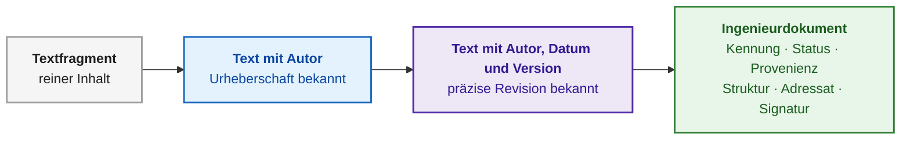
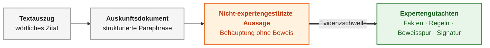
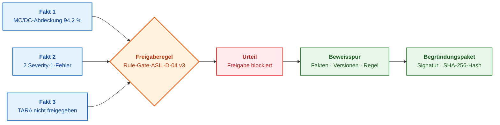
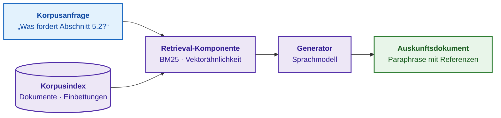
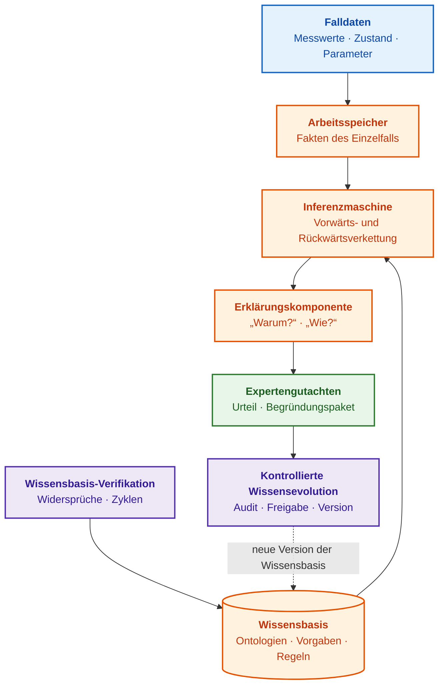
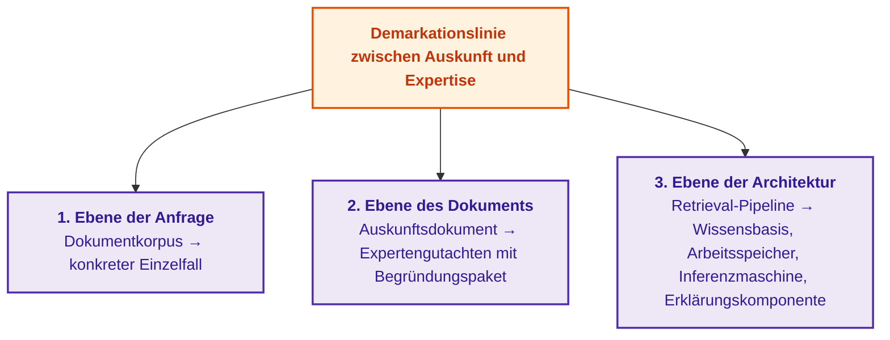

# Kapitel 3. Wie sich ein Expertensystem von einem Informations- und Auskunftssystem unterscheidet

> **Buch:** [Architektur evidenzbasierter Expertensysteme](README.md) · [Teil I: Konzeptionelle und epistemische Grundlagen](part-01-foundations.md)  
> **Vorheriges Kapitel:** [Kapitel 2. Philosophie für Ingenieure: Was eine Maschine rechtmäßig Wissen nennen darf](ch02-epistemology-of-machine-knowledge.md)  
> **Nächstes Kapitel:** [Kapitel 4. Evolution der Expertensysteme: Vom Satz von Bayes zu evidenzbasierten KI-Entscheidungen](ch04-evolution-from-bayes-to-evidence-ai.md)  
> **Inhaltsverzeichnis:** [README.md](README.md)  
> **Autor:** [Mykola Fedchyk](about-the-author.md)  
> **Niveau:** Grundlegendes Ingenieurniveau; Codebeispiel in einklappbarem Block  
> **Lernziele:** Eine Anfrage an einen Dokumentkorpus von einer Anfrage zu einem konkreten Fall differenzieren; erläutern, wie sich ein Auskunftsdokument von einem Expertengutachten unterscheidet; jene Mechanismen benennen, die einer Suchmaschine, einer Datenbank, einem Sprachmodell und Retrieval-Augmented Generation (RAG) fehlen, um als Expertensystem eingestuft zu werden; begründen, warum ein Expertensystem sein Wissen ausschließlich über eine verifizierte neue Version der Wissensbasis aktualisiert.

## Abstract
In diesem Kapitel wird die konzeptionelle, dokumentarische und architektonische Demarkationslinie zwischen Informations- und Auskunftssystemen (einschließlich RAG-Architekturen und autonomen großen Sprachmodellen) und evidenzbasierten Expertensystemen formalisiert. Es wird eine typologische Taxonomie von Informationssystemen aufgestellt und der fundamentale Unterschied zwischen dem Retrieval in einem Dokumentkorpus und der logischen Inferenz neuen Wissens für einen spezifischen ingenieurtechnischen Anwendungsfall herausgearbeitet. Eingehend analysiert werden die Genesis des Ingenieurdokuments, die Evidenzstufen von Ausgabeartefakten sowie der vergleichende Abgleich von sechs Systemklassen anhand der sieben Kriterien des epistemischen Kontrakts. Anhand eines praktischen Anwendungsfalls zur Verifikation des Software-Release-Gates (ASIL D nach ISO 26262 / ISO/SAE 21434) wird das deterministische Zusammenspiel von Inferenzmaschine, Wissensbasis und kryptografisch gesicherter Beweisspur demonstriert.

Den ersten Schritt in Richtung eines vermeintlichen „Expertensystems“ vollziehen Ingenieurteams häufig auf identische Weise: Sie nehmen einen Dateiordner mit technischer Dokumentation und koppeln ihn an eine Volltextsuche oder an ein großes Sprachmodell (*Large Language Model*, LLM), das die gefundenen Textfragmente ausliest und Benutzerfragen beantwortet. Ein solches Werkzeug ist zweifellos nützlich und trägt in diesem Werk eine präzise Bezeichnung: **Informations- und Auskunftssystem** – ein System, das bereits niedergelegte Daten auffindet und wiedergibt. Gefährlich wird es jedoch, wenn ein reines Auskunftssystem fälschlicherweise als Expertensystem deklariert wird und man seinen generierten Antworten dort vertraut, wo ein formal abgeleitetes, bindendes Urteil über einen konkreten Einzelfall zwingend gefordert ist: etwa bei der Freigabe einer Steuergeräte-Firmware für Prüffahrten oder bei der Festlegung von Parametern eines Prüfstandlaufs.

Das Ziel dieses Kapitels ist es offenzulegen, wo genau die Demarkationslinie zwischen Auskunfts- und Expertensystemen verläuft, und diese Grenze auf drei Ebenen rigoros zu analysieren: auf der Ebene der Anfrage, auf der Ebene des Ausgabedokuments und auf der Ebene der Systemarchitektur. Als Maßstab dient der in [Kapitel 2](ch02-epistemology-of-machine-knowledge.md) formulierte epistemische Kontrakt – jener Prüfkatalog, den jede Tatsachenbehauptung zwingend bestehen muss, bevor ein Expertensystem sie operativ anwendet. Für jede Klasse von Informationssystemen – von der Suchmaschine bis zum Sprachmodell – wird offengelegt, welche Kontraktprüfungen prinzipbedingt unerfüllt bleiben. Die ingenieurtechnische Praxis des Autors in den Bereichen elektronischer Berichterstattungssysteme, digitaler Signaturen und funktionaler Sicherheitsaudits im Automobilsektor begründet hierbei ein unumstößliches Kriterium: Die Aussage eines Informationssystems verdient nur dann Vertrauen, wenn sie eine nachprüfbare Quelle, eine feste Version, einen verantwortlichen Urheber und eine lückenlose Verifikationsspur aufweist.

## 1. Typologische Taxonomie von Informationssystemen: Vier grundlegende Klassen

Die Begriffe „Auskunftssystem“, „Konsultationssystem“, „Entscheidungsunterstützungssystem“ und „Expertensystem“ werden im Branchenjargon häufig fälschlich als Synonyme verwendet. Diese Begriffsverwirrung führt dazu, dass Teams von einem Werkzeug Eigenschaften erwarten, die es konstruktiv nicht leisten kann: Von einer Suchfunktion wird ein ingenieurtechnisches Urteil erhofft, von einem Chatbot wird institutionelle Verantwortung für seine Aussagen verlangt. Um Werkzeuge objektiv zu vergleichen, muss zunächst Einigkeit darüber herrschen, anhand welcher Kriterien die Klassen von Informationssystemen voneinander abgegrenzt werden.

In diesem Werk erfolgt die Klassifizierung strikt anhand des Einsatzzwecks und der Beschaffenheit des Artefakts, das das Informationssystem an den Benutzer zurückliefert. Die Benutzeroberfläche und die zugrundeliegende Implementierungstechnologie sind für die Klassenzugehörigkeit irrelevant: Derselbe Chat-Dialog kann vor einer statischen Wissensdatenbank, einem Analyse-Dashboard oder einem formalen Inferenzkern platziert werden; ebenso kann ein neuronales Netz innerhalb jeder dieser Architekturen als Subkomponente agieren. Die nachfolgende Tabelle systematisiert die vier grundlegenden Klassen.

| Klasse des Informationssystems | Primärer Einsatzzweck | Art der Rückgabe | Systemgrenze der Klasse |
|---|---|---|---|
| **Informations- und Auskunftssystem** | Auffinden und Darstellen von Daten, die bereits explizit im Dokumentkorpus niedergelegt sind | Zitat, Quellverweis, strukturierte Paraphrase der Primärquellen | Suche leitet kein neues Urteil für einen spezifischen Einzelfall ab |
| **Konsultationssystem (Dialogsystem)** | Führen eines Dialogs, Erläutern von Optionen, Erfassen von Falldaten für den Fachexperten | Ratschlag, Präzisierungsfrage, strukturierter Handlungspfad | Der Dialog an sich erzeugt kein formal verifizierbares Urteil |
| **Entscheidungsunterstützungssystem** (*Decision Support System*, DSS) | Unterstützung des Menschen beim Variantenvergleich und bei der Folgenabschätzung | Rangfolge von Optionen, Prognose, Handlungsempfehlung | Empfehlung basiert häufig auf Statistik ohne formalen logischen Beweis |
| **Expertensystem** | Anwenden formalisierter Wissensregeln auf die Faktenbasis eines konkreten Einzelfalls | Urteil oder begründete Verweigerung samt Fakten, Regeln und Beweisen | Urteil gilt streng innerhalb der Grenzen der Wissensbasis und Falldaten |

Diese Klassen weisen funktionale Überschneidungen auf. Ein Konsultationssystem beschreibt primär die Interaktionsmodalität; ein Dialog kann daher als Schnittstelle vor einer Auskunftsdatenbank, einem BI-Dashboard oder einem Expertensystem dienen. Ein Entscheidungsunterstützungssystem beschreibt den übergeordneten Zweck, und ein Expertensystem, das lediglich Ratschläge an den Ingenieur ausgibt, stellt eine hochgradig formalisierte Sonderform eines solchen Unterstützungssystems dar. Die Umkehrung gilt indessen nicht: Ein Modell zur Nachfrageprognose oder ein mathematischer Optimierer unterstützen den Menschen zwar bei Entscheidungen, verfügen jedoch weder über explizite Fachregeln noch über eine nachvollziehbare Beweisspur – also jene Kette von Fakten und Inferenzschritten, die das Ergebnis legitimiert. Folglich stellen Prognosemodelle und Optimierer keine Expertensysteme dar.

Zur Veranschaulichung betrachte man zwei Ingenieurteams mit identischer Chat-Oberfläche. Im ersten Team leitet der Chatbot Benutzeranfragen an einen Volltext-Suchindex für Normen weiter und liefert Textzitate zurück: Architektonisch handelt es sich hierbei um ein klassisches Auskunftssystem. Im zweiten Team übergibt der Chatbot die strukturierten Anfragedaten an eine Inferenzmaschine, die die tatsächlichen Metriken eines Firmware-Builds gegen formalisierte Freigaberegeln prüft und ein bindendes Urteil samt Beweisspur ausgibt: Dieses Werkzeug operiert als echtes Expertensystem. Der Benutzer interagiert mit derselben UI-Maske, erhält jedoch Ergebnisse von grundlegend verschiedener epistemischer Tragweite.

Die Klasse eines Informationssystems wird folglich weder durch das Frontend noch durch die Präsenz eines neuronalen Netzes bestimmt, sondern ausschließlich dadurch, was das System ausgibt und wie es seine Ausgaben begründet. Im Folgenden wird die Grenze zwischen Auskunft und Expertise auf drei Ebenen analysiert – beginnend mit der Natur der Fragestellung.

## 2. Semantische Ebene der Anfrage: Differenzierung zwischen Dokumentkorpus-Analyse und Einzelfallfakten

Benutzeranfragen ähneln sich oberflächlich in ihrer syntaktischen Formulierung, gehören jedoch zwei fundamental verschiedenen Kategorien an. Wird diese Differenzierung ignoriert, versucht ein reines Auskunftssystem unweigerlich eine Frage zu beantworten, für die es konstruktiv ungeeignet ist – und liefert dabei eine trügerisch überzeugende Antwort.

Eine **Korpusanfrage** zielt darauf ab, was explizit in den hinterlegten Dokumenten steht: „Was besagt die Prüfnorm bezüglich der maximal zulässigen Gehäusetemperatur des Moduls?“, „In welchem Dokument sind die Isolationsanforderungen spezifiziert?“. Als Korpus wird die Gesamtheit aller Dokumente bezeichnet, in denen nach relevanten Informationen gesucht wird. Die Antwort auf eine Korpusanfrage existiert bereits im Vorfeld im Text; die Aufgabe des Auskunftssystems beschränkt sich darauf, den einschlägigen Textabschnitt zu lokalisieren und verständlich darzustellen. Selbst wenn ein neuronales Netz diese Fragmente sprachlich glättet und zusammenfasst, ändert dies nichts am Wesen der Operation: Das Auskunftssystem führt Information Retrieval und Textaggregation aus.

Eine **Einzelfallanfrage** bezieht sich hingegen auf eine konkrete, individuelle Problemsituation: „Darf am 15. September 2026 der Prototyp der Revision B auf dem Prüfstand R-4 bei einer gemessenen Gehäusetemperatur von 95 °C erprobt werden?“ Die Antwort auf diese Frage steht in keinem Dokument im Wortlaut niedergeschrieben. Im Praxisszenario aus [Kapitel 2](ch02-epistemology-of-machine-knowledge.md) begrenzt die Prüfnorm die Gehäusetemperatur pauschal auf 90 °C, während die Ausnahmegenehmigung W-17 eine Temperatur von 95 °C gestattet – allerdings exklusiv für Revision B, ausschließlich auf Prüfstand R-4 und befristet bis zum 1. Oktober 2026. Eine gültige Antwort entsteht erst dann, wenn die Regeln aus Norm und Ausnahmegenehmigung auf die spezifische Faktenlage des Falls angewendet werden: Prototypenrevision, Prüfstands-ID, Datum und physikalische Messgröße. Diese Deduktion wird von der Inferenzmaschine ausgeführt – jenem Softwaremechanismus, der die Fakten der Situation aufnimmt, zutreffende Regeln selektiert und eine neue, zuvor nicht existierende Schlussfolgerung berechnet ([Kapitel 1](ch01-introduction-to-expert-systems.md)).

> **Prüfkriterium für die Systemklasse.** Antwortet ein Informationssystem auf jede Eingabe im Stil von „Folgendes steht dazu in den Quellen“, liegt ein Auskunftssystem vor. Antwortet das System im Format „Für den vorliegenden Fall C ist die Operation gemäß Regel R auf Basis der Fakten F1 und F2 aus Dokument S in Version 4 gesperrt; hier ist die vollständige Beweisspur“, operiert ein Expertensystem.

Ein Expertensystem beherrscht auch Korpusanfragen, da ein Suchmodul als Subkomponente in seine Architektur integriert ist. Die Umkehrung gilt nicht: Einem Auskunftssystem fehlt prinzipbedingt der Mechanismus zur Regelanwendung auf Fallfakten. Daher kann ein Auskunftssystem auf eine Einzelfallanfrage bestenfalls mit einem Quellenzitat oder einer stochastischen Mutmaßung reagieren.

Ein Dokumentkorpus gilt übergeordnet für viele Anwendungsfälle und ändert sich selten, wohingegen jeder Fall seine eigenen, variablen Fakten besitzt. Eine Suchmaschine ruft allgemeine Regeln aus dem Korpus ab, kann diese Regeln jedoch nicht auf den Einzelfall abbilden: Diese Synthese obliegt der Inferenzmaschine. Der folgende Abschnitt beleuchtet, welche Rolle in dieser Teilung großen Sprachmodellen zukommt, die in der Praxis am häufigsten mit Expertensystemen verwechselt werden.

## 3. Funktionale Rolle großer Sprachmodelle in der Architektur analytischer Systeme

Frei zugängliche Chat-Dienste auf Basis großer Sprachmodelle wie ChatGPT, Claude oder Gemini werden von Anwendern wahlweise als Auskunftssysteme oder als Expertensysteme tituliert. Beide Bezeichnungen greifen zu kurz, da ein großes Sprachmodell isoliert betrachtet kein vollständiges Informationssystem darstellt. Ein Sprachmodell ist eine Basiskomponente; erst die übergeordnete Systemarchitektur bestimmt die Klasse des Gesamtsystems.

Ein großes Sprachmodell generiert Texte anhand der statistischen Gewichte eines neuronalen Netzes, das auf gewaltigen Textkorpora trainiert wurde. Das während des Trainings assimilierte Wissen ist diffus über Milliarden von Parametern verteilt. Das Modell ist daher strukturell außerstande, das exakte Quelldokument einer konkreten Sachbehauptung verlässlich zu benennen. Daraus resultieren drei fundamentale Restriktionen:

- **Das Sprachmodell kennt den internen Dokumentkorpus eines Unternehmens nicht.** Auf die Frage „Wo ist das in unseren internen Entwicklungsrichtlinien festgeschrieben?“ liefert ein Modell ohne Dokumentenzugriff eine sprachlich souveräne, aber mit hoher Wahrscheinlichkeit erfundene Darstellung. Die Neigung generativer Modelle, sachlich unbegründete, rein plausible Texte zu halluzinieren, ist in der Informatik hinlänglich dokumentiert [[1]](#src-1).
- **Das Sprachmodell speichert die Fakten eines Falls nicht als isolierte, validierte Datensätze.** Den Kontext einer Anfrage sieht das Modell ausschließlich innerhalb seines Token-Kontextfensters. Die Herkunft (*Provenance*) und die Revisionsstände einzelner Parameter im Prompt werden darin nicht formal nachverfolgt.
- **Das Sprachmodell konstruiert keine diskrete logische Kette im Sinne von „Fakt, Regel, Inferenz“.** Die generierte Ausgabe mag oberflächlich den Duktus eines ingenieurtechnischen Urteils imitieren, doch unter der textuellen Hülle existieren weder eine deterministische Beweisspur noch nachweisbare Faktenquellen oder ein formal haftender Verantwortlicher.

Die übergeordnete Architektur, in die das Sprachmodell eingebettet wird, entscheidet über die Klasse des resultierenden Systems:

1. Ein Sprachmodell, das an eine Suchkomponente über einem kontrollierten Unternehmenskorpus gekoppelt ist, bildet eine **Retrieval-Augmented Generation** (RAG). Patrick Lewis und Koautoren schlugen vor, das parametrische Gedächtnis des Sprachmodells mit einem nicht-parametrischen Gedächtnis – einem Dokumentenindex – zu verbinden, aus dem vor der Generierung relevante Chunks extrahiert werden [[2]](#src-2). RAG-Antworten verweisen auf reale Unternehmensdokumente, bleiben ihrer Systemklasse nach jedoch moderne Informations- und Auskunftssysteme.
2. Ein Sprachmodell, das mit einer formalen Wissensbasis, einer Inferenzmaschine, einem Arbeitsspeicher für Falldaten und einer Erklärungskomponente kombiniert wird, bildet ein **neuro-symbolisches Expertensystem** ([Kapitel 29](ch29-neuro-symbolic-architecture.md)). In einem neuro-symbolischen System fungiert das Sprachmodell als Übersetzungsschicht: Es transformiert natürliche Benutzersprache in strukturierte Fakten und Prädikate und übersetzt das formal abgeleitete Urteil zurück in verständlichen Text. Die Entscheidung über Wahrheit, Gültigkeit und logische Konsistenz trifft das Modell zu keinem Zeitpunkt selbst.

Ein prägnantes Beispiel: Auf die Frage „Darf der Prototyp der Revision B bei 95 °C geprüft werden?“ antwortet ein isoliertes Sprachmodell mit generischen Erläuterungen zu thermischen Betriebsbedingungen. Ein RAG-System findet die Prüfnorm und die Ausnahmegenehmigung W-17 und fasst beide Dokumente unter Angabe von Quellenlinks zusammen – prüft jedoch nicht formal, ob Revision, Prüfstand und Datum der Anfrage die Gültigkeitskriterien der Ausnahmegenehmigung erfüllen. Ein neuro-symbolisches Expertensystem hingegen extrahiert die Fallparameter über das Sprachmodell, übergibt sie an den symbolischen Inferenzkern, prüft deterministisch alle Konditionen von W-17 und generiert eine bindende Antwort nebst vollständiger Beweisspur.

In Forschungs- und Entwicklungsumgebungen greift zudem eine sicherheitsrelevante Restriktion: Um eine Antwort von einem Cloud-Sprachmodell zu erhalten, müssen vertrauliche Entwurfsparameter oder Schadensanalysen an externe Provider übertragen werden – was Sicherheitsrichtlinien in geschützten Projekten strikt untersagen. In solchen Szenarien werden das Sprachmodell und die Inferenzkomponenten zwingend on-premises betrieben ([Kapitel 18](ch18-execution-infrastructure.md)).

Ein großes Sprachmodell ist ein mächtiges linguistisches Werkzeug, jedoch niemals eine Instanz zur Feststellung der Wahrheit. Ohne Suche reproduziert es Trainingsdaten; mit Suche wird es zum Bestandteil eines Auskunftssystems; erst in Verbindung mit Wissensbasis und Inferenzmaschine wird es Teil eines Expertensystems. Die nächste Differenzierungsebene betrifft das vom System erzeugte Ausgabeartefakt.

## 4. Dokumentarische Ebene: Konzeptionelle Grenze zwischen Auskunftsdokument und Expertengutachten

Sowohl ein Auskunftssystem als auch ein Expertensystem geben vordergründig Text aus. Beide Texte können auf dem Bildschirm täuschend ähnlich formuliert sein. Bei einem Sicherheitsaudit, einer Produktzertifizierung oder einem Regressstreit zwischen Entwicklungsteams besitzt jedoch nur eines der beiden Artefakte formale Beweiskraft. Um diesen Unterschied zu verstehen, muss zunächst analysiert werden, wodurch ein Text überhaupt zu einem rechtsverbindlichen Dokument wird.

### 4.1. Genesis des Ingenieurdokuments: Vom Rohtext zum rechtsverbindlichen Artefakt

Die Transformation unstrukturierter Daten in eine tragfähige Beweisbasis beginnt mit dem Verständnis der Dokumentengenesis: Ein rohes Textfragment erlangt den Status eines legitimen Ingenieurartefakts erst durch die schrittweise Akkumulation von Autorschaft, Revisionsstand und Rechtsverbindlichkeit. Ein isolierter Textabschnitt auf dem Monitor ist noch kein Dokument: Es ist unbekannt, wer ihn verfasst hat, wann er erstellt wurde, an wen er sich richtet und ob er gegenwärtig Gültigkeit besitzt. Ein solcher Textschnipsel lässt sich weder verifizieren noch in einen Auditbericht einbinden.

Ein Text durchläuft bei seiner Reifung zum Dokument mehrere Stufen, wobei jede Stufe ein spezifisches Attribut hinzufügt, ohne das nachfolgende Validierungen unmöglich sind:

1. **Textfragment:** enthält lediglich den reinen Informationsgehalt.
2. **Text mit Autor:** dokumentiert den Urheber, erlaubt mangels Zeitstempel jedoch keine Prüfung der Aktualität.
3. **Text mit Autor, Datum und Version:** ermöglicht die eindeutige Zuordnung des Zitats zu einer konkreten Revision.
4. **Ingenieurdokument:** besitzt den vollständigen Satz kanonischer Metadaten:
   - stabile Kennung (z. B. Inventar- oder Dokumentennummer);
   - Autor und verantwortlicher Dokumenteneigner (*Owner*), der inhaltlich haftet;
   - Lebenszyklusstatus: Entwurf, in Prüfung, freigegeben oder archiviert/außer Kraft gesetzt;
   - Herkunftsnachweis (*Provenance*): aus welchen Eingangsdaten und durch welche Prozessschritte das Artefakt entstanden ist; das PROV-O-Modell des World Wide Web Consortiums (W3C) formalisiert dies über Entitäten, Aktivitäten und Akteure [[3]](#src-3);
   - Strukturierung: typisierte Abschnitte und maschinenlesbare Datenfelder;
   - Geltungsbereich, Zieladressat und Einstufung der Vertraulichkeit;
   - rechtsgültige Signatur der verantwortlichen Person.

Das folgende Diagramm visualisiert diese Reifungskette.



Der graue Knoten symbolisiert das kontextlose Textfragment; die blauen und violetten Knoten fügen Urheber, Datum und Revision hinzu; der grüne Knoten repräsentiert das vollständige Ingenieurdokument. Jeder Übergang schaltet eine neue Prüfmöglichkeit frei: Die Nennung des Autors ermöglicht die Zuweisung von Verantwortung; die Revisionsnummer erlaubt die Feststellung der Gültigkeit; Status und Signatur legitimieren die Verwendung im Zertifizierungsaudit.

Im rechtsverbindlichen Dokumentenverkehr ist dieses Prinzip seit langem etabliert. In der Europäischen Union besitzt eine qualifizierte elektronische Signatur (QES) gemäß eIDAS-Verordnung dieselbe Rechtswirkung wie eine handschriftliche Unterschrift, wobei die Verifikation eines qualifizierten Zertifikats die lückenlose Gültigkeit zum Signierzeitpunkt nachweist [[4]](#src-4). Die Beweiskraft eines Dokuments erwächst nicht aus seiner typografischen Eleganz, sondern aus der kryptografisch und organisatorisch verifizierbaren Bindung zwischen Inhalt und verantwortlicher Entität.

Für ein Expertensystem begründet diese Analogie eine fundamentale Anforderung: Ein generiertes Urteil gewinnt seine Durchsetzungskraft nicht durch stilistische Eloquenz, sondern ausschließlich durch die Bindung an eine signierte, reproduzierbare Beweisspur. Ein Urteil ohne diese Bindung verbleibt auf der Stufe eines einfachen Textfragments – ungeachtet dessen, wie überzeugend es formuliert sein mag.

### 4.2. Ontologische Differenzierung: Passive Quellenparaphrase versus determinierte Inferenz

Die fundamentale ontologische Demarkationslinie zwischen einer Auskunft und einem Expertengutachten liegt in der Differenz zwischen passiver Wiedergabe bestehender Fakten und der Synthese neuen Wissens mittels logischer Deduktion. Da sich beide Ausgabedokumente auf dieselben primären Quellen stützen können, ist der Unterschied nicht im Themenfeld, sondern im ontologischen Status des Dokuments begründet.

Ein **Auskunftsdokument** referiert bestehendes Wissen: ein Exzerpt aus einer Industrienorm, ein Auszug aus dem Datenblatt eines Leistungstransistors oder eine Kalibrieranweisung. Das Gütekriterium eines Auskunftsdokuments ist die Übereinstimmung mit der Primärquelle. Sein Verifikationspfad erschöpft sich in Verweisen auf Kapitel und Seitenzahlen; neue Aussagen enthält es nicht. Der Ersteller haftet für die Wiedergabetreue, nicht jedoch für die physikalischen oder rechtlichen Konsequenzen, die aus der praktischen Umsetzung des zitierten Texts resultieren.

Ein **Expertengutachten** (*Expertenurteil*) ist hingegen eine eigenständige Schlussfolgerung über einen konkreten Einzelfall: die Sicherheitsbewertung einer Baugruppe, die Freigabe einer Steuergeräte-Software für den Fahrzeugtest oder die Lokalisierung eines Fehlers. Das Gütekriterium des Gutachtens ist die formale Korrektheit der logischen Ableitung aus verifizierten Fakten anhand freigegebener Regeln. Seine Beweisspur besteht aus einer expliziten Kette: „Fakt, Regel, Zwischenergebnis, Endurteil“ – unter Ausweisung von Versionen und Herkunft jedes Elements. Ein Expertengutachten enthält Feststellungen, die in keinem der Quelldokumente wörtlich existieren, deklariert explizit Anwendungsbereich und Randannahmen und trägt die digitale Signatur des Sachverständigen oder des Expertensystems, hinter der eine haftende Person steht.

| Merkmal | Auskunftsdokument | Expertengutachten |
|---|---|---|
| Ontologische Natur | Paraphrase bekannten Wissens | Neues deduziertes Urteil über einen Einzelfall |
| Gütekriterium | Texttreue zur Primärquelle | Korrekte logische Ableitung aus Fakten via Regeln |
| Neue Aussagen | Keine | Ja: Einzelfallbezogene Schlussfolgerung |
| Nachweispfad | Quellen- und Zitatverweise | Beweisspur mit Revisionsständen und Provenienz |
| Geltungsbereich | Durch Primärquelle vorgegeben | Explizit deklariert: Domäne, Annahmen, Status |
| Verwendung | Informationsbereitstellung | Verbindlicher Beweis in Audit und Zertifizierung |

> [!NOTE] Ingenieurtechnischer Kontrast: Warum reine Auskunft in Hardware-Systemen versagt
> Fragt man ein typisches RAG-System: *„Darf eine Spannung von 24 V an den Digitaleingang des Moduls DI-4 angelegt werden?“*, findet es im Datenblatt die Angabe „Nenneingangsspannung: 24 V DC“ und antwortet affirmativ.
> Ein Expertensystem prüft demgegenüber die **Fakten der aktuellen Verschaltung**: Wurde das Board über Jumper auf TTL-Pegel (5 V) konfiguriert oder überschreitet die Gehäusetemperatur 70 °C, führt das Anlegen von 24 V zur thermischen Zerstörung des Eingangsoptokopplers. Das Expertensystem blockiert die Aktion und weist präzise auf den Hardware-Konfigurationskonflikt hin. Das Auskunftssystem zitiert Spezifikationen; das Expertensystem berechnet die physikalische Konsequenz für das konkrete Gerät.

Zwischen einem wörtlichen Textzitat und einem vollwertigen Expertengutachten liegen vier diskrete Evidenzstufen:

1. **Auszug:** wörtliches Zitat einer Quelle, beispielsweise die Textpassage eines Normenabschnitts.
2. **Auskunftsdokument:** strukturierte Zusammenfassung von Passagen aus mehreren Quellen, etwa eine tabellarische Parameterübersicht. Neues Wissen wird auf dieser Stufe nicht generiert.
3. **Nicht-expertengestützte Aussage:** Urteil über einen Einzelfall ohne logische Fakten-Regel-Kette. Typisches Beispiel ist die Ausgabe eines Sprachmodells ohne Zugriff auf reale Falldaten: „Dieses Bauelement scheint für Ihre Schaltung geeignet zu sein.“ Eine formale Überprüfung ist unmöglich.
4. **Expertengutachten:** Urteil über einen Einzelfall mit lückenloser Beweisspur, Provenienznachweis jeder Prämisse und signiertem Begründungspaket. Als **Begründungspaket** (*Proof Packet*) wird in diesem Buch das Endurteil zusammen mit den zugrunde gelegten Fakten, Regeln, versionierten Quellen, Gültigkeitsgrenzen und der verantwortlichen Person bezeichnet ([Kapitel 1](ch01-introduction-to-expert-systems.md)).

Das nachfolgende Diagramm veranschaulicht diese Stufen und hebt die Evidenzschwelle zwischen Stufe 3 und 4 hervor.



Die grauen Knoten generieren kein neues Wissen; der orangefarbene Knoten liefert eine isolierte Behauptung ohne Fundierung; der grüne Knoten repräsentiert ein fundiertes Urteil mit formalem Beweis. Der Doppelpfeil markiert die Evidenzschwelle: Um sie zu überschreiten, genügt keine ausgefeiltere Rhetorik, sondern es bedarf diskreter Fakten, expliziter Regeln und einer verifizierbaren Beweisspur.

Die Grenze zwischen Stufe 3 und 4 wird nicht durch die Textqualität markiert, sondern durch die Existenz prüfbarer Inferenzketten. Der folgende Abschnitt veranschaulicht diesen Unterschied anhand einer Freigabeentscheidung, von der die physische Sicherheit von Testfahrten abhängt.

### 4.3. Praktischer Anwendungsfall: Verifikation der Freigabe von eingebetteter Software (Release Gate ASIL D) nach ISO 26262

Die praktische Tragweite der ontologischen Abgrenzung tritt bei der Freigabe missionskritischer eingebetteter Software besonders deutlich zutage – dort, wo die Verwechslung eines Auskunftsdokuments mit einem Expertengutachten zu fatalen Systemunfällen führen kann. Betrachtet sei ein Szenario, in dem ein Entwicklungsteam die Firmware v2.4.1 eines elektronischen Bremssteuergeräts für Erprobungsfahrten auf der Teststrecke freigeben soll. Ein solcher Kontrollpunkt im Entwicklungsprozess wird als **Release Gate** bezeichnet. Die funktionalen Sicherheitsanforderungen der Firmware sind nach ASIL D eingestuft (*Automotive Safety Integrity Level*): ISO 26262 definiert vier Sicherheitsstufen (A bis D), wobei Stufe D die schärfsten Anforderungen an Verifikation und Fehlervermeidung stellt. Drei verschiedene Informationssysteme reagieren auf die Frage „Ist die Firmware v2.4.1 bereit für den Teststreckenbetrieb?“ grundlegend unterschiedlich:

- **Das Auskunftssystem** sucht die Release-Checkliste, den Bericht des Testteams, Notizen zur Cybersicherheit und Verweise auf ISO 26262 heraus.
- **Der Chatbot auf Basis eines Sprachmodells** fasst zusammen: „Die Mehrheit der Modultests war erfolgreich; die Firmware scheint für den Testbetrieb bereit zu sein.“
- **Das Expertensystem** generiert ein formales Urteil:

> **Urteil:** Freigabe der Firmware v2.4.1 für Erprobungsfahrten gesperrt.  
> **Fakten:**  
> 1. Die modifizierte Bedingungs-/Entscheidungsabdeckung (*Modified Condition/Decision Coverage*, MC/DC) durch Modultests liegt bei 94,2 %, während die interne Freigaberegel für ASIL-D-Module zwingend 100 % vorschreibt (Abdeckungsbericht vom 25.09.2026).  
> 2. Der Bericht der statischen Codeanalyse für Commit `a1f9c8` weist zwei ungelöste Fehler der höchsten Kritikalitätsstufe (*Severity-1*) aus (Analyseprotokoll vom 26.09.2026).  
> 3. Die Bedrohungsanalyse und Risikobewertung (*Threat Analysis and Risk Assessment*, TARA) wurde vom Sicherheitsbeauftragten noch nicht unterzeichnet.  
> **Regel:** `Rule-Gate-ASIL-D-04`, Version 3, untersagt die Freigabe für Erprobungsfahrten, solange mindestens eine blockierende Bedingung erfüllt ist.  
> **Begründungspaket:** digital signiert, SHA-256-Hash `8b4a7…`.

Das Expertensystem weist die Quelle jeder Regel explizit aus, da die Vorgaben aus verschiedenen normativen Dokumenten stammen. ISO 26262-6 empfiehlt für ASIL D nachdrücklich den Nachweis der MC/DC-Abdeckung [[5]](#src-5), die konkrete 100-%-Hürde wird jedoch durch interne Qualitätsrichtlinien des Unternehmens definiert. Das TARA-Verfahren wiederum entstammt dem automobilen Cybersicherheitsstandard ISO/SAE 21434 [[6]](#src-6). Würde das System fälschlicherweise behaupten, die 100-%-Vorgabe stünde direkt in der ISO-Norm, würde ein externer Auditor bereits beim ersten Faktum eine Diskrepanz beanstanden.

Das folgende Diagramm zeigt den deterministischen Ablauf: Drei diskrete Fakten werden der Freigaberegel zugeführt, die das Urteil, die Beweisspur und das signierte Begründungspaket erzeugt.



Die blauen Knoten stellen verifizierte Fallfakten dar; die orangefarbene Raute verkörpert die Regel aus der Wissensbasis; der rote Knoten ist das abgeleitete Sperrurteil; die grünen Knoten umfassen die Beweisspur und das kryptografisch signierte Begründungspaket. Da jeder Fakt eine eindeutige Provenienz besitzt, lässt sich das Gesamtergebnis modular auditieren.

Ein solches Gutachten ermöglicht einen sachlichen, beweisorientierten Diskurs. Ein Softwareentwickler kann nun gezielt Einspruch gegen einen spezifischen Fakt erheben – etwa indem er nachweist, dass einer der Severity-1-Befunde ein verifizierter Fehlalarm (*False Positive*) des Analysators ist und im Tracking-System formell freigezeichnet wurde. Der Regeleigentümer kann wiederum die Schwellenwerte über ein formales Änderungsmanagement anpassen. Gegen ein diffuses „Sieht gut aus“ eines Sprachmodells lässt sich hingegen kein fundierter Einwand formulieren, da ihm jegliche explizite Fakten- und Regelbasis fehlt.

Wie eine Inferenzmaschine ein solches Urteil programmatisch berechnet, demonstriert das folgende, in sich geschlossene Go-Listing. Die Regel ist hierbei strikt als deklarative Datenstruktur modelliert und nicht im Programmiercode fest verdrahtet: Bedingungen und Schwellenwerte können modifiziert werden, ohne die Engine neu zu kompilieren.

<details>
<summary>Go-Implementierung: Freigaberegel als Datenstruktur und Auswertung der Beweisspur</summary>

Das Programm ist vollständig lauffähig und kann direkt mittels `go run main.go` ausgeführt werden. Die Regel `Rule-Gate-ASIL-D-04` kapselt drei blockierende Bedingungen; die Funktion `evaluate` gleicht jede Bedingung gegen die Fallfakten ab und protokolliert die Auswertungsspur. Für Firmware v2.4.2 wird der TARA-Fakt bewusst weggelassen, um den Zustand unvollständigen Wissens zu demonstrieren.

```go
package main

import "fmt"

// Condition repräsentiert eine Einzelbedingung der Regel: Faktenbezeichner, Vergleichsoperator und Schwellenwert.
type Condition struct {
	Fact  string
	Op    string // "<", ">" oder "=="
	Value float64
}

// Rule wird in der Wissensbasis als Datenstruktur mit Bezeichner und Version gespeichert.
type Rule struct {
	ID       string
	Version  int
	Blockers []Condition // jede erfüllte Bedingung blockiert die Freigabe
}

// holds prüft die Bedingung und gibt an, ob der Fakt bekannt ist.
func holds(c Condition, facts map[string]float64) (value, known bool) {
	v, ok := facts[c.Fact]
	if !ok {
		return false, false
	}
	switch c.Op {
	case "<":
		return v < c.Value, true
	case ">":
		return v > c.Value, true
	default:
		return v == c.Value, true
	}
}

// evaluate wendet die Regel auf die Fallfakten an und gibt die Auswertungsspur der Bedingungen aus.
func evaluate(r Rule, facts map[string]float64) string {
	blocked, unknown := false, false
	for _, c := range r.Blockers {
		value, known := holds(c, facts)
		switch {
		case !known:
			unknown = true
			fmt.Printf("  %s: Fakt unbekannt\n", c.Fact)
		case value:
			blocked = true
			fmt.Printf("  %s = %g %s %g: Bedingung blockiert Freigabe\n", c.Fact, facts[c.Fact], c.Op, c.Value)
		}
	}
	switch {
	case blocked:
		return "blockiert"
	case unknown:
		return "Präzisierung erforderlich"
	default:
		return "freigegeben"
	}
}

func main() {
	rule := Rule{ID: "Rule-Gate-ASIL-D-04", Version: 3, Blockers: []Condition{
		{Fact: "mcdc_coverage_pct", Op: "<", Value: 100},
		{Fact: "open_sev1_defects", Op: ">", Value: 0},
		{Fact: "tara_approved", Op: "==", Value: 0},
	}}

	cases := []struct {
		firmware string
		facts    map[string]float64
	}{
		{"v2.4.1", map[string]float64{"mcdc_coverage_pct": 94.2, "open_sev1_defects": 2, "tara_approved": 0}},
		{"v2.4.2", map[string]float64{"mcdc_coverage_pct": 100, "open_sev1_defects": 0}},
	}
	for _, c := range cases {
		fmt.Printf("Firmware %s\n", c.firmware)
		fmt.Printf("  Urteil: %s gemäß Regel %s v%d\n", evaluate(rule, c.facts), rule.ID, rule.Version)
	}
}
```

Die Konsolenausgabe des Programms lautet:

```text
Firmware v2.4.1
  mcdc_coverage_pct = 94.2 < 100: Bedingung blockiert Freigabe
  open_sev1_defects = 2 > 0: Bedingung blockiert Freigabe
  tara_approved = 0 == 0: Bedingung blockiert Freigabe
  Urteil: blockiert gemäß Regel Rule-Gate-ASIL-D-04 v3
Firmware v2.4.2
  tara_approved: Fakt unbekannt
  Urteil: Präzisierung erforderlich gemäß Regel Rule-Gate-ASIL-D-04 v3
```

Für Firmware v2.4.1 schlugen alle drei Sperrbedingungen an, wobei jede Zeile der Beweisspur den Faktennamen, den Messwert und den Schwellenwert ausweist. Für Firmware v2.4.2 liegen Abdeckung und Fehleranzahl im Sollbereich, doch der Status der TARA-Freigabe fehlt im Datensatz. Die Inferenzmaschine interpretiert fehlende Information keineswegs als implizite Zustimmung, sondern liefert deterministisch den Status „Präzisierung erforderlich“. Dieses Verhalten folgt strikt der dreiwertigen Logik aus [Kapitel 2](ch02-epistemology-of-machine-knowledge.md#чи-застосовне-твердження-до-запиту): Der Wahrheitswert „unbekannt“ ist weder „wahr“ noch „falsch“. In industriellen Produktivsystemen verarbeitet die Inferenzmaschine Tausende solcher Regeln vernetzt, wobei das abgeleitete Zwischenergebnis einer Regel als Prämisse in nachgelagerte Regeln einfließt ([Kapitel 6](ch06-applied-mathematics-for-expert-systems.md), [Kapitel 16](ch16-expert-systems-architecture.md)).

</details>

Das Codebeispiel unterstreicht die fundamentale Divergenz der drei Resultate: Ein Auskunftssystem stellt Dokumente zur manuellen Sichtung bereit; ein Chatbot erzeugt die vage Illusion einer Entscheidung; ein Expertensystem liefert ein auditierbares, anfechtbares und mathematisch reproduzierbares Urteil.

Auf dokumentarischer Ebene verläuft die Demarkationslinie mithin entlang der Beweisspur: Fehlt dieser lückenlose Herkunftsnachweis, degradiert selbst eine inhaltlich zutreffende Aussage zu einer nicht-expertengestützten Behauptung. Um eine solche Beweisspur zu konstruieren, bedarf es im Systemarchitektur-Entwurf jedoch spezieller Kernkomponenten, die in einer herkömmlichen Such- und Sprachmodell-Pipeline nicht existieren.

## 5. Architektonische Ebene: Lineare RAG-Pipeline versus Inferenzmaschine

Die Differenz zwischen reiner Auskunft und echter Expertise ist struktureller Natur und bestimmt das gesamte Komponentengefüge eines Informationssystems. Um dies transparent zu machen, werden nachfolgend zwei Architekturen gegenübergestellt: eine moderne RAG-Pipeline und das symbolische Kernsystem eines Expertensystems.

### 5.1. Organisationsprinzipien der linearen Retrieval-Augmented-Generation-Pipeline (RAG)

Das dominierende Paradigma moderner Auskunftskomplexe ist die Architektur der suchgestützten Generierung (*Retrieval-Augmented Generation*, RAG). Sie implementiert eine lineare Verarbeitungskette zur Transformation unstrukturierter Textdaten aus drei Hauptkomponenten:

1. **Der Dokumentenindex:** speichert den Dokumentkorpus als Volltext oder in Form dichter Vektoren. Eine Vektoreinbettung (*Embedding*) bildet Textfragmente so in einen hochdimensionalen Raum ab, dass semantisch verwandte Abschnitte räumlich nah beieinander liegen.
2. **Die Retrieval-Komponente:** selektiert die relevantesten Textfragmente (*Chunks*) über Ranking-Funktionen wie BM25 – welche Termfrequenz, Dokumentenlänge und inverse Dokumenthäufigkeit gewichtet [[7]](#src-7) – oder über Kosinus-Ähnlichkeit im Vektorraum. In modernen Architekturen werden beide Verfahren häufig als hybride Suche kombiniert.
3. **Der Generator:** ein großes Sprachmodell, das die vom Retriever übergebenen Textpassagen synthetisiert und sprachlich formuliert.

Das folgende Diagramm verdeutlicht den Signalfluss innerhalb dieser Pipeline.



Der blaue Knoten repräsentiert die Korpusanfrage; die violetten Knoten bilden die Pipeline-Stufen; der grüne Knoten stellt das resultierende Auskunftsdokument dar. Der Kontrollfluss verläuft streng unidirektional: Eine RAG-Pipeline besitzt per se keinen Speicher für strukturierte Fallfakten, führt keine formalen Regelprüfungen durch und ist nicht in der Lage, logische Inkonsistenzen zwischen abgerufenen Dokumentfragmenten algorithmisch aufzudecken.

Für allgemeine Korpusabfragen ist diese Architektur exzellent geeignet und wirtschaftlich effizient zu realisieren. Für Einzelfallprüfungen fehlen ihr jedoch elementare Funktionsblöcke: ein strukturierter Speicher für Falldaten sowie eine Inferenzkomponente zur deduktiven Regelanwendung.

### 5.2. Strukturelle Dekomposition des Kerns eines evidenzbasierten Expertensystems

Ein Expertensystem kann Suchmodule und Sprachmodelle durchaus als unterstützende Komponenten integrieren – sein funktionales Fundament beruht jedoch auf gänzlich anderen Subsystemen. Das folgende Diagramm zeigt den Datenfluss von den Parametern des Einzelfalls durch den symbolischen Kern bis hin zum auditierbaren Gutachten.



Der blaue Knoten erfasst die Falldaten; die orangefarbenen Komponenten bilden das Inferenzzentrum; der grüne Knoten repräsentiert das finale Gutachten; die violetten Blöcke steuern Verifikation und Evolution der Regeln. Die gestrichelte Linie signalisiert, dass gewonnene Erkenntnisse niemals direkt in die Wissensbasis zurückfließen, sondern stets einen geregelten Audit- und Versionsfreigabeprozess durchlaufen müssen.

Den Kern eines Expertensystems bilden Subsysteme, die in einer RAG-Pipeline nicht existieren:

- **Die Wissensbasis** (*Knowledge Base*): speichert Ontologien, technische Anforderungen, Restriktionen und Inferenzregeln als formalisierte Datenstrukturen – strikt getrennt vom Rohtext der Dokumente ([Kapitel 7](ch07-knowledge-base-typology.md)).
- **Der Arbeitsspeicher** (*Working Memory*): verwaltet die Faktenbasis eines konkreten Falls strikt isoliert von anderen Vorgängen, wodurch eine Kontamination von Parametern zwischen verschiedenen Firmware-Builds ausgeschlossen wird.
- **Die Inferenzmaschine** (*Inference Engine*): wendet Regeln deterministisch auf die Fakten an: Identische Fakten und identische Regeln erzeugen zwingend dasselbe Resultat. Bei der Vorwärtsverkettung (*Forward Chaining*) bewegt sich der Algorithmus von den Fakten zu neuen Schlussfolgerungen; bei der Rückwärtsverkettung (*Backward Chaining*) startet er von einer Zielhypothese und sucht jene Fakten, die sie beweisen oder widerlegen. Für den hochperformanten Musterabgleich tausender Regeln entwickelte Charles Forgy den Rete-Algorithmus [[8]](#src-8), dessen Funktionsweise in [Kapitel 6](ch06-applied-mathematics-for-expert-systems.md) vertieft wird.
- **Die Erklärungskomponente** (*Explanation Engine*): beantwortet die ingenieurtechnischen Leitfragen „Warum wurde dieses Urteil gefällt?“ und „Wie wurde das Ergebnis abgeleitet?“ anhand der generierten Beweisspur ([Kapitel 20](ch20-explanation-engine.md)).
- **Die Wissensbasis-Verifikation:** analysiert Regelsätze automatisiert auf zirkuläre Abhängigkeiten, interne Kontradiktionen und unerreichbare Bedingungen, bevor ein Regelsatz produktiv geschaltet wird ([Kapitel 23](ch23-knowledge-base-verification.md)).
- **Die kontrollierte Wissensevolution:** überführt Betriebserfahrungen und Normänderungen in eine geprüfte neue Release der Wissensbasis (siehe Abschnitt [„7.1. Wissensevolution durch Versionierung und Regressionstests auf Referenzdatensätzen“](#навчання-лише-через-перевірену-нову-версію-бази-знань)).

Entfernt man aus einem Expertensystem die Inferenzmaschine, den Arbeitsspeicher und die Erklärungskomponente, degeneriert es zu einem Auskunftssystem: Such- und Sprachfunktionen bleiben erhalten, die Urteilsfähigkeit über Einzelfälle geht verloren. Diese architektonische Divergenz erklärt unmittelbar, weshalb manche Systemklassen den epistemischen Kontrakt erfüllen, während andere daran scheitern. Die nachfolgende Matrix führt diesen Vergleich detailliert aus.

## 6. Vergleichende Analyse der Systemklassen anhand der Kriterien des epistemischen Kontrakts

Ein qualitativer Vergleich von Informationssystemen auf Basis subjektiver Benutzereindrücke greift zu kurz: Die rhetorisch ausgefeilte Formulierung eines Sprachmodells wirkt auf Laien oft überzeugender als das formal-strikte Urteil eines Expertensystems. In [Kapitel 2](ch02-epistemology-of-machine-knowledge.md) wurde der epistemische Kontrakt formuliert: sieben Prüfungen, die eine Aussage zwingend bestehen muss, sowie vier zulässige Antwortmodalitäten (Urteil mit Beweis, Präzisierungsanfrage, Eskalation an den Fachexperten, begründete Verweigerung). Dieser Kontrakt dient als objektives Kriterium für den Systemvergleich.

Die nachfolgende Tabelle stellt sechs Klassen gegenüber: Suchmaschinen, relationale Datenbanken (DBMS), große Sprachmodelle, Retrieval-Augmented Generation (RAG), Entscheidungsunterstützungssysteme (DSS) und Expertensysteme. Das Symbol ✓ bedeutet, dass der Mechanismus explizit vorhanden ist und deterministisch arbeitet; ~ steht für partielle oder implizite Unterstützung; ✗ signalisiert das vollständige Fehlen des Mechanismus.

| Prüfung / Eigenschaft | Suchmaschine | Datenbank (DBMS) | Großes Sprachmodell | Retrieval-Augmented Generation (RAG) | Entscheidungsunterstützung (DSS) | Expertensystem |
|---|---|---|---|---|---|---|
| Primärer Zweck | Dokumente finden | Datensätze speichern & abfragen | Fließtext generieren | Chunks finden & paraphrasieren | Entscheidungsoptionen bewerten | Urteil über Fall ableiten |
| Rechtfertigung & Provenienz (Erkenntnistheorie) | ~ Dokumenten-URL | ~ Audit-Log der Mutationen | ✗ | ~ Chunks und Zitate | ~ Berechnungs-Eingangsdaten | ✓ Beweis & Provenienz jeder Prämisse |
| Entität, Größe & Version (Ontologie) | ✗ Wortübereinstimmung | ✓ Schema & Primärschlüssel | ✗ | ~ Vektorähnlichkeit | ~ Modellfaktoren | ✓ Identifikatoren, Einheiten, Versionen |
| Inferenzmethode & Beweisspur (Logik) | ✗ | ~ Reproduzierbare Abfrage | ✗ | ✗ | ~ Rechenmodell | ✓ Regeln & formale Beweisspur |
| Anwendungsmodalität (Sprachphilosophie) | ✗ | ~ Benutzer formalisiert Abfrage | ~ Implizit | ~ Implizit | ~ Durch Eingabemaske fixiert | ✓ Eindeutig deklariert / präzisiert |
| Hermeneutischer Kontext (Kontextintegrität) | ~ Dokumentenseite | ✗ | ✗ | ~ Benachbarte Chunks | ✗ | ✓ Vollständiges Evidenzfenster |
| Verifikationsmethode & Unsicherheit (Wissenschaftstheorie) | ✗ | ✗ | ✗ | ✗ | ~ Modellkonfidenz | ✓ Methode, Unsicherheit, Status |
| Autorisierung & Zugriffskontrolle (Soziale Erkenntnistheorie) | ~ Dokumentrechte | ✓ Granulare Datensatzrechte | ✗ | ~ Filterung nach Berechtigung | ~ Benutzerrollen | ✓ Rollen, Sicherheitslabels, Freigaben |
| Präzisierung & typisierte Verweigerung | ✗ | ✗ Leeres Abfrageergebnis | ~ Informelle Verweigerung | ~ Informelle Verweigerung | ~ Implementierungsabhängig | ✓ Vier formale Antwortmodi |
| Arbeitsspeicher für Falldaten | ✗ | ~ Session-Status | ~ Kontextfenster | ~ Kontextfenster | ~ Session-Variablen | ✓ Isolierte Fallfaktenbasis |
| Wissensevolution | Reindizierung | Mutation von Datensätzen | Nachtraining / Feintuning | Reindizierung | Modell-Neukalibrierung | ✓ Versionierung nach Regressionstests |
| Erzeugtes Artefakt | Dokumentenliste | Ergebnistabelle | Fließtext | Auskunftsdokument | Analysebericht / Prognose | Expertengutachten mit Begründungspaket |

Beim zeilenweisen Studium dieser Matrix sticht hervor: Außer dem Expertensystem weist keine einzige Systemklasse ein ✓ in der Zeile „Inferenzmethode & Beweisspur“ auf. Genau diese Eigenschaft trennt die Ableitung eines bindenden Urteils von der Paraphrase existierender Texte. Datenbanken übertreffen Sprachmodelle in puncto Ontologie und Zugriffskontrolle deutlich, da Datenbankschemata und Zugriffsrechte streng typisiert sind; ein Standard-DBMS führt jedoch keine automatischen domänenspezifischen Ableitungen durch, sofern diese nicht als Stored Procedures hart einprogrammiert wurden. RAG erweitert Sprachmodelle um Quellenangaben, prüft jedoch zu keinem Zeitpunkt formal, ob eine gefundene Richtlinie auf die physikalischen Randbedingungen des konkreten Falls überhaupt anwendbar ist.

Ein Expertensystem zeichnet sich folglich nicht durch eine gefälligere Sprachgenerierung aus, sondern durch ein vollkommen anderes Instrumentarium: explizite Regeln, formale Beweisspuren, lückenlose Provenienz jeder Prämisse und typisierte Antwortentscheidungen. Die übrigen Systemklassen fungieren als nützliche Submodule eines Gesamtsystems, können diese Kernmechanismen jedoch niemals substituieren. Dieses Profil charakterisiert das Expertensystem zum Zeitpunkt seiner Inbetriebnahme; der folgende Abschnitt widmet sich den Anforderungen im laufenden industriellen Betrieb.

## 7. Betriebliche Validierung: Steuerung der Wissensbasisevolution, Konfidenzkalibrierung und ausführende Aktionen

Nach dem Deployment operiert ein Expertensystem über Monate und Jahre hinweg. In dieser Zeitspanne ändern sich Industriestandards, Komponenten werden abgekündigt, neue Fehlerszenarien treten auf, und Betreiber fordern die zunehmende Automatisierung vormals manueller Freigaben. Jede dieser Veränderungen birgt das Risiko, die Integrität des Systems zu untergraben, wenn sie nicht strikt ingenieurmäßig beherrscht wird. Die folgenden drei Unterabschnitte skizzieren die Grundsätze des operativen Betriebs.

### 7.1. Wissensevolution durch Versionierung und Regressionstests auf Referenzdatensätzen (Golden Sets) <a id="навчання-лише-через-перевірену-нову-версію-бази-знань"></a>

Normative Vorgaben altern, Bauteilrevisionen schreiten voran, und in bestehenden Regelsätzen werden Lücken identifiziert. Ein Expertensystem, dessen Wissensbasis statisch verharrt, verliert sukzessive seine Korrektheit. Ein System wiederum, das seine internen Regeln nach jeder Benutzersitzung unkontrolliert modifiziert, opfert seine Reproduzierbarkeit: Dieselbe Anfrage ließe sich heute anders beantworten als morgen, ohne dass der Ursprung dieser Diskrepanz nachvollziehbar wäre. In sicherheitskritischen Bereichen zementiert ein solches unkontrolliertes „Lernen“ fatale Fehler.

Aus diesem Grund erfolgt die Wissensevolution eines Expertensystems ausnahmslos über kontrollierte Release-Zyklen. Ein operativer Impuls – beispielsweise ein Schadensbericht aus dem Feld oder eine novellierte Normenfassung – erzeugt einen formalen Änderungskandidaten: eine neue Regel, modifizierte Grenzwerte oder ein aktualisiertes Submodell. Dieser Kandidat durchläuft eine Provenienzprüfung, ein Peer-Review durch Fachexperten sowie eine vollständige Regressionsprüfung gegen einen kuratierten Referenzdatensatz (*Golden Set*) – eine Sammlung historischer, verifizierter Testfälle mit garantierten Sollergebnissen. Erst nach erfolgreichem Testlauf und formaler Freigabe wird eine neue Version der Wissensbasis ausgerollt; die Vorgängerversion bleibt für Rollback-Szenarien archiviert. Enthält der Regelsatz Komponenten des maschinellen Lernens, wird dem Release-Paket zwingend eine Modellkarte (*Model Card*) beigefügt, die Einsatzzweck, Evaluierungsmetriken und Leistungsgrenzen dokumentiert [[9]](#src-9).

Ein konkretes Beispiel: Eine neue Revision der Unternehmensnorm senkt die zulässige Gehäusetemperatur von 90 °C auf 88 °C ab. Der Wissensingenieur (*Knowledge Engineer*) formalisiert die Regeländerung. Der anschließende Testlauf über 120 historische Referenzfälle zeigt, dass sich das Urteil in exakt drei Fällen ändert: Prüfläufe bei 89 °C, die früher zulässig waren, werden nun korrekt gesperrt. Der verantwortliche Prüfer bestätigt, dass diese Urteilsänderung präzise der neuen Normintention entspricht, und signiert das Wissensbasis-Update. Hätte der Testlauf eine Urteilsänderung in einem unbeteiligten Teilsystem offengelegt, wäre der Änderungskandidat unter Angabe des Befunds sofort abgewiesen worden.

Das Rohmaterial für Wissensaktualisierungen bilden niemals beliebige Texte aus dem Internet, sondern authentische Ingenieurartefakte: Normenänderungen, Prüfstandsmessungen, Fertigungsprotokolle, Berichte zur Ursachenanalyse (*Root Cause Analysis*, RCA) und freigegebene Gutachten leitender Ingenieure ([Kapitel 8](ch08-engineering-artifacts-as-data.md)). Den vollständigen Lebenszyklus von Wissensmodifikationen, den Aufbau von Golden Sets und Release-Kriterien behandelt [Kapitel 25](ch25-how-expert-systems-learn.md); Strategien zur Vermeidung katastrophalen Vergessens diskutiert [Kapitel 26](ch26-continual-learning.md).

Ein Expertensystem entwickelt sich kontinuierlich weiter, doch jede Modifikation manifestiert sich als unveränderliche, getestete und auditierbare Wissensbasisversion mit Rollback-Garantie. Die wissenschaftliche Reproduzierbarkeit bleibt gewahrt: Jedes historische Urteil lässt sich exakt auf jene Version der Wissensbasis zurückführen, unter der es gefällt wurde.

### 7.2. Metrologie und Kalibrierung numerischer Konfidenz: Analyse des erwarteten Kalibrierungsfehlers (ECE)

Manche Schlussfolgerungen eines Expertensystems werden von einer numerischen Konfidenz begleitet, beispielsweise: „Wahrscheinlichkeit eines Isolationsdefekts: 90 %“. Ein solcher Zahlenwert besitzt im Ingenieurwesen nur dann einen Wert, wenn er metrologisch kalibriert ist: Von 100 Fällen, denen das System eine Konfidenz von 90 % zuweist, müssen sich in der empirischen Realität tatsächlich circa 90 als zutreffend erweisen. Die statistische Übereinstimmung zwischen behaupteter Konfidenz und tatsächlicher Trefferquote bezeichnet man als **Kalibrierung** (*Calibration*).

Zunächst muss die epistemische Bedeutung dieser Kennzahl präzisiert werden: Das Urteil einer deterministischen Regel ist eine zwingende logische Konsequenz der Prämissen und besitzt keine Wahrscheinlichkeit; eine Regel als „zu 99 % wahr“ zu kennzeichnen, ist mathematisch sinnwidrig. Auch semantische Relevanzwerte einer Volltextsuche oder Ähnlichkeitsdistanzen im Vektorraum stellen keine Wahrscheinlichkeiten dar. Eine Kalibrierung ist ausschließlich für jene Submodule erforderlich, die echte stochastische Wahrscheinlichkeiten schätzen: statistische Klassifikatoren, probabilistische Graphmodelle oder stochastische Risikoschätzer.

Die Überprüfung der Kalibrierung erfolgt anhand unabhängiger Testdaten, die nicht Bestandteil des Trainingskorpus waren. Die Vorhersagen werden in Konfidenzintervalle unterteilt, und für jedes Intervall wird die prognostizierte Konfidenz mit der tatsächlichen Trefferquote verglichen. Ein Beispielszenario: Bei 200 Testfällen weist ein Schadensklassifikator in 100 Fällen eine Konfidenz von rund 90 % aus, liegt jedoch nur 72-mal richtig; in den anderen 100 Fällen schätzt er die Konfidenz auf 60 % und behält 58-mal recht. In der ersten Gruppe klafft eine Lücke von 18 Prozentpunkten zwischen Anspruch und Realität, in der zweiten Gruppe beträgt die Diskrepanz lediglich 2 Prozentpunkte. Da beide Gruppen gleich groß sind, beträgt der gewichtete mittlere Fehler $0{,}5 \cdot 18 + 0{,}5 \cdot 2 = 10$ Prozentpunkte. Diese statistische Maßzahl wird als erwarteter Kalibrierungsfehler (*Expected Calibration Error*, ECE) bezeichnet und geht auf Mahdi Pakdaman Naeini, Gregory Cooper und Miloš Hauskrecht zurück [[10]](#src-10). Der ECE nimmt den Wert Null an, wenn die behauptete Konfidenz in jedem Intervall perfekt mit der empirischen Genauigkeit koinzidiert. Chuan Guo und Koautoren wiesen nach, dass moderne tiefe neuronale Netze trotz exzellenter Klassifikationsgenauigkeit häufig dramatisch fehlkalibriert sind [[11]](#src-11).

Im beschriebenen Beispiel leidet der Klassifikator an gefährlicher Überkonfidenz (*Overconfidence*) – und zwar genau im kritischen Bereich hoher Sicherheit: Ein Versuchsingenieur, der der 90-%-Angabe vertraut, kalkuliert mit 10 Fehlern auf 100 Fälle, sieht sich in der Praxis jedoch mit 28 Ausfällen konfrontiert. Einem Ingenieur sollte ein numerischer Wahrscheinlichkeitswert erst dann angezeigt werden, wenn dessen Kalibrierung messtechnisch nachgewiesen ist. Bis dahin sind diskrete kategoriale Statusmeldungen zu bevorzugen: „formal bewiesen“, „empirische Hypothese“, „Datenbasis unzureichend“. Die mathematische Formalisierung des ECE, Zuverlässigkeitsdiagramme (*Reliability Diagrams*) und Rekalibrierungsverfahren werden in [Kapitel 25](ch25-how-expert-systems-learn.md) detailliert, probabilistische Grundlagen in [Kapitel 6](ch06-applied-mathematics-for-expert-systems.md) vertieft.

### 7.3. Hierarchie der operationalen Autonomie: Vom konsultativen Gutachten zur automatisierten Sperrung

In der Regel operiert ein Expertensystem im beratenden Modus: Das System leitet das Gutachten transparent her, die finale Freigabeentscheidung verbleibt jedoch beim Menschen (*Human-in-the-Loop*). Es existieren jedoch betriebliche Szenarien, in denen die Ausführung direkt an Software übergeben werden muss: das automatische Blockieren eines Software-Deployments bei verletzten Sicherheitsmetriken, die Notabschaltung eines Hochvolt-Prüfstands bei thermischer Grenzwertüberschreitung oder das automatisierte Routing von Sicherheitsvorfällen. Es stellt sich die grundlegende Frage, ob sich die Systemanforderungen verändern, wenn das Urteil unmittelbar Aktionen in der physischen oder digitalen Welt auslöst.

Der Leitsatz dieses Buches lautet: Einem Programm kann die Ausführung einer Aktion übertragen werden, niemals jedoch die Beweiskraft. Je höher der Grad der operationalen Autonomie eines Expertensystems ist, desto strikter sind die Anforderungen an die Manipulationssicherheit der Beweisspur, an hardwarebasierte Notausschalter (*Kill Switches*) zur sofortigen Unterbrechung automatisierter Aktionen sowie an die namentliche Benennung jener Ingenieure, die für die Freigabe der auslösenden Regeln haften. Das AI Risk Management Framework des NIST (AI RMF) fordert Organisationen gleichermaßen dazu auf, Rollen und Verantwortlichkeiten für das Überwachungspersonal von KI-Systemen formal zu definieren und zu dokumentieren [[12]](#src-12).

Ein industrielles Beispiel: Die Notabschaltung eines Hochvolt-Prüfstands wird primär durch galvanisch getrennte, hardwarebasierte Schutzschaltungen gewährleistet, die völlig unabhängig von Software arbeiten. Ein Expertensystem kann eine proaktive Vorabschaltung initiieren, wenn es eine signifikante Häufung von thermischen Drift-Mustern erkennt – es darf die physische Sicherheitsabschaltung jedoch zu keinem Zeitpunkt ersetzen. Nach einer automatisierten Abschaltung schreibt das Expertensystem die Faktenlage, die ausgelöste Regel und die Revisionsnummer der Wissensbasis unveränderlich in das Audit-Log. Ein Sicherheitsingenieur prüft den Vorfall im Nachgang und modifiziert bei Bedarf die Schwellenwerte über das kontrollierte Änderungsmanagement.

Autonomie ist somit keine pauschale Eigenschaft des Gesamtsystems, sondern ein spezifisches Attribut jeder einzelnen Aktion. Der jeweilige Autonomiegrad muss für jede Systemreaktion explizit deklariert werden. Die fünf Stufen der operationalen Autonomie – vom passiven Ratschlag bis zum vollautomatischen Eingriff – sowie Schutzmechanismen gegen menschliche Bestätigungsmüdigkeit (*Approval Fatigue*) werden in [Kapitel 21](ch21-from-recommendation-to-action.md) eingehend behandelt.

Alle drei Betriebsregeln teilen ein gemeinsames Fundament: Weder eine Wissensaktualisierung noch eine Konfidenzangabe noch eine automatisierte Aktion darf ohne verifizierbare Beweisspur existieren. Es ist exakt dieselbe Forderung nach Nachvollziehbarkeit, die das Expertengutachten vom unverbindlichen Auskunftsdokument unterscheidet – konsequent angewendet auf den gesamten Betriebslebenszyklus.

## Fazit
Dieses Kapitel begann mit einer weitverbreiteten Fehlannahme: Ein Verzeichnis technischer Dokumente wird mit einer Suchmaschine oder einem Sprachmodell gekoppelt und das Ergebnis vorschnell als „Expertensystem“ tituliert. Ein solches System erbringt wertvolle Dienste, bleibt seiner Natur nach jedoch ein reines Informations- und Auskunftssystem. Die Demarkationslinie zwischen Auskunft und echter Expertise verläuft auf drei komplementären Ebenen, wie das folgende Diagramm zusammenfassend darstellt.



Der orangefarbene Knoten markiert die Demarkationslinie; die violetten Knoten fassen die drei Differenzierungsebenen zusammen. Auf jeder Stufe steht links des Pfeils die Auskunft, rechts die Expertise.

Die zentralen Erkenntnisse dieses Kapitels lauten:

- Auf der Ebene der Anfrage beantwortet ein Auskunftssystem Fragen über einen Dokumentkorpus, während ein Expertensystem Urteile über einen spezifischen Einzelfall fällt; die Übertragung allgemeiner Normregeln auf den Einzelfall leistet die Inferenzmaschine.
- Auf der Ebene des Dokuments wird eine Auskunft an der Texttreue zur Quelle gemessen, während ein Expertengutachten durch formale Reproduzierbarkeit entlang seiner Beweisspur und seines Begründungspakets auditiert wird.
- Auf der Ebene der Architektur verfügt ein Expertensystem über Wissensbasis, Arbeitsspeicher, Inferenzmaschine und Erklärungskomponente – Subsysteme, die in einer linearen RAG-Pipeline strukturell fehlen.
- Entlang des epistemischen Kontrakts weist keine andere Systemklasse eine explizite Beweisspur und typisierte, formale Verweigerungsmodi auf.
- Im operativen Betrieb aktualisiert ein Expertensystem sein Wissen ausschließlich über versionierte, regressionsgetestete Releases, weist numerische Konfidenzen erst nach metrologischer Kalibrierung aus und überträgt Softwaremodulen Aktionen, niemals aber die Beweislast.

Auch die wirtschaftlichen Grenzen dieser Architektur müssen transparent benannt werden: Ein Expertensystem erfordert höhere initiale Entwicklungsinvestitionen, da Fachregeln formalisiert, versioniert und mit Testfällen hinterlegt werden müssen. Für reine Rechercheaufgaben im Dokumentenbestand ist ein Auskunftssystem die adäquate und wirtschaftlichere Wahl. Ein Expertensystem ist dort unverzichtbar, wo bindende Urteile über Einzelfälle gefällt werden müssen, für die rechtliche oder funktionale Haftung übernommen werden muss: bei Release Gates, Sicherheitszertifizierungen und sicherheitskritischen Freigaben.

Expertensysteme existierten nicht von Beginn an in ihrer heutigen Architektur. Das nachfolgende [Kapitel 4](ch04-evolution-from-bayes-to-evidence-ai.md) rekonstruiert die historische Entwicklungslinie der Inferenzverfahren: vom Satz von Bayes und frühen Produktionssystemen bis hin zu modernen beweisgestützten Architekturen der künstlichen Intelligenz.

## Fragen zur Selbstüberprüfung
1. Haben Sie in Ihrer industriellen Praxis bereits erlebt, dass die Textzusammenfassung eines Chatbots fälschlicherweise als verbindliches Expertengutachten interpretiert wurde? Welche Fehlentscheidungen resultierten aus dieser Verwechslung?
2. Welche operativen Entscheidungen werden in Ihrem Software-Entwicklungsprozess bereits automatisiert durch Werkzeuge getroffen, und lässt sich für jede dieser Entscheidungen die Faktenbasis, die angewendete Regel und die Wissensversion lückenlos rekonstruieren?
3. Nach welchem formalen Verfahren verifiziert Ihr Entwicklungsteam Aktualisierungen interner Wissens- und Regelsätze, um widersprüchliche oder veraltete Sicherheitsanforderungen sicher auszuschließen?
4. Wurde die numerische Konfidenz jener Machine-Learning-Modelle, die in Ihren internen Engineering-Tools eingesetzt werden, jemals messtechnisch kalibriert?

## Glossar
| Deutscher Begriff | Englischer Fachbegriff | Ingenieurtechnische Definition |
|---|---|---|
| Informations- und Auskunftssystem | *Information Retrieval System*, *Reference System* | Informationssystem, das Daten auffindet und wiedergibt, die bereits explizit im Dokumentkorpus hinterlegt sind |
| Konsultationssystem (Dialogsystem) | *Consultation System*, *Dialogue System* | Informationssystem, das einen interaktiven Dialog führt, Optionen aufzeigt und Falldaten für den Experten sammelt |
| Entscheidungsunterstützungssystem | *Decision Support System* | System, das den Menschen beim Vergleich von Varianten und bei der Abschätzung von Konsequenzen unterstützt |
| Dokumentkorpus | *Document Corpus* | Gesamtheit aller Dokumente und Normen, die als Datenbasis für Recherchen dienen |
| Korpusanfrage | *Corpus Question* | Frage nach dem expliziten Inhalt von Dokumenten; die Antwort ist im Text bereits vorgefertigt |
| Einzelfallanfrage | *Case Question* | Frage zu einer spezifischen Situation; die Antwort muss deduktiv aus Regeln und Fallfakten abgeleitet werden |
| Großes Sprachmodell | *Large Language Model* | Auf umfangreichen Textmengen trainiertes neuronales Netz zur stochastischen Textgenerierung |
| Halluzination eines Sprachmodells | *Hallucination* | Syntaktisch plausibler Text, der durch keinerlei Fakten oder autorisierte Quellen gestützt wird |
| Kontextfenster | *Context Window* | Textumfang in Tokens, den ein Sprachmodell in einem einzelnen Inferenzschritt verarbeiten kann |
| Retrieval-Augmented Generation | *Retrieval-Augmented Generation* | Kombination aus Dokumenten-Retrieval und Sprachmodell, das gefundene Abschnitte synthetisiert |
| Vektoreinbettung | *Embedding* | Numerischer Vektor, der Text so abbildet, dass semantisch verwandte Inhalte geringe Distanzen aufweisen |
| Textfragment | *Chunk* | Diskreter Textabschnitt, der als Basiseinheit für Indizierung und Retrieval dient |
| Retrieval-Komponente | *Retriever* | Modul, das die relevantesten Textfragmente zu einer Anfrage aus dem Index selektiert |
| Provenienz | *Provenance* | Nachweis über Ursprung, Entstehungskette und Verarbeitungsschritte von Daten oder Artefakten |
| Qualifizierte elektronische Signatur | *Qualified Electronic Signature* | Elektronische Signatur, die rechtlich der handschriftlichen Unterschrift vollständig gleichgestellt ist |
| Auskunftsdokument | *Reference Document* | Strukturierte Wiedergabe bekannten Wissens mit Quellennachweisen |
| Expertengutachten (Expertenurteil) | *Expert Conclusion* | Eigenständiges, formal aus Fakten und Regeln deduziertes Urteil über einen konkreten Einzelfall |
| Begründungspaket | *Proof Packet* | Urteil zusammen mit Fakten, Regeln, versionierten Quellen, Gültigkeitsgrenzen und verantwortlichem Urheber |
| Beweisspur | *Proof Trace* | Lückenlose Kette aller Fakten, Regeln, Versionen und Inferenzschritte, die zum Urteil geführt haben |
| Freigabeentscheidung | *Release Gate* | Formaler Kontrollpunkt zur Prüfung, ob ein Software-Build für den nächsten Prozessschritt freigegeben wird |
| Modifizierte Bedingungs-/Entscheidungsabdeckung | *Modified Condition/Decision Coverage* | Testmetrik: Jede Bedingung einer Verzweigung muss nachweislich unabhängig das Gesamtergebnis ändern |
| Fehlalarm | *False Positive* | Fälschliche Fehlermeldung eines Analysetools an einer Stelle, an der kein realer Defekt vorliegt |
| Wissensbasis | *Knowledge Base* | Strukturierter Speicher für Ontologien, Anforderungen, Restriktionen und formale Regeln |
| Arbeitsspeicher | *Working Memory* | Isolierter flüchtiger Speicher für die Faktenbasis eines einzelnen, aktuell bearbeiteten Falls |
| Inferenzmaschine | *Inference Engine* | Deterministischer Algorithmus, der Regeln aus der Wissensbasis auf die Fakten des Arbeitsspeichers anwendet |
| Vorwärtsverkettung | *Forward Chaining* | Datengetriebene Inferenzstrategie von bekannten Fakten hin zu neuen Schlussfolgerungen |
| Rückwärtsverkettung | *Backward Chaining* | Zielorientierte Inferenzstrategie von einer Hypothese zurück zu den beweisenden Fakten |
| Erklärungskomponente | *Explanation Engine* | Architekturmodul, das anhand der Beweisspur die Fragen „Warum?“ und „Wie?“ beantwortet |
| Kontrollierte Wissensevolution | *Controlled Knowledge Update* | Regeländerung über Peer-Review, Regressionstests auf Referenzdaten, Freigabe und neue Version |
| Referenzdatensatz | *Golden Set* | Kuratierte Sammlung historischer Testfälle mit verifizierten und garantierten Sollergebnissen |
| Modellkarte | *Model Card* | Dokumentation von Einsatzzweck, Evaluierungsmetriken und Leistungsgrenzen eines ML-Modells |
| Wissensingenieur | *Knowledge Engineer* | Fachexperte, der Domänenwissen aus Normen und Experteninterviews in formale Regeln überführt |
| Kalibrierung | *Calibration* | Statistische Übereinstimmung zwischen prognostizierter Konfidenz und empirischer Trefferquote |
| Erwarteter Kalibrierungsfehler | *Expected Calibration Error* | Gewichtete mittlere Differenz zwischen Konfidenz und Trefferquote über diskrete Konfidenzintervalle |
| Mensch in der Entscheidungsschleife | *Human-in-the-Loop* | Betriebsmodus, in dem das Expertensystem berät, die finale Entscheidung jedoch beim Menschen liegt |
| Notausschalter | *Kill Switch* | Physische oder logische Vorrichtung zur sofortigen Unterbrechung automatisierter Aktionen |

## Abkürzungen
| Abkürzung | Vollständige Bezeichnung | Deutsche Bedeutung |
|---|---|---|
| AI RMF | Artificial Intelligence Risk Management Framework | Rahmenwerk des NIST für das Risikomanagement künstlicher Intelligenz |
| ASIL | Automotive Safety Integrity Level | Sicherheitsanforderungsstufe für automobile Systeme nach ISO 26262 |
| BM25 | Best Matching 25 | Probabilistische Ranking-Funktion für Informationssuchsysteme |
| DSS | Decision Support System | Entscheidungsunterstützungssystem |
| ECE | Expected Calibration Error | Erwarteter Kalibrierungsfehler |
| ISO | International Organization for Standardization | Internationale Organisation für Normung |
| LLM | Large Language Model | Großes Sprachmodell |
| MC/DC | Modified Condition/Decision Coverage | Modifizierte Bedingungs-/Entscheidungsabdeckung |
| NIST | National Institute of Standards and Technology | Nationales Institut für Standards und Technologie der USA |
| PROV-O | PROV Ontology | W3C-Ontologie zur Beschreibung der Datenprovenienz |
| QES | Qualified Electronic Signature | Qualifizierte elektronische Signatur |
| RAG | Retrieval-Augmented Generation | Suchgestützte Sprachgenerierung |
| RCA | Root Cause Analysis | Ursachenanalyse von Defekten |
| SAE | SAE International (ehemals Society of Automotive Engineers) | Internationaler Verband der Automobil- und Luftfahrtingenieure |
| SHA-256 | Secure Hash Algorithm, 256 bits | Kryptografische Hashfunktion mit 256-Bit-Ausgabe |
| TARA | Threat Analysis and Risk Assessment | Bedrohungsanalyse und Risikobewertung nach ISO/SAE 21434 |
| W3C | World Wide Web Consortium | Standardisierungsgremium für das World Wide Web |
| DBMS | Database Management System | Datenbankmanagementsystem |

## Literaturverzeichnis
1. <a id="src-1"></a>Ziwei Ji, Nayeon Lee, Rita Frieske et al. [*Survey of Hallucination in Natural Language Generation*](https://doi.org/10.1145/3571730). *ACM Computing Surveys*, 55(12), 1–38, 2023.
2. <a id="src-2"></a>Patrick Lewis, Ethan Perez, Aleksandra Piktus et al. [*Retrieval-Augmented Generation for Knowledge-Intensive NLP Tasks*](https://arxiv.org/abs/2005.11401). *Advances in Neural Information Processing Systems 33* (NeurIPS), 2020.
3. <a id="src-3"></a>Timothy Lebo, Satya Sahoo, Deborah McGuinness (Hrsg.). [*PROV-O: The PROV Ontology*](https://www.w3.org/TR/prov-o/). W3C Recommendation, 2013.
4. <a id="src-4"></a>[*Verordnung (EU) Nr. 910/2014 über elektronische Identifizierung und Vertrauensdienste für elektronische Transaktionen im Binnenmarkt (eIDAS)*](https://eur-lex.europa.eu/eli/reg/2014/910/oj). *Amtsblatt der Europäischen Union*, L 257, 2014. Artikel 25 (Rechtswirkung elektronischer Signaturen), Artikel 32 (Anforderungen an die Validierung qualifizierter elektronischer Signaturen).
5. <a id="src-5"></a>ISO. [*ISO 26262-6:2018. Road vehicles: Functional safety. Part 6: Product development at the software level*](https://www.iso.org/standard/68388.html). 2. Ausgabe, 2018.
6. <a id="src-6"></a>ISO, SAE International. [*ISO/SAE 21434:2021. Road vehicles: Cybersecurity engineering*](https://www.iso.org/standard/70918.html). 2021.
7. <a id="src-7"></a>Stephen Robertson, Hugo Zaragoza. [*The Probabilistic Relevance Framework: BM25 and Beyond*](https://doi.org/10.1561/1500000019). *Foundations and Trends in Information Retrieval*, 2009.
8. <a id="src-8"></a>Charles L. Forgy. [*Rete: A Fast Algorithm for the Many Pattern/Many Object Pattern Match Problem*](https://doi.org/10.1016/0004-3702(82)90020-0). *Artificial Intelligence*, 19(1), 17–37, 1982.
9. <a id="src-9"></a>Margaret Mitchell, Simone Wu, Andrew Zaldivar et al. [*Model Cards for Model Reporting*](https://doi.org/10.1145/3287560.3287596). *Proceedings of the Conference on Fairness, Accountability, and Transparency*, 220–229, 2019.
10. <a id="src-10"></a>Mahdi Pakdaman Naeini, Gregory Cooper, Milos Hauskrecht. [*Obtaining Well Calibrated Probabilities Using Bayesian Binning*](https://doi.org/10.1609/aaai.v29i1.9602). *Proceedings of the AAAI Conference on Artificial Intelligence*, 29(1), 2015.
11. <a id="src-11"></a>Chuan Guo, Geoff Pleiss, Yu Sun, Kilian Q. Weinberger. [*On Calibration of Modern Neural Networks*](https://proceedings.mlr.press/v70/guo17a.html). *Proceedings of the 34th International Conference on Machine Learning*, PMLR 70, 1321–1330, 2017.
12. <a id="src-12"></a>Elham Tabassi. [*Artificial Intelligence Risk Management Framework (AI RMF 1.0)*](https://doi.org/10.6028/NIST.AI.100-1). NIST AI 100-1, 2023.

---

[← Kapitel 2](ch02-epistemology-of-machine-knowledge.md) | [Inhaltsverzeichnis](README.md) | [Teil I](part-01-foundations.md) | [Kapitel 4 →](ch04-evolution-from-bayes-to-evidence-ai.md)
