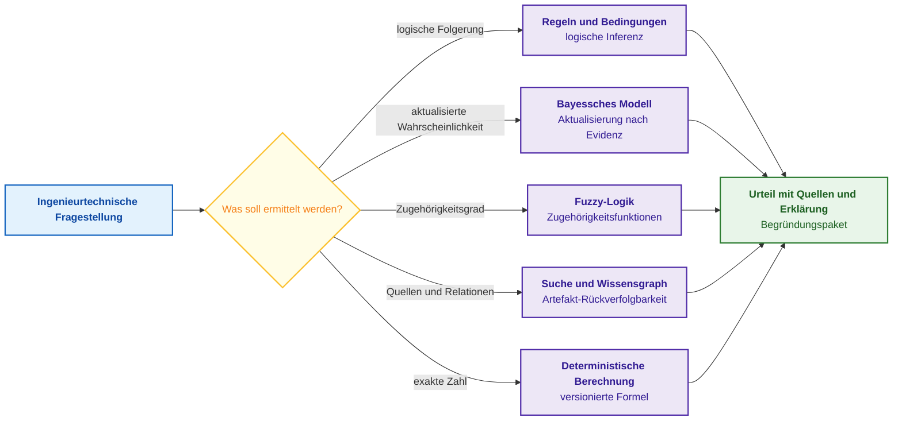
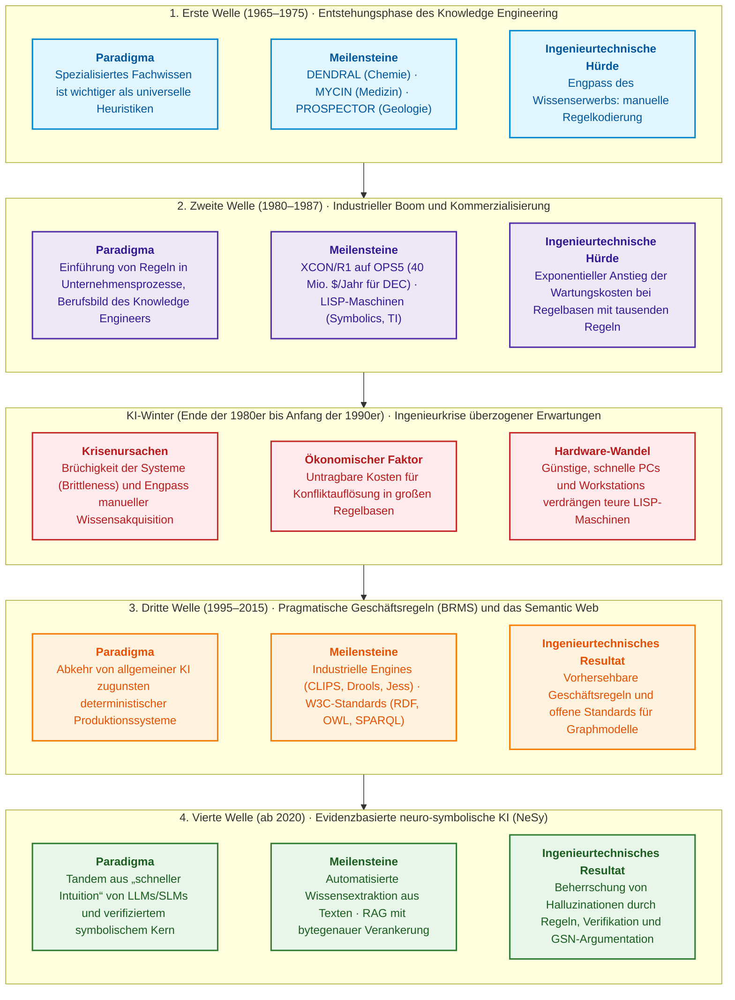
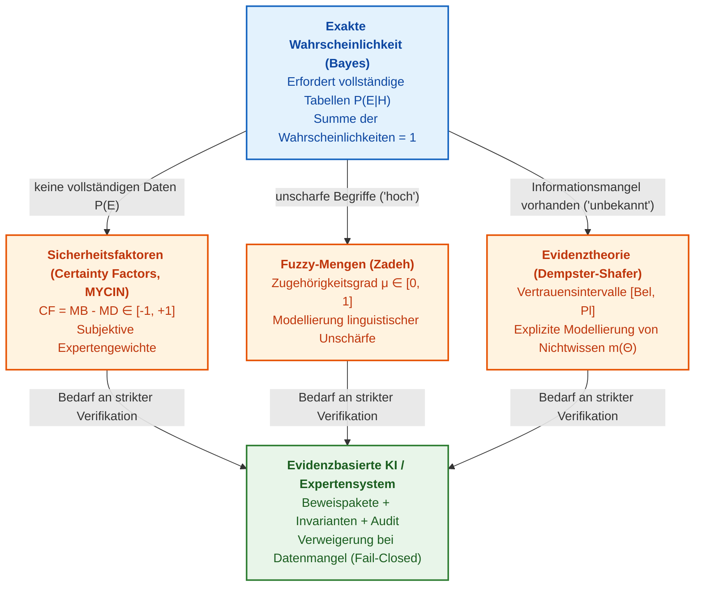
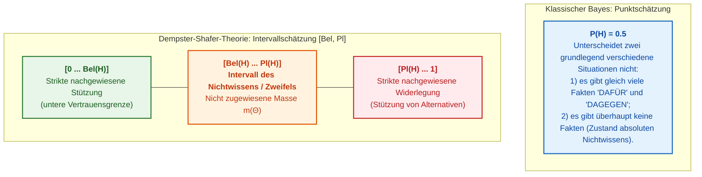
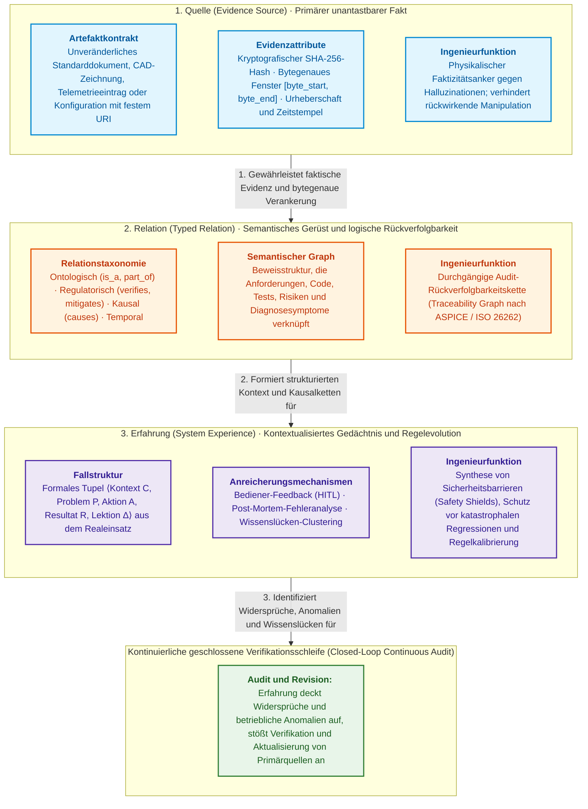
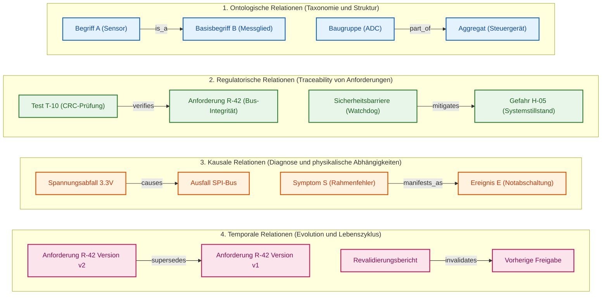
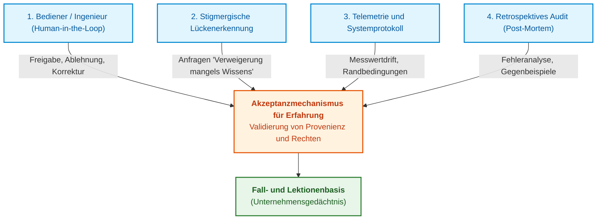
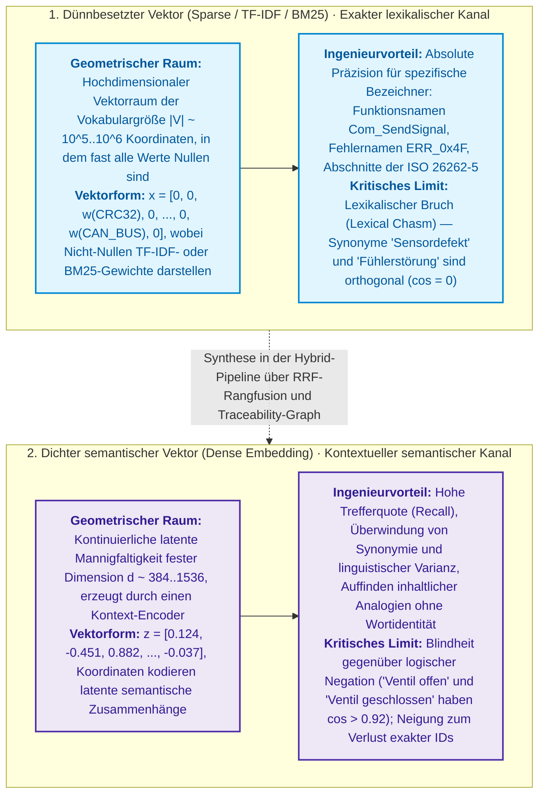
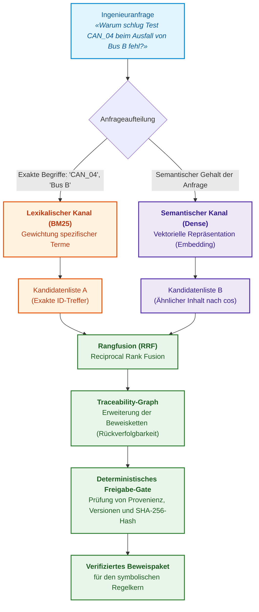
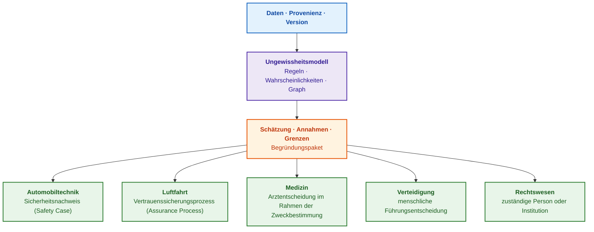

# Kapitel 4. Evolution der Expertensysteme: Vom Satz von Bayes zu evidenzbasierten KI-Entscheidungen

> **Buch:** [Architektur evidenzbasierter Expertensysteme](README.md) · [Teil I: Konzeptionelle und epistemische Grundlagen](part-01-foundations.md)  
> **Vorheriges Kapitel:** [Kapitel 3. Was ein Expertensystem von einem Informations- und Auskunftssystem unterscheidet](ch03-beyond-reference-information-systems.md)  
> **Nächstes Kapitel:** [Kapitel 5. Die Triade des Vertrauens: Expertensystem, evidenzbasierte Empfehlung und Unternehmensgedächtnis](ch05-triad-of-trust-and-corporate-memory.md)  
> **Inhaltsverzeichnis:** [README.md](README.md)  
> **Autor:** [Mykola Fedchyk](about-the-author.md)  
> **Niveau:** Grundlegendes Ingenieurniveau; Codebeispiele in einklappbaren Blöcken, formale Notationen mit „Formal:“ gekennzeichnet  
> **Lernziele:** Den Pfad von der Logik und dem Satz von Bayes über frühe regelbasierte Expertensysteme (DENDRAL, MYCIN, PROSPECTOR, XCON) bis zu modernen evidenzbasierten Architekturen nachvollziehen; den mathematischen Apparat nach der Art der Ungewissheit wählen (Regeln, Wahrscheinlichkeiten, Fuzzy-Logik, Graphen); die ingenieurtechnischen Ursachen der „KI-Winter“ und die Anforderungen an die Nachweisbarkeit von Schlussfolgerungen verstehen.

## Abstract
In diesem Kapitel wird die sechzigjährige Evolution der maschinellen Schließparadigmen untersucht: von der klassischen mathematischen Logik, dem Prädikatenkalkül und dem Satz von Bayes bis hin zu modernen evidenzbasierten neuro-symbolischen Architekturen (NeSy). Das Hauptaugenmerk liegt auf der Rolle des formalen Apparats in der Architektur von Expertensystemen: wie mathematische Methoden den Determinismus von Schlussfolgerungen, die Verifizierbarkeit logischer Inferenz und die Unanfechtbarkeit von Nachweisen in sicherheitskritischen Ingenieurdomänen (ISO 26262, IEC 61508, DO-178C) gewährleisten. Es wird eine strikte Taxonomie von Methoden zur Behandlung von Ungewissheit vorgeschlagen (deterministische Produktionsregeln, Bayessche Vertrauensnetzwerke, Zadehs Fuzzy-Logik, Dempster-Shafer-Evidenztheorie, Wissensgraphen und fallbasiertes Schließen). Die ingenieurtechnischen Ursachen von vier historischen Entwicklungswellen und Abschwüngen („KI-Winter“) werden analysiert, die fundamentale Evidenztriade (Quelle, Relation, Erfahrung) definiert und praktische Richtlinien für den Entwurf verifizierbarer Expertensysteme formuliert.

Vor der Freigabe einer neuen Version von Embedded-Software schlägt ein kritischer Regressionstest fehl, besteht jedoch nach einem erneuten Durchlauf fehlerfrei. Erlaubt die Architektur des Sicherheitssystems die Unterzeichnung der Freigabe? Eine Suchmaschine findet frühere Testberichte, ein statistischer Chatbot generiert plausibel klingenden Fließtext, doch der verantwortliche Ingenieur benötigt etwas völlig anderes: eine deterministische Berechnung darüber, wie genau die beobachtete Anomalie das A-posteriori-Ausfallrisiko verschoben hat, ob formale Invarianten der Spezifikation verletzt wurden und welche Verifikationsartefakte im Nachweispaket fehlen. Expertensysteme lösten derartige Aufgaben lange vor dem Aufkommen großer Sprachmodelle, und jede tragfähige Antwort erforderte die Auswahl eines rigorosen mathematischen Apparats für die spezifische Art der Ungewissheit. Eine logische Regel formuliert ein kategorisches Urteil oder ein Veto, eine Wahrscheinlichkeit kalibriert das stochastische Risiko, eine Fuzzy-Zugehörigkeit formalisiert unscharfe ingenieurtechnische Toleranzen, und ein deterministischer Rechenkern berechnet Zuverlässigkeitsmetriken nach den Formeln etablierter Standards. Die Vermengung dieser Entitäten zu einer einzelnen heuristischen Pseudozahl zerstört die Nachweisbarkeit und erzeugt eine Illusion von Gewissheit anstelle belastbarer Sicherheitsgarantien.

Das Ziel dieses Kapitels ist es, die Evolution des maschinellen Schließens als eine Abfolge ingenieurtechnischer Antworten auf Systemkrisen aufzuschlüsseln und zu vermitteln, wie der Berechnungsapparat passend zur Art der Ungewissheit der Eingangsdaten ausgewählt wird. Jede Methode wird durch das Prisma ihrer Rolle in der Expertensystemarchitektur betrachtet: physikalischer Gehalt, numerischer Algorithmus, Anwendungsgrenzen und die Übergabe des Ergebnisses an das Freigabe-Gate.

## 1. Methodische Basis: Klassifikation der Ungewissheit und Auswahl des Berechnungsapparats

Die Wahl des mathematischen Apparats in der Architektur eines Expertensystems ist der primäre Sicherheitskontrakt: Der Versuch, stochastische Ungewissheit mit deterministischen Regeln zu behandeln, führt zu kombinatorischer Explosion und Brüchigkeit der Wissensbasis, während die Ersetzung normativer logischer Invarianten durch probabilistische Schätzungen eines neuronalen Netzes das Tor zu kritischen Havarien durch das Übersehen einzelner gefährlicher Fehler öffnet. Die Klassifikation der Ungewissheit bestimmt, welcher Ausführungsmechanismus (Inference Engine) ein Eingangsfaktum verarbeiten muss, welche Struktur das Beweis-Zertifikat (Proof Witness) aufweist und nach welchen Kriterien das System einen Zustand der Ungewissheit feststellt oder die Ausgabe einer Empfehlung verweigert.

Ingenieurtechnische Fragestellungen unterscheiden sich weniger durch das Fachthema als vielmehr durch die Art des erwarteten Resultats. In manchen Situationen muss strikt geklärt werden, ob eine Schlussfolgerung logisch aus den erfassten Fakten folgt; in anderen muss bewertet werden, wie sehr eine neue Beobachtung das A-posteriori-Ausfallrisiko verschoben hat; in wieder anderen muss der Grad der Zugehörigkeit eines Objekts zu einem unscharfen Ingenieurkriterium wie „hinreichende Architekturreife“ berechnet werden. Für jeden Ungewissheitstyp wurde in der KI-Theorie ein spezialisiertes mathematisches Verfahren entwickelt – keines davon ist ein universelles Allheilmittel. Die nachfolgende Tabelle definiert das grundlegende Begriffsfundament dieses Kapitels.

| Begriff | Erläuterung |
|---|---|
| Faktum | Information über einen konkreten Fall, die das Expertensystem als Eingangsdatum akzeptiert |
| Regel | Explizite Verknüpfung der Form „Wenn Bedingungen erfüllt sind, folgt die Konsequenz“ |
| Inferenz | Anwendung von Regeln oder eines mathematischen Modells auf Fakten |
| Hypothese | Zu prüfende mögliche Erklärung, beispielsweise „Das Release ist fehlerhaft“ |
| Ungewissheit | Zustand, in dem die verfügbaren Informationen für ein eindeutiges Urteil unzureichend sind |
| Evidenz (*evidence*) | Neue Beobachtung, Messung oder Dokument, die eine Hypothese stützt oder schwächt |
| Wahrscheinlichkeit | Zahl zwischen 0 und 1, die im Rahmen eines definierten Modells die Ungewissheit eines Ereignisses quantifiziert |
| Deterministische Berechnung | Berechnung, die bei identischen Eingangsdaten und identischer Formelversion stets das gleiche Ergebnis liefert |

Die Methodentabelle veranschaulicht, welche Frage jede Methode beantwortet und was die Methode isoliert betrachtet nicht garantieren kann.

| Methode | Welche Frage beantwortet sie? | Was garantiert sie für sich allein nicht? |
|---|---|---|
| Regeln und logische Inferenz | Ist eine explizite Bedingung erfüllt, die aus verifizierten Fakten folgt? | Vollständigkeit der Regeln und Korrektheit der Eingangsfakten |
| Bayessches Modell | Wie verändert ein neues Signal die Risikobewertung unter einem definierten probabilistischen Modell? | Richtigkeit der A-priori-Wahrscheinlichkeiten und Annahmen über Unabhängigkeiten |
| Fuzzy-Logik | In welchem Maße gehört ein Objekt zu einem entwurfstechnisch definierten Konzept wie „ausreichend bereit“? | Dass ein beliebiger Anteil oder Score bereits eine unscharfe Zugehörigkeit darstellt |
| Wissensgraph | Welche Artefakte, Versionen und Relationen bilden die Beweiskette? | Eine Entscheidung ohne zusätzliche Regeln |
| Quellensuche | Welche Dokumente oder Fragmente sollten einem Menschen oder Sprachmodell vorgelegt werden? | Wahrheit der Antwort und Vollständigkeit der Quellen |
| Deterministische Berechnung | Welches Resultat liefert eine fixierte Formel für fixierte Eingaben? | Korrektheit der Formel selbst, der Eingabedaten und der Gültigkeitsgrenzen |

Das folgende Diagramm zeigt, wie die Art der Fragestellung die Auswahl der Methode steuert.



Der blaue Block repräsentiert die Fragestellung, die gelbe Raute die Weichenstellung nach Art des benötigten Resultats, die violetten Blöcke stellen die Methoden dar, und der grüne Block ist das Begründungspaket – also das Urteil zusammen mit Fakten, Regeln, Quellen und Gültigkeitsgrenzen ([Kapitel 1](ch01-introduction-to-expert-systems.md)). Die Methoden stehen nicht in Konkurrenz zueinander: Ein einzelnes Expertensystem kann alle fünf Methoden einsetzen, wobei jede Methode für ihren spezifischen Ergebnistyp zuständig ist.

Im einleitenden Beispiel mit dem intermittierend fehlschlagenden Test verteilen sich die Methoden wie folgt: Eine Freigaberegel bestimmt, ob ein erneuter Durchlauf zulässig ist; ein Bayessches Modell quantifiziert, wie sehr der Fehlschlag das Risiko erhöht hat; der Wissensgraph weist aus, welche Anforderungen der Test verifiziert; eine deterministische Berechnung ermittelt die Überdeckungsmetriken. Die Suche lokalisiert die Testberichte, trifft jedoch selbst keinerlei Schlussfolgerung.

Die Wahl der Methode beginnt stets mit der Frage „Was genau soll ermittelt werden?“ und nicht mit dem Namen einer Technologie. Die Methoden entstanden historisch in einer logischen Abfolge, wobei jede neue Welle die Schwachstellen der vorangegangenen adressierte. Der folgende Abschnitt zeichnet diesen Werdegang nach.

## 2. Vier Wellen der Evolution von Expertensystemen: Von frühen Prototypen zur neuro-symbolischen KI

Die Geschichte der künstlichen Intelligenz (KI) ist kein linearer Fortschritt. Phasen überzogener Erwartungen und industrieller Booms wechselten sich mit ernüchternden Rückschlägen ab, die als „KI-Winter“ in die Geschichte eingegangen sind [[2]](#src-2). Die Ursachen dieser Winter waren ingenieurtechnischer Natur; moderne Projekte laufen daher Gefahr, historische Fehler in neuem Gewand zu wiederholen. Die folgende Vierteilung der Historie dient als ingenieurtechnische Orientierung, die zeitlichen Grenzen sind Richtwerte.



Die blaue, violette, orangefarbene und grüne Welle markieren Wachstumsphasen, der rote Block den Winter. Jede nachfolgende Welle antwortete auf die Defizite der vorhergehenden: Der industrielle Boom erwuchs aus ersten Erfolgen, der Winter resultierte aus explodierenden Wartungskosten, die dritte Welle verzichtete auf universelle Intelligenzansprüche, und die vierte setzt Sprachmodelle dort ein, wo früher manuelle Arbeit den Flaschenhals bildete.

### 2.1. Erste Welle (1965–1975): Vorrang des Domänenwissens vor universellen Heuristiken

In den 1950er- und 1960er-Jahren hofften Forscher, menschliches Denken durch wenige universelle Gesetze nachzubilden. Das Programm *General Problem Solver* (GPS) von Allen Newell und Herbert Simon suchte Lösungen durch Zustandsraumexploration, scheiterte jedoch an kombinatorischer Explosion, sobald Aufgaben über einfache Puzzles hinausgingen [[2]](#src-2). Edward Feigenbaum an der Stanford University formulierte das gegenteilige Prinzip: Die Leistungsfähigkeit eines intelligenten Programms hängt in erster Linie von Quantität und Qualität des Wissens über die konkrete Problemstellung ab, nicht von der Allgemeingültigkeit des Inferenzalgorithmus [[3]](#src-3). Dieser Grundsatz begründete das Wissens-Engineering (*Knowledge Engineering*). Auf Feigenbaums Prinzip basierten die ersten einflussreichen Expertensysteme:

- **DENDRAL** (Stanford, ab 1965; Edward Feigenbaum, Bruce Buchanan, Joshua Lederberg in Kooperation mit dem Chemielabor von Carl Djerassi) rekonstruierte Strukturformeln organischer Verbindungen anhand von Massenspektrometriedaten. Die Autoren stuften DENDRAL als das erste Expertensystem zur wissenschaftlichen Hypothesenbildung ein [[4]](#src-4).
- **MYCIN** (Stanford, ab 1972; Edward Shortliffe) unterstützte Ärzte bei der Selektion antimikrobieller Therapien bei Bakteriämie und Meningitis und begründete seine Empfehlungen transparent auf Fragen wie „Warum?“ und „Wie?“ [[5]](#src-5). In MYCIN wurden die Sicherheitsfaktoren (*Certainty Factors*) eingeführt, auf die weiter unten eingegangen wird [[6]](#src-6).
- **PROSPECTOR** (SRI International, Ende der 1970er) bewertete die Höffigkeit von Minerallagerstätten anhand geologischer Regeln. 1982 lokalisierte PROSPECTOR auf Basis geologischer Kartendaten des Mount Tolman im US-Bundesstaat Washington eine bis dahin unentdeckte industrielle Molybdän-Lagerstätte [[7]](#src-7).

Die erste Welle bewies, dass die Stärke eines Expertensystems im formalisierten Wissen liegt, nicht im universellen Algorithmus. Da dieses Wissen jedoch mühsam von Fachexperten manuell übertragen werden musste, entwickelte sich dieser Prozess zum primären Flaschenhals.

### 2.2. Zweite Welle (1980–1987): Industrielle Kommerzialisierung und LISP-Maschinen

In den 1980er-Jahren verließen Expertensysteme den akademischen Raum und zogen in die Industrie ein. Die Digital Equipment Corporation (DEC) vertrieb VAX-Minicomputer in tausenden Modul-, Kabel- und Gehäusekonfigurationen; menschliche Konfiguratoren machten dabei regelmäßig Fehler. Das Expertensystem R1 (später XCON), von John McDermott in der Produktionsregelsprache OPS implementiert, automatisierte die Auftragsprüfung [[8]](#src-8). Nach Schätzungen von Stuart Russell und Peter Norvig sparte XCON dem Unternehmen DEC bis 1986 rund 40 Millionen Dollar jährlich ein [[2]](#src-2). Es entstanden spezialisierte Hersteller für LISP-Maschinen (Symbolics, Lisp Machines Inc., Texas Instruments) und das neue Berufsbild des Knowledge Engineers: ein Spezialist, der Fachexperten interviewt und deren Erfahrung in formale Regelsätze überführt.

Die zweite Welle demonstrierte den wirtschaftlichen Wert expliziter Regeln. Als die Wissensbasis von XCON jedoch auf tausende Regeln anwuchs, überstiegen die Pflege- und Verifikationskosten zunehmend den wirtschaftlichen Nutzen.

### 2.3. Krise überzogener Erwartungen: Vier ingenieurtechnische Ursachen des „KI-Winters“

Gegen Ende der 1980er-Jahre brach der Markt für Expertensysteme ein; zahlreiche Unternehmen verfehlten ihre Versprechen und gingen in Konkurs [[2]](#src-2). Dem lagen vier handfeste ingenieurtechnische Ursachen zugrunde:

1. **Engpass der Wissensakquisition** (*Knowledge Acquisition Bottleneck*). Experten fiel es schwer, ihre impliziten Heuristiken präzise zu artikulieren; die manuelle Formalisierung von Regeln beanspruchte Jahre [[9]](#src-9).
2. **Brüchigkeit** (*Brittleness*). Expertensystemen fehlte das Bewusstsein über die Grenzen der eigenen Kompetenz: Trat eine Fallkonstellation auf, die nicht explizit modelliert worden war, erzeugte das System fehlerhafte oder absurde Urteile, anstatt kontrolliert zu verweigern [[9]](#src-9).
3. **Komplexe Wartung und Regelkollisionen.** Die Ausführungsreihenfolge von Regeln hing von Konfliktauflösungsstrategien und der Reihenfolge eintreffender Fakten ab. Bei Regelsammlungen mit tausenden Einträgen waren die Seiteneffekte neuer Regeln kaum vorhersehbar; Entwurf und Pflege wurden prohibitiv teuer [[2]](#src-2).
4. **Kostenintensive Spezialhardware.** Proprietäre LISP-Maschinen verloren den Wettbewerb gegen Standard-Workstations und Personal Computer, die durch exponentielle Takt- und Architektursteigerungen rasch aufholten und dabei deutlich kostengünstiger waren.

Jede dieser vier Ursachen besitzt ein modernes Äquivalent: Die automatisierte Wissensextraktion aus Dokumenten behandelt [Kapitel 10](ch10-knowledge-acquisition-systems.md), Kompetenzgrenzen und das Recht auf Verweigerung [Kapitel 2](ch02-epistemology-of-machine-knowledge.md), die Verifikation von Wissensbasen [Kapitel 23](ch23-knowledge-base-verification.md) und wirtschaftliche Ausführungsinfrastrukturen [Kapitel 18](ch18-execution-infrastructure.md).

### 2.4. Dritte Welle (1995–2015): Regelbasierte Business-Rule-Engines (BRMS) und das Semantic Web

Nach dem KI-Winter verwarf die Industrie universelle Intelligenzversprechen und fokussierte sich auf pragmatischen Nutzen. Business-Rule-Engines wie CLIPS, Jess und Drools etablierten sich als Standardbibliotheken für C und Java in Versicherungsberechnungen, dem Banken-Scoring und der Logistik. Das World Wide Web Consortium (W3C) standardisierte die graphbasierte Wissensrepräsentation: Das RDF-Datenmodell beschreibt Aussagen über Subjekt-Prädikat-Objekt-Tripel [[10]](#src-10), OWL definiert Ontologien, und SPARQL dient als Abfragesprache für Graphen.

Die dritte Welle machte Regeln und Wissensgraphen zu verlässlichen Standardkomponenten des Software Engineering. Das fundamentale Problem des Wissenserwerbs blieb jedoch ungelöst: Regeln und Ontologien mussten weiterhin manuell von Menschen verfasst werden.

### 2.5. Vierte Welle (ab 2020): Evidenzbasierte neuro-symbolische KI und Konvergenz mit Sprachmodellen

Große Sprachmodelle (*Large Language Models*, LLMs) ließen das Pendel zunächst in Richtung rein statistischer Textverarbeitung ausschlagen. In sicherheitskritischen und regulierten Domänen stießen Entwickler jedoch rasch an fundamentale Grenzen: Halluzinationen, stochastische Antwortvarianz, fehlende Quellenverankerung und Unverifizierbarkeit ([Kapitel 3](ch03-beyond-reference-information-systems.md)). Moderne evidenzbasierte Expertensysteme vereinen zwei Schichten: Eine linguistische Schicht (inklusive lokaler SLMs) beschleunigt den Wissenserwerb durch das Extrahieren von Entitäten, Anforderungen und Relationen aus Texten ([Kapitel 12](ch12-linguistic-analysis-and-local-models.md)). Die symbolische Schicht – bestehend aus Regeln, Wissensgraphen und deterministischer Inferenzmaschine – garantiert verifizierbare Ableitungen, kontrollierte Verweigerung bei mangelnder Evidenz und formale Sicherheitsnachweise ([Kapitel 27](ch27-safety-case-gsn-synthesis.md), [Kapitel 29](ch29-neuro-symbolic-architecture.md)).

Die Geschichte lehrt ein zentrales Prinzip: Ein Expertensystem ist exakt so verlässlich wie seine Wissensbasis vollständig, verifiziert und wartbar ist. Sprachmodelle erleichtern die Wissensextraktion, machen explizite Regeln aber keineswegs überflüssig. Daher beginnt die methodische Betrachtung mit den formalen Regeln.

## 3. Mathematische Logik und Produktionsregeln (Modus Ponens, Rete)

Die einfachste und am zuverlässigsten verifizierbare Form von Wissen in der Architektur eines Expertensystems ist die explizite formale Regel. Eine logische Regel beantwortet die Frage, ob eine Schlussfolgerung formal aus geprüften Fakten folgt (*Logical Entailment*). Im Gegensatz zu stochastischen neuronalen Netzen ist das Ergebnis einer logischen Inferenz keine Wahrscheinlichkeit: Bei syntaktischer Korrektheit und wahren Prämissen ist die Schlussfolgerung entweder strikt bewiesen oder widerlegt.

**Formal: Deduktive Inferenz nach dem Modus Ponens.**  
Ingenieurtechnisches Problem des Nichtdeterminismus und der Halluzinationen in Freigabe-Gates: In sicherheitskritischen Domänen (ISO 26262, IEC 61508) ist es unzulässig, ingenieurtechnische Entscheidungen auf statistische Wortkorrelationen zu stützen. Erforderlich ist ein formaler Deduktionsmechanismus, der garantiert, dass die Konsequenz $B$ strikt wahr ist, sofern die verifizierten Fakten $A$ und die normative Regel $A 
ightarrow B$ wahr sind. Ziel der Berechnung ist die Erzeugung eines verifizierten Inferenzschritts im Beweisbaum mit binärem Resultat $B \in \{\mathbf{True}, \mathbf{False}\}$.

Die Regel verwendet folgende Notation:

```math
\frac{A\rightarrow B,\qquad A}{B}
```

- $A \in \{\mathbf{True}, \mathbf{False}\}$ — atomares Faktum oder Konjunktion von Fakten in der Wissensbasis (Prämisse);
- $A
ightarrow B$ — Produktionsregel oder normative Anforderung: materiale Implikation, bei der die Wahrheit von $A$ die Wahrheit von $B$ garantiert;
- $B \in \{\mathbf{True}, \mathbf{False}\}$ — logische Konsequenz (Schlussfolgerung oder Sicherheitsaktion);
- horizontaler Strich — Symbol des deduktiven Schließens im Aussagenkalkül.

**Praktische Anwendung und ingenieurtechnische Konsequenzen:**
1. Die Berechnung wird durch den Musterabgleich-Algorithmus (*Pattern Matching* in Rete- oder Treat-Engines) bei jeder Modifikation des Arbeitsspeichers (*Working Memory*) ausgelöst.
2. Wenn $A = \mathbf{True}$ gilt und die Regel $A 
ightarrow B$ aktiviert ist, fügt die Engine das Faktum $B$ deterministisch zum Arbeitsspeicher hinzu und dokumentiert den Inferenzschritt im Beweis-Zertifikat (*Proof Witness*).
3. Wenn $A = \mathbf{False}$ gilt oder $A$ unbekannt ist (Open-World-Annahme), feuert die Regel nicht; das System darf die Wahrheit von $B$ keinesfalls mutmaßen und registriert das Fehlen eines Beweises.
4. Beispiel aus der funktionalen Sicherheit:
```text
Regel: Wenn eine Änderung eine Sicherheitsanforderung berührt (A), ist eine Auswirkungsanalyse zwingend (B).
Faktum: Änderung CR-17 berührt die Sicherheitsanforderung SR-42 (A = True).
Schlussfolgerung: Für CR-17 ist eine Auswirkungsanalyse zwingend erforderlich (B = True).
```
Jeder Versuch, Schritt $B$ zu übergehen, blockiert das Durchlaufen des Release-Validierungs-Gates.

1965 formulierte John Alan Robinson das Resolutionsprinzip, das Maschinen das automatische Beweisen von Sätzen der Prädikatenlogik erster Stufe ermöglichte [[11]](#src-11). Die Vision bestand im automatisierten Theorembeweisen über formalisierten Wissensbeständen.

Die Ingenieurpraxis zeigte jedoch, dass reale Normen und Regelwerke selten als reine mathematische Theoreme formuliert sind, sondern vielmehr als **Produktionsregeln** mit Prioritäten und Ausnahmebedingungen. Eine Produktionsregel formalisiert die Verknüpfung:

```text
WENN Bedingung
DANN Schlussfolgerung oder Aktion
```

Eine Inferenzmaschine wendet Produktionsregeln primär über zwei Verarbeitungsstrategien an, die bis heute das Fundament industrieller Systeme bilden:

**Vorwärtsverkettung** (*Forward Chaining*) bewegt sich von bekannten Fakten zur Ableitung neuer Konsequenzen. Seien initial die Fakten $A$, $B$ und $C$ gegeben, und enthalte die Wissensbasis zwei Regeln:

```math
F_0=\{A,B,C\},
\qquad
R=\{A\land B\rightarrow D,\;D\land C\rightarrow E\}.
```

- $F_0$ — initiale Menge verifizierter Fakten im Arbeitsspeicher;
- $R$ — Menge kompilierter Produktionsregeln;
- $A, B, C, D, E$ — atomare Prädikate;
- $\land$ — logische Konjunktion, $\rightarrow$ — Produktionsaktion.

Im ersten Inferenzzyklus feuert die erste Regel und fügt Faktum $D$ hinzu; im nachfolgenden Zyklus feuert die zweite Regel:

```math
F_1=F_0\cup\{D\},
\qquad
F_2=F_1\cup\{E\}.
```

Die Inferenz terminiert, wenn ein Fixpunkt (*Fixed Point*) erreicht ist und keine Regel mehr neue Fakten erzeugen kann. Vorwärtsverkettung kommt typischerweise in Monitoring-Systemen und Invariantenprüfern zum Einsatz: zur Konflikterkennung in Spezifikationen oder zur Fehlerdiagnose anhand von Telemetriedaten.

**Rückwärtsverkettung** (*Backward Chaining*) geht von einem definierten Ziel aus und sucht nach stützenden Fakten:

```math
E
\Longleftarrow D\land C
\Longleftarrow (A\land B)\land C.
```

- $E$ — Zielhypothese, die bewiesen oder widerlegt werden soll;
- $D$ und $C$ — Unterziele der ersten Reduktionsstufe;
- $A$ und $B$ — primäre Fakten, die zur Ableitung des Unterziels $D$ erforderlich sind;
- $\Longleftarrow$ — Operator der Zielreduktion auf eine Konjunktion von Unterzielen.

Ist das Ziel beispielsweise „Zertifizierungsreife des Release“, expandiert die Engine den Anforderungsbaum nach unten: bis hin zu statischen Analyseberichten, Branch-Coverage-Tests und digitalen Signaturen der verantwortlichen Ingenieure. Jedes fehlende Blatt des Baumes manifestiert sich als strukturierter Ingenieurdefekt.

### 3.1. Symbolische Paradigmen früher KI: Funktionales LISP und deskriptives PROLOG

Die symbolischen Programmiersprachen LISP und PROLOG begründeten zwei fundamentale Ansätze zur Regelausführung in Expertensystemen: die imperativ-funktionale Manipulation symbolischer Strukturen und die deskriptive logische Inferenz nach Robinsons Resolutionsprinzip. Das Verständnis dieser Architekturkonzepte ist für Ingenieure essenziell, da sie die Mechanik industrieller Rule-Engines (Drools, CLIPS) und moderner Wissensverifizierer direkt prägen.

LISP bot die ideale Umgebung für symbolische KI: Listen, Bäume, Rekursion und die Behandlung von Regeln als Daten (*Code-as-Data*), die vom Programm dynamisch modifiziert und ausgeführt werden können. Die Regelsprache CLIPS, ab 1985 von der NASA entwickelt, übernahm die geklammerte Syntax von LISP. Eine Regel in CLIPS ist ein eigenständiges Artefakt: Sie lässt sich versionieren, isoliert testen, auditieren und modifizieren, anstatt in einem unkontrollierten System-Prompt eines Sprachmodells verborgen zu liegen.

PROLOG wählte den Weg der logischen Programmierung: Der Entwickler deklariert Fakten und Regeln, und PROLOG sucht den Beweis autonom über Rückwärtsverkettung und Unifikation. Eine Anfrage wird zum Ziel, das PROLOG rekursiv in Teilziele zerlegt, bis es auf axiomatische Fakten stößt.

<details>
<summary>Beispiele in CLIPS und PROLOG: Freigaberegel und Nachweislücken</summary>

Eine CLIPS-Regel blockiert das Release, wenn ein offener kritischer Defekt vorliegt. Das Konstrukt `deffacts` initialisiert die Faktenbasis:

```clips
(defrule freigabe-durch-kritischen-defekt-blockiert
   (freigabe ?r)
   (defekt ?d)
   (betrifft ?d ?r)
   (schweregrad ?d kritisch)
   (status ?d offen)
   =>
   (assert (freigabestatus ?r blockiert)))

(deffacts beispiel
   (freigabe v2.4.1)
   (defekt D-4)
   (betrifft D-4 v2.4.1)
   (schweregrad D-4 kritisch)
   (status D-4 offen))
```

Nach den Befehlen `(reset)` und `(run)` feuert die Regel und erzeugt das Faktum `(freigabestatus v2.4.1 blockiert)`. Die Variablen `?r` und `?d` binden sich an konkrete Release- und Defekt-Instanzen, sodass dieselbe Regel universell für beliebige Releases operiert.

In PROLOG wird dieselbe Sicherheitsregel wie folgt formuliert:

```prolog
sicherheitsanforderung(sr_42).
betrifft(cr_17, sr_42).

erfordert_auswirkungsanalyse(Aenderung) :-
    betrifft(Aenderung, Anforderung),
    sicherheitsanforderung(Anforderung).
```

Die Anfrage `?- erfordert_auswirkungsanalyse(cr_17).` liefert `true`, während `?- erfordert_auswirkungsanalyse(X).` alle Änderungen ermittelt, die eine Auswirkungsanalyse erfordern (im Beispiel `X = cr_17`). Dies ist kein Volltextsuchlauf, sondern deduktives Schließen über einer Faktenbasis.

Derselbe Ansatz identifiziert Lücken in der Nachweisführung. Das folgende Programm demonstriert eine Projektprüfrichtlinie, die nach Sicherheitsanforderungen sucht, denen ein übergeordnetes Schutzziel, eine Verifikation oder ein erfolgreicher Test fehlt:

```prolog
technical_safety_requirement(tsr_enter_degraded_mode).
technical_safety_requirement(tsr_report_diagnostic_fault).

derived_from(tsr_enter_degraded_mode, fsr_detect_sensor_fault).
derived_from(tsr_report_diagnostic_fault, fsr_detect_sensor_fault).

verified_by(tsr_enter_degraded_mode, test_tsr_014).
test_passed(test_tsr_014).

includes(release_2026_05, tsr_enter_degraded_mode).
includes(release_2026_05, tsr_report_diagnostic_fault).

missing_safety_evidence(Req, safety_trace) :-
    technical_safety_requirement(Req),
    \+ derived_from(Req, _).
missing_safety_evidence(Req, verification) :-
    technical_safety_requirement(Req),
    \+ verified_by(Req, _).
missing_safety_evidence(Req, failed_test) :-
    verified_by(Req, Test),
    \+ test_passed(Test).

release_requires_safety_review(Release) :-
    includes(Release, Req),
    missing_safety_evidence(Req, _).
```

Die Anfrage `?- missing_safety_evidence(tsr_report_diagnostic_fault, Reason).` liefert `Reason = verification`: Die Anforderung ist zwar von einem funktionalen Schutzziel abgeleitet, weist jedoch keinen Verifikationstest auf. Die Anfrage `?- release_requires_safety_review(release_2026_05).` ergibt `true`. Der Operator `\+` repräsentiert Negation als Fehlschlag (*Negation as Failure*); PROLOG nimmt an, dass ein nicht beweisbares Faktum falsch ist. Diese Closed-World-Annahme (CWA) ist nur bei vollständiger Faktenlage zulässig ([Kapitel 2](ch02-epistemology-of-machine-knowledge.md)). Analog werden Bedrohungs-, Risiko- und Verifikationsketten im Bereich Automotive Cybersecurity nach ISO/SAE 21434 auditiert [[12]](#src-12).

</details>

LISP zeigte, wie flexible symbolische Regelsysteme aufgebaut werden; PROLOG demonstrierte die formale Befragung von Wissen: Was ist beweisbar, was fehlt, welche Fakten sind erforderlich? Moderne Expertensysteme werden selten direkt in diesen Sprachen geschrieben, das Architekturmuster aus Wissensbasis, Regeln, Inferenz und Erklärung bleibt jedoch unverändert gültig.

## 4. Bayessches Paradigma: Aktualisierung des A-priori-Vertrauens bei Vorliegen empirischer Evidenz

Im Betrieb komplexer Ingenieursysteme stößt der absolute Determinismus von Regeln auf die Realität stochastischen Rauschens, unvollkommener Sensoren und instabiler Tests (*Flaky Tests*). Schlägt ein Regressionstest sporadisch fehl oder registriert ein Sensor einen transienten Messwertausreißer, bietet reine Produktionslogik nur Extreme: entweder das Release vollständig zu blockieren oder das Signal zu ignorieren. Das Bayessche Paradigma liefert das Werkzeug zur quantitativen Risikobewertung: wie genau eine neue empirische Beobachtung (Evidenz) das A-priori-Vertrauen des Systems in die Existenz eines verdeckten Defekts modifiziert. In diesem Abschnitt bezeichnet der Begriff „Evidenz“ ein beobachtetes Faktum oder eine Messung (*Evidence* im statistischen Sinne), nicht einen formalen mathematischen Beweis.

**Formal: Ingenieurmodell der Bayesschen Aktualisierung des Defektrisikos.**  
Ingenieurtechnisches Problem der quantitativen Ausfallrisikobewertung auf Basis unvollkommener Diagnosesignale: Ein einzelner Testfehlschlag kann sowohl auf eine kritische Regression als auch auf Instabilitäten der Testumgebung hindeuten. Rein heuristisches Handeln führt entweder zu Pipeline-Stillständen durch Fehlalarme oder zum Rollout defekter Software. Ziel der Berechnung ist die exakte Ermittlung der A-posteriori-Wahrscheinlichkeit eines Defekts $\Pr(H\mid E) \in [0, 1]$ anhand der dokumentierten Test-Sensitivität und der Basis-Fehlerrate.

Die Berechnung nutzt folgende Parameter:

```math
\Pr(H\mid E)=\frac{\Pr(E\mid H)\,\Pr(H)}{\Pr(E)},\qquad \Pr(E)>0
```

- $H \in \{0, 1\}$ — Hypothese über das Vorliegen eines kritischen Defekts im Release ($H=1$ — Defekt vorhanden);
- $E \in \{0, 1\}$ — empirische Evidenz ($E=1$ — Test meldet Fehler);
- $\Pr(H) \in [0, 1]$ — A-priori-Wahrscheinlichkeit des Defekts (historische Basisausfallrate);
- $\Pr(E\mid H) \in [0, 1]$ — Sensitivität des Tests (Wahrscheinlichkeit eines Testfehlers bei tatsächlich vorhandenem Defekt, True Positive Rate);
- $\Pr(E) \in (0, 1]$ — Gesamtwahrscheinlichkeit eines Testfehlers unter Berücksichtigung von Fehlalarmen;
- $\Pr(H\mid E) \in [0, 1]$ — A-posteriori-Wahrscheinlichkeit des Defekts nach Vorliegen des Testergebnisses.

Die Gesamtwahrscheinlichkeit der Evidenz für zwei disjunkte Zustände ($H$ und $\neg H$) berechnet sich nach dem Satz der totalen Wahrscheinlichkeit:

```math
\Pr(E)=\Pr(E\mid H)\Pr(H)+\Pr(E\mid\neg H)\Pr(\neg H),\qquad \Pr(\neg H)=1-\Pr(H)
```

wobei $\Pr(E\mid\neg H)$ die Fehlalarmrate (*False Positive Rate*) des Tests bei fehlerfreiem Code bezeichnet.

**Praktische Anwendung und ingenieurtechnische Konsequenzen:**
1. Die Berechnung wird automatisch durch das Qualitätssicherungssubsystem ausgelöst, sobald ein automatisierter Test fehlschlägt.
2. Für eine Release-Klasse betrage der historische Ausschuss $\Pr(H)=0{,}05$, die Test-Sensitivität $\Pr(E\mid H)=0{,}80$ und die Fehlalarmrate $\Pr(E\mid\neg H)=0{,}10$.
3. Die Gesamtwahrscheinlichkeit des Testfehlers beträgt $\Pr(E) = 0{,}80\cdot 0{,}05 + 0{,}10\cdot 0{,}95 = 0{,}135$. Das A-posteriori-Risiko berechnet sich zu:
```math
\Pr(H\mid E)=\frac{0{,}80\cdot 0{,}05}{0{,}135} = \frac{0{,}04}{0{,}135} \approx 0{,}296\quad (29{,}6\,\%).
```
4. Ingenieurtechnische Schlussfolgerungen des Expertensystems:
   - Der Testfehlschlag hat das Defektrisiko von 5 % auf 29,6 % versechsfacht.
   - Dennoch bedeutet der Wert von 29,6 %, dass es sich in 70,4 % der Fälle um einen Fehlalarm der Testumgebung handelt. Eine sofortige automatische Release-Blockade wäre verfrüht, ein Ignorieren grob fahrlässig.
   - Das System initiiert einen kontrollierten Eskalationspfad: Es ordnet einen isolierten Wiederholungstest an oder fordert ein manuelles Ingenieurs-Review zur Beschaffung zusätzlicher Evidenz an.

**Formal: Likelihood-Quotient (Likelihood Ratio) und Evidenzstärke.**  
Um die diagnostische Trennschärfe des Tests unabhängig von der A-priori-Defektrate zu quantifizieren, wird das positive Likelihood-Verhältnis berechnet:

```math
\mathrm{LR}^{+}=\frac{\Pr(E\mid H)}{\Pr(E\mid\neg H)}=\frac{0{,}80}{0{,}10}=8
```

- $\mathrm{LR}^{+} \in [0, \infty)$ — positives Likelihood-Verhältnis für die Evidenz $E$;
- $\mathrm{LR}^{+} > 1$ stützt das Vorliegen des Defekts, $\mathrm{LR}^{+} < 1$ spricht dagegen, $\mathrm{LR}^{+} = 1$ zeigt vollständige diagnostische Wertlosigkeit des Tests an;
- Der Wert $\mathrm{LR}^{+}=8$ besagt, dass ein Testfehlschlag bei fehlerhaftem Code achtmal wahrscheinlicher ist als bei intaktem Code.

In Form von Quoten (*Odds*) nimmt der Satz von Bayes eine multiplikative Gestalt an:

```math
\frac{\Pr(H\mid E)}{1-\Pr(H\mid E)}=\frac{\Pr(H)}{1-\Pr(H)}\cdot\mathrm{LR}^{+}
```

Die A-priori-Quote $\frac{0{,}05}{0{,}95} \approx 0{,}0526$, multipliziert mit $\mathrm{LR}^{+}=8$, ergibt eine A-posteriori-Quote von $\approx 0{,}421$, was einer Wahrscheinlichkeit von $\frac{0{,}421}{1 + 0{,}421} \approx 0{,}296$ entspricht. Weist ein Test einen $\mathrm{LR}^{+} < 3$ auf, klassifiziert das Expertensystem ihn als schwaches Diagnosesignal und untersagt dessen Nutzung als Veto-Kriterium.

- $\Pr(H)$ ist die Ausgangswahrscheinlichkeit, $\Pr(H\mid E)$ die Wahrscheinlichkeit nach Vorliegen der Evidenz;
- $p/(1-p)$ überführt eine Wahrscheinlichkeit $p$ in eine Chance (Quote);
- $\mathrm{LR}^{+}$ ist das oben definierte Likelihood-Verhältnis;
- Endliche Quoten erfordern Wahrscheinlichkeiten strikt zwischen 0 und 1.

Für das Rechenbeispiel ergibt sich $\frac{0{,}05}{0{,}95}\cdot 8=\frac{8}{19}$, woraus $\Pr(H\mid E)=\frac{8}{8+19}=\frac{8}{27} \approx 29{,}6\,\%$ folgt.

**Formal: Mehrere Evidenzen.**  
Für zwei Evidenzen $E_1$ und $E_2$ lautet die allgemeine Formel ohne Unabhängigkeitsannahme:

```math
\Pr(H\mid E_1,E_2)=\frac{\Pr(E_1,E_2\mid H)\,\Pr(H)}{\Pr(E_1,E_2)}.
```

Bestandteile der gemeinsamen Aktualisierung:
- $H$ ist die Hypothese, $E_1$ und $E_2$ sind zwei Evidenzen;
- Das Komma zwischen $E_1$ und $E_2$ bezeichnet das gemeinsame Auftreten beider Evidenzen;
- $\Pr(E_1,E_2\mid H)$ ist die Verbundwahrscheinlichkeit beider Evidenzen gegeben $H$;
- $\Pr(E_1,E_2)$ ist die Gesamtwahrscheinlichkeit beider Evidenzen und muss echt größer als null sein;
- $\Pr(H\mid E_1,E_2)$ ist die A-posteriori-Wahrscheinlichkeit der Hypothese in $[0,1]$.

Die Aktualisierung kann sequenziell erfolgen, wenn im zweiten Schritt die Likelihood bezüglich der bereits bekannten ersten Evidenz konditioniert wird:

```math
\Pr(H\mid E_1,E_2)=\frac{\Pr(E_2\mid H,E_1)\,\Pr(H\mid E_1)}{\Pr(E_2\mid E_1)}.
```

- $\Pr(H\mid E_1)$ ist die Wahrscheinlichkeit der Hypothese nach der ersten Evidenz;
- $\Pr(E_2\mid H,E_1)$ ist die Wahrscheinlichkeit der zweiten Evidenz unter Berücksichtigung von $H$ und $E_1$;
- $\Pr(E_2\mid E_1)$ ist die Wahrscheinlichkeit der zweiten Evidenz gegeben die erste ($> 0$);
- Das Resultat $\Pr(H\mid E_1,E_2)$ liegt erneut in $[0,1]$.

Ausschließlich dann, wenn die Evidenzen $E_1$ und $E_2$ sowohl bedingt auf $H$ als auch bedingt auf $\neg H$ stochastisch unabhängig sind, dürfen die Quoten direkt mit den einzelnen Likelihood-Verhältnissen multipliziert werden:

```math
\mathrm{Odds}(H\mid E_1,E_2)=\mathrm{Odds}(H)\cdot\mathrm{LR}_1\cdot\mathrm{LR}_2.
```

- $\mathrm{Odds}(H)$ bezeichnet die A-priori-Quote der Hypothese $H$;
- $\mathrm{LR}_1$ und $\mathrm{LR}_2$ sind die Likelihood-Verhältnisse der ersten und zweiten Evidenz;
- $\mathrm{Odds}(H\mid E_1,E_2)$ ist die resultierende Quote;
- Voraussetzung: $E_1$ und $E_2$ sind bedingt unabhängig unter $H$ und unter $\neg H$.

Ein fehlgeschlagener Test und ein offener Bug-Report teilen häufig dieselbe Ursache. Werden abhängige Signale fälschlich als unabhängig behandelt, zählt das Modell dieselbe Evidenz doppelt und überschätzt das Risiko dramatisch.

Eine aktualisierte Wahrscheinlichkeit besitzt nur zusammen mit ihrem Modellpass Gültigkeit: präzise Definitionen von $H$ und $E$; Quellen und Zeitfenster der A-priori- und bedingten Wahrscheinlichkeiten; Handhabung fehlender Daten; dokumentierte Unabhängigkeitsannahmen; Modellversion und Kalibrierungsergebnisse ([Kapitel 25](ch25-how-expert-systems-learn.md)); Richtlinien zur Überführung des Rechenwerts in konkrete Prüfschritte oder ein menschliches Review. Der letzte Punkt trennt Schätzung von Entscheidung: Ein Bayessches Modell aktualisiert eine Wahrscheinlichkeit, entscheidet jedoch nicht autonom über die Freigabe einer Fahrzeugkomponente, einen medizinischen Eingriff oder eine juristische Haftung.

Der Satz von Bayes liefert ein mathematisch exaktes Verfahren zur Vertrauensaktualisierung, setzt jedoch vollständige Wahrscheinlichkeitstabellen voraus, die in komplexen Domänen schwer zu erfassen und zu pflegen sind. Ein Ingenieur kann zwar konstatieren „das ist ein starkes Signal“, vermag jedoch selten zu begründen, warum $\Pr(E\mid H)=0{,}73$ betragen soll. Daher entwickelten sich parallel zum Satz von Bayes pragmatischere Heuristiken.

## 5. Heuristische Modelle der Ungewissheit bei unvollständiger A-priori-Information

Die drei nachfolgend behandelten Ansätze entstanden genau dann, wenn sich ein vollständiges probabilistisches Modell praktisch nicht konstruieren ließ. Jeder Ansatz quantifiziert eine eigenständige Größe; die Werte dieser drei Methoden dürfen weder untereinander noch mit stochastischen Wahrscheinlichkeiten vermengt werden.



### 5.1. Der Kalkül der Sicherheitsfaktoren im MYCIN-System

Die Entwickler des medizinischen Expertensystems MYCIN (Stanford, 1970er-Jahre) stießen auf ein grundlegendes Problem: Praktizierende Mediziner verfügten über keine präzisen Tabellen bedingter Wahrscheinlichkeiten für hunderte Symptome, konnten jedoch die Tendenz und Stärke von Indikatoren sicher einschätzen. Edward Shortliffe und Bruce Buchanan konzipierten den Kalkül der Sicherheitsfaktoren (*Certainty Factors*, CF) [[6]](#src-6) als handhabbare Alternative zur Bayesschen Inferenz, die ohne A-priori-Verteilungen auskommt.

**Formal: Ingenieurmodell des Sicherheitsfaktors.**  
Ingenieurtechnisches Problem der Aggregation von Expertenurteilen bei fehlenden statistischen Verteilungen: Fordert man von Ingenieuren exakte Ausfallwahrscheinlichkeiten für seltene Komponenten, erhält man unbegründete oder inkohärente Schätzungen. Ziel der Berechnung ist die Ermittlung eines normierten Koeffizienten $CF(H, E) \in [-1, 1]$, der den Grad der Bestätigung oder Widerlegung der Hypothese $H$ durch die Evidenz $E$ widerspiegelt, ohne Additivität vorauszusetzen (die Summe der $CF$ über alle Hypothesen muss nicht 1 ergeben).

Die Berechnung nutzt folgende Parameter:

```math
CF(H,E)=MB(H,E)-MD(H,E)
```

- $H \in \mathcal{H}$ — analysierte Hypothese (beispielsweise „Ursache des Ausfalls ist ein Isolationsdurchschlag“);
- $E \in \mathcal{E}$ — beobachtete Evidenz (Symptom, Telemetriefehler);
- $MB(H,E) \in [0, 1]$ — Maß des gewachsenen Vertrauens (*Measure of Increased Belief*);
- $MD(H,E) \in [0, 1]$ — Maß des gewachsenen Misstrauens (*Measure of Increased Disbelief*);
- $CF(H,E) \in [-1, 1]$ — resultierender Sicherheitsfaktor.

Zur Kombination zweier unabhängiger Evidenzen $E_1$ und $E_2$, die dieselbe Hypothese stützen ($CF_1, CF_2 \ge 0$), dient die asymptotische Akkumulationsformel:

```math
CF_{1\oplus2}=CF_1+CF_2\,(1-CF_1),\qquad 0\le CF_1,CF_2\le1
```

- $CF_1, CF_2 \in [0, 1]$ — primäre Sicherheitsfaktoren zweier unabhängiger heuristischer Regeln;
- $1 - CF_1$ — verbleibender Anteil an Ungewissheit;
- $CF_{1\oplus2} \in [0, 1]$ — kumulierte Konfidenz ($CF_{1\oplus2} \ge \max(CF_1, CF_2)$).

**Praktische Anwendung und ingenieurtechnische Konsequenzen:**
1. Die Berechnung wird von der Regel-Engine bei der Auswertung diagnostischer Expertenmatrizen ausgeführt.
2. Ein Bustest ergebe $CF_1 = 0{,}60$, und ein Temperatursensor liefere zusätzliche Evidenz mit $CF_2 = 0{,}50$. Die Gesamtsicherheit beträgt $CF_{1\oplus2} = 0{,}60 + 0{,}50 \cdot (1 - 0{,}60) = 0{,}80$.
3. Ingenieurtechnische Konsequenz: Das Erreichen eines Niveaus von $CF \ge 0{,}75$ dient als Schwellenwert für eine gezielte Inspektion der Baugruppe. Ein $CF$ ist jedoch keine physikalische Wahrscheinlichkeit und darf keinesfalls zur Berechnung von Garantielaufzeiten oder normativen Zuverlässigkeitskennzahlen (FIT/MTBF) herangezogen werden.

### 5.2. Zadehs Fuzzy-Logik-Apparat: Zugehörigkeitsfunktionen und Fuzzifizierung

In technischen Systemen besitzen viele Betriebsparameter kontinuierliche, unscharfe Grenzen: „hohe Betriebstemperatur“, „kritische Lagervibration“, „hoher Werkzeugverschleiß“. Definiert man eine starre Schwellenwertregel der Form „Wenn $T \ge 85^\circ\text{C}$, dann Alarm“, entsteht Grenzprellen (*Boundary Chatter*): Oszilliert die Temperatur um $84{,}9^\circ\text{C} \leftrightarrow 85{,}1^\circ\text{C}$, schaltet das System Notfallprotokolle chaotisch ein und aus. Lotfi Zadeh führte 1965 das Konzept der unscharfen Mengen (*Fuzzy Sets*) ein, bei dem die Zugehörigkeit eines Objekts zu einer Menge ein kontinuierlicher Wert ist [[14]](#src-14).

**Formal: Ingenieurmodell der Zugehörigkeitsfunktion und Fuzzy-Konjunktion.**  
Ingenieurtechnisches Problem der Beseitigung sprungartiger Destabilisierung im Regelkreis: Diskrete logische Schwellen verursachen hochfrequente Schaltvorgänge in Stellgliedern. Ziel der Berechnung ist die Abbildung einer kontinuierlichen physikalischen Größe $x \in X$ auf einen Zugehörigkeitsgrad $\mu_A(x) \in [0, 1]$ mit anschließender Ermittlung des Gesamtrisikos oder Reifegrads über Zadehs T-Norm.

Die Berechnung verwendet folgende Definition:

```math
\mu_A:X\to[0,1],\qquad x\mapsto\mu_A(x)
```

- $X \subseteq \mathbb{R}$ — physikalisches Universum der Messgröße (Temperatur in °C, Druck in bar, Testabdeckung in %);
- $x \in X$ — konkreter Messwert eines kalibrierten Sensors;
- $A$ — linguistische Fuzzy-Variable („Überhitzung“, „Release-Bereitschaft“);
- $\mu_A(x) \in [0, 1]$ — Zugehörigkeitsgrad des Werts $x$ zum Konzept $A$ (0 — vollständige Nichtübereinstimmung, 1 — perfekte Erfüllung).

Zur konservativen Bewertung der Release-Reife anhand dreier kritischer Kriterien („Testabdeckung“, „Freigaben“, „Defektfreiheit“) dient die Minimum-T-Norm (das schwächste Glied der Sicherheitskette):

```math
\mu_{\text{готовність}}=\min\bigl(\mu_{\text{тести}}(x_1),\ \mu_{\text{погодження}}(x_2),\ \mu_{\text{дефекти}}(x_3)\bigr)
```

**Praktische Anwendung und ingenieurtechnische Konsequenzen:**
1. Die Berechnung wird zyklisch im Betriebsmonitoring oder vor der Generierung eines Freigabeberichts angestoßen.
2. Die Projektmetriken zeigen: Die Testabdeckung erfüllt die Vorgabe mit $\mu_{\text{тести}} = 0{,}70$; der Fehlerbehebungsstatus liegt bei $\mu_{\text{дефекти}} = 0{,}60$; die Freigabe des Sicherheitsarchitekten ist jedoch nur unvollständig erteilt: $\mu_{\text{погодження}} = 0{,}40$.
3. Resultierende Bereitschaft: $\mu_{\text{готовність}} = \min(0{,}70;\ 0{,}40;\ 0{,}60) = 0{,}40$.
4. Ingenieurtechnische Konsequenz: Das System blockiert die automatische Freigabe konservativ, da das schwächste Glied ($\mu = 0{,}40$) die Zertifizierungsschwelle $\tau_{\text{release}} = 0{,}80$ verfehlt. Die Fuzzy-Logik identifiziert das Defizit (fehlende Freigabe) präzise und verhindert, dass hohe Werte anderer Parameter den Mangel maskieren.

#### 5.2.1. Hardware-Implementierung und Integration der Fuzzy-Logik mit Sprachmodellen

Eine verbreitete Fehlannahme moderner Entwicklungsteams besteht im Versuch, Zugehörigkeitsfunktionen durch probabilistische Ausgaben großer Sprachmodelle (LLMs) zu ersetzen. Wahrscheinlichkeitsrechnung und Fuzzy-Logik adressieren jedoch grundverschiedene Klassen von Ungewissheit:

1. **Wahrscheinlichkeit versus Wahrheitsgrad:** Die $\mathrm{Softmax}$-Schicht eines Sprachmodells verteilt eine Einheitswahrscheinlichkeit ($\sum P_i = 1$) auf disjunkte Token (stochastische Zufälligkeit). Zadehs Fuzzy-Logik operiert hingegen mit unabhängigen Erfüllungsgraden unscharfer Konzepte ($\mu \in [0, 1]$), bei denen gegensätzliche Eigenschaften simultan mit eigenen Gewichten wahr sein können, ohne dass deren Summe 1 ergeben muss.
2. **Neuro-symbolische Arbeitsteilung:** Sprachmodelle sind als numerische Inferenzmaschinen für Fuzzy-Regeln ungeeignet, da sie zu Rechenhalluzinationen und stochastischem Drift neigen. Im neuro-symbolischen Verbund ([Kapitel 29](ch29-neuro-symbolic-architecture.md)) fungiert das Sprachmodell jedoch als Werkzeug zur **linguistischen Fuzzifizierung** (Übersetzung natürlicher Formulierungen wie „leicht erhöhter Ruhestrom“ in numerische Modifikatoren) und zur **linguistischen Defuzzifizierung** (menschenlesbare Erklärung des Schlussergebnisses).
3. **Ausführungsplattformen:** Für softwarebasierte Fuzzy-Inferenz eignen sich deterministische SIMD-vektorisierte Engines (AVX-512 / ARM Neon), die parallele $\min$- und $\max$-Operationen in wenigen Nanosekunden ohne dynamische Speicherallokation ausführen. In latenzkritischen Regelkreisen (ASIL D) wird Fuzzy-Logik auf digitalen FPGAs ohne Multipliziererbausteine oder auf subthermischen analogen Schaltungen mit Transistor-Stromspiegeln und Winner-Take-All-Topologien realisiert.

Der vollständige mathematische Apparat der Fuzzy-T-Normen, Defuzzifizierungsmethoden nach Mamdani und Takagi-Sugeno sowie Hardware-Architekturen werden in [Kapitel 6](ch06-applied-mathematics-for-expert-systems.md#нечітка-логіка-ступінь-замість-різкої-межі) detailliert; analoge Realisierungen auf Basis von Subthreshold-MOSFETs nach Yamakawa und Mead vertieft [Anhang D](appendix-d-analog-expert-systems-and-neuromorphic-computing.md#апаратна-нечітка-логіка-й-вибір-переможця).

### 5.3. Dempster-Shafer-Evidenztheorie: Basis-Wahrscheinlichkeitszuordnung und Plausibilitätsmaße

In der technischen Diagnose stützt eine Beobachtung häufig nicht einen einzelnen Fehler, sondern eine Teilmenge denkbarer Ursachen und belässt einen Vertrauensanteil bei unbekannten Faktoren. Die klassische Wahrscheinlichkeitstheorie erzwingt die Verteilung der Einheitsmasse auf atomare Hypothesen selbst bei vollständiger Ahnungslosigkeit (Laplacesches Prinzip des unzureichenden Grundes). Die Dempster-Shafer-Evidenztheorie [[15]](#src-15), [[16]](#src-16) überwindet diesen Zwang: Die Basis-Wahrscheinlichkeitsmasse wird Teilmengen des Hypothesenraums zugewiesen, wodurch epistemisches Nichtwissen (*Epistemic Ignorance*) explizit durch Zuweisung von Masse an die universelle Menge $\Theta$ modelliert werden kann.

**Formal: Ingenieurmodell der Dempsterschen Evidenzkombinationsregel.**  
Ingenieurtechnisches Problem der Aggregation widersprüchlicher Sensordaten heterogener Messquellen: Weist ein Sensor auf einen Komponentendefekt $S$ und ein anderer auf einen Leitungsbruch $L$ hin, liefert ein Bayessches Modell unter Umständen eine trügerische Mittelung. Erforderlich ist die quantitative Bestimmung des sensorübergreifenden Konfliktgrads $K$ sowie die Ermittlung des Vertrauensintervalls $[\mathrm{Bel}(A), \mathrm{Pl}(A)]$, dessen Breite den Grad des Informationsmangels offenlegt.

Die Berechnung verwendet folgende Parameter:

```math
\begin{aligned}
K&=\sum_{B\cap C=\varnothing}m_1(B)\,m_2(C),\\
m_{1\oplus2}(A)&=\frac{\displaystyle\sum_{B\cap C=A}m_1(B)\,m_2(C)}{1-K},\qquad A\ne\varnothing,\ K<1
\end{aligned}
```

- $\Theta = \{H_1, H_2, \dots, H_n\}$ — endlicher Raum disjunkter Elementarhypothesen (*Frame of Discernment*);
- $2^{\Theta}$ — Potenzmenge von $\Theta$;
- $m_1, m_2: 2^{\Theta} \to [0, 1]$ — Basis-Wahrscheinlichkeitszuordnungen (*Basic Belief Assignment*, BBA) zweier unabhängiger Quellen mit $m(\varnothing) = 0$ und $\sum_{A \subseteq \Theta} m(A) = 1$;
- $m(\Theta) \in [0, 1]$ — dem vollständigen Nichtwissen zugewiesene Masse (nicht zugeordnete Evidenz);
- $K \in [0, 1]$ — Konfliktkoeffizient zwischen den Quellen (Summe der Massenprodukte für disjunkte Hypothesen);
- $m_{1\oplus2}(A)$ — kombinierte Masse nach der orthogonalen Dempster-Regel;
- $\mathrm{Bel}(A) = \sum_{B \subseteq A} m(B)$ — Glaubwürdigkeitsfunktion (untere Grenze unanfechtbarer Evidenz);
- $\mathrm{Pl}(A) = \sum_{B \cap A \ne \varnothing} m(B)$ — Plausibilitätsfunktion (obere Grenze einer noch nicht widerlegten Hypothese).

**Praktische Anwendung und ingenieurtechnische Konsequenzen:**
1. Die Berechnung wird durch die Sensorfusions-Pipeline in mehrkanaligen Diagnosesystemen ausgeführt.
2. Ein Stromsensor stütze die Hypothese eines Kurzschlusses $S$ mit $m_1(\{S\}) = 0{,}60$ und weise $m_1(\Theta) = 0{,}40$ dem Nichtwissen zu. Ein akustischer Sensor stütze Leitungsbruch $L$ mit $m_2(\{L\}) = 0{,}50$ und $m_2(\Theta) = 0{,}50$.
3. Konflikt zwischen den Sensoren: $K = m_1(\{S\}) \cdot m_2(\{L\}) = 0{,}60 \cdot 0{,}50 = 0{,}30$.
4. Normierungsfaktor: $1 - K = 0{,}70$.
5. Kombinierte Massen:
   - $m_{1\oplus2}(\{S\}) = (0{,}60 \cdot 0{,}50) / 0{,}70 = 0{,}30 / 0{,}70 \approx 0{,}43$;
   - $m_{1\oplus2}(\{L\}) = (0{,}40 \cdot 0{,}50) / 0{,}70 = 0{,}20 / 0{,}70 \approx 0{,}29$;
   - $m_{1\oplus2}(\Theta) = (0{,}40 \cdot 0{,}50) / 0{,}70 = 0{,}20 / 0{,}70 \approx 0{,}29$.
6. Resultierende Vertrauensintervalle $[\mathrm{Bel}, \mathrm{Pl}]$:
   - Für Sensordefekt $S$: $[\mathrm{Bel}(\{S\}), \mathrm{Pl}(\{S\})] = [0{,}43;\ 0{,}72]$;
   - Für Leitungsbruch $L$: $[\mathrm{Bel}(\{L\}), \mathrm{Pl}(\{L\})] = [0{,}29;\ 0{,}57]$.
7. Sicherheitskriterium: Überschreitet das Konfliktmaß eine Sicherheitsschwelle $K \ge K_{\text{alarm}} = 0{,}75$, ist die Anwendung der klassischen Dempster-Regel wegen des Zadeh-Paradoxons (Fehleskalation winziger Schnittmengen) unzulässig. Das System löst den Alarm „Sensor Discrepancy Fault“ aus und geht in den Fail-Safe-Zustand über.



Die Dempster-Shafer-Theorie fand keine flächendeckende Verbreitung, da sie rechenaufwendiger und schwerer zu vermitteln ist als einfachere Punktschätzungen. Ihr Grundgedanke ist für evidenzbasierte Systeme jedoch fundamental: Quellen stützen Aussagen mit unterschiedlicher Aussagekraft und können sich widersprechen. Ein Expertensystem muss nicht nur „Ja“ oder „Nein“ ausgeben können, sondern auch explizit melden: „Die Quellen stehen im Widerspruch zueinander“. Widerspricht ein Testergebnis dem Ticket-Status und hat sich die Spezifikation seit dem Baseline-Stand geändert, darf das System den Widerspruch nicht wegmitteln, sondern muss den Konflikt offenlegen.

Sicherheitsfaktoren, Zugehörigkeitsgrade und Evidenzmassen messen grundverschiedene Dimensionen. Der Fehler liegt nicht in der Wahl einer dieser Methoden, sondern in ihrer Vermengung zu einer undefinierten Gesamtzahl. Der folgende Abschnitt wendet sich von skalaren Maßen der Wissensstruktur zu: der Verwaltung von Relationen zwischen Fakten, Quellen und Erfahrungswerten.

## 6. Ontologischer Raum: Typisierte Relationen, Quellen und Modelle ingenieurtechnischer Erfahrung

Skalare Zahlen, Wahrscheinlichkeiten und Zugehörigkeitsgrade bleiben substanzlos, wenn ein Expertensystem nicht versteht, wie Fakten strukturiert sind, wo sich Primärquellen befinden und wie auf gesammelte Erfahrung zurückgegriffen werden kann. Ein evidenzbasiertes Urteil ruht auf einer unverhandelbaren Triade: Die **Quelle** garantiert faktische Authentizität, die **Relation** spannt das semantische Begründungsnetz auf, und **Erfahrung** erlaubt es dem System zu evolvieren, ohne vergangene Fehler zu wiederholen.

### 6.1. Die fundamentale Triade des Wissens: Quelle, Relation und ingenieurtechnische Erfahrung

Um evidenzbasierte künstliche Intelligenz von einer zufälligen Aneinanderreihung ungeprüfter Textfragmente abzugrenzen, stützt sich das System auf rigorose Definitionen dreier Basiselemente:



#### 6.1.1. Evidenzquelle (Evidence Source) und ihre Attribute
Eine **Quelle** ist ein unveränderliches, eindeutig identifiziertes und attributiertes Primärartefakt (Normendokument, CAD-Zeichnung, Konfigurationsdatei, Systemlog, Testprotokoll), aus dem ein Faktum oder eine normative Forderung abgeleitet wurde.

Im Gegensatz zu Rohdaten oder isolierten Textzitaten genügt eine Quelle im evidenzbasierten Expertensystem ([Kapitel 8](ch08-engineering-artifacts-as-data.md)) einem strengen Kontrakt:
- **Eindeutiger Bezeichner und Version:** stabiler URI oder Git-Commit-Hash;
- **Kryptografische Unveränderlichkeitsinvariante:** Prüfsumme des Inhalts (beispielsweise SHA-256), die unbemerktes Austauschen oder rückwirkende Textmanipulationen ausschließt;
- **Bytegenaue Lokalisierung:** präziser Offset-Bereich `[byte_start, byte_end]`, der die Aussage an die exakte Textstelle bindet ([Kapitel 2](ch02-epistemology-of-machine-knowledge.md));
- **Provenienz (Herkunft):** Urheberschaft, Freigabe-Zeitstempel, Gültigkeitsstatus (gültig, Entwurf, zurückgezogen).

#### 6.1.2. Typisierte semantische Relationen (Typed Relations)
Eine **Relation** ist eine gerichtete, semantisch typisierte Beziehung zwischen zwei Entitäten oder Objekten der Wissensbasis. Sie legt fest, wie eine Aussage, Anforderung oder Beobachtung eine andere beeinflusst. Ohne Relationen besitzt das System lediglich isolierte Fakten; erst Relationen transformieren eine Dokumentensammlung in eine verifizierbare Beweiskette.

In ingenieurtechnischen Expertensystemen werden Relationen in vier fundamentale Klassen unterteilt:



1. **Ontologische und strukturelle Relationen:** spannen die Begriffshierarchie der Domäne auf (`is_a`, `part_of`, `subClassOf`). Sie ermöglichen der Inferenzmaschine die Vererbung von Eigenschaften (ist ein Temperatursensor ein analoger Messfühler, erbt er automatisch Kalibriervorschriften für den A/D-Wandler).
2. **Regulatorische Relationen und Traceability:** verknüpfen Normenanforderungen, Architekturentscheidungen, Code und Tests (`satisfies`, `verifies`, `mitigates`, `traces_to`). Diese Relationen bilden die Konformitätsmatrix für Zertifizierungsaudits ([Kapitel 9](ch09-engineering-knowledge-graph-traceability.md)).
3. **Kausale und diagnostische Relationen:** beschreiben physikalische Wirkzusammenhänge zwischen Fehlern, Ausfällen und beobachtbaren Symptomen (`causes`, `manifests_as`, `indicates`). Sie bilden das Gerüst für Bayessche Netze und Fehlerbäume (FTA) ([Kapitel 24](ch24-system-diagnosis.md)).
4. **Temporale und evolutionäre Relationen:** erfassen Historie, Revisionen und Entwertungen (`supersedes`, `invalidates`, `precedes`). Sie verhindern die Heranziehung veralteter Vorgaben und ermöglichen den Rollback von Entscheidungen bei Widerruf von Primärberichten.

#### 6.1.3. Ingenieurtechnische Erfahrung als formalisierter Präzedenzfall-Korpus <a id="кортеж-інженерного-досвіду"></a>
**Erfahrung** ist in der Architektur eines Expertensystems das strukturierte Archiv bewältigter Problemkonstellationen, verifizierter Entscheidungen und ihrer dokumentierten Konsequenzen (sowohl erfolgreicher Inbetriebnahmen als auch kritischer Störungen). Akkumulierte Erfahrung gestattet es dem System, Handlungsweisen zu adaptieren, ohne den gesamten Inferenzbaum jedes Mal von Grund auf neu zu durchlaufen.

**Formal: Ingenieurmodell des Erfahrungspräzedenzfalls.**  
Ingenieurtechnisches Problem der Wiederholung bekannter Fehler: Bleibt das Wissen auf statische Normtexte beschränkt, läuft das System wiederholt in identische Randkollisionen realer Hardware. Ziel der Modellierung ist die Formalisierung einer empirischen Erfahrungseinheit als strukturiertes Tupel $E$ für schnelles Schließen nach Analogie (CBR) und die automatisierte Ableitung von Schutzbarrieren (Safety Shields).

Das Präzedenzfallmodell nutzt folgende Parameter:

```math
E = \langle \mathcal{C},\ \mathcal{P},\ \mathcal{A},\ \mathcal{R},\ \Delta \rangle
```

- $\mathcal{C} \in \mathbb{C}$ — Betriebskontext der Systemumgebung (Hardware-Revision, Umgebungstemperaturbereich, Lastprofil);
- $\mathcal{P} \in \mathbb{P}$ — formalisiertes Ingenieurproblem bzw. Vektor beobachteter Anomaliesymptome;
- $\mathcal{A} \in \mathbb{A}$ — ausgeführte Steueraktion bzw. angewandte Inferenzhypothese;
- $\mathcal{R} \in \{\text{Success}, \text{Degraded}, \text{CriticalFailure}\}$ — tatsächlich registriertes physikalisches Resultat;
- $\Delta \in \mathbb{D}$ — fixierte Invariante: Schwellenwertkorrektur, neue Verbotsregel oder Gegenbeispiel für Validierungstests.

**Praktische Anwendung und ingenieurtechnische Konsequenzen:**
1. Ein Präzedenzfall wird herangezogen, wenn die Kontextähnlichkeit $\mathrm{Sim}(\mathcal{C}_{\text{new}}, \mathcal{C}) \ge \tau_{\mathrm{case}} = 0{,}85$ erreicht.
2. Wurde in ähnlichem Kontext ein Fall mit $\mathcal{R} = \text{CriticalFailure}$ registriert, wird die damalige Aktion $\mathcal{A}$ für den Neufall sofort als unzulässig gesperrt (Safety Shield).
3. War $\mathcal{R} = \text{Success}$, wird $\mathcal{A}$ als priorisierte Arbeitshypothese vorgeschlagen, um die Lösungsfindung drastisch zu beschleunigen.

#### 6.1.4. Protokolle zur Akkumulation empirischer Erfahrung
Ein Expertensystem ist kein starres Orakel; es akkumuliert Erfahrung über vier definierte Kanäle:



1. **Feedback autorisierter Fachexperten (Human-in-the-Loop):** Generiert das System eine Empfehlung, wird diese vom menschlichen Prüfer bestätigt oder verworfen. Bei einer Ablehnung wird zwingend der Grund der Widerlegung (*undercutting defeater*) erfasst, was das System um eine negative Invariante ergänzt ([Kapitel 2](ch02-epistemology-of-machine-knowledge.md), [Kapitel 11](ch11-knowledge-elicitation-from-experts.md)).
2. **Stigmergische Wissenslücken-Identifikation (Knowledge Gap Mining):** Situationen, in denen das System mangels Daten verweigern musste (CWA), werden nicht verworfen, sondern geclustert. Häufig wiederkehrende Lücken werden automatisiert als Erweiterungskandidaten für die Ontologie vorgeschlagen ([Kapitel 34](ch34-deterministic-relational-analysis-abduction-and-socratic-dialogue.md)).
3. **Diskrepanzmonitoring im Feldeinsatz:** Abgleich prognostizierten Systemverhaltens (z. B. Modell-Stromaufnahme) mit realen Sensorsignalen. Eine signifikante Abweichung über den Toleranzbereich hinaus wird als neuer Randzustand protokolliert.
4. **Post-Mortem-Analysen und Revalidierung:** Nach Zwischenfällen wird das identifizierte Gegenbeispiel als Regressionstest kodiert, den das System bei künftigen Wissensupdates zwingend bestehen muss ([Kapitel 25](ch25-how-expert-systems-learn.md)).

#### 6.1.5. Mechanismen zur Nutzung akkumulierter Erfahrung in der Inferenz
Akkumulierte Erfahrung wird in vier Betriebsmodi wirksam:
- **Fallbasiertes Schließen (CBR):** Auffinden ähnlicher historischer Fälle über kombinierte Graph- und Vektormetriken zur schnellen Hypothesengenerierung ohne vollständige Baumsuche.
- **Dynamische Kalibrierung von Gewichten und Schwellenwerten:** Erfahrungswerte korrigieren bedingte Wahrscheinlichkeiten in Bayesschen Netzen oder justieren Fuzzy-Zugehörigkeitsfunktionen nach, etwa bei Sensoralterung.
- **Synthese formaler Sicherheitsbarrieren (Safety Shields):** Fehlpräzedenzfälle werden zu prädikativen Verboten: Schlägt ein Sprachmodell oder Operator eine riskante Aktion vor, verhindert das Schutzschild deren Ausführung ([Kapitel 27](ch27-safety-case-gsn-synthesis.md), [Kapitel 38](ch38-curing-machine-hallucinations-and-knowledge-deficits.md)).
- **Kontinuierlicher Regressionsschutz (Continual Learning):** Jeder dokumentierte historische Fall geht in die Validierungsprüfsuite ein; eine neue Wissensversion darf nicht freigegeben werden, wenn sie frühere Lektionen verletzt ([Kapitel 26](ch26-continual-learning.md), [Kapitel 36](ch36-knowledge-testing-pyramid-and-variational-calibration.md)).

Auf diese ingenieurtechnischen Herausforderungen antworteten historisch vier Entwicklungslinien: semantische Netze und Wissensgraphen, Bayessche Netze, Information Retrieval und fallbasiertes Schließen.

### 6.2. Evolution relationaler Repräsentation: Von Quillians semantischen Netzen zu industriellen Wissensgraphen

In den 1960er- und 1970er-Jahren etablierten sich semantische Netze und Frames – die Darstellung von Wissen über Begriffe, Attribute und Relationen:

```text
Anforderung R-17 wird verifiziert durch Test T-9.
Test T-9 schlug fehl in Baseline-Version B-3.
Defekt D-4 betrifft Anforderung R-17.
```

Diese drei Aussagen sind kein unstrukturierter Text mehr, sondern ein Graph: Knoten repräsentieren Anforderungen, Tests, Versionen und Defekte; Kanten stellen typisierte Beziehungen dar. Moderne Wissensgraphen, Ontologien und Traceability-Graphen sind die direkten Erben semantischer Netze. Ein Graph ist unverzichtbar, wo lückenlose Beweisketten gefordert sind: von der Anforderung zum Test, vom Test zum Defekt, vom Defekt zum Risiko und vom Risiko zur Freigabeentscheidung. Ein Sprachmodell ohne Graph sieht eine Dokumentenansammlung; mit Graph sieht es eine überprüfbare Nachweiskette. Den Entwurf industrieller Wissensgraphen behandelt [Kapitel 9](ch09-engineering-knowledge-graph-traceability.md).

### 6.3. Bayessche Vertrauensnetzwerke (DAG) und Pearls Faktorgraphen

In den 1980er-Jahren verknüpfte Judea Pearl den Satz von Bayes mit Graphenstrukturen [[17]](#src-17). Ein Bayessches Netz ist ein gerichteter azyklischer Graph (DAG), dessen Knoten Zufallsvariablen darstellen und dessen Kanten Abhängigkeiten abbilden.

**Formal: Faktorisierung der Verbundwahrscheinlichkeit in einem Bayesschen Netz.**  
Ingenieurtechnisches Problem der kombinatorischen Explosion gemeinsamer Wahrscheinlichkeitstabellen: Bei einem System mit $n$ binären Ausfallvariablen erfordert eine vollständige Verbundtabelle $2^n - 1$ Parameter – bei $n = 50$ übersteigt dies die Zahl der Atome im sichtbaren Universum. Ziel der Berechnung ist die Zerlegung der Verbundwahrscheinlichkeit in ein kompaktes Produkt lokaler bedingter Verteilungen unter Ausnutzung der Markov-Eigenschaft des Graphen.

Die Berechnung nutzt folgende Parameter:

```math
P(X_1,\ldots,X_n)=\prod_{i=1}^{n}P\bigl(X_i\mid \mathrm{Pa}(X_i)\bigr)
```

- $X_1, \dots, X_n$ — diskrete Zufallsvariablen für Systemzustände ($X_i \in \{\text{OK}, \text{Fault}\}$);
- $\mathrm{Pa}(X_i)$ — Menge der Elternknoten von $X_i$ im gerichteten azyklischen Graphen $\mathcal{G}$;
- $P(X_i\mid\mathrm{Pa}(X_i))$ — bedingte Wahrscheinlichkeitstabelle (*Conditional Probability Table*, CPT) für Knoten $X_i$;
- $\prod_{i=1}^{n}$ — Produkt lokaler Faktoren, dessen Speicherbedarf polynomial mit dem Knotengrad skaliert.

**Praktische Anwendung und ingenieurtechnische Konsequenzen:**
1. Die Berechnung wird durch das Online-Diagnosesubsystem angestoßen, sobald neue Telemetrie-Evidenzen $\mathbf{e} = \{X_k = x_k\}$ eintreffen.
2. Der Belief-Propagation- oder Junction-Tree-Algorithmus ermittelt die marginale A-posteriori-Ausfallwahrscheinlichkeit verdeckter Komponenten $P(X_{\text{target}} = \text{Fault} \mid \mathbf{e})$.
3. Erreicht $P(X_{\text{target}} = \text{Fault} \mid \mathbf{e}) \ge 0{,}80$, generiert das System eine Direktive zur Isolation der betroffenen Baugruppe, ohne dass die gesamte Hardware durchgemessen werden muss. Das Modell ist vollständig erklärbar: Jeder Schritt der Vertrauensaktualisierung lässt sich topologisch nachvollziehen. Vertiefungen zu Bayesschen Netzen bietet [Kapitel 6](ch06-applied-mathematics-for-expert-systems.md), zu Diagnoseanwendungen [Kapitel 24](ch24-system-diagnosis.md).

### 6.4. Evolution des Information Retrieval: Von lexikalischer TF-IDF/BM25-Gewichtung zu Vektor-Embeddings

Weder symbolische Inferenz noch formale Verifikation greifen, wenn ein Expertensystem nicht in der Lage ist, primäre Fakten und Nachweise in umfangreichen Dokumentbeständen aufzufinden. Die Evolution des Information Retrieval führte vom simplen Wortabgleich über die **statistische Gewichtung von Fachbegriffen** bis hin zu **geometrischen semantischen Vektorräumen**.

#### 6.4.1. Lexikalische Wortgewichtung: Inzidenzmatrizen, TF-IDF und BM25

Im naiven Ansatz wird ein Dokument als ungeordnete Wortmenge betrachtet, in der lediglich das Vorhandensein oder die absolute Häufigkeit eines Terms ($f_{t,d}$) gezählt wird. Diese Rohfrequenz führt jedoch in die Irre: Trivialwörter („System“, „Anforderung“, „Fehler“, „Parameter“) kommen in jedem Dokument vor und besitzen keinerlei Trennschärfe. Hochspezifische Kennungen (`CRC32`, `SPI_ERR_TIMEOUT`, `ISO26262-5`) treten hingegen selten auf, tragen jedoch den maximalen Informationsgehalt.

**Formal: Ingenieurmodell der lexikalischen Termgewichtung (TF-IDF).**  
Ingenieurtechnisches Problem der Extraktion technischer Bezeichner (Fehlercodes, Registernamen, Normabschnitte) aus Dokumentkorpora: Reine Worthäufigkeiten werden von Allgemeinbegriffen dominiert. Ziel der Berechnung ist die Ermittlung des informativen Gewichts $w(t, d, D) \ge 0$, das die Selektivität eines Begriffs bezüglich der gesamten Wissensbasis $D$ quantifiziert.

Die Berechnung basiert auf folgender Formel:

```math
w(t, d, D) = \mathrm{TF}(t, d) \cdot \mathrm{IDF}(t, D) = \frac{f_{t,d}}{\lvert d \rvert} \cdot \ln\left(1 + \frac{\lvert D \rvert}{\lvert\{d' \in D : t \in d'\}\rvert}\right)
```

- $t$ — Suchbegriff (atomares Wort oder technischer Bezeichner);
- $d \in D$ — analysiertes Dokument oder Anforderungsfragment;
- $\lvert d \rvert \in \mathbb{N}^+$ — Gesamtwortzahl im Dokument $d$;
- $f_{t,d} \in \mathbb{N}$ — Vorkommen des Terms $t$ im Dokument $d$;
- $D$ — Dokumentkorpus der Wissensbasis mit $\lvert D \rvert \in \mathbb{N}^+$ Dokumenten;
- $\lvert\{d' \in D : t \in d'\}\rvert$ — Anzahl der Dokumente, die den Term $t$ enthalten;
- $w(t, d, D) \in [0, \infty)$ — resultierendes Unterscheidungsgewicht.

**Praktische Anwendung und ingenieurtechnische Konsequenzen:**
1. Die Berechnung wird beim Aufbau des invertierten Index der Wissensbasis ausgeführt.
2. Tritt ein Begriff in nahezu jedem Dokument auf ($|\{d'\}| \to |D|$), strebt der Quotient gegen 1 und der Logarithmus minimiert das Gewicht; der Term wird als Stoppwort gefiltert.
3. Ist ein Begriff ein eindeutiger Fehlercode, der in nur einem von $100\,000$ Dokumenten vorkommt, ergibt sich $\mathrm{IDF} = \ln(1 + 100\,000) \approx 11{,}51$, was das Dokument an die Spitze der Trefferliste setzt.
4. Die Weiterentwicklung von TF-IDF stellt der BM25-Algorithmus dar, der eine Sättigung der Termfrequenz einführt und die Dokumentlänge normiert, wodurch kurze Spezifikationen vor der Verdrängung durch Handbücher geschützt werden.

#### 6.4.2. Geometrische Vektorräume und semantische Dichte

Der Schritt von Einzelwortgewichten zu Vektormodellen spaltete das Information Retrieval in zwei komplementäre Repräsentationsklassen:



1. **Dünnbesetzter Vektor (Sparse Vector, Wortraum):** Ein Dokument wird als Vektor $\mathbf{x} \in \mathbb{R}^{|V|}$ abgebildet, dessen Dimension der Vokabulargröße ($10^5$–$10^6$) entspricht. Die meisten Werte sind null; Nicht-Nullen entsprechen den Gewichten $w(t, d)$.
   - *Problem des lexikalischen Bruchs:* Steht in der Anfrage „Aktuatorstörung“ und in der Spezifikation „Servomotor-Defekt“, überlappen die Vektoren nicht (sie sind orthogonal), und die Suche schlägt fehl.
2. **Dichter semantischer Vektor (Dense Embedding):** Der Text durchläuft einen Transformer-Encoder, der die Passage in einen kontinuierlichen geometrischen Vektor fester Dimension ($d = 384, 768, 1536$) einbettet. Die Koordinaten repräsentieren latente semantische Beziehungen.

**Formal: Ingenieurmodell der Kosinusähnlichkeit von Kontexten.**  
Ingenieurtechnisches Problem der Überwindung von Synonymie in technischer Sprache: Unterschiedliche Ingenieure beschreiben dieselbe Fehlerursache mit variierendem Fachvokabular. Ziel der Berechnung ist die Bestimmung der winkelbasierten Nähe von Einbettungsvektoren $\cos(\mathbf a, \mathbf b) \in [-1, 1]$ unabhängig von Textlänge oder Skalierung.

Die Berechnung verwendet die Standardformel:

```math
\cos(\mathbf a,\mathbf b)=\frac{\mathbf a^{\mathsf T}\mathbf b}{\lVert\mathbf a\rVert_2\,\lVert\mathbf b\rVert_2} = \frac{\sum_{i=1}^d a_i\,b_i}{\sqrt{\sum_{i=1}^d a_i^2}\cdot\sqrt{\sum_{i=1}^d b_i^2}}
```

- $\mathbf a, \mathbf b \in \mathbb{R}^d$ — normalisierte Einbettungsvektoren von Anfrage und Dokumentfragment ($d = 768$);
- $\mathbf a^{\mathsf T}\mathbf b = \sum_{i=1}^d a_i b_i$ — Skalarprodukt;
- $\lVert\mathbf a\rVert_2 = \sqrt{\sum a_i^2}$ — euklidische Vektornorm;
- $\cos(\mathbf a, \mathbf b) \in [-1, 1]$ — Kosinus des Zwischenwinkels.

**Praktische Anwendung und ingenieurtechnische Konsequenzen:**
1. Die Berechnung wird von der Vektor-Engine (HNSW / ScaNN) in der ersten Stufe der Kandidatenselektion ausgeführt.
2. Schwellenwertkalibrierung für ingenieurtechnische Korpora:
   - $\cos \ge 0{,}82$ — hohe semantische Relevanz;
   - $0{,}65 \le \cos < 0{,}82$ — Kandidat erfordert zwingend ein Reranking durch einen Cross-Encoder;
   - $\cos < 0{,}65$ — Dokument wird als Rauschen verworfen.
3. Kritisches Limit: Vektorsuche erkennt keine logische Negation (die Aussagen „Ventil geöffnet“ und „Ventil geschlossen“ weisen typischerweise ein $\cos > 0{,}90$ auf). Die Treffer der semantischen Suche müssen daher zwingend ein deterministisches Verifikations-Gate durchlaufen.

#### 6.4.3. Semantische Kurzsichtigkeit und fundamentale Grenzen rein vektorieller Suche

Vektorsuche ist keine logische Inferenz. Kosinusnähe quantifiziert **thematische Ähnlichkeit, nicht faktische Wahrheit oder logische Äquivalenz**.

Zwei Aussagen mit entgegengesetztem ingenieurtechnischem Sinn – beispielsweise *„Sicherheitsventil geöffnet“* und *„Sicherheitsventil geschlossen“* – weisen eine Kosinusähnlichkeit von $\cos > 0{,}92$ auf, da sie denselben physikalischen Kontext und dasselbe lexikalische Umfeld teilen. Der Vektorsuche ohne nachgelagerten deterministischen Logikfilter Entscheidungen zu überlassen, ist in sicherheitskritischen Systemen fahrlässig.

#### 6.4.4. Zweikanalige hybride Suche nach ingenieurtechnischer Evidenz (Dense + Sparse Retrieval)

Ein modernes evidenzbasiertes Expertensystem entscheidet sich nicht zwischen Wortgewichtung und Vektoreinbettung, sondern kombiniert beide Verfahren in einer **zweikanaligen hybriden Such-Pipeline** mit graphenbasierter und logischer Validierung:



Retrieval-Augmented Generation (RAG) folgt derselben Entwicklungslinie: Das Sprachmodell generiert nicht aus dem internen Parametergedächtnis, sondern auf Basis vorgelegter Quellen [[20]](#src-20). Für ingenieurtechnische Nachweise müssen die Suchergebnisse jedoch zwingend deterministische Zulassungsregeln passieren: Gültiger Dokumentenstatus, verifizierte Freigabedaten und bytegenaue Offsets `[byte_start, byte_end]`.

Mathematische Details der Vektorräume, die Reciprocal Rank Fusion (RRF) und Cross-Encoder werden in [Kapitel 6](ch06-applied-mathematics-for-expert-systems.md#пошук-інформації-зважування-слів-та-вектори) vertieft; die praktische Pipeline-Konstruktion von der Anfrage zur Evidenz behandelt [Kapitel 19](ch19-from-question-to-evidence.md).

### 6.5. Fallbasiertes Schließen (Case-Based Reasoning, CBR)

In den 1980er- und 1990er-Jahren entstand das fallbasierte Schließen (*Case-Based Reasoning*, CBR). Dessen Logik spiegelt menschliches Problemlösen wider: Suche für ein neues Problem einen ähnlichen historischen Fall, wende dessen Lösung an, passe sie an bestehende Abweichungen an und speichere die neue Erfahrung ab. Agnar Aamodt und Enric Plaza formalisierten den CBR-Zyklus in vier Phasen: *Retrieve, Reuse, Revise, Retain* [[21]](#src-21).

In der Ingenieurpraxis manifestieren sich Präzedenzfälle als vergleichbare Baugruppendefekte, Lieferverzögerungen oder Auditbeanstandungen. Organisationen verfügen über reiche historische Erfahrungen, die im Moment einer akuten Entscheidung jedoch oft unzugänglich bleiben. Sprachmodelle helfen, Fallbeschreibungen semantisch aufzubereiten und Ähnlichkeiten zu erkennen; der formale Abgleich verbleibt jedoch bei deterministischen Regeln und menschlichen Experten.

Graphen speichern Relationen, Bayessche Netze faktorisieren Wahrscheinlichkeiten, Retrieval findet Primärquellen, Präzedenzfälle reaktivieren Erfahrung. Kein Werkzeug entscheidet isoliert: Jede Entscheidung verlangt den transparenten Vergleich von Alternativen und exakte Berechnungen.

## 7. Multikriterielle Bewertung von Alternativen und deterministische Berechnungskerne

Zahlreiche ingenieurtechnische Entscheidungen in sicherheitskritischen Domänen kennen keine ideale Einzellösung: Ein Systemarchitekt muss zwischen konkurrierenden Anforderungen an Performanz, Stückkosten und Anforderungsüberdeckung abwägen. Andere Fragestellungen verlangen hingegen die absolut deterministische Berechnung normativer Metriken nach Industriestandards (ISO 26262, IEC 61508). In beiden Fällen muss das Expertensystem auf transparente mathematische Algorithmen setzen, nicht auf stochastische Textgenerierung.

### 7.1. Gewichtete multikriterielle Bewertung (Trade-Off Matrix, AHP)

**Formal: Ingenieurmodell der gewichteten Nutzwertanalyse (Trade-Off Matrix).**  
Ingenieurtechnisches Problem der Formalisierung von Kompromissen zwischen Projektzielen (Lieferzeit, Kosten, Restrisiken): Wird eine Architekturentscheidung rein subjektiv getroffen, lässt sie sich vor Auditoren oder Zertifizierungsstellen nicht verteidigen. Ziel der Berechnung ist die Ermittlung eines synthetischen Bewertungsindex $S(a) \in [0, 1]$ auf Basis einer fixierten Prioritätenmatrix und normierter Kriterienwerte zur Ermöglichung von Nachvollziehbarkeit und Sensitivitätsanalysen.

Die Berechnung verwendet folgende Definition:

```math
S(a)=\frac{\sum_{i=1}^{m}w_i\,x_i(a)}{\sum_{i=1}^{m}w_i},\qquad w_i\ge0,\quad \sum_{i=1}^{m}w_i>0
```

- $a \in \mathcal{A}$ — bewertete Handlungsalternative (Architekturmuster, Release-Konfiguration, Komponentenlieferant);
- $m \in \mathbb{N}^+$ — Anzahl unabhängiger Bewertungskriterien;
- $x_i(a) \in [0, 1]$ — normierter Wert des $i$-ten Kriteriums für Option $a$ (1 — optimal, 0 — inakzeptabel);
- $w_i \ge 0$ — normatives Kriteriengewicht gemäß Projektrichtlinie;
- $S(a) \in [0, 1]$ — resultierender gewichteter Rangwert.

**Praktische Anwendung und ingenieurtechnische Konsequenzen:**
1. Die Berechnung wird durch das Entscheidungsunterstützungssubsystem bei der Architekturbewertung oder Release-Planung aufgerufen.
2. Für drei Release-Szenarien seien drei Kriterien festgelegt: Geschäftswert ($w_1 = 0{,}4$), Fehlerrisiko ($w_2 = 0{,}3$) und Konformitätsabdeckung ($w_3 = 0{,}3$).

| Alternative | Wert ($w=0{,}4$) | Geringes Risiko ($w=0{,}3$) | Konformität ($w=0{,}3$) | Gesamtindex $S$ |
|---|---:|---:|---:|---:|
| A: Dringendes Release | 0,90 | 0,45 | 0,60 | 0,675 |
| B: Vollständig zertifiziertes Release | 0,70 | 0,70 | 0,85 | 0,745 |
| C: Minimales Release | 0,50 | 0,90 | 0,80 | 0,710 |

3. Das System selektiert deterministisch Option $B$ ($S = 0{,}745$).
4. Sensitivitätsanalyse (*Sensitivity Analysis*): Das System prüft die Stabilität des Votums gegenüber Prioritätsschwankungen. Wird die Dringlichkeit auf $w_1 = 0{,}6$ erhöht (die übrigen auf 0,2 gesenkt), steigt Option $A$ auf einen Index von 0,75 und übernimmt die Führung. Das System vermerkt im Auditprotokoll: „Empfehlung wechselte von B zu A ausschließlich aufgrund der Höhergewichtung des Geschäftswerts gegenüber Konformitätsanforderungen“.

### 7.2. Integration deterministischer Berechnungskerne und verifizierter physikalischer Modelle

Kritische Ingenieurberechnungen (wie FMEDA-Zuverlässigkeitsanalysen oder thermische Lastmodelle) dürfen wegen der Gefahr von Rechenhalluzinationen unter keinen Umständen generativen Sprachmodellen überlassen werden. Sie müssen als autonome, nach den einschlägigen Normen qualifizierte deterministische Berechnungskerne realisiert sein.

**Formal: Berechnung der Single-Point Fault Metric (SPFM nach ISO 26262-5).**  
Ingenieurtechnisches Problem der Verifikation hardwareseitiger Fehlertoleranz in elektronischen Steuergeräten (ECU): Für den Einsatz in Automobilsystemen der Sicherheitsstufen ASIL B bis D fordert ISO 26262 den Nachweis, dass der kritische Anteil von Hardwareausfällen durch interne Schutzmechanismen beherrscht wird. Ziel der Berechnung ist die Bestimmung der SPFM-Metrik auf Basis von Bauelemente-Ausfallraten in FIT ($10^{-9}\ \text{h}^{-1}$).

Die Berechnung nutzt die normative Formel:

```math
\mathrm{SPFM}=1-\frac{\sum\lambda_{\mathrm{SPF}}+\sum\lambda_{\mathrm{RF}}}{\sum\lambda_{\mathrm{total}}}
```

- $\lambda_{\mathrm{SPF}} \in \mathbb{R}^+$ — Summe der Ausfallraten von Einzelfehlern (*Single-Point Faults*) ohne Sicherheitsmechanismus, die direkt zur Verletzung des Sicherheitsziels führen (in FIT);
- $\lambda_{\mathrm{RF}} \in \mathbb{R}^+$ — Summe der Ausfallraten verbleibender Restfehler (*Residual Faults*), die von der Diagnose nicht abgedeckt werden (in FIT);
- $\lambda_{\mathrm{total}} \in \mathbb{R}^+$ — Gesamtausfallrate aller sicherheitsbezogenen Schaltungskomponenten (in FIT);
- $\mathrm{SPFM} \in [0, 1]$ — resultierende Single-Point Fault Metric (dimensionslos oder in %).

**Praktische Anwendung und ingenieurtechnische Konsequenzen:**
1. Die Berechnung wird vom Verifikations-Gate nach jeder Änderung der Bauteilliste (BOM / FMEDA-Tabellen) ausgeführt.
2. Die Analyse eines Mikrocontrollers ergebe: $\sum\lambda_{\mathrm{total}}=100$ FIT, $\sum\lambda_{\mathrm{SPF}}=2$ FIT, $\sum\lambda_{\mathrm{RF}}=1$ FIT.
```math
\mathrm{SPFM}=1-\frac{2+1}{100}=1-0{,}03=0{,}97\quad (97\,\%)
```
3. Vergleich mit den Grenzwerten der ISO 26262-5:
   - ASIL B: $\mathrm{SPFM} \ge 90\,\%$;
   - ASIL C: $\mathrm{SPFM} \ge 97\,\%$;
   - ASIL D: $\mathrm{SPFM} \ge 99\,\%$.
4. Urteil des Expertensystems: Der Wert von 97 % erfüllt die Vorgaben für ASIL C, ist für ASIL D jedoch unzureichend. Bei einem deklarierten Ziel ASIL D verweigert das System das Freigabezertifikat (*Safety Invariant Violation*) und formuliert eine Direktive an die Hardware-Entwickler: Einführung zusätzlicher Redundanzen (Lockstep-Cores oder ECC-Speicherabsicherung), um $\lambda_{\mathrm{SPF}} + \lambda_{\mathrm{RF}}$ auf $< 1$ FIT zu senken. Der deterministische Rechenkern signiert den Hash der Eingangsdaten und die Normenversion im Revisionslog.

## 8. Das synthetische Erbe evidenzbasierter Expertensysteme: Integration klassischer und moderner Methoden

Die historische Entwicklung lässt sich in einer synoptischen Übersicht zusammenfassen: von den Ursprüngen bis zur heutigen ingenieurtechnischen Praxis.

| Historischer Ansatz | Früherer Zustand | Heutige ingenieurtechnische Praxis |
|---|---|---|
| Logik und Regeln | WENN … DANN, Vorwärts- und Rückwärtsverkettung | Rule-Engines, Verifikationsrichtlinien, Konformitätsprüfung |
| LISP und symbolische KI | Regeln als Daten, Listen, Baumstrukturen | Regelsprachen, Wissensrepräsentation, erklärbare Automatisierung |
| PROLOG und logische Programmierung | Fakten, Regeln, deklarative Anfragen | Abfragbare Wissensbasen, formale Richtlinieninferenz |
| Satz von Bayes | Vertrauensaktualisierung nach Evidenz | Risikobewertung, Konfidenzkalibrierung, Bayessche Netze |
| Certainty Factors (MYCIN) | Praktische Schätzung ohne vollständiges Modell | Konfidenz-Scores, Schwellenwerte für menschliche Reviews |
| Fuzzy-Logik | Unscharfe Grenzen und Zugehörigkeitsgrade | Reifegradbewertung, kontinuierliche Risikobereiche |
| Dempster-Shafer-Theorie | Kombination unvollständiger Evidenzen | Explizite Signalisierung von Konflikten und Unwissenheit |
| Semantische Netze | Graph von Begriffen und Relationen | Wissensgraphen, Ontologien, Traceability-Netzwerke |
| Erklärungskomponente (MYCIN) | Antworten auf „Warum?“ und „Wie?“ | Beweisspuren, Audit-Logs, referenzierte Erklärungen |
| Fallbasiertes Schließen (CBR) | Suche nach ähnlichen Altfällen | Wiederverwendung von Lektionen, Ähnlichkeitssuche |
| Information Retrieval | TF-IDF, BM25, Vektorraummodelle | Hybrides Retrieval, RAG, exakte Bezeichnersuche |
| Entscheidungsanalyse | Gewichtete Kriterienmatrizen | Entscheidungsdossiers, Sensitivitätsanalysen |
| Formale Berechnungen | Isolierte Modelle und Gleichungen | Deterministische Rechenkerne mit Versionierung und Audit |

Ein modernes Expertensystem verwirft die klassischen Methoden nicht, sondern fügt sie in eine modulare Architektur ein. Die Interpretation von Zahlenwerten ist jedoch stark domänenabhängig. Die fünf Referenzdomänen dieses Buches ([Kapitel 1](ch01-introduction-to-expert-systems.md)) illustrieren die Grenzen numerischer Urteile:

| Domäne | Wo Vertrauensaktualisierung nützt | Typische Fehlannahme | Grenze der autonomen Entscheidung |
|---|---|---|---|
| Automobiltechnik | Fehlerdiagnose, Risikobewertung im Feld, Testfallpriorisierung | Fehlerraten anderer Hardware-Revisionen als A-priori-Wert übernehmen | Das Modell priorisiert Prüfungen; Sicherheitsnachweis und Freigabe erfordern benannte Ingenieure [[22]](#src-22) |
| Luftfahrt | Wartungsdiagnostik, Anomalieanalyse | Abhängige Sensoren als unabhängig behandeln oder Flottendaten ungeprüft übertragen | Probabilistische Ausgaben sind beratende Evidenz; Zulassung und menschliche Freigabe bleiben bindend [[23]](#src-23) |
| Medizin | Differenzialdiagnostische Hypothesen, Risikoscore für Patientengruppen | $\Pr(E\mid H)$ mit $\Pr(H\mid E)$ verwechseln, Prävalenzverschiebungen ignorieren | Das System unterstützt die Entscheidung im Rahmen der Zweckbestimmung, ersetzt jedoch nie den Arzt [[24]](#src-24) |
| Verteidigung | Sensorfusion unvollständiger Meldungen, Logistik, Einsatzbereitschaft | Abhängige Quellen doppelt wichten, Täuschungsversuche oder Sensorausfälle ignorieren | Das System weist Provenienz, Konflikte und Lücken aus; Führungsverantwortung verbleibt beim Menschen [[25]](#src-25), [[26]](#src-26) |
| Rechtswesen | Priorisierung relevanter Urteile und Normen, Vollständigkeitsprüfung | Einen semantischen Relevanzwert mit juristischer Rechtskraft gleichsetzen | Rechtskraft bestimmt sich nach Jurisdiktion, Datum, Normenhierarchie und Richterurteil |

Im juristischen Bereich tritt der Unterschied besonders deutlich hervor: Ein hoher Such-Score priorisiert lediglich die Lesereihenfolge von Dokumenten, begründet aber keine Rechtsgeltung. Rechtsgültigkeit verlangt stabile Identifikatoren, offizielle Fundstellen, zeitliche Geltungsbereiche und Normenhierarchien. Der European Legislation Identifier (ELI) sichert die strukturierte Metadaten-Identifikation [[27]](#src-27), während LegalRuleML die Modellierung juristischer Regeln formalisiert [[28]](#src-28) – keines der Systeme überträgt rechtliche Befugnisse auf Maschinen.



Die mathematischen Grundlagen sind domänenübergreifend einheitlich, die Entscheidungshoheit liegt jedoch stets bei legitimierten Personen oder Institutionen. Aus diesem Grund ist die Nachweisbarkeit (*Evidence*) die Kernanforderung an jedes Expertensystem.

## 9. Nachweisbarkeit als Hauptanforderung an sicherheitskritische Systeme

Der bedeutendste Paradigmenwechsel moderner Expertensysteme liegt nicht in der Beherrschung natürlicher Sprache, sondern im Übergang von einer isolierten Antwort zu einem vollständigen Begründungspaket. Ein Sprachmodell vermag ein fehlerhaftes Urteil rhetorisch brillant zu formulieren; ein Expertensystem muss selbst eine korrekte Antwort lückenlos überprüfbar machen.

Man vergleiche zwei Antworten bezüglich der Release-Bereitschaft:

Unzureichende Antwort:
```text
Das Release wirkt bereit für die Auslieferung.
```

Evidenzbasierte ingenieurtechnische Antwort:
```text
Das Release-Paket weist eine Testüberdeckung von 84 % der Anforderungen auf.
Drei Anforderungen wurden nach Festlegung der Baseline B-17 modifiziert.
Zwei kritische Defekte wurden geschlossen, für einen fehlt der Re-Test.
Risiko R-12 wurde akzeptiert, die Freigabeunterschrift steht noch aus.
Schlussfolgerung: Bereitschaft nur partiell gegeben; Release bedarf manueller Prüfung.
Quellen: Anforderungsspezifikation v2.1, Testberichte TC-14..28, Defekttickets D-4/D-9, Risikoprotokoll.
```

Der Unterschied ist qualitativer Natur: Die zweite Auskunft lässt sich Zeile für Zeile gegen Primärquellen verifizieren. Ein evidenzbasiertes Expertensystem liefert neben dem Urteil stets Quellen, Versionen, Regeln, Prämissen, Konfidenzmaße, Lücken, Konflikte, Prüfverantwortliche und Inferenzpfade. Auch die Vollständigkeit des Beweispakets sollte numerisch quantifiziert werden:

**Formal: Ingenieurmetrik der Vollständigkeit des Nachweispakets.**  
Ingenieurtechnisches Problem der quantitativen Überprüfung von Sicherheitsnachweisen vor dem Release-Gate: Vollständigkeit darf nicht auf subjektiven Schätzungen („ausreichende Nachweise vorhanden“) beruhen. Erforderlich ist eine messbare Kennzahl $C_{\mathrm{evidence}} \in [0, 1]$, deren Nenner durch normative Sicherheitschecklisten definiert ist (beispielsweise ISO 26262-8 oder DO-178C).

Die Berechnung nutzt folgende Formel:

```math
C_{\mathrm{evidence}}=\frac{|V|}{|R|},\qquad |R|>0
```

- $R$ — normative Menge zwingend geforderter Evidenztypen ($R = \{\text{StaticAnalysis}, \text{UnitTests}, \text{IntegrationTests}, \text{TraceabilityMatrix}, \text{SafetyReviewSignOff}\}$);
- $V \subseteq R$ — Teilmenge tatsächlich verifizierter und freigegebener Nachweisdokumente;
- $|V|, |R| \in \mathbb{N}^+$ — Mächtigkeiten der Mengen;
- $C_{\mathrm{evidence}} \in [0, 1]$ — Grad der normativen Evidenzabdeckung.

**Praktische Anwendung und ingenieurtechnische Konsequenzen:**
1. Die Berechnung wird automatisch durch das Release-Gate vor der Zertifizierungsausgabe angestoßen.
2. Liegen 4 von 5 geforderten Artefakten vor: $|V| = 4, |R| = 5 \implies C_{\mathrm{evidence}} = 0{,}80$ (80 %).
3. Ingenieurtechnisches Urteil:
   - Die Metrik $C_{\mathrm{evidence}}$ ist keine Erfolgwahrscheinlichkeit und erlaubt keine kompensatorische Mittelung: Selbst ein Wert von $C_{\mathrm{evidence}} = 0{,}99$ führt im Fail-Closed-Modus zur Release-Sperre, wenn ein kritisches Einzeldokument (wie die Unterschrift des Sicherheitsbeauftragten) fehlt.
   - Das System generiert eine strukturierte Verweigerung (`INCOMPLETE_SAFETY_CASE`) unter Ausweisung der fehlenden Artefakte $R \setminus V$.

Große Sprachmodelle sind keine Gegenspieler von Expertensystemen: Sie beheben deren historische Achillesferse – die starre Mensch-Maschine-Schnittstelle und den aufwendigen Textzugriff. Sprachmodelle formulieren Anfragen um, übersetzen Fachregeln in verständliche Darstellungen und erleichtern das Auffinden relevanter Abschnitte. Doch die Regel muss explizit sein, die Formel deterministisch, der Beweis quellengenau und die Letztentscheidung beim Menschen. Die belastbare Architektur ist ein neuro-symbolischer Verbund:

```text
Sprachmodell für Formulierung und semantisches Retrieval
+ Regeln für Invarianten- und Konformitätsprüfungen
+ Wissensgraph für ontologische und regulatorische Relationen
+ Hybrid-Retrieval für präzise Primärquellenverankerung
+ Deterministische Rechenkerne für normative Formeln
+ Mathematisches Ungewissheitsmodell für verlässliche Konfidenz
+ Lückenlose Beweisspur zur Auditierbarkeit
+ Human-in-the-Loop für institutionelle Verantwortung
```

Die Arbeitsteilung zwischen Sprachmodellen und symbolischer Inferenz wird in [Kapitel 29](ch29-neuro-symbolic-architecture.md) eingehend analysiert. Jede „KI-Lösung“ lässt sich anhand von sieben Prüffragen rasch evaluieren:

1. Weist das System die Primärquelle für jede wesentliche Tatsachenbehauptung nach?
2. Unterscheidet das System strikt zwischen Faktum, Annahme, Inferenz und Empfehlung?
3. Operiert das System auf expliziten Regeln oder sind Richtlinien im System-Prompt verborgen?
4. Kann das System bei unzureichender Datenlage kontrolliert „Information unzureichend“ antworten?
5. Sind die Versionen von Wissensbasis, Modell, Rechenkern und Regelsatz transparent ausgewiesen?
6. Ist das identische Ergebnis nach einem Monat deterministisch reproduzierbar?
7. Liegt die finale Freigabeentscheidung bei der Software oder bei einem benannten Menschen?

Fallen die Antworten vage aus, handelt es sich um einen nützlichen Textassistenten, nicht um ein evidenzbasiertes Expertensystem. Den umfassenden Zwölf-Punkte-Auditkatalog führt [Kapitel 2](ch02-epistemology-of-machine-knowledge.md) aus.

## 10. Ingenieurtechnische Lehren aus der Geschichte der Expertensysteme für moderne NeSy-Architekturen

Historische Methoden sind in Lehrbüchern detailliert dokumentiert; in der ingenieurtechnischen Praxis scheitern moderne KI-Systeme jedoch regelmäßig an vier praktischen Schwachstellen, die in der akademischen Literatur selten thematisiert werden. Hierfür sind einige Grundbegriffe erforderlich: Ein **Fragment** (*Chunk*) ist ein abgegrenzter Textabschnitt eines Dokuments, etwa ein Absatz. Ein **Index** dient als Verzeichnis zum schnellen Auffinden relevanter Fragmente. Die **Suchkomponente** (*Retriever*) extrahiert die passendsten Fragmente aus dem Index. Der **Prompt** (*Eingabeinstruktion*) ist der strukturierte Textkontext, den das Sprachmodell erhält: Benutzeranfrage, gefundene Fragmente und Verhaltensregeln. Der **Relevanzwert** (*Score*) ist eine interne Maßzahl der Such-Engine, deren Skala vom jeweiligen Algorithmus abhängt und weder eine Wahrscheinlichkeit noch ein normierter Wert zwischen 0 und 1 ist.

### 10.1. Eingangsdatenfilterung: Bereinigung des normativen Korpus vor der Indexierung

Man stelle sich einen Bibliothekar vor, dessen Scanner defekt ist: Statt lesbarer Zeichen erzeugt das Gerät zufälligen Zeichensalat, ordnet die Seiten jedoch dennoch im Katalog ein. Der Leser findet im Register ein vermeintlich passendes Werk, der Inhalt ist jedoch unlesbar. Exakt dieses Phänomen tritt regelmäßig bei PDF-Dateien (*Portable Document Format*) auf: Buchstaben werden intern häufig über Glyphen-Indizes eines eingebetteten Fonts codiert. Fehlt die `ToUnicode`-Tabelle oder ist sie beschädigt, extrahiert der PDF-Parser keinen Text, sondern eine Kette unleserlicher Steuerbytes. Für eine automatisierte Ingestion-Pipeline ist dieser Müll ein normaler String: Er wandert in den Index, wird bei einer Anfrage gefunden, in den Prompt injiziert – und das Sprachmodell zitiert diese beschädigte Quelle scheinbar souverän.

**Formal: Ingenieurmetrik der Fragmentqualität (Printable Ratio).**  
Ingenieurtechnisches Problem der Erkennung beschädigter Artefakte im ETL-Ingestion-Gate: Gelangt eine Datei mit korrupter Zeichentabelle in die Wissensbasis, liefert der Retriever dem Sprachmodell Binärmüll und provoziert unkontrollierbare Halluzinationen. Ziel der Berechnung ist die deterministische Filterung von Textfragmenten $c$ anhand des Anteils druckbarer Zeichen $r(c) \in [0, 1]$ vor der Vektoreinbettung.

Die Berechnung verwendet folgende Parameter:

```math
r(c)=\frac{N_{\mathrm{print}}(c)}{N_{\mathrm{all}}(c)},\qquad N_{\mathrm{all}}(c)>0
```

- $c$ — extrahiertes Textfragment des Dokuments;
- $N_{\mathrm{all}}(c) \in \mathbb{N}^+$ — Gesamtzahl der Zeichen im Fragment;
- $N_{\mathrm{print}}(c) \in \mathbb{N}$ — Anzahl druckbarer ASCII/Unicode-Zeichen (Buchstaben, Ziffern, Satzzeichen, Leerzeichen);
- $r(c) \in [0, 1]$ — Qualitätsfaktor des extrahierten Texts.

**Praktische Anwendung und ingenieurtechnische Konsequenzen:**
1. Die Berechnung wird vom Sanitisierungs-Gate der Indexierungs-Pipeline für jeden erzeugten Chunk ausgeführt.
2. Ein Fragment wird ausschließlich dann für die Indexierung freigegeben, wenn $r(c) \ge \tau_{\mathrm{print}}$ erfüllt ist.
3. Schwellenwerte je nach Artefakttyp:
   - Für normative Spezifikationen und Berichte: $\tau_{\mathrm{print}} = 0{,}70$;
   - Für Quellcode und Telemetrietabellen: $\tau_{\mathrm{print}} = 0{,}50$ (aufgrund von Steuerzeichen und Tabulatoren).
4. Ist $r(c) < \tau_{\mathrm{print}}$, wird das Fragment in eine Quarantäne-Warteschlange verschoben, ein Alert über fehlerhaftes PDF-Parsing generiert und das Dokument an eine spezialisierte OCR-Engine übergeben.

**Numerisches Rechenbeispiel:**  
Ein extrahiertes Fragment aus einem Normenabschnitt der ISO 26262 umfasst $N_{\mathrm{all}}(c) = 450$ Zeichen. Nach Bereinigung von Steuerbytes verbleiben $N_{\mathrm{print}}(c) = 380$ druckbare Zeichen:
```math
r(c) = \frac{380}{450} \approx 0{,}844
```
Da $r(c) = 0{,}844 \ge \tau_{\mathrm{print}} = 0{,}70$ gilt, passiert das Fragment das Gate zur Vektoreinbettung. Wären infolge eines Font-Fehlers nur 280 druckbare Zeichen erhalten geblieben ($r(c) \approx 0{,}622 < 0{,}70$), wäre der Chunk sofort blockiert worden.

### 10.2. Verifikationsschleuse: Semantischer Filter zwischen Suchausgabe und Generator

Man stelle sich einen Callcenter-Mitarbeiter vor, dem das Archiv fünf Kundenakten vorlegt, von denen keine den anrufenden Kunden betrifft. Ein gewissenhafter Mitarbeiter teilt mit, dass keine Akte vorliegt; ein fahrlässiger liest fremde Akten vor, „weil sie nun einmal da sind“. Große Sprachmodelle verhalten sich exakt wie der zweite Mitarbeiter: Werden irrelevante Fragmente in den Prompt injiziert, generiert das Modell eine überzeugende Scheinerklärung auf Basis unpassender Fakten. Standard-Retriever liefern stets Treffer – selbst wenn alle Dokumente unterhalb des Relevanzschwellenwerts liegen, korrupt sind oder einem fremden Projektkorpus entstammen.

Die architektonische Lösung besteht in einem deterministischen Filter-Gate zwischen Retrieval und Sprachmodell. Dieses Gate zählt nicht die Anzahl gefundener Chunks, sondern validiert deren Zulässigkeit: hinreichender Relevanz-Score, ausreichender Printable-Ratio-Wert und Übereinstimmung mit dem freigegebenen Projektkorpus. Liegen keine zulässigen Fragmente vor, erhält das Sprachmodell statt irrelevanter Texte die explizite Systemnotiz: „Keine relevanten lokalen Quellen gefunden“.

<details>
<summary>Beispiel in Go: Filter für zulässige Fragmente</summary>

Das folgende Programm ist vollständig lauffähig und demonstriert die Funktionsweise der Fragment-Filterung (`go run main.go`). Die Funktion `printableRatio` prüft den Anteil druckbarer Zeichen; `admit` selektiert zulässige Chunks und begründet jede Ablehnung.

```go
package main

import (
	"fmt"
	"unicode"
)

// Chunk repräsentiert ein Dokumentfragment, das von der Suchkomponente zurückgegeben wurde.
type Chunk struct {
	ID     string
	Corpus string
	Score  float64 // normierter Relevanzwert für diese Indexversion
	Text   string
}

// printableRatio gibt den Anteil druckbarer Zeichen im Text des Fragments zurück.
func printableRatio(s string) float64 {
	total, printable := 0, 0
	for _, r := range s {
		total++
		if unicode.IsPrint(r) {
			printable++
		}
	}
	if total == 0 {
		return 0
	}
	return float64(printable) / float64(total)
}

// admit filtert ausschließlich zulässige Fragmente und protokolliert jede Ablehnung.
func admit(chunks []Chunk, corpus string, minScore, minPrintable float64) []Chunk {
	var ok []Chunk
	for _, c := range chunks {
		switch p := printableRatio(c.Text); {
		case c.Score < minScore:
			fmt.Printf("  %s: abgewiesen, Score %.2f < %.2f\n", c.ID, c.Score, minScore)
		case p < minPrintable:
			fmt.Printf("  %s: abgewiesen, druckbare Zeichen %.0f %%\n", c.ID, 100*p)
		case c.Corpus != corpus:
			fmt.Printf("  %s: abgewiesen, fremder Korpus %s\n", c.ID, c.Corpus)
		default:
			ok = append(ok, c)
		}
	}
	return ok
}

func main() {
	found := []Chunk{
		{ID: "A-1", Corpus: "project-a", Score: 0.31, Text: "Anforderung SR-42 begrenzt die Reaktionszeit auf 50 ms."},
		{ID: "A-2", Corpus: "project-a", Score: 0.62, Text: "\x02\x03\x1f\x07\x02\x03\x1f\x07 SR-42"},
		{ID: "B-7", Corpus: "project-b", Score: 0.74, Text: "Anforderung SR-42 des Projekts B: 80 ms."},
	}
	ok := admit(found, "project-a", 0.35, 0.70)
	if len(ok) == 0 {
		fmt.Println("an Sprachmodell: «keine relevanten lokalen Quellen gefunden»")
		return
	}
	for _, c := range ok {
		fmt.Println("an Sprachmodell:", c.ID)
	}
}
```

Programmausgabe:

```text
  A-1: abgewiesen, Score 0.31 < 0.35
  A-2: abgewiesen, druckbare Zeichen 43 %
  B-7: abgewiesen, fremder Korpus project-b
an Sprachmodell: «keine relevanten lokalen Quellen gefunden»
```

Jedes der drei Fragmente wurde aus einem spezifischen Grund verworfen: zu geringer Relevanzwert, Parsing-Artefakte in PDF und falscher Projektkorpus. Chunk A-2 erzielte zwar einen hohen Suchwert, bestand jedoch nur zu 43 % aus druckbarem Text. Da kein valides Fragment übrig bleibt, wird dem Sprachmodell das Fehlen lokaler Quellen explizit mitgeteilt.

</details>

Die Antwort „Auf Basis der verfügbaren Dokumente liegen keine Daten vor“ mag unbefriedigend wirken, schützt den Anwender jedoch zuverlässig vor kostspieligen Fehlentscheidungen durch generierte Fehlinformationen.

### 10.3. Deterministische Reproduzierbarkeit: Fixierung von Wissensbasis-Snapshots und Regel-Hashes

Ein Mediziner stellt eine Diagnose; Wochen später verlangt ein Gutachter die Überprüfung des Befunds. Für die Reproduzierbarkeit genügen nicht bloß „ähnliche Laborwerte“: Erforderlich sind die Originaldaten des Untersuchungstages, dieselben Auswerterichtlinien und der damalige Stand der Leitlinien. Ändern sich Leitlinien zwischenzeitlich, kann eine neue Beurteilung rechtmäßig abweichen – dies ist kein Fehler, sondern Konsequenz einer neuen Regelversion. In softwarebasierten KI-Systemen ändert sich das Antwortverhalten aus identischen Gründen: Ein Modellanbieter aktualisiert das Sprachmodell im Hintergrund, System-Prompts werden editiert, Dokumente im Korpus modifiziert oder Vektorindizes neu generiert. Jede Änderung für sich mag legitim sein – in Summe zerstören sie jedoch die Reproduzierbarkeit.

Die architektonische Konsequenz ist die Protokollierung eines Replay-Passports für jede Systemantwort, der sämtliche Parameter und Versionsstände festhält:

| Feld des Replay-Passports | Beispiel | Dokumentierte Invariante |
|---|---|---|
| Korpus-Snapshot | `snap-2026-06-02-a1b2c3` | Exakter Stand der Wissensbasis zum Abfragezeitpunkt |
| Sprachmodell | `local-8b@v1.4` | Modellversion und Parameterstand |
| System-Prompt | `v3` | Revisionsstand der Systeminstruktion |
| Regelsatz | `1.12` | Gültige Version der Produktionsregeln |
| Formelversion | `SPFM 1.0` | Version des deterministischen Rechenkerns |
| Suchkonfiguration | `hash:9f0e…` | Schwellenwerte, Gewichte und Indexparameter |

Ein solcher Nachweispass trennt unverbindliche Auskünfte von formal verifizierten Expertenaussagen. Das Regressionstesten von Inferenz-Pipelines vertieft [Kapitel 19](ch19-from-question-to-evidence.md).

### 10.4. Mehrdimensionale Ungewissheitsbewertung: Abkehr von einer einzelnen Pseudozahl

Das Armaturenbrett eines Fahrzeugs besitzt keine einzelne Warnleuchte „Irgendetwas stimmt nicht“: Separate Anzeigen informieren über Kraftstoffstand, Kühlmitteltemperatur, Öldruck und Batteriespannung – jede Anzeige verlangt eine spezifische Reaktion. Viele KI-Systeme geben hingegen eine einzelne Zahl aus („Konfidenz 0,62“), mit der ein Ingenieur wenig anfangen kann. Ein Wert von 0,62 kann fünf völlig verschiedene Ursachen haben: zu wenige Quellen, veraltete Dokumente, Widersprüche zwischen den Quellen, ein fehlender Nachweis oder schwache Evidenz. Jede Ursache erfordert eine andere Maßnahme.

Praxistauglicher ist die Aufschlüsselung in typisierte Teilmetriken:

| Komponente | Beispielwert | Aussage | Erforderliche Maßnahme bei Defizit |
|---|---:|---|---|
| Abdeckung (*Coverage*) | 0,84 | Anteil aufgefundener Primärquellen | Suche auf weitere Korpora ausweiten |
| Aktualität (*Freshness*) | 0,40 | Gültigkeitsstand der Dokumente | Dokumentenkorpus aktualisieren |
| Kohärenz (*Consistency*) | 0,55 | Widerspruchsfreiheit der Quellen | Widerspruch im Fachteam auflösen |
| Vollständigkeit (*Completeness*) | 0,70 | Vorhandensein aller Pflichtnachweise | Fehlenden Prüfbericht nachfordern |
| Qualität (*Quality*) | 0,65 | Aussagekraft der Evidenz | Fachexpertise einholen |

Die Regel „Menschliche Überprüfung anfordern“ greift dann nicht bei einer magischen Pseudozahl, sondern transparent bei einer abgegrenzten Teilmetrik. Die Beweisspur liefert die exakte Diagnose: „Kohärenz 0,55; Quelle A widerspricht Quelle B bezüglich Feld X“. Wird eine Komponente als Wahrscheinlichkeit deklariert, muss sie an empirischen Daten kalibriert werden: Chuan Guo et al. wiesen nach, dass moderne neuronale Netze trotz hoher Treffergenauigkeit häufig gravierend fehlkalibriert sind [[29]](#src-29). Kalibrierungsverfahren behandelt [Kapitel 25](ch25-how-expert-systems-learn.md).

Die Prinzipien von Datenqualität, Reproduzierbarkeit und Auditierbarkeit existierten bereits im klassischen Knowledge Engineering; Sprachmodelle, dynamische APIs und Vektorindizes über zehntausenden heterogenen Dokumenten haben ihre Brisanz jedoch drastisch verschärft. Ohne explizite Eingangsdatenprüfung, Snapshot-Versionierung und mehrdimensionale Ungewissheitszerlegung mutiert ein Expertensystem zu einem rhetorisch gewandten, aber unberechenbaren Orakel.

## Fazit
Dieses Kapitel begann mit der Frage, ob ein Software-Release nach einem intermittierend fehlschlagenden Regressionstest freigegeben werden darf. Die Geschichte der Inferenzmethoden liefert die methodische Antwort: Zuerst muss die Art der Ungewissheit klassifiziert werden, daraufhin ist der passende Berechnungsapparat zu wählen, und die Schlussfolgerung ist zwingend in ein verifizierbares Begründungspaket einzubetten. Die zentralen Erkenntnisse lauten:

- Produktionsregeln liefern eindeutige, deterministisch reproduzierbare Schlüsse, setzen jedoch vollständige und fehlerfreie Fakten voraus;
- Der Satz von Bayes aktualisiert Wahrscheinlichkeiten (im Beispiel von 5 % auf rund 30 %), die ausführende Handlungsentscheidung wird jedoch durch normative Richtlinien gesteuert, nicht durch die Formel selbst;
- Sicherheitsfaktoren, Fuzzy-Zugehörigkeitsgrade und Evidenzmassen messen grundverschiedene Größen; ihre Vermengung zu einer einzelnen Zahl ist methodisch unzulässig;
- Wissensgraphen, Information Retrieval und Case-Based Reasoning stellen Relationen, Primärquellen und Erfahrungswissen bereit, während multikriterielle Analysen und deterministische Rechenkerne Transparenz bei Abwägungen und Zahlenwerten sichern;
- Die KI-Winter hatten handfeste ingenieurtechnische Ursachen; moderne NeSy-Architekturen müssen dieselben Risiken konstruktiv beherrschen: Wissensakquisitions-Engpässe, Brüchigkeit an Domänengrenzen, Wartbarkeit von Regelsystemen und Infrastrukturaufwand.

Die Grenzen dieses Kapitels sind klar definiert: Es ersetzt weder eine Grundausbildung in Wahrscheinlichkeitstheorie noch eine formale Sicherheitszertifizierung. Die numerischen Beispiele dienen didaktischen Zwecken; Schwellenwerte und Gleichungen realer Projekte sind den jeweils gültigen Normenwerken zu entnehmen.

Die Zukunft der Expertensysteme liegt in der neuro-symbolischen Synthese: Sprachmodelle machen Wissen ergonomisch zugänglich, während der klassische mathematische und symbolische Apparat die Verifizierbarkeit von Entscheidungen garantiert. Andernfalls wiederholen sich historische Fehler in modernem Gewand: Ein System formuliert sprachlich virtuos, bleibt jedoch den Nachweis schuldig, warum man seinen Urteilen vertrauen darf. Wie Expertensystem, evidenzbasierte Empfehlung und Unternehmensgedächtnis in ein geschlossenes Vertrauensmodell integriert werden, erläutert [Kapitel 5](ch05-triad-of-trust-and-corporate-memory.md).

## Fragen zur Selbstüberprüfung
1. In welchen Ihrer betrieblichen Arbeitsfelder müssen Antworten eines KI-Systems bereits heute zwingend evidenzbasiert sein – inklusive Primärquellen, formalen Regeln, Versionsständen und Verantwortlichkeiten?
2. Wo werden in Ihren aktuellen Werkzeugen unterschiedliche Skalen vermengt: Wahrscheinlichkeiten, Retrieval-Scores, Konfidenzwerte und prozentuale Reifegrade?
3. Haben Sie erlebt, dass ein System scheinbar passende Quellen fand und eine überzeugende Antwort generierte, die Fragmente sich jedoch als korrupt, veraltet oder fachfremd erwiesen? Woran fiel das Problem auf?
4. Versuchen Sie, eine Antwort Ihres KI-Assistenten nach einer Woche exakt zu reproduzieren: Stimmen Urteil, Quellen und Herleitung überein? Was ist für die praktische Arbeit aufschlussreicher: ein einzelner Konfidenzwert oder ein Vektor typisierter Teilmetriken?

## Glossar
| Begriff | Englisches Äquivalent | Kurzerläuterung |
|---|---|---|
| Evidenz | *evidence* | Beobachtung, Dokument oder Messung, die eine Hypothese stützt oder schwächt |
| Modus Ponens | *modus ponens* | Logische Inferenzregel: Aus „Wenn $A$, dann $B$“ und $A$ folgt $B$ |
| Resolutionsprinzip | *resolution principle* | Automatisches Beweisverfahren für Aussagen der Prädikatenlogik erster Stufe |
| Produktionsregel | *production rule* | Explizite Vorschrift: „Wenn Bedingung erfüllt, führe Aktion oder Schlussfolgerung aus“ |
| Vorwärtsverkettung | *forward chaining* | Datengesteuerte Inferenz von bekannten Fakten zu neuen Konsequenzen |
| Rückwärtsverkettung | *backward chaining* | Zielgesteuerte Inferenz von einer Hypothese zu den stützenden Fakten |
| Knowledge Engineering | *knowledge engineering* | Ingenieurdisziplin der Wissensakquisition und -formalisierung für Wissensbasen |
| Knowledge Engineer | *knowledge engineer* | Fachexperte für die Extraktion und Formalisierung von Expertenwissen in Regeln |
| Wissensakquisitions-Engpass | *knowledge acquisition bottleneck* | Entwicklungsengpass durch zeitaufwendige manuelle Regelerfassung |
| Brüchigkeit | *brittleness* | Fehlerhaftes Schließen eines Expertensystems bei unvorhergesehenen Eingaben |
| Business Rule Engine | *business rule engine* | Software-Engine zur Ausführung unabhängig vom Programmcode gepflegter Regeln |
| Semantic Web | *Semantic Web* | W3C-Standardfamilie für graphbasierte Wissensrepräsentation (RDF, OWL, SPARQL) |
| A-priori-Wahrscheinlichkeit | *prior probability* | Wahrscheinlichkeit einer Hypothese vor Berücksichtigung neuer Evidenz |
| A-posteriori-Wahrscheinlichkeit | *posterior probability* | Wahrscheinlichkeit einer Hypothese nach Eintreffen neuer Evidenz |
| Likelihood | *likelihood* | Wahrscheinlichkeit einer Beobachtung gegeben das Zutreffen einer Hypothese |
| Likelihood-Verhältnis | *likelihood ratio* | Quotient der Likelihoods unter einer Hypothese und deren Negation |
| Quote | *odds* | Verhältnis der Wahrscheinlichkeit eines Ereignisses zur Gegenwahrscheinlichkeit |
| Bedingte Unabhängigkeit | *conditional independence* | Unabhängigkeit zweier Beobachtungen gegeben der Zustand einer Hypothese |
| Sicherheitsfaktor | *certainty factor* | Heuristisches Maß der Hypothesenbestätigung zwischen $-1$ und 1 (MYCIN) |
| Unscharfe Menge | *fuzzy set* | Menge, deren Elemente kontinuierliche Zugehörigkeitsgrade von 0 bis 1 besitzen |
| Zugehörigkeitsfunktion | *membership function* | Funktion zur Abbildung eines physikalischen Werts auf einen unscharfen Zugehörigkeitsgrad |
| Basis-Wahrscheinlichkeitszuordnung | *basic belief assignment* | Massezuweisung an Teilmengen von Hypothesen in der Dempster-Shafer-Theorie |
| Glaubwürdigkeit und Plausibilität | *belief, plausibility* | Untere und obere Grenze der Stützung einer Hypothesenmenge |
| Konfliktmasse | *conflict mass* | Summe der Evidenzmassen, die disjunkten Hypothesenmengen zugewiesen wurden |
| Semantisches Netz | *semantic network* | Wissensrepräsentation über Knoten (Konzepte) und gerichtete Kanten (Relationen) |
| Wissensgraph | *knowledge graph* | Graphdatenstruktur aus typisierten Entitäten und semantischen Relationen |
| Bayessches Netz | *Bayesian network* | Gerichteter azyklischer Graph zur Faktorisierung gemeinsamer Wahrscheinlichkeitsverteilungen |
| Vektor-Embedding | *embedding* | Numerischer Dichtevektor, der den semantischen Gehalt eines Texts kodiert |
| Kosinusähnlichkeit | *cosine similarity* | Kosinus des Zwischenwinkels zweier Vektoren als Maß ihrer semantischen Nähe |
| Fallbasiertes Schließen | *case-based reasoning* | Problemlösung durch Analogieschluss anhand ähnlicher historischer Präzedenzfälle |
| Gewichtete Bewertung | *weighted scoring* | Kriterienbasierte Nutzwertanalyse durch gewichtete Summation normierter Werte |
| Sensitivitätsanalyse | *sensitivity analysis* | Überprüfung der Stabilität von Empfehlungen gegenüber Parameterschwankungen |
| Deterministischer Rechenkern | *deterministic computation kernel* | Versionierter Codeblock zur auditierbaren mathematischen Berechnung nach Norm |
| Single-Point Fault Metric | *single-point fault metric* | Normative Hardware-Zuverlässigkeitsmetrik für Einzelfehler nach ISO 26262 |
| Begründungspaket | *proof packet* | Verifiziertes Urteil inklusive Fakten, Regeln, Quellen und Gültigkeitsgrenzen |
| Evidenzabdeckung | *evidence coverage* | Anteil nachgewiesener Pflichtartefakte im Sicherheitsnachweis |
| Fragment | *chunk* | Zerlegter Textabschnitt eines Dokuments als atomare Einheit im Information Retrieval |
| Suchkomponente | *retriever* | Softwarekomponente zur Selektion relevanter Chunks aus dem Index |
| Prompt | *prompt* | Strukturierter Kontexttext für die Inferenz eines großen Sprachmodells |
| Relevanzwert | *relevance score* | Interner Ähnlichkeitswert der Such-Engine zur Trefferrangfolge |
| Replay-Passport | *replay record* | Metadatenregister zur deterministischen Reproduktion einer maschinellen Entscheidung |
| Kalibrierung | *calibration* | Übereinstimmung prognostizierter Konfidenzen mit empirischen Trefferquoten |

## Abkürzungen
| Abkürzung | Vollständige Bezeichnung | Bedeutung |
|---|---|---|
| ASIL | Automotive Safety Integrity Level | Sicherheitsanforderungsstufe für Straßensysteme (ISO 26262) |
| BM25 | Best Matching 25 | Probabilistischer Ranking-Algorithmus für Dokumentensuchen |
| CBR | Case-Based Reasoning | Fallbasiertes Schließen nach historischen Präzedenzfällen |
| CF | Certainty Factor | Sicherheitsfaktor im Inferenzmodell von MYCIN |
| CLIPS | C Language Integrated Production System | Regelbasierte Programmiersprache und Inferenzmaschine |
| DEC | Digital Equipment Corporation | Historischer US-amerikanischer Computerhersteller |
| ELI | European Legislation Identifier | Europäischer Standard zur eindeutigen Normenidentifikation |
| FAA | Federal Aviation Administration | US-amerikanische Bundesluftfahrtbehörde |
| FDA | Food and Drug Administration | US-amerikanische Behörde für Lebens- und Arzneimittelüberwachung |
| FIT | Failures In Time | Ausfallrate definiert als Ausfälle pro $10^9$ Betriebsstunden |
| FMEDA | Failure Modes, Effects and Diagnostic Analysis | Analyse von Ausfallarten, Ausfallfolgen und Diagnosedeckungsgraden |
| ISO | International Organization for Standardization | Internationale Organisation für Normung |
| JSP | Joint Service Publication | Verteidigungsnormenwerk des britischen Verteidigungsministeriums |
| LISP | LISt Processing | Symbolische funktionale Programmiersprache |
| LLM | Large Language Model | Großes statistisches Sprachmodell |
| MB, MD | Measure of Belief, Measure of Disbelief | Maße für Vertrauenszuwachs und Misstrauenszuwachs in MYCIN |
| NASA | National Aeronautics and Space Administration | US-amerikanische Bundesbehörde für Raumfahrt und Flugwissenschaft |
| NATO | North Atlantic Treaty Organization | Nordatlantische Allianz |
| OPS | Official Production System | Regelsprachenfamilie für Produktionssysteme (OPS5) |
| OWL | Web Ontology Language | W3C-Standard zur Modellierung komplexer Ontologien |
| PDF | Portable Document Format | Plattformunabhängiges Dateiformat für Dokumente |
| PROLOG | PROgrammation en LOGique | Deklarative logische Programmiersprache |
| RAG | Retrieval-Augmented Generation | Retrieval-unterstützte Sprachmodellgenerierung |
| RDF | Resource Description Framework | W3C-Metadatenmodell auf Basis von Tripeln |
| SAE | SAE International (früher Society of Automotive Engineers) | Internationale Ingenieursvereinigung für Mobilität |
| SPARQL | SPARQL Protocol and RDF Query Language | Graphbasierte Abfragesprache für RDF-Datensätze |
| SPFM | Single-Point Fault Metric | Metrik für Einzelfehler nach ISO 26262-5 |
| SRI | SRI International (früher Stanford Research Institute) | US-amerikanisches Forschungsinstitut |
| TF-IDF | Term Frequency, Inverse Document Frequency | Statistische Gewichtungsmethode für Begriffe im Information Retrieval |
| W3C | World Wide Web Consortium | Standardisierungsgremium für das World Wide Web |
| XCON | eXpert CONfigurer | Frühes industrielles Expertensystem für DEC-VAX-Computer (R1) |
| KI | Künstliche Intelligenz | Maschinelle Nachbildung kognitiver Problemlösungsfähigkeiten |

## Literaturverzeichnis
1. <a id="src-1"></a>J. L. Alty, M. J. Coombs. [*Expert Systems: Concepts and Examples*](https://openlibrary.org/works/OL24825917W). Manchester: NCC Publications, 1984. ISBN 0-85012-399-2.
2. <a id="src-2"></a>Stuart Russell, Peter Norvig. [*Artificial Intelligence: A Modern Approach*](https://aima.cs.berkeley.edu/). 4. Auflage. Pearson, 2020. Kapitel 1.3: Geschichte der KI, Industrie-Boom und „KI-Winter“.
3. <a id="src-3"></a>Edward A. Feigenbaum. [*The Art of Artificial Intelligence: Themes and Case Studies of Knowledge Engineering*](https://doi.org/10.21236/ADA046289). Stanford University, 1977; auch in *Proceedings of the 5th International Joint Conference on Artificial Intelligence (IJCAI-77)*.
4. <a id="src-4"></a>Robert K. Lindsay, Bruce G. Buchanan, Edward A. Feigenbaum, Joshua Lederberg. [*DENDRAL: A Case Study of the First Expert System for Scientific Hypothesis Formation*](https://doi.org/10.1016/0004-3702(93)90068-M). *Artificial Intelligence*, 61(2), 209–261, 1993.
5. <a id="src-5"></a>Edward H. Shortliffe et al. [*Computer-Based Consultations in Clinical Therapeutics: Explanation and Rule Acquisition Capabilities of the MYCIN System*](https://doi.org/10.1016/0010-4809(75)90009-9). *Computers and Biomedical Research*, 8(4), 303–320, 1975.
6. <a id="src-6"></a>Edward H. Shortliffe, Bruce G. Buchanan. [*A Model of Inexact Reasoning in Medicine*](https://doi.org/10.1016/0025-5564(75)90047-4). *Mathematical Biosciences*, 23(3–4), 351–379, 1975.
7. <a id="src-7"></a>A. N. Campbell, V. F. Hollister, R. O. Duda, P. E. Hart. [*Recognition of a Hidden Mineral Deposit by an Artificial Intelligence Program*](https://doi.org/10.1126/science.217.4563.927). *Science*, 217(4563), 927–929, 1982.
8. <a id="src-8"></a>John McDermott. [*R1: A Rule-Based Configurer of Computer Systems*](https://doi.org/10.1016/0004-3702(82)90021-2). *Artificial Intelligence*, 19(1), 39–88, 1982.
9. <a id="src-9"></a>Douglas B. Lenat, Mayank Prakash, Mary Shepherd. [*CYC: Using Common Sense Knowledge to Overcome Brittleness and Knowledge Acquisition Bottlenecks*](https://ojs.aaai.org/aimagazine/index.php/aimagazine/article/view/510). *AI Magazine*, 6(4), 65–85, 1985.
10. <a id="src-10"></a>W3C. [*RDF 1.1 Concepts and Abstract Syntax*](https://www.w3.org/TR/rdf11-concepts/). W3C Recommendation, 2014.
11. <a id="src-11"></a>John Alan Robinson. [*A Machine-Oriented Logic Based on the Resolution Principle*](https://doi.org/10.1145/321250.321253). *Journal of the ACM*, 12(1), 23–41, 1965.
12. <a id="src-12"></a>ISO, SAE International. [*ISO/SAE 21434:2021. Road vehicles: Cybersecurity engineering*](https://www.iso.org/standard/70918.html). 2021.
13. <a id="src-13"></a>Thomas Bayes, Richard Price. [*An Essay towards Solving a Problem in the Doctrine of Chances*](https://doi.org/10.1098/rstl.1763.0053). *Philosophical Transactions of the Royal Society of London*, 53, 370–418, 1763. Die moderne Formulierung des Theorems verwendet eine spätere Notation.
14. <a id="src-14"></a>Lotfi A. Zadeh. [*Fuzzy Sets*](https://doi.org/10.1016/S0019-9958(65)90241-X). *Information and Control*, 8(3), 338–353, 1965.
15. <a id="src-15"></a>A. P. Dempster. [*Upper and Lower Probabilities Induced by a Multivalued Mapping*](https://doi.org/10.1214/aoms/1177698950). *The Annals of Mathematical Statistics*, 38(2), 325–339, 1967.
16. <a id="src-16"></a>Glenn Shafer. [*A Mathematical Theory of Evidence*](https://doi.org/10.1515/9780691214696). Princeton University Press, 1976.
17. <a id="src-17"></a>Judea Pearl. [*Probabilistic Reasoning in Intelligent Systems: Networks of Plausible Inference*](https://doi.org/10.1016/C2009-0-27609-4). San Mateo: Morgan Kaufmann, 1988.
18. <a id="src-18"></a>Gerard Salton, Christopher Buckley. [*Term-Weighting Approaches in Automatic Text Retrieval*](https://doi.org/10.1016/0306-4573(88)90021-0). *Information Processing & Management*, 24(5), 513–523, 1988.
19. <a id="src-19"></a>Stephen Robertson, Hugo Zaragoza. [*The Probabilistic Relevance Framework: BM25 and Beyond*](https://doi.org/10.1561/1500000019). *Foundations and Trends in Information Retrieval*, 2009.
20. <a id="src-20"></a>Patrick Lewis, Ethan Perez, Aleksandra Piktus et al. [*Retrieval-Augmented Generation for Knowledge-Intensive NLP Tasks*](https://arxiv.org/abs/2005.11401). *Advances in Neural Information Processing Systems 33* (NeurIPS), 2020.
21. <a id="src-21"></a>Agnar Aamodt, Enric Plaza. [*Case-Based Reasoning: Foundational Issues, Methodological Variations, and System Approaches*](https://doi.org/10.3233/AIC-1994-7104). *AI Communications*, 7(1), 39–59, 1994.
22. <a id="src-22"></a>ISO. [*ISO 26262-5:2018. Road vehicles: Functional safety. Part 5: Product development at the hardware level*](https://www.iso.org/standard/68387.html). 2. Ausgabe, 2018. Teil der Normenreihe ISO 26262 zur funktionalen Sicherheit von Straßenfahrzeugen.
23. <a id="src-23"></a>FAA. [*Roadmap for Artificial Intelligence Safety Assurance, Version I*](https://www.faa.gov/aircraft/air_cert/step/roadmap_for_AI_safety_assurance). Federal Aviation Administration, 2024.
24. <a id="src-24"></a>FDA. [*Clinical Decision Support Software: Guidance for Industry and Food and Drug Administration Staff*](https://www.fda.gov/regulatory-information/search-fda-guidance-documents/clinical-decision-support-software). Endfassung, Januar 2026.
25. <a id="src-25"></a>NATO. [*Summary of NATO's Revised Artificial Intelligence (AI) Strategy*](https://www.nato.int/en/about-us/official-texts-and-resources/official-texts/2024/07/10/summary-of-natos-revised-artificial-intelligence-ai-strategy). 10. Juli 2024.
26. <a id="src-26"></a>UK Ministry of Defence. [*JSP 936: Dependable Artificial Intelligence (AI) in Defence, Part 1: Directive*](https://www.gov.uk/government/publications/jsp-936-dependable-artificial-intelligence-ai-in-defence-part-1-directive). 13. November 2024.
27. <a id="src-27"></a>Publications Office of the European Union. [*European Legislation Identifier (ELI)*](https://op.europa.eu/en/web/eu-vocabularies/eli).
28. <a id="src-28"></a>OASIS. [*LegalRuleML Core Specification Version 1.0*](https://docs.oasis-open.org/legalruleml/legalruleml-core-spec/v1.0/os/legalruleml-core-spec-v1.0-os.html). OASIS Standard, 2021.
29. <a id="src-29"></a>Chuan Guo, Geoff Pleiss, Yu Sun, Kilian Q. Weinberger. [*On Calibration of Modern Neural Networks*](https://proceedings.mlr.press/v70/guo17a.html). *Proceedings of the 34th International Conference on Machine Learning*, PMLR 70, 1321–1330, 2017.

---

[← Kapitel 3](ch03-beyond-reference-information-systems.md) | [Inhaltsverzeichnis](README.md) | [Teil I](part-01-foundations.md) | [Kapitel 5 →](ch05-triad-of-trust-and-corporate-memory.md)
