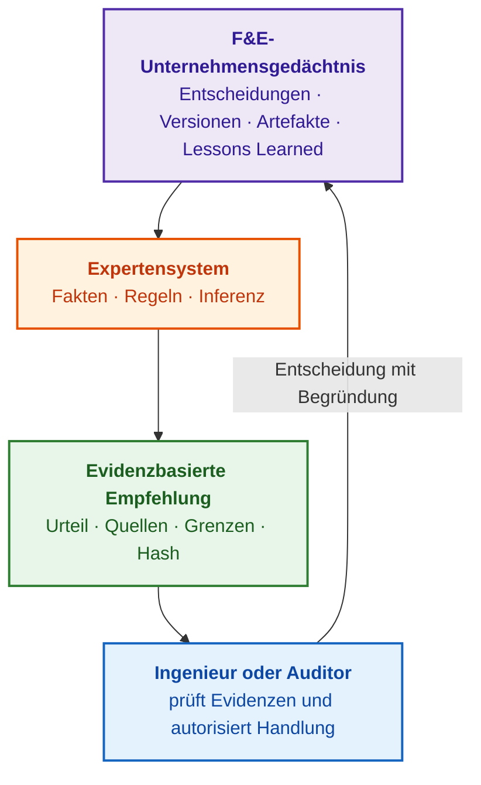
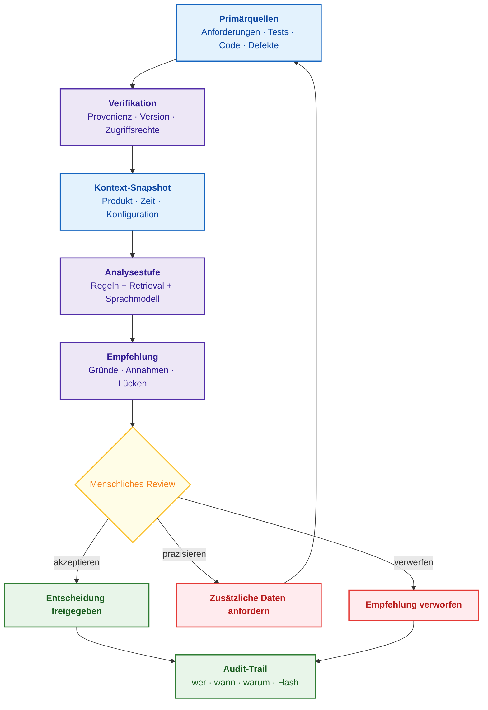
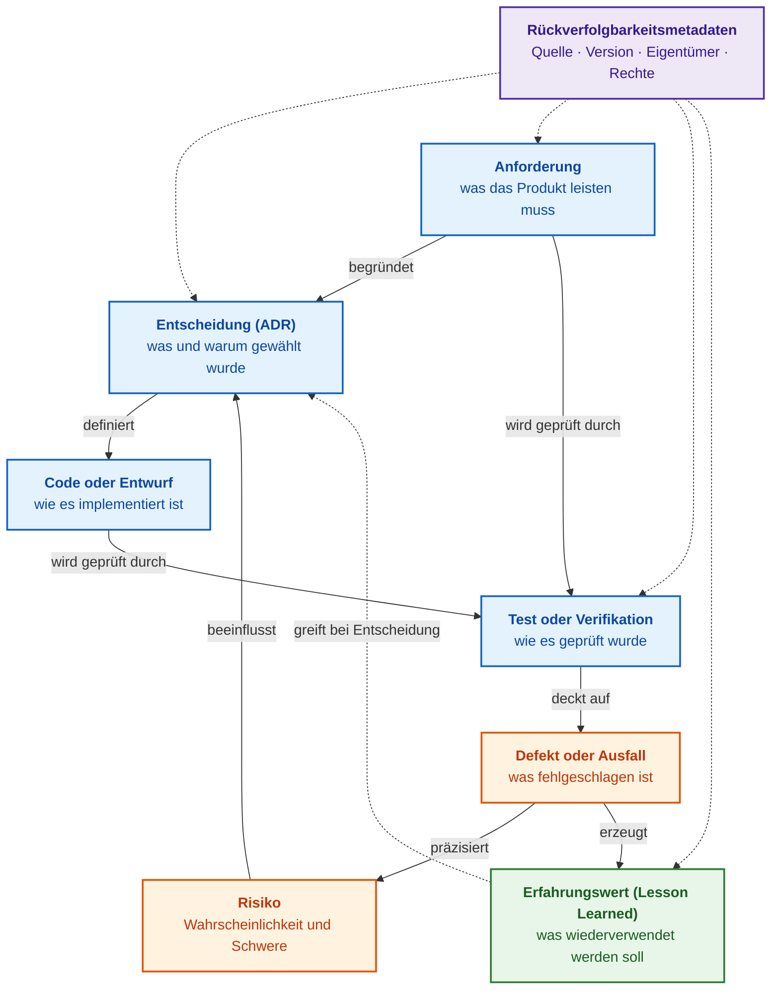
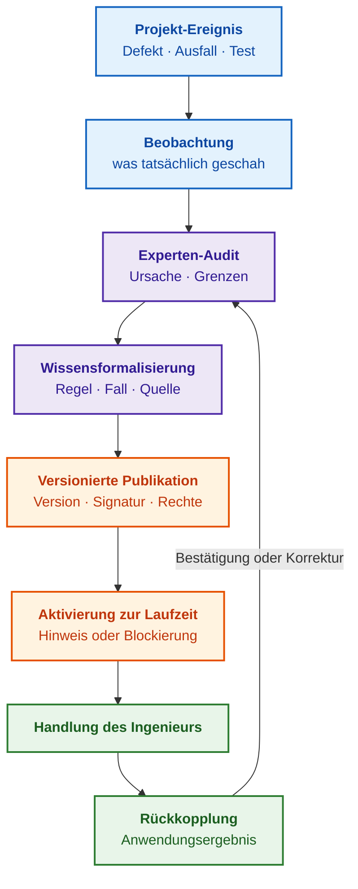

# Kapitel 5. Die Triade des Vertrauens: Expertensystem, evidenzbasierte Empfehlung und Unternehmensgedächtnis

> **Buch:** [Architektur evidenzbasierter Expertensysteme](README.md) · [Teil I: Konzeptionelle und epistemische Grundlagen](part-01-foundations.md)  
> **Vorheriges Kapitel:** [Kapitel 4. Evolution der Expertensysteme: Vom Satz von Bayes zu evidenzbasierten KI-Entscheidungen](ch04-evolution-from-bayes-to-evidence-ai.md)  
> **Nächstes Kapitel:** [Kapitel 6. Angewandte Mathematik für Expertensysteme: Regeln, Wahrscheinlichkeiten, Graphen und Kausalität](ch06-applied-mathematics-for-expert-systems.md)  
> **Inhaltsverzeichnis:** [README.md](README.md)  
> **Autor:** [Mykola Fedchyk](about-the-author.md)  
> **Niveau:** Grundlegendes Ingenieurniveau; Codebeispiel und Prompt-Template für Sprachmodelle in einklappbaren Blöcken  
> **Lernziele:** Erklären, wie Expertensystem, evidenzbasierte Empfehlung und Unternehmensgedächtnis einander stützen; einen minimalen Evidenzdatensatz für Empfehlungen künstlicher Intelligenz (KI) sowie die Felder eines Audit-Trails definieren; ein Dokumentenarchiv von einem Gedächtnis ingenieurtechnischer Entscheidungen und Präzedenzfälle unterscheiden; die Reife des Unternehmensgedächtnisses anhand der Einarbeitung neuer Ingenieure und der Wiederholung bekannter Fehler bewerten.

## Abstract

In diesem Kapitel wird die konzeptionelle Triade des Vertrauens in Systeme künstlicher Intelligenz innerhalb der sicherheitskritischen Ingenieurpraxis untersucht, die das symbolische Expertensystem, die evidenzbasierte Empfehlung und das Unternehmensgedächtnis für Forschung und Entwicklung (F&E) vereint. Es erfolgt eine klare Demarkation der Funktionen generativer Sprachmodelle (als semantische Schnittstelle und Werkzeug zur primären Textverarbeitung) von deterministischen Inferenzmaschinen. Definiert werden die Struktur des minimalen Evidenzdatensatzes einer Empfehlung sowie die Spezifikation eines kryptografischen Audit-Trails gemäß den Normen ISO 26262, ISO/SAE 21434 und dem W3C PROV-O-Modell. Es wird die Methodik zur Überführung passiver Dokumentation in einen aktiven relationalen Graphen des Unternehmensgedächtnisses nach dem SECI-Modell begründet, quantitative Reifemetriken für ingenieurtechnische Wissenstransferprozesse vorgestellt und die konzeptionellen Fundamente von Teil I der Monografie zusammengefasst.

Ein erfahrener Ingenieur wechselt in ein anderes Team. Ein neu eingestellter Entwickler sieht im Quellcode einen deaktivierten Kommunikationsmodus und fragt: „Warum wird dieser Modus nicht genutzt?“ Die interne Suchmaschine liefert ein Dutzend Dokumente mit dem Wort „Modus“. Ein über der Dokumentation aufgesetzter Chatbot antwortet: „Aufgrund von Instabilitäten in der Datenverbindung.“ Wer jedoch die Abschaltung veranlasst hat, für welche Produktversion, nach welchem gescheiterten Testlauf und ob diese Entscheidung heute noch bindend ist, bleibt völlig unklar. Dem neuen Mitarbeiter bleiben lediglich zwei schlechte Handlungsoptionen, wie Michael Nygard sie bereits 2011 prägnant beschrieb: die alte Entscheidung blindlings zu akzeptieren oder sie blindlings abzuändern – ohne Kenntnis von Ursachen und Konsequenzen [[1]](#src-1).

Dieses Fallbeispiel verknüpft drei unterschiedliche Problemstellungen; dieses Kapitel begreift jede davon als Eckpfeiler eines geschlossenen Vertrauensdreiecks. Das **Expertensystem** wendet verifiziertes Domänenwissen auf eine konkrete Fragestellung an. Die **evidenzbasierte Empfehlung** (*evidence-based recommendation*) legt Primärquellen, getroffene Annahmen und Gültigkeitsgrenzen der Schlussfolgerung offen, sodass eine autorisierte Person die Empfehlung verifizieren, akzeptieren oder verwerfen kann. Das **Unternehmensgedächtnis** (*corporate memory*) der Forschung und Entwicklung (*Research and Development*, F&E) speichert nicht bloß isolierte Dateien, sondern den Entscheidungskontext, die Version, die resultierenden Konsequenzen und die verantwortliche Instanz. Das Ziel dieses Kapitels ist es aufzuzeigen, warum kein Eckpfeiler ohne die beiden anderen tragfähig ist, welcher minimale Datensatz eine KI-Empfehlung prüf- und revisionssicher macht und wie gemessen werden kann, ob eine Organisation ihre eigenen Entscheidungen tatsächlich erinnert. Da dieses Kapitel den ersten Teil der Monografie abschließt, zieht es am Ende ein Fazit über Teil I und skizziert den weiteren Erkenntnisweg des Buches.

## 1. Gedächtnis von Ingenieurentscheidungen: Vom unstrukturierten Text zum versionierten Präzedenzfall

Der Aufbau eines belastbaren Unternehmensgedächtnisses als Wissensbasis für ein Expertensystem erfordert den Übergang von unstrukturierten Textarchiven zu streng formalisierten, versionierten ingenieurtechnischen Präzedenzfällen. Für den neuen Entwickler aus dem Einführungsbeispiel darf das Gedächtnis keinen willkürlichen Absatz über Instabilitäten zurückliefern, sondern einen strukturierten Datensatz einer Architekturentscheidung (Architecture Decision Record). In einem solchen didaktischen Beispieldatensatz hat das Entwicklungsteam den Modus ausschließlich für Version 2.1 infolge eines fehlgeschlagenen Systemtests deaktiviert; zudem dokumentierte das Team die verworfene Alternative und die explizite Revisionsbedingung.

| Feld | Didaktischer Inhalt |
|---|---|
| Entscheidung und Geltungsbereich | `ADR-7`: Deaktivierung des Modus ausschließlich für Version 2.1 |
| Begründungsgrundlage | `RUN-88`: Fehlfunktion in spezifizierter Konfiguration; Verknüpfung mit Anforderung und Testbericht |
| Verworfene Alternative | Erhöhung der Wiederholungsanzahl beseitigte die beobachtete Fehlfunktion nicht |
| Verantwortlichkeit | Entscheidung genehmigt durch Komponenten-Owner; Revisionsfrist separat terminiert |
| Revisionsbedingung | Neue Implementierung oder ein anwendbarer, erfolgreicher Testlauf erzeugen einen Revisionskandidaten |

Ein Expertensystem vermag formal zu verifizieren, ob eine vorgeschlagene Änderung eine noch gültige Entscheidung verletzt, und die normativen Hintergründe dieser Restriktion darzulegen. Es darf eine auf Version 2.1 beschränkte Entscheidung keinesfalls unreflektiert auf alle künftigen Produktversionen übertragen oder aus einem isolierten historischen Fehlschlag eine bedingungslose Regel ableiten. Die Qualität des Unternehmensgedächtnisses bemisst sich an der exakten Reproduzierbarkeit von Entscheidungsursachen und dem Auffinden anwendbarer Gegenbeispiele – nicht an der schieren Menge archivierter Seiten. Dies bildet den operativen Kern der Vertrauenstriade, die im Folgenden eingehend analysiert wird.

## 2. Die Triade des Vertrauens: Konzeptionelle Synergie von Expertensystem, Evidenz und Gedächtnis

Die drei Kernbegriffe aus dem Titel dieses Kapitels werden in der Praxis häufig verwechselt. Diese Begriffsverwirrung verleitet Teams zu der trügerischen Annahme, ein über der technischen Dokumentation betriebener Chatbot könne simultan als Unternehmensgedächtnis, Prozessprüfer und Entscheidungsunterstützungssystem agieren. Sobald eine Entscheidung jedoch belastbare Belege erfordert, sehen sich Ingenieure gezwungen, jede Ausgabe des Chatbots manuell nachzurecherchieren – der versprochene Produktivitätsgewinn durch KI bricht in sich zusammen.

Die Eckpunkte des Dreiecks bedingen einander wechselseitig. Ein Expertensystem benötigt ein Gedächtnis, da eine Inferenzmaschine ohne verifiziertes Domänenwissen keine logischen Operationen ausführen kann. Ein Gedächtnis entfaltet seinen praktischen Wert erst dann, wenn sich aus ihm prüffähige, strukturierte Fakten extrahieren lassen. Eine Empfehlung besitzt im Ingenieurwesen nur dann Gewicht, wenn sie lückenlos auf primäre Quellen und Inferenzregeln zurückgeführt werden kann, statt auf rhetorisch überzeugenden Fließtext zu vertrauen. Das folgende Diagramm verdeutlicht das Zusammenspiel dieser drei Komponenten mit der entscheidungsbefugten Person.



Der violette Knoten repräsentiert das F&E-Unternehmensgedächtnis, der orangefarbene das Expertensystem, der grüne die evidenzbasierte Empfehlung und der blaue den Menschen. Der kryptografische Hash im grünen Knoten fungiert als Prüfwert für den Inhalt der Empfehlung: Über diesen Hash wird jede nachträgliche Modifikation des Datensatzes nach erfolgter Prüfung sofort detektierbar; die Funktionsweise eines solchen Hash-Mechanismus anhand von Testberichten wurde in [Kapitel 1](ch01-introduction-to-expert-systems.md) dargelegt. Der Regelkreis schließt sich beim menschlichen Entscheider: Die autorisierte Entscheidung fließt mitsamt ihrer Begründungsbasis zurück in das Gedächtnis und steht als verifiziertes Wissen für künftige Fälle bereit. Wird auch nur ein einziger Übergang unterbrochen, verliert das Gesamtsystem seine Validität. Ohne Gedächtnis operiert das Expertensystem auf veraltetem Wissen; ohne strukturierten Evidenzdatensatz ist eine Empfehlung unüberprüfbar; und ohne die Rückführung der menschlichen Entscheidung erfährt das Unternehmensgedächtnis nie, wie der reale Fall gelöst wurde.

Für die weitere Lektüre sind fünf Schlüsselbegriffe grundlegend:

| Begriff | Präzise Erläuterung |
|---|---|
| Großes Sprachmodell (*Large Language Model*, LLM) | Softwaremodell zur Verarbeitung und Generierung natürlicher Sprache; kann als semantische Schnittstelle eines Expertensystems dienen, ersetzt dieses jedoch nicht |
| Primärevidenz (*primary evidence*) | Unmittelbares Mess- oder Testergebnis, freigegebene Anforderung oder sonstiges Artefakt mit verifizierter Herkunft |
| Abgeleiteter analytischer Datensatz (*derived analytical record*) | Auf Basis von Primärevidenzen erzeugtes Urteil; ist verifizierbar, ersetzt jedoch keinesfalls die zugrunde liegenden Primärquellen |
| Rückverfolgbarkeit (*traceability*) | Die lückenlose Möglichkeit, von einer Schlussfolgerung zu den Inferenzregeln, Fakten, Versionen und Primärquellen zurückzugehen |
| Entscheidungsunterstützungssystem (*decision support system*) | Informationssystem, das den Menschen bei der Urteilsfindung unterstützt, Entscheidungen jedoch nicht autonom an dessen Stelle trifft |

Kein Eckpunkt des Vertrauensdreiecks existiert isoliert: Verlässlichkeit erwächst erst aus der vollständigen Zirkulation entlang des gesamten Zyklus – vom Gedächtnis zur Entscheidung und zurück. Die folgenden Abschnitte beleuchten diese Komponenten sukzessive, beginnend mit der verbreiteten Verwechslung von Expertensystemen und generativen Chatbots.

## 3. Die erste Komponente der Triade: Demarkation von Expertensystem und generativem Chatbot

Nach mehreren Jahren der Euphorie um große Sprachmodelle sahen sich zahlreiche Ingenieurteams mit derselben Ernüchterung konfrontiert: Der Chatbot ist an die Dokumentation angebunden, die Antworten klingen eloquent und überzeugend, doch für verbindliche Ingenieurentscheidungen fehlt jegliches Vertrauen. Die Demonstration imponiert, doch sobald eine Entscheidung formal begründet werden muss, überprüfen Ingenieure wieder alle Fakten manuell. Die Ursache liegt nicht in Unzulänglichkeiten des Sprachmodells, sondern in der Fehlannahme, ein Sprachmodell könne drei grundverschiedene Aufgaben autonom bewältigen: erinnern, verifizieren und Entscheidungen stützen. Dieser Abschnitt nimmt eine klare funktionale Trennung zwischen Sprachmodell und Expertensystem vor.

### 3.1. Funktionsumfang und linguistische Grenzen großer Sprachmodelle

Die genuine Stärke eines großen Sprachmodells liegt in der linguistischen Verarbeitung. Ein Sprachmodell fasst heterogene Dokumente prägnant zusammen, bereitet komplexe Sachverhalte zielgruppengerecht auf, entwirft Entwurfstexte, deckt semantische Mehrdeutigkeiten auf und identifiziert inhaltlich verwandte Passagen. In der Projektpraxis führen diese Fähigkeiten zu erheblichen Zeiteinsparungen.

Der praktische Nutzen hängt maßgeblich vom Modelltyp ab. Ein Konversationsmodell dient als Dialogschnittstelle und Redaktionswerkzeug. Ein Code-Spezialmodell unterstützt bei der ersten Durchsicht von Implementierungen. Ein Embedding-Modell transformiert Texte in hochdimensionale Vektoren und ermöglicht so das Auffinden semantisch ähnlicher Dokumente, Fehlerbeschreibungen oder Erfahrungswerte, selbst wenn die exakten Begrifflichkeiten divergieren. Ein Klassifikationsmodell teilt Dokumente nach Typen oder Vertraulichkeitsstufen ein. Ein lokales Modell, das auf unternehmenseigener Infrastruktur betrieben wird, ist dort unverzichtbar, wo vertrauliche Daten keinesfalls externe Server erreichen dürfen.

In einem Expertensystem entfaltet das Sprachmodell seinen höchsten Wert nicht als „allwissende Steuerungszentrale“, sondern als semantische Schicht um den kontrollierten Inferenzkern herum. Das Sprachmodell überführt die menschliche Freitextanfrage in eine strukturierte Abfrage an die Wissensbasis, extrahiert potenzielle Fakten aus unstrukturierten Texten, erläutert die Ergebnisse angewandter Inferenzregeln und formuliert Begründungsentwürfe. Die Letztbegründung verbleibt jedoch ausnahmslos in den deterministischen Regeln, Primärquellen, Versionen und der menschlichen Entscheidung.

### 3.2. Deterministische Vorteile des symbolischen Expertensystems

Der prinzipielle Aufbau eines Expertensystems wurde in [Kapitel 1](ch01-introduction-to-expert-systems.md) beschrieben. Die Wissensbasis (*knowledge base*) speichert Regeln, Fakten, Invarianten und Referenzfälle der Domäne. Der Arbeitsspeicher (*working memory*) hält die dynamischen Fakten des aktuellen Falls vor, beispielsweise die Produktversion, Testergebnisse und offene Fehlertickets. Die Inferenzmaschine (*inference engine*) wendet das formalisierte Domänenwissen auf den konkreten Fall an. Die Erklärungskomponente (*explanation facility*) legt transparent dar, welche Regeln ausgelöst wurden, welche Fakten herangezogen wurden und welche Informationen fehlen. Das Wissenserfassungssystem (*knowledge acquisition system*) ermöglicht das Hinzufügen, Verifizieren und Aktualisieren von Wissen in der Wissensbasis. Worin sich ein Expertenurteil von einer rein passiven Auskunft unterscheidet, wurde in [Kapitel 3](ch03-beyond-reference-information-systems.md) analysiert; die detaillierte Komponentenarchitektur behandelt [Kapitel 16](ch16-expert-systems-architecture.md).

Für die Vertrauenstriade ist eine fundamentale Differenzierung entscheidend: Ein Chatbot generiert eine Antwort im selben Freitextformat, in dem er die Anfrage empfangen hat. Ein Expertensystem hingegen rekonstruiert eine lückenlose Inferenzkette aus spezifischen Regeln, verifizierten Fakten und Grenzbedingungen. Ein Chatbot ist eine Benutzeroberfläche; die Entscheidungsunterstützung ist der funktionale Systemzweck. Ein Expertensystem im beratenden Modus stellt eine streng formalisierte Variante eines Entscheidungsunterstützungssystems dar – doch längst nicht jedes Auskunftssystem verfügt über Inferenzregeln und einen manipulationssicheren Nachweispfad.

Dieser Unterschied wird dort existentiell, wo Entscheidungen langfristige Nachweispflichten nach sich ziehen: in der funktionalen Sicherheit, der Cybersicherheit und der regulatorischen Konformität. Dieser Nachweispfad setzt sich zusammen aus Sicherheitsnachweisen (Safety Cases), Audit-Trails, Zertifizierungsbelegen und vertraglichen Verpflichtungen. Wenn eine KI ohne Verknüpfung zu Arbeitsartefakten, fehlgeschlagenen Testläufen und Lieferantenqualifikationen schlicht deklariert: „Die Freigabe ist vertretbar“, so handelt es sich nicht um eine Entscheidungsgrundlage, sondern um eine unüberprüfte Hypothese.

### 3.3. Verteilung architektonischer Rollen und Hierarchie des Unternehmenswissens

Wenn Sprachmodell und Expertensystem dieselben Aufgaben unkoordiniert nebeneinander ausführen, wird eine Halluzination des Sprachmodells unbemerkt als valides Urteil übernommen. Daher müssen die Rollen architektonisch strikt getrennt werden. In einer hybriden Neuro-Symbolic-Architektur zeichnet das Sprachmodell für Schnittstellenkommunikation, narrative Erläuterungen, Dokumentenverarbeitung und semantische Suche verantwortlich. Der Expertensystemkern verantwortet das Domänenwissen, formale Prüfregeln, logische Inferenz, den Begründungs-Audit-Trail und das Wissensversionierungsmanagement. Das Sprachmodell mimt keinen Fachexperten, und das Expertensystem mimt keinen Plauderpartner.

Domänenwissen existiert auf hierarchisch differenzierten Ebenen. Die Unternehmensebene umfasst Qualitätsrichtlinien, übergreifende Sicherheitsanforderungen und Datenklassifizierungen. Die Abteilungsebene definiert Testmethoden, Architekturleitlinien oder Vorgaben für das Lieferantenmanagement. Die Projektebene beinhaltet Komponentennamen, historische Architekturentscheidungen, bewilligte Ausnahmen und kundenspezifische Vereinbarungen. Ein Expertensystem muss diese Ebenen zwingend differenzieren, da Wissen auf unterschiedlichen Hierarchiestufen unterschiedliche normative Verbindlichkeit, verschiedene Eigentümer und divergierende Gültigkeitszeiträume aufweist. So kann eine projektspezifische Ausnahmeregelung eine Abteilungsrichtlinie vorübergehend lockern – jedoch ausschließlich für ein bestimmtes Produkt und bis zu einer definierten Revisionsversion.

Ein Expertensystem ohne strukturiertes Wissen ist lediglich ein leerer Berechnungs- und Inferenzkern. Daher erfordert jede Regelgruppe einen designierten Wissenseigentümer (*knowledge owner*): eine Person, die für die fachliche Korrektheit der Domäne verantwortlich ist, beispielsweise für funktionale Sicherheit, Cybersicherheit oder eine bestimmte Bauteilgruppe. Der Wissenslebenszyklus umfasst die Erfassung, formale Verifikation, Freigabe, Versionierung und die kontrollierte Stilllegung veralteter Regeln. Fehlen definierte Wissenseigentümer und ein etablierter Lebenszyklus, degenerieren die Empfehlungen des Expertensystems rapide. Wie ein Expertensystem durch neue Versionen seiner Wissensbasis kontinuierlich dazulernt, wird in [Kapitel 25](ch25-how-expert-systems-learn.md) und [Kapitel 26](ch26-continual-learning.md) vertieft.

### 3.4. Technische Qualitätsmetriken und Verifikationsverfahren (TEVV)

Die Qualität eines Expertensystems bemisst sich keineswegs an der Eloquenz oder Natürlichkeit des Dialogs. Erforderlich sind objektive ingenieurtechnische Kriterien:

- **Korrektheit:** Regeln werden deterministisch angewendet und führen bei identischen Eingangsfakten ausnahmslos zu identischen Schlussfolgerungen.
- **Vollständigkeit:** Das Expertensystem erkennt das Fehlen zwingend erforderlicher Eingangsdaten und verweigert unvollständige Schlüsse.
- **Erklärbarkeit:** Der Benutzer kann Fakten, Regeln, Annahmen und bestehende Informationslücken detailliert nachvollziehen.
- **Wartbarkeit:** Jede Regel kann modular aktualisiert, regressionsgetestet und über eine Versionsnummer eindeutig reproduziert werden.
- **Verantwortlichkeit:** Jede Wissensdomäne und jede Regelgruppe ist einem namentlich benannten Wissenseigentümer zugeordnet.

Ein Expertensystem, das bei unzureichender Datenlage eine Verfeinerung anfordert oder die Empfehlung verweigert, ist für die Ingenieurpraxis ungleich wertvoller als ein System, das stets scheinbar hochkonfident antwortet. Zur operativen Umsetzung werden diese Kriterien in formale Prüfverfahren überführt: Sammlungen verifizierter Benchmark-Präzedenzfälle mit definierten Soll-Ergebnissen, die Quote von Aussagen mit validen Primärquellenverweisen, die Quote korrekter Antwortverweigerungen bei Informationsdefiziten, automatisierte Regelsatz-Tests und Metriken zur Aktualität von Quellen. Für jede Kennzahl werden Baseline-Werte, Toleranzgrenzen und Verantwortlichkeiten festgelegt. Das Risk Management Framework für künstliche Intelligenz des National Institute of Standards and Technology (NIST) fasst diese Aktivitäten unter dem Begriff TEVV zusammen (*Test, Evaluation, Verification and Validation*) [[2]](#src-2). Konkrete Prüffragen zur Nützlichkeitsbewertung liefert [Kapitel 1](ch01-introduction-to-expert-systems.md); die formale Verifikation der Wissensbasis behandelt [Kapitel 23](ch23-knowledge-base-verification.md).

Zusammenfassend gilt: Sprachmodell und Expertensystem stehen nicht in Konkurrenz. Das Sprachmodell erklärt und vermittelt, das Expertensystem verifiziert und schließt; eine explizite Rollenteilung, klare Eigentümerschaft und messbare Qualitätskriterien machen ihre Synthese praxistauglich. Doch selbst ein fehlerfrei konstruiertes Expertensystem generiert zunächst nur eine Empfehlung – womit sich die Folgefrage stellt: Wann darf eine solche Empfehlung in eine verbindliche Entscheidung einfließen?

## 4. Die zweite Komponente der Triade: Transformation von KI-Empfehlungen in evidenzbasierte Artefakte

Für sich allein genommen ist die Textausgabe einer KI lediglich unstrukturierter Text – kein Nachweis. Eine solche Ausgabe wird erst dann zu einem prüffähigen Eingangsdatum für menschliche Entscheidungen, wenn sie untrennbar mit Primärevidenzen und den Randbedingungen der Analyse verknüpft ist. Dieser Abschnitt verdeutlicht anhand eines Praxisbeispiels aus der Erfahrung des Autors, was im regulierten Ingenieurwesen als formaler Nachweis gilt und welcher minimale Datensatz eine KI-Antwort in ein revisionssicheres Entscheidungsmaterial transformiert.

### 4.1. Praktischer Präzedenzfall: Qualifikation eines komplexen Gerätetreibers (CDD)

Aus der ingenieurtechnischen Praxis des Autors ist ein Fall bei der Prototypenentwicklung eines komplexen Gerätetreibers (*Complex Device Driver*, CDD) aufschlussreich – eines hardwarenahen Softwaremoduls für nicht standardisierte Peripherie, die nicht durch generische Treiber abgedeckt werden kann. Das Release umfasste über dreihundert Softwareanforderungen (*Software Requirements*, SWR); die manuelle Prüfung der Code-Konformität verzögerte den Terminplan massiv. Ein generatives KI-System lieferte eine vordergründig plausible Empfehlung: „Das Freigaberisiko ist vertretbar.“ Auf die konkreten ingenieurtechnischen Fragen: „Welche spezifischen Tests sind fehlgeschlagen, welche Defekttickets sind offen und welche Anforderungen wurden durch welche Quellcodezeilen nachweislich abgedeckt?“, blieb das System jedoch jede belastbare Antwort schuldig. Die Empfehlung las sich überzeugend, entbehrte jedoch jeglicher Nachweisgrundlage.

Vom Autor wurde der Interaktionsansatz mit generativen Modellen grundlegend überarbeitet: Eingeführt wurden strukturierte Abfragen, mehrstufige Verifikationsschritte sowie die zwingende Verknüpfung von Schlussfolgerungen mit normativen Anforderungen, Quellcode und Testszenarien. Erst nach diesen Modifikationen wurden die KI-Ergebnisse zu einem brauchbaren Arbeitsmaterial für die menschliche Begutachtung. Das Fallbeispiel reflektiert praktische Erfahrungen des Autors und stellt weder ein kontrolliertes Experiment noch ein Pauschalurteil über KI-Systeme dar.

### 4.2. Ontologie ingenieurtechnischer Evidenz und das PROV-O-Herkunftsmodell

Im regulierten Ingenieurwesen besitzt ein Nachweis (*evidence*) eine strikt definierte Form. Eine Primärevidenz, beispielsweise ein Testprotokoll oder eine freigegebene Anforderung, erfordert lückenlose Herkunftsnachweise (*provenance*) und Integritätsgarantien:

- **Quelle:** Welches Messwerkzeug, welche Person und welcher Prozess haben die Evidenz erzeugt?
- **Version oder unveränderlicher Bezeichner:** Zu welcher Produktversion, welchem Dokumentenstand oder welcher Baseline gehört die Evidenz?
- **Kontext:** Unter welchen Umgebungsbedingungen wurde die Evidenz erhoben, welche Annahmen und Restriktionen galten?
- **Eigentümer:** Wer trägt die fachliche Verantwortung für die Aktualität und Interpretation der Evidenz?

Die Herkunftsentwicklungs-Ontologie PROV-O (*PROV Ontology*) des World Wide Web Consortiums (W3C) modelliert die Herkunft eines Nachweises anhand dreier Grundkonzepte: der Entität (*entity*), also dem Beweisartefakt selbst; der Aktivität (*activity*), die diese Entität hervorgebracht hat; und dem Agenten (*agent*), also der Person, dem Softwaresystem oder der Organisation, die für die Aktivität verantwortlich zeichnet [[3]](#src-3). Die epistemische Trennung zwischen einer bloßen Behauptung und einem verifizierten Nachweis analysiert [Kapitel 2](ch02-epistemology-of-machine-knowledge.md).

Die formale Freigabe ist ein eigenständiges Attribut der Entscheidung: Wer hat zu welchem Zeitpunkt das Evidenzpaket für einen definierten Verwendungszweck als hinreichend anerkannt? Nicht jedes Roh-Logfile oder Testergebnis bedarf einer manuellen Freigabe, doch jeder derartige Datensatz muss unveränderlich mit Testlauf, Version und Erzeuger verknüpft sein.

Als ingenieurtechnische Evidenzen fungieren automatisierte Testergebnisse, Code-Review-Protokolle, Lieferanten-Qualifikationszertifikate, Fehlermöglichkeits- und Einflussanalysen (*Failure Mode and Effects Analysis*, FMEA), Gefahrenanalysen und freigegebene Anforderungsspezifikationen. Ein KI-generierter Freitext ohne Verweise auf diese Artefakte ist kein Nachweis. Er stellt lediglich einen abgeleiteten analytischen Datensatz dar: Ein solcher Datensatz interpretiert Evidenzen, kann diese aber niemals ersetzen.

### 4.3. Struktur des minimalen Evidenzdatensatzes einer Empfehlung

Die Ausgabe einer KI wird niemals zur Primärevidenz über das Produkt, kann jedoch zu einem auditierbaren abgeleiteten Datensatz werden. Hierfür muss jede Antwort von vier obligatorischen Elementen flankiert werden:

- **Quellen:** Explizite Referenzen auf konkrete Artefakte, beispielsweise die Anforderung REQ-1234, den Testfall TST-5678, das Sicherheitsrisiko RSK-091, die Produkt-Baseline B-2026.04 und den Änderungsantrag CR-77 – statt diffuser Verweise auf „industrielle Best Practices“.
- **Versionen:** Bindung an die exakte Produkt-Baseline, den Stand der Wissensbasis und den geltenden Normenkontext. Die Modifikation einer beliebigen Abhängigkeit invalidiert die Empfehlung und markiert sie als revisionsbedürftig.
- **Annahmen:** Sämtliche impliziten Vorannahmen müssen in einer expliziten Liste offengelegt werden.
- **Konfidenzniveau:** Bewertung der Verlässlichkeit gepaart mit einer Nennung der Faktoren, die diese Konfidenz mindern. Warum Konfidenz besser durch ein Set valider Indikatoren als durch eine einzelne Pseudowahrscheinlichkeit ausgedrückt wird, erläutert Lektion 4 in [Kapitel 4](ch04-evolution-from-bayes-to-evidence-ai.md).

Ergänzt werden diese vier Komponenten durch die nachvollziehbare Inferenzkette sowie die finale menschliche Entscheidung mitsamt Name und Zeitstempel. In dieser Umhüllung verliert die KI-Aussage ihren Charakter als unprüfbare Behauptung („Die KI hat gesagt…“) und wird zu einem verifizierbaren Entscheidungsvorschlag: Der autorisierte Ingenieur kann die Empfehlung anhand der Primärquellen nachvollziehen, modifizieren oder zurückweisen. Das Leitprinzip lautet: Die KI empfiehlt, der Mensch autorisiert.

Für reguläre Ingenieurszenarien genügt ein kompakter, strukturierter Datensatz. Dieser entspricht dem Begründungspaket aus [Kapitel 1](ch01-introduction-to-expert-systems.md) und [Kapitel 3](ch03-beyond-reference-information-systems.md), ergänzt um zwei KI-spezifische Felder: die Konfiguration des Modells und die menschliche Autorisierungsentscheidung.

| Feld | Zu erfassender Inhalt |
|---|---|
| Behauptung oder Empfehlung | Konkreter Vorschlag des Expertensystems oder Sprachmodells und die adressierte Entscheidung |
| Primärquellen | Bezeichner von Anforderungen, Tests, Defekten, Risiken sowie Verweise auf exakte Text-/Codefragmente |
| Kontext-Snapshot | Produkt-Baseline, Snapshot des Wissenskorpus und Zeitstempel der Abfrage |
| Regeln und Annahmen | Version der Regel oder Richtlinie, getroffene Annahmen, identifizierte Lücken und Konflikte |
| KI-Konfiguration | Modellbezeichnung, Version des System-Prompts, Retrieval-Parameter, Versionen von Index und Reranker |
| Analyse-ID | Unveränderlicher Bezeichner oder kryptografischer Hash des Eingabepakets und der Antwort |
| Menschliche Entscheidung | Wer, wann und warum die Empfehlung akzeptiert, verworfen oder zur Überarbeitung zurückgewiesen hat |

Dieser Datensatz trennt den objektiven Nachweis von dessen Interpretation und gestattet die unabhängige Re-Evaluation oder Anfechtung eines Ergebnisses. Warum Snapshots und Versionierung reproduzierbare Antworten garantieren, zeigt Lektion 3 in [Kapitel 4](ch04-evolution-from-bayes-to-evidence-ai.md). Das Feld „KI-Konfiguration“ lässt sich standardisiert aus einer Model Card befüllen: Margaret Mitchell und Koautoren schlugen vor, in einer solchen Karte den Einsatzzweck, Evaluierungsbedingungen und bekannte Limitationen festzuhalten [[4]](#src-4). Die Provenienz von Trainings- und Referenzdaten wiederum beschreibt das Datasheet for Datasets nach Timnit Gebru et al., welches Motivation, Zusammensetzung, Erhebungsprozess und empfohlene Nutzungsszenarien dokumentiert [[5]](#src-5).

Das folgende Ablaufdiagramm illustriert den vollständigen Pfad von den Primärquellen bis zur prüffähigen Entscheidung.



Die blauen Blöcke kennzeichnen die Eingangsdaten: Primärquellen und Kontext-Snapshot. Die violetten Blöcke stellen die Verarbeitungsschritte dar: Verifikation von Provenienz, Versionen und Rechten, analytische Synthese sowie die Generierung der Empfehlung. Die gelbe Raute markiert das menschliche Review-Gate. Die grünen Blöcke bezeichnen die freigegebene Entscheidung und den Audit-Trail; die roten Blöcke stehen für Präzisierungs- und Zurückweisungspfade. Auch eine verworfene Empfehlung wird zwingend im Audit-Trail protokolliert: Die begründete Ablehnung eines KI-Ratschlags ist eine vollwertige ingenieurtechnische Entscheidung.

Die formale Vollständigkeit des Datensatzes lässt sich trivial automatisieren. Das nachfolgende Go-Programm prüft nicht die inhaltliche Richtigkeit einer Empfehlung, sondern beantwortet eine vorgelagerte architektonische Frage: Weist der Datensatz alle Pflichtfelder auf, ohne die eine Empfehlung reiner Freitext bleibt?

<details>
<summary>Beispiel in Go: Validierung des minimalen Evidenzdatensatzes</summary>

Das Programm ist in sich geschlossen und kann via `go run main.go` ausgeführt werden. Der Datentyp `Recommendation` kapselt die Pflichtfelder aus der Tabelle; die Methode `Missing` liefert die Namen fehlender Attribute. Die Bezeichner sind didaktisch gewählt.

```go
package main

import (
	"fmt"
	"strings"
)

// Recommendation repräsentiert den minimalen Evidenzdatensatz einer KI-Empfehlung.
type Recommendation struct {
	Claim       string
	Sources     []string // Bezeichner der Primärquellen
	Baseline    string   // Baseline des Produkts
	Snapshot    string   // Snapshot des Wissenskorpus
	RuleVersion string
	ModelConfig string // Modell, Prompt-Version, Retrieval-Parameter
	AnalysisID  string // Hash des Eingabepakets und der Antwort
	Decision    string // Wer, wann und warum die Entscheidung getroffen hat
}

// Missing gibt die Felder zurück, ohne die eine Empfehlung reiner Text bleibt.
func (r Recommendation) Missing() []string {
	var m []string
	check := func(ok bool, field string) {
		if !ok {
			m = append(m, field)
		}
	}
	check(len(r.Sources) > 0, "Primärquellen")
	check(r.Baseline != "" && r.Snapshot != "", "Kontext-Snapshot")
	check(r.RuleVersion != "", "Regelversion")
	check(r.ModelConfig != "", "KI-Konfiguration")
	check(r.AnalysisID != "", "Analyse-ID")
	return m
}

func main() {
	chat := Recommendation{Claim: "Freigaberisiko ist vertretbar"}
	record := Recommendation{
		Claim:       "Freigaberisiko nach Wiederholungstest TST-5678 vertretbar",
		Sources:     []string{"REQ-1234", "TST-5678", "RSK-091"},
		Baseline:    "B-2026.04",
		Snapshot:    "snap-2026-04-18",
		RuleVersion: "release-policy 2.3",
		ModelConfig: "local-8b@v1.4, prompt v3",
		AnalysisID:  "sha256:5c1e…",
	}
	for _, r := range []Recommendation{chat, record} {
		if m := r.Missing(); len(m) > 0 {
			fmt.Printf("%q: nur Text, es fehlen: %s\n", r.Claim, strings.Join(m, ", "))
			continue
		}
		status := "wartet auf menschliche Entscheidung"
		if r.Decision != "" {
			status = "Entscheidung: " + r.Decision
		}
		fmt.Printf("%q: verwertbarer abgeleiteter Datensatz, %s\n", r.Claim, status)
	}
}
```

Das Programm gibt Folgendes aus:

```text
"Freigaberisiko ist vertretbar": nur Text, es fehlen: Primärquellen, Kontext-Snapshot, Regelversion, KI-Konfiguration, Analyse-ID
"Freigaberisiko nach Wiederholungstest TST-5678 vertretbar": verwertbarer abgeleiteter Datensatz, wartet auf menschliche Entscheidung
```

Die erste Empfehlung repliziert die Aussage aus dem Praxisbeispiel des Autors: Die Aussage mag inhaltlich zutreffen, lässt sich jedoch ohne Quellen, Snapshot und Versionen nicht überprüfen. Der zweite Datensatz enthält alle Pflichtfelder; da das Attribut `Decision` noch unbesetzt ist, deklariert das System die Empfehlung korrekt als noch nicht autorisiert. Das Prüfprogramm validiert lediglich die syntaktische Vollständigkeit. Ob der Test TST-5678 tatsächlich existiert und die Schlussfolgerung epistemisch stützt, obliegt dem Expertensystem (unter Anwendung der Antwortbedingung aus [Kapitel 2](ch02-epistemology-of-machine-knowledge.md)) sowie dem menschlichen Gutachter.

</details>

Die automatisierte Vollständigkeitsprüfung bürgt zwar nicht für die inhaltliche Wahrheit einer Empfehlung, eliminiert jedoch zuverlässig das verbreitetste Übel: scheinbar brillante Freitext-Behauptungen ohne jeden prüffähigen Anknüpfungspunkt.

### 4.4. Disziplin des Reviewer-Vertrags: Code-Audit nach ISO 26262 und ISO/SAE 21434

Die fundamentale Diskrepanz zwischen Freitext und evidenzbasiertem Datensatz tritt bei der Code-Konformitätsanalyse besonders plastisch zutage. In der Automobilelektronik gelten der funktionale Sicherheitsstandard ISO 26262 der International Organization for Standardization (ISO), dessen Teil 6 die Anforderungen an die Softwareentwicklung festlegt [[6]](#src-6), sowie der Cybersicherheitsstandard ISO/SAE 21434, der gemeinsam mit SAE International erarbeitet wurde [[7]](#src-7). In derartigen Projekten darf eine KI nicht einfach aufgefordert werden, „den Code auf Fehler zu durchsuchen“. Gefordert ist die Identifikation von Abweichungen gegen spezifische Anforderungen, Programmierrichtlinien oder ein definiertes Projekt-Verifikationsprofil (*project verification profile*). Ein unstrukturierter Prompt lautet: „Prüfe diesen Code auf Fehler.“ Ein methodisch sauberer Ansatz bindet das Modell hingegen an einen Reviewer-Vertrag: präzise Definition von Input, Prüfkriterien und Antwortformat.

<details>
<summary>Prompt-Template: Reviewer-Vertrag für die Code-Konformitätsprüfung</summary>

Das Template stellt den System-Prompt für ein Sprachmodell dar. Auslassungspunkte in Anführungszeichen markieren Platzhalter für normative Texte, Kodierregeln und Profile; die Bezeichner sind exemplarisch.

```text
Du führst eine vorläufige Konformitätsanalyse des Codes hinsichtlich Sicherheits- und Cybersicherheitsanforderungen durch.

Kontext:
- Anforderung: REQ-SAFE-017, genauer Wortlaut: "..."
- Programmierregeln: CS-C-012, CS-C-019, genauer Wortlaut der Regeln: "..."
- Projekt-Verifikationsprofil: SAF-C-017 und SEC-C-011; genauer Wortlaut, Geltungsbereich und Abnahmekriterium: "..."
- Normativer Kontext: Anwendbare Teile von ISO 26262-6 und ISO/SAE 21434 dienen als Quelle für das Projektprofil, nicht als eigenständige Regel.
- Baseline: B-2026.04
- Codedatei: src/speed_monitor.c, Commit-Änderung abc123

Aufgaben:
1. Formuliere die Anforderung in überprüfbare Assertions um.
2. Prüfe den Code ausschließlich gegen die bereitgestellten Anforderungen, Programmierregeln und das Projekt-Verifikationsprofil.
3. Gib für jeden Defekt an: Anforderungs-ID, Programmierregel, Projektprofil,
   Codefragment, Fehlerursache, Auswirkung, Konfidenzniveau (hoch/mittel/niedrig),
   Annahmen, fehlende Informationen, Beispiel für korrekten Code.
4. Falls die Evidenz unzureichend ist, erfinde keinen Defekt. Markiere als "erfordert menschliches Review".
5. Verweise nicht mit pauschalen Floskeln auf Normen. Erläutere die konkrete ingenieurtechnische Erwartungshaltung.
```

Durch ein derartiges Template erhält der Prüfer für jeden identifizierten Defekt ein identisches Schema, wodurch Auswertungen verschiedener Durchläufe deterministisch vergleichbar werden.

</details>

Der Wert dieses Templates liegt nicht in seiner Formulierung, sondern in seiner methodischen Disziplin: Das Sprachmodell agiert nicht als unfehlbares Orakel, sondern als formaler Prüfer, der seine Beweiskette transparent offenlegt. Es ist zwecklos, eine KI anzuweisen, „Code auf Konformität mit ISO 26262 zu prüfen“. Teil 6 der ISO 26262 definiert Prozessanforderungen an die Softwareentwicklung und Arbeitsergebnisse – von Sicherheitsanforderungen bis zu Modultests und Integration [[6]](#src-6) –, während ISO/SAE 21434 organisatorische und technische Anforderungen an das Cybersicherheits-Risikomanagement stellt [[7]](#src-7). Keine dieser Normen ist ein statischer Code-Analyzer. Dem Sprachmodell müssen daher freigegebene, operative Projekterwartungen übergeben werden: Eine Sicherheitsanforderung muss eine rückverfolgbare Implementierung und verifizierte Tests aufweisen; sicherheitskritischer Code muss undefiniertes Verhalten, uninitialisierte Variablen und Pufferüberläufe ausschließen; externe Eingabedaten müssen vor dem Kopieren validiert werden; schutzkritische Operationen erfordern eine explizite Berechtigungsprüfung. Jede dieser Erwartungen muss auf eine Programmierregel, ein Projektprofil oder eine Systemspezifikation zurückgeführt werden können.

Für das praktische Review liefert das Modell keine Freitext-Erzählung, sondern eine standardisierte Tabelle je Befund: ID, Anforderungsverknüpfung, Code-Beleg, Auswirkung, Konfidenzgrad, Annahmen, fehlende Belege, Behebungsvorschlag und erforderliche Tests. Bestätigter Defekt, potenzieller Befund und Klärungsbedarf müssen als distinkte Zustände modelliert werden. Der Gutachter erkennt nicht nur das Ergebnis, sondern den Pfad dorthin; der Auditor prüft die Kausalitätskette von der Anforderung über den Code-Beleg bis zur menschlichen Freigabe.

Das Konfidenzniveau ist hierbei von herausragender Bedeutung. Erkennt das Sprachmodell eine ungeprüfte Pufferlänge bei Array-Zugriffen, kann es mit hoher Konfidenz auf ein Überlaufrisiko hinweisen. Fehlt hingegen ein Autorisierungsnachweis, muss das Modell differenziert reagieren: „In diesem Codefragment ist keine Berechtigungsprüfung ersichtlich; falls diese im Aufrufbaum vorgelagert erfolgt, ist hierfür ein Nachweis beizubringen.“ Eine solche Antwort ist weniger spektakulär, benennt jedoch exakt die Grenzen des analysierten Codeausschnitts.

### 4.5. Kryptografischer Audit-Trail und Rückverfolgbarkeitsprotokoll

In regulierten Umgebungen müssen sämtliche KI-Interaktionen, die Einfluss auf Systementscheidungen nehmen, revisionssicher protokolliert werden. Ein minimaler Datensatz eines Audit-Trails umfasst: Anfragesteller; an das Modell übergebener Kontext; herangezogene Primärquellen; generierte Antwort nebst Konfidenzniveau; menschliche Entscheidung inklusive etwaiger Abweichungen von der Empfehlung; verantwortlicher Eigentümer und Zeitstempel. Ohne einen solchen Audit-Trail verbleibt KI in sicherheitskritischen Bereichen eine unzulässige Blackbox. Wie ein Audit-Trail durch kryptografische Hash-Ketten vor unbemerkter Manipulation geschützt wird, erläutert [Kapitel 2](ch02-epistemology-of-machine-knowledge.md); wie die Erklärungskomponente den Schlusspfad rekonstruiert, zeigt [Kapitel 20](ch20-explanation-engine.md).

Auf der Benutzeroberfläche muss jede Empfehlung Primärquellen, explizite Annahmen, begründete Konfidenzwerte, die Bedingung „Was würde die Antwort ändern?“, den zuständigen Eigentümer und die Baseline-Zuordnung ausweisen. Für Quellcode kommen Anforderungen, Kodierregeln, Codebelege und Review-Ergebnisse hinzu. Auf diese Weise wandelt sich die KI vom vermeintlichen Orakel zu einem transparenten Zulieferer im regulären Ingenieur-Review.

Eine KI-Empfehlung wird nicht durch komplexere neuronale Netze evidenzbasiert, sondern durch das formale Datenkorsett, das sie umgibt: Quellen, Kontext-Snapshots, Versionen, Annahmen, Konfidenz, Analyse-IDs und menschliche Autorisierung. Diese Quellen und Versionen müssen jedoch an einem zentralen Ort mitsamt ihren relationalen Abhängigkeiten persistiert werden. Wo dies geschieht, erklärt der dritte Pfeiler der Triade.

## 5. Die dritte Komponente der Triade: F&E-Unternehmensgedächtnis als relationaler Graph

Der dritte Pfeiler stützt die beiden vorangegangenen: Ohne ein tragfähiges Gedächtnis verbleiben sowohl das Expertensystem als auch die Disziplin evidenzbasierter Datensätze reine Papiermodelle. In Forschung und Entwicklung geht Wissen selten aus Mangel an Dokumenten verloren – meist existieren viel zu viele davon –, sondern durch das Fehlen expliziter **Relationen**: zwischen Entscheidung und Anforderung, Defekt und Ursache, gescheitertem Test und Architekturbeschluss, historischer Lektion und Folgeprojekt.

Aus der ingenieurtechnischen Erfahrung des Autors existierte die Antwort auf eine technische oder organisatorische Fragestellung zumeist bereits in früher realisierten Projekten: Jemand hatte einen gleichartigen Defekt analysiert, eine verworfene Architektur begründet, einen Workaround für Bauteiltoleranzen eines Zulieferers entwickelt oder exakt dieselbe Beanstandung eines Auditors durchfochten. Doch Komponenten wurden umbenannt, Ingenieure wechselten die Teams, und die Begründung lag begraben in Ticket-Kommentaren. Daher definiert dieses Buch das Unternehmensgedächtnis nicht als statisches Dokumentenarchiv, sondern als die systemische Fähigkeit einer Organisation, **den relevanten Kontext im entscheidenden Moment abzurufen** und auf eine neue Entscheidung anzuwenden.

### 5.1. Topologie des verteilten F&E-Wissens und Architecture Decision Records (ADR)

Wissen ist über heterogene Datentöpfe fragmentiert. Im Quellcode manifestieren sich technische Kniffe und Workarounds. Im Issue-Tracker finden sich Fehlersymptome und Ursachenanalysen. In Pull-Requests dokumentieren sich Abwägungen und Implementierungskompromisse. In internen Wikis liegen Architekturentwürfe. Anforderungsmanagementsysteme verwalten die funktionale Spezifikation, Testberichte belegen Verifikationsergebnisse, Release Notes fixieren bekannte Einschränkungen – und in den Köpfen der Mitarbeiter schlummert unverschätzbarer impliziter Kontext.

Für Architekturentscheidungen etablierte Michael Nygard das schlanke Format des Architecture Decision Record (ADR) mit fünf Kernabschnitten: Titel, Kontext, Entscheidung, Status und Konsequenzen [[1]](#src-1). Das Statusfeld löst das Dilemma des neuen Mitarbeiters aus der Einleitung: Eine verworfene oder revidierte Entscheidung wird nicht gelöscht, sondern als obsolet markiert und mit dem Nachfolge-Record verknüpft. So bleibt transparent, welche Festlegung zu welchem Zeitpunkt galt und was heute Gültigkeit besitzt. Das folgende Diagramm verdeutlicht die relationale Einbettung eines ADR in das Geflecht der F&E-Artefakte.



Die blauen Knoten repräsentieren Entwicklungsartefakte: Entscheidung, Anforderung, Code und Test. Die orangefarbenen Knoten signalisieren Probleme: Defekt und Risiko. Der grüne Knoten steht für Erfahrungswerte (*Lessons Learned*), während der violette Knoten Rückverfolgbarkeitsmetadaten kapselt, die jedem Artefakt Quelle, Version, Eigentümer und Zugriffsrechte zuweisen. Die gestrichelte Kante von der Lektion zur Entscheidung symbolisiert die geforderte Reaktivität: Erfahrungswissen muss im Moment einer neuen Weichenstellung aktiv intervenieren, anstatt passiv in Archiven zu verharren.

Wissensquellen sind weder gleichwertig noch verknüpfen sie sich von selbst. Eine formal freigegebene Systemanforderung besitzt ein völlig anderes normatives Gewicht als eine informelle Notiz in einem Ticket; ein kalibrierter Prüfstandsbeschluss ist nicht identisch mit einer Folie in einer Präsentation. Wenn ein Unternehmensgedächtnis Status, Provenienz und Verantwortlichkeiten nivelliert, fungiert es nicht als Gedächtnis, sondern als unstrukturiertes Datenlager.

### 5.2. Fundamentale Grenzen der lexikalischen und vektoriellen Suche ohne semantischen Graphen

Konventionelle Volltextsuchen greifen nur dann, wenn der Ingenieur im Vorfeld exakt weiß, nach welchen Begriffen zu suchen ist. Ein Unternehmensgedächtnis wird jedoch primär dann benötigt, wenn die Nomenklatur unbekannt ist: Eine Komponente wurde umbenannt; ein historischer Fehler lief unter einer veralteten Typenbezeichnung; ein Halbleiterhersteller hat Teilenummern geändert; Spezifikationen wurden umformuliert; das frühere Team nutzte internen Jargon, der Neulingen fremd ist.

Eine Volltextsuche liefert Dokumente – das Unternehmensgedächtnis muss den **Gehalt der Entscheidung** erschließen. Auf die Frage: „Warum nutzen wir diesen Kommunikationsmodus nicht?“, muss das System den Beschluss, die verworfene Alternative, das zugrunde liegende Fehlerticket, das Testprotokoll und den zuständigen Ingenieur liefern. Hierfür sind typisierte Relationen, Metadaten und eine formalisierte Domänenontologie unverzichtbar. Ein Wissensgraph (*knowledge graph*) vernetzt Komponenten, Anforderungen, Defekte, Tests, Entscheidungen, Risiken und Lektionen; die Modellierung ingenieurtechnischer Wissensgraphen und die lückenlose Rückverfolgbarkeit von der Anforderung bis zur Hardwarearchitektur werden in [Kapitel 9](ch09-engineering-knowledge-graph-traceability.md) behandelt.

Das Paradigma der Retrieval-Augmented Generation (RAG) löst dieses Dilemma nur partiell. Patrick Lewis und Koautoren kombinierten das parametrische Gedächtnis (*parametric memory*) eines Sprachmodells – das in den Gewichten während des Trainings verankerte Wissen – mit einem expliziten externen Dokumentenindex [[8]](#src-8). Die Qualität des Gesamtsystems wird jedoch primär durch die Struktur dieses externen Index determiniert, nicht durch das Sprachmodell. Kennt der Index weder die Umbenennungshistorie einer Baugruppe noch den Gültigkeitsstatus eines Beschlusses, erhält das Modell dieselben fragmentierten Treffer wie eine Volltextsuche. Warum zwischen Retrieval und Sprachmodell zwingend ein epistemischer Validierungsfilter geschaltet werden muss, zeigt Lektion 2 in [Kapitel 4](ch04-evolution-from-bayes-to-evidence-ai.md).

### 5.3. Einarbeitung neuer Ingenieure und der Bus-Faktor als Kriterien der Gedächtnisreife

Der ultimative Härtetest für jedes Unternehmensgedächtnis ist das Onboarding neuer Ingenieure. Ist ein Neuling vollständig darauf angewiesen, erfahrene Kollegen mündlich zu befragen, offenbart dies ein defizitäres Gedächtnis: Die Rolle eines Senior-Ingenieurs besteht nicht darin, Projekthistorien repetitiv aus dem Gedächtnis zu rekapitulieren. Ein ausgereiftes Gedächtnissystem erschließt Systemarchitektur, historische Weichenstellungen, dokumentierte Fehlerquellen, kritische Komponenten, normative Quellen und verantwortliche Wissensträger autonom.

Verbleibt Wissen ausschließlich in den Köpfen von Individuen, wiederholen Experten permanent dieselben Erklärungen, Anfänger replizieren bekannte Fehlgriffe, und bei Personalwechseln droht irreparabler Wissensverlust. Der im Eingangsszenario beschriebene Entwickler ist das klassische Symptom: Die Antwort auf die Frage nach dem deaktivierten Modus existierte – verließ das Unternehmen jedoch mit dem abgewanderten Ingenieur.

> [!WARNING] Das Syndrom des unersetzlichen Chefingenieurs und der Bus-Faktor
> In vielen Technologieunternehmen existiert das Kernwissen über Hardware-Eigenheiten, subtile Bus-Timings oder undokumentierte Silizium-Bugs ausschließlich als mündliche Überlieferung weniger leitender Entwickler. Der Bus-Faktor (*bus factor*) eines solchen Projekts liegt gefährlich bei eins: Wechselt dieser Ingenieur zur Konkurrenz oder fällt langfristig aus, wagt es niemand mehr, das betroffene Modul anzutasten – es degeneriert zu einer unveränderlichen „Blackbox“.
> Das Unternehmensgedächtnis eines Expertensystems hat die Aufgabe, implizites Erfahrungswissen in explizite, maschinenlesbare Artefakte zu transformieren: formalisierte Invarianten, Linter-Regeln, Konfigurationsprüfungen und automatisierte CI/CD-Pipelines.

### 5.4. Aktive Erfahrungswerte (Active Lessons Learned) im Entwicklungs- und Produktionszyklus

In zahllosen Organisationen verkommen *Lessons Learned* zu einem bürokratischen Post-Mortem-Ritual: Das Team verfasst nach Projektabschluss einen Bericht, legt ihn im Dateisystem ab, und zwölf Monate später begeht ein anderes Team denselben Fehler erneut. Ein aktiver Erfahrungswert (*active lesson learned*) zeichnet sich dadurch aus, dass er sich zum Zeitpunkt einer neuen Weichenstellung automatisch aktiviert. Wird beispielsweise ein Pull-Request in einem sicherheitskritischen Subsystem eröffnet, blendet das System automatisch historische Defektmuster und die seinerzeit wirksamen Verifikationsregeln ein.

Hierfür muss ein Erfahrungswert strukturiert erfasst werden: Randbedingungen, Symptom, Grundursache (*root cause*), Auswirkung, Korrekturmaßnahme, Gültigkeitsgrenzen, Eigentümer und verknüpfte Arbeitsergebnisse. Nicht jede Lektion ist universell: Eine Maßnahme, die in einer Produktlinie Stabilität garantierte, kann in einer anderen fatale Nebenwirkungen erzeugen. Daher sind Gültigkeitsgrenzen ein obligatorisches Metadatum, keine Fußnote. Das nachfolgende Diagramm zeigt die Transformation von Ereignissen in aktives Systemwissen.



Die blauen Knoten erfassen Ereignis und empirische Beobachtung. Die violetten Knoten stehen für die Expertenarbeit: Ursachenanalyse und Wissensformalisierung. Die orangefarbenen Knoten markieren die versionierte Bereitstellung und die operative Auslösung im Expertensystem – als Kontext-Hinweis oder als Hard-Veto gegen gefährliche Änderungen. Die grünen Knoten symbolisieren die Ingenieurhandlung und die daraus resultierende Rückkopplung. Der Rückwärtspfad vom Praxisergebnis zum Experten-Audit hält das Wissen lebendig: Reale Ergebnisse bestätigen die Regel oder schärfen deren Gültigkeitsgrenzen nach. Wie Expertensysteme aus solchen Rückkopplungsschleifen lernen, vertiefen [Kapitel 25](ch25-how-expert-systems-learn.md) und [Kapitel 26](ch26-continual-learning.md).

### 5.5. Konvergente Interaktion von Sprachmodell, Wissensgraph und Expertensystem

An dieser Stelle konvergieren die drei Eckpfeiler der Triade. Künstliche Intelligenz erschließt das Unternehmensgedächtnis – vorausgesetzt, sie operiert nicht auf unstrukturierten Dokumentenbergen. Das Sprachmodell fasst zusammen und formuliert natürlichsprachliche Erklärungen; der Wissensgraph spannt das relationale Netz der Fakten auf; das Expertensystem wendet normative Regeln an und belegt formal, warum ein historischer Fall für das aktuelle Problem präjudizierend ist.

Ein Ingenieur meldet beispielsweise einen neuen Defekt: Der KI-Assistent findet strukturell verwandte historische Fälle mitsamt betroffenen Komponenten, Fehlerursachen, Bugfixes und Regressionstests. Das Regelwerk des Expertensystems schaltet sich ein: Handelt es sich um eine sicherheitsrelevante Komponente, müssen zwingend die zugehörigen Sicherheitsanforderungen und deren Verifikationsstatus re-evaluiert werden. Der Projektleiter erkennt drohende Terminrisiken, der Qualitätsingenieur identifiziert Schwachstellen im Testplan, der Architekt sieht verworfene Alternativen.

Auch die Ausgabe dieses Assistenten muss dem Evidenzgebot genügen – womit der dritte Pfeiler nahtlos an den zweiten anschließt: Gefordert sind Quellen, Versionen, Konfidenzwerte und Annahmen. Das Unternehmensgedächtnis darf niemals zur diffusen Behauptung („Das Modell erinnert sich daran…“) degenerieren. Es muss deterministisch darlegen, was gefunden wurde und warum es für die anstehende Aufgabe relevant ist.

### 5.6. Domänenwissenseigentümer, Communities of Practice und das SECI-Externalisierungsmodell

Ein Unternehmensgedächtnis formiert sich nicht von selbst. Es bedarf definierter Rollen, die autoritative Quellen festlegen, Obsoletes kennzeichnen, Taxonomien pflegen und Zugriffsrechte verwalten. Ob diese Aufgabe von designierten Wissenseigentümern, einem Project Management Office, der Qualitätssicherung oder einem Center of Excellence wahrgenommen wird, ist sekundär – entscheidend ist die personelle Verbindlichkeit.

Die größte Herausforderung liegt in der Konservierung impliziten Wissens (*tacit knowledge*): Ingenieure wissen stets mehr, als sie dokumentieren. Ikujiro Nonaka und Hirotaka Takeuchi beschrieben den dynamischen Wissensübergang zwischen implizitem und explizitem (*explicit*) Wissen im vierstufigen SECI-Modell [[9]](#src-9): Sozialisation (*Socialization*, Erfahrungsaustausch durch gemeinsame Praxis), Externalisierung (*Externalization*, Formulierung impliziten Wissens in Regeln, Modellen und Metaphern), Kombination (*Combination*, Neukonfiguration expliziten Wissens aus diversen Quellen) und Internalisierung (*Internalization*, Überführung expliziter Vorgaben in operative Praxis). Thomas Davenport und Laurence Prusak definierten Wissen als ein fluides Gemisch aus strukturierter Erfahrung, Werten, Kontextinformationen und Fachkompetenz, das einen Rahmen zur Evaluierung neuer Erfahrungen bietet [[10]](#src-10). Hieraus folgt: Daten in einer Datenbank ohne Kontext und Erfahrungswissen sind kein Wissen, sondern reines Rauschen.

Etienne Wenger wies nach, dass lebendiges Wissen in Praxisgemeinschaften (*communities of practice*) residiert: Gruppen von Fachleuten, die durch gemeinsame Zielsetzungen und kontinuierliche Interaktion ein kollektives Repertoire an Methoden, Erfahrungen und Konzepten entwickeln [[11]](#src-11). Peter Senge wiederum definierte die lernende Organisation (*learning organization*) über fünf fundamentale Disziplinen: persönliche Meisterschaft, mentale Modelle, gemeinsame Vision, Team-Lernen und systemisches Denken [[12]](#src-12). Für das Unternehmensgedächtnis bedeuten beide Ansätze: Ein dokumentierter Erfahrungswert entfaltet erst dann Nutzen, wenn er die tatsächliche Arbeitsweise der Ingenieurgemeinschaft transformiert, statt als Dateileiche im Repository zu verharren.

Für die Wissensbasis eines Expertensystems resultiert daraus eine fundamentale Direktive: Eine Wissensbasis ist kein Dateiablageort. Das Erfahrungswissen von Experten muss in explizite Produktionsregeln, Invarianten, Ausnahmebedingungen und Anwendungsbereiche gegossen werden; wie Experteninterviews methodisch geführt werden, erläutert [Kapitel 11](ch11-knowledge-elicitation-from-experts.md). Explizites Wissen muss zyklisch auditiert, veraltete Regeln müssen deklassiert oder bereinigt werden.

### 5.7. Vertraulichkeitsmodelle, Zugriffsrichtlinien und Sicherheit des Unternehmensgedächtnisses

F&E-Wissen ist hochgradig vertraulich: Quellcode, Audit-Berichte externer Lieferanten, Schwachstellenanalysen, geheime Kundenanforderungen und Patentstrategien. Die Existenz eines Wissensbausteins bedeutet keineswegs, dass dieser für jedermann einsehbar sein darf. Gelangt ein vertrauliches Dokument ohne restriktive Berechtigungsprüfungen in den Retrieval-Index, drohen Datenlecks – sei es durch direktes Zitieren oder durch synthetisierende Zusammenfassungen des Sprachmodells. Daher sind granulare Sicherheitsklassifizierungen, rollenbasierte Zugriffskontrollen (RBAC) und Audit-Trails integrale Bestandteile der Gedächtnisarchitektur. Wie Antworten stets die restriktivste Vertraulichkeitsstufe ihrer Eingangsdaten erben, erklärt [Kapitel 2](ch02-epistemology-of-machine-knowledge.md); wie Wissenserfassungssysteme Know-how ohne Informationsabfluss konsolidieren, zeigt [Kapitel 10](ch10-knowledge-acquisition-systems.md).

### 5.8. Quantitative Metriken für Reife und Effizienz des Unternehmensgedächtnisses

Die Leistungsfähigkeit eines Unternehmensgedächtnisses lässt sich durch konkrete ingenieurtechnische Fragestellungen messen: Wie viele Tage benötigt ein neu eingestellter Ingenieur, um zentrale Architekturentscheidungen und deren Hintergründe zu erfassen? Wie häufig wiederholt die Organisation bereits analysierte Fehler? Lässt sich die Ursache eines historischen Systemfehlers ohne Befragung des damaligen Entwicklers rekonstruieren? Verfügt die Projektleitung vor Beginn einer Neuentwicklung über Transparenz bezüglich früherer Risiken und Engpässe?

Ein aussagekräftiger Indikator ist der Grad personeller Abhängigkeit. Lautet die Antwort im Team standardmäßig: „Frag Thomas“, verfügt die Organisation über Inselwissen einzelner Spezialisten, nicht über ein institutionelles Gedächtnis. Gemessen werden sollte, wie viele frühere Architekturentscheidungen in Nachfolgeprojekten wiederverwendet wurden und wie viele *Lessons Learned* zu konkreten Modifikationen von Kodierrichtlinien, Checklisten oder Testsuiten führten. Zugleich zeichnet sich ein reifes Gedächtnis dadurch aus, dass obsolete Einträge nachweislich depubliziert werden.

Für jede Metrik werden Ausgangs- und Zielwerte sowie Messintervalle festgelegt: beispielsweise die mediane Einarbeitungszeit bis zum ersten fehlerfreien Release, die Quote von Incident-Reports mit validierten Primärquellen oder der Anteil stillgelegter Wissenselemente im Suchindex. So wird das Unternehmensgedächtnis nicht nach Terabytes Speicherplatz bewertet, sondern nach seinem realen Einfluss auf Systemzuverlässigkeit und Entwicklungsgeschwindigkeit.

Zusammenfassend gilt: Das Unternehmensgedächtnis ist kein statisches Dokumentenarchiv, sondern ein semantisch verknüpftes Netzwerk aus Entscheidungen, Artefakten und Erfahrungswerten mit vollständiger Provenienz. Suchindizes und Sprachmodelle erschließen dieses Netzwerk, Wissenseigentümer garantieren dessen Validität, und Kennzahlen zur Einarbeitung sowie Fehlervermeidung belegen dessen praktischen Nutzen. Der folgende Abschnitt verifiziert, ob dieses Triadenmodell über verschiedene Hochrisikobranchen hinweg universell tragfähig ist.

## 6. Domänenspezifik der Vertrauenstriade in kritischen Branchen

Die Monografie kehrt zu den fünf Referenzdomänen zurück, die in [Kapitel 1](ch01-introduction-to-expert-systems.md) definiert wurden. In allen Domänen bleibt das Grundmuster identisch: Das Gedächtnis bewahrt verifiziertes Erfahrungswissen, das Expertensystem wendet dieses Wissen deterministisch auf neue Fälle an, und der Mensch erhält eine evidenzbasierte Empfehlung mit expliziten Quellen und Gültigkeitsgrenzen. Es divergieren lediglich Wissensinhalte und die Verteilung formaler Befugnisse.

| Branche | Was die Organisation erinnern muss | Beispiel einer evidenzbasierten Empfehlung |
|---|---|---|
| Automobilbau | Konfigurationen, Ausfallmodi, Anforderungen, Tests und Sicherheitsentscheidungen | Welche Bauteile und Verifikationsschritte von einer Änderung betroffen sind; die Freigabe erteilt der verantwortliche Entwicklungsingenieur |
| Luftfahrt | Zertifizierte Konfigurationen, Wartungshistorien, Flugzwischenfälle und Handbücher | Vermutete Ausfallursache und Sequenz der Prüfschritte; die Entscheidung trifft der autorisierte Luftfahrtprüfer |
| Medizin | Patientenhistorie, klinische Leitlinien, Kontraindikationen und Anwendungsgrenzen | Differenzialdiagnostische Hinweise und empfohlene Zusatzdiagnostik; die klinische Therapieentscheidung trifft ausschließlich der behandelnde Arzt |
| Militär- und Verteidigungstechnik | Signalprovenienz, Einsatzbereitschaft, Wartungsprotokolle und Einsatzregeln | Widersprüche im Lagebild oder Erfordernis technischer Nachprüfungen; Führungs- und Einsatzbefugnisse verbleiben ausnahmslos beim Kommandanten |
| Rechtswesen | Rechtsordnungen, Normenstände, Inkrafttretedaten, Querverweise und Rechtsprechung | Relevante Gesetzesnormen und Präzedenzurteile mit präzisen Quellenangaben; die juristische Subsumtion obliegt dem zugelassenen Juristen |

Die letzte Spalte dieser Übersicht schließt in allen Zeilen mit demselben Grundsatz: Die Entscheidung trifft ausnahmslos der autorisierte Mensch. Die Domänen unterscheiden sich in den Rollenprofilen der Prüfer und den Fehlerkosten – in keinem Fall jedoch delegiert die Empfehlung die rechtliche oder funktionale Verantwortung an das Expertensystem.

## Fazit

**Ein Dreieck des Vertrauens statt eines einfachen Chatbots über Dokumenten.** Dieses Kapitel begann mit dem Dilemma eines neuen Ingenieurs, der die Hintergründe eines deaktivierten Kommunikationsmodus nicht ermitteln konnte. Die Lösung erfordert das synchrone Zusammenspiel aller drei Komponenten: das Unternehmensgedächtnis, das den ursprünglichen Beschluss mitsamt Status und Kontextbeziehungen vorhält; das Expertensystem, das die Inferenzregeln auf die aktuelle Produkt-Baseline anwendet; und die evidenzbasierte Empfehlung, die der Ingenieur nachvollziehen, prüfen und formal autorisieren kann. Dieses Kapitel hat gezeigt:

- Ein Sprachmodell fungiert als semantische Vermittlungsschicht um den Inferenzkern; das Expertensystem steuert formale Regeln, Rückverfolgbarkeit, Wissenseigentümerschaft und objektive TEVV-Qualitätsmetriken bei.
- Eine KI-Empfehlung wandelt sich erst dann in einen verwertbaren abgeleiteten Datensatz, wenn sie von Primärquellen, Kontext-Snapshots, Regelversionen, Modellkonfigurationen, Analyse-IDs und dem Autorisierungsentscheid begleitet wird – und die Vollständigkeit dieses Datensatzes lässt sich automatisiert validieren.
- Das Unternehmensgedächtnis ist ein relationales Netzwerk verknüpfter Entscheidungen, Artefakte und Erfahrungswerte – kein statisches Dateiarchiv; seine Reife bemisst sich an kurzen Einarbeitungszeiten und dem Ausbleiben repetitiver Fehler.

Auch die methodischen Grenzen dieses Kapitels müssen transparent benannt werden: Das Fallbeispiel des Gerätetreibers entstammt einem konkreten Industrieprojekt und stellt kein kontrolliertes Laborexperiment dar. Reifemetriken des Unternehmensgedächtnisses erfordern historische Baseline-Messungen, ohne die Verbesserungen nicht quantifizierbar sind. Kein formaler Datensatz vermag das Fehlen engagierter Wissenseigentümer zu kompensieren. Die vorgestellten Mechanismen schaffen die technische Basis für Verifizierbarkeit – das Vertrauen selbst erfordert jedoch Menschen, die für das institutionalisierte Wissen einstehen.

### Zusammenfassung von Teil I

Teil I hat das konzeptionelle Fundament dieses Buches in fünf Kapiteln gelegt:

1. [Kapitel 1](ch01-introduction-to-expert-systems.md) definierte das Wesen von Experten und Expertensystemen, analysierte deren Schließmechanismen und grenzte ein evidenzbasiertes Expertenurteil von unverbindlichem Text ab.
2. [Kapitel 2](ch02-epistemology-of-machine-knowledge.md) formulierte die epistemischen Bedingungen, unter denen ein System ein Urteil als Wissen deklarieren darf: verifizierte Provenienz, Kontextrelevanz, korrekte Inferenz und zugriffskontrollierte Vertraulichkeit.
3. [Kapitel 3](ch03-beyond-reference-information-systems.md) differenzierte das Expertenurteil von passiven Auskunftssystemen und verglich vier Klassen von Informationssystemen anhand ihrer Sicherheits- und Verlässlichkeitsgarantien.
4. [Kapitel 4](ch04-evolution-from-bayes-to-evidence-ai.md) rekonstruierte sechzig Jahre maschineller Schließverfahren und demonstrierte die methodenadäquate Auswahl des Berechnungsapparats je nach Art der Ungewissheit.
5. [Kapitel 5](ch05-triad-of-trust-and-corporate-memory.md) synthetisierte Expertensystem, evidenzbasierte Empfehlung und Unternehmensgedächtnis zur Triade des Vertrauens.

Zusammenfassend spannen diese fünf Kapitel den grundlegenden Wissensbogen auf: **Wissen → Inferenz → begründetes Urteil → menschliche Entscheidung → institutionalisierte Erfahrung**.

### Ausblick auf den weiteren Erkenntnisweg

Im weiteren Verlauf wendet sich das Buch von den konzeptionellen Grundlagen den konkreten mathematischen und softwaretechnischen Implementierungsmethoden zu:

- **[Teil II. Mathematische Modelle, Repräsentation und Speicherung von Wissen](part-02-knowledge-models.md)**: Angewandte Mathematik von Regeln, Wahrscheinlichkeiten, Graphen und Kausalität, Typologie von Wissensbasen, Ingenieurartefakte als strukturierte Daten und ingenieurtechnische Wissensgraphen für lückenlose Traceability.
- **[Teil III. Wissensakquisition, linguistische Analyse und Eingangsvalidierung](part-03-knowledge-engineering-nlp.md)**: Wissenserfassungssysteme, strukturierte Experteninterviews, Natural Language Processing (NLP) mit lokalen Sprachmodellen und die Transformation normativer Modalverben (wie SHALL und MUST) in formale Systeminvarianten.
- **[Teil IV. Systemarchitektur, Technologiestack, Inferenz und Aktionen](part-04-architecture-and-inference.md)**: Systemarchitektur, Kriterien der Technologiewahl (Go/Rust/Python), Hardware-Ausführung (Edge/FPGA/On-Premise), der Weg von der Anfrage zum Beweis, normenbasierte Inferenz, Erklärungskomponenten und geschlossene cybernetische Regelkreise.
- **[Teil V. Verifikation, Testen, Diagnose und Sicherheitsnachweise](part-05-verification-and-learning.md)**: Formale Konsistenz- und Vollständigkeitsprüfung von Wissensbasen mittels Z3-SMT-Solvern, die Wissens-Testpyramide (KTP), aktives popperianisches Auditieren, technische Ursachendiagnose sowie funktionale Sicherheits- und Cybersicherheitsargumentationen (Goal Structuring Notation, GSN).
- **[Teil VI. Neuro-symbolische Modelle, kognitive Frontlinien und kontinuierliches Lernen](part-06-frontiers-neuro-symbolic.md)**: Dual-Process-Architekturen (System 1 / System 2), neuro-symbolische Integration, Wissenslückenschluss durch Abduktion, Halluzinationskontrolle und kontinuierliches Lernen auf Basis von System-Logs.
- **[Teil VII. Reaktive Ausführung, systemübergreifender Wissensaustausch und verteilte SOA](part-07-runtime-and-knowledge-exchange.md)**: Ereignisgesteuerte Regelausführung, Wissensphasenübergänge in der Synergetik, sichere Wissensföderation und verteilte epistemische serviceorientierte Architekturen (SOA) auf Clusterebene.

## Selbsttest-Fragen

1. Haben Sie in der Praxis erlebt, dass eine KI-Antwort überzeugend formuliert war, jedoch keinerlei Primärquellen enthielt, auf die sich eine verbindliche Entscheidung stützen ließe?
2. An welchen Stellen Ihrer aktuellen Projekte wäre eine Antwort ohne Primärquellenreferenzen absolut unzulässig, und wo wird sie gegenwärtig noch stillschweigend akzeptiert?
3. Wie häufig existierte die Lösung für eine technische Problemstellung bereits in einem früheren Projekt, konnte jedoch im entscheidenden Moment nicht rechtzeitig aufgefunden werden?
4. Welche Schwachstelle wiegt in Ihrem Team am schwersten: der Bruch zwischen Chat-Schnittstelle und Realdaten, das Fehlen von Relationen zwischen Dokumenten oder die fatale Abhängigkeit von einzelnen Wissensträgern?
5. Wie viele Tage benötigt ein neu eingestellter Ingenieur, um die zentralen Architekturentscheidungen Ihres Systems zu verstehen, und von welchen Faktoren hängt diese Zeitspanne primär ab?

## Glossar

| Begriff | Englisches Äquivalent | Kurze Erläuterung |
|---|---|---|
| Triade des Vertrauens | *triad of trust* | Architekturmodell, in dem Unternehmensgedächtnis, Expertensystem und evidenzbasierte Empfehlung einander wechselseitig stützen |
| Evidenzbasierte Empfehlung | *evidence-based recommendation* | Empfehlung mitsamt Quellen, Versionen, Annahmen, Konfidenzniveau und menschlicher Entscheidung |
| Unternehmensgedächtnis | *corporate memory, organizational memory* | Fähigkeit einer Organisation, Wissen über Entscheidungen und Erfahrungen zu speichern, aufzufinden, zu prüfen und wiederzuverwenden |
| Chatbot | *chatbot* | Dialogprogramm, das textbasierte Konversationen in natürlicher Sprache führt |
| Großes Sprachmodell | *large language model* | Maschinelles Lernmodell zur Verarbeitung und Generierung natürlicher Sprache |
| Embedding-Modell | *embedding model* | Modell, das Text in hochdimensionale Vektoren für semantische Ähnlichkeitssuchen überführt |
| Wissensbasis | *knowledge base* | Strukturierte Sammlung von Regeln, Fakten, Invarianten und Referenzfällen einer Domäne |
| Arbeitsspeicher | *working memory* | Dynamische Fakten des aktuellen Falls, auf denen die Inferenzmaschine operiert |
| Inferenzmaschine | *inference engine* | Kernkomponente, die formalisiertes Wissen auf Fakten anwendet, um Schlüsse zu ziehen |
| Erklärungskomponente | *explanation facility* | Teilsystem, das angewandte Regeln, genutzte Fakten und Informationslücken transparent darlegt |
| Wissenserfassungssystem | *knowledge acquisition system* | Werkzeuge zur Erfassung, Verifikation, Aktualisierung und Konsolidierung von Wissen in der Wissensbasis |
| Entscheidungsunterstützungssystem | *decision support system* | Informationssystem, das menschliche Entscheider unterstützt, Entscheidungen jedoch nicht autonom trifft |
| Wissenseigentümer | *knowledge owner* | Person, die für die fachliche Richtigkeit und Aktualität einer Wissensdomäne verantwortlich ist |
| Wissenslebenszyklus | *knowledge lifecycle* | Zyklus aus Erfassung, Prüfung, Freigabe, Versionierung und Stilllegung von Wissen |
| Primärevidenz | *primary evidence* | Unmittelbares Messergebnis, Testprotokoll, Spezifikation oder Artefakt mit gesicherter Provenienz |
| Abgeleiteter analytischer Datensatz | *derived analytical record* | Synthetisiertes Urteil auf Basis von Primärevidenzen, das Nachweise interpretiert, aber nicht ersetzt |
| Provenienz | *provenance* | Detaillierte Herkunftsinformationen: aus welchen Daten, durch welche Prozesse und von wem ein Nachweis erzeugt wurde |
| Rückverfolgbarkeit | *traceability* | Lückenlose Nachvollziehbarkeit von einer Schlussfolgerung zu Regeln, Fakten, Versionen und Quellen |
| Baseline | *baseline* | Freigegebener und eingefrorener Zustand eines Produkts oder Dokuments als Referenzpunkt |
| Kontext-Snapshot | *context snapshot* | Fester Stand aus Produktversion, Wissenskorpus und Zeitstempel, auf dem eine Analyse beruht |
| Hash | *hash* | Deterministischer Prüfwert fester Länge zur Integritätsverifikation von Daten |
| Minimaler Evidenzdatensatz | *minimal evidence record* | Set obligatorischer Attribute, ohne die eine Empfehlung weder verifizierbar noch reproduzierbar ist |
| Prompt | *prompt* | Eingabetext an ein Sprachmodell mit Aufgabe, Kontext und Antwortvorgaben |
| System-Prompt | *system prompt* | Persistente Steueranweisung, die Rolle, Verhalten und Beschränkungen des Modells definiert |
| Reranker | *reranker* | Modell zur präzisen Neubewertung und Sortierung gefundener Textfragmente nach Relevanz |
| Model Card | *model card* | Dokumentation von Verwendungszweck, Evaluierungsbedingungen und Grenzen eines Modells |
| Datasheet for Datasets | *datasheet for datasets* | Standardisierte Dokumentation über Motivation, Zusammensetzung und Erhebung eines Datensatzes |
| Projekt-Verifikationsprofil | *project verification profile* | Aus Normen und Spezifikationen abgeleitete, projektspezifisch freigegebene Code- und Qualitätsanforderungen |
| Statischer Code-Analyzer | *static code analyzer* | Softwarewerkzeug zur Erkennung von Quellcode-Defekten ohne Programmausführung |
| Audit-Trail | *audit trail* | Revisionssicheres, chronologisches Protokoll aller entscheidungsrelevanten Vorgänge |
| Architecture Decision Record | *architecture decision record* | Standardisiertes Kurzlehrstück über Kontext, Entscheidung, Status und Konsequenzen eines Architekturbeschlusses |
| Issue-Tracker | *issue tracker* | Softwaresystem zur strukturierten Verwaltung von Aufgaben, Anforderungen und Fehlermeldungen |
| Pull-Request / Merge-Request | *merge request, pull request* | Antrag zur Begutachtung und Integration von Codeänderungen in einen gemeinsamen Entwicklungszweig |
| Wissensgraph | *knowledge graph* | Graphbasierte Datenstruktur aus Entitäten (Knoten) und typisierten Beziehungen (Kanten) |
| Retrieval-Augmented Generation | *retrieval-augmented generation* | Architektur, bei der ein Sprachmodell Antworten auf Basis extern abgerufener Kontextfragmente generiert |
| Parametrisches Gedächtnis | *parametric memory* | Während des Trainings in den synaptischen Gewichten eines Modells verankertes Wissen |
| Lesson Learned | *lesson learned* | Strukturierter Erfahrungswert über Problem, Ursache, Korrektur und Gültigkeitsgrenzen |
| Implizites Wissen | *tacit knowledge* | Erfahrungswissen, das intuitiv angewandt wird, jedoch schwer verbalisierbar oder unverschlüsselt ist |
| Explizites Wissen | *explicit knowledge* | Formalisiertes, in Dokumenten, Regeln oder Modellen kodifiziertes Wissen |
| Community of Practice | *community of practice* | Fachliche Praxisgemeinschaft, die durch kontinuierliche Kooperation kollektive Expertise aufbaut |
| Lernende Organisation | *learning organization* | Organisation, die ihre Prozesse und mentalen Modelle systematisch anhand von Erfahrungen adaptiert |
| FMEA | *failure mode and effects analysis* | Systematische Analysemethode zur Identifikation potenzieller Ausfallursachen und deren Beherrschung |
| Komplexer Gerätetreiber | *complex device driver* | Hardwarenahes Softwaremodul für nicht standardisierte Peripheriekomponenten |
| Softwareanforderung | *software requirement* | Spezifizierte funktionale oder qualitative Eigenschaft eines Softwaresystems |

## Abkürzungen

| Abkürzung | Vollständige Bezeichnung | Bedeutung |
|---|---|---|
| ADR | Architecture Decision Record | Dokumentationsformat für Architekturentscheidungen |
| CDD | Complex Device Driver | Komplexer Gerätetreiber |
| FMEA | Failure Mode and Effects Analysis | Fehlermöglichkeits- und Einflussanalyse |
| GSN | Goal Structuring Notation | Grafische Notation zur Strukturierung von Sicherheitsnachweisen |
| ISO | International Organization for Standardization | Internationale Organisation für Normung |
| LLM | Large Language Model | Großes Sprachmodell |
| NIST | National Institute of Standards and Technology | US-Bundesbehörde für Standards und Technologie |
| NLP | Natural Language Processing | Verarbeitung natürlicher Sprache |
| PROV-O | PROV Ontology | W3C-Ontologie zur Beschreibung von Datenherkunft |
| R&D / F&E | Research and Development / Forschung und Entwicklung | Forschungs- und Entwicklungsbereich |
| RAG | Retrieval-Augmented Generation | Suchunterstützte Textgenerierung |
| SAE | SAE International (früher Society of Automotive Engineers) | Internationaler Verband von Mobilitäts- und Automobilingenieuren |
| SECI | Socialization, Externalization, Combination, Internalization | Wissenskonversionsmodell nach Nonaka und Takeuchi |
| SWR | Software Requirement | Softwareanforderung |
| TEVV | Test, Evaluation, Verification and Validation | Test, Evaluierung, Verifikation und Validierung |
| W3C | World Wide Web Consortium | Standardisierungsgremium für das World Wide Web |
| KI | Künstliche Intelligenz | Artificial Intelligence (AI) |

## Literaturhinweise

1. <a id="src-1"></a>Michael Nygard. [*Documenting Architecture Decisions*](https://cognitect.com/blog/2011/11/15/documenting-architecture-decisions). Cognitect Blog, 15. November 2011.
2. <a id="src-2"></a>Elham Tabassi. [*Artificial Intelligence Risk Management Framework (AI RMF 1.0)*](https://doi.org/10.6028/NIST.AI.100-1). NIST AI 100-1. Gaithersburg: National Institute of Standards and Technology, 2023.
3. <a id="src-3"></a>Timothy Lebo, Satya Sahoo, Deborah McGuinness (Hrsg.). [*PROV-O: The PROV Ontology*](https://www.w3.org/TR/prov-o/). W3C Recommendation, 2013.
4. <a id="src-4"></a>Margaret Mitchell, Simone Wu, Andrew Zaldivar, Parker Barnes, Lucy Vasserman, Ben Hutchinson, Elena Spitzer, Inioluwa Deborah Raji, Timnit Gebru. [*Model Cards for Model Reporting*](https://doi.org/10.1145/3287560.3287596). *Proceedings of the Conference on Fairness, Accountability, and Transparency* (FAT* 2019), 220–229, 2019.
5. <a id="src-5"></a>Timnit Gebru, Jamie Morgenstern, Briana Vecchione, Jennifer Wortman Vaughan, Hanna Wallach, Hal Daumé III, Kate Crawford. [*Datasheets for Datasets*](https://doi.org/10.1145/3458723). *Communications of the ACM*, 64(12), 86–92, 2021.
6. <a id="src-6"></a>ISO. [*ISO 26262-6:2018. Road vehicles: Functional safety. Part 6: Product development at the software level*](https://www.iso.org/standard/68388.html). 2. Ausgabe, 2018.
7. <a id="src-7"></a>ISO, SAE International. [*ISO/SAE 21434:2021. Road vehicles: Cybersecurity engineering*](https://www.iso.org/standard/70918.html). 2021.
8. <a id="src-8"></a>Patrick Lewis, Ethan Perez, Aleksandra Piktus u. a. [*Retrieval-Augmented Generation for Knowledge-Intensive NLP Tasks*](https://arxiv.org/abs/2005.11401). *Advances in Neural Information Processing Systems 33* (NeurIPS), 2020.
9. <a id="src-9"></a>Ikujiro Nonaka, Hirotaka Takeuchi. [*The Knowledge-Creating Company: How Japanese Companies Create the Dynamics of Innovation*](https://doi.org/10.1093/oso/9780195092691.001.0001). New York: Oxford University Press, 1995.
10. <a id="src-10"></a>Thomas H. Davenport, Laurence Prusak. [*Working Knowledge: How Organizations Manage What They Know*](https://books.google.com/books/about/Working_Knowledge.html?id=-4-7vmCVG5cC). Boston: Harvard Business School Press, 1998.
11. <a id="src-11"></a>Etienne Wenger. [*Communities of Practice: Learning, Meaning, and Identity*](https://doi.org/10.1017/CBO9780511803932). Cambridge University Press, 1998.
12. <a id="src-12"></a>Peter M. Senge. [*The Fifth Discipline: The Art and Practice of the Learning Organization*](https://books.google.com/books/about/The_Fifth_Discipline.html?id=bVZqAAAAMAAJ). New York: Doubleday, 1990.

---

[← Kapitel 4](ch04-evolution-from-bayes-to-evidence-ai.md) | [Inhaltsverzeichnis](README.md) | [Teil I](part-01-foundations.md) | [Kapitel 6 →](ch06-applied-mathematics-for-expert-systems.md)
