# Kapitel 6. Angewandte Mathematik für Expertensysteme: Regeln, Wahrscheinlichkeiten, Graphen und Kausalität

> **Buch:** [Architektur evidenzbasierter Expertensysteme](README.md) · [Teil II: Mathematische Modelle, Wissensrepräsentation und Wissensspeicherung](part-02-knowledge-models.md)  
> **Vorheriges Kapitel:** [Kapitel 5. Die Triade des Vertrauens: Expertensystem, evidenzbasierte Empfehlung und Unternehmensgedächtnis](ch05-triad-of-trust-and-corporate-memory.md)  
> **Nächstes Kapitel:** [Kapitel 7. Typologie von Wissensbasen: Regeln, Ontologien, Präzedenzfälle und Vektoren](ch07-knowledge-base-typology.md)  
> **Inhaltsverzeichnis:** [README.md](README.md)  
> **Autor:** [Mykola Fedchyk](about-the-author.md)  
> **Niveau:** Grundlegendes Ingenieurniveau; jede Formel wird nach der Intuition erläutert, Codebeispiele sind in einklappbare Blöcke ausgelagert  
> **Lernziele:** Nach Art der Fragestellung den mathematischen Apparat wählen: Logik und Regeln, Wahrscheinlichkeit, Evidenztheorie, Präzedenzfälle, Graphen, mehrkriterielle Entscheidungsanalyse, Suche, Messwertvalidierung und Kausalanalyse; die Formeln jedes Apparats lesen und ihre Gültigkeitsgrenzen benennen; Wahrscheinlichkeit, Zugehörigkeitsgrad, Glaubensmasse und Ranking-Scores unterscheiden; wissen, wann ein Expertensystem eine Antwort verweigern muss.

Das Expertensystem erhält eine Anfrage: Darf die Softwareversion 2.4 des Steuergeräts freigegeben werden? Die Sicherheitsanforderung R-17 wurde nach der Basisversion modifiziert. Der Test T-9, der die Anforderung R-17 validiert, schlug auf dem Prüfstand fehl. Zwei Dokumente beschreiben die Grenzwerte für die neue Hardwarerevision auf widersprüchliche Weise. Im vergangenen Jahr trat ein ähnlicher Defekt auf. Eine einzelne Anfrage zerfällt in mehrere grundverschiedene Fragestellungen: Was folgt aus den Freigaberegeln, wie stark hat das Fehlschlagen des Tests das Risiko verschoben, stimmen die Quellen überein, was lässt sich aus dem historischen Präzedenzfall lernen, welche Artefakte sind von der Anforderungsänderung betroffen, handelt es sich um einen echten Kausalzusammenhang und reichen die Daten für eine belastbare Antwort überhaupt aus? Jede dieser Fragen erfordert ihren eigenen mathematischen Formalismus; der Versuch, sie alle mit einem einzigen aggregierten „Konfidenzwert“ zu beantworten, erzeugt lediglich eine Illusion von Genauigkeit anstelle eines formalen Nachweises.

Ziel dieses Kapitels ist es, dem Ingenieur eine vollständige Landkarte des mathematischen Apparats an die Hand zu geben, auf dem die Architektur moderner evidenzbasierter Expertensysteme beruht. Für jede Klasse ingenieurtechnischer Aufgabenstellungen definiert das Kapitel ein adäquates formales Modell, stellt die exakte Formel mit vollständiger Parameter-Explikation bereit, liefert ein numerisches Berechnungsbeispiel und benennt die expliziten Gültigkeitsgrenzen. [Kapitel 4](ch04-evolution-from-bayes-to-evidence-ai.md) zeichnete die Evolution der KI-Paradigmen vom klassischen Bayes-Ansatz bis hin zu evidenzbasierten Systemen nach; hier werden diese Konzepte in einen operativen, ingenieurtechnischen Algorithmenapparat überführt. In diese Arbeitskarte werden Datalog, die deontische Logik technischer Standards, Mechanismen zur dynamischen Aufrechterhaltung der Konsistenz (Truth Maintenance), Markov-Ketten zur Degradationsmodellierung, die Mahalanobis-Distanz für Sensortelemetrie sowie die strukturelle Kausalanalyse integriert. Fragen der persistenten Speicherung und Typisierung dieser Modelle in Wissensbasen werden in [Kapitel 7](ch07-knowledge-base-typology.md) behandelt.

## Abstract

In diesem Kapitel wird das angewandte mathematische Fundament sicherheitskritischer Expertensysteme (Mission-Critical Expert Systems) formalisiert. Der Abschnitt ist nicht als abstraktes theoretisches Kompendium der diskreten Mathematik oder Informatik konzipiert, sondern als anwendungsorientierte ingenieurtechnische Basis, die unmittelbar die vier Säulen der Verlässlichkeit wissensbasierter Systeme gewährleistet: mathematischer Determinismus der Inferenz, formale Verifizierbarkeit logischer Beweisketten gemäß den Standards funktionaler Sicherheit (ISO 26262 ASIL-D, IEC 61508 SIL-3/4, DO-178C), Unanfechtbarkeit von Nachweisartefakten sowie Schutz vor stochastischen Fehlern und arithmetischen Illusionen generativer Modelle.

Anstelle eines epistemisch diffusen, einzelnen „Konfidenzwerts“ werden neun spezialisierte mathematische Disziplinen für unterschiedliche Typen ingenieurtechnischer Ungewissheit formalisiert:
1. Deterministische logische Inferenz (Produktionsregeln, Prädikatenlogik erster Stufe, polynomielles Datalog mit kleinstem Fixpunkt, deontische Logik normativer Anforderungen nach RFC 2119 sowie dreiwertige Kleene-Logik für die Open-World-Annahme);
2. Methodologie des Schließens (Deduktion, Subduktion/Subsumtion, Induktion, Abduktion, Traduktion, Eduktion und Zielreduktion durch UND/ODER-Bäume);
3. Algorithmische Ausführung und Konsistenzsicherung (Rete-Netzwerke mit deterministischer Konfliktlösung, JTMS/ATMS für den dynamischen Widerruf invalider abgeleiteter Fakten);
4. Stochastische und unscharfe Modelle (Satz von Bayes, Bayessche Vertrauensnetzwerke mit Explaining-Away-Effekt, Markov-Entscheidungsprozesse MDP, T-Normen und S-Normen der Zadeh-Fuzzy-Algebra mit Defuzzifizierung);
5. Dempster-Shafer-Evidenztheorie mit Erkennung der kritischen Konfliktmasse $K$;
6. Modellierung strukturierter Erfahrung (Ähnlichkeitsmetriken für CBR-Präzedenzfälle, relationale Rückverfolgbarkeitsgraphen, semantische Subsumtionshierarchien);
7. Mehrkriterielle Analyse und Optimierung (AHP, TOPSIS, diskrete Constraint-Satisfaction-Probleme CSP, Handlungsplanung mit PDDL);
8. Information Retrieval und semantische Suche (BM25, dichte kontrastive Einbettungen, reziproke Rangfusion RRF, Aufmerksamkeitsmechanismen und Schutz-Gateways für RAG);
9. Statistische Validierung cyber-physischer Messungen (Mahalanobis-Distanz), synergetische Dimensionsreduktion nach dem Hakenschen Versklavungsprinzip sowie strukturelle Kausalmodelle (SCM) nach Judea Pearl mit $do$-Kalkül.

Jede Formel wird als lauffähiger algorithmischer Code mit messbarem ingenieurtechnischem Ergebnis, zulässigen Wertebereichen der Parameter und klaren Regeln für den Übergang des Systems in einen sicheren Zustand (*fail-safe*) oder die Erzeugung einer begründeten Ablehnung bei mangelnder Beweislage aufgeschlüsselt.

## 1. Architektonisches Minimum für eine initiale Softwareimplementierung

Die Einführung eines Expertensystems in den praktischen Betrieb erfordert eine präzise Abstimmung der Rechenkomplexität des mathematischen Apparats auf die realen Anforderungen an Determinismus, Speicherbedarf und garantierte Antwortzeit (Worst-Case Execution Time, WCET). Ein verbreiteter Fehler im Systems Engineering besteht darin, in der Anfangsphase eines Projekts naiv sämtliche denkbaren mathematischen Disziplinen gleichzeitig implementieren zu wollen, was unweigerlich zu kombinatorischer Explosion und zum Verlust von Audit-Transparenz führt. Wird die schrittweise Schichtung mathematischer Module vernachlässigt, erschöpft das System bei kaskadierenden Inferenzen entweder die Rechenressourcen oder scheitert an der Zertifizierung der funktionalen Sicherheit aufgrund unkontrollierter Interaktionen zwischen stochastischen und logischen Subsystemen.

Für ein grundlegendes Zulassungsgateway einer Produktversion ([Kapitel 1](ch01-introduction-to-expert-systems.md)) genügen aus architektonischer Sicht eine deterministische Produktionsbedingung, ein formalisierter Zustand „unbekannt“ (dreiwertige Kleene-Logik) sowie eine strikte kryptografische Bindung des Ergebnisses an die Versionskennung der Artefakt-Baseline. Bei wachsender Konfigurationskomplexität und dem Erfordernis einer Änderungsauswirkungsanalyse werden Algorithmen zur Graphenerreichbarkeit im Traceability-Graphen sowie Mechanismen zum dynamischen Widerruf abgeleiteter Fakten (JTMS) in den Kern integriert. Bayessche Netze werden ausschließlich dann herangezogen, wenn eine Entscheidung auf einer a priori stochastischen Telemetriehypothese beruht; die strukturelle Kausalanalyse nach Pearl kommt zum Einsatz, wenn der Ingenieur die Auswirkung einer gezielten physischen Intervention bewerten muss und nicht bloß eine statistische Assoziation.

Die nachfolgende Übersicht dient als normativer Kompass für den Softwarearchitekten. Sie definiert zulässige Eingaben, die Semantik der Resultate, physikalische Dimensionen sowie die Anwendungsgrenzen jedes formalen Modells.

## 2. Landkarte des mathematischen Apparats: Taxonomie ingenieurtechnischer Fragen und Werkzeuge

Ein Expertensystem baut niemals auf einer einzelnen Methode auf. Eine Regel bewertet kein Risiko, eine Wahrscheinlichkeit deckt keinen Quellenkonflikt auf, eine Suche beweist keine Kausalität. Um eine Antwortkategorie nicht fälschlich durch eine andere zu ersetzen, wird zunächst der Fragetyp bestimmt und erst daraufhin das passende Werkzeug gewählt. Die folgende Tabelle ordnet die Fragestellungen aus dem einleitenden Praxisbeispiel dem jeweils adäquaten mathematischen Apparat zu.

| Frage | Mathematischer Apparat | Beispiel | Was berechnet wird | Was das Expertensystem tut |
|---|---|---|---|---|
| Was folgt aus den Regeln? | Logik, Produktionsregeln, Datalog | Geänderte kritische Anforderung R-17 ohne bestandenen Test | Kleinster Fixpunkt der Regeln | Blockiert das Release und weist feuernde Regeln aus |
| Reichen die Daten aus? | Dreiwertige Kleene-Logik | Testergebnis liegt nicht in der Faktenbasis vor | Wahrheitswert „unbekannt“ | Gibt begründete Ablehnung mit Liste der Lücken zurück |
| Wie stark hat sich das Risiko verändert? | Satz von Bayes, Bayessche Netze | Test T-9 schlug auf dem Prüfstand fehl | A-posteriori-Wahrscheinlichkeit eines Defekts | Empfiehlt nächste Prüfung gemäß hinterlegter Richtlinie |
| Stimmen die Quellen überein? | Dempster-Shafer-Evidenztheorie | Zwei Dokumente beschreiben Grenzwerte uneinheitlich | Konfliktmasse $K$ | Eskaliert bei hohem Konflikt an den Menschen |
| Was ist früher Ähnliches passiert? | Fallbasiertes Schließen (CBR) | Ähnlicher Defekt im Vorjahr | Gewichtete Fallähnlichkeit | Zeigt Präzedenzfall und Unterschiede zum Neufall |
| Was betrifft die Änderung? | Graphen, Ontologien | Änderung der Anforderung R-17 | Erreichbarkeit im Traceability-Graphen | Listet betroffene Tests, Nachweise und Entscheidungen auf |
| Welche Option ist die beste? | Mehrkriterielle Entscheidung, Optimierung | Drei Release-Szenarien | Bewertungen der Alternativen und Gewichtssensitivität | Rangordnet Optionen und zeigt, wann Empfehlung kippt |
| Ist die Messung plausibel? | Mahalanobis-Distanz | Optischer Fluss einer Drohne bei Kamerablendung | Normierte Abweichung der Messung | Verwirft anomale Messung |
| Liegt hier tatsächlich Kausalität vor? | Kausalanalyse nach Pearl | Code-Review und Defektrate | Interventionseffekt $P(Y\\mid do(X))$ | Unterscheidet Korrelation von echter Kausalität |

Diese Tabelle ersetzt zwar keinen Systementwurf, schützt jedoch vor drei klassischen Fehlern: der Verwechslung von Ähnlichkeitswerten mit formalen Beweisen, der Gleichsetzung von Korrelation mit Kausalität und der Generierung trügerisch souveräner Texte anstelle einer fundierten Ablehnung bei Datenmangel. Die Abschnitte dieses Kapitels folgen im Wesentlichen den Zeilen dieser Tabelle; dazwischengeschaltet sind Abschnitte über jene Mechanismen, die eine praktische Ausführung erst ermöglichen: Regel-Engines, Konsistenzsicherung und Information Retrieval. An erster Stelle steht die Logik, denn sie verleiht dem Expertensystem die stärkste aller ingenieurtechnischen Garantien: Dieselbe Menge an Fakten und Regeln führt deterministisch stets zur selben Schlussfolgerung.

## 3. Deterministische Logik und Produktionsregeln: Formalisierung der Inferenz

Die erste Frage aus der Einleitung lautet: Folgt aus den Freigaberegeln zwingend, dass die Version 2.4 blockiert werden muss? Die Antwort auf eine solche Frage darf niemals „wahrscheinlich ja“ lauten: Eine formale Regel feuert entweder auf Basis verifizierter Fakten oder sie feuert nicht. Die mathematische Logik stellt dem Expertensystem die formale Sprache für derartige Ableitungen bereit und garantiert, dass jeder Schluss exakt reproduzierbar und vollständig auditierbar ist.

### 3.1. Produktionsregeln und operationelle Semantik

Die elementarste Form der Wissensrepräsentation in einem Expertensystem ist die Produktionsregel (*production rule*): Sind definierte Vorbedingungen erfüllt, wird eine Konklusion abgeleitet oder eine ausführende Aktion ausgelöst.

```math
c_1 \land c_2 \land \dots \land c_k \Rightarrow a
```

Notation:

- $c_1,\dots,c_k$ sind verifizierbare Bedingungen (Prämissen) der Regel;
- $k$ ist die Anzahl der Bedingungen;
- $\land$ bezeichnet das logische UND, das heißt, sämtliche Bedingungen müssen simultan wahr sein;
- $\Rightarrow$ bezeichnet die materiale Implikation („wenn, dann“);
- $a$ ist die Konklusion oder die auszulösende Aktion der Regel.

In der praktischen Anwendung liest sich diese Formel wie folgt: Sind alle Prämissen wahr, fügt die Regel die Konklusion $a$ zur Faktenbasis hinzu; andernfalls bleibt die Regel inaktiv. Ein typisches Szenario: Eine Anforderung besitzt eine Sicherheitsklassifizierung ($c_1$), wurde nach der freigegebenen Baseline modifiziert ($c_2$) und verfügt über keine gültige Auswirkungsanalyse ($c_3$); folglich wird die Freigabe blockiert ($a$). Jede einzelne Bedingung wird durch ein separates Faktum mit kryptografischer Referenz auf das zugrundeliegende Artefakt belegt.

In einem produktiven Expertensystem ist eine Regel ein versioniertes und verwaltetes Wissensartefakt und keineswegs eine bloße `if`-Verzweigung im prozeduralen Anwendungscode: Eine Regel besitzt einen fachlichen Eigentümer, eine Versionsnummer, einen expliziten Gültigkeitsbereich, eine Priorität sowie formalisierte Testfälle. Auf die Frage „Warum wurde das Release blockiert?“ antwortet das System mit der lückenlosen Kette gefeuerter Regeln und belegter Fakten; auf die Frage „Wer ist autorisiert, die Regel anzupassen?“ verweist es auf den registrierten Regelverantwortlichen.

### 3.2. Vorwärts- und Rückwärtsverkettung

Produktionsregeln lassen sich in zwei komplementären Inferenzrichtungen anwenden. Die Vorwärtsverkettung (*forward chaining*, datengetriebene Inferenz) arbeitet von den Fakten hin zu neuen Konklusionen: Treffen neue Primärfakten ein – etwa „Test fehlgeschlagen“, „Schweregrad kritisch“, „Anforderung ist release-relevant“ –, leitet die Inferenzmaschine schrittweise neue Fakten ab wie „Release ist risikobehaftet“, „Sicherheitsüberprüfung erforderlich“, „Release-Gate blockiert“. Die Vorwärtsverkettung gleicht einer Sensoralarmanlage: Sobald Sensoren ansprechen, pflanzt sich das Signal deterministisch durch das Netz fort.

Die Rückwärtsverkettung (*backward chaining*, zielgetriebene Inferenz) arbeitet von einer formulierten Hypothese oder Zielabfrage rückwärts zu den benötigten Nachweisen. Auf die Anfrage „Darf freigegeben werden?“ sucht die Inferenzmaschine nach Regeln, die dieses Prädikat als Konklusion besitzen, und prüft rekursiv deren Prämissen: Wurden alle sicherheitskritischen Tests bestanden, sind verbleibende Risiken formal genehmigt, wurden alle bekannten Blocker-Tickets geschlossen? Die Rückwärtsverkettung operiert wie ein sicherheitstechnisches Audit: Für eine postulierte Behauptung wird systematisch und schrittweise nach den erforderlichen Beweisgründen gesucht.

### 3.3. Prädikatenlogik erster Stufe für typisierte Komponenten

Die Prädikatenlogik erster Stufe (*First-Order Logic*, FOL) erlaubt es, Aussagen über strukturierte Domänenobjekte und Variablen zu quantifizieren, etwa über Mengen von Anforderungen, Softwaremodulen und Prüfergebnissen. Ein Testfall beschreibt eine abstrakte Prüfspezifikation, während ein konkreter Testlauf das physische Ergebnis für einen bestimmten Build dokumentiert. Diese Entitäten dürfen architektonisch niemals vermengt werden, wie [Kapitel 7](ch07-knowledge-base-typology.md) demonstriert.

```math
\forall x\,\Big(\mathrm{SafetyCritical}(x)\land\mathrm{Modified}(x)\Rightarrow\exists y,z\,\big(\mathrm{Verifies}(y,x)\land\mathrm{RunOf}(z,y)\land\mathrm{Release}(z,v)\land\mathrm{Verdict}(z,\mathrm{PASS})\big)\Big)
```

Die Symbole dieser formalen Spezifikation besitzen folgende Bedeutung:

- $x$ ist eine Anforderung der spezifizierten Baseline, $y$ ist ein Testfall, $z$ ist ein Testlauf und $v$ bezeichnet das zu auditierende Release;
- $\forall x$ bedeutet „für jede Anforderung“ und $\exists y,z$ bedeutet „es existieren ein Testfall und ein Testlauf“;
- $\mathrm{SafetyCritical}(x)$ indiziert, dass Anforderung $x$ sicherheitskritisch ist, während $\mathrm{Modified}(x)$ angibt, dass Anforderung $x$ nach dem Baseline-Freeze geändert wurde;
- $\mathrm{Verifies}(y,x)$ drückt aus, dass Testfall $y$ die Anforderung $x$ abdeckt;
- $\mathrm{RunOf}(z,y)$ verknüpft den Ausführungslauf $z$ mit dem Testfall $y$, und $\mathrm{Release}(z,v)$ bindet den Lauf zwingend an das Ziel-Release $v$;
- $\mathrm{Verdict}(z,\mathrm{PASS})$ besagt, dass der Lauf $z$ fehlerfrei bestanden wurde;
- $\land$ bezeichnet die Konjunktion und $\Rightarrow$ die Implikation.

Diese Formel repräsentiert eine normative Invariante: Erforderlich ist ein erfolgreicher Ausführungslauf eines anwendbaren Tests exakt für das Ziel-Release $v$ – ein erfolgreicher Durchlauf in einer früheren Version reicht keineswegs aus. Sämtliche Eingangsdatensätze müssen freigegeben, uninvallidiert und kryptografisch an die Release-Hashes gebunden sein. Bei vollständiger Datenbasis lässt sich jede Verletzung dieser Invariante exakt aufzählen; bei unvollständigem Wissen meldet das System fehlende Fakten. Die logische Formel allein garantiert jedoch noch nicht, dass die Testfälle inhaltlich ausreichend dimensioniert sind oder die Zertifizierungsvorschriften vollumfänglich erfüllen.

Die Ausdrucksstärke der Prädikatenlogik erfordert jedoch einen hohen theoretischen Preis. Alonzo Church und Alan Turing bewiesen 1936 unabhängig voneinander, dass kein allgemeiner Algorithmus existieren kann, der für eine beliebige Formel der Prädikatenlogik erster Stufe entscheidet, ob sie allgemeingültig ist [[1]](#src-1), [[2]](#src-2). Daraus folgt ein fundamentales ingenieurtechnisches Gestaltungsprinzip für Expertensysteme: Die Inferenzmaschine muss auf ein entscheidbares und terminierendes Logikfragment beschränkt werden.

### 3.4. Datalog, stratifizierte Negation und Semantik des kleinsten Fixpunkts

Ein solches hocheffizientes Fragment ist Datalog: eine funktionstermfreie deklarative Regelsprache, in der jede Regel genau ein Kopfatom besitzt und deren Rumpf aus Literalen besteht. Stefano Ceri, Georg Gottlob und Letizia Tanca wiesen in ihrer grundlegenden Datalog-Abhandlung nach, dass für ein festes Regelsystem die Inferenz in polynomieller Zeit bezüglich der Anzahl der Fakten terminiert [[3]](#src-3). Eine Datalog-Klausel besitzt die Gestalt:

```math
H \leftarrow B_1, B_2, \dots, B_k
```

- In diesem Ausdruck ist $H$ das Kopfatom der Regel, also das ableitbare Prädikat;
- $B_1,\dots,B_k$ sind die Rumpfatome (Bedingungen), und $k$ ist deren Anzahl;
- Kommas zwischen den Rumpfatomen repräsentieren das logische UND, und $\leftarrow$ wird als „falls“ gelesen.

Beispielsweise leitet die Regel $\mathrm{NeedsCheck}(X)\leftarrow\mathrm{Critical}(X),\mathrm{Modified}(X)$ für jede Anforderung $X$ das Faktum ab, dass eine Verifikation erforderlich ist, sofern $X$ kritisch und modifiziert wurde.

Ein elementarer Schritt der Vorwärtsinferenz wird durch den Operator der unmittelbaren Konsequenzen (*Immediate Consequence Operator*) $T_P$ formalisiert:

```math
T_P(I)=I\cup\{\,H \mid (H\leftarrow B_1,\dots,B_k)\in P,\ \{B_1,\dots,B_k\}\subseteq I\,\}
```

Aufschlüsselung der formalen Variablen:

- $P$ ist das Datalog-Programm (die Menge aller Regeln) und $I$ ist die aktuelle Faktenmenge (Interpretation);
- $T_P(I)$ ist das Resultat der Anwendung des Regelsystems $P$ auf die Faktenbasis $I$;
- $\cup$ bezeichnet die Mengenvereinigung, und die geschweiften Klammern definieren die neu generierten Fakten;
- $H$ ist der Regelkopf, $B_1,\dots,B_k$ sind die Rumpfbedingungen, und $\in$ symbolisiert die Mengenzugehörigkeit;
- $\mid$ wird als „für die gilt“ gelesen, und $\subseteq$ bezeichnet die Teilmengenrelation;
- Die Bedingung $`\{B_1,\dots,B_k\}\subseteq I`$ stellt sicher, dass sämtliche Prämissen der Regel bereits in der Faktenmenge $I$ enthalten sind.

Der Operator $T_P$ ist monoton und zieht niemals bereits etablierte Fakten zurück: Jeder Inferenzschritt fügt neue Fakten hinzu oder belässt die Menge unverändert. Die Inferenz startet mit der initialen Menge verifizierter Fakten $F$ und wendet den Operator iterativ an:

```math
I_0=F,\qquad I_{i+1}=T_P(I_i),\qquad I_0\subseteq I_1\subseteq I_2\subseteq\dots
```

Bedeutung der Parameter:

- $I_0$ ist die Ausgangsmenge bekannter Fakten $F$;
- $I_i$ ist die Faktenbasis nach $i$ Inferenzschritten, und $I_{i+1}$ ist der Zustand nach dem Folgezyklus;
- $T_P$ ist der Operator der unmittelbaren Konsequenzen für das Programm $P$;
- $\subseteq$ steht für die monotone Inklusion der Faktenmengen, und $\dots$ kennzeichnet die Fortsetzung der Kette.

Da Datalog keine Funktionssymbole enthält, bleibt die Menge aller bildbaren atomaren Fakten endlich. Folglich existiert stets ein endlicher Schritt $n$, an dem $I_{n+1}=I_n$ gilt. Die Menge $I_n$ bildet den kleinsten Fixpunkt (*Least Fixed Point*, LFP): Keine Regel des Programms vermag diese Menge weiter zu vergrößern. Maarten van Emden und Robert Kowalski bewiesen, dass dieser Fixpunkt die exakte modelltheoretische Semantik des Logikprogramms konstituiert [[4]](#src-4). Das Ergebnis ist vollständig unabhängig von der Auswertungsreihenfolge der Regeln, was absolute Reproduzierbarkeit garantiert.

Praktische Wissensbasen erfordern häufig Negation: „Anforderung wurde nicht verifiziert“. Unbeschränkte Negation führt jedoch bei zirkulären Abhängigkeiten wie $`P\leftarrow\mathrm{not}\,P`$ zu semantischen Paradoxien ohne stabilen Wahrheitswert. Das Konzept der stratifizierten Negation (*stratified negation*) nach Krzysztof Apt, Howard Blair und Adrian Walker unterteilt das Programm in Schichten (Strata): Eine Regel darf Fakten mittels Negation nur dann referenzieren, wenn diese auf einer strikt niedrigeren Schicht vollständig ausintegriert und fixiert wurden [[5]](#src-5). Zunächst wird der Fixpunkt von Stratum 1 berechnet; auf dessen unveränderlicher Faktenbasis wird anschließend der Fixpunkt von Stratum 2 evaluiert. Das folgende Go-Programm führt diese Schichtenberechnung für die beiden Anforderungen aus dem Eingangsszenario durch.

<details>
<summary>Beispiel in Go: Inferenz bis zum Fixpunkt mit stratifizierter Negation</summary>

Das Programm ist vollständig autonom lauffähig (`go run main.go`). Prädikate tragen sprechende Namen: `kritisch`, `geaendert`, `verifiziert`, `bestanden`. Die Inferenzlogik instantiiert Regeln über Entitäten und wendet den Operator $T_P$ iterativ an, bis kein Faktum mehr hinzutritt.

```go
package main

import (
	"fmt"
	"strings"
)

// Rule ist eine Datalog-Regel ohne Variablen: Kopf und Rumpfatome.
type Rule struct {
	Head string
	Body []string // Atome, die bereits abgeleitet sein müssen
	Not  []string // Atome, die nicht vorhanden sein dürfen; nur aus niedrigerer Schicht zulässig
}

func atom(pred string, args ...string) string {
	return pred + "(" + strings.Join(args, ",") + ")"
}

func holds(facts map[string]bool, r Rule) bool {
	for _, a := range r.Body {
		if !facts[a] {
			return false
		}
	}
	for _, a := range r.Not {
		if facts[a] {
			return false
		}
	}
	return true
}

// fixpoint wendet den Operator T_P an, bis die Faktenmenge nicht mehr wächst.
func fixpoint(name string, facts map[string]bool, rules []Rule) {
	for step := 1; ; step++ {
		var added []string
		seen := map[string]bool{}
		for _, r := range rules {
			if facts[r.Head] || seen[r.Head] || !holds(facts, r) {
				continue
			}
			seen[r.Head] = true
			added = append(added, r.Head)
		}
		if len(added) == 0 {
			fmt.Printf("%s: Fixpunkt erreicht\n", name)
			return
		}
		for _, h := range added {
			facts[h] = true
		}
		fmt.Printf("%s, Schritt %d: %s\n", name, step, strings.Join(added, ", "))
	}
}

func main() {
	reqs := []string{"R-17", "R-21"}
	verifies := [][2]string{{"T-9", "R-17"}, {"T-4", "R-21"}}
	facts := map[string]bool{
		atom("kritisch", "R-17"): true, atom("geaendert", "R-17"): true,
		atom("kritisch", "R-21"): true, atom("geaendert", "R-21"): true,
		atom("verifiziert", "T-9", "R-17"): true,
		atom("verifiziert", "T-4", "R-21"): true,
		atom("bestanden", "T-4"):           true,
	}

	var stratum1, stratum2 []Rule
	for _, x := range reqs {
		stratum1 = append(stratum1, Rule{Head: atom("pruefung_erforderlich", x),
			Body: []string{atom("kritisch", x), atom("geaendert", x)}})
	}
	for _, p := range verifies {
		stratum1 = append(stratum1, Rule{Head: atom("geprueft", p[1]),
			Body: []string{atom("verifiziert", p[0], p[1]), atom("bestanden", p[0])}})
	}
	for _, x := range reqs {
		stratum2 = append(stratum2,
			Rule{Head: atom("unbestaetigt", x),
				Body: []string{atom("pruefung_erforderlich", x)}, Not: []string{atom("geprueft", x)}},
			Rule{Head: "release_blockiert", Body: []string{atom("unbestaetigt", x)}})
	}

	fixpoint("Stratum 1", facts, stratum1)
	fixpoint("Stratum 2", facts, stratum2)
}
```

Programmausgabe:

```text
Stratum 1, Schritt 1: pruefung_erforderlich(R-17), pruefung_erforderlich(R-21), geprueft(R-21)
Stratum 1: Fixpunkt erreicht
Stratum 2, Schritt 1: unbestaetigt(R-17)
Stratum 2, Schritt 2: release_blockiert
Stratum 2: Fixpunkt erreicht
```

In Stratum 1 wird im ersten Schritt abgeleitet, dass beide Anforderungen einer Prüfung bedürfen (`pruefung_erforderlich`), und Anforderung R-21 durch Test T-4 verifiziert wurde (`geprueft(R-21)`). Test T-9 wurde nicht bestanden, daher entsteht das Faktum `geprueft(R-17)` nicht. In Stratum 2 leitet die Regel mit Negation `unbestaetigt(R-17)` ab, woraufhin der nächste Schritt `release_blockiert` triggert. Danach fügt keine Regel weitere Fakten hinzu: Der kleinste Fixpunkt ist erreicht.

</details>

Die Kette der Inferenzschritte stellt selbst die formale Erklärung dar: Das Release ist blockiert, weil Anforderung R-17 sicherheitskritisch und modifiziert ist, jedoch über keinen erfolgreich durchlaufenen Test verfügt. Für jeden Einzelschritt ist transparent dokumentiert, welche Regel auf welchen Fakten feuerte.

### 3.5. Open-World-Annahme und dreiwertige Kleene-Logik

Die zweite Schicht des obigen Beispiels setzte voraus, dass das Nichtvorhandensein des Faktums `geprueft(R-17)` gleichbedeutend mit „nicht geprüft“ ist. Diese geschlossene Weltannahme (*Closed-World Assumption*, CWA), formuliert von Raymond Reiter, postuliert: Alles, was aus der Wissensbasis nicht deduzierbar ist, gilt als falsch [[6]](#src-6). Diese Annahme ist in sicherheitskritischen Systemen jedoch nur dann statthaft, wenn die Faktenbasis nachweislich vollständig ist. Wurde das Ergebnis des Tests T-9 schlicht noch nicht in die Datenbank eingepflegt oder schlug der Ingestion-Job fehl, würde das Expertensystem ein Urteil auf Basis von Datenlücken fällen anstatt auf verifizierten Messungen. Die epistemische Differenzierung zwischen offener und geschlossener Welt wird vertiefend in [Kapitel 2](ch02-epistemology-of-machine-knowledge.md) analysiert.

Für den Umgang mit unvollständigen Datenbeständen ist zwingend ein dritter Wahrheitswert erforderlich. Die starke dreiwertige Logik von Stephen Cole Kleene definiert die Werte „wahr“ (1), „unbekannt“ ($\tfrac12$) und „falsch“ (0) [[7]](#src-7):

```math
v(A\land B)=\min\big(v(A),v(B)\big),\qquad v(A\lor B)=\max\big(v(A),v(B)\big),\qquad v(\lnot A)=1-v(A)
```

Notation:

- $A$ und $B$ sind Aussagen, und $v(A)$ sowie $v(B)$ sind deren Wahrheitswerte aus der Menge $`\{0,\tfrac12,1\}`$;
- $\land$ steht für das logische UND, $\lor$ für das logische ODER, und $\lnot$ bezeichnet die Negation;
- $\min$ wählt das Minimum der Werte, $\max$ das Maximum, und $1-v(A)$ errechnet den negierten Wahrheitswert.

Das Ergebnis jeder Operation liegt strikt in $`\{0,\tfrac12,1\}`$. Eine Konjunktion ist falsch, sobald mindestens ein Operand falsch ist; sie ist unbekannt, wenn kein Operand falsch, aber mindestens einer unbekannt ist. Eine Disjunktion ist wahr, sobald mindestens ein Operand wahr ist.

```math
v(A\Rightarrow B)=\max\big(1-v(A),\,v(B)\big)
```

wobei:

- $A$ und $B$ Aussagen mit Wahrheitswerten $v(A), v(B) \in \{0,\tfrac12,1\}$ sind;
- $\Rightarrow$ die dreiwertige Implikation kennzeichnet;
- $1-v(A)$ der negierte Wahrheitswert der Prämisse ist und $\max$ das Maximum beider Komponenten bildet.

Die Implikationsauswertung verbleibt im gleichen dreiwertigen Raum. Ist die Prämisse falsch oder die Konklusion wahr, liefert die Implikation den Wert „wahr“; unbekannte Prämissen können ein unbekanntes Resultat erzeugen. Die folgende Wahrheitstabelle zeigt die wesentlichen Kombinationen:

| $A$ | $B$ | $A \land B$ | $A \lor B$ | $\lnot A$ | $A \Rightarrow B$ |
|---|---|---|---|---|---|
| wahr | wahr | wahr | wahr | falsch | wahr |
| wahr | unbekannt | unbekannt | wahr | falsch | unbekannt |
| wahr | falsch | falsch | wahr | falsch | falsch |
| unbekannt | unbekannt | unbekannt | unbekannt | unbekannt | unbekannt |
| unbekannt | falsch | falsch | unbekannt | unbekannt | unbekannt |
| falsch | falsch | falsch | falsch | wahr | wahr |

Für die Architektur des Expertensystems bedeutet die Kleene-Logik ein klares Sicherheitsprinzip: Fehlt ein Testergebnis in der Datenbank, erhält die Bedingung „Test bestanden“ den Wert „unbekannt“. Die Freigaberegel liefert daraufhin weder ein „erteilt“ noch ein „blockiert“, sondern deterministisch „unbekannt“. Dieser Zustand mündet unmittelbar in eine begründete Ablehnung (*Fail-Closed*) unter Nennung der Datenlücken anstelle einer Scheinauskunft. Eine Go-Implementierung der Kleene-Konjunktion findet sich in [Kapitel 2](ch02-epistemology-of-machine-knowledge.md).

### 3.6. Deontische Logik normativer Anforderungen: Verpflichtung, Verbot, Erlaubnis

Normative Dokumente, Gesetze und Sicherheitsstandards enthalten neben Tatsachenfeststellungen vor allem normative Modalitäten: was zwingend vorgeschrieben, was untersagt und was freigestellt ist. Die von Georg Henrik von Wright begründete deontische Logik (*deontic logic*) formalisiert diese Modalitäten über drei fundamentale Operatoren [[8]](#src-8):

```math
\mathcal{O}(p):\ p\ \text{обов'язкове},\qquad \mathcal{F}(p):\ p\ \text{заборонене},\qquad \mathcal{P}(p):\ p\ \text{дозволене}
```

Erläuterung der Symbole:

- $p$ ist eine Handlung oder ein Systemzustand, beispielsweise die Verschlüsselung eines Kommunikationskanals;
- $\mathcal{O}(p)$ besagt, dass die Handlung $p$ verpflichtend ist (*obligation*), $\mathcal{F}(p)$ kennzeichnet ein striktes Verbot (*forbiddance*), und $\mathcal{P}(p)$ drückt eine explizite Erlaubnis aus (*permission*);
- Der Doppelpunkt trennt die formale Operatorschreibweise von der sprachlichen Bedeutung.

In internationalen Ingenieurstandards werden Pflichten durch Schlüsselwörter wie MUST und SHALL spezifiziert, Verbote durch MUST NOT und SHALL NOT, und Erlaubnisse durch MAY und OPTIONAL; deren normative Semantik wurde durch RFC 2119 der Internet Engineering Task Force (IETF) standardisiert [[9]](#src-9). Diese drei Operatoren stehen in folgenden formalen Äquivalenzbeziehungen zueinander:

```math
\mathcal{O}(p)\equiv\lnot\mathcal{P}(\lnot p),\qquad \mathcal{F}(p)\equiv\mathcal{O}(\lnot p)\equiv\lnot\mathcal{P}(p)
```

wobei:

- $p$ die Handlung darstellt, $\mathcal{O}$ Verpflichtung und $\mathcal{P}$ Erlaubnis bezeichnet;
- $\lnot$ die Negation von Handlung oder Prädikat ist;
- $\equiv$ die logische Äquivalenz symbolisiert.

Die erste Äquivalenz besagt: Die Handlung $p$ ist genau dann verpflichtend, wenn es unzulässig ist, $p$ zu unterlassen. Die zweite Äquivalenz verdeutlicht, dass ein Verbot von $p$ identisch ist mit der Pflicht, $p$ nicht auszuführen, sowie mit dem Nichtvorliegen einer Erlaubnis für $p$. Hieraus leitet sich die fundamentale Regel zur automatisierten Erkennung normativer Kollisionen ab:

```math
\mathcal{O}(p)\land\mathcal{F}(p)\vdash\bot
```

- In diesem Ausdruck bezeichnet $p$ die Handlung, $\mathcal{O}(p)$ deren Verpflichtung und $\mathcal{F}(p)$ deren Verbot;
- $\land$ fordert das gleichzeitige Bestehen beider Normen;
- $\vdash$ bedeutet „lässt sich ableiten“;
- $\bot$ symbolisiert den formalen logischen Widerspruch (Falsum).

Fordert ein Standard für ein Subsystem zwingend die Maßnahme $p$, während ein anderer Standard im identischen Geltungsbereich dieselbe Maßnahme $p$ untersagt, registriert das Expertensystem eine normative Kollision und blockiert automatisierte Freigaben, bis der Konflikt durch menschliche Experten aufgelöst wurde. Methoden zur automatisierten Extraktion deontischer Modalitäten aus Rohtexten werden in [Kapitel 14](ch14-requirements-detection-and-formalization.md) detailliert behandelt.

Die mathematische Logik stattet das Expertensystem mit reproduzierbaren Inferenzpfaden aus: Produktionsregeln erklären Ableitungen prämissegenau, Datalog garantiert algorithmische Terminierung, die Kleene-Logik schützt vor Datenverwechslung und die deontische Logik verhindert normative Normenkollisionen. Logik operiert jedoch ausschließlich auf bereits präzise kodifizierten Regeln. Woher neue Regeln, Hypothesen und Analogien stammen, erklärt die Inferenzklassifikation nach Charles Sanders Peirce.

## 4. Methodologie des Schließens, klassische Inferenzformen und Problemreduktion

Die Regel „Eine modifizierte kritische Anforderung ohne bestandenen Test blockiert das Release“ musste von Fachleuten explizit formuliert werden; ebenso erforderte die Ursache des fehlgeschlagenen Prüfstandstests eine ingenieurtechnische Hypothese. In der Praxis wechselt der Ingenieur permanent zwischen verschiedenen Schließmethoden und logischen Transformationen. Entlang des Erkenntnisvektors bezüglich des Allgemeinheitsgrads von Prämissen und Konklusion lassen sich vier fundamentale Inferenzmethoden differenzieren:

1. **Deduktion** ($\downarrow$, vom Allgemeinen zum Besonderen): Deterministische Anwendung einer allgemeinen Regel auf einen verifizierten Einzelfaktum zur Erzielung eines zwingend wahren Resultats;
2. **Induktion** ($\uparrow$, vom Besonderen zum Allgemeinen): Generalisierende Zusammenfassung empirischer Einzelbeobachtungen zu einer neuen hypothetischen Gesetzmäßigkeit;
3. **Abduktion** ($\leftarrow$, von der Wirkung zur Ursache): Bildung der plausibelsten Hypothese über die Grundursache auf Basis beobachteter Symptome und bestehender Systemmodelle;
4. **Traduktion** ($\leftrightarrow$, auf identischer Abstraktionsebene): Übertragung einer bewährten Lösung oder Eigenschaft von einem bekannten Präzedenzfall auf einen neuen Fall mittels struktureller oder parametrischer Analogie.

Neben diesen vier Inferenzrichtungen stützt sich die Inferenzmaschine eines Expertensystems auf drei komplementäre, strukturell unverzichtbare logische Operationen:
- **Subduktion (Subsumtion, Begriffseinordnung):** Logische Einordnung eines spezifischen Fakts oder Messwerts unter eine abstrakte ontologische Klasse, was als Eingangsfilter für deduktive Regeln dient;
- **Eduktion (unmittelbarer Schluss):** Formale Transformation eines einzelnen Urteils (Kontraposition, Obversion, Konversion) in eine logisch äquivalente Aussage ohne Hinzuziehung neuer Prämissen;
- **Reduktion (Problemvereinfachung):** Algorithmische Zerlegung eines komplexen Beweisziels in einen UND/ODER-Teilzielbaum oder die Minimierung äquivalenter Zustände zur Beherrschung der Rechenkomplexität.

Ausschließlich Deduktion, Subduktion, äquivalente edukative Transformationen und korrekte Reduktionen garantieren den Wahrheitserhalt unter wahren Prämissen. Induktion, Abduktion und Traduktion erzeugen hingegen Hypothesen unterschiedlicher Plausibilität. Daher muss ein evidenzbasiertes Expertensystem derartige Schlüsse stets mit Unsicherheits- oder Konfidenzfaktoren annotieren und durch deterministische Sicherheits-Gateways (*Safety Shields*) absichern.

### 4.1. Subduktion: Kategoriale Typisierung und Inklusionsrelationen (Subsumtion)

Eine deduktive Regel kann nicht direkt auf rohen physikalischen Messdaten operieren (etwa auf einem Busfehlerzähler oder einer Sensorspannung in Millivolt). Erforderlich ist ein initialer Schritt: die **Subduktion** (in Informatik und Ontologien zumeist als **Subsumtion** bezeichnet, von lat. *sub* – unter und *ducere* – führen), welche ein spezifisches Phänomen als Instanz eines generalisierten Konzepts typisiert.

```math
\frac{a \in C,\qquad C \sqsubseteq D}{a \in D}
```

Bestandteile der Regel:

- $a$ ist ein konkretes Individuum, eine Beobachtung oder ein Telemetriemesswert (z. B. Strommessung `I = 4.8 A`);
- $C$ ist ein enger Typ oder ein Schwellenwertprädikat (z. B. „Strom überschreitet Grenzwert von 4.0 A“);
- $\sqsubseteq$ ist der Subsumtionsoperator der Beschreibungslogik: „Konzept $C$ ist eine Unterklasse von Konzept $D$“;
- $a \in D$ ist die Konklusion: Das Faktum $a$ wurde erfolgreich unter die Kategorie $D$ subsumiert („Kritische Überlastung des Strompfads“).

In Expertensystemen übernimmt die Subduktion folgende Kernaufgaben:
1. **Musterabgleich (*Pattern Matching*) im RETE-Netzwerk:** Alpha-Knoten prüfen, ob ein Faktum aus dem Arbeitsspeicher die Attribute der linken Regelseite (LHS) erfüllt ([Kapitel 16](ch16-expert-systems-architecture.md));
2. **Klassifikation in Ontologien (OWL / Description Logics):** Semantische Reasoner (HermiT, FaCT++) ordnen Artefakte standardisierten Normklassen über `subClassOf`-Relationen zu ([Kapitel 9](ch09-engineering-knowledge-graph-traceability.md));
3. **Normative Qualifikation:** Zuordnung einer Codeänderung zur Kategorie „Änderung der Architektur-Ebene“ gemäß ISO 26262.

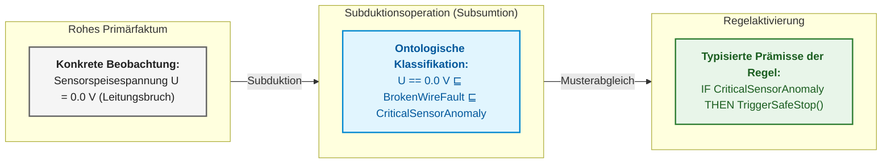

### 4.2. Deduktive Inferenz: Strikte Anwendung allgemeiner Regeln

Die deduktive Inferenz ist die einzige Schließweise in der Architektur eines Expertensystems, die absoluten Wahrheitserhalt gewährleistet: Sind die normativen Regeln verifiziert und treffen die Eingangsfakten zu, ist die abgeleitete Konklusion mathematisch unanfechtbar. In Zertifizierungsgateways für funktionale Sicherheit (wie ISO 26262 ASIL-D oder DO-178C DAL-A) darf eine automatisierte Freigabeentscheidung ausschließlich auf deduktiver Inferenz basieren. Wird diese Anforderung unterlaufen und die Deduktion durch statistische Heuristiken ersetzt, verliert das Gesamtsystem seinen Determinismus: Identische Beweisdaten könnten zu widersprüchlichen Freigaben führen, was ein unabhängiges Sicherheitsaudit ausschließt.

Das mathematische Fundament der Deduktion ist der Modus Ponens, der die Gültigkeit der Konklusion $Q \in \{0, 1\}$ berechnet:

```math
\frac{P\Rightarrow Q,\qquad P}{Q}
```

Komponenten der Formel:

- $P$ ist das verifizierte Prädikat der Prämisse (z. B. Konjunktion geprüfter Systemzustandsfakten $P \in \{0, 1\}$);
- $Q$ ist das Zielprädikat der Konklusion (z. B. Steuerungsdirektive oder Freigabeverdikt $Q \in \{0, 1\}$);
- $P\Rightarrow Q$ ist die formalisierte Produktionsregel aus der verifizierten Wissensbasis;
- Der horizontale Strich markiert den logischen Übergang: Die gleichzeitige Gültigkeit der Regel $P\Rightarrow Q = 1$ und der Prämisse $P = 1$ impliziert deterministisch die Wahrheit von $Q = 1$.

**Praktische Anwendung und ingenieurtechnische Konsequenzen:**
1. *Aufrufbedingungen im Lebenszyklus:* Die Berechnung wird von der Inferenzmaschine im finalen Release-Audit oder im echtzeitkritischen Notfallzyklus aktiviert.
2. *Interpretation des Resultats:* Ist die Prämisse $P$ nicht bewiesen (Wert 0 oder $\tfrac12$ in dreiwertiger Logik), blockiert der Modus Ponens; $Q$ wird nicht abgeleitet, was unautorisierte Systemaktionen verhindert.
3. *Systemreaktion:* Bei $Q = 1$ generiert das System ein kryptografisch signiertes Gateway-Zertifikat oder steuert das entsprechende Stellglied unter Protokollierung der Regel- und Fakten-IDs an.


### 4.3. Induktive Inferenz: Empirische Generalisierung von Beobachtungen

Die induktive Inferenz ermöglicht in Expertensystemen die Synthese von Wissenskandidaten aus Strömen empirischer Beobachtungen, Prüfstandsprotokollen und Telemetriedaten. Im Gegensatz zur Deduktion verläuft die Induktion vom Einzelfall zur hypothetischen allgemeinen Regel. Die primäre Gefahr unkontrollierter Induktion in sicherheitskritischen Systemen liegt im Humeschen Induktionsproblem: Selbst wenn tausend Beobachtungen eine Hypothese stützen, kann der nächste Betriebszyklus unter extremen Randbedingungen zum katastrophalen Versagen führen. Das automatische Übernehmen induzierter Regeln in die operative Wissensbasis erzeugt eine trügerische Scheinsicherheit, die beim ersten unerwarteten Grenzfall (*Corner Case*) kollabiert.

Das formale Schema der Induktion aggregiert eine Stichprobe von $m$ unabhängigen Beobachtungen zu einer hypothetischen Regel:

```math
\frac{P(a_1)\land Q(a_1),\quad P(a_2)\land Q(a_2),\quad\dots,\quad P(a_m)\land Q(a_m)}{\forall x\,\big(P(x)\Rightarrow Q(x)\big)\quad (\text{гіпотеза з підтримкою } m)}
```

Parameter der Formel:

- $a_1,\dots,a_m \in \mathcal{U}$ ist eine endliche Menge von $m$ registrierten Beobachtungsinstanzen (z. B. Testläufe auf dem Temperaturprüfstand);
- $m \in \mathbb{N}$ ist der empirische Stichprobenumfang (Anzahl stützender Beobachtungen);
- $P(a_i)$ repräsentiert das Vorliegen des Einflussfaktors im $i$-ten Lauf (z. B. $\text{Temperatur}(a_i) > 85\ ^\circ\text{C}$);
- $Q(a_i)$ bezeichnet die registrierte Konsequenz (z. B. $\text{TestFehlschlag}(a_i) = \text{T-9}$);
- $\forall x\,\big(P(x)\Rightarrow Q(x)\big)$ ist die hypothetische Regel, die als potenzieller Invarianzkandidat fungiert.

**Praktische Anwendung und ingenieurtechnische Konsequenzen:**
1. *Aufrufbedingungen im Lebenszyklus:* Der Algorithmus läuft ausschließlich in der Offline-Loganalyse-Pipeline ([Kapitel 25](ch25-how-expert-systems-learn.md)) zur Detektion latenter Hardwaredegradationsmuster.
2. *Interpretation des Resultats:* Die Zahl $m$ quantifiziert die empirische Stützung. Gilt $m < m_{\min}$ (wobei $m_{\min}$ eine normative Schwelle statistischer Repräsentativität darstellt, z. B. $m_{\min} = 100$), wird die Generalisierung als statistisches Rauschen verworfen.
3. *Systemreaktion:* Eine Kandidatenregel gelangt niemals direkt in die operative Entscheidungs-Engine. Sie wird in einem *Quarantäne-Register* abgelegt und zur formalen Verifikation an den Sicherheitsingenieur übergeben.

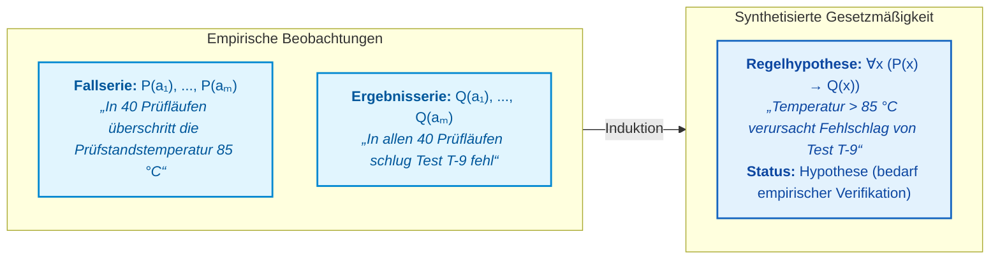

### 4.4. Abduktive Inferenz: Hypothesengenerierung über die Grundursache

Die abduktive Inferenz bildet das mathematische Rückgrat technischer Diagnosesysteme, der Fehlersuche und der Fehlerbaumanalyse (Fault Tree Analysis, FTA). Ein Ingenieur nutzt Abduktion jedes Mal, wenn ein Fehlersymptom registriert wird (z. B. ein Kommunikations-Timeout auf dem Bus oder ein Spannungsabfall) und rückwärts vom beobachteten Effekt auf die wahrscheinlichste Ursache geschlossen werden muss. Die fundamentale Herausforderung der Abduktion liegt in der Mehrdeutigkeit von Erklärungen: Dasselbe Symptom $Q$ kann durch eine Vielzahl unterschiedlicher Primärfehler ($P_1, P_2, \dots, P_k$) hervorgerufen werden. Die unreflektierte Übernahme der erstbesten Hypothese führt zu Fehlreparaturen oder maskiert schwerwiegende Sicherheitsrisiken.

Der formale Apparat der Abduktion leitet eine plausible Ursachenhypothese $P$ aus dem Symptom $Q$ und der bekannten Kausalregel ab:

```math
\frac{P\Rightarrow Q,\qquad Q}{P\ \ (\text{гіпотеза першопричини})}
```

Notation:

- $Q$ ist das verifizierte Fehlersymptom aus Diagnosemonitoren ($Q = 1$);
- $P\Rightarrow Q$ ist die Kausalregel aus dem Zuverlässigkeitsmodell ($P$ stellt den Ausfall dar, der zwingend das Symptom $Q$ nach sich zieht);
- $P$ ist die aufgestellte Ursachenhypothese;
- Der Vermerk „Hypothese“ betont, dass die Gültigkeit von $P$ formal nicht deduktiv bewiesen ist, sondern $P$ lediglich einen Erklärungsanspruch erhebt.

**Praktische Anwendung und ingenieurtechnische Konsequenzen:**
1. *Aufrufbedingungen im Lebenszyklus:* Der Abduktionsmechanismus startet unmittelbar nach Eingang eines Fehlercodes (DTC), eines Exception-Interrupts oder eines Watchdog-Resets.
2. *Interpretation des Resultats:* Die Abduktion erzeugt eine Menge an Kandidatenhypothesen $\mathcal{H}_Q = \{P_1, P_2, \dots\}$. Diese werden nach A-priori-Wahrscheinlichkeiten oder Prüfkosten gerankt.
3. *Systemreaktion:* Das Expertensystem erstellt einen differentiellen Diagnoseprüfplan: Es fordert gezielte Diskriminationstests an (etwa die Inspektion des Spannungsversorgungslogs), um eine Hypothese deduktiv zu erhärten und Alternativen zu verwerfen ([Kapitel 24](ch24-system-diagnosis.md)).

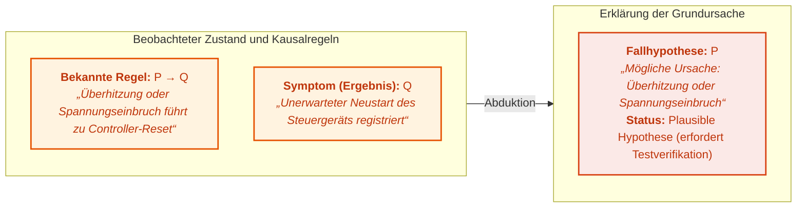

### 4.5. Traduktion: Schließen durch Analogie und Präzedenzfälle (CBR)

Die **Traduktion** (von lat. *traductio* – Hinüberführen, Übertragen) bezeichnet eine Inferenzform, bei der Prämissen und Konklusion denselben Allgemeinheitsgrad aufweisen: Der Schluss erfolgt von einem Einzelfall auf einen anderen Einzelfall ($A \to B$) oder von einem System auf ein analog strukturiertes Zielsystem. In der angewandten Wissensverarbeitung bildet die Traduktion das logische Fundament des **fallbasierten Schließens** (*Case-Based Reasoning*, CBR) [[12a]](#src-12a).

Während die Deduktion ein vorab formuliertes allgemeines Gesetz und die Induktion hunderte Beobachtungen erfordert, gestattet die Traduktion dem Expertensystem fundierte Entscheidungen unter Wissensunvollständigkeit, indem es auf verifizierte historische Einzelfallerfahrungen zurückgreift:

```math
\frac{\mathrm{Sim}(A, B) \ge \theta,\qquad \mathrm{Solution}(A) = S_A}{\mathrm{CandidateSolution}(B) = \mathrm{Adapt}(S_A)\ \ (\text{за аналогією з довірчим порогом }\theta)}
```

Parameter des Ausdrucks:

- $A$ ist ein historischer Referenzfall (Tupel $\langle C_A, P_A, A_A, R_A, \Delta_A \rangle$, siehe [Kapitel 4](ch04-evolution-from-bayes-to-evidence-ai.md#кортеж-інженерного-досвіду));
- $B$ ist das neue, ungelöste Problem mit Kontext $C_B$;
- $\mathrm{Sim}(A, B) \in [0, 1]$ ist die berechnete Ähnlichkeitsfunktion über den Merkmalsräumen beider Fälle;
- $\theta \in (0, 1]$ ist ein kalibrierter Schwellenwert, unterhalb dessen die Analogieübertragung gesperrt wird;
- $\mathrm{Adapt}(S_A)$ ist der Adaptionsoperator, der die Parameter der Lösung $S_A$ an Abweichungen des Kontexts $B$ anpasst.

#### 4.5.1. Metrische Räume und Berechnung des Ähnlichkeitsmaßes $\mathrm{Sim}(A, B)$

Zur analogen Übertragung nutzt das System drei komplementäre Metriken:

**1. Gewichtete normierte Distanz der Telemetrieparameter:**

```math
d_W(C_A, C_B) = \sqrt{\sum_{i=1}^n w_i \left(\frac{x_{A,i} - x_{B,i}}{\sigma_i}\right)^2},\qquad \mathrm{Sim}_{\text{metric}}(A, B) = \frac{1}{1 + d_W(C_A, C_B)}
```

wobei:
- $C_A, C_B$ numerische Parametervektoren der Fälle $A$ und $B$ sind;
- $x_{A,i}, x_{B,i}$ Messwerte des physikalischen Kanals $i$ darstellen (z. B. Speisespannung, Stromaufnahme, Betriebstemperatur);
- $w_i \in [0, 1]$ normierte Kanalgewichte sind ($\sum_{i=1}^n w_i = 1$);
- $\sigma_i > 0$ Skalierungsfaktoren oder Standardabweichungen sind, die Messgrößen dimensionslos machen;
- $d_W(C_A, C_B) \ge 0$ die gewichtete metrische Distanz ist;
- $\mathrm{Sim}_{\text{metric}}(A, B) \in (0, 1]$ der Ähnlichkeitskoeffizient ist.

**2. Kosinus-Ähnlichkeit im latenten semantischen Raum:**

```math
\mathrm{Sim}_{\text{cosine}}(z_A, z_B) = \frac{\mathbf{z}_A \cdot \mathbf{z}_B}{\|\mathbf{z}_A\|\,\|\mathbf{z}_B\|}
```

wobei $\mathbf{z}_A, \mathbf{z}_B \in \mathbb{R}^d$ dichte semantische Einbettungen textueller Problembeschreibungen darstellen.

**3. Topologischer Teilgraph-Isomorphismus:** Berechnung des Jaccard-Koeffizienten oder der Graph-Edit-Distanz (*Graph Edit Distance*) zwischen den Kausal-Teilgraphen der Komponenten.

**Laufzeitsteuerung und ingenieurtechnische Schwellenwerte:**
1. **Automatisierte Wiederverwendung (`Reuse`):** Gilt $\mathrm{Sim}_{\text{metric}}(A, B) \ge \theta_{\mathrm{reuse}} = 0{,}85$ ($d_W \le 0{,}176$), deklariert die Inferenzmaschine Fall $A$ als Basis-Prototyp und überführt dessen Wiederherstellungsplan in die Ausführungs-Queue.
2. **Adaption mit Experten-Eskalation (`Revise`):** Liegt $\theta_{\mathrm{adapt}} \le \mathrm{Sim}_{\text{metric}} < \theta_{\mathrm{reuse}}$ vor (mit $\theta_{\mathrm{adapt}} = 0{,}65$), wird der Operator $\mathrm{Adapt}(S_A)$ unter Zuziehung eines Ingenieurs oder formalen Verifizierers aktiviert.
3. **Analogie-Sperrung (`Refusal`):** Ist $\mathrm{Sim}_{\text{metric}} < 0{,}65$, wird der Fall als irrelevant verworfen, was Fehlschlüsse durch unzulässige Analogien unterbindet.

**Numerisches Berechnungsbeispiel:**
Die Diagnose analysiert einen Spannungseinbruch an einem BMS-Controller anhand zweier Telemetrieparameter: Referenzspannungsabweichung $V_{\mathrm{ref}}$ ($w_1 = 0{,}6$, $\sigma_1 = 0{,}1\,\text{V}$) und Leistungsschaltertemperatur $T_{\mathrm{FET}}$ ($w_2 = 0{,}4$, $\sigma_2 = 5\,^\circ\text{C}$).
Die Abweichungen zum Archivfall betragen: $\Delta V = 0{,}02\,\text{V}$, $\Delta T = 1{,}5\,^\circ\text{C}$.

```math
d_W = \sqrt{0{,}6 \cdot \left(\frac{0{,}02}{0{,}1}\right)^2 + 0{,}4 \cdot \left(\frac{1{,}5}{5}\right)^2} = \sqrt{0{,}6 \cdot 0{,}04 + 0{,}4 \cdot 0{,}09} = \sqrt{0{,}024 + 0{,}036} = \sqrt{0{,}060} \approx 0{,}245
```

```math
\mathrm{Sim}_{\text{metric}} = \frac{1}{1 + 0{,}245} \approx 0{,}803
```

Da $\mathrm{Sim}_{\text{metric}} = 0{,}803 \in [0{,}65; 0{,}85)$ liegt, setzt das System den Status `Revise`: Es passt die Zeitspanne des Schutz-Resets an und fordert eine Freigabe durch den Ingenieur vor der Ausführung an.

#### 4.5.2. Der vierstufige Lebenszyklus eines Präzedenzfalls (4R-Zyklus)

Im klassischen Modell von Agnar Aamodt und Enric Plaza [[12a]](#src-12a) vollzieht sich traduktives Schließen über vier Phasen:
- **Retrieve (Wiederauffinden):** Ein $k\text{NN}$-Algorithmus oder Vektorindex lokalisiert den ähnlichsten Referenzfall $A$ zum aktuellen Problem $B$;
- **Reuse (Wiederverwenden):** Die validierte Entwurfs- oder Diagnoselösung $S_A$ wird auf Fall $B$ projiziert;
- **Revise (Überarbeiten):** Ein Fachexperte oder ein Simulationsmodell validiert die Anwendbarkeit von $S_A$ unter Berücksichtigung der Besonderheiten von $B$ und korrigiert Diskrepanzen;
- **Retain (Behalten):** Das neu verifizierte Erfahrungstupel $\langle C_B, P_B, S_B, R_B, \Delta_B \rangle$ wird persistent im Unternehmensgedächtnis abgelegt.

#### 4.5.3. Traduktion in modernen neuro-symbolischen Architekturen

Der Mechanismus des *In-Context Learning* bei Sprachmodellen (Few-Shot-Prompts oder RAG) stellt eine rein rechnerische Form der Traduktion dar. Das Modell modifiziert dabei keine Gewichte (keine Induktion), sondern überträgt das Schließschema aus den Kontextbeispielen auf die neue Anfrage.

> [!WARNING]
> **Kritisches Risiko der Traduktion: Fehlschluss der falschen Analogie (*False Analogy Fallacy*)**  
> Eine hohe oberflächliche oder statistische Ähnlichkeit von Symptomen $\mathrm{Sim}(A, B) \approx 1$ garantiert keineswegs identische physikalische Ursachen. Beispielsweise können CAN-Busfehler sowohl durch einen Spannungseinbruch auf 3,3 V (Vorfall $A$) als auch durch das Abreißen des 120-Ohm-Abschlusswiderstands (Vorfall $B$) induziert werden. Die blinde Anwendung der Lösung von $A$ auf $B$ führt zu Fehlentscheidungen. In sicherheitskritischen Expertensystemen wird ein traduktiv ermittelter Lösungsansatz daher **niemals ungeprüft angewendet**, sondern stets durch ein deduktives Schutz-Gateway (*Safety Shield*, [Kapitel 29](ch29-neuro-symbolic-architecture.md)) geschleust.

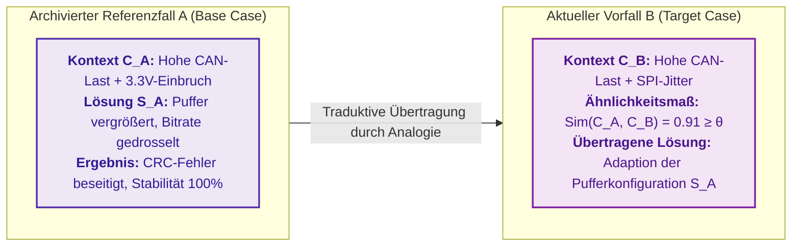

### 4.6. Eduktion: Unmittelbare Schlüsse und äquivalente Wissenstransformationen

Die **Eduktion** (von lat. *educere* – herausführen, ableiten) bezeichnet in der formalen Logik die Klasse der **unmittelbaren Schlüsse** (*immediate inferences*), bei denen ein neues Urteil aus einer **einzigen Ausgangsprämisse** ohne Hinzunahme dritter Fakten oder Regeln gewonnen wird. Eduktive Operationen transformieren die logische Struktur einer Aussage unter strikter Wahrung ihres Wahrheitswerts.

In technischen Wissensbasen finden drei fundamentale Formen der Eduktion Anwendung:

#### 4.6.1. Kontraposition des Prädikats
Die Kontraposition vertauscht Prämisse und Konklusion unter gleichzeitiger Negation beider Terme:

```math
\frac{P\Rightarrow Q}{\neg Q\Rightarrow \neg P}
```

In evidenzbasierten Systemen bildet die Kontraposition das Fundament der Rückwärtsverkettung (*Backward Chaining*). Besagt eine Sicherheitsrichtlinie: *„Wurde das Modul für den Betrieb zugelassen ($P$), so sind alle Validierungsberichte freigegeben ($Q$)“*, so folgert die Inferenzmaschine beim Feststellen eines fehlenden Berichts ($\neg Q$) ohne weitere Abfragen unmittelbar das Zulassungsverbot ($\neg P$).

#### 4.6.2. Obversion von Urteilen
Die Obversion transformiert die Qualität der logischen Verknüpfung unter gleichzeitiger Negation des Prädikats:

```math
\frac{P\Rightarrow Q}{\neg(P\land \neg Q)}
```

Diese Operation bereinigt Widersprüche in Anforderungsspezifikationen: Die Vorgabe „Jede sicherheitskritische Komponente muss redundant ausgelegt sein“ wird in die strenge Systembeschränkung überführt: „Es ist unzulässig, dass eine Komponente sicherheitskritisch und zugleich nicht redundant ist“.

#### 4.6.3. Konversion von Urteilen
Die Konversion vertauscht Subjekt und Prädikat unter Wahrung der Gültigkeit bei symmetrischen Relationen (z. B. Schnittstellenkompatibilität, wechselseitige Interrupt-Sperren):

```math
\frac{\forall x\,(A(x)\land B(x))}{\forall x\,(B(x)\land A(x))}
```

#### 4.6.4. Anwendung der Eduktion in Optimierungsalgorithmen für Wissensbasen
- **Kanonisierung von Regelsystemen:** Vor Ausführung der Inferenz überführt der Wissensbasis-Optimierer komplexe boolesche Ausdrücke mittels edukativer Schritte in konjunktive Normalform (CNF) oder Horn-Klauseln für schnelle SAT/SMT-Solver (Z3, CVC5);
- **Redundanzeliminierung:** Eduktion deckt äquivalente Regeln auf, die von Autoren syntaktisch unterschiedlich formuliert wurden, und verhindert doppelte Berechnungszyklen.

### 4.7. Reduktion: Dekomposition komplexer Probleme in unabhängige Teilaufgaben

Selbst die Deduktion stößt an Rechengrenzen, wenn das Problem skaliert: hunderte Freigabekriterien oder tausende Protokollzustände. Die Reduktion (*problem reduction*) ersetzt ein komplexes Problem durch einfachere Teilprobleme unter Erhalt der wesentlichen Systemeigenschaften. Zwei Reduktionsverfahren sind für Expertensysteme zentral:

Das erste Verfahren zerlegt ein Hauptziel hierarchisch über einen UND/ODER-Baum (*AND/OR tree*), formalisiert von Nils J. Nilsson [[12]](#src-12):

```math
G \Leftarrow g_1\land g_2\land\dots\land g_k,\qquad g_j\Leftarrow h_1\lor h_2\lor\dots\lor h_m
```

Parameter der Reduktion:

- $G$ ist das Gesamtziel, und $g_1,\dots,g_k$ sind dessen zwingende Teilziele;
- $k$ ist die Anzahl der Teilziele, verknüpft durch die UND-Bedingung;
- $g_j$ ist ein spezifisches Teilziel, und $h_1,\dots,h_m$ sind disjunktive Lösungsalternativen;
- $m$ ist die Anzahl der Alternativen, $\land$ bedeutet UND, $\lor$ bedeutet ODER;
- $\Leftarrow$ liest sich als „folgt aus“.

Das Gesamtziel „Release freigegeben“ verlangt simultan bestandene Sicherheitstests, genehmigte Restrisiken und geschlossene Blocker-Tickets. Das Teilziel der Risikogenehmigung kann alternativ durch die Unterschrift des Safety-Verantwortlichen ODER den Beschluss des Sicherheitsgremiums nachgewiesen werden. Der Beweis der Blattknoten belegt das Gesamtziel, während der Baum selbst als transparente Audit-Erklärung dient.

Das zweite Verfahren minimiert die Zustandsmenge endlicher Automaten (*finite automata*), etwa zur Protokollüberprüfung. Zwei Zustände sind äquivalent und können verschmolzen werden, wenn keine Eingabesequenz ihr Folgeverhalten unterscheidbar macht:

```math
s_1\sim s_2\iff\forall w\in\Sigma^{\ast}:\ \big(\delta^{\ast}(s_1,w)\in\mathcal{F}\iff\delta^{\ast}(s_2,w)\in\mathcal{F}\big)
```

- $s_1$ und $s_2$ sind Automatenzustände, und $\sim$ symbolisiert deren Äquivalenz;
- $\Sigma$ ist das Eingabealphabet, $\Sigma^{\ast}$ die Menge aller endlichen Eingabesequenzen, und $w$ eine konkrete Sequenz;
- $\delta^{\ast}(s,w)$ ist der Zustand, den der Automat ausgehend von $s$ nach Konsumieren der Sequenz $w$ erreicht;
- $\mathcal{F}$ bezeichnet die Menge der akzeptierenden Endzustände;
- $\forall$ bedeutet „für alle Sequenzen“, und $\iff$ steht für „genau dann, wenn“.

Zustände sind äquivalent, wenn jede beliebige Eingabesequenz von beiden Zuständen aus entweder in beiden Fällen zu einem akzeptierenden Zustand führt oder in beiden Fällen nicht. John Hopcroft entwickelte einen Algorithmus, der diese Äquivalenzklassen für einen Automaten mit $n$ Zuständen in der Zeit $O(n\log n)$ berechnet [[13]](#src-13). Das Resultat ist ein minimaler Zustandsautomat mit identischer Verhaltenssemantik, der mathematisch einfacher zu verifizieren und zu auditieren ist.

### 4.8. Vergleichende Analyse der Inferenzmethoden und ihrer Anwendungsgrenzen

| Methode / Operation | Inferenzvektor | Art der Prämissen | Was wird abgeleitet | Epistemologischer Status | Anwendung im Expertensystem |
|---|---|---|---|---|---|
| **Subduktion** | $\in$ Einordnung unter Kategorie | Beobachtung $a$ und Taxonomie $C \sqsubseteq D$ | Zugehörigkeit $a \in D$ | Analytisch (ontologisch determiniert) | RETE-Musterabgleich, OWL-Taxonomien |
| **Deduktion** | $\downarrow$ Vom Allgemeinen zum Besonderen | Regel $P \to Q$ und Faktum $P$ | Resultat $Q$ | Zwingend wahr (bei wahren Prämissen) | Release-Gates, Zertifizierung, Sicherheitsregeln |
| **Induktion** | $\uparrow$ Vom Besonderen zum Allgemeinen | Beobachtungen $P(a_i)$ und $Q(a_i)$ | Regelhypothese $\forall x (P \to Q)$ | Probabilistische Hypothese (prüfbedürftig) | Offline-Lernen auf Test- und Telemetrielogs |
| **Abduktion** | $\leftarrow$ Vom Symptom zur Ursache | Kausalregel $P \to Q$ und Symptom $Q$ | Ursachenhypothese $P$ | Plausible Hypothese (Beste Erklärung) | Technische Diagnose, Fehlerbaumanalyse (FTA) |
| **Traduktion** | $\leftrightarrow$ Auf Einzelfallebene | Referenzfall $A$, Lösung $S_A$, $\mathrm{Sim} \ge \theta$ | Adaptierte Lösung für $B$ | Heuristische Analogie (Shield erforderlich) | Case-Based Reasoning, Few-Shot RAG, Bug-Fixing |
| **Eduktion** | $\equiv$ Äquivalente Transformation | Einzelurteil $P \to Q$ | Neue Form ($\neg Q \to \neg P$) | Tautologisch wahr (wahrheitserhaltend) | Wissensbasis-Normalisierung, Rückwärtsverkettung |
| **Reduktion** | $\searrow$ Komplexitätsvereinfachung | Ziel $G$ oder Automat mit $n$ Zuständen | UND/ODER-Baum oder Minimalautomat | Äquivalent (erhält Lösbarkeit und Semantik) | Dekomposition von Beweisen, Hopcroft-Minimierung |

Subduktion typisiert Messungen, Deduktion erzwingt normative Vorgaben, Induktion synthetisiert neue Regelhypothesen, Abduktion lokalisiert Fehlerursachen, Traduktion nutzt Erfahrungsschätze, Eduktion optimiert Wissensstrukturen und Reduktion bändigt kombinatorische Komplexität. Für das Expertensystem ist die Demarkation des epistemischen Status fundamental: Deduktive, subduktive und edukative Ergebnisse werden als formale Garantien präsentiert; traduktive, induktive und abduktive Schlüsse hingegen als Hypothesen mit explizitem Prüfplan. Die nächste ingenieurtechnische Frage lautet: Wie wendet eine Inferenzmaschine tausende Regeln auf Millionen Fakten an, ohne zu blockieren?

## 5. Regelausführungsalgorithmen: Rete-Netzwerk, Agenda und Konfliktlösung

Umfasst eine Wissensbasis lediglich einige Dutzend Regeln, kann die Inferenzmaschine nach jeder Faktenänderung trivial sämtliche Regeln gegen alle Fakten abgleichen. Bei tausenden Regeln und Millionen von Fakten wird ein vollständiger Brute-Force-Durchlauf jedoch rechentechnisch untragbar; die Regel-Engine verliert den Anschluss an einlaufende Ereignisströme.

Charles Forgy stellte 1982 den Rete-Algorithmus vor (abgeleitet vom lateinischen *rete* für „Netz“) [[14]](#src-14). Der Algorithmus basiert auf zwei zentralen Beobachtungen: Erstens ändert sich pro Zeitschritt stets nur ein winziger Bruchteil der Faktenbasis, weshalb eine vollständige Neuberechnung ineffizient ist. Zweitens teilen viele Regeln identische Vorbedingungen, weshalb gemeinsame Teilausdrücke nur einmal ausgewertet werden sollten. Rete baut ein gerichtetes Netzwerk aus Bedingungsknoten auf und speichert intermediäre Teiltreffer; ändert sich ein Faktum, propagiert das Signal nur durch jene Zweige, die tatsächlich betroffen sind. Dies gleicht der inkrementellen Kompilierung in modernen Build-Systemen. Daniel Miranker schlug mit TREAT einen alternativen Algorithmus vor, der auf das Zwischenspeichern von Verknüpfungen verzichtet und Speicherplatz auf Kosten partieller Neuberechnungen spart [[15]](#src-15).

In der Praxis operiert jede Regel-Engine mit drei Kernkonzepten: Der Arbeitsspeicher (*working memory*) hält die aktuell verifizierten Fakten. Die Agenda (*agenda*) verwaltet jene Regeln, deren Prämissen vollständig erfüllt sind und die zur Ausführung anstehen. Die Konfliktlösung (*conflict resolution*) entscheidet deterministisch, welche regelkonforme Aktivierung zuerst feuert. In Systemen wie CLIPS (*C Language Integrated Production System*) oder Drools wird diese Priorität als `salience` bezeichnet.

Stehen zeitgleich zwei Aktivierungen an – etwa „Release sperren wegen unbestätigter Anforderung“ und „Erinnerung an den Testverantwortlichen senden“ –, entscheidet die Konfliktlösungsstrategie über die Reihenfolge. Ohne fixierte Prioritäten könnten zwei Programmläufe mit identischer Faktenbasis divergierende Aktionsprotokolle erzeugen. Daher werden Salience-Werte und Arbitrierungsstrategien explizit auditiert, sodass jedes Testergebnis strikt reproduzierbar bleibt.

Rete beschleunigt die Regelausführung, und deterministische Konfliktlösung macht sie reproduzierbar. Schnelle Inferenz besitzt jedoch eine Schwachstelle: Eine gestern abgeleitete Konklusion kann auf Prämissen beruhen, die heute widerrufen wurden.

## 6. Truth Maintenance Systems (TMS/JTMS): Dynamischer Widerruf invalider Ableitungen

Ein Expertensystem leitet „Release freigegeben“ auf Basis von vier Fakten ab: Blocker behoben, Tests bestanden, Ausnahmegenehmigung erteilt und Sicherheitsanalyse abgeschlossen. Am Folgetag wird die Ausnahmegenehmigung widerrufen. Würde das System das neue Faktum lediglich unreflektiert anhängen, verbliebe die veraltete Freigabe in der Datenbank und würde fatale Fehlentscheidungen herbeiführen.

Truth Maintenance Systems (TMS, Systeme zur Konsistenzsicherung) protokollieren lückenlos, welche Konklusion von welchen Prämissen abhängt. Jon Doyle beschrieb das rechtfertigungsbasierte Modell (*Justification-based TMS*, JTMS): Jede Aussage besitzt explizite Begründungen und erhält den Status IN (gültig), wenn mindestens eine Begründung aktiv ist, andernfalls OUT (ungültig) [[16]](#src-16). Schaltet eine Prämisse auf OUT, propagiert dieser Status durch das Kausalnetzwerk, und alle abhängigen Schlüsse werden automatisch auf OUT gesetzt. Johan de Kleer entwickelte das annahmebasierte Modell (*Assumption-based TMS*, ATMS), welches für jeden Knoten die minimalen Mengen von Basishypothesen speichert, unter denen die Aussage gilt [[17]](#src-17):

```math
L(n)=\{\,E\subseteq A \mid E\cup J\vdash n,\ E\ \text{несуперечливий},\ E\ \text{мінімальний}\,\}
```

Notation:

- $n$ ist die Konklusion, $A$ die Menge aller Grundannahmen, und $E$ eine spezifische Umgebung (*environment*);
- $J$ ist die Menge aller Begründungen (Regeln), und $L(n)$ ist das Label mit alternativen Fundierungen für $n$;
- $\subseteq$ bezeichnet die Teilmengenrelation, $\cup$ die Vereinigung, und $\vdash$ die logische Ableitbarkeit;
- Der vertikale Strich trennt die Selektionskriterien ab: Die Annahmemenge $E$ muss widerspruchsfrei und minimal sein.

Das Label $L(n)$ listet alle minimalen und konsistenten Umgebungen auf, die gemeinsam mit den Regeln $J$ die Konklusion $n$ begründen. Stützte sich die Freigabe alternativ auf eine Ausnahmegenehmigung ODER die Behebung von Defekt D-4, bleibt die Freigabe nach Widerruf der Ausnahme genau dann intakt, wenn der Defekt D-4 nachweislich behoben ist.

In modernen Implementierungen wird dieser Mechanismus über gerichtete Kausalitätsgraphen, Append-Only-Ereignislogs und versionierte Nachweisdatensätze realisiert. Veraltet eine Quelle oder ändert sich eine Regel, lokalisiert das Expertensystem alle betroffenen Zweige und stößt gezielte Re-Evaluationen an. Logik und Konsistenzsicherung operieren auf diskreten Wahrheitswerten. Sobald Evidenzen eine Hypothese lediglich graduell stützen oder schwächen, ist die Mathematik der Ungewissheitsmodellierung gefordert.

## 7. Modellierung von Ungewissheit: Wahrscheinlichkeit, zeitliche Prozesse, Fuzzy-Logik und Evidenz

Das Scheitern von Test T-9 beweist noch keinen Softwaredefekt: Der Testlauf könnte durch einen Prüfstandsfehler kollabiert sein. Die zweite Leitfrage lautet daher: Wie stark hat das Testergebnis das Ausfallrisiko verschoben? [Kapitel 4](ch04-evolution-from-bayes-to-evidence-ai.md) verglich bereits MYCIN-Sicherheitsfaktoren, Bayes-Theoreme, Fuzzy-Logik und die Dempster-Shafer-Theorie anhand von Zahlenbeispielen. Dieser Abschnitt fokussiert auf die architektonischen Aspekte: Warum der Satz von Bayes mathematisch bindend ist, wie Bayessche Netze Zustandsexplosionen verhindern, wie zeitliche Degradationsprozesse modelliert werden und unter welchen Bedingungen die Dempster-Regel paradoxe Fehlurteile erzeugt.

### 7.1. Satz von Bayes und A-posteriori-Aktualisierung von Überzeugungen

Der Satz von Bayes folgt unmittelbar aus der Definition der bedingten Wahrscheinlichkeit (*conditional probability*). Die bedingte Wahrscheinlichkeit einer Hypothese $H$ unter Evidenz $E$ entspricht dem Anteil der gemeinsamen Realisierungen an allen Fällen, in denen $E$ eintritt:

```math
P(H\mid E)=\frac{P(H\cap E)}{P(E)},\qquad P(E\mid H)=\frac{P(H\cap E)}{P(H)}
```

wobei:

- $H$ die Hypothese, $E$ die beobachtete Evidenz und $P(\cdot)$ die Wahrscheinlichkeitsfunktion darstellt;
- $P(H\cap E)$ die Verbundwahrscheinlichkeit beider Ereignisse ist;
- $P(H\mid E)$ die A-posteriori-Wahrscheinlichkeit der Hypothese unter Evidenz $E$ bezeichnet;
- $P(E)$ und $P(H)$ strikt positiv sein müssen;
- Der vertikale Strich $\mid$ als „unter der Bedingung“ gelesen wird.

Aus der zweiten Gleichung folgt $P(H\cap E)=P(E\mid H)\,P(H)$. Durch Einsetzen in die erste Gleichung ergibt sich unmittelbar der fundamentale Satz von Bayes:

```math
P(H\mid E)=\frac{P(E\mid H)\,P(H)}{P(E)}
```

Notation:

- $H$ ist die Hypothese, $E$ die beobachtete Evidenz und $P(H\mid E)$ die aktualisierte A-posteriori-Wahrscheinlichkeit;
- $P(E\mid H)$ ist die Likelihood der Evidenz unter der Hypothese, und $P(H)$ ist die A-priori-Wahrscheinlichkeit;
- $P(E)$ ist die Gesamtwahrscheinlichkeit der Evidenz (Evidenzterm).

Das Ergebnis $P(H\mid E)$ liegt im Intervall $[0, 1]$. Ein durchgerechnetes Zahlenbeispiel mit tausend Releases findet sich in [Kapitel 4](ch04-evolution-from-bayes-to-evidence-ai.md). Vor jeder Anwendung müssen A-priori-Wahrscheinlichkeiten und bedingte Wahrscheinlichkeiten aus freigegebenen Telemetriedaten nachgewiesen werden.

### 7.2. Bayessche Vertrauensnetzwerke und der Explaining-Away-Effekt

Bei vielen Variablen explodiert die gemeinsame Wahrscheinlichkeitstabelle: Für 20 binäre Variablen erfordert die Tabelle $2^{20}-1\approx10^6$ freie Parameter – kein Ingenieurteam kann eine solche Menge kalibrieren. Ein Bayessches Vertrauensnetzwerk (*Bayesian Belief Network*) nach Judea Pearl faktorisiert die Verbundverteilung über bedingte Unabhängigkeiten in einem gerichteten azyklischen Graphen (DAG) [[18]](#src-18):

```math
P(X_1,\dots,X_n)=\prod_{i=1}^{n}P\big(X_i\mid\mathrm{Pa}(X_i)\big)
```

- In dieser Formulierung sind $X_1,\dots,X_n$ die Zufallsvariablen des Modells;
- $\prod_{i=1}^{n}$ bezeichnet das Produkt über alle Variablen;
- $\mathrm{Pa}(X_i)$ repräsentiert die Elternknoten von $X_i$ im Kausalgraphen;
- $P(X_i\mid\mathrm{Pa}(X_i))$ ist die lokale bedingte Wahrscheinlichkeitstabelle (CPT).

Besitzt jede der 20 binären Variablen höchstens zwei Elternknoten, benötigt jede lokale CPT maximal vier Werte – in Summe weniger als 80 Parameter statt einer Million. Diese Zerlegung ist jedoch nur bei zutreffenden Unabhängigkeitsannahmen mathematisch valide; eine Kante im Graphen begründet für sich allein noch keine Kausalität.

Ein Bayessches Netz leistet etwas, das isolierte Regeln nicht vermögen: das rationale Abwägen alternativer Ursachen gegeneinander (*Explaining Away*). Angenommen, Test T-9 kann sowohl durch einen Softwaredefekt als auch durch einen Prüfstandsfehler fehlschlagen:

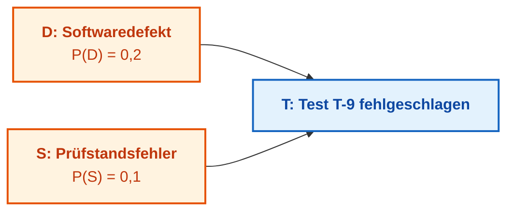

Die Ursachen $D$ ($P(D)=0{,}2$) und $S$ ($P(S)=0{,}1$) seien a priori unabhängig. Die CPT des Tests $T$ lautet:

| Softwaredefekt $D$ | Prüfstandsfehler $S$ | $P(T\mid D,S)$ |
|---|---|---:|
| ja | ja | 0,99 |
| ja | nein | 0,90 |
| nein | ja | 0,80 |
| nein | nein | 0,05 |

Die Gesamtwahrscheinlichkeit eines Testfehlers beträgt $P(T)=0{,}2\cdot0{,}1\cdot0{,}99+0{,}2\cdot0{,}9\cdot0{,}90+0{,}8\cdot0{,}1\cdot0{,}80+0{,}8\cdot0{,}9\cdot0{,}05\approx0{,}282$. Schlägt der Test fehl, steigt die Wahrscheinlichkeit eines Softwaredefekts von 0,2 auf $P(D\mid T)\approx(0{,}0198+0{,}162)/0{,}282\approx0{,}645$. Bestätigt die Auswertung des Prüfstandslogs jedoch zweifelsfrei einen Hardware-Prüfstandsfehler ($S=1$), sinkt die Defektwahrscheinlichkeit auf $P(D\mid T,S)=0{,}0198/(0{,}0198+0{,}064)\approx0{,}236$ ab. Die Bestätigung der alternativen Ursache erklärt den Testfehlschlag hinreichend (*explaining away*), wodurch der Code entlastet wird [[18]](#src-18). Die ingenieurtechnische Maxime lautet: Bevor ein Code-Rollback veranlasst wird, müssen die Prüfstandslogs verifiziert werden.

### 7.3. Markov-Entscheidungsprozesse und dynamische Ungewissheit

Bayessche Netze modellieren statische Zustände zu einem fixen Zeitpunkt. Technische Systeme degradieren jedoch kontinuierlich im Zeitverlauf. Andrei Markow formulierte stochastische Prozesse, bei denen der Folgezustand ausschließlich vom aktuellen Zustand abhängt (*Markov Property*):

```math
P(X_{t+1}=j\mid X_t=i,X_{t-1},\dots,X_0)=P(X_{t+1}=j\mid X_t=i)=T_{ij}
```

- $X_t$ ist der Systemzustand zum Zeitschritt $t$;
- $i$ und $j$ bezeichnen den aktuellen bzw. den Folgezustand;
- $T_{ij} \in [0, 1]$ ist die Übergangswahrscheinlichkeit von Zustand $i$ nach $j$ mit $\sum_j T_{ij} = 1$.

Verdeckte Markov-Modelle (*Hidden Markov Models*, HMM) erweitern diesen Formalismus um Zustände, die nicht direkt messbar sind, sondern über verrauschte Beobachtungen inferiert werden müssen [[19]](#src-19). Ein Projektzustand kann „stabil“, „degradierend“ oder „kritisch“ sein, während als Emissionen Defektraten und Testdurchlaufzeiten dienen.

Markov-Entscheidungsprozesse (*Markov Decision Processes*, MDP) integrieren zusätzlich Aktionen und Kostenfunktionen: Das System prognostiziert nicht nur, sondern wählt optimale Aktionen (z. B. Zusatztest anfordern, Release verschieben). Die Güte einer Handlungsstrategie (*Policy*) $\pi$ wird durch die Bellman-Wertfunktion nach Martin Puterman definiert [[20]](#src-20):

```math
V^{\pi}(s)=\mathbb{E}_{\pi}\Big[\sum_{t=0}^{\infty}\gamma^{t}r_t\ \Big|\ s_0=s\Big]
```

- $s$ ist der Ausgangszustand $s_0=s$;
- $V^{\pi}(s)$ ist der erwartete kumulierte Gesamtnutzen unter Strategie $\pi$;
- $r_t$ ist die Belohnung bzw. der Kostenwert zum Zeitschritt $t$;
- $\gamma\in[0,1)$ ist der Diskontierungsfaktor, der zukünftige Erträge dämpft;
- $\mathbb{E}_{\pi}$ bezeichnet den Erwartungswert bezüglich der Strategie $\pi$.

Bei $\gamma=0{,}9$ besitzt eine Belohnung nach 10 Schritten nur noch das Gewicht $0{,}9^{10}\approx0{,}35$. Bei partieller Beobachtbarkeit wird das Modell zum POMDP erweitert; in der industriellen Praxis genügen oft vereinfachte MDP-Richtlinien mit verifizierten Sicherheitsgrenzen.

### 7.4. Zadeh-Fuzzy-Logik: Zugehörigkeitsfunktionen und Wahrheitsgrade

Ingenieurbegriffe besitzen oft weiche Grenzen: „aktuelle Dokumentation“, „moderates Risiko“, „hohe Reife“. Die unscharfe Menge (*Fuzzy Set*) nach Lotfi Zadeh quantifiziert die Zugehörigkeit über ein kontinuierliches Intervall $[0, 1]$ [[21]](#src-21):

```math
\mu_{\mathrm{fresh}}(a)=\max\Big(0,\ 1-\frac{a}{180}\Big)
```

Parameter:

- $a \ge 0$ ist das Alter des Dokuments in Tagen;
- $\mu_{\mathrm{fresh}}(a) \in [0, 1]$ ist der Grad der Aktualität;
- $\max$ stellt die Nichtnegativität sicher;
- 180 Tage definiert die normative Grenze der Veralterung.

Ein neues Dokument besitzt den Wert 1, nach 90 Tagen 0,5 und ab 180 Tagen 0. Dies ist keine statistische Eintrittswahrscheinlichkeit, sondern eine deterministisch definierte Konformitätsskala.

#### 7.4.1. Operatoren der Fuzzy-Algebra: T-Normen, S-Normen und Defuzzifizierung

Zur Verknüpfung unscharfer Prämissen in Regeln der Form $\text{WENN}\ (x_1 \in A)\ \text{UND}\ (x_2 \in B)\ \text{DANN}\ (y \in C)$ dienen Dreiecks-Normen (T-Normen für UND) und Dreiecks-Conormen (S-Normen für ODER):

1. **T-Normen (Konjunktion):** Funktion $T:[0,1]\times[0,1]\to[0,1]$, kommutativ, assoziativ, monoton mit $T(a, 1) = a$.
   - *Gödel-T-Norm (Minimum):* $T_{\min}(a, b) = \min(a, b)$ – konservative Schätzung des schwächsten Glieds;
   - *Produkt-T-Norm:* $T_{\mathrm{prod}}(a, b) = a \cdot b$ – modelliert wechselseitige Dämpfung;
   - *Łukasiewicz-T-Norm:* $T_{\mathrm{Luk}}(a, b) = \max(0, a + b - 1)$ – strenger kumulativer Mangel.

2. **S-Normen (Disjunktion):** Funktion $S:[0,1]\times[0,1]\to[0,1]$ mit $S(a, 0) = a$.
   - *Maximum-S-Norm:* $S_{\max}(a, b) = \max(a, b)$;
   - *Probabilistische Summe:* $S_{\mathrm{sum}}(a, b) = a + b - a \cdot b$.

Der Übergang von unscharfen Ergebnismengen zu einem scharfen Stellwert heißt **Defuzzifizierung**. Im Mamdani-Modell dominiert die Schwerpunktmethode (Center of Gravity, COG):

```math
z^* = \frac{\int_Z z \cdot \mu_C(z)\,dz}{\int_Z \mu_C(z)\,dz} \approx \frac{\sum_{i=1}^n z_i \cdot \mu_C(z_i)}{\sum_{i=1}^n \mu_C(z_i)}
```

- $z^*$ ist der scharfe Ausgangswert (z. B. Audit-Priorität oder Stellsignal);
- $Z$ ist der Definitionsbereich;
- $z_i$ sind diskrete Stützstellen, und $\mu_C(z_i)$ ist der aggregierte Zugehörigkeitswert.

Im **Takagi-Sugeno-Kang-Modell (TSK)** ist die Konklusion eine scharfe lineare Funktion der Eingänge $f_j(\mathbf{x}) = \mathbf{p}_j^T \mathbf{x} + r_j$. Der Ausgang ist der gewichtete Mittelwert:

```math
y^* = \frac{\sum_{j=1}^M w_j \cdot f_j(\mathbf{x})}{\sum_{j=1}^M w_j}
```

mit $w_j = T(\mu_{A_j}(x_1), \mu_{B_j}(x_2))$.

#### 7.4.2. Fuzzy-Logik und probabilistische Token-Verteilung in Sprachmodellen

Fuzzy-Inferenz darf nicht mit Wahrscheinlichkeitsverteilungen generativer Sprachmodelle (LLM) verwechselt werden:

| Vergleichskriterium | Fuzzy-Logik (Fuzzy Logic) | Sprachmodelle (LLMs) |
|---|---|---|
| **Semantischer Gehalt** | **Wahrheitsgrad:** Übereinstimmung mit unscharfem Begriff ($\mu \in [0, 1]$). | **Plausibilitätsgrad:** Wahrscheinlichkeitsverteilung über Token-Vokabular ($P \in [0, 1]$). |
| **Normierung** | **Nicht-additiv:** Unabhängige Funktionen. Zugleich $\mu_{\mathrm{kalt}}=0{,}7$ und $\mu_{\mathrm{warm}}=0{,}6$. | **Strikt additiv:** Softmax erzwingt $\sum_{k} P(\mathrm{token}_k) = 1$. |
| **Komposition** | Deterministische T-Normen ($\min$, Produkt); kein Zufallsrauschen. | Stochastisches Sampling (Temperatur $T$, Top-$p$), Kontextdrift. |
| **Verifizierbarkeit** | Mathematisch beweisbare Grenzen, tauglich für ISO 26262/IEC 61508. | Anfällig für arithmetische Halluzinationen. |

Ein Sprachmodell kann kein numerischer Fuzzy-Rechner sein. Seine Rolle liegt in der semantischen Schnittstelle neuro-symbolischer Systeme ([Kapitel 28](ch28-dual-mode-expert-systems.md), [Kapitel 29](ch29-neuro-symbolic-architecture.md)):

```mermaid
flowchart LR
    accTitle: Neuro-symbolisches Tandem aus Sprachmodell und Fuzzy-Kern
    accDescr: Das Sprachmodell führt linguistische Fuzzifizierung und Erklärung durch, während der deterministische Kern die T-Normen berechnet.

    IN["Natürlichsprachlicher Text<br/><i>„Druck leicht erhöht, Temperatur kritisch“</i>"] --> LLM_IN["Lokales Modell (SLM)<br/><b>Linguistische Fuzzifizierung</b><br/>Extraktion von Termen und Hedges"]
    LLM_IN --> VEC["Vektor scharfer Werte / Schwellen x_k"]
    
    subgraph Core["Deterministischer Kern (SIMD / FPGA / Analog)"]
        VEC --> MF["Zugehörigkeitsfunktionen μ(x)"]
        MF --> TNORM["T-Normen (min, prod)<br/>Fuzzy-Regelbasis"]
        TNORM --> DEFUZZ["Defuzzifizierung (COG / Sugeno)"]
    end

    DEFUZZ --> RES["Steuerungsentscheidung z*<br/>und Regelaktivierungen"]
    RES --> LLM_OUT["Lokales Modell (SLM)<br/><b>Linguistische Erklärung</b><br/>Generierung strukturierter Argumente"]
    LLM_OUT --> PROOF["Nachweispaket<br/>mit Byte-Offsets"]

    classDef nlp fill:#e1f5fe,stroke:#0288d1,stroke-width:2px,color:#01579b;
    classDef det fill:#fff3e0,stroke:#e65100,stroke-width:2px,color:#bf360c;
    classDef out fill:#e8f5e9,stroke:#2e7d32,stroke-width:2px,color:#1b5e20;

    class LLM_IN,LLM_OUT nlp;
    class MF,TNORM,DEFUZZ det;
    class IN,VEC,RES,PROOF out;
```

#### 7.4.3. Softwareoptimierung von Fuzzy-Berechnungen: SIMD und SMT-Verifikation

- **SIMD-Vektorisierung (AVX2 / AVX-512 / ARM Neon):** Stückweise lineare Funktionen und Gödel-T-Normen basieren rein auf $\min$- und $\max$-Vergleichen. Ein 256-Bit-Vektorregister berechnet 8 Zugehörigkeiten parallel pro Takt (`_mm256_min_ps`). 10.000 Regeln lassen sich in unter 5 $\mu\text{s}$ ohne dynamische Speicherallokation evaluieren.
- **Lookup-Tabellen (LUT):** Das Vorberechnen komplexer Gauß-Funktionen eliminiert langsame `exp`-Aufrufe im Regelkreis.
- **SMT-Verifikation (Z3 / CVC5):** Die Regelbasis wird formal auf vollständige Überdeckung (keine toten Zonen mit $\sum w_j = 0$) und Widerspruchsfreiheit geprüft ([Kapitel 23](ch23-knowledge-base-verification.md)).

#### 7.4.4. Hardwarebeschleunigung von Fuzzy-Berechnungen: FPGAs, analoge Kerne und Crossbars

In ASIL-D-Echtzeitsystemen gelten strenge Latenzanforderungen (Fault Tolerant Time Interval, FTTI):

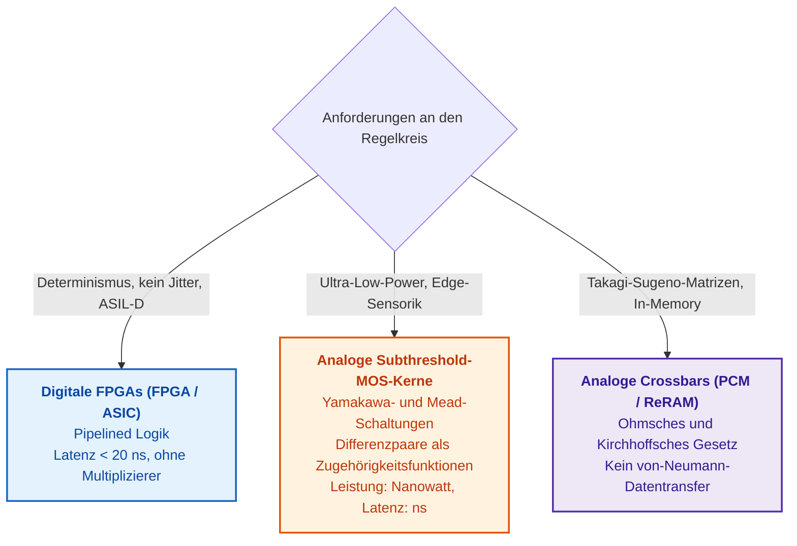

1. **FPGAs:** Reine Kombinatorik ohne Multiplizierer für Mamdani-Kerne. Latenzen $< 20\,\text{ns}$ garantieren höchste ASIL-D-Konformität.
2. **Analoge Subthreshold-Kerne (Yamakawa / Carver Mead):** Die Physik des MOSFET-Subthreshold-Bereichs realisiert natürliche Sigmoide ($I_d \propto \exp(V_{gs})$). Minimum-Stromselektoren und Winner-Take-All-Schaltungen (WTA) operieren mit Nanowatt-Leistungsaufnahme direkt im Sensorgehäuse ([Anhang D](appendix-d-analog-expert-systems-and-neuromorphic-computing.md#L204-L260)).
3. **Memristive Crossbars (In-Memory Computing):** Für Takagi-Sugeno-Modelle erfolgt die Matrix-Vektor-Multiplikation direkt im Leitwert-Array gemäß den Kirchhoffschen Gesetzen ([Anhang E](appendix-e-mixed-signal-neuromorphic-expert-systems.md)).

### 7.5. Dempster-Shafer-Evidenztheorie: Kombination widersprüchlicher Evidenzen

Eine Kamera erkennt ein Hindernis, die Wärmebildkamera nicht. Die Wahrscheinlichkeitstheorie muss die Wahrscheinlichkeitsmasse 1 zwingend auf Einzelhypothesen aufteilen. Die Theorie von Arthur Dempster [[22]](#src-22) und Glenn Shafer [[23]](#src-23) erlaubt es, Glaubensmassen auch echten Teilmengen – einschließlich der gesamten Hypothesenmenge $\Theta$ (Nichtwissen) – zuzuweisen:

```math
m:2^{\Theta}\to[0,1],\qquad m(\varnothing)=0,\qquad\sum_{A\subseteq\Theta}m(A)=1
```

- $\Theta$ ist die Menge disjunkter Hypothesen, und $2^{\Theta}$ ist deren Potenzmenge;
- $m(A)$ ist die elementare Glaubensmasse (*Basic Probability Assignment*);
- $\varnothing$ ist die leere Menge ($m(\varnothing)=0$);
- $\sum_{A\subseteq\Theta}m(A)=1$.

Zwei unabhängige Evidenzquellen werden über die Dempster-Kombinationsregel aggregiert. Bei starkem Konflikt führt die klassische Renormierung jedoch zum **Zadeh-Paradoxon**, bei dem eine winzige Restübereinstimmung fälschlich mit 100 % Konfidenz bewertet wird.

Um dies zu verhindern, berechnet das System vor der Aggregation zwingend die **Konfliktmasse** $K \in [0, 1]$:

```math
K=\sum_{B\cap C=\varnothing}m_1(B)\,m_2(C)
```

- $K \in [0, 1]$ quantifiziert den Konflikt ($K=0$: vollkommene Harmonie, $K=1$: totaler Widerspruch);
- $m_1(B)$ und $m_2(C)$ sind die Massenbelegungen beider Sensoren;
- Die Summe erfasst alle disjunkten Schnittmengen ($B\cap C = \varnothing$).

**Laufzeitsteuerung und Schwellenwerte:**
1. $K < 0{,}20$: Sensoren harmonieren; Standard-Dempster-Kombination wird ausgeführt.
2. $0{,}20 \le K < 0{,}50$: Moderater Konflikt; das Ergebnis wird als „sensor-discrepancy-sensitive“ markiert.
3. $K \ge 0{,}50$: Kritischer Konflikt; die Dempster-Kombination wird **strikt gesperrt**. Das System verweigert das automatische Urteil, versetzt Subsysteme in den Fail-Safe-Zustand und eskaliert an einen menschlichen Auditor (*Human-in-the-Loop*).

Im Drohnenbeispiel: $\Theta=\{\text{Ziel}, \text{kein Ziel}\}$; Kamera $m_1(\{\text{Ziel}\})=0{,}8$, $m_1(\Theta)=0{,}2$; Wärmebildkamera $m_2(\{\text{kein Ziel}\})=0{,}7$, $m_2(\Theta)=0{,}3$. Konfliktmasse $K=0{,}8\cdot0{,}7=0{,}56 > 0{,}50$. Die Renormierung wird blockiert.

Lotfi Zadeh zeigte das Extrembeispiel [[24]](#src-24): Arzt 1 diagnostiziert Meningitis mit 0,99, Gehirntumor mit 0,01. Arzt 2 diagnostiziert Gehirnerschütterung mit 0,99, Gehirntumor mit 0,01. Trotz $K=0{,}9999$ würde die unreflektierte Dempster-Formel dem Tumor 1,00 zuweisen. Das folgende Go-Programm führt beide Berechnungen transparent vor.

<details>
<summary>Beispiel in Go: Dempster-Regel und Konfliktmasse</summary>

Das Programm ist lauffähig (`go run main.go`). Hypothesenmengen werden über Bitmasken kodiert (Bit 1 = Ziel, Bit 2 = kein Ziel, Maske 3 = Nichtwissen). `combine` berechnet $K$ und aggregiert unkonfliktäre Massen.

```go
package main

import (
	"fmt"
	"strings"
)

// Mass weist Hypothesenmengen Glaubensmassen zu; eine Menge wird durch eine Bitmaske kodiert.
type Mass map[uint]float64

// combine verknüpft zwei Quellen nach der Dempster-Regel und gibt die Konfliktmasse K zurück.
func combine(m1, m2 Mass) (Mass, float64) {
	out := Mass{}
	k := 0.0
	for b, x := range m1 {
		for c, y := range m2 {
			if a := b & c; a == 0 {
				k += x * y
			} else {
				out[a] += x * y
			}
		}
	}
	if k >= 1 {
		return nil, k
	}
	for a := range out {
		out[a] /= 1 - k
	}
	return out, k
}

func label(a uint, names []string) string {
	var parts []string
	for i, n := range names {
		if a&(1<<i) != 0 {
			parts = append(parts, n)
		}
	}
	return strings.Join(parts, ", ")
}

func show(title string, names []string, m1, m2 Mass) {
	m, k := combine(m1, m2)
	fmt.Printf("%s: K = %.4f\n", title, k)
	if m == nil {
		fmt.Println("  Dempster-Regel nicht definiert: vollständiger Konflikt")
		return
	}
	for a := uint(1); a < 1<<len(names); a++ {
		if v, ok := m[a]; ok {
			fmt.Printf("  m({%s}) = %.3f\n", label(a, names), v)
		}
	}
}

func main() {
	const target, none = 1, 2
	show("Kamera und Waermebildkamera", []string{"Ziel", "kein Ziel"},
		Mass{target: 0.8, target | none: 0.2},
		Mass{none: 0.7, target | none: 0.3})

	const men, con, tum = 1, 2, 4
	show("Zadeh-Beispiel", []string{"Meningitis", "Gehirnerschuetterung", "Gehirntumor"},
		Mass{men: 0.99, tum: 0.01},
		Mass{con: 0.99, tum: 0.01})
}
```

Programmausgabe:

```text
Kamera und Waermebildkamera: K = 0.5600
  m({Ziel}) = 0.545
  m({kein Ziel}) = 0.318
  m({Ziel, kein Ziel}) = 0.136
Zadeh-Beispiel: K = 0.9999
  m({Gehirntumor}) = 1.000
```

Im ersten Szenario verschwindet die massive Konfliktmasse von 0,5600 durch die Renormierung aus dem Ergebnis. Im Zadeh-Szenario erzeugt $K=0{,}9999$ eine Schein-Gewissheit für den Tumor.

</details>

Regel für die Systemarchitektur: Zuerst wird die Konfliktmasse $K$ gegen die Sicherheitsschwelle geprüft. Erst bei $K < \theta_{\mathrm{conflict}}$ darf kombiniert werden; andernfalls erfolgt eine strukturierte Ablehnung.

Wahrscheinlichkeit, Zugehörigkeitsgrad und Glaubensmasse quantifizieren unterschiedliche Dimensionen von Ungewissheit. Das Bayessche Netz wägt Ursachen ab, Markov-Modelle erfassen zeitliche Dynamiken, Fuzzy-Funktionen bilden weiche Grenzen ab und die Evidenztheorie legt Quellenkonflikte offen. Diese Ansätze setzen vordefinierte Variablen voraus. Wissen, das sich nicht in starre Zufallsvariablen pressen lässt, wird über Präzedenzfälle und relationale Graphen abgebildet.

## 8. Modellierung strukturierter Erfahrung: Präzedenzfälle, relationale Graphen und Ontologien

Die vierte und fünfte Leitfrage aus der Einleitung lauten: Was ist in der Vergangenheit Ähnliches geschehen und welche Artefakte sind von der Änderung der Anforderung R-17 betroffen? Weder eine isolierte Regel noch eine Wahrscheinlichkeitsverteilung beantworten diese Fragen; erforderlich sind Ähnlichkeitsmaße und Beziehungsstrukturen.

### 8.1. Formalisierung ingenieurtechnischer Präzedenzfälle und Selektionsmetriken

Das fallbasierte Schließen (*Case-Based Reasoning*, CBR) löst neue ingenieurtechnische Aufgaben durch Analogie zu archivierten Erfahrungen. Agnar Aamodt und Enric Plaza strukturierten CBR in vier Zyklen: Wiederauffinden des ähnlichsten Falls, Wiederverwendung der Lösung, Revision unter Berücksichtigung von Kontextabweichungen und Speicherung der neuen Erfahrung [[25]](#src-25). Die initiale Selektion verlangt eine Ähnlichkeitsfunktion, standardmäßig realisiert als gewichtetes Mittel über Merkmalsähnlichkeiten:

```math
\mathrm{sim}(q,c)=\frac{\sum_{i=1}^{m}w_i\,\mathrm{sim}_i(q_i,c_i)}{\sum_{i=1}^{m}w_i},\qquad w_i\ge0,\quad\sum_{i=1}^{m}w_i>0
```

Notation:

- $q$ ist der neue Fall (*Query*), $c$ ist der archivierte Fall (*Case*), und $m$ bezeichnet die Anzahl der Merkmale;
- $q_i$ und $c_i$ sind die Attributwerte des Merkmals $i$, und $\mathrm{sim}_i(q_i,c_i) \in [0, 1]$ bewertet deren lokale Ähnlichkeit;
- $w_i \ge 0$ ist das Merkmalsgewicht, wobei die Summe aller Gewichte positiv sein muss;
- Das Gesamtergebnis $\mathrm{sim}(q,c)$ ist auf das Intervall $[0, 1]$ normiert.

Beispiel: Ein aktueller und ein historischer Softwarefehler betreffen dasselbe Subsystem (lokale Ähnlichkeit 1, Gewicht 0,5), die Fehlersymptome ähneln sich zu 0,6 (Gewicht 0,3), und die Firmware-Versionen weisen eine Ähnlichkeit von 0,5 auf (Gewicht 0,2). Da $\sum w_i = 1$, errechnet sich die Gesamtähnlichkeit zu $0{,}5\cdot1+0{,}3\cdot0{,}6+0{,}2\cdot0{,}5=0{,}78$.

Dieser Wert von 0,78 ist keine Wahrscheinlichkeit dafür, dass die alte Lösung fehlerfrei funktioniert, sondern ein Ranking-Score für die Wiederauffindung. Daher werden Präzedenzfälle in evidenzbasierten Systemen stets als strukturierte Datenobjekte persistiert: Problemstellung, Kontext, Merkmalsvektoren, gewählte Lösung, verifiziertes Ergebnis und explizite Anwendungsgrenzen.

### 8.2. Graphdatenstrukturen und ontologische Modelle

Expertensysteme operieren kontinuierlich auf Beziehungsnetzwerken: Eine Anforderung wird durch einen Testfall verifiziert, der Testlauf generiert ein Prüfprotokoll, das Protokoll stützt ein Sicherheitsargument, das Argument gehört zu einer Release-Baseline. Diese Strukturen werden als gerichtete attributierte Graphen modelliert. Graphalgorithmen beantworten zentrale Fragen: Erreichbarkeit (*Reachability*) ermittelt den Änderungsradius bei Anforderungsmodifikationen; kürzeste Pfade rekonstruieren Beweisketten; Zentralitätsmaße identifizieren kritische Komponenten; Zykluserkennung deckt zirkuläre Abhängigkeiten auf. Der Aufbau ingenieurtechnischer Wissensgraphen wird in [Kapitel 9](ch09-engineering-knowledge-graph-traceability.md) vertieft.

Ontologien reichern Graphen mit formaler Semantik und Typenhierarchien an. Die Web Ontology Language (OWL) des W3C operiert unter der Open-World-Annahme. Daher werden geschlossene Validierungsregeln – etwa „Eine Sicherheitsanforderung darf ohne verifizierten Testnachweis nicht freigegeben werden“ – über SHACL (*Shapes Constraint Language*) realisiert, das Graphenschnappschüsse geschlossen auditiert [[26]](#src-26).

Ergänzend kommen Graph Neural Networks (GNN) zum Einsatz. Thomas Kipf und Max Welling entwickelten Graph Convolutional Networks (GCN), die Knotenrepräsentationen über Nachbarschaftsaggregation aktualisieren [[27]](#src-27):

```math
h_v^{(\ell+1)}=\sigma\Big(W_0\,h_v^{(\ell)}+\sum_{u\in N(v)}\frac{1}{c_{uv}}\,W_1\,h_u^{(\ell)}\Big)
```

- $v$ ist ein Netzknoten und $\ell$ der Index der Netzwerkschicht;
- $h_v^{(\ell)}$ und $h_v^{(\ell+1)}$ sind die Merkmalsvektoren des Knotens vor und nach der Faltung;
- $N(v)$ ist die Menge der Nachbarknoten, und $c_{uv}$ ist ein struktureller Normierungsfaktor der Kante;
- $W_0$ und $W_1$ sind trainierbare Gewichtsmatrizen;
- $\sigma$ ist eine nichtlineare Aktivierungsfunktion.

GNNs eignen sich zur Priorisierung verdächtiger Subgraphen für manuelle Expertenüberprüfungen. Sie beweisen jedoch weder formale Kausalität noch ersetzen sie deterministische Traceability.

### 8.3. Semantische Relationenhierarchien und transitive Hülle

Prüft ein Expertensystem Beziehungen rein syntaktisch über exakte Namensübereinstimmung, gehen semantische Relationen verloren. Eine Abfrage nach „regulatorischen Anforderungen“ würde Fakten übersehen, deren Kante als „zwingende Sicherheitsanforderung“ typisiert ist. Die Lösung liegt in formalen Relationenhierarchien, in denen spezifische Relationen Untertypen allgemeinerer Relationen bilden:

```math
R_a\sqsubseteq R_b\iff\forall x,y:\ R_a(x,y)\Rightarrow R_b(x,y)
```

- $R_a$ und $R_b$ sind Relationstypen zwischen Entitäten $x$ und $y$;
- $R_a(x,y)$ indiziert das Bestehen der Subrelation $R_a$;
- $\sqsubseteq$ symbolisiert die Subsumtion von Relationen (im RDF-Schema als `rdfs:subPropertyOf` standardisiert [[28]](#src-28)).

Für Anfragen gilt:

```math
(s,R_f,o)\models(s,R_q,?)\iff R_f\sqsubseteq^{\ast}R_q
```

- $(s,R_f,o)$ ist das gespeicherte Faktum aus Subjekt $s$, Relation $R_f$ und Objekt $o$;
- $(s,R_q,?)$ ist die Suchanfrage nach Zielen mit Relation $R_q$;
- $\models$ bedeutet „erfüllt die Abfrage“, und $\sqsubseteq^{\ast}$ bezeichnet die reflexive transitive Hülle der Subsumtionshierarchie.

Ein Faktum über eine verbindliche Sicherheitsanforderung erfüllt somit automatisch eine Anfrage nach allgemeinen regulatorischen Vorgaben, jedoch nicht umgekehrt.

## 9. Mehrkriterielle Entscheidungsanalyse, diskrete Optimierung und Handlungsplanung

Welches von drei Release-Szenarien soll ausgewählt werden? In der industriellen Praxis gibt es selten eine isoliert perfekte Lösung: Ein beschleunigtes Release generiert früheren Marktwert, birgt jedoch höhere Restrisiken; eine verlängerte Testphase maximiert die funktionale Sicherheit, verursacht aber zusätzliche Entwicklungskosten. Das Expertensystem muss die Alternativen bewerten und die Sensitivität gegenüber den Gewichtungsannahmen offenlegen.

### 9.1. Methoden der mehrkriteriellen Entscheidungsanalyse (AHP, TOPSIS)

[Kapitel 4](ch04-evolution-from-bayes-to-evidence-ai.md) analysierte die gewichtete Summe und deren Sensitivitätsanalyse. Die gewichtete Summe ist ein kompensatorisches Modell: Exzellente Bewertungen in einem Kriterium können gravierende Defizite in einem anderen Kriterium überdecken. Daher müssen unzulässige Optionen stets vorab durch harte logische Constraints herausgefiltert werden. Für die Rangordnung zulässiger Alternativen existieren etablierte mathematische Verfahren: Der Analytic Hierarchy Process (AHP) nach Thomas Saaty leitet Kriteriengewichte aus paarweisen Vergleichsmatrizen konsistenzgeprüft ab [[29]](#src-29). Die Technique for Order of Preference by Similarity to Ideal Solution (TOPSIS) von Ching-Lai Hwang und Kwangsun Yoon bewertet Alternativen nach ihrer geometrischen Distanz zu einem virtuellen Idealpunkt und dem Anti-Idealpunkt [[30]](#src-30). Outranking-Methoden wie PROMETHEE [[31]](#src-31) und ELECTRE [[32]](#src-32) unterbinden unzulässige Kompensationseffekte.

Die Berechnungsgleichungen von TOPSIS lauten:

```math
\begin{aligned}
v_{ij}&=w_j\,\frac{x_{ij}}{\sqrt{\sum_{k=1}^{n}x_{kj}^{2}}},\qquad v_j^{+}=\max_{i}v_{ij},\qquad v_j^{-}=\min_{i}v_{ij},\\
d_i^{\pm}&=\sqrt{\sum_{j=1}^{m}\big(v_{ij}-v_j^{\pm}\big)^{2}},\qquad C_i=\frac{d_i^{-}}{d_i^{+}+d_i^{-}}
\end{aligned}
```

Notation:

- $x_{ij}$ ist die Bewertung der Alternative $i$ bezüglich Kriterium $j$ ($n$ Alternativen, $m$ Kriterien);
- $w_j$ ist das Gewicht des Kriteriums $j$, und $v_{ij}$ ist der normierte gewichtete Wert;
- $v_j^{+}$ und $v_j^{-}$ sind die Koordinaten des Idealpunkts bzw. des Anti-Idealpunkts;
- $d_i^{+}$ und $d_i^{-}$ messen die euklidischen Distanzen der Alternative $i$ zu diesen Extrempunkten;
- $C_i \in [0, 1]$ ist der relative Nähekoeffizient (*Closeness Coefficient*).

Ein höherer Wert $C_i$ indiziert eine größere Nähe zur Ideallösung. Das folgende Go-Programm berechnet sowohl die gewichtete Summe als auch TOPSIS für drei konkurrierende Release-Szenarien.

<details>
<summary>Beispiel in Go: Gewichtete Summe und TOPSIS für drei Release-Szenarien</summary>

Das Programm ist eigenständig lauffähig (`go run main.go`). Datenmatrix: Geschäftswert (Gewicht 0,4), geringes Lieferrisiko (Gewicht 0,3) und Compliance-Reifegrad (Gewicht 0,3).

```go
package main

import (
	"fmt"
	"math"
)

func main() {
	names := []string{"A: Schnelles Release", "B: Bessere Konformitaet", "C: Minimales Release"}
	// Normierte Bewertungen: Geschaeftswert, geringes Lieferrisiko, Compliance-Bereitschaft.
	x := [][]float64{{0.90, 0.45, 0.60}, {0.70, 0.70, 0.85}, {0.50, 0.90, 0.80}}
	w := []float64{0.4, 0.3, 0.3}

	v := make([][]float64, len(x))
	for i := range x {
		v[i] = make([]float64, len(w))
	}
	for j := range w {
		norm := 0.0
		for i := range x {
			norm += x[i][j] * x[i][j]
		}
		norm = math.Sqrt(norm)
		for i := range x {
			v[i][j] = w[j] * x[i][j] / norm
		}
	}

	// Alle drei Kriterien stellen Nutzen dar, daher nimmt der Idealpunkt das Maximum.
	best, worst := make([]float64, len(w)), make([]float64, len(w))
	for j := range w {
		best[j], worst[j] = v[0][j], v[0][j]
		for i := range v {
			best[j] = math.Max(best[j], v[i][j])
			worst[j] = math.Min(worst[j], v[i][j])
		}
	}

	for i, n := range names {
		ws, dPlus, dMinus := 0.0, 0.0, 0.0
		for j := range w {
			ws += w[j] * x[i][j]
			dPlus += (v[i][j] - best[j]) * (v[i][j] - best[j])
			dMinus += (v[i][j] - worst[j]) * (v[i][j] - worst[j])
		}
		c := math.Sqrt(dMinus) / (math.Sqrt(dPlus) + math.Sqrt(dMinus))
		fmt.Printf("%-24s gewichtete Summe %.3f   TOPSIS %.3f\n", n, ws, c)
	}
}
```

Programmausgabe:

```text
A: Schnelles Release     gewichtete Summe 0.675   TOPSIS 0.509
B: Bessere Konformitaet  gewichtete Summe 0.745   TOPSIS 0.566
C: Minimales Release     gewichtete Summe 0.710   TOPSIS 0.480
```

Beide Methoden identifizieren Szenario B als Sieger. Auf Rang zwei divergieren die Methoden jedoch: Die gewichtete Summe platziert C vor A (0,710 vs. 0,675), während TOPSIS A vor C reiht (0,509 vs. 0,480).

</details>

Die Wahl der Aggregationsmethode ist eine Modellannahme. Ändert der Methodenwechsel die Rangfolge, muss das Expertensystem beide Resultate und die methodischen Ursachen der Divergenz ausweisen.

### 9.2. Diskrete Constraint-Optimierung (CSP) und automatisierte Handlungsplanung

Die mathematische Optimierung ermittelt die beste Lösung unter formalisierten Restriktionen:

```math
\min_{x\in\mathcal{X}} f(x)\quad\text{за умов}\quad g_j(x)\le0,\quad j=1,\dots,k
```

- $x \in \mathcal{X}$ repräsentiert den Lösungsvektor im zulässigen Lösungsraum;
- $f(x)$ ist die zu minimierende Kosten- oder Straffunktion;
- $g_j(x) \le 0$ formalisiert das $j$-te Nebenbedingungskriterium für $j=1,\dots,k$.

Constraint-Programming-Systeme eignen sich für diskrete Zuteilungs- und Scheduling-Probleme (z. B. Prüfstandsbelegungen ohne Ressourcenkonflikte). Die automatisierte Handlungsplanung (*Automated Planning*) erweitert dies um Zustandsübergangsmodelle: PDDL (*Planning Domain Definition Language*) beschreibt Aktionen mit Vorbedingungen und Effekten; hierarchische Aufgabennetzwerke (*Hierarchical Task Networks*, HTN) zerlegen strategische Ziele in validierte Aktionsketten [[33]](#src-33). Ein Planer befähigt das System nicht nur, Defizite zu erkennen, sondern einen konkreten Sanierungsplan vorzuschlagen: Welche Nachweise sind einzuholen, welche Regressionstests auszuführen und welche Rollen zur Freigabe hinzuzuziehen?

## 10. Information Retrieval und semantische Suche: Von lexikalischer Gewichtung zu dichten Vektoren

Um Regeln oder Präzedenzfälle anzuwenden, muss das Expertensystem zunächst relevante Wissensfragmente aus Dokumentenkorpora lokalisieren; die natürlichsprachliche Interaktion mit dem Ingenieur wird dabei häufig durch Sprachmodelle unterstützt. [Kapitel 4](ch04-evolution-from-bayes-to-evidence-ai.md) stellte die Evolution der Suche und die Kosinus-Ähnlichkeit vor. Dieser Abschnitt formalisiert die Mathematik moderner hybrider Suchverfahren sowie die internen Operationen von Sprachmodellen.

### 10.1. Lexikalische Termgewichtung: TF-IDF- und BM25-Modelle

Die klassische Dokumentensuche gewichtet Terme. Das TF-IDF-Schema (*Term Frequency, Inverse Document Frequency*), systematisiert von Gerard Salton und Christopher Buckley, verstärkt Wörter, die in einem Dokument häufig, im Gesamtbestand jedoch selten sind [[34]](#src-34):

```math
\mathrm{tfidf}(t,d)=\mathrm{tf}(t,d)\cdot\ln\frac{N}{\mathrm{df}(t)}
```

- $t$ ist der Suchterm, $d$ das Dokument, und $\mathrm{tf}(t,d)$ die absolute Termhäufigkeit in $d$;
- $N$ ist die Gesamtzahl der Dokumente im Korpus, und $\mathrm{df}(t)$ ist die Dokumentenhäufigkeit von $t$;
- $\ln$ bezeichnet den natürlichen Logarithmus;
- $\mathrm{tfidf}(t,d)$ ist das resultierende Gewicht (keine Wahrscheinlichkeit, ohne obere Schranke).

Beispiel: In einem Korpus von 1.000 Dokumenten tritt das Akronym „ASIL“ in 10 Dokumenten auf; sein IDF-Gewicht beträgt $\ln(1000/10)\approx4{,}61$. Das Allerweltswort „Anforderung“ erscheint in 600 Dokumenten und erhält lediglich $\ln(1000/600)\approx0{,}51$. Der spezifische Fachbegriff wird damit etwa neunmal stärker gewichtet.

Die Ranking-Funktion BM25 (*Best Matching 25*) nach Stephen Robertson und Hugo Zaragoza ergänzt TF-IDF um eine Frequenzsättigung und Dokumentenlängennormierung [[35]](#src-35):

```math
\mathrm{BM25}(q,d)=\sum_{t\in q}\mathrm{IDF}(t)\cdot\frac{\mathrm{tf}(t,d)\,(k_1+1)}{\mathrm{tf}(t,d)+k_1\Big(1-b+b\,\dfrac{|d|}{\mathrm{avgdl}}\Big)}
```

- $q$ ist die Suchanfrage, $t$ iteriert über deren Terme;
- $|d|$ ist die Wortanzahl des Dokuments, und $\mathrm{avgdl}$ ist die mittlere Dokumentenlänge im Korpus;
- $k_1 \ge 0$ steuert die Termfrequenzsättigung (typischerweise $k_1 \in [1{,}2; 2{,}0]$);
- $b \in [0, 1]$ skaliert den Einfluss der Dokumentenlänge (Standard $b = 0{,}75$).

Die Frequenzsättigung verhindert Keyword-Stuffing: Bei einem durchschnittlich langen Dokument und $k_1 = 1{,}2$ liefert ein Vorkommen den Termfaktor 1,0, während zehn Vorkommen lediglich $10\cdot2{,}2/11{,}2\approx1{,}96$ beisteuern. Eine Verzehnfachung der Nennungen verdoppelt die Relevanz lediglich, anstatt sie zu verzehnfachen.

### 10.2. Dichte Vektorrepräsentationen und Geometrie des kontrastiven Raums

BM25 findet präzise Token, Normenkennungen und Symbolbezeichner, scheitert jedoch an Synonymen und Paraphrasen. Dichte Vektoreinbettungen (*Dense Embeddings*) bilden den semantischen Gehalt eines Textabschnitts auf einen Vektor fixer Dimension ab:

```math
f_{\theta}(s)=e_s\in\mathbb{R}^{d}
```

- $s$ ist der Textabschnitt und $f_{\theta}$ das neuronale Einbettungsmodell mit Parametern $\theta$;
- $e_s \in \mathbb{R}^d$ ist der dichte Einbettungsvektor mit typischer Dimension $d \in [384, 1536]$.

Nils Reimers und Iryna Gurevych zeigten mit Sentence-BERT, wie siamesische Netzwerke semantisch kohärente Vektoren für die Kosinus-Ähnlichkeitssuche erzeugen [[36]](#src-36). Eine Anfrage nach „Partitionierung von Sicherheitsanforderungen“ matcht dadurch auf „ASIL decomposition“, obgleich kein Wort übereinstimmt.

Das Training erfolgt kontrastiv. Vladimir Karpukhin et al. verwendeten für Dense Passage Retrieval (DPR) folgenden InfoNCE-Verlust [[37]](#src-37):

```math
\mathcal{L}=-\ln\frac{\exp\big(s(q,d^{+})/\tau\big)}{\sum_{d\in D}\exp\big(s(q,d)/\tau\big)},\qquad d^{+}\in D,\quad\tau>0
```

- $q$ ist die Anfrage, $d^{+}$ das relevante Textfragment, und $D$ die Kandidatenmenge;
- $s(q,d)$ ist das Ähnlichkeitsmaß (z. B. Skalarprodukt), und $\tau > 0$ die Temperatur;
- $\mathcal{L}$ minimiert den Abstand relevanter Paare und maximiert die Distanz zu Hard Negatives.

Vor der Vektorisierung wird der Text in Subword-Token zerlegt. Da Tokenbudgets den Rechenaufwand determinieren, analysieren [Kapitel 8](ch08-engineering-artifacts-as-data.md) und [Kapitel 12](ch12-linguistic-analysis-and-local-models.md) die Tokenisierungsökonomie im Detail.

### 10.3. Hybride Suche und Algorithmen der reziproken Rangfusion (RRF)

In der technischen Domäne müssen exakte Bezeichner und semantische Konzepte simultan gesucht werden. Daher werden lexikalische und dichte Vektorsuche kombiniert:

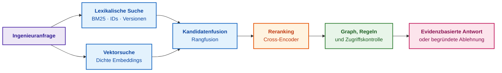

Die lineare Score-Fusion lautet:

```math
S_{\mathrm{hybrid}}(q,d)=\alpha\,\widetilde{S}_{\mathrm{BM25}}(q,d)+(1-\alpha)\,\widetilde{S}_{\mathrm{vec}}(q,d),\qquad 0\le\alpha\le1
```

wobei $\widetilde{S}$ die min-max-normierten Einzel-Scores darstellen und $\alpha \in [0, 1]$ den Fusionsfaktor bezeichnet. Sind die Scores disparat skaliert, greift die verteilungsunabhängige reziproke Rangfusion (*Reciprocal Rank Fusion*, RRF) nach Gordon Cormack et al. [[38]](#src-38):

```math
\mathrm{RRF}(d)=\sum_{r\in R}\frac{1}{k+\mathrm{rank}_r(d)}
```

- $R$ ist die Menge der Retriever, $\mathrm{rank}_r(d) \ge 1$ der Rangplatz des Dokuments in System $r$;
- $k$ ist die Glättungskonstante (Standard $k = 60$).

Ein Dokument auf Rang 1 bei BM25 und Rang 10 bei Vektorsuche erhält $1/61 + 1/70 \approx 0{,}0307$; ein Dokument auf Rang 3 in beiden Listen erzielt $2/63 \approx 0{,}0317$ und setzt sich durch konsistente Relevanz durch.

**Laufzeitsteuerung, Hardwarerestriktionen und Relevanz-Gateway:**
1. **Relevanzschwelle ($\tau_{\mathrm{rel}}$):** Liegt der beste Fusions-Score unter $\tau_{\mathrm{rel}} = 0{,}35$, blockiert das Gateway die Generierung und meldet `ERR_NO_RELEVANT_EVIDENCE`, um Halluzinationen auf unpassenden Quellen auszuschließen.
2. **Kontextbudgetierung:** Exakt die Top-$K=5$ Fragmente (durchschnittlich 300 Token) werden an den Generator übergeben. Dies limitiert den KV-Cache auf 1.500 Token, schützt vor VRAM-Out-of-Memory (OOM) und garantiert deterministische Inferenzlatenzen $T_{\mathrm{infer}} \le 120\,\text{ms}$.

**Numerisches Berechnungsbeispiel:**
Zwei Passagen für eine CAN-Diagnoseabfrage:
- Fragment $d_1$ (Protokollspezifikation): $\widetilde{S}_{\mathrm{BM25}} = 0{,}82$, $\widetilde{S}_{\mathrm{vec}} = 0{,}40$;
- Fragment $d_2$ (Schaltplan): $\widetilde{S}_{\mathrm{BM25}} = 0{,}30$, $\widetilde{S}_{\mathrm{vec}} = 0{,}88$.
Unter $\alpha = 0{,}55$:

```math
S_{\mathrm{hybrid}}(q, d_1) = 0{,}55 \cdot 0{,}82 + 0{,}45 \cdot 0{,}40 = 0{,}451 + 0{,}180 = 0{,}631
```

```math
S_{\mathrm{hybrid}}(q, d_2) = 0{,}55 \cdot 0{,}30 + 0{,}45 \cdot 0{,}88 = 0{,}165 + 0{,}396 = 0{,}561
```

Beide Scores überschreiten $\tau_{\mathrm{rel}} = 0{,}35$; Fragment $d_1$ wird vor $d_2$ in das Kontextfenster gerankt.

### 10.4. RAG-Architektur: Kontextkompression und Verhinderung von Faktenverlust

Ein großes Sprachmodell (*Large Language Model*, LLM) modelliert die Wahrscheinlichkeit einer Tokenfolge autoregressiv als Produkt bedingter Wahrscheinlichkeiten:

```math
P(x_1,\dots,x_n)=\prod_{t=1}^{n}P(x_t\mid x_1,\dots,x_{t-1})
```

An jeder Textposition berechnet die Softmax-Schicht die Wahrscheinlichkeitsverteilung über das gesamte Vokabular $\mathcal{V}$:

```math
P(x_{t+1}=v\mid x_{\le t})=\frac{\exp(a_v)}{\sum_{u\in\mathcal{V}}\exp(a_u)}
```

Diese Wahrscheinlichkeit misst die statistische Sprachplausibilität im Modell, nicht die sachliche Richtigkeit in der realen Welt. Das Modell besitzt ohne Retrieval keinen inhärenten Faktencheck.

Die Kernoperation der Transformer-Architektur von Ashish Vaswani et al. ist die skalierte Skalarprodukt-Aufmerksamkeit (*Scaled Dot-Product Attention*) [[39]](#src-39):

```math
\mathrm{Attention}(Q,K,V)=\mathrm{softmax}\Big(\frac{QK^{\mathsf T}}{\sqrt{d_k}}\Big)V
```

- $Q, K, V$ sind die Matrizen der Abfragen (*Queries*), Schlüssel (*Keys*) und Werte (*Values*);
- $d_k$ ist die Dimension der Schlüssel; der Skalierungsfaktor $1/\sqrt{d_k}$ verhindert das Verschwinden des Gradienten im Softmax;
- Das Ergebnis ist eine gewichtete Linearkombination der Wertezeilen $V$.

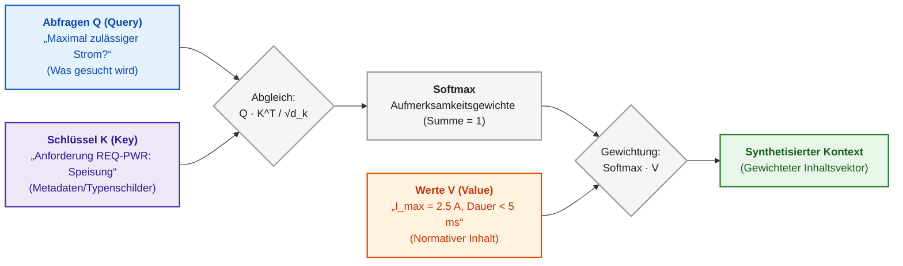

Retrieval-Augmented Generation (RAG) nach Patrick Lewis et al. formalisiert die Antwortgenerierung bedingt auf externen Dokumentenpassagen $D_k$ [[40]](#src-40):

```math
P(y\mid x)\approx\sum_{d\in D_k}p(d\mid x)\,P(y\mid x,d)
```

- $x$ ist die Anfrage, $y$ die Antwort und $d$ ein Dokumentfragment;
- $p(d\mid x)$ modelliert die Retrieval-Wahrscheinlichkeit.

RAG liefert dem Modell den Faktenkontext, beweist jedoch nicht dessen Gültigkeit. Es bedarf strikter Nachverfolgbarkeit, Versionsprüfungen und der Fähigkeit zur kontrollierten Verweigerung ([Kapitel 19](ch19-from-question-to-evidence.md)).

## 11. Statistische Plausibilitätsprüfung von Messwerten: Mahalanobis-Distanz

Eine Drohne navigiert ohne Satellitensignal (GNSS-Denied) per optischem Fluss der Kamera. Ein Scheinwerferblitz erzeugt sprunghaft falsche Geschwindigkeitsvektoren. Übernimmt der Navigationsfilter diesen Messwert ungeprüft, gerät das Fluggerät in unkontrollierbare Instabilität. Erforderlich ist ein statistisches Abweisungsgateway, das Messabweichungen unter Berücksichtigung von Sensorrauschen und Modellprädiktionsunsicherheit normiert.

Die klassische euklidische Distanz unterstellt isotropes Rauschen in allen Raumachsen. Reale Sensoren weisen jedoch stark anisotrope, korrelierte Fehlerellipsen auf. Die Distanz nach Prasanta Chandra Mahalanobis [[41]](#src-41) skaliert die Residuen an der aktuellen Kovarianzmatrix:

```math
\tilde{y}=z-\hat{z},\qquad S=H\,P^{-}H^{\mathsf T}+R,\qquad d_M=\sqrt{\tilde{y}^{\mathsf T}S^{-1}\tilde{y}}
```

- $z$ ist der reale $m$-dimensionale Messvektor, $\hat{z}$ die Modellprädiktion;
- $\tilde{y}=z-\hat{z}$ ist die Messinnovation (Residuum);
- $P^{-}$ ist die Kovarianzmatrix des Prädiktionsfehlers, $H$ die Messmatrix und $R$ die Sensorausfall-/Rauschkovarianz;
- $S$ ist die Innovationskovarianzmatrix, und $d_M$ ist die dimensionslose Mahalanobis-Distanz.

Unter Gauß-Annahmen folgt das Quadrat $d_M^2$ einer Chi-Quadrat-Verteilung ($\chi^2$) mit $m$ Freiheitsgraden [[42]](#src-42), [[43]](#src-43).

Beispiel: Zweidimensionale optische Messung; Standardabweichung der horizontalen Achse $\sigma_x = 2\,\text{Pixel}$, vertikal $\sigma_y = 1\,\text{Pixel}$, keine Kreuzkorrelation ($S=\mathrm{diag}(4, 1)$). Für ein Konfidenzniveau von 99 % und $m=2$ Freiheitsgrade liegt die Validierungsschwelle bei $d_M^2 \le 9{,}21$, mithin $d_M \le 3{,}03$.

| Innovation (Pixel) | Euklidische Distanz | $d_M$ | Systemverdict |
|---|---:|---:|---|
| $(4;\ 0)$ | 4,0 | 2,0 | Akzeptiert: Abweichung liegt auf rauschtoleranter Achse |
| $(0;\ 3{,}5)$ | 3,5 | 3,5 | Verworfen: Signifikante Anomalie auf hochpräziser Achse |

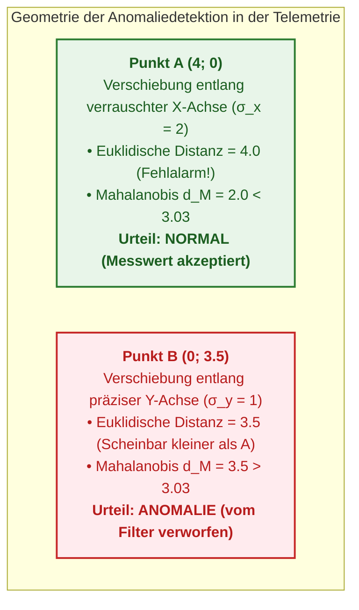

Unterschreitet $d_M$ den Schwellenwert, fusioniert das Kalman-Filter den Messwert; andernfalls wird die Messung isoliert (*Gating*), und das System stützt sich rein auf Inertialdaten. Wiederholte Abweisungen lösen den Übergang in den degradierten Sensormodus aus. Hardwarenahe Realisierungen werden in [Anhang C](appendix-c-autonomous-navigation-and-geosearch.md) und [Anhang D](appendix-d-analog-expert-systems-and-neuromorphic-computing.md) beschrieben.

## 12. Synergetische Dimensionsreduktion: Ordnungsparameter und Hakensches Versklavungsprinzip

Die Interaktion mit realen cyber-physischen Systemen erzeugt eine kombinatorische Explosion im Messraum: Dutzende Telemetriekanäle und hochfrequente Schwingungsdaten spannen gigantische Zustandsräume auf. Regeln über einzelne Mikrozustände zu formulieren, macht Wissensbasen unbedienbar und fragil.

Die theoretische Lösung bietet die **Synergetik von Hermann Haken** [[43a]](#src-43a). Ihr Kernsatz ist das **Versklavungsprinzip (*Slaving Principle*)**: In der Nähe kritischer Instabilitätspunkte wird das dynamische Verhalten eines Systems mit unendlich vielen Freiheitsgraden durch wenige makroskopische Variablen – die **Ordnungsparameter (*Order Parameters*)** $\xi$ – dominiert, während tausende schnell abklingende stabile Moden $y_j$ diesen langsamen Parametern strikt folgen:

```math
y_j(t) \approx h_j(\xi(t)), \qquad \dot{\xi} = \lambda \xi - \beta \xi^3 + F(t)
```

- $\xi$ ist der Ordnungsparameter (niederdimensionale kollektive Makromode);
- $y_j$ sind schnell relaxierende Mikroskopvariablen (Sensorsignale);
- $h_j$ ist die nichtlineare Versklavungsfunktion;
- $\lambda$ ist der Kontrollparameter (Distanz zur Stabilitätsgrenze);
- $\beta > 0$ ist der Sättigungskoeffizient;
- $F(t)$ repräsentiert stochastische Rauschfluktuationen.

Dieses Prinzip erfüllt zwei fundamentale Aufgaben in Expertensystemen:
1. **Ontologische Raumreduktion:** Die Wissensbasis operiert auf *semantischen Ordnungsparametern* (z. B. $\xi_1 = \text{„Kavitationsunwucht des Rotors“}$, $\xi_2 = \text{„Verlust der Navigationsintegrität“}$) anstatt auf Rohdaten.
2. **Früherkennung von Bifurkationen durch Critical Slowing Down:** Nähert sich das System einem Bifurkationspunkt (z. B. Strömungsabriss an einer Tragfläche), strebt der Kontrollparameter $\lambda \to 0$. Die Relaxationszeit divergiert: $\tau = 1/|\lambda| \to \infty$. Mathematisch resultiert dies in einem steilen Anstieg der Messrauschvarianz und der Autokorrelation erster Ordnung $\rho_1 \to 1$. Das Expertensystem erkennt dieses Phänomen als Frühwarnindikator, lange bevor physische Alarmschwellen durchbrochen werden.

## 13. Strukturelle Kausalanalyse: Von Korrelationen zu kontrafaktischer Inferenz

Die letzte Leitfrage aus der Einleitung ist die tückischste: Handelt es sich um echte Kausalität? Ein Entwicklungsteam führte verpflichtende Code-Reviews für komplexe Aufgaben ein. Nach drei Monaten lag die Defektrate bei den gereviewten Aufgaben bei 26 %, bei den ungereviewten Aufgaben jedoch bei nur 20 %. Der naive Schluss „Code-Reviews schaden der Qualität“ ist fatal falsch. Reviews wurden primär hochkomplexen Aufgaben zugewiesen (80 % Anteil komplexer Aufgaben im Review-Pfad, aber nur 20 % im Direkt-Pfad).

| Aufgabenkomplexität $Z$ | Anteil aller Aufgaben | Defekte mit Review | Defekte ohne Review |
|---|---:|---:|---:|
| einfach | 0,5 | 10 % | 15 % |
| komplex | 0,5 | 30 % | 40 % |

In jeder homogenen Teilgruppe senkt das Review die Fehlerrate; in der aggregierten Statistik kehrt sich der Trend scheinbar um ($0{,}2\cdot10\,\%+0{,}8\cdot30\,\%=26\,\%$ vs. $0{,}8\cdot15\,\%+0{,}2\cdot40\,\%=20\,\%$). Dieses Phänomen ist als **Simpson-Paradoxon** bekannt [[44]](#src-44). Die Aufgabenkomplexität $Z$ fungiert als Störfaktor (*Confounder*), der simultan die Zuweisung zum Review und die Defektwahrscheinlichkeit beeinflusst.

### 13.1. Die dreistufige Kausalitätsleiter nach Judea Pearl

Judea Pearl formalisierte die Kausalinferenz über die Kausalitätsleiter (*Ladder of Causation*) [[45]](#src-45):

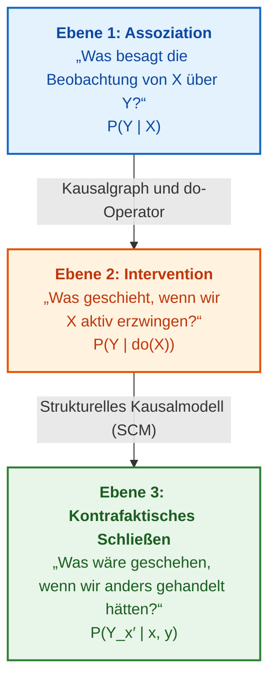

Auf Ebene 1 operieren rein statistische Assoziationen $P(Y\mid X)$ – hier verharren die meisten Machine-Learning-Modelle [[45]](#src-45). Ebene 2 erfasst physische Eingriffe $P(Y\mid do(X))$. Ebene 3 beantwortet kontrafaktische Fragestellungen über alternative Verläufe bereits eingetretener Einzelfälle. Jeder Ebenenaufstieg verlangt zusätzliches strukturelles Wissen, das nicht aus passiven Beobachtungsdaten allein lernbar ist.

### 13.2. Mathematische Modellierung von Interventionen (do-Kalkül) und das Back-Door-Kriterium

Um den echten Netto-Kausaleffekt einer ingenieurtechnischen Intervention zu berechnen ($\Delta_{\mathrm{causal}} = P(Y=1\mid do(X=1)) - P(Y=1\mid do(X=0))$), müssen Verzerrungen durch Confounder eliminiert werden. Erfüllt eine Variablenmenge $Z$ das **Back-Door-Kriterium** nach Pearl – blockiert sie alle Scheinkausalpfade von $X$ nach $Y$, die mit einem Pfeil auf $X$ beginnen, und enthält sie keine Nachfahren von $X$ –, so wird der Interventionseffekt durch die Back-Door-Anpassungsformel berechnet [[46]](#src-46):

```math
P\big(Y\mid do(X=x)\big)=\sum_{z}P\big(Y\mid X=x,\,Z=z\big)\,P(Z=z)
```

- $Y \in \{0, 1\}$ ist das Zielereignis (z. B. Auftreten eines kritischen Defekts);
- $X \in \{0, 1\}$ ist die gesteuerte Intervention ($X=1$: Review durchgeführt);
- $do(X=x)$ ist der Interventionsoperator (Durchtrennung aller Kanten, die auf $X$ zeigen);
- $Z$ ist der Vektor der Confounder (Aufgabenkomplexität $Z \in \{\text{einfach}, \text{komplex}\}$);
- $P(Z=z)$ ist der A-priori-Anteil der jeweiligen Komplexitätsklasse im Gesamtsystem.

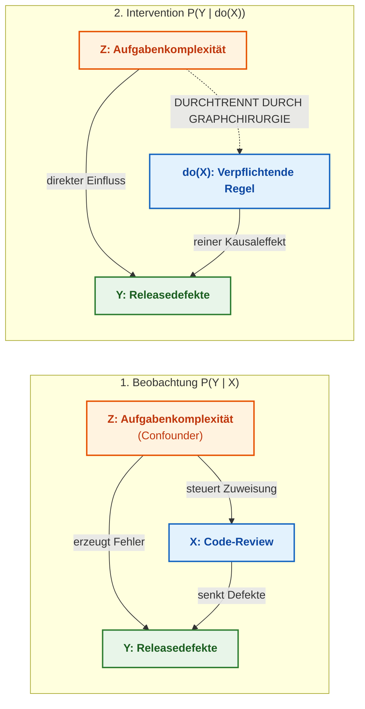

Im Rechenbeispiel mit gleichen Anteilen einfacher und komplexer Aufgaben ergibt sich für die Intervention:
$P(Y=1\mid do(X=1)) = 0{,}5\cdot10\,\% + 0{,}5\cdot30\,\% = 20\,\%$
$P(Y=1\mid do(X=0)) = 0{,}5\cdot15\,\% + 0{,}5\cdot40\,\% = 27{,}5\,\%$
Der wahre Kausaleffekt beträgt $\Delta_{\mathrm{causal}} = 20\,\% - 27{,}5\,\% = -7{,}5\,\%$. Das Review verbessert die Qualität somit messbar um 7,5 Prozentpunkte.

### 13.3. Strukturelle Kausalmodelle (SCM) und kontrafaktische Szenarienanalyse

Für kontrafaktische Fragestellungen auf Ebene 3 ist ein strukturelles Kausalmodell (*Structural Causal Model*, SCM) erforderlich, in dem jede Variable durch eine funktionale Gleichung über ihre direkten Ursachen und nicht beobachtbare Störgrößen definiert ist [[46]](#src-46):

```math
X_i=f_i\big(\mathrm{Pa}_i,U_i\big),\qquad i=1,\dots,n
```

- $X_i$ sind die endogenen Systemvariablen ($i=1,\dots,n$);
- $\mathrm{Pa}_i$ sind die direkten Kausalursachen (Elternvariablen);
- $U_i$ sind exogene Störgrößen (latente Umgebungseinflüsse);
- $f_i$ sind deterministische Mechanismen.

Beispiel für eine kontrafaktische Anfrage: „Wäre das Steuergerät ausgefallen, wenn die Notabschaltung unter exakt denselben Temperatur- und Lastbedingungen 20 Millisekunden früher ausgelöst hätte?“ Das SCM inferiert zunächst die spezifischen Werte der exogenen Variablen $U$ aus dem beobachteten Einzelfall (*Abduktion*), modifiziert die Gleichung des Schutzmechanismus (*Intervention*) und berechnet das Ergebnis deterministisch neu (*Prädiktion*).

## 14. Erklärbarkeitsmetriken und statistische Konfidenzkalibrierung

Eine Empfehlung in sicherheitskritischen Domänen muss auditierbar begründet werden. Während deduktive Regelsysteme ihre Erklärung transparent über den Inferenzbaum liefern, erfordern Black-Box-Modelle Post-hoc-Erklärungsverfahren: SHAP (*SHapley Additive exPlanations*) apportioniert Vorhersagen basierend auf Shapley-Werten der kooperativen Spieltheorie [[47]](#src-47). LIME (*Local Interpretable Model-agnostic Explanations*) approximiert komplexe Klassengrenzen lokal durch lineare Ersatzmodelle [[48]](#src-48).

Kontrafaktische Erklärungen (*Counterfactual Explanations*) nach Sandra Wachter et al. beantworten die Frage nach der minimalen Eingabeänderung zur Erzielung eines abweichenden Ergebnisses [[49]](#src-49): „Das Release wäre freigegeben worden, wenn Defekt D-17 geschlossen und der Prüfnachweis für R-41 erbracht worden wäre.“ Dies transferiert abstrakte Scores in konkrete Handlungsanweisungen.

Die Konfidenzkalibrierung (*Calibration*) stellt sicher, dass prognostizierte Wahrscheinlichkeiten mit realen Trefferquoten koinzidieren: Behauptet ein System in 100 Fällen eine Konfidenz von 80 %, müssen empirisch etwa 80 Fälle zutreffen. Chuan Guo et al. wiesen nach, dass moderne tiefe neuronale Netze massiv fehlkalibriert sind (Überkonfidenz), und etablierten Verfahren wie Temperature Scaling zur Rekalibrierung [[50]](#src-50). Kalibrierungsmetriken wie der Expected Calibration Error (ECE) werden vertiefend in [Kapitel 25](ch25-how-expert-systems-learn.md) behandelt.

## 15. Architektonische Lehren beim Einsatz des mathematischen Apparats

### 15.1. Erste Lektion: Ein Score ohne kalibrierten Schwellenwert ist kein Nachweis

Zahlenwerte wie „Risiko 0,72“ oder „Ähnlichkeit 0,85“ besitzen für sich genommen keinerlei Entscheidungskraft. Handelt es sich um eine Wahrscheinlichkeit, einen unscharfen Zugehörigkeitsgrad oder einen relativen Ranking-Score? Ein Score ohne normative Schwellenwertdefinition, ohne dokumentierten Eigner und ohne formalisierten Handlungsplan für den Unterschreitungsfall ist bloße Dekoration. Jede Metrik in einem Expertensystem muss an einen verifizierten Schwellenwertvertrag gebunden sein.

### 15.2. Zweite Lektion: Ein Modell ohne formalisiertes Ablehnungsszenario erzeugt Scheinsicherheit

Das gefährlichste KI-System ist jenes, das niemals „Ich weiß es nicht“ sagt und Datenlücken durch statistische Halluzinationen überbrückt. Ein belastbares Expertensystem muss Nichtwissen mathematisch präzise formalisieren: Die Kleene-Logik erzwingt den Status „unbekannt“, die Konfliktmasse $K \ge 0{,}50$ signalisiert unauflösbare Quellenwidersprüche, und Schwellen der Mahalanobis-Distanz markieren unzuverlässige Sensormessungen. Das System muss trennscharf zwischen fehlenden Nachweisen, kontradiktorischen Quellen und Berechtigungskonflikten differenzieren und im Zweifelsfall stets den Fail-Closed-Zustand wählen ([Kapitel 20](ch20-explanation-engine.md)).

## Fazit

Dieses Kapitel begann mit der Frage, ob Version 2.4 der Steuerungssoftware freigegeben werden darf. Die fundierte Antwort setzt sich aus mehreren formalen Teilnachweisen zusammen: Datalog erzwingt den Freigabestopp, da Anforderung R-17 sicherheitskritisch und geändert ist, jedoch über keinen bestandenen Test verfügt. Ein Bayessches Netz beziffert die Defektwahrscheinlichkeit nach dem Testfehlschlag auf 0,645, entlastet die Software jedoch auf 0,236, sobald der Prüfstandsfehler verifiziert ist. Die Dempster-Shafer-Konfliktmasse deckt unvereinbare Spezifikationsgrenzen auf und verhindert gefährliche Renormierungsillusionen. Ein historischer Präzedenzfall mit Ähnlichkeitswert 0,78 liefert den initialen Diagnoseansatz, während der Traceability-Graph die betroffenen Artefakte lückenlos auflistet. Die wesentlichen Erkenntnisse lauten:

- Logik und Datalog garantieren deterministische Inferenz und algorithmische Terminierung; die Kleene-Logik unterscheidet Nichtwissen von Falschheit, und die deontische Logik verhindert normative Normenkollisionen;
- Ausschließlich deduktive Schlüsse dürfen als bindende Garantien gewertet werden; induktive, abduktive und traduktive Ableitungen sind stets als Hypothesen mit formalen Prüfplänen zu behandeln;
- Wahrscheinlichkeiten, Fuzzy-Zugehörigkeiten und Evidenzmassen quantifizieren grundverschiedene Unsicherheitskategorien; die Dempster-Kombination erfordert vorab stets die Prüfung der Konfliktmasse $K$;
- Ähnlichkeitsmaße und Retrieval-Scores stellen relationale Ordnungsstrukturen dar, keine absoluten Wahrscheinlichkeiten;
- Die Mahalanobis-Distanz schützt vor verrauschten Sensormessungen, und die Kausalanalyse nach Pearl trennt echte Wirkungsbeziehungen von statistischen Scheinkorrelationen.

Die mathematischen Modelle konstituieren die formale Verifizierbarkeit des Expertensystems, ersetzen jedoch nicht den verantwortlichen Ingenieur, der Grenzwerte und Kausalannahmen autorisiert. Wie diese mathematischen Modelle die Struktur von Wissensbasen determinieren, erläutert [Kapitel 7](ch07-knowledge-base-typology.md); wie ingenieurtechnische Artefakte in maschinenlesbare Wissensdaten transformiert werden, zeigen [Kapitel 8](ch08-engineering-artifacts-as-data.md) und [Kapitel 9](ch09-engineering-knowledge-graph-traceability.md).

## Fragen zur Selbstüberprüfung

1. Was geschieht in Ihren Informationssystemen mit der Konklusion „Release freigegeben“, wenn eine ihrer Prämissen nachträglich widerrufen wird: Wird die Entscheidung automatisch reevaluiert oder verbleibt sie als invalider Fakt im Speicher?
2. Ist in Ihrer Regel-Engine die Auswertungsreihenfolge simultan feuernder Regeln deterministisch festgelegt, und können Sie im Audit begründen, warum eine Regel vor einer anderen ausgeführt wurde?
3. Wo sind in Ihren Risikobewertungen A-priori-Wahrscheinlichkeiten, Quellenvertrauen und Schwellenwerte dokumentiert, und wo tauchen aggregierte Scores ohne Provenienz-Zertifikat auf?
4. Welche Ihrer jüngsten Aussagen über Prozessverbesserungen basierten rein auf passiven Beobachtungen, und welche berücksichtigten gezielte Interventionen unter Kontrolle von Confoundern?
5. Kann Ihr System formal zwischen „mangelnder Beweislage“ und „widersprüchlichen Primärquellen“ unterscheiden, und besitzt es das explizite Recht zur Antwortverweigerung (*Fail-Closed*)?

## Glossar

| Deutscher Begriff | Englischer Begriff | Kurzbeschreibung |
|---|---|---|
| Produktionsregel | *production rule* | Explizite Verknüpfung der Form „Wenn Vorbedingungen erfüllt, dann Konklusion oder Aktion“ |
| Vorwärtsverkettung | *forward chaining* | Datengetriebene Inferenz von bekannten Fakten zu neuen Konklusionen |
| Rückwärtsverkettung | *backward chaining* | Zielgetriebene Inferenz von einer Hypothese rückwärts zu den benötigten Nachweisen |
| Prädikatenlogik erster Stufe | *first-order logic* | Logik über Objekte, Funktionen und Relationen mit Existenz- und Allquantoren |
| Invariante | *invariant* | Bedingung, die über alle Systemzustände hinweg ausnahmslos gültig sein muss |
| Allgemeingültige Formel | *valid formula* | Formel, die unter jeder denkbaren Interpretation stets wahr ist |
| Datalog | *Datalog* | Funktionstermfreie deklarative Regelsprache mit garantierter polynomieller Terminierung |
| Operator der unmittelbaren Konsequenzen | *immediate consequence operator* | Formaler Inferenzschritt: Leitet alle Regelköpfe ab, deren Rumpfatome erfüllt sind |
| Kleinster Fixpunkt | *least fixed point* | Minimale Faktenmenge, die durch wiederholte Regelanwendung nicht weiter wächst |
| Stratifizierte Negation | *stratified negation* | Schichtenbasierte Negation, bei der nur Fakten tieferer Schichten negiert werden dürfen |
| Schicht (Stratum) | *stratum* | Regelebene, die erst nach vollständiger Fixpunktberechnung aller Vorgängerebenen evaluiert wird |
| Geschlossene Weltannahme | *closed-world assumption* | Annahme, dass jede nicht aus der Wissensbasis ableitbare Aussage falsch ist |
| Offene Weltannahme | *open-world assumption* | Annahme, dass das Fehlen eines Fakts in der Wissensbasis keineswegs dessen Falschheit impliziert |
| Dreiwertige Kleene-Logik | *Kleene's strong three-valued logic* | Logiksystem mit den Wahrheitswerten „wahr“, „unbekannt“ und „falsch“ |
| Deontische Logik | *deontic logic* | Modallogik zur Formalisierung von Pflichten, Verboten und Erlaubnissen |
| Normative Kollision | *normative conflict* | Simultanes Bestehen eines Verbots und einer Verpflichtung für dieselbe Handlung |
| Deduktion | *deduction* | Wahrheitserhaltender Schluss von der allgemeinen Regel und dem Einzelfall auf das Resultat |
| Induktion | *induction* | Hypothesenbildender Schluss von wiederholten Einzelfällen auf eine allgemeine Regel |
| Abduktion | *abduction* | Schluss von einem beobachteten Symptom und einer Kausalregel auf die wahrscheinlichste Ursache |
| Modus Ponens | *modus ponens* | Klassische Inferenzregel: Aus $P \Rightarrow Q$ und $P$ folgt zwingend $Q$ |
| Problemreduktion | *problem reduction* | Transformation eines komplexen Problems in einfachere, lösungsäquivalente Teilprobleme |
| UND/ODER-Baum | *AND/OR tree* | Hierarchische Zerlegung eines Ziels in konjunktive Teilziele und disjunktive Alternativen |
| Endlicher Automat | *finite automaton* | Berechnungsmodell mit endlicher Zustandsmenge und eingabegesteuerten Übergängen |
| Regel-Engine | *rule engine* | Softwarekomponente zur Ausführung deklarativer Regeln getrennt vom prozeduralen Anwendungscode |
| Arbeitsspeicher | *working memory* | Flüchtiger Speicherbereich, der die aktuellen Fakten während der Inferenz hält |
| Agenda | *agenda* | Warteschlange aktivierter Regeln, deren Vorbedingungen vollständig erfüllt sind |
| Konfliktlösung | *conflict resolution* | Deterministische Strategie zur Auswahl der nächsten zu feuernden Regel aus der Agenda |
| Ausführungspriorität (Salience) | *salience* | Numerisches Attribut zur Priorisierung von Regeln bei der Konfliktlösung |
| Konsistenzsicherungssystem | *truth maintenance system* | Komponente zur Verwaltung von Abhängigkeiten und automatischem Widerruf ungültiger Schlüsse |
| Rechtfertigung | *justification* | Protokollierte Beziehung, die angibt, aus welchen Prämissen eine Aussage abgeleitet wurde |
| Annahmeumgebung | *environment* | Menge konsistenter Grundannahmen, unter denen eine Konklusion im ATMS gültig ist |
| Bedingte Wahrscheinlichkeit | *conditional probability* | Wahrscheinlichkeit eines Ereignisses unter der Voraussetzung, dass ein anderes eingetreten ist |
| A-posteriori-Wahrscheinlichkeit | *posterior probability* | Aktualisierte Wahrscheinlichkeit einer Hypothese nach Beobachtung neuer empirischer Evidenz |
| Bayessches Netz | *Bayesian network* | Gerichteter azyklischer Graph zur Faktorisierung von Verbundwahrscheinlichkeitsverteilungen |
| Explaining Away | *explaining away* | Phänomen der sinkenden Wahrscheinlichkeit einer Ursache bei Bestätigung einer Alternativursache |
| Markov-Eigenschaft | *Markov property* | Eigenschaft stochastischer Prozesse, bei denen die Zukunft nur vom aktuellen Zustand abhängt |
| Markov-Kette | *Markov chain* | Stochastisches Zustandsübergangsmodell mit Markov-Eigenschaft |
| Verdecktes Markov-Modell | *hidden Markov model* | Markov-Prozess mit unvollständig beobachtbaren Zuständen und probabilistischen Emissionen |
| Markov-Entscheidungsprozess | *Markov decision process* | Mathematischer Rahmen zur Modellierung sequentieller Entscheidungen unter Ungewissheit |
| Handlungsstrategie (Policy) | *policy* | Abbildung von Systemzuständen auf auszuführende Aktionen |
| Diskontierungsfaktor | *discount factor* | Parameter $\gamma \in [0, 1)$, der zukünftige Erträge gegenüber Gegenwartserträgen dämpft |
| Unscharfe Menge (Fuzzy Set) | *fuzzy set* | Menge, deren Elemente graduierte Zugehörigkeiten im Intervall $[0, 1]$ besitzen |
| Zugehörigkeitsfunktion | *membership function* | Mathematische Funktion, die jedem Element seinen Zugehörigkeitsgrad zuweist |
| Grundlegende Glaubensmasse | *basic mass assignment* | Massenbelegung $m(A)$ für Teilmengen des Hypothesenraums in der Dempster-Shafer-Theorie |
| Konfliktmasse | *conflict mass* | Summe der Produkte widersprüchlicher Evidenzen zweier Quellen ($K$) |
| Dempster-Kombinationsregel | *Dempster's rule of combination* | Orthogonale Verknüpfung zweier unabhängiger Evidenzmassen mit Renormierung |
| Fallbasiertes Schließen | *case-based reasoning* | Problemlösung durch gezielte Adaption archivierter historischer Präzedenzfälle |
| Erreichbarkeit | *reachability* | Existenz eines gerichteten Pfades zwischen zwei Knoten in einem Wissensgraphen |
| Ontologie | *ontology* | Formale, explizite Spezifikation einer geteilten Konzeptualisierung einer Domäne |
| Graph Neural Network | *graph neural network* | Neuronales Netzwerk zur Repräsentationserzeugung über Graph-Nachbarschaften |
| Relationenhierarchie | *relation hierarchy* | Taxonomische Ordnung von Beziehungstypen nach Spezifitätsgraden |
| Subsumtion | *subsumption* | Formale Inklusionsbeziehung zwischen Konzepten oder Relationen |
| Mehrkriterielle Entscheidungsanalyse | *multi-criteria decision analysis* | Formaler Vergleich von Handlungsalternativen anhand mehrerer Bewertungsdimensionen |
| Kompensatorisches Modell | *compensatory model* | Bewertungsmodell, bei dem hohe Werte in einem Kriterium Defizite in anderen ausgleichen können |
| Nähekoeffizient | *closeness coefficient* | TOPSIS-Kennzahl für die relative Nähe einer Alternative zur idealen Lösung |
| Constraint-Programmierung | *constraint programming* | Paradigma zur Lösung kombinatorischer Aufgaben unter diskreten Nebenbedingungen |
| Automatisierte Planung | *automated planning* | Algorithmische Generierung von Aktionsfolgen zur Überführung von Start- in Zielzustände |
| Hierarchisches Aufgabennetzwerk | *hierarchical task network* | Planungsansatz durch schrittweise Zerlegung abstrakter Aufgaben in elementare Operationen |
| Termfrequenzsättigung | *term frequency saturation* | BM25-Eigenschaft: Mehrfaches Auftreten desselben Worts bringt degressiven Relevanzzuwachs |
| Vektoreinbettung (Embedding) | *embedding* | Dichter reellwertiger Vektor, der den semantischen Kontext eines Tokens oder Texts kodiert |
| Kosinus-Ähnlichkeit | *cosine similarity* | Kosinus des Zwischenwinkels zweier Vektoren als Maß ihrer Richtungsübereinstimmung |
| Kontrastives Lernen | *contrastive learning* | Trainingsverfahren, das ähnliche Paare im Vektorraum annähert und unähnliche distanziert |
| Temperatur | *temperature* | Hyperparameter, der die Entropie und Schärfe einer Softmax-Verteilung skaliert |
| Token | *token* | Kleinste linguistische Einheit (Subword, Zeichen oder Codefragment) eines Sprachmodells |
| Hybride Suche | *hybrid search* | Parallele Ausführung und Fusion von lexikalischem (BM25) und dichtem Vektor-Retrieval |
| Reziproke Rangfusion | *reciprocal rank fusion* | Positionsbasierte Zusammenführung mehrerer unabhängig erstellter Ranking-Listen |
| Reranking | *reranking* | Nachgelagerte Präzisionssortierung einer Kandidatenliste durch rechenintensive Cross-Encoder |
| Aufmerksamkeitsmechanismus | *attention* | Transformer-Operation zur dynamischen Kontextgewichtung über Query-, Key- und Value-Vektoren |
| Retrieval-Augmented Generation | *retrieval-augmented generation* | Sprachmodell-Antwortgenerierung konditioniert auf extern abgerufenen Dokumentenpassagen |
| Mahalanobis-Distanz | *Mahalanobis distance* | Um die Kovarianzmatrix des Sensorrauschens skalierte statistische Distanz |
| Messinnovation | *innovation* | Residuum zwischen physikalischem Messwert und Prädiktion des Systemmodells |
| Kovarianzmatrix | *covariance matrix* | Matrix der Varianzen und paarweisen Kovarianzen eines multivariaten Zufallsvektors |
| Kalman-Filter | *Kalman filter* | Optimaler rekursiver Schätzer für lineare dynamische Systeme unter Gaußschem Rauschen |
| Validierungs-Gating | *gating* | Statistische Isolation und Verwerfung von Messwerten außerhalb definierter Konfidenzellipsen |
| Confounder (Störfaktor) | *confounder* | Latente gemeinsame Ursache, die Exposition und Zielvariable simultan beeinflusst |
| Intervention | *intervention* | Aktiver operativer Eingriff in ein Kausalsystem, formalisiert durch den $do$-Operator |
| Back-Door-Pfad | *backdoor path* | Pfad im Kausalgraphen zwischen Ursache und Wirkung, der mit einem Pfeil zur Ursache startet |
| Simpson-Paradoxon | *Simpson's paradox* | Phänomen, bei dem sich ein statistischer Trend bei Aufteilung in Subgruppen umkehrt |
| Strukturelles Kausalmodell | *structural causal model* | Kausalsystem aus deterministischen Strukturfunktionen und exogenen Störgrößen |
| Kontrafaktische Aussage | *counterfactual* | Retrospektive Aussage über alternative Resultate unter veränderten historischen Bedingungen |
| Kontrafaktische Erklärung | *counterfactual explanation* | Minimale Eingabevariation, die eine Modellentscheidung deterministisch invertieren würde |
| Konfidenzkalibrierung | *calibration* | Statistische Übereinstimmung prognostizierter Wahrscheinlichkeiten mit empirischen Raten |

## Abkürzungen

| Abkürzung | Vollständige Bezeichnung | Bedeutung im Kontext wissensbasierter Systeme |
|---|---|---|
| AHP | Analytic Hierarchy Process | Methode zur multikriteriellen Entscheidungsfindung durch paarweise Matrixvergleiche |
| ATMS | Assumption-based Truth Maintenance System | Annahmebasiertes System zur Konsistenzsicherung und Verwaltung multipler Kontexte |
| BM25 | Best Matching 25 | Probabilistische Ranking-Funktion für Information Retrieval mit Längennormierung |
| CBR | Case-Based Reasoning | Fallbasiertes Schließen durch Abgleich und Adaption historischer Präzedenzfälle |
| CLIPS | C Language Integrated Production System | Regelbasierte Programmierumgebung und Inferenzmaschine auf Basis des RETE-Algorithmus |
| ELECTRE | Élimination et Choix Traduisant la Réalité | Familie von Outranking-Methoden zur multikriteriellen Alternativenbewertung |
| FOL | First-Order Logic | Prädikatenlogik erster Stufe mit Quantifizierung über Individuen und Relationen |
| GNN | Graph Neural Network | Graph-Neuronales-Netzwerk zur Repräsentationserzeugung über topologische Kanten |
| HMM | Hidden Markov Model | Stochastisches Zustandsübergangsmodell mit unvollständig beobachtbaren Zuständen |
| HTN | Hierarchical Task Network | Hierarchisches Planungsnetzwerk zur strukturierten Zieldekomposition |
| IETF | Internet Engineering Task Force | Organisation zur Definition verbindlicher technischer Internet- und Systemstandards |
| JTMS | Justification-based Truth Maintenance System | Rechtfertigungsbasiertes System zur Aufrechterhaltung logischer Konsistenz |
| LFP | Least Fixed Point | Kleinster Fixpunkt eines monotonen Operators über einem Faktenverband |
| LIME | Local Interpretable Model-agnostic Explanations | Modellagnostisches Verfahren zur lokalen linearen Erklärung von Black-Box-Entscheidungen |
| LLM | Large Language Model | Großes autoregressives Sprachmodell zur statistischen Sequenzgenerierung |
| MDP | Markov Decision Process | Markov-Entscheidungsprozess zur optimalen sequentiellen Handlungssteuerung |
| OWL | Web Ontology Language | W3C-Standard zur formalen semantischen Repräsentation von Wissensontologien |
| PDDL | Planning Domain Definition Language | Standardisierte deklarative Sprache zur Spezifikation von Handlungsdomänen |
| POMDP | Partially Observable Markov Decision Process | Partiell beobachtbarer Markov-Entscheidungsprozess unter stochastischer Sensorunsicherheit |
| PROMETHEE | Preference Ranking Organization Method for Enrichment of Evaluations | Outranking-Verfahren zur multikriteriellen Ordnung basierend auf Präferenzfunktionen |
| RAG | Retrieval-Augmented Generation | Wissensgenerierung unter deterministischer Konditionierung auf externem Retrieval |
| RFC | Request for Comments | Nummerierte normative Veröffentlichungsreihe der Internet Engineering Task Force |
| RRF | Reciprocal Rank Fusion | Rangbasiertes Fusionsverfahren zur Kombination heterogener Suchergebnislisten |
| SCM | Structural Causal Model | Strukturelles Kausalmodell zur Formalisierung von Kausalität und Kontrafaktizität |
| SHACL | Shapes Constraint Language | W3C-Standard zur geschlossenen Validierung und Integritätsprüfung von RDF-Graphen |
| SHAP | SHapley Additive exPlanations | Spieltheoretisch fundiertes Verfahren zur Erklärung feature-basierter Modellentscheidungen |
| TF-IDF | Term Frequency, Inverse Document Frequency | Statistische Heuristik zur Gewichtung relevanter Terme in Dokumentensammlungen |
| TMS | Truth Maintenance System | Generisches System zur Verwaltung logischer Abhängigkeiten und Revisionssicherheit |
| TOPSIS | Technique for Order of Preference by Similarity to Ideal Solution | Multikriterielle Methode zur Reihung nach Distanzen zu Ideal- und Anti-Idealpunkten |
| W3C | World Wide Web Consortium | Internationales Normungsgremium für Standards des World Wide Web und semantischer Netze |
| KI | Künstliche Intelligenz | Maschinelle Informationsverarbeitung zur Automatisierung kognitiver Inferenzaufgaben |

## Literaturverzeichnis

1. <a id="src-1"></a>Alonzo Church. [*A Note on the Entscheidungsproblem*](https://doi.org/10.2307/2269326). *Journal of Symbolic Logic*, 1(1), 40–41, 1936.
2. <a id="src-2"></a>Alan M. Turing. [*On Computable Numbers, with an Application to the Entscheidungsproblem*](https://doi.org/10.1112/plms/s2-42.1.230). *Proceedings of the London Mathematical Society*, s2-42(1), 230–265, 1937 (eingereicht 1936).
3. <a id="src-3"></a>Stefano Ceri, Georg Gottlob, Letizia Tanca. [*What You Always Wanted to Know About Datalog (and Never Dared to Ask)*](https://doi.org/10.1109/69.43410). *IEEE Transactions on Knowledge and Data Engineering*, 1(1), 146–166, 1989.
4. <a id="src-4"></a>Maarten H. van Emden, Robert A. Kowalski. [*The Semantics of Predicate Logic as a Programming Language*](https://doi.org/10.1145/321978.321991). *Journal of the ACM*, 23(4), 733–742, 1976.
5. <a id="src-5"></a>Krzysztof R. Apt, Howard A. Blair, Adrian Walker. [*Towards a Theory of Declarative Knowledge*](https://doi.org/10.1016/B978-0-934613-40-8.50006-3). In J. Minker (Hrsg.), *Foundations of Deductive Databases and Logic Programming*, 89–148. Los Altos: Morgan Kaufmann, 1988.
6. <a id="src-6"></a>Raymond Reiter. [*On Closed World Data Bases*](https://doi.org/10.1007/978-1-4684-3384-5_3). In H. Gallaire, J. Minker (Hrsg.), *Logic and Data Bases*, 55–76. New York: Plenum Press, 1978.
7. <a id="src-7"></a>Stephen Cole Kleene. [*Introduction to Metamathematics*](https://openlibrary.org/works/OL5959470W). Amsterdam: North-Holland, 1952. Starke Wahrheitstafeln der dreiwertigen Logik.
8. <a id="src-8"></a>Georg Henrik von Wright. [*Deontic Logic*](https://doi.org/10.1093/mind/LX.237.1). *Mind*, 60(237), 1–15, 1951.
9. <a id="src-9"></a>Scott Bradner. [*RFC 2119: Key Words for Use in RFCs to Indicate Requirement Levels*](https://www.rfc-editor.org/rfc/rfc2119). IETF, 1997.
10. <a id="src-10"></a>Charles S. Peirce. [*Illustrations of the Logic of Science. VI. Deduction, Induction, and Hypothesis*](https://en.wikisource.org/wiki/Popular_Science_Monthly/Volume_13/August_1878/Illustrations_of_the_Logic_of_Science_VI). *Popular Science Monthly*, 13, 470–482, 1878.
11. <a id="src-11"></a>Igor Douven. [*Abduction*](https://plato.stanford.edu/entries/abduction/). *Stanford Encyclopedia of Philosophy*, Erstpublikation 2011, Revision 2025.
12. <a id="src-12"></a>Nils J. Nilsson. [*Problem-Solving Methods in Artificial Intelligence*](https://openlibrary.org/works/OL1311228W). New York: McGraw-Hill, 1971.
12a. <a id="src-12a"></a>Agnar Aamodt, Enric Plaza. [*Case-Based Reasoning: Foundational Issues, Methodological Variations, and System Approaches*](https://doi.org/10.3233/AIC-1994-7104). *AI Communications*, 7(1), 39–59, 1994.
13. <a id="src-13"></a>John Hopcroft. [*An n log n Algorithm for Minimizing States in a Finite Automaton*](https://doi.org/10.1016/B978-0-12-417750-5.50022-1). In Z. Kohavi, A. Paz (Hrsg.), *Theory of Machines and Computations*, 189–196. New York: Academic Press, 1971.
14. <a id="src-14"></a>Charles L. Forgy. [*Rete: A Fast Algorithm for the Many Pattern/Many Object Pattern Match Problem*](https://doi.org/10.1016/0004-3702(82)90020-0). *Artificial Intelligence*, 19(1), 17–37, 1982.
15. <a id="src-15"></a>Daniel P. Miranker. [*TREAT: A New Match Algorithm*](https://doi.org/10.1016/B978-0-273-08793-9.50010-8). In *TREAT: A New and Efficient Match Algorithm for AI Production Systems*, 25–47. London: Pitman, 1990.
16. <a id="src-16"></a>Jon Doyle. [*A Truth Maintenance System*](https://doi.org/10.1016/0004-3702(79)90008-0). *Artificial Intelligence*, 12(3), 231–272, 1979.
17. <a id="src-17"></a>Johan de Kleer. [*An Assumption-Based TMS*](https://doi.org/10.1016/0004-3702(86)90080-9). *Artificial Intelligence*, 28(2), 127–162, 1986.
18. <a id="src-18"></a>Judea Pearl. [*Probabilistic Reasoning in Intelligent Systems: Networks of Plausible Inference*](https://doi.org/10.1016/C2009-0-27609-4). San Mateo: Morgan Kaufmann, 1988.
19. <a id="src-19"></a>Lawrence R. Rabiner. [*A Tutorial on Hidden Markov Models and Selected Applications in Speech Recognition*](https://doi.org/10.1109/5.18626). *Proceedings of the IEEE*, 77(2), 257–286, 1989.
20. <a id="src-20"></a>Martin L. Puterman. [*Markov Decision Processes: Discrete Stochastic Dynamic Programming*](https://doi.org/10.1002/9780470316887). New York: Wiley, 1994.
21. <a id="src-21"></a>Lotfi A. Zadeh. [*Fuzzy Sets*](https://doi.org/10.1016/S0019-9958(65)90241-X). *Information and Control*, 8(3), 338–353, 1965.
22. <a id="src-22"></a>A. P. Dempster. [*Upper and Lower Probabilities Induced by a Multivalued Mapping*](https://doi.org/10.1214/aoms/1177698950). *The Annals of Mathematical Statistics*, 38(2), 325–339, 1967.
23. <a id="src-23"></a>Glenn Shafer. [*A Mathematical Theory of Evidence*](https://doi.org/10.1515/9780691214696). Princeton University Press, 1976.
24. <a id="src-24"></a>Lotfi A. Zadeh. [*A Simple View of the Dempster-Shafer Theory of Evidence and Its Implication for the Rule of Combination*](https://ojs.aaai.org/aimagazine/index.php/aimagazine/article/view/542). *AI Magazine*, 7(2), 85–90, 1986.
25. <a id="src-25"></a>Agnar Aamodt, Enric Plaza. [*Case-Based Reasoning: Foundational Issues, Methodological Variations, and System Approaches*](https://doi.org/10.3233/AIC-1994-7104). *AI Communications*, 7(1), 39–59, 1994.
26. <a id="src-26"></a>Holger Knublauch, Dimitris Kontokostas (Hrsg.). [*Shapes Constraint Language (SHACL)*](https://www.w3.org/TR/shacl/). W3C Recommendation, 2017.
27. <a id="src-27"></a>Thomas N. Kipf, Max Welling. [*Semi-Supervised Classification with Graph Convolutional Networks*](https://arxiv.org/abs/1609.02907). *International Conference on Learning Representations* (ICLR), 2017.
28. <a id="src-28"></a>Dan Brickley, R. V. Guha (Hrsg.). [*RDF Schema 1.1*](https://www.w3.org/TR/rdf-schema/). W3C Recommendation, 2014.
29. <a id="src-29"></a>Thomas L. Saaty. [*How to Make a Decision: The Analytic Hierarchy Process*](https://doi.org/10.1016/0377-2217(90)90057-I). *European Journal of Operational Research*, 48(1), 9–26, 1990.
30. <a id="src-30"></a>Ching-Lai Hwang, Kwangsun Yoon. [*Multiple Attribute Decision Making: Methods and Applications*](https://doi.org/10.1007/978-3-642-48318-9). Berlin: Springer, 1981.
31. <a id="src-31"></a>Jean-Pierre Brans, Philippe Vincke. [*A Preference Ranking Organisation Method (The PROMETHEE Method for Multiple Criteria Decision-Making)*](https://doi.org/10.1287/mnsc.31.6.647). *Management Science*, 31(6), 647–656, 1985.
32. <a id="src-32"></a>Bernard Roy. [*Classement et choix en présence de points de vue multiples (la méthode ELECTRE)*](https://doi.org/10.1051/ro/196802v100571). *Revue française d'informatique et de recherche opérationnelle*, 2(8), 57–75, 1968.
33. <a id="src-33"></a>Malik Ghallab, Dana Nau, Paolo Traverso. [*Automated Planning: Theory and Practice*](https://doi.org/10.1016/B978-1-55860-856-6.X5000-5). San Francisco: Morgan Kaufmann, 2004.
34. <a id="src-34"></a>Gerard Salton, Christopher Buckley. [*Term-Weighting Approaches in Automatic Text Retrieval*](https://doi.org/10.1016/0306-4573(88)90021-0). *Information Processing & Management*, 24(5), 513–523, 1988.
35. <a id="src-35"></a>Stephen Robertson, Hugo Zaragoza. [*The Probabilistic Relevance Framework: BM25 and Beyond*](https://doi.org/10.1561/1500000019). *Foundations and Trends in Information Retrieval*, 2009.
36. <a id="src-36"></a>Nils Reimers, Iryna Gurevych. [*Sentence-BERT: Sentence Embeddings using Siamese BERT-Networks*](https://aclanthology.org/D19-1410/). *Proceedings of EMNLP-IJCNLP 2019*, 2019.
37. <a id="src-37"></a>Vladimir Karpukhin, Barlas Oğuz, Sewon Min et al. [*Dense Passage Retrieval for Open-Domain Question Answering*](https://doi.org/10.18653/v1/2020.emnlp-main.550). *Proceedings of EMNLP 2020*, 6769–6781, 2020.
38. <a id="src-38"></a>Gordon V. Cormack, Charles L. A. Clarke, Stefan Büttcher. [*Reciprocal Rank Fusion Outperforms Condorcet and Individual Rank Learning Methods*](https://doi.org/10.1145/1571941.1572114). *Proceedings of SIGIR 2009*, 758–759, 2009.
39. <a id="src-39"></a>Ashish Vaswani et al. [*Attention Is All You Need*](https://arxiv.org/abs/1706.03762). *Advances in Neural Information Processing Systems 30* (NeurIPS), 2017.
40. <a id="src-40"></a>Patrick Lewis, Ethan Perez, Aleksandra Piktus et al. [*Retrieval-Augmented Generation for Knowledge-Intensive NLP Tasks*](https://arxiv.org/abs/2005.11401). *Advances in Neural Information Processing Systems 33* (NeurIPS), 2020.
41. <a id="src-41"></a>Prasanta Chandra Mahalanobis. [*On the Generalised Distance in Statistics*](https://doi.org/10.1007/s13171-019-00164-5). *Proceedings of the National Institute of Sciences of India*, 2(1), 49–55, 1936; Nachdruck: *Sankhyā A*, 80, 1–7, 2018.
42. <a id="src-42"></a>Rudolf E. Kalman. [*A New Approach to Linear Filtering and Prediction Problems*](https://doi.org/10.1115/1.3662552). *Journal of Basic Engineering*, 82(1), 35–45, 1960.
43. <a id="src-43"></a>Yaakov Bar-Shalom, X. Rong Li, Thiagalingam Kirubarajan. [*Estimation with Applications to Tracking and Navigation*](https://doi.org/10.1002/0471221279). New York: Wiley, 2001.
43a. <a id="src-43a"></a>Hermann Haken. [*Synergetics: An Introduction. Nonequilibrium Phase Transitions and Self-Organization in Physics, Chemistry, and Biology*](https://doi.org/10.1007/978-3-642-88338-5). Berlin: Springer, 1977; *Advanced Synergetics: Instability Hierarchies of Self-Organizing Systems and Devices*, Springer, 1983.
44. <a id="src-44"></a>Edward H. Simpson. [*The Interpretation of Interaction in Contingency Tables*](https://doi.org/10.1111/j.2517-6161.1951.tb00088.x). *Journal of the Royal Statistical Society, Series B*, 13(2), 238–241, 1951.
45. <a id="src-45"></a>Judea Pearl, Dana Mackenzie. [*The Book of Why: The New Science of Cause and Effect*](https://openlibrary.org/works/OL17872278W). New York: Basic Books, 2018.
46. <a id="src-46"></a>Judea Pearl. [*Causality: Models, Reasoning, and Inference*](https://bayes.cs.ucla.edu/BOOK-2K/). 2. Auflage. Cambridge University Press, 2009.
47. <a id="src-47"></a>Scott M. Lundberg, Su-In Lee. [*A Unified Approach to Interpreting Model Predictions*](https://proceedings.neurips.cc/paper_files/paper/2017/hash/8a20a8621978632d76c43dfd28b67767-Abstract.html). *Advances in Neural Information Processing Systems 30* (NeurIPS), 2017.
48. <a id="src-48"></a>Marco Tulio Ribeiro, Sameer Singh, Carlos Guestrin. [*"Why Should I Trust You?": Explaining the Predictions of Any Classifier*](https://doi.org/10.1145/2939672.2939778). *Proceedings of KDD 2016*, 1135–1144, 2016.
49. <a id="src-49"></a>Sandra Wachter, Brent Mittelstadt, Chris Russell. [*Counterfactual Explanations Without Opening the Black Box: Automated Decisions and the GDPR*](https://doi.org/10.2139/ssrn.3063289). *Harvard Journal of Law & Technology*, 31(2), 2018.
50. <a id="src-50"></a>Chuan Guo, Geoff Pleiss, Yu Sun, Kilian Q. Weinberger. [*On Calibration of Modern Neural Networks*](https://proceedings.mlr.press/v70/guo17a.html). *Proceedings of the 34th International Conference on Machine Learning*, PMLR 70, 1321–1330, 2017.

---

[← Kapitel 5](ch05-triad-of-trust-and-corporate-memory.md) | [Inhaltsverzeichnis](README.md) | [Teil II](part-02-knowledge-models.md) | [Kapitel 7 →](ch07-knowledge-base-typology.md)
