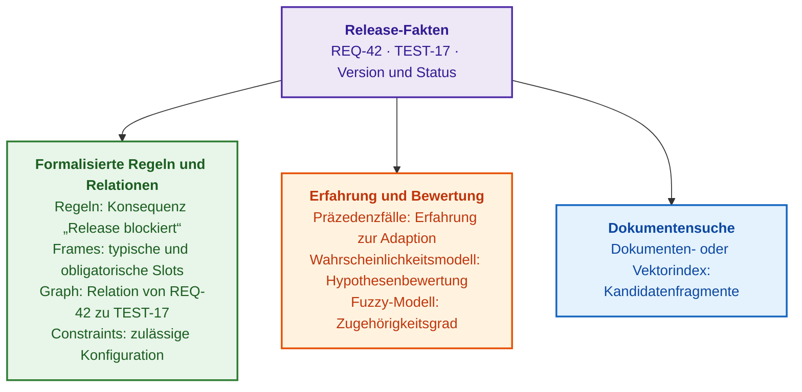
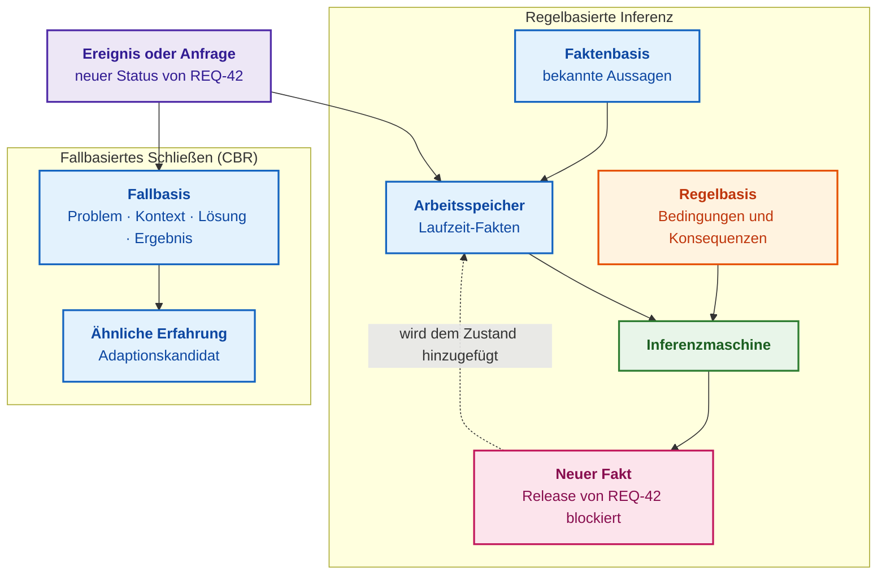
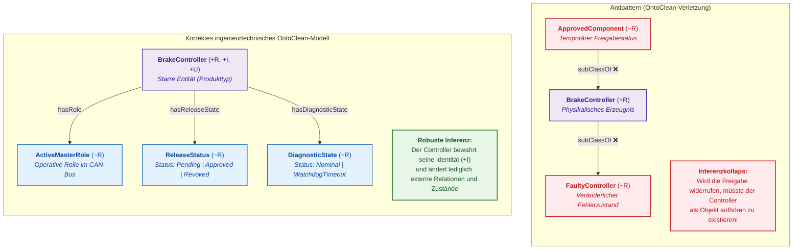
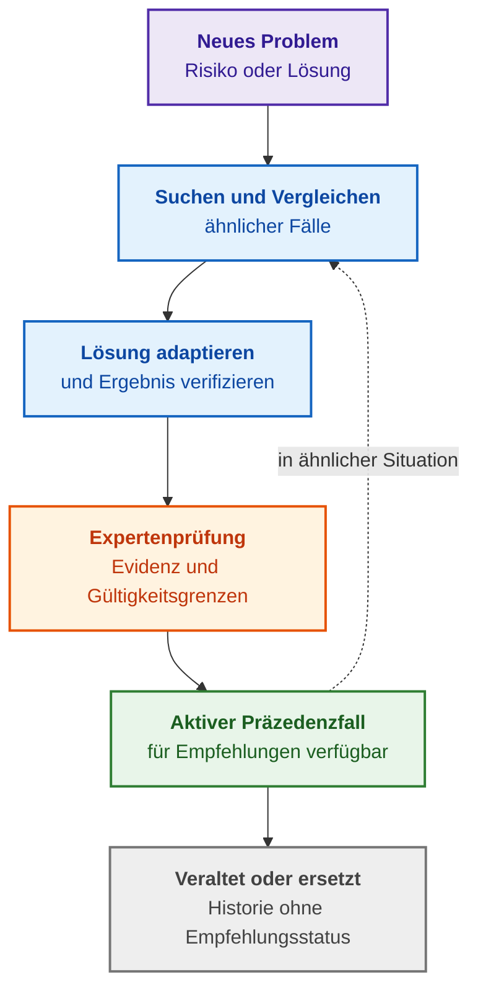
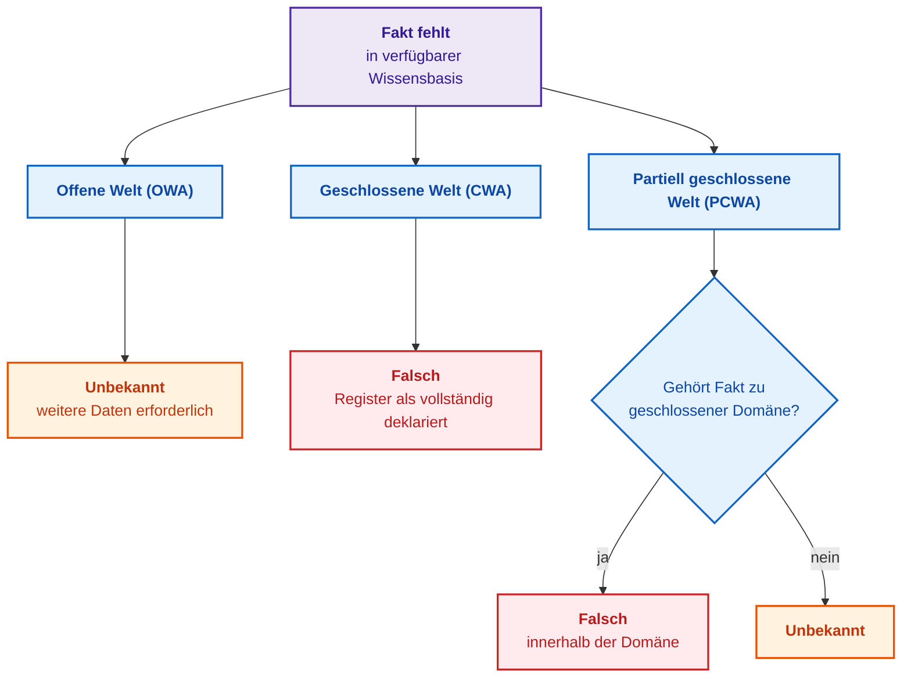
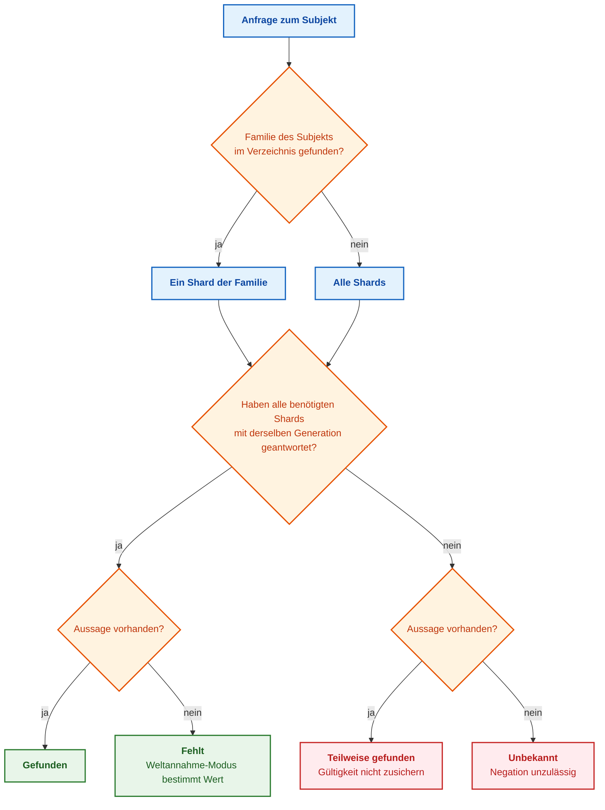

# Kapitel 7. Typologie von Wissensbasen: Regeln, Ontologien, Präzedenzfälle und Vektoren

> **Buch:** [Architektur evidenzbasierter Expertensysteme](README.md) · [Teil II: Mathematische Modelle, Wissensrepräsentation und Wissensspeicherung](part-02-knowledge-models.md)  
> **Vorheriges Kapitel:** [Kapitel 6. Angewandte Mathematik für Expertensysteme: Regeln, Wahrscheinlichkeiten, Graphen und Kausalität](ch06-applied-mathematics-for-expert-systems.md)  
> **Nächstes Kapitel:** [Kapitel 8. Ingenieurtechnische Artefakte als Daten des Expertensystems](ch08-engineering-artifacts-as-data.md)  
> **Inhaltsverzeichnis:** [README.md](README.md)  
> **Autor:** [Mykola Fedchyk](about-the-author.md)  
> **Niveau:** Grundlegendes Ingenieurniveau; Anfragen, Datenmodelle und Codebeispiele sind in einklappbare Blöcke ausgelagert  
> **Lernziele:** Eine Wissensbasis präzise von einer Datenbank und einem reinen Dokumentenspeicher abgrenzen; für jeden Wissensbasis-Typ (Regeln, Frames, Ontologien, Präzedenzfälle, Constraints, probabilistische und unscharfe Modelle, Dokumenten- und Vektorindizes) benennen, was gespeichert wird, welches Ergebnis der Mechanismus liefert und was dieses Ergebnis formal *nicht* beweist; den Wissensbasis-Typ nach dem benötigten Entscheidungsergebnis statt nach Produktnamen auswählen; die Semantik fehlender Fakten explizit definieren; Kompetenzfragen an eine Ontologie formulieren und Begriffshierarchien mit der OntoClean-Methodologie auditieren; Fragmentierung, Sharding und Domänengruppierung differenzieren, Partitionierungsschlüssel anhand von Inferenzabhängigkeiten wählen und das Schweigen eines Shards niemals mit der Abwesenheit eines Fakts verwechseln.

## Abstract

In diesem Kapitel wird die fundamentale Typologie ingenieurtechnischer Wissensbasen als Kernarchitektur evidenzbasierter Expertensysteme formalisiert und deren systematische Demarkation gegenüber relationalen Datenbanken und unstrukturierten Dokumentenspeichern etabliert. Untersucht werden die maßgeblichen Paradigmen der Wissensformalisierung, die mathematischen Determinismus, formale Verifizierbarkeit und Unanfechtbarkeit von Schlussfolgerungen sicherstellen: Produktionsregeln, Frame-Strukturen, formale Ontologien (OWL/RDF), fallbasierte Speicher (CBR), Constraint-Satisfaction-Solver (CSP), Bayessche Netze sowie dichte Vektorindizes. Es wird präzise herausgearbeitet, welche spezifische Rolle jedes Modell im Lebenszyklus eines Expertensystems einnimmt, um die fatale Substitution formal-logischer Beweisführung durch heuristische Ähnlichkeitssuche zu unterbinden. Besondere Schwerpunkte bilden die Semantik unvollständiger Information (Open-, Closed- und Partial-Closed-World-Assumption), die ontologische Validierungsmethode OntoClean zur Vermeidung taxonomischer Inferenzkollapse sowie die architektonischen Prinzipien horizontaler und vertikaler Fragmentierung und des Shardings ohne Aufbrechen transitiver logischer Ableitungsketten.

Wenn ein Entwicklungsteam erklärt: „Wir benötigen eine Wissensbasis für künstliche Intelligenz (KI)“, ist damit in der Praxis häufig lediglich ein Wiki, eine Dokumentenablage oder ein Vektorindex gemeint. Auf die sicherheitskritische Frage „Darf das Bremssteuergerät BrakeController 3.2 für die Serienfertigung freigegeben werden?“ liefert ein solches System lediglich einen Textabschnitt aus einem alten Prüfbericht, der oberflächlich wie eine Antwort aussieht. Für den leitenden Ingenieur bleibt dabei völlig intransparent, ob es sich um ein zufälliges Textfragment, eine regelbasierte Inferenz oder ein verifiziertes Prüffaktum handelt. Eine Produktionsregel-Engine liefert eine gefeuerte Regel, eine Ontologie-Engine liefert eine Klassenhierarchie oder einen logischen Widerspruch, eine CBR-Fallbasis liefert historische Erfahrungswerte, ein Constraint-Solver liefert eine zulässige Systemkonfiguration, und ein Vektorindex liefert lediglich semantisch ähnliche Textpassagen. Bezeichnet die Benutzerschnittstelle all diese heterogenen Ergebnisse undifferenziert als „KI-Antwort“, werden die inhärenten Fehlermodi der einzelnen Mechanismen unsichtbar und führen im sicherheitskritischen Betrieb zu katastrophalen Fehleinschätzungen.

Ziel dieses Kapitels ist es nachzuweisen, dass es keine universelle Wissensbasis für alle Aufgabenstellungen gibt, und Ingenieuren eine methodische Entscheidungsgrundlage an die Hand zu geben, um den Typ der Wissensbasis strikt nach dem geforderten Entscheidungsergebnis auszuwählen. Für jeden Typus wird expliziert, was er speichert, wie er Ergebnisse generiert, was dieses Ergebnis *nicht* beweist und wo seine genuine Domäne in Forschung und Entwicklung (*Research and Development*, R&D) liegt. Sämtliche Wissensrepräsentationen werden anhand eines durchgängigen industriellen Beispielfalls demonstriert: der sicherheitskritischen Anforderung REQ-42 für ein Bremssteuergerät und dem Verifikationstest TEST-17, der diese Anforderung validieren muss. Die mathematischen Grundlagen wurden in [Kapitel 6](ch06-applied-mathematics-for-expert-systems.md) dargelegt; wie ingenieurtechnische Artefakte formal zu Daten werden und sich zu rückverfolgbaren Wissensgraphen verknüpfen, behandeln [Kapitel 8](ch08-engineering-artifacts-as-data.md) und [Kapitel 9](ch09-engineering-knowledge-graph-traceability.md).

## 1. Typische ingenieurtechnische Fehlermuster: Folgen einer Diskrepanz zwischen Wissenstyp und Zielanfrage

Die Mehrzahl der Havarien und Fehlschläge industrieller Wissensbasen im Produktivbetrieb geht auf eine gemeinsame Ursache zurück: Ein für einen bestimmten Fragetypus konzipierter Mechanismus wird zweckentfremdet für eine völlig anders geartete Fragestellung eingesetzt. Die folgende Tabelle fasst sieben typische Fehlermuster zusammen, die den Ausgangspunkt für die nachfolgenden Analysen bilden.

| Problem | Was der Benutzer sieht | Technische Ursache | Abhilfemaßnahme |
|---|---|---|---|
| Suche statt Inferenz | Auf die Frage „Wurde eine Vorschrift verletzt?“ liefert das System einen ähnlichen Textabschnitt | Vektorsuche substituiert die Prüfung deterministischer Regeln oder Randbedingungen | Typisiertes Ergebnis: Gefunden, Abgeleitet, Verifiziert, Bewertet |
| Fehlinterpretation von Abwesenheit | Eine fehlende Kante zum Test im Graphen wird als „Test existiert nicht“ interpretiert | Auf einen Open-World-Graphen wird unzulässig die Closed-World-Annahme angewendet | Vollständigkeitsgrenzen explizit deklarieren und Vollständigkeit separat prüfen |
| Versionsdiskrepanz | Eine Freigaberegel prüft Fakten, die zu einer abweichenden Basisversion gehören | Regeln, Wissensgraph und Indizes werden asynchron aktualisiert | Wissens-Release-Manifest und Anfragen ausschließlich an konsistente Snapshots |
| Halluzinierte Relationen durch LLMs | Im Wissensgraphen taucht eine scheinbar plausible, aber sachlich falsche Verknüpfung auf | Relationsextraktion ohne striktes Schema, Quellenfragment-Bindung und Review | Eingeschränkte Extraktion, Schemavalidierung, Provenienzprüfung, Quarantäne |
| Informationsabfluss über Inferenz | Der Benutzer sieht die geheime Primärquelle nicht, wohl aber die daraus abgeleitete Schlussfolgerung | Zugriffsrechte wurden ausschließlich auf Rohfakten angewendet | Propagierung von Sicherheitsattributen auf Ableitungen, Erklärungen und Caches |
| Inferenzexplosion | Die Inferenzmaschine überschreitet die geforderten Antwortzeit-Budgets massiv | Zu hohe Sprachausdruckskraft, zyklische Regelsysteme, vollständiges Forward-Chaining | Begrenztes Sprachprofil, inkrementelle Inferenz oder zielgerichtetes Backward-Chaining |
| Zerschnittene Inferenz | Die Auskunft über die Gültigkeit einer Norm variiert je nachdem, welcher Cluster-Knoten antwortet | Zusammengehörige Revisionen oder Tests liegen auf getrennten Knoten; Schweigen wird als Nichtexistenz gewertet | Sharding-Schlüssel nach Dokumentenfamilie, „Unbekannt“ statt „Falsch“ bei Shard-Ausfall |

Jede Zeile dieser Matrix unterstreicht ein grundlegendes Architekturprinzip: Für jede Form der Wissensrepräsentation müssen Semantik, Ausführungsalgorithmus, epistemischer Beweisstatus des Ergebnisses und ein deterministisches Verhalten bei Ungewissheit formal definiert sein. Der Rest dieses Kapitels wendet dieses Prinzip systematisch auf alle Typen von Wissensbasen an, beginnend mit der fundamentalen Trennung zwischen Datenbank und Wissensbasis.

## 2. Begriffliche Demarkation: Datenbank, Dokumentenspeicher und Wissensbasis

Eine klassische Datenbank beantwortet primär die Frage „Was ist explizit gespeichert?“ und gibt Datensätze zurück, die den Filterkriterien einer Abfrage entsprechen. Eine Wissensbasis (*Knowledge Base*) erweitert diesen Speicher um die formale Semantik der Anwendungsdomäne und – wo gefordert – um Inferenzmechanismen, die aus bekannten Fakten neue, zuvor nicht explizit gespeicherte Schlussfolgerungen ableiten. Nicht jede Wissensbasis benötigt zwingend eine eigene Inferenzmaschine: Eine Ontologie kann beispielsweise als Vokabular fungieren, das einheitliche Typen und Relationen definiert, während Regelprüfungen oder Suchoperationen von separaten Systemkomponenten ausgeführt werden.

Eine relationale Datenbank kann Anforderungen, Testfälle, Fehlertickets und Risiken speichern. Eine SQL-Abfrage (*Structured Query Language*) findet Anforderungen ohne verknüpfte Tests, sofern der Softwareentwickler die Join- und Filterbedingungen händisch und fehlerfrei formuliert. Eine regelbasierte Wissensbasis hingegen kapselt die domänenspezifische Invariante „Eine sicherheitskritische Anforderung darf ohne formalen Verifikationsnachweis nicht freigegeben werden“ als eigenständiges Wissensartefakt und wendet dieses Regelsystem automatisch auf jeden neu eintreffenden Fakt an. Der fundamentale Unterschied liegt nicht im Dateiformat oder Serverprodukt, sondern darin, wo die Bedeutung der Regel hinterlegt ist und wer den Inferenzschritt vollzieht. Eine produktive Wissensbasis besteht aus mindestens vier Kernkomponenten:

- **Wissensrepräsentation** (*Knowledge Representation*): Fakten, Regeln, Frames, Wissensgraphen, Präzedenzfälle, Randbedingungen oder Wahrscheinlichkeitsverteilungen;
- **Inferenzmechanismus:** Welche Komponente generiert neue Aussagen, Bewertungen oder zulässige Varianten und nach welchem formalen Algorithmus;
- **Gültigkeitskontext:** Für welches konkrete Produkt, welchen Standard, welche Baseline, welchen Kunden und welchen Gültigkeitszeitraum beansprucht das Wissen Geltung;
- **Provenienz und Eigentümerschaft:** Aus welchen Primärquellen stammt die Aussage, wer hat sie autorisiert und wer besitzt die Berechtigung, sie zu modifizieren oder zu widerrufen.

Als greifbare Analogie: Ein Dokument entspricht einer beschriebenen Papierseite, eine Datenbank entspricht einem geordneten Karteikasten, und eine Wissensbasis verbindet diesen Karteikasten mit der verbindlichen Bedeutung der Fachbegriffe und automatisierten Arbeitsvorschriften für den Umgang mit den Karten. Die Grenze der Analogie: Nicht jede Wissensbasis besteht aus WENN-DANN-Regeln. Eine Ontologie klassifiziert Entitäten, eine Fallbasis sucht nach ähnlichen historischen Erfahrungen, und ein probabilistisches Modell aktualisiert Vertrauensgrade bei neuen Messdaten.

### 2.1. Kriterien für die Überführung einer strukturierten Dateisammlung in eine Wissensbasis

Ein Dateiverzeichnis mit Anforderungsspezifikationen im Markdown- oder PDF-Format stellt noch keine Wissensbasis dar, bloß weil es geschäftskritische Informationen enthält. Drei Spezifikationen mögen Anforderungen mit den Bezeichnern REQ-42, REQ-43 und REQ-44 enthalten. Ohne manuelle Sichtung kann ein Ingenieur jedoch nicht ermitteln, welche Version aktuell gültig ist, welcher Testbericht die Anforderung validiert, ob die Anforderungen zum selben Produktstand gehören und welche davon eine Sicherheitsrelevanz nach ISO 26262 besitzen. Eine strukturierte Dateisammlung transformiert sich erst dann in eine echte Wissensbasis, wenn die Organisation folgende Invarianten formal definiert:

- **Wissenseinheiten:** Explizite Entitätstypen wie Anforderung, Architekturkomponente, Testfall, Fehlerbericht, Regel, Präzedenzfall oder Nachweisdokument;
- **Semantik von Feldern und Relationen:** Worin sich der Status `Genehmigt` vom Status `Veraltet` unterscheidet und wie sich eine qualifizierte Relation `verifiziert` von einer bloßen textuellen Erwähnung abgrenzt;
- **Identifikatoren, Versionierung und Gültigkeitsgrenzen:** Welcher Datensatz die Anforderung REQ-42 in Version 1.2 eindeutig identifiziert und für welche Produktkonfiguration und welches Zeitintervall dieser Datensatz Gültigkeit besitzt;
- **Relationales Beziehungsgefüge:** REQ-42 wird durch Test TEST-17 verifiziert, die Testausführung erzeugt einen Prüfbericht, und eine Freigaberegel konsumiert den Status dieses Berichts;
- **Formalisierter Verarbeitungsmodus:** Graph-Traversal, Constraint-Prüfung, Regelausführung, probabilistische Inferenz oder Fallvergleich.

Die physischen Dateien können weiterhin als primäre Speichermedien dienen. Was sie zur Wissensbasis macht, ist weder die Ausführung auf einem Cloud-Server noch das YAML-Format (*YAML Ain't Markup Language*), sondern das Vorhandensein eines konsistenten Modells von Begriffen, Beziehungen, Gültigkeitsgrenzen und Inferenzoperationen. Ohne diese formalen Vereinbarungen bleibt ein Dokumentenordner lediglich Rohmaterial für eine künftige Wissensbasis, ist aber selbst keine.

### 2.2. Das Unternehmens-Wiki: Einsatzgrenzen und RAG-Architektur

Im organisatorischen Kontext fungiert ein Unternehmens-Wiki wie Atlassian Confluence dann als Wissensbasis, wenn Entwicklerteams dort systematisch Handlungsanweisungen, Architektur-Entscheidungsdatensätze (ADRs), Fachbegriffe, Post-Mortem-Berichte und Quellennachweise pflegen, wobei jede Seite einen definierten Prozesseigentümer, einen Freigabestatus und ein Revisionsdatum besitzt. Für das allgemeine Wissensmanagement genügt dieser Reifegrad oft. Ein Wiki ohne klare Eigentümerschaft, ohne standardisierte Statusmodelle und ohne stabile semantische Verknüpfungen degeneriert jedoch rasch zu einem unkontrollierten Textfriedhof: Eine Volltextsuche liefert unzählige Treffer, kann aber ohne langwierige manuelle Interpretation nicht entscheiden, welche Arbeitsanweisung für die Produktversion 3.2 verbindlich ist oder welcher Testfall eine Sicherheitsanforderung absichert. Ein Wiki eignet sich hervorragend zur Bewahrung von Kontext und narrativen Erläuterungen, kann jedoch dort, wo automatisierte Sicherheitsprüfungen und reproduzierbare Inferenz gefordert sind, weder einen Rückverfolgbarkeitsgraphen noch eine Regel-Engine ersetzen.

Auf Unternehmens-Wikis wird häufig eine Architektur zur informationsgestützten Textgenerierung (*Retrieval-Augmented Generation*, RAG) aufgesetzt: Das System zerlegt Wikiseiten in Textfragmente (*Chunks*), berechnet Einbettungsvektoren, ruft bei einer Anfrage semantisch ähnliche Fragmente ab und übergibt diese an ein großes Sprachmodell (LLM), um eine Antwort zu synthetisieren. Das Wiki fungiert dabei als Speicher, während RAG eine flexible Such- und Formulierungsschicht bildet. Die folgende Tabelle stellt RAG der klassischen Volltextsuche gegenüber.

| Benutzeranforderung | Klassische Volltextsuche | RAG über Unternehmens-Wiki |
|---|---|---|
| Paraphrasierte Anfrage | Sucht nach exakten Begriffen, Stammformen oder manuell gepflegten Synonymlisten | Findet Textfragmente anhand semantischer Ähnlichkeit auch bei abweichendem Vokabular |
| Synthese über mehrere Seiten | Liefert eine Liste separater Dokumentlinks | Aggregiert Aussagen aus verteilten Quellen zu einer kompakten Antwort mit Zitaten |
| Begriffserklärung im Kontext | Erfordert das manuelle Öffnen und Vergleichen mehrerer Dokumente | Erläutert Termini unter Berücksichtigung des projektspezifischen Kontexts |
| Iterative Präzisierung | Jede Suchanfrage wird isoliert ausgewertet | Behält den Dialogverlauf bei und ermöglicht schrittweises Nachfragen |

Wird die Anfrage gestellt: „Warum erfordert REQ-42 eine unabhängige Verifikation?“, kann eine RAG-Pipeline das Anforderungsfragment, eine Richtlinie zur funktionalen Sicherheit und die Beschreibung von TEST-17 aggregieren und den Zusammenhang synthetisieren. Was RAG jedoch prinzipbedingt *nicht* leisten kann: Es liefert keinen mathematischen Beweis für die normative Gültigkeit des Textes, stellt keine kryptografisch gesicherte Nachweisbeziehung zwischen REQ-42 und TEST-17 her und führt keine deterministische Regelprüfung aus. Die bloße Aussage „Im Wiki steht, dass...“ ist im Sinne der Normen ISO 26262 oder DO-178C kein formaler Nachweis. RAG-generierte Antworten müssen daher stets präzise Versionen zitieren und als heuristische Erläuterung auf Basis von Retrieval-Kandidaten ausgewiesen werden.

### 2.3. Semantische Typisierung ingenieurtechnischer Anfragen an die Wissensbasis

Ein Ingenieur interagiert mit einer Wissensbasis nicht über eine uniforme Universalanfrage: Die Struktur der Anfrage richtet sich zwingend nach dem benötigten epistemischen Entscheidungsergebnis. Dieselbe Entität REQ-42 induziert grundlegend verschiedene, formal distinkte Anfragetypen.

| Anfrage des Ingenieurs | Wissensrepräsentation / Mechanismus | Korrektes formales Ergebnis |
|---|---|---|
| „Welches ist die aktuell gültige Version von REQ-42?“ | Anforderungsregister oder relationale Datenbank | Anforderungsdatensatz und Versionskennung |
| „Welcher Testfall verifiziert REQ-42?“ | Semantischer Wissensgraph | Relation zwischen REQ-42 und TEST-17 mit Traceability-Pfad |
| „Wurde die Sicherheitsregel für ASIL-D-Anforderungen ohne unabhängigen Test verletzt?“ | Produktionsregelsystem | Gefeuerte Regel mit logischer Konsequenz |
| „Welche Testaufbauten erfüllen das Kriterium der organisatorischen Unabhängigkeit?“ | Constraint-Satisfaction-Basis | Menge aller zulässigen Konfigurationen |
| „Trat in der Vergangenheit ein vergleichbares Fehlverhalten auf?“ | Fallbasis (CBR) | Ähnlicher historischer Fall mit Lösung und Randbedingungen |
| „Wie plausibel ist die Hypothese eines Watchdog-Ausfalls?“ | Bayessches Vertrauensnetzwerk | Bedingte A-posteriori-Wahrscheinlichkeit |
| „An welchen Stellen in den Berichten wird REQ-42 erwähnt?“ | Dokumenten- oder Vektorindex | Liste von Textfragment-Kandidaten mit Provenienzdaten |

Eine formale Anfrage besitzt eine exakt definierte Grammatik, ein rigides Datenschema und eine deterministische Ausführungssemantik: Sie benennt Entitäten, Relationen, Prädikate und die Struktur des Ergebnisraums explizit. Eine Abfrage in SPARQL (*SPARQL Protocol and RDF Query Language*) formuliert beispielsweise die Anweisung: „Ermittle alle Tests, die über eine `verifiziert`-Kante mit REQ-42 verbunden sind, einschließlich deren Ausführungsergebnis und Prüfbericht für Release 3.2“.

<details>
<summary>Beispiel einer SPARQL-Abfrage: Tests zur Verifikation von REQ-42</summary>

Variablen beginnen mit einem Fragezeichen. Das Prädikat `ex:verifies` verknüpft die Testspezifikation mit der Anforderung, während `ex:ofTest`, `ex:release`, `ex:result` und `ex:hasReport` eine konkrete Testdurchführung beschreiben. Die Abfrage filtert gezielt nach genehmigten Testläufen für Release 3.2.

```sparql
PREFIX ex: <https://example.org/rd/>

SELECT ?test ?result ?report
WHERE {
    ?test ex:verifies ex:REQ-42 .
    ?run ex:ofTest ?test ;
      ex:release ex:Release3_2 ;
      ex:result ?result ;
      ex:hasReport ?report ;
      ex:status ex:Approved .
}
```

</details>

Bei identischen Datenbeständen, festgelegter Graphversion und konstanten Zugriffsrechten liefert eine formale Abfrage stets ein mathematisch reproduzierbares Resultat. Eine formale Sprache garantiert zwar nicht die sachliche Richtigkeit der Rohdaten in der realen Welt, dokumentiert jedoch zweifelsfrei, was nach welchem Algorithmus geprüft wurde.

Eine informelle Anfrage wird in natürlicher Sprache formuliert: „Wodurch ist REQ-42 abgesichert?“. Ein Sprachmodell kann die Absicht (*Intent*) des Ingenieurs erfassen, semantische Ambiguitäten auflösen und die Anfrage in eine oder mehrere formale Abfragen übersetzen. Die generierte Antwort des Sprachmodells stellt jedoch so lange kein valides Ergebnis einer Wissensbasis-Konsultation dar, wie sie nicht über einen formalen Inferenz- oder Prüfpfad verifiziert wurde. Eine robuste hybride Interaktionsarchitektur erzwingt daher folgende Prozesskette:

1. Das Sprachmodell analysiert die Absicht und fordert bei Unschärfen zwingend die Spezifikation von Parametern, Release-Ständen oder Systemgrenzen ein;
2. Ein Autorisierungs-Gateway filtert die verfügbaren Wissenssegmente gemäß den Zugriffsrechten des Benutzers;
3. Das Sprachmodell generiert eine strukturierte Abfrage, deren Syntax, Schemakonformität und Ressourcengrenzen vor der Ausführung formal validiert werden;
4. Der Inferenzmechanismus führt die Abfrage auf dem Register, dem Graphen, der Regelbasis, dem Constraint-Solver oder dem Index aus;
5. Das Sprachmodell synthetisiert eine Erklärung des Ergebnisses, darf dessen materiellen Inhalt jedoch nicht verändern: Es deklariert den Ergebnistyp, zitiert Primärquellen, referenziert Snapshots und legt verbleibende Ungewissheiten offen.

Auf die Frage „Ist REQ-42 verifiziert?“ darf ein Expertensystem niemals mit „Ja“ antworten, bloß weil in einem Textdokument der Satz „TEST-17 verifies REQ-42“ aufgefunden wurde. Es bedarf der formalen Prüfung, ob TEST-17 für die Version 3.2 des Steuergeräts erfolgreich durchlaufen und der Bericht autorisiert wurde. Wurde lediglich eine Textpassage aufgefunden, muss das System dies strikt als „Kandidatenfund aus Dokumentensuche“ typisieren.

### 2.4. Verteilte Wissensbasis des Systemlebenszyklus: Anforderungen, Quellcode, Tests und Defekte

Anforderungen stellen formalisiertes Wissen darüber dar, wie sich ein technisches System unter definierten Randbedingungen verhalten muss und nach welchem Verfahren die Konformität nachzuweisen ist. Eine Anforderungswissensbasis speichert nicht nur Fließtext, sondern hierarchische Ebenen, funktionale Domänen, Versionsstände, Lebenszyklus-Status, Prozesseigentümer, regulatorische Standards, Risikoklassen, Testverknüpfungen und Sicherheitsnachweise. Jede inhaltliche Änderung generiert eine neue Version und verbietet das Überschreiben autorisierter Stände. Quellcode ist die ausführbare Spezifikation des Systemverhaltens; ein Testfall verknüpft eine deklarative Verhaltenserwartung („Bei Ausfall des Watchdogs wechselt der Controller innerhalb von 100 ms in den sicheren Zustand“) mit einer deterministischen Prüfprozedur. Das Protokoll einer Continuous-Integration-Pipeline (CI) ist der kryptografisch unveränderliche Nachweis dafür, dass ein bestimmter Git-Commit diesen Testfall in einer definierten Zielumgebung bestanden oder nicht bestanden hat.

| Artefakt | Enthaltenes Wissen | Physischer Speicherort | Persistenter Wert nach Projektabschluss |
|---|---|---|---|
| Anforderung und Spezifikation | Zielvorgaben, Randbedingungen, Version, Rückverfolgbarkeit | Anforderungsmanagement-System (ALM) | Freigegebene Baseline, Änderungshistorie, Nachweisbasis |
| Quellcode und Konfiguration | Ausführbare Logik, Schnittstellendefinitionen, Hardwareschemata | Git-Repository (GitLab, GitHub) | Reproduzierbarkeit von Builds, Wiederverwendbarkeit |
| Testspezifikation | Soll-Verhalten, Testorakel, Prüfprozedur | Test-Repository, Test-Management-System | Regressionssuite, formale Verifikationsgrenzen |
| Testprotokoll, CI-Artefakt | Empirischer Ausführungsnachweis für Build und Zielhardware | CI/CD-System, Artefakt-Repository | Audit-Beweis für Zulassung und Post-Mortem-Analysen |
| Fehlerticket, Architekturentscheidung | Problemhistorie, Risikobewertung, Kontext, Designentscheidungen | Issue-Tracker (Jira), ADR-Repository | Rationale für Architekturentscheidungen, Lessons Learned |

In ihrer Gesamtheit bilden diese heterogenen Artefakte eine verteilte Wissensbasis des Entwicklungsprojekts – vorausgesetzt, alle Entitäten verfügen über standardisierte Identifikatoren, Versionen, Typen und Verknüpfungen. In der industriellen Praxis lassen sich drei Integrationsstufen unterscheiden:
Die erste Stufe basiert auf Konventionen und statischen Querverweisen: Stabile Bezeichner wie `REQ-42`, `TEST-17`, Fehlerticket-Nummern, Commit-Hashes und URLs zu Build-Artefakten.
Die zweite Stufe etabliert eine übergreifende Such- und Indexierungsschicht über Metadaten und Volltexte verschiedener Quellsysteme.
Die dritte Stufe realisiert eine semantische Wissens-Integrationsschicht: Sie extrahiert Fakten über Programmierschnittstellen (APIs), harmonisiert Identifikatoren, pflegt Typen, Relationen und Provenienzdaten in einem gemeinsamen semantischen Graphen und ermöglicht durchgängige Inferenzabfragen der Art: „Welche ASIL-D-Anforderungen der aktuellen Baseline verfügen über keinen genehmigten Testnachweis?“. Die Integrationsschicht wird dabei nicht zum redundanten manuellen Editierort: Die Hoheit über die Primärdaten verbleibt in den Quellwerkzeugen, während die Wissensschicht eine konsistente Projektion bereitstellt. Ein Entwicklungsteam sollte stets mit stabilen Identifikatoren beginnen, darauf eine strukturierte Suche aufbauen und erst bei wiederkehrendem Bedarf an automatisierten Verifikationsketten eine formale Wissensintegrationsschicht implementieren.

Zusammenfassend: Eine Wissensbasis unterscheidet sich von Datenbanken und Dokumentenablagen nicht durch Speichertechnologien, sondern durch die explizite Repräsentation von Domänensemantik, Gültigkeitskontexten, Provenienzketten und formalen Inferenzverfahren. Öffentliche Referenzwissensbasen demonstrieren die Bandbreite dieser Mechanismen.

## 3. Referenzierte offene Wissensbasen für ingenieurtechnische Zwecke

Wissensbasen sind keineswegs auf proprietäre industrielle Expertensysteme beschränkt. Offene wissenschaftliche und ingenieurtechnische Initiativen ermöglichen das Studium von Datenstrukturen, Abfrageschnittstellen und Wissensrepräsentationen im Produktivbetrieb.

| Projekt | Struktur des Wissens | Relevante Architekturmerkmale |
|---|---|---|
| [Wikidata](https://www.wikidata.org/wiki/Wikidata:Introduction) | Multilingualer kollaborativer Wissensgraph | Entitäten `Q…`, Relationen `P…`, Qualifikatoren und explizite Quellenbelege; CC0-Lizenz |
| [ConceptNet](https://conceptnet.io/) | Offenes semantisches Netz des Allgemeinwissens | Relationen wie `IsA`, `PartOf`, `UsedFor`, Kantengewichte und Aggregation heterogener Quellen |
| [Gene Ontology](https://geneontology.org/docs/ontology-documentation/) | Formale biomedizinische Domänenontologie | Klassen biologischer Prozesse und Funktionen, Relationen `is_a`, `part_of`, persistente IDs `GO:…` |
| [OpenFisca](https://openfisca.org/en/) | Ausführbare regelbasierte Gesetzesmodelle | Parametrisierte Steuer- und Leistungsregeln mit Stichtagsbezug und automatisierter Testsuite |
| [Bayesian Network Repository](https://www.bnlearn.com/bnrepository/) | Referenzsammlung probabilistischer Netze | Standardmodelle wie ASIA, ALARM, CHILD mit vollständigen bedingten Wahrscheinlichkeitstabellen |
| [AI Incident Database](https://incidentdatabase.ai/) | Strukturierte Fallbasis von Havarien | Reale Systemversagen mit Taxonomie, Berichten und Kontext; Primärquelle für CBR-Systeme |

Ein Blick in Wikidata illustriert die Aussage `Q42 → P69 → Q691283` (Douglas Adams studierte am St John's College) mit vollständigen bibliografischen Nachweisen. In der Gene Ontology besitzt der Terminus `GO:0019319` zwei Elternklassen, da die Hexose-Biosynthese gleichzeitig ein Hexose-Stoffwechselprozess und eine Monosaccharid-Biosynthese ist. Diese Beispiele verdeutlichen die typologische Vielfalt: Wikidata verwaltet quellenbasierte Faktenaussagen, Gene Ontology erzwingt eine formale Klassenhierarchie, OpenFisca führt deterministische Rechenregeln aus, und bnlearn berechnet Wahrscheinlichkeitsverteilungen. Der Begriff „Wissensbasis“ garantiert weder ein einheitliches Datenformat noch ein standardisiertes Inferenzverfahren. Um diese Ansätze ingenieurtechnisch zu vergleichen, bedarf es eines konkreten industriellen Szenarios.

## 4. Durchgängiger ingenieurtechnischer Beispielfall: Release-Verifikation des BrakeController 3.2

Ein Entwicklungsteam bereitet das Release R2026.3 des Bremssteuergeräts BrakeController in Version 3.2 vor. Gemäß dem Freigabeprozess muss jede sicherheitskritische Anforderung implementiert, verifiziert und durch ein autorisiertes Nachweisdokument belegt sein. Die fiktive Systemanforderung REQ-42 spezifiziert das Fail-Safe-Verhalten des Steuergeräts beim Ausbleiben der zyklischen Heartbeat-Signale des internen Watchdog-Bausteins. Gemäß ISO 26262 ist diese Anforderung als ASIL D eingestuft. Sämtliche Bezeichner und Parameter in diesem Szenario dienen didaktischen Zwecken.

<details>
<summary>Beispieldaten in YAML: Anforderung REQ-42 und Systemspezifikation</summary>

Die Anforderung liegt im strukturierten YAML-Format vor, während die Systemspezifikation die für das Release verbindlichen Anforderungsversionen bündelt.

```yaml
requirement_id: REQ-42
requirement_version: "1.2"
requirement_level: system
functional_area: safety
title: "Überführung des BrakeController in den sicheren Zustand bei Watchdog-Ausfall"
component: BrakeController
component_version: "3.2"
safety_integrity_level: ASIL-D
trigger: "watchdog_timeout"
required_behavior: "Übergang in sicheren Zustand innerhalb von maximal 100 ms"
verification_method: "Unabhängiger Prüfstandstest"
verification_test: TEST-17
release_condition: "Autorisierter Nachweis einer unabhängigen Verifikation zwingend erforderlich"
```

```yaml
specification_id: BrakeController-SyRS
specification_version: "3.2"
applies_to: BrakeController
release: R2026.3
requirements:
  - id: REQ-42
    version: "1.2"
    role: "Sicherheit: Übergang in sicheren Zustand bei watchdog_timeout"
  - id: REQ-43
    version: "2.0"
    role: "Schnittstelle: Übertragung des Fehlerstatus auf den CAN-Bus"
status: approved
```

</details>

Dieser YAML-Datensatz ist noch keine Wissensbasis an sich: Er ist ein maschinenlesbares Rohartefakt, aus dem unterschiedliche Wissensmodelle Fakten extrahieren. Für REQ-42 bildet ein semantischer Graph das Rückgrat der Rückverfolgbarkeit, während komplementäre Wissensrepräsentationen spezifische Teilaufgaben übernehmen.

| Verifikationsaufgabe zu REQ-42 | Adäquate Wissensbasis / Index | Gespeicherte Wissensinhalte |
|---|---|---|
| Rückverfolgung, welcher Testfall die Anforderung prüft | Semantischer Graph oder Ontologie | Anforderung, Komponente, Testfall, Prüfbericht und Relationen |
| Definition obligatorischer Pflichtfelder für ASIL-D | Frame-basierte Wissensbasis | ASIL-Stufe, Verifikationsmethode, Nachweisbeleg, Freigabestatus |
| Deterministische Blockade des Release ohne Test | Produktionsregelbasis | Fakten zum Teststatus und normative Freigaberegeln |
| Auffinden von Prüfdetails zu TEST-17 in Freitexten | Dokumenten- oder Vektorindex | Textpassagen aus Testberichten, Metadaten und Einbettungen |

Dieses Kapitel analysiert zwei diskrete Prüfpunkte (*Checkpoints*):
Am ersten Prüfpunkt (vor Ausführung von TEST-17) existieren für REQ-42 die Spezifikation, die Einstufung ASIL D und ein Testplan. Es liegt jedoch noch kein genehmigtes Ergebnis einer unabhängigen Prüfung vor. Eine automatisierte Regelprüfung muss das Release R2026.3 an diesem Punkt deterministisch blockieren.
Am zweiten Prüfpunkt (nach Durchführung von TEST-17) existiert ein Prüfbericht mit dem Status `Genehmigt`, dem Resultat `Erfolgreich` und einer formalen Referenz auf REQ-42. Dieser Befund belegt exakt diese Einzelprüfung, entbindet das System jedoch nicht von der Validierung der übrigen Systemanforderungen. Das folgende Diagramm strukturiert die beteiligten Verarbeitungsmechanismen.



Der violette Knoten repräsentiert die Eingabefakten. Die grünen Komponenten liefern formal verifizierte Resultate: logische Konsequenzen, Klassifikationen, Pfadbeziehungen und zulässige Parametrierungen. Die orangefarbenen Komponenten liefern empirische Erfahrungswerte und probabilistische Schätzungen, die einer menschlichen Validierung bedürfen. Die blauen Komponenten liefern lediglich Kandidatenfragmente aus der Textsuche. Kein Mechanismus kann die Funktionen der anderen vollständig substituieren.

## 5. Vergleichende Taxonomie von Wissensbasis-Typen

Ontologien, Produktionsregeln, CBR-Fallbasen und Vektorsuchmaschinen schließen einander keineswegs aus; moderne sicherheitskritische Expertensysteme integrieren häufig alle vier Ansätze. Eine exakte Differenzierung ist unerlässlich, da sich die Fehlermodi und Beweiskraft der gelieferten Resultate fundamental unterscheiden.

| Wissensbasis- oder Indextyp | Was wird gespeichert | Was liefert der Mechanismus | Was das Ergebnis NICHT beweist |
|---|---|---|---|
| Produktionsregeln | Fakten und WENN-DANN-Regeln | Abgeleitete Konsequenz und formaler Inferenzpfad | Dass die Regelbasis vollständig und widerspruchsfrei ist |
| Frames | Typisierte Objekte, Slots, Standardwerte, Ausnahmen | Vererbte oder explizit instanziierte Slotwerte | Dass ein Standardwert für das konkrete Objekt empirisch zutrifft |
| Ontologie und semantischer Graph | Klassen, Relationen, Axiome, Konsistenzbedingungen | Subsumtion, neue Kanten oder logische Widersprüche | Dass ein nicht explizit gespeicherter Fakt falsch ist (OWA) |
| Fallbasis (CBR) | Historische Episoden, Kontext, Lösungen, Outcomes | Ähnlichster Fall als Adaptionskandidat | Dass die alte Lösung für den neuen Fall ohne Prüfung taugt |
| Constraint-Basis (CSP) | Variablen, Wertebereiche, relationale Schranken | Eine oder mehrere zulässige Belegungen | Dass die gefundene Lösung global optimal ist |
| Probabilistisches Modell | Abhängigkeitsgraphen, Evidenzen, Wahrscheinlichkeiten | Aktualisierte A-posteriori-Wahrscheinlichkeit | Dass die Hypothese kausal bewiesen ist |
| Unscharfes Modell (Fuzzy) | Zugehörigkeitsfunktionen, linguistische Regeln | Zugehörigkeitsgrad oder defuzzifizierte Stellgröße | Eine statistische Auftretenswahrscheinlichkeit |
| Dokumenten- oder Vektorindex | Fließtexte, Textfragmente, Metadaten, Embeddings | Relevante Textabschnitte nach Ähnlichkeitsmetrik | Gültigkeit, logische Wahrheit oder Freigabeberechtigung |

Die entscheidende Trennlinie verläuft zwischen dem statistischen Wiederauffinden gespeicherter Artefakte und der formalen Inferenz von Schlussfolgerungen, Klassen, Konfigurationen oder Schätzwerten. Ein Vektorindex liefert Kandidaten; eine Regel-Engine, ein Reasoner, ein Constraint-Solver und ein Bayessches Netz operieren auf formaler Semantik. Ein industrietaugliches Expertensystem muss an jeder Schnittstelle transparent machen, welcher Verarbeitungsmechanismus für welchen Bestandteil der Auskunft verantwortlich zeichnet.

## 6. Regelbasis, Faktenbasis und dynamischer Arbeitsspeicher

In klassischen regelbasierten Systemen unterteilt sich die Wissensbasis strikt in eine Regelbasis und eine Faktenbasis. Die Regelbasis repräsentiert das relativ statische Domänenwissen: logische Bedingungen, Handlungsanweisungen, Prioritäten und Gültigkeitsgrenzen. Die Faktenbasis speichert Aussagen über konkrete physische und logische Objekte: den ASIL-Level einer Anforderung, das Ergebnis eines Tests oder den Zustand einer Hardware-Komponente. Der Arbeitsspeicher (*Working Memory*) hält die aktiven Fakten der aktuellen Inferenzsitzung. In monolithischen Systemen fallen Faktenbasis und Arbeitsspeicher oft zusammen; in verteilten Architekturen muss die persistente Faktenhaltung strikt vom flüchtigen Zustand des Inferenzlaufs getrennt werden. Die Inferenzmaschine gleicht Fakten mit Regelbedingungen ab und schreibt neue Konsequenzen in den Arbeitsspeicher zurück.



Die gestrichelte Kante verdeutlicht, dass jede neu abgeleitete Konsequenz ihrerseits als Prämisse für nachgelagerte Regeln im Arbeitsspeicher fungieren kann. Am ersten Prüfpunkt unseres Beispielfalls stellt sich dieser Zustand wie folgt dar:

<details>
<summary>Beispiel: Regelbasis, Faktenbasis und Arbeitsspeicher am ersten Prüfpunkt</summary>

```text
Persistente Regelbasis:
  R-17: WENN asil(X, D) UND verification_status(X, missing),
        DANN release_blocked(X)

Persistente Faktenbasis:
  requirement(REQ-42)
  asil(REQ-42, D)

Arbeitsspeicher dieses Laufs:
  verification_status(REQ-42, missing)

Nach dem Feuern von Regel R-17:
  release_blocked(REQ-42)
```

</details>

Regel R-17 ist eine generische Vorschrift, die für beliebig viele Anforderungen gilt. Der Fakt `verification_status(REQ-42, missing)` hingegen beschreibt den temporären Zustand vor Durchführung von TEST-17. Sobald der Testbericht genehmigt wird, ändert sich dieser Zustand. Auch der abgeleitete Fakt `release_blocked(REQ-42)` erfordert zwingend seinen Gültigkeitskontext: Snapshot-ID der Regelbasis, Zeitstempel und die Menge der konsumierten Eingangsfakten.

### 6.1. Unzulässigkeit der Aggregation widersprüchlicher Fakten durch Mehrheitsentscheid

Wächst eine Faktenbasis auf Millionen Aussagen aus heterogenen Standards und Normen an, entsteht oft die fatale Versuchung, widersprüchliche Aussagen durch einen Mehrheitsentscheid zu bereinigen und für jedes Tripel nur den am häufigsten genannten Wert beizubehalten. In normativen ingenieurtechnischen Domänen richtet ein solches Vorgehen verheerende Schäden an:
Erstens zerstört es die temporale Validität: Dreißig veraltete Jahresausgaben eines Standards können eine einzige aktuelle Normrevision überstimmen, die eine Vorschrift explizit revidiert hat.
Zweitens vernichtet es Dokumentengrenzen: Auf die historische Prüffrage „Was galt nach Normfassung 1981?“ kann das System keine verlässliche Antwort mehr liefern.
Drittens eliminiert es regulatorische Ausnahmeregelungen: Anwendungsbezogene Profile schwächen allgemeine Vorgaben unter spezifischen Randbedingungen häufig ab.
Viertens vermischt es Jurisdiktionen: Ein großer allgemeiner Normenkorpus überschreibt branchenspezifische Spezialvorschriften.

Widersprüchliche Aussagen müssen stattdessen zwingend verlustfrei aggregiert werden:

```math
\mathrm{Assertion}(S,R,V)\ \leftarrow\ \big[\,\mathrm{Citation}(D_1,\mathrm{span}_1,h_1),\ \dots,\ \mathrm{Citation}(D_k,\mathrm{span}_k,h_k)\,\big]
```

Bedeutung der Notation:

- $\mathrm{Assertion}(S,R,V)$ repräsentiert die Tatsachenbehauptung „Subjekt $S$ steht über Relation $R$ in Beziehung zu Wert $V$“;
- $\leftarrow$ indiziert die normative Bindung der Behauptung an die nachfolgende Liste stützender Primärbelege;
- $`D_i`$ bezeichnet das Quelldokument inklusive exakter Versionskennung, $`\mathrm{span}_i`$ markiert die exakten Textkoordinaten im Dokument, und $`h_i`$ ist der kryptografische Hashwert dieses Textfragments;
- $k$ ist die Anzahl unabhängiger Belege, die diese exakte Aussage stützen.

Identische Tripel $(S,R,V)$ werden unter Akkumulation ihrer Zitate zusammengefasst; divergierende Werte $`V_1, V_2, \dots`$ bleiben nebeneinander persistent erhalten. Erst zur Abfragezeit evaluiert die Inferenzmaschine den gültigen Wert unter Berücksichtigung von Dokumentenhierarchie, Zeitstempel, Gültigkeitslinie und Zieljurisdiktion. Liegt ein unauflösbarer Widerspruch vor, erzeugt das System eine explizite Konfliktwarnung anstelle einer stillschweigenden Mehrheitsglättung.

### 6.2. Semantische Abgrenzung zwischen aktueller Faktenbasis und Präzedenzfallbasis

Eine Faktenbasis speichert atomare Aussagen über den aktuellen Zustand eines Systems. Eine Fallbasis dagegen konserviert in sich geschlossene historische Episoden bestehend aus Problemstellung, Kontext, angewandter Lösung, Resultat und Übertragbarkeitsgrenzen.

| Merkmal | Faktenbasis | Präzedenzfallbasis (CBR) |
|---|---|---|
| Wissenseinheit | Atomare Einzelaussage | Ganzheitliche, abgeschlossene Problemsituation |
| Beispielfakt | „REQ-42 besitzt ASIL D“ | CASE-0081: Früheres Release mit ASIL-D-Anforderung ohne Test |
| Primäre Nutzung | Evaluierung von Regelbedingungen und Graphabfragen | Analogiesuche und Lösungsadaption bei neuen Herausforderungen |
| Temporale Dynamik | Fakten werden aktualisiert oder verlieren Gültigkeit | Fälle verbleiben als unveränderliche historische Erfahrung |
| Inferenzresultat | Neuer deduzierter Fakt oder logischer Beweis | Ähnlicher Präzedenzfall als heuristischer Lösungsentwurf |

Ein einzelner Fall aggregiert viele Einzelfakten, doch eine bloße Faktensammlung konstituiert noch keinen Präzedenzfall. Zum Präzedenzfall wird ein Artefakt erst durch die Verknüpfung der Problemstellung mit der gewählten Handlungsoption und deren empirisch verifiziertem Erfolg oder Misserfolg.

## 7. Produktionsregelsysteme: Vorwärts- und Rückwärtsverkettung

Eine Produktionsregelbasis speichert Wissen in Form deklarativer Inferenzregeln nach dem Muster: „WENN die Prämissen im Arbeitsspeicher erfüllt sind, DANN füge die Konklusion hinzu oder initiiere eine Kontrollaktion“. Regel R-17 demonstriert das Prinzip: Das Resultat ist kein isoliertes Wort „Blockiert“, sondern ein für Validierungs-Audits lückenlos nachvollziehbarer Beweisbaum, der von REQ-42 über die ASIL-D-Einstufung und den fehlenden Teststatus via Regel R-17 zur Sperrung des Release führt. Die Formalisierung von Vorwärts- und Rückwärtsverkettung, des Inferenzschritt-Operators und des kleinsten Fixpunkts wurde in [Kapitel 6](ch06-applied-mathematics-for-expert-systems.md) dargelegt; der Rete-Algorithmus von Charles Forgy zur hochperformanten Mustererkennung über Tausende von Regeln ist dort ebenfalls referenziert [[1]](#src-1).

Klassische Inferenzoperatoren setzen monotone Logik voraus: Ein neu hinzutretender Fakt kann eine einmal abgeleitete Konsequenz niemals invalidieren. Technische Ausnahmeregelungen, normative Widerrufe und Priorisierungen erfordern jedoch nicht-monotones Schließen. Hierfür muss die Semantik explizit fixiert werden: stratifizierte Negation, Default-Logik oder die Stable-Model-Semantik nach Michael Gelfond und Vladimir Lifschitz [[2]](#src-2). Die zufällige Reihenfolge von Regeln in einer Konfigurationsdatei darf niemals unkontrolliert als Prioritätsordnung fungieren. Für jeden abgeleiteten Fakt muss ein formales Beweisobjekt (*Proof Object*) persistiert werden: Regel-ID, Variablenbelegungen, IDs der Eingangsfakten, Versionsstand der Regelbasis und Zeitstempel. Auf diese Weise ist eine Erklärung keine post-hoc fabulierte Rationale eines Sprachmodells, sondern ein unverfälschtes Protokoll des deterministischen Inferenzpfads.

Das Hauptrisiko regelbasierter Systeme liegt nicht im Ausführungsalgorithmus, sondern in Regelkonflikten und unvollständigen Regelsätzen. Wenn Ausnahmeregeln ohne strikte Prioritäten akkumulieren, Geltungsbereiche diffus bleiben und obsolete Regeln nicht dekommissioniert werden, exekutiert die Engine eine fehlerhafte Unternehmenspolitik mit absoluter mathematischer Präzision. Jede Regel benötigt daher einen verantwortlichen Prozesseigentümer, eine semantische Version, definierte Geltungsbedingungen und eine automatisierte Regressionsprüfsuite. Ein abgeleitetes Urteil beweist lediglich, dass es logisch aus den vorhandenen Regeln und Fakten folgt – nicht jedoch, dass die Regelbasis die Realität vollständig abbildet.

## 8. Frame-basierte Wissensmodelle: Objekte mit Rollen, Slots und Standardwerten

Eine Frame-Wissensbasis beschreibt stereotype Konzepte und Objekte der Ingenieurdomäne mittels strukturierter Schablonen, sogenannter Frames. Ein Slot repräsentiert ein Attribut oder eine relationale Rolle: Eine Systemkomponente besitzt Attribute wie Eigentümer, Busschnittstelle, Sicherheitsklasse, Lieferant, Version, Fehlermodi und Verifikationsnachweise. Ein Frame definiert Standardwerte (*Defaults*) sowie Vererbungsregeln; eine konkrete Objektinstanz erbt diese Struktur und belegt die Slots mit spezifischen Datenwerten.

<details>
<summary>Beispiel eines Frames in YAML: Sicherheitskomponente und Instanz BrakeController</summary>

```yaml
frame: SafetyCriticalComponent
slots:
  asil: { required: true }
  verification_method: { default: independent }
  verification_evidence: { required: true }
  release_state: { default: blocked }

instance: BrakeController
is_a: SafetyCriticalComponent
slots:
  asil: D
  verification_method: independent
  verification_evidence: TEST-17
```

</details>

Die Instanz BrakeController erbt die Vorgabe einer unabhängigen Verifikation und den Default-Zustand `release_state: blocked`. Der Evidenz-Slot referenziert TEST-17. Der Frame dokumentiert präzise, welche Bedingungen erfüllt sein müssen, um die Freigabe zu erteilen, validiert jedoch nicht autonom, ob TEST-17 erfolgreich abgeschlossen und genehmigt wurde. Die formale Ermittlung eines Slotwerts folgt der rekursiven Auswertungsfunktion:

```math
v(x,s)=
\begin{cases}
v_{\text{явне}}(x,s), & \text{якщо значення задано для } x,\\
v(\mathrm{parent}(x),s), & \text{якщо дозволено успадкування},\\
\bot, & \text{інакше: значення невідоме}.
\end{cases}
```

Erläuterung der Parameter:

- $x$ bezeichnet die Objektinstanz, und $s$ identifiziert den abzufragenden Slot;
- $`v_{\text{явне}}(x,s)`$ ist der explizit an der Instanz $x$ definierte Wert;
- $\mathrm{parent}(x)$ referenziert den übergeordneten Eltern-Frame, und $v(\mathrm{parent}(x),s)$ liefert den dort hinterlegten Standardwert;
- $\bot$ kennzeichnet den undefinierten Zustand (Wert unbekannt);
- Die Fallunterscheidung definiert die Priorität: Explizite Belegungen überschreiben ererbte Standardwerte; fehlen beide, resultiert der Unbekannt-Status $\bot$.

Zusammen mit dem Wert muss das System stets dessen Herkunftsmodus deklarieren: explizit zugewiesen, geerbt, Default-Wert oder unbekannt. Andernfalls zeigt eine Benutzeroberfläche den geerbten Default-Status `blocked` ununterscheidbar von einem real gemessenen Prüfstandsabbruch an. Ein geerbter Standardwert ist lediglich eine normative Erwartungshaltung, kein verifizierter empirischer Fakt. Für komplexe Inferenzketten werden Frames daher mit Regelsystemen oder Wissensgraphen gekoppelt.

## 9. Semantische Netze und formale Ontologien: Klassen, Relationen und Hierarchien

Ein semantisches Netz repräsentiert Domänenwissen als Graph aus Entitäten und gerichteten Kanten: Eine Anforderung wird durch einen Test verifiziert, eine Fehlfunktion betrifft eine Komponente, eine Komponente gehört zu einem Subsystem. Eine formale Ontologie erweitert diesen Graphen um mathematisch exakt definierte Klassen, Relationen, Axiome und Wertebereichs-Restriktionen. Für ingenieurtechnische Systeme ist die Graphstruktur die natürlichste Repräsentationsform, da Entwicklungsprozesse primär von relationalen Abhängigkeiten leben – von der Anforderung über Designentscheidungen, Quellcode und Prüfstandsläufe bis hin zu Risiken und Konformitätszertifikaten. Ein ontologischer Reasoner klassifiziert Individuen, leitet neue Kanten ab und verifiziert die Konsistenz des Gesamtsystems. In der Beschreibungslogik (*Description Logic*, DL) stellen sich zwei grundlegende Axiome wie folgt dar:

```math
\textsf{SafetyRequirement}\sqsubseteq\textsf{Requirement},\qquad \textsf{SafetyRequirement}\sqsubseteq\exists\,\textsf{verifiedBy}.\textsf{VerificationTest}
```

Interpretation der Formeln:

- $\textsf{SafetyRequirement}$ bezeichnet das Konzept der Sicherheitsanforderungen, $\textsf{Requirement}$ die Oberklasse aller Systemanforderungen;
- $\sqsubseteq$ ist der Subsumtionsoperator (Subklassenbeziehung);
- $`\exists\,\textsf{verifiedBy}.\textsf{VerificationTest}`$ definiert die Klasse aller Individuen, die über mindestens eine Kante `verifiedBy` mit einer Instanz der Klasse $\textsf{VerificationTest}$ verknüpft sind;
- $\exists$ bezeichnet die existenzielle Quantifizierung über die Relation, und der Punkt trennt die Eigenschaft vom Zielkonzept.

Das erste Axiom besagt, dass jede Sicherheitsanforderung eine Anforderung ist. Das zweite Axiom postuliert, dass für jede Sicherheitsanforderung mindestens ein Verifikationstest existieren muss. Unter der Open-World-Semantik von OWL (*Web Ontology Language*) bleibt eine Wissensbasis auch dann widerspruchsfrei, wenn zu REQ-42 noch kein konkreter Test im Graphen hinterlegt ist: Die Logik nimmt an, dass ein solcher Test in der realen Welt existiert, dem System aber noch nicht mitgeteilt wurde (anonymer Zeuge). Das Fehlen des Tripels `REQ-42 verifiedBy TEST-17` löst daher keinen logischen Fehler aus. Soll das Fehlen dieser Kante am Release-Gate jedoch als Verstoß gewertet werden, bedarf es geschlossener Validierungsregeln, wie sie der W3C-Standard SHACL (*Shapes Constraint Language*) bereitstellt [[3]](#src-3).

<details>
<summary>Beispiel in Turtle: SHACL-Shape für Sicherheitsanforderungen und Graph-Tripel am zweiten Prüfpunkt</summary>

Das SHACL-Shape erzwingt, dass jede Sicherheitsanforderung im aktuellen Snapshot des Graphen mindestens eine explizite `verifiedBy`-Kante zu einem Verifikationstest besitzen muss. Die RDF-Tripel beschreiben den Zustand nach Durchführung von TEST-17.

```turtle
@prefix ex: <https://example.org/rd/> .
@prefix sh: <http://www.w3.org/ns/shacl#> .

ex:SafetyRequirementShape
  a sh:NodeShape ;
  sh:targetClass ex:SafetyRequirement ;
  sh:property [
    sh:path ex:verifiedBy ;
    sh:minCount 1 ;
    sh:class ex:VerificationTest
  ] .
```

```turtle
@prefix ex: <https://example.org/rd/> .
@prefix rdfs: <http://www.w3.org/2000/01/rdf-schema#> .

ex:REQ-42  a                 ex:SafetyRequirement ;
           ex:appliesTo      ex:BrakeController ;
           ex:verifiedBy    ex:TEST-17 .

ex:TEST-17 a                 ex:VerificationTest ;
           ex:verifies       ex:REQ-42 .

ex:RUN-17-32 a               ex:TestRun ;
           ex:ofTest         ex:TEST-17 ;
           ex:release        ex:Release3_2 ;
           ex:result         ex:Passed ;
           ex:hasReport      ex:REPORT-17-32 ;
           ex:status         ex:Approved .

ex:SafetyRequirement
           rdfs:subClassOf   ex:Requirement .
```

</details>

Aus dem Tripel `rdfs:subClassOf` leitet der Reasoner automatisch ab, dass REQ-42 auch eine Instanz der generellen Klasse `Requirement` ist. Beide Richtungen der Beziehung zu TEST-17 wurden explizit hinterlegt; ohne ein Inverses-Eigenschafts-Axiom (`owl:inverseOf`) darf ein Validator nicht annehmen, dass `verifiedBy` automatisch aus `verifies` folgt. Das SHACL-Shape validiert lediglich das Vorhandensein und den Typ des verknüpften Tests, prüft jedoch nicht autonom das Ergebnis des Laufs. Die zuvor gezeigte SPARQL-Abfrage prüft orthogonal dazu, ob für Release 3.2 ein autorisierter Lauf mit Status `Passed` vorliegt. Ändert man dort die Versionskonstante auf 3.1, liefert die SPARQL-Abfrage ein leeres Ergebnis, während das SHACL-Shape weiterhin erfolgreich validiert wird.

Drei Ebenen dürfen nicht vermengt werden: Ein OWL-Reasoner ist zuständig für Subsumtion und Konsistenzprüfung, ein SHACL-Validator erzwingt strukturelle Integritätsbedingungen auf einem Daten-Snapshot, und SPARQL dient dem deklarativen Abruf. Es muss exakt konfiguriert sein, ob SHACL ausschließlich explizit gespeicherte Tripel prüft oder auch die vom Reasoner inferierten Kanten einbezieht; andernfalls führt dasselbe Regelwerk in unterschiedlichen Ausführungsumgebungen zu divergierenden Ergebnissen. Der didaktische Status `Approved` validiert zudem noch keine kryptografische Signatur und berücksichtigt keinen operativen Zertifikatswiderruf; derartige Prüfungen obliegen nachgelagerten Zulassungsgateways.

Die volle Ausdrucksstärke von OWL 2 DL führt in industriellen Großsystemen schnell zu unzulässiger Rechenkomplexität. Die standardisierten OWL 2 Profile schränken die Sprache gezielt ein, um polynomielle Laufzeiten zu garantieren: OWL 2 EL eignet sich für gewaltige Klassenhierarchien, OWL 2 QL für den direkten Zugriff auf relationale Datenbanken via Ontologie-basiertem Datenzugriff (OBDA), und OWL 2 RL für die effiziente Ausführung über Datalog- und Regelsysteme [[4]](#src-4), [[5]](#src-5). Ein Sprachprofil wird strikt nach Inferenzanforderungen und Latenzbudgets ausgewählt; automatisierte Linter weisen Axiome zurück, die das gewählte Profil verletzen. Als stabile Basis dienen die W3C-Standards RDF 1.1 [[6]](#src-6), SPARQL 1.1 [[7]](#src-7) und SHACL [[3]](#src-3); neuere Entwicklungen wie RDF 1.2 [[8]](#src-8), SPARQL 1.2 [[9]](#src-9) und SHACL 1.2 [[10]](#src-10) befinden sich im Standardisierungsprozess und dürfen nur mit expliziter Spezifikationsbindung eingesetzt werden.

Klassische Triple-Stores und Reasoner operieren unter der Open-World-Annahme: Eine nicht gespeicherte Relation ist unbekannt, nicht falsch. Ontologien eignen sich exzellent für Vokabulare, Taxonomien und Traceability, erfordern jedoch ein formales Änderungswesen, Versionierung und strikte Kompatibilitätsregeln.

### 9.1. Kompetenzfragen an die Ontologie (Competency Questions)

Eine formal widerspruchsfreie Ontologie kann in der Praxis völlig nutzlos sein, wenn sie die für die Freigabeentscheidung des BrakeController 3.2 erforderlichen Relationen nicht abbildet. Vor der Modellierung von Klassen und Axiomen formuliert der Wissensingenieur daher **Kompetenzfragen an die Ontologie** (*Competency Questions*): präzise ingenieurtechnische Fragestellungen, die das spätere System zwingend beantworten können muss. Natalya Noy und Deborah McGuinness etablierten diese Methode zur Definition von Umfang und Granularität von Wissensmodellen [[11]](#src-11).

Für das Szenario rund um REQ-42 genügen drei fundamentale Kompetenzfragen. Die folgende Tabelle übersetzt diese in Modellanforderungen und Verifikationskriterien.

| Kompetenzfrage | Erforderliche Modellstrukturen | Testfall und erwartetes Ergebnis |
|---|---|---|
| Welche Testfälle verifizieren REQ-42? | Anforderung, Testfall, Verifikationsrelation | Graph enthält Kante zwischen TEST-17 und REQ-42; Abfrage liefert TEST-17 |
| Welches Ergebnis wurde für Release 3.2 erzielt? | Diskrete Testausführung, Release-Zuordnung, Urteil | TEST-17 besitzt erfolgreichen Lauf für 3.1, aber keinen für 3.2; System verweigert Übertragung von 3.1 auf 3.2 |
| Auf welchen Nachweisen basiert die Erfolgsmeldung? | Prüfbericht, Dokument-ID, kryptografische Signatur | Aussage referenziert konkreten Report; Fehlen des Reports führt zu Status „Evidenzmangel“ |

Die zweite Zeile deckt einen verbreiteten Modellierungsfehler auf: Würde das Testergebnis als simples Attribut direkt am Knoten `TEST-17` hinterlegt, würden neue Testläufe die historischen Resultate früherer Releases unwiederbringlich überschreiben. Es bedarf zwingend einer eigenständigen Entität `TestRun`, die die Testspezifikation mit einem spezifischen Software-Release und dem Ausführungsurteil verknüpft. Eine Kompetenzfrage legitimiert Erweiterungen des Datenmodells aus operativen Notwendigkeiten heraus und verhindert willkürliche Klassenschöpfungen.

Jede Kompetenzfrage wird mit ID, Geltungsbereich, Referenz-Snapshot und Soll-Antwort im Testkatalog hinterlegt. Nach der Implementierung wird sie als automatisierte SPARQL-Abfrage oder SHACL-Regel in die CI-Pipeline integriert. Ein negativer Testfall prüft das Systemverhalten bei unvollständiger Datenlage: Das Verifikationsurteil für Release 3.2 muss als unbekannt deklariert werden, wenn lediglich Daten für Release 3.1 vorliegen. Zudem muss das Anforderungsregister explizit dokumentieren, welche Fragen die Ontologie *nicht* beantworten kann. So impliziert das Vorhandensein eines Tests noch nicht automatisch dessen hinreichende Überdeckung für ein Zertifizierungs-Audit.

Kompetenzfragen sichern die funktionale Eignung der Ontologie ab. Bevor eine Ontologie in Betrieb geht, muss jedoch sichergestellt werden, dass die Klassenhierarchie nicht fundamentale ontologische Kategorien verletzt.

### 9.2. Formale Validierung von Taxonomien nach der OntoClean-Methodologie

Bei der Entwicklung von Ontologien für sicherheitskritische Systeme (wie unserem Steuergerät BrakeController) unterlaufen Software- und Wissensingenieuren häufig fatale Kategorienfehler: Operative Rollen, temporäre Zertifizierungszustände oder Fehlfunktionen werden als gewöhnliche Unterklassen physischer Objekte modelliert. Ein Syntaxprüfer oder DL-Reasoner akzeptiert eine Hierarchie wie $\textsf{BrakeController} \sqsubseteq \textsf{ApprovedComponent}$ („Jeder Bremscontroller ist eine freigegebene Komponente“) oder $\textsf{SafetyController} \sqsubseteq \textsf{FaultyDevice}$ („Jeder Sicherheitscontroller ist ein defektes Gerät“) anstandslos, solange alle in der Wissensbasis vorhandenen Controller temporär freigegeben oder defekt sind. In der physikalischen Realität führt diese Modellierung jedoch zum Inferenzkollaps: Wird einem Steuergerät im Audit die Freigabe entzogen oder an einem Modul ein defekter Kondensator getauscht, hört das Steuergerät in der Realität keineswegs auf, ein Bremscontroller zu sein! War die Eigenschaft jedoch als rigide Subklasse modelliert, gerät das System entweder in einen logischen Widerspruch oder ist gezwungen, das Individuum aus der Wissensbasis zu löschen – womit auch seine Seriennummer, Historie und Traceability-Spur vernichtet werden.

Die von Nicola Guarino und Christopher Welty begründete **OntoClean-Methodologie** bietet einen mathematisch fundierten Formalismus zur Überprüfung taxonomischer Strukturen anhand formal-ontologischer Metaproperties [[12]](#src-12). OntoClean bewertet vier fundamentale Merkmale jedes Begriffs:

1. **Rigidität ($+R$):** Eine Eigenschaft $P$ ist für ein Individuum essenziell, wenn sie in allen möglichen Welten und Systemzuständen zwingend für dieses Individuum gilt, solange es existiert:
   ```math
   \forall x \ (P(x) \to \Box P(x))
   ```
   Ein physischer Mikrocontroller $\textsf{Microcontroller}$ ($+R$) oder eine Leiterplatte $\textsf{BrakeController}$ ($+R$) können ihre Eigenschaft, ein Controller zu sein, nicht verlieren, ohne physisch zerstört zu werden.
2. **Antirigidität ($\sim R$):** Eine Eigenschaft ist kontingent, phasenbezogen oder rollenspezifisch. Jedes Individuum kann sie verlieren, ohne seine fundamentale Existenz einzubüßen:
   ```math
   \forall x \ (P(x) \to \Diamond \neg P(x))
   ```
   Der Freigabestatus $\textsf{ApprovedRelease}$ ($\sim R$), die Busrolle $\textsf{ActiveMaster}$ ($\sim R$) oder der Zustand $\textsf{FaultyNode}$ ($\sim R$) sind temporäre Eigenschaften.
3. **Identitätskriterium ($+I / +O$):** Gibt die Klasse ein eigenes Kriterium zur Unterscheidung zweier Instanzen vor ($+I$, z. B. eine weltweit eindeutige Seriennummer oder UUID) oder erbt sie dieses Kriterium von einer Superklasse ($+O$).
4. **Einheitskriterium ($+U / -U$):** Definiert die Klasse, was ein Individuum als geschlossene Einheit konstituiert. Ein physisches Steuergerät (ECU) besitzt rigide funktionale und räumliche Einheit ($+U$), eine lose Ansammlung von Logdateien hingegen nicht ($-U$).

Die wichtigste taxonomische Invariante der OntoClean-Methodologie besagt: Ein antirigider Begriff darf niemals Superklasse eines rigiden Begriffs sein:

```math
\sim R \not\sqsupseteq +R \qquad (\text{ригідний тип } +R \text{ не може успадковуватися від ролі чи стану } \sim R)
```

Wird dieses Axiom verletzt, begeht das Wissensmodell den fatalen Fehler zu behaupten, dass ein physisches Erzeugnis nicht existieren kann, ohne seine administrative Freigabe oder seinen temporären Fehlerstatus beizubehalten.



Die nachfolgende Prüfmatrix fasst die OntoClean-Auditkriterien für ingenieurtechnische Modelle zusammen.

| Eigenschaft | Notation | Prüffrage für den Wissensingenieur | Typischer Modellierungsfehler in R&D |
|---|---|---|---|
| Rigidität | $+R$ vs $\sim R$ | Kann das Objekt das Merkmal verlieren und dasselbe Individuum bleiben? | „Freigegebene Komponente“ oder „Defekter Sensor“ wird als Superklasse modelliert |
| Identität | $+I$ vs $+O$ | Anhand welcher Invariante werden zwei Instanzen eindeutig unterschieden? | Dieselbe Ticketnummer identifiziert fälschlich Anforderung und Prüfstandslauf |
| Einheit | $+U$ vs $-U$ | Was verbindet die Bestandteile zu einem unteilbaren Ganzen? | Ein physisches Steuergerät ($+U$) wird mit einer Sammlung von PDF-Dateien ($-U$) vermengt |
| Abhängigkeit | $+D$ vs $-D$ | Erfordert die Existenz des Begriffs die Existenz einer externen Entität? | Die Rolle „Modullieferant“ wird ohne Bezug zu einem realen Vertrag modelliert |

> [!TIP] Faustregel für Ontologie-Ingenieure
> Wenn ein Artefakt umkonfiguriert, neu geflasht, repariert, temporär deaktiviert oder rezertifiziert werden kann, ohne physisch zerstört oder verschrottet zu werden, handelt es sich um einen **Zustand oder eine Rolle ($\sim R$)** und niemals um eine **Klasse im Vererbungsbaum ($+R$)**. Modellieren Sie derartige Merkmale stets über Relationen (`hasState`, `hasRole`, `certifiedBy`) und niemals über `rdfs:subClassOf`.

Für das Steuergerät BrakeController 3.2 ist die Freigabe ein Zustand innerhalb des Releases R2026.3. Bei einem Widerruf bleibt die Hardware mit der Seriennummer SN-8823 identisch; lediglich das Prädikat `hasReleaseState` wechselt von `Approved` zu `Revoked`. OntoClean garantiert die semantische Stabilität der Begriffswelt. Müssen im System jedoch nicht universelle Klassen, sondern konkrete historische Fehlerfälle bewahrt werden, wechselt das Paradigma zum fallbasierten Schließen.

## 10. Fallbasierte Systeme (CBR): Akkumulation und Abruf ingenieurtechnischer Erfahrung

Eine Fallbasis bildet das informationelle Fundament des fallbasierten Schließens (*Case-Based Reasoning*, CBR) und speichert konkrete Erfahrungsepisoden: Problemstellung, Randbedingungen, getroffene Maßnahmen, Resultate, Gültigkeitsgrenzen und gewonnene Erkenntnisse. Im Gegensatz zu regelbasierten Systemen erzwingt CBR nicht die sofortige Abstraktion jeder Erfahrung in eine universelle WENN-DANN-Regel. In industriellen Entwicklungsprozessen dokumentieren Präzedenzfälle aufgetretene Feldausfälle, Audit-Beanstandungen, Workarounds von Komponentenlieferanten oder unerwartete Prüfstandsverzögerungen.

<details>
<summary>Beispiel eines Präzedenzfalls in YAML: CASE-0081</summary>

```yaml
case_id: CASE-0081
problem: "ASIL-D-Anforderung verfügte vor dem Release über keinen unabhängigen Verifikationstest"
context:
  component: BrakeController
  supplier: Supplier-A
  phase: system-verification
solution:
  - "Release-Checkpoint blockieren"
  - "Unabhängigen Prüfstandstest TEST-17 nachfordern"
outcome: "Kritischer Timing-Defekt vor Serienintegration aufgedeckt"
applicable_when:
  asil: D
  verification_model: independent
not_applicable_when:
  - "Gleichwertiger formaler Verifikationsbeweis liegt bereits vor"
```

</details>

Bei der Bearbeitung einer neuen Anforderung identifiziert das CBR-Modul CASE-0081 anhand von Sicherheitsklasse, Projektphase und Verifikationsmodell und liefert die historische Lösung samt Anwendungsbedingungen zurück – vollzieht die Adaption jedoch nicht ohne menschliche Bestätigung. Die vier Phasen des CBR-Zyklus (Retrieve, Reuse, Revise, Retain) wurden von Agnar Aamodt und Enric Plaza formalisiert [[13]](#src-13); die mathematische Modellierung gewichteter Ähnlichkeitsmetriken ist Gegenstand von [Kapitel 6](ch06-applied-mathematics-for-expert-systems.md). Für sicherheitskritische Ingenieurfälle wird die gewichtete Ähnlichkeit um ein striktes logisches Anwendbarkeits-Gateway ergänzt:

```math
\mathrm{sim}(q,c)=g(q,c)\cdot\frac{\sum_{j=1}^{m}w_j\,\mathrm{sim}_j(q_j,c_j)}{\sum_{j=1}^{m}w_j},\qquad g(q,c)\in\{0,1\}
```

Bestandteile der Bewertungsfunktion:

- $q$ bezeichnet das aktuelle Problem (Query), und $c$ repräsentiert den historischen Fall (Case);
- $m$ ist die Anzahl betrachteter Attribute, $j$ der Attributindex, und $`w_j`$ das zugehörige Gewicht;
- $`\mathrm{sim}_j(q_j,c_j)\in[0,1]`$ ist die lokale Ähnlichkeitsfunktion (z. B. exakter String-Abgleich, normalisierte euklidische Distanz für Spannungswerte oder Kosinusähnlichkeit);
- $`g(q,c)\in\{0,1\}`$ ist das binäre Anwendbarkeits-Gateway: Eine logische 1 autorisiert den Vergleich, eine 0 annulliert die Ähnlichkeit vollständig (Hard Constraint);
- Die gewichtete Summe wird durch die Summe der Gewichte normalisiert und durch $g(q,c)$ maskiert.

**Laufzeitsteuerung und ingenieurtechnische Schwellenwerte:**
- **Automatisierte Wiederverwendung:** Gilt $`\mathrm{sim}(q, c) \ge \tau_{\mathrm{reuse}} = 0{,}85`$ und $g(q, c) = 1$, generiert die Engine automatisch einen adaptierten Verifikationsplan;
- **Qualifizierte Eskalation (`QUALIFIED_ANALOGY`):** Liegt der Wert im Intervall $0{,}60 \le \mathrm{sim}(q, c) < 0{,}85$, wird der Fall dem leitenden Ingenieur mit expliziter Ausweisung der abweichenden Parameter zur manuellen Adaption vorgelegt;
- **Ablehnung der Analogie (`REJECT`):** Bei $\mathrm{sim}(q, c) < 0{,}60$ oder $g(q, c) = 0$ blockiert der Algorithmus die Übernahme historischer Entwürfe und erzwingt eine Neuentwicklung aus First Principles.

**Numerisches Berechnungsbeispiel:**
Das System vergleicht eine neue Sicherheitsanforderung $q$ (Spannungsüberwachung) mit Fall $c$. Attribute: ASIL-Klasse ($`w_1 = 0{,}4`$, exakte Übereinstimmung $`\mathrm{sim}_1 = 1{,}0`$), Spannungsbereich ($`w_2 = 0{,}3`$, Ähnlichkeit $`\mathrm{sim}_2 = 0{,}8`$) und Busprotokoll ($`w_3 = 0{,}3`$, Teilübereinstimmung $`\mathrm{sim}_3 = 0{,}5`$). Das Gateway ist erfüllt: $g(q, c) = 1$.
```math
\mathrm{sim}(q, c) = 1 \cdot \frac{0{,}4 \cdot 1{,}0 + 0{,}3 \cdot 0{,}8 + 0{,}3 \cdot 0{,}5}{0{,}4 + 0{,}3 + 0{,}3} = \frac{0{,}40 + 0{,}24 + 0{,}15}{1{,}0} = 0{,}79
```
Da $\mathrm{sim}(q, c) = 0{,}79 \in [0{,}60; 0{,}85)$ liegt, ergeht das Urteil `QUALIFIED_ANALOGY`: Der Fall wird dem Fachexperten zur Überprüfung der Schnittstellenparameter eskaliert.

Ein ähnlicher Fall ist ein empirisches Plausibilitätsargument, kein mathematischer Beweis für die Korrektheit einer Lösung. Eine Fallbasis speichert daher neben Erfolgen stets auch Fehlversuche und Randbedingungen.



Ändern sich Standards, Produktplattformen oder Sicherheitsrichtlinien, verbleibt der Fall zu Nachweiszwecken in der Historie, wird jedoch als `Veraltet` markiert, um unzulässige Fehlschlüsse in künftigen Projekten auszuschließen.

## 11. Constraint-Basen: Raum zulässiger Konfigurationen (CSP)

Eine Constraint-Wissensbasis beschreibt ein technisches System nicht über starre Abläufe, sondern über Variablen, deren Definitionsbereiche und relationale Randbedingungen (*Constraints*), die eine gültige Konfiguration niemals verletzen darf: Leistungsbudgets, Pinbelegungen, Temperaturbereiche, Bus-Bandbreiten oder Zertifizierungskriterien. Für $n$ Entscheidungsvariablen $`x_1,\dots,x_n`$ mit Domänen $`D_1,\dots,D_n`$ lautet das formale Erfüllbarkeitsproblem (*Constraint Satisfaction Problem*, CSP):

```math
\text{знайти } \mathbf{x}\in D_1\times\dots\times D_n\ \text{ таке, що }\ \bigwedge_{i=1}^{k}C_i(\mathbf{x})=\text{істина}
```

Mathematische Struktur:

- $`\mathbf{x} = (x_1, \dots, x_n)`$ ist der Vektor der Variablenbelegungen, $`D_i`$ der zulässige Wertebereich der Variablen $`x_i`$, und das kartesische Produkt $`D_1\times\dots\times D_n`$ der gesamte kombinatorische Suchraum;
- $`C_i(\mathbf{x})`$ repräsentiert die $i$-te Randbedingung, $k$ ist die Gesamtzahl der Constraints, und $\text{істина}$ (True) indiziert deren Erfüllung;
- Die Konjunktion $\bigwedge$ erzwingt die simultane Gültigkeit sämtlicher Randbedingungen;
- Der Operator $\in$ bindet die Belegung an den Raum der zulässigen Konfigurationen.

Das Ergebnis eines Solvers ist entweder eine zulässige Variablenbelegung oder der formale Beweis, dass der Lösungsraum leer ist (*Unsatisfiable*). Soll unter den zulässigen Varianten die optimale ermittelt werden, wird das Modell um eine Zielfunktion $f(\mathbf{x})$ erweitert ([Kapitel 6](ch06-applied-mathematics-for-expert-systems.md)). Boolesche Erfüllbarkeitsprobleme werden über SAT-Solver gelöst; Bedingungen über reellen Zahlen, Bitvektoren und Arrays über SMT-Solver (*Satisfiability Modulo Theories*), deren Standard durch die SMT-LIB-Initiative definiert ist [[14]](#src-14). Diskrete Planungs- und Scheduling-Probleme werden von Constraint-Programming-Systemen (CP) gelöst, etwa dem CP-SAT-Solver aus Google OR-Tools [[15]](#src-15).

Um sicherzustellen, dass TEST-17 den normativen Vorgaben für REQ-42 entspricht, evaluiert das System alternative Prüfstandskonfigurationen. Beide Konfigurationen speisen den Watchdog-Fehler ein und sind auf REQ-42 rückführbar; jedoch wird nur Konfiguration B von einer akkreditierten unabhängigen Prüfstelle ausgeführt.

<details>
<summary>Beispiel in YAML: Konfigurationskandidaten für TEST-17 und Unabhängigkeits-Constraints</summary>

```yaml
candidates:
  CONFIG-TEST-17-A: { test: TEST-17, executor: development_team, watchdog_fault_injected: true, traces_to: REQ-42 }
  CONFIG-TEST-17-B: { test: TEST-17, executor: independent_lab, watchdog_fault_injected: true, traces_to: REQ-42 }

constraints:
  executor_must_be: independent_lab
  watchdog_fault_injected: true
  traces_to: REQ-42

result:
  accepted: [CONFIG-TEST-17-B]
  rejected:
    CONFIG-TEST-17-A: "Test wird vom Entwicklungsteam statt von einer unabhängigen Prüfstelle ausgeführt"
```

</details>

Die Constraint-Basis speichert keine prozedurale Regel „Wähle Konfiguration B“, sondern die invarianten Eigenschaften und Schranken. Kommt eine neue Konfiguration hinzu, wird diese automatisch geprüft. Ein Constraint-Solver beweist exakt die Konformität einer Lösung zu den definierten Schranken – nicht jedoch, ob der Test in der Realität bereits physikalisch stattgefunden hat. Ist ein Problem unlösbar, liefert der Solver einen unlösbaren Kern (*Unsat Core*): eine minimale Teilmenge unvereinbarer Randbedingungen. Ein System-Timeout darf dabei niemals als „Unerfüllbar“ interpretiert werden.

## 12. Probabilistische Wissensbasen: Bayessche Netze und A-posteriori-Glaubwürdigkeit

Eine probabilistische Wissensbasis modelliert stochastische Abhängigkeiten zwischen beobachtbaren Symptomen und latenten Hypothesen bei unvollständigen oder verrauschten Messdaten. Vor Abschluss von TEST-17 kann ein Bayessches Netz quantifizieren, wie wahrscheinlich die Hypothese ist, dass ein Watchdog-Ausfall tatsächlich zum unkontrollierten Systemzustand führt.

<details>
<summary>Beispiel in YAML: Minimales Bayessches Modell für die Watchdog-Hypothese</summary>

```yaml
hypothesis: watchdog_fault_causes_unsafe_state
prior: 0.20

observation: watchdog_timeout
likelihood:
  P(watchdog_timeout | watchdog_fault_causes_unsafe_state): 0.90
  P(watchdog_timeout | no_watchdog_fault_causes_unsafe_state): 0.20

evidence: watchdog_timeout
posterior:
  P(watchdog_fault_causes_unsafe_state | watchdog_timeout): 0.529
```

</details>

Für Hypothese $H$ und Beobachtung $E$ liefert der Satz von Bayes:

```math
P(H\mid E)=\frac{P(E\mid H)\,P(H)}{P(E\mid H)\,P(H)+P(E\mid\lnot H)\,P(\lnot H)}=\frac{0{,}90\cdot0{,}20}{0{,}90\cdot0{,}20+0{,}20\cdot0{,}80}\approx0{,}529
```

Bedeutung der Wahrscheinlichkeitsmaße:

- $H$ ist die Hypothese eines unkontrollierten Systemzustands, $E$ bezeichnet das registrierte Watchdog-Timeout-Ereignis;
- $P(H) = 0{,}20$ ist die A-priori-Wahrscheinlichkeit der Hypothese, $P(\lnot H) = 0{,}80$ die Wahrscheinlichkeit ihres Komplements;
- $P(E\mid H) = 0{,}90$ und $P(E\mid\lnot H) = 0{,}20$ sind die Likelihoods des Symptoms bei Vorliegen bzw. Abwesenheit des Fehlers;
- Der vertikale Strich $\mid$ indiziert die bedingte Wahrscheinlichkeit, und $P(H\mid E) \approx 0{,}529$ ist die aktualisierte A-posteriori-Wahrscheinlichkeit nach Beobachtung der Evidenz.

Das Ergebnis beziffert die Glaubwürdigkeit der Hypothese unter dem gewählten Modell auf rund 53 %. In Odds ausgedrückt: Das Likelihood-Verhältnis $0{,}90 / 0{,}20 = 4{,}5$ transformiert die A-priori-Odds $0{,}20 / 0{,}80 = 0{,}25$ in A-posteriori-Odds von $1{,}125$, was exakt $1{,}125 / 2{,}125 \approx 0{,}529$ entspricht. Dies ist eine modellbasierte Schätzung, kein formaler Beweis ([Kapitel 4](ch04-evolution-from-bayes-to-evidence-ai.md), [Kapitel 6](ch06-applied-mathematics-for-expert-systems.md); Judea Pearl [[16]](#src-16)).

Eine Kante in einem Bayesschen Netz repräsentiert eine statistische Abhängigkeit, nicht automatisch eine kausale Verbindung: Eine Vorhersage $P(Y\mid X)$ unterscheidet sich fundamental vom Interventionseffekt $P(Y\mid do(X))$ nach Pearls Kausalkalkül [[17]](#src-17). Die Verlässlichkeit probabilistischer Aussagen erfordert zwingend eine statistische Kalibrierung. Ein Konfidenzwert von 0,8 ist ohne Angabe von Modellstruktur, Basisfrequenzen und Kalibrierungskurve wertlos. Zur empirischen Evaluierung dient der Brier-Score [[18]](#src-18):

```math
\mathrm{BS}=\frac{1}{N}\sum_{i=1}^{N}\big(p_i-y_i\big)^2
```

Komponenten der Metrik:

- $N$ ist die Anzahl der bewerteten Prognosen, $i$ der Laufindex;
- $`p_i\in[0,1]`$ ist die vom Modell vorhergesagte Wahrscheinlichkeit des Ereignisses im $i$-ten Test;
- $`y_i\in\{0,1\}`$ ist das tatsächliche empirische Ergebnis (1 bei Eintritt, 0 bei Nichteintritt);
- Der Brier-Score ist das mittlere quadratische Residuum; ein Wert von 0 signalisiert perfekte Prognosen, 0,25 entspricht uninformiertem Raten.

**Laufzeitsteuerung und Kalibrierungsschwellen:**
- **Autonome Triage:** Ein Wert von $\mathrm{BS} \le 0{,}10$ belegt eine exzellente Kalibrierung; das System darf Anomalieklassifikationen autonom vornehmen;
- **Rekalibrierungsmodus:** Bei $0{,}10 < \mathrm{BS} \le 0{,}25$ aktiviert das System Platt-Scaling oder isotonische Regression;
- **Sicherheitsverweigerung (`Refusal`):** Übersteigt $\mathrm{BS} > 0{,}25$, kollabiert die Modellgüte; das Expertensystem verweigert probabilistische Urteile und fordert deterministische Prüfbefunde an.

**Numerisches Berechnungsbeispiel:**
Für $N = 4$ Vorhersagen von Spannungsanomalien mit Wahrscheinlichkeitsvektor $p = [0{,}90;\ 0{,}80;\ 0{,}30;\ 0{,}20]$ und realen Ausfällen $y = [1;\ 1;\ 0;\ 0]$ ergibt sich:
```math
\mathrm{BS} = \frac{(0{,}90-1)^2 + (0{,}80-1)^2 + (0{,}30-0)^2 + (0{,}20-0)^2}{4} = \frac{0{,}01 + 0{,}04 + 0{,}09 + 0{,}04}{4} = \frac{0{,}18}{4} = 0{,}045
```
Da $\mathrm{BS} = 0{,}045 \le 0{,}10$ erfüllt ist, gilt das Modell als hochgradig verlässlich kalibriert.

## 13. Unscharfe Wissensbasen: Linguistische Variablen und Regeln mit unscharfen Grenzen

Eine unscharfe Wissensbasis (*Fuzzy Knowledge Base*) formalisiert kontinuierliche Phänomene ohne scharfe Grenzen: „hohes Risiko“, „unzureichende Testabdeckung“, „kritische Signallaufzeit“. Mittels Zugehörigkeitsfunktionen $\mu(x) \in [0,1]$ werden scharfe Messwerte in linguistische Terme überführt. Sei die Zugehörigkeitsfunktion für das Prädikat „Hohes Releaserisiko“ über der Verifikationslücke $g$ (Maß für fehlende Nachweise) wie folgt definiert:

```math
\mu_{\text{високий}}(g) = \begin{cases}
0, & g \le 5, \\
\dfrac{g-5}{4}, & 5 \lt g \lt 9, \\
1, & g \ge 9.
\end{cases}
```

Funktionscharakteristik:

- $g$ quantifiziert die Verifikationslücke auf einer Skala von 0 bis 10;
- $`\mu_{\text{високий}}(g)\in[0,1]`$ drückt den Grad der Zugehörigkeit zum Konzept „Hohes Risiko“ aus;
- Für $g \le 5$ ist das Risiko vernachlässigbar (Wert 0), ab $g \ge 9$ gilt es als vollumfänglich hoch (Wert 1);
- Dazwischen skaliert der Term $\frac{g-5}{4}$ die Unsicherheit linear zwischen 0 und 1.

**Laufzeitsteuerung und operativer $\alpha$-Schnitt:**
- Bei $`\mu_{\text{високий}}(g) \ge \alpha_{\mathrm{cut}} = 0{,}70`$ blockiert die Pipeline das Release automatisch unter Ausgabe der Statusmeldung `RELEASE_BLOCKED_HIGH_RISK`;
- Liegt $`\mu_{\text{високий}}(g) < 0{,}30`$, wird die Freigabe erteilt;
- Im Bereich $[0{,}30; 0{,}70)$ erzwingt das System die Freigabe durch den Functional Safety Manager.

**Berechnungsbeispiel:**
Für REQ-42 beträgt die Nachweislücke vor Ausführung von TEST-17 $g = 8$.
```math
\mu_{\text{високий}}(8) = \frac{8-5}{4} = \frac{3}{4} = 0{,}75
```
Wegen $`\mu_{\text{високий}}(8) = 0{,}75 \ge \alpha_{\mathrm{cut}} = 0{,}70`$ blockiert das System den Releaseprozess unmittelbar.

## 14. Dokumenten- und Vektorindizes: Kandidatenabruf versus formaler Beweis

Ein Dokumentenindex sucht Fragmente nach Schlagwörtern und Feldern (BM25), während ein Vektorindex Textpassagen anhand der geometrischen Nähe dichter Einbettungen auffindet. Einbettungsvektoren werden typischerweise durch gemitteltes Pooling kontextualisierter Token-Repräsentationen mit anschließender L2-Normalisierung gebildet:

```math
\bar h(x)=\frac{\sum_{i=1}^{n}m_i\,h_i}{\sum_{i=1}^{n}m_i},\qquad e(x)=\frac{\bar h(x)}{\lVert\bar h(x)\rVert_2}
```

Konstruktion des Einbettungsvektors:

- $x$ ist das Textfragment, $n$ die Tokenanzahl, $i$ der Tokenindex;
- $`h_i`$ bezeichnet den Vektor des Tokens $i$, und die Maske $`m_i \in \{0,1\}`$ filtert Padding-Tokens aus;
- $\bar h(x)$ ist der unnormalisierte Schwerpunktvektor;
- Division durch die euklidische Norm $`\lVert\bar h(x)\rVert_2`$ transformiert den Vektor auf die Einheitskugel ($e(x)$).

Für normalisierte Vektoren entspricht die Kosinusähnlichkeit dem Skalarprodukt $e(q)^{\mathsf T}e(d) \in [-1, 1]$. Annäherungsverfahren wie HNSW (*Hierarchical Navigable Small World* Graphen [[19]](#src-19)) beschleunigen die Vektorsuche massiv, führen jedoch eine Fehlerrate über den Recall ein. Das Zusammenführen lexikalischer und semantischer Suchergebnisse erfolgt über Rangfusionsverfahren wie Reciprocal Rank Fusion (RRF [[20]](#src-20); [Kapitel 6](ch06-applied-mathematics-for-expert-systems.md)). Reranking-Modelle mit Late Interaction (ColBERTv2 [[21]](#src-21)) verfeinern die Relevanz weiter, können jedoch Berechtigungen, Versionen und Gültigkeiten prinzipbedingt nicht verifizieren.

<details>
<summary>Beispiel in YAML: Ergebnisse einer Vektorsuche am zweiten Prüfpunkt</summary>

```yaml
query: "Wodurch ist die Verifikation von REQ-42 belegt?"
results:
  - fragment: "TEST-17 verifies REQ-42; result: passed"
    similarity: 0.91
    source: verification-report-v3
    status: approved
  - fragment: "TEST-11 was planned for REQ-42"
    similarity: 0.88
    source: verification-plan-v1
    status: obsolete
```

</details>

Der Vektorindex platziert das erste Fragment allein aufgrund numerischer Vektorähnlichkeit oben. Statusprüfungen (`approved` vs. `obsolete`) müssen durch nachgelagerte symbolische Filter erfolgen. Ohne diese Prüfung würde ein veralteter Testplan mit Ähnlichkeit 0,88 fälschlich als Beleg akzeptiert werden. Vektorsuche beantwortet die Frage: „Was ähnelt der Anfrage?“, niemals jedoch: „Was ist formal gültig und bewiesen?“.

## 15. Hybride neuro-symbolische Architekturen: Synergie aus Vektorsuche, Graph und logischer Inferenz

Industrielle Expertensysteme stützen sich selten auf eine solitäre Wissensrepräsentation. Eine bewährte Aufgabenteilung in neuro-symbolischen Architekturen weist neuronalen Komponenten die Absichtserkennung, Entitätsextraktion und das Kandidaten-Retrieval zu, während symbolische Komponenten die typisierte Ausführung, Konsistenzprüfung und Generierung formaler Beweisbäume verantworten [[22]](#src-22). Das folgende Sequenzdiagramm illustriert den End-to-End-Anfragepfad.

```mermaid
flowchart LR
    accTitle: Hybride neuro-symbolische Anfrageverarbeitung
    accDescr: Eine natürlichsprachliche Anfrage durchläuft die Planung durch das Sprachmodell, Berechtigungsprüfungen, Kandidatenabruf, symbolische oder statistische Verifikation, Bildung eines typisierten Evidenzpakets und Erläuterung ohne Recht auf Urteilsänderung.

    Q["<b>Anfrage</b><br/>in natürlicher Sprache"] --> Plan["<b>Sprachmodell plant</b><br/>Absicht · Entitätskandidaten"]
    Plan --> Policy{"Autorisierung<br/>und erlaubte Werkzeuge"}
    Policy -->|"verboten"| Refuse["<b>Ablehnung</b><br/>aus Sicherheitsgründen"]
    Policy -->|"erlaubt"| Retrieve["<b>Kandidatenabruf</b><br/>BM25 · Vektoren · Graphpfade"]
    Retrieve --> Verify["<b>Symbolische oder statistische Verifikation</b><br/>SPARQL · SHACL · Regeln · SMT · Bayes"]
    Verify --> Packet["<b>Typisiertes Evidenzpaket</b><br/>Typ · Snapshot · Beweis · Provenienz"]
    Packet --> Compose["<b>Erläuterung durch Sprachmodell</b><br/>ohne Recht auf Urteilsänderung"]
    Compose --> Answer["<b>Antwort</b><br/>mit Quellen und Grenzen"]
    Retrieve -.->|"keine tragfähige Evidenz"| Abstain["<b>Enthaltung</b><br/>Anforderung weiterer Daten"]
    Verify -.->|"Konflikt oder unerfüllbar"| Abstain

    classDef query fill:#ede7f6,stroke:#512da8,stroke-width:2px,color:#311b92;
    classDef plan fill:#e3f2fd,stroke:#1565c0,stroke-width:2px,color:#0d47a1;
    classDef policy fill:#fff3e0,stroke:#e65100,stroke-width:2px,color:#bf360c;
    classDef refuse fill:#ffebee,stroke:#c62828,stroke-width:2px,color:#b71c1c;
    classDef verify fill:#e8f5e9,stroke:#2e7d32,stroke-width:2px,color:#1b5e20;
    classDef out fill:#fce4ec,stroke:#c2185b,stroke-width:2px,color:#880e4f;

    class Q query;
    class Plan,Retrieve plan;
    class Policy policy;
    class Refuse,Abstain refuse;
    class Verify,Packet verify;
    class Compose,Answer out;
```



Das Sprachmodell plant die Abfrage und erläutert den Befund, besitzt jedoch kein Recht, das Verifikationsurteil des symbolischen Kerns abzuändern. Das resultierende Evidenzpaket weist den epistemischen Typ des Ergebnisses explizit aus.

<details>
<summary>Beispiel in YAML: Typisiertes SHACL-Prüfergebnis</summary>

```yaml
kind: validated       # retrieved | inferred | validated | feasible | estimated
engine: shacl
snapshot: kb-R2026.3-rc4
subject: REQ-42
verdict: nonconformant
support:
  - shape: SafetyRequirementShape
  - source_fact: REQ-42@1.2
assumptions:
  - "verification registry closed for baseline R2026.3"
confidence:
  type: deterministic_under_snapshot
  value: null
```

</details>

Der Typ `deterministic_under_snapshot` unterscheidet sich fundamental von einer Wahrscheinlichkeit. Graph-RAG-Ansätze [[23]](#src-23) erweitern das Retrieval um Entitätsextraktion und Community-Zusammenfassungen, ersetzen jedoch keine kuratierte Ontologie.

Aus den praktischen Erfahrungen des Autors ergibt sich eine Mahnung zur Nüchternheit: Im vom Autor entwickelten Expertensystem operieren ein deterministischer semantischer Parser, strikte Provenienzmetadaten und hybrides Retrieval via BM25 und Vektorsuche mit Late Fusion stabil im Produktionseinsatz. Dies rechtfertigt jedoch noch nicht die Bezeichnung als vollautonome neuro-symbolische Wissensbasis: Vollständige Reasoner, SMT-Solver und lückenlose automatische Beweisbäume befinden sich in realen Industrieumgebungen oft noch in der Härtungsphase.

Ein fundamentales Sicherheitsaxiom betrifft den Informationsfluss: Die Sicherheitsstufe einer abgeleiteten Konklusion darf niemals geringer sein als die restriktivste Stufe ihrer Prämissen. Nach dem Sicherheitsgitter-Modell von Dorothy Denning [[24]](#src-24) gilt für eine Konklusion $h\theta$ aus Prämissen $`b_i\theta`$:

```math
L(h\theta)=\bigsqcup_{i}L(b_i\theta)
```

Variablen und Operatoren:

- $L(\cdot)$ liefert das Sicherheitslabel im Berechtigungsgitter;
- $\bigsqcup$ bezeichnet das Supremum (die kleinste obere Schranke) über allen Sicherheitsstufen der konsumierten Prämissen;
- Die Gleichung erzwingt, dass die Konklusion mindestens so streng geschützt wird wie die sensibelste Eingangsinformation ([Kapitel 2](ch02-epistemology-of-machine-knowledge.md)).

## 16. Semantik fehlender Fakten: Modelle der offenen (OWA), geschlossenen (CWA) und partiell geschlossenen Welt

Das Urteil jedes Inferenz- oder Prüfmechanismus hängt fundamental davon ab, wie die Abwesenheit eines Eintrags semantisch interpretiert wird: als Berechnungszustand „Unbekannt“ ($\text{Unknown}$), als striktes „Falsch“ ($\text{False}$) oder als „Falsch ausschließlich innerhalb einer explizit als vollständig deklarierten Domäne“. Das Vermengen dieser drei Modi ist eine der häufigsten Ursachen verdeckter Systemausfälle.

Die **Open World Assumption (OWA)** postuliert, dass das in der Wissensbasis vorhandene Wissen prinzipiell unvollständig ist. Die Abwesenheit von Wissen über einen Fakt $\neg K(P)$ ist keineswegs äquivalent zu dessen Falschheit $\neg P$. Ist eine Aussage weder explizit hinterlegt noch logisch ableitbar, verbleibt ihr Wahrheitswert neutral auf „Unbekannt“ ($\text{Unknown}$). Dies ist der native Standard für verteilte Systeme, das Semantic Web und Beschreibungslogiken (OWL, RDF). In der Ingenieurpraxis schützt OWA vor Fehlurteilen bei Beobachtungslücken: Fehlt in der Datenbank das Prüfprotokoll zur Schockfestigkeit eines Sensors, deklariert OWA die Komponente nicht vorschnell als defekt, sondern signalisiert Informationsmangel und überführt den Prozess in einen Wartezustand (*Pending Review*).

Die **Closed World Assumption (CWA)** nach Raymond Reiter [[25]](#src-25) basiert auf dem inversen Postulat: Alles, was in der Wissensbasis nicht als wahr verzeichnet und nicht formal beweisbar ist, gilt ausnahmslos als falsch ($\neg P$). Die Wissensbasis wird als vollständige Beschreibung der Realität im Zielbereich betrachtet. CWA ist die native Semantik relationaler Datenbanken (SQL), logischer Programmiersprachen (Prolog, Datalog via Negation as Failure, NAF) und RETE-Regelsystemen. In sicherheitskritischen Bereichen ist CWA unverzichtbar für Zulassungs- und Autorisierungs-Gateways: Befindet sich ein Zulieferer nicht auf der Whitelist, wird die Freigabe verweigert; fehlt der Hashwert einer Firmware im Register validierter Builds, verweigert der Bootloader das Laden des Kernels. Hier fungiert CWA als Schutzwall nach dem Prinzip „Alles ist verboten, was nicht explizit autorisiert ist“.

Die **Partial Closed World Assumption (PCWA)**, in der Fachliteratur auch als Local Closed World Assumption (LCWA) bezeichnet, harmonisiert beide Ansätze durch bereichsbezogene Typisierung. Das Gesamtsystem operiert standardmäßig unter OWA, aktiviert jedoch für definierte Prädikate oder eingefrorene Baselines lokal die geschlossene Weltannahme (CWA). Beispielsweise wird bei einem Code-Freeze das Register kritischer Sicherheitsdefekte als abgeschlossen deklariert: Das Nichtvorhandensein eines Blockers im Register bedeutet nun verbindlich dessen Nichtexistenz im Code (CWA), sodass der Release-Build autorisiert werden kann. Für dynamische Telemetriedaten von Drittanbieter-Treibern verbleibt das System gleichzeitig im OWA-Modus.



Der Weltannahme-Modus muss eine explizit deklarierte Eigenschaft des jeweiligen Wissensbereichs sein. Das folgende Go-Programm demonstriert die unterschiedliche Auswertung fehlender Fakten in den drei Modi.

<details>
<summary>Beispiel in Go: Fehlender Fakt unter drei Weltannahme-Modi</summary>

Das Programm ist vollständig und kann mittels `go run main.go` ausgeführt werden.

```go
package main

import "fmt"

// World definiert, was die Abwesenheit eines Fakts in einer Wissensdomäne bedeutet.
type World int

const (
	Open World = iota
	Closed
	PartlyClosed
)

// Area ist eine Wissensdomäne mit eigenem Weltannahme-Modus.
type Area struct {
	Name   string
	Mode   World
	Closed map[string]bool // Prädikate, die in einer partiell geschlossenen Domäne als vollständig deklariert sind
	Facts  map[string]bool
}

// Ask liefert den Status des Fakts pred(arg) unter Berücksichtigung des Weltannahme-Modus der Domäne.
func (a Area) Ask(pred, arg string) string {
	if a.Facts[pred+"("+arg+")"] {
		return "Wahr"
	}
	switch {
	case a.Mode == Closed:
		return "Falsch: Register als vollständig deklariert"
	case a.Mode == PartlyClosed && a.Closed[pred]:
		return "Falsch innerhalb der geschlossenen Domäne"
	default:
		return "Unbekannt: zusätzliche Daten erforderlich"
	}
}

func main() {
	suppliers := Area{Name: "Lieferantenregister", Mode: Closed,
		Facts: map[string]bool{"zugelassen(Supplier-A)": true}}
	graph := Area{Name: "Verifikationsgraph", Mode: Open,
		Facts: map[string]bool{"kritisch(REQ-42)": true}}
	baseline := Area{Name: "Basisversion R2026.3", Mode: PartlyClosed,
		Closed: map[string]bool{"kritisch": true},
		Facts:  map[string]bool{"kritisch(REQ-42)": true}}

	queries := []struct {
		area      Area
		pred, arg string
	}{
		{suppliers, "zugelassen", "Supplier-X"},
		{graph, "verifiziert", "REQ-42"},
		{baseline, "kritisch", "REQ-99"},
		{baseline, "verifiziert", "REQ-42"},
	}
	for _, q := range queries {
		fmt.Printf("%s: %s(%s)? %s\n", q.area.Name, q.pred, q.arg, q.area.Ask(q.pred, q.arg))
	}
}
```

Das Programm erzeugt folgende Ausgabe:

```text
Lieferantenregister: zugelassen(Supplier-X)? Falsch: Register als vollständig deklariert
Verifikationsgraph: verifiziert(REQ-42)? Unbekannt: zusätzliche Daten erforderlich
Basisversion R2026.3: kritisch(REQ-99)? Falsch innerhalb der geschlossenen Domäne
Basisversion R2026.3: verifiziert(REQ-42)? Unbekannt: zusätzliche Daten erforderlich
```

Ein fehlender Lieferant im geschlossenen Register liefert „Falsch“, ein fehlender Test im offenen Graphen liefert „Unbekannt“. In der partiell geschlossenen Baseline gilt die Liste kritischer Anforderungen als abgeschlossen (daher `kritisch(REQ-99)` = Falsch), während die Verifikationsbeziehungen offen bleiben (`verifiziert(REQ-42)` = Unbekannt).

</details>

## 17. Skalierung und Verteilung der Wissensbasis: Fragmentierung, Sharding und Domänengruppierung

Solange der Index einer Wissensbasis in den Hauptspeicher eines einzelnen Knotens passt und alle Benutzer homogene Zugriffsrechte besitzen, ist eine Partitionierung überflüssig. Entfällt eine dieser Voraussetzungen, verlangt das Team nach „Sharding“. Dieser Begriff subsumiert jedoch drei grundlegend verschiedene architektonische Entscheidungen. Werden Anforderungen auf einem Knoten und Testprotokolle auf einem anderen platziert, kann die Frage „Ist REQ-42 für Release R2026.3 verifiziert?“ an keinem Ort lokal beantwortet werden; das Schweigen eines Knotens wird leichtfertig als Nichtexistenz des Tests fehlinterpretiert.

### 17.1. Architektonische Differenzierung von Fragmentierung, Sharding und Domänengruppierung

| Konzept | Beantwortete Fragestellung | Resultierendes Artefakt | Beispiel für Release R2026.3 |
|---|---|---|---|
| Fragmentierung (*Fragmentation*) | Welche Teile der Wissensbasis bilden eine logische Einheit? | Formale Zerlegungsregel für Wissenselemente | Alle Anforderungen und Testläufe von BrakeController 3.2 bilden ein Fragment |
| Sharding (*Sharding*) | Auf welchem physischen Knoten residiert welches Fragment? | Abbildungsfunktion `Partitionsschlüssel → Host` | Fragment für BrakeController 3.2 liegt auf Clusterknoten 2 |
| Attributbasierte Gruppierung | Welche Entitäten müssen ko-allokiert werden, da sie gemeinsam inferiert werden? | Verbundschlüssel oder Zuweisungstabelle | Alle Revisionen einer Spezifikation samt Ausnahmeregeln |

Der Begriff „Textfragment“ (*Chunk*) bezeichnete zuvor Textabschnitte für die Suche. Ein „Wissensbasis-Fragment“ hingegen ist eine logische Partition des formalen Wissensmodells.

### 17.2. Horizontale und vertikale Fragmentierung: Vollständigkeit, Rekonstruktion und Disjunktheit

Die Theorie verteilter Datenbanksysteme unterscheidet primäre und abgeleitete horizontale sowie vertikale Fragmentierung [[26]](#src-26):

- **Horizontale Fragmentierung:** Ein Fragment enthält eine Teilmenge der Entitäten mit allen Attributen (z. B. alle Aussagen eines Produktstands);
- **Vertikale Fragmentierung:** Ein Fragment enthält eine Teilmenge der Attribute für alle Entitäten (z. B. Trennung von Fakten, Vollzitaten, Vokabular und Indizes wie in [Kapitel 32](ch32-high-performance-knowledge-packs-mmap-and-harvesting.md));
- **Abgeleitete horizontale Fragmentierung:** Die Fragmentierung einer abhängigen Struktur folgt der Partitionierung der übergeordneten Entität (z. B. Zitate residieren im selben Fragment wie die von ihnen gestützte Aussage).

Jede mathematisch korrekte Fragmentierung muss drei Invarianten erfüllen. Für die Wissensmenge $K$ und Fragmente $`F_1,\dots,F_n`$ gilt:

```math
K \subseteq \bigcup_{i=1}^{n} F_i \quad(\text{повнота}), \qquad F_i \cap F_j = \varnothing \ \ (i \neq j) \quad(\text{неперетин}), \qquad \bigcup_{i=1}^{n} F_i = K \quad(\text{відновлюваність})
```

- $K$ ist die Gesamtheit aller Wissenselemente, $`F_i`$ das $i$-te Fragment, $n$ die Anzahl der Fragmente;
- **Vollständigkeit** garantiert, dass kein Element verloren geht;
- **Disjunktheit** stellt sicher, dass kein Element in mehreren Fragmenten dupliziert wird;
- **Rekonstruierbarkeit** verlangt, dass die verlustfreie Vereinigung aller Fragmente exakt $K$ ergibt.

Verletzungen dieser Invarianten führen zu schweren Systemfehlern: Fehlende Vollständigkeit lässt Vorschriften verschwinden. Fehlende Disjunktheit erzeugt Statuskonflikte je nachdem, welcher Knoten schneller antwortet. Fehlende Rekonstruierbarkeit schleust unautorisierte Artefakte ein.

### 17.3. Wahl des Sharding-Schlüssels ohne Aufbrechen transitiver logischer Inferenz

Klassische Datenbanksysteme [[27]](#src-27), [[28]](#src-28) bieten Range-, List- und Hash-Partitionierung:

| Strategie | Funktionsweise | Geeignet für Wissensbasen bei | Grenzen |
|---|---|---|---|
| Nach Wertebereich (Range) | Partitionierung nach Werteintervallen (z. B. Stichtage) | Trennung aktiver Normen vom historischen Archiv | Daten akkumulieren im jüngsten Intervall; Streuabfragen |
| Nach Werteliste (List) | Explizite Zuweisung diskreter Schlüsselwerte | Physische Isolation nach Sicherheitsstufen oder Domänen | Neue Werte erfordern manuelle Schema-Updates |
| Nach Hashwert (Hash) | Gleichmäßige Verteilung über Hash des Schlüssels | Punktabfragen nach Entitäts-IDs, Lastverteilung | Zerstört Lokalität; Verwandte Artefakte werden zerschnitten |

Die PostgreSQL-Dokumentation empfiehlt Partitionsschlüssel nach häufigen Filterkriterien und warnt vor übermäßiger Fragmentierung [[28]](#src-28). In Expertensystemen sind die primären Abfragen jedoch Inferenzoperationen, keine simplen Lookups. Ein Schlüssel `Artefakttyp` würde Anforderungen und Testläufe trennen und jede Verifikationsabfrage zu einem teuren verteilten Join machen. Der Verbundschlüssel `Produkt + Release-Baseline` hingegen garantiert strikte Lokalität.

Die Güte einer Partitionierung lässt sich formal quantifizieren. Bilden semantische Abhängigkeiten (Normersetzung, Ausnahme, Priorität; siehe [Kapitel 31](ch31-syllogistic-reasoning-and-relation-lattices.md)) einen Graphen $G=(V,E)$, so definieren für eine Sharding-Funktion $P: V \to \{1,\dots,n\}$ der Schnittanteil und der Last-Imbalance-Faktor:

```math
\mathrm{cut}(P)=\frac{\left\lvert\{(u,v)\in E : P(u)\neq P(v)\}\right\rvert}{\lvert E \rvert},\qquad
\beta(P)=\frac{\max_{s}\,\lvert P^{-1}(s)\rvert}{\lvert K \rvert/n}
```

- $E$ ist die Menge aller Inferenzkanten, $(u,v)$ eine Kante zwischen Dokument $u$ und $v$;
- $\mathrm{cut}(P)$ beziffert den relativen Anteil knotenübergreifender Kanten;
- $\lvert P^{-1}(s)\rvert$ ist die Elementanzahl auf Shard $s$, $\lvert K \rvert$ die Gesamtmenge, $n$ die Shard-Anzahl;
- $\beta(P) \ge 1$ misst die Lastunwucht (1 entspricht perfekter Gleichverteilung).

**Laufzeitsteuerung und Validierungskriterien:**
- **Freigabe der Topologie:** Eine Partitionierung wird nur zugelassen, wenn $\mathrm{cut}(P) \le 0{,}05$ (maximal 5 % knotenübergreifende Kanten) und $\beta(P) \le 1{,}25$ (maximal 25 % Unwucht) eingehalten werden;
- **Optimierungssperre:** Bei $\mathrm{cut}(P) > 0{,}05$ stoppt der Compiler die Manifest-Generierung mit dem Fehler `ERR_EXCESSIVE_GRAPH_CUT` und initiiert ein METIS-Graphpartitionierungsverfahren [[29]](#src-29).

**Berechnungsbeispiel:**
Für $n = 4$ Knoten, $\lvert K \rvert = 40\,000$ Entitäten und $\lvert E \rvert = 12\,000$ Relationen: Partitionierung $`P_1`$ (nach Artefakttyp) zerschneidet $3\,600$ Kanten. Partitionierung $`P_2`$ (nach Systemcode und Version) zerschneidet lediglich $480$ Kanten bei $`\max_s \lvert P_2^{-1}(s)\rvert = 11\,500`$:
```math
\mathrm{cut}(P_2) = \frac{480}{12\,000} = 0{,}040 \le 0{,}05, \qquad \beta(P_2) = \frac{11\,500}{40\,000 / 4} = \frac{11\,500}{10\,000} = 1{,}15 \le 1{,}25
```
Topologie $`P_2`$ erfüllt alle Sicherheitskriterien und wird im Cluster-Manifest autorisiert [[30]](#src-30), [[31]](#src-31).

### 17.4. Ingenieurtechnische Partitionierungsmerkmale für Wissensgraphen: Release, Konfiguration, Sicherheitsstufe

| Partitionierungsmerkmal | Wertebeispiel | Was wird ko-allokiert | Was bricht bei Zerschneidung | Empfohlene Strategie |
|---|---|---|---|---|
| Dokumentenfamilie | TCP: RFC 793, 1122, 5961, 9293 | Revisionsketten, Ersetzungen, Ausnahmen | Normprüfung erfordert alle Shards | Hash über Familien-ID |
| Produkt und Baseline | BrakeController, R2026.3 | Anforderungen, Tests, Berichte eines Release | Verifikationsabfragen werden verteilt | Hash oder Liste |
| Fachdomäne | Funktionale Sicherheit, Security | Vokabular, Regeln einer Domäne | Domänenübergreifende Konfliktprüfung | Liste |
| Sicherheitsstufe | Öffentlich, Intern, Geheim | Entitäten identischer Geheimhaltung | Ableitungen fließen in unsichere Zonen | Liste |
| Temporale Gültigkeit | Aktuelle Normen, Archiv | Heute gültige Vorschriften | Historische Audits erfordern Archiv | Wertebereich (Range) |
| Wissensschicht | Fakten, Zitate, Vokabular, Index | Homogene Datenstrukturen | Beweisbildung erfordert Netzwerkzugriff | Vertikale Fragmentierung |

Für hochgradig spezialisierte Edge-Knoten ([Kapitel 22](ch22-cybernetics-edge-to-backend.md)) kann anstelle einer Partitionierung eine formale Modul-Extraktion nach Bernardo Cuenca Grau et al. [[32]](#src-32) oder partitionierte logische Inferenz nach Amir und McIlraith [[33]](#src-33) eingesetzt werden.

### 17.5. Sechs Invarianten verteilter Wissensspeicherung gegenüber verteilten Datenbanken

1. **Der Sharding-Schlüssel ist die Dokumentenfamilie, nicht das Einzeldokument.** Eine Dokumentenfamilie bündelt alle historischen Revisionen und Ausnahmeregeln einer Norm ([Kapitel 15](ch15-knowledge-extraction-and-kb-construction.md), [Kapitel 31](ch31-syllogistic-reasoning-and-relation-lattices.md)). Werden Revisionen verteilt, erfordert jede Abfrage einen verteilten Scatter-Gather-Aufruf.
2. **Referenzdaten werden repliziert, nicht geshardet.** Vokabulare, Taxonomien und Berechtigungsgitter sind kompakt und statisch. Eine lokale Replik auf jedem Knoten eliminiert Netzwerklatenzen bei Inferenzschritten.
3. **Zitate folgen der Aussage.** Abgeleitete Zitate müssen im selben Shard wie die Faktenaussage residieren, um Beweiserklärungen ([Kapitel 20](ch20-explanation-engine.md)) autonom generieren zu können.
4. **Sicherheitsstufen bilden strikte Isolationsgrenzen.** Ein Fakt, der aus Prämissen zweier Shards unterschiedlicher Einstufung abgeleitet wurde, darf niemals in den Shard der niedrigeren Einstufung geschrieben werden.
5. **Das Schweigen eines Shards ist niemals die Antwort „Nein“.** Sei $R(q)$ die Menge aller für Anfrage $q$ zuständigen Shards. Die Auskunft „Aussage existiert nicht“ ist nur dann zulässig, wenn *alle* Shards aus $R(q)$ erfolgreich geantwortet haben. Antwortet ein Shard nicht, lautet das Resultat zwingend „Unbekannt“ – auch unter CWA!
6. **Alle Shards müssen derselben Generation angehören.** Shard-Topologie und Hashwerte werden im Release-Manifest fixiert. Antwortet ein Knoten mit einer abweichenden Generations-ID, wird seine Antwort verworfen und wie ein Ausfall behandelt.



Die folgende Tabelle präzisiert die Auswertung der vier Endzustände.

| Zustand | Bedingung | Rechtssichere Aussage |
|---|---|---|
| Gefunden | Alle Shards antworteten konsistent; Aussage liegt vor | Aussage und daraus deduzierte Inferenzurteile |
| Teilweise gefunden | Aussage liegt vor, aber ein relevanter Shard antwortete nicht | Aussage mit explizitem Unvollständigkeitsvermerk; Gültigkeit darf nicht garantiert werden |
| Fehlt | Alle Shards antworteten; keine Aussage vorhanden | „Falsch“ in geschlossener Domäne, „Unbekannt“ in offener Domäne |
| Unbekannt | Relevanter Shard antwortete nicht; kein Treffer | Keine Aussage möglich; Negation unter allen Weltannahmen strikt unzulässig |

### 17.6. Rechenaufwand der Verteilung und Kriterien für den Verzicht auf Sharding

Sharding erzeugt erhebliche architektonische Kosten: Globale Eindeutigkeits-Invarianten greifen nicht mehr shardinübergreifend. Identische Aussagen aus unterschiedlichen Dokumentenfamilien werden ohne globalen Deduplizierungsindex nicht fusioniert ([Kapitel 32](ch32-high-performance-knowledge-packs-mmap-and-harvesting.md)). Topologieänderungen erfordern eine vollständige Neukompilierung des Wissenspakets.

Sharding ist erst dann gerechtfertigt, wenn alternative Lösungsansätze scheitern: Größere Serverknoten (*Vertical Scaling*), Read-Replikate für Abfragelasten oder dedizierte Wissenspakete pro Sicherheitsdomäne. Wie die PostgreSQL-Dokumentation hervorhebt, entsteht ein echter Nutzen erst dann, wenn die Datenmenge den physischen Arbeitsspeicher des größten verfügbaren Servers übersteigt [[28]](#src-28).

## 18. Entscheidungsalgorithmus zur Auswahl des Wissensbasis-Typs

Die Systemauswahl beginnt nicht mit Softwareprodukten, sondern mit dem geforderten Entscheidungsergebnis:

| Ingenieurtechnische Kernfrage | Adäquater Typ / Mechanismus | Geliefertes Ergebnis |
|---|---|---|
| Wird eine formale Freigaberegel erfüllt? | Produktionsregelbasis | Gefeuerte Regel mit deduzierter Konsequenz |
| Zu welcher Klasse gehört ein Artefakt? | Frame-System oder Ontologie | Subsumtion und geerbte Attribute |
| Welche Abhängigkeiten bestehen zu einem Defekt? | Semantischer Wissensgraph | Verifizierter Traceability-Pfad |
| Trat ein vergleichbares Problem früher auf? | CBR-Fallbasis | Ähnlicher Fall als Adaptionsgrundlage |
| Welche Parameterkonfigurationen sind zulässig? | Constraint-Solver (CSP) | Erfüllbare Belegungsmenge |
| Wie plausibel ist eine Fehlerursache? | Probabilistisches Bayes-Netz | A-posteriori-Wahrscheinlichkeit |
| Entspricht ein Messwert einem unscharfen Kriterium? | Fuzzy-Wissensbasis | Grad der Zugehörigkeit |
| Wo im Dokumentenkorpus wird ein Thema behandelt? | Dokumenten- und Vektorsuche | Liste von Textfragment-Kandidaten |
| Passt die Wissensbasis auf einen Knoten? | Fragmentierung, Sharding | Partitionierungsregel, Shard-Map |

Zur Sicherung der Gesamtqualität müssen Abnahmekriterien mechanismspezifisch definiert werden.

| Mechanismus | Primärer Prüfgegenstand | Typischer kritischer Fehlermodus | Empfohlenes Abnahmekriterium |
|---|---|---|---|
| Regeln & Datalog | Regelüberdeckung, Konfliktsätze, Mutationstests | Regel feuert nicht wegen fehlerhaftem Fakt | 100 % Konformität auf normativen Referenzszenarien |
| OWL, SHACL | Kompetenzfragen, Konsistenz, Profilgrenzen | OWA-Inferenz wird als Vollständigkeit gewertet | Getrennte Goldstandards für Inferenz und SHACL |
| Fallbasen (CBR) | Präzision der Top-K-Treffer, Fachexpertenbewertung | Ähnlicher, aber sachlich unpassender Fall | Strikte Gateways; Freigabe durch Experten |
| SAT, SMT, CP | Solver-Status, Timeouts, Optimalitätslücke | Timeout wird fälschlich als „Unerfüllbar“ gemeldet | Typisierter Status; Fail-Closed bei Timeout |
| Bayes-Modelle | Log-Loss, Brier-Score, Kalibrierungskurve | Verfälschte Konfidenzen nach Daten-Drift | Zulässiger Brier-Score-Korridor ($\mathrm{BS} \le 0{,}10$) |
| Fuzzy-Modelle | Sensitivität der Schwellen, Stabilität | Geringe Skalenänderung kippt das Urteil | Boundary-Tests an allen Schwellenwerten |
| Vektorsuche | Recall@K, Ranking-Qualität, Rechteisolation | Veraltetes Dokument landet im Prompt-Kontext | Autorisierungsfilter vor Kontextinjektion |

Kaskadierende Qualitätsmetriken müssen kausal verknüpft sein: Bleibt eine Antwort unbestätigt, muss analysiert werden, ob die Ursache im Ingestion-Drop, im Retrieval-Verlust, im Reranking, im symbolischen Zustand oder im LLM liegt. Andernfalls investieren Entwicklungsteams Ressourcen in das Prompt-Engineering, obwohl schlicht das Testprotokoll im Graphen fehlte.

## Fazit

Dieses Kapitel nahm seinen Ausgang bei der Freigabefrage für das Steuergerät BrakeController 3.2 und bei Informationssystemen, die jede ingenieurtechnische Anfrage mit einem undifferenzierten Textabschnitt beantworten. Das zentrale Ergebnis lautet: Wissensbasis-Typen und Inferenzmechanismen müssen strikt nach dem geforderten Entscheidungsergebnis ausgewählt werden – niemals nach Marketingbegriffen oder Speicherformaten:

- Regeln generieren Konsequenzen unter Bedingungen; Frames definieren stereotype Strukturen; Graphen und Ontologien modellieren Klassen und Relationen; Fallbasen liefern historische Erfahrung; Constraint-Solver grenzen Lösungsräume ab; Wahrscheinlichkeitsmodelle bewerten Hypothesen; Fuzzy-Modelle verarbeiten graduelle Übergänge;
- Dokumenten- und Vektorindizes identifizieren relevante Kandidaten, erbringen jedoch keinen formalen Gültigkeits- oder Wahrheitsbeweis;
- Kein Ergebnis liefert einen absoluten Wahrheitsanspruch: Eine gefeuerte Regel beweist nicht die Vollständigkeit der Regelbasis, ein ererbter Frame-Wert belegt kein reales Messergebnis, ein historischer Fall garantiert keine Fehlerfreiheit im neuen Kontext, und hohe Vektorähnlichkeit verbürgt keine normative Gültigkeit;
- Ein fehlender Fakt bedeutet „Unbekannt“, „Falsch“ oder „Lokal falsch“ gemäß der explizit definierten Weltannahme (OWA, CWA, PCWA); Sicherheitsattribute dürfen über Inferenzketten niemals abgeschwächt werden;
- Wissensbasen werden entlang dreier Dimensionen skaliert: Fragmentierung definiert logische Einheiten, Sharding weist Knoten zu, attributbasierte Gruppierung optimiert Lokalität anhand von Inferenzpfaden. Das Schweigen eines Knotens darf niemals als Nichtexistenz eines Fakts interpretiert werden;
- Kompetenzfragen steuern die gezielte Evolution von Ontologien, während die OntoClean-Methodologie verhindert, dass veränderliche Rollen und Zustände fälschlich als rigide Objektklassen modelliert werden.

Die behandelte Typologie beschreibt die fundamentalen Eigenschaften der Methoden; sie garantiert nicht a priori die Korrektheit einer spezifischen Implementierung. Eine neuro-symbolische Architektur entfaltet ihren Wert erst dann, wenn die Demarkationslinien zwischen Information-Retrieval, formaler Verifikation und natürlichsprachlicher Erklärung präzise gezogen sind. Wie ingenieurtechnische Artefakte formal als Daten erfasst werden, vertieft [Kapitel 8](ch08-engineering-artifacts-as-data.md); wie sie sich zu einem rückverfolgbaren Wissensgraphen verweben, zeigt [Kapitel 9](ch09-engineering-knowledge-graph-traceability.md).

## Fragen zur Selbstprüfung

1. Was wird in Ihren Systemlandschaften aktuell als „Wissensbasis“ deklariert: ein Wiki, eine Dokumentenablage, ein Wissensgraph oder eine Regelbasis? Kann jede dieser Komponenten präzise beantworten, welche Regel für Version X verbindlich ist?
2. Kennzeichnet Ihre Benutzerschnittstelle den Typ des Ergebnisses: Gefunden, Abgeleitet, Verifiziert oder Geschätzt? Was sieht der Ingenieur, wenn lediglich ein unüberprüfter Suchkandidat vorliegt?
3. Welche Semantik weist Ihre Wissensbasis einem fehlenden Fakt zu, und an welcher Stelle ist diese Weltannahme formal deklariert?
4. Wurden in Ihren Datenpipelines jemals widersprüchliche Aussagen durch Mehrheitsentscheid bereinigt? Welche Ausnahmeregelungen oder Standardrevisionen gingen dabei verloren?
5. Wie stellen Sie sicher, dass eine abgeleitete Schlussfolgerung keine vertraulichen Primärquellen offenbart, für die der Benutzer keine Leseberechtigung besitzt?
6. Welche konkrete Kompetenzfrage erzwingt die Trennung zwischen einer Testspezifikation und einer konkreten Testdurchführung?
7. Warum ist „Ingenieur“ eine antirigide Rolle eines Menschen, „Genehmigte Komponente“ jedoch ein veränderlicher Zustand eines Bauteils? Welche Subklassifizierung würde das OntoClean-Axiom verletzen?
8. Welchen Sharding-Schlüssel würden Sie für Ihre Produktwissensbasis wählen, und welcher Anteil transitiver Inferenzkanten würde dadurch zerschnitten?
9. Wie reagiert Ihr System auf eine Anfrage, wenn ein Cluster-Knoten nicht antwortet? Wird dieser Ausfall strikt von der Nichtexistenz des Fakts unterschieden?

## Glossar

| Begriff (Deutsch) | Begriff (Englisch) | Definition / Bedeutung |
|---|---|---|
| Wissensbasis | *knowledge base* | Speicher für formalisiertes Wissen inklusive Domänensemantik, Gültigkeitskontext, Provenienz und Inferenzmechanismen |
| Wissensrepräsentation | *knowledge representation* | Formalismus zur Kodierung von Wissen: Fakten, Regeln, Frames, Graphen, Fälle, Randbedingungen, Wahrscheinlichkeiten |
| Regelbasis | *rule base* | Menge domänenspezifischer WENN-DANN-Regeln mit Prioritäten und Gültigkeitsgrenzen |
| Faktenbasis | *fact base* | Menge deklarativer Aussagen über konkrete Entitäten und Systemzustände |
| Arbeitsspeicher | *working memory* | Flüchtiger Speicher für die Faktenbasis einer aktiven Inferenzsitzung |
| Inferenzmaschine | *inference engine* | Ausführungskomponente, die aus bekannten Fakten und Regeln neue Konklusionen deduziert |
| Regel-Engine | *rule engine* | Softwarekomponente zur Ausführung von Produktionsregelsystemen |
| Beweisobjekt | *proof object* | Formale Dokumentation des Inferenzpfads: Regel, Variablenbindung, Prämissen, Regelversions-ID und Snapshot |
| Nicht-monotones Schließen | *non-monotonic reasoning* | Inferenz, bei der neue Fakten zuvor abgeleitete Konklusionen invalidieren können |
| Stable-Model-Semantik | *stable model semantics* | Mathematische Semantik für Logikprogramme mit Negation as Failure |
| Verlustfreie Aggregation | *lossless aggregation* | Bündelung identischer Aussagen unter vollständiger Bewahrung divergierender Werte mit Zitaten |
| Frame | *frame* | Datenstruktur zur Beschreibung stereotyper Objekte über Slots, Standardwerte und Vererbungsregeln |
| Slot | *slot* | Attribut- oder Rollendefinition innerhalb eines Frames |
| Standardwert | *default value* | Vordefinierte Belegung eines Slots, die gilt, solange kein expliziter Wert zugewiesen wird |
| Vererbung | *inheritance* | Übernahme von Eigenschaften und Slots von übergeordneten Frames oder Klassen |
| Semantisches Netz | *semantic network* | Wissensrepräsentation als gerichteter Graph aus Entitätsknoten und Kanten |
| Ontologie | *ontology* | Formale, explizite Spezifikation einer geteilten Konzeptualisierung: Klassen, Relationen, Axiome |
| Reasoner | *reasoner* | Komponente zur automatischen Klassifikation, Konsistenzprüfung und Inferenz über Ontologien |
| Kompetenzfrage | *competency question* | Spezifische Frage, die den funktionalen Anforderungsbereich einer Ontologie definiert |
| Rigidität | *rigidity* | OntoClean-Eigenschaft: Ein Merkmal ist für alle Instanzen in allen Zuständen essenziell |
| Antirigidität | *anti-rigidity* | OntoClean-Eigenschaft: Instanzen können das Merkmal verlieren, ohne ihre Existenz einzubüßen |
| Beschreibungslogik | *description logic* | Familie entscheidbarer Logiken zur Wissensrepräsentation, Basis von OWL |
| Sprachprofil | *language profile* | Substandard von OWL 2 mit eingeschränkter Ausdrucksstärke für garantierte polynomielle Laufzeiten |
| SHACL-Shape | *SHACL shape* | Strukturelle Integritätsbedingung zur Validierung von RDF-Wissensgraphen |
| Wissens-Snapshot | *knowledge snapshot* | Fixierter, versionierter Zustand von Fakten, Regeln und Indizes zu einem diskreten Zeitpunkt |
| Wissens-Release-Manifest | *knowledge release manifest* | Autorisierte Spezifikation aller zu einem Release gehörigen Artefaktversionen und Prüfsummen |
| Fallbasiertes Schließen | *case-based reasoning* | Problemlösung durch Analogieschluss und Adaption historischer Präzedenzfälle |
| Präzedenzfall | *case* | Strukturierte Episode: Problem, Kontext, Lösung, Resultat und Gültigkeitsgrenzen |
| Anwendbarkeits-Gateway | *applicability gate* | Harte Vorbedingung, bei deren Nichterfüllung ein Präzedenzfall verworfen wird |
| Constraint-Basis | *constraint base* | Menge von Variablen, Wertebereichen und relationalen Randbedingungen |
| Constraint-Solver | *constraint solver* | Algorithmus zur Auffindung konsistenter Belegungen in kombinatorischen Räumen |
| Erfüllbarkeitsproblem | *satisfiability problem* | Suche nach einer Variablenbelegung, die alle Randbedingungen simultan erfüllt |
| Unlösbarer Kern | *unsat core* | Minimale Teilmenge unvereinbarer Randbedingungen eines unlösbaren Problems |
| Zielfunktion | *objective function* | Mathematische Funktion, die über dem Raum zulässiger Belegungen optimiert wird |
| Brier-Score | *Brier score* | Mittleres quadratisches Residuum zur Validierung probabilistischer Prognosen |
| Zugehörigkeitsfunktion | *membership function* | Abbildung reeller Werte auf den Zugehörigkeitsgrad $[0,1]$ in einer Fuzzy-Menge |
| Alpha-Schnitt | *α-cut* | Schwellenwert der Zugehörigkeit, ab dem ein unscharfes Prädikat als erfüllt gewertet wird |
| Dokumentenindex | *document index* | Suchindex zum Auffinden von Textpassagen über Schlagwörter und Feldfilter |
| Vektorindex | *vector index* | Suchindex zum Auffinden von Passagen über die geometrische Distanz von Einbettungen |
| Einbettung | *embedding* | Dichter numerischer Vektor, der die semantische Bedeutung eines Textabschnitts kodiert |
| Approximative Nächste-Nachbarn | *approximate nearest neighbor search* | Sublineare Vektorsuchverfahren unter Inkaufnahme minimaler Recall-Verluste |
| Reranking | *reranking* | Nachgelagerte Präzisierung der Trefferreihenfolge durch rechenintensivere Modelle |
| RAG | *retrieval-augmented generation* | Wissensgestützte Textgenerierung durch Kombination von Retrieval und Sprachmodellen |
| Neuro-symbolische Architektur | *neuro-symbolic architecture* | Hybrides System, das neuronale Mustererkennung mit deterministischer symbolischer Inferenz koppelt |
| Typisiertes Ergebnis | *typed result* | Ausgabe mit formal deklariertem epistemischem Status: Gefunden, Abgeleitet, Validiert, Bewertet |
| Sicherheitslabel | *security label* | Attribut zur Kennzeichnung der Geheimhaltungs- und Freigabestufe eines Fakts |
| Sicherheitsgitter | *label lattice* | Mathematische Halbordnung zur strikten Steuerung des Informationsflusses |
| Offene-Welt-Annahme (OWA) | *open world assumption* | Fehlende Fakten werden als unbekannt gewertet |
| Geschlossene-Welt-Annahme (CWA) | *closed world assumption* | Fehlende Fakten werden als falsch gewertet |
| Partiell geschlossene Welt (PCWA) | *partial closed world assumption* | Lokale Anwendung von CWA auf deklarierte Domänen innerhalb eines OWA-Gesamtsystems |
| Verteilte Wissensbasis | *distributed knowledge base* | Über heterogene Systeme verteilte Wissensartefakte mit konsistenten Relationen |
| Wissens-Integrationsschicht | *knowledge integration layer* | Softwarekomponente zur Harmonisierung von Identifikatoren und Ausführung von Querschnittsabfragen |
| Fragmentierung | *fragmentation* | Mathematisch vollständige, disjunkte Zerlegung einer Wissensbasis in Teilmengen |
| Wissensbasis-Fragment | *knowledge base fragment* | Logische Partition der Wissensbasis; nicht zu verwechseln mit einem Text-Chunk |
| Textfragment | *text chunk* | Physischer Textabschnitt für Vektorisierung und Retrieval |
| Fragmentierungsarten | *horizontal, vertical, derived* | Zerlegung nach Entitäten, Attributgruppen oder abgeleiteten Beziehungen |
| Sharding | *sharding* | Physische Allokation von Fragmenten auf Clusterknoten anhand eines Schlüssels |
| Shard | *shard* | Physische Partition, die autonom von einem Clusterknoten betrieben wird |
| Partitionsschlüssel | *partition key* | Attribut eines Wissenselements, das dessen physische Shard-Zuordnung bestimmt |
| Dokumentenfamilie | *document family* | Menge aller Revisionen und Ausnahmeregeln einer regulatorischen Primärquelle |
| Domänengruppierung | *attribute-based grouping* | Ko-Allokation von Artefakten, die gemeinsam in Inferenzpfaden konsumiert werden |
| Referenzdaten | *reference data* | Statische Stammdaten (Vokabulare, Gitter), die auf allen Shards repliziert werden |
| Schnittkanten-Anteil | *edge cut fraction* | Anteil semantischer Inferenzrelationen, die über Shard-Grenzen hinweg zerschnitten wurden |

## Abkürzungen

| Abkürzung | Volle Bezeichnung | Bedeutung / Kontext |
|---|---|---|
| ASIL | Automotive Safety Integrity Level | Sicherheitsanforderungsstufe nach ISO 26262 |
| BM25 | Best Matching 25 | Probabilistische Rankingfunktion der klassischen Textsuche |
| CBR | Case-Based Reasoning | Fallbasiertes Schließen |
| CI | Continuous Integration | Automatisierte kontinuierliche Build- und Testpipeline |
| CP | Constraint Programming | Deklarative Programmierung über Randbedingungen |
| CWA | Closed World Assumption | Geschlossene-Welt-Annahme |
| HNSW | Hierarchical Navigable Small World | Hierarchischer Graph für approximative Vektorsuche |
| OWA | Open World Assumption | Offene-Welt-Annahme |
| OWL | Web Ontology Language | W3C-Standard für formale Ontologien |
| PCWA | Partial Closed World Assumption | Partiell geschlossene Weltannahme |
| R&D | Research and Development | Forschung und Entwicklung |
| RAG | Retrieval-Augmented Generation | Wissensgestützte Generierung mittels Sprachmodellen |
| RDF | Resource Description Framework | W3C-Datenmodell für semantische Tripel |
| RFC | Request for Comments | Standardisierungsdokumente der Internet Engineering Task Force |
| SAT | Boolean Satisfiability | Erfüllbarkeitsproblem der Aussagenlogik |
| SHACL | Shapes Constraint Language | W3C-Standard zur Validierung von RDF-Graphen |
| SMT | Satisfiability Modulo Theories | Erfüllbarkeitsprüfung unter Berücksichtigung von Hintergrundtheorien |
| SPARQL | SPARQL Protocol and RDF Query Language | W3C-Abfragesprache für RDF-Graphen |
| SQL | Structured Query Language | Standardabfragesprache relationaler Datenbanksysteme |
| TCP | Transmission Control Protocol | Verbindungsorientiertes Transportprotokoll mit garantierter Zustellung |
| W3C | World Wide Web Consortium | Internationales Standardisierungsgremium für Webtechnologien |
| YAML | YAML Ain't Markup Language | Strukturierte, für Menschen lesbare Datenserialisierung |
| KI | Künstliche Intelligenz | *Artificial Intelligence*, AI |

## Quellenverzeichnis

1. <a id="src-1"></a>Charles L. Forgy. [*Rete: A Fast Algorithm for the Many Pattern/Many Object Pattern Match Problem*](https://doi.org/10.1016/0004-3702(82)90020-0). *Artificial Intelligence*, 19(1), 17–37, 1982.
2. <a id="src-2"></a>Michael Gelfond, Vladimir Lifschitz. [*The Stable Model Semantics for Logic Programming*](https://openalex.org/W1672891595). *Proceedings of the Fifth International Conference and Symposium on Logic Programming*, 1070–1080, 1988.
3. <a id="src-3"></a>Holger Knublauch, Dimitris Kontokostas (Hrsg.). [*Shapes Constraint Language (SHACL)*](https://www.w3.org/TR/shacl/). W3C Recommendation, 2017.
4. <a id="src-4"></a>W3C OWL Working Group. [*OWL 2 Web Ontology Language: Document Overview (Second Edition)*](https://www.w3.org/TR/owl2-overview/). W3C Recommendation, 2012.
5. <a id="src-5"></a>Boris Motik, Bernardo Cuenca Grau, Ian Horrocks et al. (Hrsg.). [*OWL 2 Web Ontology Language Profiles (Second Edition)*](https://www.w3.org/TR/owl2-profiles/). W3C Recommendation, 2012.
6. <a id="src-6"></a>Richard Cyganiak, David Wood, Markus Lanthaler (Hrsg.). [*RDF 1.1 Concepts and Abstract Syntax*](https://www.w3.org/TR/rdf11-concepts/). W3C Recommendation, 2014.
7. <a id="src-7"></a>W3C SPARQL Working Group. [*SPARQL 1.1 Overview*](https://www.w3.org/TR/sparql11-overview/). W3C Recommendation, 2013.
8. <a id="src-8"></a>Olaf Hartig, Pierre-Antoine Champin, Andy Seaborne et al. (Hrsg.). [*RDF 1.2 Concepts and Abstract Data Model*](https://www.w3.org/TR/rdf12-concepts/). W3C Candidate Recommendation Snapshot, 7. April 2026.
9. <a id="src-9"></a>W3C RDF & SPARQL Working Group. [*SPARQL 1.2 Query Language*](https://www.w3.org/TR/sparql12-query/). W3C Working Draft, 2026.
10. <a id="src-10"></a>W3C Data Shapes Working Group. [*SHACL 1.2 Core*](https://www.w3.org/TR/shacl12-core/). W3C Working Draft, 2026.
11. <a id="src-11"></a>Natalya F. Noy, Deborah L. McGuinness. [*Ontology Development 101: A Guide to Creating Your First Ontology*](https://protege.stanford.edu/publications/ontology_development/ontology101.pdf). Stanford University, 2001.
12. <a id="src-12"></a>Nicola Guarino, Christopher Welty. [*Evaluating Ontological Decisions with OntoClean*](https://doi.org/10.1145/503124.503150). *Communications of the ACM*, 45(2), 61–65, 2002.
13. <a id="src-13"></a>Agnar Aamodt, Enric Plaza. [*Case-Based Reasoning: Foundational Issues, Methodological Variations, and System Approaches*](https://doi.org/10.3233/AIC-1994-7104). *AI Communications*, 7(1), 39–59, 1994.
14. <a id="src-14"></a>SMT-LIB Initiative. [*The Satisfiability Modulo Theories Library*](https://smt-lib.org/).
15. <a id="src-15"></a>Google OR-Tools. [*CP-SAT Solver*](https://developers.google.com/optimization/cp/cp_solver).
16. <a id="src-16"></a>Judea Pearl. [*Probabilistic Reasoning in Intelligent Systems: Networks of Plausible Inference*](https://doi.org/10.1016/C2009-0-27609-4). San Mateo: Morgan Kaufmann, 1988.
17. <a id="src-17"></a>Judea Pearl. [*Causality: Models, Reasoning, and Inference*](https://doi.org/10.1017/CBO9780511803161). 2. Auflage. Cambridge University Press, 2009.
18. <a id="src-18"></a>Glenn W. Brier. [*Verification of Forecasts Expressed in Terms of Probability*](https://doi.org/10.1175/1520-0493(1950)078%3C0001:VOFEIT%3E2.0.CO;2). *Monthly Weather Review*, 78(1), 1–3, 1950.
19. <a id="src-19"></a>Yu. A. Malkov, D. A. Yashunin. [*Efficient and Robust Approximate Nearest Neighbor Search Using Hierarchical Navigable Small World Graphs*](https://doi.org/10.1109/TPAMI.2018.2889473). *IEEE Transactions on Pattern Analysis and Machine Intelligence*, 42(4), 824–836, 2020.
20. <a id="src-20"></a>Gordon V. Cormack, Charles L. A. Clarke, Stefan Büttcher. [*Reciprocal Rank Fusion Outperforms Condorcet and Individual Rank Learning Methods*](https://doi.org/10.1145/1571941.1572114). *Proceedings of SIGIR 2009*, 758–759, 2009.
21. <a id="src-21"></a>Keshav Santhanam, Omar Khattab, Jon Saad-Falcon et al. [*ColBERTv2: Effective and Efficient Retrieval via Lightweight Late Interaction*](https://arxiv.org/abs/2112.01488). arXiv:2112.01488, 2021.
22. <a id="src-22"></a>Luc De Raedt, Sebastijan Dumančić, Robin Manhaeve, Giuseppe Marra. [*From Statistical Relational to Neuro-Symbolic Artificial Intelligence*](https://doi.org/10.24963/ijcai.2020/688). *Proceedings of IJCAI 2020*, 4943–4950, 2020.
23. <a id="src-23"></a>Darren Edge, Ha Trinh, Newman Cheng et al. [*From Local to Global: A Graph RAG Approach to Query-Focused Summarization*](https://arxiv.org/abs/2404.16130). arXiv:2404.16130, 2024.
24. <a id="src-24"></a>Dorothy E. Denning. [*A Lattice Model of Secure Information Flow*](https://doi.org/10.1145/360051.360056). *Communications of the ACM*, 19(5), 236–243, 1976.
25. <a id="src-25"></a>Raymond Reiter. [*On Closed World Data Bases*](https://doi.org/10.1007/978-1-4684-3384-5_3). In H. Gallaire, J. Minker (Hrsg.), *Logic and Data Bases*, 55–76. New York: Plenum Press, 1978.
26. <a id="src-26"></a>M. Tamer Özsu, Patrick Valduriez. [*Principles of Distributed Database Systems*](https://doi.org/10.1007/978-3-030-26253-2). 4. Auflage. Cham: Springer, 2020.
27. <a id="src-27"></a>David J. DeWitt, Jim Gray. [*Parallel Database Systems: The Future of High Performance Database Systems*](https://doi.org/10.1145/129888.129894). *Communications of the ACM*, 35(6), 85–98, 1992.
28. <a id="src-28"></a>The PostgreSQL Global Development Group. [*PostgreSQL Documentation: Table Partitioning*](https://www.postgresql.org/docs/current/ddl-partitioning.html). Kapitel 5.12, aktuelle Version.
29. <a id="src-29"></a>George Karypis, Vipin Kumar. [*A Fast and High Quality Multilevel Scheme for Partitioning Irregular Graphs*](https://doi.org/10.1137/S1064827595287997). *SIAM Journal on Scientific Computing*, 20(1), 359–392, 1998.
30. <a id="src-30"></a>Jiewen Huang, Daniel J. Abadi, Kun Ren. [*Scalable SPARQL Querying of Large RDF Graphs*](https://doi.org/10.14778/3402707.3402747). *Proceedings of the VLDB Endowment*, 4(11), 1123–1134, 2011.
31. <a id="src-31"></a>A. K. Jain, M. N. Murty, P. J. Flynn. [*Data Clustering: A Review*](https://doi.org/10.1145/331499.331504). *ACM Computing Surveys*, 31(3), 264–323, 1999.
32. <a id="src-32"></a>Bernardo Cuenca Grau, Ian Horrocks, Yevgeny Kazakov, Ulrike Sattler. [*Modular Reuse of Ontologies: Theory and Practice*](https://doi.org/10.1613/jair.2375). *Journal of Artificial Intelligence Research*, 31, 273–318, 2008.
33. <a id="src-33"></a>Eyal Amir, Sheila McIlraith. [*Partition-Based Logical Reasoning for First-Order and Propositional Theories*](https://doi.org/10.1016/j.artint.2004.11.004). *Artificial Intelligence*, 162(1–2), 49–88, 2005.

---

[← Kapitel 6](ch06-applied-mathematics-for-expert-systems.md) | [Inhaltsverzeichnis](README.md) | [Teil II](part-02-knowledge-models.md) | [Kapitel 8 →](ch08-engineering-artifacts-as-data.md)
