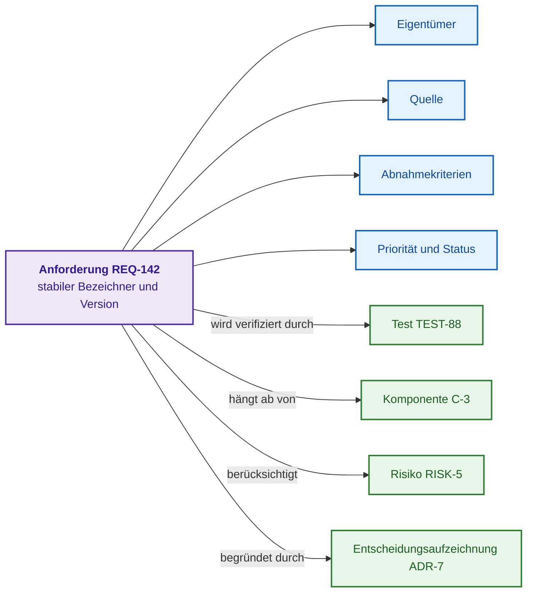
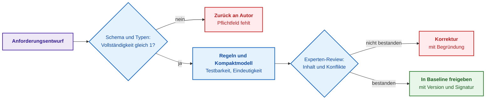
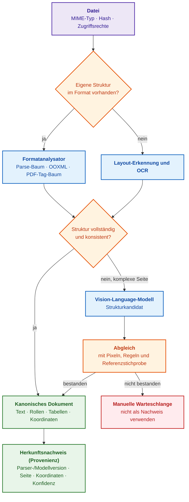
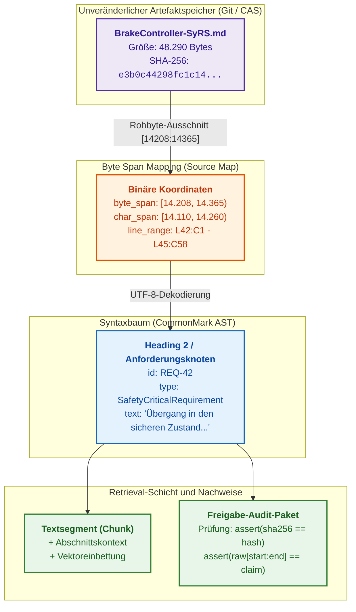
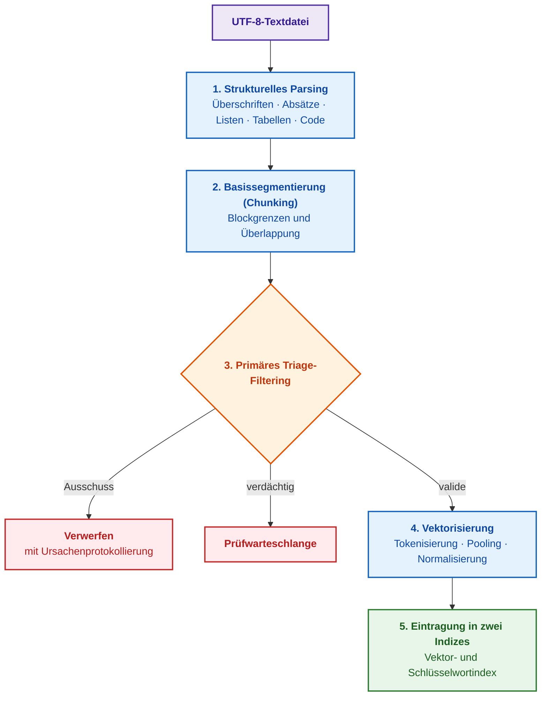
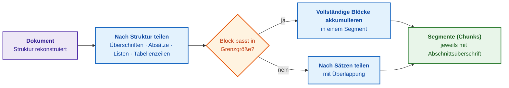
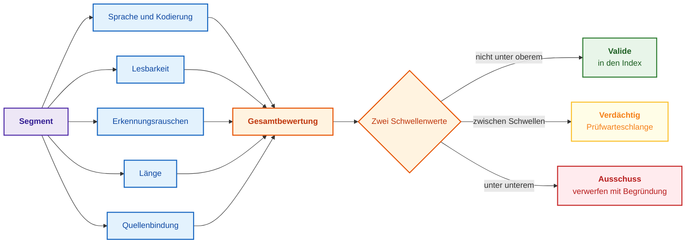
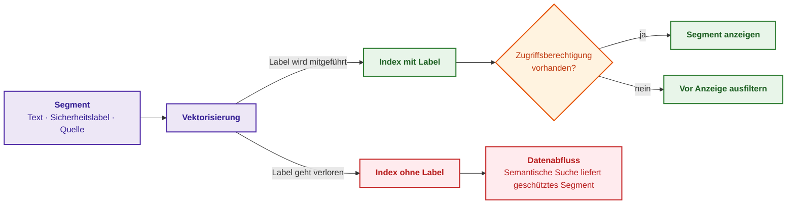
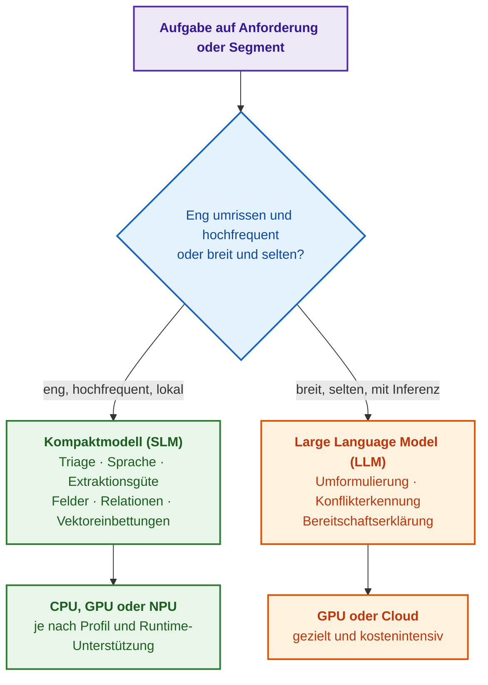

# Kapitel 8. Ingenieurtechnische Artefakte als Daten des Expertensystems

> **Buch:** [Architektur evidenzbasierter Expertensysteme](README.md) · [Teil II: Mathematische Modelle, Wissensrepräsentation und Wissensspeicherung](part-02-knowledge-models.md)  
> **Vorheriges Kapitel:** [Kapitel 7. Typologie von Wissensbasen: Regeln, Ontologien, Präzedenzfälle und Vektoren](ch07-knowledge-base-typology.md)  
> **Nächstes Kapitel:** [Kapitel 9. Ingenieurtechnischer Wissensgraph: Traceability von Anforderungen bis zur Hardware](ch09-engineering-knowledge-graph-traceability.md)  
> **Inhaltsverzeichnis:** [README.md](README.md)  
> **Autor:** [Mykola Fedchyk](about-the-author.md)  
> **Niveau:** Grundlegendes Ingenieurniveau; Pseudocode und Quelltext sind in einklappbare Blöcke ausgelagert  
> **Lernziele:** Eine Anforderung, einen Plan oder ein Risiko als versioniertes Datenobjekt modellieren; bewerten, wie viel Struktur das jeweilige Dateiformat bewahrt; den durchgängigen Pfad von der Rohdatei bis zum Segment mit Provenienz, Qualitätsprüfung, Vektoreinbettung und Sicherheitslabel durchlaufen; daten- und ergebnisbasiert zwischen deterministischen Regeln, kompakten Modellen und Large Language Models wählen.

## Abstract

In diesem Kapitel wird die fundamentale Transformation ingenieurtechnischer Artefakte — Anforderungen, Architekturentscheidungen (ADR), Verifikationspläne, Prüfprotokolle und Risikobewertungen — von passiven Textdokumenten in typisierte, maschineninterpretierbare Datenobjekte untersucht, die als formale Evidenzbasis für Expertensysteme fungieren. Es werden die inhärenten Grenzen unstrukturierter natürlicher Sprache in sicherheitskritischen Systemen dargelegt, in denen das Fehlen deterministischer Relationen eine verlässliche Auswirkungsanalyse, formale logische Inferenz und automatisierte Vollständigkeitsprüfungen verunmöglicht. Vorgestellt wird eine durchgängige Pipeline zur Überführung primärer Ingenieurdateien (PDF, Word, Markdown, Quellcode) in kanonische Wissensbasis-Strukturen unter strikter Wahrung der byte-granularen Herkunft (Source Map), was die juristische und technische Unanfechtbarkeit des Audit-Trails garantiert. Zudem werden Methoden zur Dekomposition von Artefakten in semantische Segmente (Chunking), Algorithmen der hybriden Indizierung (BM25 und dichte Vektoreinbettungen), Mechanismen zur strikten Vererbung von Sicherheitsattributen in Zugriffsgittern sowie architektonische Entscheidungskriterien zwischen generativen Large Language Models und kompakten Spezialmodellen für die verlässliche Speisung der Faktenbasis eines Expertensystems formalisiert.

Vor der Sitzung des Projektlenkungsausschusses trägt der Projektleiter den aktuellen Status mühsam aus Issue-Trackern, Testmanagementsystemen, Anforderungsdatenbanken, Chats und Tabellen zusammen und überführt die Befunde in einen Bericht — bereits zwei Tage später ist dieser Bericht jedoch veraltet. Eine Anforderung wie „Das Auftragsverwaltungssystem muss zügig auf Benutzeranfragen reagieren“ ist für einen Menschen zwar intuitiv verständlich, beantwortet jedoch keine der elementaren ingenieurtechnischen Fragen: Was genau bedeutet „zügig“, wer ist der fachliche Eigentümer der Anforderung, welche Prüffälle verifizieren diese Eigenschaft und wurde die Anforderung nach der Freigabe der Baseline modifiziert? Ein Sprachmodell vermag einen solchen Text zu lesen und zusammenzufassen, doch eine Paraphrase transformiert informelle Abhängigkeiten keineswegs in verifizierbare Daten: Das Werkzeug kann blockierte Meilensteine nicht deterministisch identifizieren, keine Testabdeckung berechnen und eine Auswirkungsanalyse bei Änderungen nicht reproduzierbar nachvollziehen.

Das Ziel dieses Kapitels besteht darin aufzuzeigen, dass ein ingenieurtechnisches Artefakt primär als strukturiertes Datenobjekt und erst sekundär als Dokument oder Bericht konzipiert sein muss, und den Weg nachzuzeichnen, auf dem eine Rohdatei zum belastbaren Wissensmaterial für ein evidenzbasiertes Expertensystem reift. Das Kapitel beginnt mit dem formalen Objektmodell des Artefakts (Anforderung, Plan, Risiko, Meilenstein), veranschaulicht anschließend, wie das physische Dateiformat den Grad der Strukturerhaltung determiniert, und analysiert detailliert die Verarbeitungskette von der Rohdatei bis zum Segment mit Provenienznachweis, Vektorrepräsentation und Sicherheitslabel. Vorherige Kapitel haben dargelegt, warum das institutionelle Gedächtnis unanfechtbare Evidenz erfordert ([Kapitel 5](ch05-triad-of-trust-and-corporate-memory.md)) und welche Wissensbasen strukturierte Daten verarbeiten ([Kapitel 7](ch07-knowledge-base-typology.md)); wie diese Objekte in einem durchgängigen Traceability-Graphen verknüpft werden, behandelt [Kapitel 9](ch09-engineering-knowledge-graph-traceability.md), und die Konstruktion vollständiger Wissensakquisitions-Pipelines vertieft [Kapitel 10](ch10-knowledge-acquisition-systems.md).

## 1. Forschungslandkarte: Herausforderungen der Artefaktverarbeitung, Ingenieurmethoden und Qualitätsmetriken

In industriellen Standards und Prozessmodellen werden die Resultate ingenieurtechnischer Tätigkeiten als Arbeitsergebnisse (*work products*) bezeichnet: Anforderungen, Entwicklungspläne, Testprotokolle, Architekturentscheidungen, Evidenzpakete. Parallel dazu existieren Arbeitselemente (*work items*): Aufgaben, Fehlertickets, Änderungsanträge, in denen sich situative Entscheidungen und technischer Kontext manifestieren. Für ein Expertensystem stellen beide Kategorien gleichermaßen Artefakte dar — Entitäten mit stabilem Identifikator, typisierten Relationen, Lebenszyklusstatus und formalen Nachweisen. Die nachfolgende Matrix konsolidiert die zentralen Problemstellungen dieses Kapitels und stellt jeder Herausforderung die ingenieurtechnische Methode, die Messmetrik, das typische Fehlermuster sowie die systematische Abhilfemaßnahme gegenüber.

| Problemstellung | Methode | Messgröße | Typisches Fehlermuster | Abhilfemaßnahme |
| --- | --- | --- | --- | --- |
| Anforderung unvollständig oder vage | Objektschema und Quality Gate | Vollständigkeit der Attribute, Akzeptanzquote, Restfehler nach Review | Prüfmechanismus akzeptiert grammatikalisch einwandfreie, aber nicht testbare Formulierung | Numerische Schwellenwerte und Vier-Augen-Freigabe |
| Relationen existieren lediglich im Fließtext | Traceability-Graph | Testabdeckung der Anforderungen und Nachweisdichte | Referenz existiert, verweist jedoch auf eine veraltete Version | Versionierte Relationen und semantische Konsistenzprüfung |
| PDF oder Scan verliert strukturelle Information | Formatanalysator, Layout- und Zeichenerkennung, Dokumentenmodell | Leserichtungs-Konsistenz, Tabellen- und Formelgenauigkeit, Provenienz | Vision-Language-Modell generiert plausiblen, im Quelltext jedoch nicht vorhandenen Text | Geometrischer Koordinatenabgleich, Konfidenzmetriken und manuelle Prüfwarteschlange |
| Segment wird bei Abfrage nicht aufgefunden | Strukturelle Segmentierung und hybrides Retrieval | Recall@k, Ranking-Güte an Spitzenpositionen, Latenz | Exklusive Optimierung auf Kosinus-Ähnlichkeit dichter Vektoren | Parallele Vektor- und Schlüsselwortsuche, Rangfusion (RRF), Cross-Encoder-Reranking |
| Geschützter Text gelangt in die Antwort | Zugriffskontrollfilter vor der Suche | Null unautorisierte Treffer in negativen Testfällen | Zugriffsberechtigungen werden erst nach dem Retrieval geprüft | Filterung von Kandidaten vor dem Ranking (Pre-Filtering) |

Diese Matrix zieht eine klare methodische Grenze: Die bloße Aussage „Das Modell funktioniert“ stellt im sicherheitskritischen Umfeld kein Akzeptanzkriterium dar. Jeder statistische Verarbeitungsschritt erfordert eine dedizierte Evaluierungsstichprobe, eine formale Metrik, einen Akzeptanzschwellenwert sowie ein deterministisches Fail-Safe-Verhalten bei Schwellenwertunterschreitung. Die folgenden Abschnitte behandeln diese Problemfelder sukzessive, beginnend mit der fundamentalen Unzulänglichkeit unstrukturierten Freitexts.

## 2. Grenzen unstrukturierter natürlicher Sprache in sicherheitskritischen Systemen

Eine Anforderung in reinem Fließtext liefert keine deterministischen, maschinenlesbaren Antworten auf Fragen nach fachlicher Zuständigkeit, Primärquelle, zugeordneten Tests, betroffenen Hardware-/Softwarekomponenten oder aktuellem Gültigkeitsstatus. Attribute lassen sich zwar heuristisch durch Regeln oder maschinelle Lernmodelle extrahieren, doch jede Extraktion stellt eine probabilistische Transformation mit spezifischer Fehlerrate, Modellabhängigkeit und Verifikationsnotwendigkeit dar. Aus diesem Grund entsteht um textbasierte Spezifikationen unausweichlich ein enormer manueller Zusatzaufwand: Ingenieure müssen separate Traceability-Matrizen (*traceability matrices*) pflegen, Testfälle manuell mit Anforderungen abgleichen und vor Zertifizierungsaudits mühsam Nachweise aus E-Mail-Verläufen, Ticketsystemen und veralteten Dokumentenständen zusammentragen.

Projektpläne leiden unter exakt derselben Problematik. In komplexen, regulierten Cyber-Physical- oder Softwareprojekten existiert eine Vielzahl interdependenter Artefakte: Projektstrukturpläne (*Work Breakdown Structure*, WBS), Ablaufpläne, Abhängigkeitsgraphen, Änderungsanträge, Baseline-Snapshots, Verifikationspläne, Fehlertrends, Lieferantenstatus, Audit-Befunde und Freigabe-Checklisten. Verharren diese Artefakte in statischen Dokumenten, mutiert das Projektmanagement zur manuellen Dokumentensynchronisation. Auch die Auswirkungsanalyse (*impact analysis*) hängt dann vollständig von menschlicher Disziplin ab: Nach der Modifikation einer Anforderung müsste die Plattform für das Application Lifecycle Management (ALM) oder das Expertensystem unmittelbar die betroffenen Arbeitspakete, Verifikationstests, Risiken und Genehmigungsschritte anzeigen — ein Fließtextdokument führt diese Relationen jedoch nicht deterministisch aus. Unter Termindruck ist es menschlich nahezu unmöglich, drei voneinander entkoppelte Speicherstellen simultan und fehlerfrei konsistent zu halten.

Das Fazit dieses Abschnitts ist eindeutig: Freitext ist für den menschlichen Leser intuitiv erfassbar, verwehrt jedoch reproduzierbare Antworten auf strukturelle Abfragen, während jede automatisierte Informationsextraktion zusätzliche Unsicherheiten einspeist. Der einzige belastbare Ausweg liegt in einer Neudefinition der Rolle des Dokuments selbst.

## 3. Paradigma des ingenieurtechnischen Artefakts als typisiertes Datenobjekt

Im maschinenorientierten Ansatz (*machine-first*) wird das Artefakt originär als strukturiertes Datenobjekt mit typisierten Attributen, expliziten Relationen und Invarianten modelliert. Aus diesem Datenobjekt lassen sich automatisiert Dokumente wie PDFs zur Ansicht, Webseiten für Stakeholder, Dashboards für das Management oder Exportpakete für behördliche Audits generieren — das physische Dokument degradiert damit zur flüchtigen Projektion (*view*), während das Datenobjekt die einzige verbindliche Wahrheitsquelle (*source of truth*) darstellt. Ändert sich das Zieldatum eines Meilensteins, wird das Attribut im Datenobjekt modifiziert, anstatt eine Folie in einer Präsentation manuell anzupassen.

Die Softwareindustrie hat eine analoge Denkwende bereits bei der Etablierung des Paradigmas „Everything as Code“ vollzogen: Infrastructure as Code, Policy as Code und Docs as Code (versionierter Text mit Review über Merge Requests und automatisierten Pipeline-Prüfungen) haben unmissverständlich demonstriert, dass ein Bildschirmfoto oder eine lokale Konfigurationsdatei keine verlässliche Wahrheitsquelle sein kann. Das Projekt- und System-Engineering vollzieht diese Transformation zwar zögerlicher, doch Arbeitspläne, Risikomodelle und Freigabekriterien müssen denselben Reifegrad struktureller Datenobjekte erreichen. Das praktische Kriterium ist simpel: Hat eine Änderung in einem Artefakt funktionale oder operative Konsequenzen, muss das anforderungs-, risiko- oder releaseverwaltende System diese Konsequenzen automatisch propagieren. Verschiebt sich ein Meilenstein um zwei Wochen, müssen abhängige Zulieferungen, Release-Tore und vertragliche Kundenverpflichtungen sofort signalisiert werden.

Large Language Models (LLMs) haben die Notwendigkeit formaler Strukturen keineswegs obsolet gemacht, sondern deren Fokus verschoben. Natürliche Sprache fungiert heute als hochflexible Benutzerschnittstelle: Sie erlaubt es, Absichten intuitiv zu formulieren, Anforderungsentwürfe zu generieren oder Entwurfsvarianten dialogisch zu explorieren. Eine Schnittstelle ist jedoch keine Wahrheitsquelle. Ein mithilfe eines Sprachmodells formulierter Text muss in ein strukturiertes Objekt mit festem Eigentümer, Akzeptanzkriterien und Relationen überführt werden, da er andernfalls weder eine Auswirkungsanalyse, noch ein formales Audit, noch eine Abdeckungsprüfung besteht. Das Sprachmodell senkt die Erstellungskosten eines Objektkandidaten, entbindet das System jedoch nicht von der Validierung von Feldern, Relationen und Berechtigungen: Formale Akzeptanzkriterien gelten für den Entwurf eines Menschen und die Vorlage eines Modells gleichermaßen.

Ein typisiertes Datenobjekt nutzt nicht nur dem Expertensystem: Auch Referenzinformationssysteme, Beratungsschnittstellen und Entscheidungsunterstützungssysteme profitieren von präziserem Retrieval, exakter Filterung und deterministischer Auswirkungsanalyse. Zum vollwertigen Expertensystem wird eine Architektur jedoch erst dann, wenn sie über Fakten und Relationen kodifiziertes Domänenwissen auf den konkreten Fall anwendet und die zugrundeliegende Argumentationskette transparent offenlegt ([Kapitel 3](ch03-beyond-reference-information-systems.md)). Strukturierte Daten liefern das unverzichtbare Material für logische Inferenz, ersetzen diese jedoch nicht. Den wichtigsten Anwendungsfall dieser Strukturierung bilden funktionale und nichtfunktionale Anforderungen.

## 4. Strukturmodell einer Anforderung: Attribute, Versionierung und semantische Relationen

Eine strukturierte Anforderung stellt ein typisiertes Objekt mit obligatorischen Attributen dar:

- **Eigentümer** (*owner*): Benennt die namentlich oder rollenbasiert verantwortliche Person für Inhalt und Aktualität der Anforderung;
- **Quelle** (*source*): Industriestandard, Kundenlastenheft, regulatorische Vorgabe oder Architekturentscheidung, aus der die Anforderung entspringt;
- **Abnahmekriterien** (*acceptance criteria*): Formale Bedingungen, anhand derer verifiziert wird, dass die Anforderung erfüllt ist;
- **Priorität und Status**: Kritikalitätsgrad und Lebenszyklusphase (Entwurf, genehmigt, nach Baseline geändert, veraltet);
- **Relationen**: Typisierte Kanten zu anderen Anforderungen, Architekturkomponenten, Testfällen, Risiken und Entscheidungsaufzeichnungen.

Das folgende Diagramm modelliert eine Anforderung als Knoten eines ingenieurtechnischen Graphen: Im Zentrum steht die Anforderung mit stabiler ID, umgeben von Attributfeldern, während typisierte Kanten zu assoziierten Entitäten führen.



Der violette Knoten repräsentiert die Anforderung, die blauen Knoten stellen Attribute dar, und die grünen Knoten sind verknüpfte Entitäten: Testfall, Architekturkomponente, Risiko und Architekturentscheidungs-Aufzeichnung (*Architecture Decision Record*, ADR). Weist eine Anforderung diese explizite Struktur auf, lassen sich relationale Abfragen wie „Zeige alle genehmigten Anforderungen ohne verknüpften Testfall“, „Finde alle Anforderungen, die nach dem Einfrieren der Baseline modifiziert wurden“ oder „Welche Anforderungen hängen von einer Komponente ab, deren Sicherheitszertifizierung noch aussteht?“ unmittelbar formulieren. Auf unstrukturiertem Text erfordern solche Abfragen fehleranfälliges manuelles Lesen oder statistische Heuristiken; über einem typisierten Objektgraphen werden sie deterministisch beantwortet.

Die strukturelle Integrität stützt sich dabei auf einen stabilen Identifikator und eine explizite Versionsnummer. Der Identifikator erlaubt es, die Historie einer Anforderung über semantische Umformulierungen hinweg zu verfolgen, während die Verknüpfung zwischen Test und Nachweis zwingend die exakte verifizierte Version referenzieren muss. Andernfalls würde ein historisch erfolgreicher Testlauf fälschlicherweise eine neu überarbeitete Anforderung validieren. Die Versionierung verwaltet unveränderliche Baseline-Snapshots; inhaltliche Änderungen markieren assoziierte Verifikationsnachweise automatisch als erneute Prüfkandidaten, ohne den historischen Prüfpfad zu löschen. Der nächste Schritt besteht in der automatisierten Qualitätskontrolle solcher Objekte.

## 5. Automatisierte Qualitätskontrolle und formale Validierung von Anforderungen (ISO/IEC/IEEE 29148)

Sobald eine Anforderung als typisiertes Objekt vorliegt, lässt sich ein wesentlicher Teil der Qualitätskontrolle deterministisch automatisieren. Das Prüfwerkzeug ersetzt keineswegs den leitenden Systemanalytiker, eliminiert jedoch fehleranfällige manuelle Routineprüfungen. Die internationale Norm ISO/IEC/IEEE 29148 definiert Qualitätsmerkmale professioneller Anforderungen [[1]](#src-1), von denen sich vier Merkmale hervorragend für die automatisierte Überprüfung eignen:

- **Vollständigkeit:** Die Anforderung besitzt einen expliziten Eigentümer, eine nachvollziehbare Quelle und quantifizierbare Abnahmekriterien;
- **Testbarkeit** (*testability*): Für die Anforderung lässt sich ein objektiver Prüfaufbau definieren; qualitative Formulierungen wie „Die Benutzeroberfläche muss intuitiv sein“ werden unmittelbar als Defekt klassifiziert;
- **Eindeutigkeit:** Der Text enthält keine Weichmacherwörter („schnell“, „robust“, „nach Bedarf“) ohne zugeordnete numerische Grenzwerte;
- **Widerspruchsfreiheit:** Die Anforderung steht nicht im Konflikt mit anderen Anforderungen, beispielsweise indem zwei Spezifikationen divergierende Grenzwerte für denselben physikalischen Parameter vorschreiben.

Die elementare quantitative Bewertung bildet die strukturelle Vollständigkeit einer Anforderung:

```math
C_{	ext{req}}(r)=rac{1}{m}\sum_{j=1}^{m} I_j(r)
```

Parameter der strukturellen Vollständigkeit:

- $r$ bezeichnet die evaluierte Anforderung, $`m > 0`$ ist die Gesamtzahl obligatorischer Schemaattribute und $j$ indiziert das jeweilige Feld;
- $I_j(r)$ nimmt den Wert 1 an, wenn das Attribut $j$ mit einem typkonformen, nicht-trivialen Wert belegt ist, andernfalls 0;
- $\sum_{j=1}^{m}$ summiert die Prüfergebnisse über alle Schemaattribute, und die Division durch $m$ normiert den Wert auf das Intervall $[0, 1]$.

Das Resultat liegt zwischen 0 und 1: Sind beispielsweise vier von fünf Pflichtfeldern typkonform belegt, ergibt sich $C_{	ext{req}} = 4/5 = 0{,}8$. Ein formal ausgefülltes Feld garantiert jedoch noch keine inhaltliche Qualität: Der Eintrag `owner: TBD` existiert zwar syntaktisch, benennt jedoch keinen verantwortlichen Ingenieur. Aus diesem Grund wird das Release-Prüftor (*quality gate*) als Produkt binärer Prüfungen ohne Annahme statistischer Unabhängigkeit formuliert:

```math
Q_{	ext{gate}}(r)=\mathbf{1}[C_{	ext{req}}(r)=1]\cdot\mathbf{1}[T(r)=1]\cdot\mathbf{1}[A(r)=1]\cdot\mathbf{1}[S(r)=1]
```

Kriterien des Quality Gates:

- $r$ ist die zu validierende Anforderung, und $C_{	ext{req}}(r) = 1$ bestätigt die vollständige und typkonforme Belegung aller Pflichtfelder;
- $\mathbf{1}[\cdot]$ ist die Indikatorfunktion, die den Wert 1 annimmt, wenn die umschlossene Aussage wahr ist, andernfalls 0;
- $T(r)$ repräsentiert die formale Testbarkeit, $A(r)$ das Fehlen linguistischer Mehrdeutigkeiten und $S(r)$ die Konsistenz und Widerspruchsfreiheit zur aktiven Baseline;
- Die Multiplikation erzwingt, dass jedes einzelne Kriterium erfüllt sein muss, um das Gate zu passieren.

Folglich nimmt $Q_{	ext{gate}}(r)$ ausschließlich die Werte 0 oder 1 an und signalisiert nur bei $Q_{	ext{gate}}(r) = 1$ die Freigabereife. Ein statistisches Modell kann $T$ evaluieren oder Anomalien vorschlagen, doch das Quality Gate darf die ingenieurtechnische Entscheidung niemals stillschweigend durch Modellwahrscheinlichkeiten substituieren.

**Runtime-Steuerung und Systemzustandsübergänge:**
- **Freigabe in die Baseline (`Baseline Approved`):** Bei $Q_{	ext{gate}}(r) = 1$ wird das Anforderungsobjekt mit dem kryptografischen Schlüssel des Ingenieurs (Ed25519) signiert und im unveränderlichen Versionsmanifest verankert;
- **Blockierung des Commits (`Block Commit`):** Bei $Q_{	ext{gate}}(r) = 0$ weist der CI/CD-Pre-Commit-Hook die Registrierung des Artefakts ab und generiert einen maschinenlesbaren Diagnosebericht mit dem Statusvektor $[C_{	ext{req}}, T, A, S]$ zur gezielten Mängelbeseitigung durch den Autor.

**Praktisches Rechenbeispiel:**
Analysiert wird der Entwurf der Sicherheitsanforderung REQ-104 („Der Controller muss das Notfall-Flag bei Unterspannung zügig zurücksetzen“). Das Schema umfasst $m = 5$ Attribute, die alle typkonform belegt sind ($C_{	ext{req}} = 1$). Die Testbarkeit ist formal gegeben ($T = 1$), und Konflikte zur Baseline liegen nicht vor ($S = 1$). Der linguistische Analysator identifiziert jedoch das unpräzise Adverb „zügig“ ohne Angabe einer Latenzobergrenze in Millisekunden ($A = 0$):

```math
Q_{	ext{gate}}(	ext{REQ-104}) = \mathbf{1}[1 = 1] \cdot \mathbf{1}[1 = 1] \cdot \mathbf{1}[0 = 1] \cdot \mathbf{1}[1 = 1] = 1 \cdot 1 \cdot 0 \cdot 1 = 0
```

Da $Q_{	ext{gate}} = 0$, blockiert die Pipeline die Aufnahme der Anforderung mit dem Diagnosecode `ERR_AMBIGUOUS_SPECIFICATION: missing latency bound`. Das nachfolgende Ablaufdiagramm verdeutlicht die Kaskade dieser Qualitätsprüfungen.



Die blauen Knoten repräsentieren automatisierte Prüfungen, rote Knoten leiten das Artefakt zur Überarbeitung zurück, und der grüne Knoten fixiert die Anforderung in der Baseline. Defekte werden somit unmittelbar bei der Entstehung abgefangen und erreichen weder das Zertifizierungsaudit noch den Prüfstand.

In der Praxis existiert kein monolithisches Einzelwerkzeug für sämtliche Aspekte der Anforderungsqualität; die Verifikation wird daher in Schichten aufgebaut. Der statische Prosa-Linter [Vale](https://github.com/vale-cli/vale) fängt mit domänenspezifischen Regelsätzen Weichmacher und Schablonenverletzungen direkt in der CI/CD-Pipeline ab. Die Go-Bibliothek [prose](https://github.com/jdkato/prose) liefert Tokenisierung, Satzerkennung, Part-of-Speech-Tagging und Named Entity Recognition (NER) mit exakten Textoffsets; da ihre vortrainierten Modelle jedoch englischsprachig sind, dürfen deren Konfidenzwerte nicht ungeprüft auf anderssprachige Spezifikationen übertragen werden. Für die lokale Inferenz neuronaler Modelle in Go bieten sich [Cybertron](https://github.com/nlpodyssey/cybertron) oder [Hugot](https://github.com/knights-analytics/hugot) auf Basis der ONNX Runtime an; die Kompatibilität zwischen Modellarchitektur, Tokenisierer und Hardwarebeschleunigung muss im Test nachgewiesen werden. Das Modell [GLiNER](https://github.com/urchade/GLiNER) empfiehlt sich für die flexible Zero-Shot-Extraktion von Entitäten, wobei reine Entitätserkennung niemals die Relationsextraktion (*relation extraction*) und Schemavalidierung ersetzt. Kommerzielle Werkzeuge müssen nach demselben strikten Prüfprotokoll evaluiert werden, ohne proprietäre Bewertungsziffern ungeprüft als Qualitätsbeweis zu akzeptieren.

Ein KI-Assistent auf Basis eines Large Language Models kann präzisere Formulierungen vorschlagen, fehlende Abnahmekriterien ergänzen, potenzielle Widersprüche zu Nachbaranforderungen aufdecken oder Testfälle ableiten. Seine Ausgaben bleiben jedoch unverbindliche Vorschläge: Die formale Entscheidung trifft der Mensch, und die Modifikation wird als versioniertes Datenobjekt mit lückenloser Historie erfasst. Das Fazit dieses Abschnitts: Strukturierte Daten machen Qualität messbar, die Letztverantwortung verbleibt jedoch beim Fachexperten. Das stärkste Argument für typisierte Datenobjekte ist jedoch nicht die lokale Qualitätsprüfung, sondern die durchgängige Traceability.

## 6. Durchgängige Traceability ingenieurtechnischer Artefakte als Fundament der Systemarchitektur

In regulierten Forschungs- und Entwicklungsprojekten muss eine ununterbrochene Kausalkette nachgewiesen werden: Stakeholder-Bedarf, Systemanforderung, Softwareanforderung, Architekturentscheidung, Verifikationstest und Ausführungsprotokoll. Die Norm ISO/IEC/IEEE 29148 schreibt eine bidirektionale Traceability von Anforderungen zwingend vor [[1]](#src-1). Existiert auch nur ein einziges Kettenglied ausschließlich als unstrukturierter Fließtext, reißt der formale Nachweis ab und muss vor Audits manuell rekonstruiert werden.

Die Modellierung als strukturierter Objektgraph macht diese Kette interaktiv navigierbar. Eine Auswirkungsanalyse arbeitet exakt so schnell und reproduzierbar, wie der Graph aktuell gehalten wird: Wird eine Anforderung geändert, weist die Plattform sofort die betroffenen Tests, Risiken, Architekturentscheidungen und Release-Meilensteine aus; schlägt ein Test fehl, werden unbestätigte Anforderungen sichtbar; wird ein Industriestandard revidiert, lassen sich alle zugeordneten Sicherheitsmaßnahmen identifizieren. Der Mechanismus basiert auf deterministischem Graph-Traversal und Integritätsprüfungen; eine fehlende oder fehlerhafte Kante führt folglich unmittelbar zu einer unvollständigen oder fehlerhaften Auswirkungsanalyse. Die primäre diagnostische Metrik der Verifikationsabdeckung lässt sich ohne komplexe Graphentheorie formalisieren:

```math
\mathrm{Coverage}_{R
ightarrow T}=rac{\left\lvert\left\{r\in R:\ \exists\,t\in T,\ (r,t)\in E_{RT}
ight\}
ight
vert}{\lvert R 
vert}
```

Notation der Verifikationsabdeckung:

- $R$ ist die Menge aller aktiven Anforderungen, $T$ die Menge der Verifikationstests und $E_{RT}$ die Menge verifizierter Relationen des Typs „Anforderung wird verifiziert durch Test“;
- $r$ bezeichnet eine spezifische Anforderung, $t$ einen konkreten Testfall und $(r,t)\in E_{RT}$ drückt aus, dass eine bestätigte Verifikationskante zwischen genau diesem Paar existiert;
- $\exists$ bezeichnet den Existenzquantor („es existiert mindestens ein“), und $\lvert\cdot
vert$ ist die Mächtigkeit der jeweiligen Menge;
- Der Zähler zählt alle Anforderungen, denen mindestens ein Test zugeordnet ist, während der Nenner die Gesamtzahl aktiver Anforderungen umfasst.

**Runtime-Steuerung und normatives Freigabetor:**
- **Imperativ der funktionalen Sicherheit (ISO 26262 ASIL D / DO-178C Level A):** Die Norm verlangt strikt $\mathrm{Coverage}_{R
ightarrow T} = 1{,}00$. Jeder Wert unter 1 wird als kritische Verifikationslücke eingestuft;
- **Aktion der Pipeline:** Ist $\mathrm{Coverage}_{R
ightarrow T} < 1{,}00$, löst der Sicherheitsbericht-Compiler ein `FAIL_CLOSED`-Ereignis aus, blockiert die Erstellung des kryptografisch signierten Release-Pakets und exportiert die ungedeckten Anforderungen in den Incident-Tracker.

**Praktisches Rechenbeispiel:**
Der aktuelle Release-Snapshot umfasst $\lvert R 
vert = 120$ sicherheitskritische Anforderungen. Nach dem automatisierten Audit des Teststands weisen 118 Anforderungen Verknüpfungen zu erfolgreich bestandenen Verifikationstests auf:

```math
\mathrm{Coverage}_{R
ightarrow T} = rac{118}{120} pprox 0{,}9833
```

Da $\mathrm{Coverage}_{R
ightarrow T} = 0{,}9833 < 1{,}00$, blockiert das System die Firmware-Freigabe trotz einer formalen Abdeckung von 98,3 % und markiert exakt die zwei ungedeckten Anforderungen: `REQ-045` (Watchdog-Rücksetzung) und `REQ-089` (Diagnose bei CAN-Bus-Unterbrechung).

## 7. Modellierung von Plänen, Risiken und Meilensteinen als typisierte Datenobjekte

Das Prinzip, Freitext in typisierte Datenobjekte zu transformieren, beschränkt sich keineswegs auf funktionale Anforderungen. Es ist für Projektterminpläne, Risikomanagementmodelle und Release-Meilensteine gleichermaßen unabdingbar. Im traditionellen dokumentenzentrierten Paradigma besteht ein Release-Plan häufig aus einer statischen Excel-Tabelle oder einer Wiki-Seite mit Terminen, Verantwortlichen und einigen formelhaften Textabsätzen zu Risiken. Ein solches Dokument weicht bereits am zweiten Tag nach seiner Genehmigung von der Realität ab, da es vollständig von der realen Codebasis, den Prüfstandstests und der Hardware-Lieferkette entkoppelt ist. Im maschinenorientierten Ansatz besteht der Release-Plan dagegen aus dynamisch verknüpften Datenobjekten.

Ein Meilenstein definiert formale Eintritts- und Austrittskriterien (*entry and exit criteria*), die an Anforderungen, Verifikationstests oder Genehmigungsschritte gebunden sind. Ein Arbeitspaket besitzt explizite Abhängigkeiten und Ressourcenallokationen. Ein Risiko umfasst Trigger-Bedingungen, quantitative Eintrittswahrscheinlichkeiten, Schadensausmaße, Minderungsmaßnahmen, Verantwortliche und Eskalationsregeln. Ein Release-Gate beinhaltet maschinell verifizierbare Bedingungen: keine offenen Blocker-Bugs, alle obligatorischen Regressionstests bestanden, sämtliche modifizierten Anforderungen verifiziert, alle Ausnahmegenehmigungen (*waivers*) autorisiert und das Security-Audit abgeschlossen. Ist eine Bedingung nicht erfüllt, signalisiert die Release-Management-Plattform die mangelnde Freigabefähigkeit sofort, anstatt darauf zu warten, dass ein Projektleiter den Statusbericht manuell aktualisiert.

Aus denselben Datenobjekten wird der wöchentliche Statusbericht automatisch generiert — der Bericht spiegelt den realen Zustand wider, anstatt ihn zu postulieren. Ist der Bericht visuell ansprechend, die zugrundeliegenden Objekte jedoch fehlerhaft, schlägt das Freigabe-Dashboard unbestechlich auf Rot um und schützt die Organisation vor trügerischem Präsentationsoptimismus. Das Objektmodell ist damit etabliert; im Folgenden muss analysiert werden, wie viel strukturelle Information erhalten bleibt, wenn ein solches Objekt in einer Datei gespeichert wird.

## 8. Einfluss des physischen Trägerformats auf den Erhalt der ingenieurtechnischen Struktur

Jedes Artefakt wird in einer Datei eines bestimmten Formats persistiert, und dieses Format determiniert, wie viel Struktur für den Indexierer, das Expertensystem oder die Audit-Pipeline erhalten bleibt. Derselbe Projektplan in einem leichtgewichtigen Markup-Format und als gescanntes PDF stellt für die verarbeitende Maschine zwei grundverschiedene Informationsquellen dar. Die Dateiformate lassen sich nach dem Grad ihrer strukturellen Explizitheit ordnen:

- **Reiner Text und Markup** (*plain text, markup*): Markdown, HTML, reStructuredText, AsciiDoc sowie im Engineering XML-basierte Standards (*eXtensible Markup Language*) wie das Requirements Interchange Format (ReqIF) [[2]](#src-2). Die Struktur ist direkt im Text deklariert: Überschriften durch Formatierungszeichen, Tabellen durch Trennzeichen, Relationen durch eindeutige Identifikatoren. Eine solche Datei lässt sich zeilenweise vergleichen (Diff), unter Versionskontrolle stellen und bis auf Zeilenebene deterministisch adressieren;
- **Strukturierte Binärformate** (*structured binary*): Office-Dateien wie .docx und .xlsx sind ZIP-Archive mit XML-Bestandteilen gemäß dem Standard Office Open XML (OOXML). Eine strukturelle Repräsentation ist vorhanden, liegt jedoch hinter Kapselungsschichten und Formatvorlagen verborgen, wobei die Verknüpfung zwischen optischem Stil und semantischer Rolle nicht zwingend eindeutig ist;
- **Layout-orientierte Formate** (*layout-oriented*): Standardmäßiges, nicht-getaggtes PDF beschreibt die geometrische Platzierung von Glyphen und Vektorgrafiken auf einer Druckseite; Leserichtung, Tabellengrenzen und Überschriftenhierarchien müssen daher aufwendig rekonstruiert werden. Getaggtes PDF (*tagged PDF*) besitzt dagegen einen logischen Strukturbaum, und der Standard PDF/UA definiert verbindliche Anforderungen an semantische Tags und die Lesereihenfolge [[3]](#src-3); automatisch erzeugte Tag-Bäume sind jedoch häufig unvollständig und bedürfen der Verifikation;
- **Rastergrafiken und Scans** (*raster scans*): Reine Rastergrafiken ohne eingebettete Textebene enthalten ausschließlich Pixelmatrizen; jedes Schriftzeichen muss optisch erkannt werden, wobei jede Zeichenerkennung mit einer inhärenten Fehlerrate behaftet ist.

Die Gesetzmäßigkeit ist eindeutig: Je expliziter die Struktur im Format verankert ist, desto kostengünstiger, robuster und deterministischer gestaltet sich die Verarbeitung und desto präziser lässt sich rekonstruieren, woher ein Segment stammt und wie es extrahiert wurde. Textbasiertes Markup wird von einem Parser nahezu verlustfrei verarbeitet, strukturierte Binärformate erfordern moderaten Aufwand, Layout-Formate verlangen Heuristiken mit unvermeidbaren Informationsverlusten, und Rasterscans verursachen die höchsten Rechenkosten bei permanenter Zeichenunsicherheit.

Eine eigenständige Klasse bilden Serialisierungsformate für den maschinellen Datenaustausch. XML strukturiert Daten über verschachtelte Tags (`<owner>Storage</owner>`), ist jedoch syntaktisch redundant. JSON (*JavaScript Object Notation*) adaptierte die Objektsyntax von JavaScript und etablierte sich als universelles Austauschformat zwischen Server und Webanwendungen [[4]](#src-4). YAML (*YAML Ain't Markup Language*) bildet Hierarchien über Einrückungen ab, wodurch es für Menschen exzellent les- und schreibbar ist, weshalb es im Konfigurationsmanagement dominiert [[5]](#src-5). In allen drei Formaten benennt der Schlüssel direkt das Schemafeld (`owner`, `acceptance_criteria`), sodass sie das Prinzip „Artefakt als Datenobjekt“ nativ abbilden. Dabei gelten drei fundamentale ingenieurtechnische Leitlinien:

1. Jede Datenstruktur muss vor der Indizierung formal gegen ein Schema validiert werden: JSON Schema [[6]](#src-6), XML Schema Definition (XSD) oder die W3C-Constraint-Sprache SHACL [[7]](#src-7) fangen Typfehler, fehlende Pflichtfelder und unzulässige Kanten frühzeitig ab;
2. YAML muss mit abgesicherten Parsern verarbeitet werden, die eine feste Spezifikationsversion erzwingen und Restriktionen bezüglich doppelter Schlüssel, Typ-Aliase und benutzerdefinierter Tags durchsetzen, um zu verhindern, dass Konfigurationsdateien als Einfallstor für Remote Code Execution missbraucht werden;
3. Rohe Serialisierungsdaten dürfen nicht ungeprüft in Vektoreinbettungen überführt werden: Steuersyntax erzeugt semantisches Rauschen, wenngleich sprechende Feldnamen hilfreich sein können. Auf domänenspezifischen Testkorpora sollten stets mindestens zwei Repräsentationen evaluiert werden (Rohdaten vs. kanonisch gerenderter Text), während Strukturattribute parallel als Metadaten und Filterkriterien hinterlegt werden. Die Segmentierung muss objektbasiert erfolgen (Array-Eintrag, XML-Element, Schlüsselblock samt Pfad) und darf niemals an festen Zeichengrenzen ansetzen.

Das Fazit dieses Abschnitts: Das Dateiformat ist eine fundamentale Frage der Evidenzsicherung, keine Frage des persönlichen Geschmacks. Daraus resultieren drei goldene Regeln: Speichere Quellartefakte in Formaten mit expliziter Struktur (Text unter Versionskontrolle statt PDF-Export, ReqIF statt Ausdruck), dokumentiere die Extraktionsmethode für jedes Segment, da Segmente aus Markup, rekonstruiertem Layout oder OCR grundverschiedene Vertrauensklassen besitzen, und führe die quantitative Qualitätsbewertung der Extraktion untrennbar mit dem Segment mit. Wie diese Extraktion technisch vollzogen wird, zeigt der nächste Abschnitt.

## 9. Primäre Transformation: Syntaktisches Parsing und Normalisierung von Rohbytes in kanonische Dokumente

Die Skala der Strukturerhaltung korreliert direkt mit der algorithmischen Komplexität und den Rechenkosten der Ingestion-Pipeline: Je weiter sich ein Format von reinem Text-Markup entfernt, desto mehr Heuristiken, neuronale Modelle und manuelle Prüfschritte sind erforderlich, um aus Rohbytes verlässliches ingenieurtechnisches Wissen zu destillieren. Die beiden Extreme verdeutlichen diese Diskrepanz: Leichtgewichtiges Markup (Markdown, XML, ReqIF), dessen semantische Struktur an der Oberfläche liegt und von einem deterministischen Parser in Mikrosekunden erfasst wird, steht dem Rasterscan einer technischen Zeichnung oder eines signierten Abnahmeprotokolls gegenüber, bei dem jedes Zeichen und jede Tabellenlinie aus Pixelmatrizen rekonstruiert werden muss.

**Markup.** Ein syntaktischer Analysator (*parser*) transformiert Markup-Text in einen abstrakten Syntaxbaum (*abstract syntax tree*, AST). Die grundlegende Mechanik verdeutlicht ein einfacher zeilenbasierter Durchlauf, wenngleich eine vollständige Implementierung der CommonMark-Spezifikation [[8]](#src-8) Codeblöcke, verschachtelte Listen und Tabellenausrichtungen abbilden muss.

<details>
<summary>Pseudocode: Parsing von Markup in einen Syntaxbaum</summary>

```text
Lese Datei als UTF-8-Zeichenkette
Für jede Zeile:
    Wenn Zeile mit '#' beginnt       -> Knoten «Überschrift», Ebene = Anzahl der '#'
    Wenn Zeile Muster '| ... |' hat -> Tabellenzeile
    Wenn Zeile mit '- ' beginnt      -> Listenelement
    Wenn Zeile '[Text](Ziel)' enthält -> Relation (Text, Ziel)
Füge Knoten entsprechend den Überschriftenebenen zu einem Baum zusammen
```

</details>

Das Parsen von Markup liefert syntaktische Überschriften, Tabellen, Listen und Hyperlinks; die inhaltliche Validität einer Anforderung oder die Erreichbarkeit eines Links bedürfen weiterhin separater Prüfungen. Auch PDF und Bildformate basieren auf formalen Spezifikationen. Die Schwierigkeit liegt nicht im Fehlen einer formalen Grammatik, sondern darin, dass syntaktisch korrekte Positionierungsbefehle von Glyphen oder Pixelmatrizen die logische Leserichtung und den fachlichen Zusammenhang nicht deterministisch kodieren. Ein PDF-Parser kann das Dateiformat fehlerfrei dekodieren und dennoch eine Tabelle strukturell falsch rekonstruieren. Deterministisches Parsen garantiert nicht die Abwesenheit semantischer Rekonstruktionsfehler.

**Intermediäre Formate.** In einem nicht-getaggten PDF sind Schriftzeichen ausschließlich an zweidimensionale Seitenkoordinaten gebunden; Leserichtung, Spalten und Tabellengrenzen müssen über geometrische Heuristiken rekonstruiert werden. Getaggtes PDF wird primär über den logischen Strukturbaum eingelesen, erfordert jedoch Konsistenzprüfungen gegenüber dem sichtbaren Seiteninhalt. Das Format .docx ist robuster, da es ein Paket typisierter XML-Dateien darstellt; dennoch hängt die semantische Qualität von der Disziplin des Autors ab: Wurde eine Überschrift lediglich durch Vergrößern des Schriftgrads anstelle einer Formatvorlage realisiert, muss ihre Rolle heuristisch erraten werden.

**Rastergrafiken.** Ein Scan durchläuft die aufwendigste und fragilste Verarbeitungskette: Entzerrung (*deskewing*), Binarisierung, Dokumentenlayout-Analyse (Segmentierung in Text, Tabellen und Abbildungen) und optische Zeichenerkennung (*optical character recognition*, OCR).

<details>
<summary>Pseudocode: OCR-Verarbeitung eines Rasterscans</summary>

```text
Bildmatrix -> Entzerrung -> Binarisierung
Layout-Analyse: Identifiziere Textbereiche, Tabellen und Abbildungen
Für jeden Textbereich: OCR -> Zeichenkette + Konfidenzwerte [0, 1]
Wenn durchschnittliche Konfidenz unter Schwellenwert -> Manuelle Prüfwarteschlange
```

</details>

Da jedes einzelne Zeichen mit einer Erkennungsunsicherheit behaftet ist, müssen die Konfidenzwerte als Metadaten zwingend mitgeführt werden: Ein Segment mit geringer Erkennungsgüte darf niemals stillschweigend als unanfechtbare Evidenz zitiert werden.

Im Jahr 2026 hat es sich bewährt, Pipelines der intelligenten Dokumentenverarbeitung (*document AI*) als kaskadierende Stufen zu konzipieren: von der kostengünstigsten, deterministischen Methode bis zum statistischen Fallback.

| Eingabe und Problemstellung | Primäre Methode | Wann Machine Learning zuschalten | Akzeptanzkriterium |
| --- | --- | --- | --- |
| Markdown, HTML, XML, ReqIF | Formatspezifischer Parser und AST-Konstruktion | Nahezu nie für Syntax; ML nur für semantische Feldextraktion | Syntaxbaum valide, Hyperlinks und Identifikatoren exakt erhalten |
| .docx, .xlsx, .pptx | OOXML-Parser; für Masseningestion Apache Tika [[9]](#src-9) oder Docling [[10]](#src-10) | Wenn Formatvorlagen semantische Rollen nicht abbilden | Überschriften, Tabellen, Fußnoten und Verknüpfungen mit Referenz abgeglichen |
| Getaggtes PDF | Strukturbaum und Seitengeometrie | Wenn Tags fehlen oder im Widerspruch zum Seiteninhalt stehen | Korrekte Lesereihenfolge und semantische Rollenzuordnung |
| Komplexes PDF oder Scan | Layout-Analyse und OCR, z. B. Docling oder PP-StructureV3 [[11]](#src-11) | Vision-Language-Modell für Formeln, Tabellen, Diagramme und verschachtelte Layouts | Zeichen- und Wortfehlerrate (CER/WER), Zellgenauigkeit bei Tabellen, korrekte Leserichtung |
| Kritisches Evidenzdokument | Deterministischer Parser und Quellkoordinaten | Modell generiert ausschließlich Entwurfskandidaten | Manuelle Bestätigung oder unabhängige Doppelprüfung |

Layout-bewusste Modelle wie LayoutLMv3 [[12]](#src-12) fusionieren Text-, Bild- und Positionsmerkmale, während moderne Vision-Language-Modelle (VLM) direkt strukturiertes Markdown oder JSON ausgeben. Diese Modelle bewältigen mehrspaltige Layouts, komplexe Tabellen und mathematische Formeln weitaus zuverlässiger als traditionelle Pipelines („OCR gefolgt von Fließtext“), schaffen jedoch ein neues Risiko: Ein generatives Modell neigt dazu, unleserliche Zeichen zu halluzinieren oder Texte zu glätten. Aus diesem Grund wird die Ausgabe eines VLM erst dann zur belastbaren Evidenz, wenn sie untrennbar mit Quellidentifikator, Seitenzahl, Begrenzungsrahmen (*bounding box*), Modellversion und Prüfstatus gekoppelt ist. Die lückenlose Dokumentation dieser Transformationskette lässt sich standardkonform über die W3C-Ontologie PROV-O erfassen [[13]](#src-13). Das folgende Diagramm fasst die Parsing-Pipeline zusammen.



Blaue Knoten führen die Transformation aus, orangefarbene Rauten verifizieren die Zwischenergebnisse, grüne Knoten markieren das kanonische Dokument mit Provenienz, und der rote Knoten repräsentiert die manuelle Prüfwarteschlange. Das Vision-Language-Modell wird ausschließlich dann aktiviert, wenn deterministische Verfahren unvollständige Strukturen liefern, und seine Ausgaben erlangen ohne Verifikation keinen Evidenzstatus.

### 9.1. Byte-granulare Traceability: Konstruktion von Source Maps für Quellartefakte

Wenn ein evidenzbasiertes Expertensystem oder ein externer Auditor eine sicherheitskritische Anforderung wie REQ-42 („Bei Ausfall des Watchdogs geht der Bremscontroller innerhalb von 100 ms in den sicheren Zustand über“) verifiziert, ist eine vage Quellenangabe wie „Gefunden in der Spezifikation SyRS_v3.2.md“ völlig unzureichend. In regulierten Branchen (funktionale Sicherheit nach ISO 26262 ASIL D, Avionik nach DO-178C DAL A, Bahnautomatisierung nach CENELEC EN 50128) muss jede Anforderung, jeder extrahierte Parameter und jedes Zitat im Verifikationsbericht eine mathematisch unanfechtbare, kryptografische Herkunft (*provenance*) bis hin zum exakten Byte-Bereich in der unveränderlichen Quelldatei aufweisen.

Operiert ein System lediglich auf „rekonstruiertem Text“ ohne feste Dateikoordinaten, drohen gravierende Risiken:
- UTF-8-Rekodierungen oder Unicode-Normalisierungen (beispielsweise der Austausch von Bindestrichen gegen Gedankenstriche oder lateinischen Zeichen gegen optisch identische kyrillische Glyphen) zerstören kryptografische Prüfsummen;
- Ein aggressiver Tokenisierer oder ein VLM kann Latenzwerte unbemerkt verfälschen (etwa „100 ms“ zu „10 ms“ glätten), was fatale Halluzinationen in Sicherheitsnachweisen nach sich zieht;
- Das Fehlen exakter Koordinaten verunmöglicht die direkte Integration in Entwicklungsumgebungen (IDEs), in denen Ingenieure per Klick im Audit-Bericht unmittelbar die markierte Originalzeile im Quellcode oder der Spezifikation anspringen müssen.

Um absolute Beweiskraft zu garantieren, implementiert die Verarbeitungsarchitektur eine **byte-granulare Source Map**: Jeder Knoten des AST-Baums, jedes extrahierte Attribut und jedes Suchsegment wird über deterministische Koordinaten fest mit der binären Quelldatei verankert.



Der vollständige Provenienz-Deskriptor eines Artefakts umfasst fünf orthogonale Dimensionen:

1. **Kryptografischer Datei-Hash (`file_sha256`):** Fixiert den exakten Zustand des Binärinhalts im Versionskontrollsystem oder im inhaltsadressierten Speicher (*Content-Addressable Storage*, CAS). Wird auch nur ein einzelnes Bit modifiziert, verliert der Hash seine Gültigkeit.
2. **Byte-Spanne (`byte_span`):** Das halboffene Intervall $[b_{	ext{start}}, b_{	ext{end}})$ der Bytes in der Rohdatei. Dies bildet die sprach- und kodierungsunabhängige binäre Referenz.
3. **Zeichen-Offset (`char_span`):** Der Offset der Unicode-Codepoints im dekodierten Text des kanonischen Dokuments, unverzichtbar für Textverarbeitungsbibliotheken.
4. **Zeilen- und Spaltenkoordinaten (`line_col`):** Das Tupel $[l_{	ext{start}}, c_{	ext{start}}, l_{	ext{end}}, c_{	ext{end}}]$, das es IDEs wie VS Code oder CLion erlaubt, die Stelle unmittelbar im Editor hervorzuheben.
5. **Geometrischer Begrenzungsrahmen (`bbox`):** Für PDFs, Zeichnungen oder Scans — Seitennummer sowie normalisierte räumliche Koordinaten $[x_0, y_0, x_1, y_1]$ auf der Seite.

<details>
<summary>Beispiel in YAML: Provenienz-Metadaten eines Segments mit Byte-Koordinaten</summary>

```yaml
chunk_id: CHK-REQ-42-01
target_entity: REQ-42
provenance:
  file_path: "specs/safety/BrakeController-SyRS.md"
  file_git_commit: "9f82a3c748e10b441209e5"
  file_sha256: "e3b0c44298fc1c149afbf4c8996fb92427ae41e4649b934ca495991b7852b855"
  byte_span: [14208, 14365]
  char_span: [14110, 14260]
  line_col:
    start_line: 42
    start_col: 1
    end_line: 45
    end_col: 58
  extracted_by: "CommonMarkParser_v2.4"
  verification_checksum: "3a9f182c..."
text_payload: "Übergang des BrakeControllers in den sicheren Zustand bei Watchdog-Ausfall: spätestens nach 100 ms"
```

</details>

Ein automatisches Verifikationsskript in der CI/CD-Pipeline überprüft die Integrität der Provenienz deterministisch, ohne jeglichen Rückgriff auf neuronale Netze:

```python
def verify_claim_provenance(claim) -> bool:
    # 1. Lade originale Rohdatei anhand des Hashes
    raw_bytes = artifact_store.read_bytes(claim.provenance.file_sha256)
    
    # 2. Prüfe kryptografische Integrität der Datei
    if hashlib.sha256(raw_bytes).hexdigest() != claim.provenance.file_sha256:
        return False  # Datei wurde manipuliert oder beschädigt
        
    # 3. Schneide exakten Byte-Bereich aus
    start, end = claim.provenance.byte_span
    raw_slice = raw_bytes[start:end]
    
    # 4. Vergleiche dekodierten Ausschnitt mit erfasster Aussage
    return raw_slice.decode('utf-8') == claim.text_payload
```

Diese strikte Byte-Traceability transformiert ein flüchtiges Suchsegment in ein juristisch und ingenieurtechnisch belastbares Beweisstück: Kein generatives Modell vermag „100 ms“ unbemerkt durch „10 ms“ zu ersetzen, da das Audit-Skript den Bericht wegen Nichtübereinstimmung des Byte-Ausschnitts sofort verwirft.

## 10. Dekomposition des Dokuments in strukturelle Segmente (Chunking)

Ein kanonisches Dokument wird für das Retrieval nicht als unteilbarer Monolith indiziert. Die Retrieval-Schicht operiert auf Segmenten (*chunks*) — prägnanten, in sich geschlossenen Texteinheiten, über die gesucht wird und für die dichte Vektoreinbettungen berechnet werden. Dieser Abschnitt skizziert die grundlegende Segmentierungspipeline; den Aufbau umfassender Wissensakquisitionssysteme, die Dateiströme filtern, deduplizieren, versionieren und indizieren, behandelt [Kapitel 10](ch10-knowledge-acquisition-systems.md).

Es stellt sich die Frage: Wenn das Parsen der Dokumentenstruktur einem Compiler gleicht, warum „kompiliert“ man den semantischen Inhalt einer Anforderung nicht direkt in eine eindeutige formale Repräsentation, anstatt auf Segmentierung und Vektorisierung zurückzugreifen? Der Grund liegt darin, dass der Inhalt in natürlicher menschlicher Sprache vorliegt, für die keine formale Grammatik existiert: Die Bedeutung des Satzes „Die Antwortzeit muss zügig sein“ lässt sich nicht deterministisch aus der Syntax ableiten, wie dies bei Programmiersprachen der Fall ist. Ein Compiler übersetzt eine formale Sprache unter Erhalt der exakten Semantik in eine andere; eine Wissenspipeline hingegen projiziert unstrukturierte Aussagen in einen hochdimensionalen Vektorraum, in dem semantisch verwandte Konzepte geometrisch benachbart sind, um deren Auffindbarkeit zu gewährleisten. Daher kommt ein anderes Instrumentarium zum Einsatz: statistische Vektoreinbettungen mit Schwellenwerten, Anomalieerkennung und Expertenprüfung. Das nachfolgende Diagramm illustriert die fünf Phasen von der Textdatei zum persistenten Wissensbestand.



Blaue Knoten repräsentieren Verarbeitungsschritte, die orangefarbene Raute steuert die Triage, rote Blöcke verwerfen fehlerhafte Segmente oder leiten sie in die manuelle Prüfung, und der grüne Block schließt die Indizierung ab. Ein Gesamtdokument wird aus zwei Gründen nicht ungeteilt indiziert: Erstens begrenzt das Einbettungsmodell (*embedding model*) die maximale Eingabelänge (Kontextfenster), sodass eine hundertseitige Spezifikation nicht als Ganzes verarbeitet werden kann. Zweitens nivelliert der Vektor eines Gesamtdokuments spezifische Details, wodurch punktuelle technische Fragen verfehlt werden, während granulare Segmente hochpräzise Treffer ermöglichen.

Die Basissegmentierung (*basic chunking*) teilt Texte nicht starr nach jeweils $N$ Zeichen, sondern respektiert primär strukturelle Grenzen (Überschrift, Absatz, Listenpunkt, Tabellenzeile) und begrenzt erst sekundär die Tokenanzahl. Übergroße strukturelle Einheiten werden an Satzgrenzen mit einer definierten Überlappung (*overlap*) zerlegt, um Kontextverluste an den Schnittstellen zu verhindern. Die Anzahl der resultierenden Segmente eines Blocks berechnet sich nach folgender Formel:

```math
N(L,c,o)=1+\left\lceilrac{\max(0,\ L-c)}{c-o}
ight
ceil
```

Parameter der Segmentierungsformel:

- $L$ bezeichnet die Länge des strukturellen Blocks in Tokens, $c$ die maximale Segmentgröße und $o$ die Überlappung in Tokens mit $0 \le o < c$;
- $\max(0, L - c)$ beziffert den Tokenüberhang jenseits des ersten Segments, und $c - o$ definiert die Schrittweite zwischen den Startpositionen aufeinanderfolgender Segmente;
- $\lceil z 
ceil$ rundet die Zahl $z$ zur nächsthöheren ganzen Zahl auf, und der Summand 1 berücksichtigt das initiale Segment.

Das Resultat ist eine ganze Zahl $\ge 1$: Ein Block mit $L \le c$ erzeugt genau ein Segment. Bei exemplarischen Werten von $L = 1000$, $c = 400$ und $o = 80$ Tokens ergeben sich $1 + \lceil 600 / 320 
ceil = 1 + 2 = 3$ Segmente. Eine größere Überlappung reduziert das Risiko abgeschnittener Zusammenhänge, vergrößert jedoch das Indexvolumen, erhöht die Retrieval-Latenz und führt zu redundanten Treffern. Aus diesem Grund werden $c$ und $o$ anhand realer Abfragekorpora empirisch auf Basis von Recall und Rechenkosten optimiert, wobei die natürlichen Grenzen von Anforderungen, Tabellen oder Abschnitten stets Vorrang vor starren Tokengrenzen genießen.

**Hardware-Dimensionierung und Speicherbudgetierung:**
Die Segmentanzahl $N(L, c, o)$ determiniert unmittelbar die Anforderungen an den Arbeitsspeicher des Vektorisierungsdienstes sowie das Speichervolumen des Vektorindex:

```math
M_{\mathrm{emb}} = N \cdot d_{\mathrm{model}} \cdot b_{\mathrm{elem}}
```

Hierbei bezeichnet $d_{\mathrm{model}}$ die Dimension des Vektorraums (z. B. 768 Dimensionen) und $b_{\mathrm{elem}}$ die Bytegröße des Datentyps (2 Bytes für FP16 bzw. 1 Byte für INT8).

**Praktisches Rechenbeispiel:**
Die Spezifikation eines Hardware-Subsystems enthält ein umfangreiches Protokollkapitel mit $L = 2500$ Tokens. Die Pipeline-Parameter sind auf eine Fenstergröße von $c = 512$ Tokens und eine Überlappung von $o = 64$ Tokens konfiguriert (Schrittweite $c - o = 448$ Tokens):

```math
N(2500, 512, 64) = 1 + \left\lceilrac{\max(0, 2500 - 512)}{448}
ight
ceil = 1 + \left\lceilrac{1988}{448}
ight
ceil = 1 + \lceil 4{,}4375 
ceil = 1 + 5 = 6 	ext{ Segmente}
```

Für die Speicherung der Einbettungsvektoren dieser 6 Segmente im FP16-Format ($d_{\mathrm{model}} = 768$) ergibt sich:

```math
M_{\mathrm{emb}} = 6 \cdot 768 \cdot 2\,	ext{Bytes} = 9\,216\,	ext{Bytes} pprox 9{,}0\,	ext{KB}
```

Diese exakte Kalkulation ermöglicht es der Indizierungs-Pipeline, statische DMA-Puffer für die Batch-Verarbeitung auf Hardwarebeschleunigern deterministisch vorzuhalten, ohne dynamische Speicherallokationen im laufenden Betrieb durchführen zu müssen. Das nachfolgende Diagramm zeigt die Logik dieses Algorithmus.



Passende Blöcke werden zusammengefasst, solange sie das Größenlimit nicht überschreiten, während zu große Blöcke an Satzgrenzen getrennt werden. Pseudocode und ein illustratives Spezifikationsbeispiel sind nachfolgend aufgeführt.

<details>
<summary>Pseudocode der Basissegmentierung und Spezifikationsbeispiel</summary>

```text
Funktion Basissegmentierung(Dokument, Grenzgröße, Überlappung):
    Blöcke = ZerlegeNachStruktur(Dokument)
    Segmente = []
    Puffer = ""
    Für jeden Block in Blöcke:
        Wenn Länge(Puffer) + Länge(Block) <= Grenzgröße:
            Puffer = Puffer + Block
        Sonst:
            Wenn Puffer nicht leer:
                Segmente.Hinzufügen(Puffer)
            Wenn Länge(Block) > Grenzgröße:
                Für Teil in TeileNachSätzen(Block, Grenzgröße, Überlappung):
                    Segmente.Hinzufügen(Teil)
                Puffer = ""
            Sonst:
                Puffer = Block
    Wenn Puffer nicht leer:
        Segmente.Hinzufügen(Puffer)
    Rückgabe Segmente
```

```text
3.2 Stromversorgung
Das Modul muss mit 24 V Gleichstrom versorgt werden.
Zulässige Spannungsabweichung: ±10 %.
Die Stromaufnahme im Ruhezustand darf 50 mA nicht überschreiten.

3.3 Betriebstemperatur
Zulässiger Betriebstemperaturbereich: -20 °C bis +60 °C.
```

</details>

Die Segmentierung an Überschriften erzeugt zwei saubere, eigenständige Segmente — „3.2 Stromversorgung“ und „3.3 Betriebstemperatur“ — anstelle eines zusammengeklebten Textblocks oder eines willkürlich abgeschnittenen Fragments. Jedes Segment übernimmt die übergeordnete Abschnittsüberschrift als Metadatenkontext, sodass die Retrieval-Schicht später transparent ausweisen kann, dass der Wert aus Abschnitt 3.2 stammt. Semantisches Chunking an Argumentationsgrenzen sowie die Parent-Document-Retrieval-Technik zählen zu den fortgeschrittenen Methoden, die in [Kapitel 10](ch10-knowledge-acquisition-systems.md) vertieft werden. Die goldene Grundregel lautet: Segmentiere entlang der Dokumentenstruktur, zerschneide keine Sinneinheiten und führe den hierarchischen Kontext stets im Segment mit. Allerdings ist nicht jedes erzeugte Segment für die Indizierung geeignet.

## 11. Primäre Filterung und semantische Klassifikation extrahierter Segmente

Nach der Zerlegung durchläuft jedes Segment eine primäre Triage-Prüfung: eine schnelle Evaluierung anhand formaler Qualitätssignale, die darüber entscheidet, ob ein Segment in den Index aufgenommen wird. Die Triage versteht nicht die tiefere Semantik, sondern bewertet messbare Signale:

- **Sprache und Zeichenkodierung:** Die Sprache lässt sich statistisch sicher bestimmen, UTF-8 ist valide, und es treten keine fehlerhaften Byte-Sequenzen auf;
- **Lesbarkeit:** Das Verhältnis von echten Wörterbuchwörtern zu zufälligen Zeichenfolgen sowie der Anteil von Satzzeichen und Ziffern (Indikator für zerschlagene Tabellen oder OCR-Rauschen);
- **Erkennungsrauschen:** Isolierte Einzelbuchstaben, Verwechslungen wie „l/1/I“, „rn“ anstelle von „m“, getrennte Wortteile oder lateinische Buchstaben inmitten kyrillischer Wörter;
- **Segmentlänge:** Ein Segment aus zwei Wörtern trägt kaum substantielles Wissen; ein übermäßig langes Segment deutet auf eine fehlerhafte Blockverschmelzung hin;
- **Quellenbindung:** Eindeutige Verknüpfung zu Quelldokument, Abschnitt und Seitennummer, ohne die ein Segment keinen Evidenzwert besitzt.



Blaue Knoten erfassen die Qualitätsmerkmale, orangefarbene Knoten aggregieren die Signale zu einem Gesamtscore und vergleichen diesen mit zwei Schwellenwerten, während die farbigen Endknoten die operative Entscheidung darstellen. In allgemeiner Form wird die Triage-Bewertung wie folgt berechnet:

```math
S_{	ext{triage}}(x)=\sum_i w_i\,q_i(x)-\sum_j v_j\,n_j(x),\qquad w_i,\ v_j\ge 0
```

Komponenten der Triage-Gleichung:

- $x$ ist das evaluierte Segment, $q_i(x)\in[0,1]$ sind normierte positive Qualitätsmerkmale und $n_j(x)\in[0,1]$ normierte Rauschindikatoren;
- $i$ und $j$ indizieren die jeweiligen Merkmale, während $w_i\ge0$ und $v_j\ge0$ deren Gewichtungskoeffizienten darstellen;
- Die erste Summe aggregiert gewichtete Qualitätsmerkmale, die zweite subtrahiert gewichtete Störsignale.

Der resultierende Score liegt im Intervall $[-\sum_j v_j, \sum_i w_i]$. Zwei Schwellenwerte steuern drei disjunkte Systementscheidungen: Bei $S \ge 	au_{	ext{accept}}$ wird das Segment direkt indiziert, bei $S < 	au_{	ext{reject}}$ wird es unter Protokollierung des Fehlergrundes verworfen, und im Zwischenbereich $	au_{	ext{reject}} \le S < 	au_{	ext{accept}}$ wird das Segment einer manuellen Prüfung zugeführt. Dieser Quarantänebereich verhindert, dass Unsicherheiten unbemerkt zu binären Fehlentscheidungen führen.

**Runtime-Steuerung und Triage-Schwellenwerte:**
- **Direkte Freigabe (`Direct Admission`):** Gilt $S_{	ext{triage}}(x) \ge 	au_{	ext{accept}} = 0{,}75$, wird das Segment als qualitätsgesichert eingestuft und sofort dem Vektorisierungsdienst übergeben;
- **Quarantäne-Eskalation (`Human-in-the-Loop Triage`):** Liegt der Wert im Bereich $	au_{	ext{reject}} \le S_{	ext{triage}}(x) < 	au_{	ext{accept}}$ (mit $	au_{	ext{reject}} = 0{,}20$), wird das Segment mit dem Status `SUSPICIOUS_ARTIFACT` markiert und in die manuelle Review-Warteschlange eingesteuert;
- **Bedingungsloses Verwerfen (`Drop Noise`):** Fällt $S_{	ext{triage}}(x) < 	au_{	ext{reject}} = 0{,}20$, wird das Segment als unbrauchbares Parsing-Artefakt oder Scan-Rauschen verworfen; es erfolgt ein Log-Eintrag, ohne den Vektorspeicher zu belasten.

**Praktisches Rechenbeispiel:**
Evaluiert wird ein Textsegment aus einer PDF-Spezifikation: Der Anteil druckbarer Zeichen beträgt $q_1 = 0{,}95$ ($w_1 = 0{,}6$), ein normativer Bezeichner ist vorhanden mit $q_2 = 1{,}0$ ($w_2 = 0{,}4$), und der Anteil von Zeichensatzmischungen infolge fehlerhafter OCR beträgt $n_1 = 0{,}05$ ($v_1 = 0{,}5$):

```math
S_{	ext{triage}}(x) = (0{,}6 \cdot 0{,}95 + 0{,}4 \cdot 1{,}0) - (0{,}5 \cdot 0{,}05) = (0{,}57 + 0{,}40) - 0{,}025 = 0{,}945
```

Da $S_{	ext{triage}}(x) = 0{,}945 \ge 	au_{	ext{accept}} = 0{,}75$, passiert das Segment das Qualitätsprüftor vollautomatisch und wird zur Indizierung weitergeleitet.

<details>
<summary>Beispiel in Go: Primäre Triage-Filterung eines sauberen Segments versus OCR-Rauschen</summary>

Das nachfolgende Programm ist vollständig und kann direkt via `go run main.go` ausgeführt werden. Die ganzzahligen Punktwerte bilden eine didaktische Variante der Formel $S_{	ext{triage}}$ ab; Wörter, die gleichzeitig kyrillische und lateinische Schriftzeichen enthalten, klassifiziert das Programm als OCR-Artefakt.

```go
package main

import (
	"fmt"
	"strings"
	"unicode"
	"unicode/utf8"
)

// Fragment repräsentiert ein Textsegment mit Quellreferenz.
type Fragment struct {
	Text   string
	Source string
}

// mixedScript prüft, ob ein Wort gleichzeitig kyrillische und lateinische Schriftzeichen enthält.
func mixedScript(word string) bool {
	var cyr, lat bool
	for _, r := range word {
		switch {
		case unicode.Is(unicode.Cyrillic, r):
			cyr = true
		case unicode.Is(unicode.Latin, r):
			lat = true
		}
	}
	return cyr && lat
}

// triage liefert die Punktbewertung, die Anzahl sauberer Wörter und das Klassifikationsergebnis.
func triage(f Fragment) (score, clean, total int, verdict string) {
	if utf8.ValidString(f.Text) {
		score += 2
	}
	words := strings.Fields(f.Text)
	total = len(words)
	for _, w := range words {
		if !mixedScript(w) {
			clean++
		}
	}
	if total > 0 && float64(clean)/float64(total) > 0.9 {
		score += 3
	}
	if f.Source != "" {
		score += 2
	}
	if total >= 8 && total <= 300 {
		score++
	}
	switch {
	case score >= 7:
		verdict = "valide: in den Index"
	case score >= 4:
		verdict = "verdächtig: Prüfwarteschlange"
	default:
		verdict = "Ausschuss: verwerfen mit Begründung"
	}
	return score, clean, total, verdict
}

func main() {
	fragments := []Fragment{
		{"3.2 Електроживлення. Модуль має живитися від 24 В постійного струму, допустиме відхилення ±10 %.", "spec-power.md#3.2"},
		{"3.2 Eлeктpoживлeння Moдyль мaє живи тися вiд 24В пocт. cтpyмy ±1O% rn", "scan-power.pdf#p4"},
	}
	for _, f := range fragments {
		score, clean, total, verdict := triage(f)
		fmt.Printf("%d Punkte, saubere Wörter %d von %d: %s\n", score, clean, total, verdict)
	}
}
```

Das Programm liefert folgende Ausgabe:

```text
8 Punkte, saubere Wörter 14 von 14: valide: in den Index
5 Punkte, saubere Wörter 6 von 12: verdächtig: Prüfwarteschlange
```

Im zweiten Fragment sind lateinische Zeichen («e», «p», «o», «y», «a», «i», «c») in kyrillische Wörter eingemischt, sodass die Hälfte aller Wörter gemischte Zeichensätze aufweist. Das Segment besitzt zwar eine Quellreferenz und wird daher nicht sofort verworfen, gelangt jedoch niemals ohne Expertenprüfung in den Index.

</details>

Das erste, direkt aus Markup extrahierte Segment besteht alle Validierungen und wird für den Index freigegeben. Das zweite Segment repräsentiert denselben Sachverhalt nach fehlerhafter OCR: lateinische Homoglyphen in Wörtern, „1O“ anstelle der Ziffer „10“, zerrissene Wörter und OCR-Rauschen („rn“). Ein solches Segment darf niemals unkontrolliert im Index landen, da ein KI-Assistent diesen Text sonst mit hoher Überzeugung als vermeintliche Wahrheit zitieren würde. Segmente aus strukturiertem Markup und Segmente aus Scans besitzen bereits vor der menschlichen Inspektion grundverschiedene Evidenzklassen.

Qualitätsmerkmale sind stets sprachspezifisch: Was im Englischen wie Rauschen wirkt, kann in flektierenden Sprachen wie dem Deutschen oder Ukrainischen völlig regulär sein; Wörterbücher und Schwellenwerte müssen daher domänen- und sprachspezifisch kalibriert werden. Einen Sonderfall bilden dichte tabellarische und parametrische Segmente wie „24 V; ±10 %; 50 mA“: Sie enthalten wenige Wörter, aber viele Zahlen und Symbole. Eine naive Heuristik („weniger Ziffern bedeutet bessere Textqualität“) würde ausgerechnet hochrelevante strukturierte Ingenieurdaten fälschlicherweise abwerten. Für Tabellen ist ein separater Regelsatz erforderlich, der numerische Dichten nicht sanktioniert, sondern die strukturelle Konsistenz von Tabellenzeilen und physikalischen Einheiten validiert.

Die primäre Triage ist eine klassische Domäne für deterministische Regeln oder kompakte Klassifikatoren: Die Entscheidungen sind eng umrissen, homogen und fallen für jedes Segment millionenfach an. Ein generatives Sprachmodell kann bei der initialen Datenannotation oder der Auflösung komplexer Grenzfälle unterstützen; es jedoch auf jedes einzelne Segment im Ingestion-Strom anzuwenden, ist wirtschaftlich und technisch unhaltbar, da Latenz, Betriebskosten und Inferenzinstabilitäten den Nutzen weit übersteigen. Ein Segment, das die Triage erfolgreich passiert hat, wird der Vektorisierung übergeben.

## 12. Vektorisierung von Segmenten und hybride Indizierung

Die Vektorisierung überführt den Text eines Segments in eine dichte Vektoreinbettung (*embedding*) — eine geordnete Zahlenfolge, die die semantische Bedeutung des Segments im hochdimensionalen Raum repräsentiert. Um diesen Prozess ingenieurtechnisch zu beherrschen, muss zunächst die Funktionsweise der Tokenisierung verstanden werden.

### 12.1. Tokenisierung ingenieurtechnischer Fachtexte: Ansätze und semantische Implikationen

Ein neuronales Sprachmodell verarbeitet weder rohe Buchstabenfolgen noch Wörter im herkömmlichen Sinne. Die Eingabe des Modells besteht aus einer Sequenz von Tokens (*tokens*), wobei jedes Token einem ganzzahligen Index in einem vordefinierten Vokabular entspricht. Für die Maschine ist Text keine Zeichenkette, sondern eine Liste diskreter Zahlen.

Moderne Architekturen setzen auf Subwort-Tokenisierung (*subword tokenization*): Häufige Wörter bleiben als monolithisches Token erhalten, während seltene oder lange Komposita in mehrere Subwörter zerlegt werden. Für Sprachen mit ausgeprägter Morphologie oder komplexen Komposita (wie Deutsch oder Ukrainisch) ist dieses Verfahren ideal: Begriffe wie „Stromversorgung“, „Stromversorgungen“ oder „stromversorgungsrelevant“ teilen sich gemeinsame Subwort-Stämme, während grammatikalische Endungen als separate Tokens abgebildet werden. Das Vokabular bleibt kompakt, und unbekannte Fachbegriffe lassen sich aus bekannten Subwörtern deterministisch konstruieren.

```mermaid
graph LR
    accTitle: Subwort-Tokenisierung ingenieurtechnischer Texte
    accDescr: Der Text „Stromversorgung des Moduls“ wird vom Tokenisierer in Subwörter zerlegt, die Subwörter erhalten numerische IDs, und jede ID adressiert eine Zeile in der Einbettungsmatrix des Modells.

    H["<b>Mensch liest Text</b><br/>«Stromversorgung des Moduls»"] --> Tz["<b>Tokenisierer</b><br/>zerlegt in Subwörter"]
    Tz --> Sub["<b>Exemplarische Subwörter</b><br/>Strom · versorgung · des · Moduls"]
    Sub --> ID["<b>Maschine sieht IDs</b><br/>1423 · 88 · 9102 · 377"]
    ID --> E["<b>Zeilen der Einbettungsmatrix</b><br/>eine Zeile pro ID"]

    classDef hum fill:#ede7f6,stroke:#512da8,stroke-width:2px,color:#311b92;
    classDef tok fill:#e3f2fd,stroke:#1565c0,stroke-width:2px,color:#0d47a1;
    classDef num fill:#fff3e0,stroke:#e65100,stroke-width:2px,color:#bf360c;
    classDef emb fill:#e8f5e9,stroke:#2e7d32,stroke-width:2px,color:#1b5e20;

    class H hum;
    class Tz,Sub tok;
    class ID num;
    class E emb;
```



Die Zuordnung von Subwörtern und IDs ist modellspezifisch. Das Modell substituiert jede Token-ID durch den zugehörigen Vektor aus seiner Einbettungsmatrix, berechnet über Aufmerksamkeitsmechanismen (*self-attention*) den Kontext der Nachbartokens und aggregiert diese Repräsentationen schließlich zu einem einheitlichen Vektor für das Gesamtfaragment.

### 12.2. Erstellung kontextueller Vektoreinbettungen struktureller Segmente

Ein Einbettungsmodell projiziert ein Textsegment in einen Punkt eines mehrdimensionalen Vektorraums derart, dass semantisch verwandte Inhalte geometrisch nahe beieinander liegen. Aussagen wie „Versorgungsspannung 24 V“ und „Betrieb über 24 Volt Gleichstrom“ werden auf nahezu identische Vektoren abgebildet, obwohl sie lexikalisch kaum Überschneidungen aufweisen: Dies bildet die Grundlage semantischer Suche. Moderne Satz-Einbettungsmodelle werden gezielt darauf trainiert, dass die Kosinus-Ähnlichkeit im Vektorraum die semantische Ähnlichkeit widerspiegelt; das Referenzwerk hierfür bildet Sentence-BERT von Nils Reimers und Iryna Gurevych [[14]](#src-14). Der finale Segmentvektor wird meist durch gemitteltes Pooling der kontextuellen Token-Repräsentationen unter Ausschluss von Padding-Tokens (*masked mean pooling*) mit anschließender L2-Normalisierung auf Einheitslänge erzeugt; die formalen Gleichungen hierzu wurden in [Kapitel 7](ch07-knowledge-base-typology.md) hergeleitet, und das kontrastive Lernen von Einbettungen erläutert [Kapitel 6](ch06-applied-mathematics-for-expert-systems.md). Einige Architekturen nutzen spezielle Pooling-Tokens (`[CLS]`) oder das letzte Token; instruktionsoptimierte Modelle reagieren zudem empfindlich auf Aufgaben-Präfixe. Eine hohe Kosinus-Ähnlichkeit beweist jedoch ausschließlich die geometrische Nähe im Raum eines spezifischen Modells — sie stellt weder einen logischen Wahrheitsbeweis noch eine Zugriffsberechtigung dar.

Die Vektorisierung wird im Regelfall von spezialisierten Encoder-Modellen durchgeführt. Generative LLMs können zwar ebenfalls versteckte Repräsentationen ausgeben, doch ihr autoregressiver Dekodierungsmodus ist für massenhaftes Retrieval weder optimiert noch wirtschaftlich vertretbar. Ein kleineres Modell ist nicht per se unterlegen: Jedes Modell muss auf dem eigenen Sprachkorpus, der Zieldomäne und realen Abfragetypen evaluiert werden. Standard-Benchmarks wie MTEB [[15]](#src-15) und der mehrsprachige MMTEB [[16]](#src-16) dienen als Orientierung bei der Vorauswahl; die finale Architekturentscheidung bestimmen jedoch Recall, Ranking-Güte, Inferenzlatenz und Speicherbedarf auf den unternehmenseigenen Fachtexten.

Der fertige Vektor wird gemeinsam mit dem Text und den Metadaten synchron in zwei Indizes persistiert: in einem Vektorindex für die semantische Ähnlichkeitssuche und in einem invertierten Volltextindex nach dem BM25-Algorithmus (*Best Matching 25*) für die exakte Suche nach Schlüsselwörtern, Teilenummern, Fehlercodes und Anforderungsbezeichnern, die im Vektorraum leicht verwischen.

<details>
<summary>Pseudocode: Persistierung eines Segments im Hybridspeicher</summary>

```text
SpeichereImIndex(
    ID        = Segment.ID,                 # Stabiler Identifikator
    Text      = Segment.Text,
    Vektor    = Einbettungsvektor,          # Vektorindex, Kosinus-Ähnlichkeit
    Tokens    = TokensFuerBM25(Segment),    # Volltextindex (BM25)
    Quelle    = Segment.Quellreferenz,      # Dokument, Abschnitt, Baseline-Version
    Sicherheit= Segment.Sicherheitslabel,   # Sicherheitslabel wandert untrennbar mit
    Qualitaet = Segment.TriageScore
)
```

</details>

Diese beiden Indizes kompensieren wechselseitig ihre inhärenten Schwächen: Die Vektorsuche erfasst Synonyme und Paraphrasen, scheitert jedoch häufig an alphanumerischen Identifikatoren; die Schlüsselwortsuche liefert exakte Treffer bei Codes und Fachbegriffen, bleibt jedoch gegenüber Synonymen blind. Das probabilistische Relevanzmodell BM25 von Stephen Robertson und Hugo Zaragoza [[17]](#src-17) sowie die rangbasierte Reziprok-Rang-Fusion (*Reciprocal Rank Fusion*, RRF) von Gordon Cormack et al. [[18]](#src-18), die Trefferlisten ohne Skalenverzerrung zusammenführt, wurden in [Kapitel 6](ch06-applied-mathematics-for-expert-systems.md) mathematisch formalisiert. Nach der Rangfusion kann eine Cross-Encoder-Architektur als Reranker (*reranker*) eingesetzt werden, um die Top-Kandidaten unter voller Berücksichtigung der Interaktion zwischen Abfrage und Text neu zu ordnen. Diese gesamte Kaskade darf jedoch erst nach der Vorabprüfung von Zugriffsberechtigungen und Versionsgrenzen operieren und darf unberechtigte Dokumente niemals erst im Nachhinein herausfiltern.

Für morphologisch reiche Sprachen gilt eine entscheidende Warnung: Eine Volltextsuche ohne linguistische Normalisierung sucht nach exakten Wortformen, sodass „Spannung“, „Spannungen“ und „spannungsgesteuert“ im invertierten Index als disjunkte Einträge behandelt werden. Eine fundierte Lemmatisierung (*lemmatization*) führt Flexionsformen auf ihre grammatikalische Grundform zurück, wodurch die Volltextsuche alle Wortformen konsolidiert erfasst. Diese Normalisierung muss an Domänentexten sorgfältig validiert werden: Bei Bauteilbezeichnern und genormten Kürzeln kann aggressive Lemmatisierung schaden, weshalb exakte Zeichenketten stets in einem separaten Feld mitgeführt werden müssen.

### 12.3. Datensicherheit: Vererbung und Propagierung von Sicherheitslabels im Vektorraum

Ein Textsegment transportiert weit mehr als reinen Nutztext: Durch die gesamte Verarbeitungskette wandern Sicherheitslabels, Vertraulichkeitsstufen und Provenienzdaten untrennbar mit dem Segment mit. Man betrachte eine vertrauliche Vertragsklausel mit dem Attribut `RESTRICTED`. Geht dieses Label während der Vektorisierung verloren, wird der Vektor ohne Einschränkung im Index abgelegt. Ein unberechtigter Benutzer, der eine unverfängliche semantische Anfrage wie „Welche Vertragsstrafen gelten bei Lieferverzug?“ stellt, erhält über die Ähnlichkeitssuche exakt diesen vertraulichen Absatz als Antwort. Ein massiver Sicherheitsabfluss tritt ein, ohne dass der Benutzer die Datei jemals explizit angefordert hat.



Der grüne Pfad garantiert den Erhalt des Sicherheitslabels und filtert unberechtigte Inhalte vor der Präsentation heraus; der rote Pfad verliert das Attribut und führt zum unkontrollierten Datenabfluss. Sicherheitslabels müssen am Eingang und Ausgang der Pipeline fest mit dem Datenobjekt verbunden bleiben, und die Filterung muss zwingend als Pre-Filterung vor dem semantischen Ranking erfolgen. Wie Sicherheitsattribute mathematisch formalisiert auf abgeleitete Schlussfolgerungen und Erklärungen vererbt werden, wurde in [Kapitel 2](ch02-epistemology-of-machine-knowledge.md) dargelegt.

### 12.4. Empirische Evaluierungsmethodik von Präzision und Recall bei der hybriden Suche

Die isolierte Kosinus-Ähnlichkeit eines einzelnen Paares beantwortet nicht die ingenieurtechnische Frage, ob die Retrieval-Güte des Gesamtsystems gesteigert wurde. Hierfür ist ein repräsentatives Evaluierungskorpus realer Ingenieuranfragen erforderlich, für die Fachexperten die relevanten Segmente verbindlich annotiert haben. Der mittlere Recall über die ersten $k$ Positionen berechnet sich wie folgt:

```math
\mathrm{Recall@}k=rac{1}{|Q|}\sum_{q\in Q}rac{|\mathrm{Rel}(q)\cap\mathrm{Top}_k(q)|}{|\mathrm{Rel}(q)|}
```

Parameter der Evaluierungsmetrik:

- $Q$ ist die Menge der Testanfragen und $q$ eine spezifische Anfrage;
- $\mathrm{Rel}(q)$ ist die Menge der für $q$ tatsächlich relevanten Segmente (Ground Truth), und $\mathrm{Top}_k(q)$ bezeichnet die $k$ höchstrangigen Treffer des Retrieval-Systems;
- $|\cdot|$ bezeichnet die Mächtigkeit der jeweiligen Menge, und die äußere Summe mit Division durch $|Q|$ bildet den Mittelwert über alle Anfragen.

Der Wert liegt im Intervall $[0, 1]$ und beziffert, welcher Anteil der erforderlichen Nachweise in den obersten $k$ Positionen aufgefunden wird. Werden beispielsweise für die erste Anfrage 2 von 4 relevanten Segmenten und für die zweite Anfrage 3 von 3 relevanten Segmenten zurückgegeben, beträgt der mittlere Recall $(2/4 + 3/3)/2 = 0{,}75$. Diese Metrik ist für alle Anfragen mit $|\mathrm{Rel}(q)| > 0$ definiert; Anfragen ohne relevante Dokumente im Korpus müssen über separate Negativtests evaluiert werden. Der normalisierte kumulierte Rabattgewinn (*normalized Discounted Cumulative Gain*, nDCG@k) gewichtet zusätzlich die korrekte Reihenfolge der Treffer, während der mittlere Kehrwert des Rangs (*Mean Reciprocal Rank*, MRR) primär evaluiert wird, wenn genau eine eindeutige Primärantwort gesucht wird.

Um den tatsächlichen Beitrag einzelner Pipeline-Komponenten zu quantifizieren, sind systematische Ablationsstudien (*ablation studies*) durchzuführen: reines BM25, reine Vektorsuche, Hybrid-Retrieval mit Reziprok-Rang-Fusion und Hybrid-Retrieval mit Cross-Encoder-Reranking — jeweils auf demselben Korpus-Snapshot und demselben Abfragesatz. Parallel dazu müssen die Latenzen (Median und 95. Perzentil), die Betriebskosten, der Anteil leerer Treffermengen sowie Negativtests für Zugriffsbeschränkungen gemessen werden. Das Phänomen „Der Recall im Testkorpus steigt, aber die generierten Antworten verschlechtern sich“ weist fast immer darauf hin, dass Provenienzdaten verloren gingen, der Reranker auf eine fremde Domäne fehlkalibriert ist oder das generative Modell die abgerufenen Evidenzen ignoriert; jedes dieser Probleme betrifft eine andere Komponente und erfordert eine spezifische Korrekturmaßnahme.

## 13. Hardware-Profiling: Lastverteilung bei der Verarbeitung ingenieurtechnischer Artefakte

Jeder Schritt der Ingestion- und Retrieval-Pipeline besitzt ein spezifisches Rechenprofil, das determiniert, ob die Ausführung optimal auf der Central Processing Unit (CPU), der Graphics Processing Unit (GPU) oder einer Neural Processing Unit (NPU) erfolgt:

- **Parsing und Basissegmentierung:** Operieren primär auf Zeichenketten, Baumstrukturen und stark verzweigten Kontrollflüssen. Dies ist eine klassische CPU-Aufgabe; Durchsatzgewinne werden durch Streaming-Parsing, Nebenläufigkeit auf Dateiebene und effizientes Speichermanagement erzielt, nicht durch Portierung auf Beschleunigerkarten;
- **OCR, Layout-Erkennung und Vision-Language-Modelle:** Führen Faltungen (*convolutions*), Aufmerksamkeitsmechanismen (*attention*) und autoregressives Dekodieren auf Bildmatrizen aus. Bei geringem Durchsatz genügt die CPU; die Batch-Verarbeitung von Dokumentenseiten skaliert exzellent auf GPUs, während kompakte Modelle effizient auf NPUs ausgeführt werden können. Entscheidend ist die Unterstützung aller Modelloperatoren durch die Runtime sowie die verifizierte numerische Präzision;
- **Primäre Triage-Filterung:** Umfasst leichtgewichtige statistische Prüfungen: Zeichenverteilungen, n-Gramm-Analysen und Sprachidentifikation. Diese Regeln laufen direkt auf der CPU; kompakte neuronale Klassifikatoren können je nach Batch-Größe und Hardware-Verfügbarkeit auf CPU, GPU oder NPU allokiert werden;
- **Vektorisierung:** Besteht aus dichter linearer Algebra (Matrixmultiplikationen). Gepanzerte Batch-Indizierungen laufen mit maximalem Durchsatz auf GPUs, während kontinuierliche Einzelstrom-Verarbeitung auf dedizierten NPUs signifikante Energieeffizienzvorteile bietet. Die Inferenz-Runtime ONNX Runtime unterstützt heterogene Execution Provider wie CUDA, TensorRT, OpenVINO, DirectML und Core ML [[19]](#src-19); Modellpartitionierungen und unerwünschte CPU-Fallbacks müssen im Profiler transparent überwacht werden;
- **Index-Retrieval:** Kombiniert zwei grundlegend unterschiedliche mathematische Paradigmen. BM25 traversiert invertierte Indexlisten und skaliert hervorragend auf Mehrkern-CPUs. Die approximative Nächste-Nachbarn-Suche (ANN) auf hierarchischen Small-World-Graphen (HNSW) wird ebenfalls überwiegend auf CPUs ausgeführt, während massive flache Vektorindizes oder quantisierte Vektoren von GPUs oder spezialisierten Vektorprozessoren beschleunigt werden. NPUs beschleunigen typischerweise die Vektorberechnung, nicht jedoch das Traversieren von HNSW-Graphen.

Daraus resultiert eine klare Faustregel: Parsing, Segmentierung, deterministische Regeln, BM25 und Pipeline-Orchestrierung verbleiben auf der CPU; OCR, Dokumenten-VLMs und Batch-Vektorisierung gehören auf GPUs; stabile, kompakte Encoder-Modelle lassen sich hochgradig energieeffizient auf NPUs verlagern, sofern die Runtime das Modell ohne kostspieligen CPU-Fallback ausführt. Die Hardwareklassen werden in [Kapitel 18](ch18-execution-infrastructure.md) detailliert analysiert. Die theoretische Rechenform schränkt die Wahl ein, doch die finale Allokation erfordert empirische End-to-End-Messungen unter realer Systemlast.

Experimentelle Untersuchungen des Autors zur Informationsextraktion aus technischen Dokumenten [[20]](#src-20) mahnen zur methodischen Vorsicht: Dieselbe Vektorisierungs-Pipeline wurde auf der CPU, der integrierten GPU und der NPU eines modernen Arbeitsplatzrechners ausgeführt. Die Kosinus-Ähnlichkeit zwischen den auf verschiedenen Hardware-Einheiten berechneten Vektoren lag bei rund 0,99998, wobei die NPU eine etwa 3,5-fach höhere Verarbeitungsgeschwindigkeit im Vergleich zur CPU erzielte. Dieser Befund gilt exakt für das evaluierte Modell, die spezifische Runtime, das Quantisierungsformat und die Hardware-Architektur und darf nicht als allgemeines Werturteil missverstanden werden. Selbst minimale numerische Divergenzen an der Nachbarschaftsgrenze können die Zusammensetzung der Top-$k$-Treffer beeinflussen. Vor einem Hardwarewechsel müssen daher neben der Kosinus-Ähnlichkeit stets Recall, Ranking-Güte, Latenzperzentile, Leistungsaufnahme und der Anteil von CPU-Fallbacks im laufenden Betrieb verifiziert werden.

## 14. Transformation von Textsegmenten in typisierte Instanzen ontologischer Entitäten

Die Pipeline bereitet das Dokument für das semantische Retrieval auf: Sie segmentiert Texte, filtert Rauschen, berechnet Vektoren und pflegt Indizes. Ein aufgefundenes Segment ist jedoch noch kein typisiertes Datenobjekt im Sinne des Eingangskapitels — es ist noch keine Anforderung mit formalem Eigentümer, quantifizierten Abnahmekriterien und verifizierten Relationen. Zwischen dem Zustand „Textsegment gefunden“ und „Datenobjekt instanziiert“ liegt ein fundamentaler Schritt: die Extraktion von Attributfeldern und semantischen Relationen (*field and relation extraction*).

Dieser Extraktionsschritt transformiert beispielsweise einen Spezifikationsabschnitt in eine strukturierte Anforderung: Er isoliert den normativen Kerntext, leitet den Eigentümer aus der Dokumentenhierarchie ab, überführt numerische Grenzwerte in formale Akzeptanzkriterien und identifiziert Referenzen auf Testfälle oder Nachbaranforderungen. Ein KI-Modell liefert hierbei den strukturierten Entwurf, der Fachexperte bestätigt oder korrigiert die Belegungen, und die Änderung wird als versioniertes Objekt mit Prüfhistorie verbucht. Reguläre Pflichtfelder werden primär über deterministische Parser-Regeln, Named Entity Recognition oder kompakte Spezialmodelle extrahiert; generative Sprach- oder Vision-Modelle werden gezielt für verschachtelte Tabellen und mehrdeutige Textpassagen hinzugeschaltet, wobei die Antworten strikt über Schemata (JSON Schema) erzwungen werden. Ein Modell-Router kann auf Basis von Konfidenzwerten steuern: Geringe Konfidenz erzwingt die Weiterleitung an den menschlichen Experten, anstatt unsichere Vorhersagen blind zu übernehmen. Auf diese Weise lässt sich ein historischer Dokumentenbestand sukzessive in einen maschinenlesbaren Datenbestand überführen, ohne hunderttausende Dateien manuell abzutippen; die formalen Extraktionsverfahren vertieft [Kapitel 15](ch15-knowledge-extraction-and-kb-construction.md). Ohne diesen Extraktionsschritt bleibt eine Wissenspipeline lediglich ein optimiertes Volltext-Retrieval, ohne echte Datenstrukturen bereitzustellen.

Fließen Artefakte nicht über statische Einmalimporte, sondern als kontinuierlicher Datenstrom in das System, erfordert die Objektqualität eine automatisierte Datenvalidierung. Breck et al. wiesen in ihrer grundlegenden Arbeit über Datenvalidierungssysteme für Machine-Learning-Pipelines nach, dass probabilistische Modelle bei unkontrollierten Eingabeströmen zu schleichenden Fehlern neigen: Fehlende Attribute, Typverschiebungen oder unerwartete Kategorien zerstören die Verlässlichkeit der Inferenz [[21]](#src-21). Eine automatisierte Schemainferenz (*schema inference*) überwacht zulässige Typen, Fehlwertquoten und Wertebereiche jedes Attributs, während Anomaliedetektoren Abweichungen zwischen Referenzkorpus und laufendem Dokumentenstrom aufdecken (*data drift / schema skew*). Ohne diese kontinuierliche Überwachung wandern Extraktionsfehler unbemerkt als scheinbar valide Entitäten in den Wissensgraphen ein.

## 15. Das Paradigma „Artefakte als Code“: Ingenieurtechnische Invarianten, Linting und CI/CD

Exzellenter Programmcode erfordert keine seitenlangen Kommentare für jede Variable: Bezeichner, modulare Struktur und klare Schnittstellen vermitteln die Semantik unmittelbar. Ein professionelles ingenieurtechnisches Artefakt zeichnet sich durch dieselbe Eigenschaft aus: prägnante Benennung, eindeutiger Eigentümer, explizite Relationen, transparenter Lebenszyklusstatus und maschinell verifizierbare Invarianten. Ein schlechtes Spezifikationsdokument gleicht dagegen einer unstrukturierten Tausend-Zeilen-Funktion: Alle Informationen sind irgendwie enthalten, doch das Auffinden ist mühsam, Änderungen sind hochriskant, und eine automatisierte Verifikation ist unmöglich. Ein maschinenorientiertes Objektmodell ähnelt einem Verbund modularer Klassen: Das Arbeitspaket kennt seine Abhängigkeiten, die Anforderung referenziert ihre Tests, das Risiko benennt Minderungsmaßnahmen, der Release-Meilenstein führt seine Akzeptanzkriterien, und die Architekturentscheidung dokumentiert die Faktenbasis, auf der sie getroffen wurde. Zwei Formulierungen derselben Anforderung verdeutlichen diesen Unterschied. Die unstrukturierte Variante:

> „Das Informationssystem muss Benutzerdaten zuverlässig und ausfallsicher speichern.“

Dieser Satz nennt weder einen Verantwortlichen noch definiert er den Begriff „zuverlässig“ oder gibt an, wie diese Eigenschaft verifiziert werden soll. Die strukturierte Variante nach dem Paradigma „Artefakt als Datenobjekt“:

> **REQ-204 «Persistierung von Benutzerdaten»**
>
> - Eigentümer: Team Storage · Quelle: Stakeholder-Anforderung SHR-12 · Status: Genehmigt (Baseline 2.1)
> - Abnahmekriterium: Datenverlust nach bestätigter Schreiboperation gleich null ($RPO = 0$); maximale Wiederherstellungszeit im Fehlerfall $\le 5\,	ext{min}$ ($RTO \le 300\,	ext{s}$)
> - Relationen: Tests TEST-330, TEST-331 · Risiko RISK-9 · Architekturentscheidung ADR-4

Die zweite Repräsentation lässt sich automatisiert gegen Schemata prüfen, nach Verantwortlichkeiten filtern und lückenlos bis zu den Verifikationstests tracen. Die praktische Maxime lautet: Verfasse jedes ingenieurtechnische Artefakt so, dass es wie sauberer Quellcode ohne mündliche Erläuterungen des Autors aus sich selbst heraus verständlich und überprüfbar ist.

## 16. Symbiose aus strukturierten Daten und künstlicher Intelligenz: Von der Klassifikation zur logischen Inferenz

Künstliche Intelligenz (KI) entfaltet ihr volles Potenzial erst dann, wenn sie auf strukturierten Artefakten anstelle monolithischer Fließtexte operiert. Dieser Mehrwert manifestiert sich auf zwei Ebenen: bei der Modellauswahl für die Verarbeitungspipeline und bei der Beantwortung komplexer Anfragen über dem Objektgraphen.

### 16.1. Architektonische Weichenstellung: Generative LLMs versus spezialisierte SLMs

Ein Large Language Model besitzt unbestreitbare Stärken, wenn es darum geht, umfangreiche Kontexte zu synthetisieren, Formulierungen zu verfeinern oder Release-Zustände zusammenfassend zu erläutern. Solche Inferenzaufrufe sind jedoch vergleichsweise selten und rechenintensiv, und die Modellausgabe bedarf stets der formalen Verifikation. In der Ingestion-Pipeline dominieren dagegen eng umrissene, hochfrequente und homogene Teilschritte, für die kompakte Spezialmodelle die überlegene Wahl darstellen: dedizierte Encoder, Textklassifikatoren, Named-Entity- und Relation-Extraction-Modelle oder kompakte Sprachmodelle (*small language models*, SLM). Entscheidend ist hierbei nicht das Marketingattribut „klein“, sondern die Passfähigkeit zur Zielmetrik und die strikte Einhaltung deterministischer Ausgabeschemata.

Kompakte Spezialmodelle übernehmen die schrittweise Massenverarbeitung im Dokumentenstrom: Triage-Filterung, Spracherkennung, Extraktionsqualitätsbewertung, Attribut- und Relationsextraktion sowie Vektoreinbettungen. Ein solches Modell lässt sich vollständig on-premises betreiben und darauf trainieren, geschlossene Klassenmengen oder feste Schemata deterministisch auszugeben. Der lokale Betrieb garantiert für sich genommen jedoch noch keine Informationssicherheit: Logging, Caching, Telemetriedaten, Modelldateien und Zugriffskontrollen müssen kontinuierlich auditiert werden. Ein generatives Großmodell wird erst an den Stellen zugeschaltet, an denen der gemessene Qualitätsgewinn die höhere Latenz, die Rechenkosten und das Halluzinationsrisiko rechtfertigt.

| Kriterium | Kompaktes Spezialmodell (SLM) | Großes generatives Modell (LLM) |
| --- | --- | --- |
| Einsatzgrenze | Aufgabe, Ausgabeschema und Zielklassen sind vorab definiert | Aufgabe erfordert variablen Kontext und offene Textgenerierung |
| Ausführungsumgebung | Lokal oder als Microservice; CPU, GPU oder NPU je nach Lastprofil | Lokaler GPU-Cluster oder verwaltete Cloud-API des Anbieters |
| Inferenzlatenz | Typischerweise gering und deterministisch stabil | Deutlich höher; skaliert mit Prompt- und Antwortlänge |
| Ausgabekontrolle | Diskrete Klasse, Textspanne, Relation, Vektor; trivial validierbar | JSON-Schema-Restriktionen helfen, garantieren aber keine inhaltliche Korrektheit |
| Datensouveränität | Vollständig im geschützten Unternehmensperimeter betreibbar | Erfordert explizite Richtlinien für Datenübertragung, Speicherung und Audit |
| Kernstärke | Massen-Triage, strukturierte Extraktion, dichte Vektoreinbettungen | Komplexe Grenzfälle, Synthese heterogener Quellen, Begründungen |



Der grüne Zweig bildet die Massenverarbeitung über kompakte Modelle ab, während der orangefarbene Zweig punktuelle Aufrufe des Großmodells darstellt. Die Leitlinie ist eindeutig: Besitzt eine Aufgabe feste Zielklassen, wiederholt sie sich millionenfach und liegt ein annotierter Datensatz vor, sind deterministische Regeln oder kompakte Klassifikatoren die Methode der Wahl. Müssen hingegen vielschichtige Abhängigkeiten abgewogen und Schlussfolgerungen sprachlich vermittelt werden, empfiehlt sich ein LLM — stets gestützt auf abgerufene Evidenzen und mit dem expliziten Recht zur Antwortverweigerung (*abstention*), wenn Nachweise unzureichend sind.

In vergleichenden Experimenten des Autors zur Klassifikation technischer Fachtexte [[20]](#src-20) wurde die binäre Klassifikationsaufgabe „Normative Anforderung versus deskriptive Definition“ auf zwei Modellklassen evaluiert: Ein kompaktes Modell erzielte eine Genauigkeit von 93,1 % gegenüber 88,1 % eines generativen Sprachmodells mit sieben Milliarden Parametern bei einer rund 130-fach höheren Verarbeitungsgeschwindigkeit. Die Referenzdaten wurden über ein deterministisches Regelwerk generiert, sodass die Prozentwerte primär die Übereinstimmung mit dem Lehrer-Regelwerk abbilden und keine absolute semantische Wahrheit darstellen. Detaillierte Randbedingungen hierzu werden in [Kapitel 10](ch10-knowledge-acquisition-systems.md) analysiert. Für wissenschaftlich belastbare Vergleiche sind unabhängige Experten-Annotationen, leckagefreie Datensätze, identische Vorverarbeitungsschritte und Konfidenzintervalle unverzichtbar. Die Ergebnisse stützen jedoch die ingenieurtechnische Empfehlung, für spezialisierte Teilaufgaben gezielt kompakte Modelle einzusetzen, ohne generativen Modellen ihre Berechtigung bei komplexen Syntheseaufgaben abzusprechen.

### 16.2. Deterministische Abfragen und logische Inferenz über dem Objektgraphen

Die zweite Ebene betrifft die Beantwortung von Anfragen durch Ingenieure, beispielsweise: „Ist das System bereit für die Freigabe des Release Candidate?“. In einer traditionellen Dokumentenwelt müsste der Assistent Statusberichte, Prüfprotokolle, Bug-Tracker, Risikoregister und Besprechungsnotizen durchforsten, wobei die Antwortqualität mit der Textqualität steht und fällt. In einer maschinenorientierten Welt traversiert das Expertensystem typisierte Objekte: Release-Meilensteine, offene Eintrittskriterien, ungelöste Blocker-Bugs, betroffene Anforderungen und ausstehende Genehmigungen. Die Antwort wird formal nachvollziehbar: Nicht „Die Reife ist mäßig“, sondern „Der Release-Meilenstein ist durch zwei fehlgeschlagene Verifikationstests blockiert; eine Ausnahmegenehmigung wartet auf Autorisierung; ein kritisches Risiko weist keinen verantwortlichen Bearbeiter für Gegenmaßnahmen auf“. Jede Aussage stützt sich unmittelbar auf ein konkretes Datenobjekt. Den Status des Meilensteins berechnet eine deterministische Regel oder eine Graphabfrage; das Large Language Model wird erst nachgelagert eingesetzt, um die Befunde zielgruppengerecht zusammenzufassen, ohne dass das Modell das deterministische Veto des Freigabegates überstimmen darf.

Zudem versetzt die Struktur den Assistenten in die Lage, proaktiv Inkonsistenzen aufzudecken. Wenn Pläne, Risiken und Meilensteine typisiert vorliegen, erkennt das System fehlende Kettenglieder: Arbeitspakete ohne Eigentümer, Risiken ohne Minderungsmaßnahmen, Meilensteine ohne Verifikationsnachweise oder Änderungsanträge ohne zugeordnete Regressionstests. Das System ersetzt nicht den menschlichen Prüfer, eliminiert jedoch zeitraubende Konsistenzprüfungen vor Review-Terminen. Die Antwort präsentiert sich nicht als flüchtiger Fließtextabsatz, sondern als Liste auditierbarer Objekte, die per Klick verifiziert werden können — und genau das macht sie für sicherheitskritische Entscheidungen nutzbar.

## 17. Auditierbare Zertifizierung und Einhaltung regulatorischer Standards

In regulierten Industrien bildet der maschinenorientierte Ansatz das Fundament für vollständige Auditierbarkeit (*auditability*). Einen behördlichen Auditor interessiert kein formatiertes PDF-Dokument, sondern die Nachweisbarkeit des Entwicklungsprozesses: Ist die Traceability lückenlos, wer hat Modifikationen autorisiert, existiert für jede Anforderung ein Verifikationsnachweis, lässt sich der Zustand einer historischen Baseline bitgenau rekonstruieren und warum wurde eine Ausnahmegenehmigung erteilt? Dient eine Dokumentensammlung als Wahrheitsquelle, müssen diese Antworten mühsam manuell zusammengetragen werden. Dient dagegen ein strukturiertes Objektmodell als Basis, wird das Audit-Paket deterministisch generiert: Das generierte Dokument enthält direkte Hyperlinks auf Objekte, Versionsstände und kryptografische Signaturen anstelle statischer Exporte ohne Quellbezug.

Fordert der Auditor den Nachweis, dass die Anforderung REQ-204 im Release 2.1 verifiziert und abgenommen wurde, erfordert die Suche in unstrukturierten Ordnern Tage. Im strukturierten Modell ist der Prüfpfad unmittelbar abrufbar: Anforderung REQ-204, Baseline 2.1, Testbericht TEST-330, Abnahmeprotokoll — jedes Element mit Zeitstempel, Prüfsumme und namentlicher Signatur versehen. Die Zertifizierung verliert ihren Ausnahmecharakter, da Evidenzen über Kanten des Graphen deterministisch aggregiert werden, anstatt auf das lückenhafte Gedächtnis von Projektbeteiligten angewiesen zu sein. Die formale Struktur entbindet den Ingenieur nicht von seiner Verantwortung, schützt die Organisation jedoch vor Zufälligkeiten.

## 18. Risiken einer Überformalisierung und Granularitätsgrenzen ingenieurtechnischer Schemata

Die Überführung ingenieurtechnischer Artefakte in typisierte Datenobjekte birgt für Entwicklungsteams zwei signifikante organisatorische Risiken: **die bürokratische Überlastung durch übermäßige Granularität** und **den Verlust des narrativen Systemkontexts durch Fragmentierung des Wissens**.

Das erste Risiko äußert sich in bürokratischer Lähmung. Wenn Prozessarchitekten der Versuchung erliegen, jedes denkbare Detail in rigide Schemata zu zwingen, explodieren in Anforderungs- und Issue-Trackern Eingabemasken mit dutzenden Pflichtfeldern. Ein Entwickler oder Testingenieur, der einen flüchtigen Synchronisationsfehler oder einen Spannungsdrift unter Last dokumentieren möchte, sieht sich plötzlich mit endlosen Pflichtangaben konfrontiert: Zuordnung zu Normabschnitten, Abschätzung betriebswirtschaftlicher Risiken, Ausfüllen komplexer Auswirkungsmatrizen. Erfordert das Anlegen eines einzelnen Fehlertickets fünfzehn Pflichtfelder, reagieren Ingenieure vorhersehbar: Sie verschieben Dokumentationen bis unmittelbar vor den Release-Termin oder füllen Pflichtfelder mit inhaltsleeren Platzhaltern wie „TBD“, „N/A“ oder Zufallswerten aus. Die Formalisierung mutiert zum Cargo-Kult: Die Datenbank ist voll formaler Einträge, von denen jedoch keiner belastbar ist. Das praktische Leitprinzip für leitende Ingenieure lautet daher: Jedes neue Schemafeld muss die Routineabstimmung des Teams messbar verkürzen, anstatt zusätzliche Schreibarbeit zu erzeugen. Ein Attribut darf nur dann aufgenommen werden, wenn sein Wert direkt von einer maschinellen Regel, einem Sicherheitsgate oder einem Fachexperten für eine konkrete Entscheidung konsumiert wird.

Das zweite Risiko betrifft die Entfremdung vom technischen Gesamtkontext und den Verlust der Lesbarkeit. Wird ein zwanzigseitiges Spezifikationsdokument in hunderte atomare Datenbank-Entitäten zerlegt (einzelne Anforderungen, Schnittstellenparameter, Schwellenwerte), verliert der Ingenieur die zusammenhängende technische Erzählung (*narrative context*). Er sieht sich einer isolierten Ansammlung von Bezeichnern wie `REQ-142` oder `INT-88` gegenüber, verliert jedoch das Verständnis für die übergeordnete Systemarchitektur, das Zusammenspiel der Subsysteme und die Motivation hinter Entwurfskompromissen. Das Datenmodell ist zwar für den Computer formal perfekt, für den Menschen jedoch unzugänglich: Es lässt sich schwer erfassen, ist ermüdend zu lesen und eignet sich nicht als Einführungsmaterial für neue Teammitglieder.

Der maschinenorientierte Ansatz bedeutet keineswegs, dass der Mensch an letzter Stelle steht. Sein Ziel besteht darin, Daten für die maschinelle Verifikation eindeutig zu strukturieren und daraus rollenspezifische, intuitiv lesbare Projektionen (*views*) zu generieren:
- Der Systemarchitekt betrachtet eine zusammenhängende Architekturbeschreibung mit Blockdiagrammen und physikalischem Kontext;
- Der Softwareentwickler und der Tester sehen präzise Abnahmekriterien und den Verifikationsstatus verknüpfter Komponenten;
- Der Projektleiter erhält eine dynamische Übersicht über blockierte Pfade und den kritischen Pfad des Terminplans;
- Der Auditor erhält den vollständigen Evidenzbaum mit Versionen, Zeitstempeln und Signaturen.

Die Sichten divergieren, die Wahrheitsquelle bleibt jedoch strikt dieselbe. Zudem muss nicht jeder Gedanke sofort formalisiert werden: Frühe Brainstorming-Phasen, informelle Kommentare zu Prototypen oder strategische Architekturdiskussionen am Whiteboard können und sollen als Freitext verbleiben. Doch sobald eine technische Vereinbarung den Status eines verbindlichen Vertrags erlangt — sei es als funktionale Anforderung, Sicherheitsgrenzwert, Schnittstellendefinition, Risiko oder Freigabekriterium —, muss sie zwingend als maschinenlesbares Datenobjekt mit Version und verantwortlichem Eigentümer erfasst werden.

## 19. Strategie zur schrittweisen Einführung objektorientierter Artefakte in bestehende Prozesse

Das risikoreichste und nachweislich scheiternde Einführungsszenario ist der Versuch eines radikalen Systemwechsels im „Big Bang“-Verfahren: Das Management beschafft eine monolithische ALM-Plattform und ordnet an, dass ab sofort sämtliche Projekte ausschließlich über hochkomplexe Schemata geführt werden müssen. Für die Ingenieure wirkt eine solche Verordnung wie eine disziplinarische Bürde, die Entwicklungsgeschwindigkeit drosselt und unproduktiven Mehraufwand erzeugt. Das Team verweigert die Nutzung, und die Initiative scheitert.

Eine erfolgreiche evolutionäre Einführung setzt stets an einem konkreten, schmerzhaften Engpass an, an dem manuelle Prozesse bereits heute wertvolle Ingenieurzeit binden und kostspielige Fehler provozieren:

1. **Release-Gate und Definition of Done:** Anstelle stundenlanger Kontroversen am Vorabend des Release, ob alle Tests bestanden sind und Abweichungen genehmigt wurden, modelliert das Team die Freigabekriterien als typisiertes Objekt mit wenigen maschinenprüfbaren Feldern. Ein automatisiertes Skript deckt Blocker-Defekte in Sekunden auf und klärt die Freigabefähigkeit vor Beginn des Meetings.
2. **Paket des Change Control Board (CCB):** Anstatt manuelle Berichte über die Auswirkungen von Code-Änderungen auf die Spezifikation zu verfassen, verknüpft das Team zunächst ausschließlich die sicherheitskritischen Anforderungen mit ihren Testfällen. Wenn das System nach einer Anforderungsänderung automatisch exakt jene Tests anzeigt, die neu ausgeführt werden müssen, wird der Nutzen der Strukturierung für jeden Entwickler unmittelbar greifbar.
3. **Risikoregister oder technische Annahmen:** Anstelle einer veralteten Excel-Tabelle, die nur vor Audits geöffnet wird, führt das Team eine leichtgewichtige YAML- oder Markdown-Datei unter Versionskontrolle im Projekt-Repository, in der jedes Risiko einen Auslöser, eine quantitative Bewertung und einen verantwortlichen Ingenieur aufweist.

Das Team wählt exakt eines dieser Artefakte aus, fixiert ein minimales Schema und integriert zwei bis drei automatisierte Prüfungen in die CI/CD-Pipeline. Eine elementare Prüfung — „Jede neue Anforderung in einem Pull Request muss einen Eigentümer und quantifizierte Abnahmekriterien aufweisen“ — identifiziert binnen Minuten verwaiste Spezifikationsteile, die jahrelang unbemerkt blieben. Sobald Entwickler in der täglichen Praxis erleben, dass strukturierte Artefakte sie vor unberechtigten Vorwürfen beim Release schützen, Berichte automatisch generieren und Routinearbeiten eliminieren, weicht die Skepsis breiter Akzeptanz. Maschinenlesbare Datenstrukturen müssen sich ihre Legitimation durch spürbare Entlastung der täglichen Ingenieurarbeit erarbeiten, nicht durch administrative Anordnungen.

## Fazit

Dieses Kapitel nahm seinen Ausgang bei dem Projektleiter, der Statusberichte mühsam manuell konsolidiert, und bei Anforderungen, auf die unstrukturierter Text keine deterministische Antwort liefert. Die zentrale Erkenntnis: Spezifikationen und Entwicklungsdokumente verschwinden nicht, sie transformieren ihre fundamentale Rolle. Anforderungen, Terminpläne, Projektstrukturpläne, Risikoregister, Änderungsanträge, Release-Meilensteine und Audit-Pakete müssen als strukturierte Datenobjekte persistiert werden, die sich formal prüfen, verknüpfen, analysieren und reproduzieren lassen — das Dokument wird zur nachgelagerten Projektion über den Daten. Die wesentlichen Ergebnisse dieses Kapitels:

- Ein strukturiertes Objektmodell mit stabilen Identifikatoren und Versionierung macht die Anforderungsqualität quantifizierbar ($C_{	ext{req}}$, $Q_{	ext{gate}}$) und die Verifikationsabdeckung im Graphen mathematisch berechenbar ($\mathrm{Coverage}_{R
ightarrow T}$), wobei beide Kennzahlen als Defektindikatoren fungieren, nicht als Ersatz für inhaltliche Prüfungen;
- Das physische Dateiformat determiniert den Erhaltungsgrad der Struktur: Textbasiertes Markup wird deterministisch geparst, während Layout- und Rasterformate über Heuristiken und neuronale Modelle unter lückenloser Erfassung von Provenienzdaten rekonstruiert werden müssen;
- Die Ingestion-Pipeline von der Datei zum Index (Parsing, Segmentierung, primäre Triage, Vektorisierung, parallele Indizierung) propagiert Quellreferenzen, Qualitätsbewertungen und Sicherheitslabels untrennbar mit dem Segment; Retrieval-Optimierungen müssen durch Recall und Ranking-Metriken auf domänenspezifischen Testkorpora empirisch nachgewiesen werden;
- Deterministische Regeln und kompakte Spezialmodelle übernehmen hochfrequente Teilschritte im Ingestion-Strom, während generative Large Language Models gezielt für komplexe Synthese-, Begründungs- und Kommunikationsaufgaben herangezogen werden, wo ihr Mehrwert die Rechenkosten und Latenzen rechtfertigt.

Grenzen der dargestellten Befunde: Die experimentellen Kennzahlen des Autors beziehen sich auf spezifische Korpora, Modelle und Hardware-Konfigurationen und müssen auf organisationsspezifischen Daten reproduziert werden; Triage-Schwellenwerte und Segmentierungsparameter sind nicht universell übertragbar. Bei Untersuchungen an einem industriellen Korpus von rund zehntausend technischen Spezifikationen übertraf die Suche über extrahierten Wissensobjekten das reine Text-Retrieval deutlich, und als Kontext für Sprachmodelle ermöglichten dieselben Objekte präzisere Antworten bei signifikant geringerem Token-Bedarf [[20]](#src-20); dieser Befund stellt eine fundierte ingenieurtechnische Arbeitshypothese dar, die im jeweiligen Projektkontext zu validieren ist. Sobald ingenieurtechnische Artefakte als typisierte Datenobjekte vorliegen, besteht der nächste logische Schritt in ihrer Zusammenführung zu einem unternehmensweiten Traceability-Wissensgraphen, den [Kapitel 9](ch09-engineering-knowledge-graph-traceability.md) eingehend behandelt.

## Fragen zur Selbstprüfung

Die Erfahrung vieler Ingenieure mit generativen Sprachmodellen begann nicht mit formalen Wissensbasen, sondern mit einem simplen Schritt: dem Einfügen eines Dokuments in ein Chat-Fenster. Die folgenden Reflexionsfragen knüpfen direkt an diese Praxiserfahrung an.

1. Als Sie das letzte Mal ein umfangreiches Dokument oder eine PDF-Datei in ChatGPT oder Claude geladen haben: Welches Element wurde vom Modell als Erstes fehlerhaft interpretiert — eine Tabelle, eine mathematische Formel, die Absatznummerierung oder die Kapitelstruktur?
2. Haben Sie erlebt, dass eine KI-Antwort hochgradig überzeugend formuliert war, Sie jedoch trotz intensiver Suche nicht nachvollziehen konnten, aus welcher Textpassage der Datei die Aussage abgeleitet wurde?
3. Hat ein Sprachmodell schon einmal auf Basis einer veralteten Dokumentenversion geantwortet, weil im Fließtext weder Versionsnummer noch Gültigkeitsdatum explizit deklariert waren?
4. Welches ingenieurtechnische Artefakt in Ihrem Arbeitsalltag (Lastenheft, Risikoregister, Release-Checkliste, Testfallsammlung) müssen Sie bis heute manuell durcharbeiten, weil es ausschließlich als Fließtext anstelle strukturierter Schemafelder vorliegt?
5. Wenn Sie ein Sprachmodell gebeten haben: „Fasse diese Dateien zusammen“ — besaßen Sie ausreichendes Vertrauen in das Ergebnis, um die Zusammenfassung ohne zeitraubende Gegenprüfung direkt an das Management oder Kunden weiterzuleiten, und was hielt Sie gegebenenfalls davon ab?

## Glossar

| Begriff | Englisches Äquivalent | Kurzbeschreibung |
|---|---|---|
| Artefakt | *artifact* | Arbeitsergebnis mit stabilem Identifikator, typisierten Relationen, Lebenszyklusstatus und formalen Nachweisen |
| Arbeitsergebnis | *work product* | Formales Prozessergebnis: Anforderung, Plan, Prüfprotokoll, Architekturentscheidung, Evidenzpaket |
| Arbeitselement | *work item* | Nachverfolgbare Arbeitseinheit im Projektmanagement: Aufgabe, Fehlerticket, Änderungsantrag |
| Wahrheitsquelle | *source of truth* | Zentrale Speicherstelle, deren Modifikation als primäre und verbindliche Datenänderung gilt |
| Projektion / Sicht | *view* | Aus strukturierten Daten generiertes Dokument, Webseite oder Dashboard für menschliche Benutzer |
| Maschinenorientierter Ansatz | *machine-first* | Paradigma, nach dem ein Artefakt primär als Datenobjekt und erst sekundär als Dokument konzipiert wird |
| Baseline | *baseline* | Freigegebener und eingefrorener Zustand einer Artefaktmenge als stabiler Bezugspunkt für Änderungen |
| Auswirkungsanalyse | *impact analysis* | Deterministische Bestimmung aller Artefakte, die von einer spezifischen Änderung betroffen sind |
| Traceability-Matrix | *traceability matrix* | Tabellarische oder graphbasierte Übersicht von Relationen zwischen Anforderungen, Tests und Nachweisen |
| Abnahmekriterien | *acceptance criteria* | Formale, quantifizierbare Bedingungen zur Verifikation der Erfüllung einer Anforderung |
| Testbarkeit | *testability* | Eigenschaft einer Anforderung, über ein objektives Prüfverfahren verifiziert werden zu können |
| Quality Gate | *quality gate* | Menge maschinell verifizierbarer Bedingungen, die ein Artefakt vor der Freigabe bestehen muss |
| Ausnahmegenehmigung | *waiver* | Autorisierte, formell begründete Abweichung von einer geltenden Vorschrift oder Regel |
| Traceability | *traceability* | Lückenlose Rückverfolgbarkeit über Relationen vom Bedarf über Anforderungen und Entwurf bis zum Test |
| Parser | *parser* | Programm zur syntaktischen Analyse von Texten und Erzeugung eines Syntaxbaums gemäß einer Grammatik |
| Abstrakter Syntaxbaum | *abstract syntax tree* | Hierarchische Baumstruktur, die die syntaktische Gliederung eines Textes repräsentiert |
| Getaggtes PDF | *tagged PDF* | PDF-Dokument mit eingebettetem logischem Strukturbaum und semantischen Element-Tags |
| Optische Zeichenerkennung | *optical character recognition* | Verfahren zur softwaregestützten Erkennung von Schriftzeichen in Bildmatrizen samt Konfidenzangabe |
| Layout-Analyse | *layout analysis* | Segmentierung einer Dokumentenseite in Textblöcke, Tabellen, Abbildungen und logische Leserichtung |
| Dokumenten-KI | *document AI* | Verfahren des maschinellen Lernens zur automatisierten Rekonstruktion von Dokumentstrukturen |
| Vision-Language-Modell | *vision-language model* | Multimodales neuronales Netz zur simultanen Verarbeitung von visuellen Bildinhalten und Text |
| Provenienz | *provenance* | Lückenloser Herkunftsnachweis: Ursprung eines Segments und die Kette seiner Transformationen |
| Kanonisches Dokument | *canonical document* | Einheitliche interne Datenrepräsentation mit normalisiertem Text, semantischen Rollen und Koordinaten |
| Segment (Chunk) | *chunk* | Abgeschlossene Sinneinheit eines Textes als Basiselement für Retrieval und Vektorisierung |
| Basissegmentierung | *basic chunking* | Zerlegung von Dokumenten entlang struktureller Grenzen unter Einhaltung maximaler Längenbeschränkungen |
| Überlappung | *overlap* | Gemeinsamer Textbereich aufeinanderfolgender Segmente zur Wahrung des Kontextes an Schnittstellen |
| Triage-Filterung | *triage* | Schnelle automatisierte Qualitätsprüfung extrahierter Segmente anhand formaler Gütekriterien |
| Token | *token* | Diskrete Basiseinheit eines Textes für ein Sprachmodell, repräsentiert durch eine ID im Vokabular |
| Subwort-Tokenisierung | *subword tokenization* | Zerlegung seltener oder komplexer Wörter in häufige Teilwörter auf Basis eines festen Vokabulars |
| Vektoreinbettung | *embedding* | Dichter hochdimensionaler numerischer Vektor, der die semantische Bedeutung eines Textes kodiert |
| Einbettungsmodell | *embedding model* | Neuronales Modell zur Abbildung von Texten in einen dichten semantischen Vektorraum |
| Encoder | *encoder* | Neuronale Netzkomponente zur Erzeugung kontextueller Repräsentationen ohne Textgenerierung |
| Maskiertes Mittelwert-Pooling | *masked mean pooling* | Aggregation von Token-Vektoren zu einem Segmentvektor unter Ausschluss von Padding-Tokens |
| Reranking | *reranking* | Nachgelagerte präzise Neubewertung und Sortierung der durch das Retrieval aufgefundenen Kandidaten |
| Cross-Encoder | *cross-encoder* | Modellarchitektur, die Abfrage und Textsegment gemeinsam verarbeitet und deren Relevanz bewertet |
| Lemmatisierung | *lemmatization* | Linguistische Rückführung flektierter Wortformen auf ihre grammatikalische Grundform (Lemma) |
| Ablationsstudie | *ablation* | Experimenteller Vergleich von Systemvarianten zur Isolierung des Beitrags einzelner Komponenten |
| Sicherheitslabel | *security label* | Attribut zur Zugriffskontrolle, das untrennbar mit dem Datenobjekt und Ableitungen propagiert wird |
| Relationsextraktion | *relation extraction* | Maschinelle Identifikation und Typisierung semantischer Verknüpfungen zwischen Entitäten im Text |
| Attribut- und Relationsextraktion | *field and relation extraction* | Automatisierte Überführung von Fließtextpassagen in typisierte Attribute und Kanten eines Datenobjekts |
| Batch-Größe | *batch size* | Anzahl von Dateninstanzen, die von einem Modell in einem einzelnen Rechenschritt verarbeitet werden |
| Inferenz-Runtime | *runtime* | Ausführungsumgebung und Software-Schicht zur Ausführung von Modellen auf Zielhardware |
| Execution Provider | *execution provider* | Modul der Inferenz-Runtime zur Bindung und Optimierung von Operationen auf spezifischen Beschleunigern |
| CPU-Fallback | *CPU fallback* | Automatisches Ausweichen auf die CPU, wenn eine Operation vom Hardware-Beschleuniger nicht unterstützt wird |
| Kompaktes Sprachmodell | *small language model* | Spezialisiertes, ressourceneffizientes Sprachmodell für klar umrissene Aufgaben |
| Antwortverweigerung | *abstention* | Explizite Verweigerung einer Modellaussage bei unzureichender oder widersprüchlicher Evidenzbasis |
| Auditierbarkeit | *auditability* | Eigenschaft eines Systems, Prozessschritte, Autorisierungen und Datenzustände lückenlos nachzuweisen |

## Abkürzungen

| Abkürzung | Vollständige Bezeichnung | Bedeutung im Kontext |
|---|---|---|
| ADR | Architecture Decision Record | Dokumentierte Begründung einer maßgeblichen Architekturentscheidung |
| ALM | Application Lifecycle Management | Integrierte Verwaltung des gesamten Lebenszyklus von Softwareanwendungen |
| AST | Abstract Syntax Tree | Abstrakter Syntaxbaum zur Repräsentation strukturierter Dokumentinhalte |
| BM25 | Best Matching 25 | Probabilistischer Algorithmus für das Volltext-Retrieval auf Basis von Worthäufigkeiten |
| CCB | Change Control Board | Gremium zur formalen Prüfung und Genehmigung technischer Änderungsanträge |
| CPU | Central Processing Unit | Universeller Hauptprozessor für Steuerungslogik und sequenzielle Berechnungen |
| GPU | Graphics Processing Unit | Hochparalleler Grafikprozessor zur Beschleunigung von Matrixoperationen |
| HNSW | Hierarchical Navigable Small World | Graphbasierte Datenstruktur für die approximative Nächste-Nachbarn-Suche |
| JSON | JavaScript Object Notation | Leichtgewichtiges textbasiertes Format für den Austausch strukturierter Daten |
| KI | Künstliche Intelligenz | Sammelbegriff für automatisierte Inferenz- und Lernverfahren (*Artificial Intelligence*, AI) |
| LLM | Large Language Model | Großes generatives neuronales Sprachmodell mit breiter Generalisierungsfähigkeit |
| MIME | Multipurpose Internet Mail Extensions | Standardisiertes Format zur Identifikation des Typs von Datei- und Dateninhalten |
| MRR | Mean Reciprocal Rank | Evaluierungsmetrik für die Position des ersten relevanten Treffers in Suchergebnissen |
| nDCG | normalized Discounted Cumulative Gain | Gütemaß für Such- und Rankingverfahren unter Berücksichtigung von Relevanzgraden |
| NER | Named Entity Recognition | Informationsextraktionsverfahren zur Identifikation von Eigennamen und Fachbegriffen |
| NPU | Neural Processing Unit | Spezialisierter Hardwarebeschleuniger für energieeffiziente neuronale Inferenz |
| OCR | Optical Character Recognition | Optische Zeichenerkennung zur Umwandlung von Bildmatrizen in Textzeichen |
| OOXML | Office Open XML | XML-basierter Dateiformatstandard für Dokumente, Tabellen und Präsentationen |
| PDF/UA | PDF/Universal Accessibility | ISO-Standard für universell zugängliche PDF-Dokumente mit semantischen Tags |
| PROV-O | PROV Ontology | W3C-Spezifikation zur standardisierten Modellierung von Herkunft und Transformationen |
| ReqIF | Requirements Interchange Format | XML-basierter OMG-Standard für den herstellerneutralen Austausch von Anforderungen |
| SHACL | Shapes Constraint Language | W3C-Standard zur formalen Validierung von RDF-basierten Wissensgraphen gegen Schemata |
| SLM | Small Language Model | Kompaktes, auf spezifische Anwendungsfälle trainiertes Sprachmodell |
| UTF-8 | Unicode Transformation Format, 8-bit | Standardisierte Zeichenkodierung mit variabler Byte-Länge für den gesamten Unicode-Raum |
| VLM | Vision-Language Model | Multimodales neuronales Modell zur simultanen Interpretation von Bild- und Textdaten |
| WBS | Work Breakdown Structure | Projektstrukturplan zur hierarchischen Gliederung aller Arbeitsaufgaben |
| XML | eXtensible Markup Language | Standardisierte Auszeichnungssprache für hierarchisch strukturierte Daten |
| XSD | XML Schema Definition | W3C-Empfehlung zur Definition von Struktur, Typen und Inhalten in XML-Dokumenten |
| YAML | YAML Ain't Markup Language | Für Menschen optimiertes Daten-Serialisierungsformat mit einrückungsbasierter Syntax |

## Literaturverzeichnis

1. <a id="src-1"></a>ISO, IEC, IEEE. [*ISO/IEC/IEEE 29148:2018 Systems and software engineering: Life cycle processes: Requirements engineering*](https://www.iso.org/standard/72089.html). 2018.
2. <a id="src-2"></a>Object Management Group. [*Requirements Interchange Format (ReqIF), Version 1.2*](https://www.omg.org/spec/ReqIF/1.2/About-ReqIF). 2016.
3. <a id="src-3"></a>ISO. [*ISO 14289-1:2014 Document management applications: Electronic document file format enhancement for accessibility: Part 1: Use of ISO 32000-1 (PDF/UA-1)*](https://www.iso.org/standard/64599.html). 2014.
4. <a id="src-4"></a>Tim Bray (Hrsg.). [*RFC 8259: The JavaScript Object Notation (JSON) Data Interchange Format*](https://www.rfc-editor.org/info/rfc8259/). IETF, 2017.
5. <a id="src-5"></a>YAML Language Development Team. [*YAML Ain't Markup Language (YAML) Version 1.2.2*](https://yaml.org/spec/1.2.2/). 2021.
6. <a id="src-6"></a>Austin Wright, Henry Andrews, Ben Hutton, Greg Dennis. [*JSON Schema: A Media Type for Describing JSON Documents, Draft 2020-12*](https://json-schema.org/draft/2020-12).
7. <a id="src-7"></a>Holger Knublauch, Dimitris Kontokostas (Hrsg.). [*Shapes Constraint Language (SHACL)*](https://www.w3.org/TR/shacl/). W3C Recommendation, 2017.
8. <a id="src-8"></a>John MacFarlane. [*CommonMark Spec, Version 0.31.2*](https://spec.commonmark.org/0.31.2/). 2024.
9. <a id="src-9"></a>Apache Software Foundation. [*Apache Tika: a content analysis toolkit*](https://tika.apache.org/).
10. <a id="src-10"></a>Docling Project. [*Docling: document conversion*](https://github.com/docling-project/docling).
11. <a id="src-11"></a>PaddlePaddle Authors. [*PP-StructureV3 Pipeline*](https://github.com/PaddlePaddle/PaddleOCR/blob/main/docs/version3.x/pipeline_usage/PP-StructureV3.en.md).
12. <a id="src-12"></a>Yupan Huang, Tengchao Lv, Lei Cui, Yutong Lu, Furu Wei. [*LayoutLMv3: Pre-training for Document AI with Unified Text and Image Masking*](https://arxiv.org/abs/2204.08387). *Proceedings of ACM Multimedia 2022*, 2022.
13. <a id="src-13"></a>Timothy Lebo, Satya Sahoo, Deborah McGuinness (Hrsg.). [*PROV-O: The PROV Ontology*](https://www.w3.org/TR/prov-o/). W3C Recommendation, 2013.
14. <a id="src-14"></a>Nils Reimers, Iryna Gurevych. [*Sentence-BERT: Sentence Embeddings using Siamese BERT-Networks*](https://aclanthology.org/D19-1410/). *Proceedings of EMNLP-IJCNLP 2019*, 3982–3992, 2019.
15. <a id="src-15"></a>Niklas Muennighoff, Nouamane Tazi, Loïc Magne, Nils Reimers. [*MTEB: Massive Text Embedding Benchmark*](https://aclanthology.org/2023.eacl-main.148/). *Proceedings of EACL 2023*, 2023.
16. <a id="src-16"></a>Kenneth Enevoldsen et al. [*MMTEB: Massive Multilingual Text Embedding Benchmark*](https://arxiv.org/abs/2502.13595). arXiv:2502.13595, 2025.
17. <a id="src-17"></a>Stephen Robertson, Hugo Zaragoza. [*The Probabilistic Relevance Framework: BM25 and Beyond*](https://doi.org/10.1561/1500000019). *Foundations and Trends in Information Retrieval*, 3(4), 333–389, 2009.
18. <a id="src-18"></a>Gordon V. Cormack, Charles L. A. Clarke, Stefan Büttcher. [*Reciprocal Rank Fusion Outperforms Condorcet and Individual Rank Learning Methods*](https://doi.org/10.1145/1571941.1572114). *Proceedings of SIGIR 2009*, 758–759, 2009.
19. <a id="src-19"></a>ONNX Runtime. [*Execution Providers*](https://onnxruntime.ai/docs/execution-providers/).
20. <a id="src-20"></a>Mykola Fedchyk. [*Детекція знань у документах* (Wissensdetektion in Dokumenten)](https://dou.ua/forums/topic/60526/). DOU, 2024.
21. <a id="src-21"></a>Eric Breck, Neoklis Polyzotis, Sudip Roy, Steven Whang, Marty Zinkevich. [*Data Validation for Machine Learning*](https://research.google/pubs/data-validation-for-machine-learning/). *Proceedings of SysML 2019*, 2019.

---

[← Kapitel 7](ch07-knowledge-base-typology.md) | [Inhaltsverzeichnis](README.md) | [Teil II](part-02-knowledge-models.md) | [Kapitel 9 →](ch09-engineering-knowledge-graph-traceability.md)
