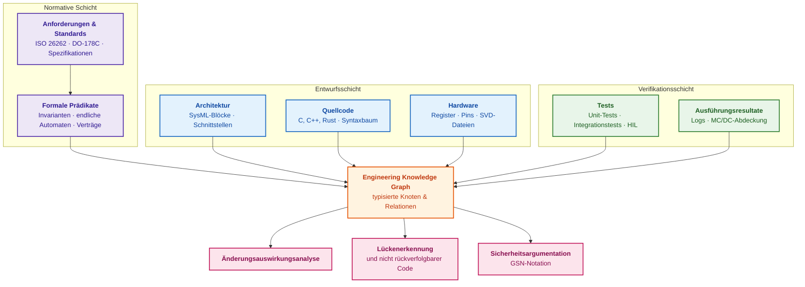
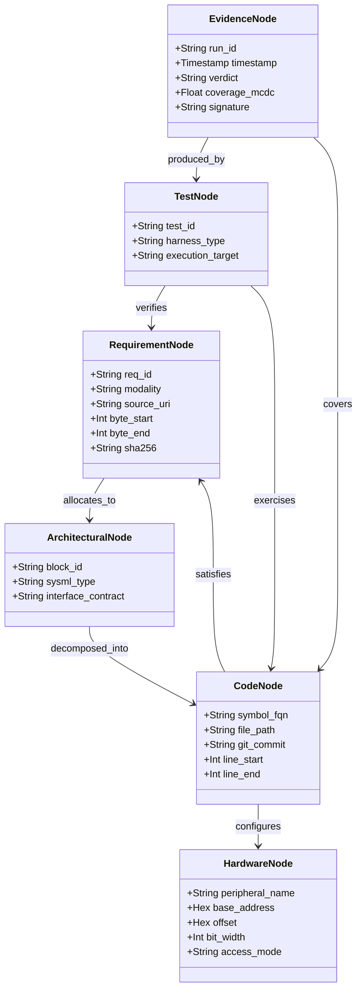
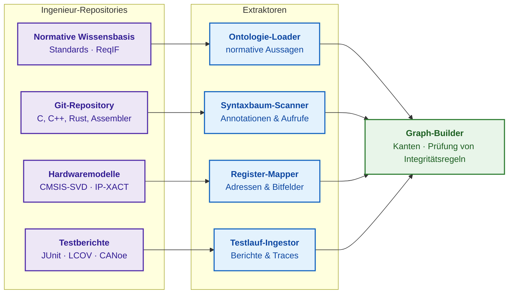
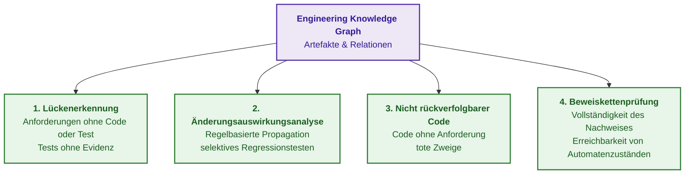
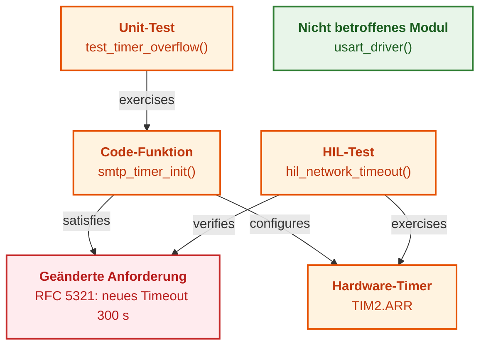
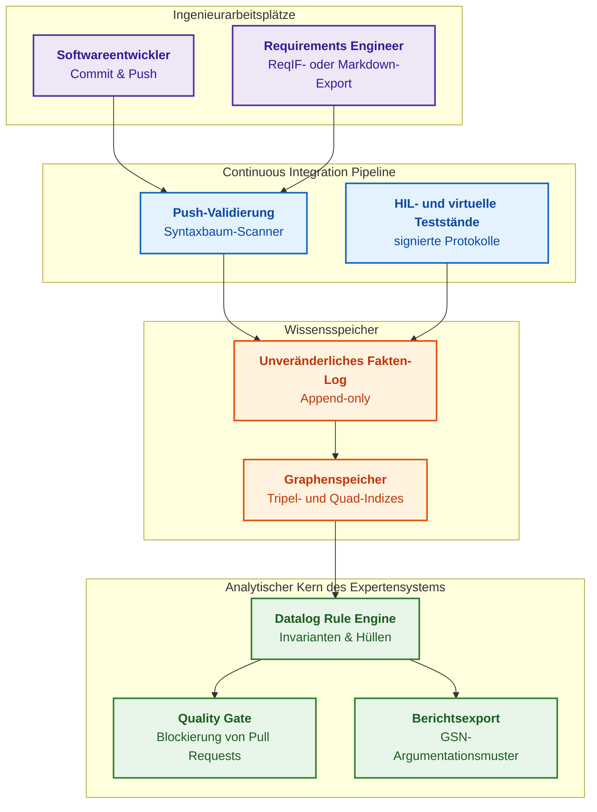
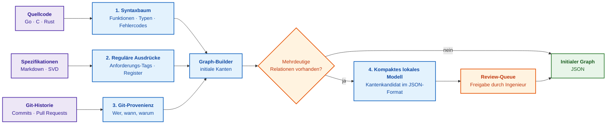
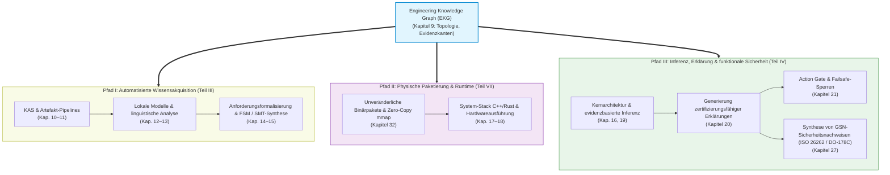

# Kapitel 9. Ingenieurtechnischer Wissensgraph: Traceability von Anforderungen bis zur Hardware

> **Buch:** [Architektur evidenzbasierter Expertensysteme](README.md) · [Teil II: Mathematische Modelle, Wissensrepräsentation und Wissensspeicherung](part-02-knowledge-models.md)  
> **Vorheriges Kapitel:** [Kapitel 8. Ingenieurtechnische Artefakte als Daten des Expertensystems](ch08-engineering-artifacts-as-data.md)  
> **Nächstes Kapitel:** [Kapitel 32. Unveränderliche Wissenspakete: Byte-genaue Zulassung, Indizes und Memory-Mapping](ch32-high-performance-knowledge-packs-mmap-and-harvesting.md)  
> **Inhaltsverzeichnis:** [README.md](README.md)  
> **Autor:** [Mykola Fedchyk](about-the-author.md)  
> **Niveau:** Grundlegendes Ingenieurniveau; Quellcode- und Datenbeispiele sind in einklappbare Blöcke ausgelagert  
> **Lernziele:** Erläutern, was ein Engineering Knowledge Graph ist und wie er sich von einer Traceability-Matrix unterscheidet; Knoten- und Kantentypen von der Anforderung bis zum Bit des Hardwareregisters beschreiben; Abfragen zur Erkennung von Verifikationslücken, nicht rückverfolgbarem Code und Änderungsauswirkungen formulieren; eine initiale Version des Graphen automatisiert aus einem Repository aufbauen.

## Abstract

In diesem Kapitel werden die Architektur und die mathematischen Grundlagen des Engineering Knowledge Graph (*EKG*) als semantisches topologisches Rückgrat eines evidenzbasierten Expertensystems untersucht, das eine durchgängige Traceability (*end-to-end traceability*) zwischen heterogenen Artefakten des Lebenszyklus sicherheitskritischer Systeme gewährleistet: normative Anforderungen (ISO 26262, DO-178C), SysML-Architekturblöcke, abstrakte Syntaxbäume des Quellcodes (AST), Hardwareregister-Spezifikationen (CMSIS-SVD, IP-XACT), Testsuiten und Zertifizierungsnachweise. Es werden die Ursachen für die Degradation traditioneller Traceability-Tabellen und -Matrizen infolge manueller Synchronisation und fehlender semantischer Typisierung offengelegt. Vorgestellt wird ein formales EKG-Modell in Gestalt eines annotierten heterogenen Multigraphen mit Attributen, Integritätsregeln und zeitlicher Gültigkeit von Fakten, der als verifizierte Grundlage für die Inferenzmaschine dient. Es werden deterministische Algorithmen zur automatisierten Extraktion von Relationen aus Repository-Artefakten definiert und präzise mathematische Abfragen für drei kritische Analyseverfahren formuliert: die Berechnung der Anforderungsabdeckung, die Erkennung von totem und nicht rückverfolgbarem Code unter Berücksichtigung von Aufrufketten sowie die zielgerichtete Änderungsauswirkungsanalyse (*Change Impact Analysis*). Abgerundet wird die Abhandlung durch die Architektur einer industriellen Plattform auf Basis eines unveränderlichen Protokolls versionierter Quads (RDF-Quads / PROV-O) und Quality Gates in CI/CD-Pipelines, begleitet von der Implementierung eines autarken Bootstrapping-Tools in Go zur fundierten Sicherheitsargumentation.

Auf dem Prüfstand empfängt ein Mikrocontroller unerwartet einen Interrupt von einem Hardware-Timer. Um zu ermitteln, welche Anforderung die Timer-Konfiguration vorschreibt, welche Funktion in das Register schreibt und welcher Testfall das Problem hätte aufdecken müssen, korrespondieren Ingenieure wochenlang zwischen den Teams für Schaltungsentwurf, Softwareentwicklung und Verifikation. Das Projekt verfügt zwar über eine Traceability-Matrix, doch diese Matrix ist eine Tabelle, in die Anforderungs-IDs, Dateipfade und Testnummern manuell kopiert wurden — und mit jedem Commit driftet die Tabelle ein Stück weiter vom realen Code ab. Die Entwicklung eines autonomen Fahrzeugs, eines Avionik-Controllers, eines Industrieroboters oder eines abgesicherten Netzwerk-Gateways erfordert den konsistenten Abgleich Tausender solcher Artefakte. Doch der Tabelleneintrag „REQ-402 wird durch test_network_timeout verifiziert“ beweist keineswegs, dass der Test tatsächlich die in der Anforderung definierten Grenzwerte überprüft.

Das Ziel dieses Kapitels besteht darin aufzuzeigen, wie ein Engineering Knowledge Graph (*EKG*) Anforderungen, Architektur, Quellcode, Hardwareregister, Tests und Verifikationsergebnisse in einem einheitlichen Modell zusammenführt, das deterministischen Abfragen und regulatorischen Audits zugänglich ist. Das Kapitel vermittelt das formale Graphenmodell, demonstriert den automatisierten Graphenaufbau aus Quellcode, Hardwarebeschreibungen und Testberichten, formuliert drei primäre Analyseverfahren (Lückenerkennung, nicht rückverfolgbarer Code, Auswirkungsanalyse) und schließt mit einem Go-Programm ab, das eine initiale Version des Graphen aus einem Repository synthetisiert. Die Darlegung baut auf [Kapitel 7](ch07-knowledge-base-typology.md) auf, welches semantische Graphen und Ontologien behandelt hat, sowie auf [Kapitel 8](ch08-engineering-artifacts-as-data.md), das Artefakte in typisierte Datenobjekte überführte; wie Anforderungen formal in Prädikate und endliche Automaten übersetzt werden, vertieft [Kapitel 14](ch14-requirements-detection-and-formalization.md). Das nachfolgende Diagramm veranschaulicht die Stellung des Graphen zwischen den Entwicklungsschichten.



Violette Blöcke repräsentieren die normative Schicht, blaue Blöcke die Entwurfsschicht, grüne Blöcke die Verifikation, der orangefarbene Block den Graphen und rosa Blöcke die Analysen, die der Graph ermöglicht. Hardware-in-the-Loop-Tests (*HIL*) und die Abdeckung modifizierter Bedingungs-/Entscheidungsüberdeckung (*Modified Condition/Decision Coverage*, MC/DC) gehören zur Verifikationsschicht; die Goal Structuring Notation (*GSN*) für Sicherheitsargumentationen wird in [Kapitel 27](ch27-safety-case-gsn-synthesis.md) eingehend behandelt. Zunächst muss jedoch verstanden werden, warum Relationen zwischen den Schichten in der Praxis abreißen.

## 1. Das Problem des Traceability-Bruchs in Ingenieur-Ökosystemen

Im traditionellen Systems Engineering arbeitet jede Disziplin in einem isolierten Informationsraum:

1. **Systemingenieure und Anforderungsanalytiker** verwalten Spezifikationen in spezialisierten Datenbanken (IBM DOORS, Jama Connect, PTC Windchill) oder im Austauschformat ReqIF;
2. **Systemarchitekten** modellieren Komponenten in der Systems Modeling Language (*SysML*) oder in Werkzeugen wie Enterprise Architect;
3. **Softwareentwickler** implementieren Code in Git-Repositories und strukturieren ihre Aufgaben in Issue-Trackern;
4. **Verifikationsingenieure** schreiben Tests (Python, Robot Framework, Vector CANoe), deren Ergebnisse in Berichten der Continuous-Integration-Pipeline aggregiert werden;
5. **Schaltungsentwickler und Hardwaredesigner** spezifizieren Register in CMSIS-SVD- oder IP-XACT-Formaten, Excel-Tabellen oder technischen Datenblättern.

Die Verbindung zwischen diesen Welten soll klassischerweise eine Traceability-Matrix (*traceability matrix*) herstellen — eine Tabelle, in die Ingenieure Anforderungs-IDs, Dateipfade und Testnummern manuell übertragen. Die Übersichtsarbeit von Jane Cleland-Huang und Koautoren belegt, dass manuelle Traceability kostenintensiv ist, rapide veraltet und daher häufig zur reinen bürokratischen Formalie degradiert [[1]](#src-1). Die Ursachen sind systemischer Natur:

- **Veralterung im Moment der Speicherung:** Sobald ein Entwickler die Steuerungslogik ändert oder eine Funktion umbenennt, verliert die statische Tabelle ihre Gültigkeit gegenüber dem Quellcode;
- **Scheinbare Abdeckung:** Der Eintrag `REQ-402 -> test_network_timeout()` garantiert keineswegs, dass der Testfall die Randbedingungen aus REQ-402 tatsächlich prüft, anstatt lediglich aufgrund einer auskommentierten Assertion mit dem Status „bestanden“ zu terminieren;
- **Unmöglichkeit der Rückwärtsanalyse:** Der Pfad von einem Hardwareregister-Bit zurück zur übergeordneten Systemanforderung lässt sich nur durch informelle Befragung von Entwicklern rekonstruieren;
- **Unbemerkter überflüssiger Code:** Der Standard für flugzeuggetragene Software DO-178C bezeichnet Code ohne Rückführbarkeit auf eine genehmigte Anforderung als überflüssigen Code (*extraneous code*), und jenen Teil davon, der unter keinen Umständen zur Ausführung gelangen kann, als toten Code (*dead code*); die strukturelle Abdeckungsanalyse muss solchen Code identifizieren, woraufhin toter Code physisch entfernt und deaktivierter Code gesondert begründet werden muss [[2]](#src-2). In einer Traceability-Matrix existiert für überflüssigen Code schlicht keine Zeile — eine Tabelle kann das Nichtvorhandensein einer Relation nicht detektieren.

Fazit des Abschnitts: Der Traceability-Bruch entsteht, weil Relationen getrennt von den eigentlichen Artefakten gespeichert und manuell gepflegt werden. Ein Expertensystem schließt diese Lücke, indem Relationen semantisch typisiert, maschinell verifizierbar und synchron mit den Artefakten evolviert werden. Dies erfordert ein formales Graphenmodell.

## 2. Formales Modell des Engineering Knowledge Graph (EKG)

Ein semantisches Netz repräsentiert Wissen durch Knoten und typisierte Kanten, wie von John Sowa dargelegt [[3]](#src-3). Ein Engineering Knowledge Graph stellt eine spezialisierte Ausprägung dar: einen heterogenen, annotierten Multigraphen mit Attributen und formalen Integritätsregeln:

```math
\mathcal{G}_{\mathrm{EKG}}=\big(\mathcal{V},\ \mathcal{E},\ s,\ t,\ \tau_v,\ \tau_e,\ \mathcal{A}_v,\ \mathcal{A}_e,\ \mathcal{P}\big)
```

Komponenten des Graphen:

- $\mathcal{V}$ ist die Menge der Knoten und $\mathcal{E}$ die Menge der gerichteten Kanten mit eindeutigen Identifikatoren;
- $s,t:\mathcal{E}\to\mathcal{V}$ ordnen jeder Kante ihren Quell- bzw. Zielknoten zu;
- $`\tau_v:\mathcal{V}\to\mathcal{T}_V`$ und $`\tau_e:\mathcal{E}\to\mathcal{T}_E`$ weisen Knoten und Kanten Typen zu, wobei $`\mathcal{T}_V`$ und $`\mathcal{T}_E`$ die jeweiligen Typmengen bezeichnen;
- $`\mathcal{A}_v`$ und $`\mathcal{A}_e`$ sind Attribute von Knoten und Kanten, wie etwa kryptografische Hashes, Zeitstempel, Quelltext-Offsets und Messergebnisse;
- $\mathcal{P}$ ist die Menge von Integritätsregeln und logischen Inferenzregeln, während die Klammern alle Komponenten zu einem Tupel bündeln.

Diese Definition beschreibt eine algebraische Struktur, keinen Skalarwert: Jeder Knoten und jede Kante besitzen einen Typ und Attribute, und zwei Knoten können durch mehrere Kanten unterschiedlichen Typs verbunden sein. Typen ermöglichen es beispielsweise, alle Funktionen abzufragen, die ein Register konfigurieren, von dem eine Sicherheitsanforderung abhängt. Das nachfolgende Klassendiagramm illustriert die Kernklassen von Knoten und deren Relationen.



Die Bezeichner von Klassen und Attributen entsprechen dem formalen Datenschema und sind daher in englischer Sprache gehalten. Ein Anforderungsknoten speichert die Byte-Grenzen des Quellzitats sowie dessen Hash, ein Quellcodeknoten speichert Commit-Hash und Zeilenspanne, ein Hardwareknoten Basisadresse und Bitfeldbreite, und ein Evidenzknoten speichert Testurteil, strukturelle Abdeckung und Prüfstandssignatur.

### 2.1. Typologie der Knoten: Von Systemanforderungen bis zu Hardwareregistern

1. **Normative Knoten** $`V_R\subset\mathcal{V}`$: Abschnitte regulatorischer Standards, normative Festlegungen mit Modalitäten (SHALL, MUST, REQUIRED), Zustände und Übergänge endlicher Automaten (*Finite State Machines*, FSM). Jeder normative Knoten besitzt eine unanfechtbare Quellenverankerung (*evidence grounding*): Datei, exakte Byte-Grenzen des Zitats und den SHA-256-Hash des referenzierten Textfragments.
2. **Architekturknoten** $`V_A\subset\mathcal{V}`$: Komponenten, Subsysteme, Kommunikationskanäle, Datenbusse, Schnittstellenverträge (Interface Description Languages, Protobuf, SysML-Blöcke).
3. **Softwareknoten** $`V_C\subset\mathcal{V}`$: Knoten des abstrakten Syntaxbaums (*Abstract Syntax Tree*, AST), d. h. Module, Strukturen, Funktionen, Methoden und Verzweigungspunkte, verknüpft mit Git-Commit-Hash und Zeilenspanne.
4. **Hardwareknoten** $`V_H\subset\mathcal{V}`$: Periphere Controller (UART, SPI, CAN, Ethernet), Registeradressen im speicherabgebildeten Ein-/Ausgabebereich (*Memory-Mapped I/O*), Bitfelder, Interrupt-Leitungen (IRQ), Pin-Konfigurationen (GPIO).
5. **Testknoten** $`V_T\subset\mathcal{V}`$: Testfälle, Fehlereinbringungsszenarien (*Fault Injection*), HIL-Prüfvorschriften, Fuzzing-Modelle.
6. **Evidenzknoten** $`V_E\subset\mathcal{V}`$: Konkrete Testläufe, Berichte zur strukturellen Codeabdeckung (Anweisungs-, Zweig-, MC/DC-Abdeckung), Logikanalysator-Aufzeichnungen, signierte CAN- oder Ethernet-Traces mit Prüfstandszertifikaten.

### 2.2. Semantische Klassifikation von Kanten und Integritätsregeln

Die Kanten des Graphen repräsentieren keine beliebigen Assoziationen, sondern formal definierte ingenieurtechnische Relationen. Die nachfolgende Tabelle führt die primären Kantentypen auf.

| Kantentyp | Richtung | Semantische Bedeutung | Anwendungsbereich |
|---|---|---|---|
| `allocates_to` | $`V_R\to V_A`$ | Anforderung ist einem Architekturblock zugewiesen | Anforderungsallokation nach ISO 26262-4 [[4]](#src-4) und DO-178C [[2]](#src-2) |
| `satisfies` | $`V_C\to V_R`$ | Funktion oder Modul implementiert die Anforderung | Rückverfolgbarkeit des Codes auf Low-Level-Anforderungen nach DO-178C |
| `configures` | $`V_C\to V_H`$ | Code konfiguriert oder liest ein physisches Hardwareregister | Board Support Packages, CMSIS-SVD-Spezifikationen |
| `verifies` | $`V_T\to V_R`$ | Testfall ist zur Verifikation der Anforderung bestimmt | Verifikation und Validierung nach IEEE 1012 [[5]](#src-5) |
| `exercises` | $`V_T\to V_C`$ | Test führt einen Codeblock aus und belastet ihn | Strukturelle Abdeckungsanalyse |
| `mitigates` | $`V_R\to V_{\mathrm{Hazard}}`$ | Anforderung dient als Gegenmaßnahme gegen eine identifizierte Gefahr | Gefahrenanalyse und Risikobewertung |
| `derived_from` | $`V_R\to V_R`$ | Low-Level-Anforderung ist aus Systemanforderung abgeleitet | Anforderungsherkunft (*requirements lineage*) |
| `obsoletes` | $`V_R\to V_R`$ | Neue Revision ersetzt oder annulliert eine vorherige | Revisions- und Versionsmanagement von Anforderungen |

Die Kantentypen bilden das Vokabular, auf dem automatisierte Analyseabfragen aufbauen. Fazit des Abschnitts: Der Graph integriert typisierte Knoten aus sechs Domänenklassen und typisierte Kanten mit präziser Semantik, während die Regelschnittstelle $\mathcal{P}$ die strukturelle Konsistenz überwacht. Praktische Wirksamkeit entfaltet dieses Modell jedoch erst dann, wenn der Graph kontinuierlich und vollautomatisch konstruiert wird.

## 3. Automatisierte Extraktion von Artefakten und Graphenkonstruktion

Die entscheidende Anforderung an einen industriellen Graphen besteht in dessen automatisierter Generierung und Synchronisation. Erfordert das Erzeugen eines Knotens oder einer Kante manuelle Eingriffe in eine Datenbank oder separate Konfigurationsdateien, erodiert der Graph nach den ersten größeren Code-Refactorings ebenso wie eine manuelle Tabelle. Das Expertensystem konstruiert den Graphen über eine Pipeline spezialisierter Extraktoren.



Blaue Blöcke repräsentieren die Extraktoren, violette Blöcke die Datenquellen und der grüne Block die Graphenassemblierung mit Validierung der Integritätsregeln. Jeder Extraktor parst Eingangsformate mit strikter Grammatik, sodass der Großteil der Kanten deterministisch und ohne probabilistische Modelle erzeugt wird. Die folgenden Unterabschnitte demonstrieren die vier Extraktoren anhand konkreter Beispiele.

### 3.1. Verknüpfung von Quellcode und Anforderungen über den abstrakten Syntaxbaum (AST)

In der Entwicklung sicherheitskritischer Software verlangen Standards eine explizite Rückführbarkeit des Codes auf Anforderungen: entweder über standardisierte Funktionskommentare oder über parallele Metadatendateien.

<details>
<summary>Beispiel in C: Funktion mit Traceability-Annotationen</summary>

```c
/**
 * @brief Prüfung der Befehlssequenz gemäß Sitzungsstatus.
 * @satisfies REQ-PROTO-MAIL-042
 * @trace RFC-5321:Section-4.1.1.4[byte:18420-18890]
 * @fsm_state TRANSACTION_READY
 */
protocol_status_t validate_command_sequence(session_context_t *ctx, command_t cmd) {
    if (ctx->state != STATE_TRANSACTION_READY) {
        return STATUS_ERR_BAD_SEQUENCE;
    }
    return STATUS_OK;
}
```

</details>

Ein AST-Scanner durchläuft den Syntaxbaum, identifiziert das Symbol `validate_command_sequence`, erfasst Signatur sowie Quelltextkoordinaten und extrahiert die Deklarationsbeziehung `declares_satisfies` bezüglich `REQ-PROTO-MAIL-042`. Ein Quelltextkommentar liefert jedoch noch keinen formalen Beweis für die tatsächliche Anforderungserfüllung. Eine vollwertige Kante `satisfies`, die in Abdeckungsmetriken einfließt, erfordert zusätzliche Verifikationsnachweise: ein technisches Review, ein positives Testergebnis und die Freigabe durch den zuständigen Component Owner. Der Hash des Zitats garantiert die Unveränderlichkeit des Textsegments, belegt jedoch nicht die korrekte funktionale Implementierung. Diese Unterscheidung gilt gleichermaßen für manuelle Entwicklerannotationen wie für Vorschläge generativer Modelle.

### 3.2. Abbildung von Quellcode auf Hardwareregister anhand von SVD- und IP-XACT-Spezifikationen

Um die Lücke zwischen Treibersoftware und Silizium zu schließen, lädt der Hardware-Extraktor die maschinenlesbare Beschreibung des Mikrocontrollers im CMSIS-SVD-Format (*Cortex Microcontroller Software Interface Standard, System View Description*) [[6]](#src-6), während ein statischer Quellcodescanner Zeigerdereferenzierungen und hardwarenahe Makros analysiert.

<details>
<summary>Beispiel in XML und C: Beschreibung des USART1-Registers und Funktion zur Aktivierung des Sende-Empfängers</summary>

```xml
<peripheral>
  <name>USART1</name>
  <baseAddress>0x40013800</baseAddress>
  <registers>
    <register>
      <name>CR1</name>
      <description>Control register 1</description>
      <addressOffset>0x00</addressOffset>
      <fields>
        <field>
          <name>UE</name>
          <description>USART enable</description>
          <bitOffset>13</bitOffset>
          <bitWidth>1</bitWidth>
        </field>
      </fields>
    </register>
  </registers>
</peripheral>
```

```c
#define USART1_BASE 0x40013800
#define USART1_CR1  (*(volatile uint32_t *)(USART1_BASE + 0x00))

void usart_enable(void) {
    USART1_CR1 |= (1 << 13); /* Aktivierung des USART */
}
```

</details>

Die symbolische Analyse berechnet die Zieladresse `0x40013800 + 0x00` sowie die Bitmaske für Bit 13 und gleicht diese mit dem Feld `UE` des Registers `CR1` ab. Der Graph erhält daraufhin eine Kante `configures` von der Funktion `usart_enable` zum Hardwareknoten `HW_REG:USART1.CR1.UE`. Modifiziert der Chiphersteller in einer neuen Datenblatt-Revision das Bitlayout oder deklariert das Feld als reserviert, markiert das Expertensystem die Kante unmittelbar als konfliktbehaftet.

### 3.3. Tracing von Verifikationsartefakten: Bindung von Tests an Anforderungen

Ein Test-Harness führt nicht nur Testfälle aus, sondern deklariert explizit die zu verifizierende Anforderung.

<details>
<summary>Beispiel in Python: Testfall mit Deklaration der verifizierten Anforderung</summary>

```python
@pytest.mark.verifies("REQ-PROTO-MAIL-042")
@pytest.mark.target_state("TRANSACTION_READY")
def test_reject_out_of_sequence_command(dut_client):
    """Prüfung der Rückgabe des Fehlercodes 503 bei Verletzung der Befehlsreihenfolge."""
    dut_client.reset_state()
    response = dut_client.send_raw("DATA\r\n")
    assert response.code == 503, f"Erwartet wurde Code 503, empfangen wurde {response.code}"
```

</details>

Während der Testausführung in der CI-Pipeline registriert der Berichtsanalysator drei Fakten: Der Test `test_reject_out_of_sequence_command` ist über eine Kante `verifies` mit der Anforderung `REQ-PROTO-MAIL-042` verknüpft. Der Test ruft die Funktion `validate_command_sequence` auf (Kante `exercises`), was durch Profiling- oder Tracing-Daten belegt wird. Schließlich wird ein Evidenzknoten mit Testurteil, Zeitstempel, Prüfstandsversion und dem kryptografischen Hash des Interaktionsprotokolls erzeugt. Die Annotation im Testcode ist eine Entwicklerbehauptung; die Kante `exercises` und der Evidenzknoten stellen hingegen gemessene Fakten dar. Der Graph differenziert somit strikt zwischen deklariertem Anspruch und messtechnischem Nachweis.

### 3.4. Entitätsnormalisierung, Koreferenzauflösung und zeitliche Gültigkeit von Fakten

Wird ein Teil des Graphen aus unstrukturierter Entwicklungsdokumentation gespeist, genügt ein naives Text-Chunking keineswegs. Damien Berezenko analysiert die Konstruktion von Wissensgraphen für Agentic RAG mit LLMs [[7]](#src-7); für einen industriellen Wissensgraphen sind vier Kernanforderungen maßgeblich:

1. **Mehrstufige Entitätstypisierung:** Knoten besitzen semantische Kategorien: aktive Softwaremodule und gesteuerte Hardwarekomponenten, Architekturschichten (vom Gesamtsystem bis zu diskreten Registern) sowie systemübergreifende Phänomene („thermomechanische Ermüdung“, „galvanische Trennung“).
2. **Koreferenzauflösung (*Coreference Resolution*) und Kanonisierung:** In technischen Dokumenten wird dieselbe physische Entität unter ihrem Vollnamen, Akronymen, Modellnummern oder Pronomen referenziert. Vor dem Anlegen von Kanten muss jede Erwähnung mittels Entity Linking auf einen kanonischen Identifikator zurückgeführt werden, da der Graph andernfalls in unzusammenhängende Subgraphen zerfällt.
3. **Spärlicher, kontrollierter Graph statt dichter Assoziationsnetze:** Während Allzweck-Wissensgraphen häufig dicht vernetzt sind, muss ein ingenieurtechnischer Graph als strikt typisierter, spärlicher (*sparse*) Graph modelliert werden. Überflüssige probabilistische Assoziationen erzeugen fatales Rauschen bei Graph-Traversierungen; Kanten dürfen daher ausschließlich nach validierten Ontologieschemata instanziiert werden.
4. **Zeitliche Gültigkeit und Konzeptdrift (*Concept Drift*):** Der Wechsel einer Leiterplatte von Revision 1.1 auf 2.0 kann Betriebsspannungen oder Pin-Belegungen grundlegend modifizieren. Jeder Knoten und jede Kante müssen Zeitstempel und Revisionsgültigkeitsgrenzen tragen, damit ein Sicherheitsaudit für eine aktuelle Hardwarekonfiguration keine veralteten Fakten heranzieht.

Fazit des Abschnitts: Der Großteil der Kanten wird durch deterministische Parser für formale Formate generiert. Kanten aus unstrukturiertem Text erfordern hingegen strikte Entitätskanonisierung, semantische Typisierung und temporale Validitätsgrenzen. Ein solcher Graph ermöglicht Analysen, die mit isolierten Tabellen prinzipiell undurchführbar sind.

## 4. Deterministische Analysealgorithmen auf dem ingenieurtechnischen Graphen

Der konstruierte Graph gestattet die automatisierte Ausführung formaler Analysen, die auf isolierten Tabellen oder mittels statistischer Sprachmodelle keine reproduzierbaren Ergebnisse liefern. Das nachfolgende Diagramm veranschaulicht die vier Kernklassen von Graphanalysen.



Jede Kategorie korrespondiert mit einer formal definierten Graphabfrage. Die ersten drei Analyseverfahren werden nachfolgend detailliert analysiert; die Überprüfung formaler Argumentationsketten für Sicherheitsnachweise wird in [Kapitel 27](ch27-safety-case-gsn-synthesis.md) vertieft.

### 4.1. Berechnung von Anforderungsabdeckungsmetriken und Erkennung von Verifikationslücken

Die Anforderungsabdeckung in sicherheitskritischen Systemen unterliegt weitaus strengeren Kriterien als eine reine Quellcode-Zeilenabdeckung. Es muss nachgewiesen werden, dass für jede Anforderung eine Implementierung, ein zugeordneter Testfall sowie ein erfolgreicher Testlauf für das Ziel-Release vorliegen. In der nachfolgenden Berechnungsformel sind die Entitätsmengen bereits auf den gültigen Versionsstand, Freigabestatus und Zugriffsrechte gefiltert; deklarierte oder prognostizierte Kanten sind von den bestätigten Relationen ausgeschlossen. Der Anforderungskatalog und die Hardwareregisterbereiche müssen als vollständig deklariert sein; andernfalls signalisiert das Fehlen einer Kante epistemische Unkenntnis und keine bewiesene Lücke.

```math
\mathcal{U}_R=\Big\{\,r\in V_R\ \Big|\ \neg\exists\,c\in V_C:\ c\xrightarrow{\mathrm{satisfies}}r\ \ \lor\ \ \neg\exists\,t\in V_T,\ e\in V_E:\ t\xrightarrow{\mathrm{verifies}}r\ \land\ e\xrightarrow{\mathrm{produced\_by}}t\ \land\ \mathrm{verdict}(e)=\mathrm{PASS}\ \land\ \mathrm{release}(e)=\rho\,\Big\}
```

Interpretation der Lückenmenge:

- $r$ ist eine Anforderung, $c$ ein Quellcodeknoten, $t$ ein Testfall und $e$ ein Nachweisknoten eines Testlaufs;
- $`V_R`$, $`V_C`$, $`V_T`$ und $`V_E`$ bezeichnen die Mengen der Anforderungs-, Code-, Test- bzw. Evidenzknoten, während $\rho$ das Ziel-Release darstellt;
- Die Pfeile $\xrightarrow{\mathrm{satisfies}}$, $\xrightarrow{\mathrm{verifies}}$ und $``\xrightarrow{\mathrm{produced\_by}}``$ repräsentieren die Relationen „implementiert Anforderung“, „verifiziert Anforderung“ bzw. „Nachweis erzeugt durch Test“;
- $\mathrm{verdict}(e)=\mathrm{PASS}$ erzwingt ein erfolgreiches Testergebnis und $\mathrm{release}(e)=\rho$ bindet den Nachweis an das aktuelle Release;
- $\neg\exists$ steht für den Existenzquantor mit Negation („es existiert kein“), $\lor$ für die logische Disjunktion („oder“) und $\land$ für die Konjunktion („und“); die geschweiften Klammern aggregieren alle Anforderungen, welche die Bedingung hinter dem vertikalen Strich erfüllen.

Eine Anforderung fällt in die Lückenmenge $`\mathcal{U}_R`$, wenn entweder kein Quellcode existiert, der sie implementiert, oder kein Testfall vorliegt, der für das aktuelle Release mit dem Urteil `PASS` abgeschlossen wurde. Die Mächtigkeit liegt im Intervall $`[0, \lvert V_R \rvert]`$, und die Anforderungsabdeckung berechnet sich zu $`1-\lvert\mathcal{U}_R\rvert/\lvert V_R \rvert`$, was die Metrik aus [Kapitel 8](ch08-engineering-artifacts-as-data.md) formal präzisiert.

**Runtime-Steuerung und Kriterium der Verifikationsvollständigkeit:**
- **Normative Sicherheitsinvariante (ASIL D / DO-178C Level A):** Das System erzwingt strikt $`\lvert\mathcal{U}_R\rvert = 0`$ ($100\%$ verifizierte Anforderungen);
- **Pipeline-Reaktion:** Gilt $`\lvert\mathcal{U}_R\rvert > 0`$, blockiert der Build-Compiler die Erzeugung des Firmware-Images, emittiert das Fehlertoken `ERR_SAFETY_GAPS_DETECTED` und exportiert einen detaillierten Audit-Bericht mit den fehlenden Verifikationstests.

**Praktisches Rechenbeispiel:**
Ein Ziel-Release umfasst $`\lvert V_R \rvert = 150`$ Sicherheitsanforderungen. Das automatisierte Audit des HIL-Prüfstands bestätigt für 148 Anforderungen eine Code-Implementierung sowie erfolgreiche Testnachweise mit dem Urteil `PASS`. Für 2 Anforderungen (`REQ-088` und `REQ-142`) endeten die Tests mit dem Urteil `FAIL`:

```math
\lvert\mathcal{U}_R\rvert = 2, \qquad \mathrm{Coverage} = 1 - \frac{2}{150} \approx 0{,}9867
```

Da $`\lvert\mathcal{U}_R\rvert = 2 \ne 0`$, wird die Freigabe des Release-Builds unverzüglich gestoppt, bis sämtliche Abweichungen behoben sind.

### 4.2. Heuristische Vorhersage fehlender Kanten mittels Adamic-Adar-Index

Die Lückenmenge $`\mathcal{U}_R`$ identifiziert Anforderungen ohne Implementierung oder ohne erfolgreichen Testnachweis, differenziert jedoch nicht, ob die Relation tatsächlich fehlt oder lediglich nicht annotiert wurde. In komplexen Industrieprojekten verifiziert ein Testfall häufig de facto eine Anforderung, doch die Kante `verifies` wurde nie explizit im System hinterlegt. Algorithmen der Kantenprädiktion (*Link Prediction*) ermitteln Kandidaten für solche fehlenden Verknüpfungen.

Das Verfahren besitzt ein solides theoretisches Fundament in der Netzwerkanalyse. David Liben-Nowell und Jon Kleinberg wiesen anhand von Koautorschaftsnetzwerken nach, dass graphentopologische Ähnlichkeitsmaße, insbesondere gemeinsame Nachbarschaften, künftige Kanten um ein Vielfaches präziser vorhersagen als der Zufall, wenngleich die absolute Trefferquote moderat bleibt [[8]](#src-8). Pham Thi Thu Thuy und Thinh Thi Thuy erweiterten strukturelle Merkmale um temporale und semantische Dimensionen: Daten aus bibliografischen Repositorien (AMiner, DBLP, Mendeley) wurden in eine gemeinsame Ontologie auf Basis von SKOS (*Simple Knowledge Organization System*) und Dublin Core überführt; auf diesen Features erzielten Random Forests und Graph Neural Networks aus [Kapitel 6](ch06-applied-mathematics-for-expert-systems.md) signifikante Performanzsteigerungen gegenüber klassischen Baseline-Modellen [[9]](#src-9). Während diese Arbeiten wissenschaftliche Kooperationen modellieren, adaptiert das Expertensystem diesen Ansatz für den ingenieurtechnischen Graphen: Für ein Paar (Anforderung, Test) bilden gemeinsame Fachbegriffe, identische Hardwaresignale und -register, gemeinsame Architekturkomponenten sowie die zeitliche Nähe von Commits den Merkmalsraum.

Für ein evidenzbasiertes Expertensystem ist neben der Vorhersagegüte die Nachvollziehbarkeit entscheidend: Warum schlägt das System eine Kante vor? Der Adamic-Adar-Index [[10]](#src-10) liefert diese Erklärung konstruktionsbedingt, da er sich aus den Beiträgen konkreter gemeinsamer Nachbarn zusammensetzt:

```math
\mathrm{AA}(x, y) = \sum_{z \in N(x) \cap N(y)} \frac{1}{\ln \lvert N(z) \rvert}
```

Komponenten des Adamic-Adar-Indexes:

- $x$ und $y$ sind die Knoten des Kandidatenpaares, beispielsweise eine Anforderung und ein Testfall;
- $N(v)$ bezeichnet die Nachbarschaft des Knotens $v$ im Graphen: Signale, Register, Architekturblöcke und Glossarbegriffe;
- $z$ iteriert über die Schnittmenge der gemeinsamen Nachbarn beider Knoten, wobei $\cap$ die mengentheoretische Schnittmenge darstellt;
- $`\lvert N(z) \rvert`$ ist der Knotengrad des gemeinsamen Nachbarn (seine Kantenanzahl) und $\ln$ der natürliche Logarithmus;
- $\mathrm{AA}(x, y)$ liefert einen nicht-negativen Ähnlichkeitsscore zur Rangordnung von Kandidatenpaaren, keine Wahrscheinlichkeit.

Ein seltener gemeinsamer Nachbar besitzt ein höheres Gewicht als ein hochgradig vernetzter Knoten: Ein spezifisches Hardwareregister stellt eine starke Evidenz dar, ein ubiquitärer Sammelbegriff hingegen nur schwaches Rauschen.

**Runtime-Steuerung und Schwellenwertfilterung:**
- **Vorschlagsschwelle ($`\tau_{\mathrm{suggest}} = 1{,}00`$):** Gilt $`\mathrm{AA}(x, y) \ge \tau_{\mathrm{suggest}}`$, wird das Paar (Anforderung, Test) automatisch in die Review-Warteschlange des Ingenieurs (`review_inbox`) eingesteuert — annotiert mit den gemeinsamen strukturellen Markern;
- **Rauschunterdrückung:** Bei $\mathrm{AA}(x, y) < 1{,}00$ wird das Paar verworfen, um eine Überflutung des Ingenieurs mit Falsch-Positiven zu verhindern.

**Praktisches Rechenbeispiel:**
Betrachtet wird eine Anforderung bezüglich des Watchdog-Timeouts und der Testfall T-204. Beide teilen sich drei Nachbarn: das Steuerregister `WDT_CTRL` mit Grad 4, das Signal `wdt_timeout` mit Grad 6 und den Fachbegriff „Timeout“ mit Grad 120. Die Berechnung ergibt:

```math
\mathrm{AA}(\text{REQ}, \text{T-204}) = \frac{1}{\ln 4} + \frac{1}{\ln 6} + \frac{1}{\ln 120} \approx 0{,}721 + 0{,}558 + 0{,}209 \approx 1{,}49
```

Dieselbe Anforderung teilt mit dem Testfall T-090 lediglich den Begriff „Timeout“ sowie die Energieverwaltungskomponente mit Grad 40:

```math
\mathrm{AA}(\text{REQ}, \text{T-090}) = \frac{1}{\ln 120} + \frac{1}{\ln 40} \approx 0{,}209 + 0{,}271 \approx 0{,}48
```

Da $\mathrm{AA}(\text{REQ}, \text{T-204}) = 1{,}49 \ge 1{,}00$, empfiehlt das System dem Ingenieur die Verknüpfung von T-204 mit der Anforderung. Das Paar mit T-090 ($0{,}48 < 1{,}00$) wird als Rauschen unterdrückt.

### 4.3. Erkennung von nicht rückverfolgbarem und totem Code gemäß DO-178C

Quellcode, der sich nicht auf genehmigte Anforderungen zurückführen lässt, stellt ein ernstes Sicherheits- und Zertifizierungsrisiko dar: verwaiste Debug-Routinen, undokumentierte Hintertüren oder fehlerhafte Architekturschnittstellen. Die naive Heuristik „jede Funktion ohne direkte `satisfies`-Kante ist überflüssig“ führt jedoch zu massiven Fehlalarmen bei Hilfs- und Bibliotheksfunktionen, die von anforderungsbezogenen Funktionen aufgerufen werden. Die formale Definition muss daher vollständige Aufrufketten berücksichtigen:

```math
\mathcal{C}_{\mathrm{untraced}}=\big\{\,c\in V_C\ \big|\ \neg\exists\,c'\in V_C,\ r\in V_R:\ c'\xrightarrow{\mathrm{satisfies}}r\ \land\ c'\xrightarrow{\mathrm{calls}^{*}}c\,\big\}
```

Notation des nicht rückverfolgbaren Codes:

- $c$ ist der evaluierte Codeknoten, $c'$ ein Quellcodeknoten, der die Anforderung $r$ implementiert, während $`V_C`$ und $`V_R`$ die Mengen der Quellcode- bzw. Anforderungsknoten bezeichnen;
- $\xrightarrow{\mathrm{satisfies}}$ markiert die Implementierungsrelation und $\xrightarrow{\mathrm{calls}^{*}}$ bezeichnet den gerichteten Aufrufpfad von $c'$ zu $c$;
- Der Stern in $\mathrm{calls}^{*}$ symbolisiert die reflexiv-transitive Hülle: Der Aufrufpfad kann null Schritte (Identität $c'=c$), einen direkten Funktionsaufruf oder eine Kette transitiver Aufrufe umfassen;
- $\neg\exists$ besagt, dass kein Knoten existiert, der den geforderten Pfad schließt; die Mengenklammern bündeln alle isolierten Knoten $c$.

Das Resultat ist die Menge jener Funktionen, zu denen von keiner anforderungsbasierten Implementierung ein Ausführungspfad existiert; ihre Mächtigkeit liegt im Bereich $`[0, \lvert V_C \rvert]`$.

**Runtime-Steuerung und statisches Analyse-Gate:**
- **Zertifizierungsvorgabe nach DO-178C (Level A/B):** Verlangt zwingend $`\lvert\mathcal{C}_{\mathrm{untraced}}\rvert = 0`$;
- **Build-Pipeline-Aktion:** Das Vorhandensein eines Symbols in $`\mathcal{C}_{\mathrm{untraced}}`$ bricht den Linker-Vorgang mit dem Fehler `-Werror=untraced-symbol` ab. Der Entwickler muss den toten Code entweder physisch eliminieren oder eine abgeleitete Sicherheitsanforderung (*Derived Requirement*) definieren, die durch eine FMEA abzusichern ist.

**Praktisches Rechenbeispiel:**
Die statische Analyse einer Bremssteuerungs-Codebasis ($`\lvert V_C \rvert = 84`$ Funktionen) deckt auf, dass die Funktion `dbg_force_override()` über keinerlei Aufrufpfad von einer Sicherheitsanforderung erreichbar ist ($`\lvert\mathcal{C}_{\mathrm{untraced}}\rvert = 1`$). Das Kompilieren des Produktions-Binaries wird blockiert, bis die Debug-Funktion vollständig aus dem Release-Zweig entfernt wurde.

### 4.4. Algorithmen zur Auswirkungsanalyse von Änderungen (Change Impact Analysis)

Eine der komplexesten Herausforderungen in Entwicklungsprojekten ist die präzise Abschätzung von Änderungsauswirkungen. Welche Konsequenzen hat es, wenn ein Normungsgremium ein Timeout neu definiert oder der Kunde die maximale Reaktionszeit eines Aktuators verschärft? Ohne Wissensgraphen müssen Hunderte Dokumente manuell rezensiert oder sämtliche Testsuiten wiederholt werden, was auf HIL-Prüfständen Tage oder Wochen beansprucht. Auf dem Wissensgraphen wird der Einflussbereich einer Modifikation des Knotens $v^{*}$ über die Erreichbarkeit entlang definierter Propagationsregeln ermittelt:

```math
\mathrm{Impact}(v^{*})=\big\{\,u\in\mathcal{V}\ \big|\ v^{*}\leadsto_{\delta}u\,\big\}
```

Bedeutung der Propagationserreichbarkeit:

- $v^{*}$ ist der geänderte Ausgangsknoten, $u$ ein beliebiger Knoten des Graphen und $\mathcal{V}$ die Gesamtmenge aller Knoten;
- $`v^{*}\leadsto_{\delta}u`$ definiert die Existenz eines Pfades von $v^{*}$ nach $u$, wobei $\delta$ die zulässige Traversierungsrichtung für jeden Kantentyp festlegt;
- $\mathrm{Impact}(v^{*})$ ist die Menge aller unter diesen Regeln erreichbaren Knoten, einschließlich des Ursprungsknotens bei Pfadlänge null;
- $`\{v^{*}\}`$ bezeichnet die einelementige Menge des modifizierten Knotens; die Mengenklammern erfassen alle transitiv betroffenen Entitäten.

**Steuerung von Regressionstests und CI/CD-Optimierung:**
- Gilt das Verhältnis $`\lvert\mathrm{Impact}(v^{*})\rvert / \lvert\mathcal{V}\rvert \le 0{,}15`$, aktiviert die Pipeline den Modus des **selektiven Regressionstestens**: Es werden ausschließlich Tests aus der Teilmenge $`\mathrm{Impact}(v^{*}) \cap V_T`$ ausgeführt, was die Testdauer drastisch reduziert;
- Gilt $`\lvert\mathrm{Impact}(v^{*})\rvert / \lvert\mathcal{V}\rvert > 0{,}15`$, wird die Modifikation als architektonischer Eingriff eingestuft und ein vollständiger Regressionslauf über die gesamte Testsuite veranlasst.

**Praktisches Rechenbeispiel:**
In einem Getriebesteuerungssystem ($`\lvert\mathcal{V}\rvert = 1\,200`$ Knoten) wird der Quellcode des CAN-Treibers modifiziert ($v^*$). Die Graphenanalyse identifiziert $`\lvert\mathrm{Impact}(v^*)\rvert = 18`$ betroffene Knoten (2 Schnittstellendateien und 16 Unit-Tests):

```math
\frac{\lvert\mathrm{Impact}(v^*)\rvert}{\lvert\mathcal{V}\rvert} = \frac{18}{1\,200} = 0{,}015 \le 0{,}15
```

Die CI-Pipeline veranlasst den selektiven Lauf der 16 Tests (Dauer: 12 Sekunden statt 45 Minuten für die Gesamtsuite) bei voller Verifikationsgarantie für alle tangierten Pfade.

Wird eine Anforderung geändert, verläuft die Propagation entgegen der Pfeilrichtung der Kanten `satisfies` und `verifies`, entlang der Richtung von `configures` und entgegen der Richtung von `exercises`. Dadurch erfasst die Analyse präzise jenen Code, jene Register und jene Testfälle, die funktional an die Anforderung gekoppelt sind. Eine naive Traversierung aller Kanten in beliebiger Richtung würde nahezu den gesamten Graphen markieren und die Analyse entwerten. Das nachfolgende Diagramm veranschaulicht diesen Mechanismus.



Der rote Knoten symbolisiert die geänderte Anforderung, die orangefarbenen Knoten den deterministisch ermittelten Einflussbereich; das grüne Modul verbleibt unberührt. Der Algorithmus navigiert entgegen der Kante `satisfies` zur Funktion `smtp_timer_init()`, folgt der Kante `configures` zum Register `TIM2.ARR` und identifiziert exakt zwei erneut auszuführende Tests: `test_timer_overflow` und `hil_network_timeout`. Dieses selektive Regressionstesten (*selective regression testing*) spart enorme Prüfstandsressourcen ein. Systemische Grenze: Fehlt eine Kante im Graphen, wird auch deren Auswirkung übersehen. Aus diesem Grund muss selektives Testen stets durch periodische Gesamtlaufe flankiert werden.

Fazit des Abschnitts: Die drei Analyseverfahren stellen mathematisch definierte Abfragen an den Graphen dar, deren Zuverlässigkeit von der Vollständigkeit der Kanten und der Präzision der Traversierungsregeln abhängt. Um diese Analysen bei jedem Commit auszuführen, muss der Graph tief in die CI/CD-Pipeline integriert sein.

## 5. Architektur einer industriellen Plattform zur Wissensgraphen-Verwaltung

Eine monolithische Graphdatenbank mit zentraler manueller Administration scheitert in verteilten Entwicklungsorganisationen regelmäßig. Eine praxistaugliche Architektur erfasst Fakten direkt aus den Entwicklungsumgebungen in einem unveränderlichen Protokoll, transformiert diese in einen indizierten Graphenspeicher und evaluiert kontinuierlich formale Regeln.



Violette Blöcke stellen Entwicklungsarbeitsplätze dar, blaue Blöcke die Continuous-Integration-Pipeline, orangefarbene Blöcke den Speicherbereich und grüne Blöcke den analytischen Kern des Expertensystems. Eine Datalog Rule Engine, deren theoretische Grundlagen in [Kapitel 6](ch06-applied-mathematics-for-expert-systems.md) dargelegt wurden, berechnet Invarianten und transitive Hüllen, deren Resultate von Quality Gates und Berichts-Exportmodulen genutzt werden.

Übersteigt der Graph die Kapazität eines Einzelsystems, wird er in Shards partitioniert. Als Partitionierungsschlüssel empfiehlt sich die Zuordnung nach Produktlinie und Baseline anstelle des Entitätstyps, da Traceability-Pfade typischerweise von der Anforderung über Codefunktionen bis zum Testfall verlaufen. Würden Anforderungen auf Server A, Funktionen auf Server B und Tests auf Server C abgelegt, mutierte jede Traceability-Abfrage zu einer verteilten Cross-Shard-Transaktion. Das Qualitätsmaß für die Partitionierung ist der Schnittkantenanteil (*Edge Cut Fraction*). Antwortet ein Shard nicht, liefert die Abfrage das Prädikat „unbekannt“ statt „keine Relation vorhanden“, um zu verhindern, dass ein Netzwerkausfall als fehlender Test missinterpretiert wird. Formale Grundlagen des Shardings finden sich in [Kapitel 7](ch07-knowledge-base-typology.md).

### 5.1. Unveränderliches Protokoll versionierter Quads (RDF-Quads / PROV-O)

Jeder Knoten und jede Kante des Graphen wird als unveränderliches Faktum in Form eines Quads (4-Tupel) persistiert:

```math
\langle\,\mathrm{Subject},\ \mathrm{Predicate},\ \mathrm{Object},\ \mathrm{Context}\,\rangle
```

Felder des unveränderlichen Fakts:

- $\mathrm{Subject}$ ist der Quellknoten, beispielsweise eine Codefunktion;
- $\mathrm{Predicate}$ ist der Relationstyp, beispielsweise `satisfies`, und $\mathrm{Object}$ der Zielknoten, etwa eine Anforderung;
- $\mathrm{Context}$ beschreibt den Provenienzkontext: Commit-Hash, Revisions-ID, Autor, Zeitstempel und die kryptografische Signatur des Extraktionswerkzeugs;
- Die spitzen Klammern definieren ein geordnetes 4-Tupel; die ersten drei Felder entsprechen dem Standard-RDF-Tripel, während das vierte Feld den Faktengraphen kontextualisiert.

Dieses Tupel bildet ein unveränderliches Faktum, das niemals überschrieben, sondern bei Modifikationen durch ein neues Faktum in einem neuen Kontext ergänzt wird. Dadurch lässt sich der Zustand des Graphen für jeden beliebigen Zeitpunkt in der Vergangenheit exakt rekonstruieren — eine Grundvoraussetzung, um Auditoren nachweisen zu können, wie die Testabdeckung einer bestimmten Firmware-Version vor einem Jahr beschaffen war [[12]](#src-12).

### 5.2. Quality Gate in der CI/CD-Pipeline

Das Expertensystem klinkt sich als Prüfgate in die Bearbeitung von Pull Requests ein (*Pull Request Quality Gate*). Vor dem Merge eines Entwicklungszweigs verifiziert der Graph-Validator drei nicht verhandelbare Regeln:

1. **Integritätserhaltung:** Eine neue Funktion darf nicht ohne eine `satisfies`-Kante zu einer genehmigten Anforderung oder ohne einen Aufrufpfad von einer solchen Funktion eingecheckt werden;
2. **Verifizierbarkeit:** Eine Änderung der Funktionslogik invalidiert historische Testergebnisse für den neuen Commit; die Testdefinition und die deklarierte `verifies`-Relation können gültig bleiben, doch der neue Testlauf muss einen eigenständigen Evidenzknoten erzeugen;
3. **Regressionsfreiheit:** Der Änderungsauswirkungs-Subgraph $\mathrm{Impact}(\Delta)$ darf keine ungetesteten Knoten höchster Sicherheitsintegrität enthalten (ASIL D nach ISO 26262 oder Level A nach DO-178C).

Fazit des Abschnitts: Ein unveränderliches Quad-Log garantiert forensische Reproduzierbarkeit, während automatisierte Quality Gates in der Pipeline das Veralten des Wissensgraphen unterbinden. Es verbleibt die zentrale Frage: Wie gelingt der initiale Aufbau des Graphen in bestehenden Projekten?

## 6. Kaltstartstrategie: Automatische Initialisierung des Wissensgraphen aus dem Repository

Ein initialer Wissensgraph muss nicht mühsam von Hand aufgebaut werden. Automatisierte Extraktoren können Code-Syntaxbäume, explizite Referenzen und Testberichte aggregieren, während Ontologie-Editoren wie Protégé bei der formalen Modellierung unterstützen ([Kapitel 15](ch15-knowledge-extraction-and-kb-construction.md)). Automatisierung eliminiert redundantes Abtippen, ersetzt jedoch kein fundiertes System-Engineering: Ein aus Annotationen generierter Kaltstart-Graph ist zunächst ein Verzeichnis deklarierter Ansprüche, kein vollwertiger Sicherheitsnachweis.



Violette Blöcke markieren Eingangsdaten, blaue Blöcke Verarbeitungsschritte, orangefarbene Blöcke heben mehrdeutige Relationen und manuelle Reviews hervor, und der grüne Block stellt das Ergebnis dar. Die Schritte gliedern sich wie folgt:

1. **Syntaxbaumanalyse des Codes:** Ein AST-Parser (das Standardpaket `go/parser` in Go oder universelle Parser wie Tree-sitter) analysiert die Quelldateien: Jede Datei wird zu einem Modulknoten, jede Funktion zu einem Funktionsknoten mit der Kante `declared_in`, jeder Funktionsaufruf zu einer Kante `calls`, und jeder Fehlerrückgabewert zu einem Vertragsknoten.
2. **Reguläre Ausdrücke für Anforderungen und Hardware:** Deterministische Regex-Muster wie `[REQ-SYS-XXX]` oder `[REQ-SW-XXX]` in Texten und Kommentaren erzeugen Anforderungsknoten, während CMSIS-SVD-Dateien Registerknoten mit Bitfeldern instanziieren.
3. **Git-Provenienz:** Ein Verweis auf `REQ-214` in einer Commit-Nachricht etabliert eine Erwähnungsrelation; ein `@satisfies REQ-214` erzeugt eine Deklarationskante. Beide erhalten den Commit als Kontext, doch der Commit allein beweist noch keine korrekte Implementierung.
4. **Kompaktes lokales Sprachmodell für mehrdeutige Relationen:** Existiert keine exakte textuelle Übereinstimmung (die Funktion heißt `ApplyThermalCutoff()`, während die Spezifikation fordert: „Das Gerät muss bei Überhitzung den Lastkreis notabschalten“), konsultiert der Graph-Builder ein kompaktes lokales Sprachmodell (z. B. via Ollama). Das Modell muss ein striktes JSON-Schema mit Kantenkandidat und Konfidenzwert zurückliefern. Der Kandidat wird als vorläufig gekennzeichnet und in die Review-Warteschlange des leitenden Ingenieurs eingesteuert, ohne den Aufbau des restlichen Graphen zu blockieren.

Das nachfolgende Programm demonstriert das Parsen von Anforderungsdefinitionen, Funktionen und Traceability-Annotationen. Es verzichtet bewusst auf die Git-Historie und komplexe Aufrufgraphanalysen. Die Funktions-ID setzt sich aus Dateipfad und Empfängertyp zusammen, um Namenskollisionen zu vermeiden.

<details>
<summary>Beispiel in Go: Initialer Wissensgraph aus dem Repository</summary>

Das Programm ist vollständig und kann mit dem Befehl `go run main.go sample` ausgeführt werden, wobei `sample` das Verzeichnis mit den nachfolgenden Beispieldateien `requirements.md` und `thermal.go` darstellt.

```go
package main

import (
	"encoding/json"
	"fmt"
	"go/ast"
	"go/format"
	"go/parser"
	"go/token"
	"io/fs"
	"os"
	"path/filepath"
	"regexp"
	"strings"
)

// Node repräsentiert einen Knoten im Graphen: Anforderung, Modul oder Funktion.
type Node struct {
	ID   string `json:"id"`
	Type string `json:"type"`
	File string `json:"file"`
}

// Edge repräsentiert eine typisierte Kante im Graphen.
type Edge struct {
	Source   string `json:"source"`
	Relation string `json:"relation"`
	Target   string `json:"target"`
}

// Graph repräsentiert die initiale Version des Engineering Knowledge Graph.
type Graph struct {
	Nodes  []Node   `json:"nodes"`
	Edges  []Edge   `json:"edges"`
	Broken []string `json:"broken_links"`
}

var (
	reqDef   = regexp.MustCompile(`\[(REQ-[A-Z]+-[0-9]+)\]:`)
	reqTrace = regexp.MustCompile(`@satisfies\s+(REQ-[A-Z]+-[0-9]+)`)
)

// bootstrap durchläuft das Verzeichnis, extrahiert Anforderungen aus Markdown und Funktionen aus Go-Code.
func bootstrap(root string) (*Graph, error) {
	g := &Graph{}
	fset := token.NewFileSet()
	var traces []Edge
	err := filepath.WalkDir(root, func(path string, d fs.DirEntry, err error) error {
		if err != nil || d.IsDir() {
			return err
		}
		p := filepath.ToSlash(path)
		switch filepath.Ext(path) {
		case ".md":
			data, err := os.ReadFile(path)
			if err != nil {
				return err
			}
			for _, m := range reqDef.FindAllStringSubmatch(string(data), -1) {
				g.Nodes = append(g.Nodes, Node{ID: m[1], Type: "Requirement", File: p})
			}
		case ".go":
			file, err := parser.ParseFile(fset, path, nil, parser.ParseComments)
			if err != nil {
				return err
			}
			module := "module:" + p
			g.Nodes = append(g.Nodes, Node{ID: module, Type: "Module", File: p})
			for _, decl := range file.Decls {
				fn, ok := decl.(*ast.FuncDecl)
				if !ok {
					continue
				}
				receiver := ""
				if fn.Recv != nil {
					var receiverText strings.Builder
					if err := format.Node(&receiverText, fset, fn.Recv.List[0].Type); err != nil {
						return err
					}
					receiver = receiverText.String() + "."
				}
				id := "func:" + p + "#" + receiver + fn.Name.Name
				g.Nodes = append(g.Nodes, Node{ID: id, Type: "Function", File: p})
				g.Edges = append(g.Edges, Edge{id, "declared_in", module})
				if fn.Doc == nil {
					continue
				}
				for _, m := range reqTrace.FindAllStringSubmatch(fn.Doc.Text(), -1) {
					traces = append(traces, Edge{id, "declares_satisfies", m[1]})
				}
			}
		}
		return nil
	})
	if err != nil {
		return nil, err
	}
	known := map[string]bool{}
	for _, n := range g.Nodes {
		known[n.ID] = true
	}
	for _, e := range traces {
		if known[e.Target] {
			g.Edges = append(g.Edges, e)
		} else {
			g.Broken = append(g.Broken, e.Source+" → "+e.Target)
		}
	}
	return g, nil
}

func main() {
	root := "."
	if len(os.Args) > 1 {
		root = os.Args[1]
	}
	g, err := bootstrap(root)
	if err != nil {
		fmt.Fprintln(os.Stderr, "Fehler:", err)
		os.Exit(1)
	}
	out, err := json.MarshalIndent(g, "", "  ")
	if err != nil {
		fmt.Fprintln(os.Stderr, "Fehler:", err)
		os.Exit(1)
	}
	fmt.Println(string(out))
}
```

Datei `sample/requirements.md`:

```markdown
# Anforderungen an den Leistungsregler

[REQ-SYS-214]: Das Gerät schaltet den Lastkreis ab, wenn die Temperatur 105 °C überschreitet.
[REQ-SW-214]: Die Schutzfunktion überprüft die Temperatur alle 10 ms.
```

Datei `sample/thermal.go`:

```go
package thermal

// ApplyThermalCutoff trennt den Lastkreis bei Überhitzung.
// @satisfies REQ-SW-214
func ApplyThermalCutoff(tempC float64) bool {
	return tempC > 105
}

// LogTemperature zeichnet die Temperatur im Protokoll auf.
// @satisfies REQ-SW-215
func LogTemperature(tempC float64) {}
```

Das Programm gibt folgendes JSON-Ergebnis aus:

```json
{
  "nodes": [
    {
      "id": "REQ-SYS-214",
      "type": "Requirement",
      "file": "sample/requirements.md"
    },
    {
      "id": "REQ-SW-214",
      "type": "Requirement",
      "file": "sample/requirements.md"
    },
    {
      "id": "module:sample/thermal.go",
      "type": "Module",
      "file": "sample/thermal.go"
    },
    {
      "id": "func:sample/thermal.go#ApplyThermalCutoff",
      "type": "Function",
      "file": "sample/thermal.go"
    },
    {
      "id": "func:sample/thermal.go#LogTemperature",
      "type": "Function",
      "file": "sample/thermal.go"
    }
  ],
  "edges": [
    {
      "source": "func:sample/thermal.go#ApplyThermalCutoff",
      "relation": "declared_in",
      "target": "module:sample/thermal.go"
    },
    {
      "source": "func:sample/thermal.go#LogTemperature",
      "relation": "declared_in",
      "target": "module:sample/thermal.go"
    },
    {
      "source": "func:sample/thermal.go#ApplyThermalCutoff",
      "relation": "declares_satisfies",
      "target": "REQ-SW-214"
    }
  ],
  "broken_links": [
    "func:sample/thermal.go#LogTemperature → REQ-SW-215"
  ]
}
```

Das Programm hat die Deklaration für `ApplyThermalCutoff` identifiziert und für `LogTemperature` einen unterbrochenen Link aufgedeckt. Es beweist jedoch nicht die funktionale Erfüllung einer Anforderung: REQ-SW-214 fordert ein Abtastintervall von 10 ms, während die Funktion lediglich einen Schwellenwertvergleich durchführt. Dieses didaktische Beispiel verdeutlicht, warum ein passender Bezeichner keineswegs eine inhaltliche Verifikation garantiert. Zur lückenlosen Nachweisführung bedarf es eines formellen Graphen-Audits.

Der folgende Unit-Test prüft die Garantien des Graphen-Builders: Gleichnamige Funktionen und Methoden erhalten distinkte Identifikatoren, nicht existierende Anforderungen erzeugen Broken Links, und Quelltextannotationen werden niemals ungeprüft in vollwertige `satisfies`-Kanten befördert. Der Test wird als `main_test.go` abgelegt und via `go test main.go main_test.go` ausgeführt.

```go
package main

import (
  "os"
  "path/filepath"
  "testing"
)

func TestBootstrapIdentityAndClaims(t *testing.T) {
  root := t.TempDir()
  files := map[string]string{
    "requirements.md": "[REQ-SW-1]: example\n",
    "a/code.go": "package a\ntype First struct{}\ntype Second struct{}\n// @satisfies REQ-SW-1\nfunc Run() {}\n// @satisfies REQ-SW-1\nfunc (First) Run() {}\n// @satisfies REQ-SW-9\nfunc (Second) Run() {}\n",
    "b/code.go": "package b\n// @satisfies REQ-SW-1\nfunc Run() {}\n",
  }
  for relative, content := range files {
    path := filepath.Join(root, relative)
    if err := os.MkdirAll(filepath.Dir(path), 0700); err != nil {
      t.Fatal(err)
    }
    if err := os.WriteFile(path, []byte(content), 0600); err != nil {
      t.Fatal(err)
    }
  }
  graph, err := bootstrap(root)
  if err != nil {
    t.Fatal(err)
  }
  identifiers := map[string]bool{}
  for _, node := range graph.Nodes {
    if node.Type == "Function" {
      if identifiers[node.ID] {
        t.Fatalf("duplicate function ID: %s", node.ID)
      }
      identifiers[node.ID] = true
    }
  }
  if len(identifiers) != 4 || len(graph.Broken) != 1 {
    t.Fatalf("unexpected functions or broken links: %d, %v", len(identifiers), graph.Broken)
  }
  claims := 0
  for _, edge := range graph.Edges {
    if edge.Relation == "satisfies" {
      t.Fatal("annotation promoted to verified realization")
    }
    if edge.Relation == "declares_satisfies" {
      claims++
    }
  }
  if claims != 3 {
    t.Fatalf("expected three claims, got %d", claims)
  }
}
```

</details>

Selbst ein minimaler Graphen-Builder verschafft dem Team ab Tag eins Transparenz über den Projektzustand, deckt verwaiste Referenzen auf und legt den Grundstein für kontinuierliche Qualitätsprüfungen in der CI/CD-Pipeline. Die systemische Grenze: Reguläre Ausdrücke und Annotationen erfassen nur das, was Entwickler explizit markiert haben. Ein Kaltstart-Graph ist unvollständig — doch diese Unvollständigkeit wird in Lückenberichten transparent offengelegt, anstatt in statischen Tabellen verborgen zu bleiben.

## 7. Vergleichende Analyse: Traceability-Matrizen versus Engineering Knowledge Graph

Die nachfolgende Tabelle stellt traditionelle Tabellen und den Engineering Knowledge Graph gegenüber. Die Vorzüge der rechten Spalte greifen, sobald der Graph automatisiert in der Pipeline gepflegt und durch Integritätsregeln geschützt wird.

| Kriterium | Traceability-Matrizen (Excel, Word, DOORS-Tabellen) | Engineering Knowledge Graph |
|---|---|---|
| Erstellungsmethode | Manuelles Befüllen und Kopieren von Identifikatoren | Automatische Extraktion aus Syntaxbäumen, SVD-Dateien, Testberichten und Wissensbasen |
| Synchronisation mit Code | Periodisch vor Audits, hinkt der Entwicklung permanent hinterher | Kontinuierlich bei jedem Commit in der CI/CD-Pipeline |
| Semantische Tiefe | Binär: „Zeile vorhanden“ oder „Zeile fehlt“ | Typisierte Kanten, Nachweisevidenzen, Automatenzustände |
| Auswirkungsanalyse | Subjektive Schätzung aus dem Gedächtnis von Experten | Berechnete Erreichbarkeit entlang definierter Propagationsregeln |
| Nicht rückverfolgbarer Code | Ohne manuelle Vollaudits praktisch nicht detektierbar | Graphabfrage unter vollständiger Berücksichtigung von Aufrufketten |
| Hardware-Integration | Isoliert in Datenblättern und Hardware-Beschreibungen | Direkte Kanten zu Bitfeldern von Registern und Interrupt-Vektoren |
| Audit-Vorbereitung | Hunderte Personenstunden manueller Berichtskonsolidierung | Export des aktuellen, signierten Graphen-Snapshots zur Expertenprüfung |

Diese Gegenüberstellung impliziert keineswegs, dass ein Wissensgraph zum Nulltarif entsteht: Er erfordert Annotationsdisziplin, Parser-Wartung und einen verantwortlichen Schema-Owner. Der Aufwand verlagert sich jedoch von fehleranfälligem manuellem Abtippen auf automatisierte Prüfungen, die bei jeder Codeänderung greifen.

## Fazit

**Relationen werden zu verifizierbaren Fakten.** Dieses Kapitel nahm seinen Ausgangspunkt bei einem unerwarteten Timer-Interrupt, dessen Ursprung sich über Wochen nicht auf eine Anforderung zurückführen ließ, und bei statischen Tabellen, die mit jedem Commit veralten. Die Antwort lautet: Ein Engineering Knowledge Graph transformiert Relationen zwischen Anforderungen, Architektur, Code, Hardware und Tests in typisierte, herkunftsgesicherte Fakten, die automatisiert aufgebaut und kontinuierlich validiert werden. Das Kapitel hat folgende Kernbausteine etabliert:

- Ein formales Graphenmodell mit sechs Domänen-Knotenklassen, typisierten Kanten und formalen Integritätsregeln;
- Deterministische Extraktoren zur Kantengenerierung aus Quellcode-Annotationen, CMSIS-SVD-Registerdateien und Testberichten sowie Qualitätsanforderungen an Textkanten: Entitätskanonisierung, kontrollierte Spärlichkeit und versionsbasierte Gültigkeitsgrenzen;
- Drei fundamentale Analyseverfahren als formale Graphabfragen: Identifikation nicht abgedeckter Anforderungen, Erkennung von nicht rückverfolgbarem Code unter Berücksichtigung von Aufrufketten sowie gezielte Auswirkungsanalysen entlang von Propagationsregeln;
- Heuristische Vorhersage fehlender Kanten zwischen Anforderungen und Tests mittels Adamic-Adar-Index mit transparenter Nachbarschaftserklärung sowie die Governance-Regel, dass Vorschläge bis zur Freigabe durch den Anforderungseigentümer vorläufig bleiben;
- Eine industrielle Plattformarchitektur auf Basis eines unveränderlichen Protokolls versionierter Quads, Quality Gates in der CI/CD-Pipeline sowie ein lauffähiges Bootstrapping-Werkzeug in Go.

Systemische Grenzen: Der Graph ist stets nur so vollständig wie die zugrundeliegenden Annotationen und Extraktoren; statische Quellcodeanalysen erfassen keine dynamischen indirekten Funktionsaufrufe; selektives Testen muss durch periodische Vollregressionen abgesichert werden; und durch Sprachmodelle oder Link Prediction generierte Kanten verbleiben im Kandidatenstatus, bis sie durch Fachexperten autorisiert werden. Auf diesem Graphenfundament bauen die Sicherheitsargumentationen auf, die in [Kapitel 27](ch27-safety-case-gsn-synthesis.md) synthetisiert werden.

### Bilanz des Erkenntnispfads: Vom mathematischen Modell zum Graphen

Die Kapitel 6 bis 9 haben das mathematische und strukturelle Fundament für evidenzbasierte Expertensysteme gelegt:

1. [Kapitel 6](ch06-applied-mathematics-for-expert-systems.md) stattete den Ingenieur mit dem mathematischen Rüstzeug aus: deduktive Logik, Bayessche Netze, Zadehs Fuzzy-Mengen und Pearls Kausalinferenz (Do-Calculus).
2. [Kapitel 7](ch07-knowledge-base-typology.md) systematisierte die Typen von Wissensbasen (Regeln, Frames, Ontologien, Fallbasen, Vektorräume) sowie Kriterien zur Prüfung ontologischer Korrektheit mittels OntoClean.
3. [Kapitel 8](ch08-engineering-artifacts-as-data.md) definierte ingenieurtechnische Artefakte als strukturierte Datenobjekte mit unanfechtbarer Provenienz, Byte-Koordinaten von Zitaten und Source-Alignment-Maps.
4. [Kapitel 9](ch09-engineering-knowledge-graph-traceability.md) vereinte Anforderungen, Architektur, Code, Tests und Hardwareregister in einem typisierten Graphen; die Verlässlichkeit der Traceability basiert auf validierten Quellen und formal verifizierten Kanten.

Zusammen vollziehen diese vier Kapitel einen kohärenten Paradigmenwechsel: **Mathematische Methode → Repräsentationsform → typisiertes Artefakt → Graph evidenzbasierter Relationen**.

### Weiterführender Erkenntnispfad

Der Aufbau eines Engineering Knowledge Graph (EKG) vollendet das informationstechnische und mathematische Gerüst des Systems. Für sich genommen bleibt der Graph jedoch ein statisches topologisches Skelett. Um ihn in ein autonomes, verifiziertes und einsatzfähiges industrielles Expertensystem zu überführen, muss der Ingenieur drei aufeinanderfolgende architektonische Herausforderungen bewältigen: automatisierte Wissensakquisition, physische Laufzeitbereitstellung und die Implementierung evidenzbasierter Inferenz.



#### 1. Woher das Wissen stammt: Wissensakquisition und linguistische Analyse
Ein industrieller Wissensgraph lässt sich nicht manuell skalieren. Reale Anforderungen, Testprotokolle und regulatorische Vorgaben verteilen sich über Zehntausende Spezifikationsseiten (ISO, IEC, DO-178C), Engineering-Tickets und das Erfahrungswissen von Chefingenieuren.

**[Teil III. Wissensakquisition, linguistische Analyse und Eingangsbewertung](part-03-knowledge-engineering-nlp.md)** erschließt die Pipeline zur automatisierten Speisung der Wissensbasis:
- **Architektur von KAS-Systemen und Erfassungsprotokolle**: Entwurf von Wissensakquisitions-Subsystemen ([Kapitel 10](ch10-knowledge-acquisition-systems.md)) und Methodik strukturierter Experteninterviews zur Extraktion impliziten Wissens (*tacit knowledge*) ohne heuristische Verzerrungen ([Kapitel 11](ch11-knowledge-elicitation-from-experts.md)).
- **Symbolisches NLP und lokale Sprachmodelle**: Einsatz deterministischer Parser und kompakter On-Premise-Modelle in isolierten Sicherheitsumgebungen ohne Abfluss geistigen Eigentums ([Kapitel 12](ch12-linguistic-analysis-and-local-models.md)) sowie Algorithmen zur Terminologiekanonisierung und Beherrschung sprachlicher Varianz ([Kapitel 13](ch13-language-variability-vs-determinism.md)).
- **Strikte Formalisierung in Logik und Automaten**: Modalitätsdetektion (RFC 2119 / EARS) mit Übersetzung natürlicher Sprache in temporale LTL/CTL-Formeln ([Kapitel 14](ch14-requirements-detection-and-formalization.md)), automatisierte Synthese endlicher Automaten (FSM) und Konsistenzprüfung von Regelsystemen via SMT-Solver Z3 ([Kapitel 15](ch15-knowledge-extraction-and-kb-construction.md)).

#### 2. Bereitstellung des Graphen in der Echtzeitumgebung: Paketierung und Runtime
Selbst ein makellos verifizierter Graph bleibt nutzlos, wenn Graphabfragen Sekunden dauern oder eine schwergewichtige Graphdatenbank auf einem Echtzeit-Bordrechner voraussetzen.
- **Hochleistungsfähige Wissenspakete**: [Kapitel 32](ch32-high-performance-knowledge-packs-mmap-and-harvesting.md) demonstriert, wie der EKG in ein monolithisches, unveränderliches Binärartefakt mit direktem Speicherzugriff via `mmap` kompiliert wird. Dies garantiert Zugriffszeiten auf Knoten und Kanten im Mikrosekundenbereich ohne Deserialisierungs-Overhead (*Zero-Copy*) bei kryptografischer Integritätssicherung über SHA-256.
- **Hardwareausführung und System-Stack**: [Teil VII. Ausführungsumgebung und Wissensaustausch](part-07-runtime-and-knowledge-exchange.md) überführt das kompilierte Wissen auf Zielhardware: von der Auswahl hardwarenaher Systemsprachen (Rust, C++, Zig) in [Kapitel 17](ch17-implementation-stack.md) bis zur Optimierung von Datenlokalität, CPU-Cache-Lines und Task-Scheduling in [Kapitel 18](ch18-execution-infrastructure.md).

#### 3. Transformation von Relationen in Entscheidungen: Logische Inferenz, Erklärung und funktionale Sicherheit
Der Graph liefert die Traceability-Topologie; ingenieurtechnische Entscheidungen erfordern jedoch dynamische Inferenz, transparente Nachweise und eine fehlersichere Aktorsteuerung:
- **Inferenzmechanismen und Evidenzbasis**: [Teil IV. Architektur von Expertensystemen und logische Inferenz](part-04-architecture-and-inference.md) analysiert den Aufbau der Produktions-Engine ([Kapitel 16](ch16-expert-systems-architecture.md)) und den Weg von der Benutzeranfrage zur lückenlosen Beweiskette ([Kapitel 19](ch19-from-question-to-evidence.md)).
- **Generierung zertifizierungsfähiger Erklärungen**: [Kapitel 20](ch20-explanation-engine.md) erläutert die Konstruktion kontrafaktischer Begründungsbäume (*Why / Why-Not*) für Aufsichtsbehörden.
- **Action Gate und Failsafe-Sperren**: [Kapitel 21](ch21-from-recommendation-to-action.md) etabliert Schutzbarrieren (Interlocks, Zwei-Faktor-Bestätigung) zwischen der Empfehlung des Expertensystems und dem Steuerimpuls an den physischen Aktor.
- **Automatisierte Synthese von Safety Cases**: [Kapitel 27](ch27-safety-case-gsn-synthesis.md) markiert den Höhepunkt des praktischen Nutzens des EKG — die direkte Synthese hierarchischer Sicherheitsbäume in Goal Structuring Notation (GSN), wodurch der Traceability-Graph in ein anerkanntes Zertifizierungspaket für Behörden der Luftfahrt (DO-178C/DO-254) und Automobilindustrie (ISO 26262) transformiert wird.

## Fragen zur Selbstprüfung
1. Wie ist in Ihren aktuellen Projekten die Rückverfolgbarkeit zwischen Codeänderungen und Anforderungen organisiert: über manuelle Tabellen, Jira-Tickets oder automatisierte Module?
2. Führte in Ihrer Praxis übersehener Debug-Code in der Firmware bereits zu Sicherheitslücken oder Betriebsstörungen?
3. Wie eng sind Tests in Ihren Projekten mit Hardwarespezifikationen verknüpft: Werden Registereinstellungen von Mikrocontrollern automatisiert gegen Datenblätter validiert?
4. Welche organisatorischen oder technischen Hürden sehen Sie für ein verpflichtendes Blockieren von Pull Requests bei unvollständiger Anforderungsabdeckung im Graphen?
5. Wie würden Sie die Präzision automatischer Kantenkandidaten zwischen Anforderungen und Tests evaluieren, bevor diese den Anforderungseigentümern zur Freigabe vorgelegt werden?

## Glossar
| Begriff (deutsch) | Englisches Äquivalent | Kurzbeschreibung |
|---|---|---|
| Engineering Knowledge Graph | *engineering knowledge graph* | Typisierter Graph von Anforderungen, Architektur, Code, Hardware, Tests und Nachweisen mit Integritätsregeln |
| Traceability / Rückverfolgbarkeit | *traceability* | Eigenschaft, Relationen von einer Anforderung über Implementierung und Test bis zum Nachweis lückenlos vorwärts und rückwärts zu durchlaufen |
| Bidirektionale Traceability | *bidirectional traceability* | Durchgängige Rückverfolgbarkeit in beiden Richtungen: von der Anforderung zum Code und vom Code zur Anforderung |
| Traceability-Matrix | *traceability matrix* | Tabelle zur Verknüpfung von Anforderungen, Code und Tests, die typischerweise manuell gepflegt wird |
| Multigraph | *multigraph* | Graph, in dem zwei Knoten durch mehrere Kanten unterschiedlichen Typs verbunden sein können |
| Integritätsregeln | *integrity rules* | Formale Regeln, die für den Graphen gelten müssen, z. B. „Jede Funktion ist auf eine Anforderung rückführbar“ |
| Quellenverankerung | *evidence grounding* | Eindeutige Bindung eines normativen Knotens an Datei, Byte-Spanne und Hash des Originalzitats |
| Endlicher Automat | *finite state machine* | Mathematisches Verhaltensmodell mit einer endlichen Menge von Zuständen und Zustandsübergängen |
| Abstrakter Syntaxbaum | *abstract syntax tree* | Baumförmige Repräsentation der grammatikalischen Struktur von Quellcode, erzeugt durch einen Parser |
| Speicherabgebildete E/A | *memory-mapped I/O* | Zugriff auf Peripherieregister über den regulären Adressraum des Prozessorspeichers |
| Fehlereinbringung | *fault injection* | Gezieltes Einbringen künstlicher Fehler zur Verifikation von Robustheits- und Sicherheitsmechanismen |
| Nachweis / Evidenz | *evidence* | Protokollierter Testlauf mit Testurteil, struktureller Abdeckung und kryptografischer Prüfstandssignatur |
| Überflüssiger Code | *extraneous code* | Quellcode, der sich auf keine genehmigte Systemanforderung zurückführen lässt |
| Toter Code | *dead code* | Teil des überflüssigen Codes, der unter keinen Betriebsbedingungen zur Ausführung gelangen kann |
| Deaktivierter Code | *deactivated code* | Code, der in bestimmten Konfigurationen bewusst nicht ausgeführt wird und gesonderter Nachweise bedarf |
| Abgeleitete Anforderung | *derived requirement* | Anforderung, die aus Entwurfsentscheidungen resultiert und nicht direkt aus High-Level-Vorgaben stammt |
| Kantenprädiktion | *link prediction* | Berechnung der Wahrscheinlichkeit, mit der fehlende Kanten im Graphen existieren oder entstehen |
| Adamic-Adar-Index | *Adamic–Adar index* | Maß für die Ähnlichkeit zweier Knoten basierend auf gemeinsamen Nachbarn, gewichtet nach deren Seltenheit |
| Random Forest | *random forest* | Ensemble aus Entscheidungsbäumen, trainiert auf Zufallsstichproben von Daten und Merkmalen zur Klassifikation |
| Reflexiv-transitive Hülle | *reflexive-transitive closure* | Relation „identisch mit oder über eine Kette gerichteter Schritte erreichbar“ |
| Änderungsauswirkungsanalyse | *change impact analysis* | Identifikation aller Knoten und Systemteile, die durch eine Modifikation beeinflusst werden |
| Propagationsregel | *propagation rule* | Gerichtete Regel, die festlegt, entlang welcher Kantentypen sich eine Änderung im Graphen ausbreitet |
| Selektives Regressionstesten | *selective regression testing* | Gezielter Wiederholungslauf ausschließlich jener Testfälle, die durch eine Änderung tangiert wurden |
| Koreferenzauflösung | *coreference resolution* | Algorithmische Erkennung, dass verschiedene textuelle Erwähnungen dieselbe reale Entität bezeichnen |
| Entity Linking | *entity linking* | Zuordnung einer textuellen Erwähnung zu einem kanonischen Identifikator in der Wissensbasis |
| Konzeptdrift | *concept drift* | Veränderung der Semantik eines Begriffs oder Parameters über die Zeit oder zwischen Revisionen |
| Zeitliche Gültigkeit | *temporal validity* | Zeit- oder Revisionsintervall, innerhalb dessen ein Faktum als verbindlich und gültig gilt |
| Quad | *quad* | RDF-Tripel (Subjekt, Prädikat, Objekt) erweitert um den Provenienzkontext |
| Benannter Graph | *named graph* | Menge von RDF-Tripeln mit eigenem Identifikator zur Kennzeichnung des Kontextes und der Herkunft |
| Quality Gate | *quality gate* | Automatisierte Kontrollinstanz in der Pipeline, die das Mergen von Änderungen bei Regelverletzungen sperrt |
| Wissensakquisitions-Engpass | *knowledge acquisition bottleneck* | Hoher manueller Aufwand bei der Übertragung von Expertenwissen und Dokumenten in formale Modelle |
| Shard | *shard* | Horizontal partitioniertes Teilstück der Wissensbasis, das von einem einzelnen Knoten verwaltet wird |
| Schnittkantenanteil | *edge cut fraction* | Anteil von Graphenkanten, deren Endknoten in unterschiedlichen Shards platziert sind |

## Abkürzungen
| Abkürzung | Vollständige Bezeichnung | Bedeutung |
|---|---|---|
| ASIL | Automotive Safety Integrity Level | Sicherheitsanforderungsstufe für straßengebundene Fahrzeugsysteme nach ISO 26262 |
| AST | Abstract Syntax Tree | Abstrakter Syntaxbaum |
| CAN | Controller Area Network | Serieller Feldbus für Steuergerätevernetzung |
| CMSIS-SVD | Cortex Microcontroller Software Interface Standard, System View Description | XML-Format zur Maschinenbeschreibung von Mikrocontroller-Registern |
| DBLP | DataBase systems and Logic Programming (historisch) | Bibliografische Datenbank für Informatikpublikationen |
| EKG | Engineering Knowledge Graph | Ingenieurtechnischer Wissensgraph |
| FSM | Finite State Machine | Endlicher Automat |
| GPIO | General-Purpose Input/Output | Universeller digitaler Ein-/Ausgabe-Pin |
| GSN | Goal Structuring Notation | Grafische Notation zur Strukturierung von Sicherheitsnachweisen |
| HIL | Hardware-in-the-Loop | Testverfahren mit realer Hardware im geschlossenen Simulationskreis |
| IRQ | Interrupt Request | Hardware-Unterbrechungsanforderung |
| MC/DC | Modified Condition/Decision Coverage | Modifizierte Bedingungs-/Entscheidungsüberdeckung |
| RDF | Resource Description Framework | W3C-Standard zur Ressourcenbeschreibung mittels Tripeln |
| ReqIF | Requirements Interchange Format | Offenes XML-Format zum Austausch von Anforderungsdaten |
| SKOS | Simple Knowledge Organization System | W3C-Standard zur Repräsentation kontrollierter Vokabulare und Thesauri |
| SPI | Serial Peripheral Interface | Synchroner serieller Datenbus |
| SVD | System View Description | Dateiformat zur Beschreibung der Peripherieregister eines Mikrocontrollers |
| SysML | Systems Modeling Language | Standardisierte visuelle Modellierungssprache für Systems Engineering |
| UART | Universal Asynchronous Receiver-Transmitter | Asynchroner serieller Sende-Empfänger-Baustein |
| USART | Universal Synchronous/Asynchronous Receiver-Transmitter | Synchroner/asynchroner serieller Sende-Empfänger-Baustein |

## Literaturverzeichnis
1. <a id="src-1"></a>Jane Cleland-Huang, Orlena C. Z. Gotel, Jane Huffman Hayes, Patrick Mäder, Andrea Zisman. [*Software Traceability: Trends and Future Directions*](https://doi.org/10.1145/2593882.2593891). *Future of Software Engineering (FOSE 2014)*, 55–69, 2014.
2. <a id="src-2"></a>RTCA. [*DO-178C: Software Considerations in Airborne Systems and Equipment Certification*](https://www.rtca.org/do-178/). 2011.
3. <a id="src-3"></a>John F. Sowa (Hrsg.). [*Principles of Semantic Networks: Explorations in the Representation of Knowledge*](https://openlibrary.org/works/OL9203874W). San Mateo: Morgan Kaufmann, 1991.
4. <a id="src-4"></a>ISO. [*ISO 26262-4:2018 Road vehicles: Functional safety: Part 4: Product development at the system level*](https://www.iso.org/standard/68386.html). 2018.
5. <a id="src-5"></a>IEEE. [*IEEE 1012-2016: IEEE Standard for System, Software, and Hardware Verification and Validation*](https://doi.org/10.1109/IEEESTD.2017.8055462). 2017.
6. <a id="src-6"></a>Arm. [*CMSIS-SVD: System View Description*](https://arm-software.github.io/CMSIS_5/SVD/html/index.html).
7. <a id="src-7"></a>Damien Berezenko. [*Що таке граф знань та як їх приміряти в Agentic RAG із LLM*](https://dou.ua/forums/topic/49883/). DOU, 27. August 2024.
8. <a id="src-8"></a>David Liben-Nowell, Jon Kleinberg. [*The link-prediction problem for social networks*](https://doi.org/10.1002/asi.20591). *Journal of the American Society for Information Science and Technology*, 58(7), 1019–1031, 2007.
9. <a id="src-9"></a>Pham Thi Thu Thuy, Thinh Thi Thuy. [*Ontology-based semantic link prediction for enhancing academic collaboration through knowledge management*](https://doi.org/10.11591/ijeecs.v41.i3.pp1040-1048). *Indonesian Journal of Electrical Engineering and Computer Science*, 41(3), 1040–1048, 2026.
10. <a id="src-10"></a>Lada A. Adamic, Eytan Adar. [*Friends and neighbors on the Web*](https://doi.org/10.1016/S0378-8733(03)00009-1). *Social Networks*, 25(3), 211–230, 2003.
11. <a id="src-11"></a>Xin Luna Dong et al. [*Knowledge Vault: A Web-Scale Approach to Probabilistic Knowledge Extraction*](https://research.google/pubs/knowledge-vault-a-web-scale-approach-to-probabilistic-knowledge-extraction/). *Proceedings of the 20th ACM SIGKDD International Conference on Knowledge Discovery and Data Mining (KDD '14)*, 601–610, 2014.
12. <a id="src-12"></a>Grigoris Antoniou, Paul Groth, Frank van Harmelen, Rinke Hoekstra. [*A Semantic Web Primer*](https://openlibrary.org/works/OL16585333W). 3. Auflage. MIT Press, 2012.

---

[← Kapitel 8](ch08-engineering-artifacts-as-data.md) | [Inhaltsverzeichnis](README.md) | [Teil II](part-02-knowledge-models.md) | [Kapitel 32 →](ch32-high-performance-knowledge-packs-mmap-and-harvesting.md)
