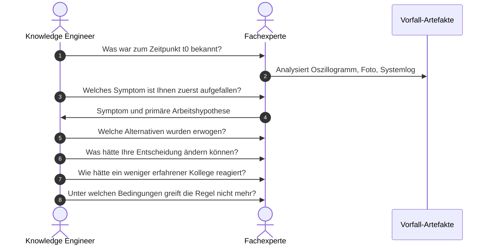
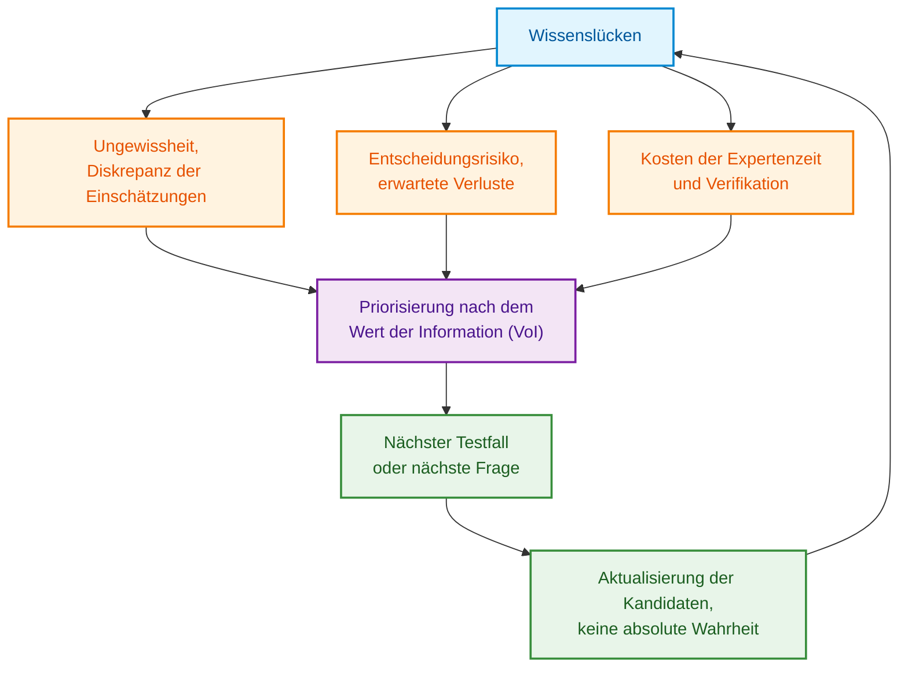
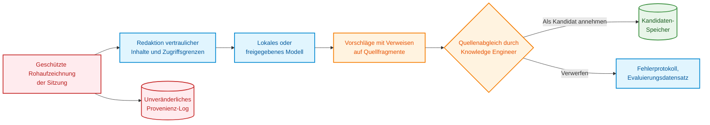
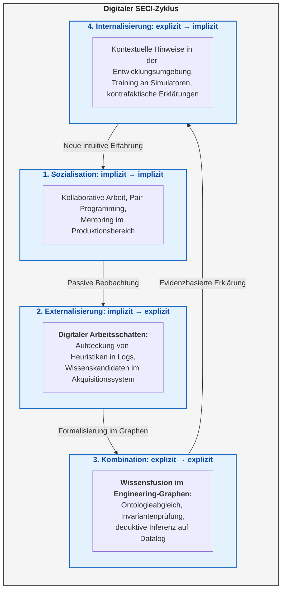

# Kapitel 11. Erhebung von Expertenwissen: Befragungen, kognitive Karten und Formalisierung von Praxiserfahrung

> **Buch:** [Architektur evidenzbasierter Expertensysteme](README.md) · [Teil III: Wissensakquisition, linguistische Analyse und Eingangsdatenbewertung](part-03-knowledge-engineering-nlp.md)  
> **Vorheriges Kapitel:** [Kapitel 10. Systeme der Wissensakquisition: Quellen, Zulassung und Lebenszyklus](ch10-knowledge-acquisition-systems.md)  
> **Nächstes Kapitel:** [Kapitel 12. Linguistische Analyse und lokale Modelle: Erhalt von Semantik und Herkunftsnachweis](ch12-linguistic-analysis-and-local-models.md)  
> **Inhaltsverzeichnis:** [README.md](README.md)  
> **Autor:** [Mykola Fedchyk](about-the-author.md)  
> **Niveau:** Fortgeschritten / Mittleres Niveau: Knowledge Engineers, Entwickler und technische Projektleiter  
> **Lernziele:** Eine strukturierte Expertenbefragung fokussiert auf eine konkrete Entscheidungsfindung vorbereiten; Domänenwissen, Inferenzoperationen und Aufgabensteuerung gemäß CommonKADS sauber voneinander trennen; Expertenäußerungen in strukturierte Wissenskandidaten mit Kontextbedingungen, Ausnahmen und Provenienz überführen; Wissenskandidaten anhand realer Fälle, Gegenbeispiele und unabhängiger Quellen verifizieren; subjektive Gewissheit von empirischer Häufigkeit und kalibrierter Wahrscheinlichkeit mathematisch differenzieren.

## Abstract

In diesem Kapitel werden die Methodologie und die ingenieurtechnischen Protokolle zur Überwindung des klassischen «Flaschenhalses der Wissensakquisition» (*Knowledge Acquisition Bottleneck*) in Expertensystemen durch die Formalisierung impliziten Expertenwissens (*tacit knowledge*) untersucht. Es werden die kognitiven Verzerrungen direkter Befragungen, die semantische Kluft zwischen subjektiven Heuristiken und objektiven Fakten sowie die Anwendung der CommonKADS-Methodologie zur Dekomposition von Expertise auf den Ebenen des Domänenmodells, der Inferenzoperationen und der Aufgabensteuerung für die Regelbasis analysiert. Vorgestellt werden formale Techniken wie Kellys Repertory-Grid-Methode, Verfahren zur Analyse kritischer Vorfälle (*Critical Decision Method*) und kognitive Karten. Beschrieben werden die Verfahren zur Synthese verifizierbarer Regeln, Protokolle zur Auflösung von Expertenkonflikten, die mathematische Kalibrierung subjektiver Gewissheit gegenüber empirischen Häufigkeiten sowie die architektonischen Grenzen beim Einsatz lokaler LLMs als Werkzeuge zur Dialogstrukturierung ohne Halluzinationen und ohne Quellenfälschung für den zuverlässigen Betrieb eines Expertensystems.

„Fragen Sie unseren Chefingenieur, er kennt das System auswendig.“ Das Team zeichnet das Gespräch auf, ein Sprachmodell komprimiert die Aufnahme auf zwanzig Regeln, und einen Monat später blockiert eine dieser Regeln ein voll funktionsfähiges Produkt im Prüffeld. Erst dann erinnert sich der Ingenieur: Die Regel bezog sich auf eine ältere Platinenrevision und galt ausschließlich bei extrem tiefen Temperaturen.

Auf diese Weise geht der Kontext **impliziten Wissens** (*tacit knowledge*) verloren – jener Praxiserfahrung, die ein Experte routiniert anwendet, jedoch selten als explizite Regel ausformuliert. Michael Polanyi brachte dieses Phänomen prägnant auf den Punkt: Wir wissen mehr, als wir zu sagen vermögen [[1]](#src-1). Die Aufgabe des Knowledge Engineers besteht folglich nicht darin, ein möglichst großes Textvolumen anzuhäufen, sondern darin, gemeinsam mit jeder Tatsachenbehauptung deren Kontextbedingungen, Ausnahmen, Provenienz, subjektive Unsicherheit und Verifikationsverfahren festzuhalten.

Betrachten wir das durchgehende Leitbeispiel dieses Kapitels: Ein Firmware-Entwickler diagnostiziert einen selten auftretenden Startfehler eines eingebetteten Steuergeräts. Die technische Dokumentation enthält zwar Fehlercodes, liefert jedoch keinerlei Hinweise auf ein spezifisches Signalmuster im Oszillogramm, keine deterministische Prüfreihenfolge und keine Warnung davor, dass ein einfacher Neustart des Geräts den wertvollsten flüchtigen Speicherbeweis unwiderruflich zerstört. Erforderlich ist ein verifizierbares Wissensmodell nach dem Schema „Symptom → Hypothese → differenzierende Prüfung → Ausnahme → Aktion“, unter gleichzeitigem Erhalt des authentischen Wortlauts und der Graduierung der Unsicherheit des Experten. Die fundamentale Fragestellung dieses Kapitels lautet: **Wie lässt sich ein Dialog mit einem Fachexperten in belastbares, formal verifizierbares Wissen überführen, anstatt lediglich ein narratives Protokoll zu archivieren?** Die nachfolgend dargestellten Methoden müssen dabei an das Risikoniveau, rechtliche Aufzeichnungsvorgaben und die Unternehmenskultur angepasst werden; die schiere Anzahl geführter Interviews belegt für sich genommen noch keineswegs deren Vollständigkeit.

## 1. Epistemische Barrieren und kognitive Verzerrungen bei Experteninterviews

Warum stellt die bloße Aufzeichnung eines Gesprächs noch kein valides Wissen dar? [Kapitel 10](ch10-knowledge-acquisition-systems.md) beschrieb die Pipeline der Wissensakquisition aus Dokumenten, deren Provenienz und Kuration. [Kapitel 19](ch19-from-question-to-evidence.md) analysiert den methodischen Weg vom Textfragment zur fundierten Sachbehauptung, und [Kapitel 20](ch20-explanation-engine.md) erläutert, wie Entscheidungen über formale Beweisketten nachvollziehbar begründet werden. Die **Erhebung von Expertenwissen bei menschlichen Wissensträgern** (*knowledge elicitation*) führt jedoch eine eigenständige Komplexität ein: Die Informationsquelle formuliert Sachverhalte situativ um, ist sich eigener heuristischer Abkürzungen oft nicht bewusst oder vermengt tatsächlich beobachtete Phänomene mit nachträglichen Rationalisierungen. Anna Hart identifizierte die Wissenserhebung bereits 1985 als eigenständiges methodisches Kernproblem des Knowledge Engineering [[2]](#src-2), während Nancy Cooke die Vielfalt der Elicitation-Techniken systematisch klassifizierte [[3]](#src-3).

```mermaid
flowchart LR
    accTitle: Pipeline der Wissenserhebung bei Fachexperten
    accDescr: Phasen von der Formulierung der Entscheidungsaufgabe bis zur Aufnahme verifizierten Wissens in die versionierte Wissensbasis.

    NEED["Entscheidungsbedarf<br/>und Systemgrenzen"] --> PLAN["Sitzungsplan<br/>und informierte Einwilligung"]
    PLAN --> RAW["Rohaufzeichnungen,<br/>Notizen und Artefakte"]
    RAW --> SEG["Atomare Äußerungen<br/>und Quellfragmente"]
    SEG --> KC["Wissenskandidaten"]
    KC --> CH["Prüfverfahren:<br/>Fälle, «Warum», Ausnahmen"]
    CH --> TRI["Triangulation:<br/>Logs, Dokumentation, Kollegen"]
    TRI --> VAL["Validierung an<br/>Holdout-Fällen"]
    VAL --> GOV{"Zulassungsrat"}
    GOV -->|"Freigegeben"| KB[("Versionierte<br/>Wissensbasis")]
    GOV -->|"Überarbeiten"| PLAN
    GOV -->|"Daten unzureichend"| UNK["Bekanntes Unbekanntes,<br/>offene Frage"]

    classDef stage fill:#e1f5fe,stroke:#0288d1,stroke-width:2px,color:#01579b;
    classDef check fill:#fff3e0,stroke:#f57c00,stroke-width:2px,color:#e65100;
    classDef store fill:#e8f5e9,stroke:#388e3c,stroke-width:2px,color:#1b5e20;
    classDef alert fill:#ffebee,stroke:#d32f2f,stroke-width:2px,color:#b71c1c;

    class NEED,PLAN,RAW,SEG,KC stage;
    class CH,TRI,VAL,GOV check;
    class KB store;
    class UNK alert;
```



Das Diagramm verdeutlicht, dass es keinen magischen Einzelschritt zur «Wissensextraktion» gibt. Es handelt sich vielmehr um eine deterministische Transformationskette, bei der jede Stufe Interpretationsunschärfen einbringen kann. Ein wörtliches Transkript belegt lediglich, dass eine Person diese Äußerung getätigt hat – keineswegs aber, dass die getroffene Aussage universell gültig ist.

Aus diesem Grund ist die Etablierung eines strikten Statusmodells für Wissensartefakte unerlässlich:

```text
utterance → candidate → corroborated candidate → validated rule → released knowledge
```

Im deutschen Entwicklungsprozess entspricht dies der Sequenz: Äußerung → Wissenskandidat → korroborierter Kandidat → validierte Regel → freigegebenes Wissen. Jeder Statusübergang erfordert eine explizite formale Rechtfertigung. Die Zusammenfassung eines Sprachmodells darf den Status niemals eigenmächtig von einer bloßen Äußerung direkt zu einer validierten Regel befördern.

## 2. Zielgerichtetes Design von Elicitation-Sessions: Ausrichtung auf Entscheidungsfindung

Die unspezifische Aufforderung „Erzählen Sie alles, was Sie über den Boot-Vorgang des Systems wissen“ führt unweigerlich zu seitenlangen Transkripten, liefert jedoch kaum formal testbares Wissen. Die CommonKADS-Methodologie (*Common Knowledge Acquisition and Documentation Structuring*) setzt beim Knowledge Engineering daher primär bei der Analyse der Organisation und der spezifischen Aufgabenstellung an, anstatt direkt mit informellen Interviews zu beginnen [[4]](#src-4). Vor jeder Befragungssitzung müssen folgende Parameter präzise definiert werden:

- welche konkrete Entscheidung das Expertensystem operativ unterstützen oder automatisieren soll;
- wer diese Entscheidung in welchem organisatorischen und technischen Umfeld trifft;
- welche Kosten und Risiken mit falsch-positiven, falsch-negativen Fehlern sowie mit Entscheidungsverzögerungen verbunden sind;
- welche Grenz- und Fehlerfälle besonders komplex oder selten auftreten;
- welche Wissensbestände bereits in Spezifikationen, Telemetriedaten und im Quellcode explizit vorliegen;
- welche Sachverhalte der Experte aus Gründen des Datenschutzes oder Betriebsgeheimnisses nicht offenlegen darf;
- anhand welcher messbaren Kriterien der Erfolg und Mehrwert der Elicitation-Sitzung bewertet werden kann.

Im Kontext unseres Leitbeispiels besteht die zu treffende Entscheidung nicht in einem diffusen „Verstehen des Startvorgangs“, sondern lautet präzise: „Vor einem Reset der Spannungsversorgung ist diejenige differenzierende Messung auszuwählen, die eindeutig zwischen einem Einbruch der Versorgungsspannung, einem Ausfall des Taktgenerators und einer Beschädigung des Firmware-Abbilds unterscheidet.“ Eine derartige Schärfung generiert unmittelbar zielgerichtete Fragen.

Eine präzise eingegrenzte Entscheidungsaufgabe definiert den Rahmen aller nachgelagerten Engineering-Schritte. Sie legt fest, welche spezifischen Testfälle in die Befragung eingebracht werden müssen, welche Fehlerarten fatale Folgen nach sich ziehen und anhand welcher Verhaltensmuster des künftigen Expertensystems nachgewiesen werden kann, dass das formalisierte Wissen in der Praxis tatsächlich wirksam ist.

### 2.1. CommonKADS-Methodologie: Domänenwissen, Inferenzebene und Aufgabensteuerung

Liegt eine präzise Entscheidungsdefinition vor, tritt eine weitere methodische Herausforderung auf: In einem Gesprächstranskript vermischen sich Beschreibungen des physischen Geräts, deduktive Schlussfolgerungen des Experten und situative Handlungsabläufe. Werden ausschließlich Regeln über Bauteilfehler isoliert, verliert das Expertensystem möglicherweise die zwingende Anweisung, das Gerät vor dem Aufzeichnen des Oszillogramms keinesfalls neu zu starten. Werden hingegen lediglich Befehlssequenzen abgespeichert, kann das System nicht begründen, warum eine bestimmte Messung geeignet ist, zwei konkurrierende Hypothesen voneinander zu trennen.

CommonKADS definiert sechs miteinander verzahnte Modelle: Organisations-, Aufgaben-, Agenten-, Wissens-, Kommunikations- und Entwurfsmodell [[4]](#src-4). Das Organisations-, Aufgaben- und Agentenmodell spezifizieren den betrieblichen Bedarf, arbeitsorganisatorische Randbedingungen und den verantwortlichen Akteur. Das Kommunikationsmodell beschreibt den interaktiven Austausch zwischen Mensch und Softwaresystem, während das Entwurfsmodell diese Vorgaben in konkrete Softwarekomponenten übersetzt. Das **Wissensmodell** (*knowledge model*) zerlegt den eigentlichen Fachinhalt der Expertenarbeit auf drei distinkte Abstraktionsebenen. Die nachfolgende Tabelle illustriert diese Ebenen anhand unseres Leitbeispiels der Systemstart-Diagnose.

| Bestandteil des Wissensmodells | Dokumentationsgegenstand des Knowledge Engineers | Diagnosebeispiel des Systemstarts |
|---|---|---|
| Domänenwissen (*domain knowledge*) | Fachbegriffe, Relationen, Fakten und domänenspezifische Regeln | Platinenrevision, Betriebstemperatur, Timing-Parameter von Spannungsversorgung und Takt, Anwendungsbedingungen der Regel |
| Inferenzwissen (*inference knowledge*) | Denkoperationen (Inferenzschritte) sowie Rollen ihrer Eingangs- und Ausgangsdaten | Hypothese vorschlagen, Symptom anhand der Hypothese prognostizieren, Prognose mit Oszillogramm abgleichen |
| Aufgabenwissen (*task knowledge*) | Zielzustand, Reihenfolge der Operationen, Übergangs- und Abbruchbedingungen | Zuerst Oszillogramm sichern; anschließend differenzierende Messung auswählen; bei unzureichenden Daten Fall an Experten eskalieren |

Die **Wissensrolle** (*knowledge role*) kennzeichnet, welche Funktion ein konkretes Datum innerhalb einer Inferenzoperation einnimmt. Der exakte Zeitpunkt des Taktsignalanstiegs ist ein statischer Domänenfakt; im Vergleich mit einer theoretischen Simulation nimmt dieser Fakt jedoch die Wissensrolle „Beobachtung“ ein. Die Vermutung eines Defekts am Quarzoszillator fungiert als „Hypothese“, während die erwartete Flankenreihenfolge die Rolle „Prognose“ besetzt. Diese strikte Entkopplung gestattet es, die generische Inferenzoperation „Abgleich von Beobachtung und Prognose“ für ein völlig anderes Steuergerät wiederzuverwenden, ohne gerätespezifische Parameter der ursprünglichen Hardware mitzuschleppen.

Vergleichen wir zwei Befragungen zum identischen Fehlerbild: Der erste Experte benennt eine signifikante Flankenanomalie auf der Versorgungsleitung. Der zweite Experte begründet, warum das Gerät vor der Oszillogrammerfassung keinesfalls spannungslos geschaltet werden darf. Die erste Aussage erweitert das Domänenmodell und die Inferenzbedingungen, während die zweite die Aufgabensteuerung präzisiert. Der Austausch eines Oszilloskops modifiziert die Datenerfassung der Beobachtung, berührt jedoch nicht die logische Diagnoseregel. Eine neue Leiterplattenrevision hingegen kann eine Domänenregel invalidieren, ohne dass sich die Reihenfolge der Beweissicherung im Aufgabenwissen ändert.

Vor der softwaretechnischen Implementierung verifiziert der Knowledge Engineer drei eigenständige Konstruktionsergebnisse: Wurden sämtliche erforderlichen Konzepte und Vorbedingungen erfasst? Besitzt jede Inferenzoperation wohldefinierte Ein- und Ausgänge? Existiert für jeden Pfad (Erfolg, Widerspruch, Datenmangel) ein deterministischer nächster Schritt? Dies stellt eine strukturelle Entwurfsprüfung dar, keinen empirischen Wahrheitsbeweis der Diagnose. Die Domänenregeln bedürfen nach wie vor der Validierung an neuen Testfällen. Die konkrete softwaretechnische Realisierung dieser Inferenzoperationen in Systemkomponenten wird in [Kapitel 16](ch16-expert-systems-architecture.md) vertieft. Die Auswahl der geeigneten Elicitation-Technik lässt sich damit gezielt an spezifischen Lücken des Wissensmodells ausrichten, anstatt sie von der bloßen Textmenge abhängig zu machen.

## 3. Methodische Strategien und Interaktionsprotokolle mit Fachexperten

Jede Elicitation-Methode blendet systematisch bestimmte Facetten des Wissens aus. Ein freies Interview erfasst den Fachwortschatz hervorragend, scheitert jedoch daran, das Handeln unter realem Zeitdruck abzubilden. Die passive Beobachtung dokumentiert tatsächliche Arbeitsabläufe und Notlösungen (Workarounds), bleibt jedoch hinsichtlich interner Denkprozesse blind. Die Methode des lauten Denkens legt die Sequenz kognitiver Zwischenschritte offen, doch verändert die Verbalisierung häufig die Struktur der Aufgabenbearbeitung selbst. Die methodologische Analyse von Hoffman, Shadbolt, Burton und Klein vergleicht diese Verfahren systematisch hinsichtlich des jeweils erschlossenen Wissenstyps [[5]](#src-5), während Burton und Koautoren die empirische Effizienz der Techniken über verschiedene Fachdomänen und Expertisegrade hinweg untersuchten [[6]](#src-6).

| Methode | Primär erschlossener Wissenstyp | Wesentliche Einschränkung |
|---|---|---|
| Halbstrukturiertes Interview | Konzepte, Systemgrenzen, Begründungen | Nachträgliche Rationalisierung |
| Beobachtung im Arbeitskontext | Reale Arbeitsabläufe, Werkzeugeinsatz, Workarounds | Verborgene kognitive Prozesse, Datenschutz |
| Lautes Denken (*think-aloud*) | Aufmerksamkeitsfokus und Zwischenhypothesen | Reaktivität der Verbalisierung auf den Ablauf, hohe kognitive Last |
| Critical Decision Method (CDM) | Beachtete Signale, erwogene Optionen, Zeitdruck bei konkreten Vorfällen | Abhängigkeit von der Erinnerungsleistung an das Ereignis |
| Laddering (Fragekaskaden „Wie?“ und „Warum?“) | Hierarchie von Zielen, Bewertungskriterien und Handlungen | Suggestivfragen können künstliche Strukturen induzieren |
| Repertory Grids und Triaden | Verborgene bipolare Konstrukte und Falldifferenzierungen | Künstlichkeit und Skalierungsaufwand bei großen Fallzahlen |
| Card Sorting | Kategorisierung und mentale Taxonomien | Geringer Ertrag an prozeduralem Wissen |
| Szenarien und Simulationen | Konditionales Verhalten und Reaktion auf Anomalien | Validität stark abhängig vom Realismus des Szenarios |

Die Protokollanalyse von Ericsson und Simon behandelt Verbalberichte als empirische Daten und analysiert die Bedingungen, unter denen die Verbalisierung die primäre Aufgabenbewältigung modifiziert [[7]](#src-7). Die Critical Decision Method von Klein, Calderwood und MacGregor rekonstruiert reale Störfälle entlang einer präzisen Zeitachse [[8]](#src-8). Repertory Grids basieren auf der Psychologie der persönlichen Konstrukte; Gaines und Shaw entwickelten darauf aufbauende softwaregestützte Werkzeuge zur Wissensakquisition [[9]](#src-9). Rugg und McGeorge etablierten das Card Sorting als eigenständige Methode neben Grids und Laddering [[10]](#src-10). Da keine Einzelmethode alle Dimensionen abdeckt, kombiniert ein solider Erhebungsplan stets mehrere komplementäre Verfahren.

### 3.1. Kellys Repertory-Grid-Methode: Triadische Differenzierungsanalyse

In der Wissensbasis eines Expertensystems erfordern diagnostische Prädikate scharfe, bipolare Differenzierungen. Eine direkte Befragung des Experten („Wie genau unterscheiden Sie einen regulären Start von einem Fehlerzustand?“) führt jedoch regelmäßig zu nachträglichen Rationalisierungen: Der Fachexperte zitiert allgemeine Passagen aus Datenblättern und übergeht unbewusst die entscheidenden impliziten Erfahrungswerte. Stützt sich die Wissensbasis lediglich auf solche oberflächlichen Spezifikationsmerkmale, generiert die Inferenzmaschine im Grenzbetrieb fatale Fehlalarme, was in sicherheitskritischen Anwendungen zu ungerechtfertigten Notabschaltungen führt. Die Repertory-Grid-Methode von George Kelly überwindet diese kognitive Hürde durch einen strukturierten triadischen Vergleich konkreter Vorfälle oder Artefakte $`(e_1, e_2, e_3)`$.

Der Knowledge Engineer legt dem Experten drei reale Oszillogramme eines Startvorgangs vor und stellt eine unveränderliche methodische Frage: „Welche zwei dieser Fälle ähneln einander, unterscheiden sich jedoch vom dritten – und an welchem konkreten physikalischen Merkmal machen Sie dies fest?“ Diese kognitive Operation zwingt den Experten, ein verborgenes bipolares Konstrukt explizit zu machen, beispielsweise: *„Der Taktgenerator startet vor der Stabilisierung der Versorgungsspannung“* $\longleftrightarrow$ *„Der Taktgenerator startet erst nach erfolgter Stabilisierung“*. Dieses Prädikat existierte zuvor in keinem formalen Datenschema, bildet jedoch das ausschlaggebende Kriterium zur Fehlerdiagnose. Im nächsten Schritt hinterlegt der Knowledge Engineer dieses Konstrukt mit messbaren physikalischen Parametern (Einheiten, zulässige Zeitintervalle $`\Delta t`$, Spannungsschwellenwerte) und validiert die gewonnene bipolare Regel an einem unabhängigen Korpus von Oszillogrammen.

### 3.2. Critical Decision Method (CDM): Analyse kritischer Vorfälle

Für den Entwurf des Aufgabenwissens (*task knowledge*) und die Extraktion von Sicherheitsinvarianten für die Wissensbasis ist es entscheidend, das Verhalten des Experten in extremen Ausnahmesituationen unter hoher Unsicherheit und akutem Zeitdruck zu erfassen. Eine generalisierende Befragung („Wie gehen Sie üblicherweise bei einem Spannungseinbruch vor?“) unterliegt einer massiven Verzerrung durch den Rückschaufehler (*hindsight bias*, Baruch Fischhoff [[11]](#src-11)): Der Experte konstruiert unbewusst ein idealisiertes Lehrbuchszenario und tilgt daraus kritische Heuristiken, nichtlineare Kontrollschritte und negative Invarianten (wie etwa das strikte Verbot, den Reset-Taster vor dem Auslesen des Busanalysators zu betätigen). Die Critical Decision Method (CDM) setzt stattdessen auf eine schrittweise chronologische Rekonstruktion eines tatsächlich dokumentierten Vorfalls anhand erhaltener Primärartefakte (Systemprotokolle, Oszillogramme, Speicherabzüge):



Die Fragen zielen strikt auf jene Informationen ab, die **zu jenem Zeitpunkt** verfügbar waren, nicht auf das im Nachhinein bekannte Ergebnis. Fischhoff wies nach, dass die Kenntnis des Ausgangs das Urteil verzerrt: Ein Ereignis erscheint rückblickend weitaus vorhersehbarer, als es in der Situation tatsächlich war [[11]](#src-11). Ohne eine präzise chronologische Rekonstruktion wirkt der Entscheidungspfad trügerisch geradlinig.

## 4. Syntaktische und logische Formalisierung: Überführung von Äußerungen in Wissenskandidaten

Rohe Interviewtranskripte oder umgangssprachliche Äußerungen von Fachexperten dürfen niemals direkt in eine Inferenzmaschine oder einen Verifikator eingespeist werden, da sie semantische Mehrdeutigkeiten und implizite Kontextannahmen enthalten. Jede unpräzise Aussage, die ungeprüft als Axiom übernommen wird, induziert einen semantischen Drift der Wissensbasis und führt zu nichtdeterministischen Inferenzketten. Die Akquisitions-Pipeline transformiert eine rohe Expertenäußerung in einen strukturierten **Wissenskandidaten** (*Knowledge Candidate*, $KC$) unter expliziter Erfassung von Quelle, Kontextgrenzen, Beobachtungsprädikaten, Modalität sowie dem Status der Ausnahmeuntersuchung.

Betrachten wir die Aussage eines leitenden Embedded-Software-Entwicklers: *„Wenn die zweite Flankenstufe der Versorgungsspannung flach verläuft, liegt der Fehler fast immer beim Taktgenerator; die Platine darf unter keinen Umständen neu gestartet werden.“* Für die Integration in ein Expertensystem wird diese Aussage in strukturierte, typisierte Attribute zerlegt. Eine leere Ausnahmeliste bedeutet keineswegs deren Nichtexistenz: Das Attribut `exceptions_status: not_assessed` dokumentiert explizit die Pflicht zur nachfolgenden Verifikation.

<details>
<summary>Beispiel eines Wissenskandidaten mit unbekanntem Schwellenwert und noch nicht untersuchten Ausnahmen</summary>

```yaml
candidate_id: candidate:clock-startup-flat-slope:017
source:
  session: ses-2026-08-26-02
  speaker: expert-07
  span: "00:31:14.220/00:31:27.810"
context:
  board_revisions: [C, D]
  temperature_c: "< -10"
observation:
  feature: rail_second_step_slope
  operator: "<"
  threshold: null
hypothesis:
  value: clock_startup_fault
  speaker_modality: "almost_always"
action:
  prohibit: power_cycle_before_trace_capture
exceptions: []
exceptions_status: not_assessed
open_questions:
  - operational threshold for "flat"
  - applicability to revision E
status: candidate
```

</details>

Der Wert `threshold: null` stellt keinen Dokumentationsfehler dar, sondern markiert eine verifizierungsbedürftige Leerstelle. Das eigenmächtige Eintragen eines numerischen Werts anhand des Tonfalls des Experten käme einer Fabrikation nicht existenten Wissens gleich. Das Feld `speaker_modality` konserviert den authentischen Wortlaut des Experten („fast immer“), wird jedoch nicht voreilig in eine kalibrierte Wahrscheinlichkeit umgemünzt.

Ein Wissenskandidat verweist sowohl auf das rohe Quellfragment als auch auf die Interpretation des Knowledge Engineers. Eine Korrektur des Kandidaten überschreibt niemals das Originaltranskript. Ist die Tonaufzeichnung untersagt, werden freigegebene Sitzungsprotokolle ebenfalls versioniert, jedoch mit einem Vermerk über ihre eingeschränkte Auditierbarkeit versehen.

## 5. Falsifikationsprotokolle: Identifikation von Randbedingungen und Defeatern

In sicherheitskritischen Systemen (gemäß ISO 26262 ASIL D oder IEC 61508 SIL 3/4) gilt eine Regel der Wissensbasis nicht schon dann als belastbar, wenn der Experte eine Reihe bestätigender Beispiele anführen kann, sondern erst dann, wenn sie einem gezielten popperianischen Falsifikationszyklus standgehalten hat. Der menschliche Bestätigungsfehler (*confirmation bias*) verleitet Experten dazu, erfolgreiche Präzedenzfälle aus dem Gedächtnis abzurufen und Gültigkeitsgrenzen zu übergehen. Wird eine Regel ohne explizite Spezifikation ihrer Entkräftungsbedingungen – sogenannter Defeater (*defeaters*) – in die Wissensbasis übernommen, formuliert das Expertensystem Fehlurteile, sobald sich die physischen Umgebungsbedingungen (wie Temperatur oder Chip-Stepping) außerhalb des unausgesprochenen Expertenkontexts bewegen.

Um die Verifikationsgrenzen der Wissensbasis abzusichern, wird nach der Formulierung jeder positiven Regel zwingend ein kritisches Falsifikationsprotokoll anhand definierter Prüfdimensionen durchlaufen:

- **Präzisierung:** Was genau bedeutet „flach“ und wie lässt sich dies messtechnisch quantifizieren?
- **Kontrast:** Welches Oszillogramm weist ein ähnliches Muster auf, führt jedoch zu einer völlig anderen Diagnosehypothese?
- **Ausnahme:** Unter welchen Bedingungen tritt das Symptom auf, obwohl der Taktgenerator vollkommen intakt ist?
- **Absenz:** Welche Ersatzstrategie greift, wenn der erforderliche Messkanal hardwareseitig nicht verfügbar ist?
- **Zeitdynamik:** Verändert sich die Regel nach Erwärmung der Baugruppe oder bei einem Kaltstart?
- **Provenienz:** Haben Sie diesen Effekt persönlich im Labor gemessen, der Spezifikation entnommen oder deduktiv hergeleitet?
- **Diskrepanz:** Welcher Fachkollege würde eine abweichende Entscheidung treffen und aus welchen Gründen?
- **Falsifikation:** Durch welches konkrete Experiment ließe sich Ihre Regel zweifelsfrei widerlegen?

Auf diese Weise dokumentiert der Dialog nicht nur bestätigende Instanzen, sondern die exakten Grenzen der Anwendbarkeit. Die Frage „Trifft es zu, dass X stets zu Y führt?“ ist hochgradig suggestiv: Sie offeriert eine unzulässige Vereinfachung und drängt zur Zustimmung. Methodisch robuster ist es, dem Experten unbeschriftete Testfälle vorzulegen und eine Prognose einzufordern, bevor das reale Resultat offengelegt wird.

Kann ein Fachexperte keinerlei denkbare Gegenbeispiele benennen, so signalisiert dies die dringende Notwendigkeit weiterer empirischer Fallanalysen und unabhängiger Quellen – keineswegs jedoch die absolute Allgemeingültigkeit der Regel.

## 6. Mathematische Abgrenzung von subjektiver Gewissheit und statistischer Häufigkeit

In der Wissensbasis eines Expertensystems erzeugen vage verbale Modalitätsausdrücke (etwa „üblicherweise“, „fast immer“, „selten“) kritische Unsicherheiten für logische Inferenzalgorithmen. Überträgt der Knowledge Engineer solche Äußerungen ohne empirische Kalibrierung in statische Sicherheitsfaktoren (*Certainty Factors*, CF), geraten die Inferenzketten der Inferenzmaschine stochastisch aus dem Gleichgewicht: Die Akkumulation subjektiver Multiplikatoren führt zu unkontrollierter Degradation der Entscheidungsfindung oder zu fatalen Fehlauslösungen von Notfallsystemen. Ruth Beyth-Marom wies experimentell nach, dass Fachexperten bei identischen verbalen Quantifikatoren eine drastische numerische Streuung aufweisen (für den Ausdruck „wahrscheinlich“ variierte die Zuordnung von 0,40 bis 0,85) [[12]](#src-12). Jede Expertenäußerung mit diagnostischem Regelcharakter erfordert daher eine strikte mathematische Differenzierung in Punkthäufigkeit, bayesianisches A-posteriori-Intervall und kalibrierte Beurteilerübereinstimmung.

Zur Verifikation einer heuristischen Regel zieht der Knowledge Engineer eine Stichprobe von $n$ Testläufen oder archivierten Vorfällen heran. Wurde das Zielmerkmal eines Fehlers dabei $k$-mal beobachtet, ergibt sich die empirische Punkthäufigkeit zu:

```math
\hat p=\frac{k}{n}
```

Komponenten und Dimensionen der Schätzung:

- $\hat p$ ist die dimensionslose Punktschätzung des Anteils der Zielfälle im Intervall $[0, 1]$;
- $k$ ist die Anzahl erfolgreicher Feststellungen des Merkmals unter den gewerteten Vorfällen ($0 \le k \le n$);
- $n$ ist der Gesamtumfang der Verifikationsstichprobe ($n > 0$, positive Ganzzahl).

Ingenieurtechnische Restriktionen und Entscheidungsfindung:
Die Punktschätzung $\hat p$ ignoriert den statistischen Stichprobenfehler kleiner Fallzahlen. Gemäß den Anforderungen der funktionalen Sicherheit gilt eine Punkthäufigkeit bei $n < 10$ als kalibrierungsinstabil: Dem Wissenskandidaten ist die Übernahme in den operativen Regelbestand strikt untersagt, und das Prädikat wird unter Quarantäne gestellt, bis mindestens $n \ge 30$ unabhängige Beobachtungen vorliegen (Schwelle des zentralen Grenzwertsatzes). Ein Wert von $k = 7$ bei $n = 10$ ($\hat p = 0{,}70$) liefert lediglich einen Anlass für vertiefte Hardwaretests.

Um der Unsicherheit bei begrenzten Testdaten Rechnung zu tragen, wird ein konjugiertes bayesianisches Update im Bernoulli-Modell durchgeführt. Unter Annahme einer nicht-informativen Laplace-Prior-Verteilung $p\sim\mathrm{Beta}(1, 1)$ (mit $\alpha = 1, \beta = 1$) ergibt sich die A-posteriori-Verteilung des Fehleranteils zu:

```math
p\mid k,n\sim\mathrm{Beta}(\alpha+k,\ \beta+n-k).
```

Parameter der Beta-Verteilung:

- $p \in [0, 1]$ ist die stetige Zufallsvariable der wahren Fehlerwahrscheinlichkeit;
- $\alpha > 0$ und $\beta > 0$ sind dimensionslose Hyperparameter der Pseudobeobachtungen der A-priori-Verteilung;
- $\mathrm{Beta}(\alpha+k,\beta+n-k)$ ist die Wahrscheinlichkeitsdichte der A-posteriori-Verteilung nach Berücksichtigung von $k$ Bestätigungen und $n-k$ Gegenbeispielen;
- die Symbole $\mid$ und $\sim$ bezeichnen die bedingte Abhängigkeit bzw. die Verteilungszugehörigkeit.

Praktische Anwendung und Auslösekriterium:
Die A-posteriori-Verteilung gestattet der Inferenzmaschine die Berechnung eines $95\,\%$-Bayes-Glaubwürdigkeitsintervalls (Credible Interval) $[p_{\mathrm{low}}, p_{\mathrm{high}}]$ über die Quantilsformel: $\int_0^{p_{\mathrm{low}}} \mathrm{Beta} = 0{,}025$ und $\int_0^{p_{\mathrm{high}}} \mathrm{Beta} = 0{,}975$.
- Beträgt die Intervallbreite $`\Delta p = p_{\mathrm{high}} - p_{\mathrm{low}} \le 0{,}15`$, gilt die Regel als statistisch ausgereift und wird für den Produktiveinsatz in der Wissensbasis freigegeben.
- Beträgt die Intervallbreite $`\Delta p > 0{,}30`$ (beispielsweise für $k=7, n=10$, wo $\mathrm{Beta}(8, 4)$ ein $95\,\%$-Intervall von etwa $[0{,}39; 0{,}89]$ liefert), ist die Ungewissheit für sicherheitskritische Entscheidungen inakzeptabel. Das Expertensystem schaltet in einen Schutzmodus (*fail-safe hold*), blockiert die automatisierte Entscheidung und fordert eine konservative Fallback-Regel oder einen manuellen Eingriff an.

Klassifizieren mehrere Experten denselben Fallbestand, liefert die einfache prozentuale Übereinstimmung ein verzerrtes Bild, wenn eine Kategorie dominant auftritt. Cohens Kappa-Koeffizient korrigiert die Übereinstimmung zweier Beurteiler um den Zufall [[13]](#src-13):

```math
\kappa=\frac{p_o-p_e}{1-p_e}.
```

Komponenten von Kappa und Normierung:

- $`p_o`$ ist der beobachtete Anteil übereinstimmender Bewertungen zweier Experten auf der Kalibrierungsstichprobe;
- $`p_e`$ ist der theoretisch erwartete Anteil zufälliger Übereinstimmungen bei gegebenen Randverteilungen ($p_e < 1$);
- $\kappa$ ist der dimensionslose Koeffizient der Beurteilerübereinstimmung im theoretischen Wertebereich $[-1, 1]$.

Ingenieurtechnische Schwellenwerte für die Regelzulassung:
Der berechnete Wert $\kappa$ fungiert als deterministisches Validierungsgateway in der Wissensaufbereitung:
1. **$\kappa \ge 0{,}75$ (Hohe Übereinstimmung):** Diskrepanzen zwischen den Experten sind statistisch vernachlässigbar; die Regel wird automatisiert verifiziert und zur Codegenerierung zugelassen;
2. **$0{,}40 \le \kappa < 0{,}75$ (Moderate Übereinstimmung):** Es liegt ein verdeckter semantischer Konflikt oder unberücksichtigte Randbedingungen vor; eine Pflichtsitzung zur Extraktion von Defeatern wird anberaumt, um die Regel in zwei spezialisierte Teilregeln aufzuspalten;
3. **$\kappa < 0{,}40$ (Kritische Diskrepanz oder Widerspruch):** Fundamentale Divergenz der mentalen Modelle oder Begriffsdefinitionen; die automatische Regelübernahme wird vollständig gesperrt, der Wissenskandidat wandert in ein Quarantäne-Repository und ein Kollisionsprotokoll wird an die Schiedskommission übermittelt.

Bei mehr als zwei Beurteilern oder unvollständigen Zuweisungen kommt Krippendorffs Alpha mit einer vorab definierten Distanzmetrik zum Einsatz [[14]](#src-14). Gilt $p_e=1$, wird der Nenner null und Kappa ist undefiniert: Hierbei handelt es sich um einen degenerierten Sonderfall, keineswegs um perfekte Einigkeit.

## 7. Aktive Befragungsalgorithmen: Maximierung des Informationsgewinns

Die Arbeitszeit von Spitzenexperten ist knapp und kostenintensiv; folglich sind nicht alle Wissenslücken von identischer Relevanz. Es bezeichne $\Theta$ die unbekannten Parameter oder Regeln, $D$ die bereits vorliegenden Beobachtungen, $q$ eine potenzielle Frage und $a$ eine mögliche Antwort. Der erwartete Informationsgewinn (*Information Gain*, $IG$) errechnet sich zu:

```math
IG(q)=H(\Theta\mid D)-\mathbb E_{a\sim P(a\mid q,D)}\bigl[H(\Theta\mid D,q,a)\bigr].
```

Größen des Informationsgewinns:

- $\Theta$ repräsentiert die unbekannten Parameter oder Regeln, $D$ die gesammelten Beobachtungen und $q$ eine zur Auswahl stehende Frage;
- $a$ ist eine mögliche Antwort, $P(a\mid q,D)$ die Verteilung der Antworten bei gegebener Frage und Datenbasis, und $\mathbb E$ bildet den Erwartungswert über diese Verteilung;
- $H(\Theta\mid D)$ beziffert die Unsicherheit vor der Befragung, während $H(\Theta\mid D,q,a)$ die verbleibende Unsicherheit nach Erhalt der Antwort $a$ darstellt;
- die Subtraktion der erwarteten Restunsicherheit von der aktuellen Unsicherheit liefert den erwarteten Informationsgewinn.

Unter einem konsistenten Wahrscheinlichkeitsmodell ist $IG(q)$ stets nichtnegativ: Ein Wert von null bedeutet, dass die Antwort die Unsicherheit nicht verringert, während größere Werte eine stärkere Entropiereduktion signalisieren. Die Einheit ist Bit (bei Logarithmus zur Basis 2) oder Nat (bei natürlichem Logarithmus). Die Entropie einer diskreten Zufallsvariablen wurde von Claude Shannon definiert [[15]](#src-15):

```math
H(\Theta)=-\sum_i P(\theta_i)\log_2 P(\theta_i).
```

Symbole der Entropieformel:

- $\Theta$ ist eine diskrete Zufallsvariable, $`\theta_i`$ ein möglicher Zustand und $P(\theta_i)$ die Wahrscheinlichkeit dieses Zustands;
- $i$ iteriert über alle Zustände, die Summe aggregiert deren Beiträge, und $\log_2$ bezeichnet den Logarithmus dualis;
- $H(\Theta)$ wird in Bit gemessen, nimmt bei deterministischem Ausgang den Wert null an und wächst, wenn sich die Wahrscheinlichkeitsmasse auf mehrere Alternativen verteilt.

Für zwei gleichwahrscheinliche Hypothesen ergibt sich $H=-2(0{,}5\log_2 0{,}5)=1\ \text{Bit}$.

Abbruchkriterium des aktiven Befragungsalgorithmus:
Die Generierung von Fragen an den Fachexperten bricht nach einer Konvergenzregel des Informationsgewinns ab: Gilt für alle Fragen $q \in Q$ die Bedingung $\max_q IG(q) < \epsilon_{\mathrm{stop}}$ (wobei die Schranke typischerweise auf $`\epsilon_{\mathrm{stop}} = 0{,}05\ \text{Bit}`$ gesetzt wird), gelten weitere Nachfragen als unergiebig. Die Sitzung schaltet auf die Formalisierung der Resultate um, was eine kognitive Überlastung des Experten verhindert.

Die Fragenselektion nach maximalem Informationsgewinn ist eng mit dem Active Learning verwandt, dessen Grundlagen Burr Settles zusammenfasste [[16]](#src-16). Eine Frage mit maximaler Entropiereduktion besitzt jedoch nicht zwingend den höchsten praktischen Nutzen. Die Information-Value-Theorie von Ronald Howard bewertet Information danach, in welchem Maße sie reale Entscheidungen verbessert [[17]](#src-17). Die Priorität in der industriellen Praxis koppelt daher das Entscheidungsrisiko, die Schadensreduktion und die Kosten der Fragestellung:

```math
q^*=\arg\max_q\frac{\mathbb E\bigl[L(a_0)-L(a_q)\bigr]}{C_{\mathrm{expert}}(q)+C_{\mathrm{validation}}(q)}.
```

Kriterien der optimalen Fragenauswahl:

- $q$ ist eine Kandidatenfrage und $q^*$ jene Frage mit dem maximalen Quotienten aus erwarteter Verlustreduktion und Gesamtkosten;
- $`a_0`$ ist die optimale Aktion beim aktuellen Kenntnisstand, $a_q$ die angepasste Aktion nach Erhalt der Antwort und $L(a)$ der Verlust der Aktion $a$;
- $`\mathbb E[L(a_0)-L(a_q)]`$ mittelt die Schadensreduktion über alle denkbaren Antworten;
- $`C_{\mathrm{expert}}(q)`$ beziffert die Kosten der Expertenzeit, $`C_{\mathrm{validation}}(q)`$ die Verifikationskosten der Antwort, wobei deren Summe strikt positiv sein muss;
- alle Kostenkomponenten müssen in konsistenten Einheiten bilanziert werden, damit der Quotient den Grenznutzen pro Kosteneinheit darstellt.

Wirtschaftliches und sicherheitstechnisches Abbruchkriterium:
Der Zähler repräsentiert die mathematische Erwartung vermiedener Schäden (in Währungs- oder Risikoeinheiten), der Nenner die direkten Kosten der Expertensitzung und Prüfstandsmessungen.
- Gilt $`\max_q \mathbb E[L(a_0)-L(a_q)] \le C_{\mathrm{expert}}(q) + C_{\mathrm{validation}}(q)`$, ist der Erkenntniswert weiterer Befragungen erschöpft. Das System stoppt die Elicitation, markiert die Restunsicherheit als irreduzibles «bekanntes Unbekanntes» ($UNK$) und überführt sie in eine restriktive Sicherheitsinvariante des Expertensystems.



Das Diagramm verdeutlicht, dass die Fragepriorität von drei Faktoren simultan bestimmt wird und die Expertenantwort stets Wissenskandidaten aktualisiert, statt eine unfehlbare Wahrheit zu etablieren.

## 8. Multiexperten-Kollisionen: Konfliktlösungs- und Konsensprotokolle

Fachexperten arbeiten häufig auf unterschiedlichen Hardware-Revisionen, Zielmärkten, mit abweichenden Messgeräten oder unter differenten Zuverlässigkeitsanforderungen. Wenn Experte A eine Ausfallwahrscheinlichkeit von 0,7 angibt, Experte B von 0,3 votiert und das Expertensystem mechanisch den Mittelwert 0,5 verbucht, entsteht kein Konsens, sondern der Verlust des gesamten operativen Kontexts.

Dissens wird daher zunächst formal strukturiert:

```math
d=(\mathrm{claim},\ \mathrm{expert},\ \mathrm{context},\ \mathrm{rationale},\ \mathrm{evidence},\ \text{confidence-type}).
```

Felder des Konfliktdatensatzes:

- $d$ ist ein strukturierter Datensatz über Behauptung und Expertenposition;
- `claim` bezeichnet die Sachbehauptung, `expert` die Expertenkennung und `context` die Randbedingungen der Gültigkeit;
- `rationale` dokumentiert die logische Argumentation, `evidence` verweist auf Belege und `confidence-type` spezifiziert den Typus der Gewissheit;
- die Kommata trennen die Tupelkomponenten; sie bedeuten keinesfalls, dass divergierende Werte arithmetisch gemittelt werden dürfen.

Dieser Datensatz separiert Kontext, Begründung, Evidenz und Art der Unsicherheit. Im Anschluss wird die Ursache der Diskrepanz analysiert: Liegt ein Konflikt empirischer Fakten, abweichende Begriffsdefinitionen, differierende Anwendungsbedingungen oder ein Trade-off konkurrierender Entwurfsziele vor? In den meisten Ingenieuraufgaben besteht die korrekte Lösung in zwei eigenständigen Regeln mit jeweils präzisem Kontext anstelle eines faulen Kompromisses. Bei Richtlinien und Sicherheitsvorgaben trifft der autorisierte Wissenseigentümer (*Knowledge Owner*) die Entscheidung; empirische Kontroversen erfordern Labortests, während subjektive Präferenzen getrennt von Fakten erfasst werden.

Anonyme Runden nach der Delphi-Methode, die Dalkey und Helmer zur Gewinnung aggregierter Expertenurteile ohne hierarchischen Konformitätsdruck konzipierten [[18]](#src-18), können den Einfluss von Statusunterschieden reduzieren. Ein Mehrheitskonsens garantiert jedoch keineswegs die Wahrheit. Das Gegenbeispiel eines einzelnen Experten in der Minderheit muss erhalten bleiben und darf nicht als statistisches Rauschen verworfen werden.

## 9. Die Rolle von Sprachmodellen bei Moderation und Dialogstrukturierung

Kleine und große Sprachmodelle (SLMs und LLMs) können den Workflow des Knowledge Engineers signifikant beschleunigen:

- automatisierte Transkription von Audiodaten mit präzisen Zeitstempeln;
- linguistische Segmentierung und Extraktion domänenspezifischer Fachbegriffe;
- Detektion potenzieller logischer Widersprüche über mehrere Interviewsitzungen hinweg;
- Generierung von **Kandidaten** für Vertiefungs- und kontrafaktische Falsifikationsfragen;
- Überführung unstrukturierter Transkriptauszüge in standardisierte Entwurfsformate.

Gleichzeitig besitzt ein Sprachmodell weder die Fähigkeit zur faktischen Wahrheitsprüfung noch die Befugnis zur Festlegung von Systemgrenzen oder Haftungsfreigaben. Die Übersichtsarbeit von Ji et al. systematisiert die Anfälligkeit textgenerierender Modelle für Halluzinationen – also Ausgaben ohne Deckung in den Eingangsdaten [[19]](#src-19). Bei der Wissenserhebung manifestiert sich dies drastisch: Modelle neigen dazu, fehlende Schwellenwerte unbemerkt zu erfinden und fachliche Kontroversen glattzubügeln. Jedes modellgenerierte Datum muss daher zwingend auf ein konkretes Quellfragment referenzieren oder den expliziten Status `model_hypothesis` tragen.



Das Diagramm illustriert, dass das Modell ausschließlich bereinigte Aufzeichnungen verarbeitet und Vorschläge generiert; die Freigabeentscheidung verbleibt ausnahmslos beim Knowledge Engineer nach manuellem Abgleich mit der Quelle. Transkripte können personenbezogene Daten, Zugangsdaten, Sicherheitslücken oder Betriebsgeheimnisse enthalten. Die Zustimmung zu einem Interview beinhaltet keinerlei Genehmigung zur Nutzung der Daten für das Nachtrainieren externer Cloud-Modelle. Aufbewahrungsfristen, Löschroutinen und der Zugriff auf isolierte lokale Modelle sind vor Beginn der Aufzeichnung verbindlich zu regeln.

## 10. Verifikations- und Validierungsreglement für erhobene Regeln

Die Überprüfung der Formulierung durch den befragten Fachexperten (*Member Checking*) ist ein obligatorischer erster Schritt: Der Experte bestätigt, dass der Wissenskandidat seine Aussage unverfälscht wiedergibt. Birt und Koautoren beschreiben Member Checking als Rückspiegelung von Daten an Probanden zur Konsistenzprüfung, kritisieren jedoch eine unreflektierte Gleichsetzung dieses Schritts mit einer echten Validierung [[20]](#src-20). Für Expertensysteme lautet die Schlussfolgerung: Die Autorenprüfung belegt lediglich die Protokolltreue, keineswegs die sachliche Richtigkeit der Regel. Eine ganzheitliche Validierung umfasst:

- **Quellentreue:** Der Wissenskandidat bildet das Sitzungsmaterial verzerrungsfrei ab;
- **Triangulation:** Die Regel wird mit Systemprotokollen, Spezifikationen und unabhängigen Beobachtungen von Fachkollegen abgeglichen;
- **Gegenbeispiele:** Grenzbereiche und Entkräftungsbedingungen (Defeater) sind formal spezifiziert;
- **Messbarkeit:** Sämtliche Prädikate, Grenzwerte und Zeitfenster verfügen über eindeutige operationale Definitionen;
- **Holdout-Validierung:** Die Regel wird an ungesehenen Datensätzen evaluiert, nicht an bereits bekannten Erfolgsfällen;
- **Prospektive Prüfung:** Das Expertensystem prognostiziert Systemreaktionen, bevor der reale Ausgang bekannt wird;
- **Verantwortlichkeit:** Regelinhaber (*Knowledge Owner*), Revisionsintervalle und Ablaufdaten sind fest hinterlegt.

Für eine Regel $r$ auf einem gelabelten Datensatz werden Präzision und Recall ermittelt; in technischen Systemen ist die Verlustfunktion jedoch regelmäßig asymmetrisch:

```math
\widehat R(r)=\frac{1}{N}\sum_{i=1}^{N}L\bigl(r(x_i),y_i;\ \mathrm{context}_i\bigr).
```

Mittlere Verlustschätzung der Regel:

- $r$ ist die zu prüfende Regel, $N>0$ die Anzahl der Testfälle und $i$ der Laufindex;
- $x_i$ bezeichnet die Eingangsdaten, $y_i$ das Sollergebnis und $r(x_i)$ den Regelbefund;
- $`L(r(x_i),y_i;\ \mathrm{context}_i)`$ beziffert den Verlust einer Fehlentscheidung unter Berücksichtigung des spezifischen Kontexts $`\mathrm{context}_i`$ (Semikolon trennt den Kontext);
- die Summe aggregiert die Einzelverluste, die Division durch $N$ liefert den mittleren Verlust in Einheiten der Kostenmatrix.

Ingenieurtechnische Abnahmekriterien und Risikostratifikation:
Eine Regel wird erst dann für den Produktiveinsatz zugelassen, wenn das empirische Risiko auf der Gesamttestmenge die Sicherheitsgrenze nicht überschreitet: $`\widehat R(r) \le \tau_{\mathrm{risk}}`$ (für missionskritische Funktionen nach ASIL D gilt typischerweise $`\tau_{\mathrm{risk}} = 0{,}001`$). Zusätzlich wird eine stratifizierte Verlustanalyse über operative Teilschnitte durchgeführt: Tritt auf einer kritischen Teilmenge (etwa Kaltstart bei $T < -10^\circ\mathrm{C}$) ein Einzelschaden $`L_{\mathrm{slice}} > 0`$ auf (beispielsweise das Nichterkennen einer fatalen Spannungsdegradation), wird die Regel ausnahmslos zurückgewiesen – ungeachtet eines exzellenten globalen Mittelwerts. Bei hypothetischen Verlusten von 0, 1 und 2 über drei Testfälle beträgt der Mittelwert $(0+1+2)/3=1$. Ein globaler Mittelwert darf niemals eine singuläre katastrophale Fehlfunktion im Grenzbereich verschleiern.

## 11. Antipattern und typische Fehlkonzepte des kognitiven Knowledge Engineering

Selbst eine methodisch vorbereitete Befragung mündet in fehlerhafte Wissensbasen, wenn kognitive Verzerrungen und Kommunikationsartefakte ignoriert werden. Die wegweisende Monografie von Kahneman, Slovic und Tversky systematisiert Heuristiken und Verzerrungen menschlicher Urteilsbildung unter Unsicherheit [[21]](#src-21); die folgende Tabelle zeigt deren konkrete Manifestation in der Wissenserhebung:

| Fehlertyp | Konsequenz | Gegenmaßnahme |
|---|---|---|
| Interview ohne Entscheidungsfokus | Viel narrativer Text, kaum formal testbare Regeln | Aufgabenanalyse und Vorabselektion diagnostischer Fälle |
| Rückschaufehler (*hindsight bias*) | Gedankenkette erscheint im Nachhinein trivial | Rekonstruktion entlang der Zeitachse: „Was war bei t0 bekannt?“ |
| Suggestivfragen | Knowledge Engineer gibt gewünschte Regelformel vor | Neutrale Formulierung, Test an ungelabelten Blindfällen |
| Vages Adjektiv als Prädikat | „Instabiles Signal“ lässt sich nicht deterministisch codieren | Messbare Definitionen, Schwellenwerte, Kalibrierexperimente |
| Modell schließt Leerstelle | Erfundener Schwellenwert erhält Status gesicherten Wissens | Nullable-Felder (`threshold: null`), zwingender Quellennachweis |
| Schein-Konsens tilgt Dissens | Verlust kontextueller Ausnahmen durch arithmetische Mittelung | Beibehaltung konkurrierender Hypothesen mit getrennten Kontexten |
| Redundanz als Bestätigung gewertet | Doppelte Zählung von Fakten aus derselben Ursprungsquelle | Graphbasierte Provenienzverfolgung (*Knowledge Lineage*) |
| Experte validiert eigenes Urteil | Protokollprüfung wird fälschlich als Wahrheitsbeweis gedeutet | Tests an unabhängigen, ungesehenen und prospektiven Daten |
| Künstliche Sättigung der Stichprobe | Seltene katastrophale Ausfälle bleiben unberücksichtigt | Explizite Erfassung unbekannter Zustände, gezielte Stresstests |

Alle aufgeführten Antipattern führen zu einer ungerechtfertigten Statusüberhöhung: Eine Vermutung mutiert zur Regel, soziale Einigkeit wird mit physikalischer Gesetzmäßigkeit verwechselt und die Zusammenfassung eines Sprachmodells gilt vorschnell als gesicherter Fakt. Die fundamentale Gegenmaßnahme ist stets dieselbe: Jedes Wissenselement muss an Primärquellen und empirischen Experimenten gemessen werden.

## 12. Iterativer operativer Ablauf des ersten Wissenserhebungszyklus

Für ein initiales Pilotprojekt empfiehlt es sich, mit einer einzigen klar umrissenen Entscheidungsaufgabe und 10–20 heterogenen Vorfällen zu beginnen. Dies stellt einen pragmatischen Orientierungsrahmen dar, keine statistisch abgesicherte Stichprobengröße für seltene Extremereignisse. Mehrfachaufzeichnungen desselben Vorfalls sowie identische Leiterplatten müssen beim Datensplitting zwingend in derselben Partition verbleiben, um Datenlecks zu vermeiden. Vor Beginn der Erhebung werden rechtliche Rahmenbedingungen, Vertraulichkeitsstufen und Zugriffsrechte vereinbart; eine Kick-off-Sitzung synchronisiert das Fachvokabular und die Prozessschritte.

Im nächsten Schritt erfolgt die gemeinsame chronologische Rekonstruktion zweier kritischer Vorfälle, ohne deren Ausgang vorab zu verraten. Triadische Vergleiche und Kaskadenfragen („Wie?“ und „Warum?“) werden gezielt auf unpräzise Kernbegriffe angewendet. Jede gewonnene Aussage wird als strukturierter Wissenskandidat mit Quellenzitat, Kontextgrenzen, bekannten Ausnahmen und offenen Fragen dokumentiert.

Eine separate Sitzung widmet sich der gezielten Suche nach Falsifikations- und Gegenbeispielen. Anschließend werden die Regeln an Holdout-Datensätzen und unabhängigen Laborprüfungen validiert. Ausschließlich jene Wissenselemente, die diesen Zyklus erfolgreich durchlaufen, erhalten den Status einer verifizierten Regel, einen benannten Wissenseigentümer und die Freigabe für die produktive Wissensbasis.

Für unser Leitbeispiel der Startdiagnose kann das Resultat eines solchen Pilotzyklus in wenigen validierten Signalmerkmalen, der Regel zur Oszillogrammsicherung vor einem Neustart sowie einer formalen Liste offener Fragen bestehen. Eine Regel zur Beweissicherung darf dabei niemals lebensrettende Notabschaltungen blockieren. Dies skizziert das Ergebnis eines didaktischen Pilotprojekts, keinen Bericht über abgeschlossene Forschungsreihen.

## 13. Externalisierung von implizitem Wissen: Transformation des SECI-Modells und digitale Schattenspuren

Die klassische Wissensakquisition scheitert häufig an dem von Polanyi beschriebenen Phänomen: Ein substanzieller Teil des Erfahrungswissens entzieht sich der verbalen Artikulation auf bloße Nachfrage [[1]](#src-1). Typische Beispiele hierfür sind das intuitive Gespür dafür, wo sich ein Fehler im Layout verbirgt, ungeschriebene Kalibrierroutinen an Prüfständen, das Heraushören minimaler Frequenzanomalien in Getrieben oder das Verständnis dafür, welche Passagen eines Handbuchs rein formaler Natur sind und welche lebenswichtige Schutzfunktionen erfüllen.

### 13.1. Das SECI-Wissensdynamikmodell im Kontext des automatisierten Knowledge Engineering

Ikujiro Nonaka und Hirotaka Takeuchi postulierten vier fundamentale Modi der Wissenskonvertierung: Sozialisation, Externalisierung, Kombination und Internalisierung (*Socialization, Externalization, Combination, Internalization*, SECI) [[22]](#src-22). Das folgende Diagramm zeigt die ingenieurtechnische Adaption dieses Modells für moderne Expertensysteme; es stellt weder eine starre Phasenvorschrift dar noch behauptet es, dass digitale Spuren die menschliche Intuition jemals vollständig abbilden könnten:



Der Kreislauf verdeutlicht, dass Wissen nicht nur aus dem Fachexperten extrahiert, sondern ihm in Form formal begründeter Erklärungen und kontextueller Hinweise wieder zugeführt wird, woraus sich wiederum neue Intuitionen entwickeln. Ein modernes Expertensystem partizipiert somit an allen vier Quadranten des Zyklus, anstatt sich auf die bloße Externalisierung zu beschränken.

### 13.2. Passive Wissensextraktion aus dem digitalen Schatten ingenieurtechnischer Prozesse

Konventionelle Externalisierungsmethoden zwingen Chefarchitekten dazu, umfangreiche Dokumentationen zu verfassen oder stundenlang Interviews zu führen. Dieser Ansatz erzeugt erhebliche Reibungsverluste und führt selten zu aktuellen Artefakten. Eine hochgradig effiziente Alternative bietet die **passive Wissensakquisition** aus dem digitalen Schatten (*digital shadow of work*) ingenieurtechnischer Arbeitsprozesse:

1. **Problemlösungsspuren in Quellcode und Versionskontrollsystemen (Git).** Analysiert wird nicht allein der finale Merge-Commit, sondern die Abfolge von Fehlversuchen, Refactorings, Code-Review-Kommentare und Diskussionen in Pull Requests.
2. **Kommunikationsanalyse bei kritischen Vorfällen.** Technische Chat-Protokolle während der Störungsbehebung offenbaren den realen, ungeschönten Diagnosepfad: Welche Terminal-Befehle wurden zuerst abgesetzt, welche Telemetriewerte geprüft und welche Hypothesen unmittelbar verworfen?
3. **Auffinden von Fachexpertise** (*expertise retrieval*). Code-Autorschaft und die Beteiligung an Störungsanalysen identifizieren qualifizierte Ansprechpartner, stellen jedoch keine automatisierte Leistungsbewertung dar. Das Fehlen digitaler Spuren kann auf abweichende Rollen oder restriktive Zugriffsrechte hindeuten und bedeutet keineswegs mangelnde Kompetenz. Die Übersichtsarbeit von Balog et al. systematisiert Verfahren des Expertise-Retrievals aus Dokumenten und Aktivitäten [[23]](#src-23).

> [!IMPORTANT]
> **Ethische und sicherheitstechnische Schranke:** Die Erfassung des digitalen Arbeitsschattens muss strikt von der individuellen Leistungs- und Verhaltenskontrolle getrennt sein. Ein Expertensystem aggregiert ingenieurtechnische Fakten, Schaltungsmuster und Diagnoseprädikate – es darf niemals zu einem Überwachungsinstrument degradiert werden. Andernfalls verzerren Entwickler ihre digitalen Arbeitsspuren, was die Verlässlichkeit und Integrität der Wissensbasis nachhaltig zerstört.

## Fazit

Dieses Kapitel ging von der Frage aus, wie sich ein Experteninterview in verifizierbares Wissen überführen lässt, anstatt bloße Gesprächsprotokolle anzuhäufen. Die Antwort lautet: Wissenserhebung ist ein disziplinierter ingenieurtechnischer Prozess, in dem eine Äußerung zum Wissenskandidaten, der Kandidat zur formalisierten Hypothese und die Hypothese schließlich zur verifizierten Regel mit definierten Gültigkeitsgrenzen und lückenloser Provenienz heranreift. Jede Sitzung fokussiert auf eine spezifische Entscheidung; Methoden werden kombiniert, da jedes Verfahren für bestimmte Wissenstypen blind ist; und subjektive Gewissheit, empirische Häufigkeit sowie kalibrierte Wahrscheinlichkeiten werden strikt getrennt geführt.

Das CommonKADS-Wissensmodell verdeutlichte, warum die bloße Erfassung von Domänenregeln weder die Inferenzoperationen noch die Aufgabensteuerung ersetzen kann. Am Leitbeispiel der Systemstart-Diagnose wurden das Fehlersymptom und das Verbot des vorzeitigen Neustarts als zwei distinkte, gesteuerte Artefakte modelliert: Die Diagnoseregel formuliert funktionale Zusammenhänge, während das Aufgabenmodell die zwingende Reihenfolge der Beweissicherung festlegt.

Auch die Grenzen dieses Ansatzes wurden klar abgesteckt: Die reine Anzahl von Interviews garantiert keine Vollständigkeit; die Autorenprüfung bestätigt lediglich die Protokolltreue, nicht die physikalische Wahrheit; Sprachmodelle liefern Entwürfe, etablieren jedoch keine Fakten; und der digitale Arbeitsschatten stiftet nur dann Nutzen, wenn er frei von persönlicher Leistungsüberwachung bleibt. Die automatisierte Extraktion von Wissen aus Dokumenten vertiefen [Kapitel 12](ch12-linguistic-analysis-and-local-models.md) über linguistische Analyse und lokale Modelle sowie [Kapitel 13](ch13-language-variability-vs-determinism.md) zur Beherrschung natürlicher Sprachvarianz.

## Fragen zur Selbstprüfung

1. Welche konkrete Entscheidung – anstelle eines breit gefassten Themas – soll Ihre nächste Elicitation-Sitzung unterstützen?
2. Wie trennt Ihr Datenmodell zwischen dem authentischen Wortlaut des Experten, der Interpretation des Knowledge Engineers und der freigegebenen Regel?
3. Welche impliziten Diagnosemerkmale in Ihrem System entbehren bislang einer operationalen, messtechnischen Definition?
4. Auf welche Weise werden fachliche Widersprüche zwischen Experten ohne mechanische Mittelwertbildung im System persistiert?
5. Räumt Ihr Befragungsprotokoll dem Experten explizit das Recht ein, mit „Ich weiß es nicht“ zu antworten, ohne dass ein Modell diese Leerstelle eigenmächtig füllt?
6. Welcher prospektive Blindtest ist geeignet, eine gewonnene Regel an neuen, ungesehenen Daten zweifelsfrei zu falsifizieren?
7. Welche Elemente des Diagnosebeispiels gehören zum Domänenwissen, welche zum Inferenzwissen und welche zum Aufgabenwissen? Was ändert sich beim Wechsel des Messgeräts, was bei einer neuen Platinenrevision?

## Glossar

| Deutscher Begriff | Englische Entsprechung | Kurzbeschreibung |
|---|---|---|
| Implizites Wissen | *tacit knowledge* | Erfahrungswissen, das ein Praktiker routiniert anwendet, jedoch nicht vollständig verbalisieren kann |
| Wissenserhebung | *knowledge elicitation* | Systematische Erschließung von Expertenwissen durch Interviews, Beobachtungen und experimentelle Aufgaben |
| Wissenskandidat | *knowledge candidate* | Formalisierte Aussage mit Kontext und Provenienz, die noch keiner abschließenden Verifikation unterzogen wurde |
| Lautes Denken | *think-aloud protocol* | Methode, bei der der Experte seine kognitiven Überlegungen während der Problemlösung kontinuierlich verbalisiert |
| Critical Decision Method | *critical decision method* | Schrittweise chronologische Rekonstruktion realer Vorfälle entlang der Zeitachse |
| Repertory Grid | *repertory grid* | Technik zur Extraktion bipolarer Konstrukte durch den paarweisen und triadischen Vergleich von Elementen |
| Laddering | *laddering* | Systematische Fragekaskade („Wie?“ und „Warum?“), um Zielhierarchien und Handlungsbegründungen offenzulegen |
| Rückschaufehler | *hindsight bias* | Kognitive Verzerrung, ein eingetretenes Ereignis nachträglich als vorhersehbarer einzustufen, als es tatsächlich war |
| Autorenprüfung | *member checking* | Rückspiegelung von Transkripten oder Regelausarbeitungen an den Experten zur Bestätigung der Protokolltreue |
| Triangulation | *triangulation* | Absicherung einer Sachbehauptung durch den Abgleich mehrerer unabhängiger Datenquellen |
| Wert der Information | *value of information* | Erwartete Verbesserung der Entscheidungsqualität durch die Erhebung zusätzlicher Informationen |
| Delphi-Methode | *Delphi method* | Mehrrundiges, anonymisiertes Befragungsverfahren zur Konsensbildung ohne hierarchischen Gruppendruck |
| Expertise-Retrieval | *expertise retrieval* | Algorithmisches Auffinden kompetenter Ansprechpartner anhand ihrer Aktivitätsspuren und Dokumente |
| Digitaler Arbeitsschatten | *digital shadow of work* | Datenartefakte, die bei ingenieurtechnischen Prozessen anfallen: Git-Commits, Chat-Logs, Telemetrieaufzeichnungen |
| Wissensmodell | *knowledge model* | Strukturierte Repräsentation von Domäneninhalten, Inferenzschritten und Aufgabensteuerung in CommonKADS |
| Wissensrolle | *knowledge role* | Funktionale Zuordnung eines Datums als Eingabe oder Ausgabe einer Inferenzoperation (z. B. Beobachtung oder Hypothese) |

## Abkürzungen

| Abkürzung | Vollständige Bezeichnung | Bedeutung |
|---|---|---|
| CDM | Critical Decision Method | Methode der kritischen Entscheidungen; Verfahren zur Vorfallrekonstruktion |
| CommonKADS | Common Knowledge Acquisition and Documentation Structuring | Standardisierte Methodologie für Knowledge Engineering und Wissensmanagement |
| SECI | Socialization, Externalization, Combination, Internalization | Wissenskonvertierungsmodell nach Nonaka und Takeuchi |
| YAML | YAML Ain't Markup Language | Menschenlesbares Datenformat zur Repräsentation strukturierter Daten |

## Literaturverzeichnis

1. <a id="src-1"></a>Michael Polanyi. [*The Tacit Dimension*](https://openlibrary.org/works/OL117061W). 1966.
2. <a id="src-2"></a>Anna Hart. [*Knowledge Elicitation: Issues and Methods*](https://doi.org/10.1016/0010-4485(85)90293-3). *Computer-Aided Design*, 17(9), 455–462, 1985.
3. <a id="src-3"></a>Nancy J. Cooke. [*Varieties of Knowledge Elicitation Techniques*](https://doi.org/10.1006/ijhc.1994.1083). *International Journal of Human-Computer Studies*, 41(6), 801–849, 1994.
4. <a id="src-4"></a>Guus Schreiber, Hans Akkermans, Anjo Anjewierden, Robert de Hoog, Nigel Shadbolt, Walter Van de Velde, Bob Wielinga. [*Knowledge Engineering and Management: The CommonKADS Methodology*](https://mitpress.mit.edu/9780262193009/knowledge-engineering-and-management/). MIT Press, 1999.
5. <a id="src-5"></a>Robert R. Hoffman, Nigel R. Shadbolt, A. Mike Burton, Gary Klein. [*Eliciting Knowledge from Experts: A Methodological Analysis*](https://doi.org/10.1006/obhd.1995.1039). *Organizational Behavior and Human Decision Processes*, 62(2), 129–158, 1995.
6. <a id="src-6"></a>A. M. Burton, N. R. Shadbolt, G. Rugg, A. P. Hedgecock. [*The Efficacy of Knowledge Elicitation Techniques: A Comparison across Domains and Levels of Expertise*](https://doi.org/10.1016/S1042-8143(05)80010-X). *Knowledge Acquisition*, 2(2), 167–178, 1990.
7. <a id="src-7"></a>K. Anders Ericsson, Herbert A. Simon. [*Protocol Analysis: Verbal Reports as Data*](https://openlibrary.org/works/OL4305747W). MIT Press, 1984.
8. <a id="src-8"></a>G. A. Klein, R. Calderwood, D. MacGregor. [*Critical Decision Method for Eliciting Knowledge*](https://doi.org/10.1109/21.31053). *IEEE Transactions on Systems, Man, and Cybernetics*, 19(3), 462–472, 1989.
9. <a id="src-9"></a>Brian R. Gaines, Mildred L. G. Shaw. [*Knowledge Acquisition Tools Based on Personal Construct Psychology*](https://doi.org/10.1017/S0269888900000060). *The Knowledge Engineering Review*, 8(1), 49–85, 1993.
10. <a id="src-10"></a>Gordon Rugg, Peter McGeorge. [*The Sorting Techniques: A Tutorial Paper on Card Sorts, Picture Sorts and Item Sorts*](https://doi.org/10.1111/1468-0394.00045). *Expert Systems*, 14(2), 80–93, 1997.
11. <a id="src-11"></a>Baruch Fischhoff. [*Hindsight Is Not Equal to Foresight: The Effect of Outcome Knowledge on Judgment under Uncertainty*](https://doi.org/10.1037/0096-1523.1.3.288). *Journal of Experimental Psychology: Human Perception and Performance*, 1(3), 288–299, 1975.
12. <a id="src-12"></a>Ruth Beyth-Marom. [*How Probable Is Probable? A Numerical Translation of Verbal Probability Expressions*](https://doi.org/10.1002/for.3980010305). *Journal of Forecasting*, 1(3), 257–269, 1982.
13. <a id="src-13"></a>Jacob Cohen. [*A Coefficient of Agreement for Nominal Scales*](https://doi.org/10.1177/001316446002000104). *Educational and Psychological Measurement*, 20(1), 37–46, 1960.
14. <a id="src-14"></a>Klaus Krippendorff. [*Content Analysis: An Introduction to Its Methodology*](https://openlibrary.org/works/OL5282413W). SAGE, 1980; spätere erweiterte Auflagen.
15. <a id="src-15"></a>C. E. Shannon. [*A Mathematical Theory of Communication*](https://doi.org/10.1002/j.1538-7305.1948.tb01338.x). *Bell System Technical Journal*, 27(3), 379–423, 1948.
16. <a id="src-16"></a>Burr Settles. [*Active Learning Literature Survey*](https://minds.wisconsin.edu/handle/1793/60660). University of Wisconsin–Madison, Computer Sciences Technical Report 1648, 2009.
17. <a id="src-17"></a>Ronald A. Howard. [*Information Value Theory*](https://doi.org/10.1109/TSSC.1966.300074). *IEEE Transactions on Systems Science and Cybernetics*, 2(1), 22–26, 1966.
18. <a id="src-18"></a>Norman Dalkey, Olaf Helmer. [*An Experimental Application of the Delphi Method to the Use of Experts*](https://doi.org/10.1287/mnsc.9.3.458). *Management Science*, 9(3), 458–467, 1963.
19. <a id="src-19"></a>Ziwei Ji, Nayeon Lee, Rita Frieske, Tiezheng Yu et al. [*Survey of Hallucination in Natural Language Generation*](https://doi.org/10.1145/3571730). *ACM Computing Surveys*, 55(12), 1–38, 2023.
20. <a id="src-20"></a>Linda Birt, Suzanne Scott, Debbie Cavers, Christine Campbell, Fiona Walter. [*Member Checking: A Tool to Enhance Trustworthiness or Merely a Nod to Validation?*](https://doi.org/10.1177/1049732316654870). *Qualitative Health Research*, 26(13), 1802–1811, 2016.
21. <a id="src-21"></a>Daniel Kahneman, Paul Slovic, Amos Tversky (Hrsg.). [*Judgment under Uncertainty: Heuristics and Biases*](https://doi.org/10.1017/CBO9780511809477). Cambridge University Press, 1982.
22. <a id="src-22"></a>Ikujiro Nonaka, Hirotaka Takeuchi. [*The Knowledge-Creating Company*](https://openlibrary.org/works/OL3515903W). Oxford University Press, 1995.
23. <a id="src-23"></a>Krisztian Balog, Yi Fang, Maarten de Rijke, Pavel Serdyukov, Luo Si. [*Expertise Retrieval*](https://doi.org/10.1561/1500000024). *Foundations and Trends in Information Retrieval*, 6(2–3), 127–256, 2012.

---

[← Kapitel 10](ch10-knowledge-acquisition-systems.md) | [Inhaltsverzeichnis](README.md) | [Teil III](part-03-knowledge-engineering-nlp.md) | [Kapitel 12 →](ch12-linguistic-analysis-and-local-models.md)
