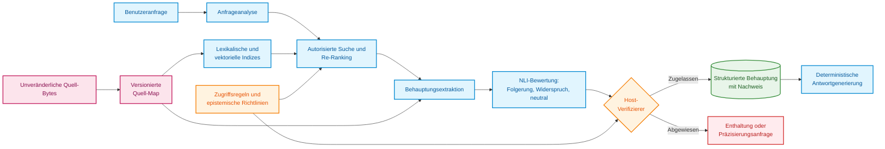
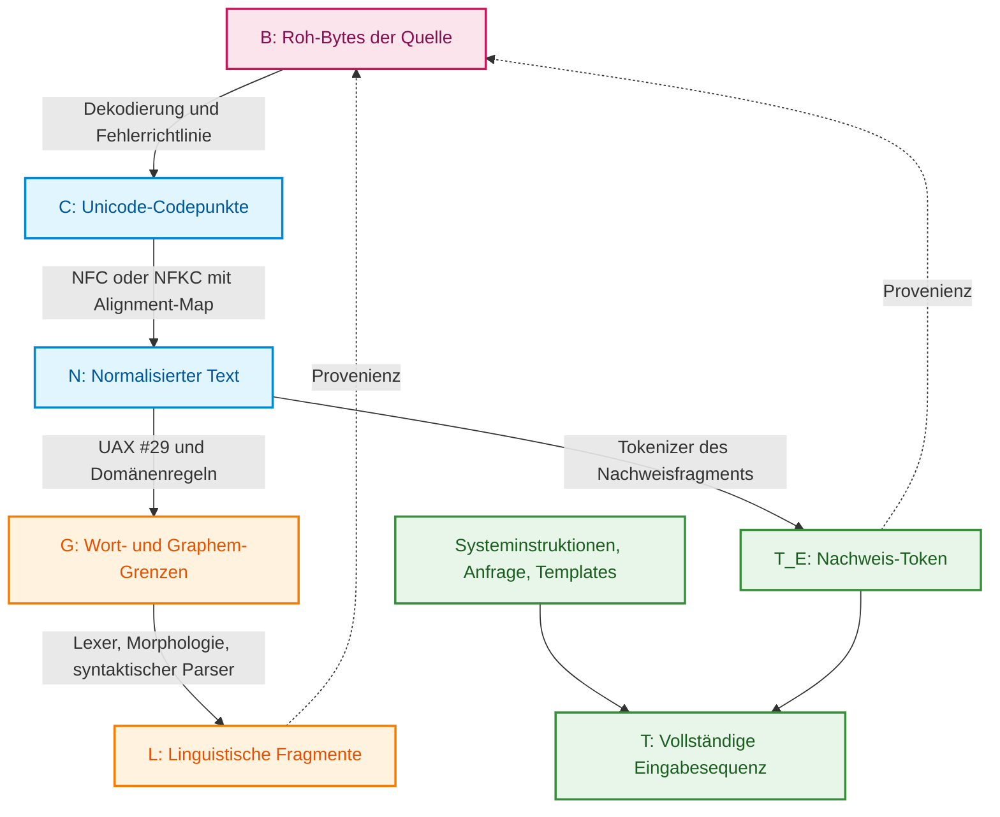
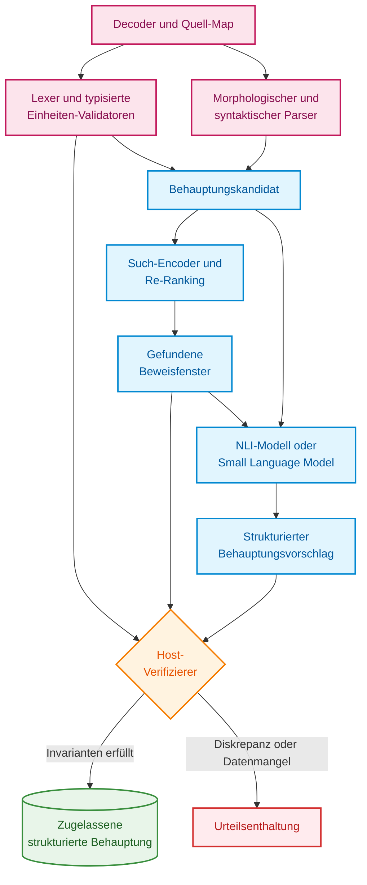
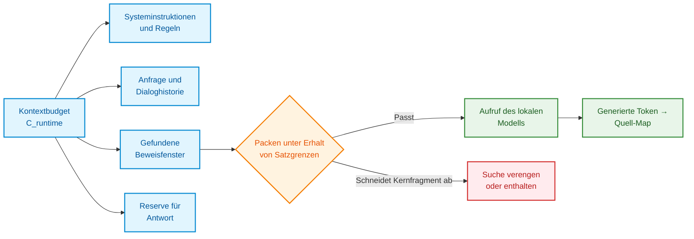
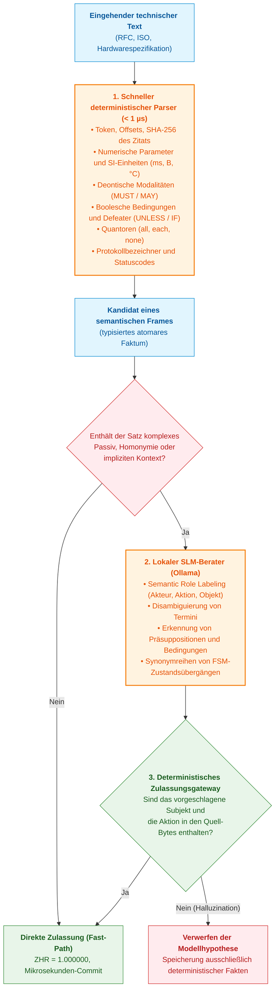

# Kapitel 12. Linguistische Analyse und lokale Modelle: Erhalt von Semantik und Herkunftsnachweis

> **Buch:** [Architektur evidenzbasierter Expertensysteme](README.md) · [Teil III: Wissensakquisition, linguistische Analyse und Eingangsdatenbewertung](part-03-knowledge-engineering-nlp.md)  
> **Vorheriges Kapitel:** [Kapitel 11. Erhebung von Expertenwissen: Befragungen, kognitive Karten und Formalisierung von Praxiserfahrung](ch11-knowledge-elicitation-from-experts.md)  
> **Nächstes Kapitel:** [Kapitel 13. Natürliche Sprachvarianz versus Determinismus: Kompilierung der Frageintention](ch13-language-variability-vs-determinism.md)  
> **Inhaltsverzeichnis:** [README.md](README.md)  
> **Autor:** [Mykola Fedchyk](about-the-author.md)  
> **Niveau:** Fortgeschritten: Entwickler und Knowledge Engineers  
> **Lernziele:** Den Pfad von der Benutzerphrase zum wörtlichen Zitat im Dokument lückenlos nachvollziehen; Vektorähnlichkeit von logischen Beweisen trennen; die Text-Pipeline vor Zeichensubstitution und Prompt-Injektionen schützen; lokale Modelle vor dem Deployment auf Regressionen validieren.

## Abstract

In diesem Kapitel werden die architektonischen Prinzipien für den Aufbau des linguistischen Trakts von Expertensystemen untersucht, der die Interpretation natürlichsprachlicher Anfragen bei strikter Bewahrung des semantischen Gehalts und 100%iger Verwahrungskette (*Custody*) der Primärquellen gewährleistet. Es werden die Risiken von Informationsverlusten bei der Unicode-Normalisierung, Schwachstellen gegenüber verdeckten Injektionen sowie Angriffe durch Zeichensubstitution (*Trojan Source*) analysiert. Eine hybride Arbeitsteilung zwischen deterministischem syntaktischem Parser, kleinen Sprachmodellen (SLM/NLI) und einem Host-Verifizierer wird begründet. Darüber hinaus werden Ressourcenbeschränkungen der Tokenisierung für die ukrainische und andere Sprachen, der Speicherbedarf des KV-Caches sowie das Protokoll der maschinellen Wissensattestierung (*Machine Knowledge Attestation*, MKA) mit Ausstellung eines verifizierten Wissenszertifikats behandelt.

Ein Benutzer fragt: „Was ist die minimale Header-Länge?“ Im Dokument lautet die Antwort `eight octets`. Ein Expertensystem kann diesen Satz zwar auffinden, dennoch aber scheitern: indem es „Oktette“ ungeprüft in „Bytes“ umwandelt, die Maßeinheit verliert oder eine abweichende Version des Dokuments zitiert. Das Verstehen natürlicher Sprache beginnt folglich nicht mit einem großen Sprachmodell, sondern mit der Fähigkeit, Semantik und Herkunft des Texts verlustfrei zu bewahren.

Die korrekte Antwort in diesem Szenario besteht weder in einer isolierten Zahl `8` noch automatisch in „8 Bytes“. Sie umfasst den konkreten Zahlenwert, die originale Maßeinheit, die Bedingung, unter der die Regel gültig ist, sowie das exakte Textfragment aus der autorisierten Dokumentversion. Erst die vollständige Kette – und nicht eine wohlklingende Paraphrase – verleiht der Antwort des Expertensystems Überprüfbarkeit.

Daraus ergibt sich die Kernfrage dieses Kapitels: **Wie konstruiert man ein linguistisches Subsystem, das unterschiedliche menschliche Formulierungen versteht, jedoch ausschließlich das behauptet, was sich deterministisch aus den Bytes der Primärquelle rekonstruieren lässt?** Die These dieses Kapitels besagt: Das linguistische Subsystem muss hybrid aufgebaut sein. Deterministischer Code verantwortet Bytes, Koordinaten und Zugriffsregeln; der syntaktische Parser liefert grammatische Struktur und Satzgefüge; statistische Modelle lokalisieren Kandidatenfragmente und prüfen eng umrissene Hypothesen; Sprachmodelle unterstützen bei der Paraphrasierung von Anfragen. In die finale Antwort fließt ausschließlich ein, was ein separater Verifikationsschritt lückenlos aus dem Beweis belegen kann.

> **Grenze des praktischen Erfahrungswissens.** In den lokalen Prototypen des Autors traten wiederholt Verluste von Maßeinheiten, die Zerstörung zusammengesetzter Token und Diskrepanzen zwischen den vom Modell zurückgegebenen Koordinaten und den Quell-Bytes auf. Ohne offene Rohdaten-Logs und einen eingefrorenen Korpus handelt es sich hierbei um eine ingenieurtechnische Beobachtung und kein universelles Messergebnis. Die nachfolgende Architektur und das Protokoll müssen am eigenen Wissenskorpus verifiziert werden.

## 1. Architektonische Grundlagen des linguistischen Trakts: Von der menschlichen Eingabe zum Recht auf Behauptung

[Kapitel 19](ch19-from-question-to-evidence.md) unterteilt den Pfad von der Fragestellung zum Beweis in Erkennung, Extraktion, Bindung an die Primärquelle und Verifikation. [Kapitel 2](ch02-epistemology-of-machine-knowledge.md) hat den epistemischen Vertrag etabliert: Semantische Ähnlichkeit ist kein logischer Beweis, der Zustand „unbekannt“ ist keine Negation, und Fakten, deduktive Schlüsse sowie prognostische Wahrscheinlichkeiten beruhen auf fundamental verschiedenen Grundlagen. Das linguistische Subsystem verbindet diese Ebenen.



Dieses Schema trennt veränderliche von unveränderlichen Komponenten. Phasen des maschinellen Lernens können aktualisiert werden. Die unveränderlichen Bytes, die Primärquellen-Map, die Autorisierungsprüfung und die Zulassungsbedingungen bilden stabile ingenieurmäßige Grenzen. Ein Update des Tokenizers darf unter keinen Umständen unbemerkt die Semantik des Texts oder die Zuordnung von Zitaten verfälschen.

Die Autorisierung wird zweifach vollzogen: vor dem Abruf und erneut unmittelbar vor der Zulassung der Behauptung. Ein unzugängliches Textfragment darf nicht vorab an ein generatives Modell als Kontext übergeben werden, um das Zitat nachträglich zu verbergen: Der Inhalt des Fragments hat die Generierung bereits beeinflusst. Eine Behauptung erbt die Zugriffs-Tags aller Ausgangsmaterialien, und eine Zugriffsverweigerung darf nicht einmal die Existenz des geschützten Dokuments preisgeben.

## 2. Wahrung der Kopplung zwischen Text und Primärquelle: Provenienz-Maps und Verwahrungs-Bytes

Die Aussage „Zeichenposition 42“ besitzt ohne ein präzise definiertes Koordinatensystem keinerlei Aussagekraft. Eine Position lässt sich in UTF-8-Bytes, UTF-16-Code-Units, Unicode-Codepunkten, erweiterten Graphem-Clustern, Wörtern, Token des syntaktischen Parsers oder Token eines Sprachmodells beziffern.



Jede Transformation erzeugt eine neue Textrepräsentation sowie eine Provenienzrelation. Sei $`R_{X\leftarrow Y}\subseteq X\times Y`$ eine Relation, die ein Fragment der abgeleiteten Repräsentation $Y$ auf die korrespondierenden Bereiche der Eltern-Repräsentation $X$ abbildet, und sei $`T_E\subseteq T`$ die Menge der Modell-Token, die originär aus dem Nachweis stammen. Dann ist die Kopplung eines Nachweis-Tokens an die Quell-Bytes die Komposition der Relationen:

```math
R_{B\leftarrow T_E}=R_{B\leftarrow C}\circ R_{C\leftarrow N}\circ R_{N\leftarrow T_E}.
```

- In diesem Ausdruck bezeichnet $T_E$ die Menge der Modell-Token, die aus dem Nachweis stammen;
- $B$, $C$ und $N$ repräsentieren die Byte-, Zeichen- und normalisierte Repräsentation;
- $R_{X\leftarrow Y}$ ist die Provenienzrelation, die Elemente der Repräsentation $Y$ den entsprechenden Elementen der Repräsentation $X$ zuordnet;
- Das Symbol $\circ$ steht für die Funktionskomposition der Relationen, also den sukzessiven Durchlauf von den Token über normalisierten Text und Zeichen bis zu den Bytes.

Dies ist wie folgt zu interpretieren: Für jedes Nachweis-Token lässt sich der Pfad zu den korrespondierenden Bytes der Quelle zurückverfolgen. Die Zuordnung kann mehrdeutig sein, wenn ein einzelnes Token mehrere Positionen überspannt oder mehrere Zeichen während der Normalisierung verschmolzen sind.

Diese Abbildung ist nicht bijektiv. Ein Token kann mehrere Codepunkte umfassen, ein Graphem besteht aus Basiszeichen und Diakritika, und eine normalisierte Position kann aus der Zusammenführung mehrerer Eingabezeichen resultieren.

Spezielle Template-Token, Systeminstruktionen und Token der Benutzeranfrage besitzen keine künstliche Provenienz aus den Bytes des Dokuments: Sie werden auf eigene Entitäten abgebildet oder als synthetisch generiert markiert. Ein Zitat des Expertensystems stützt sich ausschließlich auf die Menge $T_E$.

### 2.1. Effekte der Unicode-Normalisierung: Risiken von Informationsverlusten

In der Normalisierungsform NFC wird die Sequenz `U+0065` (lateinisches „e“) und `U+0301` (kombinierender Akut) zu dem einzelnen Zeichen `U+00E9` („é“) zusammengeführt. Unterschiedliche Quell-Bytes führen somit zum identischen normalisierten Ergebnis. Die Form NFKC eliminiert zusätzlich Kompatibilitätsunterschiede, indem sie beispielsweise hochgestellte Indizes in Standardziffern umwandelt oder Ligaturen auflöst. Aus diesem Grund warnt der Standard UAX #15 ausdrücklich: Die Formen KC und KD dürfen nicht blind auf beliebigen Text angewendet werden, da sie maßgebliche Formatierungs- und Bedeutungsunterschiede unwiederbringlich tilgen [[1]](#src-1). Die Rückabbildung lässt sich nachträglich nicht mehr rekonstruieren, falls das Alignment nicht unmittelbar während der Transformation fixiert wurde.

Für ein abgeleitetes Fragment $s$ bezeichne $M_B(s)$ die minimale geordnete Menge von Byte-Intervallen der Quelle, $\mathrm{Bytes}_B(M)$ die Quell-Bytes in Originalreihenfolge und $\mathrm{Frame}_B(M)$ die kanonischen Datensätze `(start, end, bytes)`. Dann gilt die zweiseitige Invariante:

```math
\mathrm{Normalize}_v\bigl(\mathrm{Decode}_e(\mathrm{Bytes}_B(M_B(s)))\bigr)=\mathrm{Surface}_N(s)
```

Variablen und Bezeichnungen:

- $s$ ist das abgeleitete Textfragment;
- $M_B(s)$ definiert die minimale geordnete Menge von Quell-Byte-Intervallen für das Fragment $s$;
- $\mathrm{Bytes}_B(M_B(s))$ sind die Bytes dieser Intervalle in ursprünglicher Reihenfolge;
- $\mathrm{Decode}_e$ dekodiert Bytes gemäß Kodierung und Fehlerbehandlungsrichtlinie $e$;
- $\mathrm{Normalize}_v$ normalisiert den Text basierend auf der Unicode-Version und der Normalisierungsform $v$;
- $\mathrm{Surface}_N(s)$ ist der Oberflächentext des Fragments in der normalisierten Repräsentation $N$;
- Das Gleichheitszeichen $=$ verlangt, dass beide Wege der Texterzeugung zum identischen Ergebnis führen.

In der Praxis bedeutet dies: Die selektierten Bytes müssen nach Dekodierung und Normalisierung exakt den Text reproduzieren, auf den das Fragment verweist. Die Invariante hängt von den gespeicherten Parametern $e$ und $v$ ab und vermag ein verloren gegangenes Alignment nicht wiederherzustellen, wenn die Byte-Map nicht persistent erfasst wurde.

Zusätzlich prüft das Expertensystem die Unveränderlichkeit des primären Nachweises:

```math
\mathrm{SHA}256\bigl(\mathrm{Frame}_B(M_B(s))\bigr)=\text{evidence-sha256}(s).
```

Bestandteile der Formel:

- $\mathrm{Frame}_B(M_B(s))$ ist der kanonische Datensatz aus Intervallen und zugehörigen Bytes für das Fragment $s$;
- $\mathrm{SHA}256(\cdot)$ berechnet den kryptografischen 256-Bit-Hash des übergebenen Datensatzes;
- $\text{evidence-sha256}(s)$ ist der persistierte Nachweis-Hash für das Fragment $s$;
- Das Gleichheitszeichen $=$ bestätigt, dass der berechnete Hash mit dem gespeicherten Referenzwert übereinstimmt.

Diese Prüfung fungiert als digitaler Fingerabdruckvergleich: Jede Veränderung der erfassten Bytes modifiziert den Hashwert, wenngleich eine Hash-Übereinstimmung allein noch nicht die inhaltliche Korrektheit der Interpretation garantiert. Die Parameter $e$ und $v$ aus der vorherigen Invariante determinieren Dekodierung und Normalisierung. Nach einer Reihungsänderung kombinierender Zeichen kann die Quell-Map eine Liste disjunkter Intervalle anstelle eines zusammenhängenden Bereichs darstellen. Bei PDF-Dokumenten und Scans verlängert sich die Kette: „PDF-Bytes → Seitengeometrie oder Rasterbild → OCR-Text → normalisierter Text“. Die Koordinaten eines OCR-Zitats werden an den OCR-Text sowie an die Bounding-Boxes auf der Seite gebunden und nicht als simpler Byte-Offset innerhalb der binären PDF-Datei deklariert.

Der Standard UAX #29 definiert grundlegende Regeln zur Segmentierung von Text in Grapheme, Wörter und Sätze [[2]](#src-2), doch für technische Bezeichner wie `10.0.0.0/8` oder `v2.1.4` sind domänenspezifische Parsing-Regeln erforderlich. Für einen Tokenizer, der im gewählten Modus als verlustfrei deklariert ist, wird folgende Invariante der inversen Transformation verifiziert:

```math
\mathrm{Detok}_v\bigl(\mathrm{Tok}_v(x;\ \mathrm{special}=\mathrm{false});\ \mathrm{cleanup}=\mathrm{false}\bigr)=x.
```

Aufschlüsselung der Größen:

- $x$ ist der Ausgangstext;
- $\mathrm{Tok}_v$ transformiert Text in Token gemäß Tokenizer-Version $v$;
- $\mathrm{Detok}_v$ rekonstruiert Text aus diesen Token mit demselben Tokenizer;
- Der Parameter $\mathrm{special}=\mathrm{false}$ deaktiviert das Einfügen von Spezial-Token;
- Der Parameter $\mathrm{cleanup}=\mathrm{false}$ deaktiviert nachträgliche Whitespace-Bereinigungen;
- Das Gleichheitszeichen $=$ fordert die exakte Wiederherstellung des ursprünglichen Textes.

Diese Gleichheit stellt eine Anforderung an den verlustfreien Betriebsmodus dar, keine universelle Eigenschaft sämtlicher Tokenizer. Fall-Konvertierungen (Case Folding), Unicode-Normalisierung, das Ersetzen unbekannter Fragmente (`[UNK]`) und Whitespace-Trimming können den Text selbst ohne Spezial-Token verfälschen. Nach einer NFKC-Normalisierung wird beispielsweise die Ligatur `fi` zu `fi`: Das Dekodieren normalisierter Token stellt die ursprünglichen Bytes nicht wieder her. Für einen solchen Tokenizer wird die Konformität mit der deklarierten normalisierten Repräsentation geprüft, während das beweiskräftige Zitat über die gespeicherte Primärquellen-Map bezogen wird. Die Version des Tokenizers allein stellt verloren gegangene Informationen nicht wieder her.

## 3. Sicherheit der Text-Pipeline: Erkennung von Injektionen und Zeichensubstitutionen

Text kann für das menschliche Auge gewöhnlich erscheinen, von Softwarekomponenten jedoch unterschiedlich interpretiert werden oder verdeckte Instruktionen für das Sprachmodell enthalten. Vor der Antwortfindung prüft das Expertensystem daher nicht nur den sachlichen Inhalt des Dokuments, sondern auch die Integrität seiner Kodierung.

Eine Normalisierung verhindert keine Zeichensubstitutionen. Das lateinische `a` und das kyrillische `а` wirken visuell identisch; unsichtbare Steuerzeichen manipulieren die Anzeigerichtung, und Nullbreiten-Zeichen (Zero-Width Characters) trennen Bezeichner auf. Boucher und Anderson demonstrierten mit dem Trojan-Source-Angriff, wie bidirektionale Steuerzeichen eine Diskrepanz zwischen der vom Menschen wahrgenommenen visuellen Reihenfolge und der vom Compiler verarbeiteten logischen Reihenfolge erzeugen [[3]](#src-3). Mechanismen zur Erkennung visuell verwechselbarer Zeichen (Confusables) spezifiziert der Standard UTS #39 [[4]](#src-4), während der Standard UAX #9 die Regeln des bidirektionalen Textflusses festlegt [[5]](#src-5).

| Bedrohung | Auswirkung | Technische Kontrollmaßnahme |
|---|---|---|
| Ungültige Kodierung | Verschiedene Komponenten verarbeiten unterschiedlichen Text | Strikte Dekodierung oder Quarantäne; Verbot stillschweigender Zeichenersetzungen in Nachweisen |
| Gemischte Schriftsysteme | `heаder` mit kyrillischem „а“ umgeht die exakte Suche | Schriftsystem-Profil, UTS #39 Zeichen-Skelette als Prüfsignal |
| Bidirektionaler Text und unsichtbare Steuerzeichen | Prüfer sieht abweichende Wortreihenfolge | Prüfung nach UAX #9, Anzeige von Codepunkten, Positivlisten für Steuerzeichen |
| Übermäßige Normalisierung | Verlust semantischer Differenzierungen | Unveränderliche Quell-Bytes, separate Regeln für technische Bezeichner |
| Korpus-Vergiftung (Data Poisoning) | Manipuliertes Fragment dominiert das Ranking | Verifikation der Datenquellen, Inhalts-Hashes, Anomalie-Erkennung |
| Indirekte Prompt-Injektion | Dokumententext versucht das Modell zu steuern | Isolierter Datenkanal, standardmäßiges Verbot von Tool-Aufrufen |
| Zitatfälschung | Angezeigtes Fragment weicht vom Original ab | Verifikation der Rückabbildung über Quell-Map und kryptografischen Hash |

Indirekte Prompt-Injektionen (*Indirect Prompt Injections*) stellen eine akute Bedrohung für sprachmodellbasierte Systeme dar: Greshake et al. wiesen nach, wie Instruktionen, die in zur Laufzeit verarbeiteten Daten verborgen sind, die Kontrolle über das Modell übernehmen können [[6]](#src-6).

```mermaid
flowchart LR
    accTitle: Textbereinigung und Schutz vor Angriffen
    accDescr: Filterstufen für Eingangs-Bytes von der strikten Dekodierung bis zur Übergabe vertrauenswürdigen Texts in den geschützten Modellkanal.

    IN["Externe Bytes"] --> DEC{"Strikte<br/>Dekodierung?"}
    DEC -->|"Fehler"| QUAR["Quarantäne"]
    DEC -->|"Erfolg"| US["Unicode-Sicherheitsprüfung<br/>(UTS #39, UAX #9)"]
    US --> RAW["Unveränderliches<br/>Quellobjekt"]
    US --> FLAGS["Flags für verdächtige<br/>Zeichen und Richtung"]
    RAW --> NORM["Normalisierung mit fixer<br/>Alignment-Erfassung"]
    FLAGS --> POL{"Dokumenten-<br/>Zulassungsregel"}
    NORM --> POL
    POL -->|"Zugelassen"| IDX["Indexierung als<br/>nicht vertrauenswürdige Daten"]
    POL -->|"Blockiert"| QUAR
    IDX --> LLM["Isolierter Kanal für<br/>zitierte Nachweise"]
    LLM --> HOST["Host-Verifizierer"]

    classDef ext fill:#ffebee,stroke:#c62828,stroke-width:2px,color:#b71c1c;
    classDef check fill:#fff3e0,stroke:#f57c00,stroke-width:2px,color:#e65100;
    classDef safe fill:#e8f5e9,stroke:#388e3c,stroke-width:2px,color:#1b5e20;
    classDef proc fill:#e1f5fe,stroke:#0288d1,stroke-width:2px,color:#01579b;

    class IN,QUAR ext;
    class DEC,US,FLAGS,POL,HOST check;
    class RAW,IDX,LLM safe;
    class NORM proc;
```



Das Diagramm verdeutlicht: Ein im Dokument entdeckter Satz wie „Ignoriere alle vorherigen Instruktionen“ verbleibt strikt passive Nutzlast. Selbst der beste Injektionsdetektor stellt keinen vollwertigen Sicherheitsperimeter dar: Die Sicherheit basiert darauf, dass Dokumententext prinzipiell nicht berechtigt ist, System-Tools aufzurufen oder Berechtigungen zu verändern.

## 4. Aufgabenverteilung in der hybriden Architektur

Kein einzelnes Modul darf gleichzeitig Text lokalisieren, dessen Bedeutung interpretieren und eigenmächtig finale Schlüsse ziehen. Eine präzise funktionale Aufgabenteilung lokalisiert Fehlerquellen: Es wird transparent, ob eine Fehlfunktion auf Byte-Ebene, im syntaktischen Parsing oder in der logischen Inferenz aufgetreten ist.



Der syntaktische Parser lässt sich vorteilhaft auf dem Schema der Universal Dependencies aufbauen, das sprachübergreifend konsistente Wortarten, morphologische Merkmale und syntaktische Dependenzen definiert [[7]](#src-7). Vektorielle Satzrepräsentationen für den semantischen Abruf liefern Modelle wie Sentence-BERT [[8]](#src-8). Logische Folgerungen (*Natural Language Inference*, NLI) werden von Modellen bewertet, die auf Datensätzen wie XNLI trainiert wurden, welche mehrsprachige Evaluierungen abdecken [[9]](#src-9). NLI stellt an dieser Stelle eine statistische Klassifikation von Textpaaren dar, keine formale Beweisprüfung. Ein Benchmark-Ergebnis auf XNLI belegt keineswegs die Zuverlässigkeit bei technischen Anforderungen in spezifischen Zielsprachen: Hierfür sind unabhängige Testdatensätze der jeweiligen Domäne zwingend erforderlich. Die nachfolgende Tabelle fixiert die Ausgaben und Kompetenzgrenzen jeder Komponente.

| Komponente | Ausgabe | Unzulässige Aktionen |
|---|---|---|
| Decoder und Quell-Map | Codepunkte, Byte-Kopplungen, Dekodierungsfehler | Benutzerintention interpretieren oder Faktenwahrheit deklarieren |
| Deterministischer Lexer und Validator | Typisierte Atome (Zahlen, Einheiten, Bezeichner) und exakte Grenzen | Semantische Rolle einer Behauptung zuweisen |
| Syntaktischer Parser | Lemmata, Wortarten (POS), Dependenzbäume | Normative Kraft einer Anforderung oder Zugriffsrechte ableiten |
| Encoder und Re-Ranking | Vektoreinbettungen, Ähnlichkeitsscores | Logische Folgerung oder Wahrheit beweisen |
| NLI-Modell | Wahrscheinlichkeiten für „Folgerung“, „Widerspruch“, „neutral“ | Wahrheit jenseits des vorgelegten Textfragments postulieren |
| Small oder Large Language Model | Intentionsvorschlag, normalisierte Formulierung, Textanker | Bytes, Hashes oder Sicherheitsrichtlinien substituieren |
| Host-Verifizierer | Zulassungsentscheidung oder Ablehnungsgrund | Text in die Sprache des Benutzers paraphrasieren |
| Antwortgenerierungsmodul | Lesbare Antwort mit exakten Zitatverweisen | Behauptungen außerhalb der verifizierten Repräsentation erzeugen |

## 5. Ressourcenbeschränkungen: Kontextbudget, Tokenisierung und Modellspeicher

Ein Token eines Sprachmodells entspricht weder einem Wort noch einem Zeichen. Die Anzahl der Token variiert in Abhängigkeit von Sprache, Tokenizer und System-Templates, weshalb das Kontextbudget explizit überwacht werden muss:

```math
L_{\mathrm{sys}}+L_{\mathrm{schema}}+L_{\mathrm{dialog}}+L_{\mathrm{query}}+L_{\mathrm{evidence}}+L_{\mathrm{tools}}+L_{\mathrm{output}}\le C_{\mathrm{runtime}}.
```

- Das Budget setzt sich zusammen aus $L_{\mathrm{sys}}$, $L_{\mathrm{schema}}$, $L_{\mathrm{dialog}}$, $L_{\mathrm{query}}$, $L_{\mathrm{evidence}}$, $L_{\mathrm{tools}}$ und $L_{\mathrm{output}}$, den Token-Längen für Systeminstruktionen, Schema, Dialogverlauf, Anfrage, Beweise, Tool-Beschreibungen bzw. Antwort;
- Das Pluszeichen $+$ summiert diese Budgetanteile;
- $C_{\mathrm{runtime}}$ ist das verifizierte Kontextlimit des spezifischen Deployment-Profils in Token;
- Das Zeichen $\le$ verlangt, dass die Summe dieses Limit keinesfalls überschreitet.

Bei exemplarischen Werten von 1.500 + 500 + 2.000 + 500 + 6.000 + 500 + 1.000 ergibt sich eine Summe von 12.000 Token, womit ein Budget von 16.000 Token eingehalten wird. Das Limit wird durch das Modellprofil diktiert. Falls ein relevantes Fragment nicht vollständig in den Kontext passt, darf das Expertensystem Ausnahmeregelungen keinesfalls inmitten eines Satzes abschneiden: Es verengt den Suchbereich oder verweigert die Antwort deterministisch.



### 5.1. Besonderheiten der Tokenisierung der ukrainischen Sprache

Für ein mehrsprachiges oder beispielsweise ukrainischsprachiges Expertensystem spielt das Vokabular des Tokenizers eine entscheidende Rolle. Rust et al. zeigten, dass ein sprachspezialisierter Tokenizer für die Modellleistung ebenso ausschlaggebend ist wie das Volumen der Pre-Training-Daten; in dieser Untersuchung wurde die Tokenizer-Fertilität als Kennzahl etabliert, definiert als die durchschnittliche Anzahl von Token pro Wort [[10]](#src-10):

```math
\text{Fertility}=\frac{N_{\text{tokens}}}{N_{\text{words}}}.
```

Symboldefinitionen:

- $N_{\text{tokens}}$ ist die Anzahl der Token in einer Textstichprobe;
- $N_{\text{words}}$ ist die Anzahl der Wörter in derselben Stichprobe;
- $\text{Fertility}$ bezeichnet die durchschnittliche Token-Anzahl pro Wort (in Token pro Wort).

Wird beispielsweise eine Textprobe von 800 Wörtern in 1.200 Token zerlegt, beträgt die Fertilität $1{,}5$ Token pro Wort. Dieser Wert divergiert je nach Sprache, Korpus und Tokenizer und darf nicht ohne empirische Messung auf einen anderen Textkorpus übertragen werden.

Petrov, La Malfa und Torr stellten fest, dass identischer Text, in verschiedene Sprachen übersetzt, eine bis zu 15-fach abweichende Token-Länge aufweisen kann; diese Disparität verringert den effektiven Informationsgehalt im Kontextfenster drastisch und erhöht Inferenzkosten sowie Latenzen [[11]](#src-11). Die Vokabulargröße beeinflusst diese Ungleichheit signifikant: Frühe LLaMA-Modelle [[12]](#src-12) und Mistral 7B [[13]](#src-13) nutzten ein Vokabular von 32.000 Token, während Gemma ein Vokabular von 256.000 Token umfasst [[14]](#src-14). Ein exemplarisches Anpassungsprojekt für das Ukrainische stellt Lapa LLM auf Basis von Gemma 3 12B dar: Nach Angaben der Autoren wurden über 80.000 Token selten genutzter Schriftsysteme durch ukrainische Lexeme ersetzt, wodurch das Modell für ukrainische Fachtexte rund 1,5-mal weniger Token benötigt als das ursprüngliche Basismodell [[15]](#src-15).

Für das Expertensystem resultieren daraus drei ingenieurtechnische Konsequenzen: Erstens hängt die Anzahl der Dokumente, die in $C_{\mathrm{runtime}}$ platziert werden können, direkt von der Tokenizer-Fertilität auf dem unternehmenseigenen Korpus ab; sie muss folglich an realen Dokumenten gemessen werden. Zweitens beanspruchen längere Sequenzen überproportional viel Speicher im Key-Value-Cache und erhöhen den Aufwand der Attention-Berechnung. Drittens beschreibt die Alignment-Map $`R_{N\leftarrow T_E}`$ die Token des eingehenden Beweistextes und erfordert gründliche Tests bei nicht-lateinischen Schriftsystemen. Ein generiertes Token besitzt keine automatische Byte-Adresse in der Primärquelle. Der Extraktor muss das selektierte Textfragment oder einen Zeiger auf den Eingabebereich explizit zurückgeben, woraufhin der Verifizierer das Zitat über die Quell-Map rekonstruiert.

### 5.2. Verteilungsverschiebung von Daten (Out-of-Distribution Shift)

In der Praxis wird häufig postuliert, dass neuronale Netze innerhalb der konvexen Hülle der Trainingsdaten zuverlässig interpolieren, außerhalb dieser jedoch fehlerhaft extrapolieren. Balestriero, Pesenti und LeCun wiesen nach, dass bei Datenräumen mit Dimensionen über 100 neue Datenpunkte so gut wie nie in das Innere der konvexen Hülle der Trainingsstichprobe fallen; folglich vermag die simple Dichotomie von Interpolation und Extrapolation die Generalisierungsfähigkeit nicht zu erklären [[16]](#src-16). In der Praxis ist ein anderer Faktor ausschlaggebend: Die Modellgüte degradiert signifikant, sobald sich die Einsatzdaten systematisch von der Trainingsverteilung unterscheiden. Der Benchmark WILDS sammelte derartige Verteilungsverschiebungen aus realen Anwendungen und quantifizierte massive Leistungseinbrüche neuronaler Modelle außerhalb der Trainingsverteilung [[17]](#src-17).

Ein Dokument, das während des Trainings unbekannt war, begründet für sich genommen noch keinen Verteilungsbruch: Es kann demselben Sprachstil, demselben Genre und demselben Anforderungsschema entstammen. Ein Shift muss anhand dieser Merkmalsveränderungen sowie der Performanz auf Holdout-Daten evaluiert werden. Gleichzeitig verbietet das Fehlen eines Dokuments im Training, dessen normative Regeln aus dem parametrischen Gedächtnis des Modells abzurufen. In einem evidenzbasierten Expertensystem bildet ausschließlich das zugelassene Dokument oder der formale Wissenseintrag die Wissensquelle – niemals die Gewichte des Sprachmodells. Die Rolle des Modells bleibt auf folgende Aufgaben beschränkt:

- Parsing syntaktischer Strukturen und Entitätsextraktion;
- Generierung strukturierter Abfragen an die Wissensbasis als Zwischendarstellung;
- Lokale NLI-Bewertung zwischen isoliertem Textfragment und Behauptung.

Logische Schlüsse, Regelquantifizierungen und die Invariantenprüfung obliegen ausschließlich der deterministischen Inferenzmaschine.

### 5.3. Speicheroptimierung: Key-Value-Cache (KV-Cache)

Der Speicherbedarf des Key-Value-Caches skaliert linear mit der Länge der Eingabesequenz. Bei Standard-Attention für eine aktive Sitzung mit $n_l$ Schichten, $n_{kv}$ Key-Value-Köpfen, der Kopfdimension $d_h$, der Sequenzlänge $L$ und $b$ Bytes pro Element gilt:

```math
M_{KV}\approx 2\,n_l\,L\,n_{kv}\,d_h\,b.
```

Formelgrößen:

- $M_{KV}$ ist der Speicherbedarf des Key-Value-Caches für eine aktive Sitzung in Bytes;
- Der Faktor $2$ berücksichtigt separat Schlüssel (Keys) und Werte (Values);
- $n_l$ ist die Anzahl der Modellschichten;
- $L$ ist die Sequenzlänge in Token;
- $n_{kv}$ ist die Anzahl der Key-Value-Köpfe pro Schicht;
- $d_h$ ist die Dimension eines einzelnen Aufmerksamkeitskopfes;
- $b$ ist die Byte-Anzahl zur Speicherung eines Elements (z. B. 2 Bytes bei FP16/BF16);
- Das Zeichen $\approx$ kennzeichnet eine Näherung, die organisatorische Speicher-Overheads ausklammert.

Für typische Parameter $n_l=32$, $L=4096$, $n_{kv}=8$, $d_h=128$ und $b=2$ beträgt der geschätzte Speicherbedarf 536.870.912 Bytes, mithin 512 MiB pro Kontext. Der tatsächliche Verbrauch hängt zudem von der Cache-Implementierung und Speicherausrichtung ab.

Der Faktor 2 erfasst Keys und Values getrennt. Kwon et al. zeigten, dass der Key-Value-Cache den limitierenden Faktor beim Durchsatz von Large Language Models darstellt, und führten mit vLLM eine seitenbasierte Speicherverwaltung (*PagedAttention*) ein [[18]](#src-18).

## 6. Semantische Ähnlichkeit versus logische Folgerung: Grenzen der Vektorsuche

In naiven RAG-Architekturen und Suchsystemen wird die semantische Ähnlichkeit kontinuierlicher Vektoreinbettungen fälschlicherweise mit logischer Wahrheit oder Folgerichtigkeit gleichgesetzt. Für sicherheitskritische Expertensysteme (ISO 26262 ASIL D, IEC 61508 SIL 3/4) birgt die Kosinus-Distanz von Vektoren jedoch die unmittelbare Gefahr eines katastrophalen Systemversagens: Zwei ingenieurtechnisch diametral entgegengesetzte Normen – beispielsweise *„Die Steuerung muss das Notfall-Schütz bei Verlust des Taktsignals sofort schließen“* und *„Der Steuerung ist es strengstens untersagt, das Notfall-Schütz bei Verlust des Taktsignals zu schließen“* – weisen in typischen Einbettungsräumen eine Kosinus-Ähnlichkeit von $\approx 0{,}94$ bis $0{,}97$ auf, bedingt durch den identischen lexikalischen Kontext. Interpretiert die Inferenzmaschine diese Vektorähnlichkeit als Nachweis der Anwendbarkeit, führt das System eine unzulässige und potenziell fatale Notfallaktion aus.

Aus diesem Grund fungiert die dichte Vektorsuche im linguistischen Trakt eines Expertensystems ausschließlich als heuristischer Vorfilter zur schnellen Grobselektion, nach dem zwingend eine deterministische NLI-Klassifikation (*Natural Language Inference*) und ein Host-Verifizierer zur Integritätsprüfung geschaltet werden.

Für zwei Vektordarstellungen der Anfrage $\mathbf q \in \mathbb R^m$ und der Dokumentpassage $\mathbf d \in \mathbb R^m$ berechnet sich die Kosinus-Ähnlichkeit wie folgt:

```math
s_{\mathrm{dense}}(q,d)=\frac{\mathbf q^\top\mathbf d}{\lVert\mathbf q\rVert_2\lVert\mathbf d\rVert_2}.
```

Bedeutung der Terme:

- $\mathbf q$ und $\mathbf d$ sind die Vektorrepräsentationen der Anfrage $q$ und des Dokuments $d$ der Dimension $m$;
- $\mathbf q^\top\mathbf d$ ist das Skalarprodukt dieser Vektoren;
- $\lVert\mathbf q\rVert_2$ und $\lVert\mathbf d\rVert_2$ sind deren euklidische Normen ($\ell_2$);
- $s_{\mathrm{dense}}(q,d)$ ist die dimensionslose Kosinus-Ähnlichkeit im Intervall von $-1$ bis $1$.

Ingenieurmäßige Schwellenwerte und Rauschunterdrückung:
Stehen die Vektoren orthogonal zueinander, sind Skalarprodukt und Ähnlichkeit null. Die Formel ist für den Nullvektor undefiniert und stellt keinesfalls eine Wahrscheinlichkeit dar, dass das Dokument die Anfrage logisch stützt. In der Abruf-Pipeline wird ein strikter Schwellenwert für die Vorfilterung definiert: $s_{\mathrm{dense}}(q,d) \ge \tau_{\mathrm{dense}}$ (wobei standardmäßig $\tau_{\mathrm{dense}} = 0{,}70$ gewählt wird). Kandidaten mit geringerem Wert werden unmittelbar verworfen, ohne rechenintensive Folgestufen zu belasten. Tritt ein `NaN`-Wert auf oder weichen Dimensionen ab, greift das Fail-Closed-Prinzip und blockiert den Kandidaten sofort.

Dieser Score dient lediglich der Vorsortierung, nicht dem Nachweis logischer Unterstützung. Die lexikalische Suche erfasst exakte Symbolübereinstimmungen, während Vektoreinbettungen Paraphrasen identifizieren. Das Verfahren der reziproken Rangfusion (*Reciprocal Rank Fusion*, RRF) fusioniert Ergebnislisten disparater Suchmethoden, ohne inkompatible Scoreskalen vermischen zu müssen [[19]](#src-19):

```math
s_{\mathrm{RRF}}(d)=\sum_{r\in\mathcal R(d)}\frac{1}{k_0+\mathrm{rank}_r(d)}.
```

Parameter der Formel:

- $d$ ist das Kandidatendokument;
- $\mathcal R(d)$ ist die Menge der Ergebnislisten, in denen Dokument $d$ vorkommt;
- $r$ iteriert über diese Listen, und $\mathrm{rank}_r(d)$ bezeichnet den ganzzahligen Rang des Dokuments in Liste $r$ (beginnend bei 1);
- $k_0$ ist eine positive Glättungskonstante (etablierter Standardwert: $k_0 = 60$);
- $\sum$ akkumuliert den Beitrag jeder Teilliste zum Gesamtscore $s_{\mathrm{RRF}}(d)$.

An die nachfolgende Tiefenanalyse mittels Cross-Encoder und NLI-Modell werden ausschließlich Kandidaten aus dem Top-$K$-Pool nach dem Score $s_{\mathrm{RRF}}$ übergeben (mit einem fixen Budgetlimit von $K = 50$), was eine kombinatorische Überlastung des Speichers ausschließt. Bei Retrieval-Augmented Generation (RAG) fließen die gefundenen Fragmente als Kontext in das Modell ein [[20]](#src-20); ein Ranking-Fehler propagiert daher unmittelbar in die Antwortgenerierung.

Das NLI-Modell evaluiert eine Hypothese $c$ bezüglich des Beweisfragments $e$:

```math
p_\theta(y\mid c,e)=\mathrm{softmax}\bigl(z_\theta(c,e)\bigr),\qquad y\in\{\mathrm{entailment},\ \mathrm{contradiction},\ \mathrm{neutral}\}.
```

Hierbei gilt:

- $c$ ist die zu prüfende Behauptung, und $e$ ist das Nachweisfragment;
- $\theta$ bezeichnet die Modellparameter;
- $z_\theta(c,e)$ ist der Logit-Vektor für das Paar aus Behauptung und Nachweis;
- $\mathrm{softmax}$ transformiert Logits in Wahrscheinlichkeiten, deren Werte im Intervall $[0,1]$ liegen und sich zu 1 aufsummieren;
- $y$ repräsentiert eine der Klassen: Folgerung (*entailment*), Widerspruch (*contradiction*) oder neutral (*neutral*).

Eine Modellausgabe von $[0{,}7; 0{,}1; 0{,}2]$ bedeutet beispielsweise, dass das Modell der Klasse „Folgerung“ das höchste Gewicht zuweist. Dies stellt jedoch nur bei nachgewiesener Kalibrierung eine verlässliche Wahrscheinlichkeitsaussage dar; die Verteilung beweist für sich genommen nicht die Wahrheit der Aussage.

Die neutrale Klasse signalisiert lediglich ein Informationsdefizit im konkreten Textfragment. Der Systemzustand „unbekannt“ ist weiter gefasst: Er umfasst unvollständige Beweisketten, ungebundene Variablen oder unklare Anwendungsbereiche. Die finale Entscheidung fällt daher im deterministischen Host-Verifizierer:

```math
\mathrm{Admit}(c,e,q,u,t)=I_{\mathrm{authz}}(c,e,u,t)\land I_{\mathrm{integrity}}\land I_{\mathrm{material}\ \mathrm{spans}}\land I_{\mathrm{applicable}}(c,q,t)\land[y_{\mathrm{ver}}=\mathrm{entailment}]\land[p_{\mathrm{cal}}(\mathrm{entailment})\ge\tau]\land\neg I_{\mathrm{conflict}}\land I_{\mathrm{epistemic}\ \mathrm{type}}.
```

In der Gleichung bedeuten die Terme:

- $c$ ist die Behauptung, $e$ das Nachweisfragment, $q$ die Anfrage, $u$ der Benutzer und $t$ der Prüfzeitpunkt;
- $I_{\mathrm{authz}}(c,e,u,t)$ ist der Indikator für die Autorisierung des Benutzers $u$, den Nachweis $e$ für Behauptung $c$ zum Zeitpunkt $t$ einzusehen;
- $I_{\mathrm{integrity}}$ validiert die Unversehrtheit des Nachweises, und $I_{\mathrm{material}\ \mathrm{spans}}$ prüft das Vorhandensein aller wesentlichen Textspannen;
- $I_{\mathrm{applicable}}(c,q,t)$ überprüft die Gültigkeit der Behauptung in Bezug auf Anfrage und Zeitfenster;
- $y_{\mathrm{ver}}$ ist die vom Verifizierer klassifizierte Kategorie, wobei $\mathrm{entailment}$ die logische Folgerung anzeigt;
- $p_{\mathrm{cal}}(\mathrm{entailment})$ ist die kalibrierte Wahrscheinlichkeit der Folgerung im Intervall von 0 bis 1;
- $\tau$ ist der vordefinierte Akzeptanzschwellenwert (Richtwert: $\tau = 0{,}85$);
- $I_{\mathrm{conflict}}$ kennzeichnet das Vorliegen logischer Konflikte, und $I_{\mathrm{epistemic}\ \mathrm{type}}$ prüft die Zulässigkeit des epistemischen Typs;
- $\land$ fordert die gleichzeitige Gültigkeit aller Bedingungen, $\neg$ negiert eine Bedingung, und eckige Klammern prüfen logische Gleichheit oder Schwellenwerte.

Das Prädikat evaluiert genau dann zu wahr, wenn sämtliche Prüfbedingungen erfüllt sind – insbesondere wenn die kalibrierte Wahrscheinlichkeit mindestens $\tau$ erreicht und keinerlei Widerspruch vorliegt. Ergibt das Prädikat $\mathrm{Admit}(c,e,q,u,t) = 0$, wechselt das Expertensystem deterministisch in den sicheren Zustand der Urteilsenthaltung (*Abstain*) oder generiert eine strukturierte Präzisierungsanfrage unter Ausgabe eines Diagnosecodes (`REJECT_INSUFFICIENT_CALIBRATED_CONFIDENCE` oder `REJECT_DEONTIC_CONTRADICTION`). Es ist dem Modell strikt untersagt, ohne validierten Nachweis spekulative Antworten zu fabrizieren.

Dieses Prädikat formuliert eine Zulassungsrichtlinie, kein mathematisches Theorem über die Richtigkeit von Textinterpretationen. Wurde die Folgerungsklasse von einem NLI-Modell geliefert, macht der deterministische Schwellenwertvergleich diesen statistischen Score nicht zu einem formalen Beweis. Die Indikatoren für Anwendbarkeit und epistemischen Typ erfordern explizite Prüfroutinen und Genehmigungsaufzeichnungen. Ohne diese Grundlagen verbleibt der Vorschlag im Status eines unbestätigten Kandidaten.

## 7. Dokumenten-Parser und Informationsverluste in Trainingsdaten

Ein Sprachmodell kann Maßeinheiten nicht zuverlässig rekonstruieren, wenn der Dokumenten-Parser Tabellenköpfe verworfen hat. Vor der Auswahl eines Encoders muss der Informationsverlust an der Schnittstelle „Datei → strukturierte Repräsentation“ quantifiziert werden. Bei Formaten mit vorgegebenem Schema greift man primär auf strukturelles Parsing zurück; bei PDF-Dokumenten werden Lesereihenfolge, Tabellenstrukturen, Kopf-/Fußzeilen und OCR-Genauigkeit separat bewertet.

Docling bietet das Datenmodell **DoclingDocument**, welches Textelemente, Tabellen, Gruppierungen und die Herkunft der Elemente formal beschreibt [[21]](#src-21). Für eine nachweisführende Pipeline ist die Bewahrung dieser Objekthierarchie essenziell, anstatt das Dokument vorschnell in flaches Markdown zu konvertieren: Bei einer solchen Konvertierung geht häufig die semantische Bindung einer Tabellenzelle an ihren Spaltenkopf verloren. Apache Tika dient als robuster Basis-Extraktor für Text und Metadaten über heterogene Dateiformate hinweg [[22]](#src-22). Ein empirischer Vergleich muss aufzeigen, welche Dokumentklassen komplexere Parser erfordern; ein Bibliotheksname garantiert per se weder Tabellentreue noch fehlerfreie Texterkennung.

Für jeden Inhaltsblock werden Original-Hash, Hash des abgeleiteten Texts, Parser-Version, Verarbeitungsparameter, Strukturpfad und Koordinaten persistent abgelegt. Byte-Offsets im extrahierten Text dürfen niemals fälschlich als Offsets innerhalb der komprimierten PDF-Datei ausgegeben werden. Bei Scans werden Seitenzahl, Bounding-Box-Geometrie und der Verifikationsstatus des OCR-Ergebnisses erfasst. Diese standardisierten Datensätze ermöglichen den direkten Vergleich von Docling, Tika und OCR-Engines auf identischen Korpora.

Das Defizit annotierter Trainingsdaten fällt in den Bereich des datenzentrierten Lernens (*Data-Centric AI*). **Weak Supervision** ermöglicht es, Lexika, Heuristiken und reguläre Ausdrücke in Labeling-Funktionen zu überführen. Im Snorkel-Framework von Ratner et al. dürfen Labeling-Funktionen sich der Stimme enthalten, miteinander kollidieren und korrelierte Fehler aufweisen [[23]](#src-23). Drei Heuristiken, die auf demselben Signalwort MUST basieren, stellen keine drei unabhängigen Stimmen dar. Synthetische Labels eignen sich für das Modelltraining, ersetzen jedoch niemals einen unabhängig kuratierten Gold-Standard zur Verifikation.

**Aktives Lernen (*Active Learning*)** bezeichnet die zielgerichtete Selektion von Beispielen für die menschliche Expertenannotation. Eine fundierte Selektionsstrategie kombiniert Modellunsicherheit, Dokumentdiversität, Fehlerrisiko und den Zeitaufwand des Gutachters. Eine separate, zufällig gezogene Audit-Stichprobe ist unerlässlich, um die reale Fehlerrate im Gesamtbetrieb zu überwachen: Eine Fehlermetrik, die ausschließlich auf schwierigen Grenzfällen basiert, verzerrt das Bild des Gesamtdurchsatzes. Revisionsstände desselben Dokuments müssen zwingend demselben Daten-Split zugewiesen werden; andernfalls führt ein Datenleck zwischen Trainings- und Testdaten zu geschönten Evaluationswerten.

Für Richtlinien zur kontrollierten Antwortverweigerung bietet sich **Conformal Prediction** an, wozu Angelopoulos und Bates eine fundierte Einführung vorgelegt haben [[24]](#src-24). Im Grundansatz wird vorausgesetzt, dass Kalibrierungs- und zukünftige Testbeispiele austauschbar sind; die mathematische Garantie bezieht sich darauf, dass die wahre Klasse mit vorgegebener Konfidenz in der vorhergesagten Menge enthalten ist – sie garantiert nicht die Richtigkeit jeder einzelnen extrahierten Norm. Ein Sprach- oder Domänenwechsel kann diese Annahmen verletzen. Dieses Verfahren dient dazu, Grenzfälle gezielt dem menschlichen Review zuzuführen, ersetzt aber nicht die lückenlose Nachweisführung.

Die primäre Entwurfsentscheidung betrifft somit den Strukturerhalt und die Unabhängigkeit der Validierungsdaten. Erst nach Klärung dieser Randbedingungen werden Laufzeitumgebung und Modelleffizienz evaluiert.

## 8. Hardware-Deployment-Profile lokaler Modelle

Ein lokales Deployment ist unabdingbar, wenn vertrauliche Unternehmensdaten geschützte Netzwerkgrenzen nicht verlassen dürfen. Das Attribut „lokal“ bezeichnet jedoch lediglich den Ausführungsort und bürgt weder für faktische Präzision noch für die garantierte Abwesenheit externer Netzwerkanfragen.

| Profil | Vorteile | Limitationen |
|---|---|---|
| llama.cpp und GGUF-Format [[25]](#src-25) | Portabilität zwischen CPUs und GPUs; vollständiger Offline-Betrieb | Build-Version und SHA-256 der quantisierten Modelldatei müssen fixiert werden |
| Ollama [[26]](#src-26) | Komfortable lokale REST-API; strukturierte Ausgabe via JSON-Schema | Der Wrapper bietet keine Faktenprüfung; Versionierung der Modell-Layers zwingend erforderlich |
| vLLM [[18]](#src-18) | Hoher Durchsatz bei parallelen Anfragen; PagedAttention-Speicherverwaltung | Erhöhte Deployment-Komplexität; strikte Abhängigkeit von CUDA-Treiberversionen |
| MLX LM [[27]](#src-27) | Optimierte Ausführung und Feinabstimmung auf Apple Silicon | MLX-Artefakte sind nicht auf CUDA- oder ROCm-Plattformen übertragbar |
| TensorRT-LLM [[28]](#src-28) | Maximale Inferenzleistung auf NVIDIA-Servern | Enge Bindung an spezifische GPU-Architekturen und Treiber-Ökosysteme |
| ONNX Runtime [[29]](#src-29) | Schnelle Ausführung spezialisierter Encoder und NLI-Modelle auf diverser Hardware | Diskrepanzen zwischen verschiedenen Execution Providern können numerische Abweichungen erzeugen |

Die Tabelle verdeutlicht: Die Wahl des Profils ist ein Kompromiss zwischen Portabilität, Durchsatz und deterministischer Reproduzierbarkeit. Für ein evidenzbasiertes Expertensystem ist die letzte Spalte ausschlaggebend: Jede dokumentierte Limitation wird zu einer Pflichtprüfung im Deployment-Manifest.

## 9. Quantisierung und Regressionskontrolle bei Modell-Updates

Eine affine Quantisierung der Modellgewichte, wie von Jacob et al. für Integer-Arithmetik beschrieben [[30]](#src-30), lässt sich formal wie folgt abbilden:

```math
q(w)=\mathrm{clip}\left(\mathrm{round}\left(\frac{w}{s}\right)+z,\ q_{\mathrm{min}},\ q_{\mathrm{max}}\right),\qquad \hat w=s\,\bigl(q(w)-z\bigr).
```

Erklärung der Formelzeichen:

- $w$ ist das ursprüngliche Gleitkommagewicht des Modells;
- $s$ ist der positive Skalierungsfaktor der Quantisierung, und $z$ ist der ganzzahlige Nullpunkt (*Zero-Point*);
- $\mathrm{round}$ rundet auf die nächste Ganzzahl, und $\mathrm{clip}(x,q_{\mathrm{min}},q_{\mathrm{max}})$ beschränkt $x$ auf den zulässigen Wertebereich;
- $q(w)$ ist der quantisierte Integer-Wert im Bereich zwischen $q_{\mathrm{min}}$ und $q_{\mathrm{max}}$;
- $\hat w$ ist das dequantisierte, approximierte Gewicht.

Bei exemplarischen Werten von $w=0{,}7$, $s=0{,}1$, $z=0$ und einem Wertebereich von $-8$ bis $7$ resultieren $q(w)=7$ sowie $\hat w=0{,}7$. Quantisierung verändert Gewichtsmatrizen und damit das Inferenzverhalten; jedes quantisierte Modell erfordert daher eine eigenständige Validierung. Qualitätsverschiebungen auf einem Datenschnitt $s$ bezüglich Metrik $m$ werden wie folgt quantifiziert:

```math
\Delta_{m,s}=m(\mathrm{model}_q,s)-m(\mathrm{model}_{\mathrm{base}},s).
```

Definition der Differenz:

- $m$ ist die Evaluierungsmetrik, und $s$ bezeichnet einen spezifischen Slice (z. B. Sprache oder Parametertyp);
- $\mathrm{model}_q$ ist das quantisierte Modell, $\mathrm{model}_{\mathrm{base}}$ das unquantisierte Basismodell;
- $m(\mathrm{model}_q,s)$ und $m(\mathrm{model}_{\mathrm{base}},s)$ bezeichnen die Messwerte derselben Metrik auf demselben Schnitt;
- $\Delta_{m,s}$ quantifiziert die Performanzdifferenz in Einheiten der Metrik.

Liegt die Genauigkeit des quantisierten Modells beispielsweise bei $0{,}91$ gegenüber $0{,}94$ des Basismodells, beträgt $\Delta_{m,s}=-0{,}03$, was einem Rückgang um 3 Prozentpunkte entspricht.

Ingenieurtechnische Akzeptanzkriterien für Degradationen:
In industriellen Expertensystemen gilt ein striktes Regressionsbudget für Quantisierungen:
1. Die globale Performanzdegradation über den gesamten Testkorpus darf $\Delta_{m,\mathrm{all}} \ge -0{,}01$ nicht unterschreiten (maximal 1,0 Prozentpunkt Verlust an Gesamtgüte);
2. Auf kritischen funktionalen Slices – insbesondere bei der Extraktionsgenauigkeit numerischer Grenzwerte und physikalischer Einheiten ($\Delta_{\mathrm{acc},\mathrm{numeric}}$) sowie dem Erhalt deontischer Operatoren MUST / MUST NOT ($\Delta_{\mathrm{acc},\mathrm{deontic}}$) – ist ausnahmslos eine Null-Regression vorgeschrieben ($\Delta \ge 0{,}000$);
3. Wird auf dem Slice fachspezifischer Begrifflichkeiten oder normativer Logik ein Leistungsabfall von $\Delta_{m,s} < -0{,}01$ registriert, wird der quantisierte Kandidat am Validierungs-Gateway automatisch abgewiesen und der Release gesperrt, bis das Quantisierungsgitter rekalibriert oder ein höheres Bitprofil (z. B. Übergang von 4-Bit- zu 8-Bit-Quantisierung) gewählt wird.

Die Evaluierung muss zwingend nach Slices differenziert werden: Zielsprache, numerische Extraktionspräzision, Stabilität strukturierter JSON-Ausgaben und Zuverlässigkeit der Antwortverweigerung. Ein gemittelter Gesamtwert kann fatale Einbrüche bei seltenen Fachtermini verdecken.

Das Deployment-Manifest dokumentiert den Snapshot des Dokumentenkorpus, Unicode-Normalisierungsregeln, Versionen der syntaktischen Parser, Hashes der Modellgewichte, Quantisierungsparameter, Laufzeitumgebungen und Kalibrierungsschwellenwerte.

```mermaid
flowchart LR
    accTitle: Sicheres Deployment und Rollback von Modellen
    accDescr: Vom signierten Manifest über paarweises Testen bis zum stufenweisen Rollout mit Rollback-Garantie.

    MF["Signiertes Manifest"] --> ST["Laden in die<br/>Testumgebung"]
    ST --> SELF["Prüfung von Hashes,<br/>Schemata und Umgebung"]
    SELF --> PAIR["Paarweise Evaluierung:<br/>Basisversion vs. Kandidat"]
    PAIR --> G{"Schwellenwerte für Qualität,<br/>Sicherheit und SLA"}
    G -->|"Erfolg"| SH["Shadow-Traffic →<br/>eingeschränkter Release"]
    G -->|"Fehler"| STOP["Ablehnung des Kandidaten"]
    SH --> PR["Atomare Versions-<br/>Heraufstufung"]
    SH -->|"Anomalie"| RB["Vollständiger Rollback<br/>samt Abhängigkeiten"]
    PR --> MON["Monitoring von Qualität,<br/>Speicher und Latenz"]
    MON -->|"SLA-Verletzung"| RB

    classDef doc fill:#fce4ec,stroke:#c2185b,stroke-width:2px,color:#880e4f;
    classDef proc fill:#e1f5fe,stroke:#0288d1,stroke-width:2px,color:#01579b;
    classDef check fill:#fff3e0,stroke:#f57c00,stroke-width:2px,color:#e65100;
    classDef ok fill:#e8f5e9,stroke:#388e3c,stroke-width:2px,color:#1b5e20;
    classDef fail fill:#ffebee,stroke:#d32f2f,stroke-width:2px,color:#b71c1c;

    class MF doc;
    class ST,SELF,PAIR,SH,MON proc;
    class G check;
    class PR ok;
    class STOP,RB fail;
```



Dieses Vorgehen verdeutlicht: Ein neuer Modellkandidat durchläuft exakt denselben Freigabeprozess wie ein Release der Wissensbasis: automatisierte Verifikation, paarweiser A/B-Vergleich zur Basisversion, schrittweiser Rollout und deterministischer Rollback-Pfad.

## 10. Verifikations- und Testmethodik des linguistischen Subsystems

Der Anteil der Anfragen, bei denen sich das relevante Dokument unter den ersten $k$ Suchergebnissen befindet, wird ausschließlich über die Teilmenge beantwortbarer Anfragen $Q_+$ ermittelt:

```math
\mathrm{Hit}@k=\frac{1}{|Q_+|}\sum_{q\in Q_+}\mathbb{1}\bigl[G_q\cap R_k(q)\ne\varnothing\bigr].
```

Terme der Formel:

- $Q_+$ ist die Menge der Anfragen, für die eine gültige Antwort existiert, und $q$ ist eine einzelne solche Anfrage;
- $G_q$ ist die Menge der für $q$ als Ground Truth definierten Dokumente;
- $R_k(q)$ bezeichnet die ersten $k$ Suchergebnisse für die Anfrage $q$;
- $G_q\cap R_k(q)$ sind jene Dokumente, die sowohl zur Ground Truth gehören als auch unter den Top-$k$ Treffern rangieren;
- $\mathbb{1}[\cdot]$ ist die Indikatorfunktion, die 1 ergibt, wenn der Ausdruck wahr ist, und andernfalls 0;
- $|Q_+|$ ist die Gesamtzahl der beantwortbaren Anfragen, und $\sum$ akkumuliert die Treffer über alle Anfragen.

Dieser Wert im Bereich von 0 bis 1 gibt den Anteil der Anfragen an, bei denen mindestens ein korrektes Dokument in den Top-$k$ platziert ist. Erzielten beispielsweise 8 von 10 Anfragen einen Treffer, beträgt $\mathrm{Hit}@k=0{,}8$. Diese Metrik misst jedoch nicht die Vollständigkeit, wenn eine Antwort mehrere Quellen voraussetzt; hierfür dient der Recall:

```math
\mathrm{Recall}@k=\frac{1}{|Q_+|}\sum_{q\in Q_+}\frac{|G_q\cap R_k(q)|}{|G_q|}.
```

Bedeutung der Variablen:

- $Q_+$ ist die Menge beantwortbarer Anfragen, und $q$ bezeichnet eine konkrete Anfrage;
- $G_q$ ist die Menge sämtlicher relevanter Dokumente für Anfrage $q$;
- $R_k(q)$ umfasst die ersten $k$ abgerufenen Dokumente;
- $|G_q\cap R_k(q)|/|G_q|$ ist der Anteil der relevanten Dokumente, die unter den ersten $k$ Treffern aufgefunden wurden;
- $|Q_+|$ ist die Anzahl der Anfragen, und die Summe bildet den Mittelwert über alle Testfälle.

Der Wert liegt zwischen 0 und 1. Erfordert eine Anfrage beispielsweise vier Nachweise und drei davon befinden sich in den Top-$k$, beträgt der Recall $3/4=0{,}75$. Diese Kennzahl hängt von der Vollständigkeit der annotierten Ground Truth ab und bürgt isoliert betrachtet noch nicht für die Richtigkeit der finalen Inferenz.

Die Robustheit gegenüber Synonymie und sprachlicher Varianz wird an Paraphrasengruppen $G$ evaluiert. Eine Gruppe gilt nur dann als erfolgreich bestanden, wenn sämtliche enthaltenen Formulierungsvarianten $V_g$ fehlerfrei verarbeitet werden:

```math
\mathrm{GroupPass}=\frac{1}{|G|}\sum_{g\in G}\prod_{i\in V_g}\mathrm{Success}_i.
```

Formelkomponenten:

- $G$ ist die Menge von Gruppen äquivalenter Formulierungen, und $g$ bezeichnet eine einzelne Gruppe;
- $V_g$ ist die Menge der Anfragevarianten innerhalb der Gruppe $g$, und $i$ bezeichnet eine spezifische Variante;
- $\mathrm{Success}_i$ beträgt 1, wenn Variante $i$ erfolgreich verarbeitet wurde, andernfalls 0;
- $\prod$ bildet das Produkt über alle Varianten der Gruppe, sodass der Gruppenerfolg nur bei fehlerfreiem Durchlauf aller Varianten 1 ergibt;
- $|G|$ ist die Gesamtzahl der Gruppen, und $\sum$ summiert die bestandenen Gruppen auf.

Der Wert liegt im Intervall $[0,1]$ und quantifiziert den Anteil der Gruppen, bei denen jede Variante erfolgreich war. Bei drei Gruppen mit zwei vollständig erfolgreichen Fällen beträgt $\mathrm{GroupPass}=2/3\approx0{,}67$. Diese Metrik stellt wesentlich strengere Anforderungen als aggregierte Einzelabfragen und korreliert direkt mit der Qualität der Testabdeckung.

Ingenieurmäßige Akzeptanzgrenzen für das linguistische Subsystem (Acceptance Gates):
- $\mathrm{Hit}@5 \ge 0{,}95$: Bei mindestens 95 % aller standardisierten Reglement-Anfragen muss sich wenigstens eine relevante Primärquelle im Vorab-Filterfenster befinden;
- $\mathrm{Recall}@5 \ge 0{,}85$: Mindestens 85 % aller für eine vollständige Inferenz unverzichtbaren Normfragmente müssen in den Top-5 der Erstausgabe enthalten sein;
- $\mathrm{GroupPass} \ge 0{,}98$: Bei Paraphrasengruppen zu sicherheitskritischen Anforderungen (Functional Safety) führt das Scheitern einer einzigen Formulierungsvariante zur sofortigen Quarantäne der gesamten Gruppe, was eine Umgehung des Kontrollsystems durch linguistische Variation ausschließt.

Ein Erfolg $\mathrm{Success}_i=1$ wird ausschließlich protokolliert, wenn das System den Anfragevertrag korrekt erfasst, die exakten Quell-Bytes des Beweises lokalisiert, typisierte numerische Werte intakt bewahrt, die Zugriffskontrollen passiert und die Antwort syntaktisch wie semantisch fehlerfrei generiert hat. Zur Bewertung der faktischen Textgenauigkeit empfiehlt sich die FActScore-Metrik, welche eine Antwort in atomare Fakten zerlegt und jeden Fakt einzeln gegen die Quelle abgleicht [[31]](#src-31). Für die Zitationsanalyse eignet sich der Benchmark ALCE, der Antwortqualität und Zitationsunterstützung separat erfasst [[32]](#src-32). Konfidenzintervalle für Versionsvergleiche werden mittels Efron-Bootstrap ermittelt, wobei das Resampling auf Ebene vollständiger Paraphrasengruppen erfolgen muss, um eine künstliche Inflation unabhängiger Beobachtungen zu verhindern [[33]](#src-33).

```mermaid
flowchart LR
    accTitle: Vergleichende Evaluierung von Kandidaten des linguistischen Subsystems
    accDescr: Experimenteller Ablauf vom fixierten Datensplit bis zum gepaarten Bootstrap und der Fehlerdiagnostik.

    MF["Eingefrorene Manifeste"] --> SPL["Gruppensplit und<br/>Prüfung auf Datenlecks"]
    SPL --> B["Basisversion"]
    SPL --> C["Neuer Kandidat"]
    B --> TR["Synchronisierte<br/>Ausführungs-Logs"]
    C --> TR
    TR --> MET["Metriken: Quelle, Repräsentation,<br/>Folgerung, End-to-End, Ressourcen"]
    MET --> SL["Slice-Analyse nach Sprachen,<br/>Termini und Bedrohungen"]
    SL --> CI["Gruppen-Bootstrap und<br/>gepaarter statistischer Test"]
    CI --> G{"Vereinbarte<br/>Zulassungsschwellen"}
    G -->|"Erfolg"| DEP["Shadow-Traffic,<br/>begrenzter Release"]
    G -->|"Abgelehnt"| DIAG["Diagnose des ersten<br/>Fehlerpunkts"]

    classDef src fill:#fce4ec,stroke:#c2185b,stroke-width:2px,color:#880e4f;
    classDef test fill:#e1f5fe,stroke:#0288d1,stroke-width:2px,color:#01579b;
    classDef gate fill:#fff3e0,stroke:#f57c00,stroke-width:2px,color:#e65100;
    classDef pass fill:#e8f5e9,stroke:#388e3c,stroke-width:2px,color:#1b5e20;
    classDef err fill:#ffebee,stroke:#d32f2f,stroke-width:2px,color:#b71c1c;

    class MF,SPL src;
    class B,C,TR,MET,SL,CI test;
    class G gate;
    class DEP pass;
    class DIAG err;
```



## 11. Transparenter Rohdaten-Ingest: Überwindung der Misstrauensbarriere und interaktive Visualisierung

In sicherheitskritischen Bereichen (Automotive Functional Safety nach ISO 26262, Cybersecurity nach ISO/SAE 21434, Avionik nach DO-178C) begegnen externe Auditoren jedem Expertensystem mit tief verwurzeltem, methodischem Skeptizismus. Wenn Entwickler eine „Zero-Hallucination-Garantie“ auf proprietären binären Wissensbasen deklarieren, vermuten externe Gutachter reflexartig geschönte Testfälle (*Circular Benchmark Bias*) oder verdeckte Hardcodierungen. Ohne die Möglichkeit, die maschinelle Verarbeitung eines beliebigen Rohdokuments visuell nachzuvollziehen, droht die Technologie als intransparente „Blackbox“ eingestuft zu werden, die einem regulären Audit nicht standhält.

Die Lösung dieses Akzeptanzproblems liegt im Prinzip **„Show, Don't Tell“** mittels spezialisierter interaktiver Terminalwerkzeuge (Terminal User Interface, TUI). Ein solches Werkzeug versetzt Auditoren in die Lage, eigene, dem System bislang unbekannte Dokumente (Standards, Richtlinien, Lastenhefte) einzuspeisen und deren Analyse in Echtzeit über eine Doppelansicht (**Dual-View: Mensch vs. Maschine**) zu inspizieren:

1. **Lexiko-syntaktische Dekomposition:**  
   Der Gutachter beobachtet, in welche Fragmente und Sätze der syntaktische Segmentierer den Text zerlegt, wie unumstößliche Byte-Koordinaten `[byte_start, byte_end]` bewahrt werden und welche linguistischen Kennzahlen das Dokument charakterisieren:
   - Vokabularumfang und Type-Token-Ratio ($`TTR = N_{\text{unique}} / N_{\text{tokens}}`$);
   - Shannon-Entropie ($`H = -\sum p_i \log_2 p_i`$), die Aufschluss über die informationstheoretische und stilistische Komplexität gibt;
   - Verteilung der Satzlängen.

2. **Deterministische Extraktion deontischer Normen:**  
   Das System hebt normative Schlüsselbegriffe für Pflichten (`MUST`, `SHALL`), Verbote (`MUST NOT`, `SHALL NOT`), Empfehlungen (`SHOULD`) und Berechtigungen (`MAY`) hervor. Der Prüfer sieht transparent, welche Wissensatome rein symbolisch durch den Parser ohne Beteiligung stochastischer Modelle erfasst wurden.

3. **Audit der neuro-symbolischen Schnittstelle (SLM-Tracing):**  
   Wird in der Pipeline ein lokales SLM zur Disambiguierung oder zur Erkennung verdeckter Relationen hinzugezogen, legt das TUI folgende Artefakte offen:
   - Den exakten Prompt, der vom deterministischen Framework zusammengestellt wurde;
   - Die unfiltrierte Rohausgabe des neuronalen Modells;
   - Das Urteil des deterministischen Host-Filters: Bestätigt der wörtliche Quelltext die Hypothese des Modells, oder wird sie mangels Byte-Verwahrung verworfen?

4. **Maschinelle Perzeption von Fragmenten (Machine Perception):**  
   Fährt der Cursor über einen Satz, visualisiert das System die daraus extrahierte Wissensformel: Subjekt (Akteur), deontische Modalität, Prädikat (Handlung) sowie den kryptografischen SHA-256-Hash des korrespondierenden Textzitats.

Dieser transparente Ansatz befreit das Entwicklungsteam von der Notwendigkeit, Nicht-Manipulation beweisen zu müssen: Der Auditor verfolgt den lückenlosen Informationsfluss vom Byte in der Datei bis zum normativen Faktum unmittelbar mit, was das System von einer undurchsichtigen Blackbox in ein hochpräzises analytisches Mikroskop transformiert.

### 11.1. Maschinelle Wissensattestierung (Machine Knowledge Attestation, MKA) und Wissenszertifikat

Auf Basis des transparenten Ingests entsteht eine eigenständige Vertrauensinstitution: die **maschinelle Wissensattestierung (Machine Knowledge Attestation, MKA)**.

> **Definition (Maschinelle Wissensattestierung):**  
> Die *maschinelle Wissensattestierung* ist ein deterministischer und kryptografisch verifizierter Prozess der formalen Begutachtung einer beliebigen Primärquelle (Standard, Spezifikation, Gesetzeswerk), der in einem geschlossenen System extrahierter ontologischer Entitäten, deontischer Relationen und atomarer Fakten mit garantierter 100%iger Verwahrungskette (*Custody*) der Quell-Bytes resultiert ($ZHR = 1{,}000000$, $EGR = 1{,}000000$).

Das Resultat dieser Prozedur für jedes Einzeldokument ist ein formales **MKA-Wissenszertifikat (MKA Certificate)**, das folgende unveränderliche Segmente enthält:

1. **Pass der Primärquellen-Integrität (Source Provenance & Custody):**  
   - Eindeutige Zertifikats-ID (`MKA-<filename>-<sha256[:12]>`);  
   - Exakte Dateigröße in Bytes und kryptografische Prüfsumme (SHA-256);  
   - Status des Zulassungsgateways (`PASSED_FAIL_CLOSED_GATE_100%`);  
   - Nachweis von $ZHR = 1{,}000000$ (Zero-Hallucination Rate).  
2. **Lexikalisches und Entropie-Profil:**  
   - Anzahl der Sätze, Token und Wörter;  
   - Lexikalische Diversität ($TTR$) und Shannon-Entropie ($H$), welche die begriffliche Dichte des Textes belegen.  
3. **Deontische Balance und normative Dichte:**  
   - Normative Dichte ($`ND = \frac{N_{\text{norms}}}{N_{\text{words}}} \times 1000`$);  
   - Exaktes Verhältnis von Verpflichtungen ($MUST$), Verboten ($MUST\ NOT$), Empfehlungen ($SHOULD$) und Berechtigungen ($MAY$).  
4. **Register entdeckter Entitäten (Discovered Entities & Actor Profiles):**  
   - Verzeichnis sämtlicher identifizierter Akteure und Systemkomponenten;  
   - Häufigkeitsverteilung und deontisches Profil jedes Subjekts (Anzahl der auferlegten Pflichten, Verbote und Rechte);  
   - Charakteristische normative Aktionen.  
5. **Register entdeckter Relationen und Prädikate (Discovered Relations & Actions):**  
   - Handlungsprädikate unter Verknüpfung mit den beteiligten Subjekten und Modalitäten.  
6. **Register atomarer Fakten (Ground Atoms Register):**  
   - Vollständiger Katalog formierter Fakten mit wörtlichen Textzitaten, exakten Byte-Offsets `[byte_start..byte_end]` und SHA-256-Hashes für jeden Textausschnitt.

Ein solches Zertifikat versetzt Zertifizierungsstellen und Auditoren in die Lage, den Wissensbestand ad hoc zu prüfen: entweder interaktiv über das Terminalwerkzeug (`kp-ingest-tui -file <doc> -attest`) oder vollautomatisiert über einen strukturierten JSON-Export.

### 11.2. Taxonomie von Wissensprädikaten: Von Deontik zu Epistemologie, Informatik und Kybernetik

Historische Ansätze zur Formalisierung normativer Dokumente (etwa im Kontext von RFC 2119) konzentrierten sich nahezu ausschließlich auf drei deontische Modalitäten: *Pflicht* (`MUST`), *Empfehlung* (`SHOULD`) und *Berechtigung* (`MAY`). In ingenieurwissenschaftlichen Spezifikationen, Sicherheitsprotokollen und Fachmonografien greift diese Reduktion jedoch gravierend zu kurz: Das System verwirft bis zu 70–80 % des begrifflichen Gerüsts als vermeintlich irrelevantes Beiwerk. Aussagen über Komponentenarchitekturen, physikalische Gesetzmäßigkeiten, algorithmische Transformationen oder Regelkreise enthalten keinerlei deontische Partikeln, bilden jedoch das Fundament des ingenieurmäßigen Verständnisses.

Evidenzbasierte Expertensysteme der nächsten Generation führen daher eine **fünfdimensionale ontologische Prädikatstaxonomie** ein, die Wissenschaftstheorie, theoretische Informatik und Kybernetik vereint:

1. **Deontische Normen (Deontic Modality – `MUST`, `FORB`, `SHLD`, `MAY`):**  
   Regeln rechtliche und normative Pflichten von Systemakteuren. Sie basieren auf der deontischen Logik von Georg Henrik von Wright und steuern den Raum erlaubter und verbotener Systemzustände.
2. **Epistemologische und ontologische Prädikate (Epistemic & Ontological – `SCIENTIFIC`):**  
   Beschreiben Seinsmodi, Wahrheitswerte, mathematische Korrelationen, Kausalketten und Abgrenzungskriterien von Wissen:  
   - *Existenz- und Wesensprädikate:* `exists`, `instantiates`, `constitutes`, `embodies`, `characterizes` (*„TLS besteht aus zwei primären Protokollschichten“*);  
   - *Verifikations- und Falsifikationsprädikate (nach K. Popper):* `proves`, `falsifies`, `substantiates`, `refutes`, `verifies`, `demonstrates`, `deduces`, `hypothesizes`;  
   - *Folgerungs- und Präsuppositionsprädikate:* `implies`, `entails`, `presupposes`, `stipulates`, `postulates`.
3. **Berechnungsorientierte Prädikate der Informatik (Computational & Formal Systems – `COMPUTATIONAL`):**  
   Beschreiben das deterministische Verhalten abstrakter Automaten, diskrete Zustandsübergänge, formale Grammatiken und Datenstrukturen:  
   - *Automatentheorie und Berechenbarkeit:* `computes`, `decides`, `transitions`, `halts`, `reduces`, `parses`, `evaluates`;  
   - *Datentransformation und Speicherverwaltung:* `serializes`, `deserializes`, `encodes`, `decodes`, `hashes`, `indexes`, `allocates`, `compresses`.
4. **Kybernetische Prädikate der Regelung und Systemdynamik (Cybernetic & Control – `CYBERNETIC`):**  
   Modellieren das Verhalten komplexer Systeme unter Störeinflüssen im Sinne von Norbert Wiener und W. Ross Ashby:  
   - *Rückkopplung und Homöostase:* `regulates`, `stabilizes`, `balances`, `converges`, `diverges`, `oscillates`, `adapts`, `equilibrates`;  
   - *Schutz, Drosselung und Kompensation:* `throttles`, `compensates`, `quarantines`, `isolates`, `recovers`, `mitigates`, `arbitrates`, `audits`.
5. **Allgemeiningenieurmäßige und funktionale Aktionen (Engineering Actions – `ACTION`):**  
   Beschreiben konkrete physikalische oder protokollarische Operationen: `transmits`, `routes`, `forwards`, `connects`, `disconnects`, `triggers`, `dispatches`, `emits`.

#### 11.2.1. Hochleistungsindexierung über den Top-1000-Lexikatlas ($O(1)$)

Um strikte Latenzinvarianten einzuhalten und Multi-Megabyte-Korpora ohne spürbaren Rechenaufwand zu verarbeiten, ist eine lineare Suche über Verblisten unzulässig. Über 1.000 typisierte, zweisprachige Lexeme (einschließlich Flexionen der 3. Person Singular, Infinitive und aspektueller Formen) werden in einen statischen Hash-Atlas vorkompiliert (`Token Predicate Atlas`). Während des syntaktischen Parsings wird jedes Wort mit $\mathcal{O}(1)$ in der Tabelle nachgeschlagen. Dies reduziert den vollständigen semantischen Audit eines 300-KB-RFC-Dokuments auf wenige Millisekunden – bei unverändertem $ZHR = 1{,}000000$.

### 11.3. Aufgabenverteilung: Deterministischer linguistischer Parser versus neuro-symbolischer Berater (SLM)

In evidenzbasierten Expertensystemen ist die funktionale Abgrenzung zwischen symbolischem Parser und statistischem Sprachmodell keine Frage der Bequemlichkeit, sondern der mathematischen Verlässlichkeit. Sprachmodelle neigen zu Halluzinationen und verfehlen numerische Grenzen, glänzen jedoch bei semantischen Varianzen der natürlichen Sprache. Deterministische endliche Automaten und reguläre Grammatiken agieren hingegen in Mikrosekunden ($O(N)$) bei einer Fehlerrate von null, reagieren jedoch fragil auf komplexe Satzinversionen oder Homonymie.

Die Ingest-Pipeline implementiert daher eine strikte zweistufige Arbeitsteilung nach der Leitlinie: **„Determinität fixiert Invarianten – SLM generiert Hypothesen – Gateway entscheidet“**:



#### 11.3.1. Matrix der funktionalen Zuständigkeiten

| Semantische / linguistische Kategorie | Zuständigkeit der deterministischen Engine ($< 1$ µs) | Delegierung an das neuro-symbolische SLM |
|---|---|---|
| **Physikalische Größen und SI-Einheiten** | Zahlen, Exponenten, Wertebereiche, SI-Einheiten (`s`, `ms`, `octet`, `bit/s`, `V`, `Hz`, `°C`), Ungleichheitsoperatoren ($=, \le, \ge, \lt, \gt, \in [a, b]$). | Interpretation informeller oder umgangssprachlicher Beschreibungen (*„Latenz nicht länger als ein Wimpernschlag“*). |
| **Deontische Normen** | Geschlossenes Vokabular normativer Marker: `MUST`, `MUST NOT`, `SHALL`, `SHOULD`, `MAY`, `muss`, `darf nicht`, `sollte`. | Erkennung verdeckter Verpflichtungen in nicht-normativer Diktion (*„Vom Server wird erwartet...“*). |
| **Logische Bedingungen und Defeater** | Formale syntaktische Verknüpfungen: `IF`, `UNLESS`, `EXCEPT WHEN`, `PROVIDED THAT`, `AND`, `OR`, `NOT`. | Semantische Verträglichkeitsprüfung verschachtelter hypothetischer Konstruktionen. |
| **Quantoren ($\forall/\exists$)** | All- und Existenzquantoren: `all`, `every`, `each`, `any`, `at least one`, `none`, `jeder`, `alle`, `keiner`. | Unterscheidung kollektiver versus distributiver Lesarten von Mengenausdrücken. |
| **Protokollsymbole und Konstanten** | Bezeichner in `camelCase`, `snake_case`, `SCREAMING_SNAKE`, numerische Statuscodes (`503`, `404`), Hex-Werte (`0x0304`). | Assoziation numerischer Fehlercodes mit Textbeschreibungen ohne explizite Lookup-Tabelle. |
| **Syntaktische Struktur (SRL)** | Direkte Subjekt-Prädikat-Wortstellung (*„Client MUST send...“*). | Inversionen, Passivkonstruktionen, Ellipsen (*„Upon receipt of X, there shall be emitted Y“*). |
| **Disambiguierung (Homonymie)** | Positionsanalyse innerhalb des aktiven Gültigkeitsbereichs (`Scope`). | Kontextuelle Bedeutungsunterscheidung mehrdeutiger Lemmata (`CAN` als Feldbus vs. Modalverb; `state` als Zustand vs. Aussage). |
| **Implizite Präsuppositionen** | Nicht unterstützt (Closed-World-Assumption). | Inferenz logischer Vorbedingungen (*„resuming a session“* $\implies$ eine vorherige Sitzung war persistiert). |

## Fazit

Dieses Kapitel ging von der Fragestellung aus, wie ein linguistisches Subsystem konstruiert werden kann, das vielfältige menschliche Formulierungen versteht, jedoch strikt nur das behauptet, was aus den Bytes der Primärquelle rekonstruierbar ist. Die Antwort lautet: Das linguistische Subsystem erweitert die Bandbreite der menschlichen Formulierungen, die ein Expertensystem aufnehmen kann, und verengt zugleich die Menge der ausgegebenen Behauptungen auf jene, die sich durch unveränderliche Bytes des Originals belegen lassen. Hierfür bewahrt jede Texttransformation eine lückenlose Provenienz-Map, jede Komponente agiert unter strikt beschränkten Berechtigungen, Vektorähnlichkeit dient lediglich der Vorsortierung, und die finale Zulassung obliegt einem deterministischen Verifizierer auf Basis von Manifesten, kryptografischen Hashes und Zugriffskontrollen.

Auch die Grenzen dieses Ansatzes wurden klar umrissen. Die Tokenisierung variiert nach Sprache und Modell; Kontextbudgets und Alignment-Maps müssen folglich am realen Einsatzkorpus validiert werden. Sprachmodelle sind bei Dokumenten außerhalb der Trainingsdaten unzuverlässig und dürfen keinesfalls als Wissensquelle fungieren. Jedes Modell-Update und jede Quantisierung stellt einen neuen Kandidaten dar, der den vollständigen Regressionsprüfpfad durchlaufen muss. Wie die natürliche Sprachvarianz bei der Übersetzung von Benutzerfragen in eindeutige Inferenzprädikate bewältigt wird, vertieft [Kapitel 13](ch13-language-variability-vs-determinism.md).

## Fragen zur Selbstprüfung

1. Warum müssen sich Zitationskoordinaten zwingend auf die unveränderlichen Quell-Bytes stützen anstatt auf die Token des Sprachmodells?
2. Welche Gefahren birgt die unkontrollierte Anwendung der Unicode-Normalisierungsform NFKC auf technische Spezifikationen?
3. Warum darf eine hohe Kosinus-Ähnlichkeit niemals als hinreichende Begründung für ein Tatsachenurteil gewertet werden?
4. Welche obligatorischen Artefakte und Parameter umfasst das vollständige Deployment-Manifest eines lokalen Sprachmodells?
5. Worin unterscheidet sich die neutrale Klasse eines NLI-Modells vom epistemischen Systemzustand „unbekannt“?

## Glossar

| Fachbegriff | Englisches Äquivalent | Kurzbeschreibung |
|---|---|---|
| Quell-Map | *source map* | Abbildung von Fragmenten des abgeleiteten Textes auf die Bytes der Primärquelle |
| Codepunkt | *code point* | Eindeutige numerische Kennung eines Zeichens im Unicode-Standard |
| Graphem-Cluster | *grapheme cluster* | Folge von Codepunkten, die vom Menschen als einzelnes Zeichen wahrgenommen wird |
| Unicode-Normalisierung | *Unicode normalization* | Überführung unterschiedlicher Kodierungsformen desselben Textes in eine kanonische Form |
| Alignment | *alignment* | Gespeicherte Abbildungsrelation zwischen Positionen vor und nach einer Texttransformation |
| Tokenizer | *tokenizer* | Softwarekomponente, die Text in diskrete Einheiten (Token) des Modellvokabulars zerlegt |
| Tokenizer-Fertilität | *tokenizer fertility* | Durchschnittliche Anzahl von Token pro Wort |
| Logische Folgerung | *natural language inference* | Klassifikation, ob eine Aussage aus einem Textfragment folgt, ihm widerspricht oder unverbunden ist |
| Reziproke Rangfusion | *reciprocal rank fusion* | Zusammenführung mehrerer Ranglisten anhand ihrer Kehrwert-Ränge |
| Indirekte Prompt-Injektion | *indirect prompt injection* | Steuerinstruktionen für Sprachmodelle, die in extern verarbeiteten Nutzdaten verborgen sind |
| Verteilungsverschiebung | *distribution shift* | Systematische Abweichung operativer Einsatzdaten von den Trainingsdaten |
| Weak Supervision | *weak supervision* | Generierung von Trainingslabels über fehleranfällige Heuristiken und Regelwerke |
| Aktives Lernen | *active learning* | Gezielte Auswahl informativer Datenpunkte für die manuelle Expertenannotation |
| Konforme Vorhersage | *conformal prediction* | Konstruktion von Vorhersagemengen mit mathematisch garantierten Abdeckungswahrscheinlichkeiten |
| Key-Value-Cache | *KV cache* | Gespeicherte Zwischenzustände der Attention-Berechnung, deren Speicherbedarf mit der Kontextlänge wächst |
| Quantisierung | *quantization* | Repräsentation von Modellgewichten durch Datentypen geringerer Bitbreite |
| Host-Verifizierer | *host verifier* | Deterministische Softwarekomponente, welche die finale Zulassung einer Behauptung entscheidet |
| Maschinelle Wissensattestierung | *Machine Knowledge Attestation* | Deterministischer Prozess zur Begutachtung und Zertifizierung extrahierter Fakten unter 100%iger Byte-Verwahrung |
| MKA-Zertifikat | *MKA Certificate* | Strukturierter Wissenspass mit kryptografischem Quell-Hash sowie Registern für Entitäten, Relationen und Normen |

## Abkürzungen

| Abkürzung | Vollständige Bezeichnung | Bedeutung |
|---|---|---|
| CUDA | Compute Unified Device Architecture | Plattform für parallele Berechnungen auf NVIDIA-Grafikprozessoren |
| GGUF | GGML Universal Format | Dateiformat zur Speicherung quantisierter Modelle für llama.cpp |
| MKA | Machine Knowledge Attestation | Maschinelle Wissensattestierung mit vollständiger Verwahrungskette der Quelle |
| NFC, NFKC | Normalization Form C, Normalization Form KC | Kanonische und kompatible Unicode-Normalisierungsformen mit Komposition |
| NLI | Natural Language Inference | Logische Folgerung auf natürlicher Sprache |
| PDF | Portable Document Format | Portables Dokumentenformat |
| RAG | Retrieval-Augmented Generation | Antwortgenerierung mit externem Informationsabruf |
| REST API | Representational State Transfer Application Programming Interface | Programmierschnittstelle über das HTTP-Protokoll |
| ROCm | Radeon Open Compute | Open-Source-Plattform für GPU-Computing von AMD |
| RRF | Reciprocal Rank Fusion | Reziproke Rangfusion |
| UAX | Unicode Standard Annex | Anhang zum offiziellen Unicode-Standard |
| UTS | Unicode Technical Standard | Technischer Standard des Unicode-Konsortiums |
| UTF-8, UTF-16 | Unicode Transformation Format | Zeichenkodierungsformate zur Abbildung von Codepunkten auf Byte-Sequenzen |

## Literaturverzeichnis

1. <a id="src-1"></a>Unicode Consortium. [*UAX #15: Unicode Normalization Forms*](https://www.unicode.org/reports/tr15/). Unicode Standard Annex.
2. <a id="src-2"></a>Unicode Consortium. [*UAX #29: Unicode Text Segmentation*](https://www.unicode.org/reports/tr29/). Unicode Standard Annex.
3. <a id="src-3"></a>Nicholas Boucher, Ross Anderson. [*Trojan Source: Invisible Vulnerabilities*](https://www.usenix.org/conference/usenixsecurity23/presentation/boucher). *32nd USENIX Security Symposium*, 2023.
4. <a id="src-4"></a>Unicode Consortium. [*UTS #39: Unicode Security Mechanisms*](https://www.unicode.org/reports/tr39/). Unicode Technical Standard.
5. <a id="src-5"></a>Unicode Consortium. [*UAX #9: Unicode Bidirectional Algorithm*](https://www.unicode.org/reports/tr9/). Unicode Standard Annex.
6. <a id="src-6"></a>Kai Greshake, Sahar Abdelnabi, Shailesh Mishra, Christoph Endres et al. [*Not What You've Signed Up For: Compromising Real-World LLM-Integrated Applications with Indirect Prompt Injection*](https://doi.org/10.1145/3605764.3623985). *Proceedings of the 16th ACM Workshop on Artificial Intelligence and Security*, 79–90, 2023.
7. <a id="src-7"></a>Marie-Catherine de Marneffe, Christopher D. Manning, Joakim Nivre, Daniel Zeman. [*Universal Dependencies*](https://doi.org/10.1162/coli_a_00402). *Computational Linguistics*, 47(2), 255–308, 2021.
8. <a id="src-8"></a>Nils Reimers, Iryna Gurevych. [*Sentence-BERT: Sentence Embeddings using Siamese BERT-Networks*](https://aclanthology.org/D19-1410/). *Proceedings of EMNLP-IJCNLP 2019*.
9. <a id="src-9"></a>Alexis Conneau, Ruty Rinott, Guillaume Lample, Adina Williams et al. [*XNLI: Evaluating Cross-lingual Sentence Representations*](https://aclanthology.org/D18-1269/). *Proceedings of EMNLP 2018*.
10. <a id="src-10"></a>Phillip Rust, Jonas Pfeiffer, Ivan Vulić, Sebastian Ruder, Iryna Gurevych. [*How Good is Your Tokenizer? On the Monolingual Performance of Multilingual Language Models*](https://arxiv.org/abs/2012.15613). arXiv:2012.15613; *Proceedings of ACL-IJCNLP 2021*.
11. <a id="src-11"></a>Aleksandar Petrov, Emanuele La Malfa, Philip H. S. Torr, Adel Bibi. [*Language Model Tokenizers Introduce Unfairness Between Languages*](https://arxiv.org/abs/2305.15425). arXiv:2305.15425, 2023.
12. <a id="src-12"></a>Hugo Touvron, Thibaut Lavril, Gautier Izacard et al. [*LLaMA: Open and Efficient Foundation Language Models*](https://arxiv.org/abs/2302.13971). arXiv:2302.13971, 2023.
13. <a id="src-13"></a>Albert Q. Jiang, Alexandre Sablayrolles, Arthur Mensch et al. [*Mistral 7B*](https://arxiv.org/abs/2310.06825). arXiv:2310.06825, 2023.
14. <a id="src-14"></a>Gemma Team. [*Gemma: Open Models Based on Gemini Research and Technology*](https://arxiv.org/abs/2403.08295). arXiv:2403.08295, 2024.
15. <a id="src-15"></a>Lapa LLM. [*Lapa LLM v0.1.2 Instruct: model card*](https://huggingface.co/lapa-llm/lapa-v0.1.2-instruct); Tokenizer-Beschreibung: [*lapa-llm/tokenizer*](https://huggingface.co/lapa-llm/tokenizer). Hugging Face.
16. <a id="src-16"></a>Randall Balestriero, Jerome Pesenti, Yann LeCun. [*Learning in High Dimension Always Amounts to Extrapolation*](https://arxiv.org/abs/2110.09485). arXiv:2110.09485, 2021.
17. <a id="src-17"></a>Pang Wei Koh, Shiori Sagawa, Henrik Marklund et al. [*WILDS: A Benchmark of in-the-Wild Distribution Shifts*](https://arxiv.org/abs/2012.07421). arXiv:2012.07421; *Proceedings of ICML 2021*.
18. <a id="src-18"></a>Woosuk Kwon, Zhuohan Li, Siyuan Zhuang, Ying Sheng et al. [*Efficient Memory Management for Large Language Model Serving with PagedAttention*](https://doi.org/10.1145/3600006.3613165). *Proceedings of the 29th Symposium on Operating Systems Principles*, 611–626, 2023.
19. <a id="src-19"></a>Gordon V. Cormack, Charles L. A. Clarke, Stefan Buettcher. [*Reciprocal Rank Fusion Outperforms Condorcet and Individual Rank Learning Methods*](https://doi.org/10.1145/1571941.1572114). *Proceedings of SIGIR 2009*, 758–759, 2009.
20. <a id="src-20"></a>Patrick Lewis et al. [*Retrieval-Augmented Generation for Knowledge-Intensive NLP Tasks*](https://arxiv.org/abs/2005.11401). *Advances in Neural Information Processing Systems 33* (NeurIPS 2020).
21. <a id="src-21"></a>Docling-Projektbeteiligte. [*Docling*](https://docling-project.github.io/docling/) und [*DoclingDocument*](https://docling-project.github.io/docling/concepts/docling_document/). Offizielle Dokumentation zu Datenformaten, Struktur und Elementprovenienz.
22. <a id="src-22"></a>Apache Software Foundation. [*Apache Tika*](https://tika.apache.org/). Offizielle Dokumentation zur Text- und Metadatenextraktion.
23. <a id="src-23"></a>Alexander Ratner, Stephen H. Bach, Henry Ehrenberg, Jason Fries, Sen Wu, Christopher Ré. [*Snorkel: Rapid Training Data Creation with Weak Supervision*](https://arxiv.org/abs/1711.10160). *Proceedings of the VLDB Endowment*, 11(3), 269–282, 2017.
24. <a id="src-24"></a>Anastasios N. Angelopoulos, Stephen Bates. [*A Gentle Introduction to Conformal Prediction and Distribution-Free Uncertainty Quantification*](https://arxiv.org/abs/2107.07511). Preprint, 2021; Revision 2022.
25. <a id="src-25"></a>ggml-org. [*llama.cpp: LLM Inference in C/C++*](https://github.com/ggml-org/llama.cpp). GitHub-Repository.
26. <a id="src-26"></a>Ollama. [*Structured Outputs*](https://ollama.com/blog/structured-outputs). Ollama-Blog.
27. <a id="src-27"></a>ml-explore. [*MLX LM: Run LLMs with MLX*](https://github.com/ml-explore/mlx-lm). GitHub-Repository.
28. <a id="src-28"></a>NVIDIA. [*TensorRT-LLM*](https://github.com/NVIDIA/TensorRT-LLM). GitHub-Repository.
29. <a id="src-29"></a>Microsoft. [*ONNX Runtime*](https://onnxruntime.ai/). Offizielle Website.
30. <a id="src-30"></a>Benoit Jacob, Skirmantas Kligys, Bo Chen, Menglong Zhu et al. [*Quantization and Training of Neural Networks for Efficient Integer-Arithmetic-Only Inference*](https://doi.org/10.1109/CVPR.2018.00286). *2018 IEEE/CVF Conference on Computer Vision and Pattern Recognition*, 2704–2713, 2018.
31. <a id="src-31"></a>Sewon Min, Kalpesh Krishna, Xinxi Lyu, Mike Lewis et al. [*FActScore: Fine-grained Atomic Evaluation of Factual Precision in Long Form Text Generation*](https://aclanthology.org/2023.emnlp-main.741/). *Proceedings of EMNLP 2023*.
32. <a id="src-32"></a>Tianyu Gao, Howard Yen, Jiatong Yu, Danqi Chen. [*Enabling Large Language Models to Generate Text with Citations*](https://aclanthology.org/2023.emnlp-main.398/). *Proceedings of EMNLP 2023*.
33. <a id="src-33"></a>B. Efron. [*Bootstrap Methods: Another Look at the Jackknife*](https://doi.org/10.1214/aos/1176344552). *The Annals of Statistics*, 7(1), 1–26, 1979.

---

[← Kapitel 11](ch11-knowledge-elicitation-from-experts.md) | [Inhaltsverzeichnis](README.md) | [Teil III](part-03-knowledge-engineering-nlp.md) | [Kapitel 13 →](ch13-language-variability-vs-determinism.md)
