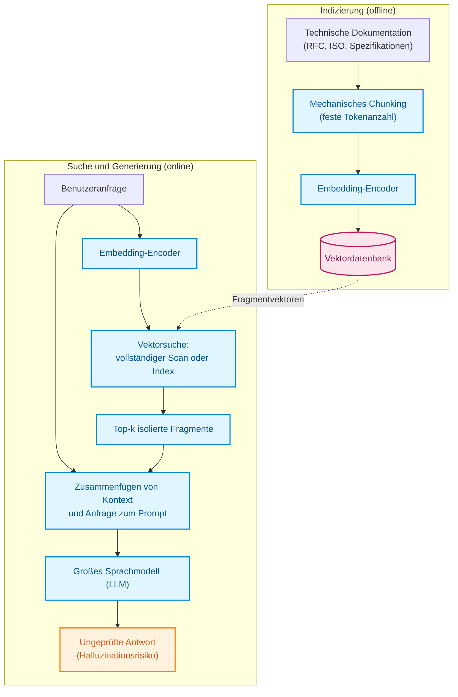
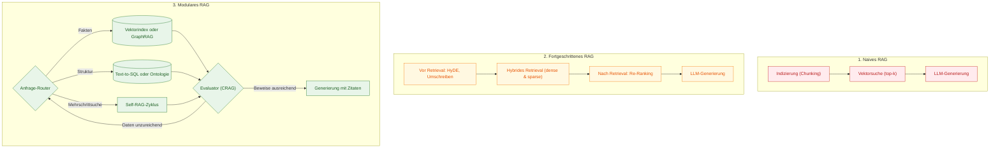
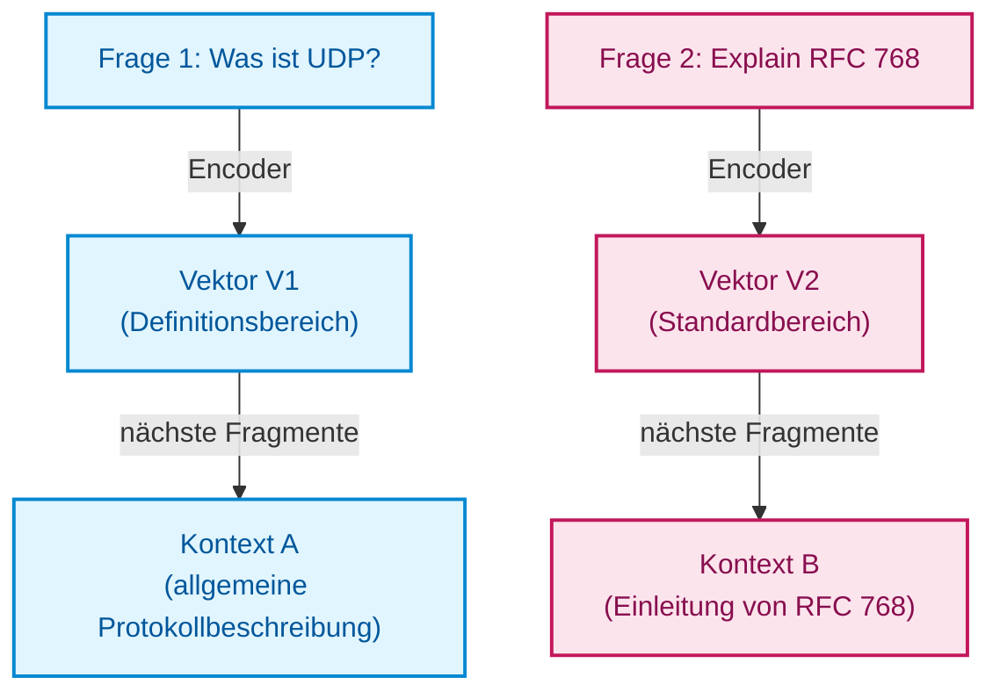
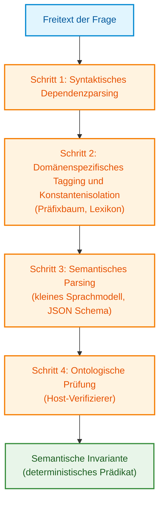
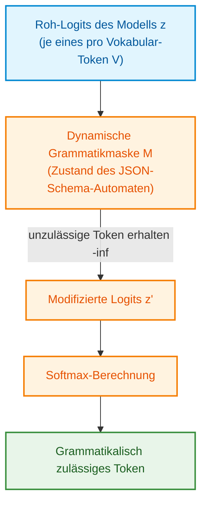
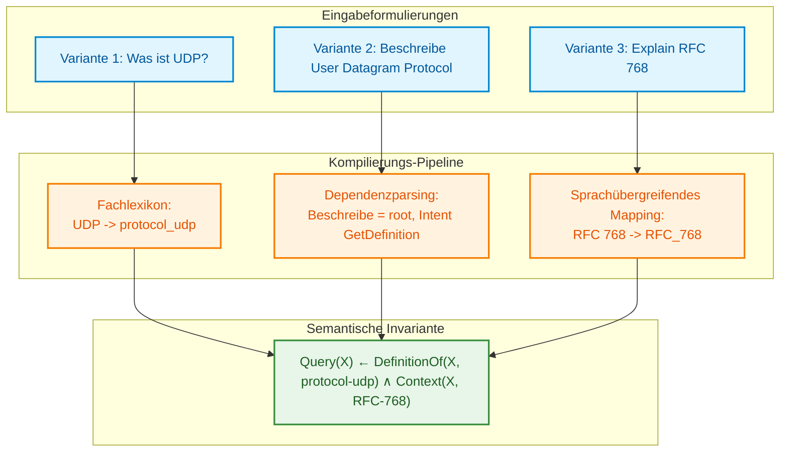
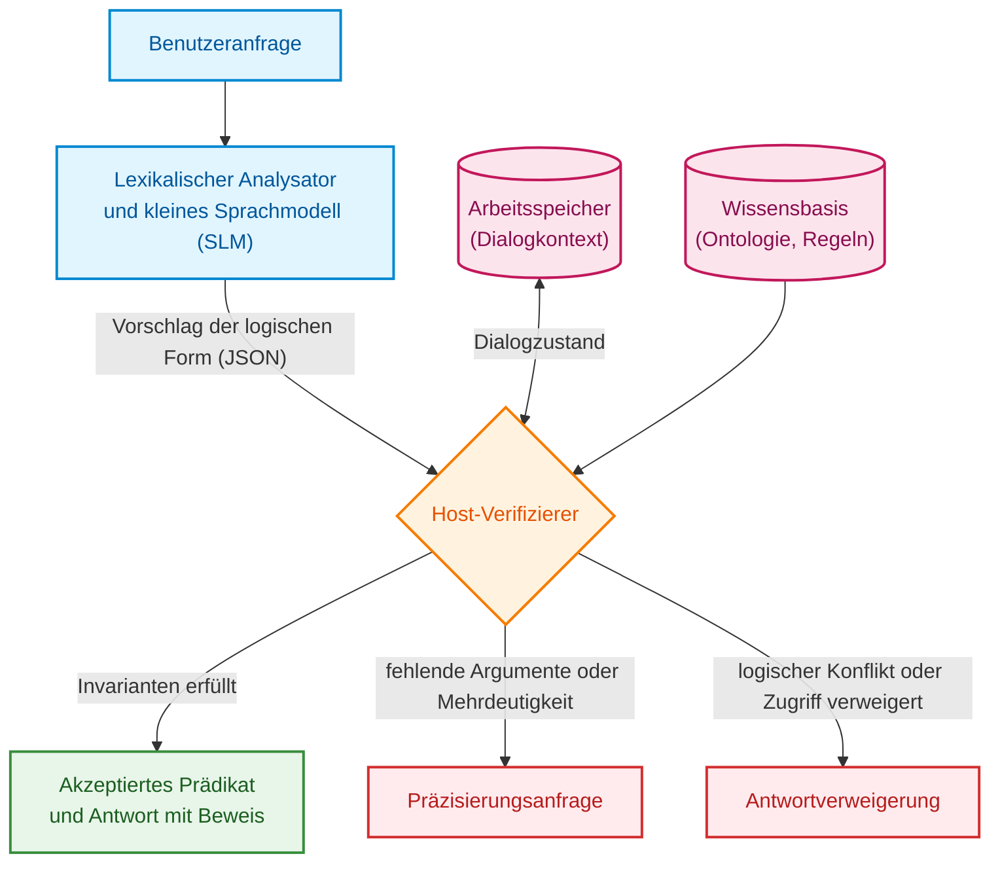

# Kapitel 13. Natürliche Sprachvarianz versus Determinismus: Kompilierung der Frageintention

> **Buch:** [Architektur evidenzbasierter Expertensysteme](README.md) · [Teil III: Wissensakquisition, linguistische Analyse und Eingangsdatenbewertung](part-03-knowledge-engineering-nlp.md)  
> **Vorheriges Kapitel:** [Kapitel 12. Linguistische Analyse und lokale Modelle: Erhalt von Semantik und Herkunftsnachweis](ch12-linguistic-analysis-and-local-models.md)  
> **Nächstes Kapitel:** [Kapitel 14. Anforderungsextraktion und Modalitäten: Vom normativen Text zu Invarianten](ch14-requirements-detection-and-formalization.md)  
> **Inhaltsverzeichnis:** [README.md](README.md)  
> **Autor:** [Mykola Fedchyk](about-the-author.md)  
> **Niveau:** Mittelstufe: Entwickler und Knowledge Engineers  
> **Lernziele:** Die Oberflächenform einer Frage von ihrem logischen Gehalt trennen; die Grenzen von naivem, fortgeschrittenem und modularem RAG erklären; eine Pipeline entwerfen, die Benutzerfragen in verifizierbare Prädikate kompiliert; Benutzerhypothesen strikt von der Faktenbasis isolieren; die Robustheit der linguistischen Schnittstelle mittels Äquivalenzgruppen messen.

## Abstract

Dieses Kapitel untersucht die Bewältigung der Variabilität natürlicher Sprache bei der Interaktion mit deterministischen Expertensystemen. Es analysiert die Evolution von RAG-Architekturen (naiv, fortgeschritten und modular) und belegt die fundamentale Unzulänglichkeit vektorieller Ähnlichkeit zur Gewährleistung logischer Wahrheitswerte von Schlüssen. Als Lösung wird das Konzept der semantischen Fragekompilierung in eine kanonische semantische Invariante unter Einsatz grammatikgesteuerten Decodierens (GBNF) und vollständiger Isolation von Benutzerhypothesen gegenüber der Wissensbasis vorgestellt. Darüber hinaus wird eine Methodik zur Messung der Schnittstellenstabilität über Gruppen äquivalenter und kontrastiver Anfragen dargelegt.

Ein Ingenieur fragt das Expertensystem: „Was ist UDP?“. Ein Kollege formuliert denselben Sachverhalt anders: „Beschreibe das User Datagram Protocol“. Ein dritter Mitarbeiter fragt auf Englisch: „Explain the core concept of RFC 768“. Für den Menschen handelt es sich um ein und dieselbe Frage zu einem einzigen Wissensobjekt: dem User Datagram Protocol (*User Datagram Protocol*, UDP), definiert in RFC 768 aus der Reihe der Internetstandards „Request for Comments“ (*Request for Comments*, RFC). Für eine Pipeline, die nach textueller Ähnlichkeit sucht, sind dies jedoch drei verschiedene Vektoren, drei unterschiedliche Mengen abgerufener Fragmente und potenziell drei divergierende Antworten.

Retrieval-Augmented Generation (*Retrieval-Augmented Generation*, RAG) kombiniert ein Sprachmodell mit einem abrufenden Speicher [[1]](#src-1). Die einfachste Variante wählt vektornahe Textpassagen aus und übergibt sie einem großen Sprachmodell (*Large Language Model*, LLM). Für ein Expertensystem (ES) ist jedoch ein ungleich strengerer Vertrag erforderlich: Bei identischer Absicht, gleichem Wissensstand (Snapshot), identischem Kontext und denselben Berechtigungen müssen die Urteile absolut konsistent sein. Unterschiedliche zulässige Begründungen stellen nicht zwangsläufig einen Fehler dar; die Auswahl identischer Belege erfordert jedoch eine explizite Richtlinie. Zudem muss die Äquivalenz zweier Formulierungen vorab formal verifiziert werden.

Daraus resultiert die Leitfrage dieses Kapitels: **Wie lässt sich sicherstellen, dass unterschiedliche Formulierungen derselben Frage zu einer identischen, verifizierbaren Antwort des Expertensystems führen?** Die Kernüberzeugung lautet: Fragen dürfen nicht gesucht, sie müssen kompiliert werden. Das linguistische Subsystem des ES transformiert Formulierungen in eine kanonische logische Form, die in diesem Kapitel als semantische Invariante bezeichnet wird. Ein kleines Sprachmodell schlägt diese Form lediglich vor, ein deterministischer Host-Verifizierer akzeptiert oder verwirft den Vorschlag, und die Robustheit der Schnittstelle wird nicht anhand isolierter Phrasen, sondern über Gruppen äquivalenter Anfragen geprüft.

Dieses Kapitel setzt Kapitel 12 fort. Während dort vermittelt wurde, wie das linguistische Subsystem den Herkunftsnachweis bewahrt, lernt es hier, eine Änderung der Formulierung von einer Änderung der Absicht zu unterscheiden. Zunächst wird die Entwicklung von RAG und die Grenzen der Vektorähnlichkeit beleuchtet. Anschließend werden die Pipeline der semantischen Kompilierung, das beschränkte Decodieren sowie die Robustheitsprüfung mittels Äquivalenz- und Kontrastgruppen behandelt. Die architektonische Bezeichnung allein garantiert ohne diese Prüfungen keinerlei Invarianz.

Das nachfolgende Diagramm veranschaulicht den Zielpfad: von einer beliebigen Formulierung über die lexikalisch-semantische Analyse bis hin zum logischen Prädikat über der Wissensbasis.

```mermaid
flowchart LR
    accTitle: Kompilierung syntaktischer Abfragevariationen in eine deterministische Antwort
    accDescr: Ablauf der Überführung beliebiger Anfrageformulierungen über die lexikalisch-semantische Analyse in ein Prädikat über der Wissensbasis.

    U["Syntaktische Fragevariationen<br/>(Benutzereingaben)"] --> QA["Lexikalisch-semantische Analyse<br/>und Konstantenisolation"]
    QA --> SI["Semantische Invariante<br/>(logisches Prädikat)"]
    SI --> KB[("Wissensbasis<br/>(Graph, Axiome, Regeln)")]
    KB --> DET["Deterministische geprüfte<br/>Antwort mit Beweis"]

    classDef in fill:#e1f5fe,stroke:#0288d1,stroke-width:2px,color:#01579b;
    classDef proc fill:#fff3e0,stroke:#f57c00,stroke-width:2px,color:#e65100;
    classDef store fill:#e8f5e9,stroke:#388e3c,stroke-width:2px,color:#1b5e20;
    classDef out fill:#f3e5f5,stroke:#7b1fa2,stroke-width:2px,color:#4a148c;

    class U in;
    class QA,SI proc;
    class KB store;
    class DET out;
```



Entscheidend am Diagramm ist: Zwischen dem Fragetext und der Wissensbasis steht keine Ähnlichkeitssuche, sondern ein explizites logisches Prädikat. Dieses Prädikat – und nicht die Formulierung – bestimmt die vom ES zurückgegebene Antwort.

## 1. Evolution der RAG-Paradigmen sowie ihre theoretischen und praktischen Grenzen

Im Engineering sicherheitskritischer Expertensysteme (gemäß den Anforderungen der Standards für funktionale Sicherheit ISO 26262, IEC 61508 und DO-178C) muss jede Entscheidung auf einer deterministischen, vollständigen und unanfechtbaren Beweiskette über einer verifizierten Wissensbasis beruhen. Wird ein Expertensystem um eine sprachliche Schnittstelle auf Basis von Retrieval-Augmented Generation (*Retrieval-Augmented Generation*, RAG) ergänzt, entsteht ein architektonisches Dilemma: Statt eines direkten Zugriffs auf Fakten vertraut das System die Kontextauswahl einem heuristischen und nichtdeterministischen Suchalgorithmus an. Gibt die Such-Pipeline Fragmente aufgrund zufälliger lexikalischer Ähnlichkeit oder unvollständiger Phrasen zurück, tritt ein semantischer Drift auf: Das Modell synthetisiert nicht das, was die normative Vorgabe verlangt, sondern das, was der Index zufällig hervorgebracht hat.

Um zu verstehen, warum selbst komplexe Suchheuristiken keine formale logische Inferenz ersetzen können, muss die Entwicklung der Retrieval-Pipelines nachvollzogen werden. Gao et al. unterschieden in ihrer Übersichtsarbeit von 2023 drei RAG-Paradigmen: naives, fortgeschrittenes und modulares RAG [[2]](#src-2). Jedes nachfolgende Paradigma behob spezifische Mängel seines Vorgängers, dennoch bleiben alle drei statistische Textsuch-Pipelines, deren Endergebnis keine mathematische Vollständigkeitsgarantie bietet.

Die Vektorsuche stellt lediglich eine Komponente von RAG dar und ist keineswegs die zwingende Basis jeder Realisierung. Sie ermittelt die nächstgelegenen Vektoren anhand eines Ähnlichkeitsmaßes. Ein vollständiger linearer Scan (*exhaustive linear scan*) weist bei $N$ Vektoren der Dimension $d$ eine Zeitkomplexität von $\mathcal{O}(N\cdot d)$ auf. Für große Datenmengen kommen approximative Nearest-Neighbor-Indizes wie HNSW (*Hierarchical Navigable Small World*) [[3]](#src-3) oder Inverted-File-Indizes (IVF) mit Produktquantisierung zum Einsatz [[4]](#src-4). Die Approximation kann jedoch echte nächste Nachbarn übergehen. Geometrische Nähe erfüllt keine logische Regel, wenngleich ein trainierter Einbettungsraum einen Teil der semantischen Nuancen abbilden kann. Auch Volltext-, relationale und Graphabfragen fungieren häufig als Retrieval-Komponenten.

### 1.1. Naives RAG: „Retrieve-Read“-Architektur und Verfälschungsrisiken

Naives RAG (*Naive RAG*) implementiert das klassische „Retrieve-Read“-Schema [[2]](#src-2) in drei Schritten:

1. **Chunking und Indizierung.** Dokumente werden in Text überführt und in Fragmente fester Länge zerlegt, beispielsweise in Einheiten von einigen Hundert Token mit geringer Überlappung. Der Zuschnitt erfolgt mechanisch nach Zeichen- oder Tokenanzahl, ohne Rücksicht auf Abschnittsgrenzen, Tabellen oder Quelltext-Listings. Jedes Fragment wird durch einen Embedding-Encoder kodiert und in einer Vektordatenbank abgelegt.
2. **Retrieval.** Die Benutzeranfrage wird mit demselben Encoder abgebildet, woraufhin die $k$ Fragmente mit der höchsten Ähnlichkeit (*top-k*) ermittelt werden.
3. **Generierung.** Die gefundenen Fragmente werden zu einem Kontext zusammengefügt und gemeinsam mit der Anfrage an das LLM übergeben. Es wird erwartet, dass das Sprachmodell Rauschen eigenständig ausblendet, isolierte Fakten synthetisiert und eine schlüssige Antwort formuliert.

Das folgende Diagramm trennt die Offline-Indizierung von Dokumenten von der Online-Verarbeitung der Anfrage.



Im Diagramm wird deutlich, dass zwischen Retrieval und Antwort keinerlei Verifikation stattfindet. Die Ausgabe ist ein freier Modelltext und kein deduktiver Schluss, der an Byte-Koordinaten der Quelle gebunden ist. Für technische Dokumente resultieren daraus fünf Kernrisiken:

* **Wissensspaltung über Fragmentgrenzen.** Werden Anwendungsbedingung einer Norm und ihre numerische Einschränkung in getrennte Chunks zerschnitten, ruft das Retrieval möglicherweise die Bedingung ohne das Limit ab.
* **Unvollständigkeit und Rauschen.** Ein hochrelevantes Fragment kann den Einzug in die Top-k verpassen, während stattdessen ein oberflächlich ähnlicher, sachlich irrelevanter Textteil ausgewählt wird.
* **Verlust der Kontextmitte (*Lost in the Middle*).** Liu et al. wiesen nach, dass Sprachmodelle Informationen am Anfang oder Ende eines langen Kontexts am effektivsten verwerten, wohingegen die Performanz drastisch einbricht, sobald sich die entscheidende Information in der Mitte befindet [[5]](#src-5).
* **Relevanzillusion.** Eine hohe Vektorähnlichkeit belegt lediglich gemeinsames Vokabular, nicht jedoch die normative Verbindlichkeit einer Aussage: Eine verbindliche Anforderung mit dem Schlüsselwort SHALL und ein unverbindlicher Kommentar dazu erzielen oft vergleichbare Ähnlichkeitswerte.
* **Fehlende Beweiskette.** Die generierte Antwort besitzt keine überprüfbare Bindung an unveränderliche Quell-Bytes, wodurch sie bei einem Sicherheitsaudit nicht reproduzierbar ist.

### 1.2. Fortgeschrittenes RAG: Vor- und Nachsuch-Optimierung

Fortgeschrittenes RAG (*Advanced RAG*) behält den sequenziellen Fluss von Abruf gefolgt von Generierung bei, führt jedoch Optimierungen an zwei Schnittstellen ein: vor der Suche (*pre-retrieval*) und nach der Suche (*post-retrieval*) [[2]](#src-2).

Vor dem Retrieval adressieren Entwickler zwei Schwachstellen: das unpräzise Zerschneiden von Dokumenten und suboptimale Anfrageformulierungen. Anstelle mechanischer Segmentierung kommt hierarchische Indizierung zum Einsatz: Gesucht wird über feingranulare Chunks, in den Prompt wird jedoch der umfassendere übergeordnete Abschnitt übergeben. Ein verwandter Ansatz, Sentence-Window-Retrieval, bettet Einzelsätze ein und erweitert den Kontext bei Bedarf um Nachbarsätze. Jedes Fragment wird mit Metadaten angereichert: Abschnittsnummer, Dokumentenversion, Automotive Safety Integrity Level (*Automotive Safety Integrity Level*, ASIL) und kryptografischer Hash der Quelldatei. Metadaten ermöglichen die Kombination von Vektorsuche mit exakter strukturierter Filterung.

Auch die Abfrage wird transformiert. Ein LLM kann informelle Benutzerfragen in normative Fachterminologie umschreiben oder mehrere Anfragevarianten zur breiteren Synonymabdeckung generieren. Die Methode der hypothetischen Dokumenteinbettungen (*Hypothetical Document Embeddings*, HyDE) geht noch weiter: Das Modell generiert zunächst eine fiktive Idealantwort; gesucht wird anschließend nach der Einbettung dieser generierten Antwort, da deren Textstruktur dem Zieldokument ähnlicher ist als eine kurze Nutzerfrage [[6]](#src-6). Hybrides Retrieval verbindet dichte Vektorsuche mit dünnbesetzter lexikalischer Suche, etwa über die Rankingfunktion BM25 [[7]](#src-7) oder das dünnbesetzte neuronale Modell SPLADE [[8]](#src-8). Die lexikalische Komponente erfasst exakte Kennungen, Registernummern und Konstanten, welche dichte Einbettungsmodelle tendenziell verwischen.

Nach dem Retrieval stehen dem System meist mehr Kandidaten zur Verfügung, als sinnvoll an das Modell weitergeleitet werden können. Ein Re-Ranking mittels Cross-Encoder (*cross-encoder*) bewertet jedes Paar aus Anfrage und Passage simultan und berücksichtigt dabei alle Token-Interaktionen beider Texte. Nogueira und Cho demonstrierten die Effektivität eines solchen Re-Rankings auf Basis des BERT-Modells (*Bidirectional Encoder Representations from Transformers*) [[9]](#src-9). Ein typischer Ablauf: Ein schneller Vorabruf filtert einige Dutzend Kandidaten heraus, woraufhin der Cross-Encoder die besten Fragmente isoliert. Kontextkomprimierung, beispielsweise durch LLMLingua [[10]](#src-10), entfernt informationsarme Token aus dem Prompt. Ein gezieltes Kontext-Reordering platziert die wichtigsten Passagen an den Anfang und das Ende des Prompts, was direkt aus den Erkenntnissen von Liu et al. bezüglich des Verlusts der Kontextmitte folgt [[5]](#src-5).

### 1.3. Modulares RAG: Komponenten-Orchestrierung statt starrer Pipeline

Modulares RAG (*Modular RAG*) löst die starre Kette auf und ersetzt sie durch eine Menge unabhängiger Module, die je nach Aufgabenstellung dynamisch orchestriert, geroutet und ausgetauscht werden können [[2]](#src-2). Das Retrieval-Modul interagiert nicht mehr ausschließlich mit Vektordatenbanken, sondern greift auf Volltextindizes, relationale Datenbanken via *Text-to-SQL* (*Structured Query Language*, SQL) oder Wissensgraphen mittels Cypher- bzw. SPARQL-Abfragen zu. Ein Speichermodul verwaltet vorangegangene Dialogsitzungen. Ein Routing-Modul analysiert die Absicht der Anfrage und lenkt sie zielgerichtet: Begriffsdefinitionen zum Vektorindex, strukturelle Abhängigkeiten zum Wissensgraphen.

Ein verbreitetes Muster des modularen RAG, RAG-Fusion, vervielfacht eine Anfrage in alternative Formulierungen und aggregiert die Einzelergebnisse mittels Reciprocal Rank Fusion (*Reciprocal Rank Fusion*, RRF), vorgeschlagen von Cormack, Clarke und Büttcher [[11]](#src-11). In multimodalen und hybriden Suchtrakten (in denen dichte Vektorsuche, dünnbesetzte BM25-Indizes und Graph-Traversierungen kombiniert werden) besitzen Rohähnlichkeitswerte inkompatible Skalen und Verteilungen (Kosinus-Ähnlichkeit im Intervall $[-1, 1]$ gegenüber unbeschränkten positiven BM25-Scores). Um heterogene Ergebnislisten ohne aufwendige Wahrscheinlichkeitskalibrierung zusammenzuführen, berechnet RRF einen summierten Rangwert:

```math
\mathrm{RRF}(d) = \sum_{m \in M} \frac{1}{k + r_m(d)}
```

Parameter und Messgrößen der Formel:

- $d \in D$ ist ein Dokumentenkandidat oder normatives Textfragment aus dem Gesamtkorpus $D$;
- $M$ ist die Menge heterogener Suchkanäle oder Abfragevarianten (beispielsweise $M = \{\text{dense}, \text{sparse}, \text{graph}\}$ mit $\lvert M \rvert \ge 2$), wobei $m$ einen konkreten Retrieval-Kanal bezeichnet;
- $r_m(d) \in \mathbb{N}_{\ge 1}$ ist der Rangplatz des Dokuments $d$ in der Ergebnisliste des Kanals $m$ ($r_m(d) = 1$ für den ersten Platz; ist das Dokument in der Stichprobe des Kanals nicht enthalten, gilt formal $r_m(d) = \infty$, was den Beitrag $1/(k + \infty) = 0$ ergibt);
- $k \in \mathbb{N}_{> 0}$ ist eine positive Glättungskonstante, deren kanonischer Standardwert $k = 60$ beträgt; sie garantiert, dass ein zufälliger Ausreißer auf Rang 1 in einem verrauschten Kanal den stabilen Konsens eines Dokuments im oberen Bereich anderer Listen nicht überstimmt;
- $\mathrm{RRF}(d) \in (0, \frac{\lvert M \rvert}{k + 1}]$ ist der dimensionslose Integralwert des Konsens-Rankings.

Praktische Anwendung und ingenieurtechnische Schlussfolgerungen:
- **Funktion in der Pipeline:** Der RRF-Score dient ausschließlich dem positionalen Beschneiden des primären Kandidatenpools (typischerweise auf ein Limit von $`K_{\mathrm{pool}} = 50`$ fixiert), welcher anschließend dem rechenintensiven paarweisen Re-Ranking durch einen Cross-Encoder (*cross-encoder*) übergeben wird.
- **Schwellenwertfilterung:** In geschäftskritischen Pipelines wird ein Konsens-Schwellenwert von $`\tau_{\mathrm{RRF}} \ge 0{,}025`$ definiert (was der Platzierung eines Fragments unter den Top-10 mindestens zweier unabhängiger Suchkanäle entspricht). Alle Kandidaten mit $`\mathrm{RRF}(d) < \tau_{\mathrm{RRF}}`$ werden deterministisch verworfen, um den Arbeitskontext vor Rauschen zu schützen.
- **Fail-safe-Verhalten:** Gilt $`\max_{d \in D} \mathrm{RRF}(d) < \tau_{\mathrm{min}}`$, leitet die Pipeline keine zweifelhaften Daten an das generative Modell weiter, sondern löst das Ereignis `E_NO_CONSENSUS_RETRIEVAL` aus und verweigert deterministisch die Aussage unter Aufforderung zur Präzisierung des normativen Kontexts.

Neben den drei Hauptparadigmen etablieren sich spezialisierte Architekturmuster. GraphRAG konstruiert Entitätsgraphen und hierarchische Zusammenfassungen für Graph-Communitys, um globale Fragestellungen über den Gesamtkorpus zu beantworten [[12]](#src-12). Self-RAG trainiert Modelle darauf, autonom zu entscheiden, wann ein Abruf erforderlich ist, und gefundene Passagen sowie eigene Generierungen mittels Reflexions-Token kritisch zu bewerten [[13]](#src-13). Corrective RAG (*Corrective RAG*, CRAG) integriert einen leichtgewichtigen Evaluator zur Bewertung der Retrieval-Güte und stößt bei unzureichender Qualität ergänzende Suchen an [[14]](#src-14).

Das nachfolgende Diagramm stellt die drei Paradigmen gegenüber. Im modularen Ansatz treten Router und Evaluator auf, die Anfragen in iterative Zyklen überführen können.



Der Vergleich verdeutlicht die Entwicklungsrichtung: vom einfachen Einmaldurchlauf hin zum gesteuerten Regelkreis mit Qualitätsbewertung. Dennoch steht auch im modularen Paradigma am Ende eine Textgenerierung.

**Ergebnis des Abschnitts.** Die RAG-Klassifikation beschreibt die Organisation von Abruf und Textgenerierung; sie schließt ein semantisches Parsing oder formale Abfragen keineswegs aus. Eine modulare Anwendung kann beide Mechanismen vereinen. Wesentlich ist die Prüfung, an welcher Stelle die logische Form erzeugt wird und wer ihren semantischen Gehalt verifiziert – anstatt den Namen einer Architektur unkritisch als Beweis oder Widerlegung von Zuverlässigkeit zu betrachten.

## 2. Mathematische und logische Grenzen der semantischen Ähnlichkeit

In ingenieurtechnischen und normativen Domänen (Avionik, automobile Steuergeräte, Netzwerkprotokolle) existiert eine gefährliche Illusion: Weist ein Vektormodell eine Kosinus-Ähnlichkeit von 0,92 zwischen der Anfrage eines Ingenieurs und einem Standardabschnitt aus, habe das System den Kern der Frage angeblich „verstanden“. In der Praxis erweist sich dies als fataler Architekturfehler. Vektorähnlichkeit erfasst lediglich statistische Kookkurenzen von Kontexten und Token im hochdimensionalen latenten Raum. Sie bleibt jedoch vollkommen blind gegenüber formaler Logik, polarer Negation, numerischen Grenzwerten und syntaktischen Subjekt-Objekt-Rollen.

Die Kosinus-Ähnlichkeit der Einbettungen von Anfrage $\mathbf{q}$ und Dokument $\mathbf{d}$ berechnet sich als Skalarprodukt der normierten Vektoren im latenten Raum:

```math
s(\mathbf{q}, \mathbf{d}) = \frac{\mathbf{q}^\top \mathbf{d}}{\lVert\mathbf{q}\rVert_2 \, \lVert\mathbf{d}\rVert_2}
```

Parameter und mathematische Randbedingungen:

- $\mathbf{q}, \mathbf{d} \in \mathbb{R}^D$ sind dichte semantische Einbettungen der Anfrage und des normativen Textfragments, generiert durch einen neuronalen Encoder fixer Dimensionalität $D$ (typischerweise $D \in \{768, 1024, 1536\}$);
- $\mathbf{q}^\top\mathbf{d} = \sum_{j=1}^D q_j d_j$ ist das euklidische Skalarprodukt der Vektoren, während $\lVert\cdot\rVert_2 = \sqrt{\sum_{j=1}^D (\cdot)_j^2}$ die euklidische Norm ($L_2$-Norm) darstellt, welche den Einfluss der absoluten Textlänge auf die Metrik eliminiert;
- $s(\mathbf{q},\mathbf{d}) \in [-1, 1]$ ist der dimensionslose Kosinus-Ähnlichkeitskoeffizient: Der Wert $+1$ entspricht kollinearen Vektoren gleicher Ausrichtung, $0$ orthogonalen Vektoren und $-1$ gegenläufigen Vektoren. Für Nullvektoren ($\lVert\mathbf{q}\rVert_2 = 0$) ist die Metrik undefiniert.

Praktische Anwendung und ingenieurtechnische Schlussfolgerungen:
- **Rolle im Trakt:** Der Kosinus-Score $s(\mathbf{q},\mathbf{d})$ fungiert ausschließlich als heuristischer Filter der ersten Ebene für die Vorauswahl von Dokumentenkandidaten aus umfangreichen Normenbeständen bei logarithmischer Zeitkomplexität $\mathcal{O}(\log N)$ über HNSW-Indizes.
- **Zulassungsschwellenwerte:** Der Arbeitsschwellenwert für Kandidaten wird üblicherweise auf $`\tau_{\mathrm{dense}} = 0{,}70`$ festgelegt. Fragmente mit $`s < \tau_{\mathrm{dense}}`$ werden bedingungslos verworfen.
- **Kritisches Risiko von Fehlvertrauen:** Ein Wert von $`s(\mathbf{q},\mathbf{d}) \ge 0{,}90`$ stellt in technischen Nachweissystemen **keinen Beweis für Wahrheit oder logische Konsistenz** dar. Die Aussagen „Übertragung ist unter Bedingung X zulässig“ und „Übertragung ist unter Bedingung X streng untersagt“ teilen denselben terminologischen Kontext und erzielen oft $s \approx 0{,}93$. Ein hoher Ähnlichkeitswert rechtfertigt daher lediglich die Übergabe des Fragments an einen deterministischen logischen Analysator, niemals jedoch die ungeprüfte Übernahme in das finale Urteil.



Die erste Formulierung platziert die Einbettung nahe an einführenden Erläuterungen, die zweite nahe am Standardtext. Beide Ergebnisse können faktisch zutreffen, sie stellen jedoch unterschiedliche Textfragmente dar, was zu abweichenden Generierungen führt. Für ein ES bedeutet dies eine unzulässige Abhängigkeit der Antwort vom individuellen Formulierungsstil des Nutzers.

Die Schwächen eines rein vektoriellen Ansatzes in Ingenieurdomänen manifestieren sich in drei Dimensionen:

1. **Blindheit gegenüber Negationen.** Die Negationspartikel „nicht“ invertiert den logischen Wahrheitswert vollständig, verändert den lexikalischen Gehalt des Vektors jedoch kaum. Ettinger wies nach, dass BERT-basierte Modelle in psycholinguistischen Diagnosetests eine signifikante Unempfindlichkeit gegenüber dem Einfluss von Negationen auf den Satzsinn aufweisen [[15]](#src-15). Auf solchen Encodern aufbauende Einbettungen erben diese Schwäche: Die Aussagen „Anforderung ist anwendbar“ und „Anforderung ist nicht anwendbar“ liegen im Vektorraum oft eng beieinander.
2. **Drift durch Sprachstil und Sprache.** Der Wechsel von Umgangssprache zu formaler Nomenklatur oder vom Deutschen ins Englische verschiebt den Anfragevektor und verändert die Trefferliste, wie im obigen Diagramm veranschaulicht.
3. **Mangelnde Kompositionalität.** Die Vektorsuche bewertet Abfragen gegen isolierte Textstücke. Sie ist unfähig, transitive Verknüpfungen wie „Anforderung A präzisiert Anforderung B, und B verweist auf Standard C“ über Abschnittsgrenzen hinweg logisch aufzulösen.

**Ergebnis des Abschnitts.** Vektorähnlichkeit eignet sich zur Kandidatenfilterung, taugt jedoch nicht als Begründung für Tatsachenbehauptungen. Erforderlich ist ein Mechanismus, der Formulierungen auf eine eindeutige logische Form zurückführt und Antworten deterministisch über der Wissensbasis berechnet. Der folgende Abschnitt stellt diese Architektur vor.

## 3. Architektur der Pipeline zur semantischen Fragekompilierung

Die Fragekompilierung bezeichnet in diesem Kapitel die Transformation einer beliebigen natürlichsprachlichen Formulierung in ein kanonisches logisches Prädikat über der Wissensbasis. Analog zu einem Compiler für Programmiersprachen durchläuft die Pipeline mehrere Phasen: syntaktisches Parsing, Symbolauflösung, Konstruktion einer Zwischenrepräsentation sowie statische Typprüfung. Das Resultat der Kompilierung – die semantische Invariante – ist unabhängig von der syntaktischen Einkleidung: Drei unterschiedliche Formulierungen zu UDP müssen in dasselbe Prädikat münden. Das folgende Diagramm zeigt die vier Kernschritte.



Das Dependenzparsing nutzt üblicherweise trainierte Modelle: Feste Modellgewichte liefern zwar reproduzierbare Ausgaben, garantieren jedoch keine fehlerfreie grammatische Struktur. Das Fachlexikon liefert Kandidaten, das Sprachmodell schlägt eine logische Form vor, und der Verifizierer prüft deklarierte Typen und Restriktionen. Keiner dieser Schritte beweist für sich allein, dass die Form die Benutzerabsicht fehlerfrei abbildet.

### 3.1. Syntaktisches Dependenzparsing und Aktantenextraktion

Der syntaktische Parser konstruiert den Dependenzbaum des Satzes gemäß dem Schema der Universal Dependencies (*Universal Dependencies*, UD) [[16]](#src-16). Er bestimmt Wortarten, Lemmata und grammatische Relationen, etwa Prädikatskern (`root`), Subjekt (`nsubj`) und direktes Objekt (`obj`). Für viele Sprachen stehen bewährte Open-Source-Werkzeuge wie UDPipe [[17]](#src-17) und Stanza [[18]](#src-18) bereit. Das Parsing trennt das syntaktische Gerüst von morphologischen Oberflächenformen: Formulierungen wie „beschreibe das Protokoll“, „das Protokoll beschreiben“ und „Beschreibung des Protokolls“ werden auf identische Lemmata zurückgeführt.

### 3.2. Domänenspezifisches Tagging und lexikalische Konstantenisolation

Ein Präfixbaum (*trie*) des Fachlexikons sowie reguläre Ausdrücke identifizieren exakte technische Bezeichner im Text. Strings wie „UDP“, „User Datagram Protocol“ oder Verweise wie „RFC 768“ [[19]](#src-19) werden noch vor der Übergabe an das Sprachmodell durch unteilbare Ontologie-Atome ersetzt, beispielsweise `Entity(id: protocol_udp, source: RFC_768)`. Diese Konstantenisolation schützt Identifikatoren vor Paraphrasierungen: Das Modell kann „RFC 768“ nicht versehentlich zu „RFC 786“ verdrehen, da es keine Ziffernfolge, sondern ein fixiertes Atom verarbeitet.

### 3.3. Semantisches Parsing und Hypothesengenerierung durch kleine Sprachmodelle

Ein kleines Sprachmodell (*Small Language Model*, SLM) schlägt die Intentionskategorie und die Argumentrollen vor. Die Ausgabe wird über ein JSON Schema für das JSON-Format (*JavaScript Object Notation*) strikt beschränkt. Das Schema erzwingt die Struktur, garantiert jedoch nicht die inhaltliche Richtigkeit. Beispiel einer solchen Kandidatenform:

<details>
<summary>Beispiel einer kandidierenden logischen Form</summary>

```json
{
  "intent": "GetDefinition",
  "arguments": {
    "target": "protocol_udp",
    "scope": "RFC_768"
  }
}
```

</details>

Das Feld `intent` wird gegen eine geschlossene Aufzählung validiert, `target` und `scope` gegen die zulässigen Kandidaten der jeweiligen Anfrage. Der Datentyp `string` verhindert allein keine erfundenen Bezeichner: Erforderlich ist eine dynamische Werteliste oder eine explizite Zugehörigkeitsprüfung. Selbst zwei zulässige Argumente könnten fälschlich vertauscht werden. Daher werden Rollen, Negationen, Quantoren, Einheiten und Kontext separat validiert und mehrdeutige Eingaben zurückgewiesen.

### 3.4. Ontologische Verifikation und Invariantenvalidierung durch den Host

Deterministischer Host-Code, der sogenannte Host-Verifizierer (*host verifier*), führt eine strikte Validierung der vom Modell vorgeschlagenen JSON-Struktur gegen den aktuellen Ontologiegraphen sowie die Zugriffskontrollmatrix des Benutzers durch. Der Verifizierer prüft: (1) ob der Intent in der geschlossenen Systemliste existiert; (2) ob die Typen der übergebenen Argumente mit der Prädikatssignatur kompatibel sind; (3) ob die Quelle zu den autorisierten Norm-Snapshots gehört. Erst nach Bestehen aller drei statischen Prüfungen wird eine Horn-Klausel der Prädikatenlogik erster Stufe instanziiert:

```math
\mathrm{Query}(X) \leftarrow \mathrm{DefinitionOf}(X, \text{protocol-udp}) \land \mathrm{Context}(X, \text{RFC-768})
```

Parameter und logische Variablen des Prädikats:

- $X \in \mathcal{U}$ ist die quantifizierte Zielvariable über dem Universum der Wissensbasisobjekte $\mathcal{U}$;
- $\text{protocol-udp} \in \mathcal{C}$ ist die unveränderliche atomare Kennung des Ontologiekonzepts (Klasse verbindungsloser Transportprotokolle);
- $\text{RFC-768} \in \mathcal{D}$ ist der kryptografisch verifizierte Bezeichner der Primärquelle (Dokument-Snapshot von RFC 768 im Faktenspeicher);
- $\mathrm{DefinitionOf} \subseteq \mathcal{U} \times \mathcal{C}$ ist das binäre Prädikat zur Kennzeichnung einer normativen Begriffsdefinition;
- $\mathrm{Context} \subseteq \mathcal{U} \times \mathcal{D}$ ist das binäre Prädikat zur Bindung an den normativen Dokumentkontext;
- $\leftarrow$ bezeichnet die logische Implikation (Horn-Regel) und $\land$ die logische Konjunktion der Bedingungen.

Praktische Anwendung und ingenieurtechnische Schlussfolgerungen:
- **Ausführung in der Engine:** Das Prädikat $\mathrm{Query}(X)$ wird an eine deterministische Inferenzmaschine (Datalog oder Prolog) übergeben, was eine polynomielle Laufzeit $\mathcal{O}(\lvert\mathcal{U}\rvert^k)$ garantiert und Halluzinationen prinzipiell ausschließt.
- **Deterministisches Urteil:** Findet die Unifikation die Substitution $\theta = \{X \mapsto \text{def-udp-postel-1980}\}$, stellt das System ein auditierbares Beweis-Zertifikat unter Angabe der exakten Byte-Range und des Fragment-Hashes von RFC 768 aus.
- **Fail-safe-Fehlerbehandlung:** Liefert die Unifikation eine leere Lösungsmenge oder schlägt die Validierung eines Bezeichners fehl, generiert das System den typisierten Fehler `E_UNRESOLVED_PREDICATE` mit der Aufforderung zur Kontextpräzisierung, anstatt eine freie Pseudotext-Antwort auszugeben.

Dieses Prädikat bildet die gesuchte semantische Invariante. Die Inferenzmaschine wertet es über der Wissensbasis aus; die Antwort enthält eine direkte Referenz auf den exakten Abschnitt in RFC 768, aus dem die Definition deduziert wurde.

### 3.5. Verarbeitung konditionaler Anfragen: Isolation von Hypothesen gegenüber Fakten

Ingenieure stellen selten rein faktische Einzelschritt-Fragen. Typisch sind konditionale Anfragen mit hypothetischen Prämissen: „Wenn der zu testende Client SMTP nach RFC 5321 implementiert und der Server TLS erzwingt, muss der Client vor dem Senden von E-Mails zwingend STARTTLS übermitteln?“ Hierbei ist das Simple Mail Transfer Protocol (*Simple Mail Transfer Protocol*, SMTP) in RFC 5321 [[20]](#src-20) spezifiziert, während die STARTTLS-Erweiterung zur Aktivierung von Transport Layer Security (*Transport Layer Security*, TLS) in RFC 3207 [[21]](#src-21) definiert ist.

Für solche Fragestellungen konstruiert das semantische Parsing einen konditionalen Beweisplan: Auflistung der hypothetischen Prämissen, Ableitungsziel und relevanter Normenbereich. Die fundamentale Sicherheitsinvariante lautet: Benutzerprämissen existieren ausschließlich im temporären Beweiskontext der aktuellen Sitzung und werden unter keinen Umständen in die persistente Faktenbasis geschrieben. Andernfalls würde eine einzige hypothetische „Was-wäre-wenn“-Frage künftige Antworten für alle nachfolgenden Benutzer unbemerkt korrumpieren.

Das Fallbeispiel ist instruktiv, da die korrekte Antwort konditional ausfällt. Abschnitt 4 von RFC 3207 gestattet einem Server, der nicht öffentlich referenziert ist (*not publicly referenced*), TLS vor der Annahme weiterer Befehle zu erzwingen. Ein solcher Server SHOULD mit dem Code `530 Must issue a STARTTLS command first` auf jedes Kommando außer NOOP, EHLO, STARTTLS und QUIT antworten. Ein öffentlich referenzierter Server hingegen – also ein Server auf Port 25, der im Mail-Exchanger-Eintrag (*Mail Exchanger*, MX) der Empfängerdomäne gelistet ist – MUST NOT STARTTLS für die lokale Zustellung erzwingen [[21]](#src-21). Die vollständige Antwort des ES lautet folglich: „Ja, sofern der Server nicht öffentlich referenziert ist; für einen öffentlich referenzierten Server widerspricht die Annahme 'Server erzwingt TLS für lokale Zustellung' den Vorgaben von RFC 3207.“ Zu beachten ist, dass RFC 3207 für den Client keine separate MUST-Anforderung formuliert; die Pflicht des Clients ergibt sich indirekt aus dem Verhalten des Servers, der alle anderen Befehle abweist.

Das nachfolgende Minimalbeispiel in Go demonstriert, wie Sitzungshypothesen strikt von der Faktenbasis isoliert werden und eine von drei typisierten Antworten zurückgegeben wird: bejahend unter Vorbehalt, Aufforderung zur Präzisierung oder normativer Konflikt. Die Regel ist hier manuell für einen Abschnitt von RFC 3207 implementiert; in einem produktiven ES würde die Inferenzmaschine diese Regel aus einer formalisierten Wissensbasis ableiten. Das Programm besitzt keine externen Abhängigkeiten und lässt sich mittels `go run .` ausführen.

<details>
<summary>Beispiel in Go: Isolation von Sitzungshypothesen gegenüber der Faktenbasis</summary>

```go
package main

import "fmt"

// Fact ist ein Grundatom, beispielsweise "RequiresTLS(server)".
type Fact string

// FactBase speichert verifizierte Fakten, die über die Sitzung hinaus fortbestehen.
type FactBase map[Fact]bool

// ProofContext schichtet Sitzungshypothesen über die Faktenbasis, ohne diese zu verändern.
type ProofContext struct {
	base       FactBase
	hypotheses map[Fact]bool
}

func (c ProofContext) Value(f Fact) (value, known, conflict bool) {
	baseValue, baseKnown := c.base[f]
	hypothesisValue, hypothesisKnown := c.hypotheses[f]
	if baseKnown && hypothesisKnown && baseValue != hypothesisValue {
		return false, true, true
	}
	if hypothesisKnown {
		return hypothesisValue, true, false
	}
	return baseValue, baseKnown, false
}

type Answer struct {
	Decision  string // CONDITIONAL, CLARIFY oder CONFLICT
	Condition string // Bedingung, unter der die Antwort gilt
	Source    string // Normativer Beleg, der die Antwort stützt
}

// mustSendSTARTTLS implementiert RFC 3207, Abschnitt 4, ausschließlich für lokale Zustellung.
func mustSendSTARTTLS(c ProofContext) Answer {
	requiresTLS, known, conflict := c.Value("RequiresTLS(server)")
	if conflict {
		return Answer{Decision: "CONFLICT", Condition: "Hypothese widerspricht verifiziertem Fakt"}
	}
	if !known || !requiresTLS {
		return Answer{Decision: "CLARIFY", Condition: "erfordert der Server TLS?"}
	}
	public, publicKnown, publicConflict := c.Value("PubliclyReferenced(server)")
	if publicConflict {
		return Answer{Decision: "CONFLICT", Condition: "widersprüchliche Grundlagen für den Serverstatus"}
	}
	if !publicKnown {
		return Answer{Decision: "CLARIFY", Condition: "ist der Server öffentlich referenziert?"}
	}
	if public {
		return Answer{Decision: "CONFLICT",
			Source: "RFC 3207 §4: publicly-referenced server MUST NOT require STARTTLS for local delivery"}
	}
	return Answer{Decision: "CONDITIONAL",
		Condition: "Server ist nicht öffentlich referenziert (not publicly referenced)",
		Source:    "RFC 3207 §4: server SHOULD reply 530 to every command other than NOOP, EHLO, STARTTLS, QUIT"}
}

func main() {
	base := FactBase{}
	ask := func(h ...Fact) {
		ctx := ProofContext{base: base, hypotheses: map[Fact]bool{}}
		for _, f := range h {
			ctx.hypotheses[f] = true
		}
		if ctx.hypotheses["ExplicitlyNonPublic(server)"] {
			ctx.hypotheses["PubliclyReferenced(server)"] = false
		}
		fmt.Printf("%v -> %+v\n", h, mustSendSTARTTLS(ctx))
	}
	ask("Implements(client, RFC5321)")
	ask("Implements(client, RFC5321)", "RequiresTLS(server)")
	ask("RequiresTLS(server)", "ExplicitlyNonPublic(server)")
	ask("RequiresTLS(server)", "PubliclyReferenced(server)")
	fmt.Println("facts in base after session:", len(base))
}
```

Der begleitende Komponententest wird als `context_test.go` gespeichert und mit `go test -v main.go context_test.go` ausgeführt:

```go
package main

import "testing"

func TestUnknownAndConflictingHypotheses(testCase *testing.T) {
	base := FactBase{}
	context := ProofContext{base: base, hypotheses: map[Fact]bool{"RequiresTLS(server)": true}}
	if answer := mustSendSTARTTLS(context); answer.Decision != "CLARIFY" {
		testCase.Fatal("unbekannter Public-Status als false behandelt")
	}
	context.hypotheses["PubliclyReferenced(server)"] = false
	if answer := mustSendSTARTTLS(context); answer.Decision != "CONDITIONAL" {
		testCase.Fatal("explizite Nicht-Public-Hypothese nicht erkannt")
	}
	context.hypotheses["PubliclyReferenced(server)"] = true
	if answer := mustSendSTARTTLS(context); answer.Decision != "CONFLICT" {
		testCase.Fatal("normativer Konflikt ignoriert")
	}
	base["PubliclyReferenced(server)"] = false
	if _, _, conflict := context.Value("PubliclyReferenced(server)"); !conflict {
		testCase.Fatal("Hypothese überschrieb gegenteiligen verifizierten Fakt")
	}
	if len(base) != 1 || base["PubliclyReferenced(server)"] {
		testCase.Fatal("Sitzung modifizierte die Faktenbasis")
	}
}
```

Das Programm liefert folgende Ausgabe:

```text
[Implements(client, RFC5321)] -> {Decision:CLARIFY Condition:erfordert der Server TLS? Source:}
[Implements(client, RFC5321) RequiresTLS(server)] -> {Decision:CLARIFY Condition:ist der Server öffentlich referenziert? Source:}
[RequiresTLS(server) ExplicitlyNonPublic(server)] -> {Decision:CONDITIONAL Condition:Server ist nicht öffentlich referenziert (not publicly referenced) Source:RFC 3207 §4: server SHOULD reply 530 to every command other than NOOP, EHLO, STARTTLS, QUIT}
[RequiresTLS(server) PubliclyReferenced(server)] -> {Decision:CONFLICT Condition: Source:RFC 3207 §4: publicly-referenced server MUST NOT require STARTTLS for local delivery}
facts in base after session: 0
```

</details>

Ein fehlender Serverstatus erzwingt eine Nachfrage (*CLARIFY*); eine explizite Hypothese bezüglich eines nicht-öffentlichen Servers erlaubt lediglich ein konditionales Urteil. Dieser Schluss begründet keine neue normative Modalität `MUST` für den Client: Der Client kann die Bedingungen für die Sitzungsfortführung erfüllen oder die Verbindung abbrechen. Widersprüche zwischen Hypothesen und verifizierten Fakten werden transparent aufgedeckt. Die finale Ausgabezeile und der Test bestätigen, dass die zugrunde liegende Faktenbasis unberührt bleibt. Dies stellt ein didaktisches Minimalmodell dar und keine vollständige Analyse aller Protokollmodi.

**Ergebnis des Abschnitts.** Die Pipeline überführt freie Formulierungen in vier Schritten in ein Prädikat. Das Modell verantwortet ausschließlich die Intent-Klassifikation, während Identifikatoren und Validierung von deterministischem Code gesteuert werden. Es verbleibt die Herausforderung, wie sichergestellt wird, dass das Modell in Schritt 3 ausnahmslos syntaktisch valides JSON liefert. Diese Aufgabe löst das beschränkte Decodieren.

## 4. Deterministisches beschränktes Decodieren mittels kontextfreier Grammatiken

In sicherheitskritischen Ausführungsumgebungen (DO-178C Level A, ISO 26262 ASIL D) ist die Weiterleitung unstrukturierter oder stochastisch generierter Texte an den Host-Interpreter unzulässig: Jede syntaktische Anomalie (eine nicht geschlossene geschweifte Klammer, ein fehlendes Anführungszeichen oder ein unerwarteter Schlüssel im JSON-Objekt) führt unweigerlich zum Absturz des Deserialisierungsdienstes (*crash panic*). Selbst wenn ein Sprachmodell die ingenieurtechnische Absicht inhaltlich erfasst hat, bleibt die freie autoregressive Generierung ein statistisches Glücksspiel über das gesamte Token-Vokabular. Um eine hundertprozentige syntaktische Konformität zu garantieren, wird die Ausgabe des Sprachmodells direkt auf Ebene der Token-Erzeugung durch einen deterministischen Syntaxautomaten beschränkt.

Im freien Modus berechnet das Modell bei jedem autoregressiven Schritt $t$ die Wahrscheinlichkeit des nächsten Tokens $i$ aus dem Vokabular $V$ über die normalisierende Softmax-Funktion auf dem Vektor der Roh-Logits $\mathbf{z}$:

```math
p_i = \frac{e^{z_i}}{\sum_{j \in V} e^{z_j}}
```

Parameter und Messgrößen der Softmax-Berechnung:

- $V$ ist das vollständige, feste Vokabular des Tokenizers des Sprachmodells (typischerweise $\lvert V \rvert \in \{32000, 128000\}$ Token);
- $i, j \in \{1, \dots, \lvert V \rvert\}$ sind diskrete Indizes der Token im Vokabular;
- $z_i \in \mathbb{R}$ ist das unbeschränkte reelle Logit des Tokens $i$, berechnet von der linearen Ausgabeschicht des Modells;
- $p_i \in (0, 1)$ ist die A-posteriori-Wahrscheinlichkeit für die Auswahl des Tokens $i$, wobei $\sum_{j \in V} p_j = 1$ gilt.

Nichts in der klassischen Softmax-Formel hindert das Modell daran, ein Token zu emittieren, das gegen die Spezifikation des JSON-Schemas oder der Prädikatsgrammatik verstößt. Um syntaktische Degenerationen auszuschließen, greift das beschränkte Decodieren (*constrained decoding*) bei jedem Generierungsschritt auf einen Grammatikautomaten (CFG/GBNF) zu. Der Automat ermittelt die dynamische Teilmenge $M \subseteq V$ aller Token, die als syntaktisch zulässige Fortsetzungen des bisherigen Präfixes infrage kommen, und setzt die Logits aller unzulässigen Token auf $-\infty$:

```math
z'_i = \begin{cases} z_i, & i \in M, \\ -\infty, & i \notin M, \end{cases}
\qquad
p'_i = \frac{e^{z'_i}}{\sum_{j \in V} e^{z'_j}}
```

Parameter und mathematische Randbedingungen des maskierten Decodierens:

- $M \subseteq V$ ist die dynamische Menge syntaktisch legitimer Token, die durch die kontextfreie Grammatik beim aktuellen Generierungsschritt bestimmt wird;
- $z'_i \in \mathbb{R} \cup \{-\infty\}$ ist das modifizierte Logit des Tokens nach Anwendung der binären Grammatikmaske;
- $p'_i \in [0, 1]$ ist die bereinigte Wahrscheinlichkeitsverteilung über dem Vokabular $V$, wobei für alle $j \notin M$ gilt: $e^{-\infty} = 0 \implies p'_j = 0$, und für zulässige Token die Normalisierung $\sum_{i \in M} p'_i = 1$ erfüllt ist.

Praktische Anwendung und ingenieurtechnische Schlussfolgerungen:
- **Absoluter Determinismus der Syntax:** Die Maske stellt sicher, dass das Sprachmodell physisch unfähig ist, ein syntaktisch fehlerhaftes Byte auszugeben. Die Ausgabe entspricht garantiert der Spezifikation von JSON Schema oder Datalog.
- **Fail-safe-Blockierung von Verklemmungen (Deadlocks):** Liefert der Automat an einem Schritt $M = \emptyset$ (alle gültigen Grammatikpfade vor Abschluss der Struktur erschöpft oder Token-Budget überschritten), wird die Generierung sofort mit dem Hardware-Ereignis `E_GRAMMAR_DEADLOCK` abgebrochen. Das System übergibt keinen korrumpierten Puffer an die Inferenzmaschine, sondern wechselt sicher in den Präzisierungsmodus.
- **Berechnungskomplexität:** Die Bitmaske $M$ wird in Zeit $\mathcal{O}(\lvert M \rvert)$ über einen Präfixbaum (Trie) indizierter Token berechnet, was weniger als 1,5 % Overhead zur Inferenzzeit des Modells hinzufügt.

**Numerisches Rechenbeispiel zur Logit-Maskierung:**  
Das Modell generiert den Wert des Feldes `"intent"`. Das Vokabular enthält die Token: $t_1$ (`"GetDefinition"`, $z_1 = 3{,}2$), $t_2$ (`"CheckCompliance"`, $z_2 = 2{,}8$) und $t_3$ (die unzulässige geschwätzige Phrase `"I think"`, $z_3 = 5{,}1$).  
Ohne Grammatikmaske dominiert Token $t_3$ ($e^{5{,}1} \approx 164{,}0$ gegenüber $e^{3{,}2} \approx 24{,}5$ und $e^{2{,}8} \approx 16{,}4 \implies p_3 \approx 0{,}80$), wodurch das Modell den Vertrag des JSON-Schemas verletzt.  
Unter beschränktem Decodieren generiert der Automat die Maske $M = \{t_1, t_2\}$ und setzt $z'_3 = -\infty$ ($e^{-\infty} = 0$):

```math
p'_1 = \frac{e^{3{,}2}}{e^{3{,}2} + e^{2{,}8} + 0} = \frac{24{,}53}{24{,}53 + 16{,}44} = \frac{24{,}53}{40{,}97} \approx 0{,}599, \qquad p'_2 \approx 0{,}401, \qquad p'_3 = 0{,}000
```

Token $t_3$ wird vollständig eliminiert, was eine deterministische Fortsetzung der syntaktischen Konstruktion erzwingt.

> [!NOTE] Ingenieurtechnische Anatomie der Logit-Maskierung
> Man stelle sich die Generierung des Feldes `"intent"` in einer JSON-Struktur vor. Das Vokabular eines modernen Modells umfasst 32.000 oder 128.000 Token. Erwartet der aktuelle Zustand des Automaten einen Wert aus der Aufzählung `["GetDefinition", "CheckCompliance"]`, enthält die Maske $M$ ausschließlich Token, die diese beiden Strings beginnen oder fortsetzen können (beispielsweise das einleitende Anführungszeichen `"` oder das Präfix `Get`). Für die verbleibenden 127.990 Token des Vokabulars werden die Logits durch Ersetzen mit $-\infty$ genullt. Infolgedessen liefert die Softmax-Operation für diese exakt null: $e^{-\infty} = 0$. Das Modell ist physisch außerstande, freie Erläuterungen oder fehlerhafte Klammern einzufügen – es wählt deterministisch ausschließlich zwischen legitimen Grammatikpfaden.

Für unzulässige Token gilt $p'_i = 0$, sodass das Modell die Grenzen der Grammatik nicht verlassen kann. Das nachfolgende Diagramm veranschaulicht die Platzierung der Maske im Rechenablauf.



Die Maskierung erfolgt vor der Softmax-Berechnung und nicht nach der Tokenauswahl. Dadurch verteilt sich die gesamte Wahrscheinlichkeitsmasse ausschließlich auf die zulässigen Fortsetzungen, während das Modell seine relativen Präferenzen unter diesen beibehält.

Die praktische Herausforderung besteht in der performanten Berechnung der Maske bei Vokabularen mit Zehntausenden von Token. Willard und Louf schlugen vor, reguläre Ausdrücke und Grammatiken in endliche Automaten zu überführen und vorab zu indizieren, welche Vokabular-Token in welchem Zustand zulässig sind [[22]](#src-22). Allerdings ist JSON mit beliebiger Schachtelungstiefe keine reguläre Sprache. Nach der Chomsky-Hierarchie [[23]](#src-23) zählt JSON zu den kontextfreien Sprachen und erfordert zur Erkennung einen Kellerautomaten (*pushdown automaton*). Die XGrammar-Bibliothek von Dong et al. setzt gezielt auf kontextfreie Grammatiken: Sie unterteilt das Vokabular in Token, die kontextunabhängig vorab geprüft werden können, und solche, die dynamisch während der Generierung evaluiert werden müssen [[24]](#src-24).

Die Garantie des beschränkten Decodierens gilt für die von der Grammatik unterstützte Teilmenge des Schemas, eine fehlerfreie Tokenizer-Integration sowie eine vollständig abgeschlossene Generierung. Nicht jedes Werkzeug unterstützt alle Restriktionen von JSON Schema. Ein erschöpftes Token-Budget oder das Fehlen gültiger Fortsetzungen stellen keinen Erfolgsfall dar. Nach der Generierung prüft ein unabhängiger Validator das Gesamtschema erneut. Selbst eine formal korrekte Struktur kann inhaltlich falsche Absichten, fehlerhafte Entitäten oder vertauschte Negationen enthalten; die Typprüfung beweist nicht die semantische Übereinstimmung mit der ursprünglichen Nutzerfrage.

**Ergebnis des Abschnitts.** Beschränktes Decodieren eliminiert syntaktische Formatfehler, garantiert jedoch keineswegs semantische Korrektheit. Nicht verifizierte Semantik leitet der Host-Verifizierer an die Klärung oder Überprüfung weiter. Es stellt sich die nächste Frage: Wie wird die logische Korrektheit des Prädikats über unterschiedliche Formulierungen hinweg nachgewiesen?

## 5. Invarianzverifikation: Testen mit Gruppen äquivalenter und kontrastiver Anfragen

In Verifikations- und Validierungsprozessen evidenzbasierter Systeme (gemäß den Anforderungen an die Werkzeugqualifikation nach DO-178C und den Verifikationsprozessen nach ISO 26262-8) erzeugt das Testen linguistischer Schnittstellen anhand isolierter Einzelanfragen eine trügerische Scheinsicherheit. Kompiliert das System die Frage „Was ist die maximale Latenz des CAN-Busses?“ fehlerfrei, scheitert jedoch an der syntaktischen Variation „Nenne die Grenzlatenz der CAN-Bus-Leitung“, wird der fundamentale Determinismus-Vertrag gebrochen: Eine identische Informationsabsicht muss bei unverändertem Zustand der Wissensbasis zwingend zu einem identischen Inferenzprädikat führen.

Als unteilbare Testeinheit des linguistischen Trakts eines ES fungiert daher nicht die isolierte Phrase, sondern das normative Wissensobjekt (*knowledge object*) zusammen mit einer geschlossenen Gruppe semantisch äquivalenter Fragestellungen. Dieser Ansatz erweitert die Prinzipien verhaltensbasierter Invarianztests aus der CheckList-Methodik von Ribeiro et al.: Auf den Eingabetext werden syntaktische und lexikalische Perturbationen angewandt, die die semantische Invariante unberührt lassen müssen [[25]](#src-25). Für die Begriffsdefinition von UDP umfasst eine solche Äquivalenzgruppe mindestens drei heterogene Formulierungen:

1. „Was ist UDP?“: Direkte Frage in technischer Standardsprache;
2. „Beschreibe das User Datagram Protocol“: Ausgeschriebene Langform angloamerikanischer Herkunft;
3. „Explain the core concept of RFC 768“: Englische Anfrage unter direkter Bezugnahme auf die Standardnummer.

Das nachfolgende Diagramm veranschaulicht, wie drei Formulierungen über unterschiedliche Pfade der Pipeline in ein identisches Prädikat münden.



Jede Formulierung aktiviert einen anderen Verarbeitungszweig der Pipeline: die erste über das Präfix-Lexikon, die zweite über syntaktische Intent-Analyse, die dritte über sprachübergreifende Identifikator-Auflösung. Der Gruppentest verifiziert, dass alle alternativen Pfade konvergieren.

Im Regressionstest sicherheitskritischer Systeme ist die traditionelle Bewertung anhand einer gemittelten Gesamtgenauigkeit irreführend. Erkennt ein System 8 von 9 Varianten korrekt, beträgt die Durchschnittsgenauigkeit $88{,}9\,\%$. Der Ausfall auch nur einer einzigen Formulierung innerhalb einer Gruppe belegt jedoch, dass das System instabil ist. Den Anteil vollständig konsistenter Gruppen misst die strenge Invarianzmetrik $\mathrm{GroupPass}$:

```math
\mathrm{GroupPass} = \frac{1}{\lvert G \rvert}\sum_{g \in G} \prod_{i \in V_g} \mathrm{Success}_i
```

Parameter und mathematische Komponenten der Metrik:

- $G = \{g_1, g_2, \dots, g_N\}$ ist ein repräsentatives Testset validierter Äquivalenzgruppen der Fachdomäne (zur statistischen Signifikanz ist ein Stichprobenumfang von $\lvert G \rvert \ge 50$ Gruppen erforderlich);
- $g \in G$ bezeichnet eine einzelne semantische Gruppe, die einem konkreten Zielprädikat zugeordnet ist;
- $V_g$ ist die Menge syntaktischer und sprachübergreifender Paraphrasen innerhalb der Gruppe $g$ (mit der strikten Vorgabe $\lvert V_g \rvert \ge 3$ Variationen);
- $i \in V_g$ bezeichnet eine individuelle Testformulierung;
- $\mathrm{Success}_i \in \{0, 1\}$ ist das binäre Verifikationsergebnis: Es beträgt $1$, wenn Variante $i$ erfolgreich in das erwartete Prädikat $\mathrm{Query}_g$ kompiliert und vom Host-Verifizierer bestätigt wurde, andernfalls $0$;
- $\prod_{i\in V_g} \mathrm{Success}_i \in \{0, 1\}$ ist die Konjunktion des Gruppenerfolgs: Sie nimmt den Wert $1$ genau dann an, wenn **ausnahmslos alle** Formulierungen der Gruppe in das identische Prädikat münden;
- $\mathrm{GroupPass} \in [0, 1]$ ist der Anteil absolut invarianter semantischer Gruppen.

Praktische Anwendung und ingenieurtechnische Schlussfolgerungen:
- **Kriterium für das Release-Gate:** Für die Freigabe des linguistischen Subsystems in den Produktivbetrieb kritischer Domänen wird ein strikter Schwellenwert definiert: $\mathrm{GroupPass} \ge 0{,}98$ (maximal 1 fehlerhafte Gruppe pro 50 getesteten Konzepten; für sicherheitskritische Normen nach ASIL D oder DO-178C Level A gilt die Schwelle $1{,}0$).
- **Fail-safe-Blockierung der Pipeline:** Ergibt $\prod_{i\in V_g} \mathrm{Success}_i = 0$ für eine kritische Gruppe $g$, löst die CI/CD-Pipeline das Ereignis `GATE_INVARIANCE_FAIL` aus, blockiert Aktualisierungen von Modell oder Grammatik und versetzt den betroffenen Ontologieknoten in Quarantäne.
- **Diagnostische Trennschärfe:** Versagt in einer Stichprobe von 3 Gruppen mit je 3 Formulierungen eine einzige Formulierung, beträgt die Durchschnittsgenauigkeit über Einzelsätze $8/9 \approx 0{,}89$, wohingegen $\mathrm{GroupPass} = 2/3 \approx 0{,}67$ beträgt. Diese Diskrepanz signalisiert dem Architekten verborgene Instabilitäten, die von konventionellen Durchschnittswerten verschleiert werden.

Neben Paraphrasierungen sind **kontrastive Paare** unverzichtbar: „Client sendet an Server“ versus „Server sendet an Client“, „weniger als 100 ms“ versus „höchstens 100 ms“, aktuelle Fassung versus historische Revision. In diesen Fällen muss sich die erzeugte logische Form zwingend ändern. Dagegen darf die Ersetzung von „2 Minuten“ durch „120 Sekunden“ den resultierenden Wert nicht modifizieren. Eine scheinbar perfekte Invarianz ohne Sensitivität für Bedeutungsänderungen kann ein degeneriertes Modell verdecken, das für alle Eingaben starr dasselbe Prädikat ausgibt.

**Ergebnis des Abschnitts.** Zu prüfen sind zwei komplementäre Eigenschaften: Stabilität bei legitimen Paraphrasen und korrekte Divergenz bei kontrastiven Fällen. GroupPass ist eine Testset-Metrik, keine Kalibrierung von Wahrscheinlichkeiten und kein formaler Beweis für alle denkbaren Sätze. Es verbleibt die Auswahl der Implementierungswerkzeuge und die Festlegung der Verantwortlichkeiten bei unvollständigen Eingaben.

## 6. Software-Implementierung: Von linguistischen Entitäten zur typisierten Abfrage

Das Erkennen eines Namens bedeutet noch nicht die Zuordnung zum korrekten Ontologie-Eintrag. Named Entity Recognition findet ein Textfragment und bestimmt dessen Typ; Entity Linking wählt den Identifikator; Relationsextraktion bestimmt die Rollen der Beteiligten. Bedingungen, Ausnahmen und normative Modalitäten stellen zusätzliche Attribute dar. Ein fundierter Werkzeugvergleich muss diese Teilaufgaben differenzieren.

| Werkzeug oder Ansatz | Einsatzbereich | Separat zu validieren |
|---|---|---|
| Wörterbuch und Dependenzregeln, Parser Stanza oder UDPipe | Exakte Identifikatoren, kanonische Muster und Basisvarianten | Fehler im Dependenzbaum, Homonymie und Negationsskopus |
| Ursprüngliche GLiNER-Architektur [[26]](#src-26) | Entitäten anhand vorgegebener Typbezeichnungen | Fragmentgrenzen; erkannter Typ ist noch kein Ontologie-Identifikator |
| RelEx-Architektur im aktuellen GLiNER [[27]](#src-27) | Gemeinsame Kandidaten für Entitäten und Relationen | Konkreter Modell-Checkpoint, Relationsrichtung und Rollen |
| GLiNER2 [[28]](#src-28) | Schemabasierte Klassifikation und hierarchische Extraktion | Sprachspezifischer Korpus, ausgelassene Felder, Zeitangaben und Ausnahmen |
| Kleines generatives Modell mit XGrammar [[24]](#src-24) | Komplexe Intentionen innerhalb einer geschlossenen Formmenge | Vollständiges Schema, zulässige Identifikatoren, Ausschluss erfundener Argumente |
| Typisierter Validator, z. B. Pydantic [[29]](#src-29) | Strukturprüfung an Schnittstellengrenzen | Expliziter Typkonvertierungsmodus und domänenspezifische Invarianten |

Architekturmerkmale lassen sich nicht pauschal auf alle unter dem Namen GLiNER geführten Modelle übertragen. Für jedes Experiment müssen Bibliothek, Gewichte, Tokenizer, Schema und Schwellenwerte präzise eingefroren werden. In Pydantic unterbindet der Strict-Modus implizite Typkonvertierungen, das exakte Verhalten hängt jedoch vom jeweiligen Datentyp und der Eingabe ab: Gewisse Datumsformate in JSON erlauben selbst im Strict-Modus String-Repräsentationen. Daher muss der Schnittstellenvertrag über Negativtests verifiziert werden, anstatt sich blind auf das Flag `strict` zu verlassen.

Ein pragmatischer Ausgangsversuch vergleicht einen lexikonbasierten Musteransatz, ein span-basiertes Extraktionsmodell und grammatikbeschränkte Generierung anhand identischer Äquivalenzgruppen. Die überlegene Lösung zeichnet sich dadurch aus, dass sie Rollenvertauschungen, Negationsfehler und Scheinargumente bei vorgegebener Verweigerungsquote minimiert – und nicht lediglich häufiger syntaktisches JSON ausgibt. Die unabhängige Evaluierung erfolgt auf Dokumentgruppen, die weder in das Prompt-Engineering noch in das Fine-Tuning eingeflossen sind.

## 7. Verteilung der architektonischen Verantwortung und Modulgrenzen

Die Ausfallsicherheit einer hybriden Pipeline steht und fällt mit der klaren Abgrenzung der Verantwortlichkeiten. Das folgende Diagramm zeigt, welche Komponente Vorschläge unterbreitet, wer finale Entscheidungen trifft und welche drei Systemzustände resultieren können.



Das kleine Sprachmodell unterbreitet lediglich einen Strukturvorschlag für die logische Form. Die finale Entscheidung obliegt dem Host-Verifizierer unter Einbeziehung des Dialog-Arbeitsspeichers und der Wissensbasis. Es existieren genau drei Ausgänge: akzeptiertes Prädikat, Präzisierungsaufforderung oder deterministische Antwortverweigerung.

Betrachten wir eine verkürzte, unvollständige Frage: „Was ist die minimale Header-Länge?“ ohne Nennung des Protokolls. Der Host-Verifizierer reagiert wie folgt:

1. Das SLM liefert die unvollständige Struktur `{"intent": "GetMinimumLength", "arguments": {"target": "header"}}`.
2. Der Host-Verifizierer stellt das Fehlen des obligatorischen Arguments `scope` fest.
3. Der Verifizierer konsultiert den Arbeitsspeicher. Behandelte die vorangegangene Benutzeräußerung UDP, substituiert er `scope = RFC_768` und vermerkt in der Antwort transparent, dass der Kontext aus der vorherigen Interaktion übernommen wurde.
4. Ist der Arbeitsspeicher leer, erfindet der Verifizierer kein Protokoll, sondern gibt eine deterministische Klärungsanfrage zurück: „Bitte präzisieren Sie das Protokoll oder den Standard.“

Der Arbeitsspeicher puffert ausschließlich den situativen Kontext des Dialogs und dient niemals als eigenständige Tatsachenquelle. Ein aus dem Speicher ergänztes Argument durchläuft dieselben Prüfungen wie ein direkt aus der Frage extrahiertes Attribut; die Antwort referenziert stets das normative Primärdokument und niemals die vorherige Benutzereingabe.

## Fazit
Konsistente Antworten eines Expertensystems setzen eine verifizierte Korrespondenz zwischen Benutzerabsicht und logischer Form bei identischem Kontext, Snapshot-Stand und Berechtigungsniveau voraus. Vektorähnlichkeit allein kann diese Korrespondenz nicht herbeiführen. RAG lässt sich mit einem semantischen Compiler und formaler Inferenz kombinieren; die Eigenschaften eines Systems werden durch die konkrete Architektur der Pipeline bestimmt, nicht durch die Bezeichnung eines Paradigmas. Die mangelnde Sensitivität gegenüber Negationen ist ein empirisches Risiko spezifischer Modelle, kein universelles Naturgesetz aller Vektorräume.

Die Pipeline der semantischen Kompilierung verteilt die Aufgaben neu: Deterministischer Code isoliert Konstanten und validiert Ontologie-Invarianten; das kleine Sprachmodell analysiert lediglich die Intention innerhalb strikter Grammatikgrenzen; der Host-Verifizierer akzeptiert den Vorschlag, fordert Präzisierungen an oder verweigert die Antwort. Das Szenario mit SMTP und RFC 3207 verdeutlichte, dass korrekte Antworten konditional sein können und Benutzerhypothesen strikt im Beweiskontext verbleiben müssen, ohne die Faktenbasis zu verändern. Die Metrik GroupPass überführt das Gebot der Verhaltensinvarianz in ein messbares Kriterium für das Release-Gate.

Auch die Grenzen dieses Ansatzes müssen klar benannt werden: Die Kompilierung funktioniert nur für Intentionen und Entitäten, die in der Ontologie formal modelliert sind; Anfragen außerhalb dieses Bereichs münden in Rückfragen oder Verweigerung, niemals in freien Spekulationen. Die Performanz von Schritt 3 hängt vom verwendeten Sprachmodell ab und kann nur empirisch ermittelt werden; GroupPass ist daher eine Schätzung auf einem definierten Testkorpus und kein universeller Beweis für sämtliche denkbaren Formulierungen. Beschränktes Decodieren sichert die syntaktische Form der Ausgabe ab, nicht jedoch deren inhaltliche Wahrheit.

Das folgende Kapitel überträgt diesen Ansatz auf die Gegenseite des Systems: nicht auf die Fragen des Nutzers, sondern auf die normativen Texte, aus denen das Expertensystem seine Anforderungen bezieht. Dort gilt es, normative Modalitäten wie SHALL, SHOULD und MAY präzise zu differenzieren und Textvorgaben in formale Invarianten zu transformieren.

## Fragen zur Selbstprüfung
1. Warum garantiert eine hohe Kosinus-Ähnlichkeit in einer Vektordatenbank keine logische Äquivalenz zweier Aussagen?
2. Welche Aufgabe erfüllen domänenspezifisches Tagging und Konstantenisolation vor der Übergabe des Texts an das Sprachmodell?
3. Wie funktioniert die Logit-Maskierung beim beschränkten Decodieren und welche Garantien bietet sie?
4. Warum reicht ein endlicher Automat zur Grammatiksteuerung beliebiger JSON-Strukturen theoretisch nicht aus?
5. Warum dürfen hypothetische Annahmen aus konditionalen Fragen niemals in die persistente Faktenbasis geschrieben werden?
6. Worin unterscheidet sich die Metrik GroupPass von der konventionellen Durchschnittsgenauigkeit über Einzelfragen?
7. Wie reagiert der Host-Verifizierer auf eine unvollständige Anfrage bei leerem Dialog-Arbeitsspeicher?

---

## Glossar
| Fachbegriff | Englisches Äquivalent | Kurzbeschreibung |
|---|---|---|
| Automat mit Kellerspeicher (Kellerautomat) | pushdown automaton | Automat mit Stapelspeicher, der kontextfreie Sprachen erkennt |
| Host-Verifizierer | host verifier | Deterministischer Host-Code, der die vom Modell vorgeschlagene logische Form validiert, akzeptiert oder abweist |
| Vektorsuche | vector search | Auffinden der nächstgelegenen Einbettungsvektoren anhand eines Ähnlichkeitsmaßes |
| Verlust der Kontextmitte | lost in the middle | Leistungsabfall von Sprachmodellen bei der Informationsverarbeitung in der Mitte langer Prompts |
| Hybrides Retrieval | hybrid search | Kombination aus dichter Vektorsuche und dünnbesetzter lexikalischer Suche |
| Äquivalenzgruppe | equivalence group | Menge von Anfrageformulierungen mit identischem logischem Gehalt zur Überprüfung der Schnittstelleninvarianz |
| Retrieval-Augmented Generation | retrieval-augmented generation | Antwortgenerierung eines Sprachmodells unter Nutzung extern abgerufener Kontextfragmente |
| Dependenzbaum | dependency tree | Syntaktische Repräsentation der grammatischen Beziehungen zwischen den Wörtern eines Satzes |
| Konstantenisolation | constant isolation | Ersetzung technischer Bezeichner durch unteilbare Ontologie-Atome vor der Modellverarbeitung |
| Reziproke Rangfusion | reciprocal rank fusion | Zusammenführung mehrerer Ranglisten anhand der Summe reziproker Ränge |
| Fragekompilierung | query compilation | Deterministische Transformation einer Formulierung in ein kanonisches logisches Prädikat |
| Beweiskontext | proof context | Sitzungsbezogener, flüchtiger Speicher für Hypothesen, strikt isoliert von der persistenten Faktenbasis |
| Kontextfreie Sprache | context-free language | Formale Sprache, definiert durch eine kontextfreie Grammatik; gestattet beliebige Rekursion und Schachtelung |
| Qualifizierte Nicht-Antwort | qualified non-answer | Begründete Verweigerung einer Antwort unter Benennung der fehlenden Prämissen oder Normkonflikte |
| Kleines Sprachmodell | small language model | Sprachmodell mit typischerweise wenigen Milliarden Parametern zur lokalen Ausführung |
| Logit-Maske | logit mask | Dynamische Menge syntaktisch zulässiger Token beim aktuellen Generierungsschritt |
| Beschränktes Decodieren | constrained decoding | Generierungsverfahren, bei dem das Modell ausschließlich grammatikalisch zulässige Token wählen kann |
| Re-Ranking | re-ranking | Zweistufige Neubewertung von Kandidatenpassagen durch ein präziseres Modell |
| Cross-Encoder | cross-encoder | Modell, das Anfrage und Passage simultan bewertet und alle Token-Interaktionen berücksichtigt |
| Vollständiger linearer Scan | exhaustive linear scan | Sequenzieller Vergleich einer Abfrage mit ausnahmslos jedem Vektor des Speichers |
| Arbeitsspeicher | working memory | Flüchtiger Kontext des laufenden Dialogs; dient niemals als eigenständige Tatsachenquelle |
| Semantische Invariante | semantic invariant | Kanonische logische Form einer Anfrage, die vollkommen unabhängig von der Formulierung ist |
| Invarianztest | invariance test | Prüfung, ob eine bedeutungserhaltende Perturbation der Eingabe das Systemergebnis unberührt lässt |

## Abkürzungen
| Abkürzung | Vollständige Bezeichnung | Bedeutung |
|---|---|---|
| ASIL | Automotive Safety Integrity Level | Sicherheitsanforderungsstufe für Systeme im Automobilbereich nach ISO 26262 |
| BERT | Bidirectional Encoder Representations from Transformers | Bidirektionales Encoder-Modell auf Basis der Transformer-Architektur |
| BM25 | Best Matching 25 | Probabilistische Rankingfunktion für die lexikalische Textsuche |
| CRAG | Corrective Retrieval Augmented Generation | RAG-Architektur mit Evaluator zur dynamischen Korrektur der Retrieval-Qualität |
| ES | Expertensystem | System, das deduktive Schlüsse über einer formalen Wissensbasis zieht und nachvollziehbar begründet |
| HNSW | Hierarchical Navigable Small World | Graphbasierter Index für die approximative Suche nächster Nachbarn in Vektorräumen |
| HyDE | Hypothetical Document Embeddings | Suchverfahren auf Basis der Vektoreinbettung einer fiktiv generierten Idealantwort |
| IVF | Inverted File | Indexierungsverfahren, das den Vektorraum zur Beschleunigung der Suche in Voronoi-Zellen unterteilt |
| JSON | JavaScript Object Notation | Standardisiertes textbasiertes Format für strukturierte Daten |
| k-NN | k Nearest Neighbors | Algorithmus zur Ermittlung der $k$ nächsten Nachbarn |
| LLM | Large Language Model | Großes autoregressives Sprachmodell mit Dutzenden oder Hunderten Milliarden Parametern |
| MX | Mail Exchanger | DNS-Ressourceneintrag zur Spezifikation des zuständigen E-Mail-Servers einer Domäne |
| RAG | Retrieval-Augmented Generation | Architektur zur Anreicherung von Sprachmodell-Prompts durch abgerufene Dokumentfragmente |
| RFC | Request for Comments | Dokumentenreihe der IETF zur Publikation verbindlicher Internetstandards |
| RRF | Reciprocal Rank Fusion | Verfahren zur Ranglistenfusion heterogener Suchergebnisse über reziproke Ränge |
| SLM | Small Language Model | Kompaktes Sprachmodell für den ressourceneffizienten lokalen Inferenzbetrieb |
| SMTP | Simple Mail Transfer Protocol | Standardisiertes Netzwerkprotokoll zur Übertragung von E-Mails |
| SPARQL | SPARQL Protocol and RDF Query Language | Deklarative Abfragesprache für Graphendaten nach dem RDF-Modell |
| SPLADE | Sparse Lexical and Expansion Model | Neuronales Modell für dünnbesetzte lexikalische Repräsentation und Term-Expansion |
| SQL | Structured Query Language | Standardisierte Abfragesprache für relationale Datenbanksysteme |
| TLS | Transport Layer Security | Kryptografisches Protokoll zur sicheren Datenübertragung im Transport Layer |
| UD | Universal Dependencies | Sprachübergreifendes Framework für die konsistente syntaktische Annotation von Textkorpora |
| UDP | User Datagram Protocol | Minimalistisches, verbindungsloses Transportprotokoll im Internet-Protokollstapel |

## Literaturverzeichnis
1. <a id="src-1"></a>Patrick Lewis, Ethan Perez, Aleksandra Piktus, et al. [*Retrieval-Augmented Generation for Knowledge-Intensive NLP Tasks*](https://proceedings.neurips.cc/paper/2020/hash/6b493230205f780e1bc26945df7481e5-Abstract.html). *Advances in Neural Information Processing Systems 33 (NeurIPS 2020)*, 2020.
2. <a id="src-2"></a>Yunfan Gao, Yun Xiong, Xinyu Gao, Kangxiang Jia, et al. [*Retrieval-Augmented Generation for Large Language Models: A Survey*](https://arxiv.org/abs/2312.10997). arXiv:2312.10997, 2023.
3. <a id="src-3"></a>Yu. A. Malkov, D. A. Yashunin. [*Efficient and Robust Approximate Nearest Neighbor Search Using Hierarchical Navigable Small World Graphs*](https://doi.org/10.1109/TPAMI.2018.2889473). *IEEE Transactions on Pattern Analysis and Machine Intelligence*, 42(4), 824–836, 2020.
4. <a id="src-4"></a>Hervé Jégou, Matthijs Douze, Cordelia Schmid. [*Product Quantization for Nearest Neighbor Search*](https://doi.org/10.1109/TPAMI.2010.57). *IEEE Transactions on Pattern Analysis and Machine Intelligence*, 33(1), 117–128, 2011.
5. <a id="src-5"></a>Nelson F. Liu, Kevin Lin, John Hewitt, Ashwin Paranjape, Michele Bevilacqua, Fabio Petroni, Percy Liang. [*Lost in the Middle: How Language Models Use Long Contexts*](https://doi.org/10.1162/tacl_a_00638). *Transactions of the Association for Computational Linguistics*, 12, 157–173, 2024.
6. <a id="src-6"></a>Luyu Gao, Xueguang Ma, Jimmy Lin, Jamie Callan. [*Precise Zero-Shot Dense Retrieval without Relevance Labels*](https://arxiv.org/abs/2212.10496). arXiv:2212.10496, 2022; *ACL 2023*.
7. <a id="src-7"></a>Stephen Robertson, Hugo Zaragoza. [*The Probabilistic Relevance Framework: BM25 and Beyond*](https://doi.org/10.1561/1500000019). *Foundations and Trends in Information Retrieval*, 2009.
8. <a id="src-8"></a>Thibault Formal, Benjamin Piwowarski, Stéphane Clinchant. [*SPLADE: Sparse Lexical and Expansion Model for First Stage Ranking*](https://doi.org/10.1145/3404835.3463098). *Proceedings of SIGIR 2021*, 2288–2292, 2021.
9. <a id="src-9"></a>Rodrigo Nogueira, Kyunghyun Cho. [*Passage Re-ranking with BERT*](https://arxiv.org/abs/1901.04085). arXiv:1901.04085, 2019.
10. <a id="src-10"></a>Huiqiang Jiang, Qianhui Wu, Chin-Yew Lin, Yuqing Yang, Lili Qiu. [*LLMLingua: Compressing Prompts for Accelerated Inference of Large Language Models*](https://arxiv.org/abs/2310.05736). arXiv:2310.05736, 2023; *EMNLP 2023*.
11. <a id="src-11"></a>Gordon V. Cormack, Charles L. A. Clarke, Stefan Büttcher. [*Reciprocal Rank Fusion Outperforms Condorcet and Individual Rank Learning Methods*](https://doi.org/10.1145/1571941.1572114). *Proceedings of SIGIR 2009*, 758–759, 2009.
12. <a id="src-12"></a>Darren Edge, Ha Trinh, Newman Cheng, Joshua Bradley, et al. [*From Local to Global: A Graph RAG Approach to Query-Focused Summarization*](https://arxiv.org/abs/2404.16130). arXiv:2404.16130, 2024.
13. <a id="src-13"></a>Akari Asai, Zeqiu Wu, Yizhong Wang, Avirup Sil, Hannaneh Hajishirzi. [*Self-RAG: Learning to Retrieve, Generate, and Critique through Self-Reflection*](https://arxiv.org/abs/2310.11511). arXiv:2310.11511, 2023.
14. <a id="src-14"></a>Shi-Qi Yan, Jia-Chen Gu, Yun Zhu, Zhen-Hua Ling. [*Corrective Retrieval Augmented Generation*](https://arxiv.org/abs/2401.15884). arXiv:2401.15884, 2024.
15. <a id="src-15"></a>Allyson Ettinger. [*What BERT Is Not: Lessons from a New Suite of Psycholinguistic Diagnostics for Language Models*](https://doi.org/10.1162/tacl_a_00298). *Transactions of the Association for Computational Linguistics*, 8, 34–48, 2020.
16. <a id="src-16"></a>Marie-Catherine de Marneffe, Christopher D. Manning, Joakim Nivre, Daniel Zeman. [*Universal Dependencies*](https://doi.org/10.1162/coli_a_00402). *Computational Linguistics*, 47(2), 255–308, 2021.
17. <a id="src-17"></a>Milan Straka, Jan Hajič, Jana Straková. [*UDPipe: Trainable Pipeline for Processing CoNLL-U Files Performing Tokenization, Morphological Analysis, POS Tagging and Parsing*](https://aclanthology.org/L16-1680/). *Proceedings of LREC 2016*, 4290–4297, 2016.
18. <a id="src-18"></a>Peng Qi, Yuhao Zhang, Yuhui Zhang, Jason Bolton, Christopher D. Manning. [*Stanza: A Python Natural Language Processing Toolkit for Many Human Languages*](https://doi.org/10.18653/v1/2020.acl-demos.14). *Proceedings of ACL 2020: System Demonstrations*, 101–108, 2020.
19. <a id="src-19"></a>J. Postel. [*User Datagram Protocol*](https://www.rfc-editor.org/rfc/rfc768). RFC 768, 1980.
20. <a id="src-20"></a>J. Klensin. [*Simple Mail Transfer Protocol*](https://www.rfc-editor.org/rfc/rfc5321). RFC 5321, 2008.
21. <a id="src-21"></a>P. Hoffman. [*SMTP Service Extension for Secure SMTP over Transport Layer Security*](https://www.rfc-editor.org/rfc/rfc3207). RFC 3207, 2002.
22. <a id="src-22"></a>Brandon T. Willard, Rémi Louf. [*Efficient Guided Generation for Large Language Models*](https://arxiv.org/abs/2307.09702). arXiv:2307.09702, 2023.
23. <a id="src-23"></a>Noam Chomsky. [*Three Models for the Description of Language*](https://doi.org/10.1109/TIT.1956.1056813). *IRE Transactions on Information Theory*, 2(3), 113–124, 1956.
24. <a id="src-24"></a>Yixin Dong, Charlie F. Ruan, Yaxing Cai, Ruihang Lai, et al. [*XGrammar: Flexible and Efficient Structured Generation Engine for Large Language Models*](https://arxiv.org/abs/2411.15100). arXiv:2411.15100, 2024.
25. <a id="src-25"></a>Marco Tulio Ribeiro, Tongshuang Wu, Carlos Guestrin, Sameer Singh. [*Beyond Accuracy: Behavioral Testing of NLP Models with CheckList*](https://doi.org/10.18653/v1/2020.acl-main.442). *Proceedings of ACL 2020*, 4902–4912, 2020.
26. <a id="src-26"></a>Urchade Zaratiana, Nadi Tomeh, Pierre Holat, Thierry Charnois. [*GLiNER: Generalist Model for Named Entity Recognition using Bidirectional Transformer*](https://aclanthology.org/2024.naacl-long.300/). *NAACL 2024*, 5364–5376.
27. <a id="src-27"></a>GLiNER-Mitwirkende. [*Architectures and Usage*](https://github.com/urchade/GLiNER). Offizielles Repository; Funktionsumfang abhängig von Architektur und Modellgewichten.
28. <a id="src-28"></a>Urchade Zaratiana, Gil Pasternak, Oliver Boyd, George Hurn-Maloney, Ash Lewis. [*GLiNER2: An Efficient Multi-Task Information Extraction System with Schema-Driven Interface*](https://arxiv.org/abs/2507.18546). Preprint, 2025.
29. <a id="src-29"></a>Pydantic-Mitwirkende. [*Strict Mode*](https://pydantic.dev/docs/validation/latest/concepts/strict_mode/). Offizielle Dokumentation zur Typvalidierung und Konvertierungsbeschränkungen.

---

[← Kapitel 12](ch12-linguistic-analysis-and-local-models.md) | [Inhaltsverzeichnis](README.md) | [Teil III](part-03-knowledge-engineering-nlp.md) | [Kapitel 14 →](ch14-requirements-detection-and-formalization.md)
