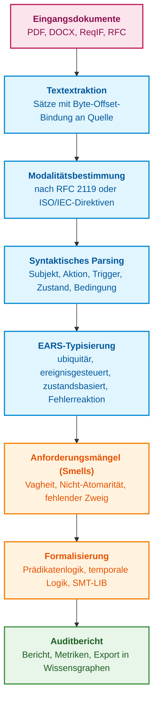
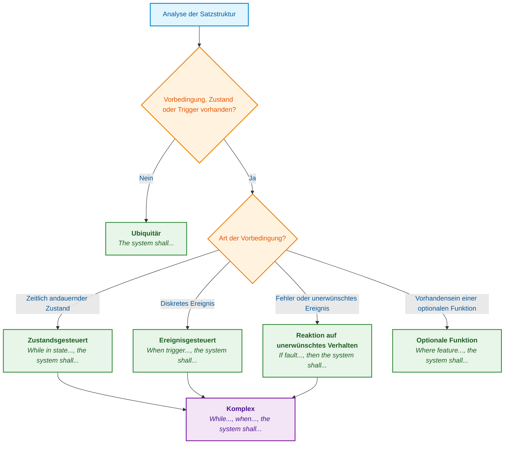
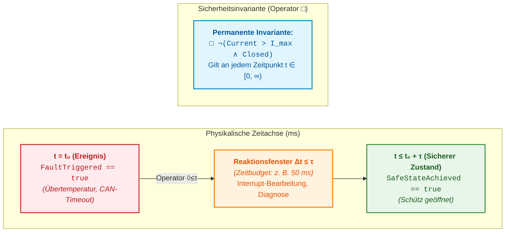
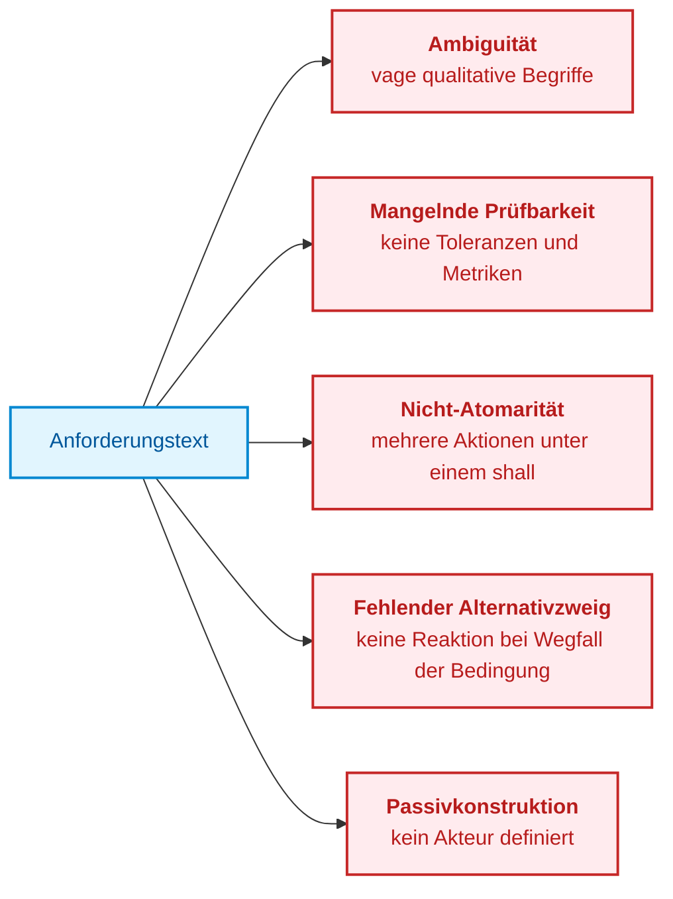
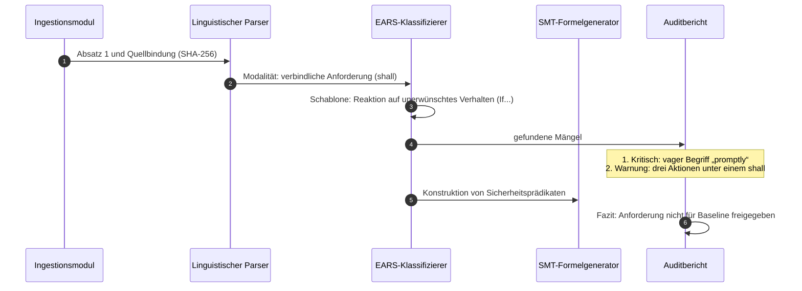

# Kapitel 14. Anforderungsextraktion und Modalitäten: Vom normativen Text zu Invarianten

> **Buch:** [Architektur evidenzbasierter Expertensysteme](README.md) · [Teil III: Wissensakquisition, linguistische Analyse und Eingangsdatenbewertung](part-03-knowledge-engineering-nlp.md)  
> **Vorheriges Kapitel:** [Kapitel 13. Natürliche Sprachvarianz versus Determinismus: Kompilierung der Frageintention](ch13-language-variability-vs-determinism.md)  
> **Nächstes Kapitel:** [Kapitel 15. Wissensextraktion und Aufbau der Wissensbasis: Fakten, Grammatiken und Automaten](ch15-knowledge-extraction-and-kb-construction.md)  
> **Inhaltsverzeichnis:** [README.md](README.md)  
> **Autor:** [Mykola Fedchyk](about-the-author.md)  
> **Niveau:** Fortgeschritten: Systemingenieure, Architekten, Entwickler, V&V-Spezialisten (Verifikation und Validierung)  
> **Lernziele:** Normative Sätze anhand der Konventionen des Quelldokuments von deskriptiven unterscheiden; Anforderungen auf EARS-Schablonen abbilden; Schablonen in Prädikatenlogik, temporale Logik und SMT-LIB-Formeln übersetzen; Widersprüche zwischen Anforderungen mittels SMT-Solver aufdecken; einen prüffähigen Auditbericht zur Anforderungsqualität mit lückenloser Herkunftsnachweis-Bindung erstellen.

## Abstract

Dieses Kapitel untersucht das Problem der automatisierten Erkennung von Anforderungen und deontischen Modalitäten in technischen Spezifikationen, Industriestandards (ISO 26262, DO-178C) und RFCs zur Synthese formaler Invarianten für evidenzbasierte Expertensysteme. Es analysiert die syntaktischen Fallstricke natürlicher Sprache und etabliert einen Algorithmus zur Typisierung von Anforderungen anhand der Grammatikschablonen von EARS (*Easy Approach to Requirements Syntax*). Behandelt wird die Übersetzung formalisierter Anforderungen in Prädikatenlogik erster Stufe, lineare temporale Logik (LTL) und das SMT-LIB-Format zur automatisierten Konsistenzprüfung durch den SMT-Solver Z3, wodurch der deterministische Regelkern des Expertensystems formiert wird. Abschließend werden eine deterministische Pipeline-Implementierung in Go sowie eine durchgängige Engineering-Fallstudie zum Audit von Anforderungen an ein Batteriemanagementsystem (BMS) dargelegt.

Die Entwicklung eines komplexen Systems – vom Steuergerät einer Traktionsbatterie eines Elektrofahrzeugs bis hin zur bordseitigen Flugzeugsoftware – beginnt nicht mit Code, sondern mit Anforderungen. Anforderungen entstammen drei wesentlichen Quellen: internationalen und branchenspezifischen Normen, dem Lastenheft des Auftraggebers sowie der Komponentendokumentation der Hardwarebasis, also Datenblättern von Mikrocontrollern und Listen bekannter Hardware-Fehler (Errata). Spezifikationen liegen häufig als PDF-, DOCX- oder ReqIF-Dateien (*Requirements Interchange Format*) vor [[1]](#src-1). Standards für funktionale Sicherheit wie die ISO 26262 für Straßenfahrzeuge [[2]](#src-2) oder die DO-178C für flugzeuggestützte Software [[3]](#src-3) fordern eine lückenlose Rückverfolgbarkeit (Traceability) jeder einzelnen Anforderung zu Architekturentscheidungen, Quellcode und Verifikationstests.

Alle nachgelagerten Phasen – vom Systementwurf bis zur Zulassung – verlangen mathematische Präzision; die Primärquellen sind jedoch in natürlicher Sprache verfasst: geprägt von vagen Formulierungen, Passivkonstruktionen und Ausnahmeregelungen innerhalb desselben Satzes. Vertraut ein Entwicklungsteam die Analyse derartiger Dokumente einer Vektorähnlichkeitssuche oder einem großen Sprachmodell (*Large Language Model*, LLM) an, treten systematische Fehlerbilder auf: Das Modell verliert den Allquantor („für alle“), übergeht Zeitgrenzen, verwechselt Verbote mit Empfehlungen und kann die vollständige Erfassung aller normativen Klauseln nicht garantieren. Für ein Zertifizierungsaudit ist die Auskunft „die Anforderung ist höchstwahrscheinlich erfüllt“ wertlos. Warum textuelle Ähnlichkeit keineswegs semantischem Verständnis entspricht, wurde in [Kapitel 13](ch13-language-variability-vs-determinism.md) dargelegt.

Daraus resultiert die zentrale Fragestellung dieses Kapitels: **Wie lassen sich Anforderungen in normativen Dokumenten automatisiert identifizieren und in verifizierbare formale Invarianten überführen, ohne den Herkunftsnachweis zur Quelle zu verlieren?** Die Grundthese lautet: Eine Anforderung wird nicht allein durch das Signalwort SHALL konstituiert, sondern durch die Modalität gemäß den Konventionen des konkreten Dokuments, die syntaktische Satzstruktur und operationell prüfbare Parameter. Das Expertensystem behandelt eine Spezifikation wie unkompilierten Quelltext: Es bestimmt deterministisch die Modalität, normalisiert den Satz auf eine Schablone, übersetzt diese in logische Formeln und verifiziert deren Widerspruchsfreiheit; ein Sprachmodell liefert hierbei lediglich Hypothesenkandidaten, die durch deterministischen Host-Code validiert werden.



Dieses Schema strukturiert den Ablauf des Kapitels. Die ersten beiden Schritte entscheiden, ob ein Satz überhaupt normativen Charakter besitzt. Die nachfolgenden zwei Schritte überführen die Anforderung in eine kanonische Form. Die abschließenden drei Schritte prüfen die Spezifikationsqualität, übersetzen die Anforderungen in formale Logik und erzeugen ein prüffähiges Gutachten für Fachexperten.

## 1. Deontische Modalität und Abgrenzungskriterien für normative Anforderungen

Im Lebenszyklus der funktionalen Sicherheit eingebetteter und cyber-physischer Systeme (gemäß ISO 26262-8 und DO-178C Abschnitt 5) muss die Wissensbasis eines Expertensystems zwingend zwischen verbindlichen normativen Vorgaben und rein informativen Ingenieurkommentaren unterscheiden. Werden ungefiltert sämtliche Sätze einer technischen Spezifikation in die formale Regelbasis übernommen, droht epistemische Kontamination: Die Inferenzmaschine interpretiert unverbindliche Empfehlungen oder illustrative Beispiele fälschlich als fundamentale Sicherheitsinvarianten. Dies führt zur kombinatorischen Explosion des Zustandsraums, zu Fehlalarmen oder zur künstlichen Inkonsistenz des Gesamtsystems. Das Fundament der ingenieurmäßigen Anforderungsanalyse bildet daher die mathematische Erfassung der **deontischen Modalität** – der Modallogik von Gebot, Verbot und Erlaubnis.

Ein technisches Dokument besteht keineswegs ausschließlich aus Anforderungen. Es enthält Begründungen von Entwurfsentscheidungen (*rationale*), Anmerkungen, Anwendungsbeispiele und Hinweise zur Benutzerfreundlichkeit. Die Modalität eines Satzes definiert, ob er verpflichtet, verbietet, empfiehlt, erlaubt oder lediglich den Systemkontext beschreibt.

Die Modalität wird maßgeblich durch die redaktionellen Richtlinien des Dokuments bestimmt, wobei unterschiedliche Dokumentenfamilien divergierende Konventionen anwenden. RFC 2119 definiert die Schlüsselwörter für Internetspezifikationen: MUST, SHALL und REQUIRED bezeichnen verbindliche Anforderungen, MUST NOT und SHALL NOT Verbote, SHOULD und RECOMMENDED Empfehlungen, MAY und OPTIONAL Erlaubnisse [[4]](#src-4). RFC 8174 präzisiert, dass diese Wörter nur dann normative Bedeutung besitzen, wenn sie vollständig in Großbuchstaben gesetzt sind [[5]](#src-5). ISO- und IEC-Normen folgen anderen Vorgaben: Die ISO/IEC-Direktiven, Teil 2, legen Verbformen in Kleinbuchstaben fest, wobei *shall* eine Anforderung, *should* eine Empfehlung, *may* eine Erlaubnis, *can* eine Möglichkeit oder Fähigkeit und *must* eine externe Randbedingung bezeichnet, die keine Anforderung des Dokuments selbst darstellt [[6]](#src-6).

Der Klassifikator muss daher stets die Dokumentenkonvention sowie die funktionale Rolle des jeweiligen Abschnitts berücksichtigen. Zwar schreibt RFC 8174 Großschreibung für Schlüsselwörter vor, doch bedeutet das Fehlen eines solchen Markers nicht zwingend, dass der Satz frei von Anforderungen ist. Eine Verpflichtung kann in natürlicher Sprache formuliert oder durch einen Verweis auf einen anderen Normenteil ausgedrückt sein. Daher stellt das Auffinden eines Signalworts zunächst nur einen Modalitätskandidaten dar; Zitate, Beispiele und informative Notizen bedürfen einer gesonderten Verifikation. Eine unbekannte Konvention darf keinesfalls stillschweigend als „rein deskriptiver Satz“ interpretiert werden.

| Normative Verbindlichkeit | Signalwörter nach RFC 2119 und RFC 8174 | Signalwörter nach ISO/IEC-Direktiven | Aktion des Expertensystems |
|---|---|---|---|
| **Verbindliche Anforderung** | MUST, SHALL, REQUIRED | shall | Erzeugt eine verbindliche Invariante; erfordert rückverfolgbare Verifikation |
| **Verbot** | MUST NOT, SHALL NOT | shall not | Erzeugt eine Sicherheitsinvariante „Zustand tritt niemals ein“; plant Negativtests |
| **Empfehlung** | SHOULD, RECOMMENDED | should | Registriert ein Soft-Constraint; Abweichungen erfordern dokumentierte Begründung |
| **Unerwünschte Handlung** | SHOULD NOT, NOT RECOMMENDED | should not | Generiert eine Warnung für das Architektur-Review |
| **Erlaubnis** | MAY, OPTIONAL | may, need not | Erfasst eine optionale Funktion; kein Kriterium zur Ablehnung des Releases |
| **Möglichkeit oder Fähigkeit** | keine | can, cannot | Dokumentiert eine Systemeigenschaft, keine Anforderung |
| **Externe Randbedingung** | keine | must | Hinterlegt eine Umgebungsvorbedingung, z. B. physikalische Gesetze oder Normen |
| **Tatsachenfeststellung** | Kleinbuchstaben, is, will | is, will | Erfasst Kontextinformation; stellt keine Anforderung dar |

Die Gegenüberstellung verdeutlicht, dass identische Wörter in unterschiedlichen Dokumentenkontexten eine grundlegend andere normative Verbindlichkeit besitzen. Folglich speichert das System die Modalität stets zusammen mit dem Bezeichner der Dokumentenkonvention, sodass ein Auditor jederzeit nachvollziehen kann, nach welchen Regeln ein Satz klassifiziert wurde.

### 1.1. Syntaktische Fallstricke und semantische Ambiguität natürlicher Sprache

Das Auffinden des Signalworts SHALL mittels regulärer Ausdrücke deckt nur einen Bruchteil realer Anforderungen ab. Technische Dokumente werden von heterogenen Autoren verfasst – häufig Nicht-Muttersprachlern –, wodurch sich drei charakteristische Fehlermuster wiederholen.

**Passivkonstruktionen ohne Akteur.** Im Satz *„Data shall be validated before transmission“* bleibt undefiniert, welche Komponente für die Prüfung verantwortlich ist: der Sensortreiber, der Kommunikationscontroller oder die Anwendungsebene. Eine Anforderung ohne zugewiesenen Akteur kann keiner Architekturkomponente zugeordnet und somit nicht auf Code-Ebene rückverfolgt werden. Ein syntaktisches Dependenzparsing (wie in [Kapitel 13](ch13-language-variability-vs-determinism.md#31-syntaktisches-dependenzparsing-und-aktantenextraktion) beschrieben) identifiziert das fehlende Subjekt und liefert die formale Grundlage zur Zurückweisung an den Autor.

**Implizite Normativität.** Formulierungen wie *„The ECU is responsible for monitoring battery voltage“* oder *„The firmware needs to reboot if a watchdog timeout occurs“* enthalten kein formales *shall*, stellen inhaltlich jedoch zwingende funktionale Anforderungen dar. Das Expertensystem führt daher ein Verzeichnis quasimodaler Konstruktionen (*is responsible for*, *has to*, *needs to*, *is required to*) und markiert derartige Sätze als Kandidaten für eine manuelle Begutachtung.

**Eingebettete Ausnahmeregelungen.** Der Satz *„The system shall maintain 50 Hz PWM frequency under all load conditions, except during initial power-up calibration where 20 Hz is permitted for a maximum of 200 ms“* vereint eine globale Anforderung, eine Ausnahmebedingung, ein alternatives Systemverhalten und eine Zeitrestriktion. Das Expertensystem muss einen solchen Satz in atomare logische Zweige zerlegen, da die Ausnahmebedingung andernfalls bei der Formalisierung verloren geht.

Modalität und Syntax müssen demnach zwingend gekoppelt analysiert werden: Die Modalität bestimmt, ob eine Verpflichtung vorliegt, während die Syntax aufdeckt, wer wann welche Aktion unter welchen Randbedingungen ausführen muss. Im nächsten Schritt werden die heterogenen Satzstrukturen auf eine standardisierte Grammatik normiert.

## 2. EARS-Schablonen: Strukturelle Standardisierung von Engineering-Anforderungen

Freitext in natürlicher Sprache widersetzt sich direkter logischer Inferenz: Autoren verschachteln Bedingungen, verkomplizieren Satzgefüge und verwischen den Gültigkeitsbereich von Negationen. Versucht ein automatisierter Parser, aus beliebiger Prosa unmittelbar einen abstrakten Syntaxbaum (AST) abzuleiten, übersteigt die Fehlerquote bei der Rollenzuweisung 40 %. Für eine zuverlässige semantische Translation müssen Anforderungen daher zunächst in ein kontrolliertes grammatikalisches Gerüst überführt werden.

Als de-facto-Standard hat sich hierbei der von Alistair Mavin und Kollegen bei Rolls-Royce im Jahr 2009 für Triebwerksregelsysteme entwickelte Ansatz *Easy Approach to Requirements Syntax* (EARS) etabliert [[7]](#src-7). EARS beschränkt Anforderungen auf eine überschaubare Menge standardisierter Schablonen, wobei jede Schablone exakt einem Vorbedingungstyp entspricht.



Der Entscheidungsbaum stellt lediglich zwei Fragen: Enthält der Satz eine Vorbedingung und welcher Art ist diese? Die Antwort bestimmt die Schablone und legt die logische Repräsentation für den nachfolgenden Formalisierungsschritt fest.

**Ubiquitäre Anforderung (*Ubiquitous*):** Gilt permanent, ohne Bindung an Ereignisse oder spezifische Betriebszustände. Schablone: `The <system name> shall <system response>.` Beispiel: *„The CAN controller shall support extended 29-bit identifiers“*.

**Ereignisgesteuerte Anforderung (*Event-driven*):** Definiert die Systemreaktion auf ein diskretes Startereignis. Schablone: `When <trigger>, the <system name> shall <system response>.` Beispiel: *„When the E-STOP button is pressed, the motor driver shall disable gate drive outputs within 5 ms“*.

**Zustandsgesteuerte Anforderung (*State-driven*):** Gilt ausschließlich während der Dauer eines definierten Systemzustands. Schablone: `While <in a specific state>, the <system name> shall <system response>.` Beispiel: *„While in PRE-CHARGE mode, the BMS shall limit the pre-charge resistor current to 10 A“*.

**Reaktion auf unerwünschtes Verhalten (*Unwanted behaviour*):** Beschreibt Maßnahmen bei Fehlfunktionen, Protokollverletzungen oder Grenzwertüberschreitungen. Schablone: `If <trigger>, then the <system name> shall <system response>.` Beispiel: *„If the cell temperature exceeds 65 °C, then the cooling controller shall activate the refrigerant pump at 100% duty cycle“*.

**Optionale Funktion (*Optional feature*):** Greift nur, wenn eine bestimmte Hardwarekomponente oder Lizenz vorhanden ist. Schablone: `Where <feature is included>, the <system name> shall <system response>.` Beispiel: *„Where the hardware watchdog is populated, the CPU supervisor shall toggle the WDI pin every 50 ms“*.

**Komplexe Anforderung (*Complex*):** Kombiniert mehrere Bedingungen, beispielsweise Zustand und Trigger: *„While in CHARGING state, when the charge plug is unlocked, the charger shall open the high-voltage interlock loop within 10 ms“*.

EARS strukturiert Vorbedingungen und Reaktionen, legt jedoch keine eindeutige formale Semantik fest. Eine zustandsbasierte Anforderung kann je nach Vollverb und zeitlichem Kontext eine permanente Invariante, eine begrenzte Übergangszeit oder eine Eintrittsbedingung erfordern. Abweichungen von den EARS-Mustern indizieren Prüfbedarf, stellen jedoch keinen automatischen Beweis für einen Mangel dar. Formale Vorbedingungen, Maßeinheiten und Ausnahmebehandlungen müssen explizit spezifiziert werden.

## 3. Mathematische Formalisierung: Von Schablonen zur formalen Logik

Eine EARS-Schablone strukturiert den Text, versetzt Maschinen jedoch noch nicht in die Lage, Anforderungen automatisiert zu verifizieren. Hierzu muss die Schablone in eine formale Zielsprache übersetzt werden: Prädikatenlogik erster Stufe, temporale Logik oder das standardisierte SMT-LIB-Format für automatische Theorembeweiser und Solver.

### 3.1. Prädikatenlogik erster Stufe

In evidenzbasierten Expertensystemen wird die Anforderung an einen zustandsbehafteten Steuerungsautomaten als strikter Zusicherungskontrakt (*Assume-Guarantee Contract*) über einem endlichen Zustandsraum $\mathcal{S}$, einem Vektor gemessener Eingangssignale $\mathbf{x}\in\mathcal{X}$ und einem Vektor von Steuerausgängen $\mathbf{y}\in\mathcal{Y}$ formalisiert:

```math
\forall s\in\mathcal{S},\ \forall\mathbf{x}\in\mathcal{X}:\quad \Phi_{\mathrm{pre}}(s,\mathbf{x})\Rightarrow\exists s'\in\mathcal{S},\ \exists\mathbf{y}\in\mathcal{Y}:\ \bigl(\Phi_{\mathrm{post}}(s',\mathbf{y})\land\mathcal{T}(s,s')\bigr)
```

Parameter und mathematische Komponenten des Kontrakts:

- $\mathcal{S}$ ist der endliche Raum diskreter Automatenzustände (z. B. $\mathcal{S} = \{\text{INIT}, \text{STANDBY}, \text{CHARGE}, \text{DISCHARGE}, \text{FAULT}\}$);
- $\mathbf{x} \in \mathcal{X} \subseteq \mathbb{R}^n$ ist der Vektor kontinuierlicher und diskreter Telemetriedaten (Zellspannungen, Ströme, Temperaturen, Steuerflags);
- $\mathbf{y} \in \mathcal{Y} \subseteq \mathbb{R}^m$ ist der Vektor aktorischer Stellgrößen (PWM-Tastgrade, Schaltsignale der Relais-Treiber);
- $s, s' \in \mathcal{S}$ bezeichnen den aktuellen und den Folgezustand des Automaten;
- $`\Phi_{\mathrm{pre}}(s,\mathbf{x}): \mathcal{S} \times \mathcal{X} \to \{\text{True}, \text{False}\}`$ ist die prädikative Vorbedingung, die Aktivitätszustand (While), Startereignis (When) und Fehlersignalisierung (If) verknüpft;
- $`\Phi_{\mathrm{post}}(s',\mathbf{y}): \mathcal{S} \times \mathcal{Y} \to \{\text{True}, \text{False}\}`$ ist die prädikative Nachbedingung, die die geforderte Systemreaktion (shall) festlegt;
- $`\mathcal{T}(s,s'): \mathcal{S} \times \mathcal{S} \to \{\text{True}, \text{False}\}`$ ist die Übergangsrelation des Automaten, die zulässige Zustandssprünge sowie das Übergangszeitbudget $`\Delta t \le t_{\mathrm{timeout}}`$ beschränkt.

Praktische Anwendung und Engineering-Entscheidungen:
- **Vollständigkeitsprüfung (Non-blocking):** Der SMT-Solver verifiziert, dass für jede Kombination $(s, \mathbf{x})$, die $\Phi_{\mathrm{pre}}$ erfüllt, mindestens ein gültiger Folgezustand existiert. Wird eine Eingabe $\mathbf{x}^*$ identifiziert, für die kein Übergang möglich ist, wird der Mangel `REQ_DEFECT_DEADLOCK` (Deadlock / Spezifikationslücke) protokolliert.
- **Prüfung auf Determinismus:** Existieren für ein Tupel $(s, \mathbf{x})$ divergierende Folgezustände $(s'_1, \mathbf{y}_1) \ne (s'_2, \mathbf{y}_2)$, meldet der Verifizierer eine Ambiguität `REQ_DEFECT_AMBIGUITY`. Eine nichtdeterministische Spezifikation wird für die Baseline-Freigabe bis zur Korrektur durch den Autor gesperrt.

### 3.2. Lineare temporale Logik (LTL) für Zeitinvarianten

Eingebettete Systeme agieren in der Zeitdimension; statische Prädikate reichen zur Abbildung dynamischen Verhaltens nicht aus. Amir Pnueli etablierte die lineare temporale Logik (*Linear Temporal Logic*, LTL) für den formalen Nachweis von Systemeigenschaften [[8]](#src-8). Darin bezeichnet der Modaloperator $\Box$ „immer (in allen zukünftigen Zuständen)“ und der Operator $\Diamond$ „irgendwann in der Zukunft“. Die metrische temporale Logik (*Metric Temporal Logic*, MTL), die Ron Koymans für Echtzeitanforderungen formulierte, erweitert diese Operatoren um explizite Zeitintervalle, sodass $\Diamond_{\le\tau}$ für „spätestens nach Ablauf der Zeitspanne $\tau$“ steht [[9]](#src-9). Die Signal-Temporallogik (*Signal Temporal Logic*, STL) von Maler und Nickovic überträgt diesen Formalismus auf kontinuierliche physikalische Signale wie Strom oder Temperatur [[10]](#src-10).

In der Praxis dominieren zwei Klassen temporallogischer Eigenschaften. Eine **Sicherheitsinvariante (*Safety Invariant*)** garantiert, dass ein unzulässiger, kritischer Systemzustand zu keinem Zeitpunkt eintritt:

```math
\Box\,\neg\bigl(\mathit{Current}>I_{\max}\land\mathit{ContactorState}=\mathit{CLOSED}\bigr)
```

Parameter und physikalische Dimensionen:

- $\mathit{Current} \in \mathbb{R}_{\ge 0}$ ist der gemessene physikalische Laststrom des Leistungspfads in Ampere ($\text{A}$);
- $`I_{\max} \in \mathbb{R}_{> 0}`$ ist der thermisch zulässige Abschaltstrom in Ampere ($\text{A}$), dimensioniert nach der Stromtragfähigkeit der Stromschiene (z. B. $I_{\max} = 450\,\text{A}$);
- $\mathit{ContactorState} \in \{\mathit{OPEN}, \mathit{CLOSED}\}$ repräsentiert den diskreten Schaltzustand des Hochvoltschützes;
- $\Box$ ist der LTL-Temporaloperator „immer“, der die Gültigkeit der Formel für alle Zeitschritte $t \in [0, \infty)$ einfordert;
- $\neg$ und $\land$ bezeichnen die klassischen logischen Operatoren für Negation und Konjunktion.

Praktische Anwendung und Engineering-Entscheidungen:
- **Hardwarenahes Monitoring:** Diese Bedingung wird durch einen dedizierten Hardware-Supervisor mit einer Abtastrate von mindestens 10 kHz autark vom Lastzustand des Haupt-Mikrocontrollers überwacht.
- **Fail-Safe-Aktion:** Wird $\mathit{Current} > I_{\max}$ bei geschlossenem Schütz ($\mathit{ContactorState} = \mathit{CLOSED}$) detektiert, löst eine Hardwareschaltung innerhalb von $`t_{\mathrm{reaction}} \le 2\,\text{ms}`$ eine pyrotechnische Trennstelle (Pyro-Fuse) aus und schaltet den Hochvoltpfad galvanisch spannungsfrei.

Die **beschränkte Lebendigkeit (*Bounded Liveness*)** fordert dagegen, dass das System nach Auftreten eines Fehlers garantiert innerhalb eines definierten Zeitintervalls in den sicheren Zustand übergeht:

```math
\Box\Bigl(\mathit{FaultTriggered}\Rightarrow\Diamond_{\le\tau}\,\mathit{SafeStateAchieved}\Bigr)
```

Parameter und zeitliche Toleranzen:

- $\mathit{FaultTriggered} \in \{\text{True}, \text{False}\}$ ist ein diskretes Fehlerflag (z. B. Zellübertemperatur $> 60\,^\circ\text{C}$ oder CAN-Kommunikationsausfall);
- $\mathit{SafeStateAchieved} \in \{\text{True}, \text{False}\}$ signalisiert das verifizierte Erreichen des sicheren Zustands (Schütze geöffnet, Traktionspfad spannungsfrei);
- $\tau \in \mathbb{R}_{> 0}$ ist die maximal zulässige Reaktionszeit in Millisekunden ($\text{ms}$), die in Sicherheitsnormen durch das Fehlertoleranzzeitintervall (*Fault Tolerant Time Interval*, FTTI) strikt limitiert ist: $`\tau \le \text{FTTI} - \Delta t_{\mathrm{margin}}`$ (z. B. $\tau = 50\,\text{ms}$ bei $\text{FTTI} = 100\,\text{ms}$);
- $`\Diamond_{\le\tau}`$ ist der metrische MTL-Operator „irgendwann innerhalb der nächsten $\tau$ Zeiteinheiten“.

Praktische Anwendung und Engineering-Entscheidungen:
- **HIL-Prüfstandsverifikation:** Im Hardware-in-the-Loop-Test (HIL) wird durch Fehlerinjektion die exakte Latenz $`\Delta t_{\mathrm{meas}} = t_{\mathrm{safe}} - t_{\mathrm{fault}}`$ ermittelt.
- **Abnahmekriterium:** Ein Test gilt nur dann als bestanden, wenn $`\max(\Delta t_{\mathrm{meas}}) \le \tau`$. Überschreitet auch nur ein Durchlauf diese Grenze ($`\Delta t_{\mathrm{meas}} > \tau`$), emittiert das Testsystem den Fehler `E_FTTI_TIMEOUT_BREACH`, und die Anforderung wird als auf der gewählten Hardwareplattform nicht einhaltbar klassifiziert.



> [!TIP] Die Falle der vacuosen Wahrheit (Vacuous Truth)
> In der formalen Logik ist die Implikation $A \Rightarrow B$ trivial wahr, wenn die Prämisse $A = \text{False}$ ist (aus Falschem folgt Beliebiges). Wurde in einem Testlauf die Vorbedingung $\mathit{FaultTriggered}$ durch den Teststand niemals stimuliert (weil der Prüfadapter beispielsweise einen Temperatursprung über 100 °C nicht simulieren konnte), meldet ein unbedarfter Verifizierer: *„Anforderung zu 100 % erfolgreich verifiziert!“*. In der Realität wurde der Fehlerbehandlungscode kein einziges Mal ausgeführt. Zur Verhinderung vacuoser Verifikationen muss die Audit-Pipeline jede Implikation mit einer Erreichbarkeitsprüfung der Prämisse koppeln: Es muss nachgewiesen sein, dass $`\Diamond\,\Phi_{\mathrm{pre}}`$ in mindestens einem Testlauf erfüllt war.

Auf dieser Basis lassen sich die EARS-Muster in logische Ausdrücke überführen. Die nachfolgende Tabelle veranschaulicht didaktische Interpretationen: Die Wahl des Zeitmodells, der Schrittweite, des Nullpunkts und des Quantorenbereichs bleibt stets eine explizite Modellierungsentscheidung.

| EARS-Schablone | Beispiel | Logische Form |
|---|---|---|
| Ubiquitär | Der CAN-Controller unterstützt 29-Bit-Identifier | $`\Box\,\mathit{Supports}(\mathit{CAN},\mathit{Ext29})`$ |
| Ereignisgesteuert | Nach Betätigung des Not-Aus schaltet der Treiber die Ausgänge innerhalb von 5 ms ab | $`\Box\bigl(\mathit{Pressed}\Rightarrow\Diamond_{\le5\,\mathrm{ms}}\,\mathit{Disabled}\bigr)`$ |
| Zustandsbasiert | Im PRE-CHARGE-Modus übersteigt der Strom nicht 10 A | $`\Box\bigl(\mathit{State}=\mathit{PRECHARGE}\Rightarrow\mathit{Current}\le10\,\mathrm{A}\bigr)`$ |
| Reaktion auf unerwünschtes Verhalten | Bei Temperaturen über 65 °C läuft die Pumpe mit 100 % Tastgrad | $`\Box\bigl(\mathit{Temp}>65\Rightarrow\mathit{PumpDuty}=1{,}0\bigr)`$ |
| Optionale Funktion | Ist ein Watchdog vorhanden, wechselt das WDI-Signal alle 50 ms den Pegel | $`\mathit{HasWatchdog}\Rightarrow\Box\,(\mathit{ToggleInterval}=50\,\mathrm{ms})`$ |

Die Tabelle illustriert exemplarische Abbildungen und keinen universellen Compiler. Der Verifizierungsingenieur muss Quantoren, Zeitgrenzen, Gleichzeitigkeit, Rücksetzbedingungen und Signalzuordnungen gesondert prüfen. Es muss strikt zwischen der bloßen Existenz einer zulässigen Systemreaktion und der Einhaltung der Anforderung durch sämtliche Ausführungspfade der Implementierung differenziert werden.

### 3.3. Automatisierte Konsistenzprüfung von Anforderungen mittels SMT-Solver

Formeln verifizieren sich nicht selbst; diese Aufgabe übernehmen **SMT-Solver** (*Satisfiability Modulo Theories*). Ein SMT-Solver prüft, ob eine Belegung von Variablen existiert, die ein System von Formeln unter Berücksichtigung von Hintergrundtheorien (wie linearer Arithmetik, Bitvektoren und Datentypen) erfüllt. Ein weit verbreiteter Solver ist Z3 von Leonardo de Moura und Nikolaj Bjørner [[11]](#src-11); als standardisierte Eingabesprache dient SMT-LIB [[12]](#src-12).

Für ein Expertensystem besteht der primäre Nutzen des Solvers im automatisierten Nachweis von Widersprüchen (*Inconsistencies*) zwischen Anforderungen. Betrachten wir zwei Anforderungen an ein Batteriemanagementsystem (*Battery Management System*, BMS): REQ-BMS-042 verlangt, dass bei einer Zelltemperatur über 60 °C das Hauptschütz geöffnet werden muss. REQ-BMS-077 fordert, dass im Ladebetrieb (*CHARGE*) das Schütz geschlossen sein muss. Isoliert betrachtet sind beide Anforderungen plausibel. Das folgende SMT-LIB-Modell prüft, ob beide Anforderungen gleichzeitig erfüllbar sind, wenn im Ladebetrieb eine Überhitzung auftritt. Jede Assertion wird benannt, damit der Solver im Konfliktfall die Ursachen benennen kann.

<details>
<summary>Formales SMT-LIB-Modell</summary>

```lisp
(set-option :produce-unsat-cores true)
(declare-datatype BmsState ((INIT) (STANDBY) (CHARGE) (DISCHARGE) (FAULT)))
(declare-const state BmsState)
(declare-const cell_temp_c Real)
(declare-const contactor_closed Bool)

; REQ-BMS-042 (If): Übersteigt die Zelltemperatur 60 °C, öffnet das BMS das Schütz.
(assert (! (=> (> cell_temp_c 60.0) (not contactor_closed)) :named REQ_BMS_042))

; REQ-BMS-077 (While): Im Zustand CHARGE hält das BMS das Schütz geschlossen.
(assert (! (=> (= state CHARGE) contactor_closed) :named REQ_BMS_077))

; Szenario: Überhitzung während des Ladevorgangs.
(assert (! (and (= state CHARGE) (> cell_temp_c 60.0)) :named SCENARIO))

(check-sat)
(get-unsat-core)
```

</details>

Das Skript kann über das Python-Paket `z3-solver` (`pip install z3-solver`) mittels der Funktion `Z3_eval_smtlib2_string` ausgeführt werden. Der Solver Z3 (Version 5.1.0) liefert:

<details>
<summary>Beispieldaten oder Ausführungsergebnis</summary>

```text
unsat
(REQ_BMS_042 REQ_BMS_077 SCENARIO)
```

</details>

Die Antwort `unsat` belegt die logische Unverträglichkeit der formalisierten Aussagen im definierten Szenario. Der *Unsat Core* liefert eine hinreichende (nicht zwingend minimale) Teilmenge widersprüchlicher Aussagen. Das Ergebnis entscheidet nicht autonom, welche Anforderung modifiziert werden muss. Die Ergänzung der Ladebedingung um die Klausel `(<= cell_temp_c 60.0)` stellt eine fachliche Lösung dar, die der Freigabe durch den Systemverantwortlichen bedarf. Ein nach Korrektur erzieltes `sat` beweist die Erfüllbarkeit des Modells, garantiert jedoch keineswegs die funktionale Gesamtsicherheit des physischen Produkts. Ein Timeout oder der Status `unknown` darf niemals mit `sat` oder `unsat` gleichgesetzt werden.

Dieses Beispiel offenbart die Grenzen formaler Methoden: Der Solver identifiziert Widersprüche ausschließlich innerhalb des formalisierten Modells und exakt so, wie der Ingenieur die Abbildung vorgenommen hat. Korrespondiert die Variable `cell_temp_c` fehlerhaft mit dem physikalischen Sensorregister, bleibt dies für den Solver unsichtbar. Die Formalisierung muss daher selbst einem Peer-Review unterzogen werden; der Beweiswert entsteht erst im Verbund mit dem Herkunftsnachweis über Autor, Modellversion und Anforderungsstand.

## 4. Metriken und automatisierte Qualitätsprüfung von Anforderungen (Requirements Smells)

Eine Formalisierung setzt qualitativ hochwertige Anforderungen voraus. Der Standard ISO/IEC/IEEE 29148:2018 definiert die Qualitätsmerkmale professioneller Anforderungen: Sie müssen notwendig, eindeutig, vollständig, atomar, realisierbar, prüfbar und korrekt sein [[13]](#src-13). Henning Femmer und Kollegen schlugen vor, Verstöße gegen diese Kriterien automatisiert als Spezifikationsmängel (*Requirements Smells*) zu detektieren: subjektive Formulierungen, vage Adverbien und Adjektive, Schlupflöcher, offene unprüfbare Begriffe, Superlative, uneindeutige Negationen, unklare Pronomina und unvollständige Verweise [[14]](#src-14).



Das Diagramm klassifiziert Mängel nach ihren technischen Konsequenzen: Eine ambige Anforderung wird von Entwicklern unterschiedlich interpretiert, eine unprüfbare lässt sich nicht durch Tests verifizieren, eine nicht-atomare verhindert eine 1:1-Rückverfolgbarkeit auf Testfälle, und ein fehlender Alternativzweig überlässt das Systemverhalten nach einer Störung der Willkür des Programmierers.

**Ambiguität und vage Begriffe.** Wörter wie *fast*, *promptly*, *immediately*, *as soon as possible*, *user-friendly*, *robust*, *adequate*, *approximately* oder *etc.* besitzen keine physikalische Messgröße. Das Expertensystem führt ein Lexikon derartiger Begriffe und fordert quantitative Präzisierungen: Statt *promptly* muss eine Zeitgrenze (z. B. $t\le15\,\text{ms}$), statt *approximately* müssen Nennwert und Toleranzband definiert werden.

**Nicht-Atomarität.** Der Satz *„The gateway shall parse the incoming CAN message, verify the CRC, update the internal state machine, and transmit an acknowledgment frame“* bündelt vier eigenständige Operationen. Schlägt lediglich die CRC-Prüfung fehl, verharrt der Anforderungsstatus in einem undefinierten Zustand („teilweise erfüllt“). Für die lückenlose Nachverfolgbarkeit nach ISO 26262 sind separate Anforderungen mit jeweils eigenen Testfällen zwingend erforderlich.

**Fehlender Alternativzweig.** Die Anforderung *„If the battery temperature exceeds 55 °C, the cooling fan shall turn ON“* spezifiziert nicht, wann der Lüfter wieder deaktiviert wird. Erfolgt die Abschaltung bei exakt denselben 55 °C, führt thermisches Rauschen an der Schaltschwelle zu hochfrequentem Flattern des Relais (*chattering*). Die regelungstechnische Lösung verlangt eine Schalthysterese: Einschalten bei $`T>55\,^{\circ}\mathrm{C}`$, Ausschalten erst bei $`T\le48\,^{\circ}\mathrm{C}`$. Ohne korrespondierende Gegenanforderung wählt der Entwickler Schwellwerte nach eigenem Ermessen, was die funktionale Verifikation untergräbt.

**Passivkonstruktionen ohne Akteur.** Wie in Abschnitt 1 dargelegt, kann eine Anforderung ohne explizites grammatikalisches Subjekt keiner Architekturkomponente zugewiesen werden. Das Expertensystem markiert solche Sätze und erzwingt die Benennung der zuständigen Komponente.

Das Qualitätsaudit generiert entweder einen bereinigten Kandidaten für die Formalisierung oder einen Mängelbericht an den Autor. Anzeichen mehrerer Aktionen, eines fehlenden Zweigs oder unbestimmter Fristen stellen Prüfindikatoren dar, keine universellen Fehler: Mehrere Aktionen können eine unteilbare Transaktion bilden, und unerwähntes Verhalten kann bewusst undefiniert bleiben. Die Freigabe für eine Baseline setzt fachliche Begutachtung voraus und nicht allein das Fehlen detektierter Smells.

## 5. Software-Implementierung: Eine deterministische Analyse-Pipeline in Go

Die vorangegangenen Abschnitte behandelten die Analyseschritte isoliert. Das folgende Programm führt sie zu einer deterministischen Pipeline zusammen: Es bestimmt die Modalität anhand der Dokumentenkonvention, parst den Satz gegen EARS-Schablonen und prüft auf vage Begriffe, Nicht-Atomarität, generische Subjekte sowie fehlende Reaktionsfristen. Die Implementierung stützt sich ausschließlich auf die Go-Standardbibliothek und wird mittels `go run main.go` ausgeführt.

<details>
<summary>Go-Beispiel: Deterministische Pipeline für das Anforderungs-Audit</summary>

```go
package main

import (
	"crypto/sha256"
	"fmt"
	"regexp"
	"strconv"
	"strings"
)

// Convention definiert die Formatierungsregeln des Quelldokuments.
type Convention int

const (
	RFC2119       Convention = iota // BCP 14: normativ nur Wörter in GROSSBUCHSTABEN (RFC 8174)
	ISODirectives                   // ISO/IEC Directives, Part 2: Verbformen in Kleinbuchstaben
)

type Modality string

const (
	Requirement        Modality = "REQUIREMENT"
	Prohibition        Modality = "PROHIBITION"
	Recommendation     Modality = "RECOMMENDATION"
	NotRecommended     Modality = "NOT_RECOMMENDED"
	Permission         Modality = "PERMISSION"
	Capability         Modality = "CAPABILITY"          // ISO: can, cannot
	ExternalConstraint Modality = "EXTERNAL_CONSTRAINT" // ISO: must
	Statement          Modality = "STATEMENT"
	UnknownConvention  Modality = "UNKNOWN_CONVENTION"
)

type rule struct {
	re *regexp.Regexp
	m  Modality
}

// Verneinende Formen werden vor bejahenden geprüft.
var rules = map[Convention][]rule{
	RFC2119: {
		{regexp.MustCompile(`\b(MUST NOT|SHALL NOT)\b`), Prohibition},
		{regexp.MustCompile(`\b(MUST|SHALL|REQUIRED)\b`), Requirement},
		{regexp.MustCompile(`\b(SHOULD NOT|NOT RECOMMENDED)\b`), NotRecommended},
		{regexp.MustCompile(`\b(SHOULD|RECOMMENDED)\b`), Recommendation},
		{regexp.MustCompile(`\b(MAY|OPTIONAL)\b`), Permission},
	},
	ISODirectives: {
		{regexp.MustCompile(`(?i)\bshall not\b`), Prohibition},
		{regexp.MustCompile(`(?i)\bshall\b`), Requirement},
		{regexp.MustCompile(`(?i)\bshould not\b`), NotRecommended},
		{regexp.MustCompile(`(?i)\bshould\b`), Recommendation},
		{regexp.MustCompile(`(?i)\bmay\b`), Permission},
		{regexp.MustCompile(`(?i)\bmust\b`), ExternalConstraint},
		{regexp.MustCompile(`(?i)\bcan(not)?\b`), Capability},
	},
}

func ClassifyModality(text string, c Convention) Modality {
	patterns, known := rules[c]
	if !known {
		return UnknownConvention
	}
	for _, r := range patterns {
		if r.re.MatchString(text) {
			return r.m
		}
	}
	return Statement
}

type EARS string

// EARS-Schablonen (Mavin et al., 2009); erster Treffer gewinnt.
var earsPatterns = []struct {
	kind EARS
	re   *regexp.Regexp
}{
	{"COMPLEX", regexp.MustCompile(`(?i)^While (?P<state>.+?), when (?P<trigger>.+?), the (?P<subject>[\w -]+?) shall (?P<action>.+?)\.?$`)},
	{"UNWANTED_BEHAVIOUR", regexp.MustCompile(`(?i)^If (?P<trigger>.+?), then the (?P<subject>[\w -]+?) shall (?P<action>.+?)\.?$`)},
	{"STATE_DRIVEN", regexp.MustCompile(`(?i)^While (?P<state>.+?), the (?P<subject>[\w -]+?) shall (?P<action>.+?)\.?$`)},
	{"EVENT_DRIVEN", regexp.MustCompile(`(?i)^When (?P<trigger>.+?), the (?P<subject>[\w -]+?) shall (?P<action>.+?)\.?$`)},
	{"OPTIONAL_FEATURE", regexp.MustCompile(`(?i)^Where (?P<feature>.+?), the (?P<subject>[\w -]+?) shall (?P<action>.+?)\.?$`)},
	{"UBIQUITOUS", regexp.MustCompile(`(?i)^The (?P<subject>[\w -]+?) shall (?P<action>.+?)\.?$`)},
}

func ParseEARS(text string) (EARS, map[string]string) {
	for _, p := range earsPatterns {
		m := p.re.FindStringSubmatch(text)
		if m == nil {
			continue
		}
		g := map[string]string{}
		for i, name := range p.re.SubexpNames() {
			if name != "" {
				g[name] = m[i]
			}
		}
		return p.kind, g
	}
	return "NON_CONFORMANT", nil
}

var (
	reTiming   = regexp.MustCompile(`(?i)\b(?:within|no later than|in less than)\s+(\d+(?:\.\d+)?)\s*(ms|s)\b`)
	reVague    = regexp.MustCompile(`(?i)\b(promptly|quickly|as soon as possible|user[- ]friendly|robust|adequate|sufficient(?:ly)?|approximately|etc)\b`)
	reTwoVerbs = regexp.MustCompile(`(?i)\band (?:then )?(open|close|set|send|transmit|notify|flash|update|verify|validate|disable|enable|activate|trigger|log|store)\b`)
)

type Finding struct{ Severity, Code, Detail string }

func Audit(text string, c Convention) (Modality, EARS, float64, []Finding) {
	mod := ClassifyModality(text, c)
	if mod == UnknownConvention {
		return mod, "UNASSESSED", 0, []Finding{{"CRITICAL", "UNKNOWN_CONVENTION", "document convention is not defined"}}
	}
	if mod != Requirement && mod != Prohibition {
		return mod, "", 0, nil // Satz wird nicht als Anforderung geprüft
	}
	kind, g := ParseEARS(text)
	var f []Finding
	if kind == "NON_CONFORMANT" {
		f = append(f, Finding{"CRITICAL", "NON_CONFORMANT_EARS", "no EARS template matches"})
	}
	if w := reVague.FindString(text); w != "" {
		f = append(f, Finding{"CRITICAL", "VAGUE_TERM", fmt.Sprintf("%q is not objectively verifiable", w)})
	}
	if v := reTwoVerbs.FindStringSubmatch(g["action"]); v != nil {
		f = append(f, Finding{"WARNING", "NON_ATOMIC", fmt.Sprintf("second action %q under one shall", v[1])})
	}
	if s := strings.ToLower(g["subject"]); s == "system" || s == "software" {
		f = append(f, Finding{"WARNING", "GENERIC_SUBJECT", fmt.Sprintf("subject %q names no component", s)})
	}
	var ms float64
	if t := reTiming.FindStringSubmatch(g["action"]); t != nil {
		ms, _ = strconv.ParseFloat(t[1], 64)
		if strings.EqualFold(t[2], "s") {
			ms *= 1000
		}
	} else if kind == "EVENT_DRIVEN" || kind == "UNWANTED_BEHAVIOUR" {
		f = append(f, Finding{"CRITICAL", "MISSING_TIME_BOUND", "reaction without a deadline"})
	}
	return mod, kind, ms, f
}

func main() {
	samples := []struct {
		id   string
		conv Convention
		text string
	}{
		{"REQ-1", ISODirectives, "When the cell temperature exceeds 60 °C, the BMS shall open the main contactor within 100 ms."},
		{"REQ-2", ISODirectives, "The system shall promptly validate incoming CAN messages and flash the status LED."},
		{"REQ-3", ISODirectives, "If the CAN bus is lost, then the gateway shall enter the SAFE state."},
		{"REQ-4", ISODirectives, "The installer must follow local electrical codes."},
		{"REQ-5", RFC2119, "The client should retry the connection."},
	}
	for _, s := range samples {
		mod, kind, ms, findings := Audit(s.text, s.conv)
		sum := sha256.Sum256([]byte(s.text))
		if kind == "" {
			fmt.Printf("%s sha256:%x %s (not audited as a requirement)\n", s.id, sum[:4], mod)
			continue
		}
		fmt.Printf("%s sha256:%x %s %s deadline=%gms parser_checks_passed=%v\n",
			s.id, sum[:4], mod, kind, ms, !hasCritical(findings))
		for _, f := range findings {
			fmt.Printf("    [%s] %s: %s\n", f.Severity, f.Code, f.Detail)
		}
	}
}

func hasCritical(fs []Finding) bool {
	for _, f := range fs {
		if f.Severity == "CRITICAL" {
			return true
		}
	}
	return false
}
```

Die Negativtests in `audit_test.go` verifizieren den Gültigkeitsbereich von Reaktionsfristen sowie die Erkennung unbekannter Konventionen; Aufruf: `go test -v main.go audit_test.go`.

```go
package main

import "testing"

func TestDeadlineScopeAndConvention(testCase *testing.T) {
	text := "When the input arrives within 2 s, the gateway shall respond within 100 ms."
	_, _, deadline, findings := Audit(text, ISODirectives)
	if deadline != 100 || hasCritical(findings) {
		testCase.Fatalf("trigger time became action deadline: %g %v", deadline, findings)
	}
	text = "When the input arrives within 2 s, the gateway shall respond."
	_, _, deadline, findings = Audit(text, ISODirectives)
	if deadline != 0 || !hasCritical(findings) {
		testCase.Fatal("trigger time concealed missing response deadline")
	}
	modality, _, _, findings := Audit("The gateway shall respond.", Convention(99))
	if modality != UnknownConvention || !hasCritical(findings) {
		testCase.Fatal("unknown convention silently accepted")
	}
	if ClassifyModality("The client MUST NOT retry.", RFC2119) != Prohibition {
		testCase.Fatal("negative normative marker lost")
	}
}
```

Ausgabe des Programms:

```text
REQ-1 sha256:0d8de9d2 REQUIREMENT EVENT_DRIVEN deadline=100ms parser_checks_passed=true
REQ-2 sha256:96ae8a8f REQUIREMENT UBIQUITOUS deadline=0ms parser_checks_passed=false
    [CRITICAL] VAGUE_TERM: "promptly" is not objectively verifiable
    [WARNING] NON_ATOMIC: second action "flash" under one shall
    [WARNING] GENERIC_SUBJECT: subject "system" names no component
REQ-3 sha256:7ba442f9 REQUIREMENT UNWANTED_BEHAVIOUR deadline=0ms parser_checks_passed=false
    [CRITICAL] MISSING_TIME_BOUND: reaction without a deadline
REQ-4 sha256:611be070 EXTERNAL_CONSTRAINT (not audited as a requirement)
REQ-5 sha256:cdf96e2a STATEMENT (not audited as a requirement)
```

</details>

Die Programmausgabe illustriert die Wirkungsweise der implementierten Heuristiken. REQ-1 weist eine erkannte ereignisgesteuerte Struktur mit einer Frist von 100 ms auf, stellt jedoch noch keine formal freigegebene Anforderung dar. Bei REQ-2 schlagen die Mängelprüfungen für *promptly*, Mehrfachaktionen und die generische Komponentenbezeichnung an. Für REQ-3 meldet die Pipeline das Fehlen einer Reaktionsfrist. REQ-4 wird gemäß den ISO/IEC-Direktiven korrekt als externe Randbedingung identifiziert. In REQ-5 wird das kleingeschriebene *should* gemäß RFC 8174 nicht als normative Vorgabe interpretiert; der normative Charakter des Gesamtsatzes bedarf der Kontextprüfung. Der vorangestellte SHA-256-Hash bindet das Prüfergebnis an den exakten Wortlaut, liefert jedoch keinen Beweis für die inhaltliche Richtigkeit der Klassifikation.

Das Flag `parser_checks_passed` belegt lediglich das Passieren der implementierten Heuristiken, nicht die Reife für eine freigegebene Anforderungs-Baseline. `STATEMENT` signalisiert im Code das Fehlen eines erkannten Schlüsselworts, nicht die bewiesene Absenz von Normativität. Reguläre Ausdrücke können Modalitätsbereiche, Zitate, multiple Fristen oder die Semantik von Begriffen wie „sofort“ nicht auflösen. Zeitgrenzen, Zahlenwerte und Operatoren müssen in einer Zwischenrepräsentation mit eigenem Quellnachweis persistiert werden; geringe Klassifikationssicherheit erfordert ein Review durch den Fachexperten. Keine Häufung erfolgreicher syntaktischer Prüfungen ersetzt die fachliche Freigabe.

## 6. Praxis-Fallstudie: Audit eines Batteriemanagementsystems (BMS) nach ISO 26262

Betrachten wir einen Auszug aus einem Lastenheft für ein Traktionsbatterie-Managementsystem mit dem Sicherheitsintegritätslevel ASIL C nach ISO 26262.

<details>
<summary>Beispieldaten oder Ausführungsergebnis</summary>

```text
Document: SRS_HV_Battery_Management_v2.4.docx
Section: 5.3 Safety Mechanisms and Thermal Runaway Prevention

Paragraph 1:
"If an over-temperature condition (cell temperature > 60°C) is detected by the analog front-end,
the BMS controller shall promptly open the pyrotechnic switch, set the fault register to 0xEF,
and notify the vehicle VCU via CAN message within 50 ms."

Paragraph 2:
"The battery status should be robust and user-friendly under normal driving states."
```

</details>

Der erste Absatz stellt eine verbindliche Anforderung dar, der zweite eine vage Empfehlung mit unpräzisen Begriffen. Das nachfolgende Sequenzdiagramm illustriert den Durchlauf des ersten Absatzes durch die Audit-Pipeline.



Das Audit liefert vier Kernbefunde:

1. **Quellenbindung.** Das Prüfergebnis referenziert die Datei `SRS_HV_Battery_Management_v2.4.docx`, deren SHA-256-Prüfsumme, Abschnitt 5.3 und Absatz 1.
2. **Dekomposition.** Die Vorbedingung umfasst eine Zelltemperatur über 60 °C sowie deren messtechnische Erfassung. Die geforderten Aktionen lauten: Trennschalter öffnen, Registerwert 0xEF setzen, Fahrzeugsteuergerät benachrichtigen. Der Wirkungsbereich von `within 50 ms` ist ambig: Die Frist kann sich ausschließlich auf die CAN-Nachricht oder auf die gesamte Aktionskette beziehen. Der Parser darf diese Entscheidung nicht eigenmächtig treffen.
3. **Audit-Fazit.** Fristen, Referenzzeitpunkte und Abhängigkeiten zwischen den Teilaktionen müssen präzisiert werden. ISO 26262 definiert das Fehlertoleranzzeitintervall (*Fault Tolerant Time Interval*, FTTI) [[15]](#src-15); der Nachweis einer ausreichenden Reaktionszeit verlangt eine Gefahren- und Risikoanalyse sowie die Berücksichtigung von Sensor- und Aktorverzögerungen. Die syntaktische Prüfung allein erbringt keinen ASIL-C-Konformitätsnachweis.
4. **Korrekturvorschlag.** Der Autor muss den Gültigkeitsbereich der 50-ms-Frist bestätigen und Zeitbudgets für die übrigen Aktionen festlegen. Bis zu dieser Bestätigung verbleibt die Anforderung im Entwurfsstatus. Bei einer Aufspaltung müssen der ursprüngliche Erkennungstrigger, die Schreibaktion (statt einer angenommenen Zustandshaltung) und unbekannte Parameter exakt erhalten bleiben; fiktive Werte wie 10 ms oder Nachrichtenkennungen dürfen nicht hinzuerfunden werden. Eine Dekomposition ist erst zulässig, wenn sichergestellt ist, dass transaktionale und temporale Bindungen nicht verloren gehen.

Für Continuous-Integration-Pipelines wird das Auditergebnis in ein maschinenlesbares JSON-Format serialisiert. Der folgende Auszug zeigt den Aufbau; Statistikfelder sind mit Beispieldaten belegt.

<details>
<summary>Strukturierte JSON-Daten</summary>

```json
{
  "audit_run_id": "audit-run-2026-09-20-0042",
  "source_document": {
    "filename": "SRS_HV_Battery_Management_v2.4.docx",
    "hash_sha256": "8f4c2e17a3b94091d32a0fbc556281e0129a00b21a8f902345bc7981ef40a012",
    "section": "5.3 Safety Mechanisms and Thermal Runaway Prevention"
  },
  "verdict": "REJECTED_FOR_BASELINE",
  "statistics": {
    "total_sentences_scanned": 142,
    "requirements_detected": 38,
    "ears_compliant_ratio": 0.763,
    "critical_smells_count": 3,
    "warnings_count": 8
  },
  "findings": [
    {
      "requirement_id": "DRAFT_REQ_042",
      "modality": "REQUIREMENT",
      "convention": "ISO_IEC_DIRECTIVES_PART2",
      "ears_pattern": "UNWANTED_BEHAVIOUR",
      "formal_invariants": {
        "fault_condition": "cell_temperature > 60.0",
        "action_predicates": [
          "open(pyro_switch)",
          "set(fault_register, 0xEF)",
          "broadcast_can(VCU_ALARM)"
        ]
      },
      "blocking_issues": [
        {
          "code": "VAGUE_TERM",
          "severity": "CRITICAL",
          "target_token": "promptly",
          "explanation": "A qualitative time bound cannot be verified against the FTTI."
        },
        {
          "code": "NON_ATOMIC",
          "severity": "WARNING",
          "target_token": "and",
          "explanation": "Three actions need separate traceability identifiers."
        }
      ]
    }
  ]
}
```

</details>

Die JSON-Struktur spiegelt die Pipeline-Schritte exakt wider: Quelldokument mit kryptografischem Hash, Modalität mit Dokumentenkonvention, EARS-Muster, formale Prädikate sowie Mängel, die eine Übernahme in die Baseline blockieren. Ein derartiges Artefakt lässt sich programmatisch weiterverarbeiten, während Prüfer die Herleitung jeder Entscheidung bis zum Quelltext auditieren können.

## 7. Intermediäre Repräsentation von Anforderungen (IR): Vereinheitlichter Verifizierer-Vertrag

Der direkte Übergang vom Satz zur logischen Formel birgt das Risiko stillschweigend hinzugedichteter Annahmen. Eine intermediäre Repräsentation (*Intermediate Representation*, IR) macht jede Entwurfsentscheidung explizit sichtbar, bevor der Solver aufgerufen wird. Für eine präzise Formalisierung genügen Zahlenwerte allein nicht; erforderlich sind semantische Rollen und Quelltextpositionen der Prämissen.

| IR-Felder | Verifikation vor der Kompilierung |
|---|---|
| Akteur, Aktion, Objekt | Zulässige Typen und Identifikatoren; Textfragment für jede semantische Rolle |
| Modalität, Konvention, Abschnittsrolle | Gebot, Verbot, Empfehlung oder Erlaubnis; Zitate werden nicht automatisch zu Anforderungen |
| Vorbedingung, Trigger, Ausnahme | Getrennte Bedingungsbäume; definierter Skopus jeder Bedingung |
| Quantor und Negation | „für alle“, „existiert“, „nicht“ mit explizit festgelegtem Wirkungsbereich |
| Operator, Zahlenwert, Einheit | Striktheit von Ungleichungen, Dimensionen, Originalschreibweise und Konvertierungsregeln |
| Zeitursprung, Frist, Aktionsfolge | Zeit der Vorbedingung wird nicht zur Reaktionsfrist; unbekannte Reihenfolge bleibt unbestimmt |
| Quelle, Revisionsstand, Status | Byte-Offsets, Anwendungsbereich und explizite Freigabe der Interpretation |

Der Compiler arbeitet **partiell**: Er verarbeitet ausschließlich unterstützte Formulierungen und generiert für alle übrigen offene Verifikationsverpflichtungen. Ist unklar, ob eine Frist von 50 ms sämtliche Aktionen umfasst, erzeugt der Compiler keine willkürliche temporale Formel. Das beschränkte Decodieren aus [Kapitel 13](ch13-language-variability-vs-determinism.md) garantiert zwar die grammatikalische Struktur des IR-Kandidaten, vermag jedoch fachliche Lücken nicht zu schließen.

Für Zahlenwerte und Einheiten eignen sich Bibliotheken wie Pint [[16]](#src-16) mit domänenspezifischen Validierungstests. Die Umrechnung von Grad Celsius in Kelvin erfordert einen Offset und nicht nur einen Skalierungsfaktor; *Octet* bezeichnet exakt acht Bit, während die Bitbreite von *Byte* plattformabhängig definiert sein kann. Das Dezimalpräfix Mega (M) darf nicht unbesehen durch das Binärpräfix Mebi (Mi) ersetzt werden. „Kleiner als“ und „nicht größer als“ dürfen nicht auf denselben Operator abgebildet werden. Die normalisierte Größe wird stets zusammen mit der ursprünglichen Notation und dem Quelltextfragment gespeichert.

Z3 verifiziert das formale Modell, nicht den Prosatext. Für eine gewählte Logik-Teilmenge empfiehlt sich ein Kreuzvergleich von Z3 mit cvc5 [[17]](#src-17), indem SMT-LIB-Logik, Versionen, Ressourcenlimits und Soll-Ergebnisse fixiert werden. Die Übereinstimmung zweier Solver heilt jedoch keine fehlerhafte Formalisierung. Erforderlich sind dedizierte Testfälle für unerreichbare Trigger, Grenzzeitwerte, Widersprüche und unvollständig belegte IR-Felder.

Das Ergebnis dieser Zwischenrepräsentation ist ein verifizierbarer Formelkandidat mit transparenten Grenzen. Exakt dieses Artefakt kann – verknüpft mit Herkunftsnachweisen und Genehmigungsvermerken – in die Konstruktion der Wissensbasis überführt werden.

## Fazit

Kandidaten für normative Anforderungen werden anhand der Konventionen und des Kontexts des Quelldokuments identifiziert, in eine typisierte Zwischenrepräsentation überführt, auditiert und erst anschließend kompiliert. EARS standardisiert die Satzform, erzwingt jedoch keine eindeutige logische Übersetzung. Das Audit deckt Klärungsbedarf für den Autor auf; der Solver prüft die formale Widerspruchsfreiheit der gewählten Modellierung. Unbekannte Felder und ambige zeitliche Wirkungsbereiche blockieren die Übersetzung, anstatt durch Mutmaßungen gefüllt zu werden.

Synthetische Tests des Go-Programms stellen sicher, dass eine Frist aus der Vorbedingung nicht als Reaktionsfrist fehlinterpretiert wird, eine unbekannte Konvention die Prüfung nicht unbemerkt passiert und MUST NOT stets als striktes Verbot interpretiert wird. Das SMT-LIB-Beispiel demonstriert die Erkennung von Widersprüchen sowie deren Bereinigung; das Ausführungsergebnis stellt jedoch keine Zulassung der Traktionsbatterie dar. Das Bestehen der Parser-Heuristiken und die Erfüllbarkeit einer Formel ersetzen niemals die fachliche Freigabe durch Systemingenieure.

Auch die Grenzen der Methodik sind klar abgesteckt. Reguläre Ausdrücke erfassen ausschließlich kanonische Muster; reale Spezifikationen erfordern daher syntaktisches Parsing und strukturierte Kandidatenvorschläge kleiner Sprachmodelle unter deterministischer Validierung. Der Solver verifiziert lediglich die formalisierten Anteile innerhalb des durch den Ingenieur modellierten Rahmens. [Kapitel 15](ch15-knowledge-extraction-and-kb-construction.md) setzt diesen Pfad fort und zeigt, wie geprüfte Anforderungen nahtlos in die Wissensbasis integriert werden.

## Fragen zur Selbstprüfung

1. Warum muss der Modalitätsklassifikator die Konvention des Quelldokuments kennen? Nennen Sie ein Beispiel für ein Wort, das in RFCs und ISO-Normen eine unterschiedliche normative Verbindlichkeit besitzt.
2. Welche drei syntaktischen Fallstricke übersieht eine Suche nach dem Wort SHALL mittels regulärer Ausdrücke und wie deckt das Expertensystem diese auf?
3. Welche EARS-Schablone eignet sich für die Anforderung „Im Ladebetrieb darf der Strom 20 A nicht überschreiten“ und welche logische Formel entspricht ihr?
4. Was bedeutet die Solver-Antwort `unsat` zusammen mit dem *Unsat Core* im Batteriebeispiel und warum beweist die Solver-Antwort allein noch nicht die Korrektheit der Anforderungen?
5. Warum ist eine Anforderung ohne Alternativzweig bei Relaissteuerungen gefährlich und wie löst eine Schalthysterese dieses Problem?

## Glossar

| Deutscher Begriff | Englisches Äquivalent | Kurzbeschreibung |
|---|---|---|
| Modalität | *modality* | Normative Verbindlichkeit eines Satzes: Anforderung, Verbot, Empfehlung, Erlaubnis, Fähigkeit oder Feststellung |
| Dokumentenkonvention | *drafting convention* | Redaktionelle Richtlinien für den Gebrauch von Modalverben, z. B. RFC 2119 oder ISO/IEC-Direktiven |
| Quasimodale Konstruktion | *quasi-modal construction* | Ausdruck, der ohne das Wort *shall* verpflichtet, z. B. *is responsible for* |
| EARS-Schablone | *EARS template* | Standardisierte Satzform des *Easy Approach to Requirements Syntax* |
| Invariante | *invariant* | Bedingung, die in allen zulässigen Systemzuständen zwingend erfüllt sein muss |
| Sicherheitsinvariante | *safety invariant* | Zusicherung, dass ein kritischer Fehlerzustand niemals eintritt |
| Beschränkte Lebendigkeit | *bounded liveness* | Zusicherung, dass ein gefordertes Ereignis spätestens nach Ablauf einer definierten Frist eintritt |
| Temporale Logik | *temporal logic* | Modallogik mit Operatoren wie „immer“, „irgendwann“ und expliziten Zeitgrenzen |
| SMT-Solver | *SMT solver* | Programm zur Prüfung der Erfüllbarkeit von Formeln unter Berücksichtigung arithmetischer Theorien und Datentypen |
| Unsat Core | *unsat core* | Teilmenge von Aussagen, die für die Inkonsistenz hinreichend ist; Minimalität erfordert gesonderte Prüfung |
| Anforderungsmangel | *requirement smell* | Syntaktischer oder semantischer Indikator für einen potenziellen Formulierungsfehler in einer Anforderung |
| Nicht-atomare Anforderung | *non-atomic requirement* | Anforderung, die mehrere voneinander unabhängige Aktionen zusammenfasst |
| Hysterese | *hysteresis* | Unterschiedliche Schwellwerte für Ein- und Ausschalten zur Vermeidung von hochfrequentem Flattern |
| Anforderungs-Baseline | *requirements baseline* | Freigegebener Stand von Anforderungen als verbindliche Basis für Entwicklung und Traceability |
| Fehlertoleranzzeitintervall | *fault tolerant time interval* | Kürzeste Zeitspanne vom Auftreten eines Fehlers bis zum Eintritt eines potenziellen Schadens ohne Sicherheitsmaßnahme |

## Abkürzungen

| Abkürzung | Vollständige Bezeichnung | Bedeutung |
|---|---|---|
| IR | Intermediate Representation | Typisierte intermediäre Repräsentation einer Anforderung |
| ASIL | Automotive Safety Integrity Level | Sicherheitsintegritätslevel für Kraftfahrzeuge nach ISO 26262 |
| BMS | Battery Management System | Batteriemanagementsystem |
| CAN | Controller Area Network | Feldbus zur Kommunikation zwischen Steuergeräten im Fahrzeug |
| CRC | Cyclic Redundancy Check | Zyklische Redundanzprüfung (Prüfsumme) |
| EARS | Easy Approach to Requirements Syntax | Kontrollierte Grammatikschablonen für Anforderungen |
| ECU | Electronic Control Unit | Elektronisches Steuergerät |
| FTTI | Fault Tolerant Time Interval | Fehlertoleranzzeitintervall nach ISO 26262 |
| LLM | Large Language Model | Großes Sprachmodell |
| LTL | Linear Temporal Logic | Lineare temporale Logik |
| MTL | Metric Temporal Logic | Metrische temporale Logik |
| PWM | Pulse-Width Modulation | Pulsweitenmodulation |
| ReqIF | Requirements Interchange Format | Standardisiertes XML-Austauschformat für Anforderungen |
| RFC | Request for Comments | Dokumentenreihe von Standards und Richtlinien der Internet Engineering Task Force |
| SHA-256 | Secure Hash Algorithm, 256 bits | Kryptografische Hashfunktion |
| SMT | Satisfiability Modulo Theories | Erfüllbarkeit modulo Theorien |
| STL | Signal Temporal Logic | Signal-Temporallogik für kontinuierliche Signale |
| VCU | Vehicle Control Unit | Übergeordnetes Fahrzeugsteuergerät |

## Literaturverzeichnis

1. <a id="src-1"></a>Object Management Group. [*Requirements Interchange Format (ReqIF), Version 1.2*](https://www.omg.org/spec/ReqIF/1.2/About-ReqIF). OMG, 2016.
2. <a id="src-2"></a>ISO. [*ISO 26262-8:2018. Road vehicles: Functional safety: Part 8: Supporting processes*](https://www.iso.org/standard/68390.html). 2018.
3. <a id="src-3"></a>RTCA. [*DO-178C: Software Considerations in Airborne Systems and Equipment Certification*](https://www.rtca.org/do-178/). RTCA, 2011.
4. <a id="src-4"></a>S. Bradner. [*RFC 2119: Key Words for Use in RFCs to Indicate Requirement Levels*](https://www.rfc-editor.org/rfc/rfc2119). IETF, 1997.
5. <a id="src-5"></a>B. Leiba. [*RFC 8174: Ambiguity of Uppercase vs Lowercase in RFC 2119 Key Words*](https://www.rfc-editor.org/rfc/rfc8174). IETF, 2017.
6. <a id="src-6"></a>ISO, IEC. [*ISO/IEC Directives, Part 2: Principles and Rules for the Structure and Drafting of ISO and IEC Documents*](https://www.iso.org/sites/directives/current/part2/index.xhtml). 9th edition, 2021.
7. <a id="src-7"></a>Alistair Mavin, Philip Wilkinson, Adrian Harwood, Mark Novak. [*Easy Approach to Requirements Syntax (EARS)*](https://doi.org/10.1109/RE.2009.9). *2009 17th IEEE International Requirements Engineering Conference*, 317–322, 2009.
8. <a id="src-8"></a>Amir Pnueli. [*The Temporal Logic of Programs*](https://doi.org/10.1109/SFCS.1977.32). *18th Annual Symposium on Foundations of Computer Science*, 46–57, 1977.
9. <a id="src-9"></a>Ron Koymans. [*Specifying Real-Time Properties with Metric Temporal Logic*](https://doi.org/10.1007/BF01995674). *Real-Time Systems*, 2(4), 255–299, 1990.
10. <a id="src-10"></a>Oded Maler, Dejan Nickovic. [*Monitoring Temporal Properties of Continuous Signals*](https://doi.org/10.1007/978-3-540-30206-3_12). *Formal Techniques, Modelling and Analysis of Timed and Fault-Tolerant Systems*, LNCS, 152–166, 2004.
11. <a id="src-11"></a>Leonardo de Moura, Nikolaj Bjørner. [*Z3: An Efficient SMT Solver*](https://doi.org/10.1007/978-3-540-78800-3_24). *Tools and Algorithms for the Construction and Analysis of Systems (TACAS)*, LNCS, 337–340, 2008.
12. <a id="src-12"></a>Clark Barrett, Pascal Fontaine, Cesare Tinelli. [*The SMT-LIB Standard: Version 2.6*](https://smtlib.cs.uiowa.edu/papers/smt-lib-reference-v2.6-r2021-05-12.pdf). 2021.
13. <a id="src-13"></a>ISO, IEC, IEEE. [*ISO/IEC/IEEE 29148:2018. Systems and Software Engineering: Life Cycle Processes: Requirements Engineering*](https://www.iso.org/standard/72089.html). 2018.
14. <a id="src-14"></a>Henning Femmer, Daniel Méndez Fernández, Stefan Wagner, Sebastian Eder. [*Rapid Quality Assurance with Requirements Smells*](https://doi.org/10.1016/j.jss.2016.02.047). *Journal of Systems and Software*, 123, 190–213, 2017.
15. <a id="src-15"></a>ISO. [*ISO 26262-1:2018. Road vehicles: Functional safety: Part 1: Vocabulary*](https://www.iso.org/standard/68383.html). 2018.
16. <a id="src-16"></a>Mitwirkende an Pint. [*Non-Multiplicative Units*](https://pint.readthedocs.io/en/stable/user/nonmult.html). Dokumentation zu Temperaturskalen und Offsets.
17. <a id="src-17"></a>Mitwirkende an cvc5. [*cvc5 Documentation*](https://cvc5.github.io/docs/latest/). Dokumentation des Solvers und der unterstützten Logiken.

---

[← Kapitel 13](ch13-language-variability-vs-determinism.md) | [Inhaltsverzeichnis](README.md) | [Teil III](part-03-knowledge-engineering-nlp.md) | [Kapitel 15 →](ch15-knowledge-extraction-and-kb-construction.md)
