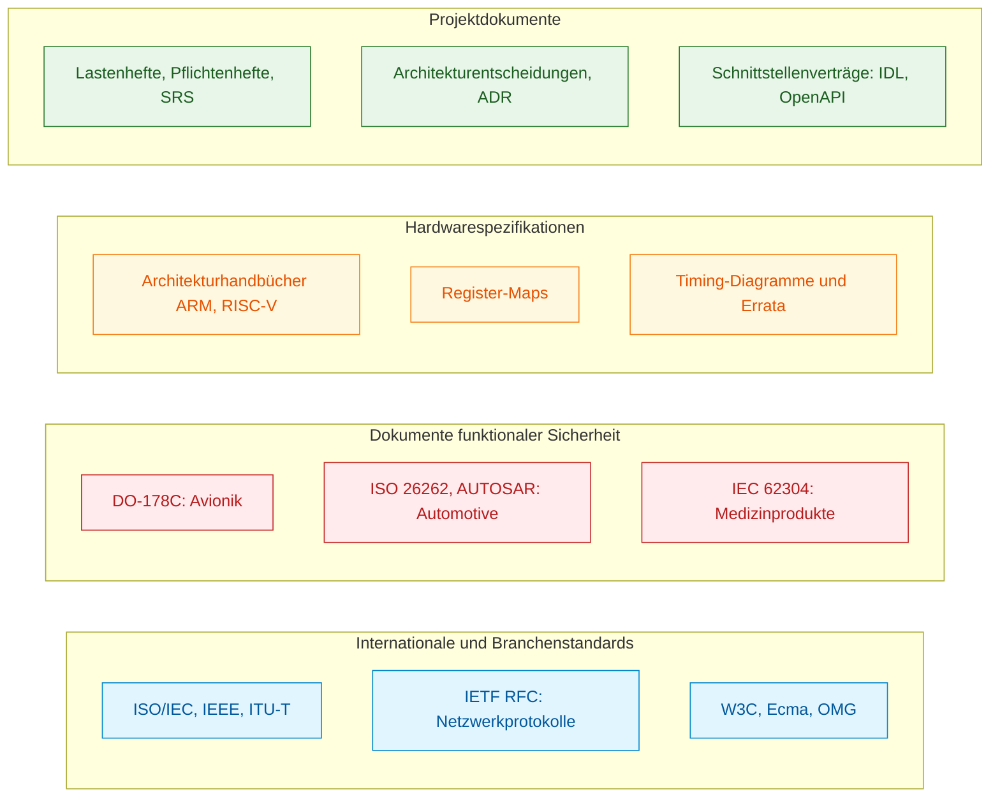
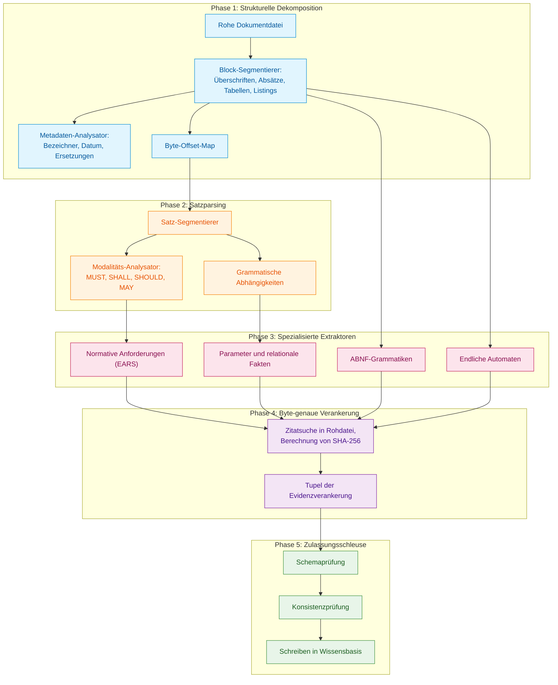
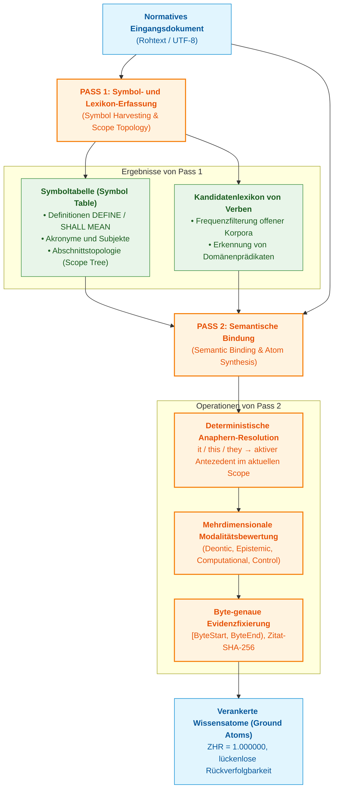
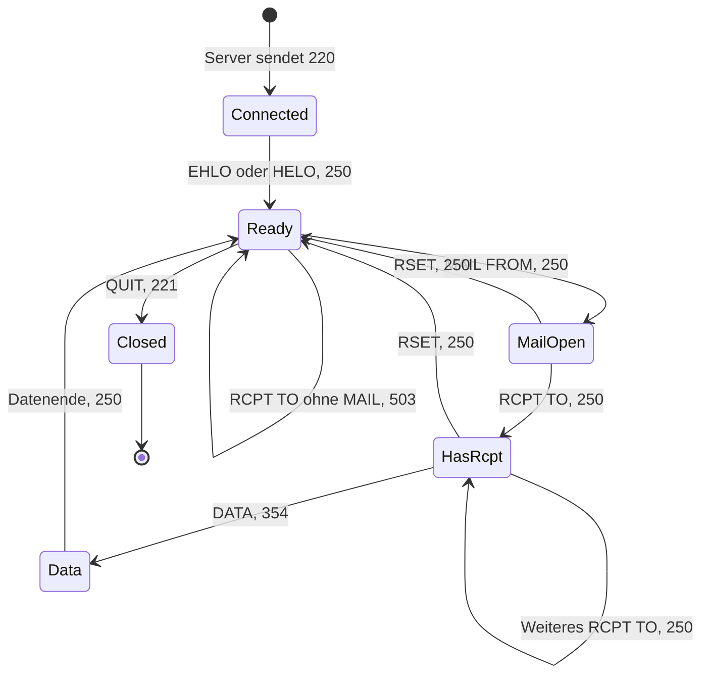
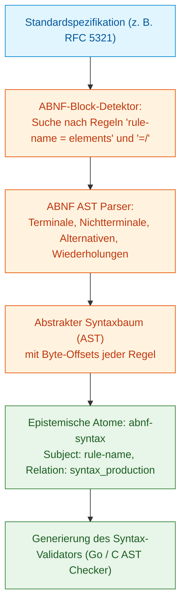
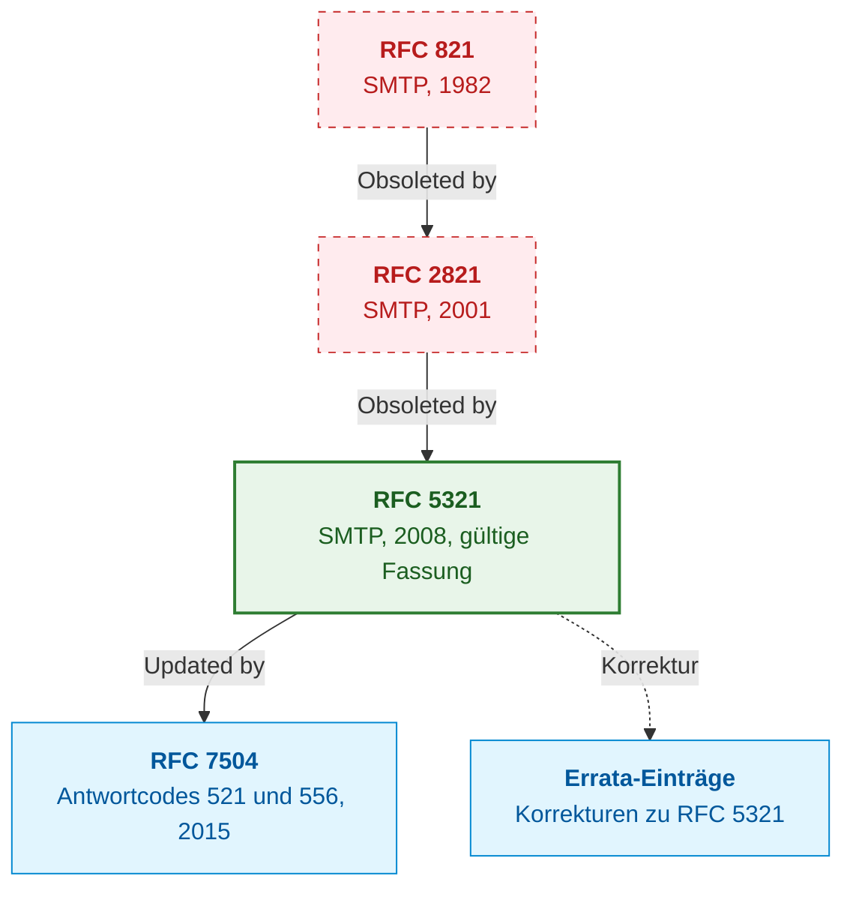
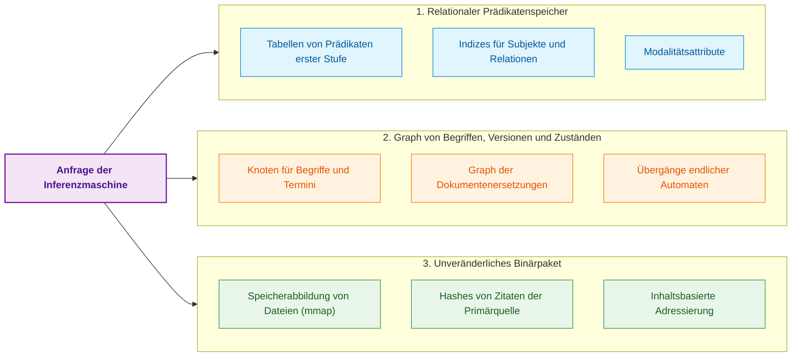
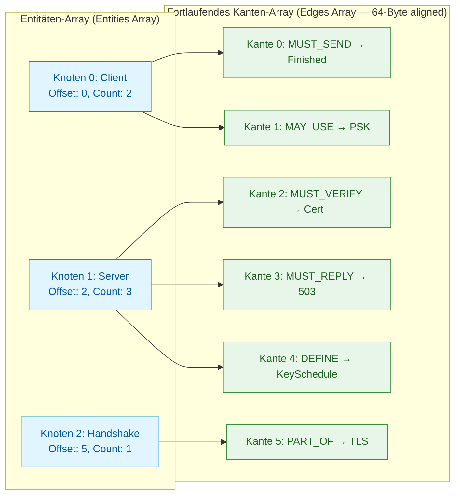
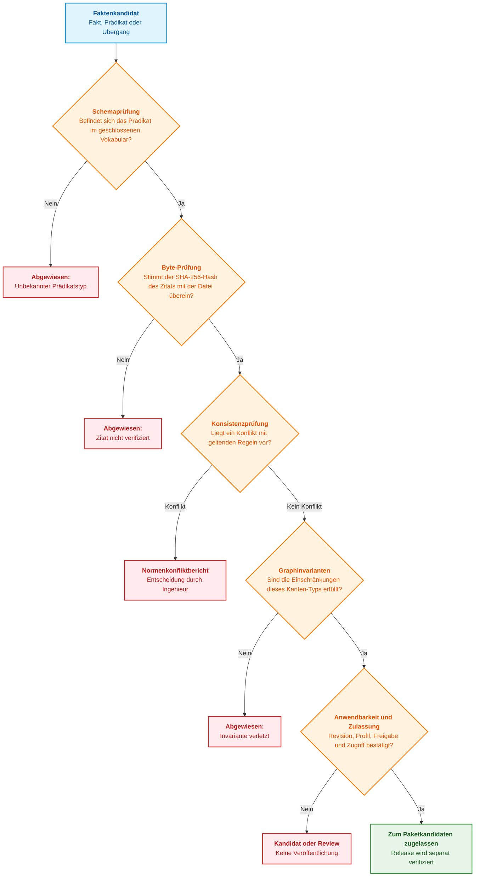
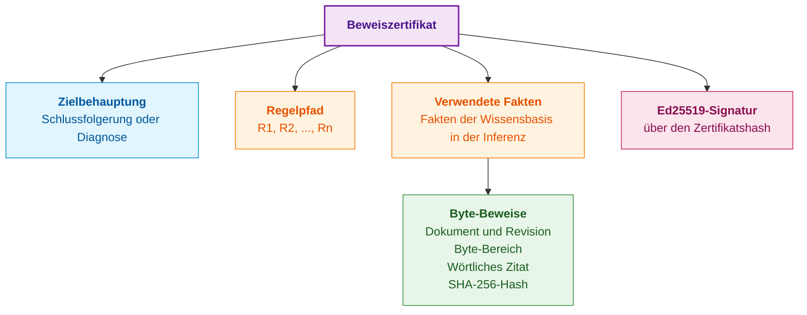

# Kapitel 15. Wissensextraktion und Aufbau der Wissensbasis: Fakten, Grammatiken und Automaten

> **Buch:** [Architektur evidenzbasierter Expertensysteme](README.md) · [Teil III: Wissensakquisition, linguistische Analyse und Eingangsdatenbewertung](part-03-knowledge-engineering-nlp.md)  
> **Vorheriges Kapitel:** [Kapitel 14. Anforderungs- und Modalitätserkennung: Vom normativen Text zu Systeminvarianten](ch14-requirements-detection-and-formalization.md)  
> **Nächstes Kapitel:** [Kapitel 37. Eingangsdatenbewertung: Quellen, Zeugnisse und epistemische Unsicherheit](ch37-input-information-assessment-and-algorithmic-skepticism.md)  
> **Inhaltsverzeichnis:** [README.md](README.md)  
> **Autor:** [Mykola Fedchyk](about-the-author.md)  
> **Niveau:** Fortgeschritten: Wissensingenieure, Systemarchitekten, Entwickler von Expertensystemen  
> **Lernziele:** Einen technischen Standard in strukturelle Einheiten und Versionsmetadaten dekomponieren; jeden extrahierten Fakt an einen Byte-Bereich der Primärquelle binden und diese Bindung programmatisch verifizieren; Parameter, normative Anforderungen, Grammatiken und endliche Automaten aus Texten extrahieren; Ersetzung, Aktualisierung und Korrektur von Dokumenten berücksichtigen; den Zyklus der Ontologie-Modellierung und -Prüfung mittels Protégé und ROBOT aufbauen; erklären, welche Validierungen die Zulassungsschleuse durchführt und was ein Beweiszertifikat formal nachweist.

## Abstract

In diesem Kapitel wird die Methodik zur Kompilierung technischer und normativer Dokumentationen (RFCs, ISO-Normen, Datenblätter von Halbleiterbauelementen) in eine verifizierte Wissensbasis eines Expertensystems dargelegt. Es wird eine fünfphasige Extraktionspipeline vorgeschlagen: strukturelle Dekomposition, syntaktisches Satzparsing, spezialisierte Extraktoren (Parameter, EARS-Anforderungen, formale ABNF-Grammatiken, endliche Automaten / FSM), Byte-genaue Adressierung der Primärquellen (Byte Anchoring mit SHA-256-Kryptohashes) und eine deterministische Zulassungsschleuse. Eingehend analysiert werden Dokumentversionierung und -ersetzung, ein zweiphasiger semantischer Symbol- und Anaphern-Compiler, Speicherarchitekturen (multimodale RDF-/Property-Graphen, In-Memory-CSR) sowie das Protokoll zur Erzeugung kryptografischer Beweiszertifikate (Ed25519) für das Audit getroffener Entscheidungen.

Ein Ingenieur, der einen Netzwerkcontroller, ein Echtzeitbetriebssystem oder ein Antriebssteuerungsmodul entwickelt, operiert im Kontext von Hunderten miteinander verflochtenen Dokumenten: internationalen Normen, Branchenrichtlinien, Lastenheften des Auftraggebers und Datenblättern mikroelektronischer Komponenten. Das in diesen Dokumenten formalisierte Wissen ist für eine Organisation keineswegs weniger wertvoll als der Quellcode, doch der operative Zugriff darauf wird durch drei fundamentale Barrieren behindert:

1. **Umfang und Fragmentierung.** Zehntausende Seiten an Text, Tabellen und Schaltplänen verteilen sich über Standards, Richtlinien, technische Spezifikationen und Datenblätter (*Datasheets*).
2. **Heterogenität der Formate.** Parallel existieren maschinenlesbare Schemata, textuelle Spezifikationen mit formalen Grammatiken und eingescannte PDF-Dokumente mit uneinheitlichem Layout.
3. **Dokumentenevolution.** Standards werden fortlaufend überarbeitet, neue Revisionen setzen vorherige außer Kraft (*Obsoletion*), separate Dokumente beheben Fehler (*Errata*) oder definieren Erweiterungen (*Extensions*), sodass dieselbe normative Klausel über verschiedene Ausgabejahre hinweg divergierende Bedeutungen annehmen kann.

Die gegenwärtig weit verbreitete Antwort auf diese Herausforderungen besteht in der Koppelung von semantischer Fragmentsuche und Textgenerierung (*Retrieval-Augmented Generation*, RAG): Eine Retrieval-Engine ermittelt Textpassagen, die der Anfrage ähnlich sind, und ein großes Sprachmodell (*Large Language Model*, LLM) formuliert daraus eine Antwort [[1]](#src-1). Für ingenieurtechnische Textkorpora reicht dies bei Weitem nicht aus. Die Ähnlichkeitssuche beantwortet lediglich die Frage: „Welche Textfragmente ähneln der Anfrage?“, während der Ingenieur eine präzise Antwort auf eine ganz andere Frage benötigt: „Welche Norm ist derzeit rechtsgültig in Kraft, an welcher konkreten Textstelle ist sie verankert und welche logischen Konsequenzen resultieren daraus?“. Textuelle Vektorähnlichkeit kodiert weder Relationen wie „Dokument B hebt Abschnitt 3 von Dokument A auf“ noch Invarianten wie „Befehl Y muss zwingend vor Befehl X ausgeführt werden“, und eine rein probabilistisch generierte Antwort liefert keinerlei formalen Beweis, der ohne blindes Vertrauen in das Sprachmodell verifiziert werden könnte.

Ein Expertensystem nähert sich dem Dokumentenkorpus fundamental anders: Es behandelt technische Dokumentationen als unkompilierten Quellcode des Wissens – in exakter Analogie dazu, wie in [Kapitel 14](ch14-requirements-detection-and-formalization.md) normative Anforderungen analysiert wurden. Dieses Kapitel beantwortet die Frage: **Wie lässt sich der Spezifikationstext in eine strukturierte Wissensbasis überführen, in der jeder Eintrag bis auf das exakte Byte der Primärquelle verifizierbar ist?** Die zentrale These lautet: **Wissensextraktion ist ein Kompilierungsprozess, keine Paraphrasierung. Das Dokument wird in strukturelle Einheiten zerlegt, jeder Faktenkandidat wird an einen Byte-Bereich der unveränderlichen Primärquelle gebunden, und erst eine deterministische Zulassungsschleuse autorisiert die Übernahme in die Wissensbasis. Ein Sprachmodell darf in einer solchen Pipeline Hypothesenkandidaten vorschlagen, trifft jedoch niemals eigenständig die Entscheidung darüber, was als valides Wissen gilt.**

Das Kapitel schreitet von der Klassifikation der Quellen zur Extraktionspipeline voran, behandelt die Extraktion endlicher Automaten, die Versionsverwaltung von Dokumenten, Speicherarchitekturen der Wissensbasis, die Zulassungsschleuse und maschinenprüfbare Beweiszertifikate. Als durchgängiges Referenzbeispiel dient das SMTP-Protokoll (*Simple Mail Transfer Protocol*) in der Fassung des RFC 5321 [[2]](#src-2). Diese Spezifikation ist öffentlich zugänglich, enthält formale Grammatiken sowie Regeln für Befehlsabfolgen und blickt auf eine lange Revisionshistorie zurück, wodurch sich sämtliche Phasen der Pipeline exemplarisch abbilden lassen.

## 1. Klassifikation der Quellen ingenieurtechnischen Wissens

In der missionskritischen Systemtechnik (funktionale Sicherheit nach ISO 26262, flugzeuggestützte Software nach DO-178C, Medizingerätestandards nach IEC 62304) stellt die Wissensbasis eines Expertensystems keinen homogenen Textkorpus dar: Sie ist verpflichtet, Wissen aus grundlegend heterogenen regulatorischen und hardwarenahen Primärquellen zu konsolidieren. Der Versuch, technische Dokumente über eine naive Universalschablone zu verarbeiten, führt unweigerlich zu fatalen Verifikationsdefekten: Was im Datenblatt eines Mikrocontrollers lediglich ein temporärer Workaround für eine spezifische Silizium-Revision darstellt (*Errata Workaround*), ist im Kommunikationsstandard ein striktes Verbot und im Sicherheitsstandard eine zwingende Vorschrift für das Artefakt-Audit. Der erste fundamentale Schritt der Extraktionsarchitektur besteht daher in einer strengen Typologisierung der Quellen ingenieurtechnischen Wissens anhand ihrer inneren Struktur und normativen Verbindlichkeit.

Ein universelles Format für ingenieurtechnisches Wissen existiert nicht: Dokumente divergieren hinsichtlich ihres Formalisierungsgrads, der semantischen Schärfe ihrer Formulierungen und ihres Einsatzzwecks. Das nachfolgende Diagramm klassifiziert diese Quellen in vier primäre Domänen.



Dieses Diagramm illustriert keine Rangordnung regulatorischer Priorität, sondern die unterschiedlichen Repräsentationsformen, in denen Wissen an das Expertensystem übergeben wird. Jede Klasse erfordert eine spezifische Extraktionsmethodik:

**Internationale und branchenspezifische Standards** definieren Interaktionsregeln für Systemkomponenten und Protokolle. Spezifikationen der IETF (*Internet Engineering Task Force*) aus der RFC-Reihe (*Request for Comments*) fungieren hierbei als klassisches Paradigma: Neben natürlicher Sprache enthalten sie formale Grammatiken in der durch RFC 5234 definierten ABNF-Notation (*Augmented Backus-Naur Form*) [[3]](#src-3). Aus einem Standard dieser Kategorie extrahiert das Expertensystem zwei distinkte Wissensformen: normative Sätze und formale Grammatiken, die direkt in deterministische Parser kompiliert werden können.

**Dokumente der funktionalen Sicherheit** reglementieren nicht nur das operationelle Systemverhalten, sondern den gesamten Lebenszyklus der Entwicklung und Verifikation. DO-178C für bordseitige Flugzeugsoftware erzwingt eine lückenlose Rückverfolgbarkeit von Anforderungen bis hin zu Code und Testfällen sowie strukturelle Codeüberdeckungsanalysen [[4]](#src-4). ISO 26262 definiert für die Automobilelektronik Sicherheitsintegritätslevel ASIL (*Automotive Safety Integrity Level*) von A bis D [[5]](#src-5). IEC 62304 normiert die Lebenszyklusprozesse medizinischer Software [[6]](#src-6). Das Wissen aus diesen Quellen manifestiert sich primär in Form prozessualer Pflichten bezüglich Entwicklungsartefakten: welche Traceability-Links zwingend existieren müssen, welche Überdeckungsnachweise zu erbringen sind und welche Instanzen Änderungen freigeben müssen.

**Hardwarespezifikationen** enthalten Wissen gänzlich anderer Natur. Prozessorarchitekturhandbücher (*Architecture Reference Manuals*), Controller-Datenblätter und Listen bekannter Siliziumfehler (*Errata Sheets*) präsentieren Wissen in Gestalt von Registerbelegungsplänen mit Bitfeldern und Zugriffsmodi, Timing-Diagrammen, elektrischen Grenzwerten und Abhilfemaßnahmen (*Workarounds*) für Chipdefekte. Ein Errata-Eintrag besitzt ausschließlich für eine spezifische Halbleiter-Stepping-Revision Gültigkeit; wird ein solcher Fakt ohne explizite Gültigkeitskonditionierung extrahiert, verfälscht er die Inferenz bei jeder anderen Chip-Revision.

**Projektspezifische Dokumente** (Lastenhefte, Software-Anforderungsspezifikationen, Architecture Decision Records) fixieren die konkreten Entwurfsregeln eines Systems. Sie unterliegen der höchsten Änderungsfrequenz und müssen strikt mit übergeordneten Standards harmonieren; für sie ist eine präzise Revisionsverfolgung unabdingbar, die in einem nachfolgenden Abschnitt detailliert behandelt wird.

Ein einzelner monolithischer Extraktor ist somit außerstande, sämtliche Dokumentenklassen adäquat zu bewältigen. Grammatiken erfordern spezialisierte Syntaxparser, normative Anforderungen werden durch den Modalitätsklassifikator aus [Kapitel 14](ch14-requirements-detection-and-formalization.md) typisiert, Registertabellen verlangen strukturelle Tabellenanalysatoren und chronologische Handlungsabfolgen werden durch Automatenextraktoren erschlossen. Alle Extraktionsmodule müssen jedoch ein homogenes Zwischenformat generieren: einen wohlgeformten Faktenkandidaten, gekoppelt mit seiner physischen Byte-Adresse in der Primärquelle. Die mathematische Struktur dieser Adresse wird im nächsten Abschnitt definiert.

## 2. Evidenzinvariante: Byte-genaue Adressierung der Primärquellen

Im Zertifizierungsaudit evidenzbasierter Expertensysteme gilt das Gebot der Unanfechtbarkeit von Fakten absolut: Behauptet das System, dass ein bestimmter Parameter oder eine Regel im Zielsystem wirksam ist, muss es unverzüglich den mathematischen Nachweis erbringen, dass diese Aussage exakt so aus einer unveränderlichen Primärquelle hervorgeht. Das Fehlen einer direkten Adressierung führt zu einer katastrophalen Degradation der Nachweisführung: Es entstehen „Phantomfakten“, hervorgerufen durch Halluzinationen statistischer Sprachmodelle, veraltete Dokumentenentwürfe oder versehentliche Eingabefehler von Wissensingenieuren.

Um epistemische Fiktionen prinzipiell auszuschließen, wird im Fundament des Expertensystems ein unumstößlicher Evidenzkontrakt verankert: **Kein Fakt, Prädikat oder Regelsatz wird in die Wissensbasis zugelassen, der nicht über eine kryptografisch gesicherte Verankerung in den Rohbytes eines unveränderlichen Primärdokuments verfügt.** Diese Invariante wird durch das Fünf-Tupel der Evidenzverankerung (*Evidence Grounding Tuple*) formalisiert:

```math
\mathcal{E} = \langle \mathrm{DocID}, \mathrm{ByteStart}, \mathrm{ByteEnd}, \mathrm{SectionPath}, H_{\mathrm{quote}} \rangle
```

Parameter und mathematische Eigenschaften des Tupels:

- $\mathrm{DocID} \in \{0, 1\}^{256}$ ist der kryptografische SHA-256-Hash des vollständigen Inhalts der Quelldokumentdatei im unveränderlichen Artefaktspeicher (gewährleistet globale Eindeutigkeit und Integrität der Quelle) [[7]](#src-7);
- $\mathrm{ByteStart}, \mathrm{ByteEnd} \in \mathbb{N}_0$ — ganzzahliges halboffenes Intervall von Byte-Offsets $[\mathrm{ByteStart}, \mathrm{ByteEnd})$ im Binärstrom der Rohdatei bei nullbasierter Zählung, wobei $0 \le \mathrm{ByteStart} < \mathrm{ByteEnd} \le \text{FileSize}$;
- $\mathrm{SectionPath} \in \mathcal{P}$ — kanonischer hierarchischer Pfad im Überschriftenbaum des Dokuments (beispielsweise `"3.3/Mail Transactions"`);
- $H_{\mathrm{quote}} = \mathrm{SHA256}(\text{FileBytes}[\mathrm{ByteStart}:\mathrm{ByteEnd}])$ ist der kryptografische SHA-256-Hash des exakten Zitatfragments;
- Die spitzen Klammern $\langle \cdot \rangle$ bezeichnen ein strikt geordnetes Tupel, dessen Fehlen einer beliebigen Komponente den Fakt für den formalen Verifizierer ungültig macht.

Praktische Anwendung und ingenieurtechnische Schlussfolgerungen:
- **Automatisierte Authentizitätsprüfung:** Vor der Verwendung eines Fakts in der Resolutionsinferenz liest die Engine den Byte-Bereich der Quelldatei $\text{FileBytes}[\mathrm{ByteStart}:\mathrm{ByteEnd}]$ von der Festplatte, berechnet den SHA-256-Hash erneut und vergleicht ihn mit $H_{\mathrm{quote}}$.
- **Fail-Safe-Blockierung (Quarantäne):** Wurde die Primärquellendatei auch nur um ein einziges Bit verändert oder verschoben, schlägt die Hash-Prüfung fehl ($\mathrm{SHA256} \ne H_{\mathrm{quote}}$). Die Engine blockiert den Fakt unverzüglich mit dem Fehlercode `E_GROUNDING_INTEGRITY_VIOLATION`, versetzt die zugehörige Regel in Quarantäne und generiert eine Audit-Warnung, wodurch die Nutzung unbestätigten Wissens bei der Entscheidungsfindung ausgeschlossen wird.

## 3. Extraktionspipeline: Vom Bytestrom zu Faktenkandidaten

Die Extraktion von Wissen aus technischen Dokumenten erschöpft sich weder in einer Stichwortsuche noch in einer summarischen Textzusammenfassung durch neuronale Netze (*Summarization*). Es handelt sich um einen mehrstufigen, deterministischen Prozess, der einen kontinuierlichen Bytestrom in typisierte Fakten, formale Regeln und Verhaltensgraphen transformiert. Das nachfolgende Diagramm veranschaulicht die fünf Phasen dieses Prozesses.



Jede Phase konsumiert das strukturierte Ergebnis der vorangegangenen Stufe und besitzt die Autorität, unzureichende Kandidaten frühzeitig zu verwerfen; die endgültige Autorisierung zur persistenten Wissensübernahme obliegt jedoch exklusiv Phase 5. Nachfolgend werden die einzelnen Phasen detailliert analysiert; Phase 5 wird gesondert im Abschnitt über die Zulassungsschleuse behandelt.

### 3.1. Strukturelle Dekomposition des Dokuments

Die semantische Tragweite eines Satzes wird maßgeblich durch seine strukturelle Position im Dokument determiniert. Dieselbe Formulierung begründet im normativen Hauptteil eines Standards eine rechtlich bindende Pflicht, besitzt in einem informativen Anhang (*Informative Annex*) lediglich erläuternden Charakter und stellt im Einleitungskapitel lediglich eine historische Randnotiz dar. Ohne exakte Kenntnis der Dokumentenhierarchie würde ein Extraktor unverbindliche Erläuterungen fälschlich als zwingende Systeminvariante interpretieren.

In der ersten Phase rekonstruiert die Pipeline das strukturelle Skelett des Dokuments: den hierarchischen Überschriftenbaum, die typisierten Inhaltsblöcke (Fließtext, Tabellen, Quellcode-Listings, formale Grammatiken, ASCII-Diagramme) sowie die Dokumentenmetadaten (eindeutiger Bezeichner, Veröffentlichungsdatum, Rechtsstatus und Querverweise zu anderen Spezifikationen). Parallel dazu konstruiert Phase 1 eine Byte-Offset-Map, die für jeden Block dessen exakte Byte-Grenzen in der unveränderten Rohdatei persistiert.

Der Dokumentenkopf von RFC 5321 im Plaintext-Format enthält beispielsweise die Header-Zeilen `Obsoletes: 2821` und `Updates: 1123` [[2]](#src-2). Der Metadatenanalysator überführt diese Einträge vollautomatisch in Kanten des Versionsgraphen: RFC 5321 setzt RFC 2821 vollständig außer Kraft und aktualisiert Teilaspekte von RFC 1123. Dieselbe Datei weist auf jeder Seite Kopf- und Fußzeilen mit Autorennamen, Dokumentenkategorie und Seitennummerierung auf, etwa `Klensin ... Standards Track ... [Page 95]`. Phase 1 markiert diese Bereiche explizit als administrative Serviceblöcke, damit kein Extraktor diese Zeilen fälschlicherweise als normative Bestimmungen verarbeitet.

Das Resultat von Phase 1 ist ein typisierter Dokumentenbaum, dessen Knoten jeweils mit Pfadangabe, semantischem Typ und Byte-Offset-Koordinaten annotiert sind. Dieser Baum bildet die zwingende Referenzbasis für alle nachfolgenden Phasen.

### 3.2. Satzsegmentierung und spezialisierte Extraktoren

Phase 2 zerlegt die typisierten Textblöcke in syntaktische Sätze, ermittelt die deontische Modalität normativer Aussagen und konstruiert grammatische Abhängigkeitsbäume (*Dependency Trees*). Phase 3 aktiviert daraufhin spezialisierte, parallel arbeitende Extraktoren, von denen jeder auf eine distinkte Wissenskategorie fokussiert ist.

#### 3.2.1. Parameter und relationale Fakten

Technische Spezifikationen wimmeln von fest parametrierten Konstanten: Portnummern, Puffergrößen, Timeouts, Bitmasken und Temperaturbereichen. Der relationale Faktenextraktor transformiert solche Aussagen in eine strikt typisierte atomare Struktur:

```math
\mathrm{Fact} = \langle \mathrm{Subject}, \mathrm{Relation}, \mathrm{Value}, \mathrm{Unit}, \mathcal{E} \rangle
```

Parameter und Komponenten des typisierten Fakts:

- $\mathrm{Subject} \in \mathcal{C}$ ist der kanonische Bezeichner des Konzepts in der Fachdomänenontologie (beispielsweise `smtp:local-part` oder `bms:cell_voltage`);
- $\mathrm{Relation} \in \mathcal{R}$ bezeichnet die semantische Relation zwischen Konzept und Wert aus der geschlossenen Relationsmatrix der Ontologie (beispielsweise `hasMaxLength`, `hasTimeout`, `hasTolerance`);
- $\mathrm{Value} \in \mathbb{R} \cup \mathrm{String}$ ist der direkte numerische oder zeichenkettenbasierte Wert des extrahierten Ingenieurparameters;
- $\mathrm{Unit} \in \mathcal{U}_{\mathrm{SI}} \cup \mathcal{U}_{\mathrm{std}}$ spezifiziert die physikalische SI-Einheit oder normative Protokolleinheit ($\text{octet}$, $\text{bit/s}$, $\text{ms}$, $\text{mV}$); für dimensionslose Konstanten wird der Marker $\text{dimensionless}$ hinterlegt;
- $\mathcal{E}$ ist das kryptografische Evidenzverankerungstupel zur unveränderlichen Primärquelle.

Praktische Anwendung und ingenieurtechnische Schlussfolgerungen:
- **Typ- und Einheitenprüfung an der Schleuse:** Die Zulassungsschleuse verifiziert automatisch die Kompatibilität der Dimension von $\mathrm{Unit}$ mit der Signatur der Relation $\mathrm{Relation}$. Werden für eine Zeitrelation Oktette angegeben oder ist die Einheit undefiniert, wird der Fakt bedingungslos mit dem Code `E_INVALID_UNIT_DIMENSION` zurückgewiesen.
- **Verhinderung von Phantomfakten:** Die spitzen Klammern erzwingen das zwingende Vorhandensein aller fünf Komponenten. Jede Aussage mit leerem Feld $\mathcal{E}$ oder unvalidiertem Quellhash wird als potenzielle Halluzination des Extraktors blockiert.

In Abschnitt 4.5.3.1.1 von RFC 5321 findet sich beispielsweise die Festlegung: *«The maximum total length of a user name or other local-part is 64 octets»* [[2]](#src-2). Der Extraktor überführt diesen Satz in den Fakt $\langle \text{local-part}, \mathrm{maxLength}, 64, \text{octet}, \mathcal{E} \rangle$, wobei $\mathcal{E}$ exakt auf die Bytes dieses Satzes verweist. Abschnitt 4.5.3.1.6 derselben Spezifikation formuliert eine weitere Schranke: Eine Textzeile darf inklusive CRLF-Steuerzeichen 1000 Oktette nicht überschreiten. Beide Fakten werden zu formalen Invarianten, gegen die das Expertensystem die Protokolldateien eines Mailservers vollkommen deterministisch auditieren kann.

#### 3.2.2. Normative Anforderungen

Sätze, die normative Signalwörter (*MUST*, *SHALL*, *SHOULD*, *MAY* sowie deren Negationen) enthalten, werden durch den Anforderungsextraktor anhand der EARS-Schablonen (*Easy Approach to Requirements Syntax*) normalisiert [[8]](#src-8). Die Klassifikationsregeln deontischer Modalitäten richten sich nach den spezifischen Konventionen des Quelldokuments und wurden in [Kapitel 14](ch14-requirements-detection-and-formalization.md) ausführlich hergeleitet. An dieser Stelle genügt ein exemplarisches Szenario aus Abschnitt 3.3 von RFC 5321: Der Satz *«If a RCPT command appears without a previous MAIL command, the server MUST return a 503 "Bad sequence of commands" response»* [[2]](#src-2) wird in eine ereignisgesteuerte EARS-Anforderung transformiert: „Wenn ein SMTP-Server einen RCPT-Befehl ohne vorangehenden MAIL-Befehl empfängt, MUSS der SMTP-Server den Statuscode 503 zurückgeben“. Diese Anforderung bildet zugleich die Brücke zur Synthese endlicher Automaten.

#### 3.2.3. Formale Grammatiken

Zahlreiche Protokollstandards definieren ihre Syntax über formale Metasprachen. Abschnitt 4.1.1.1 von RFC 5321 spezifiziert die Begrüßungsbefehle wie folgt [[2]](#src-2):

<details>
<summary>Grammatische ABNF-Regel</summary>

```abnf
ehlo           = "EHLO" SP ( Domain / address-literal ) CRLF
helo           = "HELO" SP Domain CRLF
```

</details>

Der Grammatikextraktor identifiziert derartige Spezifikationsblöcke, kompiliert sie in abstrakte Syntaxbäume (AST) und prüft, ob sämtliche referenzierten Regeln formal definiert sind. Die Terminalsymbole `SP` und `CRLF` gehören zu den Kernregeln aus Anhang B von RFC 5234 [[3]](#src-3), während `Domain` und `address-literal` in anderen Abschnitten von RFC 5321 definiert werden. Der Extraktor muss daher Querverweise über Abschnitts- und Dokumentgrenzen hinweg auflösen; eine undefinierte Regel stellt einen schwerwiegenden Extraktionsfehler dar und darf keinesfalls stillschweigend übergangen werden. Die kompilierte Grammatik wird als nativer Validierungsfilter in die Wissensbasis integriert: Einen `HELO`-Befehl ohne Domainparameter weist das Expertensystem als syntaktisch fehlerhaft ab, ohne jemals ein probabilistisches Sprachmodell konsultieren zu müssen.

### 3.3. Byte-genaue Verankerung von Fakten (Byte Anchoring)

Ein statistisches Sprachmodell oder regelbasierter Extraktor liefert einen Zitatkandidaten zumeist als ununterbrochene Textzeile zurück. Im realen Dokumentenbestand ist dasselbe Textfragment jedoch häufig durch Zeilenumbrüche, Tabulatoren, Einzüge oder Silbentrennungen unterbrochen. Eine naive Byte-für-Byte-Suche scheitert an solchen Fragmenten, obgleich der Text semantisch identisch im Dokument enthalten ist. Das gegenläufige Problem besteht in der Mehrdeutigkeit: Ein kurzer Satz kann im Dokumentenkorpus redundant an mehreren Stellen auftreten, wodurch a priori unklar ist, welche Passage den primären Evidenznachweis darstellt.

Die architektonische Lösung besteht in einer **normalisierten Suche mit Offset-Mapping**. Der Algorithmus komprimiert beliebige Folgen von Whitespace-Zeichen auf ein einzelnes Standard-Leerzeichen, führt jedoch für jedes Byte des normalisierten Textes die exakte Position in der ursprünglichen Rohdatei mit. Der Suchvorgang operiert auf dem normalisierten Text, während die finale Bereichsberechnung und die SHA-256-Prüfsumme auf den unveränderten Rohbytes erfolgen. Ein Zitatkandidat wird ausschließlich dann zugelassen, wenn er im spezifizierten Gültigkeitsbereich exakt einmal auftritt. Das nachfolgende Go-Modul implementiert diese Verifikationslogik. Zur Ausführung wird lediglich die Datei `rfc5321.txt` benötigt; externe Abhängigkeiten außerhalb der Go-Standardbibliothek existieren nicht.

<details>
<summary>Beispiel in Go: Byte-genaue Verankerung von Zitaten mit Normalisierung und Offset-Map</summary>

```go
package main

import (
	"bytes"
	"crypto/sha256"
	"encoding/hex"
	"fmt"
	"os"
	"unicode/utf8"
)

// Evidence beschreibt die Byte-genaue Verankerung eines Zitats in der Rohdatei der Primärquelle.
type Evidence struct {
	Start, End int    // Offsets in Rohbytes; End ist exklusiv
	SHA256     string // SHA-256-Hash der Rohbytes [Start, End)
}

// normalize komprimiert jede Folge von Whitespace-Zeichen auf ein einzelnes Leerzeichen
// und speichert, von welchem Byte der Rohdatei jedes Byte des Ergebnisses stammt.
func normalize(raw []byte) ([]byte, []int) {
	var out []byte
	var pos []int
	inSpace := false
	for i, b := range raw {
		switch b {
		case ' ', '\t', '\r', '\n', '\f':
			if !inSpace && len(out) > 0 {
				out = append(out, ' ')
				pos = append(pos, i)
			}
			inSpace = true
			continue
		}
		inSpace = false
		out = append(out, b)
		pos = append(pos, i)
	}
	return out, pos
}

// Ground akzeptiert ein Zitatkandidat nur dann, wenn es
// im normalisierten Text des Dokuments exakt einmal vorkommt.
func Ground(raw []byte, quote string) (Evidence, error) {
	return GroundIn(raw, quote, 0, len(raw))
}

func GroundIn(raw []byte, quote string, regionStart, regionEnd int) (Evidence, error) {
	if regionStart < 0 || regionEnd > len(raw) || regionStart >= regionEnd {
		return Evidence{}, fmt.Errorf("ungültige Grenzen des Quellbereichs")
	}
	if !utf8.Valid(raw) || !utf8.ValidString(quote) || !utf8.Valid(raw[regionStart:regionEnd]) {
		return Evidence{}, fmt.Errorf("ungültiges UTF-8 oder Schnitt innerhalb eines Zeichens")
	}
	norm, pos := normalize(raw[regionStart:regionEnd])
	q, _ := normalize([]byte(quote))
	q = bytes.TrimSpace(q)
	if len(q) == 0 {
		return Evidence{}, fmt.Errorf("leeres Zitat")
	}
	first := bytes.Index(norm, q)
	if first < 0 {
		return Evidence{}, fmt.Errorf("Zitat nicht wörtlich gefunden")
	}
	if bytes.Contains(norm[first+1:], q) {
		return Evidence{}, fmt.Errorf("Zitat ist mehrdeutig: mehrere Vorkommen")
	}
	start := regionStart + pos[first]
	end := regionStart + pos[first+len(q)-1] + 1
	sum := sha256.Sum256(raw[start:end])
	return Evidence{Start: start, End: end, SHA256: hex.EncodeToString(sum[:])}, nil
}

func main() {
	raw, err := os.ReadFile("rfc5321.txt")
	if err != nil {
		fmt.Println("Lesefehler:", err)
		os.Exit(1)
	}
	doc := sha256.Sum256(raw)
	fmt.Printf("DocID: sha256:%x...\n", doc[:8])

	candidates := []string{
		// Wörtliches Zitat aus Abschnitt 3.3; in der Datei durch Zeilenumbruch getrennt.
		`If a RCPT command appears without a previous MAIL command, the server MUST return a 503 "Bad sequence of commands" response.`,
		// Paraphrase derselben Norm: ähnliche Bedeutung, aber diese Bytes existieren in der Datei nicht.
		`If RCPT is sent before MAIL, the server MUST answer 503.`,
		// Zu kurzes Zitat: kommt im Dokument mehrfach vor.
		`503 Bad sequence of commands`,
	}
	for _, c := range candidates {
		ev, err := Ground(raw, c)
		if err != nil {
			fmt.Println("ABGEWIESEN:", err)
			continue
		}
		fmt.Printf("AKZEPTIERT: Bytes [%d, %d), sha256:%s...\n", ev.Start, ev.End, ev.SHA256[:16])
	}
}
```

Der Test `ground_test.go` wird mittels `go test -v main.go ground_test.go` ausgeführt und benötigt keinen externen Textkorpus:

```go
package main

import (
    "crypto/sha256"
    "encoding/hex"
    "testing"
)

func TestGroundingRegionsAndEncoding(testCase *testing.T) {
    raw := []byte("first: limit 100 ms\nsecond: limit\n  100 ms")
    if _, err := Ground(raw, "limit 100 ms"); err == nil {
        testCase.Fatal("ambiguous global quote accepted")
    }
    start := len("first: limit 100 ms\nsecond: ")
    evidence, err := GroundIn(raw, "limit 100 ms", start, len(raw))
    if err != nil || evidence.Start != start || evidence.End != len(raw) {
        testCase.Fatalf("incorrect source region: %+v %v", evidence, err)
    }
    checksum := sha256.Sum256(raw[evidence.Start:evidence.End])
    if evidence.SHA256 != hex.EncodeToString(checksum[:]) {
        testCase.Fatal("quote hash does not match original bytes")
    }
    if _, err := Ground(raw, "limit 90 ms"); err == nil {
        testCase.Fatal("changed parameter accepted")
    }
    for _, bounds := range [][2]int{{-1, 2}, {0, len(raw) + 1}, {3, 2}} {
        if _, err := GroundIn(raw, "limit", bounds[0], bounds[1]); err == nil {
            testCase.Fatal("invalid region accepted")
        }
    }
    if _, err := Ground([]byte{0xff, 'a'}, "a"); err == nil {
        testCase.Fatal("invalid UTF-8 accepted")
    }
    if _, err := GroundIn([]byte("ї"), "ї", 1, 2); err == nil {
        testCase.Fatal("region splits Unicode character")
    }
}
```

Archivierte Programmausgabe des Autors für eine Eingabedatei von 225.929 Bytes:

```text
DocID: sha256:7d560eddff1b213c...
AKZEPTIERT: Bytes [52658, 52788), sha256:48f3063677f109b3...
ABGEWIESEN: Zitat nicht wörtlich gefunden
ABGEWIESEN: Zitat ist mehrdeutig: mehrere Vorkommen
```

</details>

Das erste Zitat wird erfolgreich verifiziert: In der Primärdatei belegt es exakt die Bytes 52.658 bis 52.788 und enthält Zeilenumbrüche samt Einzügen. Durch die Normalisierung wurde das Zitat lokalisiert, während die kryptografische Prüfsumme über die exakten Rohbytes einschließlich aller Whitespaces berechnet wurde; die spätere Re-Verifikation ist vollkommen unabhängig von der Normalisierungsfunktion, da lediglich die 130 Bytes aus dem angegebenen Bereich ausgelesen werden müssen. Das zweite Zitat spiegelt zwar den normativen Sinngehalt wider, existiert jedoch wörtlich nicht in der Datei und wird folgerichtig als unzulässige Paraphrase abgewiesen. Das dritte Zitat ist zwar wortgetreu, tritt jedoch redundant in zwei separaten Tabellen von Statuscodes auf (Abschnitte 4.2.2 und 4.2.3), sodass eine eindeutige Zuordnung ohne strukturelle Abschnittseingrenzung verworfen wird.

Die Funktion `GroundIn` gestattet die gezielte Suche innerhalb eines vorab determinierten Abschnittsbereichs und liefert globale Koordinaten zurück. Dieser Suchbereich muss zwingend durch den strukturellen Parser vorgegeben werden – keinesfalls durch das Sprachmodell im Nachgang einer fehlgeschlagenen Suche.

Für PDF-Dokumente oder gescannte Akten ist zwingend ein unveränderliches Textartefakt mit eigener kryptografischer Kennung erforderlich, gekoppelt mit Querverweisen auf Originaldatei, Seitennummer und geometrische Bounding-Boxes. Der Byte-Bereich im extrahierten Textartefakt entspricht keineswegs den Zeichen-Offsets innerhalb des komprimierten PDF-Datenstroms. Silbentrennungen, Ligaturen und Kopfzeilenentfernungen verlangen explizite Koordinatentransformations-Maps, wie in [Kapitel 12](ch12-linguistic-analysis-and-local-models.md) dargelegt.

### 3.4. Zweipass-Semantikcompiler für Wissen: Von der Symbolsammlung zur Anaphern-Bindung

Eine lineare Einpass-Extraktion, wie sie in einfachen Parsern und naiven RAG-Pipelines üblich ist, erweist sich für hochgradig vernetzte ingenieurtechnische und wissenschaftliche Spezifikationen als prinzipiell unzureichend. Die Ursache liegt in der allgegenwärtigen Verwendung von Pronomina und kontextabhängigen Konstruktionen in Normtexten: Ein beträchtlicher Teil normativer Klauseln beginnt mit anaphorischen Ausdrücken wie *«It MUST verify the peer's certificate...»*, *«This parameter MUST NOT exceed 1024 octets»* oder *«They SHOULD abort the handshake upon receiving...»*.

Bei einer naiven Einpass-Verarbeitung wird als Subjekt eines solchen Fakts entweder das Pronomen `it` oder ein generischer Platzhalter wie `system` erfasst, was eine deterministische Typisierung zerstört und automatisierte logische Inferenz unmöglich macht. Hinzu kommt, dass domänenspezifische Termini, Akronyme und Fachverben im Dokument oft nur ein einziges Mal (im Definitionskapitel) formal eingeführt, aber in Dutzenden nachfolgenden Abschnitten verwendet werden.

Die methodische Antwort hierauf bildet ein **Zweipass-Wissenscompiler (Two-Pass Ingestion Compiler)**, der analog zur klassischen zweistufigen Quellcode-Kompilierung operiert (Erfassung von Symbolen $\to$ Generierung von Zwischencode und Adressauflösung):



#### 3.4.1. Symbol Harvesting: Erfassung von Symbolen, Topologie und Fachlexikon

Während des ersten Durchlaufs generiert der Compiler noch keine finalen Normen, sondern konstruiert eine strukturierte, raumbezogene **Symboltabelle des Dokuments** ($\mathrm{SymbolTable}$):
1. **Extraktion lokaler Definitionen und Glossare:** Der Compiler detektiert normative Definitionsmuster (`DEFINE`, `SHALL MEAN`, `IS DEFINED AS`, `STANDS FOR`) und registriert neu eingeführte Termini, deren Synonyme sowie Akronyme.
2. **Konstruktion der Gültigkeitsbereichs-Topologie (Scope Topology):** Jeder Absatz, jede Tabelle und jeder Abschnitt der Spezifikation spannt einen lexikalischen Namensraum ($\mathrm{Scope}$) auf. Innerhalb dieses Gültigkeitsbereichs werden die explizit deklarierten Subjekte (Akteure: z. B. `Client`, `Server`, `Controller`, `Receiver`) als aktive Entitäten erfasst.
3. **Automatisierte Erfassung von Verbkandidaten (Candidate Verb Harvesting):** Eine Begrenzung des semantischen Parsings auf starre Wortlisten birgt Gefahren. Der Compiler analysiert das Eingangsdokument über morphologische Lexika (WordNet, VerbNet, domänenspezifische Korpora, Academic Word List (AWL) sowie den Terminologiestandard ISO/IEC/IEEE 24765). Verben, deren Häufigkeit im Dokument einen empirischen Schwellenwert überschreitet, werden der Zulassungsschleuse als Kandidaten für die mehrdimensionale Aktionsontologie vorgeschlagen.

#### 3.4.2. Semantic Binding: Semantische Bindung und Anaphern-Resolution

Im zweiten Durchlauf erfolgt die tiefgehende syntaktisch-semantische Analyse unter permanenter Konsultation der zuvor vollständig gefüllten Symboltabelle:
- **Typisierte Anaphern-Resolution (Typed Anaphora Resolution):** Trifft der grammatische Parser auf ein Pronomen (`it`, `this`, `they`) in der Subjektposition einer normativen Anforderung, greift der Compiler auf den aktiven $\mathrm{Scope}$ zu. Das Pronomen wird deterministisch an den nächstgelegenen dominanten Antezedenten mit passendem grammatischem Numerus und Genus gebunden (im Kontext des Abschnitts *«Handshake Protocol: Client»* wird der Satz *«It MUST compute the Finished verify_data...»* beispielsweise eindeutig auf das Subjekt `Client` aufgelöst).
- **Invarianz des Evidenznachweises:** Die Normalisierung des Subjekts auf den kanonischen Symbolbezeichner vollzieht sich ausschließlich in der semantischen Repräsentationsschicht des Fakts ($\mathrm{Subject} = \text{"Client"}$), während das Verankerungstupel $\mathcal{E} = \langle \mathrm{DocID}, \mathrm{ByteStart}, \mathrm{ByteEnd}, \dots \rangle$ und der Zitat-Hash $H_{\mathrm{quote}}$ unverändert die wörtlichen Originalbytes des Textes (mit dem Originalwort *«It»*) sichern.
- **Materialisierung verankerter Wissensatome:** Das Ergebnis von Pass 2 ist eine Menge formal validierter Aussagen, befreit von mehrdeutigen Pronomina und fest verankert an exakt adressierten Konzepten der Ontologie.

### 3.5. Strukturelles Chunking für Retrieval-Zwecke

Neben der Informationsextraktion benötigt ein Expertensystem leistungsfähige Retrieval-Mechanismen: sei es zur Vorauswahl relevanter Textpassagen für die Extraktoren oder zur Beantwortung ingenieurtechnischer Fachfragen. Das in herkömmlichen NLP-Pipelines gebräuchliche Verfahren, Dokumente in Fragmente fixer Token-Länge zu zerteilen (beispielsweise Blöcke von 500 Tokens), zerstört die normative Integrität: Eine Blockgrenze verläuft unweigerlich mitten durch einen Absatz, wodurch Bedingung und Konsequenz einer Norm voneinander getrennt werden.

Strukturelles Chunking nutzt stattdessen den in Phase 1 konstruierten hierarchischen Dokumentenbaum. Als atomares Textfragment fungiert stets eine formale Struktureinheit: ein Abschnitt, ein Unterabschnitt oder ein normativer Klauselabsatz. Jedes Fragment wird mit seinem vollständigen hierarchischen Pfad von der Dokumentwurzel annotiert (*Breadcrumbs*). Eine isolierte Bestimmung wie „muss innerhalb von 15 ms ansprechen“ ist kontextlos unbrauchbar; eingebettet in den Pfad „Bremssystem-Spezifikation $\to$ Notbremsung $\to$ Klausel 4.2“ wird sie sowohl für die Retrieval-Engine als auch für den menschlichen Auditor unmissverständlich interpretierbar.

Das Retrieval selbst sollte als hybride Architektur konzipiert werden: Eine lexikalische Suche nach BM25 erzielt hervorragende Ergebnisse bei exakten Treffern wie Abschnittsnummern, Fehlercodes oder Befehlsbezeichnern [[9]](#src-9). Ein dichtes Vektor-Retrieval erfasst semantisch paraphrasierte Fragestellungen; für die schnelle Vektorsuche empfiehlt sich ein graphenbasierter HNSW-Index (*Hierarchical Navigable Small World*) [[10]](#src-10), wie er beispielsweise in der PostgreSQL-Erweiterung `pgvector` nativ bereitgestellt wird [[11]](#src-11). Die beiden resultierenden Ranglisten werden über das Verfahren der reziproken Rangfusion RRF (*Reciprocal Rank Fusion*) zusammengeführt [[12]](#src-12):

```math
\mathrm{RRF}(d) = \sum_{m \in \{\mathrm{BM25}, \mathrm{Dense}\}} \frac{1}{k + \mathrm{rank}_m(d)}
```

Parameter und mathematische Komponenten der Formel:

- $d \in \mathcal{D}_{\mathrm{chunks}}$ ist eine strukturelle Einheit des normativen Dokuments (Abschnitt, Unterabschnitt, Artikel des Standards);
- $m \in \{\mathrm{BM25}, \mathrm{Dense}\}$ bezeichnet heterogene Retrieval-Kanäle (spärlicher lexikalischer Index für exakte Treffer und dichter semantischer Vektorindex HNSW);
- $\mathrm{rank}_m(d) \in \mathbb{N}_{\ge 1}$ ist die Rangposition des Kandidaten $d$ in der Ausgabeliste des Kanals $m$ ($1$ für den ersten Platz; ist das Dokument im Kanalergebnis nicht vorhanden, wird $\mathrm{rank}_m(d) = \infty$ gesetzt, was einen Null-Summanden ergibt);
- $k \in \mathbb{N}_{> 0}$ — Glättungshyperparameter (kanonisch $k = 60$), der den Einfluss einzelner verrauschter Ausreißer auf Spitzenplätzen eines Kanals nivelliert;
- $\mathrm{RRF}(d) \in (0, \frac{2}{k+1}]$ ist der aggregierte positionsbasierte Konsens-Score.

Praktische Anwendung und ingenieurtechnische Schlussfolgerungen:
- **Schwellenwert-Filterung des Pools:** In missionskritischen Pipelines erfolgt das Abschneiden von Kandidaten zur Übergabe an die Extraktoren nach einem kombinierten Kriterium: Es werden höchstens $K_{\mathrm{pool}} = 20$ Fragmente mit einem Score $\mathrm{RRF}(d) \ge 0{,}025$ übernommen (was eine hohe Platzierung in beiden Kanälen simultan garantiert).
- **Fail-Safe-Rauschschutz:** Falls $\max_{d} \mathrm{RRF}(d) < \tau_{\mathrm{min}}$, leitet die Pipeline den verrauschten Kontext nicht an die Parser weiter, sondern registriert das Ereignis `E_NO_CONFIDENT_RETRIEVAL` und initiiert eine Validierung der Dokumentenmetadaten.

Auch die Wahl des Einbettungsmodells (*Embedding Model*) bedarf zwingend einer empirischen Validierung am eigenen Fachkorpus. Die Begründer des MTEB-Benchmarks (*Massive Text Embedding Benchmark*) haben nachgewiesen, dass kein einzelnes Vektormodell über sämtliche Aufgabentypen hinweg dominiert [[13]](#src-13). Eine globale Spitzenplatzierung garantiert keinerlei Performanz auf eng umrissenen technischen Nischenkorpora; die Modellauswahl muss sich auf domänenspezifische Gold-Standard-Evaluierungen stützen.

Retrieval generiert stets lediglich Kandidaten. Es entscheidet niemals darüber, ob eine Norm tatsächlich rechtsgültig ist oder auf den aktuellen Fall zutrifft: Diese Urteile fällen ausschließlich der Versionsgraph und die formale Inferenzmaschine. Statische Fakten genügen jedoch nicht, um dynamische Handlungsabfolgen zu beschreiben – während der Kern technischer Spezifikationen exakt in solchen Sequenzen besteht. Der nachfolgende Abschnitt behandelt die Extraktion dieses dynamischen Verhaltens.

## 4. Extraktion der Dynamik: Übersetzung von Spezifikationen in endliche Automaten

In der Entwicklung eingebetteter und cyber-physischer Systeme (ISO 26262, DO-178C) reichen statische relationale Fakten über Konstanten oder Grenzwerte nicht aus: Aktoransteuerungen, Datenübertragungsprotokolle und Notfallabschaltungen besitzen eine fundamentale temporale Natur. Verfügt ein Expertensystem lediglich über isolierte Fakten ohne Erfassung der kausalen und zeitlichen Abfolge von Operationen, bleibt es blind gegenüber sequenziellen Anomalien: der Verletzung von Befehlsreihenfolgen, der Übertragung von Nutzdaten vor erfolgter Authentifizierung oder dem unberechtigten Verlassen eines sicheren Betriebszustands. Zur Modellierung dieser Verhaltensdynamik wird der Spezifikationstext in den mathematischen Formalismus deterministischer endlicher Automaten übersetzt.

### 4.1. Mathematisches Modell des deterministischen Automaten

Ein Protokoll- oder Steuerungsautomat wird formal als Fünf-Tupel definiert [[14]](#src-14):

```math
\mathcal{M} = \langle S, \Sigma, \delta, s_0, F \rangle
```

Parameter und mathematische Bestandteile des Automaten:

- $S$ ist eine endliche, nichtleere Menge diskreter Systemzustände (beispielsweise für SMTP: $\{\text{Connected}, \text{Ready}, \text{MailOpen}, \text{HasRcpt}, \text{DataBody}\}$, für ein Batteriemanagementsystem BMS: $\{\text{STANDBY}, \text{PRECHARGE}, \text{RUN}, \text{FAULT}\}$);
- $\Sigma$ ist ein endliches Eingabealphabet von Ereignissen, Protokollbefehlen oder Hardware-Interrupts;
- $\delta: S \times \Sigma \to S \cup \{\bot\}$ bezeichnet die Übergangsfunktion, in der das Symbol $\bot$ explizit einen **unzulässigen Übergang** spezifiziert (verbotene Aktionssequenz);
- $s_0 \in S$ ist der feste Anfangszustand der Systeminitialisierung beim Reset;
- $F \subseteq S$ ist die Teilmenge gültiger terminaler oder stationärer Sitzungsbeendigungszustände.

Praktische Anwendung und ingenieurtechnische Schlussfolgerungen:
- **Diagnose von Sequenzverletzungen:** Bei der Überwachung von Datenverkehr oder Telemetrie wird jedes eingehende Ereignis $e \in \Sigma$ anhand der Matrix $\delta$ in konstanter Zeit $\mathcal{O}(1)$ validiert.
- **Fail-Safe-Havarieblockierung:** Gibt die Funktion für das aktuelle Paar $(s, e)$ den Wert $\delta(s, e) = \bot$ zurück, generiert der Rechenknoten unmittelbar den Fehler `E_PROTOCOL_SEQUENCE_VIOLATION`, behält den aktuellen sicheren Zustand $s$ bei und unterbindet Datenkorruption.

Die klassische Definition deterministischer Automaten setzt eine totale Übergangsfunktion voraus. Für Protokollspezifikationen ist jedoch eine partielle Funktion mit explizitem Wert $\bot$ weit vorteilhafter, da exakt die verbotenen Übergänge den höchsten diagnostischen Informationsgehalt aufweisen. Protokollautomaten generieren zudem bei jedem Übergang einen Antwortcode (fungieren also formal als Transduktoren bzw. Mealy-Automaten); in diesem Kapitel wird der Antwortcode direkt als Übergangsbeschriftung modelliert.

> [!WARNING] Diagnostische Durchschlagskraft verbotener Übergänge ($\bot$)
> In akademischen Lehrbüchern der theoretischen Informatik wird die Übergangsfunktion $\delta$ häufig durch Hinzufügen eines künstlichen Fehlerzustands totalisiert oder undefinierte Übergänge werden ignoriert. Für Expertensysteme der funktionalen Sicherheit (ISO 26262, DO-178C) ist jedes Paar $(s, e)$ mit $\delta(s, e) = \bot$ eine fundamentale Erkenntnis. Exakt die Menge der verbotenen Übergänge spannt den Raum potenzieller Angriffsvektoren, Protokollanomalien und Hardwareausfälle auf. Der automatisierte Testgenerator des Expertensystems transformiert diese Übergänge unmittelbar in negative Testsuiten (*Fault-Injection Test Suite*): das Senden eines `DATA`-Befehls vor dem `EHLO`-Handshake, der Versuch, den Hochvoltschütz während des Vorladezustands zu schließen, oder das Manipulieren einer CAN-Nachrichten-ID. Reagiert die Steuerung im HIL-Prüfstand nicht mit einer expliziten Zurückweisung oder verharrt nicht im sicheren Zustand, wird der Sicherheitsdefekt vor Serienanlauf aufgedeckt.

### 4.2. Ingenieurtechnisches Beispiel: Das SMTP-Sitzungsprotokoll

Abschnitt 4.1.4 von RFC 5321 leitet mit der Feststellung ein: *«There are restrictions on the order in which these commands may be used»*, während Abschnitt 3.3 die Struktur einer Mail-Transaktion detailliert [[2]](#src-2). Aus diesen Abschnitten synthetisiert der Extraktor den Zustandsautomaten, dessen vereinfachte Topologie im folgenden Zustandsdiagramm dargestellt ist.



Das Diagramm visualisiert die Protokolldynamik: Nach dem Verbindungsaufbau signalisiert der Server seine Betriebsbereitschaft mit Statuscode 220 (`Connected`). Der Befehl `EHLO` oder `HELO` initialisiert die Sitzung (`Ready`). `MAIL FROM` öffnet eine Transaktion (`MailOpen`), woraufhin ein oder mehrere `RCPT TO`-Befehle Empfänger registrieren (`HasRcpt`). Der Befehl `DATA` leitet mit Statuscode 354 die Übertragung des Nachrichteninhalts ein. Eine Zeile mit einem einzelnen Punkt signalisiert das Datenende, woraufhin der Server mit 250 quittiert und in den Zustand `Ready` zurückkehrt. Der Befehl `RSET` setzt eine offene Transaktion jederzeit zurück. Die Schleife am Zustand `Ready` markiert den verbotenen Übergang: Ein `RCPT TO` ohne vorangehendes `MAIL FROM` wird mit Statuscode 503 abgewiesen und belässt den Automaten unverändert im Zustand `Ready`.

### 4.3. Algorithmus zur Extraktion von Zustandsübergängen aus Text

Spezifikationen beschreiben Automaten im Wesentlichen in zwei Repräsentationsformen: Explizite Zustandstabellen mit Spalten wie „Aktueller Zustand“, „Ereignis/Befehl“, „Folgezustand“ und „Antwort“ lassen sich direkt in die Übergangsfunktion $\delta$ überführen. Häufiger liegen die Vorschriften jedoch verstreut in natürlicher Sprache vor. In RFC 5321 identifiziert der Extraktor vier primäre linguistische Muster:

- **Vorbedingung (Precondition):** *«A session that will contain mail transactions MUST first be initialized by the use of the EHLO command»* (Abschnitt 4.1.4): Ein `MAIL FROM`-Übergang ist ausschließlich aus Zuständen zulässig, die nach `EHLO` erreichbar sind.
- **Zustandsverbot (State Invariant Violation):** *«MAIL (or SEND, SOML, or SAML) MUST NOT be sent if a mail transaction is already open»* (Abschnitt 4.1.4): In den Zuständen `MailOpen` und `HasRcpt` ist das Senden von `MAIL FROM` strengstens untersagt.
- **Rücksetzung (Reset Transition):** *«This command specifies that the current mail transaction will be aborted»* (Abschnitt 4.1.1.5 zu `RSET`): Aus jedem aktiven Transaktionszustand existiert ein deterministischer Rücksprung nach `Ready`.
- **Fehlerreaktion (Fault Reaction):** Die Klausel zu `RCPT` ohne `MAIL` aus Abschnitt 3.3 weist dem verbotenen Übergang explizit den Fehlercode 503 zu.

Für jeden Zustand berechnet der Extraktor die Menge der lokal zulässigen Aktionen:

```math
\mathrm{ValidNext}(s) = \{ e \in \Sigma \mid \delta(s, e) \neq \bot \}
```

Parameter und Komponenten der Menge:

- $s \in S$ ist der aktive diskrete Zustand des endlichen Automaten $\mathcal{M}$;
- $\Sigma$ ist das vollständige endliche Alphabet von Protokollereignissen oder -befehlen;
- $e \in \Sigma$ — einzelner Eingangsbefehl oder Transaktionsereignis;
- $\delta(s, e) \neq \bot$ — boolesche Prädikatsbedingung, die alle unzulässigen Übergänge ($\bot$) eliminiert;
- $\mathrm{ValidNext}(s) \subseteq \Sigma$ — geschlossene Whitelist zulässiger Folgeaktionen im aktuellen Zustand $s$.

Praktische Anwendung und ingenieurtechnische Schlussfolgerungen:
- **Whitelist-Prüfung an Schnittstellen (Whitelist Gateway):** Netzwerkperimeter-Gateways und modulübergreifende Validatoren implementieren Schutzmechanismen auf Basis von $\mathrm{ValidNext}(s)$. Jeder Befehl $e \notin \mathrm{ValidNext}(s)$ wird unmittelbar auf Deserialisierungsebene mit einem Protokollfehlercode (beispielsweise 503 bei SMTP oder Reset-Frame auf dem CAN-Bus) abgewiesen, ohne die Geschäftslogik zu belasten.
- **Fail-Safe-Desynchronisationsschutz:** Sendet die Gegenstelle einen verbotenen Befehl, führt das System keinen Übergang in einen Fehlerzustand aus, sondern verharrt im verifizierten Zustand $s$, wodurch eine Zustandsdesynchronisation zwischen Client und Server verhindert wird.

Der Extraktor speichert für jeden Übergang und jedes Verbot ein vollständiges Evidenztupel $\mathcal{E}$ zur zugrundeliegenden Textpassage.

### 4.4. Automatisierte Generierung negativer Testfälle

Der formalisierte Automat ermöglicht die automatische Synthese negativer Konformitätstests. Für jeden Zustand $s$ und jeden unzulässigen Befehl $e \notin \mathrm{ValidNext}(s)$ wird ein deterministisches Testskript generiert: das System in den Zustand $s$ versetzen, $e$ injizieren und die Systemantwort validieren. Das erwartete Testergebnis wird durch die deontische Modalität der Quellnorm bestimmt – hier offenbart sich, warum [Kapitel 14](ch14-requirements-detection-and-formalization.md) so akribisch zwischen MUST, SHOULD und MAY differenziert. Die nachfolgende Tabelle veranschaulicht drei aus RFC 5321 abgeleitete Testfälle.

| Zustand | Unzulässiger Befehl | Normative Vorgabe RFC 5321 | Testerwartung |
|---|---|---|---|
| `Ready` | `RCPT TO` | Abschnitt 3.3: Server MUST return 503 | Exakt Statuscode 503; jeder andere Code signalisiert die Verletzung einer zwingenden Anforderung |
| `Ready` oder `MailOpen` ohne akzeptiertes `RCPT` | `DATA` | Abschnitt 3.3: Server MAY return 503 or 554 | 503 oder 554 erwartet; ein anderer Code erzeugt eine Warnung, aber keinen Testfehlschlag (MAY-Modalität) |
| `MailOpen` oder `HasRcpt` | `MAIL FROM` | Abschnitt 4.1.4: Client MUST NOT send | Client-Test: Der Client darf den Befehl unter keinen Umständen aussenden |

Ein Automat ohne Modalitätssemantik würde fehlerhafte Tests generieren. Hätte der Extraktor beide Klauseln aus Abschnitt 3.3 als gleichermaßen verbindlich modelliert, würde die Testsuite einen Server fälschlicherweise als fehlerhaft bewerten, der auf `DATA` legitim mit einem abweichenden Fehlercode antwortet.

Die Vollständigkeit des Automaten wird stets durch die Vollständigkeit des Ausgangstextes limitiert. Abschnitt 4.1.4 gestattet beispielsweise die Befehle NOOP, HELP, EXPN, VRFY und RSET *«at any time during a session»*. Versäumt es der Extraktor, für diese Befehle reflexive Schleifen an allen Zuständen einzufügen, stuft der Testgenerator sie fälschlich als Sequenzfehler ein. Der extrahierte Automat bedarf daher zwingend des ingenieurtechnischen Reviews; Diskrepanzen zwischen dem Automatenmodell und realen Sitzungsprotokollen fungieren als Auslöser für Modellpräzisierungen.

### 4.5. Muster zur Erkennung von Automatenübergängen im normativen Text

In realen Spezifikationen wird dynamisches Verhalten selten uniform beschrieben. Ein moderner Verhaltensextraktor implementiert vier komplementäre Heuristiken zur Erkennung von Übergängen $\delta(s, e) = s'$:

1. **Strategie A (Explizite kausale Prädikate):** Sätze mit direkten Verben des Zustandswechsels:
   <details>
   <summary>Muster und Beispielausgaben</summary>

   ```text
   "Upon receiving {Event}, the entity transitions from {SourceState} to {TargetState}."
   "The system enters {TargetState} after completing {Event} while in {SourceState}."
   ```

   </details>

2. **Strategie B (ASCII-Zustandsgraphen):** Zahlreiche IETF-RFCs und Datenblätter enthalten Diagramme in Pseudografik:
   <details>
   <summary>Muster und Beispielausgaben</summary>

   ```text
   CONNECTED --------[ EHLO / 250 ]--------> READY
   READY ------------[ MAIL / 250 ]--------> MAIL_OPEN
   ```

   </details>

   Der Parser isoliert Pfeilkonstrukte (`--->`, `==>`, `->`), extrahiert die Knotenbezeichner als Zustände und interpretiert die Pfeilbeschriftung als Tupel `Event / Action`.
3. **Strategie C (Markdown- und Text-Zustandstabellen):** Tabellarische Übersichten mit den Spalten `Current State | Trigger / Event | Next State | Output`: Der Tabellenanalysator befüllt direkt die Übergangsmatrix des Automaten.
4. **Strategie D (Deontische Übergangstrigger):** Imperative Anforderungen mit MUST-Modalität:
   <details>
   <summary>Muster und Beispielausgaben</summary>

   ```text
   "In the {SourceState} state, the client MUST transition to {TargetState} upon {Event}."
   ```

   </details>

Eine Automatenminimierung ist erst nach formaler Festlegung der Semantik zulässig. Für klassische deterministische Akzeptoren bewahrt der Hopcroft-Algorithmus die erkannte Sprache [[14]](#src-14), ignoriert jedoch Ausgabetransduktionen, Timing-Schranken und normative Annotationen. Bei Protokollmodellen muss die Äquivalenz zwingend auch Antwortcodes und Vorbedingungen einschließen; Zustände dürfen keinesfalls allein aufgrund oberflächlicher Namensähnlichkeiten verschmolzen werden.

---

## 5. Formale Grammatiken: ABNF-Extraktion und Kompilierung von Syntaxbäumen

Netzwerkprotokolle, Schnittstellendefinitionen und strukturierte Dateiformate beschreiben ihre Syntax über formale Grammatiken. In den RFC-Standards der IETF fungiert hierfür die erweiterte Backus-Naur-Form (**ABNF, Augmented BNF**) gemäß RFC 5234 als verbindlicher Standard [[3]](#src-3).

Unterlässt ein Expertensystem die Extraktion der Grammatik, bleibt es außerstande, die syntaktische Konformität ein- und ausgehender Nachrichten deterministisch zu validieren.



### 5.1. Strukturelle Elemente einer extrahierten ABNF-Regel
- **Basisdefinition (`=`):** `Reverse-path = Path / "<>"`
- **Inkrementelle Alternative (`=/`):** Ermöglicht die modulare Erweiterung einer Regel in nachfolgenden RFCs, ohne die ursprüngliche Grammatikregel überschreiben zu müssen.
- **Bereiche und Wiederholungen:** `1*digit`, `[ CFWS ]`, `%d32-126`.

Der Extraktor generiert ein Kandidatenatom des Typs `abnf-syntax`; das nachfolgende JSON-Dokument demonstriert diesen Zustand vor der finalen Byte-Verankerung.

<details>
<summary>Grammatikregel-Kandidat vor Verankerungsabschluss</summary>

```json
{
  "id": "rfc5321:abnf:Reverse-path",
  "subject": "Reverse-path",
  "relation": "syntax_production",
  "value": "Path / \"<>\"",
  "source": "rfc5321",
  "source_span": null,
  "status": "candidate"
}
```

</details>

Die Verankerung muss das Textfragment der Regel, eventuelle inkrementelle Erweiterungen sowie externe Importe deterministisch verknüpfen. Das bloße Auffinden einer Zeile `rule-name =` ersetzt keineswegs das vollständige Parsen der Grammatik und ihrer Case-Insensitive-Literale.

---

## 6. Normalisierung strukturierter Parameter und physikalischer Größen

Ingenieurtechnische Dokumente sind durchsetzt mit quantitativen Parametern: Latenzen, Puffergrößen, Temperaturwerten, Betriebsspannungen und Taktfrequenzen. Der Anteil quantitativer Anforderungen variiert je nach Domäne und muss empirisch ermittelt werden.

Behandelt ein System die Klausel `"Timeout beträgt 5 Minuten"` als amorphen Fließtext, bleibt es fundamental unfähig, die ingenieurtechnische Frage zu beantworten: *«Verletzt der Server die Spezifikation, wenn er 250 Sekunden auf eine Antwort wartet?»*.

### 6.1. Mathematisches Modell der Überführung in SI-Einheiten

Der Parameterextraktor transformiert natürlichsprachliche Ausdrücke in ein typisiertes Atom des Typs **`structured-quantity`**:

```math
\mathcal{Q} = \langle \text{Parameter}, \; \text{Operator}, \; \text{Value}_{\text{norm}}, \; \text{BaseUnit}, \; \text{RawQuote} \rangle
```

Parameter und Normalisierungskomponenten:

- $\mathcal{Q}$ ist das typisierte Atom der normalisierten quantitativen Anforderung, bereit für die Ingestion in Constraint-Solver;
- $\text{Parameter} \in \mathcal{P}$ ist der kanonische Bezeichner der physikalischen oder protokollarischen Größe in der Ontologie (beispielsweise `bms:max_cell_voltage`, `smtp:command_timeout`);
- $\text{Operator} \in \{ =, \le, \ge, <, >, \in [a, b] \}$ repräsentiert den algebraischen Vergleichsoperator bzw. Intervalloperator;
- $\text{Value}_{\text{norm}} \in \mathbb{R}$ — reeller Zahlenwert, strikt skaliert auf die Basiseinheit des Internationalen Einheitensystems (SI) oder die Konvention des Standards;
- $\text{BaseUnit} \in \mathcal{U}_{\mathrm{SI}} \cup \mathcal{U}_{\mathrm{std}}$ — kanonische Basiseinheit (Sekunde $\text{s}$, Byte $\text{B}$, Hertz $\text{Hz}$, Volt $\text{V}$, Oktett $\text{octet}$);
- $\text{RawQuote}$ — wörtliches Zitatfragment der Primärquelle, gesichert über das Verankerungstupel $\mathcal{E}$.

Praktische Anwendung und ingenieurtechnische Schlussfolgerungen:
- **Automatisierte Ungleichungsauflösung:** Durch die Vereinheitlichung auf $\text{BaseUnit}$ kann ein formaler SMT-Solver (z. B. Z3) relationale Schranken direkt überprüfen. Fordert die Norm $\text{Value}_{\text{norm}} \ge 300{,}0\,\text{s}$ und ist in der Firmware ein Timeout von $250\,\text{s}$ konfiguriert, liefert der Solver unmittelbar den formalen Beweis der Spezifikationsverletzung.
- **Fail-Safe-Validierung von Präfixen:** Mehrdeutige dezimale oder binäre Präfixe (etwa `1 Mbps` als $10^6\,\text{bit/s}$ versus $2^{20}\,\text{bit/s}$) erzwingen eine explizite Normalisierung gemäß IEC 80000-13; im Zweifelsfall blockiert die Zulassungsschleuse den Wert bis zur ingenieurtechnischen Klärung.

| Originalformulierung im Standard | Extrahierter Operator | Normalisierter Wert | Kanonische Einheit |
|---|:---:|:---:|:---:|
| *"Server MUST wait at least 5 minutes"* | $\ge$ | `300.0` | `s` (Sekunde) |
| *"Maximum command length is 512 octets"* | $\le$ | `512` | `octet` (acht Bits) |
| *"CAN bus bit rate shall not exceed 1 Mbps"* | $\le$ | `1000000` | `bit/s` (Dezimalpräfix M) |
| *"Operating temperature is at least -40 °C and at most +85 °C"* | $\in [-40, +85]$ | `[-40, 85]` | `°C` (Grad Celsius) |

Die Tabellenzeilen dienen didaktischen Zwecken. Die Normalisierung bewahrt stets die ursprüngliche Texteinheit, die exakte Dezimaldarstellung und den Operator. Ein Oktett darf ohne explizite Festlegung der Byte-Breite nicht mit einem Byte gleichgesetzt werden; die Bitrate darf nicht mit der Baudrate verwechselt werden. Temperaturangaben erfordern affine Transformationen, und mehrdeutige Formulierungen wie „between“ bedürfen der Überprüfung auf geschlossene versus offene Intervalle. Die theoretischen Grundlagen hierzu wurden in [Kapitel 14](ch14-requirements-detection-and-formalization.md) behandelt.

Dank dieser Normalisierung löst die symbolische Inferenzmaschine Ungleichungssysteme vollautomatisch: $250\ \text{s} < 300\ \text{s} \implies$ **Verletzung des minimalen Timeout-Schwellenwerts**.

---

## 7. Deontische Ausnahmen und Außerkraftsetzungsbedingungen (Defeater)

Technische Spezifikationen enthalten selten uneingeschränkt universelle Gebote. In realen Ingenieursystemen sind die meisten verbindlichen Normen an spezifische Ausnahmebedingungen oder Außerkraftsetzungsregeln gekoppelt.

Der Defeater-Extraktor detektiert gezielt syntaktische Ausnahmekonstruktionen:
- `UNLESS` (*«außer wenn...»*);
- `EXCEPT WHEN` (*«ausgenommen den Fall...»*);
- `PROVIDED THAT` (*«unter der Voraussetzung, dass...»*);
- `EXCLUSIVE OF` (*«ausschließlich...»*).

Eine Ausnahme muss strikt von einer Vorbedingung unterschieden werden: `provided that` schränkt oft den Geltungsbereich von Beginn an ein, anstatt eine bereits greifende Regel nachträglich außer Kraft zu setzen. Negationsbereiche und die betroffene Handlungsmodalität müssen separat validiert werden. Das nachfolgende JSON-Listing zeigt eine **synthetische Systempolicy**, keine Ausnahmeregel aus RFC 5321 (für SMTP-RCPT-Befehle existiert kein legaler Modus, der das vorangehende MAIL umgehen darf).

<details>
<summary>Didaktischer Ausnahmekandidat mit expliziter Policy-Quelle</summary>

```json
{
  "id": "example-policy:exc:latency",
  "subject": "response_latency",
  "relation": "exception_clause",
  "value": "Latency limit applies unless an approved exception covers this release and report",
  "defeater_condition": "approved_exception_matches_release_and_report",
  "source": "synthetic-project-policy",
  "source_span": "to_be_grounded",
  "status": "candidate"
}
```

</details>

Der Status einer unbestätigten Ausnahme verbleibt im Zustand `Unknown`. Ein Defeater darf erst dann schalten, wenn seine Anwendbarkeit und Genehmigung formal verifiziert sind – nicht allein aufgrund des Vorkommens des Wortes `unless`. Quellkoordinaten dürfen niemals geraten werden; vor Abschluss der Verankerung stellt das Fragment kein zugelassenes Wissen dar.

---

## 8. Versionierung von Ingenieurdokumenten: Ersetzung, Aktualisierung und Korrektur

Kein Standard existiert isoliert von seiner Revisionshistorie. Neue Versionen setzen ältere außer Kraft, Updates modifizieren spezifische Abschnitte und Errata korrigieren typografische oder mathematische Fehler. Liegen Fragmente unterschiedlicher Revisionsstände unkommentiert im selben Suchindex, liefert eine semantische Suche veraltete Normen mit derselben Wahrscheinlichkeit zurück wie die derzeit gültigen.



Die Historie von SMTP exemplifiziert diese Relationen: RFC 821, publiziert von Jon Postel im Jahr 1982 [[15]](#src-15), wurde 2001 durch RFC 2821 abgelöst, welcher simultan RFC 974 und RFC 1869 aufhob [[16]](#src-16). RFC 2821 wiederum wurde 2008 durch RFC 5321 ersetzt [[2]](#src-2). RFC 7504 ersetzt RFC 5321 nicht, sondern aktualisiert es punktuell durch die Spezifikation der Antwortcodes 521 und 556 [[17]](#src-17). Zu RFC 5321 existieren zudem Errata mit divergierenden Statuswerten: Ein Teil ist offiziell verifiziert (*Verified*), während andere bis zur nächsten Dokumentüberarbeitung zurückgestellt sind (*Held for Document Update*) [[18]](#src-18). Ein Expertensystem darf diese nicht gleichsetzen: Ein verifiziertes Erratum modifiziert die Auslegung der Norm unmittelbar, ein zurückgestellter Eintrag dokumentiert lediglich ein Desiderat für künftige Revisionen.

Der Versionsgraph differenziert strikt zwischen vollständiger Aufhebung (*Obsoletes*), partieller Modifikation (*Updates*) und redaktioneller Korrektur (*Errata*). Eine Veraltung (*Deprecation*) ist eine eigenständige Domänenrelation, deren rechtliche Folgen von der spezifischen Norm geregelt werden. Die folgende formale Fallunterscheidung bestimmt den Rechtsstatus einer Regel $P$ bezüglich einer Dokumentversion $V$:

```math
\mathrm{Status}(P, V) = \begin{cases}
\mathrm{Obsolete}, & \text{falls } \exists D \in \mathrm{Lineage}(V) : \mathrm{Revokes}(D, P), \\
\mathrm{Deprecated}, & \text{sonst, falls } \exists D \in \mathrm{Lineage}(V) : \mathrm{Deprecates}(D, P), \\
\mathrm{Active}, & \text{sonst, falls } \exists D \in \mathrm{Lineage}(V) : \mathrm{Defines}(D, P), \\
\mathrm{Unknown}, & \text{sonst}.
\end{cases}
```

Parameter und boolesche Prädikate der Versionierung:

- $P \in \mathcal{R}_{\mathrm{rules}}$ ist eine konkrete ingenieurtechnische Norm, ein Fakt oder eine Regel;
- $V \in \mathcal{V}_{\mathrm{versions}}$ bezeichnet den Ziel-Versionsstand der Umgebung bzw. die Revision des Normenpakets;
- $\mathrm{Lineage}(V) \subseteq \mathcal{D}$ ist die Menge aller Dokumente, die über transitive Abstammungslinien mit Revision $V$ verknüpft sind;
- $\mathrm{Revokes}(D, P)$ — binäres Prädikat, wahr, wenn Dokument $D$ die Regel $P$ explizit aufhebt;
- $\mathrm{Deprecates}(D, P)$ — Prädikat für den Übergang in den Deprecated-Status mit definierter Auslauffrist;
- $\mathrm{Defines}(D, P)$ — Prädikat der normativen Deklaration von Regel $P$ in Dokument $D$;
- $\mathrm{Status}(P, V) \in \{\mathrm{Active}, \mathrm{Deprecated}, \mathrm{Obsolete}, \mathrm{Unknown}\}$ — deterministischer Gültigkeitsstatus.

Praktische Anwendung und ingenieurtechnische Schlussfolgerungen:
- **Validierungs-Gate für Regelfreigaben:** Die Inferenzmaschine darf die Regel $P$ zur Generierung formaler Konformitätsbeweise ausschließlich dann heranziehen, wenn $\mathrm{Status}(P, V) = \mathrm{Active}$ gilt.
- **Quarantäne veralteter Normen:** Nimmt eine Regel den Status $\mathrm{Obsolete}$ an, wird sie unverzüglich aus dem aktiven Wissensgraphen isoliert und ausschließlich im historischen Revisionsarchiv für Altsystem-Audits vorgehalten. Jeder Versuch, eine aufgehobene Norm in einem Neuzertifizierungs-Audit zu referenzieren, wird mit dem Fehler `E_OBSOLETE_RULE_USAGE` blockiert.

In dieser Policy besitzt die Aufhebung Vorrang. Lässt das Fachmodell eine Wiederinkraftsetzung zu, muss die Formel um geordnete Ereignisse von Definition, Substitution und Widerruf erweitert werden. $\mathrm{Unknown}$ ist niemals mit `Active` gleichzusetzen.

Eine erneute Verankerung (*Re-Grounding*) erzeugt einen Entsprechungs-Kandidaten zwischen Revisionen, überträgt jedoch keineswegs automatisch die rechtliche Gültigkeit. Ein unveränderter Satz kann in einer Neufassung in einen rein informativen Anhang verschoben worden sein oder neuen Vorbedingungen unterliegen. Nach dem Wiederauffinden des Zitats müssen Abschnittsfunktion, abhängige Definitionen, Modalitäten und Scopes erneut auditiert werden. Erst ein freigegebener Abgleich legitimiert die Nutzung des neuen Eintrags.

### 8.1. Sektionale Abstammungs-Patches und punktuelle Update-Resolution

In der Ingenieurpraxis ersetzen neue Spezifikationen selten ein 500-seitiges Dokument vollständig. Weitaus häufiger definieren Folgedokumente punktuelle sektorale Modifikationen:
- *«Updates Section 4.2.1 of RFC XXX»*;
- *«Replaces Section 3.1: New State Transition Logic»*;
- *«Amends Paragraph 4 of ISO 26262-6 Clause 7»*.

Müsste das Expertensystem bei jeder punktuellen Revision den gesamten historischen Korpus neu parsen, entstünde das Risiko kombinatorischer Explosionen und Regressionsbrüche in bereits validierten Faktenbeständen.

Hierfür empfiehlt sich die Architektur eines **sektionalen Update-Handlers**. Ein `section-patch`-Kandidat benennt Ausgangs- und Zielrevisionen, den betroffenen Knoten im Dokumentenbaum, die Art der Modifikation und die normative Begründung. Das folgende JSON-Fragment zeigt die Struktur eines solchen Update-Kandidaten:

<details>
<summary>Synthetischer Kandidat eines sektionalen Updates</summary>

```json
{
  "id": "example-update:patch:sec-4.2",
  "subject": "rfc5321:section:4.2",
  "relation": "section_patch",
  "target_document": "rfc5321",
  "target_section": "4.2",
  "patch_action": "amends",
  "patch_scope": "adds response codes 521 and 556",
  "source": "synthetic-section-update",
  "source_span": null,
  "status": "candidate"
}
```

</details>

Der Handler adressiert Knoten über den strukturellen Pfad (Präfix `4.2` darf nicht fälschlich `4.20` modifizieren). Anschließend berechnet er die Abhängigkeiten für Definitionen, Regeln, Automaten und Indizes neu. Der Status `Updates` impliziert keineswegs nur Ergänzungen: Er kann Berechtigungen einschränken oder Ausnahmen widerrufen. Zur Qualitätssicherung wird das Ergebnis des inkrementellen Patchings mit einem vollständigen Rebuild auf Basis desselben Manifests abgeglichen; Abweichungen blockieren den Release-Prozess.

## 9. Speicherarchitektur der Wissensbasis: Ein multimodaler Ansatz

Abhängig von der Art der Fragestellung fallen an die Wissensbasis grundverschiedene Zugriffsmuster an: Der erste Typ filtert Fakten nach Subjekt, Relation oder Modalität. Der zweite Typ traversiert transitive Beziehungen: Revisionsketten, Anforderungs-Traceability oder Zustandsübergänge. Der dritte Typ liest während der Inferenz unveränderliche Snapshots bei extremen Latenzanforderungen. Die nachfolgend skizzierte Architektur integriert drei Speichermodelle, erfordert jedoch keine drei separaten Datenbanksysteme.



**Der relationale Prädikatenspeicher** verwaltet Prädikate erster Stufe in typisierten Tabellen mit Indizes über Subjekte und Relationen. Er bedient deterministische Filterabfragen wie „Alle zwingenden Vorgaben für den SMTP-Server aus Abschnitt 3.3“.

**Der Graph von Begriffen, Versionen und Zuständen** bildet die Terminologie-Ontologie, den Revisionsgraphen und Automatenübergänge ab. Er ist optimiert für transitive Pfadabfragen: „Ist Norm X unter Revision $V$ gültig?“ oder „Ist Zustand `Data` ohne den Befehl `RCPT TO` erreichbar?“.

**Das unveränderliche Binärpaket (Knowledge Pack)** stellt einen vorkompilierten Snapshot der Wissensbasis für die Ausführungs-Engine dar. Die Paketdatei wird über den Systemaufruf `mmap` direkt in den virtuellen Adressraum des Prozesses projiziert [[19]](#src-19), wodurch die Inferenz-Engine Datensätze ohne Kopieroperationen oder Parsing-Overhead liest. Als Paketbezeichner dient der kryptografische Inhalts-Hash: Jede Änderung erzeugt ein neues Paket mit neuem Hash, sodass jede Systementscheidung exakt an einen unveränderlichen Wissensstand gebunden ist.

Alle drei Modelle müssen aus einer einzigen gemeinsamen Wahrheitsquelle (*Single Source of Truth*) generiert werden: der Menge verifizierter Fakten mit ihren Verankerungstupeln. Werden relationaler Speicher und Graph unabhängig voneinander mutiert, driften sie unweigerlich auseinander, sodass das Expertensystem je nach Ausführungspfad divergierende Antworten liefert. Die Inferenzarchitektur wird in [Kapitel 16](ch16-expert-systems-architecture.md) und der Implementierungs-Stack in [Kapitel 17](ch17-implementation-stack.md) vertieft.

### 9.1. Hochperformanter In-Memory-Wissensgraph (CSR) versus externe Graph-DBMS

Der traditionelle Ansatz beim Aufbau von Wissensgraphen setzt auf externe netzwerkbasierte Graph-DBMS (wie Neo4j, Memgraph oder Amazon Neptune), die über deklarative Anfragesprachen wie Cypher oder SPARQL angesprochen werden. Für Unternehmenssuchportale ist dies adäquat; für **missionskritische Echtzeit-Expertensysteme** und deterministische Ausführungsumgebungen scheitert dieser Ansatz jedoch an fundamentalen physikalischen Schranken:

1. **Netzwerk- und IPC-Latenzen:** Jeder Aufruf über TCP-Sockets oder REST-APIs induziert Latenzen von 0,5 bis 10 Millisekunden pro Inferenzschritt. Erfordert ein formaler Beweis Tausende von Kanten-Traversierungen, degradiert die Gesamtantwortzeit von Mikrosekunden in den Sekundenbereich.
2. **Garbage-Collection-Pausen (GC Spikes):** Graph-Engines auf managed Runtimes (wie der Java JVM) erzeugen Millionen kurzlebiger Objekte für Knoten und Kanten. Unvorhersehbare GC-Pausen (*Tail Latency Spikes*) sind in der Avionik, Fahrzeugsteuerung oder industriellen Automatisierung schlicht unzulässig.
3. **Serialisierungs-Overhead:** Die fortlaufende Konvertierung binärer Graphstrukturen in JSON- oder Cypher-Strings und zurück absorbiert bis zu 70 % der Prozessorzyklen.
4. **Verlust des Byte-Prüfpfads (Break of Byte Custody):** Externe Datenbanksysteme speichern Daten in dynamischen Page-Layouts (B-Trees, Slotted Pages), wodurch der direkte Bezug zu den physikalischen Bytes der Primärquelle zu einem indirekten Sekundärattribut herabgestuft wird.

#### 9.1.1. Zero-Copy-Architektur: CSR und Adjazenz-Arrays

Anstelle externer DBMS wird die Wissensbasis in ein statisches Binärpaket kompiliert, das über `mmap(MAP_SHARED)` direkt in den Prozessspeicher eingebunden wird. Die Graphstruktur wird über das Format **Compressed Sparse Row (CSR)** bzw. flache Adjazenz-Arrays abgebildet:



Die CSR-Struktur gliedert sich in drei fortlaufende Speicherblöcke:
- $\mathrm{Entities}[\cdot]$: Flaches Array von Strukturen fester Größe (64 Bytes, exakt ausgerichtet auf CPU-Cache-Zeilen L1/L2), enthaltend numerische Konzept-ID, Typ und Zeiger in das Kanten-Array: $(\mathrm{Offset}, \mathrm{Count})$;
- $\mathrm{Edges}[\cdot]$: Fortlaufendes Array von Zielknoten-Indizes und Kantentypen (deontische Modalität, syntaktische Subordination, Kausalität);
- $\mathrm{EvidencePool}[\cdot]$: Unveränderlicher Pool von Byte-Hashes und Quellkoordinaten, auf den Kanten über 32-Bit-Offsets verweisen.

Vorteile gegenüber externen Datenbanksystemen:
- **Zero-Copy und verzögerungsfreier Start:** Der Prozess bindet eine gigabytegroße Wissensbasis via `mmap` in Sekundenbruchteilen ein; Speicherseiten werden vom Betriebssystemkern rein bedarfsgesteuert geladen (*Demand Paging*);
- **Durchsatz von über $10^7$ Traversierungen pro Sekunde und Kern:** Das Durchlaufen ausgehender Kanten $\mathrm{Edges}[\mathrm{Offset} \dots \mathrm{Offset}+\mathrm{Count}-1]$ erfolgt rein sequenziell im Hauptspeicher, was Hardware-Prefetcher der CPU optimal auslastet;
- **Deterministische Datenlokalität:** Keine Heap-Fragmentierung, keine dynamischen Pointer – alle Adressen sind relative Offsets innerhalb des gemappten Segments;
- **Lückenlose Nachweiskette:** Jeder Kanteneintrag referenziert unveränderliche Quellkoordinaten für die sofortige Byte-Verifikation ohne externe Netzwerkaufrufe.

## 10. Zulassungsschleuse für Fakten: Verifikation und Popperscher Filter

Eine Extraktionspipeline generiert fortlaufend Kandidaten, von denen ein substanzieller Anteil fehlerhaft ist: Der Extraktor hat eine Modalität falsch zugeordnet, das Sprachmodell hat eine unzulässige Paraphrase erzeugt oder eine neue Bestimmung kollidiert mit bestehenden Systemregeln. Die Zulassungsschleuse (*Admission Gate*) validiert jeden Kandidaten anhand versionierter Prüfregeln. Automatisierte Tests sind deterministisch reproduzierbar; fachliche Freigaben werden als kryptografisch signierte Prüfprotokolle hinterlegt. Erst die formale Paketfreigabe publiziert die geprüften Fakten für die Inferenz.



Das Diagramm gliedert die Validierung in fünf Kontrollstufen: Die Schemaprüfung verifiziert Typen und Vokabulare; die Byte-Prüfung reproduziert die Verankerung am unveränderlichen Artefakt. Die Konsistenzprüfung generiert bei Normenkollisionen einen strukturierten Konfliktbericht für den Fachexperten, anstatt Widersprüche stillschweigend zu verschleifen. Graphinvarianten stellen strukturelle Eigenschaften sicher (etwa Zyklenfreiheit in Revisionsbäumen). Die finale Kontrollstufe validiert den Objektpass aus [Kapitel 10](ch10-knowledge-acquisition-systems.md): Anwendbarkeit, Freigabestatus, Zugriffskontrolle und Abhängigkeiten. Ein unvollständiges Prüfergebnis ist niemals mit einer erfolgreichen Validierung gleichzusetzen.

### 10.1. Gesteuerte Generierung über GBNF-Grammatiken und Poppersche Selbstfalsifikation

Um die syntaktische Ausbeute statistischer Sprachmodelle mit der mathematischen Strenge formaler Methoden zu vereinen, bedarf es einer klaren Funktionstrennung. Der naive Ansatz, Sprachmodelle freien JSON-Text generieren zu lassen und diesen mit regulären Ausdrücken zu parsen, scheitert an einer strukturellen Fehlerrate von 3 % bis 7 % (fehlende Klammern, Syntaxfehler, halluzinierte Attributnamen).

Moderne Architekturen erzwingen daher ein **Grammar-Constrained Decoding (GBNF Logit-Masking)** unmittelbar im Token-Generierungszyklus der Inferenz-Engine:

```math
P(w_t \mid w_{1:t-1}) = \mathrm{Softmax}\left( \frac{z_t + M(w_t, \text{State}_{G})}{\tau} \right)
```

**Parameter und ingenieurtechnische Schranken:**
- $w_t \in V$ — Tokenkandidat beim autoregressiven Generierungsschritt $t$ aus dem Gesamtvokabular $V$ ($\lvert V \rvert \in \{32000, 128000\}$);
- $w_{1:t-1}$ (oder $w_{<t}$) — Präfix der bis zum Schritt $t$ erzeugten Tokenfolge;
- $z_t \in \mathbb{R}$ — unbeschränkter Logit-Wert des Tokens vor Anwendung der Softmax-Funktion;
- $\tau > 0$ — Dekodierungstemperatur (für deterministische Extraktion in Ingenieursystemen gilt $\tau \to 0$ bzw. Greedy-Decoding);
- $\text{State}_G$ — aktueller Zustand des endlichen Automaten der Grammatikvalidierung;
- $M(w_t, \text{State}_G) \in \{0, -\infty\}$ — binäre Logit-Maske: $0$ für grammatikalisch legale Folgetokens, $-\infty$ für alle unzulässigen Tokens.

**Operationelle Übergänge und praktisches Rechenbeispiel:**
- Da $e^{-\infty} = 0$ gilt, liefert die Softmax-Funktion exakt Null für jedes Token, das das Schema verletzen würde. Das Sprachmodell ist physikalisch außerstande, ungültige JSON-Schlüssel zu erzeugen oder aus der Menge der deontischen Modalitäten (`MUST`, `SHOULD`, `MAY`, `MUST NOT`) auszubrechen.
- Numerische Verifikation: Für ein Modalitätsfeld evaluiert das Modell $t_1$ (`"MUST"`, $z_1 = 4{,}2$), $t_2$ (`"SHOULD"`, $z_2 = 3{,}8$) sowie unzulässigen Freitext $t_3$ (`"Maybe"`, $z_3 = 6{,}5$). Ohne Maskierung würde $t_3$ dominieren ($p_3 \approx 0{,}86$). Der Grammatikautomat erzwingt $M(t_3) = -\infty$, wodurch dessen Wahrscheinlichkeit exakt auf Null fällt ($e^{-\infty} = 0$). Die resultierende Verteilung:
```math
P(t_1) = \frac{e^{4{,}2}}{e^{4{,}2} + e^{3{,}8} + 0} = \frac{66{,}69}{66{,}69 + 44{,}70} = \frac{66{,}69}{111{,}39} \approx 0{,}599.
```
Token $t_3$ wird an der Generierungsschleuse vollständig eliminiert; syntaktischer Ausschuss im resultierenden AST wird mathematisch ausgeschlossen.

<details>
<summary>Formale GBNF-Grammatik und strukturierte Ausgabe</summary>

```bnf
root        ::= "{" ws "\"facts\":" ws "[" ws fact_list? ws "]" ws "}"
fact_list   ::= fact (ws "," ws fact)*
fact        ::= "{" ws
                "\"subject\":" ws string ws ","
                "\"modality\":" ws modality ws ","
                "\"predicate\":" ws string ws ","
                "\"defeater\":" ws (string | "null") ws ","
                "\"quantity\":" ws (quantity_spec | "null") ws ","
                "\"verbatim_quote\":" ws string ws
                "}"
modality    ::= "\"MUST\"" | "\"MUST NOT\"" | "\"SHOULD\"" | "\"SHOULD NOT\"" | "\"MAY\""
quantity_spec ::= "{" ws "\"value\":" ws number ws "," "\"unit\":" ws string ws "}"
string      ::= "\"" ([^"\\] | "\\" (["\\/bfnrt] | "u" [0-9a-fA-F]{4}))* "\""
number      ::= ("-"? [0-9]+ ("." [0-9]+)?)
ws          ::= [ \t\n\r]*
```

```json
{
  "subject": "SMTP server",
  "modality": "MUST",
  "predicate": "return 503 Bad sequence of commands response",
  "defeater": "RCPT command appears after previous MAIL command",
  "quantity": { "value": 503, "unit": "status_code" },
  "verbatim_quote": "If a RCPT command appears without a previous MAIL command, the server MUST return a 503 \"Bad sequence of commands\" response."
}
```

</details>

#### 10.1.1. Zweiseitiges Poppersches Gate ($F^+$ versus $F^-$)
Die wortgetreue Verifikation belegt die physische Existenz des Zitats, garantiert jedoch nicht die Korrektheit seiner semantischen Interpretation. Um Überabstraktionen auszuschließen, generiert der Extraktor simultan zum Kandidaten $F^+$ ein kontrastives Gegenbeispiel $F^-$ (beispielsweise die gezielte Negation einer Bedingung oder die Herabstufung einer Pflicht zur bloßen Option).

Die Zulassungsschleuse prüft beide Hypothesen über die deterministische Rule-Engine:
1. Der positive Fakt $F^+$ muss zwingend akzeptiert und mit Quellnachweis verifiziert werden (`ACCEPT`, Byte-Custody `%ebx`);
2. Das kontrastive Gegenbeispiel $F^-$ muss deterministisch eine typisierte Zurückweisung auslösen (`REFUSAL`, Fail-Closed);
3. Wird das Gegenbeispiel nicht abgewiesen, leidet die Regel an Unterbestimmtheit (*Under-Constrained Rule Defect*) und wird verworfen.

#### 10.1.2. Heatmaps von Wissensdefiziten (KDI Heatmaps)
Um Vollständigkeit zu gewährleisten und „blinde Flecken“ zu eliminieren, berechnet die Pipeline über ein gleitendes Fenster den **Wissensdichteindex (Knowledge Density Index, KDI)** entlang des Dokuments. Textzonen mit hoher Konzentration an normativen Verben, technischen Termini und Maßeinheiten, aus denen bislang keine verifizierten Fakten extrahiert wurden, werden auf der Heatmap als **Knowledge Deficits (Wissenslücken)** markiert und automatisch für einen forcierten Ingestion-Durchlauf priorisiert.

### 10.2. Kontinuierliche Befüllung der Wissensbasis

Für umfangreiche Standardbibliotheken mit Tausenden von RFC-, ISO- oder W3C-Dokumenten operiert die Pipeline im asynchronen Batch-Betrieb. Der Korpus wird nach Abschnitten partitioniert, Extraktoren arbeiten nebenläufig in Worker-Pools und jeder Kandidat passiert dieselbe Zulassungsschleuse. Akzeptierte Fakten werden inkrementell integriert, während kollidierende Einträge im Konfliktbericht erfasst werden. Einen Bypass an der Schleuse vorbei existiert nicht: Der Batch-Modus skaliert den Durchsatz, lockert jedoch keineswegs die Prüfkriterien.

## 11. Praktischer Zyklus der ontologischen Modellierung: Protégé und ROBOT

Das Einpflegen korrekter Fakten in ein fehlerhaftes Modell führt zwangsläufig zu falschen Schlüssen. Änderungen an der Ontologie müssen daher einen disziplinierten Lebenszyklus durchlaufen: Formulierung von Kompetenzfragen, Modellerstellung, Build-Prozess, logische Verifikation und Freigabe. Die theoretischen Grundlagen der Ontologieprüfung mittels OntoClean wurden in [Kapitel 7](ch07-knowledge-base-typology.md) behandelt. An dieser Stelle geht es um die werkzeuggestützte Automatisierung.

Der Ontologie-Editor **Protégé** dient Wissensingenieuren zur interaktiven Modellierung von Klassen und Axiomen in der Web Ontology Language (OWL) sowie zur Inspektion automatisierter Klassifikationen. **WebProtégé** stellt hierfür eine kollaborative Webumgebung bereit [[20]](#src-20). Der Editor prüft jedoch nicht, ob ein normativer Satz sachlich zutreffend abgebildet wurde; Quellnachweis und fachliche Freigabe werden getrennt von der rein logischen Konsistenzprüfung geführt.

Das Kommandozeilenwerkzeug **ROBOT** (*ROBOT is an OBO Tool*) automatisiert reproduzierbare Ontologie-Workflows: Es generiert Axiome aus tabellarischen Schablonen, verschmilzt Module, steuert Reasoning-Engines an, führt automatisierte Testabfragen aus und berechnet semantische Diffs zwischen Revisionen [[21]](#src-21). Obgleich ROBOT aus dem Umfeld biomedizinischer Ontologien stammt, lassen sich seine Funktionen universell auf technische OWL-Modelle anwenden. Die nachfolgende Tabelle definiert die Verantwortlichkeiten im Modellierungszyklus.

| Phase | Akteur & Werkzeug | Artefakt für die Folgephase |
|---|---|---|
| Anforderungsdefinition | Wissensingenieur & Fachexperte | Kompetenzfragen, erwartete Ausgaben, Quellen und Gültigkeitsgrenzen |
| Modellierung | Wissensingenieur in Protégé | Quellexplizite Axiome und Änderungsbegründungen |
| Build-Prozess | ROBOT: Schablonen & Modul-Merge | Ontologiekandidat mit fixierten Importen |
| Logische Verifikation | ROBOT mit Reasoner (z. B. HermiT) | Konsistenzbericht, unbefriedigbare Klassen und inferierte Axiome |
| Verhaltensprüfung | SPARQL-Testabfragen | Validierungsergebnisse positiver und negativer Testfälle |
| Zulassung & Release | Fachexperte & Release-Pipeline | Freigegebene Ontologie-Version, Auditberichte und Paketmanifest |

Explizite Autorenaxiome und automatisch abgeleitete Inferenzaxiome dürfen niemals als gleichrangige Wahrheitsquellen vermischt werden. Entstammt ein Modul einer tabellarischen Definition, erfolgt die Korrektur in der Tabelle; wird es in Protégé gepflegt, wird die Quelldatei modifiziert. Die durch den Reasoner materialisierte Datei ist stets ein Derivat. Zur Gewährleistung vollständiger Reproduzierbarkeit werden Git-Commits der Axiome, Schablonen, exakte Tool-Versionen und externe Ontologie-Imports im Release-Manifest eingefroren.

### 11.1. Ontologie-Verifikation durch Kompetenzfragen

Zurück zum SMTP-Szenario: Die Kompetenzfrage „Gehört der Befehl DATA zu den Protokollbefehlen?“ erzwingt die Existenz eines formalen Subklassifizierungspfads. Das folgende Listing demonstriert ein eigenständiges minimales Testbeispiel. Zur Ausführung werden Java 11+ sowie eine ROBOT-Installation im Systempfad vorausgesetzt.

<details>
<summary>Testontologie, SPARQL-Prüfabfrage und PowerShell-Skript</summary>

Die Datei `candidate.ttl` enthält die deklarierten Klassen im RDF-Turtle-Format:

```turtle
@prefix ex: <https://example.org/protocol/> .
@prefix owl: <http://www.w3.org/2002/07/owl#> .
@prefix rdfs: <http://www.w3.org/2000/01/rdf-schema#> .

ex:ProtocolCommand a owl:Class .
ex:SMTPCommand a owl:Class ; rdfs:subClassOf ex:ProtocolCommand .
ex:DataCommand a owl:Class ; rdfs:subClassOf ex:SMTPCommand .
```

Die SPARQL-Abfrage `missing-command-path.rq` selektiert Regelverletzungen (meldet also Fehlerzustände, keine Erfolge):

```sparql
PREFIX ex: <https://example.org/protocol/>
PREFIX rdfs: <http://www.w3.org/2000/01/rdf-schema#>
SELECT ?command WHERE {
    VALUES ?command { ex:DataCommand }
    FILTER NOT EXISTS {
        ?command rdfs:subClassOf+ ex:ProtocolCommand .
    }
}
```

Das Automatisierungsskript führt das Reasoning durch den HermiT-Reasoner aus und verifiziert die Kompetenzabfrage. Bei einem Exit-Code ungleich Null bricht die Pipeline sofort ab:

```powershell
robot reason --reasoner hermit --input candidate.ttl --output reasoned.owl
if ($LASTEXITCODE -ne 0) { throw "Ontology reasoning failed" }
robot verify --input reasoned.owl --queries missing-command-path.rq --output-dir checks --fail-on-violation true
if ($LASTEXITCODE -ne 0) { throw "Competency check failed" }
```

</details>

Der Property-Pfad-Operator `rdfs:subClassOf+` traversiert eine oder mehrere Subklassen-Relationen transitiv. Für die gezeigte Ontologie liefert die Abfrage null Zeilen zurück (Erfolg). Wird die Deklaration `SMTPCommand subClassOf ProtocolCommand` aus der Quelldatei entfernt und der Build wiederholt, liefert die Abfrage eine Ergebniszeile mit `DataCommand` zurück und das Kommando `verify` bricht mit einem Fehler ab [[22]](#src-22). Der Negativtest beweist mithin, dass die Testpipeline den Verlust essenzieller semantischer Pfade zuverlässig detektiert.

Das Kommando `reason` deckt logische Inkonsistenzen und unbefriedigbare Klassen im Rahmen der Ausdrucksstärke des Reasoners auf. `verify` prüft konkrete Anfragen gegen den Graphen. Die formale Bereinigung der Ontologie garantiert jedoch noch keine fachliche Richtigkeit der Normen; sie stellt lediglich sicher, dass das Begriffsnetz in sich widerspruchsfrei ist.

## 12. Beweiszertifikat: Maschinenprüfbare Begründung der Schlussfolgerung

Die Antwort eines Expertensystems auf die Frage „Hat der Server in dieser Sitzung das Protokoll verletzt?“ muss vollständig verifizierbar sein, ohne dass der Auditor dem Expertensystem blind vertrauen muss. Hierfür wird jede Diagnose von einem formalen **Beweiszertifikat (Proof Certificate)** begleitet.



Das Zertifikat bündelt die finale Diagnose, die Kette der angewendeten Inferenzregeln, die herangezogenen Fakten der Wissensbasis sowie für jeden Fakt die Byte-Beweise: Dokumenten-ID, Revision, Byte-Intervall, wörtliches Zitat und SHA-256-Prüfsumme. Das Gesamtzertifikat wird über das kryptografische Verfahren Ed25519 digital signiert [[23]](#src-23). Ein unabhängiger externer Validator überprüft dieses Zertifikat in vier deterministischen Schritten:

1. **Signaturprüfung:** Verifikation der digitalen Signatur über die kanonische Binärform des Zertifikats und Prüfung der Schlüsselautorisierung gegen die hinterlegte Zertifikatsrichtlinie.
2. **Evidenzverankerung:** Für jeden Fakt wird das Zitat aus dem über den SHA-256-Hash adressierten Primärquellen-Artefakt rekonstruiert und auf Identität geprüft.
3. **Inferenzprüfung:** Nachvollziehen jedes Ableitungsschritts anhand der exakten formalen Regeldefinitionen, Variablenbindungen und der definierten Logiksemantik.
4. **Gültigkeitsaudit:** Abgleich der herangezogenen Dokumentenversionen und Freigabestatus gegen das aktuelle Release-Manifest und Widerrufslisten (*Revocation Lists*).

Erst wenn alle vier Stufen ohne Fehler durchlaufen wurden, erteilt der Validator das formale Prädikat: „Beweis im Rahmen des deklarierten Modells mathematisch gültig“. Ein Sprachmodell wird für diesen Prüfschritt an keiner Stelle benötigt.

Grenzen des Zertifikats müssen verstanden werden: Das Beweiszertifikat belegt zweifelsfrei, dass die Schlussfolgerung logisch korrekt aus den zugrunde gelegten Fakten und Regeln abgeleitet wurde. Es beweist nicht per se, dass die Regeln die physikalische Realität lückenlos abbilden; diese Validierung ist Gegenstand von [Kapitel 23](ch23-knowledge-base-verification.md).

## 13. Entlehnung von Process-Mining-Methoden und Analyse ingenieurtechnischer Prozesse

Die formale Extraktion normativer Regeln aus Spezifikationen und die empirische Mustererkennung in Betriebsdaten verfolgen grundlegend verschiedene Ziele: Eine normative Regel definiert das verbindlich vorgeschriebene Soll-Verhalten; ein statistisches Prozessmuster beschreibt das beobachtete Ist-Verhalten. Die unreflektierte Vermischung beider Sphären führt zu schweren Trugschlüssen.

**Process Mining anhand von Ereignisprotokollen (*Event Logs*)** unterstützt das Auffinden nicht abgedeckter Spezifikationspfade. Bibliotheken wie PM4Py (*Process Mining for Python*) ermöglichen die automatisierte Rekonstruktion von Prozessmodellen aus Ausführungsprotokollen sowie Konformitätsprüfungen (*Conformance Checking*) [[24]](#src-24). Für die Wissenspipeline ist der Abgleich des normativen Protokollautomaten mit realen Kommunikationslogs hochgradig aufschlussreich: Ein Logfile, in dem niemals ein Verbindungsabbruch protokolliert wurde, beweist keineswegs, dass Verbindungsabbrüche unzulässig sind. Diskrepanzen zwischen Modell und Protokoll können auf Implementierungsfehler, lückenhafte Logs oder Defizite im normativen Modell zurückzuführen sein; diese Ursachen müssen durch den Ingenieur sauber differenziert werden.

**Assoziationsanalysen** lokalisieren systematische Fehlermuster im Parser. Mittels Algorithmen wie `fpgrowth` und `association_rules` aus Bibliotheken wie `mlxtend` lassen sich Trägerfrequenzen, Konfidenzen und der statistische Auftrieb (*Lift*) von Fehlerkombinationen quantifizieren [[25]](#src-25). Tritt der Verlust einer Tabellenüberschrift signifikant häufig gemeinsam mit einer fehlerhaften Einheitenkonvertierung auf, liefert dieser Befund einen klaren Hinweis auf die Notwendigkeit kombinierter Struktur- und Extraktionstests. Ein hoher Lift-Wert begründet jedoch keine Kausalität und erzeugt niemals eigenständig neue normative Regeln.

**Inkrementelle Builds** sollten analog zu Software-Compilern verifiziert werden. Die Änderung eines einzelnen Absatzes erzwingt nicht nur die Neuprüfung der lokalen Fakten, sondern die Neuberechnung aller abhängigen Regeln und Inferenzpfade. Als uneingeschränkte Referenz dient stets der vollständige Clean-Build aus demselben Korpus und denselben Freigaben.

## 14. Vergleichende Analyse: Evidenzbasierte Wissensbasis versus klassisches RAG

Die nachfolgende Matrix fasst die fundamentalen architektonischen Unterschiede zwischen einer verifizierten Wissensbasis und herkömmlichen RAG-Ansätzen zusammen.

| Charakteristikum | Expertensystem mit verifizierter Wissensbasis | Standard-RAG (Retrieval-Augmented Generation) |
|---|---|---|
| **Ergebnisnatur** | Deterministische logische Inferenz aus validierten Fakten und Regeln | Statistische Textgenerierung basierend auf abgerufenen Textfragmenten |
| **Quellenverankerung** | Exakter Byte-Bereich und kryptografischer Hash des wörtlichen Zitats | Vektorähnlichkeits-Textblock; Zitatnachweis oft vage oder ungenau |
| **Zustandsdynamik** | Explizite Zustandsautomaten und formal geprüfte Übergangsmatrizen | Sequenzverständnis muss probabilistisch aus dem Kontext erraten werden |
| **Syntaxvalidierung** | ABNF-Grammatiken, direkt kompiliert in native Validierungsfilter | Bestenfalls Format-Prompting; Grammatiktreue nicht garantiert |
| **Dokumentversionierung** | Formaler Versionsgraph mit automatischer Ersetzungs- und Deprecation-Logik | Fragmente verschiedener Revisionsstände vermischen sich im Vektorraum |
| **Prüfbarkeit der Ausgabe** | Kryptografisch signiertes, maschinenprüfbares Beweiszertifikat | Erfordert vollständiges manuelles Human-in-the-Loop-Audit |
| **Reaktion auf Wissenslücken** | Deterministische Verweigerung (*Fail-Closed*) bei fehlender Evidenz | Neigt zu plausibel klingenden Halluzinationen oder Fehlannahmen |
| **Kostenstruktur** | Höherer Vorabaufwand beim Aufbau; minimale Kosten pro Inferenzabfrage | Geringe Einstiegshürde; hohe laufende Kosten durch permanente LLM-Calls |

Diese Gegenüberstellung kontrastiert eine mathematisch prüfbare Inferenzarchitektur mit dem elementaren generativen Retrieval. Selbstverständlich lässt sich auch ein RAG-System um Quellkoordinaten, Revisionsfilter und externe Validatoren erweitern – die Differenzierung wird durch den formalen Verifikationskontrakt bestimmt, nicht durch die verwendete Technologiebezeichnung.

## Fazit

Technische Spezifikationen und Standards werden über eine fünfphasige Pipeline in eine deterministisch verifizierbare Wissensbasis überführt: strukturelle Dekomposition, Satzanalyse, spezialisierte Extraktoren, Byte-genaue Verankerung und eine formale Zulassungsschleuse. Jeder autorisierte Fakt verfügt über eine unzerstörbare Adresse in der Primärquelle: Dokumentenkennung, Byte-Intervall, struktureller Überschriftenpfad und Zitat-Hash. Statistische Sprachmodelle dienen in diesem Prozess ausschließlich als Hypothesengeneratoren; alle Entscheidungen über Wissenszulassungen treffen deterministische Prüfalgorithmen.

Am Beispiel von RFC 5321 wurden die präzise Verankerung von Zitaten sowie die Konstruktion eines SMTP-Sitzungsautomaten demonstriert. Die Verletzung einer zwingenden Anforderung begründet einen formalen Fehlerzustand, während das Nichtausführen einer optionalen Bestimmung (MAY) weder Fehler noch Warnung darstellt. Die Re-Verankerung über Revisionsgrenzen hinweg identifiziert Zitatkorrespondenzen, überträgt jedoch niemals blindlings normative Gültigkeiten ohne Kontextaudit. Synthetische Tests sichern Mehrdeutigkeiten, UTF-8-Grenzen und Hash-Konsistenzen ab.

Der Modellierungszyklus mit Protégé und ROBOT trennt Quellexplizite Axiome von Inferenzderivaten und logisches Reasoning von fachlichen Freigaben. Eine SPARQL-Kompetenzabfrage belegte exemplarisch, wie funktionale Lücken vor dem Release aufgedeckt werden.

Die Grenzen des Ansatzes sind klar umrissen: Eine Byte-genaue Verankerung beweist die authentische Existenz des Zitats, jedoch nicht die Richtigkeit seiner Auslegung. Aus Texten extrahierte Automaten sind nur so vollständig wie die Spezifikation selbst. PDF-Dokumente erfordern zwingend eine unveränderliche Zwischenschicht. Ein Beweiszertifikat garantiert die formale Korrektheit der Ableitung, entbindet den Ingenieur jedoch nicht von der Validierung der Grundregeln.

### Zusammenfassung der Akquisitions- und Formalisierungsroute

Die Kapitel 10 bis 15 haben die Akquisition und Formalisierung von Wissenskandidaten systematisch erschlossen:

1. [Kapitel 10](ch10-knowledge-acquisition-systems.md) entwarf die Architektur von Wissensakquisitionssystemen (KAS): bitemporale Gültigkeitsmodelle, Objektpässe und Widerrufsregister.
2. [Kapitel 11](ch11-knowledge-elicitation-from-experts.md) formalisierte strukturierte Protokolle zur Erhebung impliziten Expertenwissens (SECI, CommonKADS, CDM) ohne Vermischung von Subjektivität und Fakten.
3. [Kapitel 12](ch12-linguistic-analysis-and-local-models.md) verknüpfte linguistische Textanalysen mit lokalen SLMs und etablierte Byte-Offset-Source-Maps zur Erhaltung der Primärquelle.
4. [Kapitel 13](ch13-language-variability-vs-determinism.md) adressierte sprachliche Varianz durch semantische Kompilierung von Nutzerintentionen in deterministische Strukturen mit Äquivalenzprüfung.
5. [Kapitel 14](ch14-requirements-detection-and-formalization.md) formalisierte normative Modalitäten (RFC 2119 / ISO/IEC Directives) und überführte SHALL/MUST-Klauseln in prüffähige Systeminvarianten.
6. [Kapitel 15](ch15-knowledge-extraction-and-kb-construction.md) schloss diesen Pfad mit der Synthese endlicher Automaten (FSM) und kryptografischer Beweiszertifikate (Ed25519) unter vollständiger Byte-Custody ab.

Zusammen bilden diese sechs Kapitel eine lückenlose Kette: **Roher Standard / Fachexperte $\to$ linguistische Normalisierung $\to$ formale Anforderung $\to$ evidenzbasierte Wissensbasis**.

### Weiterführender Erkenntnispfad

Nach der inhaltlichen Extraktion muss die Belastbarkeit der Quellenquellen bewertet werden. Das inhaltlich anschließende [Kapitel 37](ch37-input-information-assessment-and-algorithmic-skepticism.md) analysiert die Quellenvertrauenswürdigkeit, Zeugnisbestätigung und epistemische Abhängigkeiten. Daran schließt die operative Nutzung des Wissens an:

- **[Teil IV](part-04-architecture-and-inference.md)** behandelt Systemarchitektur, Evidenzprüfung, Regelausführung, Erklärungskomponenten und Handlungsgates. **[Teil VII](part-07-runtime-and-knowledge-exchange.md)** widmet sich dem technologischen Laufzeit-Stack, Hardwarebeschleunigern und physischen Rückkopplungsschleifen.

## Fragen zur Selbstüberprüfung
1. Warum ist eine reine semantische Ähnlichkeitssuche unfähig, eigenständig zu entscheiden, welche von zwei Dokumentrevisionen derzeit rechtsgültig ist?
2. Welche Komponenten konstituieren das Fünf-Tupel der Evidenzverankerung und was genau beweist die Übereinstimmung des Zitat-Hashes?
3. Warum weist das Go-Programm aus Phase 4 das Zitat „503 Bad sequence of commands“ ab, obwohl es wörtlich in RFC 5321 enthalten ist? Welche Information ist erforderlich, um dieses Zitat zuzulassen?
4. Wie ermöglicht der Zustandsautomat der SMTP-Sitzung die automatisierte Synthese negativer Testfälle und warum bestimmt die deontische Modalität der Quellnorm die Testerwartung?
5. Welches Schicksal ereilt einen aus RFC 2821 extrahierten Fakt, sobald RFC 5321 in die Wissensbasis integriert wird?
6. Welche vier Schritte führt ein Validator bei der Prüfung eines Beweiszertifikats aus und was beweist das Zertifikat explizit nicht?
7. Warum dürfen durch einen Reasoner abgeleitete Axiome niemals als zweite Wahrheitsquelle editiert werden? Welche Komponenten müssen fixiert werden, um einen Ontologie-Build exakt zu reproduzieren?
8. Worin unterscheidet sich die logische Konsistenzprüfung via `reason` von einer funktionalen `verify`-Kompetenzabfrage? Warum beweist das Ausbleiben von Fehlermeldungen bei einer Abfrage noch keine inhaltliche Vollständigkeit der Ontologie?

## Glossar
| Deutscher Fachbegriff | Englisches Äquivalent | Kurzerläuterung |
|---|---|---|
| Wissensextraktion | Knowledge extraction | Transformation unstrukturierter Dokumente in typisierte Fakten, Regeln und Automaten mit Quellennachweis |
| Wissensbasis | Knowledge base | Verifizierter Bestand akzeptierter Fakten und Regeln, auf dem die Inferenzmaschine operiert |
| Evidenzverankerung | Evidence grounding | Feste kryptografische Verknüpfung eines Fakts mit einem Byte-Intervall in der unveränderlichen Primärquelle |
| Evidenztupel | Evidence tuple | Geordnetes Tupel aus Dokumenten-ID, Byte-Bereich, Strukturpfad und Zitat-Hash |
| Offset-Map | Offset map | Abbildungstabelle zwischen normalisierten Textpositionen und Rohbytes der Eingabedatei |
| Strukturelle Dekomposition | Structural decomposition | Erkennung von Abschnitten, Inhaltsblocktypen und Metadaten eines Dokuments |
| Informativer Anhang | Informative annex | Dokumentteil, der Hintergrundinformationen liefert, jedoch keine normativen Verpflichtungen begründet |
| Zulassungsschleuse | Admission gate | Deterministische Prüfstufe, die entscheidet, ob ein Kandidat in die Wissensbasis aufgenommen wird |
| Fehlertolerante Verweigerung | Fail-closed | Sicherheitsprinzip: Ein unvollständig geprüfter Kandidat wird abgewiesen, niemals akzeptiert |
| Endlicher Automat | Finite-state machine | Mathematisches Modell mit endlicher Zustandsmenge und ereignisgesteuerten Zustandsübergängen |
| Übergangsfunktion | Transition function | Abbildung eines Paars aus Zustand und Eingabeereignis auf den Folgezustand oder ein Verbot |
| Negativer Testfall | Negative test | Testfall, der eine unzulässige Sequenz injiziert und die Fehlerbehandlung des Systems validiert |
| Versionsgraph | Document lineage | Gerichteter Graph von Ersetzungen, Modifikationen und Errata über Dokumentgenerationen |
| Dokumentenfamilie | Document family | Gesamtheit aller über den Versionsgraphen verbundenen Revisionsstände eines Standards; Sharding-Einheit |
| Shard | Shard | Physisches Teilsegment der Wissensbasis, das durch einen spezifischen Knoten bedient wird (vgl. Kapitel 7) |
| Re-Grounding | Re-grounding | Erneute Verankerung historischer Faktenzitate in einer neuen Dokumentrevision |
| Errata | Errata | Offizielle Nachträge zur Behebung von Fehlern in publizierten Standards |
| Strukturelles Chunking | Structural chunking | Segmentierung von Texten entlang formaler Dokumentgrenzen unter Beibehaltung des vollen Pfades |
| Reziproke Rangfusion | Reciprocal rank fusion | RRF; Fusionsalgorithmus für Ranglisten basierend auf reziproken Positionsindizes |
| Vektoreinbettung | Embedding | Dichte numerische Vektordarstellung, die die semantische Bedeutung eines Textabschnitts kodiert |
| Speicherabbildung | Memory mapping | Zero-Copy-Projektion einer Datei via `mmap` direkt in den virtuellen Adressraum des Prozesses |
| Inhaltsadressierung | Content addressing | Eindeutige Adressierung von Datenobjekten über den kryptografischen Hash ihres Inhalts |
| Beweiszertifikat | Proof certificate | Kryptografisch signierter Nachweis aus Behauptung, Regelkette, Fakten und Byte-Evidenzen |
| Autorenaxiome | Asserted axioms | Explizit in den Quelldateien der Ontologie deklarierte Klassen- und Relationsbeziehungen |
| Inferenzaxiome | Inferred axioms | Durch einen formalen Reasoner aus den Autorenaxiomen logisch abgeleitete Relationen |
| Process Mining | Process mining | Rekonstruktion und Konformitätsprüfung von Prozessabläufen anhand von System-Ereignisprotokollen |
| Assoziationsanalyse | Association rule mining | Entdeckung statistisch signifikanter Korrelationen zwischen Merkmalen ohne kausale Implikation |

## Abkürzungen
| Abkürzung | Vollständige Bezeichnung | Bedeutung im Kontext |
|---|---|---|
| ABNF | Augmented Backus-Naur Form | Erweiterte Backus-Naur-Form zur formalen Syntaxspezifikation |
| ADR | Architecture Decision Record | Dokumentierte Architekturentscheidung |
| ASCII | American Standard Code for Information Interchange | 7-Bit-Zeichenkodierungsstandard |
| ASIL | Automotive Safety Integrity Level | Sicherheitsintegritätslevel nach ISO 26262 |
| AUTOSAR | AUTomotive Open System ARchitecture | Standardisierte Softwarearchitektur für Kraftfahrzeuge |
| AWL | Academic Word List | Korpus akademischer und technischer Kerntermini |
| BM25 | Best Matching 25 | Probabilistischer Ranking-Algorithmus für Information Retrieval |
| CSR | Compressed Sparse Row | Speicherformat für dünnbesetzte Matrizen und Graphen |
| EARS | Easy Approach to Requirements Syntax | Satzschablonen für unmissverständliche Anforderungsdefinitionen |
| FIPS | Federal Information Processing Standards | US-amerikanische Bundesstandards für Informationsverarbeitung |
| HNSW | Hierarchical Navigable Small World | Graphenbasierter Index für proximative Vektor-Nächste-Nachbarn-Suche |
| IDL | Interface Definition Language | Schnittstellenbeschreibungssprache |
| IEC | International Electrotechnical Commission | Internationale Elektrotechnische Kommission |
| IEEE | Institute of Electrical and Electronics Engineers | Weltweiter Ingenieursverband für Elektrotechnik und Informatik |
| IETF | Internet Engineering Task Force | Organisation für technische Internetstandards |
| ISO | International Organization for Standardization | Internationale Organisation für Normung |
| ITU-T | International Telecommunication Union, Telecommunication Standardization Sector | Normierungssektor der Internationalen Fernmeldeunion |
| JSON | JavaScript Object Notation | Strukturiertes Datenaustauschformat |
| LLM | Large Language Model | Großes statistisches Sprachmodell |
| MTEB | Massive Text Embedding Benchmark | Standardisierter Benchmark für Vektoreinbettungsmodelle |
| OMG | Object Management Group | Konsortium für Modellierungs- und Softwarestandards |
| OBO | Open Biomedical Ontologies | Dachorganisation für offene biomedizinische Ontologien |
| OWL | Web Ontology Language | Standardisierte Beschreibungssprache für Web-Ontologien |
| PDF | Portable Document Format | Plattformunabhängiges Dateiformat für Dokumente |
| POSIX | Portable Operating System Interface | Standardisierte Unix-Betriebssystemschnittstellen |
| PM4Py | Process Mining for Python | Open-Source-Bibliothek für Process-Mining-Analysen |
| RAG | Retrieval-Augmented Generation | Generierung von Texten unter Einbindung abgerufener Kontextfragmente |
| RDF | Resource Description Framework | Datenmodell für Aussagen über Ressourcen in Tripelform |
| RFC | Request for Comments | Dokumentenreihe technischer Spezifikationen des Internets |
| ROBOT | ROBOT is an OBO Tool | Automatisierungswerkzeug für OWL-Ontologie-Pipelines |
| RRF | Reciprocal Rank Fusion | Rangfusionsmethode zur Kombination heterogener Suchergebnisse |
| SHA-256 | Secure Hash Algorithm, 256 bits | Kryptografische 256-Bit-Hashfunktion |
| SMTP | Simple Mail Transfer Protocol | Internetstandard für den E-Mail-Transport |
| SPARQL | SPARQL Protocol and RDF Query Language | Deklarative Abfragesprache für RDF-Wissensgraphen |
| SRS | Software Requirements Specification | Formale Software-Anforderungsspezifikation |
| W3C | World Wide Web Consortium | Standardisierungsgremium für Webtechnologien |

## Literaturverzeichnis
1. <a id="src-1"></a>Patrick Lewis et al. [*Retrieval-Augmented Generation for Knowledge-Intensive NLP Tasks*](https://arxiv.org/abs/2005.11401). *Advances in Neural Information Processing Systems 33 (NeurIPS 2020)*, 2020.
2. <a id="src-2"></a>J. Klensin. [*RFC 5321: Simple Mail Transfer Protocol*](https://www.rfc-editor.org/rfc/rfc5321). IETF, 2008.
3. <a id="src-3"></a>D. Crocker, P. Overell. [*RFC 5234: Augmented BNF for Syntax Specifications: ABNF*](https://www.rfc-editor.org/rfc/rfc5234). IETF, 2008.
4. <a id="src-4"></a>RTCA. [*DO-178C: Software Considerations in Airborne Systems and Equipment Certification*](https://www.rtca.org/do-178/). RTCA, 2011.
5. <a id="src-5"></a>ISO. [*ISO 26262-1:2018. Road vehicles: Functional safety: Part 1: Vocabulary*](https://www.iso.org/standard/68383.html). 2018.
6. <a id="src-6"></a>IEC. [*IEC 62304:2006+AMD1:2015. Medical device software: Software life cycle processes*](https://webstore.iec.ch/en/publication/22794). 2015.
7. <a id="src-7"></a>National Institute of Standards and Technology. [*FIPS PUB 180-4: Secure Hash Standard (SHS)*](https://doi.org/10.6028/NIST.FIPS.180-4). 2015.
8. <a id="src-8"></a>Alistair Mavin, Philip Wilkinson, Adrian Harwood, Mark Novak. [*Easy Approach to Requirements Syntax (EARS)*](https://doi.org/10.1109/RE.2009.9). *2009 17th IEEE International Requirements Engineering Conference*, 317–322, 2009.
9. <a id="src-9"></a>Stephen Robertson, Hugo Zaragoza. [*The Probabilistic Relevance Framework: BM25 and Beyond*](https://doi.org/10.1561/1500000019). *Foundations and Trends in Information Retrieval*, 2009.
10. <a id="src-10"></a>Yu. A. Malkov, D. A. Yashunin. [*Efficient and Robust Approximate Nearest Neighbor Search Using Hierarchical Navigable Small World Graphs*](https://doi.org/10.1109/TPAMI.2018.2889473). *IEEE Transactions on Pattern Analysis and Machine Intelligence*, 42(4), 824–836, 2020.
11. <a id="src-11"></a>pgvector. [*pgvector: Open-Source Vector Similarity Search for Postgres*](https://github.com/pgvector/pgvector). GitHub.
12. <a id="src-12"></a>Gordon V. Cormack, Charles L. A. Clarke, Stefan Buettcher. [*Reciprocal Rank Fusion Outperforms Condorcet and Individual Rank Learning Methods*](https://doi.org/10.1145/1571941.1572114). *Proceedings of the 32nd International ACM SIGIR Conference on Research and Development in Information Retrieval*, 758–759, 2009.
13. <a id="src-13"></a>Niklas Muennighoff, Nouamane Tazi, Loïc Magne, Nils Reimers. [*MTEB: Massive Text Embedding Benchmark*](https://doi.org/10.18653/v1/2023.eacl-main.148). *Proceedings of the 17th Conference of the European Chapter of the Association for Computational Linguistics*, 2014–2037, 2023.
14. <a id="src-14"></a>John E. Hopcroft, Rajeev Motwani, Jeffrey D. Ullman. [*Introduction to Automata Theory, Languages, and Computation*](https://openlibrary.org/works/OL21407442W). 3rd edition, Pearson Addison-Wesley, 2006.
15. <a id="src-15"></a>J. Postel. [*RFC 821: Simple Mail Transfer Protocol*](https://www.rfc-editor.org/rfc/rfc821). RFC Editor, 1982.
16. <a id="src-16"></a>J. Klensin. [*RFC 2821: Simple Mail Transfer Protocol*](https://www.rfc-editor.org/rfc/rfc2821). IETF, 2001.
17. <a id="src-17"></a>J. Klensin. [*RFC 7504: SMTP 521 and 556 Reply Codes*](https://www.rfc-editor.org/rfc/rfc7504). IETF, 2015.
18. <a id="src-18"></a>RFC Editor. [*Errata for RFC 5321*](https://www.rfc-editor.org/errata/rfc5321). Online-Register für Errata.
19. <a id="src-19"></a>The Open Group. [*mmap: Map Pages of Memory*](https://pubs.opengroup.org/onlinepubs/9799919799/functions/mmap.html). *The Open Group Base Specifications Issue 8, IEEE Std 1003.1-2024*, 2024.
20. <a id="src-20"></a>Stanford University. [*Protégé: Ontology Editor*](https://protege.stanford.edu/). Offizielle Website und Dokumentation von Protégé Desktop und WebProtégé.
21. <a id="src-21"></a>Rebecca C. Jackson, James P. Balhoff, Eric Douglass, Nomi L. Harris, Christopher J. Mungall, James A. Overton. [*ROBOT: A Tool for Automating Ontology Workflows*](https://doi.org/10.1186/s12859-019-3002-3). *BMC Bioinformatics*, 20, Artikel 407, 2019.
22. <a id="src-22"></a>Mitwirkende des ROBOT-Projekts. [*Getting Started*](https://robot.obolibrary.org/), [*Template*](https://robot.obolibrary.org/template), [*Reason*](https://robot.obolibrary.org/reason), [*Verify*](https://robot.obolibrary.org/verify). Offizielle Dokumentation der Befehle und Ausführungsbedingungen.
23. <a id="src-23"></a>S. Josefsson, I. Liusvaara. [*RFC 8032: Edwards-Curve Digital Signature Algorithm (EdDSA)*](https://www.rfc-editor.org/rfc/rfc8032). IRTF, 2017.
24. <a id="src-24"></a>Alessandro Berti, Sebastiaan van Zelst, Daniel Schuster. [*PM4Py: A Process Mining Library for Python*](https://doi.org/10.1016/j.simpa.2023.100556). *Software Impacts*, 17, 100556, 2023. [Offizielles Repository und Lizenzbedingungen](https://github.com/process-intelligence-solutions/pm4py).
25. <a id="src-25"></a>Sebastian Raschka und Mitwirkende von mlxtend. [*Association Rules: Metrics and Examples*](https://rasbt.github.io/mlxtend/user_guide/frequent_patterns/association_rules/). Dokumentation von Metriken und Assoziationsregel-Generierung.

---

[← Kapitel 14](ch14-requirements-detection-and-formalization.md) | [Inhaltsverzeichnis](README.md) | [Teil III](part-03-knowledge-engineering-nlp.md) | [Kapitel 37 →](ch37-input-information-assessment-and-algorithmic-skepticism.md)
