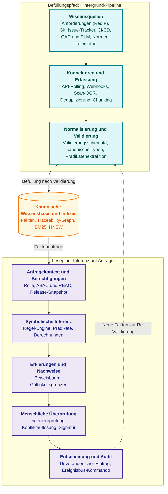
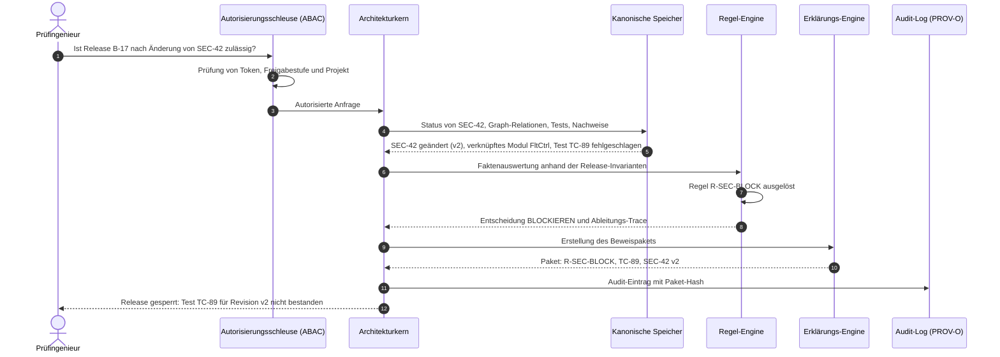
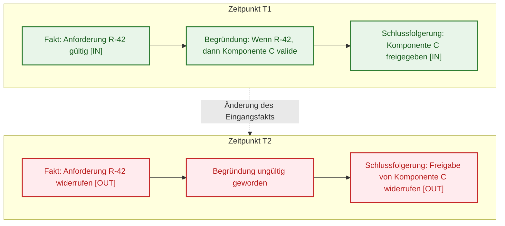
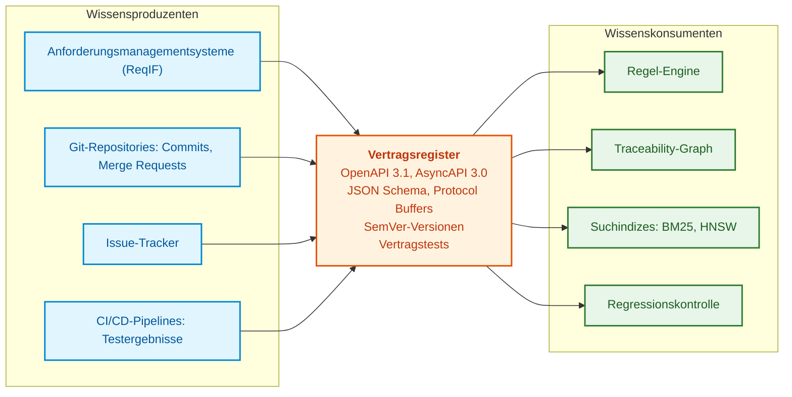

# Kapitel 16. Architektur von Expertensystemen: Vom formalen Wissen zur evidenzbasierten Entscheidung

> **Buch:** [Architektur evidenzbasierter Expertensysteme](README.md) · [Teil IV: Architektur, Technologie-Stack, Inferenz und Aktion](part-04-architecture-and-inference.md)  
> **Vorheriges Kapitel:** [Kapitel 37. Eingangsdatenbewertung: Quellen, Zeugnisse und epistemische Unsicherheit](ch37-input-information-assessment-and-algorithmic-skepticism.md)  
> **Nächstes Kapitel:** [Kapitel 17. Technologie-Stack: Auswahlkriterien für Werkzeuge, Programmiersprachen und Regel-Engines](ch17-implementation-stack.md)  
> **Inhaltsverzeichnis:** [README.md](README.md)  
> **Autor:** [Mykola Fedchyk](about-the-author.md)  
> **Niveau:** Fortgeschritten: Systemarchitekten, Wissensingenieure, Entwickler von Expertensystemen  
> **Lernziele:** Den Architekturkern des Expertensystems von austauschbaren Adaptern trennen; getrennte Pfade für Wissensbefüllung und Lese-/Inferenzoperationen entwerfen; physische Speicherformen für jeden Wissenstyp auswählen; erklären, wie Systeme zur Wahrheitserhaltung (TMS) Schlussfolgerungen bei Faktenänderungen invalidieren; Datenverträge zwischen Subsystemen definieren; Qualität von Retrieval, Generierung und Kalibrierung messen; Entscheidungsprovenienz nach dem W3C-PROV-O-Modell erfassen.

---

## Abstract

In diesem Kapitel wird die logische und funktionale Architektur eines evidenzbasierten Expertensystems untersucht, mit einer strikten Abgrenzung zwischen dem Architekturkern, systemeigenen Subsystemen und austauschbaren Adaptern (LLMs, Vektordatenbanken, Such-Engines). Es wird die Aufteilung der Datenströme in einen asynchronen Hintergrund-Befüllungspfad (*fill path*) und einen deterministischen Lese- und Inferenzpfad (*read path*) begründet. Das Konzept des operativen Wissens sowie eine Speichertypologie für divergierende Konsistenzgarantien (ACID, Traceability-Graphen, OWL-Ontologien, W3C PROV-O) werden formalisiert. Behandelt wird die Mathematik der Wahrheitserhaltung (JTMS und ATMS) mit einer Analyse des Verhaltens von Entscheidungen bei Änderung oder Ungültigkeitserklärung von Fakten sowie die Definition von Datenverträgen zwischen Subsystemen (OpenAPI, AsyncAPI, JSON Schema, Pact). Schließlich werden Qualitäts- und Zuverlässigkeitsmetriken (Recall@k, MRR, nDCG, ECE) definiert, um verdeckte Ausfälle und systematische Modell-Überkonfidenz in missionskritischen Ingenieurdomänen zuverlässig zu verhindern.

---

Die vorhergehenden Kapitel haben dargelegt, wie ingenieurtechnisches Wissen formalisiert wird: wie Anforderungen extrahiert, quellenverankerte Fakten konstruiert und endliche Automaten modelliert werden. Eine Ansammlung von Bibliotheken, Modellen und Datenbanken konstituiert jedoch noch kein Expertensystem. Erforderlich ist eine tragfähige Architektur: klare Verantwortungsgrenzen zwischen Komponenten, getrennte Datenströme für Wissensbefüllung und Wissensnutzung, Speicher mit definierten Garantien sowie ein Mechanismus, der autoritativ entscheidet, was als wahr gilt.

Ein modernes Expertensystem für Forschung und Entwicklung (*Research and Development*, R&D) besitzt kein monolithisches Zentrum. Es ist weder ein „Chatbot über Dokumenten“ noch eine simple „Regel-Engine über einer Datenbanktabelle“. In ihm koexistieren mehrere Aussageklassen mit grundlegend divergierender Zuverlässigkeit: deterministische Fakten, logische Regeln, ein Beziehungs- und Abhängigkeitsgraph, Ergebnisse lexikalischer und vektorbasierter Suchen, Ausgaben trainierter Modelle, menschliche Expertenentscheidungen und ein lückenloser Beweispfad. Das Risikomanagement-Framework für künstliche Intelligenz NIST AI RMF 1.0 nennt unter den Kernmerkmalen vertrauenswürdiger KI-Systeme Validität und Zuverlässigkeit, Rechenschaftspflicht und Transparenz sowie Erklärbarkeit und Interpretierbarkeit [[1]](#src-1). Die Architektur definiert, wie diese Eigenschaften nicht durch bloße Deklarationen, sondern durch das strukturelle Gefüge des Expertensystems garantiert werden.

Dieses Kapitel beantwortet die fundamentale Frage: **Aus welchen Teilsystemen setzt sich ein evidenzbasiertes Expertensystem zusammen und wer trägt die Verantwortung für die Zulässigkeit seiner Entscheidungen?** Die zentrale These lautet: Die kanonische Wissensbasis, die Inferenzmaschine, die Zulassungsrichtlinie und das Provenienz-Journal generieren Entscheidungen innerhalb eines formal freigegebenen Modells. Retrieval-Komponenten, Sprachmodelle und Konnektoren liefern lediglich Kandidaten oder führen statistische Berechnungen aus. Die architektonische Aufteilung allein begründet noch nicht die Wahrheit von Quellen oder die Korrektheit von Regeln: Unerlässlich bleiben domänenspezifische Verifikation, Anwendbarkeitsprüfungen und formale Freigaben.

Der Schwerpunkt dieses Kapitels liegt auf der logischen Architekturebene: Was bedeutet Wissen im ingenieurtechnischen Sinn, wo wird es persistiert, welchen Pfad durchläuft eine Anfrage, wie reagiert das System auf Faktenänderungen, wie vereinbaren Subsysteme ihre Datenformate und wie wird Qualität quantitativ gemessen. Die physische Ausführungsebene (Hardwarebeschleuniger, Platzierung auf Edge/On-Premise, Latenzgrenzen) wird in [Kapitel 18](ch18-execution-infrastructure.md) vertieft.

## 1. Architekturkern und Verantwortungsgrenzen

Im ingenieurtechnischen Entwurf evidenzbasierter Systeme besteht der gravierendste Architekturfehler im Verwischen der Grenzen zwischen dem Entscheidungsmechanismus und den unterstützenden statistischen oder Retrieval-Diensten. Delegiert ein Expertensystem die Wahrheitsfindung an externe Werkzeuge (wie generative neuronale Sprachmodelle oder Vektordatenbanken), verliert es seinen Determinismus und wird anfällig für verdeckte Ausfälle und stochastische Halluzinationen – was fundamental unvereinbar mit den Standards der funktionalen Sicherheit ist (ISO 26262 ASIL D, IEC 61508 SIL 3). Der **Architekturkern des Expertensystems** ist der streng kontrollierte und verifizierte Teil, der die alleinige Hoheit über den Inhalt der Entscheidung besitzt: das Domänenmodell, die kanonischen Fakten, Regeln, Invarianten, den Beweisgraphen, die Zugriffsrichtlinien, den Wissenslebenszyklus und den vollständigen Ableitungs-Trace. Ausschließlich der Architekturkern liefert autoritative Antworten auf fünf fundamentale Fragen:

- Welches Wissen ist zum aktuellen Zeitpunkt rechtsgültig in Kraft?
- Welche Regeln wurden in welcher Reihenfolge angewendet?
- Warum ist die Schlussfolgerung technisch und regulatorisch zulässig?
- Auf welche Primärquellen stützt sich jeder einzelne Ableitungsschritt?
- Wie lässt sich die vollständige Entscheidungskette in einem Monat oder einem Jahr exakt reproduzieren?

Der Architekturkern darf daher keinesfalls mit den ihn umgebenden Werkzeugen gleichgesetzt werden. Eine Such-Engine, eine Vektordatenbank, ein großes Sprachmodell (*Large Language Model*, LLM) oder eine Modell-Laufzeitumgebung können von erheblichem Nutzen sein, besitzen jedoch niemals das Recht, eigenständig über Wahrheit zu entscheiden. Ihre Aufgabe erschöpft sich darin, Kandidaten bereitzustellen, statistische Ähnlichkeiten zu berechnen oder Fließtext zu formulieren. Eine Entscheidung wird erst dann zu einem Expertenurteil, wenn der Architekturkern diese Zwischenergebnisse durch formale Regeln, Invarianten und Provenienzprüfungen leitet und ein maschinenprüfbares Beweispaket schnürt. Die nachfolgende Tabelle unterteilt die Komponenten in drei Verantwortungsbereiche.

| Gruppe | Enthaltene Komponenten | Logik-Eigentümer |
|---|---|---|
| **Architekturkern** | Domänenmodell, kanonische Wissensbasis, Regeln, Invarianten, Beweisgraph, Richtlinien, Auditierung, Wissenslebenszyklus | Expertensystem |
| **Systemeigene funktionale Subsysteme** | Konnektoren, Datenerfassung und -normalisierung, Chunking, Indizierung, Kalibrierung, Erklärungssynthese, menschliche Überprüfung, Feedback | Expertensystem (definiert Verträge und Qualitätsanforderungen) |
| **Externe Dienste** | Data Warehouses, Suchmaschinen, Vektor-DBMS, Modell-Laufzeitumgebungen, LLMs, OCR-Module, PLM- und ALM-Systeme, Issue-Tracker, CI/CD-Pipelines, Modell-Registries | Externe Dienste führen Berechnungen aus, besitzen jedoch keinerlei Entscheidungshoheit |

Diese Separation macht das Expertensystem gegenüber drei typischen Ausfallarten resilient. Erfindet ein externes Sprachmodell eine Behauptung (Halluzination), erkennt der Architekturkern das Fehlen von Primärnachweisen und blockiert die Schlussfolgerung. Wird ein Suchindex beschädigt oder veraltet er, rekonstruiert der Architekturkern den Index deterministisch aus dem kanonischen Speicher. Ändert ein externer Issue-Tracker sein Feldschema, fängt die Konnektor- und Normalisierungsschicht diese Änderung innerhalb des Datenvertrags ab, ohne dass die Inferenzregeln kollabieren.

Aus der Praxis des Autors: Diese Grenze muss vom ersten Tag an kompromisslos gezogen werden. Werden Suche, Vektoren, Konnektoren und neuronale Laufzeitumgebungen als austauschbare Adapter angebunden, kann jeder Adapter vorübergehend degradieren oder ausgetauscht werden, ohne Domänenentitäten, Regeln, Statuswerte, Entscheidungstraces oder das Audit-Log zu beeinträchtigen. Der umgekehrte Ansatz – bei dem die Entscheidungslogik teilweise in LLM-Prompts oder Indexkonfigurationen verlagert wird – führt unweigerlich zu untrennbaren Abhängigkeiten und Systeminstabilität.

Damit der Architekturkern Wissen verwalten kann, muss präzise definiert werden, was im ingenieurtechnischen Sinn als operatives Wissen gilt.

## 2. Operatives Wissen im ingenieurtechnischen Sinne

Für ein Expertensystem ist Wissen nicht einfach unstrukturierter Text. Ein technisches Dokument kann zwar die Primärquelle von Wissen sein, stellt jedoch für sich genommen noch kein operatives Wissen dar, mit dem eine Inferenzmaschine arbeiten kann.

Operatives Wissen besitzt eine typisierte Struktur, einen Eigentümer, eine Version, einen Status im Lebenszyklus, eine Herkunftsquelle, einen Geltungsbereich, Beziehungen zu anderen Artefakten, zeitliche Gültigkeitsgrenzen und formale Nutzungsregeln. Eine verabschiedete normative Anforderung, der Entwurf einer Ingenieursnotiz, eine Spezifikationsklärung eines Zulieferers, ein Prüfbericht und ein Kommentar im Chat besitzen grundlegend unterschiedliche Status, selbst wenn alle in derselben natürlichen Sprache verfasst sind. Operatives Wissen gliedert sich in sechs fundamentale Komponenten:

- **Fakten** beschreiben den verifizierten Zustand eines Objekts oder der Umgebung: Die Anforderung REQ-101 ist freigegeben, der Test TEST-404 ist fehlgeschlagen, der Defekt DEF-12 besitzt den Status „kritisch“.
- **Regeln** formalisieren Ursache-Wirkungs-Beziehungen und Entscheidungslogik: Wenn ein kritischer Defekt ein sicherheitsrelevantes Subsystem betrifft, wird der Übergang zu Feldtests blockiert.
- **Ontologien** definieren das Begriffssystem und die Relationen der Domäne: Was konstituiert eine Anforderung, eine Komponente, einen Test, ein Risiko oder einen Zertifizierungsnachweis. Die Standardsprache für Ontologien ist OWL 2 des W3C-Konsortiums [[2]](#src-2).
- **Einschränkungen und Invarianten** definieren unzulässige Systemzustände. Beispielsweise kann eine interne Unternehmensrichtlinie fordern, dass eine Anforderung der Sicherheitsanforderungsstufe SIL 3 (*Safety Integrity Level*) niemals ohne zwei unabhängige Verifikationsberichte als geschlossen gilt. Für Wissensgraphen werden solche Invarianten in SHACL (*Shapes Constraint Language*) formalisiert [[3]](#src-3).
- **Präzedenzfälle** speichern strukturierte Erfahrung: die Historie zur Beseitigung von Kavitation in Pumpenaggregaten oder genehmigte Ausnahmegenehmigungen von Standardregeln.
- **Herkunftsnachweis** (*Provenance*) erfasst die Genealogie des Wissens: Wer hat den Fakt eingetragen, auf Basis welches Dokuments, in welcher Revision und unter welchen Annahmen. Das Provenienzmodell PROV-O des W3C beschreibt diesen Stammbaum als Graph aus Entitäten, Aktivitäten und Agenten [[4]](#src-4).

Eine Wissensbasis ist somit kein Verzeichnis von Dokumentdateien, sondern ein kontrollierter Graph interagierender Artefakte, den das Expertensystem auf Widerspruchsfreiheit prüfen, zu Schlussfolgerungen verknüpfen, erklären und gezielt invalidieren kann. Es stellt sich unmittelbar die Frage, in welchen physischen Formen dieser Graph gespeichert werden muss.

## 3. Physische Speicherformen und Typologie von Wissensspeichern

Dasselbe ingenieurtechnische Wissen lässt sich nicht in einem universellen Speicherformat abbilden. Eine Anforderung, ein Test, ein Defekt, ein Nachweis, eine Regel, Modellgewichte und ein Audit-Ereignis beschreiben denselben Produktlebenszyklus, doch Anfragen an sie erfordern grundlegend verschiedene Garantien: Einige benötigen ACID-Transaktionen, andere eine Pfadsuche im Graphen, manche lexikalische Filterung und wieder andere Vektorähnlichkeitssuche. Das folgende Diagramm gruppiert die physischen Formen nach ihrem Einsatzzweck.

```mermaid
flowchart TB
    accTitle: Physische Speicherformen von Wissen
    accDescr: Ingenieurtechnisches Wissen verteilt sich auf drei Gruppen von Speichern: strukturierte Daten, Suche und Primärquellen sowie Steuerbarkeit und Reproduzierbarkeit.

    K["<b>Physische Speicherformen von Wissen</b>"]

    subgraph Structured["Strukturierte Daten"]
        direction LR
        R["<b>Relationales DBMS</b><br/>Tabellen, Joins, ACID-Transaktionen"]
        G["<b>Graph-DBMS</b><br/>Knoten, Kanten, Traceability"]
        RDF["<b>RDF- und OWL-Triple-Store</b><br/>Tripel, Beschreibungslogik"]
        D["<b>Dokumenten-DBMS</b><br/>JSON-Dokumente mit Schemata"]
    end

    subgraph Retrieval["Suche und Primärquellen"]
        direction LR
        S["<b>Lexikalischer Index</b><br/>BM25, Facetten, N-Gramme"]
        V["<b>Vektor-DBMS</b><br/>HNSW, semantische Ähnlichkeit"]
        O["<b>Objektspeicher</b><br/>PDF, CAD-Modelle, Binärdateien"]
    end

    subgraph Governance["Steuerbarkeit und Reproduzierbarkeit"]
        direction LR
        A["<b>Audit-Log</b><br/>Append-only, PROV-O, Hashes"]
        M["<b>Modell-Registry</b><br/>Modellkarten, Gewichte, Quantisierung"]
    end

    K --> R & G & RDF & D
    K --> S & V & O
    K --> A & M

    classDef root fill:#e1f5fe,stroke:#0288d1,stroke-width:2px,color:#01579b;
    classDef struct fill:#e8f5e9,stroke:#2e7d32,stroke-width:2px,color:#1b5e20;
    classDef retr fill:#fff3e0,stroke:#e65100,stroke-width:2px,color:#bf360c;
    classDef gov fill:#ede7f6,stroke:#512da8,stroke-width:2px,color:#311b92;

    class K root;
    class R,G,RDF,D struct;
    class S,V,O retr;
    class A,M gov;
```



Das Diagramm illustriert drei Speichergruppen. Strukturierte Daten halten kanonische Fakten und Relationen, Such- und Quellenspeicher ermöglichen den Zugriff auf Texte und Originaldateien, während Governance-Speicher die Reproduzierbarkeit sichern. Jede Speicherform erfüllt eine dedizierte Funktion:

- **Relationale Tabellen** speichern Entitäten mit festen Attributen, Primär-/Fremdschlüsseln und Integritätsgarantien: Genehmigungsstatus, Spezifikationsversionen, Benutzerrollen.
- **Graphstrukturen** dienen der Pfadsuche, der Auswirkungsanalyse von Änderungen (*change impact analysis*) und der lückenlosen Rückverfolgbarkeit (*traceability*) zwischen Anforderungen, Quellcode und Testfällen.
- **RDF-Tripel mit OWL-Ontologien** ermöglichen automatisierte ontologische Inferenz nach W3C-Standards.
- **Dokumentenspeicher** verwalten komplexe strukturierte Berichte, Konfigurationen und Sitzungskontexte von Ingenieuren.
- **Lexikalische Indizes** gewährleisten exakte Filterung nach Bezeichnern (Normnummer, Paragraf, Artikelnummer), Facettennavigation und Volltextsuche; eine etablierte Ranking-Funktion hierfür ist BM25 [[5]](#src-5).
- **Vektorindizes** identifizieren semantisch verwandte Präzedenzfälle und Vorschriften bei variierender Terminologie; zur effizienten Suche der nächsten Nachbarn werden Graphindizes wie HNSW (*Hierarchical Navigable Small World*) eingesetzt [[6]](#src-6).
- **Objektspeicher** persistieren Originaldateien (Scans von Prüfberichten, Norm-PDFs, Telemetrie-Plots) zusammen mit ihren kryptografischen SHA-256-Prüfsummen.
- **Audit-Logs** sind strikt anfügbare (*append-only*) Strukturen, die die Inferenzchronologie, aktivierte Regeln und Expertenentscheidungen manipulationssicher festhalten.
- **Modell-Registries** versionieren Metadaten, Genauigkeitsmetriken, Quantisierungsparameter und Artefakte trainierter Sprach- und Klassifikationsmodelle.

Aus der Praxis des Autors: Ein Expertensystem auf einer einzigen universellen Datenbank aufbauen zu wollen, ist verfehlt. Verwaltete Fakten, Regeln und Status gehören in eine kanonische relationale Form, Relationen in einen Traceability-Graphen, lexikalische und vektorielle Ebenen als abgeleitete Indizes (die jederzeit deterministisch neu aufgebaut werden können) und Originaldateien in einen unveränderlichen Objektspeicher. Dies erfordert zwar Synchronisationsdisziplin, garantiert jedoch, dass jede Abfrage von derjenigen Engine verarbeitet wird, die optimal für diesen Operationstyp entworfen wurde.

Die verbreitetste Versuchung besteht darin, alle Speicherformen auf eine einzige Vektordatenbank zu reduzieren. Der nächste Abschnitt erläutert, warum dies scheitern muss.

## 4. Grenzen von Vektorspeichern und Trennung semantischer Suche von der kanonischen Wahrheit

Eine Vektordatenbank beantwortet eine sehr eng begrenzte Frage: Welche Textfragmente weisen die ähnlichsten Vektorrepräsentationen (*embeddings*) zur Suchanfrage auf? Die Suche reduziert sich auf die Berechnung von Kosinusähnlichkeit oder Skalarprodukt. Dies ist ein wertvoller Mechanismus für semantische Ähnlichkeit, liefert jedoch keinerlei Antworten auf ingenieurtechnische und regulatorische Kernfragen:

- Ist dieser Standardparagraf am Tag der Produktfreigabe rechtsgültig in Kraft?
- Wurde diese Anforderung durch ein späteres Änderungsbulletin außer Kraft gesetzt?
- Besitzt der anfragende Benutzer die erforderliche Sicherheitsfreigabe für dieses Fragment?
- Steht das gefundene Fragment im Widerspruch zu einer Sicherheitsinvariante aus einem übergeordneten Dokument?

Die Antwort auf jede dieser Fragen hängt nicht von semantischer Ähnlichkeit ab, sondern von Metadaten und Relationen: Dokumentenstatus, Substitutionsgraphen, Zugriffsrichtlinien und Konsistenzregeln. Ein Expertensystem, das ausschließlich auf Vektorsuche über Textfragmenten basiert, wird mit hoher Konfidenz veraltete Anweisungen, zurückgezogene Normen und widersprüchliche Regeln zitieren. [Kapitel 15](ch15-knowledge-extraction-and-kb-construction.md) hat dieses Versagen anhand der historischen Revisionen des SMTP-Protokolls demonstriert.

Die architektonische Invariante lautet: **Die Vektorsuche liefert ausschließlich Kandidaten, und jeder Kandidat muss vollständige Metadaten tragen**:

- Eindeutige Kennung der kanonischen Primärquelle;
- Revisionsnummer und zeitliche Gültigkeitsgrenzen;
- Regulatorischer Status: gültig, zurückgezogen, in Überarbeitung;
- Zugriffsklassifizierungskennzeichen;
- Kryptografische Prüfsumme des Originaldokuments;
- Fingerprint der Vektorisierungs-Pipeline: Modellname und Revisionsstand des Embedding-Modells, Normalisierungsparameter, Chunk-Größe.

Nach der Metadatenprüfung erfordert ein Kandidat weiterhin eine semantische Inhalts- und Berechtigungsprüfung; eine korrekte Revision garantiert noch keine zutreffende Interpretation. Vektoren unterschiedlicher Modelle lassen sich in der Regel ohne explizit nachgewiesene Kompatibilität nicht direkt vergleichen. Ein verändertes Chunking bei identischem Encoder verändert zwar nicht zwingend den Koordinatenraum, modifiziert jedoch die Sucheinheiten und die Relevanz-Baseline. Der Pipeline-Fingerprint ist für beide Änderungsarten zwingend erforderlich.

Nun lassen sich die Komponenten zu einer konsistenten Architektur zusammenführen.

## 5. Referenzarchitektur: Befüllungspfad und Lesepfad

Die Referenzarchitektur eines evidenzbasierten Expertensystems entkoppelt zwei Datenströme mit fundamental unterschiedlichen Anforderungen an Latenz und Zuverlässigkeit:

1. **Der Befüllungspfad** (*fill path*) ist eine asynchrone Hintergrund-Pipeline, die rohe ingenieurtechnische Quellen in kanonisches, strukturiertes und verifiziertes Wissen überführt.
2. **Der Lese- und Inferenzpfad** (*read path*) verarbeitet die Benutzeranfrage: Er bestimmt Kontext und Zugriffsrechte, selektiert Fakten, wendet Regeln an, konstruiert Erklärungen und erzeugt den Prüfpfad.

Diese Trennung ist unerlässlich: Das Parsen komplexer PDFs, OCR von Zeichnungen und die formale Zitierungsprüfung dauern Minuten oder Stunden und können fehlschlagen. Die Antwort auf eine Anfrage hingegen muss in Sekundenbruchteilen erfolgen und darf sich ausschließlich auf bereits verifiziertes Wissen stützen. Würde das Parsen während der Anfragebearbeitung erfolgen, hielte jede Antwort von der zufälligen tagesaktuellen Verfügbarkeit externer Parser ab. Das Diagramm illustriert beide Pfade.



Im Diagramm mündet der Befüllungspfad in der kanonischen Wissensbasis und den abgeleiteten Indizes, während der Lesepfad rein lesend darauf zugreift. Neue Fakten, die während des Lesepfads abgeleitet werden, fließen niemals direkt unkontrolliert in die Wissensbasis ein: Sie werden – wie alle externen Rohdaten – zur Normalisierung und Re-Validierung an den Befüllungspfad übergeben. Die Komponenten erfüllen folgende Aufgaben:

- **Quell-Konnektoren** kapseln die Protokolle externer Systeme (Issue-Tracker, Code-Repositories, Anforderungs- und PLM-Tools, Wikis) und garantieren einen stabilen Import von Ereignissen und Dokumenten.
- **Die Erfassungs-Pipeline** (*ingestion*) parst heterogene Formate (PDF, DOCX, ReqIF, XML), extrahiert Tabellen und mathematische Formeln, führt OCR auf technischen Zeichnungen aus, berechnet Prüfsummen und dokumentiert Provenienz-Metadaten.
- **Die Normalisierungsschicht** transformiert heterogene Daten in ein einheitliches ontologisches Schema, ersetzt lokale Bezeichner durch globale URIs und gleicht Maßeinheiten an das internationale Einheitensystem (SI) an.
- **Die symbolische Inferenzmaschine** prüft Regeln, detektiert Widersprüche und wertet ingenieurtechnische Berechnungsformeln aus. Typische Implementierungen basieren auf dem Rete-Algorithmus für Produktionsregeln [[7]](#src-7) oder Datalog für rekursive Abfragen über Faktenbasen [[8]](#src-8).
- **Die Erklärungskomponente** konstruiert den formalen Beweisbaum: welche Regeln ausgelöst wurden, welche Fakten als Stützen dienten und welche Daten für eine definitive Schlussfolgerung fehlten.
- **Das Modul für menschliche Überprüfung** (*Human-in-the-Loop*) definiert Autonomiegrenzen und leitet kritische Entscheidungen zur formalen Freigabe an qualifizierte Fachexperten weiter.
- **Das Autorisierungs-Gateway** reguliert den Zugriff auf Fakten und Textfragmente. Rollenbasierte Zugriffskontrolle RBAC (*Role-Based Access Control*) vergibt Rechte nach Benutzerrollen [[9]](#src-9), während attributbasierte Zugriffskontrolle ABAC (*Attribute-Based Access Control*) Attribute des Nutzers, der Ressource und des Kontexts auswertet, beispielsweise Projektzugehörigkeit und Freigabestufe [[10]](#src-10). Solche Richtlinien lassen sich deklarativ formulieren, etwa in der Sprache Rego des Open Policy Agent [[11]](#src-11).

Um das Zusammenspiel dieser Komponenten zu verdeutlichen, wird der Lebenszyklus einer exemplarischen Anfrage nachvollzogen.

## 6. Lebenszyklus einer Anfrage: Von der Fragestellung zum Beweispaket

Betrachten wir das Szenario eines Prüfingenieurs: *„Ist das Software-Release B-17 der Flugsteuerungs-Avionik nach der Modifikation der Cybersecurity-Anforderung SEC-42 freigabefähig?“* Das nachfolgende Sequenzdiagramm veranschaulicht den Ablauf der Komponenteninteraktion.



Die nachfolgende Tabelle schlüsselt die fünf Phasen der Anfrageverarbeitung im Detail auf.

| Phase | Aktion | Beteiligte Komponenten | Resultat |
|---|---|---|---|
| **1. Kontext und Sicherheit** | Authentifizierung des Ingenieurs, Bestimmung von Projekt, Rolle, Sicherheitsstufe und Release-Branch | Autorisierungs-Gateway, Policy-Service | Validierter Kontext mit Zugriffsfiltern |
| **2. Faktenabfrage** | Status der Anforderung SEC-42 abfragen, Traversierung des Traceability-Graphen zu verknüpften Modulen, Abruf von Testberichten | Graph-DBMS, relationaler Speicher, lexikalischer Index | Menge verifizierter Fakten inklusive Revisionsständen |
| **3. Regeln und Inferenz** | Abgleich der Fakten mit formalen Release-Sicherheitskriterien | Regel-Engine (Datalog oder Rete) | Urteil „Release blockieren“ und Liste verletzter Invarianten |
| **4. Erklärung** | Assemblierung des Beweispakets: modifizierte Anforderung, betroffener Code, fehlgeschlagener Test TC-89, Regel R-SEC-BLOCK | Erklärungs-Engine; Sprachmodell rein zur Formulierung der Zusammenfassung | Beweispaket mit exakten Quellenbelegen |
| **5. Entscheidung und Audit** | Erfassung der Expertenentscheidung oder des automatischen Vetos im manipulationssicheren Journal | Audit-Subsystem, Ereignisbus | Kryptografisch signierter Entscheidungseintrag |

Ein Sprachmodell tritt in dieser Kette ausschließlich in Phase 4 in Erscheinung, und zwar rein zur Erzeugung einer lesbaren Zusammenfassung des bereits formal konstruierten Beweispakets. Das Urteil „Release blockieren“ wurde deterministisch durch die Regel R-SEC-BLOCK auf Basis kanonischer Fakten gefällt; die Entscheidung lässt sich somit ohne jedes Sprachmodell exakt reproduzieren. Fakten in der realen Welt ändern sich jedoch: Der Test TC-89 wird erneut ausgeführt, die Anforderung SEC-42 wird überarbeitet. Was in diesem Fall mit bereits gefällten Entscheidungen geschieht, erläutert der folgende Abschnitt.

## 7. Systeme zur Wahrheitserhaltung und Invalidierung von Schlussfolgerungen bei Faktenänderungen

In ingenieurtechnischen Projekten evolviert Wissen kontinuierlich: Spezifikationen werden aktualisiert, Normen ergänzt, Tests wiederholt. Ein Expertensystem mit Anspruch auf formale Nachweisbarkeit muss beantworten können: Was geschieht mit zuvor abgeleiteten Schlussfolgerungen, wenn ein zugrundeliegender Eingangsfakt modifiziert oder widerrufen wird? Ohne ein System zur Wahrheitserhaltung (*Truth Maintenance System*, TMS) akkumuliert eine Wissensbasis im Laufe der Zeit veraltete und zirkulär widersprüchliche Aussagen.

Die klassische Informatikliteratur unterscheidet zwei grundlegende TMS-Paradigmen. Das von Jon Doyle begründete rechtfertigungsbasierte System zur Wahrheitserhaltung (*Justification-based TMS*, JTMS) versieht jede Aussage mit dem Label `IN` (akzeptiert) oder `OUT` (nicht gestützt), je nachdem, ob die Aussage mindestens eine aktuell gültige Begründung besitzt [[12]](#src-12). Das von Johan de Kleer entwickelte annahmebasierte System (*Assumption-based TMS*, ATMS) speichert für jede Aussage die Mengen von Annahmen, unter denen sie wahr ist, und gestattet so die parallele Exploration mehrerer hypothetischer Szenarien, wie etwa: „Was geschieht mit der Zulassung der Baugruppe, wenn die Strukturmasse um 5 % ansteigt?“ [[13]](#src-13).

> [!NOTE] Architektonische Abgrenzung von JTMS und ATMS in der Ingenieurpraxis
> - **JTMS (Ein-Welt-Modell):** Operiert nach dem Prinzip des binären Zustandswechsels `IN / OUT`. Wird ein Eingangsfakt widerrufen, führt das JTMS einen nicht-monotonen Widerruf abhängiger Schlussfolgerungen entlang des Begründungsgraphen aus. Dies ist optimal für die reaktive Konfigurationsprüfung (z. B. Validierung der Release-Gültigkeit in CI/CD).
> - **ATMS (Mehr-Welten-Modell):** Jedem Fakt wird ein Umgebungskennzeichen (*environment label*) zugeordnet – die Menge von Basisannahmen, unter denen der Fakt wahr ist. Das ATMS verwaltet die Koexistenz mehrerer unvereinbarer hypothetischer Zustände simultan ohne teures Backtracking. Dies ist fundamental für ingenieurtechnische Trade-off-Analysen: Das System berechnet parallel Variante A („Titangehäuse: Masse -15 %, Kosten +40 %“) und Variante B („Verbundwerkstoff: Masse -20 %, Delaminationsrisiko bei T > 120 °C“).

Das folgende Diagramm veranschaulicht den Basisfall: Eine Schlussfolgerung stützt sich auf einen Fakt; der Widerruf des Fakts erzwingt den Widerruf der Schlussfolgerung.



In der Terminologie des JTMS bedeutet dies: Zum Zeitpunkt T1 trägt die Anforderung R-42 das Label `IN`, die Begründung ist valide, und die Schlussfolgerung „Komponente C freigegeben“ erhält das Label `IN`. Zum Zeitpunkt T2 wird R-42 widerrufen, die Begründung verliert ihre Stütze, und die Schlussfolgerung wechselt auf `OUT`.

Die naive Heuristik „Widerrufe alles, was vom geänderten Fakt abhängt“ ist jedoch fehlerhaft: Eine Aussage kann über alternative, weiterhin intakte Begründungen verfügen. Das nachfolgende Go-Programm implementiert das positive Fragment der Begründungsverwaltung (ein didaktisches JTMS-Modell). `IN` bedeutet Stützung durch akzeptierte Prämissen, `OUT` bedeutet Fehlen einer solchen Stützung (und keineswegs einen formalen Beweis der Falschheit). Die didaktische Richtlinie lässt im Beispiel den Ersatz eines Tests durch einen Simulationsbericht zu; dies ist eine Modellannahme und kein universelles Kriterium für reale Produktverifikationen.

<details>
<summary>Go-Beispiel: JTMS-Labels für Schlussfolgerungen mit multiplen Begründungen</summary>

```go
package main

import "fmt"

// Node repräsentiert eine Aussage im Begründungsnetzwerk.
type Node struct {
	Name    string
	Premise bool       // Prämisse: besitzt das Label IN, solange sie nicht widerrufen wird
	Just    [][]string // Begründungen: jede ist eine Menge von Stützaussagen
}

// label berechnet Labels von Grund auf: Zunächst besitzen alle Aussagen
// das Label OUT, anschließend propagiert das Label IN, solange Änderungen auftreten.
// Daher kann sich eine Aussage nicht über einen Zyklus selbst begründen.
func label(nodes []Node, retracted map[string]bool) (map[string]bool, error) {
	known := map[string]bool{}
	for _, node := range nodes {
		if node.Name == "" || known[node.Name] {
			return nil, fmt.Errorf("empty or duplicate node: %q", node.Name)
		}
		known[node.Name] = true
	}
	for _, node := range nodes {
		for _, justification := range node.Just {
			for _, antecedent := range justification {
				if !known[antecedent] {
					return nil, fmt.Errorf("unknown antecedent: %q", antecedent)
				}
			}
		}
	}
	in := map[string]bool{}
	for changed := true; changed; {
		changed = false
		for _, n := range nodes {
			v := n.Premise && !retracted[n.Name]
			for _, j := range n.Just {
				all := true
				for _, a := range j {
					all = all && in[a]
				}
				v = v || all
			}
			if in[n.Name] != v {
				in[n.Name] = v
				changed = true
			}
		}
	}
	return in, nil
}

func mark(b bool) string {
	if b {
		return "IN"
	}
	return "OUT"
}

func main() {
	nodes := []Node{
		{Name: "R-42 gültig", Premise: true},
		{Name: "TC-89 bestanden", Premise: true},
		{Name: "SIM-12 freigegeben", Premise: true},
		{Name: "DOC-3 abgestimmt", Premise: true},
		{Name: "C valide", Just: [][]string{
			{"R-42 gültig", "TC-89 bestanden"},
			{"R-42 gültig", "SIM-12 freigegeben"},
		}},
		{Name: "Release erlaubt", Just: [][]string{{"C valide", "DOC-3 abgestimmt"}}},
	}
	for _, r := range []string{"", "TC-89 bestanden", "R-42 gültig"} {
		in, err := label(nodes, map[string]bool{r: true})
		if err != nil {
			panic(err)
		}
		outR := r
		if outR == "" {
			outR = "nichts"
		}
		fmt.Printf("widerrufen: %-16s | C valide: %-3s | Release erlaubt: %s\n",
			outR, mark(in["C valide"]), mark(in["Release erlaubt"]))
	}
}
```

Negative Testfälle und Permutationsprüfungen verifiziert ein separater Unit-Test; Ausführung: `go test -v main.go main_test.go`.

```go
package main

import "testing"

func TestPositiveSupport(testCase *testing.T) {
	nodes := []Node{
		{Name: "source", Premise: true},
		{Name: "alternative", Premise: true},
		{Name: "claim", Just: [][]string{{"source"}, {"alternative"}}},
	}
	remaining, err := label(nodes, map[string]bool{"source": true})
	if err != nil || !remaining["claim"] {
		testCase.Fatalf("alternative support lost: %v", err)
	}
	removed, err := label(nodes, map[string]bool{"source": true, "alternative": true})
	if err != nil || removed["claim"] {
		testCase.Fatalf("unsupported claim accepted: %v", err)
	}
	for left, right := 0, len(nodes)-1; left < right; left, right = left+1, right-1 {
		nodes[left], nodes[right] = nodes[right], nodes[left]
	}
	reordered, err := label(nodes, map[string]bool{"source": true})
	if err != nil || reordered["claim"] != remaining["claim"] {
		testCase.Fatalf("order changed result: %v", err)
	}
	cycle := []Node{{Name: "first", Just: [][]string{{"second"}}},
		{Name: "second", Just: [][]string{{"first"}}}}
	cyclic, err := label(cycle, nil)
	if err != nil || cyclic["first"] || cyclic["second"] {
		testCase.Fatalf("unfounded cycle accepted: %v", err)
	}
	if _, err := label([]Node{{Name: "same", Premise: true}, {Name: "same"}}, nil); err == nil {
		testCase.Fatal("duplicate nodes accepted")
	}
	if _, err := label([]Node{{Name: "claim", Just: [][]string{{"missing"}}}}, nil); err == nil {
		testCase.Fatal("unknown antecedent accepted")
	}
}
```

Erwartete Konsolenausgabe des Programms:

```text
widerrufen: nichts           | C valide: IN  | Release erlaubt: IN
widerrufen: TC-89 bestanden  | C valide: IN  | Release erlaubt: IN
widerrufen: R-42 gültig      | C valide: OUT | Release erlaubt: OUT
```

</details>

Der Widerruf des Testergebnisses TC-89 änderte keine einzige übergeordnete Schlussfolgerung, da Komponente C über den Bericht SIM-12 eine intakte Alternativbegründung behielt. Ein naives Kaskadenlöschen hätte hier fälschlicherweise das gesamte Release blockiert. Der Widerruf der Anforderung R-42 hingegen entzog beiden Begründungspfaden das Fundament, sodass „C valide“ und „Release erlaubt“ deterministisch auf `OUT` wechselten. Die Labels werden ausgehend vom Zustand „alles OUT“ über Vorwärtspropagation berechnet; eine Aussage kann sich daher niemals zirkulär selbst stützen. Doyle beschrieb inkrementelle Label-Updates ohne vollständige Neuberechnung des Netzes [[12]](#src-12). Das vorliegende Lehrprogramm berechnet zur formalen Klarheit von Grund auf neu, liefert bei Begründungen ohne Negationsbedingungen jedoch identische Ergebnisse.

Die Anzahl der ATMS-Umgebungen kann kombinatorisch anwachsen. Für positive Regeln ohne Generierung unendlicher neuer Terme berechnet der gezeigte Algorithmus den kleinsten Fixpunkt über einer endlichen Knotenmenge; negative Begründungen und Nicht-Monotonie-Konflikte sind hier nicht implementiert. Der Widerruf einer Prämisse deklariert abhängige Aussagen nicht als falsch, sondern veranlasst das System zur erneuten Prüfung alternativer Stützen. Der Traceability-Graph muss kein streng azyklischer Graph (DAG) sein; Zyklen sind in realen Datenmodellen zulässig, dürfen jedoch ohne Primärstütze niemals Gültigkeit erzeugen.

## 8. Konsistenter Lesekontext und Reproduzierbarkeit von Entscheidungen

Eine reproduzierbare Antwort erfordert einen eindeutig fixierten Lesekontext: Wissenspaket-ID, Versionen von Regeln und Schemata, Fachprofil, Zieldatum, explizite Annahmen und Zugriffsrichtlinien. Die kanonische Wissensbasis und abgeleitete Indizes müssen ihre Datengenerationen explizit deklarieren. Liefert die Suchkomponente Treffer einer abweichenden Generation, verifiziert der Prüfer den Kandidaten im fixierten Snapshot oder weist ihn ab; ein Vermischen von Fakten zweier Release-Stände ist unzulässig. Dasselbe Prinzip gilt für partitionierte Architekturen: Eine Anfrage bindet dieselbe Generation über alle Shards hinweg; die Antwort eines Shards mit abweichender Generation wird wie das Schweigen des Shards behandelt. Das Schweigen eines Shards ist kein Beweis für die Nichtexistenz eines Fakts: Vier mögliche Abfrageergebnisse und sechs Partitionierungsregeln wurden in [Kapitel 7](ch07-knowledge-base-typology.md) behandelt, die Router-Implementierung in Abschnitt 10 von [Kapitel 32](ch32-high-performance-knowledge-packs-mmap-and-harvesting.md).

Historische Reproduktion und gegenwärtige Autorisierung sind getrennte Prüfungen. Ein altes Urteil lässt sich exakt reproduzieren, ohne dass der anfragende Ingenieur heute die Berechtigung besitzt, ein inzwischen zurückgezogenes oder geschütztes Dokumentfragment einzusehen. Der Cache-Schlüssel muss Kontext und Privilegien berücksichtigen; ein aktueller Berechtigungswiderruf kann die Ausgabe selbst einer bereits vorberechneten Antwort unterbinden. Abhängigkeiten und Historie werden gemäß Berechtigungs- und Aufbewahrungsrichtlinien persistiert, nicht unbegrenzt unter dem Deckmantel des Worts „Audit“.

Die Architekturkontrolle überwacht nicht nur den Normalbetrieb, sondern auch den Austausch von Adaptern, Generationskonflikte, Alternativbegründungen, idempotente Ereignisse und Rechteentzug. Der Kontext bestimmt, welche Daten verwendet werden dürfen; der nächste Abschnitt definiert das Format für ihren Austausch.

Wahrheitserhaltung funktioniert nur dann, wenn Fakten in einem wohldefinierten, stabilen Format eintreffen. Ändert eine Datenquelle stillschweigend einen Feldnamen, bemerkt die Inferenzmaschine die Faktenänderung überhaupt nicht. Dieses Problem lösen Datenverträge.

## 9. Datenverträge zwischen Subsystemen

Subsysteme eines Expertensystems dürfen ausschließlich über streng typisierte, versionierte Datenverträge (*data contracts*) interagieren. Der direkte Datenbankzugriff von Komponenten auf interne Tabellen anderer Dienste oder der Austausch unstrukturierter Freitextnachrichten führt unweigerlich zu verdeckten Ausfällen. Ein typisches Szenario: Die CI/CD-Pipeline benennt das Feld des Testergebnisses von `verdict` in `result` um. Die Inferenzregel „Blockiere Release, wenn Sicherheitstest verdict == fail“ findet keine Fakten mit dem Feld `verdict` mehr und erteilt eine fatale Scheinfreigabe – ohne jede Fehlermeldung.



Das Diagramm zeigt, dass Wissensproduzenten Daten nicht unkontrolliert an Konsumenten übermitteln: Jedes Ereignis durchläuft ein zentrales Schema- und Vertragsregister. Ein Datenvertrag umfasst vier Kernkomponenten:

- **Semantische Versionierung.** Jede inkompatible Schemaänderung erzwingt eine Erhöhung der Hauptversionsnummer nach SemVer-Regeln [[14]](#src-14), beispielsweise `EngineeringRequirementUpdated.v2`.
- **Strukturschema.** JSON Schema [[15]](#src-15) oder Protocol Buffers [[16]](#src-16) definieren Feldtypen, Wertebereiche, Pflichtattribute für Provenienz und kryptografische Signaturen. Synchrone Schnittstellen werden über OpenAPI 3.1 [[17]](#src-17) beschrieben, asynchrone Ereignisströme über AsyncAPI 3.0 [[18]](#src-18).
- **Kompatibilitätsrichtlinien.** Das Schema-Registry validiert vor der Veröffentlichung die Abwärtskompatibilität neuer Versionen und verhindert ein Blockieren der Verarbeitungswarteschlangen.
- **Vertragstests (*Contract Testing*).** Der Konsument hinterlegt formale Erwartungen an empfangene Nachrichten, und die CI/CD-Pipeline des Produzenten verifiziert diese Verträge vor dem Release automatisert, beispielsweise mittels Pact [[19]](#src-19).

Im Szenario des umbenannten Feldes erwartet der Vertragstest der Inferenzmaschine das Feld `verdict` mit den Werten `pass`, `fail`, `error`. Ein Build der CI/CD-Pipeline mit modifiziertem Feldnamen bricht im Vertragstest ab; der Defekt wird vor dem Deployment abgefangen und verhindert die Fehlentscheidung im Produktivbetrieb. Datenverträge eliminieren eine wesentliche Klasse verdeckter Ausfälle; der folgende Abschnitt fasst typische verdeckte Fehlermodi aller Schichten zusammen.

## 10. Modi verdeckter Ausfälle und Gegenmaßnahmen

Die Resilienz einer Architektur bemisst sich nicht allein am Normalbetrieb, sondern an ihrer Fähigkeit, Ausfälle transparent zu lokalisieren und zu neutralisieren. Die gefährlichsten Ausfälle in Expertensystemen sind verdeckte Fehler (*silent failures*): Das System bleibt betriebsbereit, liefert jedoch infolge unvollständiger oder korrumpierter Daten technisch oder juristisch unzulässige Urteile. Die folgende Tabelle fasst diese Modi für jede Architekturschicht zusammen.

| Architekturschicht | Verdeckter Ausfall | Konsequenz | Gegenmaßnahme |
|---|---|---|---|
| **Quell-Konnektoren** | Partieller Abbruch der Synchronisation (z. B. Netzwerk-Timeout) | Inferenzmaschine operiert auf unvollständiger Faktenbasis | High-Watermark-Tracking verarbeiteter Ereignisse, Prüfsummenabgleich mit der Quelle, Status `DEGRADED_SOURCE` sperrt finale Urteile |
| **Normalisierung** | Semantische Fehlzuordnung von Statuswerten (z. B. `Resolved` als `Closed`) | Regeln werten offenen Mangel als behoben und erteilen Freigabe | Quarantänepuffer für unerkannte Terme, geschlossene kontrollierte Vokabulare, Validierung am Ingestion-Gateway |
| **Wissensgraph** | Verwaiste Knoten und veraltete Kanten nach Entitätslöschungen | Fehlerhafte Auswirkungsanalyse, Risiken bleiben unerkannt | Kaskadierende Transaktionen, periodische Prüfung isolierter Teilgraphen, Verifikation von Provenienzbeziehungen |
| **Inferenzmaschine** | Abhängigkeit der Regelauswertung von der Ausführungsreihenfolge über mutablem Zustand | Identische Fakten führen zu divergierenden Entscheidungen | Verbot global veränderlicher Zustände, deterministische Regelfolgen mit expliziter Priorisierung (*salience*), isolierte Sitzungsfakten |
| **Vektorindex** | Vermischung von Vektoren verschiedener Modelle oder divergierender Chunking-Verfahren | Falsche Suchergebnisse und korrumpierter Inferenzkontext | Pipeline-Fingerprint an jedem Vektor, isolierte Indexräume, vollständige Reindizierung bei Modellwechsel |
| **Sprachmodell** | Erzeugung plausibler Behauptungen ohne Quellenbeleg (Halluzination) | Korrumpiertes Beweispaket, Täuschung des Prüfingenieurs | Zwingender Nachweisabgleich jeder Behauptung mit Zitaten der kanonischen Basis, Veto bei fehlender Primärquellenbindung |

Alle sechs Schichten folgen einem gemeinsamen Architekturprinzip: Im Zweifel schweigt die Schicht nicht, sondern markiert Daten als degradiert, verschiebt sie in Quarantäne oder blockiert die Inferenz. Der verdeckte Fehler wird zu einem expliziten, im Audit-Log und im Beweispaket dokumentierten Ereignis. Um schleichende Qualitätsverluste rechtzeitig zu detektieren, sind quantitative Metriken erforderlich.

## 11. Qualitätskalibrierung und Regressionskontrolle

Wird im Expertensystem ein Vokabular aktualisiert, eine Inferenzregel ergänzt oder das Embedding-Modell migriert, muss objektiv nachgewiesen werden, dass keine Qualitätsdegradation eingetreten ist. Hierzu ist eine mehrstufige Regressionskontrolle erforderlich, bei der jede Ebene über dedizierte Metriken verfügt.

**Regelprüfung.** Eine Suite ingenieurtechnischer Referenzszenarien definiert für jeden Testfall die verbindlich auszulösenden Regeln, abgeleiteten Fakten und Endentscheidungen. Jede Änderung an der Wissensbasis triggert die vollständige Testsuite; jede Divergenz blockiert das Release.

**Evaluierung des Retrievals.** In der Continuous-Integration-Pipeline (CI/CD) überwacht die Regressionskontrolle des hybriden Retrievals (Kombination aus BM25 und HNSW) den Erhalt der Vollständigkeit bei der Abfrage normativen Wissens. Das Fehlerrisiko besteht darin, dass durch ein geändertes Embedding-Modell oder modifizierte Tokenisierungsparameter eine funktionale Sicherheitsanforderung (beispielsweise ein Paragraf aus ISO 26262-8 oder eine Invariante aus DO-178C) aus den obersten $k$ Treffern verdrängt wird, wodurch die Inferenzmaschine auf unvollständigem Kontext entscheidet. Zur Quantifizierung von Vollständigkeit und Ranking-Güte über einer verifizierten Menge ingenieurtechnischer Referenzanfragen $Q$ werden die dimensionslosen Kennzahlen $\mathrm{Recall@}k$, $\mathrm{Precision@}k$ sowie der mittlere reziproke Rang $\mathrm{MRR}$ berechnet:

```math
\mathrm{Recall@}k = \frac{\lvert\mathrm{Rel} \cap \mathrm{Top}_k\rvert}{\lvert\mathrm{Rel}\rvert}, \qquad
\mathrm{Precision@}k = \frac{\lvert\mathrm{Rel} \cap \mathrm{Top}_k\rvert}{k}, \qquad
\mathrm{MRR} = \frac{1}{\lvert Q \rvert} \sum_{q \in Q} \frac{1}{\mathrm{rank}_q}.
```

**Parameter und zulässige Wertebereiche:**
- $Q$ — Referenzstichprobe ingenieurtechnischer Anfragen mit verifizierten Relevanz-Labels ($`\lvert Q \rvert \ge 100`$).
- $`\mathrm{Rel} \subset \mathcal{D}`$ — Menge von Wissensbasis-Fragmenten, die zur Beantwortung der Anfrage $q$ normativ zwingend erforderlich sind ($`\lvert\mathrm{Rel}\rvert \ge 1`$).
- $`\mathrm{Top}_k \subset \mathcal{D}`$ — Menge der ersten $k$ vom Retrieval-Adapter zurückgegebenen Treffer (mit $`k \in \{5, 10, 20\}`$).
- $`\lvert\cdot\rvert`$ — Mächtigkeit einer Menge, $`\cap`$ — Schnittmengenoperation.
- $`\mathrm{rank}_q \in \{1, 2, \dots, \lvert\mathcal{D}\rvert\}`$ — Position des ersten relevanten Fragments in der Trefferliste für Anfrage $q$. Wird innerhalb des Limits kein relevantes Fragment gefunden, wird der Term $`1/\mathrm{rank}_q`$ deterministisch auf 0 gesetzt.
- $`\mathrm{Recall@}k \in [0, 1]`$ — Trefferquote (Anteil gefundener relevanter Normen an allen verbindlichen Normen).
- $`\mathrm{Precision@}k \in [0, 1]`$ — Treffergenauigkeit (Anteil relevanter Fragmente im Fenster der $k$ Kandidaten).
- $`\mathrm{MRR} \in [0, 1]`$ — mittlerer reziproker Rang (*Mean Reciprocal Rank*), quantifiziert die Zugriffsdistanz zum ersten wahren Fakt.

**Praktischer Einsatz und ingenieurtechnische Entscheidungen:**
- Die Berechnung erfolgt vollautomatisch in der nächtlichen Regressionspipeline bei jeder Aktualisierung der Suchindizes oder Modifikation der Gewichte des hybriden Rankings.
- Qualitäts-Gate für den Release-Zulassungsprozess: Für sicherheitskritische Normenkorpora gelten die Schwellenwerte $`\mathrm{Recall@}5 \ge 0{,}98`$ und $`\mathrm{MRR} \ge 0{,}85`$.
- Fällt $`\mathrm{Recall@}5 < 0{,}98`$, bricht die Deployment-Pipeline sofort mit dem Status `BUILD_BLOCKED_RETRIEVAL_REGRESSION` ab: Der Release der neuen Indexversion wird blockiert, da das Risiko, eine sicherheitskritische Anforderung zu übersehen, für Systeme der Klasse ASIL D unzulässig ist.

**Numerisches Rechenbeispiel:**
Für eine Testanfrage zur Konfiguration des Watchdog-Timers (WDT) fordert die Spezifikation $`\lvert\mathrm{Rel}\rvert = 4`$ verbindliche Fragmente. Im Fenster $k = 5$ werden 3 relevante Fragmente zurückgegeben ($`\lvert\mathrm{Rel} \cap \mathrm{Top}_5\rvert = 3`$), wobei das erste relevante Fragment auf Rang 2 erscheint ($`\mathrm{rank}_q = 2`$):

```math
\mathrm{Recall@}5 = \frac{3}{4} = 0{,}75, \qquad \mathrm{Precision@}5 = \frac{3}{5} = 0{,}60, \qquad \mathrm{RR}_q = \frac{1}{2} = 0{,}50
```

Da $`\mathrm{Recall@}5 = 0{,}75 < 0{,}98`$, blockiert das Regressions-Gate das Update des Index und signalisiert den Verlust einer zwingend erforderlichen Spezifikationsklausel.

Besitzen relevante Fragmente unterschiedliche rechtliche und technische Verbindlichkeit (zwingende Normvorgaben, empfohlene Praktiken, allgemeine Beschreibungen), greift eine rein binäre Relevanzbewertung zu kurz. Zur Berücksichtigung abgestufter Relevanzstufen wird der normalisierte diskontierte kumulative Gewinn nDCG (*Normalized Discounted Cumulative Gain*) nach Järvelin und Kekäläinen herangezogen [[20]](#src-20):

```math
\mathrm{DCG@}k = \sum_{i=1}^{k} \frac{\mathrm{rel}_i}{\log_2(i+1)}, \qquad
\mathrm{nDCG@}k = \frac{\mathrm{DCG@}k}{\mathrm{IDCG@}k}.
```

**Parameter und zulässige Wertebereiche:**
- $`i \in \{1, \dots, k\}`$ — Rangposition des Fragments in der Trefferliste.
- $`\mathrm{rel}_i \in \{0, 1, 2, 3\}`$ — diskrete Relevanzstufe: 3 — zwingende Sicherheitsinvariante (Verletzung unzulässig), 2 — empfohlene Branchennorm, 1 — informativer Kontext, 0 — irrelevantes Rauschen.
- $`\log_2(i+1)`$ — logarithmischer Diskontierungsfaktor (Positionsstrafe für nach hinten verschobene wichtige Fakten).
- $`\mathrm{DCG@}k \in [0, \infty)`$ — diskontierter kumulativer Gewinn auf den ersten $k$ Rängen.
- $`\mathrm{IDCG@}k \in (0, \infty)`$ — idealer Gewinn (*Ideal DCG*), berechnet über denselben Bewertungen, sortiert nach absteigender Relevanz. Ist $`\mathrm{IDCG@}k = 0`$, wird die Metrik bei $`\mathrm{DCG@}k = 0`$ als 1 definiert, andernfalls als 0.
- $`\mathrm{nDCG@}k \in [0, 1]`$ — normalisierter Güteindex der Wissensordnung.

**Praktischer Einsatz und ingenieurtechnische Entscheidungen:**
- Die Metrik verifiziert, ob sekundäre Informationsnotizen primäre Sicherheitsverbote in der Trefferliste verdrängen.
- Schwellenwert des Qualitäts-Gates: $`\mathrm{nDCG@}10 \ge 0{,}92`$.
- Fällt bei einer Referenzanfrage der Kategorie „funktionale Sicherheit“ eine zwingende Sicherheitsinvariante ($`\mathrm{rel}_i = 3`$) unter den dritten Rang ($i > 3$), registriert das System eine Prioritätsverletzung und weist den Retrieval-Encoder zur Re-Kalibrierung zurück.

**Evaluierung der Textgenerierung.** Formuliert ein Sprachmodell Erläuterungstexte, werden drei Eigenschaften aus dem RAGAS-Framework evaluiert [[21]](#src-21): Faktentreue (*faithfulness*), d. h. ob der bereitgestellte Kontext jede Aussage der Antwort formal stützt; Relevanz der Antwort bezüglich der Anfrage; Relevanz des selektierten Kontexts bezüglich der Anfrage.

**Kalibrierung der Konfidenz.** Gibt ein statistischer Klassifikator oder ein neuronales Netz Konfidenzwerte für Prädikate aus, muss dieser Score präzise der empirischen Wahrscheinlichkeit korrekter Klassifikationen entsprechen. Guo et al. haben nachgewiesen, dass moderne tiefe neuronale Netze systematisch zu starker Überkonfidenz neigen [[22]](#src-22). Das Ausmaß dieser Verzerrung wird über den erwarteten Kalibrierungsfehler ECE (*Expected Calibration Error*) quantifiziert:

```math
\mathrm{ECE} = \sum_{m=1}^{M} \frac{\lvert B_m \rvert}{n} \left\lvert \mathrm{acc}(B_m) - \mathrm{conf}(B_m) \right\rvert.
```

**Parameter und zulässige Wertebereiche:**
- $M \in \mathbb{N}$ — Anzahl der Wahrscheinlichkeitsintervalle (Bins) im Intervall $[0, 1]$ (Standard-Ingenieurwert $M = 10$, Schrittweite 0,1).
- $m \in \{1, \dots, M\}$ — Index des Intervalls $`I_m = \left(\frac{m-1}{M}, \frac{m}{M}\right]`$.
- $B_m$ — Menge von Teststichproben, deren vorhergesagte Konfidenz in das Intervall $I_m$ fällt.
- $n$ — Gesamtanzahl geprüfter Stichproben ($`n = \sum_{m=1}^M \lvert B_m \rvert`$).
- $`\lvert B_m \rvert/n \in [0, 1]`$ — statistisches Gewicht des Intervalls $m$.
- $`\mathrm{acc}(B_m) = \frac{1}{\lvert B_m \rvert} \sum_{i \in B_m} \mathbf{1}(\hat y_i = y_i) \in [0, 1]`$ — empirische Genauigkeit der Vorhersagen in Bin $m$ (wobei $\mathbf{1}$ die Indikatorfunktion darstellt).
- $`\mathrm{conf}(B_m) = \frac{1}{\lvert B_m \rvert} \sum_{i \in B_m} \hat p_i \in [0, 1]`$ — mittlere Konfidenz des Modells in Bin $m$.
- $`\mathrm{ECE} \in [0, 1]`$ — erwarteter Kalibrierungsfehler (ausgedrückt als Anteil oder Prozentsatz).

**Praktischer Einsatz und ingenieurtechnische Entscheidungen:**
- Der ECE wird im Rahmen des Qualifikationsaudits von Faktenklassifikatoren vor deren Integration in den Befüllungspfad berechnet.
- Ingenieurtechnische Grenze: Für Systeme mit autonomer Faktenzulassung ist $`\mathrm{ECE} \le 0{,}03`$ (3 %) vorgeschrieben.
- Übersteigt $`\mathrm{ECE} > 0{,}05`$, gelten die Konfidenzwerte des Modells als unkalibriert. Sie dürfen **unter keinen Umständen** als Schwellenwerte für das automatische Auslösen von Inferenzregeln herangezogen werden. Das Modell erfordert ein Post-Processing via Temperaturskalierung (*Temperature Scaling*) oder isotonische Regression; bis zur Re-Kalibrierung müssen alle extrahierten Fakten der obligatorischen menschlichen Prüfung (*Human-in-the-Loop*) unterzogen werden.

**Numerisches Rechenbeispiel zur Kalibrierung:**
Ein Testdatensatz von $n = 1\,000$ Defektklassifikationen wird in 2 aggregierte Bins unterteilt:
- Bin 1 ($I_1$): $`\lvert B_1 \rvert = 600`$, mittlere Konfidenz $\mathrm{conf} = 0{,}92$, tatsächliche Genauigkeit $\mathrm{acc} = 0{,}90$;
- Bin 2 ($I_2$): $`\lvert B_2 \rvert = 400`$, mittlere Konfidenz $\mathrm{conf} = 0{,}70$, tatsächliche Genauigkeit $\mathrm{acc} = 0{,}68$.

```math
\mathrm{ECE} = \frac{600}{1000} \cdot \lvert 0{,}90 - 0{,}92 \rvert + \frac{400}{1000} \cdot \lvert 0{,}68 - 0{,}70 \rvert = 0{,}6 \cdot 0{,}02 + 0{,}4 \cdot 0{,}02 = 0{,}012 + 0{,}008 = 0{,}020
```

Da $`\mathrm{ECE} = 0{,}020 \le 0{,}030`$, erfüllt der Klassifikator die Kriterien für den autonomen Produktiveinsatz.

> [!WARNING] Die Übervertrauensfalle (*Overconfidence*) in kritischen Systemen
> Moderne tiefe neuronale Netze und LLMs leiden unter systematischer Überkonfidenz: Ein Modell deklariert `conf = 0.99` für eine Hypothese, deren empirische Genauigkeit kaum `acc = 0.65` erreicht. In sicherheitskritischen Anwendungen (ISO 26262 ASIL D, DO-178C DAL A) erzeugt dies eine gefährliche Scheinsicherheit: Filter leiten ungeprüfte Artefakte am prüfenden Ingenieur vorbei. Ohne vorherige Kalibrierung der Wahrscheinlichkeiten (z. B. durch Temperaturskalierung *Temperature Scaling* oder isotonische Regression) dürfen Roh-Scores von Klassifikatoren **unter keinen Umständen** als Schwellenkriterien für Release-Freigaben herangezogen werden.

Jede dieser Metriken detektiert eine spezifische Form der Systemdegradation, und keine kann die andere ersetzen: Ein perfekter Recall@k garantiert keine logische Widerspruchsfreiheit der Erklärung, und ein minimaler ECE garantiert keine fehlerfreien Inferenzregeln. Metriken messen die Qualität zum Erfassungszeitpunkt. Um auch nach Jahren exakt nachzuvollziehen, auf welchem Wissensstand eine Entscheidung getroffen wurde, sind Versionierung und Herkunftsnachweis unverzichtbar.

## 12. Versionierung und Provenienz von Entscheidungen

Das zentrale Versprechen eines evidenzbasierten Expertensystems besteht darin, den Wissenszustand, auf dessen Grundlage eine kritische Entscheidung gefällt wurde, noch nach Jahren exakt reproduzieren zu können. Ein gespeicherter Textbericht genügt hierfür nicht: Es muss lückenlos nachweisbar sein, welche Artefaktversionen an der Entscheidung beteiligt waren. Der Versionierungspflicht unterliegen:

- Textfassungen normativer Dokumente und Anforderungsspezifikationen;
- Regelsätze und deklarative Invarianten;
- Ontologische Schemata und Begriffsklassifikatoren;
- Embedding-Modelle, Gewichte quantisierter neuronaler Netze und System-Prompts;
- Konfigurationen und Parameter des Text-Chunkings;
- Zugriffsrechtematrizen zum Zeitpunkt der Anfrage.

Das W3C-Modell PROV-O beschreibt die Herkunft über drei relationale Grundelemente [[4]](#src-4). Eine Entität (*Entity*) ist jedes Datenartefakt: ein Dokument, ein Fakt, eine Regel, ein Beweispaket. Eine Aktivität (*Activity*) ist ein Prozess, der Entitäten konsumiert und erzeugt: Parsen von ReqIF, Regelausführung, Vektorisierung, Expertenprüfung. Ein Agent (*Agent*) ist die verantwortliche Partei: ein Konnektor, ein Extraktionsmodell oder ein namentlich benannter Ingenieur. Die Entscheidung über das Release B-17 aus dem Lebenszyklusbeispiel stellt sich in RDF-Turtle-Syntax [[23]](#src-23) wie folgt dar:

<details>
<summary>Graph im Turtle-Format</summary>

```turtle
@prefix prov: <http://www.w3.org/ns/prov#> .
@prefix ex:   <https://example.org/kb/> .

ex:decision-B17 a prov:Entity ;
    prov:wasGeneratedBy ex:release-check-0314 ;
    prov:wasDerivedFrom ex:SEC-42-v2 , ex:TC-89-run-1187 , ex:rule-R-SEC-BLOCK-v3 .

ex:release-check-0314 a prov:Activity ;
    prov:used ex:SEC-42-v2 , ex:TC-89-run-1187 , ex:rule-R-SEC-BLOCK-v3 ;
    prov:wasAssociatedWith ex:inference-engine-1-4-2 , ex:engineer-petrenko .

ex:SEC-42-v2 a prov:Entity ;
    prov:wasRevisionOf ex:SEC-42-v1 .

ex:inference-engine-1-4-2 a prov:Agent , prov:SoftwareAgent .
ex:engineer-petrenko a prov:Agent , prov:Person .
```

</details>

Die Entscheidung ist eine Entität, die durch die Aktivität der Release-Prüfung erzeugt wurde. Diese Aktivität nutzte die zweite Revision der Anforderung SEC-42, den Testlauf TC-89 und die dritte Version der Regel R-SEC-BLOCK. Als verantwortliche Agenten fungierten die Inferenzmaschine Version 1.4.2 und der Prüfingenieur Petrenko. Die Revision v2 der Anforderung SEC-42 ist über die Relation `prov:wasRevisionOf` mit der Vorversion v1 verknüpft.

Provenienzabfragen über einem solchen Graphen werden in der standardisierten Abfragesprache SPARQL 1.1 formuliert [[24]](#src-24). Der Eigenschaftspfad `prov:wasDerivedFrom/prov:wasRevisionOf*` traversiert ausgehend von der Entscheidung zu ihren direkten Quellen und anschließend beliebig viele Schritte rückwärts durch die Revisionshistorie. Das nachfolgende Python-Skript mit der Bibliothek rdflib (getestet mit rdflib 7.6.0 unter Python 3.14) parst die Datei `prov.ttl` und führt diese Abfrage aus:

<details>
<summary>Python-Beispiel zur Provenienzabfrage</summary>

```python
from rdflib import Graph

g = Graph().parse("prov.ttl", format="turtle")
print("Tripel:", len(g))

QUERY = """
PREFIX prov: <http://www.w3.org/ns/prov#>
PREFIX ex:   <https://example.org/kb/>
SELECT DISTINCT ?src WHERE {
  ex:decision-B17 prov:wasDerivedFrom/prov:wasRevisionOf* ?src .
}
ORDER BY ?src
"""

for row in g.query(QUERY):
    print(row.src.split("/")[-1])
```

</details>

Das Skript liefert folgende Konsolenausgabe:

<details>
<summary>Daten oder Testergebnis des Beispiels</summary>

```text
Tripel: 17
SEC-42-v1
SEC-42-v2
TC-89-run-1187
rule-R-SEC-BLOCK-v3
```

</details>

Die Abfrage liefert die drei direkten Stützen der Entscheidung inklusive der angewendeten Regel sowie die Vorgängerevision der modifizierten Anforderung zurück. Dies bildet die deklarierten Abhängigkeiten des Graphen ab, nicht den vollständigen Systemzustand der Laufzeitumgebung. Für Daten-Pipelines wird eine vergleichbare Nachverfolgbarkeit von Jobs und Datensätzen über den Standard OpenLineage realisiert [[25]](#src-25). Das Audit-Log muss Ereignisse mit konkreten Artefakten und Verifikationsergebnissen verknüpfen; der Graph an sich verbürgt weder die materielle Richtigkeit noch die Authentizität jedes Datensatzes ohne kryptografische Signaturen.

## 13. Sieben Architekturregeln eines evidenzbasierten Systems

Die analysierten Mechanismen verdichten sich zu sieben fundamentalen Architekturregeln:

1. **Das Beweispaket ist die offizielle Schnittstelle des Expertensystems.** Das externe Ergebnis ist keine nackte Zahl, kein Textstring und kein boolescher Status `true/false`, sondern ein geschlossenes Beweispaket: Es umfasst das Urteil, die Kette angewendeter Regeln, Zitate verifizierter Quellen, die Menge aller Annahmen sowie die Identität des verantwortlichen Agenten oder Prüfers.
2. **Der Index ist eine abgeleitete Struktur, keine Wahrheitsquelle.** Die einzige autoritative Quelle sind kanonische Fakten und Regeln. Jeder lexikalische oder vektorielle Index muss jederzeit zerstörbar und deterministisch aus dem kanonischen Speicher rekonstruierbar sein. Eine Quelländerung ohne automatische Invalidierung der abgeleiteten Indizes ist ein kritischer Architekturdefekt.
3. **Ein Vektor ohne Pipeline-Fingerprint ist bedeutungslos.** Eine Vektoreinbettung ist nur zusammen mit dem kryptografischen Fingerprint der gesamten Generierungs-Pipeline valide, z. B. `hash(model_name, weights_revision, chunk_size, overlap, tokenizer_version)`. Die Vermischung von Vektoren unterschiedlicher Pipelines im selben Vektorraum ist strikt unzulässig.
4. **Themen- und Ereignisnamen sind integraler Bestandteil des Domänenschemas.** Eine Umbenennung von Ereignissen oder Attributen im Message-Broker ohne Inkrementierung der Major-Version des Datenvertrags führt zu unbemerktem Faktenverlust in der Inferenzmaschine.
5. **Interne DBMS-Strukturen dürfen nicht in Schnittstellen durchschlagen.** Öffentliche und serviceübergreifende Schnittstellen operieren auf stabilen Domänenbegriffen und kapseln physische Tabellenoptimierungen oder interne Graph-Knotenstrukturen vollständig ab.
6. **Die Änderungshistorie darf nicht durch aktuellen Zustand überschrieben werden.** Jede Modifikation oder Ungültigkeitserklärung erzeugt einen neuen Eintrag mit Autor, Zeitstempel und Begründung. Inhalte werden strikt im Rahmen von Berechtigungen und Aufbewahrungsfristen gespeichert; das Audit-Log setzt gesetzliche Löschpflichten (z. B. für geschützte oder personenbezogene Daten) nicht außer Kraft.
7. **Inferenzregeln besitzen keinen gemeinsamen veränderlichen Zustand.** Eine Regel ist eine deterministische Funktion über Eingangsfakten und dem eigenen Kontext; implizite globale Variablen zerstören die Reproduzierbarkeit und invalidieren den formalen Beweis.

## Fazit

Die kanonische Wissensbasis, die Inferenzmaschine und die Zulassungsrichtlinien formieren autoritative Entscheidungen innerhalb eines fixierten Kontextes. Austauschbare Adapter liefern Kandidaten und führen statistische Berechnungen aus; die Korrektheit ihrer Ergebnisse folgt niemals aus ihrer bloßen architektonischen Bezeichnung. Reproduzierbarkeit erfordert unveränderliche Versionen von Quellen, Regeln, Annahmen und präziser Semantik, während die operative Ausgabe stets Berechtigungen und Widerrufsstatus verifizieren muss.

Dieses Kapitel hat gezeigt, wie diese Funktionsteilung auf mehreren Systemebenen greift. Der Befüllungspfad ist vom Lesepfad entkoppelt, wodurch Inferenzentscheidungen ausschließlich auf geprüften Fakten aufsetzen. Das Go-Programm zur Begründungsverwaltung hat verdeutlicht, dass der Widerruf eines Fakts alternative Begründungspfade berücksichtigen muss: Der Widerruf des Tests TC-89 blockierte das Release nicht, da der Simulationsbericht intakt blieb; der Widerruf der Anforderung R-42 hingegen stoppte die Freigabe deterministisch. Das CI/CD-Szenario demonstrierte, wie automatisierte Vertragstests verdeckte Ausfälle in explizite Build-Fehler überführen. Schließlich zeigte der PROV-O-Graph mit SPARQL-Abfrage, wie die vollständige Genealogie einer Entscheidung inklusive Vorgängerevisionen nachvollziehbar rekonstruiert werden kann.

Architektur allein macht Regeln nicht fehlerfrei und garantiert aus sich heraus noch keine materielle Korrektheit. Der didaktische Algorithmus prüft positive Stützen, nicht alle Spielarten nicht-monotonen Schließens. Ein Provenienzgraph bildet die deklarierte Historie ab; ohne persistierte Artefakt-Snapshots und kryptografische Signaturen belegt er noch keine Reproduzierbarkeit. Die formale Verifikation der Inferenzregeln selbst wird in [Kapitel 23](ch23-knowledge-base-verification.md) vertieft.

[Kapitel 17](ch17-implementation-stack.md) vollzieht den Übergang von der logischen Architektur zum Technologie-Stack: Es liefert Kriterien für die Auswahl von Programmiersprachen, Regel-Engines und Bibliotheken für die in diesem Kapitel spezifizierten Komponenten.

## Fragen zur Selbstüberprüfung

1. Worin unterscheidet sich die Rolle eines großen Sprachmodells (LLM) von der des Architekturkerns eines Expertensystems und warum darf das Sprachmodell niemals eigenständig das Expertenurteil fällen?
2. Warum darf das Parsen ingenieurtechnischer Dokumente nicht während der interaktiven Anfragebearbeitung im Lesepfad erfolgen? Welche Risiken entstünden dadurch?
3. Welche Metadaten muss jeder Trefferkandidat einer Vektorsuche zwingend mitführen und warum ist der Fingerprint der Vektorisierungs-Pipeline unerlässlich?
4. Warum änderte der Widerruf des Testergebnisses TC-89 im JTMS-Beispielprogramm das Label der Freigabe nicht, während der Widerruf der Anforderung R-42 den Entzug der Freigabe erzwang?
5. Wie verhindert automatisiertes Vertragstesten (*Contract Testing*), dass die Umbenennung eines Feldes in einer CI/CD-Pipeline zu einer unbemerkten Scheinfreigabe im Expertensystem führt?
6. Was misst der erwartete Kalibrierungsfehler (ECE) und warum stellt ein unkalibrierter Konfidenzwert eines Klassifikators eine erhebliche Gefahr für schwellenwertbasierte Inferenzregeln dar?
7. Wie ermöglichen der W3C-PROV-O-Graph und eine SPARQL-Abfrage die exakte Rekonstruktion historischer Artefaktversionen, auf denen ein früheres Release-Urteil basierte?

## Glossar

| Begriff (DE) | Begriff (EN) | Definition |
|---|---|---|
| Architekturkern | Architectural core | Zentraler Bereich des Expertensystems, der Hoheit über Fakten, Regeln, Urteile und Auditierung besitzt |
| Adapter | Adapter | Austauschbare Systemkomponente, die Berechnungen ausführt, jedoch keine autoritativen Entscheidungen trifft |
| Befüllungspfad | Fill path | Asynchrone Hintergrund-Pipeline zur Überführung roher Quellen in kanonisches, verifiziertes Wissen |
| Lesepfad | Read path | Deterministischer Ablauf zur Verarbeitung von Benutzeranfragen vom Kontext bis zum Beweispaket |
| Kanonischer Speicher | Canonical store | Autoritatives Speicher-Repository für Fakten und Regeln, aus dem abgeleitete Indizes rekonstruiert werden |
| Beweispaket | Proof package | Urteil mit vollständiger Kette angewendeter Regeln, Quellenbelegen, Annahmen und Prüferidentität |
| Wahrheitserhaltung | Truth maintenance | Mechanismus zur automatischen Invalidierung und Re-Validierung von Schlüssen bei Faktenänderungen |
| Begründung | Justification | Menge von Stützaussagen, aus denen eine Folgerung logisch abgeleitet wird |
| Ontologie | Ontology | Formales System von Begriffen, Klassen und Relationen einer Anwendungsdomäne |
| Herkunftsnachweis / Provenienz | Provenance | Lückenloser Stammbaum eines Artefakts: Urheber, Eingangsdaten und erzeugender Prozess |
| Datenvertrag | Data contract | Versioniertes Schema für Nachrichten zwischen Subsystemen mit definierten Kompatibilitätsregeln |
| Vertragstesten | Contract testing | Automatisierte Verifikation, ob Produzenten die Schnittstellenerwartungen der Konsumenten vor dem Release erfüllen |
| Pipeline-Fingerprint | Pipeline fingerprint | Kryptografischer Hash aller Konfigurations- und Modellparameter, mit denen ein Vektor erzeugt wurde |
| Vektoreinbettung | Embedding | Numerischer Vektor, der den semantischen Gehalt eines Textfragments im Vektorraum abbildet |
| Kalibrierung | Calibration | Statistische Übereinstimmung prognostizierter Modellkonfidenzen mit der empirischen Erfolgsquote |
| Menschliche Überprüfung | Human-in-the-loop | Zwingende manuelle Begutachtung und Freigabe kritischer Systemurteile durch Fachexperten |
| Auswirkungsanalyse von Änderungen | Change impact analysis | Graphbasierte Ermittlung aller Artefakte, die von der Modifikation einer Anforderung oder Komponente betroffen sind |
| Verdeckter Ausfall | Silent failure | Fehlermodus, bei dem ein System ohne Fehlermeldung operiert, jedoch inhaltlich falsche Urteile generiert |
| Schweigen eines Shards | Shard silence | Zustand, in dem ein Shard nicht antwortet oder Daten einer abweichenden Generation liefert; kein Beweis für Faktenabwesenheit |
| Shard | Shard | Horizontal partitionierter Teil der Wissensbasis, der von einem dedizierten Knoten bedient wird (Definition in Kapitel 7) |

## Abkürzungen

| Abkürzung | Vollständige Bezeichnung | Bedeutung / Kontext |
|---|---|---|
| ABAC | Attribute-Based Access Control | Attributbasierte Zugriffskontrolle |
| ACID | Atomicity, Consistency, Isolation, Durability | Transaktionsgarantien relationaler Datenbanksysteme |
| ALM | Application Lifecycle Management | Anwendungslebenszyklus-Management |
| API | Application Programming Interface | Programmierschnittstelle |
| ATMS | Assumption-based Truth Maintenance System | Annahmebasiertes System zur Wahrheitserhaltung |
| BM25 | Best Matching 25 | Probabilistische Ranking-Funktion für die Volltextsuche |
| CAD | Computer-Aided Design | Rechnerunterstütztes Konstruieren |
| CI/CD | Continuous Integration / Continuous Delivery | Kontinuierliche Integration und Bereitstellung |
| DAG | Directed Acyclic Graph | Gerichteter azyklischer Graph |
| DCG | Discounted Cumulative Gain | Diskontierter kumulativer Gewinn (Ranking-Güte) |
| DOCX | Office Open XML Document | Standardisiertes Dateiformat für Textdokumente |
| ECE | Expected Calibration Error | Erwarteter Kalibrierungsfehler von Wahrscheinlichkeitsmodellen |
| HNSW | Hierarchical Navigable Small World | Graphbasierter Index zur approximativen Nächste-Nachbarn-Suche |
| JSON | JavaScript Object Notation | Kompaktes Datenformat für den Datenaustausch |
| JTMS | Justification-based Truth Maintenance System | Rechtfertigungsbasiertes System zur Wahrheitserhaltung |
| LLM | Large Language Model | Großes neuronales Sprachmodell |
| MRR | Mean Reciprocal Rank | Mittlerer reziproker Rang (Retrieval-Güte) |
| nDCG | Normalized Discounted Cumulative Gain | Normalisierter diskontierter kumulativer Gewinn |
| NIST | National Institute of Standards and Technology | US-Bundesbehörde für Standardisierung |
| OCR | Optical Character Recognition | Optische Zeichenerkennung |
| OWL | Web Ontology Language | Standardisierte Ontologiesprache des W3C |
| PDF | Portable Document Format | Plattformunabhängiges Dateiformat für Dokumente |
| PLM | Product Lifecycle Management | Produktlebenszyklus-Management |
| PROV-O | PROV Ontology | W3C-Standardontologie zur Erfassung von Provenienzdaten |
| R&D | Research and Development | Forschung und Entwicklung |
| RAGAS | Retrieval Augmented Generation Assessment | Framework zur automatisierten Evaluierung von RAG-Pipelines |
| RBAC | Role-Based Access Control | Rollenbasierte Zugriffskontrolle |
| RDF | Resource Description Framework | W3C-Modell zur Datenrepräsentation mittels Tripeln |
| ReqIF | Requirements Interchange Format | Standardisiertes XML-Format zum Austausch von Anforderungen |
| SemVer | Semantic Versioning | Semantische Versionierung von Softwareschnittstellen |
| SHA-256 | Secure Hash Algorithm, 256 bits | Kryptografische Einweg-Hashfunktion |
| SHACL | Shapes Constraint Language | W3C-Standardsprache zur Validierung von RDF-Graphen |
| SI | Système international d'unités | Internationales Einheitensystem für physikalische Größen |
| SIL | Safety Integrity Level | Sicherheitsanforderungsstufe nach IEC 61508 / ISO 26262 |
| SPARQL | SPARQL Protocol and RDF Query Language | Standardisierte Abfragesprache für RDF-Graphen |
| DBMS | Datenbankmanagementsystem | Software zur Verwaltung und Abfrage persistenter Datenbestände |
| TMS | Truth Maintenance System | System zur logischen Wahrheitserhaltung |
| W3C | World Wide Web Consortium | Standardisierungsgremium für Webtechnologien |
| XML | Extensible Markup Language | Erweiterbare Auszeichnungssprache für hierarchische Daten |

## Quellen

1. <a id="src-1"></a>Elham Tabassi. [*Artificial Intelligence Risk Management Framework (AI RMF 1.0)*](https://doi.org/10.6028/NIST.AI.100-1). NIST AI 100-1, National Institute of Standards and Technology, 2023.
2. <a id="src-2"></a>W3C OWL Working Group. [*OWL 2 Web Ontology Language Document Overview (Second Edition)*](https://www.w3.org/TR/owl2-overview/). W3C Recommendation, 2012.
3. <a id="src-3"></a>Holger Knublauch, Dimitris Kontokostas (Hrsg.). [*Shapes Constraint Language (SHACL)*](https://www.w3.org/TR/shacl/). W3C Recommendation, 2017.
4. <a id="src-4"></a>Timothy Lebo, Satya Sahoo, Deborah McGuinness (Hrsg.). [*PROV-O: The PROV Ontology*](https://www.w3.org/TR/prov-o/). W3C Recommendation, 2013.
5. <a id="src-5"></a>Stephen Robertson, Hugo Zaragoza. [*The Probabilistic Relevance Framework: BM25 and Beyond*](https://doi.org/10.1561/1500000019). *Foundations and Trends in Information Retrieval*, 2009.
6. <a id="src-6"></a>Yu. A. Malkov, D. A. Yashunin. [*Efficient and Robust Approximate Nearest Neighbor Search Using Hierarchical Navigable Small World Graphs*](https://doi.org/10.1109/TPAMI.2018.2889473). *IEEE Transactions on Pattern Analysis and Machine Intelligence*, 42(4), 824–836, 2020.
7. <a id="src-7"></a>Charles L. Forgy. [*Rete: A Fast Algorithm for the Many Pattern/Many Object Pattern Match Problem*](https://doi.org/10.1016/0004-3702(82)90020-0). *Artificial Intelligence*, 19(1), 17–37, 1982.
8. <a id="src-8"></a>S. Ceri, G. Gottlob, L. Tanca. [*What You Always Wanted to Know About Datalog (and Never Dared to Ask)*](https://doi.org/10.1109/69.43410). *IEEE Transactions on Knowledge and Data Engineering*, 1(1), 146–166, 1989.
9. <a id="src-9"></a>R. S. Sandhu, E. J. Coyne, H. L. Feinstein, C. E. Youman. [*Role-Based Access Control Models*](https://doi.org/10.1109/2.485845). *Computer*, 29(2), 38–47, 1996.
10. <a id="src-10"></a>Vincent C. Hu et al. [*Guide to Attribute Based Access Control (ABAC) Definition and Considerations*](https://doi.org/10.6028/NIST.SP.800-162). NIST Special Publication 800-162, 2014.
11. <a id="src-11"></a>Open Policy Agent. [*Policy Language*](https://www.openpolicyagent.org/docs/latest/policy-language/). OPA-Dokumentation.
12. <a id="src-12"></a>Jon Doyle. [*A Truth Maintenance System*](https://doi.org/10.1016/0004-3702(79)90008-0). *Artificial Intelligence*, 12(3), 231–272, 1979.
13. <a id="src-13"></a>Johan de Kleer. [*An Assumption-Based TMS*](https://doi.org/10.1016/0004-3702(86)90080-9). *Artificial Intelligence*, 28(2), 127–162, 1986.
14. <a id="src-14"></a>Tom Preston-Werner. [*Semantic Versioning 2.0.0*](https://semver.org/spec/v2.0.0.html).
15. <a id="src-15"></a>JSON Schema. [*JSON Schema Specification*](https://json-schema.org/specification).
16. <a id="src-16"></a>Google. [*Protocol Buffers Documentation*](https://protobuf.dev/).
17. <a id="src-17"></a>OpenAPI Initiative. [*OpenAPI Specification v3.1.0*](https://spec.openapis.org/oas/v3.1.0.html). 2021.
18. <a id="src-18"></a>AsyncAPI Initiative. [*AsyncAPI Specification 3.0.0*](https://www.asyncapi.com/docs/reference/specification/v3.0.0). 2023.
19. <a id="src-19"></a>Pact Foundation. [*Pact Docs: Introduction*](https://docs.pact.io/).
20. <a id="src-20"></a>Kalervo Järvelin, Jaana Kekäläinen. [*Cumulated Gain-Based Evaluation of IR Techniques*](https://doi.org/10.1145/582415.582418). *ACM Transactions on Information Systems*, 20(4), 422–446, 2002.
21. <a id="src-21"></a>Shahul Es, Jithin James, Luis Espinosa Anke, Steven Schockaert. [*RAGAs: Automated Evaluation of Retrieval Augmented Generation*](https://doi.org/10.18653/v1/2024.eacl-demo.16). *Proceedings of the 18th Conference of the European Chapter of the Association for Computational Linguistics: System Demonstrations*, 150–158, 2024.
22. <a id="src-22"></a>Chuan Guo, Geoff Pleiss, Yu Sun, Kilian Q. Weinberger. [*On Calibration of Modern Neural Networks*](https://arxiv.org/abs/1706.04599). *Proceedings of the 34th International Conference on Machine Learning (ICML)*, PMLR 70, 2017.
23. <a id="src-23"></a>David Beckett, Tim Berners-Lee, Eric Prud'hommeaux, Gavin Carothers. [*RDF 1.1 Turtle*](https://www.w3.org/TR/turtle/). W3C Recommendation, 2014.
24. <a id="src-24"></a>Steve Harris, Andy Seaborne (Hrsg.). [*SPARQL 1.1 Query Language*](https://www.w3.org/TR/sparql11-query/). W3C Recommendation, 2013.
25. <a id="src-25"></a>OpenLineage. [*OpenLineage Object Model*](https://openlineage.io/docs/spec/object-model). OpenLineage-Spezifikation.

---

[← Kapitel 37](ch37-input-information-assessment-and-algorithmic-skepticism.md) | [Inhaltsverzeichnis](README.md) | [Teil IV](part-04-architecture-and-inference.md) | [Kapitel 17 →](ch17-implementation-stack.md)
