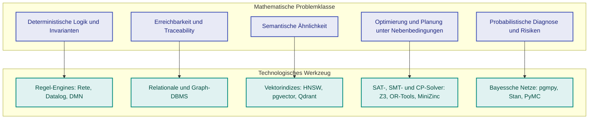

# Kapitel 17. Technologie-Stack: Auswahlkriterien für Werkzeuge, Programmiersprachen und Regel-Engines

> **Buch:** [Architektur evidenzbasierter Expertensysteme](README.md) · [Teil IV: Architektur, Technologie-Stack, Inferenz und Aktion](part-04-architecture-and-inference.md)  
> **Vorheriges Kapitel:** [Kapitel 16. Architektur von Expertensystemen: Vom formalen Wissen zur evidenzbasierten Entscheidung](ch16-expert-systems-architecture.md)  
> **Nächstes Kapitel:** [Kapitel 18. Ausführungsinfrastruktur: Lokale Modelle, Hardwarebeschleuniger, Edge und On-Premise](ch18-execution-infrastructure.md)  
> **Inhaltsverzeichnis:** [README.md](README.md)  
> **Autor:** [Mykola Fedchyk](about-the-author.md)  
> **Niveau:** Fortgeschritten: Systemarchitekten, Entwickler von Expertensystemen, Dateningenieure  
> **Lernziele:** Werkzeuge nach der mathematischen Problemklasse, der Architekturrolle und dem Fehlermodusverhalten auswählen; Programmiersprachen auf Verantwortungsschichten verteilen; abhängige Artefakte mittels rekursiver SQL-Abfragen ermitteln; Entscheidungen in DMN-Tabellen abbilden und Lücken darin identifizieren; Optimierungs- und Planungsaufgaben geeigneten Solvern zuordnen; begründen, warum eine Änderung der Modellausführungsumgebung die Reproduzierbarkeit des Evidenzpakets beeinflusst; Stack-Schichten mit der bevorzugten primären Hardware abgleichen; Go-Komponenten den Fähigkeitsschichten zuordnen und Komponenten erst nach vergleichendem Benchmarking gegen eine Baseline übernehmen.

---

## Abstract

Die Auswahl des Technologie-Stacks für evidenzbasierte Expertensysteme ist keine Frage subjektiver Vorlieben von Entwicklern, sondern eine strikte Entwurfsoptimierung im Hinblick auf die mathematische Klasse des ingenieurtechnischen Problems, das Fehlermodusverhalten des Gesamtsystems sowie die Anforderungen an die Auditierbarkeit von Schlussfolgerungen. Ein verbreiteter Architekturfehler besteht in der verfrühten Überfrachtung des Systems mit verteilten Graphdatenbanken, Vektorspeichern und stochastischen Sprachmodellen an Stellen, an denen Garantien für Determinismus und Traceability durch kompakte, lokale Datenstrukturen vollständig gewährleistet werden können.

In diesem Kapitel werden die Kriterien für die Auswahl von Werkzeugen, Programmiersprachen und Inferenz-Engines systematisiert. Untersucht wird die funktionale Zuordnung von Programmiersprachen zu Verantwortungsschichten (Go für die Dienstkoordination, C/C++ für Rechenkerne, Rust für Speichersicherheit an Ein-/Ausgabegrenzen, Python für Offline-Wissenslabore und TypeScript für Expertenschnittstellen). Detailliert analysiert werden deklarative Wissensabfragesprachen (SQL mit rekursiven CTEs für Abhängigkeitsgraphen, Cypher/GQL, Datalog), klassische Produktions-Engines auf Rete-Basis sowie der DMN/FEEL-Standard für reglementierte Entscheidungstabellen. Ergänzend behandelt werden Werkzeuge zur Constraint-Zufriedenheit und Optimierung (SAT/SMT/CP), semantische Prüfungen von Engine-Kandidaten an Systemgrenzen, Hardwareanforderungen an Ausführungsumgebungen sowie eine systematische Landkarte aus fünfzehn Technologieklassen für den Entwurf zuverlässiger Systeme ingenieurtechnischer Intelligenz.

---

## 1. Minimale Implementierung vor dem Technologiekatalog

Bevor ein umfangreicher Katalog spezialisierter Werkzeuge und Bibliotheken konsultiert wird, erfordert die ingenieurtechnische Analyse eines evidenzbasierten Systems den Entwurf einer minimalen lauffähigen Implementierung. Es ist ratsam, die Entwicklung mit dem in [Kapitel 1](ch01-introduction-to-expert-systems.md) beschriebenen Basispfad zur Release-Verifikation zu beginnen: Für dessen Funktion genügen die Programmiersprache Go, die Standardbibliothek sowie eine Suite lokaler Unit-Tests. Zunächst werden der Positivfall, ein fremdes Release, ein fehlender Prüfbericht, ein Widerruf und ein Ausnahmeantrag verifiziert. Erst nachdem die Datenformate für Richtlinien, Berichte und Urteile verbindlich festgelegt sind, werden Persistenzmechanismen und der automatisierte Import aus der Test-Pipeline ergänzt.

| Neue Anforderung / Randbedingung | Kleinste begründete Ergänzung | Was nicht vorschnell hinzugefügt werden sollte |
|---|---|---|
| Richtlinien und Testläufe müssen zwischen Ausführungen persistiert werden | Versionierte Dateien oder SQLite mit Schemavalidierung | Ein Graphdatenbank-Server und ein Vektorindex |
| Zahlreiche Regeln werden von Fachexperten ohne Codeänderung angepasst | Entscheidungstabellen oder eine Regel-Engine mit Regressionstests | Ein neuronales Sprachmodell als Schiedsrichter über Regeln |
| Mehrstufige Abhängigkeiten zwischen Artefakten müssen aufgelöst werden | Rekursive Abfragen oder ein Graph mit typisierten Kanten | Ein neuronales Modell für die bloße Erreichbarkeitsprüfung |
| Nachweise müssen in unstrukturiertem Freitext aufgefunden werden | Kandidatensuche mit Provenienz- und Zugriffskontrolle | Die Erlaubnis, Urteile allein auf Basis statistischer Ähnlichkeit zu fällen |
| Mehrere Konsumenten benötigen voneinander unabhängige Releases | Versionierter Datenvertrag und formalisiertes Auslieferungsverfahren | Ein Message-Broker vor dem tatsächlichen Eintreten dieses Bedarfs |

Dies beschreibt den evolutionären Pfad einer schrittweisen Systemerweiterung, nicht die vollständige Architektur aller jemals benötigten Adapter. Die in [Kapitel 16](ch16-expert-systems-architecture.md) definierten Verantwortungsgrenzen sind auch innerhalb eines einzelnen Betriebssystemprozesses unverzichtbar; ein separater Microservice für jede funktionale Grenze ist keineswegs zwingend erforderlich.

Das primäre Kriterium lässt sich am anschaulichsten anhand eines Diagramms verdeutlichen: fünf mathematische Problemklassen und die ihnen adäquaten Technologieklassen.



Das Diagramm liest sich von links nach rechts: Zuerst wird das Problem mathematisch formuliert, danach wird die passende Werkzeugklasse gewählt. Die Überprüfung der Invariante „eine Anforderung der Sicherheitsstufe SIL 3 gilt ohne zwei Prüfberichte nicht als geschlossen“ ist eine Aufgabe der deterministischen Logik; hierfür wird eine Regel-Engine benötigt, keine Vektorsuche. Die Fragestellung „welche Module sind von der Änderung einer Anforderung betroffen“ stellt ein Erreichbarkeitsproblem im Graphen dar. Die Abfrage „existieren vergleichbare historische Vorfälle“ gehört in die Klasse der semantischen Ähnlichkeitssuche. Die nachfolgenden Abschnitte analysieren jede Schicht des Stacks im Detail, beginnend mit den Programmiersprachen.

## 2. Programmiersprachen nach Verantwortungsschichten

Frühe Expertensysteme wurden häufig vollständig in Lisp oder Prolog implementiert. Moderne industrielle Expertensysteme stützen sich überwiegend auf Allzweck-Programmiersprachen, da sich die Anforderungen an die Betriebsumgebung fundamental gewandelt haben: Erforderlich sind ausgereifte Systembibliotheken, deterministisches oder vorhersagbares Speichermanagement, robuste Nebenläufigkeit, Schnittstellen zu C-Bibliotheken (*Foreign Function Interface*, FFI) sowie eine nahtlose Integration in moderne Bereitstellungsinfrastrukturen. Logische Sprachen sind dabei keineswegs verschwunden: Sie existieren als eingebettete deklarative Sprachen für Regeln und Abfragen fort, auf die nachfolgend eingegangen wird. Jede Allzwecksprache besetzt eine klar definierte Schicht.

### 2.1. Go: Service-Schicht und Koordination

Go eignet sich hervorragend für Backend-Dienste, Kommandozeilenwerkzeuge, Systemkoordination und Programmierschnittstellen (APIs). Eine reine Go-Anwendung kann als statisch gebundenes, einzelnes Executable ausgeliefert werden; Bindings über cgo binden bei Bedarf native Bibliotheken ein, führen jedoch plattformspezifische Abhängigkeiten ein. Leichtgewichtige Ausführungsthreads (*Goroutinen*) erleichtern die Koordination konkurrierender Aufgaben, garantieren jedoch ohne gezielte Messungen keine automatische Performance. In Go sind unter anderem Teile der lokalen Modell-Laufzeitumgebung Ollama [[1]](#src-1) sowie der Message-Server NATS [[2]](#src-2) implementiert; die Systemintegration wird dabei durch das Protokoll bestimmt, nicht durch die Implementierungssprache des Servers.

Für die Aufgaben eines Expertensystems in Go stehen unter anderem folgende Bibliotheken zur Verfügung:

- `hyperjumptech/grule-rule-engine`: Eine von Drools inspirierte Regel-Engine mit der domänenspezifischen Regelsprache GRL [[3]](#src-3);
- `sashabaranov/go-openai`: Ein OpenAI-kompatibler API-Client, der gleichermaßen mit lokalen Diensten zusammenarbeitet, die diese Schnittstelle abbilden [[4]](#src-4);
- `yalue/onnxruntime_go`: Ein Go-Wrapper für die ONNX Runtime zur lokalen Ausführung von Einbettungsmodellen (*Embeddings*) und Klassifikatoren [[5]](#src-5);
- `ledongthuc/pdf`: Auslesen von PDF-Dokumenten mit nativen Go-Mitteln [[6]](#src-6);
- `tree-sitter/go-tree-sitter`: Bindings für tree-sitter zum strukturierten Parsen von Quellcode in konkrete Syntaxbäume [[7]](#src-7).

### 2.2. C und C++: Hochleistungs-Rechenkerne

C und C++ bleiben das Fundament für alle Komponenten, die hardwarenah operieren und maximale Rechenleistung erfordern: numerische Vektorisierungskerne, Treiber für Hardwarebeschleuniger sowie Bibliotheken zur Quantisierung neuronaler Netze. Das Projekt llama.cpp führt Sprachmodelle hocheffizient in C/C++ aus [[8]](#src-8), während das OpenVINO-Toolkit Modelle für Intel-CPUs, integrierte und diskrete GPUs sowie neuronale Prozessoren (*Neural Processing Units*, NPUs) optimiert und bereitstellt [[9]](#src-9). Die klassische Produktions-Engine CLIPS wurde zur plattformübergreifenden Portabilität vollständig in C geschrieben [[10]](#src-10); CLIPS wird bis heute als eingebettete Regel-Engine in leistungskritischen C- und C++-Anwendungen eingesetzt.

### 2.3. Rust: Speichersicherheit an der Grenze zu nicht vertrauenswürdigen Daten

Rust wird für Module gewählt, die die Ausführungsgeschwindigkeit von C++ mit strikten, vom Compiler erzwungenen Garantien zur Speichersicherheit kombinieren müssen: dem Ausschluss von Zugriffen nach der Freigabe (*use-after-free*) und Datenwettläufen (*data races*). Typische Einsatzbereiche sind das Parsen von Netzwerkprotokollen und Dateien aus nicht vertrauenswürdigen Quellen, Agenten auf Edge-Geräten sowie die Streaming-Verarbeitung von Telemetriedaten. Die Geschäftsregel-Engine Zen verfügt über einen Rust-Kern mit Schnittstellen zu zahlreichen Sprachen [[11]](#src-11). Zu beachten ist, dass Zen Entscheidungslogiken in einem proprietären JDM-Modell (*JSON Decision Model*) und nicht im DMN-Standard abbildet; eine verlustfreie Migration von Entscheidungstabellen zwischen Zen und DMN-Engines ist daher ohne Konverter nicht möglich.

### 2.4. Python: Offline-Wissenslabor und Prototyping

Python dominiert die Domänen Forschung, Modelltraining und Evaluation; Bibliotheken wie PyTorch, scikit-learn, spaCy, NetworkX sowie gängige Optimierungswerkzeuge unterstützen diese Workflows optimal. Im Standard-Interpreter CPython schränkt das globale Interpreter-Lock (*Global Interpreter Lock*, GIL) die echt parallele Ausführung von Bytecode auf Multi-Core-Systemen ein, wenngleich native C-Erweiterungen das GIL freigeben können und Multiprocessing-Pipelines unabhängig voneinander skalieren. Mit PEP 703 wurde die Grundlage für CPython-Builds ohne GIL geschaffen [[12]](#src-12); die Kompatibilität spezifischer Bibliotheken muss jedoch im Einzelfall verifiziert werden. Die Programmiersprache allein diktiert nicht zwangsläufig die Latenz: Modellinferenz, Warteschlangen, Serialisierung und Aufrufhäufigkeiten dominieren häufig das Gesamtlaufzeitbudget. Daher kann Python durchaus auch in produktiven Modell-Diensten verbleiben, sofern Messungen die Einhaltung der Latenzbudgets bestätigen; die Beschränkung auf Offline-Aufgaben ist eine architektonische Option, keine dogmatische Vorschrift.

### 2.5. TypeScript: Verifizierte Schnittstellen für das Expertenaudit

TypeScript bildet das Rückgrat moderner Expertenarbeitsplätze: für die interaktive Visualisierung von Traceability-Graphen, die explorative Analyse von Beweisbäumen und die kollaborative Bearbeitung von Entscheidungstabellen. Die Benutzeroberfläche für Ingenieure und Auditoren ist eine vollwertige Kernkomponente des evidenzbasierten Expertensystems, da Fachexperten über diese Schnittstelle die Argumentationskette nachvollziehen und letztinstanzliche Entscheidungen fällen.

Aus der Praxis des Autors: In einem der Industrieprojekte hat sich folgende funktionale Aufteilung bewährt: Die Dienste des Architekturkerns, Nachrichtenwarteschlangen und die Systemkoordination wurden in Go realisiert; rechenintensive Vektoroperationen wurden an C++-Bibliotheken (OpenVINO, ONNX Runtime) über cgo delegiert; Python verblieb im Offline-Wissenslabor für das Training und die Generierung kuratierter Referenzdatensätze; die interaktive Benutzeroberfläche wurde in TypeScript implementiert. Diese Aufteilung erhebt keinen Anspruch auf universelle Allgemeingültigkeit: Sie hängt primär von den Kernkompetenzen des Entwicklungsteams und den strikten Latenzanforderungen ab. Da die Schnittstellen zwischen den Schichten durch formale Datenverträge gemäß [Kapitel 16](ch16-expert-systems-architecture.md) gekapselt sind, kann die Technologie einer einzelnen Schicht ausgetauscht werden, ohne Nachbarsysteme zu destabilisieren.

## 3. Deklarative Abfragesprachen für Wissensbasen

Allgemeine Programmiersprachen implementieren Dienste und Koordinationslogik; persistierte Fakten und semantische Relationen lassen sich jedoch weitaus präziser über deklarative Abfragesprachen ansprechen. Eine deklarative Abfrage beschreibt das gewünschte Resultat (*was*), nicht den prozeduralen Ausführungspfad (*wie*); dadurch lässt sie sich einfacher formal verifizieren, optimieren und auditierbar reproduzieren.

### 3.1. SQL und rekursive Abfragen

SQL garantiert relationale Transaktionsintegrität und eignet sich zur Speicherung versionierter Artefakte, Audit-Ereignisse, Zugriffskontrollmatrizen und kanonischer Faktentabellen. Rekursive allgemeine Tabellenausdrücke (*Common Table Expressions*, CTEs) ermöglichen das Durchlaufen von Hierarchien und Graphen ohne den zwingenden Einsatz eines separaten Graphdatenbank-Servers [[13]](#src-13). Betrachtet sei die Auswirkungsanalyse (*Change Impact Analysis*): Welche Artefakte sind von der Änderung der Anforderung `REQ-7` betroffen, wenn Traceability-Verknüpfungen in einer Relation `trace(src, dst)` persistiert sind? Das nachfolgende Python-Skript stützt sich ausschließlich auf das Standardmodul `sqlite3`; die Testdaten enthalten bewusst einen Rückwärtsverweis, der einen gerichteten Zyklus erzeugt.

<details>
<summary>Beispiel in Python</summary>

```python
import sqlite3

con = sqlite3.connect(":memory:")
con.executescript("""
CREATE TABLE trace(src TEXT, dst TEXT);
INSERT INTO trace VALUES
  ('REQ-7',  'DES-3'),
  ('DES-3',  'MOD-12'),
  ('DES-3',  'MOD-14'),
  ('MOD-12', 'TC-40'),
  ('MOD-14', 'TC-41'),
  ('MOD-14', 'MOD-12'),
  ('TC-41',  'DES-3'),   -- Rückwärtsverweis erzeugt einen Zyklus
  ('REQ-9',  'MOD-14');
""")

QUERY = """
WITH RECURSIVE impact(node, depth, path) AS (
    SELECT 'REQ-7', 0, json_array('REQ-7')
  UNION ALL
    SELECT t.dst, i.depth + 1, json_insert(i.path, '$[#]', t.dst)
  FROM trace AS t JOIN impact AS i ON t.src = i.node
    WHERE NOT EXISTS (SELECT 1 FROM json_each(i.path) AS visited
                                        WHERE visited.value = t.dst)
)
SELECT node, MIN(depth) FROM impact GROUP BY node ORDER BY 2, 1;
"""

for node, depth in con.execute(QUERY):
    print(depth, node)
assert dict(con.execute(QUERY)) == {
    "REQ-7": 0, "DES-3": 1, "MOD-12": 2, "MOD-14": 2,
    "TC-40": 3, "TC-41": 3,
}
con.executemany("INSERT INTO trace VALUES (?, ?)",
                [("REQ-7", "DOC/ANNEX"), ("DOC/ANNEX", "ANNEX")])
assert dict(con.execute(QUERY))["ANNEX"] == 2
print("SQLite", sqlite3.sqlite_version)
con.close()
```

</details>

Das Programm gibt Folgendes aus:

<details>
<summary>Beispieldaten oder Ausführungsergebnis</summary>

```text
0 REQ-7
1 DES-3
2 MOD-12
2 MOD-14
3 TC-40
3 TC-41
SQLite 3.50.4
```

</details>

Der Pfad wird als JSON-Array geführt, und `json_each` verifiziert die exakte Gleichheit von Bezeichnern [[14]](#src-14). Dadurch wird ein isolierter Knoten `ANNEX` nicht fälschlich mit dem Teilstring `DOC/ANNEX` verwechselt; der zusätzliche Negativtest stellt diese Trennung sicher. Da ein wiederholter Knoten auf dem aktuellen Pfad explizit ausgeschlossen wird, terminiert die Rekursion auch bei Zyklen zuverlässig. `MIN(depth)` liefert die kürzeste Distanz unter den gefundenen einfachen Pfaden. Die Anzahl einfacher Pfade kann jedoch selbst in zyklenfreien Graphen exponentiell wachsen; das Beispiel stellt daher keinen universell skalierbaren Graphalgorithmus dar. Wird ausschließlich die Menge erreichbarer Knoten benötigt, eliminiert ein rekursives `UNION` über ein einzelnes Knotenfeld Duplikate effizient, ohne sämtliche Pfade aufzuzählen. Der Einsatz eines dedizierten Graph-DBMS wird durch gezielte Latenz- und Durchsatzmessungen konkreter Abfragen begründet, nicht durch willkürliche Kantenanzahlgrenzen.

### 3.2. Graph-Abfragesprachen: Cypher, GQL und SPARQL

Abfragesprachen für Eigenschaftsgraphen (*Property Graphs*) beschreiben relationale Muster zwischen Knoten und Kanten. Die Sprache Cypher erlangte weite Verbreitung im Umfeld der Graphdatenbank Neo4j; 2024 veröffentlichten ISO und IEC die standardisierte Graph-Abfragesprache GQL (ISO/IEC 39075:2024) [[15]](#src-15). SPARQL wiederum ist der offizielle W3C-Standard zur Abfrage von RDF-Tripeln und OWL-Ontologien [[16]](#src-16); in [Kapitel 16](ch16-expert-systems-architecture.md) wurde eine SPARQL-Abfrage mit Eigenschaftspfaden eingesetzt, um die Entscheidungsprovenienz lückenlos zu rekonstruieren.

### 3.3. Datalog: Deterministische logische Inferenz

Datalog ist eine deklarative Logikschnittstelle, die syntaktisch einer funktionssymbolfreien Teilmenge von Prolog entspricht [[17]](#src-17). Dieselbe transitive Auswirkungsrelation wie im vorhergehenden SQL-Beispiel lässt sich in Datalog durch lediglich zwei Regeln formalisieren:

<details>
<summary>Regeln in logischer Programmiersprache</summary>

```prolog
affects(X, Y) :- trace(X, Y).
affects(X, Z) :- trace(X, Y), affects(Y, Z).
```

</details>

Die erste Regel definiert den direkten Einfluss, die zweite macht die Relation transitiv. Für positives Datalog ohne Funktionssymbole, mit sicheren Regeln (*safe rules*) und einer endlichen aktiven Domäne ist die Menge aller ableitbaren Fakten strikt endlich, und die Berechnung des kleinsten Fixpunkts terminiert garantiert. Zyklen im Graphen erzeugen dabei keine neuen Konstanten. Spracherweiterungen mit Zahlenbereichsberechnungen, externen Funktionen oder unstratifizierter Negation erfordern gesonderte semantische Modelle sowie dedizierte Terminierungsbeweise. Auch SQL kann Zyklen über mengenbasiertes `UNION` auflösen; der Unterschied manifestiert sich im konkreten Auswertungsalgorithmus der Engine.

## 4. Regel-Engines und Entscheidungstabellen

Deklarative Geschäfts- und Sicherheitsregeln dürfen nicht als unübersichtliches Geflecht prozeduraler `if/else`-Anweisungen im Quellcode verstreut werden. Eine Regel ist ein verwaltetes ingenieurtechnisches Artefakt mit eindeutiger Kennung, Versionsnummer, Autor, normativem Ursprungsnachweis und eigenständigem Lebenszyklus. Eine Regel-Engine kapselt diese Regeln außerhalb des prozeduralen Anwendungscodes und garantiert deren deterministische Auswertung.

### 4.1. Klassische Produktions-Engines (Rete-ähnliche Algorithmen)

Die Mehrheit klassischer Produktions-Engines basiert auf dem Rete-Algorithmus von Charles Forgy, der Zwischenergebnisse von Bedingungsabgleichen über Inferenzzyklen hinweg im Speicher puffert und vermeidet, dass bei jeder Faktenänderung sämtliche Regeln gegen alle Fakten neu ausgewertet werden müssen [[18]](#src-18). CLIPS implementiert Vorwärtsverkettung (*forward chaining*) und lässt sich direkt als C-Bibliothek einbetten. Drools fungiert als Regel-Engine, DMN-Evaluator und System zur komplexen Ereignisverarbeitung (*Complex Event Processing*, CEP) für die JVM; Drools setzt auf den Phreak-Algorithmus, eine Weiterentwicklung von Rete [[19]](#src-19). Grule für Go sowie NRules für .NET [[20]](#src-20) lassen sich nahtlos als In-Process-Engines in moderne Microservices integrieren.

### 4.2. DMN-Standard und FEEL-Ausdruckssprache

Betrachtet sei die Version 1.5 des Standards *Decision Model and Notation* (DMN) der Object Management Group (OMG) [[21]](#src-21). Der Standard vereinheitlicht visuelle Entscheidungstabellen, Entscheidungsanforderungsdiagramme (*Decision Requirements Diagrams*, DRDs) sowie die formale Ausdruckssprache FEEL (*Friendly Enough Expression Language*). Fachexperten können Entscheidungstabellen direkt auditieren; die Verständlichkeit der Notation garantiert jedoch nicht automatisch deren formale Vollständigkeit: Unerlässlich bleiben algorithmische Prüfungen auf Schnittmengen, Lücken, Typkorrektheit und Treffer-Richtlinien.

Die nachfolgende Tabelle illustriert eine Freigabeentscheidung für ein Software-Release. Die linke Kopfzelle definiert die Treffer-Richtlinie **U** (*Unique*): Für jeden beliebigen Eingangsvektor darf höchstens eine Regel zutreffen. In den Bedingungszellen stehen unäre FEEL-Tests; ein Bindestrich symbolisiert einen Wildcard-Wert („beliebiger Wert“).

| U | Offene kritische Defekte | Anforderungsabdeckung durch Tests | Sicherheitstests | Entscheidung |
|---|---|---|---|---|
| 1 | `> 0` | `-` | `-` | `"BLOCK"` |
| 2 | `0` | `< 0.95` | `-` | `"BLOCK"` |
| 3 | `0` | `>= 0.95` | `"fail"` | `"BLOCK"` |
| 4 | `0` | `>= 0.95` | `"pass"` | `"RELEASE"` |

Die Regeln sind disjunkt: Die erste Regel fängt jede Anzahl kritischer Defekte größer null ab; die Regeln zwei, drei und vier teilen den verbleibenden Zustandsraum anhand der Testabdeckung und des Ausgangs der Sicherheitstests auf. Dennoch ist die Tabelle unvollständig. Liefern die Sicherheitstests den Statuswert `"error"`, greift keine einzige Regel, und die DMN-Engine gibt ein leeres Resultat (`null`) zurück. Ein Expertensystem, das einen leeren Rückgabewert fälschlich als implizite Freigabe interpretiert, würde ein fehlerhaftes Release mit unvollständigen Sicherheitsprüfungen durchwinken. Folglich muss ein leeres Ergebnis zwingend als Blockierung interpretiert werden, oder die Tabelle muss explizit um eine Zeile für den Status `"error"` ergänzt werden. Formale Methoden zur Verifikation von Vollständigkeit und Konsistenz von Entscheidungstabellen werden in [Kapitel 23](ch23-knowledge-base-verification.md) vertieft.

> [!WARNING] Ingenieurtechnische Fallstricke bei DMN-Treffer-Richtlinien (*Hit Policies*)
> Der DMN-Standard definiert unterschiedliche Treffer-Richtlinien: **U** (*Unique* — genau ein Treffer), **F** (*First* — erste zutreffende Regel nach Reihenfolge), **A** (*Any* — alle Treffer müssen das identische Ergebnis liefern), **R** (*Rule Order*), **C** (*Collect*).
> In sicherheitskritischen Ingenieursystemen ist die Verwendung von Richtlinien mit impliziten Standardwerten die häufigste Ursache für verdeckte Ausfälle:
> 1. **Problem der Unvollständigkeit von Domänenwerten:** Nimmt eine Variable `null`, `NaN` oder eine unerwartete Zeichenkette wie `"timeout"` an, liefert die Tabelle unter der Richtlinie **U** den Wert `null` zurück. Prüft der aufrufende Dienst lediglich `if (result == "BLOCK") reject();`, passiert der Wert `null` die Freigabeprüfung unbemerkt.
> 2. **Default-Deny-Prinzip:** Die Architektur des Expertensystems muss explizit fordern: Das Ausbleiben eines Regeltreffers in einer Zulassungstabelle ist automatisch äquivalent zur schärfsten Blockierung (`"BLOCK"`).

## 5. Spezialisierte Speicher nach physischer Datenform

Die Wahl des Persistenzmechanismus wird primär durch die Natur des darin abgelegten Wissens determiniert. Die theoretischen Grundlagen dieser Differenzierung wurden in [Kapitel 16](ch16-expert-systems-architecture.md) dargelegt; die nachfolgende Tabelle ordnet Speichertypen konkreten Produktbeispielen, Wissensklassen und typischen Abfragemustern zu.

| Speichertyp | Produktbeispiele | Wissensklasse | Typische Abfrage |
|---|---|---|---|
| **Relationale DBMS** | PostgreSQL, SQLite, Microsoft SQL Server | Kanonische Fakten, Normenrevisionen, Audit-Trail | „Welche Fassung der Regel war bei der Erprobung am 12. Mai rechtsgültig?“ |
| **Graph-DBMS** | Neo4j, ArangoDB, Amazon Neptune | Traceability-Graph „Anforderung, Test, Defekt“ | „Welche Module sind von der Änderung einer Anforderung aus ISO 26262 betroffen?“ |
| **RDF-Tripel-Stores** | GraphDB, Stardog, Apache Jena | OWL-Ontologien, domänenspezifische Taxonomien | „Finde alle Sensortypen, die der Klasse SafetyCritical zugeordnet sind“ |
| **Lexikalische Suche** | OpenSearch, Elasticsearch, SQLite FTS5 | Spezifikationen, Fehlercodes, Artikelnummern | „Finde Fehlerberichte mit den Schlagwörtern overheat und vibration“ |
| **Vektor-DBMS** | Qdrant, pgvector, Milvus, Weaviate | Semantische Textsegmente aus Normen, ähnliche Präzedenzfälle | „Finde Normenabschnitte mit vergleichbaren Anforderungen an die Gehäusedichtigkeit“ |
| **Zeitreihendatenbanken** | TimescaleDB, InfluxDB, Prometheus | Zuverlässigkeitstrends, Dynamik der Testabdeckung | „Steigt die Ansprechzeit des Sicherheitsventils über die letzten fünf Zyklen an?“ |

Die Übersicht verdeutlicht, dass kein einzelnes Produkt sämtliche Anforderungen abdecken kann. Das Beispiel mit rekursivem SQL hat jedoch gezeigt, dass relationale DBMS einen beträchtlichen Teil einfacher Graphabfragen effizient bewältigen können; ein spezialisierter Speicher sollte daher erst dann eingeführt werden, wenn er eine konkrete ingenieurtechnische Anforderung erfüllt, die mit den bestehenden Systemen nicht deterministisch gelöst werden kann.

## 6. Optimierung, Planung und Constraint-Solving

In der Gesamtarchitektur eines evidenzbasierten Expertensystems wird das Subsystem für Optimierung und Constraint-Solving (*Constraint Satisfaction and Optimization*) aktiviert, sobald die direkte logische Deduktion einen Widerspruch feststellt oder das ingenieurtechnische Problem die Synthese eines zulässigen Handlungsplans bzw. einer Hardwarekonfiguration erfordert. Während eine Produktions-Engine auf die deduktive Frage antwortet: „Ist der aktuelle Systemzustand zulässig?“, beantworten Optimierungswerkzeuge die konstruktive Frage: „Wie lässt sich aus Millionen möglicher Kombinationen ein global optimaler oder garantiert zulässiger Zustand auffinden?“. Der naive Versuch, eine derartige kombinatorische Suche über die Generierung neuer Fakten in Rete-Regeln abzubilden, führt unweigerlich zu einer exponentiellen Zustandsexplosion und dem Erschöpfen des Prozessspeichers.

| Kriterium | Regel-Engine (Rete / Phreak / Datalog) | Constraint-Solver (SMT / Z3 / CP-SAT) |
|---|---|---|
| **Problemformulierung** | Deduktive Inferenz: „Welche Konsequenzen $C$ folgen unter den Regeln $R$ direkt aus den Fakten $F$?“ | Suche, Synthese und Beweisführung: „Existiert eine Variablenbelegung $X$, die alle Nebenbedingungen $\bigwedge C_i$ erfüllt? Existiert ein Gegenbeispiel für eine Sicherheitsverletzung?“ |
| **Suchraum** | Expliziter Faktengraph; direktes Pattern-Matching und Auffinden des Fixpunkts | Impliziter kombinatorischer Zustandsraum ($2^N$ Zustände oder unendlicher numerischer Wertebereich) |
| **Algorithmische Komplexität** | Lokale deterministische Komplexität; Beschleunigung durch Rete-Netzwerke mit $\mathcal{O}(1)$ pro Faktenaktualisierung | Im allgemeinen Fall NP-vollständig (DPLL/CDCL-Heuristiken, Branch-and-Bound) |
| **Typische ingenieurtechnische Rolle** | Sofortige Prüfung von Zulassungsrichtlinien in CI/CD, Invariantenkontrolle zur Laufzeit | Optimale Platzierung von Hardwaremodulen, Prüfstandsbelegungsplanung, Konsistenzbeweis von Normen |

Diese Klasse von Optimierungs- und Constraint-Werkzeugen gliedert sich in vier Hauptgruppen:

- **SAT- und SMT-Solver** prüfen, ob Eingangsbelegungen existieren, unter denen eine formale Spezifikation verletzt wird. Führende Solver dieser Klasse sind Z3 [[22]](#src-22) und cvc5 [[23]](#src-23); ein Anwendungsbeispiel zur Identifikation von Widersprüchen zwischen Anforderungen mittels Z3 wird in [Kapitel 14](ch14-requirements-detection-and-formalization.md) demonstriert.
- **Constraint-Programmierung** löst kombinatorische Probleme unter harten Randbedingungen: Erstellung von Prüfstandsplänen, Konfiguration modularer Baugruppen. Hierzu zählen der CP-SAT-Solver aus Google OR-Tools [[24]](#src-24) sowie die Modellierungssprache MiniZinc [[25]](#src-25), die die Problemformulierung von der konkreten Solver-Engine entkoppelt.
- **Mathematische Programmierung** (lineare, quadratische und gemischt-ganzzahlige Optimierung) balanciert Ressourcenprofile in komplexen Entwicklungsprojekten.
- **Automatisierte Handlungsplanung** synthetisiert Aktionssequenzen, die ein technisches System aus einem definierten Anfangszustand in einen spezifizierten Zielzustand überführen. Der Planer Fast Downward löst Planungsaufgaben, die in der Standardsprache PDDL (*Planning Domain Definition Language*) formuliert sind [[26]](#src-26). Schlägt eine Zertifikatsprüfung fehl, kann ein Handlungsplaner eine minimale Folge von Korrekturmaßnahmen vorschlagen, deren formale Zulässigkeit anschließend durch das Expertensystem verifiziert wird.

Ein gefundener zulässiger Belegungsplan kann durch Einsetzen in die Nebenbedingungen direkt verifiziert werden; dies beweist jedoch noch keine Optimalität. Ein Unsat-Kern (*unsatisfiable core*) isoliert eine hinreichende widersprüchliche Teilmenge von Bedingungen, stellt jedoch für sich genommen noch keinen unabhängigen Beweis für `unsat` dar: Er muss erneut validiert oder durch einen formalen Beweis in einem standardisierten Format verifiziert werden. Die Unterstützung von Beweisspuren variiert je nach Solver und Theorie. Die Ausgänge `unknown`, Timeout oder Systemfehler bedeuten weder formale Zulässigkeit noch deren Unmöglichkeit.

## 7. Semantische Verifikation von Engine-Kandidaten

Im symbolischen Inferenz-Subsystem definiert die Wahl der Engine die Grenzen der formalen Beweiskraft des gesamten Expertensystems. Die irrige Annahme, jede Engine, die einen booleschen Wert `true/false` zurückgibt, sei in missionskritischen Anwendungen beliebig austauschbar, führt zu schwerwiegenden verdeckten Ausfällen: Unterschiedliche Mechanismen implementieren grundlegend divergierende Semantiken für Negation, Zyklenbehandlung und fehlende Daten. Rete führt Pattern-Matching im Arbeitsspeicher aus, Datalog evaluiert deduktive Regeln über fixierten Domänen, DMN standardisiert reglementierte Entscheidungstabellen, während CEL (*Common Expression Language*) und Rego Guard-Ausdrücke oder Autorisierungsrichtlinien berechnen. Diese Komponenten sind nicht austauschbar, bloß weil sie Wahrheitswerte liefern. Vor jeder Geschwindigkeitsmessung ist ein strikter semantischer Vertrag erforderlich.

| Eigenschaft | Testfall / Kriterium |
|---|---|
| Unbekannter Wert und explizite Negation | Ein fehlender Test wird weder als bewiesener Erfolg noch als Fehlschlag gewertet |
| Auswertungsreihenfolge und Fixpunkt | Das Umstellen von Fakten und Regeln verändert das deklarative Ergebnis nicht |
| Widerruf von Fakten | Das Entfernen einer Begründung erhält eine unabhängige alternative Stützung aufrecht |
| Zyklen und Terminierung | Ein unbegründeter Zyklus erzeugt keine Schein-Fakten; eine Limitüberschreitung liefert einen separaten Statuscode |
| Entscheidungstabelle | Lücken, Überlappungen und unbekannte Datentypen führen niemals zu einer impliziten Freigabe |
| Externe Funktionsaufrufe | Netzwerkzugriffe, Systemzeit und Zufallsgeneratoren sind nicht verdeckt in Regeln eingebettet |
| Erklärungskomponente | Die Engine liefert die verwendeten Substitutionen und Abhängigkeiten zurück, nicht bloß das Endurteil |

Ein valider Leistungsvergleich führt denselben Regelsatz unter identischer Fehlerbehandlungsrichtlinie aus. OPA eignet sich hervorragend für granulare Zugriffsentscheidungen, CEL für Guard-Ausdrücke, eine Produktions-Engine für die Aktivierungssteuerung und Datalog für rekursive Relationen. Jede Auswahl aus dieser Matrix bleibt eine Hypothese, bis sie empirisch und semantisch validiert wurde.

## 8. Modellausführung und Hardwarebeschleuniger

Lokale neuronale Modelle agieren im Expertensystem als periphere Adapter: Sie klassifizieren Dokumente, extrahieren Parameter und formulieren Erklärungsentwürfe. Ihre Ausführung folgt einer mehrstufigen Transformationskette von der Modelldatei bis zum Hardwarebeschleuniger, wie im nachfolgenden Diagramm dargestellt.

```mermaid
flowchart LR
    accTitle: Ausführungskette eines Modells von der Datei bis zur Hardware
    accDescr: Ein Modell durchläuft Zwischenrepräsentation, Compiler, Laufzeitumgebung und Hardwarebeschleuniger; Ausführungsmetriken fließen zur Kalibrierung zurück.

    A["<b>Modell und Tokenizer</b><br/>GGUF, FP16, INT8, INT4"] --> B["<b>Zwischenrepräsentation</b><br/>ONNX, OpenVINO IR"]
    B --> C["<b>Compiler und SDK</b><br/>CUDA, ROCm, oneAPI, QNN"]
    C --> D["<b>Laufzeitumgebung</b><br/>OpenVINO, llama.cpp, vLLM, ONNX Runtime"]
    D --> E["<b>Hardwarebeschleuniger</b><br/>CPU, GPU, NPU, ASIC"]
    E --> F["<b>Metriken</b><br/>Tokens pro Sekunde, P95-Latenz, Speicher, Leistungsaufnahme"]
    F -.->|"Kalibrierung"| A

    classDef src fill:#e1f5fe,stroke:#0288d1,stroke-width:2px,color:#01579b;
    classDef ir fill:#ede7f6,stroke:#512da8,stroke-width:2px,color:#311b92;
    classDef hw fill:#fff3e0,stroke:#e65100,stroke-width:2px,color:#bf360c;
    classDef metrics fill:#e8f5e9,stroke:#2e7d32,stroke-width:2px,color:#1b5e20;

    class A,B src;
    class C,D ir;
    class E hw;
    class F metrics;
```



Jedes Glied dieser Kette beeinflusst das finale Ergebnis: Format und Präzision der Gewichte (FP16, INT8, INT4), die Compiler-Version, die Laufzeitumgebung und der Typ des Beschleunigers. Die nachfolgende Tabelle vergleicht vier verbreitete Ausführungsumgebungen.

| Werkzeug | Implementierungssprache | Nische | Besonderheit |
|---|---|---|---|
| **llama.cpp** | C/C++ | Workstations, Edge- und Embedded-Systeme | Benötigt kein Python, unterstützt quantisierte GGUF-Formate |
| **Ollama** | Go, nutzt intern llama.cpp | Lokale Entwicklungsserver, autarke Arbeitsplätze | Einfache REST-API, automatisierter Modell-Download und Modellverwaltung |
| **vLLM** | Python, CUDA, C++ | Hochlast-GPU-Serverumgebungen | Effiziente Speicherverwaltung des Key-Value-Caches über den PagedAttention-Algorithmus [[27]](#src-27) |
| **OpenVINO** | C++, Python | Server und Workstations auf Intel-Hardware | Optimiert für Intel-CPUs, integrierte GPUs und NPUs |

Für die Evidenzkette ist entscheidend: Die Modifikation eines beliebigen Kettenglieds verändert die numerischen Ausgaben des Modells. Der Wechsel von FP16 auf INT4 oder das Aktualisieren der Inferenz-Laufzeitumgebung kann Klassifikationsgrenzen verschieben oder den generierten Erklärungstext verändern. Referenziert ein Evidenzpaket Modellausgaben, muss es den kryptografischen Fingerabdruck der gesamten Kette (Modell-Hash, Quantisierung, Laufzeitumgebung, Treiberversion) festhalten; nach jeder Änderung der Kette müssen die Regressionstests aus [Kapitel 16](ch16-expert-systems-architecture.md) wiederholt werden. Da die Kette auf dem Hardwarebeschleuniger aufsetzt, ordnet der nachfolgende Abschnitt sämtliche Schichten des Stacks der jeweils adäquaten Hardware zu.

### 8.1. Bevorzugte primäre Hardware für Stack-Schichten

Die Wahl von Sprache, Engine und Speicher bestimmt das Lastprofil jeder Schicht und damit die Hardwarearchitektur, auf der sie optimal skaliert. Ein häufiger Projektfehler besteht in der vorzeitigen Anschaffung teurer Grafikbeschleuniger, bevor dieses Profil überhaupt analysiert wurde: Regel-Engines, SQL-Transaktionen und Graph-Traversierungen bestehen überwiegend aus Verzweigungen und Zeiger-Dereferenzierungen; Tensor-Recheneinheiten auf GPUs oder NPUs bieten hierfür keinerlei Beschleunigung. Ein zweiter Fehler liegt in der Fehleinschätzung des Arbeitsspeicherbedarfs. Für lokale Modelle haben sich Architekturen mit einheitlichem Speicher (*Unified Memory*) etabliert, bei denen CPU und GPU auf einem System-on-Chip (SoC) auf denselben physikalischen RAM zugreifen, ohne dass Daten zwischen getrennten Speichern kopiert werden müssen; die Kapazität dieses Speichers entscheidet darüber, welche Modellgrößen überhaupt geladen werden können. Die nachfolgende Tabelle gleicht die Stack-Schichten dieses Kapitels mit der jeweils bevorzugten primären Hardware ab.

| Stack-Schicht | Operationsprofil | Bevorzugte primäre Hardware | Wann ein Beschleuniger hinzugefügt werden sollte |
|---|---|---|---|
| Regel-Engine, Entscheidungstabellen, Datalog | Verzweigungen, Hash-Tabellen, Bedingungsabgleiche | Multi-Core-CPU mit großem Cache | In der Regel nicht sinnvoll: Verzweigtes Pattern-Matching entspricht nicht dem Profil von Tensorkernen |
| Relationale und Graphspeicher, rekursive Abfragen, Audit-Log | Willkürlicher Speicherzugriff, Transaktionen, synchrone Journalführung | CPU, ECC-RAM mit ausreichender Kapazität für Indizes und Heißdaten, NVMe-Speicher | Weisen Messungen auf I/O-Engpässe hin, hilft ein schnelleres NVMe-Laufwerk, keine GPU |
| Lexikalische und exakte Vektorsuche | Index-Scans, Skalarprodukte | CPU mit Vektorerweiterungen: AVX-512 auf x86-64, SVE auf modernen Arm-Prozessoren | GPU für exakte Batch-Suchen über Dutzende Millionen Vektoren |
| Vektorisierung, Klassifikation, Re-Ranking | Dichte Tensoroperationen in kleinen Batches | NPU oder integrierte GPU; CPU bleibt Rückfallebene | Wenn die Laufzeitumgebung das Modell und alle Operatoren auf diesem Beschleuniger unterstützt |
| OCR und Dokumenten-Parsing | Faltungen (*Convolutions*), Aufmerksamkeitsmechanismen, Seiten-Batches | Diskrete GPU oder Plattform mit Unified Memory | Wenn der Dokumentendurchsatz die Verarbeitungskapazität der CPU übersteigt |
| Lokales generatives Sprachmodell | Lesen aller aktiven Gewichte bei jedem generierten Token | GPU mit hoher VRAM-Kapazität oder Unified-Memory-System mit 64–128 GB RAM | Wenn Sicherheitsrichtlinien externe Cloud-Dienste untersagen oder vollständige Autarkie gefordert ist |
| SAT-, SMT- und CP-Solver | Backtracking-Suche und konfliktgetriebenes Lernen | CPU mit hoher Einzelkern-Taktfrequenz; parallele unabhängige Läufe auf mehreren Kernen | Nur wenn eine spezialisierte Solver-Implementierung für Beschleuniger existiert und Benchmarks Vorteile belegen |

Die ersten drei Zeilen der Tabelle beschreiben den deterministischen Kern des Expertensystems; hierfür bleibt die CPU die primäre Ausführungseinheit. Die zwingende Forderung nach fehlerkorrigierendem Arbeitsspeicher (*Error-Correcting Code*, ECC) leitet sich direkt aus den Anforderungen an die Nachweisbarkeit ab. Bianca Schroeder, Eduardo Pinheiro und Wolf-Dietrich Weber analysierten Speicherfehler in Dynamic Random-Access Memory (DRAM) auf einer großen Flotte von Produktionsservern über einen Zeitraum von 2,5 Jahren und wiesen nach, dass DRAM-Fehler eine dominierende Ursache für Hardwareausfälle in Rechenzentren sind [[28]](#src-28). Ein unbemerkter Bitkipper (*Silent Bit Flip*) im Faktenindex führt zu einem Fehlurteil; ein Bitkipper im Puffer vor einer Hash-Berechnung zerstört die kryptografische Verifikation, wobei ein Neustart die Fehlerursache nicht reproduziert. ECC-RAM korrigiert in typischen Konfigurationen Ein-Bit-Fehler pro Speicherwort und erkennt Zwei-Bit-Fehler zuverlässig. Die ECC-Unterstützung muss in den Spezifikationen der Zielplattform explizit verifiziert werden, da sie bei Consumer-Workstations häufig fehlt.

Die unteren Tabellenzeilen betreffen neuronale Adapter; für diese wird ein Beschleuniger erst nach Bestehen des im Go-Abschnitt beschriebenen Benchmarks ergänzt. Da moderne Desktop- und Edge-Plattformen zunehmend auf Arm-Architekturen setzen ([Kapitel 18](ch18-execution-infrastructure.md)), müssen Go-Dienste, cgo-Bindings und native C++-Bibliotheken bereits vor der Modellmigration für `arm64` gebaut und validiert werden. Daraus ergibt sich die minimale Hardwarekonfiguration für die erste Version eines Expertensystems: Multi-Core-CPU, ECC-RAM und NVMe-Festspeicher. Ein dedizierter Beschleuniger wird erst mit dem ersten Modell eingeführt, das zwingend lokal betrieben werden muss, und verändert den Fingerabdruck der Ausführungskette. Der Vergleich konkreter Plattformen mit Stand Oktober 2026, Abschätzungen der Generierungsgeschwindigkeit anhand der Speicherbandbreite sowie die physische Bereitstellung werden in [Kapitel 18](ch18-execution-infrastructure.md) vertieft.

## 9. Systematische Landkarte der fünfzehn Technologieklassen

Um ein unkontrolliertes Anwachsen des Technologie-Stacks zu verhindern, empfiehlt sich der Abgleich mit einer systematischen Landkarte aus fünfzehn Technologieklassen, gegliedert in fünf Ebenen.

```mermaid
flowchart TD
    accTitle: Landkarte der fünfzehn Technologieklassen eines evidenzbasierten Expertensystems
    accDescr: Fünfzehn Technologieklassen, gruppiert nach fünf Ebenen: symbolische Inferenz, Wissensmodelle und Speicher, Suche und Optimierung, neuronale Adapter, Governance und Sicherheit.

    subgraph CoreLevel["Ebene 1: Symbolische Inferenz"]
        C1["1. Regel-Engines und Rete"]
        C2["2. Wahrheitserhaltung (TMS)"]
        C3["3. Konfidenz- und Unsicherheitsbehandlung"]
        C4["4. Entscheidungstabellen (DMN, FEEL)"]
    end

    subgraph DataLevel["Ebene 2: Wissensmodelle und Speicher"]
        D1["5. Semantic Web (RDF, OWL, SHACL)"]
        D2["6. Probabilistische graphische Modelle"]
        D3["7. Fallbasierte Wissensbasen (CBR)"]
        D4["8. Relationale, Graph- und Zeitreihen-DBMS"]
    end

    subgraph AlgLevel["Ebene 3: Suche und Optimierung"]
        A1["9. SAT-/SMT-Solver und Optimierer"]
        A2["10. Handlungsplaner (PDDL)"]
        A3["11. Hybride Suche (BM25 und HNSW)"]
    end

    subgraph MLLevel["Ebene 4: Neuronale Adapter"]
        M1["12. Lokale Modell-Laufzeitumgebungen"]
        M2["13. Dokumentenerfassung (OCR, tree-sitter, ReqIF)"]
        M3["14. Erklärbare KI und Generierungsmetriken"]
    end

    subgraph GovLevel["Ebene 5: Kontrolle und Sicherheit"]
        G1["15. Policy-Engines (OPA, Rego) und Provenienz (PROV-O)"]
    end

    CoreLevel --> DataLevel
    DataLevel --> AlgLevel
    AlgLevel --> MLLevel
    MLLevel --> GovLevel

    classDef clrCore fill:#e3f2fd,stroke:#1565c0,stroke-width:2px,color:#0d47a1;
    classDef clrData fill:#e8f5e9,stroke:#2e7d32,stroke-width:2px,color:#1b5e20;
    classDef clrAlg fill:#fff3e0,stroke:#e65100,stroke-width:2px,color:#bf360c;
    classDef clrML fill:#f3e5f5,stroke:#7b1fa2,stroke-width:2px,color:#4a148c;
    classDef clrGov fill:#fbe9e7,stroke:#d84315,stroke-width:2px,color:#bf360c;

    class C1,C2,C3,C4 clrCore;
    class D1,D2,D3,D4 clrData;
    class A1,A2,A3 clrAlg;
    class M1,M2,M3 clrML;
    class G1 clrGov;
```



Die Landkarte verlangt keineswegs, dass jedes Projekt alle fünfzehn Klassen implementieren muss. Sie dient vielmehr als architektonische Checkliste: Für jede Klasse muss der Architekt entweder das gewählte Werkzeug benennen oder formal begründen, warum diese Problemklasse im konkreten Projekt nicht auftritt. Eine unbegründete Lücke deutet meist darauf hin, dass eine Anforderung implizit gelöst wird – beispielsweise durch fest im Code verdrahtete Regeln oder unkalibrierte Konfidenzwerte.

## 10. Go-Komponenten nach Fähigkeitsschichten

Die Klassenlandkarte zeigt auf, welche Aufgaben gelöst werden müssen, benennt jedoch noch keine konkreten Komponenten. Für die eingangs behandelte Go-Service-Schicht ist eine fokussierte Übersicht hilfreich: Welche in Go geschriebenen oder aus Go ansprechbaren Bibliotheken und Server decken spezifische Fähigkeitsschichten des Expertensystems ab und welche Einschränkungen müssen vor der Übernahme geprüft werden? Die nachfolgende Tabelle dokumentiert den Stand im Oktober 2026; Versionen und Entwicklungsaktivitäten unterliegen dynamischen Änderungen, weshalb vor einer Architekturentscheidung stets die aktuellen Repositories konsultiert werden müssen.

| Fähigkeitsschicht | Kandidaten | Nutzen für das Expertensystem | Was vor der Übernahme zu prüfen ist |
|---|---|---|---|
| Produktionsregeln (Klasse 1) | Grule [[3]](#src-3) | Regeln in der GRL-Syntax, die getrennt vom Service-Code verwaltet und versioniert werden | Determinismus der Ausführungsreihenfolge bei Regeln, die um denselben Fakt konkurrieren; Inferenzzykluszeit bei realen Faktenmengen |
| Ausdrücke und Guard-Bedingungen (Funktion, die FEEL in DMN übernimmt) | cel-go [[29]](#src-29) | Nicht-turingvollständige Ausdruckssprache CEL: Statische Typprüfung vor der Ausführung, nebenwirkungsfreie Auswertung, lineare Auswertungszeit bezüglich Ausdrucks- und Eingabegröße bei deaktivierten Makros | Makros und benutzerdefinierte Funktionen heben die lineare Komplexitätsgarantie auf; der kanonische Importpfad lautet `cel.dev/cel-go` |
| Deduktive Abfragen (Datalog) | Mangle [[30]](#src-30) | Datalog mit Aggregaten, Funktionsaufrufen, optionaler Typprüfung und Gültigkeitsintervallen für temporale Fakten | Erweiterungen jenseits von reinem Datalog heben fundamentale Garantien auf (u. a. Terminierung); unabhängiges Open-Source-Projekt, Release 0.4.0 erschien im November 2025 |
| Zugriffsrichtlinien (Klasse 15) | OPA [[31]](#src-31) | Autorisierungs- und Policy-Entscheidungen in Rego als separate versionierte Artefakte mit eigener Test-Suite; einbettbar als Go-Bibliothek | Latenz der Richtlinienauswertung unter Maximallast, Speicherbedarf der Policy-Daten im Adressraum des Go-Dienstes |
| Graphspeicher (Klasse 8) | Dgraph [[32]](#src-32), EliasDB [[33]](#src-33), Cayley [[34]](#src-34) | Von verteilten Graph-DBMS mit ACID-Transaktionen (Dgraph) bis hin zu leichtgewichtigen, einbettbaren Graphdatenbanken (EliasDB) | Dgraph unterstützt offiziell primär Linux auf `amd64` und `arm64`; letztes Release von EliasDB erschien 2022, Cayley 2019 |
| Lexikalische Suche (Klasse 11) | Bleve [[35]](#src-35) | In-Process-Volltextindex mit BM25-Ranking, approximativer Vektorsuche und Score-Fusion für hybrides Retrieval | Keine native Unterstützung für ukrainische Sprachanalyse vorhanden; Textsegmentierung und Lemmatisierung müssen separat evaluiert werden |
| Vektorsuche (Klasse 11) | chromem-go [[36]](#src-36), pgvector via Client pgvector-go [[37]](#src-37), Weaviate [[38]](#src-38) | Von einer einbettbaren exakten Vektorsuche ohne Drittabhängigkeiten (chromem-go) über PostgreSQL-Erweiterungen bis hin zu dedizierten Vektor-DBMS | chromem-go führt lineare Brute-Force-Scans durch und befindet sich vor Version 1.0 im Beta-Status; pgvector und Weaviate erfordern separate Serverprozesse |

Aus der Tabelle lassen sich zwei zentrale Erkenntnisse ableiten: Für die meisten Schichten besteht die Wahl zwischen einer einbettbaren Bibliothek (*in-process*) und einem separaten Serverdienst. Eine Bibliothek vereinfacht die Bereitstellung auf isolierten Workstations erheblich; ein externer Server bietet horizontale Skalierbarkeit, erkauft dies jedoch mit einem zusätzlichen Prozess, der gewartet, gesichert und überwacht werden muss. Zudem weisen etliche Kandidaten funktionale Einschränkungen auf, die sich der Kurzbeschreibung nicht unmittelbar entnehmen lassen: der Verlust von Terminierungsgarantien, fehlende Sprachanalysatoren, die Beschränkung auf bestimmte Betriebssysteme oder mehrjährige Entwicklungspausen.

### 10.1. Auswahlmethodik: Vergleichendes Benchmarking vor der Integration

Keine Zeile der Tabelle stellt eine pauschale Empfehlung dar. Ein Kandidat wird erst nach einem vergleichenden Benchmarking gegen eine minimale Baseline in den Stack aufgenommen – also gegen die einfachste Lösung, die das Team bereits beherrscht oder innerhalb eines Arbeitstages implementieren kann: eine rekursive SQL-Abfrage für Traceability, ein SQLite-FTS5-Index für Volltextsuche oder ein linearer Scan über alle Vektoren für die semantische Ähnlichkeitssuche. Die Messungen werden auf eigenen Produktionsdaten und mit einem kuratierten Abfrageset durchgeführt; die Akzeptanzkriterien werden vor Beginn der Messungen verbindlich fixiert:

1. Die Güte des Kandidaten ist auf dem Referenzdatensatz nicht schlechter als die der Baseline: identische Regelschlüsse und ein mindestens gleichwertiger Recall@k gemäß [Kapitel 16](ch16-expert-systems-architecture.md);
2. Der Gewinn bei P95-Latenz, Arbeitsspeicher oder Indizierungszeit übersteigt einen vorab definierten Schwellenwert, oder der Kandidat erschließt eine fundamentale Fähigkeit, die der Baseline prinzipbedingt fehlt;
3. Das Verhalten des Kandidaten in Fehlerszenarien wurde verifiziert: Netzwerkunterbrechung, korrupter Index, Versionsaktualisierung;
4. Das Messergebnis wird mitsamt den genauen Versionsständen als Architekturentscheidung (*Architectural Decision Record*, ADR) dokumentiert; die Messung wird bei jedem Major-Release des Kandidaten wiederholt.

Für 100.000 Vektoren der Dimension 768 im Format `float32` belegen die Rohdaten ohne Metadaten rund 307,2 MB; eine exakte Skalarproduktsuche erfordert etwa 76,8 Millionen Multiplikations-Additions-Operationen. Bei 10 Millionen Vektoren wachsen diese Werte auf 30,72 GB und 7,68 Milliarden Operationen an. Daraus folgt jedoch kein zwingend linearer Latenzanstieg: CPU-Caches, Speicherbandbreite, SIMD-Vektorisierung und Nebenläufigkeit verändern das Laufzeitverhalten signifikant. Die Messwerte des Autors von chromem-go [[36]](#src-36) stellen externe Benchmarks einer spezifischen Konfiguration dar, keine universelle P95-Garantie für das eigene Projekt. Eine exakte Vektorsuche bleibt solange die bevorzugte Wahl, wie sie die vereinbarten Latenz- und Ressourcenbudgets unter realer Last erfüllt; ein approximativer Index wird erst nach gesondertem Benchmark-Nachweis akzeptiert. Die geometrisch nächsten Vektoren bilden die mathematische Referenz für die Ähnlichkeitssuche, stellen jedoch nicht automatisch das Optimum an domänenspezifischer Relevanz dar.

Das vergleichende Benchmarking konkretisiert die dritte Lehre des folgenden Abschnitts: Das Verhalten eines Werkzeugs wird vor der Integration auf eigenen Daten getestet, nicht erst nach dem ersten Produktionsvorfall.

## 11. Praktische Lehren bei der Technologieauswahl für missionskritische Systeme

1. **Werkzeuge werden nach Operation und Semantik gewählt.** SHACL validiert definierte Graph-Constraints, nicht beliebige logische Konsistenzen in OWL. Datalog berechnet logische Konsequenzen seiner strikten Regelsprache; SMT prüft Formeln unterstützter mathematischer Theorien. Traceability erfordert typisierte Kanten, semantische Ähnlichkeit ein statistisches Kandidaten-Ranking. Ein wohlklingender Werkzeugname ersetzt niemals den formalen semantischen Vertrag über das Ergebnis.
2. **Frameworks kompensieren kein fehlendes kanonisches Wissensmodell.** Kein Orchestrierungs-Framework wie LangChain oder LlamaIndex kann ein Expertensystem evidenzbasiert machen, wenn Quelldokumente keine Revisionsstände, Freigabestatus und typisierten Graphverknüpfungen aufweisen. Das blinde Koppeln neuronaler Netze an unstrukturierte Datenberge beschleunigt lediglich die Generierung plausibel klingender Fehler.
3. **Technologien werden nach ihrem Verhalten im Fehlerfall bewertet.** Die entscheidende Frage an eine Bibliothek lautet nicht: „Wie beeindruckend ist die Demo?“, sondern: „Was geschieht bei Verbindungsabbruch, unangekündigter Schemaänderung oder dem Update von Modellgewichten?“ Zerstört die Aktualisierung eines Einbettungsmodells unbemerkt die Reproduzierbarkeit eines gestern erteilten Sicherheitszertifikats, ist das Werkzeug für den industriellen Produktiveinsatz ungeeignet.

## Fazit

Der Technologie-Stack eines Expertensystems leitet sich aus drei unveränderlichen Kriterien ab: der mathematischen Problemklasse, der architektonischen Rolle der Komponente und ihrem Verhalten in Fehlermodi. Deterministische Regeln werden von Regel-Engines und Entscheidungstabellen ausgeführt, Erreichbarkeit und Traceability werden durch relationale Rekursion und Graphdatenbanken bedient, kombinatorische Optimierungsaufgaben übernehmen spezialisierte Solver, während neuronale Komponenten als periphere Adapter unter strikter Kontrolle formaler Verträge und Regressionstests operieren.

Dieses Kapitel hat diese Kriterien anhand nachprüfbarer Beispiele verdeutlicht. Eine rekursive SQL-Abfrage identifizierte alle von einer Anforderungsänderung betroffenen Artefakte zuverlässig und terminierte trotz zyklischer Rückwärtsverweise; dieselbe Abfrage in Datalog umfasst lediglich zwei Regeln und terminiert ohne manuellen Zyklenfilter. Die DMN-Entscheidungstabelle legte eine gefährliche Lücke für den Testausgang `"error"` offen, die durch eine explizite Regel oder das Default-Deny-Prinzip geschlossen werden muss. Die Analyse der Modell-Laufzeitumgebungen zeigte, warum jede Modifikation von Quantisierung oder Inferenz-Engine zwingend eine erneute Regressionsprüfung erfordert. Der Hardware-Abgleich belegte, dass deterministische Schichten optimal auf Multi-Core-CPUs mit ECC-RAM und NVMe-Speicher skalieren, während Hardwarebeschleuniger ausschließlich für neuronale Adapter erforderlich sind. Die Landkarte der Go-Komponenten demonstrierte schließlich, dass für nahezu jede Schicht die Wahl zwischen In-Process-Bibliotheken und eigenständigen Servern besteht, wobei vergleichende Benchmarks gegen einfache Baselines diese Architekturentscheidung objektivierbar machen: Für 100.000 Textsegmente kann ein linearer Vektorscan vollkommen genügen, während er bei 10 Millionen Segmenten als unverzichtbare Referenz für die Evaluierung approximativer Indizes dient.

Auch die Grenzen dieser Empfehlungen müssen klar benannt werden: Die aufgeführten Produkte und Bibliotheken sind illustrative Beispiele, keine universellen Vorgaben; ihre Eigenschaften wandeln sich mit neuen Releases, weshalb stets die aktuelle Dokumentation herangezogen werden muss. Die Verteilung der Programmiersprachen spiegelt bewährte Erfahrungen des Autors wider und muss an die Kompetenzen des jeweiligen Teams angepasst werden. [Kapitel 18](ch18-execution-infrastructure.md) knüpft an diese Überlegungen an und widmet sich der physischen Bereitstellungsinfrastruktur: Wie die Autarkie des Expertensystems auf lokaler Hardware gewährleistet wird, welche thermischen und energetischen Randbedingungen an Edge-Knoten gelten und wie stabile Latenzen in isolierten industriellen Netzwerken garantiert werden.

## Fragen zur Selbstüberprüfung

1. Warum wird für die Service-Schicht eines Expertensystems häufig Go gewählt, während Python in das Offline-Wissenslabor verlagert wird? Welche Rolle spielt hierbei das Global Interpreter Lock (GIL)?
2. Wozu dient im rekursiven SQL-Beispiel die Bedingung über das Feld `path`, und warum benötigt die äquivalente Datalog-Abfrage für dieselbe Relation keine derartige Bedingung?
3. Wann reicht ein relationales DBMS mit rekursiven CTEs nicht mehr aus, und unter welchen Bedingungen ist die Einführung einer dedizierten Graphdatenbank gerechtfertigt?
4. Was bedeutet die Treffer-Richtlinie U (*Unique*) in einer DMN-Entscheidungstabelle, und welche kritische Lücke weist die im Kapitel gezeigte Release-Zulassungstabelle auf?
5. Worin unterscheidet sich die Problemstellung eines SMT-Solvers von der einer Regel-Engine, und wie lässt sich das Ergebnis eines Solvers unabhängig von ihm verifizieren?
6. Warum beeinträchtigt der Wechsel der Modellquantisierung von FP16 auf INT4 oder die Aktualisierung der Inferenz-Laufzeitumgebung die Reproduzierbarkeit eines Evidenzpakets?
7. Mit welcher minimalen Baseline sollten Sie eine Graphdatenbank oder einen Vektorindex vor der Integration in den Stack vergleichen, und warum bleibt ein exakter Vektorscan selbst nach der Einführung eines approximativen Index von hohem Nutzen?
8. Warum beschleunigt die Anschaffung eines Grafikbeschleunigers weder die Regel-Engine noch den Traceability-Graphen, und welche Hardwareausstattung benötigt die erste Version eines Expertensystems?
9. Welche ingenieurtechnischen Risiken birgt der Einsatz proprietärer oder vereinfachter Entscheidungsmodelle wie JDM (Zen) im Vergleich zur standardisierten OMG-DMN-Spezifikation?
10. Warum ist die Verfügbarkeit von fehlerkorrigierendem Arbeitsspeicher (ECC-RAM) eine zwingende Hardwareanforderung für Rechenknoten, die Zertifizierungs-Audits durchführen und Evidenzpakete schnüren?

## Glossar

| Deutscher Begriff | Englisches Äquivalent | Kurzbeschreibung |
|---|---|---|
| Technologie-Stack | Technology stack | Gesamtheit der Programmiersprachen, Bibliotheken, Engines und Datenbanken, aus denen ein Expertensystem aufgebaut ist |
| Regel-Engine | Rule engine | Softwaresystem, das deklarative Regeln auf eine Faktenmenge anwendet |
| Vorwärtsverkettung | Forward chaining | Datengetriebene Inferenz von bekannten Fakten hin zu ableitbaren Schlussfolgerungen |
| Entscheidungstabelle | Decision table | Tabellarische Regeldarstellung, in der Zeilen Regeln und Spalten Bedingungen sowie Aktionen abbilden |
| Treffer-Richtlinie | Hit policy | DMN-Vorschrift, die festlegt, wie viele Tabellenzeilen zutreffen dürfen und wie Resultate aggregiert werden |
| Unärer Test | Unary test | FEEL-Bedingungsausdruck in einer Zelle einer Entscheidungstabelle, beispielsweise `>= 0.95` |
| Rekursiver Tabellenausdruck | Recursive CTE | SQL-Abfragekonstrukt, das iterativ auf die Zwischenergebnisse der eigenen Definition Bezug nimmt |
| Auswirkungsanalyse von Änderungen | Change impact analysis | Graphbasierte Identifikation aller Artefakte, die von der Modifikation einer Anforderung oder Komponente betroffen sind |
| Constraint-Programmierung | Constraint programming | Paradigma zur Lösung kombinatorischer Probleme über Variablenbereiche und Randbedingungen |
| Automatisierte Handlungsplanung | Automated planning | Algorithmische Synthese einer Aktionssequenz, die ein System aus einem Anfangs- in einen Zielzustand überführt |
| Quantisierung | Quantization | Reduktion der numerischen Bitbreite von Modellgewichten, beispielsweise von FP16 auf INT4 |
| Modell-Laufzeitumgebung | Inference runtime | Ausführungsumgebung zur hardwarenahen Inferenz trainierter Modelle |
| Zwischenrepräsentation | Intermediate representation | Portables Modellformat zwischen Trainingsframework und hardwarespezifischem Compiler |
| Leichtgewichtiger Thread | Goroutine | Durch die Go-Laufzeitumgebung verwalteter leichtgewichtiger Ausführungsthread |
| Globales Interpreter-Lock | Global Interpreter Lock | Synchronisationsmechanismus in CPython, der die parallele Ausführung von Bytecode auf mehrere CPU-Kerne verhindert |
| Baseline | Baseline | Minimale existierende Referenzimplementierung, gegen die ein neuer Kandidat im Benchmark antreten muss |
| Vergleichendes Benchmarking | Benchmark | Quantitative Messung von Güte, Latenz und Ressourcenverbrauch von Kandidat und Baseline unter identischen Lastbedingungen |
| Exakte Nächste-Nachbarn-Suche | Exact nearest neighbor search | Exhaustiver linearer Scan über alle Vektoren, der garantiert die mathematisch echten nächsten Nachbarn ermittelt |
| Einheitlicher Speicher | Unified memory | Gemeinsamer physischer Arbeitsspeicher, auf den CPU und GPU eines System-on-Chip ohne Kopiervorgänge zugreifen |
| Fehlerkorrigierender Speicher | Error-correcting code memory | Arbeitsspeicher mit zusätzlichen Prüfbits (ECC), der Einzelbitfehler selbsttätig korrigiert und Mehrbitfehler erkennt |

## Abkürzungen

| Abkürzung | Vollständige Bezeichnung | Bedeutung / Kontext |
|---|---|---|
| ACID | Atomicity, Consistency, Isolation, Durability | Transaktionsgarantien relationaler Datenbanksysteme |
| API | Application Programming Interface | Programmierschnittstelle |
| ASIC | Application-Specific Integrated Circuit | Anwendungsspezifische integrierte Schaltung |
| AVX-512 | Advanced Vector Extensions 512 | 512-Bit-SIMD-Vektorerweiterungen für x86-64-Prozessoren |
| BM25 | Best Matching 25 | Probabilistische Ranking-Funktion für die lexikalische Volltextsuche |
| CBR | Case-Based Reasoning | Fallbasiertes Schließen |
| CEL | Common Expression Language | Nicht-turingvollständige Ausdruckssprache für Richtlinien |
| CLIPS | C Language Integrated Production System | Klassische regelbasierte Produktions-Engine in C |
| CP | Constraint Programming | Constraint-Programmierung |
| CPU | Central Processing Unit | Hauptprozessor |
| CTE | Common Table Expression | Allgemeiner Tabellenausdruck in SQL |
| DBMS | Datenbankmanagementsystem | Software zur Speicherung, Verwaltung und Abfrage persistenter Datenbestände |
| DMN | Decision Model and Notation | OMG-Standard für die Modellierung von Entscheidungslogiken |
| DRAM | Dynamic Random-Access Memory | Dynamischer flüchtiger Arbeitsspeicher |
| DRD | Decision Requirements Diagram | Entscheidungsanforderungsdiagramm im DMN-Standard |
| ECC | Error-Correcting Code | Fehlerkorrekturcode für Arbeitsspeicher |
| FEEL | Friendly Enough Expression Language | Standardisierte Ausdruckssprache für DMN |
| FFI | Foreign Function Interface | Fremdfunktionsschnittstelle zwischen Programmiersprachen |
| FTS5 | Full-Text Search, version 5 | Volltextsuchmodul von SQLite |
| GGUF | Format der ggml-Bibliothek | Binärformat zur Speicherung quantisierter Modelle für llama.cpp |
| GIL | Global Interpreter Lock | Globales Interpreter-Lock in CPython |
| GPU | Graphics Processing Unit | Grafikprozessor |
| GQL | Graph Query Language | ISO/IEC-Standard für Graph-Abfragesprachen |
| GRL | Grule Rule Language | Domänenspezifische Regelsprache der Grule-Engine |
| HNSW | Hierarchical Navigable Small World | Graphbasierter Index zur approximativen Vektorsuche |
| IR | Intermediate Representation | Zwischenrepräsentation von Modellen |
| JDM | JSON Decision Model | Proprietäres Entscheidungsmodell der Zen-Engine |
| NPU | Neural Processing Unit | Neuronaler Koprozessor für Tensoroperationen |
| NVMe | Non-Volatile Memory Express | Protokoll für Hochgeschwindigkeits-Solid-State-Drives |
| OCR | Optical Character Recognition | Optische Zeichenerkennung |
| OMG | Object Management Group | Internationales Konsortium für Modellierungsstandards |
| OPA | Open Policy Agent | Richtlinien-Engine für deklarative Autorisierung |
| P95 | 95th percentile | 95. Perzentil, Wert unterhalb dessen 95 % aller Messungen liegen |
| PDDL | Planning Domain Definition Language | Standardisierte Sprache zur Formulierung von Planungsdomänen |
| PEP | Python Enhancement Proposal | Standardisierungsvorschlag für das Python-Ökosystem |
| RDF | Resource Description Framework | W3C-Standardmodell zur Repräsentation strukturierter Daten |
| SAT | Boolean Satisfiability | Erfüllbarkeitsproblem der Aussagenlogik |
| SIL | Safety Integrity Level | Sicherheitsanforderungsstufe nach IEC 61508 / ISO 26262 |
| SMT | Satisfiability Modulo Theories | Erfüllbarkeit modulo Theorien |
| SPARQL | SPARQL Protocol and RDF Query Language | Standardisierte Abfragesprache für RDF-Wissensgraphen |
| SQL | Structured Query Language | Standardisierte relationale Datenbanksprache |
| SVE | Scalable Vector Extension | Skalierbare Vektorerweiterung moderner Arm-Prozessoren |

## Quellen

1. <a id="src-1"></a>Ollama. [*ollama/ollama*](https://github.com/ollama/ollama). GitHub.
2. <a id="src-2"></a>NATS.io. [*nats-io/nats-server: High-Performance Server for NATS.io*](https://github.com/nats-io/nats-server). GitHub.
3. <a id="src-3"></a>hyperjumptech. [*grule-rule-engine: Rule Engine Implementation in Golang*](https://github.com/hyperjumptech/grule-rule-engine). GitHub.
4. <a id="src-4"></a>sashabaranov und Projektmitwirkende. [*go-openai: OpenAI API Clients for Go*](https://github.com/sashabaranov/go-openai). GitHub.
5. <a id="src-5"></a>yalue. [*onnxruntime_go: A Go Library Wrapping Microsoft ONNX Runtime*](https://github.com/yalue/onnxruntime_go). GitHub.
6. <a id="src-6"></a>ledongthuc. [*pdf: PDF Reader*](https://github.com/ledongthuc/pdf). GitHub.
7. <a id="src-7"></a>Tree-sitter. [*go-tree-sitter: Go Bindings for Tree-sitter*](https://github.com/tree-sitter/go-tree-sitter). GitHub.
8. <a id="src-8"></a>ggml-org. [*llama.cpp: LLM Inference in C/C++*](https://github.com/ggml-org/llama.cpp). GitHub.
9. <a id="src-9"></a>Intel Corporation. [*OpenVINO Documentation*](https://docs.openvino.ai/).
10. <a id="src-10"></a>CLIPS. [*CLIPS: A Tool for Building Expert Systems*](https://www.clipsrules.net/).
11. <a id="src-11"></a>GoRules. [*zen: Open-Source Business Rules Engine*](https://github.com/gorules/zen). GitHub.
12. <a id="src-12"></a>Sam Gross. [*PEP 703: Making the Global Interpreter Lock Optional in CPython*](https://peps.python.org/pep-0703/). Python Software Foundation, 2023.
13. <a id="src-13"></a>SQLite. [*The WITH Clause*](https://www.sqlite.org/lang_with.html). SQLite-Dokumentation.
14. <a id="src-14"></a>SQLite-Mitwirkende. [*JSON Functions and Operators*](https://www.sqlite.org/json1.html). Offizielle Dokumentation zu `json_array`, `json_insert` und `json_each`.
15. <a id="src-15"></a>ISO, IEC. [*ISO/IEC 39075:2024. Information Technology: Database Languages: GQL*](https://www.iso.org/standard/76120.html). 2024.
16. <a id="src-16"></a>Steve Harris, Andy Seaborne (Hrsg.). [*SPARQL 1.1 Query Language*](https://www.w3.org/TR/sparql11-query/). W3C Recommendation, 2013.
17. <a id="src-17"></a>S. Ceri, G. Gottlob, L. Tanca. [*What You Always Wanted to Know About Datalog (and Never Dared to Ask)*](https://doi.org/10.1109/69.43410). *IEEE Transactions on Knowledge and Data Engineering*, 1(1), 146–166, 1989.
18. <a id="src-18"></a>Charles L. Forgy. [*Rete: A Fast Algorithm for the Many Pattern/Many Object Pattern Match Problem*](https://doi.org/10.1016/0004-3702(82)90020-0). *Artificial Intelligence*, 19(1), 17–37, 1982.
19. <a id="src-19"></a>Apache KIE. [*Drools Rule Engine*](https://docs.drools.org/latest/drools-docs/drools/rule-engine/index.html). Drools-Dokumentation.
20. <a id="src-20"></a>NRules. [*NRules: Rules Engine for .NET, Based on the Rete Matching Algorithm*](https://github.com/NRules/NRules). GitHub.
21. <a id="src-21"></a>Object Management Group. [*Decision Model and Notation (DMN), Version 1.5*](https://www.omg.org/spec/DMN/1.5/About-DMN). OMG, 2024.
22. <a id="src-22"></a>Leonardo de Moura, Nikolaj Bjørner. [*Z3: An Efficient SMT Solver*](https://doi.org/10.1007/978-3-540-78800-3_24). *Tools and Algorithms for the Construction and Analysis of Systems (TACAS)*, LNCS, 337–340, 2008.
23. <a id="src-23"></a>Haniel Barbosa et al. [*cvc5: A Versatile and Industrial-Strength SMT Solver*](https://doi.org/10.1007/978-3-030-99524-9_24). *Tools and Algorithms for the Construction and Analysis of Systems (TACAS)*, LNCS, 415–442, 2022.
24. <a id="src-24"></a>Google. [*CP-SAT Solver*](https://developers.google.com/optimization/cp/cp_solver). OR-Tools-Dokumentation.
25. <a id="src-25"></a>Nicholas Nethercote, Peter J. Stuckey, Ralph Becket, Sebastian Brand, Gregory J. Duck, Guido Tack. [*MiniZinc: Towards a Standard CP Modelling Language*](https://doi.org/10.1007/978-3-540-74970-7_38). *Principles and Practice of Constraint Programming (CP 2007)*, LNCS, 529–543, 2007.
26. <a id="src-26"></a>Malte Helmert. [*The Fast Downward Planning System*](https://doi.org/10.1613/jair.1705). *Journal of Artificial Intelligence Research*, 26, 191–246, 2006.
27. <a id="src-27"></a>Woosuk Kwon et al. [*Efficient Memory Management for Large Language Model Serving with PagedAttention*](https://doi.org/10.1145/3600006.3613165). *Proceedings of the 29th Symposium on Operating Systems Principles (SOSP)*, 611–626, 2023.
28. <a id="src-28"></a>Bianca Schroeder, Eduardo Pinheiro, Wolf-Dietrich Weber. [*DRAM Errors in the Wild: A Large-Scale Field Study*](https://doi.org/10.1145/1555349.1555372). *Proceedings of the Eleventh International Joint Conference on Measurement and Modeling of Computer Systems (SIGMETRICS/Performance 2009)*, 193–204, 2009.
29. <a id="src-29"></a>cel-expr. [*cel-go: Fast, Portable, Non-Turing Complete Expression Evaluation with Gradual Typing*](https://github.com/cel-expr/cel-go). GitHub.
30. <a id="src-30"></a>Mangle-Projektmitwirkende. [*Mangle: a Programming Language for Deductive Database Programming*](https://codeberg.org/TauCeti/mangle-go). Codeberg; Mirror [google/mangle](https://github.com/google/mangle) auf GitHub.
31. <a id="src-31"></a>Open Policy Agent. [*OPA: an Open Source, General-Purpose Policy Engine*](https://github.com/open-policy-agent/opa). GitHub.
32. <a id="src-32"></a>dgraph-io. [*Dgraph: High-Performance Graph Database for Real-Time Use Cases*](https://github.com/dgraph-io/dgraph). GitHub.
33. <a id="src-33"></a>krotik. [*EliasDB: a Graph-Based Database*](https://github.com/krotik/eliasdb). GitHub.
34. <a id="src-34"></a>cayleygraph. [*Cayley: an Open-Source Graph Database*](https://github.com/cayleygraph/cayley). GitHub.
35. <a id="src-35"></a>blevesearch. [*Bleve: a Modern Text, Numeric, Geo-Spatial and Vector Indexing Library for Go*](https://github.com/blevesearch/bleve). GitHub.
36. <a id="src-36"></a>philippgille. [*chromem-go: Embeddable Vector Database for Go with Chroma-Like Interface and Zero Third-Party Dependencies*](https://github.com/philippgille/chromem-go). GitHub.
37. <a id="src-37"></a>pgvector. [*pgvector: Open-Source Vector Similarity Search for Postgres*](https://github.com/pgvector/pgvector) und [*pgvector-go: pgvector Support for Go*](https://github.com/pgvector/pgvector-go). GitHub.
38. <a id="src-38"></a>Weaviate. [*Weaviate: an Open-Source Vector Database*](https://github.com/weaviate/weaviate). GitHub.

---

[← Kapitel 16](ch16-expert-systems-architecture.md) | [Inhaltsverzeichnis](README.md) | [Teil IV](part-04-architecture-and-inference.md) | [Kapitel 18 →](ch18-execution-infrastructure.md)
