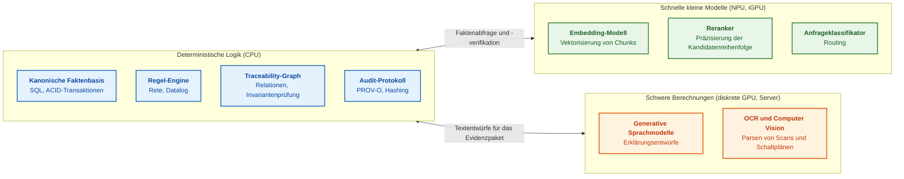
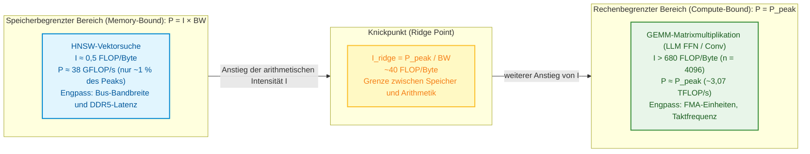
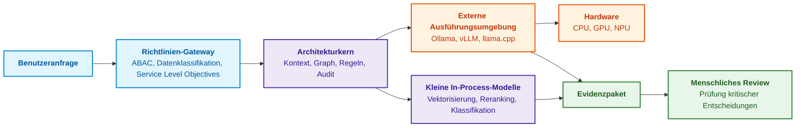
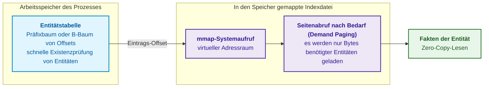
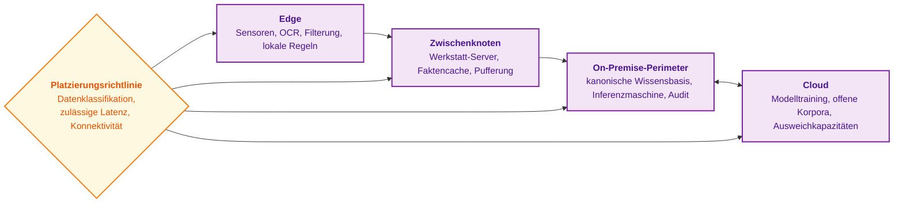
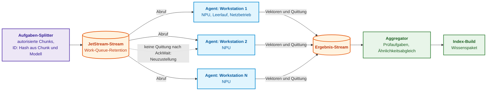
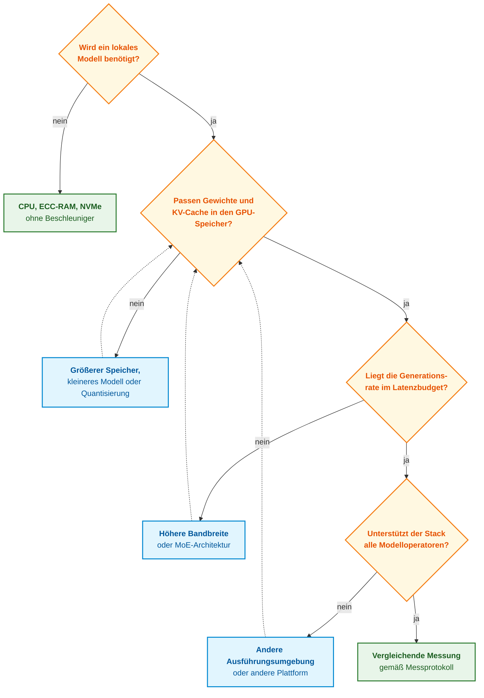
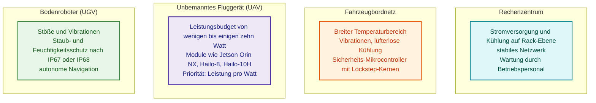
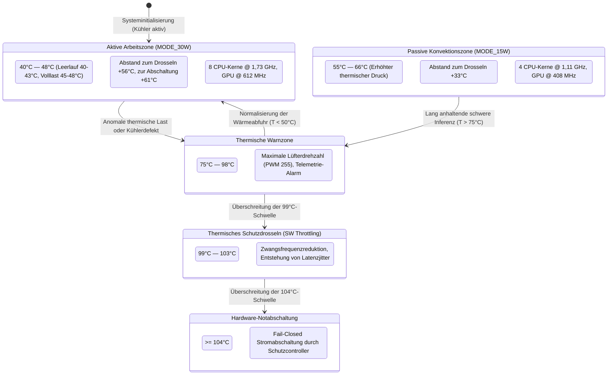
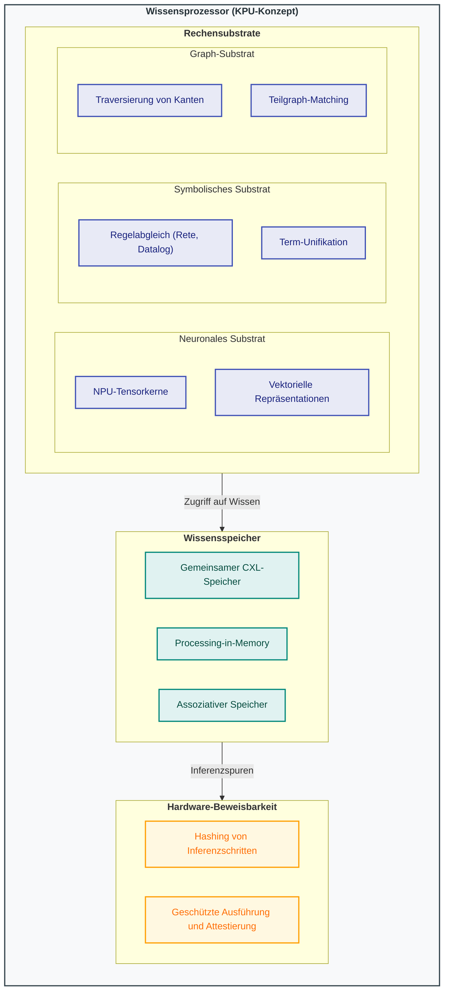

# Kapitel 18. Ausführungsinfrastruktur: Lokale Modelle, Hardwarebeschleuniger, Edge und On-Premise

> **Buch:** [Architektur evidenzbasierter Expertensysteme](README.md) · [Teil IV: Architektur, Technologie-Stack, Inferenz und Aktion](part-04-architecture-and-inference.md)  
> **Vorheriges Kapitel:** [Kapitel 17. Technologie-Stack: Auswahlkriterien für Werkzeuge, Programmiersprachen und Regel-Engines](ch17-implementation-stack.md)  
> **Nächstes Kapitel:** [Kapitel 19. Von der Frage zum Beweis: Suche, Bindung und Prüfung von Behauptungen](ch19-from-question-to-evidence.md)  
> **Inhaltsverzeichnis:** [README.md](README.md)  
> **Autor:** [Mykola Fedchyk](about-the-author.md)  
> **Niveau:** Mittelstufe und Fortgeschrittene: Systemingenieure, Architekten für ML-Infrastruktur, Entwickler eingebetteter Systeme und Edge-Geräte  
> [!NOTE]
> **Lernziele:** Komponenten des Expertensystems nach ihrem Berechnungsprofil auf CPU, GPU und NPU aufteilen; die erreichbare Leistung anhand des Roofline-Modells bewerten; lokale Modellplattformen (Stand 8. Oktober 2026) nach Speicherkapazität und Speicherbandbreite vergleichen und die Obergrenze der Token-Generierungsrate abschätzen; entscheiden, welche Modelle im Prozess des Expertensystems und welche in separaten Prozessen ausgeführt werden; Deployment-Topologien vom Edge-Gerät bis zur Cloud auswählen; ein Latenzbudget nach Perzentilen aufstellen; numerische Drift von Ergebnissen nach Treiber- und Runtime-Updates erklären und beherrschen.

## Abstract

Die vorangegangenen Kapitel haben die logische Architektur und den Technologie-Stack eines Expertensystems definiert. Softwareabstraktionen werden jedoch stets auf physischer Hardware ausgeführt: im Arbeitsspeicher, über Systembusse, auf Hauptprozessoren (*Central Processing Unit*, CPU), Grafikprozessoren (*Graphics Processing Unit*, GPU) und neuronalen Koprozessoren (*Neural Processing Unit*, NPU). Diese Ausführung erfolgt in Cloud-Clustern, auf Servern innerhalb des unternehmenseigenen Sicherheitsperimeters (*On-Premise*) oder auf kompakten Steuergeräten unmittelbar an den Sensoren (*Edge*).

Dieses Kapitel beantwortet die zentrale ingenieurtechnische Fragestellung: **Wie lassen sich Hardwareauswahl und Ausführungstopologie für vorgegebene Anforderungen an Entscheidungsqualität, Latenz und Autonomie fundiert begründen?** Das Berechnungsprofil liefert hierzu die primäre Entwurfshypothese: Verzweigungsintensive Regeln lassen sich meist optimal auf der CPU ausführen, während dichte lineare Algebra signifikant von GPU- oder NPU-Beschleunigern profitiert. Die architektonische Entscheidung hängt jedoch ebenso von der Unterstützung spezifischer mathematischer Operatoren, der Batch-Größe, dem Datenübertragungsoverhead, der Speicherbandbreite und den zulässigen Fehlermodi ab. Die bloße Herstellerbezeichnung eines Beschleunigers garantiert weder Determinismus noch Speichersicherheit. Die vergleichende Analyse konkreter Hardwareplattformen reflektiert den Stand vom 8. Oktober 2026 auf Basis verifizierter Herstellerdaten; angekündigte Produkte werden dabei strikt von bereits im Handel verfügbaren Systemen abgegrenzt.

Das nachfolgende Diagramm veranschaulicht die fundamentale Zuordnung der Subsysteme zu drei Rechenzonen.



Dieses Schema stellt kein Dogma dar: Auf einer Entwickler-Workstation können alle drei Zonen auf einem einzigen Prozessor mit integrierter NPU betrieben werden. Die Grenzen zwischen den Zonen spiegeln jedoch die fundamental unterschiedliche Natur der jeweiligen Rechenlasten wider, was im folgenden Abschnitt quantitativ begründet wird.

## 1. Berechnungsprofil: Vergleichende Analyse der Anforderungen symbolischer Regeln und neuronaler Netze

In der Gesamtarchitektur eines evidenzbasierten Expertensystems bildet die Infrastruktur- und Ausführungsebene das physische Fundament, auf dem diametral entgegengesetzte Berechnungsparadigmen koexistieren müssen: deterministische symbolische Inferenz (Rete-Engines, Datalog, SMT-Solver) und stochastische neuronale Perzeption sowie semantische Suche (Vektor-Embeddings, Reranker-Modelle, autoregressive Transformer). Wird diese Dualität bei der Hardwareauslegung ignoriert und die Infrastruktur allein nach aggregierten Marketingkennzahlen für Spitzenrechenleistung (TFLOPS) dimensioniert, droht eine gravierende Systemdegradation: Unkontrollierte Pointer-Dereferenzierungen (*pointer chasing*) beim Traversieren von Wissensgraphen lasten den Speicherbus vollständig aus, führen zu massiven Pipeline-Stalls, erzeugen unzulässigen Latenzjitter und gefährden harte Echtzeit-Deadlines in missionskritischen Steuerungszyklen (ISO 26262, IEC 61508). Die naive Annahme, die Anschaffung eines leistungsfähigeren Grafikbeschleunigers könne die symbolische Regelausführung oder das sequentielle Token-Dekodieren beschleunigen, scheitert an der Realität: Diese Operationen werden primär durch Latenz und Bandbreite des Arbeitsspeichers begrenzt, nicht durch die Anzahl arithmetischer Rechenwerke.

Zur quantitativen Einordnung und Zuweisung des adäquaten Hardwaresubstrats für jede Systemkomponente dient das analytische Roofline-Modell von Williams, Waterman und Patterson [[1]](#src-1). Es definiert eine obere Schranke der erreichbaren Rechenleistung auf Basis des Gleichgewichts zwischen Spitzenrechenleistung der Siliziumkerne und Bandbreite des Speicherbusses.

Die theoretische Spitzenleistung eines Prozessors wird ermittelt, um das absolute Rechenlimit eines Kerns oder Beschleunigers bei dichten Matrixoperationen zu bestimmen:

```math
P_{\text{peak}} = N_{\text{cores}} \times f \times \mathrm{FLOP}_{\text{cycle}}
```

wobei:
- $P_{\text{peak}}$ — die theoretische Spitzenleistung des Prozessors oder Beschleunigers darstellt, gemessen in Gleitkommaoperationen pro Sekunde ($\text{FLOP}/\text{s}$, typischerweise $\text{TFLOP}/\text{s}$ oder $\text{GFLOP}/\text{s}$);
- $N_{\text{cores}}$ — die physische Anzahl paralleler Rechenkerne oder Streaming-Multiprozessoren ist, die für die Aufgabe allokiert sind ($N_{\text{cores}} \in \mathbb{N}$, Wertebereich von 1 bis 16.384);
- $f$ — die stabile Taktfrequenz der Recheneinheiten unter Dauerlast in Hertz ist ($\text{Hz}$, typisch $0{,}7 \times 10^9 - 5{,}5 \times 10^9\text{ Hz}$);
- $\mathrm{FLOP}_{\text{cycle}}$ — die Anzahl elementarer Gleitkommaoperationen angibt, die ein Kern pro Taktzyklus über SIMD/SIMT-Vektoreinheiten ausführen kann (beispielsweise für einen Kern mit zwei 512-Bit-FMA-Einheiten im FP32-Format: $2 \times 16 \times 2 = 64\text{ FLOP}/\text{cycle}$, wobei die Operation $a \cdot b + c$ als zwei FLOP gezählt wird).

**Praktische Anwendung und ingenieurtechnische Schlussfolgerungen:**
1. Diese Berechnung erfolgt bei der Hardwarespezifikation zur Abschätzung des oberen Durchsatzlimits für dichte lineare Algebra (GEMM in Encodern oder Decodern neuronaler Netze).
2. Für eine exemplarische 16-Kern-CPU bei 3,0 GHz mit zwei FMA-Einheiten pro Kern ergibt sich folgende Spitzenleistung:

```math
P_{\text{peak}} = 16 \times (3{,}0 \times 10^9) \times 64 = 3{,}072 \times 10^{12}\text{ FLOP/s} \approx 3{,}07\text{ TFLOP/s}
```

3. **Ausfallkriterium:** Liegt der gemessene reale Durchsatz dichter Matrixmultiplikationen bei $`P_{\text{observed}} < 0{,}60 \times P_{\text{peak}}`$, weist dies auf mikroarchitektonische Anomalien hin: thermisches Drosseln (die Taktfrequenz $f$ sinkt unter den Basistakt), suboptimale Speicherausrichtung in Registern oder Cache-Misses im L1i-Befehlscache.

Die Bandbreite der Speicherschnittstelle begrenzt den maximalen Datendurchsatz zwischen System-RAM bzw. Grafikspeicher und den Rechenregistern:

```math
\mathrm{BW} = f_{\text{mem}} \times \frac{W_{\text{bus}}}{8} \times N_{\text{channels}}
```

wobei:
- $`\mathrm{BW}`$ — die theoretische Spitzenbandbreite der Arbeitsspeicherschnittstelle in Bytes pro Sekunde ist ($\text{B}/\text{s}$ oder $\text{GB}/\text{s}$);
- $`f_{\text{mem}}`$ — die effektive Datenrate der Speicherschnittstelle in Megatransfers pro Sekunde bezeichnet ($\text{MT}/\text{s}$ bzw. Transfers pro Sekunde, z. B. $4{,}8 \times 10^9\text{ T/s}$ für DDR5-4800 oder $8{,}533 \times 10^9\text{ T/s}$ für LPDDR5X);
- $`W_{\text{bus}}`$ — die Datenbusbreite eines einzelnen physischen Speicherkanals in Bit ist (typischerweise 64 Bit für Standard-DDR4/DDR5-Module, 32 oder 16 Bit für Subkanäle bei LPDDR5/LPDDR5X), wobei die Division durch 8 Bits in Bytes umrechnet;
- $`N_{\text{channels}}`$ — die Anzahl unabhängiger, verschränkter Speicherkanäle des Speichercontrollers ist ($`N_{\text{channels}} \in \{1, 2, 4, 8, 12\}`$).

**Praktische Anwendung und ingenieurtechnische Schlussfolgerungen:**
1. Diese Kennzahl bestimmt das theoretische Leistungsmaximum beim Abrufen unstrukturierter Daten, beim Durchlaufen von Adjazenzlisten in Graphen und beim Einlesen von Gewichtsmatrizen während der sequentiellen autoregressiven Inferenz.
2. Für eine Zweikanal-DDR5-4800-Konfiguration (Busbreite 64 Bit pro Kanal) beträgt die Spitzenbandbreite:

```math
\mathrm{BW} = 4{,}8 \times 10^9 \times \frac{64}{8} \times 2 = 76{,}8 \times 10^9\text{ B/s} = 76{,}8\text{ GB/s}
```

3. **Ingenieurtechnische Auslastungsgrenze:** Die tatsächliche Nutzbandbreite $`\mathrm{BW}_{\text{eff}}`$ übersteigt infolge des DRAM-Protokolloverheads (Zeilenkonflikte, Refresh-Zyklen `tRFC`, `CAS`-Latenzen) selten $75-85\,\%$ der theoretischen $\mathrm{BW}$. Wenn ein Algorithmus bereits $> 80\,\%$ der Busbandbreite beansprucht, führt eine Erhöhung der Worker-Threads nicht zu Beschleunigung, sondern zu Buskonflikten und Latenzexplosion.

Das Roofline-Modell verknüpft beide physikalischen Schranken über die arithmetische (operationelle) Intensität des Algorithmus $I$:

```math
P_{\text{observed}} \le \min\left(P_{\text{peak}},\; I \times \mathrm{BW}\right)
```

wobei:
- $`P_{\text{observed}}`$ — die real erreichbare Rechenleistung des Systems für den konkreten Algorithmus in $\text{FLOP}/\text{s}$ ist;
- $`I`$ — die arithmetische Intensität des Rechenkerns darstellt, d. h. die Anzahl ausgeführter Gleitkommaoperationen pro Byte, das über den Speicherbus übertragen wird ($\text{FLOP}/\text{Byte}$);
- $`\mathrm{BW}`$ — die Bandbreite des Speichersystems in $\text{Byte}/\text{s}$ ist;
- $`P_{\text{peak}}`$ — die Spitzenleistung des Prozessors oder Beschleunigers in $\text{FLOP}/\text{s}$ angibt;
- $\min(a, b)$ — die Minimumfunktion ist, welche den dominierenden physikalischen Engpass bestimmt.

**Praktische Anwendung, Grenzfälle und ingenieurtechnische Schlussfolgerungen:**
1. **Knickpunkt (Ridge Point):**

```math
I_{\text{ridge}} = \frac{P_{\text{peak}}}{\mathrm{BW}}
```

Für die beispielhafte Workstation ($`P_{\text{peak}} = 3{,}07\text{ TFLOP/s}`$, $`\mathrm{BW} = 76{,}8\text{ GB/s}`$) liegt der kritische Knickpunkt bei:

```math
I_{\text{ridge}} = \frac{3{,}072 \times 10^{12}}{76{,}8 \times 10^9} = 40{,}0\text{ FLOP/byte}
```

2. **Speicherbandbreitenbegrenzter Bereich ($`I < I_{\text{ridge}}`$):** Die Vektorsuche in einem HNSW-Graphindex (*Hierarchical Navigable Small World*) [[2]](#src-2) für einen Vektor der Dimension 768 im FP32-Format (3072 Bytes) erfordert rund $2 \times 768 = 1536$ Operationen. Daraus resultiert eine arithmetische Intensität von $I \approx 1536 / 3072 = 0{,}5\text{ FLOP/byte}$. Da $0{,}5 \ll 40{,}0$ gilt, wird der Durchsatz strikt durch den Speicherbus limitiert:

```math
P_{\text{observed}} \le 0{,}5 \times 76{,}8 \times 10^9 = 38{,}4\text{ GFLOP/s}
```

Dies entspricht lediglich $\approx 1{,}25\,\%$ des Rechenpotenzials der CPU. Die ingenieurtechnische Konsequenz: Höhere CPU-Taktraten oder GPUs mit mehr Kernen beschleunigen den Faktenabruf nicht; eine Beschleunigung gelingt ausschließlich über Vektorquantisierung (skalare INT8-Quantisierung verdoppelt die Intensität auf $1{,}0\text{ FLOP/byte}$ bei halbiertem Datenverkehr) oder breitere Speicherbusse.
3. **Rechenbegrenzter Bereich ($`I \ge I_{\text{ridge}}`$):** Die Multiplikation quadratischer Matrizen der Dimension $n = 4096$ im Vorwärtspfad eines mehrschichtigen Transformers weist eine Intensität von $I \approx n / 6 \approx 682{,}6\text{ FLOP/byte}$ auf. Hier schöpft der Prozessor sein volles Potenzial $P_{\text{peak}}$ aus; entscheidend werden Vektorinstruktionen und Tensorkerne.



> [!TIP] Praktische Konsequenzen für Infrastrukturingenieure
> - **Für speicherbegrenzte Operationen (HNSW, Rete-Netzwerke, Graphtraversierung):** Investitionen in teurere Rechenprozessoren (GPGPUs mit Hunderten TFLOPS) sind wirkungslos, da die Recheneinheiten auf Speicherdaten warten (*memory stall*). Wirkungsvoll sind: mehr Speicherkanäle (Quad-Channel statt Dual-Channel), Vektor-Caching im L3/SRAM oder Vektorquantisierung (Product Quantization, Skalar-INT8), welche das Transfervolumen minimiert.
> - **Für rechenbegrenzte Operationen (schwere LLM-Transformer, gebatchte GEMM-Kerne):** Der limitierende Faktor ist die arithmetische Rechenleistung. Hier sind dedizierte Tensorkerne, Matrixbeschleuniger und optimierte Mikroformate (FP8 / BF16) ausschlaggebend.

## 2. Das Expertensystem als Koordinator heterogener Ausführung

In einer heterogenen Architektur fungiert das Ausführungskoordinations-Subsystem als Kontroll-Gateway, das den deterministischen symbolischen Kern (kanonische Wissensbasis, Inferenzmaschine und kryptografisches Audit-Protokoll) strikt von nicht-deterministischen neuronalen Runtimes isoliert. Fehlt diese Trennung und verkommt das Expertensystem zu einem unstrukturierten Wrapper um externe LLM-APIs, entstehen kritische Schwachstellen: Nicht-deterministische Abstürze externer Bibliotheken oder Speichererschöpfung (OOM) zerstören unmittelbar die Transaktionsintegrität der Faktenbasis; ungeprüfte Kontexte führen zum Abfluss vertraulichen Wissens über den Sicherheitsperimeter hinaus (Verletzung von ISO/SAE 21434 und ABAC-Vorgaben). Direkte Aufrufe von Logikkomponenten an neuronale Backends ohne zentralen Dispatcher versagen beim ersten Lastanstieg oder Buskonflikt. Der Koordinator gewährleistet eine saubere Funktionstrennung anhand fünf zentraler Aufgaben:

- **Inhaltliche Anfrage-Routenführung:** Ein Klassifikator analysiert den Anfragetyp und wählt ein spezialisiertes Modell, beispielsweise ein kompaktes Modell für funktionale Sicherheitsnormen anstelle eines allgemeinen Textanalysemodells.
- **Kontextfilterung nach Zugriffsrichtlinien:** Dokumentfragmente, für die der Benutzer keine Berechtigung besitzt, werden vor dem Modellaufruf aus dem Prompt-Kontext entfernt.
- **Vollständiges Aufruf-Auditing:** Das Protokoll erfasst den kryptografischen Fingerabdruck jedes Modellaufrufs: Modell-Hash, Tokenizer-Version, Generierungstemperatur und Quantisierungsparameter.
- **In-Process-Ausführung kompakter Modelle:** Embedding-Modelle und Klassifikatoren laufen direkt im Adressraum des Expertensystemprozesses, um IPC- und Netzwerk-Overhead zu vermeiden.
- **Delegation rechenintensiver Modelle:** Die Textgenerierung wird an spezialisierte externe Runtimes (Ollama, vLLM, llama.cpp) delegiert, wie in [Kapitel 17](ch17-implementation-stack.md) beschrieben.



Aus der Praxis des Autors: Das Expertensystem bewährt sich primär als auditierender Client für spezialisierte Runtimes. Die rechenintensive Textgenerierung wird über REST-APIs an separate Prozesse delegiert, während die Vektorisierung über OpenVINO oder ONNX Runtime direkt im Prozess des Expertensystems erfolgt. Fällt der externe LLM-Server aus, wird dies als Dienstfehler registriert, ohne den Betrieb der Wissensbasis oder die Regelausführung zu unterbrechen. Die Trennlinie zwischen In-Process- und Out-of-Process-Ausführung muss anhand klarer Kriterien gezogen werden.

## 3. Isolation von Ausführungsumgebungen und Arbeitsspeicherverwaltung

Die physische Prozessisolation und ein striktes Speichermanagement bestimmen die Robustheit und Überlebensfähigkeit eines Expertensystems unter Hochlast. Fehlt eine klare Isolationsgrenze zwischen proprietären Beschleunigertreibern und dem Inferenzkern, drohen fatale Ausfälle: Ein Segmentierungsfehler (`SIGSEGV`) in einem Closed-Source-GPU-Treiber oder das Eingreifen des Linux-OOM-Killers beendet unverzüglich den gesamten Expertensystemprozess. Dadurch werden laufende Auditsitzungen abgebrochen, ACID-Transaktionen in der Faktenbasis zurückgerollt und übergeordnete Steuerungszyklen unterbrochen. Der naive Versuch, alle Inferenzmodelle zur Vermeidung von wenigen Mikrosekunden IPC-Latenz in einen gemeinsamen Adressraum zu laden, erzeugt gravierende Risiken, da C-Bindings von Tensorbibliotheken keine Speichersicherheitsgarantien bieten. Die folgende Tabelle stellt die ingenieurtechnischen Trade-offs gegenüber.

| Kriterium | In-Process-Ausführung | Out-of-Process-Ausführung |
|---|---|---|
| **Overhead** | Keine Interprozesskommunikation, Latenz im Mikrosekundenbereich | Tensorkopien, Serialisierung und Netzwerk-/IPC-Overhead |
| **Fehlerauswirkung** | Treiberabsturz beendet das gesamte Expertensystem | Fehler bleibt im Subprozess isoliert; der Architekturkern läuft weiter |
| **Skalierbarkeit** | Gekoppelt an den Lebenszyklus des Expertensystems | Unabhängig skalierbar, mit separaten Auftragswarteschlangen |
| **Typische Anwendung** | Stabile, schlanke Bibliotheken: OpenVINO auf CPU/NPU, ONNX Runtime | Große generative Modelle, experimentelle GPU-Treiber |

Die Auswahlregel leitet sich direkt aus den Fehlerkonsequenzen ab: Im Hauptprozess des Expertensystems dürfen nur Komponenten betrieben werden, deren Absturz für das Gesamtsystem tolerierbar ist. Für umfangreiche Modelle und volatile Beschleunigertreiber sind die Kosten der Isolation (wenige Millisekunden Serialisierung) vernachlässigbar gegenüber dem Risiko eines Totalausfalls des Systems.

### 3.1. Memory-Mapping der Faktenbasis (mmap)

Ein weiteres Skalierungsproblem betrifft die schiere Größe der Wissensbasis. Umfasst diese Millionen von Fakten, kann das Parsen textbasierter Formate (wie JSONL) in den Heap beim Systemstart Dutzende Sekunden dauern und Gigabytes an Arbeitsspeicher binden. Für Edge-Geräte und interaktive CLI-Tools ist dieses Verhalten inakzeptabel.

Die Lösung liegt in der Vorkompilierung der Faktenbasis in ein optimiertes Binärformat, das über den Systemaufruf `mmap` direkt in den virtuellen Adressraum eingebunden wird [[4]](#src-4). Das Betriebssystem liest eine solche Datei beim Öffnen nicht vollständig ein: Speicherseiten werden erst dann physisch geladen, wenn der Prozess auf die entsprechenden Adressen zugreift (Demand Paging). Das nachfolgende Diagramm veranschaulicht den zweistufigen Aufbau eines solchen Dateiformats.



Die erste Ebene — eine kompakte Tabelle normalisierter Entitäten und Datei-Offsets — verbleibt permanent im RAM und erlaubt eine O(1)-Prüfung, ob eine Entität in der Wissensbasis existiert. Die zweite Ebene enthält vollständige Attribute und Belegstellen; diese Bytes lädt der Kernel selektiv nur für Entitäten, die im aktuellen Beweispfad referenziert werden. Datensätze fester Binärstrukturen werden direkt ohne Deserialisierung und ohne Heap-Allokationen gelesen (Zero-Copy). Ein solches inhaltsadressiertes Wissenspaket wurde in [Kapitel 15](ch15-knowledge-extraction-and-kb-construction.md) beschrieben; `mmap` transformiert hierbei den Startaufwand von „alles parsen“ zu „nur benötigte Seiten laden“.

Übersteigt der Index den physischen Arbeitsspeicher eines Knotens, bieten sich zwei Strategien: gepuffertes sequentielles Lesen oder Partitionierung (Sharding) auf mehrere Knoten. Die Grenzen von `mmap` werden in Abschnitt 3.2 von [Kapitel 32](ch32-high-performance-knowledge-packs-mmap-and-harvesting.md) vertieft, die Sharding-Strategien in [Kapitel 7](ch07-knowledge-base-typology.md).

## 4. Deployment-Topologien: Vom Rechenzentrum bis zum Bordsensor

Die Deployment-Topologie bildet die logische Struktur des Expertensystems auf die physische Infrastruktur aus Netzwerken, Rechenknoten und Sensorschnittstellen ab. Fehlentscheidungen bei der Topologiewahl gefährden die funktionale Sicherheit: Werden lebenskritische Invariantenprüfungen in die Cloud verlagert, führt ein Verbindungsabbruch oder Jamming zur Manövrierunfähigkeit autonomer Systeme (vollständiger Bruch der ASIL-D-Autonomieanforderungen nach ISO 26262). Umgekehrt überhitzt der Versuch, generative Modelle auf ressourcenbeschränkten Edge-Controllern auszuführen, das Silizium und leert Batterien in kürzester Zeit. Die Annahme, drahtlose Verbindungen (5G, Satellit) böten stets stabile Latenzen, wird in realen Einsatzszenarien durch Funklöcher widerlegt. Die Platzierung von Komponenten orientiert sich an Datensensibilität, Latenzanforderungen und Verbindungszuverlässigkeit.



Jede Ebene erfüllt eine spezifische ingenieurtechnische Rolle:

- **On-Premise-Perimeter:** Der Standard für Verteidigungs-, Luftfahrt-, Energie- und Medizintechnik. Vertrauliche Daten verlassen zu keinem Zeitpunkt den Perimeter; die kanonische Wissensbasis und das Audit-Protokoll verbleiben unter voller Kontrolle der Organisation.
- **Edge:** Führt kritische Sicherheitsinvarianten direkt an Bord von Fahrzeugen oder Industrieanlagen aus und garantiert unterbrechungsfreie Funktion auch bei totalem Netzwerkausfall.
- **Zwischenknoten (Fog Computing):** Aggregieren Telemetrieströme von Dutzenden Edge-Controllern, führen Vorfilterung und Deduplizierung durch, bevor Daten an die Zentrale übermittelt werden [[5]](#src-5).
- **Cloud:** Dient dem rechenintensiven Modelltraining, der Indizierung öffentlicher Standards und elastischen Batch-Berechnungen; vertrauliche Daten gelangen nur nach expliziter Richtlinienfreigabe dorthin.

Diese Topologien decken interaktive Ausführungspfade ab. Für asynchrone Hintergrundaufgaben, wie die vollständige Neuindizierung von Dokumentenbeständen, existiert ein alternatives Berechnungsmodell.

## 5. Hintergrund-Indizierung auf ungenutzten NPU-Ressourcen von Workstations

Der Wechsel eines Vektor-Embedding-Modells erzwingt die Neuindizierung des gesamten Wissensbestands, da Vektoren unterschiedlicher Modelle nicht im selben Vektorraum vergleichbar sind. Bei einem Korpus von zig Millionen Chunks benötigt ein einzelner Beschleuniger Tage für diese Aufgabe. Gleichzeitig untersagen Sicherheitsrichtlinien oft die Auslagerung vertraulicher Spezifikationen in externe GPU-Clouds. Moderne Ingenieurs-Workstations verfügen jedoch zunehmend über integrierte NPUs, die im regulären Bürobetrieb überwiegend ungenutzt bleiben. Das Konzept, brachliegende Rechenkapazitäten zu nutzen, reicht auf das Condor-System von Litzkow et al. (1988) zurück [[6]](#src-6) und wurde durch Andersons BOINC-Plattform im globalen Maßstab etabliert [[7]](#src-7). Für das Expertensystem lässt sich dieses Prinzip als verteiltes Indizierungs-Mesh realisieren: Ein zentraler Koordinator zerlegt den Korpus in unabhängige Work-Items, die von Hintergrund-Agenten auf den lokalen NPUs berechnet werden.

Ein solches Mesh muss sich jedoch messtechnisch gegen dedizierte Server behaupten: Die Nutzung vorhandener Hardware senkt zwar Investitionskosten, doch Energieeffizienz, Verfügbarkeit und Administrationsaufwand müssen kontinuierlich überwacht werden.

### 5.1. Aufgabenklassifikation für das verteilte NPU-Mesh

Eine Aufgabe qualifiziert sich nur dann für das NPU-Mesh, wenn alle sechs folgenden Kriterien erfüllt sind:

1. **Unterstützter Inferenzmodus:** Das Mesh führt ausschließlich vortrainierte Modelle aus; Trainings- oder Feintuning-Pipelines werden nicht unterstützt.
2. **Vollständige Operatorunterstützung:** Der NPU-Compiler verlangt oft feste Eingabedimensionen (*static shapes*) [[8]](#src-8). Ein erfolgreiches Laden des Modells garantiert noch nicht, dass alle Schichten nativ auf der NPU ausgeführt werden (kein unbemerktes CPU-Fallback).
3. **Unabhängige Arbeitseinheiten:** Text-Chunks müssen vollständig isoliert verarbeitbar sein, ohne Zustandssynchronisation zwischen Knoten.
4. **Latenztoleranz:** Da Workstations heruntergefahren oder durch Benutzer beansprucht werden können, eignet sich das Mesh nur für asynchrone Batch-Jobs.
5. **Genügende Präzision (FP16 oder INT8):** Die Zielaufgabe darf keine Berechnungen mit doppelter Genauigkeit (FP64) erfordern.
6. **Zulässige Datenübertragung:** Die Einstufung des Chunks muss die Übertragung an den jeweiligen Workstation-Knoten erlauben ([Kapitel 10](ch10-knowledge-acquisition-systems.md)).

Vektorisierung, Reranking und Textklassifikation erfüllen diese Bedingungen typischerweise. Generative LLMs eignen sich aufgrund von Speichervorgaben selten für verteiltes NPU-Offloading. Klassische Datenkompression (zstd, DEFLATE) verbleibt auf der CPU ([Kapitel 32](ch32-high-performance-knowledge-packs-mmap-and-harvesting.md)).

### 5.2. Netzwerkarchitektur und Koordinationsprotokoll

Das nachfolgende Schema zeigt die Mesh-Architektur auf Basis von NATS JetStream, das als persistente Message-Queue dient ([Kapitel 10](ch10-knowledge-acquisition-systems.md), [Kapitel 17](ch17-implementation-stack.md)).



Die Stabilität des verteilten Systems stützt sich auf vier Entwurfsprinzipien:

1. **Deterministische Work-Units und Idempotenz:** Jedes Aufgabenpaket erhält eine eindeutige ID, basierend auf Chunk-Inhalt, Modell-Hash und Tokenizer-Version. JetStream unterstützt automatische Wiederholungszustellungen nach Ablauf eines `AckWait`-Timeouts [[9]](#src-9); die Persistierung von Vektoren muss daher idempotent ausgelegt sein.
2. **Good-Neighbor-Prinzip:** Der Agent beansprucht die NPU nur, wenn die Workstation am Stromnetz hängt, seit mindestens 5 Minuten keine Benutzeraktivität verzeichnet wird und die NPU frei ist. Sobald der Nutzer aktiv wird (z. B. Beginn eines Videoanrufs mit NPU-Effekten), pausiert der Agent sofort.
3. **Knotenübergreifende Reproduzierbarkeit:** Verschiedene NPU-Generationen und Treiberstände können minimale Abweichungen in FP16-Vektoren erzeugen. Vor der Aufnahme in das Mesh absolviert jeder Knoten einen Verifikationstest gegen ein Referenzset (Kosinus-Ähnlichkeit zum Goldstandard oberhalb von $\tau_{\text{drift}}$). Zudem streut der Aggregator verdeckte Kontrollaufgaben ein.
4. **Transportsicherheit:** Alle Kommunikationspfade werden mittels mTLS und NATS-Credentials authentifiziert. Nach erfolgreicher Vektorisierung wird der Rohtext auf dem Worker-Knoten unverzüglich aus dem flüchtigen Speicher gelöscht.

### 5.3. Abschätzung der aggregierten Rechenleistung

Für die Kapazitätsplanung vor einer Modellmigration ist die reale Durchsatzleistung des verteilten Clusters rechnerisch zu bestimmen. Die bloße Addition der nominellen TOPS-Angaben aller NPUs ist irreführend, da Verfügbarkeit, Leerlaufzeiten und Netzwerk-Overheads den effektiven Ertrag mindern. Der Erwartungswert des Gesamtdurchsatzes $Q_{\text{eff}}$ errechnet sich wie folgt:

```math
Q_{\text{eff}} = \sum_{i=1}^{M} q_i \, a_i \, (1 - o_i)
```

wobei:
- $Q_{\text{eff}}$ — der Erwartungswert des effektiven Durchsatzes des Indizierungs-Meshs in verifizierten Vektoren pro Sekunde ist ($\text{vectors}/\text{s}$);
- $M$ — die Gesamtanzahl registrierter NPU-Workstations im Netzwerk darstellt ($M \in \mathbb{N}$, typisch 10 bis $10^4$ Knoten);
- $q_i$ — der experimentell ermittelte NPU-Durchsatz der $i$-ten Workstation für das gewählte Modell im stationären Zustand ist ($\text{vectors}/\text{s}$, z. B. $240\text{ vectors/s}$ für ein quantisiertes 384-d-Modell auf Intel NPU);
- $a_i$ — der Verfügbarkeitskoeffizient der $i$-ten Station ist ($a_i \in [0, 1]$), welcher den Zeitanteil quantifiziert, in dem das Gerät am Netzstrom betrieben wird, keine Benutzerinteraktion vorliegt ($> 5\text{ min}$) und die NPU verfügbar ist;
- $o_i$ — der Verlustkoeffizient durch Netzwerk-Overhead ist ($o_i \in [0, 1]$), der mTLS-Handshakes, NATS-Zustellzeiten, Timeout-Wiederholungen und Kontrollprüfungen abbildet.

**Praktische Anwendung und ingenieurtechnische Schlussfolgerungen:**
1. Diese Formel dient der Bestimmung des erforderlichen Zeitfensters für eine vollständige Neuindizierung des normativen Bestands:

```math
T_{\text{reindex}} = \frac{N_{\text{total}}}{Q_{\text{eff}}}
```

wobei $`N_{\text{total}}`$ die Gesamtzahl der Dokumenten-Chunks angibt.
2. **Dimensionierungsbeispiel:** Für einen Bestand von $`M = 200`$ Workstations ($`q_i \approx 240\text{ vectors/s}`$, $`a_i \approx 0{,}10`$, $`o_i \approx 0{,}20`$) beträgt der effektive Gesamtdurchsatz:

```math
Q_{\text{eff}} = 200 \times 240 \times 0{,}10 \times (1 - 0{,}20) = 3\,840\text{ vectors/s}
```

Ein Korpus von 20 Millionen Chunks wird somit in $`T_{\text{reindex}} \approx 20 \times 10^6 / 3840 \approx 5\,208\text{ s} \approx 1{,}45\text{ Stunden}`$ vollständig verarbeitet. Eine dedizierte Server-CPU ($`q = 68\text{ vectors/s}`$) würde für dieselbe Aufgabe über 81 Stunden benötigen.
3. **Scheduling- und Quarantänekriterien:**
   - Liegt $`a_i < 0{,}03`$ (die Station schaltet häufig ab oder läuft primär auf Akku), wird der Knoten aus dem Pool entfernt, um Warteschlangen nicht durch Timeouts zu belasten;
   - Übersteigt $`T_{\text{reindex}}`$ das reguläre nächtliche Wartungsfenster ($`T_{\text{reindex}} > T_{\text{maintenance\_window}} = 6\text{ h}`$), löst das System eine Warnung aus, um temporär zentrale Server zuzuschalten oder die Leerlaufschwelle anzupassen.

## 6. Lokale Modellplattformen: Stand Oktober 2026

Während das NPU-Mesh Batch-Vektorisierungen übernimmt, erfordert die interaktive Generierung formaler Beweisbegründungen dedizierte Arbeitsplatzhardware. In den Jahren 2025–2026 etablierten Chiphersteller eine neue Klasse kompakter Rechner: Systems-on-Chip (SoC) kombinieren CPU und GPU mit bis zu 128 GB Unified Memory ([Kapitel 17](ch17-implementation-stack.md)). Dieser Abschnitt analysiert: **Welche Plattformen eignen sich für lokale Adapter eines Expertensystems und anhand welcher Metriken sind sie zu bewerten?**

In der folgenden Tabelle sind Spitzenleistungen herstellergetreu aufgeführt: in TOPS, TFLOPS oder PFLOPS für FP4-, FP8- oder FP16-Formate. LPDDR5X fungiert als energieeffizienter Unified Memory für CPU und GPU, während GDDR6 und GDDR7 dedizierten Grafikspeicher darstellen. Die Zeilen sind von Desktop-Workstations über Beschleunigerkarten bis hin zu Laptop-NPUs gegliedert.

| Plattform | Status (Stand: 8. Oktober 2026) | Modellspeicher | Speicherbandbreite | Herstellerangabe Spitzenleistung | Software-Stack |
|---|---|---|---|---|---|
| **NVIDIA DGX Spark**, Desktop-Workstation auf GB10-SoC | Im Handel seit 15. Oktober 2025 [[10]](#src-10) | 128 GB Unified LPDDR5X | 273 GB/s [[11]](#src-11) | Bis zu 1 PFLOPS in FP4 (mit Sparsity); 20 Arm-Kerne | DGX OS auf Ubuntu-Basis, CUDA |
| **NVIDIA RTX Spark** in Laptops und Mini-PCs (ASUS, Dell, HP, Lenovo, Surface, MSI) | Angekündigt am 31. Mai 2026, Verkaufsstart Herbst 2026 [[12]](#src-12) | Bis zu 128 GB Unified Memory | Keine Herstellerangabe | Bis zu 1 PFLOPS in FP4 (mit Sparsity); 20 Grace- und 6144 CUDA-Kerne in Laptops, 18 und 5120 im Desktop [[13]](#src-13) | Windows 11 on Arm, CUDA, TensorRT |
| **Microsoft Surface RTX Spark Dev Box**, Entwickler-Workstation auf RTX Spark | Angekündigt am 2. Juni 2026 [[14]](#src-14); Vorbestellung in den USA seit 7. Oktober 2026, Auslieferung ab November [[15]](#src-15) | 128 GB Unified Memory (GPU adressiert Teilmenge) | Keine Herstellerangabe | Bis zu 1 PFLOPS in FP4 (mit Sparsity); 100 W thermisches Budget [[16]](#src-16) | Windows 11 Pro, WSL 2 mit CUDA-Support, Windows ML |
| **NVIDIA DGX Station for Windows**, Workstation auf GB300 Grace Blackwell Ultra | Angekündigt am 31. Mai 2026, erwartet in Q4 2026 [[17]](#src-17) | Bis zu 748 GB kohärenter Speicher | Keine Herstellerangabe | Bis zu 20 PFLOPS in FP4; 72 Grace-Kerne | Windows, WSL |
| **NVIDIA RTX PRO 6000 Blackwell Workstation Edition**, PCIe-GPU | Im Handel verfügbar | 96 GB GDDR7 mit ECC | 1792 GB/s | 4000 TOPS in FP4 (mit Sparsity); bis zu 600 W [[18]](#src-18) | CUDA, TensorRT |
| **AMD Ryzen AI Halo** auf Ryzen AI Max+ 395 | Vorbestellbar seit Juni 2026 [[19]](#src-19) | 128 GB Unified LPDDR5X | 256 GB/s | Bis zu 60 TFLOPS in FP16; 16 Zen-5-Kerne, Radeon 8060S GPU (40 CUs), XDNA 2 NPU [[20]](#src-20) | Linux oder Windows 11, ROCm |
| **AMD Ryzen AI Max PRO 400** in HP- und Lenovo-Systemen | Angekündigt im Mai 2026, Auslieferung ab Q3 2026 angekündigt | Bis zu 192 GB (bis zu 160 GB als VRAM) | Keine Herstellerangabe | NPU bis zu 55 TOPS; TDP 45–120 W [[19]](#src-19) | ROCm |
| **Intel Core Ultra Series 3** in Laptops und Edge-PCs | Im Handel seit 27. Januar 2026 | System-RAM | Konfigurationsabhängig | NPU bis zu 50 TOPS; bis zu 16 CPU- und 12 Xe-Kerne [[21]](#src-21) | OpenVINO |
| **Intel Crescent Island**, luftgekühlte Server-Inferenz-GPU | Angekündigt am 14. Oktober 2025; Kundenmuster in H2 2026 [[22]](#src-22) | 160 GB LPDDR5X | Keine Herstellerangabe | Xe3P-Architektur; Spitzenleistung unbenannt | Open-Source-Software-Stack von Intel |
| **Qualcomm Snapdragon X2 Elite** in Arm-Laptops | Geräte verfügbar seit H1 2026 [[23]](#src-23) | System-RAM | Bis zu 228 GB/s modellabhängig | Hexagon NPU bis zu 85 TOPS; bis zu 18 Oryon-Kerne [[24]](#src-24) | Qualcomm AI Engine Direct |
| **Tenstorrent Blackhole p150**, PCIe-Beschleunigerkarte | Im Handel verfügbar | 32 GB GDDR6 | 512 GB/s | 664 TFLOPS in Block-FP8; 120 Tensix- und 16 RISC-V-Kerne; 300 W [[25]](#src-25) | Open-Source-Stack von Tenstorrent |

Drei zentrale Erkenntnisse lassen sich ableiten: Erstens dürfen Spitzenwerte nicht unkritisch verglichen werden. NVIDIA spezifiziert FP4-Werte unter Annahme strukturierter 2:4-Sparsity (zwei von vier Gewichten sind null, wodurch sich der Durchsatz auf dem Papier verdoppelt) [[26]](#src-26). Modelle ohne diese Sparsity erreichen bestenfalls die halbe Leistung. AMD deklariert FP16-Werte, während NPU-Hersteller ganzzahlige INT8/INT4-Operationen anführen. Zweitens ist die Speicherkapazität der primäre Flaschenhals: Modellgewichte und KV-Cache ([Kapitel 12](ch12-linguistic-analysis-and-local-models.md)) müssen vollständig in den GPU-adressierbaren Speicher passen. Bei Unified-Memory-Systemen ist der für die GPU reservierbare Anteil stets kleiner als der Gesamtspeicher [[15]](#src-15). Drittens verschweigen mehrere Hersteller die Speicherbandbreite, obwohl genau diese den Generierungsdurchsatz diktiert.

### 6.1. Abschätzung der Generationsgeschwindigkeit anhand der Speicherbandbreite

Für die interaktive Nutzung eines Expertensystems ist die Generierungslatenz von entscheidender Bedeutung. Während die Prompt-Verarbeitung (Prefill) matrixmultiplikationsdominiert und hochgradig parallelisierbar ist, erfolgt die Generierung jedes nachfolgenden Tokens (Token Decoding) strikt speicherbandbreitenbegrenzt (*memory-bound*). In jedem Schritt muss das Rechenwerk die gesamten aktiven Modellgewichte aus dem Speicher laden und den KV-Cache aktualisieren. Die theoretische Obergrenze der Generierungsrate für einen sequentiellen Anfragestrom beträgt:

```math
r_{\text{dec}} \le \frac{\mathrm{BW}}{N_{\text{act}} \cdot q / 8 + S_{\text{KV}}}
```

wobei:
- $r_{\text{dec}}$ — die maximale autoregressive Dekodiergeschwindigkeit für einen einzelnen Stream in Tokens pro Sekunde ist ($\text{tokens}/\text{s}$ bzw. $\text{tps}$);
- $\mathrm{BW}$ — die nutzbare Speicherbandbreite der Plattform in Bytes pro Sekunde darstellt ($\text{bytes}/\text{s}$);
- $N_{\text{act}}$ — die Anzahl der aktiven Modellparameter ist (bei Dense-Modellen gilt $N_{\text{act}} = N_{\text{total}}$, bei Mixture-of-Experts-Modellen $N_{\text{act}} \ll N_{\text{total}}$);
- $q$ — die Quantisierungsbreite der Modellgewichte in Bits pro Parameter ist ($q \in \{4, 8, 16\}$);
- $`S_{\text{KV}}`$ — das Bus-Transfervolumen des KV-Caches pro Dekodierschritt in Bytes pro Token angibt:

```math
S_{\text{KV}} = 2 \times n_{\text{layers}} \times d_{\text{head}} \times n_{\text{heads\_kv}} \times L_{\text{ctx}} \times \frac{q_{\text{kv}}}{8}
```

wobei $`L_{\text{ctx}}`$ die aktuelle Kontextlänge in Tokens, $`n_{\text{layers}}`$ die Schichttiefe und $`q_{\text{kv}}`$ die Bitbreite des KV-Caches bezeichnet (typisch 16 Bit für FP16 oder 8 Bit für FP8).

**Praktische Anwendung und ingenieurtechnische Schlussfolgerungen:**
1. Diese Berechnung dient der Eignungsprüfung, ob eine Workstation die interaktiven SLA-Vorgaben einhalten kann.
2. **Numerische Benchmarks für Desktop-Plattformen (273 GB/s Bandbreite):**
   - **Dense-Modell 70B (INT4, $`N_{\text{act}} = 70 \times 10^9`$, $`q = 4`$):** Das Speichertransfervolumen beträgt $`35\text{ GB}`$ pro Token. Bei $`\mathrm{BW} = 273\text{ GB/s}`$ resultiert eine Rate von maximal:

```math
r_{\text{dec}} \le \frac{273 \times 10^9}{35 \times 10^9} \approx 7{,}8\text{ tokens/s}
```

Die Erstellung einer fundierten Begründung von 150 Tokens erfordert $`\approx 19{,}2\text{ s}`$, was den interaktiven Zeitrahmen ($`< 1\text{ s}`$) deutlich verfehlt.
   - **Mixture-of-Experts-Modell 117B ($`N_{\text{total}} = 117\text{B}`$, $`N_{\text{act}} = 5{,}1\text{B}`$, $`q = 4`$) [[27]](#src-27), [[28]](#src-28):** Das Transfervolumen sinkt auf $`2{,}55\text{ GB}`$ pro Token. Die erreichbare Rate steigt um das 14-Fache:

```math
r_{\text{dec}} \le \frac{273 \times 10^9}{2{,}55 \times 10^9} \approx 107\text{ tokens/s}
```

Derselbe Text wird in $`1{,}4\text{ s}`$ generiert. Jedoch müssen mindestens 59 GB Speicher vorhanden sein, um die 117 Milliarden Parameter überhaupt resident zu halten (32-GB-Knoten scheiden aus).
3. **Zulassungskriterien und Architektur-Gates:**
   - $`r_{\text{dec}} \ge 15\text{ tokens/s}`$: **Flüssige Interaktivität**. Die Antwortgenerierung wird vom Experten kognitiv als verzögerungsfrei wahrgenommen;
   - $`8 \le r_{\text{dec}} < 15\text{ tokens/s}`$: **Akzeptables Arbeitstempo**. Zulässig für Terminalarbeitsplätze, sofern das UI vor Beginn der Textgenerierung sofort den formalen symbolischen Status (Regel-ID, Freigabe/Sperre) darstellt;
   - $`r_{\text{dec}} < 8\text{ tokens/s}`$: **SLA-Verletzung**. Unzulässig für den operativen Betrieb. Solche Dense-70B-Modelle müssen auf dieser Hardware verworfen und durch MoE-Architekturen, spekulatives Dekodieren oder dedizierte Beschleuniger mit GDDR7/HBM ersetzt werden.

### 6.2. Auswahlkriterien und funktionale Rollen der Plattformen

Aus den technischen Kenndaten ergibt sich ein systematischer Entscheidungsbaum für die Plattformqualifikation:



Entsprechend diesem Ablauf lassen sich den Plattformen klare Rollen zuweisen:

- **Einzelplatz-Entwickler-Workstation:** DGX Spark, Ryzen AI Halo und Surface Dev Box verfügen über eine ähnliche Speicherausstattung (128 GB Unified Memory) und unterscheiden sich primär im Software-Stack (Linux/CUDA, Linux-Windows/ROCm, Windows/WSL2). Dies ist für das Evidenzpaket relevant, da der Ausführungs-Fingerabdruck ([Kapitel 17](ch17-implementation-stack.md)) Treiber und OS einbezieht.
- **Workstation mit diskreter High-End-GPU:** Die RTX PRO 6000 bietet mit 1792 GB/s die höchste Bandbreite, limitiert Modelle jedoch auf 96 GB VRAM bei bis zu 600 W Leistungsaufnahme.
- **Zentraler On-Premise-Teamknoten:** Systeme wie die DGX Station for Windows oder Crescent Island zielen auf Großmodelle und Multi-User-Inferenz ab, befinden sich zum Stichtag jedoch im Ankündigungs- bzw. Sampling-Status.
- **NPU in Ingenieurs-Laptops:** Core Ultra Series 3 und Snapdragon X2 Elite eignen sich mit 50–85 TOPS für lokale Vektorisierung und das Hintergrund-Mesh.
- **Forschungsplattformen mit Open-Source-Hardware:** Die Tenstorrent Blackhole-Karte kombiniert RISC-V-Kerne mit Matrix-Engines und offenem Stack für Experimente mit dedizierten Befehlssatzerweiterungen.

Keine dieser Plattformen beschleunigt relationale SQL-Transaktionen oder Rete-Algorithmen: Diese verbleiben auf Standard-CPUs.

## 7. Hardwarebasis und physikalische Beschränkungen von Edge-Systemen

Eingebettete und Edge-Hardware stellt die physikalische Schnittstelle dar, über die ein cyber-physisches Expertensystem mit seiner Umwelt interagiert: An Bord mobiler Systeme erfolgt die Sensorfusion, Rauschunterdrückung und autonome Verifikation von Sicherheitsinvarianten. Die Missachtung thermischer Budgets (TDP), mechanischer Vibrationen oder fehlender Lockstep-Mechanismen führt zu Ausfällen: Erreicht der Siliziumchip die Grenze des thermischen Drosselns ($T_{\mathrm{tj}} > 99^\circ\text{C}$), entstehen unkontrollierbare Latenzschwankungen, Frame-Verluste und Notabschaltungen (Bruch von ISO 26262 ASIL-D und IEC 61508). Server- oder Consumer-Hardware ohne Industrie-Zertifizierung versagt im Feldeinsatz infolge von Spannungsspitzen, Feuchtigkeit und strahlungsinduzierten Bitkippern (*Single Event Upsets*). Die Zuordnung der Rechenklassen zur Hardware fasst folgende Übersicht zusammen.

| Rechenklasse | Operationscharakteristik | Hardware-Substrat | Software-Plattformen |
|---|---|---|---|
| **Symbolische Logik, Prädikate, SQL** | Verzweigungen, Graph-Traversierung, Integer-Indizes | Multicore-CPUs (x86-64, ARM64) | Standard-Compiler, Vektorerweiterungen (AVX-512, AMX) |
| **Dichte lineare Algebra** | Matrixmultiplikationen, Tensoren | Workstation- und Server-GPUs | CUDA, TensorRT, ROCm |
| **Energieeffiziente Modellinferenz** | Quantisierte Tensoren (INT8, INT4), Faltungen | Integrierte NPUs, Edge-Beschleuniger | OpenVINO, Qualcomm QNN, Core ML |
| **Deterministische Signalverarbeitung** | Pipelining mit Mikrosekundenlatenz, Sensorfusion | FPGAs, DSPs | AMD Vivado, Altera Quartus |

Im mobilen Einsatz (Automotive, Drohnen, mobile Robotik) treten strikte SWaP-Beschränkungen (*Size, Weight and Power*) hinzu:



Bei Fluggeräten verkürzt jedes Watt Leistungsaufnahme die Flugdauer; maßgeblich ist die Energieeffizienz (TOPS/Watt). Module wie Jetson Orin NX liefern bis zu 100 TOPS bei 10–25 W TDP [[29]](#src-29), während der Hailo-8-Chip 26 TOPS bei typisch 2,5 W aufweist [[30]](#src-30). Für On-Board-Generierungsmodelle bieten Jetson Thor (bis 2070 TFLOPS in FP4 bei 40–130 W) [[31]](#src-31) und Hailo-10H (40 TOPS INT4 bei 2,5 W mit eigenem LPDDR4-Interface) [[32]](#src-32) neue Dimensionen.

In der Automobilelektronik ist die funktionale Trennung der Steuerungsebenen unabdingbar: Schwere Perzeptions-Pipelines laufen auf leistungsfähigen SoCs wie dem industriellen Rechner **Seeed Studio reServer Industrial J501** (NVIDIA Jetson AGX Orin 64GB, 275 TOPS, JetPack 6.2, CAN-FD-Interfaces). Deterministische Notabschaltpfade verbleiben strikt auf ASIL-D-zertifizierten Mikrocontrollern mit Lockstep-Kernen (wie dem Texas Instruments TMS570LC4357 [[33]](#src-33)) oder FPGA-Sicherheitsmatrizen ([Anhang B](appendix-b-robotics-and-cyber-physical-systems.md)). Lockstep-Kerne führen identische Befehlsketten parallel aus; Hardware-Komparatoren triggern bei Diskrepanzen unverzüglich einen sicheren Zustand (Fail-Safe nach ISO 26262 [[35]](#src-35)).

### 7.1. Empirisches Profil der Bordtelemetrie: Erprobung des Jetson AGX Orin im Passivmodus MODE_15W

Um theoretische Effizienzmodelle unter realen Bedingungen zu validieren, führte der Autor eine Messreihe auf dem industriellen Hardwareprüfstand **Seeed Studio reServer Industrial J501** durch (NVIDIA Jetson AGX Orin 64GB Unified Memory, 12 ARM Cortex-A78AE-Kerne, Ampere-GPU mit 2048 CUDA- und 64 Tensorkernen, **JetPack 6.2 / Linux 5.15 aarch64**).

Das Industriegehäuse verfügt über eine **rein passive Konvektionskühlung** über großflächige Aluminium-Kühlrippen ohne Lüfter. Für bordgestützte Szenarien wurde das System im Energiesparprofil `MODE_15W` betrieben:
* 4 aktive energieeffiziente CPU-Kerne (CPU0..CPU3), die restlichen 8 Kerne deaktiviert;
* CPU-Taktrate limitiert auf 729–1113 MHz;
* GPU-Taktrate limitiert auf 408 MHz;
* Softwareseitige Notabschaltschwelle auf $75{,}0^\circ\text{C}$ festgelegt (bei maximal zulässiger Chiptemperatur von $99^\circ\text{C}$).

Telemetriedaten wurden über das `tegrastats`-Interface im 500-ms-Intervall synchron erfasst ($T_{\text{cpu}}, T_{\text{tj}}, T_{\text{soc}}$, Spannungen und Ströme der Versorgungsschienen `VIN_SYS_5V0`, `VDD_GPU_SOC`, `VDD_CPU_CV`). Untersucht wurde die Extraktion normativer Regeln aus RFC 9110 (HTTP Semantics) und ISO 26262-4 (ASIL-D) mittels 7B- und 14B-Modellen.

| Szenario / Norm | Extraktionsmodell | Latenz (s) | Prompt Speed | Eval Speed | Mittlere Leistung $P_{\text{sys}}$ | Energie pro Fakt $\int P dt$ | Erhalt von Defeatern | Spitzentemperatur $T_{\text{tj}}$ |
| :--- | :--- | :---: | :---: | :---: | :---: | :---: | :---: | :---: | :---: |
| **RFC 9110 Sec 7.2 (Authority)** | 7B SLM | 16{,}75 s | 129{,}2 tps | 4{,}7 tps | 5 860{,}6 mW | **98{,}17 J** | 0 % (Verlust von `unless`) | 55{,}81°C |
| **RFC 9110 Sec 7.2 (Authority)** | 14B SLM | 42{,}13 s | 65{,}2 tps | 2{,}5 tps | 6 076{,}6 mW | **256{,}01 J** | **100 %** (`unless` erfasst) | 56{,}69°C |
| **RFC 9110 Sec 7.6.1 (Framing)** | 7B SLM | 28{,}62 s | 197{,}6 tps | 4{,}7 tps | 6 452{,}0 mW | **184{,}65 J** | **100 %** | 57{,}28°C |
| **RFC 9110 Sec 7.6.1 (Framing)** | 14B SLM | 97{,}73 s | 102{,}8 tps | 2{,}5 tps | 6 624{,}1 mW | **647{,}39 J** | **100 %** | 58{,}75°C |
| **ISO 26262-4 Cl 6.4.7 (ASIL-D)** | 7B SLM | 32{,}10 s | 131{,}3 tps | 4{,}7 tps | 6 470{,}8 mW | **207{,}72 J** | **100 %** | 59{,}22°C |
| **ISO 26262-4 Cl 6.4.7 (ASIL-D)** | 14B SLM | 57{,}60 s | 66{,}3 tps | 2{,}5 tps | 6 547{,}9 mW | **377{,}15 J** | **100 %** | **60{,}00°C** |

#### 7.1.1. Ingenieurtechnische Erkenntnisse aus der Telemetrieanalyse

1. **Erhalt von Einschränkungen (Defeater Retention):** 7B-Modelle neigen bei komplexen Satzgefügen dazu, restriktive Konditionalsätze (*defeaters*, z. B. Nebensätze wie `unless authority contains userinfo`) zu unterschlagen. 14B-Modelle erreichten **100 % Defeater-Vollständigkeit** und erfassten deontische Regeln samt ihrer Anfechtungsbedingungen fehlerfrei.
2. **Präzisionskosten in Joule:** Die semantische Exaktheit der 14B-Modelle verlangt ein höheres Energiebudget (250–650 Joule pro Fakt gegenüber 98–200 Joule bei 7B). Mit einer mittleren Leistungsaufnahme von **5{,}8–6{,}6 W** bleibt das Gesamtsystem jedoch voll im Rahmen automobiler und mobiler Batteriebudgets.
3. **Thermische Reserve des Passivgehäuses:** Unter Volllast erreichte die Chiptemperatur ($T_{\mathrm{tj}}$) maximal **60{,}0°C**. Dies bietet selbst ohne Lüfter einen Sicherheitsabstand von $15{,}0^\circ\text{C}$ zur Warnschwelle ($75^\circ\text{C}$) und belegt die Eignung für geschlossene Schaltschränke.

### 7.2. Aktives thermodynamisches Management und Konfiguration MODE_30W: Erweiterung des Rechenbudgets

Das passive Profil `MODE_15W` gewährleistet geräuschlosen Betrieb, drosselt jedoch CPU und Speicherbus. Um 14B-Modelle performant zu betreiben, wurde der Prüfstand mit einem kompakten aktiven PWM-Lüfter nachgerüstet und in das Leistungsprofil `MODE_30W` (`nvpmodel -m 2`) überführt [[42]](#src-42), [[43]](#src-43).

Die Konfigurationsanpassung erbrachte signifikante Ressourcengewinne:
* **Verdopplung der CPU-Kerne:** Aktivierung von 8 Kernen (CPU0–CPU7, Cortex-A78AE, +100 %);
* **Frequenzerhöhung:** CPU-Takt stieg von 1,11 GHz auf **1,73 GHz** (+55,8 %), GPU-Takt von 408 MHz auf **612 MHz** (+50,0 %);
* **Dynamische Speicherbus-Skalierung:** Der LPDDR5-Speichercontroller wurde auf Maximaltakt (`EMC MAX_FREQ`) gesetzt, was den KV-Cache-Durchsatz für 14B-Modelle entlastete;
* **Sicherheitsschwellen:** Thermisches Software-Drosseln ab $99{,}0^\circ\text{C}$, Hardware-Notabschaltung bei $104{,}0^\circ\text{C}$.



#### 7.2.1. Empirische Telemetrie der Erprobung im Modus MODE_30W mit GBNF-Maskierung

Im Rahmen der Benchmark-Reihe mit Modellen der Klassen 7B und 14B (`znavets-rfc` und `znavets-automotive`) wurden 699 Telemetriemesspunkte erfasst. Verglichen wurden Prompt Speed, Token-Generierungsrate (Eval Speed), Gesamtenergie, Chiptemperatur ($T_{\mathrm{tj}}$), Syntaxfehlerquote sowie das Passieren des Popperschen Falsifikations-Gateways.

| Szenario-ID | Modell und Norm | Dekodiermodus | Latenz (s) | Prompt Speed | Eval Speed | Leistung $P_{\mathrm{sys}}$ | Energie pro Fakt | Peak $T_{\mathrm{tj}}$ | Syntaxfehler | Poppersche Zulassung |
| :--- | :--- | :---: | :---: | :---: | :---: | :---: | :---: | :---: | :---: | :---: |
| **EXP3-S1** | RFC 9110 (7B) | **GBNF Constrained** | 23{,}01 s | 209{,}9 tps | 8{,}0 tps | 7 216{,}8 mW | **166{,}03 J** | 45{,}00°C | 0{,}00 % | **ZUGELASSEN ($F^+$ OK, $F^-$ REFUSED)** |
| **EXP3-S2** | RFC 9110 (7B) | Ungeführte Baseline | 15{,}31 s | 527{,}5 tps | 8{,}3 tps | 7 565{,}5 mW | **115{,}79 J** | 45{,}59°C | 0{,}00 % | **ABGEWIESEN (Instabiles Schema)** |
| **EXP3-S3** | RFC 9110 (14B) | **GBNF Constrained** | 31{,}69 s | 112{,}8 tps | 4{,}3 tps | 7 183{,}6 mW | **227{,}65 J** | 46{,}28°C | 0{,}00 % | **ZUGELASSEN ($F^+$ OK, $F^-$ REFUSED)** |
| **EXP3-S4** | RFC 9110 (14B) | Ungeführte Baseline | 35{,}79 s | 383{,}4 tps | 4{,}4 tps | 7 788{,}0 mW | **278{,}70 J** | 47{,}97°C | 0{,}00 % | **ABGEWIESEN (Instabiles Schema)** |
| **EXP3-S5** | ISO 26262 (7B) | **GBNF Constrained** | 29{,}05 s | 226{,}4 tps | 7{,}8 tps | 7 532{,}6 mW | **218{,}82 J** | 47{,}66°C | 0{,}00 % | **ZUGELASSEN ($F^+$ OK, $F^-$ REFUSED)** |
| **EXP3-S6** | ISO 26262 (14B) | **GBNF Constrained** | 39{,}86 s | 121{,}4 tps | 4{,}3 tps | 7 701{,}4 mW | **307{,}00 J** | 48{,}25°C | 0{,}00 % | **ZUGELASSEN ($F^+$ OK, $F^-$ REFUSED)** |
| **EXP3-S7** | ISO 26262 (14B) | Ungeführte Baseline | 24{,}72 s | 456{,}4 tps | 4{,}5 tps | 7 748{,}5 mW | **191{,}56 J** | 48{,}66°C | 0{,}00 % | **ABGEWIESEN (Instabiles Schema)** |

#### 7.2.2. Vergleichende Analyse: MODE_15W versus MODE_30W und ingenieurtechnische Konsequenzen

Der direkte Vergleich beider Betriebsarten offenbart zentrale ingenieurtechnische Gesetzmäßigkeiten:

1. **Thermodynamischer Vorteil aktiver Kühlung:** Trotz höherer elektrischer Leistungsaufnahme ($P_{\mathrm{sys}}$ stieg von 5,8–6,6 W auf 7,2–7,7 W) senkte der aktive Luftstrom die Betriebstemperatur um $\approx 15-20^\circ\text{C}$. Die Sicherheitsmarge zur Drosselschwelle ($99^\circ\text{C}$) stieg von $+33^\circ\text{C}$ auf **$+56^\circ\text{C}$**, zur Notabschaltung auf **$+61^\circ\text{C}$**. Ein temperaturbedingtes Absinken der Taktraten wird somit zuverlässig verhindert, was deterministische Antwortzeiten garantiert.
2. **Durchsatzsprung bei 14B-Modellen:** Die Token-Generierungsrate stieg von 2,5 tps (15W passiv) auf **4,3–4,5 tps** (30W aktiv), ein Zuwachs von **+72–80 %**. Die Extraktionslatenz für komplexe ISO-26262-Klauseln sank von 57,6 s auf 39,8 s.
3. **Energieneutralität durch Laufzeitverkürzung:** Obwohl die Momentanleistung um 15–20 % höher liegt, sank der integrale Gesamtenergiebedarf pro validiertem Fakt ($\int P_{\mathrm{sys}} dt$): Für das 14B-Modell bei RFC 9110 Sec 7.2 reduzierte sich der Energieaufwand von **256{,}01 J** (15W / 42,1 s) auf **227{,}65 J** (30W / 31,7 s). Die verkürzte Rechenzeit kompensiert die höhere Leistungsaufnahme vollständig.
4. **Notwendigkeit von Logit-Masking (GBNF):** Ungeführte Durchläufe (EXP3-S2, S4, S7) demonstrieren, dass Ausgaben ohne Grammatikmaskierung strukturell instabil sind (Freitextbeifügungen, mutierende JSON-Keys). Nur GBNF-Logit-Masking garantiert 0,00 % Syntaxfehler und ermöglicht die automatische Einspeisung in das Poppersche Verifikations-Gateway.

## 8. Latenzbudget und numerische Drift von Ergebnissen

### 8.1. Bildung und Dekomposition des Latenzbudgets

Für interaktive und missionskritische Szenarien muss ein durchgängiges Latenzbudget aufgestellt werden. Unkontrollierte Latenzverzögerungen in heterogenen Pipelines führen zu Pufferüberläufen und dem Verfehlen harter Fristen. Die Gesamtlatenz einer sequentiellen Anfrage dekomponiert sich wie folgt:

```math
T_{\text{total}} = T_{\text{retrieval}} + T_{\text{embedding}} + T_{\text{reranking}} + T_{\text{rules}} + T_{\text{LLM}} + T_{\text{overhead}}
```

wobei:
- $T_{\text{total}}$ — die Gesamtdurchlaufzeit der Anfrage bis zur Rückgabe des verifizierten Evidenzpakets in Millisekunden ist ($\text{ms}$);
- $T_{\text{retrieval}}$ — die Dauer des Faktenabrufs aus SQL-Datenbank und BM25-Volltextindex darstellt ($\text{ms}$, typisch $20-60\text{ ms}$);
- $T_{\text{embedding}}$ — die Zeit für die Vektorisierung der Anfrage auf NPU oder CPU ist ($\text{ms}$, typisch $5-15\text{ ms}$);
- $T_{\text{reranking}}$ — die Ausführungszeit des Cross-Encoder-Rerankings für Kandidatenchunks beziffert ($\text{ms}$, typisch $20-40\text{ ms}$ für 50 Kandidaten);
- $T_{\text{rules}}$ — die deterministische Ausführungszeit der Rete-/Datalog-Regel-Engine auf der CPU ist ($\text{ms}$, typisch $2-10\text{ ms}$);
- $T_{\text{LLM}}$ — die Dauer der autoregressiven Synthese der Erklärung durch das Sprachmodell darstellt ($\text{ms}$, üblicherweise $500-1500\text{ ms}$);
- $T_{\text{overhead}}$ — den Overhead für IPC-Serialisierung, GBNF-Validierung, PROV-O-Hashing und Netzwerktransport umfasst ($\text{ms}$, typisch $5-20\text{ ms}$).

**Praktische Anwendung und ingenieurtechnische Schlussfolgerungen:**
1. Diese Gleichung bildet die Grundlage für OpenTelemetry-Traces und die Kontingentierung einzelner Verarbeitungsschritte.
2. **Nicht-Additivität von Perzentilen (Gegenbeispiel):** Die Summe der Einzellatenz-Perzentile entspricht nicht dem Gesamtperzentil der Anfrage: $`\mathrm{p95}(T_{\text{total}}) \ne \sum \mathrm{p95}(T_k)`$. Benötigen zwei unabhängige Stufen mit einer Wahrscheinlichkeit von 0,95 jeweils 0 ms und mit 0,05 jeweils 100 ms, so beträgt das $\mathrm{p95}$ beider Stufen isoliert 0 ms. Die Wahrscheinlichkeit, dass beide gleichzeitig 0 ms benötigen, liegt jedoch nur bei $0{,}95 \times 0{,}95 = 0{,}9025$. Folglich beträgt das tatsächliche $`\mathrm{p95}(T_{\text{total}}) = 100\text{ ms}`$. SLAs müssen daher stets an der Gesamtverteilung unter Last validiert werden.
3. **Fail-Safe-Kriterien und Notfall-Gates:**
   - Für interaktive Arbeitsplätze gilt typischerweise $`\mathrm{p95}(T_{\text{total}}) \le 1\,000\text{ ms}`$; für Echtzeit-Edge-Pfade $`\mathrm{p99}(T_{\text{total}}) \le 100\text{ ms}`$;
   - Überschreitet $`T_{\text{retrieval}} + T_{\text{rules}} > 50\text{ ms}`$, weist dies auf SQLite-Tabellenfragmentierung oder Rete-Überlastung hin;
   - Überschreitet $`T_{\text{LLM}} > 800\text{ ms}`$ (oder übersteigt die GPU-Warteschlange 3 Anfragen), greift ein Schutzautomat: Die generative Textausgabe wird abgebrochen und dem Benutzer unmittelbar der rein symbolische Beweisbaum (Regel-IDs, Normenparagraphen) übermittelt, um das SLA einzuhalten.

### 8.2. Messreglement und Autonomieanforderungen

Das Messprotokoll erfasst Modellgewichte, Tokenizer, Prompt- und Ausgabegrößen, Präzision, Hardware, Treiberversionen und Parallelitätsgrade gemäß dem Evaluierungsstandard MLPerf Inference [[3]](#src-3). Separat gemessen werden Kaltstart, Warmstart, Time-to-First-Token, Gesamtlatenz, Speicher-Peak und Energieverbrauch. Automatische Treiber-Fallbacks von NPU auf CPU müssen im Trace explizit ausgewiesen werden.

Ein lokales Deployment beweist noch keine Autonomie. Es ist messtechnisch zu verifizieren: unterbrechungsfreie Funktion ohne Internetverbindung, lokale Verfügbarkeit aller Abhängigkeiten, Unterbindung von Telemetrieabflüssen, stabiles Verhalten bei Speicherdruck und Zugriff auf unveränderliche Wissenspakete.

### 8.3. Ursachen und Verifikation numerischer Drift

Beweisbarkeit verlangt, dass Updates von Treibern, Compilern oder NPU-Firmware semantische Zuordnungen nicht unbemerkt verfälschen. Trotz unveränderter Modellgewichte können sich Ergebnisse jedoch ändern: Gleitkommaadditionen sind mathematisch nicht assoziativ; das Rechenergebnis hängt von der Ausführungsreihenfolge ab [[36]](#src-36). Unterschiedliche Rechenkerne, Thread-Zahlen oder Vektorbreiten summieren Werte in abweichender Sequenz. Das folgende Go-Programm demonstriert diesen Effekt.

<details>
<summary>Beispiel in Go: Numerische Drift bei Gleitkommasummation</summary>

```go
package main

import (
	"fmt"
	"math"
	"math/rand"
)

// dotSeq addiert Produkte sequenziell, wie eine einfache Schleife auf einem Kern.
func dotSeq(a, b []float32) float32 {
	var s float32
	for i := range a {
		s += a[i] * b[i]
	}
	return s
}

// dotLanes simuliert einen Vektorkern mit 8 Lanes: Jede Lane führt eine eigene
// Partialsumme, und am Ende werden die Partialsummen aufaddiert.
func dotLanes(a, b []float32) float32 {
	var lane [8]float32
	for i := range a {
		lane[i%8] += a[i] * b[i]
	}
	var s float32
	for _, v := range lane {
		s += v
	}
	return s
}

func cosine(dot func(a, b []float32) float32, a, b []float32) float64 {
	return float64(dot(a, b)) / math.Sqrt(float64(dot(a, a))*float64(dot(b, b)))
}

func main() {
	big := float32(1e8)
	fmt.Println("(1e8 + 1) - 1e8 =", (big+1)-big)
	fmt.Println("(1e8 - 1e8) + 1 =", (big-big)+1)

	r := rand.New(rand.NewSource(42))
	a := make([]float32, 768)
	b := make([]float32, 768)
	for i := range a {
		a[i] = float32(r.NormFloat64())
		b[i] = a[i] + 0.3*float32(r.NormFloat64())
	}
	s1, s2 := dotSeq(a, b), dotLanes(a, b)
	fmt.Printf("Skalarprodukt: %.7f gegen %.7f, Differenz %.1e\n", s1, s2, s1-s2)
	c1, c2 := cosine(dotSeq, a, b), cosine(dotLanes, a, b)
	fmt.Printf("Kosinus: %.9f gegen %.9f, Differenz %.1e\n", c1, c2, c1-c2)
}
```

</details>

Unter Go 1.27.1 auf amd64 liefert das Programm folgende Ausgabe:

<details>
<summary>Programmausgabe</summary>

```text
(1e8 + 1) - 1e8 = 0
(1e8 - 1e8) + 1 = 1
Skalarprodukt: 657.9636841 gegen 657.9638672, Differenz -1.8e-04
Kosinus: 0.952824235 gegen 0.952824475, Differenz -2.4e-07
```

</details>

Die ersten beiden Zeilen veranschaulichen das Phänomen elementar: Im `float32`-Format wird $10^8 + 1$ zu $10^8$ gerundet; eine Umstellung der Klammerung ändert das Ergebnis von 0 auf 1. Für 768-dimensionale Vektoren weichen die Skalarprodukte in der vierten Nachkommastelle voneinander ab, die Kosinus-Ähnlichkeit um rund $2 \times 10^{-7}$. Exakte Gleichheitsvergleiche (`==`) sind daher für Modelltests ungeeignet.

Regressionstests vergleichen aktuelle Vektoren daher über Kosinus-Ähnlichkeit gegen eine verifizierte Baseline (*Gold Baseline*):

```math
\cos(\vec{v}_{\text{now}}, \vec{v}_{\text{base}}) = \frac{\vec{v}_{\text{now}} \cdot \vec{v}_{\text{base}}}{\|\vec{v}_{\text{now}}\| \, \|\vec{v}_{\text{base}}\|} \geq \tau_{\text{drift}}
```

wobei:
- $\vec{v}_{\text{now}} \in \mathbb{R}^d$ — der Vektor des Chunks ist, erzeugt mit der aktuellen Runtime- oder Treiberversion;
- $\vec{v}_{\text{base}} \in \mathbb{R}^d$ — der zertifizierte Referenzvektor (*Gold Baseline*) aus dem Versionsregister ist;
- $\vec{v}_{\text{now}} \cdot \vec{v}_{\text{base}} = \sum_{j=1}^d v_{\text{now}, j} \, v_{\text{base}, j}$ — das Skalarprodukt beider Vektoren darstellt;
- $\|\vec{v}\| = \sqrt{\sum_{j=1}^d v_j^2}$ — die euklidische $L_2$-Norm bezeichnet;
- $\tau_{\text{drift}}$ — den normativ festgelegten Schwellenwert zulässiger numerischer Drift definiert ($\tau_{\text{drift}} \in [0, 1]$).

**Praktische Anwendung und ingenieurtechnische Schlussfolgerungen:**
1. Diese Prüfung wird in CI/CD-Pipelines vor jedem Ausrollen von Treiber-, ONNX- oder Firmware-Updates ausgeführt.
2. **Schwellenwerte und Freigabe-Gates:**
   - $\cos \ge \tau_{\text{drift}} = 0{,}999$: **VOLLSTÄNDIGE FREIGABE (Green Gate)**. Geringfügige Rundungseffekte; Freigabe ohne Reindizierung des Bestands;
   - $0{,}990 \le \cos < 0{,}999$: **QUARANTÄNE-STATUS (Yellow Gate)**. Pflicht zur Durchführung von Rangordnungstests (*Rank Inversion Tests*) an Sicherheitsrandfällen. Ändert sich die Top-5-Reihenfolge relevanter Fakten, wird das Release blockiert;
   - $\cos < 0{,}990$: **ABWEISUNG (Red Gate / Fail-Closed)**. Unzulässige semantische Drift, die Fehlentscheidungen der Inferenzmaschine auslösen kann. Das Update wird verworfen oder eine vollständige Reindizierung des Wissensbestands angeordnet.

## 9. Zukunftsweisende Hardwaredomänen für wissensbasierte Systeme

Moderne KI-Infrastruktur wird häufig auf die Beschaffung hochgezüchteter GPUs reduziert. Die Roofline-Analyse hat jedoch gezeigt, dass das Profil von Expertensystemen fundamental anders gelagert ist: Graph-Traversierung, Regelabgleich und Zustandssuche werden durch Speicherlatenzen und unregelmäßige Speicherzugriffe (*pointer chasing*) begrenzt, nicht durch Gleitkommadurchsatz. Für wissensbasierte Systeme sind daher Hardwareansätze von zentralem Interesse, die gezielt den Speicherengpass adressieren.

| Forschungsrichtung | Adressierter Engpass | Reifegrad |
|---|---|---|
| **Graph-Beschleuniger** | Unregelmäßige Speicherzugriffe bei Graphtraversierung | Forschungsprototypen, z. B. Graphicionado [[37]](#src-37) |
| **Processing-in-Memory (PIM)** | Datenübertragungen zwischen Speicher und Kern beim Kantenabruf | Forschungsprototypen, z. B. Tesseract [[38]](#src-38) |
| **CXL-Speicherpools (Compute Express Link)** | Halten riesiger Wissensgraphen im kohärenten Speicher mehrerer Knoten ohne Netzwerkserialisierung | Offener Industriestandard [[39]](#src-39) |
| **Kundenspezifische RISC-V-Befehlssätze** | Fehlende Hardware-Instruktionen für Term-Unifikation und Rete-Bitmasken | Offene Befehlssatzarchitektur mit Raum für Erweiterungen [[40]](#src-40); Serienkarten wie Tenstorrent Blackhole verbinden RISC-V mit Matrixkernen [[25]](#src-25) |
| **Neuro-symbolische Beschleuniger** | Datenbrücke zwischen kontinuierlichen Vektorräumen und diskreten Fakten | Konzepte und frühe Laborstudien |

CXL und RISC-V stehen bereits für industrielle Systementwürfe zur Verfügung, während PIM und Graph-Chips noch den Status von Forschungsprototypen besitzen.

### 9.1. Konzeptuelles Modell eines dedizierten Wissensprozessors

Die Synthese dieser Richtungen beschreibt der Autor als konzeptuelles Modell einer *Knowledge Processing Unit* (KPU). Es handelt sich um eine Forschungshypothese, nicht um ein kommerzielles Produkt. Das Modell kombiniert drei Rechensubstrate, optimiert für die jeweilige Natur der Daten.



Das neuronale Substrat transformiert Sensorik und Fließtexte in Einbettungen und Symbole. Das symbolische Substrat verifiziert Verträge und Regeln deterministisch. Das Graph-Substrat verwaltet Beziehungsgeflechte. Die Hardware-Beweisbarkeitsebene hasht Inferenzschritte im geschützten Speicher, um Audit-Trails manipulationssicher zu fixieren.

Der realistischste Weg zur Erprobung solcher Architekturen liegt heute im Hardware-Software-Co-Design auf FPGAs mit RISC-V-Softcores. Die RISC-V-Spezifikation reserviert Opcode-Bereiche für anwenderspezifische Befehle [[40]](#src-40). Ein hypothetischer Befehlssatz könnte wie folgt strukturiert sein:

<details>
<summary>Exemplarischer RISC-V-Instruktionssatz für Wissenssysteme</summary>

```text
K_UNIFY      rd, rs1, rs2   ; Abgleich zweier Prädikatsterme
K_SUBGRAPH   rd, rs1, imm   ; Traversierungsschritt anhand eines Deskriptors für Graphkanten
K_RULE_MATCH rd, rs1, rs2   ; Prüfung der Bitmaske aktiver Rete-Bedingungen
```

</details>

Diese Instruktionen dienen als methodische Illustration der Forschungsfrage, welche Operationen einer Inferenzmaschine sich sinnvoll in Silizium gießen lassen. Konkrete Entscheidungen müssen stets auf exaktem Profiling basieren.

> [!NOTE]
> **Praktische Forschungsprogramme auf physischen Hardwareprüfständen werden in den Anhängen dieses Buches detailliert beschrieben:**
> - [Anhang B. Robotik und cyber-physische Systeme](appendix-b-robotics-and-cyber-physical-systems.md) — Forschungsprogramme für den Industrie-PC Seeed Studio reServer Industrial J501 (NVIDIA Jetson AGX Orin 64GB) und Xilinx Virtex FPGA-Boards sowie PCIe Gen4 x8 Tandem-Konfigurationen mit Popperschen Kriterien für ISO 26262 ASIL-D.
> - [Anhang C. Autonome Navigation ohne GNSS: Geospatiales Matching (TRN/DSMAC), visuelle Odometrie (VIO) und Experten-Arbitrierung](appendix-c-autonomous-navigation-and-geosearch.md) — Experimenteller Prüfstand für optische Navigation auf Jetson Orin (KLT/PVA) und Hardware-Mahalanobis-Schiedsrichter auf Xilinx Virtex im Funkstille-Modus.
> - [Anhang D. Analoge Expertensysteme, neuromorphe Berechnungen und Hardware-Inferenz](appendix-d-analog-expert-systems-and-neuromorphic-computing.md) — Forschungsprogramm für offene Silizium-PDKs (SkyWater 130nm / Tiny Tapeout) und rekonfigurierbare Analogblöcke von Infineon PSoC™.
> - [Anhang E. Gemischt analog-digitale Expertensysteme: Neuromorphe, analoge und unkonventionelle Rechenwerke unter evidenzbasierter Kontrolle](appendix-e-mixed-signal-neuromorphic-expert-systems.md) — Forschungsprogramm für gemischte neuromorphe Prüfstände (BrainScaleS-2 / Loihi / Dynap-SE) und den EPU-Hardware-Verifikator.

## 10. Minimale autonome Konfiguration für ausfallsicheres Deployment

Eine komplexe Infrastruktur mit mehreren Rechenzonen ist für den Projektstart nicht zwingend erforderlich. Der evidenzbasierte Kern lässt sich auf eine minimale, vollständig autonome Konfiguration reduzieren, die auf einem gewöhnlichen Laptop ohne dedizierte GPU und ohne Netzwerkverbindung lauffähig ist.


Diese Minimalkonfiguration nutzt eine einzelne SQLite-Datei, deren FTS5-Erweiterung eine integrierte BM25-Relevanzfunktion bereitstellt [[41]](#src-41). Ein generatives Modell ist nicht erforderlich: Die Begründung setzt sich deterministisch aus der gefeuerten Regel und der Fundstelle im Standard zusammen. Dies genügt vollauf, um das Domänenmodell an Echtdaten zu verifizieren, bevor Investitionen in Beschleunigerhardware getätigt werden.

## Fazit

Das Berechnungsprofil liefert die methodische Grundlage zur Aufteilung von Systemkomponenten; empirische Messungen von Operatorunterstützung, Genauigkeit, Latenz und Energiebedarf entscheiden über deren Validität. Das Roofline-Modell steckt die theoretischen Leistungsgrenzen ab, ersetzt jedoch keine empirischen Benchmarks unregelmäßiger Graphzugriffe. Das verteilte NPU-Hintergrund-Mesh stellt eine fundierte architektonische Option zur Nutzung brachliegender Ressourcen dar.

Der Plattformvergleich zum Stichtag 8. Oktober 2026 zeigt: Für die lokale Generierung ist die Speicherkapazität der primäre und die Speicherbandbreite der sekundäre Filter. Für ein 70B-Dense-Modell in 4-Bit-Quantisierung erlaubt ein Speicherbus mit 273 GB/s maximal 7,8 Tokens/s, während ein MoE-Modell mit 5,1 Milliarden aktiven Parametern bis zu 107 Tokens/s erreicht. Angekündigte Systeme (DGX Station for Windows, Crescent Island) dürfen in Architekturplanungen nur mit Rückfalloptionen einbezogen werden.

Die Nicht-Additivität von Perzentilen belegt, dass Latenzbudgets ganzheitlich gemessen werden müssen. Numerische Nicht-Assoziativität im Gleitkommaformat erfordert Kosinus-Ähnlichkeitstests gegen Goldstandards in CI/CD-Pipelines. Die Prozessisolation schützt vor Treiberabstürzen, entbindet jedoch nicht von der Überwachung physischer Ressourcen. [Kapitel 22](ch22-cybernetics-edge-to-backend.md) schließt an diese Hardwaregrundlagen an und behandelt den geschlossenen kybernetischen Regelkreis sowie die Telemetrieverarbeitung von der Edge bis zum Backend.

## Fragen zur Selbstüberprüfung

1. Warum ist es riskant, ein großes generatives Sprachmodell im selben Adressraum wie die deterministische Regel-Engine auszuführen? Nach welchen Kriterien erfolgt die Entscheidung zwischen In-Process- und Out-of-Process-Ausführung?
2. Berechnen Sie anhand des Roofline-Modells die arithmetische Intensität einer Vektorsuche für Vektoren der Dimension 768 in FP32. Warum beschleunigen zusätzliche Rechenkerne diesen Vorgang kaum?
3. Warum reduziert das Memory-Mapping (`mmap`) einer binären Faktenbasis die Initialisierungszeit drastisch gegenüber dem Parsen von Textdateien?
4. Weshalb ist für unbemannte Fluggeräte (UAVs) die Energieeffizienz (Leistung pro Watt) maßgeblicher als die absolute Spitzenleistung?
5. Wie werden in der Automobilelektronik neuronale Perzeptionssysteme und deterministische Notabschaltpfade getrennt und welche Schutzfunktion erfüllen Lockstep-Prozessorkerne?
6. Warum entspricht die Summe der $\mathrm{p95}$-Latenzen einzelner Teilschritte nicht der $\mathrm{p95}$-Gesamtlatenz der Pipeline?
7. Weshalb kann das Skalarprodukt identischer Vektoren nach einem Treiber-Update abweichen, obwohl die Modellgewichte unverändert blieben, und wie kontrollieren Regressionstests diesen Effekt?
8. Welche sechs Kriterien muss eine Aufgabe erfüllen, um sich für die Ausführung im verteilten NPU-Mesh zu qualifizieren, und warum scheidet die Datenkompression von Wissenspaketen dafür aus?
9. Warum generiert ein Mixture-of-Experts-Modell mit 117 Milliarden Parametern auf derselben Hardware Text signifikant schneller als ein Dense-Modell mit 70 Milliarden Parametern, und welche Speicherbedingung muss dennoch erfüllt sein?
10. Warum sind Spitzenleistungsangaben von 1 PFLOPS in FP4 (mit Sparsity), 60 TFLOPS in FP16 und 50 TOPS für NPUs nicht direkt miteinander vergleichbar?

## Glossar

| Fachbegriff (Deutsch) | Entsprechung (Englisch) | Definition / Kontext |
|---|---|---|
| Unternehmenseigener Sicherheitsperimeter | On-premise | Ausführung auf organisationseigenen Servern innerhalb des Sicherheitsperimeters |
| Edge-Ebene | Edge | Datenverarbeitung auf Geräten unmittelbar an Sensoren und Aktoren |
| Fog Computing | Fog computing | Zwischenschicht zur Vorverarbeitung und Pufferung zwischen Edge und Cloud |
| Arithmetische Intensität | Arithmetic intensity | Verhältnis ausgeführter Rechenoperationen zu transferierten Datenbytes |
| Speicherbandbreitenbegrenzung | Memory-bound | Zustand, in dem die Speicherbandbreite oder -latenz die Ausführungsgeschwindigkeit limitiert |
| Rechenbegrenzung | Compute-bound | Zustand, in dem die arithmetische Rechenleistung der Kerne den Engpass bildet |
| Fused Multiply-Add | Fused multiply-add (FMA) | Kombinierte Operation $a \cdot b + c$ mit nur einem Rundungsschritt |
| Latenzbudget | Latency budget | Geplante Allokation zulässiger Zeitdauern auf die Phasen der Anfrageverarbeitung |
| Perzentil | Percentile | Statistischer Schwellenwert, unter dem ein bestimmter Prozentsatz der Messwerte liegt |
| Numerische Drift | Numerical drift | Abweichung numerischer Modellausgaben infolge veränderter Rechenreihenfolgen bei identischen Gewichten |
| Memory-Mapping | Memory mapping (mmap) | Einblenden von Dateien in den virtuellen Adressraum mit bedarfsweisem Seitenabruf |
| Lockstep-Modus | Lockstep | Parallele Ausführung identischer Befehle auf zwei Kernen mit Hardware-Vergleich |
| Processing-in-Memory | Processing-in-memory (PIM) | Ausführung von Rechenoperationen unmittelbar in den Speicherbausteinen |
| Wissensprozessor | Knowledge processing unit (KPU) | Vom Autor vorgeschlagenes Architekturkonzept für wissensbasierte Systeme |
| Hardware-Software-Co-Design | Hardware/software co-design | Integrierter Entwurfsprozess von Hardware- und Softwarekomponenten |
| Hintergrund-Indizierungs-Mesh | Idle-cycle compute mesh | Verteiltes Netzwerk von Workstation-Agenten zur Batch-Vektorisierung auf ungenutzten NPUs |
| Work-Queue-Retention | Work-queue retention | JetStream-Stream-Richtlinie, bei der Nachrichten nach Quittierung gelöscht werden |
| Wiederholte Zustellung | Redelivery | Erneute Zuweisung nicht quittierter Aufgaben nach Ablauf des Timeouts |
| Shard | Shard | Physisch isolierter Teilbereich einer Wissensbasis; Definition siehe Kapitel 7 |
| Mixture of Experts | Mixture of experts (MoE) | Modellarchitektur mit dynamischem Routing auf spezialisierte Experten-Teilnetze |
| Aktive Parameter | Active parameters | Die Teilmenge der Modellparameter, die bei der Generierung eines konkreten Tokens aktiv gerechnet wird |
| Strukturierte Sparsity | Structured sparsity | Systematisches Nullmuster in Gewichtsmatrizen (z. B. 2:4), das von Hardware übersprungen wird |
| Spekulatives Dekodieren | Speculative decoding | Generierungsverfahren, bei dem Token-Entwürfe eines kleinen Modells parallel verifiziert werden |

## Abkürzungen

| Abkürzung | Vollständige Bezeichnung | Bedeutung / Kontext |
|---|---|---|
| ABAC | Attribute-Based Access Control | Attributbasierte Zugriffskontrolle |
| AMX | Advanced Matrix Extensions | Matrix-Instruktionssatz von Intel-Prozessoren |
| ASIL | Automotive Safety Integrity Level | Sicherheitsanforderungsstufe im Automobilbereich nach ISO 26262 |
| AVX-512 | Advanced Vector Extensions 512 | 512-Bit-Vektorerweiterung der x86-Architektur |
| BM25 | Best Matching 25 | Probabilistischer Algorithmus für lexikalisches Ranking |
| CPU | Central Processing Unit | Zentraler Hauptprozessor |
| CUDA | Compute Unified Device Architecture | Parallele Programmierplattform für NVIDIA-GPUs |
| CXL | Compute Express Link | Offener Standard für kohärente Prozessor- und Speicherkopplung |
| DDR5 | Double Data Rate 5 | Standard für synchronen dynamischen Arbeitsspeicher |
| DSP | Digital Signal Processor | Digitaler Signalprozessor |
| ECC | Error-Correcting Code | Fehlerkorrekturverfahren für Hauptspeicher |
| FMA | Fused Multiply-Add | Vektorielle Multiplikations-Akkumulations-Operation |
| FP16 | 16-bit floating point | Gleitkommaformat halber Genauigkeit (16 Bit) |
| FP4 | 4-bit floating point | 4-Bit-Gleitkommaformat für quantisierte neuronale Netze |
| FP8 | 8-bit floating point | 8-Bit-Gleitkommaformat |
| FPGA | Field-Programmable Gate Array | Vom Anwender programmierbare logische Schaltung |
| FTS5 | Full-Text Search 5 | Volltextsuch-Erweiterungsmodul für SQLite |
| GDDR6, GDDR7 | Graphics Double Data Rate 6, 7 | Speicherstandards für Hochleistungs-Grafikbeschleuniger |
| GPU | Graphics Processing Unit | Grafikprozessor für parallele Berechnungen |
| HNSW | Hierarchical Navigable Small World | Graphbasierter Index für approximative Nächste-Nachbarn-Suche |
| INT4 | 4-bit integer | Ganzzahliges 4-Bit-Format für quantisierte Modelle |
| INT8 | 8-bit integer | Ganzzahliges 8-Bit-Format für quantisierte Modelle |
| IP | Ingress Protection | Schutzarten von Gehäusen nach IEC 60529 |
| JSONL | JSON Lines | Textformat mit einem eigenständigen JSON-Objekt pro Zeile |
| KPU | Knowledge Processing Unit | Wissensprozessor (Architekturkonzept) |
| LPDDR4, LPDDR5X | Low-Power Double Data Rate 4, 5X | Stromsparende DRAM-Generationen für Mobil- und Embedded-Systeme |
| MoE | Mixture of Experts | Modellarchitektur mit Experten-Routing |
| NPU | Neural Processing Unit | Dedizierter Beschleuniger für neuronale Netze und Tensoren |
| OCR | Optical Character Recognition | Optische Zeichenerkennung |
| PFLOPS | Peta Floating-Point Operations Per Second | Billiarde Gleitkommaoperationen pro Sekunde |
| PROV-O | PROV Ontology | W3C-Standard zur Abbildung von Datenprovenienz |
| RISC-V | Reduced Instruction Set Computer V | Offene Befehlssatzarchitektur |
| ROCm | Radeon Open Compute | Offene GPU-Rechenplattform von AMD |
| SWaP | Size, Weight and Power | Entwurfskriterien für Baugröße, Gewicht und Leistungsaufnahme |
| TFLOPS | Tera Floating-Point Operations Per Second | Billion Gleitkommaoperationen pro Sekunde |
| TLS | Transport Layer Security | Kryptografisches Protokoll zur sicheren Datenübertragung |
| TOPS | Tera Operations Per Second | Billionen Operationen pro Sekunde |
| WSL | Windows Subsystem for Linux | Kompatibilitätsschicht zur Ausführung von Linux-Binärdateien unter Windows |

## Quellen

1. <a id="src-1"></a>Samuel Williams, Andrew Waterman, David Patterson. [*Roofline: An Insightful Visual Performance Model for Multicore Architectures*](https://doi.org/10.1145/1498765.1498785). *Communications of the ACM*, 52(4), 65–76, 2009.
2. <a id="src-2"></a>Yu. A. Malkov, D. A. Yashunin. [*Efficient and Robust Approximate Nearest Neighbor Search Using Hierarchical Navigable Small World Graphs*](https://doi.org/10.1109/TPAMI.2018.2889473). *IEEE Transactions on Pattern Analysis and Machine Intelligence*, 42(4), 824–836, 2020.
3. <a id="src-3"></a>Vijay Janapa Reddi et al. [*MLPerf Inference Benchmark*](https://doi.org/10.1109/ISCA45697.2020.00045). *2020 ACM/IEEE 47th Annual International Symposium on Computer Architecture (ISCA)*, 446–459, 2020.
4. <a id="src-4"></a>The Open Group. [*mmap: Map Pages of Memory*](https://pubs.opengroup.org/onlinepubs/9799919799/functions/mmap.html). *The Open Group Base Specifications Issue 8, IEEE Std 1003.1-2024*, 2024.
5. <a id="src-5"></a>Flavio Bonomi, Rodolfo Milito, Jiang Zhu, Sateesh Addepalli. [*Fog Computing and Its Role in the Internet of Things*](https://doi.org/10.1145/2342509.2342513). *Proceedings of the First Edition of the MCC Workshop on Mobile Cloud Computing*, 13–16, 2012.
6. <a id="src-6"></a>Michael J. Litzkow, Miron Livny, Matt W. Mutka. [*Condor: A Hunter of Idle Workstations*](https://doi.org/10.1109/DCS.1988.12507). *Proceedings of the 8th International Conference on Distributed Computing Systems*, 104–111, 1988.
7. <a id="src-7"></a>David P. Anderson. [*BOINC: A System for Public-Resource Computing and Storage*](https://doi.org/10.1109/GRID.2004.14). *Fifth IEEE/ACM International Workshop on Grid Computing*, 4–10, 2004.
8. <a id="src-8"></a>OpenVINO. [*NPU Device*](https://docs.openvino.ai/2024/openvino-workflow/running-inference/inference-devices-and-modes/npu-device.html). OpenVINO 2024 Dokumentation.
9. <a id="src-9"></a>NATS.io. [*JetStream*](https://docs.nats.io/nats-concepts/jetstream). NATS-Dokumentation.
10. <a id="src-10"></a>NVIDIA. [*NVIDIA DGX Spark Arrives for World's AI Developers*](https://nvidianews.nvidia.com/news/nvidia-dgx-spark-arrives-for-worlds-ai-developers). Pressemitteilung, 13. Oktober 2025.
11. <a id="src-11"></a>NVIDIA. [*DGX Spark User Guide: Hardware Overview*](https://docs.nvidia.com/dgx/dgx-spark/hardware.html). NVIDIA-Dokumentation, Version vom 10. September 2026.
12. <a id="src-12"></a>NVIDIA. [*NVIDIA and Microsoft Reinvent Windows PCs for the Age of Personal AI*](https://nvidianews.nvidia.com/news/nvidia-microsoft-windows-pcs-agents-rtx-spark). Pressemitteilung, 31. Mai 2026.
13. <a id="src-13"></a>NVIDIA. [*NVIDIA RTX Spark*](https://www.nvidia.com/en-us/products/rtx-spark/). Produktseite, technische Spezifikationen.
14. <a id="src-14"></a>Andrew Hill. [*Building the Next Generation of Devices for Developers: Surface RTX Spark Dev Box*](https://blogs.windows.com/devices/2026/06/02/building-the-next-generation-of-devices-for-developers-surface-rtx-spark-dev-box/). Windows Blog, 2. Juni 2026.
15. <a id="src-15"></a>Brett Ostrum. [*Pre-order Our Most Powerful Surface Devices Ever*](https://blogs.windows.com/devices/2026/10/07/pre-order-our-most-powerful-surface-devices-ever/). Windows Blog, 7. Oktober 2026.
16. <a id="src-16"></a>Microsoft. [*Introducing Surface RTX Spark Dev Box*](https://www.microsoft.com/en-us/surface/devices/surface-rtx-spark-dev-box). Produktseite.
17. <a id="src-17"></a>NVIDIA. [*NVIDIA DGX Station for Windows Puts a Trillion-Parameter AI Supercomputer on Every Enterprise Desk*](https://nvidianews.nvidia.com/news/nvidia-dgx-station-for-windows-puts-a-trillion-parameter-ai-supercomputer-on-every-enterprise-desk). Pressemitteilung, 31. Mai 2026.
18. <a id="src-18"></a>NVIDIA. [*NVIDIA RTX PRO 6000 Blackwell Workstation Edition*](https://www.nvidia.com/en-us/products/workstations/professional-desktop-gpus/rtx-pro-6000/). Produktseite, technische Spezifikationen.
19. <a id="src-19"></a>AMD. [*AMD Powers Next-Generation Agent Computers with New Ryzen AI Halo Developer Platform and Ryzen AI Max PRO 400 Series Processors*](https://www.amd.com/en/blogs/2026/amd-powers-next-generation-agent-computers-with-new-ryzen-ai-hal.html). AMD Blog, 20. Mai 2026.
20. <a id="src-20"></a>AMD. [*AMD Ryzen AI Halo Developer Platform with Ryzen AI Max+ 395 Processor*](https://www.amd.com/en/products/processors/desktops/ryzen/ryzen-ai-halo/ryzen-ai-max-plus-395.html). Produktseite, technische Spezifikationen.
21. <a id="src-21"></a>Intel. [*CES 2026: Intel Core Ultra Series 3 Debut as First Built on Intel 18A*](https://www.intel.com/content/www/us/en/newsroom/news/artificial-intelligence/ces-2026-intel-core-ultra-series-3-debut-first-built-on-intel-18a.html). Intel Newsroom, 5. Januar 2026.
22. <a id="src-22"></a>Intel. [*Intel to Expand AI Accelerator Portfolio with New GPU*](https://www.intel.com/content/www/us/en/newsroom/news/artificial-intelligence/intel-to-expand-ai-accelerator-portfolio-with-new-gpu.html). Intel Newsroom, 14. Oktober 2025.
23. <a id="src-23"></a>Qualcomm. [*New Snapdragon X2 Elite Extreme and Snapdragon X2 Elite Are the Fastest and Most Efficient Processors for Windows PCs*](https://www.qualcomm.com/news/releases/2025/09/new-snapdragon-x2-elite-extreme-and-snapdragon-x2-elite-are-the-). Pressemitteilung, 24. September 2025.
24. <a id="src-24"></a>Qualcomm. [*Snapdragon X2 Elite*](https://www.qualcomm.com/laptops/products/snapdragon-x2-elite). Produktseite, Modellvergleich.
25. <a id="src-25"></a>Tenstorrent. [*Blackhole*](https://tenstorrent.com/hardware/blackhole). Produktseite, Modellvergleich p100a, p150a und p150b.
26. <a id="src-26"></a>Jeff Pool, Abhishek Sawarkar, Jay Rodge. [*Accelerating Inference with Sparsity Using the NVIDIA Ampere Architecture and NVIDIA TensorRT*](https://developer.nvidia.com/blog/accelerating-inference-with-sparsity-using-ampere-and-tensorrt/). NVIDIA Technical Blog, 20. Juli 2021.
27. <a id="src-27"></a>Noam Shazeer, Azalia Mirhoseini, Krzysztof Maziarz, Andy Davis, Quoc Le, Geoffrey Hinton, Jeff Dean. [*Outrageously Large Neural Networks: The Sparsely-Gated Mixture-of-Experts Layer*](https://doi.org/10.48550/arXiv.1701.06538). arXiv:1701.06538, 2017.
28. <a id="src-28"></a>OpenAI. [*gpt-oss-120b & gpt-oss-20b Model Card*](https://doi.org/10.48550/arXiv.2508.10925). arXiv:2508.10925, 2025; Modellkarte [openai/gpt-oss-120b](https://huggingface.co/openai/gpt-oss-120b) auf Hugging Face.
29. <a id="src-29"></a>NVIDIA. [*Jetson Orin*](https://www.nvidia.com/en-us/autonomous-machines/embedded-systems/jetson-orin/). Produktseite.
30. <a id="src-30"></a>Hailo. [*Hailo-8 AI Accelerator*](https://hailo.ai/products/ai-accelerators/hailo-8-ai-accelerator/). Produktseite.
31. <a id="src-31"></a>NVIDIA. [*NVIDIA Jetson Thor*](https://www.nvidia.com/en-us/autonomous-machines/embedded-systems/jetson-thor/). Produktseite.
32. <a id="src-32"></a>Hailo. [*Hailo-10H AI Accelerator*](https://hailo.ai/products/ai-accelerators/hailo-10h-ai-accelerator/). Produktseite.
33. <a id="src-33"></a>Texas Instruments. [*TMS570LC4357: High-Performance Automotive-Grade Microcontroller for Safety-Critical Applications*](https://www.ti.com/product/TMS570LC4357). Produktseite.
34. <a id="src-34"></a>IEC. [*IEC 60529:1989+A1:1999+A2:2013. Degrees of Protection Provided by Enclosures (IP Code)*](https://webstore.iec.ch/en/publication/2452). 2013.
35. <a id="src-35"></a>ISO. [*ISO 26262-1:2018. Road vehicles: Functional safety: Part 1: Vocabulary*](https://www.iso.org/standard/68383.html). 2018.
36. <a id="src-36"></a>David Goldberg. [*What Every Computer Scientist Should Know About Floating-Point Arithmetic*](https://doi.org/10.1145/103162.103163). *ACM Computing Surveys*, 23(1), 5–48, 1991.
37. <a id="src-37"></a>Tae Jun Ham, Lisa Wu, Narayanan Sundaram, Nadathur Satish, Margaret Martonosi. [*Graphicionado: A High-Performance and Energy-Efficient Accelerator for Graph Analytics*](https://doi.org/10.1109/MICRO.2016.7783759). *2016 49th Annual IEEE/ACM International Symposium on Microarchitecture (MICRO)*, 1–13, 2016.
38. <a id="src-38"></a>Junwhan Ahn, Sungpack Hong, Sungjoo Yoo, Onur Mutlu, Kiyoung Choi. [*A Scalable Processing-in-Memory Accelerator for Parallel Graph Processing*](https://doi.org/10.1145/2749469.2750386). *Proceedings of the 42nd Annual International Symposium on Computer Architecture (ISCA)*, 105–117, 2015.
39. <a id="src-39"></a>CXL Consortium. [*Compute Express Link*](https://computeexpresslink.org/).
40. <a id="src-40"></a>RISC-V International. [*Ratified Specifications*](https://riscv.org/specifications/ratified/).
41. <a id="src-41"></a>SQLite. [*SQLite FTS5 Extension*](https://www.sqlite.org/fts5.html). SQLite-Dokumentation.
42. <a id="src-42"></a>NVIDIA. [*Jetson AGX Orin Series Thermal Design Guide*](https://developer.nvidia.com/embedded/learn/jetson-agx-orin-devkit-user-guide). Technical Whitepaper, 2024.
43. <a id="src-43"></a>NVIDIA. [*Jetson Linux Developer Guide: Power Management and nvpmodel*](https://docs.nvidia.com/jetson/archives/r36.2/DeveloperGuide/text/SD/PlatformPowerAndPerformance/JetsonOrinNanoSeriesJetsonOrinNxSeriesAndJetsonAgxOrinSeries.html). JetPack 6.2 Documentation, 2025.

---

[← Kapitel 17](ch17-implementation-stack.md) | [Inhaltsverzeichnis](README.md) | [Teil IV](part-04-architecture-and-inference.md) | [Kapitel 19 →](ch19-from-question-to-evidence.md)
