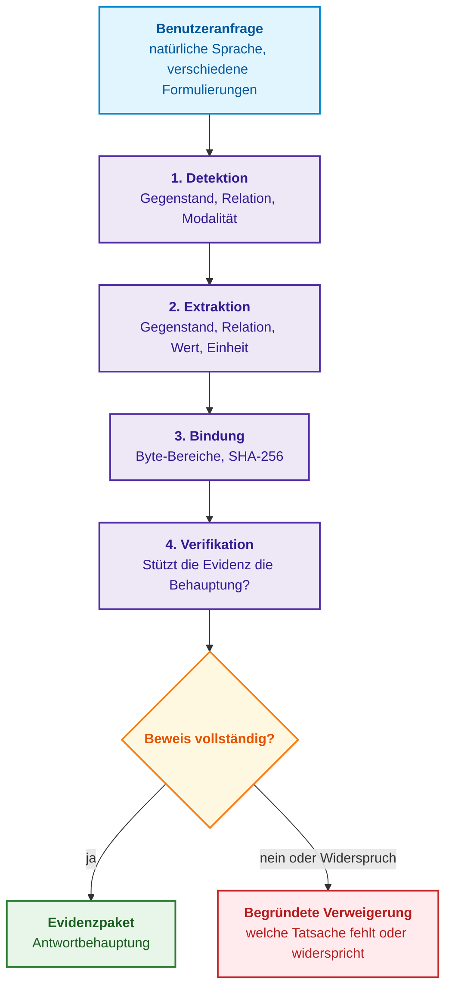
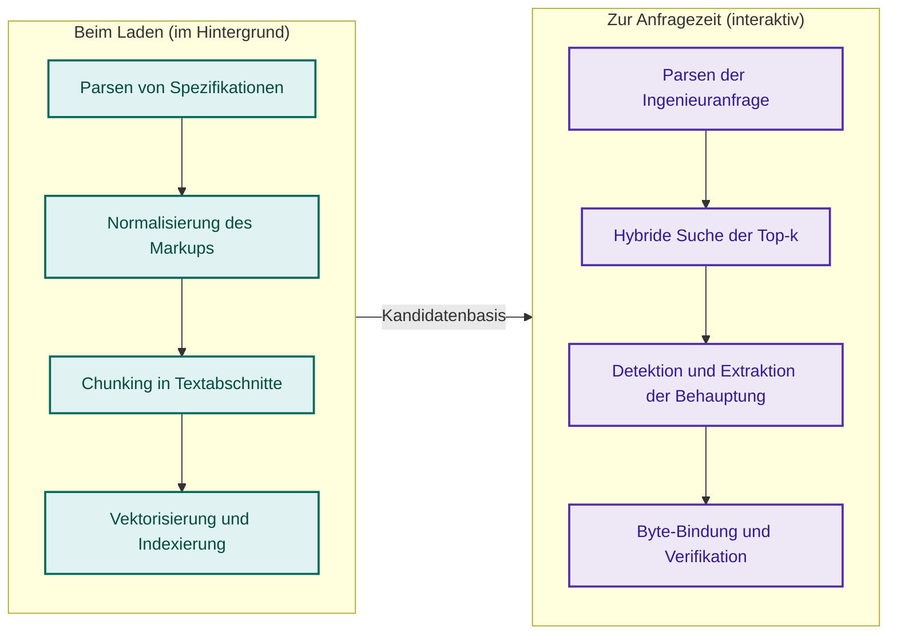
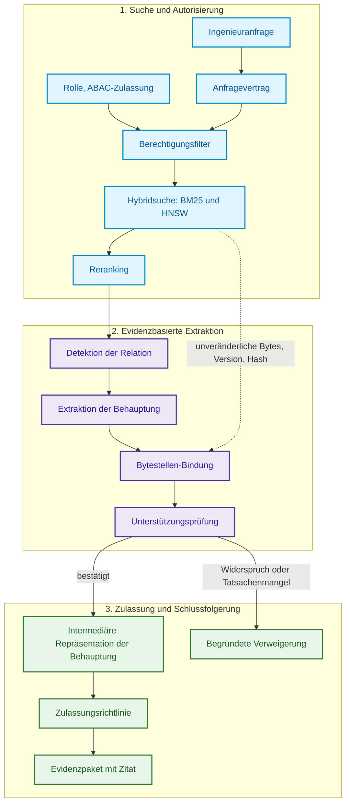
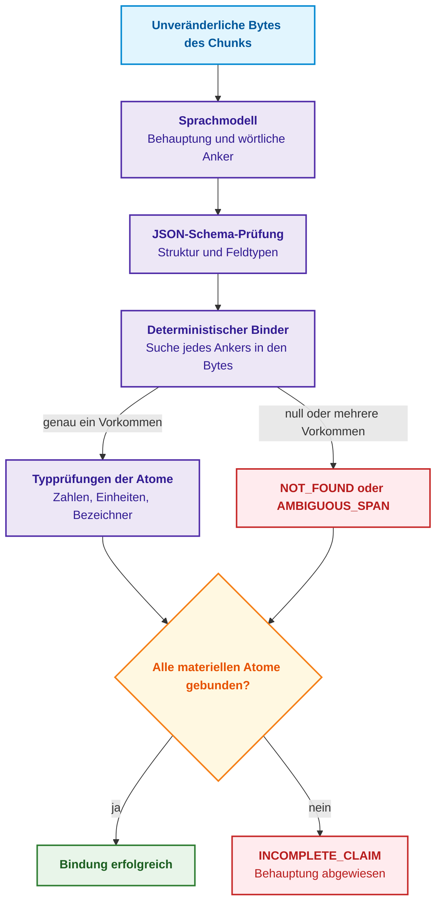
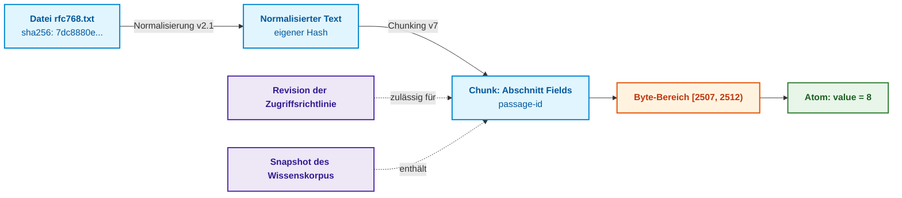
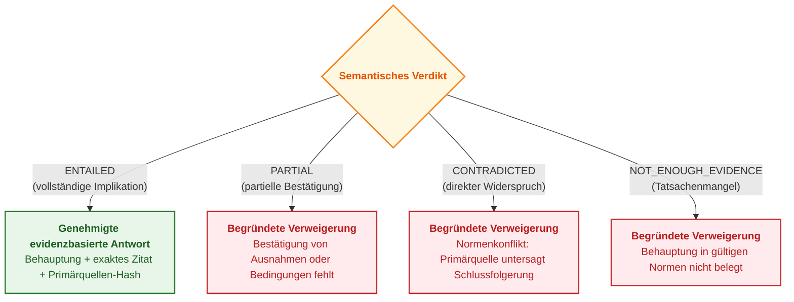
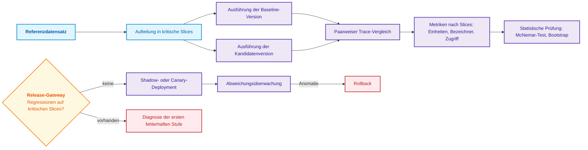
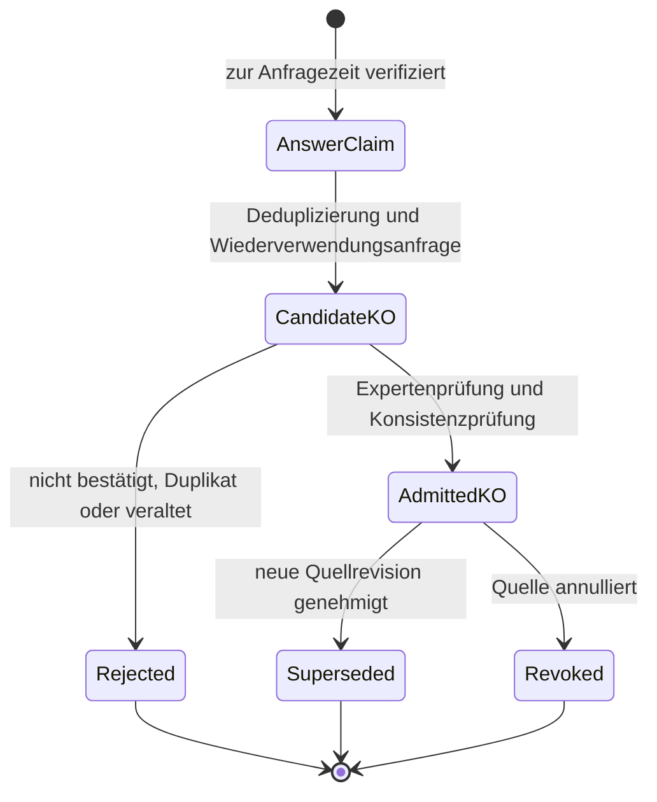

# Kapitel 19. Von der Frage zum Beweis: Suche, Bindung und Prüfung von Behauptungen

> **Buch:** [Architektur evidenzbasierter Expertensysteme](README.md) · [Teil IV: Architektur, Technologie-Stack, Inferenz und Aktion](part-04-architecture-and-inference.md)  
> **Vorheriges Kapitel:** [Kapitel 18. Ausführungsinfrastruktur: Lokale Modelle, Hardwarebeschleuniger, Edge und On-Premise](ch18-execution-infrastructure.md)  
> **Nächstes Kapitel:** [Kapitel 31. Normenbasierte Inferenz: Prädikatenhierarchien, Ausnahmen und Geltung](ch31-syllogistic-reasoning-and-relation-lattices.md)  
> **Inhaltsverzeichnis:** [README.md](README.md)  
> **Autor:** [Mykola Fedchyk](about-the-author.md)  
> **Niveau:** Mittelstufe und Fortgeschrittene: Entwickler, Wissensingenieure, Spezialisten für Sprachmodelle  
> **Lernziele:** Natürlichsprachliche Anfragen in Gegenstand, Relation und Sprechakt zerlegen; die Phasen Detektion, Extraktion, Bindung und Verifikation einer Behauptung differenzieren; jedes materielle Atom einer Behauptung an Primärquellen-Bytes binden und die Bindungsvollständigkeit berechnen; Werte und Maßeinheiten normalisieren; eine intermediäre Repräsentation der Behauptung mit Evidenznachweis konstruieren; Regressionstests und die sichere Zulassung von Behauptungen in die Wissensbasis organisieren.

---

## Abstract

In diesem Kapitel wird der Übergang von einer unstrukturierten ingenieurtechnischen Fragestellung zu einem strikt verifizierten Evidenzpaket in der Architektur evidenzbasierter Expertensysteme dargelegt. Analysiert werden der schwache Formalisierungsgrad natürlicher Sprache sowie der Algorithmus zur semantischen Zerlegung von Anfragen in Gegenstand, Relation und Sprechakt mittels typisierter JSON-Schema-Verträge für den sicheren Zugriff auf die Wissensbasis. Untersucht wird die vierstufige Pipeline der Anfrageverarbeitung: Detektion, Extraktion, Bytestellen-Bindung (*Grounding*) und Verifikation der semantischen Implikation (*Textual Entailment*). Implementiert wird ein deterministischer Binder materieller Atome einer Behauptung an Bytes der Primärquelle (RFC 768) mit Berechnung der Bindungsvollständigkeitsmetrik $\mathrm{Comp}(C)$ und Normalisierung von Maßeinheiten. Definiert wird ein vierwertiges Beweisprüfungs-Gateway (`ENTAILED`, `PARTIAL`, `CONTRADICTED`, `NOT_ENOUGH_EVIDENCE`), das die Ausgabe unbestätigter Empfehlungen systematisch ausschließt, sowie Prinzipien der Regressionsevaluierung und der Lebenszyklus von Wissensobjekten von der schnellen operativen Antwort bis zur dauerhaften Zulassung in die kanonische Faktenbasis des Expertensystems.

---

Stellen wir uns ein Expertensystem vor, das Netzwerkspezifikationen analysiert und einem Ingenieur ausschließlich dann antwortet, wenn im Korpus ein formeller Beweis vorliegt. Der Ingenieur fragt: *„Was ist die minimale Länge eines UDP-Datagramms?“* Die nach dem Paradigma des Retrieval-Augmented Generation (RAG) [[1]](#src-1) konstruierte Suchmaschine identifiziert fehlerfrei RFC 768, die Spezifikation des User Datagram Protocol (UDP), und den einschlägigen Absatz [[2]](#src-2):

> *Length is the length in octets of this user datagram including this header and the data. (This means the minimum value of the length is eight.)*

Das generative Modell antwortet knapp: *„8“*. Die Zahl ist korrekt, die ingenieurtechnische Antwort jedoch unvollständig. Acht von was: Bits, Oktette, 32-Bit-Wörter? Im Normentext ist die Zahl als Wort *eight* notiert, während die Einheit *octets* in einem anderen Teil des Satzes steht; eine Suche nach Ziffern mittels regulärer Ausdrücke hätte hier mithin kein Ergebnis geliefert. Zudem hätte der Ingenieur dieselbe Frage auf ganz unterschiedliche Weise formulieren können:

- *„Was ist die minimale Länge eines UDP-Datagramms?“* (direkte Frage);
- *„Wie viel belegt ein UDP-Datagramm mindestens?“* (Aufforderung zur Berechnung);
- *„Zeige im RFC, wo die minimale Datagrammlänge definiert ist“* (Anforderung eines Beweises);
- *„Stimmt es, dass ein minimales UDP-Datagramm 8 Oktette umfasst?“* (Aufforderung zur Behauptungsprüfung).

Diese Äußerungen unterscheiden sich in Grammatik und Sprechakt, stützen sich jedoch auf dieselbe ingenieurtechnische Sachbehauptung. Der Datensatz Natural Questions hat eine ähnliche Unterscheidung zwischen einer langen Antwort (dem die Antwort enthaltenden Absatz) und einer kurzen Antwort (dem exakten Textfragment innerhalb des Absatzes) formalisiert [[3]](#src-3). Für ein Expertensystem reicht selbst eine kurze Antwort nicht aus: Erforderlich ist eine explizite Behauptung mit Gegenstand, Relation, Wert, Einheit und Evidenznachweis für jede einzelne Komponente.

Dieses Kapitel beantwortet die fundamentale Frage: **Wie lässt sich ein aufgefundenes Textfragment in eine überprüfbare Behauptung für die Antwort überführen?** Das Sprachmodell schlägt Struktur und Anker vor, der Binder rekonstruiert die Byte-Adressen, und eine eigenständige Verifikation stellt Rollen, Geltungsbereich und Passfähigkeit zur Anfrage fest. Eine vollständige Bytestellen-Bindung ist eine notwendige Bedingung quellenbasierter Prüfung, jedoch keine hinreichende Bedingung für eine korrekte Interpretation. Unbestätigte Felder führen zur Präzisierung oder Verweigerung, niemals zu freier Extrapolation.



Das Diagramm verdeutlicht, dass eine Antwort erst nach erfolgreichem Durchlaufen aller vier Stufen möglich ist und jede Fehlstelle zu einer fundiert begründeten Verweigerung führt. Der folgende Abschnitt präzisiert die Verortung dieses Prozesses in der Gesamtexpertensystemarchitektur.

## 1. Verortung der Aufgabe in der Architektur des Expertensystems

In der Gesamtarchitektur eines evidenzbasierten Expertensystems bildet die Pipeline zur Überführung einer Eingangsanfrage in einen verifizierten Beweis ein kritisches Kontroll-Gateway zwischen den Subsystemen zur unstrukturierten Dokumentensuche und dem Kern formal-symbolischer Inferenz. Vernachlässigt ein Systemarchitekt diese Vermittlungsebene und übergibt aufgefundene Textpassagen direkt einem generativen Modell zur Zusammenfassung, erleidet das Gesamtsystem eine katastrophale epistemische Degradation: Natürlichsprachliche Halluzinationen, der Verlust physikalischer Dimensionen und Begriffsverwechslungen infiltrieren die Wissensbasis im Gewand „autoritativer Schlussfolgerungen“. Unter missionskritischen Betriebsbedingungen (ISO 26262 ASIL-D, IEC 61508, DO-178C) zerstört die Übernahme einer solchen fehlerhaften oder unvollständigen Tatsache den Determinismus von Inferenzketten und führt zu fatalen Fehlentscheidungen mit irreversiblen Konsequenzen. Der naive Ansatz klassischer RAG-Systeme, bei dem ein großes Sprachmodell den Kontext eigenmächtig ohne strikte Bytestellen-Bindung jedes materiellen Atoms an Primärquellen interpretiert, erweist sich für Systeme mit regulatorischer Haftung als unbrauchbar.

Dieses Kapitel betrachtet einen kurzen, jedoch entscheidenden Abschnitt des Lesepfads aus [Kapitel 16](ch16-expert-systems-architecture.md): Das Dokument ist bereits autorisiert, versioniert und in Chunks zerlegt, die Suchmaschine hat die ersten $k$ Kandidaten zurückgegeben, und nun muss der Text des Chunks in eine formale, maschinenprüfbare Behauptung transformiert werden. Auf diesem Pfad wird die Zuverlässigkeit des Ergebnisses durch sechs aufeinanderfolgende ingenieurtechnische Gateways gewährleistet.

| Stufe | Kontrollfrage | Typischer verdeckter Defekt |
|---|---|---|
| **Suche** (*retrieval*) | Ist der benötigte Chunk unter den ersten $k$ Ergebnissen enthalten? | Richtiges Dokument, aber veraltete Revision aufgefunden |
| **Detektion** (*detection*) | Enthält der Chunk genau die Relation, nach der gefragt wurde? | Satz über die Datagrammlänge fälschlich als Antwort auf die Header-Länge interpretiert |
| **Extraktion** (*extraction*) | Ist die vollständige Struktur des Wertes erhalten geblieben? | `eight octets` unzulässig auf die Zahl `8` verkürzt |
| **Bindung** (*grounding*) | Weist jedes Atom exakte Koordinaten im Dokument auf? | Zitat zwar wörtlich korrekt, stammt jedoch aus einer ungültigen Revision |
| **Verifikation** (*verification*) | Stützt die Evidenz die Behauptung vollständig? | Ausnahmebestimmung wie „ausgenommen bei Protokoll X“ übersehen |
| **Zulassung** (*admission*) | Besitzt der Benutzer die Berechtigung für dieses Textfragment? | Modell verwendet geschütztes Dokument zur Beantwortung einer unprivilegierten Anfrage |

Jede Zeile der Tabelle beschreibt eine eigenständige Klasse ingenieurtechnischer Risiken, die deterministische Schutzmechanismen erfordert. Die erste Verteidigungslinie greift bereits vor dem Zugriff auf den Suchindex — in der Phase der semantischen Zerlegung der Anfrage selbst.

## 2. Schwach strukturierte Natur natürlichsprachlicher Anfragen und semantische Dekomposition

Die semantische Dekomposition ingenieurtechnischer Äußerungen dient als primärer Normalisierungsfilter für den eingehenden Informationsstrom des Expertensystems. Während eine Abfrage an ein relationales DBMS einer streng typisierten SQL-Grammatik folgt, zeichnet sich natürliche menschliche Sprache durch hohe Variabilität, Ellipsen und das Fehlen expliziter Grenzen zwischen Prädikat und Metadaten aus. Versucht das System, unstrukturierte Fragen eines Ingenieurs direkt in Vektorabfragen oder Inferenzregeln zu übersetzen, entsteht eine unbeherrschbare semantische Unschärfe: Die Verwendung von Synonymen (*„Größe“* statt *„Länge“*), das Auslassen des Kontexts vorangegangener Dialogschritte oder die Vermengung inhaltlicher Anforderungen mit Formulierungspräferenzen führen zum Abruf irrelevanter Normenkorpora oder zur Fehlklassifikation der Intention. Naive Parsing-Ansätze auf der Basis heuristischer regulärer Ausdrücke scheitern bereits an der ersten grammatikalischen Inversion.

Das Expertensystem eliminiert diese Schwachstelle, indem es die Äußerung in drei orthogonale Komponenten zerlegt:

1. **Gegenstand der Anfrage** (*subject*): das technische Objekt, Subsystem oder der Parameter (beispielsweise UDP-Datagramm, CAN-FD-Bus, Wechselrichter).
2. **Relation** (*relation*): die normativ definierte Eigenschaft oder Charakteristik (beispielsweise minimale Länge, Grenzstrom, zulässiger Jitter).
3. **Sprechakt** (*speech act*): die pragmatische Handlungsabsicht des Ingenieurs — Abfrage eines direkten Fakts, Anforderung primärer Normenevidenz, Verifikation einer Hypothese oder Falsifikation einer Annahme (die theoretische Grundlegung von Sprechakten als zielgerichtete Handlungen schuf John Searle [[4]](#src-4)).

Anstelle fragiler regulärer Ausdrücke fungiert das Sprachmodell als strikt eingegrenzter semantischer Übersetzer, dessen Ausgabe zwingend gegen ein typisiertes JSON-Schema validiert wird [[5]](#src-5). Jede Modellausgabe, die das Schema oder Datentypen verletzt, wird vom Controller bereits vor Initiierung der Suche verworfen:

<details>
<summary>Strukturierte JSON-Daten</summary>

```json
{
  "schema_version": "query-contract.v1",
  "subject": "UDP datagram",
  "relation": "minimum length",
  "speech_act": "request_evidence",
  "answer_shape": "quantity",
  "constraints": {
    "document_family": "IETF RFC",
    "status": "current"
  },
  "dialogue_context_refs": []
}
```

</details>

Das Feld `answer_shape` mit dem Wert `quantity` signalisiert den nachfolgenden Stufen vorab, dass die Antwort zwingend eine Zahl mit Maßeinheit enthalten muss; der `speech_act` mit dem Wert `request_evidence` verlangt die Bereitstellung eines wörtlichen Quellenzitats. Der Anfragevertrag legt fest, was gesucht werden soll; die nächste Frage lautet, zu welchem Zeitpunkt das Expertensystem Wissen aus Dokumenten extrahiert.

## 3. Zwei zeitliche Pfade der Wissensgewinnung

In der Systemarchitektur operiert die Wissensgewinnung in zwei komplementären Zeitregimen, die nach Kriterien von Rechenkomplexität und Antwortlatenz getrennt sind. Der Versuch, eine vollständige Extraktion allen denkbaren Wissens asynchron im Hintergrund vorab durchzuführen, führt zu einer kombinatorischen Explosion und zur Anhäufung veralteter Relationen; umgekehrt verletzt der Versuch, mehrseitige Scans und Spezifikationen „on the fly“ während der Benutzeranfrage zu parsen, garantierte Latenzbudgets. Das Diagramm illustriert das Zusammenspiel zwischen Hintergrund- und operativem Ausführungspfad.



Die Hintergrundakquisition (*ingest-time acquisition*) wird ausgeführt, sobald neue Dokumente in das Repository aufgenommen werden: Sie bewahrt Struktur und Versionen, erkennt Tabellen und berechnet kryptografische Prüfsummen der Chunks. Dieser Prozess wird in [Kapitel 15](ch15-knowledge-extraction-and-kb-construction.md) detailliert beschrieben. Die Akquisition zur Anfragezeit (*query-time acquisition*) wird reaktiv auf eine spezifische Fragestellung hin aktiviert. Der Grund für diese Zweiteilung ist pragmatischer Natur: Derselbe Spezifikationsabsatz kann Dutzende unterschiedlicher Fragen beantworten (Feldlänge, Spannungsbereich, zulässige Toleranz), und es ist unmöglich, vorab jede denkbare Behauptung vollständig zu extrahieren. Zur Anfragezeit extrahiert und verifiziert das Expertensystem ausschließlich diejenige Behauptung, die der Anfragevertrag einfordert.

## 4. Pipeline zur Überführung einer Anfrage in einen Beweis

Der durchgängige Zyklus der Transformation einer ingenieurtechnischen Äußerung in ein Evidenzpaket vereint hybride Suche mit formal-symbolischer Verifikation von Zugriffsrechten und semantischer Korrespondenz. Das Fehlen intermediärer Falsifikations-Gateways würde die Pipeline in eine intransparente „Blackbox“ verwandeln, in der ein Ausfall eines beliebigen Teilmodells zu verfälschten Ergebnissen ohne Lokalisierbarkeit des Defekts führt. Die Architektur bannt diese Bedrohung durch drei aufeinanderfolgende Phasen: autorisierte Suche, evidenzbasierte Extraktion und das Zulassungs-Gateway der Schlussfolgerung.



Der gestrichelte Pfeil von der Suche zur Bindung ist von zentraler Bedeutung: Die Bindung operiert auf den unveränderlichen Bytes, der Version und dem Dokument-Hash, die von der Suche bereitgestellt werden — nicht auf dem vom Sprachmodell reproduzierten Text. Aus genau diesem Grund kann die Bindung Halluzinationen des Modells aufdecken; der folgende Abschnitt zeigt die konkrete Funktionsweise.

## 5. Extraktion und deterministische Bytestellen-Bindung

Die Hauptgefahr beim Einsatz generativer Sprachmodelle als Wissensextraktoren besteht in willkürlicher Paraphrasierung, Verfälschung numerischer Konstanten und dem Verlust physikalischer Dimensionen. Um den subjektiven Faktor vollständig zu eliminieren, realisiert das Expertensystem eine strikte Rollentrennung: Das Sprachmodell generiert eine Behauptungshypothese sowie wörtliche Textanker, während ein deterministischer Software-Binder (*deterministic span binder*) diese Anker mit den Rohbytes der Primärquelle abgleicht und Typen sowie die Eindeutigkeit des Vorkommens überprüft.



### 5.1. Vollständigkeit der Bindung und Validitätskriterien

Zur quantitativen Verifikation, dass eine extrahierte Behauptung vollständig auf dem autoritativen Normentext fußt und keinerlei halluzinierte Elemente enthält, wird die Metrik der Bindungsvollständigkeit $\mathrm{Comp}(C)$ eingeführt. Sie bewertet den Anteil der materiellen Wissenskomponenten, die erfolgreich mit physischen Koordinaten der Primärquelle abgeglichen werden konnten:

```math
\mathrm{Comp}(C) = \frac{\sum_{a \in A_m(C)} w_a \cdot \mathbb{I}[b(a) \neq \varnothing]}{\sum_{a \in A_m(C)} w_a}
```

wobei:
- $\mathrm{Comp}(C)$ — skalarer Indikator der Bindungsvollständigkeit der Behauptung $C$, definiert im normierten Intervall $[0, 1]$;
- $`A_m(C)`$ — endliche Menge materieller Atome der Behauptung, deren Fehlen den Sinn der Ingenieurregel entstellt ($`A_m(C) = \{\text{subject}, \text{relation}, \text{value}, \text{unit}\}`$);
- $a$ — einzelnes materielles Atom aus der Menge $`A_m(C)`$;
- $`w_a`$ — Gewichtungskoeffizient der Kritizität des Atoms ($`w_a > 0`$, reelle Zahl; in kalibrierter Konfiguration $`w_{\text{subject}} = 0{,}1`$, $`w_{\text{relation}} = 0{,}2`$, $`w_{\text{value}} = 0{,}4`$, $`w_{\text{unit}} = 0{,}3`$);
- $b(a)$ — halboffenes Byte-Offset-Intervall $[s, e)$, das das Vorkommen des Textankers des Atoms im normalisierten Primärquellentext eindeutig identifiziert, oder $\varnothing$, falls der Anker nicht oder mehrdeutig gefunden wurde;
- $`\mathbb{I}[b(a) \neq \varnothing]`$ — Indikatorfunktion, die den Wert 1 annimmt, wenn das Atom $a$ genau ein konsistentes Vorkommen im Byte-Bereich aufweist, und 0 im Fall des Status $`\text{NOT\_FOUND}`$ oder $`\text{AMBIGUOUS\_SPAN}`$.

**Praktische Anwendung und ingenieurtechnische Konsequenzen:**
1. Die Berechnung wird durch den deterministischen Binder für jede vom Sprachmodell vorgeschlagene Behauptung durchgeführt, bevor das Ergebnis an die logische Inferenz-Engine übergeben wird.
2. **Numerischer Schwellenwert der Zulassung (Abschneidekriterium):**
   - $\mathrm{Comp}(C) = 1{,}00$: **VOLLSTÄNDIGE BINDUNG (GROUNDED / Green Gate)**. Alle materiellen Atome wurden erfolgreich an physische Bytes gebunden; die Behauptung wird zur semantischen Implikationsprüfung zugelassen;
   - $`0{,}70 \le \mathrm{Comp}(C) < 1{,}00`$: **UNVOLLSTÄNDIGE BEHAUPTUNG (INCOMPLETE_CLAIM / Fail-Closed)**. Ein kritisches Atom (etwa die Maßeinheit oder eine einschränkende Bedingung) ging verloren oder wurde verfälscht. Die Behauptung wird bedingungslos abgewiesen. In technischen Systemen ist partielle Genauigkeit inakzeptabel: Das Wissen, dass eine Verzögerung „8“ beträgt, ohne Bindung der Maßeinheit (`ms` oder `µs`), stellt ein unmittelbares Havarierisiko dar;
   - $\mathrm{Comp}(C) < 0{,}70$: **MODELLHALLUZINATION (UNGROUNDED / Red Gate)**. Die Behauptung wird unter Erzeugung eines Eintrags im Telemetrie- und Audit-Log abgewiesen.

**Numerisches Rechenbeispiel:**
Aus einer Normvorschrift wurde folgende Behauptung extrahiert: „Der maximale Ansprechstrom beträgt 25 A bei einer Spannung von 12 V“. Materielle Atome: Subjekt ($w = 0{,}1$), Relation ($w = 0{,}2$), numerischer Wert ($w = 0{,}4$), Maßeinheit ($w = 0{,}3$).
Besteht die Maßeinheit „A“ in der Primärquelle die Byte-Offset-Prüfung infolge einer Zeichenkodierungsverzerrung nicht ($`\mathbb{I}[b(\text{unit}) \neq \varnothing] = 0`$):

```math
\mathrm{Comp}(C) = \frac{0{,}1 \cdot 1 + 0{,}2 \cdot 1 + 0{,}4 \cdot 1 + 0{,}3 \cdot 0}{0{,}1 + 0{,}2 + 0{,}4 + 0{,}3} = \frac{0{,}70}{1{,}0} = 0{,}70
```

Da $\mathrm{Comp}(C) = 0{,}70 < 1{,}00$, weist das Zulassungs-Gateway den Fakt unmittelbar mit dem Status `INCOMPLETE_CLAIM: missing verified unit atom` ab und verhindert so die Weiterleitung eines uneindeutigen Werts an die Inferenzmaschine.

> [!IMPORTANT] Warum in kritischer Ingenieurpraxis ausschließlich 100 % Bindung ($\mathrm{Comp}(C) = 1{,}0$) zulässig ist
> In Verbraucher-Chatbots gilt eine Antwort mit einer „partiellen Genauigkeit“ von 70 % gemeinhin als akzeptabel. In der Avionik (DO-178C) oder bei Fahrzeugsteuergeräten (ISO 26262) ist eine Behauptung mit $\mathrm{Comp}(C) = 0{,}7$ ein direkter Wegbereiter für schwere Unfälle. Wenn das System die Behauptung „die minimale Signalverzögerung beträgt 8“ extrahiert, jedoch das Dimensionsatom (`ms` vs. `µs`) nicht bindet oder einen einschränkenden Vorbehalt („bei Temperaturen über 85 °C“) verliert, handelt es sich nicht um eine Unschärfe, sondern um eine Falschbehauptung, die physische Hardwareschäden verursachen kann. Aus diesem Grund operiert das Zulassungs-Gateway des Expertensystems im Modus strikter Verweigerung (*Fail-Closed*): Jeder Wert $\mathrm{Comp}(C) < 1{,}0$ erzwingt eine Verweigerung unter präziser Benennung des ungebundenen Atoms.

### 5.2. Praktische Implementierung: Bindung einer Behauptung aus RFC 768

Das nachfolgende Go-Programm implementiert den Binder für das UDP-Beispiel. Es setzt die Datei `rfc768.txt` (5896 Bytes) voraus, die vom RFC Editor in dasselbe Verzeichnis heruntergeladen wurde. Die Funktion `normalize` entspricht der Implementierung aus [Kapitel 15](ch15-knowledge-extraction-and-kb-construction.md): Sie komprimiert Whitespace-Zeichen und verfolgt die Positionen der Rohbytes nach, sodass ein Anker selbst dann aufgefunden wird, wenn im RFC-Text zwischen den Wörtern mehrere Leerzeichen oder Zeilenumbrüche stehen. Die Atomgewichte sind wie folgt gewählt: Gegenstand 0,1, Relation 0,2, Wert 0,4, Einheit 0,3.

<details>
<summary>Go-Beispiel: Binder für eine Behauptung aus RFC 768</summary>

```go
package main

import (
	"bytes"
	"fmt"
	"math"
	"os"
	"strconv"
	"strings"
)

// normalize komprimiert Whitespace-Zeichen und merkt sich die Positionen der Rohbytes.
func normalize(raw []byte) ([]byte, []int) {
	var out []byte
	var pos []int
	inSpace := false
	for i, b := range raw {
		switch b {
		case ' ', '\t', '\r', '\n', '\f':
			if !inSpace && len(out) > 0 {
				out = append(out, ' ')
				pos = append(pos, i)
			}
			inSpace = true
			continue
		}
		inSpace = false
		out = append(out, b)
		pos = append(pos, i)
	}
	return out, pos
}

// bind bindet den Anker an einen Bereich von Rohbytes; der Anker muss genau einmal vorkommen.
func bind(norm []byte, pos []int, anchor string) (int, int, string) {
	q, _ := normalize([]byte(anchor))
	q = bytes.TrimSpace(q)
	first := bytes.Index(norm, q)
	switch {
	case len(q) == 0 || first < 0:
		return 0, 0, "NOT_FOUND"
	case bytes.Contains(norm[first+1:], q):
		return 0, 0, "AMBIGUOUS_SPAN"
	}
	return pos[first], pos[first+len(q)-1] + 1, "OK"
}

type Atom struct {
	Name, Anchor string
	Weight       float64
}

var numberWords = map[string]int{"four": 4, "eight": 8, "sixteen": 16}
var unitCodes = map[string]string{"octets": "By", "bits": "bit"} // UCUM-Codes

// typed prüft den Typ des Atoms: Der Wert muss eine Zahl sein, die Einheit muss bekannt sein.
func typed(a Atom) (string, bool) {
	w := strings.Fields(strings.ToLower(a.Anchor))
	if len(w) == 0 {
		return "", false
	}
	last := w[len(w)-1]
	switch a.Name {
	case "value":
		if n, ok := numberWords[last]; ok {
			return strconv.Itoa(n), true
		}
		_, err := strconv.Atoi(last)
		return last, err == nil
	case "unit":
		c, ok := unitCodes[last]
		return c, ok
	}
	return a.Anchor, a.Name == "subject" || a.Name == "relation"
}

func check(norm []byte, pos []int, name string, atoms []Atom) string {
	fmt.Println("==", name)
	required := map[string]bool{"subject": false, "relation": false, "value": false, "unit": false}
	var weightSum float64
	for _, atom := range atoms {
		seen, known := required[atom.Name]
		if !known || seen || atom.Weight <= 0 || math.IsNaN(atom.Weight) || math.IsInf(atom.Weight, 0) {
			fmt.Println("  INVALID_CLAIM_SCHEMA")
			return "INCOMPLETE_CLAIM"
		}
		required[atom.Name] = true
		weightSum += atom.Weight
	}
	if len(atoms) != len(required) || math.IsInf(weightSum, 0) || len(pos) != len(norm) {
		fmt.Println("  INVALID_CLAIM_SCHEMA")
		return "INCOMPLETE_CLAIM"
	}
	var got, total float64
	allBound := true
	for _, a := range atoms {
		total += a.Weight
		s, e, st := bind(norm, pos, a.Anchor)
		v, ok := typed(a)
		if st == "OK" && !ok {
			st = "TYPE_ERROR"
		}
		if st == "OK" {
			got += a.Weight
			fmt.Printf("  %-8s %-34q [%d, %d) -> %s\n", a.Name, a.Anchor, s, e, v)
		} else {
			allBound = false
			fmt.Printf("  %-8s %-34q %s\n", a.Name, a.Anchor, st)
		}
	}
	comp := got / total
	verdict := "GROUNDED"
	if !allBound {
		verdict = "INCOMPLETE_CLAIM"
	}
	fmt.Printf("  Comp = %.2f -> %s\n", comp, verdict)
	return verdict
}

func main() {
	raw, err := os.ReadFile("rfc768.txt")
	if err != nil {
		fmt.Println("Lesefehler:", err)
		os.Exit(1)
	}
	norm, pos := normalize(raw)
	subj := Atom{"subject", "this user datagram", 0.1}
	rel := Atom{"relation", "the minimum value of the length", 0.2}
	val := Atom{"value", "eight", 0.4}
	unit := Atom{"unit", "in octets", 0.3}

	check(norm, pos, "A: vollständige Behauptung", []Atom{subj, rel, val, unit})
	check(norm, pos, "B: erfundene Einheit", []Atom{subj, rel, val, {"unit", "in bits", 0.3}})
	check(norm, pos, "C: zu kurzer Anker", []Atom{subj, {"relation", "length", 0.2}, val, unit})
}
```

Der synthetische Test erfordert keine RFC-Datei; Ausführungsbefehl: `go test -v main.go main_test.go`.

```go
package main

import (
	"math"
	"testing"
)

func TestGroundingCompleteness(testCase *testing.T) {
	norm, positions := normalize([]byte("The datagram minimum is eight octets."))
	valid := []Atom{{"subject", "datagram", 0.1}, {"relation", "minimum", 0.2},
		{"value", "eight", 0.4}, {"unit", "octets", 0.3}}
	if check(norm, positions, "valid", valid) != "GROUNDED" {
		testCase.Fatal("valid anchors rejected")
	}
	if check(norm, positions, "empty", nil) == "GROUNDED" {
		testCase.Fatal("empty claim accepted")
	}
	if check(norm, positions, "missing unit", valid[:3]) == "GROUNDED" {
		testCase.Fatal("missing required field accepted")
	}
	for _, weight := range []float64{0, -1, math.NaN(), math.Inf(1)} {
		invalid := append([]Atom(nil), valid...)
		invalid[0].Weight = weight
		if check(norm, positions, "invalid weight", invalid) == "GROUNDED" {
			testCase.Fatal("invalid weight accepted")
		}
	}
	missing := append([]Atom(nil), valid...)
	missing[3].Anchor = ""
	if check(norm, positions, "empty anchor", missing) == "GROUNDED" {
		testCase.Fatal("empty anchor accepted")
	}
	duplicate := append([]Atom(nil), valid...)
	duplicate[3] = duplicate[0]
	if check(norm, positions, "duplicate field", duplicate) == "GROUNDED" {
		testCase.Fatal("duplicate field accepted")
	}
	if _, ok := typed(Atom{Name: "unit", Anchor: ""}); ok {
		testCase.Fatal("empty typed anchor accepted")
	}
}
```

</details>

Archiviertes Ausgabebeispiel für die angegebene RFC-Kopie; abweichende Bytes oder Zeilenumbrüche verändern die Koordinaten:

<details>
<summary>Daten oder Testergebnis des Beispiels</summary>

```text
== A: vollständige Behauptung
  subject  "this user datagram"               [2398, 2416) -> this user datagram
  relation "the minimum value of the length"  [2472, 2503) -> the minimum value of the length
  value    "eight"                            [2507, 2512) -> 8
  unit     "in octets"                        [2384, 2393) -> By
  Comp = 1.00 -> GROUNDED
== B: erfundene Einheit
  subject  "this user datagram"               [2398, 2416) -> this user datagram
  relation "the minimum value of the length"  [2472, 2503) -> the minimum value of the length
  value    "eight"                            [2507, 2512) -> 8
  unit     "in bits"                          NOT_FOUND
  Comp = 0.70 -> INCOMPLETE_CLAIM
== C: zu kurzer Anker
  subject  "this user datagram"               [2398, 2416) -> this user datagram
  relation "length"                           AMBIGUOUS_SPAN
  value    "eight"                            [2507, 2512) -> 8
  unit     "in octets"                        [2384, 2393) -> By
  Comp = 0.80 -> INCOMPLETE_CLAIM
```

</details>

Behauptung A ist vollständig gebunden: Der Wert *eight* wurde zur Zahl 8 normalisiert, die Einheit *octets* zum Code `By`, und jedes Atom besitzt einen eigenen Byte-Bereich. Behauptung B reproduziert einen typischen Generierungsfehler: Das Modell „wusste“, dass Längen häufig in Bits gemessen werden, im Dokument existieren solche Wörter jedoch nicht; die Einheit bleibt ungebunden, die Vollständigkeit beträgt 0,70 und die Behauptung wird abgewiesen. Behauptung C demonstriert den inversen Fehler: Der Anker *length* ist zwar wörtlich vorhanden, tritt im Dokument jedoch viermal auf, sodass der Binder nicht deterministisch entscheiden kann, welches Vorkommen den gesuchten Beweis darstellt. Beide Zurückweisungen erfolgen deterministisch und vollkommen unabhängig davon, wie zuversichtlich die Modellausgabe formuliert war.

Die Grenzen des Beispiels sind wie folgt abgesteckt: Das Wörterbuch für Zahlwörter und Maßeinheiten ist hier bewusst minimal gehalten; ein industrieller Binder greift auf vollständige Zahlworttabellen und normierte Einheitenverzeichnisse zurück. Das Demonstrationsprogramm sucht Anker im gesamten Dokument; ein produktiver Binder beschränkt die Suche auf die Grenzen des aufgefundenen Chunks, was Mehrdeutigkeiten drastisch reduziert. Schließlich beweist die Bytestellen-Bindung lediglich, dass alle Atome wörtlich im Text existieren — sie beweist jedoch noch nicht, dass der Text tatsächlich diejenige Behauptung stützt, nach der gefragt wurde. Dies ist die Aufgabe der nachfolgend beschriebenen Verifikationsstufe.

## 6. Typisierte Wissensatome

In der Struktur einer evidenzbasierten Behauptung bildet die Typisierung elementarer Komponenten das Fundament für die anschließende automatisierte logische und mathematische Analyse im symbolischen Kern des Expertensystems. Behandelt das System extrahierte Fragmente als ungetypte Zeichenketten, entsteht das unlösbare Problem semantischer Inkompatibilität: Numerische Werte büßen ihren physikalischen Sinn ein, was Invariantenprüfungen unmöglich macht, und unterschiedliche Schreibweisen derselben Größe („8 Oktette“ und „64 Bit“) werden fälschlich als widersprüchliche Fakten interpretiert. Naive String-Suchen oder reguläre Ausdrücke scheitern an Einheitenumrechnungen und Modalitätswechseln. Der Binder prüft daher nicht nur das Vorhandensein des Ankers, sondern verifiziert den Typ des Atoms anhand von vier Grundkategorien:

- **Quantitatives Atom**: Eine Zahl ist zwingend an eine Maßeinheit gebunden. Einheiten werden nach dem Internationalen Einheitensystem (SI) oder nach dem Unified Code for Units of Measure (UCUM) [[6]](#src-6) normalisiert, in dem beispielsweise ein Byte den Code `By` führt. Eine Zahl ohne Maßeinheit wird bereits auf Schemaebene abgewiesen.
- **Bezeichner**: Eine zusammengesetzte Kennzeichnung eines Dokuments oder Objekts (RFC 768, ISO 26262, MIL-STD-1553B), die über ein Formatmuster validiert wird.
- **Modalität**: Der Grad normativer Verbindlichkeit (MUST, SHALL, SHOULD, MAY) gemäß den Regeln aus [Kapitel 14](ch14-requirements-detection-and-formalization.md). Der Satz aus RFC 768 enthält keines dieser Schlüsselwörter: RFC 768 wurde 1980 publiziert, lange vor der Konvention RFC 2119. Daher wird die Modalität einer solchen Behauptung als definitorisch und nicht als normativ-präskriptiv erfasst.
- **Geltungsgrenzen**: Dokumentenrevision, Temperaturbereich oder Betriebsmodus, unter denen die Behauptung Gültigkeit besitzt.

Die Typisierung der Atome versetzt das System in die Lage, Behauptungen maschinell zu verifizieren: Zwei Antworten „8 Oktette“ und „64 Bit“ werden nach der Einheitennormalisierung semantisch vergleichbar, während eine isolierte „8“ ohne Einheit die Schemaprüfung gar nicht erst passiert.

## 7. Provenienzmodell: Von der Datei zum Atom

Das kryptografische Provenienzmodell (*provenance model*) bildet das Rückgrat für Nachprüfbarkeit und juristische Unabstreitbarkeit von Fakten in evidenzbasierten Expertensystemen. Beschränkt sich der Primärquellenverweis lediglich auf die textuelle Bezeichnung einer Norm (beispielsweise die Nennung von „RFC 768“), entsteht eine kritische Verwundbarkeit gegenüber Manipulation und Desynchronisation: Versionsaktualisierungen, unbemerkte Korrekturen von Druckfehlern oder Modifikationen am Algorithmus zur Whitespace-Normalisierung führen dazu, dass das System auf nicht mehr existente oder inhaltlich veränderte Fragmente referenziert. Ein naives Festhalten an Zeilen- oder Seitenzahlen bricht bei jeder Neuformatierung oder Neukompilierung des Dokuments zusammen. In einer evidenzbasierten Architektur wird die Verknüpfung zwischen Originaldatei und Wissensatom als kryptografische Kette unveränderlicher Transformationen auf Basis der W3C-Ontologie PROV-O modelliert [[7]](#src-7).



Um absolute Reproduzierbarkeit zu garantieren, wird der Chunk-Identifikator durch eine kryptografische Hash-Funktion $H$ über das vollständige Tupel der Kontextparameter berechnet:

```math
\text{passage-id} = H(\text{document-id} \,\|\, \text{revision} \,\|\, \text{transform-chain} \,\|\, \text{byte-start} \,\|\, \text{byte-end} \,\|\, \text{bytes})
```

wobei:
- $\text{passage-id}$ — kryptografischer 256-Bit-Hash-Identifikator des Wissenschunks (üblicherweise ein 64 Zeichen langer Hexadezimalstring);
- $H$ — zertifizierte deterministische kryptografische Hash-Funktion mit hoher Kollisionsresistenz (FIPS 180-4 SHA-256);
- $\text{document-id}$ — kanonischer Identifikator des normativen Dokuments (beispielsweise persistenter URN `urn:ietf:rfc:768`);
- $\text{revision}$ — unveränderlicher Git-Revisions-Hash oder offizielle digitale Signatur der Standardausgabe;
- $\text{transform-chain}$ — formalisierter Deskriptor der angewandten Vorverarbeitungs- und Normalisierungsschritte (beispielsweise `norm:v2.1|chunk:fields_v7`);
- $\text{byte-start}, \text{byte-end}$ — exakte halboffene Byte-Offset-Koordinaten $[s, e)$ im normalisierten Binärdatenstrom ($`0 \le s < e`$);
- $\text{bytes}$ — tatsächliche binäre Bytesequenz des Chunks;
- $`\|`$ — eindeutige kanonische Feldkodierung (beispielsweise längenpräfigiertes TLV oder Protocol Buffers), die Kollisionen durch Zusammenfügen von Feldgrenzen ausschließt.

**Praktische Anwendung und ingenieurtechnische Konsequenzen:**
1. Die Berechnung erfolgt vollautomatisch während der Hintergrundindexierung des Wissens und wird bei jeder Anfrageausführung revalidiert.
2. **Kriterium der Integritätsprüfung:**
   - Ergibt der neu berechnete Hash $`H' = \text{passage-id}`$: **UNANFECHTBARE PRIMÄRQUELLE (VERIFIED / Green Gate)**. Die vollständige Byte-Authentizität des Chunks ist bestätigt;
   - Ergibt $`H' \ne \text{passage-id}`$: **DATENKORRUPTION ODER DESYNCHRONISATION (TAMPER_DETECTED / Red Gate / Fail-Closed)**. Es liegt eine Versionsabweichung oder unautorisierte Textänderung vor; der Chunk wird sofort aus dem operativen Cache entfernt, ein Audit-Alarm ausgelöst und die Anfrage auf das Primärarchiv des Originals umgeleitet.

## 8. Intermediäre Repräsentation der Behauptung mit Beweis

Die intermediäre Repräsentation der Behauptung mit Evidenznachweis (*evidence claim intermediate representation*, Claim-IR) fungiert als streng typisierter Datenvertrag zwischen der stochastischen Ausgabe des Sprachmodells und dem deterministischen Kern logischer Inferenz. Das Fehlen einer solchen Zwischenrepräsentation führt zu einer unkontrollierten Vermengung roher Texthypothesen mit validierten Fakten, wodurch dem System die Möglichkeit genommen wird, schrittweise Audits durchzuführen und die physische Bytestellen-Bindung von der semantischen Verifikation zu trennen. Die naive direkte Weitergabe generierten Textes an eine Erklärungskomponente verunmöglicht die maschinelle Verifikation der Beweisvollständigkeit. Für Behauptung A fixiert diese Repräsentation sämtliche Byte-Offsets, Zitate und Verifikationszustände in einem validierten JSON-Dokument (Byte-Bereiche sind halboffen: das Bereichsende ist exklusiv):

<details>
<summary>Strukturierte JSON-Daten</summary>

```json
{
  "claim_id": "claim:rfc768:udp-min-length",
  "contract_ref": "query-contract.v1#q-120",
  "statement": {
    "subject": "UDP datagram",
    "relation": "minimum_length",
    "modality": "DEFINITIONAL",
    "value": 8,
    "unit": "By"
  },
  "provenance": {
    "document_urn": "urn:ietf:rfc:768",
    "document_sha256_prefix": "7dc8880e1ecef9c3",
    "atoms": {
      "subject":  {"bytes": [2398, 2416], "quote": "this user datagram"},
      "relation": {"bytes": [2472, 2503], "quote": "the minimum value of the length"},
      "value":    {"bytes": [2507, 2512], "quote": "eight"},
      "unit":     {"bytes": [2384, 2393], "quote": "in octets"}
    }
  },
  "grounding_status": "ALL_ATOMS_BOUND",
  "verification": {
    "verdict": "NOT_ENOUGH_EVIDENCE",
    "method": "grounding_only",
    "semantic_review": "required",
    "unsupported_atoms": []
  }
}
```

</details>

Dieses Schema trennt die vollständige Bindung strikt von der noch ausstehenden semantischen Verifikation. Eine leere Liste unbestätigter Anker bedeutet keineswegs `ENTAILED`: Der Code des Binders hat weder Rollen noch die logische Schlussfolgerung geprüft. Das Hash-Präfix dient hier der menschlichen Lesbarkeit; ein maschinelles Prüfpaket erfordert den vollständigen SHA-256-Digest und das unveränderliche Artefakt. Nach einem Peer-Review durch Fachexperten oder einer Verifikation durch ein formales Beweisermodell wird das Verdikt gemeinsam mit Methode und Prüferversion festgeschrieben. Statistische Konfidenzwerte werden separat gespeichert und dürfen den Verifikationsstatus niemals ersetzen.

## 9. Verifikation der Behauptungsunterstützung durch Primärquellen-Evidenz

Die semantische Verifikation der logischen Implikation (*entailment verification*) bildet die finale Stufe der Überführung eines aufgefundenen Textfragments in einen beweisbaren Fakt. Eine erfolgreiche Bytestellen-Bindung beweist lediglich die buchstabengetreue Präsenz einzelner Wörter im Text, garantiert jedoch keineswegs, dass die Primärquelle tatsächlich die intendierte Schlussfolgerung stützt: Verneinungen, kontextuelle Ausnahmen, einschränkende Vorbehalte oder Nebenbedingungen können die extrahierte Behauptung vollständig entkräften. Wird diese Verifikationsphase vernachlässigt, tappt das Expertensystem in die Falle oberflächlicher Ähnlichkeit, entnimmt Zitate aus nicht einschlägigen Abschnitten (etwa indem es die Header-Länge mit der Länge des Gesamtdatagramms verwechselt) und liefert fehlerhafte Empfehlungen an den Anwender. Ein naives Vertrauen auf die statistische Konfidenz eines Sprachmodells verbietet sich von selbst; die Verifikation erfolgt daher über ein vierwertiges formales Zulassungs-Gateway.

In der Computerlinguistik wird diese Aufgabenstellung als Erkennung textueller Implikation (*recognizing textual entailment*) formuliert: Ein Text $T$ stützt eine Hypothese $H$, wenn ein menschlicher Leser nach der Lektüre von $T$ zu dem Schluss gelangen würde, dass $H$ höchstwahrscheinlich wahr ist [[8]](#src-8). Für ein Expertensystem greift diese Definition zu kurz, da ein „höchstwahrscheinlich“ keinen ingenieurtechnischen Beweis darstellt; die Prüfung wird folglich mit deterministischen Regeln gekoppelt: Wert und Maßeinheit der Behauptung müssen exakt mit den gebundenen Atomen übereinstimmen, die Modalität muss dem Modalitätsausdruck des Zitats entsprechen, und der Satz darf keine einschränkenden Ausnahmen enthalten, die in der Behauptung unberücksichtigt blieben.

Das UDP-Beispiel verdeutlicht die Notwendigkeit dieser eigenständigen Stufe. Angenommen, der Ingenieur fragt nicht nach dem Datagramm, sondern nach dem *Header*: „Welche Länge hat der UDP-Header?“ Der Satz aus RFC 768 lässt sich identisch binden, die Relation ist jedoch eine andere: Er thematisiert die minimale Länge des Gesamtdatagramms, welches Header und Nutzdaten einschließt. Die Detektionsphase muss diese Diskrepanz erkennen; die Antwort muss über eine eigenständige Beweiskette hergeleitet werden. Das Header-Formatdiagramm in RFC 768 spezifiziert vier Felder zu je 16 Bit (Quellport, Zielport, Länge, Prüfsumme), mithin 64 Bit beziehungsweise 8 Oktette. Die Antwort „der Header umfasst 8 Oktette“ resultiert somit aus einer zweistufigen Kette: dem Faktum über vier 16-Bit-Felder und einer arithmetischen Inferenzregel, die von der Inferenzmaschine und nicht von einem Sprachmodell ausgeführt wird. Der Satz über die minimale Datagrammlänge dient dabei als unabhängige Bestätigung: Ein Datagramm ohne Nutzlast besteht ausschließlich aus dem Header. Auf diese Weise transformiert sich die Anfrage in jene lückenlose Faktenkette, die im Titel dieses Kapitels adressiert wird.

Das Verifikationsurteil nimmt genau einen von vier Zuständen an: Die Behauptung folgt logisch aus der Evidenz (`ENTAILED`), die Evidenz stützt nur einen Teil der Behauptung (`PARTIAL`), die Evidenz widerspricht der Behauptung direkt (`CONTRADICTED`) oder die Evidenz reicht für eine Schlussfolgerung nicht aus (`NOT_ENOUGH_EVIDENCE`). Ausschließlich der erste Zustand führt zu einer Antwort; alle übrigen münden in eine begründete Verweigerung, deren Erläuterungstext von der Erklärungskomponente aus [Kapitel 20](ch20-explanation-engine.md) generiert wird.



## 10. Vollständigkeit der Suche, sichere Verweigerung und Expertenbegutachtung

Das Prinzip der sicheren Verweigerung (*Fail-Closed*) bei unvollständiger Evidenz ist eine fundamentale Zuverlässigkeitsregel eines evidenzbasierten Expertensystems. Reichen die extrahierten Kandidatenchunks nicht aus, um eine Hypothese zweifelsfrei zu belegen, ist das System verpflichtet, eine motivierte Verweigerung zu generieren, statt die Wissenslücke durch probabilistische Extrapolationen eines generativen Modells zu überbrücken. In missionskritischen Einsatzfeldern ist die Erteilung eines ungeprüften Ratschlags ungleich gefährlicher als der rechtzeitige Hinweis auf ein Informationsdefizit: Er kann Ingenieure desorientieren oder Havarien provozieren. Ein naives Erhöhen der Sampling-Temperatur oder das Ausdehnen des Kontextfensters ohne formale Prüfung potenziert das Risiko unbemerkter Halluzinationen.

Findet sich unter den ersten $k$ Chunks kein hinreichender Beweis, weiß das Expertensystem lediglich, dass der aktuelle Suchpfad keinen Nachweis erbracht hat. Dies beweist keineswegs, dass die gesuchte Norm im Gesamtkorpus nicht existiert. Die Verweigerungsmeldung muss den Suchbereich, die Indexgeneration und die nicht erfüllten Prüfkriterien explizit benennen; im Rahmen der Richtlinien kann die lexikalische Suche erweitert oder auf strukturierte Fakten zurückgegriffen werden, anstatt die Konfidenz des Generators künstlich aufzublähen.

Dieselbe Grenze greift, wenn der Dokumentenkorpus in Shards partitioniert ist. Antwortet ein benötigter Shard nicht oder aus einer abweichenden Indexgeneration, benennt die Verweigerung diesen Shard und das Suchergebnis wird als unvollständig deklariert. Zugriffsberechtigungen werden in jedem Shard angewendet, bevor Kandidaten aggregiert werden. Ein in einem antwortenden Shard gefundener Beweis belegt die Gültigkeit einer Norm erst dann, wenn auch diejenigen Shards geantwortet haben, die eine ersetzende Revision enthalten könnten ([Kapitel 7](ch07-knowledge-base-typology.md), Abschnitt 10 in [Kapitel 32](ch32-high-performance-knowledge-packs-mmap-and-harvesting.md)).

Zur Anfragezeit wird eine neue Interpretation eines Dokuments als Kandidat persistiert, solange dafür keine genehmigte Domänenregel oder kein Expertenreview vorliegt. Sie kann zu Analysezwecken als Kandidat visualisiert, jedoch keinesfalls als verbindliche normative Schlussfolgerung ausgegeben werden. Dieses Betriebsregime steht im Einklang mit dem unveränderlichen Lesepfad aus [Kapitel 16](ch16-expert-systems-architecture.md): Eine Antwort aus kanonischen Fakten und eine explorative Extraktion besitzen fundamental getrennte Vertrauensstufen.

Das Schema materieller Felder wird durch die Aufgabenklasse bestimmt, nicht durch das Modell. Das Vorhandensein von vier Atomen in unserem UDP-Beispiel deckt temporale Bedingungen, Ausnahmen oder mehrteilige Aktionen anderer Anforderungen nicht ab. Bei PDF-Dokumenten adressiert der Offset den abgeleiteten Text und wird mit der Originalseite verknüpft. Die Prüfung der textuellen Implikation liefert ein statistisches Signal, wenn sie von einem trainierten Modell ausgeführt wird; ein hoher Konfidenzwert ersetzt jedoch weder ein Fachexperten-Review noch einen Beweis im Rahmen eines formalen Modells.

Suche, Bytestellen-Bindung, semantische Verifikation und Erklärung werden anhand getrennter Metriken evaluiert. Verweigerungen, Konflikte und partiell gestützte Ergebnisse müssen getrennt von korrekten Antworten bewertet werden; andernfalls würde ein triviales Modell, das stets verweigert, fälschlich als fehlerfrei eingestuft.

## 11. Regressionstests der Extraktions-Pipeline

Die Regressionsevaluierung der Wissensextraktions-Pipeline garantiert die Stabilität und Beweisgenauigkeit des Gesamtsystems bei Modell-Updates, Prompt-Modifikationen oder Änderungen an Normalisierungsregeln. Bewertet ein Entwicklungsteam Systemänderungen ausschließlich anhand aggregierter Durchschnittsmetriken (wie mittlerer Genauigkeit oder BLEU/ROUGE über den gesamten Korpus), entsteht eine fatale verdeckte Regression: Das System kann seinen Gesamtscore durch triviale Anfragen steigern, während es gleichzeitig die Fähigkeit verliert, Randbedingungen oder physikalische Einheiten in seltenen, jedoch lebenswichtigen Sicherheitsstandards zu erkennen. Naive A/B-Testverfahren ohne Überwachung kritischer Datensatzschnitte können solche lokalen Ausfälle in deterministischen Domänen nicht aufdecken.



Die Qualität wird nicht über den globalen Durchschnitt des Gesamtdatensatzes bewertet, sondern anhand kritischer Datensatzschnitte (*critical slices*): separat für Behauptungen mit physikalischen Maßeinheiten, mit Dokumentbezeichnern oder für Anfragen, die Zugriffsbeschränkungen tangieren. Eine durchschnittliche Genauigkeit von 98 % kann einen Slice „Maßeinheiten“ überdecken, in dem eine Kandidatenversion die Hälfte aller Antworten verloren hat, weil dieser Slice nur einen winzigen Bruchteil des Gesamtkorpus ausmacht.

Versionen werden paarweise verglichen; der McNemar-Test erfasst gezielt Fälle, in denen zwei Klassifikatoren divergieren [[9]](#src-9), während Bootstrapping-Verfahren die statistische Unsicherheit der Metriken quantifizieren [[10]](#src-10). Paraphrasierungen und Revisionen sind keine voneinander unabhängigen Beobachtungseinheiten: Ein Resampling muss daher auf Gruppen von Dokumenten oder Intentionen basieren. Das Fehlen einer statistisch signifikanten Differenz beweist noch keine Äquivalenz; erforderlich ist ein a priori definiertes Band tolerierbarer Regression. Bei sicherheitskritischen Testfällen blockiert bereits ein einziger detektierter Fehler das Release; umgekehrt garantiert das Ausbleiben beobachteter Fehler im Testset noch kein Nullrisiko im Feldeinsatz.

## 12. Lebenszyklus von Wissensobjekten: Von der Antwort zur Wissensbasis

Der formale Lebenszyklus von Wissensobjekten regelt den Übergang einer verifizierten Behauptung vom Status einer lokalen, operativen Antwort zum Status eines permanenten, wiederverwendbaren Elements der kanonischen Faktenbasis. Das direkte, automatisierte Schreiben jeder generierten Behauptung in die Wissensbasis ohne Expertenbegutachtung birgt die akute Gefahr einer sich selbst verstärkenden Wissensdegradationsschleife (*Model Collapse* auf Faktenebene): Eine zufällige Ungenauigkeit oder ein Artefakt des Modells gelangt in das Repository und wird fortan von nachgelagerten Inferenzprozessen als absolute Wahrheit vorausgesetzt. Die naive Behandlung jeder akzeptierten Antwort als unveränderlicher Fakt vergiftet die Wissensbasis. Die Überführung (*Promotion*) wird daher als deterministischer endlicher Automat modelliert.



Eine Behauptung aus einer Antwort (`AnswerClaim`) avanciert erst dann zum Kandidaten (`CandidateKO`), wenn ein expliziter Bedarf für deren Wiederverwendung besteht, und wird erst nach Begutachtung durch Fachexperten sowie vollständiger Konsistenzprüfung in die Wissensbasis aufgenommen (`AdmittedKO`). Ein zugelassenes Wissensobjekt wird bei Modifikationen nicht gelöscht, sondern unter lückenloser Historisierung in den Status `Superseded` (ersetzt) oder `Revoked` (widerrufen) überführt.

Dieses Verfahren schützt die Wissensbasis vor einer destruktiven Fehlerrückkopplung: Ein zufälliger Fehler des generativen Modells, der ungeprüft persistiert würde, kehrte andernfalls später als vermeintlich „autoritative Quelle“ für künftige Inferenzschritte zurück. Ein strukturell analoger Effekt ist für das Training von Modellen dokumentiert: Shumailov und Koautoren wiesen nach, dass Modelle, die rekursiv auf von Vorgängermodellen generierten Daten trainiert werden, sukzessive degenerieren und seltene Bereiche der Verteilung einbüßen [[11]](#src-11). Einer Wissensbasis ohne rigorose Promotion-Prozedur droht eine identische Degeneration — auf der Ebene von Fakten statt auf jener von Modellgewichten. Um generative Fehler systematisch zu unterbinden, stützt sich die Architektur auf das Prinzip eines expliziten semantischen Retrievers, vergleichbar dem REALM-Ansatz von Guu und Mitarbeitern [[12]](#src-12): Das generative Modul fabuliert kein Faktenwissen aus dem parametrischen Gedächtnis seiner Gewichte, sondern lernt ausschließlich, Evidenzen aus dem bereitgestellten Primärquellenkorpus zu extrahieren und zu interpretieren, wodurch die vollständige Traceability jeder Schlussfolgerung bis zur konkreten Textpassage gewahrt bleibt.

## Fazit
Ein aufgefundenes Textfragment reicht als fundierte Antwort niemals aus. Zwischen Retrieval und Antwort agieren vier unverzichtbare Stufen: Detektion der Relation, Extraktion der Behauptung, Bindung jedes Atoms an Rohbytes der Primärquelle und die Verifikation, dass die Evidenz die Behauptung formal stützt. Das Sprachmodell schlägt strukturierte Behauptungen mit wörtlichen Ankern vor, deterministischer Programmcode entscheidet über Annahme oder Verwerfung.

Dieses Kapitel hat diesen Pfad am authentischen Text von RFC 768 demonstriert. Das Go-Programm band die Behauptung über die minimale UDP-Datagrammlänge an vier Byte-Bereiche, normalisierte das als Wort *eight* notierte Literal zur Zahl 8 und die Einheit *octets* zum Code `By` und wies zwei fehlerhafte Varianten deterministisch ab: eine mit erfundener Einheit (Bindungsvollständigkeit 0,70) und eine mit mehrdeutigem Anker (Vollständigkeit 0,80). Die Analyse der Frage nach der Header-Länge zeigte, dass eine erfolgreiche Bytestellen-Bindung noch keine korrekte Antwort garantiert: Die Lösung erfordert eine zweistufige Kette aus einem Faktum über das Header-Format und einer arithmetischen Inferenzregel.

Auch die Grenzen des Ansatzes wurden präzise abgesteckt. Die Bytestellen-Bindung belegt das Vorkommen von Atomen im Text, nicht die Richtigkeit der Interpretation; die Implikationsprüfung erfordert deterministische Regeln, da statistische NLI-Modelle lediglich heuristische Signale liefern. Die minimalen Wörterbücher für Zahlen und Einheiten müssen in Produktionsumgebungen durch vollständige Lexika ersetzt werden. Regressionstests auf kritischen Datensatzschnitten sowie formale Promotion-Verfahren sichern die Qualität über die Zeit, erfordern jedoch kuratierte Gold-Standards und menschliche Expertenbegutachtung. [Kapitel 20](ch20-explanation-engine.md) vollzieht den Übergang von der Behauptungsprüfung zur Erklärung: wie ein Expertensystem Entscheidungen, Verweigerungen und die Grenzen der eigenen Kompetenz transparent begründet.

## Fragen zur Selbstüberprüfung
1. Warum ist die isolierte Antwort „8“ auf die Frage nach der minimalen UDP-Datagrammlänge für ein Expertensystem unzulässig, obwohl die Zahl faktisch korrekt ist?
2. In welche drei Komponenten zerlegt das Expertensystem eine natürlichsprachliche Anfrage und welchen Zweck erfüllt das Feld `answer_shape` im Anfragevertrag?
3. Warum hat der Binder den Anker *length* abgewiesen und wie muss der Anker modifiziert werden, um eine eindeutige Bytestellen-Bindung zu erreichen?
4. Welche ingenieurtechnische Bedeutung hat der Vollständigkeitswert von 0,70 bei Behauptung B und warum beeinflussen die Atomgewichte die binäre Annahmeentscheidung nicht?
5. Warum stellt der Satz aus RFC 768 über die minimale Datagrammlänge keine direkte Antwort auf die Frage nach der Header-Länge dar und wie wird die korrekte Antwort stattdessen deduziert?
6. Warum wird die Güte der Extraktions-Pipeline anhand kritischer Datensatzschnitte (*critical slices*) statt über globale Durchschnittswerte evaluiert und wozu dient der paarweise Versionsvergleich?
7. Welche Bedrohung für die Wissensbasis wird durch den formalen Lebenszyklus und die Promotion-Prozedur von der Antwort zum Wissensobjekt eliminiert?

## Glossar
| Deutscher Begriff | Englisches Äquivalent | Kurzbeschreibung |
|---|---|---|
| Anfragevertrag | Query contract | Typisierte Repräsentation der Anfrage: Gegenstand, Relation, Sprechakt, Antwortform |
| Sprechakt | Speech act | Pragmatische Handlungsabsicht des Nutzers: Erhalt einer Auskunft, eines Beweises oder einer Prüfung |
| Wissensdetektion | Knowledge detection | Feststellung, ob ein Textabschnitt die gesuchte Relation enthält |
| Behauptungsextraktion | Claim extraction | Konstruktion einer strukturierten Behauptung aus dem Text eines Chunks |
| Bytestellen-Bindung | Grounding | Verknüpfung jedes Behauptungsatoms mit einem exakten Byte-Bereich der Primärquelle |
| Anker | Anchor | Wörtliches Textfragment, auf das sich ein Behauptungsatom stützt |
| Deterministischer Binder | Deterministic span binder | Programmkomponente, die Anker in den Bytes des Dokuments sucht und deren Eindeutigkeit verifiziert |
| Materielles Atom | Material atom | Unverzichtbare Komponente einer Behauptung: Gegenstand, Relation, Wert, Einheit, Bedingung |
| Bindungsvollständigkeit | Grounding completeness | Gewichteter Anteil materieller Atome, die eindeutig an die Quelle gebunden sind |
| Textuelle Implikation | Textual entailment | Logische Relation, bei der eine Hypothese semantisch aus einem Text folgt |
| Intermediäre Behauptungsrepräsentation | Evidence claim IR | Typisierte Datenstruktur aus Behauptung, Atomen, Byte-Offsets und Verifikationsurteilen |
| Kritischer Slice | Critical slice | Teilmenge des Referenzdatensatzes, in der Fehler besonders folgenschwer sind |
| Promotion (Überführung) | Promotion | Formales Verfahren zur Übernahme einer Antwortbehauptung in die kanonische Wissensbasis |
| Akquisition zur Anfragezeit | Query-time acquisition | Reaktiv bei einer konkreten Benutzeranfrage initiierte Extraktion und Prüfung einer Behauptung |
| Unvollständiges Suchergebnis | Partial result | Ergebnis ohne Rückmeldung einzelner Shards; beweist weder Geltung noch Nichtexistenz einer Norm |

## Abkürzungen
| Abkürzung | Vollständige Bezeichnung | Bedeutung |
|---|---|---|
| ABAC | Attribute-Based Access Control | Attributbasierte Zugriffskontrolle |
| BM25 | Best Matching 25 | Probabilistische lexikalische Ranking-Funktion |
| DBMS | Datenbankmanagementsystem | Softwaresystem zur Speicherung von Daten und Bearbeitung von Anfragen |
| HNSW | Hierarchical Navigable Small World | Graphbasierter Index zur Suche nach nächsten Vektornachbarn |
| IR | Intermediate Representation | Intermediäre (Zwischen-)Repräsentation |
| JSON | JavaScript Object Notation | Textbasiertes Datenaustauschformat |
| KO | Knowledge Object | Wissensobjekt |
| PROV-O | PROV Ontology | W3C-Standardontologie zur Erfassung von Datenprovenienz |
| RAG | Retrieval-Augmented Generation | Textgenerierung unter Anreicherung mit abgerufenen Dokumentenfragmenten |
| RFC | Request for Comments | Dokumentenreihe technischer Standards und Spezifikationen des Internets |
| SHA-256 | Secure Hash Algorithm, 256 bits | Kryptografische Hash-Funktion mit 256 Bit Ausgabelänge |
| SI | Système international d’unités | Internationales Einheitensystem |
| SQL | Structured Query Language | Deklarative Abfragesprache für relationale Datenbanken |
| UCUM | Unified Code for Units of Measure | Einheitliches Codierungssystem für Maßeinheiten |
| UDP | User Datagram Protocol | Verbindungsloses Transportprotokoll für Datagramme |
| URN | Uniform Resource Name | Persistenter, ortsunabhängiger Ressourcenbezeichner |

## Literaturhinweise
1. <a id="src-1"></a>Patrick Lewis et al. [*Retrieval-Augmented Generation for Knowledge-Intensive NLP Tasks*](https://arxiv.org/abs/2005.11401). *Advances in Neural Information Processing Systems 33 (NeurIPS 2020)*, 2020.
2. <a id="src-2"></a>J. Postel. [*RFC 768: User Datagram Protocol*](https://www.rfc-editor.org/rfc/rfc768). RFC Editor, 1980.
3. <a id="src-3"></a>Tom Kwiatkowski et al. [*Natural Questions: A Benchmark for Question Answering Research*](https://doi.org/10.1162/tacl_a_00276). *Transactions of the Association for Computational Linguistics*, 7, 453–466, 2019.
4. <a id="src-4"></a>John R. Searle. [*Speech Acts: An Essay in the Philosophy of Language*](https://doi.org/10.1017/CBO9781139173438). Cambridge University Press, 1969.
5. <a id="src-5"></a>JSON Schema. [*JSON Schema Specification*](https://json-schema.org/specification).
6. <a id="src-6"></a>Regenstrief Institute. [*The Unified Code for Units of Measure (UCUM)*](https://ucum.org/ucum).
7. <a id="src-7"></a>Timothy Lebo, Satya Sahoo, Deborah McGuinness (Hrsg.). [*PROV-O: The PROV Ontology*](https://www.w3.org/TR/prov-o/). W3C Recommendation, 2013.
8. <a id="src-8"></a>Ido Dagan, Oren Glickman, Bernardo Magnini. [*The PASCAL Recognising Textual Entailment Challenge*](https://doi.org/10.1007/11736790_9). *Machine Learning Challenges*, LNCS 3944, 177–190, 2006.
9. <a id="src-9"></a>Thomas G. Dietterich. [*Approximate Statistical Tests for Comparing Supervised Classification Learning Algorithms*](https://doi.org/10.1162/089976698300017197). *Neural Computation*, 10(7), 1895–1923, 1998.
10. <a id="src-10"></a>B. Efron. [*Bootstrap Methods: Another Look at the Jackknife*](https://doi.org/10.1214/aos/1176344552). *The Annals of Statistics*, 7(1), 1–26, 1979.
11. <a id="src-11"></a>Ilia Shumailov, Zakhar Shumaylov, Yiren Zhao, Nicolas Papernot, Ross Anderson, Yarin Gal. [*AI Models Collapse When Trained on Recursively Generated Data*](https://doi.org/10.1038/s41586-024-07566-y). *Nature*, 631, 755–759, 2024.
12. <a id="src-12"></a>Kelvin Guu, Kenton Lee, Zora Tung, Panupong Pasupat, Ming-Wei Chang. [*REALM: Retrieval-Augmented Language Model Pre-Training*](https://research.google/pubs/realm-retrieval-augmented-language-model-pre-training/). *Proceedings of the 37th International Conference on Machine Learning (ICML 2020)*, PMLR 119, 3929–3938, 2020.

---

[← Kapitel 18](ch18-execution-infrastructure.md) | [Inhaltsverzeichnis](README.md) | [Teil IV](part-04-architecture-and-inference.md) | [Kapitel 31 →](ch31-syllogistic-reasoning-and-relation-lattices.md)
