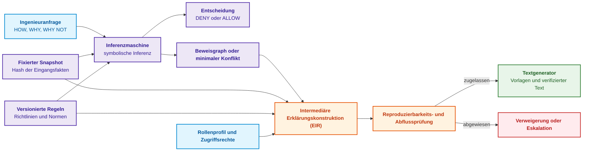
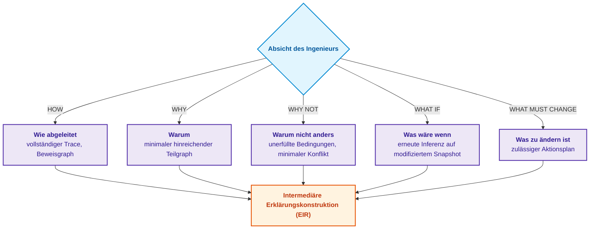
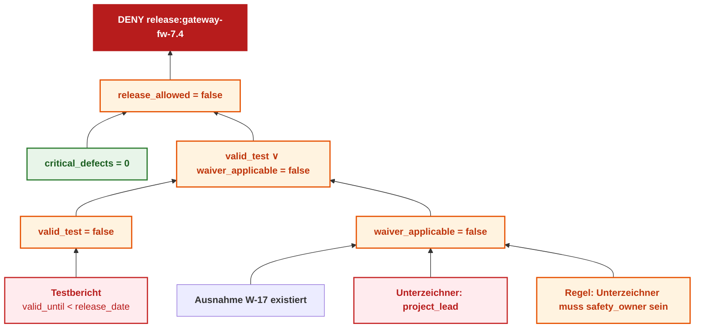
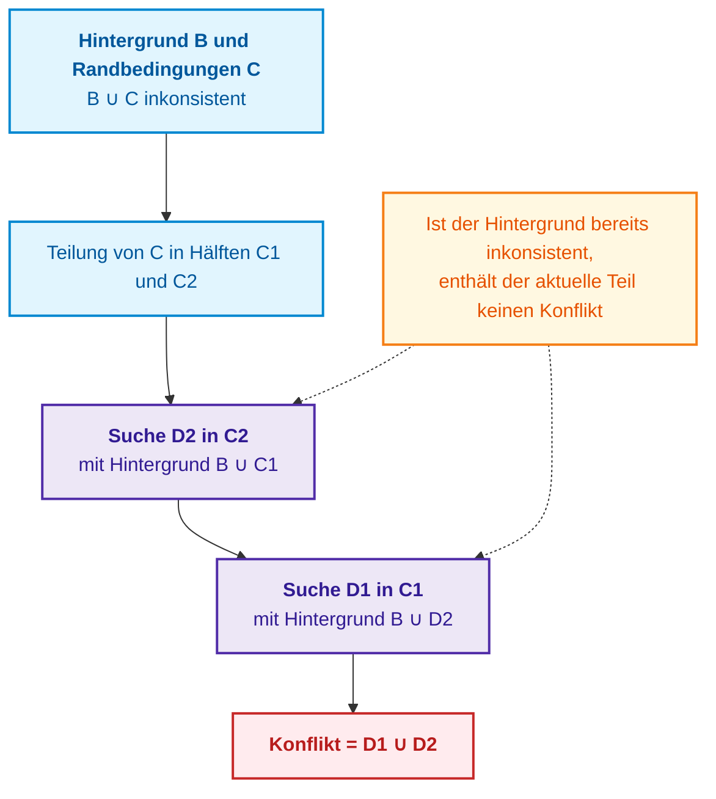
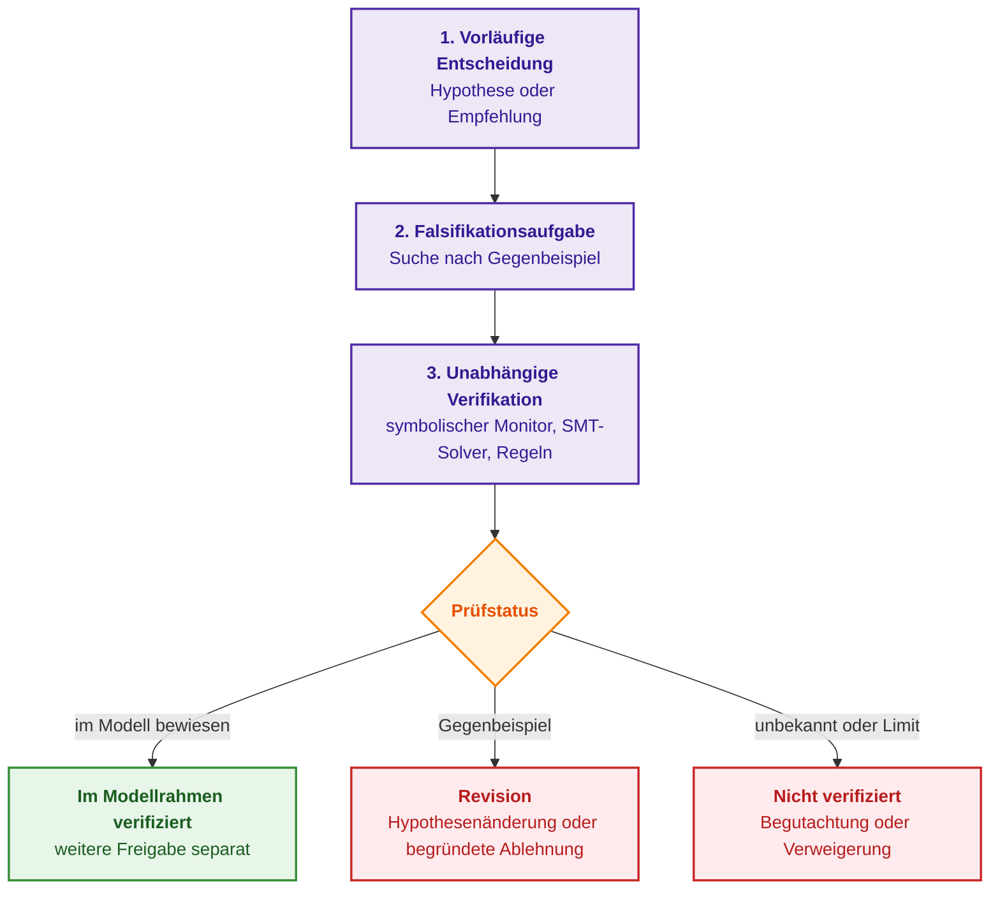
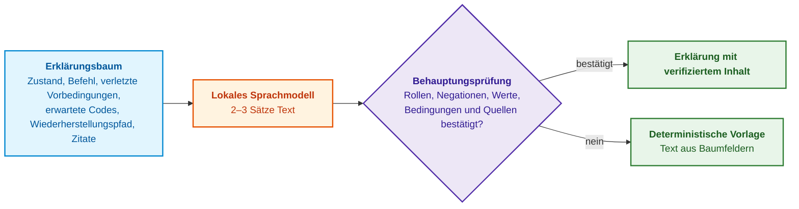

# Kapitel 20. Erklärungskomponente: Entscheidung, Ablehnung und Kompetenzgrenzen

> **Buch:** [Architektur evidenzbasierter Expertensysteme](README.md) · [Teil IV: Architektur, Technologie-Stack, Inferenz und Aktion](part-04-architecture-and-inference.md)  
> **Vorheriges Kapitel:** [Kapitel 31. Normenbasierte Inferenz: Prädikatenhierarchien, Ausnahmen und Geltung](ch31-syllogistic-reasoning-and-relation-lattices.md)  
> **Nächstes Kapitel:** [Kapitel 21. Von der Empfehlung zur Aktion: Autoritätskontrolle und sichere Ausführung in Produktionsumgebungen](ch21-from-recommendation-to-action.md)  
> **Inhaltsverzeichnis:** [README.md](README.md)  
> **Autor:** [Mykola Fedchyk](about-the-author.md)  
> **Niveau:** Mittelstufe und Fortgeschrittene: Entwickler von Inferenzmaschinen, Systemarchitekten, Wissensingenieure  
> **Lernziele:** Eine Erklärungskomponente entwerfen, die auf demselben Inferenz-Trace wie die Entscheidung operiert; fünf Typen von Erklärungsanfragen (HOW, WHY, WHY NOT, WHAT IF, WHAT MUST CHANGE) differenzieren; minimale Randbedingungskonflikte mittels QuickXPlain-Algorithmus ermitteln; kontrafaktische Erklärungen und zulässige Aktionen unter Berücksichtigung von Berechtigungsstrukturen formulieren; vertrauliche Informationen in Erklärungen maskieren; natürlichsprachliche Erklärungen mit deterministischer Verifikation kombinieren.

---

## Abstract

In diesem Kapitel werden die Architektur und die mathematischen Grundlagen der Erklärungskomponente (*explanation engine*) in evidenzbasierten Expertensystemen untersucht. Begründet wird das Konzept der Erklärung als eigenständiges, deterministisches Artefakt, das unmittelbar aus dem Inferenz-Trace (Fakten-Snapshot, Regelversionen und Beweisbaum) abgeleitet wird, anstatt als nachträgliche Rationalisierung durch ein Sprachmodell (*post-hoc rationalization*) zu entstehen. Es werden fünf Typen von Erklärungsanfragen systematisiert: HOW (vollständiger Trace), WHY (minimaler hinreichender Teilgraph), WHY NOT (minimaler Konflikt), WHAT IF (kontrafaktische Modellierung) sowie WHAT MUST CHANGE (Synthese eines zulässigen Aktionsplans). Vorgestellt wird eine strikte Referenzimplementierung des QuickXPlain-Algorithmus zur Auffindung minimaler Randbedingungskonflikte in Go. Definiert werden Schutzprotokolle gegen den Abfluss vertraulicher Informationen (rollenbasierte Filterung, Maskierung, Residuenverifikation), Kriterien zur Erkennung von Kompetenzgrenzen sowie ein vierstufiges Protokoll zur Verifikation der Treue (*faithfulness*) von Erklärungen.

---

Stellen wir uns vor, ein Expertensystem blockiert das Release der Firmware eines Netzwerk-Gateways. Das Protokoll registriert den maschinellen Status `decision=DENY`, und der Dialogassistent erklärt: *„Das Risiko übersteigt das zulässige Sicherheitsniveau“*. Diese Antwort klingt plausibel, ist für einen Ingenieur jedoch wertlos, da sie die operativen Kernfragen unbeantwortet lässt:

- Welche konkrete Regel hat ausgelöst?
- Welche Eingangsfakten gaben den Ausschlag?
- Warum fand eine signierte Ausnahmegenehmigung (*waiver*) keine Anwendung?
- Welche Daten fehlten für den Status `ALLOW`?
- Ändert sich die Entscheidung nach einem erneuten Testlauf?

Eine Erklärung in einem evidenzbasierten Expertensystem ist kein Narrativ, das ein Sprachmodell im Nachhinein fabuliert (*post-hoc rationalization*). Bereits William Clancey zeigte bei der Analyse der Erklärungskomponente des medizinischen Expertensystems MYCIN, dass das bloße Nachzeichnen ausgelöster Regeln für sich genommen keine Entscheidung erklärt: Eine fundierte Erklärung erfordert darüber hinaus Wissen darüber, warum die Regeln so beschaffen sind, und über die Strategie ihrer Anwendung [[1]](#src-1). Tim Miller belegte anhand sozialwissenschaftlicher Erkenntnisse, dass Menschen kontrastive Fragen stellen („Warum P und nicht Q?“) und eine gezielte Auswahl relevanter Ursachen erwarten statt einer erschöpfenden Gesamtaufzählung [[2]](#src-2).

Dieses Kapitel beantwortet die Frage: **Wie muss ein Expertensystem Entscheidungen, Ablehnungen und Kompetenzgrenzen erklären, damit die Erklärung verifizierbar bleibt?** Die Kernthese dieses Kapitels lautet: **Eine Erklärung ist ein eigenständiges Artefakt, das aus demselben Inferenz-Trace wie die Entscheidung selbst berechnet wird: aus dem Fakten-Snapshot, den Regelversionen und dem Beweisgraphen. Unterschiedliche Fragestellungen erfordern unterschiedliche Berechnungsverfahren: vollständigen Trace, minimalen hinreichenden Teilgraphen, minimalen Konflikt, erneuten Programmdurchlauf oder die Suche nach einer zulässigen Aktion. Ein Sprachmodell darf eine verifizierte Erklärung lediglich verbalisieren, ihr jedoch keinesfalls eigenmächtig Begründungen hinzufügen.**

## 1. Erklärung als eigenständiges Ingenieur-Artefakt

In der Gesamtarchitektur eines evidenzbasierten Expertensystems fungiert die Erklärungskomponente (*explanation engine*) als unabhängige Projektionsschicht zwischen dem symbolischen Inferenzkern (*Inference Engine*), der versionierten Wissensbasis und dem Sicherheitsaudit-Subsystem. Während in Forschungsprototypen Erklärungen häufig vernachlässigt oder auf den simplen Aufruf eines generativen neuronalen Netzes reduziert werden, führt das Fehlen einer deterministischen Kopplung zwischen Urteil und Begründung in sicherheitskritischen Systemen (funktionale Sicherheit nach ISO 26262, Normenreihe DO-178C, medizinische Diagnosekomplexe) zum vollständigen Verlust der Zertifizierungsfähigkeit. Der Versuch, die Generierung von Erklärungen einem externen Sprachmodell zu überlassen (*post-hoc rationalization*), mündet unweigerlich in einer epistemischen Katastrophe: Das Modell erfindet scheinbar plausible, jedoch faktisch nicht existente technische Einflussfaktoren und ignoriert die tatsächlichen Auslösebedingungen der Regeln. Umgekehrt überfordert die naive Ausgabe eines „rohen“ Regelausführungsprotokolls den Ingenieur mit Tausenden intermediären Resolutionsschritten. Eine evidenzbasierte Erklärung muss daher ein eigenständiges, mathematisch verifiziertes Ingenieur-Artefakt sein, das ausschließlich aus einem fixierten Fakten-Snapshot, den exakten Versionen der Normvorgaben und dem unveränderlichen Beweisgraphen kompiliert wird. Das nachfolgende Diagramm veranschaulicht, wie diese Artefakte in eine verifizierte Erklärung überführt werden.



Die intermediäre Repräsentation der Erklärung (*Explanation Intermediate Representation*, EIR) entkoppelt den logischen Gehalt der Begründung von der Sprache ihrer Darstellung. Ein Sprachmodell darf ausschließlich als Verbalisierer geprüfter Fakten agieren; das Hinzufügen unbestätigter Kausalitäten ist ihm strikt untersagt. Die Erklärung ist an eine fixierte Entscheidung gebunden, deren Schnittstellenvertrag wie folgt strukturiert ist:

<details>
<summary>Strukturierte JSON-Daten</summary>

```json
{
  "decision_id": "dec:gateway-fw-7.4:9f1c",
  "decision": "DENY",
  "subject": "release:gateway-fw-7.4",
  "snapshot_hash": "sha256:<Hash des Eingangsfakten-Snapshots>",
  "knowledge_version": "kb:release-policy@v7.3",
  "policy_version": "authz-rules@v12",
  "proof_root": "proof:tree:4711",
  "evaluated_at": "2026-09-27T10:15:00Z"
}
```

</details>

Ohne fest verankerte Abhängigkeiten und Versionsstände ist eine Reproduzierbarkeit der Entscheidung unmöglich. Zugleich begründet der Hashwert oder die Wurzel des Graphen für sich genommen noch keinen Rechtsstatus: Dieser hängt von den anwendbaren Verfahren, Befugnissen und Vorgaben ab. Methoden wie SHAP quantifizieren den Beitrag einzelner Merkmale zur Vorhersage statistischer Modelle [[3]](#src-3). Sie sind wertvoll für die Verhaltensanalyse von Modellen, ersetzen jedoch keine logische Verifikation einer Entscheidung anhand von Regeln.

## 2. Typologie von Erklärungsanfragen (HOW, WHY, WHY NOT, WHAT IF, WHAT MUST CHANGE)

Die verschiedenen Ingenieursrollen, die mit einem Expertensystem interagieren, stellen grundlegend divergierende Anforderungen an Struktur und Tiefe der Begründung: Der Auditor einer Zertifizierungsstelle benötigt den prägnanten Nachweis normativer Konformität, der Entwickler der Inferenzmaschine die lückenlose Kette der Variablenunifikation, und der Betriebsingenieur einen praxistauglichen Algorithmus zur Behebung einer Blockade. Der naive Versuch, sämtliche Anfragen mit einer universellen Textbeschreibung oder einem einheitlichen „Warum“-Schema zu beantworten, scheitert im industriellen Praxiseinsatz: Er überlastet das Personal bei Notabschaltungen mit überflüssigen Details oder verschleiert kritische Ausfallursachen. Eine evidenzbasierte Architektur differenziert daher fünf spezialisierte Klassen von Erklärungsanfragen, von denen jede auf ein eigenständiges Berechnungsverfahren über dem Wissensgraphen und dem Inferenz-Trace zurückgreift. Das folgende Diagramm systematisiert diese Anfragen und ordnet sie den jeweiligen Berechnungsmechanismen zu.



Die nachfolgende Tabelle präzisiert die Zielgruppen der einzelnen Typen sowie die zugrunde liegenden Berechnungen des Expertensystems.

| Anfrage | Zielgruppe | Was das Expertensystem berechnet | Ergebnis |
|---|---|---|---|
| **HOW** | Entwickler der Inferenzmaschine, Verifizierer | Vollständiger Trace: alle gefeuerten Regeln und intermediären Prädikate | Vollständiger Beweisgraph |
| **WHY** | Auditoren, Zertifizierungsstellen | Minimale Faktengrundlage, die für das Urteil hinreichend ist | Hinreichender Beweisteilgraph |
| **WHY NOT** | Release-Verantwortliche, Ingenieure | Warum das Wunschergebnis `ALLOW` nicht abgeleitet werden konnte | Unbekannte Prämisse, unerfüllte Bedingung oder Konflikt; Minimierung nur bei festgestellter Inkonsistenz |
| **WHAT IF** | Risikoanalysten, Architekten | Was geschieht bei gezielter Modifikation einzelner Eingangsfakten | Erneute Inferenz auf einem abgeleiteten Snapshot |
| **WHAT MUST CHANGE** | Ausführende Ingenieure | Welche zulässigen Änderungen im Modell zum Wunschergebnis führen können | Konditionaler Aktionsplan mit Ergebnisprüfung; Kostenkriterium explizit definiert |

Die Anfragen WHY NOT und WHAT MUST CHANGE besitzen jene kontrastive Struktur, die Miller hervorgehoben hat: Den Ingenieur interessiert nicht abstrakt „Warum DENY?“, sondern konkret „Warum DENY und nicht ALLOW?“ sowie „Was trennt DENY von ALLOW?“. Die folgenden Abschnitte verdeutlichen jeden Anfragetyp an einem durchgehenden Fallbeispiel.

## 3. Beweisgraph und Nachvollziehbarkeit von Schlüssen

Die Konstruktion eines Beweisgraphen (*proof graph*) bildet den fundamentalen Nachvollziehbarkeitsmechanismus, der den Prozess der symbolischen Inferenz in einen transparenten, gerichteten azyklischen Graphen aus Fakten, logischen Verknüpfungen und intermediären Lemmata transformiert. In industriellen Pipelines zur Freigabe von Firmware und eingebetteter Software führt die Vernachlässigung formaler Traces zu Szenarien, in denen Releases ohne klare Benennung unerfüllter Kriterien blockiert werden, was Entwickler zu zeitraubendem Raten zwingt. Ein triviales lineares Ausführungsprotokoll bildet Verzweigungen alternativer Pfade nicht ab (etwa die Kompensation von Tests durch eine genehmigte Ausnahme) und verdeckt so die eigentliche Fehlerursache.

Zur Formalisierung des Freigabeprozesses betrachten wir ein Prädikatenmodell zur Bewertung der Freigabefähigkeit einer Netzwerk-Gateway-Firmware. Die Zulassungsbedingung wird durch eine geschlossene logische Gleichung über dem Vektor der Sicherheitsparameter beschrieben:

```math
\mathrm{release\_allowed} \Leftrightarrow (\mathrm{valid\_test} \lor \mathrm{waiver\_applicable}) \land (\mathrm{critical\_defects} = 0)
```

Wobei die Parameter der Formel eine strikte ingenieurtechnische Definition besitzen:
- $`\mathrm{release\_allowed} \in \{0, 1\}`$ — deterministisches boolesches Resultat der Prüfprozedur ($1$ — Freigabe erteilt, $0$ — Release blockiert);
- $`\mathrm{valid\_test} \in \{0, 1\}`$ — Vorliegen eines gültigen Prüfberichts zur funktionalen Sicherheit ($`\text{valid\_until} \ge \text{release\_date}`$);
- $`\mathrm{waiver\_applicable} \in \{0, 1\}`$ — Vorliegen einer legitimen, durch einen autorisierten Sicherheitsbeauftragten gezeichneten Ausnahme ($`\text{signatory} = \text{safety\_owner}`$);
- $`\mathrm{critical\_defects} \in \mathbb{N}_0`$ — Anzahl ungelöster Defekte mit kritischem Schweregrad (Static Analysis / Penetration Testing);
- $\lor, \land, \Leftrightarrow$ — boolesche Operationen der Disjunktion, Konjunktion und materiellen Äquivalenz der geschlossenen normativen Richtlinie.

**Praktische Anwendung und ingenieurtechnische Schlussfolgerungen:**
1. **Aufrufpunkt im Lebenszyklus:** Die Berechnung wird durch das automatisierte Release-Gateway (Release Gate) der CI/CD-Pipeline ausgelöst, bevor das Binär-Image mit dem kryptographischen Freigabeschlüssel signiert wird.
2. **Interpretation der numerischen Ergebnisse:** Der Wert $`\mathrm{release\_allowed} = 1`$ generiert ein kryptographisches Zulassungszertifikat. Der Wert $`\mathrm{release\_allowed} = 0`$ versetzt das Gateway unmittelbar in den Blockierungszustand (`DENY`).
3. **Systemreaktion:** Anstatt einen generischen Fehler zu melden, projiziert die Erklärungskomponente den Beweisteilgraphen und isoliert deterministisch jene Zweige, die den Fehlschlag verursacht haben ($`\mathrm{valid\_test} = \text{false}`$ wegen abgelaufener Gültigkeit und $`\mathrm{waiver\_applicable} = \text{false}`$ aufgrund einer unzureichenden Unterzeichnerrolle `project_lead` anstelle von `safety_owner`). Die Bedingung $`\mathrm{critical\_defects} = 0`$ ist zwar erfüllt, wird jedoch aus der minimalen WHY-Erklärung der Ablehnung eliminiert, da sie nicht ursächlich für die Blockade war.

Im Fakten-Snapshot ist dokumentiert: Der Testbericht ist abgelaufen ($`\text{valid\_until} < \text{release\_date}`$), die Ausnahme W-17 existiert, wurde jedoch vom Projektleiter gezeichnet (Rolle `project_lead`), und kritische Defekte liegen nicht vor. Das folgende Diagramm zeigt den Beweisgraphen für die Entscheidung DENY.



Der Graph wird von unten nach oben gelesen. Keiner der beiden Zweige erklärt die Ablehnung für sich allein: Wäre der Prüfbericht gültig gewesen, wäre das Release selbst ohne Ausnahme erteilt worden, und umgekehrt. Daher enthält die Antwort auf eine WHY-Anfrage beide Zweige, während der Umstand der Abwesenheit kritischer Defekte nicht Teil der Minimalerklärung ist, da diese Bedingung erfüllt war. Für eine HOW-Anfrage ergänzt das Expertensystem diesen Graphen um den vollständigen Trace mit Regelversionen und Fakten-Hashes. Die Benutzeroberfläche des Auditors kann denselben Trace in Form eines Baumes visualisieren:

<details>
<summary>Beispieldaten oder Resultat</summary>

```text
[ZIEL] release_allowed = false
├── [REGEL] release_allowed ⇐ (valid_test ∨ waiver_applicable) ∧ critical_defects = 0
├── [PFAD 1] valid_test = false
│   └── [FAKT] TestReport-7.4: valid_until = 2026-08-01 < release_date = 2026-09-27
├── [PFAD 2] waiver_applicable = false
│   ├── [REGEL] Ausnahme nur mit Signatur der Rolle safety_owner gültig
│   └── [FAKT] W-17 unterzeichnet von Rolle project_lead
└── [FAKT] critical_defects = 0 (Bedingung erfüllt)
```

</details>

Das Expertensystem stellt keine vagen Vermutungen an wie „die Firmware könnte das Netzwerk destabilisieren“, sondern konstatiert präzise, welche formale Richtlinienbedingung nicht erfüllt wurde und auf welchen Primärfakten dies beruht. Jeder Fakt des Baumes referenziert konkrete Quellbytes, und der gesamte Baum kann als kryptographisch signiertes Beweiszertifikat im Sinne von [Kapitel 15](ch15-knowledge-extraction-and-kb-construction.md) ausgegeben werden.

## 4. Berechnung von WHY-NOT-Ablehnungen: Minimaler Konflikt und QuickXPlain-Algorithmus

Die Fehlerdiagnose in hochgradig vernetzten Systemen (beispielsweise in Avionik-Konfigurationen oder verteilten SCADA-Subsystemen) verlangt eine präzise Identifikation der Ursache, warum ein erwünschter Zielzustand $G$ nicht erreicht werden kann. Während in trivialen Fällen ein oder zwei Regeln manuell inspiziert werden können, greifen in realen Systemen Hunderte voneinander abhängige Vorgaben ineinander (Bus-Timings, thermische Budgets, Bibliotheksversionen, Paketabhängigkeiten). Der naive Ansatz – dem Benutzer pauschal „Randbedingungen inkonsistent“ zu melden oder eine ungefilterte Liste aller 500 Vorgaben auszugeben – lähmt die Fehlerbehebung und treibt die mittlere Wiederherstellungszeit (MTTR) auf inakzeptable Werte. Der Ingenieur benötigt einen strikt minimalen Konflikt (*minimal conflict*, auch minimaler inkonsistenter Kern, *Minimal Unsatisfiable Core*, MUC) – die inklusionsminimale Teilmenge der Anforderungen, welche das Gesamtsystem widersprüchlich macht.

Formal wird für eine konsistente Hintergrundwissensbasis $K$ und eine endliche Menge operationeller Randbedingungen $C$ der Konfliktkern wie folgt definiert:

```math
\mathrm{Core} \subseteq C, \quad K \cup \mathrm{Core} \vdash \bot, \quad \forall C' \subsetneq \mathrm{Core} : K \cup C' \nvdash \bot
```

Wobei die Komponenten des Ausdrucks eine exakt definierte Bedeutung besitzen:
- $K$ — Basis unumstößlichen Hintergrundwissens (Domänenaxiome, physikalische Gesetze, Systeminvarianten), die a priori konsistent ist ($K \nvdash \bot$);
- $C = \{c_1, c_2, \dots, c_n\}$ — Menge variierbarer operationeller Randbedingungen oder Zielvorgaben, die vom Benutzer oder der Umgebung vorgegeben werden;
- $\mathrm{Core} \subseteq C$ — isolierte widersprüchliche Teilmenge von Randbedingungen;
- $\vdash$ — Relation der formalen logischen Ableitbarkeit;
- $\bot$ — logischer Widerspruch (Falsum, Zustand `UNSAT`);
- $C' \subsetneq \mathrm{Core}$ — beliebige echte Teilmenge des gefundenen Kerns;
- $\forall$ — Allquantor, der die Unteilbarkeit des Kerns fixiert (kein Element ist redundant).

**Praktische Anwendung und ingenieurtechnische Schlussfolgerungen:**
1. **Aufrufpunkt im Lebenszyklus:** Die Prozedur zur Kernisolation wird durch den Inferenz-Dispatcher während der Bearbeitung einer WHY-NOT-Anfrage oder beim Auftreten einer inkonsistenten Konfiguration aktiviert.
2. **Interpretation des Ergebnisses:** Die ermittelte Menge $\mathrm{Core}$ belegt, dass das Randbedingungssystem inkonsistent ist, die Eliminierung auch nur eines einzigen Elements $c \in \mathrm{Core}$ jedoch garantiert die Konsistenz des Restsystems wiederherstellt.
3. **Systemreaktion:** Die Erklärungskomponente schlägt keine zufälligen Heuristiken vor, sondern lokalisiert den Konflikt im Sinne des minimalen Kerns. Dies ermöglicht es, Randbedingungen innerhalb von $\mathrm{Core}$ nach ingenieurtechnischen Lockerungskosten (*relaxation cost*) zu priorisieren und präzise Handlungsalternativen zu formulieren.

Der einfachste Weg zur Ermittlung eines minimalen Konflikts besteht darin, Randbedingungen einzeln nacheinander zu entfernen und das Element wegzulassen, sofern die verbleibende Menge weiterhin inkonsistent ist. Dieses Verfahren erfordert so viele Konsistenzprüfungen, wie Randbedingungen vorhanden sind. Ulrich Junker stellte mit QuickXPlain einen Algorithmus vor, der die Menge der Randbedingungen teilt und den Konflikt rekursiv in den Hälften sucht, wobei bereits identifizierte Konfliktelemente als Hintergrund akkumuliert werden [[4]](#src-4). Bei fortgesetzter Halbierung benötigt QuickXPlain im schlechtesten Fall $2k \log_2(n/k) + 2k$ Konsistenzprüfungen, wobei $n$ die Gesamtzahl der Randbedingungen und $k$ die Größe des Konflikts bezeichnet. Das folgende Diagramm visualisiert einen Rekursionsschritt.



> [!TIP] Warum QuickXPlain in der Diagnose komplexer Systeme (LRU und Avionik) unverzichtbar ist
> Betrachten wir einen Avionik-Komplex oder ein automotives Steuergerät (ECU), dessen Zustand durch $n = 500$ wechselseitig verknüpfte Randbedingungen beschrieben wird (CAN/ARINC-Bus-Timings, Sensorspannungen, Temperaturfenster, Mikrocode-Revisionen), und es tritt ein Fehler auf, der auf $k = 3$ widersprüchlichen Faktoren beruht.
> - **Naive sequentielle Eliminierung:** erfordert $n = 500$ Aufrufe eines rechenintensiven SMT/SAT-Solvers. Beansprucht ein Aufruf 150 ms, dauert die Gesamtdiagnose 75 Sekunden – inakzeptabel für Echtzeit-Überwachungssysteme an Bord.
> - **QuickXPlain:** erfordert gemäß der Formel $2k \log_2(n/k) + 2k$ lediglich etwa $2 \cdot 3 \log_2(500/3) + 6 \approx 45$ Aufrufe, was die Lokalisierungszeit auf wenige Sekunden reduziert.

Das nachfolgende Go-Programm vergleicht beide Verfahren anhand einer Release-Planungsaufgabe. Die Variablen des Problems repräsentieren die Tage für Test ($t$), Dokumentationsabschluss ($d$) und Release ($r$) im Wertebereich von 0 bis 20. Die Konsistenzprüfung iteriert über alle möglichen Zeitpläne; bei größeren Problemen wird dieser Brute-Force-Ansatz durch einen SAT- oder SMT-Solver ersetzt. Unter den Randbedingungen befinden sich drei, die gemeinsam inkonsistent sind: Das Labor ist erst ab Tag 10 frei, der Kunde verlangt die Freigabe bis spätestens Tag 12, und nach dem Test sind fünf Tage Stabilisierung vorgeschrieben. Die übrigen Randbedingungen betreffen die Dokumentation und erzeugen keine Konflikte. Das Programm führt die Suche für 8 sowie für 200 Randbedingungen aus.

<details>
<summary>Go-Beispiel: Minimaler Randbedingungskonflikt mittels QuickXPlain und Einzelentfernung</summary>

```go
package main

import "fmt"

// Constraint definiert eine Randbedingung für Testtage (t), Dokumentationstage (d) und Release-Tage (r).
type Constraint struct {
	Name string
	Ok   func(t, d, r int) bool
}

var checks int

// consistent sucht mindestens einen Zeitplan im Intervall 0..20 Tage, der alle Randbedingungen erfüllt.
func consistent(cs []Constraint) bool {
	checks++
	for t := 0; t <= 20; t++ {
		for d := 0; d <= 20; d++ {
			for r := 0; r <= 20; r++ {
				all := true
				for _, c := range cs {
					if !c.Ok(t, d, r) {
						all = false
						break
					}
				}
				if all {
					return true
				}
			}
		}
	}
	return false
}

func join(a, b []Constraint) []Constraint {
	return append(append([]Constraint{}, a...), b...)
}

// qx ist der rekursive Kern von QuickXPlain (Junker, 2004).
func qx(b, delta, c []Constraint) []Constraint {
	if len(c) == 0 {
		return nil
	}
	if len(delta) > 0 && !consistent(b) {
		return nil
	}
	if len(c) == 1 {
		return c
	}
	k := len(c) / 2
	c1, c2 := c[:k], c[k:]
	d2 := qx(join(b, c1), c1, c2)
	d1 := qx(join(b, d2), d2, c1)
	return join(d1, d2)
}

func quickXPlain(background, candidates []Constraint) ([]Constraint, error) {
	if !consistent(background) {
		return nil, fmt.Errorf("background is inconsistent")
	}
	if consistent(join(background, candidates)) {
		return nil, nil
	}
	return qx(background, nil, candidates), nil
}

// deletion entfernt Randbedingungen einzeln nacheinander, solange die Menge inkonsistent bleibt.
func deletion(c []Constraint) []Constraint {
	core := append([]Constraint{}, c...)
	for i := 0; i < len(core); {
		rest := join(core[:i], core[i+1:])
		if !consistent(rest) {
			core = rest
		} else {
			i++
		}
	}
	return core
}

func names(cs []Constraint) []string {
	var s []string
	for _, c := range cs {
		s = append(s, c.Name)
	}
	return s
}

func main() {
	core := map[int]Constraint{
		17:  {"Labor ab Tag 10 verfügbar: t >= 10", func(t, d, r int) bool { return t >= 10 }},
		101: {"Kundendeadline: r <= 12", func(t, d, r int) bool { return r <= 12 }},
		188: {"Stabilisierung nach Test: r >= t + 5", func(t, d, r int) bool { return r >= t+5 }},
	}
	for _, n := range []int{8, 200} {
		var cs []Constraint
		for i := 0; i < n; i++ {
			pos := i
			if n == 8 {
				pos = []int{0, 17, 1, 101, 2, 3, 188, 4}[i]
			}
			if c, ok := core[pos]; ok {
				cs = append(cs, c)
				continue
			}
			j := i % 4
			cs = append(cs, Constraint{fmt.Sprintf("Dokumentation: d >= %d", j), func(t, d, r int) bool { return d >= j }})
		}
		checks = 0
		conflict, err := quickXPlain(nil, cs)
		if err != nil {
			panic(err)
		}
		qxChecks := checks
		checks = 0
		del := deletion(cs)
		fmt.Printf("n = %d, Konsistenzprüfungen: QuickXPlain %d, Einzelentfernung %d\n", n, qxChecks, checks)
		fmt.Printf("  Konflikt: %q\n", names(conflict))
		fmt.Printf("  Stimmt mit Einzelentfernung überein: %v\n", fmt.Sprint(names(conflict)) == fmt.Sprint(names(del)))
	}
}
```

Die Verifikation von Vertrag und Minimalität ist unabhängig von der Aufrufzahl; Ausführung: `go test -v main.go main_test.go`.

```go
package main

import "testing"

func TestQuickXPlainContract(testCase *testing.T) {
	if result, err := quickXPlain(nil, nil); err != nil || len(result) != 0 {
		testCase.Fatalf("empty set: %v, %v", result, err)
	}
	compatible := []Constraint{{Name: "nonnegative test day",
		Ok: func(testDay, documentationDay, releaseDay int) bool { return testDay >= 0 }}}
	if result, err := quickXPlain(nil, compatible); err != nil || len(result) != 0 {
		testCase.Fatalf("compatible set reported as conflict: %v", err)
	}
	candidates := []Constraint{
		{Name: "lab", Ok: func(testDay, documentationDay, releaseDay int) bool { return testDay >= 10 }},
		{Name: "deadline", Ok: func(testDay, documentationDay, releaseDay int) bool { return releaseDay <= 12 }},
		{Name: "stabilization", Ok: func(testDay, documentationDay, releaseDay int) bool { return releaseDay >= testDay+5 }},
		compatible[0],
	}
	conflict, err := quickXPlain(nil, candidates)
	if err != nil || len(conflict) != 3 || consistent(conflict) {
		testCase.Fatalf("invalid conflict: %v, %v", names(conflict), err)
	}
	for index := range conflict {
		if !consistent(join(conflict[:index], conflict[index+1:])) {
			testCase.Fatal("conflict is not inclusion-minimal")
		}
	}
	if _, err := quickXPlain(candidates, compatible); err == nil {
		testCase.Fatal("inconsistent background accepted")
	}
}
```

</details>

Das Programm gibt Folgendes aus:

<details>
<summary>Beispieldaten oder Resultat</summary>

```text
n = 8, Konsistenzprüfungen: QuickXPlain 13, Einzelentfernung 8
  Konflikt: ["Labor ab Tag 10 verfügbar: t >= 10" "Kundendeadline: r <= 12" "Stabilisierung nach Test: r >= t + 5"]
  Stimmt mit Einzelentfernung überein: true
n = 200, Konsistenzprüfungen: QuickXPlain 33, Einzelentfernung 200
  Konflikt: ["Labor ab Tag 10 verfügbar: t >= 10" "Kundendeadline: r <= 12" "Stabilisierung nach Test: r >= t + 5"]
  Stimmt mit Einzelentfernung überein: true
```

</details>

Beide Verfahren identifizieren in diesem Beispiel denselben Konflikt aus drei Randbedingungen: Ein Test nicht vor Tag 10 und fünf Tage Stabilisierungsdauer stehen im Widerspruch zu einer Freigabe bis Tag 12. Die Wrapper-Funktion fügt zwei Vorprüfungen hinzu; insgesamt ergeben sich 13 gegenüber 8 Aufrufen beim kleinen Testset sowie 33 gegenüber 200 beim großen. Dies spiegelt die Zahl der Orakelaufrufe wider, stellt jedoch keine Zeitmessung dar und garantiert keinen Vorteil bei allen Problemstellungen. Es können mehrere minimale Konflikte existieren; Inklusionsminimalität bedeutet weder minimale Kardinalität noch geringste Lockerungskosten. Das Orakel dieses Beispiels iteriert exakt über eine endliche Domäne. Bei SMT-Solvern darf der Status `unknown` keinesfalls als Inkonsistenz interpreert werden, und ein ungeprüfter Hintergrund darf QuickXPlain nicht als konsistent übergeben werden.

## 5. Kontrafaktische WHAT-IF-Szenarien und die Suche nach zulässigen Aktionen (WHAT MUST CHANGE)

Der Übergang von der passiven Feststellung einer Ablehnung zur aktiven Überwindung einer ingenieurtechnischen Blockade erfordert die Untersuchung alternativer Systemzustände. Im Lebenszyklus komplexer technischer Systeme stellt der Ingenieur nicht nur diagnostische Fragen zur Vergangenheit, sondern auch prognostische Fragen zur Zukunft: Was geschieht bei Änderung einzelner Parameter (WHAT IF) und welche minimale Folge korrigierender Maßnahmen überführt das System wieder in einen zulässigen Betriebszustand (WHAT MUST CHANGE)? Naive generative oder heuristische Ratschläge sind hier hochgradig gefährlich: Der Ratschlag, den Zeitstempel eines durchgeführten Tests nachträglich zu ändern oder einen gemessenen Vibrationswert willkürlich herabzusetzen, verletzt die physische Realität oder überschreitet die Befugnisse des Personals. Eine evidenzbasierte Erklärungskomponente muss auf dem formalen Fundament der Suche nach einer praktikablen Abhilfe (*actionable recourse*) aufbauen.

Wachter, Mittelstadt und Russell begründeten das Konzept kontrafaktischer Erklärungen für automatisierte Entscheidungssysteme [[5]](#src-5). Formal lässt sich die Synthese eines optimalen Korrekturzustands $x^*$ als Minimierung einer gewichteten Distanzfunktion $d$ vom aktuellen Zustand $x$ zur Menge der legitimen Konfigurationen formulieren:

```math
x^* = \arg\min_{x'} d(x, x') \quad \text{unter den Bedingungen} \quad x' \in F_{\text{feasible}} \cap F_{\text{actionable}} \cap F_{\text{authorized}},\quad D(x')=\mathrm{ALLOW}
```

Wobei die Komponenten des Optimierungsproblems wie folgt definiert sind:
- $x \in \mathcal{X}$ — aktuell beobachteter Zustandsvektor des Systems (fixierter Fakten-Snapshot, Umgebungsparameter);
- $x' \in \mathcal{X}$ — potenzieller alternativer Konfigurationszustand;
- $x^* \in \mathcal{X}$ — kontrafaktischer Zielzustand mit minimalen Übergangskosten;
- $d(x, x') \in [0, +\infty)$ — ingenieurtechnisch kalibrierte Distanzfunktion (gewichtete Kosten technischer Modifikationen, finanzielle Aufwände und Übergangszeit);
- $F_{\text{feasible}} \subset \mathcal{X}$ — Menge physikalisch realisierbarer Zustände (schließt Zeitreisen und die Verletzung von Naturgesetzen aus);
- $F_{\text{actionable}} \subset \mathcal{X}$ — Menge umsetzbarer Änderungen (erlaubt ausschließlich Modifikationen beeinflussbarer Parameter und schließt kompilierte Artefakte oder Hardware-Identifikatoren aus);
- $F_{\text{authorized}} \subset \mathcal{X}$ — Menge von Zuständen, die im Rahmen der Rechte der aktuellen Benutzerrolle erreichbar sind (RBAC/ABAC-Mandat);
- $D: \mathcal{X} \to \{\mathrm{ALLOW}, \mathrm{DENY}\}$ — deterministische Entscheidungsfunktion der logischen Inferenz.

**Praktische Anwendung und ingenieurtechnische Schlussfolgerungen:**
1. **Aufrufpunkt im Lebenszyklus:** Die Optimierung wird als Reaktion auf eine WHAT-MUST-CHANGE-Anfrage des Operators nach Erhalt eines blockierenden `DENY`-Urteils initiiert.
2. **Interpretation der numerischen Ergebnisse:** Ist der Schnitt der Zulässigkeitsräume leer ($`F_{\text{feasible}} \cap F_{\text{actionable}} \cap F_{\text{authorized}} = \emptyset`$), konstatiert das System deterministisch die Unerreichbarkeit des Ziels unter den aktuellen Befugnissen und gibt den Status `NO_ACTIONABLE_PATH` zurück. Wird $x^*$ gefunden und gilt $`d(x, x^*) \le \theta_{\text{budget}}`$ (wobei $`\theta_{\text{budget}}`$ das zulässige Ressourcenbudget darstellt), synthetisiert das System einen konkreten Arbeitsplan.
3. **Systemreaktion:** Die Komponente generiert eine zertifizierte Aktionskette (beispielsweise die Durchführung eines erneuten Regressionstests und das Einholen der digitalen Signatur des Sicherheitsbeauftragten) und verwirft unpraktikable oder nicht autorisierte Schritte (etwa die Forderung, das Datum eines alten Testprotokolls abzuändern).

Ustun, Spangher und Liu wiesen nach, dass das mathematisch nächstgelegene Kontrafaktum in der Praxis häufig unerreichbar ist, weil es Attribute modifiziert, auf die der Mensch keinen Einfluss hat; sie schlugen daher vor, gezielt nach praktikabler Abhilfe (*actionable recourse*) zu suchen [[6]](#src-6). In einem Expertensystem schränken drei Mengen den Suchraum ein:

1. **Physikalische Realisierbarkeit** ($F_{\text{feasible}}$) schließt unmögliche Zustände aus, etwa die nachträgliche Änderung des Durchführungsdatums eines abgeschlossenen Tests.
2. **Umsetzbarkeit** ($F_{\text{actionable}}$) beschränkt die Auswahl auf Parameter, die der Mensch tatsächlich verändern kann: Ansetzen eines Wiederholungstests, Einholen einer neuen Signatur. Unveränderliche Attribute, etwa der Hashwert eines bereits kompilierten Firmware-Images, besitzen unendliche Änderungskosten.
3. **Befugnisse** ($F_{\text{authorized}}$) gestattet ausschließlich Aktionen, die der Rolle des jeweiligen Benutzers zugewiesen sind. Ein Release-Ingenieur kann die Unterzeichnerrolle einer Ausnahmegenehmigung nicht eigenmächtig von `project_lead` auf `safety_owner` umschreiben: Ein solcher „Ratschlag“ käme einer Aufforderung zur Dokumentenfälschung gleich.

Dem Release-Autor kann vorgeschlagen werden, einen Wiederholungstest anzufordern oder ein Review der Ausnahmeerteilung zu beantragen, sofern diese Aktionen für seine Rolle freigegeben sind. Allerdings kann der Test fehlschlagen, und der Sicherheitsverantwortliche kann die Zeichnung verweigern. Es handelt sich um konditionale Handlungspläne, nicht um Garantien für einen Übergang zu ALLOW; nach Vorliegen der Ergebnisse ist ein neuer Inferenzlauf erforderlich. Der kontrafaktische Zustand ändert keine historischen Fakten und liefert keinen Kausalbeweis für den Erfolg der Maßnahme. Die Kostenfunktion darf ausschließlich zulässige Aktionen bewerten und niemals Fälschungen von Daten oder Rollen privilegieren.

> [!NOTE] Warum mathematische Kontrafakta in der realen Ingenieurpraxis versagen
> Standardalgorithmen der erklärbaren künstlichen Intelligenz (XAI) optimieren die kürzeste euklidische Distanz $d(x, x')$. Für ein System zur Flugzeugmontage oder Fehlerdiagnose generiert ein solcher Optimierer ohne Berücksichtigung von $`F_{\text{feasible}} \cap F_{\text{actionable}} \cap F_{\text{authorized}}`$ absurde oder gefährliche Kontrafakta:
> - *„Ändern Sie das Fertigungsdatum des Bauteils auf gestern“* (Verletzung der physikalischen Realisierbarkeit $F_{\text{feasible}}$);
> - *„Erhöhen Sie die Schmelztemperatur des Stahls um 200 °C“* (Verletzung der Umsetzbarkeit $F_{\text{actionable}}$);
> - *„Genehmigen Sie das Release eigenständig ohne die Unterschrift des Sicherheitsbeauftragten“* (Verletzung des Rollenmandats $F_{\text{authorized}}$).
> Eine evidenzbasierte kontrafaktische Erklärung darf **ausschließlich legitime ingenieurtechnische Handlungen** vorschlagen (beispielsweise: „Sensor gemäß Kalibriervorschrift M-14 neu abgleichen“ oder „zusätzlichen Stresstest ST-02 ausführen“).

## 6. Schutz vor Abfluss vertraulicher Informationen durch Erklärungen

Der Entwurf des Erklärungsmechanismus erfordert die strikte Einhaltung von Informationssicherheitsrichtlinien und Zugriffsbeschränkungen (ISO/IEC 27001, Anforderungen von Zero-Trust-Architekturen). Eine Erklärungskomponente legt naturgemäß die interne Logik des Systems, Regelstrukturen und Fakten-Snapshots offen. Während dies in abgeschirmten Entwicklungsumgebungen als diagnostischer Vorteil gilt, wandelt sich eine unkontrollierte Detaillierung bei der Interaktion mit externen Zulieferern oder über öffentliche APIs in einen kritischen Abflusskanal vertraulichen Wissens. Ein Angreifer, der eine Folge sondierender WHY-NOT-Anfragen oder kontrafaktischer WHAT-IF-Szenarien übermittelt, ist in der Lage, die geschützte Topologie der Wissensbasis oder Betriebsgeheimnisse vollständig zu rekonstruieren. Die naive Ausblendung einzelner Wörter bei der Textgenerierung versagt aufgrund indirekter Informationskanäle – etwa zeitlicher Seitenkanäle oder der Anzahl zurückgegebener Graphknoten. Diese Gefahr ist keineswegs hypothetisch: Aïvodji, Bolot und Gambs wiesen nach, dass aus kontrafaktischen Erklärungen das zugrunde liegende Modell extrahiert werden kann [[7]](#src-7).

Zur garantierten Wahrung des Wissensschutzes vollzieht das Expertensystem eine formale Reduktion der intermediären Erklärungskonstruktion ($\mathrm{EIR}$) auf der Ebene des symbolischen Graphen:

```math
\mathrm{EIR}_{\text{redacted}} = \{ e \in \mathrm{EIR} \mid \mathrm{ACL}(e, \text{role}) = \mathrm{ALLOW} \}
```

Wobei die Elemente des Ausdrucks eine präzise Filtersemantik besitzen:
- $\mathrm{EIR}$ — endliche Ausgangsmenge struktureller Elemente der intermediären Repräsentation (Fakten, Prädikate, Regelversionen, Knoten des Beweisgraphen);
- $e \in \mathrm{EIR}$ — atomares Strukturelement der Erklärung;
- $\text{role} \in \mathcal{R}$ — Sicherheits- und Berechtigungsprofil des Anfragenden gemäß dem unternehmensweiten Zugriffskontrollmodell (RBAC oder ABAC);
- $\mathrm{ACL}: \mathrm{EIR} \times \mathcal{R} \to \{\mathrm{ALLOW}, \mathrm{DENY}\}$ — deterministisches Prädikat zur Prüfung der Zugriffsrechte der Rolle $\text{role}$ auf das Element $e$;
- $`\mathrm{EIR}_{\text{redacted}} \subseteq \mathrm{EIR}`$ — gefilterte Teilmenge von Erklärungselementen, die für die Anzeige gegenüber dem Anfragenden freigegeben ist.

**Praktische Anwendung und ingenieurtechnische Schlussfolgerungen:**
1. **Aufrufpunkt im Lebenszyklus:** Die Reduktionsprozedur wird durch den Sicherheitsfilter unmittelbar vor der Übergabe des $\mathrm{EIR}$-Artefakts an den Textgenerator oder API-Serializer ausgeführt.
2. **Interpretation der Ergebnisse:** In $`\mathrm{EIR}_{\text{redacted}}`$ verbleiben ausschließlich Knoten, für welche die Rolle eine explizite $\mathrm{ALLOW}$-Freigabe besitzt. Führt das Entfernen von Knoten zu einem Verlust des Zusammenhangs im Beweisbaum oder birgt es das Risiko indirekter Rückschlüsse (etwa über die Anzahl verborgener Pfade), schaltet das System in den Modus der neutralen Verweigerung (*blind denial*).
3. **Systemreaktion:** Anstelle eines manipulierten Baumes mit sichtbaren Lücken liefert das System eine vereinheitlichte neutrale Vorlage aus, ohne die Existenz oder Anzahl verborgener Fakten oder Richtliniennamen zu offenbaren. Ein Residuen-Audit stellt zudem sicher, dass die Antwortzeiten angeglichen werden ($`\Delta \tau \le \epsilon`$), um Timing-Angriffe zur Aufdeckung verdeckter Regeln auszuschließen.

Die Filterung isolierter Fakten ist notwendig, aber nicht hinreichend: Die Zahl verborgener Gründe, der Name einer Regel und selbst das Gesamtfazit können geschützte Interna preisgeben. Die Sicherheitsrichtlinie muss das aggregierte Ergebnis und jegliche Mitteilung über verborgene Gründe gesondert autorisieren. Ist es untersagt, das Vorhandensein eines solchen Grundes mitzuteilen, wird eine einheitliche neutrale Ablehnung ohne Zähler oder Bezeichner ausgegeben. Ein sichtbarer Erklärungsabschnitt wird niemals als vollständig deklariert; bei entsprechender Freigabe werden die Grenzen der sichtbaren Darstellung explizit ausgewiesen. Geprüft werden zudem Anfrageserien, Antwortzeiten, Caches und Protokolle. Paarweise Tests vergleichen Eingaben mit identischen erlaubten Daten und variierenden geschützten Daten.

## 7. Kompetenzgrenzen, algorithmische Skepsis und Selbstprüfung

Das Konzept der funktionalen Sicherheit verlangt, dass sich ein System seiner Einsatzgrenzen (*Operational Design Domain*, ODD) stets bewusst ist und niemals versucht, Regeln über deren validierten Gültigkeitsbereich hinaus zu extrapolieren. In kritischen Ingenieurdomänen ereignen sich katastrophale Systemausfälle nicht nur durch grobe logische Fehler in der Wissensbasis, sondern durch anmaßende Extrapolation: Das Expertensystem trifft auf einen anomalen oder unvollständigen Snapshot von Eingangsdaten und generiert, anstatt anzuhalten, eine scheinbar plausible Fehlentscheidung. Der naive Optimismus symbolischer Systeme („Was nicht widerlegt werden kann, gilt als wahr“ gemäß der Closed-World-Assumption CWA) ist in offenen und dynamischen Umgebungen unzulässig. Ein evidenzbasiertes System muss algorithmische Skepsis und Metakognition (*metacognition* – das Nachdenken über das eigene Schließen) implementieren und die Legitimität eines Urteils vor dessen Festschreibung formal prüfen. In einer systematischen Übersichtsarbeit zu neuro-symbolischen Systemen stellten Colelough und Regli 2024 fest, dass Metakognition das am wenigsten erforschte Teilgebiet darstellt: Nur 5 % der untersuchten Arbeiten widmeten sich diesem Thema [[8]](#src-8). Die Ingenieurpraxis erfordert dabei fünf obligatorische Prüfungen:

1. **Kompetenzgrenze.** Fällt die Anfrage in den formal definierten Gegenstandsbereich des Expertensystems?
2. **Wissensadäquatheit.** Reichen die Fakten in der Wissensbasis für einen eindeutigen Schluss aus, oder käme die Antwort einer bloßen Vermutung gleich?
3. **Konsistenz und Geltung.** Sind die herangezogenen Quellen untereinander widerspruchsfrei und für die Zielrevision sowie das Zielprofil anwendbar?
4. **Strategiewahl.** Welcher Inferenzmodus ist angemessen: strikte Deduktion, fallbasiertes Schließen oder eine Klärungsanfrage mit standardmäßiger Ablehnung (*fail-closed*)?
5. **Kalibrierte Verlässlichkeit.** Zu welchem Grad ist der Schluss formal bewiesen und zu welchem stützt er sich auf statistische Schätzungen?

Fällt die Antwort auf eine der ersten drei Fragen negativ aus, generiert das System eine begründete Verweigerung; die Erklärung der Ablehnung folgt denselben Prinzipien wie die Erklärung einer Entscheidung und benennt präzise die verletzte Bedingung. Bei kritischen Entscheidungen versucht das Expertensystem zusätzlich, das eigene Urteil aktiv zu widerlegen, wie das folgende Diagramm zeigt.



Eine erfolglose Suche nach Gegenbeispielen stellt keinen formalen Beweis dar: Die Ursache kann in Rechenzeitlimits, einem unvollständigen Suchraum oder einer nicht unterstützten mathematischen Theorie liegen. Die vollständige Aufzählung einer endlichen Domäne oder ein verifizierter formaler Beweis liefert eine gesicherte Aussage ausschließlich für das spezifizierte Modell. Für die Behauptung „Es existiert kein gültiger Zeitplan“ bildet das Auffinden eines zulässigen Ablaufplans das Gegenbeispiel. Zwei Verifizierer, die eine Anforderung mit demselben Übersetzungsfehler abbilden, können übereinstimmend falsch liegen; die Unabhängigkeit der Prüfung und die fachliche Korrektheit des Modells sind stets getrennt zu bewerten.

## 8. Natürlichsprachliche Verbalisierung über dem verifizierten Beweisbaum

Die natürlichsprachliche Schnittstelle zum Operator des Expertensystems bildet das finale Glied in der Mensch-Maschine-Interaktion; sie soll ein schnelles Situationsverständnis gewährleisten, ohne den Benutzer mit der kognitiven Last roher Logikbäume zu überfordern. Der Einsatz von Sprachmodellen in diesem Ausführungspfad birgt jedoch das systemische Risiko eines Evidenzverlusts: Selbst fortschrittlichste neuronale Netze neigen zu Konfabulationen, zur Verkehrung von Negationen und zum eigenmächtigen Ersetzen technischer Fachbegriffe. Wenn der Operator einen Text erhält, in dem das Sprachmodell ein kategorisches Verbot zu einer weichen Empfehlung abschwächt oder Normentwürfe vertauscht, können die Folgen für die Betriebssicherheit fatal sein. Die naive Übertragung der Verbalisierung an ein offenes generatives Modell mit der Aufforderung „Erkläre, warum das so ist“ ist unzulässig: Ein Sprachmodell darf ausschließlich als kontrollierter Projektions-Renderer eines strikt verifizierten Beweisbaums fungieren, wie im Diagramm dargestellt.



Kommen wir auf den FSM-Zustandsautomaten einer SMTP-Sitzung aus [Kapitel 15](ch15-knowledge-extraction-and-kb-construction.md) zurück. Ein Client hat unmittelbar nach dem Verbindungsaufbau das DATA-Kommando gesendet, ohne die Sitzung zu initialisieren und eine Mail-Transaktion zu eröffnen. Die Inferenzmaschine erzeugt einen Erklärungsbaum, dessen Felder sich auf die Abschnitte 3.3 und 4.1.4 des RFC 5321 stützen [[9]](#src-9):

<details>
<summary>Strukturierte JSON-Daten</summary>

```json
{
  "protocol": "SMTP",
  "current_state": "Connected",
  "attempted_command": "DATA",
  "claim": "DATA is out of sequence: no mail transaction is open",
  "violated_prerequisites": [
    "session initialized by EHLO or HELO",
    "MAIL FROM accepted",
    "at least one RCPT TO accepted"
  ],
  "expected_reply": ["503", "554"],
  "remediation_path": ["EHLO", "MAIL FROM", "RCPT TO", "DATA"],
  "citations": ["RFC 5321, section 3.3", "RFC 5321, section 4.1.4"]
}
```

</details>

Das lokale Sprachmodell erhält den Baum mit der strikten Instruktion, ausschließlich die enthaltenen Felder zu verbalisieren. Ein Prüf-Gateway extrahiert aus dem generierten Modelltext alle verifizierbaren Entitäten (Befehls- und Zustandsnamen, Antwortcodes, Abschnittsnummern) und vergleicht diese mit den Feldern des Baumes. Hat das Modell ein Kommando, einen Statuscode oder einen Abschnitt erwähnt, der nicht im Baum enthalten ist, oder eine zwingende Vorbedingung ausgelassen, erhält der Benutzer eine deterministische Textvorlage, die direkt aus den Feldern des Baumes assembliert wird:

*„SMTP: Der Befehl DATA wurde außerhalb der vorgeschriebenen Reihenfolge übermittelt. Es ist keine Mail-Transaktion geöffnet: Erforderlich sind EHLO oder HELO, ein akzeptierter Befehl MAIL FROM und mindestens ein akzeptierter Befehl RCPT TO (RFC 5321, Abschnitte 3.3 und 4.1.4). Der Server kann mit Code 503 oder 554 antworten. Wiederherstellungspfad: EHLO, MAIL FROM, RCPT TO, DATA.“*

Die Codes 503 und 554 stützen sich in dieser Repräsentation auf die Festlegung in Abschnitt 3.3 für DATA ohne vorangegangenes MAIL oder RCPT bzw. nach deren Ablehnung; sie stellen keine Universalcodes für beliebige SMTP-Fehler dar. Der Wiederherstellungspfad ist eine didaktische Sequenz unter der Annahme des Erfolgs jedes Einzelschritts; eine Ablehnung durch den Server oder eine ausgehandelte Protokollerweiterung erfordert einen anderen Verzweigungspfad. Das freigegebene Profil muss explizit zwischen der Pflicht des Clients zur Einhaltung der Sequenz und der zulässigen Reaktion des Servers auf Protokollverletzungen unterscheiden.

Eine rein lexikalische Prüfung fängt unzulässige Namen ab, erkennt jedoch nicht jede semantische Verzerrung. Der Satz „Der Test ist abgelaufen, daher ist das Release freigegeben“ enthält ausschließlich bekannte Entitäten und widerspricht dennoch dem Beweisbaum fundamental. Ähnliche Verfälschungen entstehen durch vertauschte Rollen, ausgelassene Ausnahmeregeln oder die Ersetzung von MUST durch SHOULD. Ein statistischer Evaluator kann bei der Begutachtung unterstützen, verleiht freiem Fließtext jedoch keinen Beweischarakter.

Für sicherheitskritische Ausgaben bleibt die deterministische Schablonenbildung über freigegebenen Feldern die Basislösung. Das Modell kann Vorschläge für die Anordnung von Bezeichnern oder die Auswahl vorgefertigter Formulierungen unterbreiten, während der Renderer ausschließlich autorisierte Werte einsetzt. Wird freier Text gefordert, verlangt jede materielle Tatsachenbehauptung eine separate Verifikation und einen persistierten Nachweisstatus. Die Validität des Eingangsbaumes überträgt sich nicht automatisch auf den Ausgabetext.

## 9. Verifikationsprotokoll für Treue und Konsistenz von Erklärungen

Der produktive Einsatz einer Erklärungskomponente in sicherheitskritischen Expertensystemen erfordert den formalen Nachweis, dass der für den Operator generierte Text oder strukturierte Graph strikt mit dem internen Inferenz-Trace übereinstimmt und die Logik nicht zugunsten stilistischer Glätte verzerrt. In sicherheitskritischen Umgebungen (Avionik, Netzleitwarten, Software-Zertifizierung nach DO-178C oder ISO 26262) gilt eine Diskrepanz zwischen verifiziertem symbolischem Fakt und dessen sprachlicher Darstellung als kritischer Systemfehler. Liefert das System eine schwammige oder faktisch verfälschte Erklärung, kann der Ingenieur eine fatale Fehlentscheidung bezüglich einer Notabschaltung treffen, eine reguläre Systemfunktion blockieren oder eine schleichende Degradation von Schutzmechanismen übersehen.

Zur Verhinderung solcher Fehlzustände wurde ein vierstufiges Verifikationsprotokoll für die Treue (*faithfulness*) und semantische Konsistenz von Erklärungsartefakten entwickelt:

1. **Syntaktische und semantische Projektion (Graph-to-EIR Alignment).** Überprüft wird der Isomorphismus zwischen den Knoten des Beweiszertifikats (verwendete Fakten, Regel-Identifikatoren, Prädikate) und den Elementen der intermediären Erklärungskonstruktion ($\mathrm{EIR}$). Kein Prädikat darf in der Erklärung erscheinen, das nicht im Beweisteilgraphen oder in der Konfliktmenge $\mathrm{Core}$ verankert ist.
2. **Differenzielle Zugriffskontrolle (Redaction & Leakage Audit).** Durchführung vergleichender Tests auf Snapshots mit unterschiedlichen Freigabestufen. Die Anfrage einer Rolle mit niedrigeren Privilegien darf weder geschützte Entitäten noch informative Spuren ihrer Existenz enthalten (etwa verräterische Zeitverzögerungen, Längen von Begründungslisten oder spezifische Diagnosecodes).
3. **Stresstests durch semantische Mutationsinjektion (Fault Injection).** In den Testdatensatz eingehender Behauptungen werden kontrolliert Mutationen injiziert: Inversion von Negationen ($\text{NOT}$), Manipulation numerischer Einheiten (Sekunden statt Millisekunden), Verfälschung von Unterzeichnerrollen (Ersetzung von `safety_owner` durch `project_lead`) sowie die Eliminierung kritischer Vorbedingungen. Das Verifikations-Gateway muss jede Mutation zuverlässig detektieren und unzulässig verbalisierte Abweichungen blockieren.
4. **Metrische Bewertung und deterministischer Fallback (Metric Gate & Fail-safe Fallback).** Eine automatisierte Prüfung ermittelt die Faktenabdeckungsquote $C_{\text{facts}}$ sowie die Halluzinationsfreiheit $H_{\text{free}}$ über der Menge verifizierter symbolischer Aussagen $E_{\text{proof}}$ und den aus dem Text extrahierten Prädikaten $E_{\text{verbal}}$:

```math
C_{\text{facts}} = \frac{\lvert E_{\text{verbal}} \cap E_{\text{proof}} \rvert}{\lvert E_{\text{proof}} \rvert}, \quad H_{\text{free}} = \frac{\lvert E_{\text{verbal}} \cap E_{\text{proof}} \rvert}{\lvert E_{\text{verbal}} \rvert}
```

Wobei die Verifikationsmetriken eine exakte mathematische Bedeutung aufweisen:
- $E_{\text{proof}}$ — Menge verifizierter symbolischer Entitäten, Prädikate und numerischer Randbedingungen, die in der intermediären Repräsentation $\mathrm{EIR}$ fixiert sind ($`\lvert E_{\text{proof}} \rvert > 0`$);
- $E_{\text{verbal}}$ — Menge von Aussagen und Entitäten, die ein formaler syntaktischer Parser aus dem vom Sprachmodell generierten Text extrahiert hat ($`\lvert E_{\text{verbal}} \rvert > 0`$);
- $`C_{\text{facts}} \in [0, 1]`$ — Vollständigkeit der Verbalisierung der Beweisbasis (Anteil der zwingenden Vorbedingungen, die in die Erklärung eingegangen sind);
- $`H_{\text{free}} \in [0, 1]`$ — Halluzinationsfreiheit, die den Anteil generierter Aussagen misst, die eine belegte Quelle in der Faktenbasis besitzen.

**Praktische Anwendung und ingenieurtechnische Schlussfolgerungen:**
1. **Aufrufpunkt im Lebenszyklus:** Das metrische Gateway prüft den generierten Text unmittelbar vor der Ausgabe im Operator-Terminal oder im Leitwarten-Interface.
2. **Zulassungskriterium:** Eine Erklärung gilt genau dann als semantisch treu (*faithful*), wenn absolute Übereinstimmung erzielt wird: $C_{\text{facts}} = 1{,}00$ (keine kritische Vorbedingung und kein Code ging verloren) und $H_{\text{free}} = 1{,}00$ (kein unbestätigtes Detail und kein fremder Code wurde hinzugefügt).
3. **Fail-safe-Rückfall:** Gilt $C_{\text{facts}} < 1{,}00$ oder $H_{\text{free}} < 1{,}00$, blockiert das Sicherheits-Gateway den Text des Sprachmodells unverzüglich und liefert dem Operator eine deterministische Schablone aus, die direkt aus den Feldern von $\mathrm{EIR}$ assembliert wird.

**Numerisches Rechenbeispiel des Erklärungs-Audits:**
Die symbolische Inferenzmaschine hat im Beweiszertifikat $`\lvert E_{\text{proof}} \rvert = 5`$ Fakten registriert. Das Sprachmodell generierte eine Verbalisierung, aus der der Parser $`\lvert E_{\text{verbal}} \rvert = 6`$ Fakten extrahierte (5 Fakten stimmten mit dem Beweis überein, es wurde jedoch ein unbelegter Kommentar über eine „mögliche Fehlfunktion des Temperatursensors“ ergänzt):

```math
C_{\text{facts}} = \frac{5}{5} = 1{,}00, \qquad H_{\text{free}} = \frac{5}{6} \approx 0{,}833
```

Da $H_{\text{free}} = 0{,}833 < 1{,}00$ ist, detektiert das System eine Halluzination, blockiert die Ausgabe des Modells und präsentiert dem Operator eine garantierte deterministische Vorlage auf Basis von $\mathrm{EIR}$.

Ein derartiges mehrstufiges Gateway sichert die vollständige Reproduzierbarkeit des Audit-Trails: Ein Auditor kann die natürlichsprachliche Erklärung jederzeit mit dem ursprünglichen Fakten-Snapshot abgleichen und sich von der absoluten Konformität jedes Wortes mit der mathematischen Ableitungslogik überzeugen.

## Fazit
Eine Erklärung in einem evidenzbasierten Expertensystem ist ein eigenständiges Artefakt, das aus demselben Inferenz-Trace wie die Entscheidung selbst berechnet wird: aus dem Fakten-Snapshot, den Regelversionen und dem Beweisgraphen. Fünf Typen von Anfragen erfordern fünf unterschiedliche Berechnungsverfahren, und keines davon lässt sich auf die schlichte Aufforderung an ein Sprachmodell „Erkläre!“ reduzieren.

Die didaktische geschlossene Richtlinie demonstrierte zwei Ursachen für eine Ablehnung sowie konditionale Pläne zu deren Revision. QuickXPlain mit Vorbedingungsprüfung ermittelte den inklusionsminimalen Konflikt; bei 200 Randbedingungen benötigte das Programm 33 Prüfungen gegenüber 200 beim sequentiellen Verfahren. Negative Testfälle decken die leere Menge, kompatible Mengen und inkonsistente Hintergründe ab. Das Beispiel der textuellen Erklärung verdeutlichte, warum bekannte Bezeichner allein nicht genügen, um Rollen, Negationen und Kausalitäten abzusichern.

Korrekte Regeln und Fakten sind notwendig, doch auch der Renderer kann deren Sinn verfälschen. Die Maskierung muss das zulässige Gesamtergebnis kontrollieren, anstatt bloß Textzeilen zu streichen. Die Suche nach Gegenbeispielen muss klar zwischen einem formalen Beweis und einer unvollständigen Prüfung differenzieren. [Kapitel 21](ch21-from-recommendation-to-action.md) vollzieht den Übergang von der konditionalen Empfehlung zur tatsächlichen Ausführung mit separater Prüfung von Befugnissen und faktischen Handlungsergebnissen.

## Fragen zur Selbstüberprüfung
1. Warum besitzt eine Erklärung, die ein Sprachmodell nachträglich über der Entscheidung eines Klassifikators verfasst, keinen Beweischarakter? Was fehlt nach Clancey einem einfachen Trace gefeuerter Regeln?
2. Wozu benötigt der Entwickler einer Inferenzmaschine eine HOW-Anfrage, während der Autor eines abgelehnten Releases eine WHAT-MUST-CHANGE-Anfrage stellt?
3. Warum enthält die minimale Ablehnungserklärung eines Releases beide Zweige des Beweisgraphen, spart jedoch den Fakt über das Fehlen kritischer Defekte aus?
4. Wie ermittelt QuickXPlain einen minimalen Konflikt ohne vollständige Teilmengenprüfung, und warum führte der Algorithmus bei acht Randbedingungen mehr Prüfungen durch als die Einzelentfernung?
5. Warum ist der Ratschlag „Ändern Sie das Datum des Prüfberichts“ unzulässig, obwohl er dem Wunschergebnis mathematisch am nächsten liegt?
6. Auf welche Weise kann eine Serie von WHY-NOT-Anfragen geschützte Informationen offenlegen, und welche Funktion übernimmt die Maskierung der intermediären Erklärungskonstruktion?
7. Welche Entitäten validiert das Gateway für natürlichsprachliche Erklärungen im SMTP-Beispiel, und was geschieht, wenn das Modell einen zusätzlichen Befehl erwähnt?

## Glossar
| Deutscher Begriff | Englisches Äquivalent | Kurzbeschreibung |
|---|---|---|
| Erklärungskomponente | Explanation engine | Subsystem, das Erklärungen aus dem Inferenz-Trace einer Entscheidung berechnet |
| Post-hoc-Rationalisierung | Post-hoc rationalization | Plausibles Narrativ, das ohne Bezug zum tatsächlichen Inferenz-Trace generiert wird |
| Fakten-Snapshot | Snapshot | Fixierte Menge von Eingangsfakten, auf deren Basis eine Entscheidung getroffen wurde |
| Beweisgraph | Proof graph | Gerichteter Graph aus Fakten, Regeln und Zwischenschlüssen, der zur Entscheidung führt |
| Kontrastive Frage | Contrastive question | Frageform des Typs „Warum P und nicht Q?“ |
| Minimaler Konflikt | Minimal conflict | Inkonsistente Menge von Randbedingungen, deren echte Teilmengen sämtlich konsistent sind |
| Konsistenzprüfung | Consistency check | Überprüfung, ob ein Zustand existiert, der alle Randbedingungen erfüllt |
| Kontrafaktische Erklärung | Counterfactual explanation | Beschreibung des nächstgelegenen Zustands, in dem die Entscheidung anders ausgefallen wäre |
| Praktikable Abhilfe | Actionable recourse | Handlung, die ein Mensch realistisch ausführen kann, um das gewünschte Ergebnis zu erzielen |
| Erklärungsmaskierung | Explanation redaction | Ausblendung von Erklärungselementen, für die der Benutzer keine Zugriffsberechtigung besitzt |
| Metakognition | Metacognition | Reflexion des Expertensystems über das eigene Schließen und die eigenen Kompetenzgrenzen |
| Fail-Closed | Fail-closed | Sicherheitsprinzip, nach dem das System im Zweifelsfall ablehnt statt freizugeben |
| Ausnahmegenehmigung | Waiver | Autorisierte Erlaubnis, unter definierten Bedingungen von einer Regel abzuweichen |

## Abkürzungen
| Abkürzung | Vollständige Bezeichnung | Bedeutung |
|---|---|---|
| ACL | Access Control List | Zugriffskontrollliste |
| EIR | Explanation Intermediate Representation | Intermediäre Erklärungskonstruktion |
| JSON | JavaScript Object Notation | Textbasiertes Datenaustauschformat |
| MYCIN | Eigenname des Systems, kein Akronym | Medizinisches Expertensystem der 1970er Jahre zur Infektionsdiagnose |
| RFC | Request for Comments | Serie von Dokumenten mit Internet-Standardspezifikationen |
| SAT | Boolean Satisfiability | Erfüllbarkeitsproblem der Aussagenlogik |
| SHAP | SHapley Additive exPlanations | Verfahren zur Quantifizierung von Merkmalbeiträgen in Modellvorhersagen |
| SMT | Satisfiability Modulo Theories | Erfüllbarkeit unter Berücksichtigung von Hintergrundtheorien |
| SMTP | Simple Mail Transfer Protocol | Netzwerkprotokoll zur Übertragung von E-Mails |

## Quellen
1. <a id="src-1"></a>William J. Clancey. [*The Epistemology of a Rule-Based Expert System: A Framework for Explanation*](https://doi.org/10.1016/0004-3702(83)90008-5). *Artificial Intelligence*, 20(3), 215–251, 1983.
2. <a id="src-2"></a>Tim Miller. [*Explanation in Artificial Intelligence: Insights from the Social Sciences*](https://doi.org/10.1016/j.artint.2018.07.007). *Artificial Intelligence*, 267, 1–38, 2019.
3. <a id="src-3"></a>Scott M. Lundberg, Su-In Lee. [*A Unified Approach to Interpreting Model Predictions*](https://papers.nips.cc/paper_files/paper/2017/hash/8a20a8621978632d76c43dfd28b67767-Abstract.html). *Advances in Neural Information Processing Systems 30 (NeurIPS 2017)*, 2017.
4. <a id="src-4"></a>Ulrich Junker. [*QUICKXPLAIN: Preferred Explanations and Relaxations for Over-Constrained Problems*](https://cdn.aaai.org/AAAI/2004/AAAI04-027.pdf). *Proceedings of the 19th National Conference on Artificial Intelligence (AAAI 2004)*, 2004.
5. <a id="src-5"></a>Sandra Wachter, Brent Mittelstadt, Chris Russell. [*Counterfactual Explanations without Opening the Black Box: Automated Decisions and the GDPR*](https://arxiv.org/abs/1711.00399). *Harvard Journal of Law & Technology*, 31(2), 2018.
6. <a id="src-6"></a>Berk Ustun, Alexander Spangher, Yang Liu. [*Actionable Recourse in Linear Classification*](https://doi.org/10.1145/3287560.3287566). *Proceedings of the Conference on Fairness, Accountability, and Transparency (FAT\* 2019)*, 10–19, 2019.
7. <a id="src-7"></a>Ulrich Aïvodji, Alexandre Bolot, Sébastien Gambs. [*Model Extraction from Counterfactual Explanations*](https://arxiv.org/abs/2009.01884). arXiv:2009.01884, 2020.
8. <a id="src-8"></a>Brandon C. Colelough, William Regli. [*Neuro-Symbolic AI in 2024: A Systematic Review*](https://arxiv.org/abs/2501.05435). arXiv:2501.05435, 2025.
9. <a id="src-9"></a>J. Klensin. [*RFC 5321: Simple Mail Transfer Protocol*](https://www.rfc-editor.org/rfc/rfc5321). IETF, 2008.

---

[← Kapitel 31](ch31-syllogistic-reasoning-and-relation-lattices.md) | [Inhaltsverzeichnis](README.md) | [Teil IV](part-04-architecture-and-inference.md) | [Kapitel 21 →](ch21-from-recommendation-to-action.md)
