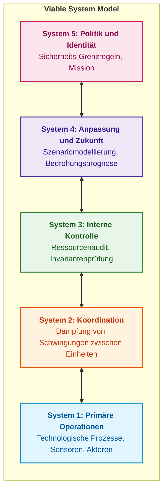
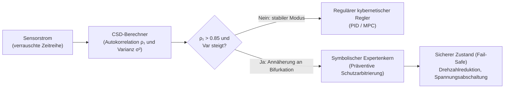
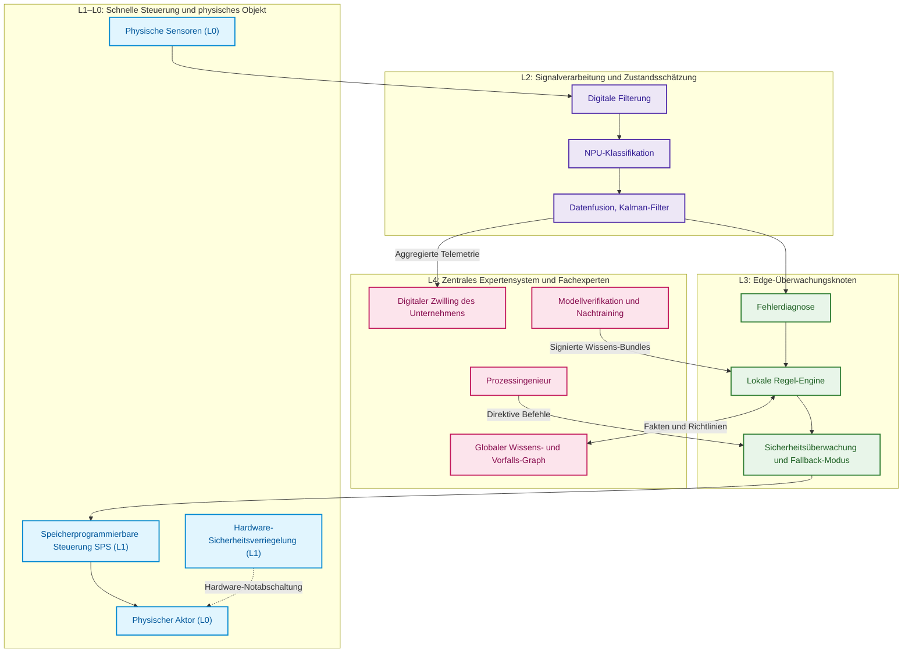
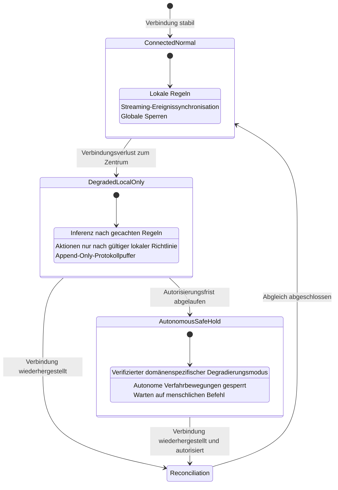
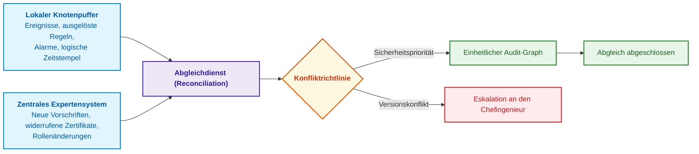

# Kapitel 22. Kybernetischer Regelkreis: Sensoren, Peripherie und Rückkopplung

> **Buch:** [Architektur evidenzbasierter Expertensysteme](README.md) · [Teil IV: Architektur, Technologie-Stack, Inferenz und Aktion](part-04-architecture-and-inference.md)  
> **Vorheriges Kapitel:** [Kapitel 21. Von der Empfehlung zur Aktion: Autoritätskontrolle und sichere Ausführung in Produktionsumgebungen](ch21-from-recommendation-to-action.md)  
> **Nächstes Kapitel:** [Kapitel 23. Verifikation der Wissensbasis: Widerspruchsfreiheit, Vollständigkeit und Robustheit von Regeln](ch23-knowledge-base-verification.md)  
> **Inhaltsverzeichnis:** [README.md](README.md)  
> **Autor:** [Mykola Fedchyk](about-the-author.md)  
> [!NOTE]
> **Lernziele:** Das Gesetz der erforderlichen Varietät nach Ashby und das Good-Regulator-Theorem auf die Architektur von Expertensystemen anwenden; den Objektzustand über Filter statt Rohsignale schätzen; Funktionen über Zeithorizonte der Ebenen L0–L4 verteilen; kryptografisch signierte Merkmale statt bloßer Urteile von Sensoren übertragen; Degradierungsmodi bei Verbindungsabbruch und Zustandsabgleich nach Wiederherstellung entwerfen; Wissensbestände auf Edge-Geräten über signierte Bundles aktualisieren.

## Abstract

Auf einer automatisierten Fertigungslinie registriert ein hochfrequenter Schwingungssensor eine atypische Vibrationsspitze in einer Lagerbaugruppe. Wie ist darauf zu reagieren? Es bestünde die Option, den Antriebsmotor unverzüglich abzuschalten, dem Wartungsingenieur eine Inspektionsbenachrichtigung für die nächste turnusmäßige Pause zuzustellen oder das Signal als kurzzeitige Störung durch eine benachbarte Presse zu verwerfen. Die numerische Ausgabe eines neuronalen Klassifikators liefert für sich genommen keine Handlungsanweisung. Die Entscheidung hängt vom Gesamtkontext ab: der Phase des technologischen Prozesses, der Verlässlichkeit der Sensorkalibrierung, der Schmiermitteltemperatur, den Kosten eines Bandstillstands, der Verfügbarkeit eines redundanten Kanals sowie den Befugnissen des entscheidenden Knotens.

Reißt die Netzwerkverbindung zum zentralen Server ab, muss die Schutzlogik unmittelbar an der Anlage auf der Peripherie (*Edge*) greifen. Gleichzeitig besitzt die lokale Steuerung weder Einblick in die vollständige Wartungshistorie des gesamten Maschinenparks noch das Recht, den technologischen Ablaufplan des Werks eigenmächtig zu modifizieren. Dieses Verhalten ist typisch für cyber-physische Systeme, in denen Rechenoperationen untrennbar mit physikalischen Prozessen verwoben sind und deren Dynamik in harter Echtzeit folgen müssen [[1]](#src-1).

Dieses Kapitel beantwortet die zentrale Frage: **Wie lässt sich der Regelkreis zwischen dem physikalischen Prozess, den Edge-Knoten und dem zentralen Expertensystem so schließen, dass die Steuerung auch bei Latenzen, Sensorrauschen und Verbindungsabbrüchen funktional sicher bleibt?** Die Kernthese lautet: **Der Regelkreis wird nach Zeithorizonten modularisiert. Schnelle Schutzreaktionen werden von deterministischen Steuerungen direkt an der Anlage ausgeführt; der Edge-Knoten schätzt den Objektzustand und wendet gecachte Regeln an; das zentrale Expertensystem modifiziert Regeln und Modelle ausschließlich über kryptografisch signierte Bundles. Jede Ebene verfügt über eine ausreichende Reaktionsvarietät für ihre spezifischen Störungen, ein internes Modell des Objekts, einen eigenen Degradierungsmodus sowie formale Regeln für den Zustandsabgleich nach Wiederherstellung der Verbindung.**

## 1. Kybernetik und Ashbys Gesetz der erforderlichen Varietät

Norbert Wiener definierte die Kybernetik als Wissenschaft von Steuerung und Kommunikation im Lebewesen und in der Maschine, fundiert auf dem Konzept der geschlossenen Rückkopplung [[2]](#src-2). Für ein Expertensystem ergibt sich aus diesem Bezugsrahmen eine fundamentale praktische Fragestellung: Ist das System in der Lage, alle Zustände des Objekts zu differenzieren, auf die es mit unterschiedlichen Aktionen reagieren muss? Die quantitative Antwort liefert William Ross Ashbys Gesetz der erforderlichen Varietät (*Law of Requisite Variety*) [[3]](#src-3).

Unter der Varietät einer endlichen Zustandsmenge $\Omega$ verstand Ashby die Anzahl ihrer unterscheidbaren Elemente; in logarithmischer Form ausgedrückt:

```math
V(\Omega) = \log_2 \lvert \Omega \rvert
```

- Zur Messung der Varietät ist $\Omega$ eine endliche Zustandsmenge und $\lvert \Omega \rvert$ die Anzahl ihrer unterscheidbaren Elemente;
- $\log_2$ ist der Logarithmus zur Basis 2, und $V(\Omega)$ wird in Bit gemessen;
- Die Gleichung spezifiziert die Anzahl an Bits, die erforderlich ist, um die Zustände der Menge innerhalb dieses Modells eindeutig zu differenzieren.

Umfasst eine Menge beispielsweise 1.024 Zustände, beträgt $V(\Omega) = \log_2(1024) = 10\text{ Bit}$. Diese Metrik erfasst ausschließlich die Anzahl diskreter Zustände, nicht jedoch deren interne Komplexität oder Auftretenswahrscheinlichkeit.

Das Gesetz der erforderlichen Varietät postuliert in dieser Form, dass die Varietät der resultierenden Ausgänge $V_O$ nicht geringer sein kann als die Varietät der Störungen $V_D$ abzüglich der Varietät der Reaktionen des Reglers $V_R$:

```math
V_O \geq V_D - V_R
```

Gesetzliche Begrenzung:

- $V_O$ bezeichnet die Varietät der Ergebnisse, $V_D$ die Varietät der Störungen und $V_R$ die Varietät der Reglerreaktionen;
- Jede Größe wird in Bit innerhalb desselben Zustandsmodells gemessen;
- $\geq$ bedeutet „nicht kleiner als“, und das Minuszeichen subtrahiert das Absorptionsvermögen des Reglers von der Varietät der Störungen selbst.

Betragen in einem didaktischen Szenario beispielsweise $V_D = 10\text{ Bit}$ und $V_R = 1\text{ Bit}$, so muss die unregulierte Restvarietät der Ausgänge mindestens $9\text{ Bit}$ betragen. Diese Ungleichung definiert eine theoretische Untergrenze und legt für sich genommen noch nicht fest, welche konkreten Reaktionen ein sicheres Systemverhalten garantieren.

Unter der Annahme, dass 1.024 Störfälle jeweils distinkte Gegenmaßnahmen erfordern, ist ein Regler mit lediglich zwei Reaktionen unzureichend. Die Zahl der Klassenbezeichnungen in einem Klassifikator ist jedoch nicht identisch mit der Varietät verfügbarer Steuerbefehle. Die Ungleichung limitiert die Anzahl unterscheidbarer Resultate, zählt aber nicht automatisch kritische oder „unkontrollierbare“ Zustände ab. Eine einzige robuste Schutzmaßnahme kann für eine Vielzahl unterschiedlicher Fehlzustände angemessen sein. Eine Ontologie unterstützt zwar die semantische Kontextdifferenzierung, erhöht jedoch ohne entsprechende Beobachtbarkeit und reale Stellglieder die Regelungskapazität des Systems nicht.

Das Good-Regulator-Theorem von Conant und Ashby [[4]](#src-4) wurde für ein präzise definiertes Regelungsmodell und spezifische Optimalitätsbedingungen formuliert. Es erzwingt nicht, dass jeder industrielle Regler zwingend über einen vollumfänglichen digitalen Zwilling oder exakt ein Kalman-Filter verfügen muss [[5]](#src-5). In der hier vorgestellten Architektur stellt ein Zustandsschätzer jedoch eine fundierte Wahl dar, wenn verborgene Variablen aus verrauschten Sensordaten rekonstruiert werden müssen. Seine Eignung wird anhand des Modells, der Fehlertoleranz und des Echtzeit-Zeitbudgets verifiziert. Das nachfolgende Diagramm veranschaulicht diesen Regelkreis.

```mermaid
flowchart LR
    accTitle: Regelkreis mit Rückkopplung
    accDescr: Der physische Prozess liefert Signale an die Sensoren, Signale werden gefiltert, der Zustandsschätzer bildet das Objektmodell, das Expertensystem fällt eine autorisierte Entscheidung, der Aktor modifiziert den Prozess und der Operator überwacht die Befugnisse.

    ENV["<b>Physischer Prozess</b><br/>Mechanik, Thermodynamik"] --> SEN["<b>Sensoren und Telemetrie</b><br/>Vibration, Druck, Strom"]
    SEN --> OBS["<b>Filterung und Validierung</b><br/>Zeitstempel, Rauschunterdrückung"]
    OBS --> EST["<b>Zustandsschätzer</b><br/>Kalman-Filter, digitaler Zwilling"]
    EST --> EXP["<b>Expertensystem</b><br/>Regeln, Normen, Diagnostik"]
    EXP --> DEC["<b>Autorisierte Entscheidung</b>"]
    DEC --> ACT["<b>Aktor / Stellglied</b><br/>Frequenzumrichter, Ventil"]
    ACT --> ENV
    ENV -.->|"physische Rückmeldung"| SEN

    HUM["<b>Operator</b><br/>Autoritätskontrolle"] --> DEC
    EXP --> HUM

    classDef env fill:#fff3e0,stroke:#e65100,stroke-width:2px,color:#bf360c;
    classDef sens fill:#e1f5fe,stroke:#0288d1,stroke-width:2px,color:#01579b;
    classDef est fill:#ede7f6,stroke:#512da8,stroke-width:2px,color:#311b92;
    classDef core fill:#e8f5e9,stroke:#2e7d32,stroke-width:2px,color:#1b5e20;
    classDef hum fill:#fce4ec,stroke:#c2185b,stroke-width:2px,color:#880e4f;

    class ENV,ACT env;
    class SEN,OBS sens;
    class EST est;
    class EXP,DEC core;
    class HUM hum;
```



Das Diagramm unterstreicht, dass die Regeln des Expertensystems keine Rohsignale verarbeiten, sondern auf einer fundierten Zustandsschätzung aufsetzen. Der folgende Abschnitt belegt anhand konkreter Berechnungen, warum diese Differenzierung von prinzipieller Bedeutung ist.

## 2. Parallele Software-Pipeline: Aufgaben-Warteschlange

Rückkopplungsschleifen sind nicht auf physikalische Sensoren beschränkt. Betrachten wir einen Softwaredienst, der Aufgaben entgegennimmt, Worker-Prozesse, die diese abarbeiten, sowie einen Autoscaling-Controller, der die Worker-Anzahl anhand der Telemetrie dynamisch skaliert. Metriklatenzen, Wiederholungsversuche (*retries*) und Kapazitätsgrenzen nachgelagerter Dienste übernehmen hier die Rolle von Latenzen, Rauschen und Stellgliedbeschränkungen.

| Regelkreiselement | Software-Äquivalent | Prüfung durch das Expertensystem |
|---|---|---|
| Regelstrecke (Objekt) | Warteschlange und Worker | Lastanstieg von Durchsatzverlust differenzieren |
| Beobachtung | Alter der ältesten Aufgabe, Eingangsrate, Fertigstellungen und Retries | Zeitstempel und Vollständigkeit der Metriken prüfen |
| Zustandsschätzung | Hypothese über Worker-Mangel oder Überlastung abhängiger Dienste | Eine einzelne Warteschlangenlänge nicht als fertige Diagnose werten |
| Zulässige Aktion | Skalierung der Worker, Annahmebegrenzung oder Benachrichtigung des Operators | Vereinbarte Grenzwerte und Autorisierungen durchsetzen |
| Rückmeldung | Dynamik von Aufgabenalter, Fehlerraten und Retries | Verifizieren, ob die Aktion den Systemzustand tatsächlich verbessert hat |

Arbeitet der Skalierungs-Controller mit veralteten Metriken, kann er mehrfach hintereinander Worker hinzuschalten, bevor der Effekt der ersten Skalierung überhaupt sichtbar wird. Liegt der Engpass in der Datenbank, führen zusätzliche Worker und Retries lediglich zu erhöhter Ressourcenkonkurrenz (*lock contention*). Das Expertensystem kann diese Kausalhypothesen explizieren und Handlungsregeln validieren, ersetzt jedoch nicht den primären Regelungsalgorithmus.

Vor jeder Automatisierung müssen Beobachtungs- und Ausführungslatenzen, Fluktuationen der Worker-Anzahl, Aufgabenalter und Wiederholungsraten systematisch erfasst werden. Zeitfenster für das Eintreten von Effekten, Obergrenzen für Steueraktionen und das Verhalten bei fehlender Telemetrie sind vertraglich zu fixieren. Dieses didaktische Beispiel etabliert keine universellen Schwellenwerte: Für jeden Produktionsdienst sind empirische Lasttests unerlässlich. Das Problem der Zustandsschätzung wird im Folgenden anhand eines physikalischen Signals vertieft.

## 3. Zustandsschätzung: Filterung statt Rohsignal

Betrachten wir eine thermische Schutzregel für Leistungstransistoren in einer Stromverteilungseinheit (*Power Distribution Unit*, PDU): Die Leistung soll halbiert werden, wenn die Temperatur $85^\circ\mathrm{C}$ übersteigt und schneller als $2{,}5^\circ\mathrm{C/s}$ ansteigt:

```math
T > 85^\circ\mathrm{C} \;\land\; \frac{dT}{dt} > 2{,}5^\circ\mathrm{C/s} \;\Rightarrow\; \mathrm{DeratePower}(50\,\%)
```

- Die Schutzregel nutzt $T$, die aktuelle Transistortemperatur in Grad Celsius, mit dem Schwellenwert $`85^\circ\mathrm{C}`$;
- $\frac{dT}{dt}$ repräsentiert die Temperaturänderungsrate in Grad Celsius pro Sekunde, mit $`2{,}5^\circ\mathrm{C/s}`$ als Grenzwert der Erwärmungsgeschwindigkeit;
- $>$ bezeichnet „größer als“, $\land$ erfordert das gleichzeitige Erfülltsein beider Bedingungen;
- $\Rightarrow$ signalisiert, dass bei Erfüllung der Prämissen die Aktion $`\mathrm{DeratePower}(50\,\%)`$ ausgelöst wird (Leistungsreduktion auf 50 %).

Die Regel reduziert die Leistung somit ausschließlich dann, wenn die Temperatur bereits $85^\circ\mathrm{C}$ überschritten hat und weiterhin mit einer Rate oberhalb der Warnschwelle ansteigt. Die Zeitableitung muss zwingend unter Berücksichtigung des Sensorrauschens und des Abtastintervalls geschätzt werden, da hochfrequentes Rauschen andernfalls massive Fehlauslösungen provoziert.

Die Regel erscheint elementar, doch die Ableitung eines verrauschten Signals birgt erhebliche Risiken. Wird der Sensor alle $50\,\text{ms}$ abgetastet und weist das Messrauschen eine Standardabweichung von $0{,}5\,^\circ\mathrm{C}$ auf, so besitzt die Differenz zweier aufeinanderfolgender Messwerte, dividiert durch $0{,}05\,\text{s}$, ein Rauschen in der Größenordnung von $0{,}5 \cdot \sqrt{2} / 0{,}05 \approx 14\,^\circ\mathrm{C/s}$. Dieser Rauschpegel übersteigt den Regelschwellenwert um ein Vielfaches. Das folgende Go-Programm simuliert $60\,\text{Sekunden}$ Betrieb unter zwei Szenarien: Der Transistor ist heiß ($86\,^\circ\mathrm{C}$), erwärmt sich jedoch nicht weiter; im zweiten Szenario erwärmt er sich ausgehend von $80\,^\circ\mathrm{C}$ mit einer Rate von $3\,^\circ\mathrm{C/s}$. Die Ableitung wird auf zwei Arten ermittelt: naiv aus zwei aufeinanderfolgenden Messpunkten sowie über ein Alpha-Beta-Filter – den einfachsten Zustandsschätzer mit konstantem Geschwindigkeitsmodell, der Zustands- und Ratenschätzungen bei jedem Zeitschritt iterativ korrigiert.

<details>
<summary>Beispiel in Go: Naive Ableitung und Alpha-Beta-Filter für Temperaturüberwachungsregeln</summary>

```go
package main

import (
	"errors"
	"fmt"
	"math"
	"math/rand"
)

const dt = 0.05 // Abtastperiode des Sensors, s

type Estimate struct {
	Temperature   float64
	Rate          float64
	RateAvailable bool
}

type AlphaBeta struct {
	Alpha, Beta, MaxGap float64
	lastTime            float64
	initialized         bool
	estimate            Estimate
}

func finite(value float64) bool {
	return !math.IsNaN(value) && !math.IsInf(value, 0)
}

func (filter *AlphaBeta) Update(at, measurement float64) (Estimate, error) {
	if !finite(at) || !finite(measurement) || !finite(filter.Alpha) || !finite(filter.Beta) ||
		!finite(filter.MaxGap) || filter.Alpha <= 0 || filter.Alpha > 1 ||
		filter.Beta <= 0 || filter.Beta > 1 || filter.MaxGap <= 0 {
		return Estimate{}, errors.New("invalid measurement or filter configuration")
	}
	if !filter.initialized {
		filter.estimate = Estimate{Temperature: measurement}
		filter.lastTime, filter.initialized = at, true
		return filter.estimate, nil
	}
	interval := at - filter.lastTime
	if interval <= 0 || interval > filter.MaxGap {
		return Estimate{}, errors.New("duplicate, reordered, or stale measurement")
	}
	predicted := filter.estimate.Temperature + filter.estimate.Rate*interval
	residual := measurement - predicted
	next := Estimate{
		Temperature:   predicted + filter.Alpha*residual,
		Rate:          filter.estimate.Rate + filter.Beta/interval*residual,
		RateAvailable: true,
	}
	if !finite(next.Temperature) || !finite(next.Rate) {
		return Estimate{}, errors.New("non-finite estimate")
	}
	filter.estimate, filter.lastTime = next, at
	return next, nil
}

// rule ist die Regel zur Leistungsreduktion: Temperatur über 85 °C und Anstieg schneller als 2,5 °C/s.
func rule(temp, rate float64) bool { return temp > 85 && rate > 2.5 }

// run simuliert 60 s Betrieb und liefert die Anzahl der Regelauslösungen sowie den Zeitpunkt des ersten Ansprechens.
// Wenn alpha == 0, wird die Ableitung „naiv“ aus zwei aufeinanderfolgenden Messungen berechnet.
func run(trueTemp func(t float64) float64, alpha, beta float64) (fires int, first float64) {
	r := rand.New(rand.NewSource(7))
	first = -1
	var prev float64
	filter := AlphaBeta{Alpha: alpha, Beta: beta, MaxGap: 4 * dt}
	for k := 0; k <= int(60/dt); k++ {
		t := float64(k) * dt
		z := trueTemp(t) + 0.5*r.NormFloat64() // Messung mit Rauschen σ = 0,5 °C
		var temp, rate float64
		if k == 0 {
			prev = z
		}
		if alpha == 0 {
			temp, rate = z, (z-prev)/dt
		} else {
			estimate, err := filter.Update(t, z)
			if err != nil {
				panic(err)
			}
			temp, rate = estimate.Temperature, estimate.Rate
		}
		prev = z
		if k > 0 && rule(temp, rate) {
			fires++
			if first < 0 {
				first = t
			}
		}
	}
	return fires, first
}

func main() {
	stable := func(t float64) float64 { return 86 } // heiß, erwärmt sich jedoch nicht weiter
	ramp := func(t float64) float64 {               // Erwärmung um 3 °C/s über 10 s ab 80 °C
		if t < 10 {
			return 80 + 3*t
		}
		return 110
	}
	for _, f := range []struct {
		name        string
		alpha, beta float64
	}{{"naive Ableitung", 0, 0}, {"Alpha-Beta-Filter", 0.1, 0.005}} {
		falseFires, _ := run(stable, f.alpha, f.beta)
		_, first := run(ramp, f.alpha, f.beta)
		fmt.Printf("%-18s | Fehlauslösungen in 60 s: %4d | Erste Auslösung bei Erwärmung: %.2f s\n",
			f.name, falseFires, first)
	}
}
```

Synthetische Tests verifizieren den Zeitbereich und den Filterzustand. Ausführung: `go test -v main.go main_test.go`.

```go
package main

import (
	"math"
	"testing"
)

func TestMeasurementValidity(testCase *testing.T) {
	filter := AlphaBeta{Alpha: 0.1, Beta: 0.005, MaxGap: 0.2}
	initial, err := filter.Update(7, 25)
	if err != nil || initial.RateAvailable {
		testCase.Fatal("first sample incorrectly supplied a measured rate")
	}
	updated, err := filter.Update(7.1, 26)
	if err != nil || !updated.RateAvailable || math.Abs(updated.Rate-0.05) > 1e-10 {
		testCase.Fatalf("wrong actual-time update: %+v, %v", updated, err)
	}
	before := filter
	for _, input := range []struct{ at, value float64 }{
		{7.1, 26}, {7, 26}, {9, 26}, {7.15, math.NaN()}, {7.15, math.Inf(1)},
	} {
		if _, err := filter.Update(input.at, input.value); err == nil {
			testCase.Fatal("invalid event accepted")
		}
		if filter != before {
			testCase.Fatal("invalid event changed filter state")
		}
	}
	if _, err := (&AlphaBeta{Alpha: 0.1, Beta: 0.005}).Update(0, 25); err == nil {
		testCase.Fatal("missing gap policy accepted")
	}
}
```

</details>

Das Programm liefert folgende Ausgabe:

<details>
<summary>Daten und Ausführungsergebnis des Beispiels</summary>

```text
naive Ableitung    | Fehlauslösungen in 60 s:  520 | Erste Auslösung bei Erwärmung: 1.55 s
Alpha-Beta-Filter  | Fehlauslösungen in 60 s:    0 | Erste Auslösung bei Erwärmung: 1.80 s
```

</details>

Bei einem festen Seed des Zufallsgenerators generierte die naive Ableitung im stationären Zustand 520 positive Regelauswertungen, während das Filter keine einzige Fehlauslösung verzeichnete. Dies entspricht nicht der Zahl separater Schutzaktionen und stellt keinen formalen Beweis einer Null-Fehlalarmrate dar: Das Programm modelliert nicht die thermische Gegenkopplung nach Leistungsdrosselung. Während der Erwärmungsphase wird die Temperaturschwelle von $85\,^\circ\mathrm{C}$ nach ca. $1{,}67\,\text{s}$ geschnitten; das Filter lieferte die erste Auslösung bei $1{,}80\,\text{s}$. Latenzen und Schätzfehler müssen über eine Vielzahl von Rauschrealisierungen, Signalsprüngen und Messausfällen verifiziert werden.

Das Flag `RateAvailable` indiziert lediglich, dass die Rate nach zwei gültigen Ereignissen berechnet werden konnte, garantiert jedoch nicht deren hinreichende Genauigkeit für Schutzfunktionen. Das Filter verarbeitet reale Zeitabstände, verwirft ungültige Zahlenwerte, Duplikate, zeitlich vertauschte Ereignisse sowie unzulässig große Messlücken ohne Statusänderung. Eine verworfene Messung versetzt die Beobachtung in einen degradierten Status; sie wird keinesfalls stillschweigend durch Null oder das Fehlen einer Bedrohung substituiert. Grenzintervalle und Filterkoeffizienten stellen Parameter dieses didaktischen Experiments dar und bilden kein validiertes Profil eines realen Leistungstransistors. Das Beispiel illustriert den Nutzen expliziter Rauschmodelle, beweist jedoch weder das Good-Regulator-Theorem noch die absolute Sicherheit eines geschlossenen Regelkreises.

## 4. Kybernetik zweiter Ordnung, Viable System Model und Active Inference

Die klassische Kybernetik betrachtete das zu regelnde Objekt als strikt extern gegenüber dem Regler. In komplexen soziotechnischen Systemen greift diese Annahme zu kurz. Drei theoretische Konzepte der zweiten Hälfte des 20. und des frühen 21. Jahrhunderts liefern das Rüstzeug, um diesen Wechselwirkungen architektonisch zu begegnen.

**Kybernetik zweiter Ordnung.** Heinz von Foerster postulierte, dass der Beobachter als integraler Bestandteil des von ihm beobachteten Systems modelliert werden muss [[6]](#src-6). Für ein Expertensystem ist dies keineswegs eine philosophische Abstraktion: Sobald das System eine Diagnose oder Handlungsempfehlung ausgibt, modifizieren menschliche Operatoren ihr Verhalten. Dadurch verändern sich exakt jene Datenströme, auf deren Basis das Expertensystem trainiert und verifiziert wird. Das Entscheidungsprotokoll des Expertensystems dient somit nicht allein Revisionszwecken, sondern bildet einen integralen Bestandteil der Prozessdaten; Evaluierungsmetriken müssen den Rückkopplungseffekt vergangener Empfehlungen explizit einbeziehen.

**Viable System Model (VSM).** Stafford Beer formulierte das Modell lebensfähiger Systeme (*Viable System Model*), wonach jede überlebensfähige Organisation zwingend fünf funktionale Subsysteme aufweisen muss [[7]](#src-7). Das folgende Diagramm stellt diese Subsysteme dar.



In diesem Ordnungsrahmen positioniert sich das Expertensystem typischerweise zwischen System 3 (Einhaltung technologischer Vorschriften im Hier und Jetzt) und System 4 (Modellierung von Verschleißprozessen oder Störfallszenarien), eingebettet in die normativen Leitplanken von System 5. Der architektonische Mehrwert des VSM liegt in einer diagnostischen Kontrollfrage: Fehlt in einer Anlage ein explizites System 2, existiert keine Instanz, um destruktive Schwingungen und Ressourcenkonflikte zwischen autonomen Edge-Knoten (etwa die gleichzeitige Lastabsenkung zweier Einheiten auf derselben Versorgungsleitung) aktiv zu dämpfen.

**Active Inference.** Karl Friston formulierte das Free-Energy-Prinzip als einheitliche Theorie adaptiver Systeme: Ein adaptives System minimiert die variationelle freie Energie $F$, die eine obere Schranke der „Überraschung“ (*Surprise*) bezüglich der Beobachtungen $\tilde{y}$ darstellt [[8]](#src-8):

```math
F = \mathbb{E}_{q(\vartheta)}\left[\ln q(\vartheta) - \ln p(\tilde{y}, \vartheta)\right] = \mathrm{KL}\left[q(\vartheta) \,\|\, p(\vartheta \mid \tilde{y})\right] - \ln p(\tilde{y})
```

- In der Gleichung der freien Energie ist $F$ ein Skalar und $\vartheta$ bezeichnet den verborgenen Zustand des Objekts;
- $q(\vartheta)$ ist die approximative Verteilung interner Zustandsüberzeugungen des Modells und $p(\tilde{y},\vartheta)$ die Verbundverteilung von Beobachtung $\tilde{y}$ und Zustand $\vartheta$ gemäß dem generativen Modell $p$;
- $\mathbb{E}_{q(\vartheta)}$ bezeichnet den Erwartungswert bezüglich der Verteilung $q$, und $\ln$ ist der natürliche Logarithmus;
- $p(\vartheta\mid\tilde{y})$ ist die A-posteriori-Verteilung des verborgenen Zustands nach der Beobachtung, und $`\mathrm{KL}[q\|p]`$ steht für die Kullback-Leibler-Divergenz zwischen den Verteilungen;
- $p(\tilde{y})$ bezeichnet die Randwahrscheinlichkeit der Beobachtung; die Gleichung zeigt die Äquivalenz zwischen der Erwartungswert-Darstellung und der KL-Form mit dem additiven Term $-\ln p(\tilde{y})$;
- Bei Verwendung des natürlichen Logarithmus wird die Informationsgröße in Nat gemessen.

Die Minimierung von $F$ kann über zwei distinkte Pfade erfolgen: Entweder passt das System seine internen Überzeugungen $q$ an, um die Beobachtungen besser zu erklären (Wahrnehmung), oder es verändert die physische Umwelt durch gezielte Aktionen so, dass künftige Beobachtungen den Erwartungen entsprechen (Active Inference). Für ein Expertensystem fungiert diese Theorie als wertvolle konzeptionelle Analogie: Der Zustandsschätzer übernimmt die Funktion der Wahrnehmung, während die in [Kapitel 21](ch21-from-recommendation-to-action.md) beschriebenen Aktoren die Aktionen vollziehen. Das Free-Energy-Prinzip entstammt den Neurowissenschaften; ein cyber-physisches Expertensystem muss es nicht buchstabengetreu nachbilden, um Regelkreise deterministisch zu schließen.

> [!NOTE] Ingenieurtechnische Interpretation von Active Inference für cyber-physische Systeme
> Hinter der mathematischen Abstraktion der Minimierung variationeller freier Energie $F$ verbirgt sich die klassische Dualität der industriellen Regelungstechnik:
> 1. **Wahrnehmung (Perception):** Das System aktualisiert seine interne A-posteriori-Verteilung $q(\vartheta)$ (z. B. den Zustandsvektor eines Kalman-Filters oder Bayes-Netzes), um die Unsicherheit $\mathrm{KL}[q \| p]$ zu verringern. Dies entspricht der passiven Modellanpassung an einströmende Sensordaten.
> 2. **Aktion (Action):** Detektieren Sensoren eine kritische Abweichung (hohe Überraschung $-\ln p(\tilde{y})$), generiert die Steuerung Stellsignale an Servomotoren, Ventile oder PWM-Wechselrichter. Die physische Realität wird gezielt in einen Zustand überführt, in dem die Telemetriedaten wieder mit den parametrierten Sicherheits-Sollwerten übereinstimmen.

Diese drei theoretischen Ansätze konvergieren in einem organisatorischen Grundsatz: Wissen zirkuliert in technischen Infrastrukturen über zwei Schleifen unterschiedlicher Taktung. Der schnelle operative Zyklus umfasst operative Ad-hoc-Entscheidungen, Sensordatenanalysen, Hypothesen autonomer Agenten und probabilistische Schätzungen; er besitzt jedoch keine normative Zertifizierungsautorität. Der langsame, gesteuerte Zyklus verwaltet den kanonischen Wissensgraphen, validierte Architekturrichtlinien, geprüfte Ontologien und rechtliche Randbedingungen. Wissen darf aus dem schnellen in den langsamen Zyklus ausschließlich über strukturierte Promotionsverfahren mit Invariantenprüfung und kryptografischer Signatur autorisierter Ingenieure überführt werden, wie in [Kapitel 19](ch19-from-question-to-evidence.md) dargelegt.

## 5. Synergetische Stabilität: Bifurkationen, Critical Slowing Down und Vorhersage von Phasenübergängen

Die klassische Regelungstheorie stützt sich überwiegend auf lineare Rückkopplungen: Eine Regelabweichung vom Sollwert erzeugt ein proportionales Korrektursignal. In realen cyber-physischen Komplexen (autonome Fluggeräte, Industrieturbinen, HGÜ-Stromnetze) ist die Anlagendynamik jedoch hochgradig nichtlinear. Unter steigender Belastung oder thermischem Verschleiß kann sich die Regelstrecke einem **Bifurkationspunkt** nähern: einer kritischen Schwelle qualitativer Änderungen des dynamischen Regimes, an der lineare Rückkopplungen ihre Stabilitätsreserve einbüßen und das Gesamtsystem in chaotische Oszillationen oder katastrophales Versagen abgleitet.

Die **Synergetik nach Haken und Prigogine** zeigt, dass komplexe dynamische Systeme unmittelbar vor einem destruktiven Phasenübergang ein fundamentales Phänomen manifestieren: **Critical Slowing Down (CSD)** [[8a]](#src-8a).

Beschreibt man die Dynamik der Zustandsabweichung $x$ in der Nähe eines stationären Gleichgewichtspunkts durch eine linearisierte Differentialgleichung mit stochastischem Rauschen:

```math
\frac{dx}{dt} = -\lambda x + \sigma \eta(t)
```

wobei:
- $x$ die Auslenkung des Zustands aus der Gleichgewichtslage darstellt;
- $\lambda > 0$ die Erholungsrate (*Recovery Rate*, Rückkehrgeschwindigkeit ins Gleichgewicht) bezeichnet;
- $\sigma \eta(t)$ das stochastische Umweltrauschen mit der Rauschintensität $\sigma$ ist.

Nähert sich das System einem Bifurkationspunkt, strebt der dominierende Eigenwert gegen null: $\lambda \to 0$. Dies induziert zwei statistische Indikatoren, die im Sensorstrom in Software präzise berechnet werden können:

1. **Anstieg der Autokorrelation (Memory Effect):**
Für diskrete Abtastungen im Zeitintervall $\Delta t$ konvergiert der Autokorrelationskoeffizient erster Ordnung gegen eins:

```math
\rho_1 = e^{-\lambda \Delta t} \xrightarrow{\lambda \to 0} 1
```

Das System „erinnert“ sich signifikant länger an zufällige Auslenkungen; das Einschwingverhalten wird zäh und stark verzögert.

2. **Divergenz der Varianz (Variance Inflation):**
Die Varianz der Messungen wächst sprunghaft an, da das System nicht mehr in der Lage ist, stochastische Störungen zügig zu dissipieren:

```math
\mathrm{Var}(x) = \frac{\sigma^2}{2\lambda} \xrightarrow{\lambda \to 0} \infty
```

**Laufzeitsteuerung und präventive Arbitrierung:**
- **CSD-Warnschwelle (CSD Alarm):** Werden in einem gleitenden Beobachtungsfenster simultan die Bedingungen $\rho_1 \ge \tau_{\rho} = 0{,}85$ und $\mathrm{Var}(x) / \sigma_0^2 \ge 3{,}0$ erfüllt (die Varianz hat sich gegenüber dem Basisrauschen $\sigma_0^2$ verdreifacht), signalisiert das System den drohenden Verlust der dynamischen Stabilität;
- **Aktion des Expertenkerns:** Die symbolische Inferenzmaschine entzieht dem linearen Regler die Steuerautorität und initiiert das Protokoll zur präventiven Überführung in einen sicheren Zustand (`PREEMPTIVE_FAIL_SAFE`), indem Drehzahl oder elektrische Last vor Eintritt der irreversiblen Bifurkation aktiv gedrosselt werden.

**Numerisches Berechnungsbeispiel zur Bifurkationsdetektion:**
Ein Temperatursensor eines Wechselrichters mit Abtastintervall $\Delta t = 0{,}5\,\text{s}$ registriert eine schleichende Degradation des Kühlsystems. Die Erholungsrate ist auf $\lambda = 0{,}1\,\text{s}^{-1}$ eingebrochen, bei einer Rauschintensität von $\sigma = 0{,}2\,^\circ\text{C}$ (Basisvarianz $\sigma_0^2 = 0{,}04$):

```math
\rho_1 = e^{-0{,}1 \cdot 0{,}5} = e^{-0{,}05} \approx 0{,}951 \ge 0{,}85
```

```math
\mathrm{Var}(x) = \frac{0{,}2^2}{2 \cdot 0{,}1} = \frac{0{,}04}{0{,}2} = 0{,}20\,(^\circ\text{C})^2 \implies \frac{\mathrm{Var}(x)}{\sigma_0^2} = \frac{0{,}20}{0{,}04} = 5{,}0 \ge 3{,}0
```

Beide Schwellenwerte sind überschritten: Das System wechselt unverzüglich in den präventiven Schutzbetrieb zur Lastabsenkung und bannt den thermischen Durchschlag der Halbleiter.



Für Expertensysteme begründet dies eine neue Klasse von Regeln: **präventive Vor-Bifurkations-Schutzregeln**. Anstatt passiv abzuwarten, bis eine Temperatur den Notabschaltwert reißt oder ein Fluggerät unsteuerbar taumelt, detektiert das System synergetische CSD-Frühwarnindikatoren ($\rho_1 \uparrow, \mathrm{Var} \uparrow$) als aktiven Defeater für den Normalbetrieb und schaltet die Anlage noch im Bereich linearer Beherrschbarkeit präventiv in einen geschützten Modus.

## 6. Hierarchie der Zeithorizonte L0–L4

Unterschiedliche Entscheidungen erfordern grundlegend verschiedene Zeitbudgets. Die Ebenen L0–L4 und die genannten Intervalle bilden die didaktische Strukturierung dieses Kapitels und stellen keine starre Industrienorm dar. Die Zulässigkeit einer Softwarekomponente auf einer Ebene bemisst sich an Reaktionsfristen, Worst-Case Execution Time (WCET), Netzwerkanforderungen und den spezifischen Sicherheitszielen der Anlage; weder eine bestimmte Programmiersprache noch Hardwarebeschleuniger beweisen für sich genommen die Einhaltung dieser Grenzen.

| Ebene | Zeithorizont | Funktion und Zweck | Auf dieser Ebene unzulässig |
|:---:|---|---|---|
| **L0** | Kontinuierlich | Physisches Objekt: Mechanik, Werkstoffe, Thermodynamik, Energiewandlung | Softwareannahmen ohne sensorische Bestätigung |
| **L1** | 1 µs–10 ms | Harte lokale Regelung: Servoregler, SPS, FPGA, Hardware-Verriegelungen | Nicht-deterministische neuronale Netze, LLMs, Netzwerkaufrufe |
| **L2** | 10 ms–1 s | Wahrnehmung: Digitale Signalfilterung, Sensorfusion, Klassifikation auf NPU | Fakten ohne Zeitstempel und Unsicherheitsabschätzung |
| **L3** | 1 s–1 min | Edge-Aufsicht: Lokale Regeln, Risikobewertung, Notbetriebskoordination | Befugnis zur eigenmächtigen Änderung globaler Richtlinien |
| **L4** | 1 min–Tage | Zentrales Expertensystem: Globaler Wissensgraph, Flottenanalyse, Modellpflege | Annahme einer permanenten, latenzfreien Edge-Verbindung |

Das nachfolgende Diagramm veranschaulicht das Zusammenspiel dieser fünf Ebenen.



Die gestrichelte Linie von der Hardware-Verriegelung direkt zum Stellglied ist von zentraler sicherheitstechnischer Relevanz: Die Notabschaltung auf Ebene L1 durchläuft keinerlei Software höherer Ebenen. Das zentrale Expertensystem wirkt auf die Peripherie ausschließlich über zwei Kanäle ein: die Synchronisation aggregierter Fakten und Richtlinien sowie die Bereitstellung kryptografisch signierter Wissens-Bundles. Beide Kanäle operieren asynchron und verifizierbar; keiner von ihnen ist Bestandteil der zeitkritischen Schutzschleife.

## 7. Verträge für Sensorereignisse

Ob die vollständige Übertragung sämtlicher Rohabtastungen sinnvoll ist, hängt von Abtastfrequenzen, Kanalzahlen, Busbandbreiten und der konkreten Diagnoseaufgabe ab. Für die kontinuierliche Inferenz überträgt der Edge-Knoten typischerweise aggregierte Fenster-Features inklusive Qualitätsmetadaten, während autorisierte Rohdatenfragmente für tiefgehende Audits und Nachprüfungen separat vorgehalten werden. Eine Aggregation darf jedoch niemals transiente Ereignisse verschleifen, die für Schutzregeln entscheidend sind. Das folgende Listing demonstriert das strukturierte Schema eines solchen Sensorereignisses:

<details>
<summary>Strukturierte JSON-Repräsentation eines Sensorereignisses</summary>

```json
{
  "event_id": "evt:vibr:sensor-42:2026-09-27T10:14:02.105Z",
  "source_urn": "urn:plant:sector-b:motor-07:vibr-probe-1",
  "boot_id": "synthetic-boot-17",
  "sequence": 1842,
  "event_time": "2026-09-27T10:14:02.105Z",
  "clock_uncertainty_ms": 5,
  "measurement_window_ms": 100,
  "sampling_rate_hz": 20000,
  "features": {
    "peak_acceleration_g": 4.82,
    "rms_velocity_mms": 11.4,
    "dominant_frequency_hz": 142.5,
    "kurtosis": 5.12
  },
  "signal_integrity": {
    "snr_db": 28.4,
    "sensor_status": "CALIBRATED_VALID",
    "clipping_detected": false
  },
  "local_classification": {
    "anomaly_score": 0.89,
    "score_semantics": "uncalibrated_model_output",
    "model_fingerprint": "sha256:<Klassifikatormodell-Hash>",
    "inference_device": "NPU"
  }
}
```

</details>

Die Inferenzregel verifiziert Signal-Rausch-Verhältnis (*Signal-to-Noise Ratio*, SNR), Kalibrierstatus, Amplitudenbegrenzung (*clipping*), Aktualität und Messüberdeckung anhand eines versionierten Profils. Mangelhafte Signalintegrität stellt ein eigenständiges Überwachungsereignis dar: Sie darf nicht verworfen und als Abwesenheit von Gefahr fehlinterpretiert werden. Die Felder `boot_id` und `sequence` dienen der Erkennung von Duplikaten und Neustarts, setzen jedoch eine vertrauenswürdige Herkunftsüberprüfung voraus. Der Ereigniszeitstempel wird mit der Uhrenunsicherheit und der Eingangszeit abgeglichen. Ein unkalibrierter `anomaly_score` darf keinesfalls mit der physischen Ausfallwahrscheinlichkeit gleichgesetzt werden.

### 7.1. Signieren von Merkmalen statt Urteilen

Petro Sidliarchuk formulierte ein Prinzip, das für verteilte Sensornetze wegweisend ist: Eine digitale Signatur beweist die Urheberschaft, beweist jedoch nicht die materielle Wahrheit [[9]](#src-9). Signiert ein Sensor ein vorgefertigtes Urteil („Ziel detektiert“, „Schwellenwert überschritten“), kann die Empfängerseite das Urteil lediglich akzeptieren oder verwerfen, vermag jedoch nicht nachzuvollziehen, auf welchen Rohdaten es beruhte. In den im selben Repository dokumentierten Feldversuchen hielt ein akustischer Detektor eine stabile Grundfrequenz von $84\,\text{Hz}$ samt Oberschwingungen und meldete ein Ziel, obwohl die Schallquelle eine mehrere hundert Meter entfernte Hochspannungsleitung war. Der Detektor funktionierte spezifikationsgemäß; das Merkmal, auf das er reagierte, gehörte an diesem Einsatzort jedoch zu einem völlig anderen Objekt.

Ein evidenzbasierter Vertrag auf Sensorebene erfordert daher drei Garantien:

1. **Messungen und Kontext werden signiert.** Die signierte Nutzlast umfasst Rohmerkmale, physikalische Einheiten, Zeitfenster, Quellen-URN, Sequenznummer, Verarbeitungspipeline-Version sowie Integritätsmetadaten. Das abgeleitete Urteil kann ergänzend beigefügt werden, ersetzt jedoch niemals die Primärdaten.
2. **Bekannte physikalische Schranken werden geprüft.** Firmware und Empfänger validieren ein explizites Wertebereichsmodell (*Validity Envelope*). Eine Plausibilitätsprüfung kann ohne ein vollständiges physikalisches Modell nicht alle unmöglichen Kombinationen eliminieren; eine Signatur macht eine Fehlmessung nicht wahr.
3. **Versionierte Regeln werden reproduziert.** Der empfangende Knoten kann die Schlussfolgerung nur dann deterministisch nachvollziehen, wenn Modellversionen, Regelsätze und Kalibrierparameter bekannt sind. Eine Diskrepanz ist Anlass für eine Systemdiagnose, kein automatischer Beweis einer Kompromittierung: Ursache können unterschiedliche Revisionsstände, numerische Rundungsdrifts oder verloren gegangener Kontext sein.

Dieses Vorgehen harmoniert mit der RATS-Architektur (*Remote ATtestation procedureS*), in der ein attestierendes Gerät Nachweise (*Evidence*) liefert und ein separater Verifizierer diese anhand eigener Richtlinien bewertet [[10]](#src-10). Das Beispiel der Hochspannungsleitung demonstriert eine weitere fundamentale Grenze: Selbst authentische, signierte Merkmale können Fehlinterpretationen unterliegen; Regeln der Ebene L3 müssen daher stets den räumlichen und betrieblichen Gesamtkontext einbeziehen.

Die Bereitstellung prädikativer Schranken und Gültigkeitsgrenzen (*Validity Envelopes*) für digitale Signalprozessoren (DSP) über NATS-Broker und Ingress-Gateways wird in [Kapitel 33](ch33-inter-system-knowledge-exchange-and-model-teaching.md) vertieft: Dort wird der formale Wissenstransfer vom Expertensystem zu Signalprozessoren sowie die Behandlung von Gegenbeispiel-Warteschlangen systematisch beschrieben.

### 7.2. Nicht-funktionale Schnittstellen und implizite Annahmen

Ein signifikanter Teil von Ausfällen in verteilten cyber-physischen Komplexen entsteht nicht an funktionalen Schnittstellen (Nachrichtenformate, Busprotokolle), sondern durch unzureichend dokumentierte, implizite Annahmen einzelner Module übereinander. Garlan, Allen und Ockerbloom zeigten am Beispiel von Softwarekomponenten, dass Wiederverwendbarkeit regelmäßig an solchen architektonischen Fehlanpassungen (*Architectural Mismatch*) scheitert [[11]](#src-11). In cyber-physischen Systemen treten zu den Softwareannahmen physikalische Kopplungen hinzu: gemeinsame Stromschienen, auf denen der Anlaufstrom eines Motors die Versorgungsspannung empfindlicher Sensoren einbrechen lässt; elektromagnetische Einkopplungen benachbarter Leistungsteile; schleichende Sensordrifts nach thermischen Zyklen oder Bus-Jitter anstelle eines Totalausfalls. Die Annahmenmatrix jedes Moduls muss daher neben Schnittstellenformaten auch jene physikalischen Umgebungsbedingungen explizieren, die das Modul als stabil voraussetzt, damit Abweichungen als eigenständige Anomalieereignisse erfasst werden können.

## 8. Degradierungsmodi bei Verbindungsabbruch

Die fundamentale Sicherheitsanforderung an ein cyber-physisches Expertensystem lautet: **Funktionale Sicherheit darf niemals von der permanenten Verfügbarkeit einer Netzwerkverbindung abhängen**. Bricht die Verbindung zur Zentrale ab, durchläuft der Edge-Knoten die im nachfolgenden Zustandsdiagramm spezifizierten Übergänge.



Der autonome Modus wird durch domänenspezifische Sicherheitsrichtlinien definiert. Ein Verbindungsverlust erzeugt nicht automatisch Autonomie-Rechte der Stufe A2: Erforderlich sind gültige lokale Vollmachten, eine vertrauenswürdige Zeitbasis sowie ein bestätigter Betriebskontext. Ohne Netzwerk kann der Knoten von einem im Zentrum soeben widerrufenen Zertifikat keine Kenntnis haben; zeitliche Befristungen autonomer Aktionen begrenzen dieses Restrisiko, eliminieren es jedoch nicht vollständig. Zeitfenster (wie etwa 30 Minuten) sind systemspezifische Auslegungsparameter. Der sichere Zustand muss für jedes Objekt individuell definiert werden: Ein unkonditioniertes Stillsetzen kann unter Umständen gefährlicher sein als ein geregelter Weiterbetrieb. Ein manipulationssicheres lokales Audit-Protokoll ist zwingende Voraussetzung für den späteren Abgleich; eine kryptografische Signatur allein beweist jedoch noch keine Lückenlosigkeit des Protokolls.

## 9. Zustandsabgleich nach Wiederherstellung der Verbindung

Nach dem Wiederaufbau der Netzwerkverbindung müssen Zentrale und Edge-Knoten die während der Trennung unabhängig akkumulierten Zustände abgleichen: lokale Ereignisse, Alarme und Schutzentscheidungen des Knotens einerseits sowie globale Richtlinienänderungen, Zertifikatswiderrufe und Rollenmodifikationen des Zentrums andererseits. Das folgende Diagramm zeigt diesen Abgleichprozess.



Logische Lamport-Uhren garantieren die Eigenschaft: Geht ein Ereignis einem anderen kausal voraus, ist sein Zeitstempel kleiner [[12]](#src-12). Der Umkehrschluss ist für zwei beliebige Zeitstempel unzulässig: Numerische Werte allein beweisen keine Kausalität. Vektoruhren können Nebenläufigkeit im Rahmen eines definierten Nachrichtenaustauschs auflösen [[13]](#src-13), messen jedoch keine physikalischen Zeitintervalle, wie sie für Zeitableitungen oder Autorisierungsfristen zwingend benötigt werden. Kausale Nachrichtenordnung und die simultane Einwirkung einer physikalischen Erschütterung auf zwei Sensoren sind kategorial verschiedene Phänomene. Für einen belastbaren Abgleich werden beide Zeitbegriffe mit explizit spezifizierten Unsicherheitsgrenzen benötigt.

Die Konfliktlösungsrichtlinie folgt dem fundamentalen Invariantenprinzip „Safety First“. Hat der Knoten während des Inselbetriebs einen Antrieb aus Sicherheitsgründen verriegelt und sendet die Zentrale nach Wiederverbindung einen planmäßigen Startbefehl für eine neue Produktionscharge, darf der zentrale Befehl die Sicherheitsabschaltung keinesfalls rückwirkend überschreiben. Die Entriegelung darf ausschließlich durch eine explizite Bestätigung des verantwortlichen Ingenieurs vor Ort erfolgen.

## 10. Sichere Wissensaktualisierung: Kryptografisch signierte Bundles

Aktualisierungen von Regeln, Modellen und Ontologien auf Edge-Geräten dürfen niemals über ungesicherte Skripte erfolgen. Ein Wissens-Bundle (*Knowledge Bundle*) ist ein vorkompiliertes, typisiertes und kryptografisch signiertes Software-Artefakt:

```math
\mathrm{KnowledgeBundle} = \{\mathrm{Rules},\; \mathrm{Models},\; \mathrm{Schemas},\; \mathrm{Signatures},\; \mathrm{ValidFrom},\; \mathrm{ValidTo}\}
```

Bestandteile des Wissens-Bundles:

- $\mathrm{Rules}$ bezeichnet den Regelsatz, $\mathrm{Models}$ die Modelle und $\mathrm{Schemas}$ die Datenstrukturschemata;
- $\mathrm{Signatures}$ enthält die digitalen Signaturen des Bundles; $\mathrm{ValidFrom}$ und $\mathrm{ValidTo}$ definieren Beginn und Ende der zeitlichen Gültigkeit;
- $\mathrm{KnowledgeBundle}$ bezeichnet ein einzelnes Bundle; die geschweiften Klammern gruppieren dessen Attribute als Verbunddatentyp.

Das Bundle umfasst somit nicht allein Regelsätze und Modelle, sondern bindet Schemata, Signaturen und Gültigkeitsgrenzen untrennbar aneinander. Die Aufzählung der Felder determiniert noch nicht den Algorithmus der Signaturprüfung oder die Behandlung des Ablaufs; diese Logik wird durch das standardisierte Aktualisierungsprotokoll festgelegt.

Das Aktualisierungsverfahren umfasst fünf Schritte:

1. Der neue Regelsatz wird im Simulator der CI/CD-Pipeline verifiziert, insbesondere durch Regressionstests gemäß [Kapitel 16](ch16-expert-systems-architecture.md).
2. Aus Regeln, Modellen und Schemata wird ein binäres Bundle mit einer deterministischen SHA-256-Prüfsumme kompiliert.
3. Das Bundle wird von mehreren autorisierten Rolleninhabern digital signiert; das Zielgerät akzeptiert das Bundle nur bei Erreichen des definierten Signatur-Schwellenwerts (*Quorum*).
4. Der Edge-Knoten verifiziert die Signaturen gestützt auf einen Hardware Root of Trust (z. B. TPM-Modul und Secure Boot).
5. Der Knoten führt die Umschaltung nach einem atomaren Aktivierungsprotokoll durch; scheitert die Validierung, greift das System auf das vorherige, nach aktueller Richtlinie noch zulässige Bundle zurück.

TUF (*The Update Framework*) trennt kryptografische Vertrauensrollen und unterstützt Schwellenwert-Signaturen [[14]](#src-14). Die Sicherheit hängt von Schlüsselhierarchien, Versionsnummern und Metadaten-Ablauffristen ab; eine beliebige Anzahl von Signaturen schützt nicht vor Replay-Angriffen veralteter Bundles. Ein Rollback darf niemals bereits widerrufene Berechtigungen oder verwundbare Artefakte reaktivieren. Das Prüfmanifest muss Abhängigkeiten zwischen Regeln, Modellen, Schemata und Laufzeitumgebung deklarieren, und die Aktivierung muss die Zustandskompatibilität des Schätzers sicherstellen. Die Normenreihe IEC 62443 [[15]](#src-15) definiert grundlegende Anforderungen an die industrielle Cybersicherheit; das Bundle-Verfahren bedarf stets einer domänenspezifischen Verifikation.

Die aktuelle TUF-Spezifikation [[16]](#src-16) trennt die Integritätsprüfung einer Datei strikt von deren Installation und semantischer Eignung. Zwei Signaturen mit demselben privaten Schlüssel stellen keine zwei unabhängigen Stimmen dar. Metadatenfristen erfordern eine vertrauenswürdige Zeitbasis, und das atomare Umschalten des Bundles garantiert noch nicht die interne Zustandskompatibilität eines bereits laufenden Reglers.

Ein Edge-Knoten benötigt selten die vollständige Wissensbasis des Gesamtbetriebs. Ein Knoten mit fokussiertem Aufgabenprofil erhält eine gezielte Teilmenge: Shards der relevanten Dokumentenfamilien oder ein Modul, das auf das terminologische Profil des Geräts zugeschnitten ist ([Kapitel 7](ch07-knowledge-base-typology.md)). Diese Teilmenge bildet ein eigenständiges Bundle mit eigener Signatur und Datei-Hashes; das Knotenprofil ist im Manifest verankert. Ein reduziertes Profil führt dazu, dass nicht enthaltene Fakten als „unbekannt“ (*unknown*) und nicht als „falsch“ gewertet werden: Betrifft eine Anfrage eine Domäne außerhalb des Profils, antwortet der Knoten mit `UNKNOWN` und postuliert keine Abwesenheit. Ein Update, das einen Shard unberührt lässt, verändert dessen Hash nicht; der Knoten lädt ausschließlich modifizierte Shards nach. Die Bedingungen hierfür sowie die Shard-Aufteilung werden in Abschnitt 10 von [Kapitel 32](ch32-high-performance-knowledge-packs-mmap-and-harvesting.md) formalisiert.

## 11. Moderne Werkzeuge zur Verarbeitung und zum Lernen aus Zeitreihendaten

Für das Softwarebeispiel einer Aufgaben-Warteschlange sind zunächst exakte Ereigniszeitstempel und ein deterministischer Simulator erforderlich. Darauf aufbauend können Latenzbehandlung, Signalprüfungen temporal-logischer Eigenschaften oder modellprädiktive Regler integriert werden; kein Werkzeug vermag eine unzureichende Eingangsdatenqualität zu kompensieren.

| Werkzeug | Rolle im Systementwurf | Nicht garantiert |
|---|---|---|
| Apache Flink [[17]](#src-17) | Event-Time-Fensterung, Behandlung verspäteter Datensätze | Ein Watermark beweist nicht, dass alle physischen Ereignisse empfangen wurden |
| RTAMT [[18]](#src-18) | Signalprüfung mittels Signal Temporal Logic (STL) | Der Monitor bewertet gegebene Traces; Zukunftsoperatoren erfordern Wartezeit |
| do-mpc [[19]](#src-19) | Simulation, Zustandsschätzung und modellprädiktive Regelung (MPC) | Modellzulässigkeit beweist nicht die Sicherheit der realen Anlage |
| Sequenzielle Statistik- und Modellanpassung | Sensordrift-Erkennung, Regimewechsel, Lastprognosen | Gelernte Muster beweisen keine Kausalität und ändern Schutzregeln nicht autonom |

Ein *Watermark* in Flink signalisiert den Verarbeitungsfortschritt gemäß einer definierten Latenzrichtlinie; reale physikalische Ströme können diese Schranke verletzen. Für RTAMT müssen diskrete oder kontinuierliche Zeitsemantik, Abtastperiode, Zeithorizont und Lückenbehandlung explizit fixiert werden. Zudem unterliegt die Python-Umgebung durch ANTLR-Abhängigkeiten Versionsbeschränkungen, die vorab zu prüfen sind. Für do-mpc sind dynamische Prozessmodelle, Stellgrößenbeschränkungen und ein deterministisches Ausfallverhalten bei Nichtkonvergenz des Optimierers erforderlich.

Im Bereich der Datenstromanalyse sind Changepoint-Erkennung, Residuenanalyse von Prognosen und Systemidentifikation von hohem Nutzen. Streaming-Verfahren führen inkrementelle Modellaktualisierungen durch und vergleichen Vorhersagen mit nachfolgenden Messungen. Regelaktionen beeinflussen jedoch künftige Messdaten: Das Ausbleiben eines Schadens nach einem Eingriff beweist nicht, dass der Ausgangszustand unkritisch war. Das Audit-Log muss Aktion, Betriebsmodus, Modellversion und Zeitstempellatenz lückenlos festhalten. Neue Parameter und Schwellenwerte erfordern separate Genehmigungsverfahren; Active Learning berechtigt das System keinesfalls zu gefährdenden Erkundungsmanövern an der realen Anlage.

Die Bibliothek River stellt Werkzeuge für kontinuierliches Lernen bereit; ihr ADWIN-Detektor (*ADaptive WINdowing*) vergleicht statistische Momente über adaptive Fensterteilungen [[20]](#src-20). Signifikante Änderungen im Prognoseresiduum können Indikatoren für eine notwendige Neukalibrierung oder einen Regimewechsel sein. Sie beweisen jedoch keine Ursachen und autorisieren keine autonome Anpassung sicherheitskritischer Schwellen. Zunächst wird die gespeicherte Prognose evaluiert, anschließend am realen Label nachgelernt; Labels aus der Zukunft dürfen niemals rückwirkend für vergangene Entscheidungen herangezogen werden.

Für verteilte Datenströme, die Edge-Sensoren mit dem Backend verbinden, formulierten Akidau et al. in den Modellen MillWheel und Dataflow das klassische theoretische Fundament der Stromverarbeitung [[21]](#src-21): Die fundamentale Differenzierung zwischen Ereigniszeit (*Event Time*) und Verarbeitungszeit (*Processing Time*), Berechnungen über gleitenden Fenstern und die Festlegung von Low Watermarks ermöglichen es, verspätete und umgeordnete Pakete deterministisch zu handhaben, ohne die kausale Konsistenz logischer Schlüsse zu verletzen.

Zustandsschätzer müssen in der Simulation unter Injektion von Zeitfehlern und Kommunikationsausfällen verifiziert werden. Eine belastbare Evaluierung muss Fehlalarme, unerkannte Gefahren, Reaktionslatenzen und den zulässigen Zustandsraum (*State Space*) simultan quantifizieren.

## 12. Durchgängige Ingenieurbeispiele

Die folgenden Szenarien stellen didaktische Architekturmodelle zur Verantwortungsverteilung dar und erheben keinen Anspruch auf verifizierte Hardware-Freigaben. Unabhängigkeit der Schutzebenen, Wahrnehmungspräzision, Zeitschranken und das Verhalten bei Common-Cause-Fehlern müssen für jedes Zielsystem gesondert nachgewiesen werden. Auch ein Hardware-Schaltwerk kann mit fehlerhaften Eingangsdaten beaufschlagt werden; der bloße Einsatz eines FPGAs oder von Lockstep-Kernen beweist noch kein physikalisches Invariantenverhalten.

**Stromverteilungseinheit (Power Distribution Unit, PDU).** Betrachten wir das Zusammenwirken aller Ebenen in einer mikrocontrollergesteuerten PDU. Auf den Ebenen L0–L1 werden ein Shunt-Stromsensor und ein Transistor-Thermistor über integrierte Analog-Digital-Wandler abgetastet; ein analoger Hardware-Komparator öffnet bei einem Kurzschluss unverzüglich ein Schutzrelais – vollständig autark und ohne Mitwirkung der Firmware. Auf den Ebenen L2–L3 glättet ein Zustandsschätzer das Temperatursignal, schätzt die Erwärmungsrate und übermittelt bei drohender Überhitzung gemäß der Schutzregel aus Abschnitt 3 einen Drosselungsbefehl über den CAN-Bus an den Antriebswechselrichter. Wird die CAN-Leitung unterbrochen, versetzt ein Watchdog-Timer die Einheit in einen sicheren Zustand: Der Strom wird hardwarenah begrenzt und das Ereignis im geschützten Flash-Speicher protokolliert. Nach Wiederherstellung der Kommunikation wird das signierte Vorfallsprotokoll an das zentrale Expertensystem (L4) übertragen, das den Vorfall mit dem globalen Wissensgraphen abgleicht. Ergibt die Analyse, dass die Transistoren dieser Platinenrevision aus einer Charge mit erhöhtem thermischen Übergangswiderstand stammen (dokumentiert in einem Errata-Report des Herstellers), generiert das Zentrum ein signiertes Wissens-Bundle mit angepassten Abschaltschwellen für die gesamte Flotte.

**Sicherheitsknoten mit getrennter Wahrnehmungs- und Logikebene.** In sicherheitskritischen Systemen höchster Integrität nach ISO 26262 (ASIL D) dürfen Brems- und Lenkaktoren niemals ungeprüft auf probabilistische Wahrnehmungsmodelle vertrauen. Ein Edge-KI-Beschleuniger verarbeitet Kamera- und Lidardatenströme und extrahiert semantische Fakten wie „Hindernis in 12 m Entfernung mit kollidierendem Trajektorienvektor“. Ein funktional sicherer Mikrocontroller mit Lockstep-Kernen (wie in [Kapitel 18](ch18-execution-infrastructure.md) detailliert) empfängt diese Fakten und evaluiert innerhalb deterministischer Zeitschranken die Regeln raum-zeitlicher Sicherheitskorridore. Zwischen dem Mikrocontroller und den Leistungstreibern ist ein FPGA mit einer fest verdrahteten Hardware-Zustandsmaschine geschaltet, die Steuerimpulse, welche die minimale Sicherheitsdistanz verletzen würden, unabhängig von Softwareabstürzen physikalisch blockiert. Fällt die KI-basierte Wahrnehmung aus oder bricht die Ethernet-Verbindung ab, führen Mikrocontroller und FPGA einen kontrollierten Nothalt durch und sichern einen kryptografisch signierten Telemetrie-Snapshot für das Audit.

Beide Architekturen demonstrieren denselben kybernetischen Grundsatz: Jede Ebene verfügt über ein eigenes Modell der Regelstrecke, eine autarke Antwort auf Ausfälle benachbarter Ebenen und verlässt sich für lebenswichtige Schutzfunktionen niemals auf das Netzwerk.

## Fazit

Ein sicherer kybernetischer Regelkreis eines Expertensystems wird strikt nach Zeithorizonten modularisiert: Hardware-Verriegelungen und deterministische L1-Controller reagieren im Mikro- und Millisekundenbereich; Ebene L2 schätzt den internen Zustand; der Edge-Knoten L3 wendet gecachte Regelsätze an; das zentrale Expertensystem L4 aktualisiert Wissensbestände ausschließlich über kryptografisch signierte Bundles. Ashbys Gesetz der erforderlichen Varietät begründet, warum ein industrielles Expertensystem eine differenzierte Fehlerontologie anstelle binärer Statusflags benötigt; das Good-Regulator-Theorem von Conant und Ashby belegt die Notwendigkeit expliziter Objektmodelle zwischen Sensoren und Regelwerken.

Das didaktische Softwarebeispiel demonstrierte den fundamentalen Unterschied zwischen einer naiven numerischen Ableitung und einer modellbasierten Zustandsschätzung für ein konkretes Rauschprofil; es ersetzt jedoch keinen formalen Sicherheitsnachweis des geschlossenen Regelkreises. Negative Tests verifizierten das Verhalten bei Zeitlücken, Umordnungen und nicht-finiten Zahlenwerten. Kryptografisch signierte Merkmale garantieren verifizierbaren Kontext bei gesicherter Schlüsselbindung, beweisen jedoch nicht die materielle Richtigkeit physikalischer Messungen. Degradierungsmodi und Zustandsabgleich erfordern domänenspezifische Richtlinien; logische Uhren können physikalische Zeitintervalle nicht substituieren.

Die Grenzen dieses Kapitels sind präzise gesteckt: Filterkoeffizienten und Schwellenwerte dienen didaktischen Zwecken; reale Betriebsparameter müssen aus physikalischen Rauschmodellen und Sicherheitsanalysen abgeleitet werden. Das Free-Energy-Prinzip wurde als theoretische Analogie, nicht als verbindliche Softwareanforderung eingeführt. Notfall- und Schutzfunktionen müssen stets durch zertifizierte Sicherheitsarchitekturen implementiert werden, nicht durch das Expertensystem allein.

### Architektonisches Fazit und physische Rückkopplung

Die Kapitel 16 bis 22 formen die geschlossene ingenieurtechnische Vertikale von Teil IV. Die Gesamtreferenzarchitektur ([Kapitel 16](ch16-expert-systems-architecture.md)), der Technologie-Stack ([Kapitel 17](ch17-implementation-stack.md)) und die Hardware-Infrastruktur ([Kapitel 18](ch18-execution-infrastructure.md)) schaffen das materielle Fundament; der Weg von der Frage zum Beweis ([Kapitel 19](ch19-from-question-to-evidence.md)), normatives Schließen ([Kapitel 31](ch31-syllogistic-reasoning-and-relation-lattices.md)) und die Erklärungskomponente ([Kapitel 20](ch20-explanation-engine.md)) gewährleisten beweisbare Inferenzketten; die Aktionsautorisierung ([Kapitel 21](ch21-from-recommendation-to-action.md)) und der kybernetische Regelkreis mit Rückkopplung ([Kapitel 22](ch22-cybernetics-edge-to-backend.md)) überführen analytische Empfehlungen schließlich deterministisch in die physische Realität.

### Weiterer Erkenntnisweg

Das thematisch folgende [Kapitel 23](ch23-knowledge-base-verification.md) eröffnet [Teil V](part-05-verification-and-learning.md), der der formalen Verifikation von Regeln, der Testpyramide für Wissensbasen und dem Aufbau von Safety Cases gewidmet ist. Jeder industrielle Regelkreis erfordert den mathematisch fundierten Nachweis der Verlässlichkeit und Widerspruchsfreiheit seiner Wissensbasis, bevor er für den Produktivbetrieb zugelassen werden kann.

## Fragen zur Selbstprüfung

1. Wie lässt sich anhand des Gesetzes der erforderlichen Varietät formal bewerten, ob ein Klassifikator mit lediglich zwei Ausgangsstatus für eine Anlage mit 1.024 distinkten Fehlerzuständen ausreichend ist?
2. Was postuliert das Good-Regulator-Theorem von Conant und Ashby, und welche architektonische Konsequenz ergibt sich daraus für den Einsatz von Zustandsschätzern im Regelkreis?
3. Warum generierte die naive Zeitableitung der Temperatur 520 Fehlauslösungen, und welchen systematischen Preis (in Bezug auf Phasenverschiebung/Latenz) zahlt das Alpha-Beta-Filter für deren Eliminierung?
4. Warum ist die Ausführung eines großen Sprachmodells (LLM) auf Ebene L1 (beispielsweise im Notabschaltkreis einer Industrieturbine) sicherheitstechnisch unzulässig?
5. Warum müssen Edge-Sensoren primäre Merkmale statt fertiger Urteile signieren, und welche fundamentale Lehre liefert das Fallbeispiel des akustischen Detektors an der Hochspannungsleitung?
6. Welche Mechanismen verhindern, dass ein Edge-Knoten im Zustand `DegradedLocalOnly` unkontrolliert Fehlentscheidungen akkumuliert?
7. Wie löst die Konfliktrichtlinie den Fall, dass ein Edge-Knoten während eines Netzwerkausfalls einen Motor aus Sicherheitsgründen sperrt, die Zentrale jedoch nach Wiederverbindung einen planmäßigen Startbefehl erteilt?
8. Warum erfordert die Aktualisierung von Gewichten eines neuronalen Netzes auf einem Edge-Controller dasselbe kryptografische Signatur- und Quorumverfahren wie die Modifikation symbolischer Regeln?
9. Wie ermöglichen synergetische Indikatoren des Critical Slowing Down (CSD) – Autokorrelation erster Ordnung $\rho_1$ und Varianz $\mathrm{Var}(x)$ – die frühzeitige Detektion drohender Bifurkationen vor dem physischen Erreichen von Alarmgrenzen?
10. Worin unterscheidet sich das Konzept logischer Lamport-Uhren von physikalischer astronomischer Zeit, und warum sind für einen sicheren Zustandsabgleich nach Verbindungsabbrüchen zwingend beide Zeitstempelarten erforderlich?

## Glossar

| Deutscher Begriff | Englischer Begriff | Kurzerläuterung |
|---|---|---|
| Kybernetik | Cybernetics | Wissenschaft von Steuerung, Regelung und Kommunikation in Systemen mit Rückkopplung |
| Rückkopplung | Feedback | Rückführung des Ausgangs- oder Wirkungssignals auf den Eingang des Reglers |
| Varietät | Variety | Anzahl unterscheidbarer Zustände einer Menge, vorzugsweise im logarithmischen Maß |
| Gesetz der erforderlichen Varietät | Law of requisite variety | Nur Varietät im Regler kann die Varietät von Störungen absorbieren (Ashby) |
| Good-Regulator-Theorem | Good regulator theorem | Jeder gute Regler eines Systems muss ein Modell dieses Systems sein (Conant & Ashby) |
| Zustandsschätzer | State estimator | Algorithmus zur Rekonstruktion verborgener Zustandsvariablen aus verrauschten Messungen |
| Alpha-Beta-Filter | Alpha-beta filter | Einfacher Schätzer für Position und Änderungsrate mit konstanten Filtergewichten |
| Peripherie / Edge | Edge | Rechenknoten in unmittelbarer Nähe von Sensoren und physikalischen Aktoren |
| Viable System Model | Viable System Model | Beers kybernetisches Modell aus fünf Subsystemen zur Aufrechterhaltung der Lebensfähigkeit |
| Active Inference | Active inference | Minimierung freier Energie wahlweise über Wahrnehmungsanpassung oder gezielte Aktion |
| Kybernetik zweiter Ordnung | Second-order cybernetics | Kybernetik, die den Beobachter als integralen Teil des beobachteten Systems modelliert |
| Degradierungsmodus | Degraded mode | Eingeschränkter Betriebsmodus bei Ausfall von Teilkomponenten zur Aufrechterhaltung der Sicherheit |
| Zustandsabgleich | Reconciliation | Konsolidierung von Zuständen, die während einer Netzwerktrennung unabhängig entstanden sind |
| Logische Uhr | Logical clock | Monotoner Zähler zur Ordnung von Ereignissen nach der Kausalrelation „happened-before“ |
| Wissens-Bundle | Knowledge bundle | Kryptografisch signiertes Artefakt aus Regeln, Modellen und Schemata zur Knotenaktualisierung |
| Remote Attestation | Remote attestation | Sicherheitsverfahren, bei dem ein Verifizierer Integritätsnachweise eines Geräts prüft |
| Watermark (Zeitstempel) | Watermark | Fortschrittsmarke der Ereigniszeit gemäß Latenzrichtlinie; kein Beweis vollständiger Daten |
| Modellprädiktive Regelung | Model predictive control | Optimierungsbasierte Wahl von Stellgrößen anhand von Modellprognosen über einen Zeithorizont |
| Shard | Shard | Partitioniertes Teilsegment einer Wissensbasis, das von einem Knoten verwaltet wird (Kapitel 7) |
| Knotenprofil | Node profile | Spezifikation der Dokumentenfamilien oder Terme, die ein Knoten im Bundle erhält |
| Gültigkeitskorridor | Validity envelope | Numerische Werte- und Ratenschranken, innerhalb derer ein physikalisches Signal als valide gilt |

## Abkürzungen

| Abkürzung | Vollständige Bezeichnung | Bedeutung |
|---|---|---|
| CAN | Controller Area Network | Robustes serielles Bussystem für Steuergeräte |
| CI/CD | Continuous Integration / Continuous Delivery | Automatisierte Software-Integrations- und Bereitstellungspipeline |
| DSP | Digital Signal Processor | Digitaler Signalprozessor zur hochfrequenten Erfassung und Filterung von Signalen |
| IEC | International Electrotechnical Commission | Internationale Elektrotechnische Kommission |
| KL | Kullback-Leibler | Kullback-Leibler-Divergenz zur Quantifizierung des Unterschieds zweier Verteilungen |
| MPC | Model Predictive Control | Modellprädiktive Regelung |
| NATS | Neural Autonomic Transport System (Plattformname) | Hochperformantes Publish-Subscribe-Nachrichtensystem mit subjektbasierter Adressierung |
| ADWIN | ADaptive WINdowing | Adaptives Fensterungsverfahren zur Detektion von Konzeptdrifts in Datenströmen |
| NPU | Neural Processing Unit | Hardwarebeschleuniger für neuronale Netze und Matrixoperationen |
| RATS | Remote ATtestation procedureS | IETF-Architekturstandard für sichere Remote-Attestierungsverfahren |
| SHA-256 | Secure Hash Algorithm, 256 bits | Kryptografische Hashfunktion mit 256-Bit-Ausgabe |
| SNR | Signal-to-Noise Ratio | Signal-Rausch-Verhältnis als Maß der Signalqualität |
| STL | Signal Temporal Logic | Signal-Temporallogik zur formalen Spezifikation von Echtzeitsignaleigenschaften |
| TPM | Trusted Platform Module | Hardware-Sicherheitschip als hardwarebasierter Vertrauensanker |
| TUF | The Update Framework | Sicherheitsarchitektur für manipulationssichere Software-Aktualisierungen |
| URN | Uniform Resource Name | Eindeutiger, persistenter Ressourcenname |
| VSM | Viable System Model | Kybernetisches Modell lebensfähiger Systeme nach Stafford Beer |
| SPS | Speicherprogrammierbare Steuerung | Industrieller Digitalrechner zur Steuerung von Maschinen und Anlagen (engl. PLC) |

## Quellen

1. <a id="src-1"></a>Edward A. Lee, Sanjit A. Seshia. [*Introduction to Embedded Systems: A Cyber-Physical Systems Approach*](https://ptolemy.berkeley.edu/books/leeseshia/). 2nd edition, MIT Press, 2017.
2. <a id="src-2"></a>Norbert Wiener. [*Cybernetics or Control and Communication in the Animal and the Machine*](https://doi.org/10.7551/mitpress/11810.001.0001). MIT Press, Neuauflage 2019 (Erstausgabe 1948).
3. <a id="src-3"></a>W. Ross Ashby. [*An Introduction to Cybernetics*](https://archive.org/details/introductiontocy00ashb). Chapman & Hall, 1956.
4. <a id="src-4"></a>Roger C. Conant, W. Ross Ashby. [*Every Good Regulator of a System Must Be a Model of That System*](https://doi.org/10.1080/00207727008920220). *International Journal of Systems Science*, 1(2), 89–97, 1970.
5. <a id="src-5"></a>R. E. Kalman. [*A New Approach to Linear Filtering and Prediction Problems*](https://doi.org/10.1115/1.3662552). *Journal of Basic Engineering*, 82(1), 35–45, 1960.
6. <a id="src-6"></a>Heinz von Foerster. [*Understanding Understanding: Essays on Cybernetics and Cognition*](https://doi.org/10.1007/b97451). Springer, 2003.
7. <a id="src-7"></a>Stafford Beer. [*The Viable System Model: Its Provenance, Development, Methodology and Pathology*](https://doi.org/10.1057/jors.1984.2). *Journal of the Operational Research Society*, 35(1), 7–25, 1984.
8. <a id="src-8"></a>Karl Friston. [*The Free-Energy Principle: A Unified Brain Theory?*](https://doi.org/10.1038/nrn2787). *Nature Reviews Neuroscience*, 11(2), 127–138, 2010.
8a. <a id="src-8a"></a>Marten Scheffer, Jordi Bascompte, William A. Brock et al. [*Early-warning signals for critical transitions*](https://doi.org/10.1038/nature08227). *Nature*, 461, 53–59, 2009; Hermann Haken. *Synergetic Computers and Cognition: A Top-Down Approach to Neural Nets*, Springer, 2004.
9. <a id="src-9"></a>Petro Sidliarchuk. [*witness-integrity: Witness Integrity for Measurement Devices*](https://github.com/sidliarchukpetro/witness-integrity). GitHub.
10. <a id="src-10"></a>H. Birkholz, D. Thaler, M. Richardson, N. Smith, W. Pan. [*RFC 9334: Remote ATtestation procedureS (RATS) Architecture*](https://www.rfc-editor.org/rfc/rfc9334). IETF, 2023.
11. <a id="src-11"></a>D. Garlan, R. Allen, J. Ockerbloom. [*Architectural Mismatch: Why Reuse Is So Hard*](https://doi.org/10.1109/52.469757). *IEEE Software*, 12(6), 17–26, 1995.
12. <a id="src-12"></a>Leslie Lamport. [*Time, Clocks, and the Ordering of Events in a Distributed System*](https://doi.org/10.1145/359545.359563). *Communications of the ACM*, 21(7), 558–565, 1978.
13. <a id="src-13"></a>C. Fidge. [*Logical Time in Distributed Computing Systems*](https://doi.org/10.1109/2.84874). *Computer*, 24(8), 28–33, 1991.
14. <a id="src-14"></a>Justin Samuel, Nick Mathewson, Justin Cappos, Roger Dingledine. [*Survivable Key Compromise in Software Update Systems*](https://doi.org/10.1145/1866307.1866315). *Proceedings of the 17th ACM Conference on Computer and Communications Security (CCS)*, 61–72, 2010.
15. <a id="src-15"></a>IEC. [*IEC TS 62443-1-1:2009. Industrial Communication Networks: Network and System Security: Part 1-1: Terminology, Concepts and Models*](https://webstore.iec.ch/en/publication/7029). 2009.
16. <a id="src-16"></a>TUF Contributors. [*The Update Framework Specification*](https://theupdateframework.github.io/specification/latest/). Offizielle Spezifikation von Rollen, Schwellenwerten, Versionen und Metadaten-Ablauffristen.
17. <a id="src-17"></a>Apache Software Foundation. [*Flink: Timely Stream Processing*](https://nightlies.apache.org/flink/flink-docs-stable/docs/concepts/time/). Offizielle Dokumentation zu Event Time, Watermarks und Latenzbehandlung.
18. <a id="src-18"></a>Dejan Nickovic, Tomoya Yamaguchi et al. [*RTAMT: Runtime Monitoring Library*](https://github.com/nickovic/rtamt). Dokumentation zur Zeitsemantik, Zeithorizonten und unterstützten Umgebungen.
19. <a id="src-19"></a>do-mpc Contributors. [*Model Predictive Control Python Toolbox*](https://www.do-mpc.com/en/latest/). Dokumentation zu Modellierung, Schätzung und Regelung.
20. <a id="src-20"></a>River Contributors. [*River*](https://riverml.xyz/latest/) und [*ADWIN*](https://riverml.xyz/latest/api/drift/ADWIN/). Dokumentation zu kontinuierlichem Lernen und Changepoint-Detektion in Datenströmen.
21. <a id="src-21"></a>Tyler Akidau et al. [*The Dataflow Model: A Practical Approach to Balancing Correctness, Latency, and Cost in Massive-Scale, Unbounded, Out-of-Order Data Processing*](https://research.google/pubs/the-dataflow-model-a-practical-approach-to-balancing-correctness-latency-and-cost-in-massive-scale-unbounded-out-of-order-data-processing/). *Proceedings of the VLDB Endowment*, 8(12), 1792–1803, 2015.

---

[← Kapitel 21](ch21-from-recommendation-to-action.md) | [Inhaltsverzeichnis](README.md) | [Teil IV](part-04-architecture-and-inference.md) | [Kapitel 23 →](ch23-knowledge-base-verification.md)
