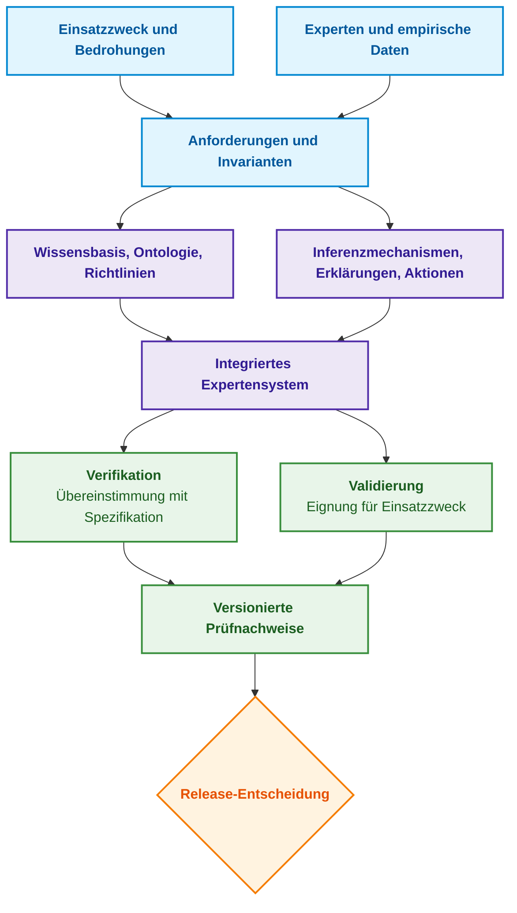
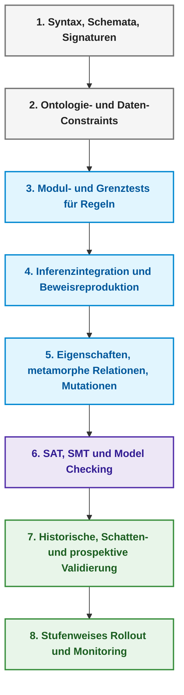
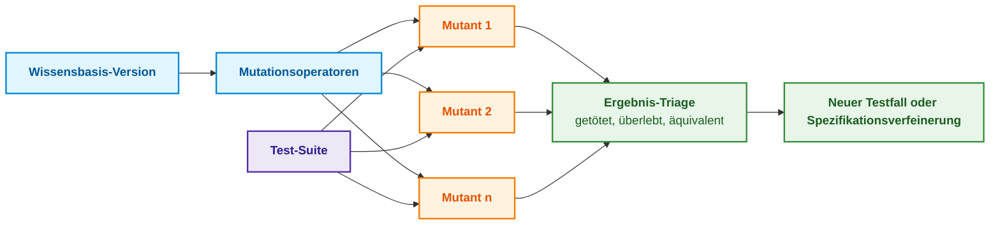
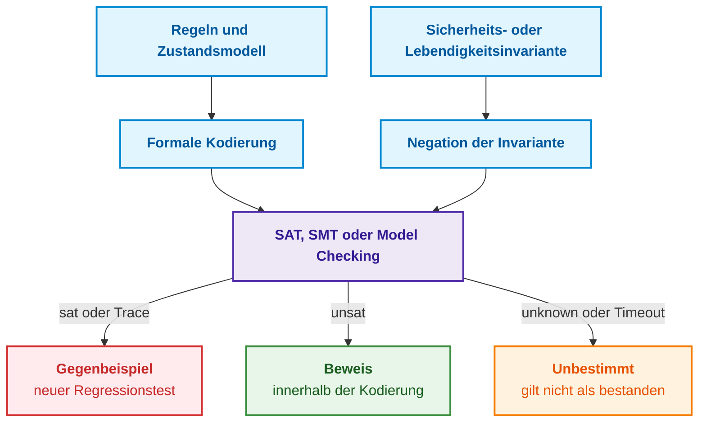
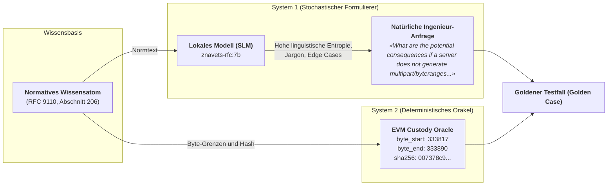

# Kapitel 23. Verifikation der Wissensbasis: Widerspruchsfreiheit, Vollständigkeit und Robustheit von Regeln

> **Buch:** [Architektur evidenzbasierter Expertensysteme](README.md) · [Teil V: Verifikation, Testen, Diagnose und Sicherheitsbegründung](part-05-verification-and-learning.md)  
> **Vorheriges Kapitel:** [Kapitel 22. Kybernetischer Regelkreis: Sensoren, Peripherie und Rückkopplung](ch22-cybernetics-edge-to-backend.md)  
> **Nächstes Kapitel:** [Kapitel 36. Testpyramide für Wissensbasen: Regeln, Interaktionen und Antwortstabilität](ch36-knowledge-testing-pyramid-and-variational-calibration.md)  
> **Inhaltsverzeichnis:** [README.md](README.md)  
> **Autor:** [Mykola Fedchyk](about-the-author.md)  
> **Niveau:** Fortgeschritten: Entwickler von Expertensystemen, Wissensingenieure, Qualitätsingenieure  
> **Lernziele:** Verifikation von Validierung unterscheiden; typische Wissensbasis-Anomalien aufspüren; Regeln an Rand- und unbekannten Zuständen testen; Invarianten formulieren und via endlicher Modellprüfung oder SMT-Solver verifizieren; Teststärke durch Mutationsanalyse bewerten; Entscheidungen stets im Verbund mit Beweisgraph und Erklärung prüfen; kontrollierte Release-Zyklen für Regeländerungen etablieren.

## Abstract

Dieses Kapitel untersucht die Methodik, die ingenieurtechnischen Praktiken und den mathematischen Apparat zur umfassenden Verifikation und Validierung von Wissensbasen in evidenzbasierten Expertensystemen. Es definiert die Rolle eines mehrstufigen Prüfsystems als primären Garanten für Integrität, Determinismus und das Fehlen logischer Widersprüche in automatisierten Entscheidungsprozessen für sicherheitskritische Anwendungen.

Ein Expertensystem beantwortet zwanzig vertraute Anfragen fehlerfrei, woraufhin das Team die Freigabe der neuen Regelbasis vorbereitet. Erst im Produktivbetrieb stellt sich heraus: Eine Regel feuert unter keinen Umständen, zwei Regeln bilden einen zyklischen Bezug, und die fehlerhafte Umrechnung einer Maßeinheit ermöglichte ein Release ohne gültigen Sicherheitstest. Die Testbeispiele waren syntaktisch korrekt, die Wissensbasis erwies sich dennoch als unzuverlässig.

Dieses Kapitel beantwortet die fundamentale Frage: **Wie lässt sich nachweisen, dass den Regeln einer Wissensbasis vertraut werden kann, wenn eine Handvoll erfolgreicher Testfälle dies prinzipiell nicht belegen kann?** Die Kernthese lautet: **Vertrauen entsteht nicht durch die schiere Anzahl grüner Testfälle, sondern durch ein kohärentes Ensemble heterogener Prüfmechanismen: statische Form- und Referenzanalysen, Randwerttests für jede einzelne Regel, modellgeprüfte oder SMT-gelöste Invarianten über dem gesamten Zustandsraum, mutationsbasierte Sensitivitätsanalysen der Test-Suite sowie die deterministische Reproduktion von Beweisen parallel zur Entscheidung. Da jede Verifikationsmethode Eigenschaften ausschließlich relativ zu ihrem Modell und ihren Annahmen beweist, stützt sich die Release-Entscheidung auf eine strikte Konjunktion blockierender Gütekriterien.**

Dieses Kapitel fungiert als didaktischer Leitfaden und nicht als formaler Zertifizierungsbericht. Formale Methoden beweisen Systemeigenschaften stets nur relativ zu den getroffenen Modellannahmen; dynamische Tests belegen lediglich das Vorhandensein von Defekten im abgedeckten Bereich, niemals deren vollständige Abwesenheit; branchenspezifische Standards können zusätzliche, unabhängige Audits verlangen. Sämtliche nachfolgenden Beispiele verifizieren eine einheitliche Richtlinie aus [Kapitel 20](ch20-explanation-engine.md): Ein Release darf ausschließlich für ein kryptografisch signiertes Artefakt, bei nachgewiesener Abwesenheit blockierender Mängel sowie bei Vorliegen eines gültigen Sicherheitstests genehmigt werden; ein abgelaufener Test kann einzig durch eine formal autorisierte Ausnahmegenehmigung (*Waiver*) des Sicherheitsverantwortlichen substituiert werden.

## 1. Verifikation und Validierung der Wissensbasis: Unterschied zwischen Korrektheit und Zweckmäßigkeit

Barry Boehm formulierte die klassische Unterscheidung zweier Leitfragen im Software Engineering: Bauen wir das Produkt richtig (*Verification*) und bauen wir das richtige Produkt (*Validation*) [[1]](#src-1). Die Verifikation prüft, ob die Implementierung der deklarierten Spezifikation entspricht. Die Validierung bewertet hingegen, ob die Spezifikation und das darauf aufbauende Expertensystem für die Lösung der realen Problemstellung im operativen Umfeld geeignet sind.

Für eine Wissensbasis tritt diese Diskrepanz mit besonderer Schärfe zutage. Es ist ohne Weiteres möglich, eine inhaltlich fehlerhafte Expertenregel formal perfekt zu implementieren – eine reine Verifikation wird diesen Mangel nicht aufdecken. Umgekehrt kann eine fachlich makellose Regel vorliegen, die Inferenzmaschine löst Konflikte zwischen konkurrierenden Regeln jedoch fehlerhaft auf. Daher erfordert Expertenwissen, das nach den Methoden aus [Kapitel 11](ch11-knowledge-elicitation-from-experts.md) erhoben wurde, eine empirische Validierung an realen Praxisfällen. Evidenzpakete aus [Kapitel 16](ch16-expert-systems-architecture.md) und [Kapitel 20](ch20-explanation-engine.md) verlangen wiederum eine strenge Verifikation durch unabhängige Reproduktion. Das folgende Diagramm illustriert, wie beide Prozesse in der Release-Entscheidung zusammenlaufen.



Wie das Diagramm verdeutlicht, teilen Verifikation und Validierung eine gemeinsame Eingabe (Anforderungen) und ein gemeinsames Ziel (versionierte Prüfnachweise), beantworten jedoch grundverschiedene Fragestellungen. Eine Schlüsselrolle kommt dem Referenzstandard zu, mit dem das Systemverhalten verglichen wird – dem Testorakel (*Test Oracle*). Elaine Weyuker wies nach, dass für viele Programme die korrekte Ausgabe nicht oder nur unter prohibitivem Aufwand unabhängig berechnet werden kann, wodurch herkömmliche Testverfahren an ihre Grenzen stoßen [[2]](#src-2). Für Wissensbasen folgt daraus eine verbindliche ingenieurtechnische Regel: Auch das Orakel besitzt eine Provenienz. Wenn der Verfasser einer Regel zugleich das erwartete Testergebnis definiert, eignet sich der Test zwar als Unit-Test gegen Regressionen, stellt jedoch keinesfalls eine unabhängige Validierung dar.

## 2. Systemischer Kontext der Verifikation: Zusammenspiel von Regeln, Fakten und Inferenzmechanismen

Die isolierte Überprüfung einer Regeldatei greift zu kurz, da das endgültige Urteil eines Expertensystems aus dem Zusammenspiel multipler Systemkomponenten resultiert:

```math
y = F(x, K, O, P, C, M, R)
```

Bedeutung der Parameter:

- $y$ ist das Berechnungsergebnis, d. h. das Urteil oder die Aktion des Expertensystems;
- $F$ bezeichnet die Gesamtabbildungsfunktion, die das Urteil aus den Komponenten formt;
- $x$ ist der Eingabefakten-Slice;
- $K$ ist die Wissensbasis, $O$ repräsentiert die Ontologie und $P$ die Zugriffskontrollrichtlinien;
- $C$ definiert die Konfliktlösungsstrategie zwischen konkurrierenden Regeln;
- $M$ bezeichnet die Machine-Learning-Modelle in der Pipeline und $R$ die Laufzeitumgebungskonfiguration.

In der Praxis bedeutet diese funktionale Abhängigkeit: Eine Modifikation des Dokumenten-Parsers, der Einheiten-Normalisierung oder eines Wahrscheinlichkeitsschwellenwerts kann das Systemurteil verändern, ohne dass eine einzige Regel editiert wurde. Ein Testlauf-Manifest muss daher kryptografische Hashes aller Komponenten, den Seed des Pseudozufallszahlengenerators, die Systemzeit-Richtlinie, externe Testdaten sowie die Laufzeitumgebung präzise fixieren. Für Sprachmodelle und approximative Suchverfahren müssen die Zwischenergebnisse jeder Stufe persistiert werden, um zu verhindern, dass stochastischer Nichtdeterminismus Verletzungen deterministischer Invarianten maskiert.

## 3. Typologie struktureller und logischer Anomalien einer Wissensbasis

Vor der dynamischen Verhaltungsprüfung wird die Wissensbasis statisch analysiert – ohne Ausführung auf Beispieldaten. Preece und Shinghal klassifizierten Anomalien in Wissensbasen (wie Redundanz, Widersprüche und Unvollständigkeit) als primäre Symptome potenzieller Softwarefehler und etablierten deren Erkennung als formale Verifikationsmethode für regelbasierte Systeme [[3]](#src-3). In der Praxis wird nach vier Kernanomalien gesucht:

- **Tote Regeln (*Dead Rules*):** Feuern unter keinen Umständen, da ihre Prämissen zueinander inkompatibel sind oder auf ein Prädikat verweisen, das von keiner Datenquelle jemals instanziiert wird.
- **Redundante Regeln (*Redundant Rules*):** Duplizieren eine andere Regel oder werden von ihr subsumiert: Besitzt Regel A identische Konklusionen unter schwächeren Bedingungen als Regel B, ist Regel B überflüssig.
- **Widersprüchliche Regeln (*Contradictory Rules*):** Erzeugen bei kompatiblen Prämissen unvereinbare Konklusionen, beispielsweise simultan `ALLOW` und `DENY` für denselben Zustand.
- **Abhängigkeitszyklen (*Dependency Cycles*):** Erfordern eine semantische Differenzierung statt eines pauschalen Ausschlusses. Eine positive Datalog-Rekursion kann legitim sein; problematisch sind Zyklen ohne Basisfall, unstratifizierte Negationen oder unendliche Zustandsgenerierungen. Der didaktische Algorithmus aus [Kapitel 16](ch16-expert-systems-architecture.md) beschränkt sich auf endliche positive Hüllen.

Statische Analysen decken diese Anomalien vor dem ersten Testlauf auf. Dennoch ist eine Anomalie zunächst nur ein Symptom: Eine vermeintlich tote Regel kann eine extrem seltene Gefahrensituation beschreiben, für die im Testdatensatz noch keine Telemetriedaten vorliegen. Jede Entdeckung bedarf daher der Triage durch den fachlichen Eigentümer der Regel.

## 4. Mehrstufige Verifikationsstrategie: Von der Syntax bis zur Erprobung unter realen Einsatzbedingungen

Die Verifikation einer Wissensbasis gliedert sich in eine Prüfpyramide: von leichtgewichtigen, schnellen Prüfungen bei jedem Commit bis hin zu ressourcenintensiven Validierungen vor dem Produktions-Release. Das nachfolgende Diagramm verdeutlicht diese acht Ebenen.



Höhere Ebenen machen untere Ebenen niemals obsolet. Eine exzellente Trefferquote auf historischen Fällen kann eine doppelt vergebene Regel-ID nicht kompensieren, und eine fehlerfreie Schemavalidierung beweist nicht, dass eine Regel den übergeordneten Systemzweck erfüllt. Betrachten wir die ersten drei Ebenen im Detail:

**Form und Referenzen:** Bei jeder Codeänderung wird verifiziert, dass alle Regeln syntaktisch parsbar sind, Datentypen und Maßeinheiten harmonieren, Identifikatoren eindeutig sind, referenzierte Prädikate existieren sowie Versionsgrenzen, Signaturen, Verantwortliche und Gültigkeitszeiträume deklariert wurden. Ein Attribut `valid_until` muss ein typisierter Zeitstempel mit Zeitzone sein, kein Freitext-String, dessen lexikografischer Vergleich nur zufällig das erwartete Ergebnis liefert.

**Konzepte und Daten:** OWL-Reasoner identifizieren logische Inkonsistenzen innerhalb der Ontologie auf Basis formaler Beschreibungslogiken [[4]](#src-4), während SHACL (*Shapes Constraint Language*) prüft, ob ein RDF-Datenbestand deklarierten Strukturformen bezüglich Kardinalitäten, Datentypen und Wertebereichen entspricht [[5]](#src-5). Dies sind grundverschiedene Paradigmen: OWL operiert unter der *Open-World Assumption* (Nichtwissen bedeutet nicht Falschheit), wohingegen strukturelle Datenvalidierungen die *Closed-World Assumption* erfordern. So kann ein SHACL-Shape für einen `SafetyTest`-Datensatz die Pflichtfelder `artifact`, `result`, `performed_at`, `valid_until`, `method_version` und `source_hash` vorschreiben. Ein SHACL-Konformitätsbericht (`sh:conforms = true`) belegt jedoch ausschließlich die strukturelle Korrektheit der Daten, keineswegs die physikalische Validität der Messung.

**Isolierte Regelprüfung:** Jede Regel wird mindestens an folgenden Szenarien verifiziert: einem nominalen Positivfall; Negativfällen, bei denen jeweils exakt eine Prämisse unerfüllt bleibt; Grenzwerten und verschiedenen Maßeinheiten; aktiven Ausnahmebewilligungen (*Waiver*); unbekannten, widersprüchlichen oder unvollständigen Eingabedaten sowie zeitlichen und kontextuellen Geltungsbereichen. Getestet wird nicht nur das Endergebnis, sondern der vollständige Beweisgraph. Betrachten wir die Regel:

```math
\mathrm{valid\_test} \land \mathrm{signed} \land \neg \mathrm{blocker} \rightarrow \mathrm{allow}
```

- $`\mathrm{valid\_test}`$ indiziert, dass ein gültiger Testnachweis vorliegt;
- $\mathrm{signed}$ belegt das Vorhandensein der kryptografischen Signatur;
- $\mathrm{blocker}$ repräsentiert einen bekannten blockierenden Mangel, wobei $\neg$ dessen Abwesenheit einfordert;
- $\land$ steht für das logische UND, und $\rightarrow$ leitet die Konklusion ab;
- $\mathrm{allow}$ repräsentiert die Freigabe der Aktion.

Das Vorhandensein dreier positiver Fakten reicht für eine Freigabe nicht aus. Die Test-Suite muss explizit sicherstellen, dass der Zustand „Defektstatus unbekannt“ nicht fälschlicherweise als $\neg \mathrm{blocker}$ interpretiert wird, falls die Sicherheitsrichtlinie einen expliziten Nachweis der Mängelfreiheit verlangt.

## 5. Metriken der Regelüberdeckung und die Grenzen ihrer Aussagekraft

Die Ausführungsüberdeckung (*Firing Coverage*) beziffert den Anteil der Regeln eines Releases, die während des Testlaufs mindestens einmal ausgelöst wurden:

```math
C_{\text{fire}} = \frac{\lvert R_f \rvert}{\lvert R \rvert}
```

Parameter der Formel:

- $C_{\text{fire}}$ bezeichnet den Überdeckungsgrad als dimensionslosen Wert im Intervall $[0, 1]$;
- $R$ ist die Gesamtmenge aller Regeln des Release-Kandidaten, $R_f$ die Teilmenge der mindestens einmal gefeuerten Regeln;
- Die vertikalen Striche $\lvert\cdot\rvert$ bezeichnen die Mächtigkeit der Mengen; der Bruch dividiert die Anzahl aktivierter Regeln durch die Gesamtzahl.

**Praktische Anwendung und ingenieurtechnische Entscheidungen (Closed-Loop Decision):**
1. **CI/CD Quality Gate:**
   - **$C_{\text{fire}} = 1{,}00$ (100% Regelüberdeckung):** Grüner Build-Status. Die Wissensbasis wird für Integrations- und Regressionstests zugelassen;
   - **$C_{\text{fire}} < 1{,}00$:** Der Build des Wissensbasis-Artefakts wird bedingungslos blockiert. Das System generiert eine Liste aller nicht aktivierten Regeln $R \setminus R_f$. Für jede Regel ist entweder ein gezielter Verifikationstest zu ergänzen oder die Regel mit dem Flag `deprecated` unter Signatur des Systemarchitekten zu versehen.
2. **Praktisches Zahlenbeispiel:** Enthält ein Release $\lvert R \rvert = 120$ Regeln und es feuern im Testlauf $\lvert R_f \rvert = 118$, beträgt die Überdeckung $C_{\text{fire}} = 118 / 120 \approx 0{,}983 < 1{,}00$. **Systemaktion:** Das Release wird blockiert; es wird ein automatisierter Diagnosebericht über zwei „tote“ Regeln generiert, der eine Nachrüstung des Teststands erzwingt.

Ein hoher Wert für $C_{\text{fire}}$ garantiert keineswegs, dass alle Bedingungen geprüft wurden: Für eine Regel mit $m$ Prämissen sind Tests für jede Teilbedingung und jede Grenzkonstellation erforderlich. Eine niedrige Überdeckung kann auf tote Regeln, seltene Gefahrenszenarien oder eine unzureichende Testgenerierung hindeuten – Ursachen, die jeweils unterschiedliche Abhilfemaßnahmen verlangen. Weitaus aussagekräftiger als die reine Überdeckung ist eine Traceability-Matrix, die Gefährdungen direkt mit Regeln, Tests und Verantwortlichen verknüpft:

| Anforderung oder Gefährdung | Regel | Positivtest | Negativ- und Grenztests | Verantwortlicher |
|---|---|---|---|---|
| Ausschließlich gültiger Sicherheitsnachweis | `REL-12` | `case-104` | `case-105` bis `case-109` | Safety-Team |
| Waiver erfordert Signatur des Sicherheitsbeauftragten | `AUTH-7` | `case-205` | `case-206` bis `case-211` | Compliance |
| Blockierender Mangel verbietet ALLOW ausnahmslos | `REL-2` | keine | Invariante `INV-01` | Release-Mgmt |

Eine leere Zelle in dieser Matrix stellt nicht zwingend einen Softwarefehler dar, markiert jedoch eine offene Lücke, die von einem Fachexperten explizit bewertet und geschlossen werden muss.

## 6. Invarianten, Grenzzustände und die Generierung von Gegenbeispielen

Klassische Beispieltests erfassen lediglich vorab bekannte Fälle. Eigenschaftsbasiertes Testen (*Property-Based Testing*), begründet durch das Werkzeug QuickCheck von Claessen und Hughes [[6]](#src-6), verfolgt einen grundsätzlich anderen Ansatz: Ein Generator erzeugt tausende zulässige sowie gezielt unzulässige Systemzustände, woraufhin eine Prüfroutine für jeden Zustand deklarierte Invarianten evaluiert. Die fundamentale Sicherheitsinvariante unserer Release-Regel lautet:

```math
\forall s:\ \mathrm{blocker}(s) \neq \mathrm{no} \Rightarrow \mathrm{decision}(s) \neq \mathrm{ALLOW}
```

Bedeutung der Teilausdrücke:

- $s$ ist der Zustand des Expertensystems; $\forall$ fordert die Gültigkeit für jeden denkbaren Zustand;
- $\mathrm{blocker}(s)$ ist der Status blockierender Mängel im Zustand $s$;
- $\neq$ bedeutet „ungleich“; somit umfasst $\mathrm{blocker}(s) \neq \mathrm{no}$ sowohl bestätigte Defekte als auch den Zustand unvollständiger Informationen;
- $\Rightarrow$ bezeichnet die logische Implikation; $\mathrm{decision}(s) \neq \mathrm{ALLOW}$ untersagt eine Freigabe in diesem Zustand strikt.

Ergänzende Eigenschaften werden analog als eigenständige Invarianten formuliert:

```math
\mathrm{decision}(s) = \mathrm{ALLOW} \Rightarrow \mathrm{valid\_test}(s) \lor \mathrm{authorized\_waiver}(s)
```

Wobei:

- $\mathrm{decision}(s)$ die Entscheidung im Zustand $s$ ist und $\mathrm{ALLOW}$ die Aktionsfreigabe darstellt;
- $`\mathrm{valid\_test}(s)`$ die Existenz eines gültigen Tests und $`\mathrm{authorized\_waiver}(s)`$ eine autorisierte Ausnahmebewilligung bezeichnet;
- $\lor$ für das logische ODER steht: Eine Freigabe erfordert zwingend einen gültigen Testnachweis oder eine legitime Ausnahme.

Eine Freigabe ohne gültigen Testnachweis ist folglich ausgeschlossen, sofern keine rechtsverbindliche Autorisierung vorliegt.

```math
\mathrm{retract}(e, s) \Rightarrow e \notin \mathrm{support}\bigl(\mathrm{recompute}(s)\bigr)
```

Notation:

- $e$ ist ein widerrufenes Faktum, $s$ der Zustand vor der Neuberechnung;
- $\mathrm{retract}(e,s)$ modelliert den formalen Widerruf des Faktums $e$ im Zustand $s$;
- $\mathrm{recompute}(s)$ bezeichnet den Systemzustand nach erneuter Inferenz; $\mathrm{support}$ ist die Menge aller Prämissen, die das Urteil stützen;
- $\notin$ bedeutet „ist kein Element von“; $\Rightarrow$ erzwingt die Tilgung des widerrufenen Faktums aus der Begründungshistorie.

In der Praxis darf ein widerrufenes Faktum unter keinen Umständen als Stütze eines Urteils verbleiben, nachdem das System die Abhängigkeiten neu berechnet hat.

```math
\mathrm{unauthorized}(u, e) \Rightarrow \mathrm{output}(u, s) \text{ ist unabhängig vom geschützten Fakt } e
```

- $u$ ist ein Benutzer, $e$ ein geschütztes Faktum und $s$ der Anfragezustand;
- $\mathrm{unauthorized}(u,e)$ signalisiert, dass Benutzer $u$ keine Zugriffsberechtigung für $e$ besitzt;
- $\mathrm{output}(u,s)$ ist die dem Benutzer $u$ präsentierte Antwort;
- $\Rightarrow$ verknüpft die Zugriffsbeschränkung mit der strikten Informationsfluss-Unabhängigkeit der Antwort.

Während die erste Eigenschaft eine Begründungspflicht für Freigaben etabliert und die zweite das deterministische Bereinigen widerrufener Fakten garantiert, formuliert die dritte eine Non-Interference-Eigenschaft des Informationsflusses: Die Antwort an einen unberechtigten Nutzer darf in keiner Weise von geschützten Fakten abhängen. Da sich diese Eigenschaft nur schwer für ein Gesamtsystem beweisen lässt, wird sie in Test-Suites über Paare identischer Anfragen approximiert, die sich ausschließlich im geschützten Faktum unterscheiden. Findet der Generator eine Invariantenverletzung, reduziert ein automatischer Schrumpfungsprozess (*Shrinking*) den Eingabezustand auf das minimale Gegenbeispiel (beispielsweise: „Defekt vorhanden plus ein einzelnes veraltetes Cache-Flag“).

Stochastische Generatoren ersetzen jedoch kein Domänenwissen. Der Generator muss zulässige Feldabhängigkeiten abbilden, um sein Budget nicht an physikalisch unmögliche Zustände zu verschwenden. Bei kleinen Zustandsräumen empfiehlt sich die vollständige Zustandsenumeration, wodurch die Invariantenprüfung zum mathematischen Beweis innerhalb des Modells wird.

## 7. Mutationstesten und Bewertung der Test-Suite-Sensitivität

Eine Test-Suite kann vollständig grün sein, obwohl sie keinerlei substanzielle Systemprüfungen durchführt. Das Mutationstesten, konzipiert von DeMillo, Lipton und Sayward [[7]](#src-7), injiziert gezielt syntaktische und logische Defekte in das Regelwerk, um zu prüfen, ob die Tests diese Mutationen erkennen und fehlschlagen. Typische Mutationsoperatoren für Wissensbasen umfassen: Ersetzen von `>` durch `>=`, `AND` durch `OR`, `ALLOW` durch `DENY`; Löschen von Prämissen oder Ausnahmeregeln; Skalierungsfehler von Zeitintervallen (Stunden statt Tage); Verschieben von Schwellenwerten; Rollen- oder Mandantenvertauschungen; Prioritätsinversionen sowie das Durchtrennen von Provenienz-Referenzen.

Ein Mutant gilt als getötet (*killed*), sobald mindestens ein Testfall fehlschlägt. Der Mutations-Score errechnet sich wie folgt:

```math
MS = \frac{M_{\text{killed}}}{M_{\text{total}} - M_{\text{equivalent}}}
```

Aufschlüsselung der Variablen:

- $MS$ ist der Mutations-Score als dimensionsloser Anteil im Intervall $[0, 1]$;
- $M_{\text{killed}}$ ist die Anzahl der Mutanten, die durch mindestens einen Testfall als fehlerhaft erkannt wurden;
- $M_{\text{total}}$ ist die Gesamtzahl generierter Mutanten; $M_{\text{equivalent}}$ bezeichnet semantisch äquivalente Mutanten, die das Regelverhalten nicht verändern;
- Der Nenner bereinigt die Gesamtmenge um äquivalente Mutanten, da diese prinzipbedingt von keinem Test getötet werden können.

**Praktische Anwendung und ingenieurtechnische Entscheidungen (Closed-Loop Decision):**
1. **Zulassungskriterien nach Mutations-Score:**
   - **$MS \ge \tau_{\mathrm{mut}} = 0{,}95$ bei null überlebenden Mutanten in Sicherheitsinvarianten:** Die Test-Suite wird für funktionale Sicherheitssysteme (ISO 26262 ASIL-D, DO-178C DAL A) zertifiziert;
   - **$0{,}85 \le MS < 0{,}95$:** Zulässig für allgemeine Industrie- und Assistenzsysteme (SIL 1/2); es wird ein Backlog prioritärer Mutanten zur Erweiterung des Teststands angelegt;
   - **$MS < 0{,}85$ oder mindestens ein überlebender Mutant in Sicherheitsregeln (z. B. Manipulation der Rechteprüfung `signer == safety_owner`):** Das Release der Wissensbasis wird unabhängig vom Gesamtwert von $MS$ blockiert.
2. **Praktisches Zahlenbeispiel:** Es wurden $M_{\text{total}} = 150$ Mutanten generiert. Die Äquivalenz von $M_{\text{equivalent}} = 30$ Mutanten wurde formal bewiesen. Die Test-Suite deckte $M_{\text{killed}} = 115$ Mutanten auf. Berechnung: $MS = 115 / (150 - 30) = 115 / 120 \approx 0{,}958 = 95{,}8\% \ge 95\%$. **Systemaktion:** Liegen keine offenen kritischen Mutanten vor, wird das Release für das Sicherheitsaudit freigegeben.

Ein hoher Mutations-Score belegt eine hohe Entdeckungsrate realistischer Fehler, beweist jedoch nicht das Fehlen aller Defekte. Jia und Harman heben in ihrer Übersichtsarbeit hervor, dass die Erkennung äquivalenter Mutanten eines der größten Hindernisse der Methode darstellt, da sie im allgemeinen Fall unentscheidbar ist [[8]](#src-8). Daher darf ein Score von 100 % niemals ohne formalen Triage-Prozess deklariert werden. Ein einziger überlebender kritischer Mutant – etwa eine gelöschte Signaturprüfung eines Waivers – erzwingt einen Release-Stopp.

> [!WARNING] Semantische Falle äquivalenter Mutanten (*Equivalent Mutants*) bei der Zertifizierung
> Die Entscheidung, ob ein überlebender Mutant semantisch äquivalent ist (sich also für alle denkbaren Eingaben identisch zum Original verhält), ist im allgemeinen Fall algorithmisch unentscheidbar (Reduktion auf das Halteproblem bzw. die Gültigkeit von Formeln erster Ordnung).
> Bei Zertifizierungen nach ISO 26262 ASIL-D oder DO-178C DAL A ist es hochgradig gefährlich, überlebende Mutanten ungeprüft als „äquivalent“ abzustempeln, um rechnerisch $MS = 100\%$ zu erzwingen:
> - Wird `signer == safety_owner` zu `signer != nil` mutiert und kein Test schlägt fehl, liegt keine Äquivalenz vor, sondern eine gravierende Lücke in der Test-Suite, die unberechtigte Releases erlaubt.
> - Jeder überlebende Mutant muss eine ingenieurtechnische Triage durchlaufen: Entweder wird die semantische Äquivalenz mittels SMT-Beweis formal nachgewiesen, oder es ist zwingend ein neuer Testfall zu implementieren.



Unser endliches didaktisches Modell umfasst $2 \cdot 2 \cdot 3 \cdot 3 = 36$ Zustände: Testgültigkeit, Signaturstatus, drei Defektzustände und drei Waiver-Zustände. Das nachfolgende Programm vergleicht eine minimale Test-Suite mit der vollständigen Enumeration aller 36 Zustände bezüglich dreier Verbotsinvarianten und einer expliziten Wahrheitstabelle zulässiger Zustände.

<details>
<summary>Go-Referenzimplementierung: Verifikation der Release-Regel über allen 36 Zuständen</summary>

```go
package main

import "fmt"

type Blocker int

const (
	NoBlocker Blocker = iota
	HasBlocker
	UnknownBlocker // keine Daten über Mängel vorhanden
)

func (b Blocker) String() string { return [...]string{"keiner", "vorhanden", "unbekannt"}[b] }

type Waiver int

const (
	NoWaiver Waiver = iota
	ByProjectLead
	BySafetyOwner
)

func (w Waiver) String() string {
	return [...]string{"keiner", "Projektleiter", "Sicherheitsverantwortlicher"}[w]
}

type State struct {
	TestValid, Signed bool
	Blocker           Blocker
	Waiver            Waiver
}

type Rule func(s State) bool // true bedeutet ALLOW

// release implementiert die korrekte Regel: signiertes Artefakt, bestätigte
// Mängelfreiheit, gültiger Test oder Waiver durch den Sicherheitsverantwortlichen.
func release(s State) bool {
	return s.Signed && s.Blocker == NoBlocker && (s.TestValid || s.Waiver == BySafetyOwner)
}

var allowedStates = map[State]bool{
	{true, true, NoBlocker, NoWaiver}:       true,
	{true, true, NoBlocker, ByProjectLead}:  true,
	{true, true, NoBlocker, BySafetyOwner}:  true,
	{false, true, NoBlocker, BySafetyOwner}: true,
}

// invariants gibt die Beschreibung der ersten verletzten Invariante oder einen leeren String zurück.
func invariants(s State, allow bool) string {
	switch {
	case allow && s.Blocker != NoBlocker:
		return "I1: ALLOW ohne bestätigte Abwesenheit eines Defekts"
	case allow && !s.TestValid && s.Waiver != BySafetyOwner:
		return "I2: ALLOW ohne gültigen Test und autorisierten Waiver"
	case allow && !s.Signed:
		return "I3: ALLOW für nicht signiertes Artefakt"
	case !allow && allowedStates[s]:
		return "I4: DENY für erlaubten Zustand der Lerntabelle"
	}
	return ""
}

// allStates iteriert über alle 2·2·3·3 = 36 Zustände des endlichen Modells.
func allStates() []State {
	var out []State
	for _, tv := range []bool{false, true} {
		for _, sg := range []bool{false, true} {
			for b := NoBlocker; b <= UnknownBlocker; b++ {
				for w := NoWaiver; w <= BySafetyOwner; w++ {
					out = append(out, State{tv, sg, b, w})
				}
			}
		}
	}
	return out
}

// examples stellt die rudimentäre Test-Suite dar, mit der das Team die Regel prüfte.
var examples = []struct {
	s     State
	allow bool
}{
	{State{true, true, NoBlocker, NoWaiver}, true},
	{State{true, true, HasBlocker, NoWaiver}, false},
	{State{false, true, NoBlocker, NoWaiver}, false},
}

func killedByExamples(r Rule) bool {
	for _, e := range examples {
		if r(e.s) != e.allow {
			return true
		}
	}
	return false
}

func firstViolation(r Rule) (State, string, bool) {
	for _, s := range allStates() {
		if v := invariants(s, r(s)); v != "" {
			return s, v, true
		}
	}
	return State{}, "", false
}

func main() {
	if _, v, bad := firstViolation(release); bad {
		fmt.Println("korrekte Regel verletzt Invariante:", v)
		return
	}
	fmt.Println("Korrektes Regelwerk: 36 Zustände, keine Verletzungen")

	mutants := []struct {
		name string
		r    Rule
	}{
		{"M1 Blocker-Prüfung entfernt", func(s State) bool { return s.Signed && (s.TestValid || s.Waiver == BySafetyOwner) }},
		{"M2 Unbekannt wird als «keiner» gewertet", func(s State) bool {
			return s.Signed && s.Blocker != HasBlocker && (s.TestValid || s.Waiver == BySafetyOwner)
		}},
		{"M3 Beliebiger Waiver wird akzeptiert", func(s State) bool {
			return s.Signed && s.Blocker == NoBlocker && (s.TestValid || s.Waiver != NoWaiver)
		}},
		{"M4 AND durch OR ersetzt", func(s State) bool { return s.Signed || (s.Blocker == NoBlocker && s.TestValid) }},
		{"M5 Bedingungen umgestellt", func(s State) bool {
			return (s.Waiver == BySafetyOwner || s.TestValid) && s.Blocker == NoBlocker && s.Signed
		}},
		{"M6 Immer DENY", func(s State) bool { return false }},
	}
	killed, killedEx := 0, 0
	for _, m := range mutants {
		ex := killedByExamples(m.r)
		if ex {
			killedEx++
		}
		s, v, inv := firstViolation(m.r)
		fmt.Printf("%-36s | Beispiele: %-5v | Invarianten: %-5v\n", m.name, ex, inv)
		if inv {
			killed++
			fmt.Printf("    %s; Gegenbeispiel: %+v\n", v, s)
		}
	}
	fmt.Printf("Mutations-Score ohne äquivalentes M5: Beispiele %d/5, Eigenschaften %d/5\n", killedEx, killed)
}
```

Die Unit-Test-Suite verifiziert alle Modellzustände und stellt sicher, dass ein pauschales Blockieren (`always-DENY`) nicht als korrekte Logik akzeptiert wird. Ausführung: `go test -v main.go main_test.go`.

```go
package main

import "testing"

func TestReleaseOracle(testCase *testing.T) {
	if len(allStates()) != 36 || len(allowedStates) != 4 {
		testCase.Fatal("wrong finite-model domain")
	}
	for _, state := range allStates() {
		if release(state) != allowedStates[state] {
			testCase.Fatalf("decision-table mismatch: %+v", state)
		}
		if violation := invariants(state, release(state)); violation != "" {
			testCase.Fatal(violation)
		}
	}
	denyAll := func(state State) bool { return false }
	if _, _, detected := firstViolation(denyAll); !detected {
		testCase.Fatal("always-DENY mutant survived")
	}
	equivalent := func(state State) bool {
		return (state.Waiver == BySafetyOwner || state.TestValid) && state.Blocker == NoBlocker && state.Signed
	}
	if _, _, detected := firstViolation(equivalent); detected {
		testCase.Fatal("equivalent pure rule reported as defective")
	}
}
```

</details>

Konsolenausgabe des Programms:

<details>
<summary>Programmausgabe und Testergebnisse</summary>

```text
Korrektes Regelwerk: 36 Zustände, keine Verletzungen
M1 Blocker-Prüfung entfernt             | Beispiele: true  | Invarianten: true
    I1: ALLOW ohne bestätigte Abwesenheit eines Defekts; Gegenbeispiel: {TestValid:false Signed:true Blocker:vorhanden Waiver:Sicherheitsverantwortlicher}
M2 Unbekannt wird als «keiner» gewertet  | Beispiele: false | Invarianten: true
    I1: ALLOW ohne bestätigte Abwesenheit eines Defekts; Gegenbeispiel: {TestValid:false Signed:true Blocker:unbekannt Waiver:Sicherheitsverantwortlicher}
M3 Beliebiger Waiver wird akzeptiert    | Beispiele: false | Invarianten: true
    I2: ALLOW ohne gültigen Test und autorisierten Waiver; Gegenbeispiel: {TestValid:false Signed:true Blocker:keiner Waiver:Projektleiter}
M4 AND durch OR ersetzt                 | Beispiele: true  | Invarianten: true
    I2: ALLOW ohne gültigen Test und autorisierten Waiver; Gegenbeispiel: {TestValid:false Signed:true Blocker:keiner Waiver:keiner}
M5 Bedingungen umgestellt               | Beispiele: false | Invarianten: false
M6 Immer DENY                            | Beispiele: true  | Invarianten: true
    I4: DENY für erlaubten Zustand der Lerntabelle; Gegenbeispiel: {TestValid:false Signed:true Blocker:keiner Waiver:Sicherheitsverantwortlicher}
Mutations-Score ohne äquivalentes M5: Beispiele 3/5, Eigenschaften 5/5
```

</details>

Die drei Testbeispiele erkannten lediglich drei der fünf substanziellen Mutationen und übersahen den unbekannten Defektstatus (M2) sowie unberechtigte Ausnahmegenehmigungen (M3). Die vollständige Invariantenprüfung tötete alle fünf nicht-äquivalenten Mutanten, einschließlich der destruktiven Totalblockade M6. M5 verhält sich in diesem seiteneffektfreien booleschen Modell semantisch äquivalent. Ein Score von 100 % auf fünf ausgewählten Mutanten beweist jedoch keineswegs die Abwesenheit sonstiger Mängel; 36 Zustände erfassen weder Latenzen noch kryptografische Schlüsselabläufe oder Laufzeitrichtlinien.

### 7.1. Test-Suite-Minimierung unter Beibehaltung von Prüfzuständen

Mit jedem behobenen Softwarefehler wächst die Regressions-Suite, bis vollständige Testläufe bei jeder Wissensbasis-Änderung prohibitive Latenzen verursachen. Sharma und Choudhary schlugen zur Minimierung von Test-Suites ein Clustering mittels DB K-means vor: Die Methode isoliert Ausreißer, eliminiert redundante Fälle innerhalb dichter Cluster ähnlicher Tests und fügt die verbleibenden Repräsentanten zu einer kompakten Suite zusammen, die die Überdeckung des Originals bewahrt [[9]](#src-9). Für eine Regelbasis sollte diese Überdeckung jedoch nicht über Codezeilen, sondern über den Mutations-Score quantifiziert werden: Eine reduzierte Test-Suite wird für tägliche CI-Läufe nur zugelassen, wenn sie exakt dieselben substanziellen Mutanten eliminiert wie die Gesamtsuite.

```math
\mathrm{Accept}(T') \iff T_{\mathrm{crit}} \subseteq T' \subseteq T \;\land\; \mathrm{Killed}(T') = \mathrm{Killed}(T)
```

Zulassungsbedingungen der reduzierten Test-Suite:

- $T$ ist die vollständige Regressions-Suite, $T'$ die minimierte Kandidaten-Suite;
- $T_{\mathrm{crit}}$ bezeichnet unantastbare Kernprüfungen: fundamentale Sicherheitsinvarianten, historische Incident-Reproduktionen und isolierte Cluster-Ausreißer;
- $\mathrm{Killed}(T)$ ist die Menge aller nicht-äquivalenten Mutanten, die durch die Suite $T$ getötet werden;
- $\subseteq$ bezeichnet die Teilmengenrelation, $\land$ das logische UND und $\iff$ die logische Äquivalenz.

Die mengentheoretische Identität der getöteten Mutanten ist weitaus restriktiver als die Gleichheit eines skalaren Scores: Zwei Testmengen können denselben numerischen Wert erzielen, dabei jedoch komplementäre Defekte übersehen.

Ein Gedankenexperiment illustriert den Mechanismus: Eine Gesamtsuite von 1200 Fällen tötet 46 Mutanten, die minimierte Suite von 355 Fällen lediglich 45. Die Reintegration von drei Randwerttests kann die Erkennung aller 46 Mutanten wiederherstellen. Die Ausführungszeit skaliert nicht linear mit der Fallzahl, da Initialisierungsaufwände variieren. Vor Hauptreleases bleibt der Gesamttestlauf obligatorisch, und die Reduktion wird nach jeder Regelmodifikation neu kalibriert.

## 8. Metamorphe und differentielle Methoden der Wissensprüfung

Ist das exakte Orakel für eine komplexe Anfrage unbekannt oder zu teuer in der Berechnung, verifiziert man Relationen zwischen den Ausgaben verwandter Eingaben. Metamorphes Testen, grundlegend analysiert von Chen et al. [[10]](#src-10), operationalisiert derartige Invarianten. Die Permutation irrelevanter Fakten darf beispielsweise die Schlussfolgerung nicht beeinflussen:

```math
F(\mathrm{permute}_{\text{irrelevant}}(x)) = F(x)
```

- $x$ ist die Menge der Eingabebeweise, $F$ die Inferenzfunktion des Expertensystems;
- $\mathrm{permute}_{\text{irrelevant}}$ permutiert nicht-relevante Evidenzen, ohne deren Informationsgehalt zu verändern;
- Das Gleichheitszeichen $=$ fordert identische Urteile vor und nach der Permutation.

Die Reihenfolge irrelevanter Fakten darf das Ergebnis folglich nicht verändern.

Verbietet die Systempolitik die doppelte Gewichtung identischer Quellen, darf das Hinzufügen eines Duplikats die Konfidenz nicht erhöhen:

```math
\mathrm{confidence}(x \cup \mathrm{duplicate}(e)) = \mathrm{confidence}(x)
```

Bedeutung der Symbole:

- $x$ ist die ursprüngliche Evidenzbasis, $e$ eine konkrete Evidenzquelle;
- $\mathrm{duplicate}(e)$ bezeichnet die injizierte Kopie derselben Quelle;
- $\cup$ steht für die Mengenvereinigung, $\mathrm{confidence}$ für den Vertrauensscore und $=$ für dessen strenge Invarianz.

Ein Quellenduplikat darf die Konfidenz des Expertensystems somit kein zweites Mal künstlich aufblähen.

Bezüglich der Zugriffskontrolle darf eine Reduktion von Benutzerrechten niemals zu einer detaillierteren Antwort führen:

```math
\mathrm{ACL}(u_2) \subseteq \mathrm{ACL}(u_1) \Rightarrow \mathrm{disclosure}(u_2, x) \subseteq \mathrm{disclosure}(u_1, x)
```

- $u_1$ und $u_2$ sind Benutzer, $x$ bezeichnet die Eingabeanfrage;
- $\mathrm{ACL}(u)$ ist die Rechtemenge von Benutzer $u$, $\subseteq$ die Teilmengenrelation;
- $\mathrm{disclosure}(u,x)$ bezeichnet die Informationsmenge, die der Antwort an Benutzer $u$ für Anfrage $x$ entnommen werden kann;
- $\Rightarrow$ erzwingt: Geringere Rechte dürfen keinesfalls zu einer größeren Offenlegung führen.

Derartige Relationen dürfen nur dort postuliert werden, wo sie echte Invarianten darstellen. In nicht-monotonen Logiken kann ein neues Faktum legitimerweise eine frühere Konklusion widerrufen; ein pauschaler Monotonietest wäre dort fatal fehlerhaft.

Differentielles Testen führt dasselbe Manifest auf zwei unabhängigen Implementierungen aus und vergleicht Entscheidungen, Statuscodes und Beweisgraphen. Für kategoriale Urteile wie `ALLOW` und `DENY` ist die Diskrepanz keine arithmetische Differenz, sondern ein logisches Ungleichheitsprädikat. Eine Übereinstimmung beweist keine Korrektheit: Beide Systeme können denselben Spezifikationsfehler teilen.

Für Sprachverarbeitungskomponenten (Parser, Retriever, LLMs) empfiehlt ISO/IEC TR 29119-11 metamorphe, Back-to-Back- und A/B-Tests sowie Prüfungen gegen zirkuläre oder adversariale Eingaben [[11]](#src-11). Die Tabelle fasst metamorphe Relationen für Abfrageschnittstellen zusammen.

| Relation | Eingabetransformation | Erwartetes Verhalten | Aufgedeckte Schwachstelle |
|---|---|---|---|
| Paraphrasen-Invarianz | Äquivalente Umformulierung bei identischem Kontext | Identisches Urteil und zulässige Beweise | Fragilitäten gegenüber Formulierungsvarianten |
| Sprachübergreifende Invarianz | Identische Anfrage auf Deutsch und Englisch | Identisches Systemurteil | Divergenzen in Sprachmodellen und Vokabularen |
| Robustheit gegen Rauschen | Irrelevanter Textabschnitt zur Anfrage hinzugefügt | Unverändertes Urteil | Ablenkung durch Kontextüberladung |
| Fragment-Reihenfolge-Invarianz | Reihenfolge gefundener Zitate permutiert | Unverändertes Urteil | Positionseffekte (*Lost in the Middle*) |
| Negationssensitivität | Negationspartikel („nicht“) hinzugefügt oder entfernt | Urteil ändert sich oder System verweigert | Ignorieren logischer Negationen |

Adversariale Eingaben prüfen die strikte Trennung von Daten und Steuerbefehlen ([Kapitel 21](ch21-from-recommendation-to-action.md)): Prompt-Injektionen dürfen weder Berechtigungen ausweiten noch unautorisierte Aktionen triggern [[12]](#src-12). Die Offenlegung geschützter Inhalte wird durch separate Sicherheitsrichtlinien kontrolliert [[13]](#src-13).

## 9. Formale Methoden: Invariantenbeweise und die Suche nach verbotenen Zuständen

Eine Regelbasis lässt sich als formales Constraint-System kodieren, woraufhin ein Solver prüft, ob ein Zustand existiert, der eine fundamentale Invariante verletzt. Bezüglich eines unzulässigen Releases bei bestehendem Mangel lautet die Anfrage:

```math
\exists s:\ \mathrm{blocker}(s) \land \mathrm{decision}(s) = \mathrm{ALLOW}\ ?
```

Analyse der formalen Anfrage:

- $\exists s$ fragt nach der Existenz mindestens eines Zustands $s$;
- $\mathrm{blocker}(s)$ besagt, dass ein blockierender Mangel vorliegt;
- $\land$ fordert die simultane Erfüllung der Bedingungen;
- $\mathrm{decision}(s)=\mathrm{ALLOW}$ modelliert die unzulässige Freigabe trotz Mangels;
- Das Fragezeichen kennzeichnet die Anfrage an den Solver.

Die Antwort `sat` liefert ein Gegenmodell: einen konkreten Gegenbeispielzustand. Die Antwort `unsat` beweist mathematisch, dass ein solcher Zustand nicht existiert – allerdings stets **nur innerhalb der Grenzen der Modellierung**: Wurden Caches, Latenzen oder Ausnahmeprioritäten im SMT-Modell abstrahiert, erstreckt sich der Beweis nicht auf die physische Laufzeitumgebung. SMT-Solver wie Z3 [[14]](#src-14) sind dort unverzichtbar, wo Enumeration unmöglich ist: bei linearer Arithmetik, Zeitintervallen und Rollenhierarchien.

Betrachten wir das dritte Problem aus der Einleitung: Eine inkonsistente Maßeinheit erlaubte ein Release ohne gültigen Test. Das nachfolgende Python-Skript kodiert die Regel in SMT-LIB und verifiziert sie über die Z3-API (`z3-solver`). In der fehlerhaften Regel wird die Gültigkeitsdauer des Berichts in Stunden direkt mit dem Releasetag verglichen; in der korrigierten Version wird der Releasetag zunächst in Stunden umgerechnet.

<details>
<summary>Python-Referenzimplementierung: Verifikation temporaler Einheiten mittels Z3 SMT-Solver</summary>

```python
import z3

COMMON = """
(reset)
(declare-const release_day Int)        ; Releasetag seit Projektbeginn
(declare-const valid_until_hour Int)   ; Gültigkeitsdauer des Berichts, Stunden seit Projektbeginn
(declare-const blocker Bool)
(declare-const signed Bool)
(assert (>= release_day 0))
(assert (>= valid_until_hour 0))
"""

BUGGY = "(define-fun valid_test () Bool (>= valid_until_hour release_day))"         # Stunden werden mit Tagen verglichen
FIXED = "(define-fun valid_test () Bool (>= valid_until_hour (* 24 release_day)))"  # Einheiten harmonisiert

QUERY = """
(define-fun allow () Bool (and valid_test signed (not blocker)))
; Negation der Invariante: Release erlaubt, obwohl Bericht abgelaufen ist
(assert allow)
(assert (< valid_until_hour (* 24 release_day)))
(check-sat)
"""

ctx = z3.main_ctx().ref()
for name, rule in [("mit Einheitenfehler", BUGGY), ("korrigierte Regel", FIXED)]:
    verdict = z3.Z3_eval_smtlib2_string(ctx, COMMON + rule + QUERY).strip()
    print("==", name, "->", verdict)
    if verdict == "sat":
        model = z3.Z3_eval_smtlib2_string(ctx, "(get-value (release_day valid_until_hour blocker signed))")
        print(model.strip())
```

</details>

Ausgabe des SMT-Solvers:

<details>
<summary>Programmausgabe und Gegenbeispiel</summary>

```text
== mit Einheitenfehler -> sat
((release_day 1)
 (valid_until_hour 23)
 (blocker false)
 (signed true))
== korrigierte Regel -> unsat
```

</details>

Für die fehlerhafte Regel findet Z3 ein Gegenbeispiel: Der Testbericht war bis zur Stunde 23 gültig, das Release erfolgte an Tag 1 (Stunde 24). Der Bericht war folglich seit einer Stunde abgelaufen, doch der fehlerhafte Vergleich $23 \ge 1$ erteilte die Freigabe. Für die korrigierte Regel beweist der Solver (`unsat`), dass eine solche Fehlentscheidung unmöglich ist. Dieses Gegenbeispiel wurde nicht durch Zufallstests gefunden, sondern durch exakte symbolische Deduktion über unbeschränkten Ganzzahlen.

Für zeitbehaftete Workflows eignen sich temporallogische Spezifikationen ([Kapitel 14](ch14-requirements-detection-and-formalization.md)). Für Aktionen aus [Kapitel 21](ch21-from-recommendation-to-action.md) lautet die fundamentale Lebendigkeitseigenschaft (*Liveness*):

```math
\forall a:\ \Box\bigl(\mathrm{committed}(a)\Rightarrow\Diamond(\mathrm{verified}(a)\lor\mathrm{safe\_hold}(a))\bigr).
```

Bedeutung der Operatoren und Variablen:

- $\Box$ steht für den temporalen Modaloperator „immer“ (auf allen Folgezuständen), $\Diamond$ für „irgendwann in der Zukunft“;
- $a$ ist der Aktionsbezeichner; $\forall a$ fordert die Gültigkeit für jede initiierte Aktion;
- $\mathrm{committed}(a)$ bezeichnet das Binden der Aktion $a$, $\mathrm{verified}(a)$ das verifizierte Ergebnis und $`\mathrm{safe\_hold}(a)`$ den sicheren Haltezustand ohne weitere autonome Ausführungsschritte;
- $\Rightarrow$ steht für die Implikation, $\lor$ für das logische ODER.

Jede persistierte Aktion muss letztlich verifiziert werden oder in einen sicheren Haltezustand übergehen. TLA+ [[15]](#src-15) stellt den mathematischen Formalismus zur Spezifikation derartiger Zustandsübergänge bereit.



Ein `unknown` oder ein Solver-Timeout darf niemals als erfolgreicher Beweis interpretiert werden. Die exakte Kodierung, die Solver-Version und die Ressourcengrenzen bilden integrale Bestandteile des Verifikationsnachweises.

## 10. Reproduzierbarkeit von Schlüssen und gemeinsame Verifikation von Erklärungen

Zwei voneinander unabhängige Defekte können rein zufällig das nominal korrekte Urteil `DENY` erzeugen. Das erwartete Testergebnis muss daher zwingend den epistemischen Status, die Wurzel des Beweisgraphen, verwendete Regeln und Fakten sowie die Erklärungskomponenten umfassen. Ein Verifikator prüft jeden Knoten und jede Kante des Beweisgraphen $P$:

```math
\mathrm{ValidProof}(P,K,s)=\mathrm{RootMatches}(P,s)\land\mathrm{AnchoredSupport}(P,K,s)\land\bigwedge_{v\in P}\mathrm{ValidNode}(v,K,s)\land\bigwedge_{a\in\mathrm{Applications}(P)}\mathrm{ValidApplication}(a,K,s).
```

Aufschlüsselung der Prädikate:

- $P$ ist der Beweisgraph, $K$ die Wissensbasisversion und $s$ der Evaluierungszustand;
- $\mathrm{RootMatches}$ verifiziert, dass die Wurzel des Graphen exakt mit der deklarierten Konklusion übereinstimmt; $\mathrm{AnchoredSupport}$ sichert ab, dass alle Pfade auf autorisierten Prämissen fußen und keine zirkulären Scheinstützen enthalten;
- $\mathrm{ValidProof}(P,K,s)$ deklariert die Gesamtgültigkeit des Beweises; $\bigwedge$ fordert die simultane Konjunktion über alle Knoten und Regelanwendungen;
- $\mathrm{ValidNode}$ validiert den Einzelknoten $v$; $\mathrm{Applications}(P)$ erfasst alle konkreten Regelfeuerungen;
- $\mathrm{ValidApplication}$ erzwingt für jede Regelanwendung $a$ die Gültigkeit der Regelversion, die Belegung aller Prämissen, Substitutionen und den Geltungsbereich.

Antworten von Sprachmodellen werden nicht über unzuverlässige Textähnlichkeitsmetriken bewertet, sondern durch strikte semantische Bindung ihrer Aussagen an den formalen Beweisgraphen verifiziert ([Kapitel 19](ch19-from-question-to-evidence.md) und [Kapitel 20](ch20-explanation-engine.md)).

### 10.1. Umgebungsmanifest und Reproduzierbarkeit von Antworten

Der Beweisgraph sichert die logische Konsistenz, nicht jedoch die Reproduzierbarkeit der Systemumgebung. Um eine Entscheidung Monate später forensisch nachzuvollziehen, zeichnet das System ein Ausführungsmanifest (*Answer Run Manifest*) auf.

| Manifest-Feld | Beispielwert | Zweck der Aufzeichnung |
|---|---|---|
| Version der Inferenzmaschine | Build-Hash und Release-Tag | Regeln und Engine-Semantik |
| Wissenspaket-Generation | Generations-ID ([Kapitel 32](ch32-high-performance-knowledge-packs-mmap-and-harvesting.md)) | Exakter Zustand der Wissensbasis |
| Sprachmodell (LLM) | Modellbezeichnung, Gewichte-Hash, Quantisierung | Textgenerierung |
| Embedding-Modell | Modellname, Version, Vektordimension | Semantischer Abruf von Kandidaten |
| Indexversion und Suchparameter | Build-ID, Top-k, Schwellenwerte, Filter | Menge abgerufener Zitate |
| Prompt-Template | Template-Version und Hash | Generierungskontext |
| Dekodierungsparameter | Temperatur, RNG-Seed | Stochastische Parameter |
| Evidenz-Hashes | Sortierte Zitat-IDs und SHA-256-Prüfsummen | Vollständiger Beweisgraph |

Die Divergenzrate quantifiziert die zeitliche Stabilität von Antworten bei Re-Execution:

```math
R_{\mathrm{div}} = \frac{N_{\mathrm{div}}}{N_{\mathrm{exact}} + N_{\mathrm{equiv}} + N_{\mathrm{div}}}
```

Komponenten der Divergenzrate:

- $N_{\mathrm{exact}}$ ist die Anzahl identischer Reproduktionen;
- $N_{\mathrm{equiv}}$ bezeichnet semantisch äquivalente Antworten (identisches Urteil und identischer Beweisgraph bei sprachlicher Variation);
- $N_{\mathrm{div}}$ ist die Anzahl divergenter Entscheidungen oder abweichender Beweise;
- $R_{\mathrm{div}}$ beziffert die Divergenzrate als Wert im Intervall $[0, 1]$.

**Praktische Anwendung und ingenieurtechnische Entscheidungen (Closed-Loop Decision):**
1. **Zulassungskriterien nach Betriebsmodi:**
   - **Strikter deterministischer Modus (Deterministic Citation Mode):** Ausschließlich eine Divergenzrate von $R_{\mathrm{div}} = 0{,}000$ ist zulässig. Jede Abweichung ($R_{\mathrm{div}} > 0$) blockiert das Release und erzwingt das Einfrieren des RNG-Seeds sowie die Behebung von Nichtdeterminismen in Beschleuniger-Treibern;
   - **Konsultativer Assistenzmodus (Advisory Assistance Mode):** Zulässig ist ein Schwellenwert von $R_{\mathrm{div}} \le \tau_{\mathrm{div}} = 0{,}020$ (bis zu 2% stilistische Textvariation bei strikt identischen Normzitaten).
2. **Praktisches Zahlenbeispiel:** Von 500 Testläufen stimmten 430 exakt überein, 62 waren semantisch äquivalent und 8 wichen im Urteil ab. Berechnung: $R_{\mathrm{div}} = 8 / (430 + 62 + 8) = 8 / 500 = 0{,}016 = 1{,}6\%$. **Systemaktion:** Für ein Assistenzsystem wird das Release genehmigt ($1{,}6\% \le 2{,}0\%$), für einen regulatorisch bindenden Prüfpfad wird hingegen der blockierende Defekt `ERR_NON_DETERMINISTIC_REPRODUCIBILITY` ausgelöst.

Für Hochrisiko-KI-Systeme verlangt die EU-Verordnung 2024/1689 (EU AI Act, Artikel 12) eine automatische Protokollierung von Ereignissen über die gesamte Lebensdauer des Systems [[16]](#src-16). Das Ausführungsmanifest stellt das technische Fundament dieser geforderten Nachvollziehbarkeit dar.

## 11. Verifikation hybrider neuro-symbolischer Konfigurationen

Information-Retrieval-Pipelines, Reranker, Text-Entailment-Modelle und LLMs unterliegen stochastischen Fehlern. Sie werden auf isolierten Testkorpora evaluiert ([Kapitel 25](ch25-how-expert-systems-learn.md), [Kapitel 19](ch19-from-question-to-evidence.md) und [Kapitel 12](ch12-linguistic-analysis-and-local-models.md)). Symbolische Korrektheit kompensiert keine Retrieval-Lücken: Eine Regel kann ein Faktum nicht verarbeiten, das die Pipeline nicht erfasst hat. Umgekehrt rechtfertigt eine hohe Retrieval-Trefferquote keine Verletzung von Zugriffskontrollrichtlinien. Die Release-Entscheidung stützt sich daher auf eine Konjunktion blockierender Kriterien:

```math
\mathrm{Release} = \mathrm{SchemaPass} \land \mathrm{InvariantsPass} \land \mathrm{SecurityPass} \land \mathrm{EvidenceQualityPass} \land \mathrm{NoBlockingRegression}
```

Bedeutung der Kriterien:

- $\mathrm{Release}$ signalisiert die formale Freigabe des System-Builds;
- $\mathrm{SchemaPass}$ erfordert fehlerfreie Syntax- und Schemaprüfungen, $\mathrm{InvariantsPass}$ das Erfüllen aller Sicherheitsinvarianten;
- $\mathrm{SecurityPass}$ verlangt bestandene Zugriffskontroll- und Penetrationstests, $\mathrm{EvidenceQualityPass}$ belegt die Güte der Zitate;
- $\mathrm{NoBlockingRegression}$ garantiert das Fehlen ungelöster Regressionen;
- $\land$ erzwingt die Erfüllung ausnahmslos aller fünf Prädikate.

Für statistische Metriken wird die Differenz $\Delta = m_{\text{candidate}} - m_{\text{baseline}}$ über Konfidenzintervalle gegen eine Nicht-Unterlegenheits-Marge (*Non-Inferiority Margin*) evaluiert [[17]](#src-17). Statistische Toleranzen gelten jedoch niemals für Sicherheitslecks: Ein einziges Rechte-Bypass-Ereignis blockiert das Release bedingungslos.

## 12. Regressionstesten anhand historischer Präzedenzfälle und Kontrolle von Datenlecks

Testdatenbestände unterliegen der Gefahr der Kontamination (*Data Leakage*): Regelautoren passen Regeln unbewusst an bekannte Testfälle an. Dies erzwingt eine strikte physische und organisatorische Trennung:

- **Entwicklungsdatensatz:** Für die tägliche Arbeit des Ingenieurteams;
- **Regressionsdatensatz:** Zur Absicherung behobener historischer Mängel;
- **Versiegelter Evaluierungsdatensatz (*Sealed Set*):** Während der Regelanpassung strikt unzugänglich;
- **Prospektive Schattendatensätze:** Reale Produktionsdaten, die nach dem Einfrieren der Version erhoben werden;
- **Adversarial-Datensatz:** Gezielte Angriffsvektoren und simulierte Grenzwertkatastrophen.

Testfälle müssen nach Vorfällen oder Baureihen geclustert werden, um zu verhindern, dass nahezu identische Datenfragmente simultan im Trainings- und im Testset verbleiben. Da historische menschliche Entscheidungen fehlerhaft gewesen sein können, speichert das System für jeden Fall das historische Ist-Ergebnis, das Ergebnis des Fachausschusses sowie das normativ erwartete Soll-Urteil getrennt.

## 13. Kontrollierte Änderungsverfahren und Versionierung der Regelbasis

Änderungen an der Wissensbasis erfordern analog zu sicherheitskritischem Quellcode strukturierte Prüfprozesse: Diffs, Begründungen, Quellennachweise, Benennung betroffener Invarianten und kryptografisch signierte Manifeste. Das Diagramm visualisiert die CI/CD-Pipeline einer Regeländerung.

```mermaid
flowchart LR
    accTitle: Pipeline kontrollierter Änderungen der Regelbasis
    accDescr: Eine Änderung durchläuft Auswirkungsanalyse, Schnelltests, Mutationssuite, formale Prüfungen, Beweisreproduktion und Sicherheitstests; nach dem Release-Gate folgt ein Schatten-Rollout mit Monitoring und atomarem Rollback, während ein Fehlschlag zur Quarantäne führt.

    CH["<b>Wissens- oder Code-Änderung</b>"] --> IMP["<b>Auswirkungsanalyse und Rückverfolgbarkeit</b>"]
    IMP --> FAST["<b>Schnelltests</b><br/>Schemata, Unit-Tests, Properties"]
    FAST --> MUT["<b>Kritische Mutations-Suite</b>"]
    MUT --> FORM["<b>Formale Prüfungen</b><br/>SMT, Model Checking"]
    FORM --> REP["<b>Beweisreproduktion</b><br/>historische Fälle"]
    REP --> ADV["<b>Sicherheits- und Adversarial-Tests</b>"]
    ADV --> GATE{"<b>Deklarierte Release-Kriterien</b>"}
    GATE -->|"bestanden"| SH["<b>Schatten- oder Stufen-Rollout</b>"]
    GATE -->|"Fehlschlag"| Q["<b>Quarantäne und Diagnose</b>"]
    SH --> MON["<b>Invarianten- und Drift-Monitoring</b>"]
    MON --> RB["<b>Atomares Manifest-Rollback</b>"]

    classDef ch fill:#e1f5fe,stroke:#0288d1,stroke-width:2px,color:#01579b;
    classDef test fill:#ede7f6,stroke:#512da8,stroke-width:2px,color:#311b92;
    classDef gate fill:#fff3e0,stroke:#f57c00,stroke-width:2px,color:#e65100;
    classDef rel fill:#e8f5e9,stroke:#388e3c,stroke-width:2px,color:#1b5e20;
    classDef fail fill:#ffebee,stroke:#d32f2f,stroke-width:2px,color:#c62828;

    class CH,IMP ch;
    class FAST,MUT,FORM,REP,ADV test;
    class GATE gate;
    class SH,MON rel;
    class Q,RB fail;
```



Ein Rollback muss ein konsistentes Set aus Ontologie, Regeln, Vektorindizes und Modellen wiederherstellen. Diese Disziplin korrespondiert mit dem NIST Secure Software Development Framework (SSDF) [[18]](#src-18) sowie der Normenreihe ISO/IEC/IEEE 29119-1 [[19]](#src-19).

## 14. Werkzeuge zur Testgenerierung und Datenanalyse

Kleine Modelle lassen sich vollständig enumerieren. Große Zustandsräume erfordern strukturierte Testgeneratoren, formale Übergangsmodelle und standardisierte Fehlerkataloge.

| Werkzeug / Methodik | Ingenieurtechnische Rolle | Notwendige Einsatzbedingung |
|---|---|---|
| Rapid für Go [[20]](#src-20) | Generierung von Strukturen, State-Machine-Tests und Shrinking | Domänenspezifischer Generator und Orakel; Schrumpfung nicht zwingend global minimal |
| Hypothesis für Python [[21]](#src-21) | Sequenzielle Testabläufe für Retraktionen und Rechteänderungen | Unabhängig deklariertes Zustandsmodell |
| Z3 und cvc5 | Arithmetik, Rollenhierarchien und temporale Constraints | Exakte Kodierung, Überwachung von `unknown`-Zuständen |
| TLC für TLA+ und Apalache [[22]](#src-22) | Modellprüfung von Ausführungs- und Rollback-Zuständen | Beschränkte Modellgrenzen; bounded Model Checking beweist keine unbeschränkte Lebendigkeit |
| Domänenspezifische Mutationen | Entdeckung blinder Flecken in Test-Suites | Formaler Triage-Prozess für überlebende und äquivalente Mutanten |

Im Bereich Data Mining unterstützen Clustering-Verfahren die Identifikation seltener Fehlermuster und ermöglichen die Lösung des Set-Cover-Problems zur Test-Suite-Minimierung. Induktive logische Programmiersysteme wie AMIE [[23]](#src-23) und ILASP [[24]](#src-24) extrahieren Hypothesenregeln aus Daten und unterstützen Ingenieure beim Aufdecken fehlender Prüfpfade.

## 15. Katalog typischer Fehlschlüsse und architektonische Schutzbarrieren

Die Tabelle fasst verbreitete Trugschlüsse bezüglich der Qualität einer Wissensbasis zusammen und stellt ihnen konkrete architektonische Gegenmaßnahmen gegenüber.

| Trugschluss | Ursache des Irrtums | Abhilfemaßnahme |
|---|---|---|
| „Alle Demo-Fälle sind grün“ | Beispiele decken weder Ränder noch Struktur ab | Eigenschaftsbasiertes Testen, Mutationen, SMT-Gegenbeispiele |
| „SHACL-Validierung bestanden, also ist der Graph wahr“ | Shapes prüfen Datenformate, nicht den Weltzustand | Provenienz-Tracking und empirische Fachvalidierung |
| „Der Solver lieferte unsat, die Produktion ist sicher“ | Das Modell war unvollständig abstrahiert | Explizite Modellannahmen, End-to-End-Integrationstests |
| „Zwei Implementierungen stimmen überein“ | Möglicher gemeinsamer Spezifikationsfehler | Unabhängiges Orakel und Fachausschuss-Review |
| „100 % Firing Coverage erreicht“ | Bedingungen, Grenzen und Orakel können schwach sein | Bedingungsüberdeckung (*MC/DC*) und Mutationsanalyse |
| „Hohe historische Treffergenauigkeit“ | Datenleckage, Klassenungleichgewicht, fehlerhafte Labels | Strikte Datenpartitionierung, versiegelte Datensätze |
| „Synthetische Template-Tests erzielen 99 % Genauigkeit“ | Templates enthalten exakten Wortlaut; Parser rät über Token-Matches (*Keyword Cheating*) | Neuro-symbolische Generierung variabler Anfragen via SLMs mit byteweisem Orakel |
| „Das Sprachmodell hat das Urteil plausibel begründet“ | Begründung kann frei halluziniert sein | Semantische Bindung an den verifizierten Beweisgraphen |
| „Kein Produktionsvorfall im letzten Monat“ | Seltene Gefährdungslagen traten statistisch nicht auf | Expositionsskalierte Risikoanalysen, Adversarial-Testing |
| „Jeder Shard besteht isoliert, also ist die Basis korrekt“ | Vollständigkeit und Zitatkonsistenz betreffen die Gesamttopologie | Topologische Partitionsprüfung vor Release |
| „Ein Shard antwortet nicht, also existiert der Fakt nicht“ | Shard-Schweigen ist kein Beweis der Nichtexistenz | Quorum-Mechanismen, Statuscodes „teilweise gefunden“ |

### 15.1. Neuro-symbolisches Testorakel: Überwindung der heuristischen Stichwort-Illusion

Beim Übergang von manuell erstellten Testfällen zur automatisierten Generierung über Matrix-Templates (*Matrix Template Generation*) tritt regelmäßig ein systemisches Artefakt auf: die **heuristische Stichwort-Illusion (The Keyword-Cheating Illusion)**.

Wird eine Frage durch schematisches Einsetzen von Normbegriffen erzeugt (beispielsweise: *„Muss eine 206-Response gemäß RFC 9110 einen 'multipart/byteranges'-Content generieren?“*), stimmen bis zu 90 % der Token wörtlich mit dem Quelltext überein. Selbst triviale Klassifikatoren erzielen hier scheinbare Bestwerte ($F_1 \approx 0{,}99$), da sie lediglich seltene Schlüsselwörter abgleichen, anstatt deontische Logik (Verpflichtung vs. Erlaubnis) oder relationale Kontexte semantisch zu verarbeiten. Diese Scheinsicherheit kollabiert, sobald Anwender Fragen in natürlicher Sprache formulieren.

Zur Überwindung dieser Schwachstelle setzt die Verifikation auf ein **neuro-symbolisches Testtandem**:



1. **System 1 (Stochastischer Formulierer):** Ein auf die Domäne spezialisiertes lokales Sprachmodell (`znavets-rfc:7b`) transformiert die Rohanforderung in realistische Anfragen aus der Perspektive eines praktizierenden Ingenieurs. Es paraphrasiert Anforderungen, simuliert Fehlbedienungen und variiert die Satzstruktur.
2. **System 2 (Deterministisches Orakel):** Der symbolische Kern des Expertensystems generiert die Referenzantwort nicht aus Modelltexten, sondern extrahiert sie direkt aus den unveränderlichen Byte-Offsets (`byte_start`, `byte_end`) und dem SHA-256-Hash des Quellzitats im vorkompilierten Wissenspaket.

Diese Entkopplung gewährleistet ein absolut verlässliches Orakel bei gleichzeitig hoher sprachlicher Varianz der Testfälle ($ZHR = 1{,}00$).

### 15.2. Rubrikator für technische Schulden in der Wissensbasis

Während technische Schulden in der Softwareentwicklung primär unsauberen Quellcode betreffen, manifestieren sie sich in daten- und regelgetriebenen Architekturen auf systemischer Ebene. Sculley et al. demonstrierten, dass die größten Wartungsaufwände in Machine-Learning-Systemen durch erodierende Komponentengrenzen, verdeckte Rückkopplungsschleifen und veraltete Konfigurationen verursacht werden [[25]](#src-25).

Für das Knowledge Engineering bewertet der Rubrikator für Wissensschulden (*Knowledge Debt Rubric*) drei zentrale Risikofelder:
1. **Regelverflechtung (*Entanglement*):** Das Ändern oder Hinzufügen einer lokalen Regel modifiziert den Inferenzkontext in völlig unzusammenhängenden Teilbäumen nach dem Prinzip „Jede Änderung ändert alles“ (*CACE: Changing Anything Changes Everything*).
2. **Pipeline-Dschungel (*Pipeline Jungles*):** Temporäre Konvertierungsskripte und Format-Wrapper verbinden disparate Wissensquellen, anstatt eine einheitliche deklarative Schemaarchitektur zu nutzen.
3. **Tote Regeln und Zombie-Regeln (*Dead and Zombie Rules*):** Regeln, deren Tests seit Jahren nicht aktualisiert wurden oder deren regulatorische Grundlagen in den Primärquellen längst aufgehoben wurden, die jedoch weiterhin im Inferenzprozess verbleiben.

## 16. Praktischer Leitfaden für den Rollout des Verifikationssystems

Um theoretische Verifikationsmethoden in eine verlässliche Ingenieurpraxis zu überführen, bedarf es eines standardisierten Vorgehensmodells. Ein unkoordiniertes Testen ohne feste Artefaktbindung erzeugt trügerische Scheinsicherheit: Invarianten werden gegen veraltete Ontologien geprüft, und Mutationsergebnisse versickern zwischen Releases. Zur Sicherung der Wissensbasisintegrität vor dem Produktiv-Rollout hat der Autor einen zwölfstufigen Leitfaden entwickelt:

1. Sämtliche Versionen von Wissensbeständen, Inferenzmaschinen, Modellen, Richtlinien und Laufzeitumgebungen inventarisieren.
2. In der Fachsprache der Domäne 5–10 fundamentale Sicherheitsinvarianten formal deklarieren.
3. Eine lückenlose Traceability-Matrix zwischen Gefährdungen, Anforderungen, Regeln, Tests und Verantwortlichen etablieren.
4. Schema- und SHACL-Prüfungen sowie isolierte Randwert-Unittests in die CI-Pipeline für jeden Commit integrieren.
5. Einen datengetriebenen Zustandssimulator mit Shrinking-Funktionalität implementieren bzw. für kleine Modelle vollständige Enumeration nutzen.
6. Domänenspezifische Mutationsoperatoren für Berechtigungen, Maßeinheiten und Ausnahmebewilligungen definieren.
7. Mindestens ein bis zwei kritische Sicherheits- und Lebendigkeitseigenschaften für SMT-Solver oder Model Checker formal kodieren.
8. Systementscheidungen ausnahmslos im Verbund mit Beweisgraphen, Erklärungen und Aktionsverträgen testen.
9. Entwicklungs-, Regressions-, versiegelte Evaluierungs- und prospektive Schattendatensätze organisatorisch trennen.
10. Releases als atomar signierte Manifeste im Schattenbetrieb mit erprobtem Rollback-Mechanismus bereitstellen.
11. Für jede Produktionsantwort ein Ausführungsmanifest persistieren und die Divergenzrate regelmäßig auditieren.
12. Bei partitionierten Wissensbasen Vollständigkeit, Disjunktheit und Konsistenz der Shards überwachen; das Schweigen eines Shards niemals als Nichtexistenz von Fakten interpretieren ([Kapitel 7](ch07-knowledge-base-typology.md) und Abschnitt 10 in [Kapitel 32](ch32-high-performance-knowledge-packs-mmap-and-harvesting.md)).

## Fazit

Grüne Testergebnisse auf wenigen Beispieldatensätzen beweisen keineswegs, dass den Regeln eines Expertensystems vertraut werden kann. Belastbares Vertrauen entsteht erst durch ein strukturiertes Ensemble heterogener Prüfverfahren: Statische Analysen identifizieren strukturelle Anomalien, Randwerttests prüfen jede Regel isoliert, Invarianten und SMT-Solver suchen nach verbotenen Zuständen, Mutationstests messen die Sensitivität der Test-Suite, und die Verifikation des Beweisgraphen stellt sicher, dass korrekte Entscheidungen aus den richtigen Gründen getroffen werden. Das Ausführungsmanifest komplettiert diese Architektur um die messbare zeitliche Reproduzierbarkeit von Urteilen.

Die Modellprüfung unseres 36-Zustände-Systems belegte das Zusammenspiel dreier Verbotsinvarianten und einer expliziten Wahrheitstabelle. Während drei einfache Testbeispiele zwei gefährliche Mutationen übersahen, entlarvte die vollständige Invariantenprüfung selbst das destruktive `always-DENY`-Verhalten. Der SMT-Beweis demonstrierte die formale Eliminierung von Einheitenkonflikten über unbeschränkten Zahlenräumen.

Zugleich sind die Grenzen dieser Methoden klar definiert: Solver beweisen Eigenschaften ausschließlich relativ zum gewählten Modell; äquivalente Mutanten sind im allgemeinen Fall unentscheidbar; statistische Benchmarks heben die Null-Toleranz gegenüber Sicherheitsverletzungen niemals auf. [Kapitel 24](ch24-system-diagnosis.md) überträgt diese Methodik von der internen Regelprüfung auf die Diagnose externer technischer Systeme: wie aus unvollständigen Symptomen konsistente Erklärungen abgeleitet und sichere Folgeprüfungen bestimmt werden.

## Fragen zur Selbstüberprüfung

1. Worin besteht der fundamentale Unterschied zwischen Verifikation und Validierung einer Wissensbasis, und warum kann eine fehlerfrei implementierte Regel fachlich falsch sein?
2. Welche vier strukturellen Anomalien werden durch statische Analysen aufgedeckt, und warum darf eine tote Regel nicht voreilig gelöscht werden?
3. Warum beantworten OWL-Reasoner und SHACL-Validatoren grundverschiedene Fragestellungen über denselben Datenbestand?
4. Warum konnten die drei Testbeispiele die Mutanten M2 und M3 nicht eliminieren, und welche Gegenbeispiele deckte die vollständige Modellprüfung auf?
5. Warum überlebte Mutant M5 die Tests, und aus welchem Grund wird er aus dem Nenner des Mutations-Scores gestrichen?
6. Was genau beweist ein `unsat`-Befund eines SMT-Solvers, was beweist er nicht, und wie ist ein `unknown`-Ergebnis im CI-Gate zu werten?
7. Weshalb muss das erwartete Ergebnis eines Verifikationstests zwingend den Beweisgraphen und nicht nur das Urteil `ALLOW` bzw. `DENY` enthalten?
8. Warum basiert die Release-Entscheidung auf einer Konjunktion blockierender Kriterien statt auf einer gewichteten Durchschnittsmetrik?
9. Warum erfolgt die Zulassung einer minimierten Test-Suite über den Mutations-Score und nicht über geometrische Distanzen im Cluster-Raum?
10. Welche Parameter muss ein Ausführungsmanifest zwingend erfassen, um die Reproduzierbarkeit eines Urteils nach Monaten zu garantieren, und wie ist eine Divergenz zu bewerten, die durch ein nicht erfasstes Feld verursacht wurde?

## Glossar

| Begriff | Englisches Äquivalent | Kurzbeschreibung |
|---|---|---|
| Verifikation | Verification | Prüfung der Übereinstimmung einer Implementierung mit ihrer Spezifikation |
| Validierung | Validation | Prüfung der Eignung einer Spezifikation und des Systems für den realen Einsatzzweck |
| Testorakel | Test oracle | Referenzmechanismus zur Bestimmung des erwarteten korrekten Testergebnisses |
| Wissensbasis-Anomalie | Knowledge base anomaly | Symptom potenzieller Fehler: tote, redundante oder widersprüchliche Regeln sowie Zyklen |
| Tote Regel | Dead rule | Regel, die unter keinen zulässigen Eingabefakten feuern kann |
| Ausführungsüberdeckung | Firing coverage | Anteil der Regeln, die während eines Testlaufs mindestens einmal ausgelöst wurden |
| Traceability-Matrix | Traceability matrix | Matrix zur Verknüpfung von Gefährdungen, Anforderungen, Regeln, Tests und Verantwortlichen |
| Invariante | Invariant | Eigenschaft, die in jedem erreichbaren, gültigen Systemzustand strikt erfüllt sein muss |
| Eigenschaftsbasiertes Testen | Property-based testing | Verifikation von Invarianten über großen Mengen automatisch generierter Zustände |
| Shrinking | Shrinking | Automatisierte Reduktion eines Gegenbeispiels auf den minimalen Fehlerkontext |
| Mutationstesten | Mutation testing | Bewertung der Test-Suite-Güte durch gezielte Injektion syntaktischer und logischer Defekte |
| Äquivalenter Mutant | Equivalent mutant | Mutierte Regel mit identischer Semantik, die von keinem Test getötet werden kann |
| Mutations-Score | Mutation score | Anteil getöteter Mutanten an der Gesamtzahl nicht-äquivalenter Mutanten |
| Metamorphe Relation | Metamorphic relation | Notwendige Relation zwischen Ein- und Ausgaben über mehrere verwandte Programmläufe |
| Differentielles Testen | Differential testing | Vergleichende Ausführung zweier unabhängiger Implementierungen auf identischen Eingaben |
| Lebendigkeitseigenschaft | Liveness property | Temporallogische Eigenschaft der Form „Etwas Wünschenswertes tritt schließlich ein“ |
| Nicht-Unterlegenheits-Marge | Non-inferiority margin | Vorab deklarierter maximal zulässiger Leistungsabfall beim Vergleich zweier Systemversionen |
| Versiegelter Datensatz | Sealed set | Evaluierungsdatensatz, der während der Entwicklung streng unter Verschluss gehalten wird |
| Test-Suite-Minimierung | Test suite minimization | Reduktion des Testumfangs unter Beibehaltung definierter Überdeckungs- oder Mutationseigenschaften |
| Indirekte Prompt-Injektion | Indirect prompt injection | In Dokumente eingebettete Instruktionen zur unautorisierten Steuerung nachgelagerter LLMs |
| Ausführungsmanifest | Answer run manifest | Vollständiger Satz von Versions- und Umgebungsparametern zur deterministischen Re-Execution |
| Divergenzrate | Divergence rate | Anteil wiederholter Anfragen, deren Urteil oder Beweisgraph vom Original abweicht |
| Partitionsverifikation | Partition verification | Prüfung von Vollständigkeit, Disjunktheit und Konsistenz über verteilten Wissensshards |
| Shard-Schweigen | Shard silence | Ausbleiben einer Antwort eines Shards; darf nicht mit der Abwesenheit von Fakten gleichgesetzt werden |

## Abkürzungen

| Abkürzung | Vollständige Bezeichnung | Bedeutung im Kontext |
|---|---|---|
| ACL | Access Control List | Zugriffssteuerungsliste zur Regelung von Informationsflüssen |
| AMIE | Association Rule Mining under Incomplete Evidence | Algorithmus zum Mining von Horn-Regeln in unvollständigen Wissensgraphen |
| CI | Continuous Integration | Automatisierte Integrations- und Test-Pipeline |
| ILASP | Inductive Learning of Answer Set Programs | Induktives Lernen logischer Programme unter Answer-Set-Semantik |
| LLM | Large Language Model | Großes Sprachmodell; Präfix der OWASP-Sicherheitsrisiken |
| NIST | National Institute of Standards and Technology | US-Bundesbehörde für Standardisierung |
| OWASP | Open Worldwide Application Security Project | Organisation für Anwendungssicherheit |
| OWL | Web Ontology Language | W3C-Standard zur Repräsentation reichhaltiger Ontologien |
| RDF | Resource Description Framework | Standardisiertes Datenmodell auf Basis von Subjekt-Prädikat-Objekt-Tripeln |
| SAT | Boolean Satisfiability | Erfüllbarkeitsproblem der Aussagenlogik |
| SHACL | Shapes Constraint Language | W3C-Standard zur Validierung von RDF-Graphen gegen Formen |
| SMT | Satisfiability Modulo Theories | Erfüllbarkeit von Formeln bezüglich formaler Hintergrundtheorien |
| SMT-LIB | SMT Library | Standardisierte Ein- und Ausgabesprache für SMT-Solver |
| SSDF | Secure Software Development Framework | NIST-Referenzrahmen für sichere Softwareentwicklungsprozesse |
| TLA+ | Temporal Logic of Actions | Formale Spezifikationssprache nach Leslie Lamport für nebenläufige Systeme |
| TR | Technical Report | Technischer Bericht (ISO/IEC) mit Leitfadencharakter |
| EU | Europäische Union | Gesetzgeber der KI-Verordnung (Regulation (EU) 2024/1689) |

## Quellen

1. <a id="src-1"></a>B. W. Boehm. [*Verifying and Validating Software Requirements and Design Specifications*](https://doi.org/10.1109/MS.1984.233702). *IEEE Software*, 1(1), 75–88, 1984.
2. <a id="src-2"></a>E. J. Weyuker. [*On Testing Non-Testable Programs*](https://doi.org/10.1093/comjnl/25.4.465). *The Computer Journal*, 25(4), 465–470, 1982.
3. <a id="src-3"></a>Alun D. Preece, Rajjan Shinghal. [*Foundation and Application of Knowledge Base Verification*](https://doi.org/10.1002/int.4550090804). *International Journal of Intelligent Systems*, 9(8), 683–701, 1994.
4. <a id="src-4"></a>W3C OWL Working Group. [*OWL 2 Web Ontology Language Document Overview (Second Edition)*](https://www.w3.org/TR/owl2-overview/). W3C Recommendation, 2012.
5. <a id="src-5"></a>Holger Knublauch, Dimitris Kontokostas (Hrsg.). [*Shapes Constraint Language (SHACL)*](https://www.w3.org/TR/shacl/). W3C Recommendation, 2017.
6. <a id="src-6"></a>Koen Claessen, John Hughes. [*QuickCheck: A Lightweight Tool for Random Testing of Haskell Programs*](https://doi.org/10.1145/351240.351266). *Proceedings of the Fifth ACM SIGPLAN International Conference on Functional Programming (ICFP)*, 268–279, 2000.
7. <a id="src-7"></a>R. A. DeMillo, R. J. Lipton, F. G. Sayward. [*Hints on Test Data Selection: Help for the Practicing Programmer*](https://doi.org/10.1109/C-M.1978.218136). *Computer*, 11(4), 34–41, 1978.
8. <a id="src-8"></a>Yue Jia, Mark Harman. [*An Analysis and Survey of the Development of Mutation Testing*](https://doi.org/10.1109/TSE.2010.62). *IEEE Transactions on Software Engineering*, 37(5), 649–678, 2011.
9. <a id="src-9"></a>Sanjay Sharma, Jitendra Choudhary. [*Evaluating test case minimization with DB K-means*](https://doi.org/10.11591/ijeecs.v41.i2.pp555-563). *Indonesian Journal of Electrical Engineering and Computer Science*, 41(2), 555–563, 2026.
10. <a id="src-10"></a>Tsong Yueh Chen et al. [*Metamorphic Testing: A Review of Challenges and Opportunities*](https://doi.org/10.1145/3143561). *ACM Computing Surveys*, 51(1), 1–27, 2018.
11. <a id="src-11"></a>ISO, IEC. [*ISO/IEC TR 29119-11:2020. Software and Systems Engineering: Software Testing: Part 11: Guidelines on the Testing of AI-based Systems*](https://www.iso.org/standard/79016.html). 2020.
12. <a id="src-12"></a>OWASP Gen AI Security Project. [*LLM01:2025 Prompt Injection*](https://genai.owasp.org/llmrisk/llm01-prompt-injection/). 2025.
13. <a id="src-13"></a>OWASP Gen AI Security Project. [*LLM02:2025 Sensitive Information Disclosure*](https://genai.owasp.org/llmrisk/llm022025-sensitive-information-disclosure/). 2025.
14. <a id="src-14"></a>Leonardo de Moura, Nikolaj Bjørner. [*Z3: An Efficient SMT Solver*](https://doi.org/10.1007/978-3-540-78800-3_24). *Tools and Algorithms for the Construction and Analysis of Systems (TACAS)*, LNCS, 337–340, 2008.
15. <a id="src-15"></a>Leslie Lamport. [*Specifying Systems: The TLA+ Language and Tools for Hardware and Software Engineers*](https://lamport.azurewebsites.net/tla/book.html). Addison-Wesley, 2002.
16. <a id="src-16"></a>Europäisches Parlament, Rat der Europäischen Union. [*Verordnung (EU) 2024/1689 zur Festlegung harmonisierter Vorschriften für künstliche Intelligenz (Gesetz über künstliche Intelligenz)*](https://eur-lex.europa.eu/eli/reg/2024/1689/oj). *Amtsblatt der Europäischen Union*, Reihe L, 12. Juli 2024.
17. <a id="src-17"></a>Rotem Dror, Gili Baumer, Segev Shlomov, Roi Reichart. [*The Hitchhiker's Guide to Testing Statistical Significance in Natural Language Processing*](https://aclanthology.org/P18-1128/). *Proceedings of the 56th Annual Meeting of the Association for Computational Linguistics (ACL)*, 2018.
18. <a id="src-18"></a>Murugiah Souppaya, Karen Scarfone, Donna Dodson. [*Secure Software Development Framework (SSDF) Version 1.1*](https://doi.org/10.6028/NIST.SP.800-218). NIST Special Publication 800-218, 2022.
19. <a id="src-19"></a>ISO, IEC, IEEE. [*ISO/IEC/IEEE 29119-1:2022. Software and Systems Engineering: Software Testing: Part 1: General Concepts*](https://www.iso.org/standard/81291.html). 2022.
20. <a id="src-20"></a>Rapid Contributors. [*Rapid: Go Property-Based Testing*](https://github.com/flyingmutant/rapid). Offizielles Repository für Generatoren, Shrinking und Zustandsmaschinenprüfungen.
21. <a id="src-21"></a>Hypothesis Contributors. [*Stateful Tests*](https://hypothesis.readthedocs.io/en/latest/stateful.html). Offizielle Dokumentation für Aktionssequenzen, Vorbedingungen und Invarianten.
22. <a id="src-22"></a>Apalache Contributors. [*Apalache Documentation*](https://apalache-mc.org/docs/). Dokumentation für symbolisches Model Checking in TLA+; Modi und Schranken sind für jedes Experiment zu fixieren.
23. <a id="src-23"></a>AMIE Contributors. [*AMIE: Rule Mining in Knowledge Graphs*](https://github.com/dig-team/AMIE). Offizielles Repository; Tool-Versionen sind separat von Publikationen zu erfassen.
24. <a id="src-24"></a>ILASP. [*Logic-Based Machine Learning*](https://ilasp.com/). Dokumentation für induktives Lernen logischer Programme; Anwendbarkeit auf regulatorische Wissensbasen erfordert gesonderte Prüfung.
25. <a id="src-25"></a>D. Sculley et al. [*Hidden Technical Debt in Machine Learning Systems*](https://research.google/pubs/hidden-technical-debt-in-machine-learning-systems/). *Advances in Neural Information Processing Systems (NIPS 2015)*, 28, 2503–2511, 2015.

---

[← Kapitel 22](ch22-cybernetics-edge-to-backend.md) | [Inhaltsverzeichnis](README.md) | [Teil V](part-05-verification-and-learning.md) | [Kapitel 36 →](ch36-knowledge-testing-pyramid-and-variational-calibration.md)
