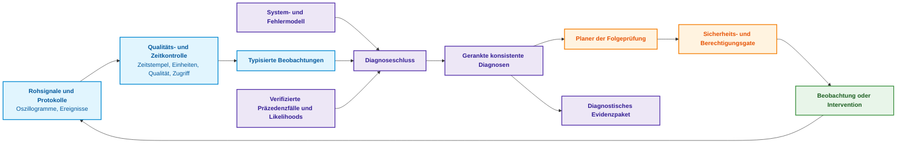
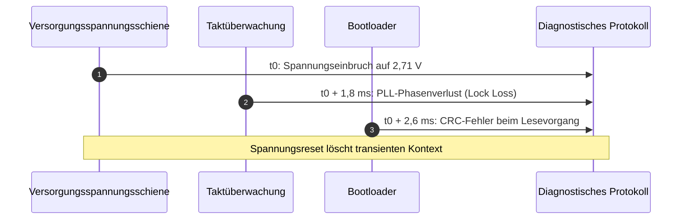
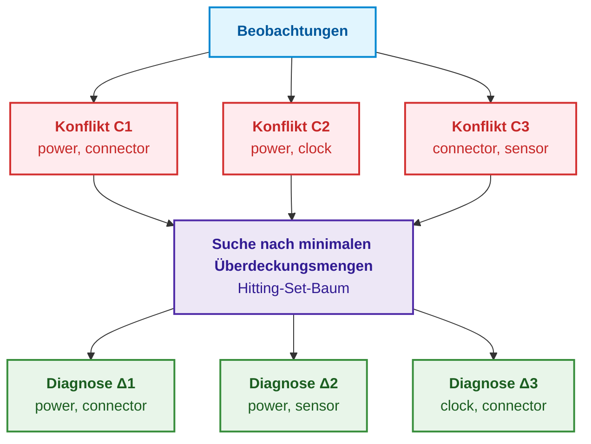
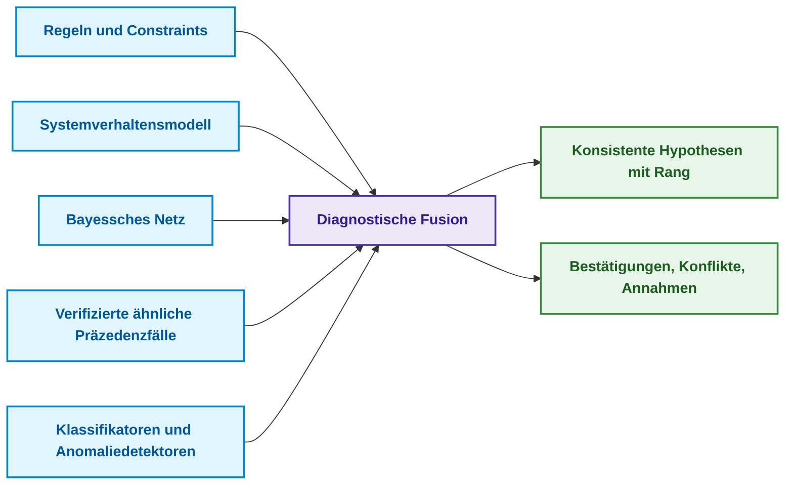
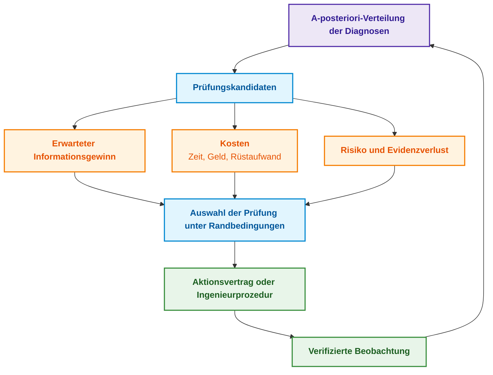

# Kapitel 24. Technische Diagnose: Trennung von Symptom und Ursache unter Unsicherheit

> **Buch:** [Architektur evidenzbasierter Expertensysteme](README.md) · [Teil V: Verifikation, Testen, Diagnose und Sicherheitsbegründung](part-05-verification-and-learning.md)  
> **Vorheriges Kapitel:** [Kapitel 39. Aktiver Compliance-Auditor: Popper’sche Falsifikation, normative Compliance (ASPICE/ISO 26262/ISO 21434) und autonomes Testdesign](ch39-active-compliance-auditor-and-popperian-testing.md)  
> **Nächstes Kapitel:** [Kapitel 27. Sicherheitsbegründung: Synthese und Verifikation von Argumenten](ch27-safety-case-gsn-synthesis.md)  
> **Inhaltsverzeichnis:** [README.md](README.md)  
> **Autor:** [Mykola Fedchyk](about-the-author.md)  
> **Niveau:** Fortgeschritten: Zuverlässigkeits- und Diagnosesystemingenieure, Systemarchitekten  
> **Lernziele:** Symptom, Diagnose und Grundursache präzise differenzieren; Beobachtungen mit Zeitstempel, physikalischer Einheit und Datenqualität formal beschreiben; modellbasierte Diagnosen nach Reiter über Konfliktmengen und minimale Überdeckungsmengen (Hitting Sets) konstruieren; Diagnosen unter Berücksichtigung von Sensorzuverlässigkeiten probabilistisch bewerten und ranken; die optimale Folgeprüfung nach dem Informationswert (VOI) unter Abwägung von Sensitivität, Spezifität, Kosten, Risiko und Evidenzverlust auswählen; passive Beobachtungen von aktiven Interventionen abgrenzen; Ergebnisse aus Protokollanalysen, Anomaliedetektoren und Kausalanalysen korrekt als Beobachtungen oder Hypothesenkandidaten einstufen; bei unzureichender Datenbasis eine begründete Verweigerung (Abstention) ausgeben.

## Abstract

Dieses Kapitel untersucht die architektonischen Prinzipien, formalen Methoden und den mathematischen Apparat der technischen Diagnose in evidenzbasierten Expertensystemen. Es bestimmt die Rolle des modellbasierten Diagnoseschlusses (*Model-Based Diagnosis*, MBD) als Kernkomponente eines Expertensystems, die eine unwiderlegbare Trennung von Primärursachen und Sekundärsymptomen unter unvollständigen und verrauschten empirischen Beobachtungen garantiert.

Nach einer frostigen Nacht startet ein Steuergerät nicht. Das Fehlerprotokoll verzeichnet einen Taktfehler, und das Oszilloskop registriert einen einmaligen, kurzen Spannungseinbruch auf der Versorgungsleitung. Nach einem Kaltstartneustart ist das Phänomen verschwunden. Ein Klassifikator identifiziert den Taktgenerator als wahrscheinlichste Ursache; der Servicetechniker tauscht den Oszillator aus – doch der Fehler tritt erneut auf. Später stellt sich heraus, dass ein instabiler Steckverbinderkontakt den Spannungsabfall verursachte und der Taktfehler lediglich ein Sekundärsymptom war.

Dieses Szenario verdeutlicht, warum Diagnose nicht auf die Suche nach oberflächlich ähnlichen Schadensbildern reduziert werden darf. Das Kapitel beantwortet die Kernfrage: **Wie lassen sich aus unvollständigen und fehlerbehafteten Beobachtungen konsistente Fehlerhypothesen ableiten und die nächste Prüfung auswählen, ohne Symptom und Grundursache zu verwechseln?** Die zentrale These lautet: **Diagnose ist keine Klassifikation, sondern die Ermittlung sämtlicher Erklärungen, die mit dem Systemmodell und den vorliegenden Beobachtungen konsistent sind. Modellkonflikte grenzen den Ursachenraum ein, minimale Überdeckungsmengen liefern die Diagnosekandidaten, Wahrscheinlichkeiten erlauben deren Ranking, und Folgeprüfungen werden nach ihrem Informationswert unter Berücksichtigung von Kosten, Risiken und drohendem Evidenzverlust ausgewählt. Reichen die Daten nicht aus, besteht die einzig korrekte Systemantwort in einer begründeten Verweigerung.**

Das Kapitel beschreibt ein didaktisches Referenzmodell und kein universell vorzertifiziertes Diagnosewerkzeug. Formale Schlüsse gelten ausschließlich innerhalb der Grenzen des formalisierten Modells, der definierten Fehlermodi und der Güte der Messdaten. Wo Fehlentscheidungen Gefahren für Leib und Leben oder Sachwerte bergen, bleiben branchenspezifische Sicherheitsstandards, qualifizierte Messverfahren und die Letztverantwortung des Fachingenieurs unverzichtbar. Im durchgehenden Leitbeispiel existieren mehrere konkurrierende Hypothesen: instabile Spannungsversorgung, fehlerhafte Taktung, Firmwarefehler, Steckverbinderkontaktfehler oder ein Messkanalartefakt – bis hin zum gleichzeitigen Auftreten zweier Defekte. Das Expertensystem liefert kein isoliertes Klassenlabel, sondern ein transparentes Begründungspaket: welche Hypothesen konsistent sind, welche Fakten fehlen und welche Folgeprüfung den höchsten Informationsgewinn verspricht.

## 1. Symptom, Diagnose und Grundursache: Begriffliche Abgrenzung

[Kapitel 6](ch06-applied-mathematics-for-expert-systems.md) führte in die Bayessche Inferenz, Kausalität und den Informationswert ein, [Kapitel 7](ch07-knowledge-base-typology.md) beschrieb Regeln, Fallbeispiele, Constraints sowie probabilistische Modelle, und [Kapitel 20](ch20-explanation-engine.md) erläuterte WHY-NOT-Anfragen und kontrastive Erklärungen. Die technische Diagnose führt diese Mechanismen zu einer eigenständigen Ingenieuraufgabe zusammen, die in der Praxis häufig mit benachbarten Disziplinen verwechselt wird. Die nachfolgende Tabelle grenzt sechs verwandte Aufgabenfelder präzise voneinander ab.

| Aufgabe | Fragestellung | Resultat |
|---|---|---|
| Anomalieerkennung | Weicht das Systemverhalten vom Normalzustand ab? | Anomaliewert oder Ereignismeldung |
| Klassifikation | Welcher bekannten Fehlerklasse ähnelt dieser Fall? | Klassenlabel mit Konfidenzwert |
| Diagnose | Welche Fehlerannahmen bringen das Systemmodell mit den Beobachtungen in Einklang? | Eine oder mehrere konsistente Hypothesen |
| Ursachenanalyse (*Root Cause Analysis*) | Welcher kausale physikalische Mechanismus hat den Vorfall ausgelöst? | Kausale Tatsachenbehauptung mit Prämissen |
| Fehlersuche (*Troubleshooting*) | Was muss als Nächstes geprüft oder repariert werden? | Prüfrichtlinie und Reparaturplan |
| Prognose (*Prognostics*) | Wie und wann wird sich der Systemzustand verschlechtern? | Zustandstrajektorie, Restlebensdauer (*RUL*) |

Die Tabelle verdeutlicht den Irrtum aus der Einleitung: Der Klassifikator löste die zweite Aufgabe, während der Ingenieur Antworten auf die dritte und fünfte Aufgabe benötigte. Die Vorhersage eines Klassifikators kann eine nützliche Heuristik darstellen; eine Punktschätzung von $`P(\text{clock\_fault} \mid \text{trace}) = 0{,}72`$ erklärt jedoch keineswegs, warum der Versorgungsspannungseinbruch zeitlich vor dem Taktverlust auftrat. Eine Grundursache lässt sich nicht daraus ableiten, dass ein Merkmal das höchste Gewicht im Klassifikationsmodell besitzt. Ebenso wenig beweist eine erfolgreiche Einmal-Reparatur die tatsächliche Ursache: Der Eingriff könnte flüchtige Zustände zurückgesetzt oder mehrere physikalische Variablen zugleich verändert haben. Das folgende Diagramm veranschaulicht den vollständigen diagnostischen Zyklus.



Der Regelkreis schließt sich: Jede Prüfung erzeugt eine neue Beobachtung, die erneut die Qualitäts- und Zeitkontrolle durchläuft. Die Zuverlässigkeit des Gesamtsystems steht und fällt daher mit der Qualität dieses ersten Schritts – der Überführung roher Messsignale in semantisch typisierte Beobachtungen.

## 2. Struktur der Eingangsdaten für belastbare Diagnoseschlüsse

Ein technisches Symptom darf niemals als isolierter Textstring wie `voltage low` erfasst werden. Eine minimale, ingenieurmäßig verwertbare Beobachtung spezifiziert das Zielobjekt, die Messvariable, den quantitativen Wert mit physikalischer Einheit, den präzisen Ereigniszeitpunkt, das Messzeitfenster, das Messmittel inklusive Kalibrierungsreferenz, die Datenqualitätsklasse, den kryptografischen Quell-Hash sowie den operativen Kontext:

<details>
<summary>Beispiel einer Beobachtung im YAML-Format</summary>

```yaml
observation_id: obs-boot17-vrail-003
subject: ecu:prototype-17
variable: vrail_3v3
value: 2.71
unit: V
event_time: 2026-08-26T03:14:15.104Z
window: 4.0ms
sensor: scope:lab-2/channel-1
calibration_ref: cal-2026-071
sampling_rate: 100MHz
quality: accepted
source_hash: sha256:<Oszillogramm-Datei-Hash>
context:
  temperature: -18degC
  board_revision: D
  firmware: 9f12c7a
```

</details>

Jedes dieser Felder erfüllt eine unverzichtbare Funktion. Ohne präzisen Zeitstempel lässt sich die Kausalreihenfolge („Erst Spannungseinbruch, dann Takt-Timeout“) nicht rekonstruieren. Ohne physikalische Einheit und Kalibrierungsnachweis ist ein Schwellenwertvergleich mathematisch gegenstandslos. Ohne Angabe der Hardware-Revision und Firmware-Version wendet das Systemmodell unter Umständen veraltete Fehlermodi an. Das Attribut `quality: accepted` besagt dabei nicht, dass der Sensor fehlerfrei ist, sondern belegt die erfolgreiche Durchführung eines definierten Datenzulassungsverfahrens. Das folgende Sequenzdiagramm dokumentiert die zeitliche Abfolge der Ereignisse im Leitbeispiel.



Die zeitliche Abfolge grenzt den Hypothesenraum ein, beweist Kausalität für sich allein jedoch noch nicht. Sensortaktgeber können asynchron laufen, und Pufferungen im Protokolltreiber vertauschen mitunter Protokolleinträge. Aus diesem Grund muss das Systemmodell für jede Datenquelle die jeweilige Taktdomäne und die maximale Zeitstempelunsicherheit explizit führen.

## 3. Modellbasierte Diagnose (MBD): Formalisierung des Systems und der Alternativen

Raymond Reiter begründete die Theorie der modellbasierten Diagnose bzw. der Diagnose aus ersten Prinzipien (*Diagnosis from First Principles*) [[1]](#src-1). Sei $\mathrm{COMP}$ die endliche Menge der Systemkomponenten, $SD$ die formale Systembeschreibung (*System Description*), $\mathrm{OBS}$ die Menge der vorliegenden Beobachtungen und das Prädikat $AB(c)$ die Aussage „Komponente $c$ verhält sich anormal (*abnormal*)“. Werden zunächst alle Komponenten als intakt angenommen, stehen die Beobachtungen im Widerspruch zum Modell:

```math
SD \cup \mathrm{OBS} \cup \{\neg AB(c) \mid c \in \mathrm{COMP}\} \models \bot
```

Formelnotation und Parameter:

- $SD$ ist die formale Systembeschreibung, $\mathrm{OBS}$ ist die Menge der aktuellen Beobachtungen und $\mathrm{COMP}$ ist die Menge aller Systemkomponenten;
- $AB(c)$ besagt, dass die Komponente $c$ defekt ist, während $\neg AB(c)$ ihr fehlerfreies Normalverhalten postuliert;
- $\cup$ bildet die Mengenvereinigung; die Mengenklammern mit $c \in \mathrm{COMP}$ erfassen die Annahme der Intaktheit für alle Komponenten;
- $\models$ bezeichnet die semantische Folgerung, und $\bot$ symbolisiert den logischen Widerspruch.

Eine Diagnose $\Delta \subseteq \mathrm{COMP}$ ist eine Teilmenge von Komponenten, deren angenommener Ausfall die logische Widerspruchsfreiheit des Systems wiederherstellt:

```math
SD \cup \mathrm{OBS} \cup \{AB(c) \mid c \in \Delta\} \cup \{\neg AB(c) \mid c \in \mathrm{COMP} \setminus \Delta\} \nvdash \bot
```

Bedingungen für eine gültige Diagnose:

- $\Delta$ ist eine Teilmenge von $\mathrm{COMP}$; $AB(c)$ nimmt den Ausfall der Komponenten in $\Delta$ an, während $\neg AB(c)$ das ordnungsgemäße Funktionieren aller verbleibenden Komponenten postuliert;
- $SD$ ist die Systembeschreibung, $\mathrm{OBS}$ repräsentiert die Beobachtungen, und $\cup$ verknüpft diese Prämissenmengen;
- $\mathrm{COMP} \setminus \Delta$ bezeichnet die Menge der als intakt angenommenen Komponenten, und $\nvdash \bot$ garantiert, dass aus dieser Gesamtmenge kein Widerspruch abgeleitet werden kann.

Dieser konsistenzbasierte Diagnoseansatz besitzt eine fundamentale Grenze: Die logische Konsistenz beweist nicht, dass $\Delta$ tatsächlich die physikalische Ursache ist, sondern zeigt lediglich, dass die Hypothese $\Delta$ dem kodierten Modell und den Messwerten nicht widerspricht. In der Praxis sucht man typischerweise nach inklusionsminimalen Diagnosen:

```math
\Delta \text{ konsistent} \;\land\; \forall \Delta' \subsetneq \Delta:\ \Delta' \text{ inkonsistent}
```

- Zur Erfüllung der Minimalität muss $\Delta$ eine konsistente Diagnose sein, während $\Delta'$ eine beliebige echte Teilmenge von $\Delta$ bezeichnet;
- $\land$ steht für die logische Konjunktion („und“), $\forall$ für den Allquantor („für alle“), und $\subsetneq$ definiert die echte Teilmengenbeziehung;
- Die Inkonsistenz jeder echten Teilmenge begründet die Minimalität bezüglich Mengeninklusion – nicht zwingend bezüglich der kleinsten Komponentenanzahl.

Eine minimale Diagnose ist keineswegs automatisch die wahrscheinlichste. Eine Einzelfehlerdiagnose {Steckverbinder} und eine Doppelfehlerdiagnose {Oszillator, Sensor} können beide zugleich inklusionsminimal sein. Aus diesem Grund muss die Annahme eines Einzelfehlers stets als explizite Arbeitshypothese deklariert werden und darf keine verdeckte Abkürzung des Inferenzsolvers sein.

## 4. Konfliktberechnung und Reduktion des Hypothesenraums

Als Konflikt (*Conflict Set*) bezeichnet man eine Komponentenmenge $C \subseteq \mathrm{COMP}$, deren Elemente unter den vorliegenden Beobachtungen nicht alle zugleich intakt sein können:

```math
SD \cup \mathrm{OBS} \cup \{\neg AB(c) \mid c \in C\} \models \bot
```

wobei:

- $C$ die Menge der im Konflikt stehenden Kandidatenkomponenten ist, $c$ eine einzelne Komponente bezeichnet und $AB(c)$ deren Fehlverhalten ausdrückt;
- $SD$ die Systembeschreibung darstellt, $\mathrm{OBS}$ die Beobachtungen umfasst und $\neg AB(c)$ die Intaktheit jeder Komponente aus $C$ annimmt;
- $\cup$ die Annahmen vereinigt, $\models$ die logische Folgerung anzeigt und $\bot$ den Widerspruch markiert.

Jede gültige Diagnose muss jeden Konflikt „treffen“ (*hit*), das heißt mindestens eine Komponente aus jedem Konflikt enthalten:

```math
\forall C_i \in \mathcal{C}:\quad \Delta \cap C_i \neq \varnothing
```

- Jede Menge $C_i$ ist ein Konflikt innerhalb der Konfliktfamilie $\mathcal{C}$, und $\Delta$ ist ein Diagnosekandidat;
- $\forall$ bedeutet „für alle“, $\in$ die Mengenzugehörigkeit und $\cap$ die Schnittmenge;
- $\neq \varnothing$ besagt, dass die Schnittmenge nicht leer ist: Die Diagnose muss mindestens eine Komponente jedes Konflikts umfassen.

Reiter bewies, dass minimale Diagnosen genau den minimalen Überdeckungsmengen (*Minimal Hitting Sets*) der Konfliktfamilie entsprechen [[1]](#src-1). Johan de Kleer und Brian C. Williams erweiterten dieses Paradigma in der General Diagnostic Engine (GDE) auf Mehrfachfehler und ergänzten es um probabilistische Kandidatenbewertungen [[2]](#src-2). Die Konflikte werden in GDE über ein Assumption-based Truth Maintenance System (ATMS) berechnet [[3]](#src-3). Für das Kaltstartszenario liefert das Systemmodell drei Konflikte:

```math
C_1 = \{\text{power}, \text{connector}\}, \qquad C_2 = \{\text{power}, \text{clock}\}, \qquad C_3 = \{\text{connector}, \text{sensor}\}
```

- In diesem Szenario sind $C_1$, $C_2$ und $C_3$ die drei ermittelten Konfliktmengen;
- `power` bezeichnet die Versorgungsspannung, `connector` den Steckverbinder, `clock` die Takterzeugung und `sensor` den Messkanal;
- $=$ definiert die Mengengleichheit, und Kommata trennen die Komponenten innerhalb jedes Konflikts.

Die minimalen Überdeckungsmengen lauten folglich {power, connector}, {power, sensor} und {clock, connector}. Das nachfolgende Diagramm veranschaulicht, wie aus den drei Konflikten genau drei minimale Diagnosen hervorgehen.



Keine einzelne Komponente deckt alle drei Konflikte ab: `power` ist nicht in $C_3$ enthalten, `connector` nicht in $C_2$. Jede minimale Diagnose erfordert hier folglich mindestens zwei Fehler. Diese Diagnosen stellen keine unmittelbaren Reparaturanweisungen dar: Sie zeigen auf, welche Fehlerannahmen die Konflikte formal erklären, wobei das Fehlermodell unvollständig und die Granularität der Komponentenzerlegung zu grob sein kann. Bei komplexen Systemgraphen führt die vollständige Aufzählung zu kombinatorischer Explosion. Man nutzt daher inkrementelle Konfliktberechnung, Schranken für die Fehlerkardinalität, hierarchische Abstraktionen und A-priori-Wahrscheinlichkeiten. Solche Beschränkungen müssen stets transparent ausgewiesen werden: Ein Hinweis wie „Hypothesen mit mehr als zwei simultanen Fehlern wurden nicht berechnet“ gehört zwingend in das Evidenzpaket.

Selbst etablierte Algorithmen bedürfen der formalen Prüfung. Reiters ursprüngliches Verfahren zur Hitting-Set-Baum-Generierung nutzte Schnittregeln zur Astbeschneidung. Russell Greiner, Barbara A. Smith und Ralph W. Wilkerson wiesen nach, dass diese Schnittregeln unter bestimmten Bedingungen – insbesondere wenn die Konsistenzprüfung nicht-minimale Konflikte zurückgibt – Äste mit minimalen Diagnosen fälschlich verwerfen. Sie entwickelten den korrigierten HS-DAG (*Hitting Set Directed Acyclic Graph*) und bewiesen dessen Korrektheit [[4]](#src-4). Für industrielle Implementierungen folgt daraus: Diagnosealgorithmen für große Modelle müssen an Referenzmodellen gegen vollständige Traversierungen abgeglichen werden; Diskrepanzen deuten auf Implementierungsfehler hin.

> [!NOTE] Vermeidung von „Blindtausch auf Verdacht“ (Shotgun Maintenance) durch das Reiter-Modell
> Im technischen Kundendienst führt Zeitdruck häufig zum unkoordinierten Komponententausch auf Basis von Oberflächensymptomen: „Das Oszilloskop zeigt Taktprobleme – wir tauschen den Quarz; Fehler bleibt – wir tauschen den Mikrocontroller; Fehler bleibt – wir tauschen das Netzteil“. Dies vervielfacht nicht nur die Reparaturkosten, sondern provoziert durch mechanische Eingriffe zusätzliche Sekundärdefekte.
> Der mathematische Apparat von Reiter liefert eine strikte Invariante: Liegt die Konfliktmenge $\{C_1, C_2, C_3\}$ vor, **muss** jede reale Ursache $\Delta$ eine Überdeckungsmenge bilden (also jedes $C_i$ schneiden). Scheidet eine Komponente einen Konflikt nicht, scheidet sie als alleinige Ursache deterministisch aus – noch bevor ein Techniker Werkzeug ansetzt.

### 4.1. Konflikte zwischen verschiedenen Spezifikationsebenen

In softwareintensiven Kommunikationssystemen und Protokoll-Gateways treten häufig sogenannte Scheinausfälle auf: Die Hardware arbeitet einwandfrei, verwirft jedoch Pakete oder beendet Verbindungen. Die Ursache liegt oft in kollidierenden Spezifikationen unterschiedlicher Hersteller. In diesen Fällen operiert die Diagnose nicht auf Hardwarekomponenten, sondern auf Normen und Schnittstellendokumenten.

Der erste Fall betrifft Versionierungsinkompatibilitäten. Implementiert eine Gegenstelle RFC 793 und die andere eine moderne TCP-Spezifikation, prüft die Inferenzmaschine den Versionsgraphen: RFC 9293 ersetzt (*obsoletes*) RFC 793 und aktualisiert RFC 5961 zur Abwehr von Blind-In-Window-Angriffen [[5]](#src-5). Die Diagnose lautet dann nicht auf Hardwaredefekt, sondern auf Versionsinkompatibilität:

```math
\mathrm{Obsoletes}(D_2, D_1) \Rightarrow \mathrm{Status}(D_1.\mathrm{norm}) = \mathrm{Superseded}
```

- In dieser Relation repräsentieren $D_1$ und $D_2$ Dokumente, und $D_1.\mathrm{norm}$ bezeichnet eine spezifische Normvorgabe aus Dokument $D_1$;
- $\mathrm{Obsoletes}(D_2, D_1)$ drückt aus, dass Dokument $D_2$ das Dokument $D_1$ formell außer Kraft setzt;
- $\Rightarrow$ ist die logische Implikation, $\mathrm{Status}$ ermittelt den normativen Status, und $\mathrm{Superseded}$ markiert die Norm als abgelöst.

Der zweite Fall betrifft deontische Normkollisionen. Sind beide Dokumente formal gültig, schreibt jedoch eines das Verhalten $p$ zwingend vor, während das andere es untersagt ($`\mathcal{O}(p)`$ versus $`\mathcal{F}(p)`$), generiert das Expertensystem einen Bericht über normative Kollisionen mit exakten Byte-Zitaten beider Quellen, wie in [Kapitel 15](ch15-knowledge-extraction-and-kb-construction.md) dargelegt. Der dritte Fall betrifft Ausnahmebedingungen: Weist eine Regel Klauseln wie „sofern Bedingung nicht erfüllt“ auf, prüft die Diagnosemaschine anhand der Telemetriedaten, ob der Verbindungsabbruch eine spezifikationsgerechte Ausnahmereaktion darstellte.

## 5. Probabilistisches Ranking konsistenter Diagnosen

Liegen verlässliche Ausfallstatistiken oder Likelihood-Schätzungen vor, werden die konsistenten Diagnosen mittels des Satzes von Bayes gerankt:

```math
P(H_i \mid E) = \frac{P(E \mid H_i)\, P(H_i)}{\sum_j P(E \mid H_j)\, P(H_j)}
```

- In der Bayes-Formel bezeichnet $H_i$ die $i$-te Fehlerhypothese und $E$ die Gesamtheit der vorliegenden Beobachtungen (*Evidence*);
- $P(H_i)$ ist die A-priori-Wahrscheinlichkeit der Hypothese in der betrachteten Grundgesamtheit, während $P(E \mid H_i)$ die Likelihood der Beobachtungen unter dieser Hypothese quantifiziert;
- $P(H_i \mid E)$ ist die A-posteriori-Wahrscheinlichkeit nach Einbeziehung der Beobachtungen; alle Wahrscheinlichkeiten liegen im Intervall $[0, 1]$;
- $\sum_j$ summiert über alle Hypothesen $H_j$ und normalisiert die Werte zu einer echten Wahrscheinlichkeitsverteilung.

Illustratives Rechenbeispiel: Gelte $`P(H) = 0{,}1`$, $`P(E \mid H) = 0{,}8`$, $`P(\neg H) = 0{,}9`$ und $`P(E \mid \neg H) = 0{,}2`$. Dann ergibt sich $`P(H \mid E) = 0{,}08 / (0{,}08 + 0{,}18) \approx 0{,}308`$. Die Beobachtung $E$ erhöht die Wahrscheinlichkeit der Hypothese von 0,1 auf etwa 0,308.

Ausfallraten anderer Baugruppenrevisionen oder abweichender Einsatzbedingungen dürfen nicht unkritisch als A-priori-Werte übernommen werden. Bei simultanen Mehrfachfehlern erfordert die stochastische Unabhängigkeit:

```math
P(H_a \land H_b) = P(H_a)\, P(H_b)
```

- Unabhängigkeit ist hier eine explizite Modellannahme über zwei Ausfallhypothesen $H_a$ und $H_b$;
- $\land$ bezeichnet das gemeinsame Eintreten beider Ereignisse, und $P(\cdot)$ ist das Wahrscheinlichkeitsmaß;
- $=$ gilt strikt nur bei stochastischer Unabhängigkeit.

Für unabhängige Wahrscheinlichkeiten $`P(H_a) = 0{,}1`$ und $`P(H_b) = 0{,}2`$ beträgt die Verbundwahrscheinlichkeit $`0{,}1 \cdot 0{,}2 = 0{,}02`$. Dies bleibt eine Modellannahme: Gemeinsame Ursachen (*Common Cause Failures*) wie Feuchtigkeit, Einschaltstromspitzen oder fehlerhafte Bauteilchargen induzieren signifikante stochastische Abhängigkeiten.

### 5.1. Diagnose unter Berücksichtigung von Messkanalfehlern und Sensorausfällen

Die Beobachtung eines Alarms `alarm = 1` hängt sowohl vom tatsächlichen Fehler $F$ als auch von den Übertragungseigenschaften des Sensors ab:

```math
P(\mathrm{alarm} = 1 \mid F) = \text{Sensitivität}, \qquad P(\mathrm{alarm} = 1 \mid \neg F) = 1 - \text{Spezifität}
```

- $F$ bezeichnet das reale Vorliegen des Fehlers, $\mathrm{alarm} = 1$ die Alarmauslösung und $\neg F$ den Normalzustand;
- $P(A \mid B)$ quantifiziert die bedingte Wahrscheinlichkeit von $A$ gegeben $B$;
- Die Sensitivität entspricht der Richtig-Positiv-Rate bei Vorliegen des Fehlers; die Spezifität entspricht der Richtig-Negativ-Rate im fehlerfreien Zustand;
- $1 - \text{Spezifität}$ ist die Falsch-Positiv-Rate im Normalzustand, und $\mid$ liest sich als „unter der Bedingung“.

Wird ein Alarm ungeprüft als unfehlbares Faktum interpretiert, setzt das Expertensystem die Wahrscheinlichkeit plausibler Alternativen unzulässig auf null. Ein Sensordefekt muss daher als reguläre Hypothese im Modell geführt werden (im Beispiel die Komponente `sensor`). Auch Kalibrierunsicherheiten und Ausfallmechanismen des Kanals fließen ein: Ein Telemetriepaket, das aufgrund eines Spannungsausfalls im Bus-Controller ausbleibt, ist kein zufälliger Datenverlust (*Missing Completely at Random*).

Die probabilistische Ausgabe der Diagnose muss empirisch kalibriert sein. Für $K$ Diagnosen und $N$ Validierungsfälle quantifiziert der Brier-Score die Vorhersagegüte [[6]](#src-6):

```math
BS = \frac{1}{N} \sum_{n=1}^{N} \sum_{k=1}^{K} (p_{nk} - y_{nk})^2
```

Größen und Wertebereiche:

- $BS$ ist der Brier-Score; ein niedrigerer Wert repräsentiert einen geringeren quadratischen Vorhersagefehler;
- $N$ ist die Fallanzahl, $K$ die Anzahl der Diagnoseklassen, $n$ indiziert den Fall und $k$ die Diagnose;
- $p_{nk}$ ist die prognostizierte Wahrscheinlichkeit für Diagnose $k$ im Fall $n$; $y_{nk}$ beträgt 1 für das zutreffende Ereignis und 0 für alle anderen [[6]](#src-6);
- $\sum$ aggregiert die quadratischen Abweichungen; die Division durch $N$ mittelt über alle Fälle. Für disjunkte Klassen liegt der Score im Intervall $[0, 2]$.

**Praktische Anwendung und ingenieurtechnische Schlussfolgerungen (Closed-Loop Decision):**
1. **Routingkriterien und Kalibrierungsmodi:**
   - **$BS \le 0{,}10$ (Hohe Kalibrierungsgüte):** Die Wahrscheinlichkeitsausgabe ist validiert; das System darf gerankte Wahrscheinlichkeitswerte autonom an das Leitstandpersonal ausgeben;
   - **$0{,}10 < BS \le 0{,}25$ (Moderate Abweichung):** Bedingte Freigabe; das System schaltet automatisch eine Kalibrierungsschicht (Isotonische Regression oder Platt-Skalierung) vor, bevor Wahrscheinlichkeiten an Planungsmodule übergeben werden;
   - **$BS > 0{,}25$ (Unkalibriert oder irreführend):** Numerische Wahrscheinlichkeitsanzeigen werden gesperrt; das System wechselt zwingend in den konservativen Modus einer rein qualitativen, deterministischen Konfliktaufzählung ohne Vertrauensgewichte.
2. **Praktisches Zahlenbeispiel (Worked Numerical Example):** Für einen Testfall mit zwei alternativen Diagnosen und der Vorhersage $(0{,}80; 0{,}20)$ bei tatsächlichem Ground-Truth-Zustand $(1; 0)$ beträgt der Score $`(0{,}80 - 1)^2 + (0{,}20 - 0)^2 = 0{,}04 + 0{,}04 = 0{,}08 \le 0{,}10`$. **Systemaktion:** Der Messkanal gilt als hinreichend kalibriert; die Schwelle für den autonomen Diagnosebetrieb ist erfüllt.

Der Brier-Score misst die Kalibrierung innerhalb bekannter Klassen, garantiert jedoch nicht die Vollständigkeit des Modells: Ein System kann exzellent kalibriert sein und dennoch an einer unberücksichtigten Fehlerklasse scheitern.

## 6. Kombination von Regeln, Fallbeispielen und maschinellem Lernen in der Diagnose

Ein belastbares diagnostisches Schließen integriert unterschiedliche Wissensrepräsentationen, wie das folgende Architekturdiagramm zeigt.



Jede Wissensquelle besitzt spezifische Stärken und operationelle Grenzen:

- **Regeln und Constraints** kodieren harte physikalische Invarianten und deterministische Symptommuster.
- **Systemverhaltensmodelle** generieren Soll-Werte, Verhaltensabweichungen und Konfliktmengen.
- **Bayessche Netze** modellieren stochastische Unsicherheiten und kausale Abhängigkeiten zwischen Fehlern [[7]](#src-7).
- **Fallbasiertes Schließen (*Case-Based Reasoning*, CBR)** erschließt dokumentierte historische Reparaturerfahrungen, verlangt jedoch eine systematische Adaption an den aktuellen Kontext: Der Zyklus „Retrieve, Reuse, Revise, Retain“ folgt der Methodik von Aamodt und Plaza [[8]](#src-8).
- **Maschinelles Lernen** erkennt komplexe Muster in Rohsignalen und Protokolldaten; seine Ausgaben sind statistische Indizien, jedoch keine Kausalbeweise.
- **Wissensgraphen** sichern die Systemtopologie, Komponentenabstammung und Versionierung.

Eine essenzielle Ergänzung bildet die Fehlerbaumanalyse (*Fault Tree Analysis*, FTA), die ausgehend von einem unerwünschten Spitzenereignis (*Top Event*) top-down alle ursächlichen Fehlerkombinationen aufschlüsselt [[9]](#src-9). Entwicklungsbegleitend erstellte Fehlerbäume liefern dem Systemmodell einen fundierten Satz initialer Fehlermodi. Große Sprachmodelle (LLMs) eignen sich zur Strukturierung textueller Fehlerberichte, zum Auffinden relevanter Handbucheinträge und zur Formulierung der Abschlussberichte, dürfen jedoch keinesfalls eigenmächtig neue Fehlermodi postulieren oder Kausalitätsurteile fällen. Jeder textuell generierte Kandidat muss die Quellenbindung nach [Kapitel 19](ch19-from-question-to-evidence.md) durchlaufen.

## 7. Zeitliche Dynamik und Ereignisabfolgen im Diagnoseschluss

Intermittierende Fehler hängen von verborgenen internen Systemzuständen $z_t$ ab: Kaltzustand, Erwärmung, instabiler Betrieb, Nominalbetrieb. Ein Hidden-Markov-Modell (HMM) beschreibt die Verbundverteilung von Zuständen und Beobachtungen $o_t$ über diskrete Zeitschritte [[10]](#src-10):

```math
P(z_{1:T}, o_{1:T}) = P(z_1) \prod_{t=2}^{T} P(z_t \mid z_{t-1}) \prod_{t=1}^{T} P(o_t \mid z_t)
```

Zeitliche Parameter und Notationen:

- $z_t$ ist der verborgene Systemzustand zum Zeitpunkt $t$, $o_t$ die zugehörige Beobachtung, und $1:T$ umfasst die Zeitreihe von Schritt 1 bis $T$;
- $P(z_{1:T}, o_{1:T})$ ist die Verbundwahrscheinlichkeit der Zustands- und Beobachtungssequenzen, und $P(z_1)$ definiert die Anfangsverteilung;
- $P(z_t \mid z_{t-1})$ bezeichnet die Zustandsübergangswahrscheinlichkeit, $P(o_t \mid z_t)$ die Emissionswahrscheinlichkeit der Beobachtung unter Zustand $z_t$; beide liegen in $[0, 1]$;
- $\prod$ bildet das Produkt über die angegebenen Indexbereiche, wobei $t$ den diskreten Zeitschritt indiziert.

Der Viterbi-Algorithmus ermittelt die wahrscheinlichste Zustandssequenz, während Glättungsverfahren die Zustandswahrscheinlichkeit $P(z_t \mid o_{1:T})$ unter Berücksichtigung späterer Beobachtungen rekonstruieren. Markov- und Stationaritätsannahmen müssen ingenieurmäßig validiert werden; für asynchrone Ereignisse sind temporale Logiken oder Zustandsraummodelle mit expliziter Uhrenasynchronität oft besser geeignet.

Dynamische Modelle ermöglichen die Differenzierung zwischen vorgelagerten Primärursachen und nachgelagerten Folgesymptomen, zwischen permanenten Hardwaredefekten und transienten Störungen sowie zwischen echter Fehlerbehebung und flüchtigem Symptomverschwinden. Ein Kaltstart-Reset verändert den internen Systemzustand und bricht die Beobachtungstrajektorie ab. Das Gebot „Zustandsdaten vor dem Neustart sichern“ ist daher kein empirischer Ratschlag, sondern eine fundamentale Sicherheitsinvariante zur Beweissicherung.

## 8. Optimierung der Folgeprüfung nach dem Informationswert (VOI)

Existieren mehrere konsistente Diagnosen, muss die nächste diagnostische Maßnahme optimal gewählt werden. Die verbleibende diagnostische Unsicherheit bemisst sich über die Shannon-Entropie [[11]](#src-11):

```math
H(\mathcal{H} \mid E) = -\sum_i P(H_i \mid E) \log_2 P(H_i \mid E)
```

- Die Entropie $H(\mathcal{H} \mid E)$ quantifiziert die verbleibende Ungewissheit bezüglich der Hypothesenmenge $\mathcal{H}$ nach Vorliegen der Beobachtungen $E$;
- $P(H_i \mid E)$ ist die A-posteriori-Wahrscheinlichkeit der Hypothese $H_i$, und $\sum_i$ summiert über alle Hypothesen;
- $\log_2$ ist der Logarithmus zur Basis 2; das negative Vorzeichen sichert die Nichtnegativität; das Ergebnis liegt zwischen 0 und $\log_2|\mathcal{H}|$ Bit.

Rechenbeispiel: Zwei gleich wahrscheinliche Hypothesen mit je $P = 0{,}5$ besitzen eine Entropie von $`-2 \cdot 0{,}5 \log_2(0{,}5) = 1`$ Bit.

Der erwartete Informationsgewinn (*Information Gain*, IG) einer Prüfung $T$ mit möglichen Ausgängen $o$ entspricht der erwarteten Entropiereduktion:

```math
IG(T) = H(\mathcal{H} \mid E) - \sum_o P(o \mid E, T)\, H(\mathcal{H} \mid E, o, T)
```

- Für die Prüfung $T$ quantifiziert $IG(T)$ den erwarteten Informationsgewinn in Bit;
- $o$ iteriert über alle möglichen Prüfresultate; $P(o \mid E, T)$ ist die Wahrscheinlichkeit des Ergebnisses $o$ unter den bisherigen Beobachtungen und der gewählten Prüfung;
- $H(\mathcal{H} \mid E)$ ist die aktuelle Systementropie, und $H(\mathcal{H} \mid E, o, T)$ ist die Restentropie nach Eintreffen des Prüfergebnisses $o$;
- $\sum_o$ ermittelt die erwartete Restentropie, die von der Ausgangsentropie subtrahiert wird.

Beispiel: Beträgt die Ausgangsentropie 1 Bit und diskriminiert ein idealer Test die beiden Hypothesen fehlerfrei (Restentropie 0), beträgt der Informationsgewinn $`1 - 0 = 1`$ Bit.

Die Prüfung mit dem höchsten theoretischen Informationsgewinn kann jedoch übermäßig teuer, zeitaufwendig oder riskant sein. Die reale Nützlichkeit (*Utility*) balanciert Informationsgewinn gegen Zeit-, Finanz-, Risiko- und Evidenzverlustkosten aus:

```math
U(T) = \mathbb{E}[\Delta L_{\text{decision}} \mid T] - C_{\text{time}}(T) - C_{\text{money}}(T) - C_{\text{risk}}(T) - C_{\text{evidence loss}}(T)
```

- $U(T)$ definiert die Nettonützlichkeit der Prüfung $T$, und $\mathbb{E}[\Delta L_{\text{decision}} \mid T]$ beziffert die erwartete Reduktion des Fehlentscheidungsverlusts;
- $C_{\text{time}}$, $C_{\text{money}}$, $C_{\text{risk}}$ und $C_{\text{evidence loss}}$ erfassen die Kosten für Zeitaufwand, finanzielle Mittel, Sicherheitsrisiken und drohenden Evidenzverlust;
- $\mathbb{E}$ ist der Erwartungswertoperator; alle Kostenkomponenten sind auf eine einheitliche Nützlichkeitsskala normiert;
- $T^*$ bezeichnet die optimale Prüfaktion, $\arg\max$ wählt das Argument mit dem maximalen Nützlichkeitswert, und $T_{\text{allowed}}$ umfasst alle zulässigen Prüfverfahren.

**Praktische Anwendung und ingenieurtechnische Schlussfolgerungen (Closed-Loop Decision):**
1. **Entscheidungsregel für Folgeprüfung oder Diagnoseabbruch:**
   - **Gilt $\max_{T \in T_{\text{allowed}}} U(T) > 0$:** Das System bestimmt die optimale Prüfung $T^* = \arg\max_{T \in T_{\text{allowed}}} U(T)$ und generiert eine Handlungsanweisung an den Techniker (oder sendet einen Prüfbefehl an die Telemetrie-Schnittstelle);
   - **Gilt $\max_{T \in T_{\text{allowed}}} U(T) \le 0$:** **Abbruchkriterium (*Stopping Criterion*)**. Jede weitere Messung verursacht höhere Gesamtkosten als der erwartete Erkenntnisgewinn. Der Diagnoseprozess stoppt unmittelbar: Das System deklariert die aktuell wahrscheinlichste Hypothese als Endergebnis oder eskaliert an einen Experten mit Angabe der verbliebenen Restunsicherheiten.
2. **Praktisches Zahlenbeispiel (Worked Numerical Example):** Für eine Prüfung mit Schadensreduktion $0{,}80$ und Gesamtkosten $0{,}20 + 0{,}10 + 0{,}10 + 0{,}10 = 0{,}50$ beträgt die Nettonützlichkeit $U(T) = 0{,}80 - 0{,}50 = 0{,}30 > 0$. Die Prüfung wird zur Durchführung freigegeben. Führt ein invasiver Härtetest dagegen zu einem Risikokostenwert von $C_{\text{risk}} = 0{,}90 \implies U(T') = 0{,}80 - 1{,}30 = -0{,}50 < 0$, blockiert das System die Durchführung als unvertretbar riskant.

Dieser entscheidungstheoretische Ansatz zur Fehlersuche wurde maßgeblich von Heckerman, Breese und Rommelse geprägt [[12]](#src-12); Breese und Heckerman erweiterten ihn auf die Wahl zwischen Reparatur- und Prüfaktionen [[13]](#src-13). Auch de Kleers GDE nutzte minimale Entropie zur Messpunktselektion [[2]](#src-2).

Reale Messungen sind selten fehlerfrei. Eine Prüfung wird daher analog zu Sensoren über Sensitivität und Spezifität bezüglich der untersuchten Komponente charakterisiert. Die Wahrscheinlichkeit eines positiven Befunds unter Diagnose $\Delta$ lautet:

```math
P(o = + \mid \Delta, T) = \begin{cases} s_T, & c_T \in \Delta \\ 1 - q_T, & c_T \notin \Delta \end{cases}
```

- Für die Prüfung $T$ identifiziert $c_T$ die geprüfte Zielkomponente und $\Delta$ die angenommene Diagnose;
- $o = +$ markiert das Resultat „Fehler erkannt“, $s_T$ ist die Sensitivität der Prüfung und $q_T$ ihre Spezifität; beide Werte liegen in $[0, 1]$;
- Die Fallunterscheidung trennt Fälle, in denen die Komponente Teil der Diagnose ist ($\in$), von jenen, in denen sie es nicht ist ($\notin$).

Rechenbeispiel: Eine Prüfung mit Sensitivität 0,90 und Spezifität 0,95 meldet einen Fehler mit 90 % Wahrscheinlichkeit, wenn die Komponente defekt ist, und mit 5 % Wahrscheinlichkeit (Falsch-Positiv), wenn sie intakt ist. Das Gesamtergebnis $P(o \mid E, T)$ in der Informationsgewinnformel ergibt sich als gewichtete Summe über alle Diagnosen. Eine fehlerbehaftete Prüfung teilt den Hypothesenraum somit nicht scharf in zwei Hälften, sondern verschiebt lediglich die Wahrscheinlichkeitsgewichte.

Das nachfolgende Go-Programm implementiert den vollständigen Analysepfad für das Kaltstartszenario. Es berechnet die minimalen Diagnosen als Hitting Sets über drei Konflikte und bewertet sie anhand unabhängiger A-priori-Ausfallraten: Spannungsversorgung 2 %, Steckverbinder 5 %, Taktung 3 %, Sensor 4 %. Anschließend vergleicht das Programm vier Prüfoptionen jeweils idealisiert und unter realistischen Fehlergrenzen. Die mechanische Steckverbinderprüfung unter Erwärmung weist eine geringere Sensitivität von 0,70 auf, da Kontaktprobleme thermisch nicht deterministisch reproduzierbar sind. Ein Geräteneustart liefert keinerlei Differenzierungskraft und birgt hohe Kosten durch Evidenzzerstörung. Der zugehörige Test `main_test.go` verifiziert die Kerninvarianten: exakt drei minimale Doppelfehlerdiagnosen, Übereinstimmung des idealen Informationsgewinns, Dämpfung durch Messunsicherheit und verschwindender Informationsgewinn beim Neustart.

<details>
<summary>Go-Implementierung: Minimale Diagnosen und Auswahl der Folgeprüfung</summary>

```go
package main

import (
	"fmt"
	"math"
	"sort"
	"strings"
)

var comps = []string{"power", "connector", "clock", "sensor"}

// conflicts: Mengen von Komponenten, die nicht alle zugleich intakt sein können.
var conflicts = [][]string{{"power", "connector"}, {"power", "clock"}, {"connector", "sensor"}}

// prior: A-priori-Wahrscheinlichkeit des Ausfalls jeder Komponente (Beispielwerte).
var prior = map[string]float64{"power": 0.02, "connector": 0.05, "clock": 0.03, "sensor": 0.04}

type Diagnosis map[string]bool

func hits(d Diagnosis) bool {
	for _, c := range conflicts {
		ok := false
		for _, x := range c {
			ok = ok || d[x]
		}
		if !ok {
			return false
		}
	}
	return true
}

// minimalDiagnoses traversiert alle Teilmengen und filtert minimale Überdeckungsmengen heraus.
func minimalDiagnoses() []Diagnosis {
	var all []Diagnosis
	for mask := 1; mask < 1<<len(comps); mask++ {
		d := Diagnosis{}
		for i, c := range comps {
			if mask&(1<<i) != 0 {
				d[c] = true
			}
		}
		if hits(d) {
			all = append(all, d)
		}
	}
	var min []Diagnosis
	for _, d := range all {
		minimal := true
		for _, e := range all {
			if len(e) < len(d) && subset(e, d) {
				minimal = false
			}
		}
		if minimal {
			min = append(min, d)
		}
	}
	return min
}

func subset(a, b Diagnosis) bool {
	for k := range a {
		if !b[k] {
			return false
		}
	}
	return true
}

func name(d Diagnosis) string {
	var s []string
	for _, c := range comps {
		if d[c] {
			s = append(s, c)
		}
	}
	return "{" + strings.Join(s, ", ") + "}"
}

func entropy(p []float64) float64 {
	h := 0.0
	for _, x := range p {
		if x > 0 {
			h -= x * math.Log2(x)
		}
	}
	return h
}

// posterior bewertet die minimalen Diagnosen unter Annahme unabhängiger A-priori-Raten.
func posterior(diags []Diagnosis) []float64 {
	post := make([]float64, len(diags))
	sum := 0.0
	for i, d := range diags {
		p := 1.0
		for _, c := range comps {
			if d[c] {
				p *= prior[c]
			} else {
				p *= 1 - prior[c]
			}
		}
		post[i] = p
		sum += p
	}
	for i := range post {
		post[i] /= sum
	}
	return post
}

type Test struct {
	name        string
	reveals     string  // Geprüfte Komponente; leer bedeutet nicht-diskriminierende Aktion
	sensitivity float64 // P(Ergebnis positiv | Komponente defekt)
	specificity float64 // P(Ergebnis negativ | Komponente intakt)
	cost        float64 // Zeit, Geld, Risiko und Evidenzverlust in standardisierten Einheiten
}

// infoGain berechnet die erwartete Entropiereduktion unter Berücksichtigung von Testfehlern.
func infoGain(diags []Diagnosis, post []float64, t Test) float64 {
	if t.reveals == "" {
		return 0
	}
	h0 := entropy(post)
	expected := 0.0
	for _, positive := range []bool{true, false} {
		joint := make([]float64, len(diags))
		pOutcome := 0.0
		for i, d := range diags {
			like := 1 - t.specificity
			if d[t.reveals] {
				like = t.sensitivity
			}
			if !positive {
				like = 1 - like
			}
			joint[i] = post[i] * like
			pOutcome += joint[i]
		}
		if pOutcome == 0 {
			continue
		}
		for i := range joint {
			joint[i] /= pOutcome
		}
		expected += pOutcome * entropy(joint)
	}
	return h0 - expected
}

func main() {
	diags := minimalDiagnoses()
	post := posterior(diags)
	order := make([]int, len(diags))
	for i := range order {
		order[i] = i
	}
	sort.Slice(order, func(a, b int) bool { return post[order[a]] > post[order[b]] })
	for _, i := range order {
		fmt.Printf("Diagnose %-20s A-posteriori-Wahrscheinlichkeit %.3f\n", name(diags[i]), post[i])
	}
	fmt.Printf("Entropie vor dem Test: %.3f Bit\n\n", entropy(post))

	tests := []Test{
		{"synchrone Erfassung von Versorgung und Takt", "power", 0.90, 0.95, 0.10},
		{"Austausch des Messkopfes", "sensor", 0.95, 0.95, 0.08},
		{"mechanische Steckerprüfung mit Erwärmung", "connector", 0.70, 0.97, 0.20},
		{"Geräteneustart", "", 0, 0, 0.51},
	}
	fmt.Printf("%-44s %9s %9s %9s %11s\n", "Prüfung", "IG ideal", "IG real", "Kosten", "Nützlichkeit")
	best, bestU := "", math.Inf(-1)
	for _, t := range tests {
		ideal := t
		ideal.sensitivity, ideal.specificity = 1, 1
		ig := infoGain(diags, post, t)
		u := ig - t.cost
		fmt.Printf("%-44s %9.3f %9.3f %9.2f %+11.3f\n", t.name, infoGain(diags, post, ideal), ig, t.cost, u)
		if u > bestU {
			best, bestU = t.name, u
		}
	}
	fmt.Println("\nNächste Prüfung:", best)
}
```

Die Testsuite wird als `main_test.go` gespeichert und mit `go test .` ausgeführt.

```go
package main

import (
	"math"
	"testing"
)

func TestDiagnosesAndInformationGain(t *testing.T) {
	diags := minimalDiagnoses()
	if len(diags) != 3 {
		t.Fatalf("expected 3 minimal diagnoses, got %d", len(diags))
	}
	for _, d := range diags {
		if len(d) != 2 || !hits(d) {
			t.Fatalf("diagnosis %s is not a two-fault hitting set", name(d))
		}
	}
	post := posterior(diags)
	ideal := map[string]float64{"power": 0.995, "sensor": 0.794, "connector": 0.794}
	for comp, want := range ideal {
		perfect := Test{reveals: comp, sensitivity: 1, specificity: 1}
		noisy := Test{reveals: comp, sensitivity: 0.9, specificity: 0.9}
		gotIdeal := infoGain(diags, post, perfect)
		if math.Abs(gotIdeal-want) > 0.001 {
			t.Fatalf("%s: ideal IG %.3f, want %.3f", comp, gotIdeal, want)
		}
		if gotNoisy := infoGain(diags, post, noisy); gotNoisy >= gotIdeal || gotNoisy <= 0 {
			t.Fatalf("%s: noisy IG %.3f must be in (0, %.3f)", comp, gotNoisy, gotIdeal)
		}
	}
	if ig := infoGain(diags, post, Test{reveals: ""}); ig != 0 {
		t.Fatalf("restart must not separate diagnoses, IG %.3f", ig)
	}
	coin := Test{reveals: "power", sensitivity: 0.5, specificity: 0.5}
	if ig := infoGain(diags, post, coin); math.Abs(ig) > 1e-12 {
		t.Fatalf("uninformative test must give zero IG, got %.3g", ig)
	}
}
```

</details>

Die Ausführung von `go run .` in einem initialisierten Go-Modul (`go mod init ch24diag`) liefert folgendes Ergebnis:

<details>
<summary>Konsolenausgabe des Programms</summary>

```text
Diagnose {connector, clock}   A-posteriori-Wahrscheinlichkeit 0.458
Diagnose {power, connector}   A-posteriori-Wahrscheinlichkeit 0.302
Diagnose {power, sensor}      A-posteriori-Wahrscheinlichkeit 0.239
Entropie vor dem Test: 1.531 Bit

Prüfung                                      IG ideal   IG real    Kosten Nützlichkeit
synchrone Erfassung von Versorgung und Takt     0.995     0.614      0.10      +0.514
Austausch des Messkopfes                        0.794     0.548      0.08      +0.468
mechanische Steckerprüfung mit Erwärmung        0.794     0.279      0.20      +0.079
Geräteneustart                                  0.000     0.000      0.51      -0.510

Nächste Prüfung: synchrone Erfassung von Versorgung und Takt
```

</details>

Das Programm reproduziert die drei analytisch ermittelten minimalen Diagnosen und belegt, dass Minimalität und Wahrscheinlichkeit zwei voneinander unabhängige Eigenschaften darstellen: Alle drei Hypothesen sind inklusionsminimal, doch {connector, clock} ist fast doppelt so wahrscheinlich wie {power, sensor}. Die Spalte „IG ideal“ zeigt die Obergrenze bei unfehlbaren Tests: Die synchrone Messung würde 0,995 von 1,531 Bit auflösen, da sie die beiden Diagnosen mit Versorgungsfehler eindeutig von der Diagnose ohne Versorgungsfehler trennt. Die Spalte „IG real“ beziffert den Einfluss von Messfehlern: Der reale Informationsgewinn der synchronen Erfassung sinkt auf 0,614 Bit, und jener der Steckerprüfung bricht von 0,794 auf 0,279 Bit ein. Ein Test, der 30 % der Fehler übersieht, verliert nahezu zwei Drittel seiner Trennkraft. Die Nettonützlichkeit der Steckerprüfung sinkt von 0,594 auf 0,079; bereits geringfügig höhere Kosten würden sie unrentabel machen. Nach der informationstheoretischen Datenverarbeitungsungleichung (*Data Processing Inequality*) kann eine verrauschte Messung niemals mehr Information liefern als eine ideale Prüfung [[14]](#src-14). Der Neustart besitzt keinerlei Unterscheidungskraft, vernichtet jedoch den flüchtigen Fehlerzustand – seine Nützlichkeit ist daher stark negativ. Genau deshalb waren Neustart und Oszillatortausch im Eingangsszenario fatale Fehlentscheidungen.

Die Randbedingungen des Beispiels sind klar definiert: Ausfallraten, Sensitivitäten und Kosten sind didaktische Modellannahmen; Fehler wurden als stochastisch unabhängig modelliert; die Prüfungsplanung erfolgte als Einzelschrittoptimierung ohne mehrstufige Vorwärtsrechnung. Im industriellen Einsatz werden Kenngrößen empirisch ermittelt und versioniert abgelegt. Das folgende Diagramm fasst das Prüfungsplanungsverfahren zusammen.



## 9. Kausalanalyse: Abgrenzung von Beobachtungen und aktiven Interventionen

Eine Spannung zu messen bedeutet, passiv zu beobachten. Einen Steckverbinder zu tauschen, eine Leiterplatte zu erwärmn oder eine Firmware zu flashen bedeutet dagegen, aktiv zu intervenieren. Eine Intervention modifiziert das physikalische Systemgefüge, sodass bisherige statistische Korrelationen nach dem Eingriff ihre Gültigkeit verlieren können. In Judea Pearls Kausalkalkül drückt sich diese fundamentale Differenz in zwei distinkten Wahrscheinlichkeitsausdrücken aus [[15]](#src-15):

```math
P(Y \mid X = x) \qquad \text{und} \qquad P(Y \mid do(X = x))
```

- Der erste Term $P(Y \mid X = x)$ repräsentiert die bedingte Verteilung der Zielgröße $Y$ bei passiver Beobachtung des Zustands $X = x$;
- Der zweite Term $P(Y \mid do(X = x))$ beschreibt die Verteilung von $Y$ nach einem gezielten, aktiven Eingriff, der die Variable $X$ strikt auf den Wert $x$ zwingt;
- Der vertikale Strich $\mid$ steht für die Konditionierung, während der Kausaloperator $do(\cdot)$ die externe Intervention von einer rein statistischen Beobachtung trennt;
- $Y$ bezeichnet das Ergebnis, $X$ die Interventionsvariable und $x$ den manipulierten Einstellwert.

Die passive Beobachtung spiegelt statistische Assoziationen wider; der Do-Kalkül quantifiziert die Systemreaktion unter gezielter Manipulation unter expliziten kausalen Modellannahmen. Selbst ein erfolgreicher Funktionstest nach einem Teiletausch beweist die Grundursache nicht, sofern gleichzeitig Umgebungstemperatur, mechanische Kontaktspannungen und flüchtige Speicherinhalte manipuliert wurden. Jeder Reparaturversuch erfordert daher strikt kontrollierte Vorher-Nachher-Zustandsaufnahmen (*Snapshots*). Der diagnostische Planer initiiert physische Eingriffe ausschließlich über formalisierte Aktionsverträge ([Kapitel 21](ch21-from-recommendation-to-action.md)) und darf Sicherheitsbarrieren keinesfalls mit dem Argument umgehen, die Maßnahme diene „nur Testzwecken“.

## 10. Erstellung einer evidenzbasierten Diagnoseerklärung für den Ingenieur

Das Endprodukt eines industriellen Diagnoseprozesses ist kein isoliertes Klassifikationslabel, sondern ein vollständiges, auditierbares Diagnosepaket:

<details>
<summary>Beispiel eines Diagnosepakets im JSON-Format</summary>

```json
{
  "case": "cold-start-failure",
  "snapshot": "sha256:<Hash des Beobachtungs-Snapshots>",
  "model": "ecu-boot-model@4.2",
  "observations": ["obs:vrail:003", "obs:clock:011"],
  "diagnoses": [
    {
      "hypothesis": ["clock", "connector"],
      "status": "compatible_minimal",
      "posterior": 0.458,
      "conflicts_hit": ["C1", "C2", "C3"],
      "assumptions": ["max_fault_cardinality=2", "independent_faults"]
    }
  ],
  "not_ruled_out": ["unknown_fault"],
  "next_test": "synchronized_rail_clock_capture",
  "test_utility_components": {"information_bits": 0.614, "information_bits_if_perfect": 0.995, "sensitivity": 0.90, "specificity": 0.95, "cost": 0.10},
  "abstention": null
}
```

</details>

Das Paket trennt die Wahrscheinlichkeit (`posterior`) strikt vom Konsistenzstatus (`compatible_minimal`): Dies sind mathematisch unabhängige Eigenschaften. Das Feld `not_ruled_out` ist keine bürokratische Formalität: Das Nicht-Ausschließen einer bislang unbekannten Fehlerursache ist in sicherheitskritischen Anwendungen oft folgenreicher als die Nuance zwischen zwei bekannten Klassen. Das Paket weist ferner verworfene Hypothesen, Solverschranken, Sensorzuverlässigkeitsannahmen und unzugängliche Beweismittel aus. Die Erklärungskomponente ([Kapitel 20](ch20-explanation-engine.md)) beantwortet auf Basis dieses Datenpakets vier Kernfragen des Ingenieurs: Warum wird der Stecker verdächtigt (welche Konflikte und Beobachtungen erzwingen dies), warum scheidet die reine Takthypothese aus (welcher Konflikt bliebe ungelöst), was wäre, wenn der Spannungseinbruch ein Messartefakt war (Re-Inferenz auf einem Kontrafakt-Snapshot) und welche Folgeprüfung ist optimal (warum diskriminiert sie und was kostet sie).

## 11. Algorithmische Skepsis: Kriterien für Diagnosereversierung und Enthaltung bei unvollständigen Beobachtungen

Ein evidenzbasiertes Expertensystem muss sich zwingend der Diagnose verweigern (*Abstention*), wenn: die Qualität der Beobachtungsdaten unterhalb der Zulassungsschwelle liegt; das geladene Systemmodell die vorliegende Anlagenkonfiguration nicht abdeckt; alle bekannten Hypothesen logische Widersprüche erzeugen; die Wahrscheinlichkeitsverteilung diffus bleibt und das Prüfungsbudget erschöpft ist; der Solver in ein Timeout läuft oder Näherungsgrenzen überschritten werden; kritische Audit-Trails aus Rechtegründen unzugänglich sind; eine vorgeschlagene Prüfung unvertretbare Risiken birgt oder kein autorisiertes Personal anwesend ist.

Diagnosesysteme mit Enthaltungsoption werden über Risiko-Abdeckungs-Kurven (*Risk-Coverage Curves*) evaluiert. Für einen Anteil akzeptierter Fälle $c$ beziffert das selektive Risiko:

```math
R_{\text{sel}}(c) = \mathbb{E}\left[L(\hat{H}, H) \mid \text{akzeptiert bei Abdeckung } c\right]
```

- $R_{\text{sel}}(c)$ ist das durchschnittliche Fehlentscheidungsrisiko unter den tatsächlich akzeptierten Fällen bei einem Abdeckungsgrad $c \in [0, 1]$;
- $\mathbb{E}$ bezeichnet den mathematischen Erwartungswert, und $L$ ist die Verlustfunktion bei Fehldiagnose;
- $\hat{H}$ repräsentiert die prognostizierte Diagnose, $H$ die wahre Ground-Truth-Referenz, und der Strich $\mid$ beschränkt die Auswertung strikt auf die akzeptierten Fälle.

**Praktische Anwendung und ingenieurtechnische Schlussfolgerungen (Closed-Loop Decision):**
1. **Kriterien für das selektive Zulassungsgate (*Selective Acceptance Gate*):**
   - **Gilt $R_{\text{sel}}(c) \le \tau_{\text{risk}} = 0{,}02$ bei einer Abdeckung $c \ge 0{,}85$:** Das System gibt das Diagnoseurteil autonom und ohne manuelle Zwischenprüfung frei;
   - **Erfordert das Einhalten der Risikoschwelle $R_{\text{sel}} \le 0{,}02$ ein Absinken der Abdeckung auf $c < 0{,}70$:** Das System aktiviert die kontrollierte Verweigerung (`KindRefusal`). Die automatische Inferenz wird gestoppt, und es wird ein detaillierter Klärungsbericht für Fachexperten generiert, der alle ungelösten Konflikte auflistet.
2. **Praktisches Zahlenbeispiel (Worked Numerical Example):** Unter einer binären Verlustfunktion $L \in \{0, 1\}$ treten in einer Charge von 200 akzeptierten Fällen ($c = 0{,}88$) genau 3 Fehldiagnosen auf. Das selektive Risiko beträgt $R_{\text{sel}} = 3 / 200 = 0{,}015 = 1{,}5\% \le 2{,}0\%$. **Systemaktion:** Die Risiko-Abdeckungs-Balance erfüllt die Kriterien für den industriellen Einsatz; die autonome Diagnoseverarbeitung bleibt aktiv.

Die theoretischen Grundlagen selektiver Klassifikatoren formulierten Ran El-Yaniv und Yair Wiener [[16]](#src-16). Ein Fehlerrisiko lässt sich trivial senken, indem man sich bei allen schwierigen Fällen schlicht verweigert. Ein seriöser Validierungsbericht weist daher stets Risikowerte und Abdeckungsgrade gemeinsam und differenziert nach Fehlerklassen aus.

## 12. Verifikation des Diagnose-Expertensystems und Effizienzbewertung

Eine isolierte Top-1-Treffergenauigkeit (*Top-1 Accuracy*) verschleiert fundamentale Schwachstellen. Eine umfassende Verifikation fordert: Top-$k$-Vollständigkeit und Genauigkeit der gesamten Hypothesenmenge bei Mehrfachfehlern; Kalibrierung und Brier-Score der Wahrscheinlichkeitswerte; Überdeckungsgrad der Modellkonflikte und Fehlermodi; Anteil der Vorfälle, deren reale Ursache im Modell nicht abgebildet war; mittlere Prüfungsanzahl, Kosten und Gesamtrisiko bis zur Fehlerisolation; Mean Time to Safe State und Mean Time to Diagnosis; Quote unnötiger Bauteiltauschaktionen und destruktiver Tests; Reproduzierbarkeit der Nachweiskette, lückenlose Datenherkunft (*Provenance*) und Verhinderung von Informationslecks; Präzision der Enthaltungsentscheidungen und Erkennung neuartiger Fehler; Robustheit gegenüber Sensorrauschen, Uhrenasynchronität und Messwertausfällen.

Für eine operative Fehlersuchstrategie $\pi$ beziffern sich die aggregierten Gesamtkosten eines Vorfalls wie folgt:

```math
J(\pi) = \mathbb{E}_{\pi}\left[\sum_{t=1}^{\tau} \left(c_{\text{test},t} + c_{\text{repair},t} + c_{\text{downtime},t} + c_{\text{risk},t}\right) + c_{\text{misdiagnosis}}\right]
```

- $J(\pi)$ repräsentiert die erwarteten Gesamtkosten der Diagnosestrategie $\pi$, gemittelt über deren Ausführung $\mathbb{E}_{\pi}$;
- $t$ indiziert die operativen Schritte, $\tau$ markiert den Abschlusszeitpunkt, und $\sum_{t=1}^{\tau}$ summiert die Aufwände über die gesamte Handlungssequenz;
- $c_{\text{test},t}$, $c_{\text{repair},t}$, $c_{\text{downtime},t}$ und $c_{\text{risk},t}$ erfassen die Kosten für Prüfungen, Reparaturen, Stillstandszeiten und Risiken im Schritt $t$;
- $c_{\text{misdiagnosis}}$ beziffert die Schadenskosten einer Fehldiagnose; alle Terme sind in einheitlichen monetären oder Nützlichkeitsskalen quantifiziert.

**Praktische Anwendung und ingenieurtechnische Schlussfolgerungen (Closed-Loop Decision):**
1. **Auswahl der optimalen Strategie und Notfallabschaltung:**
   - Das System wählt die kostenminimale Strategie $\pi^* = \arg\min_{\pi} J(\pi)$ aus der Menge vorab qualifizierter Handlungspläne;
   - Übersteigen die minimalen erwarteten Gesamtkosten eine kritische Schadensgrenze ($J(\pi^*) \ge C_{\text{catastrophic}}$), wird die automatisierte Fehlersuche unverzüglich gesperrt und die Anlage in einen sicheren Stillstandszustand (*Fail-Safe Shutdown*) überführt, bis ein Notfallteam eintrifft.
2. **Praktisches Zahlenbeispiel (Worked Numerical Example):** Für eine Komponententausch-Strategie betragen die erwarteten Kosten $J(\pi_1) = 450$ Werteinheiten (kostengünstige Prüfungen, null Zerstörungsrisiko). Eine alternative Hochspannungsdiagnostik verursacht dagegen Kosten von $J(\pi_2) = 1\,200$ Werteinheiten infolge eines hohen Risikofaktors von $c_{\text{risk}} = 800$. **Systemaktion:** Das System ordnet die Durchführung der Strategie $\pi_1$ an.

Jede neue Diagnosestrategie muss gegen bestehende Betriebsvorschriften und Fachexperten an identischen Fallkorpora gebenchmarkt werden. Historische Wartungsprotokolle dürfen nicht ungeprüft als absolute Wahrheit gelten: Die tatsächliche Grundursache muss durch unabhängige Nachweise gestützt sein. Datensätze müssen strikt auf Anlagenebene partitioniert werden, damit Spuren desselben Hardwaredefekts nicht zeitgleich im Trainings- und Testset auftauchen.

## 13. Integration von Data-Mining-, Process-Mining- und Telemetriewerkzeugen

Bisherige Abschnitte illustrierten die Methodik an einem didaktischen Vier-Komponenten-Modell. Reale Industrieanlagen erzeugen jedoch Tausende Protokollzeilen pro Sekunde, Hunderte hochfrequente Sensorsignale und mehrjährige Störungsarchive. Für jeden Schritt des diagnostischen Zyklus existieren etablierte Open-Source-Bibliotheken und Data-Mining-Verfahren. Es stellt sich die Kernfrage: Welchen konkreten Beitrag leisten diese Werkzeuge im Expertensystem, und wo liegen ihre operationellen Grenzen? Die folgende Tabelle ordnet Diagnosephasen, Werkzeuge, deren Erträge und Beschränkungen einander zu.

| Diagnoseschritt | Methode oder Werkzeug | Funktionaler Ertrag | Methodische Grenze |
|---|---|---|---|
| Protokoll-Parsing | Log-Parsing mittels Drain-Algorithmus [[17]](#src-17) | Ereignisvorlagen mit Parametern statt unstrukturierter Textzeilen | Vorlagen besitzen keine Semantik; Parsingfehler fusionieren unterschiedliche Ereignisse |
| Temporale Mustererkennung | Suche häufiger Episoden nach Mannila, Toivonen und Verkamo [[18]](#src-18) | Erkennung häufiger Ereignisabfolgen innerhalb fester Zeitfenster | Häufige zeitliche Koinzidenz beweist keine Kausalität |
| Signalsymptomerkennung | Isolation Forest nach Liu, Ting und Zhou [[19]](#src-19) | Unüberwachte Anomaliewerte ohne gelabelte Fehlerdaten | Der Detektor agiert wie ein Sensor mit eigener Sensitivität und Spezifität |
| Minimale Diagnoseberechnung | Korrigierter HS-DAG [[4]](#src-4), SAT/SMT-Solver | Vollständige Aufzählung minimaler Diagnosen für große Modelle | Die Vollständigkeit ist durch die Modell- und Konfliktvollständigkeit begrenzt |
| Ranking abhängiger Fehler | Bayessche Netze in pgmpy [[20]](#src-20) | Strukturlernen, Parameterschätzung, exakte und approximative Inferenz | Eine rein datengestützt gelernte Struktur ist eine Hypothese, kein gesichertes Wissen |
| Kausale Hypothesengenerierung | Kausaler Graph-Discovery mittels causal-learn [[21]](#src-21) | Kantenkandidaten für Kausalgraphen aus Beobachtungsdaten | Basiert auf strikten Annahmen, z. B. der Abwesenheit unberücksichtigter Confounder |
| Anomalie-Attribution | Root-Cause-Attribution nach Budhathoki et al. [[22]](#src-22) via DoWhy | Quantifizierung des Beitrags einzelner Variablen zur Zielanomalie | Setzt einen validierten Kausalgraphen und funktionale Normalmodelle voraus |

Die Tabelle unterteilt die Werkzeuge in zwei Kategorien: Die ersten drei Zeilen transformieren unstrukturierte Rohdaten in typisierte Beobachtungen und Symptome. Die verbleibenden Zeilen führen logische oder statistische Inferenz auf einem bereits konstruierten Systemmodell durch. Werkzeuge der ersten Kategorie fällen keine Diagnosen. Ihre Resultate fließen als typisierte Beobachtungen mit Qualitätsindikatoren in das Systemmodell ein; ein Anomaliedetektor wird wie ein fehlbarer Prüftest mit gemessener Sensitivität und Spezifität behandelt. Überschreitet ein Isolation-Forest-Score seinen Schwellenwert, ist dies ein Befund `o = +` mit bekannter Fehlalarmrate – kein unumstößliches Faktum.

Werkzeuge der zweiten Kategorie operieren strikt innerhalb der Grenzen des bereitgestellten Systemmodells. Das Attributionsverfahren von Budhathoki et al. verteilt Anomaliebeiträge über die Knoten eines fest definierten Kausalgraphen. Fehlt im Graphen der Steckverbinder, kann das Verfahren den Steckverbinder niemals als Ursache identifizieren – unabhängig von der mathematischen Exaktheit der Signalzerlegung. Der Diagnosebericht muss daher stets den Graphenstand und die nicht modellierten Randvariablen transparent dokumentieren.

Verfahren zur Entdeckung häufiger Episoden und Kausalanalysen fungieren primär als Wissensakquisitionsgeneratoren. Tritt im Kaltstartarchiv die Sequenz „Spannungseinbruch, PLL-Lock-Verlust, CRC-Fehler“ gehäuft innerhalb eines 5-ms-Fensters auf, rechtfertigt dies die Aufnahme einer Kanten-Hypothese „Spannungseinbruch induziert Taktinstabilität“ in das Modell – verifiziert durch synchrone Messungen. Es rechtfertigt jedoch keineswegs, die Spannungsversorgung voreilig als Primärursache zu deklarieren, da beide Phänomene aus einer gemeinsamen Ursache (wie dem instabilen Steckerkontakt) resultieren können. Jeder datengestützte Kandidat muss dieselben Zulassungsgates durchlaufen wie aus Dokumenten extrahierte Fakten ([Kapitel 15](ch15-knowledge-extraction-and-kb-construction.md)): Quellenbindung, Expertenvalidierung und formale Versionierung.

Moderne Data-Mining-Werkzeuge beschleunigen folglich jeden Diagnoseschritt, verändern jedoch nicht die fundamentale Architektur: Algorithmen liefern Beobachtungen und Hypothesenkandidaten, das modellbasierte MBD-Framework bestimmt konsistente Diagnosen, und formale Zulassungsgates entscheiden, was als gesichertes Wissen gilt.

## 14. Katalog typischer Diagnosefehler und architektonische Schutzmechanismen

Die nachfolgende Übersicht fasst weitverbreitete Fehlschlüsse in Diagnosesystemen und deren architektonische Gegenmaßnahmen zusammen.

| Diagnosefehler | Konsequenz | Schutzmaßnahme |
|---|---|---|
| Klassifikator-Label als Diagnose deklariert | Statistische Ähnlichkeit verdrängt Modellkonsistenz | Modellkonflikte erzwingen und Modellabdeckung explizit prüfen |
| Frühesten Protokolleintrag als Grundursache interpretiert | Pufferverzögerungen und asynchrone Uhren erzeugen Scheinkausalität | Uhrendomänen und Zeitstempelunsicherheiten kausal verrechnen |
| Verdeckte Einzelfehlerannahme | Mehrfachfehler und gemeinsame Ausfallursachen werden übersehen | Explizite Fehlerkardinalität, Abhängigkeitsmodellierung, Mehrfehlertests |
| Sensoralarme als unfehlbare Fakten gewertet | Sensordefekte werden als Fehlerursache ausgeschlossen | Sensor-Fehlermodi modellieren und Kalibrierhistorie tracken |
| Billigste Prüfung stets zuerst ausgeführt | Flüchtige, transiente Fehlerevidenz wird unwiederbringlich zerstört | Evidenzverlustkosten $C_{\text{evidence loss}}$ in Nützlichkeitsfunktion einbinden |
| Erfolgreiche Reparatur als Ursachenbeweis gewertet | Der Eingriff hat unbemerkt mehrere physikalische Variablen manipuliert | Kontrollierte Vorher-Nachher-Snapshots, Reversibilitätstests |
| Alle bekannten Diagnosen widersprüchlich | Das System wählt blind die rechnerisch beste Teilhypothese | Explizite Hypothese „Unbekannter Fehler“ und kontrollierte Enthaltung |
| LLM halluziniert plausible Fehlerursache | Kausalbehauptung ohne Fehlermodus oder formale Evidenzkette | Sprachmodelle nur als Vorschlagsgeneratoren; strikte Solverprüfung |
| Messprüfungen als absolut fehlerfrei idealisiert | Informationsgewinn wird überschätzt, falsche Tests werden priorisiert | Reale Sensitivitäts- und Spezifitätswerte für jeden Prüftest hinterlegen |
| Anomaliewert oder häufige Episode als Ursache benannt | Statistische Korrelation wird unzulässig mit Kausalität gleichgesetzt | Data-Mining-Ausgaben als Beobachtungen behandeln und Zulassungsgate vorschalten |

## 15. Praktischer Einführungsleitfaden für die Systemdiagnose eines Zielobjekts

Der Rollout eines industriellen Diagnosesystems in der evidenzbasierten Wissensverarbeitung verlangt einen strukturierten Übergang von Reiters mathematischer Modellierung zur praktischen Anwendung an realen Anlagen. Der Versuch, eine hochkomplexe Gesamtanlage in einer monolithischen Diagnic-Matrix abzubilden, führt unweigerlich zu kombinatorischer Explosion und unauflösbaren Blockaden. Zur Etablierung eines verifizierten Diagnosepfads wurde vom Autor folgender 10-stufiger Vorgehensleitfaden ausgearbeitet:

1. **Geltungsbereich festlegen:** Ein klar abgegrenztes Teilsystem und 5 bis 15 bekannte, geschäftskritische Fehlermodi auswählen.
2. **Systemmodell formalisieren:** Komponenten, Verhaltens-Constraints, messbare Variablen, physikalische Einheiten und Taktdomänen explizit definieren.
3. **Sensordatenqualitäten erfassen:** Qualitätsklassen für alle Messkanäle sowie den Zustand „Unbekannt“ einführen – rein binäre Fakten meiden.
4. **Konflikt- und Hitting-Set-Engine aufsetzen:** Minimaldiagnosen berechnen und Annahmen über Kardinalitätsschranken formal dokumentieren.
5. **A-priori-Wahrscheinlichkeiten hinterlegen:** Statistische Ausfall- und Likelihood-Werte ausschließlich aus versionierten Zuverlässigkeitsdatenbanken speisen.
6. **Prüfkatalog definieren:** 3 bis 5 zulässige Prüfverfahren inklusive Sensitivität, Spezifität, monetären Kosten, Sicherheitsrisiken und Evidenzverlustrisiken formal erfassen.
7. **Evidenzpaket ausgeben:** Statt nackter Klassennamen stets ein vollständiges, auditierbares Begründungspaket generieren.
8. **Fehlerinjektion und Grenzprüfung durchführen:** Das Gesamtsystem gezielt mit Einzelfehlern, Mehrfachfehlern, unbekannten Störungen, Sensorausfällen und Zeitstempelversätzen testen.
9. **Schattenbetrieb evaluieren:** Das System parallel zu bestehenden manuellen Diagnoseabläufen betreiben und Diskrepanzen statistisch auswerten.
10. **Aktionsverträge durchsetzen:** Physische Interventionen und Aktorzugriffe ausschließlich über formale Verträge mit vorgeschalteten Sicherheits- und Human-in-the-Loop-Gates zulassen.

Im Kaltstartszenario muss ein initiales Diagnosesystem die Primärursache nicht zwingend auf Anhieb isolieren. Es genügt, verlässliche Alternativen aufzuzeigen, Messunsicherheiten transparent zu machen, einen vorschnellen Neustart zu blockieren und eine synchrone Messung vorzuschlagen. Dadurch werden unnötiger Bauteiltausch und Evidenzzerstörung von Beginn an vermieden.

## Fazit

Technische Diagnose beginnt nicht mit der Vergabe eines Fehlernamens, sondern mit der sauberen Trennung von Beobachtung und Erklärung. Die modellbasierte Diagnose nach Reiter ermittelt systematisch alle Erklärungen, die mit den realen Beobachtungen logisch konsistent sind: Modellkonflikte grenzen den Ursachenraum ein, minimale Überdeckungsmengen liefern die Diagnosekandidaten, und Wahrscheinlichkeiten ordnen diese Kandidaten unter Berücksichtigung von Sensorzuverlässigkeiten und gemeinsamen Ausfallursachen.

Dieses Kapitel demonstrierte diesen Entwicklungspfad anhand des Kaltstartszenarios. Drei Modellkonflikte führten auf genau drei minimale Diagnosen mit jeweils zwei Fehlern. Die Go-Implementierung quantifizierte deren A-posteriori-Wahrscheinlichkeiten und wies nach, dass die synchrone Erfassung von Versorgungsspannung und Takt die höchste Nettonützlichkeit aufweist, während ein voreiliger Geräteneustart keine diagnostische Unterscheidungskraft besitzt und die flüchtige Evidenz unwiederbringlich zerstört. Die Berücksichtigung realistischer Sensitivitäten und Spezifitäten dämpfte den Informationsgewinn dieser Messung von 0,995 auf 0,614 Bit und jenen der Steckerprüfung um fast zwei Drittel. Die Prüfungsplanung wird folglich von den realen Messfehlern dominiert und nicht allein von der Modelltopologie. Moderne Data-Mining-Werkzeuge beschleunigen jeden Prozessschritt, ihre Ausgaben fließen jedoch stets als typisierte Beobachtungen oder Hypothesenkandidaten in das System ein – nicht als finale Diagnose. Die Differenzierung zwischen passiver Beobachtung und aktiver Intervention begründete, warum ein scheinbar erfolgreicher Bauteiltausch keinen Kausalitätsbeweis darstellt, und die Kriterien der selektiven Klassifikation definierten, wann die einzig korrekte Systemantwort lautet: „Datenbasis unzureichend“.

Die Grenzen dieses Kapitels sind methodisch vorgegeben: Logische Konsistenz mit dem Modell beweist keine Kausalität; statistische Wahrscheinlichkeiten gelten ausschließlich für die Grundgesamtheit, an der sie erhoben wurden; stochastische Unabhängigkeit bleibt eine vereinfachende Annahme; das Referenzbeispiel nutzte normierte Kenngrößen. [Kapitel 25](ch25-how-expert-systems-learn.md) behandelt im Anschluss, wie Expertensysteme kontinuierlich aus verifizierten Vorfällen lernen, ohne eigene Modellannahmen unkritisch zu dogmatisieren.

## Fragen zur Selbstüberprüfung

1. Worin unterscheidet sich technische Diagnose grundlegend von statistischer Klassifikation, und warum ist eine Konfidenzangabe $`P(\text{clock\_fault} \mid \text{trace}) = 0{,}72`$ keine Diagnose?
2. Welche Attribute muss ein Beobachtungsdatensatz zwingend enthalten, um Ereignisabfolgen zeitlich zu rekonstruieren und Schwellenwertvergleiche physikalisch zu validieren?
3. Was beweist – und was beweist nicht – die logische Konsistenz einer Diagnose mit dem Systemmodell nach Reiter?
4. Warum existiert für die Konflikte $C_1$, $C_2$ und $C_3$ keine Einzelfehlerdiagnose, und wie werden minimale Überdeckungsmengen berechnet?
5. Warum ist eine minimale Diagnose nicht zwingend die wahrscheinlichste, und welche Unabhängigkeitsannahmen trifft das Inferenzprogramm?
6. Warum weist ein einfacher Geräteneustart eine negative Nettonützlichkeit auf, obwohl er operativ die geringsten monetären Kosten verursacht?
7. Weshalb erbringt eine Steckerprüfung mit 0,70 Sensitivität nur etwa ein Drittel des idealen Informationsgewinns, und warum kann eine unvollkommene Prüfung niemals mehr Information liefern als eine ideale?
8. Wie unterscheiden sich die Ausdrücke $P(Y \mid X = x)$ und $P(Y \mid do(X = x))$, und warum beweist eine erfolgreiche Reparatur nicht zwingend die vermutete Grundursache?
9. Wie müssen häufige Ereignissequenzen aus Protokollen oder Anomaliescores in das Diagnosemodell integriert werden, und warum stellen sie für sich genommen keine Diagnose dar?
10. Unter welchen konkreten Bedingungen muss sich ein Expertensystem der Diagnose verweigern, und wie wird die Qualität selektiver Enthaltungsentscheidungen evaluiert?

## Glossar

| Begriff (Deutsch) | Englische Entsprechung | Kurzbeschreibung |
|---|---|---|
| Symptom | Symptom | Beobachtbare funktionale oder physikalische Verhaltensabweichung |
| Diagnose | Diagnosis | Menge von Fehlerannahmen, die mit Modell und Beobachtungen konsistent ist |
| Grundursache | Root cause | Ursächlicher physikalischer oder logischer Auslösemechanismus des Vorfalls |
| Modellbasierte Diagnose | Model-based diagnosis | Ermittlung von Diagnosen über Konsistenzprüfungen zwischen Modell und Messdaten |
| Konfliktmenge | Conflict set | Menge von Komponenten, die unter den Beobachtungen nicht alle intakt sein können |
| Minimale Überdeckungsmenge | Minimal hitting set | Minimale Komponentenmenge, die jeden Konflikt schneidet |
| A-priori-Wahrscheinlichkeit | Prior probability | Wahrscheinlichkeit einer Fehlerhypothese vor Berücksichtigung neuer Evidenz |
| Likelihood | Likelihood | Wahrscheinlichkeit der beobachteten Messwerte unter einer spezifischen Hypothese |
| Sensitivität | Sensitivity | Wahrscheinlichkeit eines positiven Prüfalarms bei tatsächlichem Vorliegen des Fehlers |
| Spezifität | Specificity | Wahrscheinlichkeit eines negativen Prüfbefunds bei Abwesenheit des Fehlers |
| Brier-Score | Brier score | Mittlerer quadratischer Fehler zwischen vorhergesagten Wahrscheinlichkeiten und Resultaten |
| Hidden-Markov-Modell | Hidden Markov model | Stochastisches Modell latenter Zustände und davon abhängiger Emissionen |
| Informationsgewinn | Information gain | Erwartete Reduktion der Entropie durch die Durchführung einer Prüfung |
| Intervention | Intervention | Gezielter Eingriff, der das Systemgefüge im Gegensatz zur Beobachtung manipuliert |
| Fehlerbaum | Fault tree | Logisches Diagramm von Fehlerkombinationen, die zu einem unerwünschten Spitzenereignis führen |
| Selektives Risiko | Selective risk | Mittlerer Verlust über alle vom System tatsächlich akzeptierten Fälle |
| Datenverarbeitungsungleichung | Data processing inequality | Informationsverarbeitung oder Verrauschung kann die Transinformation nicht erhöhen |
| Protokollvorlage | Log template | Konstanter Textanteil einer Protokollzeile, getrennt von dynamischen Parametern |
| Häufige Episode | Frequent episode | Sequenz von Ereignissen, die gehäuft innerhalb eines definierten Zeitfensters auftritt |
| Anomalie-Attribution | Anomaly attribution | Zuordnung von Anomalieanteilen auf die Knoten eines definierten Kausalgraphen |

## Abkürzungen

| Abkürzung | Vollständige Bezeichnung | Bedeutung / Kontext |
|---|---|---|
| ATMS | Assumption-based Truth Maintenance System | Annahmenbasiertes Wahrheitserhaltungssystem zur Verwaltung von Kontexten |
| CRC | Cyclic Redundancy Check | Zyklische Redundanzprüfung zur Erkennung von Übertragungs- und Lesefehlern |
| GDE | General Diagnostic Engine | General Diagnostic Engine nach de Kleer und Williams für modellbasierte Inferenz |
| HMM | Hidden Markov Model | Stochastisches Zustandsmodell mit verborgenen Zuständen |
| HS-DAG | Hitting Set Directed Acyclic Graph | Gerichteter azyklischer Überdeckungsgraph, korrigierter Algorithmus nach Greiner et al. |
| IG | Information Gain | Erwarteter Informationsgewinn einer diagnostischen Prüfung |
| PLL | Phase-Locked Loop | Phasenregelschleife zur Taktsynchronisation |
| RFC | Request for Comments | Standardisierungsdokumente der Internet Engineering Task Force (IETF) |
| TCP | Transmission Control Protocol | Zuverlässiges, verbindungsorientiertes Transportprotokoll im Internet |

## Quellen

1. <a id="src-1"></a>Raymond Reiter. [*A Theory of Diagnosis from First Principles*](https://doi.org/10.1016/0004-3702(87)90062-2). *Artificial Intelligence*, 32(1), 57–95, 1987.
2. <a id="src-2"></a>Johan de Kleer, Brian C. Williams. [*Diagnosing Multiple Faults*](https://doi.org/10.1016/0004-3702(87)90063-4). *Artificial Intelligence*, 32(1), 97–130, 1987.
3. <a id="src-3"></a>Johan de Kleer. [*An Assumption-Based TMS*](https://doi.org/10.1016/0004-3702(86)90080-9). *Artificial Intelligence*, 28(2), 127–162, 1986.
4. <a id="src-4"></a>Russell Greiner, Barbara A. Smith, Ralph W. Wilkerson. [*A Correction to the Algorithm in Reiter's Theory of Diagnosis*](https://doi.org/10.1016/0004-3702(89)90079-9). *Artificial Intelligence*, 41(1), 79–88, 1989.
5. <a id="src-5"></a>W. Eddy (Hrsg.). [*RFC 9293: Transmission Control Protocol (TCP)*](https://www.rfc-editor.org/info/rfc9293). IETF, 2022.
6. <a id="src-6"></a>Glenn W. Brier. [*Verification of Forecasts Expressed in Terms of Probability*](https://doi.org/10.1175/1520-0493(1950)078<0001:VOFEIT>2.0.CO;2). *Monthly Weather Review*, 78(1), 1–3, 1950.
7. <a id="src-7"></a>Finn V. Jensen, Thomas D. Nielsen. [*Bayesian Networks and Decision Graphs*](https://doi.org/10.1007/978-0-387-68282-2). 2nd edition, Springer, 2007.
8. <a id="src-8"></a>Agnar Aamodt, Enric Plaza. [*Case-Based Reasoning: Foundational Issues, Methodological Variations, and System Approaches*](https://doi.org/10.3233/AIC-1994-7104). *AI Communications*, 7(1), 39–59, 1994.
9. <a id="src-9"></a>NASA Office of Safety and Mission Assurance. [*Fault Tree Handbook with Aerospace Applications*](https://extapps.ksc.nasa.gov/Reliability/Documents/Fault_Tree_Handbook_with_Aerospace_Applications_August_2002.pdf). Version 1.1, 2002.
10. <a id="src-10"></a>L. R. Rabiner. [*A Tutorial on Hidden Markov Models and Selected Applications in Speech Recognition*](https://doi.org/10.1109/5.18626). *Proceedings of the IEEE*, 77(2), 257–286, 1989.
11. <a id="src-11"></a>C. E. Shannon. [*A Mathematical Theory of Communication*](https://doi.org/10.1002/j.1538-7305.1948.tb01338.x). *Bell System Technical Journal*, 27(3), 379–423, 1948.
12. <a id="src-12"></a>David Heckerman, John S. Breese, Koos Rommelse. [*Decision-Theoretic Troubleshooting*](https://doi.org/10.1145/203330.203341). *Communications of the ACM*, 38(3), 49–57, 1995.
13. <a id="src-13"></a>John S. Breese, David Heckerman. [*Decision-Theoretic Troubleshooting: A Framework for Repair and Experiment*](https://arxiv.org/abs/1302.3563). arXiv:1302.3563.
14. <a id="src-14"></a>Thomas M. Cover, Joy A. Thomas. [*Elements of Information Theory*](https://doi.org/10.1002/047174882X). 2nd edition, Wiley, 2006.
15. <a id="src-15"></a>Judea Pearl. [*Causality: Models, Reasoning, and Inference*](https://doi.org/10.1017/CBO9780511803161). 2nd edition, Cambridge University Press, 2009.
16. <a id="src-16"></a>Ran El-Yaniv, Yair Wiener. [*On the Foundations of Noise-free Selective Classification*](https://www.jmlr.org/papers/v11/el-yaniv10a.html). *Journal of Machine Learning Research*, 11, 2010.
17. <a id="src-17"></a>Pinjia He, Jieming Zhu, Zibin Zheng, Michael R. Lyu. [*Drain: An Online Log Parsing Approach with Fixed Depth Tree*](https://doi.org/10.1109/ICWS.2017.13). IEEE International Conference on Web Services (ICWS), 33–40, 2017.
18. <a id="src-18"></a>Heikki Mannila, Hannu Toivonen, A. Inkeri Verkamo. [*Discovery of Frequent Episodes in Event Sequences*](https://doi.org/10.1023/A:1009748302351). *Data Mining and Knowledge Discovery*, 1(3), 259–289, 1997.
19. <a id="src-19"></a>Fei Tony Liu, Kai Ming Ting, Zhi-Hua Zhou. [*Isolation Forest*](https://doi.org/10.1109/ICDM.2008.17). IEEE International Conference on Data Mining (ICDM), 413–422, 2008.
20. <a id="src-20"></a>Ankur Ankan, Johannes Textor. [*pgmpy: A Python Toolkit for Bayesian Networks*](https://www.jmlr.org/papers/v25/23-0487.html). *Journal of Machine Learning Research*, 25(265), 1–8, 2024.
21. <a id="src-21"></a>Yujia Zheng, Biwei Huang, Wei Chen, Joseph Ramsey, Mingming Gong, Ruichu Cai, Shohei Shimizu, Peter Spirtes, Kun Zhang. [*Causal-learn: Causal Discovery in Python*](https://www.jmlr.org/papers/v25/23-0970.html). *Journal of Machine Learning Research*, 25(60), 1–8, 2024.
22. <a id="src-22"></a>Kailash Budhathoki, Lenon Minorics, Patrick Blöbaum, Dominik Janzing. [*Causal Structure-Based Root Cause Analysis of Outliers*](https://proceedings.mlr.press/v162/budhathoki22a.html). *Proceedings of the 39th International Conference on Machine Learning*, PMLR 162, 2357–2369, 2022.

---

[← Kapitel 39](ch39-active-compliance-auditor-and-popperian-testing.md) | [Inhaltsverzeichnis](README.md) | [Teil V](part-05-verification-and-learning.md) | [Kapitel 27 →](ch27-safety-case-gsn-synthesis.md)
