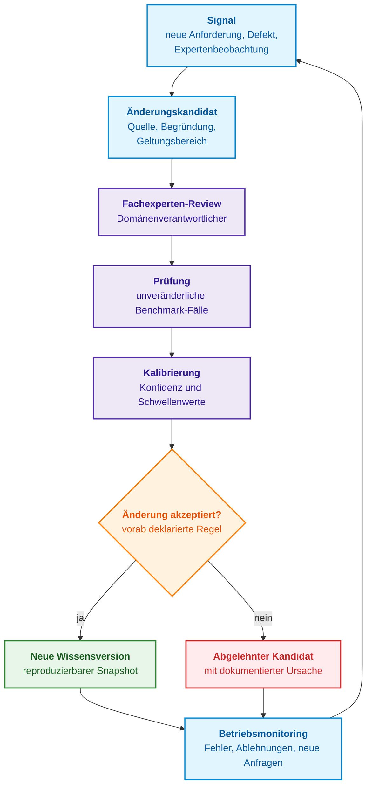
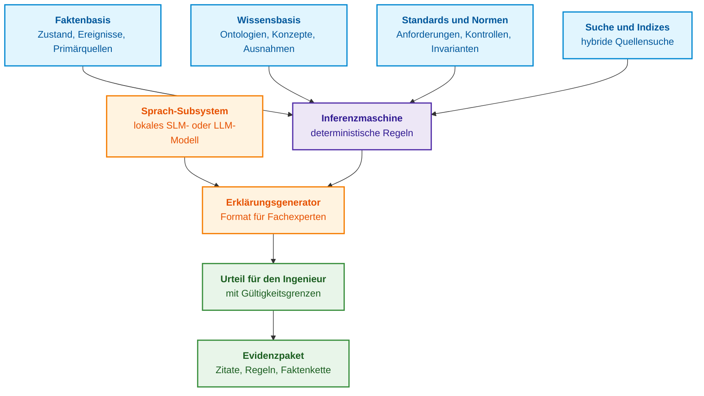
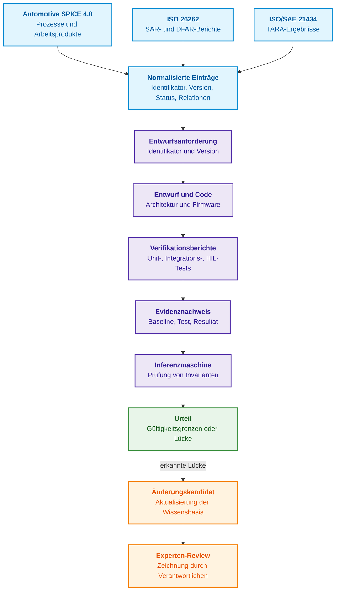
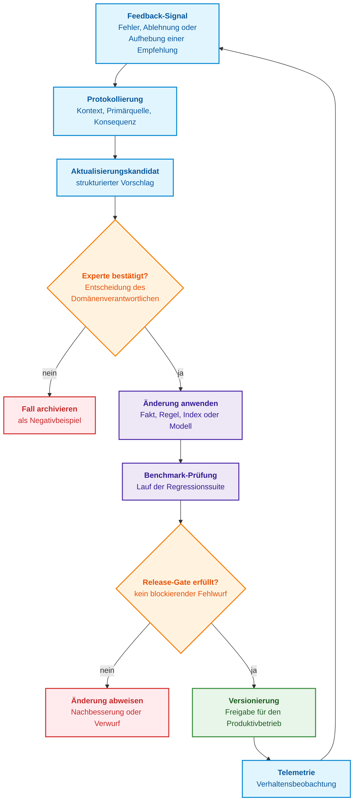
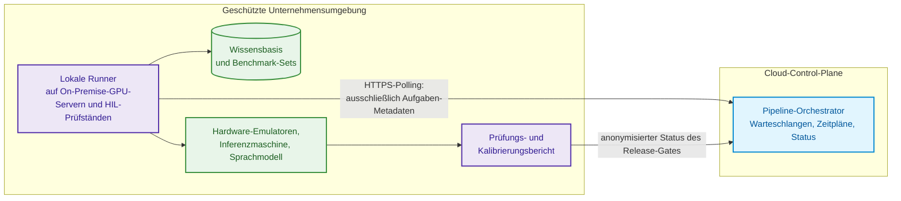

# Kapitel 25. Wie Expertensysteme lernen: Prüfungsmatrizen, Wissensaudits und Regressionskontrolle

> **Buch:** [Architektur evidenzbasierter Expertensysteme](README.md) · [Teil VI: Neuro-symbolische Modelle, kognitive Frontlinien und kontinuierliches Lernen](part-06-frontiers-neuro-symbolic.md)  
> **Vorheriges Kapitel:** [Kapitel 38. Maschinelle Halluzinationen und Wissensdefizite: Evidenzbasierte Antwortkontrolle](ch38-curing-machine-hallucinations-and-knowledge-deficits.md)  
> **Nächstes Kapitel:** [Kapitel 26. Kontinuierliches Lernen (Continual Learning) aus Erfahrung und Beherrschung von Systemprotokoll-Drift](ch26-continual-learning.md)  
> **Inhaltsverzeichnis:** [README.md](README.md)  
> **Autor:** [Mykola Fedchyk](about-the-author.md)  
> **Niveau:** Fortgeschritten: Knowledge Engineers, Machine-Learning-Ingenieure, Qualitäts- und Release-Verantwortliche  
> **Erwartete Lernergebnisse:** Bestimmen, in welcher Schicht des Expertensystems eine Änderung vorgenommen werden muss; eine Version des Expertensystems als vollständigen Snapshot aller Abhängigkeiten beschreiben; ein technisches Artefakt von der Anforderung bis zum Evidenznachweis rückverfolgen; Anforderungsänderungen und Evidenzwiderrufe auf abgeleitete Fakten, Indizes und Schlussfolgerungen propagieren, ohne die Historie zu überschreiben; eine Prüfungsmatrix konstruieren und Datensätze ohne Data-Leakage aufteilen; Release-Entscheidungen durch Paarvergleiche des Kandidaten mit der Produktivversion treffen; die Wahrscheinlichkeitskalibrierung verifizieren; Methoden zur Feinabstimmung von Sprachmodellen auswählen und den Speicherbedarf vorab berechnen.

## Abstract

In diesem Kapitel wird der Lebenszyklus von Lernen, Adaption und kontrollierter Wissensaktualisierung in evidenzbasierten Expertensystemen untersucht. Es definiert eine Methodik für Prüfungsaudits, Regressionskontrolle und Kalibrierungsverifikation, die eine Degradation der Entscheidungsnachweisbarkeit bei der Modifikation von Ontologien, Regeln und neuronalen Modulen systematisch ausschließt.

Eine neue Regel in der Wissensbasis behebt einen Fehler und erzeugt an anderer Stelle einen neuen. Ein neues Synonymwörterbuch verbessert das Retrieval für lokale Fachbegriffe, verschlechtert jedoch das Auffinden englischsprachiger Anforderungs-IDs. Ein nachjustiertes Sprachmodell lernt, Antworten eleganter zu formulieren, gewinnt jedoch keinerlei Verlässlichkeit in seinen logischen Schlüssen. In jedem dieser Fälle hat das Team Modifikationen am Expertensystem vorgenommen, kann jedoch nicht quantifizieren, ob die neue Version tatsächlich überlegen ist und für welche Anfragen dies gilt.

Dieses Kapitel beantwortet die Kernfrage: **Wie lässt sich das Wissen eines Expertensystems bei sich wandelnden Anforderungen, Produkten, Normen und Erfahrungen modifizieren und gleichzeitig belegen, dass die neue Version dort, wo Fehler am kostspieligsten sind, keinesfalls schlechter abschneidet als die Vorgängerversion?** Die zentrale These lautet: **Das Lernen eines Expertensystems ist ein gesteuerter Release-Prozess. Jede Änderung besitzt ein definiertes Zielobjekt (Fakt, Regel, Traceability-Link, Suchkonfiguration oder Sprachkomponente), eine Quelle und Gültigkeitsgrenzen. In die Produktivumgebung gelangt eine Änderung ausschließlich nach formalem Fachexperten-Review, einer Prüfung anhand unveränderlicher Benchmark-Fälle, einer Kalibrierungsprüfung und einem Votum gemäß einem vorab deklarierten Release-Gate.**

Das Kapitel stützt sich auf ein durchgängiges Fallbeispiel aus der Softwareentwicklung automobiler elektronischer Steuergeräte (*Electronic Control Units*, ECU), in der der Autor tätig ist. Prozesse, Beispiele und Zahlenwerte dienen der methodischen Illustration und stellen kein zertifiziertes Verfahren dar. Entscheidungen über den Produkt-Release, funktionale Sicherheit und Cybersicherheit im Automobilbereich obliegen den zeichnungsberechtigten Fachexperten gemäß Industriestandards; das Expertensystem bereitet hierfür lediglich verifiziertes Material auf.

Im alltäglichen Sprachgebrauch verschleiert der Begriff „Lernen“ verschiedene Fehlermodi. Die folgende Tabelle benennt sieben typische Ausfälle und die jeweils robuste ingenieurtechnische Gegenmaßnahme.

| Fehlermodus | Erscheinungsbild | Ursache | Robuste Lösung |
| --- | --- | --- | --- |
| Falsches Änderungsobjekt | Das feinabgestimmte Sprachmodell formuliert denselben inhaltlichen Fehler überzeugender | Der Fehler lag in einem Faktum, einer Regel, Zugriffsrechten oder dem Retrieval | Zuerst die fehlerverursachende Stufe lokalisieren, danach gezielt eine steuerbare Komponente ändern |
| Datenleck zwischen Trainings- und Testdaten (*Train/Test Leakage*) | Metriken steigen sprunghaft, die Güte im Produktivbetrieb stagniert | Revisionen desselben Dokuments oder Vorfalls gelangten in unterschiedliche Splits | Daten vor jeder Konfiguration strikt nach Gruppe, Zeit und Quelle trennen |
| Overfitting auf den Validierungsdatensatz | Jede neue Version „verbessert“ denselben Testfall | Der Testfall beeinflusst wiederholt Entwicklungsentscheidungen | Getrennte Datensätze für Entwicklung, Kalibrierung, Regression und versiegelte Bestätigung (*Sealed Confirmation*) |
| Aggregierte Durchschnitte kaschieren Schäden | Gesamtkennzahlen steigen, sicherheitskritische Einzelfälle verschlechtern sich | Ungleichartige Risiken wurden zu einer einzigen Zahl gemittelt | Release-Gates für jeden kritischen Slice und Fehlertyp separat definieren |
| Vermischte Konfidenztypen | Kosinus-Ähnlichkeit von 0,9, Regelverdict und A-posteriori-Wahrscheinlichkeit von 0,9 wirken identisch | Inkommensurable Zahlenwerte werden pauschal als „Konfidenz“ deklariert | Typisierung von Werten: Rang, kalibrierte Wahrscheinlichkeit, deterministisches Urteil, Zugehörigkeitsgrad |
| Feedback-Vergiftung | Fehlerhafte Systemurteile werden zur Trainingsgrundlage nachfolgender Zyklen | Eigene Ausgaben oder ungeprüfte Nutzerreaktionen werden als Ground Truth übernommen | Signal → Kandidat → Expertenentscheid → isolierte Prüfung → Release |
| Versionsdiskrepanz | Der Kandidat wurde auf einem anderen Graphen, Index oder Prompt-Template getestet als dem deployten | Komponenten sind nicht in einem einheitlichen Manifest verankert | Atomarer Snapshot aller Abhängigkeiten und deterministisch reproduzierbarer Prüflauf |

Diesen sieben Fehlermodi liegt eine gemeinsame Ursache zugrunde: Die Änderung ist nicht an ein konkretes Zielobjekt, eine Verifikation und eine Version gebunden. Das Ziel des Lernzyklus besteht folglich nicht im diffusen „Hinzufügen von Wissen“, sondern in der **Reduktion eines konkret gemessenen Risikos ohne inakzeptable Regressionen in anderen Subsystemen des Expertensystems**. Das Kapitel erläutert systematisch den Aufbau einer Version, die modifizierbaren Schichten, die Herkunft projektbezogener Artefakte, den Nachweis von Konformität über Traceability, die Struktur von Prüfungen und Release-Gates, die Verifikation der Kalibrierung, die Handhabung von Feedback und die Bedingungen für eine zielgerichtete Feinabstimmung von Sprachmodellen.

## 1. Drei getrennte Änderungspfade für Expertensysteme

Der Begriff „Lernen“ bedeutet keineswegs, dass für jede Korrektur ein neuronales Netz feinabgestimmt werden muss. Zunächst sind das Zielobjekt des Fehlers und die adäquate Verifikationsmethode zu isolieren.

| Modifikationsobjekt | Erforderliche Verifikation | Nicht erforderlich |
|---|---|---|
| Fakt, Regel, Ausnahme oder Relation | Provenienz, Anwendbarkeit, Konflikte, Positiv- und Negativfälle, Widerruf abgeleiteter Fakten | Nachtraining von Gewichten des Sprachmodells |
| Vokabular, Chunking, Index oder Re-Ranking | Zurückgehaltene Anfragen, Vollständigkeit und Reihenfolge der Ergebnisse, Gültigkeit und Zugriff | Neue domänenspezifische Regel für jeden Retrieval-Fehlschlag |
| Parameter des Klassifikators oder Sprachmodells | Datensplits, Zielmetrik, Kalibrierung und Vermeidung katastrophalen Vergessens | Ersatz deterministischer symbolischer Urteile durch Textgenerierung |

Für den ersten Pfad genügen ein formaler Änderungs- und Widerrufszyklus, Benchmark-Testfälle und eine Release-Entscheidung. Abschnitte zur Feinabstimmung stellen eine eigenständige Spezialisierung dar. Wahrscheinlichkeitskalibrierung ist ausschließlich dort erforderlich, wo eine Komponente genuine Wahrscheinlichkeitsschätzungen liefert; deterministische Regeln werden durch Verhaltenstests verifiziert und nicht fälschlich als „Wahrscheinlichkeit 1“ deklariert.

## 2. Der Wissenslebenszyklus: Vom Primärsignal bis zum Versions-Release

Der Lebenszyklus eines Dokuments wird herkömmlich über Aufbewahrungsfristen definiert: Ein Dokument wird erstellt, archiviert und später durch eine Neufassung ersetzt. Für ein Expertensystem greift diese Beschreibung zu kurz, da Wissen unmittelbar an Inferenzprozessen partizipiert und jede Wissensänderung abgeleitete Schlüsse transformiert. Hier wird als **Wissenslebenszyklus** der kontrollierte Pfad von einem Signal über den Änderungsbedarf bis hin zur verifizierten Neuversion oder der begründeten Zurückweisung des Kandidaten bezeichnet. Dies ist eine operative Definition für Modifikationen im Expertensystem, kein allgemeingültiges Modell des Wissensmanagements.

Diese Definition stützt sich auf zwei theoretische Grundlagen. Maryam Alavi und Dorothy Leidner beschreiben Wissensmanagement als Verbund von Prozessen zur Erzeugung, Speicherung, Abfrage, Übertragung und Anwendung von Wissen [[1]](#src-1). Rudi Studer, Richard Benjamins und Dieter Fensel definieren Knowledge Engineering als methodische Konstruktion und Pflege von Wissensmodellen statt als einmalige Befüllung eines Speichers [[2]](#src-2). Der in diesem Kapitel vorgestellte Zyklus adaptiert beide Ansätze für kontrollierte Systemmodifikationen und ergänzt drei Schritte, die allgemeinen Modellen fehlen: Prüfung (*Exam*), Kalibrierung und formale Release-Entscheidung.

Um eine deterministische Reproduzierbarkeit der Prüfung zu garantieren, wird die Version eines Expertensystems nicht über den Bezeichner eines Sprachmodells definiert, sondern als vollständiger Snapshot aller Systemabhängigkeiten:

```math
\mathcal{S}_v=(F_v,K_v,R_v,G_v,I_v,E_v,M_v,P_v,A_v,T_v).
```

- Zusammensetzung der Version $`\mathcal{S}_v`$: Der Index $v$ kennzeichnet die Version, und jede Komponente mit dem Subskript $v$ ist fester Bestandteil dieses Snapshots;
- $`F_v`$ repräsentiert Fakten, $`K_v`$ verwaltete Wissenselemente (Konzepte, Ontologien und Ausnahmen), $`R_v`$ Inferenzregeln;
- $`G_v`$ ist der Relationsgraph, $`I_v`$ bezeichnet die lexikalischen und vektoriellen Suchindizes;
- $`E_v`$ steht für Embedding- und Re-Ranking-Modelle, $`M_v`$ für Sprach- und Machine-Learning-Modelle;
- $`P_v`$ umfasst Prompt-Templates und Ausgabeschemata, $`A_v`$ Zugriffskontrollrichtlinien;
- $`T_v`$ spezifiziert Werkzeugversionen und Ausführungsumgebung; die Klammern fassen diese Komponenten zu einem konsistenten System-Snapshot zusammen.

Ein solcher Snapshot impliziert, dass jeder Release-Kandidat eine explizite Transformation der Produktivversion darstellen muss:

```math
\mathcal{S}_{v+1}^{\text{cand}}=\mathrm{Apply}(\mathcal{S}_v,\Delta).
```

- Für den Zustandsübergang ist $`\mathcal{S}_{v+1}^{\text{cand}}`$ der Versionskandidat nach $v$, wobei das Superskript $\text{cand}$ den Status als Kandidat markiert;
- $\mathrm{Apply}$ wendet die Modifikation deterministisch auf den Snapshot $`\mathcal{S}_v`$ an, wobei $\Delta$ die formale Änderungsbeschreibung darstellt;
- Das Gleichheitszeichen $=$ verdeutlicht, dass der Kandidat ausschließlich durch Anwendung dieser Änderung entsteht und nicht durch eine beliebige Neuzusammenstellung von Komponenten.

Die Transformation $\Delta$ besitzt eine geschlossene Abhängigkeitshülle. Der Austausch eines Embedding-Modells erzwingt die vollständige Neuerstellung des Vektorindex, da Vektoren des Altmodells inkompatibel zu den Einbettungen des Neumodells sind. Eine Änderung der Ontologie erfordert die erneute Ableitung aller Folgerungen sowie den Re-Check der Graph-Constraints. Die Release-Einheit ist daher nicht die isolierte Zeile, die ein Ingenieur editiert hat, sondern die vollständige transitive Hülle der Änderung, fixiert in einem Manifest. Metadaten zu Quelle, Transformation und verantwortlicher Person werden gemäß dem PROV-Standard des World Wide Web Consortiums (W3C) erfasst, der Provenienz über Entitäten, Aktivitäten und Agenten modelliert [[3]](#src-3).

Das folgende Diagramm illustriert die Stationen, die ein Kandidat vom Primärsignal bis zur Freigabe durchläuft, sowie den Ursprung nachfolgender Signale.



Jede Stufe im Diagramm verfügt über einen definierten Eingang, eine Operation und ein greifbares Ergebnis:

- **Signal:** Informiert über einen potenziellen Änderungsbedarf, beweist jedoch noch nichts. Typische Auslöser sind neue Anforderungen, entdeckte Defekte, Expertenhinweise, fehlerhafte Schlüsse oder veränderte Einsatzbedingungen. Ergebnis: Registrierte Beobachtung mit Referenz auf Primärquelle und Quellversion des Systems.
- **Änderungskandidat:** Spezifiziert präzise, welcher Fakt, welche Relation, Regel, Suchkonfiguration oder Komponente modifiziert werden soll, auf welcher Quellengrundlage und innerhalb welcher Gültigkeitsgrenzen. Ergebnis: Versionierter Kandidat, der formal verifiziert oder abgewiesen werden kann.
- **Fachexperten-Review:** Wird von einer Fachperson durchgeführt, die über nachgewiesene Domänenkompetenz verfügt. Ein Embedded-Software-Ingenieur prüft die Implementierungsdetails, ein Functional-Safety-Experte verifiziert die Verknüpfung mit Sicherheitsanforderungen, ein Cybersecurity-Experte evaluiert Bedrohungsannahmen. Lektorate oder Syntaxprüfungen ersetzen dieses Review nicht.
- **Prüfung (*Exam*):** Deterministisch wiederholbarer Testlauf auf unveränderlichen Testfällen mit definierten Erwartungswerten, Quellennachweisen und intendierten Ablehnungen. Der Kandidat wird mit der Produktivversion auf historischen und Grenzfällen verglichen, nicht allein auf dem Einzelfall, der den Anlass bot.
- **Kalibrierung:** Prüft nicht die Richtigkeit des Urteils, sondern ob die ausgewiesene Konfidenz mit der realen Fehlerhäufigkeit übereinstimmt. Hier werden Schwellenwerte justiert: Wann wird eine automatisierte Handlung empfohlen, wann ein Experten-Review erzwungen und wann die Antwort verweigert?
- **Release-Entscheidung:** Wird vom Änderungsverantwortlichen anhand eines vorab deklarierten Regelwerks getroffen, unter Abwägung von Expertenurteil, Prüfungsmatrix, Kalibrierung, Restrisiko und Rollback-Fähigkeit.
- **Neue Wissensversion:** Erhält eine eindeutige ID, ein Änderungschangelog, verknüpfte Quellen, Prüfprotokolle, Zeitstempel und Zeichnungsberechtigte. Sie ist deterministisch reproduzierbar und rollbar.
- **Abgelehnter Kandidat:** Wird samt Begründung, Evidenzlage und Wiederaufnahmebedingungen archiviert, um ein Wiedereinreichen desselben fehlerhaften Vorschlags ohne neue Evidenz zu unterbinden.
- **Betriebsmonitoring:** Überwacht die deployte Version im Feldeinsatz: Laufzeitfehler, korrekte Antwortverweigerungen, neuartige Anfragemuster, Datendrift und Folgen automatisierter Aktionen. Es erzeugt neue Signale, überschreibt Wissensbestände jedoch niemals autonom.

Ein Signal wandelt sich erst nach Formalisierung, Fachexperten-Review, Prüfung, Kalibrierung und Freigabeentscheidung in valides Wissen um. Dieser Ablauf bestimmt jedoch noch nicht, welche Teilschicht des Expertensystems konkret verändert werden muss. Um dies an realen Engineering-Artefakten zu demonstrieren, bedarf es eines durchgängigen Fallbeispiels.

## 3. Durchgängiges technisches Fallbeispiel: Wissensarchitektur eines automobilen Steuergeräts (ECU)

Als durchgängiges Fallbeispiel dient die Firmware eines automobilen elektronischen Steuergeräts (*Electronic Control Unit*, ECU). Eine Modifikation dieser Firmware berührt Hardware-Revisionen, Kalibrierdatensätze, Softwareanforderungen, Systemarchitektur, Quellcode, Baselines und mehrstufige Verifikationspfade. Handelt es sich um eine sicherheitsrelevante Funktion oder sichere Firmware-Updates (FOTA), treten separate Nachweisketten für funktionale Sicherheit und Cybersicherheit hinzu. Anhand dieses Systems lassen sich sämtliche Lernschichten analysieren, ohne Prozessmanagement mit Standardkonformität zu verwechseln.

Drei Anforderungsquellen spielen hierbei komplementäre Rollen:

- **Automotive SPICE 4.0** (*Software Process Improvement and Capability dEtermination*): Ein Prozess- und Reifegradmodell des VDA QMC [[4]](#src-4). Für Software umfasst die Kette die Prozesse SWE.1 (Software-Anforderungsanalyse), SWE.2 (Software-Architekturentwurf), SWE.3 (Detaillierter Entwurf und Modulerstellung), SWE.4 (Unit-Verifikation), SWE.5 (Komponenten- und Integrationsverifikation) sowie SWE.6 (Software-Verifikation). Konfigurationsmanagement, Problemlösung und Änderungsmanagement werden durch SUP.8, SUP.9 und SUP.10 geregelt.
- **ISO 26262-6:2018:** Definiert Vorgaben für die Softwareentwicklung im Rahmen der funktionalen Sicherheit: Spezifikation funktionaler Sicherheitsanforderungen, Architekturentwurf, Moduldesign und -implementierung, Verifikation sowie Integration und Testen eingebetteter Software [[5]](#src-5).
- **ISO/SAE 21434:2021:** Spezifiziert Anforderungen an das Cybersecurity-Risikomanagement für elektrische und elektronische Systeme in Straßenfahrzeugen über den gesamten Lebenszyklus [[6]](#src-6).

Automotive SPICE ersetzt weder ISO 26262 noch ISO/SAE 21434. Das Prozessmodell bewertet, ob ein Team Arbeitsergebnisse kontrolliert definiert, abstimmt, umsetzt und verifiziert; die Sicherheitsnormen bestimmen die inhaltlichen Schutzziele und Argumente, die diese Produkte enthalten müssen. Für das Expertensystem sind dies drei gekoppelte, jedoch nicht austauschbare Wissenskontexte. Der folgende Abschnitt zeigt, wie sich Änderungen an diesen Artefakten in den internen Snapshots niederschlagen.

### 3.1. Anforderungsänderung und Evidenzwiderruf: Evolution von Wissens-Snapshots

Ein Prüflabor kann einen Testbericht widerrufen, auf dessen Basis das Expertensystem bereits Urteile gefällt hat. Das bloße Aktualisieren des Dateistatus genügt nicht: Messwerte aus dem Bericht können in kanonische Fakten, Suchindizes, abgeleitete Schlüsse und den Antwort-Cache eingeflossen sein. Das Fallbeispiel zeichnet diesen Pfad für eine didaktische Anforderung an die Antwortzeit eines ECU-Diagnosedienstes nach. Grenzwerte und Bezeichner sind synthetisch. Das Urteil betrifft ein einzelnes Kriterium, keine allgemeine Freigabe der Firmware.

**Initialer Snapshot K17.** Der Anforderungsverantwortliche verabschiedet Revision A der Spezifikation: maximale Antwortzeit 100 ms. Prüfbericht `REPORT-41` dokumentiert eine Messung von 90 ms. Das verknüpfte Faktum `FACT-41` speichert Wert, Einheit, Firmwarestand, Board-Revision, Messmethodik und Umgebungsbedingungen. Regel `RULE-TIME` vergleicht die Messung mit dem Grenzwert, sofern die Evidenz für die Konfiguration gültig ist. Das Urteil in K17 lautet `PASS`, verknüpft mit Revision A, `FACT-41` und `REPORT-41`. Die Provenienz „Bericht → Fakt → Urteil“ wird im PROV-Format protokolliert [[3]](#src-3).

**Neue Revision und Snapshot K18.** Der Anforderungsverantwortliche gibt Revision B mit einem Grenzwert von 80 ms frei und deklariert explizit, dass Revision B für künftige Bewertungen derselben Konfiguration gilt. Dies ist eine neue Vergleichsbasis, keine neue Messung. Unter der Annahme unveränderter Messmethodik kann der Rohwert von 90 ms mit der neuen Grenze verglichen werden. Regel `RULE-TIME` bleibt identisch, doch der geänderte Grenzwert führt zu `FAIL`. Der alte Prüfbericht und das historische `PASS`-Urteil werden nicht überschrieben; es entsteht ein neues Urteil unter Verweis auf Revision B. Hätte Revision B auch die Testmethodik modifiziert, hätte die Weiternutzung der 90 ms einer gesonderten Begründung oder Neumessung bedurft.

**Widerruf und Snapshot K19.** Das Labor entdeckt einen Zeitstempelfehler in der Messreihe und widerruft `REPORT-41`. Die verantwortliche Person erfasst Ursache und Geltungsbereich. Das **Widerrufsprotokoll** (*Revocation Log*) speichert Evidenz-ID, Zeitstempel, Autor, Begründung und betroffene Konfigurationen. Der Abhängigkeitsgraph führt vom Bericht zu `FACT-41` und den darauf basierenden Urteilen. Die 90 ms verbleiben im Archiv, sind jedoch für die aktuelle Bewertung invalid. Mangels alternativer Evidenz lautet das Urteil in K19 `UNKNOWN` („keine gültige Messung verfügbar“). Ein Widerruf beweist weder Konformität noch Verletzung des Kriteriums. Wahrheitserhaltungssysteme (*Truth Maintenance Systems*) und alternative Begründungsstrukturen werden in [Kapitel 16](ch16-expert-systems-architecture.md) behandelt.

**Evidenzersatz und Snapshot K20.** Das Labor führt einen Neuversuch durch und misst 70 ms im Bericht `REPORT-42`. Nach Validierung von Konfiguration, Methodik, Provenienz und Freigabe wird das neue Faktum in Kandidat K20 aufgenommen. Die Regel vergleicht 70 ms mit den gültigen 80 ms und liefert `PASS`. Solange der neue Bericht die Freigabe nicht passiert hat, verharrt das Produktivurteil auf `UNKNOWN`. Die folgende Tabelle stellt die vier Snapshots gegenüber.

| Wissens-Snapshot | Gültiger Grenzwert | Valide Messung | Urteil | Ursache der Urteilsänderung |
|---|---|---|---|---|
| K17 | 100 ms, Revision A | 90 ms, `REPORT-41` | `PASS` | Initiale Vergleichsbasis |
| K18 | 80 ms, Revision B | 90 ms, `REPORT-41` | `FAIL` | Verschärfter Grenzwert, keine neuen Messdaten |
| K19 | 80 ms, Revision B | Keine: `REPORT-41` widerrufen | `UNKNOWN` | Wegfall der Tatsachengrundlage für numerischen Vergleich |
| K20 | 80 ms, Revision B | 70 ms, validierter `REPORT-42` | `PASS` | Neue verifizierte Evidenz |

Divergierende Urteile sind kein willkürliches Verhalten des Systems: Jedes Urteil basiert auf einem in sich konsistenten, zeitlich fixierten Prämissenset. Der Übergang zwischen diesen Zuständen erfordert koordinierte Aktionen auf mehreren Ebenen:

| Artefakt | Aktion nach Änderung oder Widerruf | Audit-Aufbewahrung |
|---|---|---|
| Primärquelle | Neue Spezifikationsrevision oder Widerrufseintrag | Unveränderliche Kopien der Quellen, Beschluss, Autor, Zeit |
| Kanonisches Faktum | Neue Grenzwertversion oder Verwendungsbann für `FACT-41` | Wert, Einheit, Zitat, Konfiguration und Vorher-Status |
| Regel und Tests | Re-Evaluation abhängiger Schlüsse, Tests für 90 ms bei beiden Grenzen und fehlende Daten | Regelversion und Regressionsergebnisse |
| Indizes und Derivate | Aktualisierung betroffener Einträge und Filter; widerrufene Fakten dürfen nicht via Search als Evidenz auftauchen | Index-Generation und Verknüpfung mit kanonischen Einträgen |
| Antwort-Cache | Invalidierung von Cached-Einträgen mit widerrufenen Prämissen | Snapshot-ID und Abhängigkeitsliste des Cache-Eintrags |
| Publiziertes Urteil | Generierung eines Neuurteils und Benachrichtigung des Systemverantwortlichen | Altes Urteil, historische Prämissen und nachfolgende Widerrufsnotiz |

Bereits vor dem Build von K19 muss der Inferenzdienst die Nutzung des widerrufenen Berichts über ein operatives Sperr-Register außerhalb des unveränderlichen Pakets unterbinden. Andernfalls würde die Zeitspanne der Index-Neuerstellung zu einem Fenster führen, in dem wissentlich invalide Antworten ausgeliefert werden. Validitätsprüfungen erfolgen auch beim Lesen des Cache; die Version des Sperr-Registers wird im Ausführungsmanifest protokolliert ([Kapitel 23](ch23-knowledge-base-verification.md)). Die atomare Umschaltung statischer Wissenspakete erläutert [Kapitel 32](ch32-high-performance-knowledge-packs-mmap-and-harvesting.md).

Das folgende Python-Programm demonstriert die Auswertung der vier Wissens-Snapshots:

<details>
<summary>Ausführbare Überprüfung von vier Wissens-Snapshots</summary>

```python
def assess(snapshot, limit_ms, measured_ms, evidence_active):
    if limit_ms is None or measured_ms is None or not evidence_active:
        verdict = "UNKNOWN"
    elif measured_ms <= limit_ms:
        verdict = "PASS"
    else:
        verdict = "FAIL"
    return {"snapshot": snapshot, "verdict": verdict}


assert assess("K17", 100, 90, True)["verdict"] == "PASS"
assert assess("K18", 80, 90, True)["verdict"] == "FAIL"
assert assess("K19", 80, 90, False)["verdict"] == "UNKNOWN"
assert assess("K20", 80, 70, True)["verdict"] == "PASS"
assert assess("K19", 80, None, True)["verdict"] == "UNKNOWN"
```

</details>

Im dritten Aufruf wird der Wert 90 ms zwar an die Funktion übergeben, der Status `evidence_active = False` verhindert jedoch den numerischen Vergleich. Genau dieser Fall unterscheidet den Widerruf von Evidenz vom simplen Absenken eines Schwellenwerts. Der zusätzliche Test mit fehlender Messung stellt sicher, dass Datenmangel nicht fälschlich als 0 ms interpretiert wird und zu einem unberechtigten `PASS` führt.

Die historische Reproduktion von K17 verfolgt einen anderen Zweck als die operative Auskunft. Ein Auditor kann die alte Berechnung exakt nachvollziehen und verstehen, warum damals ein `PASS` erteilt wurde; das System muss jedoch zwingend den späteren Widerruf von `REPORT-41` einblenden. Reproduzierbarkeit erklärt die Genese historischer Entscheidungen, beweist jedoch nicht deren fortdauernde Gültigkeit. Ein Rollback auf K17 kann eine aktive Sperre des Berichts nicht aufheben. Das Beispiel illustriert, wie ein Expertensystem versioniertes Wissen verarbeitet: Es identifiziert abhängige Schlüsse, prüft neue Prämissen und legt den Verlust von Evidenz offen.

## 4. Fünf Komponentenschichten zur Weiterentwicklung von Expertensystemen

Liefert ein Expertensystem ein fehlerhaftes oder unvollständiges Urteil, wird die Ursache vorschnell dem Sprachmodell zugeschrieben. Teams neigen dann dazu, das Modell nachzujustieren, obwohl ein Faktum aktualisiert, eine Regel korrigiert oder ein gerissener Traceability-Link repariert werden müsste. Das Resultat ist derselbe inhaltliche Fehler, lediglich eleganter formuliert. Vor jedem Eingriff muss das **Lernziel** eindeutig definiert werden: die spezifische Komponente oder das verwaltete Artefakt, dessen Verhalten verbessert werden soll.

Ein Large Language Model (LLM) oder Small Language Model (SLM) ist lediglich eine von mehreren Schichten. Das Sprach-Subsystem extrahiert Strukturen aus Freitext, klassifiziert Textsegmente, interpretiert Benutzeranfragen und formuliert Erklärungen in einem vorgegebenen Format. Die Faktenbasis speichert den Systemzustand samt Provenienz, die Wissensbasis verwaltet Konzepte und Regeln, das Retrieval stellt relevante Quellen bereit, und Traceability-Links verbinden Anforderungen mit Verifikation und Evidenz. Keine dieser Aufgaben kann durch ein Sprachmodell substituiert werden.



Dieses Diagramm trennt Ursachen, die sich nach außen hin als identischer Antwortfehler manifestieren. Fehlt einem Urteil der Quellennachweis, sind Faktenbasis und Retrieval zu prüfen. Wurde eine Ausnahme von der Inferenzmaschine ignoriert, liegt das Problem in Wissensbasis oder Regelkonditionen. Kann das System die Erfüllung einer Normvorgabe nicht belegen, muss der Compliance-Verantwortliche die Verknüpfung von Anforderung, Maßnahme und Testergebnis auditieren. Erst wenn alle diese Ebenen fehlerfrei sind und die Antwort dennoch Terminologie, Struktur oder Konfidenzgrad verfehlt, wird das Sprachmodell zum Modifikationskandidaten.

| Schicht | Lerninhalt / Modifikation | Beispielhafter Eingriff | Verifikationsmethode |
| --- | --- | --- | --- |
| Faktenbasis | Präzision von Zustandsbeschreibungen und Datenprovenienz | Artefakttyp hinzufügen, Erfassungszeit korrigieren, Duplikate entfernen | Abgleich mit Primärdokumenten |
| Wissensbasis | Konzepte, Relationen, Regeln, Ausnahmen | Aufnahme eines validierten Fachbegriffs oder einer Regel | Prüfung von Positiv- und Negativbeispielen für Regelfeuerung |
| Standardkonformität | Kausale Kette von Anforderung zu Evidenz | Normabschnitt mit Verifikationsmaßnahme und Akzeptanzkriterium verknüpfen | Vollständige Pfadverifikation Anforderung → Ergebnis |
| Suche und Erklärung | Kontextselektion und Geltungsbereich | Modifikation von Vokabular, Suchprofil, Ablehnungsschwellenwert | Messung von Retrieval-Güte und Korrektheit von Antwortverweigerungen |
| Sprach-Subsystem (SLM/LLM) | Anfrageinterpretation, Domänenterminologie, Antwortformat, Formulierung von Begründung und Verweigerung | Feinabstimmung von Adaptern auf validierten Fachtexten mit präzisen Quellenreferenzen | Evaluierung von Zitation, Struktur und Ablehnungsverhalten auf isoliertem Benchmark-Set |

Jede Schicht verfügt über eine eigene Lern- und Anpassungsdynamik:

**Die Faktenbasis lernt durch kontrollierte Zustandskorrektur.** Das Primärsignal kann ein neuer Messwert, ein geänderter Anforderungsstatus oder eine Diskrepanz zum Originaldokument sein. Ein neuer Eintrag überschreibt den Altdatenbestand nicht stillschweigend: Er erhält Quelle, Zeitstempel, Autor, Gültigkeitsgrenzen und eine Verknüpfung zur Vorgängerversion im PROV-Standard [[3]](#src-3). Diese Schicht leitet keine allgemeinen Regeln aus Einzelbeobachtungen ab; ihre Aufgabe ist die exakte Erfassung des bekannten Systemzustands. Im Steuergerätebereich ist ein Faktum die Kombination aus Firmwarestand, Board-Revision, Kalibrierdatensatz, Codierungsvariante, Bootloader-Version und Prüfstandsergebnis. Ein Ergebnis auf einer anderen Board-Revision darf nicht unbemerkt auf die aktuelle Produktkonfiguration übertragen werden.

**Die Wissensbasis lernt durch Modifikation von Konzepten, Relationen, Regeln und Ausnahmen.** Dies wird erforderlich, wenn Fakten zwar korrekt vorliegen, dem System jedoch ein Fachbegriff fehlt, es Beziehungen zwischen Entitäten ignoriert oder eine Regel ohne zwingende Ausnahmebedingungen feuert. Der Knowledge Engineer formuliert den Kandidaten explizit, testet die Regel gegen Positiv- und Negativfälle und analysiert Konflikte im Regelsatz [[2]](#src-2). Ein validiertes Faktum kann Anlass für einen Kandidaten sein, wandelt sich jedoch niemals ohne ingenieurtechnische Begründung autonom in eine Allgemeinregel. Ein einzelner Diagnose-Timeout begründet noch keine Regeländerung. Erst nach Analyse von Anforderung, Architektur und Testreihen formuliert der Ingenieur einen präzisen Kandidaten: Für einen definierten ECU-Zustand und Session-Typ muss ein Verbindungsabbruch einen spezifischen Zustandsübergang samt Ereignisprotokollierung auslösen.

**Die Compliance-Schicht lernt durch Wiederherstellung der Traceability.** Eine neue Normrevision, geänderte Kontrollmaßnahmen oder fehlende Nachweise initiieren einen Kandidaten für die Kette „Anforderung → Maßnahme → Kriterium → Ergebnis → Evidenz“. Der Experte verifiziert Gültigkeitsgrenzen des Dokuments und durchläuft den Pfad bidirektional. Der reine Normtext lehrt das System keine Konformität: Ohne konkrete Prüfhandlung und Messergebnis bleibt er eine bloße Anforderungsquelle. Für Automotive SPICE führt der Pfad von SWE.1 über SWE.2 und SWE.3 zu den Ergebnissen von SWE.4, SWE.5 und SWE.6. Für ISO 26262 tritt die Verknüpfung mit funktionalen Sicherheitsanforderungen hinzu; für ISO/SAE 21434 die Ableitung von Bedrohungsszenarien zu Cybersecurity-Zielen. Das Vorhandensein einer dieser Ketten belegt nicht die Vollständigkeit der beiden anderen.

**Suche und Erklärung lernen an Referenzanfragen und bekannten Fehlern.** Für jede Anfrage werden relevante Quellen, inakzeptable Fehltreffer, notwendiger Kontext sowie Fälle definiert, in denen die Antwort verweigert werden muss. Das Team optimiert Vokabular, Indizes, Re-Ranking, Schwellenwerte oder Erklärungstemplates und validiert das System auf einem zurückgehaltenen Testset. Im Ragas-Framework evaluieren Shahul Es et al. separat, ob das Retrieval relevanten Kontext liefert, ob die Antwort strikt auf diesem Kontext basiert und wie präzise die Generierung formuliert ist [[7]](#src-7). Diese Entkopplung verhindert, dass sprachliche Gewandtheit ein defizitäres Retrieval verschleiert. Automotive-Anfragen enthalten exakte Bezeichner: Anforderungs-IDs, Diagnostic Trouble Codes (DTC), Service-IDs, AUTOSAR-Software-Funktionsnamen, Test-IDs oder Hardware-Revisionen. Das Retrieval muss zwingend zuerst das exakte Artefakt in seiner gültigen Version lokalisieren, bevor semantisch verwandtes Begleitmaterial herangezogen wird. Eine Antwort zu einer abweichenden Plattform ist semantisch ähnlich, ingenieurtechnisch jedoch schlicht falsch.

**Das Sprach-Subsystem lernt an verifizierten Beispielen sprachlichen Verhaltens.** Das Material besteht aus Tupeln aus Anfrage, Antwort, Quellenzitaten, strukturierten Schlüssen und korrekten Antwortverweigerungen. Fine-Tuning ist indiziert, wenn Fakten, Regeln und gefundene Quellen fehlerfrei sind, das Modell jedoch Fachbegriffe verwechselt, das Ausgabeformat verletzt oder unzulässig kategorisch auftritt. Für den Trainingsdatensatz werden Herkunft, Nutzungsrechte, Versionierung, Bereinigungsmethoden und Hyperparameter nach dem Standard *Datasheets for Datasets* dokumentiert [[8]](#src-8). Modellgewichte verbessern die Repräsentation von Urteilen, fungieren jedoch niemals als Faktenquelle oder Primärevidenz. Im ECU-Projekt kann das Sprachmodell lernen, Sicherheitsziele, funktionale Sicherheitsanforderungen, Cybersecurity-Ziele, Softwareanforderungen und Change Requests präzise zu differenzieren und fehlende Evidenzen im definierten Schema transparent auszuweisen. Es darf jedoch niemals Konformität mit einem Standard attestieren, bloß weil es die Terminologie von Automotive SPICE oder ISO fehlerfrei reproduziert.

> **Aus der Praxis des Autors.** Im vom Autor entwickelten Prototyp eines Knowledge-Acquisition-Systems wurden messbare Qualitätssteigerungen primär durch deterministisches Query-Parsing, Provenienz-Tracking, Metadatenfilter, hybride Suche (BM25 kombiniert mit Vektoreinbettungen) und einen kompakten Klassifikator erzielt – nicht durch das Fine-Tuning von Sprachmodellen. Ein automatischer Release von Wissens- oder Modelländerungen in die Produktion existiert im Prototyp nicht, und der unabhängig annotierte Bestätigungsdatensatz muss kontinuierlich erweitert werden. Der in diesem Kapitel beschriebene Zyklus ist ein Zielprozess mit strengen Prüfungen, kein Bericht über ein bereits vollautonomes Selbstlernsystem.

## 5. Materialquellen für das Lernen: Projektartefakte und Telemetrie

In Entwicklungsprojekten koexistieren freigegebene Anforderungen, Entwürfe, Testergebnisse, unvollständige Code-Reviews, veraltete Schaltpläne und Chat-Protokolle. Werden diese unreflektiert in die Wissensbasis überführt, stützt sich das Expertensystem auf temporäre oder ungültige Informationen. Für das Lernen ist nicht das Textvolumen ausschlaggebend, sondern der Artefakttyp, dessen Versionsstand, Urheberschaft und Geltungsbereich. Wie solche Artefakte inventarisiert und klassifiziert werden, behandelt [Kapitel 10](ch10-knowledge-acquisition-systems.md). Hier steht die Folgefrage im Fokus: Unter welchen Bedingungen darf ein verifiziertes Arbeitsergebnis Fakten, Regeln oder Traceability-Links modifizieren?

Dies gilt gleichermaßen für Software-, System- und Hardware-Entwicklungsprojekte (R&D). In der Softwareentwicklung fungiert Quellcode als primäre Quelle; in System- und Hardwareprojekten übernehmen Systemmodelle, Schaltpläne, Konstruktionsdaten, Prototypen, Messreihen und Fertigungsnachweise diese Funktion.

| Arbeitsergebnis | Lernpotenzial für das Expertensystem | Erforderliche Audit-Metadaten |
| --- | --- | --- |
| Anforderungen, Standards, Richtlinien, Baselines | Konzepte, Beschränkungen, Abnahmekriterien, Konformitätsregeln | ID, Version, Verantwortlicher, Status, Geltungsbereich |
| Architektur- und Systemmodelle, Schnittstellen, Simulationen | Zustände, Datenflüsse, Modulgrenzen, Annahmen, zulässige Szenarien | Modellversion, Parameter, Szenario, Validitätsgrenzen, Simulationsergebnis |
| Quellcode, Konfigurationen, Infrastructure-as-Code | Implementierungsfakten, Abhängigkeiten, Schnittstellen, Konfigurationsschranken | Repository, Baseline, Commit-Hash, Pfad/Symbol, Review-Status |
| Schaltpläne, HDL-Beschreibungen, Leiterplattenlayouts, Stücklisten (BOM) | Elektrische/logische Verbindungen, Bauteilparameter, Konstruktionsgrenzen | Revision, Teilenummer, Spezifikationsversion, Charge/Seriennummer, ECR/ECO-Freigabe |
| CAD-Modelle, Fertigungszeichnungen, Toleranzen | Geometrische/materielle Restriktionen, Baugruppenstruktur, Lastfälle | Modell-/Zeichnungsrevision, Maßeinheiten, Toleranzklassen, Werkstoff, Produktvariante |
| Labormessungen, Prototypentests, Qualifikationsprüfungen | Reale Betriebsgrenzen, Fehlermodi, Schwellenwert- und Risikokandidaten | Prüfmethodik, Messgeräte-Kalibrierstatus, Prüfstand, Umgebung, Prototyp-ID, Rohdaten, Protokoll |
| Fertigungsqualitätsdaten, Lieferantendaten, Abweichungsberichte | Fehlertrends, Ausschussursachen, Ausnahmegenehmigungen, Korrekturmaßnahmen | Charge, Lieferant, Prüfplan, Inspektionsergebnis, Status, Anwendbarkeit |
| Audits, Quality Gates, Expertenabnahmen | Evidenzlücken, Reifegradregeln, Review-Prioritäten, bestätigte Ausnahmen | Zeichnungsberechtigter, Datum, Beschluss, Begründung, verknüpfte Anforderungen und Evidenzen |

Für die Steuergeräte-Firmware materialisiert sich die Tabelle in einem Geflecht verbundener Artefakte: SWE.1 liefert Softwareanforderungen und Testkriterien; SWE.2 definiert Komponenten, Schnittstellen und Anforderungsallokation; SWE.3 verknüpft Detaildesign mit Modulen und Code. SWE.4 liefert Unit-Testergebnisse, SWE.5 prüft Komponentenintegration, SWE.6 verifiziert das Gesamtsystem gegen SWE.1. Die Baseline aus SUP.8, der Problembericht aus SUP.9 und der Change Request aus SUP.10 dokumentieren, für welche Version die Evidenz gültig ist und warum Modifikationen erfolgten.

Sicherheitsspezifische Dokumente ergänzen dieses Prozessgerüst: Im Bereich der funktionalen Sicherheit sind dies funktionale Sicherheitsanforderungen, der Safety Analysis Report (SAR), der Dependent Failure Analysis Report (DFAR), statische Codeanalysen, Verifikationsberichte und Links zum Safety Case. Im Cybersecurity-Bereich treten Bedrohungs- und Risikoanalysen (TARA), Cybersecurity-Ziele, Anforderungen an Authentizität, Integrität, Rollback-Schutz sowie Fuzzing- und Penetrationstest-Berichte hinzu. Das Expertensystem lernt nicht die Textformulierungen, sondern die verifizierten Relationen zwischen Versionen, Urteilen und Ergebnissen.

Quellcode, HDL-Code, Schaltpläne, CAD-Modelle oder Einzelmessungen sind kein „Trainings-Rohtext“, der unkritisch memoriert werden darf. Jedes Artefakt ist ein Kandidat für die Modifikation eines Fakts, einer Regel, eines Schwellenwerts oder Traceability-Links. Ein einzelnes Laborergebnis belegt keine Systemeigenschaft, solange Messmethodik, Kalibrierung, Prüfstandskonfiguration, Umgebungsbedingungen, Prüflingscharge, Wiederholbarkeit und Abnahmekriterien nicht formal dokumentiert sind.

## 6. Durchgängige Rückverfolgbarkeit von Artefakten und auditierbare Standardkonformität

Ein weit verbreiteter Trugschluss besteht darin, der Wissensbasis „den Standard beizubringen“. Der bloße Normentext konstituiert keine Verifikation. Ein belastbares Ingenieururteil verlangt eine Kette, die bidirektional traversierbar ist: von der Anforderung zur Evidenz und von der Evidenz zurück zur gestützten Anforderung. Automotive SPICE 4.0 fordert diese bidirektionale Rückverfolgbarkeit explizit: Im Prozess SWE.1 gehört die Konsistenz und bidirektionale Traceability zwischen System- und Softwareanforderungen zu den primären Prozessergebnissen [[4]](#src-4). Die Anforderungen an Requirements-Engineering-Prozesse und Informationsprodukte regelt ISO/IEC/IEEE 29148 [[9]](#src-9).

In automobilen Projekten bilden TARA, SAR und DFAR fundamentale Nachweisquellen:

- **TARA:** Identifiziert Assets, Schadens- und Bedrohungsszenarien, evaluiert Schadensausmaß und Angriffsdurchführbarkeit und begründet Risikobehandlungsentscheidungen sowie Cybersecurity-Ziele. Für die Firmwareentwicklung resultieren daraus Anforderungen an Authentizität, Integrität, Schlüsselverwaltung, Logging und Secure Boot/Update.
- **SAR:** Dokumentiert Systemgrenzen, Annahmen, Methoden und Resultate von Sicherheitsanalysen wie FMEA (*Failure Mode and Effects Analysis*), FTA (*Fault Tree Analysis*) oder FMEDA (*Failure Modes, Effects, and Diagnostic Analysis*). Im Softwarekontext legt der SAR dar, welche Fehlerzustände softwareseitig erkannt oder verhindert werden müssen, und koppelt Analyseergebnisse an Sicherheitsziele und Tests.
- **DFAR:** Dokumentiert abhängige Fehler: gemeinsame Ursachen (*Common Cause Failures*), kaskadierende Effekte und Kopplungsfaktoren. Vorgaben hierzu definiert ISO 26262-9:2018 [[10]](#src-10). Für die Firmware verifiziert der DFAR Unabhängigkeitsannahmen: Nutzen Primär- und Sekundärpfad denselben Systemtakt, denselben Speicherbereich, identische Treiber, denselben Kommunikationsstack oder dieselbe Spannungsversorgung?

### 6.1. Integration von TARA-, SAR- und DFAR-Matrizen in den ontologischen Graphen

TARA-, SAR- und DFAR-Dateien bilden keine isolierten Submodule im Expertensystem. Sie sind Primärquellen, aus denen Ingestions-Pipelines verifizierte Zeilen und Relationen in die Wissenskomponenten übertragen. Die Faktenbasis speichert Feldwerte samt Zeilen-ID, Dokumentenversion, Review-Status, Produktkonfiguration und Referenz zum Original. Die Wissensbasis definiert Entitätstypen und zulässige Relationen. Die Traceability-Schicht verknüpft Analyseergebnisse mit Anforderungen, Architektur, Code und Tests. Die Inferenzmaschine wendet Konsistenz- und Lückenregeln auf diesen Graphen an, während der Erklärungsgenerator Ausgaben mit Referenzen auf spezifische Zeilen und Versionen erzeugt.

Vor dem Import werden Tabellen normalisiert: Spaltennamen des Projekttemplates werden Ontologiekonzepten zugeordnet, Anforderungs- und Testlinks in persistente Identifikatoren aufgelöst, Statuswerte und Versionen validiert. Zeilen ohne Verantwortlichen, gültige Version oder eindeutiges Zielobjekt bleiben für die Volltextsuche auffindbar, werden jedoch von der Nachweisführung ausgeschlossen.

| Quelle | Übertragene Wissenselemente | Nutzung durch die Inferenzmaschine |
| --- | --- | --- |
| TARA | Asset, Schadensszenario, Bedrohungsszenario, Risikoeinstufung, Behandlungsentscheidung, Cybersecurity-Ziel samt IDs | Prüft, ob jede zu behandelnde Bedrohung mit Ziel, Anforderung, Implementierung und Testresultat verknüpft ist; bei Abriss wird eine Evidenzlücke attestiert, keine Regelerfüllung |
| SAR | Analyseobjekt und -methode, Annahmen, Fehlermodus/Schadensfolge, Sicherheitsziel, Anforderung, Sicherheitsmaßnahme, Status | Prüft, ob Analyseergebnisse in Architekturanforderungen eingeflossen sind und valide Verifikationsnachweise für die Zielkonfiguration vorliegen |
| DFAR | Ursache abhängiger Fehler, Kopplungsfaktor (*Coupling Factor*), gemeinsame Ressource, betroffene Elemente, Unabhängigkeitsbehauptung, Schutzmaßnahme, Restrisiko, Test | Sucht nach gemeinsamen Ursachen zwischen Elementen, gleicht sie mit Gegenmaßnahmen ab und markiert Unabhängigkeitsannahmen als unbewiesen, falls Nachweise fehlen |

Die Inferenzregeln müssen präziser gefasst sein als der Gesamtinhalt des Dokuments: Eine Regel fordert beispielsweise, dass ein TARA-Bedrohungsszenario zwingend über einen validen Pfad zu einer Softwareanforderung und einem erfolgreichen Test für die Ziel-Baseline verfügen muss; andernfalls ist die Nachweiskette unvollständig. Eine andere Regel identifiziert im DFAR zwei angeblich redundante Mechanismen mit gemeinsam genutztem Flash-Treiber und verlangt einen Verifikationsnachweis für die Entkopplungsmaßnahme. Dies sind Regeln über die Vollständigkeit und Konsistenz projektbezogener Artefakte. Sie berechtigen das Expertensystem nicht dazu, ein Produkt eigenmächtig als „sicher“ zu deklarieren.

Wird angefragt: „Liegen ausreichende Nachweise für das Firmware-Update von ECU Version X vor?“, schränkt das System den Suchraum auf diese Konfiguration ein, traversiert Pfade von TARA, SAR und DFAR zu Entwurf und Tests und liefert eines von vier distinkten Ergebnissen: Nachweiskette im definierten Rahmen geschlossen, konkrete Lücke identifiziert, Inkonsistenz aufgedeckt oder Datenbasis unzureichend.



Im Diagramm transformiert der obere Bereich Dokumente in strukturierte Daten, der mittlere bildet die Nachweiskette, der untere trennt Inferenzregeln vom generierten Urteil. HIL (*Hardware-in-the-Loop*) bezeichnet Prüfstände, auf denen das reale Steuergerät gegen eine simulierte Fahrzeugumgebung getestet wird. Wird eine Lücke erkannt, wird sie erst nach Verknüpfung mit einem Fakt, einer Regel oder Relation und erfolgtem Experten-Review zum Änderungskandidaten.

Beispiel Firmware-Update: Die Anforderung verlangt Authentizitäts- und Integritätsprüfungen des Flash-Containers, Schutz vor unberechtigtem Downgrade und die Rückführung in einen sicheren Zustand bei Spannungsabfall. In der ASPICE-Projektion traversiert das System von SWE.1 zum Bootloader in SWE.2, zum Code in SWE.3 und zu SWE.4–SWE.6. In der TARA ist das Update der Asset, unautorisiertes Flashen die Bedrohung; Gegenmaßnahmen sind Signaturprüfung und Anti-Rollback. Im SAR wird das Gefahrenpotenzial eines fehlerhaften Flashvorgangs modelliert, im DFAR die Kopplung zwischen primärem Boot-Image und Recovery-Image analysiert. Fehlt beispielsweise der HIL-Test zum Stromausfall während des Schreibens, weist das System exakt diese Lücke aus, anstatt vage „wahrscheinlich konform“ zu generieren.

## 7. Methodik der unabhängigen Prüfung und Qualitätsbewertung von Änderungen

Eine neue Version kann auf wenigen handverlesenen Demonstrationsbeispielen glänzen, während sie elementare Ausnahmen ignoriert oder Antwortverweigerungen bei Datenmangel unterlässt. Ohne unveränderliche Benchmark-Stichproben mit bekannten Zielergebnissen lässt sich ein tatsächlicher Fortschritt nicht von einem glücklichen Zufallstreffer unterscheiden.

Ein kleiner Gold-Standard-Datensatz (*Gold Set*) eignet sich als schneller Regressionstest für bekannte Domänenrisiken. 20–30 Testfälle belegen jedoch weder Generalisierungsfähigkeit noch Wahrscheinlichkeitskalibrierung oder niedrige Raten seltener Schadensereignisse. Tritt bei $n = 30$ unabhängigen Tests kein einziger Fehler auf, beträgt die approximative einseitige 95%-Obergrenze der Ausfallrate nach der „Dreierregel“ von James Hanley und Abby Lippman-Hand [[11]](#src-11):

```math
p_{\text{Ausfall}}\lesssim\frac{3}{n}=\frac{3}{30}=0{,}10.
```

- In der Dreierregel ist $`p_{\text{Ausfall}}`$ die approximierte Obergrenze der Ausfallrate;
- $n$ ist die Anzahl unabhängig geprüfter Testfälle ($n = 30$), und der Zähler 3 entspricht der Approximation für null beobachtete Fehler;
- $\lesssim$ bedeutet „ungefähr kleiner oder gleich“, $=$ steht für Gleichheit, und $0{,}10$ entspricht einem Anteil von 10 %;
- Die Schätzung gilt als approximative einseitige 95%-Grenze unter der Prämisse unabhängiger Testfälle ohne beobachtete Ausfälle in der Stichprobe.

Die exakte Schranke aus der Gleichung $(1 - p)^n = 0{,}05$ liefert $1 - 0{,}05^{1/30} \approx 0{,}095$. Dreißig fehlerfreie Testfälle sind somit vollkommen kompatibel mit einer realen Fehlerquote von knapp 10 %. Um bei null Fehlern eine Obergrenze von 1 % zu garantieren, sind rund 300 unabhängige Testfälle erforderlich. Der Umfang von Bestätigungsdatensätzen muss sich daher an akzeptablen Fehlertoleranzen, erwarteten Ereignishäufigkeiten, Teststärken und kritischen Slices orientieren.

### 7.1. Funktionale Aufteilung und Rollen von Datensätzen

Ein Testdatenbestand muss strikt nach funktionalen Rollen getrennt werden, da jede Nutzung von Daten nachgelagerte Entwicklungsentscheidungen prägt.

| Datensatz | Einsatzzweck | Strikt unzulässig |
| --- | --- | --- |
| Trainingsdatensatz | Anpassung von Gewichten, Regeln, Vokabular, Training von Re-Rankern | Finale Qualitätsbewertung des Gesamtsystems |
| Entwicklungsdatensatz (*Dev Set*) | Fehleranalyse, Regel- und Prompt-Design, Hyperparameteroptimierung | Deklaration als unabhängige Bestätigungsebene |
| Kalibrierungsdatensatz | Justierung von Temperatur, Schwellenwerten und Coverage-Policies | Architekturentscheidungen nach Inspektion der Kalibrierergebnisse |
| Regressions-Benchmark (*Gold Set*) | Stabile historische Vorfälle, Invarianten, blockierende Fälle | Ausschließlicher Verlass darauf bei neuartigen Fehlermodi |
| Versiegeltes Bestätigungsset (*Sealed Confirmation*) | Seltene, unabhängige Release-Validierung | Wiederholtes Nachbessern von Kandidaten gegen dieses Set |
| Shadow- und Canary-Deployment | Validierung unter realer Anfragelast, Latenz-, Drift- und Policy-Monitoring | Autonome Konvertierung von Nutzerreaktionen in Ground Truth |

Beim Shadow-Deployment erhält der Kandidat eine Kopie der Produktivanfragen, seine Antworten bleiben den Anwendern jedoch verborgen. Im Canary-Release bedient er einen minimalen Nutzeranteil unter intensiver Telemetrieüberwachung. Datensätze müssen nicht nur Standardanfragen enthalten, sondern gezielt uneindeutige Formulierungen, Randbegriffe, mehrsprachige Bezeichner, widersprüchliche Quellen und Anfragen, bei denen das System zwingend abweisen muss.

Die Aufteilung erfolgt zwingend **vor** jeder Optimierung und niemals über zufälliges zeilenweises Shuffling. Gelangt Anforderung `REQ-42 v1.1` ins Training und die nahezu identische `REQ-42 v1.2` in den Test, hat das Modell die Lösung unter einer Minimalvariation bereits memoriert. Alle Fragmente, Übersetzungen, Revisionen, abgeleiteten Frage-Antwort-Paare und Instanzen derselben Primärquelle gehören in dieselbe Gruppe. Zur Evaluierung künftigen Verhaltens wird chronologisch gesplittet (*Time-Series Split*); zur Prüfung der Übertragbarkeit wird eine komplette Produktlinie, ein Lieferant, eine ECU-Variante oder ein Projekt zurückgehalten (`GroupKFold`, `StratifiedGroupKFold` in scikit-learn [[12]](#src-12)). Katherine Lee et al. wiesen nach, dass Standarddatensätze für Sprachmodelle gravierende Beinahe-Duplikate enthalten und Datenüberlappungen über 4 % der Validierungsdaten kontaminieren, was Metriken künstlich aufbläht [[13]](#src-13).

Wird das versiegelte Bestätigungsset zur Fehlerdiagnose inspiziert, hat es den Entwicklungsprozess kontaminiert: Es muss in die Regressionssuite überführt und durch neue, ungesehene Fälle ersetzt werden. Andernfalls trainiert das Team darauf, die Prüfung zu bestehen, statt das System robust weiterzuentwickeln.

### 7.2. Prüfungsmatrix und stratifizierte Evaluierungs-Slices

Ein Testfall prüft stets mehrere Dimensionen: Wurde die richtige Quelle gefunden? Feuerte die korrekte Regel? Ist die Nachweiskette lückenlos? Widerspricht die Erklärung den Fakten? Weist das System bei Evidenzmangel ab? Verursacht die neue Version Regressionen auf Altfällen? Die Ergebnisse werden daher in einer **Prüfungsmatrix** strukturiert: Zeilen repräsentieren Fallklassen, Spalten die zu verifizierenden Systemeigenschaften.

| Fallklasse | Erforderliche Quelle | Regel | Kette Anforderung → Evidenz | Erwartete Ausgabe |
| --- | --- | --- | --- | --- |
| Erfolgreiches Update, gültige Baseline | SWE.1-Anforderung, SWE.6-Bericht | Evidenzadäquanz | Vollständig | „Im Rahmen der Konfiguration verifiziert“ |
| Paket mit ungültiger Signatur | Authentizitätsanforderung, Negativtest | Paketabweisung | Vollständig | „Update muss abgewiesen werden“ |
| Unzulässiges Versions-Downgrade | Anti-Rollback-Vorgabe, TARA-Eintrag | Versionsmonotonie | Vollständig | „Downgrade unzulässig“ |
| Spannungsverlust während Schreibvorgang | Recovery-Vorgabe, SAR-Eintrag | Sicherer Zustand | Unvollständig, Test fehlt | „Evidenzlücke: Recovery-Test fehlt“ |
| Prüfbericht einer fremden Board-Revision | Prüfbericht fremder Revision | Konfigurationsabgleich | Diskonnektiert | „Evidenz für diese Konfiguration ungültig“ |
| Keine verifizierte Baseline vorhanden | Keine | Verweigerungsregel | Nicht vorhanden | Ablehnung mit strukturierter Begründung |

Jede Zelle wird separat evaluiert, und für jede Zeile erfolgt der Paarvergleich zwischen Kandidat und Produktivstand. Ein inhaltlich zutreffendes Fazit basierend auf einer falschen Quelle ist ein Retrieval-Fehlschlag, kein Erfolg. Eine korrekte Verweigerung in der letzten Zeile wiegt genauso schwer wie ein Nachweis in der ersten.

Die Dimensionen der Matrix dürfen nicht zu einer einzigen pauschalen „Accuracy“ kollabieren. Für binäre Urteile oder One-vs-Rest-Schemata gelten:

```math
\mathrm{Precision}=\frac{TP}{TP+FP},
\qquad
\mathrm{Recall}=\frac{TP}{TP+FN}.
```

- In diesen Quotienten ist $TP$ die Anzahl echt positiver Urteile, $FP$ falsch positiv, $FN$ falsch negativ;
- $\mathrm{Precision}$ misst den Anteil korrekter positiver Antworten an allen positiven Ausgaben, $\mathrm{Recall}$ die Erkennungsrate aller tatsächlich positiven Fälle;
- Die Werte liegen im Intervall $[0, 1]$, sofern der Nenner ungleich null ist.

Bei $TP = 8$, $FP = 2$ und $FN = 2$ betragen Precision $8 / (8 + 2) = 0{,}8$ und Recall $8 / (8 + 2) = 0{,}8$.

```math
F_\beta=(1+\beta^2)\,
\frac{\mathrm{Precision}\cdot\mathrm{Recall}}
{\beta^2\,\mathrm{Precision}+\mathrm{Recall}}.
```

- Der Parameter $\beta$ gewichtet Recall gegenüber Precision; $\beta > 1$ verleiht der Vollständigkeit höheres Gewicht;
- $`F_\beta`$ bildet das gewichtete harmonische Mittel im Wertebereich $[0, 1]$.

Für dieselben Werte und $\beta = 1$ ergibt sich $`F_1 = 2 \cdot 0{,}8 \cdot 0{,}8 / (0{,}8 + 0{,}8) = 0{,}8`$. Ist das Übersehen einer Sicherheitsanforderung gravierender als ein Fehlalarm, verstärkt $\beta > 1$ das Gewicht des Recalls; dies ersetzt jedoch niemals separate Prüfungen für blockierende Sicherheitsfälle. Für das Retrieval mit relevanter Dokumentenmenge $`G_q`$ zu Anfrage $q$ wird der Recall über die Top-$k$-Treffer ermittelt:

```math
\mathrm{Recall@}k=
\frac{1}{|Q|}\sum_{q\in Q}
\frac{|G_q\cap\mathrm{Top}_k(q)|}{|G_q|}.
```

- $\mathrm{Recall@}k$ ist der mittlere Anteil relevanter Evidenzen in den ersten $k$ Suchergebnissen;
- $Q$ ist die Anfragemenge, $`|Q|`$ ihre Mächtigkeit;
- $`G_q`$ ist die Menge aller relevanten Dokumente zu $q$, $`\mathrm{Top}_k(q)`$ umfasst die ersten $k$ Treffer;
- $\cap$ bezeichnet die Schnittmenge, $`|\cdot|`$ die Mengenmächtigkeit, $\sum$ mittelt über alle Anfragen.

Ergänzend werden Ranking-Güte (nDCG, MRR; siehe [Kapitel 16](ch16-expert-systems-architecture.md)), exakte ID-Treffer, Zugriffskontrollverletzungen (ACL-Leakage) und die Zitationsgenauigkeit gemessen. Ein hoher $\mathrm{Recall@}k$ kompensiert keineswegs das Zitieren einer veralteten Baseline.

### 7.3. Das Release-Gate: Paargepaarter Vergleich von Kandidat und Produktivversion

Der Vergleich muss strikt gepaart erfolgen: Identische Testfälle werden auf $`\mathcal{S}_v`$ und $`\mathcal{S}_{v+1}^{\text{cand}}`$ ausgeführt; bei stochastischen Komponenten werden Decoding-Parameter fixiert und mehrere Seeds evaluiert. Für Metrik $m$ auf Slice $s$ beträgt die Differenz:

```math
\Delta_{m,s}=
m(\mathcal{S}_{v+1}^{\text{cand}},s)
-m(\mathcal{S}_v,s).
```

- $m$ ist die Zielmetrik, $s$ der evaluierte Test-Slice;
- $`\mathcal{S}_{v+1}^{\text{cand}}`$ ist der Versionskandidat, $`\mathcal{S}_v`$ die Produktivversion;
- $`\Delta_{m,s}`$ quantifiziert den relativen Zuwachs oder Verlust.

Ein vorab deklariertes Release-Gate lässt sich formal ausdrücken:

```math
\mathrm{Promote}=
\left[\bigwedge_{s\in C}
\mathrm{LCB}_{95\%}(\Delta_{m,s})\ge-\delta_s\right]
\land
\left[N_{\text{Block}}=0\right]
\land
\left[\text{Latenz, Kosten, Speicher und Datenschutz im Rahmen}\right].
```

- Die Regel $\mathrm{Promote}$ erteilt die Release-Freigabe nur bei Erfüllung aller Konjunktionsglieder;
- $C$ ist die Menge kritischer Slices, $`\Delta_{m,s}`$ die gepaarte Differenz;
- $`\mathrm{LCB}_{95\%}`$ bezeichnet die untere 95%-Konfidenzgrenze (*Lower Confidence Bound*) der gepaarten Differenz, $`\delta_s`$ die maximal tolerierbare Regression auf Slice $s$;
- $`N_{\text{Block}}`$ ist die Anzahl gescheiterter blockierender Testfälle und muss zwingend null sein;
- Die letzte Bedingung garantiert die Einhaltung nichtfunktionaler Schranken bezüglich Latenz, Betriebskosten, Speicherauslastung und Datenschutz.

Konfidenzintervalle werden über Bootstrapping nach Bradley Efron geschätzt [[14]](#src-14). Für gepaarte Binärdaten ist der exakte Test nach Quinn McNemar indiziert, der ausschließlich diskordante Paare auswertet, bei denen eine Version korrekt und die andere fehlerhaft urteilte [[15]](#src-15). Signifikanzniveaus, Bootstrap-Iterationen und Schwellenwerte werden vorab fixiert.

Das folgende Skript implementiert die vollständige Release-Gate-Logik:

<details>
<summary>Python-Referenzimplementierung für gepaarte Release-Gates</summary>

```python
"""Gepaarter Vergleich eines Kandidaten mit der Produktivversion des Expertensystems vor dem Release.

Nur Python 3.10+ Standardbibliothek. Jeder Fall wird auf beiden Versionen ausgeführt,
sodass die Ergebnisse Paare (Basisversion, Kandidat) bilden.
"""
import math
import random

BOOTSTRAP_ROUNDS = 10_000
SEED = 25

# Für jeden Slice: (beide korrekt, nur Basisversion, nur Kandidat, beide falsch)
CANDIDATES = {
    "A": {"allgemein": (230, 10, 30, 30), "ablehnung": (27, 0, 1, 2), "sicherheit": (36, 4, 0, 0)},
    "B": {"allgemein": (230, 10, 30, 30), "ablehnung": (27, 0, 1, 2), "sicherheit": (40, 0, 0, 0)},
}
# Zulässige Regression δ für die untere Intervallgrenze; None bedeutet »null Fehlwürfe«
RULES = {"allgemein": 0.02, "ablehnung": 0.05, "sicherheit": None}


def pairs(counts):
    if len(counts) != 4 or any(type(count) is not int or count < 0 for count in counts) or sum(counts) == 0:
        raise ValueError("counts must contain four nonnegative integers and at least one case")
    both, base_only, cand_only, neither = counts
    return [(1, 1)] * both + [(1, 0)] * base_only + [(0, 1)] * cand_only + [(0, 0)] * neither


def bootstrap_lcb(diffs, rng):
    n = len(diffs)
    means = sorted(sum(rng.choices(diffs, k=n)) / n for _ in range(BOOTSTRAP_ROUNDS))
    return means[int(0.025 * BOOTSTRAP_ROUNDS)]


def mcnemar_exact(base_only, cand_only):
    m = base_only + cand_only
    if m == 0:
        return 1.0
    tail = sum(math.comb(m, k) for k in range(min(base_only, cand_only) + 1)) / 2**m
    return min(1.0, 2 * tail)


def evaluate(name, slices):
    if set(slices) != set(RULES):
        raise ValueError("missing or unexpected examination slice")
    rng = random.Random(SEED)
    print(f"Kandidat {name}")
    print(f"{'Slice':<11}{'n':>4}{'Basis':>7}{'Kand.':>7}{'Δ':>8}{'LCB95':>8}{'p':>7}  Regel: Ergebnis")
    failed, all_pairs = [], []
    for slice_name, counts in slices.items():
        p = pairs(counts)
        all_pairs += p
        n = len(p)
        base = sum(b for b, _ in p) / n
        cand = sum(c for _, c in p) / n
        lcb = bootstrap_lcb([c - b for b, c in p], rng)
        p_value = mcnemar_exact(counts[1], counts[2])
        delta = RULES[slice_name]
        if delta is None:
            misses = n - sum(c for _, c in p)
            ok = misses == 0
            verdict = "0 Fehler: " + ("ja" if ok else f"nein ({misses})")
        else:
            ok = lcb >= -delta
            verdict = f"LCB >= -{delta:.2f}: " + ("ja" if ok else "nein")
        if not ok:
            failed.append(slice_name)
        print(f"{slice_name:<11}{n:>4}{base:>7.3f}{cand:>7.3f}{cand - base:>+8.3f}{lcb:>+8.3f}{p_value:>7.3f}  {verdict}")
    n = len(all_pairs)
    base = sum(b for b, _ in all_pairs) / n
    cand = sum(c for _, c in all_pairs) / n
    print(f"{'gesamt':<11}{n:>4}{base:>7.3f}{cand:>7.3f}{cand - base:>+8.3f}")
    print("Entscheidung:", f"ABLEHNEN ({', '.join(failed)})" if failed else "ZULASSEN für Shadow-Deployment")
    print()
    return not failed


def test_required_inputs():
    for invalid in ({}, {"allgemein": (1, 0, 0, 0)}):
        try:
            evaluate("incomplete", invalid)
        except ValueError:
            pass
        else:
            raise AssertionError("incomplete examination accepted")
    for invalid in ((0, 0, 0, 0), (1, -1, 0, 0), (1, 0, 0), (True, 0, 0, 0)):
        try:
            pairs(invalid)
        except ValueError:
            pass
        else:
            raise AssertionError("invalid paired counts accepted")


test_required_inputs()


for name, slices in CANDIDATES.items():
    assert evaluate(name, slices) == (name == "B")

n = 40
print(f"0 Fehler bei {n} blockierenden Fällen: 95%-Obergrenze nach Dreierregel {3 / n:.3f}, exakt {1 - 0.05 ** (1 / n):.3f}")
```

</details>

Die Ausführung von `python release_gate.py` liefert:

<details>
<summary>Daten oder Testergebnis des Beispiels</summary>

```text
Kandidat A
Slice         n  Basis  Kand.       Δ   LCB95      p  Regel: Ergebnis
allgemein   300  0.800  0.867  +0.067  +0.027  0.002  LCB >= -0.02: ja
ablehnung    30  0.900  0.933  +0.033  +0.000  1.000  LCB >= -0.05: ja
sicherheit   40  1.000  0.900  -0.100  -0.200  0.125  0 Fehler: nein (4)
gesamt      370  0.830  0.876  +0.046
Entscheidung: ABLEHNEN (sicherheit)

Kandidat B
Slice         n  Basis  Kand.       Δ   LCB95      p  Regel: Ergebnis
allgemein   300  0.800  0.867  +0.067  +0.027  0.002  LCB >= -0.02: ja
ablehnung    30  0.900  0.933  +0.033  +0.000  1.000  LCB >= -0.05: ja
sicherheit   40  1.000  1.000  +0.000  +0.000  1.000  0 Fehler: ja
gesamt      370  0.830  0.886  +0.057
Entscheidung: ZULASSEN für Shadow-Deployment

0 Fehler bei 40 blockierenden Fällen: 95%-Obergrenze nach Dreierregel 0.075, exakt 0.072
```

</details>

Kandidat A steigert den Gesamtanteil korrekter Urteile von 0,830 auf 0,876. Bei den allgemeinen Anfragen ist die Verbesserung statistisch signifikant: Der McNemar-Test ergibt $`p = 0{,}002`$, und die untere Intervallgrenze von $+0{,}027$ liegt oberhalb der tolerierbaren Regression von $-0{,}02$. Dennoch scheitert Kandidat A an vier von vierzig blockierenden Sicherheitsfällen, welche die Produktivversion meisterte – das Release-Gate weist ihn folgerichtig ab. Der McNemar-Test auf dem Sicherheits-Slice ergibt $`p = 0{,}125`$: Vier diskordante Paare reichen statistisch nicht aus, um die Regression als „signifikant“ auszuweisen. Hieraus folgt eine fundamentale ingenieurtechnische Regel: Das Fehlen einer statistisch signifikanten Regression beweist keineswegs die Abwesenheit einer realen Regression; blockierende Fälle müssen daher zwingend stückweise auditiert werden. Kandidat B weist dieselben Verbesserungen ohne jeglichen Sicherheitsfehlwurf auf und rückt in das Shadow-Deployment vor. Die Abschlusszeile demonstriert die Grenzen dieses Erfolgs: Vierzig fehlerfreie blockierende Fälle implizieren eine obere Ausfallgrenze von ca. 7 %, weshalb Shadow- und Canary-Releases unverzichtbare Pflichtstufen bleiben.

Die Funktion `evaluate` verwirft Prüfungen, denen ein deklarierter Slice fehlt; `pairs` fängt ungültige Zahlenwerte ab. Ohne diese Validierung würde ein unterschlagener Sicherheits-Slice null Fehler vortäuschen und den Kandidaten ungeprüft passieren lassen. Drei separate 95%-Intervalle begründen zudem keine gemeinsame 95%-Konfidenz über alle Slices; wird diese gefordert, ist vorab eine Korrektur für multiples Testen festzulegen. Bei geclusterten Daten (Rephrasings, Dokumentrevisionen) erfolgt das Resampling blockweise ([Kapitel 12](ch12-linguistic-analysis-and-local-models.md)).

```mermaid
flowchart LR
    accTitle: Prüfungs-Pipeline und Release-Entscheidung
    accDescr: Manifeste der Produktivversion und des Kandidaten sowie isolierte Datensätze ermöglichen gepaarte Testläufe, Slice-Analysen und Konfidenzintervalle; das Release-Gate weist den Kandidaten ab oder übergibt ihn an das Shadow-Deployment, worauf ein atomarer Release oder Rollback folgt.

    Manifest["<b>Manifeste</b><br/>Produktivversion und Kandidat"] --> Split["<b>Isolierte Datensätze</b><br/>Entwicklung · Kalibrierung ·<br/>Regression · versiegelt"]
    Split --> Paired["<b>Gepaarter Testlauf</b><br/>identische Testfälle,<br/>fixierte Seeds"]
    Paired --> Slices["<b>Slice-Analyse</b><br/>Suche · Logik · Ablehnung"]
    Slices --> CI["<b>Konfidenzintervalle</b><br/>gepaarter Bootstrap"]
    CI --> Gate{"<b>Release-Gate<br/>erfüllt?</b>"}
    Gate -->|"nein"| Reject["<b>Ablehnung des Kandidaten</b><br/>Diagnose ohne Offenlegung<br/>des versiegelten Testsets"]
    Gate -->|"ja"| Shadow["<b>Shadow- und Canary-Release</b><br/>Produktivlast"]
    Shadow --> Promote{"<b>Latenz, Drift<br/>und Vorfälle normal?</b>"}
    Promote -->|"ja"| Release["<b>Atomarer Release</b><br/>mit Rollback-Punkt"]
    Promote -->|"nein"| Rollback["<b>Rollback</b><br/>auf stabile Version"]

    classDef inp fill:#e1f5fe,stroke:#0288d1,stroke-width:2px,color:#01579b;
    classDef run fill:#ede7f6,stroke:#512da8,stroke-width:2px,color:#311b92;
    classDef gate fill:#fff3e0,stroke:#f57c00,stroke-width:2px,color:#e65100;
    classDef ok fill:#e8f5e9,stroke:#388e3c,stroke-width:2px,color:#1b5e20;
    classDef fail fill:#ffebee,stroke:#d32f2f,stroke-width:2px,color:#c62828;

    class Manifest,Split inp;
    class Paired,Slices,CI run;
    class Gate,Promote gate;
    class Shadow,Release ok;
    class Reject,Rollback fail;
```



Diese Pipeline realisiert zwei aufeinanderfolgende Filterstufen: Stufe 1 eliminiert fehlerhafte Kandidaten auf unveränderlichen Benchmarks; Stufe 2 fängt Latenzprobleme, Verteilungsdrift und Lastanomalien im Produktivbetrieb ab. Dieser Aufbau korrespondiert mit dem AI Risk Management Framework (AI RMF 1.0) des NIST, das kontinuierliche TEVV-Prozesse (*Test, Evaluation, Verification, and Validation*) einfordert [[16]](#src-16).

## 8. Wahrscheinlichkeitskalibrierung und Validierung von Konfidenzmetriken

Selbst ein im Mittel akkurates System wird zum Sicherheitsrisiko, wenn das Interface für ein deterministisches Regelurteil, eine Klassifikator-Wahrscheinlichkeit und eine schwache Analogie pauschal „90 % Konfidenz“ ausweist. Diese Werte besitzen grundverschiedene mathematische Bedeutungen. **Kalibrierung** quantifiziert, ob die deklarierte Konfidenz der empirischen Trefferhäufigkeit entspricht. Weist das System bei 100 Aussagen mit „90 % Konfidenz“ in rund 90 Fällen recht auf, ist die Angabe für Entscheidungsträger nützlich. Irrt es sich in einem Drittel dieser Fälle, erzeugt die Kennzahl fatale Scheinsicherheit.

Chuan Guo et al. demonstrierten an modernen tiefen neuronalen Netzen, dass hohe Treffgenauigkeit keineswegs mit kalibrierter Konfidenz einhergeht [[17]](#src-17). Vor jeder Kalibrierung ist zwingend der **mathematische Typ des Zahlenwerts** festzulegen:

| Komponentenausgabe | Semantische Bedeutung | Als Wahrscheinlichkeit darstellbar? |
| --- | --- | --- |
| Urteil aus Regeln, Graph-Constraints oder SMT-Solver | Deterministische Konsequenz unter gegebenen Annahmen | Nein; Eingabefehler werden empirisch quantifiziert, das Urteil wird jedoch nicht zu „0,99 wahr“ |
| Klassifikator-Ausgabe | Schätzung von $P(Y\mid X)$ eines spezifischen Modells | Ja, ausschließlich nach Kalibrierung auf getrennten Daten und Driftkontrolle |
| Bayessche A-posteriori-Wahrscheinlichkeit | Wahrscheinlichkeit bedingt auf Modellstruktur, Priors und Evidenz | Ja, unter expliziter Nennung der Modellannahmen; nicht identisch mit kausalem Effekt |
| Kosinus-Ähnlichkeit, BM25-Score, Re-Ranker-Score | Monotoner Ranking-Wert | Nein; Relevanzwahrscheinlichkeiten erfordern separat kalibrierte Transformatoren |
| Unscharfer Zugehörigkeitsgrad (Fuzzy Membership) | Grad der Mengenzugehörigkeit | Nein; Zugehörigkeit von 0,8 bedeutet keine 80%ige Ereignishäufigkeit |
| Fallähnlichkeit im Case-Based Reasoning | Domänengewichtete Analogie | Nein; Erfolgswahrscheinlichkeit einer Falladaption ist gesondert zu ermitteln |

Für binäre probabilistische Vorhersagen mit Einteilung in Konfidenzintervalle $`B_1,\ldots,B_M`$ ist der Expected Calibration Error (ECE) ein etabliertes Standardmaß [[17]](#src-17):

```math
\mathrm{ECE}=
\sum_{m=1}^{M}\frac{|B_m|}{N}
\left|\mathrm{acc}(B_m)-\mathrm{conf}(B_m)\right|.
```

- $\mathrm{ECE}$ ist der erwartete Kalibrierungsfehler; $`B_m`$ ist das $m$-te Konfidenzintervall;
- $M$ ist die Intervallanzahl, $N$ die Gesamtzahl der Fälle; $`|B_m| / N`$ der Anteil der Stichproben in Intervall $m$;
- $`\mathrm{acc}(B_m)`$ ist die empirische Genauigkeit, $`\mathrm{conf}(B_m)`$ die mittlere vorhergesagte Konfidenz im Intervall;
- Kleinere Werte signalisieren eine überlegene Kalibrierung im Bereich $[0, 1]$.

Da der ECE von Intervallgrenzen abhängt, muss stets ein Zuverlässigkeitsdiagramm (*Reliability Diagram*) beigelegt werden. Der Brier-Score misst die mittlere quadratische Abweichung unabhängig von Bins [[18]](#src-18):

```math
\mathrm{BS}=\frac{1}{N}\sum_{i=1}^{N}(p_i-y_i)^2,
\qquad y_i\in\{0,1\}.
```

- $\mathrm{BS}$ ist der Brier-Score; $N$ die Stichprobengröße;
- $`p_i`$ ist die prognostizierte Wahrscheinlichkeit des Ereignisses, $`y_i`$ das reale binäre Ergebnis ($`y_i \in \{0, 1\}`$).

Verfahren zur Nachkalibrierung wie Temperature Scaling, Platt Scaling oder isotonische Regression [[17]](#src-17) dürfen **ausschließlich auf dem Kalibrierungsdatensatz** trainiert werden.

Für Systeme mit Antwortverweigerungsoption ist die Selektiv-Risiko-Kurve (*Risk-Coverage Curve*) nach Yonatan Geifman und Ran El-Yaniv maßgeblich [[19]](#src-19). Bei Konfidenz $`c_i`$, Verlust $`\ell_i`$ und Schwellenwert $\tau$:

```math
\mathrm{Coverage}(\tau)=
\frac{1}{N}\sum_{i=1}^{N}\mathbf{1}[c_i\ge\tau],
\qquad
\mathrm{SelectiveRisk}(\tau)=
\frac{\sum_i \ell_i\,\mathbf{1}[c_i\ge\tau]}
{\sum_i\mathbf{1}[c_i\ge\tau]}.
```

- $\tau$ ist der Schwellenwert für die Annahme einer Antwort; $N$ die Gesamtzahl der Anfragen;
- $`c_i`$ ist die Konfidenz von Fall $i$; $`\mathbf{1}[c_i \ge \tau]`$ ist die Indikatorfunktion (1 bei Annahme, 0 bei Verweigerung);
- $\mathrm{Coverage}(\tau)$ ist die Abdeckungsrate; $`\ell_i`$ der Verlust;
- $\mathrm{SelectiveRisk}(\tau)$ quantifiziert den mittleren Verlust unter den akzeptierten Vorhersagen.

Ein höherer Schwellenwert $\tau$ reduziert das Risiko, erzwingt jedoch mehr manuelle Fachexperten-Reviews. Der Schwellenwert wird anhand formaler Kosten-Risiko-Richtlinien gewählt, nicht anhand optischer Gefälligkeit im Nachhinein. Zur statistisch garantierten Schwellenwertbestimmung unter endlichen Stichproben überführt das Framework *Learn then Test* von Anastasios Angelopoulos et al. die Schwellenwertwahl in ein multiples Hypothesentestproblem [[20]](#src-20).

| Prüfdimension | Evaluierungsdatensatz | Modifizierte Systementscheidung |
| --- | --- | --- |
| Urteilskonfidenz | Benchmark-Fälle mit bekanntem Ausgang, disjunkt vom Trainingsmaterial | Schwellenwert für automatische Aktion, Verweigerungsregel, Review-Eskalation |
| Anwendbarkeitsgrenze von Regeln/Analogien | Ausnahmekontexte, Grenzbereiche, bekannte Fehlanalogien | Vorbedingungen von Regeln, Verbotsszenarien, Nachforderung von Evidenz |
| Risiko- und Eskalationsschwellen | Historische Vorfälle, Sicherheitstests mit bekannten Schadensfolgen | Alarmstufe, Zuweisung zu manuellen Review-Queues, Veto-Mechanismen |
| Retrieval-Güte und Evidenzadäquanz | Referenzanfragen, bekannte Evidenzlücken, beabsichtigte Antwortverweigerungen | Minimales Evidenzpaket, Retrieval-Schwellenwert, Verweigerungsbegründung |

Im ECU-Fall darf sich die Einstufung „hohe Konfidenz“ nicht allein darauf stützen, dass eine Anforderung und ein Testbericht gefunden wurden. Das Kalibrierungsset muss nachweisen, wie verlässlich dieser Schluss unter Berücksichtigung von Baseline, Board-Revision, Bootloader und Testumgebung zutrifft. Übersieht das System wiederholt Revisionsinkompatibilitäten, muss die Regel zur Evidenzadäquanz verschärft werden, anstatt Konfidenzwerte künstlich aufzurunden.

## 9. Gesteuerter Feedback-Zyklus und Prävention von Wissensdegradation

Kontinuierliches Lernen bedeutet keineswegs, dass jede Systemausgabe autonom in die Wissensbasis rückgekoppelt wird. Nutzt ein Expertensystem seine eigenen ungeprüften Schlüsse als neue Fakten, erhalten Fehler den Status von Prämissen für Folgeinferenzen. Signale von Anwendern, Audits oder Tests sind daher stets Änderungsvorschläge, keine unmittelbare Ground Truth.

Ein valider Feedback-Datensatz protokolliert mindestens: Eingabeanfrage, Snapshot-Version des Expertensystems, generierte Ausgabe, IDs der genutzten Evidenzen, Signaltyp, Rolle und Fachkompetenz des Reviewers, Zeitstempel, resultierende Konsequenz und Bearbeitungsstatus. Ein simples „Gefällt mir“ misst sprachliche Eleganz, keine technische Korrektheit. Kurzes Nutzerfeedback, Expertenannotation und verzögerte Feldfolgen stellen drei distinkte Signalkanäle dar.

Bei uneindeutigen Annotationen wird die Inter-Annotator-Agreement-Rate bestimmt, etwa über Cohens Kappa $\kappa$ für zwei Reviewer [[21]](#src-21) ([Kapitel 11](ch11-knowledge-elicitation-from-experts.md)):

```math
\kappa=\frac{p_o-p_e}{1-p_e}.
```

- $`p_o`$ ist die beobachtete Übereinstimmungsrate, $`p_e`$ die hypothetische Zufallsübereinstimmung;
- $\kappa$ normiert die Übereinstimmung bezüglich des Zufalls im Wertebereich $[-1, 1]$.

Niedrige Kappa-Werte offenbaren vage Annotationsrichtlinien. Ein hohes Kappa beweist hingegen keine objektive Wahrheit, da zwei Annotatoren systematisch demselben Irrtum unterliegen können.

Stammt das Feedback nicht von menschlichen Operateuren, sondern von externen Teilsystemen (Signalprozessoren, Computer-Vision-Knoten, autonomen Agenten), passiert es die in [Kapitel 33](ch33-inter-system-knowledge-exchange-and-model-teaching.md) beschriebene Gegenbeispiel-Warteschlange samt Eingangskontroll-Gate: Gegenbeispiele werden über statistische Schwellen akkumuliert, wodurch Sensorrauschen gefiltert wird, bevor Prüfkandidaten erzeugt werden.

Zur Bereinigung umfangreicher Datenbestände eignet sich *Confident Learning* nach Curtis Northcutt et al., das Label-Rauschen über Out-of-Sample-Wahrscheinlichkeiten schätzt (implementiert im Open-Source-Framework cleanlab) [[22]](#src-22). Für Expertensysteme generiert dies eine strukturierte Prüf-Queue, keine unkontrollierte automatische Korrektur.



Dieses Schema integriert menschliche und automatisierte Prüfschranken: Der Experte prüft die Relevanz des Signals; das Release-Gate garantiert den Erhalt bestehender Funktionalitäten. Abgelehnte Signale fungieren als Negativbeispiele.

| Risiko | Restriktion | Kontrollmaßnahme |
| --- | --- | --- |
| Autokontamination durch eigene Ausgaben | Systemausgaben dürfen ohne externe Evidenz niemals zu Trainingslabels werden | Lückenlose Provenienzkette vom Rohsignal zum freigegebenen Label |
| Popularitätsverzerrung | Technische Urteile dürfen nicht nach Nutzerklickzahlen optimiert werden | Getrennte Kriterien für Bedienkomfort und inhaltliche Korrektheit |
| Böswilliges Feedback / Data Poisoning | Anonymes Massenfeedback darf nicht ins Training einfließen | Authentifizierung, Ratenbegrenzung, Anomalieerkennung, Review-Queues |
| Zeitlich verzögerte Schäden | Ausbleiben sofortiger Beschwerden darf nicht als Erfolg gewertet werden | Beobachtungsfenster für Feldwirkungen, Kopplung an Incident-Datenbanken |
| Speicherung vertraulicher Daten | Rohe Konversationen dürfen nicht ungeprüft persistiert werden | Zweckbindung, Anonymisierung, Data-Retention-Policies, Extraktionstests |
| Automation Bias | Bestätigungen durch Anwender dürfen nicht unkritisch gewertet werden | Protokollierung der vorgelegten Evidenz und Dokumentation, ob der Reviewer das Systemurteil vorab sah |

## 10. Einsatzgrenzen und Strategien zur Feinabstimmung von Sprachmodellen

Bei mangelhafter Systemausgabe gerät meist das Sprachmodell in Verdacht. Der Versuch, fehlende Fakten, inkorrekte Regeln oder abgerissene Nachweisketten durch Nachtraining des Sprachmodells zu kurieren, beseitigt die Ursache nicht, sondern maskiert den Fehler durch eloquente Formulierungen.

Fine-Tuning ist ausschließlich dann indiziert, wenn Fakten, Regeln und Evidenzen nachweislich korrekt vorliegen, die Sprachkomponente jedoch instabil agiert: Terminologie verwechselt, geforderte Ausgabestrukturen verletzt, Tool-Calling-Schemas missachtet oder unsichere Schlüsse zu apodiktisch formuliert. Trainingsbeispiele etablieren in diesem Fall verifiziertes Verhalten – etwa eine strukturierte Antwortverweigerung bei fehlender Baseline –, anstatt zu versuchen, komplexe TARA-, SAR- und DFAR-Matrizen in Modellgewichten zu memorieren.

### 10.1. Kriterien für die Auswahl der Modelladaptionsmethode

Zuerst wird die Art der Intervention bestimmt, nicht das Trainingswerkzeug:

| Symptom | Primärer Interventionspunkt | Warum kein Modell-Fine-Tuning? |
| --- | --- | --- |
| Modell ignoriert neue Spezifikationsrevision | Aktualisierung von Faktenbasis/Graph, RAG-Pipeline | Modellgewichte sind schwer versionierbar, schwer widerrufbar und kennen keine Zugriffskontrolle |
| Retrieval liefert falsche ECU oder veraltete Baseline | Metadatenfilter, Chunking-Strategie, Embedding- oder Re-Ranking-Modell | Sprachmodell-Fine-Tuning verändert den Pool gefundener Dokumente nicht |
| Formales Urteil verletzt Compliance-Richtlinie | Fakten, Regeln, Graph-Constraints, Solver | Sprachliches Verhalten konstituiert keine normative Policy |
| Valides Evidenzpaket wird im falschen Format dargestellt | Prompt-Template, Structured-Output-Validierung, gezieltes SFT | Reines Verhaltens- und Formatproblem |
| Modell verwechselt Domänentermini oder Tool-Schemas | Supervised Fine-Tuning (SFT), bevorzugt PEFT/LoRA | Reproduzierbare Ein-/Ausgabebeispiele erforderlich |
| Ausgaben sind zu apodiktisch oder verletzen Ablehnungsregeln | Präferenzoptimierung (DPO) nach SFT | Präferenzpaare etablieren keine neuen Fakten |
| Optimierung auf automatisch verifizierbare Belohnung | Reinforcement Learning in isolierter Sandbox | Reward Hacking erfordert rigide adversarielle Verifikation |

Full Fine-Tuning modifiziert sämtliche Modellgewichte und erfordert immense Rechen- und Speicherressourcen. Für Unternehmensanwendungen bildet Parameter-Efficient Fine-Tuning (PEFT) den pragmatischen Standard. Low-Rank Adaptation (LoRA) nach Edward Hu et al. friert die Gewichte des Basismodells ein und trainiert niederdimensionale Matrizen [[23]](#src-23). Statt der vollen Matrix $`W_0 \in \mathbb{R}^{d_{\mathrm{out}} \times d_{in}}`$ lernt LoRA eine additive Korrektur:

```math
W'=W_0+\frac{\alpha}{r}BA,
\qquad
B\in\mathbb{R}^{d_{\mathrm{out}}\times r},\quad
A\in\mathbb{R}^{r\times d_{in}}.
```

- $W'$ ist die adaptierte Gewichtsmatrix, $`W_0`$ die eingefrorene Basis;
- $A$ und $B$ sind trainierbare Matrizen vom Rang $`r \ll \min(d_{\mathrm{out}}, d_{in})`$;
- $\alpha$ ist ein konstanter Skalierungsfaktor;
- Für eine Schicht der Dimension $4096 \times 4096$ mit Rang $r = 16$ reduziert sich die Anzahl trainierbarer Parameter von $16\,777\,216$ auf $16 \cdot 8192 = 131\,072$ (0,78 %).

QLoRA von Tim Dettmers et al. quantisiert das Basismodell auf 4-Bit NormalFloat (NF4), nutzt doppelte Quantisierung und paged Optimizers, wodurch sich 65B-Modelle auf einer einzelnen 48-GB-GPU feintunen lassen [[24]](#src-24).

Supervised Fine-Tuning (SFT) minimiert auf Anfrage $x$ und Zielsequenz $`y_1,\ldots,y_T`$ den maskierten Cross-Entropy-Verlust:

```math
\mathcal{L}_{\text{SFT}}(\theta)=
-\sum_{t=1}^{T}m_t
\log p_\theta(y_t\mid x,y_{1:t-1}).
```

- $\theta$ bezeichnet die Modellparameter;
- $`m_t \in \{0, 1\}`$ ist die Verlustmaske: System- und Benutzerprompts werden ausmaskiert ($`m_t = 0`$), nur die Antwort des Assistenten wird trainiert ($`m_t = 1`$) [[25]](#src-25).

Direct Preference Optimization (DPO) nach Rafael Rafailov et al. operiert auf Präferenztripeln $`(x, y_w, y_l)`$, wobei $`y_w`$ die überlegene und $`y_l`$ die unterlegene Antwort darstellt [[26]](#src-26):

```math
\mathcal{L}_{\text{DPO}}(\theta)=
-\mathbb{E}\log\sigma\!\left(
\beta\left[
\log\frac{\pi_\theta(y_w\mid x)}{\pi_{\text{ref}}(y_w\mid x)}
-
\log\frac{\pi_\theta(y_l\mid x)}{\pi_{\text{ref}}(y_l\mid x)}
\right]\right).
```

- $`\pi_\theta`$ ist das trainierte Modell, $`\pi_{\text{ref}}`$ das Referenzmodell;
- $\beta$ steuert die Regularisierungsstärke bezüglich des Referenzmodells; $\sigma$ ist die logistische Sigmoide.

DPO optimiert relative Präferenzen, prüft jedoch keine faktische Korrektheit. Für Expertensysteme dürfen sich Paare ausschließlich in einer definierten Eigenschaft unterscheiden (z. B. Zitationsstriktheit, Verweigerungsdisziplin).

### 10.2. Werkzeuge und Frameworks zur Feinabstimmung

| Werkzeug | Primärer Einsatzzweck | Auswahlkriterium |
| --- | --- | --- |
| Hugging Face Transformers, PEFT, TRL | Programmierbare Pipelines für SFT, LoRA, QLoRA, DPO, GRPO [[28]](#src-28) [[27]](#src-27) | Volle Flexibilität in Python, transparente Metriken; Versionen von API und Datenformaten müssen fixiert werden |
| Unsloth | Hochgradig optimiertes lokales Training von LoRA/QLoRA mit GGUF-Export [[29]](#src-29) | Begrenzter GPU-Speicher, direkter Pfad vom Experiment zur lokalen Ausführung |
| Axolotl | Deklarative YAML-Konfigurationen für SFT, LoRA, DPO und Multi-GPU-Training [[30]](#src-30) | Reproduzierbare Container-Pipelines, Skalierung auf GPU-Cluster |
| LlamaFactory | Integriertes CLI- und Web-Interface für diverse Fine-Tuning-Methoden [[31]](#src-31) | Schnelles Prototyping ohne manuelle Pipeline-Entwicklung |
| MLX LM | Lokales Training und LoRA-Inferenz auf Apple-Silicon-Architekturen [[32]](#src-32) | Autarke, isolierte Entwicklungsinstanzen auf Mac-Workstations |
| PyTorch FSDP2, DeepSpeed ZeRO | Verteilung von Parametern, Gradienten und Optimizer-States über mehrere GPUs [[33]](#src-33) [[34]](#src-34) | Sehr große Modelle, die eine einzelne GPU übersteigen; erfordert schnelle Interconnects |

Modell-Sharding über FSDP2 oder ZeRO darf nicht mit dem Sharding der Wissensbasis verwechselt werden: Ersteres teilt Parameter eines neuronalen Netzes zur Trainingszeit auf; Letzteres verteilt Aussagen und Zitate zur Inferenzzeit auf Cluster-Knoten ([Kapitel 7](ch07-knowledge-base-typology.md)).

### 10.3. Berechnung des Speicher- und Rechenressourcenbedarfs

Die Nennung des GPU-Modells beantwortet nicht die Frage nach der Durchführbarkeit eines Trainings. Der Gesamtbedarf umfasst Gewichte, Gradienten, Optimizer-States, Aktivierungen und temporäre Puffer. Samyam Rajbhandari et al. berechneten für Mixed-Precision mit Adam einen Mindestbedarf von 16 Bytes pro Parameter allein für die Modellzustände [[34]](#src-34):

```math
M_{\text{full}} \gtrsim
\underbrace{2P}_{\text{BF16-Gewichte}}+
\underbrace{2P}_{\text{Gradienten}}+
\underbrace{4P}_{\text{FP32-Gewichtskopie}}+
\underbrace{8P}_{\text{Adam-Momente}}+
M_{\text{act}}+M_{\text{temp}}
\approx 16P+M_{\text{act}}+M_{\text{temp}}\ \text{Bytes}.
```

- $`M_{\text{full}}`$ ist der Gesamtspeicherbedarf, $P$ die Parameteranzahl;
- Für ein 7B-Modell beanspruchen die Modellzustände bereits $16 \cdot 7 \cdot 10^9 \approx 112\ \text{GB}$ vor Aktivierungsspeichern.

Für QLoRA dekomponiert sich der Speicherbedarf wie folgt:

```math
M_{\text{QLoRA}} \approx
\frac{q}{8}P+c_{\text{opt}}P_A+
M_{\text{act}}+M_{\text{quant}}+M_{\text{temp}},
\qquad q\approx4,\quad P_A\ll P.
```

- $q \approx 4$ Bits pro Basisparameter; $`P_A`$ ist die Parameterzahl der LoRA-Adapter;
- Für 7B belegt die 4-Bit-Basis ca. 3,5 GB; Aktivierungsspeicher ($`M_{\text{act}}`$) skalieren jedoch weiterhin mit Sequenzlänge und Batch-Größe. Gradient Checkpointing reduziert $`M_{\text{act}}`$ durch Neuberechnung während des Backward-Passes [[35]](#src-35).

| Plattform | Vorzüge | Zu prüfende Randbedingungen |
| --- | --- | --- |
| NVIDIA GPUs mit Transformer Engine | Training in FP8, MXFP8 und NVFP4 steigert Durchsatz drastisch [[36]](#src-36) | Hardware-Support der spezifischen GPU-Generation; numerische Stabilität und Release-Gate-Konformität verifizieren |
| AMD GPUs mit ROCm | Training mit PyTorch/JAX ohne Bindung an proprietäre NVIDIA-CUDA-Ökosysteme [[37]](#src-37) | Kompatibilität von ROCm-Treiber, Collective-Bibliotheken und Quantisierungskernen im Container |
| Apple Workstations mit MLX LM | Lokales privates Prototyping im einheitlichen Arbeitsspeicher (Unified Memory) [[32]](#src-32) | Ausreichende Speicherkapazität; Inkompatibilität zu CUDA-Kernen |
| Multi-Node-Cluster mit FSDP2/ZeRO | Verteilung von Modellzuständen über Knoten hinweg [[33]](#src-33) [[34]](#src-34) | Netzwerklatenz, Kommunikations-Overhead, Checkpoint-Resilienz |
| CPU / NPU | Vorverarbeitung, Tokenisierung, lokale Ausführung | Eingeschränkte Eignung für Backpropagation und Optimizer-Schritte |

### 10.4. Training und Inferenz in isolierten Umgebungen (Air-Gapped)

In air-gapped Umgebungen werden validierte Modellgewichte, Tokenizer, Bibliotheken, Datensätze und Checksummen vorab transferiert. Abhängigkeiten stammen aus internen Repositorien; Werkzeuge werden in den Offline-Modus versetzt (`HF_HUB_OFFLINE=1` für Hugging Face [[38]](#src-38)).

Jeder Versionskandidat verlangt ein unveränderliches Release-Manifest:

- Kryptographische Hashes von Basisgewichten, Adaptern, Tokenizern und Prompt-Templates;
- Commit-Hash des Codes, Container-Digest, Treiberversionen und Hardware-Topologie;
- Snapshot der Trainingsdaten samt Bereinigungs- und Anonymisierungsprotokollen;
- Hyperparameter, Seeds, Quantisierungsvorschriften und Checkpoint-Referenzen;
- Versionen von Dev-, Kalibrierungs-, Regressions- und versiegelten Bestätigungs-Sets;
- Slice-spezifische Prüfberichte, bekannte Grenzen, Zeichnungsberechtigte und Rollback-Snapshot.

Das Manifest bindet das Modell an den System-Snapshot $`\mathcal{S}_v`$. Ein Adapter darf niemals isoliert von Tokenizer, Prompt-Template und Inferenzregeln freigegeben werden.

Da aus generativen Modellen Trainingsdaten rekonstruiert werden können [[39]](#src-39) (vom NIST AI RMF als fundamentales Datenschutzrisiko eingestuft [[40]](#src-40)), sind vor dem Release gezielte Extraktionstests mit synthetischen Test-Tokens (Canary Tokens) durchzuführen.

### 10.5. Hybride Verifikations-Pipeline: Koordination und lokale Ausführung

Unternehmenswissen und Benchmark-Sets sind streng vertraulich, während CI/CD-Orchestrierung häufig in Cloud-Plattformen erfolgt. Dieses Spannungsverhältnis löst das Hybrid-Runner-Muster: Die Control-Plane läuft in der Cloud, während Build- und Prüf-Agenten innerhalb der geschützten Infrastruktur des Unternehmens operieren und ausschließlich über ausgehendes HTTPS kommunizieren [[41]](#src-41) [[42]](#src-42).



Vertrauliche Daten verlassen die lokale Sicherheitszone zu keinem Zeitpunkt. Der Runner lädt den Kandidaten-Snapshot $`\mathcal{S}_{v+1}^{\text{cand}}`$, vollzieht die Prüfungsmatrix, verifiziert Invarianten und übermittelt lediglich das aggregierte Gate-Urteil nach außen.

## 11. Werkzeuge für Prüfungsaudits, Regressionsdiagnose und Auffinden schwacher Slices

| Werkzeug / Methode | Funktionale Rolle | Einsatzgrenze |
|---|---|---|
| MLflow Tracking | Protokollierung von Parametern, Metriken, Codeversionen und Artefakten [[43]](#src-43) | Reines Tracking; fällt keine Release-Entscheidung und erfordert eigene Zugriffskontrollen |
| DVC (*Data Version Control*) | Git-gestützte Versionierung von Datenbeständen via Hash-Pointer [[44]](#src-44) | Sichert Datei-Hashes, belegt jedoch keine Datenqualität oder Leckagefreiheit |
| Group-/Time-Splits in scikit-learn | Leckagefreie Aufteilung nach Entitätsgruppen und Zeitfenstern [[12]](#src-12) | Gruppenkriterien und Zeitgrenzen müssen durch Domänenexperten definiert werden |
| Confident Learning (cleanlab) | Identifikation potenziell verrauschter Labels in Datensätzen [[22]](#src-22) | Erfordert Out-of-Sample-Wahrscheinlichkeiten; seltene valide Ausnahmen wirken mitunter wie Rauschen |
| Slice-Discovery (Slice Finder, Domino) | Automatisiertes Auffinden interpretierbarer Fehlerschwerpunkte [[45]](#src-45) [[46]](#src-46) | Generiert Hypothesen; multiples Testen erzeugt Zufallsfunde; erfordert Expertenvalidierung |
| LLM-as-a-Judge | Vorbewertung von Struktur, Verständlichkeit und Tonalität von Erklärungen [[47]](#src-47) | Anfällig für Position-, Verbosity- und Self-Enhancement-Bias; ersetzt keine Evidenzprüfung |

Slice-Discovery-Verfahren wie Slice Finder (Yeounoh Chung et al.) [[45]](#src-45) oder Domino (Sabri Eyuboglu et al.) [[46]](#src-46) identifizieren systematische Schwachstellen, etwa gehäufte Fehler bei englischsprachigen Anfragen zu älteren Board-Revisionen. Solche Slices werden nach Fachexperten-Validierung als eigenständige Zeilen mit dedizierten Release-Gates in die Prüfungsmatrix integriert.

Lianmin Zheng et al. zeigten, dass starke Richtermodelle (*LLM-as-a-Judge*) in über 80 % der Fälle mit menschlichen Urteilen übereinstimmen, wiesen jedoch ausgeprägte Verzerrungen nach [[47]](#src-47). Für Expertensysteme darf ein Richtermodell ausschließlich sprachliche Eigenschaften bewerten; die Verifikation von Fakten, Regeln und Evidenzen erfolgt ausnahmslos deterministisch.

## 12. Vorgehensmodell für die Einführung des ersten kontrollierten Lernzyklus im Ingenieurteam

Ein Team kann Fakten, Regeln, Traceability und Retrieval kontrolliert aktualisieren, ohne sofort Sprachmodelle feinzutunen:

1. **Geltungsbereich festlegen:** Eine spezifische Funktion oder Urteilsklasse isolieren und Systemgrenzen definieren. Ergebnis: Eindeutige Funktionsspezifikation.
2. **Prüfungsmatrix aufbauen:** Regressionssuite aus 20–30 repräsentativen Testfällen samt Pflichtverweigerungen konstruieren. Zielurteil, Quellen und Ablehnungsgründe dokumentieren. Größeres versiegeltes Testset vorplanen. Ergebnis: Versionierte Testsuite für bekannte Kernrisiken.
3. **Produktivstand fixieren:** Versionen von Fakten, Regeln, Indizes, Prompts und Modellen als Baseline $`\mathcal{S}_v`$ erfassen. Ergebnis: Rollback-fähiger Referenzzustand.
4. **Änderungskandidaten erfassen:** Fehler, Neufakten oder Expertenvoten als strukturierten Kandidaten mit Schicht, Quelle und Geltungsbereich registrieren. Ergebnis: Eindeutig auditierbares Änderungsticket.
5. **Fachexperten-Review durchführen:** Prüfung durch den zuständigen Domänenverantwortlichen. Ergebnis: Inhaltliche Freigabe oder begründete Abweisung.
6. **Kandidaten anwenden und Leckage prüfen:** Änderung in Testinstanz einspielen; Datensätze strikt nach Gruppe, Zeit und Quelle trennen; Duplikate ausschließen. Ergebnis: Verifizierter Leckage-Auditbericht.
7. **Gepaarte Prüfung durchführen:** Kandidat und Basisversion auf identischen Fällen testen; Konfidenzintervalle auf Slices berechnen; bei Score-Verschiebungen neu kalibrieren. Ergebnis: Detailliertes Prüfprotokoll mit Slice-Metriken und Unsicherheitsgrenzen.
8. **Release-Gate auswerten:** Bei Erfüllung aller Schranken Übergang in Shadow-/Canary-Betrieb mit vorbereitetem Rollback; andernfalls Abweisung. Ergebnis: Atomar veröffentlichter Snapshot $`\mathcal{S}_{v+1}`$ oder dokumentierte Zurückweisung.

Im automobilen Umfeld wird dieser Zyklus exemplarisch für das Secure Firmware Update etabliert. Die Benchmark umfasst die Kette SWE.1–SWE.6, eine Baseline, Problemberichte, Change Requests, TARA-Bedrohungen und unvollständige Nachweispfade. Die Fokussierung auf diesen überschaubaren Schnitt ermöglicht die lückenlose manuelle Verifikation jedes Urteils.

## Fazit

Die Beantwortung der Leitfrage des Kapitels lautet: Ein Expertensystem lernt durch kontrolliertes Release-Management. Das Team isoliert Änderungsobjekt, Quelle und Gültigkeitsgrenzen; neue Versionen werden ausschließlich nach Fachexperten-Review, gepaarter Prüfung auf unveränderlichen Benchmarks, Kalibrierungsverifikation und Votum nach deklarierten Release-Gates freigegeben. Lernobjekte sind Fakten, Wissensbasis, Traceability, Retrieval und Erklärungsgenerierung; das Sprachmodell bleibt ein abgegrenztes Subsystem für sprachliche Repräsentation. Ausgangsmaterial bilden kontrollierte Engineering-Artefakte, keine beliebigen Projekttexte.

Am Beispiel der ECU-Firmware wurde dies verdeutlicht: Automotive SPICE garantiert Prozessstruktur und bidirektionale Rückverfolgbarkeit, ISO 26262 steuert funktionale Sicherheitskontexte bei, ISO/SAE 21434 Cybersecurity-Vorgaben. Matrizen aus TARA, SAR und DFAR werden zu versionierten Fakten und Relationen. Die Dreierregel belegte die Grenzen kleiner Testsets: Dreißig fehlerfreie Fälle sind kompatibel mit 10 % Restfehlerrate; vierzig Fälle mit ca. 7 %. Das Programmierbeispiel zeigte, dass ein Kandidat mit 4,6 Prozentpunkten Gesamtgewinn aufgrund von vier sicherheitskritischen Fehlwürfen zwingend abgewiesen werden muss, obgleich der McNemar-Test diese Regression mangels Fallzahl als nicht signifikant einstuft ($p = 0{,}125$). Dasselbe Skript verwirft unvollständige Prüfungen: Ein unterschlagener Sicherheits-Slice kann niemals eine Freigabe erwirken. Die Speicheranalyse von LoRA (0,78 % Parameteranteil) und Full Fine-Tuning (ca. 112 GB für 7B-Modelle) untermauerte den Vorzug parameter-effizienter Methoden.

Die vier Wissens-Snapshots demonstrierten die Entkopplung von Grenzwertänderung und Evidenzverlust: Das Absenken des Schwellenwerts von 100 auf 80 ms transformierte das Urteil für 90 ms von `PASS` zu `FAIL`; der Widerruf des Berichts führte zu `UNKNOWN`; ein neuer validierter Bericht stellte die Beurteilungsfähigkeit wieder her. Historische Urteile blieben für Audits erhalten, verloren jedoch ihre operative Gültigkeit.

Die Grenzen des Kapitels sind evident: Zahlenwerte dienen didaktischen Zwecken. Statistische Verfahren liefern Näherungsintervalle, die Unabhängigkeit oder saubere Gruppierung voraussetzen. Tracking-Werkzeuge bereiten Entscheidungen vor, ersetzen jedoch nicht das Release-Gate. Traceability-Regeln prüfen Konsistenz bekannter Artefakte, ersetzen jedoch keine behördliche Konformitätsbewertung durch Fachexperten. Wie ein System im Produktivbetrieb kontinuierlich aus Erfahrung lernt, ohne bestehendes Wissen katastrophal zu vergessen oder Betriebslogs in verfälschende Trainingsdaten zu verwandeln, vertieft [Kapitel 26](ch26-continual-learning.md).

## Fragen zur Selbstüberprüfung

1. Warum wird die Version eines Expertensystems als Snapshot $`\mathcal{S}_v`$ aus zehn Komponenten beschrieben und nicht über den Modellbezeichner? Nennen Sie eine Änderung, die den Rebuild einer anderen Komponente erzwingt.
2. Ein Anwender bemängelt: „Das Expertensystem stützt sich auf den Prüfbericht einer falschen Board-Revision.“ Welche Schicht muss primär modifiziert werden, und warum kann Fine-Tuning des Sprachmodells diesen Fehler nicht beheben?
3. Worin unterscheiden sich die Rollen von Automotive SPICE 4.0, ISO 26262 und ISO/SAE 21434 bei der Nachweisprüfung für Firmware-Updates?
4. Warum muss eine TARA-Zeile ohne Pfad zu einem Testfall das Urteil „Evidenzlücke“ auslösen statt „Maßnahme umgesetzt“?
5. Wie viele fehlerfreie unabhängige Testfälle sind erforderlich, um die 95%-Obergrenze der Ausfallrate auf 1 % zu senken? Warum genügen 30 Fälle hierfür nicht?
6. Warum müssen Revisionen derselben Anforderung in denselben Datensplits verbleiben? Welche Methoden zur Erkennung von Data-Leakage wurden beschrieben?
7. Im Programmierbeispiel steigerte Kandidat A die Gesamtgüte, während der McNemar-Test auf dem Sicherheits-Slice $p = 0{,}125$ ergab. Warum weist das Release-Gate den Kandidaten dennoch ab?
8. Welche der Werte „Regelurteil“, „Klassifikator-Wahrscheinlichkeit“, „Kosinus-Ähnlichkeit“ und „Fuzzy-Zugehörigkeit“ dürfen als Wahrscheinlichkeit ausgewiesen werden und unter welchen Bedingungen?
9. Wie viele Parameter trainiert LoRA mit Rang 8 für eine Schicht der Dimension $4096 \times 4096$, und welchem prozentualen Anteil entspricht dies?
10. Warum darf ein Sprachmodell-Adapter niemals isoliert von Tokenizer, Prompt-Template und Index freigegeben werden?
11. Warum führt der Widerruf von `REPORT-41` zu `UNKNOWN` statt zu `PASS` oder `FAIL`? Welche Folgeartefakte müssen auditiert werden, und warum darf ein Paket-Rollback eine operative Sperre nicht aufheben?
12. Warum muss ein durch automatische Slice-Discovery auf dem Entwicklungsset gefundener Fehlerschwerpunkt auf neuen Daten validiert werden, bevor er in die Prüfungsmatrix aufgenommen wird?

## Glossar

| Begriff (DE) | Englische Entsprechung | Definition |
|---|---|---|
| Wissenslebenszyklus | Knowledge life cycle | Gesteuerter Pfad vom Signal über den Änderungsbedarf bis zur verifizierten Version oder begründeten Zurückweisung |
| System-Snapshot | System snapshot | Vollständiger Satz von Versionen von Fakten, Wissen, Regeln, Graph, Indizes, Modellen, Prompts, Zugriffspolicies und Tools |
| Änderungskandidat | Change candidate | Versionierter Vorschlag zur Modifikation einer spezifischen Komponente samt Quelle, Begründung und Geltungsbereich |
| Widerrufsprotokoll | Revocation log | Protokoll über den Verlust der Gültigkeit von Evidenzen mit Ursache, Zeitstempel, Verantwortlichem und Geltungsbereich |
| Lernziel / Zielobjekt | Learning target | Spezifische Komponente oder Artefakt, deren Verhalten durch die Modifikation verbessert wird |
| Bidirektionale Rückverfolgbarkeit | Bidirectional traceability | Möglichkeit, lückenlos von der Anforderung zur Evidenz und von der Evidenz zur Anforderung zu traversieren |
| Baseline | Baseline | Freigegebener und fixierter Stand von Artefaktversionen, für den Nachweise Gültigkeit besitzen |
| Analyse abhängiger Fehler | Dependent failure analysis | Identifikation gemeinsamer Ursachen und kaskadierender Effekte, die Unabhängigkeitsannahmen verletzen |
| Benchmark-Set (Gold Set) | Gold set | Unveränderliche Testfälle mit bekannten Erwartungswerten, Quellenreferenzen und definierten Verweigerungen |
| Versiegeltes Bestätigungsset | Sealed confirmation set | Datensatz, der selten und ausschließlich für finale, unabhängige Release-Entscheidungen herangezogen wird |
| Datenleckage (*Train/Test Leakage*) | Train/test leakage | Unbeabsichtigtes Einfließen identischer oder nahezu identischer Daten in Trainings- und Testbestände |
| Prüfungsmatrix | Exam matrix | Strukturierte Tabelle von Fallklassen und Systemeigenschaften zur mehrdimensionalen Verifikation |
| Slice | Slice | Stratifizierte Teilmenge von Testfällen mit homogenem Risikoprofil oder Anfragetyp |
| Gepaarter Vergleich | Paired comparison | Parallele Evaluierung zweier Systemversionen auf identischen Testfällen unter identischen Bedingungen |
| Bootstrapping | Bootstrap | Nichtparametrisches statistisches Resampling-Verfahren zur Bestimmung von Konfidenzintervallen |
| Release-Gate | Release gate | Vorab deklarierte formale Bedingung, deren Erfüllung zwingende Voraussetzung für die Produktivfreigabe ist |
| Shadow-Deployment | Shadow deployment | Parallele Ausführung des Kandidaten unter realer Last ohne Auslieferung der Antworten an Endnutzer |
| Canary-Release | Canary release | Rollout eines Kandidaten an einen minimalen Nutzeranteil unter intensiver Telemetrieüberwachung |
| Kalibrierung | Calibration | Übereinstimmung zwischen prognostizierter Modellkonfidenz und empirischer Trefferhäufigkeit |
| Zuverlässigkeitsdiagramm | Reliability diagram | Binned-Plot der tatsächlichen Treffergenauigkeit gegen die vorhergesagte Konfidenz |
| Brier-Score | Brier score | Mittlere quadratische Abweichung zwischen prognostizierter Wahrscheinlichkeit und tatsächlichem Ausgang |
| Temperature Scaling | Temperature scaling | Nachkalibrierungsmethode durch Division von Logits durch eine auf dem Kalibrierungsset optimierte Skalarkonstante |
| Selektive Klassifikation | Selective classification | Klassifikationsverfahren mit formaler Option zur Antwortverweigerung bei unzureichender Konfidenz |
| Abdeckung (*Coverage*) | Coverage | Anteil der Fälle, für die das Expertensystem ein Urteil fällt, statt die Antwort zu verweigern |
| Cohens Kappa | Cohen's kappa | Statistisches Maß für die Inter-Annotator-Übereinstimmung zweier Rater, bereinigt um Zufallstreffer |
| Datenvergiftung (*Data Poisoning*) | Data poisoning | Manipulation von Trainingsdaten durch Einschleusen fehlerhafter oder schädlicher Beispiele |
| Feinabstimmung (*Fine-Tuning*) | Fine-tuning | Nachträgliche Parameteranpassung eines vortrainierten Modells auf domänenspezifischen Daten |
| Supervised Fine-Tuning (SFT) | Supervised fine-tuning | Feinabstimmung auf kuratierten Paaren aus Eingabeaufforderung und korrekter Zielantwort |
| Parameter-Efficient Fine-Tuning (PEFT) | Parameter-efficient fine-tuning | Trainingsverfahren, bei dem nur ein minimaler Bruchteil zusätzlicher Parameter bei eingefrorenem Basismodell optimiert wird |
| Low-Rank Adaptation (LoRA) | Low-rank adaptation | PEFT-Methode, die Schichten um trainierbare Matrizen niedrigen Rangs als additives Produkt ergänzt |
| Präferenzoptimierung | Preference optimization | Ausrichtung von Sprachmodellen anhand relativer Vorzüge zwischen Antwortpaaren (z. B. DPO) |
| Gradient Checkpointing | Gradient checkpointing | Einsparung von Aktivierungsspeicher während des Trainings durch gezielte Neuberechnung im Backward-Pass |
| Release-Manifest | Release manifest | Unveränderliches, kryptographisch gesichertes Verzeichnis aller Komponenten, Parameter und Prüfberichte eines Releases |
| Control-Plane | Control plane | Teilsystem einer Pipeline, das für Orchestrierung, Warteschlangen und Statusanzeige zuständig ist |
| Gruppen-Splitting | Group split | Datensatzaufteilung, die sicherstellt, dass alle Instanzen einer Entitätsgruppe strikt in demselben Split verbleiben |
| Confident Learning | Confident learning | Probabilistischer Ansatz zur Schätzung und Bereinigung von Label-Rauschen in Trainingsdatensätzen |
| Slice-Discovery | Slice discovery | Automatisierte Suche nach interpretierbaren Subpopulationen mit signifikant erhöhter Fehlerrate |
| LLM-as-a-Judge | LLM-as-a-judge | Automatisierte qualitative Bewertung von Modellausgaben durch ein übergeordnetes Sprachmodell |
| Risikokontrolle | Risk control | Schwellenwertwahl zur statistischen Begrenzung des erwarteten Verlusts unter einem vorgegebenen Konfidenzniveau |
| Modell-Sharding | Model sharding | Verteilung von Modellgewichten und Optimierungszuständen über mehrere Hardware-Beschleuniger (nicht KB-Sharding) |
| Wissensbasis-Sharding | Knowledge base sharding | Horizontale Partitionierung der Wissensbasis über Clusterknoten anhand eines Sharding-Keys (siehe Kapitel 7) |
| Gegenbeispiel-Warteschlange | Counterexample queue | Puffer zur statistischen Akkumulation von Anomalien und Randfällen aus Drittsystemen vor dem Nachtraining |
| Fakten-Attestierung | Fact attestation | Kryptographische Beglaubigung von Provenienz und Integrität einer Aussage durch digitale Signaturen |

## Abkürzungen

| Abkürzung | Vollständige Bezeichnung | Deutsche Bedeutung / Kontext |
|---|---|---|
| ACL | Access Control List | Zugriffskontrollliste |
| AI RMF | Artificial Intelligence Risk Management Framework | NIST-Rahmenwerk für KI-Risikomanagement |
| API | Application Programming Interface | Programmierschnittstelle |
| AUTOSAR | AUTomotive Open System ARchitecture | Standardisierte Software-Architektur für Kraftfahrzeuge |
| BF16 | bfloat16 | 16-Bit-Gleitkommaformat mit vergrößertem Dynamikbereich |
| BM25 | Best Matching 25 | Probabilistisches Ranking-Verfahren für Text-Retrieval |
| BOM | Bill of Materials | Stückliste von Baugruppen und Komponenten |
| CAD | Computer-Aided Design | Rechnerunterstütztes Konstruieren |
| CI | Continuous Integration | Kontinuierliche Integration |
| CLI | Command-Line Interface | Befehlszeilenschnittstelle |
| CUDA | Compute Unified Device Architecture | Parallele Rechenarchitektur und Plattform von NVIDIA |
| DFAR | Dependent Failure Analysis Report | Bericht zur Analyse abhängiger Ausfälle |
| DPO | Direct Preference Optimization | Direkte Präferenzoptimierung |
| DTC | Diagnostic Trouble Code | Diagnose-Fehlercode im Fahrzeugsteuergerät |
| DVC | Data Version Control | Werkzeug zur Datenversionierung in Git-Repositories |
| ECE | Expected Calibration Error | Erwarteter Kalibrierungsfehler |
| ECU | Electronic Control Unit | Elektronisches Steuergerät im Kraftfahrzeug |
| FMEA | Failure Mode and Effects Analysis | Fehlermöglichkeits- und Einflussanalyse |
| FMEDA | Failure Modes, Effects, and Diagnostic Analysis | Erweiterte FMEA mit Diagnoseabdeckungsgrad |
| FP32 | 32-bit floating point | Standard-32-Bit-Gleitkommaformat (Single Precision) |
| FP8 | 8-bit floating point | 8-Bit-Gleitkommaformat für Deep-Learning-Workloads |
| FSDP | Fully Sharded Data Parallel | Verteilter Trainingsansatz mit partitionierten Modellzuständen |
| FTA | Fault Tree Analysis | Fehlerbaumanalyse |
| GGUF | GPT-Generated Unified Format | Binärformat für Inferenz auf lokalen Sprachmodellen |
| GPU | Graphics Processing Unit | Grafikprozessor / Hardwarebeschleuniger |
| GRPO | Group Relative Policy Optimization | Gruppenbasierte relative Policy-Optimierung |
| HDL | Hardware Description Language | Hardwarebeschreibungssprache (z. B. VHDL, Verilog) |
| HIL | Hardware-in-the-Loop | Prüfstandstest mit realem Steuergerät in simulierter Umgebung |
| HTTPS | Hypertext Transfer Protocol Secure | Verschlüsseltes Hypertext-Übertragungsprotokoll |
| LCB | Lower Confidence Bound | Untere Grenze eines Konfidenzintervalls |
| LLM | Large Language Model | Großes Sprachmodell |
| LoRA | Low-Rank Adaptation | Parameter-effiziente Adaption durch Matrizen niedrigen Rangs |
| MRR | Mean Reciprocal Rank | Mittlerer Kehrwert des Rangs des ersten relevanten Treffers |
| MXFP8 | Microscaling FP8 | Blockskaliertes 8-Bit-Gleitkommaformat |
| nDCG | normalized Discounted Cumulative Gain | Normalisierter diskontierter kumulativer Gewinn (Ranking-Güte) |
| NF4 | 4-bit NormalFloat | Informationsoptimiertes 4-Bit-Quantisierungsformat (QLoRA) |
| NIST | National Institute of Standards and Technology | US-amerikanisches Normungsinstitut |
| NPU | Neural Processing Unit | Spezialisierter KI-Koprozessor |
| NVFP4 | NVIDIA 4-bit floating point | Proprietäres 4-Bit-Gleitkommaformat von NVIDIA |
| PEFT | Parameter-Efficient Fine-Tuning | Parameter-effiziente Feinabstimmung |
| PROV | Provenance | W3C-Standard zur Modellierung von Datenprovenienz |
| QLoRA | Quantized Low-Rank Adaptation | LoRA auf 4-Bit-quantisierten Basismodellen |
| R&D | Research and Development | Forschung und Entwicklung |
| RAG | Retrieval-Augmented Generation | Durch Dokumentensuche erweiterte Generierung |
| ROCm | Radeon Open Compute | Open-Source-Softwareplattform von AMD für GPU-Computing |
| SaaS | Software as a Service | Software als Dienstleistung über Cloud-Infrastruktur |
| SAR | Safety Analysis Report | Sicherheitsanalysebericht |
| SFT | Supervised Fine-Tuning | Überwachte Feinabstimmung auf Instruktionsdaten |
| SLM | Small Language Model | Kompaktes Sprachmodell für Edge- oder On-Premise-Einsatz |
| SPICE | Software Process Improvement and Capability dEtermination | Prozessverbesserungs- und Reifegradmodell |
| SUP | Supporting process group | Gruppe unterstützender Prozesse in Automotive SPICE |
| SWE | Software engineering process group | Gruppe der Software-Entwicklungsprozesse in Automotive SPICE |
| TARA | Threat Analysis and Risk Assessment | Bedrohungsanalyse und Risikobewertung nach ISO/SAE 21434 |
| TEVV | Test, Evaluation, Verification, and Validation | Umfassender Lebenszyklus-Qualitätsprüfpfad |
| TRL | Transformer Reinforcement Learning | Hugging-Face-Bibliothek für RL-Training von Sprachmodellen |
| VDA QMC | Verband der Automobilindustrie Qualitäts Management Center | Qualitätsmanagement-Zentrum der deutschen Automobilindustrie |
| W3C | World Wide Web Consortium | Standardisierungsgremium für das World Wide Web |
| YAML | YAML Ain't Markup Language | Menschenlesbare Datenserialisierungssprache |
| ZeRO | Zero Redundancy Optimizer | Speicheroptimierungs-Framework für verteiltes Modelltraining |

## Quellen

1. <a id="src-1"></a>Maryam Alavi, Dorothy E. Leidner. [*Review: Knowledge Management and Knowledge Management Systems: Conceptual Foundations and Research Issues*](https://doi.org/10.2307/3250961). *MIS Quarterly*, 25(1), 107–136, 2001.
2. <a id="src-2"></a>Rudi Studer, V. Richard Benjamins, Dieter Fensel. [*Knowledge Engineering: Principles and Methods*](https://doi.org/10.1016/S0169-023X(97)00056-6). *Data & Knowledge Engineering*, 25(1–2), 161–197, 1998.
3. <a id="src-3"></a>Paul Groth, Luc Moreau (Hrsg.). [*PROV-Overview: An Overview of the PROV Family of Documents*](https://www.w3.org/TR/prov-overview/). W3C Working Group Note, 2013.
4. <a id="src-4"></a>VDA Working Group 13. [*Automotive SPICE Process Reference Model / Process Assessment Model, Version 4.0*](https://vda-qmc.de/wp-content/uploads/2023/12/Automotive-SPICE-PAM-v40.pdf). VDA Quality Management Center, 2023.
5. <a id="src-5"></a>ISO. [*ISO 26262-6:2018. Road vehicles: Functional safety. Part 6: Product development at the software level*](https://www.iso.org/standard/68388.html). 2018.
6. <a id="src-6"></a>ISO, SAE International. [*ISO/SAE 21434:2021. Road vehicles: Cybersecurity engineering*](https://www.iso.org/standard/70918.html). 2021.
7. <a id="src-7"></a>Shahul Es, Jithin James, Luis Espinosa-Anke, Steven Schockaert. [*Ragas: Automated Evaluation of Retrieval Augmented Generation*](https://arxiv.org/abs/2309.15217). arXiv:2309.15217, 2023.
8. <a id="src-8"></a>Timnit Gebru, Jamie Morgenstern, Briana Vecchione, Jennifer Wortman Vaughan, Hanna Wallach, Hal Daumé III, Kate Crawford. [*Datasheets for Datasets*](https://doi.org/10.1145/3458723). *Communications of the ACM*, 64(12), 86–92, 2021.
9. <a id="src-9"></a>ISO, IEC, IEEE. [*ISO/IEC/IEEE 29148:2018. Systems and software engineering: Life cycle processes: Requirements engineering*](https://www.iso.org/standard/72089.html). 2018.
10. <a id="src-10"></a>ISO. [*ISO 26262-9:2018. Road vehicles: Functional safety. Part 9: Automotive safety integrity level (ASIL)-oriented and safety-oriented analyses*](https://www.iso.org/standard/68391.html). 2018.
11. <a id="src-11"></a>James A. Hanley, Abby Lippman-Hand. [*If Nothing Goes Wrong, Is Everything All Right? Interpreting Zero Numerators*](https://doi.org/10.1001/jama.1983.03330370053031). *JAMA*, 249(13), 1743–1745, 1983.
12. <a id="src-12"></a>scikit-learn Mitwirkende. [*Cross-validation: Evaluating Estimator Performance*](https://scikit-learn.org/stable/modules/cross_validation.html). scikit-learn Dokumentation.
13. <a id="src-13"></a>Katherine Lee, Daphne Ippolito, Andrew Nystrom, Chiyuan Zhang, Douglas Eck, Chris Callison-Burch, Nicholas Carlini. [*Deduplicating Training Data Makes Language Models Better*](https://arxiv.org/abs/2107.06499). ACL, 2022.
14. <a id="src-14"></a>Bradley Efron. [*Bootstrap Methods: Another Look at the Jackknife*](https://doi.org/10.1214/aos/1176344552). *The Annals of Statistics*, 7(1), 1–26, 1979.
15. <a id="src-15"></a>Quinn McNemar. [*Note on the Sampling Error of the Difference Between Correlated Proportions or Percentages*](https://doi.org/10.1007/BF02295996). *Psychometrika*, 12(2), 153–157, 1947.
16. <a id="src-16"></a>Elham Tabassi. [*Artificial Intelligence Risk Management Framework (AI RMF 1.0)*](https://doi.org/10.6028/NIST.AI.100-1). NIST AI 100-1, 2023.
17. <a id="src-17"></a>Chuan Guo, Geoff Pleiss, Yu Sun, Kilian Q. Weinberger. [*On Calibration of Modern Neural Networks*](https://proceedings.mlr.press/v70/guo17a.html). ICML, PMLR 70, 1321–1330, 2017.
18. <a id="src-18"></a>Glenn W. Brier. [*Verification of Forecasts Expressed in Terms of Probability*](https://doi.org/10.1175/1520-0493(1950)078<0001:VOFEIT>2.0.CO;2). *Monthly Weather Review*, 78(1), 1–3, 1950.
19. <a id="src-19"></a>Yonatan Geifman, Ran El-Yaniv. [*Selective Classification for Deep Neural Networks*](https://arxiv.org/abs/1705.08500). NeurIPS, 2017.
20. <a id="src-20"></a>Anastasios N. Angelopoulos, Stephen Bates, Emmanuel J. Candès, Michael I. Jordan, Lihua Lei. [*Learn then Test: Calibrating Predictive Algorithms to Achieve Risk Control*](https://arxiv.org/abs/2110.01052). arXiv:2110.01052, 2021.
21. <a id="src-21"></a>Jacob Cohen. [*A Coefficient of Agreement for Nominal Scales*](https://doi.org/10.1177/001316446002000104). *Educational and Psychological Measurement*, 20(1), 37–46, 1960.
22. <a id="src-22"></a>Curtis Northcutt, Lu Jiang, Isaac Chuang. [*Confident Learning: Estimating Uncertainty in Dataset Labels*](https://doi.org/10.1613/jair.1.12125). *Journal of Artificial Intelligence Research*, 70, 2021.
23. <a id="src-23"></a>Edward J. Hu, Yelong Shen, Phillip Wallis, Zeyuan Allen-Zhu, Yuanzhi Li, Shean Wang, Lu Wang, Weizhu Chen. [*LoRA: Low-Rank Adaptation of Large Language Models*](https://arxiv.org/abs/2106.09685). ICLR, 2022.
24. <a id="src-24"></a>Tim Dettmers, Artidoro Pagnoni, Ari Holtzman, Luke Zettlemoyer. [*QLoRA: Efficient Finetuning of Quantized LLMs*](https://arxiv.org/abs/2305.14314). NeurIPS, 2023.
25. <a id="src-25"></a>Hugging Face. [*TRL: SFT Trainer*](https://huggingface.co/docs/trl/en/sft_trainer). Dokumentation, Version 1.14.1.
26. <a id="src-26"></a>Rafael Rafailov, Archit Sharma, Eric Mitchell, Stefano Ermon, Christopher D. Manning, Chelsea Finn. [*Direct Preference Optimization: Your Language Model is Secretly a Reward Model*](https://arxiv.org/abs/2305.18290). NeurIPS, 2023.
27. <a id="src-27"></a>Hugging Face. [*TRL: Transformer Reinforcement Learning*](https://huggingface.co/docs/trl/index). Dokumentation.
28. <a id="src-28"></a>Hugging Face. [*PEFT: Parameter-Efficient Fine-Tuning*](https://huggingface.co/docs/peft/index). Dokumentation.
29. <a id="src-29"></a>Unsloth AI. [*Unsloth*](https://github.com/unslothai/unsloth). GitHub-Repository.
30. <a id="src-30"></a>Axolotl Maintainer. [*Axolotl documentation*](https://docs.axolotl.ai/). Dokumentation.
31. <a id="src-31"></a>Yaowei Zheng, Richong Zhang, Junhao Zhang, Yanhan Ye, Zheyan Luo, Zhangchi Feng, Yongqiang Ma. [*LlamaFactory: Unified Efficient Fine-Tuning of 100+ Language Models*](https://arxiv.org/abs/2403.13372). ACL (System Demonstrations), 2024.
32. <a id="src-32"></a>Apple ML Explore. [*MLX LM*](https://github.com/ml-explore/mlx-lm). GitHub-Repository.
33. <a id="src-33"></a>PyTorch. [*torch.distributed.fsdp.fully_shard*](https://docs.pytorch.org/docs/main/distributed.fsdp.fully_shard.html). PyTorch Dokumentation.
34. <a id="src-34"></a>Samyam Rajbhandari, Jeff Rasley, Olatunji Ruwase, Yuxiong He. [*ZeRO: Memory Optimizations Toward Training Trillion Parameter Models*](https://arxiv.org/abs/1910.02054). SC20, 2020.
35. <a id="src-35"></a>Tianqi Chen, Bing Xu, Chiyuan Zhang, Carlos Guestrin. [*Training Deep Nets with Sublinear Memory Cost*](https://arxiv.org/abs/1604.06174). arXiv:1604.06174, 2016.
36. <a id="src-36"></a>NVIDIA. [*Transformer Engine documentation*](https://docs.nvidia.com/deeplearning/transformer-engine/index.html). Dokumentation, Version 2.19.
37. <a id="src-37"></a>AMD. [*Use ROCm for training*](https://rocm.docs.amd.com/en/docs-7.2.3/how-to/rocm-for-ai/training/). ROCm Dokumentation 7.2.3.
38. <a id="src-38"></a>Hugging Face. [*Transformers: Installation, offline mode*](https://huggingface.co/docs/transformers/installation). Dokumentation.
39. <a id="src-39"></a>Nicholas Carlini, Florian Tramèr, Eric Wallace, Matthew Jagielski, Ariel Herbert-Voss, Katherine Lee, Adam Roberts, Tom Brown, Dawn Song, Úlfar Erlingsson, Alina Oprea, Colin Raffel. [*Extracting Training Data from Large Language Models*](https://www.usenix.org/conference/usenixsecurity21/presentation/carlini-extracting). USENIX Security, 2021.
40. <a id="src-40"></a>NIST. [*Artificial Intelligence Risk Management Framework: Generative Artificial Intelligence Profile*](https://doi.org/10.6028/NIST.AI.600-1). NIST AI 600-1, 2024.
41. <a id="src-41"></a>Buildkite. [*Buildkite Pipelines architecture*](https://buildkite.com/docs/pipelines/architecture). Dokumentation.
42. <a id="src-42"></a>Buildkite. [*The Buildkite agent*](https://buildkite.com/docs/agent/v3). Dokumentation.
43. <a id="src-43"></a>MLflow Project. [*MLflow Tracking*](https://mlflow.org/docs/latest/ml/tracking/). Dokumentation.
44. <a id="src-44"></a>DVC. [*.dvc Files*](https://doc.dvc.org/user-guide/project-structure/dvc-files). Format-Dokumentation.
45. <a id="src-45"></a>Yeounoh Chung, Tim Kraska, Neoklis Polyzotis, Ki Hyun Tae, Steven Euijong Whang. [*Automated Data Slicing for Model Validation: A Big Data - AI Integration Approach*](https://arxiv.org/abs/1807.06068). arXiv:1807.06068, 2018.
46. <a id="src-46"></a>Sabri Eyuboglu, Maya Varma, Khaled Saab, Jean-Benoit Delbrouck, Christopher Lee-Messer, Jared Dunnmon, James Zou, Christopher Ré. [*Domino: Discovering Systematic Errors with Cross-Modal Embeddings*](https://arxiv.org/abs/2203.14960). ICLR, 2022.
47. <a id="src-47"></a>Lianmin Zheng, Wei-Lin Chiang, Ying Sheng et al. [*Judging LLM-as-a-Judge with MT-Bench and Chatbot Arena*](https://arxiv.org/abs/2306.05685). NeurIPS Datasets and Benchmarks Track, 2023.

---

[← Kapitel 38](ch38-curing-machine-hallucinations-and-knowledge-deficits.md) | [Inhaltsverzeichnis](README.md) | [Teil VI](part-06-frontiers-neuro-symbolic.md) | [Kapitel 26 →](ch26-continual-learning.md)
