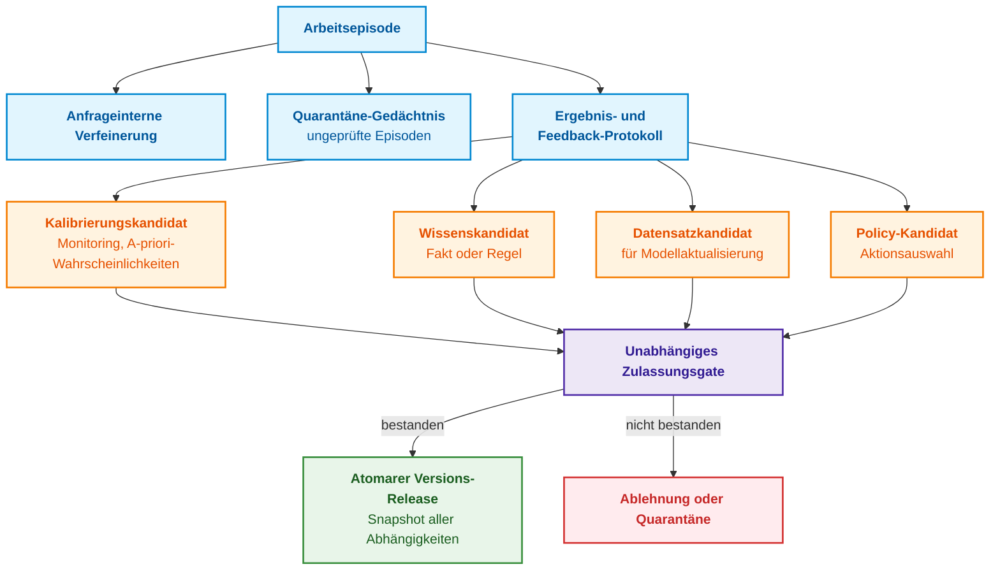
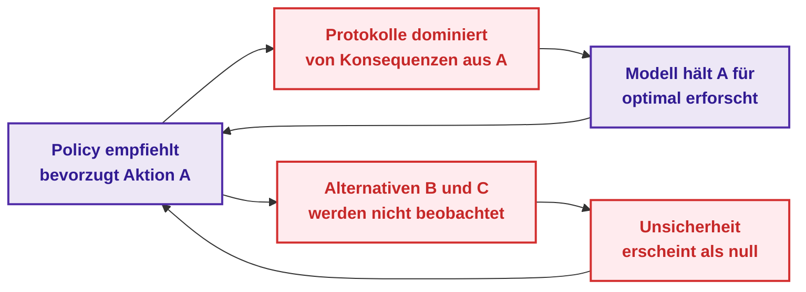
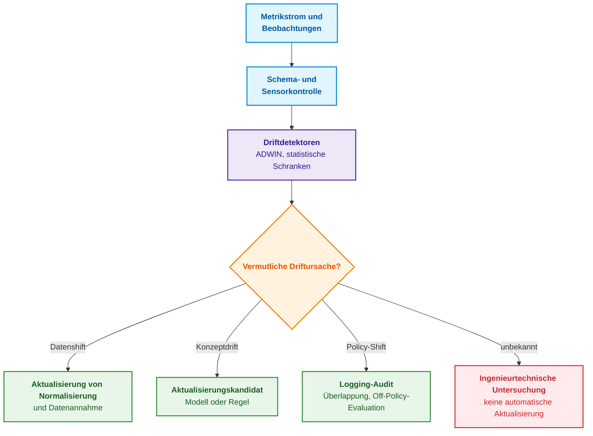
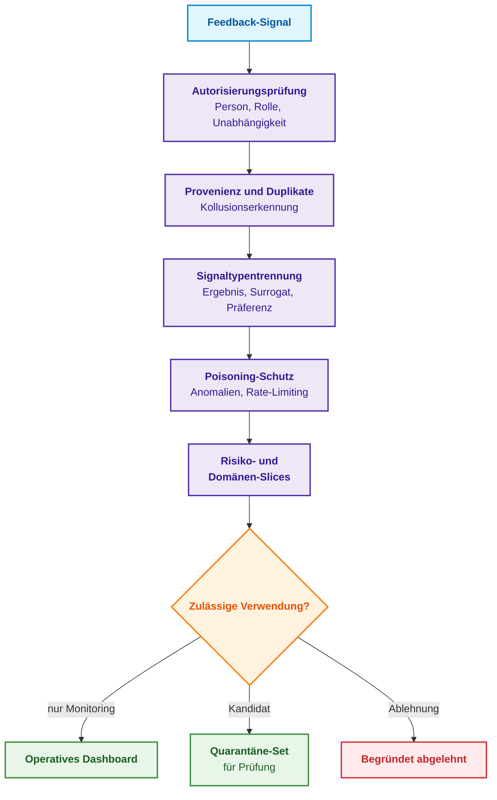

# Kapitel 26. Kontinuierliches Lernen (Continual Learning) aus Erfahrung und Beherrschung von Systemprotokoll-Drift

> **Buch:** [Architektur evidenzbasierter Expertensysteme](README.md) · [Teil VI: Neuro-symbolische Modelle, kognitive Frontlinien und kontinuierliches Lernen](part-06-frontiers-neuro-symbolic.md)  
> **Vorheriges Kapitel:** [Kapitel 25. Wie Expertensysteme lernen: Prüfungsmatrizen, Wissensaudits und Regressionskontrolle](ch25-how-expert-systems-learn.md)  
> **Nächstes Kapitel:** [Kapitel 35. Reaktives Expertensystem: Ereignisse, Widerruf und Wissensadaptation](ch35-self-organizing-expert-systems-synergetics-and-npu-runtime.md)  
> **Inhaltsverzeichnis:** [README.md](README.md)  
> **Autor:** [Mykola Fedchyk](about-the-author.md)  
> **Niveau:** Fortgeschritten: Knowledge Engineers, Machine-Learning-Ingenieure, Forscher  
> **Erwartete Lernergebnisse:** Episodisches Gedächtnis von neuem Wissen unterscheiden; einen Trainingsfall mit Propensity und Latenzzeit des Ergebnisses protokollieren; Verzerrungen in eigenen Systemprotokollen erkennen und Policy-Überlappung vor der Offline-Evaluierung verifizieren; Kovariatendrift, Prior-Shift und Konzeptdrift differenzieren; katastrophales Vergessen auf historischen Daten-Slices quantifizieren; Kandidaten für Regeländerungen, Fallbeispiele und Modelle durch isolierte Prüfung bis zum atomaren Release führen.

## Abstract

Nach hunderten Diagnosefällen registriert das Expertensystem ein wiederkehrendes Muster: Die Überprüfung des Steckverbinders führt häufig zum erfolgreichen Abschluss der Fehlersuche. Das Expertensystem beginnt daraufhin, diese Prüfung prioritär als erste Maßnahme zu empfehlen. In der Folge enthalten die Systemprotokolle überwiegend Steckverbinderprüfungen und positive Befunde nach erneutem Zusammenstecken, sodass das Expertensystem zu dem Schluss gelangt, der Steckverbinder sei die primäre Ausfallursache. Alternative Prüfpfade wurden unterdessen schlicht nicht mehr ausgeführt; folglich enthält das Protokoll keinerlei Evidenz gegen die Steckverbinder-Hypothese.

Dies illustriert das fundamentale Problem des Lernens aus dem eigenen Betrieb: Die akkumulierte Erfahrung hängt deterministisch von früheren Empfehlungen ab, finale Ergebnisse treffen erst mit zeitlicher Verzögerung ein, und verzerrte Rückkopplungsschleifen verstärken sich selbst. Dieses Kapitel beantwortet die Kernfrage: **Wie kann ein Expertensystem aus seiner Betriebserfahrung lernen, ohne dass eigene Systemprotokolle, Nutzerfeedback oder Sprachmodelle bestehende, verifizierte Regeln unbemerkt korrumpieren?** Die zentrale These lautet: **Betriebserfahrung ist eine Quelle für Änderungskandidaten, nicht für verifiziertes Wissen. Die Produktivumgebung darf zwar automatisiert Episoden protokollieren und Modifikationskandidaten vorschlagen; der epistemische Status eines Kandidaten wird jedoch ausschließlich durch eine unabhängige Verifikation erhöht. Dies erfordert die explizite Erfassung des Datenerhebungsmodus (Propensities und Policy-Überlappung), die methodische Differenzierung verschiedener Drift-Typen, die Quantifizierung von Vergessenseffekten auf historischen Slices und die Freigabe über identische Zulassungsgates wie in Kapitel 25.**

[Kapitel 3](ch03-beyond-reference-information-systems.md) definierte das Selbstlernen als strukturierte Erfahrungssammlung und Aufbereitung geprüfter Kandidaten – nicht als unkontrolliertes Überschreiben von Regeln nach jeder Antwort. [Kapitel 25](ch25-how-expert-systems-learn.md) etablierte den Lebenszyklus „Kandidat → Prüfung → Release“. Dieses Kapitel analysiert die Prozesse **vor der Entstehung eines Kandidaten und zwischen den Releases**: Welches Signal als valides Ergebnis gewertet werden darf, wie Drift frühzeitig detektiert wird, wie historische Betriebsmodi vor dem Vergessen bewahrt werden, wie eine neue Handlungsstrategie (Policy) auf verzerrten Protokollen evaluiert wird und was es in der Praxis tatsächlich bedeutet, wenn „ein Sprachmodell aus seinen Fehlern lernt“. Das Kapitel beschreibt ein methodisches Lernmodell und keineswegs eine Freigabe für autonome Selbstmodifikation. Selbst Verfahren mit formalen mathematischen Garantien operieren stets nur unter strikten Modellannahmen; Verifikation, Sicherheitsreviews und die Fähigkeit zum deterministischen Rollback auf vorherige Snapshots bleiben unverzichtbare Kernpflichten der Systemarchitektur.

## 1. Navigation des Kapitels nach dem Zielobjekt der Modifikation

Zur Revision eines Fakts oder einer Inferenzregel sind ein konsistentes Episodenprotokoll, eine verifizierte Quelle, präzise deklarierte Gültigkeitsgrenzen und das formale Zulassungsverfahren aus [Kapitel 25](ch25-how-expert-systems-learn.md) erforderlich. Das bloße Protokollieren eines Ereignisses modifiziert noch keine Regel. Zur Optimierung des Information Retrievals werden Anfragen, Re-Ranking-Algorithmen und die Gültigkeit von Quellen separat evaluiert. Zur Anpassung von Modellparametern bedarf es strukturierter Trainingsdaten sowie dedizierter Prüfungen auf Drift und katastrophales Vergessen.

Die Propensity – mithin die bedingte Wahrscheinlichkeit einer Aktionswahl unter der Logging-Policy – sowie die Überlappung alternativer Handlungsoptionen bilden die notwendige mathematische Basis für die nachfolgend beschriebenen Methoden der Offline-Policy-Evaluierung (*Off-Policy Evaluation*, OPE) anhand historischer Protokolldaten. Hierbei handelt es sich nicht um universelle Voraussetzungen für jede punktuelle Faktenkorrektur. Wurde eine alternative Handlung im Produktivbetrieb nie ausgeführt, können diese Verfahren deren Ergebnis ohne zusätzliche Annahmen oder Datenerhebungen nicht rekonstruieren. Die tiefergehenden statistischen Abschnitte sollten daher herangezogen werden, sobald das Ingenieurteam festlegt, welche konkrete Policy oder welches Modell modifiziert werden soll.

## 2. Ebenen und Mechanismen der Wissensadaptation

Episodengedächtnis, Laufzeitstatistiken, deterministische Regeln, numerische Modelle und Aktionsauswahl-Policies besitzen grundlegend unterschiedliche Systemauswirkungen. Der Eintrag eines Ereignisses konserviert lediglich Erfahrung; eine modifizierte Regel hingegen transformiert künftige Inferenzentscheidungen deterministisch. Die nachfolgende Tabelle differenziert sechs Mechanismen der Erfahrungsakkumulation danach, ob sie Zustand zwischen Anfragen persistieren, welche Subsysteme sie transformieren und welchen Risiken sie unterliegen.

| Mechanismus | Persistiert Zustand über Anfragen | Modifiziertes Zielobjekt | Primäres Fehlerrisiko |
|---|---|---|---|
| Anfrageinterne Selbstverfeinerung (*Self-Refinement*) | Nein | Aktueller Antwortentwurf und lokaler Prompt-Kontext | Modell bestätigt und verfestigt eigenen Fehler |
| Episodisches Gedächtnis | Ja | Unverifizierte Falldokumente und Reflexionseinträge | Ungeprüfter Freitext wird zum falschen Präzedenzfall |
| Operative Statistik und Kalibrierung | Ja | A-priori-Wahrscheinlichkeiten, Schwellenwerte, Konfidenzkarten | Drift oder systematisch verzerrte Ergebnisse |
| Wissensrevision | Ja | Fakten, Inferenzregeln, Ausnahmen, Ontologie | Widersprüche und Verlust der Provenienz |
| Kontinuierliches Modelltraining | Ja | Parameter von Embedding-Modellen, Klassifikatoren oder LLMs | Katastrophales Vergessen, Data Leakage |
| Policy-Lernen | Ja | Sequenzielle Auswahl von Fragen, Prüfungen und Aktionen | Unsichere Exploration und destruktive Feedback-Schleife |

Die ersten beiden Zeilen werden in der Praxis häufig fälschlich mit echtem Lernen gleichgesetzt. Aman Madaan et al. wiesen im Self-Refine-Verfahren nach, dass ein großes Sprachmodell (*Large Language Model*, LLM) seine Ausgabe durch iteratives Selbst-Feedback ohne zusätzliche Trainingsdaten und ohne Gewichtsaktualisierung verbessern kann [[1]](#src-1). Noah Shinn et al. speichern im Reflexion-Ansatz verbale Fehlerreflexionen in einem episodischen Speicherpuffer, modifizieren die Modellgewichte jedoch ebenfalls nicht [[2]](#src-2). Beide Ansätze erzielten in ihren Versuchsanordnungen Performanzgewinne, erzeugen jedoch keinerlei verifiziertes, persistentes Wissen für ein Expertensystem: Die Reflexion verbleibt unprüfbarer Freitext. Das folgende Diagramm veranschaulicht, wohin die Erfahrung einer Arbeitsepisode fließt und an welcher zentralen Kontrollinstanz entschieden wird, ob sie in die Produktivversion einfließen darf.



Die zentrale architektonische Invariante dieses Schemas lautet: Die Produktivausführung darf automatisiert Kandidaten generieren, besitzt jedoch keinerlei Befugnis, deren epistemischen Status eigenständig anzuheben. Ein Gedächtniseintrag wird nicht zur Regel, ein Nutzerklick nicht zum Ground-Truth-Label und ein erfolgreicher Werkzeugaufruf nicht zum formalen Kausalbeweis. Vor jeder Modifikation steht daher die fundamentale Frage: Konserviert das Ingenieurteam den Fall lediglich zur späteren retrospektiven Analyse, oder soll eine Regel geändert werden, die zukünftige Inferenzschritte bindend steuert? Von dieser Weichenstellung hängt das Verifikationsniveau ab – und diese Prüfung ist nur durchführbar, wenn der Fall mit hinreichendem formalem Kontext protokolliert wurde.

## 3. Protokollierung von Trainingsfällen und Handhabung verzögerten Feedbacks

Um eine getroffene Inferenzentscheidung mit einem zeitlich verzögerten Ergebnis in Kausalbeziehung zu setzen, erfasst das Protokoll die Aktionsauswahl und das Eintreffen des Ergebnisses wie folgt:

```math
a_t\sim\mu_t(a\mid x_t),
\qquad y_{t+d}\sim P(y\mid x_t,a_t,e_t).
```

- In diesem Gleichungspaar bezeichnet $t$ den Entscheidungszeitpunkt, $`x_t`$ den Kontextvektor, $`a_t`$ die gewählte Aktion und $`\mu_t(a\mid x_t)`$ die Auswahlwahrscheinlichkeit der Aktion unter dem Kontext $`x_t`$;
- $\sim$ symbolisiert die stochastische Ziehung eines Werts gemäß der angegebenen Verteilung, während $`P(y\mid x_t,a_t,e_t)`$ die bedingte Verteilung des Ergebnisses $y$ in Abhängigkeit von Kontext, Aktion und Umgebungsumfeld formal definiert;
- $`o_t`$ ist die unmittelbare Beobachtung, die separat im Protokoll fixiert wird, während $`y_{t+d}`$ das finale Ergebnis darstellt, das erst mit einer zeitlichen Verzögerung von $d$ Schritten verfügbar wird;
- $`e_t`$ repräsentiert den Zustand der Umgebung, der zumeist nur partiell beobachtbar ist.

Die Interpretation ist eindeutig: Das Protokoll registriert exakt, mit welcher Wahrscheinlichkeit die Logging-Policy eine Aktion im gegebenen Kontext gewählt hat, und verknüpft diese Aktion anschließend mit dem Ergebnis, das zu einem späteren Zeitpunkt eintrifft. Wahrscheinlichkeitswerte liegen strikt im Intervall $[0, 1]$; die mathematische Formulierung erhebt ein nach einer Aktion beobachtetes Resultat keineswegs per se zum Kausalbeweis. Für die Systemdiagnose aus [Kapitel 24](ch24-system-diagnosis.md) kann die Aktion beispielsweise in einer synchronen Erfassung von Versorgungsspannung und Taktsignal bestehen, das Ergebnis in einer zwei Tage später verifizierten Ausfallursache und die finale Garantiestatistik in Monatsdaten. Ein minimaler Feedback-Datensatz für eine derartige Episode besitzt die folgende Struktur:

<details>
<summary>Strukturierte JSON-Repräsentation</summary>

```json
{
  "episode_id": "diag:cold-start-failure:run-31",
  "decision_snapshot": "sha256:...",
  "behavior_policy": "test-policy@4.2",
  "context": "feature-vector-or-typed-facts-ref",
  "action": "synchronized_rail_clock_capture",
  "propensity": 0.42,
  "immediate_observation": "obs:trace:881",
  "delayed_outcomes": [
    {"type": "adjudicated_root_cause", "value": "connector", "at": "..."}
  ],
  "feedback_source": "reliability-review-board",
  "causal_status": "observational_after_intervention",
  "eligibility": "candidate_only"
}
```

</details>

Das Feld `propensity` enthält die Wahrscheinlichkeit, mit der die Logging-Policy diese Aktion im gegebenen Kontext auswählen konnte. Ohne diesen Propensity-Wert sind Verfahren der Offline-Policy-Evaluierung (*Off-Policy Evaluation*, OPE) mathematisch undurchführbar. Agiert die operative Logging-Policy rein deterministisch und wählte niemals Alternativen, enthält das Protokoll keinerlei Evidenz über die Konsequenzen alternativer Handlungen – kein statistisches Verfahren der Welt kann kontrafaktische Ergebnisse aus dem Nichts rekonstruieren. Das Attribut `eligibility` deklariert verbindlich, dass dieser Datensatz ausschließlich den Status eines Kandidaten einnehmen darf, während `causal_status` daran erinnert, dass das Ergebnis lediglich nach einer Intervention beobachtet wurde und nicht aus einem randomisierten kontrollierten Experiment stammt.

Sofern Trainingsfälle und Sensorbeobachtungen von externen Systemen oder Vorprozessoren stammen, müssen sie kryptographisch geschützte Schnittstellen zur Zertifizierung sowie ein striktes Zugriffs-Lattice durchlaufen ([Kapitel 33](ch33-inter-system-knowledge-exchange-and-model-teaching.md)). Dies stellt sicher, dass Gegenbeispiele weder vergiftete Daten enthalten noch Sicherheitsinvarianten verletzen, bevor sie in das Erfahrungsprotokoll überführt werden.

Das nachfolgende Sequenzdiagramm veranschaulicht die zeitliche Abfolge, in der das Protokoll die einzelnen Segmente einer Episode akkumuliert.

```mermaid
sequenceDiagram
    autonumber
    accTitle: Sequenz der Feedback-Erfassung im Erfahrungsprotokoll
    accDescr: Das Expertensystem protokolliert Kontext, Aktion und Propensity, die Umgebung liefert unmittelbare und verzögerte Beobachtungen, und der Fachexperte ergänzt Korrekturen sowie das autorisierte Verdikt.
    participant S as Expertensystem
    participant E as Umgebung oder Prozess
    participant H as Schiedsrichter / Fachexperte
    participant L as Feedback-Protokoll
    S->>L: Kontext, Aktion, Policy, Propensity
    S->>E: Empfehlung oder kontrollierte Aktion
    E-->>L: Unmittelbare Beobachtung
    H-->>L: Korrektur oder Widerruf mit Begründung
    E-->>L: Verzögertes operatives Ergebnis
    H-->>L: Autorisiertes Verdikt
    Note over L: Einträge sind unveränderlich (Append-only); Audit-Trail bleibt gewahrt
```

Das Protokoll unterscheidet strikt zwischen dem Ereigniszeitpunkt und dem Zeitpunkt, zu dem das Ergebnis tatsächlich verifizierbar vorlag. Wird diese Trennung vernachlässigt, trainiert ein Modell unweigerlich auf Daten, die zum Entscheidungszeitpunkt physikalisch nicht verfügbar waren (Lookahead-Bias), oder es interpretiert ein noch ausstehendes Ergebnis fälschlich als Fehler. Das folgende Python-Skript demonstriert diesen Unterschied anhand von sechs synthetischen Diagnoseepisoden. Das Feld `label_available_at` gibt den Tag an, an dem ein Fachexperte das Ergebnis bestätigte; `None` signalisiert, dass der Ausgang noch unbekannt ist. Erfordert Python 3.10 oder neuer.

<details>
<summary>Python-Referenzimplementierung</summary>

```python
from dataclasses import dataclass


@dataclass(frozen=True)
class Episode:
    decided_at: int
    label_available_at: int | None
    correct: bool | None


def evaluate_at(cutoff, episodes):
    decided = [e for e in episodes if e.decided_at <= cutoff]
    if not decided:
        raise ValueError("no decisions before cutoff")
    for e in decided:
        if (e.label_available_at is None) != (e.correct is None):
            raise ValueError("label time and outcome must be both present or both absent")
        if e.label_available_at is not None and e.label_available_at < e.decided_at:
            raise ValueError("label cannot precede decision")
    resolved = [e for e in decided if e.label_available_at is not None and e.label_available_at <= cutoff]
    correct = sum(1 for e in resolved if e.correct)
    return {
        "decided": len(decided),
        "pending": len(decided) - len(resolved),
        "naive": correct / len(decided),
        "resolved_accuracy": correct / len(resolved) if resolved else None,
    }


EPISODES = [
    Episode(1, 3, True), Episode(2, 4, True), Episode(3, 5, False),
    Episode(4, 9, True), Episode(5, 10, True), Episode(6, None, None),
]

for day in (6, 10):
    print(day, evaluate_at(day, EPISODES))
```

</details>

Die Programmausführung liefert:

<details>
<summary>Programmausgabe</summary>

```text
6 {'decided': 6, 'pending': 3, 'naive': 0.3333333333333333, 'resolved_accuracy': 0.6666666666666666}
10 {'decided': 6, 'pending': 1, 'naive': 0.6666666666666666, 'resolved_accuracy': 0.8}
```

</details>

Am sechsten Tag sind drei Resultate noch ausstehend. Werden diese naiv als Fehler gewertet, beträgt die scheinbare Genauigkeit lediglich 0,333; bezogen auf die drei verifizierten Fälle liegt die Genauigkeit jedoch bei 0,667. Am zehnten Tag verbleibt nur noch eine ungelöste Episode, und die Genauigkeit unter den aufgelösten Fällen steigt auf 0,8. Keine dieser Kennzahlen bildet die reale Qualität isoliert ab: Bekannte Resultate können sich systematisch von denjenigen unterscheiden, die noch auf ein Schiedsgericht warten. Ein professioneller Qualitätsbericht weist daher stets die Anzahl unaufgelöster Episoden sowie die Latenzzeitverteilung aus, anstatt aggregierte Scheinpräzision vorzutäuschen. Eine derartige Protokollierung stellt noch kein Wissen dar – sie liefert lediglich das empirische Prüfmaterial. Doch selbst fehlerfrei aufgezeichnete Fälle spiegeln stets nur den Ausschnitt der Realität wider, den das Expertensystem aktiv zu beobachten beschlossen hat.

## 4. Systemische Protokollverzerrung (Log Bias) und Offline-Policy-Evaluierung (Off-Policy Evaluation)

Der Systemzustand, auf den ein Expertensystem morgen trifft, hängt kausal von seinen heutigen Aktionen ab. Bei sequenziellen Entscheidungsprozessen generiert die Logging-Policy $\mu$ ihre eigene Zustandsverteilung $d^{\mu}(x)$, während eine neu evaluierte Ziel-Policy $\pi$ Zustände ansteuern kann, die im historischen Protokoll kaum repräsentiert sind:

```math
d^{\pi}(x)\ne d^{\mu}(x).
```

- In $d^{\pi}(x)$ und $d^{\mu}(x)$ kennzeichnen die Indizes $\pi$ und $\mu$ die stationären Zustandsverteilungen unter der Ziel- bzw. der Logging-Policy;
- $x$ repräsentiert den Systemzustand, und $d^{\pi}(x)$ sowie $d^{\mu}(x)$ sind die Wahrscheinlichkeitsdichten dieses Zustands unter der jeweiligen Policy;
- $\ne$ zeigt an, dass die beiden Verteilungen im Zustandsraum nicht identisch sind.

Die praktische Konsequenz ist gravierend: Das Protokoll einer bestehenden Policy enthält Zustände, die eine alternative Policy herbeiführen würde, oft nur marginal oder überhaupt nicht. Jede Verteilung integriert zu 1; die Gleichung quantifiziert die Divergenz jedoch nicht unmittelbar.

Stéphane Ross, Geoffrey Gordon und Drew Bagnell wiesen nach, dass Imitation Learning aufgrund der Verletzung der IID-Annahme (*independent and identically distributed*) nach eigenen Fehlern rasch degradiert, und konzipierten den DAgger-Algorithmus (*Dataset Aggregation*), der Labels gezielt in denjenigen Zuständen akkumuliert, die von der aktuellen Policy tatsächlich besucht werden [[3]](#src-3). In sicherheitskritischen Anwendungen verbietet es sich jedoch, potenziell katastrophale Systemzustände rein zu Datenerhebungszwecken gezielt anzusteuern.

Für Protokolle kontextbezogener Entscheidungen lässt sich der Erwartungswert einer neuen Policy $\pi$ über inverse Propensity-Gewichtung (*Inverse Propensity Scoring*, IPS) schätzen:

```math
\widehat V_{\mathrm{IPS}}(\pi)=\frac{1}{N}\sum_{i=1}^{N}
\frac{\pi(a_i\mid x_i)}{\mu(a_i\mid x_i)}\,r_i.
```

- In dieser Schätzformel ist $N$ die Gesamtzahl protokollierter Episoden, und $i$ indiziert die einzelne Episode;
- $`x_i`$ ist der Kontextvektor, $`a_i`$ die ausgeführte Aktion, $`r_i`$ die beobachtete Belohnung (*Reward*) und $\pi$ die zu evaluierende Ziel-Policy;
- $`\mu(a_i\mid x_i)`$ ist die Auswahlwahrscheinlichkeit der Aktion im Protokoll, während $`\pi(a_i\mid x_i)`$ deren Wahrscheinlichkeit unter der Ziel-Policy darstellt;
- Der Quotient beider Wahrscheinlichkeiten bildet das Wichtigkeitsgewicht (*Importance Weight*); $`\sum_{i=1}^{N}`$ summiert die gewichteten Belohnungen, und die Division durch $N$ liefert den Erwartungswert;
- $`\widehat V_{\mathrm{IPS}}(\pi)`$ ist der geschätzte Gesamtwert der Ziel-Policy.

Jeder historische Eintrag wird somit exakt proportional zum Wahrscheinlichkeitsverhältnis zwischen Ziel- und Logging-Policy rekalibriert. Für zwei hypothetische Episoden mit Gewichten 2 und 1 sowie Belohnungen 1 und 0 beträgt die Schätzung $(2\cdot1+1\cdot0)/2=1$. Das Ergebnis besitzt die Einheit der Belohnung und setzt zwingend voraus, dass jede Aktion, die die Ziel-Policy wählen kann, in der Logging-Policy eine strikt positive Wahrscheinlichkeit besaß. Diese fundamentale mathematische Voraussetzung ist die Überlappung (*Common Support* / *Policy Overlap*):

```math
\pi(a\mid x)>0\Rightarrow\mu(a\mid x)>0.
```

- Für diese Überlappungsbedingung bezeichnet $`\pi(a\mid x)`$ die Aktionswahrscheinlichkeit unter der Ziel-Policy und $`\mu(a\mid x)`$ unter der Logging-Policy;
- $x$ ist der Kontext, $a$ die Aktion, und $>0$ deklariert eine strikt positive Wahrscheinlichkeit;
- $\Rightarrow$ fordert, dass jede Aktion mit strikt positiver Wahrscheinlichkeit unter der Ziel-Policy auch im Protokoll eine strikt positive Wahrscheinlichkeit besitzen muss;
- $\Rightarrow$ ist die logische Implikation: Kann die Ziel-Policy eine Aktion auswählen, muss auch die Logging-Policy dieser Aktion eine Wahrscheinlichkeit größer null zuweisen.

Diese Bedingung erzwingt die Überlappung der Aktionsräume, garantiert jedoch keineswegs eine geringe Varianz: Sehr kleine Wahrscheinlichkeiten im Nenner erzeugen extrem große Gewichte, die die Schätzung destabilisieren.

Kleine Werte für $`\mu(a_i\mid x_i)`$ führen zu gewaltigen Wichtigkeitsgewichten und explodierender Varianz. Ein Kappen der Gewichte (*Weight Truncation*) reduziert die Varianz, führt jedoch eine systematische Verzerrung ein. Doppelt-robuste Schätzer (*Doubly Robust Estimators*), verfeinert von Miroslav Dudík, John Langford und Lihong Li, kombinieren ein gelerntes Belohnungsmodell mit einer Propensity-Korrektur [[4]](#src-4), heben die zugrunde liegenden Modellannahmen jedoch nicht auf. Wie viel statistische Information nach der Gewichtung verbleibt, misst der effektive Stichprobenumfang (*Effective Sample Size*, ESS) für die Gewichte $`w_i`$ nach Art B. Owen [[5]](#src-5):

```math
\mathrm{ESS}=\frac{\left(\sum_iw_i\right)^2}{\sum_iw_i^2}.
```

- Hierbei repräsentieren die Gewichte $`w_i`$ die Wichtigkeitsgewichte der Episoden $i$, und die Summen erstrecken sich über alle erfassten Episoden;
- Der Zähler quadriert die Gesamtsumme der Gewichte, während der Nenner die Summe der quadrierten Einzelgewichte berechnet;
- $\mathrm{ESS}$ ist der effektive Stichprobenumfang, mithin die Anzahl ungewichteter, unabhängiger Beobachtungen mit äquivalentem Informationsgehalt.

**Praktische Anwendung und ingenieurtechnische Konsequenzen (Closed-Loop Decision):**
1. **Kriterien für das Validierungs-Dispatching von Policies:**
   - **Wenn $`\mathrm{ESS} / N \ge \tau_{\mathrm{ess}} = 0{,}30`$ (die effektive Stichprobengröße beträgt mindestens 30 % des Protokollumfangs $N$):** Die IPS-Schätzung $`\widehat V_{\mathrm{IPS}}(\pi)`$ wird als statistisch belastbar eingestuft und für die ingenieurtechnische Release-Entscheidung zugelassen;
   - **Wenn $`\mathrm{ESS} / N < 0{,}30`$:** Die Varianz der Wichtigkeitsgewichte $`w_i`$ ist unzulässig hoch (wenige seltene Ausreißer-Episoden dominieren die Summe). Ein autonomes Deployment wird blockiert; das System schaltet automatisch auf eine regularisierte Schätzung mit gekappten Gewichten (*Truncated IPS*) oder einen doppelt-robusten Schätzer (*Doubly Robust Estimator*) um.
2. **Praktisches Zahlenbeispiel:** Für eine Stichprobe aus drei Episoden mit den Gewichten 1, 1 und 2 ergibt sich: $`\mathrm{ESS} = 4^2 / (1^2 + 1^2 + 2^2) = 16 / 6 \approx 2{,}67`$. Der relative Anteil beträgt $`\mathrm{ESS} / N = 2{,}67 / 3 \approx 0{,}89 \ge 0{,}30`$. **Systemreaktion:** Die Gewichtung ist stabil; die statistische Zuverlässigkeitsschwelle wird überschritten.

Das nachfolgende Python-Programm rekonstruiert das einführende Steckverbinder-Szenario. Es modelliert zwei Kontexte (Kälte und Wärme) sowie drei primäre Prüfmaßnahmen. Bei Kälte lokalisiert die Steckverbinderprüfung den Defekt mit einer Wahrscheinlichkeit von 0,60; bei Wärme ist die Prüfung der Spannungsversorgung mit 0,45 am effektivsten. Die neue Ziel-Policy wählt bei Kälte den Steckverbinder und bei Wärme die Spannungsversorgung; der theoretische Erwartungswert dieser Ziel-Policy beträgt somit exakt $0{,}5\cdot0{,}60+0{,}5\cdot0{,}45=0{,}525$. Das Programm sammelt jeweils 200.000 Episoden unter zwei unterschiedlichen Logging-Policies und evaluiert die Ziel-Policy auf beiden Datensätzen. Erfordert ausschließlich die Python 3.10+ Standardbibliothek.

<details>
<summary>Python-Referenzimplementierung</summary>

```python
"""Systemprotokoll-Verzerrung (Log Bias) und Offline-Policy-Evaluierung mittels Propensity-Gewichtung (IPS).

Nur Python 3.10+ Standardbibliothek.
"""
import random

ACTIONS = ("Steckverbinder", "Taktung", "Stromversorgung")
CONTEXTS = ("Kälte", "Wärme")
# Wahrscheinlichkeit, dass die erste Prüfung den Fehler findet, für jede Aktion unter allen Bedingungen
P_FOUND = {"Kälte": (0.60, 0.20, 0.20), "Wärme": (0.15, 0.40, 0.45)}
N = 200_000


def connector_only(context):
    return (1.0, 0.0, 0.0)


def connector_mostly(context):
    return (0.8, 0.1, 0.1)


def target(context):
    """Neue Policy: bei Kälte zuerst Steckverbinder prüfen, bei Wärme Stromversorgung."""
    return 0 if context == "Kälte" else 2


def collect(policy, rng):
    logs = []
    for _ in range(N):
        context = rng.choice(CONTEXTS)
        probs = policy(context)
        action = rng.choices(range(3), weights=probs)[0]
        reward = 1 if rng.random() < P_FOUND[context][action] else 0
        logs.append((context, action, probs[action], reward))
    return logs


def report(name, policy, logs):
    if not logs:
        raise ValueError("empty log")
    print(f"Protokoll: {name}")
    counts = [sum(1 for _, a, _, _ in logs if a == i) for i in range(3)]
    print("  Beobachtungen pro Aktion:", ", ".join(f"{ACTIONS[i]} {counts[i]}" for i in range(3)))
    supported = True
    for context in CONTEXTS:
        mu = policy(context)[target(context)]
        print(f"  Überlappung „{context} -> {ACTIONS[target(context)]}“: mu = {mu:.2f}" + ("" if mu > 0 else "  FEHLT"))
        supported = supported and mu > 0
    if not supported:
        print("  IPS-Schätzung nicht identifizierbar: keine Policy-Überlappung")
        return None
    matched = [r for x, a, _, r in logs if a == target(x)]
    weights = [1 / p if a == target(x) else 0.0 for x, a, p, _ in logs]
    if not matched or sum(weights) == 0:
        print("  Schätzung nicht verfügbar: keine beobachteten Übereinstimmungen mit Ziel-Policy")
        return None
    ips = sum(w * r for w, (_, _, _, r) in zip(weights, logs)) / len(logs)
    ess = sum(weights) ** 2 / sum(w * w for w in weights)
    print(f"  Naive Schätzung (Mittelwert der Übereinstimmungen): {sum(matched) / len(matched):.3f}")
    print(f"  IPS-Schätzung: {ips:.3f}; effektiver Stichprobenumfang {ess:.0f} von {len(logs)}")
    return ips, ess


def test_evaluation_guards():
    import contextlib
    import io

    with contextlib.redirect_stdout(io.StringIO()):
        assert report("unsupported", connector_only, [("Kälte", 0, 1.0, 1)]) is None
        assert report("no_matches", connector_mostly, [("Wärme", 1, 0.1, 1)]) is None
        estimate, effective_size = report("supported", connector_mostly, [("Kälte", 0, 0.8, 1)])
        assert estimate == 1.25 and effective_size == 1.0
        try:
            report("empty", connector_mostly, [])
        except ValueError:
            pass
        else:
            raise AssertionError("empty log accepted")


test_evaluation_guards()


true_value = sum(P_FOUND[c][target(c)] for c in CONTEXTS) / len(CONTEXTS)
print(f"Wahrer Wert der Ziel-Policy: {true_value:.3f}")
rng = random.Random(26)
for name, policy in (("nur Steckverbinder", connector_only), ("Steckverbinder in 80 % der Fälle", connector_mostly)):
    print()
    report(name, policy, collect(policy, rng))
```

</details>

Die Programmausführung prüft eingangs drei Randfälle (fehlende Überlappung, Protokoll ohne Ziel-Policy-Matches und leeres Protokoll) und liefert anschließend:

<details>
<summary>Programmausgabe</summary>

```text
Wahrer Wert der Ziel-Policy: 0.525

Protokoll: nur Steckverbinder
  Beobachtungen pro Aktion: Steckverbinder 200000, Taktung 0, Stromversorgung 0
  Überlappung „Kälte -> Steckverbinder“: mu = 1.00
  Überlappung „Wärme -> Stromversorgung“: mu = 0.00  FEHLT
  IPS-Schätzung nicht identifizierbar: keine Policy-Überlappung

Protokoll: Steckverbinder in 80 % der Fälle
  Beobachtungen pro Aktion: Steckverbinder 159907, Taktung 20085, Stromversorgung 20008
  Überlappung „Kälte -> Steckverbinder“: mu = 0.80
  Überlappung „Wärme -> Stromversorgung“: mu = 0.10
  Naive Schätzung (Mittelwert der Übereinstimmungen): 0.581
  IPS-Schätzung: 0.524; effektiver Stichprobenumfang 35542 von 200000
```

</details>

Das erste Protokoll entstammt einer rein deterministischen Policy, die ausnahmslos den Steckverbinder prüfte. Für warme Betriebsbedingungen wählt die neue Policy eine Aktion, die im Protokoll kein einziges Mal dokumentiert ist: Die Überlappungsbedingung ist verletzt, und das System verweigert folgerichtig jede numerische Schätzung. Würde man diese Schutzprüfung deaktivieren, errechnete eine naive Auswertung einen Scheinerfolg von 0,602 (weil sie ausschließlich Kältefälle sieht) und eine unbereinigte IPS-Schätzung von 0,301 (weil Wärmefälle stillschweigend mit null gewichtet werden). Beide Zahlen sind trügerisch falsch. Das zweite Protokoll stammt von einer Policy mit stochastischer Exploration (20 % alternative Aktionen mit bekannten Propensities). Die naive Auswertung überschätzt den Erfolg mit 0,581 weiterhin drastisch, da Kältefälle achtfach überrepräsentiert sind. Die IPS-Schätzung rekonstruiert den wahren Wert mit 0,524 (Soll: 0,525) nahezu exakt. Den methodischen Preis belegt die letzte Kennzahl: Der effektive Stichprobenumfang sinkt von 200.000 auf 35.542 Episoden – die Gewichtungskorrektur vernichtet mehr als vier Fünftel der nominellen Datenmenge.

Dieses Szenario ist vereinfacht: Der Kontext kennt nur zwei Ausprägungen, Propensities sind exakt bekannt und Belohnungen fallen unverzögert an. In Produktionsumgebungen müssen Propensities zwingend im Moment der Inferenzentscheidung unveränderlich festgehalten werden, während verzögerte Ergebnisse ein strukturiertes Management unvollendeter Episoden verlangen. Das folgende Flussdiagramm veranschaulicht die verhängnisvolle Selbstverstärkungsschleife einer Policy ohne kontrollierte Exploration.



Beide Zyklen des Schemas koppeln auf die Policy zurück und zementieren deren einseitige Entscheidungen. Das Aufbrechen dieser Schleife gelingt nur durch lückenloses Propensity-Logging, explizite Repräsentation von Nicht-Wissen, abgesicherte Exploration innerhalb definierter Sicherheitskorridore, expertengeführte Stichprobenprüfungen und simulationsgestützte Gegenproben. Bei irreversiblen Eingriffen stellt eine Offline-Policy-Evaluierung lediglich ein Indiz dar – niemals eine automatische Freigabe zum Produktiv-Rollout. Doch selbst ein methodisch einwandfreies Protokoll schützt vor einer weiteren Herausforderung nicht: Die vom Protokoll beschriebene physikalische Realität kann sich im Zeitverlauf verändern.

## 5. Diagnose und Differenzierung von Systemdrift-Typen

Nicht jeder Einbruch einer Leistungsmetrik erfordert ein Nachtraining von Modellen. João Gama et al. unterscheiden in ihrer grundlegenden Taxonomie der Konzeptdrift-Adaption mehrere distinkte Typen von Verteilungsverschiebungen [[6]](#src-6). **Kovariatendrift** (*Covariate Drift*) bezeichnet die Veränderung der Eingangsverteilung:

```math
P_t(X)\ne P_{t+1}(X).
```

- Kovariatendrift wird beschrieben durch $`P_t(X)`$ und $`P_{t+1}(X)`$, die Verteilungen der Eingangsmerkmale in den Zeitintervallen $t$ und $t+1$;
- $X$ ist die Zufallsvariable der Eingangsdaten, und $\ne$ zeigt an, dass sich die Verteilungscharakteristiken signifikant unterscheiden.

In der Praxis haben sich die relativen Häufigkeiten oder Merkmalskombinationen verschoben; die Wahrscheinlichkeitswerte verbleiben im Intervall $[0, 1]$, doch die Formel offenbart die physikalische Ursache nicht.

**Prior-Shift** (*Label Shift*) transformiert die A-priori-Verteilung der Zielklassen:

```math
P_t(Y)\ne P_{t+1}(Y).
```

- Bei einem Prior-Shift bezeichnen $`P_t(Y)`$ und $`P_{t+1}(Y)`$ die Klassenverteilungen des Zielmerkmals $Y$ in den Intervallen $t$ und $t+1$;
- $Y$ repräsentiert die Zielgröße bzw. das Fehlerklassen-Label, und $\ne$ markiert die statistische Diskrepanz.

Folglich verschieben sich die Grundhäufigkeiten der Klassen im Einsatzfeld, ohne dass sich zwingend die funktionale Ursache-Wirkungs-Beziehung geändert hat.

**Konzeptdrift** (*Concept Drift*) modifiziert den funktionalen Zusammenhang zwischen Eingangsdaten und Zielgröße:

```math
P_t(Y\mid X)\ne P_{t+1}(Y\mid X).
```

- Hierbei sind $`P_t(Y\mid X)`$ und $`P_{t+1}(Y\mid X)`$ die bedingten Verteilungen des Ergebnisses $Y$ gegeben die Merkmale $X$ in den beiden Zeitabschnitten;
- $\mid$ bezeichnet die mathematische Bedingung, und $\ne$ belegt, dass sich die kausale Abbildung von den Symptomen auf das Ergebnis transformiert hat.

Diese drei Gleichungen differenzieren präzise zwischen Verschiebungen der Eingangsgrößen, der A-priori-Klassenhäufigkeiten und der bedingten Inferenzbeziehung.

Eine neue Leiterplattenrevision ändert $P(X)$, ein neuer Bauteillieferant modifiziert die Fehlerraten $P(Y)$, und eine modifizierte Firmware-Architektur verändert die funktionale Abbildung $P(Y\mid X)$ von Telemetriedaten auf Systemfehler. Änderungen im Datenbankschema, defekte Sensoren oder modifizierte Annotationsrichtlinien können Drift zudem künstlich vortäuschen.

Der ADWIN-Algorithmus (*ADaptive WINdowing*) von Albert Bifet und Ricard Gavaldà vergleicht die statistischen Momente zweier Subfenster eines adaptiven Datenstromfensters und schlägt Alarm, sobald die Mittelwertdifferenz eine auf der Hoeffding-Ungleichung basierende Schranke überschreitet [[7]](#src-7). In vereinfachter Form lautet diese Schranke:

```math
\epsilon=\sqrt{\frac{1}{2m}\ln\frac{2}{\delta}}.
```

- $\epsilon$ ist die Entscheidungsschranke für die Mittelwertdifferenz und besitzt dieselbe Dimension wie die überwachte Metrik;
- $m$ ist die effektive harmonische Größe der Subfenster, während $\delta$ die zulässige Fehlalarmwahrscheinlichkeit im Intervall $(0, 1)$ deklariert; die Konstanten 1 und 2 sind feste mathematische Skalierungsfaktoren;
- $\ln$ bezeichnet den natürlichen Logarithmus, und das Wurzelzeichen steht für die Quadratwurzel.

Für exemplarische Parameter $m=100$ und $\delta=0{,}05$ ergibt sich $\epsilon=\sqrt{\ln(40)/200}\approx0{,}136$. Ein kleineres $\delta$ erhöht die Schranke und dämpft Fehlalarme auf Kosten einer erhöhten Erkennungslatenz. Reales ADWIN nutzt optimierte Schranken; diese Darstellung dient dem Verständnis des ingenieurtechnischen Trade-offs. Das nachfolgende Diagramm zeigt die Verzweigung der Diagnose-Pipeline nach Auslösen eines Driftalarms.



Ein Driftsignal ist stets eine Hypothese, niemals eine festgestellte Ursache. Vor jedem Eingriff sind fehlende Labels, saisonale Schwankungen, Produktvariantenwechsel und jüngste Software-Deployments zu prüfen. Verzögert eintreffende Ergebnisse können zudem eine Schein-Kalibrierungsdegradation vortäuschen, wenn schwebende Vorgänge verfrüht als Misserfolge verbucht werden.

### 5.1. Frühindikatoren: Degradationserkennung vor der ersten Fehlantwort

Konventionelle Driftdetektoren und Kalibrierungsprüfungen aus [Kapitel 25](ch25-how-expert-systems-learn.md) reagieren reaktiv auf bereits eingetretene Leistungseinbrüche: Die Erfolgsquote im Benchmark sinkt, der Kalibrierungsfehler steigt, oder Fachexperten weisen Systemantworten gehäuft zurück. Zu diesem Zeitpunkt wurden Anwender bereits mit fehlerhaften oder nutzlosen Empfehlungen konfrontiert. Der schleichende Wissensverfall setzt typischerweise deutlich früher ein: Eine Norm wurde aktualisiert, während die Wissensbasis noch den Altstand führt; in der Domäne etabliert sich neue Nomenklatur; Nutzeranfragen wandern in schwach instrumentierte Themengebiete ab. Diese Phänomene erzeugen schwache Signale lange vor dem Einbruch aggregierter Erfolgsmetriken.

Das Konzept der Frühwarnindikatoren (*Leading Indicators*) ist aus der Theorie komplexer Systeme wohlbekannt. Marten Scheffer et al. wiesen nach, dass ökologische, klimatische und ökonomische Systeme vor kritischen Zustandsübergängen (*Tipping Points*) eine verlangsamte Erholungsrate nach Störungen aufweisen, was sich in einem signifikanten Anstieg von Varianz und Autokorrelation beobachteter Systemvariablen äußert [[8]](#src-8). Für Expertensysteme liefert diese Erkenntnis belastbare Indikatorenkandidaten, die in der folgenden Tabelle zusammengefasst sind.

| Indikator | Messgröße | Frühwarnmechanismus |
|---|---|---|
| Anstieg der Konfidenzvarianz in einer Domäne | Varianz der Ausgabekonfidenz innerhalb eines Fachgebiets über ein rollierendes Zeitfenster bei stabilem Mittelwert | Erste Anfragen treffen auf Wissensgrenzen; der aggregierte Mittelwert maskiert die beginnende Instabilität |
| Divergenz zwischen Trefferzahl und Evidenzgrad | Anteil von Antworten mit hoher Retrieval-Trefferzahl, aber sinkendem Anteil formal verifizierter Zitate | Syntaktische Worttreffer bleiben bestehen, präzise normative Belege für neue Fachaspekte fehlen jedoch |
| Abwanderung in dünn besetzte Wissenszonen | Anteil der Anfragen in Segmenten mit niedrigem Knowledge Density Index ([Kapitel 32](ch32-high-performance-knowledge-packs-mmap-and-harvesting.md)) | Operative Anfragen verschieben sich in unvollständig formalisierte Themenfelder vor ersten Fehlurteilen |
| Zunahme von Klärungszyklen im Dialog | Durchschnittliche Anzahl von Präzisierungs-Rückfragen pro Interaktion bis zur finalen Antwortgenerierung | Begriffswelt des Vokabulars divergiert von den durch Anwender genutzten Formulierungen |

Alle vier Indikatoren sollten nicht über absolute Schwellenwerte, sondern über persistente Trendverschiebungen überwacht werden: Ein einzelner abweichender Tag ist statistisches Rauschen; ein kontinuierlicher Anstieg über sieben Tage signalisiert Handlungsbedarf. Eine hocheffektive Methode zur Detektion derartiger schleichender Verschiebungen ist die von E. S. Page entwickelte kumulative Summe (*Cumulative Sum*, CUSUM) zur statistischen Prozesslenkung [[9]](#src-9):

```math
S_t = \max\left(0,\; S_{t-1} + x_t - \mu_0 - k\right), \qquad S_0 = 0
```

- $`x_t`$ ist die Indikatormessung im Zeitintervall $t$ (beispielsweise die Konfidenzvarianz des aktuellen Tages);
- $`\mu_0`$ ist das Referenzniveau des Indikators im historisch stabilen Betriebszustand;
- $k$ ist die zulässige Toleranzschranke: Abweichungen kleiner als $k$ werden ignoriert (üblicherweise als halbe zu detektierende Verschiebung gewählt);
- $`S_t`$ ist die akkumulierte Summe der Schwellenüberschreitungen (strikt nicht-negativ); $`S_0 = 0`$ bildet den Startwert;
- Ein Alarm wird ausgelöst, sobald $`S_t`$ einen vordefinierten Schwellenwert $h$ übersteigt, der den Trade-off zwischen Erkennungsverzögerung und Fehlalarmrate determiniert.

Der CUSUM-Algorithmus akkumuliert geringfügige, aber systematische Überschreitungen des Referenzniveaus und schlägt erst bei signifikanter Akkumulation an. Isolierte Einzelausreißer führen nicht zum Alarm, da nachfolgende reguläre Perioden die Summe deterministisch auf null zurückführen. Ein ingenieurtechnisches Rechenbeispiel verdeutlicht das Prinzip: Die Konfidenzvarianz im Steuerungsbereich des Batteriemanagementsystems betrug im stabilen Referenzmonat $`\mu_0 = 0{,}040`$; die Toleranz sei $k = 0{,}005$ und der Alarmschwellenwert $h = 0{,}030$. Nach Veröffentlichung einer neuen Normrevision registriert das System an fünf aufeinanderfolgenden Tagen Werte von 0,046; 0,049; 0,052; 0,055; 0,058. Die kumulative Summe $`S_t`$ wächst entsprechend: $0{,}001 \to 0{,}005 \to 0{,}012 \to 0{,}022 \to 0{,}035$. Am fünften Tag wird der Schwellenwert $h$ überschritten und Alarm ausgelöst – die klassische Benchmark-Erfolgsquote zeigt zu diesem Zeitpunkt noch keinerlei messbare Verschlechterung.

Frühindikatoren können Fehlalarme auslösen: Eine saisonale Häufung neuartiger Fragestellungen erhöht die Varianz, ohne dass die Wissensbasis korrumpiert wäre. Ein Frühwarnsignal triggert daher niemals ein unreflektiertes automatisches Update, sondern initiiert zielgerichtete Verifikationsprozesse: Einen fokussierten Benchmark-Test auf dem betroffenen Domänen-Slice sowie einen Suchauftrag an das Wissensakquisitionsmodul zur Beschaffung autorisierter Primärquellen ([Kapitel 10](ch10-knowledge-acquisition-systems.md)). Die Validität jedes Frühindikators muss retrospektive Relevanz aufweisen: Er verbleibt nur dann im aktiven Monitoring, wenn er historische Systemausfälle zuverlässig antizipiert hat. Steht die Notwendigkeit einer Modell- oder Wissensaktualisierung fest, folgt unmittelbar die nächste fundamentale Kernfrage: Wie wird gesichert, dass die Neuversion bewährte historische Funktionsmodi nicht zerstört?

## 6. Metriken zur Quantifizierung von katastrophalem Vergessen (Catastrophic Forgetting)

Ein Nachtraining auf den Betriebsdaten des vergangenen Monats optimiert das System möglicherweise für die neue Board-Revision E, bricht jedoch gleichzeitig die Funktionalität für Revision C. Dieser Effekt des katastrophalen Vergessens muss über klar segmentierte Aufgabenstellungen und Daten-Slices gemessen werden. Arslan Chaudhry et al. formalisierten das durchschnittliche Vergessen (*Average Forgetting*) nach dem sequenziellen Training über $T$ Aufgabenstellungen wie folgt [[10]](#src-10):

```math
F_T=\frac{1}{T-1}\sum_{i=1}^{T-1}
\left(\max_{i\le k\le T-1}a_{k,i}-a_{T,i}\right).
```

- $T$ ist die Gesamtzahl sequenziell bearbeiteter Aufgaben, und $i$ indiziert eine historische Aufgabe oder einen spezifischen Daten-Slice;
- $`a_{k,i}`$ ist die Leistungsmetrik auf Aufgabe $i$, nachdem das System bis einschließlich Aufgabe $k$ trainiert wurde; $`a_{T,i}`$ ist die Performanz auf demselben Slice nach Abschluss der finalen Aufgabe $T$;
- $`\max_{i\le k\le T-1}`$ ermittelt die maximale historische Performanz auf Aufgabe $i$ in allen Zwischenstadien von $i$ bis $T-1$;
- $`\sum_{i=1}^{T-1}`$ summiert die Qualitätsverluste über alle historischen Aufgaben, und die Division durch $T-1$ liefert das arithmetische Mittel;
- $`F_T`$ beziffert das mittlere Vergessen in den Einheiten der gewählten Performanzmetrik.

**Praktische Anwendung und ingenieurtechnische Konsequenzen (Closed-Loop Decision):**
1. **Release-Gate für kontinuierliches Lernen (Continual Learning Release Gate):**
   - **Wenn $`F_T \le \tau_{\mathrm{forget}} = 0{,}02`$ und das maximale Vergessen auf jedem individuellen kritischen Slice $`\max_i (\dots) \le 0{,}05`$:** Das Update der Wissensbasis oder Modellgewichte besteht die Prüfung und wird für ein Canary-Deployment zugelassen;
   - **Wenn $`F_T > 0{,}02`$ oder auf mindestens einem geschützten Sicherheits-Slice eine Regression von $> 0{,}05$ registriert wird:** Das Rollout der neuen Version wird kategorisch blockiert. Das System aktiviert automatisch eine Wissenserhaltungsstrategie: Wiederherstellung des Replay-Puffers mit einer Erhöhung des Anteils historischer Trainingsbeispiele auf $25\,\%$ oder Verstärkung des EWC-/L2-Regularisierungskoeffizienten zur Konservierung synaptischer Gewichte.
2. **Praktisches Zahlenbeispiel:** Bei $T=4$ Aufgaben betrug der Qualitätsverlust auf den drei vorherigen Slices: Slice 1: $0{,}01$, Slice 2: $0{,}00$, Slice 3: $0{,}03$. Das durchschnittliche Vergessen beträgt: $`F_4 = \frac{0{,}01 + 0{,}00 + 0{,}03}{3} = \frac{0{,}04}{3} \approx 0{,}013 = 1{,}3\% \le 2{,}0\%`$. Maximaler Einbruch: $0{,}03 \le 0{,}05$. **Systemreaktion:** Die Regression liegt innerhalb der definierten technischen Toleranzgrenzen; das Release-Gate genehmigt die Integration des neuen Modells.

David Lopez-Paz und Marc'Aurelio Ranzato erweiterten dieses Spektrum um Metriken für Rückwärts- und Vorwärtstransfer (*Backward and Forward Transfer*) zwischen Aufgaben [[11]](#src-11). Ein negativer Vergessenswert auf einem Slice belegt, dass das Training der neuen Aufgabe das Verständnis der historischen Aufgabe verbessert hat. Aggregierte Mittelwerte dürfen jedoch niemals kritische Einbrüche verdecken. Die Vergessensmetrik wird stets für das Gesamtsystem sowie separat für geschützte Risikogruppen berechnet: Alte Hardware-Revisionen, seltene, aber sicherheitskritische Fehlermodi und Sensorquellen alternativer Zulieferer. Versagt das System in einer dieser Kernkategorien, kann kein noch so hoher durchschnittlicher Gewinn auf aktuellen Daten ein Deployment rechtfertigen.

## 7. Wissenserhaltungsstrategien beim kontinuierlichen Lernen

Ist analytisch gesichert, dass sich die reale Domäne gewandelt hat, darf das Nachtraining dennoch niemals ausschließlich auf den rezenten Daten erfolgen. Das System muss in denjenigen Betriebszuständen fehlerfrei bleiben, die in der Vergangenheit maßgeblich waren, selbst wenn sie gegenwärtig seltener auftreten. Matthias De Lange et al. gliedern Verfahren des kontinuierlichen Lernens in drei fundamentale methodische Familien [[12]](#src-12):

- **Replay-Strategien** (*Experience Replay*) mischen repräsentative historische Trainingsdaten mit neuen Beobachtungen;
- **Regularisierungsbasierte Methoden** bestrafen Änderungen an Parametern, die für historische Aufgaben hohe Relevanz besitzen, oder bewahren das Systemverhalten über Distillation historischer Modellzustände;
- **Parameterisolations-Verfahren** reservieren dedizierte Adapter, Expertennetzwerke (*Mixture-of-Experts*) oder modulare Architekturkomponenten für spezifische Domänen und Kontexte.

Die prominenteste Methode regularisierter Wissenskonsolidierung ist die elastische Gewichtskonsolidierung (*Elastic Weight Consolidation*, EWC) nach James Kirkpatrick et al., die die Verlustfunktion um einen quadratischen Regularisierungsterm erweitert [[13]](#src-13):

```math
\mathcal L(\theta)=\mathcal L_{\text{new}}(\theta)
+\frac{\lambda}{2}\sum_iF_i\left(\theta_i-\theta_i^*\right)^2.
```

- Für jeden Modellparameter $`\theta_i`$ repräsentiert $`\theta_i^*`$ dessen optimalen Zustand nach dem Training historischer Aufgaben; $`F_i`$ schätzt die epistemische Bedeutung dieses Parameters über die Diagonalelemente der Fisher-Informationsmatrix ab;
- $\mathcal L(\theta)$ ist die Gesamtverlustfunktion, $`\mathcal L_{\text{new}}(\theta)`$ der Verlustterm auf den neuen Trainingsdaten, und $`\sum_i`$ summiert die quadratischen Abweichungsstrafen über alle Modellparameter;
- $\lambda$ ist der nicht-negative Hyperparameter zur Steuerung der Konsolidierungsstärke; die quadrierte Differenz bestraft Abweichungen vom historischen Optimum, und der Faktor $1/2$ skaliert den Regularisierungsterm.

Für beispielhafte Parameter $\lambda=3$, $`F_i=2`$ und $`\theta_i-\theta_i^*=0{,}1`$ beträgt die Strafe für einen Einzelparameter $(3/2)\cdot2\cdot0{,}1^2=0{,}03$. Eine höhere Fisher-Information oder eine stärkere Parameterverschiebung erhöht den Strafterm drastisch. EWC garantiert jedoch keine vollständige Abwesenheit von Vergessen: Es operiert unter spezifischen mathematischen Näherungen.

Ein Replay-Puffer ist ein streng reguliertes Architekturelement, kein rein technisches Detail. Das Persistieren historischer Nutzerepisoden kann gesetzliche Aufbewahrungsfristen, Datenschutzvorgaben (DSGVO) oder Lizenzrechte verletzen; synthetische Replay-Daten wiederum reproduzieren unweigerlich die Halluzinationen des Lehrermodells. In sicherheitskritischen Expertensystemen ist es daher architektonisch zumeist robuster, dynamisches Faktenwissen nicht in neuronale Gewichte einzubrennen, sondern versionierte Wissensgraphen und strukturierte Retrieval-Indizes anzupassen, wie in [Kapitel 25](ch25-how-expert-systems-learn.md) dargelegt.

## 8. Revisionsverfahren für Regeln und Fallbibliotheken (Case Bases)

Regeln und fallbasierte Wissensbasen (*Case Bases*) verlangen fundamental andere Validierungsmechanismen als kontinuierliche numerische Modelle. Es genügt nicht, empirische Trefferquoten zu optimieren; vielmehr müssen Gültigkeitsgrenzen, formale Provenienz und logische Wechselwirkungen mit bestehenden Inferenzketten rigoros verifiziert werden.

**Ein Präzedenzfall wird erst nach verifiziertem Ausgang zu persistentem Wissen.** Der klassische Zyklus des fallbasierten Schließens (*Case-Based Reasoning*, CBR) nach Agnar Aamodt und Enric Plaza umfasst vier iterative Schritte: Auffinden (*Retrieve*), Wiederverwenden (*Reuse*), Überarbeiten (*Revise*) und Behalten (*Retain*) [[14]](#src-14). Die Phase des Auffindens darf vollautomatisiert ablaufen. Die dauerhafte Speicherung eines neuen Falls im Systemwissen erfordert jedoch zwingend ein verifiziertes Endergebnis und eine formal bestätigte Gültigkeitsgrenze. Ein vollständiger Fall umfasst Problemstellung, Kontext, ausgeführte Aktion, beobachtetes Resultat, vorgenommene Adaption und explizite Negativbefunde. Ohne diese Strenge akkumuliert die Fallbasis redundante Erfolgsberichte, verlangsamt die Inferenz und erzeugt Scheinkorrelationen.

**Eine generierte Regel ist ein Prüfungskandidat, kein Dogma.** Die induktive logische Programmierung (*Inductive Logic Programming*, ILP), begründet von Stephen Muggleton, sucht eine logische Hypothese $H$, die in Kombination mit formalem Hintergrundwissen $B$ alle positiven Beispiele $E^+$ deduktiv ableitet und keines der negativen Gegenbeispiele $E^-$ generiert [[15]](#src-15):

```math
B\cup H\models E^+,
\qquad
B\cup H\not\models E^-.
```

- In diesem formalen Logiksystem bezeichnet $B$ das bestehende Hintergrundwissen (*Background Knowledge*), $H$ die generierte Regelhypothese, $E^+$ die Menge positiver Validierungsbeispiele und $E^-$ die Menge negativer Gegenbeispiele;
- $\cup$ ist die mengentheoretische Vereinigung, $\models$ bezeichnet die logische Folgerung (Entailment), und $\not\models$ besagt, dass die Formelmenge das Negativbeispiel nicht ableitet;
- Beide Zeilen erzwingen gemeinsam Vollständigkeit (Abdeckung aller Positivbeispiele) und Konsistenz (Ausschluss aller Negativbeispiele).

Dieses Vollständigkeits- und Konsistenzkriterium verlangt die fehlerfreie Abdeckung positiver Instanzen ohne Erzeugung von Widersprüchen. In realen verrauschten Daten wird dieses harte Kriterium häufig durch Abdeckungs- und Verlustoptimierungen approximiert. Selbst eine perfekte Abdeckung macht $H$ jedoch noch nicht zu einer verifizierten Kausalgesetzmäßigkeit. Ein Regelkandidat muss zwingend Provenienz, Geltungsbereich, registrierte Gegenbeispiele, einen benannten Domänenverantwortlichen sowie Mutations- und Eigenschaftstests gemäß [Kapitel 23](ch23-knowledge-base-verification.md) aufweisen.

**Wissensrevisionen propagieren auf abhängige Inferenzschlüsse.** Ein Wahrheitspflegesystem (*Truth Maintenance System*, TMS) nach Jon Doyle dokumentiert explizit, welche abgeleiteten Fakten auf welchen Basisannahmen beruhen [[16]](#src-16). Die Einführung eines neuen Fakts oder der Widerruf einer Prämisse invalidiert deterministisch alle darauf fußenden Inferenzketten. Eine Graphkante ohne zeitliches Gültigkeitsintervall und Revisionskennung erzeugt gefährliches „zeitloses“ Pseudowissen; Ontologiemigrationen müssen strikt getrennt von Instanzen-Updates verifiziert werden. Das nachfolgende Diagramm illustriert den Lebensweg eines Regelkandidaten von der Episode bis zur Freigabe.


Ein abgewiesener Kandidat besitzt hohen ingenieurtechnischen Wert: Der Ablehnungsgrund wird dauerhaft als negatives Testbeispiel konserviert, nicht jedoch als pauschale globale Sperre ohne Kontext. Jede Regeländerung hinterlässt einen lückenlosen Audit-Trail: Was wurde modifiziert, an welchen Benchmarks wurde die Änderung verifiziert, in welchen Grenzfällen gilt die Regel explizit nicht, und welcher Fachexperte zeichnet dafür verantwortlich. Nur so kann ein nachfolgender Knowledge Engineer Fehler beheben, ohne historische Designentscheidungen erraten zu müssen.

## 9. Aktives Lernen (Active Learning) und Kriterien für Fachexperten-Anfragen

Die Begutachtung durch qualifizierte Fachexperten ist eine knappe und teure Ressource; zu annotierende Fälle müssen daher hocheffizient selektiert werden. Burr Settles beschreibt in seiner Übersicht zum aktiven Lernen das unsicherheitsbasierte Sampling (*Uncertainty Sampling*): Das System fordert Labels prioritär für diejenigen Instanzen an, bei denen die Entropie der Modellvorhersage maximal ist [[17]](#src-17):

```math
H(Y\mid x)=-\sum_yP(y\mid x)\log P(y\mid x).
```

- Die Shannon-Entropie $H(Y\mid x)$ beziffert die epistemische Unsicherheit der Zielgröße $Y$ für die konkrete Eingabe $x$;
- $P(y\mid x)$ ist die modellierte Wahrscheinlichkeit der Klasse $y$ unter Eingabe $x$, und $`\sum_y`$ summiert über den gesamten diskreten Klassenraum;
- $\log$ bezeichnet die Logarithmusfunktion: Basis 2 liefert die Einheit Bits (Shannons), die Basis $e$ Nats;
- Das negative Vorzeichen garantiert die Nicht-Negativität des Entropiewerts bei normierten Wahrscheinlichkeitsverteilungen.

Für eine binäre Klassifikation mit Wahrscheinlichkeiten $0{,}5$ und $0{,}5$ beträgt die Entropie exakt 1 Bit (bei Basis 2). Eine Wahrscheinlichkeit von null geht im Grenzwert $p\log p \to 0$ mit null in die Summe ein. Die Entropie misst jedoch rein statistische Uneindeutigkeit, nicht die ingenieurtechnische Relevanz des Falls für die finale Systementscheidung.

Ein statistischer Ausreißer kann hochgradig unsicher, für das Gesamtsystem jedoch vollkommen belanglos sein. Das vom Autor vorgeschlagene praxisnahe Entscheidungskriterium gewichtet daher den erwarteten Verlustrückgang der Systementscheidung relativ zu den Gesamtkosten der Begutachtung:

```math
x^*=\arg\max_{x\in U}
\frac{\mathbb E\left[\Delta L_{\text{рішення}}\mid \text{мітка}(x)\right]}
{C_{\text{фахівець}}(x)+C_{\text{доказ}}(x)+C_{\text{ризик}}(x)}.
```

- Das Kriterium selektiert den optimalen Fall $x^*$ aus der Menge ungelabelter Fälle $U$;
- $`\arg\max_{x\in U}`$ wählt diejenige Instanz aus, die den Quotienten aus erwarteter Verlustreduktion und Gesamtaufwand maximiert;
- $`\mathbb E[\Delta L_{\text{рішення}}\mid\text{мітка}(x)]`$ beziffert den Erwartungswert der Reduktion des operativen Entscheidungsverlusts nach Vorliegen der Ground-Truth-Annotation für Fall $x$;
- $`C_{\text{фахівець}}(x)`$, $`C_{\text{доказ}}(x)`$ und $`C_{\text{ризик}}(x)`$ quantifizieren die Kosten der Fachexpertenarbeitszeit, die Generierung formaler Evidenznachweise sowie das mit der Prüfung verbundene operative Risiko;
- Der Nenner summiert die Verifikationskosten auf einer einheitlichen ökonomischen Skala; der bedingte Erwartungswert wird über die A-priori-Wahrscheinlichkeiten möglicher Labels berechnet.

Das Expertensystem eskaliert somit gezielt diejenigen Fälle an den Fachexperten, die den maximalen Sicherheits- und Genauigkeitsgewinn pro Kosteneinheit versprechen. Der Fachexperte agiert dabei nicht als unfehlbares Orakel: Expertenuneinigkeit, Enthaltungen und formale Kompetenzgrenzen werden gemäß dem Protokoll aus [Kapitel 11](ch11-knowledge-elicitation-from-experts.md) erfasst. Eine von einem Sprachmodell generierte Pseudo-Annotation darf niemals als unabhängige Verifikation desselben Modells herangezogen werden. Menschliche Expertise wird exakt dort eingebunden, wo ein verifiziertes Label geschäftskritische oder sicherheitsrelevante Entscheidungen signifikant transformiert.

## 10. Performanz von Empfehlungen und Schließen der Feedback-Schleife

Wenn ein Expertensystem sequenzielle Diagnoseprüfungen anordnet, erschöpft sich die Bewertung nicht in der Betätigung einer Schaltfläche „Hilfreich“. Die Belohnungsfunktion (*Reward*) muss den verifizierten Diagnoseerfolg unter expliziter Bestrafung von Systemrisiken abbilden. Ein fundamentales theoretisches Gütemaß zur Bewertung sequenzieller Entscheidungen ist der kumulierte Bedauernsverlust (*Cumulative Regret*), den Tor Lattimore und Csaba Szepesvári als primäre Kennzahl für Multi-Armed-Bandit-Algorithmen analysieren [[18]](#src-18):

```math
\mathrm{Regret}_T=\sum_{t=1}^{T}\ell_t(a_t)
-\min_{a\in A}\sum_{t=1}^{T}\ell_t(a).
```

- Bei der Berechnung des kumulierten Bedauernsverlusts repräsentiert $T$ die Gesamtzahl der Entscheidungsschritte und $t$ den diskreten Zeitschritt;
- $`a_t`$ ist die zum Zeitpunkt $t$ tatsächlich ausgeführte Aktion, $A$ die Menge aller zulässigen Aktionen und $`\ell_t(a)`$ der Verlust der Aktion $a$ im Schritt $t$;
- $`\sum_{t=1}^{T}`$ akkumuliert die realisierten Verluste über das Zeitintervall, während $`\min_{a\in A}`$ den Verlust der besten retrospektiv fixierten statischen Einzelaktion ermittelt;
- $`\mathrm{Regret}_T`$ quantifiziert die Performanzdifferenz zwischen den gewählten Aktionen und der hypothetisch optimalen statischen Vergleichsaktion.

Erzielen die gewählten Aktionen in zwei Schritten beispielsweise einen kumulierten Verlust von 3, während die beste statische Einzelaktion einen Verlust von 2 verursacht hätte, beträgt der Regret exakt 1 Verlusteinheit. In nicht-stationären Umgebungen greift ein statischer Vergleichsmaßstab mitunter zu kurz; zudem kann ein niedriger Regret eine einzelne katastrophale Fehlentscheidung nicht kompensieren. Harte Sicherheitsrestriktionen aus [Kapitel 21](ch21-from-recommendation-to-action.md) bleiben daher stets als orthogonale Schutzbarrieren aktiv.

Methoden der sicheren Policy-Verbesserung (*Safe Policy Improvement*) vergleichen die Kandidaten-Policy $\pi$ formal mit der Baseline-Policy $`\pi_b`$, unter der die historischen Daten erhoben wurden. Romain Laroche, Paul Trichelair und Rémi Tachet des Combes etablieren im SPIBB-Verfahren (*Safe Policy Improvement with Baseline Bootstrapping*) den mathematischen Beweis, dass eine neu trainierte Policy nicht schlechter als die Baseline abschneidet, indem sie in Zuständen hoher Unsicherheit deterministisch auf die Baseline zurückfällt [[19]](#src-19). Ein ingenieurtechnisches Zulassungsgate kombiniert die untere Konfidenzschranke (*Lower Confidence Bound*, LCB) der Performanzdifferenz:

```math
\mathrm{LCB}_{1-\alpha}\left(V(\pi)-V(\pi_b)\right)\ge-\varepsilon
```

- In diesem Zulassungskriterium bezeichnet $\pi$ die evaluierte Kandidaten-Policy und $`\pi_b`$ die bewährte operative Baseline-Policy;
- $V(\pi)$ und $`V(\pi_b)`$ sind die geschätzten Gesamterwartungswerte beider Policies, und $`\mathrm{LCB}_{1-\alpha}`$ bezeichnet die untere Schranke des zweiseitigen Konfidenzintervalls zum Konfidenzniveau $1-\alpha$;
- $\alpha$ deklariert die Irrtumswahrscheinlichkeit außerhalb des Intervalls ($0<\alpha<1$), und $\varepsilon$ beziffert die maximal tolerierbare Performanzdegradation;
- $\ge$ erzwingt, dass die untere Konfidenzgrenze der Differenz nicht unter $-\varepsilon$ abfallen darf.

Bei einer unteren Konfidenzgrenze von $-0{,}03$ und einer Toleranzgrenze von $\varepsilon=0{,}05$ ist die Bedingung erfüllt. Schranke und Toleranz teilen dieselbe Einheit; das Ergebnis hängt fundamental von Schätzerqualität und Datenabdeckung ab.

Dieses Kriterium wird mit deterministischen Sicherheitsinvarianten verknüpft:

```math
F_{\text{крит}}(\pi)=0,
\qquad \pi(a\mid x)=0\ \text{для заборонених пар }(x,a).
```

- Hierbei bezeichnet $`F_{\text{крит}}(\pi)`$ die Anzahl kritischer Sicherheitsverletzungen unter Policy $\pi$; die Gleichheit mit null erzwingt das vollständige Fehlen derartiger Ausfälle;
- $\pi(a\mid x)$ ist die Auswahlwahrscheinlichkeit von Aktion $a$ im Kontext $x$; für jede formal verbotene Kombination $(x,a)$ muss dieser Wert identisch null sein;
- Beide Bedingungen müssen simultan und ausnahmslos erfüllt sein; $0$ repräsentiert die absolute Nullschranke.

Diese harten Schutzschranken sind dimensionslos. Ihre Validität steht und fällt mit der Vollständigkeit der erfassten Sicherheitsbedingungen und der Korrektheit verbotener Aktions-Kontext-Paare. Fehlt in spezifischen Zustandsräumen die statistische Überlappung, fällt der Kandidat automatisch auf die Baseline zurück oder durchläuft einen obligatorischen Schattenbetrieb (*Shadow Mode*) mit Fachexperten-Freigabe. Jede Systemempfehlung prägt die Zukunft: Sie determiniert, welche Fälle verifiziert werden und welche Daten künftigen Lernzyklen zur Verfügung stehen.

## 11. Zuverlässigkeitsgrenzen von Sprachmodellen bei der Wissensgenerierung

Ein Sprachmodell kann Selbstkritik, Zwischenreflexionen, synthetische Fallbeispiele oder Regelentwürfe formulieren. All diese Artefakte stellen unbestätigte Hypothesen dar, bei denen Generator und Prüfinstanz dieselben systematischen Verzerrungen teilen. Wenn dasselbe neuronale Modell Antworten generiert, diese selbst bewertet und daraus Trainingsdaten synthetisiert, korrelieren und verstärken sich Fehler unweigerlich. In einem evidenzbasierten Expertensystem erhält daher jedes Signal einen typisierten Status:

- `self_reflection`: Ephemerer Arbeitsspeicher mit begrenzter Lebensdauer (*Time To Live*, TTL);
- `user_feedback`: Signal einer identifizierten Person mit dokumentiertem Kontext – jedoch kein Wahrheitsbeweis;
- `tool_result`: Deterministische Beobachtung mit formalem Schnittstellenvertrag und kryptographischer Provenienz;
- `verified_outcome`: Unabhängig verifiziertes und beglaubigtes Endergebnis;
- `knowledge_candidate`: Formal strukturierter Änderungsvorschlag für die Wissensbasis;
- `released_knowledge`: Freigegebene Version nach Durchlaufen aller Prüfungs- und Zulassungsgates.

Bei Einsatz lokaler Sprachmodelle ([Kapitel 12](ch12-linguistic-analysis-and-local-models.md)) bleiben Risiken von Memorierung und Data Leakage unvermindert virulent: Vertrauliche Kundendaten oder sicherheitskritische Vorfälle dürfen niemals unkontrolliert in neuronale Gewichte einfließen. Datensätze zur Modellaktualisierung durchlaufen strikte Deduplizierung, Kontaminationsprüfungen gegen Test-Benchmarks, Lizenz- und Rechteprüfungen, Poisoning-Filter sowie Extraktionstests mittels Canary-Tokens.

### 11.1. Lernverzerrung durch unvalidiertes Feedback

Sobald eine Metrik zum operativen Ziel erhoben wird, neigen sowohl das System als auch seine menschlichen Bediener dazu, Ersatzmetriken zu Lasten der eigentlichen Zielsetzung zu optimieren (Goodharts Gesetz):

- Ein Operator bestätigt die erstbeste Systemempfehlung unbesehen, um Tickets schneller zu schließen;
- Das Expertensystem verweigert Antworten bei schwierigen Fällen übermäßig oft, um seine formale Genauigkeit auf einfachen Fällen künstlich hochzuhalten;
- Ein autonomer Agent zerlegt Probleme in triviale Scheinauszüge und markiert diese eigenmächtig als erfolgreich gelöst;
- Ein böswilliger Akteur speist gehäuft gleichförmige Vorfälle ein, um A-priori-Häufigkeiten im Retrieval oder Inferenzbaum gezielt zu manipulieren;
- Ein vorgelagerter Prozess unterdrückt Fehlermeldungen nach automatisierten Systemeingriffen;
- Positive Nutzerbewertungen belohnen oft die rhetorische Eleganz und empfundene Überzeugungskraft einer Antwort, nicht deren sachliche Korrektheit.

Dario Amodei et al. klassifizieren derartige Fehlentwicklungen als *Reward Hacking*, eine der fünf zentralen praktischen Sicherheitsherausforderungen moderner KI-Systeme [[20]](#src-20). Das nachfolgende Diagramm zeigt die Kontrollstufen, die jedes Feedbacksignal zwingend passieren muss, bevor es als Kandidat in Frage kommt.



Feedback-Befugnisse sind strikt rollenbasiert typisiert. Ein Endanwender besitzt die Kompetenz zu melden, dass eine Antwort unverständlich formuliert ist; ein Zuverlässigkeitsgremium (*Reliability Board*) ist befugt, eine technische Ausfallursache autoritativ zu bestätigen; ein Sicherheitsverantwortlicher (*Safety Manager*) entscheidet über Freigaben im Sicherheitsbereich. Eine schiere Masse unqualifizierter Nutzerklicks darf niemals ein einzelnes verifiziertes Sicherheitsartefakt überschreiben. Sprachmodelle und Nutzerinteraktionen beschleunigen die Formulierung von Hypothesen – das Privileg zur Modifikation persistenten Wissens verleihen jedoch ausschließlich reproduzierbare, formal belegte Fakten.

## 12. Qualifikations-Pipeline zur Zulassung von Kandidaten für die Produktivversion

Das folgende Ablaufdiagramm bündelt die dargestellten Mechanismen in einer geschlossenen Qualifikations-Pipeline vom Protokolleintrag bis zum atomaren Release.

```mermaid
flowchart LR
    accTitle: Release-Pipeline für Regelbasis-Aktualisierungen
    accDescr: Das Append-only-Protokoll liefert Point-in-Time-Features, Drift- und Fehlerdetektoren initiieren die Kandidatengenerierung, Kandidaten werden isoliert trainiert, auf eingefrorenen Datensätzen evaluiert, auditiert, im Schattenbetrieb getestet und atomar freigegeben oder zurückgerollt.

    LED["<b>Append-only-Protokoll</b><br/>unveränderliche Episoden"] --> FEAT["<b>Point-in-Time-Features</b><br/>ohne Lookahead-Bias"]
    FEAT --> DET["<b>Drift- und<br/>Fehlerdetektoren</b>"]
    DET --> GEN["<b>Kandidatengenerierung</b>"]
    GEN --> ISO["<b>Isolierte Aktualisierung</b><br/>Regel oder Modell"]
    ISO --> EVAL["<b>Eingefrorener Replay-Lauf</b><br/>Off-Policy-Evaluation, Invarianten"]
    EVAL --> REV["<b>Audit und Freigabe</b><br/>Sicherheit, Fachdomäne"]
    REV -->|"bestanden"| SH["<b>Schatten- und Canary-Betrieb</b>"]
    REV -->|"nicht bestanden"| REJ["<b>Ablehnung</b><br/>mit Gegenbeispiel"]
    SH --> GATE{"<b>Operatives<br/>Zulassungsgate</b>"}
    GATE -->|"bestanden"| REL["<b>Atomarer Manifest-Release</b>"]
    GATE -->|"nicht bestanden"| RB["<b>Rollback</b>"]

    classDef inp fill:#e1f5fe,stroke:#0288d1,stroke-width:2px,color:#01579b;
    classDef proc fill:#ede7f6,stroke:#512da8,stroke-width:2px,color:#311b92;
    classDef gate fill:#fff3e0,stroke:#f57c00,stroke-width:2px,color:#e65100;
    classDef ok fill:#e8f5e9,stroke:#388e3c,stroke-width:2px,color:#1b5e20;
    classDef fail fill:#ffebee,stroke:#d32f2f,stroke-width:2px,color:#c62828;

    class LED,FEAT,DET inp;
    class GEN,ISO,EVAL,REV proc;
    class GATE gate;
    class SH,REL ok;
    class REJ,RB fail;
```



Die Verknüpfung von Merkmalen zum exakten Entscheidungszeitpunkt (*Point-in-Time Join*) garantiert die strikte Abwesenheit von Zukunftsdaten. Das Datensatz-Manifest fixiert Rohdaten, Vorverarbeitungsschritte, Ausschlusskriterien und den Zeitpunkt der Label-Verfügbarkeit. Versionskandidaten werden schichtenspezifisch versioniert (`kb@8`, `retriever@5`, `calibration@3`, `model@12`, `policy@4`); das operative Systemmanifest bündelt sie als konsistenten atomaren Snapshot $`\mathcal{S}_v`$ wie in [Kapitel 25](ch25-how-expert-systems-learn.md) definiert. Das NIST AI Risk Management Framework fordert verbindliche Monitoring-Pläne nach dem Deployment inklusive mechanismenbasierter Erfassung und Evaluierung von Nutzerfeedback (Unterkategorie MANAGE 4.1) [[21]](#src-21); die dargestellte Pipeline erfüllt diese Vorgabe architektonisch, ohne dass ungeprüftes Feedback die formalen Release-Gates umgehen kann.

Unterschiedliche Systemkomponenten unterliegen differenzierten Release-Zyklen:

- Ein verifizierter Einzelfakt kann nach erfolgreicher Prüfung rasch mit eng umrissenen Gültigkeitsgrenzen freigegeben werden;
- Kalibrierungskarten werden nach Akkumulation hinreichender Fallzahlen zyklisch neu berechnet;
- Eine Inferenzregel erfordert nach Gegenbeispielen ein domänenspezifisches Review und vollständige Regressionsläufe;
- Neuronale Modellgewichte werden aufgrund von Vergessensrisiken und hohen Evaluationskosten seltener aktualisiert;
- Eine sicherheitsrelevante Policy wird ausschließlich nach Offline-Policy-Evaluierung, Simulation, Schattenbetrieb und Fachexperten-Sign-off modifiziert.

## 13. Validierung der Überlegenheit einer Neuversion auf Benchmark-Splits

Die isolierte Genauigkeit eines Kandidaten ist als Freigabekriterium unzureichend. Ein fundierter Versionsvergleich evaluiert einen mehrdimensionalen Metrikvektor:

- Performanzgewinn der Adaption auf dem neuen Daten-Slice;
- Rückwärtstransfer und Vergessensrate auf historischen Slices;
- Vorwärtstransfer auf neuartige Aufgabenstellungen;
- Erkennungslatenz für Drift und Falschalarmrate des Monitorings;
- Verteilung der Latenzzeiten bis zum Eintreffen von Ground-Truth-Labels;
- Abdeckung und effektiver Stichprobenumfang der Offline-Policy-Evaluierung;
- Kalibrierungsgüte und selektives Risiko vor und nach der Aktualisierung;
- Abwesenheit kritischer Regressionen, Schutz vor Datenabfluss und Resistenz gegen Poisoning-Angriffe;
- Rollback-Dauer und Erfolgsquote atomarer Wiederherstellungen;
- Ressourcenbindung der Fachexperten und Grenzwert des Nutzens pro Review-Stunde;
- Statistische Verteilung der Kandidaten: zugelassen, abgelehnt, verfallen oder zurückgerollt.

Jedes Update erfordert einen vollständigen Metrikvektor; eine Aggregation zu einer einzigen Kennzahl ist unzulässig. Sicherheitsrelevante Fehlschläge dürfen niemals durch Latenzgewinne kompensiert werden. [Kapitel 23](ch23-knowledge-base-verification.md) liefert mutationsbasierte, eigenschaftsbasierte und formale Prüfmethoden, [Kapitel 25](ch25-how-expert-systems-learn.md) etabliert Paarvergleiche und Release-Gates; dieses Kapitel komplettiert das Framework um zeitbasierte Datensplits, Feedback-Provenienz, Vergessensmessung und die Beherrschung policy-induzierter Verteilungsverschiebungen.

## 14. Katalog typischer Fehler des kontinuierlichen Lernens und Schutzmechanismen

Vor jedem Produktiv-Release empfiehlt sich ein Abgleich gegen bekannte Fehlermuster, bei denen schwache Signale voreilig als validierte Evidenz missinterpretiert werden. Die nachfolgende Tabelle systematisiert typische Ausfallmodi, deren Ursachen und die erforderlichen ingenieurtechnischen Gegenmaßnahmen.

| Ausfallmodus | Ursache | Robuste Gegenmaßnahme |
|---|---|---|
| Nutzerklick als absolute Wahrheit gewertet | Subjektive Präferenz oder Surrogat mit objektivem Ergebnis verwechselt | Rollenbasierte Feedback-Befugnisse und formales Experten-Schiedsgericht |
| Policy lernt ausschließlich auf eigenen Aktionen | Selektionsverzerrung (*Selection Bias*), fehlende Überlappung | Lückenloses Propensity-Logging, sichere Exploration, Grenzen der OPE-Schätzung |
| Ausstehendes verzögertes Label als Fehler gewertet | Episode zum Auswertungszeitpunkt noch nicht abgeschlossen | Strikte Trennung von Ereignis- und Labelzeitpunkt, Tracking schwebender Episoden |
| Driftdetektor-Alarm triggert blindes Nachtraining | Sensordefekt, Schema-Änderung oder Policy-Shift imitiert Konzeptdrift | Ursachenanalyse und feingranulare Slice-Inspektion vor Modelländerungen |
| Neues Modell vergisst historische Revisionen | Stabilitäts-Plastizitäts-Dilemma ungelöst | Experience Replay, EWC-Regularisierung, Parameterisolation und Prüfschranken auf Altdaten |
| Modell-Reflexion ungeprüft als Wissen übernommen | Selbstkritik des Sprachmodells unkritisch vertraut | Ephemerer Speicher mit TTL, Beibehaltung des reinen Kandidatenstatus |
| Belohnungsfunktion wird direkt überoptimiert | *Reward Hacking* durch Ausnutzen von Modellschwächen | Multi-Quellen-Ergebnisvalidierung und harte Sicherheitsinvarianten |
| Kandidat verifiziert sich selbst | Gemeinsame Fehlerquellen und Data Leakage zwischen Test und Training | Versiegelter Testdatensatz (*Sealed Split*), unabhängige Prüfinstanz und Review |
| Operatives Update lässt sich nicht zurückrollen | Zustand und Produktivausführung untrennbar verwoben | Unveränderliches Append-only-Protokoll, versioniertes atomares Manifest |

Diese Übersicht dient als verbindliche Prüfliste. Für jede Systemänderung hat das Team die spezifisch durchgeführten Verifikationstests, deren empirische Resultate sowie die getroffenen Risikoabwägungen transparent zu dokumentieren.

## 15. Software-Werkzeuge für kontinuierliches Lernen und Policy-Evaluierung

Für die Mechanismen dieses Kapitels existieren bewährte Open-Source-Implementierungen. Ein Werkzeug automatisiert jedoch lediglich die Berechnung – niemals die Gültigkeit der mathematischen Voraussetzungen. Zunächst müssen Zielgrößen, Latenzstrukturen, Slice-Definitionen und Propensity-Protokolle formal festgelegt werden, bevor eine Bibliothek integriert wird.

| Werkzeug | Primäre Einsatzdomäne | Verantwortungsbereich des Ingenieurteams |
|---|---|---|
| River | Stream-basiertes Lernen nach dem Paradigma „Erst vorhersagen, dann lernen“ mit nativer Unterstützung für verzögerte Labels [[22]](#src-22) | Exakte Festlegung des Label-Verfügbarkeitszeitpunkts, Verwaltung offener Episoden, Sperre gegen automatische Schutzschwellen-Verschiebungen |
| Avalanche | Umfassendes Framework für Continual-Learning-Szenarien, Replay- und Regularisierungsstrategien auf PyTorch-Basis mit nativer Metrikerfassung über Trainingsphasen [[23]](#src-23) | Zuordnung von Trainingsphasen zu realen Hardware-Revisionen, Betriebsmodi und Kalenderabschnitten der Fachdomäne |
| Open Bandit Pipeline | Generierung synthetischer Bandit-Daten, Implementierung von IPS-, DM- und DR-Schätzern sowie vergleichende Genauigkeitsanalysen von Offline-Evaluatoren [[24]](#src-24) | Sicherstellung unverzerrter Propensities, Garantie der Policy-Überlappung, Ausschluss ungemessener Confounder |

Die Funktion `progressive_val_score` in River fordert das Modell auf, zunächst eine Prognose abzugeben, und stellt das tatsächliche Ground-Truth-Label erst nach Ablauf der definierten Verzögerungsspanne bereit [[22]](#src-22). Dies ist die funktionale Implementierung des Prinzips „Kein Blick in die Zukunft“. In einem industriellen Expertensystem wird diese Latenzzeit niemals willkürlich geschätzt, sondern direkt aus den Telemetrieprotokollen realer Prüfstands- oder Expertenentscheidungen abgeleitet.

Das Avalanche-Framework von Antonio Carta et al. strukturiert Aufgabenströme, Trainingsstrategien und Evaluationsroutinen auf Basis von PyTorch [[23]](#src-23). Für ein Expertensystem liegt der primäre Wert nicht in einer spezifischen Modellarchitektur, sondern in der methodischen Versuchsdisziplin: Nach jedem Lernschritt wird die Performanzmatrix über alle historischen und rezenten Slices lückenlos neu berechnet. Daraus resultieren Vergessensraten sowie Vorwärts- und Rückwärtstransfermaße. Eine alternative Architektur nutzt isolierte Adapter pro Hardware-Revision – wobei das Routing zum korrekten Adapter wiederum als eigenständige, verifikationspflichtige Komponente auftritt.

Die Open Bandit Pipeline von Yuta Saito et al. stellt synthetische Benchmark-Umgebungen und standardisierte OPE-Schätzer bereit [[24]](#src-24). Synthetische Tests beantworten die methodische Kernfrage: Kann der Schätzer den wahren Erwartungswert unter den gegebenen Rausch-, Überlappungs- und Propensity-Bedingungen zuverlässig rekonstruieren? Das Ergebnis auf realen Diagnoseprotokollen liefert empirische Evidenz für die Freigabeentscheidung – es ersetzt jedoch niemals das formale Fachexperten-Votum.

Im Bereich des Data Mining erweisen sich zwei Analysemethoden als besonders ertragreich: Die Analyse frequenter Sequenzmuster in Diagnoseprotokollen deckt auf, in welchen Konstellationen eine Policy alternative Handlungsoptionen systematisch ignoriert; die Meta-Analyse von Änderungskandidaten offenbart, welche Signalquellen überwiegend freigegebene Modifikationen liefern und welche überproportional häufig im Zulassungsgate scheitern. Beide Methoden generieren wertvolle Revisionshypothesen, ersetzen jedoch niemals die formale Begutachtung.

Ein erfolgreiches Experiment auf synthetischen Daten mit künstlichen Latenzen, kontrollierter Überlappung und simulierter Drift belegt lediglich die Korrektheit des mathematischen Algorithmus unter idealisierten Bedingungen – es entbindet das Team nicht von der Pflicht zur Validierung auf realen industriellen Protokolldaten.

## 16. Architektonische Trennung von formalem Audit und beratendem Modus

Das kontinuierliche Lernen verschärft das inhärente Spannungsverhältnis zwischen zwei diametralen Nutzungsszenarien des Expertensystems. Während eines formalen Zertifizierungsaudits muss sich jede getroffene Inferenz auf autorisierte normative Quellen stützen; bei fehlender Evidenz verlangt der Konformitätsnachweis eine typisierte Verweigerung (*Qualified Refusal*). In frühen Entwicklungsphasen oder bei der explorativen Fehleranalyse benötigt der Ingenieur hingegen heuristische Hypothesen: „Welche Timeout-Werte sind in verwandten CAN-FD-Protokollen üblich?“ oder „Bleibt das System fehlertolerant, wenn die Versorgungsspannung nicht unter 3,3 V abfällt?“. Ein Vermischen beider Modi in einem einheitlichen Ausgabestrom zerstört die Auditierbarkeit: Spekulative Vermutungen korrumpieren verifizierte Normativbelege.

Die architektonische Lösung besteht in einer strikten Trennung der Betriebsmodi. Eine Auskunft im beratenden Modus besteht aus zwei disjunkten Komponenten: Dem deterministischen Kernurteil, in dem jede Behauptung durch ein Primärzitat gestützt oder als unbewiesen deklariert ist, und separat ausgewiesenen Hypothesen. Diese Hypothesen gliedern sich in drei Klassen: Induktive Verallgemeinerungen aus ähnlichen Subsystemen, deduktive Schlussfolgerungen unter explizit deklarierten Prämissen sowie Analogieschlüsse zu verifizierten Präzedenzfällen. Jede Hypothese enthält verbindliche Kriterien für ihre Überführung in ein Faktum: Welche Prüfstandsmessung ist durchzuführen, welche Normrevision ist zu konsultieren, und welches Gremium muss die Aufnahme in die Wissensbasis freigeben. Der Beratungsmodus wird somit zu einer kontrollierten Quelle für Modifikationskandidaten, anstatt zu einer Sicherheitslücke am Freigabeprozess vorbei. Das formale Architekturmodell eines solchen dualen Expertensystems wird in [Kapitel 28](ch28-dual-mode-expert-systems.md) vertieft; das Zusammenspiel mit lokalen Sprachmodellen analysiert [Kapitel 29](ch29-neuro-symbolic-architecture.md).

## 17. Praktischer Leitfaden für die sichere Einführung von kontinuierlichem Lernen

Die Einführung kontinuierlicher Lernmechanismen sollte stets mit einer eng umgrenzten, risikoarmen Einzelentscheidung beginnen, deren Ergebnis objektiv verifizierbar ist. Für diese Pilotdomäne werden Kontext, ausgeführte Aktion, Policy-Version, Propensities sowie Zeitstempel lückenlos im Append-only-Format protokolliert; Nutzerreaktionen, Sensorbeobachtungen und finale Gutachten werden als distinkte Datentypen erfasst. Modifikationskandidaten werden strikt isoliert von der Produktiv-Wissensbasis verwahrt, Daten streng zeitbasiert aufgeteilt und jede neue Modellversion gegen die unveränderliche Baseline geprüft. Die Verifikation umfasst Altdaten, Neudaten, Kalibrierungsgüte, Vergessensraten, Sicherheitsinvarianten sowie den Nachweis hinreichender Policy-Überlappung. Erst nach erfolgreichem Schattenbetrieb mit garantierter Rollback-Fähigkeit darf die Automatisierung von Freigabeteilschritten erwogen werden.

Im durchgängigen Fallbeispiel des Leistungsverteilungsmoduls (*Power Distribution Box*) aus [Kapitel 22](ch22-cybernetics-edge-to-backend.md) akkumuliert das Expertensystem zunächst verifizierte Felddaten und identifiziert, dass Fehlauslösungen der Steckverbindersicherung bei tiefen Temperaturen primär auf Leiterplatten der Revision `Rev_B` auftreten. Das System generiert daraufhin einen Kandidaten zur temperaturabhängigen Anpassung der Auslöseschwelle spezifisch für diese Revision. Die Prüfungsmatrix stellt sicher, dass für die Revisionen `Rev_A` und `Rev_C` sowie für Messungen mit erhöhtem Sensorrauschen keinerlei Regression auftritt. Die Prüfreihenfolge wird separat optimiert: Eine vorgezogene optische Steckverbinderkontrolle darf eine synchrone Transientenmessung niemals verdrängen, wenn flüchtige Fehlerimpulse andernfalls unwiederbringlich verloren gingen.

## Fazit

Die Beantwortung der Leitfrage des Kapitels lautet: Ein Expertensystem lernt genau dann sicher und regressionsfrei aus Betriebserfahrung, wenn diese Erfahrung ausnahmslos als Quelle für Modifikationskandidaten verstanden wird – niemals als unmittelbares Wissen. Die Produktivausführung erfasst Fälle mit Kontext, Propensities und Ergebnis-Latenzen; der epistemische Status eines Kandidaten wird jedoch ausschließlich durch eine unabhängige Verifikation erhöht, die denselben strengen Zulassungsregeln unterliegt wie jede andere Systemänderung.

Das Kapitel hat die Mechanismen offengelegt, über die ungefilterte Betriebserfahrung ein Expertensystem korrumpiert, und konkrete Gegenmaßnahmen etabliert. Die Implementierung der Offline-Policy-Evaluierung wies nach, dass ein deterministisches Protokoll keine Rückschlüsse auf Handlungsalternativen zulässt: Das Programm verweigerte die Auswertung; ohne Überlappungsprüfung hätten eine naive Erfolgsquote von 0,602 und eine unbereinigte IPS-Schätzung von 0,301 bei einem wahren Wert von 0,525 fatale Fehlschlüsse erzeugt. Ein Protokoll mit kontrollierter stochastischer Exploration lieferte eine hochpräzise IPS-Schätzung von 0,524, forderte jedoch den Preis einer Reduktion des effektiven Stichprobenumfangs auf 35.542 von 200.000 Episoden. Die methodische Unterscheidung zwischen Kovariatendrift, Prior-Shift und Konzeptdrift zeigte, warum ein Detektoralarm stets eine Ursachenhypothese bleibt; Frühindikatoren auf Basis kumulativer Summen demonstrierten, wie Wissensdegradation vor dem Einbruch aggregierter Erfolgsquoten erkannt wird; und die Formalisierung des katastrophalen Vergessens lieferte das Rüstzeug, um die Integrität historischer Betriebsmodi mathematisch zu garantieren. Für Regeln, Präzedenzfälle und Sprachmodelle gilt das einheitliche Paradigma: Die Produktivausführung formuliert den Vorschlag – die Verifikation erteilt die Freigabe.

Die Grenzen der dargestellten Methoden sind zu beachten: Das Rechenbeispiel ist synthetischer Natur; Offline-Policy-Schätzungen sind nur bei korrekten Propensities, hinreichender Überlappung und Abwesenheit ungemessener Störgrößen mathematisch valide. Garantien zur sicheren Policy-Verbesserung hängen an den Annahmen des jeweiligen Schätzers. Driftdetektoren unterliegen Latenzen und Fehlalarmen, und Vergessensmetriken reflektieren die Güte der gewählten Benchmark-Slices. Keines dieser Verfahren vermag das Fachexperten-Review oder die Bereitstellung deterministischer Rollback-Mechanismen zu ersetzen.

### Fazit des Verifikations- und Lernpfads

Die Kapitel 23 und 36 behandeln die formale Verifikation von Einzelregeln und deren komplexen Wechselwirkungen. Kapitel 24 trennt die Diagnose des externen Zielobjekts von der Verifikation der Wissensbasis selbst. Die Kapitel 25 und 26 verknüpfen unabhängige Prüfungsmatrizen, kontrolliertes Release-Management und die Beherrschung verzerrter Systemprotokolle. Ein Kandidat aus dem Betriebsprotokoll wird niemals allein durch die Häufigkeit seines Auftretens zur Inferenzregel.

### Weiterführender Erkenntnisweg

Die im thematischen Aufbau folgenden Kapitel [27](ch27-safety-case-gsn-synthesis.md) und [30](ch30-safety-cybersecurity-co-engineering.md) überführen die Verifikationsergebnisse in strukturierte Sicherheitsnachweise (*Safety Cases*) sowie die Co-Engineering-Methodik für funktionale Sicherheit und Cybersicherheit. [Teil VI](part-06-frontiers-neuro-symbolic.md) vertieft die Koexistenz von formalen Inferenzbeweisen, beratenden Hypothesen und der Eindämmung unkontrollierter neuronaler Textgenerierung; die konkrete Laufzeitinfrastruktur und der systemübergreifende Wissensaustausch werden in [Teil VII](part-07-runtime-and-knowledge-exchange.md) behandelt.

## Fragen zur Selbstüberprüfung

1. Worin unterscheidet sich das episodische Gedächtnis eines Sprachmodell-Agenten (wie bei Reflexion) fundamental vom verifizierten Wissen eines Expertensystems?
2. Welche Attribute eines Feedback-Datensatzes sind für eine valide Offline-Policy-Evaluierung zwingend erforderlich, und warum muss der Zeitpunkt der Label-Verfügbarkeit separat protokolliert werden?
3. Warum liefert das Protokoll einer rein deterministischen Logging-Policy im Steckverbinder-Beispiel zwei grundverschiedene und gleichermaßen falsche Schätzungen für die Ziel-Policy?
4. Welche Aussagekraft besitzt ein effektiver Stichprobenumfang von 35.542 bei 200.000 erfassten Episoden, und wie beeinflusst dieser Wert das Vertrauen in die IPS-Schätzung?
5. Erläutern Sie an einem konkreten Steuergeräte-Beispiel die Unterschiede zwischen Kovariatendrift, Prior-Shift und Konzeptdrift, und begründen Sie, warum ein Detektoralarm keine Primärursache darstellt.
6. Worin unterscheidet sich ein Frühwarnindikator von einer Benchmark-Prüfungsmetrik, und warum initiiert ein CUSUM-Alarm eine zielgerichtete Verifikation statt eines automatischen Nachtrainings?
7. Wie berechnet sich das durchschnittliche Vergessen nach Chaudhry et al., und warum kann ein unkritischer Mittelwert über alle Slices ein fatales Scheitern auf sicherheitskritischen Teildatensätzen maskieren?
8. Warum darf das Wiederauffinden (*Retrieve*) im CBR-Zyklus automatisiert werden, während das Persistieren (*Retain*) zwingend einer formalen Freigabe bedarf?
9. Aus welchen Gründen darf eine breite Masse positiver Nutzerbewertungen ein einzelnes verifiziertes Sicherheitsartefakt niemals überstimmen?
10. Welche architektonische Funktion erfüllt das formale Kriterium zur Überführung einer Hypothese in ein Faktum innerhalb des beratenden Modus?
11. Warum stellen am sechsten Tag des Beispiels mit verzögerten Labels weder die Quote von 0,333 noch die Quote von 0,667 die reale Modellgüte zutreffend dar?

## Glossar

| Fachbegriff | Englisches Äquivalent | Kurzbeschreibung |
|---|---|---|
| Kontinuierliches Lernen | Continual Learning | Sequenzielles Lernen über Aufgaben und Zeiträume hinweg ohne Verlust historischer Kompetenzen |
| Episodisches Gedächtnis | Episodic Memory | Persistenter Speicher für unverifizierte Einzelfallbeschreibungen und temporäre Reflexionen |
| Logging-Policy | Behavior (logging) policy | Diejenige Handlungsstrategie, unter der das System während der Protokollerstellung operierte |
| Propensity | Propensity | Die bedingte Wahrscheinlichkeit, mit der die Logging-Policy eine bestimmte Aktion im gegebenen Kontext wählte |
| Policy-Überlappung | Policy Overlap (Common Support) | Mathematische Bedingung, dass jede Aktion der Ziel-Policy eine strikt positive Wahrscheinlichkeit in der Logging-Policy besaß |
| Offline-Policy-Evaluierung | Off-Policy Evaluation (OPE) | Statistische Schätzung der Performanz einer neuen Ziel-Policy auf historischen Daten einer fremden Logging-Policy |
| Inverse Propensity-Gewichtung | Inverse Propensity Scoring (IPS) | Schätzverfahren, das beobachtete Belohnungen mit dem Quotienten aus Ziel- und Logging-Wahrscheinlichkeit gewichtet |
| Doppelt-robuster Schätzer | Doubly Robust Estimator | Schätzmethode, die ein gelerntes Belohnungsmodell mit einer IPS-Residualkorrektur kombiniert |
| Effektiver Stichprobenumfang | Effective Sample Size (ESS) | Die Anzahl ungewichteter unabhängiger Beobachtungen mit äquivalentem statistischem Informationsgehalt |
| Kovariatendrift | Covariate Drift | Veränderung der Wahrscheinlichkeitsverteilung der Eingangsmerkmale $P(X)$ bei konstanter bedingter Verteilung |
| Prior-Shift | Prior (label) shift | Verschiebung der A-priori-Verteilung der Zielklassen $P(Y)$ im Einsatzfeld |
| Konzeptdrift | Concept Drift | Transformation der funktionalen Kausalbeziehung zwischen Eingangsdaten und Zielgröße $P(Y\mid X)$ |
| Frühwarnindikator | Leading Indicator | Sensitives statistisches Maß, das Anomalien vor dem Einbruch aggregierter Qualitätsmetriken anzeigt |
| Kumulative Summe | Cumulative Sum (CUSUM) | Sequenzieller Test zur Detektion kleiner permanenter Mittelwertverschiebungen durch Akkumulation von Schwellenüberschreitungen |
| Katastrophales Vergessen | Catastrophic Forgetting | Drastischer Performanzeinbruch auf historischen Aufgabenstellungen nach dem Training auf neuen Domänen |
| Rückwärtstransfer | Backward Transfer | Der Einfluss des Lernens einer neuen Aufgabe auf die Beherrschung historischer Aufgaben |
| Experience Replay | Experience Replay | Mischen repräsentativer historischer Trainingsmuster mit neuen Daten während nachfolgender Lernphasen |
| Elastische Gewichtskonsolidierung | Elastic Weight Consolidation (EWC) | Regularisierungsverfahren, das Parameteränderungen proportional zu deren Fisher-Information bestraft |
| Fallbasiertes Schließen | Case-Based Reasoning (CBR) | Problemlösung durch systematisches Auffinden, Anpassen und Verifizieren ähnlicher historischer Präzedenzfälle |
| Induktive Logische Programmierung | Inductive Logic Programming (ILP) | Maschinelles Lernen von Logikregeln, die Positivbeispiele erklären und Negativbeispiele ausschließen |
| Wahrheitspflegesystem | Truth Maintenance System (TMS) | Formaler Inferenzmechanismus zur lückenlosen Verwaltung der Abhängigkeiten abgeleiteter Fakten von Basisannahmen |
| Unsicherheitsbasiertes Sampling | Uncertainty Sampling | Selektionsstrategie des aktiven Lernens, die Labels für Instanzen mit maximaler Vorhersageentropie anfordert |
| Kumulierter Bedauernsverlust | Regret | Performanzdifferenz zwischen den ausgeführten Aktionen und der besten statischen Vergleichsaktion |
| Sichere Policy-Verbesserung | Safe Policy Improvement | Optimierungsverfahren mit mathematischer Garantie, dass die neue Policy die Baseline-Leistung nicht unterschreitet |
| Belohnungs-Aushebelung | Reward Hacking | Optimierung von Surrogatmetriken unter Umgehung der eigentlichen ingenieurtechnischen Zielsetzung |
| Point-in-Time Join | Point-in-Time Join | Historisch exakte Feature-Verknüpfung unter striktem Ausschluss zukünftiger Informationen (*No Lookahead*) |
| Verzögertes Label | Delayed Label | Ein Ground-Truth-Ergebnis, das erst mit messbarer zeitlicher Latenz nach der Entscheidung verfügbar wird |
| Progressive Validierung | Progressive Validation | Stream-Evaluierung, bei der das Modell eine Instanz vorhersagt, bevor diese zum Weitertraining offengelegt wird |
| Wissensvergiftung | Knowledge Poisoning | Gezieltes oder fehlerhaftes Einschleusen widersprüchlicher Fakten zur Sabotage der Inferenzkorrektheit |
| Zulassungsgate | Admission Controller | Architektonische Schranke zur formalen Prüfung von Signaturen, Axiomen und Invarianten vor der Wissenspersistierung |

## Abkürzungen

| Abkürzung | Vollständige Bezeichnung | Bedeutung im Kontext |
|---|---|---|
| ADWIN | ADaptive WINdowing | Algorithmus zur Erkennung von Konzeptdrift mittels adaptiver Schiebefenster |
| AI RMF | Artificial Intelligence Risk Management Framework | NIST-Standard zur Beherrschung von Risiken künstlicher Intelligenz |
| CBR | Case-Based Reasoning | Fallbasiertes Schließen zur Lösung neuer Aufgaben anhand verifizierter Präzedenzfälle |
| CUSUM | Cumulative Sum | Kumulative Summe zur Detektion permanenter statistischer Mittelwertverschiebungen |
| DAgger | Dataset Aggregation | Iterativer Algorithmus des Imitation Learning zur Vermeidung von Fehlerausbreitung |
| DM | Direct Method | Direkte Schätzung des Policy-Werts über ein trainiertes Belohnungsmodell |
| DR | Doubly Robust | Doppelt-robuste Schätzung zur kombinierten Reduktion von Bias und Varianz |
| ESS | Effective Sample Size | Effektiver Stichprobenumfang gewichteter Beobachtungen |
| EWC | Elastic Weight Consolidation | Regularisierungsverfahren zur Minderung von katastrophalem Vergessen |
| ILP | Inductive Logic Programming | Induktive Logische Programmierung zur Regelsynthese aus Beispielen |
| IPS | Inverse Propensity Scoring | Gewichtungsverfahren zur unverzerrten Offline-Policy-Evaluierung |
| IPW | Inverse Probability Weighting | Synonyme Bezeichnung für inverse Propensity-Gewichtung (in OBP genutzt) |
| KDI | Knowledge Density Index | Dichteindex formalisierter Wissenselemente pro Megabyte Primärtext |
| JSON | JavaScript Object Notation | Textbasiertes Standardformat für strukturierte Daten |
| LCB | Lower Confidence Bound | Untere Grenze eines statistischen Konfidenzintervalls |
| LLM | Large Language Model | Großes neuronales Sprachmodell zur Textverarbeitung und -generierung |
| NIST | National Institute of Standards and Technology | US-amerikanische Bundesbehörde für Standardisierungsprozesse |
| OPE | Off-Policy Evaluation | Statistische Bewertung von Handlungsstrategien anhand historischer Protokolle |
| SPIBB | Safe Policy Improvement with Baseline Bootstrapping | Verfahren zur sicheren Policy-Optimierung mit Rückfallgarantie |
| TMS | Truth Maintenance System | System zur automatisierten Konsistenzwahrung logischer Abhängigkeitsgraphen |
| TTL | Time To Live | Zeitlich begrenzte Gültigkeitsdauer flüchtiger Datenartefakte |

## Quellen

1. <a id="src-1"></a>Aman Madaan, Niket Tandon, Prakhar Gupta, Skyler Hallinan, Luyu Gao, Sarah Wiegreffe, Uri Alon, Nouha Dziri, Shrimai Prabhumoye, Yiming Yang, Shashank Gupta, Bodhisattwa Prasad Majumder, Katherine Hermann, Sean Welleck, Amir Yazdanbakhsh, Peter Clark. [*Self-Refine: Iterative Refinement with Self-Feedback*](https://papers.neurips.cc/paper_files/paper/2023/hash/91edff07232fb1b55a505a9e9f6c0ff3-Abstract-Conference.html). NeurIPS, 2023.
2. <a id="src-2"></a>Noah Shinn, Federico Cassano, Ashwin Gopinath, Karthik Narasimhan, Shunyu Yao. [*Reflexion: Language Agents with Verbal Reinforcement Learning*](https://papers.neurips.cc/paper_files/paper/2023/hash/1b44b878bb782e6954cd888628510e90-Abstract-Conference.html). NeurIPS, 2023.
3. <a id="src-3"></a>Stéphane Ross, Geoffrey Gordon, Drew Bagnell. [*A Reduction of Imitation Learning and Structured Prediction to No-Regret Online Learning*](https://proceedings.mlr.press/v15/ross11a.html). AISTATS, PMLR 15, 627–635, 2011.
4. <a id="src-4"></a>Miroslav Dudík, John Langford, Lihong Li. [*Doubly Robust Policy Evaluation and Learning*](https://arxiv.org/abs/1103.4601). ICML, 2011.
5. <a id="src-5"></a>Art B. Owen. [*Monte Carlo Theory, Methods and Examples. Chapter 9: Importance Sampling*](https://artowen.su.domains/mc/Ch-var-is.pdf). 2013.
6. <a id="src-6"></a>João Gama, Indrė Žliobaitė, Albert Bifet, Mykola Pechenizkiy, Abdelhamid Bouchachia. [*A Survey on Concept Drift Adaptation*](https://doi.org/10.1145/2523813). *ACM Computing Surveys*, 46(4), 1–37, 2014.
7. <a id="src-7"></a>Albert Bifet, Ricard Gavaldà. [*Learning from Time-Changing Data with Adaptive Windowing*](https://doi.org/10.1137/1.9781611972771.42). SIAM International Conference on Data Mining, 443–448, 2007.
8. <a id="src-8"></a>Marten Scheffer, Jordi Bascompte, William A. Brock, Victor Brovkin, Stephen R. Carpenter, Vasilis Dakos, Hermann Held, Egbert H. van Nes, Max Rietkerk, George Sugihara. [*Early-Warning Signals for Critical Transitions*](https://doi.org/10.1038/nature08227). *Nature*, 461, 53–59, 2009.
9. <a id="src-9"></a>E. S. Page. [*Continuous Inspection Schemes*](https://doi.org/10.1093/biomet/41.1-2.100). *Biometrika*, 41(1–2), 100–115, 1954.
10. <a id="src-10"></a>Arslan Chaudhry, Puneet K. Dokania, Thalaiyasingam Ajanthan, Philip H. S. Torr. [*Riemannian Walk for Incremental Learning: Understanding Forgetting and Intransigence*](https://doi.org/10.1007/978-3-030-01252-6_33). ECCV, LNCS, 556–572, 2018.
11. <a id="src-11"></a>David Lopez-Paz, Marc'Aurelio Ranzato. [*Gradient Episodic Memory for Continual Learning*](https://papers.nips.cc/paper_files/paper/2017/hash/f87522788a2be2d171666752f97ddebb-Abstract.html). NeurIPS, 2017.
12. <a id="src-12"></a>Matthias De Lange, Rahaf Aljundi, Marc Masana, Sarah Parisot, Xu Jia, Aleš Leonardis, Greg Slabaugh, Tinne Tuytelaars. [*A Continual Learning Survey: Defying Forgetting in Classification Tasks*](https://doi.org/10.1109/TPAMI.2021.3057446). *IEEE Transactions on Pattern Analysis and Machine Intelligence*, 2021.
13. <a id="src-13"></a>James Kirkpatrick, Razvan Pascanu, Neil Rabinowitz, Joel Veness, Guillaume Desjardins et al. [*Overcoming Catastrophic Forgetting in Neural Networks*](https://doi.org/10.1073/pnas.1611835114). *PNAS*, 114(13), 3521–3526, 2017.
14. <a id="src-14"></a>Agnar Aamodt, Enric Plaza. [*Case-Based Reasoning: Foundational Issues, Methodological Variations, and System Approaches*](https://doi.org/10.3233/AIC-1994-7104). *AI Communications*, 7(1), 39–59, 1994.
15. <a id="src-15"></a>Stephen Muggleton. [*Inductive Logic Programming*](https://doi.org/10.1007/BF03037089). *New Generation Computing*, 8(4), 295–318, 1991.
16. <a id="src-16"></a>Jon Doyle. [*A Truth Maintenance System*](https://doi.org/10.1016/0004-3702(79)90008-0). *Artificial Intelligence*, 12(3), 231–272, 1979.
17. <a id="src-17"></a>Burr Settles. [*Active Learning Literature Survey*](https://minds.wisconsin.edu/handle/1793/60660). Computer Sciences Technical Report 1648, University of Wisconsin–Madison, 2009.
18. <a id="src-18"></a>Tor Lattimore, Csaba Szepesvári. [*Bandit Algorithms*](https://doi.org/10.1017/9781108571401). Cambridge University Press, 2020.
19. <a id="src-19"></a>Romain Laroche, Paul Trichelair, Rémi Tachet des Combes. [*Safe Policy Improvement with Baseline Bootstrapping*](https://proceedings.mlr.press/v97/laroche19a.html). ICML, PMLR 97, 2019.
20. <a id="src-20"></a>Dario Amodei, Chris Olah, Jacob Steinhardt, Paul Christiano, John Schulman, Dan Mané. [*Concrete Problems in AI Safety*](https://arxiv.org/abs/1606.06565). arXiv:1606.06565, 2016.
21. <a id="src-21"></a>Elham Tabassi. [*Artificial Intelligence Risk Management Framework (AI RMF 1.0)*](https://doi.org/10.6028/NIST.AI.100-1). NIST AI 100-1, 2023.
22. <a id="src-22"></a>River-Mitwirkende. [*progressive_val_score*](https://riverml.xyz/latest/api/evaluate/progressive-val-score/). River-Dokumentation.
23. <a id="src-23"></a>Antonio Carta, Lorenzo Pellegrini, Andrea Cossu, Hamed Hemati, Vincenzo Lomonaco. [*Avalanche: A PyTorch Library for Deep Continual Learning*](https://jmlr.org/papers/v24/23-0130.html). *Journal of Machine Learning Research*, 24(363), 1–6, 2023.
24. <a id="src-24"></a>Yuta Saito, Shunsuke Aihara, Megumi Matsutani, Yusuke Narita. [*Open Bandit Dataset and Pipeline: Towards Realistic and Reproducible Off-Policy Evaluation*](https://datasets-benchmarks-proceedings.neurips.cc/paper/2021/hash/33e75ff09dd601bbe69f351039152189-Abstract-round2.html). NeurIPS Datasets and Benchmarks Track, 2021.

---

[← Kapitel 25](ch25-how-expert-systems-learn.md) | [Inhaltsverzeichnis](README.md) | [Teil VI](part-06-frontiers-neuro-symbolic.md) | [Kapitel 35 →](ch35-self-organizing-expert-systems-synergetics-and-npu-runtime.md)
