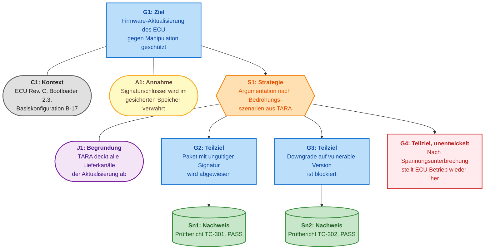
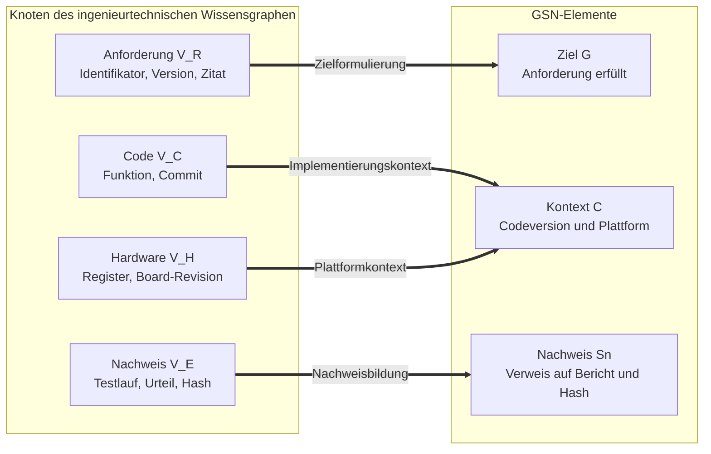
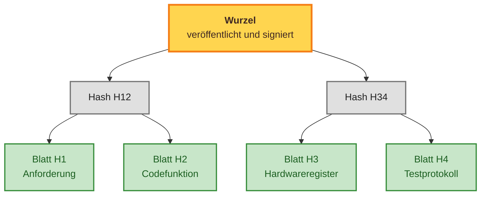

# Kapitel 27. Sicherheitsbegründung: Synthese und Verifikation von Argumenten

> **Buch:** [Architektur evidenzbasierter Expertensysteme](README.md) · [Teil V: Verifikation, Testen, Diagnose und Sicherheitsbegründung](part-05-verification-and-learning.md)  
> **Vorheriges Kapitel:** [Kapitel 24. Technische Diagnose: Trennung von Symptom und Ursache unter Unsicherheit](ch24-system-diagnosis.md)  
> **Nächstes Kapitel:** [Kapitel 30. Co-Engineering von funktionaler Sicherheit und Cybersicherheit](ch30-safety-cybersecurity-co-engineering.md)  
> **Inhaltsverzeichnis:** [README.md](README.md)  
> **Autor:** [Mykola Fedchyk](about-the-author.md)  
> **Niveau:** Fortgeschritten: Systemarchitekten, Sicherheitsingenieure, Auditoren für funktionale Sicherheit, Entwickler missionskritischer Systeme  
> **Lernziele:** Sicherheitsbegründungen in der Goal Structuring Notation (GSN) aus Zielen, Strategien, Kontexten, Annahmen, Rechtfertigungen und Nachweisen konstruieren; Argumentationsgerüste aus dem ingenieurtechnischen Wissensgraphen (EKG) synthetisieren; Argumente anhand formaler Regeln auf Vollständigkeit, Evidenzvalidität, Kontextkonsistenz und Zyklenfreiheit verifizieren; die Integrität der Begründung mittels Merkle-Bäumen kryptografisch sichern und Nachweise selektiv mit Inklusionsbeweisen offenlegen; Einwände und Gegenargumente über Dungs abstrakten Argumentationsrahmen erfassen; präzise abgrenzen, welche Prüfungen automatisiert ablaufen und was in der Letztverantwortung des Fachexperten verbleibt.

## Abstract

Im Kontext des Lebenszyklus evidenzbasierter Expertensysteme untersucht dieses Kapitel die Methodik zur Überführung verifizierter ingenieurtechnischer Fakten und Artefakte aus dem ingenieurtechnischen Wissensgraphen (*Engineering Knowledge Graph*, EKG) in eine strukturierte, maschinenlesbare und unwiderlegbare Sicherheitsbegründung (*Safety Case*). Es soll beim Leser keineswegs der Eindruck eines isolierten allgemeinen Handbuchs entstehen: Die Argumentationssynthese in der Goal Structuring Notation (GSN) bildet den abschließenden integrativen Schritt des Expertensystems, an dem Inferenzdeterminismus und kryptografische Evidenzintegrität in formal verifizierbare Garantien für Zertifizierungsstellen übergehen. Es werden die systemischen Ursachen analysiert, die dazu führen, dass Zertifizierungsunterlagen in rein formale „Papierexzesse“ abgleiten, und es wird ein Lösungsansatz auf Basis des GSN-Standards (Version 3) vorgestellt. Es wird ein formaler Regelsatz zur Verifikation des Argumentationsbaums definiert: strukturelle Vollständigkeit der Dekomposition, kryptografische Verifikation der Nachweisintegrität, Kontextkonsistenz der Hardware-Revisionen sowie Zyklenfreiheit des Inferenzgraphen. Zur Wahrung der Vertraulichkeit und zum Schutz geistigen Eigentums während externer Audits wird der Einsatz von Merkle-Bäumen mit selektiver Offenlegung über Inklusionspfade formalisiert. Zur rigorosen Handhabung von Einwänden und Gegenargumenten wird Dungs abstrakter Argumentationsrahmen über die Berechnung fundierter Erweiterungen (*grounded extensions*) integriert. Das Kapitel schließt mit einer vollständigen Python-Implementierung des GSN-Verifikators.

Eine Sicherheitsbegründung (*Safety Case*) muss einen unabhängigen Gutachter davon überzeugen, dass ein System in einer definierten Anwendungsumgebung hinreichend sicher ist. In der industriellen Praxis verkommt die Sicherheitsbegründung jedoch häufig zu einem Dokument, das erst am Ende des Projekts verfasst wird, um Prüfprozesse formell zu durchlaufen. Die unabhängige Untersuchung der Umstände des Absturzes des Aufklärungsflugzeugs Nimrod MR2 XV230 der britischen Royal Air Force (RAF) in Afghanistan im Jahr 2006 durch Charles Haddon-Cave bezeichnete die Sicherheitsbegründung dieses Flugzeugs als „eine beklagenswerte Arbeit von Anfang bis Ende“ und stellte fest, dass die Erstellung der Begründung „im Wesentlichen zu einer bürokratischen Übung zum Abhaken von Kästchen“ verkommen war [[1]](#src-1).

Dieses Kapitel beantwortet die Frage: **Wie lassen sich verifizierte ingenieurtechnische Fakten in ein Sicherheitsargument überführen, das eine Maschine auf Vollständigkeit und Integrität prüfen kann, und wo liegen die prinzipiellen Grenzen dessen, was automatisiert bewiesen werden kann?** Die zentrale These lautet: **Die GSN-Notation verleiht dem Argument eine explizite Struktur, der ingenieurtechnische Wissensgraph liefert dieser Struktur rückverfolgbare Nachweise, formale Regeln identifizieren unentwickelte Ziele sowie unbestätigte Evidenzen, der Merkle-Baum fixiert kryptografisch, auf welchen konkreten Artefakten das Argument ruht, und Dungs Argumentationsrahmen verhindert, dass unwiderlegte Einwände unbemerkt verschwinden. Die Maschine prüft Struktur, Integrität und logische Form, nicht jedoch die Wahrheit der Prämissen oder die inhaltliche Angemessenheit der Strategie – diese Verantwortung verbleibt stets beim Menschen.**

## 1. Systemische Faktoren der Formalisierung und Degradation von Sicherheitsbegründungen

Die Synthese einer belastbaren Sicherheitsbegründung stellt eine Schlüsselphase im Lebenszyklus jedes missionskritischen Expertensystems dar. In der industriellen Praxis leidet dieser Prozess jedoch häufig unter bürokratischer Erstarrung und systemischer Degradation der Argumentationsqualität. Der Haddon-Cave-Untersuchungsbericht beschreibt einen Mechanismus, der sich weit über die Luftfahrt hinaus wiederholt: Die Ersteller der Sicherheitsbegründung gingen von der Prämisse aus, das Flugzeug sei „ohnehin sicher“, da es bereits seit dreißig Jahren erfolgreich im Einsatz war; infolgedessen wandelte sich das Dokument von einer kritischen Sicherheitsanalyse zu einer bloßen Formalität [[1]](#src-1). Unter den systemischen Mängeln hob der Bericht das Regime der Sicherheitsbegründungen hervor, das ineffektiv und ressourcenverschwendend betrieben wurde [[1]](#src-1). Aus diesem Fallbeispiel lassen sich vier fundamentale ingenieurtechnische Kernprobleme ableiten:

**Entkopplung des Dokuments vom realen Produkt.** Da Sicherheitsbegründungen häufig erst nach Abschluss der Entwicklung verfasst werden, behauptet der Text beispielsweise, die Firmware nutze zwei unabhängige Hardware-Timer, während im aktuellen Release-Code beide Kanäle längst auf einen gemeinsamen Timer umgestellt wurden. Das Dokument bleibt in sich konsistent, stimmt jedoch nicht mehr mit dem realen System überein.

**Prozesskonformität statt systemischer Analyse.** Das lückenlose Abarbeiten von Prüflisten beweist nicht die Überzeugungskraft des Arguments: Ein gesetztes Häkchen belegt lediglich, dass ein Prozessschritt formal ausgeführt wurde, sagt jedoch nichts darüber aus, ob tatsächliche Gefährdungen identifiziert und beherrscht wurden.

**Grenzen manueller Prüfprozesse.** Die Sicherheitsbegründung eines komplexen Industrieprodukts referenziert Tausende Anforderungen, Prüfberichte und Telemetrieprotokolle. Ein Gutachter ist physisch nicht in der Lage, jede Referenz manuell gegen die aktuelle Version des Artefakts abzugleichen, und greift daher notgedrungen auf Stichproben zurück.

**Schutz geistigen Eigentums.** Hersteller zögern verständlicherweise, externen Auditoren den vollständigen Quellcode und sämtliche Hardware-Schaltpläne offenzulegen. Gleichzeitig benötigt der Prüfer die mathematische Gewissheit, dass die ihm vorgelegten Fragmente tatsächlich zu genau dem zu zertifizierenden Gesamtsystem gehören.

Für diese Problemstellungen stellt das evidenzbasierte Expertensystem der vorangegangenen Kapitel das erforderliche Instrumentarium bereit: [Kapitel 9](ch09-engineering-knowledge-graph-traceability.md) verwaltet Anforderungen, Quellcode, Hardware-Register und Testergebnisse in einem ingenieurtechnischen Wissensgraphen (*Engineering Knowledge Graph*, EKG), während [Kapitel 25](ch25-how-expert-systems-learn.md) demonstriert, wie Nachweisketten von der Anforderung bis zum Beweis formalen Prüfungen unterzogen werden. Es gilt nun, diese Ketten in ein Format zu überführen, das von Auditoren und Zertifizierungsbehörden anerkannt wird.

## 2. Goal Structuring Notation (GSN): Strukturierung von Sicherheitszielen

Die Goal Structuring Notation (GSN) ist eine standardisierte grafische Sprache zur Modellierung von Sicherheitsargumenten. Die aktuelle Version 3 des GSN-Standards wird von der Assurance Case Working Group (ACWG) des Safety-Critical Systems Club (SCSC) herausgegeben. Der Standard verfolgt zwei primäre Zwecke: Er liefert eine autoritative Definition der Notation und beschreibt Best Practices für Ingenieure, die Sicherheitsargumente erstellen, prüfen und freigeben [[2]](#src-2). Ein GSN-Argumentationsnetz basiert auf sechs kanonischen Elementen:

- **Ziel** (*Goal*): Eine zu beweisende Tatsachenbehauptung, beispielsweise „Die Firmware-Aktualisierung des Steuergeräts (ECU) ist gegen Paketmanipulation geschützt“;
- **Strategie** (*Strategy*): Beschreibt die Methode, mit der ein übergeordnetes Ziel in Teilziele zerlegt wird, beispielsweise „Argumentation entlang der Bedrohungsszenarien aus der TARA-Analyse“;
- **Kontext** (*Context*): Definiert die Gültigkeitsgrenzen einer Behauptung, wie Hardware-Revision, Bootloader-Version oder Basiskonfiguration;
- **Annahme** (*Assumption*): Dokumentiert Prämissen, die das Argument ohne formalen Beweis voraussetzt, beispielsweise „Der Signaturschlüssel wird in einem hardwarebasierten Sicherheitsmodul (HSM) verwahrt“;
- **Begründung / Rechtfertigung** (*Justification*): Erläutert, warum die gewählte Dekompositionsstrategie für das Ziel hinreichend ist;
- **Nachweis / Lösung** (*Solution*): Verweist auf eine konkrete empirische Evidenz: einen Prüfbericht, das Protokoll einer statischen Analyse oder ein Messprotokoll.

Ein Ziel, das bisher weder durch eine Strategie noch durch Nachweise gestützt wird, wird explizit als unentwickelt (*undeveloped*) deklariert. Mit Version 3 führte der Standard eine dialektische Notation ein: Die Relation „ficht an“ (*challenges*) erlaubt es, Gegenargumente oder Gegennachweise zu jedem Element zu erfassen, während die Markierung „widerlegt“ (*defeated*) anzeigt, dass ein Element durch einen erfolgreichen Einwand entkräftet wurde. Die Arbeitsgruppe begründet diese Erweiterung explizit mit Haddon-Caves Kritik an der Bestätigungsverzerrung herkömmlicher Sicherheitsbegründungen [[3]](#src-3). Das folgende Diagramm zeigt die Argumentationsstruktur für die abgesicherte Firmware-Aktualisierung eines elektronischen Steuergeräts (*Electronic Control Unit*, ECU), wie sie in [Kapitel 25](ch25-how-expert-systems-learn.md) eingeführt wurde.



Das Argument wird streng hierarchisch von oben nach unten interpretiert. Ziel G1 besitzt ausschließlich im Kontext C1 und unter der Annahme A1 Gültigkeit. Strategie S1 zerlegt G1 in drei Teilziele, wobei die Begründung J1 expliziert, warum diese drei Teilziele die Gesamtanforderung abdecken. Zwei Teilziele stützen sich auf verifizierte Testberichte, während das Teilziel G4 rot hervorgehoben ist: Für G4 liegt noch kein Nachweis vor, weshalb das Gesamtargument zum aktuellen Zeitpunkt unvollständig ist. Genau solche Strukturbrüche muss eine automatisierte Verifikation zuverlässig detektieren.

## 3. Automatisierte Argumentsynthese aus dem ingenieurtechnischen Wissensgraphen

Die manuelle Pflege eines GSN-Arguments in grafischen Editoren erfordert Wochen und veraltet bereits mit dem nächsten Code-Commit. Sind Anforderungen, Implementierungsfunktionen, Hardwareregister und Testresultate jedoch im EKG strukturiert erfasst, lässt sich das Argumentationsgerüst durch deterministische Graphtraversierung synthetisieren. Das folgende Diagramm veranschaulicht die Abbildung von Wissensgraphen-Knoten auf formale GSN-Elemente.



Die Synthese erfolgt in fünf disziplinierten Phasen. Zunächst wird das Wurzelziel für das Zielsystem $\mathcal{S}$ in der Konfiguration $\mathcal{K}$ formal definiert:

```math
G_{\mathrm{root}}=\text{«}\mathcal{S}\text{ in Konfiguration }\mathcal{K}\text{ erfüllt die verbindlichen Anforderungen der Norm }\mathrm{STD}\text{»}.
```

- Für das Wurzelziel $`G_{\mathrm{root}}`$ bezeichnet $\mathcal{S}$ das Zielsystem und $\mathcal{K}$ dessen Konfigurationsparameter;
- $\mathrm{STD}$ spezifiziert das normative Referenzdokument;
- Das Gleichheitszeichen definiert den semantischen Zieltext: Das System in der definierten Konfiguration muss sämtliche verbindlichen Anforderungen der genannten Norm erfüllen.

Das Verständnis dieser Gleichung ist pragmatisch: Sie formuliert die oberste Beweispflicht für ein konkretes Produkt, eine Konfiguration und ein Regelwerk. Die Formel beweist die Konformität nicht selbst, sondern definiert den Prüfauftrag an das Expertensystem.

Anschließend filtert eine Abfrage über den Wissensgraphen sämtliche verbindlichen Normanforderungen anhand ihrer deontischen Modalität, die [Kapitel 14](ch14-requirements-detection-and-formalization.md) aus dem Normtext extrahiert hat:

```math
\mathcal{R}_{\mathrm{mand}}=\{\,r\in V_R \mid r.\mathrm{modality}\in\{\mathrm{SHALL},\mathrm{MUST}\}\,\}.
```

- Die Menge $`\mathcal{R}_{\mathrm{mand}}`$ umfasst alle verbindlichen Anforderungen, wobei $r$ eine einzelne Anforderung darstellt;
- $`V_R`$ ist die Menge aller Anforderungsknoten im Graphen, $\in$ kennzeichnet die Elementbeziehung und der vertikale Strich liest sich als „unter der Bedingung, dass“;
- $`r.\mathrm{modality}`$ bezeichnet das Attribut der deontischen Modalität, und $`\{\mathrm{SHALL},\mathrm{MUST}\}`$ definiert die Menge der verbindlichen normativen Schlüsselwörter;
- Die geschweiften Klammern spannen die Ergebnismenge auf, indem sie gezielt jene Knoten selektieren, deren Modalitätsfeld einem dieser Werte entspricht.

Die Graphabfrage ignoriert somit unverbindliche Empfehlungen oder Optionen und filtert ausschließlich Anforderungen mit dem Status `SHALL` oder `MUST`. Die Güte dieses Schritts hängt direkt von der Präzision der vorgelagerten Modalitätserkennung im Wissensgraphen ab.

Für jede Anforderung $`r\in\mathcal{R}_{\mathrm{mand}}`$ instanziiert das System ein Teilziel $`G_r`$: „Anforderung $r$ ist implementiert und verifiziert“, ergänzt um das exakte Normzitat und dessen kryptografischen Hash. Über die Kantenbeziehungen `satisfies` und `configures` werden die zugehörigen Softwarefunktionen $`c\in V_C`$ und Hardwareregister $`h\in V_H`$ ermittelt und als Kontextknoten mit Commit-Hash und Hardware-Revision eingebunden. Schließlich navigiert das System über die Kanten `verifies` und `produced_by` zu den Nachweisknoten $`e\in V_E`$: Testprotokolle von Zustandsautomaten, Mutationstests, Codeabdeckungsberichte und Busmitschnitte des HIL-Prüfstands. Jeder gefundene Nachweis wird als $Sn$-Element instanziiert.

Diese automatisierte Synthese stößt an prinzipielle Grenzen, die explizit benannt werden müssen: Der Graph liefert Ziele, Kontexte und Nachweise, nicht jedoch die Argumentationsstrategien und deren Rechtfertigungen. Warum eine Aufteilung nach TARA-Bedrohungsszenarien hinreichend ist, bleibt das fachliche Urteil des Sicherheitsingenieurs. Ewen Denney und Ganesh Pai formulierten hierfür eine hybride Methodik: Automatisch generierte Argumentfragmente aus formalen Softwareverifikationswerkzeugen werden mit handgefertigten Argumentstrukturen der Systemsicherheitsanalyse kombiniert [[4]](#src-4). Die graphenbasierte Synthese folgt exakt dieser Arbeitsteilung: Die Maschine garantiert die lückenlose Rückverfolgbarkeit, der Mensch verantwortet die Argumentationslogik.

## 4. Formale Regeln zur strukturellen und semantischen Verifikation des Arguments

Bevor ein synthetisierter Argumentationsbaum dem Auditor vorgelegt wird, muss er eine formale Verifikationsprüfung durchlaufen. Ein Argument $\mathcal{T}$ gilt als strukturell valide, wenn vier fundamentale Prädikate erfüllt sind:

```math
\mathrm{Valid}_{\mathrm{GSN}}(\mathcal{T})\iff\bigwedge_{i=1}^{4}\mathcal{P}_i(\mathcal{T}).
```

- Das Prädikat $`\mathrm{Valid}_{\mathrm{GSN}}(\mathcal{T})`$ bewertet die strukturelle Gültigkeit des Argumentationsgraphen $\mathcal{T}$;
- $\iff$ steht für die logische Äquivalenz („genau dann, wenn“), und $\bigwedge_{i=1}^{4}$ fordert die simultane Erfüllung aller vier Bedingungen;
- Der Index $i$ nummeriert die Regeln von 1 bis 4, wobei $`\mathcal{P}_i(\mathcal{T})`$ das jeweilige Prüfprädikat für den Graphen $\mathcal{T}$ darstellt.

**Regelkreis-Entscheidung und ingenieurtechnische Konsequenzen (Closed-Loop Decision):**
1. **Steuerung der Zertifizierungs- und Release-Pipeline:**
   - **Gilt $`\mathrm{Valid}_{\mathrm{GSN}}(\mathcal{T}) = \mathbf{True}`$:** Der Release-Generator erzeugt automatisch das GSN-Manifest, berechnet die Merkle-Wurzel $`\mathrm{MTH}(\mathcal{T})`$, signiert das Paket mittels Ed25519 und exportiert die Begründungsakte im standardisierten JSON/XML-Format zur Vorlage bei der Prüfgesellschaft (TÜV, Dekra);
   - **Gilt $`\mathrm{Valid}_{\mathrm{GSN}}(\mathcal{T}) = \mathbf{False}`$:** Der Build-Prozess bricht sofort mit der blockierenden Fehlermeldung `ERR_GSN_VERIFICATION_FAILED` ab. Das Expertensystem gibt einen detaillierten Diagnosebericht aus, der den fehlschlagenden Prädikaten zugeordnet ist:
     * $`\neg \mathcal{P}_1`$: Liste unentwickelter („hängender“) Ziele ohne Strategie oder Nachweis;
     * $`\neg \mathcal{P}_2`$: Liste ungültiger Nachweise (negatives Testergebnis oder Hash-Diskrepanz);
     * $`\neg \mathcal{P}_3`$: Kontextkollisionen (beispielsweise Artefakte inkompatibler Hardware-Revisionen);
     * $`\neg \mathcal{P}_4`$: Topologische Zyklen im Argumentationsgraphen.
2. **Praktisches Zahlenbeispiel:** Für einen Baum aus 24 Zielen und 18 Nachweisen evaluieren sämtliche Prädikate $`\mathcal{P}_1, \mathcal{P}_2, \mathcal{P}_3, \mathcal{P}_4`$ zu `true`. Auswertung: $`\mathrm{Valid}_{\mathrm{GSN}}(\mathcal{T}) = 1 \land 1 \land 1 \land 1 = \mathbf{True}`$. **Systemaktion:** Merkle-Wurzel `0x7a3f...` berechnet und signierte Release-Akte `SafetyCase_Release_v2.json` erzeugt.

**Vollständigkeitsregel (Dekompositionsabschluss).** Jedes Ziel muss durch mindestens eine Strategie, ein Teilziel oder einen Nachweis gestützt sein; unentwickelte Ziele sind im zertifizierungsfähigen Zustand unzulässig:

```math
\mathcal{P}_1:\ \forall g\in\mathrm{Goals}(\mathcal{T})\ \ \deg^{+}(g)>0.
```

- Im ersten Prädikat bezeichnet $g$ ein Ziel und $`\mathrm{Goals}(\mathcal{T})`$ die Menge sämtlicher Ziele des Arguments $\mathcal{T}$;
- $\forall$ liest sich als „für alle“, und $`\deg^{+}(g)`$ beziffert den Ausgangsgrad (die Anzahl ausgehender Stützungskanten) von Knoten $g$;
- $>0$ erzwingt mindestens eine ausgehende Kante, und $`\mathcal{P}_1`$ kennzeichnet das Vollständigkeitsprädikat.

Diese Prüfung deckt blinde Flecken und unfertige Argumentationszweige auf. Sie bewertet jedoch nicht die inhaltliche Güte der referenzierten Strategie.

**Evidenzvaliditätsregel (Nachweisbestätigung).** Jeder Nachweis muss ein positives Prüfurteil (`PASS`) aufweisen, und der kryptografische Hash des realen Artefakts muss exakt mit dem im Knoten hinterlegten Digest übereinstimmen:

```math
\mathcal{P}_2:\ \forall s\in\mathrm{Solutions}(\mathcal{T})\ \ s.\mathrm{verdict}=\mathrm{PASS}\ \land\ H(s.\mathrm{artifact})=s.\mathrm{digest}.
```

- $s$ ist ein Nachweisknoten aus der Menge $`\mathrm{Solutions}(\mathcal{T})`$;
- $`s.\mathrm{verdict}`$ ist das Prüfurteil des Knotens und muss identisch mit $\mathrm{PASS}$ sein;
- $`H(s.\mathrm{artifact})`$ ist der kryptografische Hash des realen Prüfartefakts, und $`s.\mathrm{digest}`$ der im Graph hinterlegte Soll-Hash;
- $\forall$ prüft jeden Nachweisknoten, $\land$ fordert simultan Urteil und Hash-Übereinstimmung, und $=$ erzwingt Identität.

Die Regel garantiert, dass das referenzierte Artefakt unverändert vorliegt und die Prüfung bestanden wurde. Sie prüft nicht, ob das Testdesign die geforderte Sicherheitseigenschaft semantisch vollständig abdeckt.

**Kontextkonsistenzregel.** Kein Argumentationspfad darf zueinander inkompatible Kontexte kombinieren – etwa einen Prüfbericht von Board-Revision D in einem Pfad, der ausschließlich für Revision C deklariert ist:

```math
\mathcal{P}_3:\ \forall g\in\mathrm{Goals}(\mathcal{T})\ \ \mathrm{Consistent}(\mathrm{Context}(g)).
```

- In dieser Regel durchläuft $g$ alle Ziele aus $`\mathrm{Goals}(\mathcal{T})`$;
- $`\mathrm{Context}(g)`$ liefert die Kontextmenge des Zielknotens, und $`\mathrm{Consistent}(\cdot)`$ verifiziert deren wechselseitige Kompatibilität;
- $\forall$ fordert Konsistenz für jeden Kontextknoten, und $`\mathcal{P}_3`$ bezeichnet das dritte Prädikat.

Bedeutung: Jeder Zweig des Arguments muss sich auf kompatible Versionen von Hardware, Software und Prüfumgebungen beziehen. Die Verlässlichkeit hängt von den hinterlegten Kompatibilitätsmatrizen ab.

**Zyklenfreiheitsregel.** Der Stützungsgraph muss azyklisch sein, sodass Zirkelschlüsse der Form „A ist sicher, weil B sicher ist, und B ist sicher, weil A sicher ist“ mathematisch ausgeschlossen sind:

```math
\mathcal{P}_4:\ \mathrm{IsDAG}(\mathcal{T}).
```

- $\mathcal{T}$ bezeichnet den gerichteten Argumentationsgraphen;
- Das Prädikat $`\mathrm{IsDAG}(\mathcal{T})`$ prüft, ob der Graph ein gerichteter azyklischer Graph (*Directed Acyclic Graph*) ist;
- $`\mathcal{P}_4`$ identifiziert die Zyklenfreiheitsprüfung.

Die Regel eliminiert zirkuläre Rechtfertigungsschleifen, trifft jedoch keine Aussage über die inhaltliche Richtigkeit der Begründungsschritte.

Diese vier Regeln prüfen ausschließlich die strukturelle Syntax und Integrität des Arguments, nicht dessen inhaltliche Wahrheit. John Rushby betont in seiner Arbeit zur Formalisierung von Sicherheitsbegründungen, dass der Zweck formaler Methoden in der mechanischen Prüfung der logischen Korrektheit liegt – sie ersetzen GSN nicht, und formale Logik garantiert Schlussfolgerungen stets nur unter dem Vorbehalt der Prämissen, deren Gültigkeit der Ingenieur verantworten muss [[5]](#src-5). Regel $`\mathcal{P}_2`$ bestätigt zwar, dass der Bericht TC-301 existiert, unverändert ist und mit PASS abschloss – sie garantiert jedoch nicht, ob TC-301 die Abweisung manipulierter Signaturen unter allen realen Angriffsbedingungen adäquat testet.

## 5. Kryptografische Integrität des Arguments: Merkle-Bäume und selektive Offenlegung

Nach erfolgreicher formaler Verifikation wird das Sicherheitsargument dem Gutachter übergeben. Der Gutachter muss zweifelsfrei überprüfen können, dass die ihm vorgelegten Knoten exakt aus dem verifizierten Gesamtargument stammen und kein Element nachträglich manipuliert wurde. Zu diesem Zweck wird über den kanonisch serialisierten Datensätzen der Knoten ein Merkle-Baum konstruiert, wie ihn Ralph Merkle für digitale Signaturen einführte [[6]](#src-6). Jedes Blatt entspricht dem Hash eines Knotendatensatzes, jeder innere Knoten dem Hash seiner beiden Kindknoten, und die Baumwurzel (*Merkle Root*) bindet das gesamte Argument kryptografisch an einen einzigen Wert. Das nachfolgende Diagramm illustriert den Baum für vier Datensätze.



Die Modifikation eines beliebigen Blattes verändert unweigerlich sämtliche Hashes entlang des Pfades zur Wurzel. Eine einmal signierte und veröffentlichte Wurzel fixiert somit den gesamten Argumentationszustand. Um die Zugehörigkeit eines einzelnen Blattes nachzuweisen, müssen dem Auditor nicht sämtliche Knotendaten offengelegt werden: Es genügt der Inklusionspfad (*Audit Path*), bestehend aus den Geschwister-Hashes auf dem Weg vom Blatt zur Wurzel. Die Spezifikation für Certificate Transparency (RFC 6962) definiert die Baum-Hashfunktion mit der Domänentrennung über die Präfixe `0x00` für Blätter und `0x01` für innere Knoten, um Angriffe zur Konstruktion eines zweiten Urbilds (*Second-Preimage-Resistenz*) abzuwehren [[7]](#src-7):

```math
\mathrm{MTH}(\{d_0\})=\mathrm{SHA256}(\mathtt{0x00}\,\|\,d_0),
\qquad
\mathrm{MTH}(D_n)=\mathrm{SHA256}\bigl(\mathtt{0x01}\,\|\,\mathrm{MTH}(D_{0:k})\,\|\,\mathrm{MTH}(D_{k:n})\bigr).
```

- Für die Funktion $`\mathrm{MTH}`$ stellt $`\{d_0\}`$ einen einzelnen Blatteintrag dar, und $`D_n`$ eine Sequenz aus $n$ Blättern;
- $`\mathrm{SHA256}`$ ist die kryptografische Hashfunktion nach FIPS 180-4 [[8]](#src-8), und $d_0$ repräsentiert die Rohdaten des Blattes;
- Die Präfixe $`\mathtt{0x00}`$ und $`\mathtt{0x01}`$ trennen Blatt- und Knotenberechnungen, während $`\|`$ die Byte-Konkatenation darstellt;
- $k$ ist die größte Zweierpotenz kleiner als $n$; $`D_{0:k}`$ und $`D_{k:n}`$ bilden den linken und rechten Teilbaum, deren Hashes rekursiv zusammengeführt werden.

In der Praxis wird ein einzelnes Blatt mit dem Byte `0x00` gehasht, während ein innerer Knoten aus der Konkatenation von `0x01` und den beiden Kind-Hashes erzeugt wird. Die Verifikation des Inklusionspfades folgt dem Algorithmus aus RFC 9162 [[9]](#src-9). Um sicherzustellen, dass die Hashwerte unabhängig von Feldanordnungen und Whitespace-Unterschieden deterministisch reproduzierbar sind, werden die JSON-Knotendatensätze vor dem Hashen kanonisiert, beispielsweise nach dem JSON Canonicalization Scheme (JCS) gemäß RFC 8785 [[10]](#src-10).

Die Grenzen dieses Verfahrens erfordern klare ingenieurtechnische Nüchternheit: Die Merkle-Wurzel beweist Integrität und Zugehörigkeit – sie belegt, dass der vorgelegte Eintrag exakt Teil des fixierten Arguments ist und nicht manipuliert wurde. Sie beweist jedoch weder, dass der Inhalt wahr ist, noch dass der Test korrekt konzipiert wurde oder das Argument inhaltlich hinreichend ist. Zudem handelt es sich nicht um einen Zero-Knowledge-Beweis: Der Gutachter sieht den offengelegten Eintrag vollständig, während ihm die nicht offengelegten Einträge verborgen bleiben. Auch die Geschwister-Hashes im Inklusionspfad können Informationen lecken: Handelt es sich um kurze, standardisierte Einträge, könnte ein Auditor durch Brute-Force-Hashen Rückschlüsse auf geschützte Nachbarblätter ziehen. Daher wird jedem Knotendatensatz ein kryptografisch starker Zufallswert oder ein abgeleiteter Herstellerschlüssel (*Salt*) beigemischt, der ausschließlich bei Offenlegung des Datensatzes mitgeteilt wird. Selektive Offenlegung minimiert den Datenaustausch und schützt Betriebsgeheimnisse, die inhaltliche Verantwortung für nicht offengelegte Systemteile verbleibt jedoch vollständig beim Hersteller und dem Signatär der Wurzel.

## 6. Dialektische Argumentation: Erfassung von Einwänden über Dungs abstrakten Argumentationsrahmen

Ein klassischer GSN-Baum bildet einen bereits konsolidierten Begründungszustand ab. Während der Entwicklung und bei Sicherheitsuntersuchungen stehen sich jedoch häufig konkurrierende Thesen gegenüber, und neue Messungen falsifizieren frühere Annahmen. Werden Einwände lediglich in Protokollen oder E-Mails geführt, wirkt das GSN-Diagramm trügerisch vollständig, obwohl gravierende Gegenargumente ungelöst im Raum stehen. Die dialektische Notation in GSN Version 3 ermöglicht es, Einwände direkt im Argumentationsmodell zu verankern [[3]](#src-3). Die formale mathematische Semantik zur Entscheidung, welche Behauptungen unter wechselseitigen Angriffen Bestand haben, liefert Dungs abstrakter Argumentationsrahmen [[11]](#src-11).

Ein Argumentationsrahmen ist ein Tupel $`AF=\langle\mathcal{A},\mathcal{R}\rangle`$, bestehend aus einer endlichen Menge von Argumenten $\mathcal{A}$ und einer Angriffsrelation $`\mathcal{R}\subseteq\mathcal{A}\times\mathcal{A}`$. Das Paar $`(B,A)\in\mathcal{R}`$ drückt aus, dass Argument $B$ das Argument $A$ angreift. Das folgende Diagramm zeigt vier Argumente aus einer Diskussion über Firmware-Sicherheit.

```mermaid
flowchart LR
    accTitle: Argumentationsrahmen für die Sicherheitsdiskussion der Firmware
    accDescr: Das Argument der Tester A2 greift die Behauptung der Entwickler A1 an, das Argument der Hardwareentwickler A3 greift A2 an, und das Argument der Auditoren A4 greift A3 an.

    A1["<b>A1, Entwickler</b><br/>Firmware v2.1 ist sicher,<br/>da alle Tests bestanden"]
    A2["<b>A2, Tester</b><br/>Tests deckten Kälte<br/>bei −40 °C nicht ab"]
    A3["<b>A3, Hardwareentwickler</b><br/>autonomer Thermoregler<br/>hält Betriebstemperatur"]
    A4["<b>A4, Auditoren</b><br/>Thermoregler wird aus<br/>demselben Notbus gespeist"]

    A2 -->|"greift an"| A1
    A3 -->|"greift an"| A2
    A4 -->|"greift an"| A3

    classDef claim fill:#e3f2fd,stroke:#1565c0,stroke-width:2px,color:#0d47a1;
    classDef attack fill:#ffebee,stroke:#c62828,stroke-width:2px,color:#b71c1c;

    class A1,A3 claim;
    class A2,A4 attack;
```



Dung definierte mehrere Akzeptanzsemantiken. Eine Menge von Argumenten $S$ ist **zulässig** (*admissible*), wenn sie konfliktfrei ist (keine internen Angriffe aufweist) und jedes ihrer Elemente gegen alle externen Angreifer durch Argumente aus $S$ verteidigt wird. Die **fundierte Erweiterung** (*grounded extension*) ist die eindeutige kleinste vollständige Menge und repräsentiert die Position maximaler Skepsis: Sie enthält ausschließlich Argumente, die ohne unbegründete Annahmen gegen alle Angriffe verteidigt werden können. **Präferierte Erweiterungen** (*preferred extensions*) stellen maximale zulässige Mengen dar und modellieren alternative, in sich konsistente Sichtweisen [[11]](#src-11). Für das Beispieldiagramm lässt sich die fundierte Erweiterung deterministisch ableiten: A4 wird von keinem Argument angegriffen und ist somit akzeptiert; A3 wird vom akzeptierten A4 angegriffen und ist verworfen; A2 wird ausschließlich vom verworfenen A3 angegriffen und ist somit akzeptiert; A1 schließlich wird vom akzeptierten A2 angegriffen und ist folglich verworfen. Die fundierte Erweiterung lautet präzise $`\{A2,A4\}`$.

Daraus ergibt sich die fundamentale Regel für evidenzbasierte Expertensysteme: Ein Ziel darf nur dann als gesichert in das GSN-Freigabeargument übernommen werden, wenn das stützende Argument Mitglied der fundierten Erweiterung ist. Die Entwicklerbehauptung A1 („Firmware ist sicher“) wird somit abgewiesen: Im Sinne von GSN Version 3 liegt gegen das Ziel ein offener, unwiderlegter Einwand A2 vor. Solange der Kältetest bei −40 °C nicht erfolgreich durchgeführt oder die Stromversorgung des Thermoreglers redundant entkoppelt wurde, verbleibt das Ziel im Status unentwickelt.

## 7. Software-Implementierung des Verifikators: Von Strukturregeln zum Inklusionsbeweis

Das nachfolgende Python-Programm führt sämtliche formalen Mechanismen dieses Kapitels in einem lückenlosen Ablauf zusammen. Es konstruiert das GSN-Argumentationsnetz, verifiziert zunächst die Referenzintegrität (Regel P0: jeder Verweis zielt auf einen existierenden Knoten bzw. Bericht) und prüft anschließend die Prädikate $`\mathcal{P}_1`$ bis $`\mathcal{P}_4`$. Regel $`\mathcal{P}_1`$ weist dabei auch Strategien ohne Unterelemente zurück, und $`\mathcal{P}_3`$ validiert die Revisionskompatibilität zwischen Kontexten und Testständen. Anschließend fügt das Skript den fehlenden Nachweis hinzu, generiert die Merkle-Wurzel gemäß RFC 6962, simuliert einen Manipulationsversuch an einem Testbericht, verifiziert den Inklusionspfad und berechnet Dungs fundierte Erweiterung. Jeder Blatteintrag wird mit einem HMAC-basierten Salt versehen, um Wörterbuchangriffe auf Nachbarknoten im Inklusionspfad auszuschließen. Das Programm nutzt ausschließlich Standardmodule aus Python 3.10+; die JSON-Kanonisierung ist pragmatisch auf Schlüsselsortierung reduziert, was für die Typen des Beispiels vollkommen hinreichend ist.

<details>
<summary>Python-Referenzimplementierung: GSN-Verifikation, Merkle-Baum und fundierte Erweiterung</summary>

```python
"""Prüfung des GSN-Arguments, Merkle-Baum nach RFC 6962 und Dungs fundierte Erweiterung.

Ausschließlich Standardbibliothek Python 3.10+.
"""
import copy
import hashlib
import hmac
import json

ARTIFACTS = {  # Inhalt der Berichte, auf die Nachweise verweisen
    "rep-sig": b"TC-301 wrong signature: package rejected, verdict PASS",
    "rep-rollback": b"TC-302 rollback to 2.1: blocked, verdict PASS",
}
NODES = [
    {"id": "G1", "type": "goal", "text": "Firmware-Aktualisierung des ECU gegen Manipulation geschützt", "supported_by": ["S1"], "context": ["C1"]},
    {"id": "C1", "type": "context", "text": "ECU Rev. C, Bootloader 2.3, Basiskonfiguration B-17", "hw": "C"},
    {"id": "S1", "type": "strategy", "text": "Argumentation nach Bedrohungsszenarien aus TARA", "supported_by": ["G2", "G3", "G4"]},
    {"id": "G2", "type": "goal", "text": "Paket mit fremder Signatur wird abgewiesen", "supported_by": ["Sn1"]},
    {"id": "G3", "type": "goal", "text": "Downgrade auf vulnerable Version blockiert", "supported_by": ["Sn2"]},
    {"id": "G4", "type": "goal", "text": "Nach Spannungsunterbrechung stellt ECU Betrieb wieder her", "supported_by": []},
    {"id": "Sn1", "type": "solution", "artifact": "rep-sig", "verdict": "PASS", "hw": "C"},
    {"id": "Sn2", "type": "solution", "artifact": "rep-rollback", "verdict": "PASS", "hw": "C"},
]
SECRET = b"producer-salt-key"  # Herstellerschlüssel für Salt; fixiert für Reproduzierbarkeit des Beispiels


def sha(data):
    return hashlib.sha256(data).digest()


def seal(nodes, artifacts):
    for node in nodes:
        if node["type"] == "solution":
            node["digest"] = sha(artifacts[node["artifact"]]).hex()


def validate(nodes, artifacts):
    by_id = {n["id"]: n for n in nodes}
    problems = []
    for n in nodes:  # P0: Verweise führen auf existierende Knoten und Berichte
        for ref in n.get("supported_by", []) + n.get("context", []):
            if ref not in by_id:
                problems.append(f"P0: {n['id']} verweist auf fehlenden Knoten {ref}")
        if n["type"] == "solution" and n["artifact"] not in artifacts:
            problems.append(f"P0: Nachweis {n['id']} ohne Prüfbericht {n['artifact']}")
    if problems:
        return problems
    for n in nodes:  # P1: kein unentwickeltes Ziel oder leere Strategie
        if n["type"] in ("goal", "strategy") and not n.get("supported_by"):
            kind = "Ziel" if n["type"] == "goal" else "Strategie"
            problems.append(f"P1: {kind} {n['id']} nicht ausdetailliert")
    for n in nodes:  # P2: Nachweis bestanden und Hash stimmt überein
        if n["type"] == "solution":
            if n["verdict"] != "PASS" or sha(artifacts[n["artifact"]]).hex() != n.get("digest"):
                problems.append(f"P2: Nachweis {n['id']} nicht bestätigt")
    hw = {n["hw"] for n in nodes if "hw" in n}
    if len(hw) > 1:  # P3: Kontexte und Nachweise beziehen sich auf dieselbe Revision
        problems.append(f"P3: widersprüchliche Revisionen {sorted(hw)}")
    state = {}

    def cyclic(node_id):  # P4: Graph ohne Zyklen
        state[node_id] = "active"
        for child in by_id[node_id].get("supported_by", []):
            if state.get(child) == "active" or (child not in state and cyclic(child)):
                return True
        state[node_id] = "done"
        return False

    if any(cyclic(n["id"]) for n in nodes if n["id"] not in state):
        problems.append("P4: Zyklus im Argument")
    return problems


def leaves(nodes, secret):  # Salt schützt den Inhalt nicht offengelegter Einträge vor Brute-Force
    records = []
    for n in nodes:
        salt = hmac.new(secret, n["id"].encode(), hashlib.sha256).hexdigest()
        records.append(json.dumps({**n, "salt": salt}, sort_keys=True, ensure_ascii=False, separators=(",", ":")))
    return [r.encode("utf-8") for r in sorted(records)]


def mth(items):  # Merkle-Baum-Hash nach RFC 6962
    if len(items) == 1:
        return sha(b"\x00" + items[0])
    k = 1
    while k * 2 < len(items):
        k *= 2
    return sha(b"\x01" + mth(items[:k]) + mth(items[k:]))


def path(m, items):  # Inklusionspfad nach RFC 6962
    if len(items) == 1:
        return []
    k = 1
    while k * 2 < len(items):
        k *= 2
    if m < k:
        return path(m, items[:k]) + [mth(items[k:])]
    return path(m - k, items[k:]) + [mth(items[:k])]


def verify_inclusion(index, size, leaf, proof, root):  # Algorithmus RFC 9162, 2.1.3.2
    fn, sn, r = index, size - 1, sha(b"\x00" + leaf)
    for p in proof:
        if sn == 0:
            return False
        if fn & 1 or fn == sn:
            r = sha(b"\x01" + p + r)
            while not fn & 1 and fn != 0:
                fn, sn = fn >> 1, sn >> 1
        else:
            r = sha(b"\x01" + r + p)
        fn, sn = fn >> 1, sn >> 1
    return sn == 0 and r == root


def grounded(arguments, attacks):  # kleinster Fixpunkt nach Dung
    accepted, rejected = set(), set()
    while True:
        new_in = {a for a in arguments - accepted - rejected
                  if all(b in rejected for b, t in attacks if t == a)}
        new_out = {a for a in arguments - accepted - rejected
                   if any(b in accepted | new_in for b, t in attacks if t == a)}
        if not new_in and not new_out:
            return accepted, rejected
        accepted |= new_in
        rejected |= new_out


def test_validator():
    def broken(change):
        nodes = copy.deepcopy(NODES)
        change({n["id"]: n for n in nodes})
        return validate(nodes, ARTIFACTS)

    assert broken(lambda n: n["S1"]["supported_by"].append("G9"))[0].startswith("P0")
    assert broken(lambda n: n["Sn1"].update(artifact="rep-missing"))[0].startswith("P0")
    assert "P1: Strategie S1 nicht ausdetailliert" in broken(lambda n: n["S1"].update(supported_by=[]))
    assert "P4: Zyklus im Argument" in broken(lambda n: n["G2"]["supported_by"].append("G1"))
    assert "P3: widersprüchliche Revisionen ['C', 'D']" in broken(lambda n: n["Sn2"].update(hw="D"))


seal(NODES, ARTIFACTS)
test_validator()
print("1. Prüfung des Arguments:", validate(NODES, ARTIFACTS) or "alle Regeln erfüllt")
G4 = next(n for n in NODES if n["id"] == "G4")
ARTIFACTS["rep-power"] = b"TC-303 rev D power cut during write: recovered, verdict PASS"
NODES.append({"id": "Sn3", "type": "solution", "artifact": "rep-power", "verdict": "PASS", "hw": "D"})
G4["supported_by"] = ["Sn3"]
seal(NODES, ARTIFACTS)
print("2. Sn3 vom Prüfstand Rev. D hinzugefügt:", validate(NODES, ARTIFACTS))
ARTIFACTS["rep-power"] = b"TC-303 rev C power cut during write: recovered, verdict PASS"
NODES[-1]["hw"] = "C"
seal(NODES, ARTIFACTS)
print("3. TC-303 auf Rev. C wiederholt:", validate(NODES, ARTIFACTS) or "alle Regeln erfüllt")
items = leaves(NODES, SECRET)
root = mth(items)
print("4. Merkle-Wurzel:", root.hex()[:16], "für", len(items), "Knoten")
ARTIFACTS["rep-sig"] = ARTIFACTS["rep-sig"].replace(b"rejected", b"accepted")
print("5. Bericht TC-301 modifiziert:", validate(NODES, ARTIFACTS))
for n in NODES:
    if n["id"] == "Sn1":
        n["digest"] = sha(ARTIFACTS["rep-sig"]).hex()
print("6. Hash im Knoten ebenfalls aktualisiert:", validate(NODES, ARTIFACTS) or "alle Regeln erfüllt",
      "| Wurzel stimmt mit veröffentlichter überein:", mth(leaves(NODES, SECRET)) == root)
index = next(i for i, r in enumerate(items) if b'"id":"Sn2"' in r)
proof = path(index, items)
print("7. Inklusionsbeweis Sn2:", verify_inclusion(index, len(items), items[index], proof, root),
      f"({len(proof)} Hashes anstelle von {len(items) - 1} anderen Knoten)")
forged = next(r for r in leaves(NODES, SECRET) if b'"id":"Sn1"' in r)
original = next(i for i, r in enumerate(items) if b'"id":"Sn1"' in r)
print("   Inklusionsbeweis für modifizierten Sn1:", verify_inclusion(original, len(items), forged, path(original, items), root))
accepted, _ = grounded({"A1", "A2", "A3", "A4"}, {("A2", "A1"), ("A3", "A2"), ("A4", "A3")})
print("8. Fundierte Erweiterung:", sorted(accepted))
mutual = {"A5", "A6"}
accepted, rejected = grounded(mutual, {("A5", "A6"), ("A6", "A5")})
print("   Wechselseitiger Angriff A5 und A6: akzeptiert", sorted(accepted), "| unentschieden", sorted(mutual - accepted - rejected))
```

</details>

Die Ausführung von `python gsn_merkle.py` erzeugt folgende Konsolenausgabe:

<details>
<summary>Programmausgabe</summary>

```text
1. Prüfung des Arguments: ['P1: Ziel G4 nicht ausdetailliert']
2. Sn3 vom Prüfstand Rev. D hinzugefügt: ["P3: widersprüchliche Revisionen ['C', 'D']"]
3. TC-303 auf Rev. C wiederholt: alle Regeln erfüllt
4. Merkle-Wurzel: f06ef9b9a987277b für 9 Knoten
5. Bericht TC-301 modifiziert: ['P2: Nachweis Sn1 nicht bestätigt']
6. Hash im Knoten ebenfalls aktualisiert: alle Regeln erfüllt | Wurzel stimmt mit veröffentlichter überein: False
7. Inklusionsbeweis Sn2: True (4 Hashes anstelle von 8 anderen Knoten)
   Inklusionsbeweis für modifizierten Sn1: False
8. Fundierte Erweiterung: ['A2', 'A4']
   Wechselseitiger Angriff A5 und A6: akzeptiert [] | unentschieden ['A5', 'A6']
```

</details>

Zeile 1 identifiziert exakt dieselbe strukturelle Lücke, die im GSN-Diagramm rot markiert ist: Ziel G4 besitzt noch keinen Nachweis. Zeile 2 demonstriert eine typische Falle der Praxis: Der Testbericht TC-303 weist zwar ein PASS-Urteil auf, wurde jedoch auf der Hardware-Revision D erhoben, während das Zielsystem für Revision C zertifiziert wird; Regel $`\mathcal{P}_3`$ blockiert das Argument daher sofort. Erst nach Wiederholung des Tests auf Revision C sind alle Strukturregeln erfüllt, und Zeile 4 fixiert das Argument über die Merkle-Wurzel. Die Zeilen 5 und 6 demonstrieren die zwei Verteidigungsebenen gegen Manipulation: Wird der Testbericht TC-301 inhaltlich verändert, schlägt Regel $`\mathcal{P}_2`$ aufgrund der Hash-Diskrepanz an. Passt ein Angreifer auch den Hash im Knotendatensatz an, sind die internen Regeln zwar erfüllt, doch die neu berechnete Merkle-Wurzel weicht von der bereits signierten und veröffentlichten Wurzel ab – der Betrug wird von jedem Prüfer aufgedeckt. Zeile 7 zeigt die selektive Offenlegung: Der Gutachter verifiziert die Echtheit des Nachweises Sn2 anhand von lediglich vier Hashes im Inklusionspfad, ohne die Inhalte der acht restlichen Knoten einsehen zu müssen; ein manipulierter Datensatz Sn1 fällt bei der Prüfung durch. Zeile 8 bestätigt die formale Argumentationsanalyse: Die fundierte Erweiterung $`\{A2,A4\}`$ schließt die Entwicklerthese A1 aus. Die letzte Zeile illustriert den Status bei zirkulärem Konflikt: Zwei sich wechselseitig attackierende Argumente werden weder akzeptiert noch verworfen; der Disput bleibt unentschieden. In einer Sicherheitsbegründung gilt ein unentschiedenes Argument weder als bewiesen noch als widerlegt – es erzwingt eine formale Eskalation und neue Evidenzen.

Dieses Lehrbeispiel besitzt natürliche Grenzen: Die Kanonisierung ist vereinfacht, der Salt-Schlüssel zu Demonstrationszwecken im Code hinterlegt, und Signaturinfrastrukturen wurden abstrahiert. Die Prüfung $`\mathcal{P}_3`$ fordert hier vereinfacht eine globale Revisionsidentität; in der Praxis existieren modulare Zweige mit formell begründetem Revisionsübertrag. Der Salt schützt ausschließlich vor Brute-Force-Raten des Inhalts anhand bekannter Schemata, während Baumtopologie und Knotenanzahl sichtbar bleiben. Die entscheidende Grenze ist jedoch epistemischer Natur: Das Programm kann nicht beurteilen, ob der Test TC-303 die Stromversorgung tatsächlich im physikalisch kritischsten Moment des Flash-Schreibzyklus unterbrochen hat. Diese Bewertung bleibt die unersetzliche Verantwortung des Fachingenieurs.

## 8. Werkzeuge und Data Mining für Assurance- und Sicherheitsnachweissysteme

Das didaktische Skript verwaltet das Argument im flüchtigen Speicher und prüft Integrität lokal. In industriellen Entwicklungsprozessen werden Sicherheitsbegründungen jedoch zwischen Organisationen ausgetauscht, und Nachweise entstehen in verteilten CI/CD-Pipelines. Hierfür existieren offene Standards und Werkzeuge, von denen keines die inhaltliche Angemessenheit des Arguments garantieren kann.

| Werkzeug oder Modell | Industrielle Rolle | Was nicht garantiert wird |
|---|---|---|
| OMG SACM Metamodell [[12]](#src-12) | Standardisierter Austausch von Argumenten und Evidenzen zwischen Systems-Engineering-Werkzeugen | Die Austauschstruktur definiert keine inhaltlichen Kriterien für die Hinlänglichkeit des Arguments |
| in-toto-Attestierungen und SLSA-Provenienz [[13]](#src-13) [[14]](#src-14) | Kryptografisch signierte Metadaten darüber, wer aus welchen Quellen auf welcher Build-Plattform das Artefakt erzeugt hat | Die Attestierung garantiert den Erzeugungsprozess, nicht die inhaltliche Richtigkeit des Tests; der Prüfer muss Signatär und Plattform vertrauen |
| Rekor Transparenzprotokoll [[15]](#src-15) | Veröffentlichung von Wurzeln oder Attestierungen in einem manipulationssicheren Append-Only-Log mit Inklusions- und Konsistenzprüfung | Öffentliche Logs lecken Metadaten; geschützte Industrieprojekte erfordern eine private Instanz mit Zugriffsrichtlinien |
| Argumentations-Solver auf Basis von Answer Set Programming (ASP), z. B. ASPARTIX [[16]](#src-16) | Effiziente Berechnung fundierter, präferierter und weiterer Erweiterungen für hochkomplexe Argumentationsgraphen | Die Wahl der Semantik obliegt dem Menschen; der Solver entscheidet nicht über die materiale Relevanz eines Einwands |

Robin Bloomfield und John Rushby fordern in ihrem Manifest *Assurance 2.0* eine kontinuierliche, schrittweise Absicherung mit verstärktem Fokus auf explizite Schlussfolgerungen, Nachweise und dedizierte Entkräftungselemente (*Defeaters*) [[17]](#src-17). John Goodenough, Charles Weinstock und Ari Klein formulierten das Paradigma der eliminativen Argumentation (*Eliminative Argumentation*): Das Vertrauen in eine Systemeigenschaft wächst streng monoton mit der Anzahl eliminierten Zweifelgründe [[18]](#src-18). Für das Expertensystem leitet sich daraus ein praktisches Prinzip ab: Jede verletzte Integritäts- oder Strukturregel (unentwickeltes Ziel, inkompatible Revision, ungültiger Hash) wird als persistierter Defeater im Graphen verankert, anstatt in flüchtigen Protokollzeilen unterzugehen.

Im Bereich des Data Mining für Sicherheitsbegründungen zeichnen sich zwei vielversprechende Richtungen ab: Die erste rekonstruiert fehlende Rückverfolgbarkeitskanten zwischen Anforderungen, Quellcode und Tests; Jin Guo, Jinghui Cheng und Jane Cleland-Huang trainierten neuronale Netze, um Traceability-Links auf Basis bestehender Projektdaten automatisiert vorzuschlagen [[19]](#src-19). Die zweite Richtung analysiert historische Gutachterberichte, um Fehlermuster und häufig beanstandete Ziel- und Nachweisstrukturen zu identifizieren. Beide Ansätze liefern wertvolle Kandidaten für die menschliche Begutachtung. Ein von einem Modell vorgeschlagener Link darf jedoch erst nach formaler Freigabe durch einen Sicherheitsingenieur als Kante in den Wissensgraphen übergehen – andernfalls würde das Sicherheitsargument auf bloßen statistischen Textähnlichkeiten basieren.

## Fazit

Die Antwort auf die Leitfrage dieses Kapitels lautet: Verifizierte ingenieurtechnische Fakten werden dann zu einem tragfähigen Sicherheitsargument, wenn der ingenieurtechnische Wissensgraph Zielen, Kontexten und Nachweisen eine lückenlose Provenienz verleiht, die GSN-Notation dem Argument eine explizite Struktur gibt und automatisierte Verifikatoren unentwickelte Ziele, unbestätigte Nachweise, Kontextkonflikte und Zyklen deterministisch aufdecken. Der Merkle-Baum bindet das Argument kryptografisch an den konkreten Artefaktstand und ermöglicht selektive Offenlegung mit minimalen Inklusionsbeweisen. Dungs Argumentationsrahmen garantiert, dass unwiderlegte Einwände nicht ignoriert werden können, und bestimmt formal, welche Thesen im Diskurs standhalten.

Das Kapitel hat diese Mechanismen an einem durchgehenden Leitbeispiel demonstriert: Der Haddon-Cave-Bericht verdeutlichte, warum rein bürokratische Dokumente keinen Schutz bieten. Das Python-Skript identifizierte das unentwickelte Ziel G4, wies Nachweise einer falschen Hardware-Revision ab, bestätigte den vollständigen Baum nach Testwiederholung, deckte Manipulationen auf zwei Ebenen auf und verifizierte den Nachweis Sn2 anhand von vier Pfad-Hashes statt acht vollständigen Datensätzen. Die Berechnung der fundierten Erweiterung $`\{A2,A4\}`$ bewies formal, dass die Behauptung einer sicheren Firmware nicht haltbar ist, solange der Einwand bezüglich extremer Kälte ungelöst bleibt.

Die Grenzen des Ansatzes müssen stets präsent bleiben: Die Maschine prüft Struktur, kryptografische Integrität und die Logik der Einwandbehandlung – niemals jedoch die materiale Wahrheit der Prämissen, die Tiefe des Testdesigns oder die Hinlänglichkeit der Argumentationsstrategie. Ein Merkle-Baum ist kein Zero-Knowledge-Beweis und verleiht nicht offengelegten Teilen keine automatische Gültigkeit. Attestierungen und Transparenzprotokolle belegen die Provenienz, nicht die inhaltliche Qualität. Der Wissensgraph synthetisiert das rückverfolgbare Gerüst, während Strategie und Begründung in der Letztverantwortung des Menschen verbleiben. Zertifizierungsentscheidungen obliegen den zuständigen Behörden auf Basis gesetzlicher Regelwerke, nicht dem Expertensystem. [Kapitel 28](ch28-dual-mode-expert-systems.md) untersucht, wie ein Expertensystem sowohl im streng deterministischen Modus für Zertifizierungsargumente als auch im explorativen Beratungsmodus zur Hypothesengenerierung betrieben werden kann.

## Fragen zur Selbstüberprüfung

1. Welche Mängel an der Sicherheitsbegründung der Nimrod identifizierte der Haddon-Cave-Bericht, und welche vier ingenieurtechnischen Kernprobleme resultieren daraus?
2. Worin besteht der semantische Unterschied zwischen einer Strategie und einer Begründung (Justification) in GSN? Welches dieser Elemente lässt sich nicht rein mechanisch aus dem Wissensgraphen ableiten und warum?
3. Was kennzeichnet ein unentwickeltes Ziel (*undeveloped goal*), und welche der Regeln $`\mathcal{P}_1`$ bis $`\mathcal{P}_4`$ detektiert diesen Zustand?
4. Warum beweist die Erfüllung von Regel $`\mathcal{P}_2`$ nicht, dass der Testfall die geforderte Sicherheitseigenschaft adäquat abdeckt?
5. Warum schreibt RFC 6962 unterschiedliche Präfixe (`0x00` und `0x01`) für Blätter und innere Knoten des Merkle-Baums vor?
6. Im Programmcode hat ein Angreifer den Testbericht modifiziert und den Hash im Knoten angepasst. Warum schlugen die internen Prüfregeln nicht an, und welcher Mechanismus entlarvte die Manipulation dennoch?
7. Warum stellt die Verifikation eines Merkle-Pfades keinen Zero-Knowledge-Beweis dar?
8. Bestimmen Sie die fundierte Erweiterung für einen Argumentationsrahmen mit den Angriffen $`A2\to A1`$ und $`A3\to A2`$ ohne Argument A4. Ist A1 in dieser Erweiterung enthalten?
9. Auf welche Weise adressiert die dialektische Notation in GSN Version 3 die Kritik an Bestätigungsverzerrungen in Sicherheitsnachweisen?
10. Warum kann ein Testbericht mit dem Urteil PASS, der auf einer abweichenden Board-Revision erzielt wurde, ein Ziel nicht gültig abschließen? Welche Sicherheitsfunktion erfüllt das Salt bei den Blättern des Merkle-Baums?

## Glossar

| Deutscher Begriff | Englisches Äquivalent | Kurzbeschreibung |
|---|---|---|
| Sicherheitsbegründung | Safety case | Strukturiertes, evidenzbasiertes Argument, dass ein System für einen definierten Einsatz hinreichend sicher ist |
| Argumentationsnetz | Assurance case | Übergeordneter Begriff für begründete Nachweise beliebiger Systemeigenschaften (nicht nur Sicherheit) |
| Ziel | Goal | Zu beweisende Tatsachenbehauptung innerhalb des Argumentationsnetzes |
| Strategie | Strategy | Methode zur Dekomposition eines Ziels in untergeordnete Teilziele |
| Kontext | Context | Spezifikation der Rahmenbedingungen und Gültigkeitsgrenzen einer Behauptung |
| Annahme | Assumption | Prämisse, die innerhalb der Argumentation ohne formalen Beweis als wahr vorausgesetzt wird |
| Begründung / Rechtfertigung | Justification | Rationale Erklärung, warum eine gewählte Dekompositionsstrategie für das Ziel hinreichend ist |
| Nachweis / Lösung | Solution | Verweis auf eine konkrete empirische Evidenz (z. B. Testbericht, Prüfprotokoll) |
| Unentwickeltes Ziel | Undeveloped goal | Zielknoten, der bisher weder durch eine Strategie noch durch Nachweise gestützt wird |
| Einwand | Challenge | Gegenargument oder Gegennachweis zu einem Element des Arguments |
| Widerlegtes Element | Defeated element | Argumentelement, das durch einen erfolgreichen Einwand entkräftet wurde |
| Merkle-Baum | Merkle tree | Kryptografischer Hash-Baum, dessen Wurzel die Integrität sämtlicher Blätter bindet |
| Inklusionspfad | Inclusion (audit) path | Folge von Geschwister-Hashes, die den Nachweis erbringt, dass ein Blatt Teil des Baums ist |
| Kanonisierung | Canonicalization | Überführung von Datenstrukturen in eine eindeutige Byte-Repräsentation vor der Hash-Berechnung |
| Argumentationsrahmen | Argumentation framework | Formales Tupel aus einer Menge von Argumenten und einer Angriffsrelation nach Dung |
| Zulässige Menge | Admissible set | Konfliktfreie Menge von Argumenten, die sich gegen alle externen Angriffe selbst verteidigt |
| Fundierte Erweiterung | Grounded extension | Eindeutige minimale vollständige Menge akzeptierter Argumente (skeptischste Haltung) |
| Präferierte Erweiterung | Preferred extension | Maximale zulässige Menge konsistenter Argumente |
| Salt | Salt | Zufalls- oder hergeleiteter Geheimwert, der Wörterbuch- und Brute-Force-Angriffe auf Hashes verhindert |
| Entkräftungselement | Defeater | Explizit dokumentierter Grund zum Zweifel an einer Behauptung, Strategie oder Evidenz |
| Attestierung | Attestation | Kryptografisch signierte Metadaten über Herkunft und Build-Prozess eines Artefakts |
| Transparenzprotokoll | Transparency log | Manipulationssicheres Append-Only-Protokoll mit kryptografischem Inklusions- und Konsistenznachweis |

## Abkürzungen

| Abkürzung | Vollständige Bezeichnung | Bedeutung |
|---|---|---|
| ACWG | Assurance Case Working Group | Arbeitsgruppe des SCSC für Argumentationsnetze und Sicherheitsbegründungen |
| ASP | Answer Set Programming | Deklaratives Programmierparadigma zur Lösung komplexer kombinatorischer Probleme |
| ECU | Electronic Control Unit | Elektronisches Steuergerät im Fahrzeug- oder Anlagenbau |
| EKG | Engineering Knowledge Graph | Ingenieurtechnischer Wissensgraph zur Verknüpfung von Artefakten und Anforderungen |
| FIPS | Federal Information Processing Standard | US-amerikanischer Standard für Informationsverarbeitung und Kryptografie |
| GSN | Goal Structuring Notation | Grafische Modellierungssprache für strukturierte Sicherheits- und Assurance-Argumente |
| JSON | JavaScript Object Notation | Standardisiertes textbasiertes Datenaustauschformat |
| MTH | Merkle Tree Hash | Baum-Hash-Berechnung nach RFC 6962 |
| OMG | Object Management Group | Internationales Konsortium für Software- und Modellierungsstandards |
| RAF | Royal Air Force | Luftstreitkräfte des Vereinigten Königreichs |
| RFC | Request for Comments | Technische Spezifikationsreihe der Internet Engineering Task Force (IETF) |
| SACM | Structured Assurance Case Metamodel | OMG-Metamodell für den Austausch strukturierter Argumente und Nachweise |
| SCSC | Safety-Critical Systems Club | Fachverband für sicherheitskritische Systeme und Prozesse |
| SHA-256 | Secure Hash Algorithm 256 | Kryptografische Hashfunktion mit 256-Bit-Digest nach FIPS 180-4 |
| SLSA | Supply-chain Levels for Software Artifacts | Sicherheitsrahmen zur Gewährleistung der Integrität von Software-Lieferketten |
| TARA | Threat Analysis and Risk Assessment | Bedrohungsanalyse und Risikobewertung (z. B. nach ISO/SAE 21434) |

## Quellen

1. <a id="src-1"></a>Charles Haddon-Cave. [*The Nimrod Review: An Independent Review into the Broader Issues Surrounding the Loss of the RAF Nimrod MR2 Aircraft XV230 in Afghanistan in 2006*](https://www.gov.uk/government/publications/the-nimrod-review). HC 1025, The Stationery Office, London, 2009.
2. <a id="src-2"></a>Assurance Case Working Group. [*Goal Structuring Notation Community Standard, Version 3*](https://doi.org/10.65391/r1386). SCSC-141C, Safety-Critical Systems Club, 2021.
3. <a id="src-3"></a>Assurance Case Working Group, GSN Standard Working Group. [*Goal Structuring Notation Standard: Changes from Version 2 to Version 3*](https://scsc.uk/file/gc-main/GSNv2-to-v3_changes-1092.pdf). Safety-Critical Systems Club, 2021.
4. <a id="src-4"></a>Ewen Denney, Ganesh Pai. [*Automating the Assembly of Aviation Safety Cases*](https://doi.org/10.1109/TR.2014.2335995). *IEEE Transactions on Reliability*, 63(4), 830–849, 2014.
5. <a id="src-5"></a>John Rushby. [*Formalism in Safety Cases*](https://www.csl.sri.com/users/rushby/abstracts/sss10). *Making Systems Safer: Proceedings of the Eighteenth Safety-Critical Systems Symposium*, Springer, 3–17, 2010.
6. <a id="src-6"></a>Ralph C. Merkle. [*A Certified Digital Signature*](https://doi.org/10.1007/0-387-34805-0_21). *Advances in Cryptology: CRYPTO '89 Proceedings*, LNCS 435, Springer, 218–238, 1990.
7. <a id="src-7"></a>Ben Laurie, Adam Langley, Emilia Kasper. [*RFC 6962: Certificate Transparency*](https://www.rfc-editor.org/rfc/rfc6962). IETF, 2013.
8. <a id="src-8"></a>NIST. [*FIPS 180-4: Secure Hash Standard (SHS)*](https://doi.org/10.6028/NIST.FIPS.180-4). 2015.
9. <a id="src-9"></a>Ben Laurie, Eran Messeri, Rob Stradling. [*RFC 9162: Certificate Transparency Version 2.0*](https://www.rfc-editor.org/rfc/rfc9162). IETF, 2021.
10. <a id="src-10"></a>Anders Rundgren, Bret Jordan, Samuel Erdtman. [*RFC 8785: JSON Canonicalization Scheme (JCS)*](https://www.rfc-editor.org/rfc/rfc8785). IETF, 2020.
11. <a id="src-11"></a>Phan Minh Dung. [*On the Acceptability of Arguments and Its Fundamental Role in Nonmonotonic Reasoning, Logic Programming and n-Person Games*](https://doi.org/10.1016/0004-3702(94)00041-X). *Artificial Intelligence*, 77(2), 321–357, 1995.
12. <a id="src-12"></a>Object Management Group. [*Structured Assurance Case Metamodel (SACM), Version 2.3*](https://www.omg.org/spec/SACM/2.3). OMG, 2023.
13. <a id="src-13"></a>in-toto-Mitwirkende. [*in-toto Attestation Framework Spec*](https://github.com/in-toto/attestation/blob/main/spec/README.md). Spezifikation, Version 1.2.
14. <a id="src-14"></a>SLSA. [*Provenance*](https://slsa.dev/spec/v1.0/provenance). Spezifikation SLSA 1.0; maßgebliche Version im Experiment fixiert.
15. <a id="src-15"></a>Sigstore. [*Rekor*](https://docs.sigstore.dev/logging/overview/). Dokumentation des Transparenzprotokolls.
16. <a id="src-16"></a>Wolfgang Dvořák, Sarah Alice Gaggl, Anna Rapberger, Johannes Peter Wallner, Stefan Woltran. [*The ASPARTIX System Suite*](https://www.dbai.tuwien.ac.at/research/argumentation/aspartix/). COMMA, 461–462, 2020.
17. <a id="src-17"></a>Robin Bloomfield, John Rushby. [*Assurance 2.0: A Manifesto*](https://arxiv.org/abs/2004.10474). arXiv:2004.10474, 2020.
18. <a id="src-18"></a>John B. Goodenough, Charles B. Weinstock, Ari Z. Klein. [*Eliminative Argumentation: A Basis for Arguing Confidence in System Properties*](https://doi.org/10.1184/R1/6573413.v1). CMU/SEI-2015-TR-005, Software Engineering Institute, 2015.
19. <a id="src-19"></a>Jin Guo, Jinghui Cheng, Jane Cleland-Huang. [*Semantically Enhanced Software Traceability Using Deep Learning Techniques*](https://doi.org/10.1109/ICSE.2017.9). ICSE, 2017.

---

[← Kapitel 24](ch24-system-diagnosis.md) | [Inhaltsverzeichnis](README.md) | [Teil V](part-05-verification-and-learning.md) | [Kapitel 30 →](ch30-safety-cybersecurity-co-engineering.md)
