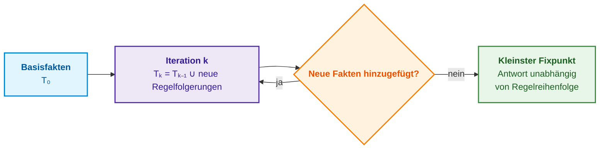
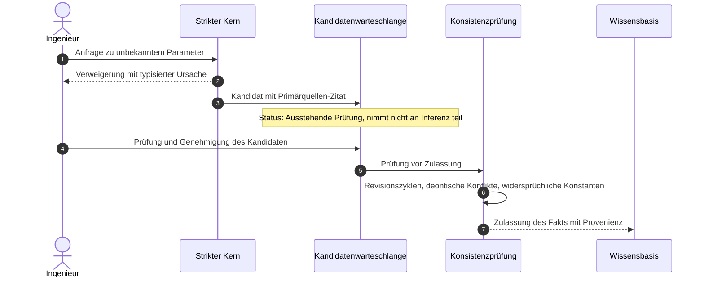

# Kapitel 28. Dual-Mode-Expertensysteme: Strikte Deduktion und beratende Hypothese

> **Buch:** [Architektur evidenzbasierter Expertensysteme](README.md) · [Teil VI: Neuro-symbolische Modelle, kognitive Grenzen und kontinuierliches Lernen](part-06-frontiers-neuro-symbolic.md)  
> **Vorheriges Kapitel:** [Kapitel 30. Co-Engineering von funktionaler Sicherheit und Cybersicherheit](ch30-safety-cybersecurity-co-engineering.md)  
> **Nächstes Kapitel:** [Kapitel 29. Neuro-symbolische Architektur: Sprachmodelle und beweisgestützte Verifikation](ch29-neuro-symbolic-architecture.md)  
> **Inhaltsverzeichnis:** [README.md](README.md)  
> **Autor:** [Mykola Fedchyk](about-the-author.md)  
> **Niveau:** Fortgeschritten: Systemarchitekten, Knowledge Engineers, Verifikationsingenieure, Auditoren für funktionale Sicherheit  
> **Lernziele:** Strikte Ergebnisse formal von beratenden Hypothesen trennen; einen strikten Kern auf Basis von Horn-Klauseln mit Berechnung des kleinsten Fixpunkts und stratifizierter Negation konstruieren; anstelle eines bloßen „Nein“ bei Allquantoren über endlichen Domänen ein konkretes Gegenbeispiel zurückgeben; deontische Konflikte in normativen Spezifikationen identifizieren; Deduktion, Induktion und Abduktion nach Peirce differenzieren und kausale Reduktionen auf Grundursachen anwenden; präzedenzfallbasierte Hypothesen mit formalen Kriterien zur Überführung in Fakten generieren; Verweigerungen ohne Umgehung des Peer-Reviews in Faktenkandidaten der Wissensbasis transformieren; Anfragen ohne strikte Antwort und ohne hinreichend ähnliche Präzedenzfälle an autorisierte Fachexperten eskalieren und deren Urteil als validierten Präzedenzfall in die Wissensbasis rückführen.

## Abstract

Dieses Kapitel untersucht die architektonischen Prinzipien beim Entwurf von Dual-Mode-Expertensystemen, die simultan als strikte Evidenzquelle (für regulatorische Audits und Zertifizierungen nach ISO 26262 oder DO-178C) sowie als flexibler beratender Assistent (für die operative Fehlerdiagnose und Ursachenanalyse an Testständen) agieren. Es wird die unverletzliche epistemische Basisinvariante formuliert: Beratende Hypothesen werden ausnahmslos als unbestätigt gekennzeichnet, besitzen eine explizite Ableitungsmethode sowie formalisierte Prüfkriterien und bleiben prinzipiell von der strikten Inferenz und der Sicherheitsbegründung (*Safety Case*) ausgeschlossen. Der mathematische Apparat des deterministischen symbolischen Kerns wird auf Basis von Horn-Klauseln, der Berechnung des kleinsten Fixpunkts (*least fixed point*) sowie stratifizierter Negation formalisiert. Das Kapitel verortet die epistemische Triade von Charles Sanders Peirce (Deduktion, Induktion, Abduktion) sowie die kausale Ursachenreduktion innerhalb der Gesamtarchitektur. Es wird ein geschlossener Zyklus beschrieben, der typisierte Verweigerungen (*Refusal*) in Kandidaten für neues Domänenwissen überführt, Anfragen bei unzureichender Evidenz an autorisierte Fachexperten eskaliert und deren Rückmeldungen in die Präzedenzfallbasis integriert. Eine vollständige Python-Referenzimplementierung demonstriert das Zusammenspiel beider Modi.

Man vergegenwärtige sich ein Zertifizierungsaudit für das Steuerungssystem eines autonomen Fahrwerks (ISO 26262 ASIL D) oder der Bordavionik (DO-178C): Gelangt ein ungeprüfter Diagnosehinweis oder eine empirische Heuristik des Prüfstands („Lenkwinkelsensorfehler bei Spannungseinbruch unter 11 V ignorieren“) fälschlicherweise als verifizierter Fakt in die Sicherheitsbegründung aus [Kapitel 27](ch27-safety-case-gsn-synthesis.md), erhält das System eine Betriebszulassung mit einem latenten Fehler, was bei einem Fahrmanöver unter hoher Geschwindigkeit zu einem fatalen Ausbrechen des Fahrzeugs führen kann. Das Verhalten eines Expertensystems in derartigen Domänen muss ausnahmslos fehlersicher geschlossen (*fail-closed*) sein: Reichen die formalen normativen Kenntnisse nicht aus, darf das System unter keinen Umständen plausible Annahmen erdichten oder Lücken willkürlich schließen.

Auf der anderen Seite steht ein Testingenieur, der nachts an einem Hardware-in-the-Loop-Prüfstand (HIL) einen Kommunikationsfehler im Steuergerätenetzwerk untersucht, vor einer völlig anderen Herausforderung: Er benötigt dringend einen schnellen Diagnosehinweis wie beispielsweise: „Ein ähnlicher Fehler trat bereits bei Hardware-Revision B auf; Ursache war eine Verzögerung bei der Initialisierung des CAN-Transceivers“, selbst wenn dieser Hinweis lediglich auf einer Analogie zu einem historischen Vorfall beruht und in keinem offiziellen Standard kodifiziert ist. Verweigert das Expertensystem in dieser Situation jegliche Auskunft mit dem Hinweis „Keine Daten verfügbar“, erweist es sich genau dann als nutzlos, wenn operative Unterstützung dringend geboten ist. Würde man dem Auditor hingegen eine derartige Vermutung als bewiesene Tatsache vorlegen, bräche das gesamte Fundament der Zertifizierung zusammen.

Dieses Kapitel beantwortet die Frage: **Wie kann ein Expertensystem gleichzeitig als strikte Evidenzquelle und als nützlicher Ratgeber fungieren, ohne dass ein Ratschlag unbemerkt den Status eines Beweises erlangt?** Die zentrale These lautet: **Die Antwortstruktur gliedert sich in zwei Komponenten mit fundamental unterschiedlichem epistemischem Status. Der strikte Teil wird über deterministische Regeln aus zitierbaren Primärfakten abgeleitet und resultiert bei Wissenslücken in einer typisierten Verweigerung. Der beratende Teil besteht aus Hypothesen, von denen jede explizit als unbestätigt deklariert ist, ihre Generierungsmethode ausweist und operationale Kriterien für ihre eventuelle Überführung in Fakten mitführt. Keine Hypothese fließt in die strikte Inferenz oder die Sicherheitsbegründung ein, solange sie nicht denselben formalen Prüf- und Genehmigungsprozess durchlaufen hat wie jeder andere Wissenskandidat.**

## 1. Architektonische Dichotomie zweier Betriebsmodi und epistemische Basisinvariante

Eine fundamentale Anforderung an die Architektur evidenzbasierter Expertensysteme besteht in der strikten Trennung zwischen deterministischer Inferenz und heuristischen Annahmen. Zur praktischen Realisierung dieser Dichotomie operiert das System in zwei isolierten Modi: dem strikten Modus und dem Beratungsmodus. Im strikten Modus ist die Antwort auf eine Anfrage $q$ ein striktes Resultat $`\mathcal{T}_{\mathrm{strict}}(q)`$: entweder eine durch Primärquellenzitate gestützte Tatsachenbehauptung oder eine Verweigerung $\mathrm{Refusal}(\rho)$ mit typisierter Ursache $\rho$ für die epistemische Unvollständigkeit. Im Beratungsmodus stellt die Antwort ein geordnetes Paar dar:

```math
\mathcal{Y}_{\mathrm{ext}}(q)=\bigl\langle\,\mathcal{T}_{\mathrm{strict}}(q),\ \mathcal{H}(q)\,\bigr\rangle,
\qquad
\mathcal{H}(q)=\{h_1,\dots,h_k\}.
```

- In der erweiterten Antwort bezeichnet $q$ die Anfrage, $`\mathcal{T}_{\mathrm{strict}}(q)`$ das unveränderte strikte Resultat und $\mathcal{H}(q)$ die Menge beratender Hypothesen;
- Die spitzen Klammern $\langle\ ,\ \rangle$ bilden ein geordnetes Paar, wodurch striktes Resultat und Hypothesen auf distinkten epistemischen Positionen verbleiben;
- $`h_1,\dots,h_k`$ sind die einzelnen Hypothesen mit Indizes von 1 bis $k$, wobei $k$ deren Gesamtzahl festlegt;
- $`\mathcal{Y}_{\mathrm{ext}}(q)`$ repräsentiert die gesamte erweiterte Antwortstruktur für die Anfrage $q$.

Dies bedeutet formal: Der Beratungsmodus fügt der unveränderten strikten Antwort eine Menge von Hypothesen hinzu. Die Formel definiert die syntaktische Ausgabestruktur, verleiht den Hypothesen jedoch keineswegs einen beweisenden Status.

Der strikte Anteil bleibt im Beratungsmodus unberührt: Der Beratungsmodus ergänzt ihn lediglich um die Hypothesenmenge $\mathcal{H}(q)$. Jede Hypothese ist als 5-Tupel definiert:

```math
h_i=\langle\,\sigma_i,\ \mu_i,\ c_i,\ \mathcal{O}_i,\ \mathcal{P}_i\,\rangle.
```

- Im Tupel $`h_i`$ bezeichnet der Index $i$ die Nummer der Hypothese, während die spitzen Klammern einen geordneten Datensatz definieren;
- $`\sigma_i`$ ist der semantische Inhalt der Hypothese, $`\mu_i`$ die Generierungsmethode und $`c_i`$ ein Konfidenzwert;
- $`\mathcal{O}_i`$ umfasst die empirischen Beobachtungen zur Stützung der Hypothese und $`\mathcal{P}_i`$ die operationalen Prüfkriterien für ihren Übergang zum verifizierten Fakt;
- Die Attribute folgen der festen Sequenz: Inhalt, Methode, Konfidenz, Beobachtungen, Validierungskriterien.

Das Tupel kapselt somit nicht nur die Aussage der Vermutung, sondern auch deren Entstehungskontext und die erforderlichen Verifikationsschritte. Der Konfidenzwert $`c_i`$ stellt keine automatisch kalibrierte Wahrscheinlichkeit dar.

Die fundamentale epistemische Basisinvariante lautet:

```math
\forall h\in\mathcal{H}(q):\quad \mathrm{EvidenceGrounded}(h)=\mathrm{false}\ \land\ h\notin\mathrm{SafetyCase}.
```

- Die Invariante gilt für jede Hypothese $h$ aus der Menge $\mathcal{H}(q)$ bezüglich der Anfrage $q$;
- $\forall$ bezeichnet den Allquantor („für alle“) und $\in$ die Mengenzugehörigkeit;
- $\mathrm{EvidenceGrounded}(h)=\mathrm{false}$ deklariert, dass die Hypothese über keine verifizierte Evidenzbasis verfügt;
- $\land$ repräsentiert die logische Konjunktion, und $h\notin\mathrm{SafetyCase}$ untersagt zwingend die Aufnahme der Hypothese in die Sicherheitsbegründung.

Folglich bleibt jede beratende Arbeitshypothese explizit unbestätigt und von der Sicherheitsbegründung ausgeschlossen. Diese Regel fixiert den epistemischen Status der Daten und stellt keine numerische Plausibilitätsbewertung dar.

Eine Hypothese stützt sich per definitionem nicht auf eine verifizierte Primärquelle und darf keinesfalls in die Sicherheitsbegründung aus [Kapitel 27](ch27-safety-case-gsn-synthesis.md) einfließen. Der Weg einer Hypothese in die Wissensbasis verläuft über den formalen Kandidatenzyklus aus [Kapitel 26](ch26-continual-learning.md): die Prüfung der Kriterien $`\mathcal{P}_i`$, das fachliche Peer-Review sowie das Zulassungs-Gateway. Diese Invariante entfaltet ihre Schutzwirkung jedoch nur dann, wenn der strikte Kern absolut deterministisch arbeitet und garantiert terminiert – daher gilt das Augenmerk zunächst der Architektur des strikten Kerns.

## 2. Deterministischer symbolischer Kern: Horn-Klauseln und kleinster Fixpunkt

Prozedurale Regelsysteme in Form verschachtelter Bedingungsprüfungen im Quellcode sind notorisch fehleranfällig und schwer formal zu verifizieren: Die Ausführungsreihenfolge beeinflusst das Ergebnis, und wechselseitige Abhängigkeiten zwischen Tausenden von Regeln können zu unendlichen Rekursionen führen. Der strikte Inferenzkern wird daher deklarativ in der Sprache Datalog realisiert. Serge Abiteboul, Richard Hull und Victor Vianu charakterisieren Datalog in ihrem Standardwerk über Datenbanktheorie als Regelsprache über einer endlichen Menge von Fakten ohne Funktionssymbole [[1]](#src-1). Jede Regel entspricht einer Horn-Klausel:

```math
H(\vec X)\leftarrow B_1(\vec X_1)\land\dots\land B_m(\vec X_m)\land\neg N_1(\vec Y_1)\land\dots\land\neg N_k(\vec Y_k).
```

- In der Horn-Klausel bildet $H$ den Kopf (*Head*), mithin die Konklusion der Regel, und $\vec X$ den Vektor der Kopfvariablen;
- $`B_i(\vec X_i)`$ sind positive Atome des Regelrumpfs (*Body*), $m$ bestimmt deren Anzahl, und $\land$ fordert das gleichzeitige Gelten aller Bedingungen;
- $\leftarrow$ ist der Inferenzpfeil („leite den Kopf ab, wenn der Rumpf erfüllt ist“);
- $`N_j(\vec Y_j)`$ repräsentieren Atome unter Negation als Fehlschlag (*Negation as Failure*), $k$ legt deren Anzahl fest, und $\neg$ signalisiert, dass der entsprechende Fakt in der Wissensbasis nicht ableitbar ist;
- Die Indizes $i$ und $j$ nummerieren die Atome, während $\dots$ die Fortsetzung der Bedingungssequenz bis zu den Grenzen $m$ und $k$ anzeigt;
- $`\vec X_i`$ und $`\vec Y_j`$ sind die Variablenmengen in den jeweiligen Atomen; alle Variablen der Klausel teilen einen gemeinsamen Wertebereich (*Domain*).

Die Regel leitet die Aussage $H$ genau dann ab, wenn sämtliche positiven Bedingungen erfüllt sind und kein negiertes Faktum abgeleitet werden kann. Für Regeln mit Negation ist eine strikte Stratifizierung zwingend erforderlich, da andernfalls die Auswertungsreihenfolge das Inferenzergebnis verfälschen könnte.

Die Inferenzberechnung geht von den Basisfakten der Wissensbasis aus und wendet alle Regeln iterativ an, bis keine neuen Fakten mehr generiert werden können. Das folgende Diagramm veranschaulicht diesen deterministischen Prozess.



Für regellogische Programme ohne Negation ist das Ergebnis der kleinste Fixpunkt (*least fixed point*): die minimale Menge von Fakten, die bezüglich aller Regeln deduktiv abgeschlossen ist. Da während der Inferenz keine neuen Konstanten generiert werden, ist die Menge möglicher Fakten endlich; der Inferenzprozess terminiert garantiert und beansprucht bei fester Regelmenge eine polynomielle Zeit bezüglich der Anzahl der Fakten [[1]](#src-1). Negation verletzt jedoch die Monotonie: Ein Fakt, der aus der Prämisse „$`N`$ ist nicht bekannt“ abgeleitet wurde, könnte ungültig werden, sobald $N$ in einem späteren Inferenzschritt abgeleitet wird. Das Prinzip der Stratifizierung löst diesen Widerspruch: Die Regeln werden derart in Schichten (*Strata*) partitioniert, dass jedes negierte Prädikat in einer tieferen Schicht vollständig ausmultipliziert und abgeschlossen ist, bevor es in einer höheren Schicht negiert herangezogen werden darf [[1]](#src-1). Logikprogramme mit zyklischer Rekursion über Negation besitzen keine gültige Stratifizierung und werden vom strikten Kern bereits beim Parsen der Regelbasis deterministisch zurückgewiesen.

Der strikte Inferenzkern liefert weit mehr als bloße boolesche Wahrheitswerte („Ja“ oder „Nein“). Ein **Allquantor über einer endlichen Domäne** verifiziert Aussagen wie beispielsweise: „Für jeden Protokollbefehl existiert in der Wissensbasis eine dokumentierte Antwortspezifikation“:

```math
\forall c\in\mathrm{Commands}:\ \exists s\ \ \mathrm{DocumentedReply}(c,s).
```

- Für jeden Befehl $c$ aus der endlichen Menge $\mathrm{Commands}$ muss mindestens ein Zustandswert $s$ existieren;
- $\forall$ bezeichnet den Allquantor („für alle“), $\exists$ den Existenzquantor („es existiert“) und $\in$ die Mengenzugehörigkeit;
- $\mathrm{DocumentedReply}(c,s)$ ist das Prädikat „für den Befehl $c$ ist das Antwortverhalten $s$ spezifiziert“.

Da die Domäne der Befehle endlich ist, führt eine Nichterfüllung der Aussage zur Identifikation eines konkreten Befehls ohne dokumentierte Spezifikation. Die Gültigkeit der Folgerung beschränkt sich strikt auf die Elemente der Menge $\mathrm{Commands}$.

Erweist sich die Allaussage als falsch, gibt der Kern nicht einfach einen logischen Fehlerstatus zurück, sondern konstruiert ein präzises **Gegenbeispiel** – also den konkreten Befehl, für den keine Antwortspezifikation hinterlegt ist. Dieses Gegenbeispiel lokalisiert unmittelbar die epistemische Lücke in der Wissensbasis.

Die **deontische Konsistenzprüfung** analysiert normative Spezifikationen und Standards auf modallogische Kollisionen. Georg Henrik von Wright begründete die moderne deontische Logik, indem er Verpflichtung, Verbot und Erlaubnis als modale Operatoren über Handlungen formalisierte [[2]](#src-2). Bezeichnet man eine Verpflichtung mit $\mathsf{O}$ (`MUST`) und ein Verbot mit $\mathsf{F}$ (`MUST NOT`), so stellt das gleichzeitige Bestehen eines Gebots und eines Verbots für dieselbe Handlung im selben Geltungsbereich einen unauflösbaren logischen Konflikt dar:

```math
\mathsf{O}(a,s)\land\mathsf{F}(a,s)\ \Rightarrow\ \bot .
```

wobei:

- $\mathsf{O}(a,s)$ die normative Pflicht zur Ausführung der Aktion $a$ im Geltungsbereich $s$ repräsentiert;
- $\mathsf{F}(a,s)$ das normative Verbot derselben Aktion im identischen Geltungsbereich ausdrückt;
- $\land$ das simultane Vorliegen beider Normen bezeichnet, $\Rightarrow$ die logische Implikation darstellt und $\bot$ das Falsum bzw. den Widerspruch symbolisiert.

Die Formel detektiert eine logische Kollision, wenn eine Operation im selben operationalen Kontext zugleich vorgeschrieben und untersagt ist. Sie entscheidet jedoch nicht eigenmächtig, welche der kollidierenden Normen aufzuheben ist.

Ein identifizierter normativer Konflikt wird vom System niemals heuristisch geglättet: Der Kern blockiert die Freigabe der widersprüchlichen Regelrevision und eskaliert die Kollision an den autorisierten Verantwortlichen des Normendokuments. Der strikte Kern garantiert somit stets reproduzierbare und auditierbare Antworten. Komplexe ingenieurtechnische Fragestellungen erfordern jedoch mehr als reine Deduktion – der nachfolgende Abschnitt differenziert daher die Inferenzformen, die in beiden Modi zum Einsatz kommen.

## 3. Epistemische Triade von Peirce: Deduktion, Induktion, Abduktion und kausale Reduktion

In seiner grundlegenden Abhandlung von 1878, *Illustrations of the Logic of Science VI: Deduction, Induction, and Hypothesis*, differenzierte Charles Sanders Peirce drei fundamentale Formen des logischen Schließens [[3]](#src-3). Die Deduktion wendet eine allgemeine Regel auf einen Einzelfall an und leitet das notwendige Resultat ab. Die Induktion verallgemeinert aus beobachteten Einzelfällen und deren Resultaten eine hypothetische Regel. Die Hypothese (in der modernen Terminologie als Abduktion bezeichnet) erklärt ein überraschendes Resultat durch die Annahme, dass der beobachtete Fall unter eine bestimmte Regel fällt; Peirce betonte ausdrücklich, dass eine Hypothese als Argumentationsform inhärent schwach und vorläufig ist. Igor Douven unterstreicht in der *Stanford Encyclopedia of Philosophy*, dass Abduktion bei Peirce keineswegs bedeutet, eine Hypothese als wahr oder bewiesen zu akzeptieren, sondern sie lediglich als prüfenswerten Kandidaten für eine nachfolgende empirische Untersuchung zuzulassen [[4]](#src-4). Exakt diesen epistemischen Status besitzt eine beratende Hypothese im Expertensystem. Für ein Dual-Mode-System determiniert die Peircesche Klassifikation den formalen Status jeder Antwortkomponente.

**Die Deduktion operiert im strikten Modus.** Eine Rückwärtsverkettung (*Backward Chaining*) ausgehend vom Inferenzziel konstruiert einen vollständigen Erklärungsbaum, in dem jeder Knoten entweder ein Faktum mit Primärquellenzitat oder eine Regelfolgerung mit explizitem Nachweis der Prämissen darstellt, wie in [Kapitel 20](ch20-explanation-engine.md) ausgeführt. Das Ergebnis der Deduktion erbt die epistemische Gültigkeit seiner Prämissen: Aus verifizierten Fakten folgt ein strikter, unanfechtbarer Beweis.

**Die Induktion operiert im Beratungsmodus.** Aus Protokollsitzungsprotokollen (*Session Logs*) lässt sich beispielsweise ein endlicher Zustandsautomat synthetisieren, der die beobachteten Zustandsübergänge verallgemeinert. Ein solcher Automat stellt jedoch lediglich eine Hypothese über die Spezifikation dar, keineswegs die Spezifikation selbst: Protokolldaten dokumentieren stets nur jene Sequenzen, die zur Laufzeit tatsächlich aufgetreten sind. Um den synthetisierten Automaten mit der formalen Referenzspezifikation zu vergleichen, werden beide Zustandsräume minimiert – beispielsweise über den Algorithmus von John Hopcroft, der in einer Zeitkomplexität von $O(n\log n)$ äquivalente Zustände zusammenführt [[5]](#src-5):

```math
s_1\sim s_2\iff\forall w\in\Sigma^{*}:\ \bigl(\hat\delta(s_1,w)\in F\iff\hat\delta(s_2,w)\in F\bigr).
```

- In endlichen Automaten bezeichnen $`s_1`$ und $`s_2`$ zwei Zustände, während $\sim$ deren Äquivalenz ausdrückt;
- $\forall w\in\Sigma^*$ prüft jedes endliche Eingabewort (Befehlsfolge) $w$ über dem Alphabet $\Sigma$; der Kleene-Stern umfasst sämtliche endlichen Wörter inklusive des leeren Wortes;
- $\hat\delta(s,w)$ ist die erweiterte Übergangsfunktion, die den Folgezustand nach Abarbeitung des Wortes $w$ ermittelt;
- $F$ bezeichnet die Menge der Endzustände (*Accepting States*), $\in$ die Enthaltenseinsrelation und $\iff$ die logische Äquivalenz („genau dann, wenn“);
- Das innere $\iff$ verlangt, dass beide Zustände für jede beliebige Eingabesequenz ein identisches Akzeptanzverhalten zeigen.

Zwei Zustände sind somit genau dann äquivalent, wenn von ihnen aus dieselbe formale Sprache akzeptiert wird. Der Äquivalenzvergleich setzt identische Alphabete voraus und basiert auf der formalen Korrektheit der Zustandsübergänge und Endzustände.

Eine Diskrepanz zwischen den minimalen Automaten offenbart präzise jene Zustandsübergänge, die in den Protokollen beobachtet wurden, vom Standard jedoch untersagt sind – oder umgekehrt.

**Die Abduktion operiert im Beratungsmodus.** Die Erklärung eines Fehlers durch die plausibelste Grundursache bleibt eine Hypothese, selbst wenn ihr statistischer Wahrscheinlichkeitswert hoch ist; [Kapitel 24](ch24-system-diagnosis.md) demonstriert, wie derartige Hypothesen formal gewichtet und verifiziert werden.

**Die Kausale Reduktion gehört nicht zur Peirceschen Triade, ist jedoch für beide Modi unverzichtbar.** Die Reduktion komprimiert eine lange Kausalkette auf ihren wesentlichen Kern. Bei der Diagnose einer SMTP-Sitzung beispielsweise führt die Reduktion einen Fehler beim Befehl `DATA` auf eine einzige verletzte Vorbedingung zurück. Der Standard RFC 5321 gestattet es dem Server explizit, auf den `DATA`-Befehl mit dem Statuscode 503 („Befehl außerhalb der Sequenz“) oder 554 („Keine gültigen Empfänger“) zu antworten, falls diesem kein erfolgreicher `MAIL`- oder `RCPT`-Befehl vorausging [[6]](#src-6). Daher lässt sich der Fehlercode 503 beim Schritt `DATA` auf die strikte Konklusion „kein akzeptierter RCPT-Befehl vorhanden“ unter direktem Verweis auf den Standard reduzieren. Die minimale Menge widersprüchlicher Randbedingungen wird durch den Algorithmus QuickXPlain aus [Kapitel 20](ch20-explanation-engine.md) isoliert, während die Integrität der Beweiskette über Merkle-Bäume aus [Kapitel 27](ch27-safety-case-gsn-synthesis.md) kryptografisch gesichert wird.

## 4. Beratungsmodus: Fallbasiertes Schließen und Generierung von Arbeitshypothesen

Die praxisrelevanteste Quelle für beratende Arbeitshypothesen ist das Gedächtnis historisch gelöster Problemfälle. Das fallbasierte Schließen (*Case-Based Reasoning*, CBR) nach Agnar Aamodt und Enric Plaza durchläuft vier zyklische Phasen: Auffinden eines ähnlichen Falls (*Retrieve*), Wiederverwendung der Lösung (*Reuse*), Revision der Lösung unter Berücksichtigung von Kontextunterschieden (*Revise*) und Speicherung der neuen Erfahrung (*Retain*) [[7]](#src-7). Die Ähnlichkeit von Symptommengen lässt sich präzise über den Jaccard-Koeffizienten quantifizieren, den Paul Jaccard ursprünglich für den botanischen Artenvergleich formalisierte [[8]](#src-8):

```math
J(S_{\mathrm{in}},S_{\mathrm{case}})=\frac{|S_{\mathrm{in}}\cap S_{\mathrm{case}}|}{|S_{\mathrm{in}}\cup S_{\mathrm{case}}|}.
```

- Der Koeffizient $J$ vergleicht die Symptommenge der aktuellen Anfrage $`S_{\mathrm{in}}`$ mit der Symptommenge des historischen Präzedenzfalls $`S_{\mathrm{case}}`$;
- $\cap$ repräsentiert die Schnittmenge, $\cup$ die Vereinigungsmenge und $`\lvert\cdot\rvert`$ die Kardinalität (Mächtigkeit) der jeweiligen Menge;
- Der Zähler quantifiziert die gemeinsamen Symptome, während der Nenner die Gesamtzahl aller distinkten Symptome beider Mengen abbildet.

Für das Beispiel $`S_{\mathrm{in}}=\{A,B\}`$ und $`S_{\mathrm{case}}=\{B,C\}`$ ergibt sich $`J=1/3\approx0{,}33`$. Bei nichtleerer Vereinigungsmenge nimmt der Koeffizient Werte im Intervall von 0 bis 1 an; sind beide Mengen leer, wird der Nenner null und der Wert ist mathematisch undefiniert. Der Koeffizient misst die mengentheoretische Ähnlichkeit, keineswegs die Wahrscheinlichkeit der sachlichen Richtigkeit einer Hypothese.

Überschreitet $J$ einen definierten Schwellenwert $\theta$, wird der Präzedenzfall als Arbeitshypothese mit der Methode „Präzedenzfallanalogie“, dem Konfidenzwert $c=J$ und einem operationalen Hochstufungskriterium generiert: „Bedingungen des Präzedenzfalls am Teststand reproduzieren und die vermutete Ursache messtechnisch verifizieren“. Der Schwellenwert $\theta$ darf keinesfalls willkürlich geschätzt werden; er wird auf Basis annotierter historischer Testfälle kalibriert, wie in [Kapitel 25](ch25-how-expert-systems-learn.md) beschrieben, da der Jaccard-Index lediglich syntaktische Übereinstimmungen quantifiziert.

Ein typisches Szenario: Ein Ingenieur meldet ein Verbindungs-Timeout auf Port 25. Da der strikte Kern über keine Fakten bezüglich der Netzwerktopologie verfügt, verweigert er die Antwort. Der Beratungsmodus identifiziert jedoch einen Präzedenzfall, in dem ein Internet-Provider den ausgehenden Port 25 blockierte, und empfiehlt die Maßnahme dieses Falls: Nachrichten über den Einlieferungsport 587 zu übermitteln, den der Standard RFC 6409 explizit für das Einreichen von Nachrichten (*Message Submission*) vorsieht, während Port 25 dem Server-zu-Server-Relay vorbehalten bleibt [[9]](#src-9). Der Verweis auf RFC 6409 belegt zwar, dass Port 587 normativ existiert und spezifiziert ist, beweist jedoch keineswegs, dass das aktuelle Timeout tatsächlich durch eine Portblockade des Providers verursacht wurde. Daher verbleibt die gesamte Empfehlung strikt im Status einer beratenden Hypothese.

## 5. Typisierte Verweigerung (Refusal) als Quelle neuen Wissens

Die Verweigerung (*Refusal*) des strikten Kerns ist nicht bloß eine formal korrekte Reaktion, sondern fungiert als systemischer Indikator für eine Wissenslücke. Trifft der Kern eine Verweigerungsentscheidung, kann das Expertensystem gezielt Primärquellendokumente nach anfragerelevanten Fragmenten durchsuchen und Kandidaten für neue Fakten generieren: Subjekt, Relation, Objektwert, Dokumentenkennung und den exakten Byte-Bereich des Zitats, analog zum Zitatverifikator aus [Kapitel 15](ch15-knowledge-extraction-and-kb-construction.md). Ein solcher Faktenkandidat erhält den Status „Ausstehende Prüfung“ (*Pending Review*) und bleibt für den strikten Kern solange unsichtbar, bis ein Knowledge Engineer ihn formal freigegeben hat. Das folgende Sequenzdiagramm verdeutlicht diesen Pfad.



Die Konsistenzprüfung vor der formalen Zulassung überwacht drei fundamentale Fehlerklassen. **Revisionsersetzungszyklen** treten auf, wenn Dokument A das Dokument B für ungültig erklärt, während B gleichzeitig A aufhebt. **Deontische Konflikte** entstehen, wenn dieselbe Operation im selben Geltungsbereich simultan vorgeschrieben und verboten ist. **Widersprüchliche Konstanten** manifestieren sich, wenn eine Normenrevision zwei inkompatible Werte für denselben Parameter festlegt, etwa zwei unterschiedliche Standard-Portnummern. Ein aufgelöster Vorfall wird nach messtechnischer Bestätigung der Grundursache als neuer Präzedenzfall persistiert, wodurch sich der Wissenszyklus schließt: Eine Verweigerung generiert einen Faktenkandidaten, der auditierte Kandidat wird zum verifizierten Faktum, und der validierte Problemfall bereichert als Präzedenzfall künftige Beratungshypothesen.

### 5.1. Eskalation an den Fachexperten und geschlossener Wissensanreicherungszyklus

Der Zyklus von der Verweigerung zum Faktum greift, solange die gesuchte Antwort in autoritativen Primärquellen dokumentiert ist. Zahlreiche ingenieurtechnische Fragestellungen lassen sich jedoch weder aus Dokumenten noch aus historischen Präzedenzfällen beantworten – etwa Erfahrungswissen, das exklusiv bei einem langjährigen Prüfstandsingenieur liegt, oder die autoritative Auslegung einer Norm, die einer benannten Stelle vorbehalten ist. In diesem Fall muss die Verweigerung des strikten Kerns in eine adressierte Anfrage an eine autorisierte Fachperson transformiert werden, deren fachliche Beurteilung als validierter Präzedenzfall in das Expertensystem rückgeführt wird.

Keltoum Benlaharche und Koautoren analysierten einen derartigen Interaktionszyklus am Beispiel des algerischen Fatawa-Hauses (*Algerian Fatawa House*), dem es an einer hinreichenden Anzahl zertifizierter Rechtsgelehrter (Muftis) fehlte, um das tägliche Aufkommen von Bürgeranfragen zeitnah zu bewältigen [[10]](#src-10). Das System ermittelt ähnliche Fälle über fallbasiertes Schließen gestützt auf eine formale Ontologie für das islamische Finanz- und Bankenwesen. Existiert in der Wissensbasis bereits eine validierte Antwort auf eine äquivalente Fragestellung, wird diese unmittelbar ausgegeben. Andernfalls synthetisiert das System automatisch eine strukturierte Anfrage an den Gelehrten, der den Systemvorschlag entweder autorisiert oder eine neue Lösung formuliert, woraufhin die Falldatenbank inkrementell erweitert wird. Die Autoren evaluierten ihr System in einer spezifischen Domäne anhand qualitativer Kriterien, weshalb diese Arbeit primär als architektonisches Entwurfsmuster und weniger als Quelle quantitativer Metriken dient.

Die Übertragung dieses Musters auf ein industrielles Dual-Mode-Expertensystem erfordert eine fundamentale Modifikation: Während im Fatawa-System ein gefundener historischer Fall direkt als endgültige Antwort ausgegeben wird, verbleibt eine analogiebasierte Antwort im Dual-Mode-Expertensystem ausnahmslos im Status einer beratenden Hypothese – selbst dann, wenn der zugrundeliegende Präzedenzfall von einem Fachexperten validiert wurde. Eine bloße Symptomähnlichkeit beweist keineswegs die Identität der Randbedingungen im aktuellen Systemzustand. Der Anfragerouter entscheidet nach Konsultation des strikten Kerns entlang von drei distinkten Pfaden:

```math
\mathrm{route}(q)=
\begin{cases}
\text{strikte Antwort}, & \text{falls } \mathrm{Strict}(q)\neq\bot,\\
\text{Hypothese aus Präzedenzfall } c^{*}, & \text{falls } \mathrm{Strict}(q)=\bot\ \land\ J(q,c^{*})\ge\theta,\\
\text{Anfrage an Experten}, & \text{sonst},
\end{cases}
\qquad
c^{*}=\arg\max_{c\in C_{\mathrm{val}}} J(q,c).
```

Formale Nomenklatur des Routers:

- $q$ bezeichnet die formale Anfrage, die analog zum obigen Jaccard-Index als Symptommenge repräsentiert ist;
- $\mathrm{Strict}(q)$ ist das Inferenzergebnis des strikten Kerns, wobei $\bot$ eine typisierte Verweigerung markiert;
- $`C_{\mathrm{val}}`$ ist die Menge der durch autorisierte Experten validierten Präzedenzfälle, und $`c^{*}`$ bezeichnet den ähnlichsten Präzedenzfall innerhalb dieser Menge;
- $`J(q,c^{*})`$ ist der Jaccard-Koeffizient zwischen den Merkmalen der Anfrage und des Präzedenzfalls, während $\theta$ den kalibrierten Schwellenwert darstellt;
- $\arg\max$ selektiert den Präzedenzfall mit maximaler Ähnlichkeit; ist die Menge $`C_{\mathrm{val}}`$ leer, initiiert der Router unmittelbar eine Experteneskalation.

Dieser Routing-Mechanismus legt das Standardverhalten fest: Reicht dem Anwender eine Hypothese für eine sicherheitskritische Entscheidung nicht aus, kann er eine manuelle Eskalation anstoßen. Da die Expertenanfrage vom System autonom synthetisiert wird, enthält sie bereits alle zur Entscheidungsfindung erforderlichen Fakten. Die nachfolgende Tabelle spezifiziert die Attribute der Expertenanfrage.

| Attribut der Anfrage | Semantischer Inhalt | Relevanz für den Fachexperten |
|---|---|---|
| Strukturierte Anfrage | Merkmale, Parameter und Geltungsbereich | Eindeutige, kontextbezogene Problemformulierung |
| Verweigerungsursache | Typus der Verweigerung und fehlender Fakt bzw. fehlende Regel | Exakte Verortung der epistemischen Lücke in der Wissensbasis |
| Nächste Präzedenzfälle | Bezeichner, Jaccard-Indizes und divergierende Merkmale | Transparente Begründung, warum bestehende Fälle unzureichend sind |
| Antwortentwurf | Beratende Hypothese inklusive Validierungskriterium | Möglichkeit zur Korrektur oder Bestätigung anstelle einer Neuformulierung |
| Primärquellenzitate | Dokument, Revisionsstand und Zitatbereich | Sofortige Prüfung der formalen Grundlagen ohne eigene Recherche |

Die Rückmeldung des Fachexperten wird über zwei Pfade mit differenziertem Status integriert. Eine bestätigte oder neu formulierte Lösung wird als Präzedenzfall in die Menge $`C_{\mathrm{val}}`$ aufgenommen – versehen mit Experten-ID, Zeitstempel, Geltungsbereich und spezifischen Anwendungsbedingungen. Formuliert der Experte ein allgemeines Regelsystem mit Primärquellenbezug, generiert das System zusätzlich einen Faktenkandidaten, der das reguläre Peer-Review und die Konsistenzprüfung des Sequenzdiagramms durchlaufen muss. Die formale Autorisierung durch einen Experten entbindet den Kandidaten keineswegs von automatisierten Prüfungen auf Revisionszyklen, deontische Konflikte und widersprüchliche Konstanten.

Betrachten wir das Timeout-Szenario im Labornetz: Ein Ingenieur meldet ein Verbindungs-Timeout auf Port 25 in einer neuen Testumgebung. Der strikte Kern verweigert mangels Fakten die Antwort; der ähnlichste validierte Präzedenzfall weist einen Jaccard-Index von 0,33 auf, was unter dem Schwellenwert von 0,4 liegt. Der Router generiert eine Expertenanfrage an den Netzwerkinfrastruktur-Administrator mit dem Entwurf: „Prüfen, ob der Provider ausgehenden Verkehr auf Port 25 blockiert“. Der Administrator bestätigt den Entwurf und ergänzt die Randbedingung: „Gilt für Client-Verbindungen ohne statische IP-Adresse“. Eine nachfolgende gleichartige Anfrage erhält daraufhin eine beratende Hypothese unter Verweis auf den validierten Präzedenzfall – ohne erneute Eskalation. Der strikte Kern wird diese Anfrage jedoch solange weiterhin verweigern, bis der Administrator ein verifiziertes Zitat aus den Servicebedingungen des Providers als Primärquellenevidenz hinterlegt und dieser Faktenkandidat das formale Review erfolgreich durchlaufen hat.

Die Skalierungsgrenze dieses Musters liegt in der Belastung der Fachexperten. Die Arbeitszeit autorisierter Spezialisten ist die am stärksten limitierte Ressource im System. Daher wird der Anteil der Verweigerungen, die zur Eskalation führen, kontinuierlich telemetrisch überwacht: Das Anwachsen der Menge $`C_{\mathrm{val}}`$ muss den Eskalationsbedarf systematisch senken, während die Quote verworfener Entwürfe die Präzision des Beratungsmodus widerspiegelt. Validierte Präzedenzfälle unterliegen zudem einem epistemischen Alterungsprozess: Ändert sich die Revision der zugrundeliegenden Primärnorm, wird der Präzedenzfall analog zu veralteten Fakten in [Kapitel 15](ch15-knowledge-extraction-and-kb-construction.md) in den Überprüfungsstatus zurückversetzt.

## 6. Softwareverifikation: Implementierung einer Dual-Mode-Engine in Python

Das nachfolgende Programm demonstriert die Mechanismen dieses Kapitels als kompakte Referenzimplementierung. Der strikte Kern berechnet den kleinsten Fixpunkt für zwei Horn-Klauseln über einer Faktenbasis aus RFC 5321, beantwortet Anfragen evidenzbasiert mit Quellenzitaten und verweigert bei epistemischen Lücken die Aussage. Der Beratungsmodus ermittelt Präzedenzfälle über den Jaccard-Index, während der Router gemäß der Formalisierung des vorangegangenen Abschnitts zwischen strikter Antwort, Hypothese und Experteneskalation entscheidet. Die Software prüft zudem Allquantoren über Gegenbeispiele, detektiert deontische Konflikte und veranschaulicht zwei divergierende Zulassungspfade: Das Gutachten eines Experten zu einem Vorfallsprotokoll wird zum validierten Präzedenzfall, während ein strikter Fakt ausschließlich aus einem Primärquellenzitat und strikt innerhalb eines definierten Geltungsbereichs entstehen kann. Eine integrierte Testsuite validiert Grenzfälle wie leere Symptommengen und Ähnlichkeiten unterhalb des Schwellenwerts. Es wird ausschließlich die Standardbibliothek ab Python 3.10 benötigt.

<details>
<summary>Python-Referenzimplementierung: Strikter Modus, Beratungsmodus und Expertenrouting</summary>

```python
"""Dual-Mode-Expertensystem im Kleinformat: strikte Inferenz mit Zitaten und beratende Hypothesen.

Ausschließlich Standardbibliothek Python 3.10+.
"""
FACTS = {  # (Subjekt, Relation, Wert) -> Primärquellen-Zitat
    ("SMTP", "max_line_octets", "1000"): "RFC 5321, 4.5.3.1.6",
    ("MAIL", "precedes", "RCPT"): "RFC 5321, 3.3",
    ("RCPT", "precedes", "DATA"): "RFC 5321, 3.3",
    ("HELO", "documented_reply", "250"): "RFC 5321, 4.3.2",
    ("MAIL", "documented_reply", "250"): "RFC 5321, 4.3.2",
    ("RCPT", "documented_reply", "250"): "RFC 5321, 4.3.2",
    ("DATA", "documented_reply", "354"): "RFC 5321, 4.3.2",
}
RULES = [  # Horn-Klauseln: Kopf <- Rumpf; Variablen werden großgeschrieben
    (("X", "must_precede", "Y"), [("X", "precedes", "Y")]),
    (("X", "must_precede", "Z"), [("X", "precedes", "Y"), ("Y", "must_precede", "Z")]),
]
CASES = [  # bestätigte Präzedenzfälle: Symptome, Ursache, Maßnahme
    ({"timeout", "port-25", "connect", "home-network"}, "Provider blockiert ausgehenden Port 25",
     "über Einlieferungs-Port 587 senden (RFC 6409)"),
    ({"503", "data", "sequence"}, "DATA ohne akzeptierten RCPT-Befehl", "Antwort auf RCPT prüfen"),
]
NORMS = [("MUST", "use-tls", "submission"), ("MUST NOT", "use-tls", "submission"), ("MUST", "use-tls", "relay")]


def is_var(term):
    return term.isupper() and len(term) == 1


def match(pattern, fact, binding):
    binding = dict(binding)
    for p, f in zip(pattern, fact):
        if is_var(p):
            if binding.setdefault(p, f) != f:
                return None
        elif p != f:
            return None
    return binding


def solve(body, known, binding=None):
    if not body:
        yield binding or {}
        return
    for fact in list(known):
        b = match(body[0], fact, binding or {})
        if b is not None:
            for rest in solve(body[1:], known, b):
                yield rest


def least_fixed_point(facts, rules):
    known = {f: ("Axiom", [src]) for f, src in facts.items()}
    rounds = 0
    while True:
        rounds += 1
        new = {}
        for head, body in rules:
            for b in solve(body, known):
                fact = tuple(b.get(t, t) for t in head)
                if fact not in known and fact not in new:
                    premises = [tuple(b.get(t, t) for t in atom) for atom in body]
                    new[fact] = ("Regel", sorted({c for p in premises for c in known[p][1]}))
        if not new:
            return known, rounds
        known.update(new)


def strict(known, subject, relation):
    hits = [(f, why) for f, why in known.items() if f[0] == subject and f[1] == relation]
    if not hits:
        return {"kind": "refusal", "reason": "kein verifizierter Fakt vorhanden"}
    return {"kind": "answer", "values": [(f[2], why[1]) for f, why in hits]}


def jaccard(a, b):
    union = a | b
    return len(a & b) / len(union) if union else None  # leere Mengen werden nicht verglichen


def extended(known, subject, relation, symptoms, theta=0.4):
    answer = strict(known, subject, relation)
    scored = [(jaccard(symptoms, s), cause, action) for s, cause, action in CASES]
    scored = [item for item in scored if item[0] is not None]
    hypotheses = [{"cause": cause, "action": action, "jaccard": round(j, 2),
                   "evidence_grounded": False,
                   "promote_if": "Symptome am Prüfstand reproduzieren und Ursache bestätigen"}
                  for j, cause, action in scored if j >= theta]
    route = "strict" if answer["kind"] == "answer" else "advisory" if hypotheses else "expert"
    reply = {"strict": answer, "hypotheses": hypotheses, "route": route}
    if route == "expert":
        best = max(scored, default=(0.0, None, None))
        reply["expert_request"] = {"query": (subject, relation, sorted(symptoms)),
                                   "refusal": answer["reason"],
                                   "nearest_case": best[1], "jaccard": round(best[0], 2)}
    return reply


def approve(known, candidate):  # Genehmigung macht ein Vorfallsprotokoll nicht zur Primärquelle
    if candidate["source_kind"] != "primary":
        CASES.append((candidate["symptoms"], candidate["value"], candidate["action"]))
        return "bestätigter Präzedenzfall"
    subj = candidate["subject"]
    scp = candidate["scope"]
    subject = f"{subj}@{scp}"
    known[(subject, candidate["relation"], candidate["value"])] = ("vom Experten genehmigt", [candidate["source"]])
    return f"Fakt mit Geltungsbereich {scp}"


def test_dual_mode(known):
    assert jaccard(set(), set()) is None
    assert extended(known, "x", "y", set())["route"] == "expert"
    low = extended(known, "port-25", "timeout_cause", {"timeout", "lab-network"})
    assert low["route"] == "expert" and low["expert_request"]["nearest_case"]
    assert extended(known, "SMTP", "max_line_octets", set())["route"] == "strict"


known, rounds = least_fixed_point(FACTS, RULES)
test_dual_mode(known)
print(f"1. Kleinster Fixpunkt: {len(known)} Fakten nach {rounds} Runden")
print("2. Strikt: MAIL must_precede ->", strict(known, "MAIL", "must_precede")["values"])
print("3. Strikt: Zeilenlänge SMTP ->", strict(known, "SMTP", "max_line_octets")["values"])
print("4. Strikt: Timeout auf Port 25 ->", strict(known, "port-25", "timeout_cause"))
reply = extended(known, "port-25", "timeout_cause", {"timeout", "port-25", "connect", "office-network"})
print("5. Beratend:", reply["route"], "+", reply["hypotheses"])
commands = ["HELO", "MAIL", "RCPT", "DATA", "VRFY"]
missing = [c for c in commands if not strict(known, c, "documented_reply")["kind"] == "answer"]
print("6. Für jeden Befehl existiert dokumentierte Antwort?", not missing, "| Gegenbeispiel:", missing[:1])
conflicts = sorted({(a, s) for m1, a, s in NORMS for m2, a2, s2 in NORMS
                    if (m1, m2) == ("MUST", "MUST NOT") and (a, s) == (a2, s2)})
print("7. Deontische Konflikte:", conflicts)
lab = extended(known, "port-25", "timeout_cause", {"timeout", "port-25", "lab-network", "dns"})
print("8. Neues Netzwerk:", lab["route"], "| Anfrage an Experten:", lab["expert_request"])
incident = {"subject": "port-25", "relation": "timeout_cause", "value": "ISP block",
            "action": "über Port 587 senden", "symptoms": {"timeout", "port-25", "lab-network", "dns"},
            "source": "Vorfallsprotokoll INC-77", "source_kind": "incident"}
print("9. Expertenantwort genehmigt ->", approve(known, incident),
      "| strikt:", strict(known, "port-25", "timeout_cause")["kind"],
      "| Wiederholte Anfrage:", extended(known, "port-25", "timeout_cause", incident["symptoms"])["route"])
contract = {**incident, "source": "AGB des Providers, Ziff. 3.2", "source_kind": "primary",
            "scope": "dynamic-ip"}
print("10. Primärquellen-Zitat genehmigt ->", approve(known, contract),
      "| strikt für dynamic-ip:", strict(known, "port-25@dynamic-ip", "timeout_cause")["values"],
      "| ohne Geltungsbereich:", strict(known, "port-25", "timeout_cause")["kind"])
```

</details>

Die Ausführung via `python dual_mode.py` liefert:

<details>
<summary>Programmausgabe</summary>

```text
1. Kleinster Fixpunkt: 10 Fakten nach 3 Runden
2. Strikt: MAIL must_precede -> [('RCPT', ['RFC 5321, 3.3']), ('DATA', ['RFC 5321, 3.3'])]
3. Strikt: Zeilenlänge SMTP -> [('1000', ['RFC 5321, 4.5.3.1.6'])]
4. Strikt: Timeout auf Port 25 -> {'kind': 'refusal', 'reason': 'kein verifizierter Fakt vorhanden'}
5. Beratend: advisory + [{'cause': 'Provider blockiert ausgehenden Port 25', 'action': 'über Einlieferungs-Port 587 senden (RFC 6409)', 'jaccard': 0.6, 'evidence_grounded': False, 'promote_if': 'Symptome am Prüfstand reproduzieren und Ursache bestätigen'}]
6. Für jeden Befehl existiert dokumentierte Antwort? False | Gegenbeispiel: ['VRFY']
7. Deontische Konflikte: [('use-tls', 'submission')]
8. Neues Netzwerk: expert | Anfrage an Experten: {'query': ('port-25', 'timeout_cause', ['dns', 'lab-network', 'port-25', 'timeout']), 'refusal': 'kein verifizierter Fakt vorhanden', 'nearest_case': 'Provider blockiert ausgehenden Port 25', 'jaccard': 0.33}
9. Expertenantwort genehmigt -> bestätigter Präzedenzfall | strikt: refusal | Wiederholte Anfrage: advisory
10. Primärquellen-Zitat genehmigt -> Fakt mit Geltungsbereich dynamic-ip | strikt für dynamic-ip: [('ISP block', ['AGB des Providers, Ziff. 3.2'])] | ohne Geltungsbereich: refusal
```

</details>

Zeile 1 belegt, dass der Kern aus sieben Basisfakten drei neue Fakten deduzierte und in der dritten Runde terminierte, als keine neuen Schlüsse mehr gezogen werden konnten. Zeile 2 zeigt das transitiv abgeleitete Faktum „MAIL muss vor DATA ausgeführt werden“; das Zitat dieser Folgerung wird direkt von den Prämissen aus Abschnitt 3.3 des RFC 5321 vererbt. Zeile 3 liefert einen zitierten Fakt, Zeile 4 quittiert mit Verweigerung. Zeile 5 demonstriert die Kerninvariante: Der Router wählte den Beratungspfad, der strikte Anteil verharrte bei einer Verweigerung, und die Hypothese bezüglich der Portblockade weist einen Jaccard-Index von 0,6, das Attribut `evidence_grounded: False` sowie ein explizites Validierungskriterium auf. Zeile 6 isoliert das Gegenbeispiel VRFY: Der Standard spezifiziert zwar Antworten für VRFY, in der Wissensbasis ist dieser Fakt jedoch nicht hinterlegt; das Gegenbeispiel deckt somit eine Unvollständigkeit der Wissensbasis auf, nicht des Standards. Zeile 7 detektiert die Kollision „TLS-Nutzung für Message Submission ist vorgeschrieben und verboten“ im Normenset, während die Regel für Mail-Relays mangels Geltungsbereichsidentität kollisionsfrei bleibt. Zeile 8 bildet das Labornetz-Szenario ab: Der ähnlichste Fall erreicht lediglich einen Wert von 0,33, weshalb der Router eine strukturierte Expertenanfrage erzeugt. Die Zeilen 9 und 10 illustrieren zwei divergierende Genehmigungseffekte: Die Beurteilung des Vorfallsprotokolls durch den Experten etabliert einen validierten Präzedenzfall – eine Folgeanfrage erhält eine Hypothese ohne erneute Eskalation, während der strikte Kern weiterhin verweigert. Ein strikter Fakt entsteht erst durch das Zitat aus den Provider-AGB und gilt ausschließlich für den Geltungsbereich `dynamic-ip`. Dadurch wird verhindert, dass ein isoliertes Vorfallsprotokoll durch ein bloßes Review fälschlicherweise zu einer universellen Inferenzregel erhoben wird.

Dieses Lehrbeispiel besitzt natürliche Grenzen: Regeln und Fakten sind minimalistisch gewählt; die naive Fixpunktberechnung evaluiert sämtliche Fakten in jeder Iteration redundant, während industrielle Datalog-Engines semi-naive Auswertungsstrategien und relationale Indizes nutzen. Die TLS-Normen, Fallbeispiele und AGB-Klauseln sind synthetischer Natur. Der Geltungsbereich wurde hier aus Gründen der Prägnanz in den Subjektbezeichner eingebettet; produktive Wissensbasen verwalten Scopes als eigenständige typisierte Relationen. Der Schwellenwert $\theta=0{,}4$ dient didaktischen Zwecken und entstammt keiner empirischen Kalibrierung.

## 7. Werkzeuge und Frameworks kombinierter Inferenz

Ein didaktischer Inferenzkern von wenigen Dutzend Zeilen verdeutlicht die semantischen Prinzipien, skaliert jedoch nicht für industrielle Wissensbasen mit Zehntausenden Regeln. Für derartige Anforderungen existieren leistungsfähige Open-Source-Engines mit identischer theoretischer Semantik. Jede dieser Implementierungen erfordert jedoch eine unabhängige Verifikation der Äquivalenz zur definierten Systemspezifikation.

| Werkzeug | Anwendungskontext | Verifikationskriterium vor Produktiveinsatz |
|---|---|---|
| Soufflé [[11]](#src-11) | Kompilierung Datalog-basierter Regeln in hochparallelen C++-Code für massive Faktenmengen | Da die Sprache Funktoren und unendliche Domänen unterstützt, muss die Termination des strikten Kerns durch syntaktische Restriktionen formal garantiert werden |
| clingo [[12]](#src-12) | Answer Set Programming (ASP) zur Erkennung deontischer Konflikte, alternativer Diagnosen und minimaler abduktiver Hypothesen | Multiple Antwortmengen repräsentieren Alternativen und keine eindeutige strikte Deduktion; Berechnungszeit und Speicherbedarf der Instanziierung (*Grounding*) erfordern strikte Budgets |
| Vektorbasierte Ähnlichkeitssuche | Identifikation von Präzedenzfällen bei Freitext-Symptombeschreibungen anstelle strukturierter Merkmale | Vektorähnlichkeit (z. B. Cosine Similarity) ist keine Wahrscheinlichkeit; der Schwellenwert muss an validierten Fallpaaren kalibriert werden |

Aus Sicht des Data Minings und der Datenanalyse erweisen sich drei Methoden für den Beratungsmodus als besonders wertvoll: Die Clusteranalyse historischer Präzedenzfälle deckt wiederkehrende Fehlermuster auf, die eine Vertiefung anhand von Primärquellen nahelegen. Die statistische Auswertung der Eskalationsprotokolle identifiziert Wissensdomänen, in denen Experten Antwortentwürfe überdurchschnittlich oft verwerfen – ein klares Signal für Rekalibrierungsbedarf bei Schwellenwerten oder Fallbasis. Schließlich lokalisiert die automatisierte Regressionsprüfung auf deontische Konflikte nach jedem Normen-Update Inkonsistenzen, bevor diese im operativen Einsatz zu Inferenzblockaden führen. Alle drei Verfahren generieren ausschließlich Prüfungskandidaten, keinesfalls neue strikte Fakten.

## 8. Vergleichende Analyse der Inferenzmodi anhand von Zuverlässigkeitsmetriken

Die nachfolgende Matrix fasst die fundamentalen Differenzen zwischen dem strikten Inferenzmodus, dem Beratungsmodus und der unbeschränkten Generierung eines Sprachmodells ohne symbolischen Kern zusammen.

| Kriterium | Strikter Modus | Beratungsmodus | Unbeschränkte Sprachmodell-Generierung |
|---|---|---|---|
| Anwendungszweck | Audits, Sicherheitsbegründungen, normative Auskünfte | Debugging, Systemuntersuchungen, Prüfstandsdiagnose | Textentwürfe, Brainstorming |
| Epistemischer Antwortstatus | Beweis mit Primärquellenzitaten oder typisierte Verweigerung | Unveränderter strikter Block plus explizit deklarierte Hypothesen | Fließtext ohne garantierte Bindung an Evidenzen |
| Verhalten bei Wissenslücken | Explizite Verweigerung mit Ursachenangabe | Verweigerung plus Hypothesen mit Prüfkriterien | Plausible Antwort, potenziell konfabuliert / halluziniert |
| Reproduzierbarkeit | Strikt deterministisch bei identischer Wissensbasis | Strikter Anteil deterministisch; Hypothesen abhängig von Fallbasis | Stochastisch, abhängig von Abtast- und Decodierparametern |
| Integration in die Sicherheitsbegründung | Ja, als validierte GSN-Evidenz | Ausschließlich der strikte Anteil | Strikt unzulässig |
| Pfad in die Wissensbasis | Entfällt (ist bereits verifiziert) | Über Validierungskriterien, Peer-Review und Zulassungs-Gateway | Ausschließlich als Kandidat nach unabhängiger formaler Verifikation |

Diese Gegenüberstellung impliziert keineswegs die Nutzlosigkeit generativer Sprachmodelle. [Kapitel 29](ch29-neuro-symbolic-architecture.md) demonstriert, wie Sprachmodelle sicher in diese Architektur integriert werden: als semantische Übersetzungskomponente, die natürlichsprachliche Anfragen in formale Strukturen für den strikten Kern überführt und Erklärungen generiert, ohne jemals die deterministischen Deduktionsergebnisse der Regeln manipulieren zu können.

## Fazit

Die Antwort auf die zentrale Fragestellung dieses Kapitels lautet: Ein Expertensystem kann simultan als strikte Evidenzquelle und als beratender Assistent fungieren, wenn jede Antwortausgabe aus zwei Komponenten mit strikt getrenntem epistemischem Status aufgebaut ist und eine Basisinvariante garantiert, dass keine Hypothese ohne vorherige formale Verifikation in den strikten Kern oder die Sicherheitsbegründung einfließen kann. Der strikte Inferenzteil basiert auf Horn-Klauseln mit Berechnung des kleinsten Fixpunkts, stratifizierter Negation, quantifizierten Gegenbeispielen und deontischer Konflikterkennung. Der beratende Teil stützt sich auf Induktion, Abduktion und fallbasiertes Schließen; jede generierte Hypothese führt ihre Herkunftsmethode und ihr Validierungskriterium explizit mit. Können weder der strikte Kern noch historische Präzedenzfälle eine Antwort liefern, überführt der Router die Verweigerung in eine strukturierte Anfrage an einen autorisierten Fachexperten, dessen Urteil als validierter Präzedenzfall und bei Vorliegen von Primärquellenevidenzen als Faktenkandidat in das System integriert wird.

Die Software-Implementierung demonstrierte diese Invariante an einem konkreten Anwendungsfall: Die strikte Antwort auf die Timeout-Anfrage verblieb im Verweigerungsstatus, während eine Hypothese mit einem Jaccard-Index von 0,6 unter expliziter Nicht-Verifikationsmarkierung ausgegeben wurde; bei einer Ähnlichkeit von 0,33 initiierte der Router eine strukturierte Expertenanfrage. Das genehmigte Expertenurteil zum Vorfallsprotokoll bereicherte die Präzedenzfallbasis, während ein neuer strikter Fakt ausschließlich aus einem Primärquellenzitat und strikt innerhalb des definierten Geltungsbereichs entstand. Der Allquantor identifizierte epistemische Lücken über Gegenbeispiele, und die deontische Prüfung deckte unvereinbare normative Vorschriften im selben Geltungsbereich auf. Die Peircesche Klassifikation begründete, warum Deduktion dem strikten Modus vorbehalten ist, während Induktion und Abduktion den Beratungsmodus tragen – und warum eine kausale Reduktion auf die Grundursache bei direkter Standardbindung als strikter Beweis gewertet werden darf.

Die Grenzen der vorgestellten Methodik sind präzise zu beachten: Der strikte Modus garantiert Determinisierung und Rückverfolgbarkeit stets nur relativ zur hinterlegten Wissensbasis: Ein fehlerhaft zitierter Basisfakt führt unweigerlich zu einer fehlerhaften strikten Konklusion. Die Forderung nach Stratifizierung schließt bestimmte expressive, nicht-stratifizierbare Rekursionen über Negation aus. Der Konfidenzwert einer Hypothese auf Basis von Präzedenzfallähnlichkeiten stellt keine kalibrierte Wahrscheinlichkeit dar und bedarf empirischer Eichung. Die Experteneskalation ist durch das knappe Zeitbudget von Fachexperten limitiert, weshalb Eskalationsraten und Verwerfungsquoten kontinuierlich überwacht werden müssen. Der Beratungsmodus stiftet überdies nur dann praktischen Nutzen, wenn Anwender den Vorbehalt der Unbestätigtheit unmissverständlich wahrnehmen; die Benutzerschnittstelle muss den strikten Evidenzblock ebenso unmissverständlich von beratenden Hypothesen trennen wie das mathematische Datenmodell. [Kapitel 29](ch29-neuro-symbolic-architecture.md) vertieft, wie generative Sprachmodelle sicher in diese Architektur eingebunden werden, ohne die Basisinvariante zu kompromittieren.

## Fragen zur Selbstüberprüfung

1. Warum muss die strikte Teilantwort im Beratungsmodus identisch mit der Ausgabe des strikten Modus sein?
2. Aus welchen fünf Attributen besteht das Hypothesen-Tupel, und welche funktionale Rolle spielt das Hochstufungskriterium in die Faktenbasis?
3. Warum terminiert die Berechnung des kleinsten Fixpunkts in Datalog garantiert? Welche epistemische Problematik führt Negation ein, und wie stellt Stratifizierung den Determinismus wieder her?
4. Welchen diagnostischen Vorteil bietet ein Gegenbeispiel bei Allquantoren gegenüber einem booleschen Statuswert? Worauf weist das Gegenbeispiel VRFY im Referenzprogramm hin: auf eine Lücke im Standard oder in der Wissensbasis?
5. Wie ist ein deontischer Konflikt formal definiert, und warum kollidieren zwei gegensätzliche Normen mit disjunkten Geltungsbereichen im Referenzprogramm nicht?
6. Wie differenzierte Charles S. Peirce Deduktion, Induktion und Hypothese (Abduktion), und welchem Betriebsmodus des Expertensystems ist jede dieser Formen zugeordnet?
7. Warum lässt sich der Statuscode 503 auf den `DATA`-Befehl auf einen strikten Beweis mit Zitat aus RFC 5321 reduzieren, ein Verbindungs-Timeout auf Port 25 jedoch nicht?
8. Warum impliziert ein Jaccard-Koeffizient von 0,6 keineswegs eine 60-prozentige Wahrscheinlichkeit für die Richtigkeit einer Hypothese?
9. Welche drei Fehlertypen analysiert die formale Konsistenzprüfung vor der Zulassung eines neuen Faktenkandidaten?
10. Warum verbleibt die Auskunft aus einem expertenvalidierten Präzedenzfall bei einer neuen, ähnlichen Anfrage zwingend im Status einer Hypothese? Welche Attribute muss eine automatisierte Expertenanfrage enthalten?
11. Warum transformiert die Freigabe eines Vorfallsprotokolls dieses lediglich in einen Präzedenzfall, während ein freigegebenes Primärquellenzitat einen strikten Fakt begründet, der an einen Geltungsbereich gebunden ist?

## Glossar

| Deutscher Fachbegriff | Englisches Äquivalent | Kurzbeschreibung |
|---|---|---|
| Fehlersichere Verweigerung (*Fail-Closed*) | Fail-closed | Systemverhalten, bei dem unzureichende Evidenzen zur expliziten Verweigerung anstatt zu Spekulationen führen |
| Strikter Beweis / Strikter Schluss | Strict result | Deduktive Folgerung mit Primärquellenzitaten oder eine typisierte Verweigerung |
| Beratende Hypothese | Advisory hypothesis | Explizit als unbestätigt gekennzeichnete Annahme inklusive Ableitungsmethode und Validierungskriterien |
| Hochstufungskriterium | Promotion criterion | Operationale Bedingung, nach deren Verifikation eine Hypothese zum Faktenkandidaten aufsteigen kann |
| Horn-Klausel | Horn clause | Logische Regel mit genau einem positiven Kopfatom und einer Konjunktion von Rumpfatomen |
| Kleinster Fixpunkt | Least fixed point | Minimale Menge von Fakten, die bezüglich aller Inferenzregeln deduktiv abgeschlossen ist |
| Negation als Fehlschlag | Negation as failure | Deklaration eines Atoms als falsch, sofern es aus der Faktenbasis nicht ableitbar ist |
| Stratifizierung | Stratification | Schichtenweise Partitionierung von Regeln, sodass negierte Prädikate vorab vollständig evaluiert werden |
| Gegenbeispiel | Counterexample | Konkretes Element der Domäne, das eine universelle Allaussage falsifiziert |
| Deontischer Konflikt | Deontic conflict | Simultanes Bestehen eines normativen Gebots und Verbots für dieselbe Operation im selben Geltungsbereich |
| Deduktion | Deduction | Notwendiges Schließen von einer allgemeinen Regel und einem Einzelfall auf das Resultat |
| Induktion | Induction | Verallgemeinerung einer hypothetischen Regel aus beobachteten Einzelfällen und Resultaten |
| Abduktion | Abduction | Erklärendes Schließen von einem Resultat und einer Regel auf den plausiblen Einzelfall |
| Kausale Reduktion | Root-cause reduction | Kompression einer Kausalkette auf die primäre, verletzte Vorbedingung mit Normenbezug |
| Automatenminimierung | Automaton minimization | Zusammenführung algebraisch äquivalenter Zustände eines endlichen Automaten |
| Jaccard-Koeffizient | Jaccard index | Verhältnis der Mächtigkeit der Schnittmenge zur Mächtigkeit der Vereinigungsmenge zweier Merkmalsmengen |
| Faktenkandidat | Fact candidate | Strukturierter Vorschlag für einen neuen Wissensfakt mit Primärquellen-Bytebereich vor dem Review |
| Experteneskalation | Expert escalation | Weiterleitung einer nicht ableitbaren Anfrage an autorisierte Spezialisten inklusive synthetisiertem Entwurf |
| Validierter Präzedenzfall | Validated case | Historischer Problemfall, dessen Lösung von einem autorisierten Fachexperten für einen Kontext freigegeben wurde |
| Antwortmenge (*Answer Set*) | Answer set | Stabiles Modell eines Logikprogramms im Answer Set Programming; ein Programm kann alternative Modelle besitzen |

## Abkürzungen

| Abkürzung | Vollständige Bezeichnung | Bedeutung / Kontext |
|---|---|---|
| ASP | Answer Set Programming | Paradigma der deklarativen Logikprogrammierung für NP-schwere Suchprobleme und stabile Modelle |
| CBR | Case-Based Reasoning | Fallbasiertes Schließen durch Auffinden und Adaptieren historischer Problemlösungen |
| GSN | Goal Structuring Notation | Standardisierte grafische Notation zur Modellierung von Sicherheitsbegründungen |
| RFC | Request for Comments | Dokumentenreihe der IETF zur technischen Spezifikation von Internetprotokollen |
| SMTP | Simple Mail Transfer Protocol | Standardisiertes Netzwerkprotokoll zur Übertragung elektronischer Post |
| TLS | Transport Layer Security | Kryptografisches Protokoll zur sicheren Datenübertragung auf der Transportschicht |

## Quellen

1. <a id="src-1"></a>Serge Abiteboul, Richard Hull, Victor Vianu. [*Foundations of Databases*](http://webdam.inria.fr/Alice/). Addison-Wesley, 1995. Kapitel 12–15: Datalog, Datalog-Auswertung, Rekursion und Negation.
2. <a id="src-2"></a>Georg Henrik von Wright. [*Deontic Logic*](https://doi.org/10.1093/mind/LX.237.1). *Mind*, 60(237), 1–15, 1951.
3. <a id="src-3"></a>Charles Sanders Peirce. [*Illustrations of the Logic of Science VI: Deduction, Induction, and Hypothesis*](https://en.wikisource.org/wiki/Popular_Science_Monthly/Volume_13/August_1878/Illustrations_of_the_Logic_of_Science_VI). *Popular Science Monthly*, 13, 1878.
4. <a id="src-4"></a>Igor Douven. [*Peirce on Abduction*](https://plato.stanford.edu/entries/abduction/peirce.html). Anhang zum Artikel „Abduction“, *The Stanford Encyclopedia of Philosophy*, 2011, Revision 2025.
5. <a id="src-5"></a>John Hopcroft. [*An n log n Algorithm for Minimizing States in a Finite Automaton*](https://doi.org/10.1016/B978-0-12-417750-5.50022-1). *Theory of Machines and Computations*, Academic Press, 189–196, 1971.
6. <a id="src-6"></a>John Klensin. [*RFC 5321: Simple Mail Transfer Protocol*](https://www.rfc-editor.org/rfc/rfc5321). IETF, 2008.
7. <a id="src-7"></a>Agnar Aamodt, Enric Plaza. [*Case-Based Reasoning: Foundational Issues, Methodological Variations, and System Approaches*](https://doi.org/10.3233/AIC-1994-7104). *AI Communications*, 7(1), 39–59, 1994.
8. <a id="src-8"></a>Paul Jaccard. [*The Distribution of the Flora in the Alpine Zone*](https://doi.org/10.1111/j.1469-8137.1912.tb05611.x). *New Phytologist*, 11(2), 37–50, 1912.
9. <a id="src-9"></a>Randall Gellens, John Klensin. [*RFC 6409: Message Submission for Mail*](https://www.rfc-editor.org/rfc/rfc6409). IETF, 2011.
10. <a id="src-10"></a>Keltoum Benlaharche, Zakaria Laboudi, Nabila Nouaouria, Djamel Eddine Zegour. [*An ontology driven question answering system for fatawa retrieval*](https://doi.org/10.11591/ijeecs.v23.i2.pp980-992). *Indonesian Journal of Electrical Engineering and Computer Science*, 23(2), 980–992, 2021.
11. <a id="src-11"></a>Soufflé-Entwicklergemeinschaft. [*Soufflé Documentation*](https://souffle-lang.github.io/docs.html). Dokumentation der logischen Programmiersprache im Datalog-Stil.
12. <a id="src-12"></a>Martin Gebser, Roland Kaminski, Benjamin Kaufmann, Torsten Schaub. [*Multi-shot ASP Solving with clingo*](https://potassco.org/clingo/). *Theory and Practice of Logic Programming*, 19(1), 27–82, 2019.

---

[← Kapitel 30](ch30-safety-cybersecurity-co-engineering.md) | [Inhaltsverzeichnis](README.md) | [Teil VI](part-06-frontiers-neuro-symbolic.md) | [Kapitel 29 →](ch29-neuro-symbolic-architecture.md)
