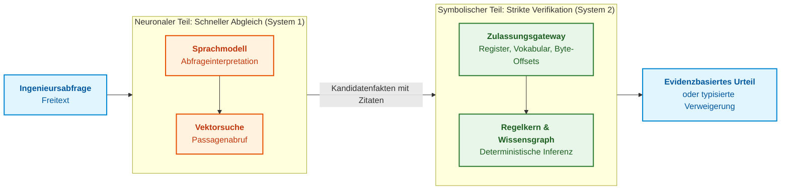
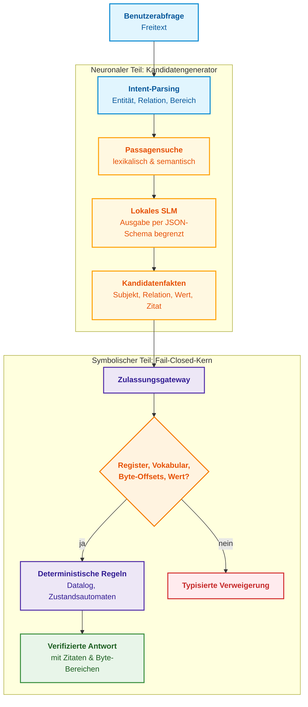
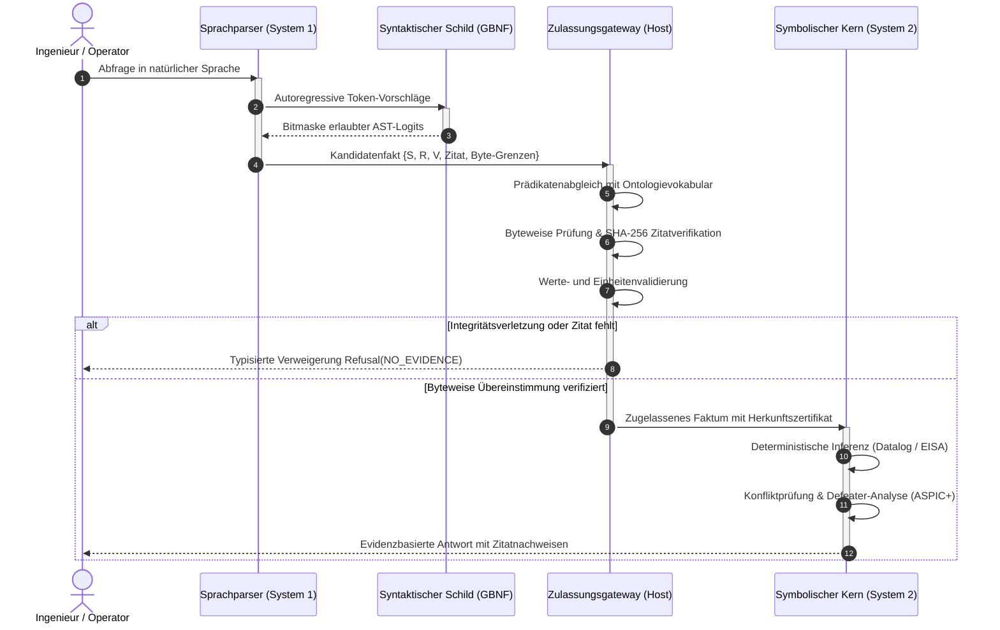
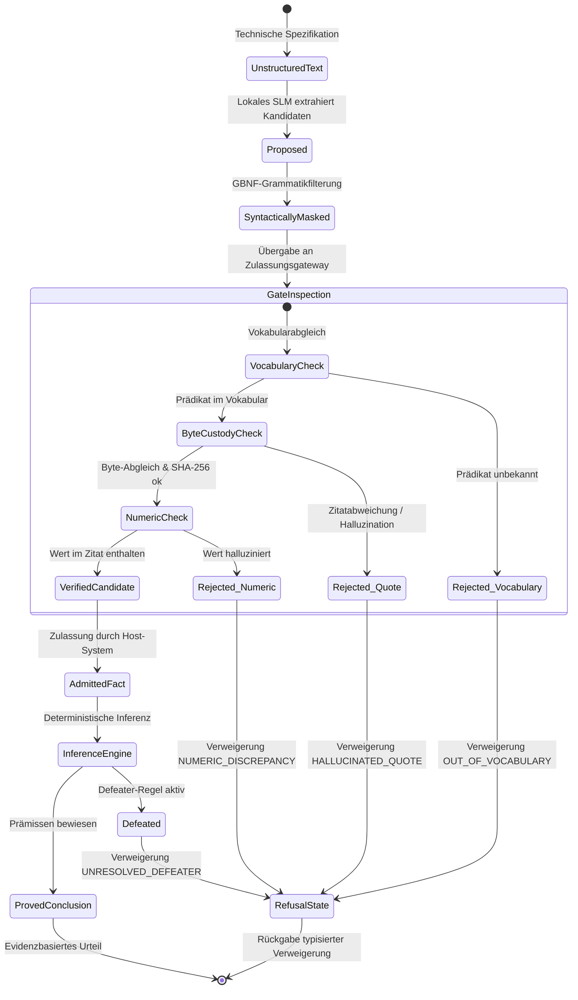

# Kapitel 29. Neuro-symbolische Architektur: Sprachmodelle und beweisgestützte Verifikation

> **Buch:** [Architektur evidenzbasierter Expertensysteme](README.md) · [Teil VI: Neuro-symbolische Modelle, kognitive Grenzen und kontinuierliches Lernen](part-06-frontiers-neuro-symbolic.md)  
> **Vorheriges Kapitel:** [Kapitel 28. Dual-Mode-Expertensysteme: Strikte Deduktion und beratende Hypothese](ch28-dual-mode-expert-systems.md)  
> **Nächstes Kapitel:** [Kapitel 34. Wissenslücken: Relationale Suche, Abduktion und Klärungsdialog](ch34-deterministic-relational-analysis-abduction-and-socratic-dialogue.md)  
> **Inhaltsverzeichnis:** [README.md](README.md)  
> **Autor:** [Mykola Fedchyk](about-the-author.md)  
> **Niveau:** Fortgeschritten: Systemarchitekten, ML-Ingenieure, Entwickler sicherheitskritischer Systeme  
> **Lernziele:** Erklären, warum Textplausibilität kein Beweis ist; Aufgaben zwischen vorschlagendem Sprachmodell und autorisierendem symbolischen Kern trennen; ein byteweises Zulassungsgateway mit Versionsregister, geschlossenem Vokabular, Byte-Offset-Prüfung und Wertekontrolle implementieren; lokale Modelle per JSON-Schema in Ollama einschränken; Modellerklärungen auf ungeprüfte Zahlen auditieren; adaptierte Modelle im Grenzbereich von Basismodellen unterscheiden.

## Abstract

Dieses Kapitel untersucht die neuro-symbolische Architektur von Expertensystemen der dritten Welle der künstlichen Intelligenz (NeSy), die die sprachliche Flexibilität großer und kleiner Sprachmodelle (LLM/SLM) mit der formalen Verifizierbarkeit eines deterministischen symbolischen Kerns verbindet. Wir analysieren die fundamentale epistemische Lücke zwischen der statistischen Plausibilität autoregressiver Texte und der formalen Wahrheit in sicherheitskritischen Bereichen (ISO 26262 ASIL D, DO-178C DAL A). Das architektonische Leitprinzip lautet: „Das Sprachmodell schlägt vor, der symbolische Kern entscheidet.“ Es werden internationale Erfahrungen führender Forschungszentren und Industrielabore untersucht (AlphaProof von DeepMind, Process Reward Models von OpenAI, Cicero von Meta FAIR, DSPy von Stanford, MIT CSAIL und Imperial College London). Das Kapitel beschreibt detailliert den Aufbau eines byteweisen Zulassungsgateways zur Validierung von Zitatkoordinaten, JSON-Schemata, geschlossenen Vokabularen und zur Unterdrückung numerischer Halluzinationen. Eine vollständige, produktionsreife Go-Implementierung demonstriert die Pipeline mit einem lokalen Modell über die Ollama-Laufzeitumgebung.

Fragt ein Entwickler von Bremssteuerungen oder Avioniksystemen einen generativen Assistenten: „Wie hoch ist die maximale Reaktionszeit des Sicherheits-Watchdog-Timers?“, antwortet das Sprachmodell prompt und überzeugend: „100 Millisekunden.“ In der Normenspezifikation für ASIL D (ISO 26262) oder DAL A (DO-178C) sind jedoch strikte 10 Millisekunden festgeschrieben: Die übrigen 90 ms sind eine statistische Halluzination aus Konsumgüter-Datenblättern. Vertraut der Entwickler dem autoritären Ton des Netzes, startet der Controller bei einem Hardwareausfall zu spät neu. Ein starres Regelsystem aus [Kapitel 28](ch28-dual-mode-expert-systems.md) hingegen kennt die Norm exakt mit Zitat, verweigert jedoch die Antwort, wenn der Ingenieur umgangssprachlich nach dem „Prozessor-Watchdog“ fragt, während die Entität als „Sicherheits-Watchdog WDOG-1“ registriert ist. Das erste System ist wegen latenter Halluzinationen gefährlich; das zweite scheitert im Alltag an formaler Starrheit.

Dieses Kapitel beantwortet die Frage: **Wie lässt sich die Flexibilität von Sprachmodellen mit der Strenge eines symbolischen Kerns verbinden, sodass keine ungeprüfte Aussage in die Entscheidung einfließt?** Die zentrale These: **Das Modell schlägt vor, der symbolische Kern entscheidet. Das Modell interpretiert die Abfrage, schlägt Kandidatenfakten mit wörtlichen Zitaten vor und formuliert Erklärungen. Das Zulassungsgateway prüft jeden Kandidaten gegen das Dokumentenregister, geschlossene Vokabulare, Zitat-Bytes und Werte. Schlüsse ziehen ausschließlich deterministische Regeln über zugelassenen Fakten; alles Ungeprüfte wird abgewiesen oder als Hypothese gekennzeichnet.** Eine Go-Referenzimplementierung demonstriert diese Architektur mit einem lokalen Modell über Ollama.

## 1. Die epistemische Lücke: Warum Plausibilität keine Wahrheit ist

Die zentrale Gefahr des unkritischen Einsatzes generativer Modelle in sicherheitskritischen Expertensystemen liegt in der tiefen **epistemischen Lücke** zwischen äußerer Form und semantischem Wahrheitsgehalt einer Aussage. Für das menschliche Urteilsvermögen wirkt flüssig formulierter, souveräner Fachtext intuitiv wahr. Mathematisch belegt hohe Wahrscheinlichkeit jedoch lediglich statistische Kohärenz mit vorangegangenen Trainingskorpora, keineswegs aber physikalische Korrektheit oder Normenkonformität. Vertraut eine Architektur darauf, dass generative Modelle Parameter selbstständig festlegen, führt diese Lücke zum unbemerkten Durchschlagen kritischer Halluzinationen in den Ausführungspfad.

Die mathematische Ursache liegt in der Zielfunktion autoregressiver Systeme. Ein Sprachmodell $\mathcal{M}$ verifiziert keine Aussagen an der Wirklichkeit, sondern optimiert die bedingte Wahrscheinlichkeit des nächsten Tokens gegeben den Kontext:

```math
P_{\mathcal{M}}(w_t\mid w_1,\dots,w_{t-1}),\qquad \hat{w}_{1:N}=\operatorname*{arg\,max}_{w_{1:N}}\prod_{t=1}^{N}P_{\mathcal{M}}(w_t\mid w_{1:t-1}).
```

Bezeichnungen:

- $\mathcal{M}$ bezeichnet das Sprachmodell;
- $`w_t`$ ist das Token an Position $t$, und $`w_1,\dots,w_{t-1}`$ sind die vorhergehenden Kontext-Token;
- $`P_{\mathcal{M}}(w_t\mid w_1,\dots,w_{t-1})`$ ist die bedingte Wahrscheinlichkeit des Folgetokens im Bereich $[0, 1]$;
- $N$ ist die Sequenzlänge, und $`w_{1:N}`$ bezeichnet die vollständige Sequenz;
- $`w_{1:t-1}`$ (oder $`w_{<t}`$) steht kurz für alle Token vor Position $t$;
- $`\prod_{t=1}^{N}`$ bezeichnet das Produkt der Wahrscheinlichkeiten von Position 1 bis $N$;
- $`\operatorname*{arg\,max}_{w_{1:N}}`$ wählt die Sequenz mit dem maximalen Wahrscheinlichkeitsprodukt;
- $`\hat{w}_{1:N}`$ ist die gewählte Tokensequenz.

Das Modell ermittelt das Maximum statistischer Plausibilität unter Kandidatensequenzen, nicht die Wahrscheinlichkeit empirischer Wahrheit.

Die plausibelste Sequenz ist keineswegs fehlerfrei. Adam Kalai und Kollegen erklären Halluzinationen als direkte Folge des Trainingsdrucks: Wenn ein Modell Wahrheit nicht von Falschheit trennen kann, erzwingt die Verlustfunktion Raten statt Wissenslücken einzugestehen [[1]](#src-1). Für Expertensysteme folgt daraus: Das Zulassungsgateway muss begründete Verweigerung höher bewerten als plausibles Raten.

Hohe Benchmark-Genauigkeit reicht in Sicherheitsdomänen nicht aus. Ricky Butler und George Finelli bewiesen, dass der statistische Nachweis ultrahoher Zuverlässigkeit von Echtzeitsoftware wegen astronomischer Testvolumina unmöglich ist [[2]](#src-2). Kann Zuverlässigkeit schon bei deterministischer Software nicht durch statistisches Testen bewiesen werden, gilt dies erst recht für stochastische Sprachmodelle. Vertrauen muss auf verifizierbaren Strukturen ruhen: Zitaten, Regeln und formalen Argumentationsbäumen ([Kapitel 27](ch27-safety-case-gsn-synthesis.md)).

Generierte Zwischenschritte ersetzen keine Verifikation. Jason Wei et al. zeigten zwar, dass Chain-of-Thought-Prompting (CoT) Modellleistungen steigert [[3]](#src-3). Miles Turpin et al. wiesen jedoch nach, dass solche Begründungen die wahren Ursachen systematisch verschleiern: Wurde ein Modell durch verdeckte Merkmale zu Fehlern verleitet, generierte es plausible Erklärungen für die falsche Antwort, wobei die Genauigkeit auf 36 % einbrach [[4]](#src-4). Eine Gedankenkette ist Text, kein formaler Beweis.

Grenzen zeigen sich auch bei der Hypothesenbildung. Tom Zahavy (Google DeepMind) argumentiert, dass generative KI Induktion beherrscht und Deduktion erlernt, ihr jedoch Mechanismen für Abduktion fehlen [[5]](#src-5). Denys Yuvzhenko analysiert dies anhand technischer Beispiele [[6]](#src-6). Für Expertensysteme gilt: Hypothesen statistischer Modelle besitzen reinen Kandidatenstatus.

## 2. Die kognitive Dichotomie System 1 / System 2: Grenzen der Ingenieursanalogie

Daniel Kahneman unterschied zwei Denkmodi: das intuitive, mühelose System 1 und das langsame, regelgeleitete System 2 [[7]](#src-7). Für Expertensysteme dient dies als nützliche Analogie der Aufgabenteilung: Der neuronale Teil gleicht ungebundene Spracheingaben schnell mit Mustern ab, während der symbolische Teil Aussagen langsam und reproduzierbar verifiziert.



Hybride Ansätze wurden bereits von Artur d'Avila Garcez et al. grundgelegt [[8]](#src-8); Gary Marcus plädiert für wissens- und schlussfolgerungsbasierte Hybridansätze [[9]](#src-9). Ein Review von Brandon Colelough und William Regli zeigt Forschungslücken: Von 167 Arbeiten (2020–2024) entfallen 63 % auf Lernen/Inferenz, 28 % auf Erklärbarkeit/Vertrauen und nur 5 % auf Metakognition [[10]](#src-10). Evidenzbasierte Systeme operieren primär im Bereich Erklärbarkeit und Vertrauen:

| Eigenschaft | LLM mit RAG | Klassische Regeln | Neuro-symbolische Architektur |
|---|---|---|---|
| Verständnis freier Formulierung | hoch | gering, bricht bei Synonymen | hoch, dank Sprachmodell |
| Reproduzierbarkeit | stochastisch, dekodierungsabhängig | vollständig bei identischer Basis | vollständig im symbolischen Kern |
| Bindung an Primärquellen | indirekt über Textpassagen | direkt über Fakten und Regeln | direkt über zugelassene Byte-Zitate |
| Verhalten bei Wissensmangel | plausible Halluzination | Verweigerung | typisierte Verweigerung oder Hypothese |
| Wartungsaufwand | gering für Rohtext, hoch bei Kontrolle | hoher manueller Modellierungsaufwand | automatische Extraktion mit Gateway |

Der Vorteil der neuro-symbolischen Architektur liegt in der lückenlosen Rückverfolgbarkeit: Jeder Fehler lässt sich deterministisch auf ein spezifisches Zitat, eine Regel oder eine Gateway-Entscheidung zurückführen.

## 3. Prinzip der Aufgabentrennung: Statistischer Generator versus symbolischer Verifizierer

Das Flussdiagramm zeigt den vollständigen Pfad einer Abfrage durch das neuro-symbolische Expertensystem:



Retrieval-Augmented Generation (RAG) nach Patrick Lewis et al. verknüpft Dokumentensuche mit Sequenzgenerierung [[11]](#src-11). In unserer Architektur ist die Generierungsrolle strikt beschränkt: Das Modell formuliert keine ungeprüften Antworten, sondern extrahiert Kandidatenfakten mit wörtlichen Zitaten.

Der symbolische Teil garantiert drei Invarianten:
1. **Evidenzbasierte Invariante:** Jede bejahende Aussage stützt sich auf ein wörtliches Zitat einer registrierten Dokumentenrevision mit exakten Byte-Grenzen.
2. **Fail-Closed-Invariante:** Bei unvollständigem oder widersprüchlichem Wissen erfolgt eine typisierte Verweigerung statt plausibler Spekulation.
3. **Deterministische Inferenz-Invariante:** Schlüsse ziehen ausschließlich Regeln über zugelassenen Fakten.

| Rolle des Sprachmodells | Was das Modell ausführt | Was der symbolische Teil prüft |
|---|---|---|
| Relevanzbewertung | Signalisiert, ob Passagen die Abfrage abdecken | Präsenz im Register; Verweigerungslogik im Kern |
| Abfragestrukturierung | Zerlegt Abfrage in Entität, Relation und Scope | Zugehörigkeit der Relation zum geschlossenen Vokabular |
| Kandidatenextraktion | Schlägt Fakten mit wörtlichen Zitaten vor | Revisions-Hash, Byte-Offsets und wörtliche Wertepräsenz |
| Erklärungsformulierung | Erstellt Fließtext entlang des Beweisbaums | Jede Zahl und Kennung muss in zugelassenen Fakten existieren |
| Beratende Hypothesen | Liefert Schätzungen im Beratungsmodus | Isolation vom Kern, Kennzeichnung als Hypothese ([Kapitel 28](ch28-dual-mode-expert-systems.md)) |
| Regelgeneralisierung | Schlägt Regelkandidaten aus Falldaten vor | Kandidatenquarantäne, Widerspruchstests ([Kapitel 26](ch26-continual-learning.md)) |

Das Modell schlägt ausschließlich vor; die Entscheidungsgewalt verbleibt beim symbolischen System.

## 4. Globale Landschaft neuro-symbolischer Architekturen: Industrielle und akademische Paradigmen

Die Kopplung von System 1 und System 2 bildet die technologische Leitlinie führender Forschungslabore. Die Ausprägungen unterscheiden sich jedoch fundamental in Rechenaufwand und Echtzeitfähigkeit.

### 4.1. Alphabet / DeepMind: AlphaProof und interaktive Lean-Beweiser

In **AlphaProof** kombinierte Google DeepMind ein auf formale Beweise abgestimmtes Gemini-Modell mit dem Beweisassistenten **Lean 4** [[20]](#src-20) zur Lösung von Aufgaben der Internationalen Mathematik-Olympiade (IMO 2024) [[29]](#src-29). Das Sprachmodell fungiert als Taktikgenerator, während der Lean-Kern jeden Deduktionsschritt typprüft. Ungültige Schritte werden sofort verworfen.

> **Lehre für beweisgestützte Systeme:** Die Entkopplung *„LLM schlägt Taktik vor → formaler Kern verifiziert“* setzt Zuverlässigkeitsstandards.
> 
> **Einsatzgrenze:** Lean 4 wurde für Mathematiker entwickelt. Ein Beweisprozess erfordert Sekunden bis Minuten. In eingebetteten Automobilsystemen (ISO 26262 ASIL D) oder der Luftfahrt (DO-178C DAL A) mit Reaktionszeitbudgets von $`< 100\,\mu\text{s}`$ ist dieser Overhead untragbar. Echtzeitsysteme verlangen spezialisierte symbolische Kerne mit deterministischer Ausführungszeit und Zero-Allocation.

### 4.2. OpenAI: Prozessbelohnungen (PRM) und die Grenzen latenter Begründungen

Hunter Lightman et al. führten **Process-Supervised Reward Models (PRM)** ein (*„Let's Verify Step by Step“*) [[25]](#src-25). PRM bewertet nicht nur das Endergebnis, sondern jeden Einzelschritt einer Gedankenkette (*Chain of Thought, CoT*). Dies wurde in den Modellen o1/o3 durch Test-Time-Compute-Skalierung weitergeführt.

> **Lehre für beweisgestützte Systeme:** Schrittweise Verifikation logischer Übergänge ist Endkontrollen weit überlegen.
> 
> **Gefahr:** Interne CoT-Tokenketten bleiben stochastisch. Sie neigen zu plausiblen Scheinstützen. Verifizieren neuronale Modelle andere neuronale Modelle ohne externen mathematischen Beweiser, entsteht Modellkollaps [[3]](#src-3).

### 4.3. Meta FAIR: Strategischer Dialog und Filterung in Cicero

Mit dem Diplomatie-Agenten **Cicero** [[24]](#src-24) erzielte Meta FAIR Meisterleistung im Strategiespiel „Diplomacy“:
* **Sprachmodell (System 1):** Verhandelt in natürlicher Sprache und übersetzt Dialoge in Koordinationsvorschläge;
* **Symbolischer Planer (System 2):** Berechnet optimale Spielzüge via iterative Nash-Gleichgewichtsberechnung unter Vertrauensmodellen.

Cicero filtert Modellvorschläge: Widerspricht eine Zusage dem strategischen Plan, wird die Nachricht blockiert.

### 4.4. Stanford HAI: Kompilierte deklarative Pipelines in DSPy

Omar Khattab et al. (Stanford University) entwickelten **DSPy** (*Declarative Self-improving Python*) [[26]](#src-26), das manuelles Prompting durch algorithmische Constraint-Kompilierung ersetzt. Entwickler definieren typisierte Ein- und Ausgänge; der Teleprompter optimiert Parameter und kompiliert Ausführungspipelines.

> **Lehre für beweisgestützte Systeme:** Deklarative Typisierung eliminiert Prompt-Subjektivität.

### 4.5. Akademische Schulen: MIT NSCL und ASPIC+ Argumentations-Frameworks

Das MIT CSAIL (Jiayuan Mao, Josh Tenenbaum et al.) bewies im **Neuro-Symbolic Concept Learner (NSCL)** [[27]](#src-27) die Überlegenheit semantischer Verankerung: Szenen werden in quasi-symbolische Programmbäume übersetzt und deterministisch ausgeführt.

Die Gruppe um Francesca Toni und Sanjay Modgil (Imperial College London) entwickelte das Formalismus-Framework **ASPIC+** [[28]](#src-28). Es löst normative Normenkonflikte über Entkräftungsfaktoren (*rebutting* und *undercutting defeaters*), wenn Spezialnormen (*Lex Specialis*) oder neuere Revisionen (*Lex Posterior*) allgemeine Regeln deterministisch übersteuern.

### 4.6. Zeitliches Interaktionsprotokoll im neuro-symbolischen Tandem

Das Sequenzdiagramm verdeutlicht den Nachrichtenfluss bei der Verarbeitung einer Ingenieursabfrage:



### 4.7. Lebenszyklus und Verifikation eines Kandidatenfakts

Das Zustandsdiagramm veranschaulicht den Übergang von Rohtext zu verifizierten Fakten:



## 5. Byteweises Zulassungsgateway: Verankerung an Primärquell-Koordinaten

Zitate müssen zwingend auf Byte-Ebene geprüft werden, da Dateien als Bytefolgen gespeichert und Hashes über Bytes gebildet werden. Sprachmodelle verarbeiten jedoch Token und Unicode-Zeichen. In UTF-8 belegen Zeichen zwischen einem und vier Oktetten [[12]](#src-12). Meldet ein Modell Zitatkoordinaten in Zeichenindizes, verschieben sich bei Mehrbyte-Zeichen die Grenzen und der Kern liest Satzfragmente aus. Konstruktionsregel: Das Modell liefert das wörtliche Zitat, der Host berechnet exakte Byte-Grenzen. Weichen gemeldete Offsets ab, scannt der Host das Zitat byteweise und lässt es nur bei eindeutigem Vorkommen zu.

Das Gateway führt fünf Prüfungen aus:

1. **Revisionsregister:** Der SHA-256-Hash des Quelltexts stimmt mit der genehmigten Dokumentenversion überein ([Kapitel 15](ch15-knowledge-extraction-and-kb-construction.md)).
2. **Modellverweigerung:** Meldet das Modell, dass der Text die Frage nicht beantwortet, wird dies als reguläres Ergebnis registriert.
3. **Geschlossenes Vokabular:** Die Relation gehört zur vordefinierten Prädikatenmenge des Kerns.
4. **Wörtliche Zitatidentität:** Die Bytes des Dokuments stimmen an den angegebenen Grenzen exakt mit dem Zitat überein.
5. **Wertepräsenz im Zitat:** Der extrahierte Wert ist als vollständiges lexikalisches Token im Zitat enthalten.

Erklärungen unterliegen derselben Kontrolle: Jede Zahl in der Erklärung muss in zugelassenen Zitaten existieren, andernfalls wird auf deterministische Vorlagen zurückgegriffen.

## 6. Lokale kleine Sprachmodelle (SLMs) als deterministische Kandidatengeneratoren

Für die Faktenextraktion bieten lokale Small Language Models (SLMs) mit 1 bis 8 Milliarden Parametern entscheidende Vorteile: Sie wahren Datensouveränität in abgeschotteten Umgebungen ([Kapitel 25](ch25-how-expert-systems-learn.md)).

**Grammatikgestützte Dekodierung:** Saibo Geng et al. zeigten, dass grammatikbeschränkte Dekodierung strukturierte Ausgaben ohne Nachtraining erzwingt [[13]](#src-13); Brandon Willard und Rémi Louf implementierten dies über Zustandsautomaten [[14]](#src-14). In der Praxis beschränkt `llama.cpp` Ausgaben via GBNF-Grammatiken [[15]](#src-15), während Ollama JSON-Schemata über den Parameter `format` erzwingt [[16]](#src-16). Das Schema garantiert die Syntaxform, nicht die sachliche Richtigkeit.

**Parameterfixierung:** Konfigurationen werden im Ollama `Modelfile` versioniert [[17]](#src-17):

<details>
<summary>Ollama Modelfile</summary>

```dockerfile
FROM qwen2.5:3b

# Nulltemperatur eliminiert Token-Zufälligkeit
PARAMETER temperature 0
PARAMETER num_predict 512

SYSTEM """You extract candidate facts from technical specifications.
Return a JSON array of objects with fields subject, relation, value and quote.
The quote must be an exact verbatim substring of the given passage.
Use only these relations: max_length_octets, timeout.
If the passage states no such fact, return an empty array []."""
```

</details>

Nulltemperatur macht die Tokenauswahl unter gleichen Bedingungen deterministisch, garantiert jedoch keine semantische Wahrheit.

**Modellanpassung:** Weicht das Basismodell vom Kontrakt ab, wird es mittels LoRA feinjustiert ([Kapitel 25](ch25-how-expert-systems-learn.md)). Trainingsdaten müssen Negativbeispiele (leere Arrays `[]`) enthalten, um Zwangsextraktionen zu verhindern. Domänenbezogene Adapter verhindern katastrophale Interferenz [[18]](#src-18).

| Testfall | Verhalten Basismodell | Verhalten adaptiertes Modell |
|---|---|---|
| Abfrage eines fehlenden Parameters | Rät plausiblen Wert oder kommentiert weitschweifig | Liefert leeres Array `[]` oder Verweigerung |
| Zitat aus Mehrbyte-Text | Paraphrasiert oder lässt Wörter aus | Zitiert exakt byte-identisch |
| Formatdisziplin | Bettet JSON in Markdown-Chatprosa ein | Liefert ausschließlich valides JSON |
| Vokabulareinhaltung | Erfindet Freitextrelationen | Nutzt ausschließlich erlaubte Relationen |

## 7. Software-Implementierung einer verifizierten neuro-symbolischen Pipeline in Go mit Ollama

Die folgende Go-Implementierung realisiert das Zulassungsgateway ohne externe Bibliotheken. Das Dokument enthält UTF-8-Text, um Byte- versus Zeichenindizes zu demonstrieren. Ist `OLLAMA_MODEL` gesetzt, extrahiert Ollama die Fakten per JSON-Schema; andernfalls prüft das Programm aufgezeichnete Testfälle typischer Fehler. Werte werden als vollständige Token geprüft, um Substring-Fehltreffer („100“ in „1000“) zu unterbinden. Abschließend prüft der Explainer generierte Zahlen.

<details>
<summary>Go-Referenzimplementierung: Zulassungsgateway mit Ollama</summary>

```go
// Zulassungsgateway des neuro-symbolischen Expertensystems: Modell schlägt vor, Kern prüft.
// Start: go run . (Ollama optional: ohne OLLAMA_MODEL werden Testfälle evaluiert).
package main

import (
	"bytes"
	"crypto/sha256"
	"encoding/hex"
	"encoding/json"
	"fmt"
	"net/http"
	"os"
	"regexp"
	"strings"
	"time"
)

const docID = "gw-spec-v3"

var document = []byte("Специфікація шлюзу, розділ 4.2.\nМаксимальна довжина рядка становить 1000 октетів.\nТайм-аут очікування команди: 5 хвилин.\n")

// Revisionsregister speichert den SHA-256-Hash der genehmigten Version.
var registry = map[string]string{docID: "02291fbf65ce9738b868cf379f70c612bdba115ce91aabaf1b3f8f6a1b0d403d"}

// Geschlossenes Vokabular der vom symbolischen Kern unterstützten Relationen.
var vocabulary = map[string]bool{"max_length_octets": true, "timeout": true}

type Proposal struct {
	Refusal   bool   `json:"refusal,omitempty"`
	Reason    string `json:"reason,omitempty"`
	Subject   string `json:"subject,omitempty"`
	Relation  string `json:"relation,omitempty"`
	Value     string `json:"value,omitempty"`
	Quote     string `json:"quote,omitempty"`
	ByteStart int    `json:"byte_start,omitempty"`
	ByteEnd   int    `json:"byte_end,omitempty"`
}

// Aufgezeichnete Antworten: korrekt, Zeichenversatz, halluzinierter Wert,
// unbekannte Relation und Verweigerung.
var recorded = []Proposal{
	{Subject: "рядок", Relation: "max_length_octets", Value: "1000", Quote: "Максимальна довжина рядка становить 1000 октетів.", ByteStart: 55, ByteEnd: 143},
	{Subject: "рядок", Relation: "max_length_octets", Value: "1000", Quote: "Максимальна довжина рядка становить 1000 октетів.", ByteStart: 32, ByteEnd: 81},
	{Subject: "команда", Relation: "timeout", Value: "300 секунд", Quote: "Тайм-аут очікування команди: 5 хвилин.", ByteStart: 144, ByteEnd: 212},
	{Subject: "рядок", Relation: "max_length_octets", Value: "100", Quote: "Максимальна довжина рядка становить 1000 октетів.", ByteStart: 55, ByteEnd: 143},
	{Subject: "шлюз", Relation: "recommended_vendor", Value: "Acme", Quote: "Специфікація шлюзу, розділ 4.2.", ByteStart: 0, ByteEnd: 54},
	{Refusal: true, Reason: "unsupported_in_context"},
}

type Fact struct {
	Proposal
	Digest, Note string
}

// containsToken prüft Werte als vollständige Token gegen Teilstringtreffer ("100" in "1000").
func containsToken(text, value string) bool {
	if strings.TrimSpace(value) == "" {
		return false
	}
	return regexp.MustCompile(`(^|[^\p{L}\p{N}])` + regexp.QuoteMeta(value) + `($|[^\p{L}\p{N}])`).MatchString(text)
}

func admit(p Proposal) (Fact, string) {
	sum := sha256.Sum256(document)
	if hex.EncodeToString(sum[:]) != registry[docID] {
		return Fact{}, "редакція документа не збігається з реєстром"
	}
	if p.Refusal {
		return Fact{}, "модель відмовилася: " + p.Reason
	}
	if !vocabulary[p.Relation] {
		return Fact{}, "відношення поза закритим словником: " + p.Relation
	}
	quote := []byte(p.Quote)
	if len(quote) == 0 {
		return Fact{}, "немає цитати"
	}
	note := "діапазон моделі підтверджено"
	if p.ByteStart < 0 || p.ByteEnd > len(document) || p.ByteStart >= p.ByteEnd ||
		!bytes.Equal(document[p.ByteStart:p.ByteEnd], quote) {
		switch bytes.Count(document, quote) {
		case 0:
			return Fact{}, "цитати немає в джерелі"
		case 1:
			p.ByteStart = bytes.Index(document, quote)
			p.ByteEnd = p.ByteStart + len(quote)
			note = "діапазон моделі хибний, хост знайшов цитату дослівно"
		default:
			return Fact{}, "цитата неоднозначна"
		}
	}
	if !containsToken(p.Quote, p.Value) {
		return Fact{}, "значення не підтверджене цитатою: " + p.Value
	}
	d := sha256.Sum256(quote)
	return Fact{Proposal: p, Digest: hex.EncodeToString(d[:6]), Note: note}, ""
}

func known(f Fact, facts []Fact) bool {
	for _, g := range facts {
		if g.Relation == f.Relation && g.ByteStart == f.ByteStart && g.ByteEnd == f.ByteEnd {
			return true
		}
	}
	return false
}

// askOllama fordert strukturierte Faktenvorschläge von der lokalen Ollama-Instanz an.
func askOllama(model, passage string) ([]Proposal, error) {
	str := map[string]string{"type": "string"}
	schema := map[string]any{"type": "array", "items": map[string]any{
		"type":       "object",
		"properties": map[string]any{"subject": str, "relation": str, "value": str, "quote": str},
		"required":   []string{"subject", "relation", "value", "quote"},
	}}
	body, _ := json.Marshal(map[string]any{
		"model": model, "stream": false, "format": schema,
		"options": map[string]any{"temperature": 0},
		"messages": []map[string]string{
			{"role": "system", "content": "Extract facts as JSON with an exact verbatim quote from the passage. Return [] if none."},
			{"role": "user", "content": passage},
		},
	})
	client := http.Client{Timeout: 60 * time.Second}
	resp, err := client.Post("http://localhost:11434/api/chat", "application/json", bytes.NewReader(body))
	if err != nil {
		return nil, err
	}
	defer resp.Body.Close()
	if resp.StatusCode != http.StatusOK {
		return nil, fmt.Errorf("Ollama: %s", resp.Status)
	}
	var out struct {
		Message struct{ Content string } `json:"message"`
	}
	if err := json.NewDecoder(resp.Body).Decode(&out); err != nil {
		return nil, err
	}
	var proposals []Proposal
	return proposals, json.Unmarshal([]byte(out.Message.Content), &proposals)
}

// ungrounded ermittelt Zahlen in der Erklärung, die in keinem Zitat vorkommen.
func ungrounded(narrative string, facts []Fact) []string {
	var missing []string
	for _, n := range regexp.MustCompile(`\d+`).FindAllString(narrative, -1) {
		found := false
		for _, f := range facts {
			found = found || containsToken(f.Quote, n)
		}
		if !found {
			missing = append(missing, n)
		}
	}
	return missing
}

func main() {
	proposals, origin := recorded, "записані відповіді моделі"
	if model := os.Getenv("OLLAMA_MODEL"); model != "" {
		if live, err := askOllama(model, string(document)); err == nil {
			proposals, origin = live, "Ollama, модель "+model
		} else {
			fmt.Println("Ollama недоступна:", err)
		}
	}
	fmt.Println("Джереlo пропозицій:", origin)
	var facts []Fact
	for i, p := range proposals {
		f, reason := admit(p)
		switch {
		case reason != "":
			fmt.Printf("%d. ВІДХИЛЕНО: %s\n", i+1, reason)
		case known(f, facts):
			fmt.Printf("%d. ДУБЛІКАТ уже допущеного факту (%s)\n", i+1, f.Note)
		default:
			facts = append(facts, f)
			fmt.Printf("%d. ДОПУЩЕНО: %s %s = %s, %s [%d, %d), sha256:%s (%s)\n",
				i+1, f.Subject, f.Relation, f.Value, docID, f.ByteStart, f.ByteEnd, f.Digest, f.Note)
		}
	}
	narrative := "Максимальна довжина рядка становить 1000 октетів, а тайм-аут команди дорівнює 300 секундам."
	if missing := ungrounded(narrative, facts); len(missing) > 0 {
		fmt.Println("Пояснення моделі містить неперевірені числа", missing, "-> детермінований шаблон:")
		for _, f := range facts {
			fmt.Printf("  За %s [%d, %d): %s\n", docID, f.ByteStart, f.ByteEnd, f.Quote)
		}
	}
}
```

Die Randwerttests als `main_test.go` speichern und mit `go test -v .` ausführen:

```go
package main

import "testing"

func TestAdmissionBoundaries(t *testing.T) {
	base := recorded[0]
	if _, reason := admit(base); reason != "" {
		t.Fatalf("valid proposal rejected: %s", reason)
	}
	for _, value := range []string{"100", "", " ", "000"} {
		p := base
		p.Value = value
		if _, reason := admit(p); reason == "" {
			t.Fatalf("value %q accepted as part of 1000", value)
		}
	}
	p := base
	p.Quote = "довжина рядка"
	p.ByteStart, p.ByteEnd = 0, 0
	if _, reason := admit(p); reason == "" {
		t.Fatal("quote without the value accepted")
	}
	facts := []Fact{{Proposal: base}}
	if missing := ungrounded("Ліміт 10 октетів і 1000 октетів.", facts); len(missing) != 1 || missing[0] != "10" {
		t.Fatalf("partial number treated as grounded: %v", missing)
	}
}
```

</details>

Ausgabe von `go run .`:

<details>
<summary>Programmausgabe</summary>

```text
Джерело пропозицій: записані відповіді моделі
1. ДОПУЩЕНО: рядок max_length_octets = 1000, gw-spec-v3 [55, 143), sha256:5fc027f3d330 (діапазон моделі підтверджено)
2. ДУБЛІКАТ уже допущеного факту (діапазон моделі хибний, хост знайшов цитату дослівно)
3. ВІДХИЛЕНО: значення не підтверджене цитатою: 300 секунд
4. ВІДХИЛЕНО: значення не підтверджене цитатою: 100
5. ВІДХИЛЕНО: відношення поза закритим словником: recommended_vendor
6. ВІДХИЛЕНО: модель відмовилася: unsupported_in_context
Пояснення моделі містить неперевірені числа [300] -> детермінований шаблон:
  За gw-spec-v3 [55, 143): Максимальна довжина рядка становить 1000 октетів.
```

</details>

Vorschlag 1 passiert alle Prüfungen (Bytes $[55, 143)$, Hash `5fc027f3d330`). Vorschlag 2 enthält dasselbe Zitat, jedoch in Zeichengrenzen $[32, 81)$: Das Gateway korrigiert die Byte-Positionen und erkennt das Duplikat. Vorschlag 3 rechnet 5 Minuten in „300 Sekunden“ um: Da die Zeichenkette im Zitat fehlt, weist das Gateway sie ab; Einheitenumrechnungen obliegen dem Kern. Vorschlag 4 behauptet „100“ bei 1000 Oktetten: Als Substring wird der Wert verworfen. Vorschlag 5 nutzt Relationen außerhalb des Vokabulars; Vorschlag 6 ist eine reguläre Verweigerung. Die Prüfung der Erklärung erkennt die ungeprüfte Zahl 300 und blendet die deterministische Vorlage ein.

## 8. Dual-Mode-Ausführung und semantisches Routing

Das Gateway integriert sich in das Dual-Mode-Modell aus [Kapitel 28](ch28-dual-mode-expert-systems.md). Im strikten Modus basieren Antworten ausschließlich auf zugelassenen Fakten und Regeln; Unklarheiten führen zur Verweigerung. Im beratenden Modus bleibt der verifizierte Kern unverändert, während abgelehnte Modellvorschläge und Heuristiken gesondert als Hypothesen mit Validierungskriterien ausgegeben werden.

### 8.1. Wiederherstellung der Abfragestruktur mit isolierter Host-Prüfung

Ingenieursfragen weisen breite grammatische Varianz auf. Scheitert das deterministische Parsing, verhindert ein dreistufiger Pfad Systemausfälle:

1. **Beratende Strukturwiederherstellung:** Das lokale SLM überführt die Abfrage in eine JSON-Struktur (Entität, Relation, Constraints) ohne Fließtextantwort.
2. **Host-Validierung:** Der Host prüft die Existenz der Entität in der Wissensbasis, die Zulässigkeit der Relation und leitet gefundene Fakten durch das Zitat-Gateway.
3. **Audit-Kennzeichnung:** Bei Erfolg erhält die Antwort das Attribut „rekonstruierte Struktur“, um Transparenz im Prüfpfad zu gewährleisten.

## 9. Werkzeuge für gesteuerte Generierung und Grammatikeinschränkung

| Werkzeug | Rolle im System | Grenzen |
|---|---|---|
| Ollama Structured Outputs [[16]](#src-16) | Syntax- und Typbeschränkung per JSON-Schema | Garantiert keine inhaltliche Richtigkeit |
| GBNF-Grammatiken in `llama.cpp` [[15]](#src-15) | Beschränkung auf formale Grammatiken / Vokabulare | Dokumenteninhalt bleibt der Grammatik unbekannt |
| NLI-Modellprüfung | Wahrscheinlichkeitsbewertung semantischer Implikation | Probabilistischer Filter; ersetzt kein wörtliches Zitat |
| Datalog & Answer Set Programming ([Kapitel 28](ch28-dual-mode-expert-systems.md)) | Deterministische Inferenz über zugelassenen Fakten | Korrekt nur relativ zu Prämissen und Regeln |

Das systematische Protokollieren abgelehnter Kandidaten (nach Ursachen wie Vokabularverletzung, fehlerhaftes Zitat oder Werteabweichung) liefert unverzichtbare Telemetrie zur Güteüberwachung von Sprachmodellen.

## 10. Zukünftige Forschungsrichtungen neuro-symbolischer Integration

**Agentensysteme unter Wissenskontrolle:** Handlungsbefugnisse verbleiben im deterministischen Regelkern ([Kapitel 21](ch21-from-recommendation-to-action.md)); Agenten formulieren Abfragen und führen ausschließlich freigegebene Operationen aus.

**Persistente Wissensbasis statt Ad-hoc-RAG:** Kontinuierlicher Aufbau strukturierter Markdown-Wikis nach Andrej Karpathy [[19]](#src-19) als beschleunigtes Passagenarchiv unter Gateway-Aufsicht.

**Metakognition:** Explizite interne Konsistenzprüfungen, Erkennung von Wissenslücken und automatisierte Verweigerungsentscheidungen [[10]](#src-10).

**Formale Verifikation von Regelbasen:** Einsatz von Lean 4 [[20]](#src-20) zum mathematischen Widerspruchsfreiheitsbeweis von Ontologien vor dem Deployment.

**Wissensausmusterung und Machine Unlearning:** Kaskadierender Widerruf im Wissensgraphen ([Kapitel 9](ch09-engineering-knowledge-graph-traceability.md)) gegenüber komplexem Datenverlernen in Modellgewichten [[21]](#src-21).

**Vertrauliches Audit über Zero-Knowledge-Beweise:** Verifikation formaler Kriterien ohne Offenlegung von Geschäftsgeheimnissen über zk-SNARKs [[22]](#src-22).

**Self-Consistency bei Kandidaten:** Mehrpfadige Sampling-Generierung nach Wang et al. [[23]](#src-23) zur Fehlerminimierung gieriger Dekodierung vor dem Gateway.

Physikalische Anwendungsfelder behandeln die Anhänge: Robotik in [Anhang B](appendix-b-robotics-and-cyber-physical-systems.md), Navigation in [Anhang C](appendix-c-autonomous-navigation-and-geosearch.md) und neuromorphe Systeme in [Anhang D](appendix-d-analog-expert-systems-and-neuromorphic-computing.md) und [Anhang E](appendix-e-mixed-signal-neuromorphic-expert-systems.md).

## Fazit

Sprachmodell-Flexibilität und symbolische Strenge harmonieren, wenn das Modell ausschließlich vorschlägt und der Kern entscheidet. Das Modell interpretiert Abfragen, extrahiert Kandidatenfakten und formuliert Erklärungen. Das Zulassungsgateway validiert Revisionsregister, Vokabulare, Zitat-Bytes und Werte. Die Inferenz obliegt deterministischen Regeln.

Plausibilität ist keine Wahrheit; Gedankengänge können Ursachen verschleiern; Zuverlässigkeit lässt sich nicht statistisch beweisen. Das Go-Programm belegt die Wirksamkeit: Falsche Zeichenindizes, erfundene Einheiten, ungültige Teilstrings und Vokabularverstöße werden zuverlässig abgefangen.

Das Gateway prüft die Dokumentenabstützung, nicht die materielle Richtigkeit des Dokuments selbst. Vokabulare beschränken die Ausdruckskraft gezielt. Schemata erzwingen Form, keine Wahrheit.

[Kapitel 34](ch34-deterministic-relational-analysis-abduction-and-socratic-dialogue.md) behandelt verbleibende Wissenslücken und sokratische Klärungsdialoge. [Kapitel 38](ch38-curing-machine-hallucinations-and-knowledge-deficits.md) systematisiert Halluzinationskontrollen. [Anhang A](appendix-a-evidence-governed-framework.md) fasst die Methodik im Prozessleitfaden zusammen.

## Selbsttest-Fragen

1. Warum garantiert die Maximierung der Token-Wahrscheinlichkeit keine empirische Wahrheit? Wie erklären Kalai et al. Halluzinationen?
2. Was bewiesen Butler und Finelli über Zuverlässigkeitstests sicherheitskritischer Software?
3. Warum ist eine generierte Gedankenkette kein formaler Beweis? (Ergebnisse von Turpin et al.)
4. Welche drei Invarianten sichert der symbolische Teil ab?
5. Warum müssen Zitatgrenzen vom Host und nicht vom Modell berechnet werden?
6. Warum wies das Gateway „300 Sekunden“ bei einer Vorlage von „5 Minuten“ ab?
7. Was garantiert die Beschränkung per JSON-Schema und was bleibt ungeprüft?
8. Wie unterscheidet sich ein adaptiertes Extraktionsmodell vom Basismodell?
9. Warum sind Wissensbasen bei Faktenänderungen flexibler als Modellgewichte?
10. Warum müssen Werte als vollständige Token geprüft werden?

## Glossar

| Begriff | Deutsche Entsprechung | Definition |
|---|---|---|
| Нейро-символьна архітектура | Neuro-symbolische Architektur | Verknüpfung neuronaler Netze und symbolischer Inferenz mit Aufgabenteilung |
| Авторегресивна модель | Autoregressives Modell | Modell, das Folgetoken auf Basis vorausgegangener Token generiert |
| Галюцинація | Halluzination | Plausible, aber sachlich unbegründete Modellaussage |
| Ланцюжок міркувань | Chain of Thought | Generierte Zwischengedanken vor der finalen Antwort |
| Абдукція | Abduktion | Hypothesenbildung zur Erklärung beobachteter Phänomene |
| Метакогніція | Metakognition | Systemprüfung eigener Wissenszustände und Grenzen |
| Пошук із доповненням генерації | Retrieval-Augmented Generation | Textgenerierung auf Basis abgerufener Passagen |
| Кандидатний факт | Faktenkandidat | Extrahierter Tupelvorschlag mit Zitatnachweis |
| Шлюз допуску | Zulassungsgateway | Deterministische Prüfstufe für Faktenkandidaten |
| Реєстр джерел | Quellregister | Kryptographisches Verzeichnis freigegebener Dokumentenversionen |
| Закритий словник | Geschlossenes Vokabular | Endliche Menge gültiger Relationsprädikate |
| Дослівна цитата | Wörtliches Zitat | Byteweise exakter Textauszug der Primärquelle |
| Декодування з обмеженнями | Beschränkte Dekodierung | Maskierung unzulässiger Token per Schema oder Grammatik |
| Файл моделі | Modelfile | Konfigurationsdatei für Modellparameter und Prompts |
| Катастрофічна інтерференція | Katastrophale Interferenz | Verlust erlernter Fähigkeiten beim Training neuer Aufgaben |
| Виведення знань з експлуатації | Wissensausmusterung | Kaskadierendes Entfernen widerrufener Fakten aus Inferenzketten |
| Машинне розучування | Machine Unlearning | Nachträgliches Entfernen von Trainingsdateneinflüssen |
| Доказ із нульовим розголошенням | Zero-Knowledge-Beweis | Mathematischer Eigenschaftsnachweis ohne Datenoffenlegung |
| Лексема | Token (lexikalische Einheit) | Zusammenhängende Zeichenfolge, getrennt durch Begrenzer |
| Відновлення структури запиту | Abfragerekonstruktion | Beratende Überführung unstrukturierter Anfragen in typisierte Schemata |

## Abkürzungen

| Abkürzung | Vollständige Bezeichnung | Bedeutung |
|---|---|---|
| GBNF | GGML Backus–Naur Form | Grammatikformat in llama.cpp zur Ausgabebeschränkung |
| JSON | JavaScript Object Notation | Strukturiertes Datenaustauschformat |
| LLM | Large Language Model | Großes Sprachmodell (> 10 Mrd. Parameter) |
| LoRA | Low-Rank Adaptation | Parameter-effiziente Feinjustierungsmethode |
| NLI | Natural Language Inference | Logische Folgerungsprüfung zwischen Texten |
| RAG | Retrieval-Augmented Generation | Passagengestützte Generierung |
| SHA-256 | Secure Hash Algorithm 256 | 256-Bit-Kryptographiehashfunktion |
| SLM | Small Language Model | Kompaktes Sprachmodell (1–8 Mrd. Parameter) |
| UTF-8 | Unicode Transformation Format, 8-bit | Variable Byte-Kodierung (1–4 Oktette) |

## Literaturhinweise

1. <a id="src-1"></a>Adam Tauman Kalai, Ofir Nachum, Santosh S. Vempala, Edwin Zhang. [*Why Language Models Hallucinate*](https://arxiv.org/abs/2509.04664). arXiv:2509.04664, 2025.
2. <a id="src-2"></a>Ricky W. Butler, George B. Finelli. [*The Infeasibility of Quantifying the Reliability of Life-Critical Real-Time Software*](https://doi.org/10.1109/32.210303). *IEEE Transactions on Software Engineering*, 19(1), 3–12, 1993.
3. <a id="src-3"></a>Jason Wei, Xuezhi Wang, Dale Schuurmans, Maarten Bosma et al. [*Chain-of-Thought Prompting Elicits Reasoning in Large Language Models*](https://arxiv.org/abs/2201.11903). NeurIPS, 2022.
4. <a id="src-4"></a>Miles Turpin, Julian Michael, Ethan Perez, Samuel R. Bowman. [*Language Models Don't Always Say What They Think: Unfaithful Explanations in Chain-of-Thought Prompting*](https://arxiv.org/abs/2305.04388). NeurIPS, 2023.
5. <a id="src-5"></a>Tom Zahavy. [*LLMs Can't Jump*](https://www.tomzahavy.com/files/llms-cant-jump.pdf). Positionspapier, Google DeepMind, 2026.
6. <a id="src-6"></a>Denys Yuvzhenko. [*Der Sprung, den KI nicht beherrscht*](https://dou.ua/forums/topic/61201/). DOU, 2026.
7. <a id="src-7"></a>Daniel Kahneman. [*A Perspective on Judgment and Choice: Mapping Bounded Rationality*](https://doi.org/10.1037/0003-066X.58.9.697). *American Psychologist*, 58(9), 697–720, 2003.
8. <a id="src-8"></a>Artur S. d'Avila Garcez, Krysia B. Broda, Dov M. Gabbay. [*Neural-Symbolic Learning Systems: Foundations and Applications*](https://doi.org/10.1007/978-1-4471-0211-3). Springer, 2002.
9. <a id="src-9"></a>Gary Marcus. [*The Next Decade in AI: Four Steps Towards Robust Artificial Intelligence*](https://arxiv.org/abs/2002.06177). arXiv:2002.06177, 2020.
10. <a id="src-10"></a>Brandon C. Colelough, William Regli. [*Neuro-Symbolic AI in 2024: A Systematic Review*](https://arxiv.org/abs/2501.05435). arXiv:2501.05435, 2025.
11. <a id="src-11"></a>Patrick Lewis, Ethan Perez, Aleksandra Piktus, Fabio Petroni et al. [*Retrieval-Augmented Generation for Knowledge-Intensive NLP Tasks*](https://arxiv.org/abs/2005.11401). NeurIPS, 2020.
12. <a id="src-12"></a>François Yergeau. [*RFC 3629: UTF-8, a Transformation Format of ISO 10646*](https://www.rfc-editor.org/rfc/rfc3629). IETF, 2003.
13. <a id="src-13"></a>Saibo Geng, Martin Josifoski, Maxime Peyrard, Robert West. [*Grammar-Constrained Decoding for Structured NLP Tasks without Finetuning*](https://arxiv.org/abs/2305.13971). EMNLP, 2023.
14. <a id="src-14"></a>Brandon T. Willard, Rémi Louf. [*Efficient Guided Generation for Large Language Models*](https://arxiv.org/abs/2307.09702). arXiv:2307.09702, 2023.
15. <a id="src-15"></a>llama.cpp contributors. [*GBNF Guide*](https://github.com/ggml-org/llama.cpp/blob/master/grammars/README.md). Dokumentation llama.cpp.
16. <a id="src-16"></a>Ollama. [*Structured Outputs*](https://docs.ollama.com/capabilities/structured-outputs). Dokumentation Ollama.
17. <a id="src-17"></a>Ollama. [*Modelfile Reference*](https://github.com/ollama/ollama/blob/main/docs/modelfile.mdx). Dokumentation Ollama.
18. <a id="src-18"></a>Michael McCloskey, Neal J. Cohen. [*Catastrophic Interference in Connectionist Networks: The Sequential Learning Problem*](https://doi.org/10.1016/S0079-7421(08)60536-8). *Psychology of Learning and Motivation*, 24, 109–165, 1989.
19. <a id="src-19"></a>Andrej Karpathy. [*LLM Wiki*](https://gist.github.com/karpathy/442a6bf555914893e9891c11519de94f). GitHub Gist.
20. <a id="src-20"></a>Leonardo de Moura, Sebastian Ullrich. [*The Lean 4 Theorem Prover and Programming Language*](https://doi.org/10.1007/978-3-030-79876-5_37). CADE 28, LNCS 12699, 625–635, 2021.
21. <a id="src-21"></a>Lucas Bourtoule, Varun Chandrasekaran, Christopher A. Choquette-Choo, Hengrui Jia et al. [*Machine Unlearning*](https://arxiv.org/abs/1912.03817). IEEE Symposium on Security and Privacy, 2021.
22. <a id="src-22"></a>Jens Groth. [*On the Size of Pairing-Based Non-interactive Arguments*](https://doi.org/10.1007/978-3-662-49896-5_11). EUROCRYPT 2016, LNCS 9666, 305–326, 2016.
23. <a id="src-23"></a>Xuezhi Wang et al. [*Self-Consistency Improves Chain of Thought Reasoning in Language Models*](https://research.google/pubs/self-consistency-improves-chain-of-thought-reasoning-in-language-models/). *Proceedings of the 11th International Conference on Learning Representations (ICLR 2023)*, 2023.
24. <a id="src-24"></a>Anton Bakhtin, Noam Brown, Emily Dinan, Gabriele Farina, Colin Flaherty, Daniel Fried et al. [*Human-level play in the game of Diplomacy by combining language models with strategic reasoning*](https://doi.org/10.1126/science.ade9097). *Science*, 378(6624), 1067–1074, 2022.
25. <a id="src-25"></a>Hunter Lightman, Vineet Kosaraju, Yura Burda, Harri Edwards, Bowen Baker, Teddy Lee, Jan Leike, John Schulman, Ilya Sutskever, Karl Cobbe. [*Let's Verify Step by Step*](https://arxiv.org/abs/2305.20050). arXiv:2305.20050, 2023.
26. <a id="src-26"></a>Omar Khattab, Arnav Singhvi, Paridhi Maheshwari, Zhiyuan Zhang, Keshav Santhanam, Sri Vardhamanan et al. [*DSPy: Compiling Declarative Language Model Calls into Self-Improving Pipelines*](https://arxiv.org/abs/2310.03714). arXiv:2310.03714, 2023.
27. <a id="src-27"></a>Jiayuan Mao, Chuang Gan, Pushmeet Kohli, Joshua B. Tenenbaum, Jiajun Wu. [*The Neuro-Symbolic Concept Learner: Interpreting Scenes, Words, and Sentences From Natural Supervision*](https://openreview.net/forum?id=rJgMlhRctm). *International Conference on Learning Representations (ICLR 2019)*, 2019.
28. <a id="src-28"></a>Sanjay Modgil, Francesca Toni. [*The ASPIC+ framework for structured argumentation: a tutorial*](https://doi.org/10.1080/19462166.2013.869766). *Argument & Computation*, 5(1), 31–62, 2014.
29. <a id="src-29"></a>Google DeepMind (AlphaProof & AlphaGeometry Teams). [*AI achieves silver-medal standard solving International Mathematical Olympiad problems*](https://deepmind.google/discover/blog/ai-solves-imo-problems-at-silver-medal-level/). Google DeepMind Research, 2024.

---

[← Kapitel 28](ch28-dual-mode-expert-systems.md) | [Inhaltsverzeichnis](README.md) | [Teil VI](part-06-frontiers-neuro-symbolic.md) | [Kapitel 34 →](ch34-deterministic-relational-analysis-abduction-and-socratic-dialogue.md)
