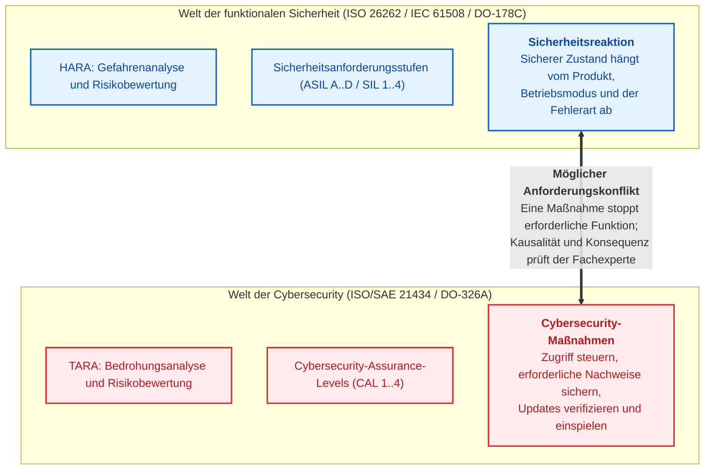
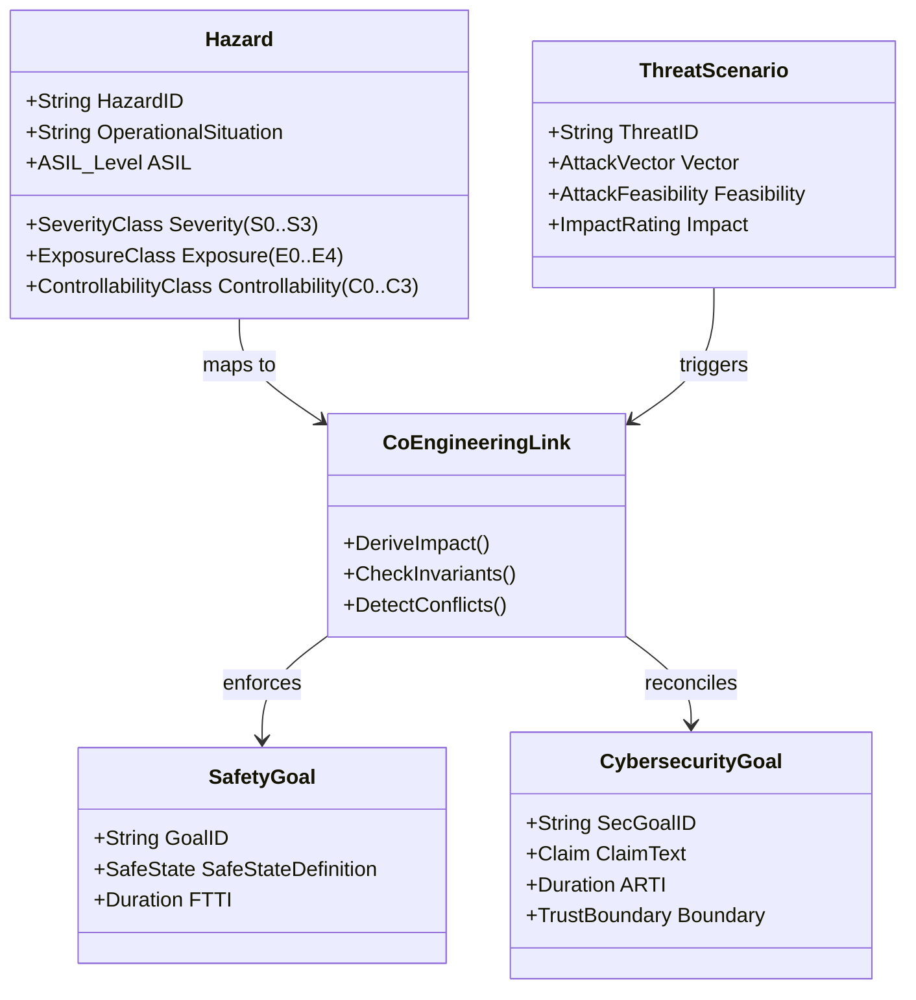
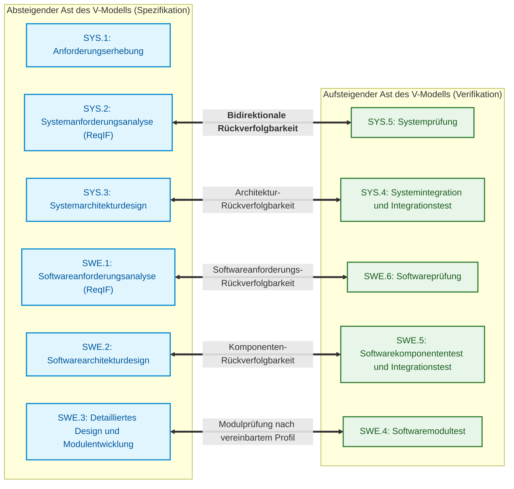
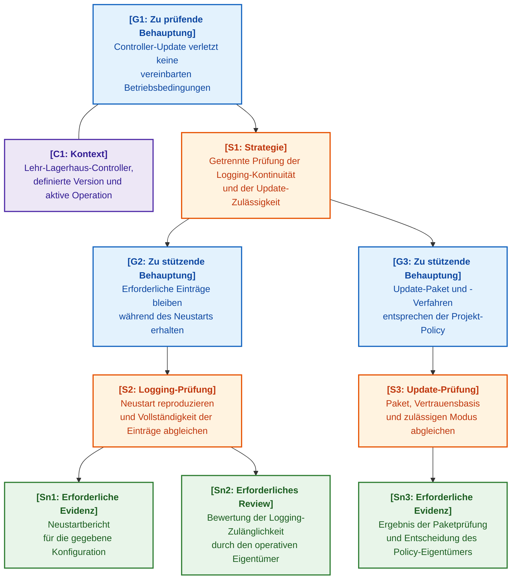

# Kapitel 30. Co-Engineering von funktionaler Sicherheit und Cybersicherheit

> **Buch:** [Architektur evidenzbasierter Expertensysteme](README.md) · [Teil V: Verifikation, Testen, Diagnose und Sicherheitsbegründung](part-05-verification-and-learning.md)  
> **Vorheriges Kapitel:** [Kapitel 27. Sicherheitsbegründung: Synthese und Verifikation von Argumenten](ch27-safety-case-gsn-synthesis.md)  
> **Nächstes Kapitel:** [Kapitel 28. Dual-Mode-Expertensysteme: Strikte Deduktion und beratende Hypothese](ch28-dual-mode-expert-systems.md)  
> **Inhaltsverzeichnis:** [README.md](README.md)  
> **Autor:** [Mykola Fedchyk](about-the-author.md)  
> **Niveau:** Systemsicherheitsingenieure (Safety Managers), Cybersecurity-Architekten (Security Engineers), Lead-Entwickler eingebetteter und autonomer Systeme (Robotics, DefTech, Automotive): Fortgeschritten  
> **Lernziele:** Fachliche Risikobewertung von der Verifikation abgestimmter Policies trennen; Konflikte zwischen Sicherheitsreaktion und Verfügbarkeit identifizieren; Zeitparameter und Anforderungsrückverfolgbarkeit prüfen; Grenzen digitaler Signaturen auf Nachweise erläutern; Notwendigkeit der Qualifizierung des Expertensystems als Softwarewerkzeug bewerten.

---

## Abstract

Man stelle sich eine autonome Zugmaschine oder ein fahrerloses Transportfahrzeug auf einer Autobahn vor. Das Anomalieerkennungsmodul der Cybersecurity (ISO/SAE 21434) registriert unbekannte Frames auf dem CAN-Bus und leitet – getrieben von der Policy einer sofortigen Bedrohungsneutralisierung – einen Gateway-Reset ein oder sendet den Befehl zur Notabschaltung des Antriebsstrangs. Doch exakt in diesem Sekundenbruchteil hält der elektrische Antriebsstrang den Lenkwinkel bei einem Ausweichmanöver: Die funktionale Sicherheit (ISO 26262, ASIL D) fordert zwingend die Aufrechterhaltung der Steuerbarkeit (*Fail-Operational*). Das abrupte Abschalten der Spannungsversorgung auf Geheiß der Cybersecurity führt zum sofortigen Ausbrechen des Fahrzeugs und einem fatalen Unfall. Das gegenteilige Extrem ist nicht minder verheerend: Blockieren die Regeln der funktionalen Sicherheit während der Fahrt bedingungslos jegliche sicherheitsrelevanten Updates oder die Isolation kompromittierter Steuergeräte, erhält ein Angreifer ein unbegrenztes Zeitfenster zur Kompromittierung des Bordnetzes und zur Übernahme der Lenkkontrolle.

Funktionale Sicherheit (*Functional Safety*) und Cybersicherheit (*Cybersecurity*) adressieren unterschiedliche Bedrohungsklassen, wenden ihre Schutzmaßnahmen jedoch auf dieselben physischen Steuergeräte, Kommunikationsbusse und Zeitbudgets an. Die Norm ISO/SAE 21434 definiert den automobilen Kontext der Cybersecurity [[1]](#src-1), während die Normenreihe ISO 26262 den Rahmen für die funktionale Sicherheit vorgibt [[2]](#src-2). Der sichere Zustand eines Systems hängt stets vom situativen Kontext, dem Betriebsmodus und dem konkreten Produkt ab; er lässt sich niemals auf ein blindes Abschalten der Stromversorgung oder das Ignorieren von Anomalien reduzieren.

Im Kontext evidenzbasierter Expertensysteme fungiert das Co-Engineering von funktionaler Sicherheit und Cybersicherheit nicht als isoliertes Nachschlagewerk der Systemtechnik, sondern als fundamentales Fundament für die Verifikation der Wissensbasis: Es ist die Aufgabe des Expertensystems, formal nach sich gegenseitig ausschließenden oder gefährlichen Regeln zu suchen, bevor diese in den Ausführungspfad gelangen. Die Leitfrage dieses Kapitels lautet: **Wie unterstützt ein Expertensystem das Aufdecken verdeckter Konflikte zwischen den Anforderungen der funktionalen Sicherheit und des Cyberschutzes bereits in der Entwurfsphase, ohne die fachliche Domänenanalyse und die Letztverantwortung des Ingenieurs zu untergraben?** Das Kapitel demonstriert explizite Verknüpfungen zwischen Anforderungen, didaktische Timing- und Rückverfolgbarkeitsprüfungen, signierte Evidenzdatensätze sowie die Werkzeugqualifizierung. Das Anwendungsbeispiel zur Aktualisierung eines Lagerhaus-Controllers ist synthetischer Natur: Es veranschaulicht die Methode, impliziert jedoch keine direkte Anwendbarkeit automobiler Standards auf Lagertechnik. Das Expertensystem bereitet das Bewertungsmaterial auf, erteilt jedoch keine Produktzertifizierung.

---

## 1. Das Problem getrennter Ingenieurskulturen

Der Entwurf einer beweisgestützten Wissensbasis für cyber-physische Systeme stößt unweigerlich auf die historische Kluft zwischen zwei unabhängigen Ingenieurskulturen – der funktionalen Sicherheit und der Cybersecurity. In der Fertigungsindustrie, im Fahrzeugbau und im Verteidigungssektor entwickelten sich diese Disziplinen weitgehend isoliert voneinander, gestützt auf eigene Normen, Metriken und regulatorische Vorgaben. Dies birgt das systemische Risiko unbemerkt widersprüchlicher Anforderungen:



### 1.1. Vier archetypische interkategoriale Kollisionen

Eine getrennte Entwicklung kann gegenseitige Wechselwirkungen von Schutzmaßnahmen verdecken. Die folgenden Situationen stellen Fragestellungen für ein gemeinsames Review dar, keinen Beweis für ein unvermeidliches Versagen manueller Prüfungen:

1. **Physische Gefährdungen durch Cyberangriffe:**  
   Eine Integritätsverletzung von Steuerungsdaten kann unmittelbare physische Konsequenzen nach sich ziehen. Fachexperten müssen das Szenario, die Rahmenbedingungen und den Kausalzusammenhang zwischen Bedrohung und Gefährdung herleiten. Die Cybersecurity-Analyse eines Automobilprodukts beschränkt sich nicht auf die Vertraulichkeit von Daten; ein Expertensystem darf diese methodische Verengung nicht fälschlich verallgemeinern.
2. **Konflikt zwischen Sicherheitsreaktion und Verfügbarkeit:**  
   Eine Schutzreaktion kann eine notwendige Betriebsfunktion unterbrechen. Ein Prüfsummenfehler begründet keinen universellen Befehl zur Notabschaltung des Gesamtsystems: Die Reaktion wird durch Betriebsmodus, Fehlertyp, Redundanz und Produktspezifikation determiniert. Es muss verifiziert werden, dass die vereinbarte Reaktion keine neue Gefährdung hervorruft, anstatt Verfügbarkeit oder Not-Halt a priori als absoluten Vorrang zu deklarieren.
3. **Konflikt zwischen schneller Update-Bereitstellung und vollständiger Änderungsverifikation:**  
   Ein dringendes Sicherheitsupdate kann mit der Notwendigkeit kollidieren, die Auswirkungen von Codeänderungen vollumfänglich zu verifizieren. Der Umfang der Re-Verifikation richtet sich nach modifizierten Funktionen, Abhängigkeiten und dem anzuwendenden Entwicklungsprozess; nicht jede Modifikation erfordert die identische Wiederholung aller Entwicklungs- und Testaktivitäten. Das Expertensystem extrahiert die Menge betroffener Anforderungen sowie Nachweise, während der Prozesseigentümer das hinreichende Prüfset festlegt.
4. **Konflikt zwischen Diagnosezugang und Angriffsfläche:**  
   Diagnoseschnittstellen sind für Wartung und Kalibrierung unverzichtbar, vergrößern jedoch gleichzeitig die Angriffsfläche. Dies rechtfertigt weder eine pauschale Forderung nach dauerhaft offenen Ports noch ein generelles Verbot von Diagnosefunktionen. Im Wissensmodell müssen autorisierte Rollen, Systemmodi, Authentifizierungsmechanismen, zulässige Operationen und Bedingungen für den Verbindungsabbau explizit formalisiert werden.

---

## 2. Mathematischer und ontologischer Apparat des Co-Engineerings

Anforderungen und abgestimmte Kausalrelationen zwischen Bedrohungen und Gefährdungen werden im ingenieurtechnischen Wissensgraphen (EKG, *Engineering Knowledge Graph*) aus [Kapitel 9](ch09-engineering-knowledge-graph-traceability.md) hinterlegt. Der Graph ermöglicht automatisierte Konsistenzprüfungen, leitet jedoch nicht eigenständig her, welche physische Konsequenz ein Cyberangriff verursacht.



### 2.1. Abbildung von TARA auf HARA

Gefahrenanalyse und Risikobewertung HARA (*Hazard Analysis and Risk Assessment*) sowie Bedrohungsanalyse und Risikobewertung TARA (*Threat Analysis and Risk Assessment*) werden über konkrete Szenarien und den definierten Anwendungsbereich miteinander verknüpft. Der Fachexperte bestätigt zunächst, welche Gefährdungen von einer Bedrohung tangiert werden. Erst danach kann das System eine vereinbarte Zuordnungstabelle anwenden. Die folgende Formel stellt eine **didaktische Projekt-Policy** dar, keinen universellen Algorithmus und keine wörtliche normative Anforderung der ISO/SAE 21434.

Die Formel ist ausschließlich auf eine nicht-leere, verifizierte Liste von Gefährdungen mit bekannten Schweregraden anwendbar. Eine leere Menge oder ein unbekannter Schweregrad führen zur Verweigerung einer Bewertung (wie im Go-Code in Abschnitt 5 realisiert) und keinesfalls zur Kategorie `Negligible`.

```math
\text{SafetyImpact}_{\text{TARA}}(\text{Threat}) = \begin{cases}
\text{Severe}, & \text{falls } \exists H \in \text{ImpactedHazards}(\text{Threat}) : \text{Severity}(H) = S_3, \\
\text{Major}, & \text{falls } \exists H : \text{Severity}(H) = S_2 \land \forall H : \text{Severity}(H) \le S_2, \\
\text{Moderate}, & \text{falls } \exists H : \text{Severity}(H) = S_1 \land \forall H : \text{Severity}(H) \le S_1, \\
\text{Negligible}, & \text{falls } \forall H : \text{Severity}(H) = S_0.
\end{cases}
```

Bezeichnungen in der Skala der Schadensausmaß-Bewertung:

- $\text{SafetyImpact}_{\text{TARA}}(\text{Threat})$ ist die Auswirkungskategorie der Bedrohung gemäß der didaktischen Policy;
- $\text{Threat}$ bezeichnet den untersuchten Cyberangriffsvektor;
- $\text{ImpactedHazards}(\text{Threat})$ ist die Menge physischer Gefährdungen, die durch diesen Angriff provoziert werden;
- $H$ bezeichnet eine einzelne Gefährdung aus der abgestimmten Menge; alle Quantoren der Formel sind auf diese Menge beschränkt;
- $\text{Severity}(H)$ ist der Schweregrad der Folgen nach der Norm ISO 26262;
- $S_3$ betrifft lebensbedrohliche Verletzungen mit unsicherem Überleben oder tödliche Verletzungen;
- $S_2$ betrifft schwere und lebensbedrohliche Verletzungen bei wahrscheinlichem Überleben;
- $S_1$ entspricht leichten bis mittelschweren Verletzungen;
- $S_0$ erfasst das Fehlen von Personenschäden.

Im Rahmen der didaktischen Policy führt mindestens eine bestätigte Gefährdung der Stufe $S_3$ zur Kategorie $\text{Severe}$. Die Etablierung des Kausalzusammenhangs zwischen Bedrohung und Gefährdung bleibt jedoch eine fachliche Domänenaufgabe. Eine Einstufung für ein bestimmtes Szenario lässt sich nicht automatisch auf ein anderes Produkt oder einen anderen Betriebsmodus übertragen.

### 2.2. Zeitbudget des Co-Engineerings: FTTI versus ARTI

Das Co-Engineering verlangt eine Harmonisierung der Zeitcharakteristiken von Schutzreaktionen. In der funktionalen Sicherheit ist der maßgebliche Parameter das **Fehlertoleranzzeitintervall (Fault Tolerant Time Interval, FTTI)**. Die ISO 26262-1:2018 definiert dieses als die minimale Zeitspanne vom Auftreten eines Fehlers in einem Element bis zu einem potenziell gefährlichen Ereignis [[2]](#src-2). Diese Formulierung stützt sich nicht auf informelle Annahmen, sondern auf wörtliche Zitate in zwei begutachteten Veröffentlichungen von Philipp Kilian und Koautoren, die explizit auf ISO 26262-1:2018 verweisen [[3]](#src-3), [[4]](#src-4). Das Wort „minimal“ ist von entscheidender Bedeutung: Das FTTI begrenzt den schnellsten Pfad zur Gefährdung, nicht den durchschnittlichen. Das FTTI ist eine Eigenschaft des Sicherheitsziels und wird auf Elementebene aus der HARA bestimmt [[3]](#src-3), wohingegen das Fehlerbehandlungszeitintervall (*Fault Handling Time Interval*, FHTI) eine Eigenschaft des konkreten Sicherheitsmechanismus darstellt [[4]](#src-4). Die didaktische Zeitbilanzbedingung lautet:

```math
\text{FHTI} = \text{FDTI} + \text{FRTI} \le \text{FTTI}.
```

Bestandteile der Zeittoleranzbilanz:

- $\text{FTTI}$ ist das Fehlertoleranzzeitintervall (*Fault Tolerant Time Interval*) in Millisekunden;
- $\text{FHTI}$ ist die Fehlerbehandlungszeit des Sicherheitsmechanismus (*Fault Handling Time Interval*), d. h. die Summe aus FDTI und FRTI, in Millisekunden;
- $\text{FDTI}$ ist die Zeitspanne vom Fehlereintritt bis zu dessen Erkennung (*Fault Detection Time Interval*) in Millisekunden;
- $\text{FRTI}$ ist die Zeitspanne von der Fehlererkennung bis zum Erreichen des sicheren Zustands oder des Notbetriebs (*Fault Reaction Time Interval*) in Millisekunden.

Die angegebene Ungleichung erlaubt, dass die Summe aus Erkennungs- und Reaktionszeit das FTTI nicht überschreitet. Bei didaktischen Werten von 100 ms und 30 ms verbleibt eine Reserve von 70 ms. Verlangt eine Projektrichtlinie eine strikt positive Reserve, muss Gleichheit explizit ausgeschlossen werden; genau ein solches verschärftes Profil verifiziert der Code in Abschnitt 5. Für ein reales Produkt müssen Messungen die ungünstigsten Randbedingungen (*Worst-Case Conditions*) sowie klar definierte Intervallgrenzen berücksichtigen.

Für das didaktische Szenario führen wir das **Angriffsreaktionszeitintervall** (*Attack Response Time Interval*, ARTI) ein. Dies ist eine Modellbezeichnung des Lehrbeispiels und kein normativ standardisiertes Äquivalent zum FTTI:

```math
\text{ARTI} = \text{ATDI} + \text{ATRI}.
```

Parameter der Reaktionszeit auf Cyberangriffe:

- $\text{ARTI}$ ist das gesamte Angriffsreaktionszeitintervall (*Attack Response Time Interval*) in Millisekunden oder Mikrosekunden;
- $\text{ATDI}$ ist die Erkennungsverzögerung einer Anomalie durch ein Intrusion-Detection- oder Intrusion-Prevention-System (*Attack Detection Time Interval*) in Millisekunden;
- $\text{ATRI}$ ist die Ausführungszeit defensiver Gegenmaßnahmen (*Attack Reaction Time Interval*), beispielsweise die Port-Isolation oder das Umschalten auf einen verschlüsselten Redundanzkanal, in Millisekunden.

Der Ausdruck verdeutlicht, dass sich die Gesamtzeit zur Blockierung eines Angriffs aus dem Zeitpunkt der Identifikation eines verdächtigen Frames und der Hardware-Deaktivierung des kompromittierten Ports zusammensetzt.

**Zentraler Invariante der Co-Engineering-Sicherheit:**

```math
\forall \text{Threat } t \text{ impacting Hazard } H : \quad \text{ARTI}(t) + \text{FRTI}(H) < \text{FTTI}(H).
```

In dieser Ungleichung gilt:

- $t$ ist das Cyberangriffsszenario, das auf die physische Gefährdung $H$ einwirkt;
- $\text{ARTI}(t)$ ist das Erkennungs- und Reaktionsintervall auf den Angriff $t$ in Millisekunden;
- $\text{FRTI}(H)$ ist die Zeit zur physischen Überführung des Aktors in den sicheren Zustand in Millisekunden;
- $\text{FTTI}(H)$ ist die Grenzzeit der Fehlertoleranz für die Gefährdung $H$ in Millisekunden.

Ein Überschreiten des vereinbarten Budgets bedeutet, dass der betrachtete Reaktionspfad das Kriterium verfehlt. Es beweist weder die Unmöglichkeit jeglichen softwarebasierten Schutzes noch erzwingt es eine singuläre Hardwarelösung. Erforderlich ist eine Überprüfung des Zeitmodells, alternativer Reaktionsstrategien und der Unabhängigkeit der Schutzmechanismen. ARTI und FRTI stellen hier sequentielle, nicht überlappende Intervalle dar; andernfalls würde eine Addition Teile der Reaktion doppelt erfassen.

### 2.3. Gemeinsame Gesamtrisikomatrix

Eine automatisierte Festlegung der Architektur anhand eines Kategorienpaares blendet implizite Annahmen aus. Eine didaktische Richtlinienfunktion zur Policy-Auswahl lässt sich wie folgt formulieren:

```math
\mathcal{R}_{\text{co-eng}} = \Psi \Big( \text{ASIL}(H), \; \text{CAL}(\text{Threat}) \Big).
```

Im Modell des gemeinsamen Risikos gilt:

- $\mathcal{R}_{\text{co-eng}}$ ist das Ergebnis der Auswahl zusätzlicher Prüfungen gemäß Projekt-Policy, keine numerische Wahrscheinlichkeit;
- $\Psi$ ist die Abbildungsfunktion des Kategorienpaares auf Schutzanforderungen;
- $\text{ASIL}(H)$ ist die Sicherheitsanforderungsstufe nach ISO 26262 (von QM bis ASIL D);
- $\text{CAL}(\text{Threat})$ ist das Cybersecurity-Assurance-Level nach ISO/SAE 21434 (von CAL 1 bis CAL 4).

Das Cybersecurity-Assurance-Level CAL (*Cybersecurity Assurance Level*) darf weder mit einer Erfolgswahrscheinlichkeit eines Angriffs noch mit einer simplen Komplexitätsskala gleichgesetzt werden. Auch die automobile Sicherheitsanforderungsstufe ASIL (*Automotive Safety Integrity Level*) stellt keine numerische Ausfallwahrscheinlichkeit dar. Ein Projekt muss die Einstufungen transparent dokumentieren und Schutzmaßnahmen gesondert begründen. Ohne dieses Fundament darf die Funktion $\Psi$ nicht herangezogen werden.

Beispielsweise kann eine Policy für ein kritisches Asset ein unabhängiges Expertenreview und für Modifikationen der Authentifizierung zusätzliche Tests vorschreiben. Dies definiert den zu erbringenden Arbeitsumfang und ordnet nicht reflexartig einen bestimmten Chip oder kryptografischen Algorithmus an. Der Regelsatz wird von Spezialisten beider Disziplinen konsolidiert.

---

## 3. Verarbeitung und Verifikation von Anforderungen im ReqIF-Format (ASPICE 4.0)

In der Luftfahrt, der Automobilindustrie und im Verteidigungssektor erfolgt der Austausch von Anforderungen zwischen Auftraggebern, Hauptauftragnehmern (Tier-1) und Halbleiterherstellern (Tier-2) über den offenen XML-Standard **ReqIF (Requirements Interchange Format)**, standardisiert durch die OMG [[5]](#src-5).



### 3.1. ReqIF-Struktur und normative Attribute

Eine ReqIF-Datei ist ein standardisiertes XML-Dokument, in dem Anforderungen als `<SPEC-OBJECT>`-Elemente und Beziehungen als `<SPEC-RELATION>`-Elemente abgebildet werden. Das folgende didaktische Fragment veranschaulicht diese Struktur. Typdefinitionen, Header und Teile obligatorischer Metadaten wurden gekürzt; das Fragment stellt somit keine eigenständige, vollständig valide ReqIF-Datei dar:

<details>
<summary>Didaktisches ReqIF-Fragment: Anforderung und Verfeinerungsbeziehung</summary>

```xml
<?xml version="1.0" encoding="UTF-8"?>
<REQ-IF xmlns="http://www.omg.org/spec/ReqIF/20110401/reqif.xsd">
  <CORE-CONTENT>
    <REQ-IF-CONTENT>
      <SPEC-OBJECTS>
        <SPEC-OBJECT IDENTIFIER="REQ-SWE1-042" LAST-CHANGE="2026-09-15T10:00:00Z">
          <VALUES>
            <ATTRIBUTE-VALUE-STRING THE-VALUE="SYS_SEC_AUTH_CMD">
              <DEFINITION><ATTRIBUTE-DEFINITION-STRING-REF>ATTR-NAME</ATTRIBUTE-DEFINITION-STRING-REF></DEFINITION>
            </ATTRIBUTE-VALUE-STRING>
            <ATTRIBUTE-VALUE-STRING THE-VALUE="Jeder Steuer-Frame für Lenkantriebe SHALL ein CMAC-AES-128-Authentifizierungs-Tag enthalten.">
              <DEFINITION><ATTRIBUTE-DEFINITION-STRING-REF>ATTR-DESC</ATTRIBUTE-DEFINITION-STRING-REF></DEFINITION>
            </ATTRIBUTE-VALUE-STRING>
            <ATTRIBUTE-VALUE-ENUMERATION>
              <VALUES><ENUM-VALUE-REF>ENUM-ASIL-D</ENUM-VALUE-REF></VALUES>
              <DEFINITION><ATTRIBUTE-DEFINITION-ENUMERATION-REF>ATTR-ASIL</ATTRIBUTE-DEFINITION-ENUMERATION-REF></DEFINITION>
            </ATTRIBUTE-VALUE-ENUMERATION>
            <ATTRIBUTE-VALUE-ENUMERATION>
              <VALUES><ENUM-VALUE-REF>ENUM-CAL-4</ENUM-VALUE-REF></VALUES>
              <DEFINITION><ATTRIBUTE-DEFINITION-ENUMERATION-REF>ATTR-CAL</ATTRIBUTE-DEFINITION-ENUMERATION-REF></DEFINITION>
            </ATTRIBUTE-VALUE-ENUMERATION>
          </VALUES>
        </SPEC-OBJECT>
      </SPEC-OBJECTS>
      <SPEC-RELATIONS>
        <SPEC-RELATION IDENTIFIER="REL-089">
          <SOURCE><SPEC-OBJECT-REF>REQ-SWE1-042</SPEC-OBJECT-REF></SOURCE>
          <TARGET><SPEC-OBJECT-REF>REQ-SYS2-015</SPEC-OBJECT-REF></TARGET>
          <TYPE><SPEC-RELATION-TYPE-REF>REL-TYPE-REFINES</SPEC-RELATION-TYPE-REF></TYPE>
        </SPEC-RELATION>
      </SPEC-RELATIONS>
    </REQ-IF-CONTENT>
  </CORE-CONTENT>
</REQ-IF>
```

</details>

### 3.2. Automatische Verifikation der Vollständigkeitsmetriken nach ASPICE 4.0

Das Prozessmodell Automotive SPICE 4.0 [[6]](#src-6) und der Luftfahrtstandard DO-178C besitzen unterschiedliche Anwendungsbereiche und sind nicht als äquivalent anzusehen. Automotive SPICE 4.0 fordert die Sicherstellung der Konsistenz und die Etablierung bidirektionaler Rückverfolgbarkeit (*Bidirectional Traceability*), unter anderem zwischen Software- und Systemanforderungen (Basispraxis SWE.1.BP5) sowie zwischen Verifikationsmaßnahmen und Softwareanforderungen (SWE.6.BP4); Testergebnisse werden separat auf die Verifikationsmaßnahmen rückgeführt [[6]](#src-6). Die nachfolgenden Bedingungen bilden ein didaktisches Profil zur automatischen Verifikation eines Teils dieser Beziehungen und stellen keine formale Übersetzung der Basispraktiken dar. Schwellenwerte und Ausnahmen müssen projektspezifisch begründet werden, anstatt sie einer universellen Zertifizierung zuzuschreiben.

**Invariante zur Vermeidung verwaister Anforderungen ($\mathcal{I}_{\text{no-orphan}}$).**  
Jede Softwareanforderung $`r \in \text{Reqs}_{\text{SWE.1}}`$ muss Nachfahre mindestens einer Systemanforderung $`s \in \text{Reqs}_{\text{SYS.2}}`$ sein:

```math
\forall r \in \text{Reqs}_{\text{SWE.1}} : \exists s \in \text{Reqs}_{\text{SYS.2}} \quad \text{Refines}(r, s).
```

Symbole der Rückverfolgbarkeitsinvariante:

- $r$ ist eine einzelne Softwareanforderung der Ebene SWE.1;
- $\text{Reqs}_{\text{SWE.1}}$ ist die Gesamtmenge der Softwareanforderungen des Subsystems;
- $s$ ist eine Systemanforderung der Architekturebene SYS.2;
- $\text{Refines}(r, s)$ bezeichnet die Dekompositions- und Verfeinerungsrelation der Anforderung $s$ durch die detailliertere Spezifikation $r$.

Diese Bedingung prüft die Verknüpfung bekannter Anforderungen. Sie beweist nicht das Fehlen unzulässiger Zusatzfunktionen im Code. Abgeleitete Anforderungen (*Derived Requirements*) können einem anderen Begründungspfad folgen; sie dürfen nicht allein wegen des Fehlens eines direkten Elterneintrags verworfen werden.

**Invariante der Testabdeckungsvollständigkeit ($\mathcal{I}_{\text{test-cov}}$).**  
Für jede Anforderung mit erhöhtem oder kritischem Sicherheitsniveau ($\text{ASIL} \ge B$ oder $\text{CAL} \ge 3$) muss zwingend mindestens ein freigegebener Verifikationstest mit positivem Status existieren:

```math
\forall r \in \text{Reqs}_{\text{SWE.1}} : \Big(\text{ASIL}(r) \ge B \lor \text{CAL}(r) \ge 3\Big) \implies \exists t \in \text{Tests}_{\text{SWE.6}} : \text{Verifies}(t, r) \land \text{Status}(t) = \text{Passed}.
```

Bezeichnungen der Testabdeckungsbedingung:

- $r$ ist die zu verifizierende Anforderung der Ebene SWE.1;
- $\text{ASIL}(r)$ und $\text{CAL}(r)$ sind die Sicherheits- und Cybersecurity-Stufen dieser Anforderung;
- $t$ ist ein Verifikationstest aus der Menge $\text{Tests}_{\text{SWE.6}}$;
- $\text{Verifies}(t, r)$ definiert die Verifikationsbeziehung zwischen Test und Anforderung;
- $\text{Status}(t) = \text{Passed}$ erfasst die erfolgreiche Testdurchführung auf dem Prüfstand.

Fehlt für eine kritische Anforderung ein Test oder schlägt dieser fehl, evaluiert die Invariante zu Falsch. Das Expertensystem markiert das Evidenzpaket als unvollständig und weist den fehlenden Link aus; die Entscheidung über das weitere Vorgehen obliegt dem Prozesseigentümer.

**MC/DC-Metrik für Code der Einstufung ASIL D.**  
Das Kriterium der modifizierten Bedingungs-/Entscheidungsabdeckung MC/DC (*Modified Condition/Decision Coverage*) weist den unabhängigen Einfluss einzelner Bedingungen auf ein Entscheidungsergebnis nach. Das nachfolgende Beispiel definiert das Ziel einer vollständigen Abdeckung für ein ausgewähltes Modul. Anforderungen an die Methode und die Rechtfertigung unvollständig abgedeckter Pfade hängen von der jeweiligen Norm ab; ASIL D und die Luftfahrtstufe DAL A dürfen nicht auf eine identische Pauschalbedingung reduziert werden.

```math
\text{Coverage}_{\text{MC/DC}}(M) = 1{,}0 \quad (100\,\%).
```

Hierbei gilt:

- $M$ ist das Codemodul, das Sicherheitsfunktionen der Stufe ASIL D implementiert;
- $\text{Coverage}_{\text{MC/DC}}(M)$ ist der Anteil der Bedingungen, für die ein unabhängiger Einfluss auf die Entscheidung nachgewiesen wurde, im Intervall von 0 bis 1,0;
- der Wert 1,0 (100 %) bedeutet, dass ein solcher Nachweis für jede Bedingung jeder Entscheidung des Moduls erbracht wurde.

Für den Ausdruck `if (crc_ok && auth_valid && !timeout)` erfordert jede der drei Teilbedingungen ein Testpaar, in dem sich nur der Wert dieser Teilbedingung ändert und dadurch das Gesamtergebnis der Bedingung kippt. Bei der Unique-Cause-Variante verbleiben alle übrigen Bedingungen im Paar unverändert; die Masking-Variante erlaubt Änderungen anderer Bedingungen, sofern deren Einfluss maskiert wird. Die gewählte Variante und die Begründung nicht abgedeckter Bedingungen sind im Verifikationsplan festzuhalten.

---

## 4. Synthese von Sicherheitsnachweisen nach dem Standard Goal Structuring Notation (GSN)

Die Goal Structuring Notation (GSN) unterstützt das explizite Verknüpfen von Behauptungen, Argumentationsstrategien, Kontexten und Evidenzen [[7]](#src-7). Sie ersetzt keine Prüfberichte und macht ein Argument nicht allein dadurch stichhaltig, dass ein Graph ausgefüllt wurde. Das System erzeugt das strukturelle Gerüst und prüft definierte formale Bedingungen, während die inhaltliche Tragfähigkeit des Arguments durch Fachexperten bewertet wird. Grenzen der Formalisierung von Sicherheitsnachweisen analysiert John Rushby [[8]](#src-8).



### 4.1. Signierter Evidenzdatensatz

Ein Blattknoten des Arguments (*Solution, Sn*) referenziert eine konkrete Evidenz. Ein didaktischer signierter Datensatz enthält deren Hash und Metadaten. Dies stellt kein standardisiertes Zertifizierungsformat dar und liefert keinen kryptografischen Beweis für die inhaltliche Wahrheit einer Behauptung:
1. `AssertionID`: Eindeutiger Bezeichner des GSN-Ziels oder der normativen Behauptung.
2. `ProofType`: Klasse des Zertifizierungsnachweises (`MC_DC_Coverage`, `Hardware_Root_Of_Trust`, `Traceability_Matrix`).
3. `EvidenceDigests`: Array kryptografischer SHA-256-Hashes von Primärartefakten (C/Rust/Go-Quellcode, Testberichte, Firmware-Images).
4. `ByteRanges`: Exakte Byte-Offsets im Prüfbericht oder Testprotokoll.
5. `Signature`: Digitale Signatur über die vereinbarte Repräsentation des Datensatzes, einschließlich Behauptungs-ID, Typ, Zeitstempel und Evidenz-Hash. Eine Signatur, die lediglich die Bytes der Evidenz kapselt, schützt die Metadaten nicht vor Manipulation.

<details>
<summary>Didaktische Evidenzbeschreibung; Signatur noch nicht berechnet</summary>

```json
{
  "record_version": "1.0",
  "assertion_id": "GOAL-G2-ASIL-D-DECOMPOSITION",
  "proof_type": "MC_DC_Coverage",
  "timestamp_utc": "2026-10-02T12:00:00Z",
  "root_evidence": {
    "artifact_uri": "reports/verification/mcdc_swe4_actuator.log",
    "sha256": "4b227777d4dd1fc61c6f884f48641d02b4d121d3fd328cb08b5531fcacdabf8a",
    "byte_start": 4120,
    "byte_end": 4890,
    "literal_quote": "TOTAL MCDC COVERAGE: 100.0% (48/48 CONDITIONS SATISFIED)"
  },
  "signing_authority": {
    "key_id": "audit-sec-core-01",
    "signature": null
  }
}
```

</details>

Die Signatur belegt Ursprung und Integrität der signierten Daten. Ohne Zugriff auf die Rohdaten der Evidenz oder ein unabhängiges Prüfergebnis kann ein Auditor allein anhand des Hashes nicht beurteilen, ob eine Anforderung erfüllt ist. Die Signatur eines einzelnen Blattknotens sichert zudem nicht den gesamten Argumentationsgraphen ab. Repräsentation und Verifikationsregeln werden zwischen Aussteller und Prüfer vereinbart; das nachfolgende Go-Beispiel nutzt in beiden Funktionen dieselbe Struktur und beansprucht keine sprachübergreifende Kanonisierung.

---

## 5. Lehrbeispiel-Prüfungen in einem Expertensystem in Go

Das nachfolgende Modul `compliance` demonstriert eine didaktische Policy zur Konsolidierung abgestimmter Kategorien, die Prüfung von Zeitbudgets, ausgewählte Konsistenzbedingungen für Anforderungsdatensätze sowie die Update-Regel aus Abschnitt 6.2, die strikt zwischen einem Konflikt und fehlender Evidenz unterscheidet. Das Modul leitet nicht her, welche Gefährdung durch eine Bedrohung hervorgerufen wird, liest kein vollständiges Produktmodell ein und erbringt keinen Konformitätsbeweis bezüglich Industriestandards. Unbekannte Kategorien und ungültige Zeitwerte führen zu einem Fehler, nicht zu einer Freigabe. Zur Ausführung wird Go 1.20 oder neuer benötigt; Abhängigkeiten beschränken sich auf die Go-Standardbibliothek.

<details>
<summary>Go-Referenzimplementierung: Modul für Normenkonformität und Zeitbudgetverifikation</summary>

```go
package compliance

import (
	"crypto/ecdsa"
	"crypto/rand"
	"crypto/sha256"
	"encoding/json"
	"errors"
	"fmt"
	"math/big"
	"time"
)

// SeverityClass definiert den HARA-Schweregrad nach ISO 26262-3
type SeverityClass string

const (
	SeverityS0 SeverityClass = "S0" // Negligible (keine Verletzungen)
	SeverityS1 SeverityClass = "S1" // Moderate (leichte bis mittelschwere Verletzungen)
	SeverityS2 SeverityClass = "S2" // Major (schwere Verletzungen mit Lebensgefahr bei wahrscheinlichem Überleben)
	SeverityS3 SeverityClass = "S3" // Severe (lebensbedrohliche bis tödliche Verletzungen)
)

// ThreatImpact definiert die TARA-Schadensausmaß-Kategorie nach ISO/SAE 21434
type ThreatImpact string

const (
	ImpactNegligible ThreatImpact = "Negligible"
	ImpactModerate   ThreatImpact = "Moderate"
	ImpactMajor      ThreatImpact = "Major"
	ImpactSevere     ThreatImpact = "Severe"
)

// ThreatScenario beschreibt ein Cyberangriffsszenario auf ein kritisches Asset
type ThreatScenario struct {
	ID                string
	Name              string
	AttackFeasibility string        // High, Medium, Low, Very Low
	SafetySeverity    SeverityClass // Zugehörige HARA-Gefährdung
	ARTIDuration      time.Duration // Attack Response Time Interval
}

// SafetyGoal beschreibt ein funktionales Sicherheitsziel
type SafetyGoal struct {
	ID        string
	SafeState string        // Name des sicheren Zustands (z. B. EMERGENCY_LANDING)
	FTTI      time.Duration // Fault Tolerant Time Interval
	FRTI      time.Duration // Fault Reaction Time Interval
}

func DeriveTARAImpact(severity SeverityClass) (ThreatImpact, error) {
	switch severity {
	case SeverityS3:
		return ImpactSevere, nil
	case SeverityS2:
		return ImpactMajor, nil
	case SeverityS1:
		return ImpactModerate, nil
	case SeverityS0:
		return ImpactNegligible, nil
	default:
		return "", fmt.Errorf("unknown severity: %q", severity)
	}
}

// VerifyTimingBudget prüft die Bedingung ARTI + FRTI < FTTI
func VerifyTimingBudget(sg SafetyGoal, ts ThreatScenario) error {
	if sg.FTTI <= 0 || sg.FRTI < 0 || ts.ARTIDuration < 0 {
		return errors.New("invalid timing input")
	}
	if sg.FRTI >= sg.FTTI || ts.ARTIDuration >= sg.FTTI-sg.FRTI {
		return errors.New("timing budget exceeded or no reserve remains")
	}
	return nil
}

// UpdateFinding ist das Ergebnis der Regel POLICY-UPDATE-1 aus Abschnitt 6.2
type UpdateFinding string

const (
	FindingNoConflict      UpdateFinding = "no_conflict"
	FindingConflict        UpdateFinding = "conflict"
	FindingMissingEvidence UpdateFinding = "missing_evidence"
)

// RestartTest beschreibt einen Testbericht zum Logging-Neustart für eine Konfiguration
type RestartTest struct {
	ID               string
	Configuration    string
	RecordsPreserved bool // Einträge wurden während des Neustarts über einen unabhängigen Pfad erhalten
}

// UpdateContext enthält die vereinbarten Eingangsdaten der Regel
type UpdateContext struct {
	ActiveOperation   bool   // REQ-OBS-1: Aktive Operation erfordert lückenloses Logging
	UpdateRestartsLog bool   // FACT-RESTART-1: Update startet den Logging-Prozess neu
	Configuration     string // Aktuelle Konfiguration des Controllers
	Tests             []RestartTest
}

// EvaluateUpdatePolicy unterscheidet einen bestätigten Konflikt von fehlender Evidenz
func EvaluateUpdatePolicy(ctx UpdateContext) (UpdateFinding, []string) {
	if !ctx.ActiveOperation || !ctx.UpdateRestartsLog {
		return FindingNoConflict, nil
	}
	if ctx.Configuration == "" {
		return FindingMissingEvidence, nil
	}
	var preserved, lost []string
	for _, test := range ctx.Tests {
		if test.Configuration != ctx.Configuration {
			continue
		}
		if test.RecordsPreserved {
			preserved = append(preserved, test.ID)
		} else {
			lost = append(lost, test.ID)
		}
	}
	switch {
	case len(lost) > 0:
		return FindingConflict, lost
	case len(preserved) > 0:
		return FindingNoConflict, preserved
	default:
		return FindingMissingEvidence, nil
	}
}

// ReqIFObject repräsentiert einen Anforderungsknoten im ReqIF-Format
type ReqIFObject struct {
	ID           string
	Text         string
	ASIL         string
	CAL          string
	ParentID     string // Referenz auf übergeordnete Systemanforderung
	RequiresMCDC bool
	HasMCDC      bool // Liegt eine bestätigte 100%-ige MC/DC-Abdeckung vor
}

func ValidateProjectTraceability(objects []ReqIFObject, approvedParents map[string]bool) []string {
	var violations []string
	for _, obj := range objects {
		if !approvedParents[obj.ParentID] {
			violations = append(violations, fmt.Sprintf("%s: approved parent is missing", obj.ID))
		}
		if obj.RequiresMCDC && !obj.HasMCDC {
			violations = append(violations, fmt.Sprintf("%s: required coverage evidence is missing", obj.ID))
		}
	}
	return violations
}

type EvidenceRecord struct {
	AssertionID  string `json:"assertion_id"`
	ProofType    string `json:"proof_type"`
	TimestampUTC string `json:"timestamp_utc"`
	DigestHex    string `json:"digest_hex"`
	SignatureR   string `json:"sig_r"`
	SignatureS   string `json:"sig_s"`
}

func recordDigest(record *EvidenceRecord) ([32]byte, error) {
	payload, err := json.Marshal(struct {
		AssertionID, ProofType, TimestampUTC, DigestHex string
	}{record.AssertionID, record.ProofType, record.TimestampUTC, record.DigestHex})
	return sha256.Sum256(payload), err
}

func SignEvidence(assertionID, proofType, evidenceData string, privKey *ecdsa.PrivateKey) (*EvidenceRecord, error) {
	if privKey == nil || assertionID == "" || proofType == "" {
		return nil, errors.New("missing signing key or record metadata")
	}
	evidenceDigest := sha256.Sum256([]byte(evidenceData))
	record := &EvidenceRecord{
		AssertionID: assertionID, ProofType: proofType,
		TimestampUTC: time.Now().UTC().Format(time.RFC3339),
		DigestHex:    fmt.Sprintf("%x", evidenceDigest),
	}
	digest, err := recordDigest(record)
	if err != nil {
		return nil, err
	}
	r, s, err := ecdsa.Sign(rand.Reader, privKey, digest[:])
	if err != nil {
		return nil, err
	}
	record.SignatureR, record.SignatureS = r.Text(16), s.Text(16)
	return record, nil
}

func VerifyEvidence(record *EvidenceRecord, evidenceData string, publicKey *ecdsa.PublicKey) bool {
	if record == nil || publicKey == nil {
		return false
	}
	evidenceDigest := sha256.Sum256([]byte(evidenceData))
	if record.DigestHex != fmt.Sprintf("%x", evidenceDigest) {
		return false
	}
	r, validR := new(big.Int).SetString(record.SignatureR, 16)
	s, validS := new(big.Int).SetString(record.SignatureS, 16)
	digest, err := recordDigest(record)
	return validR && validS && err == nil && ecdsa.Verify(publicKey, digest[:], r, s)
}
```

Speichern Sie zur Ausführung das Modul als `compliance.go` und den folgenden Testcode als `compliance_test.go` im selben Verzeichnis. Der Befehl `go test compliance.go compliance_test.go` benötigt keine externen Bibliotheken oder zusätzliche Moduldateien.

```go
package compliance

import (
	"crypto/ecdsa"
	"crypto/elliptic"
	"crypto/rand"
	"testing"
	"time"
)

func TestSeverityPolicy(t *testing.T) {
	known := map[SeverityClass]ThreatImpact{
		SeverityS0: ImpactNegligible, SeverityS1: ImpactModerate,
		SeverityS2: ImpactMajor, SeverityS3: ImpactSevere,
	}
	for severity, expected := range known {
		actual, err := DeriveTARAImpact(severity)
		if err != nil || actual != expected {
			t.Fatalf("%q: got %q, %v", severity, actual, err)
		}
	}
	for _, severity := range []SeverityClass{"", "S4"} {
		if actual, err := DeriveTARAImpact(severity); err == nil || actual != "" {
			t.Fatalf("unknown %q was accepted", severity)
		}
	}
}

func TestTimingPolicy(t *testing.T) {
	for _, testCase := range []struct {
		limit, reaction, detection time.Duration
		wantError                  bool
	}{
		{100, 20, 79, false}, {100, 20, 80, true},
		{100, -1, 20, true}, {100, 20, -1, true},
		{0, 0, 0, true}, {100, 120, 0, true},
	} {
		goal := SafetyGoal{FTTI: testCase.limit, FRTI: testCase.reaction}
		scenario := ThreatScenario{ARTIDuration: testCase.detection}
		if err := VerifyTimingBudget(goal, scenario); (err != nil) != testCase.wantError {
			t.Fatalf("%+v: got %v", testCase, err)
		}
	}
}

func TestProjectTraceability(t *testing.T) {
	parents := map[string]bool{"SYS-1": true}
	valid := ReqIFObject{ID: "REQ-1", ParentID: "SYS-1", RequiresMCDC: true, HasMCDC: true}
	if len(ValidateProjectTraceability([]ReqIFObject{valid}, parents)) != 0 {
		t.Fatal("valid links rejected")
	}
	valid.ParentID = "unknown"
	valid.HasMCDC = false
	if len(ValidateProjectTraceability([]ReqIFObject{valid}, parents)) != 2 {
		t.Fatal("missing links were accepted")
	}
}

func TestUpdatePolicyFindings(t *testing.T) {
	base := UpdateContext{ActiveOperation: true, UpdateRestartsLog: true, Configuration: "cfg-B"}
	lost := RestartTest{ID: "TEST-RESTART-1", Configuration: "cfg-B", RecordsPreserved: false}
	kept := RestartTest{ID: "TEST-RESTART-2", Configuration: "cfg-B", RecordsPreserved: true}
	other := RestartTest{ID: "TEST-RESTART-0", Configuration: "cfg-A", RecordsPreserved: true}
	for _, testCase := range []struct {
		name  string
		tests []RestartTest
		want  UpdateFinding
	}{
		{"lost records", []RestartTest{lost}, FindingConflict},
		{"no test for configuration", []RestartTest{other}, FindingMissingEvidence},
		{"records preserved", []RestartTest{kept}, FindingNoConflict},
		{"contradicting reports", []RestartTest{kept, lost}, FindingConflict},
	} {
		ctx := base
		ctx.Tests = testCase.tests
		if got, _ := EvaluateUpdatePolicy(ctx); got != testCase.want {
			t.Fatalf("%s: got %s, want %s", testCase.name, got, testCase.want)
		}
	}
	idle := base
	idle.ActiveOperation = false
	if got, _ := EvaluateUpdatePolicy(idle); got != FindingNoConflict {
		t.Fatalf("idle controller: got %s", got)
	}
	unknown := base
	unknown.Configuration = ""
	unknown.Tests = []RestartTest{lost}
	if got, _ := EvaluateUpdatePolicy(unknown); got != FindingMissingEvidence {
		t.Fatalf("unknown configuration: got %s", got)
	}
}

func TestEvidenceBinding(t *testing.T) {
	key, err := ecdsa.GenerateKey(elliptic.P256(), rand.Reader)
	if err != nil {
		t.Fatal(err)
	}
	record, err := SignEvidence("REQ-42", "test", "passed", key)
	if err != nil {
		t.Fatal(err)
	}
	if !VerifyEvidence(record, "passed", &key.PublicKey) {
		t.Fatal("valid record rejected")
	}
	if VerifyEvidence(record, "failed", &key.PublicKey) {
		t.Fatal("changed evidence accepted")
	}
	record.AssertionID = "REQ-99"
	if VerifyEvidence(record, "passed", &key.PublicKey) {
		t.Fatal("changed metadata accepted")
	}
}
```

</details>

Die Unit-Tests prüfen bekannte und unbekannte Kategorien, Zeiteingaben, Referenzen auf freigegebene Elternelemente, drei Ergebnisvarianten der Update-Regel (einschließlich widersprüchlicher Berichte und Tests für abweichende Konfigurationen) sowie die Bindung der Signatur an Daten und Metadaten. Die `time.Duration`-Werte in den Tests sind in Nanosekunden definiert; in realen Datensätzen wird die Einheit explizit angegeben, beispielsweise `100 * time.Millisecond`. Der Vergleich über das Restbudget schließt numerische Überläufe einer Summation aus. Das Flag `RequiresMCDC` definiert ein vereinbartes Projektprofil, keine normative Auslegung des ASIL-Levels. Die Behandlung abgeleiteter Anforderungen, Schlüsselvertrauen, Gültigkeitsdauer und Zertifikatsperrung sind nicht Gegenstand dieses didaktischen Beispiels.

---

## 6. Praktischer Anwendungsfall: Firmware-Update eines Lagerhaus-Controllers

Ein speicherprogrammierbarer Lagerhaus-Controller empfängt Software-Updates und führt ein Zustandsprotokoll. Das Entwicklungsteam beabsichtigt, eine Schwachstelle zu schließen, doch der Neustart des Controllers unterbricht den Logging-Strom. Das Szenario ist didaktischer Natur; die Hinlänglichkeit von Schutzmaßnahmen und der erforderliche sichere Zustand werden von Fachexperten festgelegt, nicht durch vorgegebene Zahlen oder automobile Schutzklassen.

### 6.1. Abgestimmte Eingangsdaten

| Datensatz | Inhalt | Begründung |
|---|---|---|
| `REQ-OBS-1`, Revision 2 | Während einer aktiven Operation muss das Zustandsprotokoll kontinuierlich verfügbar bleiben | Abgestimmte Anforderung des operativen Eigentümers |
| `REQ-UPD-1`, Revision 3 | Ausschließlich verifizierte Update-Pakete dürfen installiert werden | Abgestimmte Update-Policy |
| `FACT-RESTART-1` | Die Update-Prozedur startet den Logging-Prozess neu | Analyse der Prozedur und reproduzierbarer Test |
| `TEST-RESTART-1` | Während des Neustarts werden keine Einträge an das zentrale Protokoll übermittelt | Testbericht für die definierte Version und Konfiguration |

Die Verknüpfungen zwischen Aktion, Logging-Prozess und Anforderung basieren nicht auf rein oberflächlicher Textähnlichkeit. Ein Ingenieur hat Prozedur, Testbericht und Konfiguration verifiziert; die Kandidatenbeziehungen wurden im Review freigegeben. Die Signatur des Berichts schützt den Eintrag vor Manipulation, entscheidet jedoch nicht darüber, ob die Testmethodik fachlich hinreichend war.

### 6.2. Regelschlussfolgerung

Die Regel `POLICY-UPDATE-1` evaluiert drei Vorbedingungen: Eine aktive Operation verlangt kontinuierliches Logging, das Update erzwingt einen Neustart des Logging-Prozesses, und es liegt kein akzeptierter Nachweis über eine unabhängige Pufferung der Einträge vor. Sind diese Bedingungen erfüllt, meldet die Regel einen **Anforderungskonflikt**, gibt die Referenzen der Entscheidungsgrundlagen aus und fordert eine fachliche Freigabeentscheidung an. Die Regel zieht nicht den Schluss, dass jegliches Update verboten sei oder ein bestimmtes Hardwaremodul zwingend verbaut werden müsse.

Deckt der Testbericht die aktuelle Konfiguration nicht ab, lautet das Ergebnis „fehlende Evidenz“ (*missing evidence*). Dieses Resultat unterscheidet sich fundamental von einem bestätigten Konflikt. Die Funktion `EvaluateUpdatePolicy` aus Abschnitt 5 bildet exakt diese Differenzierung ab: Ein Bericht über verlorene Einträge für die aktive Konfiguration führt zum Konflikt; ein Bericht für eine andere Konfiguration oder eine unbekannte Konfiguration führt zu „fehlender Evidenz“; ein Nachweis über erhaltene Einträge hebt den Konflikt auf. Widersprüchliche Berichte für dieselbe Konfiguration wertet die Regel als Konflikt, da ein erfolgreicher Re-Test einen dokumentierten Datenverlust nicht aufhebt, solange die Ursache der Diskrepanz nicht geklärt ist. Einen vollständigen Herkunftsgraphen von Quellen, Versionen und Systemzuständen implementiert die Funktion nicht.

### 6.3. Alternativen und Prüfungen

| Handlungsalternative | Erforderliche Verifikation | Genehmigende Instanz |
|---|---|---|
| Update im Pausenintervall zwischen Operationen | Sicherstellen, dass die Betriebspause tatsächlich eintritt und der Wiederanlauf keine Prozesse verletzt | Operativer Eigentümer |
| Unabhängiges Logging während des Neustarts | Vollständigkeit, Reihenfolge, Zeitstempel und Wiederherstellung nach Verbindungsabbrüchen prüfen | Eigentümer der Logging-Infrastruktur |
| Zurückstellung des Updates | Frist der Verschiebung, Ausnutzbarkeitsrisiko der Schwachstelle und temporäre Gegenmaßnahmen bewerten | Cybersecurity-Verantwortlicher |

Jede Alternative stellt einen Kandidaten mit eigenem Testnachweis dar, keine automatische „harmonisierte“ Standardlösung. Nach erfolgter Genehmigung dokumentiert das Expertensystem Auswahl, Ausnahmen, Versionsstände und Gültigkeitsdauer der Entscheidung. Ein neues Wissenspaket aktualisiert die bestehende Bewertung, überschreibt jedoch nicht die historische Nachweiskette. Derselbe Mechanismus lässt sich auf Updates von Diensten anwenden, die Finanztransaktionsprotokolle führen oder langlaufende Steuerungsaufgaben orchestrieren.

---

## 7. Qualifizierung des Expertensystems als Softwarewerkzeug (ISO 26262-8, Abschnitt 11)

Die vorherigen Abschnitte demonstrierten didaktische Anforderungsprüfungen und signierte Evidenzdatensätze. Ein Auditor wird jedoch die fundamentale Frage an das Expertensystem selbst richten: Warum darf den Ergebnissen dieses Werkzeugs vertraut werden? Für Automobilprojekte gibt Teil 8, Abschnitt 11 der ISO 26262 („Confidence in the use of software tools“) die Struktur der Antwort vor [[9]](#src-9). Die Norm verlangt nicht die pauschale Zertifizierung jedes Werkzeugs: Maßgeblich sind die Konsequenzen eines Werkzeugfehlers und die im Prozess etablierten unabhängigen Maßnahmen zu dessen Erkennung.

### 7.1. Werkzeugeinfluss, Fehlererkennung und Vertrauensstufe

Die Einstufung stützt sich auf zwei Merkmale des konkreten Einsatzszenarios. Der Werkzeugeinfluss (*Tool Impact*, TI) bewertet, ob eine Fehlfunktion des Werkzeugs einen Fehler in ein sicherheitsrelevantes Element einbringen oder einen bestehenden Fehler übersehen kann: TI1 besagt, dass diese Möglichkeit ausgeschlossen ist; TI2 umfasst alle übrigen Fälle. Die Werkzeugfehlererkennung (*Tool error Detection*, TD) bewertet, mit welcher Verlässlichkeit nachgelagerte Prozessmaßnahmen ein fehlerhaftes Ergebnis des Werkzeugs verhindern oder aufdecken: TD1 steht für ein hohes Maß an Vertrauen, TD2 für ein mittleres, TD3 für alle übrigen Fälle. Aus diesen beiden Werten wird die Werkzeugvertrauensstufe (*Tool Confidence Level*, TCL) abgeleitet:

```math
\mathrm{TCL}(\mathrm{TI}, \mathrm{TD}) =
\begin{cases}
1, & \mathrm{TI} = \mathrm{TI1} \;\lor\; \mathrm{TD} = \mathrm{TD1},\\
2, & \mathrm{TI} = \mathrm{TI2} \;\land\; \mathrm{TD} = \mathrm{TD2},\\
3, & \mathrm{TI} = \mathrm{TI2} \;\land\; \mathrm{TD} = \mathrm{TD3}.
\end{cases}
```

Bestandteile der Werkzeugklassifikation:

- $\mathrm{TI}$ ist die Bewertung des Werkzeugeinflusses für ein spezifisches Einsatzszenario und nimmt die Werte TI1 oder TI2 an;
- $\mathrm{TD}$ ist die Bewertung der Fehlererkennungswahrscheinlichkeit im Prozess und nimmt die Werte TD1, TD2 oder TD3 an;
- $\lor$ bezeichnet das logische ODER, $\land$ das logische UND;
- $\mathrm{TCL}$ ist die Vertrauensstufe von 1 bis 3: TCL1 erfordert keine Qualifizierung, TCL2 und TCL3 erfordern eine Qualifizierung, wobei für TCL3 strengere Anforderungen gelten.

Die Formel besagt: Ein Werkzeug bedarf keiner Qualifizierung, wenn dessen Fehlfunktion das Endprodukt nicht gefährden kann (TI1) oder wenn nachgelagerte unabhängige Maßnahmen den Fehler mit hoher Sicherheit abfangen (TD1). Eine formale Qualifizierung wird erst dann zwingend, wenn ein Werkzeugfehler in das Produkt einfließen kann und der Entwicklungsprozess keine verlässliche Fehlererkennung garantiert. Die folgende Tabelle wendet diese Logik auf drei Einsatzszenarien desselben Expertensystems an.

| Einsatzszenario des Expertensystems | TI | Maßnahme zur Erkennung von Werkzeugfehlern | TD | TCL |
|---|---|---|---|---|
| Normenrecherche und Zitatanzeige; Entscheidung trifft der Ingenieur nach Prüfung der Primärquelle | TI2: Eine übersehene Norm könnte in den Anforderungen fehlen | Unabhängige Liste anwendbarer Normen und byteweise Verifikation jedes Zitats | TD1 | TCL1 |
| Erkennung von ReqIF-Rückverfolgbarkeitslücken (Abschnitt 3.2) | TI2: Eine unerkannte Lücke erscheint nicht im Audit-Bericht | Stichprobenartige manuelle Prüfung und Vergleichslauf mit einem Zweitwerkzeug | TD2 | TCL2 |
| Automatische Argumentgenerierung ohne menschliches Review | TI2: Ein fehlerhaftes Argument fließt in den Sicherheitsnachweis ein | Keine unabhängige Gegenprüfung vorhanden | TD3 | TCL3 |

Die Tabelle veranschaulicht die Klassifikationslogik und liefert keine universellen Pauschalwerte: TD hängt davon ab, welche Prüfungen der konkrete Projektprozess tatsächlich durchführt. Hieraus folgen zwei fundamentale Konsequenzen für die Praxis: Erstens wird niemals ein Expertensystem pauschal als Ganzes klassifiziert, sondern stets jedes konkrete Einsatzszenario separat. Zweitens besteht der wirtschaftlichste Weg zur Reduzierung des TCL nicht in einer aufwendigen Werkzeugqualifizierung, sondern in der Etablierung unabhängiger Erkennungsmaßnahmen. Zitate mit Byte-Grenzen, explizite Beweisbäume und formal deklarierte Verweigerungsantworten, wie sie in den [Kapiteln 20](ch20-explanation-engine.md) und [31](ch31-syllogistic-reasoning-and-relation-lattices.md) beschrieben werden, stellen exakt solche Maßnahmen dar: Der Gutachter prüft jede Behauptung an der Primärquelle und verlässt sich nicht blind auf Aussagen des Werkzeugs.

### 7.2. Qualifizierungsmethoden und Besonderheiten von Expertensystemen

Für die Stufen TCL2 und TCL3 schlägt der Standard vier Qualifizierungsmethoden vor, deren Eignung und Empfehlungsgrad von der TCL-Einstufung und dem ASIL des Zielprodukts abhängen [[9]](#src-9):

1. Erhöhtes Vertrauen durch bewährte Anwendung (*Increased Confidence from Use*);
2. Bewertung des Werkzeugentwicklungsprozesses (*Evaluation of the Tool Development Process*);
3. Validierung des Softwarewerkzeugs (*Validation of the Software Tool*);
4. Entwicklung des Werkzeugs nach einem einschlägigen Sicherheitsstandard.

Für Expertensysteme erweist sich die Softwarewerkzeug-Validierung als praxisnächste Methode: Aufbau einer Testsuite aus Benchmark-Fällen mit bekannten Sollergebnissen, metamorphe und komparative Tests ([Kapitel 23](ch23-knowledge-base-verification.md)) sowie die quantitative Messung von Fehlerraten und Verweigerungshäufigkeiten. Die fundamentale Besonderheit eines Expertensystems liegt darin, dass sein Ausführungsverhalten nicht allein von der Version der Inferenzmaschine abhängt, sondern maßgeblich vom Generationsstand des geladenen Wissenspakets geprägt wird ([Kapitel 32](ch32-high-performance-knowledge-packs-mmap-and-harvesting.md)). Die versionierte Einheit eines qualifizierten Werkzeugs ist daher stets das Tupel „Version der Inferenzmaschine und Kennung des Wissenspaket-Generationsstands“; jedes neue Wissenspaket erfordert einen erneuten Durchlauf der Validierungssuite. Die Methode der Bewährung in der Praxis (*Confidence from Use*) greift bei Expertensystemen aus demselben Grund zu kurz: Historische Einsatzstatistiken gelten nur für ein identisches Versionstupel, während sich das Fachwissen schneller weiterentwickelt, als statistische Betriebsstunden akkumuliert werden können.

In der Luftfahrt wird dieselbe Problemstellung nach Abschnitt 12.2 der DO-178C [[10]](#src-10) und dem Ergänzungsdokument DO-330 [[11]](#src-11) behandelt. Die Werkzeugqualifizierungsstufe (*Tool Qualification Level*, TQL, von TQL-1 bis TQL-5) wird anhand von drei Kriterien und dem Kritikalitätslevel der Bordsoftware ermittelt: Kann die Ausgabe des Werkzeugs Fehler in die Bordsoftware einbringen, automatisiert das Werkzeug Verifikationsschritte, die manuelle Prüfungen ersetzen, oder kann das Werkzeug lediglich bestehende Fehler übersehen? Die Argumentationslogik deckt sich mit der ISO 26262-8: Es werden die Schadensauswirkung eines Werkzeugfehlers und die Unabhängigkeit nachgelagerter Prüfungen bewertet.

### 7.3. Qualifizierungsdokumentation

Das Ergebnis von Klassifikation und Qualifizierung wird so aufbereitet, dass ein unabhängiger Auditor die Nachweise ohne Mitwirkung der Werkzeugentwickler nachvollziehen kann. In der Praxis umfasst dies drei zentrale Dokumente:

1. **Werkzeugklassifikationsbericht (*Tool Classification Report*):** Verzeichnis der Einsatzszenarien, Herleitung der TI- und TD-Einstufungen sowie die resultierende TCL-Einstufung für jedes Szenario.
2. **Werkzeugqualifizierungsbericht (*Tool Qualification Report*):** Dokumentation der gewählten Methode, der Validierungssuite, der Testergebnisse sowie das konkrete Versionstupel „Inferenzmaschine und Wissenspaket-Generation“, für das die Validierung Gültigkeit besitzt.
3. **Werkzeuganwendungshandbuch (*Tool Safety Manual*):** Spezifikation freigegebener Einsatzszenarien, obligatorische manuelle Kontrollschritte, bekannte Fehlermodi, Workarounds und Anforderungen an die Ausführungsumgebung.

Das dritte Dokument ist für Entwickler von höchster Relevanz: Das Handbuch legt explizit fest, wofür das Expertensystem *nicht* herangezogen werden darf. Dieser negative Geltungsbereich ist ein ebenso integraler Bestandteil der Qualifizierung wie positive Freigaben; er verhindert, dass das System unbemerkt in unzulässige Domänen hineinwächst. Die Audit-Checkliste im folgenden Abschnitt enthält daher einen dezidierten Prüfpunkt zur Werkzeugqualifizierung.

---

## 8. Projekt-Checkliste zur Vorbereitung des Reviews

Die folgende didaktische Frageliste dient als Leitfaden für Reviews und stellt weder eine universelle Zertifizierungs-Checkliste noch ein wörtliches Zitat einzelner Normen dar. Der Prozesseigentümer definiert anwendbare Normabschnitte, Nachweise und zulässige Ausnahmen. Eine Abfrage an den Wissensgraphen verifiziert ausschließlich formalisierte Fakten:

1. **Risikobeziehungen:** Sind die Kausalrelationen zwischen konkreten Bedrohungsszenarien und Gefährdungen formal freigegeben? Die Zuordnung kann n:m-Beziehungen umfassen und bildet selten eine Bijektion.
2. **Zeitbudgets:** Sind physikalische Einheiten, Intervallgrenzen, Worst-Case-Bedingungen und erforderliche Reserven spezifiziert? Ist die didaktische Ungleichung auf das konkrete Szenario anwendbar?
3. **Rückverfolgbarkeit:** Führen Trace-Links zu freigegebenen Versionen und sind abgeleitete Anforderungen ohne direktes Elternelement methodisch begründet? Ein nicht-leerer Bezeichner belegt noch keine gültige Verknüpfung.
4. **Strukturelle Abdeckung:** Entsprechen Testmethode und Abdeckungsgrad dem vereinbarten Projektprofil? Das Label ASIL D begründet für sich genommen keine automatische Pflicht zu 100 % MC/DC für sämtliche Softwaremodule.
5. **Abhängigkeiten:** Sind Komponentenbestand, Versionen von Drittanbieter-Code, Herkunftsnachweise, bekannte Schwachstellen und dokumentierte Risikobewertungen erfasst? Das Fehlen verzeichneter Schwachstellen beweist nicht deren Abwesenheit.
6. **Werkzeugqualifizierung:** Wurden das Expertensystem und Hilfswerkzeuge nach ISO 26262-8 für jedes Einsatzszenario klassifiziert? Stimmt das Versionstupel „Inferenzmaschine und Wissenspaket-Generation“ im Qualifizierungsbericht exakt mit der Ausführungsumgebung überein, die die Nachweise generiert hat?

---

## 9. Moderne Werkzeuge und Datenanalyse für das Co-Engineering

Die Abschnitte 2 bis 8 setzten voraus, dass abgestimmte Datensätze bereits existieren: Relationen zwischen Bedrohungen und Gefährdungen, Anforderungen mit Elternreferenzen, Testberichte und Softwarekomponentenlisten. In der Praxis werden diese Daten von diversen Werkzeugen in heterogenen Formaten erzeugt. Es stellt sich daher die Frage: Welche offenen Standards und Formate liefern maschinenlesbare Evidenzen für die Prüfungen dieses Kapitels und wo liegen deren prinzipbedingte Grenzen?

| Methode oder Format | Nutzen für das Expertensystem | Was nicht garantiert wird |
|---|---|---|
| STPA-Sec: Systemtheoretische Prozessanalyse für Safety und Security [[12]](#src-12) | Einheitliche funktionale Steuerungsstruktur zur Analyse von Gefährdungen und Schwachstellen; unsichere oder ungeschützte Steueraktionen fließen als Fakten in den Graphen ein | Vollständigkeit des Steuerungsmodells; die Autoren betonen explizit, dass Vollständigkeit unbeweisbar ist und menschliche Reviews unverzichtbar bleiben |
| ReqIF und Python-Bibliothek `reqif` [[5]](#src-5), [[13]](#src-13) | Parsing, Formatierung und Schema-Validierung von ReqIF-Dateien nach dem offiziellen OMG-Schema vor dem Import in den Wissensgraphen | Das Schema validiert die syntaktische Struktur, nicht die fachliche Korrektheit der Anforderungstexte oder Relationen |
| CycloneDX 1.7, standardisiert als ECMA-424 [[14]](#src-14) | Software-Stückliste (*Software Bill of Materials*, SBOM): Komponenten, Abhängigkeiten, Services, bekannte Schwachstellen und Vollständigkeitsattribute | Eine Stückliste ist nur so vollständig wie der Erstellungsprozess; Vollständigkeitsflags stellen Herstellererklärungen dar |
| OpenVEX 0.2.0, Spezifikation des VEX-Formats (*Vulnerability Exploitability eXchange*) [[15]](#src-15) | Maschinenlesbare Aussagen nach dem Schema „Produkt, Schwachstelle, Status, Zeitstempel“ mit Statuswerten `not_affected`, `affected`, `fixed`, `under_investigation` und formaler Begründung | Der Status `not_affected` ist eine Behauptung des Anbieters; die Spezifikation hebt hervor, dass manche Begründungen schwer beweisbar sind |
| Uptane 2.1.0 [[16]](#src-16) | Standard zur sicheren Verifikation von Fahrzeug-Software-Updates: Zwei Metadaten-Repositories, vollständige/partielle Verifikation, Schutz vor Rollback- und Freeze-Angriffen | Schutz vor Schadcode in kryptografisch signierten Paketen oder Build-Server-Kompromittierungen liegt außerhalb des Standards; hierfür sind Herkunftsnachweise aus [Kapitel 27](ch27-safety-case-gsn-synthesis.md) erforderlich |

Die Gegenüberstellung verdeutlicht eine gemeinsame Grenze: Jedes Werkzeug formalisiert einen bestimmten Teilbereich von Nachweisen, leitet jedoch nicht die Kausalität zwischen Bedrohung und physischer Gefährdung her. Dieser Kausalitätsnachweis bleibt eine menschliche Ingenieurentscheidung.

**STPA-Sec als vereinheitlichtes Modell.** William Young und Nancy Leveson schlugen vor, die systemtheoretische Prozessanalyse (*System-Theoretic Process Analysis*, STPA) auf Fragestellungen der Cybersecurity zu erweitern [[12]](#src-12). Beide Analysen nutzen dieselbe funktionale Steuerungsstruktur und identifizieren vier Typen unsicherer Steueraktionen (*Unsafe Control Actions*): Eine Aktion wird ausgeführt und führt zur Gefährdung; eine erforderliche Aktion unterbleibt; eine Aktion erfolgt zu früh, zu spät oder in falscher Reihenfolge; eine Aktion wird zu lange oder zu kurz ausgeführt. Der Unterschied von STPA-Sec besteht nach den Autoren lediglich darin, dass die Kausalszenarien des letzten Analyseschritts auch vorsätzliche Handlungen einbeziehen. Für dieses Kapitel ist dies aus zwei Gründen zentral: Erstens sind der dritte und vierte Aktionstyp direkt mit dem Zeitbudget aus Abschnitt 2.2 verknüpft – eine Angriffsreaktion, die zu spät greift, stellt eine unsichere Steueraktion dar, selbst wenn der Steuerbefehl an sich korrekt war. Zweitens arbeiten Safety- und Security-Teams auf derselben Liste von Steueraktionen; das Expertensystem kann somit formal prüfen, ob jede unsichere Aktion mit einer Sicherheitsbeschränkung hinterlegt ist, jede Beschränkung eine Anforderung besitzt und jede Anforderung durch Tests verifiziert wird. Die Autoren merkten an, dass ein formaler Vergleich zwischen STPA-Sec und Red-Teaming 2014 noch ausstand; methodische Vorteile müssen im Projekt empirisch validiert werden.

**Komponentenbestand und Schwachstellenstatus.** Prüfpunkt 5 der Checkliste aus Abschnitt 8 adressiert Abhängigkeiten und bekannte Schwachstellen. CycloneDX strukturiert Komponenten, Abhängigkeiten und Schwachstellen, während OpenVEX jedem Paar aus Produkt und Schwachstelle einen Status sowie einen Zeitstempel zuordnet. VEX-Aussagen sind zeitlich geordnet: Eine neuere Aussage präzisiert vorangegangene Behauptungen, weshalb das Expertensystem die Historie der Statusänderungen erfassen muss. Die Verifikationslogik lässt sich über klare Regeln abbilden: Eine Schwachstelle im Status `affected` ohne hinterlegte Gegenmaßnahme gilt als offen; ein Status `under_investigation`, der ein definiertes Zeitfenster überschreitet, erfordert eine Eskalation; Aussagen mit `not_affected` ohne maschinenlesbare Begründung werden abgewiesen.

**Datenanalyse über Evidenzstrukturen.** Drei Verfahren der Datenanalyse ergänzen das Regelwerk, liefern jedoch ausschließlich Hypothesen für nachgelagerte Prüfungen:

1. **Abgleich von Software-Stücklisten mit Schwachstellen-Feeds:** Das Verknüpfen von SBOM-Komponenten über standardisierte Paket-IDs mit öffentlichen Schwachstellendatenbanken erzeugt Kandidatenpaare aus Komponente und Schwachstelle. Ungenaue Benennungen und Versionsangaben führen zu False Positives wie auch zu False Negatives. Jedes Paar bedarf der Verifikation und Statuseinstufung durch einen Fachexperten; Fehlerraten werden an Testdatensätzen quantifiziert.
2. **Erkennung von Rückverfolgbarkeitslücken:** Graphabfragen identifizieren verwaiste Anforderungen, kritische Anforderungen ohne Testverknüpfung und Tests, die auf veraltete Revisionsstände referenzieren. Das Mining von Assoziationsregeln über der Änderungshistorie deckt auf, welche Anforderungsmuster nach Modifikationen besonders häufig ihre Links verlieren; dieses Ergebnis priorisiert die manuelle Nachprüfung. Methoden zur Wiederherstellung von Trace-Links werden in [Kapitel 27](ch27-safety-case-gsn-synthesis.md) vertieft.
3. **Musteranalyse historischer Konfliktlösungen:** Aus gelösten Fallbeispielen wie in Abschnitt 6 wächst eine Wissensbasis: Paare aus Sicherheitsreaktion und Cybersecurity-Maßnahme, getroffene Entscheidungen, genehmigte Ausnahmen und Gültigkeitsfristen. Das Clustering dieser Datensätze liefert Leitfragen für Reviews neuer Projekte. Die Übereinstimmung mit einem früheren Fall stellt eine Analogie dar, keinen Beweis: Die Rahmenbedingungen des neuen Produkts müssen eigenständig verifiziert werden.

Diese Analyseverfahren unterstützen die Fokussierung und Gründlichkeit menschlicher Prüfungen, ersetzen diese jedoch nicht. Für jedes Verfahren muss eine eigene Fehlermetrik überwacht werden: der Anteil fehlerhafter SBOM-Treffer, die Verweildauer offener VEX-Zustände sowie die Vollständigkeit gefundener Konsistenzlücken.

---

## Fazit

Das Expertensystem unterstützt das automatisierte Abgleichen abgestimmter Anforderungen, deckt latente Konflikte auf und weist fehlende Entscheidungsgrundlagen transparent aus. Es leitet Kausalitäten zwischen Bedrohungen und physischen Gefährdungen nicht autonom her und ersetzt keineswegs die fachliche Risikobewertung durch den Ingenieur. Der Anwendungsfall des Lagerhaus-Controllers trennte strikt zwischen bestätigten Konflikten, unzureichender Datenlage und Handlungsalternativen; die Go-Funktion `EvaluateUpdatePolicy` bildete diese Dreiteilung formal ab. Ergänzende Unit-Tests verifizierten unbekannte Eingaben, Zeitgrenzen, Rückverfolgbarkeitsketten sowie die kryptografische Bindung von Signaturen an Daten und Metadaten.

Offene Standards und Formate überführen Nachweise in maschinenlesbare Strukturen: STPA-Sec liefert ein vereinheitlichtes Steuerungsmodell, CycloneDX und OpenVEX spezifizieren Komponentenbestand und Schwachstellenstatus, Uptane formalisiert sichere Update-Prozesse. Jedes dieser Werkzeuge automatisiert Teilaspekte der Prüfkette, liefert jedoch keinen Beweis für die inhaltliche Vollständigkeit der Gesamtnachweise.

Ein digital signierter Datensatz ersetzt keine Produktzertifizierung, und eine Argumentationsstruktur in GSN beweist nicht per se die Korrektheit ihrer Annahmen. Die Qualifizierung des Expertensystems als Softwarewerkzeug richtet sich nach dem konkreten Einsatzszenario und der Unabhängigkeit nachgelagerter Kontrollinstanzen. Die Definitionen von FTTI, FDTI, FRTI und FHTI wurden anhand wörtlicher Zitate der ISO 26262-1:2018 in begutachteten Fachartikeln verifiziert, Prozessbezeichnungen und Basispraktiken der Rückverfolgbarkeit entsprechen dem Automotive SPICE 4.0; für Zertifizierungsprojekte sind stets die lizenzierten Originalnormen heranzuziehen. Fachlich abgestimmte Richtlinien, formale Tests und die Letztverantwortung des Ingenieurs bleiben auch bei vollständiger Automatisierung der Nachweiserfassung unverzichtbar.

---

## Fragen zur Selbstüberprüfung

1. Welche fachlichen Voraussetzungen müssen erfüllt sein, bevor eine Inferenzmaschine eine vereinbarte Einstufungstabelle auf die Verknüpfung von Bedrohung und Gefährdung anwendet? Warum impliziert eine leere Gefährdungsliste nicht automatisch das niedrigste Risiko?
2. Erläutern Sie das Wesen des Konflikts zwischen Sicherheitsreaktion und Verfügbarkeit. Unter welchen Bedingungen wird ein Mechanismus der funktionalen Sicherheit selbst zum Angriffsvektor für eine Cyberattacke?
3. Unter welchen Annahmen dürfen ARTI und FRTI addiert werden? Warum beweist das Überschreiten des Budgets auf einem Reaktionspfad nicht die Unmöglichkeit alternativer Schutzlösungen?
4. Warum beweist ein nicht-leeres `ParentID`-Feld nicht die Korrektheit der Verknüpfung mit einer übergeordneten Systemanforderung?
5. Welche Daten werden durch die digitale Signatur eines Evidenzdatensatzes geschützt und welche Aussage über das physische Produkt lässt sich daraus *nicht* ableiten?
6. Welche Nachweise sind erforderlich, um ein Update des Lagerhaus-Controllers während einer aktiven Operation zu autorisieren? Wer muss alternative Handlungsoptionen genehmigen?
7. Warum kann dasselbe Expertensystem in einem Einsatzszenario als TCL1 und in einem anderen als TCL3 eingestuft werden, und weshalb erfordert ein neues Wissenspaket eine erneute Werkzeugvalidierung?
8. Weshalb gibt die Update-Regel den Status „fehlende Evidenz“ anstelle von „kein Konflikt“ zurück, wenn lediglich ein Testbericht für eine abweichende Hardwarekonfiguration vorliegt?
9. Welche Prüfschritte lassen sich über der Kombination von CycloneDX und OpenVEX automatisieren, und warum bleibt die Einstufung `not_affected` eine Herstellerbehauptung statt eines bewiesenen Fakts?
10. Wie hängen das Zeitbudget aus Abschnitt 2.2 und die vier Typen unsicherer Steueraktionen (*Unsafe Control Actions*) in STPA-Sec zusammen?

---

## Glossar

| Begriff | Englisches Äquivalent | Kurzbeschreibung |
|---|---|---|
| Funktionale Sicherheit | Functional Safety | Eigenschaft eines Systems, unvertretbare Risiken physischer Schäden zu vermeiden, die durch Fehlfunktionen der Hardware oder Software verursacht werden |
| Cybersecurity / Cybersicherheit | Cybersecurity | Schutz von Systemen, Netzwerken und Programmen vor vorsätzlichen digitalen Angriffen, unbefugtem Zugriff und Datenmanipulation |
| Co-Engineering | Co-Engineering | Paralleles und abgestimmtes Engineering mehrerer Systemdisziplinen in einem gemeinsamen ingenieurtechnischen Raum |
| Gefahrenanalyse und Risikobewertung | HARA (Hazard Analysis and Risk Assessment) | Systematische Methode zur Identifikation von Gefährdungsereignissen und Zuordnung von Sicherheitsintegritätsstufen (ASIL) nach ISO 26262 |
| Bedrohungsanalyse und Risikobewertung | TARA (Threat Analysis and Risk Assessment) | Methode zur Identifikation von Cyberangriffsszenarien, Bedrohungsvektoren und Bewertung ihrer Kritikalität nach ISO/SAE 21434 |
| Sicherheitsanforderungsstufe im Automobilbereich | ASIL (Automotive Safety Integrity Level) | Kritikalitätsklasse nach ISO 26262 von QM / A (niedrigste) bis D (strengste Anforderung) |
| Cybersecurity-Assurance-Level | CAL (Cybersecurity Assurance Level) | Vertrauensgrad in Schutzmaßnahmen gegen Angriffe auf einer Skala von 1 bis 4 nach ISO/SAE 21434 |
| Fehlertoleranzzeitintervall | FTTI (Fault Tolerant Time Interval) | Minimale Zeitspanne vom Auftreten eines Fehlers in einem Element bis zu einem potenziell gefährlichen Ereignis nach ISO 26262-1:2018 |
| Fehlerbehandlungszeitintervall | FHTI (Fault Handling Time Interval) | Summe aus Fehlererkennungs- und Fehlerreaktionszeit; Eigenschaft eines konkreten Sicherheitsmechanismus |
| Angriffsreaktionszeitintervall | ARTI (Attack Response Time Interval) | Zeitspanne, die das System zur Erkennung eines Cyberangriffs und zur Aktivierung von Schutzbarrieren benötigt |
| Anforderungsaustauschformat | ReqIF (Requirements Interchange Format) | Offener XML-Standard des OMG-Konsortiums zum Austausch von Anforderungen zwischen heterogenen Entwicklungsumgebungen |
| Modifizierte Bedingungs-/Entscheidungsabdeckung | MC/DC (Modified Condition/Decision Coverage) | Strenge Methode des strukturellen Softwaretests, bei der jede Bedingung auf ihren unabhängigen Einfluss auf das Entscheidungsergebnis geprüft wird |
| Goal Structuring Notation | GSN (Goal Structuring Notation) | Grafische Modellierungssprache zur expliziten Strukturierung von Sicherheitsargumenten im Zertifizierungskontext |
| Hardware-Sicherheitsmodul | HSM (Hardware Security Module) | Isolierter kryptografischer Hardware-Coprozessor zur sicheren Schlüsselspeicherung und schnellen Berechnung von Signaturen/CMAC |
| Speicherschutzeinheit | MPU (Memory Protection Unit) | Hardwareeinheit eines Mikrocontrollers zur Kontrolle der Zugriffsrechte von Prozessor-Tasks auf den Adressraum |
| Qualifizierung von Softwarewerkzeugen | Software tool qualification | Evidenzbasierter Nachweis, dass einem Werkzeug in einem definierten Einsatzszenario vertraut werden kann |
| Werkzeugeinfluss | TI (Tool Impact) | Bewertung, ob eine Fehlfunktion des Werkzeugs Fehler in ein sicherheitsrelevantes Element einbringen oder bestehende Fehler übersehen kann |
| Werkzeugfehlererkennung | TD (Tool error Detection) | Bewertung, mit welcher Sicherheit nachgelagerte Prozessmaßnahmen ein fehlerhaftes Werkzeugergebnis verhindern oder erkennen |
| Werkzeugvertrauensstufe | TCL (Tool Confidence Level) | Stufe von 1 bis 3 nach ISO 26262-8, die bestimmt, ob eine formale Werkzeugqualifizierung erforderlich ist |
| Unsichere Steuerungsaktion | Unsafe control action | Steuerungsaktion eines Controllers, die in einem spezifischen Kontext zu einer Gefährdung führt: ausgeführt, unterlassen, zu früh/spät oder mit falscher Dauer |
| Software-Stückliste | SBOM (Software Bill of Materials) | Maschinenlesbares Verzeichnis der Komponenten und Abhängigkeiten eines Produkts |
| Schwachstellen-Verwendbarkeitsaussage | VEX statement | Datensatz nach dem Schema „Produkt, Schwachstelle, Status, Zeitstempel“, der deklariert, ob eine Schwachstelle ein Produkt betrifft |

---

## Abkürzungen

| Abkürzung | Vollständige Bezeichnung | Bedeutung |
|---|---|---|
| ARTI | Attack Response Time Interval | Zeitintervall zur Reaktion auf einen Cyberangriff |
| ATDI | Attack Detection Time Interval | Erkennungszeit eines Angriffs im didaktischen Modell |
| ATRI | Attack Reaction Time Interval | Aktivierungszeit von Abwehrmaßnahmen im didaktischen Modell |
| ASIL | Automotive Safety Integrity Level | Sicherheitsanforderungsstufe für Straßenfahrzeuge nach ISO 26262 |
| ASPICE | Automotive Software Process Improvement and Capability Determination | Prozessbewertungsmodell für die Softwareentwicklung im Automobilbereich |
| CAL | Cybersecurity Assurance Level | Vertrauenswürdigkeitsstufe der Cybersecurity nach ISO/SAE 21434 |
| CAN-FD | Controller Area Network Flexible Data-Rate | Standard für Fahrzeugbusse mit erweiterter Datenrate und Nutzlast |
| CMAC | Cipher-based Message Authentication Code | Blockchiffre-basierter Algorithmus zur Nachrichtenauthentifizierung (z. B. AES-CMAC) |
| DoS | Denial of Service | Cyberangriff zur Herbeiführung einer Dienstblockade |
| EKG | Engineering Knowledge Graph | Ingenieurtechnischer Wissensgraph des Projekts |
| FDTI | Fault Detection Time Interval | Zeitspanne vom Auftreten eines Fehlers bis zu seiner Erkennung |
| FHTI | Fault Handling Time Interval | Fehlerbehandlungszeit, Summe aus FDTI und FRTI |
| FRTI | Fault Reaction Time Interval | Zeitspanne von der Fehlererkennung bis zum sicheren Zustand oder Notbetrieb |
| FTTI | Fault Tolerant Time Interval | Fehlertoleranzzeitintervall |
| GSN | Goal Structuring Notation | Grafische Notation zur Strukturierung von Sicherheitsargumenten |
| HARA | Hazard Analysis and Risk Assessment | Gefahrenanalyse und Risikobewertung nach ISO 26262 |
| HSM | Hardware Security Module | Dedizierter kryptografischer Hardware-Coprozessor |
| MC/DC | Modified Condition / Decision Coverage | Testabdeckungsmetrik für modifizierte Bedingungen und Entscheidungen |
| MPU | Memory Protection Unit | Hardware-Speicherschutzeinheit des Prozessors |
| ODD | Operational Design Domain | Definierter Betriebsbereich eines autonomen Systems |
| OTA | Over-The-Air | Drahtlose Fernaktualisierung von Firmware und Software |
| ReqIF | Requirements Interchange Format | Offener XML-Standard der OMG zum Austausch von Anforderungen |
| SBOM | Software Bill of Materials | Maschinenlesbare Software-Stückliste |
| STPA | System-Theoretic Process Analysis | Systemtheoretische Prozessanalyse für Gefährdungen |
| STPA-Sec | STPA for Security | Erweiterung von STPA auf vorsätzliche Angriffsszenarien |
| TARA | Threat Analysis and Risk Assessment | Bedrohungsanalyse und Risikobewertung nach ISO/SAE 21434 |
| TCL | Tool Confidence Level | Werkzeugvertrauensstufe nach ISO 26262-8 |
| TD | Tool error Detection | Bewertung der Fehlererkennung für Softwarewerkzeuge nach ISO 26262-8 |
| TI | Tool Impact | Bewertung des Werkzeugeinflusses auf Sicherheitsfunktionen nach ISO 26262-8 |
| TQL | Tool Qualification Level | Werkzeugqualifizierungsstufe nach DO-178C und DO-330 |
| VDA | Verband der Automobilindustrie | Deutscher Verband der Automobilindustrie |
| VEX | Vulnerability Exploitability eXchange | Format für Aussagen über die Ausnutzbarkeit von Schwachstellen in Produkten |

---

## Quellen

1. <a id="src-1"></a>International Organization for Standardization, SAE International. [*ISO/SAE 21434:2021: Road Vehicles - Cybersecurity Engineering*](https://www.iso.org/standard/70918.html). ISO/SAE, Geneva, Switzerland, 2021.
2. <a id="src-2"></a>International Organization for Standardization. [*ISO 26262:2018: Road Vehicles - Functional Safety (Parts 1–12)*](https://www.iso.org/standard/68383.html). ISO, Geneva, Switzerland, 2018.
3. <a id="src-3"></a>Philipp Kilian, Armin Köhler, Patrick Van Bergen et al. [*Principle Guidelines for Safe Power Supply Systems Development*](https://doi.org/10.1109/ACCESS.2021.3100711). *IEEE Access*, 9, 107751–107766, 2021.
4. <a id="src-4"></a>Philipp Kilian, Armin J. Köhler, Patrick Van Bergen et al. [*Best Practices for Advanced Modeling of Safety Mechanisms in an FTA*](https://doi.org/10.1109/ACCESS.2023.3284751). *IEEE Access*, 11, 60109–60129, 2023.
5. <a id="src-5"></a>Object Management Group (OMG). [*Requirements Interchange Format (ReqIF), Version 1.2*](https://www.omg.org/spec/ReqIF/1.2/About-ReqIF). OMG, 2016.
6. <a id="src-6"></a>VDA Working Group 13. [*Automotive SPICE Process Assessment / Reference Model, Version 4.0*](https://vda-qmc.de/wp-content/uploads/2023/12/Automotive-SPICE-PAM-v40.pdf). VDA QMC, 2023-11-29.
7. <a id="src-7"></a>Assurance Case Working Group. [*Goal Structuring Notation Community Standard, Version 3*](https://doi.org/10.65391/r1386). SCSC-141C, Safety-Critical Systems Club, 2021.
8. <a id="src-8"></a>John Rushby. [*Formalism in Safety Cases*](https://www.csl.sri.com/users/rushby/abstracts/sss10). *Making Systems Safer: Proceedings of the Eighteenth Safety-Critical Systems Symposium*, Springer, 3–17, 2010.
9. <a id="src-9"></a>ISO. [*ISO 26262-8:2018. Road vehicles: Functional safety: Part 8: Supporting processes*](https://www.iso.org/standard/68390.html). ISO, Geneva, Switzerland, 2018. Abschnitt 11: Confidence in the use of software tools.
10. <a id="src-10"></a>RTCA / EUROCAE. [*DO-178C / ED-12C: Software Considerations in Airborne Systems and Equipment Certification*](https://www.rtca.org/). RTCA, Washington, D.C., 2011.
11. <a id="src-11"></a>RTCA. [*DO-330: Software Tool Qualification Considerations*](https://www.rtca.org/). RTCA, Washington, D.C., 2011.
12. <a id="src-12"></a>William Young, Nancy G. Leveson. [*An Integrated Approach to Safety and Security Based on Systems Theory*](https://doi.org/10.1145/2556938). *Communications of the ACM*, 57(2), 31–35, 2014.
13. <a id="src-13"></a>StrictDoc Project. [*reqif: Python library for ReqIF format*](https://github.com/strictdoc-project/reqif). Release 0.1.0.
14. <a id="src-14"></a>OWASP Foundation, Ecma International TC54. [*CycloneDX Specification, Version 1.7 (ECMA-424)*](https://cyclonedx.org/specification/overview/). 2025.
15. <a id="src-15"></a>OpenVEX. [*OpenVEX Specification v0.2.0*](https://github.com/openvex/spec/blob/main/OPENVEX-SPEC.md). Umsetzung des CISA-Dokuments *Minimum Requirements for VEX*, April 2023.
16. <a id="src-16"></a>Uptane Community, Joint Development Foundation Projects. [*Uptane Standard for Design and Implementation 2.1.0*](https://uptane.org/docs/latest/standard/uptane-standard).

---

[← Kapitel 27](ch27-safety-case-gsn-synthesis.md) | [Inhaltsverzeichnis](README.md) | [Teil V](part-05-verification-and-learning.md) | [Kapitel 28 →](ch28-dual-mode-expert-systems.md)
