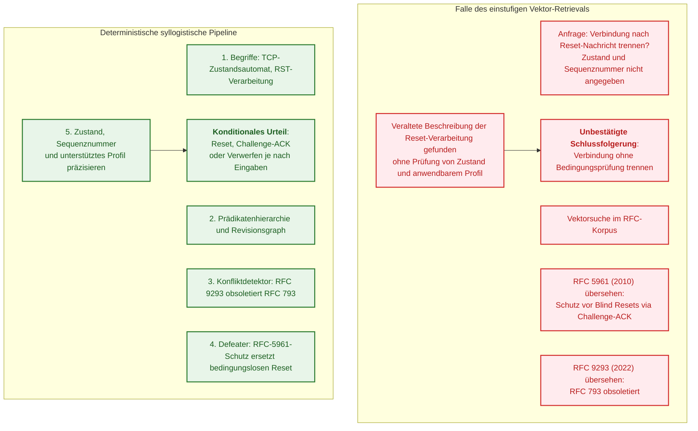
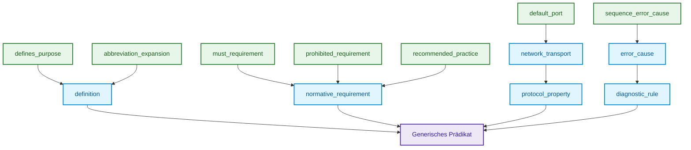
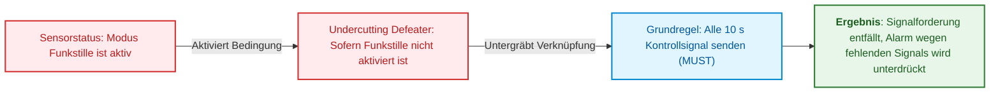
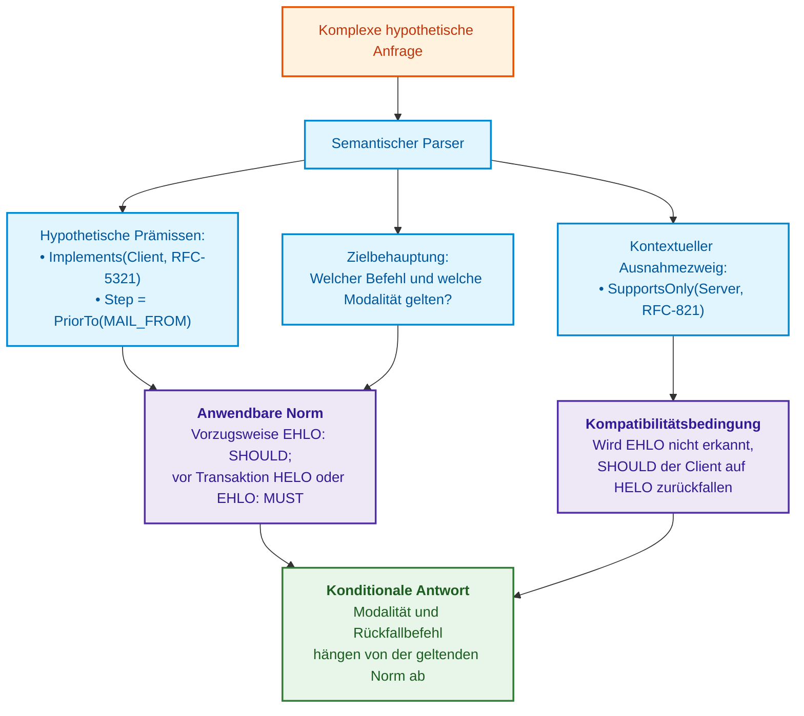

# Kapitel 31. Normenbasierte Inferenz: Prädikatenhierarchien, Ausnahmen und Geltung

> **Buch:** [Architektur evidenzbasierter Expertensysteme](README.md) · [Teil IV: Architektur, Technologie-Stack, Inferenz und Aktion](part-04-architecture-and-inference.md)  
> **Vorheriges Kapitel:** [Kapitel 19. Von der Frage zum Beweis: Suche, Bindung und Prüfung von Behauptungen](ch19-from-question-to-evidence.md)  
> **Nächstes Kapitel:** [Kapitel 20. Erklärungskomponente: Entscheidungen, Ablehnung und Kompetenzgrenzen](ch20-explanation-engine.md)  
> **Inhaltsverzeichnis:** [README.md](README.md)  
> **Autor:** [Mykola Fedchyk](about-the-author.md)  
> **Niveau:** Fortgeschritten: Entwickler von Inferenzmaschinen, Systemarchitekten, Knowledge Engineers, Spezialisten für formale Methoden  
> **Lernziele:** Quellenabruf (*Retrieval*) strikt von logischer Inferenz unterscheiden; Prädikatenhierarchien ohne unzulässige Rückwärtsspezialisierung konstruieren; bei unbekanntem Ausnahmestatus deterministisch verweigern (*Fail-Closed*); Rebutting Defeater von Undercutting Defeater differenzieren; die Geltung einer Norm im gegebenen Kontext mittels eines ASP-Programms mit Fail-Closed-Verhalten verifizieren; den Nutzen von RDFS, SPARQL, ASPIC+ und Knowledge Mining für Hierarchien und Ausnahmen fundiert bewerten; Inferenzpfade auditieren und die Grenzen des didaktischen Inferenzschritts in Go verstehen.

---

## Abstract

Man stelle sich ein industrielles SCADA-System oder das Bordnetz eines autonomen Transportsystems vor (IEC 62443 / ISO 26262), in dem ein automatisierter Netzwerkagent ein unerwartetes Reset-Paket (TCP RST) analysiert. Ein Vektor-Retrieval findet augenblicklich die einschlägige Klausel aus RFC 9293: „Bei Empfang eines RST muss die Verbindung unverzüglich getrennt werden.“ Akzeptiert der Agent diese allgemeine Regel als direkte Handlungsanweisung, ohne den Verbindungszustand (`SYN-SENT` oder `ESTABLISHED`), die Sequenznummer sowie das spezifische Sicherheitsprofil (beispielsweise die Schutzanforderungen gegen Session-Hijacking nach RFC 5961) zu verifizieren, trennt er eine aktive Notfalltelemetriesitzung oder die Bremsverriegelung (*Interlock*). Die Interpretation fehlender Informationen über Ausnahmen als Handlungsfreigabe („da in der Anfrage keine Sequenznummer erwähnt wurde, muss sie folglich nicht geprüft werden“) führt zur Notabschaltung der Fertigungslinie oder zur Deaktivierung der Fahrstabilisierung bei voller Fahrt.

Die Leitfrage dieses Kapitels lautet: **Wie lässt sich eine deterministische Schlussfolgerung aus mehreren miteinander verknüpften normativen Grundlagen ableiten, eine Prädikatenhierarchie entfalten und mathematisch garantieren, dass ein unbekannter Ausnahmestatus niemals in eine gefährliche Freigabe umschlägt?**

Dieses Kapitel trennt den Quellenabruf, Prädikatenverbände, die formale Ausnahmebehandlung (anfechtbares Schließen über Horn-Klauseln und ASPIC+-Logik) sowie die Auswahl der geltenden Norm strikt voneinander. Ein Suchprozess kann mehrstufig oder graphbasiert operieren, sein Ergebnis liefert jedoch stets nur Rohmaterial für den logischen Inferenzkern. Ein didaktisches Go-Beispiel implementiert die Validierung des Inferenzpfads, während ein deklaratives Modell in Answer Set Programming (ASP / clingo) die Normenauswahl für neun Grenzszenarien der Netzwerkpaketverarbeitung formal überprüft. Der Determinismus logischer Inferenz garantiert jedoch keineswegs die Faktizität der Eingangsannahmen, weshalb die strikte Grenzziehung zwischen Beweisführung und Tatsachenbasis unantastbar bleibt.

---

## 1. Warum einstufiges Retrieval keine normative Inferenz liefert

Moderne semantische Suchpipelines stützen sich auf die Optimierung der Kosinusähnlichkeit hochdimensionaler Vektoreinbettungen (*Embeddings*):

```math
\text{Query} \xrightarrow{\text{Embed}} \mathbf{v}_q \implies \arg\max_k \cos(\mathbf{v}_q, \mathbf{v}_k).
```

Bezeichnungen des Vektor-Retrievals:

- $\text{Query}$ ist die textuelle Anfrage des Ingenieurs oder Operators;
- $\text{Embed}$ bezeichnet die Abbildungsfunktion von Text in einen reellwertigen Vektorraum;
- $\mathbf{v}_q$ ist der Anfragevektor im latenten Einbettungsraum;
- $\mathbf{v}_k$ bezeichnet die indizierten Vektoren gespeicherter Dokumentfragmente (*Chunks*);
- $\cos(\mathbf{v}_q, \mathbf{v}_k)$ ist die Kosinusähnlichkeit der Vektoren im Intervall $[-1, 1]$;
- $\arg\max_k$ selektiert den Index des Chunks mit der höchsten geometrischen Nähe.

Diese Formulierung beschreibt ein Ranking nach inhaltlicher Vektorähnlichkeit, keineswegs jedoch die Verifikation der logischen Geltung einer Norm. Geometrische Nähe beschränkt sich zwar nicht auf Wortübereinstimmungen, liefert aber keinen formalen Beweis der normativen Anwendbarkeit.

Das folgende Diagramm veranschaulicht das typische Versagen einer Pipeline, die Anwendungsbedingungen der aufgefundenen Norm nicht formal verifiziert:



### 1.1. Wo die Ähnlichkeitssuche die Logik der Normen verfehlt

1. **Prämissen sind über Dokumente fragmentiert.** Eine Grundregel ist in einem Standard fixiert, die Ausnahme in einem zweiten, und die Außerkraftsetzung (*Obsoletierung*) der Altversion in einem dritten Dokument, das Jahrzehnte später publiziert wurde. Die Ähnlichkeitssuche bewertet jeden Chunk isoliert. Sie liefert womöglich alle drei Fragmente zurück, stellt jedoch nicht fest, dass das dritte Dokument das erste aufhebt (*Lex Posterior*) und das zweite dessen Gültigkeitsbereich einschränkt (*Lex Specialis*). Diese Abhängigkeiten konstituieren explizite Dokumenten- und Normenrelationen, die strukturiert im Wissensgraphen abgebildet werden müssen.
2. **Verbindlichkeitsgrade spiegeln sich nicht im Vektor wider.** Schlüsselwörter wie `MUST`, `SHOULD`, `RECOMMENDED` und `MAY` treten in strukturell identischen Kontexten auf, weshalb ihre Einbettungsvektoren nahezu ununterscheidbar nah beieinander liegen. Vektornähe garantiert keineswegs die Bewahrung der normativen Verbindlichkeitsstufen, wie sie in RFC 2119 und RFC 8174 definiert sind [[1]](#src-1) [[2]](#src-2). RFC 8174 führt eine weitere formale Feinheit ein: Ausschlaggebende normative Bindekraft besitzen ausschließlich großgeschriebene Schlüsselwörter; statistische Sprachmodelle ignorieren Groß- und Kleinschreibung jedoch häufig. Daher muss die deontische Modalität als eigenständiges Feld des Urteilstupels persistiert und darf nicht aus Textähnlichkeiten extrapoliert werden.
3. **Abwesenheit eines Eintrags wird fälschlich als Negation interpretiert.** Fehlt in der Wissensbasis ein explizites Handlungsverbot, folgert eine Inferenzmaschine mit Negation als Fehlschlag (*Negation as Failure*, NAF, wie im Standard-Prolog), dass kein Verbot vorliegt. Dies ist ausschließlich in explizit geschlossenen Wissensdomänen zulässig. In allen übrigen Fällen bedeutet das Fehlen von Daten den epistemischen Status „unbekannt“ (*Unknown*), woraufhin das System nach dem Prinzip des geschlossenen Ausfalls (*Fail-Closed*) blockieren muss.

---

## 2. Begriff, Urteil und Schluss

Für das didaktische Modell trennen wir Begriff, Urteil und Inferenzschritt strikt. Die klassischen kategorischen Syllogismen des Aristoteles bilden das historische Fundament formaler Logik [[3]](#src-3); das nachfolgend eingeführte normative Tupel stellt jedoch eine moderne ingenieurtechnische Abstraktion dieses Buches dar und ist keine buchstäbliche Rekonstruktion aristotelischer oder peircescher Notationen.

```mermaid
flowchart LR
    accTitle: Triade des Denkens: Begriff, Urteil, Schluss
    accDescr: Struktureller Übergang von Entitäten und Prädikaten zu bewiesenen Syllogismen.

    subgraph Level1["1. Begriffsebene"]
        direction TB
        TERM["<b>Terminus (Begriff)</b><br/>• Intension (Merkmale)<br/>• Extension (Umfang)"]
        LATTICE["<b>Prädikatenhierarchie</b><br/>Subsumtion: Sub ⊑ Super"]
    end

    subgraph Level2["2. Urteilsebene"]
        direction TB
        PROP["<b>Urteil (Proposition)</b><br/>Subjekt, Relation, Objekt"]
        MODAL["<b>Deontische Modalität</b><br/>MUST, SHOULD, MAY, MUST_NOT"]
        DEFEAT["<b>Defeater</b><br/>Ausnahmebedingungen (UNLESS)"]
    end

    subgraph Level3["3. Schlussebene"]
        direction TB
        PREM["<b>Prämissen des Syllogismus</b><br/>Obersatz und Untersatz"]
        RULES["<b>Inferenzregeln</b><br/>Modus Ponens, Subsumtion"]
        DAG["<b>Inferenzpfad (Proof Trace)</b><br/>Regel · Begründung · Ergebnis"]
    end

    Level1 ==> Level2 ==> Level3

    classDef c1 fill:#e1f5fe,stroke:#0288d1,stroke-width:2px,color:#01579b;
    classDef c2 fill:#fff3e0,stroke:#e65100,stroke-width:2px,color:#bf360c;
    classDef c3 fill:#e8f5e9,stroke:#2e7d32,stroke-width:2px,color:#1b5e20;

    class TERM,LATTICE c1;
    class PROP,MODAL,DEFEAT c2;
    class PREM,RULES,DAG c3;
```



### 2.1. Der Begriff

Ein Begriff formalisiert eine abstrakte Entität oder ein physikalisches Objekt der Ingenieurdomäne. Er wird mathematisch durch ein Mengenpaar beschrieben:
- **Intension (Begriffsinhalt):** Die Menge aller wesentlichen Merkmale, Eigenschaften und Invarianten, die den Begriff eindeutig von anderen Entitäten abgrenzen:

```math
\text{Intension}(C) = \{ P_1, P_2, \dots, P_k \}.
```

Bestandteile der Intension:

- $C$ ist der Begriff der Fachdomäne;
- $\text{Intension}(C)$ ist die Menge der konstitutiven Merkmale und Invarianten des Begriffs;
- $P_1, \dots, P_k$ sind Eigenschaftsprädikate, die das Wesen der Entität determinieren;
- $k$ ist die Anzahl der obligatorischen Merkmale der Definition.

- **Extension (Begriffsumfang):** Die Menge aller konkreten Instanzen oder Spezialisierungen, die sämtliche Merkmale der Intension erfüllen:

```math
\text{Extension}(C) = \{ x \mid \forall P \in \text{Intension}(C) : P(x) = \text{True} \}.
```

Symbole der Extension:

- $\text{Extension}(C)$ bezeichnet den Begriffsumfang, also die Menge aller konkreten Objekte;
- $x$ steht für eine konkrete Ingenieurentität oder Instanz;
- $\forall P$ fordert die Gültigkeit jedes Merkmals $P$ der Intension für das gegebene Objekt;
- $\text{True}$ belegt die Erfüllung der Bedingung durch das Objekt.

Zwischen Begriffen gilt das fundamentale **Gesetz des umgekehrten Verhältnisses von Begriffsinhalt und Begriffsumfang**: Je reichhaltiger die Intension (je mehr einschränkende Merkmale einer Definition hinzugefügt werden), desto enger wird die Extension (desto weniger Entitäten erfüllen diese Definition).

### 2.2. Das Urteil

Ein Urteil affirmiert oder negiert das Bestehen einer Relation zwischen Begriffen. In einem beweisbasierten Expertensystem wird ein Urteil als erweitertes semantisches Tupel formalisiert:

```math
\mathcal{J} = \langle \text{Subject}, \; \mathcal{R}, \; \text{Object}, \; \mathcal{M}, \; \mathcal{D}, \; \text{Provenance} \rangle.
```

Elemente des normativen Urteils:

- $\mathcal{J}$ ist das formale Tupel des normativen Urteils;
- $\text{Subject}$ und $\text{Object}$ sind Konzepte im ingenieurtechnischen Domänenraum;
- $\mathcal{R}$ ist ein Prädikat aus der Relationen- und Prädikatenhierarchie;
- $`\mathcal{M} \in \{ \text{MUST}, \text{MUST-NOT}, \text{SHOULD}, \text{SHOULD-NOT}, \text{MAY} \}`$ bezeichnet die deontische normative Modalität;
- $`\mathcal{D} = \{ d_1, d_2, \dots \}`$ ist die Menge anfechtender Ausnahmebedingungen (*Defeater*);
- $\text{Provenance}$ ist der Herkunftsnachweis der Primärquelle (Dokumenten-ID, kryptografischer SHA-256-Hash und Bytestellen-Offsets).

### 2.3. Der Schluss

Ein Syllogismus ist ein deterministischer Inferenzschritt, bei dem aus zwei Prämissen (dem Obersatz und dem Untersatz), die über einen gemeinsamen Mittelbegriff ($M$) verfügen, mit logischer Notwendigkeit ein drittes Urteil (die Konklusion bzw. der Schluss) folgt:

```math
\frac{\text{Major Premise: } \forall x : M(x) \xrightarrow{\mathcal{M}} P(x), \quad \text{Minor Premise: } M(S)}{\text{Conclusion: } S \xrightarrow{\mathcal{M}} P}.
```

Konstitutive Elemente des Syllogismus:

- $\text{Major Premise}$ ist der Obersatz der allgemeinen Regel für alle Entitäten der Klasse $M$;
- $\text{Minor Premise}$ ist der Untersatz, der die Zugehörigkeit des Subjekts $S$ zur Klasse $M$ feststellt;
- $M$ ist der Mittelbegriff (*terminus medius*), der beide Prämissen relational bindet;
- $\text{Conclusion}$ ist die logisch zwingende Konklusion über die Gültigkeit der Eigenschaft $P$ für Subjekt $S$;
- $\mathcal{M}$ bezeichnet die strikt bewahrte deontische Modalität der Norm.

**Anwendungsbeispiel im automatisierten Protokollaudit:** Das Simple Mail Transfer Protocol (SMTP) trennt strikt zwischen Client und Server. Gemäß Abschnitt 4.1.1.1 von RFC 5321 muss ein SMTP-Client vor Beginn einer Mail-Transaktion den Befehl `HELO` oder `EHLO` absetzen [[4]](#src-4).

1. Obersatz: Für einen SMTP-Client ist vor Beginn einer Mail-Transaktion der Befehl `HELO` oder `EHLO` obligatorisch (`MUST`).
2. Untersatz: In einem verifizierten oder explizit hypothetischen Kontext ist `MailClient-01` ein solcher Client und leitet eine Transaktion ein.
3. Konditionale Konklusion: Für `MailClient-01` gilt exakt diese Anforderung, keineswegs jedoch die isolierte Forderung nach ausschließlicher Nutzung von `EHLO`.

Wurde die Client-Rolle lediglich im Rahmen einer kontrafaktischen „Was-wäre-wenn“-Anfrage postuliert, verbleibt auch der Schluss rein hypothetisch. Für ein operatives Sicherheitsaudit ist ein unabhängig verifizierter Zustand zwingend erforderlich. Ein erfolgreicher TCP-Verbindungsaufbau garantiert keineswegs das Zustandekommen einer SMTP-Sitzung: Abschnitt 3.1 von RFC 5321 gestattet dem Server eine initiale Verweigerung mittels Statuscode 554.

---

## 3. Prädikatenhierarchie und Semantik der Subsumtion

Stellt ein Ingenieur eine generalisierte Anfrage: *„Welche Sicherheitsanforderungen gelten für Protokoll X?“*, darf sich das System keinesfalls auf die Suche nach Prädikaten mit dem wörtlichen Bezeichner `security_requirement` beschränken. In realen Wissensbasen stammen Fakten aus disparaten Abschnitten und tragen Bezeichner wie `must_encrypt_channel`, `authenticate_peer_certificate` oder `validate_sequence_number`.

Um generalisierte Abfragen deterministisch aufzulösen, werden Prädikate in einer azyklischen Hierarchie strukturiert. Die Erreichbarkeit im gerichteten Graphen definiert eine Halbordnung der Spezialisierung:

```math
\mathcal{L} = \langle \mathcal{R}, \sqsubseteq \rangle.
```

Notationen der Hierarchie:

- $\mathcal{L}$ ist die partiell geordnete Menge (*Poset*) von Prädikaten;
- $\mathcal{R}$ ist die Menge aller ingenieurtechnischen Relationstypen;
- $\sqsubseteq$ bezeichnet die Halbordnungsrelation der Subsumtion (Spezialisierung).

Die Relation $R_1 \sqsubseteq R_2$ besagt, dass das Prädikat $R_1$ das Prädikat $R_2$ spezialisiert. So spezialisiert `must_requirement` das allgemeinere `normative_requirement`. Eine Hierarchie darf erst dann als Verband (*Lattice*) bezeichnet werden, wenn für jedes Paar von Elementen ein eindeutiges Infimum (größte untere Schranke, Meet $\sqcap$) und Supremum (kleinste obere Schranke, Join $\sqcup$) existiert. Der nachfolgende Graph und Beispielcode verzichten auf diese Verbandsoperationen, da für die Pfadprüfung eine reine Baum- bzw. DAG-Struktur genügt.



### 3.1. Mathematische Gesetze gerichteter Subsumtion

Die Halbordnung erfüllt folgende Axiome:
1. **Reflexivität:** $\forall R \in \mathcal{R} : R \sqsubseteq R$.
2. **Antisymmetrie:** $\forall R_1, R_2 \in \mathcal{R} : (R_1 \sqsubseteq R_2 \land R_2 \sqsubseteq R_1) \implies R_1 = R_2$.
3. **Transitivität:** $\forall R_1, R_2, R_3 \in \mathcal{R} : (R_1 \sqsubseteq R_2 \land R_2 \sqsubseteq R_3) \implies R_1 \sqsubseteq R_3$.

**Regel der Anfragegeneralisierung.**  
Eine in der Wissensbasis persistierte Relation $R_{\text{fact}}$ erfüllt eine Benutzeranfrage mit Prädikat $R_{\text{query}}$ genau dann, wenn sie sich im Teilbaum der Nachkommen des angefragten Prädikats befindet:

```math
\text{Matches}(R_{\text{query}}, R_{\text{fact}}) \iff R_{\text{fact}} \sqsubseteq^* R_{\text{query}}.
```

In der Regel gerichteter Subsumtion:

- $\text{Matches}$ ist die boolesche Validierungsfunktion der Faktenanwendbarkeit auf die Anfrage;
- $R_{\text{query}}$ ist das Prädikat aus der Benutzeranfrage;
- $R_{\text{fact}}$ ist das in der Wissensbasis explizit hinterlegte Faktenprädikat;
- $\sqsubseteq^*$ bezeichnet die reflexiv-transitive Hülle der Subsumtion (Existenz eines gerichteten Pfades zur Verallgemeinerung).

**Verbot der Rückwärtsspezialisierung.**  
Fordert die Anfrage eines Sicherheitsprüfers ein konkretes striktes Verbot $R_{\text{specific}}$ (etwa `prohibited_requirement`), ist es kategorisch unzulässig, ein allgemeines übergeordnetes Faktum $R_{\text{general}}$ (`normative_requirement`) zurückzugeben, da eine allgemeine normative Vorgabe keineswegs die Erfüllung eines spezifischen Verbots garantiert:

```math
R_{\text{general}} \not\sqsubseteq^* R_{\text{specific}} \quad \text{wenn } R_{\text{specific}} \sqsubset R_{\text{general}}.
```

Bezeichnungen des Spezialisierungsverbots:

- $R_{\text{general}}$ ist das allgemeinere Prädikat auf höherer Hierarchiestufe;
- $R_{\text{specific}}$ ist das strikte Prädikat einer untergeordneten Ebene;
- $\not\sqsubseteq^*$ verbietet den Match: Die Existenz einer allgemeinen Anforderung beweist nicht die Erfüllung einer spezifischen Ausnahme- oder Verbotsnorm.

### 3.2. Abgleich natürlicher Phrasen mit Prädikaten

In einer industriellen Pipeline formulieren Ingenieure ihre Anfragen selten in den formalen Termini der internen Ontologie. Ein Entwickler fragt: *„Welcher Standardport gehört zu BGP?“*, *„Wurde RFC 821 für ungültig erklärt?“* oder *„Durch welchen Standard wird dieses Dokument ersetzt?“*.

Ein kontrolliertes Vokabular oder ein syntaktischer Sprachanalysator gleicht die natürlichsprachliche Phrase zunächst mit einem registrierten kanonischen Prädikat ab. Die Hierarchie selbst interpretiert keine natürliche Sprache und erzeugt keine heuristischen Synonyme.

1. Ein eindeutiges Mapping verknüpft die Phrase mit einem konkreten Prädikat und einer kontrollierten Wörterbuchversion.
2. Für eine generalisierte Abfrage wird der Pfad von diesem Prädikat zu den Vorfahren validiert; eine Rückwärtsspezialisierung ist verboten.
3. Unbekannte oder mehrdeutige Phrasen erzwingen eine Klärungsinteraktion (*Clarification Dialog*). Eine Phrase erhält nicht allein deshalb ein bestimmtes Ahnenprädikat, weil im Text das Wort „veraltet“ auftaucht.

Latenz und Präzision dieses Abgleichs müssen an konkreten Testkorpora evaluiert werden. Auch ein deterministisches Wörterbuch kann fehlerhafte Zuordnungen aufweisen; Reproduzierbarkeit darf nicht mit inhaltlicher Korrektheit verwechselt werden.

### 3.3. Disambiguierung gleichnamiger Dokumente entlang der Geltungslinie

Eine typische Fehlerquelle technischer Korpora ist die **Polysemie von Entitätsnamen**: Ein und dieselbe Dokument- oder Protokollbezeichnung tritt in Dutzenden Spezifikationen unterschiedlicher Dekaden auf. So referenziert der Name *„Simple Mail Transfer Protocol“* gleichermaßen RFC 821 (1982), RFC 2821 (2001) und RFC 5321 (2008).

Wird ein Dokument nach seinem Titel ohne explizite Normennummer angefragt, liefert ein naives Retrieval drei konfligierende Dokumentfragmente, was zum stillschweigenden Rückgriff auf eine veraltete Spezifikation führen kann.

Um dieses Versagen auszuschließen, nutzt der Inferenzkern eine **Disambiguierung über den Geltungsgraphen**:
1. Der Resolver evaluiert Revision, Domäne, Veröffentlichungsdatum und das Ziel der Anfrage: operative Sicherheitsprüfung des Ist-Zustands oder historische Rekonstruktion.
2. Für eine aktuelle Konformitätsprüfung kann die einzig gültige Revision gewählt werden, keineswegs jedoch für Fragen zu Altsystemen allein aufgrund eines neueren Datums.
3. Liegen mehrere geltende Revisionen vor oder ist der Status unbestimmt, initiiert das System einen Klärungsdialog. Die Abstammungslinie eines Dokuments determiniert nicht automatisch, welche Spezifikationsprofile ein konkretes industrielles Erzeugnis tatsächlich implementiert.

---

## 4. Kleenes dreiwertige Logik und Pollocks Defeater

Zwei boolesche Wahrheitswerte implizieren für sich genommen keineswegs die Annahme einer geschlossenen Welt (*Closed-World Assumption*, CWA). Ob fehlende Fakten als falsch gewertet werden, ist eine bewusste epistemische Architekturentscheidung. Im hier dargestellten Modell besitzt ein fehlendes Prüfergebnis grundsätzlich den Status „unbekannt“ (*Unknown*). Nur für explizit als vollständig deklarierte Datenbereiche darf von diesem Fail-Closed-Verhalten abgewichen werden ([Kapitel 7](ch07-knowledge-base-typology.md)).

Zur didaktischen Formalisierung von Inferenz unter unvollständiger Information nutzen wir die **starke dreiwertige Logik nach Kleene** (*Strong Kleene 3-Valued Logic*, 3VL) [[5]](#src-5):

```math
\mathcal{V}_3 = \{ \text{True}, \; \text{False}, \; \text{Unknown} \}.
```

Wahrheitswerte der Kleene-Logik:

- $\mathcal{V}_3$ ist der dreiwertige Wahrheitsraum nach Strong Kleene;
- $\text{True}$ repräsentiert die formal bewiesene Wahrheit einer Aussage;
- $\text{False}$ repräsentiert die formal bewiesene Falschheit;
- $\text{Unknown}$ kennzeichnet fehlende Daten oder Unbestimmtheit, ohne dass Falschheit unterstellt werden darf.

### 4.1. Wahrheitstafel der starken Kleene-Logik

| $A$ | $B$ | $A \land B$ | $A \lor B$ | $\neg A$ | $A \to B$ |
| :---: | :---: | :---: | :---: | :---: | :---: |
| $\text{True}$ | $\text{True}$ | $\text{True}$ | $\text{True}$ | $\text{False}$ | $\text{True}$ |
| $\text{True}$ | $\text{False}$ | $\text{False}$ | $\text{True}$ | $\text{False}$ | $\text{False}$ |
| $\text{True}$ | $\text{Unknown}$ | $\mathbf{Unknown}$ | $\text{True}$ | $\text{False}$ | $\mathbf{Unknown}$ |
| $\text{False}$ | $\text{True}$ | $\text{False}$ | $\text{True}$ | $\text{True}$ | $\text{True}$ |
| $\text{False}$ | $\text{False}$ | $\text{False}$ | $\text{False}$ | $\text{True}$ | $\text{True}$ |
| $\text{False}$ | $\text{Unknown}$ | $\text{False}$ | $\mathbf{Unknown}$ | $\text{True}$ | $\text{True}$ |
| $\text{Unknown}$ | $\text{True}$ | $\mathbf{Unknown}$ | $\text{True}$ | $\mathbf{Unknown}$ | $\text{True}$ |
| $\text{Unknown}$ | $\text{False}$ | $\text{False}$ | $\mathbf{Unknown}$ | $\mathbf{Unknown}$ | $\mathbf{Unknown}$ |
| $\text{Unknown}$ | $\text{Unknown}$ | $\mathbf{Unknown}$ | $\mathbf{Unknown}$ | $\mathbf{Unknown}$ | $\mathbf{Unknown}$ |

### 4.2. Informationsordnung und Fail-Closed-Verhalten

In der Kleene-Logik wird eine Halbordnung nach Informationsgehalt ($\le_i$) definiert:

```math
\text{Unknown} \le_i \text{True}, \quad \text{Unknown} \le_i \text{False}.
```

Informationsordnung:

- $\le_i$ ist die Halbordnung wachsenden Wissens (*Information Ordering*);
- Die Ungleichungen besagen, dass der Zustand $\text{Unknown}$ minimale Information trägt, während der Übergang zu $\text{True}$ oder $\text{False}$ den Informationsgehalt monoton steigert.

Eine Funktion $f$ ist informationsmonoton, wenn ein Erkenntnisgewinn (der Übergang von $\text{Unknown}$ zu $\text{True}$ oder $\text{False}$) ein bereits ermitteltes deterministisches Ergebnis niemals ins Gegenteil verkehrt.

> [!IMPORTANT]
> **Das Prinzip des geschlossenen Ausfalls (Fail-Closed).**  
> Evaluiert eine zwingend vorgeschriebene Bedingung zu $\text{Unknown}$, verweigert die Sicherheitsarchitektur die Ausführung und benennt die fehlenden Primärfakten. Dies ist ein deterministisches Schutzverhalten des Verifikators, keine Zertifizierungsfreigabe.

### 4.3. Defeater nach Pollock

In technischen Standards besitzen Normen überwiegend anfechtbaren (*defeasible*) Charakter: Sie beanspruchen Gültigkeit, solange keine Ausnahmebedingung greift. Der Philosoph John Pollock differenzierte zwei fundamentale Klassen von Einwänden (*Defeaters*) [[6]](#src-6):

1. **Rebutting Defeater (Widerlegender Einwand)**  
   Greift unmittelbar die Konklusion an, indem eine diametral entgegengesetzte Aussage abgeleitet wird:

```math
A \implies P, \quad B \implies \neg P.
```

Parameter des direkten Widerlegers:

- $A$ und $B$ sind die Prämissen zweier konkurrierender Regeln;
- $P$ ist die behauptete Konklusion und $\neg P$ deren logische Negation;
- Ein Rebutting Defeater erzeugt zunächst eine Antinomie zweier Argumente; welches davon obsiegt, entscheidet eine explizite Vorrangrelation (etwa „speziellere Norm bricht allgemeinere Norm“).

2. **Undercutting Defeater (Untergrabender Einwand)**  
   Greift den Geltungszusammenhang zwischen Prämisse und Konklusion an. Er besagt, dass die Regel unter den gegebenen Bedingungen suspendiert ist, ohne notwendigerweise die Falschheit der Konklusion zu behaupten:

```math
U \implies \neg (A \hookrightarrow P).
```

Komponenten des untergrabenden Einwands:

- $U$ ist eine kontextuelle Ausnahmebedingung (etwa der Zustand absoluter Funkstille);
- $A \hookrightarrow P$ bezeichnet die normative Verknüpfung zwischen Tatbestand und Handlungspflicht;
- $\neg (A \hookrightarrow P)$ annulliert die Handlungspflicht, ohne das Gegenteil zu affirmieren.



Diese theoretische Unterscheidung hat gravierende ingenieurtechnische Konsequenzen: Ein Undercutting Defeater hinterlässt das Expertensystem ohne Handlungsanweisung. Die Regel ist unanwendbar; die Systemantwort muss die suspendierte Regel nebst Ausnahmebedingung benennen, ohne eine Ersatzaktion zu fingieren. Ein Rebutting Defeater hingegen liefert eine alternative Konklusion, sodass lediglich ein Vorrangkonflikt zwischen zwei wohlgeformten Handlungsoptionen zu lösen ist. Sanjay Modgil und Henry Prakken formalisierten im ASPIC+-Framework für strukturierte Argumentation beide Angriffsarten zusammen mit einer dritten: dem Untergraben von Prämissen (*Undermining*) [[7]](#src-7). In ASPIC+ ist ein Undercutting-Angriff auf eine Inferenzregel unabhängig von Prioritätsordnungen stets erfolgreich, während Angriffe auf Konklusionen (Rebutting) oder Prämissen (Undermining) von der Präferenzrelation zwischen Argumenten abhängen. Das Go-Programm in Abschnitt 8 implementiert exakt diese Differenzierung: Ein Undercutting Defeater führt zur fundierten Verweigerung ohne Handlungsvorschlag; ein Rebutting Defeater liefert eine alternative Konklusion samt eigener Primärquelle. Der Vorrang wird durch den Wissensingenieur bei der Regelkonstruktion explizit festgelegt; zwei unpriorisierte, konfligierende Regeln führen deterministisch zur Verweigerung.

---

## 5. Untersuchung von Konflikten zwischen Dokumenten: Evolution des TCP-Protokolls

Die Evolution des Transmission Control Protocol (TCP) demonstriert mustergültig, warum eine neuere Revision keineswegs das pauschale Verbot einer früheren Verhaltensweise bedeutet. RFC 793 definierte das ursprüngliche Protokollverhalten [[8]](#src-8); RFC 5961 führte Schutzmechanismen gegen Blind-Reset-Angriffe ein [[9]](#src-9); RFC 9293 schließlich ersetzte RFC 793 vollständig und differenziert in Abschnitt 3.10.7.4 explizit zwischen Implementierungen mit und ohne Unterstützung dieses Schutzes [[10]](#src-10).

Für die in Abschnitt 3.10.7.4 spezifizierten synchronisierten Zustände existieren bei aktiver Unterstützung von RFC 5961 drei disjunkte Prüffälle bei Empfang eines Reset-Segments (RST):

| Bedingung der Sequenznummer | Aktion | Unzulässige Fehlinterpretation |
|---|---|---|
| Außerhalb des aktuellen Empfangsfensters | Segment verwerfen, keine Antwort | Dass Resets generell unzulässig seien |
| Exakt gleich `RCV.NXT` (nächste erwartete Nummer) | Verbindung gemäß Zustand sofort zurücksetzen | Dass stets ein Challenge-ACK erforderlich sei |
| Im Fenster, aber ungleich `RCV.NXT` | Challenge-ACK senden und Segment verwerfen | Dass das bloße Treffen des Fensters zum Reset genügt |

Ohne Unterstützung von RFC 5961 bewahrt RFC 9293 das historische Verhalten von RFC 793: Nach Abschnitt 3.5.3 ist ein Reset verbindlich, sobald seine Sequenznummer in das Empfangsfenster fällt; Segmente außerhalb werden stillschweigend verworfen.

Sind der Verbindungszustand oder das unterstützte Sicherheitsprofil unbekannt, verweigert das Expertensystem die Entscheidung und fordert eine Präzisierung. Eine Dokumenten-Ablösungsrelation ersetzt weder diese Eingangsdaten noch die Prüfung der Geltungsbedingungen der anwendbaren Norm.

### 5.1. Ausführbares Normenauswahlmodell in ASP

Die obige Entscheidungstabelle lässt sich als Programm in Answer Set Programming (ASP) abbilden und mit dem Solver clingo ausführen, der von Martin Gebser, Roland Kaminski, Benjamin Kaufmann und Torsten Schaub entwickelt wurde [[11]](#src-11). ASP eignet sich aus zwei Gründen hervorragend für diese Aufgabe: Erstens erlaubt Negation as Failure die elegante Kodierung der Regel „ein Dokument gilt, sofern es nicht durch ein anderes obsoletiert wurde“ in einer einzigen Zeile. Zweitens garantiert ein stratifiziertes Programm (ein Programm ohne Rekursion über Negation) genau ein stabiles Modell (*Answer Set*), wodurch die Schlussfolgerung unabhängig von der Auswertungsreihenfolge ist. Negation as Failure birgt jedoch das inhärente Risiko, dass ein fehlender Eintrag über eine Obsoletierung die veraltete Norm fälschlich als aktiv einstuft. Deshalb implementiert das Modell Fail-Closed-Regeln für sechs Szenarien: fehlendes Eingangsfaktum; Verbindungszustand außerhalb des Modells; Norm referenziert nicht registriertes Dokument; Registervollständigkeit nicht bestätigt; zwei aktive Normen konfligieren; keine Norm anwendbar.

<details>
<summary>Normenauswahlmodell in ASP (Datei norms.lp)</summary>

```prolog
% Dokumentenregister und Ablösungsfolge (Geltungslinie) nach Angaben des RFC Editor.
document(rfc793). document(rfc9293).
obsoletes(rfc9293, rfc793).
% Register mit dem Index des RFC Editor für den Bereich „RST-Verarbeitung in TCP“ abgeglichen.
complete(tcp_rst).

% norm(Dokument, Schutz RFC 5961, Lage der Sequenznummer, Aktion).
% RFC 9293, Abschnitt 3.10.7.4: Mit Schutzunterstützung greifen drei Prüfungen.
norm(rfc9293, yes, out_of_window, drop).
norm(rfc9293, yes, exact, reset).
norm(rfc9293, yes, in_window_not_exact, challenge_ack).
% Ohne Schutz ist der Reset gültig, falls die Nummer ins Empfangsfenster fällt (Abschnitt 3.5.3).
norm(rfc9293, no, out_of_window, drop).
norm(rfc9293, no, exact, reset).
norm(rfc9293, no, in_window_not_exact, reset).
% RFC 793 kannte den Schutz nach RFC 5961 nicht und setzte die Verbindung bei jeder Nummer im Fenster zurück.
norm(rfc793, P, out_of_window, drop) :- protection(P).
norm(rfc793, P, exact, reset) :- protection(P).
norm(rfc793, P, in_window_not_exact, reset) :- protection(P).
protection(yes; no).

% Das Modell umfasst nur synchronisierte Zustände, in denen ein RST die Verbindung nach CLOSED überführt.
synchronized(established; fin_wait_1; fin_wait_2; close_wait; closing; last_ack; time_wait).

% Geltende Revision: ein Dokument aus dem Register, das nicht abgelöst (obsoletiert) wurde.
superseded(D) :- obsoletes(_, D).
active(D) :- document(D), not superseded(D).

% Fail-Closed: Jede Verweigerungsursache blockiert die Antwort und benennt das fehlende Faktum.
required(state; protection; seq).
known(K) :- input(K, _).
clarify(missing(K)) :- required(K), not known(K).
clarify(out_of_model(S)) :- input(state, S), not synchronized(S).
clarify(unregistered_source(D)) :- norm(D, _, _, _), not document(D).
clarify(registry_incomplete) :- not complete(tcp_rst).

candidate(D, A) :- active(D), input(protection, P), input(seq, Q), norm(D, P, Q, A).
clarify(conflict(A1, A2)) :- candidate(_, A1), candidate(_, A2), A1 < A2.
has_candidate :- candidate(_, _).
clarify(no_applicable_norm) :- known(protection), known(seq), not has_candidate.

blocked :- clarify(_).
answer(A, D) :- candidate(D, A), not blocked.

#show answer/2.
#show clarify/1.
```

</details>

Das folgende Python-Skript injiziert Fakten für neun Testfälle in das ASP-Modell. In drei Szenarien wird gezielt ein Registerfaktum entfernt, um Defekte der Wissensbasis selbst zu simulieren. Zur Ausführung ist das Paket clingo erforderlich (`pip install clingo`); das Skript wurde unter Python 3.14 mit clingo 5.8.2 verifiziert. Beide Dateien werden im selben Verzeichnis abgelegt und mittels `python check_norms.py` ausgeführt.

<details>
<summary>Python-Testskript: Validierung der Modell-Szenarien (Datei check_norms.py)</summary>

```python
"""Führt das Normenauswahlmodell norms.lp für Testfälle aus und verifiziert die erwarteten Antworten."""
from pathlib import Path

import clingo

PROGRAM = Path(__file__).with_name("norms.lp").read_text(encoding="utf-8")


def solve(facts, drop=()):
    program = PROGRAM
    for fact in drop:
        assert fact in program, fact
        program = program.replace(fact, "", 1)  # entfernt nur das Faktum, nicht die Erwähnung in der Regel
    ctl = clingo.Control(["--warn=none"])
    ctl.add("base", [], program + "\n" + facts)
    ctl.ground([("base", [])])
    models = []
    ctl.solve(on_model=lambda m: models.append(sorted(str(s) for s in m.symbols(shown=True))))
    assert len(models) == 1, models  # ein stratifiziertes Programm besitzt genau ein stabiles Modell
    return models[0]


SYNC = "input(state, established). "
SCENARIOS = [
    ("Mit Schutz, Nummer im Fenster, aber nicht exakt", SYNC + "input(protection, yes). input(seq, in_window_not_exact).",
     (), ["answer(challenge_ack,rfc9293)"]),
    ("Mit Schutz, Nummer exakt", SYNC + "input(protection, yes). input(seq, exact).",
     (), ["answer(reset,rfc9293)"]),
    ("Ohne Schutz, Nummer im Fenster", SYNC + "input(protection, no). input(seq, in_window_not_exact).",
     (), ["answer(reset,rfc9293)"]),
    ("Nummer außerhalb des Fensters", SYNC + "input(protection, yes). input(seq, out_of_window).",
     (), ["answer(drop,rfc9293)"]),
    ("Schutzstatus unbekannt", SYNC + "input(seq, in_window_not_exact).",
     (), ["clarify(missing(protection))"]),
    ("Zustand LISTEN außerhalb des Modells", "input(state, listen). input(protection, yes). input(seq, exact).",
     (), ["clarify(out_of_model(listen))"]),
    ("Ablösungsfaktum fehlt", SYNC + "input(protection, yes). input(seq, in_window_not_exact).",
     ("obsoletes(rfc9293, rfc793).",), ["clarify(conflict(challenge_ack,reset))"]),
    ("RFC 9293 nicht im Register", SYNC + "input(protection, yes). input(seq, in_window_not_exact).",
     ("document(rfc9293).",), ["clarify(no_applicable_norm)", "clarify(unregistered_source(rfc9293))"]),
    ("Registervollständigkeit unbestätigt", SYNC + "input(protection, yes). input(seq, exact).",
     ("complete(tcp_rst).",), ["clarify(registry_incomplete)"]),
]

for name, facts, drop, expected in SCENARIOS:
    got = solve(facts, drop)
    assert got == expected, (name, got, expected)
    print(f"{name:<45} -> {', '.join(got)}")
print("alle Szenarien stimmen mit den Erwartungen überein")
```

</details>

Die Ausführung von `python check_norms.py` liefert folgende Ausgabe:

<details>
<summary>Programmausgabe</summary>

```text
Mit Schutz, Nummer im Fenster, aber nicht exakt -> answer(challenge_ack,rfc9293)
Mit Schutz, Nummer exakt                      -> answer(reset,rfc9293)
Ohne Schutz, Nummer im Fenster                -> answer(reset,rfc9293)
Nummer außerhalb des Fensters                 -> answer(drop,rfc9293)
Schutzstatus unbekannt                        -> clarify(missing(protection))
Zustand LISTEN außerhalb des Modells          -> clarify(out_of_model(listen))
Ablösungsfaktum fehlt                         -> clarify(conflict(challenge_ack,reset))
RFC 9293 nicht im Register                    -> clarify(no_applicable_norm), clarify(unregistered_source(rfc9293))
Registervollständigkeit unbestätigt           -> clarify(registry_incomplete)
alle Szenarien stimmen mit den Erwartungen überein
```

</details>

Die ersten vier Szenarien bilden die Spezifikation von RFC 9293 präzise ab: Bei aktivem Schutz bewirkt eine Sequenznummer im Fenster, die nicht exakt übereinstimmt, ein Challenge-ACK, während ohne Schutz dieselbe Nummer zum sofortigen Reset führt. Das fünfte und sechste Szenario demonstrieren das Fail-Closed-Verhalten bei unvollständigen Eingaben: Das System unterstellt keine standardmäßige Schutzaktivierung und wendet die Regeln synchronisierter Zustände nicht auf den Zustand LISTEN an. Die letzten drei Szenarien simulieren Fehlerzustände der Wissensbasis: Ohne das Obsoletierungsfaktum gelten beide Revisionen simultan, woraufhin das Programm einen Konflikt meldet, statt stillschweigend eine Norm zu wählen. Fehlt RFC 9293 im Register, können dessen Regeln nicht feuern; da RFC 793 obsoletiert ist, meldet das Programm beide Verweigerungsgründe. Ist die Vollständigkeit des Registers nicht deklariert, verweigert das System selbst bei validen Eingaben: Ohne diese Zusicherung lässt sich das Fehlen eines Datensatzes nicht von Unkenntnis unterscheiden.

Die Modellgrenzen sind klar umrissen: Es behandelt ausschließlich das RST-Bit in synchronisierten Zuständen, empfängt die Lage der Sequenznummer als vorberechnetes Eingangsfaktum (statt sie aus `RCV.NXT` und `RCV.WND` zu berechnen) und ersetzt keine Netzwerk-Stack-Tests. In Produktionssystemen wird das Dokumentenregister aus maschinenlesbaren Indizes gespeist, und das Faktum `complete(tcp_rst)` wird erst nach kryptografischer Signaturprüfung des Indexstandes gesetzt.

Wird das Dokumentenregister über Shards verteilt, bezieht sich die Vollständigkeitserklärung `complete(tcp_rst)` auf die Gesamtheit aller Shards. Die Revisionen RFC 793, 5961 und 9293 bilden eine untrennbare Dokumentenfamilie und müssen im selben Shard partitioniert sein. Antwortet dieser Shard nicht (*Shard Silence*), verweigert das System mit `registry_incomplete`, anstatt unvollständige Normen verbliebener Shards anzuwenden. Die Sharding-Integritätsregeln wurden in [Kapitel 7](ch07-knowledge-base-typology.md) hergeleitet; ihre hochperformante Implementierung wird in Abschnitt 10 von [Kapitel 32](ch32-high-performance-knowledge-packs-mmap-and-harvesting.md) demonstriert.

---

## 6. Mehrstufige hypothetische Anfragen

Ingenieurtechnische Fragestellungen sind selten einfache Tatsachenabfragen. Häufiger treten komplexe hypothetische Konstruktionen auf:  
*„Falls unser Client das SMTP-Protokoll gemäß RFC 5321 implementiert: Ist er verpflichtet, den Befehl EHLO vor MAIL FROM zu senden, und wie muss er reagieren, wenn der Server ausschließlich das veraltete RFC 821 unterstützt?“*

Das nachfolgende Diagramm skizziert den Plan einer solchen mehrstufigen Inferenz. Die Abschnitte 3.2 und 4.1.1.1 von RFC 5321 differenzieren zwischen der präferierten Nutzung von `EHLO` mit Modalität `SHOULD` und der strikten Vorschrift (`MUST`), vor Beginn einer Transaktion entweder `HELO` oder `EHLO` auszuführen [[4]](#src-4). Die synoptische Prüfung mit Abschnitt 4.1.4 stellt sicher, dass Befehlsabfolgen und Abwärtskompatibilitätsmodi gewahrt bleiben.



---

## 7. Inspektion des Inferenzpfads

Ein Revisions- und Audit-Inspektor muss Regel, Begründungen, unbestimmte Eingaben und den Status der Konklusion lückenlos visualisieren. Das folgende Protokoll zeigt ein didaktisches Mockup eines Inferenzpfads. Byte-Offsets und Hashes sind hier bewusst abstrahiert: In realen Systemen werden sie direkt über den Artefakt-Bytes berechnet.

<details>
<summary>Didaktisches Mockup eines konditionalen Inferenzpfads</summary>

```text
Ziel: Ermittlung des Befehls zur Initiierung einer Mail-Transaktion
    Begründung: RFC 5321, Abschnitte 3.2, 4.1.1.1 und 4.1.4
    Bedingung: Entität ist ein SMTP-Client
        Status: Benutzerhypothese, kein verifiziertes Faktum
    Norm: Vorzugsweise EHLO (SHOULD), vor Transaktion HELO oder EHLO (MUST)
    Kompatibilitätsbedingung: Server erkennt EHLO nicht
        Status: Unbekannt, Antwort des Servers erforderlich
    Ergebnis: Lediglich bedingter Schluss, keine faktische Handlungsautorisierung
```

</details>

In einer Produktionsarchitektur verlinkt jede Begründung direkt auf die unveränderliche Primärquelle. Die Zitatanzeige belegt die Provenienz; die Korrektheit des Inferenzschritts wird unabhängig anhand formaler Regeln überprüft. Dieses Text-Mockup implementiert noch keine interaktive Navigation oder kryptografische Verifikation.

---

## 8. Didaktischer Inferenzschritt in Go

Das folgende Beispielprogramm implementiert einen elementaren Inferenzschritt über einer expliziten Regel und einer verifizierten Klassenzugehörigkeit. Es verzichtet bewusst auf eine vollständige mehrstufige Inferenzmaschine oder automatische Konfliktresolution. Ein unbekannter Ausnahmestatus erzwingt eine Verweigerung; Zykluseinschlüsse in die Hierarchie werden abgewiesen. Die beiden Defeater-Klassen führen zu distinkten Resultaten: Ein Rebutting Defeater liefert eine alternative Konklusion samt Quellenbeleg; ein Undercutting Defeater blockiert die Regelanwendung vollständig. Zur Ausführung ist Go 1.20 oder neuer erforderlich; externe Abhängigkeiten bestehen nicht.

<details>
<summary>Go-Referenzimplementierung: Prädikatenhierarchie und elementarer Inferenzschritt</summary>

```go
package syllogism

import (
	"errors"
	"fmt"
)

// Kleene3VL modelliert die dreiwertige Logik nach Kleene
type Kleene3VL int

const (
	Unknown Kleene3VL = 0
	True    Kleene3VL = 1
	False   Kleene3VL = -1
)

func (v Kleene3VL) And(other Kleene3VL) Kleene3VL {
	if v == False || other == False {
		return False
	}
	if v == True && other == True {
		return True
	}
	return Unknown
}

func (v Kleene3VL) Or(other Kleene3VL) Kleene3VL {
	if v == True || other == True {
		return True
	}
	if v == False && other == False {
		return False
	}
	return Unknown
}

func (v Kleene3VL) Not() Kleene3VL {
	return -v
}

type RelationHierarchy struct {
	parentMap map[string]string // child -> parent
}

func NewRelationHierarchy() *RelationHierarchy {
	return &RelationHierarchy{parentMap: map[string]string{
		"must_requirement":       "normative_requirement",
		"prohibited_requirement": "normative_requirement",
		"normative_requirement":  "concept",
		"obsoleted_by":           "lineage_relation",
	}}
}

func (hierarchy *RelationHierarchy) AddRelation(child, parent string) error {
	if child == "" || parent == "" || hierarchy.Subsumes(child, parent) {
		return errors.New("invalid relation or cycle")
	}
	if previous, exists := hierarchy.parentMap[child]; exists && previous != parent {
		return errors.New("this example supports one parent per predicate")
	}
	hierarchy.parentMap[child] = parent
	return nil
}

// Subsumes prüft, ob subRelation ein Spezialfall von superRelation ist
func (hierarchy *RelationHierarchy) Subsumes(superRelation, subRelation string) bool {
	seen := make(map[string]bool)
	for curr := subRelation; curr != ""; curr = hierarchy.parentMap[curr] {
		if seen[curr] {
			return false
		}
		seen[curr] = true
		if curr == superRelation {
			return true
		}
	}
	return false
}

// Provenance beschreibt die physikalische Primärquelle des Zitats
type Provenance struct {
	DocumentID string
	ByteStart  int
	ByteEnd    int
	SHA256     string
}

// Premise repräsentiert eine Prämisse des Urteils
type Premise struct {
	ID         string
	Subject    string
	Predicate  string
	Object     string
	Modality   string // MUST, MUST_NOT, SHOULD
	Provenance Provenance
}

// Defeater beschreibt eine vom Wissensingenieur an die Regel gekoppelte Ausnahmebedingung.
// Ein Undercutting Defeater (IsRebutting == false) annulliert lediglich die Anwendbarkeit der Regel.
// Ein Rebutting Defeater (IsRebutting == true) liefert eine abweichende Schlussfolgerung FallbackAction
// aus der eigenen Quelle Source; die Kopplung an die Regel kodiert ihren Vorrang.
type Defeater struct {
	ConditionPredicate string
	FallbackAction     string
	IsRebutting        bool
	Source             string
}

// Rule repräsentiert eine deduktive Norm
type Rule struct {
	MajorPremise Premise
	Defeaters    []Defeater
}

// Engine bildet den Kern des syllogistischen Deduktors
type Engine struct {
	hierarchy *RelationHierarchy
	rules     []Rule
}

func NewEngine(hierarchy *RelationHierarchy) *Engine {
	return &Engine{hierarchy: hierarchy}
}

// InferConclusion führt einen syllogistischen Inferenzschritt aus
func (e *Engine) InferConclusion(minorSubject, minorClass, requestedRelation string, envConditions map[string]Kleene3VL) (string, error) {
	if minorSubject == "" || minorClass == "" {
		return "", errors.New("confirmed object and class are required")
	}
	var matched *Rule
	for _, rule := range e.rules {
		if rule.MajorPremise.Subject != minorClass || !e.hierarchy.Subsumes(requestedRelation, rule.MajorPremise.Predicate) {
			continue
		}
		if matched != nil {
			return "", errors.New("multiple applicable rules require conflict resolution")
		}
		candidate := rule
		matched = &candidate
	}
	if matched == nil {
		return "", errors.New("insufficient facts for inference")
	}
	// Zunächst müssen alle Ausnahmebedingungen bekannt sein: Der Schluss darf nicht von der Prüfreihenfolge abhängen.
	var active []Defeater
	for _, exception := range matched.Defeaters {
		state, exists := envConditions[exception.ConditionPredicate]
		if !exists || (state != True && state != False) {
			return "", fmt.Errorf("exception state is unknown: %s", exception.ConditionPredicate)
		}
		if state == True {
			active = append(active, exception)
		}
	}
	premise := matched.MajorPremise
	switch {
	case len(active) > 1:
		return "", errors.New("several active defeaters require conflict resolution")
	case len(active) == 1 && !active[0].IsRebutting:
		return "", fmt.Errorf("rule from %s is not applicable while %s holds", premise.Provenance.DocumentID, active[0].ConditionPredicate)
	case len(active) == 1:
		return fmt.Sprintf("%s %s; source: %s; defeats rule from %s", minorSubject,
			active[0].FallbackAction, active[0].Source, premise.Provenance.DocumentID), nil
	}
	return fmt.Sprintf("%s %s %s; source: %s", minorSubject,
		premise.Modality, premise.Object, premise.Provenance.DocumentID), nil
}
```

Speichern Sie das Modul als `syllogism.go` und den nachfolgenden Testblock als `syllogism_test.go`; der Befehl `go test syllogism.go syllogism_test.go` führt die Verifikation aus.

```go
package syllogism

import (
	"strings"
	"testing"
)

func TestHierarchyAndInference(t *testing.T) {
	hierarchy := NewRelationHierarchy()
	if !hierarchy.Subsumes("concept", "must_requirement") {
		t.Fatal("generalization failed")
	}
	if hierarchy.Subsumes("must_requirement", "concept") {
		t.Fatal("reverse specialization accepted")
	}
	if hierarchy.AddRelation("concept", "must_requirement") == nil {
		t.Fatal("cycle accepted")
	}
	engine := NewEngine(hierarchy)
	engine.rules = []Rule{{
		MajorPremise: Premise{Subject: "Client", Predicate: "must_requirement", Object: "authenticate", Modality: "MUST"},
		Defeaters:    []Defeater{{ConditionPredicate: "exception"}},
	}}
	if _, err := engine.InferConclusion("client-1", "Client", "normative_requirement", map[string]Kleene3VL{"exception": False}); err != nil {
		t.Fatal(err)
	}
	if _, err := engine.InferConclusion("client-1", "Client", "normative_requirement", nil); err == nil {
		t.Fatal("missing exception treated as false")
	}
	if _, err := engine.InferConclusion("client-1", "Client", "normative_requirement", map[string]Kleene3VL{"exception": True}); err == nil {
		t.Fatal("active exception ignored")
	}
	if _, err := engine.InferConclusion("server-1", "Server", "normative_requirement", map[string]Kleene3VL{"exception": False}); err == nil {
		t.Fatal("unrelated class accepted")
	}
	engine.rules = append(engine.rules, engine.rules[0])
	if _, err := engine.InferConclusion("client-1", "Client", "normative_requirement", map[string]Kleene3VL{"exception": False}); err == nil {
		t.Fatal("competing rules ignored")
	}
	if Unknown.Not() != Unknown || Unknown.And(False) != False || Unknown.Or(True) != True {
		t.Fatal("three-valued logic failed")
	}
}

func TestRebuttingAndUndercuttingDefeaters(t *testing.T) {
	engine := NewEngine(NewRelationHierarchy())
	rst := Rule{
		MajorPremise: Premise{Subject: "SynchronizedConnection", Predicate: "must_requirement",
			Object: "reset_connection", Modality: "MUST", Provenance: Provenance{DocumentID: "rfc9293"}},
		Defeaters: []Defeater{{ConditionPredicate: "rfc5961_and_seq_not_exact",
			FallbackAction: "MUST send_challenge_ack", IsRebutting: true, Source: "rfc9293#3.10.7.4"}},
	}
	engine.rules = []Rule{rst}
	conditions := map[string]Kleene3VL{"rfc5961_and_seq_not_exact": False}
	got, err := engine.InferConclusion("conn-1", "SynchronizedConnection", "normative_requirement", conditions)
	if err != nil || got != "conn-1 MUST reset_connection; source: rfc9293" {
		t.Fatalf("base rule: %q, %v", got, err)
	}
	conditions["rfc5961_and_seq_not_exact"] = True
	got, err = engine.InferConclusion("conn-1", "SynchronizedConnection", "normative_requirement", conditions)
	if err != nil || !strings.Contains(got, "send_challenge_ack") || !strings.Contains(got, "rfc9293#3.10.7.4") {
		t.Fatalf("rebutting defeater must yield the contrary conclusion with its source: %q, %v", got, err)
	}
	engine.rules[0].Defeaters[0].IsRebutting = false
	got, err = engine.InferConclusion("conn-1", "SynchronizedConnection", "normative_requirement", conditions)
	if err == nil || got != "" || strings.Contains(err.Error(), "challenge") {
		t.Fatalf("undercutting defeater must block without proposing an action: %q, %v", got, err)
	}
	engine.rules[0].Defeaters = append(engine.rules[0].Defeaters, Defeater{ConditionPredicate: "radio_silence"})
	conditions["radio_silence"] = Unknown
	conditions["rfc5961_and_seq_not_exact"] = False
	if _, err = engine.InferConclusion("conn-1", "SynchronizedConnection", "normative_requirement", conditions); err == nil {
		t.Fatal("unknown second exception ignored")
	}
}
```

</details>

Die hier implementierte Hierarchie erlaubt lediglich einen Elternknoten pro Prädikat und realisiert keine vollständigen Verbandsoperationen. Die übergebenen Klassen- und Umgebungszustände müssen aus unabhängig verifizierten Primärfakten stammen; ein unvalidierter String aus einem Benutzer-Prompt genügt dieser Anforderung nicht. Der erste Test simuliert gezielt fehlende Ausnahmestatus, inkompatible Klassen, Zyklen und konkurrierende Regeln: In allen Grenzfällen darf kein unbegründeter Schluss aufgrund zufälliger Iterationsreihenfolgen entstehen. Der zweite Test validiert die Differenzierung der Defeater-Klassen an der Norm aus RFC 9293. Bei aktivem Rebutting Defeater liefert das Programm das Challenge-ACK samt Quellenverweis auf Abschnitt 3.10.7.4; wird derselbe Defeater als Undercutting deklariert, verweigert das System deterministisch ohne Handlungsvorschlag. Ein unbestimmter Status einer zweiten Ausnahmebedingung blockiert den Schluss selbst dann, wenn die erste Ausnahme bekannt und inaktiv ist.

---

## 9. Zeitgenössische Werkzeuge und Knowledge Mining für Hierarchien und Ausnahmen

Die didaktischen Programme dieses Kapitels demonstrieren Inferenzmechanismen an kompakten Regelsätzen. In einer industriellen Wissensbasis mit Tausenden Prädikaten und Hunderten Spezifikationen stellen sich zwei ingenieurtechnische Kernfragen: Welche Standardwerkzeuge implementieren diese Mechanismen und wie lassen sich Kandidaten für Hierarchien und Ausnahmen automatisiert gewinnen, ohne sie vollständig manuell zu kuratieren? Die nachfolgende Tabelle stellt Mechanismen des Kapitels, einschlägige Werkzeuge, deren Mehrwert und Grenzen gegenüber.

| Mechanismus des Kapitels | Werkzeug oder Methode | Ingenieurtechnischer Ertrag | Systemgrenze |
|---|---|---|---|
| Prädikatenhierarchie und Anfragegeneralisierung | `rdfs:subPropertyOf` und Inferenzregel rdfs7 [[12]](#src-12); SPARQL-1.1-Eigenschaftspfade [[13]](#src-13) | Standardisiertes Format für Hierarchien und dynamische Generalisierung bei Abfragen | RDFS ist rein monoton und kann keine Ausnahmen abbilden |
| Revisionsauswahl und Fail-Closed-Verhalten | ASP und Solver clingo [[11]](#src-11) | Deklarative Regeln mit Negation as Failure; genau ein stabiles Modell für stratifizierte Programme | Registervollständigkeit bleibt eine externe Prämisse |
| Defeater und Vorrangrelationen | Strukturierte Argumentation ASPIC+ [[7]](#src-7) | Formale Semantik von Angriffen und Präferenzen zur Verifikation der Inferenzmaschine | Vorrangrelationen müssen vom Fachexperten definiert werden |
| Normen mit Ausnahmen als Programm | Domänenspezifische Sprache Catala [[14]](#src-14) | Ausnahmen als native Sprachkonstrukte; ausführbare Spezifikation direkt neben dem Normentext | Für Rechtsnormen entworfen; technische Standards erfordern eigene Domänenmodelle |
| Hierarchiekandidaten aus Rohtext | Hearst-Muster (*Hearst Patterns*) [[15]](#src-15) | Automatisierte Extraktion von Hyponym-Hypernym-Paaren aus Dokumentenkorpora | Musterbasierte Kandidaten sind fehlerträchtig; Expertenprüfung zwingend |
| Regel- und Eigenschaftskandidaten aus Faktenbasen | Assoziationsregel-Mining AMIE [[16]](#src-16) | Induktion von Regeln der Form „wenn $r_1(x,y)$, dann $r_2(x,y)$“ mit Konfidenzwerten | Statistische Signifikanz begründet keine normative Verbindlichkeit |

Die erste Zeile der Tabelle schlägt die Brücke zu Abschnitt 3: Die RDFS-Inferenzregel rdfs7 besagt, dass aus dem Bestehen eines Fakts $x\,a\,y$ und der Relation $a \text{ rdfs:subPropertyOf } b$ zwingend das Faktum $x\,b\,y$ folgt. Dies entspricht exakt der Bedingung $\text{Matches}$ aus Abschnitt 3.1 und dem Verbot der Rückwärtsspezialisierung: Aus einem Faktum über die Ober-Eigenschaft lässt sich niemals ein Faktum über die Unter-Eigenschaft ableiten. Ein SPARQL-Eigenschaftspfad der Form `?p rdfs:subPropertyOf* :normative_requirement` expandiert zur Abfragezeit alle Sub-Properties dynamisch, sodass abgeleitete Fakten nicht statisch materialisiert werden müssen. Die fundamentale Grenze von RDFS liegt in seiner strikten Monotonie: Ein neu hinzugefügtes Faktum kann einen bestehenden Schluss niemals ungültig machen. Daher empfiehlt es sich, die statische Prädikatenhierarchie in RDF/RDFS zu verwalten, während Ausnahmen, Geltungsprüfung und Revisionsentscheidungen in ASP oder einer dedizierten Inferenzmaschine abgebildet werden — exakt analog zur Trennung zwischen Abschnitt 3 und den Abschnitten 4 und 5 dieses Kapitels.

Die beiden letzten Zeilen der Tabelle entstammen dem Text- und Datamining. Marti Hearst wies nach, dass lexico-syntaktische Muster wie „X, wie etwa Y und Z“ verlässliche Begriffshierarchien ohne überwachtes Training erschließen. In Normen treten solche Wendungen gehäuft auf, beispielsweise „Transportprotokolle wie etwa TCP und UDP“. AMIE wiederum operiert nicht auf Rohtext, sondern auf Faktenbasen: Der Algorithmus induziert häufig auftretende Assoziationsregeln unter der Annahme partieller Vollständigkeit (*Partial Completeness Assumption*, PCA). Nach der PCA gilt: Kennt die Wissensbasis zu einem Subjekt mindestens ein Objekt für eine Relation, wird sie für dieses Subjekt-Relations-Paar als vollständig angenommen; über Subjekte ohne jeden Eintrag wird keine Annahme getroffen. Dies markiert einen wohlüberlegten Mittelweg zwischen geschlossener und offener Welt (Abschnitt 4). In einem Expertensystem darf AMIE ausschließlich zur Generierung von Hypothesen genutzt werden: Eine Regel wie „wenn `must_encrypt_channel(x, y)`, dann `security_requirement(x, y)`“ mit hoher Konfidenz wird als Kandidat für eine Kante im Graphen vorgeschlagen. Die Aufnahme in die autoritative Hierarchie erfolgt erst nach Begutachtung durch einen Wissensingenieur und automatischer Zyklusprüfung, wie sie in der Methode `AddRelation` aus Abschnitt 8 implementiert ist.

Fertige Softwarewerkzeuge decken mithin einzelne Teilaspekte ab, kein einzelnes Werkzeug integriert jedoch Prädikatenhierarchien, Ausnahmen, Revisionswahl und Fail-Closed-Verhalten autonom. Mining-Verfahren reduzieren den manuellen Konstruktionsaufwand, liefern jedoch ausschließlich Kandidaten, die dasselbe strenge Zulassungsgateway durchlaufen müssen wie die Fakten aus [Kapitel 15](ch15-knowledge-extraction-and-kb-construction.md).

---

## Fazit

Eine Prädikatenhierarchie gestattet die Generalisierung von Anfragen, beweist jedoch weder die Vollständigkeit des Wissens noch konstituiert sie automatisch einen mathematischen Verband. Die gültige Revision einer Norm, die bestätigte Objektklasse und verifizierte Ausnahmestatus bilden drei unabhängige Prämissen einer fundierten Inferenz. Das deklarative ASP-Modell zeigte anhand von neun Grenzszenarien, dass die Reaktion auf ein TCP-RST-Segment deterministisch vom Verbindungszustand, der Unterstützung des Schutzes nach RFC 5961 und der Sequenznummer abhängt. Ein fehlendes Ablösungsfaktum, ein nicht registriertes Dokument oder eine unbestätigte Registervollständigkeit lösen ein Fail-Closed-Verhalten aus, statt stillschweigend eine veraltete Norm anzuwenden. Die Go-Referenztests verifizierten die Verweigerung bei unbekannten Ausnahmen, Zyklen, fremden Klassen und konkurrierenden Regeln sowie den fundamentalen Unterschied zwischen Rebutting und Undercutting Defeatern.

Die didaktische Referenzimplementierung beschränkt sich auf einen einzelnen Inferenzschritt und prüft weder die Vollständigkeit des Quellenkorpus noch mehrstufige Ausführungspläne. Der Inferenzpfad muss diese Grenzen transparent dokumentieren, statt sie hinter der Bezeichnung „Beweis“ zu verschleiern. Zeitgenössische Werkzeuge von RDFS über SPARQL bis hin zu ASP und ASPIC+ decken isolierte Teilmechanismen ab; automatisches Knowledge Mining aus Texten und Faktenbasen liefert lediglich Kandidaten zur Begutachtung durch den Wissensingenieur. Für den industriellen Produktiveinsatz sind separate Verifikationsschritte für Faktenintegrität, Konfliktdetektion, Terminierung und Reproduzierbarkeit unverzichtbar.

---

## Fragen zur Selbstprüfung

1. Warum stellt einstufiges Vektor-Retrieval nicht fest, dass ein Standard $A$ durch einen Standard $B$ obsoletiert wurde, selbst wenn beide Dokumente im Ranking zurückgegeben werden?
2. Worin besteht der fundamentale Unterschied zwischen gerichteter Subsumtion bei generalisierten Anfragen und dem strikten Verbot der Rückwärtsspezialisierung bei Verboten?
3. Wie verhindert die Wahrheitstafel der starken Kleene-Logik die unzulässige Anwendung der Closed-World Assumption bei unvollständigen Sensordaten?
4. Erläutern Sie die Differenzierung zwischen Rebutting Defeater und Undercutting Defeater nach Pollock. Wie manifestiert sich dieser Unterschied in der Systemantwort und welcher Angriff ist im ASPIC+-Framework unabhängig von Präferenzrelationen erfolgreich?
5. Auf welche Weise ermöglicht die Verknüpfung von Obersatz, Untersatz und Ausnahmezweigen in einem mehrstufigen Syllogismus die Synthese einer korrekten Antwort auf komplexe hypothetische Anfragen?
6. Warum erzeugt ein fehlendes Obsoletierungsfaktum im ASP-Modell einen Konflikt anstelle eines stillschweigenden Rückgriffs auf die Altversion, und welche Sicherheitsfunktion erfüllt das Faktum `complete(tcp_rst)`?
7. Inwiefern entspricht die Inferenzregel rdfs7 in RDFS der Subsumtionsprüfung `Subsumes` und welche logischen Grenzen weist RDFS bei Ausnahmen auf?
8. Wie lassen sich durch AMIE oder Hearst-Muster entdeckte Regeln im Knowledge Engineering einbinden, ohne statistische Korrelation fälschlich mit normativer Verbindlichkeit gleichzusetzen?

---

## Glossar

| Deutscher Begriff | Englisches Äquivalent | Kurzbeschreibung |
|---|---|---|
| Syllogismus | Syllogism | Deduktiver Schluss, bei dem aus zwei Prämissen eine Konklusion abgeleitet wird |
| Deduktion | Deduction | Inferenzmethode vom allgemeinen Prinzip auf das konkrete Einzelurteil |
| Prädikatenhierarchie | Predicate hierarchy | Azyklische Spezialisierungsstruktur von Prädikaten, die eine Halbordnung definiert |
| Verband | Lattice | Partiell geordnete Menge mit eindeutigem Supremum und Infimum für jedes Paar |
| Subsumtion | Subsumption | Unterordnung eines Begriffs oder Prädikats unter einen allgemeineren Begriff |
| Defeater | Defeater | Ausnahmebedingung oder Einwand, der einer Prämisse oder Regel die Beweiskraft entzieht |
| Rebutting Defeater | Rebutting defeater | Widerlegender Einwand, der eine der Regelkonklusion entgegengesetzte Aussage ableitet |
| Undercutting Defeater | Undercutting defeater | Untergrabender Einwand, der den Verknüpfungszusammenhang zwischen Prämisse und Konklusion annulliert |
| Strukturierte Argumentation | Structured argumentation | Formales Modell von Argumenten, Angriffen und Präferenzen zur Ermittlung akzeptabler Konklusionen |
| Answer Set Programming | Answer set programming | Deklaratives Programmierparadigma, bei dem Lösungen stabilen Modellen entsprechen |
| Stratifiziertes Programm | Stratified program | Logisches Programm ohne Rekursion über Negation mit genau einem stabilen Modell |
| Negation als Fehlschlag | Negation as failure | Schluss auf „nicht P“ allein aus der Unbeweisbarkeit von P |
| Annahme partieller Vollständigkeit | Partial completeness assumption | Wissensbasis gilt als vollständig für ein Subjekt-Relations-Paar, wenn mindestens ein Faktum existiert |
| Hearst-Muster | Hearst patterns | Lexico-syntaktische Muster zur Extraktion von Hyponym-Hypernym-Paaren aus Texten |
| Starke Kleene-Logik | Strong Kleene 3VL | Dreiwertiges Logiksystem mit den Wahrheitswerten Wahr, Falsch und Unbekannt |
| Closed-World Assumption | Closed-World Assumption | Epistemische Annahme, dass jede nicht bewiesene Aussage falsch ist |
| Inferenzpfad | Proof DAG / Trace | Gerichteter azyklischer Graph deduktiver Schritte mit Verweisen auf Primärquellen |
| Deontische Modalität | Deontic modality | Normativer Charakter eines Urteils (verpflichtend, verboten, freigestellt) |
| Dokumentenfamilie | Document family | Gesamtheit aller durch Revisionen und Ausnahmen verbundenen Fassungen einer Quelle; Sharding-Einheit |
| Schweigen eines Shards | Shard silence | Ausbleiben der Rückmeldung eines Shards; darf nicht mit der Nichtexistenz eines Fakts gleichgesetzt werden |

---

## Abkürzungen

| Abkürzung | Vollständige Bezeichnung | Bedeutung |
|---|---|---|
| 3VL | Three-Valued Logic | Dreiwertige Logik |
| ACK | Acknowledgment | Bestätigungsquittung in Netzwerkprotokollen |
| AMIE | Association Rule Mining under Incomplete Evidence | Mining von Assoziationsregeln aus unvollständigen Faktenbasen |
| ASP | Answer Set Programming | Deklaratives Paradigma logischer Programmierung in stabilen Modellen |
| ASPIC+ | Argumentation Service Platform with Integrated Components | Formales Framework für strukturierte Argumentation nach Modgil und Prakken |
| CWA | Closed-World Assumption | Annahme einer geschlossenen Welt |
| DAG | Directed Acyclic Graph | Gerichteter azyklischer Graph |
| GSN | Goal Structuring Notation | Grafische Modellierungssprache für Sicherheitsnachweise |
| PCA | Partial Completeness Assumption | Annahme partieller Vollständigkeit |
| RDF | Resource Description Framework | Datenmodell aus Tripeln (Subjekt, Prädikat, Objekt) |
| RDFS | RDF Schema | Vokabular zur Definition von Klassen und Eigenschaften für RDF mit Inferenzregeln |
| RFC | Request for Comments | Serie technischer Spezifikationen und Standards der Internet Engineering Task Force |
| RST | Reset | Steuerbit zum abrupten Zurücksetzen einer TCP-Verbindung |
| SMTP | Simple Mail Transfer Protocol | Standardprotokoll zur Übertragung elektronischer Post |
| SPARQL | SPARQL Protocol and RDF Query Language | Deklarative Abfragesprache für RDF-Graphen |
| TCP | Transmission Control Protocol | Verbindungsorientiertes Transportprotokoll des Internets |

---

## Literaturhinweise

1. <a id="src-1"></a>Scott Bradner. [*RFC 2119: Key words for use in RFCs to Indicate Requirement Levels*](https://www.rfc-editor.org/rfc/rfc2119). IETF, 1997.
2. <a id="src-2"></a>Barry Leiba. [*RFC 8174: Ambiguity of Uppercase vs Lowercase in RFC 2119 Key Words*](https://www.rfc-editor.org/rfc/rfc8174). IETF, 2017.
3. <a id="src-3"></a>Robin Smith. [*Aristotle's Logic*](https://plato.stanford.edu/entries/aristotle-logic/). *Stanford Encyclopedia of Philosophy*. Übersichtsdarstellung, keine Übersetzung der „Ersten Analytiken“.
4. <a id="src-4"></a>John C. Klensin. [*RFC 5321: Simple Mail Transfer Protocol*](https://www.rfc-editor.org/rfc/rfc5321). IETF, 2008.
5. <a id="src-5"></a>Stephen Kleene. [*Introduction to Metamathematics*](https://openlibrary.org/works/OL5959470W). D. Van Nostrand Co., Inc., New York, 1952.
6. <a id="src-6"></a>John L. Pollock. [*Cognitive Carpentry: A Blueprint for How to Build a Person*](https://mitpress.mit.edu/9780262661133/). MIT Press, Cambridge, MA, 1995.
7. <a id="src-7"></a>Sanjay Modgil, Henry Prakken. [*The ASPIC+ Framework for Structured Argumentation: A Tutorial*](https://doi.org/10.1080/19462166.2013.869766). *Argument & Computation*, 5(1), 31–62, 2014.
8. <a id="src-8"></a>Jon Postel. [*RFC 793: Transmission Control Protocol*](https://www.rfc-editor.org/rfc/rfc793). IETF, 1981.
9. <a id="src-9"></a>Anantha Ramaiah, Randall Stewart, Michael Dalal. [*RFC 5961: Improving TCP's Robustness to Blind In-Window Attacks*](https://www.rfc-editor.org/rfc/rfc5961). IETF, 2010.
10. <a id="src-10"></a>Wesley Eddy. [*RFC 9293: Transmission Control Protocol (TCP)*](https://www.rfc-editor.org/rfc/rfc9293). IETF, 2022.
11. <a id="src-11"></a>Martin Gebser, Roland Kaminski, Benjamin Kaufmann, Torsten Schaub. [*Multi-shot ASP Solving with clingo*](https://doi.org/10.1017/S1471068418000054). *Theory and Practice of Logic Programming*, 19(1), 27–82, 2019.
12. <a id="src-12"></a>Patrick J. Hayes, Peter F. Patel-Schneider (Hrsg.). [*RDF 1.1 Semantics*](https://www.w3.org/TR/rdf11-mt/). W3C Recommendation, 2014.
13. <a id="src-13"></a>Steve Harris, Andy Seaborne (Hrsg.). [*SPARQL 1.1 Query Language*](https://www.w3.org/TR/sparql11-query/). W3C Recommendation, 2013.
14. <a id="src-14"></a>Denis Merigoux, Nicolas Chataing, Jonathan Protzenko. [*Catala: A Programming Language for the Law*](https://doi.org/10.1145/3473582). *Proceedings of the ACM on Programming Languages*, 5(ICFP), 2021.
15. <a id="src-15"></a>Marti A. Hearst. [*Automatic Acquisition of Hyponyms from Large Text Corpora*](https://aclanthology.org/C92-2082/). COLING 1992, Volume 2.
16. <a id="src-16"></a>Luis Galárraga, Christina Teflioudi, Katja Hose, Fabian M. Suchanek. [*AMIE: Association Rule Mining under Incomplete Evidence in Ontological Knowledge Bases*](https://doi.org/10.1145/2488388.2488425). Proceedings of WWW 2013, 413–422.

---

[← Kapitel 19](ch19-from-question-to-evidence.md) | [Inhaltsverzeichnis](README.md) | [Teil IV](part-04-architecture-and-inference.md) | [Kapitel 20 →](ch20-explanation-engine.md)
