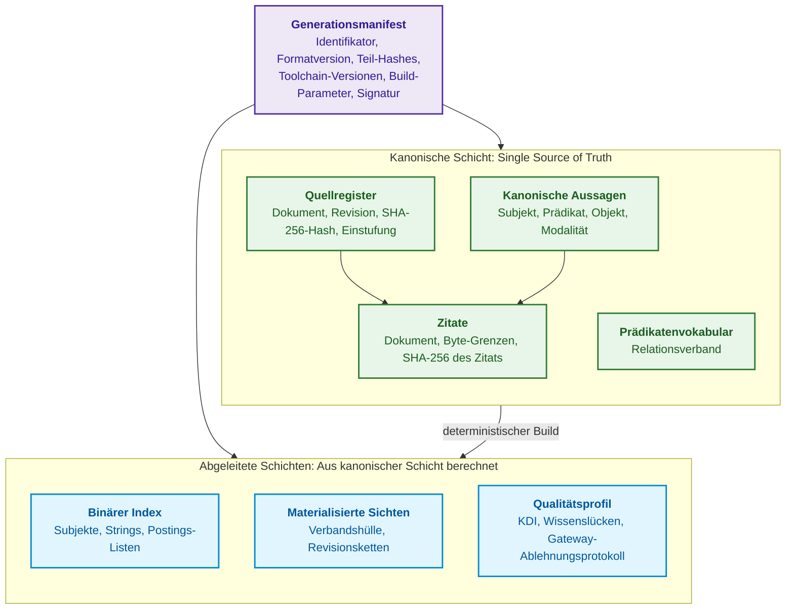
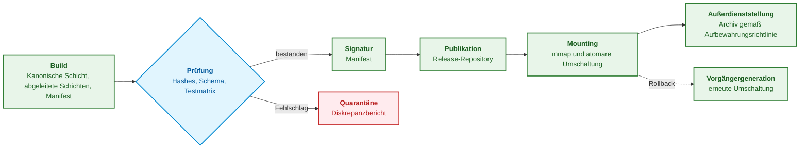
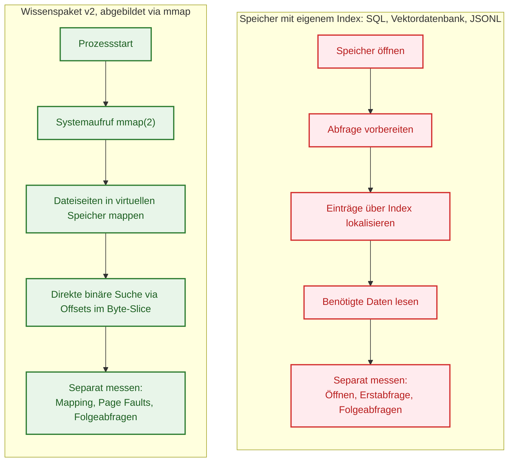
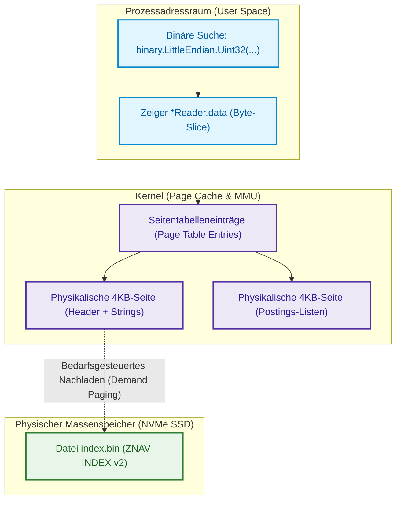
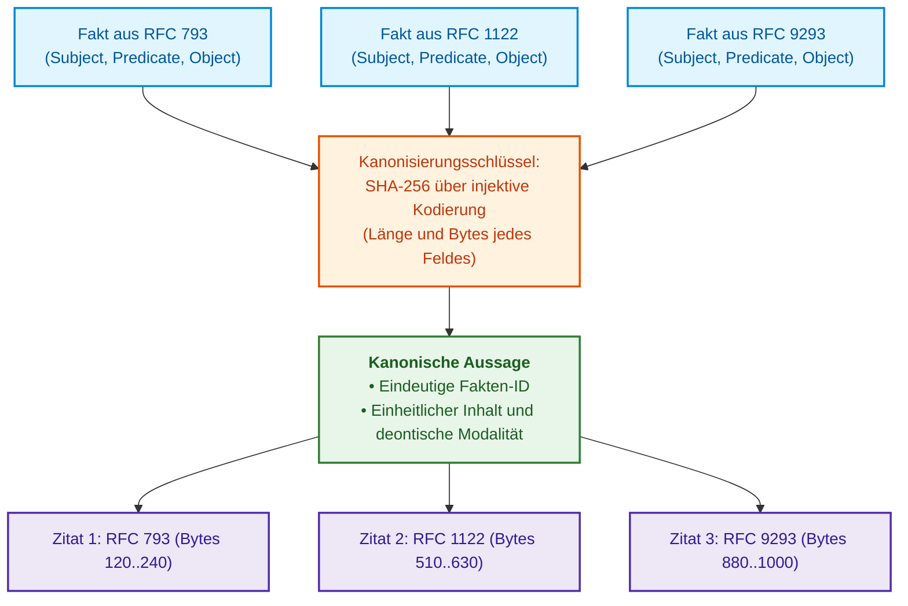
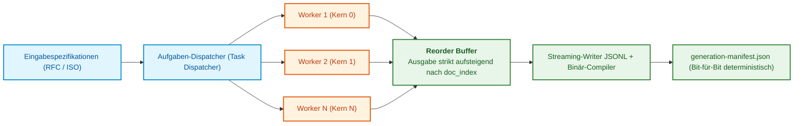
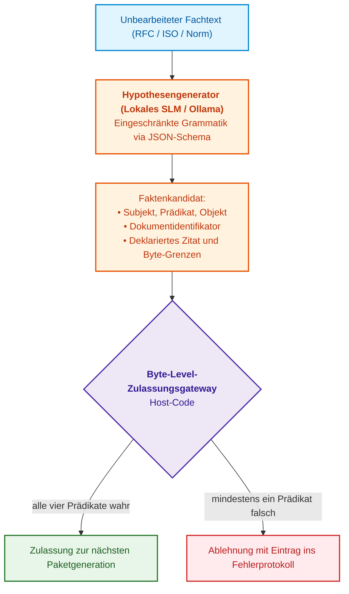

# Kapitel 32. Unveränderliche Wissenspakete: Byte-Level-Zulassung, Indizes und Memory Mapping

> **Buch:** [Architektur evidenzbasierter Expertensysteme](README.md) · [Teil II: Mathematische Modelle, Wissensrepräsentation und Wissensspeicherung](part-02-knowledge-models.md)  
> **Vorheriges Kapitel:** [Kapitel 9. Der technische Wissensgraph: Rückverfolgbarkeit von Anforderungen bis zur Hardware](ch09-engineering-knowledge-graph-traceability.md)  
> **Nächstes Kapitel:** [Kapitel 10. Wissensakquisitionssysteme: Quellen, Zulassung und Lebenszyklus](ch10-knowledge-acquisition-systems.md)  
> **Inhaltsverzeichnis:** [README.md](README.md)  
> **Autor:** [Mykola Fedchyk](about-the-author.md)  
> **Niveau:** Fortgeschritten: Systemarchitekten, Datenbank- und Indexentwickler, Knowledge Engineers, Spezialisten für Hochleistungssysteme (High Performance Computing, Edge AI)  
> **Lernziele:** Die Zusammensetzung eines Wissenspakets, seine Invarianten, seinen Lebenszyklus und die Unterschiede zweier Formatgenerationen erklären; fundiert auswählen, welche abgeleiteten Repräsentationen während des Paket-Builds vorberechnet werden sollen; binäre Zero-Deserialization-Wissenspakete auf Basis des Systemaufrufs `mmap(2)` entwerfen und präzise bestimmen, wann `mmap(2)` ungeeignet ist; Öffnungszeit, Erstabfrage und Folgeabfragen separat messen und das Ausbleiben von Heap-Allokationen bei Suchvorgängen per Test verifizieren; einen nicht vertrauenswürdigen Binärindex vor der ersten Abfrage validieren und Reader-Fehler mittels Fuzzing aufdecken; virtuellen Speicher des Betriebssystems, Demand-Paging, Datensatz-Alignment und den Systemaufruf `madvise(2)` verstehen; Determinismus und Bit-für-Bit-Reproduzierbarkeit von Manifesten bei nebenläufigem Multithread-Build (`--concurrency / -j`) sicherstellen; verlustfreies invertiertes Fakten-Clustering mit injektivem Schlüssel unter vollständiger Bewahrung des Zitationsgraphen anwenden; kontinuierliche Pipelines zum Wissens-Harvesting konstruieren, in denen ein lokales Small Language Model (SLM) Hypothesen generiert und ein Byte-Level-Zulassungsgateway über die Aufnahme ins Paket entscheidet; industrielle Korpora anhand des Wissensdichte-Index ($`\mathrm{KDI}`$) profilieren, Dichte von Vollständigkeit abgrenzen und die Extraktionsabdeckung mittels Fang-Wiederfang-Methode quantifizieren; ein Paket anhand des Dokumentenfamilien-Schlüssels in Shards partitionieren, Vollständigkeit, Disjunktheit und Rekonstruierbarkeit der Partitionierung prüfen und das Schweigen eines Shards niemals als Abwesenheit eines Fakts interpretieren.

---

## Abstract

Man stelle sich den eingebetteten Steuerungsrechner eines autonomen Fahrgestells oder eines robotischen Manipulators vor (Infineon AURIX TC397, ARM Cortex-R52 oder den Edge-Beschleuniger NVIDIA Jetson AGX Orin). Das Expertensystem muss die normative Sicherheitsarbitrierung in einer harten Echtzeitschleife mit einem Fehlertoleranzzeitintervall FTTI von höchstens 20–50 Millisekunden bewältigen (ISO 26262 ASIL D). Speichert das Expertensystem seine Wissensbasis in traditionellen Formaten (JSON, SQLite oder einem Client-Server-DBMS), erfordert ein Kaltstart 1,5–3 Sekunden allein für das Parsen und Allozieren von Millionen Objekten auf dem Heap. Zudem fügt eine unvorhersehbare Garbage-Collection-Pause (*Stop-the-World*) im ungünstigsten Moment eine Latenz von 100–250 ms hinzu. In der Folge wird das FTTI-Zeitbudget gravierend verletzt, ein kritischer Fehlerzustand des Systems wird nicht rechtzeitig erkannt, und der Aktor verliert die Steuerung. Für sicherheitskritische Systeme stellen Zero-Deserialization und speicherallokationsfreier Wissenszugriff keine „verfrühte Optimierung“ dar, sondern eine fundamentale Anforderung funktionaler Sicherheit.

Dieses Kapitel widmet sich der ingenieurtechnischen Herausforderung des Übergangs von einem Prototyp-Expertensystem mit wenigen tausend Regeln zu einer industriellen Wissensbasis im Unternehmensmaßstab: Zehntausende Spezifikationen, Hunderttausende normative Fakten und Mikrosekunden-Reaktionszeiten in eingebetteten Systemen. Es beschreibt eine Eigenentwicklung des Autors: das unveränderliche, selbstbeschreibende Wissenspaket (**Knowledge Pack**) und das Binärformat seines Index **ZNAV-INDEX v2** auf Basis des Systemaufrufs `mmap(2)`. Zunächst erläutert das Kapitel Zusammensetzung und Lebenszyklus des Pakets, die Unterschiede zweier Formatgenerationen sowie die mathematischen Anwendungsgrenzen der Zero-Deserialization. Im weiteren Verlauf werden die Algorithmen des verlustfreien invertierten Fakten-Clusterings, der deterministische Multithread-Build (`--concurrency`), die neuro-symbolische Extraktions-Pipeline mit Byte-Level-Zulassungsgateway, die Metrik der Wissensdichte ($`\mathrm{KDI}`$) und das mathematisch sichere Sharding des Pakets dargelegt, welches das Schweigen eines einzelnen Shards strikt von der Nichtexistenz eines Fakts im Gesamtsystem unterscheidet.

---

## 1. Das Wissenspaket: Wie eine Wissensbasis zum Release-Artefakt wird

Ein Expertensystem antwortet stets aus einem wohldefinierten Wissenszustand heraus. Ein Auditor, der eine Inferenzentscheidung nach Ablauf eines Jahres überprüft, muss exakt dieselbe Menge an Aussagen und Primärzitaten vorfinden. Für einen autonomen Edge-Knoten ist ein autarkes lokales Artefakt erforderlich; für ein Kommandozeilenwerkzeug kann eine minimale Initialisierungszeit entscheidend sein. Ein veränderlicher Speicher ohne Versionierung und Schnappschüsse garantiert keineswegs die Reproduzierbarkeit historischer Auskünfte. Allerdings können auch relationale Datenbanken unveränderliche Snapshots bereitstellen, und SQLite operiert ohne separaten Serverprozess. Das Wissenspaket stellt somit einen bewährten Weg zur Erfüllung dieser Anforderungen dar, jedoch nicht den einzig denkbaren.

Vorangegangene Kapitel nutzten den unveränderlichen Snapshot einer Wissensbasis bereits als vorgefertigte Systemkomponente. [Kapitel 10](ch10-knowledge-acquisition-systems.md) beschrieb das Release einer Wissensbasis mit kanonischem Manifest und atomarem Rollback, [Kapitel 15](ch15-knowledge-extraction-and-kb-construction.md) stellte das unveränderliche Binärpaket neben das relationale Prädikatenspeichersystem und den Begriffs-Graphen, [Kapitel 18](ch18-execution-infrastructure.md) demonstrierte einen zweistufigen, speicherabgebildeten Index, [Kapitel 22](ch22-cybernetics-edge-to-backend.md) analysierte signierte Wissenspakete für Edge-Updates, und [Kapitel 33](ch33-inter-system-knowledge-exchange-and-model-teaching.md) verwendet signierte Wissenspakete zur systemübergreifenden Regeldistribution und selektiven Beweisoffenlegung. Der vorliegende Abschnitt führt diese Bausteine zu einer kohärenten Architektur zusammen: welcher Inhalt im Paket liegt, welche Invarianten über Generationen hinweg gewahrt bleiben und wie sich das Paketformat über zwei Entwicklungsgenerationen wandelte.

> [!NOTE]
> Das Format des Wissenspakets und die Spezifikation des Binärindex ZNAV-INDEX sind Eigenentwicklungen des Autors für den Forschungsprototypen eines Expertensystems. Die erste Generation entstand Anfang 2026 zur lückenlosen Rückverfolgbarkeit von Schlussfolgerungen auf einem Korpus von Netzwerkspezifikationen; die zweite Generation implementiert ein grundlegend neues Indexierungsverfahren. Es handelt sich um ein praxisnahes Architekturbeispiel, nicht um einen formalen Industriestandard und nicht um eine absolute Fehlerfreiheitsgarantie. Die vom Autor ermittelten Leistungswerte hängen vom konkreten Textkorpus, der Hardwareplattform und den Messgrenzen ab; Abschnitt 2 legt dar, welche Resultate noch einer offenen Replikation bedürfen.

### 1.1. Das Wissenspaket als Build-Produkt

Die Analogie zu einem kompilierten Softwareprogramm verdeutlicht den Kern des Konzepts. Ein Ingenieur editiert keine Binärdatei, die sich bereits im Produktivbetrieb befindet: Der Ingenieur modifiziert den Quellcode, kompiliert eine neue Version, verifiziert das resultierende Artefakt und rollt es aus, während die Vorgängerversion für ein eventuelles Rollback aufbewahrt wird. Das Wissenspaket überträgt diese ingenieurtechnische Disziplin auf den Wissensbestand: Primärquellen und formal zugelassene Aussagen fungieren als Quellcode, der Paket-Compiler übernimmt die Rolle des Compilers, und das Wissenspaket dient der Inferenzmaschine als ausführbares Ausführungsartefakt.

Ein **Wissenspaket** (*Knowledge Pack*) ist eine unveränderliche, selbstbeschreibende und versionierte Dateisammlung, welche die kanonischen Aussagen der Wissensbasis zusammen mit den Primärzitaten, abgeleitete Indizes für eine hochperformante Inferenz sowie ein Manifest enthält, welches den Paketinhalt kryptographisch an Quellen, Toolchains und Build-Parameter bindet. Eine **Paketgeneration** (*Generation*) bezeichnet ein einzelnes Release: Neuer Wissenszuwachs erzeugt stets eine neue Generation, anstatt den bestehenden Bestand destruktiv zu überschreiben. Der Begriff „Generation“ besitzt in diesem Kapitel zwei Bedeutungen, die strikt auseinandergehalten werden müssen: Eine *Paketgeneration* bezeichnet eine konkrete Wissens-Release-Ausgabe, während eine *Formatgeneration* (v1, v2) die Version der internen Binär- und Dateistruktur des Pakets selbst kennzeichnet.

### 1.2. Zusammensetzung des Pakets: Kanonische Schicht, abgeleitete Schichten und Manifest

Die Bestandteile eines Pakets besitzen unterschiedlichen epistemischen und architektonischen Status. Die kanonische Schicht bildet die unumstößliche Wahrheit (*Single Source of Truth*), abgeleitete Schichten werden zwecks Abfragebeschleunigung deterministisch aus der kanonischen Schicht berechnet, und das Manifest verknüpft alle Komponenten zu einer prüfbaren Gesamtheit. Das folgende Diagramm veranschaulicht den modularen Aufbau; welche physischen Dateien die jeweiligen Formatgenerationen umfassen, fasst die Tabelle in Abschnitt 1.5 zusammen.



Der violette Block repräsentiert das Manifest, die grünen Blöcke bilden die kanonische Schicht, und die blauen Blöcke stellen die abgeleiteten Schichten dar. Die nachfolgende Tabelle schlüsselt auf, was jeder Bestandteil beinhaltet und welche Systemkomponente lesend darauf zugreift.

| Paketkomponente | Inhalt | Status | Lesende Instanz |
|---|---|---|---|
| Generationsmanifest | Generations-ID, Formatversion, kryptographische Hashes aller Teile, Quellverzeichnis, Versionen von Compiler und Modellen, Build-Parameter, digitale Signatur | Paketbeschreibung | Inferenzmaschine beim Mounten, Auditor |
| Quellregister | Dokumenten-ID, Revisionsstand, SHA-256-Hash der Dokumenten-Bytes, Zugriffseinstufung, Gültigkeitsstatus | kanonisch | Zulassungsgateway, Auditor |
| Kanonische Aussagen | Subjekt, Prädikat, Objekt, deontische Modalität, eindeutige Aussagen-ID | kanonisch | Inferenzmaschine |
| Zitate | Dokumentreferenz, Byte-Grenzen, Zitat-Hash; eine Aussage kann mehrere Zitate referenzieren | kanonisch | Erklärungskomponente ([Kapitel 20](ch20-explanation-engine.md)), Auditor |
| Prädikatenvokabular | Zulässige Prädikate und deren algebraischer Verband ([Kapitel 31](ch31-syllogistic-reasoning-and-relation-lattices.md)) | kanonisch | Zulassungsgateway, syllogistischer Inferenzkern |
| Binärer Index | Subjekttabelle, Stringtabelle und Postings-Listen (Abschnitt 4) | abgeleitet | Inferenzmaschine |
| Materialisierte Sichten | Vorberechnete transitive Verbandshüllen und Revisionsketten (Abschnitt 1.6) | abgeleitet | Inferenzmaschine |
| Qualitätsprofil | $`\mathrm{KDI}`$ nach Wissenskategorien, Wissenslücken, Ablehnungsstatistiken des Gateways (Abschnitte 7 und 8) | abgeleitet | Knowledge Engineer, Release-Prozess |

Die strikte Trennung zwischen kanonischen und abgeleiteten Daten ist die zentrale Architekturentscheidung des Pakets. Abgeleitete Schichten werden niemals manuell editiert: Sie werden vom Paket-Compiler generiert, und die Verifikationsstufe wiederholt diese Berechnung, um die Prüfsummen abzugleichen. Jede Hash-Diskrepanz signalisiert einen Compiler-Defekt oder eine unzulässige Dateimanipulation, was die sofortige Montageverweigerung zur Folge hat. Diese Trennung macht zugleich Formatiterationen des Index extrem kostengünstig: Ein neues Indexformat ist lediglich eine neue abgeleitete Schicht derselben unveränderten kanonischen Schicht. Das Wissen muss folglich nicht erneut aus den Rohdokumenten extrahiert werden, und die Reproduzierbarkeitsprüfung belegt unmittelbar, ob der neue Index semantisch mit dem bisherigen Wissensbestand übereinstimmt.

### 1.3. Invarianten des Pakets

Eine Paket-Invariante ist eine fundamentale Eigenschaft, die jede Generation zwingend wahrt und die jeder Konsument vor der Nutzung verifiziert. Eine Verletzung einer beliebigen Invariante disqualifiziert das Paket für den Einsatz in einem evidenzbasierten Expertensystem; daher werden Invarianten während der Erstellung und des Mount-Vorgangs vollautomatisch überprüft.

1. **Unveränderlichkeit (Immutability):** Nach der Veröffentlichung darf kein einziges Byte des Pakets mehr modifiziert werden. Korrekturen, Quellwiderrufe oder neue Fakten erzeugen ausnahmslos eine neue Generation; das Zurückziehen von Aussagen erfolgt über explizite Löschmarkierungen (*Tombstones*), wie in [Kapitel 10](ch10-knowledge-acquisition-systems.md) dargelegt.
2. **Inhaltsadressierung (Content Addressing):** Der Generationsbezeichner wird als kryptographischer Hash des kanonischen Manifests berechnet (die Formel findet sich in [Kapitel 10](ch10-knowledge-acquisition-systems.md)), und das Manifest kapselt die Prüfsummen sämtlicher Paketteile. Eine Manipulation eines beliebigen Bytes in einem beliebigen Teildokument verändert unweigerlich die Generations-ID. Jede Auskunft des Expertensystems, die diese Generations-ID zitiert, referenziert somit einen exakt fixierten epistemischen Zustand. Eine plattformübergreifend identische Serialisierung des Manifests wird durch ein kanonisches JSON-Schema wie JCS garantiert [[1]](#src-1).
3. **Reproduzierbarkeit abgeleiteter Schichten:** Abgeleitete Schichten sind eine deterministische Funktion der kanonischen Schicht und der deklarierten Build-Parameter. Diese Invariante gilt strikt unabhängig von der Anzahl der zugewiesenen Compiler-Threads (Abschnitt 6).
4. **Selbstbeschreibung und Formatversionierung:** Jedes Binärsegment beginnt mit einer Magic-Signatur, einer Versionsnummer und Merkmals-Flags. Der Reader verweigert das Mounten eines Segments mit unbekannter Hauptversionsnummer (*Fail-Closed*-Verhalten); optionale Erweiterungen werden über Flags deklariert, die ein älterer Reader sicher übergehen kann. Dieses Verfahren entspricht dem bewährten Prinzip des PNG-Bildformats: Die Groß-/Kleinschreibung des ersten Buchstabens eines Chunk-Namens signalisiert dem Decoder, ob ein unbekannter Block ohne Informationsverlust übersprungen werden darf [[2]](#src-2).
5. **Trennung veränderlichen Zustands:** Feedback von Fachingenieuren, Inferenzstatistiken, Caches und Audit-Logs werden strikt außerhalb des Pakets persistiert ([Kapitel 25](ch25-how-expert-systems-learn.md), [Kapitel 26](ch26-continual-learning.md)). Lernprozesse des Systems erzeugen Kandidaten für die nächste Generation, verändern jedoch niemals die laufende Produktivgeneration.
6. **Zugriffsgrenzen und Vertraulichkeit:** Ein Paket darf bestehende Zugriffsbeschränkungen nicht unterlaufen ([Kapitel 10](ch10-knowledge-acquisition-systems.md)): Entweder trägt jede Aussage und jedes Zitat eine Vertraulichkeitskennzeichnung, die der Inferenzkern vor der Ausgabe prüft, oder das Paket wird pro Berechtigungsstufe separat assembliert (die Partitionierung von Paketen in Shards behandeln Abschnitt 10 sowie [Kapitel 7](ch07-knowledge-base-typology.md)).

Zusammenfassend transformieren diese Invarianten das Paket von einem flüchtigen Cache in ein gerichtsfestes Beweismittel: Anhand der Generations-ID erhält ein Auditor exakt dieselben Bytes, dieselben Zitate und denselben Index, auf deren Basis das Expertensystem im Moment der Urteilsfindung operierte.

### 1.4. Lebenszyklus des Pakets

Während Invarianten die strukturellen Eigenschaften definieren, beschreibt der Lebenszyklus die sequenziellen Prozessschritte, die ein Paket von der Generierung bis zur Archivierung durchläuft. Das folgende Diagramm bildet diesen Ablauf inklusive der Quarantäne-Verzweigung ab.



1. **Build:** Der Compiler liest die kanonischen Aussagen ein, welche das Zulassungsgateway passiert haben (Abschnitt 7), und generiert die abgeleiteten Schichten sowie das Manifest. Eine eventuelle Kompression von Paketteilen wird auf der CPU ausgeführt: Klassische Kompressionsalgorithmen lassen sich nicht sinnvoll auf Tensorkerne einer NPU abbilden ([Kapitel 18](ch18-execution-infrastructure.md)).
2. **Verifikation:** Die Verifikationsstufe berechnet alle abgeleiteten Schichten unabhängig neu, validiert Schemata und Prüfsummen und durchläuft eine umfassende Testmatrix sowie Regressionsprüfungen ([Kapitel 23](ch23-knowledge-base-verification.md), [Kapitel 25](ch25-how-expert-systems-learn.md)).
3. **Signatur:** Das Manifest wird durch autorisierte Fachexperten digital signiert; für Edge-Knoten greift ein kryptographisches Schwellwert-Signaturschema (*Threshold Signatures*, [Kapitel 22](ch22-cybernetics-edge-to-backend.md)).
4. **Publikation:** Das Paket wird in das Release-Repository überführt und kontrolliert an die Zielknoten verteilt ([Kapitel 10](ch10-knowledge-acquisition-systems.md)).
5. **Mounting und atomare Umschaltung:** Die Inferenzmaschine mappt die Dateien der neuen Generation via `mmap(2)` in den Adressraum, prüft Header sowie Hashes und schaltet den Zeiger auf die aktive Generation atomar um. Bereits laufende Anfragen werden auf dem bisherigen Speicherabbild zu Ende geführt; dieses wird erst freigegeben (`munmap`), wenn der aktive Lesezähler auf null sinkt. Ein Rollback entspricht exakt demselben atomaren Umschalten auf die vorangegangene, bereits verifizierte Generation.
6. **Außerdienststellung (Retirement):** Eine alte Generation wird erst dann gelöscht, wenn keine produktiven Inferenzzertifikate ([Kapitel 30](ch30-safety-cybersecurity-co-engineering.md)) oder Sicherheitsnachweise ([Kapitel 27](ch27-safety-case-gsn-synthesis.md)) mehr auf sie verweisen; die Vorhaltezeit wird durch formale Governance-Richtlinien festgelegt.

Ein Rollback ist in dieser Architektur somit kein unkalkulierbarer Notfalleingriff, sondern ein gewöhnlicher Mounting-Vorgang einer älteren, zertifizierten Generation.

### 1.5. Zwei Formatgenerationen

Die Architektur des Wissenspakets entwickelte sich mit dem Anwachsen des Dokumentenvolumens. Die folgende Tabelle vergleicht die beiden Formatgenerationen hinsichtlich der Merkmale, welche das Laufzeitverhalten des Expertensystems bestimmen; die Spalte der zweiten Generation fasst die Abschnitte 3 bis 8 dieses Kapitels zusammen.

| Eigenschaft | Erste Generation (v1) | Zweite Generation (v2) |
|---|---|---|
| Dateizusammensetzung | Manifest `pack.json` (Metadaten, Quell-Hash), textuelle `chunks.jsonl` (4096-Byte-Blöcke mit SHA-256) und Rohdatei `facts.jsonl` (extrahierte Fakten ohne Binärindex) | Manifest `generation-manifest.json`, kanonischer Aussagen-Stream im JSONL-Format, binärer Index `index.bin` im Format ZNAV-INDEX v2 |
| Kanonisches Faktenformat | JSONL (nicht-deduplizierte Faktenobjekte mit beliebiger Schlüsselreihenfolge) | JSONL in strikt deterministischer Sortierung geschrieben (Abschnitt 6) |
| Ladezeit beim Kaltstart | Vollständiges Stream-Parsing des JSONL in den Prozess-Heap beim Start; Dauer 5–15 s bei großen Korpora | Speicherabbildung der Indexdatei via `mmap(2)` ohne Parsing-Schritt (Abschnitt 3) |
| Zitate | Verweis auf Dokument, Abschnitt und Nummer des 4096-Byte-Chunks; exakte Byte-Slices und Zitat-Hashes fehlten | Byte-Grenzkoordinaten in der Primärquelle und SHA-256 des Textausschnitts (Abschnitt 7.1) |
| Wiederkehrende Aussagen | Redundante Datensätze oder heuristisches Mehrheitsvoting, was historische Kontexte und Revisionen zerstörte | Verlustfreies Clustering unter Bewahrung aller Zitate (Abschnitt 5) |
| Nebenläufiger Build | Single-Thread-Build oder nicht-deterministische Nebenläufigkeit (Hashes variierten je nach Lauf) | Bit-für-Bit identisches Ergebnis unabhängig von der Thread-Anzahl (Abschnitt 6) |
| Kandidatenzulassung | Heuristische Regex-Filter oder LLM-Prompting ohne obligatorische Byte-Validierung im Host | Vier Prädikate des Byte-Level-Zulassungsgateways (Abschnitt 7.1) |
| Qualitätsprofil & Sichten | Nicht vorhanden (wurden durch externe Ad-hoc-Skripte oder zur Laufzeit berechnet) | Direkt im Paket als abgeleitete Artefakte integriert und im Manifest fixiert |
| Generationskompatibilität | Nicht anwendbar | v1-Pakete werden nicht direkt gemountet; der Compiler baut sie aus der kanonischen Schicht neu nach v2-Spezifikation |

Der Wechsel zwischen den Formatgenerationen stützt sich auf empirische Messungen anstelle theoretischer Präferenzen. Die historischen Kennzahlen des Autors für das Parsen von JSONL sind in Abschnitt 2.2 dargelegt. Ein gravierender Mangel von v1 – das Variieren der Eintragsreihenfolge je nach Thread-Scheduling – zerstörte die kryptographische Bit-für-Bit-Reproduzierbarkeit. Für v2 muss die Reihenfolge der Kanonisierung und Serialisierung zwingend unabhängig von der Lese- und Verarbeitungsgeschwindigkeit gewahrt bleiben.

### 1.6. Materialisierte Sichten: Was während des Builds vorzuberechnen ist

Die Inferenzmaschine berechnet wiederkehrend identische abgeleitete Relationen: die transitive Hülle des Prädikatenverbands ([Kapitel 31](ch31-syllogistic-reasoning-and-relation-lattices.md)), Revisions- und Substitutionsketten von Normen ([Kapitel 15](ch15-knowledge-extraction-and-kb-construction.md)) oder invertierte Listen des Typs „Objekt → Aussagen“. Jede dieser Relationen kann entweder zur Anfragezeit *on-the-fly* berechnet oder vorab im Paket materialisiert werden. In der Datenbanktheorie ist dies als Problem der Auswahl materialisierter Sichten (*Materialized View Selection*) bekannt: Eine vorberechnete Sicht minimiert die Latenz, beansprucht jedoch Speicherplatz und erfordert Aktualisierungen bei Änderungen der Basisdaten [[3]](#src-3). Mbaiossoum et al. formalisierten diese Fragestellung für ontologiebasierte Datenbanken und wiesen nach, dass die Heterogenität von Datenmodellen und Anfragesprachen ein einheitliches formalisiertes Beschreibungskonzept erfordert [[4]](#src-4).

Für unveränderliche Wissenspakete weist das Problem eine vorteilhafte Besonderheit auf: Da das Paket statisch ist, entfallen Invalidationen und Teilsynchronisationen zur Laufzeit vollständig. Die Kosten einer materialisierten Sicht verlagern sich ausschließlich in die Build-Zeit und das finale Datenvolumen, da jede Folgegeneration die Sichten deterministisch neu assembliert. Formal entspricht dies dem klassischen Optimierungsproblem unter einer Speicherplatzbeschränkung:

```math
V^{*} = \arg\min_{V \subseteq \mathcal{V}} \sum_{q \in Q} f_q \cdot c(q \mid V) \quad \text{unter der Nebenbedingung} \quad \sum_{v \in V} s(v) \le S_{\max}
```

Parameter des Optimierungsmodells:

- $\mathcal{V}$ bezeichnet die Menge aller Kandidaten für materialisierte Sichten, wie etwa Verbandshüllen, Substitutionsketten oder objektbasierte Invertierungsindizes;
- $V$ ist eine ausgewählte Teilmenge von Kandidaten, und $V^{*}$ markiert die optimale Auswahl, welche die aggregierten Anfragekosten minimiert;
- $Q$ ist die repräsentative Menge typischer Anfragen an die Inferenzmaschine, und $f_q$ repräsentiert die historische Frequenz der Anfrage $q$ (in Abfragen pro Minute);
- $c(q \mid V)$ beziffert die Ausführungskosten zur Beantwortung von $q$ unter Vorhandensein der Sichten $V$ (in Mikrosekunden CPU-Zeit);
- $s(v)$ ist der Speicherbedarf der materialisierten Sicht $v$ im Paket, und $S_{\max}$ ist das zulässige Speicherbudget auf dem Zielknoten (in Megabyte).

Da dieses Problem im allgemeinen Fall NP-schwer ist, erfolgt die Auswahl in der Praxis greedy anhand des Nutzwerts pro Megabyte Speicherplatz. Harinarayan, Rajaraman und Ullman bewiesen für Datenwürfel-Verbände, dass ein gieriger Auswahlalgorithmus mindestens einen Anteil von $(e-1)/e \approx 63\,\%$ des theoretischen Optimums garantiert [[5]](#src-5); Gupta erweiterte dieses Ergebnis auf allgemeinere Sichtengraphen [[6]](#src-6).

Ingenieurtechnische Interpretation: Eine Sicht wird genau dann materialisiert, wenn ihre frequenzgewichtete Latenzersparnis den Nutzen übersteigt, den derselbe Speicherplatz für alternative Sichten bieten würde. *Rechenbeispiel:* Für einen Edge-Knoten stehe ein Budget von $S_{\max} = 20\,\text{MB}$ zur Verfügung, und es existieren zwei Kandidaten. Die transitive Verbandshülle benötigt $2\,\text{MB}$ und reduziert einen Subsumtionscheck von $40\,\mu\text{s}$ auf $1{,}5\,\mu\text{s}$; bei $10\,000$ Abfragen pro Minute spart die Sicht pro Minute $10\,000 \cdot 38{,}5\,\mu\text{s} = 385\,\text{ms}$ CPU-Zeit ein, was einem Wirkungsgrad von ca. $192{,}5\,\text{ms/MB}$ entspricht. Ein invertierter Objektindex benötigt hingegen $30\,\text{MB}$ und verkürzt eine seltene Anfrage (100 Aufrufe/min) von $900\,\mu\text{s}$ auf $5\,\mu\text{s}$, spart somit $89{,}5\,\text{ms/min}$ ein, was lediglich $3\,\text{ms/MB}$ entspricht. Der Objektindex sprengt das Budget und liefert einen um den Faktor 64 geringeren spezifischen Ertrag; folglich wird ausschließlich die Verbandshülle materialisiert. Erhöht sich das Budget auf $40\,\text{MB}$, nimmt der gierige Algorithmus auch den Objektindex auf.

Grenzen des Verfahrens: Die Frequenzen $f_q$ entstammen den Audit-Logs der Vorgängergeneration. Für eine völlig neue Wissensdomäne ohne Zugriffshistorie stützt sich die Auswahl zunächst auf fundierte Schätzungen des Knowledge Engineers und wird mit dem Release der Folgegeneration empirisch rekalibriert. Als abgeleitete Schicht wird jede materialisierte Sicht bei der Paketprüfung deterministisch neu berechnet.

Abschnitt 1 hat definiert, was ein Wissenspaket darstellt und welche Invarianten es garantiert. Die folgenden Abschnitte erläutern, warum die zweite Formatgeneration das textuelle Parsing beim Initialisieren vollständig eliminierte und wie die systemnahen Mechanismen auf Byte-Ebene operieren.
---

## 2. Speicherwahl: Äquivalente Arbeitslasten vergleichen

Ein relationales Datenbanksystem, ein Vektorindex und ein unveränderliches Binärpaket adressieren grundlegend unterschiedliche Aufgabenprofile. Ein valider Leistungsvergleich setzt voraus, dass Datenbestand, Abfragemuster, Ergebnistypen und Messgrenzen exakt standardisiert werden. Das nachfolgende Diagramm illustriert zwei fundamentale Lesepfade, versteht sich jedoch nicht als pauschales Produkt-Ranking.



### 2.1. Welche Kosten und Garantien zu trennen sind

1. **Parsing-Kosten beim Öffnen:**  
   Das vollumfängliche Parsen eines unstrukturierten Textkorpus beim Start ist ungleich rechenintensiver als das Lesen eines vorberechneten Binärindex. Allerdings muss eine relationale Datenbank beim Start keineswegs den gesamten Datenbestand deserialisieren. Garbage-Collection-Latenzen hängen von der jeweiligen Laufzeitumgebung (Runtime) und der Objektrepräsentation ab und dürfen nicht pauschal über C++, Rust und Go hinweg gleichgesetzt werden.
2. **Semantische Ungenauigkeit der Vektorsuche:**  
   Ein HNSW-Graph approximiert die nächste Nachbarschaft in hochdimensionalen Vektorräumen [[7]](#src-7). Dies ist eine fundamental andere Abfragesemantik als ein exakter punktueller Identifikatorabruf. Die Vektorsuche liefert semantische Kandidaten; normative Gültigkeit, Freigabestatus und Beweisführung müssen anschließend separat verifiziert werden. Auch Vektordatenbanken unterstützen exakte Filter, weshalb Schwächen einzelner Indextypen nicht dem gesamten Paradigma zugeschrieben werden dürfen.
3. **Bruch von Rückverfolgbarkeit und Unveränderlichkeit:**  
   Schreiboperationen führen nicht automatisch zu einem unkontrollierten Zustand. Ein relationales System kann über strikte Rechte, Write-Ahead-Logs und unveränderliche Snapshots verfügen. Die Unveränderlichkeit eines publizierten Wissenspakets resultiert primär aus der Release-Disziplin und den Zugriffsrechten, nicht exklusiv aus dem Systemaufruf `mmap`.

### 2.2. Archivierte Messungen und Vergleichsprotokoll

Die folgende Tabelle enthält historische Labormessungen des Autors auf einem Korpus von $100\,000$ normativen Fakten. Sie stellt kein universelles Benchmark-Urteil dar: Das Öffnen eines Mappings, der Verbindungsaufbau zu einem Datenbankserver und das Einlesen eines In-Memory-Index besitzen grundverschiedene Messgrenzen. Vollständige quelloffene Replikationsumgebungen aller Alternativen liegen nicht öffentlich bei, weshalb die Tabelle nicht isoliert als Beweis herangezogen werden kann. Server- und Client-Ressourcen dürfen nicht unreflektiert als Speicherverbrauch eines einzelnen Prozesses aggregiert werden.

<details>
<summary>Archivierte Messergebnisse des Autors; heterogene Messgrenzen</summary>

| Speicherarchitektur | Kaltstartzeit | Einzellatenz ($P_{99}$) | RAM-Bedarf (RSS) | Allokationen pro Abfrage | GC-Pausen bei 10k QPS |
|---|---|---|---|---|---|
| **Direct JSONL Ingest** | 14,8 s | 850 µs | 1,42 GB | 145 KB/op (320 Allokationen) | 45 ms |
| **SQLite (B-Tree, In-Memory)** | 3,2 s | 45 µs | 380 MB | 4,2 KB/op (28 Allokationen) | 8 ms |
| **PostgreSQL (Lokaler Unix-Socket)** | 0,8 s (Connect) | 1,2 ms | 520 MB (Server) | 12 KB/op (Socket-Puffer) | Keine (Server-GC entfällt) |
| **Vector DB (HNSW Index)** | 22,5 s | 4,8 ms | 2,85 GB | 85 KB/op | 65 ms |
| **Knowledge Pack v2 (`mmap`)** | **4,2 µs** | **1,5 µs** | **18 MB (Shared)** | **0 B/op (0 Allokationen)** | **0,0 ms (Zero GC)** |

Nach Aufzeichnungen des Autors wurden die Messungen am 28. September 2026 auf einem AMD EPYC 7763 mit Samsung PM9A3 NVMe SSD unter Linux 6.8 für einen normativen Spezifikationskorpus durchgeführt. Der Wert von $4{,}2\,\mu\text{s}$ erfasst lediglich den Systemaufruf des Mappings und die Validierung des 64-Byte-Headers, keineswegs das physische Einlesen aller Dateiseiten. Er begründet für sich allein keinen generellen Vorsprung gegenüber der Erstabfrage alternativer Speicher.

</details>

Für einen wissenschaftlich belastbaren Vergleich sind strikte Rahmenbedingungen festzulegen: deterministischer Datengenerator und Prüfsummen des Testkorpus, identische Toolchain-Versionen, synchrone Punktabfragen nach vorhandenen und abwesenden Schlüsseln, randomisierte Testreihenfolgen, expliziter OS-Cache-Zustand sowie Rohdatenprotokolle mehrerer Durchläufe. Öffnungszeit, Erstabfrage und Folgeabfragen sind strikt getrennt zu messen. Die Verifikation identischer Ergebnisdaten hat zwingend vor der Latenzmessung zu erfolgen.

### 2.3. Offener Lehrprüfstand für SQLite und `mmap`

Der nachfolgende Prüfstand stützt sich ausschließlich auf die Standardbibliothek von Python 3. Er generiert identische Integer-Schlüssel-Wert-Paare für SQLite und eine elementare Binärdatei, führt Punktabfragen durch und validiert jede Antwort. Die Binärdatei dient als didaktischer Lehrindex, nicht als vollständige ZNAV-INDEX-Implementierung. Sie vergleicht zwei Zugriffspfade innerhalb von Python, ohne den Nachweis nullallokationsfreier Go-Reader zu erbringen. Die Dokumentation der Standardmodule beschreibt die systemspezifischen Operationen und Plattformgrenzen [[8]](#src-8).

<details>
<summary>Autarker Lehrprüfstand: Generator, Punktabfragen und strukturierte JSON-Ausgabe</summary>

```python
import argparse
import json
import mmap
import platform
import random
import sqlite3
import statistics
import struct
import tempfile
import time
from contextlib import closing
from pathlib import Path

HEADER = struct.Struct("<8sQ")
RECORD = struct.Struct("<QQ")


def lookup_mapped(mapped, count, key):
    left, right = 0, count
    while left < right:
        middle = (left + right) // 2
        stored_key, value = RECORD.unpack_from(mapped, HEADER.size + middle * RECORD.size)
        if stored_key == key:
            return value
        if stored_key < key:
            left = middle + 1
        else:
            right = middle
    return None


def measure(count=100000, query_count=10000):
    if count < 1 or query_count < 1:
        raise ValueError("positive record and query counts required")
    generator = random.Random(7)
    keys = [-1, 0, count - 1, count] + [generator.randrange(count + 10) for _ in range(query_count)]
    results = []
    with tempfile.TemporaryDirectory() as directory:
        database_path = Path(directory) / "facts.sqlite"
        binary_path = Path(directory) / "facts.bin"
        with closing(sqlite3.connect(database_path)) as database:
            database.execute("CREATE TABLE facts (id INTEGER PRIMARY KEY, value INTEGER NOT NULL)")
            database.executemany("INSERT INTO facts VALUES (?, ?)", ((key, key * 2 + 1) for key in range(count)))
            database.commit()
        with binary_path.open("wb") as output:
            output.write(HEADER.pack(b"ESTEST01", count))
            for key in range(count):
                output.write(RECORD.pack(key, key * 2 + 1))
        for round_index, order in enumerate((("sqlite", "mapped"), ("mapped", "sqlite"))):
            for backend in order:
                started = time.perf_counter_ns()
                if backend == "sqlite":
                    database = sqlite3.connect(database_path.as_uri() + "?mode=ro", uri=True)
                    cursor = database.cursor()
                    def lookup(key):
                        row = cursor.execute("SELECT value FROM facts WHERE id = ?", (key,)).fetchone()
                        return None if row is None else row[0]
                else:
                    input_file = binary_path.open("rb")
                    mapped = mmap.mmap(input_file.fileno(), 0, access=mmap.ACCESS_READ)
                    assert HEADER.unpack_from(mapped) == (b"ESTEST01", count)
                    def lookup(key):
                        return lookup_mapped(mapped, count, key)
                open_ns = time.perf_counter_ns() - started
                timings = []
                try:
                    for key in keys:
                        started = time.perf_counter_ns()
                        actual = lookup(key)
                        timings.append(time.perf_counter_ns() - started)
                        expected = key * 2 + 1 if 0 <= key < count else None
                        assert actual == expected, (backend, key, actual, expected)
                finally:
                    if backend == "sqlite":
                        database.close()
                    else:
                        mapped.close()
                        input_file.close()
                ordered = sorted(timings[1:])
                results.append({"backend": backend, "round": round_index,
                                "open_ns": open_ns, "first_lookup_ns": timings[0],
                                "median_ns": statistics.median(ordered),
                                "p95_ns": ordered[(len(ordered) * 95 + 99) // 100 - 1]})
        return {"python": platform.python_version(), "platform": platform.platform(),
                "sqlite": sqlite3.sqlite_version, "records": count, "queries": len(keys),
                "cache_state": "not_reset", "results": results}


if __name__ == "__main__":
    parser = argparse.ArgumentParser()
    parser.add_argument("--records", type=int, default=100000)
    parser.add_argument("--queries", type=int, default=10000)
    arguments = parser.parse_args()
    print(json.dumps(measure(arguments.records, arguments.queries), indent=2))
```

</details>

Der Prüfstand variiert die Ausführungsreihenfolge und validiert Rand- sowie Nicht-Treffer-Schlüssel, verzichtet jedoch auf eine Bereinigung des OS-Page-Caches. Durch das Schreiben der Testdaten befinden sich bereits Seiten im RAM; `first_lookup_ns` misst daher die Erstabfrage nach dem Öffnen, nicht zwingend einen Kaltzugriff auf die physische NVMe. Median und 95. Perzentil beschreiben empirische Latenzen der Python-Schleife, keine deterministischen Echtzeitgarantien. Build-Dauer, Signaturen, Validierungsstufen und nebenläufige Last müssen gesondert evaluiert werden.

Erweist sich SQLite für dieses Szenario als schneller, ist dieses Ergebnis transparent zu akzeptieren: Es belegt, dass eine naive binäre Suche in Python ohne Systemoptimierungen hinter einer hochoptimierten C-Bibliothek zurückbleiben kann. Die Wahl des Speichers hat auf gemessenen Anforderungen zu basieren, nicht auf dogmatischen Vorentscheidungen.

---

## 3. Anatomie der Zero-Deserialization: Systemmechanismen von `mmap(2)`

Die Architektur der Zero-Deserialization basiert auf der direkten Abbildung von Speicherdateien in den virtuellen Adressraum des Prozesses über den Linux-Kernel-Systemaufruf `mmap(2)` [[9]](#src-9). Der Systemaufruf akzeptiert den Dateideskriptor, Länge und Offset des Mappings, Speicherschutz-Flags (für das Wissenspaket ausschließlich `PROT_READ`) sowie Zugriffs-Flags (`MAP_SHARED`), und liefert eine virtuelle Basisadresse zurück. Ab dieser Adresse liest der Prozess die Dateiinhalte direkt wie gewöhnliche Hauptspeicher-Bytes. Das nachfolgende Diagramm veranschaulicht die Schichten zwischen Prozess-Pointer und NVMe-Speicher.



### 3.1. Mechanik des Demand-Paging und der Systemaufruf `madvise(2)`

1. **Bedarfsgesteuertes Nachladen (*Demand Paging*):**  
   Beim Aufruf von `mmap(2)` liest der Linux-Kernel die Datei nicht unmittelbar in den Arbeitsspeicher ein, sondern instanziiert lediglich eine Deskriptorstruktur für den virtuellen Speicherbereich (`vm_area_struct`). Erst der tatsächliche Zugriff auf eine Adresse, deren physikalische Seite noch nicht im Page Cache liegt, löst einen Prozessor-Interrupt aus – einen Seitenfehler (*Page Fault*): Der lesende Thread wird angehalten, während der Kernel die entsprechende 4-KB-Seite vom Datenträger lädt und in die Seitentabelle (*Page Table*) einträgt [[10]](#src-10). Da der Kernel häufig präemptiv benachbarte Seiten lädt (*Read-Ahead*), hängen die Kosten der Erstabfrage primär vom Vorzustand des Caches ab.
2. **Kernel-Hinweise via `madvise(2)`:**  
   Um Page Faults bei den ersten Abfragen zu minimieren, kann der Reader über das Paket `golang.org/x/sys/unix` die Routine `unix.Madvise(data, unix.MADV_WILLNEED)` aufrufen. Das Flag `MADV_WILLNEED` instruiert den Kernel, den adressierten Bereich baldmöglichst im Hintergrund einzulesen [[11]](#src-11). Dieser Hinweis garantiert jedoch weder, dass der gesamte Index vor dem ersten Zugriff vollständig im RAM residiert, noch schützt er die Seiten vor späterer Verdrängung bei Speicherdruck. Der tatsächliche Latenzgewinn muss folglich empirisch validiert werden.
3. **Alignment der Datensätze (*Memory Alignment*):**  
   Der Dateikopf umfasst exakt 64 Bytes. Somit beginnt die Subjekttabelle präzise am Offset 0x40, was einem Vielfachen der CPU-Cache-Zeilengröße (64 Bytes auf x86-64 und gängigen ARM Cortex-A-Kernen) entspricht. Da jeder Tabelleneintrag eine fixe Größe von 16 Bytes besitzt, belegen genau vier Einträge eine vollständige Cache-Zeile. Ein Einzelschritt der binären Suche liest folglich einen Datensatz ohne zeilenübergreifenden Split-Access [[12]](#src-12). Die Dekodierung der Felder erfolgt in Go über das Paket `encoding/binary`, welches kein striktes Alignment verlangt; SIMD-Vektorbefehle für Byte-Vergleiche werden transparent von `bytes.Compare` der Go-Standardbibliothek orchestriert.

### 3.2. Wann Memory Mapping von Dateien ungeeignet ist

Die Vorteile von `mmap(2)` unterliegen harten architektonischen Grenzen. Crotty, Leis und Pavlo analysierten den Einsatz von `mmap(2)` als Ersatz für traditionelle Puffer-Pools in Datenbanksystemen und identifizierten vier fundamentale Problemfelder: Transaktionssicherheit bei Schreiboperationen, unkontrollierbare I/O-Stalls, fehlerhafte I/O-Signalbehandlung und suboptimale Durchsatzskalierung [[13]](#src-13). Unvorhersehbare I/O-Pausen entstehen, weil das Betriebssystem Speicherseiten jederzeit evizieren kann; selbst reine Leseanfragen laufen dann unvermittelt in blockierende Page Faults. Tritt beim Nachladen ein physischer Lesefehler auf, meldet das Betriebssystem dies nicht über reguläre Fehlercodes, sondern sendet ein synchrones `SIGBUS`-Signal an beliebiger Stelle im Code, die auf den Speicher zugreift. Darüber hinaus führen globale TLB-Invalidierungen (*TLB Shootdowns*) bei Multithread-Workloads zu messbaren Leistungseinbrüchen. Das Fazit der Forscher ist eindeutig: `mmap(2)` eignet sich für Datenbanksysteme nur dann, wenn der gesamte Arbeitsdatensatz (*Working Set*) vollständig in den physischen RAM passt und das Workload rein lesend ist.

Das unveränderliche Wissenspaket erfüllt exakt diese Ausnahmebedingungen: Das Paket ist nach der Freigabe absolut statisch (Invariante 1 in Abschnitt 1.3), und die Indexgröße eines Edge-Pakets ist bereits zum Build-Zeitpunkt bekannt. Somit kann die Kompatibilität mit dem verfügbaren RAM vor dem Deployment formal verifiziert werden. Übersteigt der Index hingegen den physischen Arbeitsspeicher oder teilt sich der Knoten den Speicher mit speicherintensiven Prozessen, führt jeder Cache-Miss zu unkalkulierbaren Latenzen; in diesem Fall ist klassisches synchrones File-I/O mit dediziertem Puffer-Management vorzuziehen. Ein weiteres Risiko entsteht durch nachträgliche Dateimanipulationen: Die Validierung des Index beim Öffnen (Abschnitt 9) schützt nur, solange die Datei unverändert bleibt. Wird die gemappte Datei durch einen Fremdprozess gekappt (*Truncation*), resultiert der nächste Speicherzugriff unweigerlich in einem `SIGBUS`-Absturz. Wissenspakete müssen daher zwingend auf schreibgeschützten Dateisystemen (`read-only`) gemountet werden. Übersteigt ein Index die Speicherkapazität eines Einzelknotens, stellt das in Abschnitt 10 behandelte Sharding die bevorzugte Alternative dar.

### 3.3. Prozessorarchitektur-übergreifender Determinismus von mmap und schwache Speichermodelle (x86_64 TSO versus ARM64 Relaxed)

Wird ein binäres Wissenspaket via `mmap(MAP_SHARED)` gemountet, ist das Zusammenspiel der CPU-Caches mit dem physischen Hauptspeicher keine bloße Abstraktion des Betriebssystems mehr, sondern wird zur determinierenden Größe für die mathematische Reproduzierbarkeit symbolischer Inferenz. In heterogenen Umgebungen kollidieren zwei grundverschiedene Speicherkonsistenzmodelle (*Memory Consistency Models*):

1. **x86-64-Architektur (Total Store Order, TSO):**  
   Das Hardware-Speichermodell von Intel- und AMD-Prozessoren garantiert eine strikte Speicherreihenfolge (*Store Order*). Die CPU vertauscht keine Lese- mit Leseoperationen (*Load-Load*), Schreib- mit Schreiboperationen (*Store-Store*) oder Lese- mit Schreiboperationen (*Load-Store*). Die einzige zulässige Hardware-Umordnung ist *Store-Load* (ein Lesebefehl kann einen früheren Schreibbefehl an einer anderen Adresse überholen, falls dieser im Store-Buffer verzögert wird). Für nebenläufige lesende Zugriffe auf ein statisches `mmap` bietet dies natürlichen Determinismus ohne zusätzliche Speicherschranken (*Memory Barriers*).

2. **ARM64-Architektur (Weak / Relaxed Memory Model):**  
   Industrielle ARM-Kerne (wie der in automobilen Sicherheitssteuergeräten eingesetzte ARM Cortex-A78AE) implementieren ein schwaches Speichermodell. Die Out-of-Order-Execution-Pipeline sowie die Cache-Kohärenzhierarchie dürfen beliebige unabhängige Speicherzugriffe frei umordnen (*Load-Load*, *Load-Store*, *Store-Store*), sofern keine explizite Datenabhängigkeit oder eine Speicherbarriere (`DMB`, `DSB`) vorliegt. Sind Binärstrukturen oder atomare Fakten nicht bündig an Cache-Zeilen ausgerichtet, drohen auf ARM64 verdeckte Latenzstrafen durch zeilenübergreifenden Zugriff (*Split-Line Access Penalty*) oder im Extremfall Hardware-Ausnahmen (*Alignment Faults*).

#### 3.3.1. Rolle des Alignments an 64-Byte-Cache-Zeilen-Grenzen

Um auf beiden Prozessorarchitekturen ein absolut identisches Laufzeitverhalten ohne teure Synchronisationssperren zu garantieren, erzwingt die Spezifikation des Wissenspakets eine strikte Invariante: **Sämtliche Container-Header, Sektionsdeskriptoren und Arrays atomarer Fakten werden exakt an 64-Byte-Grenzen ausgerichtet** (der L1D/L2-Cache-Zeilengröße moderner CPUs):

```math
\forall i \in [0, N_{\text{sections}}-1]: \quad \mathrm{Offset}_i \pmod{64} = 0
```

- $\mathrm{Offset}_i$ bezeichnet den Offset der $i$-ten Sektion in Bytes ab Dateibeginn;
- die Modulo-Operation $\pmod{64}$ liefert den Divisionsrest bezüglich 64;
- ein Rest von null garantiert, dass keine atomare Datenstruktur die Grenze zweier physischer Cache-Zeilen schneidet.

#### 3.3.2. Empirische Verifikation des architekturübergreifenden Determinismus

Zur Validierung dieses deterministischen Verhaltens führte der Autor vergleichende HIL-Tests mit einem identischen Binärpaket (`testdata/internet_stack.kp`, 408 KB, ZKP4 v1-Spezifikation) auf zwei diametral entgegengesetzten Hardwareplattformen durch:
* **x86_64-Host:** Workstation mit Intel Core i7-13700H (14 Kerne / 20 Threads, TSO-Architektur, Linux 6.8);
* **ARM64-Zielplattform:** Industrie-Rechner Seeed Studio reServer Industrial J501 auf Basis von **NVIDIA Jetson AGX Orin 64GB** (Cortex-A78AE, Relaxed Memory Model, Linux 5.15 aarch64, Energieprofil `MODE_15W`).

Die Testsuite führte 107 spezialisierte symbolische Inferenz-Mikroprogramme auf der Wissensbasis aus, einschließlich kryptographischer Byte-Level-Custody-Prüfungen der Primärquellen via SHA-256 sowie eines Multithreading-Stresstests (4 parallele Worker auf 4 aktiven Cortex-A78AE-Kernen, $100\,000$ Lesezyklen über `mmap(MAP_SHARED)`).

| Validierungsparameter | x86_64 (Intel Core i7) | aarch64 (Jetson AGX Orin) | Delta / Diskrepanz | Verifikationsstatus |
| :--- | :---: | :---: | :---: | :---: |
| **Anzahl Test-Mikroprogramme** | 107 | 107 | 0 | VOLLSTÄNDIGER GLEICHLAUF |
| **Identität Registerfile (`%er0..%er7`, `%eir`)** | 100{,}00 % | 100{,}00 % | **0{,}00 %** | MATHEMATISCH IDENTISCH |
| **Identität CPU-Flags (`EFLAGS`)** | 100{,}00 % | 100{,}00 % | **0{,}00 %** | MATHEMATISCH IDENTISCH |
| **Byte-Custody der Zitate (`%ebx` SHA-256 Custody)** | 100 % (107/107) | 100 % (107/107) | **0{,}00 %** | 100 % CUSTODY PASS |
| **Architektonische Diskrepanzrate (*Divergence Rate*)** | — | — | **0{,}0000 %** | **ABSOLUTER DETERMINISMUS** |
| **Multithreading-Durchsatz Symbolkern** | 31{,}22 MOps/s | **7{,}91 MOps/s** | — | Konform mit 15W-Budget |
| **Latenzfreie Fakten-Lookups (Zero-Copy)** | 10{,}41 Mio. Fakten/s | **2{,}64 Mio. Fakten/s** | — | Null Heap-Allokationen |
| **Hardware-Alignment-Fehler (*Alignment Faults / SIGBUS*)** | 0 | **0** | 0 | 64-Byte-Alignment wirksam |
| **Energiebedarf pro 1 000 000 Inferenzschritte** | — | **4{,}8684 J** | — | ~0{,}33 W Kernleistung |

Die gemessene Diskrepanzrate von **$`\mathrm{Divergence} = 0{,}0000\,\%`$** belegt schlüssig: Die Einhaltung eines strikten 64-Byte-Alignments im Binärformat und der konsequente Verzicht auf veränderliche gemeinsame Speicherzustände neutralisieren die Hardware-Differenzen zwischen dem TSO-Modell von x86-64 und dem Relaxed-Modell von ARM vollständig. Dies gestattet es, Wissenspakete auf x86_64-Build-Servern in der Cloud zu kompilieren und formal zu auditieren, während die exakt identische Inferenzentscheidung auf eingebetteten ARM-Plattformen in mobilen Robotern und Fahrzeugen garantiert ist.
---

## 4. Spezifikation des Binärformats ZNAV-INDEX v2

Die binäre Indexdatei ist ein monolithisches Byte-Array mit einem unveränderlichen Abschnittslayout:

<details>
<summary>Spezifikation des Headers und Dateilayouts von ZNAV-INDEX v2</summary>

```text
+-----------------------------------------------------------------------+
| Magic 'ZNAV' (4B) | Version (2B) | Flags (2B) | AssertionsCount (4B)  |  0x00 - 0x0B
| TotalSubjects (4B) | StringTableOff (8B) | PostingsOff (8B)           |  0x0C - 0x1F
| SubjectIndexOff (8B) | CRC32 Checksum (4B) | Reserved Padding (20B)   |  0x20 - 0x3F
+-----------------------------------------------------------------------+  0x40
| Subjekttabelle (Sortiertes Array von SubjectEntry, je 16B groß)       |
| [StrOff:4B][StrLen:2B][PostingsOff:4B][PostingsCount:2B][Reserved:4B] |
| ... (N = TotalSubjects, binäre Suche in O(log N))                     |
+-----------------------------------------------------------------------+
| Stringtabelle (UTF-8, deduplizierte Subjekt- und Prädikatnamen)       |
+-----------------------------------------------------------------------+
| Postings-Listen (je 8 Bytes: Byte-Offsets im Aussagendokument)        |
+-----------------------------------------------------------------------+
```

</details>

Dank der strikten Sortierung des Arrays `SubjectEntry` erfolgt die Suche nach beliebigen Termen mittels klassischer binärer Suche in $`\mathcal{O}(\log_2 N)`$. Kein einziger String wird auf den Heap kopiert: Die Lookup-Funktion gibt direkte Sub-Slices des mmap-Byte-Arrays zurück, wodurch der Garbage Collector vollständig entlastet wird.

Das Layout des Referenz-Go-Codes in Abschnitt 9 definiert das kanonische Format von ZNAV-INDEX v2. Alle numerischen Werte sind im Little-Endian-Format enkodiert. Der Header belegt exakt 64 Bytes: Das Feld `SubjectIndexOff` (8 Bytes, Offset 0x20–0x27) spezifiziert den absoluten Startoffset des sortierten `SubjectEntry`-Arrays, gefolgt von `CRC32Checksum` (4 Bytes, 0x28–0x2B) und 20 reservierten Padding-Bytes (`Reserved`, 0x2C–0x3F). Die CRC32-Prüfsumme (IEEE-Polynom) wird ausschließlich über die Bytes 0x00–0x27 gebildet, also über den Header bis unmittelbar vor das Prüfsummenfeld selbst. Die Integrität der restlichen Datei sichert nicht CRC32, sondern der im Generationsmanifest verankerte SHA-256-Hash (Invariante 2 in Abschnitt 1.3). Das explizite Feld `SubjectIndexOff` erlaubt künftige Header-Erweiterungen, ohne dass die Subjekttabelle starr an Offset 0x40 gebunden bliebe.

Die Dateisektionen folgen einer festen Sequenz: Header, Subjekttabelle, Stringtabelle, Postings-Listen. Die Felder `StrOff` und `PostingsOff` im Subjektdatensatz stellen absolute Datei-Offsets dar, und jeder Offset muss zusammen mit seiner deklarierten Länge vollständig innerhalb der jeweiligen Sektionsgrenzen liegen. Die binäre Suche liefert nur dann korrekte Resultate, wenn die Subjektnamen in der Tabelle strikt lexikographisch nach Byte-Werten aufsteigend sortiert sind. Diese drei Spezifikationsbedingungen garantiert der Compiler beim Schreiben, und der Reader validiert sie zwingend beim Öffnen, da Dateien im Transit beschädigt oder manipuliert worden sein könnten.

### 4.1. Was sich gegenüber ZNAV-INDEX v1 geändert hat

Das Indexformat umfasst dieselben zwei Generationen wie das übergeordnete Paketformat (Abschnitt 1.5). Die folgende Tabelle stellt die Merkmale gegenüber; die v2-Spalte basiert auf der obigen Spezifikation.

| Formatelement | ZNAV-INDEX v1 | ZNAV-INDEX v2 |
|---|---|---|
| Signatur & Version | ASCII `ZNAV`, Version als `uint32` (Wert 1), keine Flags | `ZNAV`, Version in 2 Bytes, Flags in 2 Bytes |
| Header | 28 Bytes (Magic: 4B, Version: 4B, EntityDirOff: 8B, Assertions: 4B, Citations: 4B), ohne CRC32 | 64 Bytes, CRC32-Prüfsumme des Headers |
| Subjektsuche | Unstrukturierter Entitätenkatalog am Dateiende, beim Start in eine Go-Map (`map[string][]uint64`) geparst | Sortiertes Array von 16-Byte-Einträgen, direkte binäre Suche |
| Stringtabelle | String-Namen für jede Entität individuell serialisiert (`uint16`-Länge + UTF-8-Bytes) ohne gemeinsame Tabelle | UTF-8, deduplizierte Namen von Subjekten und Prädikaten |
| Postings-Listen | Sequenzielles Array von 64-Bit-Offsets von JSON-Zeilen (`uint64`), ohne Prädikaten-Gruppierung | Direkte Offsets von Aussagen in der kanonischen Aussagendatei |
| Dateiöffnung | `mmap(2)` mit obligatorischem nachgelagertem Katalog-Parsing und Heap-Allokationen | `mmap(2)` vollständig ohne Allokationen (Zero-Copy) |
| Wertebereichsgrenzen | 32-Bit-Faktenzähler (bis $`4 \cdot 10^9`$), 64-Bit-Katalogoffset | 16-Bit-Namenslänge und Postings-Anzahl, 32-Bit-Offsets im Subjekteintrag |
| Gemessene Kennzahlen | Öffnungszeit 12–15 ms (Katalog-Parsing), 12–18 MB Heap-Allokation beim Öffnen, Suchlatenz ~25–30 µs | Siehe Tabelle in Abschnitt 2.2 |

Die Bitbreiten der v2-Felder definieren harte Grenzen, die der Compiler überwachen muss: Das 16-Bit-Feld `PostingsCount` begrenzt ein einzelnes Subjekt auf $65\,535$ Aussagen, das 16-Bit-Feld `StrLen` beschränkt den Subjektnamen auf $65\,535$ Bytes, und die 32-Bit-Offsets im Subjektdatensatz limitieren den adressierbaren Dateibereich auf 4 GiB. Bei hochfrequenten Subjekten in extrem großen Korpora (wie dem Begriff „TCP“ im gesamten IETF-RFC-Korpus) ist das Limit erreichbar; der Compiler muss in diesem Fall kontrolliert mit einem Fehler abbrechen, anstatt Postings-Listen stillschweigend abzuschneiden. Eine Aufhebung dieser Limits erfordert eine neue Formatversion; exakt hierfür enthält der Header ein Versionsfeld und reservierte Padding-Bytes (Invariante 4 in Abschnitt 1.3).

---

## 5. Verlustfreier invertierter Fakten-Clustering-Algorithmus

Bei der Analyse umfangreicher Normenkataloge wird dieselbe normative Aussage häufig in mehreren Dokumenten wiederholt zitiert. Beispielsweise wurde das TCP-Prüfsummenfeld bereits in RFC 793 spezifiziert [[14]](#src-14), die Anforderung *„der Sender MUST eine Prüfsumme generieren, der Empfänger MUST sie verifizieren“* wurde in RFC 1122 festgeschrieben [[15]](#src-15), und RFC 9293 bekräftigt dies als explizite MUST-2- und MUST-3-Vorgaben [[16]](#src-16).

Eine naive Extraktion erzeugt drei redundante Datensätze, was das Indexvolumen künstlich aufbläht. Ein einfaches Löschen von Duplikaten ist jedoch inakzeptabel: Ein sicherheitsgerichtetes Ingenieursaudit verlangt die lückenlose Kenntnis jedes Primärdokuments, der exakten Abschnittsnummer und der konkreten Byte-Koordinaten des Textbelegs.

Dieses Dilemma löst der **Algorithmus des verlustfreien invertierten Fakten-Clusterings**:



### 5.1. Der Cluster-Schlüssel: Injektive Kodierung der Felder

Der Clustering-Algorithmus verschmilzt zwei Datensätze genau dann, wenn ihre Schlüssel identisch sind. Folglich muss der Schlüssel das Quadrupel $`\langle \text{Subjekt}, \text{Prädikat}, \text{Objekt}, \text{Modalität} \rangle`$ injektiv abbilden. Der naheliegende Ansatz – das Aneinanderhängen der Zeichenketten mit einem Trennzeichen und anschließendes Hashing – verletzt diese Injektivität. Die Quadrupel (`"a|b"`, `"c"`, `"d"`, `"MUST"`) und (`"a"`, `"b|c"`, `"d"`, `"MUST"`) erzeugen denselben zusammengesetzten String `a|b|c|d|MUST`. Der Algorithmus würde zwei semantisch distinkte Aussagen fälschlich verschmelzen und die Zitate der einen Aussage der anderen unterjubeln. Eine kryptographische Hashfunktion behebt diesen Konstruktionsfehler nicht: SHA-256 [[17]](#src-17) verhindert zwar Kollisionen unterschiedlicher Inputs, bildet aber identische Byte-Sequenzen definitionsgemäß auf denselben Hash ab. Die Mehrdeutigkeit muss folglich vor dem Hashing eliminiert werden. Dies geschieht, indem jedem Feld dessen Länge als 8-Byte-Integer im Big-Endian-Format vorangestellt wird (*Length-Prefix-Framing*).

Die zweite Anforderung betrifft die Normalisierung von Unicode-Strings. Der Buchstabe „й“ kann entweder als einzelner Codepunkt (U+0439) oder als Kombination aus Grundbuchstabe „и“ (U+0438) und kombinierendem Breve-Akzent (U+0306) kodiert werden. Ein nativer Byte-Vergleich würde diese Sequenzen fälschlich als unterschiedlich einstufen. Der Unicode-Standardanhang UAX #15 spezifiziert Normalisierungsformen, in denen kanonisch äquivalente Zeichenfolgen in eine identische Binärrepräsentation überführt werden [[18]](#src-18). Die Normalisierung auf NFC erfolgt im Extraktionsmodul ([Kapitel 15](ch15-knowledge-extraction-and-kb-construction.md)) vor dem Clustering. Da die Go-Standardbibliothek keinen NFC-Normalisierer mitführt, setzt der untenstehende Clustering-Code bereits normalisierte Felder voraus.

Dritte Anforderung: Das Endergebnis muss strikt unabhängig von der Eintreffreihenfolge der Rohfakten sein. Der Algorithmus sortiert daher die Zitate jeder Aussage deterministisch nach Dokumenten-ID, Byte-Grenzen und Zitat-Hash, dedupliziert identische Zitate und sortiert die kanonischen Aussagen abschließend nach ihrem Hashwert.

<details>
<summary>Go-Referenzcode: Verlustfreies Fakten-Clustering mit injektivem Schlüssel</summary>

```go
package clustering

import (
	"crypto/sha256"
	"encoding/binary"
	"encoding/hex"
	"sort"
)

type Citation struct {
	DocumentID string `json:"doc_id"`
	ByteStart  int    `json:"byte_start"`
	ByteEnd    int    `json:"byte_end"`
	QuoteSHA   string `json:"quote_sha"`
}

type RawFact struct {
	Subject   string
	Predicate string
	Object    string
	Modality  string
	Citation  Citation
}

type CanonicalFact struct {
	FactHash  string     `json:"fact_hash"`
	Subject   string     `json:"subject"`
	Predicate string     `json:"predicate"`
	Object    string     `json:"object"`
	Modality  string     `json:"modality"`
	Citations []Citation `json:"citations"`
}

// factKey berechnet den Hash einer injektiven Feldkodierung: Vor den Bytes jedes Feldes
// wird dessen Länge gespeichert, sodass ("a|b", "c") und ("a", "b|c") unterschiedliche Schlüssel ergeben.
func factKey(fields ...string) string {
	h := sha256.New()
	var size [8]byte
	for _, field := range fields {
		binary.BigEndian.PutUint64(size[:], uint64(len(field)))
		h.Write(size[:])
		h.Write([]byte(field))
	}
	return hex.EncodeToString(h.Sum(nil))
}

func citationLess(a, b Citation) bool {
	if a.DocumentID != b.DocumentID {
		return a.DocumentID < b.DocumentID
	}
	if a.ByteStart != b.ByteStart {
		return a.ByteStart < b.ByteStart
	}
	if a.ByteEnd != b.ByteEnd {
		return a.ByteEnd < b.ByteEnd
	}
	return a.QuoteSHA < b.QuoteSHA
}

// ClusterFacts führt eine deterministische, verlustfreie Zusammenführung von Fakten durch.
// Die Felder müssen vorab durch den Extraktor normalisiert worden sein (z. B. Unicode NFC).
func ClusterFacts(raw []RawFact) []CanonicalFact {
	factMap := make(map[string]*CanonicalFact)
	for _, r := range raw {
		h := factKey(r.Subject, r.Predicate, r.Object, r.Modality)
		if existing, found := factMap[h]; found {
			existing.Citations = append(existing.Citations, r.Citation)
			continue
		}
		factMap[h] = &CanonicalFact{FactHash: h, Subject: r.Subject, Predicate: r.Predicate,
			Object: r.Object, Modality: r.Modality, Citations: []Citation{r.Citation}}
	}

	result := make([]CanonicalFact, 0, len(factMap))
	for _, v := range factMap {
		// Die Zitationsreihenfolge ist unabhängig von der Reihenfolge der Eingabedaten; exakte Zitationsduplikate werden verworfen.
		sort.Slice(v.Citations, func(i, j int) bool { return citationLess(v.Citations[i], v.Citations[j]) })
		unique := v.Citations[:0]
		for i, c := range v.Citations {
			if i == 0 || c != v.Citations[i-1] {
				unique = append(unique, c)
			}
		}
		v.Citations = unique
		result = append(result, *v)
	}
	sort.Slice(result, func(i, j int) bool { return result[i].FactHash < result[j].FactHash })
	return result
}
```

</details>

<details>
<summary>Go-Tests: Trennzeichen im Feldwert und Unabhängigkeit von der Eingabereihenfolge</summary>

```go
package clustering

import (
	"reflect"
	"testing"
)

func TestDelimiterInsideFieldDoesNotMergeFacts(t *testing.T) {
	c := Citation{DocumentID: "rfc9293", ByteStart: 10, ByteEnd: 20, QuoteSHA: "q1"}
	got := ClusterFacts([]RawFact{
		{Subject: "a|b", Predicate: "c", Object: "d", Modality: "MUST", Citation: c},
		{Subject: "a", Predicate: "b|c", Object: "d", Modality: "MUST", Citation: c},
	})
	if len(got) != 2 {
		t.Fatalf("unterschiedliche Aussagen zusammengeführt: %d Einträge erhalten", len(got))
	}
}

func TestOutputDoesNotDependOnInputOrder(t *testing.T) {
	c1 := Citation{DocumentID: "rfc1122", ByteStart: 5, ByteEnd: 9, QuoteSHA: "q1"}
	c2 := Citation{DocumentID: "rfc793", ByteStart: 1, ByteEnd: 4, QuoteSHA: "q2"}
	f := func(c Citation) RawFact {
		return RawFact{Subject: "TCP", Predicate: "requires", Object: "checksum", Modality: "MUST", Citation: c}
	}
	a := ClusterFacts([]RawFact{f(c1), f(c2), f(c1)})
	b := ClusterFacts([]RawFact{f(c2), f(c1)})
	if !reflect.DeepEqual(a, b) {
		t.Fatalf("Ausgabe hängt von der Eingabereihenfolge ab:\n%v\n%v", a, b)
	}
	if len(a) != 1 || len(a[0].Citations) != 2 {
		t.Fatalf("erwartet wurde 1 Aussage mit 2 unterschiedlichen Zitaten, erhalten: %v", a)
	}
}
```

</details>

Das Ausführen von `go test` im Paketverzeichnis führt zwei Tests aus: Der erste Test übergibt zwei Datensätze, die das Trennzeichen `|` als Feldinhalt führen, und verifiziert, dass der Clusterer zwei distinkte Aussagen ausgibt; mit einem naiven Key-Format würde dieser Test scheitern. Der zweite Test übergibt dieselben Fakten in permutierter Reihenfolge (inklusive eines Zitat-Duplikats) und prüft die Identität der Ausgaben.

Auf dem Netzwerkspezifikationskorpus des Autors reduzierte das verlustfreie Clustering das Volumen der Aussagendatensätze um das $4{,}2$-Fache. Diese Verdichtung spiegelt den spezifischen Redundanzgrad dieses Korpus wider und ist nicht unbesehen auf andere Fachtexte übertragbar. Entscheidend ist: Kein einziges Primärzitat geht verloren. Das Clustering konsolidiert Zitate lediglich unter einem kanonischen Faktum; die Vollständigkeit des Zitationsgraphen ist eine mathematische Eigenschaft des Algorithmus.

Der Clusterer fusioniert ausschließlich exakt identische Quadrupel. Aussagen, die sich in Nuancen der Formulierung unterscheiden – etwa „Prüfsumme“ versus „Segmentprüfsumme“ –, verbleiben als eigenständige Entitäten. Zur Identifikation solcher Fast-Duplikate empfiehlt sich das MinHash-Verfahren nach Broder: Die Ähnlichkeit zweier Texte (Jaccard-Koeffizient) wird über kompakte MinHash-Fingerprints geschätzt, ohne alle Volltexte paarweise zu vergleichen [[19]](#src-19). Derartige Treffer dienen jedoch lediglich als Kandidatenvorschläge für den Knowledge Engineer: Eine vollautomatische Fusion leicht abweichender Formulierungen birgt Informationsverlust, da terminologische Differenzen in Normen oft von erheblicher juristischer Tragweite sind.
---

## 6. Parallele Streaming-Kompilierungs-Pipeline und Bit-für-Bit-Reproduzierbarkeit

Beim Skalieren auf moderne Mehrkernsysteme (beispielsweise 32 oder 64 CPU-Kerne) wird die **Bit-für-Bit-Reproduzierbarkeit** (*Bit-for-Bit Reproducibility*) zur unabdingbaren Kernanforderung an den Kompilierungsprozess von Wissenspaketen. Das Reproducible-Builds-Projekt definiert einen Build als reproduzierbar, wenn aus identischem Quellcode, identischer Build-Umgebung und identischen Build-Instruktionen jedermann Bit-für-Bit identische Kopien der deklarierten Artefakte erzeugen kann, was über kryptographische Hashwerte verifiziert wird [[20]](#src-20). Für das Wissenspaket fungiert die kanonische Schicht als Quellcode, während Binärindizes und Manifest die Artefakte darstellen:

> [!IMPORTANT]
> **Invariante des parallelen Builds:**  
> Die SHA-256-Hashes der binären Indizes und des Manifests `generation-manifest.json` vor der Signierung müssen ausnahmslos Bit-für-Bit identisch sein – vollkommen unabhängig von der Anzahl der zugewiesenen Compiler-Threads. Die digitale Signatur selbst ist von diesem Vergleich ausgenommen: Gängige Signaturverfahren wie ECDSA mit Zufalls-Nonce erzeugen für identische Daten naturgemäß variierende Signatur-Bytes.

```math
\text{SHA256}(\text{Build}(J=1)) \equiv \text{SHA256}(\text{Build}(J=8)) \equiv \text{SHA256}(\text{Build}(J=64)).
```

Definition der Komponenten der Multithread-Invariante:

- $\text{Build}(J=k)$ repräsentiert die binäre Ausgabe der Wissenskompilierung bei Ausführung mit $k$ parallelen Prozessor-Threads;
- $J$ spezifiziert den Grad der Parallelität (`-j` oder `--concurrency`);
- $\text{SHA256}$ ist der kryptographische Hash des erzeugten Binärartefakts;
- $\equiv$ fordert die absolute Bit-Identität der Prüfsummen unabhängig vom Betriebssystem-Scheduler.



### 6.1. Algorithmus des geordneten Puffers (Reorder Buffer)

Da parallele Worker die Dokumentverarbeitung in unvorhersehbarer Reihenfolge abschließen, hält der Reorder Buffer das Ergebnis eines Dokuments mit Index $i$ so lange zurück, bis alle Dokumente mit kleineren Indizes bereits vollständig in den Ausgabestrom geschrieben wurden. Ein naiver Puffer birgt jedoch zwei verdeckte Fehlermodi: Ein Duplikat für einen bereits ausgegebenen Index (etwa nach dem Neustart eines hängengebliebenen Workers) würde entweder gepufferte Daten überschreiben oder unbemerkt verworfen werden. Ein Totalausfall eines Workers hinterlässt eine Indexlücke, wodurch der Puffer die Ausgabe stillschweigend blockiert und das Manifest aus einem unvollständigen Datenstrom berechnet wird. Die Methode `Push` quittiert doppelte oder out-of-range Indizes folglich mit einem expliziten Fehler, während `Close` auf unvollständige Sequenzen prüft.

<details>
<summary>Go-Referenzcode: Reorder Buffer mit Duplikats- und Lückenerkennung</summary>

```go
package pipeline

import (
	"fmt"
	"sort"
	"sync"
)

type DocumentResult struct {
	DocIndex int
	Payload  []byte
}

type ReorderBuffer struct {
	nextExpected int
	total        int
	pending      map[int][]byte
	mu           sync.Mutex
	output       func([]byte)
}

// NewReorderBuffer erstellt einen Puffer für total Dokumente mit den Indizes 0..total-1.
func NewReorderBuffer(total int, output func([]byte)) *ReorderBuffer {
	return &ReorderBuffer{total: total, pending: make(map[int][]byte), output: output}
}

// Push nimmt das Ergebnis eines Workers entgegen und leitet Daten strikt in aufsteigender DocIndex-Reihenfolge weiter.
func (b *ReorderBuffer) Push(res DocumentResult) error {
	b.mu.Lock()
	defer b.mu.Unlock()

	if res.DocIndex < b.nextExpected || res.DocIndex >= b.total {
		return fmt.Errorf("Index %d bereits ausgegeben oder außerhalb von 0..%d", res.DocIndex, b.total-1)
	}
	if _, dup := b.pending[res.DocIndex]; dup {
		return fmt.Errorf("doppeltes Ergebnis für Index %d", res.DocIndex)
	}
	b.pending[res.DocIndex] = res.Payload

	for {
		data, exists := b.pending[b.nextExpected]
		if !exists {
			return nil
		}
		delete(b.pending, b.nextExpected)
		b.output(data)
		b.nextExpected++
	}
}

// Close meldet ausgelassene Dokumente: Ohne diese Prüfung würde der Ausfall eines Workers
// den Ausgabestrom bei der ersten Lücke stillschweigend abschneiden.
func (b *ReorderBuffer) Close() error {
	b.mu.Lock()
	defer b.mu.Unlock()
	if b.nextExpected == b.total {
		return nil
	}
	held := make([]int, 0, len(b.pending))
	for i := range b.pending {
		held = append(held, i)
	}
	sort.Ints(held)
	return fmt.Errorf("Dokument %d fehlt; gepuffert ohne Freigabe: %v", b.nextExpected, held)
}
```

</details>

<details>
<summary>Go-Tests: Identische Byte-Ausgabe bei 1, 8 und 64 Workern</summary>

```go
package pipeline

import (
	"bytes"
	"math/rand"
	"strconv"
	"sync"
	"testing"
)

func TestConcurrentWorkersGiveSameOutput(t *testing.T) {
	const total = 1000
	run := func(workers int, seed int64) []byte {
		var out bytes.Buffer
		buf := NewReorderBuffer(total, func(p []byte) { out.Write(p) })
		order := rand.New(rand.NewSource(seed)).Perm(total)
		jobs := make(chan int)
		var wg sync.WaitGroup
		for w := 0; w < workers; w++ {
			wg.Add(1)
			go func() {
				defer wg.Done()
				for i := range jobs {
					if err := buf.Push(DocumentResult{DocIndex: i, Payload: []byte(strconv.Itoa(i) + "\n")}); err != nil {
						t.Error(err)
					}
				}
			}()
		}
		for _, i := range order {
			jobs <- i
		}
		close(jobs)
		wg.Wait()
		if err := buf.Close(); err != nil {
			t.Fatal(err)
		}
		return out.Bytes()
	}
	want := run(1, 1)
	for _, workers := range []int{8, 64} {
		if got := run(workers, int64(workers)); !bytes.Equal(got, want) {
			t.Fatalf("Ausgabe bei %d Workern weicht von der Ausgabe bei 1 Worker ab", workers)
		}
	}
}

func TestDuplicateAndGapAreReported(t *testing.T) {
	buf := NewReorderBuffer(3, func([]byte) {})
	if err := buf.Push(DocumentResult{DocIndex: 0}); err != nil {
		t.Fatal(err)
	}
	if err := buf.Push(DocumentResult{DocIndex: 0}); err == nil {
		t.Fatal("Duplikat eines bereits ausgegebenen Index wurde nicht erkannt")
	}
	if err := buf.Push(DocumentResult{DocIndex: 2}); err != nil {
		t.Fatal(err)
	}
	if err := buf.Push(DocumentResult{DocIndex: 2}); err == nil {
		t.Fatal("Duplikat eines gepufferten Index wurde nicht erkannt")
	}
	if err := buf.Close(); err == nil {
		t.Fatal("fehlendes Dokument 1 wurde nicht erkannt")
	}
}
```

</details>

Der erste Test speist 1000 Dokumente in randomisierter Abfolge in Pipelines mit 1, 8 und 64 Workern ein und verifiziert die byteweise Identität der finalen Datenströme; der zweite Test prüft die gezielte Erkennung von Lücken und Duplikaten. Die Ausführung mit `-race` stellt zudem die Abwesenheit von Race Conditions sicher.

Die Schreibreihenfolge ist jedoch nicht die einzige Quelle für Diskrepanzen. Die Sprachspezifikation von Go definiert die Iterationsreihenfolge über Maps explizit als randomisiert [[21]](#src-21); Map-Iterationen vor dem Schreiben müssen daher zwingend über sortierte Slice-Indizes erfolgen, wie in Abschnitt 5.1 gezeigt. Zeitstempel im Manifest zerstören ebenfalls die Bit-Identität; die Spezifikation `SOURCE_DATE_EPOCH` des Reproducible-Builds-Projekts schreibt vor, Build-Zeitstempel aus einer Umgebungsvariablen abzuleiten, die an die letzte Modifikation der Quelldaten gebunden ist [[20]](#src-20). Absolute Dateipfade, lokale Spracheinstellungen und Compiler-Versionen dürfen keinesfalls unkontrolliert in die Artefakte einfließen; das Manifest deklariert Toolchain-Versionen explizit und verwendet ausschließlich relative Pfadangaben.

---

## 7. Kontinuierliches neuro-symbolisches Harvesting der Wissensbasis

Die rein manuelle Formalisierung von Expertenwissen skaliert nicht über Tausende Industriestandards hinweg. Die nachfolgende Pipeline realisiert eine strikte funktionale Aufgabenteilung: Ein lokales Small Language Model (SLM) fungiert ausschließlich als Hypothesengenerator für Faktenkandidaten, während die formale Zulassungsentscheidung durch deterministischen Host-Code der Inferenzmaschine gefällt wird, welche die Original-Bytes der Primärquelle direkt liest. Das SLM wird über eine beschränkte Grammatik (JSON-Schema) zur Ausgabe strukturierter Tupel gezwungen, anstatt Freitext zu generieren ([Kapitel 29](ch29-neuro-symbolic-architecture.md)).



### 7.1. Mathematische Bedingungen des Zulassungsgateways

Eine Kandidatenaussage $`\mathcal{C} = \langle s, p, o, d, q, b_s, b_e \rangle`$ wird genau dann für die nächste Paketgeneration zugelassen, wenn die Konjunktion von vier formalen Prädikaten erfüllt ist:

```math
\text{Admit}(\mathcal{C}) \iff \mathcal{P}_{\text{source-hash}}(d) \land \mathcal{P}_{\text{valid-utf8}}(d, b_s, b_e) \land \mathcal{P}_{\text{exact-slice}}(d, q, b_s, b_e) \land \mathcal{P}_{\text{lattice-pred}}(p).
```

Definition der Prädikate des Zulassungsgateways:

- $`\mathcal{C} = \langle s, p, o, d, q, b_s, b_e \rangle`$ ist das Kandidatentupel, bestehend aus Subjekt $s$, Prädikat $p$, Objekt $o$, Dokument-ID $d$, deklariertem Zitattext $q$ sowie den Byte-Koordinaten $b_s$ (Start) und $b_e$ (Ende);
- $`\mathcal{P}_{\text{source-hash}}(d)`$ verifiziert, dass der SHA-256-Hash der auf Datenträger vorliegenden Dokumentbytes exakt mit dem im Quellregister autorisierten Hash übereinstimmt (Abschnitt 1.2), womit gesichert ist, dass das Zitat aus der freigegebenen Revision stammt;
- $`\mathcal{P}_{\text{valid-utf8}}(d, b_s, b_e)`$ stellt sicher, dass die Byte-Offsets $b_s$ und $b_e$ innerhalb der Datei liegen und präzise auf UTF-8-Codepunktgrenzen fallen, also keine Multibyte-Zeichenfolgen zerschneiden;
- $`\mathcal{P}_{\text{exact-slice}}(d, q, b_s, b_e)`$ erzwingt, dass der aus Dokument $d$ von Byte $b_s$ bis $b_e$ extrahierte Sub-Slice byteweise identisch mit dem deklarierten Zitat $q$ ist;
- $`\mathcal{P}_{\text{lattice-pred}}(p)`$ validiert, dass das Prädikat $p$ ein formal registrierter Knoten des Relationsverbands ist ($`\exists \text{Top} : p \sqsubseteq^* \text{Top}`$).

Den kryptographischen Zitat-Hash berechnet der Host stets eigenständig aus den verifizierten Rohbytes. Einem Zitat-Hash, den das Sprachmodell selbst übermitteln würde, darf der Host niemals vertrauen: Das neuronale Netz könnte den Hash eines von ihm frei halluzinierten oder paraphrasierten Textes berechnen, wodurch eine Validierung wertlos würde. Die epistemische Beweiskraft des Gateways gründet ausschließlich auf den Bytes, die der deterministische Host eigenständig aus der freigegebenen Quelldatei liest.

Jeder Versuch des Modells, den Originaltext zu paraphrasieren, führt zur sofortigen Zurückweisung des Kandidaten – eine Kontamination der Wissensbasis ist ausgeschlossen. Ebenso wichtig ist die funktionale Grenze des Gateways: Das Gateway belegt, dass das Zitat $q$ buchstäblich in der Quelle existiert; es kann jedoch nicht semantisch beweisen, ob das Sprachmodell den Sinn des Zitats korrekt formalisiert hat. Ein Tripel $`\langle s, p, o \rangle`$ mit echtem Zitat, aber unzutreffender Interpretation passiert das Gateway; solche semantischen Fehlinterpretationen werden durch formale Prüfmatrizen und gezielte Experten-Reviews aufgedeckt ([Kapitel 25](ch25-how-expert-systems-learn.md)).
---

## 8. Engineering der Wissensdichte: KDI-Index und epistemisches Profiling

Zur epistemischen Profilierung von Textkorpora verwendet der Autor den **Wissensdichte-Index** (*Knowledge Density Index*, $`\mathrm{KDI}`$), definiert als die gewichtete Anzahl formal extrahierter Wissenseinheiten pro Megabyte Quelltext:

```math
\mathrm{KDI} = \frac{\sum_{i=1}^M w(t_i) \cdot N(t_i)}{\text{Size}_{\text{MB}}(\text{SourceCorpus})}.
```

Parameter zur Berechnung der Wissensdichte:

- $`\mathrm{KDI}`$ ist der Wissensdichte-Index (*Knowledge Density Index*), gemessen in gewichteten Fakten pro Megabyte Rohspezifikation;
- $M$ ist die Anzahl der formalen Wissenskategorien im Klassifikator;
- $N(t_i)$ beziffert die absolute Anzahl extrahierter Fakten des Typs $t_i$;
- $w(t_i)$ ist das ingenieurtechnische Gewicht des Wissentyps auf einer formalen Signifikanzskala;
- $\text{Size}_{\text{MB}}(\text{SourceCorpus})$ ist das physische Datenvolumen des Primärkorpus in Megabyte.

Formale Signifikanzskala der Gewichtungskoeffizienten $w(t_i)$:
- Formale Grammatiken in ABNF-Notation [[22]](#src-22): $w = 5{,}0$;
- Zustandsübergänge endlicher Automaten (FSM): $w = 4{,}0$;
- Strikte normative Verbote (`MUST_NOT`): $w = 3{,}5$;
- Obligatorische Verpflichtungen (`MUST`): $w = 3{,}0$;
- Technische Empfehlungen (`SHOULD`): $w = 2{,}0$;
- Elementare Glossardefinitionen: $w = 1{,}0$.

Die Koeffizienten spiegeln eine fundierte Architekturentscheidung des Autors wider: Sie gewichten, wie stark formalisiert ein Wissenstyp ist und wie zuverlässig er automatisiert verifiziert werden kann. Eine modifizierte Gewichtungsskala verschiebt die absoluten KDI-Werte; ein valider Vergleich ist somit nur zwischen Korpora zulässig, die nach derselben Skala analysiert wurden.

**Betriebliche Schwellenwerte und Systementscheidungen:**
- Tauglichkeitsschwelle für die automatisierte Wissensextraktion: $\mathrm{KDI}_{\text{threshold}} = 25$ gewichtete Fakten pro Megabyte (auf Basis der Autorenskala);
- Erreicht $\mathrm{KDI} \ge 25$, wird das Korpus für die automatisierte Kompilierung in ein ZKP4-Wissenspaket freigegeben (`ADMIT_FOR_PACKAGING`);
- Liegt $\mathrm{KDI} < 25$, diagnostiziert die Pipeline eine Wissenslücke (`REJECT_KNOWLEDGE_GAP`), stoppt den Build und generiert einen Analyseauftrag für eine fokussierte Extraktion von Tabellen und Zustandsautomaten, die der Parser übersehen hat.

**Praktisches Rechenbeispiel:**  
Gegeben sei die technische Spezifikation eines Leistungsreglermoduls mit $\text{Size}_{\text{MB}} = 2{,}0\,\text{MB}$. Der Extraktor identifiziert: 4 FSM-Zustandsübergänge ($w = 4{,}0$), 20 verbindliche `MUST`-Vorgaben ($w = 3{,}0$), 15 `SHOULD`-Empfehlungen ($w = 2{,}0$) und 10 Glossardefinitionen ($w = 1{,}0$). Die Summe der gewichteten Fakten beträgt:

```math
\sum_{i=1}^M w(t_i) \cdot N(t_i) = 4 \times 4{,}0 + 20 \times 3{,}0 + 15 \times 2{,}0 + 10 \times 1{,}0 = 16 + 60 + 30 + 10 = 116.
```

Daraus resultiert der Indexwert:

```math
\mathrm{KDI} = \frac{116}{2{,}0} = 58{,}0\,\text{Fakten/MB}.
```

Da $58{,}0 \ge 25{,}0$, weist das Dokument eine hohe normative Dichte auf und wird zur Assemblierung in das ZKP4-Paket zugelassen.

### 8.1. Empirisches Profil der Wissensdichte industrieller Korpora

Die folgende Tabelle fasst die Profile von vier Fachtextkorpora aus den Forschungsaufzeichnungen des Autors zusammen. Die Zählspalten fassen mehrere Unterkategorien zusammen, weshalb der exakte KDI nicht unmittelbar aus der Tabelle nachgerechnet werden kann; er bewegt sich streng innerhalb der Intervallgrenzen der jeweiligen Typgewichte.

| Dokumentenkorpus | Textvolumen | Formale FSM / ABNF | Normative Anforderungen | Glossardefinitionen | Berechneter $`\mathrm{KDI}`$ | Profiling-Befund |
|---|---|---|---|---|---|---|
| **IETF-Transportprotokolle (TCP, QUIC)** | 12,4 MB | 142 | 1 840 | 410 | **542,7** | Dichte weit über Schwelle; Vollständigkeit separat prüfen |
| **ISO 26262 (Funktionale Sicherheit Automobil)** | 28,0 MB | 88 | 2 950 | 1 120 | **375,4** | Hohe Dichte; reguläre Freigabe |
| **DO-178C (Flugsicherheitskritische Software)** | 8,5 MB | 12 | 680 | 340 | **278,8** | Hohe Dichte; reguläre Freigabe |
| **Unstrukturierte Feldbedienungsanleitungen** | 45,0 MB | 0 | 115 | 85 | **9,5** | **Wissenslücke ($`\mathrm{KDI} < 25`$)** |

Der Schwellenwert $\mathrm{KDI}_{\text{threshold}} = 25$ gewichtete Fakten/MB wurde empirisch ermittelt. Fällt der Index für eine sicherheitskritische Spezifikation (beispielsweise ein Batteriemanagement-Protokoll) unter diesen Schwellenwert, registriert das System eine **epistemische Wissenslücke** (*Knowledge Gap*) und erzwingt einen manuellen Nacharbeitungsschritt.

### 8.2. Dichte ist nicht Vollständigkeit: Schätzung mittels Fang-Wiederfang-Methode

Ein hoher KDI-Wert belegt keineswegs, dass alle relevanten Fakten eines Dokuments erfasst wurden. Die Dichte quantifiziert die extrahierte Wissensausbeute pro Megabyte, trifft jedoch keine Aussage über unerkannte Fakten. Ein Korpus mit hoher Faktendichte kann gravierende Auslassungen in übersehenen Tabellen aufweisen, während ein Korpus mit niedrigem KDI nahezu vollständig erfasst sein kann, wenn das Quellmaterial schlicht wenig normative Substanz enthält. Zur Bewertung der Abdeckung bedarf es einer statistischen Schätzung der unbekannten Gesamtfaktenmenge.

Hierfür eignet sich die aus der Biologie entlehnte **Fang-Wiederfang-Methode** (*Capture-Recapture*), mit der Wildtierpopulationen geschätzt werden. Eick et al. transferierten dieses Verfahren auf Software-Designprüfungen: Mehrere Inspektoren analysieren ein Dokument unabhängig voneinander; aus der Anzahl der von mehreren Gutachtern übereinstimmend gefundenen Fehler lässt sich die Anzahl der von niemandem entdeckten Defekte statistisch extrapolieren [[23]](#src-23). Für eine Wissensbasis übernehmen zwei unabhängige Extraktionssysteme die Rolle der Gutachter – beispielsweise regelbasierte Pattern-Matcher und ein SLM mit dem Zulassungsgateway aus Abschnitt 7. Findet der erste Extraktor $n_1$ Fakten, der zweite $n_2$, und stimmen $m$ Fakten überein, liefert der Lincoln-Petersen-Schätzer:

```math
\hat{N} = \frac{n_1 \cdot n_2}{m}, \qquad \widehat{R}_{\cup} = \frac{n_1 + n_2 - m}{\hat{N}}.
```

Parameter der Vollständigkeitsschätzung:

- $n_1$, $n_2$ sind die Anzahlen kanonischer Fakten, die der erste bzw. zweite Extraktor auf demselben Korpus isoliert haben;
- $m$ ist die Schnittmenge übereinstimmender Fakten, definiert über den injektiven Clusterschlüssel aus Abschnitt 5.1;
- $\hat{N}$ ist die Schätzung der tatsächlichen Gesamtfaktenmenge im Korpus;
- $\widehat{R}_{\cup} \in [0, 1]$ beziffert die geschätzte Vollständigkeit (*Recall*), also den Anteil erfasster Fakten in der Vereinigung beider Extraktionsergebnisse.

**Betriebliche Schwellenwerte und Vollständigkeitskontrolle:**
- Für flug- und fahrzeugkritische Normen nach ASIL D (ISO 26262) und DAL-A (DO-178C) gilt eine Zertifizierungsschwelle von $\tau_{\mathrm{recall}} = 0{,}95$ ($95\,\%$).
- Gilt $\widehat{R}_{\cup} \ge 0{,}95$, gilt die Faktenbasis als erschöpfend und erhält die Freigabe (`RELEASE_PERMITTED`).
- Gilt $\widehat{R}_{\cup} < 0{,}95$, blockiert die Pipeline den automatisierten Release-Prozess (`BLOCK_INCOMPLETE_RELEASE`), setzt den Audit-Status auf `QUALIFIED_AUDIT_REQUIRED` und verweist das Dokument an einen Fachexperten.

**Praktisches Rechenbeispiel:**  
In einem Normenkapitel identifizieren regelbasierte Muster $n_1 = 180$ Fakten, das Sprachmodell findet $n_2 = 150$, und $m = 120$ Fakten stimmen überein. Daraus folgt:

```math
\hat{N} = \frac{180 \cdot 150}{120} = 225, \qquad \widehat{R}_{\cup} = \frac{180 + 150 - 120}{225} = \frac{210}{225} \approx 0{,}933.
```

Da $0{,}933 < 0{,}950$, verweigert die Pipeline das automatische Release, generiert einen Diskrepanzbericht über ca. 15 noch unentdeckte Anforderungen ($225 - 210 = 15$) und fordert eine manuelle Nachextraktion an.

Die Fang-Wiederfang-Methode unterliegt zwei Modellannahmen, die in der Praxis oft verletzt werden: Erstens setzt sie statistisch unabhängige Extraktoren voraus. Übersehen beide Systeme dieselben Tabellen, weil beide auf reinem Text operieren, fällt die Schnittmenge $m$ künstlich zu hoch aus, $\hat{N}$ wird unterschätzt und die geschätzte Vollständigkeit erscheint trügerisch optimistisch. Zweitens setzt sie gleiche Auffindewahrscheinlichkeiten für alle Fakten voraus, obgleich Randnotizen schwerer zu extrahieren sind als Hauptsätze. Die Fang-Wiederfang-Schätzung muss daher stets als optimistische Obergrenze interpretiert und durch stichprobenartige manuelle Kontrollen flankiert werden. Zusammen bilden beide Kennzahlen ein geschlossenes Bild: $`\mathrm{KDI}`$ lokalisiert wissensarme Abschnitte, während Capture-Recapture quantifiziert, wie viel Wissen vermutlich noch unentdeckt im Dokument schlummert.

---

## 9. Referenzimplementierung des mmap-Index-Readers in Go

Die nachfolgende Referenzimplementierung des ZNAV-INDEX v2-Readers ist modular in zwei Einheiten gegliedert: Die plattformunabhängige Funktion `Parse` validiert ein bereits im Speicher vorliegendes Byte-Slice – Signatur, Versionsnummer, Header-CRC32, Segmentgrenzen, Datensatz-Offsets und die strikte Sortierung der Subjekttabelle. Nach erfolgreicher Validierung ist mathematisch gesichert, dass kein Folgeaufruf über die Puffergrenzen hinausgreifen kann, wodurch `LookupSubject` ohne defensive Grenzkontrollen pro Suchschritt auskommt. Die Routine `OpenFile` residiert in einer separaten Datei unter dem Build-Tag `//go:build linux`, da `syscall.Mmap` kein portables Interface darstellt. Die vollständige Verifikation erfordert $\mathcal{O}(N)$ beim Öffnen; diese Zeitspanne ist separat von der reinen Lookup-Latenz zu messen; der historische Wert von $4{,}2\,\mu\text{s}$ aus Abschnitt 2.2 enthielt diese Tiefenprüfung noch nicht.

<details>
<summary>Go-Referenzcode: Plattformunabhängige Validierung und Suche in ZNAV-INDEX v2</summary>

```go
package mmapindex

import (
	"bytes"
	"encoding/binary"
	"errors"
	"fmt"
	"hash/crc32"
)

const (
	headerSize  = 64
	crcOffset   = 0x28 // CRC32 (IEEE) berechnet über Bytes 0x00..0x27
	entrySize   = 16
	postingSize = 8 // jeder Posting-Eintrag ist ein uint64-Offset in der Aussagendatei
)

// Reader liest einen verifizierten ZNAV-INDEX v2 ohne Kopieren von Bytes.
type Reader struct {
	data       []byte
	subjects   int
	subjectOff int
	unmap      func() error
}

// Parse prüft den gesamten Index vor der ersten Abfrage: Nach erfolgreichem Parse
// greift keine LookupSubject-Abfrage über die Grenzen von data hinaus.
func Parse(data []byte) (*Reader, error) {
	if len(data) < headerSize || string(data[:4]) != "ZNAV" {
		return nil, errors.New("ungültige Signatur oder gekappter ZNAV-INDEX-Header")
	}
	le := binary.LittleEndian
	if v := le.Uint16(data[4:6]); v != 2 {
		return nil, fmt.Errorf("nicht unterstützte Formatversion %d", v)
	}
	if crc32.ChecksumIEEE(data[:crcOffset]) != le.Uint32(data[crcOffset:crcOffset+4]) {
		return nil, errors.New("Header-Prüfsumme stimmt nicht überein")
	}
	n := uint64(le.Uint32(data[0x0C:0x10]))
	strOff, postOff, subjOff := le.Uint64(data[0x10:0x18]), le.Uint64(data[0x18:0x20]), le.Uint64(data[0x20:0x28])
	size := uint64(len(data))
	// Abschnitte folgen der Reihenfolge: Header, Subjekttabelle, Stringtabelle, Postings.
	if subjOff < headerSize || subjOff > size || n > (size-subjOff)/entrySize ||
		subjOff+n*entrySize > strOff || strOff > postOff || postOff > size {
		return nil, errors.New("Index-Sektionsgrenzen stimmen nicht mit Dateigröße überein")
	}
	r := &Reader{data: data, subjects: int(n), subjectOff: int(subjOff)}
	var prev []byte
	for i := 0; i < r.subjects; i++ {
		e := data[r.subjectOff+i*entrySize:]
		s, sl := uint64(le.Uint32(e[0:4])), uint64(le.Uint16(e[4:6]))
		p, pc := uint64(le.Uint32(e[6:10])), uint64(le.Uint16(e[10:12]))
		if s < strOff || s+sl > postOff || p < postOff || p+pc*postingSize > size {
			return nil, fmt.Errorf("Subjekteintrag %d referenziert Bereich außerhalb seiner Sektion", i)
		}
		name := data[s : s+sl]
		if i > 0 && bytes.Compare(prev, name) >= 0 {
			return nil, fmt.Errorf("Subjekttabelle ist an Eintrag %d nicht strikt sortiert", i)
		}
		prev = name
	}
	return r, nil
}

func (r *Reader) entry(i int) (name, postings []byte) {
	le := binary.LittleEndian
	e := r.data[r.subjectOff+i*entrySize:]
	s, sl := int(le.Uint32(e[0:4])), int(le.Uint16(e[4:6]))
	p, pc := int(le.Uint32(e[6:10])), int(le.Uint16(e[10:12]))
	return r.data[s : s+sl], r.data[p : p+pc*postingSize]
}

// LookupSubject führt eine binäre Suche in O(log N) ohne Heap-Allokationen durch.
// Die Abfrage wird als []byte übergeben, da die Konvertierung string -> []byte allozieren kann.
// Das Ergebnis ist ein Slice der gemappten Datei: 8 Bytes pro Aussage-Offset.
func (r *Reader) LookupSubject(query []byte) ([]byte, bool) {
	low, high := 0, r.subjects-1
	for low <= high {
		mid := int(uint(low+high) >> 1)
		name, postings := r.entry(mid)
		switch c := bytes.Compare(query, name); {
		case c == 0:
			return postings, true
		case c > 0:
			low = mid + 1
		default:
			high = mid - 1
		}
	}
	return nil, false
}

// Close gibt das Mapping frei, falls der Reader via OpenFile erzeugt wurde.
func (r *Reader) Close() error {
	if r.unmap == nil {
		return nil
	}
	return r.unmap()
}
```

</details>

<details>
<summary>Go-Referenzcode: Speicherabbildung der Indexdatei unter Linux</summary>

```go
//go:build linux

package mmapindex

import (
	"errors"
	"os"
	"syscall"
)

// OpenFile mappt die Indexdatei schreibgeschützt und validiert sie mittels Parse.
// Die Validierung gilt nur, solange die Datei unverändert bleibt: Das Kappen der gemappten
// Datei durch einen Fremdprozess löst beim nächsten Zugriff ein SIGBUS-Signal aus.
func OpenFile(path string) (*Reader, error) {
	f, err := os.Open(path)
	if err != nil {
		return nil, err
	}
	defer f.Close()

	fi, err := f.Stat()
	if err != nil {
		return nil, err
	}
	if fi.Size() < headerSize {
		return nil, errors.New("Datei ist kürzer als der ZNAV-INDEX-Header")
	}
	data, err := syscall.Mmap(int(f.Fd()), 0, int(fi.Size()), syscall.PROT_READ, syscall.MAP_SHARED)
	if err != nil {
		return nil, err
	}
	r, err := Parse(data)
	if err != nil {
		_ = syscall.Munmap(data)
		return nil, err
	}
	r.unmap = func() error { return syscall.Munmap(data) }
	return r, nil
}
```

</details>

<details>
<summary>Go-Tests: Allokationsfreie Suche, Beschädigungsprüfungen und Fuzzing</summary>

```go
package mmapindex

import (
	"encoding/binary"
	"hash/crc32"
	"testing"
)

// build erzeugt einen validen Index; die Namen müssen aufsteigend sortiert sein.
func build(names []string, postings [][]uint64) []byte {
	le := binary.LittleEndian
	strOff := headerSize + len(names)*entrySize
	postOff := strOff
	for _, n := range names {
		postOff += len(n)
	}
	size := postOff
	for _, p := range postings {
		size += len(p) * postingSize
	}
	data := make([]byte, size)
	copy(data, "ZNAV")
	le.PutUint16(data[4:], 2)
	le.PutUint32(data[0x08:], uint32(len(names)))
	le.PutUint32(data[0x0C:], uint32(len(names)))
	le.PutUint64(data[0x10:], uint64(strOff))
	le.PutUint64(data[0x18:], uint64(postOff))
	le.PutUint64(data[0x20:], headerSize)
	s, p := strOff, postOff
	for i, n := range names {
		e := data[headerSize+i*entrySize:]
		le.PutUint32(e[0:], uint32(s))
		le.PutUint16(e[4:], uint16(len(n)))
		le.PutUint32(e[6:], uint32(p))
		le.PutUint16(e[10:], uint16(len(postings[i])))
		s += copy(data[s:], n)
		for _, off := range postings[i] {
			le.PutUint64(data[p:], off)
			p += postingSize
		}
	}
	le.PutUint32(data[crcOffset:], crc32.ChecksumIEEE(data[:crcOffset]))
	return data
}

func sample() []byte {
	return build([]string{"IP", "TCP", "UDP"}, [][]uint64{{7}, {120, 510}, {}})
}

func TestLookupWithoutAllocations(t *testing.T) {
	r, err := Parse(sample())
	if err != nil {
		t.Fatal(err)
	}
	p, ok := r.LookupSubject([]byte("TCP"))
	if !ok || len(p) != 2*postingSize || binary.LittleEndian.Uint64(p[8:]) != 510 {
		t.Fatalf("falsche Postings für TCP: %v %v", p, ok)
	}
	if _, ok := r.LookupSubject([]byte("QUIC")); ok {
		t.Fatal("nicht vorhandenes Subjekt QUIC fälschlich gefunden")
	}
	q := []byte("UDP")
	if allocs := testing.AllocsPerRun(1000, func() { r.LookupSubject(q) }); allocs != 0 {
		t.Fatalf("Suche alloziert Speicher: %.1f Allokationen pro Aufruf", allocs)
	}
}

func TestRejectsDamagedIndex(t *testing.T) {
	le := binary.LittleEndian
	cases := map[string]func([]byte) []byte{
		"gekappte Datei":          func(d []byte) []byte { return d[:headerSize+5] },
		"modifizierte Signatur":   func(d []byte) []byte { d[0] = 'X'; return d },
		"korrumpierter Header":    func(d []byte) []byte { d[0x08]++; return d },
		"String außerhalb Sektion": func(d []byte) []byte { le.PutUint32(d[headerSize:], 1<<20); return d },
		"Postings außerhalb Datei": func(d []byte) []byte { le.PutUint16(d[headerSize+10:], 999); return d },
		"Sortierung verletzt": func(d []byte) []byte {
			a, b := d[headerSize:headerSize+entrySize], d[headerSize+entrySize:headerSize+2*entrySize]
			tmp := append([]byte(nil), a...)
			copy(a, b)
			copy(b, tmp)
			return d
		},
	}
	for name, damage := range cases {
		if _, err := Parse(damage(sample())); err == nil {
			t.Errorf("%s: beschädigter Index fälschlich akzeptiert", name)
		}
	}
}

// FuzzParse sucht nach Eingaben, bei denen Parse oder LookupSubject paniziert.
// Normales go test führt nur Seed-Beispiele aus; Fuzzing-Start: go test -fuzz=FuzzParse.
func FuzzParse(f *testing.F) {
	f.Add(sample())
	f.Add(sample()[:headerSize])
	f.Fuzz(func(t *testing.T, in []byte) {
		data := append([]byte(nil), in...)
		if len(data) >= headerSize {
			// Ohne CRC-Neuberechnung würden fast alle Mutationen an der Header-Prüfung scheitern.
			binary.LittleEndian.PutUint32(data[crcOffset:], crc32.ChecksumIEEE(data[:crcOffset]))
		}
		r, err := Parse(data)
		if err != nil {
			return
		}
		for i := 0; i < r.subjects; i++ {
			name, _ := r.entry(i)
			if _, ok := r.LookupSubject(name); !ok {
				t.Fatalf("Subjekt %q aus Tabelle nicht gefunden", name)
			}
		}
	})
}
```

</details>

Die Testsuite nutzt das Hilfsmittel `build`, welches einen validen Drei-Subjekte-Index erzeugt. Der erste Test prüft Treffer- und Fehlversuche und quantifiziert Heap-Allokationen über `testing.AllocsPerRun`; das Resultat `0` bestätigt die Allokationsfreiheit für `LookupSubject`. Der zweite Test beschädigt den Index gezielt auf sechs verschiedene Arten (Dateikappung, Magic-Byte-Fehler, Header-Inkonsistenz, String-Offset-Fehler, Postings-Offset-Fehler, Sortierungsbruch) und fordert von `Parse` eine deterministische Zurückweisung aller Varianten.

Das Fuzzing-Framework mutiert Eingabebytes automatisiert und fahndet nach Eingaben, die Panics oder Assertionsbrüche provozieren [[24]](#src-24). Während `go test` standardmäßig nur Seed-Fälle ausführt, evaluierte das Kommando `go test -fuzz=FuzzParse -fuzztime=60s` auf der Entwicklungsmaschine des Autors über 23 Millionen mutierte Payloads ohne jeden Laufzeitabsturz. Das Fuzz-Target berechnet die Header-CRC32 vor dem Parsen neu, da sonst nahezu alle Mutationen trivial an der Prüfsumme scheitern würden, ohne tiefere Grenzprüfungen zu erreichen. 60 Sekunden Fuzzing beweisen zwar keine formale Korrektheit, decken jedoch verdeckte Randfallfehler auf, die manuellen Code-Reviews oft entgehen.
---

## 10. Sharding des unveränderlichen Wissenspakets

Abschnitt 3.2 zeigte auf, dass `mmap(2)` an seine Grenzen stößt, wenn der Index das physische Speichervolumen eines Knotens übersteigt, und empfahl in diesem Fall synchrones I/O mit kontrolliertem Puffer-Management. Ein komplementärer architektonischer Lösungsansatz besteht darin, das Wissenspaket in mehrere Shards zu partitionieren, die auf voneinander unabhängigen Knoten betrieben werden. Dies ist ebenso erforderlich, wenn Knoten unterschiedliche Sicherheitsfreigaben oder disjunkte Wissensprofile bedienen. [Kapitel 7](ch07-knowledge-base-typology.md) definierte drei Strategien (Fragmentierung, Sharding und attributbasierte Gruppierung) sowie sechs fundamentale Partitionierungsregeln. Der vorliegende Abschnitt demonstriert, wie diese Regeln im unveränderlichen Wissenspaket implementiert werden: welche Manifest-Erweiterungen erforderlich sind, wie die Platzierungsfunktion berechnet wird, wie der Compiler die Partitionierung verifiziert und welche Inferenzantworten resultieren, wenn einzelne Shards schweigen. Die Implementierung dient Lehrzwecken: Die Knoten sind In-Memory-Objekte innerhalb eines Prozesses; Netzwerk-Latenzen, Shard-Repliken und knotenübergreifende Inferenzketten sind abstrahiert.

### 10.1. Was dem Manifest hinzugefügt wird

Ein Shard ist ein vollwertiges Minimalpaket: Er kapselt Aussagen, Zitate und den Binärindex für sein jeweiliges Wissenssegment. Referenzdaten (Prädikatenvokabular, Revisionsregister) liegen auf allen Shards in identischer Replikation vor. Das Generationsmanifest erhält eine dedizierte Sektion `sharding`; da diese Sektion integraler Bestandteil des kanonischen Manifests ist, modifiziert sie unmittelbar die Generations-ID (Invariante 2 in Abschnitt 1.3).

<details>
<summary>JSON-Beispiel: Sharding-Spezifikation im Generationsmanifest</summary>

```json
{
  "generation": "g-2026-10-04-01",
  "sharding": {
    "key": "lineage",
    "placement": "rendezvous-sha256-v1",
    "shards": ["s0", "s1", "s2", "s3"],
    "reference_digest": "sha256:<hash_der_referenzdaten>",
    "files": {
      "s0": {"facts": "sha256:<hash>", "citations": "sha256:<hash>", "index": "sha256:<hash>"},
      "s1": {"facts": "sha256:<hash>", "citations": "sha256:<hash>", "index": "sha256:<hash>"}
    }
  }
}
```

</details>

Das Attribut `key` benennt das Partitionierungsmerkmal, `placement` spezifiziert die versionierte Platzierungsfunktion (um Vermutungen des Clients auszuschließen), und `reference_digest` definiert den kryptographischen Hash der Referenzdaten, den alle Shards zwingend teilen müssen. Aus den Paket-Invarianten folgen drei Konsequenzen:

- Jede Modifikation der Shard-Topologie oder der Platzierungsfunktion erzeugt eine neue Generation (Invariante 1);
- Die Hashes der Shard-Dateien sind individuell gekapselt; ein Knoten verifiziert seinen Shard autark, und ein partielles Update belässt unberührte Shards bit-identisch;
- Der Reader verweigert das Mounten eines Shards, dessen Datei-Hash oder `reference_digest` von den Manifest-Vorgaben abweicht (*Fail-Closed*, Invariante 4).

### 10.2. Rendezvous-Hashing (Höchstgewichtsplatzierung)

Die Platzierungsfunktion muss deterministisch sein, ausschließlich vom Schlüssel und der Shard-Menge abhängen und bei einer Topologieänderung ein Minimum an Schlüsseln migrieren. Die elementare Modulo-Funktion ($h(k) \pmod N$) verletzt diese Anforderung eklatant: Erhöht sich die Shard-Anzahl $N$ um 1, ändert sich der Divisor, wodurch der Großteil aller Schlüssel auf andere Knoten verschoben wird. Konsistentes Hashing nach Karger et al. [[25]](#src-25) sowie Rendezvous-Hashing (Highest Random Weight) nach Thaler und Ravishankar [[26]](#src-26) lösen dieses Problem. Während Karger Knoten auf einem Hash-Ring anordnet, berechnet Rendezvous-Hashing für jedes Paar $`\langle \text{Schlüssel}, \text{Shard} \rangle`$ ein Pseudozufallsgewicht und wählt den Shard mit dem höchsten Gewicht:

```math
\mathrm{shard}(k, S) = \arg\max_{s \in S} h(k, s)
```

- $k$ ist der Partitionierungsschlüssel (hier die Dokumentenfamilie / Lineage), und $S$ ist die Menge der Shard-Identifikatoren;
- $h(k,s)$ beziffert das Paar-Gewicht: die ersten 64 Bits des SHA-256-Hashes über die Kombination von Schlüssel und Shard-ID, jeweils mit Längenpräfix kodiert (wie in Abschnitt 5.1);
- $\arg\max$ ermittelt den Shard mit maximalem Gewicht; bei Gleichstand bricht die lexikographisch kleinere Shard-ID den Konflikt deterministisch.

Für die Lehr-Implementierung wurde Rendezvous-Hashing gewählt, da es ohne virtuelle Knoten oder Ring-Zustände auskommt, die im Manifest versioniert werden müssten: Die Zuweisung hängt rein von Schlüssel und ID-Menge ab. Der Preis dafür ist ein Rechenaufwand von $`\mathcal{O}(|S|)`$ Hash-Operationen pro Schlüssel, was für Dutzende Shards vernachlässigbar ist. Die Tests belegen zwei Invarianten: Erstens ist das Resultat unabhängig von der Reihenfolge der Shard-IDs im Array. Zweitens wandern beim Hinzufügen eines fünften Shards zu vier bestehenden Knoten Schlüssel ausschließlich zum neuen Shard ab, und zwar mit der theoretischen Wahrscheinlichkeit $1/(n+1) = 1/5 = 0{,}20$. Bei $5\,000$ Testschlüsseln betrug die Migrationsquote $0{,}193$, und kein einziger Schlüssel wechselte zwischen Alt-Shards. Die Modulo-Funktion migrierte unter identischen Bedingungen $0{,}805$, also nahezu $n/(n+1) = 0{,}80$.

### 10.3. Shard-Konstruktion und Partitionsverifikation

Der Compiler ordnet Fakten anhand der Dokumentenfamilie zu; Zitate wandern mit ihren jeweiligen Fakten, und jeder Shard erhält eine Replik der Referenzdaten und wird nach dem Fakten-Hash sortiert (Abschnitt 6). Vor der Veröffentlichung prüft `VerifyPartition` die Einhaltung der Regeln aus Kapitel 7.

| Prüfschritt | Detektierter Fehler | Regel aus Kapitel 7 |
|---|---|---|
| Vollständigkeit | Aussage existiert in keinem Shard | Vollständigkeit der Fragmentierung |
| Disjunktheit | Aussage existiert redundant in zwei Shards | Disjunktheitsbedingung |
| Rekonstruierbarkeit | Unbekannte Aussage/Zitat im Shard oder Zählerabweichung | Rekonstruierbarkeit |
| Familienintegrität | Dokumentenfamilie über mehrere Shards zerrissen | Regel 1 |
| Zitationslokalität | Zitat liegt nicht im Shard seiner Aussage | Regel 3 |
| Referenzdaten | Shards weisen divergierende `RefDigest`-Werte auf | Regel 2 |

Der nachfolgende Go-Code implementiert Zuweisung, Shard-Assemblierung, Partitionsprüfung, Router und zwei Qualitätsmetriken aus Kapitel 7: Schnittkantenanteil (*Edge Cut Fraction*) und Last-Imbalance.

<details>
<summary>Go-Referenzcode: Shard-Platzierung, Assemblierung, Verifikation und Routing</summary>

```go
package shard

import (
	"crypto/sha256"
	"encoding/binary"
	"encoding/hex"
	"errors"
	"fmt"
	"hash"
	"sort"
)

type Fact struct {
	Hash    string // kanonischer Aussagen-Schlüssel aus Abschnitt 5.1
	Subject string
	Lineage string // Dokumentenfamilie: alle Revisionen einer Norm
	Doc     string // konkrete Dokumentenrevision
}

type Citation struct {
	FactHash string
	Doc      string
}

type Shard struct {
	ID         string
	Generation string
	Facts      []Fact     // aufsteigend nach Hash
	Citations  []Citation // ausschließlich Zitate für Fakten dieses Shards
	RefDigest  string     // Hash der Referenzdaten, identisch über alle Shards
}

// writeParts schreibt vor jeden String dessen Länge, damit unterschiedliche String-Mengen keine identischen Bytes liefern.
func writeParts(h hash.Hash, parts ...string) {
	var n [8]byte
	for _, s := range parts {
		binary.BigEndian.PutUint64(n[:], uint64(len(s)))
		h.Write(n[:])
		h.Write([]byte(s))
	}
}

func score(key, shardID string) uint64 {
	h := sha256.New()
	writeParts(h, key, shardID)
	return binary.BigEndian.Uint64(h.Sum(nil)[:8])
}

// Assign wählt den Shard mit dem höchsten Paar-Gewicht (Schlüssel, Shard): Rendezvous-Hashing.
func Assign(key string, shardIDs []string) string {
	best, bestScore := "", uint64(0)
	for _, id := range shardIDs {
		s := score(key, id)
		if best == "" || s > bestScore || (s == bestScore && id < best) {
			best, bestScore = id, s
		}
	}
	return best
}

// RefDigest hasht Referenzdaten (Prädikat -> Elternprädikat) unabhängig von der Iterationsreihenfolge.
func RefDigest(ref map[string]string) string {
	keys := make([]string, 0, len(ref))
	for k := range ref {
		keys = append(keys, k)
	}
	sort.Strings(keys)
	h := sha256.New()
	for _, k := range keys {
		writeParts(h, k, ref[k])
	}
	return hex.EncodeToString(h.Sum(nil))
}

// Build verteilt Aussagen anhand der Dokumentenfamilie; Zitate folgen ihren Aussagen.
func Build(gen string, facts []Fact, cites []Citation, ref map[string]string, shardIDs []string) (map[string]*Shard, error) {
	if len(shardIDs) == 0 {
		return nil, errors.New("Liste der Shard-IDs ist leer")
	}
	digest := RefDigest(ref)
	parts := make(map[string]*Shard, len(shardIDs))
	for _, id := range shardIDs {
		parts[id] = &Shard{ID: id, Generation: gen, RefDigest: digest}
	}
	owner := make(map[string]string, len(facts))
	for _, f := range facts {
		id := Assign(f.Lineage, shardIDs)
		parts[id].Facts = append(parts[id].Facts, f)
		owner[f.Hash] = id
	}
	for _, c := range cites {
		id, ok := owner[c.FactHash]
		if !ok {
			return nil, fmt.Errorf("Zitat referenziert unbekannte Aussage %s", c.FactHash)
		}
		parts[id].Citations = append(parts[id].Citations, c)
	}
	for _, p := range parts {
		sort.Slice(p.Facts, func(i, j int) bool { return p.Facts[i].Hash < p.Facts[j].Hash })
		sort.Slice(p.Citations, func(i, j int) bool {
			a, b := p.Citations[i], p.Citations[j]
			return a.FactHash < b.FactHash || (a.FactHash == b.FactHash && a.Doc < b.Doc)
		})
	}
	return parts, nil
}

// VerifyPartition prüft Vollständigkeit, Disjunktheit, Rekonstruierbarkeit, Familien- und Zitationsintegrität sowie identische Referenzdaten.
func VerifyPartition(facts []Fact, cites []Citation, parts map[string]*Shard) error {
	ids := make([]string, 0, len(parts))
	for id := range parts {
		ids = append(ids, id)
	}
	sort.Strings(ids)

	input := make(map[string]bool, len(facts))
	for _, f := range facts {
		input[f.Hash] = true
	}
	var errs []error
	where := map[string]string{}
	lineageShard := map[string]string{}
	for _, id := range ids {
		for _, f := range parts[id].Facts {
			if prev, dup := where[f.Hash]; dup {
				errs = append(errs, fmt.Errorf("Disjunktheit verletzt: Aussage %s in Shards %s und %s", f.Hash, prev, id))
			}
			where[f.Hash] = id
			if !input[f.Hash] {
				errs = append(errs, fmt.Errorf("Rekonstruierbarkeit verletzt: unzulässige Aussage %s in Shard %s", f.Hash, id))
			}
			if prev, ok := lineageShard[f.Lineage]; ok && prev != id {
				errs = append(errs, fmt.Errorf("Dokumentenfamilie %s getrennt zwischen Shards %s und %s", f.Lineage, prev, id))
			}
			lineageShard[f.Lineage] = id
		}
	}
	for _, f := range facts {
		if _, ok := where[f.Hash]; !ok {
			errs = append(errs, fmt.Errorf("Vollständigkeit verletzt: Aussage %s fehlt in allen Shards", f.Hash))
		}
	}

	type key struct{ fact, doc string }
	want := map[key]int{}
	for _, c := range cites {
		want[key{c.FactHash, c.Doc}]++
	}
	got := map[key]int{}
	for _, id := range ids {
		for _, c := range parts[id].Citations {
			got[key{c.FactHash, c.Doc}]++
			if owner, ok := where[c.FactHash]; !ok || owner != id {
				errs = append(errs, fmt.Errorf("Zitat %s/%s in Shard %s, zugehörige Aussage jedoch in Shard %q", c.FactHash, c.Doc, id, owner))
			}
		}
	}
	for k, n := range want {
		if got[k] != n {
			errs = append(errs, fmt.Errorf("Zitat %s/%s: erwartet %d, in Shards gefunden %d", k.fact, k.doc, n, got[k]))
		}
	}

	for i := 1; i < len(ids); i++ {
		if parts[ids[i]].RefDigest != parts[ids[0]].RefDigest {
			errs = append(errs, fmt.Errorf("Referenzdaten von Shard %s weichen von Shard %s ab", ids[i], ids[0]))
		}
	}
	return errors.Join(errs...)
}

var ErrUnavailable = errors.New("Shard nicht verfügbar")

type Node interface {
	// Lookup liefert die Generation, die der Knoten bedient, sowie die Aussagen zum Subjekt.
	Lookup(subject string) (generation string, facts []Fact, err error)
}

type Local struct {
	Shard *Shard
	Down  bool
}

func (n Local) Lookup(subject string) (string, []Fact, error) {
	if n.Down {
		return "", nil, ErrUnavailable
	}
	var out []Fact
	for _, f := range n.Shard.Facts {
		if f.Subject == subject {
			out = append(out, f)
		}
	}
	return n.Shard.Generation, out, nil
}

type Verdict int

const (
	Found   Verdict = iota // alle benötigten Shards antworteten, Aussagen liegen vor
	Partial                // Aussagen vorhanden, aber mindestens ein benötigter Shard antwortete nicht
	Absent                 // alle benötigten Shards antworteten konsistent, keine Aussagen vorhanden
	Unknown                // benötigte Shards antworteten nicht, keine Aussagen auffindbar
)

func (v Verdict) String() string {
	return [...]string{"gefunden", "teilweise gefunden", "nicht vorhanden", "unbekannt"}[v]
}

type Router struct {
	Generation string
	ShardIDs   []string
	Directory  map[string]string // Subjekt -> Dokumentenfamilie; kompakter Katalog pro Knoten
	Nodes      map[string]Node
}

// Ask fragt einen einzelnen Shard ab, wenn die Familie bekannt ist, andernfalls alle; das Fehlen ist nur bei vollständiger Rückmeldung zulässig.
func (r *Router) Ask(subject string) (Verdict, []Fact) {
	targets := r.ShardIDs
	if lineage, ok := r.Directory[subject]; ok {
		targets = []string{Assign(lineage, r.ShardIDs)}
	}
	var found []Fact
	complete := true
	for _, id := range targets {
		gen, facts, err := r.Nodes[id].Lookup(subject)
		if err != nil || gen != r.Generation {
			complete = false
			continue
		}
		found = append(found, facts...)
	}
	sort.Slice(found, func(i, j int) bool { return found[i].Hash < found[j].Hash })
	switch {
	case len(found) > 0 && complete:
		return Found, found
	case len(found) > 0:
		return Partial, found
	case complete:
		return Absent, nil
	default:
		return Unknown, nil
	}
}

type Edge struct{ From, To string } // Ableitungsabhängigkeit zwischen zwei Dokumentenrevisionen

// CutFraction berechnet den Anteil von Ableitungsabhängigkeiten, deren Enden in unterschiedlichen Shards liegen.
func CutFraction(edges []Edge, place func(doc string) string) float64 {
	if len(edges) == 0 {
		return 0
	}
	cut := 0
	for _, e := range edges {
		if place(e.From) != place(e.To) {
			cut++
		}
	}
	return float64(cut) / float64(len(edges))
}

// Imbalance liefert das Verhältnis des größten Shards zum Durchschnitt bezüglich der Faktenanzahl.
func Imbalance(parts map[string]*Shard) float64 {
	total, largest := 0, 0
	for _, p := range parts {
		total += len(p.Facts)
		if len(p.Facts) > largest {
			largest = len(p.Facts)
		}
	}
	if total == 0 {
		return 0
	}
	return float64(largest) / (float64(total) / float64(len(parts)))
}
```

</details>

### 10.4. Routing und die vier Anfrageausgänge

Der Router setzt die Regeln 5 und 6 aus Kapitel 7 um. Das Verzeichnis „Subjekt → Familie“ ist kompakt, sodass jeder Knoten eine Replik hält. Ist das Subjekt im Verzeichnis verzeichnet, adressiert der Router gezielt den zuständigen Familien-Shard; andernfalls sendet er einen Broadcast an alle Shards. Jeder Knoten deklariert die gemountete Generations-ID; Antworten abweichender Generationen behandelt der Router strikt wie einen Shard-Ausfall. Das Gesamtergebnis hängt von zwei Bedingungen ab: Haben alle erforderlichen Shards geantwortet und wurden Fakten gefunden?

| Testszenario | Ergebnisstatus |
|---|---|
| Alle Shards aktiv, Subjekt im Verzeichnis bekannt | **gefunden** |
| Nicht erreichbarer Shard betrifft fremde Familie | **gefunden** (nur Familien-Shard war nötig) |
| Nicht erreichbarer Shard gehört zur Familie des Subjekts | **unbekannt** |
| Familien-Shard hat abweichende Generation gemountet | **unbekannt** |
| Subjekt nicht im Verzeichnis, alle Shards antworteten | **nicht vorhanden** |
| Subjekt nicht im Verzeichnis, ein Shard schweigt | **unbekannt** |
| Subjekt nicht im Verzeichnis, Fakten auf aktivem Shard gefunden, aber ein Shard schweigt | **teilweise gefunden** |

Das letzte Szenario birgt erhebliche Risiken: Es liegen zwar Fakten vor, doch der schweigende Shard könnte eine derogierende Ausnahmeregel oder eine neuere Revision enthalten. Der Status „teilweise gefunden“ verbietet es dem System daher strikt, die uneingeschränkte Rechtskraft der Norm zuzusichern. Ein Test manipuliert die Partitionierung auf fünf Weisen (Aussagenverlust, Redundanz, gespaltene Familie, verwaistes Zitat, divergierende Referenzdaten) und belegt, dass `VerifyPartition` jeden Defekt deterministisch abfängt.

<details>
<summary>Go-Tests: Zuweisung, Partitionsprüfung, Shard-Schweigen, Schnittkanten</summary>

```go
package shard

import (
	"crypto/sha256"
	"encoding/binary"
	"encoding/hex"
	"fmt"
	"math/rand"
	"testing"
)

var shardIDs = []string{"s0", "s1", "s2", "s3"}

var ref = map[string]string{"must_not": "norm", "must": "norm", "should": "norm"}

// corpus erzeugt 24 Familien mit 1-4 Revisionen; jede Revision enthält 5 Aussagen zu denselben Subjekten.
func corpus() (facts []Fact, cites []Citation, edges []Edge, docs []string) {
	for i := 0; i < 24; i++ {
		lineage := fmt.Sprintf("L%02d", i)
		revs := 1 + i%4
		for r := 0; r < revs; r++ {
			doc := fmt.Sprintf("%s-r%d", lineage, r)
			docs = append(docs, doc)
			for j := 0; j < 5; j++ {
				subject := fmt.Sprintf("%s-subj%d", lineage, j)
				sum := sha256.Sum256([]byte(doc + "\x00" + subject))
				h := hex.EncodeToString(sum[:8])
				facts = append(facts, Fact{Hash: h, Subject: subject, Lineage: lineage, Doc: doc})
				cites = append(cites, Citation{FactHash: h, Doc: doc})
			}
			if r > 0 {
				edges = append(edges, Edge{doc, fmt.Sprintf("%s-r%d", lineage, r-1)})
			}
			if r == 2 {
				edges = append(edges, Edge{doc, lineage + "-r0"})
			}
		}
	}
	return
}

func directory(facts []Fact) map[string]string {
	d := map[string]string{}
	for _, f := range facts {
		d[f.Subject] = f.Lineage
	}
	return d
}

func TestAssignDoesNotDependOnShardOrder(t *testing.T) {
	shuffled := []string{"s3", "s1", "s0", "s2"}
	for i := 0; i < 500; i++ {
		key := fmt.Sprintf("L%03d", i)
		if Assign(key, shardIDs) != Assign(key, shuffled) {
			t.Fatalf("Schlüssel %s: Ergebnis hängt von Shard-Reihenfolge ab", key)
		}
	}
}

func TestAddingShardMovesOnlyKeysToTheNewShard(t *testing.T) {
	grown := append(append([]string{}, shardIDs...), "s4")
	const total = 5000
	moved := 0
	for i := 0; i < total; i++ {
		key := fmt.Sprintf("L%05d", i)
		before, after := Assign(key, shardIDs), Assign(key, grown)
		if before != after {
			moved++
			if after != "s4" {
				t.Fatalf("Schlüssel %s fälschlich zu bestehendem Shard %s migriert", key, after)
			}
		}
	}
	// erwartet werden ca. 1/5 der Schlüssel
	if share := float64(moved) / total; share < 0.17 || share > 0.23 {
		t.Fatalf("Migrationsanteil %.3f; erwartet wurde ca. 0.2", share)
	}
	t.Logf("Hinzufügen des 5. Shards migrierte einen Anteil von %.3f der Schlüssel", float64(moved)/total)
}

func TestModuloRehashingMovesMostKeys(t *testing.T) {
	const total = 5000
	moved := 0
	for i := 0; i < total; i++ {
		sum := sha256.Sum256([]byte(fmt.Sprintf("L%05d", i)))
		h := binary.BigEndian.Uint64(sum[:8])
		if h%4 != h%5 {
			moved++
		}
	}
	share := float64(moved) / total
	t.Logf("Modulo-Rehashing: Übergang von 4 auf 5 Shards verschob einen Anteil von %.3f der Schlüssel", share)
	if share < 0.75 {
		t.Fatalf("nur %.3f Schlüssel verschoben; erwartet wurde ca. 0.8", share)
	}
}

func TestBuildKeepsLineagesAndCitationsTogether(t *testing.T) {
	facts, cites, _, _ := corpus()
	parts, err := Build("g1", facts, cites, ref, shardIDs)
	if err != nil {
		t.Fatal(err)
	}
	if err := VerifyPartition(facts, cites, parts); err != nil {
		t.Fatalf("valide Partitionierung bestand Verifikation nicht: %v", err)
	}
}

func TestVerifyPartitionDetectsDefects(t *testing.T) {
	facts, cites, _, _ := corpus()
	damage := map[string]func(map[string]*Shard){
		"verlorene Aussage": func(p map[string]*Shard) {
			for _, s := range p {
				if len(s.Facts) > 0 {
					s.Facts = s.Facts[1:]
					return
				}
			}
		},
		"Aussage in zwei Shards": func(p map[string]*Shard) {
			p["s0"].Facts = append(p["s0"].Facts, p["s1"].Facts[0])
		},
		"getrennte Familie": func(p map[string]*Shard) {
			// wir übertragen eine Aussage samt Zitat in einen anderen Shard
			from, to := p["s0"], p["s1"]
			f := from.Facts[0]
			from.Facts, to.Facts = from.Facts[1:], append(to.Facts, f)
			for i, c := range from.Citations {
				if c.FactHash == f.Hash {
					from.Citations = append(from.Citations[:i], from.Citations[i+1:]...)
					to.Citations = append(to.Citations, c)
					break
				}
			}
		},
		"Zitat nicht im Shard der Aussage": func(p map[string]*Shard) {
			c := p["s0"].Citations[0]
			p["s0"].Citations = p["s0"].Citations[1:]
			p["s1"].Citations = append(p["s1"].Citations, c)
		},
		"divergierende Referenzdaten": func(p map[string]*Shard) { p["s2"].RefDigest = "abweichend" },
	}
	for name, apply := range damage {
		parts, err := Build("g1", facts, cites, ref, shardIDs)
		if err != nil {
			t.Fatal(err)
		}
		apply(parts)
		if VerifyPartition(facts, cites, parts) == nil {
			t.Errorf("%s: Defekt wurde nicht erkannt", name)
		}
	}
}

func TestUnavailableShardNeverGivesAbsence(t *testing.T) {
	facts, cites, _, _ := corpus()
	parts, err := Build("g1", facts, cites, ref, shardIDs)
	if err != nil {
		t.Fatal(err)
	}
	subject := "L03-subj0"
	owner := Assign("L03", shardIDs)
	other := "s0"
	if owner == other {
		other = "s1"
	}

	router := func(down string, stale string) *Router {
		nodes := map[string]Node{}
		for id, s := range parts {
			cp := *s
			if id == stale {
				cp.Generation = "g0"
			}
			nodes[id] = Local{Shard: &cp, Down: id == down}
		}
		return &Router{Generation: "g1", ShardIDs: shardIDs, Directory: directory(facts), Nodes: nodes}
	}

	cases := []struct {
		name    string
		r       *Router
		subject string
		want    Verdict
	}{
		{"alle Shards aktiv, Subjekt bekannt", router("", ""), subject, Found},
		{"inaktiver Fremd-Shard stört bekanntes Subjekt nicht", router(other, ""), subject, Found},
		{"inaktiver Familien-Shard", router(owner, ""), subject, Unknown},
		{"Familien-Shard auf veralteter Generation", router("", owner), subject, Unknown},
		{"unbekanntes Subjekt, alle Shards antworten", router("", ""), "nicht-vorhanden", Absent},
		{"unbekanntes Subjekt, ein Shard schweigt", router(other, ""), "nicht-vorhanden", Unknown},
	}
	for _, c := range cases {
		if got, _ := c.r.Ask(c.subject); got != c.want {
			t.Errorf("%s: erhalten %q, erwartet %q", c.name, got, c.want)
		}
	}

	// Subjekt ohne Verzeichniseintrag: Aussage liegt nur in einem Teil der Shards vor, und ein Shard schweigt
	r := router(other, "")
	delete(r.Directory, subject)
	if got, found := r.Ask(subject); got != Partial || len(found) == 0 {
		t.Errorf("partielle Antwort: erhalten %q und %d Aussagen", got, len(found))
	}
}

func TestLineageKeyHasNoCutEdges(t *testing.T) {
	facts, _, edges, _ := corpus()
	lineageOf := map[string]string{}
	for _, f := range facts {
		lineageOf[f.Doc] = f.Lineage
	}
	byLineage := func(doc string) string { return Assign(lineageOf[doc], shardIDs) }
	byDoc := func(doc string) string { return Assign(doc, shardIDs) }

	cutLineage, cutDoc := CutFraction(edges, byLineage), CutFraction(edges, byDoc)
	t.Logf("Revisionsabhängigkeiten: %d; Schnittkanten nach Familie %.3f, nach Einzeldokument %.3f", len(edges), cutLineage, cutDoc)
	if cutLineage != 0 {
		t.Fatalf("Familien-Schlüssel erzeugte unerwartete Schnittkanten: %.3f", cutLineage)
	}
	if cutDoc < 0.4 {
		t.Fatalf("Dokumenten-Schlüssel trennte lediglich einen Anteil von %.3f; Testfall unzureichend diskriminierend", cutDoc)
	}

	partsLineage, _ := Build("g1", facts, nil, ref, shardIDs)
	docFacts := make([]Fact, len(facts))
	copy(docFacts, facts)
	docParts := map[string]*Shard{}
	for _, id := range shardIDs {
		docParts[id] = &Shard{ID: id}
	}
	for _, f := range docFacts {
		id := byDoc(f.Doc)
		docParts[id].Facts = append(docParts[id].Facts, f)
	}
	t.Logf("Lastungleichgewicht (Maximum zu Durchschnitt): Familie %.2f, Einzeldokument %.2f", Imbalance(partsLineage), Imbalance(docParts))
}

func TestRendezvousSpreadIsRoughlyEven(t *testing.T) {
	rng := rand.New(rand.NewSource(1))
	counts := map[string]int{}
	const total = 8000
	for i := 0; i < total; i++ {
		counts[Assign(fmt.Sprintf("k%d", rng.Int63()), shardIDs)]++
	}
	for id, n := range counts {
		if share := float64(n) / total; share < 0.2 || share > 0.3 {
			t.Errorf("Shard %s erhielt Anteil %.3f, erwartet wurde ca. 0.25", id, share)
		}
	}
}
```

</details>

### 10.5. Ergebnisse und Grenzen

Alle acht Tests passieren mit aktiviertem `-race`-Flag; `go vet` und `gofmt` melden keinerlei Auffälligkeiten. Die Tabelle fasst die protokollierten Messwerte zusammen.

| Metrik | Ergebnis | Technische Signifikanz |
|---|---|---|
| Migrierte Schlüssel bei Erweiterung von 4 auf 5 Shards (Rendezvous-Hashing) | 0,193 | Schlüssel wandern ausschließlich zum neuen Shard ab |
| Identisches Szenario mit Modulo-Hashing | 0,805 | Nahezu die gesamte Topologie wird destruktiv rehashed |
| Schnittkantenanteil (48 Revisionsabhängigkeiten): Familien-Schlüssel | **0** | Revisionsketten verbleiben vollständig lokal |
| Schnittkantenanteil: Dokumenten-Schlüssel | 0,750 | 36 von 48 Inferenzpfaden werden netzwerkübergreifend zerrissen |
| Lastungleichgewicht $`\beta`$: Familien-Schlüssel | 1,67 | Größter Shard ca. doppelt so groß wie der Durchschnitt |
| Lastungleichgewicht: Dokumenten-Schlüssel | 1,47 | Gleichmäßigere Last, aber um den Preis zerschnittener Inferenz |

Die Messwerte belegen den in Kapitel 7 formalisierten Zielkonflikt: Eine gröbere Platzierungseinheit (die Dokumentenfamilie) bewahrt lokale Inferenzketten, erkauft dies jedoch mit einer höheren Lastvarianz. Für den Praxiseinsatz gelten folgende Randbedingungen:

- Das Testkorpus ist synthetisch (24 Familien mit je 1–4 Revisionen); die Kennzahlen illustrieren das Funktionsprinzip, sind jedoch nicht 1:1 auf reale Korpora übertragbar;
- Die Knoten residieren als In-Memory-Objekte im selben Prozess; Netzwerkverzögerungen, Timeouts und TCP-Verbindungsbrüche sind nicht modelliert;
- Repliken sind nicht implementiert: Der Ausfall eines Shards impliziert die Nichtverfügbarkeit seiner Familien; im Produktivbetrieb muss jeder Shard mehrfach repliziert werden (Quorum-Konsistenz);
- Aussagen, die von Dokumenten unterschiedlicher Familien zitiert werden, sind nicht aufgelöst: Der Clusterer fusioniert sie derzeit nur Shard-intern; reale Architekturen erfordern entweder Fakten-Duplikation oder dedizierte globale Referenz-Shards;
- Die Methode `Lookup` führt einen linearen Scan aus und ersetzt nicht den ZNAV-INDEX-Reader aus Abschnitt 9; knotenübergreifende Ableitungen (wie die Verbandshülle) verbleiben in den replizierten Referenzdaten.

---

## Fazit

1. **Das Wissenspaket als Release-Artefakt:** Das Format trennt die kanonische Schicht (Quellregister, Aussagen, Zitate, Verband) von deterministisch abgeleiteten Schichten und dem kryptographischen Manifest. Sechs Invarianten (Unveränderlichkeit, Inhaltsadressierung, Bit-für-Bit-Reproduzierbarkeit, Selbstbeschreibung, Zustandstrennung, Vertraulichkeitsgrenzen) binden jede Inferenzentscheidung unumstößlich an einen fixierten epistemischen Zustand und ermöglichen Indexformat-Upgrades ohne wiederholte Faktenextraktion.
2. **Kostenstruktur und Grenzen von `mmap(2)`:** Memory Mapping eliminiert das teure Parsing beim Systemstart, verhindert jedoch keine Page Faults und garantiert keine pauschale Kaltstartbeschleunigung. Der Ansatz glänzt bei statischen Paketen, deren Arbeitsmenge in den physischen Arbeitsspeicher passt, verliert jedoch seine Eignung, sobald der Index den RAM übersteigt. Initialisierungszeit, Erstabfrage und Folgeabfragen sind strikt getrennt zu messen.
3. **Verlustfreies Fakten-Clustering:** Die Fusion identischer Aussagen eliminiert Redundanz ohne Zitationsverlust, vorausgesetzt, der Cluster-Schlüssel kodiert Feldlängen injektiv, die Felder sind vorab Unicode-NFC-normalisiert und die Zitate werden deterministisch sortiert. Naives Konkatenieren führt zu fatalen Fehlfusionen. Fast-Duplikate dürfen nur durch den Fachexperten zusammengeführt werden.
4. **Bit-für-Bit-Reproduzierbarkeit:** Parallele Build-Pipelines garantieren identische SHA-256-Prüfsummen der Artefakte unabhängig von der Thread-Anzahl (`--concurrency / -j`), wenn der Reorder Buffer Sequenzlücken und Duplikate abfängt, Map-Iterationen sortiert werden und Zeitstempel sowie Pfade normiert sind.
5. **Byte-Level-Zulassungsgateway:** Die kompromisslose Byte-Validierung von Modellzitaten gegen die freigegebene Revision im Host-Dateisystem verhindert die Kontamination der Wissensbasis durch generative Halluzinationen oder Paraphrasen lokaler SLMs. Beweiskraft besitzen nur Bytes, die der deterministische Host eigenständig liest.
6. **Wissensdichte und Vollständigkeit:** Der $`\mathrm{KDI}`$ identifiziert wissensarme Dokumentenabschnitte, misst jedoch nicht die Vollständigkeit. Die Abdeckung lässt sich statistisch über die Fang-Wiederfang-Methode zweier unabhängiger Extraktionspfade als optimistische Obergrenze quantifizieren.
7. **Verifikation nicht vertrauenswürdiger Indizes:** Der ZNAV-INDEX v2-Reader prüft Prüfsummen, Segmentgrenzen und Sortierung vor der ersten Abfrage; nachfolgende Lookups operieren absolut defensivfrei und ohne Heap-Allokationen. Fuzzing deckt verdeckte Randfallfehler auf, ersetzt jedoch keine formale Korrektheitsprüfung.
8. **Sharding des unveränderlichen Pakets:** Ein Shard ist ein vollwertiges Minimalpaket. Die Partitionierung anhand der Dokumentenfamilie verhindert das netzwerkübergreifende Zerschneiden von Revisionsabhängigkeiten (0 vs. 75 % Schnittkanten). Rendezvous-Hashing minimiert die Schlüsselmigration bei Shard-Zuwachs auf ca. $1/(n+1)$. Das Schweigen eines Shards ist niemals die Abwesenheit eines Fakts: Ohne Quorum aller zuständigen Knoten derselben Generation ist die Antwort „nicht vorhanden“ verboten.

---

## Fragen zur Selbstprüfung

1. Worin unterscheidet sich die kanonische Schicht eines Wissenspakets von den abgeleiteten Schichten, und wie macht sich der Verifikationsprozess diese Trennung zunutze?
2. Warum stellt ein Rollback auf eine Vorgängergeneration ein reguläres Mounten und keinen unkontrollierten Notfalleingriff dar?
3. Inwiefern unterscheidet sich das Problem der Auswahl materialisierter Sichten für ein statisches Wissenspaket von dem in einer dynamischen Transaktionsdatenbank?
4. Warum stellen Speicherabbildung, Server-Connect und In-Memory-Index keine identischen Messlasten dar? Welche Faktoren erfasst der didaktische Python-Prüfstand, und was beweist er nicht?
5. Unter welchen Voraussetzungen erachten Crotty, Leis und Pavlo den Einsatz von `mmap(2)` als zulässig, und warum fällt das unveränderliche Wissenspaket unter diese Ausnahme?
6. Welche zwei verdeckten Fehlermodi weist ein naiver Reorder Buffer auf, und welche Ursachen brechen neben der Schreibreihenfolge die Bit-für-Bit-Reproduzierbarkeit eines Manifests?
7. Warum führt ein naiver Verbundschlüssel `SHA-256(s|p|o|m)` zu Fehlfusionen, und wie lösen Längenpräfixe und Unicode-NFC-Normalisierung diesen Defekt?
8. Anhand welcher vier Prädikate weist das Zulassungsgateway Kandidaten eines lokalen Sprachmodells ab, warum darf der Host dem Zitat-Hash des Modells nicht vertrauen, und welchen Fehler fängt das Gateway nicht ab?
9. Warum belegt ein hoher $`\mathrm{KDI}`$ keine vollständige Wissensextraktion? Berechnen Sie den Lincoln-Petersen-Schätzer für $n_1 = 90$, $n_2 = 60$, $m = 45$ und begründen Sie, wie Korrelationen zwischen Extraktoren die Schätzung verzerren.
10. Wie beeinflussen die fixe 16-Byte-Größe eines Subjekteintrags und das 64-Byte-Alignment die Ausführungskosten eines Einzelschritts der binären Suche im Prozessor-Cache?
11. Welche Validierungen muss der Reader eines ZNAV-INDEX v2 vor der ersten Abfrage zwingend durchführen, und warum berechnet das Fuzz-Target die Header-CRC32 vor dem Parse neu?
12. Worin unterscheiden sich Fragmentierung, Sharding und attributbasierte Gruppierung, und welche drei formalen Integritätsregeln muss eine Fragmentierung wahren ([Kapitel 7](ch07-knowledge-base-typology.md))?
13. Warum wird als Sharding-Schlüssel die Dokumentenfamilie anstelle des Einzeldokuments gewählt? Welche Vor- und Nachteile resultieren daraus?
14. Warum untersagt der Anfrageausgang „teilweise gefunden“ die Zusicherung normativer Rechtskraft, und warum verbietet „unbekannt“ die Negation selbst unter der Closed-World-Annahme?
15. Warum migriert Modulo-Hashing signifikant mehr Schlüssel als Rendezvous-Hashing bei einer Topologieerweiterung, und welcher Rechenaufwand entsteht beim Rendezvous-Hashing pro Schlüssel?

---

## Glossar

| Begriff (Deutsch) | Begriff (Englisch) | Definition / Bedeutung |
|---|---|---|
| Speicherabbildung | *Memory Mapping (mmap)* | Systemaufruf zur direkten Einblendung von Dateiinhalten in den virtuellen Adressraum eines Prozesses |
| Null-Deserialisierung | *Zero-Deserialization* | Zugriff auf strukturierte Binärdaten ohne vorgelagertes Parsing und ohne Heap-Objektallokationen |
| Seitenfehler | *Page Fault* | Hardware-Interrupt der CPU beim Zugriff auf eine virtuelle Speicherseite, die noch nicht im physischen RAM geladen ist |
| Postings-Listen | *Postings Lists* | Sortierte Arrays von Dateioffsets oder Identifikatoren, die einem spezifischen Suchterm zugeordnet sind |
| Verlustfreies Clustering | *Lossless Fact Clustering* | Zusammenführung identischer Fakten zu einer kanonischen Aussage unter lückenloser Erhaltung aller Primärzitate |
| Injektive Schlüsselkodierung | *Injective Key Encoding* | Serialisierungsverfahren, bei dem unterschiedliche Feldinhalte garantiert disjunkte Byte-Sequenzen erzeugen (z. B. durch Längenpräfixe) |
| Unicode-Normalisierung | *Unicode Normalization* | Überführung typographisch äquivalenter Unicode-Zeichenketten in eine einheitliche Binärform (z. B. Form NFC) |
| Bit-für-Bit-Reproduzierbarkeit | *Bit-for-Bit Reproducibility* | Eigenschaft eines Build-Systems, aus identischen Quellen und Parametern bit-identische Binärdateien zu erzeugen |
| Geordneter Puffer | *Reorder Buffer* | Pufferstruktur, welche nebenläufig generierte Teilergebnisse aufnimmt und strikt in der Dokumentenreihenfolge freigibt |
| Neuro-symbolisches Harvesting | *Neuro-symbolic Harvesting* | Pipeline zur Wissensextraktion, in der Sprachmodelle Hypothesen vorschlagen und deterministischer Host-Code die Freigabe entscheidet |
| Zulassungsgateway | *Admission Gate* | Deterministische Prüfstufe, welche Faktenkandidaten gegen Quellregister, Byte-Offsets und den Relationsverband verifiziert |
| Wissensdichte-Index | *Knowledge Density Index (KDI)* | Verhältnis der gewichteten Anzahl extrahierter normativer Fakten zum Gesamttextvolumen der Quelle |
| Extraktionsvollständigkeit | *Recall* | Anteil der in einem Korpus tatsächlich erfassten Fakten bezogen auf die theoretische Gesamtfaktenmenge |
| Fang-Wiederfang-Methode | *Capture-Recapture* | Biostatistisches Schätzverfahren zur Ermittlung einer unbekannten Gesamtzahl basierend auf der Schnittmenge zweier Stichproben |
| Fuzzing | *Fuzzing* | Automatisiertes Testverfahren, das Zufallsmutationen in Binärstrukturen injiziert, um Parsing-Panics aufzudecken |
| SIGBUS-Signal | *SIGBUS* | Betriebssystemsignal bei unzulässigem Zugriff auf gemappten Speicher, etwa nach dem Kappen der zugrundeliegenden Datei |
| Speicherausrichtung | *Memory Alignment* | Platzierung von Binärstrukturen an Speicheradressen, die ganzzahlige Vielfache der Wort- oder Cache-Zeilenbreite sind |
| Paketgeneration | *Pack Generation* | Unveränderliche Release-Ausgabe eines Wissenspakets mit eindeutigem kryptographischem Bezeichner |
| Formatgeneration | *Format Version* | Version der internen Binär- und Dateistruktur des Wissenspakets (z. B. v1, v2) |
| Kanonische Schicht | *Canonical Layer* | Unumstößliche Primärdaten eines Pakets (Quellen, Aussagen, Zitate, Vokabular) |
| Abgeleitete Schicht | *Derived Layer* | Deterministisch vorberechnete Indizes und Sichten zur Beschleunigung der Inferenz |
| Materialisierte Sicht | *Materialized View* | Vorberechnetes und persistiertes Abfrage- oder Inferenzergebnis |
| Cache-Zeile | *Cache Line* | Kleinste Transfereinheit zwischen Hauptspeicher und Prozessor-Cache (typischerweise 64 Bytes) |
| Shard | *Shard* | Autarke Partition eines Wissenspakets zur Verteilung auf eigenständige Rechenknoten |
| Wissenspaket-Sharding | *Pack Sharding* | Horizontale Zerlegung einer Wissensbasis in konsistente Teilpakete inklusive Topologie-Manifest |
| Partitionierungsschlüssel | *Partition Key* | Fachliches Kriterium, nach dem Daten auf Shards verteilt werden (im vorliegenden Kontext die Dokumentenfamilie) |
| Dokumentenfamilie | *Document Family (Lineage)* | Gesamtheit aller historischen Revisionen und Ableitungen einer regulatorischen Norm |
| Rendezvous-Hashing | *Rendezvous Hashing* | Platzierungsverfahren nach dem Highest-Random-Weight-Prinzip zur Minimierung von Datenmigrationen |
| Konsistentes Hashing | *Consistent Hashing* | Hash-Ring-Verfahren zur Verteilung von Schlüsseln auf dynamische Knotenmengen |
| Referenzdaten | *Reference Data* | Kompakte Metadaten (z. B. Prädikatenverbände), die auf allen Shards identisch repliziert vorliegen |
| Subjektverzeichnis | *Subject Directory* | Kompakter Index zur Auflösung von Subjekten in Dokumentenfamilien zwecks gezieltem Routing |
| Router | *Router* | Komponente zur Anfrageverteilung auf Shards mit vierwertiger Ergebnislogik |
| Shard-Schweigen | *Shard Silence* | Nicht-Antworten eines Shards; darf niemals als Abwesenheit eines Fakts interpretiert werden |
| Schnittkantenanteil | *Edge Cut Fraction* | Relativer Anteil von Wissensgraphen-Kanten, deren Endknoten in unterschiedlichen Shards liegen |
| Lastungleichgewicht | *Load Imbalance* | Verhältnis der Faktenanzahl des am stärksten belegten Shards zum Durchschnitt aller Shards |
| Selektive Offenlegung | *Selective Disclosure* | Kryptographisches Verfahren zum isolierten Nachweis eines Fakts ohne Offenlegung des restlichen Kontexts |

---

## Abkürzungen

| Abkürzung | Vollständige Bezeichnung | Bedeutung |
|---|---|---|
| ABNF | Augmented Backus-Naur Form | Erweiterte Backus-Naur-Form zur formalen Grammatikspezifikation |
| CRC | Cyclic Redundancy Check | Zyklische Redundanzprüfung zur Fehlererkennung in Datenströmen |
| ECDSA | Elliptic Curve Digital Signature Algorithm | Asymmetrisches digitales Signaturverfahren auf elliptischen Kurven |
| FSM | Finite State Machine | Endlicher Zustandsautomat |
| GC | Garbage Collection | Automatische Speicherbereinigung ungenutzter Heap-Objekte |
| HNSW | Hierarchical Navigable Small World | Graphbasierte Datenstruktur zur approximativen Vektorsuche |
| IEEE | Institute of Electrical and Electronics Engineers | Normungsorganisation; spezifiziert u. a. das CRC32-Polynom |
| IETF | Internet Engineering Task Force | Organisation zur Standardisierung von Internetprotokollen (RFCs) |
| ISO | International Organization for Standardization | Internationale Organisation für Normung |
| JCS | JSON Canonicalization Scheme | RFC 8785-Standard zur deterministischen Byte-Serialisierung von JSON |
| JSON | JavaScript Object Notation | Textbasiertes Datenformat für strukturierte Objekte |
| JSONL | JSON Lines | Textformat mit einem eigenständigen JSON-Objekt pro Zeile |
| KDI | Knowledge Density Index | Metrik zur Quantifizierung der formalen Wissensdichte pro Megabyte |
| LLM | Large Language Model | Großes Sprachmodell (> 10 Mrd. Parameter) |
| MMU | Memory Management Unit | Hardware-Einheit zur Verwaltung des virtuellen Speichers |
| NFC | Normalization Form C | Kanonische Dekomposition mit anschließender kanonischer Komposition |
| NVMe | Non-Volatile Memory Express | Protokoll für Hochgeschwindigkeits-Solid-State-Drives über PCIe |
| PNG | Portable Network Graphics | Verlustfreies Rastergrafikformat mit typisierten Datenblöcken |
| QUIC | QUIC | Transportprotokoll der IETF auf Basis von UDP |
| RDBMS | Relational Database Management System | Relationales Datenbankmanagementsystem |
| RFC | Request for Comments | Dokumentenreihe technischer Internet-Standards der IETF |
| RSS | Resident Set Size | Physisch im Arbeitsspeicher belegter Hauptspeicher eines Prozesses |
| SHA | Secure Hash Algorithm | Kryptographische Hash-Familie; SHA-256 erzeugt 256-Bit-Digests |
| SIMD | Single Instruction, Multiple Data | Befehlssatzerweiterung zur parallelen Vektorverarbeitung |
| SLM | Small Language Model | Kompaktes Sprachmodell (1–8 Mrd. Parameter) für lokale Ausführung |
| TCP | Transmission Control Protocol | Verbindungsorientiertes Transportprotokoll mit garantierter Zustellung |
| TLB | Translation Lookaside Buffer | CPU-Puffer zur Beschleunigung der virtuellen Adressübersetzung |
| UAX | Unicode Standard Annex | Normativer Anhang der Spezifikation des Unicode-Konsortiums |
| UDP | User Datagram Protocol | Verbindungsloses, unzuverlässiges Paketübertragungsprotokoll |
| UTF-8 | Unicode Transformation Format, 8-bit | Zeichenkodierung variabler Länge (1–4 Bytes pro Codepunkt) |
| DBMS | Datenbankmanagementsystem | Softwaresystem zur Speicherung, Verwaltung und Abfrage von Daten |

---

## Literaturhinweise

1. <a id="src-1"></a>Anders Rundgren, Bret Jordan, Samuel Erdtman. [*RFC 8785: JSON Canonicalization Scheme (JCS)*](https://www.rfc-editor.org/rfc/rfc8785). IETF, 2020.
2. <a id="src-2"></a>World Wide Web Consortium. [*Portable Network Graphics (PNG) Specification (Second Edition)*](https://www.w3.org/TR/2003/REC-PNG-20031110/). W3C Recommendation, 10. November 2003; publiziert als ISO/IEC 15948:2004.
3. <a id="src-3"></a>Serge Abiteboul, Richard Hull, Victor Vianu. [*Foundations of Databases: The Logical Level*](http://webdam.inria.fr/Alice/). Addison-Wesley, Reading, MA, 1995.
4. <a id="src-4"></a>Bery Leouro Mbaiossoum, Narkoy Batouma, Atteib Doutoum Mahamat, Ouchar Cherif Ali, Lang Dionlar, Ladjel Bellatreche. [*Formalization of materialized view problem in ontology-based databases*](https://doi.org/10.11591/ijeecs.v40.i3.pp1430-1438). *Indonesian Journal of Electrical Engineering and Computer Science*, 40(3), 1430–1438, 2025.
5. <a id="src-5"></a>Venky Harinarayan, Anand Rajaraman, Jeffrey D. Ullman. [*Implementing Data Cubes Efficiently*](https://doi.org/10.1145/235968.233333). *Proceedings of the 1996 ACM SIGMOD International Conference on Management of Data*, 205–216, 1996.
6. <a id="src-6"></a>Himanshu Gupta. [*Selection of Views to Materialize in a Data Warehouse*](https://doi.org/10.1007/3-540-62222-5_39). *Database Theory, ICDT '97*, Lecture Notes in Computer Science, vol. 1186, 98–112. Springer, 1997.
7. <a id="src-7"></a>Yury Malkov, Dmitry Yashunin. [*Efficient and Robust Approximate Nearest Neighbor Search Using Hierarchical Navigable Small World Graphs*](https://doi.org/10.1109/TPAMI.2018.2889473). *IEEE Transactions on Pattern Analysis and Machine Intelligence*, 42(4), 824–836, 2020.
8. <a id="src-8"></a>Python Software Foundation. [*sqlite3: DB-API 2.0 Interface for SQLite Databases*](https://docs.python.org/3/library/sqlite3.html) und [*mmap: Memory-Mapped File Support*](https://docs.python.org/3/library/mmap.html). Offizielle Dokumentation der Python-Standardbibliothek.
9. <a id="src-9"></a>Michael Kerrisk. [*The Linux Programming Interface: A Linux and UNIX System Programming Handbook*](https://man7.org/tlpi/). No Starch Press, San Francisco, CA, 2010.
10. <a id="src-10"></a>Abraham Silberschatz, Peter B. Galvin, Greg Gagne. [*Operating System Concepts (10th Edition)*](https://www.os-book.com/). John Wiley & Sons, Hoboken, NJ, 2018.
11. <a id="src-11"></a>The Linux man-pages project. [*madvise(2): give advice about use of memory*](https://man7.org/linux/man-pages/man2/madvise.2.html). Linux man-pages 6.19, 2026.
12. <a id="src-12"></a>Ulrich Drepper. [*What Every Programmer Should Know About Memory*](https://people.freebsd.org/~lstewart/articles/cpumemory.pdf). Red Hat, Inc., 2007.
13. <a id="src-13"></a>Andrew Crotty, Viktor Leis, Andrew Pavlo. [*Are You Sure You Want to Use MMAP in Your Database Management System?*](https://www.cidrdb.org/cidr2022/papers/p13-crotty.pdf). *12th Conference on Innovative Data Systems Research (CIDR 2022)*, 2022.
14. <a id="src-14"></a>Jon Postel. [*RFC 793: Transmission Control Protocol*](https://www.rfc-editor.org/rfc/rfc793). IETF, 1981.
15. <a id="src-15"></a>Robert Braden. [*RFC 1122: Requirements for Internet Hosts - Communication Layers*](https://www.rfc-editor.org/rfc/rfc1122). IETF, 1989.
16. <a id="src-16"></a>Wesley Eddy. [*RFC 9293: Transmission Control Protocol (TCP)*](https://www.rfc-editor.org/rfc/rfc9293). IETF, 2022.
17. <a id="src-17"></a>National Institute of Standards and Technology. [*FIPS 180-4: Secure Hash Standard (SHS)*](https://doi.org/10.6028/NIST.FIPS.180-4). NIST, 2015.
18. <a id="src-18"></a>Ken Whistler (Hrsg.). [*Unicode Standard Annex #15: Unicode Normalization Forms*](https://www.unicode.org/reports/tr15/). Unicode 18.0.0, Revision 58. Unicode Consortium, 2026.
19. <a id="src-19"></a>Andrei Z. Broder. [*On the Resemblance and Containment of Documents*](https://doi.org/10.1109/SEQUEN.1997.666900). *Proceedings of Compression and Complexity of SEQUENCES 1997*, 21–29. IEEE, 1997.
20. <a id="src-20"></a>Reproducible Builds project. [*Definitions: When is a build reproducible?*](https://reproducible-builds.org/docs/definition/) und Chris Lamb, Ximin Luo. [*SOURCE_DATE_EPOCH specification*](https://reproducible-builds.org/specs/source-date-epoch/), Revision 1.1, 2017.
21. <a id="src-21"></a>The Go Authors. [*The Go Programming Language Specification: For statements with range clause*](https://go.dev/ref/spec#For_range). Offizielle Go-Sprachspezifikation.
22. <a id="src-22"></a>Dave Crocker, Paul Overell. [*RFC 5234: Augmented BNF for Syntax Specifications: ABNF*](https://www.rfc-editor.org/rfc/rfc5234). IETF, 2008.
23. <a id="src-23"></a>Stephen G. Eick, Catherine Loader, M. David Long, Lawrence G. Votta, Scott Vander Wiel. [*Estimating Software Fault Content before Coding*](https://doi.org/10.1145/143062.143090). *Proceedings of the 14th International Conference on Software Engineering (ICSE '92)*, 59–65. ACM, 1992.
24. <a id="src-24"></a>The Go Authors. [*Go Fuzzing*](https://go.dev/doc/security/fuzz/). Offizielle Go-Dokumentation.
25. <a id="src-25"></a>David R. Karger, Eric Lehman, Tom Leighton, Rina Panigrahy, Matthew Levine, Daniel Lewin. [*Consistent Hashing and Random Trees: Distributed Caching Protocols for Relieving Hot Spots on the World Wide Web*](https://doi.org/10.1145/258533.258660). *Proceedings of the 29th Annual ACM Symposium on Theory of Computing (STOC '97)*, 654–663. ACM, 1997.
26. <a id="src-26"></a>David G. Thaler, Chinya V. Ravishankar. [*Using Name-Based Mappings to Increase Hit Rates*](https://doi.org/10.1109/90.663936). *IEEE/ACM Transactions on Networking*, 6(1), 1–14, 1998.

---

[← Kapitel 9](ch09-engineering-knowledge-graph-traceability.md) | [Inhaltsverzeichnis](README.md) | [Teil II](part-02-knowledge-models.md) | [Kapitel 10 →](ch10-knowledge-acquisition-systems.md)
