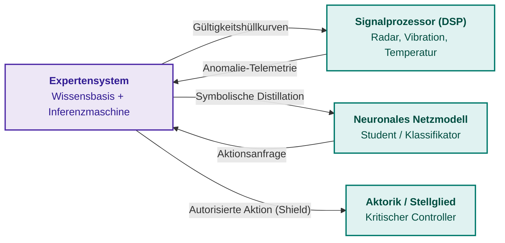
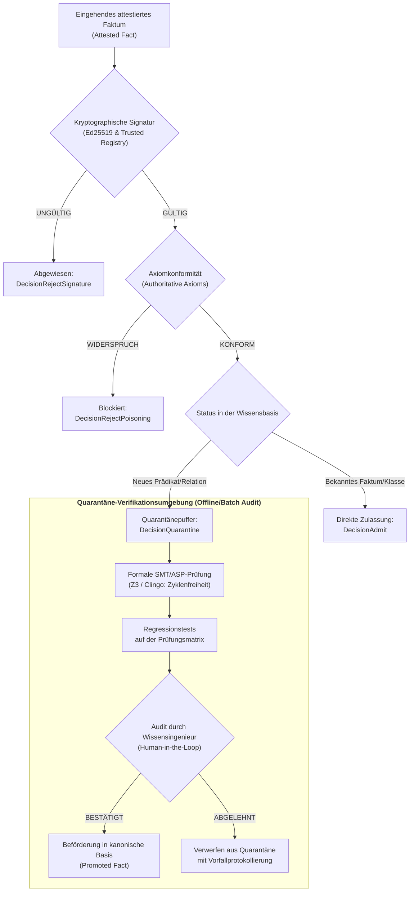

# Kapitel 33. Systemübergreifender Wissensaustausch: Regelbereitstellung für Drittsysteme, Modell-Training und sicheres Feedback

> **Buch:** [Architektur evidenzbasierter Expertensysteme](README.md) · [Teil VII: Reaktive Ausführung, systemübergreifender Wissensaustausch und verteilte SOA](part-07-runtime-and-knowledge-exchange.md)  
> **Vorheriges Kapitel:** [Kapitel 35. Reaktives Expertensystem: Ereignisse, Widerruf und Wissensadaptation](ch35-self-organizing-expert-systems-synergetics-and-npu-runtime.md)  
> **Nächstes Kapitel:** [Kapitel 40. Verteilte Architektur evidenzbasierter Expertensysteme: Epistemische SOA, semantisches Routing, Speicherhierarchien und mehrquellenbasiertes defeasibles Schiedsverfahren](ch40-distributed-epistemic-architectures-soa-and-cluster-scaling.md)  
> **Inhaltsverzeichnis:** [README.md](README.md)  
> **Autor:** [Mykola Fedchyk](about-the-author.md)  
> **Niveau:** Systemarchitekten, Wissensingenieure, Entwickler verteilter Systeme und eingebetteter Rechner: Fortgeschritten  
> **Lernziele:** Schnittstellen zur Wissensbereitstellung von Expertensystemen für externe Konsumenten entwerfen; logische Invarianten in numerische Gültigkeitshüllkurven für digitale Signalprozessoren und Computer Vision übersetzen; symbolische Wissensdistillation von Regeln in neuronale Netze mittels semantischer Verlustfunktionen implementieren; formale Schutzschilde (Safety Shields) für das Reinforcement Learning von Agenten einsetzen; Wissensaustauschformate (JSON-LD, SHACL-Shapes, kryptographisch signierte Pakete) zielgerichtet auswählen; NATS-Broker und gRPC-Dienste für den asynchronen und latenzarmen Faktenaustausch konfigurieren; Zugriffsberechtigungen über ein Sicherheitsgitter von Vertraulichkeitsstufen durchsetzen und Merkle-Inklusionsbeweise generieren; die Wissensbasis durch kryptographische Attestierung und Zulassungsgateways vor Vergiftungsangriffen (Knowledge Poisoning) schützen; Telemetrie von Gegenbeispielen aus Peripheriesystemen zur Erstellung von Prüfungskandidaten für das Nachtraining aggregieren.

---

## Abstract

Man stelle sich einen autonomen taktischen oder aufklärenden Drohnenschwarmverbund oder eine robotergestützte Fertigungsanlage vor (DefTech, IEC 61508 / ISO 26262). Ein bildverarbeitender neuronaler Klassifikator (Computer Vision, CV) detektiert die Silhouette eines Objekts und übermittelt Zielkoordinaten an ein Richtgetriebe oder einen Roboterarm. Verfügt das neuronale Netz über keinen deterministischen formalen Schutzschild (*Safety Shield*), führt eine optische Täuschung durch Wetterkapriolen oder ein feindlicher Störangriff (*Adversarial Patch*) unweigerlich zu einer fatalen Fehlausrichtung auf befreundete oder zivile Einheiten. Umgekehrt gilt: Überträgt die Feldtelemetrie Messwerte ohne kryptographische Faktenattestierung (Ed25519-Signaturen und Merkle-Bäume), kann ein Angreifer durch Injektion präparierter Gegenbeispiele die Wissensbasis kompromittieren und die gesamte Mission lahmlegen. Ein industrielles Expertensystem kann daher nicht länger als isolierter Konsultationsassistent für einen menschlichen Bediener verharren: Es muss die Rolle eines echtzeitfähigen Supervisors im Gesamtsystem übernehmen.

Dieses Kapitel widmet sich der ingenieurtechnischen Organisation des systemübergreifenden Wissensaustauschs, in dem das Expertensystem simultan als autoritative Quelle verifizierter Normen, als formaler Lehrmeister für externe Modelle und als abgesicherter Empfänger externer Erfahrungswerte agiert. Zunächst definiert das Kapitel die Systemrollen des Expertensystems in einer heterogenen Umgebung: normatives Orakel, Safety Shield für neuronale Agenten und Generator eines verifizierten Curriculums. Anschließend wird die Übersetzung prädikatenlogischer Constraints in numerische Gültigkeitshüllkurven für digitale Signalprozessoren (DSP) dargelegt, gefolgt von Verfahren der symbolischen Wissensdistillation in neuronale Netze über semantische Verlustfunktionen sowie Protokollen für den latenzarmen Austausch (NATS, gRPC, JSON-LD, SHACL). Abschließend werden Abwehrmechanismen gegen Wissensvergiftung, die Zugriffskontrolle anhand eines Sicherheitsgitters und ein vollständiges, praxiserprobtes Attestierungsmodul in Go präsentiert.

---

## 1. Das Expertensystem als Wissensanbieter und Lehrer für Drittsysteme

Das traditionelle Knowledge Engineering behandelte das Expertensystem vorwiegend als Endberater für menschliche Operateure: Der Benutzer gab Fakten über eine Dialogschnittstelle ein, die Inferenzmaschine wendete Regeln an, und die Erklärungskomponente lieferte eine textuelle Begründung zurück. In modernen cyber-physischen Systemen, robotischen Plattformen und verteilten Leitwarten ist der Konsument der Inferenzentscheidung jedoch zunehmend ein anderes Softwaresystem: ein Trajektorienplanungsalgorithmus, der Mikrocontroller eines Stellglieds oder eine Datenaufbereitungs-Pipeline für das Training tiefer neuronaler Netze.

Die unstrukturierte, direkte Datenübertragung zwischen solchen Teilsystemen verursacht einen gravierenden Bruch des semantischen Kontexts. Übergibt eine Signalverarbeitungseinheit einem neuronalen Netz ein numerisches Rohdatenfeld ohne Kenntnis der physikalischen Invarianten des Objekts, lernt das Modell mit hoher Wahrscheinlichkeit trügerische statistische Scheinkorrelationen. Generiert andererseits ein externes Modell Steuerbefehle, ohne diese durch ein normatives Orakel validieren zu lassen, droht das Verlassen des sicheren Betriebsbereichs. Das Expertensystem überbrückt diesen Bruch, indem es drei eng miteinander verzahnte Rollen übernimmt:

1. **Normatives Orakel (Normative Oracle):** Das Expertensystem liefert Drittkomponenten präzise Entscheide über die Zulässigkeit von Aktionen, indem es den aktuellen Zustand auf Konformität mit Industrienormen, Sicherheitsinvarianten und Betriebsbeschränkungen überprüft ([Kapitel 21](ch21-from-recommendation-to-action.md)).
2. **Formaler Supervisor oder Schutzschild (Safety Shield):** Vor der Weiterleitung von Stellbefehlen an physische Aktoren fängt das Expertensystem die Aktionen externer Controller oder RL-Agenten ab und blockiert unsichere Zustandsübergänge strikt nach dem Fail-Closed-Prinzip ([Kapitel 28](ch28-dual-mode-expert-systems.md)).
3. **Generator eines verifizierten Curriculums (Curriculum Generator):** Das Expertensystem synthetisiert hochwertige Trainingsdaten für externe Modelle des maschinellen Lernens, annotiert die Daten mit formalen Beweisen und garantiert die logische Widerspruchsfreiheit des Lehrmaterials.



---

## 2. Wissensbereitstellung für Prozessoren physikalischer Signale und Sensorinformationen

Physikalische Sensoren (Radar, Lidar, Schwingungsaufnehmer, Spektrumanalysatoren, Wärmebildkameras) erzeugen kontinuierliche numerische Signalströme. Digitale Signalprozessoren (DSP) und Computer-Vision-Module (CV) überführen diese Ströme in Zeitreihen, Tiefenkarten und Merkmalsvektoren. Signalprozessoren operieren jedoch primär auf statistischen und spektralen Kenngrößen (schnelle Fourier-Transformation, Wavelet-Filter, Kovarianzmatrizen) und besitzen keinerlei domänenspezifischen Kontext. Ihnen fehlt das Wissen darüber, dass die Getriebetemperatur physikalisch unmöglich innerhalb von zwei Millisekunden um vierzig Grad ansteigen kann oder dass ein Einbruch der Reflexionsamplitude bei einer bestimmten Frequenz auf eine Luftdruckänderung und nicht auf einen Senderdefekt zurückzuführen ist.

### 2.1. Übertragung logischer Normen in numerische Gültigkeitshüllkurven

Das Expertensystem übersetzt deklarative ontologische Axiome in rigide numerische Filterparameter, die als **Gültigkeitshüllkurven (Validity Envelopes)** bezeichnet werden. Eine Gültigkeitshüllkurve definiert ein Hypervolumen im Messraum, innerhalb dessen ein Signal als physikalisch plausibel eingestuft wird:

```math
\mathcal{E}_s = \left\{ y(t) \in \mathbb{R}^d \;\middle|\; y_{\min} \le y(t) \le y_{\max} \;\land\; \left\|\frac{dy}{dt}\right\| \le \Delta_{\max} \;\land\; \Phi(y(t), x_{\text{state}}) = 1 \right\}
```

wobei $`y_{\min}`$ und $`y_{\max}`$ die stationären Grenzen des Sensorbereichs definieren, $`\Delta_{\max}`$ die physikalisch maximal zulässige Änderungsrate des Prozesses beschränkt und $`\Phi`$ ein boolesches Prädikat für die kontextuelle Konformität mit dem aktuellen Betriebsmodus des Aggregats $`x_{\text{state}}`$ darstellt, wie in [Kapitel 22](ch22-cybernetics-edge-to-backend.md) spezifiziert.

Exportiert das Expertensystem eine Gültigkeitshüllkurve an einen Signalprozessor oder ein Kalman-Filter, definiert es Innovationsschranken (*Innovation Gating*) auf Basis der Mahalanobis-Distanz nach Bar-Shalom et al. [[1]](#src-1):

```math
d_M^2(t) = \tilde{y}^T(t) S^{-1}(t) \tilde{y}(t) \le \gamma_{\text{threshold}}
```

**Parameter und messbare Größen:**
- $`\tilde{y}(t) = y(t) - \hat{y}(t|t-1) \in \mathbb{R}^d`$ — Innovationsvektor (Residuum der Messvorhersage) der Dimension $`d`$;
- $`S(t) \in \mathbb{S}_{++}^d`$ — symmetrische, positiv definite Kovarianzmatrix der Innovation der Dimension $`d \times d`$;
- $`\gamma_{\text{threshold}} = \chi_d^2(1 - \alpha)`$ — Quantil der Chi-Quadrat-Verteilung mit $`d`$ Freiheitsgraden für das gewählte Signifikanzniveau $`\alpha`$ (z. B. $`\alpha = 0{,}01`$);
- $`d_M^2(t) \ge 0`$ — dimensionsloses Quadrat der Mahalanobis-Distanz.

**Operative Zustandsübergänge und numerisches Rechenbeispiel:**
- Gilt $`d_M^2(t) \le \gamma_{\text{threshold}}`$, wird die Messung als physikalisch plausibel eingestuft und das Kalman-Filter aktualisiert den Zustandsvektor des Systems (`INNOVATION_ACCEPTED`);
- Gilt $`d_M^2(t) > \gamma_{\text{threshold}}`$, wird der Messwert als Hüllkurvenanomalie klassifiziert (`INNOVATION_REJECTED`); die Beobachtung fließt nicht in die Zustandsschätzung ein, das Filter behält die A-priori-Prädiktion bei und das System generiert einen Vorfallbericht für den Sensortrakt;
- Praktisches Rechenbeispiel: Betrachtet wird ein skalarer Öldruckkanal ($`d = 1`$). Bei einem Signifikanzniveau von $`\alpha = 0{,}01`$ beträgt der Schwellenwert $`\gamma_{\text{threshold}} = \chi_1^2(0{,}99) = 6{,}635`$. Der prädizierte Wert liege bei $`\hat{y} = 10{,}0\,\text{bar}`$, die Innovationsvarianz bei $`S = 0{,}25\,\text{bar}^2`$ (Standardabweichung $`\sigma = 0{,}5\,\text{bar}`$), und der aktuelle Sensorwert springt plötzlich auf $`y = 11{,}6\,\text{bar}`$. Das Residuum beträgt somit $`\tilde{y} = 11{,}6 - 10{,}0 = 1{,}6\,\text{bar}`$.

```math
d_M^2 = \frac{(1{,}6\,\text{bar})^2}{0{,}25\,\text{bar}^2} = \frac{2{,}56}{0{,}25} = 10{,}24.
```

Da $`10{,}24 > 6{,}635`$ gilt, verwirft das Innovation Gating den Messwert (`INNOVATION_REJECTED`), wodurch eine Verfälschung des Kalman-Filters durch den abrupten Drucksprung zuverlässig verhindert wird.

### 2.2. Prädikatenregeln zur Störungserkennung und Erkennung von Sensorspoofing

Dank der Einbettung in die technische Ontologie deckt das Expertensystem konsistente Korrelationsanomalien auf, die ein einzelner Sensorkanal für sich genommen als valide einstufen würde. Meldet beispielsweise der GNSS-Satellitenempfänger eine Geschwindigkeit von 120 km/h, während das Inertialnavigationssystem eine Längsbeschleunigung von null registriert und die Raddrehzahlsensoren eine stehende Achse melden, könnte ein einzelner Rechner einem Satellitenspoofing erliegen. Das Expertensystem erzwingt hierbei sensorsübergreifende Invarianten:

```math
\forall t \quad \lvert v_{\text{GNSS}}(t) - v_{\text{odo}}(t) \rvert > \epsilon_v \implies \text{SpoofingSuspected}(\text{GNSS}, t) \land \text{DegradeWeight}(\text{GNSS}, 0)
```

**Parameter und ingenieurtechnische Grenzwerte:**
- $`v_{\text{GNSS}}(t), v_{\text{odo}}(t) \ge 0`$ — Momentane Schätzungen der Längsgeschwindigkeit aus dem GNSS-Empfänger und den Rad-Odometern ($`\text{km/h}`$);
- $`\epsilon_v`$ — Maximal zulässige Geschwindigkeitstoleranz (z. B. $`\epsilon_v = 15{,}0\,\text{km/h}`$).

**Operative Handlungsabläufe und Beispiel:**
- Registriert der Satellitenempfänger $`v_{\text{GNSS}} = 120\,\text{km/h}`$, während der Odometer $`v_{\text{odo}} = 5\,\text{km/h}`$ ausgibt, berechnet das Modul die Differenz: $`\lvert 120 - 5 \rvert = 115\,\text{km/h} > 15\,\text{km/h}`$.
- Das Expertensystem sendet unverzüglich eine Steueranweisung an den Signalprozessor, das Gewicht des kompromittierten GNSS-Kanals im Fusionsfilter dynamisch auf null zu setzen (`DegradeWeight(GNSS, 0)`). Die Navigation schaltet augenblicklich in den autonomen Koppelnavigationsmodus (Dead Reckoning) auf Basis der Inertialsensorik um.

---

## 3. Training von Drittsystemen: Symbolische Distillation und verifiziertes Curriculum

Agieren externe Systeme als neuronale Klassifikatoren oder Regler, kann das Expertensystem die Rolle des formalen Lehrmeisters einnehmen. Das direkte Training neuronaler Netze auf unbereinigten empirischen Datensätzen führt häufig zur Verletzung fundamentaler physikalischer oder logischer Gesetzmäßigkeiten: Ein Computer-Vision-System erkennt ein Verkehrsschild an einer Position, die durch die Szenengeometrie ausgeschlossen ist, oder ein Stromnetz-Klassifikator prognostiziert einen negativen Isolationswiderstand.

### 3.1. Symbolische Wissensdistillation über semantische Verlustfunktionen

Die symbolische Wissensdistillation (Symbolic Knowledge Distillation) überträgt prädikatenlogische Inferenzregeln direkt in die synaptischen Gewichte eines künstlichen neuronalen Netzes. Der Ansatz basiert auf dem Mechanismus der A-posteriori-Regularisierung nach Hu et al. [[2]](#src-2). Hierbei generiert das Expertensystem eine Zielwahrscheinlichkeitsverteilung $`q(y|x)`$, die eine Menge logischer Regeln $`\mathcal{R} = \{(r_k, \lambda_k)\}`$ erfüllt, indem die Kullback-Leibler-Divergenz bezüglich des neuronalen Basismodells $`p_\theta(y|x)`$ minimiert wird:

```math
\min_{q} \text{KL}(q(y|x) \parallel p_\theta(y|x)) - \sum_{k} \lambda_k \mathbb{E}_{q}[\mathbf{1}_{r_k}(x, y)]
```

wobei $`\mathbf{1}_{r_k}(x, y)`$ den Wert 1 annimmt, wenn das Paar $`(x, y)`$ die Regel $`r_k`$ erfüllt, und $`\lambda_k \ge 0`$ das Gewicht bzw. die Strenge der Regel bestimmt. Die geschlossene Lösung dieses Optimierungsproblems entspricht einer Gibbs-Verteilung:

```math
q^*(y|x) \propto p_\theta(y|x) \exp\left( \sum_k \lambda_k \mathbf{1}_{r_k}(x, y) \right)
```

Die resultierende Verteilung $`q^*(y|x)`$ dient als weiches Zielmuster (Soft Labels) für das überwachte Training des Student-Netzwerks über eine Kreuzentropie-Verlustfunktion.

Für die direkte, durchgängige Differenzierbarkeit logischer Beschränkungen im Gradientenabstieg werden semantische Verlustfunktionen nach Xu et al. [[3]](#src-3) eingesetzt. Ist eine formale Regel als aussagenlogische Formel $`\alpha`$ über den Ausgängen des Klassifikators formuliert, definiert sich der semantische Verlust als der negative Logarithmus der Erfüllungswahrscheinlichkeit dieser Formel:

```math
\mathcal{L}_{\text{semantic}}(\theta, \alpha) = -\log \sum_{y \models \alpha} \prod_{j: y_j = 1} p_\theta(\hat{y}_j = 1 \mid x) \prod_{j: y_j = 0} (1 - p_\theta(\hat{y}_j = 1 \mid x))
```

Während der Fehlerrückführung (Backpropagation) bestraft der Gradient des semantischen Verlusts die Modellgewichte für jede Annäherung der Ausgaben an Konfigurationen, die die logischen Invarianten des Expertensystems verletzen.

### 3.2. Formale Schutzschilde (Safety Shielding) beim Agententraining

Beim Reinforcement Learning (RL) erkundet ein Agent den Zustandsraum nach dem Trial-and-Error-Prinzip. In sicherheitskritischen Domänen kann eine unkontrollierte Exploration zur mechanischen Zerstörung des Systems oder zum Eintritt in irreversible Gefahrenzustände führen.

Das Expertensystem implementiert hierfür die Architektur des formalen Shieldings nach Alshiekh et al. [[4]](#src-4). Der Schutzschild wird aus Sicherheitsspezifikationen synthetisiert, die in linearer temporaler Logik (Linear Temporal Logic, LTL) formalisiert sind. Das Expertensystem berechnet für jeden Zeitschritt die Menge der sicheren Aktionen im aktuellen Zustand $`\mathcal{A}_{\text{safe}}(s_t) \subseteq \mathcal{A}`$. Wählt der Agent eine Aktion $`a_t \notin \mathcal{A}_{\text{safe}}(s_t)`$, greift der Schutzschild ein, ersetzt den Befehl durch die nächstgelegene zulässige sichere Aktion $`a_t' = \arg\min_{a \in \mathcal{A}_{\text{safe}}} \|a - a_t\|`$ und speist eine Strafkomponente in die Belohnungsfunktion des Agenten ein. Auf diese Weise lernt das externe Modell, seine Zielfunktion ausschließlich innerhalb der physikalisch und normativ sicheren Grenzen zu optimieren.

---

## 4. Formate, Methoden und Technologien des systemübergreifenden Wissensaustauschs

Der Wissensaustausch zwischen heterogenen Rechnersystemen erfordert Protokolle und Datenformate, die eine eindeutige Interpretation der Aussagenstruktur gewährleisten, den Herkunftskontext der Fakten bewahren und minimale Serialisierungs-Overheads verursachen.

| Anforderung | Empfohlenes Format / Technologie | Begründung des Einsatzes |
|---|---|---|
| Semantische Interoperabilität von Graphen | JSON-LD 1.1 [[5]](#src-5) | Verknüpfung lokaler Aussage-Schlüssel mit globalen Ontologie-IRIs bei voller Lesbarkeit |
| Validierung struktureller Beschränkungen | W3C SHACL [[6]](#src-6) | Deklarative Spezifikation von Pflichtattributen, Wertebereichen und Beziehungskardinalitäten |
| Prädikatenregeln und Inferenz | RIF / RuleML | Standardisierte Syntax für den Austausch logischer Regeln erster Ordnung |
| Industrieller Datenaustausch auf dem Bus | NATS JetStream nach Eugster et al. [[7]](#src-7) | Asynchroner Broker mit Unterstützung für subjektbasierte Filterung, Stream-Persistenz und At-Least-Once-Semantik |
| Latenzarme Punkt-zu-Punkt-Prüfungen | gRPC über HTTP/2 und Protobuf | Synchrone Validierungsanfragen von Aktionen und Hüllkurvenabruf mit Mikrosekunden-Latenz |
| Unveränderliche Wissenspakete | ZNAV-INDEX / mmap ([Kapitel 32](ch32-high-performance-knowledge-packs-mmap-and-harvesting.md)) | Paketierte Auslieferung von Wissensbasis-Updates mit Zero-Deserialization für eingebettete Knoten |

### 4.1. Semantischer Nachrichtenvertrag auf Basis von JSON-LD

Das folgende Listing zeigt ein exemplarisches semantisches Dokument, mit dem das Expertensystem eine verifizierte Sensor-Gültigkeitshüllkurve über den Message Broker an einen untergeordneten Signalprozessor exportiert:

<details>
<summary>Beispiel einer semantischen JSON-LD-Nachricht für den Export einer Gültigkeitshüllkurve</summary>

```json
{
  "@context": {
    "es": "https://standards.iso.org/iso/26262/ontology#",
    "xsd": "http://www.w3.org/2001/XMLSchema#"
  },
  "@id": "urn:es:envelope:motor_current:gen42",
  "@type": "es:SensorValidityEnvelope",
  "es:signalName": "motor_phase_u_current",
  "es:unit": "amperes",
  "es:minValue": { "@type": "xsd:double", "@value": -50.0 },
  "es:maxValue": { "@type": "xsd:double", "@value": 50.0 },
  "es:maxSlewRate": { "@type": "xsd:double", "@value": 1500.0 },
  "es:provenance": {
    "es:derivedFromStandard": "ISO-26262-Part-4",
    "es:ruleHash": "9e1c5f8b4a2e3d7c",
    "es:certifiedGeneration": "gen-2026-10-04-v1"
  }
}
```

</details>

### 4.2. Subjektbasiertes Routing in NATS JetStream

Der NATS-Broker verwendet hierarchische Textsubjekte (Subjects), was eine gezielte Kanalisierung des Wissens nach Kategorien, Sicherheitsdomänen und Konsumententypen ermöglicht:

- `knowledge.export.dsp.envelopes.<subsystem>`: Veröffentlichung von Gültigkeitshüllkurven für Signalprozessoren eines spezifischen Subsystems;
- `knowledge.export.models.distillation.<domain>`: Distribution von Trainingskorpora und Soft Labels für externe Modelle;
- `knowledge.feedback.telemetry.anomalies.<sensor_id>`: Entgegennahme von Berichten über Hüllkurvenverletzungen;
- `knowledge.control.quarantine.admission`: Koordinationskanal für das Zulassungsgateway neuer Fakten.

Dank des nachrichtenpersistenten Speichermechanismus von JetStream ist sichergestellt, dass ein vorübergehend vom Netzwerk getrennter Knoten ([Kapitel 22](ch22-cybernetics-edge-to-backend.md)) nach Wiederherstellung der Verbindung alle verpassten Updates sequenztreu und vollständig abruft.

---

## 5. Bedingungen, regeln zur Semantikerhaltung und ontologischer Abgleich

Werden Wissensbestände zwischen unabhängig voneinander entwickelten Informationssystemen ausgetauscht, besteht das akute Risiko semantischer Verfälschungen: Ein Prädikat einer Ursprungsontologie kann im Zielsystem eine weiter oder enger gefasste Interpretation besitzen.

### 5.1. Konservative Erweiterungen und Modullokalität

Gemäß der Theorie der Ontologiemodularität nach Cuenca Grau et al. [[8]](#src-8) ist der Export eines Wissensmoduls $`\mathcal{M}`$ aus einer Ursprungsontologie $`\mathcal{O}_1`$ in ein Zielsystem $`\mathcal{O}_2`$ genau dann korrekt, wenn $`\mathcal{M}`$ eine **konservative Erweiterung (Conservative Extension)** bezüglich der gewählten Signatur $`\Sigma`$ darstellt:

```math
\mathcal{O}_1 \models \psi \iff \mathcal{M} \models \psi \quad \text{für alle Formeln } \psi \text{ über der Signatur } \Sigma
```

Dies garantiert zwei fundamentale Systemeigenschaften:
1. **Importsicherheit:** Der Import des Moduls verändert keinerlei semantische Relationen zwischen den internen Begriffen der Zielontologie, die nicht zur gemeinsamen Signatur $`\Sigma`$ gehören.
2. **Inferenzvollständigkeit:** Sämtliche logischen Folgerungen über der Signatur $`\Sigma`$, die in der vollständigen Ursprungsontologie $`\mathcal{O}_1`$ ableitbar waren, lassen sich exklusiv aus dem extrahierten Modul $`\mathcal{M}`$ ableiten, ohne dass die gesamte Wissensbasis geladen werden muss.

### 5.2. Regeln zur Erhaltung semantischer Typen

Bei der Wissensübersetzung sind implizite Typverengungen oder Typerweiterungen streng untersagt:
- **Verbot des Verlusts modaler Präzision:** Handelt es sich bei der ursprünglichen Aussage um eine deontische Empfehlung `SHOULD`, darf diese im Drittprotokoll keinesfalls ohne explizite Autorisierung durch den Wissensingenieur in ein unbedingtes Verbot `MUST NOT` transformiert werden ([Kapitel 14](ch14-requirements-detection-and-formalization.md)).
- **Isolation der partiell geschlossenen Welt (PCWA):** Aussagen, die unter der Annahme einer geschlossenen Welt für eine abgegrenzte Domäne abgeleitet wurden ([Kapitel 07](ch07-knowledge-base-typology.md)), werden mit dem Geltungsbereich-Flag `scope: closed` annotiert. Ein Drittsystem darf die Negation-as-Failure-Regel keinesfalls auf Fakten anwenden, die aus offenen Domänen stammen (`scope: open`).

---

## 6. Zugriffskontrolle und Wissenssicherheit: Sicherheitsgitter und selektive Offenlegung

In anspruchsvollen Industrie- und Verteidigungsprojekten enthält die Wissensbasis Aussagen mit unterschiedlichen Geheimhaltungsstufen, geistigen Eigentumsrechten und Exportkontrollbeschränkungen. Das Expertensystem muss zuverlässig verhindern, dass vertrauliches Wissen an Drittsysteme mit unzureichender Freigabestufe abfließt.

### 6.1. Mehrstufige Sicherheit auf Basis des Denning-Sicherheitsgitters

Die Zugriffskontrolle stützt sich auf das klassische Gittermodell sicherer Informationsflüsse nach Denning [[9]](#src-9) sowie das Bell-LaPadula-Modell [[10]](#src-10). Die Menge der Sicherheitsmarkierungen bildet ein partiell geordnetes Gitter $`(\mathcal{L}, \le, \sqcap, \sqcup)`$:

```math
\mathcal{L} = \mathcal{C} \times 2^{\mathcal{K}}
```

wobei $`\mathcal{C} = \{\text{Public} < \text{Internal} < \text{Restricted} < \text{Critical}\}`$ eine lineare Hierarchie von Vertraulichkeitsstufen definiert und $`\mathcal{K}`$ eine Menge kategorialer Beschränkungen (Kompartimente, z. B. spezifische Projektnamen oder Konsortien) darstellt.

Die Sicherheitsmarkierung eines Subjekts $`L_s = (c_s, K_s)`$ dominiert die Markierung eines Wissensobjekts $`L_o = (c_o, K_o)`$ genau dann, wenn gilt:

```math
L_s \ge L_o \iff (c_s \ge c_o) \land (K_o \subseteq K_s)
```

**Parameter und Gitterbedingungen:**
- $`c_s, c_o \in \mathcal{C}`$ — Klassifikationsstufen des Subjekts und Objekts in der geordneten Menge $`\text{Public} < \text{Internal} < \text{Restricted} < \text{Critical}`$;
- $`K_s, K_o \subseteq \mathcal{K}`$ — Mengen zugewiesener Freigabekategorien (Kompartimente);
- $`L_s = (c_s, K_s), L_o = (c_o, K_o)`$ — kombinierte Sicherheitsmarkierungen.

**Regel des sicheren Wissensexports und Rechenbeispiel:**
- Eine Aussage $`f`$ mit der Markierung $`L_o = L(f)`$ wird einem Drittsystem mit der Freigabe $`L_s = L_{\text{recipient}}`$ genau dann bereitgestellt, wenn die Freigabe des Empfängers die Markierung des Faktums dominiert: $`L_s \ge L_o`$.
- Gilt $`L_s \not\ge L_o`$, verwirft das Export-Gateway das Faktum deterministisch mit dem Status `REJECT_CLEARANCE_VIOLATION`.
- Praxisbeispiel: Ein externes Diagnosesystem besitzt die Freigabe $`L_s = (\text{Internal}, \{\text{Avionics}, \text{Telemetry}\})`$. Die Wissensbasis enthält ein Faktum $`f_1`$ mit $`L(f_1) = (\text{Internal}, \{\text{Telemetry}\})`$ und eine kritische Kalibrierungsregel $`f_2`$ mit $`L(f_2) = (\text{Restricted}, \{\text{Avionics}\})`$.
  - Für $`f_1`$: $`c_s = \text{Internal} \ge c_o = \text{Internal}`$ und $`K_o = \{\text{Telemetry}\} \subseteq K_s`$, somit gilt $`L_s \ge L(f_1)`$ → Export autorisiert (`EXPORT_PERMITTED`);
  - Für $`f_2`$: $`c_s = \text{Internal} < c_o = \text{Restricted}`$, somit gilt $`L_s \not\ge L(f_2)`$ → Das Faktum wird vom Gateway abgewiesen (`EXPORT_DENIED`).

### 6.2. Selektive Beweisoffenlegung über Merkle-Bäume

Fordert ein externes Auditsystem den Nachweis an, dass eine spezifische Anforderung oder ein Prüffall tatsächlich Teil eines freigegebenen Wissensbasis-Releases ist, würde eine vollständige Offenlegung der Wissensbasis vertrauliche Details über Firmware, Architektur oder Parametrisierung preisgeben.

Zur Lösung dieses Dilemmas setzt das Expertensystem kryptographische Merkle-Bäume ein [[11]](#src-11). Die Wurzel des Baums $`R_{\text{Merkle}}`$ wird im öffentlichen Release-Zertifikat publiziert ([Kapitel 32](ch32-high-performance-knowledge-packs-mmap-and-harvesting.md)). Um das Vorhandensein eines spezifischen Faktums $`f_i`$ mit dem Hash $`H(f_i)`$ nachzuweisen, generiert das Expertensystem einen kompakten Authentifizierungspfad der Länge $`O(\log N)`$, der als **Merkle-Inklusionsbeweis (Merkle Inclusion Proof)** bezeichnet wird:

```math
\pi(f_i) = \langle h_1, h_2, \dots, h_{\lceil \log_2 N \rceil} \rangle
```

Das Drittsystem berechnet die Hash-Kaskade eigenständig nach:

```math
H(\dots H(H(f_i), h_1) \dots) = R_{\text{Merkle}}
```

**Parameter und numerisches Verifikationsbeispiel:**
- $`N`$ — Gesamtzahl der im Wissenspaket ZKP4 fixierten Fakten;
- $`H(f_i)`$ — kryptographischer SHA-256-Hash des Zielfaktums $`f_i`$;
- $`\lceil \log_2 N \rceil`$ — Länge des Authentifizierungspfads des Merkle-Inklusionsbeweises;
- $`R_{\text{Merkle}}`$ — im öffentlichen Release-Zertifikat beglaubigter Wurzel-Hash.
- Stimmt der berechnete Wurzel-Hash exakt mit $`R_{\text{Merkle}}`$ überein, wird das Faktum als authentisch anerkannt (`PROOF_VALID`); weicht das Ergebnis auch nur um ein einziges Bit ab, wird die Transaktion verworfen (`PROOF_INVALID`).
- Beispielrechnung: Für eine Wissensbasis mit $`N = 1024`$ Fakten beträgt die Pfadlänge lediglich $`\lceil \log_2 1024 \rceil = 10`$ Zwischen-Hashes zu je 32 Byte (Gesamtgröße des Beweises nur $`320\,\text{Byte}`$ anstelle einer Übertragung des Gesamtdatensatzes von $`32\,\text{KB}`$). Die Verifikation des Hash-Pfads beansprucht auf einem ARM Cortex-A72-Prozessor weniger als $`12\,\mu\text{s}`$ und garantiert damit Echtzeitfähigkeit.

---

## 7. Faktenattestierung (Fact Attestation) und Schutz vor Wissensvergiftung

Empfängt das Expertensystem Beobachtungen, Testergebnisse oder Regelvorschläge von externen Systemen, ist es der Gefahr der **Wissensvergiftung (Knowledge Poisoning)** ausgesetzt. Ein Angreifer oder ein kompromittierter Sensorknoten könnte manipulierte Fakten einspeisen (etwa die Behauptung, dass die kritische Grenztemperatur 500 °C statt 100 °C beträgt oder dass ein Sicherheitsventil bei Überdruck geschlossen bleiben muss), was nachgelagerte Inferenzketten lahmlegt oder fatale Fehlentscheidungen provoziert.

### 7.1. Kryptographische Faktenattestierung nach dem Ed25519-Schema

Jedes exportierte Faktum wird vom Quellsystem mittels einer digitalen Signatur nach dem Ed25519-Verfahren signiert (Bernstein et al. [[12]](#src-12)). Die Struktur eines attestierten Faktums umfasst die kanonischen Bytes der Aussage, die Quellkennung und die kryptographische Signatur:

```math
\sigma = \mathrm{Ed25519}_{\mathrm{Sign}}\bigl(SK_{\mathrm{source}}, \mathrm{SHA256}(s \parallel p \parallel o \parallel \mathrm{level} \parallel \mathrm{source\_id})\bigr)
```

Die Signaturprüfung garantiert Datenintegrität und Nichtabstreitbarkeit (Non-Repudiation) gemäß den Prinzipien für Software- und Artefakt-Lieferketten nach in-toto (Torres-Arias et al. [[13]](#src-13)).

### 7.2. Bedrohungstaxonomie: Angriffsformen der Wissensvergiftung (Knowledge Poisoning)

Die Vergiftung einer Wissensbasis in evidenzbasierten Systemen lässt sich anhand von vier primären Angriffsvektoren klassifizieren:

#### 7.2.1. Direkte Axiominversion (Axiom Inversion / Overwrite)
Ein angreifender Knoten sendet (selbst unter Vorlage eines gültigen Zugriffszertifikats) eine Aussage ein, die fundamentalen physikalischen Gesetzen oder Sicherheitsnormen direkt widerspricht:

```math
\mathrm{Attestation}: \langle \texttt{emergency\_brake}, \texttt{status\_on\_failure}, \texttt{DISABLED} \rangle
```

Ziel: Das Außerkraftsetzen von Sicherheitsverriegelungen im kritischen Moment.

#### 7.2.2. Verdeckte semantische Drift (Stealth Semantic Drift)
Der Angriff erfolgt schleichend über einen längeren Zeitraum: Sekündlich werden minimale Deltas numerischer Schwellenwerte oder Toleranzen übermittelt (beispielsweise driftet der Maximalstrom um $`+0{,}1\%`$ pro Beobachtung). Isoliert betrachtet passiert jedes Faktum die lokalen Filter, doch die kumulative Wirkung führt das Gesamtsystem schleichend aus dem sicheren Betriebsbereich.

#### 7.2.3. Induktion von Solver-Zyklen (Cyclic Denial-of-Reasoning)
Einschleusen zyklischer Abhängigkeiten zwischen neu definierten Prädikaten:

```math
P_1(x) \leftarrow P_2(x), \quad P_2(x) \leftarrow P_3(x), \quad P_3(x) \leftarrow P_1(x)
```

Dies provoziert eine exponentielle Explosion des Rechenaufwands oder ein Einfrieren der Inferenzmaschine bei Resolutionsverfahren und der Fixpunktberechnung.

#### 7.2.4. Sybil-Angriff im Feedback-Kanal (Sybil Consensus Poisoning)
Kompromittierung eines Pools von Sensorknoten zur koordinierten Übermittlung identischer Schein-Gegenbeispiele. Dadurch wird der statistische Schwellenwert $`N_{\text{threshold}}`$ künstlich überschritten, sodass das System eine fabrizierte Anomalie fälschlicherweise als reale Veränderung der physikalischen Umgebung interpretiert.

### 7.3. Zulassungsgateway und Lebenszyklus der Wissensquarantäne

Um die beschriebenen Bedrohungen wirksam zu neutralisieren, implementiert das Zulassungsgateway (Admission Controller) einen strikten, mehrstufigen **Lebenszyklus der Wissensquarantäne (Knowledge Quarantine Lifecycle)**:



1. **Kryptographische Validierung:** Ein Faktum wird abgewiesen (`DecisionRejectSignature`), falls der öffentliche Schlüssel der Quelle nicht im Register vertrauenswürdiger Aussteller enthalten ist oder die Signatur nicht zum Byte-Digest passt.
2. **Prüfung auf Axiomkonformität:** Das Faktum wird unmittelbar blockiert (`DecisionRejectPoisoning`), wenn sein Prädikat etablierten fundamentalen Sicherheitsaxiomen direkt widerspricht.
3. **Quarantänepuffer (Quarantine Buffer):** Syntaktisch korrekte Fakten, die bisher unbekannte Prädikate oder neuartige Strukturrelationen enthalten, gelangen keinesfalls direkt in den produktiven Inferenzraum. Sie werden in einen isolierten Kandidatenpuffer verschoben (`DecisionQuarantine`), wo sie automatische Regressionstests und formale Prüfungen mittels SMT/ASP-Solvern (Z3 oder Clingo, [Kapitel 23](ch23-knowledge-base-verification.md)) auf Zyklenfreiheit, verdeckte Widersprüche und Erhaltung von Sicherheitsinvarianten durchlaufen, bevor eine endgültige Zulassung erteilt wird.

---

## 8. Feedback-Schleife (Feedback Loop) und Nachtraining des Expertensystems

Die Interaktion zwischen Systemen ist ein bidirektionaler Prozess. Operieren untergeordnete Systeme (DSP, Computer Vision, autonome Agenten) in der physischen Realität, werden sie unweigerlich mit Randfällen (**Corner Cases**) konfrontiert: unvorhergesehene Wetterkonstellationen, neuartige Schwingungsspektren in Grenzbetriebsmodi oder unstandardisierte Protokollantworten von Netzwerkkomponenten.

### 8.1. Gegenbeispiel-Warteschlange und Vorfallaggregation

Registriert ein externer Signalprozessor das Verlassen einer definierten Gültigkeitshüllkurve oder stellt ein neuronales Klassifikationsmodell eine hohe Vorhersageentropie fest, wird ein strukturierter Anomaliebericht erzeugt. Diese Berichte werden in eine Feedback-Warteschlange (Feedback Queue) eingesteuert.

Ein Feedback-Kollektor aggregiert die Vorfälle. Ein vereinzelter Ausreißer kann auf ein flüchtiges Sensorrauschen zurückzuführen sein und rechtfertigt keine Regelrevision. Übersteigt jedoch die Anzahl gleichartiger Gegenbeispiele für ein Signal den statistischen Schwellenwert $`N_{\text{threshold}}`$, markiert der Kollektor das Phänomen als persistente Anomalie, die auf eine reale Veränderung der physikalischen Umgebungsbedingungen hindeutet.

### 8.2. Speisung des kontinuierlichen Lernzyklus

Die akkumulierten, verifizierten Gegenbeispiele dienen als Primäreingabe für:
- Die Erweiterung der Prüfungsmatrix aus [Kapitel 25](ch25-how-expert-systems-learn.md): Das neue Gegenbeispiel wird in die Menge der obligatorischen negativen oder Randwerttests aufgenommen und bildet eine neue Härteprüfung.
- Algorithmen zur Erkennung von Systemdrift aus [Kapitel 26](ch26-continual-learning.md): Der Berichtsstrom wird mit statistischen CUSUM-Tests (Cumulative Sum) analysiert, um eine schleichende Sensordegradation oder Arbeitspunktverschiebung frühzeitig zu detektieren.
- Die Adaption von Gültigkeitshüllkurven: Der Wissensingenieur oder ein automatisierter Optimierer formuliert angepasste Grenzen $`\mathcal{E}_s'`$, die vor der Freigabe eines neuen Wissenspaket-Releases den vollständigen Zyklus der formalen Prüfung durchlaufen.

---

## 9. Programmatische Implementierung in Go: Das Modul xchange

Im Folgenden wird die Implementierung des Kerns für den systemübergreifenden Wissensaustausch in Go vorgestellt. Das Paket `xchange` demonstriert:
1. Den Wissensexport mit filternder Zugriffskontrolle nach Sicherheitsgittern und digitaler Ed25519-Signierung.
2. Das Zulassungsgateway für eingehende Fakten mit Schutz vor Wissensvergiftung (Signatur- und Axiomprüfung).
3. Die Validierung kontinuierlicher Sensorsignale anhand von Hüllkurven.
4. Den Feedback-Kanal: Anomalie-Kollektor mit Schwellenwertsteuerung zur Auslösung von Nachtrainingsprozessen.

Der Code ist vollständig autark und stützt sich ausschließlich auf die Go-Standardbibliothek (`crypto/ed25519`, `crypto/sha256`, `sync`, `math`).

<details>
<summary>Quellcode des Moduls xchange (Go): xchange.go</summary>

```go
package xchange

import (
	"crypto/ed25519"
	"crypto/sha256"
	"encoding/hex"
	"errors"
	"fmt"
	"math"
	"sync"
	"time"
)

// SecurityLevel bezeichnet die Vertraulichkeitsstufe im Sicherheitsgitter.
type SecurityLevel int

const (
	LevelPublic SecurityLevel = iota
	LevelInternal
	LevelRestricted
	LevelCritical
)

// Dominates prüft die Informationsflussbedingung im Sicherheitsgitter (L_sub >= L_obj).
func (l SecurityLevel) Dominates(other SecurityLevel) bool {
	return l >= other
}

// Fact beschreibt eine atomare technische Aussage.
type Fact struct {
	Subject   string        `json:"subject"`
	Predicate string        `json:"predicate"`
	Object    string        `json:"object"`
	Level     SecurityLevel `json:"level"`
	SourceID  string        `json:"source_id"`
}

// Digest berechnet den kanonischen kryptographischen SHA-256-Hash für das Faktum.
func (f Fact) Digest() [32]byte {
	h := sha256.New()
	fmt.Fprintf(h, "%s|%s|%s|%d|%s", f.Subject, f.Predicate, f.Object, f.Level, f.SourceID)
	var d [32]byte
	copy(d[:], h.Sum(nil))
	return d
}

// AttestedFact verbindet ein Faktum mit der kryptographischen digitalen Signatur des Quellsystems.
type AttestedFact struct {
	Fact      Fact   `json:"fact"`
	Signature string `json:"signature"`
}

// SignalEnvelope überträgt eine symbolische Norm des Expertensystems in Validierungsgrenzen für DSP und Sensoren.
type SignalEnvelope struct {
	SignalName string  `json:"signal_name"`
	MinValue   float64 `json:"min_value"`
	MaxValue   float64 `json:"max_value"`
	MaxDelta   float64 `json:"max_delta"`
}

// ValidateSample prüft die physikalische Zulässigkeit eines neuen Messwerts anhand von Wertebereich und Änderungsrate.
func (e SignalEnvelope) ValidateSample(prevVal, curVal float64) error {
	if curVal < e.MinValue || curVal > e.MaxValue {
		return fmt.Errorf("signal %s value %.3f out of range [%.3f, %.3f]", e.SignalName, curVal, e.MinValue, e.MaxValue)
	}
	if e.MaxDelta > 0 && prevVal != 0 {
		diff := math.Abs(curVal - prevVal)
		if diff > e.MaxDelta {
			return fmt.Errorf("signal %s jump %.3f exceeds max delta %.3f", e.SignalName, diff, e.MaxDelta)
		}
	}
	return nil
}

// KnowledgeExporter exportiert Wissen für Drittsysteme mit Gitter-basierter Filterung und Signatur.
type KnowledgeExporter struct {
	SystemID   string
	PrivateKey ed25519.PrivateKey
	PublicKey  ed25519.PublicKey
}

// NewKnowledgeExporter erzeugt einen KnowledgeExporter mit einem neuen Ed25519-Schlüsselpaar.
func NewKnowledgeExporter(systemID string) (*KnowledgeExporter, error) {
	pub, priv, err := ed25519.GenerateKey(nil)
	if err != nil {
		return nil, err
	}
	return &KnowledgeExporter{
		SystemID:   systemID,
		PrivateKey: priv,
		PublicKey:  pub,
	}, nil
}

// Export filtert Fakten nach der Freigabestufe des Empfängers und signiert zulässige Aussagen.
func (e *KnowledgeExporter) Export(facts []Fact, recipientClearance SecurityLevel) []AttestedFact {
	var out []AttestedFact
	for _, f := range facts {
		if !recipientClearance.Dominates(f.Level) {
			continue
		}
		f.SourceID = e.SystemID
		digest := f.Digest()
		sig := ed25519.Sign(e.PrivateKey, digest[:])
		out = append(out, AttestedFact{
			Fact:      f,
			Signature: hex.EncodeToString(sig),
		})
	}
	return out
}

// AdmissionDecision bestimmt das Prüfurteil des Zulassungsgateways für ein Faktum.
type AdmissionDecision int

const (
	DecisionAdmit AdmissionDecision = iota
	DecisionRejectSignature
	DecisionRejectPoisoning
	DecisionQuarantine
)

// AdmissionController verifiziert die Echtheit eingehender Fakten und wehrt Wissensvergiftung ab.
type AdmissionController struct {
	mu          sync.RWMutex
	trustedKeys map[string]ed25519.PublicKey
	axioms      map[string]string
	knownPreds  map[string]bool
	quarantine  map[string]AttestedFact
}

// NewAdmissionController initialisiert das Zulassungsgateway.
func NewAdmissionController() *AdmissionController {
	return &AdmissionController{
		trustedKeys: make(map[string]ed25519.PublicKey),
		axioms:      make(map[string]string),
		knownPreds:  make(map[string]bool),
		quarantine:  make(map[string]AttestedFact),
	}
}

// RegisterTrustedSource hinterlegt den öffentlichen Schlüssel eines vertrauenswürdigen Wissensanbieters.
func (ac *AdmissionController) RegisterTrustedSource(sourceID string, pub ed25519.PublicKey) {
	ac.mu.Lock()
	defer ac.mu.Unlock()
	ac.trustedKeys[sourceID] = pub
}

// RegisterKnownPredicate registriert ein geprüftes und sicheres Prädikat der Basisontologie.
func (ac *AdmissionController) RegisterKnownPredicate(predicate string) {
	ac.mu.Lock()
	defer ac.mu.Unlock()
	ac.knownPreds[predicate] = true
}

// SetAuthoritativeAxiom fixiert eine unumstößliche Norm, deren Falsifikation als Wissensvergiftung gilt.
func (ac *AdmissionController) SetAuthoritativeAxiom(subject, predicate, object string) {
	ac.mu.Lock()
	defer ac.mu.Unlock()
	key := subject + "#" + predicate
	ac.axioms[key] = object
	ac.knownPreds[predicate] = true
}

// Ingest führt die Faktenattestierung durch: Signaturprüfung, Axiomabgleich und Quarantäne-Routing.
func (ac *AdmissionController) Ingest(af AttestedFact) AdmissionDecision {
	ac.mu.Lock()
	defer ac.mu.Unlock()

	pub, ok := ac.trustedKeys[af.Fact.SourceID]
	if !ok {
		return DecisionRejectSignature
	}

	sigBytes, err := hex.DecodeString(af.Signature)
	if err != nil || len(sigBytes) != ed25519.SignatureSize {
		return DecisionRejectSignature
	}

	digest := af.Fact.Digest()
	if !ed25519.Verify(pub, digest[:], sigBytes) {
		return DecisionRejectSignature
	}

	key := af.Fact.Subject + "#" + af.Fact.Predicate
	if existing, hasAxiom := ac.axioms[key]; hasAxiom {
		if existing != af.Fact.Object {
			return DecisionRejectPoisoning
		}
	}

	// Falls das Prädikat bisher nicht attestiert ist, Überführung in den Quarantänepuffer
	if !ac.knownPreds[af.Fact.Predicate] {
		ac.quarantine[key] = af
		return DecisionQuarantine
	}

	return DecisionAdmit
}

// PromoteFromQuarantine überführt ein durch SMT/ASP verifiziertes Faktum in den freigegebenen Status.
func (ac *AdmissionController) PromoteFromQuarantine(key string) (AttestedFact, bool) {
	ac.mu.Lock()
	defer ac.mu.Unlock()
	af, ok := ac.quarantine[key]
	if !ok {
		return AttestedFact{}, false
	}
	delete(ac.quarantine, key)
	ac.knownPreds[af.Fact.Predicate] = true
	return af, true
}

// AnomalyReport dokumentiert Randfälle oder Hüllkurvenverletzungen durch externe Prozessoren.
type AnomalyReport struct {
	ConsumerID  string    `json:"consumer_id"`
	SignalName  string    `json:"signal_name"`
	ObservedVal float64   `json:"observed_val"`
	Detail      string    `json:"detail"`
	ReportedAt  time.Time `json:"reported_at"`
}

// FeedbackCollector sammelt Rückmeldungen untergeordneter Systeme und generiert Kandidaten für das Nachtraining.
type FeedbackCollector struct {
	mu        sync.Mutex
	threshold int
	incidents map[string][]AnomalyReport
}

// NewFeedbackCollector erzeugt einen Feedback-Kollektor mit Schwellenwertsteuerung.
func NewFeedbackCollector(threshold int) *FeedbackCollector {
	return &FeedbackCollector{
		threshold: threshold,
		incidents: make(map[string][]AnomalyReport),
	}
}

// Record registriert einen Vorfallbericht und gibt true zurück, sobald der Schwellenwert für ein Nachtraining erreicht ist.
func (fc *FeedbackCollector) Record(rep AnomalyReport) (bool, error) {
	if rep.SignalName == "" {
		return false, errors.New("empty signal name in report")
	}
	fc.mu.Lock()
	defer fc.mu.Unlock()

	fc.incidents[rep.SignalName] = append(fc.incidents[rep.SignalName], rep)
	if len(fc.incidents[rep.SignalName]) >= fc.threshold {
		return true, nil
	}
	return false, nil
}

// IncidentCount liefert die Anzahl akkumulierter Vorfallberichte für ein Signal.
func (fc *FeedbackCollector) IncidentCount(signalName string) int {
	fc.mu.Lock()
	defer fc.mu.Unlock()
	return len(fc.incidents[signalName])
}
```

</details>

<details>
<summary>Modultests (Go): xchange_test.go</summary>

```go
package xchange

import (
	"testing"
	"time"
)

func TestExportAndAccessControl(t *testing.T) {
	exp, err := NewKnowledgeExporter("es-primary-node")
	if err != nil {
		t.Fatalf("NewKnowledgeExporter failed: %v", err)
	}

	facts := []Fact{
		{Subject: "motor_current", Predicate: "max_amps", Object: "25.0", Level: LevelPublic},
		{Subject: "motor_firmware", Predicate: "signing_key", Object: "sec-key-99", Level: LevelRestricted},
	}

	// Empfänger mit öffentlicher Freigabe erhält nur das öffentliche Faktum
	publicAttested := exp.Export(facts, LevelPublic)
	if len(publicAttested) != 1 {
		t.Fatalf("expected 1 fact for public clearance, got %d", len(publicAttested))
	}
	if publicAttested[0].Fact.Subject != "motor_current" {
		t.Errorf("unexpected subject: %s", publicAttested[0].Fact.Subject)
	}

	// Empfänger mit Restricted-Freigabe erhält beide Fakten
	restrictedAttested := exp.Export(facts, LevelRestricted)
	if len(restrictedAttested) != 2 {
		t.Fatalf("expected 2 facts for restricted clearance, got %d", len(restrictedAttested))
	}
}

func TestAdmissionAndPoisoningDefense(t *testing.T) {
	exp, err := NewKnowledgeExporter("es-primary-node")
	if err != nil {
		t.Fatalf("NewKnowledgeExporter failed: %v", err)
	}

	ac := NewAdmissionController()
	ac.RegisterTrustedSource("es-primary-node", exp.PublicKey)
	ac.RegisterKnownPredicate("nominal_celsius")
	ac.SetAuthoritativeAxiom("safety_valve", "state_at_overpressure", "OPEN")

	facts := []Fact{
		{Subject: "coolant_temp", Predicate: "nominal_celsius", Object: "85.0", Level: LevelPublic},
	}
	attested := exp.Export(facts, LevelPublic)
	if len(attested) != 1 {
		t.Fatalf("expected 1 attested fact, got %d", len(attested))
	}

	// 1. Erfolgreiche Zulassung eines gültigen Faktums mit bekanntem Prädikat
	if dec := ac.Ingest(attested[0]); dec != DecisionAdmit {
		t.Errorf("expected DecisionAdmit, got %v", dec)
	}

	// 2. Manipulation des Inhalts (ungültige Signatur)
	tampered := attested[0]
	tampered.Fact.Object = "120.0"
	if dec := ac.Ingest(tampered); dec != DecisionRejectSignature {
		t.Errorf("expected DecisionRejectSignature for tampered fact, got %v", dec)
	}

	// 3. Versuch der Wissensvergiftung: Gültig signiertes Faktum widerspricht Axiom
	poisoningFact := []Fact{
		{Subject: "safety_valve", Predicate: "state_at_overpressure", Object: "CLOSED", Level: LevelPublic},
	}
	attestedPoison := exp.Export(poisoningFact, LevelPublic)
	if dec := ac.Ingest(attestedPoison[0]); dec != DecisionRejectPoisoning {
		t.Errorf("expected DecisionRejectPoisoning, got %v", dec)
	}

	// 4. Neues unbekanntes Prädikat wird in die Quarantäne geleitet
	candidateFact := []Fact{
		{Subject: "coolant_pump", Predicate: "experimental_flow_rate", Object: "42.0", Level: LevelPublic},
	}
	attestedCandidate := exp.Export(candidateFact, LevelPublic)
	if dec := ac.Ingest(attestedCandidate[0]); dec != DecisionQuarantine {
		t.Errorf("expected DecisionQuarantine for novel predicate, got %v", dec)
	}

	// 5. Beförderung aus der Quarantäne nach erfolgreicher Verifikation
	promoted, ok := ac.PromoteFromQuarantine("coolant_pump#experimental_flow_rate")
	if !ok || promoted.Fact.Object != "42.0" {
		t.Errorf("failed to promote fact from quarantine")
	}
	// Nach der Beförderung ist das Prädikat bekannt und wird direkt zugelassen
	if dec := ac.Ingest(attestedCandidate[0]); dec != DecisionAdmit {
		t.Errorf("expected DecisionAdmit after promotion, got %v", dec)
	}
}

func TestSignalEnvelopeValidation(t *testing.T) {
	env := SignalEnvelope{
		SignalName: "accelerometer_z",
		MinValue:   -20.0,
		MaxValue:   20.0,
		MaxDelta:   5.0,
	}

	// Normaler Messwert
	if err := env.ValidateSample(9.8, 10.5); err != nil {
		t.Errorf("expected sample in envelope, got err: %v", err)
	}

	// Bereichsüberschreitung
	if err := env.ValidateSample(10.0, 25.4); err == nil {
		t.Error("expected error for range overshoot, got nil")
	}

	// Unzulässiger Sprung innerhalb eines Takts
	if err := env.ValidateSample(5.0, 12.0); err == nil {
		t.Error("expected error for sudden jump exceeding max delta, got nil")
	}
}

func TestFeedbackCollectorThreshold(t *testing.T) {
	fc := NewFeedbackCollector(3)

	for i := 1; i <= 2; i++ {
		triggered, err := fc.Record(AnomalyReport{
			ConsumerID:  "dsp-radar-node",
			SignalName:  "radar_doppler",
			ObservedVal: 154.2,
			Detail:      "envelope violation",
			ReportedAt:  time.Now(),
		})
		if err != nil {
			t.Fatalf("unexpected error: %v", err)
		}
		if triggered {
			t.Errorf("threshold should not trigger at count %d", i)
		}
	}

	// Der dritte Vorfall erreicht den Schwellenwert
	triggered, err := fc.Record(AnomalyReport{
		ConsumerID:  "dsp-radar-node",
		SignalName:  "radar_doppler",
		ObservedVal: 155.0,
		Detail:      "envelope violation",
		ReportedAt:  time.Now(),
	})
	if err != nil {
		t.Fatalf("unexpected error: %v", err)
	}
	if !triggered {
		t.Error("expected threshold trigger on 3rd report")
	}
	if cnt := fc.IncidentCount("radar_doppler"); cnt != 3 {
		t.Errorf("expected 3 incidents, got %d", cnt)
	}
}
```

</details>

Die Tests verifizieren vier kritische Kernszenarien:
- Das zuverlässige Abweisen vertraulicher Fakten bei unzureichender Freigabestufe des Empfängers (`Dominates`).
- Die Erkennung von Datenmanipulationen durch Verifikation der Ed25519-Signatur.
- Die Abwehr von Wissensvergiftung, wenn ein syntaktisch valide signiertes Faktum fundamentalen Sicherheitsaxiomen widerspricht.
- Den Schutz des Sensortrakts vor physikalisch unplausiblen Signalsprüngen und Bereichsüberschreitungen.
- Die Schwellenwert-gesteuerte Akkumulation von Anomalien zur Übergabe von Gegenbeispielen an die Nachtrainings-Pipeline des Expertensystems.

---

## Fazit

1. **Systemübergreifende Rolle des Expertensystems:** In verteilten heterogenen Systemlandschaften fungiert das Expertensystem als normatives Orakel, als formaler Schutzschild (Safety Shield) für ausführende Aktoren sowie als Generator verifizierter Curricula für externe Modelle.
2. **Gültigkeitshüllkurven für physikalische Signale:** Prädikatenlogische Regeln des Expertensystems werden in numerische Wertebereiche, maximale Anstiegsgeschwindigkeiten und Innovation-Gating-Schranken für Kalman-Filter übersetzt, wodurch Signalprozessoren (DSP, CV) wirksam vor Messrauschen und gezieltem Spoofing geschützt werden.
3. **Symbolische Distillation und sicheres Reinforcement Learning:** Logische Invarianten werden über semantische Verlustfunktionen oder die A-posteriori-Regularisierung von Zielwahrscheinlichkeiten in neuronale Netze destilliert, während formale LTL-Schutzschilde unsichere Aktionen von Agenten in Echtzeit blockieren.
4. **Standardisierte Austauschprotokolle:** Semantische Interoperabilität wird durch JSON-LD-Serialisierung, SHACL-Einschränkungsformen und kryptographisch signierte binäre Wissenspakete sichergestellt; die Netzwerkübertragung erfolgt über NATS JetStream mit At-Least-Once-Zustellung oder über latenzarmes gRPC.
5. **Semantikerhaltung durch Modularität:** Sichere Exportregeln garantieren die Eigenschaft der konservativen Erweiterung und Modullokalität, wodurch unkontrollierte Verhaltensänderungen im Zielsystem und ein Verlust deontischer Modalitäten vermieden werden.
6. **Sicherheitsgitter und selektive Offenlegung:** Die Übertragung von Fakten wird durch die Dominanzrelation im Sicherheitsgitter nach Denning geregelt, während Merkle-Inklusionsbeweise externen Auditoren die Verifikation von Einzelregeln ermöglichen, ohne den vertraulichen Gesamtbestand der Wissensbasis offenzulegen.
7. **Abwehr von Wissensvergiftung:** Das Zulassungsgateway validiert digitale Ed25519-Signaturen, blockiert Aussagen, die Kernaxiomen widersprechen, und leitet neuartige Prädikate in einen Quarantänepuffer zur formalen SMT/ASP-Prüfung weiter.
8. **Strukturierte Feedback-Schleife:** Externe Systeme melden Gegenbeispiele und Randanomalien zurück, die nach Erreichen statistischer Schwellenwerte die Prüfungsmatrizen erweitern und Drift-Erkennungsalgorithmen speisen, ohne das System den Gefahren eines unkontrollierten Online-Selbstlernens auf Rohdaten auszusetzen.

---

## Fragen zur Selbstprüfung

1. Worin besteht der fundamentale Unterschied zwischen einem unstrukturierten Datenaustausch über einen Message Broker und einer semantisch geregelten Wissensbereitstellung?
2. Auf welche Weise wird eine logische Invariante über die maximale Temperaturanstiegsgeschwindigkeit in Filterparameter eines digitalen Signalprozessors (DSP) übertragen?
3. Wie erzwingt eine semantische Verlustfunktion die Einhaltung logischer Invarianten während des Gradientenabstiegs eines künstlichen neuronalen Netzes?
4. Warum fängt ein formaler Schutzschild (Safety Shield) beim Reinforcement Learning Aktionen des Agenten ab, und wie wirkt sich dies auf die Belohnungsfunktion aus?
5. Welche Bedeutung kommt der Eigenschaft der konservativen Erweiterung eines Ontologiemoduls beim Regelaustausch mit Drittsystemen zu?
6. Wie verhindert ein partiell geordnetes Sicherheitsgitter von Vertraulichkeitsstufen den Abfluss geschützten Ingenieurwissens an öffentlich zugängliche Subsysteme?
7. Wie lässt sich mittels eines Merkle-Baums einem externen Auditor nachweisen, dass eine Regel offiziell freigegeben wurde, ohne den Inhalt benachbarter Regeln preiszugeben?
8. Welche Prüfschritte durchläuft ein Faktum im Zulassungsgateway (Admission Controller), um Angriffe durch Wissensvergiftung (Knowledge Poisoning) abzuwehren?
9. Warum darf ein vereinzelter Sensorausreißer keine automatische Anpassung der Regeln des Expertensystems bewirken, und wie entscheidet der Anomalie-Kollektor über die Initiierung eines Nachtrainings?
10. Wie interagieren die von Drittsystemen gemeldeten Gegenbeispiele mit der Prüfungsmatrix ([Kapitel 25](ch25-how-expert-systems-learn.md)) und der Erkennung von Systemdrift ([Kapitel 26](ch26-continual-learning.md))?

---

## Glossar

| Begriff (Deutsch) | Englische Entsprechung | Kurzerklärung |
|---|---|---|
| **Wissensbereitstellung** | Knowledge Provisioning | Gezielter Export verifizierter logischer Aussagen, Beschränkungen und Regeln an externe Softwaresysteme. |
| **Symbolische Wissensdistillation** | Symbolic Knowledge Distillation | Übertragung formaler logischer Regeln eines Expertensystems in die synaptischen Gewichte eines neuronalen Netzes mittels semantischer Verlustfunktionen. |
| **Gültigkeitshüllkurve** | Validity Envelope | Numerischer Werte- und Änderungsratenkorridor, innerhalb dessen ein physikalisches Sensorsignal als plausibel eingestuft wird. |
| **Formaler Schutzschild** | Safety Shield | Mechanismus zum echtzeitfähigen Abfangen und Ersetzen unzulässiger Steuerbefehle externer Regler zur Wahrung von Systeminvarianten. |
| **Konservative Erweiterung** | Conservative Extension | Eigenschaft modularer Ontologien, die garantiert, dass ein Teilmodul dieselben logischen Folgerungen über einer Signatur liefert wie die Gesamtontologie. |
| **Sicherheitsgitter** | Security Lattice | Partiell geordnete Struktur von Vertraulichkeitsmarkierungen zur formalen Kontrolle von Informationsflüssen. |
| **Selektive Offenlegung** | Selective Disclosure | Kryptographisches Verfahren zum Nachweis einzelner Fakten ohne Preisgabe des umgebenden vertraulichen Kontexts. |
| **Merkle-Inklusionsbeweis** | Merkle Inclusion Proof | Kompakter Authentifizierungspfad in einem Merkle-Baum, der die Präsenz eines Elements im verifizierten Manifest belegt. |
| **Faktenattestierung** | Fact Attestation | Kryptographische Beglaubigung von Urheberschaft und Unverfälschtheit einer Aussage durch digitale Signatur des Quellsystems. |
| **Wissensvergiftung** | Knowledge Poisoning | Böswillige oder fehlerhafte Einspeisung widersprüchlicher Fakten zur Verfälschung oder Lahmlegung logischer Inferenzketten. |
| **Zulassungsgateway** | Admission Controller | Softwarekomponente, die Signaturen, Axiome und Konsistenz eingehender Fakten vor deren Übernahme in die Wissensbasis prüft. |
| **Quarantänepuffer** | Quarantine Buffer | Isolierter Speicherbereich für neuartige Fakten zur Durchführung formaler Konsistenzprüfungen und Regressionstests. |
| **Gegenbeispiel-Warteschlange** | Counterexample Queue | Puffer zur Erfassung und Vorabaggregation von Anomalieberichten und Randfällen externer Systeme für das Nachtraining. |

---

## Abkürzungen

| Abkürzung | Vollständige Bezeichnung | Bedeutung im Kontext des Kapitels |
|---|---|---|
| **ABAC** | Attribute-Based Access Control | Attributbasierte Zugriffskontrolle auf Basis von Subjekt- und Objekteigenschaften |
| **CV** | Computer Vision | Computer-Vision-Systeme zur Bild- und Videoverarbeitung |
| **DSP** | Digital Signal Processor | Digitaler Signalprozessor zur schnellen numerischen Filterung von Sensordaten |
| **GNSS** | Global Navigation Satellite System | Globales Satellitennavigationssystem (z. B. GPS, Galileo) |
| **IRI** | Internationalized Resource Identifier | Internationalisierte Ressourcenidentifikation im semantischen Web |
| **JSON** | JavaScript Object Notation | Textbasiertes Datenformat für den Austausch strukturierter Informationen |
| **JSON-LD** | JavaScript Object Notation for Linked Data | W3C-Standard zur Serialisierung verknüpfter semantischer Daten |
| **LTL** | Linear Temporal Logic | Lineare temporale Logik zur formalen Spezifikation zeitlicher Systemeigenschaften |
| **MLS** | Multi-Level Security | Mehrstufiges Sicherheitsmodell zur Klassifizierung nach Vertraulichkeitsstufen |
| **NATS** | Neural Autonomic Transport System | Hochperformantes verteiltes Messaging-System für Cloud- und Edge-Architekturen |
| **PCWA** | Partial Closed World Assumption | Annahme einer partiell geschlossenen Welt für abgegrenzte Wissensbereiche |
| **RIF** | Rule Interchange Format | W3C-Standard zum Austausch von Inferenzregeln zwischen Regelsystemen |
| **RL** | Reinforcement Learning | Bestärkendes Lernen autonomer Agenten auf Basis von Belohnungsfunktionen |
| **RuleML** | Rule Markup Language | XML-basierte Auszeichnungssprache für logische Regeln |
| **SHACL** | Shapes Constraint Language | W3C-Standard zur Validierung struktureller Bedingungen in RDF-Graphen |
| **SHA** | Secure Hash Algorithm | Kryptographische Hashfunktion; SHA-256 erzeugt einen 256-Bit-Digest |
| **SMT** | Satisfiability Modulo Theories | Entscheidungsverfahren für die Erfüllbarkeit logischer Formeln bezüglich Hintergrundtheorien |

---

## Quellen

1. <a id="src-1"></a>Yaakov Bar-Shalom, X. Rong Li, Thiagalingam Kirubarajan. [*Estimation with Applications to Tracking and Navigation: Theory Algorithms and Software*](https://doi.org/10.1002/0471221279). John Wiley & Sons, New York, 2001.
2. <a id="src-2"></a>Zhiting Hu, Xuezhe Ma, Zhengzhong Liu, Eduard Hovy, Eric P. Xing. [*Harnessing Deep Neural Networks with Logic Rules*](https://doi.org/10.18653/v1/P16-1228). *Proceedings of the 54th Annual Meeting of the Association for Computational Linguistics (Volume 1: Long Papers)*, 2410–2420, 2016.
3. <a id="src-3"></a>Jingyi Xu, Zilu Zhang, Tal Friedman, Yitao Liang, Guy Van den Broeck. [*A Semantic Loss Function for Deep Learning with Symbolic Knowledge*](https://proceedings.mlr.press/v80/xu18h.html). *Proceedings of the 35th International Conference on Machine Learning*, PMLR 80, 5502–5511, 2018.
4. <a id="src-4"></a>Mohammed Alshiekh, Roderick Bloem, Rüdiger Ehlers, Bettina Könighofer, Scott Niekum, Ufuk Topcu. [*Safe Reinforcement Learning via Shielding*](https://doi.org/10.1609/aaai.v32i1.11797). *Proceedings of the AAAI Conference on Artificial Intelligence*, 32(1), 2669–2678, 2018.
5. <a id="src-5"></a>Manu Sporny, Dave Longley, Gregg Kellogg, Markus Lanthaler, Pierre-Antoine Champin, Niklas Lindström. [*JSON-LD 1.1: A JSON-based Serialization for Linked Data*](https://www.w3.org/TR/json-ld11/). W3C Recommendation 16 July 2020.
6. <a id="src-6"></a>Holger Knublauch, Dimitris Kontokostas. [*Shapes Constraint Language (SHACL)*](https://www.w3.org/TR/shacl/). W3C Recommendation 20 July 2017.
7. <a id="src-7"></a>Patrick Th. Eugster, Pascal A. Felber, Rachid Guerraoui, Anne-Marie Kermarrec. [*The Many Faces of Publish/Subscribe*](https://doi.org/10.1145/857076.857078). *ACM Computing Surveys*, 35(2), 114–131, 2003.
8. <a id="src-8"></a>Bernardo Cuenca Grau, Ian Horrocks, Yevgeny Kazakov, Ulrike Sattler. [*Modular Reuse of Ontologies: Theory and Practice*](https://doi.org/10.1613/jair.2375). *Journal of Artificial Intelligence Research*, 31, 273–318, 2008.
9. <a id="src-9"></a>Dorothy E. Denning. [*A Lattice Model of Secure Information Flow*](https://doi.org/10.1145/360051.360056). *Communications of the ACM*, 19(5), 236–243, 1976.
10. <a id="src-10"></a>David E. Bell, Leonard J. LaPadula. [*Secure Computer System: Unified Exposition and Multics Interpretation*](https://csrc.nist.gov/publications/detail/white-paper/1976/03/01/secure-computer-system-unified-exposition-and-multics-interpretation/final). Technical Report ESD-TR-75-306, The MITRE Corporation, Bedford, MA, 1976.
11. <a id="src-11"></a>Ralph C. Merkle. [*A Digital Signature Based on a Conventional Encryption Function*](https://doi.org/10.1007/3-540-48184-2_32). *Advances in Cryptology - CRYPTO '87*, Lecture Notes in Computer Science, vol. 293, 369–378. Springer, Berlin, Heidelberg, 1987.
12. <a id="src-12"></a>Daniel J. Bernstein, Niels Duif, Tanja Lange, Peter Schwabe, Bo-Yin Yang. [*High-Speed High-Security Signatures*](https://doi.org/10.1007/s13389-012-0027-1). *Journal of Cryptographic Engineering*, 2(2), 77–89, 2012.
13. <a id="src-13"></a>Santiago Torres-Arias, Hammad Afzali, Trishank Karthik Kuppusamy, Radu Curtmola, Justin Cappos. [*in-toto: Providing Farm-to-Table Guarantees for Bits and Bytes*](https://www.usenix.org/conference/usenixsecurity19/presentation/torres-arias). *28th USENIX Security Symposium (USENIX Security 19)*, 1393–1410, 2019.

---

[← Kapitel 35](ch35-self-organizing-expert-systems-synergetics-and-npu-runtime.md) | [Inhaltsverzeichnis](README.md) | [Teil VII](part-07-runtime-and-knowledge-exchange.md) | [Kapitel 40 →](ch40-distributed-epistemic-architectures-soa-and-cluster-scaling.md)
