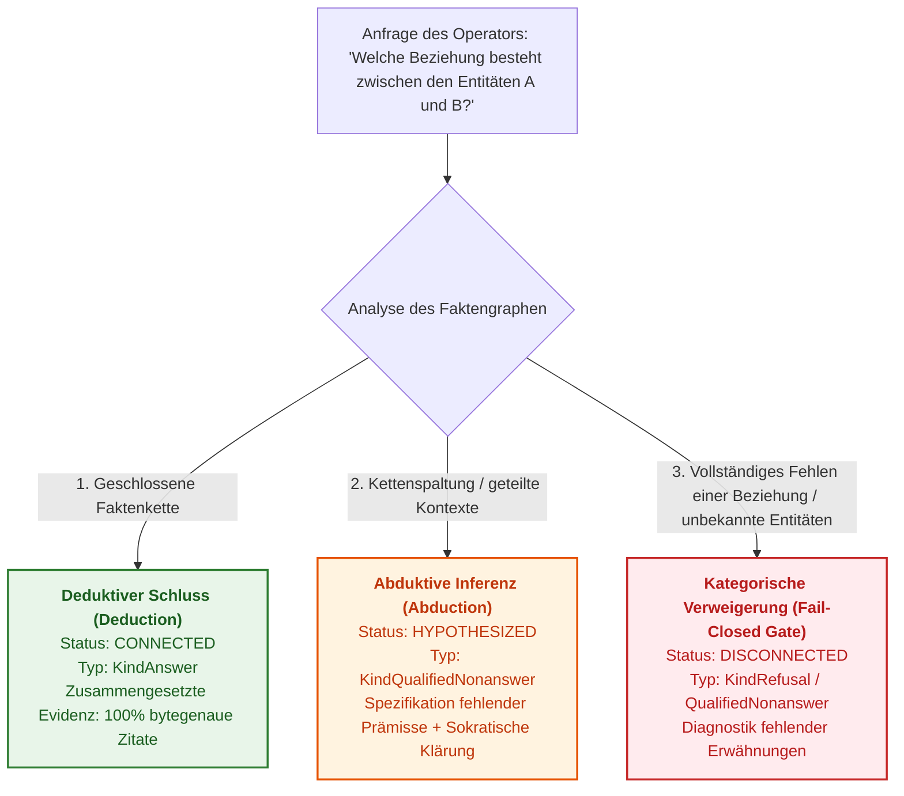
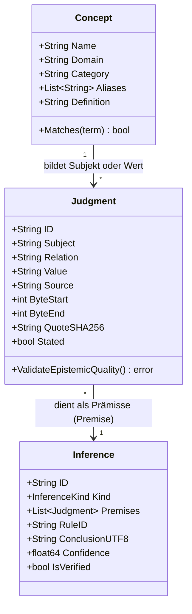
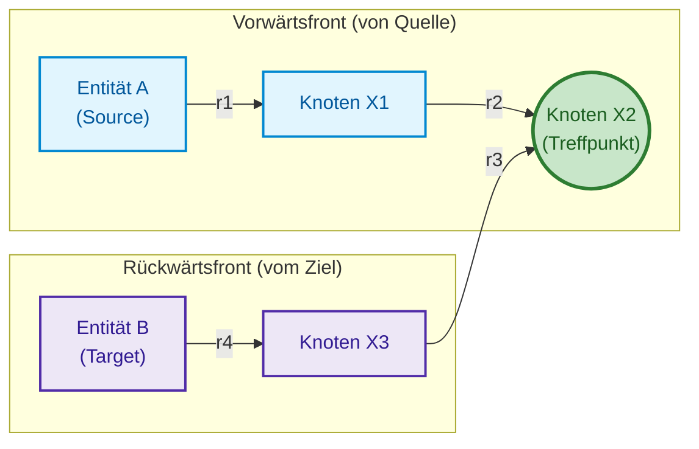
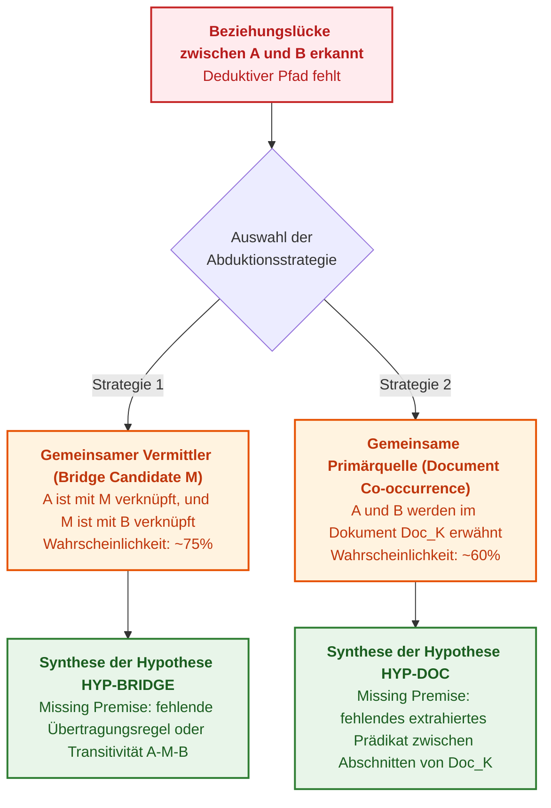

# Kapitel 34. Wissenslücken: Relationale Suche, Abduktion und Klärungsdialog

> **Buch:** [Architektur evidenzbasierter Expertensysteme](README.md) · [Teil VI: Neuro-symbolische Modelle, kognitive Grenzen und kontinuierliches Lernen](part-06-frontiers-neuro-symbolic.md)  
> **Vorheriges Kapitel:** [Kapitel 29. Neuro-symbolische Architektur: Sprachmodelle und Evidenzprüfung](ch29-neuro-symbolic-architecture.md)  
> **Nächstes Kapitel:** [Kapitel 38. Maschinelle Halluzinationen und Wissensdefizite: Evidenzkontrolle von Antworten](ch38-curing-machine-hallucinations-and-knowledge-deficits.md)  
> **Inhaltsverzeichnis:** [README.md](README.md)  
> **Autor:** [Mykola Fedchyk](about-the-author.md)  
> **Niveau:** Fortgeschritten: Systemarchitekten, Wissensingenieure, Spezialisten für mathematische Logik und Philosophie der künstlichen Intelligenz  
> **Lernziele:** Die klassische ontologische Erkenntnistriade (Begriff – Urteil – Schluss) für universelle Anwendungsdomänen zur Laufzeit des Expertensystems formalisieren; deterministische Algorithmen für mehrstufige relationale Pfadsuchen (Multi-Hop Relational Path Discovery) mit Zyklenschutz und bytegenauer Zusammensetzung von Evidenzketten entwerfen; induktives Mining von Assoziationsregeln auf der Faktenbasis unter der Annahme partieller Vollständigkeit (AMIE PCA) anwenden; symbolische abduktive Inferenz nach Charles Sanders Peirce implementieren, um Wissenslücken durch kontrollierte Arbeitshypothesen zu überbrücken; die unantastbare Invariante der epistemischen Hygiene (Hypothesis Isolation Invariant) wahren, die jede Maskierung von Annahmen als kategorische Fakten unterbindet; dialogbasierte sokratische Klärungsrahmen (Clarification Frames) für gemischte Operator-Initiative synthetisieren; domänenübergreifende Generalisierung zwischen technischen Standards, normativen Rechtsakten und Anforderungen der funktionalen Sicherheit ohne fest verdrahtete Heuristiken sicherstellen.

---

## Abstract

Jede reale Wissensbasis sieht sich mit dem fundamentalen Problem der epistemischen Unvollständigkeit (*epistemic incompleteness*) konfrontiert: Der Faktenraum einer industriellen oder regulatorischen Domäne ist potenziell unbegrenzt, während die Menge formalisierter normativer Aussagen stets endlich bleibt. Wenn zwischen zwei Begriffen eine direkte Prädikatenkette fehlt, entsteht ein folgenschweres Dilemma:
- **Generative Sprachmodelle (LLMs):** füllen solche Leerstellen mit unkontrollierten, plausibel klingenden Konfabulationen (Halluzinationen) und verzerren dadurch Sicherheitsstandards und Normvorgaben.
- **Klassische deduktive Systeme unter der Closed-World-Assumption (CWA):** verharren in einer kategorischen Verweigerung (*Fail-Closed Nonanswer / Refusal*) und lassen den Ingenieur oder Operator ohne jeglichen Anhaltspunkt für die weitere Untersuchung zurück.

Dieses Kapitel behandelt den methodischen Durchbruch evidenzbasierter Expertensysteme: die Synthese aus strikter deterministischer relationaler Analyse, abduktiver Konstruktion von Arbeitshypothesen und interaktivem sokratischem Dialog. Zunächst formalisiert das Kapitel die klassische logische Denktriade: **Begriffe (Concepts) → Urteile (Judgments) → Schlüsse (Conclusions)**, die die Wissensrepräsentation unabhängig von der jeweiligen Fachdomäne (Netzwerkprotokolle, Gesetzgebung, funktionale Sicherheitsnormen wie ISO 26262 / ISO/SAE 21434) vereinheitlicht. Anschließend wird ein Algorithmus zur bidirektionalen beschränkten Pfadsuche (Bidirectional Bounded Path Discovery, $`k \le 6`$) mit zusammengesetzten bytegenauen Evidenzketten sowie ein Verfahren zur Induktion von Assoziationsregeln nach den Metriken von AMIE PCA vorgestellt.

Die folgenden Abschnitte widmen sich dem Mechanismus der symbolischen Abduktion nach Charles Sanders Peirce als methodisch fundierter Quelle valider Arbeitshypothesen: Das System analysiert die Topologie von Kettenspaltungen, gemeinsame Kontexte sowie Taxonomien und generiert begründete Vermutungen unter zwingender Ausweisung der **fehlenden Prämisse (Missing Premise)**. Die Invariante der epistemischen Hygiene garantiert hierbei, dass keine Hypothese jemals den Status eines kategorischen Faktums erlangt. Abschließend wird die Architektur eines sokratischen Befragers dargelegt, der Unvollständigkeiten in typisierte Handlungsoptionen für den Operator überführt, ergänzt durch eine vollständige, praxistaugliche Referenzimplementierung in Go.

---

## 1. Problem der Wissensunvollständigkeit und das epistemische Dilemma von Expertensystemen

In der Praxis des Knowledge Engineering übersteigt die Anfrage eines Benutzers oder eines externen Analysesystems häufig die bloße Suche nach einem einzelnen skalaren Attribut („Wie groß ist der Header?“ oder „Wie lang ist das Session-Timeout?“). Den höchsten analytischen Wert besitzen relationale Fragestellungen zu systemischen Zusammenhängen:
- *„Welcher normative Zusammenhang besteht zwischen der Sicherheitsanforderung ASIL D und der ECU-Komponente?“*
- *„Wie ist der gesetzliche Artikel über vertragliche Verpflichtungen mit dem Rechtsinstitut der Vertragsstrafe verknüpft?“*
- *„Welche Kette von Spezifikationen verbindet das Transportprotokoll mit der Netzwerk-Steuerungsebene?“*

Wenn ein Expertensystem eine logische Suche durchführt, sind drei fundamentale epistemische Zustände der Wissensbasis möglich:



1. **Vollständige deduktive Kette (Deductive Closure):** Es existiert eine Sequenz normativer Aussagen $`A \xrightarrow{r_1} X_1 \xrightarrow{r_2} \dots \xrightarrow{r_k} B`$, bei der jede Kante durch ein bytegenaues Primärquellenzitat belegt ist. Das System generiert eine kategorische Antwort `KindAnswer` mit einer zusammengesetzten Evidenzkette ([Kapitel 19](ch19-from-question-to-evidence.md)).
2. **Kettenspaltung bei kontextueller Überlappung (Epistemic Gap):** Die Entitäten $`A`$ und $`B`$ sind dem System bekannt, werden in gemeinsamen normativen Rechtsakten oder Standards erwähnt oder besitzen gemeinsame Nachbarknoten $`M`$, es existiert jedoch keine unmittelbare normative Kante zwischen ihnen.
3. **Vollständige Disjunktion (Complete Disconnection):** Die Entitäten gehören zu disjunkten semantischen Räumen, oder mindestens eine von ihnen ist in den verifizierten Quellen überhaupt nicht verzeichnet.

Im Zustand 2 neigen probabilistische große Sprachmodelle (LLMs) zu folgenschweren Halluzinationen: Sie formulieren flüssige, hochgradig autoritativ wirkende Texte, erfinden dabei jedoch nicht existente Normabschnitte oder Gesetzesparagrafen. Auf der anderen Seite quittierten traditionelle Regelsysteme früherer Generationen solche Situationen mit einem unergiebigen `refusal` („Keine Daten vorhanden“), was den Ingenieur dazu zwang, Gigabytes an Dokumentationen manuell zu durchforsten.

Die methodische Lösung besteht in der **symbolischen Abduktion nach C. S. Peirce** in Kombination mit einem **sokratischen Dialog**: Das System legt transparent offen, dass kein direkter deterministischer Pfad existiert, formuliert eine kontrollierte Arbeitshypothese unter präziser Benennung desjenigen Faktums, das für einen kategorischen Schluss noch verifiziert werden muss, und unterbreitet dem Ingenieur interaktive Optionen zur gezielten Fortsetzung der Untersuchung.

---

## 2. Die epistemische Triade der klassischen Logik in der Systemarchitektur

Um die Beschränkungen enger Spezialexpertensysteme zu überwinden, wird die Architektur der Systemlaufzeit um die fundamentale Erkenntnistriade der klassischen Logik strukturiert, wie sie von Aristoteles und Kant begründet und im modernen Knowledge Engineering formalisiert wurde [[1]](#src-1):

```math
\text{Begriff (Concept)} \xrightarrow{\text{Synthese}} \text{Urteil (Judgment)} \xrightarrow{\text{Inferenz}} \text{Schluss (Inference)}
```



### 2.1. Begriffe (Concepts / Terms)
Ein **Begriff** erfasst den wesentlichen Gehalt eines Objekts oder Phänomens des Gegenstandsbereichs. Er ist von syntaktischen Sprachvariationen abstrahiert und wird charakterisiert durch:
- **Kanonischer Name (Canonical Name):** die normalisierte Repräsentationsform (beispielsweise `ASIL`, `Zivilgesetzbuch`, `TCP`, `Vertrag`).
- **Wissensdomäne (Knowledge Domain):** die Zugehörigkeit zum jeweiligen Korpus (`law-ua`, `automotive`, `rfc`, `system-eng`).
- **Epistemische Kategorie (Epistemic Category):** der ontologische Knotentyp (`entity`, `protocol`, `law`, `component`, `safety_requirement`, `risk`).
- **Menge von Aliasen und Synonymen:** alternative Bezeichnungen, Akronyme und flektierte Formen, die über Sprachadapter aufgelöst werden ([Kapitel 13](ch13-language-variability-vs-determinism.md)).

### 2.2. Urteile (Judgments / Propositions)
Ein **Urteil** bildet die kleinste atomare Wahrheitseinheit in der Wissensbasis. Es bejaht oder verneint das Vorliegen einer bestimmten Relation zwischen Begriffen. Gemäß den Anforderungen an die Nachweisbarkeit ([Kapitel 2](ch02-epistemology-of-machine-knowledge.md)) stellt jedes Urteil im System eine bytegenau verankerte Aussage dar:

```math
J = \langle S, R, V, \text{DocID}, [\beta_{\text{start}}, \beta_{\text{end}}], \text{SHA256}_{\text{quote}}, \mathcal{M} \rangle
```

wobei $`S`$ der Subjektbegriff, $`R`$ die normative Relation, $`V`$ der Objektbegriff bzw. normative Wert, $`\text{DocID}`$ das unveränderliche Quelldokument, $`[\beta_{\text{start}}, \beta_{\text{end}}]`$ die exakten physischen Byte-Offsets in der Datei und $`\mathcal{M}`$ die deontische Modalität (MUST, SHALL, MAY) ist. Jedes Urteil ohne bytegenauen Primärquellennachweis wird durch die Eingangskontrollschleuse verworfen.

### 2.3. Schlüsse (Inferences / Conclusions)
Ein **Schluss** ist das Resultat der Ausführung deterministischer Regeln über einer Menge von Prämissenurteilen. In Abhängigkeit von der Informationsvollständigkeit und der Natur des Zusammenhangs werden drei Schlussarten unterschieden:
1. **Deduktiver Schluss** ($`\text{Confidence} = 1.0`$): die logisch zwingende Konsequenz der Prämissen (Syllogismus, transitive Hülle, bewiesener Pfad).
2. **Abduktiver Schluss** ($`0.0 < \text{Confidence} < 1.0`$): die Aufstellung einer plausiblen Arbeitshypothese zur Erklärung einer beobachteten Lücke zwischen Fakten.
3. **Induktiver Schluss** ($`0.0 < \text{Confidence} < 1.0`$): die Verallgemeinerung statistischer Regularitäten innerhalb der Faktenbasis in Form von Assoziationsregeln.

---

## 3. Deterministische mehrstufige relationale Analyse

Um die Frage „Wie stehen Entität $`A`$ und Entität $`B`$ zueinander in Beziehung?“ zu beantworten, wird die Wissensbasis als gerichteter Multigraph $`\mathcal{G} = (\mathcal{V}, \mathcal{E})`$ modelliert, dessen Knoten $`\mathcal{V}`$ Begriffe und normalisierte Werte und dessen Kanten $`\mathcal{E}`$ verifizierte Prädikatenurteile darstellen.

### 3.1. Bidirektionale beschränkte Breitensuche (Bidirectional Bounded BFS)

Eine naive Vorwärts-Breitensuche in Graphen mit hohem Verzweigungsgrad leidet unter der kombinatorischen Explosion der Komplexität $`\mathcal{O}(b^d)`$. Die Referenzarchitektur setzt daher eine **bidirektionale beschränkte Breitensuche (Bidirectional Bounded BFS)** ein, bei der die Suchfront von Knoten $`A`$ und die Rückwärtsfront von Knoten $`B`$ simultan expandiert werden, begrenzt durch ein striktes Tiefenlimit von $`k \le 6`$:



Der Algorithmus garantiert zwingend folgende Invarianten:
1. **Invariante des Zyklenschutzes (Cycle Guard Invariant):** Der Zustand der Suchwarteschlange führt eine Bitmaske oder Hash-Tabelle der bereits besuchten Knoten des aktuellen Pfades. Jeder Übergang, der zu einem bereits traversierten Knoten führen würde, wird unmittelbar abgeschnitten.
2. **Invariante der Relationensymmetrie (Inverse Traversal Invariant):** Ist in der Wissensbasis das Faktum $`J = (S, R, V)`$ hinterlegt, gestattet der Graph in Rückwärtsrichtung den Übergang von $`V`$ zu $`S`$ mit dem inversen Prädikat `inverse_of(R)`. Dies ermöglicht das Auffinden von Verknüpfungen, wenn beide Entitäten als Werte eines gemeinsamen Subjekts fungieren oder umgekehrt.
3. **Invariante der deterministischen Ordnung (Deterministic Ordering Invariant):** Ermittelte Pfade werden primär aufsteigend nach ihrer Länge (Kantenanzahl) sortiert; Pfade identischer Länge werden deterministisch lexikografisch anhand der Sequenz der Relationsbezeichner und Quell-IDs geordnet.

### 3.2. Zusammengesetzte Evidenzkette (Composite Path Evidence)

Ein gefundener Pfad $`\mathcal{P} = (h_1, h_2, \dots, h_m)`$ der Länge $`m`$ ist genau dann gültig, wenn jede einzelne Kante $`h_i`$ autonom die Invariante bytegenauer Beweisbarkeit erfüllt. Das System erzeugt ein zusammengesetztes Zitationsobjekt, das einen Vektor atomarer Zitate kapselt:

```math
\text{EvidenceChain}(\mathcal{P}) = \left[ \text{Cite}(J_1), \text{Cite}(J_2), \dots, \text{Cite}(J_m) \right]
```

Fehlt auch nur für einen Einzelschritt der physische Nachweis im unveränderlichen Byte-Manifest, gilt die gesamte Kette als defekt und wird verworfen.

---

## 4. Autonomes Mining von Assoziationsregeln (AMIE PCA)

Die relationale Analyse beschränkt sich nicht auf das Auffinden konkreter Pfade. Ein Expertensystem ist in der Lage, im Hintergrund oder Offline-Betrieb die Gesamtheit der Fakten zu analysieren, um induktiv allgemeine Gesetzmäßigkeiten abzuleiten.

Hierzu kommt der Algorithmus **AMIE (Association Rule Mining under Incomplete Evidence)** unter der **Annahme partieller Vollständigkeit (Partial Completeness Assumption, PCA)** von Galárraga et al. [[2]](#src-2) zum Einsatz, der auf den theoretischen Grundlagen des relationalen Lernens von Luc De Raedt [[6]](#src-6) aufbaut.

### 4.1. Formale Regeln und PCA-Annahme

Der Algorithmus extrahiert zwei Klassen logischer Regeln über der Wissensbasis:

#### 4.1.1. Direkte binäre Regeln

```math
r_1(X, Y) \implies r_2(X, Y)
```

*(Beispiel: „Wenn Dokument X das Dokument Y ersetzt, so aktualisiert X das Dokument Y“)*

#### 4.1.2. Transitive Kettenregeln

```math
r_1(X, Y) \land r_2(Y, Z) \implies r_3(X, Z)
```

*(Beispiel: „Wenn Funktion X zu Subsystem Y gehört und Y nach Standard Z zertifiziert ist, so unterliegt X der Regulierung durch Z“)*

Die klassische Closed-World-Assumption (CWA) stuft jedes nicht explizit verzeichnete Faktum als falsch ein, was für reale Wissensbasen unzutreffend ist. Die PCA-Annahme besagt demgegenüber: *Existiert für eine Entität $`X`$ und eine Relation $`r`$ in der Wissensbasis mindestens ein Wert $`Y`$, sodass $`r(X, Y)`$ wahr ist, so enthält die Wissensbasis alle gültigen Werte für das Paar $`(X, r)`$*.

### 4.2. Qualitätsmetriken induzierter Regeln

Die Güte einer induzierten logischen Regel $`\mathcal{R}: \mathcal{B} \implies r(X, Y)`$ wird über drei deterministische Kennzahlen quantifiziert:

#### 4.2.1. Absolute Unterstützung (Absolute Support)

Die Anzahl eindeutiger Paare $`(X, Y)`$, für die im Wissensgraphen sowohl der Regelkörper $`\mathcal{B}`$ als auch der Regelkopf $`r(X, Y)`$ simultan erfüllt sind:

```math
\mathrm{Supp}(\mathcal{R}) = \lvert \{ (X, Y) : \mathcal{B} \land r(X, Y) \} \rvert
```

wobei $`\lvert \{ (X, Y) \} \rvert`$ die Kardinalität der Menge verknüpfter Entitätenpaare als nicht-negative ganze Zahl darstellt ($`\mathrm{Supp}(\mathcal{R}) \in \mathbb{N}_0`$).

#### 4.2.2. PCA-Konfidenz (PCA Confidence)

Unter der Annahme partieller Vollständigkeit (PCA) berücksichtigt der Nenner ausschließlich jene Fälle, in denen für das Subjekt $`X`$ mindestens ein bestätigter Wert für die Zielrelation $`r`$ in der Wissensbasis existiert:

```math
\mathrm{Conf}_{\mathrm{PCA}}(\mathcal{R}) = \frac{\lvert \{ (X, Y) : \mathcal{B} \land r(X, Y) \} \rvert}{\lvert \{ (X, Y) : \mathcal{B} \land \exists Y' (r(X, Y')) \} \rvert}
```

wobei $`\mathrm{Conf}_{\mathrm{PCA}}(\mathcal{R}) \in [0, 1]`$ ein normiertes Maß für die statistische Validität der Verknüpfung bei unvollständiger, aber konsistenter Information ist.

#### 4.2.3. Kopf-Abdeckung (Head Coverage)

Der Anteil der in der Wissensbasis bekannten Fakten der Relation $`r`$, die durch diese Regel abgeleitet oder erklärt werden können:

```math
\mathrm{HC}(\mathcal{R}) = \frac{\mathrm{Supp}(\mathcal{R})}{\lvert \{ (X, Y) : r(X, Y) \} \rvert}
```

wobei $`\mathrm{HC}(\mathcal{R}) \in [0, 1]`$ die Generalisierungsfähigkeit der induzierten Regel widerspiegelt.

#### 4.2.4. Geschlossener Entscheidungszyklus (Closed-Loop Decision)

- **Entscheidungskriterien und automatische Zertifizierung von Regeln:**
  - $`\mathrm{Conf}_{\mathrm{PCA}}(\mathcal{R}) \ge 0{,}90`$ bei $`\mathrm{Supp}(\mathcal{R}) \ge 10`$: **Automatische Induktion**. Die Regel wird automatisch in die abgeleitete Schicht der Wissensbasis (`INFERRED_RULE`) mit dem Status `VerifiedCandidate` übernommen und für operative Inferenzanfragen freigegeben;
  - $`0{,}70 \le \mathrm{Conf}_{\mathrm{PCA}}(\mathcal{R}) < 0{,}90`$ (bei $`\mathrm{Supp}(\mathcal{R}) \ge 3`$): **Quarantäne-Hypothese**. Die Regel erhält den Status `QUARANTINE_HYPOTHESIS` und wird in einer sokratischen Dialogsitzung dem Domänenexperten vorgelegt oder erfordert eine abduktive Bestätigung;
  - $`\mathrm{Conf}_{\mathrm{PCA}}(\mathcal{R}) < 0{,}70`$ oder $`\mathrm{Supp}(\mathcal{R}) < 3`$: **Bedingungslose Zurückweisung**. Der Regelkandidat wird als statistisches Rauschen oder Artefakt unvollständiger Daten eingestuft und aus der Kandidatenwarteschlange gelöscht.
- **Hardware-Dimensionierung und Ressourcen für Hintergrundberechnungen:**
  - Der AMIE-Mining-Algorithmus besitzt eine kombinatorische Komplexität von $`\mathcal{O}(\lvert\mathcal{E}\rvert \cdot d_{\max}^{k-1})`$, wobei $`\lvert\mathcal{E}\rvert`$ die Kantenanzahl, $`d_{\max}`$ den maximalen Knotengrad und $`k`$ die maximale Regellänge bezeichnet;
  - Zur Vermeidung von Speichererschöpfung wird die Regellänge strikt auf $`k \le 3`$ begrenzt, das Worker-Timeout auf $`300\,\text{s}`$ pro Zielrelation $`r`$ limitiert und der Speicherpool für den Graphindex auf $`4\,\text{GB}`$ RAM gedeckelt.
- **Praktisches Zahlenbeispiel:**
  Betrachtet wird eine transitive Regel über einem Zertifizierungsgraphen:

```math
\mathrm{HasSubsystem}(X, Y) \land \mathrm{CompliesWith}(Y, Z) \implies \mathrm{RequiresAudit}(X, Z)
```

  Erfasste Kennzahlen: $`\mathrm{Supp}(\mathcal{R}) = 18`$ Systeme erfüllen beide Bedingungen. Die Gesamtzahl der Systeme mit Komponenten, für die in der Wissensbasis überhaupt Audit-Vorgaben $`\exists Z' (\mathrm{RequiresAudit}(X, Z'))`$ hinterlegt sind, beträgt $`20`$.
  Berechnung: $`\mathrm{Conf}_{\mathrm{PCA}} = 18 / 20 = 0{,}90 \ge 0{,}90`$, $`\mathrm{Supp}(\mathcal{R}) = 18 \ge 10`$.
  **Systemaktion:** Die Regel überschreitet den Schwellenwert der automatischen Verifikation und wird mit einem Konfidenzgewicht von $`0{,}90`$ in die Inferenzmaschine aufgenommen.

---

## 5. Symbolische abduktive Inferenz von Arbeitshypothesen

Liefert die deterministische BFS-Suche den Status `STATUS_DISCONNECTED`, ist ein kategorischer deduktiver Schluss unmöglich. In diesem Moment aktiviert das Expertensystem seine **Abduktionskomponente (Abductive Engine)**.

### 5.1. Abduktion nach Charles Sanders Peirce

Der amerikanische Philosoph und Logiker Charles Sanders Peirce definierte die Abduktion als die einzige logische Operation, die neue Ideen und erklärende Hypothesen hervorbringt [[3]](#src-3); ihre mathematische und algorithmische Formalisierung in der logischen Programmierung wurde von Kakas, Kowalski und Toni maßgeblich ausgearbeitet [[5]](#src-5):

```math
\frac{\text{Tatsache } C \text{ wird beobachtet}; \quad \text{Wäre Hypothese } H \text{ wahr, so wäre } C \text{ eine Selbstverständlichkeit}}{\text{Es besteht Grund zu der Annahme, dass } H \text{ wahr ist}}
```

In Expertensystemen entspricht die beobachtete Tatsache $`C`$ dem Vorliegen einer semantischen Anfrage nach einer Verknüpfung zwischen $`A`$ und $`B`$ bei gleichzeitigem Vorhandensein partieller Fakten; die Hypothese $`H`$ repräsentiert die Existenz einer fehlenden intermediären Prämisse.



### 5.2. Topologische Heuristiken zur Hypothesengenerierung

#### 5.2.1. Strategie des gemeinsamen Vermittlers (Shared Neighbor / Bridge Entity)
Das System sucht nach einem Knoten $`M \in \mathcal{V}`$, sodass gilt:

```math
(A \leftrightarrow M) \in \mathcal{E} \quad \land \quad (M \leftrightarrow B) \in \mathcal{E}
```

Tritt die Entität $`M`$ als Vermittler auf, wird folgende Hypothese formuliert:
*„Vermutlich wird die Beziehung zwischen A und B über die Entität M vermittelt. Für einen kategorischen Schluss fehlt eine explizite normative Transitivitätsregel der Relationen $`r_1`$ und $`r_2`$ über dem Begriff M“*.
Der Plausibilitätswert einer solchen Hypothese wird auf $`\text{Confidence} \approx 0{,}75`$ angesetzt.

#### 5.2.2. Strategie der gemeinsamen Primärquelle (Document Co-occurrence)
Existieren keine gemeinsamen Nachbarknoten, prüft das System, ob $`A`$ und $`B`$ in Fakten desselben normativen Dokuments $`\mathcal{D}`$ vorkommen:

```math
\exists J_1, J_2 : J_1.\text{Subject} = A \land J_2.\text{Subject} = B \land J_1.\text{Source} = J_2.\text{Source} = \mathcal{D}
```

Hierbei wird folgende Hypothese generiert:
*„Die Entitäten A und B werden im selben Dokument $`\mathcal{D}`$ erwähnt, zwischen ihnen wurde jedoch keine direkte relationale Beziehung extrahiert. Die Verknüpfungen zwischen den Artikeln oder Abschnitten von $`\mathcal{D}`$ müssen analysiert werden“*.
Plausibilitätsbewertung: $`\text{Confidence} \approx 0{,}60`$.

#### 5.2.3. Taxonomische Vererbung (Hypernymy Fallback)
Ist $`A`$ eine Unterart des Begriffs $`P`$ ($`A \xrightarrow{\text{is-a}} P`$) und existiert für $`P`$ ein bewiesener Pfad zu $`B`$, wird mangels gegenteiliger Ausnahmen eine Hypothese über die standardmäßige Eigenschaftsvererbung aufgestellt ([Kapitel 31](ch31-syllogistic-reasoning-and-relation-lattices.md)).

### 5.3. Invariante der epistemischen Hygiene (Hypothesis Isolation Invariant)

Die fundamentale Gefahr der Hypothesengenerierung liegt im Risiko, dass Benutzer oder nachgelagerte Prozesse Vermutungen mit bewiesenen Fakten verwechseln. Gestützt auf die Theorie des anfechtbaren Schließens von John L. Pollock [[7]](#src-7) erzwingt die Referenzarchitektur eine unantastbare **Invariante der epistemischen Hygiene**:

> [!IMPORTANT]
> **Unantastbare Invariante der epistemischen Hygiene:**
> 1. Jede abduktive Annahme darf unter keinen Umständen als kategorische Antwort zurückgegeben werden (`TerminalKind = KindAnswer` ist strikt verboten).
> 2. Hypothesen werden ausnahmslos in typisierten Nachrichten der Form `KindQualifiedNonanswer` oder `KindClarification` übermittelt.
> 3. Der Antworttext muss zwingend den standardisierten Warnhinweis enthalten:
>    `--- [HYPOTHESE (ARBEITSHYPOTHESE)] ---`
> 4. Jede Hypothese muss ihren numerischen Plausibilitätsgrad ($`\text{Confidence} < 1.0`$) sowie die **fehlende Prämisse (Missing Premise)** explizit deklarieren, ohne deren Verifikation die Hypothese niemals zu einem Faktum werden kann.

---

## 6. Sokratischer Dialog und gemischte Initiative

Das Erkennen einer Wissenslücke darf nicht in einer Sackgasse enden. Statt passiv zu verweigern, wechselt das evidenzbasierte Expertensystem in den Modus des **sokratischen Dialogs (Socratic Dialogue)** und setzt das Paradigma der gemischten Initiative (*Mixed-Initiative Interaction*) nach Horvitz um [[4]](#src-4).

### 6.1. Struktur des Klärungsrahmens (Clarification Frame)

Erkennt das System alternative Hypothesen, eine Kettenspaltung oder Mehrdeutigkeiten in der Begriffsverwendung, synthetisiert es ein typisiertes `ClarificationFrame`-Objekt:

```json
{
  "message": "Es wurde keine direkte Beziehung zwischen \"Vertrag\" und \"Vertragsstrafe\" gefunden. Möchten Sie eine hypothetische Verknüpfung über die Entität \"Verbindlichkeit\" untersuchen?",
  "dimension": "StandardLineage",
  "options": [
    {
      "id": "opt-bridge",
      "label": "Verknüpfung über Zwischenentität \"Verbindlichkeit\" untersuchen",
      "bound_entity": "Verbindlichkeit",
      "context_hint": "abductive_bridge:Verbindlichkeit"
    },
    {
      "id": "opt-def-from",
      "label": "Definition und Eigenschaften von \"Vertrag\" einsehen",
      "bound_entity": "Vertrag",
      "context_hint": "definition"
    },
    {
      "id": "opt-scope",
      "label": "Normatives Dokument oder Domäne präzisieren (Recht / ISO)",
      "bound_entity": "",
      "context_hint": "scope_refinement"
    }
  ]
}
```

### 6.2. Interaktion mit menschlichen Operatorschnittstellen

Im Terminal-Interface (TUI) oder einer Webkonsole aktiviert der Klärungsrahmen ein interaktives Widget:
- Der Operator sieht eine nummerierte Auswahlliste `[1]`, `[2]`, `[3]`.
- Die Eingabe der entsprechenden Ziffer oder das Betätigen der `Enter`-Taste erfordert keine erneute Eingabe einer langen Anfrage, sondern löst den sofortigen Übergang zur Untersuchung des gewählten Zweigs im Wissensgraphen aus.
- Wählt der Operator die Option `opt-bridge`, erzeugt das System automatisch eine Unterabfrage zur Untersuchung der Beziehungen zwischen Ausgangsentität und vorgeschlagenem Vermittler, basierend auf dem zwischengespeicherten partiellen Beweisstatus (`PartialProofState`).

---

## 7. Domänenübergreifende Wissensgeneralisierung

Ein historisches Defizit früherer Expertensysteme war die starre Bindung ihrer Inferenzlogik an eine spezifische Anwendungsdomäne: Medizinische Systeme (MYCIN) konnten keine technischen Konfigurationen verarbeiten, während Hardware-Konfiguratoren (R1/XCON) für juristische Fragestellungen ungeeignet waren.

Ein evidenzbasiertes Expertensystem überwindet diese Limitierung durch strikte Begriffsabstraktion und das einheitliche Modell föderierter Wissensanbieter ([Kapitel 31](ch31-syllogistic-reasoning-and-relation-lattices.md)). Die nachfolgende Gegenüberstellung illustriert, wie dieselbe Triade aus Begriff, Urteil und Schluss sowie dieselbe relationale Engine über grundverschiedene Fachbereiche hinweg operieren:

| Eigenschaft | Domäne: Netzwerkprotokolle | Domäne: Gesetzgebung der Ukraine | Domäne: Funktionale Sicherheit (Automotive) |
|---|---|---|---|
| **Primärquellen** | RFC, IEEE-Standards, IETF | Verfassung der Ukraine, Gesetzbücher, Gesetze | ISO 26262 [[8]](#src-8), ISO/SAE 21434, ASPICE |
| **Beispielbegriffe** | `TCP`, `IP`, `BGP`, `SYN_SENT` | `Gesetz`, `Vertrag`, `Verbindlichkeit` | `ASIL D`, `HARA`, `ECU`, `FTTI` |
| **Typische Urteile** | `TCP encapsulates_in IP` | `Vertrag begründet Verbindlichkeit` | `ASIL D bestimmt_über HARA` |
| **Zusammengesetzter Beweis** | RFC 793, S. 15, Bytes [1200..1280] | Zivilgesetzbuch der Ukraine [[9]](#src-9), Art. 509 Abs. 2 | ISO 26262-3:2018, Abschn. 7.4.3 |
| **Abduktive Brücke** | `ICMP` → `IP` über `RFC 777/760` | `Vertrag` → `Vertragsstrafe` über `Verbindlichkeit` | `Hazard Event` → `Safety Goal` über `ASIL` |

Keine einzige Codezeile des Inferenzkerns oder des BFS-Suchers enthält fest verdrahtete Zeichenkettenprüfungen wie `if entity == "TCP"`. Es wirken ausschließlich abstrakte Datenstrukturen, die Normalisierung von Eingabetoken über Sprachadapter sowie Adjazenzindizes des Faktengraphen.

---

## 8. Programmatische Implementierung: Vollständiges Go-Modul für relationale Suche, Abduktion und sokratische Befragung

Nachfolgend ist ein in sich geschlossenes, produktionsreifes Go-Modul dargestellt, das folgende Komponenten umfasst:
1. Die ontologischen Datenmodelle der Erkenntnistriade (`Concept`, `Judgment`, `Inference`).
2. Den relationalen Pfadfinder (`RelationalPathFinder`) mit Breitensuche und Zyklenschutz.
3. Die Engine zur abduktiven Synthese von Arbeitshypothesen (`AbductiveEngine`).
4. Den Generator für sokratische Klärungsdialoge (`SocraticQuestioner`).
5. Eine zugehörige Unit-Test-Suite.

<details>
<summary><b>Vollständiges Go-Modul für relationale Suche, Abduktion und sokratische Befragung (epistemic.go)</b></summary>

```go
package epistemic

import (
	"errors"
	"fmt"
	"strings"
)

// --- 1. Epistemische Triade der Erkenntnis ---

type ConceptCategory string

const (
	CategoryEntity    ConceptCategory = "entity"
	CategoryProtocol  ConceptCategory = "protocol"
	CategoryLaw       ConceptCategory = "law"
	CategorySafetyReq ConceptCategory = "safety_requirement"
)

// Concept repräsentiert einen normalisierten ontologischen Begriff.
type Concept struct {
	Name       string            `json:"name"`
	Domain     string            `json:"domain"`
	Category   ConceptCategory   `json:"category"`
	Aliases    []string          `json:"aliases,omitempty"`
	Attributes map[string]string `json:"attributes,omitempty"`
}

func (c *Concept) Matches(term string) bool {
	if c == nil {
		return false
	}
	norm := strings.ToLower(strings.TrimSpace(term))
	if strings.ToLower(strings.TrimSpace(c.Name)) == norm {
		return true
	}
	for _, a := range c.Aliases {
		if strings.ToLower(strings.TrimSpace(a)) == norm {
			return true
		}
	}
	return false
}

// Judgment fixiert ein normatives atomares Urteil mit bytegenauer Verankerung.
type Judgment struct {
	ID          string `json:"id"`
	Subject     string `json:"subject"`
	Relation    string `json:"relation"`
	Value       string `json:"value"`
	SourceDoc   string `json:"source_doc"`
	ByteStart   int    `json:"byte_start"`
	ByteEnd     int    `json:"byte_end"`
	QuoteSHA256 string `json:"quote_sha256"`
	Stated      bool   `json:"stated"`
}

func (j Judgment) ValidateEpistemicQuality() error {
	if strings.TrimSpace(j.Subject) == "" || strings.TrimSpace(j.Relation) == "" || strings.TrimSpace(j.Value) == "" {
		return errors.New("Urteil muss Subject, Relation und Value aufweisen")
	}
	if j.SourceDoc == "" {
		return errors.New("Verweis auf Primärquellendokument fehlt")
	}
	if j.ByteStart < 0 || j.ByteEnd < j.ByteStart {
		return errors.New("ungültige physische Byte-Grenzen des Zitats")
	}
	return nil
}

// --- 2. Deterministischer relationaler Pfadfinder ---

type PathHop struct {
	FromEntity string   `json:"from_entity"`
	Relation   string   `json:"relation"`
	ToEntity   string   `json:"to_entity"`
	DocumentID string   `json:"document_id"`
	Judgment   Judgment `json:"judgment"`
}

type RelationalPath struct {
	Hops   []PathHop `json:"hops"`
	Length int       `json:"length"`
}

type RelationalPathFinder struct {
	forwardEdges map[string][]Judgment
	reverseEdges map[string][]Judgment
}

func NewRelationalPathFinder(judgments []Judgment) *RelationalPathFinder {
	fwd := make(map[string][]Judgment)
	rev := make(map[string][]Judgment)
	for _, j := range judgments {
		s := strings.ToLower(strings.TrimSpace(j.Subject))
		v := strings.ToLower(strings.TrimSpace(j.Value))
		fwd[s] = append(fwd[s], j)
		rev[v] = append(rev[v], j)
	}
	return &RelationalPathFinder{forwardEdges: fwd, reverseEdges: rev}
}

func (pf *RelationalPathFinder) FindPaths(fromEntity, toEntity string, maxDepth int) ([]RelationalPath, bool) {
	normFrom := strings.ToLower(strings.TrimSpace(fromEntity))
	normTo := strings.ToLower(strings.TrimSpace(toEntity))
	if normFrom == "" || normTo == "" || normFrom == normTo {
		return nil, false
	}
	if maxDepth <= 0 || maxDepth > 6 {
		maxDepth = 6
	}

	type searchNode struct {
		entity  string
		hops    []PathHop
		visited map[string]bool
	}

	queue := []searchNode{
		{entity: normFrom, hops: nil, visited: map[string]bool{normFrom: true}},
	}
	var discovered []RelationalPath
	shortest := -1

	for len(queue) > 0 {
		curr := queue[0]
		queue = queue[1:]

		if shortest != -1 && len(curr.hops) > shortest {
			break
		}
		if len(curr.hops) >= maxDepth {
			continue
		}

		// Vorwärtskanten
		for _, j := range pf.forwardEdges[curr.entity] {
			nextNorm := strings.ToLower(strings.TrimSpace(j.Value))
			if curr.visited[nextNorm] {
				continue // Cycle Guard
			}
			hop := PathHop{FromEntity: j.Subject, Relation: j.Relation, ToEntity: j.Value, DocumentID: j.SourceDoc, Judgment: j}
			newHops := append(append([]PathHop(nil), curr.hops...), hop)

			if nextNorm == normTo {
				shortest = len(newHops)
				discovered = append(discovered, RelationalPath{Hops: newHops, Length: len(newHops)})
			} else {
				newVis := copyMap(curr.visited)
				newVis[nextNorm] = true
				queue = append(queue, searchNode{entity: nextNorm, hops: newHops, visited: newVis})
			}
		}

		// Rückwärtskanten
		for _, j := range pf.reverseEdges[curr.entity] {
			nextNorm := strings.ToLower(strings.TrimSpace(j.Subject))
			if curr.visited[nextNorm] {
				continue
			}
			hop := PathHop{FromEntity: j.Value, Relation: "inverse_of(" + j.Relation + ")", ToEntity: j.Subject, DocumentID: j.SourceDoc, Judgment: j}
			newHops := append(append([]PathHop(nil), curr.hops...), hop)

			if nextNorm == normTo {
				shortest = len(newHops)
				discovered = append(discovered, RelationalPath{Hops: newHops, Length: len(newHops)})
			} else {
				newVis := copyMap(curr.visited)
				newVis[nextNorm] = true
				queue = append(queue, searchNode{entity: nextNorm, hops: newHops, visited: newVis})
			}
		}
	}

	if len(discovered) == 0 {
		return nil, false
	}
	return discovered, true
}

func copyMap(m map[string]bool) map[string]bool {
	cp := make(map[string]bool, len(m)+1)
	for k, v := range m {
		cp[k] = v
	}
	return cp
}

// --- 3. Engine für abduktive Synthese von Arbeitshypothesen ---

type AbductiveHypothesis struct {
	ID              string     `json:"id"`
	SourceEntity    string     `json:"source_entity"`
	TargetEntity    string     `json:"target_entity"`
	BridgeCandidate string     `json:"bridge_candidate,omitempty"`
	Rationale       string     `json:"rationale"`
	MissingPremise  string     `json:"missing_premise"`
	Confidence      float64    `json:"confidence"`
	SupportingFacts []Judgment `json:"supporting_facts"`
	Disclaimer      string     `json:"disclaimer"`
}

const HypothesisDisclaimer = "[HYPOTHESE (ARBEITSHYPOTHESE)] Kein bewiesener Fakt. Erfordert Verifikation der Prämisse."

type AbductiveEngine struct {
	judgments []Judgment
}

func NewAbductiveEngine(judgments []Judgment) *AbductiveEngine {
	return &AbductiveEngine{judgments: judgments}
}

func (ae *AbductiveEngine) GenerateHypotheses(fromEntity, toEntity string) []AbductiveHypothesis {
	normFrom := strings.ToLower(strings.TrimSpace(fromEntity))
	normTo := strings.ToLower(strings.TrimSpace(toEntity))
	if normFrom == "" || normTo == "" || normFrom == normTo {
		return nil
	}

	type link struct {
		target string
		source string
		j      Judgment
	}

	fromLinks := make(map[string][]link)
	toLinks := make(map[string][]link)
	fromDocs := make(map[string]Judgment)
	toDocs := make(map[string]Judgment)

	for _, j := range ae.judgments {
		s := strings.ToLower(strings.TrimSpace(j.Subject))
		v := strings.ToLower(strings.TrimSpace(j.Value))

		if s == normFrom {
			fromLinks[v] = append(fromLinks[v], link{target: j.Value, source: j.SourceDoc, j: j})
			fromDocs[j.SourceDoc] = j
		}
		if v == normFrom {
			fromLinks[s] = append(fromLinks[s], link{target: j.Subject, source: j.SourceDoc, j: j})
			fromDocs[j.SourceDoc] = j
		}
		if s == normTo {
			toLinks[v] = append(toLinks[v], link{target: j.Value, source: j.SourceDoc, j: j})
			toDocs[j.SourceDoc] = j
		}
		if v == normTo {
			toLinks[s] = append(toLinks[s], link{target: j.Subject, source: j.SourceDoc, j: j})
			toDocs[j.SourceDoc] = j
		}
	}

	var results []AbductiveHypothesis

	// Strategie 1: Gemeinsame Vermittler-Nachbarn (Bridges)
	for mid := range fromLinks {
		if _, ok := toLinks[mid]; ok && mid != normFrom && mid != normTo {
			l1 := fromLinks[mid][0]
			l2 := toLinks[mid][0]
			results = append(results, AbductiveHypothesis{
				ID:              fmt.Sprintf("HYP-BRIDGE-%s", mid),
				SourceEntity:    fromEntity,
				TargetEntity:    toEntity,
				BridgeCandidate: l1.target,
				Rationale:       fmt.Sprintf("Die Entitäten %q und %q sind in den Dokumenten %s und %s wechselseitig mit der Zwischenentität %q verknüpft.", fromEntity, toEntity, l1.source, l2.source, l1.target),
				MissingPremise:  fmt.Sprintf("Es fehlt eine normative Transitivitätsregel zur Eigenschaftsübertragung zwischen %q und %q über %q.", fromEntity, toEntity, l1.target),
				Confidence:      0.75,
				SupportingFacts: []Judgment{l1.j, l2.j},
				Disclaimer:      HypothesisDisclaimer,
			})
			if len(results) >= 2 {
				return results
			}
		}
	}

	// Strategie 2: Gemeinsame Primärquelle
	if len(results) == 0 {
		for doc, jFrom := range fromDocs {
			if jTo, ok := toDocs[doc]; ok && doc != "" {
				results = append(results, AbductiveHypothesis{
					ID:              fmt.Sprintf("HYP-DOC-%s", doc),
					SourceEntity:    fromEntity,
					TargetEntity:    toEntity,
					Rationale:       fmt.Sprintf("Die Entitäten %q und %q werden im gemeinsamen normativen Rechtsakt %s erwähnt.", fromEntity, toEntity, doc),
					MissingPremise:  fmt.Sprintf("Die Beziehung zwischen den Abschnitten oder Artikeln des Rechtsakts %s muss extrahiert und verifiziert werden.", doc),
					Confidence:      0.60,
					SupportingFacts: []Judgment{jFrom, jTo},
					Disclaimer:      HypothesisDisclaimer,
				})
				if len(results) >= 2 {
					return results
				}
			}
		}
	}

	return results
}

// --- 4. Sokratischer Befrager ---

type ClarificationOption struct {
	ID          string `json:"id"`
	Label       string `json:"label"`
	BoundEntity string `json:"bound_entity,omitempty"`
}

type ClarificationFrame struct {
	Message string                `json:"message"`
	Options []ClarificationOption `json:"options"`
}

type SocraticQuestioner struct{}

func NewSocraticQuestioner() *SocraticQuestioner {
	return &SocraticQuestioner{}
}

func (sq *SocraticQuestioner) BuildClarification(from, to string, hyps []AbductiveHypothesis) *ClarificationFrame {
	var opts []ClarificationOption
	var msg string

	if len(hyps) > 0 && hyps[0].BridgeCandidate != "" {
		b := hyps[0].BridgeCandidate
		msg = fmt.Sprintf("Keine direkte Verbindung zwischen %q und %q gefunden. Möchten Sie die hypothetische Brücke über %q untersuchen?", from, to, b)
		opts = append(opts, ClarificationOption{
			ID:          "opt-bridge",
			Label:       fmt.Sprintf("Beziehung über Zwischenentität %q untersuchen", b),
			BoundEntity: b,
		})
	} else {
		msg = fmt.Sprintf("Kein deterministischer Pfad zwischen %q und %q gefunden. Wählen Sie eine Klärungsrichtung:", from, to)
	}

	opts = append(opts,
		ClarificationOption{ID: "opt-def-from", Label: fmt.Sprintf("Definition von %q prüfen", from), BoundEntity: from},
		ClarificationOption{ID: "opt-def-to", Label: fmt.Sprintf("Definition von %q prüfen", to), BoundEntity: to},
		ClarificationOption{ID: "opt-domain", Label: "Fachdomäne präzisieren (Gesetzgebung, Sicherheitsstandards, Ingenieurwesen)"},
	)

	return &ClarificationFrame{Message: msg, Options: opts}
}
```

</details>

<details>
<summary><b>Modultests der Implementierung (epistemic_test.go)</b></summary>

```go
package epistemic

import (
	"strings"
	"testing"
)

func TestEpistemicTriad_And_PathFinder(t *testing.T) {
	judgments := []Judgment{
		{ID: "J1", Subject: "Gesetz", Relation: "hat_höhere_Geltung_als", Value: "Verordnung", SourceDoc: "const-ua", ByteStart: 10, ByteEnd: 40},
		{ID: "J2", Subject: "Verordnung", Relation: "konkretisiert", Value: "Vorschrift", SourceDoc: "decree-101", ByteStart: 20, ByteEnd: 60},
	}

	// 1. Test der Urteilsvalidierung
	if err := judgments[0].ValidateEpistemicQuality(); err != nil {
		t.Fatalf("expected valid judgment, got: %v", err)
	}

	// 2. Test der deduktiven Pfadsuche
	finder := NewRelationalPathFinder(judgments)
	paths, found := finder.FindPaths("Gesetz", "Vorschrift", 4)
	if !found || len(paths) == 0 {
		t.Fatalf("expected path between Gesetz and Vorschrift")
	}
	if paths[0].Length != 2 {
		t.Errorf("expected path length 2, got %d", paths[0].Length)
	}
}

func TestAbductionEngine_And_SocraticDialogue(t *testing.T) {
	// Vertrag und Vertragsstrafe haben keine direkte Kante, sind aber über Verbindlichkeit verknüpft
	judgments := []Judgment{
		{ID: "J1", Subject: "Vertrag", Relation: "begründet", Value: "Verbindlichkeit", SourceDoc: "cc-art509", ByteStart: 10, ByteEnd: 40},
		{ID: "J2", Subject: "Vertragsstrafe", Relation: "sichert", Value: "Verbindlichkeit", SourceDoc: "cc-art549", ByteStart: 15, ByteEnd: 55},
	}

	engine := NewAbductiveEngine(judgments)
	hyps := engine.GenerateHypotheses("Vertrag", "Vertragsstrafe")
	if len(hyps) == 0 {
		t.Fatalf("expected abductive hypothesis to be generated")
	}

	h := hyps[0]
	if h.BridgeCandidate != "Verbindlichkeit" {
		t.Errorf("expected bridge candidate 'Verbindlichkeit', got %q", h.BridgeCandidate)
	}
	if h.Confidence >= 1.0 {
		t.Errorf("hypothesis confidence must strictly be < 1.0, got %f", h.Confidence)
	}
	if !strings.Contains(h.Disclaimer, "[HYPOTHESE (ARBEITSHYPOTHESE)]") {
		t.Errorf("missing hypothesis disclaimer in %q", h.Disclaimer)
	}

	// Sokratischer Befrager
	questioner := NewSocraticQuestioner()
	frame := questioner.BuildClarification("Vertrag", "Vertragsstrafe", hyps)
	if frame == nil || len(frame.Options) < 2 {
		t.Fatalf("expected valid clarification frame with options")
	}
	if frame.Options[0].ID != "opt-bridge" {
		t.Errorf("expected opt-bridge as first option, got %s", frame.Options[0].ID)
	}
}
```

</details>

---

## Fazit
1. **Überwindung des Unvollständigkeitsdilemmas:** Reale Expertensysteme müssen weder in die Halluzinationen generativer Modelle verfallen noch in der hilflosen Verweigerung geschlossener Regelsysteme erstarren. Die symbolische Abduktion stellt ein mathematisch fundiertes Werkzeug zur kontrollierten Hypothesenbildung bereit.
2. **Ontologische Erkenntnistriade:** Die Formalisierung von Begriffen, bytegenau verifizierten Urteilen und typisierten Schlüssen gewährleistet die universelle Funktionsfähigkeit der Systemlaufzeit unabhängig von der jeweiligen Fachdomäne (Netzwerkprotokolle, Rechtsprechung, funktionale Sicherheit im Automobilbereich).
3. **Deterministische relationale Analyse:** Die bidirektionale beschränkte Breitensuche ($`k \le 6`$) mit Zyklenschutz und zusammengesetzten Zitationsketten ermöglicht die Entdeckung verborgener mehrstufiger Abhängigkeiten bei vollständiger Nachvollziehbarkeit.
4. **Induktion von Assoziationsregeln (AMIE PCA):** Die Auswertung der Faktenbasis unter der Annahme partieller Vollständigkeit deckt verborgene transitive Regelmäßigkeiten auf, ohne dass tausende Produktionsregeln manuell formuliert werden müssen.
5. **Invariante der epistemischen Hygiene:** Eine Arbeitshypothese wird niemals als kategorischer Fakt deklariert. Sie wird ausnahmslos als `KindQualifiedNonanswer` typisiert und weist die fehlende Prämisse (`Missing Premise`) sowie ein normiertes Plausibilitätsmaß explizit aus.
6. **Sokratischer Dialog und gemischte Initiative:** Typisierte Klärungsrahmen (`ClarificationFrame`) wandeln eine Antwortverweigerung in einen konstruktiven Dialog um, sodass der Operator mit einem einzigen Klick die Untersuchung einer vorgeschlagenen hypothetischen Brücke einleiten oder den Kontext schärfen kann.

---

## Fragen zur Selbstprüfung
1. Warum ist die Closed-World-Assumption (CWA) für industrielle und juristische Wissensbasen unzureichend?
2. Welche Komponenten konstituieren die ontologische Erkenntnistriade, und worin unterscheidet sich ein normatives Urteil von einem abstrakten Begriff?
3. Warum scheitert eine naive Breitensuche (BFS) in Wissensgraphen mit hohem Verzweigungsgrad, und wie löst der bidirektionale Algorithmus dieses Problem?
4. Worin besteht der Unterschied zwischen klassischer Regelkonfidenz und der PCA-Konfidenz nach Galárraga?
5. Wie wird der abduktive Schluss nach Charles Sanders Peirce formalisiert, und wie grenzt er sich von Deduktion und Induktion ab?
6. Welche topologischen Merkmale eines Wissensgraphen weisen auf eine Vermittler-Entität (Bridge Entity) hin?
7. Welche Vorgaben verankert die unantastbare Invariante der epistemischen Hygiene bei der Hypothesengenerierung?
8. Was versteht man unter einer fehlenden Prämisse (Missing Premise), und warum muss das System diese dem Operator gegenüber zwingend benennen?
9. Wie interagiert der sokratische Klärungsrahmen (`ClarificationFrame`) mit Terminal- oder grafischen Benutzeroberflächen?
10. Auf welche Weise gewährleistet die relationale Analysekomponente domänenübergreifende Portabilität zwischen technischen Normen und Rechtsvorschriften ohne Modifikation des Regelkerns?

---

## Glossar
| Deutscher Begriff | Englisches Äquivalent | Kurzbeschreibung |
|---|---|---|
| Epistemische Triade | Epistemic Triad | Klassische Erkenntnistriade: Begriff — Urteil — Schluss |
| Begriff | Concept / Term | Ontologische Wissenseinheit mit kanonischem Namen, Domäne und Aliasen |
| Urteil | Judgment / Proposition | Atomarer Fakt mit Subjekt, Relation, Wert und bytegenauem Zitat |
| Mehrstufiger Pfad | Multi-Hop Relational Path | Verbindungskette zwischen Entitäten über mehrere Graphkanten |
| Zusammengesetzte Evidenz | Composite Path Evidence | Lückenlose Kette bytegenauer Primärquellenzitate für jeden Pfadschritt |
| Annahme partieller Vollständigkeit | Partial Completeness Assumption (PCA) | AMIE-Heuristik: Ist ein Fakt für ein Subjekt bekannt, so sind alle Werte bekannt |
| Abduktion | Abductive Reasoning | Logischer Schluss auf die plausibelste Erklärung oder Arbeitshypothese |
| Arbeitshypothese | Working Hypothesis | Kontrollierte Beziehungsannahme, die der Verifikation der Prämisse bedarf |
| Fehlende Prämisse | Missing Premise | Fehlender Fakt oder Regel zur Überführung einer Hypothese in einen bewiesenen Fakt |
| Epistemische Hygiene | Epistemic Hygiene | Invariante zur strikten Isolation von Hypothesen gegenüber kategorischen Fakten |
| Sokratischer Dialog | Socratic Dialogue | Interaktive Generierung präzisierender Gegenfragen mit Auswahloptionen |
| Gemischte Initiative | Mixed-Initiative Interaction | Kooperative Problemlösung durch Operator und System über Dialogalternativen |

---

## Abkürzungen
| Abkürzung | Vollständige Bezeichnung | Bedeutung |
|---|---|---|
| AMIE | Association Rule Mining under Incomplete Evidence | Algorithmus zum induktiven Regel-Mining unter unvollständiger Information |
| ASIL | Automotive Safety Integrity Level | Sicherheitsanforderungsstufe im Automobilbau nach ISO 26262 |
| BFS | Breadth-First Search | Algorithmus zur Breitensuche in Graphen |
| CWA | Closed-World Assumption | Annahme einer geschlossenen Welt (alles Unbekannte gilt als falsch) |
| ECU | Electronic Control Unit | Elektronisches Steuergerät in Kraftfahrzeugen |
| FTTI | Fault Tolerant Time Interval | Fehlertoleranzzeitintervall für die sichere Reaktion auf Systemausfälle |
| HARA | Hazard Analysis and Risk Assessment | Gefahrenanalyse und Risikobewertung in der Sicherheitstechnik |
| LLM | Large Language Model | Großes generatives Sprachmodell |
| PCA | Partial Completeness Assumption | Annahme partieller Vollständigkeit der Wissensbasis |
| RFC | Request for Comments | Serie technischer Standards und Spezifikationen des Internets |
| TUI | Terminal User Interface | Textbasierte interaktive Benutzeroberfläche im Terminal |

---

## Quellen
1. <a id="src-1"></a>Stuart Russell, Peter Norvig. [*Artificial Intelligence: A Modern Approach (4th Edition)*](https://aima.cs.berkeley.edu/). Pearson, 2020.
2. <a id="src-2"></a>Luis Antonio Galárraga, Christina Tefliovich, Fabian M. Suchanek. [*AMIE: Association Rule Mining under Incomplete Evidence in Ontological Knowledge Bases*](https://doi.org/10.1145/2488388.2488425). *Proceedings of the 22nd International Conference on World Wide Web (WWW '13)*, 413–422, 2013.
3. <a id="src-3"></a>Charles Sanders Peirce. [*Collected Papers of Charles Sanders Peirce (Volumes I-VIII)*](https://www.hup.harvard.edu/books/9780674138001). Harvard University Press, Cambridge, MA, 1931–1958.
4. <a id="src-4"></a>Eric Horvitz. [*Principles of Mixed-Initiative User Interfaces*](https://doi.org/10.1145/302979.303030). *Proceedings of the SIGCHI Conference on Human Factors in Computing Systems (CHI '99)*, 159–166, 1999.
5. <a id="src-5"></a>Antonis C. Kakas, Robert A. Kowalski, Francesca Toni. [*Abductive Logic Programming*](https://doi.org/10.1093/logcom/2.6.719). *Journal of Logic and Computation*, 2(6), 719–770, 1992.
6. <a id="src-6"></a>Luc De Raedt. [*Logical and Relational Learning*](https://doi.org/10.1007/978-3-540-68856-3). Cognitive Technologies, Springer, Berlin, Heidelberg, 2008.
7. <a id="src-7"></a>John L. Pollock. [*Cognitive Carpentry: A Blueprint for How to Build a Person*](https://mitpress.mit.edu/9780262661133/). The MIT Press, Cambridge, MA, 1995.
8. <a id="src-8"></a>ISO 26262:2018. [*Road vehicles — Functional safety (Parts 1–12)*](https://www.iso.org/standard/68383.html). International Organization for Standardization, Geneva, Switzerland, 2018.
9. <a id="src-9"></a>Zivilgesetzbuch der Ukraine. [*Gesetz der Ukraine Nr. 435-IV vom 16.01.2003*](https://zakon.rada.gov.ua/laws/show/435-15). Vidomosti Verkhovnoyi Rady Ukrayiny, 2003, Nr. 40-44, Art. 356.

---

[← Kapitel 29](ch29-neuro-symbolic-architecture.md) | [Inhaltsverzeichnis](README.md) | [Teil VI](part-06-frontiers-neuro-symbolic.md) | [Kapitel 38 →](ch38-curing-machine-hallucinations-and-knowledge-deficits.md)
