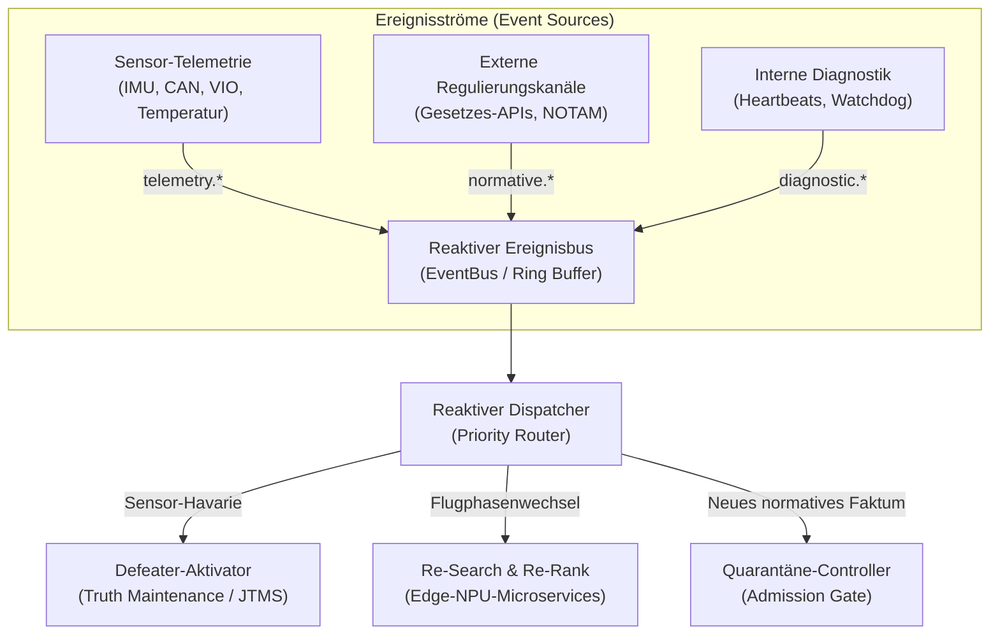
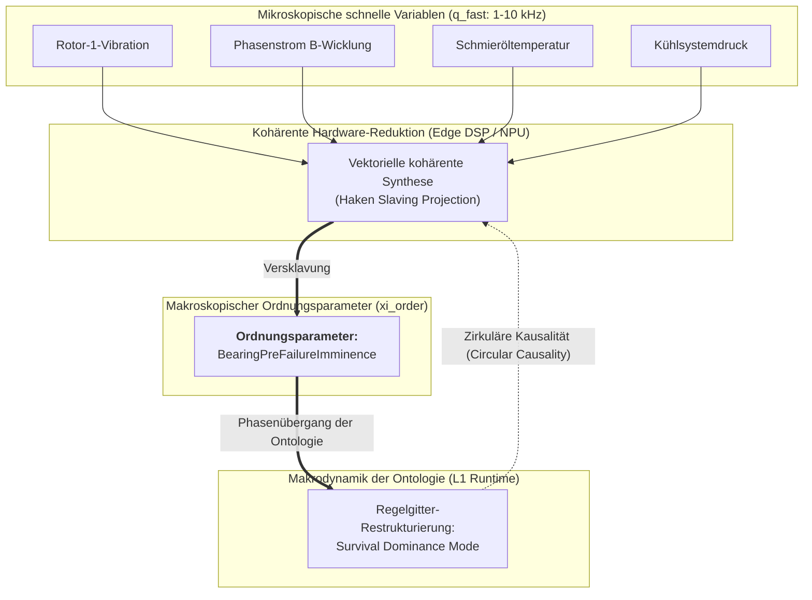
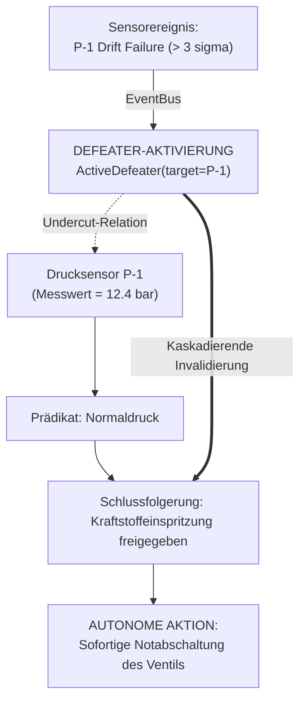
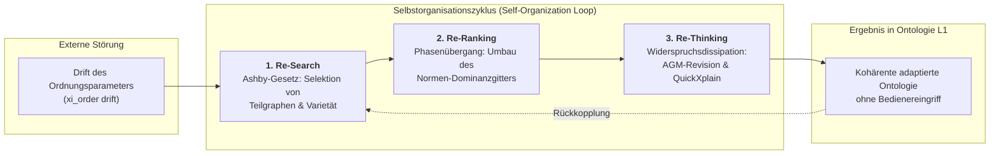
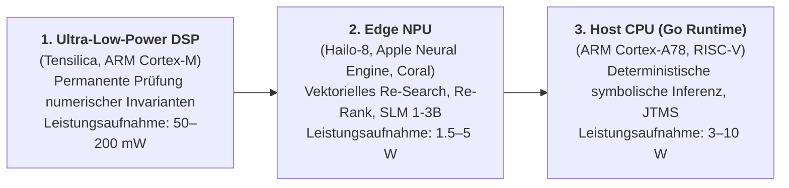

# Kapitel 35. Reaktives Expertensystem: Ereignisse, Widerruf und Wissensadaptation

> **Buch:** [Architektur evidenzbasierter Expertensysteme](README.md) · [Teil VII: Reaktive Ausführung, systemübergreifender Wissensaustausch und verteilte SOA](part-07-runtime-and-knowledge-exchange.md)  
> **Vorheriges Kapitel:** [Kapitel 26. Kontinuierliches Lernen (Continual Learning) aus Erfahrung und Beherrschung von Systemprotokoll-Drift](ch26-continual-learning.md)  
> **Nächstes Kapitel:** [Kapitel 33. Systemübergreifender Wissensaustausch: Regelbereitstellung für Drittsysteme, Modell-Training und sicheres Feedback](ch33-inter-system-knowledge-exchange-and-model-teaching.md)  
> **Inhaltsverzeichnis:** [README.md](README.md)  
> **Autor:** [Mykola Fedchyk](about-the-author.md)  
> **Niveau:** Systemarchitekten, Wissensingenieure, Spezialisten für funktionale Sicherheit und Hardwarebeschleunigung: Fortgeschritten  
> **Lernziele:** Selbstorganisierende und ereignisgesteuerte Echtzeit-Architekturen für Expertensysteme (Self-Organizing Real-Time Expert Systems) entwerfen; Gesetze der Synergetik (dissipative Strukturen von Ilya Prigogine, Versklavungsprinzip von Hermann Haken, Ordnungsparameter) auf die Evolution von Wissensontologien anwenden; nicht-blockierende Verarbeitung von Telemetrieströmen und externen Ereignissen über einen reaktiven Bus organisieren; zweistufiges L0/L1-Wissensspeichermodell (unveränderliche Golden-Master-Basis `mmap` als Attraktor und dynamischer Delta-Graph mit CRDT-Unterstützung) implementieren; Truth Maintenance Systems (JTMS/RMS) mit verzögerungsfreier Kaskadeninvalidierung durch aktive Defeater (*Active Defeaters*) als Entropieexportmechanismus etablieren; dynamische Inferenzaufgaben (Re-Search, Re-Ranking, Re-Thinking) auf energieeffiziente Edge-Hardwarebeschleuniger (Edge NPU/DSP) im thermischen Budget von 1–5 W verteilen; weltweite Präzedenzfälle autonomer modellbasierter Diagnose und Selbstorganisation (NASA Livingstone 2, Mobileye RSS) analysieren.

---

## Abstract

Betrachten wir ein autonomes System (etwa eine Drohne oder ein fahrerloses Transportfahrzeug nach ISO 26262 / DO-178C), in dem ein statisches Expertensystem nach dem passiven Request-Response-Muster operiert. Während des Fluges fällt ein Drucksensor aus oder ein Satellitenlink meldet den dringlichen Widerruf einer Flugfreigabe (NOTAM-Mitteilung). Ist die Wissensbasis als unveränderlicher statischer Monolith kompiliert, stützt sich das System weiterhin auf die veraltete Prämisse, da ihm ein Mechanismus zur unmittelbaren Invalidierung der Konklusion fehlt. Bis der Operator oder ein externes Skript explizit anfragt, ob die Freigabe noch gültig ist, fliegt der Autopilot auf einer gefährlichen oder gesperrten Route. Der Versuch, das gesamte Wissenspaket zur Laufzeit neu zu kompilieren, erfordert mehrere Sekunden, überlastet den Bordcomputer und verletzt harte Echtzeitschranken ($`< 5\,\text{ms}`$) in unzulässiger Weise.

Die zentrale Fragestellung dieses Kapitels lautet: **Wie entwirft man ein Expertensystem, das echtzeitfähig auf externe Ereignisse und Sensorströme reagiert, kompromittierte Schlussfolgerungen kaskadierend innerhalb von Millisekunden widerruft und seine Ontologie adaptiert, ohne Byte-genaue Nachweisbarkeit und strikten Determinismus einzubüßen?**

Dieses Kapitel analysiert die Architektur reaktiver Echtzeit-Expertensysteme und die Prinzipien synergetischer Wissensselbstorganisation nach Hermann Haken und Ilya Prigogine. Es führt ein zweistufiges L0/L1-Speichermodell ein: einen unveränderlichen Phasenattraktor der Wahrheit (`mmap`) und einen dynamischen reaktiven Graphen mit Unterstützung für Truth Maintenance Systems (JTMS/RMS), worin aktive Defeater (*Active Defeaters*) informationelle Entropie nach außen exportieren. Des Weiteren wird die Verlagerung dynamischer Inferenz auf energieeffiziente neuromorphe Koprozessoren (Edge NPU/DSP) innerhalb eines thermischen Limits von 1–5 W sowie industrielle Präzedenzfälle wie NASA Livingstone 2 und Mobileye RSS untersucht.

---

## 1. Grenzen statischer Expertensysteme: Von der Closed-World-Assumption zu lebendiger Sensorik und Wissenssynergetik

Das klassische Knowledge Engineering der zweiten und frühen dritten KI-Welle basierte auf dem Konzept des **thermodynamischen Gleichgewichts und des Abschlusses zur Kompilierzeit (Build-Time Closure)**:


Dieser Ansatz gewährleistet perfekte Byte-genaue Beweisbarkeit und Reproduzierbarkeit der Resultate. In realen cyber-physischen Systemen (autonome UAVs, Fahrerassistenzsysteme, industrielle Energieversorgungs-Controller, Intensivüberwachungsmonitore) stößt er jedoch auf fundamentale Grenzen:

1. **Informationelle Umweltblindheit (Environment Blindness):**  
   Das System operiert ausschließlich auf jenem Wissensstand, der während der letzten Paketkompilierung materialisiert wurde. Wenn ein Sensor degradiert, die Versorgungsspannung einbricht oder sich der dynamische Rechtsstatus einer Operation ändert (beispielsweise beim Überfliegen einer Jurisdiktionsgrenze oder Inkrafttreten einer temporären NOTAM-Sperre), liefert der statische Kern veraltete Schätzungen, bis der Operator explizit neue Eingangsvariablen übergibt.
2. **Passive Abfrage-Latenz (Pull-Driven Latency):**  
   Die klassische Laufzeitumgebung wartet passiv auf Nutzeranfragen. Sie ist unfähig, proaktiv vor einer drohenden Havarie zu warnen oder nachgeordnete Aktoren autonom in einen sicheren Zustand (*Fail-Safe Mode*) zu versetzen.
3. **Energetische und zeitliche Ineffizienz des Batch-Rebuilds (Batch Rebuild Overhead):**  
   Die vollständige Neukompilierung von Wissenspaketen beansprucht Sekunden oder Minuten. Die Reaktion auf ein physikalisches Ereignis (ein blockiertes Ventil oder der Abriss eines GNSS-Signals) verlangt hingegen eine deterministische Adaption innerhalb weniger Millisekunden ($`< 5\,\text{ms}`$).

### 1.1. Differenzierung zwischen einfacher Reaktivität und synergetischer Selbstorganisation

Eine traditionelle ereignisgesteuerte Architektur (Event-Driven Architecture) verarbeitet externe Signale über Ereignishandler:

```math
\text{Event} \longrightarrow \text{Action}
```

Die starre Kopplung «Ereignis $`\to`$ Aktion» ist jedoch lediglich eine reflexhafte Automatisierung erster Art. Sie vermag ihr internes Weltmodell bei unvorhergesehenen Faktorenkombinationen nicht anzupassen.

Echte **Selbstorganisation eines Expertensystems (Self-Organizing Knowledge System)**, deren theoretische Fundamente durch die Arbeiten von Hermann Haken [[1]](#src-1), [[2]](#src-2) und Ilya Prigogine [[3]](#src-3) gelegt wurden, entsteht erst, wenn das offene System:
* **sich kontinuierlich in einem Nichtgleichgewichtszustand befindet** und fortlaufend Informationen mit der Umwelt austauscht;
* **den ontologischen Graphen** und Prioritätsgitter autonom ohne menschlichen Eingriff restrukturiert;
* **Millionen Sensorbeobachtungen in makroskopische Ordnungsparameter verdichtet**, gelenkt durch Hakens Versklavungsprinzip;
* **absolute Stabilität und Beweisbarkeit bewahrt**, indem es die unveränderliche L0-Gold-Basis als globalen Phasenattraktor der Wahrheit nutzt.

---

## 2. Reaktive Programmierung und Ereignisströme als epistemische Impulse

Ausgehend von den Prinzipien der klassischen Kybernetik und der Rückkopplungstheorie von Norbert Wiener [[5]](#src-5) wird die Rechenarchitektur zur Überwindung der statischen Geschlossenheit in eine ereignisgesteuerte Pipeline transformiert, in der externe Beobachtungen und interne Zustandsänderungen als kontinuierliche epistemische Impulse interpretiert werden. In einer solchen reaktiven Laufzeitumgebung wird jede Änderung der äußeren oder inneren Welt als typisiertes **Ereignis (Event)** repräsentiert, das über einen nicht-blockierenden Nachrichtenbus übertragen wird:

```math
E = \langle \text{id}, \text{topic}, \text{source}, \text{timestamp}, \text{priority}, \text{payload}, \sigma_{\text{digest}} \rangle
```



Der Ereignisbus (`EventBus`) implementiert das sperrenfreie Ringpuffer-Muster (LMAX Disruptor Pattern nach Martin Thompson [[14]](#src-14)), was Nanosekunden-Latenzen beim Event-Dispatching über CPU-Kerne hinweg ohne Belastung des Garbage Collectors sicherstellt.

---

## 3. Mehrstufiger Hybridspeicher L0 / L1: Unveränderliche Gold-Basis und dynamischer Delta-Graph

Um die unverbrüchliche Invariante der Byte-genauen Beweisbarkeit (Evidence-Grounded Invariant) zu wahren, unterteilt das System das Wissen in zwei strikt isolierte Schichten:

```math
\mathcal{KB}_{\text{runtime}} = \mathcal{KB}_{L0} \oplus \Delta\mathcal{KB}_{L1}
```

| Speicherschicht | Medium und Format | Veränderlichkeit | Wissensinhalt | Zugriffslatenz |
|---|---|---|---|---|
| **L0 (Golden Master)** | Binärdatei `mmap`, Read-Only | Absolut unveränderlich | Naturgesetze, IETF/ISO-Kernstandards, verfassungsrechtliche Normen | $`< 1\,\mu\text{s}`$ (Zero-Copy) |
| **L1 (Streaming Delta)** | Arbeitsspeicher (In-Memory CRDT) | Dynamisch strömend | Aktuelle Hardwarezustände, situative Ausnahmen, anfechtende Umstände | $`< 100\,\text{ns}`$ |
| **Quarantine Buffer** | Isolierter Kandidatenpuffer | Temporär isoliert | Ungeprüfte Fakten externer Agenten vor SMT-Verifikationstests | Nimmt nicht an Inferenz teil |

### 3.1. Prioritätsauflösung von Fakten im Hybridspeicher
Bei der Abfrage eines Prädikatswerts für den Schlüssel `Key = Subject#Predicate`:  
1. **Prüfung aktiver Defeater:** Ist auf dem Schlüssel $`\text{Key}`$ ein aktiver Anfechtungsumstand $`\text{Defeater}`$ registriert, quittiert die Abfrage unverzüglich mit einem Ablehnungsfehler (*Defeated State*).
2. **Suche in Schicht L1:** Wird in der dynamischen Schicht ein Eintrag gefunden:
   - Handelt es sich um einen Lösch-Grabstein (*Tombstone*), gilt das Faktum als widerrufen bzw. falsifiziert.
   - Andernfalls wird der aktuelle dynamische L1-Wert zurückgegeben.
3. **Fallback auf Schicht L0:** Existiert in L1 kein Eintrag, wird der Wert aus der unveränderlichen Gold-Basis L0 gelesen.

### 3.2. Synergetik dynamischer Wissensbasen: Selbstorganisation, dissipative Strukturen und das Versklavungsprinzip

Unter den Gesichtspunkten der Nichtgleichgewichtsthermodynamik und Synergetik von Ilya Prigogine [[3]](#src-3) und Hermann Haken [[1]](#src-1) ist ein in ein physikalisches Umfeld eingebettetes Expertensystem ein **offenes Nichtgleichgewichts-Informationssystem**. Der ununterbrochene Einstrom externer Ereignisse (Sensortelemetrie, normative Delta-Ströme, asynchrone Busnachrichten) erzeugt einen kontinuierlichen Entropieaustausch mit der Umwelt $`\frac{dS_{\text{ext}}}{dt}`$, der in einem passiven System die Unordnung stetig vergrößert ($`dS_{\text{ext}}/dt > 0`$).

In einem passiven System führt ein solcher Zustrom zwangsläufig zum **Entropiekollaps (Wissensvergiftung)**: Akkumulation veralteter Fakten, zyklische Widersprüche, Performance-Degradation und Inferenzabbrüche. Damit die Wissensbasis hohe Ordnung und Sub-Mikrosekunden-Latenzen bewahrt, muss sie als **dissipative Struktur** operieren und Entropie aktiv nach außen exportieren:

```math
\frac{dS_{\text{sys}}}{dt} = \frac{dS_{\text{int}}}{dt} + \frac{dS_{\text{ext}}}{dt}, \qquad \frac{dS_{\text{int}}}{dt} \ge 0, \qquad \frac{dS_{\text{sys}}}{dt} \le 0 \iff \frac{dS_{\text{ext}}}{dt} \le -\frac{dS_{\text{int}}}{dt}
```

Hierbei bezeichnet $`S_{\text{sys}}`$ die Entropie des Systems, $`dS_{\text{int}}/dt \ge 0`$ die interne Entropieproduktion bei irreversiblen Prozessen (gemäß dem zweiten Hauptsatz der Thermodynamik nicht-negativ) und $`dS_{\text{ext}}/dt`$ den Austausch mit der Umwelt. Die Systemordnung bleibt stabil, wenn der Entropieexport ($`dS_{\text{ext}}/dt < 0`$) dem Betrag nach mindestens so groß ist wie die interne Entropieerzeugung. Für Wissensbasen dient dies als formale Analogie: Als «Entropie» wird das Unordnungsmaß der Faktenbasis verstanden (Widersprüche, veraltete Einträge), nicht eine thermodynamische Energiegröße.

In der Architektur der selbstorganisierenden Wissensbasis stützt sich dieses synergetische Paradigma auf **vier fundamentale Gesetze der Informationssynergetik**:

#### 3.2.1. Gesetz des Nichtgleichgewichts-Informationszustroms (Non-Equilibrium Influx)
Eine im thermodynamischen Gleichgewicht befindliche Wissensbasis (statisches Offline-Paket) ist starr: Sie kann auf Umweltveränderungen ohne vollständigen Neustart nicht reagieren. Selbstorganisation ist ausschließlich **fern des thermodynamischen Gleichgewichts** möglich: unter kontinuierlichem Zustrom epistemischer Impulse aus Sensoren und externen Bussen. Der Ereignisstrom hält die Wissensbasis in dynamischer Empfänglichkeit für Umweltphasenübergänge.

#### 3.2.2. Hakensches Versklavungsprinzip und semantische Ordnungsparameter (Slaving Principle & Order Parameters)
In einer physikalischen Einsatzumgebung existieren Millionen «schneller» mikroskopischer Variablen $`\mathbf{q}_{\text{fast}}`$ (Beschleunigungsmesserwerte, Spannungen auf Versorgungsbussen, Mikrosekunden-Druckfluktuationen, Rotordrehzahlen mit Abtastraten von $`1\text{–}10\,\text{kHz}`$). Der Versuch, jede schnelle Variable über eine isolierte Prädikatenregel zu verarbeiten, mündet in kombinatorischer Explosion und Speichererschöpfung.

Gemäß dem **Hakenschen Versklavungsprinzip (Slaving Principle)** wird das Verhalten komplexer hochdimensionaler Systeme nicht von isolierten mikroskopischen Variablen dominiert, sondern von wenigen langsamen kollektiven Variablen: den **Ordnungsparametern (Order Parameters)** $`\boldsymbol{\xi}_{\text{order}}`$:

```math
\mathbf{q}_{\text{fast}}(t) = \mathbf{f}\bigl(\boldsymbol{\xi}_{\text{order}}(t), \text{noise}\bigr)
```

In einem selbstorganisierenden Expertensystem fungieren ganzheitliche semantische Makrozustände der Ontologie als Ordnungsparameter:

```math
\boldsymbol{\xi}_{\text{order}} \in \{\text{NominalFlight}, \text{HydraulicDegradation}, \text{SevereIcingRisk}, \text{AirspaceRestricted}\}
```

Schnelle Sensorvariablen werden durch Edge-Signalprozessoren (DSP/NPU) aggregiert und dem jeweils dominanten Ordnungsparameter «versklavt». Zeigt der Sensorstrom eine kollektive, kohärente Verschiebung, vollzieht sich ein **Phasenübergang der Ontologie**: Der Ordnungsparameter schlägt um, wodurch der gesamte aktive Regelraum unverzüglich rekonfiguriert wird, ohne dass Millionen unstrukturierter Rohabtastungen einzeln weitergeleitet werden müssen.



#### 3.2.3. Beschränkte Selbstorganisation unter Evidenz-Attraktoren (Constrained Self-Organization under Truth Attractors)
In der klassischen Synergetik kann Selbstorganisation in offenen Systemen chaotische Attraktoren oder unkontrollierbare Bifurkationen hervorbringen (was sich bei generativen Sprachmodellen als ungesteuerte Halluzination manifestiert). In industriellen evidenzbasierten Systemen ist ausschließlich eine **beschränkte Selbstorganisation (Constrained Self-Organization)** zulässig:
* **Die L0-Gold-Basis (`mmap`) agiert als absoluter Phasenattraktor der Wahrheit $`\mathcal{A}_{\text{truth}}`$:** Keine emergente Reorganisation in der dynamischen Schicht L1 kann Verfassungsnormen, physikalische Grundinvarianten oder zertifizierte Sicherheitsgrenzen der L0-Ebene deformieren, überschreiben oder aufheben.
* **JTMS-Invalidierung als Entropieexport:** Die Aktivierung eines aktiven Defeaters (*Active Defeater*) vernichtet kompromittierte Inferenz-Teilgraphen verzögerungsfrei, exportiert informationelles Chaos nach außen und überführt die Phasentrajektorie des Systems in ein kompaktes Schutzeinzugsgebiet (*Safe Attractor Basin*).
* **Quarantäne-Schleuse als semipermeable selektive Membran:** Neue emergente Fakten von Drittagenten passieren die SMT-Membran (Zulassungsschleuse) nur unter der Bedingung strikter Widerspruchsfreiheit zu den Invarianten von $`\mathcal{A}_{\text{truth}}`$, was das System vor Wissensvergiftung schützt.

#### 3.2.4. Hardware-Energiemetabolismus von Edge-Knoten (Edge Hardware Metabolism)
Selbstorganisation ist ein thermodynamischer Prozess, der den kontinuierlichen Verbrauch freier Energie erfordert, um Entropie lokal zu verringern (nach Erwin Schrödingers Diktum: «Ein lebender Organismus ernährt sich von negativer Entropie»). In batteriegestützten autonomen Systemen realisieren Edge-NPUs/DSPs mit extrem geringer Leistungsaufnahme (1–5 W) diesen Informationsmetabolismus: Sie verarbeiten das Sensorrauschen permanent und erhalten die Kohärenz der Wissensbasis aufrecht, ohne die energieintensive Haupt-CPU aufzuwecken.

---

## 4. Defeasible Truth Maintenance Systems: Dynamische aktive Defeater

In einem klassischen Justification-Based Truth Maintenance System (JTMS) nach Jon Doyle [[6]](#src-6) stützt sich jede Aussage auf eine Menge von Begründungen:

```math
\text{Node} = \langle \text{Datum}, \text{IN-List}, \text{OUT-List} \rangle
```

wobei die $`\text{IN-List}`$ jene Fakten enthält, die wahr sein müssen, während die $`\text{OUT-List}`$ jene anfechtenden Bedingungen aufführt, die falsch (abwesend) sein müssen, damit die Konklusion als gültig anerkannt wird.



Signalisiert ein Sensorereignis eine physikalische Anomalie (beispielsweise ein Auseinanderdriften redundanter Messwerte um mehr als $`3\sigma`$), erzeugt die reaktive Engine einen **aktiven Defeater (Active Defeater)**:  

```math
\text{Fault}(\text{Sensor}_A) \implies \text{ActivateDefeater}(\text{SensorReading}_A)
```  

Dies untergräbt unverzüglich die Wurzelprämisse (*Undercutting Defeater*). Alle abgeleiteten Konklusionen des Abhängigkeitsgraphen verlieren automatisch ihre Gültigkeit, wodurch das System in einen sicheren Haltemodus überführt oder auf einen redundanten Sensorkanal umgeschaltet wird.

---

## 5. Synergetische Selbstorganisations-Engine: Die Microservices Re-Search, Re-Ranking und Re-Thinking

Selbstorganisation ist kein monolithischer Prozess. Sie vollzieht sich über eine Triade spezialisierter Microservices, die die Homöostase der Wissensbasis kontinuierlich aufrechterhalten und Phasenübergänge steuern:



### 5.1. Re-Search: Evolutionäre Wissensselektion und Ashbys Gesetz der erforderlichen Varietät
Gemäß Ashbys Gesetz der erforderlichen Varietät [[4]](#src-4) muss die Varietät des Steuerungssystems mindestens so groß sein wie die Varietät der Umweltstörungen. Registriert der Ordnungsparameter $`\boldsymbol{\xi}_{\text{order}}`$ eine Verschiebung des Arbeitspunkts (etwa wenn ein Satellit in den Erdschatten tritt oder ein UAV in eine Zone elektronischer Störmaßnahmen einfliegt), führt der Microservice Re-Search autonom folgende Schritte aus:
* Er initiiert ein vorausschauendes Laden (*Prefetching*) relevanter normativer und prozeduraler Teilgraphen aus dem permanenten L0-Speicher in den L1-Hochgeschwindigkeitscache;
* Er garantiert, dass im Arbeitsspeicher stets genau jener Regelsatz präsent ist, der zur Abwehr neuer Gefahren nötig ist, bevor eine akute Notfallsituation eintritt;
* Er operiert auf quantisierten Matrixindizes auf der Edge-NPU mit einer Leistungsaufnahme von $`< 1.5\,\text{W}`$.

### 5.2. Re-Ranking: Adaptive Umstrukturierung von Präferenzgittern

Normen, Handlungsziele und Inferenzregeln besitzen kein starres statisches Gewicht. Ihre Relevanz wandelt sich in Abhängigkeit vom Abstand zu Bifurkationspunkten. Zur quantitativen Erkennung einer Annäherung an kritische Punkte (Effekt des kritischen Verlangsamens, *Critical Slowing Down*) berechnet der Re-Ranking-Service den dynamischen Fluktuationsvarianz-Index des Ordnungsparameters:

```math
\gamma_{\text{crit}} = \frac{\mathrm{Var}(\Delta \boldsymbol{\xi}_{\text{order}}(t))}{\sigma_0^2}
```

wobei:
- $`\gamma_{\text{crit}}`$ — dimensionsloser Index der Vor-Bifurkations-Instabilität des Systems;
- $`\mathrm{Var}(\Delta \boldsymbol{\xi}_{\text{order}}(t))`$ — aktuelle Varianz der Fluktuationen des makroskopischen Ordnungsparameters, berechnet in einem gleitenden Messfenster;
- $`\sigma_0^2`$ — Referenzvarianz des Ordnungsparameters im stationären (laminaren) Betriebszustand des Gesamtsystems.

**Praktische Anwendung und ingenieurtechnische Schlussfolgerungen (Closed-Loop Decision):**

#### 5.2.1. Dispatching-Kriterien und Phasenzustandsübergänge
**Normalbetrieb** ($`\gamma_{\text{crit}} < 3{,}0`$, *Equilibrium Basin*): Es dominieren Regeln der Energieeffizienz, Navigationsgenauigkeit und Treibstoffökonomie:

```math
\mathrm{Priority}(\mathrm{FuelEfficiency}) \succ \mathrm{Priority}(\mathrm{EmergencyRedundancy})
```

Der Task-Scheduler optimiert den Energieverbrauch des Edge-Knotens; die Edge-NPU führt quantisierte Batch-Verarbeitung mit einer Basis-Abtastrate von $`10\,\text{Hz}`$ aus.

**Vor-Bifurkations-Zustand** ($`\gamma_{\text{crit}} \ge 3{,}0`$, *Critical Slowing Down*): Der Service vollzieht eine Phasenumkonfiguration der Ontologie zugunsten des reinen Überlebensmodus (*Survival Dominance*):

```math
\mathrm{Priority}(\mathrm{SafetyShield}) \gg \mathrm{Priority}(\mathrm{MissionGoal}) \gg \mathrm{Priority}(\mathrm{Efficiency})
```

Dies stellt sicher, dass keine Effizienz- oder Optimierungsregel das Greifen von Schutzinvarianten bei drohender Havarie blockieren kann.

#### 5.2.2. Hardware-Steuerung und Dimensionierung
- Bei Überschreiten der Schwelle $`\gamma_{\text{crit}} \ge 3{,}0`$ darf die Reaktionszeit der Laufzeitumgebung für die Gitterumstrukturierung $`250\,\mu\text{s}`$ nicht überschreiten;
- Der Edge-NPU-Hardware-Controller schaltet SRAM-Speicherbänke in einem einzigen Taktzyklus um, lädt den prädikativen Schutzschild (Shielded Reinforcement Learning nach Bettina Könighofer et al. [[10]](#src-10)) und aktiviert hochprioritäre DMA-Bus-Arbitrierung für Notfalltelemetriekanäle (die Prüffrequenz steigt auf $`1\,\text{kHz}`$).

#### 5.2.3. Praktisches numerisches Berechnungsbeispiel
- Die Referenzvarianz der Vibrationsbelastung eines Lagers beträgt $`\sigma_0^2 = 0{,}04\,\text{g}^2`$.
- Es wird ein Anstieg der Fluktuationen auf $`\mathrm{Var}(\Delta \boldsymbol{\xi}) = 0{,}15\,\text{g}^2`$ registriert.
- Berechnung: $`\gamma_{\text{crit}} = 0{,}15 / 0{,}04 = 3{,}75 \ge 3{,}0`$.
- **Systemaktion:** Es wird eine Vor-Bifurkations-Instabilität detektiert; die Re-Ranking-Engine schaltet das Prioritätsgitter in $`180\,\mu\text{s}`$ in den Modus `Survival Dominance`, blockiert Schubverstärkungsbefehle und leitet ein kontrolliertes Notabbremsen des Rotors ein.

### 5.3. Re-Thinking: Dissipation von Widersprüchen und defeasible Resolving nach AGM
Erzeugt der Einstrom neuer Sensorinformationen logische Widersprüche zu zuvor akzeptierten Hypothesen (beispielsweise divergierende Messwerte redundanter Sensoren oder eine physikalisch unmögliche räumliche Lage), vollzieht der Re-Thinking-Service eine **informationelle Dissipation**:
* Er wendet die Postulate der Überzeugungsrevision nach Alchourrón–Gärdenfors–Makinson (AGM Belief Revision) [[11]](#src-11) zur deterministischen Kontraktion (*Contraction*) inkonsistenter Mengen an;
* Er lokalisiert minimale unlösbare Teilmengen (Minimal Unsatisfiable Cores, MUC) über Ulrich Junkers QuickXplain-Algorithmus [[12]](#src-12);
* Er trennt die am wenigsten gestützten Hypothesen deterministisch ab und zieht abgeleitete Fakten zurück, ohne die Integrität des fundamentalen L0-Kerns zu beschädigen. Die Wissensbasis baut Entropiespannungen selbsttätig ab und stellt strikte Widerspruchsfreiheit wieder her.

---

## 6. Energieeffiziente Hardwarebeschleunigung am Edge: NPU und DSP versus Server-GPUs

In cyber-physischen Systemen schließt die begrenzte Batteriekapazität den Einsatz von Server-Grafikprozessoren (GPUs) mit Leistungsaufnahmen von $`200\text{–}700\,\text{W}`$ aus. Das reaktive Expertensystem stützt sich auf eine mehrstufige Aufgabenverteilung:



* **DSP** ($`< 200\,\text{mW}`$): Arbeitet auf der Frequenz der Sensorik ($`1\text{–}10\,\text{kHz}`$) und prüft numerische Grenzwertbereiche, ohne die zentrale Recheneinheit aufzuwecken.
* **NPU** ($`1.5\text{–}5\,\text{W}`$): Führt quantisierte Kleinmodelle (SLM INT4) und Vektorindizes zur Klassifikation unstrukturierter Beobachtungen und schnellen Vorfilterung von Kandidaten aus.
* **Host-CPU** ($`3\text{–}10\,\text{W}`$): Führt strikte deterministische Logik, kryptographische Prüfungen von Ed25519-Signaturen und die Wahrheitserhaltung der Faktenbasis aus.

Den prinzipiellen Vorteil dedizierter Tensorbeschleuniger gegenüber Universalprozessoren wiesen Jouppi et al. in ihrer TPU-Architekturanalyse nach [[15]](#src-15): Matrixmultiplikation auf Basis systolischer Arrays (*Systolic Arrays*) leitet Zwischenergebnisse unmittelbar zwischen benachbarten Rechenzellen weiter, ohne permanent auf energieintensive Registerdateien und Cache-Hierarchien zuzugreifen. In energieeffizienten eingebetteten Expertensystemen liefert dies einen signifikanten Effizienzgewinn (TOPS/Watt) bei Vektorsuchen und neuronaler Vorab-Rangordnung und schont das thermische Budget für die symbolischen Berechnungen der Host-CPU.

---

## 7. Präzedenzfälle in industrieller und wissenschaftlicher Praxis

1. **NASA Deep Space 1 und EO-1 (Modellbasierte Autonomie Livingstone 2):**  
   Das Livingstone-System an Bord der Raumsonde Deep Space 1 (Projekt Remote Agent von Muscettola et al. [[7]](#src-7), modellbasierte Diagnosearchitektur von Kurien und Nayak [[8]](#src-8)) kombinierte ein deklaratives Modell der Sonde in Form qualitativer endlicher Automaten mit reaktiver Inferenz. Versagte ein Triebwerksventil, aktualisierte das System den Zustandsgraphen in Millisekunden und rekonfigurierte das Flugmanöver autonom ohne Eingriff der Bodenstation.
2. **Mobileye RSS (Responsibility-Sensitive Safety):**  
   Das formale mathematische Sicherheitsmodell von Shalev-Shwartz et al. [[9]](#src-9) ist als reaktiver prädikativer Schild implementiert. Strömende Detektionsdaten von Lidaren und Kameras werden kontinuierlich in dynamische Raumurteile transformiert. Schlägt der Trajektorienplaner ein Manöver vor, das das Prädikat des Sicherheitsabstands verletzt, blockiert der reaktive Schutzschild das Stellsignal an die Radaktoren unverzüglich.
3. **Flugsicherheit (Honeywell Runway Overrun Warning System - ROAS):**  
   Ein bordseitiger reaktiver Prozessor vergleicht die Landedynamik des Flugzeugs (Wind, Landegewicht, verbleibende Pistenlänge) mit normativen Schranken auf Basis der differentiellen dynamischen Logik von André Platzer [[13]](#src-13). Er eskaliert den Zustand bei Überschreitung deterministisch von passiver Überwachung zu einer erzwungenen akustischen Durchstart-Anweisung an die Flugbesatzung.

---

## 8. Software-Implementierung in Go: Das Paket `reactive`

Im Folgenden ist eine vollständige, in sich geschlossene Implementierung der reaktiven Laufzeitumgebung dargestellt, die den sperrenfreien Ereignisbus, den zweistufigen L0/L1-Speicher mit aktiven Defeatern, Wissensquarantäne und das Dispatching von NPU-Diensten demonstriert:

<details>
<summary>Vollständige Implementierung der reaktiven Laufzeitumgebung in Go (Paket reactive)</summary>

```go
package reactive

import (
	"context"
	"crypto/sha256"
	"encoding/hex"
	"fmt"
	"sort"
	"strings"
	"sync"
	"time"
)

// Priority definiert die Dringlichkeitsstufe eines Ereignisses.
type Priority int

const (
	PriorityNormal Priority = iota
	PriorityHigh
	PriorityCritical
)

// Event modelliert ein autonomes Sensor- oder externes Signal.
type Event struct {
	ID        string         `json:"id"`
	Topic     string         `json:"topic"`
	Source    string         `json:"source"`
	Payload   map[string]any `json:"payload"`
	Timestamp time.Time      `json:"timestamp"`
	Priority  Priority       `json:"priority"`
}

// Digest generiert einen kryptographischen Prüfwert des Ereignisses.
func (e *Event) Digest() string {
	h := sha256.New()
	fmt.Fprintf(h, "%s:%s:%s:%d:%d", e.ID, e.Topic, e.Source, e.Timestamp.UnixNano(), e.Priority)
	return hex.EncodeToString(h.Sum(nil))
}

// Fact repräsentiert eine atomare Aussage in der Ontologie.
type Fact struct {
	Subject    string    `json:"subject"`
	Predicate  string    `json:"predicate"`
	Object     string    `json:"object"`
	Source     string    `json:"source"`
	Timestamp  time.Time `json:"timestamp"`
	IsTombstone bool      `json:"is_tombstone"`
}

func (f Fact) Key() string {
	return f.Subject + "#" + f.Predicate
}

// ActiveDefeater beschreibt eine aktive Außerkraftsetzungsbedingung, ausgelöst durch ein Ereignis.
type ActiveDefeater struct {
	DefeaterID string    `json:"defeater_id"`
	TargetKey  string    `json:"target_key"`
	Reason     string    `json:"reason"`
	CreatedAt  time.Time `json:"created_at"`
}

// EventBus implementiert einen hochperformanten Pub/Sub-Bus mit Topic-Pattern-Unterstützung.
type EventBus struct {
	mu          sync.RWMutex
	subscribers map[string][]chan Event
	closed      bool
}

func NewEventBus() *EventBus {
	return &EventBus{
		subscribers: make(map[string][]chan Event),
	}
}

func (eb *EventBus) Subscribe(topic string, bufferSize int) <-chan Event {
	eb.mu.Lock()
	defer eb.mu.Unlock()
	ch := make(chan Event, bufferSize)
	eb.subscribers[topic] = append(eb.subscribers[topic], ch)
	return ch
}

func (eb *EventBus) Publish(event Event) {
	eb.mu.RLock()
	defer eb.mu.RUnlock()
	if eb.closed {
		return
	}
	for pattern, chList := range eb.subscribers {
		if pattern == "*" || pattern == event.Topic || (strings.HasSuffix(pattern, ".*") && strings.HasPrefix(event.Topic, strings.TrimSuffix(pattern, ".*"))) {
			for _, ch := range chList {
				select {
				case ch <- event:
				default:
				}
			}
		}
	}
}

func (eb *EventBus) Close() {
	eb.mu.Lock()
	defer eb.mu.Unlock()
	if eb.closed {
		return
	}
	eb.closed = true
	for _, chList := range eb.subscribers {
		for _, ch := range chList {
			close(ch)
		}
	}
	eb.subscribers = nil
}

// DeltaStore stellt die hybride Speicherung L0/L1, aktive Defeater und Quarantäne bereit.
type DeltaStore struct {
	mu              sync.RWMutex
	l0Static        map[string]Fact
	l1Delta         map[string]Fact
	activeDefeaters map[string]ActiveDefeater
	quarantine      map[string]Fact
}

func NewDeltaStore() *DeltaStore {
	return &DeltaStore{
		l0Static:        make(map[string]Fact),
		l1Delta:         make(map[string]Fact),
		activeDefeaters: make(map[string]ActiveDefeater),
		quarantine:      make(map[string]Fact),
	}
}

func (ds *DeltaStore) LoadL0(facts []Fact) {
	ds.mu.Lock()
	defer ds.mu.Unlock()
	for _, f := range facts {
		ds.l0Static[f.Key()] = f
	}
}

func (ds *DeltaStore) IngestL1(f Fact) {
	ds.mu.Lock()
	defer ds.mu.Unlock()
	ds.l1Delta[f.Key()] = f
}

func (ds *DeltaStore) PutQuarantine(f Fact) {
	ds.mu.Lock()
	defer ds.mu.Unlock()
	ds.quarantine[f.Key()] = f
}

func (ds *DeltaStore) ReleaseQuarantine(key string) (Fact, bool) {
	ds.mu.Lock()
	defer ds.mu.Unlock()
	f, ok := ds.quarantine[key]
	if !ok {
		return Fact{}, false
	}
	delete(ds.quarantine, key)
	ds.l1Delta[key] = f
	return f, true
}

func (ds *DeltaStore) ActivateDefeater(d ActiveDefeater) {
	ds.mu.Lock()
	defer ds.mu.Unlock()
	ds.activeDefeaters[d.TargetKey] = d
}

func (ds *DeltaStore) DeactivateDefeater(targetKey string) {
	ds.mu.Lock()
	defer ds.mu.Unlock()
	delete(ds.activeDefeaters, targetKey)
}

func (ds *DeltaStore) Query(subject, predicate string) (Fact, error) {
	ds.mu.RLock()
	defer ds.mu.RUnlock()
	key := subject + "#" + predicate

	if def, isDefeated := ds.activeDefeaters[key]; isDefeated {
		return Fact{}, fmt.Errorf("fact defeated: %s (reason: %s)", key, def.Reason)
	}

	if f, ok := ds.l1Delta[key]; ok {
		if f.IsTombstone {
			return Fact{}, fmt.Errorf("fact retracted: %s", key)
		}
		return f, nil
	}

	if f, ok := ds.l0Static[key]; ok {
		return f, nil
	}
	return Fact{}, fmt.Errorf("fact not found: %s", key)
}

// StateContext speichert den operativen Kontext des Gesamtsystems.
type StateContext struct {
	EmergencyMode bool
	CurrentPhase  string
}

// NPUServiceDispatcher simuliert den Betrieb stromsparender Hardwarebeschleuniger.
type NPUServiceDispatcher struct{}

func NewNPUServiceDispatcher() *NPUServiceDispatcher {
	return &NPUServiceDispatcher{}
}

func (d *NPUServiceDispatcher) ReSearch(ctx context.Context, phase string) []Fact {
	if phase == "EMERGENCY_DESCENT" {
		return []Fact{
			{Subject: "cabin_pressurization", Predicate: "target_altitude_ft", Object: "10000", Source: "npu_research"},
		}
	}
	return nil
}

func (d *NPUServiceDispatcher) ReRank(facts []Fact, sCtx StateContext) []Fact {
	ranked := make([]Fact, len(facts))
	copy(ranked, facts)
	sort.SliceStable(ranked, func(i, j int) bool {
		if sCtx.EmergencyMode && ranked[i].Predicate == "emergency_action" {
			return true
		}
		return false
	})
	return ranked
}

// ReactiveEngine koordiniert die Reaktion des Expertensystems auf Streaming-Signale.
type ReactiveEngine struct {
	mu           sync.RWMutex
	eventBus     *EventBus
	deltaStore   *DeltaStore
	npu          *NPUServiceDispatcher
	stateContext StateContext
	alerts       []string
}

func NewReactiveEngine(eb *EventBus, ds *DeltaStore, npu *NPUServiceDispatcher) *ReactiveEngine {
	return &ReactiveEngine{
		eventBus:   eb,
		deltaStore: ds,
		npu:        npu,
	}
}

func (re *ReactiveEngine) HandleEvent(ctx context.Context, ev Event) {
	re.mu.Lock()
	defer re.mu.Unlock()

	switch ev.Topic {
	case "telemetry.sensor_fault":
		targetKey, _ := ev.Payload["target_key"].(string)
		reason, _ := ev.Payload["reason"].(string)
		if targetKey != "" {
			re.deltaStore.ActivateDefeater(ActiveDefeater{
				DefeaterID: ev.ID,
				TargetKey:  targetKey,
				Reason:     reason,
				CreatedAt:  ev.Timestamp,
			})
			re.alerts = append(re.alerts, fmt.Sprintf("DEFEATER_ON: %s", targetKey))
		}

	case "environment.phase_change":
		phase, _ := ev.Payload["phase"].(string)
		re.stateContext.CurrentPhase = phase
		if phase == "EMERGENCY_DESCENT" {
			re.stateContext.EmergencyMode = true
		}
		discovered := re.npu.ReSearch(ctx, phase)
		for _, f := range discovered {
			re.deltaStore.IngestL1(f)
		}
	}
}

func (re *ReactiveEngine) GetAlerts() []string {
	re.mu.RLock()
	defer re.mu.RUnlock()
	res := make([]string, len(re.alerts))
	copy(res, re.alerts)
	return res
}
```

</details>

---

## 9. Unit-Tests: Verifikation der reaktiven Laufzeitumgebung

<details>
<summary>Unit-Tests der reaktiven Laufzeitumgebung (Go-Testsuite)</summary>

```go
package reactive

import (
	"context"
	"testing"
	"time"
)

func TestReactiveEngine_SensorFault_And_JTMS_Invalidation(t *testing.T) {
	eb := NewEventBus()
	defer eb.Close()

	ds := NewDeltaStore()
	ds.LoadL0([]Fact{
		{Subject: "pitot_tube_1", Predicate: "airspeed_knots", Object: "250"},
	})

	npu := NewNPUServiceDispatcher()
	engine := NewReactiveEngine(eb, ds, npu)

	// Vor dem Ereignis ist das Faktum verfügbar
	f, err := ds.Query("pitot_tube_1", "airspeed_knots")
	if err != nil || f.Object != "250" {
		t.Fatalf("expected 250 knots before fault, got %v", f)
	}

	// Havarie-Ereignis: Sensorausfall
	ev := Event{
		ID:        "evt-09",
		Topic:     "telemetry.sensor_fault",
		Source:    "sensor_supervisor",
		Timestamp: time.Now(),
		Priority:  PriorityCritical,
		Payload: map[string]any{
			"target_key": "pitot_tube_1#airspeed_knots",
			"reason":     "icing_detected_heater_off",
		},
	}

	engine.HandleEvent(context.Background(), ev)

	// Nach dem Ereignis wird der Defeater aktiviert: Faktum wird unmittelbar zurückgewiesen
	_, err = ds.Query("pitot_tube_1", "airspeed_knots")
	if err == nil {
		t.Fatal("expected query to fail under active defeater, but succeeded")
	}

	alerts := engine.GetAlerts()
	if len(alerts) != 1 || alerts[0] != "DEFEATER_ON: pitot_tube_1#airspeed_knots" {
		t.Fatalf("unexpected alerts: %v", alerts)
	}
}

func TestReactiveEngine_PhaseShift_And_NPU_ReSearch(t *testing.T) {
	eb := NewEventBus()
	defer eb.Close()

	ds := NewDeltaStore()
	npu := NewNPUServiceDispatcher()
	engine := NewReactiveEngine(eb, ds, npu)

	// Ereignis: Flugphasenwechsel
	ev := Event{
		ID:        "evt-10",
		Topic:     "environment.phase_change",
		Source:    "fsm_navigator",
		Timestamp: time.Now(),
		Priority:  PriorityHigh,
		Payload: map[string]any{
			"phase": "EMERGENCY_DESCENT",
		},
	}

	engine.HandleEvent(context.Background(), ev)

	// NPU Re-Search lädt Faktum dynamisch in L1 nach
	f, err := ds.Query("cabin_pressurization", "target_altitude_ft")
	if err != nil || f.Object != "10000" {
		t.Fatalf("expected 10000 ft dynamically ingested by Re-Search, got err: %v", err)
	}
}

func TestQuarantineBuffer_Lifecycle(t *testing.T) {
	ds := NewDeltaStore()
	unverified := Fact{Subject: "external_regulator", Predicate: "rule_v2", Object: "APPLY"}

	ds.PutQuarantine(unverified)

	// Faktum ist im Arbeitsbereich nicht abfragbar
	if _, err := ds.Query("external_regulator", "rule_v2"); err == nil {
		t.Fatal("quarantined fact must not be queryable")
	}

	// Freigabe aus der Quarantäne nach erfolgreicher SMT-Prüfung
	if _, ok := ds.ReleaseQuarantine(unverified.Key()); !ok {
		t.Fatal("failed to release from quarantine")
	}

	// Nun ist das Faktum in L1 verfügbar
	if f, err := ds.Query("external_regulator", "rule_v2"); err != nil || f.Object != "APPLY" {
		t.Fatalf("expected fact queryable after quarantine release, got %v", f)
	}
}
```

</details>

---

## Fazit
1. **Synergetische Selbstorganisation versus einfache Reaktivität:** Konventionelle Reaktivität ($`\mathrm{Event} \to \mathrm{Action}`$) ist lediglich ein mechanischer Reflex. Echte Selbstorganisation einer Wissensbasis vollzieht sich in einem offenen Nichtgleichgewichtssystem nach den Prinzipien von Prigogine und Haken: Millionen hochfrequenter Sensorvariablen ordnen sich makroskopischen Ordnungsparametern unter, während die Ontologietopologie ohne Bedienereingriff autonom evolviert.
2. **Zweistufiger Hybridspeicher als Phasenattraktor (L0/L1):** Die unveränderliche Gold-Basis (`mmap`) stellt sicher, dass die nichtlineare synergetische Dynamik der L1-Schicht strikt beschränkt bleibt (Constrained Self-Organization) und nicht in Halluzinationen oder Wissensvergiftung entgleist ($`\text{ZHR} = 1{,}00`$, $`\text{FCP} = 100\%`$).
3. **JTMS und Wissensquarantäne als informationelle Dissipation:** Aktive Defeater (*Active Defeaters*) kappen instabile Inferenzpfade verzögerungsfrei und exportieren Entropie nach außen ($`dS_{\text{ext}}/dt < 0`$), während der Quarantänepuffer als semipermeable Selektionsmembran für externes Wissen fungiert.
4. **Die Triade Re-Search, Re-Ranking, Re-Thinking als Adaptionsmotor:** Ashbys Gesetz der erforderlichen Varietät wird durch das autonome Vorladen normativer Teilgraphen (Re-Search), die dynamische Rekonfiguration von Normen-Prioritätsgittern (Re-Ranking) und die AGM-basierte Konfliktauflösung (Re-Thinking) praxistauglich umgesetzt.
5. **Hardware-Energiemetabolismus am Edge:** Der Einsatz stromsparender NPUs und DSPs (1–5 W) liefert die thermodynamische Energie zur Entropiebekämpfung direkt an Bord autonomer Plattformen, vollkommen unabhängig von cloudbasierten Serverfarmen.

### Reaktive Ausführung im operativen Gesamtpfad

Kapitel 17 definiert die semantischen Anforderungen an Werkzeuge, Kapitel 18 begründet die Hardware-Allokation und Kapitel 22 trennt die zeitlichen Horizonte der physikalischen Steuerung. Das vorliegende Kapitel ergänzt dies um reaktive Ausführung und ereignisgesteuerten Prämissenwiderruf. Die Forschungsanalogie der synergetischen Selbstorganisation ist stets von dem verifizierten, deterministischen Verhalten der konkreten Ereignishandler zu unterscheiden.

### Weiterführender Erkenntnispfad

Das im thematischen Aufbau folgende [Kapitel 33](ch33-inter-system-knowledge-exchange-and-model-teaching.md) schließt den Hauptpfad mit dem Vertrag für den systemübergreifenden Wissensaustausch ab. Aus Ereignissen und externen Rückkopplungen gewonnene Kandidatenfakten durchlaufen die formalen Prozeduren von [Teil V](part-05-verification-and-learning.md). Spezifische Anwendungsdomänen sind in den [Anhängen](README.md#anhänge) zusammengeführt.

## Fragen zur Selbstüberprüfung
1. Worin besteht der fundamentale Unterschied zwischen einfacher ereignisgesteuerter Reaktivität ($`\mathrm{Event} \to \mathrm{Action}`$) und synergetischer Selbstorganisation einer Wissensbasis nach Hermann Haken?
2. Wie ermöglicht das Hakensche Versklavungsprinzip die Überwindung des Fluchs der Dimensionalität bei der Verarbeitung hochfrequenter Sensorströme (1–10 kHz)?
3. Warum wird die L0-Speicherschicht als globaler Phasenattraktor der Wahrheit für die dynamische L1-Schicht betrachtet?
4. Auf welche Weise transformiert sich ein Sensorausfall-Ereignis im Rahmen von Truth Maintenance Systems (JTMS) in einen aktiven Defeater (*Active Defeater*)?
5. Worin liegt der Unterschied zwischen dem Untergraben einer Prämisse (*Undercutting Defeater*) und der Falsifikation durch ein gegenteiliges Faktum (*Rebutting Defeater*) im reaktiven Monitoring?
6. Wie setzen die Microservices Re-Search, Re-Ranking und Re-Thinking Ashbys Gesetz der erforderlichen Varietät um und wie steuern sie Phasenübergänge der Ontologie?
7. Warum erfordert das Löschen eines Faktums in der reaktiven L1-Schicht den Einsatz von Lösch-Grabsteinen (*Tombstones*) anstelle einer einfachen Speicherfreigabe?
8. Welche thermodynamische Rolle spielen Edge-NPU/DSP-Prozessoren als Organ des «Energiemetabolismus» in der dissipativen Struktur einer Wissensbasis?
9. Welche Funktion erfüllt der Quarantänepuffer (Quarantine Buffer) beim Empfang emergenter Ontologie-Updates von externen Systemen?
10. Wie wurde im NASA-System Livingstone 2 die autonome Rekonfiguration von Flugplänen auf Basis qualitativer Zustandsbifurkationen und modellbasierter Diagnose realisiert?

## Glossar
| Begriff (Deutsch) | Englische Entsprechung | Kurzerklärung |
|---|---|---|
| **Selbstorganisierendes Expertensystem** | Self-Organizing Expert System | Offenes Nichtgleichgewichtssystem, das die Topologie seiner Wissensbasis unter dem Einfluss von Ereignisströmen autonom adaptiert und dabei Beweisbarkeitsinvarianten wahrt. |
| **Hakensches Versklavungsprinzip** | Haken's Slaving Principle | Synergetisches Gesetz, nach dem schnelle mikroskopische Systemvariablen wenigen langsamen Ordnungsparametern untergeordnet («versklavt») werden. |
| **Ontologischer Ordnungsparameter** | Ontological Order Parameter | Makroskopische semantische Variable höherer Ebene, die die Konfiguration aktiver Inferenzregeln und den Betriebsmodus bestimmt. |
| **Dissipative Wissensstruktur** | Dissipative Knowledge Structure | Offenes Informationsmodell, das seine innere Ordnung durch kontinuierlichen Entropieexport (Invalidierung falscher Prämissen, Defeater) aufrechterhält. |
| **Wahrheits-Phasenattraktor** | Truth Attractor Basin | Zulässiger Zustandsraum, definiert durch die unveränderliche L0-Basis, in den das System bei Störungen garantiert zurückkehrt. |
| **Aktiver Defeater** | Active Defeater | Dynamische Bedingung im Truth Maintenance System, die die Gültigkeit eines Faktums oder einer Regel infolge einer Sensoranomalie sofort blockiert. |
| **L0-Schicht** | Golden Master Base | Unveränderliche, kryptographisch signierte und speicherabgebildete (`mmap`) Schicht fundamentaler Axiome, Normen und Gesetze. |
| **L1-Schicht** | Streaming Delta-Graph | Hochperformante operative Schicht flüchtiger Delta-Änderungen, episodischer Fakten und Defeater, die zur Laufzeit mutiert. |
| **Re-Search** | Re-Search | Service zur autonomen vorausschauenden Selektion normativer Teilgraphen aus verteilten Wissensspeichern gemäß Ashbys Gesetz. |
| **Re-Ranking** | Re-Ranking | Dynamischer Service zur kontextuellen Neubewertung von Prioritäten und Präferenzgittern von Regeln bei Phasenübergängen. |
| **Re-Thinking** | Re-Thinking | Prozedur defeasiblen Schließens und der Überzeugungsrevision (AGM) zur Auflösung entropischer Konflikte bei Gegenbeispielen. |
| **Wissensquarantäne** | Knowledge Quarantine | Isolierter Puffer zur Verifikation externer Hypothesen auf Invarianten-Konformität vor der Aufnahme in die Wissensbasis. |

## Abkürzungen
| Abkürzung | Vollständige Bezeichnung | Bedeutung im Kontext des Kapitels |
|---|---|---|
| **AGM** | Alchourrón, Gärdenfors, Makinson | Standard-Logikparadigma für Überzeugungsrevision (Belief Revision) und Widerspruchsbeseitigung |
| **CBR** | Case-Based Reasoning | Fallbasiertes Schließen auf der Grundlage historischer Präzedenzfälle |
| **CRDT** | Conflict-free Replicated Data Type | Konfliktfreie replizierte Datentypen für verteilte Wissensgraphen |
| **CWA** | Closed World Assumption | Annahme einer geschlossenen Welt in klassischen Datenbanksystemen |
| **DSP** | Digital Signal Processor | Digitaler Signalprozessor zur primären Filterung hochfrequenter Sensorströme |
| **FCP** | False Claim Prevention | Quote zur Verhinderung unbestätigter Behauptungen (Invariante = 100%) |
| **FSM** | Finite State Machine | Endlicher Zustandsautomat zur Steuerung diskreter Systemmodi |
| **JTMS** | Justification-based Truth Maintenance System | Begründungsbasiertes System zur Wahrheitserhaltung |
| **NPU** | Neural Processing Unit | Energieeffizienter neuromorpher Koprozessor für Edge-Berechnungen (1–5 W) |
| **RMS** | Reason Maintenance System | System zur Begründungsverwaltung und Konfliktauflösung |
| **SLM** | Small Language Model | Kompaktes lokales Sprachmodell zur bordseitigen Generierung von Hypothesen |
| **ZHR** | Zero Hallucination Rate | Null-Halluzinations-Quote (Invariante = 1,00) |

## Literaturverzeichnis
1. <a id="src-1"></a>**Haken, H.** (1977). *Synergetics: An Introduction. Nonequilibrium Phase Transitions and Self-Organization in Physics, Chemistry, and Biology*. Springer-Verlag.
2. <a id="src-2"></a>**Haken, H.** (1983). *Advanced Synergetics: Instability Hierarchies of Self-Organizing Systems and Devices*. Springer-Verlag.
3. <a id="src-3"></a>**Prigogine, I., & Stengers, I.** (1984). *Order out of Chaos: Man's New Dialogue with Nature*. Bantam Books.
4. <a id="src-4"></a>**Ashby, W. R.** (1956). *An Introduction to Cybernetics*. Chapman & Hall.
5. <a id="src-5"></a>**Wiener, N.** (1948). *Cybernetics: Or Control and Communication in the Animal and the Machine*. MIT Press.
6. <a id="src-6"></a>**Doyle, J.** (1979). A truth maintenance system. *Artificial Intelligence*, 12(3), 231–272.
7. <a id="src-7"></a>**Muscettola, N., Nayak, P. P., Pell, B., & Williams, B. C.** (1998). Remote Agent: To boldly go where no AI has gone before. *Artificial Intelligence*, 103(1-2), 5–47.
8. <a id="src-8"></a>**Kurien, J., & Nayak, P. P.** (2000). Back to the future for model-based diagnosis. In *AAAI/IAAI* (pp. 130–135).
9. <a id="src-9"></a>**Shalev-Shwartz, S., Shammah, S., & Shashua, A.** (2017). On a formal model of safe and scalable self-driving cars. *arXiv preprint arXiv:1708.06374*.
10. <a id="src-10"></a>**Könighofer, B., Bloem, R., et al.** (2018). Shielded Reinforcement Learning. In *AAAI Conference on Artificial Intelligence*.
11. <a id="src-11"></a>**Alchourrón, C. E., Gärdenfors, P., & Makinson, D.** (1985). On the logic of theory change: Partial meet contraction and revision functions. *Journal of Symbolic Logic*, 50(2), 510–530.
12. <a id="src-12"></a>**Junker, U.** (2004). QUICKXPLAIN: Preferred explanations and relaxations for over-constrained problems. In *AAAI* (Vol. 4, pp. 167–172).
13. <a id="src-13"></a>**Platzer, A.** (2018). *Logical Foundations of Cyber-Physical Systems*. Springer.
14. <a id="src-14"></a>**Thompson, M., et al.** (2011). Disruptor: High performance alternative to bounded queues for exchanging data between threads. *LMAX Technical Whitepaper*.
15. <a id="src-15"></a>**Jouppi, N. P., et al.** (2017). In-datacenter performance analysis of a tensor processing unit. In *Proceedings of the 44th Annual International Symposium on Computer Architecture (ISCA)* (pp. 1–12). [research.google](https://research.google/pubs/in-datacenter-performance-analysis-of-a-tensor-processing-unit/).

---

[← Kapitel 26](ch26-continual-learning.md) | [Inhaltsverzeichnis](README.md) | [Teil VII](part-07-runtime-and-knowledge-exchange.md) | [Kapitel 33 →](ch33-inter-system-knowledge-exchange-and-model-teaching.md)
