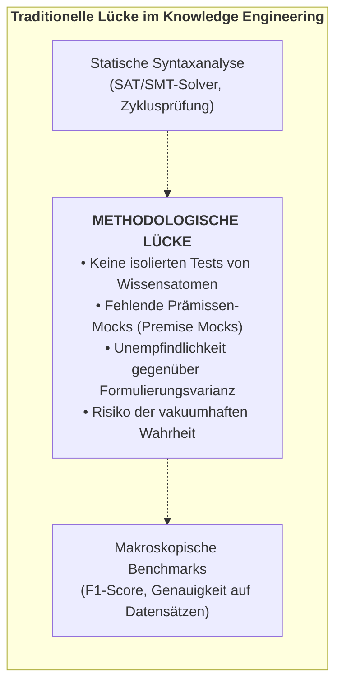
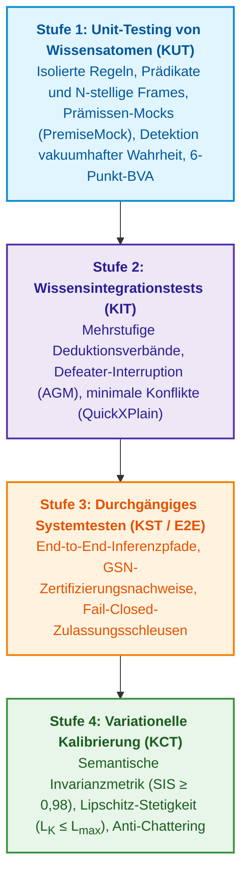
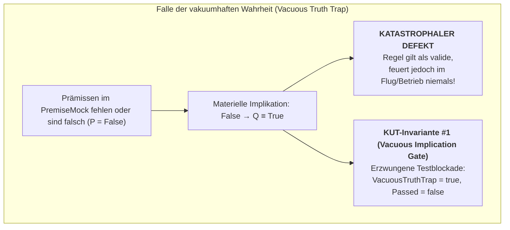
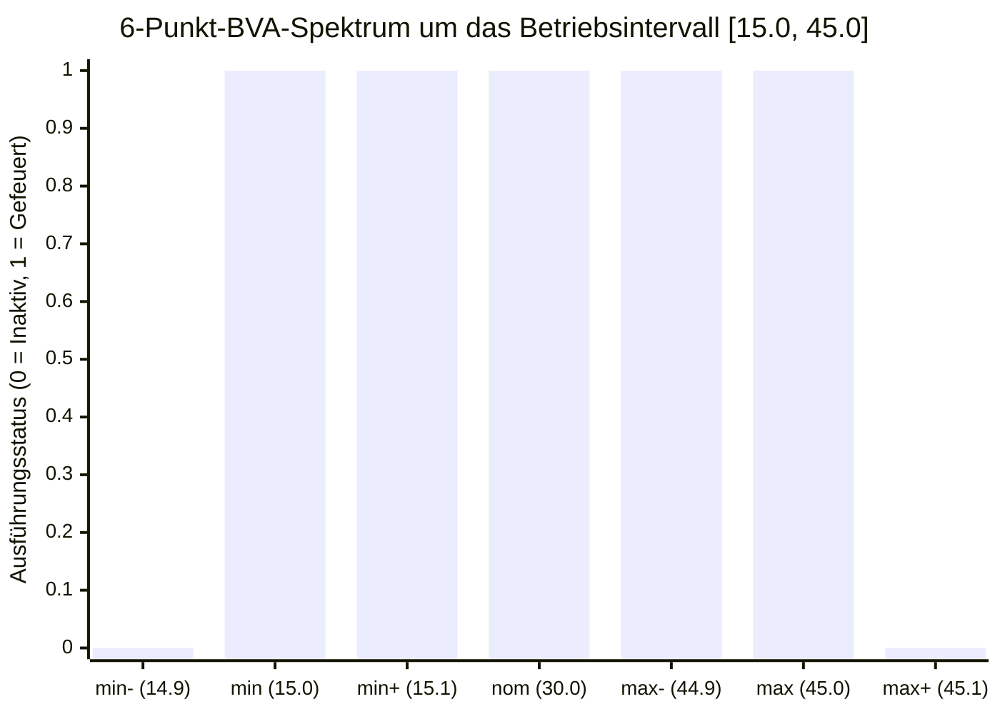
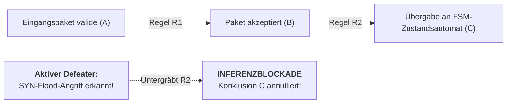
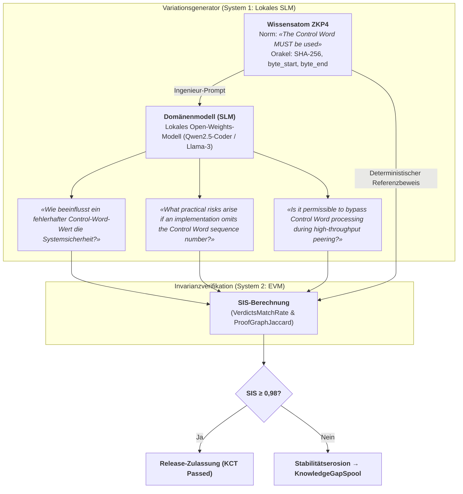
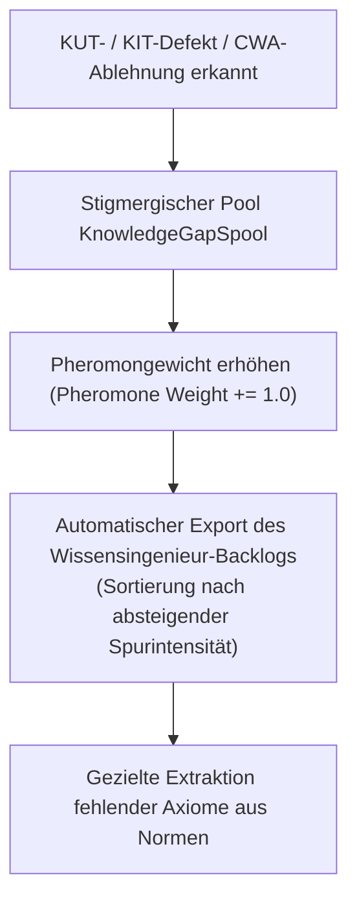

# Kapitel 36. Testpyramide für Wissensbasen: Regeln, Interaktionen und Antwortstabilität

> **Buch:** [Architektur evidenzbasierter Expertensysteme](README.md) · [Teil V: Verifikation, Testen, Diagnose und Sicherheitsbegründung](part-05-verification-and-learning.md)  
> **Vorheriges Kapitel:** [Kapitel 23. Verifikation der Wissensbasis: Widerspruchsfreiheit, Vollständigkeit und Robustheit von Regeln](ch23-knowledge-base-verification.md)  
> **Nächstes Kapitel:** [Kapitel 39. Aktiver Prüfexperte: Poppersche Falsifikation, normative Compliance (ASPICE/ISO 26262/ISO 21434) und autonomes Testdesign](ch39-active-compliance-auditor-and-popperian-testing.md)  
> **Inhaltsverzeichnis:** [README.md](README.md)  
> **Autor:** [Mykola Fedchyk](about-the-author.md)  
> **Niveau:** Systemarchitekten, Wissensingenieure, Verifikationsingenieure (QA/QE), Mathematiker: Fortgeschritten  
> **Lernziele:** Die vierstufige Wissenstestpyramide (Knowledge Testing Pyramid, KTP) entwerfen und implementieren; isoliertes Modultesten einzelner Regeln und ontologischer Prädikate (Knowledge Unit Testing, KUT) mit Prämissen-Mocking (`PremiseMock`) durchführen; die Falle der vakuumhaften Wahrheit (*The Vacuous Truth Trap*) für materielle Implikationen erkennen und blockieren; 6-Punkt-Spektralanalysen von Grenzwerten (Boundary Value Analysis, BVA) für normative Spezifikationsparameter anwenden; Regelkompositionstests (Knowledge Integration Testing, KIT) mit Inferenzketten-Unterbrechung durch anfechtbare Defeater (AGM-Kontraktion) konstruieren; die semantische Invarianzmetrik (Semantic Invariance Score, SIS) zur Bewertung der Robustheit gegenüber linguistischen Anfragevariationen mit einem Zulassungsschwellenwert von $\text{SIS} \ge 0{,}98$ berechnen; die Lipschitz-Stabilität ($L_{\mathcal{K}} \le L_{\max}$) des Inferenzraums verifizieren, um cyber-physikalische Systeme vor sprunghaftem Relais-Chattering zu schützen; stigmergische Wissenslücken-Puffer (`KnowledgeGapSpool`) mit Pheromon-Priorisierung für das Ingenieur-Backlog etablieren.

---

## Abstract

Dieses Kapitel untersucht die Methodik der mehrstufigen Verifikation und Kalibrierung von Regeln in evidenzbasierten Expertensystemen auf Basis der vom Autor entwickelten Wissenstestpyramide (*Knowledge Testing Pyramid, KTP*). Es definiert die mathematischen und architektonischen Werkzeuge, die Inferenzstabilität gegenüber Sensorrauschen garantieren und eine Degradation der Wissensbasis in missionskritischen Anwendungen verhindern.

In sicherheitskritischen cyber-physikalischen Systemen (ISO 26262 ASIL D, EN 50128 SIL 4, DO-178C Level A) führt das Fehlen einer isolierten Regelverifikation und Grenzwertprüfung zu zwei verheerenden Ausfallarten: der Falle der vakuumhaften Wahrheit (*The Vacuous Truth Trap*, bei der ein falscher oder uninitialisierter Antezedens einer materiellen Implikation $A \to B$ die Regel formal wahr macht und Notfallaktoren fälschlich ansteuert) sowie hochfrequentem Rattern (*Chattering*, bei dem geringfügiges Rauschen auf Sensorkanälen an Prädikatsgrenzen sprunghafte Entscheidungssprünge auslöst und elektromechanische Antriebe zerstört).

Dieses Kapitel löst dieses Problem durch den Aufbau einer vierstufigen Wissenstestpyramide (*Knowledge Testing Pyramid, KTP*): vom isolierten Modultesten von Regeln (*KUT*) mit Prämissen-Mocking (`PremiseMock`) und 6-Punkt-Spektralanalysen von Grenzwerten (*BVA*) über das Integrationstesten anfechtbarer Inferenzketten (*KIT*) bis hin zur systemischen Evaluierung der semantischen Invarianz ($\text{SIS} \ge 0{,}98$) und der variationellen Kalibrierung der Lipschitz-Stabilität ($L_{\mathcal{K}} \le L_{\max}$) des logischen Schlussfolgerungsraums.

---

## 1. Die methodologische Lücke in der Verifikation von Wissenssystemen

Zur Strukturierung von Softwareprüfungen dient die klassische Testpyramide nach Mike Cohn [[1]](#src-1). Die testgetriebene Entwicklung (TDD) nach Kent Beck [[2]](#src-2) ergänzt dies um explizite Erwartungshaltungen für isolierte Komponenten. In diesem Kapitel wird die Pyramide als Entwicklungspfad von isolierten Einzelprüfungen hin zu Integrations- und End-to-End-Tests dargestellt:

```math
\text{Unit Tests} \longrightarrow \text{Integration Tests} \longrightarrow \text{End-to-End / System Tests}
```

Kein industriell ausgereiftes Softwareprodukt wird für den Produktivbetrieb freigegeben, bloß weil der Compiler keine Syntaxfehler meldet (statische Analyse) oder weil das System einige manuelle Demonstrationsszenarien bestanden hat. Jede Klasse, Funktion und jedes Modul wird über Test-Doubles (*Stubs, Mocks, Fakes* [[3]](#src-3)) isoliert, und Randbedingungen werden an den Extremwerten verifiziert.

Im Wissensingenieurwesen (Knowledge Engineering) und der Domäne der Expertensysteme existierte demgegenüber über Jahrzehnte eine eklatante **methodologische Lücke**:



Historisch beschränkte sich die Verifikation entweder auf die **statische Regelverifikation** (Suche nach Zyklen, Redundanzen und syntaktischen Widersprüchen mittels SMT-Solvern [[4]](#src-4)) oder ging unmittelbar zu **makroskopischen Benchmarks** über (Evaluierung von Genauigkeit, F1-Score und Wahrscheinlichkeitskalibrierungen nach Platt/ECE über hunderte Anfragen [[5, 6]](#src-5)).

Scheitert ein Expertensystem an einer komplexen Anfrage, fehlen dem Ingenieur ohne atomare Tests die Werkzeuge, um das Problem eindeutig zu lokalisieren:
1. Enthält die Regel selbst einen Fehler (Defekt im Antezedens)?
2. Entstand das Problem durch eine fehlerhafte Typvererbung im Ontologieverband?
3. Wurde die Konklusion durch das irrtümliche Feuern eines unterminierenden Defeaters (*Undercutting Defeater*) blockiert?
4. Wurde die Anfrage geringfügig linguistisch umformuliert, was das semantische Parsen verfälschte?

### 1.1. Vergleichende Analyse internationaler Ansätze für Testen und Verifikation

| Ansatz / Schule | Vertreter und Quellen | Fokus und Stärken | Grenzen für Wissenssysteme |
|---|---|---|---|
| **Klassisches Softwaretesten** | M. Cohn [[1]](#src-1), K. Beck [[2]](#src-2), M. Feathers [[3]](#src-3) | Komponentenisolation, Unit-Mocks, TDD, Regressions-Suites. | Auf deterministische prozedurale Funktionen ausgelegt; ignoriert logisches Resolvieren, CWA-Unvollständigkeit und Überzeugungsrevision. |
| **Formale Verifikation und SMT** | C. Barrett, L. de Moura, N. Bjørner (Z3) [[4]](#src-4) | Strenge Theorembeweise, Erfüllbarkeitsprüfung von Prädikatenformeln. | Statische Analyse der Regelbasis als geschlossenes System; testet kein Verhalten auf empirischen Sensorströmen und Sprachumformulierungen. |
| **Kalibrierung von KI-Modellen (ECE)** | J. Platt [[5]](#src-5), C. Guo et al. (On Calibration of Modern Neural Networks, 2017) [[6]](#src-6) | Abgleich skalarer Klassifikatorwahrscheinlichkeiten mit realen Fehlerraten (Expected Calibration Error). | Bewertet lediglich skalare Konfidenz auf festen Datensätzen; blind gegenüber logischer Beweisstruktur und Perturbationssensitivität. |
| **Metamorphes Testen und CheckList** | T. Y. Chen et al. [[7]](#src-7), M. T. Ribeiro et al. (CheckList, ACL 2020) [[8]](#src-8) | Testen von NLP-Verhaltenseigenschaften ohne Orakel über semantische Textperturbationsinvarianten. | Auf Black-Box-Neuronale-Netze ausgerichtet; keine Analyse byteweiser Beweise und deterministischer Regelverbände. |
| **Anfechtbare Argumentation und AGM** | J. Pollock [[9]](#src-9), P. M. Dung [[10]](#src-10), C. Alchourrón, P. Gärdenfors, D. Makinson [[11]](#src-11) | Formale Philosophie anfechtbarer Inferenz, Argumentkonflikte, minimale Überzeugungsänderung. | Theoretische logische Abstraktionen ohne programmatische Umsetzung auf Unit-/Integrationsstufen und ohne ingenieurtechnische Robustheitsmetriken. |
| **Vierstufige Wissenstestpyramide (KTP)** | **Methodik dieses Buches (KTP-Framework)** | **Vierstufiges Modell KUT/KIT/KST/KCT: Prämissen-Mocking, Detektion vakuumhafter Wahrheit, BVA, semantische SIS-Invarianz, Lipschitz-Stabilität $L_{\mathcal{K}}$ und Stigmergie.** | **Integriertes ingenieurtechnisches Modell vom isolierten Wissensatom bis zur zertifizierungsreifen Kalibrierung cyber-physikalischer Systeme.** |

---

## 2. Konzeptuelles Modell: Die vierstufige Wissenstestpyramide

Die vom Autor entwickelte **Wissenstestpyramide (Knowledge Testing Pyramid, KTP)** strukturiert die Verifikation eines intelligenten Systems in vier Stufen unterschiedlicher Strenge und Granularität:



---

## 3. Stufe 1: Knowledge Unit Testing (KUT) – Testen von Wissensatomen

### 3.1. Definition und Testobjekt
**Knowledge Unit Testing (KUT)** bezeichnet das isolierte Testen der kleinsten unteilbaren Wissenseinheit (Ontologieatom, einzelne Regel, $N$-stelliger semantischer Frame) ohne Anbindung der globalen Faktenbasis und ohne rekursive Inferenzentfaltung.

Testobjekte des KUT sind:
* Eine einzelne normative Regel $R: \text{Antecedents} \longrightarrow \text{Consequent}$;
* Ein einzelner $N$-stelliger Frame (Rollen für Aktor, Prädikat, Objekt, deontische Modalität SHALL/MUST, Vorbedingungen und Ausnahmen);
* Ein einzelnes Ontologieprädikat mit numerischen Gültigkeitsbereichen.

### 3.2. Methode der Prämissen-Mocking (Premise Mocking)
In einem realen System greift eine Regel auf den Wissensgraphen zu:

```math
\mathtt{Query}(\mathtt{"engine\_rpm"}) > 3000 \land \mathtt{Query}(\mathtt{"oil\_temp"}) > 100 \implies \mathtt{Mode} = \mathtt{"COOLING\_HIGH"}
```

Während der KUT-Ausführung wird die globale Umgebung durch einen isolierten Stub-Kontext (`PremiseMock`) ersetzt:
```go
mock := knowledgetest.NewPremiseMock()
mock.Set("engine_rpm", 3500.0)
mock.Set("oil_temp", 105.0)

res := knowledgetest.RunKUT(coolingRule, mock, "COOLING_HIGH")
```

### 3.3. Die Falle der vakuumhaften Wahrheit (The Vacuous Truth Trap)
In der klassischen mathematischen Logik ist die materielle Implikation $P \to Q$ äquivalent zur Disjunktion $\neg P \lor Q$. Ist der Antezedens $P$ falsch, ist der Ausdruck formal wahr ($P \equiv \text{False} \implies (P \to Q) \equiv \text{True}$), unabhängig vom Inhalt der Konklusion $Q$.

In technischen Expertensystemen erzeugt dies eine fatale Schwachstelle: Eine fehlerhaft entworfene Regel oder ein naiver Testrunner wertet eine Prüfung als „erfolgreich bestanden“, weil die formale Implikationsbedingung erfüllt ist – obgleich in der Praxis keine einzige der erforderlichen technischen Vorbedingungen je aktiv war.



**KUT-Invariante #1 (Vacuous Implication Prevention Invariant):**  
Der KUT-Testrunner ist verpflichtet, einen Test zwingend als fehlerhaft zurückzuweisen (`VacuousTruthTrap = true`), wenn die Regel ein erfolgreiches Feuern reklamiert, obwohl obligatorische Prämissen in der Mock-Umgebung fehlen oder unvollständig sind.

Vor dem Ausführen der Regel muss der Test ein unabhängiges erwartetes Ergebnis vorgeben. Ein Statusflag, das die Regel selbst als „vakuumhafte Wahrheit“ setzt, stellt kein unabhängiges Orakel dar: Eine defekte Regel setzt ihr eigenes Fehlerflag möglicherweise nicht. Für eine Regel mit zwingender Prämisse sind mindestens drei Testfälle erforderlich:

| Kontrollierter Prämissenzustand | Erwartetes Regelverhalten | Was einen Defekt darstellt |
|---|---|---|
| Prämisse bestätigt | Regel feuert und liefert erwartete Konklusion | Regel feuert nicht oder verfälscht Konklusion |
| Prämisse widerlegt | Regel leitet Konklusion nicht ab; Ergebnis hat Status „nicht anwendbar“ | Konklusion trotz falscher Prämisse abgeleitet |
| Prämissenwert unbekannt | Inferenzmaschine bewahrt Unbekanntheit und benennt benötigte Evidenz | Fehlen eines Faktums wird stillschweigend in Falschheit oder Freigabe umgewandelt |

Der boolesche Faktumswert `false` bedeutet nicht das Fehlen des Faktums. Beispielsweise kann eine Regel, die einen deaktivierten Wartungsmodus prüft, explizit den bestätigten Wert `false` verlangen. Der Test muss die Regelbedingung verifizieren und darf nicht jedes falsche boolesche Attribut als fehlende Prämisse missdeuten. Die dreiwertige Logik wird in [Kapitel 6](ch06-applied-mathematics-for-expert-systems.md) vertieft.

### 3.4. 6-Punkt-Spektralanalyse von Grenzwerten (BVA)
Normative Dokumente (RFCs, ISO-Normen, Gesetze) enthalten numerische Parameter: Timeouts, Schwellenspannungen, minimale Paketgrößen. Um Fehler wie „strikte statt nicht-strikter Ungleichung“ ($<$ statt $\le$) aufzudecken, führt der Ansatz des Autors eine 6-Punkt-Spektralanalyse von Grenzwerten für jeden Parameter eines Bereichs $[v_{\min}, v_{\max}]$ ein:



Punkte des Spektrums:
1. $v_{\min-} = v_{\min} - \delta$ — Punkt außerhalb des Bereichs (Ablehnung / Sperre erwartet);
2. $v_{\min}$ — exakte untere Grenze (Auslösung / Freigabe erwartet);
3. $v_{\min+} = v_{\min} + \delta$ — Punkt unmittelbar innerhalb des Bereichs;
4. $v_{\text{nom}}$ — nominaler Betriebswert;
5. $v_{\max-} = v_{\max} - \delta$ — Punkt nahe der oberen Grenze;
6. $v_{\max}$ — exakte obere Grenze;
7. $v_{\max+} = v_{\max} + \delta$ — Überschreitung der oberen Grenze (Blockade erwartet).

---

## 4. Stufe 2: Knowledge Integration Testing (KIT) – Inferenzverbände und Defeater

### 4.1. Mehrstufige Inferenzverbände (Inference Lattices)
Auf der KIT-Stufe wird die Interaktion benachbarter Regeln getestet, bei denen die Konklusion der vorangehenden Regel zur Prämisse der nachfolgenden wird:

```math
R_1: A \longrightarrow B, \qquad R_2: B \longrightarrow C, \qquad \dots, \qquad R_n: Y \longrightarrow Z
```

KIT verifiziert:
* **Typschnittstellenkompatibilität:** ob ontologische Attributtypen über verschiedene Ontologieschichten hinweg übereinstimmen;
* **Erhaltung der Evidenz-Traceability:** ob die Kette byteweiser Zitate über alle Zwischenknoten ohne Verlust der Primärquellen weitergegeben wird;
* **Zyklusfreiheit:** Erkennung wechselseitiger Regelaufrufe außerhalb zulässiger endlicher Zustandsautomaten.

Ein Beispiel für semantische Verschiebung: Die erste Regel liefert ein „Socket-Timeout“, während die zweite ein „Verbindungsaufbau-Timeout“ erwartet. Dieselbe numerische Einheit und ein ähnlicher Name begründen keine Identität der Größen. Der Integrationstest übergibt den Wert zunächst ohne Abbildungsregel und erwartet eine Blockade der Komposition; anschließend fügt er eine genehmigte Zuordnung mit dem erforderlichen Kontext hinzu und prüft den erlaubten Übergang. Dieses Testfallpaar unterscheidet eine inhaltliche Prüfung von einer Politik, die pauschal jede Kette blockiert.

### 4.2. Injektion anfechtbarer Defeater (Defeater Interruption nach AGM)
Gemäß der Argumentationstheorie von John Pollock [[9]](#src-9) und den AGM-Postulaten der Überzeugungsrevision [[11]](#src-11) muss das Eintreten eines anfechtenden Umstands die Argumentationskette unverzüglich unterbrechen:



**KIT-Invariante #1 (Defeater Dominance Invariant):**  
Bei Aktivierung eines verifizierten unterminierenden Defeaters ($D$) muss das System die Inferenz am Zielknoten deterministisch anhalten, alle abgeleiteten Konklusionen annullieren (AGM-Kontraktion) und eine Ablehnung unter Protokollierung der exakten Blockadeursache zurückgeben.

Das Unterminieren einer Prämisse und das Widerlegen einer Konklusion erfordern unterschiedliche Testerwartungen. Die Meldung „Sensor nicht kalibriert“ untergräbt die Verwendung der Messung als Beweis für eine Überhitzung, beweist jedoch nicht das Fehlen einer Überhitzung und löscht die Messung nicht aus dem Protokoll. Die Evidenz „Temperatur unterhalb der Schwelle“, die über einen anderen validen Kanal empfangen wurde, widerlegt hingegen die Konklusion der Überhitzung selbst. Integrationstests müssen die Erhaltung des Primärdatensatzes, den Grund des Widerrufs und alternative Begründungen prüfen – und nicht bloß das endgültige Scheitern [[9]](#src-9).

### 4.3. Minimaler Konflikt als verifizierbares Ergebnis

Sind Randbedingungen unvereinbar, ist es sinnvoll, nicht nur das Vorliegen eines Konflikts zu prüfen, sondern auch dessen Erklärung. Der QuickXPlain-Algorithmus von Ulrich Junker identifiziert unter definierten Konsistenzprüfungs-Prämissen einen nach Inklusion minimalen Konflikt [[12]](#src-12). Minimalität bedeutet hierbei, dass das Entfernen eines beliebigen Elements aus der gefundenen Teilmenge deren Unverträglichkeit aufhebt; eine minimale Kardinalität unter allen denkbaren Konflikten garantiert der Algorithmus nicht.

In einem didaktischen Beispielszenario sind simultan drei Bedingungen vorgegeben: Temperatur nicht unter 95 °C, Temperatur nicht über 90 °C und Druck nicht über 10 bar. Vor einem konsistenten Hintergrundwissen bilden die beiden Temperaturbedingungen den Konflikt. Die Druckbedingung darf nicht in diese Erklärung einfließen. Eine unabhängige Prüfung bestätigt die Unverträglichkeit des Paares sowie die Widerspruchsfreiheit jedes der beiden isolierten Einzelelemente.

Eigene Testfälle sind für leere Mengen, konsistente Mengen sowie inkonsistente Hintergrundbeschreibungen erforderlich. Ein Verstoß gegen die Vorbedingungen des Algorithmus darf nicht fälschlich als minimaler Konflikt deklariert werden. Implementierung und Verifikation von QuickXPlain werden in [Kapitel 20](ch20-explanation-engine.md) behandelt und hier nicht redundant wiederholt.

---

## 5. Stufen 3 und 4: Durchgängige Systemprüfungen und variationelle Kalibrierung

### 5.1. Durchgängiges Systemtesten des Expertensystems

Das durchgängige Systemtesten des Expertensystems (*Knowledge System Testing*, KST) überprüft den vollständigen Pfad von der Benutzereingabe bis zur Entscheidung und dem Begründungspaket. Ein erfolgreicher Modultest einer Regel belegt keineswegs, dass die Suche die gültige Quelle ausgewählt hat, die Sprachanalyse Negationen bewahrt hat oder die Erklärung den tatsächlichen Schluss korrekt wiedergibt.

| Prüfgrenze | Testfall | Unabhängige Erwartung |
|---|---|---|
| Quelle → Behauptung | korrektes Zitat, aber Zahl bezieht sich auf anderes Objekt | Byte-Übereinstimmung berechtigt nicht zur Akzeptanz einer Fehlinterpretation |
| Prämissen → Beweisgraph | eine obligatorische Prämisse entfernt | Konklusion wird verweigert; Paket benennt fehlende Begründung |
| Graph → Erklärung | Text enthält Zahl, die nicht im Trace existiert | unbestätigter Text wird blockiert oder durch geprüfte Repräsentation ersetzt |
| Zugriff und Version → Ausgabe | Quelle nach vorangegangener erfolgreicher Anfrage widerrufen | neue Ausgabe verwendet widerrufene Prämisse nicht |

Für jeden negativen Fall ist ein gepaarter positiver Fall erforderlich: gültige Quelle, vollständige Prämissen, korrekte Erklärung und autorisierter Zugriff. Andernfalls würde ein permanentes Verweigern fälschlicherweise als erfolgreiches Bestehen der Tests gewertet. Verträge für Begründungen und Erklärungen werden in den Kapiteln [19](ch19-from-question-to-evidence.md) und [20](ch20-explanation-engine.md) detailliert erörtert, die kontrollierte Freigabe neuer Versionen in [Kapitel 25](ch25-how-expert-systems-learn.md).

### 5.2. Metrik der semantischen Invarianz (Semantic Invariance Score, SIS)
Klassische Prüfbenchmarks enthalten eine einzige, statische Frageformulierung. Im realen Produktivbetrieb formulieren Ingenieure und Bediener dieselbe Frage jedoch auf hunderte verschiedene linguistische Weisen:

```math
\begin{aligned}
\mathcal{Q}_{\text{base}} &= \text{„Was ist die minimale MTU für IPv6?“}, \\
\mathcal{Q}_{\text{var1}} &= \text{„Geben Sie die kleinste zulässige Paketgröße in IPv6-Netzen an“}, \\
\mathcal{Q}_{\text{var2}} &= \text{„Least transmission unit required by RFC 8200 IPv6 specification“}.
\end{aligned}
```

Liefert das System auf $\mathcal{Q}_{\text{base}}$ das Ergebnis `1280 octets`, verweigert jedoch bei $\mathcal{Q}_{\text{var1}}$ die Antwort unter CWA oder ändert den Beweispfad, ist dieses System linguistisch instabil.

Die vom Autor entwickelte Metrik **Semantic Invariance Score** ($`\mathrm{SIS}`$) bewertet die Robustheit des Systems auf der Mannigfaltigkeit der Anfrage-Perturbationen $`\mathbb{V}(\mathcal{Q})`$:

```math
\mathrm{SIS}(\mathcal{Q}) = \alpha \cdot \mathrm{VerdictsMatchRate} + \beta \cdot \mathrm{ProofGraphJaccard}
```

wobei die Komponenten der Metrik wie folgt berechnet werden:

```math
\mathrm{VerdictsMatchRate} = \frac{1}{N} \sum_{i=1}^{N} I\left(\mathrm{Verdict}(Q_i) = \mathrm{Verdict}(Q_{\mathrm{base}})\right) \in [0, 1]
```

```math
\mathrm{ProofGraphJaccard} = \frac{1}{N} \sum_{i=1}^{N} \frac{\lvert P(Q_i) \cap P(Q_{\mathrm{base}})\rvert}{\lvert P(Q_i) \cup P(Q_{\mathrm{base}})\rvert} \in [0, 1]
```

**Parameter und Gewichtungsfaktoren:**
- $`\mathrm{VerdictsMatchRate}`$ — Anteil perturbierter Anfragen aus $`N`$ Varianten, bei denen das Urteil exakt mit dem Urteil auf die Basisformulierung übereinstimmt;
- $`\mathrm{ProofGraphJaccard}`$ — gemittelter Jaccard-Koeffizient der Ähnlichkeit der Mengen von Knoten und Zitaten des Beweisgraphen $`P(Q)`$;
- $`\alpha, \beta \in [0, 1]`$ — Kalibrierungsgewichte der Konfidenz ($`\alpha = 0{,}6,\; \beta = 0{,}4`$, wobei $`\alpha + \beta = 1{,}0`$);
- $`\mathrm{SIS}(\mathcal{Q}) \in [0, 1]`$ — resultierender integraler Index der semantischen Invarianz.

**Zulassungskriterium und Laufzeitreaktion:**  
Für die automatisierte Schleuse der variationellen Freigabe gelten folgende Schwellenwertregeln:

```math
\mathrm{SIS}(\mathcal{Q}) \ge 0{,}98
```

- `ACCEPT_INVARIANT`: Wenn $`\mathrm{SIS}(\mathcal{Q}) \ge 0{,}98`$ und $`\mathrm{VerdictsMatchRate} = 1{,}00`$, gilt die Wissensbasis als invariant gegenüber Anfrage-Perturbationen und erhält die Ed25519-Release-Signatur;
- `QUALIFIED_REVIEW`: Liegt $`0{,}85 \le \mathrm{SIS}(\mathcal{Q}) < 0{,}98`$ vor, detektiert das System eine Drift in der Argumentstruktur, blockiert die Veröffentlichung und eskaliert den Bericht an den Wissensingenieur unter Hervorhebung der Diskrepanzen in den Beweisgraphen;
- `REJECT_DRIFT`: Wenn $`\mathrm{SIS}(\mathcal{Q}) < 0{,}85`$ oder $`\mathrm{VerdictsMatchRate} < 1{,}00`$, wird das Release durch die CI/CD-Test-Pipeline zwingend abgewiesen.

**Praktisches Rechenbeispiel:**  
Für eine Anfrage werde eine Stichprobe von $`N = 10`$ linguistischen Variationen generiert ($`Q_1, \dots, Q_{10}`$). Bei allen 10 Varianten stimmte das Urteil mit der Basis überein (`1280 octets`), folglich gilt $`\mathrm{VerdictsMatchRate} = 10/10 = 1{,}00`$. In 9 Variationen waren die Beweisgraphen identisch zur Basis ($`\frac{\lvert P_i \cap P_{\mathrm{base}} \rvert}{\lvert P_i \cup P_{\mathrm{base}} \rvert} = 1{,}00`$). In einer Variation $`Q_8`$ fügte der Generator eine synonyme erweiterte Definition ein, wodurch ein Graph aus 5 Knoten gegenüber 4 Basisknoten bei einer Schnittmenge von 4 Knoten entstand ($`\frac{4}{5} = 0{,}80`$). Daraus folgt:

```math
\mathrm{ProofGraphJaccard} = \frac{9 \times 1{,}00 + 1 \times 0{,}80}{10} = 0{,}980.
```

Der resultierende Index beträgt:

```math
\mathrm{SIS}(\mathcal{Q}) = 0{,}6 \times 1{,}00 + 0{,}4 \times 0{,}980 = 0{,}600 + 0{,}392 = 0{,}992.
```

Da $`0{,}992 \ge 0{,}98`$, erhält das Paket den Status `ACCEPT_INVARIANT`.

Ein hoher Durchschnittswert darf das Abweichen eines kritischen Urteils nicht verschleiern. Zusätzlich wird jede nachweislich äquivalente Formulierung geprüft: Das Urteil muss mit dem Referenzwert übereinstimmen, und jede genutzte Begründung muss gültig bleiben. Der Verlust von Knoten muss die Ähnlichkeitsbewertung der Graphen auch dann beeinflussen, wenn die restlichen Knoten unverändert blieben. Ein alternativer korrekter Beweis ist für sich genommen kein Defekt; Richtlinien für zulässige Graphveränderungen müssen vor dem Testlauf festgelegt werden.

Ein leerer Satz von Variationen erlaubt keine Stabilitätsbewertung. Zwei leere Graphen belegen ebenfalls keine evidenzbasierte Antwort: Zuerst wird die Existenz und Gültigkeit der Begründungen geprüft, erst danach die Ähnlichkeit der Graphen. Die Schwelle von 0,98 sowie die Gewichte 0,6 und 0,4 stellen didaktische Modellparameter dar, keine universellen Industriestandards. Der Erfolg auf einer endlichen Menge beweist keine Invarianz über alle denkbaren Anfragen und ersetzt kein Zertifizierungsverfahren.

### 5.3. Kriterium der Lipschitz-Stabilität von Wissen ($L_{\mathcal{K}} < \infty$)
In cyber-physikalischen Komplexen (Autopiloten, Reaktorsteuerungen, medizinische Dosiersysteme) unterliegen empirische Eingangsvariablen physikalischem Rauschen und Mikrostörungen:

```math
x \longrightarrow x + \Delta x, \qquad \|\Delta x\| < 10^{-5}.
```

Wenn eine infinitesimal kleine Störung des Eingangssignals einen abrupten Sprung der Konfidenz von $1{,}0$ auf $0{,}0$ ohne physikalischen Defeater hervorruft, tritt das Phänomen des **Relais-Chatterings (Prellen)** auf, das zu zerstörerischen Eigenschwingungen von Aktoren führt.

Das Modell des Autors verlangt die Einhaltung der **Lipschitz-Stetigkeit des logischen Raums**:

```math
L_{\mathcal{K}} = \sup_{x_1 \neq x_2} \frac{\|\mathcal{K}(x_1) - \mathcal{K}(x_2)\|}{\|x_1 - x_2\|} \le L_{\max}.
```

**Parameter und ingenieurtechnische Grenzwerte:**
- $x_1, x_2 \in \mathbb{R}^n$ — Vektoren physikalischer Eingangsbeobachtungen im zulässigen Zustandsraum;
- $`\mathcal{K}(x) \in [0, 1]^m`$ — Vektor der Konfidenzen oder numerischen Empfehlungen des Expertensystems;
- $`\|\cdot\|`$ — euklidische oder Tschebyscheff-Norm im entsprechenden Vektorraum;
- $`L_{\mathcal{K}} \ge 0`$ — empirische Lipschitz-Konstante der logischen Wissensabbildung;
- $`L_{\max}`$ — maximal zulässige Steilheitsschwelle der Systemantwort (beispielsweise $`L_{\max} = 10{,}0\,\text{bar}^{-1}`$).

**Operative Entscheidungen und Zahlenbeispiel:**
- Identifiziert der Verifikator eine Unstetigkeitsstelle, an der das Differenzenverhältnis gegen unendlich strebt ($`L_{\mathcal{K}} > L_{\max}`$) für $`\|\Delta x\| \to 0`$, protokolliert das System eine Chattering-Gefahr (`CHATTERING_FAULT`), blockiert die direkte Ausgabe an den Aktorpfad und erzwingt das Einfügen einer Hysterese oder einer Dämpfungszone.
- Zahlenbeispiel: Ein Öldrucksensor meldet $`x_1 = 2{,}999\,\text{bar}`$ (wobei die logische Inferenz eine Konfidenz für den Normalbetrieb von $`\mathcal{K}(x_1) = 1{,}00`$ ausgibt) und $`x_2 = 3{,}001\,\text{bar}`$ (wobei mangels Unempfindlichkeitszone die Konfidenz schlagartig auf $`\mathcal{K}(x_2) = 0{,}00`$ einbricht). Bei einer Perturbation von $`\|x_1 - x_2\| = 0{,}002\,\text{bar}`$ beträgt der Reaktionsgradient:

```math
L_{\mathcal{K}} = \frac{\lvert 1{,}00 - 0{,}00 \rvert}{0{,}002\,\text{bar}} = 500\,\text{bar}^{-1} \gg L_{\max} = 10\,\text{bar}^{-1}.
```

- Systemaktion: Die Regel wird als gefährlich für physikalische Aktoren markiert (`REJECT_UNSTABLE_RULE`), und der Regel-Compiler generiert die Direktive zur Implementierung eines Hysteresekorridors von $\pm 0{,}15\,\text{bar}$.

### 5.4. Neuro-symbolische Generierung von Anfrage-Perturbationen $`\mathbb{V}(\mathcal{Q})`$ über lokale SLMs

Die Berechnung der Metrik $`\mathrm{SIS}(\mathcal{Q})`$ erfordert eine repräsentative Perturbationsmenge $`\mathbb{V}(\mathcal{Q}) = \{\mathcal{Q}_1, \mathcal{Q}_2, \dots, \mathcal{Q}_N\}`$. Historisch existierten im Wissensingenieurwesen zwei unzureichende Ansätze zur Bildung dieser Menge:
1. **Manuelle Paraphrasierung durch Experten:** extrem kostenintensiv, subjektiv und auf wenige Dutzend Varianten begrenzt;
2. **Schablonenbasierte algorithmische Ersetzungen:** leiden unter der Illusion des Keyword-Lookups, da sie Lexeme der Regelantezedenzien direkt in die Frage kopieren.

Für eine skalierbare und rigorose Kalibrierung wird ein **neuro-symbolischer Perturbationssynthesizer** auf Basis einer lokalen Laufzeitumgebung offener kleiner Sprachmodelle (SLMs) eingeführt:



Dieser Ansatz ermöglicht einen dualen Kalibrierungszyklus:
- **Massiver Matrix-Stresstest:** Schnelle algorithmische Generatoren erzeugen hunderttausende Testfälle ($> 250\,000$ Tests/s) zur Überprüfung von Durchsatz, Speicherlecks und korrekten Registerübergängen.
- **Neuro-symbolischer Referenzkalibrator:** Ein paralleler Pool lokaler Modelle (SLM-Worker) erzeugt hochenthaltige, authentische sprachliche Perturbationen ($1\,000$ bis $10\,000$ Fälle) für die zertifizierungsrelevante Berechnung von $\text{SIS} \ge 0{,}98$. Dabei bleibt das deterministische Referenzorakel (System 2 EVM) zu 100 % vor Datenlecks und subjektiven Verzerrungen geschützt.

---

## 6. Testverträge für unterschiedliche Inferenzmodi

Ein grüner Testindikator besitzt für eine deduktive Regel, eine statistische Verallgemeinerung und eine Arbeitshypothese keineswegs dieselbe Bedeutung. Ein Testvertrag definiert, welches Ergebnis erwartet wird, auf welchen Grundlagen das Resultat geprüft wird und was eine erfolgreiche Prüfung prinzipiell nicht belegen kann.

| Inferenzmodus | Was der Test prüft | Kontrollierter Defekt | Grenze der Aussagekraft |
|---|---|---|---|
| Deduktion | Anwendbarkeit der Regel, alle erforderlichen Prämissen und erwartete Konklusion | Schlussfolgerung nach Entfernen einer obligatorischen Prämisse | Konklusion im definierten Modell verifiziert, nicht die Wahrheit aller Prämissen |
| Induktion | Generalisierungsgüte auf unabhängigen Fällen, Abdeckung und Stichprobengrenzen | Regel funktioniert nur auf Trainingsbeispielen oder deckt keinen Fall ab | Bewertung gilt ausschließlich für geprüfte Grundgesamtheit und Annahmen |
| Abduktion | Konsistenz der Hypothese mit bekannten Fakten, Erklärung der Beobachtung und Prüfplan | Hypothese widerspricht bekanntem Faktum oder besitzt keinen diskriminierenden Test | Plausible Hypothese stellt noch keine bewiesene Ursache dar |
| Anfechtbares Schließen | Reaktion auf Unterminierung der Prämisse, Widerlegung und alternative Begründung | Verwendung widerrufener Begründungen oder Verschleierung ungelöster Konflikte | Ergebnis hängt von gewählter Argumentationssemantik und aktuellen Evidenzen ab |
| Fallbasiertes Schließen (CBR) | Geltungsbereich der Analogie, Lösungsadaptation und bekannte Gegenbeispiele | Übertragung eines ähnlichen Falls auf andere Revision ohne Verifikation | Ähnlichkeit unterstützt Auswahl, beweist aber nicht die Eignung der Lösung |

Theoretische Garantien induktiven Lernens erfordern explizite Annahmen über Hypothesenklasse, Stichprobenziehung und zulässigen Fehler. Das PAC-Lernmodell (*Probably Approximately Correct*) von Leslie Valiant [[13]](#src-13) verbietet es, einer beliebigen Regel allein aufgrund der Fallanzahl eine formale Garantie zuzuschreiben. Fallbasiertes Schließen (*Case-Based Reasoning*, CBR) erschöpft sich ebenfalls nicht im Abstandsvergleich zweier Vektoren: Ein relevanter negativer Präzedenzfall erzwingt eine Anwendbarkeitsprüfung, kein universelles Verbot aller Analogien. Inferenzmethoden werden in [Kapitel 6](ch06-applied-mathematics-for-expert-systems.md) formalisiert; der Status von Hypothesen und Präzedenzfällen wird in [Kapitel 28](ch28-dual-mode-expert-systems.md) analysiert.

Solche Verträge liefern eindeutige Diagnoseergebnisse: Regeldefekt, inkompatible Komposition, unbestätigte Erklärung oder unzureichende Fallbasis. Der folgende Abschnitt zeigt, wie aufgedeckte Mängel in einen gesteuerten Entwicklungsprozess überführt werden.

---

## 7. Stigmergisches Schließen von Wissenslücken (KnowledgeGapSpool)

Jedes Fehlschlagen eines Tests auf den Stufen KUT, KIT oder SIS dokumentiert eine Wissenslücke in der Wissensbasis. Traditionelle Systeme beschränken sich auf die Ausgabe eines Konsolenberichts. In einem kybernetisch geregelten System fließen Defekte in einen **stigmergischen Lücken-Akkumulationspool (`KnowledgeGapSpool`)**:



Das stigmergische Prinzip eliminiert menschliche Subjektivität: Wissensingenieure bearbeiten vorrangig jene Regelerstellungsaufgaben, die das höchste Pheromongewicht durch wiederholte Abfragen aufweisen.

---

## 8. Software-Implementierung in Go

Nachfolgend ist eine didaktische Referenzimplementierung dargestellt: Prämissen-Mocking, Auswertungsprüfung, sequentielle Regelkomposition, SIS-Berechnung und Bewertung ausgewählter Perturbationen. Das Beispiel implementiert nicht sämtliche Verträge der Abschnitte 3–6: Insbesondere besitzt `KUTResult` keinen gesonderten Unbekannt-Status, und `RunKITLattice` stellt keine vollständige Reasoner-Engine zur Verwaltung alternativer Begründungen dar. Die Auswertung diskreter numerischer Punkte beweist keine globale Lipschitz-Stetigkeit.

Das Programm und die Tests erfordern Go 1.22 oder neuer. Alle Abhängigkeiten entstammen der Standardbibliothek. Grenzwerttests erhalten einen expliziten Basiskontext, und das SIS-Berechnungsergebnis weist Vollständigkeit sowie vollständige Urteilsübereinstimmung gesondert aus.

<details>
<summary>Didaktisches Programm zur Regelprüfung und variationellen Antwortvalidierung in Go</summary>

```go
package main

import (
	"errors"
	"fmt"
	"math"
)

// --- STUFE 1: KUT UND PRÄMISSEN-MOCKS ---

var ErrVacuousTruthTrap = errors.New("vacuous truth trap: rule evaluated to true without required antecedents")

type PremiseMock struct {
	Facts map[string]any
}

func NewPremiseMock() *PremiseMock {
	return &PremiseMock{Facts: make(map[string]any)}
}

func (pm *PremiseMock) Set(predicate string, val any) *PremiseMock {
	pm.Facts[predicate] = val
	return pm
}

type KnowledgeRule struct {
	ID          string
	Name        string
	Antecedents []string
	Evaluate    func(env map[string]any) (bool, any, float64, error)
	Consequent  string
}

type KUTResult struct {
	RuleID           string
	Passed           bool
	VacuousTruthTrap bool
	Fired            bool
	Conclusion       any
	Confidence       float64
	Error            string
}

func RunKUT(rule KnowledgeRule, mock *PremiseMock, expectedConclusion any) KUTResult {
	missingAntecedents := false
	for _, ant := range rule.Antecedents {
		val, ok := mock.Facts[ant]
		if !ok || val == nil {
			missingAntecedents = true
			break
		}
	}

	fired, conclusion, conf, err := rule.Evaluate(mock.Facts)

	// Invariante #1: Erkennung der Falle der vakuumhaften Wahrheit
	if missingAntecedents && fired {
		return KUTResult{
			RuleID:           rule.ID,
			Passed:           false,
			VacuousTruthTrap: true,
			Fired:            fired,
			Conclusion:       conclusion,
			Confidence:       conf,
			Error:            ErrVacuousTruthTrap.Error(),
		}
	}

	if err != nil {
		return KUTResult{RuleID: rule.ID, Passed: false, Error: err.Error()}
	}

	passed := false
	if expectedConclusion != nil {
		passed = fired && fmt.Sprintf("%v", conclusion) == fmt.Sprintf("%v", expectedConclusion)
	} else {
		passed = !fired
	}

	return KUTResult{
		RuleID:     rule.ID,
		Passed:     passed,
		Fired:      fired,
		Conclusion: conclusion,
		Confidence: conf,
	}
}

// 6-Punkt-BVA-Analyse
type BVAPoint string

const (
	BVAMinMinus BVAPoint = "min-"
	BVAMin      BVAPoint = "min"
	BVAMinPlus  BVAPoint = "min+"
	BVANominal  BVAPoint = "nom"
	BVAMaxMinus BVAPoint = "max-"
	BVAMax      BVAPoint = "max"
	BVAMaxPlus  BVAPoint = "max+"
)

type BVAResult struct {
	Point         BVAPoint
	Val           float64
	ExpectedFired bool
	ActualFired   bool
	Passed        bool
}

func RunBVA(rule KnowledgeRule, paramName string, min, nom, max, delta float64, baseFacts map[string]any) []BVAResult {
	points := []struct {
		point BVAPoint
		val   float64
		exp   bool
	}{
		{BVAMinMinus, min - delta, false},
		{BVAMin, min, true},
		{BVAMinPlus, min + delta, true},
		{BVANominal, nom, true},
		{BVAMaxMinus, max - delta, true},
		{BVAMax, max, true},
		{BVAMaxPlus, max + delta, false},
	}

	var results []BVAResult
	for _, p := range points {
		mock := NewPremiseMock()
		for predicate, value := range baseFacts {
			mock.Set(predicate, value)
		}
		mock.Set(paramName, p.val)
		res := RunKUT(rule, mock, nil)
		results = append(results, BVAResult{
			Point:         p.point,
			Val:           p.val,
			ExpectedFired: p.exp,
			ActualFired:   res.Fired,
			Passed:        res.Error == "" && !res.VacuousTruthTrap && res.Fired == p.exp,
		})
	}
	return results
}

// --- STUFE 2: KIT UND DEFEATER-STRUKTUREN ---

type DefeaterCondition struct {
	ID         string
	TargetRule string
	Condition  func(env map[string]any) bool
}

type KITResult struct {
	LatticeID       string
	Passed          bool
	DefeaterBlocked bool
	FinalConclusion any
}

func RunKITLattice(id string, rules []KnowledgeRule, env map[string]any, defeaters []DefeaterCondition) KITResult {
	curr := make(map[string]any)
	for k, v := range env {
		curr[k] = v
	}

	var finalConcl any
	for _, r := range rules {
		for _, d := range defeaters {
			if d.TargetRule == r.ID && d.Condition(curr) {
				return KITResult{LatticeID: id, Passed: true, DefeaterBlocked: true, FinalConclusion: nil}
			}
		}
		fired, concl, _, err := r.Evaluate(curr)
		if err != nil || !fired {
			return KITResult{LatticeID: id, Passed: false}
		}
		curr[r.Consequent] = concl
		finalConcl = concl
	}
	return KITResult{LatticeID: id, Passed: true, FinalConclusion: finalConcl}
}

// --- STUFEN 3 UND 4: SIS UND LIPSCHITZ-VERIFIKATOR ---

type ParaphraseRun struct {
	Variation  string
	Verdict    string
	ProofNodes []string
}

type SISResult struct {
	Score            float64
	PassedThreshold  bool
	Complete         bool
	AllVerdictsMatch bool
}

func CalculateSIS(baseline ParaphraseRun, variations []ParaphraseRun, alpha, beta, threshold float64) SISResult {
	for _, parameter := range []float64{alpha, beta, threshold} {
		if math.IsNaN(parameter) || math.IsInf(parameter, 0) || parameter < 0 || parameter > 1 {
			return SISResult{}
		}
	}
	if len(variations) == 0 || len(baseline.ProofNodes) == 0 || math.Abs(alpha+beta-1) > 1e-12 {
		return SISResult{}
	}

	matches := 0
	jaccardSum := 0.0
	complete := true
	bMap := make(map[string]bool)
	for _, n := range baseline.ProofNodes {
		bMap[n] = true
	}

	for _, v := range variations {
		if len(v.ProofNodes) == 0 {
			complete = false
		}
		if v.Verdict == baseline.Verdict {
			matches++
		}
		vMap := make(map[string]bool)
		for _, n := range v.ProofNodes {
			vMap[n] = true
		}
		inter, union := 0, make(map[string]bool)
		for n := range bMap {
			union[n] = true
			if vMap[n] {
				inter++
			}
		}
		for n := range vMap {
			union[n] = true
		}
		jaccardSum += float64(inter) / float64(len(union))
	}

	matchRate := float64(matches) / float64(len(variations))
	avgJaccard := jaccardSum / float64(len(variations))
	score := (alpha * matchRate) + (beta * avgJaccard)
	allVerdictsMatch := matches == len(variations)

	return SISResult{
		Score:            score,
		PassedThreshold:  complete && allVerdictsMatch && score >= threshold,
		Complete:         complete,
		AllVerdictsMatch: allVerdictsMatch,
	}
}

type LipschitzResult struct {
	MaxL               float64
	Passed             bool
	ChatteringDetected bool
}

func VerifyLipschitz(x0 float64, f func(x float64) float64, deltas []float64, maxAllowed float64) LipschitzResult {
	y0 := f(x0)
	maxL := 0.0
	chattering := false

	for _, dx := range deltas {
		if dx == 0 {
			continue
		}
		dy := math.Abs(f(x0+dx) - y0)
		adx := math.Abs(dx)
		r := dy / adx
		if r > maxL {
			maxL = r
		}
		if adx < 1e-4 && dy > 0.5 {
			chattering = true
		}
	}
	return LipschitzResult{
		MaxL:               maxL,
		Passed:             maxL <= maxAllowed && !chattering,
		ChatteringDetected: chattering,
	}
}

func main() {
	fmt.Println("=== Evidenzbasierte Wissenstestpyramide: Verifikationslauf ===")

	// 1. KUT-Test und Blockieren vakuumhafter Wahrheit
	batteryRule := KnowledgeRule{
		ID:          "R-BATT-01",
		Antecedents: []string{"temp_c", "voltage_v"},
		Evaluate: func(env map[string]any) (bool, any, float64, error) {
			tVal, ok1 := env["temp_c"]
			vVal, ok2 := env["voltage_v"]
			if !ok1 || !ok2 {
				return false, nil, 0, nil
			}
			t, _ := tVal.(float64)
			v, _ := vVal.(float64)
			if t >= 15.0 && t <= 45.0 && v >= 20.0 {
				return true, "CHARGE_PERMITTED", 1.0, nil
			}
			return false, "CHARGE_INHIBITED", 1.0, nil
		},
		Consequent: "charge_state",
	}

	validMock := NewPremiseMock().Set("temp_c", 25.0).Set("voltage_v", 24.0)
	resValid := RunKUT(batteryRule, validMock, "CHARGE_PERMITTED")
	fmt.Printf("[KUT] Nominaler Test: Passed=%v, Verdict=%v\n", resValid.Passed, resValid.Conclusion)

	// Vakuum-Prüfung: absichtlich leeren Mock übergeben
	emptyMock := NewPremiseMock()
	resVacuous := RunKUT(batteryRule, emptyMock, "CHARGE_PERMITTED")
	fmt.Printf("[KUT] Kontrafaktischer Test: VacuousTrap=%v, Passed=%v\n", resVacuous.VacuousTruthTrap, resVacuous.Passed)

	// 2. BVA-Test
	bvaResults := RunBVA(batteryRule, "temp_c", 15.0, 30.0, 45.0, 0.1, map[string]any{"voltage_v": 24.0})
	allBVAPassed := true
	for _, br := range bvaResults {
		if !br.Passed {
			allBVAPassed = false
		}
	}
	fmt.Printf("[BVA] 6-Punkt-Grenzwertanalyse: Alle Punkte bestanden=%v\n", allBVAPassed)

	// 3. KIT-Test mit Defeater
	r1 := KnowledgeRule{
		ID:          "R1",
		Antecedents: []string{"sensor_ready"},
		Consequent:  "arm_subsystem",
		Evaluate: func(env map[string]any) (bool, any, float64, error) {
			return env["sensor_ready"] == true, true, 1.0, nil
		},
	}
	r2 := KnowledgeRule{
		ID:          "R2",
		Antecedents: []string{"arm_subsystem"},
		Consequent:  "execute_ignition",
		Evaluate: func(env map[string]any) (bool, any, float64, error) {
			return env["arm_subsystem"] == true, "IGNITE_OK", 1.0, nil
		},
	}

	defeater := []DefeaterCondition{
		{
			ID:         "DEF-ABORT",
			TargetRule: "R2",
			Condition:  func(env map[string]any) bool { return env["abort_switch"] == true },
		},
	}

	kitRes := RunKITLattice("LAT-01", []KnowledgeRule{r1, r2}, map[string]any{"sensor_ready": true, "abort_switch": true}, defeater)
	fmt.Printf("[KIT] Integrationsverband mit Defeater: Defeater-Blockade=%v, Passed=%v\n", kitRes.DefeaterBlocked, kitRes.Passed)

	// 4. SIS-Test (Semantic Invariance Score)
	baseline := ParaphraseRun{
		Variation:  "Minimale MTU für IPv6 angeben",
		Verdict:    "1280",
		ProofNodes: []string{"RFC8200:Sec5", "Rule:IPv6MinMTU"},
	}
	vars := []ParaphraseRun{
		{Variation: "Least allowed packet size in IPv6", Verdict: "1280", ProofNodes: []string{"RFC8200:Sec5", "Rule:IPv6MinMTU"}},
		{Variation: "IPv6 minimum transmission unit", Verdict: "1280", ProofNodes: []string{"RFC8200:Sec5", "Rule:IPv6MinMTU"}},
	}
	sis := CalculateSIS(baseline, vars, 0.6, 0.4, 0.98)
	fmt.Printf("[SIS] Semantische Invarianz: Score=%.4f, Zulassung (>=0.98)=%v\n", sis.Score, sis.PassedThreshold)

	// 5. Lipschitz-Stabilitätstest
	smoothF := func(x float64) float64 { return 1.0 / (1.0 + math.Exp(-x)) }
	lipRes := VerifyLipschitz(0.0, smoothF, []float64{-0.01, 0.01}, 1.0)
	fmt.Printf("[LIP] Lipschitz-Stabilität: MaxL=%.4f, Chattering=%v, Passed=%v\n", lipRes.MaxL, lipRes.ChatteringDetected, lipRes.Passed)
}
```

</details>

`RunBVA` modifiziert ausschließlich den zu prüfenden Parameter; die restlichen Prämissen stammen aus dem definierten Kontext. Im Beispiel ist die Spannung der numerische Wert 24,0 V und kein automatisch eingesetztes boolesches `true`. Die Funktion überprüft sechs Grenzpunkte sowie einen zusätzlichen Nominalpunkt. `CalculateSIS` lässt weder eine leere Menge noch eine leere Begründung zu und maskiert eine einzelne Urteilsänderung nicht durch einen hohen Durchschnittswert. Das Feld `Complete` wird vor der Interpretation des Feldes `Score` evaluiert.

### 8.1. Unabhängige Tests des Testwerkzeugs

Ein grüner Testbericht belegt nicht die Korrektheit des Testwerkzeugs selbst. Nachfolgend sind Erwartungshaltungen unabhängig von den Flags der Regel definiert: Der Test weist willkürliches Feuern ab, unterscheidet ein bekanntes `false` von einem fehlenden Faktum und überprüft den expliziten Kontext des Grenzwerttests. Für SIS sind gesonderte Negativfälle implementiert: leere Menge, leere Begründung, Knotenverlust und eine einzige Urteilsänderung unter hundert Variationen.

<details>
<summary>Modultests des didaktischen Go-Pakets</summary>

```go
package main

import "testing"

func TestKUTIndependentExpectations(t *testing.T) {
	alwaysFires := KnowledgeRule{
		ID:          "defective",
		Antecedents: []string{"ready"},
		Evaluate: func(env map[string]any) (bool, any, float64, error) {
			return true, "ALLOW", 1, nil
		},
	}
	if result := RunKUT(alwaysFires, NewPremiseMock().Set("ready", true), nil); result.Passed {
		t.Fatal("unexpected firing was accepted without an independent expected conclusion")
	}
	if result := RunKUT(alwaysFires, NewPremiseMock(), "ALLOW"); result.Passed || !result.VacuousTruthTrap {
		t.Fatal("firing without a required fact was accepted")
	}
	knownFalse := KnowledgeRule{
		ID:          "maintenance-disabled",
		Antecedents: []string{"maintenance"},
		Evaluate: func(env map[string]any) (bool, any, float64, error) {
			value, exists := env["maintenance"]
			return exists && value == false, "ALLOW", 1, nil
		},
	}
	if result := RunKUT(knownFalse, NewPremiseMock().Set("maintenance", false), "ALLOW"); !result.Passed || result.VacuousTruthTrap {
		t.Fatal("a known false fact was treated as a missing fact")
	}
	if result := RunKUT(knownFalse, NewPremiseMock(), "ALLOW"); result.Passed || result.Fired {
		t.Fatal("a missing fact was treated as a known false fact")
	}
}

func TestBVAUsesTypedContext(t *testing.T) {
	rule := KnowledgeRule{
		ID:          "temperature-band",
		Antecedents: []string{"temp_c", "voltage_v"},
		Evaluate: func(env map[string]any) (bool, any, float64, error) {
			temperature, hasTemperature := env["temp_c"].(float64)
			voltage, hasVoltage := env["voltage_v"].(float64)
			return hasTemperature && hasVoltage && temperature >= 15 && temperature <= 45 && voltage >= 20, "ALLOW", 1, nil
		},
	}
	context := map[string]any{"voltage_v": 24.0}
	results := RunBVA(rule, "temp_c", 15, 30, 45, 0.1, context)
	if len(results) != 7 {
		t.Fatalf("expected six boundary points and one nominal point, got %d", len(results))
	}
	for _, result := range results {
		if !result.Passed {
			t.Errorf("boundary %s failed at %g", result.Point, result.Val)
		}
	}
	if len(context) != 1 || context["voltage_v"] != 24.0 {
		t.Fatal("boundary testing mutated the supplied context")
	}
}

func TestSISEmptyAndIncompleteEvidence(t *testing.T) {
	baseline := ParaphraseRun{Verdict: "ALLOW", ProofNodes: []string{"source", "rule"}}
	if result := CalculateSIS(baseline, nil, 0.6, 0.4, 0.98); result.Complete || result.PassedThreshold {
		t.Fatal("an empty variation set was accepted")
	}
	if result := CalculateSIS(ParaphraseRun{Verdict: "ALLOW"}, []ParaphraseRun{baseline}, 0.6, 0.4, 0.98); result.Complete || result.PassedThreshold {
		t.Fatal("an empty baseline proof was accepted")
	}
	if result := CalculateSIS(baseline, []ParaphraseRun{{Verdict: "ALLOW"}}, 0.6, 0.4, 0); result.Complete || result.PassedThreshold {
		t.Fatal("an empty variation proof was accepted")
	}
	if result := CalculateSIS(baseline, []ParaphraseRun{baseline}, 0.8, 0.4, 0.98); result.Complete || result.PassedThreshold {
		t.Fatal("unnormalized weights were accepted")
	}
	partial := ParaphraseRun{Verdict: "ALLOW", ProofNodes: []string{"source"}}
	if result := CalculateSIS(baseline, []ParaphraseRun{partial}, 0.6, 0.4, 0.98); !result.Complete || result.Score >= 1 || result.PassedThreshold {
		t.Fatal("loss of a proof node was not reflected in the score")
	}
	if result := CalculateSIS(baseline, []ParaphraseRun{baseline}, 0.6, 0.4, 0.98); !result.Complete || !result.AllVerdictsMatch || !result.PassedThreshold || result.Score != 1 {
		t.Fatal("a complete matching variation was rejected")
	}
}

func TestSISRejectsOneVerdictChangeDespiteHighAverage(t *testing.T) {
	baseline := ParaphraseRun{Verdict: "ALLOW", ProofNodes: []string{"source", "rule"}}
	variations := make([]ParaphraseRun, 100)
	for index := range variations {
		variations[index] = baseline
	}
	variations[99] = ParaphraseRun{Verdict: "DENY", ProofNodes: baseline.ProofNodes}
	result := CalculateSIS(baseline, variations, 0.6, 0.4, 0.98)
	if !result.Complete || result.Score < 0.98 || result.AllVerdictsMatch || result.PassedThreshold {
		t.Fatalf("one changed verdict was hidden by the average: %+v", result)
	}
}
```

</details>

Der Befehl `go test -v` verifiziert das Testwerkzeug, nicht die inhaltliche Qualität einer realen Wissensbasis. Die angeführten Variationen sind synthetische Protokolleinträge, keine Ausgaben eines Sprachanalysators. Die Tests belegen weder die semantische Äquivalenz der Anfragen noch die Korrektheit der Regeln oder die physikalische Sicherheit eines Stellglieds.

---

## Fazit
Die Testpyramide beantwortet die Fragen, wo ein Defekt entstanden ist und welche Prüfmethode diesen Defekt lokalisieren kann. Isolierte Tests verifizieren die Regel und kontrollierte Prämissen, Integrationstests prüfen die Komposition und den Widerruf von Begründungen, durchgängige Systemtests überprüfen das Entscheidungspaket, und variationelle Tests untersuchen gezielte Perturbationen der Eingaben.

Erwartungshaltungen werden unabhängig von der Antwort der zu prüfenden Regel definiert. Eine falsche Prämisse rechtfertigt keine Ableitung der Konklusion, eine unbekannte Prämisse wird nicht automatisch als falsch gewertet, und ein minimaler Konflikt weist nicht zwingend die geringste Kardinalität auf. Kriterien für Deduktion, Induktion, Abduktion, anfechtbares Schließen und fallbasiertes Schließen unterscheiden sich grundlegend, da die Ergebnisse dieser Methoden einen unterschiedlichen epistemischen Beweisstatus besitzen.

Die Aussagekraft der Resultate wird durch die Kontrollstichprobe und das implementierte Modell begrenzt. Ein hoher Durchschnittswert kompensiert nicht das Abweichen eines kritischen Urteils, wenige Perturbationen beweisen keine globale Stabilität, und ein Demonstrationslauf stellt kein Zertifizierungsverfahren dar. Die Lückenwarteschlange bereitet Material für die Prüfung und ein neues Wissens-Release auf, ermächtigt jedoch nicht zur automatisierten Modifikation bestehender Normen.

### Weiterführender Erkenntnispfad

Nach der Beherrschung der Methodik des vollständigen Test- und Kalibrierungszyklus von Wissen eröffnet sich dem Leser ein praxisorientierter Anwendungspfad:
* In **[Anhang A](appendix-a-evidence-governed-framework.md)** wird das ganzheitliche Framework zur Organisation des Forschungsspeichers, der Registrierung von Behauptungen und der Isolation von Prüfständen vertieft;
* In **[Anhang B](appendix-b-robotics-and-cyber-physical-systems.md)** werden die Prinzipien der Lipschitz-Stabilität und Defeater-Verifikation auf der Ebene realer cyber-physikalischer Antriebe der Robotik entfaltet;
* In **[Anhang E](appendix-e-mixed-signal-neuromorphic-expert-systems.md)** wird die Prüfung von Wissensinvarianten auf gemischt analog-digitale und neuromorphe Recheneinheiten skaliert.

---

## Kontrollfragen zur Selbstprüfung
1. Warum ist die klassische materielle Implikation $P \to Q$ der booleschen Logik für das Modultesten technischer Regeln gefährlich, und wie detektiert die Methode `PremiseMock` vakuumhafte Wahrheit?
2. Worin besteht der Unterschied zwischen dem Zuverlässigkeitstesten eines Sprachmodells nach der CheckList-Methode und der Berechnung der semantischen Invarianzmetrik $\text{SIS}(\mathcal{Q})$ auf dem Beweisgraphen?
3. Welche physikalischen Konsequenzen zieht eine Verletzung der Lipschitz-Stetigkeit des Lösungsraums eines Expertensystems in einem cyber-physikalischen System (etwa einer autonomen Drohne) nach sich?
4. Wie ist der stigmergische Akkumulationspool für Wissenslücken mit dem zweiten Hauptsatz der Thermodynamik und dem Entropie-Export nach Ilya Prigogine verknüpft?
5. Wie unterscheidet ein unabhängiger Test einen bekannten Wert `false` von einem fehlenden Faktum, und wie differenziert er die Unterminierung einer Evidenz von der Widerlegung einer Konklusion?
6. Warum kompensiert ein hoher durchschnittlicher SIS-Score nicht die Änderung eines einzelnen kritischen Urteils, und warum ist ein minimaler Konflikt nicht zwingend der kleinste bezüglich der Anzahl der Bedingungen?

---

## Glossar
| Begriff | Englisches Äquivalent | Definition |
|---|---|---|
| **Knowledge Unit Testing (KUT)** | Knowledge Unit Testing | Modultesten eines isolierten Wissensatoms (Regel, Frame, Prädikat) mit Prämissen-Mocking. |
| **Premise Mocking** | Premise Mocking | Technik zur Isolation der Antezedenzien einer Regel durch Substitution der Wissensbasis durch einen kontrollierten Stub-Kontext. |
| **Falle der vakuumhaften Wahrheit** | Vacuous Truth Trap | Situation, in der eine formale materielle Implikation $P \to Q$ aufgrund der Falschheit der Prämisse $P$ als wahr gewertet wird. |
| **Knowledge Integration Testing (KIT)** | Knowledge Integration Testing | Integrationstesten der Interaktion verknüpfter Regeln, mehrstufiger Verbände und der Kettentrennung durch Defeater. |
| **Durchgängiges Systemtesten des Expertensystems** | Knowledge System Testing | Überprüfung des vollständigen Pfads von der Anfrage und den Quellen bis zur Entscheidung und dem Begründungspaket. |
| **Minimaler Konflikt** | Minimal conflict | Unvereinbare Teilmenge von Bedingungen, die nach Entfernen eines beliebigen Elements vor unverändert konsistentem Hintergrund konsistent wird. |
| **SIS-Metrik** | Semantic Invariance Score | Numerischer Robustheitsindikator des logischen Urteils und der Beweisgraphenstruktur gegenüber linguistischen Umformulierungen der Anfrage. |
| **Lipschitz-Stabilität von Wissen** | Lipschitz Knowledge Stability | Eigenschaft des Inferenzraums, seinen epistemischen Zustand proportional und beschränkt relativ zur Größe einer Eingangsstörung zu verändern. |
| **Relais-Chattering** | Chattering | Gefährliche, hochfrequente sprunghafte Zustandswechsel des Systems bei infinitesimal kleinen Änderungen des Eingangssignals. |
| **Stigmergischer Lücken-Pool** | Stigmergic Gap Spool | Mechanismus zur indirekten Koordination von Wissensingenieuren durch Akkumulation und Pheromon-Priorisierung registrierter CWA-Ablehnungen. |

---

## Abkürzungen
| Abkürzung | Vollständige Bezeichnung | Bedeutung im Kontext des Kapitels |
|---|---|---|
| **AGM** | Alchourrón, Gärdenfors, Makinson | Standardparadigma der logischen Überzeugungsrevision und Konfliktbereinigung |
| **BVA** | Boundary Value Analysis | 6-Punkt-Spektralanalyse von Parametergrenzwerten |
| **CBR** | Case-Based Reasoning | Fallbasiertes Schließen |
| **CWA** | Closed World Assumption | Annahme einer geschlossenen Welt |
| **ECE** | Expected Calibration Error | Erwarteter Kalibrierungsfehler von Modellwahrscheinlichkeiten |
| **GSN** | Goal Structuring Notation | Grafische Notation zur Strukturierung von Sicherheitsnachweisen |
| **KCT** | Knowledge Calibration Testing | Variationelle Kalibrierungsprüfung der Wissensstabilität |
| **KIT** | Knowledge Integration Testing | Integrationstesten von Regelverbänden |
| **KST** | Knowledge System Testing | Durchgängiges Systemtesten des Expertensystems |
| **KUT** | Knowledge Unit Testing | Modultesten isolierter Wissensatome |
| **MTU** | Maximum Transmission Unit | Maximale Übertragungseinheit eines Datenpakets |
| **PAC** | Probably Approximately Correct | Wahrscheinlich approximativ korrektes maschinelles Lernen nach Leslie Valiant |
| **SIS** | Semantic Invariance Score | Metrik der semantischen Invarianz von Urteil und Beweisgraph |
| **TDD** | Test-Driven Development | Testgetriebene Entwicklung |

---

## Literaturverzeichnis
1. <a id="src-1"></a>**Cohn, M.** (2009). [*Succeeding with Agile: Software Development Using Scrum*](https://www.mountaingoatsoftware.com/books/succeeding-with-agile-software-development-using-scrum). Addison-Wesley Professional.
2. <a id="src-2"></a>**Beck, K.** (2002). *Test-Driven Development: By Example*. Addison-Wesley Professional.
3. <a id="src-3"></a>**Feathers, M.** (2004). *Working Effectively with Legacy Code*. Prentice Hall.
4. <a id="src-4"></a>**De Moura, L., & Bjørner, N.** (2008). Z3: An efficient SMT solver. In *International Conference on Tools and Algorithms for the Construction and Analysis of Systems* (pp. 337–340). Springer.
5. <a id="src-5"></a>**Platt, J.** (1999). Probabilistic outputs for support vector machines and comparisons to regularized likelihood methods. *Advances in Large Margin Classifiers*, 10(3), 61–74.
6. <a id="src-6"></a>**Guo, C., Pleiss, G., Sun, Y., & Weinberger, K. Q.** (2017). On calibration of modern neural networks. In *International Conference on Machine Learning* (pp. 1321–1330). PMLR.
7. <a id="src-7"></a>**Chen, T. Y., Cheung, S. C., & Yiu, S. M.** (2020). Metamorphic testing: a review of challenges and opportunities. *ACM Computing Surveys (CSUR)*, 53(4), 1–27.
8. <a id="src-8"></a>**Ribeiro, M. T., Wu, T., Guestrin, C., & Singh, S.** (2020). [*Beyond Accuracy: Behavioral Testing of NLP Models with CheckList*](https://aclanthology.org/2020.acl-main.442/). In *Proceedings of the 58th Annual Meeting of the Association for Computational Linguistics* (pp. 4902–4912). DOI: 10.18653/v1/2020.acl-main.442.
9. <a id="src-9"></a>**Pollock, J. L.** (1987). Defeasible reasoning. *Cognitive Science*, 11(4), 481–518.
10. <a id="src-10"></a>**Dung, P. M.** (1995). On the acceptability of arguments and its fundamental properties to logic programming, nonmonotonic reasoning and n-person games. *Artificial Intelligence*, 77(2), 321–357.
11. <a id="src-11"></a>**Alchourrón, C. E., Gärdenfors, P., & Makinson, D.** (1985). On the logic of theory change: Partial meet contraction and revision functions. *Journal of Symbolic Logic*, 50(2), 510–530.
12. <a id="src-12"></a>**Junker, U.** (2004). QUICKXPLAIN: Preferred explanations and relaxations for over-constrained problems. In *AAAI* (Vol. 4, pp. 167–172).
13. <a id="src-13"></a>**Valiant, L. G.** (1984). A theory of the learnable. *Communications of the ACM*, 27(11), 1134–1142.

---

[← Kapitel 23](ch23-knowledge-base-verification.md) | [Inhaltsverzeichnis](README.md) | [Teil V](part-05-verification-and-learning.md) | [Kapitel 39 →](ch39-active-compliance-auditor-and-popperian-testing.md)
