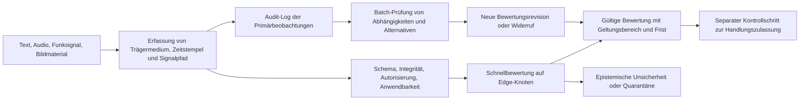

# Kapitel 37. Eingangsdatenbewertung: Quellen, Zeugnisse und epistemische Unsicherheit

> **Buch:** [Architektur evidenzbasierter Expertensysteme](README.md) · [Teil III: Wissensakquisition, linguistische Analyse und Eingangsdatenbewertung](part-03-knowledge-engineering-nlp.md)  
> **Vorheriges Kapitel:** [Kapitel 15. Wissensextraktion und Aufbau der Wissensbasis: Fakten, Grammatiken und Automaten](ch15-knowledge-extraction-and-kb-construction.md)  
> **Nächstes Kapitel:** [Kapitel 16. Architektur von Expertensystemen: Vom formalen Wissen zur beweisbasierten Entscheidung](ch16-expert-systems-architecture.md)  
> **Inhaltsverzeichnis:** [README.md](README.md)  
> **Autor:** [Mykola Fedchyk](about-the-author.md)  
> **Niveau:** Fortgeschritten: Wissensingenieure, Analysten, Architekten von Edge- und Streaming-Systemen  
> **Lernziele:** Signal, Quelle und Behauptung sauber trennen; Unabhängigkeit von Zeugnissen, Unsicherheit und Widersprüche formal bewerten; eine automatisierte Zulassungsschleuse für Streaming- und Batch-Verarbeitung ohne zwingende manuelle Inspektion jeder Nachricht konstruieren.

## Abstract

In missionskritischen verteilten Systemkomplexen (SCADA-Leitsysteme von Energieübertragungsnetzen, Fahrzeugtelemetrie nach ISO/SAE 21434, Notfall- und Anlagenschutzsysteme nach IEC 61508 SIL 3) führt die naive Einspeisung eingehender Nachrichten direkt in die Faktenbasis zu katastrophalen Systemausfällen. Wenn ein Expertensystem jedes syntaktisch valide Netzwerkpaket oder jedes Ansprechen eines Sensors als unumstößliches Zeugnis interpretiert, wird es anfällig für drei fatale Effekte: reflexive Täuschung (Spoofing- und Replay-Angriffe), Scheinkonfirmation durch abhängige Duplikate (der Informationsecho-Effekt, bei dem zehn Re-Transmissionen eines einzigen verfälschten Signals fälschlicherweise als zehn unabhängige Beweise gewertet werden) sowie fehlerhafte Notabschaltungen (*Nuisance Tripping / Scramming*) infolge unkorrelierten Sensorrauschens.

Dieses Kapitel widmet sich der Konstruktion einer automatisierten Zulassungsschleuse für eingehende Informationen (`IngressAdmissionGate`). Die Untersuchung überführt erprobte analytische Methoden der Zeugnis- und Quellenbewertung (die Analyse konkurrierender Hypothesen ACH nach Richards J. Heuer, Jr., das zweidimensionale Unsicherheitsmodell PHIA/AnCR und die Zuverlässigkeitsskala nach NATO STANAG 2022) in das Paradigma strikter Datenstrukturen, logarithmischer Likelihood-Quotienten, der Kovarianzschnitt-Filterung (*Covariance Intersection*) und reproduzierbarer Algorithmen formaler Expertenskepsis mit automatisierten Quarantänerichtlinien.

## 1. Von der Nachricht zum Wissen

An einem Netzknoten treffen drei Nachrichten ein: der Text „Pumpe läuft“, ein Audiosignal mit einer charakteristischen Betriebsdrehzahl und ein digitales Datenpaket mit dem Status `RUNNING`. Drei Nachrichten bedeuten keineswegs drei voneinander unabhängige Bestätigungen. Der Text und das Datenpaket könnten von ein und demselben Mikrocontroller generiert worden sein, während die akustische Emission von einem benachbarten Aggregat stammen kann. Es ist zwingend erforderlich, das Zielobjekt, den exakten Erfassungszeitpunkt, den Ursprung sowie alternative Erklärungen für jede einzelne Nachricht zu ermitteln.

In diesem Kapitel bezeichnet Aufklärung bzw. nachrichtendienstliche Analyse die analytische Tätigkeit, unvollständige Rohdaten in eine fundierte und entscheidungsrelevante Lagebewertung zu transformieren. Die begriffliche Verflechtung von Erkennen, Wissen und analytischer Aufklärung dient als semantischer Zugang zur Thematik und stellt keinen etymologischen Beweis dar. Die fundamentale Gemeinsamkeit mit dem Wissensingenieurwesen liegt im formalen Nachweis der Begründungslinie, der systematischen Betrachtung von Alternativen und der Festlegung von Inferenzgrenzen.

Die nachfolgende Systematik differenziert den Informationseingang:

| Objekt | Was bekannt ist | Was noch nicht festgestellt ist |
|---|---|---|
| Signal | Der Empfänger hat Spannung, Abtastwerte oder Bytes registriert | Was das Signal physikalisch bedeutet |
| Beobachtung | Der Analysator hat ein Wort, eine Frequenz, ein geometrisches Merkmal oder ein Ereignis isoliert | Ob Objekt und Kontext korrekt identifiziert wurden |
| Behauptung | Es wurde erfasst: „Pumpe P-7 läuft um 12:03 Uhr“ | Ob die Begründung der Behauptung hinreichend ist |
| Bewertung | Verifikationsprüfungen, Alternativen und Unsicherheiten sind bekannt | Ob die Bewertung für eine spezifische Aktion herangezogen werden darf |

Die digitale Signatur eines Datenpakets bestätigt unter dem gewählten Schlüsselmodell die Identität des Signierenden und die Datenintegrität, belegt jedoch keineswegs die ordnungsgemäße Funktion des physikalischen Sensors. Ein rauschfreies Audiosignal beweist die Güte der Tonaufnahme, nicht jedoch die Identität der emittierenden Pumpe. Die erste Kernschlussfolgerung dieses Kapitels lautet: Eine Information darf niemals allein deshalb in die Faktenbasis zugelassen werden, weil der Übertragungskanal die Nachricht fehlerfrei zugestellt hat.

## 2. Neun analytische Traditionen: Methode, Zeugnisse und Grenzen des Transfers

Nachrichtendienste publizieren keine vollständigen, operativen Algorithmen. Ein methodischer Vergleich erfordert daher die Analyse konkreter, öffentlich zugänglicher Dokumente, anstatt einem Nationalstaat pauschal eine „bayessche“ oder „neuronale“ Denkschule zuzuschreiben. Im Folgenden werden offizielle Tätigkeitsbeschreibungen strikt von historischen Untersuchungen und den ingenieurtechnischen Adaptionsvorschlägen für Expertensysteme (ES) getrennt. Das Fehlen einer öffentlich einsehbaren Methodik kennzeichnet eine Forschungslücke dieser Übersicht und impliziert keineswegs das Fehlen analytischer Werkzeuge bei der jeweiligen Institution.

### 2.1. Sowjetische Tradition: Indikatoren und die Gefahr eines geschlossenen Lagebilds

Benjamin Fischer analysiert in seiner historischen Studie zur Operation RJaN (Früherkennung eines nuklearen Erstschlags) die Überwachung von Absichtsindikatoren in den 1980er-Jahren [[3]](#src-3). Hierbei handelt es sich um eine retrospektive US-amerikanische Aufarbeitung der sowjetischen Praxis, nicht um einen normativen sowjetischen Standardalgorithmus. Das übertragbare methodische Element besteht in vorab definierten Indikatoren, festen Beobachtungszeiträumen und formalen Revisionskriterien für Lagebeurteilungen. Der fatale Fehlansatz, der vermieden werden muss, besteht in der kumulativen Interpretation jedweder Systemabweichung als Bestätigung einer einzigen, a priori festgelegten Bedrohungshypothese.

Timothy Thomas untersucht die Theorie der reflexiven Steuerung mit ihren sowjetischen Ursprüngen und späteren Weiterentwicklungen [[4]](#src-4). Für dieses Kapitel ist die defensive Schlussfolgerung zentral: Daten und Nachrichten können gezielt so konstruiert werden, dass sie das Entscheidungsmodell des Empfängers manipulieren. Ein Expertensystem muss die wechselseitige Abhängigkeit von Nachrichten und das Potenzial gezielter Täuschung berücksichtigen. Die bloße geographische Herkunft einer Nachricht begründet dabei keinen Täuschungsnachweis. Eine universelle sowjetische numerische Glaubhaftigkeitsskala oder deren programmtechnische Umsetzung lässt sich aus den offenen Quellen dieser Übersicht nicht belegen.

### 2.2. US-amerikanische Tradition: Analyse konkurrierender Hypothesen (ACH)

Richards J. Heuer, Jr. formulierte die Methode der Analyse konkurrierender Hypothesen (*Analysis of Competing Hypotheses*, ACH): Dieselben Zeugnisse werden simultan mehreren alternativen Erklärungsansätzen gegenübergestellt, um systematisch nach Inkonsistenzen zu suchen und die Sensitivität des Ergebnisses gegenüber getroffenen Grundannahmen zu evaluieren [[1]](#src-1). Für das Aggregat P-7 lauten die Alternativhypothesen: regulärer Pumpenbetrieb, akustische Abstrahlung einer Nachbarmaschine oder ein veralteter Statuswert im Steuerungsspeicher. Ein Audiosignal, das unter allen drei Hypothesen plausibel auftreten kann, besitzt trotz hoher Lautstärke und subjektiver Überzeugungskraft nahezu keine diagnostische Unterscheidungskraft.

Die ACH-Matrix diszipliniert den Denkprozess, wandelt jedoch die Anzahl konsistenter Tabellenfelder nicht magisch in eine A-posteriori-Wahrscheinlichkeit um. In einer formalen Repräsentation bedarf es expliziter Hypothesen, Zeugnisse, Stützungs- und Widerlegungsrelationen sowie einer Abbildung von Abhängigkeiten zwischen den Evidenzen. Das mathematische Gewicht liefert das in Abschnitt 7 formalisierte Likelihood-Modell, nicht der Name der Methode. Die US-Tradition ist heterogen: Leitfäden für Analysten, militärische Dienstvorschriften und technische Datenaustauschstandards bilden kein monolithisches Rechenverfahren.

### 2.3. Britische Tradition: Zwei Sprachen der Unsicherheit

Der offizielle britische Leitfaden von 2025 definiert die Wahrscheinlichkeitsskala der *Professional Head of Intelligence Assessment* (PHIA) sowie die Bewertungsdimensionen der analytischen Konfidenz (*Analytical Confidence Ratings*, AnCR) [[2]](#src-2). Die Wahrscheinlichkeit beantwortet die Frage, wie plausibel oder erwartbar ein Sachverhalt ist. AnCR quantifiziert hingegen die Belastbarkeit der Bewertungsgrundlage und die Wahrscheinlichkeit, dass neue Erkenntnisse das Gesamturteil revidieren. AnCR berücksichtigt die Informationsbasis, die methodische Rigorosität der Analyse sowie die inhärente Komplexität und Volatilität der Systemumgebung.

Ein Urteil wie „Pumpe läuft mit hoher Wahrscheinlichkeit; Konfidenz ist gering aufgrund unzureichend verifizierter Identität der Schallquelle“ stellt keinen logischen Widerspruch dar. Wahrscheinlichkeitsintervall und Konfidenzbegründung müssen in getrennten Attributfeldern geführt werden. Die qualitativen PHIA-Bänder bilden kein kontinuierliches System scharfer Schwellenwerte: Zwischen den publizierten Bereichen existieren Lücken, und ihre Ränder sind approximativ. Ein Expertensystem darf keinesfalls den arithmetischen Mittelwert eines verbalen Intervalls als gemessene physikalische Wahrscheinlichkeit interpretieren.

### 2.4. Deutsche Tradition: Verifikation und fachliche Verdichtung

Der Bundesnachrichtendienst (BND) betont in seiner öffentlich zugänglichen Beschreibung der analytischen Methodik, dass eingehende Meldungen häufig lückenhaft sind oder unbestätigten Gerüchten entsprechen; Aufgabe der Analyse ist es, den Wahrheitsgehalt zu verifizieren und Einzelerkenntnisse zu einem konsistenten Gesamtbild zu verdichten [[5]](#src-5). Die Darstellung unterstreicht die Notwendigkeit tiefen Fachwissens und der problemspezifischen Methodenwahl. Es handelt sich um ein institutionelles Leitbild, nicht um publizierte numerische Bewertungsfaktoren.

Für Expertensysteme leitet sich daraus die zwingende Forderung nach fachlicher Domänengültigkeit ab: Ein Validierungsmodul für Netzwerktelemetrie besitzt keine automatische Urteilskompetenz für pumpenbezogene Schwingungsspektren. Das Quellenregister muss Anwendungsdomäne, Messmethode und Kalibrierungsbereich explizit erfassen. Die Informationsverdichtung darf niemals die lückenlose Rückverfolgbarkeit zu den Primärbeobachtungen zerstören. Ein spezifischer BND-Algorithmus zur Berechnung von Zuverlässigkeitswerten geht aus offenen Quellen nicht hervor.

### 2.5. Französische Tradition: Aufklärungszyklus und komplementäre Sensoren

Die französische Militäraufklärung (*Direction du renseignement militaire*, DRM) beschreibt einen vierphasigen Aufklärungszyklus zur Deckung des militärischen Informationsbedarfs und hebt die Komplementarität unterschiedlicher Sensortypen hervor [[6]](#src-6). Die DRM unterstützt militärische und politische Entscheidungsträger. Auch hier existiert kein Beleg für ein einheitliches mathematisches Modell über alle französischen Dienste hinweg.

Für ein Expertensystem ist die Kausalkette „Informationsbedarf $\to$ geforderte Beobachtung $\to$ Verifikation $\to$ Lagebewertung“ von hohem methodischem Wert. Eine optische Überwachungskamera wird nicht deshalb integriert, weil eine zusätzliche Modalität verfügbar ist, sondern weil das Bildmaterial Aggregat P-7 eindeutig von der Nachbarmaschine differenzieren kann. Der Übergang von diversitären Sensoren zu einer echten unabhängigen Bestätigung erfordert den Ausschluss gemeinsamer Fehlerursachen (*Common Cause Failures*): identische Abtastzeitpunkte, gemeinsame Stromversorgungen oder baugleiche Sensormodelle begründen stochastische Abhängigkeiten.

### 2.6. Japanische Tradition: Ressortübergreifende Lagebildkonsolidierung und Koordination

Die aktuelle offizielle Dokumentation des Kabinettssekretariats von Japan beschreibt den Nationalen Sicherheitsrat und das Nationale nachrichtendienstliche Büro: Sammlung von Informationen, ressortübergreifende Synthese, integrierte Gesamtanalyse und Evaluierung [[7]](#src-7). Diese Bezeichnungen weichen von der in älterer Fachliteratur gebräuchlichen Benennung des Kabinettsbüros für Nachrichtendienst und Forschung (*Cabinet Intelligence and Research Office*, CIRO) ab. Diese Übersicht dokumentiert den offiziellen Stand per 4. Oktober 2026.

Die informationstechnische Lehre lautet: Die Zusammenführung von Daten über Behördengrenzen hinweg verlangt eine exakte Harmonisierung von Identifikatoren, Zeitbasen und Herkunftsnachweisen. Die Weiterleitung einer Nachricht über zwei getrennte Ministerien erzeugt keine zwei unabhängigen Beobachtungen. Herkunftsgraphen (*Provenance Graphs*) und Entity-Resolution-Verfahren lösen dieses Problem in der Informatik; dies ist jedoch ein allgemeiner technischer Standard und keine Zuschreibung an einen proprietären japanischen Dienstalgorithmus.

### 2.7. Chinesische Tradition: Selektion, Integration und technologische Informationsverarbeitung

Artikel 22 des Nationalen Nachrichtendienstgesetzes der Volksrepublik China schreibt den Einsatz wissenschaftlicher und technologischer Methoden zur Unterscheidung, Selektion, Verdichtung und analytischen Bewertung von Informationen vor (hier zitiert nach der englischen Übersetzung von China Law Translate in der Fassung von 2018 [[8]](#src-8)). Der Gesetzestext umreißt Kompetenzen und strategische Entwicklungsrichtungen, stellt jedoch keine funktionale Spezifikation eines Softwaremoduls dar.

Für das Expertensystem entspricht diese Direktive einer geregelten Pipeline aus Filterung, Normalisierung, Datenfusion und Verifikation. Publikationen chinesischer Forschungsinstitute über KI oder Sensorfusion beweisen nicht, dass Nachrichtendienste exakt jene Algorithmen einsetzen. Eine universelle chinesische Glaubhaftigkeitsskala oder eine formale Äquivalenz zum britischen AnCR-Schema lässt sich aus offenen Quellen nicht ableiten.

### 2.8. Israelische Tradition: Methodische Kritik des unveränderlichen Konzepts

Uri Bar-Joseph und Arie Kruglanski analysierten das Versagen der israelischen Lageaufklärung vor dem Jom-Kippur-Krieg 1973 und führten es auf das psychologische Phänomen des Bedürfnisses nach kognitivem Abschluss (*Need for Cognitive Closure*) zurück – die Tendenz, eine Lagebeurteilung vorzeitig zu fixieren und an einem einmal gewählten Erklärungsmodell („Konzept“) dogmatisch festzuhalten [[9]](#src-9). Dies ist eine wissenschaftliche Fallstudie, keine offizielle Gesamtdoktrin aller Dienste. Die ingenieurtechnische Konsequenz ist jedoch eindeutig: Ein in der Vergangenheit erfolgreiches Modell muss stets falsifizierbar bleiben.

Ein Expertensystem benötigt automatisierte Gegenhypothesen-Generatoren, ein Protokoll verworfener Alternativen und Sensitivitätstests, die das Wegfallen des stärksten Zeugnisses simulieren. Die populäre Metapher des „zehnten Mannes“, der per Amtsauftrag zwingend dissentieren muss, dient hier nicht als belegter bürokratischer Ablauf. Algorithmischer Dissens muss auf formal prüfbaren Alternativerklärungen basieren und darf nicht in reflexives Dagegensein abgleiten.

### 2.9. Ukrainische Tradition: Analytische Aufbereitung und externe Modellvalidierung

Das Gesetz der Ukraine „Über die Nachrichtendienste“ (insbesondere die Artikel 6 und 12) trennt die Phasen Informationsbeschaffung, analytische Aufbereitung, Datenverarbeitung und Informationsbereitstellung und regelt den Umgang mit Informationsressourcen [[10]](#src-10). Die juristische Definition von Aufklärungsinformationen ist in diesem Rahmen enger gefasst als der allgemeine wissenschaftliche Informationsbegriff; offene Publikationen fallen daher nicht automatisch unter diesen Rechtsstatus.

Die ukrainische Kybernetikschule liefert hierfür ein grundlegendes mathematisches Fundament: Die Group Method of Data Handling (GMDH / МГУА) von Oleksiy Ivakhnenko optimiert Modellstrukturen anhand externer Gütekriterien auf Datenbeständen, die nicht für die Parameterschätzung herangezogen wurden [[11]](#src-11). Im Kontext von Expertensystemen stützt dies das Prinzip strikt getrennter Validierungsdaten; ein direkter Einsatz von GMDH in Nachrichtendiensten wird damit nicht behauptet. Die rechtlichen und kybernetischen Grundlagen sind dokumentiert; konkrete Schwellenwerte realer ukrainischer Dienste sind nicht öffentlich.

Der Vergleich begründet kein Ranking von Nationalstaaten. Er destilliert fünf universelle Architekturprinzipien für beweisbasierte Expertensysteme: Begründungslinien lückenlos auditieren, Hypothesenalternativen aufrechterhalten, Unabhängigkeit der Eingangskanäle mathematisch verifizieren, epistemische Unsicherheit von der Handlungsentscheidung entkoppeln und Urteile dynamisch revidierbar halten.

## 3. Strafverfolgungsanalytik: Verknüpfung ist kein Schuldbeweis

In einer kriminalistischen Untersuchung können zwei Personen dieselbe Wohnadresse, Telefonnummer oder denselben Geschäftspartner aufweisen, ohne in kriminelle Handlungen verwickelt zu sein. Ein Beziehungsgraph dient der Formulierung verifizierbarer Hypothesen, niemals dem automatisierten Schuldspruch. Das Handbuch des Büros der Vereinten Nationen für Drogen- und Verbrechensbekämpfung (*United Nations Office on Drugs and Crime*, UNODC) formalisiert die Bewertung von Quellen und Daten, Beziehungsanalysen, Ereignischronologien und das britische National Intelligence Model [[12]](#src-12).

### 3.1. Nationale und internationale Strukturen

Das US-amerikanische Federal Bureau of Investigation (FBI) beschreibt den Einsatz analytischer Verfahren zur Entscheidungsunterstützung und zum behördenübergreifenden Datenaustausch unter strikter Beachtung gesetzlicher und prozessualer Erfassungsschranken [[13]](#src-13). Das britische Referenzmodell im UNODC-Leitfaden koppelt Analyseprodukte an Informationsbedarfe und Prioritäten; historische Dokumente dürfen jedoch nicht mit aktuellen Dienstvorschriften jeder Polizeibehörde gleichgesetzt werden.

Die Internationale Kriminalpolizeiliche Organisation INTERPOL nutzt operative und strategische Lageberichte sowie strukturierte Analysedateien [[14]](#src-14). Die Agentur der Europäischen Union für die Zusammenarbeit auf dem Gebiet der Strafverfolgung (Europol) betreibt thematische Analyseprojekte (*Europol Analysis Projects*), die strikten Zweckbindungen unterliegen und nationale Ermittlungen unterstützen [[15]](#src-15). Internationale Plattformen aggregieren Berichte vieler Partner; die schiere Anzahl der einspeisenden Stellen garantiert jedoch keine stochastische Unabhängigkeit der Primärquellen.

Für forensische Anwendungen in der Ukraine bilden die Artikel 17, 84, 86 und 94 der Strafprozessordnung der Ukraine verbindliche Schranken: Unschuldsvermutung, Legaldefinition von Beweismitteln, Beweisverwertbarkeit und freie richterliche Beweiswürdigung [[16]](#src-16). Ein vom Expertensystem berechneter Zuverlässigkeitsscore ersetzt keine richterliche Beweiswürdigung. Die manuelle Prüfung kann in der initialen Triage entfallen, setzt jedoch niemals die verfassungsmäßigen Kompetenzen von Ermittlungsrichter, Staatsanwaltschaft oder Gericht außer Kraft.

| Analytische Aufgabe | Geeignete Methode | Zwingende Einschränkung |
|---|---|---|
| Datensatzabgleich bezüglich eines Zielobjekts | Normalisierung und Entity Resolution | Namensgleichheit beweist keine Personenidentität |
| Erkennung von Beziehungen | Graphabfragen, Raum-Zeit-Korrelation | Kanten erfordern Typisierung, Quellennachweis und Verifikationsstatus |
| Strukturierung von Versionen und Ermittlungsansätzen | ACH, bayessche Netze, Falsifikationsansätze | Eine Hypothese ist kein erwiesener Fakt |
| Festlegung von Verifikationsprioritäten | Erwarteter Informationsgewinn, Schadenspotenzial, Fristen | Hohe Priorität stellt kein Schuldurteil dar |
| Beweissicherung für Gerichtsverfahren | Lückenlose Asservatenkette (*Chain of Custody*), Primärträgeranalyse | Technische Datenintegrität ersetzt keine prozessuale Verwertbarkeit |

Die Kriminalanalytik erweitert das klassische Wissensingenieurwesen somit um zwei fundamentale Anforderungen: strikte funktionale Zweckbindung und eine manipulationssichere Asservatenkette.

## 4. Cyberabwehr: Vom Detektoransprechen zum bestätigten Vorfall

Ein Anomaliedetektor meldet einen unüblichen Authentifizierungsversuch an einem Netzdienst. Ursache kann ein Cyberangriff, eine administrative Wartung oder eine asynchrone Systemuhr sein. Das Forum of Incident Response and Security Teams (FIRST) unterscheidet im Dienstleistungsrahmen für Computer Security Incident Response Teams (CSIRT) klar zwischen Monitoring, Ereignisanalyse, Vorfallqualifikation (Triage), Meldungserfassung, Vorfallanalyse und Artefaktforensik [[17]](#src-17). Dieser Standard definiert keinen universellen Schwellenwert für „dies ist zweifelsfrei ein Angriff“.

Das US-amerikanische National Institute of Standards and Technology (NIST) verknüpft in der Sonderpublikation SP 800-61 Rev. 3 (2025) die Vorfallreaktion direkt mit dem betrieblichen Risikomanagement [[18]](#src-18). Für das Expertensystem ist folgende Trennung zwingend: Detektorsignal $\to$ Vorfallkandidat $\to$ bestätigter Sicherheitsvorfall $\to$ Schadensbewertung $\to$ Reaktionsentscheidung. Die Feststellung eines Vorfalls und die Ermittlung seiner Kausalursache basieren auf völlig unterschiedlichen Beweisgrundlagen.

### 4.1. Validierung, Verifikation und Re-Evaluation

Im Systemprofil dieses Buches bezeichnet **Eingangsvalidierung** die Prüfung der Eignung von Daten für eine definierte Aufgabe: Wurden Zielobjekt, Zeitbereich und Erfassungsmethode korrekt spezifiziert? **Verarbeitungverifikation** bezeichnet den formalen Nachweis, dass vorgegebene Anforderungen eingehalten wurden: Schema-Konformität, Maßeinheiten, kryptografische Integrität, Zeitfensterbedingungen und Algorithmenkorrektheit.

| Verarbeitungsphase | Was das Expertensystem verifiziert | Was keinesfalls als bewiesen gilt |
|---|---|---|
| Ingress / Erfassung | Datenformat, Größenbeschränkungen, autorisierter Kanal, Nachrichten-ID | Das reale Vorliegen eines Vorfalls |
| Artefaktprüfung | Kryptografischer Hash, digitale Signatur, Primärträger, Übertragungshistorie | Die inhaltliche Richtigkeit der Interpretation |
| Kontextabgleich | Betroffenes Asset, Benutzerkonto, Zeitstempel, Detektorkonfiguration | Identität der real handelnden Person mit dem Konto |
| Korrelation | Ereigniskorrelation und gemeinsamer Ursprung | Unabhängige Bestätigung bei multiplen Alarmen |
| Qualifikation (Triage) | Kausalerklärung des Alarms, Alternativen, tatsächliche Auswirkung | Kausalursache, Täterabsicht oder Urheberschaft |
| Re-Evaluation | Neue Evidenzen, Revisionswechsel von Regeln, IoC-Widerruf | Fortdauernde Gültigkeit alter Urteile nach Fundamentwechsel |

Nachrichten und verdächtige Anhänge werden in ressourcenbeschränkten Sandbox-Umgebungen analysiert, wie von FIRST empfohlen. Das Ausbleiben verdächtiger Aktionen in einer Sandbox beweist nicht die Harmlosigkeit des Artefakts, da Ausführungsbedingungen gefehlt haben könnten. Ebenso begründen drei übereinstimmende Virenscanner-Urteile keine drei unabhängigen Zeugnisse, wenn alle drei Engines auf dieselbe Signaturdatenbank zugreifen.

### 4.2. Keine Verwechslung von Glaubhaftigkeit, Schadensschwere und Informationsweitergabe

Das Traffic Light Protocol (TLP) in Version 2.0 regelt ausschließlich die Freigabegrenzen für den Informationsaustausch, nicht den Wahrheitsgehalt einer Nachricht [[19]](#src-19). `TLP:CLEAR` bedeutet die Abwesenheit von Weitergabebeschränkungen nach TLP, befreit jedoch nicht von Urheberrechten oder Geheimhaltungsverträgen. Umgekehrt verleiht die Einstufung `TLP:RED` einer Falschmeldung keine erhöhte Glaubwürdigkeit.

Das Common Vulnerability Scoring System (CVSS) in Version 4.0 bewertet technische Charakteristika und das Schadenspotenzial von Schwachstellen [[20]](#src-20). Ein Basiswert von 9,8 bedeutet keineswegs eine Ausnutzungswahrscheinlichkeit von 98 %. Für jedes Asset müssen Glaubhaftigkeit der Meldung, Schwere der Konsequenzen und die Befugnis zur Einleitung von Schutzmaßnahmen separat modelliert werden.

Wird gemeldet, dass ein Datendiebstahl („Leak“) publiziert wurde, muss die Aussage dekomponiert werden: Die Publikation existiert; das bereitgestellte Datenmuster ist authentisch; die Daten stammen aus der eigenen Organisation; die Daten sind aktuell; die Exfiltration erfolgte unautorisiert. Die Echtheit einer Textprobe beweist keine der übrigen Behauptungen. Die Verifikation erfolgt auf isolierten Kontrollstichproben ohne unzulässige Verbreitung personenbezogener Daten.

## 5. Text, Audio, Funkwellen und Bildmaterial: Der Kontrakt der Primärbeobachtung

In der Gesamtarchitektur eines beweisbasierten Expertensystems bildet die Eingangszulassungsschleuse (`IngressAdmissionGate`) die vorderste Schutzbarriere zwischen der physikalischen Erfassungsumgebung und der Faktenbasis. Wird der Kontrakt der Primärbeobachtung missachtet und werden multimodale Rohsignale unmittelbar in semantische Textaussagen konvertiert, tritt eine irreversible Degradation der Beweiskraft ein: Dieselbe Textphrase „Pumpe gestoppt“ kann aus einem kryptografisch signierten SCADA-Befehl, der fehlerbehafteten Transkription eines Speech-to-Text-Modells (ASR) oder der optischen Zeichenerkennung (OCR) eines Manometers stammen. Der in vielen Systemen praktizierte naive Ansatz speichert lediglich das fertige Textergebnis oder einen Vektor-Embedding ab. In sicherheitskritischen Anwendungen (ISO 26262 ASIL D, IEC 61508 SIL 3) führt dies zum Kontrollverlust: Bei Anomalien kann das System weder Primärsignale nachprüfen noch Sensordrift erkennen oder Replay-Angriffe (*Sensor Spoofing*) abwehren. Zur Wahrung der formalen Beweiskraft muss das System einen strikten Beobachtungskontrakt fixieren: unveränderliches Primärmedium, Raum-Zeit-Koordinaten und deterministische Transformationskette.

| Eingang | Schnelle Eignungsprüfung | Was als Nachweis zu archivieren ist | Erkennungsgrenze |
|---|---|---|---|
| Digitaler Text | Zeichenkodierung, Schema, Sprache, Negationsprüfung, Zahlen und Einheiten | Rohbytes, Zitat-Byte-Bereich, Dokumentrevision | Ein wortgetreues Zitat kann inhaltlich falsch sein |
| Gedruckte/handschriftliche Zeichen | Schärfe, Kontrast, Neigungswinkel, Lesealternativen | Bildausschnitt, Koordinaten, OCR-Modellversion | Eine erkannte „8“ kann eine beschädigte „3“ sein |
| Analoges Audiosignal | Übersteuerung, Rauschen, Frequenzband, Signalpfadstatus | Digitalisierte Abtastwerte (ADC), Zeitbasis, Kalibrierung | Lautstärke beweist weder Schallquelle noch Bedeutung |
| Digitales Audiosignal | Paketverluste, Codec-Artefakte, Zeitstempel | Originalstream, Zeitausschnitt | Das ASR-Transkript ist eine derivative Hypothese |
| Funksignal | Empfängerbandbreite, Abtastrate, Sättigung, Kalibrierung | IQ-Abtastwerte oder verifizierte Signaturmerkmale | Signalpräsenz beweist weder Urheber noch Absicht |
| Bild und Video | Geometrie, Beleuchtung, Framerate, Duplikate | Rohframes, Region of Interest (ROI), Kameraparameter | EXIF-Daten oder Dateikoordinaten belegen keinen Aufnahmeort |
| Analoger Schwellenwertausgang | Schwellendrift, Hysterese, Signalrauschen | Schaltpunkt, Kalibrierstand, Zeitstempelprotokoll | Der Komparator meldet ein Schwellenereignis, keine semantische Wahrheit |

Bei kontinuierlichen analogen Signalen unterscheidet sich das Speicherparadigma fundamental von der textuellen Zitation: Eine verflossene physikalische Welle kann ohne vorherige Aufzeichnung nicht erneut analysiert werden. Erforderlich ist die Speicherung digitalisierter Rohdaten nebst Messpfadmetadaten. Die Signatur eines Sensor-Gateways bezeugt die ordnungsgemäße Wandlung, nicht die Wahrheit des physikalischen Phänomens.

Für die gleichförmige Abtastung eines reellwertigen Tiefpasssignals mit Bandgrenze $B$ fordert das Abtasttheorem $f_s > 2B$ nebst Antialiasing-Filterung (Claude Shannon [[21]](#src-21)). Dies ist die Bedingung für den verlustfreien Erhalt von Frequenzanteilen, nicht für die Richtigkeit der Nachricht. Liegt das Nutzband bei bis zu $8\,\text{kHz}$, bieten $16\,\text{kHz}$ Abtastrate keinerlei Flankensteilheitsreserve für reale Filter.

Der Beobachtungspass eines Datums erfasst: Primär-ID, Modalität, Zielobjekt, Ereignis- und Empfangszeitstempel, Raumkoordinaten, Erfassungsunsicherheiten, Transformationskette, Modellversionen, Quelle und die zugewiesene Abhängigkeitsgruppe (`GroupID`). Datensätze ohne Primärfragment taugen allenfalls als heuristischer Suchhinweis, niemals als Fundament für beweisbasierte Schlüsse.

## 6. Zuverlässigkeits- und Glaubhaftigkeitskategorien: Mehrachsige Taxonomie

Im Modul zur Verifikation des Wissensursprungs (`EpistemicProvenanceRegistry`) entscheidet die Klassifikation von Zeugnissen darüber, ob sie für eine formale Inferenz zugelassen werden. Die naive Reduktion heterogener epistemischer Statuswerte („falsch“, „verdächtig“, „ungeprüft“, „manipuliert“) auf einen einzigen skalaren Konfidenzscore zerstört die formale Inferenzlogik: Das System verwirft entweder schwache, aber lebenswichtige Warnsignale oder übernimmt unbewiesene Annahmen aufgrund hoher statistischer Plausibilität. Die nachrichtendienstliche und polizeiliche Praxis (UNODC, NATO STANAG 2022) begegnet diesem Defekt mit einer orthogonalen $6\times6$-Matrix, die die Verlässlichkeit der Quelle (Buchstaben A–F) strikt von der inhaltlichen Glaubhaftigkeit der Information (Ziffern 1–6) trennt [[12]](#src-12).

| Quellencode | Bedeutung im 6×6-Profil | Nachrichten-Code | Bedeutung im 6×6-Profil |
|---|---|---|---|
| A | Vollkommen zuverlässig (historisch belegt) | 1 | Durch andere unabhängige Quellen bestätigt |
| B | In der Regel zuverlässig | 2 | Wahrscheinlich wahr |
| C | Ziemlich zuverlässig | 3 | Möglicherweise wahr |
| D | Nicht in der Regel zuverlässig | 4 | Zweifelhaft |
| E | Unzuverlässig | 5 | Unwahrscheinlich; gegenteilige Erkenntnisse liegen vor |
| F | Zuverlässigkeit kann nicht beurteilt werden | 6 | Wahrheit kann nicht beurteilt werden |

Dies ist ein kategoriales Bewertungsschema, keine Wahrscheinlichkeitstabelle. Der Code `F6` bedeutet weder „schlechteste Quelle“ noch eine Wahrscheinlichkeit von 0,5; `A1` bedeutet keine mathematische Gewissheit. Dasselbe Handbuch führt eine $4\times4$-Matrix an, die stärker auf Primärwahrnehmung abstellt. Eine lineare Skalierung von $4\times4$ auf $6\times6$ ohne semantische Neubeurteilung ist mathematisch unzulässig.

Für beweisbasierte Expertensysteme wird folgende mehrachsige Taxonomie definiert:

| Dimension / Achse | Beispielwerte | Was der Wert nicht bedeutet |
|---|---|---|
| Epistemischer Typ | Beobachtung, berichtete Aussage, Inferenz, Hypothese, Norm | Eine Hypothese wird durch hohe Konfidenz nicht zum Fakt |
| Bestätigungsstatus | Unbestimmt, als Hypothese zulässig, probabilistisch gestützt, profilkonform bestätigt, profilkonform widerlegt | Eine Bestätigung gilt nicht universell außerhalb des Gültigkeitsbereichs |
| Widerspruchsstatus | Kein Widerspruch, Widerspruch detektiert, ungelöster Konflikt | Ein Widerspruch zeigt nicht, welche Quelle fehlerhaft ist |
| Manipulationsverdacht | Keine Auffälligkeiten, Manipulationsverdacht, Trägerfälschung nachgewiesen | Trägerfälschung beweist nicht die Täterabsicht |
| Gültigkeitsdauer | Aktuell, veraltet (*stale*), widerrufen (*revoked*) | Eine veraltete Meldung kann historisch wahr gewesen sein |
| Technische Eignung | Eignung gegeben, beschädigt, außerhalb des Modells, Kontext fehlt | Mangelnde Auswertbarkeit impliziert keine Falschaussage |
| Operative Zulassung | Für Task zugelassen, Quarantäne, aufgeschobene Prüfung, abgewiesen | Zulassung zur Inferenz beweist keine absolute Wahrheit |

In einem ingenieurtechnischen Systemprofil bedeutet „belastbar / verifiziert“: Die Behauptung ist nach einer definierten Prozedur im spezifizierten Kontext hinreichend gestützt. „Zulässig“ kennzeichnet eine legitime Arbeitshypothese. „Zweifelhaft“ signalisiert instabile Grundlagen. „Falsch“ erfordert explizite Widerlegungsevidenz. „Täuschend / manipuliert“ bedarf des Nachweises eines gezielten Eingriffs; geringe Wahrscheinlichkeit genügt hierfür nicht.

### 6.1. Objektivierung der NATO-6×6-Matrix für autonome Systeme

In der klassischen Analyse formuliert der Standard NATO STANAG 2022 Richtlinien für den menschlichen Analysten („vollkommen zuverlässig“, „wahrscheinlich wahr“). Bei der Übertragung in automatisierte neuro-symbolische Systeme droht ein Klassifikationsdrift: Sprachmodelle neigen dazu, Bewertungsindizes rein anhand stilistischer Glätte zu vergeben und stufen Quellen subjektiv von B nach D herab.

Zur Beseitigung von Subjektivität implementiert das Expertensystem deterministische Vergabekriterien:

1. **Quellenzuverlässigkeit (A–F):**
   - $A$ (vollkommen zuverlässig): Die Quelle ist kryptografisch signiert oder entstammt einem akkreditierten Normendepot (ISO, IEC, SAE, RFC).
   - $B$ (in der Regel zuverlässig): Offizielle, zertifizierte OEM-Herstellerdokumentation oder normierter Prüfbericht eines akkreditierten Prüflabors mit lückenloser Lieferkette.
   - $C$ (ziemlich zuverlässig): Interner Ingenieursbericht oder Telemetrieprotokoll eines Prüfstands ohne externe Zertifizierung, jedoch mit validierten Messpfadparametern.
   - $D$ (nicht in der Regel zuverlässig): Entwickler-Entwurfsskizzen, Quellcode-Kommentare, Meldungen ohne Bezug zu einem verifizierten Versuchsaufbau.
   - $E$ (unzuverlässig): Unautorisierte Webforen, unstrukturierte Blogs oder Quellen mit nachgewiesener Historie fehlerhafter bzw. physikalisch unmöglicher Angaben.
   - $F$ (nicht beurteilbar): Unbekannte Quelle ohne dokumentierte Historie oder kryptografischen Ursprungsnachweis.

2. **Inhaltliche Glaubhaftigkeit (1–6):**
   - $1$ (bestätigt): Mindestens zwei unabhängige Quellen mit disjunkten `GroupID`-Kennungen liefern identische numerische Grenzwerte oder logische Invarianten.
   - $2$ (wahrscheinlich wahr): Die Aussage stimmt mit dem analytischen Domänenmodell überein, stützt sich jedoch auf eine einzelne Zeugnisgruppe.
   - $3$ (möglicherweise wahr): Die Aussage widerspricht keinen Systeminvarianten; direkte Messungen oder parametrische Belege fehlen jedoch.
   - $4$ (zweifelhaft): Die Aussage weist grenzwertige Parameterabweichungen oder interne Inkonsistenzen auf.
   - $5$ (unwahrscheinlich): Die Nachricht widerspricht fundamentalen physikalischen Gesetzen in der Wissensbasis oder revozierten Normenrevisionen.
   - $6$ (nicht beurteilbar): Kontext, physikalische Maßeinheiten oder Zeitgrenzen der Beobachtung fehlen vollständig.

### 6.2. Zwei Ingress-Modi und die diskrete epistemische Scorecard für Wissenskorpora

Im Lebenszyklus eines Expertensystems existieren zwei grundlegend verschiedene Informationsflüsse:

1. **Operative Sensortelemetrie (*Operational Sensing Stream*):** Hochfrequente physikalische Messdatenströme (Strom, Druck, Beschleunigung, ADC-Werte). Es gelten harte Echtzeit-Deadlines ($T \le 20\,\text{ms}$), bekannte Ausfallraten und ein Instrumentarium aus Wald-SPRT, Kovarianzschnitt (CI) und kontinuierlicher Logit-Inferenz.
2. **Semantische Wissensakquisition (*Knowledge Ingestion & Crystallization*):** Periodischer oder anforderungsgesteuerter Ingress normativer Dokumente, Standards, Datenblätter und Schaltpläne zum Aufbau neuer Wissensbasen.

Für die Wissensakquisition ist die direkte Anwendung kontinuierlicher Likelihood-Quotienten $\Lambda(E) = \frac{P(E\mid H)}{P(E\mid \neg H)}$ unzulässig: Für Fließtexte in Ingenieursartikeln existieren keine objektiven Basisraten $P(H)$. Das Zuweisen kontinuierlicher Wahrscheinlichkeitswerte erzeugt hier Scheingenauigkeit (*Pseudo-Precision*).

Für Textkorpora führt das Expertensystem eine **diskrete epistemische Scorecard ($S_{\mathrm{doc}} \in [0, 100]$)** ein:

| Bewertungskriterium | Prüfbedingung | Score-Beitrag |
|---|---|---|
| **Basale Autorität der Quelle** | Offizieller, ratifizierter Standard (ISO, IEC, SAE, IEEE, RFC) | $+40$ |
| | Zertifiziertes OEM-Komponentendatenblatt / Werkshandbuch | $+30$ |
| | Interner, freigegebener Prüfbericht / Teststandsprotokoll | $+20$ |
| | Nicht verifizierte externe Quelle / Webpublikation | $+5$ |
| **Parametrische Rigorosität** | Explizite numerische Intervalle $[Min, Max]$ mit SI-Maßeinheiten | $+20$ |
| | Explizit definierte Ausfallbedingungen oder Abbruchkriterien (`DEFEATERS`) | $+20$ |
| | Kryptografische digitale Signatur des Autors oder Repositoriums | $+20$ |
| **Sicherheitsabschläge (Red Flags)** | Dokument ist als veraltet oder zurückgezogen gekennzeichnet (*Superseded / Deprecated*) | $-50$ |
| | Logische Zirkelschlüsse oder Scheinargumente identifiziert | $-30$ |
| | Verletzung physikalischer Invarianten (Thermodynamik, Energieerhaltung) | $-100$ (`REJECT`) |

**Operative Entscheidungsschwellen der Zulassungsschleuse:**
- $S_{\mathrm{doc}} \ge 70$ Punkte $\to$ `ADMIT` (Zulassung zur automatischen ontologischen Extraktion);
- $40 \le S_{\mathrm{doc}} < 70$ Punkte $\to$ `DEFER` (Zulassung ausgesetzt; erfordert zweite unabhängige Quelle oder Freigabe durch den Fachingenieur);
- $S_{\mathrm{doc}} < 40$ Punkte $\to$ `DISMISS` (Verwerfung ohne Rechenzeitaufwand für tiefe Analyse).

## 7. Probabilistische Bewertung: Beweiskraft, Abhängigkeit und Unsicherheit

### 7.1. Von der Basisrate zum Likelihood-Quotienten

In industriellen Leitsystemen (SCADA, Kernkraftwerksleittechnik, Flugsteuerungsrechner) führt die isolierte Interpretation eines Detektorsignals ohne Berücksichtigung der Basisrate zum Prävalenzfehler (*Base Rate Fallacy*). Sei $H$ der Zustand „kritischer Aggregatschaden im Kontrollintervall aufgetreten“ und $E$ das Ansprechen eines Detektors. Wenn Störfälle extrem selten eintreten ($P(H) \ll 1$), generiert selbst ein Sensor mit 90 % Sensitivität bei vorhandener Falschalarmrate einen Strom von Alarmen, der überwiegend aus Fehlalarmen besteht. Zur mathematisch korrekten A-posteriori-Aktualisierung nutzt das System den Likelihood-Quotienten:

```math
O(H\mid E)=O(H)\,\Lambda(E),\qquad O(H)=\frac{P(H)}{1-P(H)},\qquad
\Lambda(E)=\frac{P(E\mid H)}{P(E\mid\neg H)}.
```

**Parameter und Definitionsbereiche:**
- $P(H) \in (0, 1)$ — A-priori-Wahrscheinlichkeit des Ereignisses (Basisrate des Fehlers, z. B. $P(H) = 10^{-4}$ pro Betriebsstunde).
- $O(H) \in (0, \infty)$ — A-priori-Odds des Ereignisses (Verhältnis der Eintrittswahrscheinlichkeit zur Gegenwahrscheinlichkeit).
- $P(E\mid H) \in [0, 1]$ — Sensitivität des Detektors (Richtig-Positiv-Rate, *True Positive Rate*).
- $P(E\mid\neg H) \in [0, 1]$ — Falschalarmrate des Detektors (Falsch-Positiv-Rate, *False Positive Rate*).
- $\Lambda(E) \in [0, \infty)$ — Likelihood-Quotient (*Likelihood Ratio*, LR), der die diagnostische Trennschärfe des Zeugnisses $E$ quantifiziert. Der Nenner muss strikt positiv sein ($P(E\mid\neg H) > 0$).
- $O(H\mid E) \in [0, \infty)$ — Aktualisierte A-posteriori-Odds nach Eintreffen des Zeugnisses $E$.

**Praktische Anwendung und ingenieurtechnische Konsequenzen:**
- Die Berechnung wird vom Validierungsdienst bei jeder diskreten Zustandsänderung eines Eingangssensors ausgeführt.
- Diagnoseabstufung: $\Lambda(E) > 1$ verschiebt die Bewertung zugunsten des Schadenszustands $H$; $\Lambda(E) = 1$ signalisiert informationelle Irrelevanz (das Signal wird verworfen); $\Lambda(E) < 1$ stützt den Normalbetrieb $\neg H$.
- Rechenbeispiel: Sei die Fehlerbasisrate $P(H) = 0{,}01$, die Sensitivität $P(E\mid H) = 0{,}90$ und die Falschalarmrate $P(E\mid\neg H) = 0{,}10$, woraus $\Lambda(E) = 9{,}0$ resultiert. Die A-posteriori-Wahrscheinlichkeit nach Detektorauslösung beträgt $P(H\mid E) = \frac{0{,}01 \times 0{,}90}{0{,}01 \times 0{,}90 + 0{,}99 \times 0{,}10} = \frac{0{,}009}{0{,}108} \approx 0{,}083$ (8,3 %). Das Expertensystem zieht daraus die Konsequenz: Ein einzelnes Ansprechen reicht nicht für eine Notabschaltung aus (Verhinderung von *Nuisance Trips* nach IEC 61508). Das System blockiert das Notaus-Signal, setzt den Status `DEFER_INSUFFICIENT_EVIDENCE` und initiiert die gezielte Abfrage redundanter Sensoren.

### 7.2. Zehn Duplikate begründen keine zehn Bestätigungen

Bei der Verarbeitung vernetzter Sensorik droht das Informationsecho (*Circular Reporting*): Wird ein Rohdatenpaket über zehn Zwischenstationen repliziert, interpretiert ein naiver Bayes-Klassifikator dies fälschlich als zehn unabhängige Messungen und bläht die Konfidenz unzulässig auf 99,99 % auf. Um diese Fehlfunktion auszuschließen, erfolgt die Aufsummierung logarithmischer Odds für eine Zeugnisreihe unter strikter Bedingung der Vorgeschichte:

```math
\log O(H\mid E_{1:n})=\log O(H)+
\sum_{i=1}^{n}\log\frac{P(E_i\mid H,E_{1:i-1})}{P(E_i\mid\neg H,E_{1:i-1})}.
```

**Parameter und Definitionsbereiche:**
- $\log O(H) \in (-\infty, +\infty)$ — Initiale Log-A-priori-Odds in Logits (dimensionale Einheit: $\text{nats}$ oder $\text{dB}$).
- $E_i$ — Das $i$-te Eingangssignal im Evidenzpool ($i = 1, \dots, n$).
- $E_{1:i-1}$ — Menge aller bis Schritt $i$ verarbeiteten Zeugnisse (für $i=1$ ist die Menge leer).
- $\frac{P(E_i\mid H,E_{1:i-1})}{P(E_i\mid\neg H,E_{1:i-1})}$ — Bedingter Likelihood-Quotient des Zeugnisses $E_i$ gegeben die Historie $E_{1:i-1}$.
- $\log O(H\mid E_{1:n})$ — Resultierende Log-Odds der Hypothese nach Abarbeitung der Beobachtungsreihe.

**Praktische Anwendung und ingenieurtechnische Konsequenzen:**
- Die Eingangsschleuse verwaltet für jedes Datum einen gerichteten Herkunftsgraphen (*Provenance Graph*). Die simple Addition von Log-Likelihood-Termen ist genau dann zulässig, wenn der Graph strikte stochastische Unabhängigkeit garantiert: $P(E_i \mid H, E_{1:i-1}) = P(E_i \mid H)$.
- Handelt es sich bei $E_i$ um ein Duplikat oder eine Re-Transmission eines bereits erfassten Zeugnisses $E_j$, so ist die bedingte Wahrscheinlichkeit sowohl unter $H$ als auch unter $\neg H$ identisch 1. Der Likelihood-Quotient degeneriert zu $\frac{1}{1} = 1$, und der logarithmische Informationsbeitrag verschwindet identisch: $\log 1 = 0$.
- Abbruchregel: Beim Eingang von zehn Weiterleitungen bleibt die Bewertung bei $P(H\mid E) \approx 0{,}471$ (für $P(H)=0{,}1$, $\Lambda=8$) unverändert. Erst eine nachweislich unabhängige Beobachtung (z. B. ein optischer Sensor neben einem Schwingungsaufnehmer mit $\Lambda=4$) hebt die A-posteriori-Wahrscheinlichkeit auf $32/41 \approx 0{,}780$ an. Zeugnisse ohne Unabhängigkeitsnachweis werden in einer gemeinsamen `GroupID` isoliert.

### 7.3. Intervallschätzung statt Scheingenauigkeit

Bei kleinen Stichproben oder subjektiven Experteneinschätzungen stellen punktförmige Wahrscheinlichkeitswerte eine wissenschaftliche Fiktion dar. Zur Gewährleistung von Robustheit führt das Expertensystem eine Intervallschätzung epistemischer Unsicherheit über Logit-Hüllkurven durch:

```math
L_{\min}=\mathop{\mathrm{logit}}(p_{0,\min})+\sum_{g\in\mathcal{G}}\ell_{g,\min},\qquad
L_{\max}=\mathop{\mathrm{logit}}(p_{0,\max})+\sum_{g\in\mathcal{G}}\ell_{g,\max},\qquad
[p_{\min},p_{\max}]=[\sigma(L_{\min}),\sigma(L_{\max})].
```

**Parameter und Definitionsbereiche:**
- $p_{0,\min}, p_{0,\max} \in (0, 1)$ — Intervallgrenzen der A-priori-Wahrscheinlichkeit ($p_{0,\min} \le p_{0,\max}$).
- $\mathop{\mathrm{logit}}(p) = \log\frac{p}{1-p}$ — Logit-Abbildung vom Intervall $(0, 1)$ auf die reelle Achse $(-\infty, +\infty)$.
- $\mathcal{G}$ — Menge der verifizierten disjunkten Zeugnisgruppen.
- $\ell_{g,\min}, \ell_{g,\max} \in (-\infty, +\infty)$ — Untere und obere Grenze der Log-Likelihood-Ratio für die unabhängige Gruppe $g$ ($\ell_{g} = \log \Lambda_g$).
- $\sigma(L) = \frac{1}{1 + e^{-L}}$ — Standard-Logistikfunktion (Sigmoid), die reelle Werte auf $[0, 1]$ abbildet.
- $[p_{\min}, p_{\max}] \subseteq [0, 1]$ — Resultierendes garantiertes A-posteriori-Wahrscheinlichkeitsintervall.

**Praktische Anwendung und ingenieurtechnische Konsequenzen:**
- Das Entscheidungsmodul prüft das Intervall $[p_{\min}, p_{\max}]$ gegen sicherheitsgerichtete Systemspezifikationen:
  - Faktzulassung: Gilt $p_{\min} \ge \tau_{\mathrm{accept}}$ (z. B. $\tau_{\mathrm{accept}} = 0{,}95$), erlangt die Aussage den Status `SUPPORTED` und fließt in formale Resolutionen ein.
  - Hypothesenablehnung: Gilt $p_{\max} \le \tau_{\mathrm{reject}}$ (z. B. $\tau_{\mathrm{reject}} = 0{,}05$), wird die Hypothese als `COUNTER_SUPPORTED` verworfen.
  - Epistemische Unbestimmtheit: Überdeckt das Intervall die Spanne zwischen den Schwellen oder überschreitet die Intervallbreite die Schranke ($p_{\max} - p_{\min} > \Delta_{\mathrm{tol}}$), setzt das System den Status `DEFER`.
- Numerisches Szenario: Mit A-priori-Intervall $[0{,}05; 0{,}15]$ und zwei unabhängigen Gruppen mit $\Lambda_1 \in [6; 10]$ und $\Lambda_2 \in [2; 5]$ errechnet sich das Intervall $[0{,}387; 0{,}898]$. Obwohl beide Sensoren die Störungshypothese stützen, verbietet die Untergrenze von $0{,}387$ ein irreversibles Eingreifen. Das System vermeidet Fehlabschaltungen und fordert weitere Messungen an.

### 7.4. Konflikt und unbekannte Kreuzkorrelation

Messen mehrere Sensoren kontinuierliche Zustandsgrößen (z. B. Lagertemperatur und Öldruck), sind deren Messfehler durch gemeinsame Masseverbindungen, Gehäusevibrationen oder Temperaturdriften fast immer korreliert. Die Anwendung eines Standard-Kalman-Filters bei unbekannter Kreuzkorrelation führt zu einer unzulässigen Unterschätzung der Fehlerkovarianz und Filterdivergenz. Zur garantiert konsistenten Zustandsschätzung dient der Kovarianzschnitt (*Covariance Intersection*, CI) nach Simon J. Julier und Jeffrey K. Uhlmann [[23]](#src-23):

```math
P_{\mathrm{CI}}^{-1}=\omega P_1^{-1}+(1-\omega)P_2^{-1},\qquad
\hat x_{\mathrm{CI}}=P_{\mathrm{CI}}\bigl(\omega P_1^{-1}\hat x_1+(1-\omega)P_2^{-1}\hat x_2\bigr),\qquad 0\le\omega\le1.
```

**Parameter und Definitionsbereiche:**
- $\hat x_1, \hat x_2 \in \mathbb{R}^d$ — Zustandsschätzvektoren der Dimension $d$ aus zwei Erfassungskanälen.
- $P_1, P_2 \in \mathbb{S}_{++}^d$ — Symmetrische, positiv definite Fehlerkovarianzmatrizen der Dimension $d\times d$.
- $\omega \in [0, 1]$ — Konvexer Gewichtungsparameter zur Matrixkombination.
- $P_{\mathrm{CI}} \in \mathbb{S}_{++}^d$ — Konservative resultierende Fehlerkovarianzmatrix der fusionierten Schätzung.
- $\hat x_{\mathrm{CI}} \in \mathbb{R}^d$ — Resultierender Zustandsschätzvektor nach Datenfusion.

**Praktische Anwendung und ingenieurtechnische Konsequenzen:**
- Der Parameter $\omega$ wird numerisch (mittels Goldenem Schnitt auf $[0, 1]$) optimiert, um die Spur $\min_\omega \mathrm{Tr}(P_{\mathrm{CI}})$ oder die Determinante $\min_\omega \det(P_{\mathrm{CI}})$ zu minimieren.
- Die fundamentale Eigenschaft des CI-Verfahrens besteht darin, dass das Streuungsellipsoid der resultierenden Kovarianz $P_{\mathrm{CI}}$ die Schnittmenge der Ausgangsellipsoide vollständig umschließt ($P_{\mathrm{CI}} \ge P_1 \cap P_2$). Scheingenauigkeit wird mathematisch unmöglich. Für zwei skalare Messungen mit $\sigma_1^2 = \sigma_2^2 = 4$ liefert CI exakt $\sigma_{\mathrm{CI}}^2 = 4$ (im Gegensatz zum naiven Kalman-Filter, der fälschlich $\sigma^2 = 2$ ausgeben würde).
- Zulassungsschranke: Übersteigt die resultierende Spur $\mathrm{Tr}(P_{\mathrm{CI}})$ den Grenzwert des ISO-26262-Sicherheitsnachweises, erkennt das System eine Sensordivergenz, verwirft den Fusionswert und schaltet auf isolierten Kanalbetrieb zurück.

## 8. Expertenskepsis als Algorithmus

Im Ausführungspfad der automatisierten Inferenz fungiert das Subsystem für algorithmischen Skeptizismus als Schutzwall gegen manipulierte oder verfälschte Daten in der Faktenbasis. Skepsis im Expertensystem bedeutet keinen irrationalen Pessimismus oder paranoide Worst-Case-Starre. Sie bezeichnet eine deterministische Audit-Prozedur: Welche Beobachtungen stützen ein Urteil, wie sensitiv reagiert die Inferenz auf den Ausfall einer Schlüsselquelle, und unter welchen Bedingungen muss eine Entscheidung revoziert werden? Ein Sprachmodell filtert Falschinformationen nicht verlässlich; ungeprüfte Übernahmen führen im Echtzeitbetrieb (ISO 26262 ASIL D) zu katastrophalen Fehlentscheidungen. Algorithmischer Skeptizismus kombiniert die ACH-Matrix, Gruppenkontrolle und Fail-Safe-Regeln:

1. Behauptung mit Zielobjekt, Zeitstempel, Maßeinheiten und Gültigkeitsbereich präzisieren; vage Eingaben als unbestimmt kennzeichnen.
2. Trägermedium, Zugriffsrechte und Signalpfadintegrität prüfen; Integritätsverletzungen führen zur Quarantäne.
3. Primärbeobachtungen isolieren; Duplikate ignorieren, abhängige Gruppen nicht ohne Fusionsmodell verschmelzen.
4. Mindestens eine Domänenalternative und eine Messfehlerhypothese konstruieren; Hypothesengeneratoren validieren ihre eigenen Vorschläge nicht.
5. Bewertung mit Unsicherheitsintervallen berechnen; Konflikte dürfen nicht durch Mittelwertbildung verschleiert werden.
6. Sensitivitätsanalyse durchführen: Das stärkste unabhängige Zeugnis temporär entfernen und die Inferenz wiederholen.
7. Freigabe nur für den spezifischen Task erteilen; bei Wegfall von Prämissen sind abhängige Schlüsse sofort zu invalidieren.

Zur formalen Quantifizierung der Quellenabhängigkeit berechnet das Audit-Modul den Sensitivitätsindex nach der Methode des Gruppenweckfalls (*Leave-One-Group-Out Sensitivity*):

```math
S_{\mathrm{leave}}=\max_{g\in\mathcal{G}}\left|p(H\mid E)-p(H\mid E\setminus E_g)\right|.
```

**Parameter und Definitionsbereiche:**
- $p(H\mid E) \in [0, 1]$ — A-posteriori-Wahrscheinlichkeit der Hypothese $H$ unter Einbeziehung aller vorliegenden Zeugnisse $E$.
- $\mathcal{G}$ — Menge der verifizierten unabhängigen Zeugnisgruppen.
- $E_g$ — Teilmenge der Beobachtungen der Gruppe $g$ (z. B. alle Datenpakete eines spezifischen Sensors).
- $E\setminus E_g$ — Reduzierter Datenbestand nach Elimination der Gruppe $g$.
- $p(H\mid E\setminus E_g) \in [0, 1]$ — Neu berechnete Wahrscheinlichkeit ohne Gruppe $g$.
- $S_{\mathrm{leave}} \in [0, 1]$ — Fragilitätsindex der Beurteilung (maximaler absoluter Wahrscheinlichkeitssprung).

**Praktische Anwendung und ingenieurtechnische Konsequenzen:**
- Die Sensitivitätsberechnung wird vor der Auslösung irreversibler Steuerungsbefehle (Notablass, Umschaltung auf Notbetrieb) obligatorisch getriggert.
- Gilt $S_{\mathrm{leave}} > \tau_{\mathrm{fragile}}$ (mit typischem Schwellenwert $\tau_{\mathrm{fragile}} = 0{,}25$), wird die Inferenz als hochgradig fragil eingestuft (*Single Point of Evidence Failure*).
- Berechnungsbeispiel: Im Setup aus Abschnitt 7.2 verschiebt der Ausfall der zweiten Gruppe die Bewertung von 0,780 auf 0,471 ($|0{,}780 - 0{,}471| = 0{,}309$). Der Ausfall der ersten Gruppe lässt $4/13 \approx 0{,}308$ übrig, was einem Sprung von $|0{,}780 - 0{,}308| = 0{,}472$ entspricht. Das Maximum liegt bei $S_{\mathrm{leave}} = 0{,}472 > 0{,}25$.
- Systementscheidung: Die automatische Durchführung wird blockiert, das Urteil erhält das Label `FRAGILE_EVIDENCE`, und an das Leitpersonal ergeht eine qualifizierte Bestätigungsanforderung unter Nennung des kritischen Sensorkanals.

Die Schadenskosten bestimmen die Auslöseschwelle, verändern jedoch nicht die physikalische Wahrheit. Bei verlustfreier korrekter Entscheidung ist eine Aktion zulässig, wenn $p > C_{\mathrm{FP}} / (C_{\mathrm{FP}} + C_{\mathrm{FN}})$, wobei $C_{\mathrm{FP}}$ die Kosten eines Fehlalarms und $C_{\mathrm{FN}}$ die Kosten eines übersehenen Schadens darstellen. Bei Kosten von 99 zu 1 liegt die Schwelle bei 0,99; bei Kosten von 1 zu 99 bei 0,01. Eine Bewertung kann weitere Sensormessungen autorisieren, aber eine irreversible Notabschaltung sperren ([Kapitel 21](ch21-from-recommendation-to-action.md)).

Ein negatives Zeugnis erfordert ein Beobachtbarkeitsmodell. Die Feststellung „Kamera zeigt keine Pumpe“ belegt deren Fehlen nur bei validierter Sichtlinie, Abdeckung und Objekterkennungsfähigkeit. Ein fehlender Logeintrag auf einem Host ohne aktiviertes Audit beweist keinen fehlerfreien Betrieb.

## 9. Echtzeit- und Batch-Verarbeitung ohne manuelle Inspektion jeder Nachricht

Ein Edge-Knoten operiert unter strikten Zeit- und Energiebudgets; ein zentraler Analyseserver kann umfangreiche Zeitreihen und Wissensgraphen tiefgreifend korrelieren. Beide Modi müssen denselben Zeugniskontrakt und dieselben Abhängigkeitsregeln teilen. Der Unterschied liegt im Rechenbudget, nicht in der Erlaubnis für den Edge-Knoten, Rohrauschen eigenmächtig zu Fakten zu deklarieren.

Das Diagramm visualisiert die Trennung von Edge-Schnellprüfung und nachgelagerter Re-Evaluation:



Das Audit-Log ermöglicht die forensische Rekonstruktion jeder Entscheidung im damaligen Erkenntnisstand. Ein revidiertes Urteil wird nicht gelöscht, sondern verliert seine Wirksamkeit als Inferenzbasis ([Kapitel 35](ch35-self-organizing-expert-systems-synergetics-and-npu-runtime.md)).

| Eigenschaft | Streaming-Edge-Modus | Batch-Modus |
|---|---|---|
| Physikalische Güte | Lokale Schwellwertprüfung und Hardware-Selbsttest | Langzeit-Driftanalyse und Kalibrierhistorie |
| Herkunftsnachweis | Lokaler Beobachtungsgraph | Vollständige Herkunftsauflösung über Standorte |
| Alternativenprüfung | Beschränkte deterministische Fehlermodelle | Umfassende Hypothesenprüfung langer Zeitreihen |
| Epistemische Unsicherheit | Expliziter Verweigerungsstatus bei Unterdeckung | Modellgestützte Neuberechnung mit Folgedaten |
| Handlungsbefugnis | Strikt auf vorautorisierte Aktionen beschränkt | Vorbereitung neuer Pläne ohne Kompetenzüberschreitung |
| Reproduzierbarkeit | Über fixierte Snapshots und Modellversionen | Lückenloser Diff-Nachweis zum Ersturteil |

### 9.1. Sequenzielle Entscheidung bei beschränktem Budget

Zur Erkennung von Komponentendegradationen in hochfrequenten Telemetrieströmen (Vibrationsspektren von Gasturbinen, Netzfrequenzschwankungen) ist ein fester Stichprobenumfang entweder zu träge für den Anlagenschutz oder verschwendet Rechenkapazität. Der sequenzielle Likelihood-Quotienten-Test (*Sequential Probability Ratio Test*, SPRT) von Abraham Wald optimiert die Entscheidungsfindung bei minimaler durchschnittlicher Beobachtungsanzahl [[24]](#src-24):

```math
Z_n=\sum_{i=1}^{n}\log\frac{f_1(x_i)}{f_0(x_i)},\qquad
a\approx\log\frac{\beta}{1-\alpha},\qquad
b\approx\log\frac{1-\beta}{\alpha}.
```

**Parameter und Definitionsbereiche:**
- $x_i$ — Der $i$-te gemessene physikalische Abtastwert (z. B. Schwingbeschleunigung in $\text{m/s}^2$ oder Netzwerkjitter in $\text{ms}$).
- $f_0(x), f_1(x)$ — Wahrscheinlichkeitsdichtefunktionen unter der Nullhypothese des Normalzustands $H_0$ bzw. der Schadenshypothese $H_1$.
- $\alpha \in (0, 0{,}5)$ — Vorgegebene maximale Fehlerwahrscheinlichkeit 1. Art (Fehlalarmrate, *False Alarm Rate*).
- $\beta \in (0, 0{,}5)$ — Vorgegebene maximale Fehlerwahrscheinlichkeit 2. Art (Durchschlupfrate, *Missed Detection Rate*).
- $a, b \in (-\infty, +\infty)$ — Untere und obere Entscheidungsschwelle ($a < 0 < b$).
- $Z_n \in (-\infty, +\infty)$ — Kumulierte Log-Likelihood-Statistik im Schritt $n$.

**Praktische Anwendung und ingenieurtechnische Konsequenzen:**
- Der Algorithmus arbeitet inkrementell mit jedem Abtastschritt:
  - Schutzabschaltung: Gilt $Z_n \ge b$, stoppt der Test, die Schadenshypothese $H_1$ gilt als verifiziert, und das Gateway emittiert das Alarmsignal.
  - Normalitätsnachweis: Gilt $Z_n \le a$, stoppt der Test, die Fehlerhypothese wird verworfen, und der Akkumulator wird zurückgesetzt.
  - Fortlaufende Überwachung: Liegt $a < Z_n < b$, reicht die Information nicht für ein sicheres Urteil; der nächste Messwert $x_{n+1}$ wird erfasst.
- Budgetgrenze: Erreicht der Schrittzähler das Limit $n = N_{\max}$, ohne dass Schwellen überschritten wurden ($a < Z_N < b$), darf das System keine Zufallsentscheidung treffen. Der Zustand wechselt deterministisch auf `SPRT_TIMEOUT_INCONCLUSIVE`, eine Warnung bezüglich eingeschränkter Beobachtbarkeit wird generiert und erhöhte Alarmbereitschaft aktiviert. Für $\alpha = \beta = 0{,}01$ ergeben sich die Schwellenwerte $a \approx -4{,}595$ und $b \approx +4{,}595$.

### 9.2. Latenz, Lastspitzen und Zeitstempel

In Steuerungssystemen ist die Reaktionszeit der Softwarekomponenten Teil des funktionalen Sicherheitsbudgets — des Fehlertoleranzzeitintervalls (*Fault Tolerant Time Interval*, FTTI nach ISO 26262 und IEC 61508). Die Überschreitung des Zeitlimits entspricht einem Totalausfall. Ein beweisbasiertes System verlangt daher eine strikte Worst-Case-Laufzeitbilanz (*Worst-Case Execution Time*, WCET):

```math
T_{\mathrm{queue}}+T_{\mathrm{capture}}+T_{\mathrm{parse}}+T_{\mathrm{checks}}+T_{\mathrm{inference}}+T_{\mathrm{dispatch}}\le D.
```

**Parameter und Definitionsbereiche:**
- $T_{\mathrm{queue}}$ — Maximale Verweildauer der Eingangsnachricht in der Eingangswarteschlange ($\text{ms}$).
- $T_{\mathrm{capture}}$ — Hardwarelatenz der Signalabtastung bzw. ADC-Wandlung ($\text{ms}$).
- $T_{\mathrm{parse}}$ — Laufzeit für Syntaxanalyse, Schemavalidierung und Deserialisierung ($\text{ms}$).
- $T_{\mathrm{checks}}$ — Rechenzeit für Signaturprüfung, Hashberechnung und Rechtevalidierung ($\text{ms}$).
- $T_{\mathrm{inference}}$ — Ausführungszeit des Zeugnisbewertungsalgorithmus (SPRT, Intervall-Logit oder CI) ($\text{ms}$).
- $T_{\mathrm{dispatch}}$ — Zeit für den Eintrag in das Provenance-Log und Weiterleitung an Aktoren ($\text{ms}$).
- $D$ — Vorgegebene Echtzeit-Deadline (FTTI oder Zykluszeit des RTOS, z. B. $D = 20\,\text{ms}$).

**Praktische Anwendung und ingenieurtechnische Konsequenzen:**
- Sämtliche Terme werden auf der Zielhardware (ARM Cortex-R / Infineon AURIX) unter Maximallast verifiziert.
- Nähert sich die Summe der Deadline ($\sum T > 0{,}85 D$), aktiviert der Scheduler ein Notfall-Lastabwurfprotokoll (*Load Shedding*): Detailliertes Kontext-Logging wird sistiert, die Analyse fokussiert strikt auf sicherheitskritische Schutzparameter.
- Gilt $\sum T > D$, registriert das Gateway den Fehler `DEADLINE_EXCEEDED`, deklariert die betroffenen Eingangspakete wegen Zeitablaufs als ungültig und versetzt das System in den sicheren Zustand (*Fail-Safe Mode*).

### 9.3. Fail-Early-Muster: Kaskadierter Vorfilterungstrichter

Würde jedes eingehende Dokument ungefiltert an rechenintensive Analyseblöcke (SLM/LLM-Modelle oder vollständige Graphkollisionsprüfungen) übergeben, bräche das Gesamtsystem unter Ressourcenerschöpfung zusammen.

Zur Lastbegrenzung implementiert die Eingangsschleuse einen **kaskadierten Filtertrichter (*Fail-Early Funnel*)**, der bis zu 95 % unbrauchbarer oder irrelevanter Daten auf kostengünstigen Mikrosekunden-Ebenen abweist:

1. **Stufe 0: Metadaten- und Systemzulassungsfilter (CPU, $<0{,}1\,\text{ms}$):**
   - Prüfung von Dateiendung und syntaktischer Grundstruktur (PDF, Markdown, C/C++, JSON, DBC);
   - Durchsetzung von Größenbeschränkungen (Abfangen von Speicher-Dumps oder Mediendateien);
   - Attributbasierte Rechteprüfung (ABAC) und Lizenzkontrolle (Abweisung viraler GPL/AGPL-Lizenzen in kommerziellen Zielumgebungen).
2. **Stufe 1: Deterministische Signaturen und reguläre Ausdrücke ($<2\,\text{ms}$):**
   - Erkennung deontischer Schlüsselwörter (`SHALL`, `MUST`, `REQUIRED`, „hat zu“, „ist untersagt“);
   - Validierung numerischer Wertebereiche mit SI-Einheiten (Ampere, Volt, Pascal, Sekunden);
   - Dokumente ohne konkrete Verhaltensanforderungen werden auf dieser Stufe ohne KI-Einsatz verworfen.
3. **Stufe 2: Leichtgewichtiges semantisches Modell (SLM, $50\text{--}200\,\text{ms}$):**
   - Ein kompaktes Modell (1B–3B Parameter) klassifiziert die Domänenzugehörigkeit (z. B. Relevanz für Bremssystem oder thermischen Batterieschutz);
   - Schnelle Plausibilitätsprüfung physikalischer Dimensionen (*Dimensionality Sanity Check*): Aufdecken grober Diskrepanzen (z. B. Öldruck $1000\,\text{bar}$ oder Bordnetzspannung $50\,000\,\text{V}$).
4. **Stufe 3: Tiefe Inferenz und Extraktion (LLM / Resolutionskern, Sekunden):**
   - Wird **ausschließlich für die verbleibenden 2–5 % qualifizierten Quellen** aktiviert;
   - Strukturiertes Extrahieren von Vorbedingungen, Trugschlussprüfung und Festlegung exakter Byte-Grenzen für kryptografische Beweisanker.

## 10. Analysesoftware: Welchen Beitrag sie für beweisbasierte Expertensysteme leistet

Eine Softwareübersicht stiftet nur dann methodischen Nutzen, wenn Datenintegrationsplattformen, Geoinformationssysteme und Netzwerksicherheitsdetektoren sauber voneinander abgegrenzt werden. Die Fachliteratur analysiert Open-Source Intelligence (OSINT) im militärischen Kontext [[26]](#src-26). OSINT definiert den Ursprung von Daten, garantiert jedoch weder offene Lizenzen noch inhaltliche Richtigkeit. Bildaufklärung (IMINT), Geodatenaufklärung (GEOINT), Fernmeldeaufklärung (SIGINT) und menschliche Quellen (HUMINT) überschneiden sich häufig im Ursprung einer einzelnen Lagemeldung.

Die nachfolgende Tabelle basiert auf öffentlich zugänglichen Herstellerangaben (Stand: 4. Oktober 2026). Sie stellt kein Leistungsranking dar, sondern ordnet Werkzeuge ihren Einsatzdomänen und den zwingend erforderlichen Validierungsprüfungen zu:

| Hersteller und Produkt | Öffentlich dokumentierte Spezialisierung | Konkreter Nutzen für das Expertensystem | Erforderliche Vorabprüfung vor automatisierter Zulassung |
|---|---|---|---|
| i2 Group / N. Harris Computer Corporation: i2 Analyst's Notebook [[27]](#src-27) | Entitäten, Relationen, Ereignisse, Zeitabfolgen, Netzwerkanalysen | Strukturierte Beziehungskandidaten und Zeitleisten | Quelle jeder Kante, Importschemarevision, ungelöste Widersprüche |
| Palantir Technologies: Gotham und Foundry [[28]](#src-28) | Heterogene Datenintegration, operative Lagebilder, Workflows | Harmonisierter Objektkontext und Transformationshistorie | Feldsemantik, korrelierte Quellen, Zugriffsberechtigungen, Reproduzierbarkeit |
| Maltego Technologies: Maltego Graph [[29]](#src-29) | Beziehungsanalysen, Datenquellentransformationen, OSINT-Recherche | Erkennungsgraph mit Zuordnung zu externen Suchabfragen | Transformationsversion, Rohdaten-Snapshots, gemeinsame Upstream-Provider |
| DataWalk [[30]](#src-30) | Datenintegration, Wissensgraph, Ontologien, Entity Resolution | Integrierte Objektrepräsentationen aus Silo-Datenbanken | Fehlfusionen/-trennungen von Entitäten, Korrektheit ontologischer Mappings |
| Recorded Future [[31]](#src-31) | Cyber Threat Intelligence, Risikoanalysen, Priorisierung | Externe Risikoindikatoren und aggregierte Risikoscores | Gültigkeitsdauer, lokale Anwendbarkeit, Begründung der Scores, Falschalarme |
| ChapsVision: Argonos [[32]](#src-32) | Heterogene Datenfusion, Suche, Text-, Audio- und Bildanalyse | Normalisierte Datensätze und inhaltliche Beziehungskandidaten | Fehlertoleranzen jeder Konversion, Primärquelle, lokale Zugriffsrechte |
| Esri: ArcGIS Pro [[33]](#src-33) | Raumbezogene Analysen, Bildverarbeitung, 2D/3D- und Zeitdaten | Koordinaten, Geländemodelle, geometrische Relationen | Koordinatenreferenzsystem, Raumfehler, Aufnahmezeitpunkt, Projektionsverzerrung |
| MISP Project: MISP [[34]](#src-34) | Strukturierter Austausch von IoCs, Ereignissen, Taxonomien | Maschinenlesbare Bedrohungsdaten und Indikatoren | Herkunft, Dubletten, Widerrufsstatus, Vertrauensmodell der Quell-Community |
| Microsoft: Sentinel [[35]](#src-35) | Security Information and Event Management (SIEM), Detektionsregeln | Korrelierte Sicherheitsereignisse und Vorfallkandidaten | Regelspezifikation, Vollständigkeit der Logs, Asset-Mapping, Falsch-Positiv-Rate |

Die Produkte erfüllen unterschiedliche Architekturrollen: Lageführungssysteme (C2) konsolidieren das aktuelle Lagebild; Graphenplattformen strukturieren Verbindungen; Geoinformationssysteme verifizieren Ortsbezüge; CTI-Dienste liefern Angriffsindikatoren; SIEM-Plattformen korrelieren lokale Telemetrie. Keine dieser Plattformen ersetzt das Zulassungs- und Inferenzurteil eines beweisbasierten Expertensystems.

**i2 Analyst's Notebook darf keinesfalls mit Jupyter Notebook verwechselt werden.** Ersteres ist eine spezialisierte Visualisierungs- und Analysesoftware. Ein Jupyter Notebook kann Formeln berechnen, implementiert jedoch weder Fallakten noch Quellensicherungsmodelle. Der Hersteller von i2 ist heute i2 Group / N. Harris Computer Corporation; die historische Bezeichnung „IBM i2“ ist veraltet.

Die Nennung von „Cobwebs Web Intelligence“ verlangt eine Prüfung des aktuellen Produktstatus unter PenLink/Tangles. Da die entsprechenden Produktseiten während dieser Erhebung auf externe Wartungsadressen umleiteten, gelten Schnittstellen und Spezifikationen als unbestätigt und wurden nicht in die Vergleichstabelle aufgenommen. Ebenso stellt die Angabe „ChapsVision OSINT“ keine exakte Produktbezeichnung dar; für formale Tests sind spezifische Modulnamen und Softwarestände zwingend erforderlich.

### 10.1. Was dem Graphen zur beweisbasierten Inferenz fehlt

Ein Beziehungsgraph visualisiert Verbindungen zwischen Pumpe, Audioaufnahme und Steuerung. Für eine formale Inferenz muss jedoch jede Kante typisiert sein: „berichtet über“, „abgeleitet aus“, „bestätigt“, „widerspricht“ oder „kopiert von“. Die bloße Existenz eines Pfades beweist keine logische Komposition beliebiger Relationen. Graphzentralität oder Kantendichte quantifizieren keine Aussage-Wahrscheinlichkeiten.

Für Abnahmetests muss eine Plattform Primärschlüssel, Herkunft, Zeitstempel, Transformationsversionen, Unsicherheiten und Validierungsstatus exportieren. Das Expertensystem benötigt strukturierte Datenstrukturen, keine gerenderten Graphbilder. Exportiert eine Plattform geforderte Felder nicht, muss der Ingress-Adapter diese Lücke explizit protokollieren und darf fehlende Werte nicht fingieren.

### 10.2. Standardisierter Austausch garantiert keine standardisierte Wahrheit

Der Standard Structured Threat Information Expression (STIX) 2.1 differenziert beobachtete Daten, Indikatoren, Angriffsberichte und analytische Einschätzungen [[36]](#src-36). Das Feld `confidence` (0 bis 100) spiegelt die subjektive Zuversicht des Erstellers wider. Der Standard definiert dieses Feld nicht als kalibrierte Wahrscheinlichkeit; ein fehlendes Feld kennzeichnet unbestimmte, keineswegs nullprozentige Konfidenz.

Das Incident Object Description Exchange Format (IODEF v2, RFC 7970) dient dem Austausch von Vorfallmeldungen via XML [[37]](#src-37). Ein syntaktisch valides XML- oder JSON-Dokument kann gravierende Falschinformationen enthalten. Abschnitt 4.3 von RFC 7970 fordert explizit semantische Validierungsregeln über die Schema-Validierung hinaus. Das Standardobjekt `Incident` in STIX 2.1 deckt ebenfalls kein vollständiges Ermittlungsmodell ab; es bedarf systemspezifischer Profile zur Abbildung von Verifikationskriterien.

Für Edge-Knoten ist es zweckmäßig, kompakte Regelsätze und kalibrierte Modelle aus einer zentral verifizierten Wissensbasis zu kompilieren, statt voluminöse Serversoftware auf Embedded-Hardware zu portieren. Zentrale Plattformen halten Historie, Geodaten und den globalen Wissensgraphen vor. Die Eingangsschleuse des Expertensystems verifiziert die Daten nach der Föderation, wobei jede automatische Entscheidung an exakte Software- und Datenversionen gebunden bleibt.

### 10.3. Trennung von Ingestionstransport und epistemischer Zulassungssteuerung

Ein verbreiteter Architekturfehler besteht darin, die Parser für sämtliche existierende Dokumentformate (CAD, PDF, Word, XML, Confluence, PLM Teamcenter) direkt in den Inferenzkern des Expertensystems zu integrieren. Dies führt zur Erosion modularer Systemgrenzen und verwandelt das Regelsystem in einen fehleranfälligen Formatkonverter.

Die Architektur erzwingt eine strikte Funktionstrennung:

1. **Ingestionstransport (*Ingestion Transport Layer*):**
   - Wird an robuste Open-Source-Werkzeuge delegiert: Apache Tika, Pandoc oder Unstructured zur Normalisierung von Dokumenten in Textform sowie Volltext- und Vektorindizes (PostgreSQL mit pgvector, Ripgrep, Meilisearch) für schnelle Schlagwortsuchen;
   - Die Aufgabe ist rein technischer Natur: Überführung der Rohbytes in den Speicher unter Registrierung von Quell-URI und Medientyp.
2. **Epistemische Zulassungssteuerung (*Epistemic Governance & Custody Layer*):**
   - Der Inferenzkern führt kein Parsing proprietärer Binärformate durch;
   - Er empfängt den normalisierten Text zusammen mit dessen unveränderlichem Byte-Abbild, berechnet den SHA-256-Hash, validiert die Asservatenkette, führt den algorithmischen Skeptizismus aus und generiert den formalen Beobachtungskontrakt.

Diese Trennung verhindert das unkontrollierte Anwachsen der Codebasis des Kernsystems und gewährleistet Erweiterbarkeit für neue Dokumentformate ohne Eingriffe in die Verifikationsregeln.

## 11. Referenzalgorithmus: Intervalle, Duplikate und begründete Urteilsenthaltung

Die vollständige Verarbeitung multimodaler Signale übersteigt den Rahmen eines einzelnen Codebeispiels. Das nachfolgende Go-Modul implementiert eine fundamentale Eigenschaft: Das wiederholte Eintreffen desselben Primärsignals erhöht die Konfidenz nicht. Das Modul setzt das Intervallmodell aus Abschnitt 7.3 um und verweigert die Zusammenführung korrelierter Zeugnisse ohne explizites Verbundmodell.

Erforderlich sind Go 1.22 oder neuer und die Standardbibliothek. Das `Gate`-Objekt muss aus verifizierten lokalen Systemprüfungen stammen und darf nicht aus externen Datenfeldern übernommen werden. Koeffizienten, Abhängigkeitsgruppen und Kalibrierstatus werden von vertrauenswürdigen Adaptern bereitgestellt. Der Status `SUPPORTED` signalisiert die Stützung einer Hypothese im Testprofil, nicht einen absolut bewiesenen Fakt oder eine Handlungsbefugnis.

<details>
<summary>Go: Intervall-Schätzer mit Herkunftskontrolle (assessment.go)</summary>

```go
package assessment

import (
	"math"
	"sort"
)

type Interval struct {
	Low, High float64
}

type Evidence struct {
	ObservationID string
	GroupID       string
	LogLR         Interval
}

type Gate struct {
	Integrity, Applicable, Calibrated, ConflictFree bool
}

type Policy struct {
	Prior                    Interval
	RejectBelow, AcceptAbove float64
	MinGroups, MaxItems      int
}

type Result struct {
	Kind, Reason string
	Probability  Interval
	Groups       int
}

func finite(value float64) bool {
	return !math.IsNaN(value) && !math.IsInf(value, 0)
}

func sigmoid(value float64) float64 {
	if value >= 0 {
		return 1 / (1 + math.Exp(-value))
	}
	exponential := math.Exp(value)
	return exponential / (1 + exponential)
}

func Assess(policy Policy, gate Gate, inputs []Evidence) Result {
	hold := func(reason string) Result { return Result{Kind: "DEFER", Reason: reason} }
	values := []float64{policy.Prior.Low, policy.Prior.High, policy.RejectBelow, policy.AcceptAbove}
	for _, value := range values {
		if !finite(value) {
			return hold("invalid_policy")
		}
	}
	if policy.Prior.Low <= 0 || policy.Prior.High >= 1 || policy.Prior.Low > policy.Prior.High ||
		policy.RejectBelow <= 0 || policy.AcceptAbove >= 1 || policy.RejectBelow >= policy.AcceptAbove ||
		policy.MinGroups < 1 || policy.MaxItems < 1 {
		return hold("invalid_policy")
	}
	if !gate.Integrity {
		return Result{Kind: "QUARANTINE", Reason: "integrity"}
	}
	if !gate.Applicable || !gate.Calibrated || !gate.ConflictFree {
		return hold("gate")
	}
	if len(inputs) == 0 || len(inputs) > policy.MaxItems {
		return hold("input_budget")
	}
	observations := make(map[string]Evidence)
	groups := make(map[string]Evidence)
	for _, input := range inputs {
		if input.ObservationID == "" || input.GroupID == "" || !finite(input.LogLR.Low) ||
			!finite(input.LogLR.High) || input.LogLR.Low > input.LogLR.High {
			return hold("invalid_evidence")
		}
		if previous, found := observations[input.ObservationID]; found {
			if previous != input {
				return hold("observation_identity_conflict")
			}
			continue
		}
		if _, found := groups[input.GroupID]; found {
			return hold("joint_model_required")
		}
		observations[input.ObservationID] = input
		groups[input.GroupID] = input
	}
	identifiers := make([]string, 0, len(groups))
	for identifier := range groups {
		identifiers = append(identifiers, identifier)
	}
	sort.Strings(identifiers)
	low := math.Log(policy.Prior.Low) - math.Log1p(-policy.Prior.Low)
	high := math.Log(policy.Prior.High) - math.Log1p(-policy.Prior.High)
	for _, identifier := range identifiers {
		low += groups[identifier].LogLR.Low
		high += groups[identifier].LogLR.High
		if !finite(low) || !finite(high) {
			return hold("numeric_budget")
		}
	}
	result := Result{Kind: "DEFER", Reason: "insufficient_support",
		Probability: Interval{sigmoid(low), sigmoid(high)}, Groups: len(groups)}
	if result.Groups < policy.MinGroups {
		return result
	}
	if result.Probability.Low >= policy.AcceptAbove {
		result.Kind, result.Reason = "SUPPORTED", "profile_threshold"
	} else if result.Probability.High <= policy.RejectBelow {
		result.Kind, result.Reason = "COUNTER_SUPPORTED", "profile_threshold"
	}
	return result
}
```

</details>

Das Sortieren der Gruppen-Identifier erzwingt eine deterministische Summationsreihenfolge von Gleitkommazahlen auf derselben Systemplattform. Dies garantiert keine bitgenaue Gleichheit über heterogene CPU-Architekturen hinweg. In Produktionsumgebungen sind Log-Odds-Werte strikt zu begrenzen und Randbereiche via Intervallarithmetik mit gerichteter Rundung abzusichern. Nicht-finite Werte oder leere Identifier führen zum Abbruchstatus `DEFER`.

Die nachfolgende Testsuite verifiziert Duplikaterkennung, Vertauschungsinvarianz, korrelierte Gruppen, ungültige Daten und numerische Unsicherheiten:

<details>
<summary>Go: Testfälle (assessment_test.go); Ausführung: go test assessment.go assessment_test.go</summary>

```go
package assessment

import (
	"math"
	"testing"
)

func TestAssessment(t *testing.T) {
	policy := Policy{Prior: Interval{0.05, 0.15}, RejectBelow: 0.05,
		AcceptAbove: 0.95, MinGroups: 2, MaxItems: 100}
	gate := Gate{true, true, true, true}
	first := Evidence{"controller-1", "controller", Interval{math.Log(6), math.Log(10)}}
	second := Evidence{"sound-1", "microphone", Interval{math.Log(2), math.Log(5)}}
	baseline := Assess(policy, gate, []Evidence{first, second})
	if baseline.Kind != "DEFER" || baseline.Groups != 2 ||
		math.Abs(baseline.Probability.Low-0.3870967741935484) > 1e-12 ||
		math.Abs(baseline.Probability.High-0.8982035928143712) > 1e-12 {
		t.Fatalf("unexpected baseline: %+v", baseline)
	}
	if copyResult := Assess(policy, gate, []Evidence{first, first, second}); copyResult != baseline {
		t.Fatalf("copy changed assessment: %+v", copyResult)
	}
	if reordered := Assess(policy, gate, []Evidence{second, first}); reordered != baseline {
		t.Fatalf("order changed assessment: %+v", reordered)
	}
	strong := Evidence{"camera-1", "camera", Interval{math.Log(100), math.Log(120)}}
	if supported := Assess(policy, gate, []Evidence{first, second, strong}); supported.Kind != "SUPPORTED" {
		t.Fatalf("expected supported: %+v", supported)
	}
	negative := []Evidence{
		{"negative-1", "negative-a", Interval{math.Log(0.01), math.Log(0.02)}},
		{"negative-2", "negative-b", Interval{math.Log(0.01), math.Log(0.02)}},
	}
	if result := Assess(policy, gate, negative); result.Kind != "COUNTER_SUPPORTED" {
		t.Fatalf("expected counter-support: %+v", result)
	}
	dependent := second
	dependent.GroupID = first.GroupID
	mutated := first
	mutated.GroupID = "forged-independent"
	invalid := first
	invalid.LogLR.Low = math.NaN()
	for _, testCase := range []struct {
		name, reason string
		inputs       []Evidence
	}{
		{"dependent", "joint_model_required", []Evidence{first, dependent}},
		{"changed_identity", "observation_identity_conflict", []Evidence{first, mutated}},
		{"nonfinite", "invalid_evidence", []Evidence{invalid}},
		{"empty", "input_budget", nil},
	} {
		t.Run(testCase.name, func(t *testing.T) {
			result := Assess(policy, gate, testCase.inputs)
			if result.Kind != "DEFER" || result.Reason != testCase.reason {
				t.Fatalf("unexpected: %+v", result)
			}
		})
	}
	for _, testCase := range []struct {
		name string
		gate Gate
		kind string
	}{
		{"integrity", Gate{false, true, true, true}, "QUARANTINE"},
		{"conflict", Gate{true, true, true, false}, "DEFER"},
		{"uncalibrated", Gate{true, true, false, true}, "DEFER"},
		{"out_of_scope", Gate{true, false, true, true}, "DEFER"},
	} {
		t.Run(testCase.name, func(t *testing.T) {
			if result := Assess(policy, testCase.gate, []Evidence{first, second, strong}); result.Kind != testCase.kind {
				t.Fatalf("gate bypass: %+v", result)
			}
		})
	}
}
```

</details>

Das Referenzmodul demonstriert automatisierte Entscheidungen ohne manuelle Sichtung jeder einzelnen Nachricht. Es stellt keine vollständige Analyseplattform dar, erkennt nicht jede Fälschung und trifft keine juristischen Prozessentscheidungen. Der Betreiber autorisiert Modellgrenzen und Richtlinien vorab; Re-Evaluationen greifen bei unbekannten Eingabeklassen oder risikobehafteten Konsequenzen ([Kapitel 36](ch36-knowledge-testing-pyramid-and-variational-calibration.md)).

## Fazit

Ein Text, eine Tonaufnahme, ein Funksignal oder ein Bild wird nicht durch den erfolgreichen Empfang zur validen Inferenzgrundlage, sondern erst durch die Verifikation von Trägermedium, Herkunft, Systemkontext, Semantik und der wechselseitigen Unabhängigkeit stützender Beobachtungen. Nachrichtendienstliche und polizeiliche Analyseverfahren etablieren die methodische Disziplin im Umgang mit Hypothesenalternativen und epistemischer Unsicherheit; CSIRT-Praktiken ergänzen Triage, Artefaktforensik und Re-Evaluation. Das mathematische Instrumentarium überführt diese Grundsätze in Likelihood-Quotienten, Intervallschätzungen, Fusionsoperatoren und Abbruchkriterien.

Die Untersuchung der neun analytischen Traditionen ergab keine neun universellen Staats-Algorithmen: Wo lediglich gesetzliche Rahmenbedingungen publiziert sind, bleiben numerische Faktoren geschützt. Kommerzielle Werkzeuge unterstützen die Aggregation und visuelle Strukturierung; der vom Expertensystem geforderte Beweiskontrakt wird jedoch vom Betreiber der Anwendung definiert, nicht durch das Marketingversprechen einer Softwareplattform.

Das Codebeispiel belegt zwei fundamentale Invarianten: Duplikate derselben Primärbeobachtung erzeugen keinen Informationsgewinn, und Parameterunsicherheiten zwingen zur begründeten Urteilsenthaltung (`DEFER`), selbst wenn mehrere Beobachtungen isoliert positiv erscheinen. Die Statuswerte „zweifelhaft“, „falsch“, „manipuliert“ und „ungeeignet“ basieren auf distinkten Ursachen. Automatisierung beseitigt die Notwendigkeit manueller Inspektion von Massendaten, entbindet jedoch nicht von Kalibrierung, Governance und der juristischen Verantwortung für ausgeführte Aktionen.

Ein zentrales ingenieurtechnisches Fazit liegt in der strikten methodischen Entkopplung von hochfrequenter Sensortelemetrie (Echtzeit, kontinuierlicher Bayes, Wald-SPRT) und unstrukturierten Textkorpora: Für Dokumente wird die Logit-Rechnung durch eine transparente diskrete Scorecard ersetzt, während ein kaskadierter Vorfilterungstrichter (*Fail-Early Funnel*) die Erschöpfung kognitiver Modellressourcen wirksam verhindert.

## Fragen zur Selbstüberprüfung

1. Warum führt das Eintreffen multipler Re-Transmissionen derselben Ursprungsnachricht zu keinem Zuwachs der A-posteriori-Wahrscheinlichkeit einer Hypothese?
2. Worin besteht der fundamentale Unterschied zwischen analytischer Konfidenz (AnCR), Quellenzuverlässigkeit und der Wahrscheinlichkeit der Aussage selbst?
3. Auf welche Weise verhindert die Methode der Analyse konkurrierender Hypothesen (ACH) den Bestätigungsfehler (*Confirmation Bias*) bei der Eingangsbewertung?
4. Unter welchen exakten Bedingungen belässt der algorithmische Skeptizismus ein Urteil im Status „aufgeschoben / Urteilsenthaltung“ (`DEFER`), und wie unterscheidet sich dieser Status von „abgewiesen“ (`DISMISS` / `REJECT`)?
5. Warum ist der konservative Kovarianzschnitt (*Covariance Intersection*) bei unbekannter Kreuzkorrelation zwischen Sensoren sicherer als die naive bayessche Datenfusion?
6. Weshalb ist für unstrukturierte ingenieurtechnische Texte eine diskrete epistemische Scorecard robuster als eine kontinuierliche Bayes-Schätzung, und wie schützt der kaskadierte Filtertrichter (*Fail-Early Funnel*) vor Rechenzeitkollaps?

## Glossar

| Begriff | Bedeutung in diesem Kapitel |
|---|---|
| Analytische Konfidenz | Bewertung der Belastbarkeit und Stabilität der Beurteilungsgrundlage, getrennt von der Wahrscheinlichkeit der Aussage |
| Abhängigkeitsgruppe | Menge von Beobachtungen, die ohne explizites Verbundmodell nicht als stochastisch unabhängig gewertet werden dürfen |
| Primärbeobachtung | Dokumentierter Urzustand der Datenerfassung vor Formatkonvertierungen und abgeleiteten Interpretationen |
| Vorfallqualifikation (Triage) | Prüfung, ob ein Verdachtsfall definierte Kriterien erfüllt, und Einstufung in eine Vorfallkategorie |
| Asservatenkette (*Chain of Custody*) | Lückenlose Dokumentation von Erfassung, Verwahrung, Zugriff und Transformation eines Beweismittels nebst Integritätsnachweisen |
| Algorithmischer Skeptizismus | Reproduzierbare Verifikationsprozedur von Prämissen, Alternativen, Abhängigkeiten, Gegenevidenzen und Urteilssensitivität |
| Schätzungs-Hüllkurve | Garantierte Ergebnisschranken für eine definierte Menge zulässiger Parameter; nicht identisch mit einem Konfidenzintervall |
| Kovarianzschnitt (*Covariance Intersection*) | Konservatives Fusionsverfahren für konsistente numerische Schätzungen bei unbekannter Fehlerkreuzkorrelation |
| Wasserzeichen (*Watermark*) | Schätzung des Ereigniszeit-Fortschritts in Datenströmen zur Steuerung von Zeitfenstern und Latenzen |
| Begründete Urteilsenthaltung (`DEFER`) | Expliziter Verweigerungsstatus bei unzureichender Evidenz oder Budgetgrenzen; keine Falschaussage des Eingangs |
| Epistemische Scorecard | Deterministischer, diskreter Audit-Punktekatalog zur Bewertung von Textquellen nach Autorität, Parametrik und Red Flags |
| Kaskadierter Vorfilterungstrichter | Mehrstufige Pipeline zur Abweisung ungeeigneter Daten von Mikrosekunden-Metadatenprüfungen bis zu kognitiven Modellen |

## Abkürzungen

| Abkürzung | Vollständige Bezeichnung / Bedeutung |
|---|---|
| ES | Expertensystem |
| RJaN | Raketno-Jadernoje Napadenije; sowjetisches Frühwarnprogramm bezüglich eines nuklearen Erstschlags |
| ACH | Analysis of Competing Hypotheses; Methode zur Analyse konkurrierender Hypothesen |
| PHIA | Professional Head of Intelligence Assessment; britische Fachinstanz für nachrichtendienstliche Lagebewertungen |
| AnCR | Analytical Confidence Rating; Rating der analytischen Konfidenz |
| BND | Bundesnachrichtendienst; deutscher Auslandsnachrichtendienst |
| DRM | Direction du renseignement militaire; militärischer Nachrichtendienst Frankreichs |
| CIRO | Cabinet Intelligence and Research Office; historische Bezeichnung des japanischen Kabinettsbüros |
| GMDH / МГУА | Group Method of Data Handling; kybernetische Methode zur induktiven mathematischen Modellbildung |
| UNODC | United Nations Office on Drugs and Crime; Büro der Vereinten Nationen für Drogen- und Verbrechensbekämpfung |
| FBI | Federal Bureau of Investigation; US-Bundespolizeibehörde |
| FIRST | Forum of Incident Response and Security Teams; weltweiter Verband von IT-Sicherheitsreaktionsteams |
| CSIRT | Computer Security Incident Response Team; IT-Sicherheitsvorfall-Reaktionsteam |
| NIST | National Institute of Standards and Technology; US-Standardisierungsinstitut |
| SP | Special Publication; Sonderpublikationsreihe des NIST |
| TLP | Traffic Light Protocol; Kennzeichnungsprotokoll zur Informationsweitergabe |
| CVSS | Common Vulnerability Scoring System; Standard zur Bewertung von IT-Schwachstellen |
| OCR / ASR | Optical Character Recognition / Automatic Speech Recognition; optische Zeichen- / automatische Spracherkennung |
| CI | Covariance Intersection; Kovarianzschnitt-Filterverfahren |
| SPRT | Sequential Probability Ratio Test; sequenzieller Likelihood-Quotienten-Test nach Abraham Wald |
| OSINT | Open-Source Intelligence; Informationsgewinnung aus offenen Quellen |
| IMINT / GEOINT | Imagery Intelligence / Geospatial Intelligence; Bildaufklärung / Geodatenaufklärung |
| SIGINT / HUMINT | Signals Intelligence / Human Intelligence; Fernmelde- / menschliche Aufklärung |
| C2 | Command and Control; militärische / operative Führungssysteme |
| CTI | Cyber Threat Intelligence; Bedrohungsanalytik im Cyberraum |
| SIEM | Security Information and Event Management; Sicherheitsinformations- und Ereignis-Management |
| MISP | Malware Information Sharing Platform; Bedrohungsdaten-Austauschplattform |
| STIX | Structured Threat Information Expression; standardisierte Sprache für Cyber-Bedrohungsdaten |
| IODEF | Incident Object Description Exchange Format; Austauschformat für IT-Sicherheitsvorfälle |
| RFC | Request for Comments; Dokumentenreihe von Internet-Standards der IETF |
| JSON / XML | JavaScript Object Notation / Extensible Markup Language; standardisierte Datenaustauschformate |
| FP / FN | False Positive / False Negative; Fehlalarm / unerkannter Fehlerzustand |
| LR | Likelihood Ratio; Likelihood-Quotient (LogLR bezeichnet dessen Logarithmus) |

## Literaturverzeichnis

1. <a id="src-1"></a>Richards J. Heuer, Jr. *Psychology of Intelligence Analysis*. Central Intelligence Agency, Center for the Study of Intelligence, 1999. Insbesondere Kapitel 3, 5, 8 und 11. [Frei zugängliche Publikation](https://www.cia.gov/resources/csi/books-monographs/psychology-of-intelligence-analysis-2/).
2. <a id="src-2"></a>UK Intelligence Analysis Profession. *Explaining Uncertainty in UK Intelligence Assessment*. 24. März 2025. [PHIA Probability Yardstick und Analytical Confidence Ratings](https://www.gov.uk/government/publications/explaining-uncertainty-in-uk-intelligence-assessment/explaining-uncertainty-in-uk-intelligence-assessment).
3. <a id="src-3"></a>Benjamin B. Fischer. *A Cold War Conundrum: The 1983 Soviet War Scare*. CIA, Center for the Study of Intelligence. Retrospektive Studie zur Operation RJaN. [Frei zugängliche Publikation](https://www.cia.gov/resources/csi/books-monographs/a-cold-war-conundrum/).
4. <a id="src-4"></a>Timothy L. Thomas. *Russia's Reflexive Control Theory and the Military*. Journal of Slavic Military Studies, 2004. [DOI](https://doi.org/10.1080/13518040490450529). Externe Fachanalyse, kein offizielles Normdokument.
5. <a id="src-5"></a>Bundesnachrichtendienst. *Analyse: Was uns auszeichnet*. Offizielle Darstellung der Analysemethodik. [BND](https://www.bnd.bund.de/DE/Die_Arbeit/Analyse/analyse_node.html).
6. <a id="src-6"></a>Direction du renseignement militaire. *Nos missions; Le cycle du renseignement*. [Französisches Verteidigungsministerium](https://www.defense.gouv.fr/drm/nos-missions).
7. <a id="src-7"></a>Cabinet Secretariat of Japan. *National Intelligence Council and National Intelligence Bureau*. Offizielle japanische Dokumentation, Stand: 2026-10-04. [Kabinettssekretariat](https://www.cas.go.jp/jp/gaiyou/jimu/nic_nib.html).
8. <a id="src-8"></a>*PRC National Intelligence Law*, beschlossen 2017, novelliert 2018, Artikel 3 und 22. Inoffizielle englische Übersetzung. [China Law Translate](https://www.chinalawtranslate.com/en/national-intelligence-law-of-the-p-r-c-2017/).
9. <a id="src-9"></a>Uri Bar-Joseph, Arie W. Kruglanski. *Intelligence Failure and Need for Cognitive Closure: On the Psychology of the Yom Kippur Surprise*. Political Psychology, 2003. [DOI](https://doi.org/10.1111/0162-895X.00317).
10. <a id="src-10"></a>Gesetz der Ukraine *„Über die Nachrichtendienste“*, Nr. 912-IX vom 17.09.2020. Artikel 1, 6, 12. [Werchowna Rada der Ukraine](https://zakon.rada.gov.ua/laws/show/912-20#Text).
11. <a id="src-11"></a>A. G. Ivakhnenko. *Polynomial Theory of Complex Systems*. IEEE Transactions on Systems, Man, and Cybernetics, SMC-1(4), 1971, S. 364–378. [DOI](https://doi.org/10.1109/TSMC.1971.4308320).
12. <a id="src-12"></a>United Nations Office on Drugs and Crime. *Criminal Intelligence: Manual for Analysts*. 2011. Insbesondere Kapitel 3–6, Tabellen 4-1 bis 4-4. [Offizielles PDF](https://www.unodc.org/documents/organized-crime/Law-Enforcement/Criminal_Intelligence_for_Analysts.pdf).
13. <a id="src-13"></a>Federal Bureau of Investigation. *Intelligence*. Offizielle Darstellung der analytischen Arbeit und Rechtsgrenzen. [FBI](https://www.fbi.gov/how-we-investigate/intelligence).
14. <a id="src-14"></a>INTERPOL. *Criminal intelligence analysis*. [Offizielle Beschreibung](https://www.interpol.int/How-we-work/Criminal-intelligence-analysis).
15. <a id="src-15"></a>Europol. *Europol Analysis Projects*. Aktualisiert am 14.08.2025. [Offizielle Darstellung](https://www.europol.europa.eu/operations-services-innovation/europol-analysis-projects).
16. <a id="src-16"></a>*Strafprozessordnung der Ukraine*, Nr. 4651-VI vom 13.04.2012. Artikel 17, 84, 86, 94. [Werchowna Rada der Ukraine](https://zakon.rada.gov.ua/laws/show/4651-17#Text).
17. <a id="src-17"></a>FIRST. *CSIRT Services Framework*, Version 2.1. Dienstleistungsrahmen, keine algorithmische Implementierungsvorschrift. Abschnitte 5, 6, 8. [Spezifikation](https://www.first.org/standards/frameworks/csirts/csirt_services_framework_v2.1).
18. <a id="src-18"></a>Alexander Nelson, Sanjay Rekhi, Murugiah Souppaya, Karen Scarfone. *Incident Response Recommendations and Considerations for Cybersecurity Risk Management: A CSF 2.0 Community Profile*. NIST SP 800-61 Rev. 3, April 2025. [Offizielle Publikation](https://csrc.nist.gov/pubs/sp/800/61/r3/final).
19. <a id="src-19"></a>FIRST. *Traffic Light Protocol: Definitions and Usage Guidance*, Version 2.0. 2022. [Spezifikation](https://www.first.org/tlp/).
20. <a id="src-20"></a>FIRST. *Common Vulnerability Scoring System version 4.0: Specification Document*. [Spezifikation](https://www.first.org/cvss/v4.0/specification-document).
21. <a id="src-21"></a>Claude E. Shannon. *Communication in the Presence of Noise*. Proceedings of the IRE, 37(1), 1949, S. 10–21. [DOI](https://doi.org/10.1109/JRPROC.1949.232969).
22. <a id="src-22"></a>Chuan Guo, Geoff Pleiss, Yu Sun, Kilian Q. Weinberger. *On Calibration of Modern Neural Networks*. ICML 2017, PMLR 70, S. 1321–1330. [Tagungsband](https://proceedings.mlr.press/v70/guo17a.html).
23. <a id="src-23"></a>Simon J. Julier, Jeffrey K. Uhlmann. *A Non-divergent Estimation Algorithm in the Presence of Unknown Correlations*. American Control Conference, 1997. [DOI](https://doi.org/10.1109/ACC.1997.609105).
24. <a id="src-24"></a>Abraham Wald. *Sequential Tests of Statistical Hypotheses*. Annals of Mathematical Statistics, 16(2), 1945, S. 117–186. [DOI](https://doi.org/10.1214/aoms/1177731118).
25. <a id="src-25"></a>Tyler Akidau et al. *The Dataflow Model: A Practical Approach to Balancing Correctness, Latency, and Cost in Massive-Scale, Unbounded, Out-of-Order Data Processing*. Proceedings of the VLDB Endowment, 8(12), 2015, S. 1792–1803. [Forschungsbericht](https://research.google/pubs/the-dataflow-model-a-practical-approach-to-balancing-correctness-latency-and-cost-in-massive-scale-unbounded-out-of-order-data-processing/), [PDF](https://www.vldb.org/pvldb/vol8/p1792-akidau.pdf).
26. <a id="src-26"></a>Agata Ziółkowska. *Open source intelligence (OSINT) as an element of military recon*. Security and Defence Quarterly, 19(2), 2018, S. 65–77. [DOI](https://doi.org/10.5604/01.3001.0012.1474), [Journal-Website](https://securityanddefence.pl/Open-source-intelligence-OSINT-as-an-element-of-military-recon%2C103337%2C0%2C2.html).
27. <a id="src-27"></a>i2 Group. *i2 Analyst's Notebook*. [Produktbeschreibung](https://i2group.com/solutions/i2-analysts-notebook).
28. <a id="src-28"></a>Palantir Technologies. *Gotham*; *Foundry Data Integration*. [Gotham](https://www.palantir.com/platforms/gotham/), [Foundry](https://www.palantir.com/platforms/foundry/data-integration/).
29. <a id="src-29"></a>Maltego Technologies. *Maltego investigation platform*. [Produktübersicht](https://www.maltego.com/).
30. <a id="src-30"></a>DataWalk. *DataWalk platform*. [Plattformbeschreibung](https://datawalk.com/).
31. <a id="src-31"></a>Recorded Future. *Threat intelligence platform*. [Produktübersicht](https://www.recordedfuture.com/).
32. <a id="src-32"></a>ChapsVision. *Argonos and analytical capabilities*. [Produktübersicht](https://www.chapsvision.com/).
33. <a id="src-33"></a>Esri. *ArcGIS Pro*. [Produktübersicht](https://www.esri.com/en-us/arcgis/products/arcgis-pro/overview).
34. <a id="src-34"></a>MISP Project. *MISP: Open Source Threat Intelligence and Sharing Platform*. [Dokumentation](https://www.misp-project.org/).
35. <a id="src-35"></a>Microsoft. *Microsoft Sentinel overview*. [Dokumentation](https://learn.microsoft.com/en-us/azure/sentinel/overview).
36. <a id="src-36"></a>Bret Jordan, Rich Piazza, Trey Darley, Hrsg. *STIX Version 2.1*. OASIS Standard, 10. Juni 2021. Abschnitte 3.2, 3.6, 4.6, 4.14, 5.2 und Anhang A. [Spezifikation](https://docs.oasis-open.org/cti/stix/v2.1/os/stix-v2.1-os.html).
37. <a id="src-37"></a>Roman Danyliw. *RFC 7970: The Incident Object Description Exchange Format Version 2*. November 2016. [RFC Editor](https://www.rfc-editor.org/rfc/rfc7970.html).

---

[← Kapitel 15](ch15-knowledge-extraction-and-kb-construction.md) | [Inhaltsverzeichnis](README.md) | [Teil III](part-03-knowledge-engineering-nlp.md) | [Kapitel 16 →](ch16-expert-systems-architecture.md)
