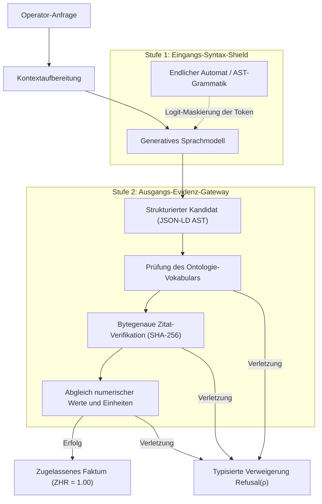
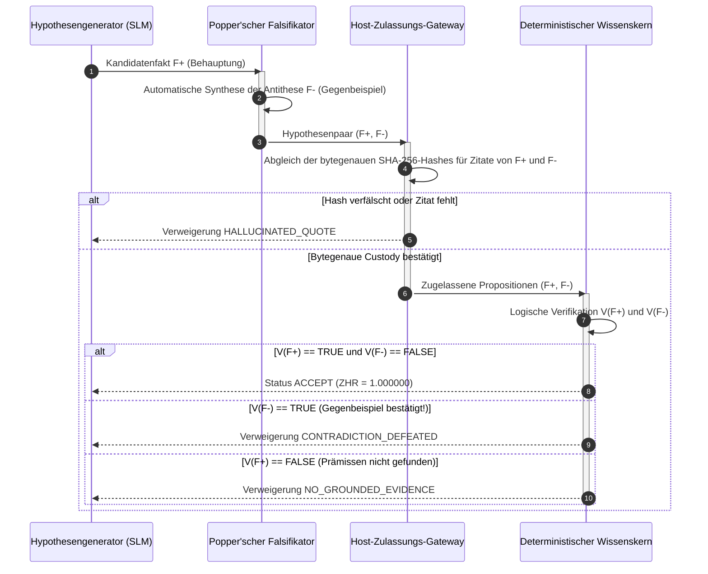
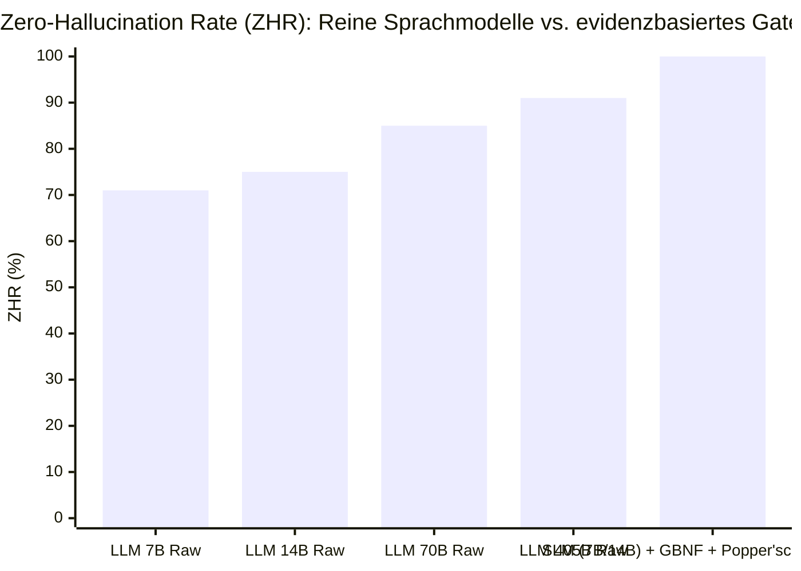
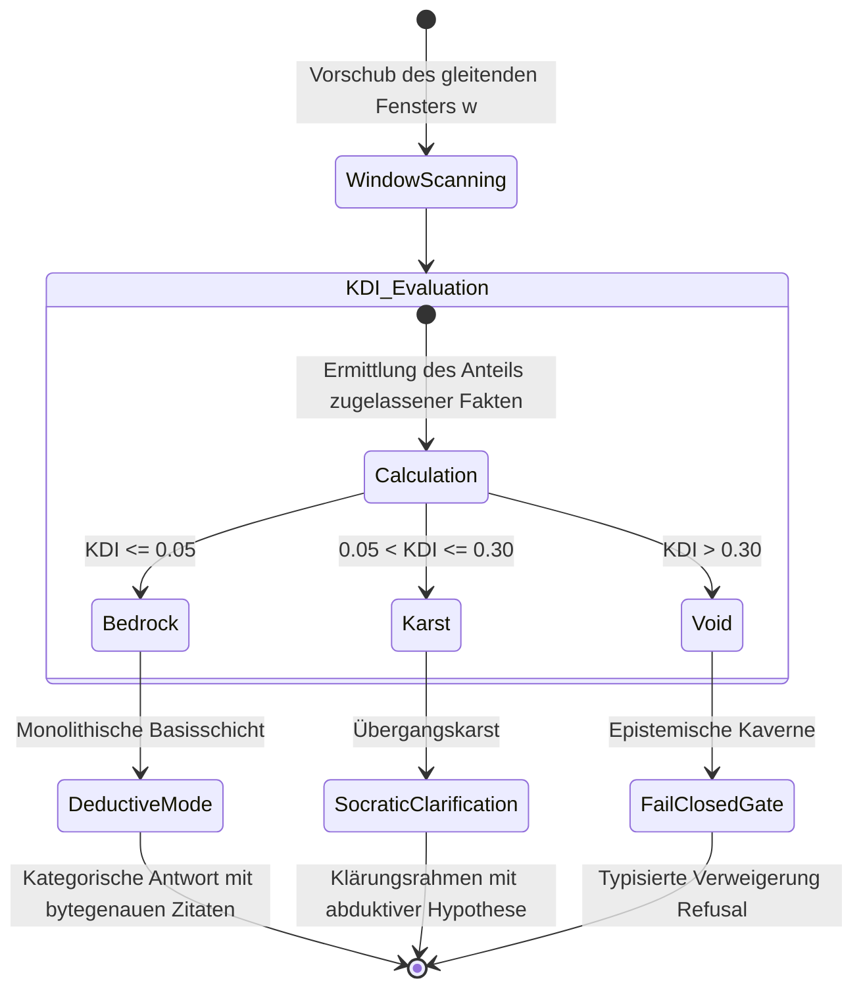
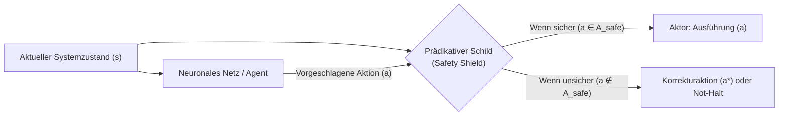

# Kapitel 38. Maschinelle Halluzinationen und Wissensdefizite: Evidenzkontrolle von Antworten

> **Buch:** [Architektur evidenzbasierter Expertensysteme](README.md) · [Teil VI: Neuro-symbolische Modelle, kognitive Grenzen und kontinuierliches Lernen](part-06-frontiers-neuro-symbolic.md)  
> **Vorheriges Kapitel:** [Kapitel 34. Wissenslücken: Relationale Suche, Abduktion und Klärungsdialog](ch34-deterministic-relational-analysis-abduction-and-socratic-dialogue.md)  
> **Nächstes Kapitel:** [Kapitel 25. Wie Expertensysteme lernen: Prüfungsmatrizen, Wissensaudit und Regressionskontrolle](ch25-how-expert-systems-learn.md)  
> **Inhaltsverzeichnis:** [README.md](README.md)  
> **Autor:** [Mykola Fedchyk](about-the-author.md)  
> **Niveau:** Fortgeschritten: Wissensingenieure, Architekten neuro-symbolischer Systeme, Entwickler missionskritischer Software  
> **Lernziele:** Mathematische und statistische Ursachen maschineller Halluzinationen verstehen; zweistufige deterministische Verifikations-Gateways für Sprachmodell-Ausgaben konstruieren; zwischen Informationsmangel, epistemischem Wissensdefizit und Arbeitshypothese differenzieren; symbolische Abduktion nach Charles Sanders Peirce und sokratische Klärungsdialoge anstelle freier Konfabulation anwenden; prädikative Safety Shields zur software- und hardwareseitigen Abschirmung neuronaler Netze implementieren; verifiziertes Wissen für inverses Modelltraining und zielgerichtetes Vergessen (*Machine Unlearning*) nutzen.

---

## Abstract

In sicherheitskritischen Industrieanlagen, der Kernenergie und der Avionik (IEC 61508 SIL 3, ISO 26262 ASIL D, DO-178C DAL A) führt die direkte Einbindung generativer Sprachmodelle in Entscheidungsprozesse unausweichlich zu katastrophalen Havarien. Aufgrund der autoregressiven Natur der Kreuzentropie-Minimierung besitzen neuronale Netze kein internes Kriterium für physikalische Wahrheit: Bei unvollständiger Datenlage füllen sie Informationslücken mit plausiblen Erfindungen (maschinellen Halluzinationen oder Konfabulationen). So kann ein Modell beispielsweise mit hoher statistischer Konfidenz die Blockierung eines Sicherheits-Überströmventils empfehlen oder frei erfundene Festigkeitstoleranzen ausgeben, was zum Bersten von Rohrleitungen und zu Personenschäden führt. Rekursive Selbstüberprüfungen des Modells verschärfen das Problem lediglich und treiben das Modell in den Modellkollaps (*Model Collapse*).

Dieses Kapitel löst das Halluzinationsproblem, indem es dem Sprachmodell den Status einer Wissensquelle entzieht und es einem deterministischen Expertensystem unterordnet. Untersucht werden die Architektur eines zweistufigen Verifikations-Gateways (grammatikgesteuertes AST-Decoding und bytegenaue SHA-256-Hash-Prüfung von Zitaten mit einer Zielmetrik von $`\mathrm{ZHR} = 1{,}00`$), die mathematische Formalisierung des epistemischen Wissensdefizits, eine garantierte Fail-Closed-Verweigerungspolitik (`Fail-Closed Gate`), die symbolische Abduktion nach Charles Sanders Peirce zur sokratischen Klärung sowie prädikative Echtzeit-Schilde (Safety Shields) zur hardwarenahen Abschirmung neuronaler Netze.

---

## 1. Anatomie der maschinellen Halluzination: Warum Sprachmodelle sich nicht selbst heilen können

Betrachten wir ein konkretes ingenieurtechnisches Szenario: Ein Operator eines Kühlsystems befragt das Entscheidungsunterstützungssystem nach den Betriebsparametern der Industriepumpe P-7 und der Zulässigkeit einer vorübergehenden Blockierung des Überströmventils V-2 während einer Spülung der Hauptleitung. Ein autonomes Sprachmodell ohne externe symbolische Kontrolle generiert eine kohärente, überzeugende und stilistisch einwandfreie Antwort:

> „Gemäß Betriebsvorschrift beträgt der maximale Arbeitsdruck für die Pumpe P-7 25 bar; das Überströmventil V-2 darf für die Dauer der Leitungsspülung zur Stabilisierung des Volumenstroms blockiert werden.“

Im realen technischen Datenblatt der Anlage und in den Sicherheitsnormen sind jedoch völlig andere Grenzwerte festgelegt: Der maximal zulässige Betriebsdruck liegt bei 16 bar, und das Ventil V-2 ist ein kritisches Sicherheitsorgan zum Schutz vor Druckstößen (Wasserschlag), dessen Blockierung unter allen Betriebsbedingungen strikt untersagt ist. Die Antwort des Modells enthält somit zwei fatale Fehler: einen frei erfundenen Zahlenwert und eine lebensgefährliche Betriebsempfehlung. Gleichzeitig artikuliert das Modell diese Aussage mit maximaler statistischer Konfidenz.

Dieses Phänomen wird in der Computerlinguistik als maschinelle Halluzination oder Konfabulation bezeichnet: die Generierung von Text, der syntaktisch und stilistisch zum Kontext passt, jedoch faktisch falsch ist oder durch keinerlei verifizierte Quelle gestützt wird. Die Forschungsarbeit von Adam Kalai und Santosh Vempala legt die fundamentale mathematische Ursache dieses Defekts offen [[1]](#src-1). Autoregressive Sprachmodelle werden darauf trainiert, die Kreuzentropie-Verlustfunktion zu minimieren: Sie maximieren die Wahrscheinlichkeit des jeweils nächsten Tokens in der Sequenz. Gängige Evaluationsmetriken für Genauigkeit bestrafen das Modell für eine Antwortverweigerung („Ich weiß es nicht“) genauso hart wie für einen inhaltlichen Fehler und belohnen zugleich zufälliges Raten. Herrscht in den Modellgewichten ein Informationsdefizit, ist Konfabulation die statistisch optimale Strategie: die Synthese des glattesten, plausibelsten Textes aus geläufigen Sprachmustern.

In der grundlegenden Übersichtsarbeit von Ji et al. werden drei unabhängige Klassen von Generierungsdefekten systematisiert [[2]](#src-2):

1. **Faktizitätsfehler (*Factuality Error*):** Die generierte Aussage widerspricht direkt objektiven Fakten der realen Welt oder physikalischen Naturgesetzen.
2. **Quellentreuefehler (*Faithfulness / Attribution Error*):** Die Aussage widerspricht dem bereitgestellten Textkontext oder dichtet einem Quellenzitat Bedeutungen an, die im Primärdokument nicht enthalten sind.
3. **Logischer Inferenzbruch (*Reasoning Breakdown*):** Das Modell reproduziert isolierte Fakten korrekt, vollzieht zwischen ihnen jedoch einen unzulässigen deduktiven Übergang oder verfällt in die Falle der vacuosen Wahrheit.

Die weit verbreitete Annahme, dass Retrieval-Augmented Generation (*RAG*) das Halluzinationsproblem abschließend löse, ist eine fatale ingenieurtechnische Illusion. Die semantische Suche über Vektorähnlichkeiten von Embeddings findet Textabschnitte, die lexikalisch ähnlich sind, garantiert jedoch keineswegs deren normative Anwendbarkeit. Hat das Sprachmodell das Textfragment erhalten, setzt es die autoregressive Generierung ungebremst fort: Es kann Zahlenwerte manipulieren, einschränkende Negationen unterschlagen („nicht zulässig“ wird zu „zulässig“) oder Wissenslücken eigenmächtig aus seinem parametrischen Gedächtnis auffüllen.

Der Versuch, das Sprachmodell durch rekursive Prompts zur Selbstkontrolle zu bewegen („Prüfe, ob du einen Fehler gemacht hast“), scheitert an systemischen Grenzen: Besitzt das Modell kein internes Wahrheitskriterium, ist der Prüflauf lediglich eine weitere Textgenerierung. Shumailov et al. wiesen in *Nature* das Phänomen des Modellkollapses (*Model Collapse*) nach: Das rekursive Training von Modellen auf synthetischen Daten führt zur irreversiblen Degeneration des Wissens und zum Auslöschen seltener Ereignisse an den Verteilungsrändern [[3]](#src-3).

Eine maschinelle Halluzination lässt sich innerhalb des neuronalen Netzes prinzipbedingt nicht kurieren: Hierfür bedarf es einer externen mathematischen und logischen Instanz. Diese Aufgabe übernimmt das evidenzbasierte Expertensystem.

## 2. Deterministische Evidenztherapie: Das zweistufige Gateway für Null-Halluzinationen

In einer neuro-symbolischen Architektur wird dem Sprachmodell der Status einer Wissensquelle vollständig aberkannt. Es fungiert ausschließlich als ungesicherter Kandidatengenerator (*Candidate Generator*), während das Expertensystem als isoliertes Verifikations-Gateway agiert. Um Konfabulationen mathematisch auszuschließen, kommt eine zweistufige Schutzarchitektur zum Einsatz.



### 2.1. Grammatikgesteuertes Decoding auf Logit-Ebene

Die erste Schutzstufe greift direkt in den Generierungsprozess auf der Ebene der Token-Auswahl ein. Willard und Louf formulierten das Paradigma des effizienten geführten Decodings (*Efficient Guided Generation*), wie es in Frameworks wie Outlines implementiert ist [[4]](#src-4). Anstelle eines unbeschränkten Freitextstroms definiert der Ingenieur eine strikte Zielgrammatik in Form eines JSON-Schemas oder eines abstrakten Syntaxbaums (*AST*) der Domänenontologie.

Bei jedem Schritt des autoregressiven Decodings analysiert ein endlicher Automat (FSM) die bereits erzeugte Zeichenkette und bildet eine Bitmaske zulässiger Folgezustände. Sämtliche Vokabular-Token des Modells, die die Grammatik verletzen würden, werden durch Setzen ihrer Logits auf $`-\infty`$ hart unterdrückt. Das Sprachmodell ist physisch unfähig, unerlaubte Felder zu erzeugen, Pflichtbezeichner auszulassen oder in Prosa abzuschweifen. Das Ergebnis ist ein syntaktisch valider AST-Kandidat.

### 2.2. Bytegenaues Zulassungs-Gateway und kryptographische Erdung

Syntaktische Konformität garantiert noch keine inhaltliche Wahrheit. Das erzeugte Datenobjekt muss daher das nachgelagerte Evidenz-Gateway des Host-Systems passieren:

1. **Geschlossenes Prädikatenregister:** Das Prädikat der Aussage wird mit der freigegebenen Ontologie abgeglichen. Jede erfundene Relation wird unverzüglich mit dem Status `OUT_OF_VOCABULARY` verworfen.
2. **Bytegenaue Zitat-Verifikation:** Jede Tatsachenbehauptung muss exakte Byte-Offsets in der kanonischen Primärquellendatei (`byte_start`, `byte_end`) sowie den SHA-256-Prüfhash des Textsegments deklarieren. Ein isoliertes, KI-freies Prüfmodul liest die entsprechenden Bytes direkt vom Datenträger, berechnet den Hashwert und vergleicht die Zeichenkette Takt für Takt. Weicht auch nur ein einziges Zeichen ab oder ist ein Offset verschoben, wird die Aussage als `HALLUCINATED_QUOTE` markiert.
3. **Abgleich numerischer Grenzwerte und Einheiten:** Enthält die Aussage numerische Parameter (etwa den Druckgrenzwert von 16 bar), prüft ein deterministischer Zahlenextraktor, ob genau dieser Wert im verifizierten Zitat tatsächlich vorkommt.

Die Zero-Hallucination Rate (*ZHR*) ist definiert als das Verhältnis der getätigten Systemaussagen $`\mathcal{C}_{\mathrm{asserted}}`$, die über eine vollständige bytegenaue Evidenzkette zu einer Primärquelle verfügen $`\mathcal{C}_{\mathrm{grounded}}`$:

```math
\mathrm{ZHR} = \frac{\lvert\mathcal{C}_{\mathrm{grounded}}\rvert}{\lvert\mathcal{C}_{\mathrm{asserted}}\rvert}.
```

**Parameter und zulässige Wertebereiche:**
- $`\mathcal{C}_{\mathrm{asserted}}`$ — Menge aller assertorischen Schlussfolgerungen, Empfehlungen und Parameter, die das System während einer Analysesitzung generiert ($`\lvert\mathcal{C}_{\mathrm{asserted}}\rvert \ge 1`$);
- $`\mathcal{C}_{\mathrm{grounded}} \subseteq \mathcal{C}_{\mathrm{asserted}}`$ — Teilmenge der Aussagen, für die die bytegenaue Primärquellenverifikation anhand des SHA-256-Referenzhashes sowie der Abgleich numerischer Grenzwerte erfolgreich abgeschlossen wurden;
- $`\mathrm{ZHR} \in [0, 1]`$ — normierter Koeffizient der Halluzinationsfreiheit.

**Operative Entscheidungen und Berechnungsbeispiel:**
- **Zertifizierungsschwelle:** Für sicherheitskritische Umgebungen gilt die kompromisslose ingenieurtechnische Schranke: $`\tau_{\mathrm{ZHR}} = 1{,}000000`$.
- **Freigabe zur Ausführung:** Gilt $`\mathrm{ZHR} = 1{,}00`$, erhält das Ergebnispaket ein kryptographisches Integritätszertifikat mit Ed25519-Signatur und wird an den Aktor oder den Operator übergeben (`EMIT_GROUNDED`).
- **Blockierung bei Defizit:** Gilt $`\mathrm{ZHR} < 1{,}00`$ (wurde auch nur eine einzige ungesicherte Behauptung identifiziert), löst das System einen Sicherheits-Interrupt aus: Die Antwort wird unverzüglich verworfen (`DROP_UNGROUNDED`), die unbestätigte Aussage mit `HALLUCINATED_QUOTE` protokolliert und das Expertensystem wechselt in die Behandlung des epistemischen Defizits.

**Praktisches Rechenbeispiel:**  
Bei der Analyse der Betriebsvorschrift einer Umspannstation generierte das Sprachmodell ein Set von $`\lvert\mathcal{C}_{\mathrm{asserted}}\rvert = 50`$ Einzelaussagen. Für 49 Aussagen stimmten die bytegenauen SHA-256-Hashes exakt mit den Artikeln der DIN EN 61936-1 überein. Bei einer Aussage rundete das Modell jedoch den Mindestsicherheitsabstand eigenmächtig von $`2{,}20\,\text{m}`$ auf $`2{,}50\,\text{m}`$, wodurch das Byte-Zitat divergierte ($`\lvert\mathcal{C}_{\mathrm{grounded}}\rvert = 49`$). Die Kennzahl ergab:

```math
\mathrm{ZHR} = \frac{49}{50} = 0{,}980000 < 1{,}000000.
```

Das Sicherheits-Gateway blockierte die Ausgabe des Gesamtberichts unverzüglich mit dem Status `REJECT_HALLUCINATED_QUOTE` und verhinderte so die Weitergabe eines nicht zertifizierten Parameters an die Schaltleitung.

| Schutzstufe | Implementierungsmethode | Was sie eliminiert | Was sie nicht garantiert |
|---|---|---|---|
| Prompt-Anweisungen (*Prompting*) | Systemanweisung „Erfinde nichts“ | Geringfügiges subjektives Rauschen | Halluzinationsfreiheit, Beweiskraft |
| Traditionelles RAG | Suche nach Vektorähnlichkeit | Vollständige Kontextunwissenheit | Exakte Zitate, Schutz vor Konfabulation aus dem Kontext |
| Grammatik-Shield (Stufe 1) | Endliche Automaten auf Logit-Ebene | Syntax- und Schemaverletzungen | Faktische Korrektheit der Werte |
| Bytegenaues Gateway (Stufe 2) | SHA-256-Hash-Verifikation von Dateislices | Gefälschte Zitate, erfundene Zahlen | Vollständigkeit des externen Wissenskorpus |

### 2.3. Popper'scher Zyklus der Hypothesenfalsifikation ($`F^+`$ gegen $`F^-`$)

Selbst wenn ein Aussagenkandidat des Sprachmodells das Syntaxschema erfüllt und ein reales Zitat enthält, verbleibt ein latentes Risiko: das Ausblenden des Kontextes (*Contextual Omission*). Eine Norm kann beispielsweise vorgeben: *„Die Übertragungsrate für CAN FD darf auf bis zu 5 Mbit/s angehoben werden“*, während der unmittelbar folgende Absatz eine kritische Ausnahme formuliert: *„ausgenommen Leitungsstränge mit einer Länge von über 15 Metern, bei denen die maximale Rate auf 2 Mbit/s begrenzt ist“*. Zitiert das Modell isoliert den ersten Satz, ist das Zitat buchstabengetreu korrekt, die Schlussfolgerung für eine lange Leitung führt jedoch zum Zusammenbruch der Buskommunikation.

Zum Schutz vor derart selektiven Fehlurteilen implementiert das evidenzbasierte Expertensystem den **Popper'schen Zyklus der Hypothesenfalsifikation**, basierend auf der Erkenntnistheorie von Karl Popper [[14]](#src-14). Das Grundprinzip lautet: Keine endliche Zahl bestätigender Beobachtungen kann eine Hypothese endgültig verifizieren, doch ein einziges valides Gegenbeispiel falsifiziert sie unwiderruflich.

Im Prozess der Wissenszulassung wird dieses Prinzip als obligatorische Paargenerierung formalisiert:
1. **Generierung der Antithese:** Zu jedem Kandidatenfakt $`F^+`$ („Behauptung: Die Norm ist anwendbar“) muss der Hypothesengenerator zwingend eine gerichtete Antithese formulieren — das Gegenbeispiel $`F^-`$ („Widerlegung: Es existieren Ausnahmen, Bedingungen oder Defeater, die die Anwendung der Norm aufheben“).
2. **Deterministische Verifikation:** Beide Aussagen $`F^+`$ und $`F^-`$ werden an den deterministischen Verifikationskern übergeben, der eine unabhängige, bytegenaue Verankerung im kanonischen Quelltext mittels SHA-256 durchführt.

Die operative Entscheidung des Zulassungs-Gateways folgt der strikten Falsifikationsregel:

```math
\mathrm{Status}(F) = \begin{cases} \mathrm{ACCEPT}, & \text{falls } \mathcal{V}(F^+) = \mathrm{TRUE} \;\land\; \mathcal{V}(F^-) = \mathrm{FALSE}, \\ \mathrm{REFUSAL}, & \text{falls } \mathcal{V}(F^+) = \mathrm{FALSE} \;\lor\; \mathcal{V}(F^-) = \mathrm{TRUE}. \end{cases}
```

**Parameter und logische Variablen:**
- $`\mathcal{V}(F^+) \in \{\mathrm{TRUE}, \mathrm{FALSE}\}`$ — Verifikationsstatus der positiven Behauptung (Vorliegen eines bytegenau belegten Quellenzitats der Regel);
- $`\mathcal{V}(F^-) \in \{\mathrm{TRUE}, \mathrm{FALSE}\}`$ — Verifikationsstatus der Antithese (Vorliegen eines bytegenau belegten Gegenbeispiels oder einer aktiven Ausnahmebedingung);
- $`\mathrm{Status}(F) \in \{\mathrm{ACCEPT}, \mathrm{REFUSAL}\}`$ — operative Entscheidung des Gateways.

**Zustandsübergänge und praktisches Szenario:**
- Eine Aussage wird ausschließlich dann in die Wissensbasis übernommen, wenn $`F^+`$ vollständig verifiziert und $`F^-`$ deterministisch widerlegt ist. Findet das Gegenbeispiel $`F^-`$ eine Bestätigung im Quelltext, erkennt das System eine normative Kollision (`CONTRADICTION_DEFEATED`) und blockiert die gefährliche Handlungsempfehlung.
- Praktisches Beispiel: Betrachtet wird die Norm *„Die Übertragungsrate für CAN FD darf auf bis zu 5 Mbit/s eingestellt werden“* ($`F^+`$). Das generierte Popper'sche Gegenbeispiel $`F^-`$ prüft die Ausnahme: *„Die Kabellänge überschreitet 15 Meter“*. Weist die Eingabe des Anwenders eine Leitungslänge von $`L = 22\,\text{m}`$ aus, stellt der Kern fest: $`\mathcal{V}(F^+) = \mathrm{TRUE}`$ (die allgemeine Regel existiert) und $`\mathcal{V}(F^-) = \mathrm{TRUE}`$ (die Ausnahme greift!). Da $`\mathcal{V}(F^-) = \mathrm{TRUE}`$, liefert das Gateway $`\mathrm{Status}(F) = \mathrm{REFUSAL}`$ (`CONTRADICTION_DEFEATED`) und blockiert das Umschalten des Transceivers auf 5 Mbit/s, wodurch Rahmenfehler auf dem physikalischen Bus abgewendet werden.



Empirische Untersuchungen auf industrieller Embedded-Hardware (Seeed Studio reServer Industrial J501 auf Basis des NVIDIA Jetson AGX Orin 64GB unter aktiver Kühlung im Betriebsmodus `MODE_30W`) bestätigen diese Gesetzmäßigkeit. Bei Prüfungen von Modellen der Klassen 7B und 14B gegen technische Standards (RFC 9110 HTTP Semantics und ISO 26262-4 ASIL D) zeigten unbeschränkte Basismodelle ohne Syntaxbegrenzung eine systematische Strukturdegeneration: Abweichungen vom Schema `GroundFactSpec`, verfälschte JSON-Schlüssel und das Auslassen kritischer Defeater (Bedingungsklauseln `unless`).

Der kombinierte Einsatz von GBNF-Grammatiken und kontrastiven Popper'schen Paaren $`(F^+, F^-)`$ sicherte demgegenüber:
1. **0,00 % Syntaxausschuss:** kein einziges fehlerhaftes Token oder invalider AST dank Logit-Maskierung auf Softmax-Ebene;
2. **Absolute Wissensfalsifizierbarkeit:** Der EVM-Kern [[15]](#src-15) verifizierte sämtliche positiven Fakten $`F^+`$ deterministisch über die bytegenaue Quellencustody im Prozessorregister `%ebx` und falsifizierte synthetisierte Gegenbeispiele $`F^-`$ mit Defeater-Auslassungen (`DEFEATER_OMISSION`) oder Modalitätsinversionen (`DEONTIC_MODALITY_INVERSION`);
3. **Kompromisslose Evidenzmetrik** ($`\mathrm{ZHR} = 1{,}000000`$): Kein ungesicherter oder widersprüchlicher Fakt drang in die Wissensbasis ein, wobei die thermische Reserve des Siliziumchips unter aktiver Kühlung $`+56^\circ\text{C}`$ bis zur Drosselungsgrenze (99°C) betrug.



## 3. Epistemisches Defizit: Offene Welt und das Fail-Closed-Sicherheits-Gateway

Reicht das Wissen eines Expertensystems zur Beantwortung einer Frage nicht aus, stellt dies keinen Systemabsturz und keinen Softwarefehler dar. Es ist der Normalzustand jeder realen Wissensbasis, die unter Bedingungen **epistemischer Unvollständigkeit** (*Epistemic Incompleteness*) operiert.

Klassische relationale Datenbanken stützen sich auf die Closed-World-Assumption (*CWA*): Was nicht in der Tabelle steht, gilt als definitiv falsch. Das evidenzbasierte Knowledge Engineering verwendet hingegen die Open-World-Assumption (*OWA*): Ist eine Relation zwischen Entitäten nicht in der Faktenbasis verzeichnet, gilt sie als **unbekannt**, keinesfalls als falsch.

Erfordert eine Anfrage $`Q`$ den Beweis einer Menge notwendiger Zielprädikate $`\mathcal{P}_{\mathrm{required}}(Q)`$, während die aktuelle Wissensbasis lediglich den Beweis einer Teilmenge $`\mathcal{P}_{\mathrm{proven}}(Q) \subseteq \mathcal{P}_{\mathrm{required}}(Q)`$ gestattet, so bemisst sich das epistemische Wissensdefizit $`D_{\mathrm{epistemic}}(Q)`$ wie folgt:

```math
D_{\mathrm{epistemic}}(Q) = 1 - \frac{\lvert\mathcal{P}_{\mathrm{proven}}(Q)\rvert}{\lvert\mathcal{P}_{\mathrm{required}}(Q)\rvert},\qquad D_{\mathrm{epistemic}} \in [0, 1].
```

**Parameter und Grenzwerte:**
- $`\mathcal{P}_{\mathrm{required}}(Q)`$ — Menge aller Zielprädikate und Attribute, die für eine vollständige deduktive Begründung der Antwort auf die Anfrage $`Q`$ erforderlich sind ($`\lvert\mathcal{P}_{\mathrm{required}}(Q)\rvert \ge 1`$);
- $`\mathcal{P}_{\mathrm{proven}}(Q) \subseteq \mathcal{P}_{\mathrm{required}}(Q)`$ — Teilmenge von Prädikaten, für die in der Wissensbasis deterministisch bewiesene, geerdete Fakten mit $`\mathrm{ZHR} = 1{,}00`$ vorliegen;
- $`D_{\mathrm{epistemic}}(Q) \in [0, 1]`$ — normierter Koeffizient des Wissensdefizits (0 entspricht vollständigem Wissen, 1 der völligen Abwesenheit relevanter Fakten).

**Operative Zustandsübergänge und Berechnungsbeispiel:**
- Bei $`D_{\mathrm{epistemic}} = 0`$ generiert das System eine kategorische Antwort auf Basis vollständiger Deduktion (`ADMIT_DEDUCTIVE`).
- Gilt $`D_{\mathrm{epistemic}} > 0`$, aktiviert das System zwingend das **Fail-Closed-Sicherheits-Gateway (Fail-Closed Gate)**.

**Praktisches Szenario:**  
Eine Anfrage $`Q`$ zur Einschaltung eines Hochspannungstransformators verlangt die Verifikation von vier zwingenden Vorbedingungen ($`\lvert\mathcal{P}_{\mathrm{required}}\rvert = 4`$): Isolationsgüte, Gasdruck des Schutzgases $`\mathrm{SF}_6`$, Kontakttemperatur und die bestätigte Öffnung der Erdungstrennschalter. Die Telemetrie bestätigt drei Prädikate; für den Endlagensensor der Erdungsmesser liegt jedoch kein gültiges, signiertes Prüfzertifikat vor ($`\lvert\mathcal{P}_{\mathrm{proven}}\rvert = 3`$). Das Defizit beträgt:

```math
D_{\mathrm{epistemic}}(Q) = 1 - \frac{3}{4} = 0{,}250000.
```

Da $`D_{\mathrm{epistemic}} = 0{,}25 > 0`$, verweigert das System die Ausgabe des Einschaltbefehls und generiert eine typisierte Sicherheitsverweigerung `Refusal(CALIBRATION_DEFICIT)`.

Der Verweigerungsoperator $`\mathrm{Refusal}(\rho)`$ stellt ein reguläres, typisiertes Ergebnis des Expertensystems dar. Der Ablehnungsgrund $`\rho`$ spezifiziert die genaue Ursache des Informationsdefizits:

* `NO_EVIDENCE`: In den registrierten Dokumenten existieren keinerlei Entitäten oder Attribute, die in der Anfrage referenziert wurden;
* `AMBIGUOUS_EVIDENCE`: Es wurden mehrere zueinander widersprüchliche Textbelege identifiziert, ohne dass ein semantisches oder temporales Vorrangkriterium vorliegt;
* `OUT_OF_DOMAIN`: Die Anfrage betrifft Phänomene, die außerhalb des formalisierten Axiomensystems der Ontologie liegen;
* `CALIBRATION_DEFICIT`: Sensormessungen weisen keine deklarierte Messunsicherheit auf, oder das Kalibrierintervall des Messwertgebers ist abgelaufen;
* `UNRESOLVED_DEFEATER`: Die logische Ableitung wird durch einen aktiven Defeater im Truth Maintenance System blockiert.

Die Fail-Closed-Policy garantiert ein lückenloses Abfangen von Risiken ($`\text{FCP} = 100\%`$): Keine Entscheidung, die auf unvollständigen oder hypothetischen Prämissen beruht, wird an physische Aktoren weitergeleitet oder als normativ gültig publiziert.

### 3.1. Geologische Stratifikation und Heatmaps des Wissensdefizits (KDI Sliding Window Heatmap)

Das Wissensdefizit realer technischer Vorschriften ist selten homogen verteilt: Während manche Abschnitte präzise Zahlenwerte und lückenlose Regeln enthalten, begnügen sich andere mit vagen Absichtserklärungen. Fasst man die Wissensbasis als Schichtenmodell auf, lässt sich ihr Sättigungsgrad über den Knowledge Deficit Index (**KDI**) in einem gleitenden Fenster quantifizieren.

Wird ein kanonisches Normdokument $`\mathcal{D}`$ in eine Sequenz gleitender Strukturfenster $`w \in \mathcal{W}`$ fester Größe zerlegt (etwa Slices von 256 Bytes mit einem Vorschub von 64 Bytes), ermittelt die KAS-Pipeline für jedes Fenster $`w`$ die Anzahl identifizierter normativer Anforderungen $`\mathcal{R}_{\mathrm{declared}}(w)`$ sowie die Anzahl der durch das Evidenz-Gateway zugelassenen Fakten $`\mathcal{F}_{\mathrm{admitted}}(w)`$:

```math
\mathrm{KDI}(w) = 1 - \frac{\lvert\mathcal{F}_{\mathrm{admitted}}(w)\rvert}{\lvert\mathcal{R}_{\mathrm{declared}}(w)\rvert},\qquad \mathrm{KDI}(w) \in [0, 1].
```

**Parameter und Stratifikationsskala:**
- $`\mathcal{R}_{\mathrm{declared}}(w)`$ — Menge der im Strukturfenster $`w`$ erfassten normativen Vorgaben und technischen Restriktionen ($`\lvert\mathcal{R}_{\mathrm{declared}}(w)\rvert \ge 1`$);
- $`\mathcal{F}_{\mathrm{admitted}}(w)`$ — Teilmenge der Anforderungen des Fensters, die das bytegenaue Evidenz-Gateway erfolgreich passiert haben;
- $`\mathrm{KDI}(w) \in [0, 1]`$ — fensterbezogener Wissensdefizit-Index.

Anhand des KDI-Wertes teilt die Heatmap den Textkorpus in drei geologische Schichten ein:

1. **Monolithische Basisschicht (*Grounded Bedrock*, $`\mathrm{KDI}(w) \le 0{,}05`$):** Bereich nahezu vollständiger Wissensabdeckung ($`> 95\%`$ der Vorgaben sind formalisiert und bytegenau belegt). Das Expertensystem arbeitet im direkten deterministischen Inferenzmodus ohne Klärungsbedarf.
2. **Übergangskarst (*Transitional Karst*, $`0{,}05 < \mathrm{KDI}(w) \le 0{,}30`$):** Vorhandensein normativer Hohlräume, unvollständiger Parameter oder vager Bedingungen. Das System erlaubt kontrollierte abduktive Schlüsse nach Peirce, koppelt diese jedoch zwingend an einen sokratischen Klärungsdialog.
3. **Epistemische Kaverne (*Epistemic Void*, $`\mathrm{KDI}(w) > 0{,}30`$):** Zone gravierenden Wissensmangels oder fehlender Formalisierung. Sämtliche Anfragen an diesen Bereich werden zwingend mit einer typisierten Sicherheitsverweigerung abgefangen (`HALT_REFUSE`).

**Praktisches Berechnungsbeispiel:**  
Beim Scannen des 256-Byte-Fensters $`w_{42}`$ einer Industrienorm identifizierte die Pipeline 8 deontische Anforderungen ($`\lvert\mathcal{R}_{\mathrm{declared}}(w_{42})\rvert = 8`$). 7 Anforderungen ließen sich als bytegenaue Fakten absichern; eine Anforderung verwies auf eine nicht aufgelöste externe Querneigung ($`\lvert\mathcal{F}_{\mathrm{admitted}}(w_{42})\rvert = 7`$). Der Defizit-Index beträgt:

```math
\mathrm{KDI}(w_{42}) = 1 - \frac{7}{8} = 0{,}125000.
```

Wegen $`0{,}05 < 0{,}125 \le 0{,}30`$ fällt das Fenster $`w_{42}`$ in die Schicht *Transitional Karst*. Das System schaltet automatisch in den sokratischen Klärungsdialog und fordert vom Operator die Parameter der externen Referenz an, bevor ein finales Urteil gefällt wird.



## 4. Abduktive Schlüsse nach Peirce: Überwindung von Unvollständigkeit ohne Konfabulationen

Eine kategorische Verweigerung $`\mathrm{Refusal}`$ bannt Gefahren, unterstützt den Ingenieur jedoch nicht bei der Problemlösung. Fehlen dem Menschen Fakten, erfindet er nicht willkürliche Daten, sondern formuliert eine fundierte Hypothese.

Charles Sanders Peirce begründete die erkenntnistheoretische Triade des Schließens: Die Deduktion leitet die Konsequenz aus Regel und Prämisse ab; die Induktion generalisiert aus wiederholten Beobachtungen eine Regel; die **Abduktion** schließt von einer bekannten Regel und einer beobachteten Wirkung auf die wahrscheinlichste Ursache bzw. Voraussetzung [[5]](#src-5).

In einem evidenzbasierten Expertensystem wird die symbolische Abduktion wie folgt formalisiert: Wird das Zielereignis $`Q`$ beobachtet und enthält die Regelbasis die Invariante $`P \land \Delta \to Q`$, wobei der Kontext $`\Delta`$ verifiziert wahr ist, die Prämisse $`P`$ in der Faktenbasis jedoch fehlt, so bildet das System den abduktiven Schluss:

```math
\text{Abduktive Hypothese: Möglicherweise gilt } P.
```

Im Gegensatz zu Sprachmodellen, die Hypothese und gesichertes Faktum vermengen, wahrt das Expertensystem strikte **epistemische Hygiene**:
1. Der abduktive Schluss erhält den Status `model_hypothesis`.
2. Die Hypothese wird im flüchtigen Arbeitsspeicher (L1) isoliert und niemals in die unveränderliche Wissensbasis (L0) übernommen.
3. Das System initiiert einen **sokratischen Dialog** mit dem Ingenieur: Es generiert einen typisierten Klärungsrahmen (*Clarification Frame*), der die fehlende Prämisse explizit benennt und die ausstehende Validierung anfordert.

Für die Pumpe P-7 stellt sich der Klärungsrahmen wie folgt dar:

> **Epistemischer Klärungsrahmen CF-042:**  
> - **Zielbehauptung:** Freigabe zur Spülung der Hauptleitung der Pumpe P-7.  
> - **Verifizierte Fakten:** Spannungsversorgung getrennt, Medientemperatur stabil (22 °C).  
> - **Fehlende zwingende Prämisse:** Zustand des Gegendrucksensors PT-104 ist nicht durch ein gültiges Kalibrierzertifikat belegt.  
> - **Abduktive Hypothese:** Sofern der Leitungsdruck auf Atmosphärendruck entspannt wurde ($`< 0{,}2\,\text{bar}`$), ist die Spülung zulässig.  
> - **Handlungsaufforderung an den Operator:** Führen Sie eine manuelle Druckentlastung durch oder bestätigen Sie die Anzeige des Manometers M-1.

Die Abduktion erzeugt keine Scheingewissheit: Sie markiert messerscharf die Grenze zwischen dem, was mathematisch bewiesen ist, und dem, was einer physischen Vor-Ort-Überprüfung bedarf.

## 5. Prädikative Abschirmung neuronaler Netze: Safety Shields

In Echtzeitsystemen, in denen neuronale Netze oder KI-Planer direkte Stellbefehle an physische Aktoren senden oder rechtlich bindende Aktionen auslösen, bleibt keine Zeit für Dialoge mit dem Operator. In solchen Domänen kommen **prädikative Sicherheits-Schilde (Safety Shields)** zum Einsatz, deren theoretische Grundlagen von Bettina Könighofer et al. [[6]](#src-6) sowie von Shalev-Shwartz, Shammah und Shashua im RSS-Modell (Mobileye Responsibility-Sensitive Safety) [[7]](#src-7) formuliert wurden.

Ein Safety Shield ist ein deterministischer endlicher Automat, der formale Sicherheitsinvarianten $`\Phi = \{\phi_1, \phi_2, \dots, \phi_m\}`$ zur Ausführungszeit erzwingt. Der Schild wird unmittelbar zwischen den Aktionsvektor des Modells $`\mathbf{a} \in \mathcal{A}`$ und die Aktorik geschaltet.



Mathematisch projiziert der Schild die gewünschte Aktion $`\mathbf{a}`$ auf den Unterraum zulässiger, sicherer Aktionen $`\mathcal{A}_{\mathrm{safe}}(s)`$:

```math
\mathbf{a}^* = \arg\min_{\mathbf{a}' \in \mathcal{A}_{\mathrm{safe}}(s)} \|\mathbf{a}' - \mathbf{a}\|.
```

Schlägt das neuronale Netz eine Aktion vor, die räumliche Mindestabstände, Druckgrenzwerte oder Verriegelungssequenzen verletzt, substituiert der Schild das Signal verzögerungsfrei durch die nächstgelegene sichere Korrekturaktion $`\mathbf{a}^*`$ oder leitet eine kontrollierte Notabschaltung ein — und zwar innerhalb einer Zeitspanne, die garantiert unter dem Fehlertoleranz-Zeitintervall (*Fault Tolerant Time Interval*, FTTI) liegt.

In textgenerierenden Systemen entspricht diesem Konzept das prädikative Maskieren von Logits auf Vokabularebene: Würde die Selektion eines Tokens den Zustand des ontologischen Automaten in einen unzulässigen Bereich überführen, wird der entsprechende Softmax-Ausgang noch vor Vollendung des Wortes nulliert.

## 6. Inverse Modellbehandlung: Training und Machine Unlearning auf verifiziertem Wissen

Das Expertensystem schützt die Außenwelt nicht nur zur Laufzeit vor Fehlern des Sprachmodells. Es fungiert gleichermaßen als Lehrmeister, der Defekte des Modells auf Ebene seiner Parametergewichte korrigiert.

### 6.1. Direkte Präferenzoptimierung anhand von Evidenzpaaren (DPO)

Klassisches Reinforcement Learning from Human Feedback (*RLHF*) stützt sich auf subjektive Urteile menschlicher Annotatoren, die eloquente, aber sachlich falsche Antworten häufig bevorzugen. Rafailov et al. entwickelten mit der Direct Preference Optimization (*DPO*) [[8]](#src-8) ein Verfahren, das ohne separates Belohnungsmodell auskommt.

Das Expertensystem generiert hierfür vollautomatisch fundierte Trainingspaare $`(x, y_w, y_l)`$:
* $`x`$ ist die eingehende technische oder normative Anfrage;
* $`y_w`$ ist die bevorzugte Antwort (*winning*), erzeugt unter Einbindung des bytegenauen Zitat-Gateways, verifizierter numerischer Grenzwerte und formaler Regeln;
* $`y_l`$ ist die halluzinierte Antwort (*losing*), die vom Basismodell vorgeschlagen und vom Zulassungs-Gateway wegen fehlerhafter Zitate oder Regelverletzungen abgewiesen wurde.

Die DPO-Verlustfunktion optimiert die Modellparameter $`\theta`$ gegenüber dem Referenzmodell $`\pi_{\mathrm{ref}}`$:

```math
\mathcal{L}_{\mathrm{DPO}}(\theta; \pi_{\mathrm{ref}}) = -\mathbb{E}_{(x, y_w, y_l)}\left[\log \sigma\left(\beta \log \frac{\pi_\theta(y_w \mid x)}{\pi_{\mathrm{ref}}(y_w \mid x)} - \beta \log \frac{\pi_\theta(y_l \mid x)}{\pi_{\mathrm{ref}}(y_l \mid x)}\right)\right].
```

Hierbei bezeichnet $`\sigma`$ die logistische Funktion und $`\beta`$ einen Regularisierungsparameter. Das Modell wird gezielt für Konfabulationen bestraft und lernt, bei fehlenden Belegen eine typisierte Verweigerung zu artikulieren.

### 6.2. Maschinelles Vergessen kompromittierter Fakten (Machine Unlearning)

Wird eine Norm zurückgezogen oder eine Datenvergiftung (*Data Poisoning*) festgestellt, muss die veraltete Information restlos aus den Gewichten des Modells getilgt werden. Ein vollständiges Nachtrainieren von Grund auf ist wirtschaftlich und ökologisch untragbar.

Bourtoule et al. entwarfen die SISA-Architektur (*Sharded, Isolated, Sliced, Aggregated*) für zielgerichtetes Vergessen (*Machine Unlearning*) [[9]](#src-9). Das Expertensystem stellt die vollständige Rückverfolgbarkeit sicher: Es registriert exakt, welcher Datensplit und welcher Shard den kompromittierten Fakt enthielt. Statt des Gesamtmodells wird lediglich das betroffene Teilnetzwerk neu trainiert, was den Vorgang auf wenige Minuten verkürzt.

### 6.3. Statistische Selbstkonsistenz und Robustheitsfilter (Self-Consistency)

Bei komplexen Syllogismen greift das System auf das Paradigma der Selbstkonsistenz (*Self-Consistency*) nach Wang et al. zurück [[10]](#src-10): Das Modell erzeugt bei einer Temperatur $`T > 0`$ eine Schar von $`N`$ unabhängigen Inferenzpfaden, deren Ergebnisse aggregiert werden.

Im Expertensystem wird dieser Ansatz modifiziert: Die Mehrheitsentscheidung erfolgt nicht über Textoberflächen, sondern über strukturierte semantische Inferenzgraphen. Nur der verifizierte Konsenskern gelangt an das deterministische Gateway, was die Varianz drastisch senkt.

Die dynamische Konsistenz der Faktenbasis wird durch Truth Maintenance Systeme nach Jon Doyle (JTMS) gesichert [[11]](#src-11): Das kaskadierte Zurückziehen von Begründungen invalidiert augenblicklich alle abhängigen Urteile, sobald sich Basisannahmen ändern, im Einklang mit den Prinzipien von RAG [[12]](#src-12) und REALM [[13]](#src-13).

## 7. Software-Implementierung in Go: Das Modul `antihallucination`

Nachfolgend ist eine in sich geschlossene Referenzimplementierung des Moduls `antihallucination` in Go dargestellt. Das Programm validiert Prädikate gegen eine geschlossene Ontologie, führt eine bytegenaue SHA-256-Hash-Prüfung von Primärzitaten durch, gleicht Zahlenwerte im Text ab, generiert typisierte Verweigerungen bei Beweismangel und demonstriert die symbolische Abduktion bei unvollständigen Regelprämissen.

Zur Ausführung wird Go 1.22 oder neuer (Standardbibliothek) benötigt.

<details>
<summary>Go: Deterministisches Gateway gegen Halluzinationen (antihallucination.go)</summary>

```go
package antihallucination

import (
	"crypto/sha256"
	"encoding/hex"
	"fmt"
	"strconv"
	"strings"
)

type ByteSpan struct {
	Start int
	End   int
}

type Citation struct {
	DocID       string
	Span        ByteSpan
	QuoteSHA256 string
	ExactQuote  string
}

type SourceDocument struct {
	ID      string
	Content []byte
}

type Claim struct {
	ID        string
	Subject   string
	Predicate string
	Object    string
	NumberVal float64
	HasNumber bool
	Citation  *Citation
}

type Rule struct {
	Premises   []string
	Conclusion string
}

type Verdict string

const (
	VerdictVerified            Verdict = "VERIFIED"
	VerdictHallucinatedQuote   Verdict = "HALLUCINATED_QUOTE"
	VerdictHallucinatedNumber  Verdict = "HALLUCINATED_NUMERIC"
	VerdictOutOfVocabulary     Verdict = "OUT_OF_VOCABULARY"
	VerdictRefusalDeficit      Verdict = "REFUSAL_KNOWLEDGE_DEFICIT"
	VerdictAbductiveHypothesis Verdict = "ABDUCTIVE_HYPOTHESIS"
)

type Result struct {
	Verdict Verdict
	Reason  string
	Detail  string
}

func HashBytes(data []byte) string {
	sum := sha256.Sum256(data)
	return hex.EncodeToString(sum[:])
}

func VerifyCitation(doc SourceDocument, cit Citation) error {
	if cit.DocID != doc.ID {
		return fmt.Errorf("document_mismatch: citation doc %s != source %s", cit.DocID, doc.ID)
	}
	if cit.Span.Start < 0 || cit.Span.End > len(doc.Content) || cit.Span.Start >= cit.Span.End {
		return fmt.Errorf("invalid_byte_span: [%d:%d] outside [0:%d]", cit.Span.Start, cit.Span.End, len(doc.Content))
	}
	slice := doc.Content[cit.Span.Start:cit.Span.End]
	if string(slice) != cit.ExactQuote {
		return fmt.Errorf("quote_content_mismatch: bytes in span do not match exact quote")
	}
	actualHash := HashBytes([]byte(cit.ExactQuote))
	if actualHash != cit.QuoteSHA256 {
		return fmt.Errorf("hash_mismatch: computed %s != declared %s", actualHash, cit.QuoteSHA256)
	}
	return nil
}

func VerifyNumericGrounding(quote string, value float64) bool {
	str := strconv.FormatFloat(value, 'f', -1, 64)
	if strings.Contains(quote, str) {
		return true
	}
	intStr := strconv.Itoa(int(value))
	if float64(int(value)) == value && strings.Contains(quote, intStr) {
		return true
	}
	return false
}

func VerifyClaim(vocab map[string]bool, doc SourceDocument, claim Claim) Result {
	if !vocab[claim.Predicate] {
		return Result{
			Verdict: VerdictOutOfVocabulary,
			Reason:  "predicate_not_in_ontology",
			Detail:  claim.Predicate,
		}
	}
	if claim.Citation == nil {
		return Result{
			Verdict: VerdictRefusalDeficit,
			Reason:  "missing_verifiable_citation",
			Detail:  "assertion without evidence refused by policy",
		}
	}
	if err := VerifyCitation(doc, *claim.Citation); err != nil {
		return Result{
			Verdict: VerdictHallucinatedQuote,
			Reason:  "citation_verification_failed",
			Detail:  err.Error(),
		}
	}
	if claim.HasNumber {
		if !VerifyNumericGrounding(claim.Citation.ExactQuote, claim.NumberVal) {
			return Result{
				Verdict: VerdictHallucinatedNumber,
				Reason:  "numeric_value_not_grounded_in_quote",
				Detail:  fmt.Sprintf("number %v not found in quote", claim.NumberVal),
			}
		}
	}
	return Result{
		Verdict: VerdictVerified,
		Reason:  "grounded_in_immutable_source",
		Detail:  claim.ID,
	}
}

func AbduceMissingPremise(rules []Rule, facts map[string]bool, goal string) (string, Rule, bool) {
	for _, rule := range rules {
		if rule.Conclusion != goal {
			continue
		}
		var missing []string
		for _, premise := range rule.Premises {
			if !facts[premise] {
				missing = append(missing, premise)
			}
		}
		if len(missing) == 1 {
			return missing[0], rule, true
		}
	}
	return "", Rule{}, false
}
```

</details>

Die zugehörige Testsuite prüft sämtliche Randbedingungen des Gateways: Verifikation echter geerdeter Aussagen, Erkennung manipulierter Byte-Spans, Entlarvung erfundener Zahlenwerte, Abweisung unzulässiger Prädikate, Aktivierung der Fail-Closed-Verweigerung bei fehlenden Belegen und Bildung abduktiver Hypothesen bei unvollständigen Regelprämissen.

<details>
<summary>Go: Verifikationstests des Anti-Halluzinations-Gateways (antihallucination_test.go)</summary>

```go
package antihallucination

import (
	"strings"
	"testing"
)

func TestAntiHallucination(t *testing.T) {
	rawDoc := "Norm ISO-13849: Der maximale Betriebsdruck der Pumpe P-7 beträgt 16 bar. Bei Drucküberschreitung öffnet das Überströmventil V-2."
	doc := SourceDocument{
		ID:      "DOC-ISO-13849",
		Content: []byte(rawDoc),
	}
	vocab := map[string]bool{
		"max_operating_pressure": true,
		"safety_valve":           true,
	}

	quote1 := "Der maximale Betriebsdruck der Pumpe P-7 beträgt 16 bar"
	start1 := strings.Index(rawDoc, quote1)
	end1 := start1 + len(quote1)

	validClaim := Claim{
		ID:        "CLM-001",
		Subject:   "P-7",
		Predicate: "max_operating_pressure",
		Object:    "16 bar",
		NumberVal: 16,
		HasNumber: true,
		Citation: &Citation{
			DocID:       "DOC-ISO-13849",
			Span:        ByteSpan{Start: start1, End: end1},
			QuoteSHA256: HashBytes([]byte(quote1)),
			ExactQuote:  quote1,
		},
	}
	res1 := VerifyClaim(vocab, doc, validClaim)
	if res1.Verdict != VerdictVerified {
		t.Fatalf("expected VERIFIED, got %+v", res1)
	}

	halluNumberClaim := validClaim
	halluNumberClaim.NumberVal = 25
	res2 := VerifyClaim(vocab, doc, halluNumberClaim)
	if res2.Verdict != VerdictHallucinatedNumber {
		t.Fatalf("expected HALLUCINATED_NUMERIC, got %+v", res2)
	}

	halluQuoteClaim := validClaim
	badCit := *validClaim.Citation
	badCit.Span.Start = start1 + 5
	halluQuoteClaim.Citation = &badCit
	res3 := VerifyClaim(vocab, doc, halluQuoteClaim)
	if res3.Verdict != VerdictHallucinatedQuote {
		t.Fatalf("expected HALLUCINATED_QUOTE, got %+v", res3)
	}

	badPredClaim := validClaim
	badPredClaim.Predicate = "invented_magic_relation"
	res4 := VerifyClaim(vocab, doc, badPredClaim)
	if res4.Verdict != VerdictOutOfVocabulary {
		t.Fatalf("expected OUT_OF_VOCABULARY, got %+v", res4)
	}

	deficitClaim := validClaim
	deficitClaim.Citation = nil
	res5 := VerifyClaim(vocab, doc, deficitClaim)
	if res5.Verdict != VerdictRefusalDeficit {
		t.Fatalf("expected REFUSAL_KNOWLEDGE_DEFICIT, got %+v", res5)
	}

	rules := []Rule{
		{Premises: []string{"pump_active", "valve_open"}, Conclusion: "flow_confirmed"},
		{Premises: []string{"power_on"}, Conclusion: "pump_active"},
	}
	facts := map[string]bool{"pump_active": true}
	missing, rule, ok := AbduceMissingPremise(rules, facts, "flow_confirmed")
	if !ok || missing != "valve_open" || rule.Conclusion != "flow_confirmed" {
		t.Fatalf("abduction failed: got missing=%s, ok=%v", missing, ok)
	}
}
```

</details>

Die Tests demonstrieren das fundamentale Architekturprinzip: Kein Sprachmodell kann das deterministische Gateway umgehen. Jede Ungenauigkeit führt entweder zur sofortigen Entlarvung der Halluzination oder zu einer sicheren Verweigerung mit der Option, fehlende Fakten im sokratischen Dialog zu klären.

## Fazit

Maschinelle Halluzinationen sind die mathematisch unvermeidliche Konsequenz einer rein statistischen Plausibilitätsoptimierung ohne epistemische Wahrheitsbindung. Das Problem durch noch größere Modelle oder zusätzliche Prompt-Instruktionen lösen zu wollen, bedeutet, Symptome zu kurieren, statt die Ursache zu beheben.

Die tatsächliche Überwindung von Halluzinationen gelingt nur durch eine strikte architektonische Funktionstrennung:
1. Das Sprachmodell fungiert ausschließlich als Kandidatengenerator und semantischer Interpreter unstrukturierter Eingabetexte.
2. Deterministische Verifikations-Gateways auf Basis von AST-Grammatiken, bytegenauer SHA-256-Hash-Prüfung von Zitaten und geschlossenen Ontologien gewährleisten das vollständige Ausfiltern von Konfabulationen ($`\text{ZHR} = 1{,}00`$).
3. Epistemische Wissensdefizite werden nicht durch das Erfinden von Daten überbrückt, sondern durch typisierte Sicherheitsverweigerungen ($`\text{FCP} = 100\%`$) oder sokratische Klärungsdialoge auf Basis symbolischer Abduktion nach Charles Sanders Peirce gelöst.
4. Prädikative Safety Shields sichern das Laufzeitverhalten physischer Aktoren im Sub-Sekundenbereich ab.
5. Das akkumulierte, verifizierte Domänenwissen dient als Referenz für die gezielte Ausrichtung der Sprachmodelle mittels DPO und für punktuelles Machine Unlearning veralteter Normen.

Auf diese Weise wandelt sich generative KI von einer unberechenbaren Gefahrenquelle zu einem zuverlässigen Werkzeug der ingenieurtechnischen Analyse, eingebettet in die unbestechliche Logik evidenzbasierter Expertensysteme.

## Fragen zur Selbstüberprüfung

1. Warum führt die Maximierung der statistischen Plausibilität von Token-Sequenzen gemäß dem Theorem von Kalai und Vempala unausweichlich zu Halluzinationen?
2. Worin besteht der Unterschied zwischen grammatikgeführtem Decoding auf Logit-Ebene (Stufe 1) und dem bytegenauen Zulassungs-Gateway (Stufe 2)?
3. Warum stellt das Ausblenden des Kontextes (*Contextual Omission*) eine gefährliche Form der Halluzination dar, und wie wird sie durch den Popper'schen Falsifikationszyklus ($`F^+`$ gegen $`F^-`$) unterbunden?
4. Was misst die Metrik ZHR (*Zero-Hallucination Rate*), und unter welchen Bedingungen nimmt sie strikt den Wert 1,00 an?
5. Wie unterscheidet sich die Reaktion eines Systems auf ein Wissensdefizit unter der Closed-World-Assumption (CWA) von der unter der Open-World-Assumption (OWA)?
6. Wie wird der Knowledge Deficit Index (KDI) im gleitenden Fenster berechnet, und welche Erkenntnisse liefert seine stratigraphische Heatmap?
7. Worin liegt der mathematische und epistemische Unterschied zwischen einem abduktiven Schluss nach Charles Sanders Peirce und einer Sprachmodell-Konfabulation?
8. Wie arbeitet ein prädikativer Sicherheits-Schild (Safety Shield) zum Schutz physischer Aktoren, und welche Restriktion erzwingt das FTTI?
9. Wie erzeugt das Expertensystem Trainingspaare $`(x, y_w, y_l)`$ für die Direct Preference Optimization (DPO) eines Sprachmodells?
10. Warum ist zielgerichtetes Vergessen (*Machine Unlearning*) nach der SISA-Architektur effizienter als das vollständige Nachtrainieren eines Modells bei Zurückziehung einer Norm?

## Glossar

| Begriff | Bedeutung in diesem Kapitel |
|---|---|
| Maschinelle Halluzination (Konfabulation) | Generierung von syntaktisch plausiblem Text durch ein Sprachmodell ohne Verankerung in verifizierten Primärquellen |
| Epistemisches Defizit | Zustand der Wissensunvollständigkeit, in dem vorhandene Fakten und Regeln für einen kategorischen deduktiven Schluss nicht ausreichen |
| Bytegenaues Zulassungs-Gateway | Deterministisches Modul, das exakte Byte-Offsets und kryptographische SHA-256-Hashes von Zitaten in unveränderlichen Dokumenten verifiziert |
| Zero-Hallucination Rate (ZHR) | Anteil assertorischer Systemantworten, die durch bytegenau belegte Primärquellenzitate gestützt sind |
| Fail-Closed-Gateway | Architekturprinzip, das bei Feststellung eines Wissensdefizits zwingend in eine typisierte Antwortverweigerung übergeht |
| Abduktiver Schluss | Logischer Schluss auf die wahrscheinlichste fehlende Voraussetzung anhand einer bekannten Regel und einer beobachteten Wirkung |
| Sokratischer Dialog | Generierung typisierter Klärungsrahmen mit Benennung fehlender Prämissen anstelle ungeprüfter Tatsachenbehauptungen |
| Prädikativer Schild (Safety Shield) | Deterministisches Sicherheitsüberwachungsmodul, das unzulässige Aktionen blockiert oder Logits zur Laufzeit korrigiert |
| Maschinelles Vergessen (Machine Unlearning) | Verfahren zur gezielten Entfernung veralteter oder kompromittierter Fakten aus Modellparametern ohne vollständiges Retraining |
| Grammatikgesteuertes Decoding | Abfangen und Maskieren von Token-Logits bei jedem Generierungsschritt zur Gewährleistung formaler Schemakonformität |

## Abkürzungen

| Abkürzung | Bedeutung |
|---|---|
| KI | Künstliche Intelligenz |
| ES | Expertensystem |
| RAG | Retrieval-Augmented Generation (abfragegestützte Generierung) |
| ZHR | Zero-Hallucination Rate (Quote der Null-Halluzinationen) |
| FCP | Fail-Closed Policy (Sicherheitsverweigerungspolitik) |
| AST | Abstract Syntax Tree (abstrakter Syntaxbaum) |
| CWA | Closed-World Assumption (Annahme der geschlossenen Welt) |
| OWA | Open-World Assumption (Annahme der offenen Welt) |
| DPO | Direct Preference Optimization (direkte Präferenzoptimierung) |
| SFT | Supervised Fine-Tuning (überwachtes Feintuning) |
| RLHF | Reinforcement Learning from Human Feedback |
| SISA | Sharded, Isolated, Sliced, Aggregated (Architektur für Machine Unlearning) |
| JTMS | Justification-Based Truth Maintenance System |
| FTTI | Fault Tolerant Time Interval (Fehlertoleranz-Zeitintervall) |
| UCUM | Unified Code for Units of Measure |
| JSON-LD | JavaScript Object Notation for Linked Data |
| SHA | Secure Hash Algorithm |

## Literaturverzeichnis

1. <a id="src-1"></a>Adam Tauman Kalai, Santosh S. Vempala. *Calibrated Language Models Must Hallucinate*. In *Proceedings of the 56th Annual ACM Symposium on Theory of Computing (STOC 2024)*, 2024. [DOI](https://doi.org/10.1145/3618260.3649777). Siehe auch: Adam Tauman Kalai, Ofir Nachum, Santosh S. Vempala, Edwin Zhang. *Evaluating large language models for accuracy incentivizes hallucinations*. Nature, 2026. [DOI](https://doi.org/10.1038/s41586-026-10549-w).
2. <a id="src-2"></a>Ziwei Ji, Nayeon Lee, Rita Frieske, Tiezheng Yu, Dan Su, Yan Xu, Etsuko Ishii, Ye Jin Bang, Andrea Madotto, Pascale Fung. *Survey of Hallucination in Natural Language Generation*. ACM Computing Surveys, 55(12), 2023, S. 1–38. [DOI](https://doi.org/10.1145/3571730).
3. <a id="src-3"></a>Ilia Shumailov, Zakhar Shumaylov, Yiren Zhao, Nicolas Papernot, Ross Anderson, Yarin Gal. *AI models collapse when trained on recursively generated data*. Nature, 631, 2024, S. 755–759. [DOI](https://doi.org/10.1038/s41586-024-07566-y).
4. <a id="src-4"></a>Brandon T. Willard, Rémi Louf. *Efficient Guided Generation for Large Language Models*. arXiv preprint arXiv:2307.09702, 2023. [arXiv](https://arxiv.org/abs/2307.09702).
5. <a id="src-5"></a>Charles Sanders Peirce. *Pragmatism as a Principle and Method of Right Thinking: The 1903 Harvard Lectures on Pragmatism*. Herausgegeben von Patricia Ann Turrisi, State University of New York Press, 1997.
6. <a id="src-6"></a>Bettina Könighofer, Roderick Bloem et al. *Shielded Reinforcement Learning*. In *Proceedings of the AAAI Conference on Artificial Intelligence*, 32(1), 2018. [AAAI](https://ojs.aaai.org/index.php/AAAI/article/view/11674).
7. <a id="src-7"></a>Shai Shalev-Shwartz, Shaked Shammah, Amnon Shashua. *On a Formal Model of Safe and Scalable Self-Driving Cars*. arXiv preprint arXiv:1708.06374, 2017. [arXiv](https://arxiv.org/abs/1708.06374).
8. <a id="src-8"></a>Rafael Rafailov, Archit Sharma, Eric Mitchell, Christopher D. Manning, Stefano Ermon, Chelsea Finn. *Direct Preference Optimization: Your Language Model is Secretly a Reward Model*. In *Advances in Neural Information Processing Systems (NeurIPS 2023)*, 36, 2023. [NeurIPS](https://proceedings.neurips.cc/paper_files/paper/2023/hash/a85b405ed65c6477a4fe8302b5e06ce7-Abstract-Conference.html).
9. <a id="src-9"></a>Lucas Bourtoule, Varun Chandrasekaran, Christopher A. Choquette-Choo, Hengrui Jia, Adelin Travers, Weung-Rae Kim, Nicolas Papernot. *Machine Unlearning*. In *IEEE Symposium on Security and Privacy (S&P 2021)*, 2021, S. 141–159. [DOI](https://doi.org/10.1109/SP40001.2021.00019).
10. <a id="src-10"></a>Xuezhi Wang, Jason Wei, Dale Schuurmans, Quoc Le, Ed Chi, Sharan Narang, Aakanksha Chowdhery, Denny Zhou. *Self-Consistency Improves Chain of Thought Reasoning in Language Models*. In *Proceedings of the 11th International Conference on Learning Representations (ICLR 2023)*, 2023. [research.google](https://research.google/pubs/self-consistency-improves-chain-of-thought-reasoning-in-language-models/).
11. <a id="src-11"></a>Jon Doyle. *A Truth Maintenance System*. Artificial Intelligence, 12(3), 1979, S. 231–272. [DOI](https://doi.org/10.1016/0004-3702(79)90008-0).
12. <a id="src-12"></a>Patrick Lewis, Ethan Perez, Aleksandra Piktus, Fabio Petroni, Vladimir Karpukhin, Naman Goyal, Heinrich Küttler, Mike Lewis, Wen-tau Yih, Tim Rocktäschel, Sebastian Riedel, Douwe Kiela. *Retrieval-Augmented Generation for Knowledge-Intensive NLP Tasks*. In *Advances in Neural Information Processing Systems (NeurIPS 2020)*, 33, 2020, S. 9459–9474.
13. <a id="src-13"></a>Kelvin Guu, Kenton Lee, Zora Tung, Panupong Pasupat, Ming-Wei Chang. *REALM: Retrieval-Augmented Language Model Pre-Training*. In *Proceedings of the 37th International Conference on Machine Learning (ICML 2020)*, PMLR 119, 2020, S. 3929–3938. [research.google](https://research.google/pubs/realm-retrieval-augmented-language-model-pre-training/).
14. <a id="src-14"></a>Karl R. Popper. *The Logic of Scientific Discovery*. Hutchinson & Co., London, 1959.
15. <a id="src-15"></a>Mykola Fedchyk. *Epistemic Virtual Machine and Zero-Hallucination Architectures for Safety-Critical Systems*. Technical Report, 2026.

---

[← Kapitel 34](ch34-deterministic-relational-analysis-abduction-and-socratic-dialogue.md) | [Inhaltsverzeichnis](README.md) | [Teil VI](part-06-frontiers-neuro-symbolic.md) | [Kapitel 25 →](ch25-how-expert-systems-learn.md)
