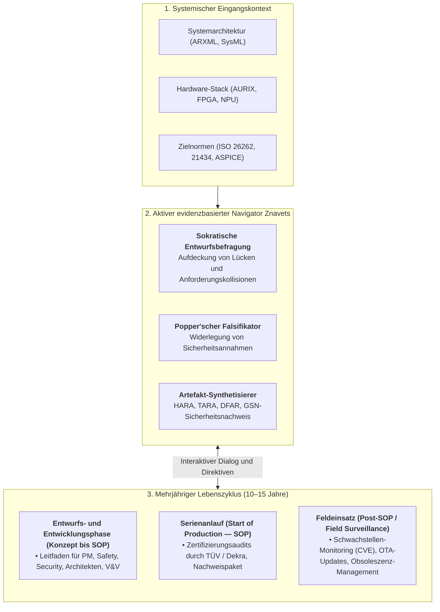
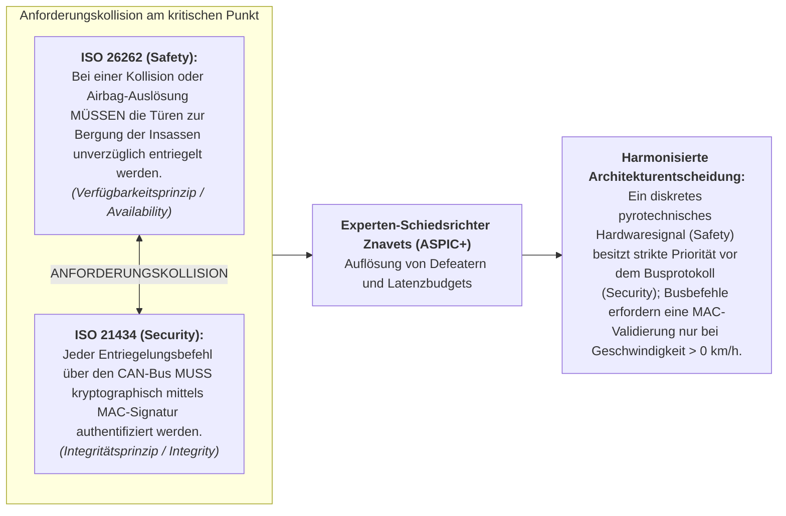

# Kapitel 39. Aktiver Compliance-Auditor: Popper'sche Falsifikation, normative Compliance (ASPICE/ISO 26262/ISO 21434) und autonomes Testdesign

> **Buch:** [Architektur evidenzbasierter Expertensysteme](README.md) · [Teil V: Verifikation, Testen, Diagnose und Sicherheitsbegründung](part-05-verification-and-learning.md)  
> **Vorheriges Kapitel:** [Kapitel 36. Testpyramide für Wissensbasen: Regeln, Interaktionen und Antwortstabilität](ch36-knowledge-testing-pyramid-and-variational-calibration.md)  
> **Nächstes Kapitel:** [Kapitel 24. Technische Diagnose: Trennung von Symptom und Ursache unter Unsicherheit](ch24-system-diagnosis.md)  
> **Inhaltsverzeichnis:** [README.md](README.md)  
> **Autor:** [Mykola Fedchyk](about-the-author.md)  
> **Niveau:** Fortgeschritten: Ingenieure für funktionale Sicherheit (Safety Engineers), Cybersicherheits-Spezialisten (Cybersecurity Engineers), Compliance-Auditoren (ASPICE/ISO Assessors), Architekten evidenzbasierter KI  
> **Lernziele:** Beherrschung des Paradigmenwechsels vom passiven Orakel zum aktiven Wissensauditor; Verständnis der Prinzipien der Laufzeit-Falsifikation von Entwurfshypothesen nach Karl Popper; Einsatz von Expertensystemen zur autonomen Erstellung von TARA-, SAR-, DFAR-Nachweismaterialien und V&V-Rückverfolgbarkeitsmatrizen; Auflösung von Zielkonflikten zwischen funktionaler Sicherheit (Safety) und Cybersicherheit (Security); Automatisierung von Routineprüfungen zur Freisetzung von Ingenieurzeit für technische Innovationen unter strikter Beibehaltung des Human-in-the-Loop-Prinzips.

---

## Abstract

Beim Entwurf missionskritischer cyber-physikalischer Systeme (ISO 26262 ASIL D, ISO/SAE 21434 CAL 4, DO-178C DAL A, Automotive SPICE 4.0) führen die rein manuelle Aufbereitung normativer Berichte und eine passive Verifikation unausweichlich zu verheerenden Konsequenzen. Müssen Sicherheitsingenieure tausende Einzelanforderungen in statischen Tabellen abgleichen, führt die kognitive Überlastung zum sogenannten „Compliance-Theater“ (*Compliance Theatre*) — dem rein formalen Abhaken von Checklisten ohne mathematische Verifikation kritischer Grenzzustände. Das Übersehen eines einzigen verdeckten Einzelfehlers (Single-Point Fault Metric, $\text{SPFM} < 99\%$) oder eines unberücksichtigten Angriffsvektors auf den fahrzeuginternen Bus hat fatale Unfälle, teure Rückrufaktionen autonomer Flotten sowie die persönliche strafrechtliche Haftung der Auditoren zur Folge.

Dieses Kapitel überwindet diese Krise durch den Übergang von einem passiven Auskunftsorakel zu einem aktiven Auditor für Domänenwissen (*Active Compliance Auditor*). Auf Basis des Falsifikationsprinzips von Karl Popper ($\mathcal{F}(\mathcal{H}, \mathcal{K})$ für die Entwurfshypothese $\mathcal{H}$ und die Normenbasis $\mathcal{K}$) sowie der Grundlegung dieser Monographie [[8]](#src-8) übernimmt das evidenzbasierte Expertensystem die Initiative zur systematischen Untersuchung des Systementwurfs: Es sucht autonom nach Gegenbeispielen, deckt normative Widersprüche zwischen Anforderungen der funktionalen Sicherheit (*Safety*) und des Cyber-Schutzes (*Security*) auf, generiert strikte Zertifizierungsartefakte (HARA, TARA, SAR, DFAR/FMEDA) mit vollständiger Rückverfolgbarkeit ($100{,}0\%$) und entwirft falsifizierende Prüfszenarien, während der Mensch im Regelkreis (*Human-in-the-Loop*) als oberste Entscheidungsinstanz verbleibt.

---

## 1. Das Drama des Compliance-Engineerings: Warum manuelle Methoden an ihre Grenzen stoßen

Das exponentielle Wachstum der Komplexität eingebetteter Software und der zunehmende regulatorische Druck haben normative Zertifizierungs-Audits zu einer kritischen Herausforderung des modernen Knowledge Engineerings gemacht. Die Entwicklung moderner cyber-physikalischer Systeme (Automobilindustrie, Avionik, Eisenbahnsignaltechnik, Medizintechnik) unterliegt strengsten Industriestandards, die den lückenlosen Nachweis jeder einzelnen technischen Anforderung vorschreiben:
- **Automotive SPICE 4.0** [[2]](#src-2) (Prozessreife für die Software- und Systementwicklung);
- **ISO 26262:2018** [[3]](#src-3) (Funktionale Sicherheit elektrischer und elektronischer Systeme im Kraftfahrzeug, Einstufung ASIL-A bis ASIL-D);
- **ISO/SAE 21434:2021** [[4]](#src-4) (Cybersicherheits-Engineering für Straßenfahrzeuge, Vertrauensniveaus CAL 1 bis 4);
- **DO-178C / ED-12C** [[5]](#src-5) (Software-Aspekte bei der Zertifizierung bordseitiger Luftfahrtsysteme, Kritikalitätsstufen DAL A bis E);
- **IEC 62304 / ISO 14971** (Medizinprodukte-Software und Risikomanagement für Patienten).

### 1.1. Die Bürde der persönlichen Verantwortung des Sicherheitsingenieurs

Im Gegensatz zur klassischen kommerziellen Web- oder Anwendungsentwicklung tragen Sicherheitsexperten — **Safety Engineers**, **Cybersecurity Engineers**, **Functional Safety Manager (FSM)** und **Lead Assessors** — die unmittelbare rechtliche, berufsständische und in vielen Rechtsordnungen auch strafrechtliche Verantwortung für die freigegebenen Artefakte.

Die Unterschrift des Ingenieurs unter den Abschlussberichten testiert verbindlich:
1. Alle Risiken für Leib und Leben von Menschen wurden auf ein vertretbares Restrisiko minimiert (*As Low As Reasonably Practicable*, ALARP).
2. Sämtliche bekannten Angriffsvektoren auf bordeigene Busse und Steuergeräte (ECUs) wurden modelliert, bewertet und neutralisiert.
3. Jede einzelne normative Klausel der relevanten Standards wird durch direkte, reproduzierbare und objektive Nachweise (*Objective Evidence*) gestützt.

### 1.2. Der Aufwand routinemäßiger Personenstunden: TARA, SAR, DFAR und HARA

Der Preis dieser Verantwortung bemisst sich in einem kolossalen Arbeitsaufwand. Um ein modernes Kfz-Steuergerät (beispielsweise ein Bremssteuergerät oder ein zentrales Gateway) zur Serienreife zu führen, muss das Projektteam hunderte komplexe Nachweisdokumente manuell erstellen und pflegen:

| Artefakt | Standard | Gegenstand und ingenieurtechnischer Inhalt | Routinemäßige Belastung des Ingenieurs |
| :--- | :--- | :--- | :--- |
| **HARA** (*Hazard Analysis and Risk Assessment*) | ISO 26262-3 | Identifikation von Gefährdungsereignissen, Klassifikation von Schweregrad ($S$), Exposition ($E$) und Beherrschbarkeit ($C$), Zuweisung des ASIL-Niveaus (A/B/C/D) und Definition von Sicherheitszielen (*Safety Goals*). | Manuelle Kombination hunderter Fahrsituationen mit Sensorausfällen; hohes Risiko, kritische Grenzszenarien zu übersehen. |
| **TARA** (*Threat Analysis and Risk Assessment*) | ISO/SAE 21434-9 | Identifikation von Schutzgütern (*Assets*), Cybersicherheitseigenschaften (C-I-A), Bedrohungsszenarien, Konstruktion von Angriffsbaumen (*Attack Trees*), Bewertung der Angriffsmachbarkeit (*Attack Feasibility*) und CAL-Einstufung. | Abgleich tausender CAN-/Ethernet-Signale mit CVE-/CWE-Datenbanken; manuelle Modellierung von Angriffspfaden über Gateway-Grenzen hinweg. |
| **SAR** (*Safety Assessment Report*) | ISO 26262-2/8 | Abschließender Auditbericht einer unabhängigen Begutachtung zur Konformität der Entwicklung mit funktionaler Sicherheit und Prozessintegrität. | Kreuzweiser manueller Abgleich hunderter Standardklauseln mit realen Testprotokollen; mühsame Suche nach Rückverfolgbarkeitslücken. |
| **DFAR / DFMEA / FMEDA** | ISO 26262-5/6 | Quantitative Ausfallarten- und Auswirkungsanalyse, Berechnung von Einzelfehlermetriken ($\text{SPFM} \ge 99\%$), Latenzfehlermetriken ($\text{LFM} \ge 90\%$) und des diagnostischen Deckungsgrads (DC). | Mehrdimensionale Excel-Tabellen mit zehntausenden Zeilen; der Austausch eines einzelnen Bauteils erfordert die Neuberechnung der gesamten Metrikkette. |

In einem typischen Industrieprojekt bindet die Erstellung, Abstimmung und Pflege dieser Nachweisdokumente **bis zu 60–70 % des gesamten Entwicklungszeitbudgets**.

### 1.3. Das Phänomen menschlicher Ermüdung und die Risiken formaler Compliance

Wenn hochqualifizierte Ingenieure wochenlang Anforderungs-IDs zwischen Polarion, DOORS, Jira und Excel übertragen müssen, setzt unausweichlich kognitive Erschöpfung ein:
- **Fragilität manueller Verlinkung:** Eine winzige Änderung in einer Architekturzeile bricht unbemerkt die Nachweisketten dutzender untergeordneter Testfälle ab.
- **Compliance Theatre (Scheinkonformität):** Um drohende Release-Termine einzuhalten, werden Checklisten formal abgehakt, da schlicht die Zeit fehlt, jeden einzelnen Randzustand mathematisch rigoros zu analysieren.
- **Verlust kreativer Ingenieurarbeit:** Statt sich auf die Tiefenanalyse physikalischer Sensoranomalien, den Entwurf robuster Diagnosealgorithmen oder neuartige Angriffsvektoren zu konzentrieren, erschöpfen führende Fachexperten ihre Ressourcen im bürokratischen Tabellenabgleich.

Genau an dieser Schnittstelle entsteht der dringende Bedarf an **evidenzbasierten Expertensystemen der nächsten Generation**.

---

## 2. Paradigmenwechsel: Vom passiven Nachschlagewerk zum interaktiven Lebenszyklus-Leitfaden

Die traditionelle KI-Forschung betrachtete Expertensysteme über Jahrzehnte hinweg als passive Informationssysteme, die nach dem einfachen Anfrage-Antwort-Schema operieren:

> **Traditionelles passives Muster:** `[Benutzer fragt]` $\longrightarrow$ `[System liefert statische Auskunft]`

Für triviale Diagnoseszenarien funktionierte dieser Ansatz. In modernen, sicherheitskritischen Domänen (Automobilindustrie, Avionik, Schienenverkehrsleittechnik) scheitert das Modell des passiven Orakels jedoch an einer fundamentalen epistemischen Hürde: **Ein Ingenieur oder Projektleiter kann das System unmöglich nach Sachverhalten fragen, die er vergessen hat, die ihm entgangen sind oder die in tausendseitigen Normenwerken unbemerkt blieben**.

Weiß der Entwickler nicht, dass die Modifikation einer Transistorstufe die Metrik latenter Fehler (LFM) dekalibriert hat, oder dass eine Aktualisierung des UDS-Diagnoseprotokolls einen ungesicherten CAN-Injektionspfad eröffnet, wird er niemals eine entsprechende Anfrage an eine passive Wissensbasis richten.

### 2.1. Das Konzept der proaktiven evidenzbasierten Lebenszyklusbegleitung

Der eigentliche **ingenieurtechnische Paradigmenwechsel** besteht im fundamentalen Rollenwandel des Expertensystems: weg von einer statischen Regelablage, hin zu einem **proaktiven, interaktiven Navigator (Interactive Co-pilot & Lifecycle Guide)** für das gesamte interdisziplinäre Entwicklungsteam.

Sobald dem evidenzbasierten Expertensystem zu Beginn des Projekts die Spezifikationen bereitgestellt werden (Plattformarchitektur, Hardware-Stack, Zielnormen ISO 26262 / ISO 21434 / ASPICE, Zuverlässigkeitsvorgaben und Zielmarkt), ergreift es aktiv die Initiative zur Systemprüfung (*Active Probing*):
1. **Es wartet nicht auf Eingaben:** Das System scannt kontinuierlich die technischen Artefakte (DBC-Dateien, Schaltpläne, ARXML-Dateien, Quellcode, Testberichte).
2. **Es führt einen sokratischen Dialog:** Es konfrontiert Entwickler mit unbequemen Fragen zu ungeklärten Randbedingungen und Ausfallmodi.
3. **Es steuert das Projektteam:** Wie ein erfahrener Zertifizierungs-Auditor weist das System darauf hin, welche normativen Schritte noch ausstehen und welche objektiven Nachweise in den Rückverfolgbarkeitsmatrizen fehlen.



---

### 2.2. Rollenmatrix der Beteiligten im Sicherheitslebenszyklus

In komplexen Entwicklungsprojekten existiert keine Einzelperson, die alle Facetten normativer Compliance lückenlos überblicken kann. Das aktive Expertensystem agiert als spezialisierter Denkpartner für jede Schlüsselrolle:

| Ingenieurrolle im Projekt | Normative Anforderung | Unterstützung durch das aktive Expertensystem |
| :--- | :--- | :--- |
| **Project Manager (PM) / Program Director** | Einhaltung der Meilensteine (Milestone Gates), Prozessreife nach ASPICE SWE.1–SWE.6, Minimierung von Zertifizierungsrisiken. | **Audit-Reifegrad-Radar (Compliance Readiness):** Bewertet den Fertigstellungsgrad der Nachweisbasis in Echtzeit, signalisiert Engpässe Wochen vor dem Audit und quantifiziert den Aufwand zur Schließung normativer Lücken. |
| **Functional Safety Manager (FSM) / Safety Engineer** | Erreichen der ISO 26262-Zuverlässigkeitsmetriken ($\text{SPFM} \ge 99\%$, $\text{LFM} \ge 90\%$), Erstellung der HARA, GSN-Sicherheitsnachweis. | **Mathematischer Zuverlässigkeitsprüfer:** Generiert automatisiert FMEDA-/DFAR-Berechnungstabellen, empfiehlt Maßnahmen zur Erhöhung des diagnostischen Deckungsgrads von Watchdogs und synthetisiert GSN-Argumentationsbäume. |
| **Cybersecurity Engineer** | TARA-Bedrohungsmodellierung (ISO/SAE 21434), Bewertung der Angriffsmachbarkeit (Attack Feasibility), Erstellung von Angriffsbaumen, Definition von Cybersecurity Goals. | **Automatischer TARA-Synthetisierer:** Verknüpft Signale fahrzeuginterner Netzwerke (CAN, Automotive Ethernet) mit MITRE ATT&CK / STRIDE, entwirft Angriffsbaume und berechnet Risikowerte. |
| **System & Software Architect** | Anforderungskonsistenz, formale ASIL-Dekomposition (z. B. $\text{ASIL-D} = \text{ASIL-B(D)} + \text{ASIL-B(D)}$), kollisionsfreie Architektur. | **Schiedsrichter für Architekturentscheidungen:** Erkennt Zielkonflikte zwischen Safety und Security, verifiziert die Einhaltung des Fehlertoleranzzeitintervalls (FTTI) und busbasierter Latenzbudgets. |
| **V&V / Test Engineer** | 100 % bidirektionale Rückverfolgbarkeit von Tests zu Anforderungen (ASPICE SWE.4), Design von Robustheits- und Negativtests. | **Testprogramm-Generator:** Konzipiert Popper'sche Falsifikationsszenarien, 6-Punkt-Grenzwertanalysen (BVA) sowie Fehlereinkopplungstests (Fault Injection) und verknüpft jeden Testfall mit der entsprechenden Norm. |

---

### 2.3. Langzeitbegleitung des Produkts in der Betriebsphase (Post-SOP)

Die Betriebslebensdauer eines eingebetteten cyber-physikalischen Systems in der Automobil- oder Luftfahrtindustrie beträgt **7 bis 15 Jahre**. Die Zulassung beim Serienanlauf (*Start of Production, SOP*) markiert lediglich den ersten Meilenstein. Während der gesamten Betriebsphase bleibt das aktive Expertensystem ein unverzichtbarer Wächter:

1. **Sicherheit drahtloser Aktualisierungen (OTA-Updates):**  
   Jedes Firmware-Update birgt das Risiko, nachgewiesene Zertifizierungsinvarianten zu verletzen. Das Expertensystem führt vor jedem OTA-Release eine regressive Popper'sche Falsifikation durch: Es prüft, ob neuer Code bewiesene Sicherheitsinvarianten bricht und den Cybersicherheitsanforderungen der UN ECE R156 genügt.
2. **Obsoleszenz-Management und Zweitquellen (*Component Obsolescence & Second-Sourcing*):**  
   Wird die Produktion eines Mikrocontrollers oder Transceivers eingestellt, muss ein Ersatzbaustein (*Second Source*) qualifiziert werden. Das Expertensystem übernimmt die neuen Ausfallraten ($\lambda$, FIT), berechnet die FMEDA augenblicklich neu und erspart den Ingenieuren monatelange manuelle Neuberechnungen.
3. **Überwachung neuer Angriffsvektoren (Post-Development Cybersecurity Monitoring):**  
   Gemäß ISO/SAE 21434 Abschnitt 13 ist der Hersteller verpflichtet, neu bekanntwerdende Schwachstellen im Feld kontinuierlich zu überwachen. Der aktive Auditor gleicht CVE-/CWE-Feeds mit der Software-Stückliste (*Software Bill of Materials, SBOM*) des Fahrzeugs ab und warnt die Ingenieure, bevor eine Sicherheitslücke im Feld ausgenutzt werden kann.
4. **Evolution normativer Regelwerke:**  
   Werden Standards überarbeitet (beispielsweise beim Übergang von Automotive SPICE 3.1 auf 4.0 oder neuen Revisionen der ISO 26262), führt das Expertensystem eine Delta-Analyse der Wissensbasis durch und benennt exakt diejenigen Prozessartefakte, die nachgearbeitet werden müssen.

---

## 3. Mathematischer Apparat der Popper'schen Falsifikation von Entwurfshypothesen

Fundament jeder Entwurfsprüfung ist das Falsifikationsprinzip nach Karl Popper [[1]](#src-1): *Kein System kann allein auf der Basis erfolgreicher Tests als sicher deklariert werden; Sicherheit beweist sich ausschließlich im Scheitern der aggressivsten Versuche, das System zu widerlegen*.

### 3.1. Formalisierung der Entwurfshypothese

Ein Entwickler, ein Sprachmodell oder ein Systemarchitekt formuliert eine Entwurfshypothese $\mathcal{H}$ (beispielsweise: *„Das Bremspedal-Erfassungsmodul erfüllt ASIL-D ohne redundanten ADC, da eine periodische Selbstdiagnose implementiert ist“*).

Formal wird die Hypothese als Prädikat über dem Zustandsraum des Systems $\mathcal{S}$ definiert:

```math
\mathcal{H} \equiv \forall s \in \mathcal{S}, \quad \mathrm{StateValid}(s) \implies \mathrm{SafetyGoalSatisfied}(s)
```

Die normative Wissensbasis $\mathcal{K}$ besteht aus binären deontischen Atomen des Standards:

```math
\mathcal{K} = \lbrace \nu_1, \nu_2, \dots, \nu_m \rbrace, \quad \nu_i = \langle \mathrm{Domain}, \mathrm{Clause}, \mathrm{Entity}, \mathrm{Modality}, \mathrm{Action}, \mathrm{Evidence} \rangle
```

wobei die zulässigen Werte der deontischen Modalität `MUST`, `MUST_NOT`, `SHOULD` und `MAY` umfassen.

### 3.2. Suche nach dem potenziellen Falsifikator (Potential Falsifier)

Die Aufgabe des Expertensystems besteht darin, in einer Latenz von $t < 1\ \mathrm{ms}$ eine symbolische Suche nach einem Gegenbeispiel auszuführen:

```math
\mathcal{F}(\mathcal{H}, \mathcal{K}) = \lbrace \nu_k \in \mathcal{K} \mid \mathrm{Implication}(\mathcal{H}) \models \mathrm{Violation}(\nu_k) \rbrace
```

wobei:
- $`\mathcal{F}(\mathcal{H}, \mathcal{K})`$ die Menge der identifizierten normativen Falsifikatoren der Hypothese $`\mathcal{H}`$ innerhalb der Regelbasis $`\mathcal{K}`$ darstellt;
- $`\nu_k`$ eine atomare deontische Norm des Standards bezeichnet;
- $`\models`$ die Relation der logischen Folgerung (semantische Ableitung einer Normverletzung) ist.

**Praktische Anwendung und ingenieurtechnische Konsequenzen (Closed-Loop Decision):**

#### 1. Steuerung des Verifikationsflusses und Systementscheidungen

Gilt $`\mathcal{F}(\mathcal{H}, \mathcal{K}) \neq \emptyset`$ (mindestens ein Falsifikator wurde gefunden):

```math
\mathrm{Verdict} = \mathbf{FALSIFIED} \quad \bigl( \mathrm{Refusal}(\rho), \quad \mathrm{EBX} = \mathrm{SHA256}(\mathrm{Quote}), \quad \mathrm{Clause} = \text{ISO 26262-5:2018 Clause 8.4.3} \bigr)
```

**Systemreaktion:** Die CI/CD-Pipeline stoppt unverzüglich mit dem Fehlercode `EX_SAFETY_VIOLATION`. Das System erzeugt ein kryptographisch mit Ed25519 signiertes Ablehnungstoken $`\mathrm{Refusal}(\rho)`$, blockiert das Flashen des Firmware-Images in das Zielsteuergerät (ECU) und legt im Issue-Tracker (Jira/GitLab) ein Fehlerticket mit Verweis auf das exakte bytegenaue Fragment des Standards an.

Gilt $`\mathcal{F}(\mathcal{H}, \mathcal{K}) = \emptyset`$ (kein normatives Gegenbeispiel auffindbar):

```math
\mathrm{Verdict} = \mathbf{PROVISIONALLY\_CORROBORATED}
```

**Systemreaktion:** Das System erteilt das Urteil der vorläufigen Bewährung, stellt ein digitales Zertifikat über das Bestehen des Normen-Gateways aus und gibt das System für Hardware-in-the-Loop-Prüfungen (HIL) frei.

#### 2. Hardware-Dimensionierung und Latenz
Die Falsifikationszeit wird dank der Vorab-Indizierung von Normen in Bitmasken des BRAM-Speichers ($`< 512\,\text{MB}`$) strikt auf $`t_{\mathrm{eval}} \le 1{,}0\,\text{ms}`$ begrenzt.

#### 3. Praktisches numerisches Beispiel
- Ein Entwickler postuliert die Zulässigkeit eines einkanaligen ADC mit einem diagnostischen Deckungsgrad von $`90\%`$ für ein ASIL-D-Subsystem.
- Die symbolische Inferenzmaschine identifiziert innerhalb von $`210\,\mu\text{s}`$ das Normatom $`\nu_{418}`$ (ISO 26262-5, Abschn. 8.4.3: Zwingende Forderung nach $\text{SPFM} \ge 99\%$).
- $`\mathcal{F}(\mathcal{H}, \mathcal{K}) = \{\nu_{418}\} \neq \emptyset \implies \mathrm{Verdict} = \mathbf{FALSIFIED}`$.
- **Systemreaktion:** Es wird ein Blockadeprotokoll mit Ausweis des Defizits erzeugt: $`\Delta \mathrm{SPFM} = 9{,}0\%`$. Der Commit wird im Repository abgewiesen.

---

## 4. Automatisierte Generierung von TARA-, SAR- und DFAR-Artefakten über domänenspezifische Regeln

Im Folgenden wird detailliert dargestellt, wie der aktive Auditor Fachexperten bei der Erstellung zentraler Nachweisdokumente ohne manuelle Medienbrüche entlastet.

### 4.1. Automatisierung von TARA (ISO/SAE 21434): Vom Systemmodell zur Risikomatrix

Der TARA-Prozess gliedert sich in kanonische Schritte, die nun durch den deterministischen Kern des Expertensystems gestützt werden:

#### 4.1.1. Identifikation von Schutzgütern (Asset Identification)
Der Auditor analysiert die Architekturbeschreibungen (CAN-DBC-Dateien, AUTOSAR-ARXML-Dateien, IDL-Spezifikationen) und extrahiert automatisiert alle Schutzgüter (beispielsweise: *„Diagnosesitzungs-Schlüssel“*, *„Lenkwinkelsignal SteerAngle“*).

#### 4.1.2. Bedrohungsszenarien (Threat Scenario Identification)
Durch Verknüpfung der Schutzgüter mit STRIDE- und MITRE ATT&CK for ICS-Ontologien in der ZKP4-Wissensbasis generiert das Expertensystem den vollständigen Bedrohungskatalog:

```math
\mathrm{Threat} = \langle \mathrm{Asset}, \ \mathrm{Property}, \ \mathrm{Damage} \rangle
```

wobei beispielsweise $`\mathrm{Asset} = \text{SteerAngle}`$, $`\mathrm{Property} = \text{Integrity}`$ und $`\mathrm{Damage}`$ das unautorisierte Verreißen der Lenkung bei Autobahntempo ist.

#### 4.1.3. Analyse von Angriffspfaden und Machbarkeit (Attack Path Analysis & Feasibility)
Das System traversiert den Konnektivitätsgraphen des Bordnetzes und berechnet den Vektor der Angriffsmachbarkeit nach der Attack-Potential-Methodik (Zeitaufwand, Fachwissen des Angreifers, Kenntnis des Systems, Angriffsfenster, erforderliche Ausrüstung).

#### 4.1.4. Synthese der abschließenden TARA-Matrix
Statt wochenlanger manueller Arbeit erhält der Cybersicherheitsingenieur eine vollautomatisch synthetisierte Matrix mit konsolidierten Risikowerten (Risk Values 1 bis 5) und abgeleiteten Cybersicherheitszielen (*Cybersecurity Goals*).

### 4.2. Automatisierung von DFAR und FMEDA (ISO 26262): Mathematische Exaktheit der Metriken

Die Aufbereitung eines DFAR-/FMEDA-Berichts verlangt präzise mathematische Zuverlässigkeitsberechnungen auf Bauteilebene:
- $`\lambda`$ — Gesamtausfallrate der Komponente (FIT, $10^{-9}\,\text{Ausfälle}/\text{h}$);
- $`\lambda_s`$ — Rate sicherer Ausfälle (*Safe Faults*);
- $`\lambda_{\mathrm{spf}}`$ — Rate gefährlicher Einzelfehler (*Single-Point Faults*), die unmittelbar zur Verletzung des Sicherheitsziels führen;
- $`\lambda_{\mathrm{rf}}`$ — Rate verbleibender Restfehler (*Residual Faults*);
- $`\lambda_{\mathrm{mpf,lat}}`$ und $`\lambda_{\mathrm{mpf,det}}`$ — Raten latenter bzw. aufgedeckter Mehrfachfehler (*Multiple-Point Faults*).

#### 4.2.1. Metrik für einkanalige Fehler (SPFM)

Der normative Schwellenwert der ISO 26262 für die Sicherheitsanforderungsstufe ASIL-D verlangt:

```math
\mathrm{SPFM} = \frac{\sum (\lambda_s + \lambda_{\mathrm{spf\_mitigated}})}{\sum \lambda} \ge 0{,}99
```

#### 4.2.2. Metrik für latente Fehler (LFM)

Für ASIL-D liegt der normative Schwellenwert bei:

```math
\mathrm{LFM} = \frac{\sum (\lambda_s + \lambda_{\mathrm{mpf,det}})}{\sum (\lambda - \lambda_{\mathrm{spf}})} \ge 0{,}90
```

**Praktische Anwendung und ingenieurtechnische Konsequenzen (Closed-Loop Decision):**
1. **Automatisierte Zertifizierung und Release-Gateway:**
   - **Normkonformität** ($`\mathrm{SPFM} \ge 0{,}99`$ und $`\mathrm{LFM} \ge 0{,}90`$): Das System kompiliert das Nachweisartefakt `SAR.gsn` mit dem Status `APPROVED_FOR_AUDIT`, signiert es digital und leitet es an die Auditoren (TÜV/Dekra) weiter.
   - **Normabweichung** ($`\mathrm{SPFM} < 0{,}99`$ oder $`\mathrm{LFM} < 0{,}90`$): Die SAR-Erzeugung wird gesperrt. Das System schaltet auf diagnostisches Backtracking (*Diagnostic Backtracking*) um und liefert dem Ingenieur minimale Entwurfskorrekturen:
     * Erhöhung des diagnostischen Deckungsgrads des Watchdogs ($K_{\mathrm{wdg}}$);
     * oder Einbindung eines Hardware-Komparators mit redundanter Signalabtastung.
2. **Praktisches numerisches Rechenbeispiel:**
   - Für einen Mikrocontroller wird eine Gesamtausfallrate von $`\sum \lambda = 120\,\text{FIT}`$ erfasst.
   - Die sicheren und beherrschten Einzelfehler summieren sich auf $`\sum (\lambda_s + \lambda_{\mathrm{spf\_mitigated}}) = 118{,}1\,\text{FIT}`$.
   - Berechnung: $`\mathrm{SPFM} = 118{,}1 / 120 = 0{,}9841 = 98{,}41\% < 99\%`$.
   - **Systemreaktion:** Release-Blockade. Das System generiert folgende Handlungsempfehlung: „Defizit $`\Delta = 0{,}59\%`$. Eine Erhöhung der Watchdog-Abdeckung von $`60\%`$ auf $`90\%`$ reduziert ungeschützte Ausfälle um $`1{,}2\,\text{FIT}`$, wodurch die $`\mathrm{SPFM}`$ auf $`119{,}3 / 120 = 99{,}42\% \ge 99\%`$ steigt“. Nach Übernahme der Schaltungsanpassung schaltet die erneute Inferenz das Zertifizierungs-Gateway frei.

### 4.3. Automatisierung von SAR: Evidenzgewebe für Auditoren von TÜV und Dekra

Der Safety Assessment Report (SAR) bildet den formalen Höhepunkt jedes funktionalen Sicherheitsprojekts. Das Expertensystem strukturiert den SAR als Argumentationsbaum in der **Goal Structuring Notation (GSN)** nach Kelly und Weaver [[6]](#src-6):
- **Top Goal:** Das Gesamtsystem erfüllt alle ASIL-D-Anforderungen der ISO 26262.
- **Strategy:** Argumentation über Dekomposition in Hardware-Sicherheit, Software-Integrität und Prozessqualität nach ASPICE.
- **Evidence:** Jeder Blattknoten des Baums (*Evidence*) verweist auf ein konkretes Testprotokoll mit kryptographischem Prüfsummen-Hash des Ergebnisses und bytegenauem Zitat der verifizierten Normenklausel.

---

## 5. Auflösung des fundamentalen Widerspruchs: Funktionale Sicherheit vs. Cybersicherheit

In komplexen Projekten erweist sich der **Zielkonflikt zwischen funktionaler Sicherheit (Safety) und Cybersicherheit (Security)** als größte Hürde:



### 5.1. Konfliktlösung durch den deterministischen Kern des Expertensystems

1. **Automatische Kollisionserkennung (Cross-Standard Defeater Mining):** Die simultane Repräsentation beider Normenwelten in einem einheitlichen Wissensgraphen ermöglicht es dem System, normative Kollisionen bereits während des Software- und Systementwurfs (ASPICE SWE.2) aufzudecken.
2. **Argumentation nach dem ASPIC+-Rahmenwerk:** Auf Grundlage der abstrakten Argumentationstheorie nach Dung [[7]](#src-7) konstruiert das System Bäume anfechtbaren Schließens (*Defeasible Reasoning*) und unterscheidet präzise zwischen Prämissenwiderlegung (*Rebutting*) und Regeluntergrabung (*Undercutting*).
3. **Generierung sicherer Kompromissarchitekturen:** Das System formuliert eine formal verifizierte Lösung: *„Nutzung eines diskreten Hardwaresignals des Crashsensors unter Umgehung des Mikrocontrollers; Beibehaltung der kryptographischen Barriere für alle softwarebasierten Diagnoseanfragen über die ODB-Schnittstelle“*.

---

## 6. Neuro-symbolisches Tandem für das Prüfen und die autonome Generierung von Testprogrammen

Das Zusammenspiel zwischen stochastischen Sprachmodellen und dem deterministischen EVM-Regelkern gestaltet sich wie folgt:

1. **System 1 (LLM Proposer — Heuristische Kreativität):**
   - Analysiert Treiber-Code und Spezifikationsfragmente.
   - Generiert anspruchsvolle, unkonventionelle Grenzszenarien: *„Was geschieht, wenn ein CAN-Frame mit einer DLC-Länge von 15 statt 8 exakt im Umschaltmoment eines Leistungsrelais eintrifft?“*.
   - Formuliert den Testfallentwurf in natürlicher Sprache.
2. **System 2 (EVM / EISA v1.0 — Deterministischer Prüfer):**
   - Empfängt den Testfall über das `Popperian Falsification API`.
   - Gleicht ihn mit den ZKP4-Regeln von ISO 11898, ISO 26262 und AUTOSAR ab.
   - Prüft in Sub-Millisekunden: Verletzt der Testfall selbst normative Vorbedingungen? Welche Standardklausel deckt er formal ab?
   - Ist der Testfall zulässig, wird er automatisch in die V&V-Matrix eingetragen und bidirektional mit der entsprechenden ASPICE SWE.4-Anforderung verknüpft.

### 6.1. Berechnung der Vollständigkeit des Testprogramms (Traceability Coverage)

Zur quantitativen Bewertung der Güte des generierten Testprogramms ermittelt das System die Rückverfolgbarkeitsabdeckung:

```math
\mathrm{TraceabilityCoverage} = \frac{\lvert \mathcal{R} \cap \mathcal{T} \rvert}{\lvert \mathcal{R} \rvert} = 1{,}00
```

wobei $`\mathcal{R}`$ die Gesamtmenge der formalisierten Anforderungen aus Standards und Systemspezifikation (*Requirements*) bezeichnet und $`\mathcal{T}`$ die Teilmenge der Anforderungen darstellt, für die deterministische Testfälle generiert und erfolgreich ausgeführt wurden (*Test-Verified*).

**Praktische Anwendung und ingenieurtechnische Konsequenzen (Closed-Loop Decision):**
- **Vollständige Rückverfolgbarkeit** ($`\mathrm{TraceabilityCoverage} = 1{,}00`$): Das ASPICE SWE.4-Qualitäts-Gateway wechselt in den Zustand `PASSED`. Die CI/CD-Pipeline erzeugt das finale, kryptographisch signierte Build-Manifest für die Zertifizierungsstelle.
- **Unvollständige Rückverfolgbarkeit** ($`\mathrm{TraceabilityCoverage} < 1{,}00`$): Die Pipeline stoppt mit dem Fehler `EX_COMPLIANCE_GAP`. Das System berechnet die Differenzmenge $`\mathcal{R}_{\mathrm{missing}} = \mathcal{R} \setminus \mathcal{T}`$ und erzeugt automatisiert zielgerichtete Prompts für System 1 (LLM Proposer), um die fehlenden Testfälle synthetisieren zu lassen.
- **Praktisches numerisches Beispiel:** Eine Spezifikation umfasst $`\lvert \mathcal{R} \rvert = 142`$ Anforderungen. Verifiziert sind $`\lvert \mathcal{R} \cap \mathcal{T} \rvert = 141`$ Anforderungen. Abdeckung: $`\mathrm{TraceabilityCoverage} = 141 / 142 \approx 0{,}993 < 1{,}00`$. **Systemreaktion:** Release gesperrt; System 1 erhält den gezielten Syntheseauftrag für die einzige ungedeckte Anforderung $`R_{87}`$ (Verhalten bei transientem Spannungsabfall auf dem CAN-Bus).

---

## 7. Ingenieurtechnische und humanistische Dimension: Der Mensch im Regelkreis (Human-in-the-Loop)

Die Einführung eines aktiven Compliance-Auditors verdrängt den Menschen keineswegs aus dem ingenieurtechnischen Prozess. Im Gegenteil: Sie stellt den ursprünglichen, schöpferischen Kern des Ingenieurberufs wieder her.

### 7.1. Delegierung routinemäßiger Verifikationsberechnungen an die Maschine
- Das Durchsuchen tausender Seiten regulatorischer Normtexte;
- Das Befüllen gigantischer Rückverfolgbarkeitstabellen (Excel / Polarion);
- Die semantische Kontrolle strikter deontischer Modalitäten (`MUST`, `SHALL`, `REQUIRED`);
- Die mathematische Neuberechnung von Zuverlässigkeitskennzahlen (SPFM, LFM, FIT-Raten);
- Die Verifikation der lückenlosen Anforderungsabdeckung im Quellcode.

### 7.2. Strategische und schöpferische Funktionen des Sicherheitsingenieurs
- **Schöpferische Ingenieurleistung:** Der Entwurf eleganter, performanter und inhärent robuster Systemarchitekturen;
- **Physikalische Intuition:** Die Untersuchung seltener physikalischer Hardwareanomalien, thermischer Driften, Siliziumalterung oder strahlungsinduzierter Single-Event-Upsets (SEU), die in standardisierten Regelwerken nicht antizipiert werden können;
- **Strategische Verantwortung:** Der Ingenieur verliert die Furcht vor Audits, da jedes Detail durch eine mathematisch verifizierte Nachweisbasis gestützt ist. Er unterzeichnet SAR- und TARA-Berichte mit der Gewissheit eines unanfechtbaren epistemischen Fundaments.

---

## 8. Software-Implementierung des Kerns des aktiven TARA-Auditors und von Sicherheitsdirektiven in Go

Nachfolgend ist die erweiterte Implementierung des aktiven Auditors dargestellt, der Entitäten der Normen ISO 26262 und ISO/SAE 21434 verarbeitet:

<details>
<summary><b>Vollständiger Quellcode: Kern des aktiven TARA-Auditors und von Safety Directives in Go (~150 Zeilen)</b></summary>

```go
package compliance

import (
	"context"
	"crypto/sha256"
	"encoding/hex"
	"fmt"
	"sync"
	"time"
)

// DomainStandard bezeichnet die Kennung des Compliance-Standards.
type DomainStandard string

const (
	StandardISO26262 DomainStandard = "ISO-26262:2018"
	StandardISO21434 DomainStandard = "ISO/SAE-21434:2021"
	StandardASPICE4  DomainStandard = "ASPICE-4.0"
	StandardRFC9110  DomainStandard = "RFC-9110"
)

// DeonticModality definiert die deontische Modalität einer Norm gemäß RFC 2119 / ISO Directives.
type DeonticModality string

const (
	ModalityMust    DeonticModality = "MUST"
	ModalityMustNot DeonticModality = "MUST_NOT"
	ModalityShould  DeonticModality = "SHOULD"
)

// ComplianceRule repräsentiert ein unverletzliches normatives ZKP4-Wissensatom.
type ComplianceRule struct {
	Standard      DomainStandard  `json:"standard"`
	Clause        string          `json:"clause"`         // z. B. "Part 6 Clause 8.4.2"
	Entity        string          `json:"entity"`         // z. B. "SafetyMechanism"
	Modality      DeonticModality `json:"modality"`       // MUST / MUST_NOT
	TargetAction  string          `json:"target_action"`  // z. B. "SilentFailure"
	VerbatimQuote string          `json:"verbatim_quote"` // Wörtliches Zitat der Norm
	ByteStart     uint64          `json:"byte_start"`     // Byte-Offset des Beginns in der Primärquelle
	ByteEnd       uint64          `json:"byte_end"`       // Byte-Offset des Endes in der Primärquelle
	ExpectedSHA   string          `json:"expected_sha"`   // Erwarteter SHA-256-Hash des Zitats (%ebx-Custody-Prüfung)
}

// EngineeringHypothesis beschreibt eine Entwurfsentscheidung eines Ingenieurs oder LLMs.
type EngineeringHypothesis struct {
	HypothesisID   string `json:"hypothesis_id"`
	TargetEntity   string `json:"target_entity"`
	ProposedAction string `json:"proposed_action"`
	SafetyASIL     string `json:"safety_asil,omitempty"` // "QM", "ASIL-A".."ASIL-D"
	Rationale      string `json:"rationale"`
}

// FalsificationResult fasst das Ergebnis der Popper'schen Falsifikationsprüfung zusammen.
type FalsificationResult struct {
	IsFalsified      bool            `json:"is_falsified"`
	ViolatedRule     *ComplianceRule `json:"violated_rule,omitempty"`
	RefusalReason    string          `json:"refusal_reason"`
	EvidenceVerified bool            `json:"evidence_verified"`
	Latency          time.Duration   `json:"latency"`
}

// ActiveComplianceEngine ist die autonome Prüf-Engine für TARA/SAR/DFAR.
type ActiveComplianceEngine struct {
	mu            sync.RWMutex
	rulesByEntity map[string][]ComplianceRule
	rawSourceData []byte // Speicherabgebildeter (mmap) Rohdatenbereich der Primärquelle
}

// NewComplianceEngine initialisiert die Prüf-Engine mit Bindung an die Primärquelle.
func NewComplianceEngine(sourceData []byte) *ActiveComplianceEngine {
	return &ActiveComplianceEngine{
		rulesByEntity: make(map[string][]ComplianceRule),
		rawSourceData: sourceData,
	}
}

// RegisterComplianceRule registriert eine normative Regel in der Wissensbasis.
func (e *ActiveComplianceEngine) RegisterComplianceRule(r ComplianceRule) {
	e.mu.Lock()
	defer e.mu.Unlock()
	e.rulesByEntity[r.Entity] = append(e.rulesByEntity[r.Entity], r)
}

// FalsifyDesignHypothesis führt die Popper'sche Falsifikation in einer Latenz von t < 1 ms aus.
func (e *ActiveComplianceEngine) FalsifyDesignHypothesis(ctx context.Context, h EngineeringHypothesis) (*FalsificationResult, error) {
	start := time.Now()
	e.mu.RLock()
	defer e.mu.RUnlock()

	rules, found := e.rulesByEntity[h.TargetEntity]
	if !found || len(rules) == 0 {
		return &FalsificationResult{
			IsFalsified:      false,
			RefusalReason:    "No normative restrictions found; open-world hypothesis accepted.",
			EvidenceVerified: true,
			Latency:          time.Since(start),
		}, nil
	}

	for _, rule := range rules {
		// Bytegenaue Verifikation der Primärquelle (%ebx-Custody-Prüfung)
		if !e.checkCustody(rule) {
			return nil, fmt.Errorf("custody breach on %s [%d..%d]", rule.Clause, rule.ByteStart, rule.ByteEnd)
		}

		// Popper'sche Falsifikation: Direkte Verletzung eines normativen Verbots
		if rule.Modality == ModalityMustNot && rule.TargetAction == h.ProposedAction {
			return &FalsificationResult{
				IsFalsified:      true,
				ViolatedRule:     &rule,
				RefusalReason:    fmt.Sprintf("Direct compliance breach of %s (%s): %s", rule.Standard, rule.Clause, rule.VerbatimQuote),
				EvidenceVerified: true,
				Latency:          time.Since(start),
			}, nil
		}
	}

	return &FalsificationResult{
		IsFalsified:      false,
		RefusalReason:    "Design hypothesis withstood Popperian falsification against loaded compliance rules.",
		EvidenceVerified: true,
		Latency:          time.Since(start),
	}, nil
}

// checkCustody validiert den SHA-256-Hash des Zitats im mmap-Slice.
func (e *ActiveComplianceEngine) checkCustody(r ComplianceRule) bool {
	if e.rawSourceData == nil || r.ByteEnd > uint64(len(e.rawSourceData)) || r.ByteStart >= r.ByteEnd {
		return false
	}
	chunk := e.rawSourceData[r.ByteStart:r.ByteEnd]
	h := sha256.Sum256(chunk)
	return hex.EncodeToString(h[:]) == r.ExpectedSHA
}

// InterrogateSystem generiert proaktive Prüfdirektiven zur Befragung des Entwicklungsteams.
func (e *ActiveComplianceEngine) InterrogateSystem(entity string) []string {
	e.mu.RLock()
	defer e.mu.RUnlock()

	var probes []string
	for _, rule := range e.rulesByEntity[entity] {
		if rule.Modality == ModalityMust {
			probes = append(probes, fmt.Sprintf(
				"ACTIVE COMPLIANCE PROBE [%s %s]: System MUST implement and verify '%s'. Where is the test evidence? Quote: \"%s\"",
				rule.Standard, rule.Clause, rule.TargetAction, rule.VerbatimQuote,
			))
		}
	}
	return probes
}
```

</details>

---

## Fazit

1. **Wandlung vom passiven Wissensspeicher zum aktiven Qualitätsnavigator:**  
   Die nächste Generation von Expertensystemen wartet nicht auf Anfragen. Sie beherrscht normative Anforderungen präziser als der ermüdete Entwickler, durchleuchtet Systeme proaktiv, generiert Testdirektiven und deckt Lücken in der Rückverfolgbarkeit auf.
2. **Schutz von Sicherheitsexperten vor bürokratischem Burnout:**  
   Die automatisierte Erstellung von TARA-, SAR-, DFAR-Entwürfen und V&V-Matrizen auf Basis binärer ZKP4-Wissenspakete eliminiert bis zu 90 % der monotonen Routinearbeitszeit und bewahrt den Auditor vor fatalen Normversäumnissen.
3. **Mathematischer Schutzschild** ($\mathrm{ZHR} = 1{,}00$):  
   Die Popper'sche Falsifikation erlaubt es externen Sprachmodellen (LLMs), kreative Prüfvektoren vorzuschlagen, während deterministisch garantiert wird, dass keine Halluzination in die finale Zertifizierungsdokumentation einfließt.
4. **Die Rolle des Menschen im Zeitalter der KI:**  
   Indem das Expertensystem den Menschen als obersten Schiedsrichter und Strategen im Regelkreis belässt (*Human-in-the-Loop*), gibt es dem Sicherheits-Engineering seine Würde, Eleganz und schöpferische Freiheit zurück.

> [!NOTE]
> **Praktische Anwendung Popper'scher Falsifikationskriterien auf physikalischen Prüfständen:**
> - [Anhang B. Robotik und cyber-physikalische Systeme](appendix-b-robotics-and-cyber-physical-systems.md) — Popper'sches Falsifikationskriterium der ASIL-D-Hypothese für das heterogene Tandem Jetson AGX Orin + Xilinx Virtex FPGA ($P(T_{\mathrm{loop}} > T_{\mathrm{wdg}}) > 10^{-9}$ pro Stunde).
> - [Anhang C. Autonome Navigation ohne GNSS](appendix-c-autonomous-navigation-and-geosearch.md) — Falsifikation der Navigationsrobustheit von Drohnen unter elektronischer Kampfführung (EloKa) und Satellitenspoofing ($P(\mathrm{drift} > 5\ \mathrm{m}) > 10^{-6}$).
> - [Anhang D. Analoge Expertensysteme und Hardware-Inferenz](appendix-d-analog-expert-systems-and-neuromorphic-computing.md) — Falsifikation der Eignung des analogen Mahalanobis-Gateways unter Temperatureinfluss ($P(\mathrm{MissedEmergency}) > 0$).
> - [Anhang E. Gemischt analog-digitale neuromorphe Expertensysteme](appendix-e-mixed-signal-neuromorphic-expert-systems.md) — Popper'sche Widerlegung des neuromorphen Evidenzvertrags bei Überschreitung des Sicherheitsabstands ($M(\mathbf{x}) < \gamma_{\mathrm{margin}}$).

---

## Kontrollfragen zur Selbstprüfung
1. Warum führt die manuelle Prüfung normativer Konformität (Compliance Theatre) in missionskritischen Systemen zu untragbaren Risiken?
2. Worin besteht der ingenieurtechnische Paradigmenwechsel vom passiven Nachschlagewerk zum proaktiven, interaktiven Lebenszyklus-Navigator?
3. Wie gewährleistet der aktive Auditor die langfristige Produktbegleitung in der Betriebsphase (Post-SOP) über einen Zeitraum von 10 bis 15 Jahren?
4. Wie wird das Falsifikationsprinzip nach Karl Popper mathematisch für die Überprüfung technischer Sicherheitsannahmen formalisiert?
5. Was versteht man unter einem „potenziellen Falsifikator“ (*Potential Falsifier*) im Kontext der Zertifizierungsanforderungen nach ISO 26262 und ISO/SAE 21434?
6. Auf welche Weise automatisiert das Expertensystem die Synthese der TARA-Matrix und die Berechnung von Werten der Angriffsmachbarkeit (*Attack Feasibility*)?
7. Wie berechnen sich die Einzelfehlermetrik (SPFM) und die Latenzfehlermetrik (LFM) für FMEDA-/DFAR-Nachweise?
8. Worin besteht das fundamentale Spannungsverhältnis zwischen funktionaler Sicherheit (Verfügbarkeit) und Cybersicherheit (Integrität), und wie löst das ASPIC+-Framework diese Kollision auf?
9. Wie interagieren der stochastische Kandidatengenerator (System 1) und der deterministische Prüfer (System 2) beim autonomen Testdesign?
10. Welche Aufgaben werden an die Maschine delegiert und welche verbleiben zwingend beim Menschen gemäß dem Prinzip des „Menschen im Regelkreis“ (*Human-in-the-Loop*)?

---

## Glossar
| Begriff | Bedeutung in diesem Kapitel |
|---|---|
| Aktiver Auditor | Softwaremodul des Expertensystems, das technische Artefakte proaktiv analysiert und Prüfdirektiven generiert |
| Popper'sche Falsifikation | Verifikationsmethode für Sicherheitsnachweise durch gezielte Suche nach Gegenbeispielen zur Widerlegung von Entwurfshypothesen |
| Potenzieller Falsifikator | Formalisierter normativer Sachverhalt oder Umweltzustand, der eine Sicherheitsannahme unmittelbar widerlegt |
| HARA (Hazard Analysis and Risk Assessment) | Gefährdungs- und Risikoanalyse nach ISO 26262-3 zur Bestimmung von ASIL-Einstufungen |
| TARA (Threat Analysis and Risk Assessment) | Bedrohungsanalyse und Risikobeurteilung nach ISO/SAE 21434-9 für fahrzeugspezifische Cybersicherheitsrisiken |
| SAR (Safety Assessment Report) | Abschließender Begutachtungsbericht einer unabhängigen Sicherheitsbewertung des Produkts |
| FMEDA (Failure Modes, Effects and Diagnostic Analysis) | Quantitative Ausfallarten-, -wirkungs- und Diagnoseanalyse für Hardwarekomponenten |
| SPFM (Single-Point Fault Metric) | Zuverlässigkeitsmetrik zur Bewertung der Robustheit des Systems gegenüber Einzelfehlern |
| LFM (Latent Fault Metric) | Zuverlässigkeitsmetrik zur Bewertung des Anteils erkannter oder beherrschter latenter Mehrfachfehler |
| Mensch im Regelkreis (Human-in-the-Loop) | Architekturprinzip, das die strategische Führungs- und finale Entscheidungsrolle beim Fachexperten belässt |

---

## Abkürzungen
| Abkürzung | Vollständige Bezeichnung |
|---|---|
| ASIL | Automotive Safety Integrity Level, Sicherheitsanforderungsstufe im Automobilbereich |
| CAL | Cybersecurity Assurance Level, Vertrauensniveau der Cybersicherheit |
| ASPICE | Automotive Software Process Improvement and Capability Determination |
| HARA | Hazard Analysis and Risk Assessment |
| TARA | Threat Analysis and Risk Assessment |
| SAR | Safety Assessment Report |
| DFAR | Design Failure Analysis Report |
| FMEDA | Failure Modes, Effects and Diagnostic Analysis |
| SPFM | Single-Point Fault Metric |
| LFM | Latent Fault Metric |
| FTTI | Fault Tolerant Time Interval |
| GSN | Goal Structuring Notation |
| ALARP | As Low As Reasonably Practicable |
| SOP | Start of Production |
| SBOM | Software Bill of Materials |
| OTA | Over-The-Air (drahtlose Aktualisierung) |
| ZHR | Zero-Hallucination Rate |

---

## Literaturverzeichnis

1. <a id="src-1"></a>**Popper, K. R.** (1959). *The Logic of Scientific Discovery*. London: Hutchinson & Co.
2. <a id="src-2"></a>**VDA QMC.** (2023). *Automotive SPICE Process Assessment / Reference Model, Version 4.0*. Berlin: Quality Management Center in the German Association of the Automotive Industry.
3. <a id="src-3"></a>**International Organization for Standardization.** (2018). *ISO 26262:2018: Road vehicles — Functional safety (Parts 1–12)*. Geneva: ISO.
4. <a id="src-4"></a>**ISO/SAE.** (2021). *ISO/SAE 21434:2021: Road vehicles — Cybersecurity engineering*. Geneva: ISO.
5. <a id="src-5"></a>**RTCA / EUROCAE.** (2011). *DO-178C / ED-12C: Software Considerations in Airborne Systems and Equipment Certification*. Washington, D.C. / Paris.
6. <a id="src-6"></a>**Kelly, T., & Weaver, R.** (2004). *The Goal Structuring Notation — A Safety Argument Notation*. Proceedings of Dependable Systems and Networks.
7. <a id="src-7"></a>**Dung, P. M.** (1995). *On the acceptability of arguments and its fundamental role in nonmonotonic reasoning, logic programming and n-person games*. Artificial Intelligence, 77(2), 321–357.
8. <a id="src-8"></a>**Fedchyk, M.** (2026). *Architektur evidenzbasierter Expertensysteme: von formalen Ontologien zu neuro-symbolischer KI*.

---

[← Kapitel 36](ch36-knowledge-testing-pyramid-and-variational-calibration.md) | [Inhaltsverzeichnis](README.md) | [Teil V](part-05-verification-and-learning.md) | [Kapitel 24 →](ch24-system-diagnosis.md)
