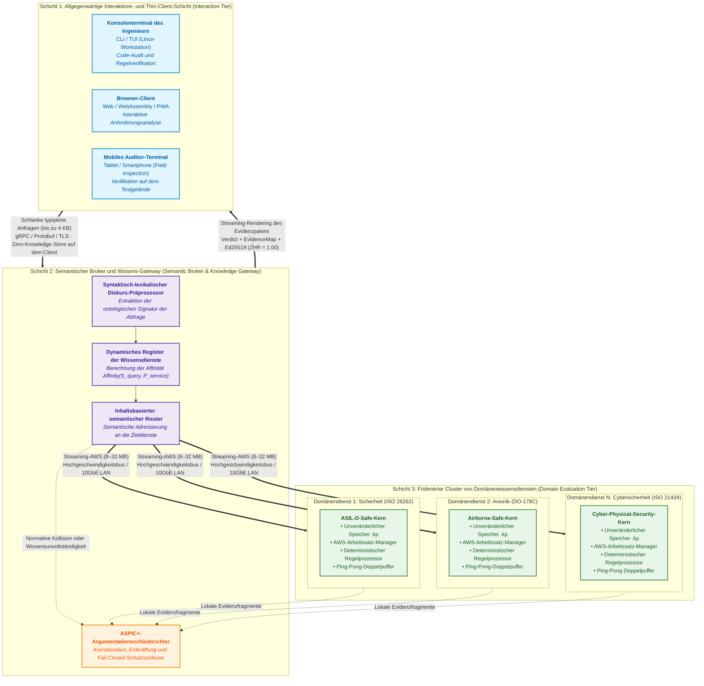
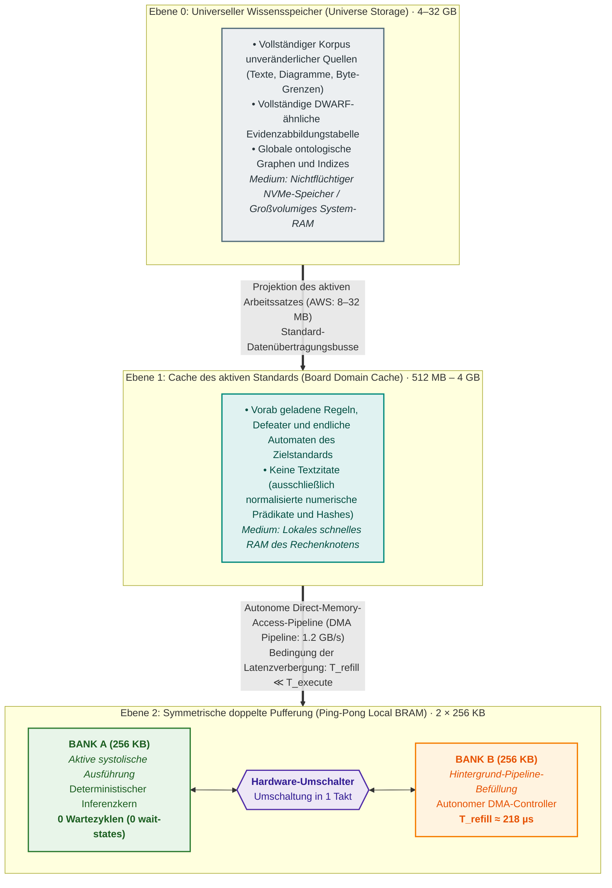
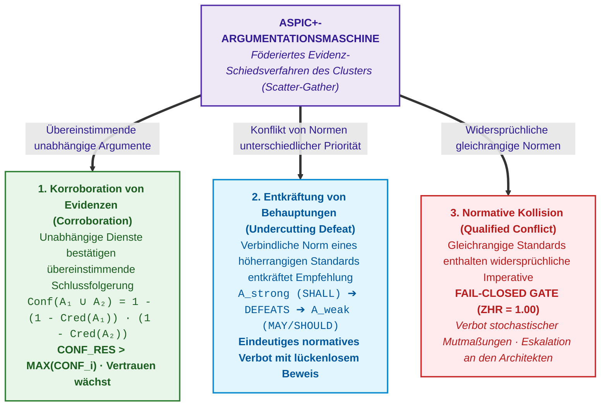

# Kapitel 40. Verteilte Architektur evidenzbasierter Expertensysteme: Epistemische SOA, semantisches Routing, Speicherhierarchien und mehrquellenbasiertes defeasibles Schiedsverfahren

> **Buch:** [Architektur evidenzbasierter Expertensysteme](README.md) · [Teil VII: Reaktive Ausführung, systemübergreifender Wissensaustausch und verteilte SOA](part-07-runtime-and-knowledge-exchange.md)  
> **Vorheriges Kapitel:** [Kapitel 33. Systemübergreifender Wissensaustausch: Regelbereitstellung für Drittsysteme, Modell-Training und sicheres Feedback](ch33-inter-system-knowledge-exchange-and-model-teaching.md)  
> **Inhaltsverzeichnis:** [README.md](README.md)  
> **Autor:** [Mykola Fedchyk](about-the-author.md)  
> **Niveau:** Fortgeschritten: Leitende Systemarchitekten, Wissensingenieure, Entwickler verteilter Systeme, Compliance- und Sicherheitsexperten  
> **Lernziele:** Synthese der theoretischen Grundlagen aller Teile der Monographie zu einem vollständigen industriellen Referenzarchitektur-Prototyp eines verteilten Expertensystems; Entwurf einer dreischichtigen serviceorientierten Architektur (Epistemic SOA) mit strikter Entkopplung schlanker Clients von Wissensdiensten; Implementierung des syntaktisch-lexikalischen Präprocessings und des semantischen Routings von Abfragen; Überwindung der Diskrepanz zwischen Makrovolumina des Speichers und Mikrokapazitäten des schnellen On-Chip-Speichers mittels aktiver Arbeitssätze (Active Working Sets) und doppelter Ping-Pong-Pipeline-Pufferung; Organisation der föderierten Suche (Scatter-Gather) sowie der mehrquellenbasierten defeasiblen Evidenzaggregation (ASPIC+) bei unvollständigem oder unsicherem Wissen; fundierte ingenieurtechnische Entscheidungen bezüglich Skalierung und Auswahl von Hardware- und Softwareklassen im Rahmen des Projektbudgets.

---

## Abstract

Alle vorangegangenen Kapitel dieser Monographie haben eine fundamentale These schlüssig bewiesen: Ein zuverlässiges Expertensystem darf nicht auf stochastischen Verallgemeinerungen großer Sprachmodelle oder ungeprüften Faktensammlungen beruhen. Wahre Expertise erfordert mathematischen Determinismus, formale Inferenz, bytegenaue Verwahrungskette der Primärquellen ($ZHR = 1.00$) und unabhängige Auditierbarkeit. Der Übergang des Systems vom isolierten Laborprüfstand in reale industrielle F&E-Umgebungen stellt den Softwarearchitekten jedoch vor eine neue kritische Herausforderung: **Skalierbarkeit, Verteiltheit und allgegenwärtige Verfügbarkeit (Ubiquitous Availability)**.

Dieses Kapitel schließt den theoretischen Zyklus der Monographie ab und synthetisiert für den Leser einen **industriellen Referenzarchitektur-Prototyp eines evidenzbasierten Expertensystems**. Losgelöst von spezifischen kommerziellen Chipmarken oder proprietären Schnittstellen definiert dieses Kapitel funktionale Klassen von Hardware- und Software-Recheneinheiten, die für den Aufbau eines hochskalierbaren Systems erforderlich sind. Gegenstand der Analyse ist eine dreischichtige epistemische serviceorientierte Architektur (Epistemic SOA), in der schlanke mobile Clients (Smartphones, Terminals) über einen intelligenten semantischen Broker mit einem föderierten Cluster spezialisierter Domänendienste interagieren. Eine mehrstufige Speicherhierarchie wird formalisiert: Mathematisch wird die Bedingung der Pipeline-Kontinuität und der vollständigen Latenzverbergung ($`T_{\mathrm{refill}} \ll T_{\mathrm{execute}}`$) durch das Konzept aktiver Wissensarbeitssätze (*Active Working Sets*) und symmetrischer doppelter Pufferung (*Ping-Pong Pipeline*) bewiesen. Für Szenarien mit unvollständigen lokalen Wissensbasen wird ein Modell der föderierten Suche (*Scatter-Gather*) in Verbindung mit einer mehrquellenbasierten defeasiblen Evidenzaggregation (*ASPIC+*) entwickelt, welches Korroboration, die Entkräftung schwacher Empfehlungen und die qualifizierte Erkennung normativer Widersprüche gewährleistet. Abschließend bietet eine ingenieurtechnische Technologieauswahlmatrix dem Systemarchitekten konkrete Richtlinien zur Bereitstellung eines lauffähigen Prototyps auf verfügbarer Hardware im Einklang mit dem jeweiligen Projektbudget.

---

## 1. Synthese der Monographie: Vom lokalen Modell zum Referenzarchitektur-Prototyp

Neununddreißig vorangegangene Kapitel dieses Werkes haben die Anatomie einer evidenzbasierten künstlichen Intelligenz detailliert seziert. Die Monographie untersuchte die Erkenntnistheorie maschinellen Wissens ([Kapitel 2](ch02-epistemology-of-machine-knowledge.md)), Modelle und Typologien von Wissensbasen ([Kapitel 7](ch07-knowledge-base-typology.md)), die automatisierte Extraktion von Normen aus Primärquellen ([Kapitel 15](ch15-knowledge-extraction-and-kb-construction.md)), strikte deterministische Inferenz ([Kapitel 16](ch16-expert-systems-architecture.md), [Kapitel 31](ch31-syllogistic-reasoning-and-relation-lattices.md)), die Behebung maschineller Halluzinationen ([Kapitel 38](ch38-curing-machine-hallucinations-and-knowledge-deficits.md)) und Popper'sche Compliance-Audits ([Kapitel 39](ch39-active-compliance-auditor-and-popperian-testing.md)).

In der industriellen Praxis stellt sich jedoch unweigerlich die entscheidende Frage: **Wie lassen sich all diese theoretischen Konzepte zu einem einheitlichen, lauffähigen Gesamtsystem auf Unternehmensebene zusammenführen?**

In realen F&E-Projekten der Hochtechnologie (Automobilindustrie, Avionik, Medizintechnik) umfasst der regulatorische Rahmen dutzende verbindliche Standards (ISO, IEC, DO, IEEE, RFC), die gemeinsam mit wörtlichen Primärtexten, Konformitätsmatrizen und Defeatern Dutzende Gigabyte an Daten beanspruchen. Gleichzeitig benötigen Forschungsingenieure, Auditoren und Softwareentwickler permanenten, ortsunabhängigen Zugriff auf das System:
- am Büroarbeitsplatz an der Workstation während des Architekturentwurfs;
- im Prüflabor oder auf dem Testgelände über Tablets und Smartphones;
- in der automatisierten Continuous-Integration-Pipeline (CI/CD) während nächtlicher Code-Audits.

Der Versuch, diese Anforderung durch einen monolithischen lokalen „Fat Client“ zu lösen, scheitert zwangsläufig. Ein mobiles Endgerät ist weder in der Lage, mehrbändige, gigabytegroße Wissensbasen im Arbeitsspeicher vorzuhalten, noch verfügt es über die Rechenleistung für tiefe semantische Analysen. Andererseits garantiert ein gewöhnlicher Cloud-Dienst auf Basis populärer Sprachmodelle weder Determinismus noch Halluzinationsfreiheit oder eine bytegenaue Verwahrungskette (*Custody*) der Primärquellen.

Erforderlich ist daher ein **verteilter Referenzarchitektur-Prototyp**, der auf den Prinzipien der serviceorientierten Architektur (SOA), einer strikten Trennung der Zuständigkeiten und einer mathematisch fundierten Speicherhierarchie aufbaut.



---

## 2. Epistemische serviceorientierte Architektur (Epistemic SOA) und schlanke Clients

Die serviceorientierte Architektur adressiert im klassischen Software-Engineering primär die lose Kopplung von Komponenten, die unabhängige Bereitstellung und die Wiederverwendbarkeit von Geschäftsfunktionen [[4]](#src-4). In **epistemischen evidenzbasierten Systemen** erhält das SOA-Paradigma eine qualitativ neue Dimension: Es gewährleistet die **Isolation von Wahrheitskontexten** und den **allgegenwärtigen Benutzerzugriff**, ohne die lückenlose Verwahrungskette der Evidenzen zu gefährden.

### 2.1. Das Konzept des schlanken Interaktions-Clients (Thin Interaction Client)

Das Endgerät des Benutzers (Qualitätsingenieur, Entwickler oder Auditor) wird als **ultraschlanker Interaktionsagent** definiert:
1. **Null-Wissensspeicher ($`S_{\mathrm{client}} = 0`$):** Die Client-Anwendung speichert keine Wissensbasen und hält keine lokalen Kopien von Normen im Cache. Dies eliminiert das Risiko versioneller Desynchronisation von Vorschriften innerhalb des Ingenieurteams vollständig.
2. **Abstraktion von Recheneinheiten:** Der Client benötigt weder neuronale Hardwarebeschleuniger (NPU/GPU) noch spezialisierte Inferenzprozessoren. Dadurch lässt sich die Znavets-Schnittstelle problemlos auf Standard-Smartphones unter mobilen Betriebssystemen, in Webbrowsern via WebAssembly/PWA oder im Terminal einer Entwickler-Workstation betreiben.
3. **Strikte Typisierung von Anfragen und Antworten:** Der Datenaustausch erfolgt über hocheffiziente binäre RPC-Verträge (beispielsweise Protocol Buffers über gRPC oder abgesicherte WebSockets):
   - Client-Anfrage: natürlichsprachliche Zeichenkette oder strukturierter Identifikator eines Entwicklungsartefakts (Paketgröße $\le 2\text{--}4\,\text{KB}$).
   - Client-Antwort: strukturiertes Evidenztupel, bestehend aus dem logischen Urteil (`ACCEPT`, `REFUSAL`, `QUALIFIED`), den Identifikatoren der angewendeten Regeln, wörtlichen Zitaten mit Byte-Koordinaten in der Primärquelle sowie 256-Bit-Kryptohashes zur Sicherung der Verwahrungskette.

### 2.2. Wahrung der Invariante $ZHR = 1.00$ auf dem Client

Von essenzieller Bedeutung ist, dass der schlanke Client nicht autorisiert ist, die empfangene Antwort eigenständig zu interpretieren oder zusammenzufassen. Er erfüllt eine rein repräsentative Funktion:

```math
\text{Display}(\text{Response}) = \text{Render}(\text{Verdict}, \text{EvidenceMap}, \text{Signature})
```

wobei:
- $\text{Verdict} \in \{\text{ACCEPT}, \text{REFUSAL}, \text{QUALIFIED}\}$ den formalen logischen Inferenzstatus bezeichnet, der vom Server generiert wurde;
- $\text{EvidenceMap}$ die bytegenaue Abbildung der Inferenzterme auf Koordinaten in den Primärquellen darstellt;
- $\text{Signature}$ die digitale Ed25519-Signatur des Evidenzpakets zur Gewährleistung der Unveränderlichkeit ist.

Selbst wenn die Netzwerkverbindung zwischen Client und Broker bei Feldversuchen temporär abreißt, verliert das vorliegende Ergebnis weder seine technische noch seine rechtliche Beweiskraft: Jede dem Ingenieur präsentierte Tatsache bleibt durch die kryptographische Signatur und den Hash der Primärquelle verifiziert.

---

## 3. Semantischer Broker, Diskurs-Präprozessor und inhaltsbasiertes Routing

Arbeitet im Ingenieur-Ökosystem nicht nur eine einzelne Wissensbasis, sondern ein Cluster hochspezialisierter Dienste, entsteht eine zentrale Koordinationsaufgabe: **Wer bestimmt auf welche Weise, an welche Zieldienste eine Ingenieurabfrage geleitet wird?**

In klassischen Websystemen erfolgt das Routing anhand von Netzwerkadressen oder URL-Präfixen (beispielsweise `/api/v1/orders`). In evidenzbasierten Expertensystemen erfolgt die Adressierung hingegen rein **semantisch (Content-Based Semantic Routing)** und stützt sich auf die Ergebnisse eines linguistischen Präprozessors.

### 3.1. Syntaktisch-lexikalischer Diskurs-Präprozessor

Sobald eine Abfrage eintrifft, leitet der semantische Broker diese durch eine mehrstufige semantische Analysepipeline:

```mermaid
flowchart TD
    accTitle: Pipeline der syntaktisch-lexikalischen Diskursanalyse im Semantischen Broker
    accDescr: Schrittweise Transformation einer natürlichsprachlichen Ingenieurabfrage in eine strukturierte ontologische Signatur für das Routing von Domänenregeln.

    IN["&emsp;&emsp;&emsp;&emsp; <b>EINGEHENDE INGENIEURABFRAGE ZUM COMPLIANCE-AUDIT (Natural Language Query)</b> &emsp;&emsp;&emsp;&emsp;<br><i>«Ist die Verwendung dynamischer Speicherallokation für ein ASIL-D-Modul gemäß ISO 26262-6 zulässig?»</i><br><i>Herkunftsquelle: Ingenieur-Workstation / Continuous-Integration-Pipeline (CI/CD Quality Gate)</i>"]

    STEP1["&emsp;&emsp;&emsp;&emsp; <b>1. DISKURSKLASSIFIKATION (Discourse Qualification)</b> &emsp;&emsp;&emsp;&emsp;<br>• Pragmatischer Typ: <code>NORMATIVE_COMPLIANCE_QUERY</code> &emsp;·&emsp; • Zielmodalität: <code>DEONTIC_PROHIBITION_OR_PERMISSION</code><br><i>Semantische Intention: formale Verifikation der Zulässigkeit einer Architekturentscheidung gegen den Zertifizierungsstandard</i>"]

    STEP2["&emsp;&emsp;&emsp;&emsp; <b>2. SYNTAKTISCH-FRAME-BASIERTES PARSING (Syntactic Frame Parsing)</b> &emsp;&emsp;&emsp;&emsp;<br>• Akteur: <i>«Softwaremodul»</i> &emsp;·&emsp; • Aktion: <i>«dynamische Speicherallokation» (Dynamic Allocation)</i> &emsp;·&emsp; • Attribut: <code>ASIL_Level = 'D'</code><br><i>Extraktion der Prädikat-Argument-Struktur der Anforderung für den deterministischen Abgleich mit ontologischen Axiomen</i>"]

    STEP3["&emsp;&emsp;&emsp;&emsp; <b>3. EXTRAKTION DER ONTOLOGISCHEN SIGNATUR (Domain Signature Extraction)</b> &emsp;&emsp;&emsp;&emsp;<br>• Domänenmarker: <code>{ISO-26262, ASIL-D, Software-Architecture, Memory-Management}</code><br>• Abfrageprofil: <code>TargetDomain = 'Automotive-Safety'</code> &emsp;·&emsp; • Normativ: <code>Standard = 'ISO-26262-6:2018'</code><br><i>Bildung des Signaturvektors der Abfrage zur Berechnung der Affinitätskoeffizienten im dynamischen Register der Dienste</i>"]

    OUT["&emsp;&emsp;&emsp;&emsp; <b>ZUWEISUNG DES PRIMÄREN EVALUATORS (Primary Evaluator Dispatching)</b> &emsp;&emsp;&emsp;&emsp;<br>Zugewiesener Dienst: <b>Domänendienst für funktionale Sicherheit im Automobilbereich (ISO 26262-6:2018)</b> &emsp;·&emsp; <code>Affinity(S_query, P_service) = 1.00</code><br><i>Das Active-Working-Set-Paket (AWS) wird über den lokalen Hochgeschwindigkeitsbus an den systolischen deterministischen Regelkern übertragen</i>"]

    IN ==> STEP1
    STEP1 ==> STEP2
    STEP2 ==> STEP3
    STEP3 ==> OUT

    classDef query fill:#e3f2fd,stroke:#1565c0,stroke-width:2px,color:#0d47a1;
    classDef step1 fill:#ede7f6,stroke:#5e35b1,stroke-width:2px,color:#311b92;
    classDef step2 fill:#fff8e1,stroke:#ffa000,stroke-width:2px,color:#e65100;
    classDef step3 fill:#e8f5e9,stroke:#2e7d32,stroke-width:2px,color:#1b5e20;
    classDef target fill:#f3e5f5,stroke:#7b1fa2,stroke-width:2px,color:#4a148c;

    class IN query;
    class STEP1 step1;
    class STEP2 step2;
    class STEP3 step3;
    class OUT target;
```



### 3.2. Dynamisches Register der Wissensdienste (Knowledge Service Registry)

Der semantische Broker verwaltet im flüchtigen Speicher ein aktuelles Verzeichnis der im Cluster verfügbaren Domänendienste. Jeder Dienst publiziert bei seiner Registrierung ein formales Manifest:
- **Identifikator und Endpunkt:** Netzwerkadresse (IP/Port oder Nachrichtenwarteschlange);
- **Wissensraum (Knowledge Domain):** Menge der abgedeckten Standards und Ontologieversionen (gemäß SemVer 2.0.0);
- **Klasse der Recheneinheit:** Software-CPU, Vektorprozessor-Array oder dedizierter Hardware-Inferenzkern für deterministische Ausführung;
- **Durchsatzmetriken:** Aktuelle Warteschlangentiefe und geschätzte Inferenzlatenz.

Der Broker berechnet eine Affinitätsfunktion zwischen der ontologischen Signatur der Abfrage $`\mathcal{S}_{\mathrm{query}}`$ und dem Wissensraum $`\mathcal{P}_{\mathrm{domain}}`$ im Dienstpass $`\mathcal{P}_{\mathrm{service}}`$:

```math
\mathrm{Affinity}(\mathcal{S}_{\mathrm{query}}, \mathcal{P}_{\mathrm{service}}) = \frac{\lvert\mathcal{S}_{\mathrm{query}} \cap \mathcal{P}_{\mathrm{domain}}\rvert}{\lvert\mathcal{S}_{\mathrm{query}}\rvert}
```

wobei:
- $`\mathcal{S}_{\mathrm{query}}`$ die Menge der ontologischen Konzepte und Domänenmarker bezeichnet, die aus der Ingenieurabfrage extrahiert wurden;
- $`\mathcal{P}_{\mathrm{domain}}`$ die Menge der unterstützten Standards und Ontologieversionen im Dienstpass $`\mathcal{P}_{\mathrm{service}}`$ darstellt;
- $`\lvert \mathcal{S}_{\mathrm{query}} \cap \mathcal{P}_{\mathrm{domain}} \rvert`$ die Mächtigkeit der Schnittmenge der ontologischen Signaturen angibt (Anzahl übereinstimmender Konzepte);
- $`\lvert \mathcal{S}_{\mathrm{query}} \rvert`$ die Gesamtzahl der ontologischen Marker in der Eingabeabfrage beziffert;
- $`\mathrm{Affinity}(\mathcal{S}_{\mathrm{query}}, \mathcal{P}_{\mathrm{service}}) \in [0, 1]`$ den normierten Koeffizienten der semantischen Affinität darstellt (wobei der Wert $1{,}0$ einer vollständigen Abdeckung der Abfragedomäne entspricht).

Der Dienst mit dem höchsten Affinitätswert wird als primäre Ausführungseinheit (*Primary Evaluator*) zugewiesen.

---

## 4. Theoretisches Modell der mehrstufigen Speicherhierarchie und doppelten Pufferung

Jedes Rechensystem unterliegt den physikalischen Gesetzmäßigkeiten der Signalübertragung und der Organisation von Speicherhierarchien [[3]](#src-3): **Je größer das Speichervolumen, desto höher ist die Zugriffslatenz; umgekehrt verfügt extrem schneller Speicher, der direkt in die Logik der Recheneinheit integriert ist, über eine stark begrenzte Kapazität**.

In industriellen Expertensystemen erreicht diese Diskrepanz ein kritisches Ausmaß:
1. **Makrovolumen des Wissensspeichers ($`V_{\mathrm{corpus}}`$):** Das vollständige Normen-Repository umfasst einschließlich Primärtexten, Syntaxbäumen und Rückverfolgbarkeitsmatrizen $4\text{--}32\,\text{GB}$.
2. **Mikrokapazität des schnellen Speichers des Regelprozessors ($`V_{\mathrm{local}}`$):** Der lokale Speicher eines spezialisierten Regelprozessors (Block-RAM in Siliziumbeschleunigern oder schneller L1/L2-Cache) überschreitet selten wenige hundert Kilobyte ($256\text{--}512\,\text{KB}$).
3. **Bandbreite des Übertragungskanals ($`B_{\mathrm{channel}}`$):** Die Übertragung des gesamten Wissenskorpus an die Recheneinheit bei jeder Abfrage würde zu unzulässigen Stillstandszeiten des Systems führen ($> 1$ Minute), was einen interaktiven Dialog mit dem Ingenieur ($0{,}5\text{--}2{,}0\,\text{s}$) verunmöglicht.



### 4.1. Konzept des aktiven Arbeitssatzes (Active Working Set — AWS)

Anstatt den gesamten Wissenskorpus zu transferieren, erzeugt der semantische Dispatcher einen **aktiven Arbeitssatz (Active Working Set — AWS)**:

```math
\mathrm{AWS} = \mathrm{Closure}(\mathcal{R}_{\mathrm{target}}) = \mathcal{R}_{\mathrm{target}} \cup \mathrm{Prerequisites}(\mathcal{R}_{\mathrm{target}}) \cup \mathrm{Defeaters}(\mathcal{R}_{\mathrm{target}})
```

wobei:
- $`\mathcal{R}_{\mathrm{target}}`$ die Menge der Zielregeln bezeichnet, die durch die ontologische Signatur der Abfrage aktiviert wurden;
- $`\mathrm{Prerequisites}(\mathcal{R}_{\mathrm{target}})`$ die Voraussetzungsprädikate darstellt, die für die deterministische Auflösung von Abhängigkeiten erforderlich sind;
- $`\mathrm{Defeaters}(\mathcal{R}_{\mathrm{target}})`$ die Menge der assoziierten Defeater (Ausnahmen und Gegenregeln) bildet;
- $`\mathrm{AWS}`$ den transitiven logischen Abschluss der Regeln ohne Textzitate der Primärquellen darstellt, optimiert für das unmittelbare Laden in den lokalen Cache der Recheneinheit.

Das AWS enthält ausschließlich das mathematische Skelett der Regeln: numerische Grenzwerte, logische Bedingungen, Defeater-Identifikatoren und 256-Bit-Zitathashes. Die wörtlichen Primärtexte verbleiben im Speicher der Ebene 0. Das Volumen des AWS reduziert sich hierdurch auf **$8\text{--}32\,\text{MB}$**, was über standardisierte Industriebusse in Bruchteilen einer Sekunde übertragen werden kann.

### 4.2. Mathematische Bedingung der Pipeline-Kontinuität bei doppelter Pufferung (Ping-Pong Pipeline)

In deterministischen Expertensystemen ist es unzulässig, dass ein hochperformanter Inferenzkern anhält, während er auf das Eintreffen des nächsten Regelblocks aus einem langsameren externen Speicher wartet. Zur Eliminierung von Wartezeiten wird der Speicher des Regelprozessors als zwei symmetrische, voneinander unabhängige Speicherbänke gleicher Größe organisiert: Bank A und Bank B. Während der Prozessor die Regeln in der einen Bank verarbeitet, befüllt ein Direct-Memory-Access-Controller (DMA) im Hintergrund die andere Bank mit dem nächsten Wissensblock.

Die Dauer für das Befüllen einer Bank mit Daten aus dem lokalen System-RAM ($`T_{\mathrm{refill}}`$) wird durch das Verhältnis der Bankkapazität zur effektiven Busbandbreite bestimmt:

```math
T_{\mathrm{refill}} = \frac{V_{\mathrm{bank}}}{B_{\mathrm{bus}}}
```

wobei:
- $`V_{\mathrm{bank}}`$ die Kapazität einer Bank des schnellen On-Chip-Speichers bezeichnet (beispielsweise $256\,\text{KB}$ Block-RAM auf einem FPGA oder dediziertes statisches On-Chip-SRAM);
- $`B_{\mathrm{bus}}`$ die effektive Bandbreite des internen Wissenstransferbusses angibt (beispielsweise $1{,}2\,\text{GB/s}$ für einen AXI4-Stream-Bus oder PCIe-DMA);
- $`T_{\mathrm{refill}}`$ die berechnete Zeitspanne für das autonome Hintergrundbefüllen der Bank ohne Beteiligung des Regelprozessors darstellt;
- $`T_{\mathrm{execute}}`$ die Zeitspanne beziffert, die der Regelprozessor für den vollständigen systolischen Abgleich des eingehenden Anforderungspakets mit dem Wissensblock der Kapazität $`V_{\mathrm{bank}}`$ benötigt.

**Theorem der Latenzverbergung (Latency Hiding Invariant):**
Die Inferenz-Pipeline arbeitet genau dann mit einem maximalen Auslastungsgrad der Rechenressourcen ($\eta = 1{,}00$) ohne einen einzigen Wartezyklus des Prozessors (Zero Wait-States), wenn die Dauer des Hintergrundbefüllens die Rechenzeit für den aktuellen Regelblock nicht überschreitet:

```math
T_{\mathrm{refill}} \le T_{\mathrm{execute}}
```

**Praktische ingenieurtechnische Anwendung des Berechnungsergebnisses:**

Der ermittelte Wert $`T_{\mathrm{refill}}`$ und dessen Verhältnis zu $`T_{\mathrm{execute}}`$ stellen nicht bloß eine theoretische Abschätzung dar, sondern dienen als **operatives Werkzeug für Systementwurf und dynamisches Dispatching**:

1. **Hardware-Dimensionierung (Hardware Dimensioning):**
   Die Formel determiniert die maximal zulässige Bankgröße des schnellen Speichers $`V_{\mathrm{bank}}`$ beim Entwurf des Hardwarekomplexes:

```math
V_{\mathrm{bank}} \le B_{\mathrm{bus}} \cdot T_{\mathrm{execute}}
```

   Dimensioniert der Architekt die Bank fehlerhaft übermäßig groß (beispielsweise $`V_{\mathrm{bank}} = 16\,\text{MB}`$), benötigt ein Bus mit einer Bandbreite von $1{,}2\,\text{GB/s}$ für deren Befüllung:

```math
T_{\mathrm{refill}} = \frac{16\,\text{MB}}{1.2\,\text{GB/s}} \approx 13.3\,\text{ms}
```

   Schließt der Prozessor die Regelprüfung bereits in $`T_{\mathrm{execute}} = 2{,}0\,\text{ms}`$ ab, tritt eine gravierende Pipeline-Blockade (*Pipeline Stall*) auf: Der Prozessor wird gezwungen, für $11{,}3\,\text{ms}$ im Leerlauf auf den Bus zu warten, und der Wirkungsgrad des Inferenzkerns bricht ein auf:

```math
\eta = \frac{T_{\mathrm{execute}}}{T_{\mathrm{refill}}} = \frac{2.0\,\text{ms}}{13.3\,\text{ms}} \approx 0.15
```

   (85 % der Taktzyklen des teuren Siliziumkerns gehen ungenutzt verloren). Die Berechnung beweist: Um die Pipeline-Kontinuität zu wahren, darf die Größe eines Regelblocks $256\text{--}512\,\text{KB}$ nicht überschreiten.

2. **Dynamische Regelblockplanung (Adaptive Chunk Sizing) in der Software-Laufzeitumgebung:**
   Während der Erstellung des aktiven Arbeitssatzes (AWS) evaluiert der semantische Dispatcher dynamisch die Komplexität der Regeln des nachfolgenden Blocks. Sind die Regeln einfach strukturiert und sinkt die prognostizierte Ausführungszeit ($`T_{\mathrm{execute}} \to 0{,}5\,\text{ms}`$), paketiert der Dispatcher die Regeln automatisch in kleinere Fragmente oder aktiviert den Burst-Modus des DMA-Busses, um einen Stillstand des Rechenkerns zu verhindern.

3. **Betriebsmodi und ingenieurtechnische Entscheidungen auf Basis des Laufzeitvergleichs:**
   - **Optimaler deterministischer Modus ($`T_{\mathrm{refill}} \ll T_{\mathrm{execute}}`$, Sicherheitsmarge $\ge 2\times$):**
     Für einen typischen Wissensblock von $256\,\text{KB}$ beträgt die Ladezeit $`T_{\mathrm{refill}} = \frac{256\,\text{KB}}{1.2\,\text{GB/s}} \approx 218\,\mu\text{s}`$. Der systolische Abgleich eines komplexen Anforderungspakets gegen diese Regeln beansprucht $`T_{\mathrm{execute}} \approx 1{,}5\text{--}5{,}0\,\text{ms}`$. Die Zeitreserve liegt beim 7- bis 23-Fachen.
     **Systemaktion:** Die passive Speicherbank wird garantiert lange vor dem Abschluss der Berechnungen befüllt. Sobald der Prozessor bereit ist, schaltet der Hardware-Umschalter die Bänke in **1 Taktzyklus** um ($A \leftrightarrow B$), was eine durchgehende Effizienz von $\eta = 1{,}00$ und eine strikte Vorhersehbarkeit der Antwortzeit (Worst-Case Execution Time, WCET) garantiert.
   - **Grenzbereich der Buskonkurrenz ($`0{,}8 \cdot T_{\mathrm{execute}} < T_{\mathrm{refill}} \le T_{\mathrm{execute}}`$):**
     Die zeitliche Marge ist minimal. Jede temporäre Buskollision (externe Interrupts, Peripheriezugriffe) droht die Pipeline-Frist zu verletzen.
     **Systemaktion:** Der Dispatcher aktiviert eine prioritäre Bus-Arbitrierung (*DMA Channel Priority / QoS*) und weist dem Wissenstransferstrom die höchste Priorität gegenüber anderen Systemprozessen zu.
   - **Notfallmodus bei Bandbreitendefizit ($`T_{\mathrm{refill}} > T_{\mathrm{execute}}`$):**
     **Systemaktion:** Ein Hardware-Watchdog-Timer registriert den Pipeline-Stillstand. Der semantische Dispatcher aktiviert einen Degradationsmodus: Er drosselt temporär die Parallelität des Vektorkerns oder schneidet unkritische Defeater zweiter Ordnung ab, wodurch der stabile Zustand $`T_{\mathrm{refill}} \le T_{\mathrm{execute}}`$ wiederhergestellt wird.

### 4.3. Systolische Batch-Compliance-Audits (Batch Compliance Sweeps)

Für die Massenverifikation (beispielsweise die simultane Prüfung von $M = 1\,500$ Sicherheitsanforderungen gegen $K = 500$ normative Regeln) gilt:
- Anforderungen werden als gestreamter Vektorstrom eingespeist;
- elementare atomare Vergleiche werden in $1\text{--}4$ Hardware-Taktzyklen abgearbeitet;
- die Gesamtdauer der Hardwareprüfung von $750\,000$ Paaren beträgt weniger als **$30\text{--}50\,\text{ms}$**, was eine End-to-End-Antwortzeit von unter $1{,}0\,\text{s}$ für das Gesamtsystem sicherstellt.

---

## 5. Mehrquellenbasierte defeasible Wissensaggregation (ASPIC+ / Dung)

In hochkomplexen F&E-Ingenieurprojekten besitzt keine einzelne Wissensbasis ein absolutes Vollständigkeitsmonopol. Ein einzelner Domänendienst liefert unter Umständen Ergebnisse, die nicht vollständig eindeutig sind.

### 5.1. Trigger für Wissensunvollständigkeit (Uncertainty Triggers)

Der semantische Broker identifiziert die Notwendigkeit der Einbindung zusätzlicher Dienste anhand von drei strikten Kriterien:
1. **Niedriger diskreter Konfidenzwert ($Score < 70/100$):** Der Beleg entstammt einer nichtharmonisierten oder sekundären Quelle;
2. **Nichtimperativer normativer Status (Informative vs. Normative):** Die Regel wurde einem informativen Anhang oder Leitfaden entnommen (*Guideline / May / Informative Annex*), während der Ingenieur ein verbindliches Zertifizierungsurteil anfordert;
3. **Offener Defeasibility-Zustand (Ungrounded Defeater):** Die Regel enthält eine Ausnahmebedingung `unless condition_X`, in der lokalen Wissensbasis fehlt jedoch der Sachverhalt zu `condition_X`.

### 5.2. Föderierte Abfrage (Scatter-Gather) und argumentatives Schiedsverfahren

Wird ein Wissensdefizit detektiert, initiiert der Broker eine parallele Abfrage (**Scatter**) benachbarter Dienste im Cluster (beispielsweise eines Dienstes für Industriepräzedenzfälle oder allgemeine Zuverlässigkeitsnormen). Die von den verschiedenen Diensten zurückgelieferten Evidenzfragmente werden im Anschluss (**Gather**) in das formale Argumentationsframework **ASPIC+** [[2]](#src-2) auf Basis abstrakter Argumentationsstrukturen nach Dung [[1]](#src-1) überführt:



#### 5.2.1. Korroboration von Evidenzen (Corroboration)

Beim Audit sicherheitskritischer Systeme (beispielsweise Anforderungen nach ISO 26262 ASIL D [[5]](#src-5) oder DO-178C DAL A [[6]](#src-6)) kann die Evidenz eines einzelnen Domänendienstes ein nicht zu vernachlässigendes epistemisches Defizit oder ein unzureichendes Konfidenzniveau für ein bedingungsloses automatisches Urteil aufweisen. Der Korroborationsmechanismus eliminiert Subjektivität durch die Fusion unabhängiger Nachweise aus benachbarten Clusterknoten. Gelangen zwei oder mehr Dienste unabhängig voneinander zu einer übereinstimmenden Feststellung, steigt die aggregierte probabilistische Konfidenz in die Schlussfolgerung mathematisch gemäß dem Additionssatz für unabhängige Ereignisse an:

```math
\mathrm{Conf}(A_1 \cup A_2) = 1 - (1 - \mathrm{Cred}(A_1)) \cdot (1 - \mathrm{Cred}(A_2))
```

wobei:
- $`\mathrm{Cred}(A_i) \in [0, 1)`$ den diskreten Glaubwürdigkeitsgrad der Evidenz bezeichnet, die vom Domänendienst $`i`$ bereitgestellt wurde (bestimmt durch die Autorität der Wissensquelle und die Rückverfolgbarkeitstiefe);
- $`\mathrm{Conf}(A_1 \cup A_2) \in [0, 1)`$ das aggregierte probabilistische Vertrauen in die korroborierte Schlussfolgerung nach Zusammenführung der unabhängigen Argumente $`A_1`$ und $`A_2`$ darstellt.

**Praktische Anwendung und ingenieurtechnische Schlussfolgerungen:**
1. **Aufrufpunkt im Lebenszyklus:** Die Berechnung erfolgt durch den semantischen Broker in der Konsolidierungsphase (Gather-Phase), sobald die von mehreren Knoten gelieferten Nachweise bezüglich eines Zielprädikats übereinstimmen.
2. **Entscheidungskriterien anhand numerischer Schwellenwerte:**
   - **Schwelle für automatische Anforderungsfreigabe ($`\mathrm{Conf} \ge \tau_{\mathrm{accept}} = 0{,}95`$):** Der Nachweis gilt als erschöpfend. Das System vergibt automatisch das Urteil `ACCEPT`, bringt eine kryptographische Ed25519-Signatur an und überführt das verifizierte Artefakt ohne manuellen Prüfaufwand in das Zertifizierungspaket.
   - **Bereich für Expertenbegutachtung ($`0{,}80 \le \mathrm{Conf} < 0{,}95`$):** Das System generiert das qualifizierte Urteil `QUALIFIED`. Das Evidenzpaket wird als bedingt akzeptabel markiert und automatisch an den leitenden Architekten eskaliert (Mensch im Regelkreis, *Human-in-the-Loop*), versehen mit einer bytegenauen Kennzeichnung der Schwachstellen in der Argumentationskette.
   - **Bereich unzureichender Evidenz ($`\mathrm{Conf} < 0{,}80`$):** Das System blockiert die Freigabe mit dem Status `REFUSAL`. Die Anfrage wird aufgrund fehlender theoretischer Fundierung in der Wissensbasis zurückgewiesen.
3. **Numerisches Ingenieurbeispiel:**
   Ein Knoten für Architekturmuster-Analysen liefert die Aussage $`A_1`$ mit einer Glaubwürdigkeit von $`\mathrm{Cred}(A_1) = 0{,}85`$ (isoliert betrachtet reicht dies nicht für eine automatische ASIL-D-Zertifizierung aus, die einen Schwellenwert von $0{,}95$ erfordert). Ein benachbarter Knoten für Speicheraudits bestätigt die Sicherheit desselben Codefragments unabhängig durch das Argument $`A_2`$ mit der Glaubwürdigkeit $`\mathrm{Cred}(A_2) = 0{,}80`$. Das aggregierte Vertrauen berechnet sich zu:

```math
\mathrm{Conf}(A_1 \cup A_2) = 1 - (1 - 0.85) \cdot (1 - 0.80) = 1 - (0.15 \cdot 0.20) = 1 - 0.03 = 0.97
```

   Da $`0{,}97 \ge \tau_{\mathrm{accept}} = 0{,}95`$ gilt, übersteigt die wechselseitige Bestätigung zweier unabhängiger Quellen die Zulassungsschwelle und erübrigt eine zeitaufwendige manuelle Begutachtung.

#### 5.2.2. Entkräftung schwacher Behauptungen (Defeat / Undercutting)

In technischen Regelwerken werden normative Vorgaben nach ihrer Verbindlichkeit differenziert: zwingende Vorschriften (*Shall / Must*), Empfehlungen (*Should / Recommended*) und informative Hinweise (*May / Informative*).

Tritt während der föderierten Suche ein Widerspruch zwischen den Resultaten verschiedener Dienste auf, wendet das System keine probabilistische Mittelung an. Gemäß den Regeln der nichtmonotonen Inferenz in ASPIC+ entkräftet (*undercuts*) eine zwingende Norm höherer Priorität ($\mathrm{Rank} = \text{Shall}$) ein argumentatives Übergewicht einer Empfehlung oder eines Hinweises niedrigeren Ranges ($\mathrm{Rank} = \text{Should/May}$) bedingungslos. Das schwächere Argument wird aus dem finalen Begründungsgraphen eliminiert, während das Auditprotokoll die exakte Fundstelle des derogierenden Standardabschnitts festhält.

#### 5.2.3. Qualifizierte Verweigerung bei normativer Kollision (Qualified Conflict)

Ein kritischer Zustand tritt ein, wenn zwei voneinander unabhängige, harmonisierte Standards identischer Rechtskraft (beispielsweise Anforderungen an die funktionale Sicherheit nach ISO 26262 und Cybersicherheitsspezifikationen nach ISO/SAE 21434 auf der modalen Ebene *Shall*) zueinander inkompatible, sich gegenseitig ausschließende Imperative für dieselbe Architekturoperation formulieren.

In einer solchen Konstellation untersagt das Expertensystem gemäß den Richtlinien für vertrauenswürdige künstliche Intelligenz (insbesondere NIST AI RMF 1.0 [[7]](#src-7)) **kategorisch jedes stochastische Erraten eines Kompromisses** oder die Auswahl einer „am wahrscheinlichsten passenden“ Variante durch ein neuronales Netz. Das System aktiviert die **Fail-Closed-Schutzschleuse**:
1. Es generiert das typisierte Urteil `QUALIFIED_CONFLICT`;
2. Es konstruiert einen zweiseitigen Konfliktbaum unter Angabe der exakten Absätze beider Standards;
3. Es blockiert die automatische Artefaktfreigabe in der CI/CD-Pipeline und eskaliert den Konflikt an den leitenden Systemarchitekten zur Erstellung einer formellen technischen Begründung für eine Sicherheitsabweichung (*Safety Deviation Justification*).

---

## 6. Ingenieurmatrix der Technologieauswahl und budgetorientierte Skalierung

Der wesentliche Nutzen des theoretischen Referenzprototyps besteht darin, dass er einen **Entwicklungspfad** vorgibt und nicht eine starre Einkaufsliste proprietärer Hardware vorschreibt. Der Entwicklungsingenieur kann das System schrittweise auf derjenigen Hardware implementieren, die im Rahmen des aktuellen Budgets seines Forschungs- oder Industrieprojekts zur Verfügung steht:

| Infrastrukturstufe | Hardwareklasse | Semantischer Broker und System 1 | Deterministischer Inferenzkern (System 2) | Speicher und Speicherhierarchie | Budgetkontext und Anwendungsbereich |
| :--- | :--- | :--- | :--- | :--- | :--- |
| **Stufe 1: Laborprüfstand (Lab Prototype)** | Einzelner PC oder Entwickler-Workstation | Schlankes lokales SLM (3B–7B) auf CPU / Consumer-GPU | Software-Kern (Software EVM) als Bibliothek im selben Prozess | Dateispeicher mit direktem `mmap` in den Arbeitsspeicher des OS | **Minimales Budget.** Machbarkeitsstudien, Master- und Doktorarbeiten, Regelprüfung auf kleinen Datensätzen. |
| **Stufe 2: Verteilte Arbeitsgruppe (Team R&D Cluster)** | Dedizierter lokaler Server + schlanke Clients (PC/Smartphones) | Dedizierter Server mit 14B-Modell; Zugriff via REST/gRPC-Broker | Software-Inferenz-Daemon im Speicher mit IPC-Socket | Caching im Server-RAM (32–64 GB), Streaming-Bereitstellung an Clients | **Mittleres Budget.** Entwicklungsteams von 10–50 Ingenieuren, Integration in Corporate CI/CD, tägliche Code-Audits. |
| **Stufe 3: Industrieller Großkomplex (Enterprise / ASIL-D Safe)** | Server-Cluster + Hardware-Karten für deterministischen Schutz | Heterogener Modellpool (14B–32B) auf GPU/NPU mit Circuit Breaker | Spezialisierte Steckkarten mit deterministischem Silizium-Rechenkern | Hardware-Doppelpufferung (Ping-Pong BRAM) + Hochgeschwindigkeits-DMA-Bus | **Hohes / branchenspezifisches Budget.** Autonomes Fahren, Avionik, kritische Energieinfrastruktur, TÜV-Zertifizierungslabore. |

---

## Fazit

1. **Isolation von Zuständigkeitsebenen in der Epistemic SOA:** Die verteilte Architektur evidenzbasierter Expertensysteme überwindet das fundamentale Skalierungsdilemma. Die Aufteilung in eine Thin-Client-Schicht, einen semantischen Koordinationsbroker und föderierte Domänendienste isoliert Wahrheitskontexte und entkoppelt das System vollständig von den Hardwaregrenzen des Benutzerendgeräts.
2. **Garantie der Invariante $`ZHR = 1.00`$ auf dem Thin Client:** Der Interaktions-Client hält keine lokalen Wissensbasen vor ($`S_{\mathrm{client}} = 0`$) und führt keine logische Inferenz durch. Seine Aufgabe beschränkt sich auf das Rendering des kryptographisch signierten Evidenztupels $\langle\text{Verdict}, \text{EvidenceMap}, \text{Signature}\rangle$, wodurch Rechtsverbindlichkeit und absolute Halluzinationsfreiheit selbst auf Mobilgeräten gewahrt bleiben.
3. **Ontologiebasiertes Abfrage-Routing:** Der semantische Broker ersetzt naives URL-Routing durch eine tiefgehende Inhaltsanalyse. Der syntaktisch-lexikalische Präprozessor extrahiert Domänenmarker, und das dynamische Dienstregister weist den primären Evaluator auf Basis des normierten semantischen Affinitätskoeffizienten $`\mathrm{Affinity}(\mathcal{S}_{\mathrm{query}}, \mathcal{P}_{\mathrm{service}})`$ zu.
4. **Überwindung der Speicherkapazitätskluft:** Die strikte Trennung statischer Textzitate vom mathematischen Regelskelett reduziert den Arbeitsbereich auf das kompakte Active Working Set ($`\mathrm{AWS} \le 32\,\text{MB}`$). Eine zweibankige Pipelined-Pufferung (Ping-Pong Pipeline) garantiert eine vollständige Latenzverbergung durch Erfüllung der Ungleichung $`T_{\mathrm{refill}} \ll T_{\mathrm{execute}}`$ und verhindert Leerlaufzyklen des Inferenzkerns ($\eta = 1{,}00$).
5. **Mehrquellenbasiertes argumentatives Schiedsverfahren:** Bei unvollständigem Wissen aggregiert das Scatter-Gather-Muster Aussagen benachbarter Clusterdienste über den ASPIC+-Formalismus. Das System verstärkt die Verlässlichkeit durch Evidenz-Korroboration, entkräftet schwache Empfehlungen deterministisch durch höherrangige Imperative und aktiviert bei unauflösbaren Normenkollisionen eine kompromisslose *Fail-Closed*-Schutzschleuse.
6. **Praxisnahe Evolution nach Projektbudget:** Der vorgestellte Referenzprototyp fungiert als modularer Entwicklungsleitfaden, der stufenlos vom Einplatz-Laborprüfstand (Stufe 1) über den R&D-Team-Cluster (Stufe 2) bis hin zum industriellen, hardware-deterministischen ASIL-D-System (Stufe 3) skaliert.

---

## Fragen zur Selbstüberprüfung

1. Warum verletzt der Versuch, ein Expertensystem als monolithischen „Fat Client“ auf dem Mobilgerät eines Ingenieurs auszuführen, fundamentale Anforderungen an Skalierbarkeit und Wissenssynchronisation?
2. Auf welche Weise garantiert ein schlanker Client die Evidenzinvariante $ZHR = 1.00$, obwohl er selbst keine logische Inferenz ausführt?
3. Worin unterscheidet sich semantisches Routing (Content-Based Semantic Routing) vom klassischen Routing auf Ebene gängiger Web-API-Gateways?
4. Wie lautet die mathematische Bedingung für eine vollständige Latenzverbergung in einer Ping-Pong-Doppelpufferungs-Pipeline, und warum muss die Hintergrund-Nachladezeit kleiner sein als die Regelausführungszeit?
5. Welche drei epistemischen Trigger signalisieren dem semantischen Broker die Notwendigkeit, von einer lokalen Auswertung zu einer föderierten Abfrage nach dem Scatter-Gather-Muster überzugehen?
6. Wie löst die ASPIC+-Argumentationsmaschine eine normative Kollision auf, wenn zwei gleichrangige, harmonisierte Standards einander widersprechende Anforderungen stellen?
7. Beschreiben Sie anhand der Technologieauswahlmatrix den Evolutionspfad eines Expertensystems vom Ein-Rechner-Laborprototypen bis zum heterogenen Industriekomplex.

---

## Glossar

| Deutscher Begriff | Englische Entsprechung | Kurzbeschreibung |
|---|---|---|
| Epistemische SOA | Epistemic Service-Oriented Architecture | Verteilte Expertensystem-Architektur mit Isolation von Wahrheitskontexten zwischen unabhängigen Wissensdiensten |
| Schlanker Interaktions-Client | Thin Interaction Client | Benutzeroberfläche ohne lokalen Wissensspeicher, ausschließlich für das Rendering kryptographisch signierter Nachweise |
| Semantischer Broker | Semantic Broker | Zentraler Cluster-Koordinator für syntaktisches Präprocessing und inhaltsbasiertes Abfrage-Routing |
| Inhaltsbasiertes Routing | Content-Based Semantic Routing | Weiterleitung von Abfragen an Wissensdienste auf Basis ontologischer Signaturen von Konzepten und Zielstandards |
| Aktiver Arbeitssatz | Active Working Set (AWS) | Kompakte transitive Hülle relevanter Regeln und Defeater ohne Textkorpus der Primärquellen |
| Ping-Pong-Doppelpufferung | Ping-Pong Double Buffering | Symmetrische Speicherarchitektur mit alternierendem Hintergrundladen einer Bank und paralleler Regelausführung aus der anderen |
| Latenzverbergung | Latency Hiding | Zustand einer Inferenz-Pipeline ($`T_{\mathrm{refill}} \le T_{\mathrm{execute}}`$), in dem Speicherladezeiten vollständig durch Rechenzeiten maskiert werden |
| Scatter-Gather-Muster | Scatter-Gather Pattern | Parallele Abfrage verteilter Clusterdienste mit anschließender Zusammenführung der Ergebnisse zu einer einheitlichen Schlussfolgerung |
| Evidenz-Korroboration | Corroboration | Mathematische Verstärkung des aggregierten Vertrauens in ein Urteil bei Vorliegen übereinstimmender Nachweise unabhängiger Quellen |
| Regelentkräftung | Undercutting Defeat | Mechanismus der nichtmonotonen Argumentation, bei dem eine höherrangige verbindliche Norm eine kollidierende Empfehlung annulliert |
| Fail-Closed-Kollisionsschleuse | Fail-Closed Qualified Conflict Gate | Sicherheitsmechanismus zur Verhinderung automatischer Scheinkompromisse bei unvereinbaren gleichrangigen Normen mit Eskalation an den Architekten |

---

## Abkürzungen

| Abkürzung | Vollständige Bezeichnung | Bedeutung |
|---|---|---|
| ASIL | Automotive Safety Integrity Level | Sicherheitsanforderungsstufe für Automobilelektronik nach ISO 26262 (Stufen A bis D) |
| ASPIC+ | Argumentation Service Platform with Incomplete and Conflicting Information | Formaler Rahmen zur Strukturierung von Argumenten, Annahmen und Angriffs-/Entkräftungsregeln |
| AWS | Active Working Set | Aktiver Arbeitssatz von Wissensregeln, der minimal zur Berechnung einer Abfrage benötigt wird |
| BRAM | Block Random Access Memory | Schneller On-Chip-Speicher eines Hardware-Regelprozessors mit deterministischer Zugriffszeit |
| DMA | Direct Memory Access | Direkter Speicherzugriff für den autonomen Hardware-Datentransfer ohne CPU-Beteiligung |
| EVM | Epistemic Virtual Machine | Deterministische virtuelle Maschine zur Ausführung logischer Resolutionen und Beweisführungen |
| gRPC | Google Remote Procedure Call | Leistungsfähiges binäres RPC-Framework auf Basis von HTTP/2 und Protocol Buffers |
| IPC | Inter-Process Communication | Betriebssystemmechanismen zum schnellen Datenaustausch zwischen Prozessen auf demselben Host |
| KTP | Knowledge Testing Pyramid | Mehrstufige Methodik zum Testen von Wissensbasen von atomaren Fakten bis zu Integrationsszenarien |
| NPU | Neural Processing Unit | Spezialisierter Hardwarebeschleuniger für Tensor- und Matrixoperationen künstlicher neuronaler Netze |
| PWA | Progressive Web Application | Webanwendungs-Technologie mit Unterstützung für Offline-Caching der Benutzeroberfläche |
| RPC | Remote Procedure Call | Paradigma für die Interaktion verteilter Softwarekomponenten über entfernte Prozeduraufrufe |
| SLM | Small Language Model | Kompaktes spezialisiertes Sprachmodell (1B–7B Parameter) für linguistische Diskursanalyse |
| SOA | Service-Oriented Architecture | Serviceorientierte Softwarearchitektur mit lose gekoppelten Dienstkomponenten |
| TARA | Threat Analysis and Risk Assessment | Methodik zur Bedrohungsanalyse und Risikobewertung im Fahrzeugbau nach ISO/SAE 21434 |
| ZHR | Zero-Hallucination Rate | Metrik für das vollständige Fehlen unbegründeter Modellausgaben ($ZHR = 1.00$) in evidenzbasierten ES |

---

## Literaturverzeichnis

<a id="src-1"></a>[1] Dung, P. M. (1995). On the acceptability of arguments and its fundamental role in nonmonotonic reasoning, logic programming and n-person games. *Artificial Intelligence*, 77(2), 321–357.  
<a id="src-2"></a>[2] Prakken, H. (2010). An abstract framework for argumentation with structured arguments. *Argument & Computation*, 1(2), 93–124.  
<a id="src-3"></a>[3] Hennessy, J. L., & Patterson, D. A. (2019). *Computer Architecture: A Quantitative Approach* (6th ed.). Morgan Kaufmann. (Abschnitte zu Speicherhierarchien und Latenzverbergung).  
<a id="src-4"></a>[4] Fielding, R. T. (2000). *Architectural Styles and the Design of Network-based Software Architectures*. Doctoral dissertation, University of California, Irvine.  
<a id="src-5"></a>[5] ISO 26262:2018. *Road vehicles — Functional safety* (Parts 1–12). International Organization for Standardization.  
<a id="src-6"></a>[6] RTCA DO-178C / EUROCAE ED-12C (2011). *Software Considerations in Airborne Systems and Equipment Certification*. RTCA.  
<a id="src-7"></a>[7] NIST AI 100-1 (2023). *Artificial Intelligence Risk Management Framework (AI RMF 1.0)*. National Institute of Standards and Technology.

---

[← Kapitel 33](ch33-inter-system-knowledge-exchange-and-model-teaching.md) | [Inhaltsverzeichnis](README.md) | [Teil VII](part-07-runtime-and-knowledge-exchange.md) | [Zu den Anhängen →](appendix-a-evidence-governed-framework.md)
