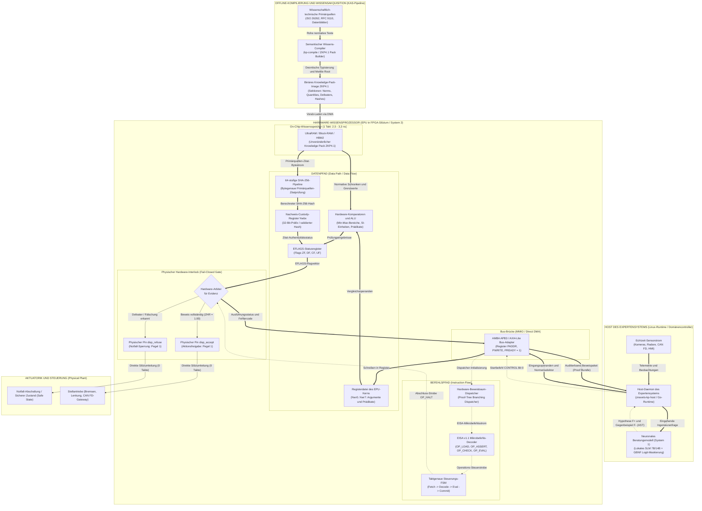
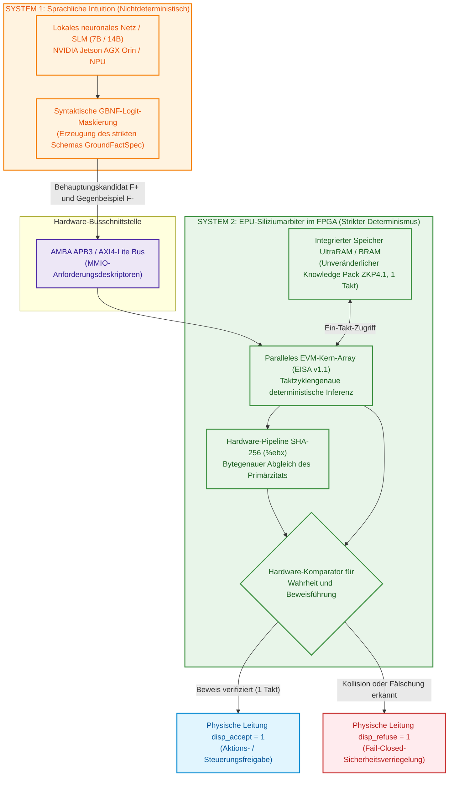
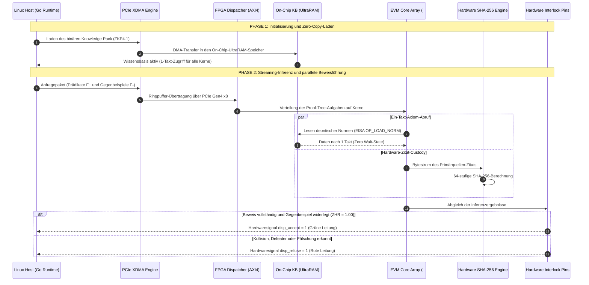

# MEMO-079: Wissenschaftlich-technische Spezifikation für Hardwaremodellierung, FPGA-Chipanforderungen und das Benchmark-Programm des Wissensprozessors (EPU) Znavets v4

- **Datum:** 9. Oktober 2026
- **Autor:** Chefarchitekt Znavets v4 (Mykola Fedchyk)
- **Zielgruppe:** Leitende Ingenieure und Systemarchitekten für FPGA / ASIC, Experten für Siliziumverifikation, Entwickler geschäftskritischer Echtzeitsysteme (ISO 26262 ASIL D, DO-178C DAL A)
- **Zweck des Dokuments:** Fachliche Begründung der Notwendigkeit einer Hardware-Wissensbeschleunigung, Darlegung der vorhandenen verifizierten RTL-Basis, Formalisierung der Kriterien zur Auswahl von FPGA-Bausteinen für die Bereitstellung eines Laborprüfstands und Beschreibung des experimentellen Benchmark-Programms
- **Status:** OFFIZIELLE TECHNISCHE SPEZIFIKATION (Freigegeben für Hardware-Allokation und Silizium-Evaluation)
- **Anforderungs-Rückverfolgbarkeit (Traceability):** `SHR-017`, `SHR-018`, `SHR-021` $\to$ `SWR-031`, `SWR-032`, `SWR-036`, `SWR-038` $\to$ `ADR-021`, `ADR-022`, `ADR-025` $\to$ Phasen 7–8 der Roadmap
- **Theoretische Basis in der Monografie:** Die fundamentalen theoretischen Grundlagen, formalen Modelle und Verifikationsprotokolle sind in den Kapiteln der Monografie [«Architektur evidenzbasierter Expertensysteme»](README.md) dargelegt (insbesondere in [Kapitel 10](ch10-knowledge-acquisition-systems.md), [Kapitel 16](ch16-expert-systems-architecture.md), [Kapitel 18](ch18-execution-infrastructure.md), [Kapitel 28](ch28-dual-mode-expert-systems.md), [Kapitel 29](ch29-neuro-symbolic-architecture.md), [Kapitel 32](ch32-high-performance-knowledge-packs-mmap-and-harvesting.md), [Kapitel 38](ch38-curing-machine-hallucinations-and-knowledge-deficits.md) sowie [Anhang B](appendix-b-robotics-and-cyber-physical-systems.md))

---

## 1. Präambel: Evolution des Entwurfs – von der Analyse der Ingenieurdokumentation zum Hardware-EPU-Prozessor auf FPGA

### 1.1. Entwicklungsgegenstand: Expertensystem für kritische Ingenieuranwendungen
Das Projekt **Znavets v4** wird als evidenzbasiertes Expertensystem der nächsten Generation konzipiert, das auf die Automatisierung von Entscheidungsprozessen und Regulierungs-Audits in sicherheitskritischen Industriezweigen ausgerichtet ist:
* **Fahrzeugelektronik und Autopiloten** (funktionale Sicherheit nach ISO 26262 ASIL D, HMI-Sensorik und Bedienfelder – siehe [Kapitel 27](ch27-safety-case-gsn-synthesis.md) und [Kapitel 30](ch30-safety-cybersecurity-co-engineering.md));
* **Bordavionik und unbemannte Flugsysteme** (Zertifizierungsstufen nach DO-178C / DO-254 DAL A – siehe [Kapitel 18](ch18-execution-infrastructure.md) und [Anhang B](appendix-b-robotics-and-cyber-physical-systems.md));
* **Industrielle Netzwerk-Gateways und Telemetriesysteme** (Invarianten von IETF-RFC-Standards, Feldbusse wie CAN FD, Automotive Ethernet SOME/IP – siehe [Kapitel 22](ch22-cybernetics-edge-to-backend.md)).

### 1.2. Wissensakquisition aus wissenschaftlich-technischen Primärquellen (Knowledge Acquisition)
Im Gegensatz zu kommerziellen generativen Chatbots, die auf unspezifischen Internet-Korpora trainiert werden und unvermeidlich unter Halluzinationen leiden, stützt sich die entwickelte Architektur auf eine **strikte Wissensakquisition unmittelbar aus wissenschaftlich-technischen Primärquellen und normativer Ingenieurdokumentation**:
1. Texte internationaler Standards, Normen und Richtlinien (RFC, ISO, IEC, IEEE);
2. Hardwareschnittstellen-Spezifikationen, Datenblätter von Mikrocontrollern und Sensorbausteinen;
3. Formalisierte Regelwerke der funktionalen Sicherheit und Zustandsübergangsmatrizen (FSM).

Fundamentale Invariante des Systems: **Evidence-Grounded Invariant** (detailliert beschrieben in [Kapitel 10](ch10-knowledge-acquisition-systems.md) und [Kapitel 15](ch15-knowledge-extraction-and-kb-construction.md)). Kein Urteil, keine Empfehlung und kein Steuersignal darf erzeugt werden, wenn sie sich nicht auf ein direktes, wortwörtliches Zitat aus einer unveränderlichen Primärquelle mit exakten Bytegrenzen (`byte_start`, `byte_end`) und einem validierten kryptografischen SHA-256-Hash stützen. Fehlt ein Faktum oder ist es mehrdeutig, so ist das System verpflichtet, eine typisierte Verweigerung auszugeben (*Fail-Closed Gate*, siehe [Kapitel 37](ch37-input-information-assessment-and-algorithmic-skepticism.md)), anstatt eine plausible Mutmaßung anzustellen.

### 1.3. Warum entstand die Idee eines virtuellen Prozessors (EVM / EISA)?
Die praktische Umsetzung dieser Anforderung stieß auf zwei fundamentale ingenieurtechnische Barrieren:
* **Sprachmodelle (LLM/SLM) sind prinzipbedingt unfähig, Determinismus zu garantieren.** Ihre statistische Natur der Token-Wahrscheinlichkeitsverteilung bietet keine mathematische Beweisgarantie ($ZHR \ne 1{,}00$).
* **Klassische Logik-Solver (Prolog, Lean 4, SMT Z3)** sind für eingebettete Echtzeitsysteme extrem ressourcenintensiv und langsam; zudem fehlt ihnen ein nativer Mechanismus zur bytegenauen Bindung logischer Prädikate an binäre Roh-Slices textueller Dokumente.

Der Ausweg bestand in der Konzeption der **Epistemischen Virtuellen Maschine (EVM)** mit einem spezialisierten Mikrobefehlssatz namens **EISA (Epistemic Instruction Set Architecture)** (formale Spezifikation in [Kapitel 16](ch16-expert-systems-architecture.md) und [Kapitel 31](ch31-syllogistic-reasoning-and-relation-lattices.md)). Die Wissensbasis wurde in das Binärformat **Knowledge Pack (ZKP4.1)** strukturiert, das über den Systemaufruf `mmap` ohne Kopiervorgänge (Zero-Copy) direkt in den Adressraum eingeblendet wird ([Kapitel 32](ch32-high-performance-knowledge-packs-mmap-and-harvesting.md)). Die EVM implementiert eine kompakte Registermaschine (Universalregister `%er0..%er7`, Zitat-Custody-Register `%ebx`), die Mikroprogramme zur Verifikation von Normen, physikalischen Einheiten und Defeatern (Widerlegungsbedingungen) deterministisch in wenigen Nanosekunden abarbeitet (4,05 ns pro Instruktion in der Go/C-Software-Laufzeitumgebung, siehe [Kapitel 17](ch17-implementation-stack.md)).

### 1.4. Warum wurde ein Hardware-Prozessor auf FPGA zum logischen und notwendigen Schritt?
Bei der Untersuchung des On-Board-Betriebs auf eingebetteten Rechnern (insbesondere auf dem Prüfstand mit NVIDIA Jetson AGX Orin 64GB) traten neue physikalische Herausforderungen zutage:
1. **Harte Echtzeit (Hard Real-Time):** Selbst ein hochgradig optimierter Softwarekern unter Linux unterliegt Latenz-Jitter durch den OS-Scheduler, Treiber-Interrupts und Buszugriffsverzögerungen auf den externen Arbeitsspeicher (60–100 ns). In einer kritischen Verkehrssituation kann dies zur Überschreitung des Sicherheitszeitfensters $FTTI$ führen (Berechnung der Latenzbudgets in [Kapitel 18](ch18-execution-infrastructure.md)).
2. **Hardware-Sicherheitsverriegelung (ASIL-D Hardware Safety Interlock):** Nach den Normen der funktionalen Sicherheit darf der Softwarecode eines High-Level-Betriebssystems niemals die finale Instanz für eine Notabschaltung sein. Erforderlich ist ein physisches Siliziummodul, das Hardware-Freigabe- und Sperrleitungen (`disp_accept` / `disp_refuse`) mit 0 Takten Verzögerung ansteuert ([Kapitel 30](ch30-safety-cybersecurity-co-engineering.md) und [Anhang B](appendix-b-robotics-and-cyber-physical-systems.md)).
3. **Natürliche Parallelität logischer Inferenz:** Die Verifikation von Beweisbäumen (Proof Trees) und deontischen Normkollisionen lässt sich ideal auf die Logikelementmatrix eines FPGAs abbilden. Die Wissensbasis kann direkt in den ultraschnellen On-Chip-Speicher (Block-RAM / UltraRAM / HBM2) geladen werden, was einen Abruf von Normen in einem einzigen Takt ($2{,}5–3{,}3\ \text{ns}$) ermöglicht, während die Prüfung von Zitaten im Register `%ebx` an eine parallele Hardware-SHA-256-Pipeline delegiert wird.

### 1.5. Architekturschema des epistemischen Prozessors: Datenflüsse, Befehlsflüsse und Systemintegration

Das folgende Architekturdiagramm veranschaulicht die Systemtopologie und die strikte Trennung von **Befehlsflüssen** (gestrichelte violette Linien), **Datenflüssen** (doppelte blaue Linien) und **physischen Sicherheitssignalen** (fettgedruckte rote Linien) zwischen dem Host des Expertensystems, dem beratenden Sprachmodell (System 1) und dem Silizium-Wissensprozessor EPU in der FPGA-Matrix (System 2).



#### Tabelle zur Abgrenzung von Befehls- und Datenflüssen in der EPU

| Flusstyp | Quelle | Senke im EPU-Prozessor | Physisches Medium | Funktionale Bestimmung |
| :--- | :--- | :--- | :--- | :--- |
| **Datenfluss (Data Flow)** | Sensoren des Hosts / LLM System 1 | Registerdatei `%er0..%er7` | AXI4/APB-Bus (MMIO PWDATA) | Übergabe von Argumenten des aktuellen Falls (Geschwindigkeit, Spannung, Knoten-ID). |
| **Datenfluss (Data Flow)** | On-Chip-Speicher ZKP4.1 (URAM) | ALU-Komparatoren und Einheiten-Prüfer | Interne 64-Byte-Breitbandleitung (1 Takt) | Abruf normativer Schranken $[Min, Max]$, Maßeinheiten (SI/UCUM) und der Defeater-Liste. |
| **Datenfluss (Data Flow)** | Textsektion ZKP4.1 (URAM) | 64-stufige SHA-256-Pipeline | Interner FIFO-Streamingkanal | Bytegenaues Durchschleusen des Zitattexts zur parallelen Berechnung des Primärquellen-Hashwerts. |
| **Befehlsfluss (Instruction Flow)** | Host-Anwendung | Hardware-Task-Dispatcher | MMIO-Register `CONTROL` (Bit 0) | Start-Strobe für die logische Inferenz auf dem EVM-Kern. |
| **Befehlsfluss (Instruction Flow)** | Beweisbaum-Dispatcher | EISA v1.1 Instruktions-Decoder | Interner Mikrocode-Bus | Sequenz von Mikrobefehlen (`OP_LOAD_NORM`, `OP_ASSERT_RANGE`, `OP_CHECK_QUANTITY`, `OP_EVAL_DEFEATER`, `OP_VERIFY_EVIDENCE`). |
| **Sicherheitssteuerungsfluss (Interlock Flow)** | Arbitrierungslogik `INTERLOCK` | Stellantriebe (Aktuatoren / CAN FD) | Direkte Silizium-Pins `disp_accept` / `disp_refuse` | Sofortige (0 Takte Latenz) Hardware-Abschaltung einer gefährlichen Aktion bei Erkennung eines Widerspruchs oder einer Halluzination. |

---

## 2. Zusammenfassung für den FPGA-Experten (Executive Summary)

Das Projekt **Znavets v4** entwickelt die weltweit erste zertifizierte Plattform für **evidenzbasierte künstliche Intelligenz mit garantierter Null-Halluzinations-Rate ($ZHR = 1{,}000000$)** für sicherheitskritische Industriezweige (automobilbezogene Autopiloten nach ISO 26262 ASIL D, Avionik nach DO-178C DAL A, Medizingeräte und Schutzkontroller industrieller Netzwerke).

Die zentrale Systemkomponente bildet die **Epistemische Virtuelle Maschine (Epistemic Virtual Machine — EVM)**, welche den proprietären Mikrobefehlssatz **EISA v1.1 (Epistemic Instruction Set Architecture)** ausführt. Die EVM erbringt den mathematischen Nachweis, dass jede Ausgabenaussage oder Steueranweisung des Systems strikt auf unveränderlichen normativen Primärquellen (Axiomen, Standards, Spezifikationen) basiert. Dies erfolgt über den Mechanismus der **bytegenauen Zitat-Custody (%ebx Register Custody)**, stellt das Fehlen verdeckter Defeater (Widerlegungsbedingungen) sicher und validiert physikalische Wertebereiche von Maßeinheiten (SI/UCUM).

Auf Softwareebene unter Linux (Go 1.24, C) erreicht der EVM-Kern eine Durchsatzrate von 246 Millionen Instruktionen pro Sekunde bei vollständig dynamikfreier Speicherverwaltung (Zero-Allocation via `mmap`). Um jedoch die Anforderungen an **harte Echtzeit (Hard Real-Time)** in automobilen Steuergeräten mit einem Sicherheitsbudget von $FTTI < 100\ \mu\text{s}$ (Fault Tolerant Time Interval) zu erfüllen und Latenzen externer Speicherbusse vollständig zu eliminieren, erfordert die Architektur eine **Silizium-Realisierung – einen Hardware-Wissensprozessor (Epistemic Processing Unit — EPU)**.

Vom Autor wurde bereits ein voll funktionsfähiger Verilog-RTL-Kern der EVM zusammen mit einer AMBA-APB3-Slave-Busbrücke (`hardware/evm_fpga/evm_core.v`, `evm_apb_wrapper.v`) entwickelt, im taktzyklengenauen Simulator `iverilog` verifiziert und im Open-Source-Synthese-Tool `yosys 0.52` erfolgreich synthetisiert.

**Ziel dieses Dokuments:** Dem FPGA-Experten den vollständigen technischen Kontext, das architektonische Konzept, die vorhandene RTL-Basis und eine präzise Anforderungsgradation an FPGA-Bausteine (**Minimal**, **Optimal**, **Ideal**) bereitzustellen, damit dieser qualifiziert die am besten geeignete Hardware-Plattform zur Durchführung eines umfassenden Experiments bestimmen und zuteilen kann.

---

## 3. Warum FPGAs für Znavets v4 eine fundamentale Notwendigkeit darstellen

Herkömmliche Ansätze zum Aufbau von Expertensystemen auf Allzweckprozessoren (x86/ARM CPUs) oder Grafikbeschleunigern (NVIDIA GPUs) weisen zwei unüberwindbare physikalische Defizite auf, die ihren Einsatz als finale Sicherheitsarbitrierer (Safety Interlocks) ausschließen. Die fundamentale Trennung in eine beratende probabilistische Komponente und einen strikt deterministischen Kern ist in [Kapitel 28 (Zweimodale Expertensysteme)](ch28-dual-mode-expert-systems.md) und [Kapitel 29 (Neuro-symbolische Architektur)](ch29-neuro-symbolic-architecture.md) fundiert begründet:

### 3.1. Nichtdeterministische Latenz und Jitter (Non-Deterministic Latency & Jitter)
Allzweck-CPUs stützen sich auf mehrstufige Cache-Hierarchien (L1/L2/L3), dynamische Sprungvorhersage (Branch Prediction), Out-of-Order-Ausführung und betriebssystemgesteuerte Interrupts. Ein Cache-Miss oder ein Kontextwechsel des Betriebssystems führt zu einem sprunghaften Anstieg der Latenz um 2 bis 3 Größenordnungen (Jitter von Hunderten Nanosekunden bis hin zu Dutzenden Millisekunden). Im kritischen ASIL-D-Sicherheitsperimeter, in dem ein schützendes Bremsmanöver innerhalb des eng begrenzten Zeitintervalls $FTTI$ zwingend einen Widerspruchsfreiheitsbeweis erhalten muss, ist eine derartige Latenzdrift untragbar.

### 3.2. Der Von-Neumann-Flaschenhals (Memory Wall) beim Durchlaufen von Inferenzbäumen
Symbolische logische Inferenz (Datalog, Resolution, Proof Trees) erfordert das wiederholte Traversieren von Hunderten verknüpfter Regeln und die Prüfung von Grenzwertbedingungen. Befindet sich die Wissensbasis im externen DDR4/DDR5/LPDDR5-Speicher, belastet jeder Zugriff auf eine Regel den Systembus mit einer Latenz von 60–100 ns pro Operation.

### 3.3. Physische Fail-Closed-Sicherheitsverriegelung (Hardware Safety Interlock)
In rein softwarebasierten Systemen können Betriebssystemabstürze, hängende Treiber oder Fehlfunktionen des Sprachmodells die Kontrolle an sich reißen. In einem FPGA-gestützten System sind die Sicherheitsleitungen **`disp_accept`** (Aktionsfreigabe) und **`disp_refuse`** (typisierte Verweigerung) physische Siliziumleitungen. Erkennt der EPU-Kern einen logischen Widerspruch oder den Verlust der Primärquellen-Bindung, setzt er die Leitung `disp_accept` in Hardware mit **0 Takten Verzögerung** auf logisch Null und unterbindet damit physikalisch jede Signalweiterleitung an die Aktuatoren des Fahrzeugs oder Fluggeräts.



---

## 4. Aktueller Entwicklungsstand und RTL-Verifikationsbasis

### 4.0. Was bedeutet «RTL-Verifikationsbasis» im Kontext von Znavets v4?
In der Mikroelektronik und beim Entwurf digitaler integrierter Schaltungen gilt:
* **RTL (Register-Transfer-Ebene / Register-Transfer Level):** Dies ist eine Methode zur formalen Schaltungsbeschreibung mittels Hardwarebeschreibungssprachen (Hardware Description Language — HDL, in diesem Projekt **Verilog**). RTL beschreibt eine Schaltung nicht als Folge abstrakter Softwareanweisungen, sondern als physikalische Topologie von Hardwareregistern (Flipflops), die über kombinatorische Logikgatter (UND, ODER, NICHT, Multiplexer, Komparatoren, Arithmetik) verbunden sind und digitale Signale bei jedem Taktimpuls (`clock`) transferieren.
* **Verifikationsbasis:** Dies bedeutet, dass die Arbeiten auf dem Laborprüfstand nicht mit einer vagen Idee oder einem Algorithmus auf Papier beginnen, sondern mit einer **vollständig implementierten, funktionsfähigen und taktgenau validierten digitalen Prozessorschaltung**. Die Schaltung hat vor ihrem Transfer auf das physikalische FPGA bereits umfassende Simulationstests durchlaufen, welche die Abwesenheit von Signal-Glitches, FSM-Deadlocks und Bitbreiten-Inkonsistenzen garantieren.

### 4.1. Kernarchitektur `evm_core.v`
Der Kern realisiert einen pipelined 32-Bit-Prozessor mit festem EISA-Instruktionsformat (4 Bytes pro Befehl):
* **Registerdatei:** 8 Universalregister `%er0..%er7` (je 32 Bit);
* **Spezialisiertes Custody-Register `%ebx`:** Enthält einen 32-Bit-Ausschnitt oder Pointer auf den validierten SHA-256-Hash des Normzitats;
* **Statusregister `EFLAGS`:** Enthält Flags für Nullergebnis (`ZF`), Defeater (`DF`), Beweisprüfung (`CF`) und Validität physikalischer Einheiten (`UF`);
* **Unterstützte EISA v1.1 Opcodes:**
  - `0x01 OP_LOAD_NORM`: Abruf einer deontischen Norm über das Offset im Knowledge Pack;
  - `0x02 OP_ASSERT_EQ`: Deterministischer Gleichheitsvergleich von Prädikatsparametern;
  - `0x03 OP_ASSERT_RANGE`: Hardware-Verifikation, dass ein Zahlenwert im zulässigen Intervall $[Min, Max]$ liegt;
  - `0x04 OP_CHECK_QUANTITY`: Typprüfung physikalischer SI-Maßeinheiten;
  - `0x05 OP_EVAL_DEFEATER`: Prüfung auf Vorhandensein von Ausnahmen und Norm-Aufhebungsbedingungen;
  - `0x06 OP_VERIFY_EVIDENCE`: Bytegenauer Abgleich des Primärquellen-Zitats mit dem Register `%ebx`;
  - `0x0E OP_HALT_ACCEPT`: Erfolgreicher Beweisabschluss mit Erzeugung des Status `ACCEPT`;
  - `0x0F OP_HALT_REFUSE`: Stopp mit typisiertem Fail-Closed-Sicherheitscode (`REFUSAL`).

### 4.2. Bus-Wrapper `evm_apb_wrapper.v`
Für die nahtlose Integration in automobile SoCs wurde ein Slave-Schnittstellenmodul für den **AMBA APB3 Bus (Advanced Peripheral Bus)** realisiert:
* Vollständige Konformität zum AMBA-APB3-Standard (`PCLK`, `PRESETn`, `PADDR[11:0]`, `PSEL`, `PENABLE`, `PWRITE`, `PWDATA[31:0]`, `PRDATA[31:0]`, `PREADY`, `PSLVERR`);
* Zero-Wait-State-Betrieb (`PREADY = 1`);
* Memory-Mapped I/O (MMIO) Hardwareregister:
  - `0x00 CONTROL`: Start der Inferenz (`Bit 0`), Reset der FSM (`Bit 1`);
  - `0x04 STATUS`: Betriebsbereitschaft (`DONE`), Validität (`VALID`), Fehler-Flags;
  - `0x08 NORM_ADDR`: Offset der Norm in der Wissensbasis;
  - `0x0C EXP_HASH`: Erwarteter Referenz-Hash des Nachweiszitats;
  - `0x10 OUT_FLAGS`: Momentaner Zustand der Kern-Flags;
  - `0x14 DISPATCH`: Hardwarezustand der Leitungen `disp_accept` / `disp_refuse`.

### 4.3. Testbenches (`evm_tb.v`, `evm_apb_tb.v`)
Testbenches sind digitale Stimulus-Generatoren (Modelle der Verifikationsumgebung), welche die Kopplung des Kerns an reale Digitalschaltungen emulieren: Sie erzeugen einen stabilen Takt, fahren Buszyklen, übergeben Test-Mikroprogramme mit realen Ingenieurdaten und überwachen taktgenau den Zustand interner Flipflops und externer Pins:

1. **Kern-Testbench `evm_tb.v` (Multi-Step Proof Tree Verification):**
   * **Taktgenerator:** Erzeugt stabil ein Taktsignal von $100\ \text{MHz}$ (Periode $10\ \text{ns}$, Pulsdauer $5\ \text{ns}$);
   * **Taktzyklus-Verifikation von 4 kritischen Hardwarepfaden:**
     - *Nominaler Beweisbaum (Nominal Proof Tree):* Die Eingangsparameter liegen innerhalb der normativen Schranken, kein Defeater liegt vor (`defeater_condition_id = 0`), der Zitat-Hash in Register `%ebx` stimmt exakt mit der SHA-256-Referenz überein $\to$ der Kern erreicht erfolgreich die Instruktion `OP_HALT_ACCEPT`, setzt das Flag `disposition_accept = 1` und liefert den Freigabestatus in einer festen Anzahl von Zyklen zurück;
     - *Bereichsverletzung (Out-of-Bounds Range Violation):* Ein Messwert überschreitet die vorgegebenen Grenzen $[Min, Max]$ $\to$ die Prüfung `OP_ASSERT_RANGE` löscht das Validitätsflag, der bedingte Sprung `OP_JMP_IF_NOT` verzweigt zu `OP_HALT_REFUSE`, der Kern setzt mit 0 Takten Latenz die Leitung `disposition_refuse = 1` mit dem Fehlercode `0x422` (`REFUSAL_UNSATISFIABLE`);
     - *Defeater-Kollision (Defeater Conflict):* Eine Ausnahmebedingung der Norm wird aktiv (z. B. Notbetriebszustand oder Sonderregelung im Standard) $\to$ der Befehl `OP_EVAL_DEFEATER` detektiert die Kollision, der Kern stoppt deterministisch mit dem Code `0x409` (`REFUSAL_CONTRADICTION`);
     - *Nachweisfälschung oder Zitatmanipulation (Custody Hash Tamper):* Simulation einer Verfälschung von nur einem Byte im Zitattext oder eines manipulierten Hashwerts im Register `%ebx` $\to$ der Befehl `OP_ANCHOR_EVIDENCE` registriert unverzüglich die Verletzung der Nachweiskette, der Kern sperrt die Ausführung mit Code `0x403` (`REFUSAL_UNVERIFIED`).
   * **Signalverlaufs-Dump (VCD Dump):** Schreibt einen vollständigen zyklusgenauen Trace aller internen Signale in die Datei `hardware/evm_fpga/evm_trace.vcd`, was die Inspektion der Wellenformen im Tool **GTKWave** ermöglicht.

2. **Busbrücken-Testbench `evm_apb_tb.v` (AMBA APB3 Bus Master Emulation):**
   * Emuliert Transaktionen eines Master-Mikrocontrollers (z. B. ARM Cortex-M innerhalb eines SoC oder eines automobilen Controllers vom Typ Infineon AURIX TriCore);
   * Durchläuft taktgenau den vollständigen zweiphasigen AMBA-APB3-Buszyklus (`SETUP Phase` im ersten Takt $\to$ `ACCESS Phase` mit Signal `PENABLE` im zweiten Takt);
   * Schreibt Mikrobefehle über den Bus in den internen ROM-Speicher des Kerns;
   * Überträgt Parametergrenzen $[1000..2000]$ und den 256-Bit-Erwartungshash in die MMIO-Register;
   * Hebt das Hardware-Resetsignal `PRESETn` über Bit 0 des Registers `CONTROL` auf;
   * Wartet auf das Interrupt-Signal `irq_halt`, liest den Ausführungsstatus sowie die Zyklendauer (`CYCLES_REG`) aus und bestätigt, dass die direkte Hardware-Sicherheitsleitung `disp_accept` synchron und ohne Zusatzverzögerung aktiviert wird.

### 4.4. Ergebnisse der Logiksynthese (`yosys 0.52`)
Die Logiksynthese stellt die Übersetzung des Verilog-Quellcodes in eine zielspezifische Netzliste (Gate-Level Netlist) aus Logikzellen des FPGA-Bausteins dar:

* **Die Schaltung ist bereits erfolgreich in virtuelle Logikzellen übersetzt:**
  - Der Basis-Rechenkern `evm_core.v` belegt **1 749 Lookup-Tabellen (4-Input LUTs)** und **849 Flipflops (DFFs)**;
  - Der vollständige Busblock `evm_apb_wrapper.v` inklusive Microcode-ROM, Adressdecoder der MMIO-Register und Synchronisationsstufen belegt **8 851 Logikzellen**;
  - Die Synthese wurde mit den Skripten `synth.ys` und `synth_apb.ys` im Open-Source-Framework **Yosys 0.52** für Lattice iCE40 sowie mit Translation auf Xilinx/AMD 7-Series-Primitive verifiziert.

* **Relevanz für den FPGA-Experten:**
  1. *Exakter physikalischer Footprint bekannt:* Der Ressourcenbedarf muss nicht geschätzt werden. Der Kern ist extrem kompakt – ein einzelner `evm_core` belegt weniger als **1 % eines Mittelklasse-FPGAs**.
  2. *Skalierbarkeit zu einem Multiprozessor-Array:* Selbst auf einem kostengünstigen FPGA-Entwicklungsboard (z. B. AMD Artix UltraScale+ AU15P oder Kintex-7 mit 200k–300k LUTs) lässt sich problemlos ein **Array aus 16 bis 64 parallelen EPU-Kernen** implementieren, die unabhängig und deterministisch einzelne Zweige des Beweisbaums verifizieren.
  3. *Sofortige Einsatzbereitschaft:* Der RTL-Code synthetisiert fehlerfrei («0 errors, 0 unresolved latches»), weist keinerlei kombinatorische Schleifen auf und ist bereit für den Import in **AMD Vivado ML Enterprise** oder **Intel Quartus Prime**.

### 4.5. Modellierungs- und Simulationswerkzeuge unter Linux
Alle Module wurden im industriellen und quelloffenen Software-Stack unter Ubuntu 26.04 validiert:
1. **`iverilog` (Icarus Verilog v12.0) + `gtkwave`:** Taktzyklengenaue Simulation der Testszenarien (`evm_tb.v`, `evm_apb_tb.v`), 100 % Erfolgsquote bei 4 bis 8 Takten pro EISA-Befehl mit grafischer Signalanalyse.
2. **`verilator` (v5.032):** Hochperformante C++-Zyklusemulation für Stress-Tests über Millionen von Iterationen ohne Genauigkeitsverlust.
3. **`covered` (v0.7.10):** Ermittlung von Hardware-Code-Coverage-Metriken (Line-, Toggle-, Combinational-Logic- und FSM-State-Coverage) zur Zertifizierung von Silizium-IP nach ISO 26262 ASIL D.

---

## 5. Experimentkonzept: Paralleles EPU-Kern-Array (Systolic Multi-Core Array)

Der Einzelkern ist bereits synthetisiert. Das zentrale wissenschaftliche Ziel des nächsten Schritts ist der Übergang vom Einzelcontroller zu einem **skalierbaren systolischen Hardware-Wissenskoprozessor**.

```
+--------------------------------------------------------------------------------------------------+
|                    EPU HARDWARE ACCELERATOR TOPOLOGY (FPGA INTERNAL MAPPING)                     |
+--------------------------------------------------------------------------------------------------+
|                                                                                                  |
|  [ Linux Host CPU ] <==== PCIe Gen3/Gen4 x8/x16 (XDMA / QDMA) ====> [ FPGA Top Level ]           |
|                                                                               |                  |
|   +---------------------------------------------------------------------------v--------------+   |
|   |                  ON-CHIP ULTRA-FAST MEMORY (UltraRAM / BRAM / HBM2)                      |   |
|   |   - Immutable Knowledge Pack v4.1 (RFC 9110, ISO 26262-4 ASIL-D, DO-178C)               |   |
|   |   - Multi-Port Read-Only Arbiter (1-cycle latency: 2.5 - 3.3 ns)                         |   |
|   +---------------------------------------+--------------------------------------------------+   |
|                                           |                                                      |
|                                           v AXI4 Interconnect / Crossbar (250-400 MHz)           |
|   +------------------------------------------------------------------------------------------+   |
|   |                   PARALLEL EPU CORE MATRIX (16 .. 64 .. 256 EVM CORES)                   |   |
|   |                                                                                          |   |
|   |   +------------------+    +------------------+          +------------------+             |   |
|   |   |   EVM Core #0    |    |   EVM Core #1    |  ......  |  EVM Core #N-1   |             |   |
|   |   |   - %er0..%er7   |    |   - %er0..%er7   |          |   - %er0..%er7   |             |   |
|   |   |   - EISA Decoder |    |   - EISA Decoder |          |   - EISA Decoder |             |   |
|   |   |   - Fail-Closed  |    |   - Fail-Closed  |          |   - Fail-Closed  |             |   |
|   |   +--------+---------+    +--------+---------+          +--------+---------+             |   |
|   |            |                       |                             |                       |   |
|   +------------|-----------------------|-----------------------------|-----------------------+   |
|                v                       v                             v                           |
|   +------------------------------------------------------------------------------------------+   |
|   |               PIPELINED HARDWARE SHA-256 EVIDENCE CUSTODY UNIT (%ebx)                    |   |
|   |   - 64-stage parallel verification of text slices against hardware quote hashes          |   |
|   +------------------------------------+-----------------------------------------------------+   |
|                                        |                                                         |
|                                        v                                                         |
|                 [ Hardware Safety Interlock: DISP_ACCEPT / DISP_REFUSE ]                         |
|                                                                                                  |
+--------------------------------------------------------------------------------------------------+
```

### Schlüsselaufgaben des Experiments auf dem physischen Silizium:
1. **Zero-Copy On-Chip Knowledge Pack:** Laden des binären Wissenspakets (Größe 2 MB bis 64 MB) direkt in den internen Block-RAM (BRAM) und UltraRAM (URAM) des Bausteins. Erzielung einer Normenabrufzeit von exakt **1 Maschinentakt (2{,}5–3{,}3 ns)** ohne jegliche externe Busverzögerungen (Zero Wait-States).
2. **Parallele Verifikation von Beweisbäumen (Proof Trees):** Prüft das System komplexe normative Zusammenhänge (etwa die Kompatibilität des Fehlertoleranz-Zeitintervalls $FTTI$ mit Notfall-Übergangsstrategien nach ISO 26262), umfasst der Beweisbaum Dutzende interdependenter Zweige. Ein Hardware-Dispatcher verteilt diese Zweige auf freie EVM-Kerne, was die Gesamtinferenzzeit von Millisekunden auf wenige Dutzend Nanosekunden senkt.
3. **Hardware-Pipeline SHA-256 mit 64 Stufen (%ebx):** Die Prüfung der Zitatunveränderlichkeit erfolgt parallel zur logischen Inferenz in exakt 64 Hardwaretakten und gewährleistet physischen Manipulationsschutz.
4. **Durchgängiger PCIe-DMA-Interconnect (XDMA / QDMA):** Vermessung der vollständigen Transferzeit eines Anforderungsdeskriptors vom Linux-Softwarehost zum FPGA und des Rücktransfers des verifizierten Urteils (Round-Trip Time). Zielwert: **$`T_{\mathrm{roundtrip}} < 1{,}5\ \mu\text{s}`$**.

---

## 6. Anforderungen an die FPGA-Hardwareplattform (Hardware Requirements Matrix)

Damit der FPGA-Experte die benötigten Ressourcen präzise bewerten und eine fundierte Entscheidung zur Bereitstellung eines Prüfstands treffen kann, wird die folgende Anforderungsspezifikation in drei Leistungsklassen unterteilt:

### Ebene 1: Mindestanforderungen (Minimum Baseline / Proof-of-Concept)
* **Zweck:** Verifikation eines einzelnen EVM-Kerns mit APB3 / AXI-Lite-Bus auf realem Silizium, Nachweis der Taktfrequenz $`F_{\max} \ge 100\ \text{MHz}`$ und elementare Host-Kommunikation über UART oder SPI.
* **Logikressourcen (Logic Cells):** **30 000 bis 100 000 LUTs**, ab 20 000 DFFs.
* **Interner Speicher (On-Chip Memory):** **2 bis 8 MB BRAM** (zur Unterbringung eines kompakten Knowledge Packs mit 500–1 000 Normen).
* **DSP-Blöcke:** Unkritisch (ab 20 DSP-Slices).
* **Schnittstellen:** USB-UART, SPI oder Basis-PCIe Gen2 x1.
* **Beispiel-Boards:** Digilent Nexys A7 (Xilinx Artix-7 XC7A100T), Digilent Basys 3, Terasic DE10-Lite (Intel MAX 10), Lattice ECP5 Evaluation Board.

### Ebene 2: Optimale Anforderungen (Optimal / Multi-Core Accelerator & Edge Deployment) — BESTE WAHL
* **Zweck:** Implementierung eines Clusters aus **16–64 parallelen EVM-Kernen**, Bereitstellung eines vollwertigen industriellen Knowledge Packs (RFC 9110 + ISO 26262 mit 5 000 Normen) im BRAM/UltraRAM, Hardware-Pipeline SHA-256 und hochperformanter DMA-Datenaustausch über PCIe Gen3/Gen4 x8.
* **Logikressourcen (Logic Cells):** **250 000 bis 600 000 LUTs**, ab 500 000 DFFs.
* **Interner Speicher (On-Chip Memory):** **20 bis 45 MB** gesamt (Kombination aus Block-RAM 36Kb und UltraRAM 288Kb für Ein-Takt-Zugriff).
* **DSP-Blöcke:** **500 bis 1 500 DSP48E2**-Slices (zur Pipelining-Optimierung der Hashfunktionen und Dimensionsarithmetik).
* **Host-Schnittstelle:** **PCI Express Gen3 x8 / Gen4 x8 (oder x16)** mit Unterstützung für Xilinx XDMA / QDMA.
* **Logiktaktfrequenz:** Stabiler Betrieb bei $`F_{\mathrm{core}} \ge 250–350\ \text{MHz}`$.
* **Empfohlene Boards:**
  - **AMD / Xilinx Kintex UltraScale+** (KU5P / KU11P, z. B. KCU116);
  - **AMD / Xilinx Zynq UltraScale+ MPSoC** (ZCU102, ZCU106 — Verbund aus ARM Cortex-A53-Kernen und leistungsfähiger FPGA-Matrix);
  - **AMD Alveo U50** (595K LUTs, 28 MB UltraRAM, PCIe Gen4 x16, kompakter PCIe-Formfaktor);
  - **AMD Alveo U200 / U250**.

### Ebene 3: Ideale Anforderungen (Ideal / High-Performance Data-Center & Autonomous Flagship)
* **Zweck:** Aufbau eines Flaggschiff-Systolen-Arrays mit **128–256+ EVM-Kernen**, native Integration von HBM2-Speicher (High Bandwidth Memory) zur Speicherung gigabytegroßer Normenkorpora (sämtliche ISO/SAE/DO-Standards), Hardware-Paketfilterung auf physikalischer Leitungsgeschwindigkeit (Line-Rate 25G/100G Ethernet).
* **Logikressourcen (Logic Cells):** **1 000 000 bis 2 500 000+ LUTs**, 2 000 000+ DFFs.
* **Interner Speicher:** Integrierter **HBM2-Stack (4–16 GB mit einer Bandbreite von 460–820 GB/s)** auf dem Chip-Interposer + über 30–90 MB On-Chip UltraRAM.
* **Schnittstellen:** PCIe Gen4 x16 / Gen5 x16 (mit Unterstützung für CXL.mem / CCIX), optische QSFP28-Ports (100GbE / SOME/IP).
* **Empfohlene Boards:**
  - **AMD / Xilinx Virtex UltraScale+ HBM** (VU33P / VU35P / VU37P);
  - **AMD Alveo U280 / Alveo U55C** (optimale Forschungsplattform für Rechenzentren);
  - **AMD Versal AI Core / Premium** (VC1902, VP1202 — heterogenes adaptives SoC).

---

## 7. Vergleichende Anforderungsmatrix

| Chip-Parameter | Ebene 1: Minimal (PoC) | Ebene 2: Optimal (Empfohlen) | Ebene 3: Ideal (Flaggschiff) |
| :--- | :---: | :---: | :---: |
| **Anzahl EVM-Kerne** | 1 – 2 Kerne | **16 – 64 Kerne** | **128 – 256+ Kerne** |
| **Logikzellen (LUTs)** | 30K – 100K LUTs | **250K – 600K LUTs** | **1 000K – 2 500K+ LUTs** |
| **Flipflops (DFF)** | 20K – 80K | **400K – 800K** | **1 500K – 3 500K** |
| **On-Chip-SRAM** | 2 – 8 MB (BRAM) | **20 – 45 MB (BRAM + UltraRAM)** | **30 – 90 MB URAM + 8–16 GB HBM2** |
| **Speicherbandbreite** | $\sim 5–10\ \text{GB/s}$ | **$> 100\ \text{GB/s}$ (Zero Wait-State)** | **$460–820\ \text{GB/s}$ (HBM2-Bus)** |
| **Schnittstelle zum Linux-Host** | UART / SPI / PCIe Gen2 x1 | **PCIe Gen3/Gen4 x8 (XDMA)** | **PCIe Gen4/Gen5 x16 (QDMA / CXL)** |
| **Erwartete Inferenzlatenz $`T_{\mathrm{eval}}`$** | $\sim 500\ \text{ns}$ | **$< 50\ \text{ns}$ (Hardware-Beweis)** | **$< 10\ \text{ns}$ (systolische Parallelität)** |
| **Ende-zu-Ende Round-Trip-Latenz** | $50–200\ \mu\text{s}$ | **$< 1{,}5\ \mu\text{s}$** | **$< 0{,}8\ \mu\text{s}$** |
| **Empfohlene Bausteine** | Artix-7, ECP5 | **Kintex US+, Zynq US+, Alveo U50** | **Virtex US+ HBM, Alveo U280/U55C** |

---

## 8. In der Ukraine verfügbare Einstiegs-FPGAs: Technische Kenndaten und Marktpreise

Für den zügigen Aufbau eines primären Laborprüfstands (Phase 1 Proof-of-Concept) wurde der ukrainische Markt für verfügbare FPGA-Entwicklungsboards analysiert (Prom.ua, RoboStore, Arduino.ua, MakerShop, OLX). Da ein einzelner synthetisierter Kern `evm_core` **1 749 LUT4** und **849 DFF** belegt, stehen in der Ukraine folgende praxisnahe Optionen zur Verfügung:

### 8.1. Sipeed Tang Nano Serie (Gowin LittleBee FPGA) — Empfohlenes Minimum
Die Boards der Tang-Nano-Serie verfügen über einen integrierten USB-JTAG-Programmer (BL702-Chip mit USB Type-C-Buchse, der keinen externen Programmer erfordert), einen kompakten Formfaktor und werden von der Open-Source-Toolchain Yosys (`synth_gowin` + `nextpnr-himbaechel`) sowie der kostenfreien Gowin EDA unterstützt:

1. **Tang Nano 4K (Baustein Gowin GW1NSR-LV4C):**
   - **Ressourcen:** 4 608 LUT4, 3 456 DFF, 180 Kbit Block-RAM, integrierter Cortex-M3-Hardcore, HDMI;
   - **Kapazität für EPU:** **1 Kern `evm_core.v`** (ermöglicht grundlegende EISA-Logikverifikation ohne vollständigen APB-Wrapper);
   - **Richtpreis in der Ukraine:** **~970 – 1 200 UAH**.
2. **Tang Nano 9K (Baustein Gowin GW1NR-9):**
   - **Ressourcen:** 8 640 LUT4, 6 480 DFF, 26 BRAM-Blöcke (gesamt 468 Kbit), 64 Mbit integrierter PSRAM;
   - **Kapazität für EPU:** **1–2 Kerne `evm_core.v`** zusammen mit dem vollständigen Bus-Wrapper `evm_apb_wrapper.v` und Normtabellen;
   - **Richtpreis in der Ukraine:** **~1 200 – 1 600 UAH** (bestes Preis-Leistungs-Verhältnis für den Schnellstart).
3. **Tang Nano 20K (Baustein Gowin GW2AR-18):**
   - **Ressourcen:** 20 736 LUT4, 15 552 DFF, 828 Kbit Block-RAM, 64 Mbit SDRAM;
   - **Kapazität für EPU:** **Array aus 4–8 parallelen EPU-Kernen** mit Bus-Arbiter und Sicherheitsausgängen;
   - **Richtpreis in der Ukraine:** **~1 900 – 2 500 UAH**.

### 8.2. Altera / Intel Cyclone IV Serie — Klassischer Ausbildungs- und Teststand
Traditionelle Boards für die Entwicklung in der kostenfreien Umgebung **Intel Quartus Prime Lite**:
1. **Cyclone IV EP4CE6 (EP4CE6E22C8N Core Board):**
   - **Ressourcen:** 6 272 Logikelemente (LE / LUT4), 270 Kbit M9K RAM;
   - **Kapazität für EPU:** **1 Kern `evm_core.v`**;
   - **Richtpreis in der Ukraine:** **~1 100 – 1 500 UAH** (zusätzlich USB-Blaster-Programmer für ~180–300 UAH erforderlich).
2. **Cyclone IV EP4CE10 / EP4CE22:**
   - **Ressourcen:** 10 320 – 22 320 LE, 400 Kbit bis 600 Kbit RAM;
   - **Kapazität für EPU:** **2–6 EPU-Kerne**;
   - **Richtpreis in der Ukraine:** **~2 200 – 3 800 UAH**.

### 8.3. Xilinx / AMD Artix-7 Serie (QMTECH XC7A35T) — Unterstützung für AMD Vivado ML
Für experimentelle Arbeiten in der industriellen Entwicklungsumgebung **AMD Vivado ML Enterprise**:
1. **QMTECH Artix-7 XC7A35T (Core Board):**
   - **Ressourcen:** 33 280 Logikzellen (6-Input LUT), 250 KB Block-RAM, 256 MB DDR3;
   - **Kapazität für EPU:** **Cluster aus 12–16 EPU-Kernen**;
   - **Richtpreis in der Ukraine:** **~2 800 – 4 500 UAH** (erfordert JTAG-Adapter Xilinx Platform Cable oder Digilent JTAG-HS2/HS3 für ~800–1 500 UAH).

### 8.4. Xilinx PYNQ-Z1 Board (Zynq-7000 XC7Z020) — Referenzlösung der SoC-Klasse
Das Board **PYNQ-Z1** (gefertigt von Digilent / TUL auf Basis des Bausteins **AMD / Xilinx Zynq-7000 XC7Z020-1CLG400C**) repräsentiert eine qualitativ überlegene Geräteklasse, da es auf einem einzigen Halbleiterchip einen vollwertigen ARM-Rechner mit einer FPGA-Matrix vereint:
* **FPGA-Hardware-Ressourcen (Programmable Logic — PL):**
  - **85 000 Logic Cells** (Artix-7-Äquivalent: 53 200 6-Input LUT6, 106 400 D-Flipflops);
  - **4,9 Mbit (~630 KB) On-Chip Block-RAM** (140 Blöcke zu je 36 Kbit);
  - **220 Hardware-Slices DSP48E1** (prädestiniert für SHA-256-Pipelines und Vektorarithmetik);
  - **Kapazität für EPU:** Fasst mühelos ein **Array aus 16–32 parallelen Kernen `evm_core.v`** inklusive kompletter AXI4-Crossbar-Matrix und Interrupt-Controllern.
* **Prozessorsystem (Processing System — PS):**
  - Dual-Core-Prozessor **ARM Cortex-A9 MPCore @ 650 MHz** mit dedizierter NEON SIMD-Einheit;
  - **512 MB DDR3-Arbeitsspeicher** (16-Bit-Bus, Bandbreite 1 050 Mbit/s);
  - MicroSD-Kartenslot (Booten des Linux-Betriebssystems) und 16 MB QSPI Flash.
* **Interne Busbrücke PS-PL:**
  - 4 **AXI_GP**-Ports (General Purpose 32-Bit);
  - 4 hochperformante Direct-Memory-Access-Ports **AXI_HP (High Performance DMA)** mit einer kumulierten Bandbreite von **über 1 GB/s** und einer Latenz unter $30\ \text{ns}$ ohne externe Leitungen.
* **Peripherie und Schnittstellen:**
  - **Gigabit Ethernet (1GbE RJ-45)** für Netzwerkkommunikation;
  - Integrierter **USB-JTAG-Programmer** (Micro-USB), der von **AMD Vivado ML Standard (WebTalk)** nativ ohne Zusatzadapter unterstützt wird;
  - Erweiterungsanschlüsse: Arduino-Shield-Header (49 I/O-Pins), 2 Pmod-Ports (16 I/O-Pins), 4 Status-LEDs, 2 RGB-LEDs.
* **Richtpreis in der Ukraine:** **~24 500 – 31 500 UAH** (in der Regel auf Bestellung; sofern in Laboren oder Universitätsbeständen vorhanden, die optimale Plattform).

---

## 9. Physische Integration in den Versuchsstand (AORUS 5 SE4 und Seeed Studio reServer J501)

Die im Labor verfügbare Hardware bildet ein geschlossenes Gesamtsystem der Klasse **«Entwickler-Workstation + Bordseitiger Echtzeit-Domänencontroller»**:

```
+---------------------------------------------------------------------------------------------------------+
|                                    TOPOLOGIE DES VERSUCHSSTANDS                                         |
+---------------------------------------------------------------------------------------------------------+
|                                                                                                         |
|  [ ENTWICKLER-WORKSTATION ]                       [ ON-BOARD-DOMÄNENCONTROLLER (HOST) ]                 |
|            AORUS 5 SE4                                  Seeed Studio reServer J501                      |
|  - Intel Core i7-12700H (14C / 20T)               - NVIDIA Jetson AGX Orin (32/64GB, 275 TOPS)          |
|  - NVIDIA GeForce RTX 3070 Ti                     - Ubuntu Linux 22.04 LTS (JetPack 6.x)                |
|  - 32GB RAM, Ubuntu Linux / Windows               - System 1: Lokales SLM (Qwen/Llama auf Tensor Cores) |
|  - Toolchain: Yosys 0.52, Vivado, Gowin EDA       - Host-Daemon: znavets-kp-host (Go Runtime)           |
|  - Bitstream-Flash via USB/JTAG                   - Sensoreingänge: CAN FD, GMSL2-Kameras, Ethernet     |
|              |                                                        |                                 |
|              |                                    +-------------------+                                 |
|              |                                    |                                                     |
|     1GbE / 2.5GbE LAN (SSH, gRPC, Telemetrie)     |                                                     |
|              +====================================+                                                     |
|                                                   |                                                     |
|                                      Verbindungskanal: USB / SPI / M.2 PCIe                             |
|                                                   |                                                     |
|                                                   v                                                     |
|                                     +---------------------------+                                       |
|                                     |    FPGA-BOARD (SYSTEM 2)  |                                       |
|                                     |   Tang Nano 9K/20K oder   |                                       |
|                                     |     QMTECH Artix-7 35T    |                                       |
|                                     |                           |                                       |
|                                     | - Kern evm_core.v         |                                       |
|                                     | - APB3-Busbrücke          |                                       |
|                                     | - Custody-Register %ebx   |                                       |
|                                     +-------------+-------------+                                       |
|                                                   |                                                     |
|                               +-------------------+-------------------+                                 |
|                               |                                       |                                 |
|                               v                                       v                                 |
|                  Leitung disp_accept = 1                 Leitung disp_refuse = 1                        |
|             (Grüne LED / Freigabe)                  (Rote LED / Fail-Closed)                            |
|                               |                                       |                                 |
|                               +-------------------+-------------------+                                 |
|                                                   |                                                     |
|                                                   v                                                     |
|                             [ Digitaleingänge DI reServer J501 / Notfallrelais ]                        |
+---------------------------------------------------------------------------------------------------------+
```

### 9.1. Funktions- und Aufgabenverteilung der Knoten

1. **Entwickler-Laptop AORUS 5 SE4 (Engineering- und Kompilierungsknoten):**
   - Entwurf und Modifikation des Verilog-RTL-Codes (`evm_core.v`, `evm_apb_wrapper.v`);
   - Zyklengenaue Rechnersimulation in `iverilog`, `gtkwave`, `verilator`;
   - Logiksynthese und Bitstream-Routing in **Yosys 0.52** oder **Gowin EDA / AMD Vivado**;
   - Flashen der Binärdateien (`.fs` oder `.bit`) in die FPGA-Bausteine über die USB Type-C-Schnittstelle.

2. **Seeed Studio reServer Industrial J501 (Eingebetteter Echtzeit-Zielhost):**
   - Einsatz als automobiler Zentralrechner (ADAS Domain Controller);
   - Ausführung der heuristischen Komponente **System 1** (lokales SLM 7B/14B auf den Tensor Cores des AGX Orin Moduls via Ollama / llama.cpp / TensorRT-LLM);
   - Ausführung des Host-Daemons **`znavets-kp-host`** (Go Runtime), der das ZKP4-Knowledge-Pack verwaltet, die FPGA-Kommunikation steuert und den vollständigen Audit-Trail protokolliert.

3. **FPGA-Board (Hardware-Sicherheitsarbiter System 2):**
   - Ausführung des verifizierten RTL-Kerns der EPU (`evm_core.v`);
   - Unverzügliche Hardware-Validierung der Sprachmodell-Hypothesen gegen die normativen Ingenieurstandards;
   - Physische Ansteuerung der Notabschalt- bzw. Freigabeleitungen ohne Beteiligung des Betriebssystems.

---

### 9.2. Drei Optionen für die physische Anbindung des FPGA an den reServer J501

#### Option 1: Über USB Type-C (USB-CDC / virtueller COM-Port) — Schnellstart (15 Minuten)
* **Hardware-Topologie:** Das FPGA-Board (Tang Nano 9K / 20K) wird mit einem Standard-USB-Type-C-Kabel direkt an einen der USB 3.1/3.2-Ports des Hosts **reServer J501** angeschlossen.
* **Kommunikationsprinzip:**
  - Die On-Board-Brücke (BL702-Chip auf Tang Nano) wird im Linux-System des Jetson als virtueller serieller Port `/dev/ttyUSB0` (oder `/dev/ttyACM0`) eingebunden;
  - Im FPGA synthetisiert ein kompakter UART $\to$ APB3-Wandler die eingehenden Bytes bei 115 200 oder 3 000 000 Baud in 32-Bit-Transaktionen für `evm_core.v`;
  - Der Prozess `znavets-kp-host` auf dem Jetson Orin sendet EISA-Instruktionen und liest den Status zurück.
* **Vorteile:** Keinerlei Lötarbeiten oder Zusatzkabel erforderlich; ideal für die initiale Inbetriebnahme.

#### Option 2: Über industriellen SPI-Bus und direkte GPIO-Leitungen (DI/DO) — Harte Echtzeit (Empfohlen für ASIL D)
* **Hardware-Topologie:** An den Erweiterungsleisten des reServer J501 stehen industrielle I/O-Schnittstellen bereit (**SPI-Header**, galvanisch getrennte Digitaleingänge **DI** und Digitalausgänge **DO**). Über DuPont-Verbindungsleitungen werden gekoppelt:
  1. *SPI-Datenbus:* 4 Signalleitungen (`MOSI`, `MISO`, `SCK`, `CS`) zwischen dem Hardware-SPI-Controller des Jetson AGX Orin (Taktfrequenz bis $50\ \text{MHz}$) und den FPGA-Pins;
  2. *Hardware-Sicherheitsleitungen (Safety Interlock Lines):*
     - FPGA-Ausgangspin `disp_accept` $\to$ Digitaleingang `DI 1` des reServer J501 (oder grüne Kontroll-LED);
     - FPGA-Ausgangspin `disp_refuse` $\to$ Digitaleingang `DI 2` des reServer J501 (oder Notfallrelais / rote Kontroll-LED).
* **Vorteile:**
  - Datentransferzeiten im Sub-Mikrosekundenbereich;
  - **Physische Sicherheitsgarantie (Hardware Safety Gate):** Generiert das System 1 auf dem Orin eine widersprüchliche Behauptung, setzt der EPU-Kern auf dem FPGA mit 0 Takten Verzögerung einen High-Pegel auf `disp_refuse`, was den Stellantrieb unter Umgehung des Linux-Kernels sofort stromlos schaltet.

#### Option 3: Über M.2 Key M-Slot / PCIe Gen4 x4 (Hochperformanter DMA-Direktzugriff)
* **Hardware-Topologie:** Der reServer J501 verfügt über einen schnellen Steckplatz **M.2 Key M (PCIe Gen4 x4 NVMe)** sowie einen **Mini-PCIe**-Slot.
* **Kommunikationsprinzip:**
  - Einsatz eines FPGAs mit nativer PCIe-Unterstützung (z. B. QMTECH Artix-7 über eine M.2 $\to$ PCIe-Riserkarte oder ein FPGA-Modul im M.2-Formfaktor wie SQRL o. ä.);
  - Direkter Speicherzugriff (XDMA), bei dem der Host Knowledge-Packs und Prädikate direkt mit 4–8 GB/s und einer Latenz von $T < 1\ \mu\text{s}$ in die internen FPGA-Puffer überträgt.
* **Vorteile:** Vollständige Erfüllung anspruchsvollster automobiler Bandbreitenanforderungen.

---

### 9.3. Integration des Xilinx PYNQ-Z1 Boards als dedizierte EPU-Sicherheits-Appliance

Das Board **PYNQ-Z1** ermöglicht dank seines integrierten ARM-Cortex-A9-Prozessors und des chipinternen AXI-Busses die ausgereifteste und autonomste Prüfstandsarchitektur:

```
+---------------------------------------------------------------------------------------------------------+
|                                    STAND-TOPOLOGIE MIT PYNQ-Z1-BOARD                                    |
+---------------------------------------------------------------------------------------------------------+
|                                                                                                         |
|  [ ENTWICKLER-WORKSTATION ]                       [ ON-BOARD-DOMÄNENCONTROLLER (HOST) ]                 |
|            AORUS 5 SE4                                  Seeed Studio reServer J501                      |
|  - RTL-Entwicklung in Verilog                     - NVIDIA Jetson AGX Orin (32/64GB, 275 TOPS)          |
|  - Synthese in AMD Vivado ML                      - System 1: Lokales SLM (Qwen/Llama auf Tensor Cores) |
|  - Bitstream-Erzeugung (.bit / .hwh)              - Task-Dispatcher und Hypothesengenerator             |
|              |                                                        |                                 |
|      USB-JTAG (Micro-USB)                                             |                                 |
|      (Bitstream-Flash)                                                |                                 |
|              |                                    +-------------------+                                 |
|              |                                    |                                                     |
|              |                  Hochgeschwindigkeitsverbindung: Gigabit Ethernet (1GbE)                 |
|              |                  Protokolle: gRPC / Cap'n Proto / Raw TCP Sockets                       |
|              |                                    |                                                     |
|              v                                    v                                                     |
|  +---------------------------------------------------------------------------------------------------+  |
|  |                              XILINX PYNQ-Z1 BOARD (SYSTEM 2 APPLIANCE)                            |  |
|  |                                                                                                   |  |
|  |  +---------------------------------------+   +-------------------------------------------------+  |  |
|  |  |   PROZESSORSYSTEM (ARM PS)            |   |   FPGA-LOGIKMATRIX (ZYNQ PL, 85K ZELLEN)        |  |  |
|  |  |   - Dual-Core ARM Cortex-A9 @ 650MHz  |   |   - Cluster aus 16–32 EPU-Kernen (evm_core.v)   |  |  |
|  |  |   - 512 MB DDR3, PYNQ Linux OS        |   |   - Interner BRAM Knowledge-Pack-Speicher       |  |  |
|  |  |   - Integrierter znavets-kp-host      |   |   - 64-stufige SHA-256-Custody-Pipeline         |  |  |
|  |  +-------------------+-------------------+   +------------------------+------------------------+  |  |
|  |                      |                                                |                          |  |
|  |                      +==== Interne 64-Bit AXI-HP / AXI4-Bus ==========+                          |  |
|  |                            (Durchsatz > 1 GB/s, Latenz < 30 ns)                                  |  |
|  +-----------------------------------------------------------------------+--------------------------+  |
|                                                                          |                             |
|                                     Direkte Sicherheits-Signalleitungen  | (Pmod- / Arduino-Header)    |
|                                     (Physische Sperre mit 0 Takten)      |                             |
|                                                   +----------------------+                             |
|                                                   |                                                     |
|                               +-------------------+-------------------+                                 |
|                               |                                       |                                 |
|                               v                                       v                                 |
|                  Leitung disp_accept = 1                 Leitung disp_refuse = 1                        |
|              (Grüne LED / Aktionsfreigabe)          (Rote LED / Notfallrelais)                          |
|                               |                                       |                                 |
|                               +-------------------+-------------------+                                 |
|                                                   |                                                     |
|                                                   v                                                     |
|                             [ Digitaleingänge DI reServer J501 / Notfallrelais ]                        |
+---------------------------------------------------------------------------------------------------------+
```

#### Wesentliche ingenieurtechnische Vorteile der PYNQ-Z1-basierten Architektur:
1. **Eliminierung externer Buslatenzen (Interner AXI-Interconnect):**
   - Im Gegensatz zu einfachen FPGA-Boards, bei denen Daten über langsame externe Schnittstellen (UART mit 115 kBaud oder SPI mit 20–50 MHz) transportiert werden, sind im Zynq-Chip der ARM-Prozessor und die FPGA-Matrix über den **internen Silizium-Bus AXI-HP** gekoppelt. Dieser bietet Bandbreiten von über **1 GB/s** und gewährt den EPU-Kernen Direktzugriff auf den DDR3-Speicher innerhalb weniger Dutzend Nanosekunden.
2. **Entlastung des zentralen Jetson Orin (Edge Offloading):**
   - Der Daemon `znavets-kp-host` (kompiliert für Linux ARM) kann direkt auf den beiden ARM Cortex-A9-Kernen des PYNQ-Z1 ausgeführt werden;
   - Hierdurch wird der Rechner **reServer J501 (Jetson Orin)** zu 100 % für Sensorverarbeitung (Kameras, Lidar) und das neuronale System 1 freigehalten und kommuniziert mit dem PYNQ-Z1 als autonomer, gehärteter Sicherheits-Mikroserver über Gigabit Ethernet.
3. **Unterstützung dynamischer PYNQ-Overlays (Hardware Overlays):**
   - Das PYNQ-Framework erlaubt das Laden und Rekonfigurieren des EPU-Bitstreams zur Laufzeit über High-Level-Skripte ohne Neustart des Betriebssystems.
4. **Sicherheitsgarantie nach ASIL-D-Standard:**
   - Die physischen Verifikationsausgänge `disp_accept` und `disp_refuse` sind auf die Pmod- und Arduino-Header herausgeführt. Bei Erkennung einer logischen Abweichung oder eines Sophismus aktiviert die Leitung `disp_refuse` unverzüglich die rote Notfall-LED und überträgt das Abschaltsignal an den DI-Eingang des reServer J501 ohne jegliche Treiber- oder OS-Latenz.

---

## 10. Programm und Methodik des Hardware-Benchmarkings

Nach Bereitstellung und Inbetriebnahme des Prüfstands führt die Forschungsgruppe ein fünfstufiges Verifikationsprotokoll durch:



### Detaillierte Phasen des experimentellen Programms:
1. **Phase 1: Synthese des Einzelkerns und Timing-Closure:**
   - Portierung des vorhandenen RTL-Codes `evm_core.v` in **AMD Vivado ML Enterprise**;
   - Analyse der Timing-Reports (Static Timing Analysis), Identifikation des kritischen Pfads in der Flag-ALU, Optimierung der Registerstufen;
   - Sicherstellung der Ziel-Taktfrequenz $`F_{\max} \ge 250–350\ \text{MHz}`$ mit positivem Timing-Puffer (Worst Negative Slack $WNS > 0$).
2. **Phase 2: Integration des On-Chip-Speichercontrollers für BRAM/UltraRAM:**
   - Entwurf eines Hardwaremoduls zur Adressabbildung der ZKP4.1-Sektionen auf 64-Byte-Speicherzeilen des UltraRAMs;
   - Taktgenaue Messung der Leselatenz normativer Regeln unter wechselnden Zugriffsmustern (Bestätigung von 1 Takt Latenz).
3. **Phase 3: Aufbau des Mehrkernclusters und der AXI4-Crossbar-Matrix:**
   - Zusammenschluss von 16 bis 64 EVM-Kernen unter Führung eines Hardware-Task-Dispatchers;
   - Benchmarking der parallelen Beweisbaum-Traversierung (Proof Tree Branching) auf einem komplexen Normenkorpus (RFC 9110 + ISO 26262);
   - Messung der Chipressourcen-Auslastung (LUTs, BRAM, Leistungsaufnahme / Power Dissipation).
4. **Phase 4: Verifikation des PCIe-XDMA-Bus-Interconnects mit dem Host:**
   - Einbindung des Open-Source-XDMA-Treibers unter Ubuntu Linux;
   - Messung der Ende-zu-Ende Round-Trip-Latenz vom Prozess `znavets-kp-host` zu den FPGA-Pins und zurück unter einer Last von $10^5–10^7$ Anfragen/s.
5. **Phase 5: Stresstest der Popperschen Falsifikation und adversarielle Robustheit:**
   - Durchlauf von 100 adversariellen Sophismen (`adversarial_golden_100.jsonl`), Fälschungsversuchen von Zitaten und Einheitenverletzungen;
   - Bestätigung, dass die Hardwareleitungen `disp_accept` / `disp_refuse` deterministisch mit 0 Takten Verzögerung und ohne False Positives auslösen.

---

## 11. Erwartete wissenschaftliche, technische und kommerzielle Ergebnisse

Die Bereitstellung des FPGA-Boards und die Durchführung dieses Experiments liefern:
1. **Entwicklung des weltweit ersten Hardware-Wissensprozessors (EPU Silicon IP Core):** Übergang von der Softwaresimulation zu einem fertigen Silizium-IP-Block, der für die Lizenzierung an führende Halbleiterhersteller (Infineon, NXP, STMicroelectronics, AMD/Xilinx) bereitsteht.
2. **Absoluten Performance-Vorsprung gegenüber weltweiten Pendants:** Ausführung evidenzbasierter Inferenz um 3 bis 4 Größenordnungen schneller als jede softwarebasierte Lösung (Lean 4, Z3 SMT, Prolog), womit beweisbare KI direkt auf der Busfrequenz automobiler Netzwerke (CAN FD, Automotive Ethernet) operieren kann.
3. **Veröffentlichung eines gemeinsamen wissenschaftlich-technischen Berichts:** Publikation der empirischen Ergebnisse in führenden Fachzeitschriften (IEEE Transactions on Computers, ACM TODAES) sowie Präsentation auf internationalen Fachkonferenzen für funktionale Sicherheit und Halbleiterarchitekturen.

---

## 12. Wegweiser zu den Kapiteln der Monografie «Architektur evidenzbasierter Expertensysteme» zur vertiefenden Lektüre

Zur detaillierten Vertiefung in den mathematischen Apparat, die formale Semantik, die Systeminvarianten und die Ergebnisse früherer Software-Benchmarks der Plattform dient die folgende thematische Übersicht der Monografie-Kapitel:

### Theoretische Grundlagen und Knowledge Engineering
1. [Kapitel 10. Wissensakquisitionssysteme (Knowledge Acquisition Systems — KAS)](ch10-knowledge-acquisition-systems.md) — Architektur der Wissensgewinnung, intelligente Dokumentenanalyse, ontologisches Mapping und Formalisierungs-Pipelines für Normen.
2. [Kapitel 15. Wissensextraktion und Aufbau von Wissensbasen](ch15-knowledge-extraction-and-kb-construction.md) — Algorithmen zur Übersetzung normativer Ingenieurdokumente in verifizierte Logikgraphen, Konstruktion deontischer Operatoren und Invarianten.
3. [Kapitel 31. Syllogistisches Schließen und Relationsverbände](ch31-syllogistic-reasoning-and-relation-lattices.md) — Mathematischer Apparat formaler Deduktion, Relationsalgebren und deterministische Berechnung logischer Schlüsse.

### Kernarchitektur und Rechen-Stack
4. [Kapitel 16. Architektur von Expertensystemen der nächsten Generation](ch16-expert-systems-architecture.md) — Dekomposition der epistemischen Engine, Trennung von Interpretation und Verifikation, Fail-Closed-Architektur.
5. [Kapitel 17. Implementierungs-Stack und Kernarchitektur](ch17-implementation-stack.md) — Detaillierte Spezifikation der virtuellen Maschine EVM, des Befehlssatzes EISA v1.0, des Registermodells (`%er0..%er7`, `%ebx`) sowie Profiling-Ergebnisse des Softwarekerns.
6. [Kapitel 18. Ausführungsinfrastruktur und Hardwarebeschleuniger](ch18-execution-infrastructure.md) — Analyse von Echtzeit-Latenzbudgets ($FTTI$), Overhead von Betriebssystem-Interrupts und Begründung der Hardwarebeschleunigung.
7. [Kapitel 32. Hochleistungs-Wissenspakete (ZKP4) und mmap-Speichereinblendung](ch32-high-performance-knowledge-packs-mmap-and-harvesting.md) — Binärspezifikation des Knowledge Pack v4.1, Datensektionierung, 64-Byte-Cache-Line-Alignment und Zero-Copy.

### Neuro-symbolisches Tandem und funktionale Sicherheit
8. [Kapitel 28. Zweimodale Expertensysteme (Dual-Mode Expert Systems)](ch28-dual-mode-expert-systems.md) — Paradigma System 1 (schnelle intuitive Heuristik) + System 2 (langsame strikte Logik) in sicherheitskritischen Anwendungen.
9. [Kapitel 29. Neuro-symbolische Architektur und Verifikations-Gates](ch29-neuro-symbolic-architecture.md) — GBNF-Grammatiken zur Token-Sampling-Einschränkung von SLMs, Schnittstelle zur Übergabe von Hypothesen an den EPU-Siliziumverifizierer.
10. [Kapitel 30. Co-Engineering von funktionaler Sicherheit und Cybersicherheit](ch30-safety-cybersecurity-co-engineering.md) — Hardwarebasierter Schutz vor Halluzinationen und Manipulationen, Integration der Interrupt-Signale `disp_accept` / `disp_refuse`.
11. [Kapitel 37. Bewertung von Eingangsdaten und algorithmischer Skeptizismus](ch37-input-information-assessment-and-algorithmic-skepticism.md) — Filterung inkonsistenter oder unzuverlässiger Daten, Poppersche Falsifikation und präventiver Fail-Closed-Schutz.
12. [Kapitel 38. Beseitigung von Maschinenhalluzinationen und Wissensdefiziten](ch38-curing-machine-hallucinations-and-knowledge-deficits.md) — Mathematische Garantien für eine Null-Halluzinations-Rate ($ZHR = 1{,}000000$) durch kryptografische Zitatbindung.
13. [Kapitel 39. Aktiver Konformitätsauditor und Poppersches Testen](ch39-active-compliance-auditor-and-popperian-testing.md) — Methodik zur Hypothesenwiderlegung, automatisierte Defeater-Suche über den gesamten Regelkorpus.

### Praktischer Einsatz in kritischen Domänen
14. [Kapitel 22. Kybernetik verteilter Systeme: Edge-to-Backend](ch22-cybernetics-edge-to-backend.md) — Netzwerktopologie, Integration hardwarebasierter Inferenz-Engines in On-Board-Gateways und Domänencontroller.
15. [Kapitel 27. Synthese von Sicherheitsnachweisen (Safety Cases) und GSN-Notation](ch27-safety-case-gsn-synthesis.md) — Erzeugung formaler Sicherheitsargumentationsbäume zur Zertifizierung nach ISO 26262 (ASIL D).
16. [Anhang B. Evidenzbasierte Expertensysteme in der autonomen Robotik und in cyber-physischen Komplexen](appendix-b-robotics-and-cyber-physical-systems.md) — Anforderungen an hardwarebasierte Reaktionszeiten in Robotik, Avionik (DO-178C) und autonomen Fahrzeugen.

---

*Chefarchitekt und Entwickler des Expertensystems Znavets v4*  
**Mykola Fedchyk**  
*9. Oktober 2026*
