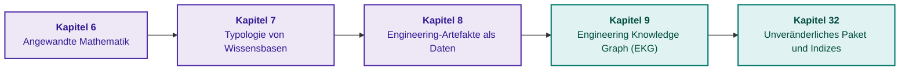

# Teil II. Mathematische Modelle, Wissensrepräsentation und Wissensspeicherung

[← Zu Teil I](part-01-foundations.md) | [Zum Inhaltsverzeichnis](README.md) | [Zu Teil III →](part-03-knowledge-engineering-nlp.md)

---

## Ziel dieses Teils

Dieser Teil beantwortet die fundamentale Frage: Wie müssen Wissen repräsentiert und persistiert werden, damit Operationen auf Wissensbeständen eine präzise definierte Semantik besitzen? Die mathematische Methode wird anhand der Aufgabenstellung gewählt, der Repräsentationstyp anhand des erwarteten Ergebnisses, und Beziehungen sowie physische Indizes werden gemeinsam mit Version, Herkunftsnachweis und Geltungsbereich gespeichert.

Für ein erstes praktisches Durcharbeiten genügen eine logische Regel, ein expliziter Zustand „unbekannt“, eine typisierte Relation und eine Ausführungsversion. Probabilistische Methoden, Kausalanalyse und Constraint-Solver sind für jene Problemstellungen erforderlich, in denen diese Operationen die Entscheidung tatsächlich determinieren; das vollständige Durcharbeiten des gesamten mathematischen Katalogs vor der ersten Implementierung ist nicht zwingend notwendig.

---

## Überblick über das Thema und die Zusammenhänge der Kapitel

Kapitel 6 erläutert die Berechnungsmethoden, Kapitel 7 trennt die Semantik von Ergebnissen, Kapitel 8 bereitet typisierte Artefakte auf, und Kapitel 9 verbindet diese Artefakte zu einem Graphen. Kapitel 32 schließt diesen Pfad mit dem unveränderlichen Wissenspaket (*Immutable Knowledge Pack*) ab: kanonische Daten, abgeleitete Indizes, Leserverifikation und reproduzierbare Erstellung.

Wissensmodell und physisches Paketformat stellen getrennte Architekturentscheidungen dar. Ein valider Index beweist keineswegs die sachliche Richtigkeit eines Fakts, und ein automatisiert extrahierter Graph beweist nicht die Gültigkeit von Kanten. Das Ergebnis dieses Teils ist eine konsistente Repräsentation, auf der die Wissensakquisitions-Pipeline aus Teil III aufsetzen kann.

---

## Kapitel dieses Teils

### [Kapitel 6. Angewandte Mathematik für Expertensysteme: Regeln, Wahrscheinlichkeiten, Graphen und Kausalität](ch06-applied-mathematics-for-expert-systems.md)

* **Abstract:** Eine Landkarte mathematischer Operationen nach Fragetyp: logische Konsequenz, Unsicherheit, Präzedenzfall, Relation, Aktionsauswahl und Kausalität. Formeln und durchgerechnete numerische Beispiele verdeutlichen den Unterschied zwischen formalem Beweis, Schätzung und Ranking. Dies dient als Nachschlagewerk und ist keine verpflichtende lineare Voraussetzung für die Implementierung.

### [Kapitel 7. Typologie von Wissensbasen: Regeln, Ontologien, Präzedenzfälle und Vektoren](ch07-knowledge-base-typology.md)

* **Abstract:** Warum dieselbe Faktenbasis in Produktionsregeln, hierarchischen Frames, formalen Ontologien und fallbasiertem Gedächtnis zu unterschiedlichen Schlussfolgerungen führt. Auswahl der Repräsentationsform nach gefordertem Resultat; Kompetenzfragen (*Competency Questions*) als verifizierbare Modellanforderungen; Überprüfung von Typen, Rollen und veränderlichen Zuständen mittels OntoClean. Partitionierung der Wissensbasis: Fragmentierung, Sharding und Feature-Clustering als drei eigenständige Architekturmuster; Auswahl des Partitionsschlüssels anhand von Inferenzabhängigkeiten und warum das Schweigen eines Shards keineswegs dem Fehlen eines Fakts entspricht.

### [Kapitel 8. Engineering-Artefakte als Daten für Expertensysteme](ch08-engineering-artifacts-as-data.md)

* **Abstract:** Das Modell versionierter Artefakte und der Pfad von der Rohdatei zum Chunken: Parsing, Extraktionsgüte, Segmentierung, Zugriff und Suche. Ein Kandidatenfeld oder eine hypothetische Relation wird nicht allein durch erfolgreiches Parsing oder Indizierung zu einem verifizierten Faktum.

### [Kapitel 9. Engineering Knowledge Graph: Rückverfolgbarkeit von Anforderungen bis zur Hardware](ch09-engineering-knowledge-graph-traceability.md)

* **Abstract:** Ein typisierter Graph aus Anforderungen, Quellcode, Tests und Hardwarekomponenten; Abfragen von Testabdeckung und Änderungsauswirkungen. Deklarierte und prognostizierte Relationen werden strikt von verifizierten getrennt. Ein didaktischer Harvester validiert Referenzen und Symbolidentitäten, beweist jedoch nicht die Erfüllung von Spezifikationen.

### [Kapitel 32. Unveränderliche Wissenspakete: Byte-Level-Zulassung, Indizes und Speicherabbildung](ch32-high-performance-knowledge-packs-mmap-and-harvesting.md)

* **Abstract:** Autorenspezifische Architektur des unveränderlichen Wissenspakets (*Immutable Knowledge Pack*): kanonische und abgeleitete Schichten, Formatversionen, materialisierte Sichten, Zitate und Reproduzierbarkeit des Erstellungsprozesses. Archivierte domänenübergreifende Messungen werden von einem offenen Python-Prüfstand für Punktabfragen mit SQLite und `mmap` isoliert; das Öffnen einer Datei entspricht nicht dem Kaltlesen, und `mmap` ist ausschließlich für einen unveränderlichen, vollständig in den Arbeitsspeicher passenden Index gerechtfertigt. Der Clusterschlüssel kodiert Feldlängen, der Index-Reader validiert Speichergrenzen vor der ersten Abfrage, und Wissensdichte wird methodisch von der Vollständigkeit getrennt, welche über Fang-Wiederfang-Verfahren (*Mark-Recapture*) evaluiert wird. Das Sharding des unveränderlichen Pakets nach Dokumentenfamilien wird durch synthetische Korpus-Tests verifiziert: Der Router unterscheidet das Schweigen eines Shards von der Abwesenheit eines Fakts, während die Partitionierungsprüfung Verluste, Überschneidungen und zerrissene Dokumentenfamilien aufdeckt. Das Zulassungsgateway für wörtliche Zitate verifiziert nicht die inhaltliche Wahrheit der nachgelagerten Interpretation.

## Systemischer Pfad der Kapitel 7–11

Die Kapitel bilden einen zusammenhängenden Gesamtprozess, der die Grenze zwischen dem zweiten und dritten Teil überbrückt. Kapitel 7 legt fest, **was das Ergebnis bedeutet**; Kapitel 8 definiert, **wie Artefakte und ihre Provenienz persistiert werden**; Kapitel 9 bestimmt, **welche Relationen in Analysen herangezogen werden dürfen**; [Kapitel 10](ch10-knowledge-acquisition-systems.md) steuert Zulassung, Gültigkeit, Bereitstellung und Widerruf; [Kapitel 11](ch11-knowledge-elicitation-from-experts.md) gewinnt verifizierbare Wissenskandidaten aus menschlicher Praxiserfahrung.

Die entscheidende Grenze dieses Prozesses verläuft nicht zwischen „Mensch“ und „Modell“, sondern zwischen unterschiedlichen Begründungsebenen einer Behauptung. Syntaktische Korrektheit beweist lediglich die Schemakonformität. Ein wörtliches Zitat belegt die Herkunft. Eine Freigabe bestimmt Autorität und Einsatzbereich. Ein Ausführungsergebnis bestätigt die Beobachtung unter spezifischen Rahmenbedingungen. Eine logische Inferenz weist die Konsequenz aus akzeptierten Prämissen nach. Keiner dieser Statuswerte kann die jeweils anderen ersetzen.

Zwei didaktische Fehlannahmen verdeutlichen diesen Unterschied. Ein Graph mit `verifies` erfüllt kein Schema, das `verifiedBy` erfordert, sofern keine explizite inverse Kante oder eine Invers-Eigenschaftsregel hinterlegt ist. Eine `@satisfies`-Annotation dokumentiert die Behauptung des Softwareentwicklers, doch eine Funktion mit formal korrekter Annotation kann dennoch ihre Ausführungsfristen verfehlen. Die praktischen Beispiele in Kapitel 7 und 9 verifizieren präzise diese Differenzierungen.

Zur Harmonisierung dieses Prozesses wird in Kapitel 10 der Objektpass vorgeschlagen. Der Pass dokumentiert Identität, Inhalt, Provenienz, Anwendbarkeit, Prüfergebnisse, Freigaben, Zugriffsbeschränkungen und Abhängigkeiten. Jedes neuartige Speicherverfahren oder Sprachmodell muss diese Attribute unverändert beibehalten, statt den Evidenzstatus eines Datenreplikats künstlich zu erhöhen.

## Vorschläge zur wissenschaftlichen Vertiefung

Die folgende Übersicht stellt ein Forschungsprogramm dar, **keinen Bericht über bereits abgeschlossene empirische Ergebnisse**. Für jeden Vorschlag werden Hypothese, Vergleichsbasis und Falsifikationskriterien benannt.

| Kapitel & Forschungslücke | Hypothese und Mechanismus | Baseline-Vergleich | Metriken und Falsifikationskriterien |
|---|---|---|---|
| 7: Begriffsmodell & Ergebnissemantik | Getrennte Entitäten für Test, Ausführung und Bericht verhindern Erfolgsübertragungen zwischen Releases; Kompetenzfragen und OntoClean decken Rollenvermischungen auf | Flache Testergebniseigenschaft vs. diskrete Testläufe auf identischen Testfällen | Falsche Freigaben für fremde Releases, Beibehaltung echt-positiver Befunde; fehlende statistische Signifikanz oder Zunahme falscher Ablehnungen widerlegen den praktischen Nutzen |
| 8: Artefaktkonvertierungsfehler | Erhaltung von Zahlenwerten, physikalischen Einheiten, Negationen und Koordinaten wiegt schwerer als ein aggregierter Lesbarkeitswert | Identischer Dokumentensatz für Parser, OCR und Kaskade mit manuellem Prüfpfad | Exakte Übereinstimmung kritischer Felder, Falschakzeptanz, Falschablehnung, Prüfzeit; verbesserte Lesbarkeit ohne präzisere Entscheidungen widerlegt die Aussagekraft oberflächlicher Metriken |
| 9: Kantenstatus & Auswirkungsanalyse | Getrennte deklarierte, gemessene und freigegebene Relationen minimieren Scheinkanten ohne unzumutbaren manuellen Prüfaufwand | Automatisierter Annotationsgraph vs. verifizierter Graph auf identischen Änderungssätzen | Kantenpräzision, unerkannte Abhängigkeiten, Scheinkanten, Prüferzeit; Ergänzung zufälliger Kantenmaskierung durch zeitliche Evaluation auf neuen Commits |
| 10: Release & Widerruf | Ein aktives Widerrufsregister außerhalb des statischen Snapshots blockiert Re-Zulassungen nach einem Rollback | Rollback des reinen Snapshots vs. Rollback mit expliziter Berechtigungsprüfung | Latenz bis zur Blockierung von Neuausstellungen, Cache-Invalidierungsdauer, Ablehnungen bei unerreichbarer Richtlinie; Antworten auf Basis widerrufener Grundlagen stellen einen Vertragsbruch dar |
| 11: Erfahrungsgewinnung & Expertendissens | Neutrale Vorfallsrekonstruktion und Gegenbeispiele erzeugen Regelsätze mit geringerem Verlust auf ungesehenen Fällen | Identisches Zeitbudget für unstrukturierte Interviews vs. strukturierte Protokolle | Gewichteter Verlust, Scheinfreigaben, Enthaltungsrate, Sitzungskosten; Expertenkonsens ohne Qualitätsgewinn auf Testfällen widerlegt die Hypothese |

Das methodische Fundament ist in den Kapiteln verankert: Kompetenzfragen nach Noy & McGuinness und OntoClean nach Guarino & Welty in Kapitel 7; der Standard zur Schemavalidierung [SHACL](https://www.w3.org/TR/shacl/); das Provenienzmodell [PROV-O](https://www.w3.org/TR/prov-o/); das bitemporale Modell nach Jensen & Snodgrass in Kapitel 10; CommonKADS, Protokollanalyse und Critical Decision Method in Kapitel 11. Diese Arbeiten fundieren die Einzelmethoden, belegen jedoch nicht per se die Überlegenheit des hier entworfenen Gesamtprozesses.

### Protokoll zur durchgängigen Gesamtevaluation

Es wird eine konkrete Entscheidungssituation ausgewählt, beispielsweise die Freigabe einer API-Änderung für die Produktionsumgebung. Unabhängige Fachexperten annotieren Anforderungen, Abhängigkeiten, relevante Testergebnisse und antizipierte Fehlerzustände. Weder interne Regellabel noch Ausgaben von Sprachmodellen dürfen als unabhängige Ground Truth herangezogen werden. Versionen desselben Dokuments, Wiederholungen desselben Vorfalls und Berichtskopien verbleiben in demselben Datensplit; ein zeitlich getrennter Testdatensatz evaluiert neu hinzukommende Änderungen statt auswendig gelernter Formulierungen.

Vor dem Testlauf werden Primärmetrik, Fehlerkostenmatrix, Enthaltungsregeln und Schwellenwerte fixiert. Der Testkatalog muss fehlende Prüfberichte, widersprüchliche Resultate, Ergebnisse anderer Releases, modifizierte Maßeinheiten, späte Fehlerkorrekturen, ein unerreichbares Freigaberegister und Rollbacks nach einem Widerruf umfassen. Zu jedem negativen Prüffall ist ein korrespondierender positiver Referenzfall erforderlich: Eine permanente Systemverweigerung stellt kein funktionsfähiges Expertensystem dar.

Die Systemkomponenten werden sequenziell deaktiviert, während Datenbasis und Evaluierungsaufwand konstant gehalten werden: reines Schema, Schema mit Provenienz, verifizierte Abhängigkeiten, Lebenszyklusverwaltung und Expertenregeln. Diese Ablationsstudie isoliert den Beitrag der jeweiligen Mechanismen. Zu berichten sind neben der durchschnittlichen Genauigkeit explizit Fehlzulassungen, Abhängigkeitsabdeckung, Enthaltungsrate, gewichteter Verlust und personeller Überprüfungsaufwand; Unsicherheiten sind clusterbezogen nach Dokumenten- und Vorfallsgruppen auszuweisen.

Synthetische Testsuiten verifizieren formale Invarianten, quantifizieren jedoch nicht die reale Häufigkeit von Produktionsfehlern. Null Fehler in einer kleinen Testsuite beweisen kein Nullrisiko. Falls die Einführung des Objektpasses den administrativen Overhead vergrößert, ohne operative Fehler nachweisbar zu senken, muss der Kontrakt auf entscheidungsrelevante Attribute reduziert oder die Ausgangshypothese revidiert werden. Wissenschaftliche Validität zeigt sich in der prinzipiellen Falsifizierbarkeit von Architekturentscheidungen, nicht in der Anhäufung technologischer Komponenten.

---

[← Zu Teil I](part-01-foundations.md) | [Zum Inhaltsverzeichnis](README.md) | [Zu Teil III →](part-03-knowledge-engineering-nlp.md)
