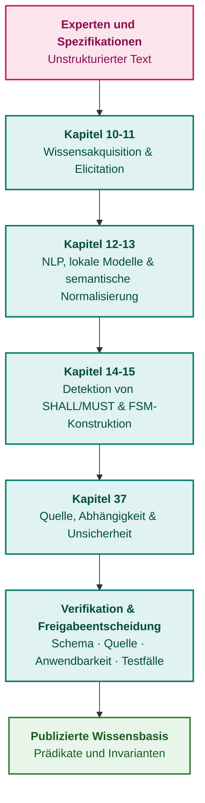

# Teil III. Wissensakquisition, linguistische Analyse und Eingangsdatenbewertung

[← Zu Teil II](part-02-knowledge-models.md) | [Zum Inhaltsverzeichnis](README.md) | [Zu Teil IV →](part-04-architecture-and-inference.md)

---

## Ziel dieses Teils

Das Ziel dieses Teils besteht darin, aufzuzeigen, wie verifizierbare Wissensbestände für ein Expertensystem aufbereitet werden – von der Spezifikation der Expertenaufgabe bis hin zur Formalisierung und Evaluierung von Wissenskandidaten:

1. **Quellen:** Strikte Unterscheidung zwischen dem präzisen wörtlichen Extrahieren eines Zitats und der sachlich zutreffenden Interpretation seines Inhalts.
2. **Expertenwissen:** Gewinnung von Wissenskandidaten mitsamt Betriebskontext, Ausnahmeregelungen und Verifikationsverfahren.
3. **Linguistische Analyse:** Gezielter Einsatz von Parsern und lokalen Modellen, ohne Mehrdeutigkeiten und Extraktionsfehler zu verschleiern.
4. **Formalisierung:** Konstruktion einer expliziten Repräsentation von Vorbedingungen und Zustandsübergängen, deren Verifikation und Zulassung durch einen verantwortlichen Fachexperten.
5. **Eingangsdatenbewertung:** Saubere Trennung von Quellenvertrauenswürdigkeit, Aussagenbestätigung, Zeugnisabhängigkeit und Berechtigung zur Nutzung des Ergebnisses.

---

## Überblick über das Thema und die Zusammenhänge der Kapitel

Die Kapitel 10–11 regeln das Provenienzmanagement und die systematische Erschließung menschlichen Expertenwissens. Die Kapitel 12–13 gewährleisten den Erhalt von semantischem Gehalt und Herkunftsnachweis im Verlauf der linguistischen Verarbeitung. Die Kapitel 14–15 transformieren normative Spezifikationen in Anforderungen, Fakten, Grammatiken und deterministische Zustandsautomaten. Kapitel 37 führt die formale Bewertung von Quellen und Aussagen ein: Eine syntaktisch fehlerfrei gelesene Nachricht kann dennoch unzuverlässig sein oder in kausaler Abhängigkeit zu bereits verarbeiteten Meldungen stehen.

Das CommonKADS-Modell trennt Domänenwissen strikt von Inferenzoperationen und der Ablaufsteuerung von Aufgaben. Linguistische Analysewerkzeuge liefern Hypothesenkandidaten, während Ontologieprüfung und Evidenzbewertung eigenständige Aufgabenbereiche abdecken. Das Resultat dieses Teils ist ein Wissenskandidat mit transparent deklarierten Gültigkeitsgrenzen, kein a priori wahrer Fakt.

Knowledge Engineering endet nicht mit der Extraktion. Die formale Verifikation der Wissensbasis wird in [Kapitel 23](ch23-knowledge-base-verification.md) behandelt, die Revision von Wissen anhand operativer Befunde und Degradationsindikatoren in [Kapitel 26](ch26-continual-learning.md), und die Erstellung unveränderlicher Wissenspakete in [Kapitel 32](ch32-high-performance-knowledge-packs-mmap-and-harvesting.md). Ein Expertensystem nutzt publizierte Fakten und Regeln nicht nur für Inferenzentscheidungen, sondern fungiert zugleich als Werkzeug der Wissensverarbeitung: Es erzwingt Zulassungsrichtlinien, identifiziert epistemische Lücken und begründet Widersprüche. Eine Systemverweigerung oder eine erkannte Wissenslücke generiert einen formalen Änderungsvorschlag, statt unkontrollierte Mutationen der produktiven Wissensbasis zuzulassen.

---

## Kapitel dieses Teils

### [Kapitel 10. Systeme der Wissensakquisition: Quellen, Zulassung und Lebenszyklus](ch10-knowledge-acquisition-systems.md)

* **Abstract:** Der Kontrakt zwischen Quellen und Konsumenten: Objektpass, getrennte Verifikations- und Freigabestatus, Zugriffsberechtigungen, bitemporale Zeitmodelle, Release-Zulassung und Widerruf. Das Zurückrollen eines Datenbank-Snapshots stellt eine entzogene Quellengenehmigung keineswegs wieder her.

### [Kapitel 11. Erhebung von Expertenwissen: Befragungen, kognitive Karten und Formalisierung von Praxiserfahrung](ch11-knowledge-elicitation-from-experts.md)

* **Abstract:** Protokolle zur Erhebung empirischen Fachwissens, unvorhergesehene Ausnahmeszenarien, unabhängige Regelprüfung und Grenzen statistischer Heuristiken. CommonKADS trennt Domänenwissen, Inferenzoperationen und Aufgabensteuerung; digitale Auditspuren liefern Konsultationskandidaten, keine automatisierten Kompetenzranglisten.

### [Kapitel 12. Linguistische Analyse und lokale Modelle: Erhalt von Semantik und Herkunftsnachweis](ch12-linguistic-analysis-and-local-models.md)

* **Abstract:** Entkopplung der Koordinaten des Originaldokuments, des abgeleiteten Textes und der Token-Spans. Strukturelles Dokumentenparsing, Grenzen statistischer Sprachmodelle, Weak Supervision, aktives Lernen zur Stichprobenannotation und unabhängige Unsicherheitsbewertung.

### [Kapitel 13. Natürliche Sprachvarianz versus Determinismus: Kompilierung der Frageintention](ch13-language-variability-vs-determinism.md)

* **Abstract:** Kandidaten logischer Formen, eingeschränkte Dekodierung und semantische Invariantenprüfung. Paraphrasierung und kontrastive Paare; Behandlung unbekannter Werte und widersprüchlicher Hypothesen; GLiNER, GLiNER2 und typisierte Validatoren ohne Verwechslung von grammatischer Form und sachlicher Wahrheit.

### [Kapitel 14. Anforderungs- und Modalitätserkennung: Vom normativen Text zu Systeminvarianten](ch14-requirements-detection-and-formalization.md)

* **Abstract:** Dokumentkonventionen und normativer Kontext, Grenzen von EARS-Schablonen, typisierte Zwischenrepräsentationen und partielle Kompilierung. Der Trigger-Zeitpunkt darf nicht mit der Reaktionsfrist verwechselt werden; die formale Erfüllbarkeit einer Formel beweist noch keine Konformität des physischen Produkts.

### [Kapitel 15. Wissensextraktion und Konstruktion der Wissensbasis: Fakten, Grammatiken und Automaten](ch15-knowledge-extraction-and-kb-construction.md)

* **Abstract:** Fakten, Grammatiken und deterministische Zustandsautomaten mit lückenlosem Herkunftsnachweis; Zitationsgrenzen, Maßeinheiten und Konsolidierung von Dokumentenrevisionen. Trennung von Zulassung, Freigabe und Release. Protégé und ROBOT zur Validierung formaler Ontologien; Process Mining und Assoziationsanalysen liefern Hypothesenkandidaten, keine normativen Systemregeln.

### [Kapitel 37. Eingangsdatenbewertung: Quellen, Zeugnisse und epistemische Unsicherheit](ch37-input-information-assessment-and-algorithmic-skepticism.md)

* **Abstract:** Vom physischen Signal zur zulässigen Inferenz: Trennung von Quellenvertrauenswürdigkeit, Aussagenbestätigung, analytischer Konfidenz und Handlungsbefugnis. Überblick über neun nachrichtendienstliche Doktrinen (OSINT), polizeiliche Analysestandards von UNODC, FBI, INTERPOL und Europol sowie Incident-Response-Leitfäden nach FIRST und NIST. Multimodale Daten (Text, Audio, Funksignale, Bildmaterial) mit Trägermedium und Transformationshistorie; abhängige Bestätigungen, Intervallwahrscheinlichkeiten, algorithmischer Skeptizismus, Streaming- versus Batch-Verarbeitung. Die Analyse von i2 Analyst's Notebook und ähnlichen Fachsystemen trennt Herstellerversprechen von forensisch belastbarer Zulassung. Ein Go-Referenzmodul verifiziert Invarianz unter Datenvervielfältigung, Abhängigkeitskontrolle und begründete Urteilsenthaltung.

## Angewandte Analyse der Kapitel 12–15

Verarbeitungsverluste akkumulieren sich entlang der Kausalkette: Ein Parser unterschlägt eine Tabellenüberschrift, ein Extraktor weist einen numerischen Messwert einer falschen Funktion zu, ein Compiler verbirgt einen undefinierten Zeitbereich, und das Zulassungsgateway akzeptiert den Datensatz allein aufgrund eines formal gültigen Zitats. Das Ersetzen des Sprachmodells durch ein größeres Modell beseitigt diese Fehlerquellen nicht. Eine fundierte Evaluierung isoliert daher einzelne Verarbeitungsschritte und hält den übrigen Ausführungspfad konstant.

| Übergang | Methodische Problemstellung | Kostengünstiger Kontrollfall |
|---|---|---|
| Datei → Text | Normalisierung kann irreversibel sein; PDF-Koordinaten sind derivativ | Unicode-Ligaturen, redundante Zitate, zerteilte UTF-8-Multibyte-Sequenzen |
| Text → Kandidat | Eine statistische Klasse stellt keinen formalen Beweis dar | Syntaktische Negation, vertauschte semantische Rollen, divergierende Zahlenwerte |
| Kandidat → Formel | Grammatik und EARS-Muster garantieren nicht die inhaltliche Richtigkeit | Zeitangabe im Trigger, mehrdeutige Frist, unerreichbare Vorbedingung |
| Formel → Zulassung | Formale Konsistenz ersetzt weder Anwendbarkeit noch Freigabe | Gültiges Zitat mit widerrufenem Zugriffsrecht oder fehlerhaftem Systemprofil |
| Änderung → Neues Paket | Ein unverändertes Zitat kann in einer neuen Revision andere Bedeutung erlangen | Geänderte Kapitelüberschrift oder Ausnahmeregel; Diff zum Vollaufbau |

Für jeden Übergang formulieren die Kapitel empirische Versuchsaufbauten:

1. [Kapitel 12](ch12-linguistic-analysis-and-local-models.md): Docling, Apache Tika und optische Zeichenerkennung; Dokumentstrukturen, Quellenzuordnungen und aktives Lernen zur Datenannotation.
2. [Kapitel 13](ch13-language-variability-vs-determinism.md): Extraktionsmodelle, kontrastive Testdatensätze und explizite Verweigerungsrichtlinien (*Abstention Policy*).
3. [Kapitel 14](ch14-requirements-detection-and-formalization.md) und [15](ch15-knowledge-extraction-and-kb-construction.md): Partielle Kompilierung, Constraint-Solver, Prozess-Eventlogs sowie bitgenaue Identität zwischen inkrementellem und vollständigem Kompilat.

Diese Versuchsaufbauten stellen methodische Forschungsvorschläge dar, keine vorweggenommenen Messberichte. Ein unabhängiger Goldstandard, die Gruppierung nach Dokumentenfamilien und eine getrennte finale Validierung verhindern, dass Modelle anhand ihrer eigenen Pseudolabels bewertet werden. Synthetische Tests verifizieren deterministische Mechanismen, garantieren jedoch keine universelle Fehlerfreiheit über alle denkbaren regulatorischen Textkorpora hinweg.

---

[← Zu Teil II](part-02-knowledge-models.md) | [Zum Inhaltsverzeichnis](README.md) | [Zu Teil IV →](part-04-architecture-and-inference.md)
